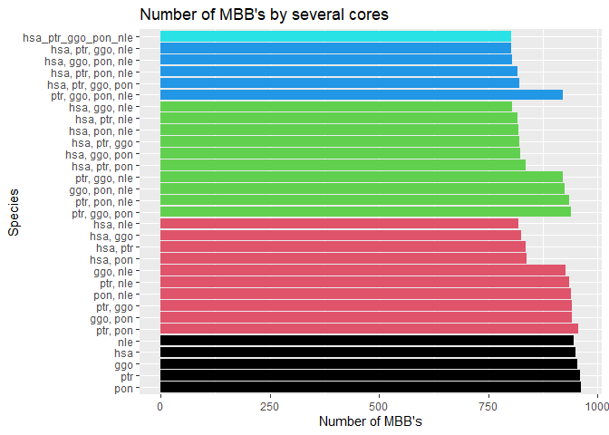

# Primate experiment

Homínidos: humano, chimpancé, bonobo, gorila  y orangután

en la carpeta compartida tenéis disponible el material:

https://uibes-my.sharepoint.com/personal/ppr512_id_uib_es/_layouts/15/onedrive.aspx?id=%2Fpersonal%2Fppr512%5Fid%5Fuib%5Fes%2FDocuments%2FMetaDAG%2Fexperiments%2Fprimates%2FNoFilter


## Read metadata

<div style="border: 1px solid #ddd; padding: 0px; overflow-y: scroll; height:500px; overflow-x: scroll; width:100%; "><table class="table" style="margin-left: auto; margin-right: auto;">
 <thead>
  <tr>
   <th style="text-align:left;position: sticky; top:0; background-color: #FFFFFF;"> Domain </th>
   <th style="text-align:left;position: sticky; top:0; background-color: #FFFFFF;"> Kingdom </th>
   <th style="text-align:left;position: sticky; top:0; background-color: #FFFFFF;"> Filum </th>
   <th style="text-align:left;position: sticky; top:0; background-color: #FFFFFF;"> Class </th>
   <th style="text-align:left;position: sticky; top:0; background-color: #FFFFFF;"> Organism </th>
   <th style="text-align:left;position: sticky; top:0; background-color: #FFFFFF;"> Organism Full Name </th>
   <th style="text-align:right;position: sticky; top:0; background-color: #FFFFFF;"> Year </th>
   <th style="text-align:left;position: sticky; top:0; background-color: #FFFFFF;"> Source </th>
  </tr>
 </thead>
<tbody>
  <tr>
   <td style="text-align:left;"> Eukaryotes </td>
   <td style="text-align:left;"> Animals </td>
   <td style="text-align:left;"> Vertebrates </td>
   <td style="text-align:left;"> Mammals </td>
   <td style="text-align:left;"> hsa </td>
   <td style="text-align:left;"> Homo sapiens (human) </td>
   <td style="text-align:right;"> NA </td>
   <td style="text-align:left;"> RefSeq </td>
  </tr>
  <tr>
   <td style="text-align:left;"> Eukaryotes </td>
   <td style="text-align:left;"> Animals </td>
   <td style="text-align:left;"> Vertebrates </td>
   <td style="text-align:left;"> Mammals </td>
   <td style="text-align:left;"> ptr </td>
   <td style="text-align:left;"> Pan troglodytes (chimpanzee) </td>
   <td style="text-align:right;"> NA </td>
   <td style="text-align:left;"> RefSeq </td>
  </tr>
  <tr>
   <td style="text-align:left;"> Eukaryotes </td>
   <td style="text-align:left;"> Animals </td>
   <td style="text-align:left;"> Vertebrates </td>
   <td style="text-align:left;"> Mammals </td>
   <td style="text-align:left;"> pps </td>
   <td style="text-align:left;"> Pan paniscus (bonobo) </td>
   <td style="text-align:right;"> NA </td>
   <td style="text-align:left;"> RefSeq </td>
  </tr>
  <tr>
   <td style="text-align:left;"> Eukaryotes </td>
   <td style="text-align:left;"> Animals </td>
   <td style="text-align:left;"> Vertebrates </td>
   <td style="text-align:left;"> Mammals </td>
   <td style="text-align:left;"> ggo </td>
   <td style="text-align:left;"> Gorilla gorilla gorilla (western lowland gorilla) </td>
   <td style="text-align:right;"> NA </td>
   <td style="text-align:left;"> RefSeq </td>
  </tr>
  <tr>
   <td style="text-align:left;"> Eukaryotes </td>
   <td style="text-align:left;"> Animals </td>
   <td style="text-align:left;"> Vertebrates </td>
   <td style="text-align:left;"> Mammals </td>
   <td style="text-align:left;"> pon </td>
   <td style="text-align:left;"> Pongo abelii (Sumatran orangutan) </td>
   <td style="text-align:right;"> NA </td>
   <td style="text-align:left;"> RefSeq </td>
  </tr>
  <tr>
   <td style="text-align:left;"> Eukaryotes </td>
   <td style="text-align:left;"> Animals </td>
   <td style="text-align:left;"> Vertebrates </td>
   <td style="text-align:left;"> Mammals </td>
   <td style="text-align:left;"> nle </td>
   <td style="text-align:left;"> Nomascus leucogenys (northern white-cheeked gibbon) </td>
   <td style="text-align:right;"> NA </td>
   <td style="text-align:left;"> RefSeq </td>
  </tr>
  <tr>
   <td style="text-align:left;"> Eukaryotes </td>
   <td style="text-align:left;"> Animals </td>
   <td style="text-align:left;"> Vertebrates </td>
   <td style="text-align:left;"> Mammals </td>
   <td style="text-align:left;"> mcc </td>
   <td style="text-align:left;"> Macaca mulatta (rhesus monkey) </td>
   <td style="text-align:right;"> NA </td>
   <td style="text-align:left;"> RefSeq </td>
  </tr>
  <tr>
   <td style="text-align:left;"> Eukaryotes </td>
   <td style="text-align:left;"> Animals </td>
   <td style="text-align:left;"> Vertebrates </td>
   <td style="text-align:left;"> Mammals </td>
   <td style="text-align:left;"> mcf </td>
   <td style="text-align:left;"> Macaca fascicularis (crab-eating macaque) </td>
   <td style="text-align:right;"> NA </td>
   <td style="text-align:left;"> RefSeq </td>
  </tr>
  <tr>
   <td style="text-align:left;"> Eukaryotes </td>
   <td style="text-align:left;"> Animals </td>
   <td style="text-align:left;"> Vertebrates </td>
   <td style="text-align:left;"> Mammals </td>
   <td style="text-align:left;"> csab </td>
   <td style="text-align:left;"> Chlorocebus sabaeus (green monkey) </td>
   <td style="text-align:right;"> NA </td>
   <td style="text-align:left;"> RefSeq </td>
  </tr>
  <tr>
   <td style="text-align:left;"> Eukaryotes </td>
   <td style="text-align:left;"> Animals </td>
   <td style="text-align:left;"> Vertebrates </td>
   <td style="text-align:left;"> Mammals </td>
   <td style="text-align:left;"> caty </td>
   <td style="text-align:left;"> Cercocebus atys (sooty mangabey) </td>
   <td style="text-align:right;"> NA </td>
   <td style="text-align:left;"> RefSeq </td>
  </tr>
  <tr>
   <td style="text-align:left;"> Eukaryotes </td>
   <td style="text-align:left;"> Animals </td>
   <td style="text-align:left;"> Vertebrates </td>
   <td style="text-align:left;"> Mammals </td>
   <td style="text-align:left;"> rro </td>
   <td style="text-align:left;"> Rhinopithecus roxellana (golden snub-nosed monkey) </td>
   <td style="text-align:right;"> NA </td>
   <td style="text-align:left;"> RefSeq </td>
  </tr>
  <tr>
   <td style="text-align:left;"> Eukaryotes </td>
   <td style="text-align:left;"> Animals </td>
   <td style="text-align:left;"> Vertebrates </td>
   <td style="text-align:left;"> Mammals </td>
   <td style="text-align:left;"> rbb </td>
   <td style="text-align:left;"> Rhinopithecus bieti (black snub-nosed monkey) </td>
   <td style="text-align:right;"> NA </td>
   <td style="text-align:left;"> RefSeq </td>
  </tr>
  <tr>
   <td style="text-align:left;"> Eukaryotes </td>
   <td style="text-align:left;"> Animals </td>
   <td style="text-align:left;"> Vertebrates </td>
   <td style="text-align:left;"> Mammals </td>
   <td style="text-align:left;"> tfn </td>
   <td style="text-align:left;"> Trachypithecus francoisi (Francois's langur) </td>
   <td style="text-align:right;"> NA </td>
   <td style="text-align:left;"> RefSeq </td>
  </tr>
  <tr>
   <td style="text-align:left;"> Eukaryotes </td>
   <td style="text-align:left;"> Animals </td>
   <td style="text-align:left;"> Vertebrates </td>
   <td style="text-align:left;"> Mammals </td>
   <td style="text-align:left;"> cjc </td>
   <td style="text-align:left;"> Callithrix jacchus (white-tufted-ear marmoset) </td>
   <td style="text-align:right;"> NA </td>
   <td style="text-align:left;"> RefSeq </td>
  </tr>
  <tr>
   <td style="text-align:left;"> Eukaryotes </td>
   <td style="text-align:left;"> Animals </td>
   <td style="text-align:left;"> Vertebrates </td>
   <td style="text-align:left;"> Mammals </td>
   <td style="text-align:left;"> sbq </td>
   <td style="text-align:left;"> Saimiri boliviensis boliviensis (Bolivian squirrel monkey) </td>
   <td style="text-align:right;"> NA </td>
   <td style="text-align:left;"> RefSeq </td>
  </tr>
  <tr>
   <td style="text-align:left;"> Eukaryotes </td>
   <td style="text-align:left;"> Animals </td>
   <td style="text-align:left;"> Vertebrates </td>
   <td style="text-align:left;"> Mammals </td>
   <td style="text-align:left;"> mmur </td>
   <td style="text-align:left;"> Microcebus murinus (gray mouse lemur) </td>
   <td style="text-align:right;"> NA </td>
   <td style="text-align:left;"> RefSeq </td>
  </tr>
  <tr>
   <td style="text-align:left;"> Eukaryotes </td>
   <td style="text-align:left;"> Animals </td>
   <td style="text-align:left;"> Vertebrates </td>
   <td style="text-align:left;"> Mammals </td>
   <td style="text-align:left;"> mmu </td>
   <td style="text-align:left;"> Mus musculus (mouse) </td>
   <td style="text-align:right;"> NA </td>
   <td style="text-align:left;"> RefSeq </td>
  </tr>
  <tr>
   <td style="text-align:left;"> Eukaryotes </td>
   <td style="text-align:left;"> Animals </td>
   <td style="text-align:left;"> Vertebrates </td>
   <td style="text-align:left;"> Mammals </td>
   <td style="text-align:left;"> mcal </td>
   <td style="text-align:left;"> Mus caroli (Ryukyu mouse) </td>
   <td style="text-align:right;"> NA </td>
   <td style="text-align:left;"> RefSeq </td>
  </tr>
  <tr>
   <td style="text-align:left;"> Eukaryotes </td>
   <td style="text-align:left;"> Animals </td>
   <td style="text-align:left;"> Vertebrates </td>
   <td style="text-align:left;"> Mammals </td>
   <td style="text-align:left;"> mpah </td>
   <td style="text-align:left;"> Mus pahari (shrew mouse) </td>
   <td style="text-align:right;"> NA </td>
   <td style="text-align:left;"> RefSeq </td>
  </tr>
  <tr>
   <td style="text-align:left;"> Eukaryotes </td>
   <td style="text-align:left;"> Animals </td>
   <td style="text-align:left;"> Vertebrates </td>
   <td style="text-align:left;"> Mammals </td>
   <td style="text-align:left;"> rno </td>
   <td style="text-align:left;"> Rattus norvegicus (rat) </td>
   <td style="text-align:right;"> NA </td>
   <td style="text-align:left;"> RefSeq </td>
  </tr>
  <tr>
   <td style="text-align:left;"> Eukaryotes </td>
   <td style="text-align:left;"> Animals </td>
   <td style="text-align:left;"> Vertebrates </td>
   <td style="text-align:left;"> Mammals </td>
   <td style="text-align:left;"> mcoc </td>
   <td style="text-align:left;"> Mastomys coucha (southern multimammate mouse) </td>
   <td style="text-align:right;"> NA </td>
   <td style="text-align:left;"> RefSeq </td>
  </tr>
  <tr>
   <td style="text-align:left;"> Eukaryotes </td>
   <td style="text-align:left;"> Animals </td>
   <td style="text-align:left;"> Vertebrates </td>
   <td style="text-align:left;"> Mammals </td>
   <td style="text-align:left;"> mun </td>
   <td style="text-align:left;"> Meriones unguiculatus (Mongolian gerbil) </td>
   <td style="text-align:right;"> NA </td>
   <td style="text-align:left;"> RefSeq </td>
  </tr>
  <tr>
   <td style="text-align:left;"> Eukaryotes </td>
   <td style="text-align:left;"> Animals </td>
   <td style="text-align:left;"> Vertebrates </td>
   <td style="text-align:left;"> Mammals </td>
   <td style="text-align:left;"> cge </td>
   <td style="text-align:left;"> Cricetulus griseus (Chinese hamster) </td>
   <td style="text-align:right;"> NA </td>
   <td style="text-align:left;"> RefSeq </td>
  </tr>
  <tr>
   <td style="text-align:left;"> Eukaryotes </td>
   <td style="text-align:left;"> Animals </td>
   <td style="text-align:left;"> Vertebrates </td>
   <td style="text-align:left;"> Mammals </td>
   <td style="text-align:left;"> pleu </td>
   <td style="text-align:left;"> Peromyscus leucopus (white-footed mouse) </td>
   <td style="text-align:right;"> NA </td>
   <td style="text-align:left;"> RefSeq </td>
  </tr>
  <tr>
   <td style="text-align:left;"> Eukaryotes </td>
   <td style="text-align:left;"> Animals </td>
   <td style="text-align:left;"> Vertebrates </td>
   <td style="text-align:left;"> Mammals </td>
   <td style="text-align:left;"> ngi </td>
   <td style="text-align:left;"> Nannospalax galili (Upper Galilee mountains blind mole rat) </td>
   <td style="text-align:right;"> NA </td>
   <td style="text-align:left;"> RefSeq </td>
  </tr>
  <tr>
   <td style="text-align:left;"> Eukaryotes </td>
   <td style="text-align:left;"> Animals </td>
   <td style="text-align:left;"> Vertebrates </td>
   <td style="text-align:left;"> Mammals </td>
   <td style="text-align:left;"> hgl </td>
   <td style="text-align:left;"> Heterocephalus glaber (naked mole rat) </td>
   <td style="text-align:right;"> NA </td>
   <td style="text-align:left;"> RefSeq </td>
  </tr>
  <tr>
   <td style="text-align:left;"> Eukaryotes </td>
   <td style="text-align:left;"> Animals </td>
   <td style="text-align:left;"> Vertebrates </td>
   <td style="text-align:left;"> Mammals </td>
   <td style="text-align:left;"> ccan </td>
   <td style="text-align:left;"> Castor canadensis (American beaver) </td>
   <td style="text-align:right;"> NA </td>
   <td style="text-align:left;"> RefSeq </td>
  </tr>
  <tr>
   <td style="text-align:left;"> Eukaryotes </td>
   <td style="text-align:left;"> Animals </td>
   <td style="text-align:left;"> Vertebrates </td>
   <td style="text-align:left;"> Mammals </td>
   <td style="text-align:left;"> ocu </td>
   <td style="text-align:left;"> Oryctolagus cuniculus (rabbit) </td>
   <td style="text-align:right;"> NA </td>
   <td style="text-align:left;"> RefSeq </td>
  </tr>
  <tr>
   <td style="text-align:left;"> Eukaryotes </td>
   <td style="text-align:left;"> Animals </td>
   <td style="text-align:left;"> Vertebrates </td>
   <td style="text-align:left;"> Mammals </td>
   <td style="text-align:left;"> tup </td>
   <td style="text-align:left;"> Tupaia chinensis (Chinese tree shrew) </td>
   <td style="text-align:right;"> NA </td>
   <td style="text-align:left;"> RefSeq </td>
  </tr>
  <tr>
   <td style="text-align:left;"> Eukaryotes </td>
   <td style="text-align:left;"> Animals </td>
   <td style="text-align:left;"> Vertebrates </td>
   <td style="text-align:left;"> Mammals </td>
   <td style="text-align:left;"> cfa </td>
   <td style="text-align:left;"> Canis lupus familiaris (dog) </td>
   <td style="text-align:right;"> NA </td>
   <td style="text-align:left;"> RefSeq </td>
  </tr>
  <tr>
   <td style="text-align:left;"> Eukaryotes </td>
   <td style="text-align:left;"> Animals </td>
   <td style="text-align:left;"> Vertebrates </td>
   <td style="text-align:left;"> Mammals </td>
   <td style="text-align:left;"> vvp </td>
   <td style="text-align:left;"> Vulpes vulpes (red fox) </td>
   <td style="text-align:right;"> NA </td>
   <td style="text-align:left;"> RefSeq </td>
  </tr>
  <tr>
   <td style="text-align:left;"> Eukaryotes </td>
   <td style="text-align:left;"> Animals </td>
   <td style="text-align:left;"> Vertebrates </td>
   <td style="text-align:left;"> Mammals </td>
   <td style="text-align:left;"> aml </td>
   <td style="text-align:left;"> Ailuropoda melanoleuca (giant panda) </td>
   <td style="text-align:right;"> NA </td>
   <td style="text-align:left;"> RefSeq </td>
  </tr>
  <tr>
   <td style="text-align:left;"> Eukaryotes </td>
   <td style="text-align:left;"> Animals </td>
   <td style="text-align:left;"> Vertebrates </td>
   <td style="text-align:left;"> Mammals </td>
   <td style="text-align:left;"> umr </td>
   <td style="text-align:left;"> Ursus maritimus (polar bear) </td>
   <td style="text-align:right;"> NA </td>
   <td style="text-align:left;"> RefSeq </td>
  </tr>
  <tr>
   <td style="text-align:left;"> Eukaryotes </td>
   <td style="text-align:left;"> Animals </td>
   <td style="text-align:left;"> Vertebrates </td>
   <td style="text-align:left;"> Mammals </td>
   <td style="text-align:left;"> uah </td>
   <td style="text-align:left;"> Ursus arctos horribilis </td>
   <td style="text-align:right;"> NA </td>
   <td style="text-align:left;"> RefSeq </td>
  </tr>
  <tr>
   <td style="text-align:left;"> Eukaryotes </td>
   <td style="text-align:left;"> Animals </td>
   <td style="text-align:left;"> Vertebrates </td>
   <td style="text-align:left;"> Mammals </td>
   <td style="text-align:left;"> oro </td>
   <td style="text-align:left;"> Odobenus rosmarus divergens (Pacific walrus) </td>
   <td style="text-align:right;"> NA </td>
   <td style="text-align:left;"> RefSeq </td>
  </tr>
  <tr>
   <td style="text-align:left;"> Eukaryotes </td>
   <td style="text-align:left;"> Animals </td>
   <td style="text-align:left;"> Vertebrates </td>
   <td style="text-align:left;"> Mammals </td>
   <td style="text-align:left;"> elk </td>
   <td style="text-align:left;"> Enhydra lutris kenyoni (northern sea otter) </td>
   <td style="text-align:right;"> NA </td>
   <td style="text-align:left;"> RefSeq </td>
  </tr>
  <tr>
   <td style="text-align:left;"> Eukaryotes </td>
   <td style="text-align:left;"> Animals </td>
   <td style="text-align:left;"> Vertebrates </td>
   <td style="text-align:left;"> Mammals </td>
   <td style="text-align:left;"> mpuf </td>
   <td style="text-align:left;"> Mustela putorius furo (domestic ferret) </td>
   <td style="text-align:right;"> NA </td>
   <td style="text-align:left;"> RefSeq </td>
  </tr>
  <tr>
   <td style="text-align:left;"> Eukaryotes </td>
   <td style="text-align:left;"> Animals </td>
   <td style="text-align:left;"> Vertebrates </td>
   <td style="text-align:left;"> Mammals </td>
   <td style="text-align:left;"> eju </td>
   <td style="text-align:left;"> Eumetopias jubatus (Steller sea lion) </td>
   <td style="text-align:right;"> NA </td>
   <td style="text-align:left;"> RefSeq </td>
  </tr>
  <tr>
   <td style="text-align:left;"> Eukaryotes </td>
   <td style="text-align:left;"> Animals </td>
   <td style="text-align:left;"> Vertebrates </td>
   <td style="text-align:left;"> Mammals </td>
   <td style="text-align:left;"> fca </td>
   <td style="text-align:left;"> Felis catus (domestic cat) </td>
   <td style="text-align:right;"> NA </td>
   <td style="text-align:left;"> RefSeq </td>
  </tr>
  <tr>
   <td style="text-align:left;"> Eukaryotes </td>
   <td style="text-align:left;"> Animals </td>
   <td style="text-align:left;"> Vertebrates </td>
   <td style="text-align:left;"> Mammals </td>
   <td style="text-align:left;"> ptg </td>
   <td style="text-align:left;"> Panthera tigris altaica (Amur tiger) </td>
   <td style="text-align:right;"> NA </td>
   <td style="text-align:left;"> RefSeq </td>
  </tr>
  <tr>
   <td style="text-align:left;"> Eukaryotes </td>
   <td style="text-align:left;"> Animals </td>
   <td style="text-align:left;"> Vertebrates </td>
   <td style="text-align:left;"> Mammals </td>
   <td style="text-align:left;"> ppad </td>
   <td style="text-align:left;"> Panthera pardus (leopard) </td>
   <td style="text-align:right;"> NA </td>
   <td style="text-align:left;"> RefSeq </td>
  </tr>
  <tr>
   <td style="text-align:left;"> Eukaryotes </td>
   <td style="text-align:left;"> Animals </td>
   <td style="text-align:left;"> Vertebrates </td>
   <td style="text-align:left;"> Mammals </td>
   <td style="text-align:left;"> aju </td>
   <td style="text-align:left;"> Acinonyx jubatus (cheetah) </td>
   <td style="text-align:right;"> NA </td>
   <td style="text-align:left;"> RefSeq </td>
  </tr>
  <tr>
   <td style="text-align:left;"> Eukaryotes </td>
   <td style="text-align:left;"> Animals </td>
   <td style="text-align:left;"> Vertebrates </td>
   <td style="text-align:left;"> Mammals </td>
   <td style="text-align:left;"> hhv </td>
   <td style="text-align:left;"> Hyaena hyaena (striped hyena) </td>
   <td style="text-align:right;"> NA </td>
   <td style="text-align:left;"> RefSeq </td>
  </tr>
  <tr>
   <td style="text-align:left;"> Eukaryotes </td>
   <td style="text-align:left;"> Animals </td>
   <td style="text-align:left;"> Vertebrates </td>
   <td style="text-align:left;"> Mammals </td>
   <td style="text-align:left;"> bta </td>
   <td style="text-align:left;"> Bos taurus (cow) </td>
   <td style="text-align:right;"> NA </td>
   <td style="text-align:left;"> RefSeq </td>
  </tr>
  <tr>
   <td style="text-align:left;"> Eukaryotes </td>
   <td style="text-align:left;"> Animals </td>
   <td style="text-align:left;"> Vertebrates </td>
   <td style="text-align:left;"> Mammals </td>
   <td style="text-align:left;"> bom </td>
   <td style="text-align:left;"> Bos mutus (wild yak) </td>
   <td style="text-align:right;"> NA </td>
   <td style="text-align:left;"> RefSeq </td>
  </tr>
  <tr>
   <td style="text-align:left;"> Eukaryotes </td>
   <td style="text-align:left;"> Animals </td>
   <td style="text-align:left;"> Vertebrates </td>
   <td style="text-align:left;"> Mammals </td>
   <td style="text-align:left;"> biu </td>
   <td style="text-align:left;"> Bos indicus (zebu cattle) </td>
   <td style="text-align:right;"> NA </td>
   <td style="text-align:left;"> RefSeq </td>
  </tr>
  <tr>
   <td style="text-align:left;"> Eukaryotes </td>
   <td style="text-align:left;"> Animals </td>
   <td style="text-align:left;"> Vertebrates </td>
   <td style="text-align:left;"> Mammals </td>
   <td style="text-align:left;"> bbub </td>
   <td style="text-align:left;"> Bubalus bubalis (water buffalo) </td>
   <td style="text-align:right;"> NA </td>
   <td style="text-align:left;"> RefSeq </td>
  </tr>
  <tr>
   <td style="text-align:left;"> Eukaryotes </td>
   <td style="text-align:left;"> Animals </td>
   <td style="text-align:left;"> Vertebrates </td>
   <td style="text-align:left;"> Mammals </td>
   <td style="text-align:left;"> chx </td>
   <td style="text-align:left;"> Capra hircus (goat) </td>
   <td style="text-align:right;"> NA </td>
   <td style="text-align:left;"> RefSeq </td>
  </tr>
  <tr>
   <td style="text-align:left;"> Eukaryotes </td>
   <td style="text-align:left;"> Animals </td>
   <td style="text-align:left;"> Vertebrates </td>
   <td style="text-align:left;"> Mammals </td>
   <td style="text-align:left;"> oas </td>
   <td style="text-align:left;"> Ovis aries (sheep) </td>
   <td style="text-align:right;"> NA </td>
   <td style="text-align:left;"> RefSeq </td>
  </tr>
  <tr>
   <td style="text-align:left;"> Eukaryotes </td>
   <td style="text-align:left;"> Animals </td>
   <td style="text-align:left;"> Vertebrates </td>
   <td style="text-align:left;"> Mammals </td>
   <td style="text-align:left;"> oda </td>
   <td style="text-align:left;"> Oryx dammah (scimitar-horned oryx) </td>
   <td style="text-align:right;"> NA </td>
   <td style="text-align:left;"> RefSeq </td>
  </tr>
  <tr>
   <td style="text-align:left;"> Eukaryotes </td>
   <td style="text-align:left;"> Animals </td>
   <td style="text-align:left;"> Vertebrates </td>
   <td style="text-align:left;"> Mammals </td>
   <td style="text-align:left;"> ssc </td>
   <td style="text-align:left;"> Sus scrofa (pig) </td>
   <td style="text-align:right;"> NA </td>
   <td style="text-align:left;"> RefSeq </td>
  </tr>
  <tr>
   <td style="text-align:left;"> Eukaryotes </td>
   <td style="text-align:left;"> Animals </td>
   <td style="text-align:left;"> Vertebrates </td>
   <td style="text-align:left;"> Mammals </td>
   <td style="text-align:left;"> cfr </td>
   <td style="text-align:left;"> Camelus ferus (Wild Bactrian camel) </td>
   <td style="text-align:right;"> NA </td>
   <td style="text-align:left;"> RefSeq </td>
  </tr>
  <tr>
   <td style="text-align:left;"> Eukaryotes </td>
   <td style="text-align:left;"> Animals </td>
   <td style="text-align:left;"> Vertebrates </td>
   <td style="text-align:left;"> Mammals </td>
   <td style="text-align:left;"> cdk </td>
   <td style="text-align:left;"> Camelus dromedarius (Arabian camel) </td>
   <td style="text-align:right;"> NA </td>
   <td style="text-align:left;"> RefSeq </td>
  </tr>
  <tr>
   <td style="text-align:left;"> Eukaryotes </td>
   <td style="text-align:left;"> Animals </td>
   <td style="text-align:left;"> Vertebrates </td>
   <td style="text-align:left;"> Mammals </td>
   <td style="text-align:left;"> bacu </td>
   <td style="text-align:left;"> Balaenoptera acutorostrata scammoni (minke whale) </td>
   <td style="text-align:right;"> NA </td>
   <td style="text-align:left;"> RefSeq </td>
  </tr>
  <tr>
   <td style="text-align:left;"> Eukaryotes </td>
   <td style="text-align:left;"> Animals </td>
   <td style="text-align:left;"> Vertebrates </td>
   <td style="text-align:left;"> Mammals </td>
   <td style="text-align:left;"> lve </td>
   <td style="text-align:left;"> Lipotes vexillifer (Yangtze River dolphin) </td>
   <td style="text-align:right;"> NA </td>
   <td style="text-align:left;"> RefSeq </td>
  </tr>
  <tr>
   <td style="text-align:left;"> Eukaryotes </td>
   <td style="text-align:left;"> Animals </td>
   <td style="text-align:left;"> Vertebrates </td>
   <td style="text-align:left;"> Mammals </td>
   <td style="text-align:left;"> oor </td>
   <td style="text-align:left;"> Orcinus orca (killer whale) </td>
   <td style="text-align:right;"> NA </td>
   <td style="text-align:left;"> RefSeq </td>
  </tr>
  <tr>
   <td style="text-align:left;"> Eukaryotes </td>
   <td style="text-align:left;"> Animals </td>
   <td style="text-align:left;"> Vertebrates </td>
   <td style="text-align:left;"> Mammals </td>
   <td style="text-align:left;"> dle </td>
   <td style="text-align:left;"> Delphinapterus leucas (beluga whale) </td>
   <td style="text-align:right;"> NA </td>
   <td style="text-align:left;"> RefSeq </td>
  </tr>
  <tr>
   <td style="text-align:left;"> Eukaryotes </td>
   <td style="text-align:left;"> Animals </td>
   <td style="text-align:left;"> Vertebrates </td>
   <td style="text-align:left;"> Mammals </td>
   <td style="text-align:left;"> pcad </td>
   <td style="text-align:left;"> Physeter catodon (sperm whale) </td>
   <td style="text-align:right;"> NA </td>
   <td style="text-align:left;"> RefSeq </td>
  </tr>
  <tr>
   <td style="text-align:left;"> Eukaryotes </td>
   <td style="text-align:left;"> Animals </td>
   <td style="text-align:left;"> Vertebrates </td>
   <td style="text-align:left;"> Mammals </td>
   <td style="text-align:left;"> ecb </td>
   <td style="text-align:left;"> Equus caballus (horse) </td>
   <td style="text-align:right;"> NA </td>
   <td style="text-align:left;"> RefSeq </td>
  </tr>
  <tr>
   <td style="text-align:left;"> Eukaryotes </td>
   <td style="text-align:left;"> Animals </td>
   <td style="text-align:left;"> Vertebrates </td>
   <td style="text-align:left;"> Mammals </td>
   <td style="text-align:left;"> epz </td>
   <td style="text-align:left;"> Equus przewalskii (Przewalski's horse) </td>
   <td style="text-align:right;"> NA </td>
   <td style="text-align:left;"> RefSeq </td>
  </tr>
  <tr>
   <td style="text-align:left;"> Eukaryotes </td>
   <td style="text-align:left;"> Animals </td>
   <td style="text-align:left;"> Vertebrates </td>
   <td style="text-align:left;"> Mammals </td>
   <td style="text-align:left;"> eai </td>
   <td style="text-align:left;"> Equus asinus (ass) </td>
   <td style="text-align:right;"> NA </td>
   <td style="text-align:left;"> RefSeq </td>
  </tr>
  <tr>
   <td style="text-align:left;"> Eukaryotes </td>
   <td style="text-align:left;"> Animals </td>
   <td style="text-align:left;"> Vertebrates </td>
   <td style="text-align:left;"> Mammals </td>
   <td style="text-align:left;"> myb </td>
   <td style="text-align:left;"> Myotis brandtii (Brandt's bat) </td>
   <td style="text-align:right;"> NA </td>
   <td style="text-align:left;"> RefSeq </td>
  </tr>
  <tr>
   <td style="text-align:left;"> Eukaryotes </td>
   <td style="text-align:left;"> Animals </td>
   <td style="text-align:left;"> Vertebrates </td>
   <td style="text-align:left;"> Mammals </td>
   <td style="text-align:left;"> myd </td>
   <td style="text-align:left;"> Myotis davidii </td>
   <td style="text-align:right;"> NA </td>
   <td style="text-align:left;"> RefSeq </td>
  </tr>
  <tr>
   <td style="text-align:left;"> Eukaryotes </td>
   <td style="text-align:left;"> Animals </td>
   <td style="text-align:left;"> Vertebrates </td>
   <td style="text-align:left;"> Mammals </td>
   <td style="text-align:left;"> mmyo </td>
   <td style="text-align:left;"> Myotis myotis </td>
   <td style="text-align:right;"> NA </td>
   <td style="text-align:left;"> RefSeq </td>
  </tr>
  <tr>
   <td style="text-align:left;"> Eukaryotes </td>
   <td style="text-align:left;"> Animals </td>
   <td style="text-align:left;"> Vertebrates </td>
   <td style="text-align:left;"> Mammals </td>
   <td style="text-align:left;"> mna </td>
   <td style="text-align:left;"> Miniopterus natalensis </td>
   <td style="text-align:right;"> NA </td>
   <td style="text-align:left;"> RefSeq </td>
  </tr>
  <tr>
   <td style="text-align:left;"> Eukaryotes </td>
   <td style="text-align:left;"> Animals </td>
   <td style="text-align:left;"> Vertebrates </td>
   <td style="text-align:left;"> Mammals </td>
   <td style="text-align:left;"> hai </td>
   <td style="text-align:left;"> Hipposideros armiger (great roundleaf bat) </td>
   <td style="text-align:right;"> NA </td>
   <td style="text-align:left;"> RefSeq </td>
  </tr>
  <tr>
   <td style="text-align:left;"> Eukaryotes </td>
   <td style="text-align:left;"> Animals </td>
   <td style="text-align:left;"> Vertebrates </td>
   <td style="text-align:left;"> Mammals </td>
   <td style="text-align:left;"> dro </td>
   <td style="text-align:left;"> Desmodus rotundus (common vampire bat) </td>
   <td style="text-align:right;"> NA </td>
   <td style="text-align:left;"> RefSeq </td>
  </tr>
  <tr>
   <td style="text-align:left;"> Eukaryotes </td>
   <td style="text-align:left;"> Animals </td>
   <td style="text-align:left;"> Vertebrates </td>
   <td style="text-align:left;"> Mammals </td>
   <td style="text-align:left;"> shon </td>
   <td style="text-align:left;"> Sturnira hondurensis </td>
   <td style="text-align:right;"> NA </td>
   <td style="text-align:left;"> RefSeq </td>
  </tr>
  <tr>
   <td style="text-align:left;"> Eukaryotes </td>
   <td style="text-align:left;"> Animals </td>
   <td style="text-align:left;"> Vertebrates </td>
   <td style="text-align:left;"> Mammals </td>
   <td style="text-align:left;"> ajm </td>
   <td style="text-align:left;"> Artibeus jamaicensis (Jamaican fruit-eating bat) </td>
   <td style="text-align:right;"> NA </td>
   <td style="text-align:left;"> RefSeq </td>
  </tr>
  <tr>
   <td style="text-align:left;"> Eukaryotes </td>
   <td style="text-align:left;"> Animals </td>
   <td style="text-align:left;"> Vertebrates </td>
   <td style="text-align:left;"> Mammals </td>
   <td style="text-align:left;"> mmf </td>
   <td style="text-align:left;"> Molossus molossus (Pallas's mastiff bat) </td>
   <td style="text-align:right;"> NA </td>
   <td style="text-align:left;"> RefSeq </td>
  </tr>
  <tr>
   <td style="text-align:left;"> Eukaryotes </td>
   <td style="text-align:left;"> Animals </td>
   <td style="text-align:left;"> Vertebrates </td>
   <td style="text-align:left;"> Mammals </td>
   <td style="text-align:left;"> pale </td>
   <td style="text-align:left;"> Pteropus alecto (black flying fox) </td>
   <td style="text-align:right;"> NA </td>
   <td style="text-align:left;"> RefSeq </td>
  </tr>
  <tr>
   <td style="text-align:left;"> Eukaryotes </td>
   <td style="text-align:left;"> Animals </td>
   <td style="text-align:left;"> Vertebrates </td>
   <td style="text-align:left;"> Mammals </td>
   <td style="text-align:left;"> ray </td>
   <td style="text-align:left;"> Rousettus aegyptiacus (Egyptian rousette) </td>
   <td style="text-align:right;"> NA </td>
   <td style="text-align:left;"> RefSeq </td>
  </tr>
  <tr>
   <td style="text-align:left;"> Eukaryotes </td>
   <td style="text-align:left;"> Animals </td>
   <td style="text-align:left;"> Vertebrates </td>
   <td style="text-align:left;"> Mammals </td>
   <td style="text-align:left;"> mjv </td>
   <td style="text-align:left;"> Manis javanica (Malayan pangolin) </td>
   <td style="text-align:right;"> NA </td>
   <td style="text-align:left;"> RefSeq </td>
  </tr>
  <tr>
   <td style="text-align:left;"> Eukaryotes </td>
   <td style="text-align:left;"> Animals </td>
   <td style="text-align:left;"> Vertebrates </td>
   <td style="text-align:left;"> Mammals </td>
   <td style="text-align:left;"> lav </td>
   <td style="text-align:left;"> Loxodonta africana (African savanna elephant) </td>
   <td style="text-align:right;"> NA </td>
   <td style="text-align:left;"> RefSeq </td>
  </tr>
  <tr>
   <td style="text-align:left;"> Eukaryotes </td>
   <td style="text-align:left;"> Animals </td>
   <td style="text-align:left;"> Vertebrates </td>
   <td style="text-align:left;"> Mammals </td>
   <td style="text-align:left;"> tmu </td>
   <td style="text-align:left;"> Trichechus manatus latirostris (Florida manatee) </td>
   <td style="text-align:right;"> NA </td>
   <td style="text-align:left;"> RefSeq </td>
  </tr>
  <tr>
   <td style="text-align:left;"> Eukaryotes </td>
   <td style="text-align:left;"> Animals </td>
   <td style="text-align:left;"> Vertebrates </td>
   <td style="text-align:left;"> Mammals </td>
   <td style="text-align:left;"> mdo </td>
   <td style="text-align:left;"> Monodelphis domestica (opossum) </td>
   <td style="text-align:right;"> NA </td>
   <td style="text-align:left;"> RefSeq </td>
  </tr>
  <tr>
   <td style="text-align:left;"> Eukaryotes </td>
   <td style="text-align:left;"> Animals </td>
   <td style="text-align:left;"> Vertebrates </td>
   <td style="text-align:left;"> Mammals </td>
   <td style="text-align:left;"> shr </td>
   <td style="text-align:left;"> Sarcophilus harrisii (Tasmanian devil) </td>
   <td style="text-align:right;"> NA </td>
   <td style="text-align:left;"> RefSeq </td>
  </tr>
  <tr>
   <td style="text-align:left;"> Eukaryotes </td>
   <td style="text-align:left;"> Animals </td>
   <td style="text-align:left;"> Vertebrates </td>
   <td style="text-align:left;"> Mammals </td>
   <td style="text-align:left;"> pcw </td>
   <td style="text-align:left;"> Phascolarctos cinereus (koala) </td>
   <td style="text-align:right;"> NA </td>
   <td style="text-align:left;"> RefSeq </td>
  </tr>
  <tr>
   <td style="text-align:left;"> Eukaryotes </td>
   <td style="text-align:left;"> Animals </td>
   <td style="text-align:left;"> Vertebrates </td>
   <td style="text-align:left;"> Mammals </td>
   <td style="text-align:left;"> oaa </td>
   <td style="text-align:left;"> Ornithorhynchus anatinus (platypus) </td>
   <td style="text-align:right;"> NA </td>
   <td style="text-align:left;"> RefSeq </td>
  </tr>
  <tr>
   <td style="text-align:left;"> Eukaryotes </td>
   <td style="text-align:left;"> Animals </td>
   <td style="text-align:left;"> Vertebrates </td>
   <td style="text-align:left;"> Birds </td>
   <td style="text-align:left;"> gga </td>
   <td style="text-align:left;"> Gallus gallus (chicken) </td>
   <td style="text-align:right;"> NA </td>
   <td style="text-align:left;"> RefSeq </td>
  </tr>
  <tr>
   <td style="text-align:left;"> Eukaryotes </td>
   <td style="text-align:left;"> Animals </td>
   <td style="text-align:left;"> Vertebrates </td>
   <td style="text-align:left;"> Birds </td>
   <td style="text-align:left;"> mgp </td>
   <td style="text-align:left;"> Meleagris gallopavo (turkey) </td>
   <td style="text-align:right;"> NA </td>
   <td style="text-align:left;"> RefSeq </td>
  </tr>
  <tr>
   <td style="text-align:left;"> Eukaryotes </td>
   <td style="text-align:left;"> Animals </td>
   <td style="text-align:left;"> Vertebrates </td>
   <td style="text-align:left;"> Birds </td>
   <td style="text-align:left;"> cjo </td>
   <td style="text-align:left;"> Coturnix japonica (Japanese quail) </td>
   <td style="text-align:right;"> NA </td>
   <td style="text-align:left;"> RefSeq </td>
  </tr>
  <tr>
   <td style="text-align:left;"> Eukaryotes </td>
   <td style="text-align:left;"> Animals </td>
   <td style="text-align:left;"> Vertebrates </td>
   <td style="text-align:left;"> Birds </td>
   <td style="text-align:left;"> nmel </td>
   <td style="text-align:left;"> Numida meleagris (helmeted guineafowl) </td>
   <td style="text-align:right;"> NA </td>
   <td style="text-align:left;"> RefSeq </td>
  </tr>
  <tr>
   <td style="text-align:left;"> Eukaryotes </td>
   <td style="text-align:left;"> Animals </td>
   <td style="text-align:left;"> Vertebrates </td>
   <td style="text-align:left;"> Birds </td>
   <td style="text-align:left;"> apla </td>
   <td style="text-align:left;"> Anas platyrhynchos (mallard) </td>
   <td style="text-align:right;"> NA </td>
   <td style="text-align:left;"> RefSeq </td>
  </tr>
  <tr>
   <td style="text-align:left;"> Eukaryotes </td>
   <td style="text-align:left;"> Animals </td>
   <td style="text-align:left;"> Vertebrates </td>
   <td style="text-align:left;"> Birds </td>
   <td style="text-align:left;"> acyg </td>
   <td style="text-align:left;"> Anser cygnoides domesticus (swan goose) </td>
   <td style="text-align:right;"> NA </td>
   <td style="text-align:left;"> RefSeq </td>
  </tr>
  <tr>
   <td style="text-align:left;"> Eukaryotes </td>
   <td style="text-align:left;"> Animals </td>
   <td style="text-align:left;"> Vertebrates </td>
   <td style="text-align:left;"> Birds </td>
   <td style="text-align:left;"> tgu </td>
   <td style="text-align:left;"> Taeniopygia guttata (zebra finch) </td>
   <td style="text-align:right;"> NA </td>
   <td style="text-align:left;"> RefSeq </td>
  </tr>
  <tr>
   <td style="text-align:left;"> Eukaryotes </td>
   <td style="text-align:left;"> Animals </td>
   <td style="text-align:left;"> Vertebrates </td>
   <td style="text-align:left;"> Birds </td>
   <td style="text-align:left;"> lsr </td>
   <td style="text-align:left;"> Lonchura striata domestica (Bengalese finch) </td>
   <td style="text-align:right;"> NA </td>
   <td style="text-align:left;"> RefSeq </td>
  </tr>
  <tr>
   <td style="text-align:left;"> Eukaryotes </td>
   <td style="text-align:left;"> Animals </td>
   <td style="text-align:left;"> Vertebrates </td>
   <td style="text-align:left;"> Birds </td>
   <td style="text-align:left;"> scan </td>
   <td style="text-align:left;"> Serinus canaria (common canary) </td>
   <td style="text-align:right;"> NA </td>
   <td style="text-align:left;"> RefSeq </td>
  </tr>
  <tr>
   <td style="text-align:left;"> Eukaryotes </td>
   <td style="text-align:left;"> Animals </td>
   <td style="text-align:left;"> Vertebrates </td>
   <td style="text-align:left;"> Birds </td>
   <td style="text-align:left;"> pmoa </td>
   <td style="text-align:left;"> Passer montanus (Eurasian tree sparrow) </td>
   <td style="text-align:right;"> NA </td>
   <td style="text-align:left;"> RefSeq </td>
  </tr>
  <tr>
   <td style="text-align:left;"> Eukaryotes </td>
   <td style="text-align:left;"> Animals </td>
   <td style="text-align:left;"> Vertebrates </td>
   <td style="text-align:left;"> Birds </td>
   <td style="text-align:left;"> gfr </td>
   <td style="text-align:left;"> Geospiza fortis (medium ground-finch) </td>
   <td style="text-align:right;"> NA </td>
   <td style="text-align:left;"> RefSeq </td>
  </tr>
  <tr>
   <td style="text-align:left;"> Eukaryotes </td>
   <td style="text-align:left;"> Animals </td>
   <td style="text-align:left;"> Vertebrates </td>
   <td style="text-align:left;"> Birds </td>
   <td style="text-align:left;"> fab </td>
   <td style="text-align:left;"> Ficedula albicollis (collared flycatcher) </td>
   <td style="text-align:right;"> NA </td>
   <td style="text-align:left;"> RefSeq </td>
  </tr>
  <tr>
   <td style="text-align:left;"> Eukaryotes </td>
   <td style="text-align:left;"> Animals </td>
   <td style="text-align:left;"> Vertebrates </td>
   <td style="text-align:left;"> Birds </td>
   <td style="text-align:left;"> phi </td>
   <td style="text-align:left;"> Pseudopodoces humilis (Tibetan ground-tit) </td>
   <td style="text-align:right;"> NA </td>
   <td style="text-align:left;"> RefSeq </td>
  </tr>
  <tr>
   <td style="text-align:left;"> Eukaryotes </td>
   <td style="text-align:left;"> Animals </td>
   <td style="text-align:left;"> Vertebrates </td>
   <td style="text-align:left;"> Birds </td>
   <td style="text-align:left;"> pmaj </td>
   <td style="text-align:left;"> Parus major (Great Tit) </td>
   <td style="text-align:right;"> NA </td>
   <td style="text-align:left;"> RefSeq </td>
  </tr>
  <tr>
   <td style="text-align:left;"> Eukaryotes </td>
   <td style="text-align:left;"> Animals </td>
   <td style="text-align:left;"> Vertebrates </td>
   <td style="text-align:left;"> Birds </td>
   <td style="text-align:left;"> ccae </td>
   <td style="text-align:left;"> Cyanistes caeruleus (blue tit) </td>
   <td style="text-align:right;"> NA </td>
   <td style="text-align:left;"> RefSeq </td>
  </tr>
  <tr>
   <td style="text-align:left;"> Eukaryotes </td>
   <td style="text-align:left;"> Animals </td>
   <td style="text-align:left;"> Vertebrates </td>
   <td style="text-align:left;"> Birds </td>
   <td style="text-align:left;"> ccw </td>
   <td style="text-align:left;"> Corvus cornix (hooded crow) </td>
   <td style="text-align:right;"> NA </td>
   <td style="text-align:left;"> RefSeq </td>
  </tr>
  <tr>
   <td style="text-align:left;"> Eukaryotes </td>
   <td style="text-align:left;"> Animals </td>
   <td style="text-align:left;"> Vertebrates </td>
   <td style="text-align:left;"> Birds </td>
   <td style="text-align:left;"> etl </td>
   <td style="text-align:left;"> Empidonax traillii (willow flycatcher) </td>
   <td style="text-align:right;"> NA </td>
   <td style="text-align:left;"> RefSeq </td>
  </tr>
  <tr>
   <td style="text-align:left;"> Eukaryotes </td>
   <td style="text-align:left;"> Animals </td>
   <td style="text-align:left;"> Vertebrates </td>
   <td style="text-align:left;"> Birds </td>
   <td style="text-align:left;"> fpg </td>
   <td style="text-align:left;"> Falco peregrinus (peregrine falcon) </td>
   <td style="text-align:right;"> NA </td>
   <td style="text-align:left;"> RefSeq </td>
  </tr>
  <tr>
   <td style="text-align:left;"> Eukaryotes </td>
   <td style="text-align:left;"> Animals </td>
   <td style="text-align:left;"> Vertebrates </td>
   <td style="text-align:left;"> Birds </td>
   <td style="text-align:left;"> fch </td>
   <td style="text-align:left;"> Falco cherrug (Saker falcon) </td>
   <td style="text-align:right;"> NA </td>
   <td style="text-align:left;"> RefSeq </td>
  </tr>
  <tr>
   <td style="text-align:left;"> Eukaryotes </td>
   <td style="text-align:left;"> Animals </td>
   <td style="text-align:left;"> Vertebrates </td>
   <td style="text-align:left;"> Birds </td>
   <td style="text-align:left;"> clv </td>
   <td style="text-align:left;"> Columba livia (rock pigeon) </td>
   <td style="text-align:right;"> NA </td>
   <td style="text-align:left;"> RefSeq </td>
  </tr>
  <tr>
   <td style="text-align:left;"> Eukaryotes </td>
   <td style="text-align:left;"> Animals </td>
   <td style="text-align:left;"> Vertebrates </td>
   <td style="text-align:left;"> Birds </td>
   <td style="text-align:left;"> egz </td>
   <td style="text-align:left;"> Egretta garzetta (little egret) </td>
   <td style="text-align:right;"> NA </td>
   <td style="text-align:left;"> RefSeq </td>
  </tr>
  <tr>
   <td style="text-align:left;"> Eukaryotes </td>
   <td style="text-align:left;"> Animals </td>
   <td style="text-align:left;"> Vertebrates </td>
   <td style="text-align:left;"> Birds </td>
   <td style="text-align:left;"> nni </td>
   <td style="text-align:left;"> Nipponia nippon (crested ibis) </td>
   <td style="text-align:right;"> NA </td>
   <td style="text-align:left;"> RefSeq </td>
  </tr>
  <tr>
   <td style="text-align:left;"> Eukaryotes </td>
   <td style="text-align:left;"> Animals </td>
   <td style="text-align:left;"> Vertebrates </td>
   <td style="text-align:left;"> Birds </td>
   <td style="text-align:left;"> acun </td>
   <td style="text-align:left;"> Athene cunicularia (burrowing owl) </td>
   <td style="text-align:right;"> NA </td>
   <td style="text-align:left;"> RefSeq </td>
  </tr>
  <tr>
   <td style="text-align:left;"> Eukaryotes </td>
   <td style="text-align:left;"> Animals </td>
   <td style="text-align:left;"> Vertebrates </td>
   <td style="text-align:left;"> Birds </td>
   <td style="text-align:left;"> padl </td>
   <td style="text-align:left;"> Pygoscelis adeliae (Adelie penguin) </td>
   <td style="text-align:right;"> NA </td>
   <td style="text-align:left;"> RefSeq </td>
  </tr>
  <tr>
   <td style="text-align:left;"> Eukaryotes </td>
   <td style="text-align:left;"> Animals </td>
   <td style="text-align:left;"> Vertebrates </td>
   <td style="text-align:left;"> Birds </td>
   <td style="text-align:left;"> aam </td>
   <td style="text-align:left;"> Apteryx mantelli mantelli (brown kiwi) </td>
   <td style="text-align:right;"> NA </td>
   <td style="text-align:left;"> RefSeq </td>
  </tr>
  <tr>
   <td style="text-align:left;"> Eukaryotes </td>
   <td style="text-align:left;"> Animals </td>
   <td style="text-align:left;"> Vertebrates </td>
   <td style="text-align:left;"> Reptiles </td>
   <td style="text-align:left;"> asn </td>
   <td style="text-align:left;"> Alligator sinensis (Chinese alligator) </td>
   <td style="text-align:right;"> NA </td>
   <td style="text-align:left;"> RefSeq </td>
  </tr>
  <tr>
   <td style="text-align:left;"> Eukaryotes </td>
   <td style="text-align:left;"> Animals </td>
   <td style="text-align:left;"> Vertebrates </td>
   <td style="text-align:left;"> Reptiles </td>
   <td style="text-align:left;"> amj </td>
   <td style="text-align:left;"> Alligator mississippiensis (American alligator) </td>
   <td style="text-align:right;"> NA </td>
   <td style="text-align:left;"> RefSeq </td>
  </tr>
  <tr>
   <td style="text-align:left;"> Eukaryotes </td>
   <td style="text-align:left;"> Animals </td>
   <td style="text-align:left;"> Vertebrates </td>
   <td style="text-align:left;"> Reptiles </td>
   <td style="text-align:left;"> pss </td>
   <td style="text-align:left;"> Pelodiscus sinensis (Chinese soft-shelled turtle) </td>
   <td style="text-align:right;"> NA </td>
   <td style="text-align:left;"> RefSeq </td>
  </tr>
  <tr>
   <td style="text-align:left;"> Eukaryotes </td>
   <td style="text-align:left;"> Animals </td>
   <td style="text-align:left;"> Vertebrates </td>
   <td style="text-align:left;"> Reptiles </td>
   <td style="text-align:left;"> cmy </td>
   <td style="text-align:left;"> Chelonia mydas (green sea turtle) </td>
   <td style="text-align:right;"> NA </td>
   <td style="text-align:left;"> RefSeq </td>
  </tr>
  <tr>
   <td style="text-align:left;"> Eukaryotes </td>
   <td style="text-align:left;"> Animals </td>
   <td style="text-align:left;"> Vertebrates </td>
   <td style="text-align:left;"> Reptiles </td>
   <td style="text-align:left;"> cpic </td>
   <td style="text-align:left;"> Chrysemys picta (western painted turtle) </td>
   <td style="text-align:right;"> NA </td>
   <td style="text-align:left;"> RefSeq </td>
  </tr>
  <tr>
   <td style="text-align:left;"> Eukaryotes </td>
   <td style="text-align:left;"> Animals </td>
   <td style="text-align:left;"> Vertebrates </td>
   <td style="text-align:left;"> Reptiles </td>
   <td style="text-align:left;"> acs </td>
   <td style="text-align:left;"> Anolis carolinensis (green anole) </td>
   <td style="text-align:right;"> NA </td>
   <td style="text-align:left;"> RefSeq </td>
  </tr>
  <tr>
   <td style="text-align:left;"> Eukaryotes </td>
   <td style="text-align:left;"> Animals </td>
   <td style="text-align:left;"> Vertebrates </td>
   <td style="text-align:left;"> Reptiles </td>
   <td style="text-align:left;"> pvt </td>
   <td style="text-align:left;"> Pogona vitticeps (central bearded dragon) </td>
   <td style="text-align:right;"> NA </td>
   <td style="text-align:left;"> RefSeq </td>
  </tr>
  <tr>
   <td style="text-align:left;"> Eukaryotes </td>
   <td style="text-align:left;"> Animals </td>
   <td style="text-align:left;"> Vertebrates </td>
   <td style="text-align:left;"> Reptiles </td>
   <td style="text-align:left;"> pbi </td>
   <td style="text-align:left;"> Python bivittatus (Burmese python) </td>
   <td style="text-align:right;"> NA </td>
   <td style="text-align:left;"> RefSeq </td>
  </tr>
  <tr>
   <td style="text-align:left;"> Eukaryotes </td>
   <td style="text-align:left;"> Animals </td>
   <td style="text-align:left;"> Vertebrates </td>
   <td style="text-align:left;"> Reptiles </td>
   <td style="text-align:left;"> pmur </td>
   <td style="text-align:left;"> Protobothrops mucrosquamatus (Taiwan habu) </td>
   <td style="text-align:right;"> NA </td>
   <td style="text-align:left;"> RefSeq </td>
  </tr>
  <tr>
   <td style="text-align:left;"> Eukaryotes </td>
   <td style="text-align:left;"> Animals </td>
   <td style="text-align:left;"> Vertebrates </td>
   <td style="text-align:left;"> Reptiles </td>
   <td style="text-align:left;"> tsr </td>
   <td style="text-align:left;"> Thamnophis sirtalis </td>
   <td style="text-align:right;"> NA </td>
   <td style="text-align:left;"> RefSeq </td>
  </tr>
  <tr>
   <td style="text-align:left;"> Eukaryotes </td>
   <td style="text-align:left;"> Animals </td>
   <td style="text-align:left;"> Vertebrates </td>
   <td style="text-align:left;"> Reptiles </td>
   <td style="text-align:left;"> pmua </td>
   <td style="text-align:left;"> Podarcis muralis (common wall lizard) </td>
   <td style="text-align:right;"> NA </td>
   <td style="text-align:left;"> RefSeq </td>
  </tr>
  <tr>
   <td style="text-align:left;"> Eukaryotes </td>
   <td style="text-align:left;"> Animals </td>
   <td style="text-align:left;"> Vertebrates </td>
   <td style="text-align:left;"> Reptiles </td>
   <td style="text-align:left;"> zvi </td>
   <td style="text-align:left;"> Zootoca vivipara (common lizard) </td>
   <td style="text-align:right;"> NA </td>
   <td style="text-align:left;"> RefSeq </td>
  </tr>
  <tr>
   <td style="text-align:left;"> Eukaryotes </td>
   <td style="text-align:left;"> Animals </td>
   <td style="text-align:left;"> Vertebrates </td>
   <td style="text-align:left;"> Reptiles </td>
   <td style="text-align:left;"> gja </td>
   <td style="text-align:left;"> Gekko japonicus </td>
   <td style="text-align:right;"> NA </td>
   <td style="text-align:left;"> RefSeq </td>
  </tr>
  <tr>
   <td style="text-align:left;"> Eukaryotes </td>
   <td style="text-align:left;"> Animals </td>
   <td style="text-align:left;"> Vertebrates </td>
   <td style="text-align:left;"> Amphibians </td>
   <td style="text-align:left;"> xla </td>
   <td style="text-align:left;"> Xenopus laevis (African clawed frog) </td>
   <td style="text-align:right;"> NA </td>
   <td style="text-align:left;"> RefSeq </td>
  </tr>
  <tr>
   <td style="text-align:left;"> Eukaryotes </td>
   <td style="text-align:left;"> Animals </td>
   <td style="text-align:left;"> Vertebrates </td>
   <td style="text-align:left;"> Amphibians </td>
   <td style="text-align:left;"> xtr </td>
   <td style="text-align:left;"> Xenopus tropicalis (western clawed frog) </td>
   <td style="text-align:right;"> NA </td>
   <td style="text-align:left;"> RefSeq </td>
  </tr>
  <tr>
   <td style="text-align:left;"> Eukaryotes </td>
   <td style="text-align:left;"> Animals </td>
   <td style="text-align:left;"> Vertebrates </td>
   <td style="text-align:left;"> Amphibians </td>
   <td style="text-align:left;"> npr </td>
   <td style="text-align:left;"> Nanorana parkeri </td>
   <td style="text-align:right;"> NA </td>
   <td style="text-align:left;"> RefSeq </td>
  </tr>
  <tr>
   <td style="text-align:left;"> Eukaryotes </td>
   <td style="text-align:left;"> Animals </td>
   <td style="text-align:left;"> Vertebrates </td>
   <td style="text-align:left;"> Fishes </td>
   <td style="text-align:left;"> dre </td>
   <td style="text-align:left;"> Danio rerio (zebrafish) </td>
   <td style="text-align:right;"> NA </td>
   <td style="text-align:left;"> RefSeq </td>
  </tr>
  <tr>
   <td style="text-align:left;"> Eukaryotes </td>
   <td style="text-align:left;"> Animals </td>
   <td style="text-align:left;"> Vertebrates </td>
   <td style="text-align:left;"> Fishes </td>
   <td style="text-align:left;"> srx </td>
   <td style="text-align:left;"> Sinocyclocheilus rhinocerous </td>
   <td style="text-align:right;"> NA </td>
   <td style="text-align:left;"> RefSeq </td>
  </tr>
  <tr>
   <td style="text-align:left;"> Eukaryotes </td>
   <td style="text-align:left;"> Animals </td>
   <td style="text-align:left;"> Vertebrates </td>
   <td style="text-align:left;"> Fishes </td>
   <td style="text-align:left;"> sanh </td>
   <td style="text-align:left;"> Sinocyclocheilus anshuiensis </td>
   <td style="text-align:right;"> NA </td>
   <td style="text-align:left;"> RefSeq </td>
  </tr>
  <tr>
   <td style="text-align:left;"> Eukaryotes </td>
   <td style="text-align:left;"> Animals </td>
   <td style="text-align:left;"> Vertebrates </td>
   <td style="text-align:left;"> Fishes </td>
   <td style="text-align:left;"> sgh </td>
   <td style="text-align:left;"> Sinocyclocheilus grahami </td>
   <td style="text-align:right;"> NA </td>
   <td style="text-align:left;"> RefSeq </td>
  </tr>
  <tr>
   <td style="text-align:left;"> Eukaryotes </td>
   <td style="text-align:left;"> Animals </td>
   <td style="text-align:left;"> Vertebrates </td>
   <td style="text-align:left;"> Fishes </td>
   <td style="text-align:left;"> ccar </td>
   <td style="text-align:left;"> Cyprinus carpio (common carp) </td>
   <td style="text-align:right;"> NA </td>
   <td style="text-align:left;"> RefSeq </td>
  </tr>
  <tr>
   <td style="text-align:left;"> Eukaryotes </td>
   <td style="text-align:left;"> Animals </td>
   <td style="text-align:left;"> Vertebrates </td>
   <td style="text-align:left;"> Fishes </td>
   <td style="text-align:left;"> ipu </td>
   <td style="text-align:left;"> Ictalurus punctatus (channel catfish) </td>
   <td style="text-align:right;"> NA </td>
   <td style="text-align:left;"> RefSeq </td>
  </tr>
  <tr>
   <td style="text-align:left;"> Eukaryotes </td>
   <td style="text-align:left;"> Animals </td>
   <td style="text-align:left;"> Vertebrates </td>
   <td style="text-align:left;"> Fishes </td>
   <td style="text-align:left;"> phyp </td>
   <td style="text-align:left;"> Pangasianodon hypophthalmus (striped catfish) </td>
   <td style="text-align:right;"> NA </td>
   <td style="text-align:left;"> RefSeq </td>
  </tr>
  <tr>
   <td style="text-align:left;"> Eukaryotes </td>
   <td style="text-align:left;"> Animals </td>
   <td style="text-align:left;"> Vertebrates </td>
   <td style="text-align:left;"> Fishes </td>
   <td style="text-align:left;"> amex </td>
   <td style="text-align:left;"> Astyanax mexicanus (Mexican tetra) </td>
   <td style="text-align:right;"> NA </td>
   <td style="text-align:left;"> RefSeq </td>
  </tr>
  <tr>
   <td style="text-align:left;"> Eukaryotes </td>
   <td style="text-align:left;"> Animals </td>
   <td style="text-align:left;"> Vertebrates </td>
   <td style="text-align:left;"> Fishes </td>
   <td style="text-align:left;"> eee </td>
   <td style="text-align:left;"> Electrophorus electricus (electric eel) </td>
   <td style="text-align:right;"> NA </td>
   <td style="text-align:left;"> RefSeq </td>
  </tr>
  <tr>
   <td style="text-align:left;"> Eukaryotes </td>
   <td style="text-align:left;"> Animals </td>
   <td style="text-align:left;"> Vertebrates </td>
   <td style="text-align:left;"> Fishes </td>
   <td style="text-align:left;"> tru </td>
   <td style="text-align:left;"> Takifugu rubripes (torafugu) </td>
   <td style="text-align:right;"> NA </td>
   <td style="text-align:left;"> RefSeq </td>
  </tr>
  <tr>
   <td style="text-align:left;"> Eukaryotes </td>
   <td style="text-align:left;"> Animals </td>
   <td style="text-align:left;"> Vertebrates </td>
   <td style="text-align:left;"> Fishes </td>
   <td style="text-align:left;"> tng </td>
   <td style="text-align:left;"> Tetraodon nigroviridis (spotted green pufferfish) </td>
   <td style="text-align:right;"> NA </td>
   <td style="text-align:left;"> GenBank </td>
  </tr>
  <tr>
   <td style="text-align:left;"> Eukaryotes </td>
   <td style="text-align:left;"> Animals </td>
   <td style="text-align:left;"> Vertebrates </td>
   <td style="text-align:left;"> Fishes </td>
   <td style="text-align:left;"> lco </td>
   <td style="text-align:left;"> Larimichthys crocea (large yellow croaker) </td>
   <td style="text-align:right;"> NA </td>
   <td style="text-align:left;"> RefSeq </td>
  </tr>
  <tr>
   <td style="text-align:left;"> Eukaryotes </td>
   <td style="text-align:left;"> Animals </td>
   <td style="text-align:left;"> Vertebrates </td>
   <td style="text-align:left;"> Fishes </td>
   <td style="text-align:left;"> ncc </td>
   <td style="text-align:left;"> Notothenia coriiceps (black rockcod) </td>
   <td style="text-align:right;"> NA </td>
   <td style="text-align:left;"> RefSeq </td>
  </tr>
  <tr>
   <td style="text-align:left;"> Eukaryotes </td>
   <td style="text-align:left;"> Animals </td>
   <td style="text-align:left;"> Vertebrates </td>
   <td style="text-align:left;"> Fishes </td>
   <td style="text-align:left;"> mze </td>
   <td style="text-align:left;"> Maylandia zebra (zebra mbuna) </td>
   <td style="text-align:right;"> NA </td>
   <td style="text-align:left;"> RefSeq </td>
  </tr>
  <tr>
   <td style="text-align:left;"> Eukaryotes </td>
   <td style="text-align:left;"> Animals </td>
   <td style="text-align:left;"> Vertebrates </td>
   <td style="text-align:left;"> Fishes </td>
   <td style="text-align:left;"> onl </td>
   <td style="text-align:left;"> Oreochromis niloticus (Nile tilapia) </td>
   <td style="text-align:right;"> NA </td>
   <td style="text-align:left;"> RefSeq </td>
  </tr>
  <tr>
   <td style="text-align:left;"> Eukaryotes </td>
   <td style="text-align:left;"> Animals </td>
   <td style="text-align:left;"> Vertebrates </td>
   <td style="text-align:left;"> Fishes </td>
   <td style="text-align:left;"> ola </td>
   <td style="text-align:left;"> Oryzias latipes (Japanese medaka) </td>
   <td style="text-align:right;"> NA </td>
   <td style="text-align:left;"> RefSeq </td>
  </tr>
  <tr>
   <td style="text-align:left;"> Eukaryotes </td>
   <td style="text-align:left;"> Animals </td>
   <td style="text-align:left;"> Vertebrates </td>
   <td style="text-align:left;"> Fishes </td>
   <td style="text-align:left;"> xma </td>
   <td style="text-align:left;"> Xiphophorus maculatus (southern platyfish) </td>
   <td style="text-align:right;"> NA </td>
   <td style="text-align:left;"> RefSeq </td>
  </tr>
  <tr>
   <td style="text-align:left;"> Eukaryotes </td>
   <td style="text-align:left;"> Animals </td>
   <td style="text-align:left;"> Vertebrates </td>
   <td style="text-align:left;"> Fishes </td>
   <td style="text-align:left;"> xco </td>
   <td style="text-align:left;"> Xiphophorus couchianus (Monterrey platyfish) </td>
   <td style="text-align:right;"> NA </td>
   <td style="text-align:left;"> RefSeq </td>
  </tr>
  <tr>
   <td style="text-align:left;"> Eukaryotes </td>
   <td style="text-align:left;"> Animals </td>
   <td style="text-align:left;"> Vertebrates </td>
   <td style="text-align:left;"> Fishes </td>
   <td style="text-align:left;"> pret </td>
   <td style="text-align:left;"> Poecilia reticulata (guppy) </td>
   <td style="text-align:right;"> NA </td>
   <td style="text-align:left;"> RefSeq </td>
  </tr>
  <tr>
   <td style="text-align:left;"> Eukaryotes </td>
   <td style="text-align:left;"> Animals </td>
   <td style="text-align:left;"> Vertebrates </td>
   <td style="text-align:left;"> Fishes </td>
   <td style="text-align:left;"> cvg </td>
   <td style="text-align:left;"> Cyprinodon variegatus (sheepshead minnow) </td>
   <td style="text-align:right;"> NA </td>
   <td style="text-align:left;"> RefSeq </td>
  </tr>
  <tr>
   <td style="text-align:left;"> Eukaryotes </td>
   <td style="text-align:left;"> Animals </td>
   <td style="text-align:left;"> Vertebrates </td>
   <td style="text-align:left;"> Fishes </td>
   <td style="text-align:left;"> nfu </td>
   <td style="text-align:left;"> Nothobranchius furzeri (turquoise killifish) </td>
   <td style="text-align:right;"> NA </td>
   <td style="text-align:left;"> RefSeq </td>
  </tr>
  <tr>
   <td style="text-align:left;"> Eukaryotes </td>
   <td style="text-align:left;"> Animals </td>
   <td style="text-align:left;"> Vertebrates </td>
   <td style="text-align:left;"> Fishes </td>
   <td style="text-align:left;"> kmr </td>
   <td style="text-align:left;"> Kryptolebias marmoratus (mangrove rivulus) </td>
   <td style="text-align:right;"> NA </td>
   <td style="text-align:left;"> RefSeq </td>
  </tr>
  <tr>
   <td style="text-align:left;"> Eukaryotes </td>
   <td style="text-align:left;"> Animals </td>
   <td style="text-align:left;"> Vertebrates </td>
   <td style="text-align:left;"> Fishes </td>
   <td style="text-align:left;"> alim </td>
   <td style="text-align:left;"> Austrofundulus limnaeus (annual killifish) </td>
   <td style="text-align:right;"> NA </td>
   <td style="text-align:left;"> RefSeq </td>
  </tr>
  <tr>
   <td style="text-align:left;"> Eukaryotes </td>
   <td style="text-align:left;"> Animals </td>
   <td style="text-align:left;"> Vertebrates </td>
   <td style="text-align:left;"> Fishes </td>
   <td style="text-align:left;"> aoce </td>
   <td style="text-align:left;"> Amphiprion ocellaris (clown anemonefish) </td>
   <td style="text-align:right;"> NA </td>
   <td style="text-align:left;"> RefSeq </td>
  </tr>
  <tr>
   <td style="text-align:left;"> Eukaryotes </td>
   <td style="text-align:left;"> Animals </td>
   <td style="text-align:left;"> Vertebrates </td>
   <td style="text-align:left;"> Fishes </td>
   <td style="text-align:left;"> csem </td>
   <td style="text-align:left;"> Cynoglossus semilaevis (tongue sole) </td>
   <td style="text-align:right;"> NA </td>
   <td style="text-align:left;"> RefSeq </td>
  </tr>
  <tr>
   <td style="text-align:left;"> Eukaryotes </td>
   <td style="text-align:left;"> Animals </td>
   <td style="text-align:left;"> Vertebrates </td>
   <td style="text-align:left;"> Fishes </td>
   <td style="text-align:left;"> pov </td>
   <td style="text-align:left;"> Paralichthys olivaceus (Japanese flounder) </td>
   <td style="text-align:right;"> NA </td>
   <td style="text-align:left;"> RefSeq </td>
  </tr>
  <tr>
   <td style="text-align:left;"> Eukaryotes </td>
   <td style="text-align:left;"> Animals </td>
   <td style="text-align:left;"> Vertebrates </td>
   <td style="text-align:left;"> Fishes </td>
   <td style="text-align:left;"> lcf </td>
   <td style="text-align:left;"> Lates calcarifer (barramundi perch) </td>
   <td style="text-align:right;"> NA </td>
   <td style="text-align:left;"> RefSeq </td>
  </tr>
  <tr>
   <td style="text-align:left;"> Eukaryotes </td>
   <td style="text-align:left;"> Animals </td>
   <td style="text-align:left;"> Vertebrates </td>
   <td style="text-align:left;"> Fishes </td>
   <td style="text-align:left;"> sdu </td>
   <td style="text-align:left;"> Seriola dumerili (greater amberjack) </td>
   <td style="text-align:right;"> NA </td>
   <td style="text-align:left;"> RefSeq </td>
  </tr>
  <tr>
   <td style="text-align:left;"> Eukaryotes </td>
   <td style="text-align:left;"> Animals </td>
   <td style="text-align:left;"> Vertebrates </td>
   <td style="text-align:left;"> Fishes </td>
   <td style="text-align:left;"> slal </td>
   <td style="text-align:left;"> Seriola lalandi dorsalis (Yellowtail amberjack) </td>
   <td style="text-align:right;"> NA </td>
   <td style="text-align:left;"> RefSeq </td>
  </tr>
  <tr>
   <td style="text-align:left;"> Eukaryotes </td>
   <td style="text-align:left;"> Animals </td>
   <td style="text-align:left;"> Vertebrates </td>
   <td style="text-align:left;"> Fishes </td>
   <td style="text-align:left;"> hcq </td>
   <td style="text-align:left;"> Hippocampus comes (tiger tail seahorse) </td>
   <td style="text-align:right;"> NA </td>
   <td style="text-align:left;"> RefSeq </td>
  </tr>
  <tr>
   <td style="text-align:left;"> Eukaryotes </td>
   <td style="text-align:left;"> Animals </td>
   <td style="text-align:left;"> Vertebrates </td>
   <td style="text-align:left;"> Fishes </td>
   <td style="text-align:left;"> bpec </td>
   <td style="text-align:left;"> Boleophthalmus pectinirostris (great blue-spotted mudskipper) </td>
   <td style="text-align:right;"> NA </td>
   <td style="text-align:left;"> RefSeq </td>
  </tr>
  <tr>
   <td style="text-align:left;"> Eukaryotes </td>
   <td style="text-align:left;"> Animals </td>
   <td style="text-align:left;"> Vertebrates </td>
   <td style="text-align:left;"> Fishes </td>
   <td style="text-align:left;"> malb </td>
   <td style="text-align:left;"> Monopterus albus (swamp eel) </td>
   <td style="text-align:right;"> NA </td>
   <td style="text-align:left;"> RefSeq </td>
  </tr>
  <tr>
   <td style="text-align:left;"> Eukaryotes </td>
   <td style="text-align:left;"> Animals </td>
   <td style="text-align:left;"> Vertebrates </td>
   <td style="text-align:left;"> Fishes </td>
   <td style="text-align:left;"> sasa </td>
   <td style="text-align:left;"> Salmo salar (Atlantic salmon) </td>
   <td style="text-align:right;"> NA </td>
   <td style="text-align:left;"> RefSeq </td>
  </tr>
  <tr>
   <td style="text-align:left;"> Eukaryotes </td>
   <td style="text-align:left;"> Animals </td>
   <td style="text-align:left;"> Vertebrates </td>
   <td style="text-align:left;"> Fishes </td>
   <td style="text-align:left;"> otw </td>
   <td style="text-align:left;"> Oncorhynchus tshawytscha (Chinook salmon) </td>
   <td style="text-align:right;"> NA </td>
   <td style="text-align:left;"> RefSeq </td>
  </tr>
  <tr>
   <td style="text-align:left;"> Eukaryotes </td>
   <td style="text-align:left;"> Animals </td>
   <td style="text-align:left;"> Vertebrates </td>
   <td style="text-align:left;"> Fishes </td>
   <td style="text-align:left;"> omy </td>
   <td style="text-align:left;"> Oncorhynchus mykiss (rainbow trout) </td>
   <td style="text-align:right;"> NA </td>
   <td style="text-align:left;"> RefSeq </td>
  </tr>
  <tr>
   <td style="text-align:left;"> Eukaryotes </td>
   <td style="text-align:left;"> Animals </td>
   <td style="text-align:left;"> Vertebrates </td>
   <td style="text-align:left;"> Fishes </td>
   <td style="text-align:left;"> salp </td>
   <td style="text-align:left;"> Salvelinus sp. IW2-2015 (Arctic char) </td>
   <td style="text-align:right;"> NA </td>
   <td style="text-align:left;"> RefSeq </td>
  </tr>
  <tr>
   <td style="text-align:left;"> Eukaryotes </td>
   <td style="text-align:left;"> Animals </td>
   <td style="text-align:left;"> Vertebrates </td>
   <td style="text-align:left;"> Fishes </td>
   <td style="text-align:left;"> els </td>
   <td style="text-align:left;"> Esox lucius (northern pike) </td>
   <td style="text-align:right;"> NA </td>
   <td style="text-align:left;"> RefSeq </td>
  </tr>
  <tr>
   <td style="text-align:left;"> Eukaryotes </td>
   <td style="text-align:left;"> Animals </td>
   <td style="text-align:left;"> Vertebrates </td>
   <td style="text-align:left;"> Fishes </td>
   <td style="text-align:left;"> sfm </td>
   <td style="text-align:left;"> Scleropages formosus (Asian bonytongue) </td>
   <td style="text-align:right;"> NA </td>
   <td style="text-align:left;"> RefSeq </td>
  </tr>
  <tr>
   <td style="text-align:left;"> Eukaryotes </td>
   <td style="text-align:left;"> Animals </td>
   <td style="text-align:left;"> Vertebrates </td>
   <td style="text-align:left;"> Fishes </td>
   <td style="text-align:left;"> pki </td>
   <td style="text-align:left;"> Paramormyrops kingsleyae </td>
   <td style="text-align:right;"> NA </td>
   <td style="text-align:left;"> RefSeq </td>
  </tr>
  <tr>
   <td style="text-align:left;"> Eukaryotes </td>
   <td style="text-align:left;"> Animals </td>
   <td style="text-align:left;"> Vertebrates </td>
   <td style="text-align:left;"> Fishes </td>
   <td style="text-align:left;"> pspa </td>
   <td style="text-align:left;"> Polyodon spathula (Mississippi paddlefish) </td>
   <td style="text-align:right;"> NA </td>
   <td style="text-align:left;"> RefSeq </td>
  </tr>
  <tr>
   <td style="text-align:left;"> Eukaryotes </td>
   <td style="text-align:left;"> Animals </td>
   <td style="text-align:left;"> Vertebrates </td>
   <td style="text-align:left;"> Fishes </td>
   <td style="text-align:left;"> lcm </td>
   <td style="text-align:left;"> Latimeria chalumnae (coelacanth) </td>
   <td style="text-align:right;"> NA </td>
   <td style="text-align:left;"> RefSeq </td>
  </tr>
  <tr>
   <td style="text-align:left;"> Eukaryotes </td>
   <td style="text-align:left;"> Animals </td>
   <td style="text-align:left;"> Vertebrates </td>
   <td style="text-align:left;"> Cartilaginous fishes </td>
   <td style="text-align:left;"> cmk </td>
   <td style="text-align:left;"> Callorhinchus milii (elephant shark) </td>
   <td style="text-align:right;"> NA </td>
   <td style="text-align:left;"> RefSeq </td>
  </tr>
  <tr>
   <td style="text-align:left;"> Eukaryotes </td>
   <td style="text-align:left;"> Animals </td>
   <td style="text-align:left;"> Vertebrates </td>
   <td style="text-align:left;"> Cartilaginous fishes </td>
   <td style="text-align:left;"> rtp </td>
   <td style="text-align:left;"> Rhincodon typus (whale shark) </td>
   <td style="text-align:right;"> NA </td>
   <td style="text-align:left;"> RefSeq </td>
  </tr>
  <tr>
   <td style="text-align:left;"> Eukaryotes </td>
   <td style="text-align:left;"> Animals </td>
   <td style="text-align:left;"> Lancelets </td>
   <td style="text-align:left;"> NA </td>
   <td style="text-align:left;"> bfo </td>
   <td style="text-align:left;"> Branchiostoma floridae (Florida lancelet) </td>
   <td style="text-align:right;"> NA </td>
   <td style="text-align:left;"> RefSeq </td>
  </tr>
  <tr>
   <td style="text-align:left;"> Eukaryotes </td>
   <td style="text-align:left;"> Animals </td>
   <td style="text-align:left;"> Ascidians </td>
   <td style="text-align:left;"> NA </td>
   <td style="text-align:left;"> cin </td>
   <td style="text-align:left;"> Ciona intestinalis (sea squirt) </td>
   <td style="text-align:right;"> NA </td>
   <td style="text-align:left;"> RefSeq </td>
  </tr>
  <tr>
   <td style="text-align:left;"> Eukaryotes </td>
   <td style="text-align:left;"> Animals </td>
   <td style="text-align:left;"> Echinoderms </td>
   <td style="text-align:left;"> NA </td>
   <td style="text-align:left;"> spu </td>
   <td style="text-align:left;"> Strongylocentrotus purpuratus (purple sea urchin) </td>
   <td style="text-align:right;"> NA </td>
   <td style="text-align:left;"> RefSeq </td>
  </tr>
  <tr>
   <td style="text-align:left;"> Eukaryotes </td>
   <td style="text-align:left;"> Animals </td>
   <td style="text-align:left;"> Echinoderms </td>
   <td style="text-align:left;"> NA </td>
   <td style="text-align:left;"> aplc </td>
   <td style="text-align:left;"> Acanthaster planci (crown-of-thorns starfish) </td>
   <td style="text-align:right;"> NA </td>
   <td style="text-align:left;"> RefSeq </td>
  </tr>
  <tr>
   <td style="text-align:left;"> Eukaryotes </td>
   <td style="text-align:left;"> Animals </td>
   <td style="text-align:left;"> Hemichordates </td>
   <td style="text-align:left;"> NA </td>
   <td style="text-align:left;"> sko </td>
   <td style="text-align:left;"> Saccoglossus kowalevskii (acorn worm) </td>
   <td style="text-align:right;"> NA </td>
   <td style="text-align:left;"> RefSeq </td>
  </tr>
  <tr>
   <td style="text-align:left;"> Eukaryotes </td>
   <td style="text-align:left;"> Animals </td>
   <td style="text-align:left;"> Arthropods </td>
   <td style="text-align:left;"> Insects </td>
   <td style="text-align:left;"> dme </td>
   <td style="text-align:left;"> Drosophila melanogaster (fruit fly) </td>
   <td style="text-align:right;"> NA </td>
   <td style="text-align:left;"> RefSeq </td>
  </tr>
  <tr>
   <td style="text-align:left;"> Eukaryotes </td>
   <td style="text-align:left;"> Animals </td>
   <td style="text-align:left;"> Arthropods </td>
   <td style="text-align:left;"> Insects </td>
   <td style="text-align:left;"> der </td>
   <td style="text-align:left;"> Drosophila erecta </td>
   <td style="text-align:right;"> NA </td>
   <td style="text-align:left;"> RefSeq </td>
  </tr>
  <tr>
   <td style="text-align:left;"> Eukaryotes </td>
   <td style="text-align:left;"> Animals </td>
   <td style="text-align:left;"> Arthropods </td>
   <td style="text-align:left;"> Insects </td>
   <td style="text-align:left;"> dse </td>
   <td style="text-align:left;"> Drosophila sechellia </td>
   <td style="text-align:right;"> NA </td>
   <td style="text-align:left;"> RefSeq </td>
  </tr>
  <tr>
   <td style="text-align:left;"> Eukaryotes </td>
   <td style="text-align:left;"> Animals </td>
   <td style="text-align:left;"> Arthropods </td>
   <td style="text-align:left;"> Insects </td>
   <td style="text-align:left;"> dsi </td>
   <td style="text-align:left;"> Drosophila simulans </td>
   <td style="text-align:right;"> NA </td>
   <td style="text-align:left;"> GenBank </td>
  </tr>
  <tr>
   <td style="text-align:left;"> Eukaryotes </td>
   <td style="text-align:left;"> Animals </td>
   <td style="text-align:left;"> Arthropods </td>
   <td style="text-align:left;"> Insects </td>
   <td style="text-align:left;"> dya </td>
   <td style="text-align:left;"> Drosophila yakuba </td>
   <td style="text-align:right;"> NA </td>
   <td style="text-align:left;"> GenBank </td>
  </tr>
  <tr>
   <td style="text-align:left;"> Eukaryotes </td>
   <td style="text-align:left;"> Animals </td>
   <td style="text-align:left;"> Arthropods </td>
   <td style="text-align:left;"> Insects </td>
   <td style="text-align:left;"> dan </td>
   <td style="text-align:left;"> Drosophila ananassae </td>
   <td style="text-align:right;"> NA </td>
   <td style="text-align:left;"> RefSeq </td>
  </tr>
  <tr>
   <td style="text-align:left;"> Eukaryotes </td>
   <td style="text-align:left;"> Animals </td>
   <td style="text-align:left;"> Arthropods </td>
   <td style="text-align:left;"> Insects </td>
   <td style="text-align:left;"> dsr </td>
   <td style="text-align:left;"> Drosophila serrata </td>
   <td style="text-align:right;"> NA </td>
   <td style="text-align:left;"> RefSeq </td>
  </tr>
  <tr>
   <td style="text-align:left;"> Eukaryotes </td>
   <td style="text-align:left;"> Animals </td>
   <td style="text-align:left;"> Arthropods </td>
   <td style="text-align:left;"> Insects </td>
   <td style="text-align:left;"> dpo </td>
   <td style="text-align:left;"> Drosophila pseudoobscura pseudoobscura </td>
   <td style="text-align:right;"> NA </td>
   <td style="text-align:left;"> RefSeq </td>
  </tr>
  <tr>
   <td style="text-align:left;"> Eukaryotes </td>
   <td style="text-align:left;"> Animals </td>
   <td style="text-align:left;"> Arthropods </td>
   <td style="text-align:left;"> Insects </td>
   <td style="text-align:left;"> dpe </td>
   <td style="text-align:left;"> Drosophila persimilis </td>
   <td style="text-align:right;"> NA </td>
   <td style="text-align:left;"> RefSeq </td>
  </tr>
  <tr>
   <td style="text-align:left;"> Eukaryotes </td>
   <td style="text-align:left;"> Animals </td>
   <td style="text-align:left;"> Arthropods </td>
   <td style="text-align:left;"> Insects </td>
   <td style="text-align:left;"> dmn </td>
   <td style="text-align:left;"> Drosophila miranda </td>
   <td style="text-align:right;"> NA </td>
   <td style="text-align:left;"> RefSeq </td>
  </tr>
  <tr>
   <td style="text-align:left;"> Eukaryotes </td>
   <td style="text-align:left;"> Animals </td>
   <td style="text-align:left;"> Arthropods </td>
   <td style="text-align:left;"> Insects </td>
   <td style="text-align:left;"> dwi </td>
   <td style="text-align:left;"> Drosophila willistoni </td>
   <td style="text-align:right;"> NA </td>
   <td style="text-align:left;"> RefSeq </td>
  </tr>
  <tr>
   <td style="text-align:left;"> Eukaryotes </td>
   <td style="text-align:left;"> Animals </td>
   <td style="text-align:left;"> Arthropods </td>
   <td style="text-align:left;"> Insects </td>
   <td style="text-align:left;"> dgr </td>
   <td style="text-align:left;"> Drosophila grimshawi </td>
   <td style="text-align:right;"> NA </td>
   <td style="text-align:left;"> RefSeq </td>
  </tr>
  <tr>
   <td style="text-align:left;"> Eukaryotes </td>
   <td style="text-align:left;"> Animals </td>
   <td style="text-align:left;"> Arthropods </td>
   <td style="text-align:left;"> Insects </td>
   <td style="text-align:left;"> dmo </td>
   <td style="text-align:left;"> Drosophila mojavensis </td>
   <td style="text-align:right;"> NA </td>
   <td style="text-align:left;"> RefSeq </td>
  </tr>
  <tr>
   <td style="text-align:left;"> Eukaryotes </td>
   <td style="text-align:left;"> Animals </td>
   <td style="text-align:left;"> Arthropods </td>
   <td style="text-align:left;"> Insects </td>
   <td style="text-align:left;"> daz </td>
   <td style="text-align:left;"> Drosophila arizonae </td>
   <td style="text-align:right;"> NA </td>
   <td style="text-align:left;"> RefSeq </td>
  </tr>
  <tr>
   <td style="text-align:left;"> Eukaryotes </td>
   <td style="text-align:left;"> Animals </td>
   <td style="text-align:left;"> Arthropods </td>
   <td style="text-align:left;"> Insects </td>
   <td style="text-align:left;"> dnv </td>
   <td style="text-align:left;"> Drosophila navojoa </td>
   <td style="text-align:right;"> NA </td>
   <td style="text-align:left;"> RefSeq </td>
  </tr>
  <tr>
   <td style="text-align:left;"> Eukaryotes </td>
   <td style="text-align:left;"> Animals </td>
   <td style="text-align:left;"> Arthropods </td>
   <td style="text-align:left;"> Insects </td>
   <td style="text-align:left;"> dhe </td>
   <td style="text-align:left;"> Drosophila hydei </td>
   <td style="text-align:right;"> NA </td>
   <td style="text-align:left;"> RefSeq </td>
  </tr>
  <tr>
   <td style="text-align:left;"> Eukaryotes </td>
   <td style="text-align:left;"> Animals </td>
   <td style="text-align:left;"> Arthropods </td>
   <td style="text-align:left;"> Insects </td>
   <td style="text-align:left;"> dvi </td>
   <td style="text-align:left;"> Drosophila virilis </td>
   <td style="text-align:right;"> NA </td>
   <td style="text-align:left;"> RefSeq </td>
  </tr>
  <tr>
   <td style="text-align:left;"> Eukaryotes </td>
   <td style="text-align:left;"> Animals </td>
   <td style="text-align:left;"> Arthropods </td>
   <td style="text-align:left;"> Insects </td>
   <td style="text-align:left;"> mde </td>
   <td style="text-align:left;"> Musca domestica (house fly) </td>
   <td style="text-align:right;"> NA </td>
   <td style="text-align:left;"> RefSeq </td>
  </tr>
  <tr>
   <td style="text-align:left;"> Eukaryotes </td>
   <td style="text-align:left;"> Animals </td>
   <td style="text-align:left;"> Arthropods </td>
   <td style="text-align:left;"> Insects </td>
   <td style="text-align:left;"> lcq </td>
   <td style="text-align:left;"> Lucilia cuprina (Australian sheep blowfly) </td>
   <td style="text-align:right;"> NA </td>
   <td style="text-align:left;"> RefSeq </td>
  </tr>
  <tr>
   <td style="text-align:left;"> Eukaryotes </td>
   <td style="text-align:left;"> Animals </td>
   <td style="text-align:left;"> Arthropods </td>
   <td style="text-align:left;"> Insects </td>
   <td style="text-align:left;"> aga </td>
   <td style="text-align:left;"> Anopheles gambiae (mosquito) </td>
   <td style="text-align:right;"> NA </td>
   <td style="text-align:left;"> RefSeq </td>
  </tr>
  <tr>
   <td style="text-align:left;"> Eukaryotes </td>
   <td style="text-align:left;"> Animals </td>
   <td style="text-align:left;"> Arthropods </td>
   <td style="text-align:left;"> Insects </td>
   <td style="text-align:left;"> aag </td>
   <td style="text-align:left;"> Aedes aegypti (yellow fever mosquito) </td>
   <td style="text-align:right;"> NA </td>
   <td style="text-align:left;"> RefSeq </td>
  </tr>
  <tr>
   <td style="text-align:left;"> Eukaryotes </td>
   <td style="text-align:left;"> Animals </td>
   <td style="text-align:left;"> Arthropods </td>
   <td style="text-align:left;"> Insects </td>
   <td style="text-align:left;"> aalb </td>
   <td style="text-align:left;"> Aedes albopictus (Asian tiger mosquito) </td>
   <td style="text-align:right;"> NA </td>
   <td style="text-align:left;"> RefSeq </td>
  </tr>
  <tr>
   <td style="text-align:left;"> Eukaryotes </td>
   <td style="text-align:left;"> Animals </td>
   <td style="text-align:left;"> Arthropods </td>
   <td style="text-align:left;"> Insects </td>
   <td style="text-align:left;"> cqu </td>
   <td style="text-align:left;"> Culex quinquefasciatus (southern house mosquito) </td>
   <td style="text-align:right;"> NA </td>
   <td style="text-align:left;"> GenBank </td>
  </tr>
  <tr>
   <td style="text-align:left;"> Eukaryotes </td>
   <td style="text-align:left;"> Animals </td>
   <td style="text-align:left;"> Arthropods </td>
   <td style="text-align:left;"> Insects </td>
   <td style="text-align:left;"> ame </td>
   <td style="text-align:left;"> Apis mellifera (honey bee) </td>
   <td style="text-align:right;"> NA </td>
   <td style="text-align:left;"> RefSeq </td>
  </tr>
  <tr>
   <td style="text-align:left;"> Eukaryotes </td>
   <td style="text-align:left;"> Animals </td>
   <td style="text-align:left;"> Arthropods </td>
   <td style="text-align:left;"> Insects </td>
   <td style="text-align:left;"> bim </td>
   <td style="text-align:left;"> Bombus impatiens (common eastern bumble bee) </td>
   <td style="text-align:right;"> NA </td>
   <td style="text-align:left;"> RefSeq </td>
  </tr>
  <tr>
   <td style="text-align:left;"> Eukaryotes </td>
   <td style="text-align:left;"> Animals </td>
   <td style="text-align:left;"> Arthropods </td>
   <td style="text-align:left;"> Insects </td>
   <td style="text-align:left;"> bter </td>
   <td style="text-align:left;"> Bombus terrestris (buff-tailed bumblebee) </td>
   <td style="text-align:right;"> NA </td>
   <td style="text-align:left;"> RefSeq </td>
  </tr>
  <tr>
   <td style="text-align:left;"> Eukaryotes </td>
   <td style="text-align:left;"> Animals </td>
   <td style="text-align:left;"> Arthropods </td>
   <td style="text-align:left;"> Insects </td>
   <td style="text-align:left;"> ccal </td>
   <td style="text-align:left;"> Ceratina calcarata (carpenter bee) </td>
   <td style="text-align:right;"> NA </td>
   <td style="text-align:left;"> RefSeq </td>
  </tr>
  <tr>
   <td style="text-align:left;"> Eukaryotes </td>
   <td style="text-align:left;"> Animals </td>
   <td style="text-align:left;"> Arthropods </td>
   <td style="text-align:left;"> Insects </td>
   <td style="text-align:left;"> obb </td>
   <td style="text-align:left;"> Osmia bicornis bicornis </td>
   <td style="text-align:right;"> NA </td>
   <td style="text-align:left;"> RefSeq </td>
  </tr>
  <tr>
   <td style="text-align:left;"> Eukaryotes </td>
   <td style="text-align:left;"> Animals </td>
   <td style="text-align:left;"> Arthropods </td>
   <td style="text-align:left;"> Insects </td>
   <td style="text-align:left;"> soc </td>
   <td style="text-align:left;"> Solenopsis invicta (red fire ant) </td>
   <td style="text-align:right;"> NA </td>
   <td style="text-align:left;"> RefSeq </td>
  </tr>
  <tr>
   <td style="text-align:left;"> Eukaryotes </td>
   <td style="text-align:left;"> Animals </td>
   <td style="text-align:left;"> Arthropods </td>
   <td style="text-align:left;"> Insects </td>
   <td style="text-align:left;"> mpha </td>
   <td style="text-align:left;"> Monomorium pharaonis (pharaoh ant) </td>
   <td style="text-align:right;"> NA </td>
   <td style="text-align:left;"> RefSeq </td>
  </tr>
  <tr>
   <td style="text-align:left;"> Eukaryotes </td>
   <td style="text-align:left;"> Animals </td>
   <td style="text-align:left;"> Arthropods </td>
   <td style="text-align:left;"> Insects </td>
   <td style="text-align:left;"> aec </td>
   <td style="text-align:left;"> Acromyrmex echinatior (Panamanian leafcutter ant) </td>
   <td style="text-align:right;"> NA </td>
   <td style="text-align:left;"> RefSeq </td>
  </tr>
  <tr>
   <td style="text-align:left;"> Eukaryotes </td>
   <td style="text-align:left;"> Animals </td>
   <td style="text-align:left;"> Arthropods </td>
   <td style="text-align:left;"> Insects </td>
   <td style="text-align:left;"> acep </td>
   <td style="text-align:left;"> Atta cephalotes (leaf cutting ant) </td>
   <td style="text-align:right;"> NA </td>
   <td style="text-align:left;"> RefSeq </td>
  </tr>
  <tr>
   <td style="text-align:left;"> Eukaryotes </td>
   <td style="text-align:left;"> Animals </td>
   <td style="text-align:left;"> Arthropods </td>
   <td style="text-align:left;"> Insects </td>
   <td style="text-align:left;"> pbar </td>
   <td style="text-align:left;"> Pogonomyrmex barbatus (red harvester ant) </td>
   <td style="text-align:right;"> NA </td>
   <td style="text-align:left;"> RefSeq </td>
  </tr>
  <tr>
   <td style="text-align:left;"> Eukaryotes </td>
   <td style="text-align:left;"> Animals </td>
   <td style="text-align:left;"> Arthropods </td>
   <td style="text-align:left;"> Insects </td>
   <td style="text-align:left;"> vem </td>
   <td style="text-align:left;"> Vollenhovia emeryi </td>
   <td style="text-align:right;"> NA </td>
   <td style="text-align:left;"> RefSeq </td>
  </tr>
  <tr>
   <td style="text-align:left;"> Eukaryotes </td>
   <td style="text-align:left;"> Animals </td>
   <td style="text-align:left;"> Arthropods </td>
   <td style="text-align:left;"> Insects </td>
   <td style="text-align:left;"> hst </td>
   <td style="text-align:left;"> Harpegnathos saltator (Jerdon's jumping ant) </td>
   <td style="text-align:right;"> NA </td>
   <td style="text-align:left;"> RefSeq </td>
  </tr>
  <tr>
   <td style="text-align:left;"> Eukaryotes </td>
   <td style="text-align:left;"> Animals </td>
   <td style="text-align:left;"> Arthropods </td>
   <td style="text-align:left;"> Insects </td>
   <td style="text-align:left;"> dqu </td>
   <td style="text-align:left;"> Dinoponera quadriceps </td>
   <td style="text-align:right;"> NA </td>
   <td style="text-align:left;"> RefSeq </td>
  </tr>
  <tr>
   <td style="text-align:left;"> Eukaryotes </td>
   <td style="text-align:left;"> Animals </td>
   <td style="text-align:left;"> Arthropods </td>
   <td style="text-align:left;"> Insects </td>
   <td style="text-align:left;"> cfo </td>
   <td style="text-align:left;"> Camponotus floridanus (Florida carpenter ant) </td>
   <td style="text-align:right;"> NA </td>
   <td style="text-align:left;"> RefSeq </td>
  </tr>
  <tr>
   <td style="text-align:left;"> Eukaryotes </td>
   <td style="text-align:left;"> Animals </td>
   <td style="text-align:left;"> Arthropods </td>
   <td style="text-align:left;"> Insects </td>
   <td style="text-align:left;"> lhu </td>
   <td style="text-align:left;"> Linepithema humile (Argentine ant) </td>
   <td style="text-align:right;"> NA </td>
   <td style="text-align:left;"> RefSeq </td>
  </tr>
  <tr>
   <td style="text-align:left;"> Eukaryotes </td>
   <td style="text-align:left;"> Animals </td>
   <td style="text-align:left;"> Arthropods </td>
   <td style="text-align:left;"> Insects </td>
   <td style="text-align:left;"> pgc </td>
   <td style="text-align:left;"> Pseudomyrmex gracilis </td>
   <td style="text-align:right;"> NA </td>
   <td style="text-align:left;"> RefSeq </td>
  </tr>
  <tr>
   <td style="text-align:left;"> Eukaryotes </td>
   <td style="text-align:left;"> Animals </td>
   <td style="text-align:left;"> Arthropods </td>
   <td style="text-align:left;"> Insects </td>
   <td style="text-align:left;"> obo </td>
   <td style="text-align:left;"> Ooceraea biroi (clonal raider ant) </td>
   <td style="text-align:right;"> NA </td>
   <td style="text-align:left;"> RefSeq </td>
  </tr>
  <tr>
   <td style="text-align:left;"> Eukaryotes </td>
   <td style="text-align:left;"> Animals </td>
   <td style="text-align:left;"> Arthropods </td>
   <td style="text-align:left;"> Insects </td>
   <td style="text-align:left;"> pcf </td>
   <td style="text-align:left;"> Polistes canadensis </td>
   <td style="text-align:right;"> NA </td>
   <td style="text-align:left;"> RefSeq </td>
  </tr>
  <tr>
   <td style="text-align:left;"> Eukaryotes </td>
   <td style="text-align:left;"> Animals </td>
   <td style="text-align:left;"> Arthropods </td>
   <td style="text-align:left;"> Insects </td>
   <td style="text-align:left;"> nvi </td>
   <td style="text-align:left;"> Nasonia vitripennis (jewel wasp) </td>
   <td style="text-align:right;"> NA </td>
   <td style="text-align:left;"> RefSeq </td>
  </tr>
  <tr>
   <td style="text-align:left;"> Eukaryotes </td>
   <td style="text-align:left;"> Animals </td>
   <td style="text-align:left;"> Arthropods </td>
   <td style="text-align:left;"> Insects </td>
   <td style="text-align:left;"> csol </td>
   <td style="text-align:left;"> Ceratosolen solmsi marchali </td>
   <td style="text-align:right;"> NA </td>
   <td style="text-align:left;"> RefSeq </td>
  </tr>
  <tr>
   <td style="text-align:left;"> Eukaryotes </td>
   <td style="text-align:left;"> Animals </td>
   <td style="text-align:left;"> Arthropods </td>
   <td style="text-align:left;"> Insects </td>
   <td style="text-align:left;"> mdl </td>
   <td style="text-align:left;"> Microplitis demolitor </td>
   <td style="text-align:right;"> NA </td>
   <td style="text-align:left;"> RefSeq </td>
  </tr>
  <tr>
   <td style="text-align:left;"> Eukaryotes </td>
   <td style="text-align:left;"> Animals </td>
   <td style="text-align:left;"> Arthropods </td>
   <td style="text-align:left;"> Insects </td>
   <td style="text-align:left;"> tca </td>
   <td style="text-align:left;"> Tribolium castaneum (red flour beetle) </td>
   <td style="text-align:right;"> NA </td>
   <td style="text-align:left;"> RefSeq </td>
  </tr>
  <tr>
   <td style="text-align:left;"> Eukaryotes </td>
   <td style="text-align:left;"> Animals </td>
   <td style="text-align:left;"> Arthropods </td>
   <td style="text-align:left;"> Insects </td>
   <td style="text-align:left;"> dpa </td>
   <td style="text-align:left;"> Dendroctonus ponderosae (mountain pine beetle) </td>
   <td style="text-align:right;"> NA </td>
   <td style="text-align:left;"> RefSeq </td>
  </tr>
  <tr>
   <td style="text-align:left;"> Eukaryotes </td>
   <td style="text-align:left;"> Animals </td>
   <td style="text-align:left;"> Arthropods </td>
   <td style="text-align:left;"> Insects </td>
   <td style="text-align:left;"> atd </td>
   <td style="text-align:left;"> Aethina tumida (small hive beetle) </td>
   <td style="text-align:right;"> NA </td>
   <td style="text-align:left;"> RefSeq </td>
  </tr>
  <tr>
   <td style="text-align:left;"> Eukaryotes </td>
   <td style="text-align:left;"> Animals </td>
   <td style="text-align:left;"> Arthropods </td>
   <td style="text-align:left;"> Insects </td>
   <td style="text-align:left;"> nvl </td>
   <td style="text-align:left;"> Nicrophorus vespilloides </td>
   <td style="text-align:right;"> NA </td>
   <td style="text-align:left;"> RefSeq </td>
  </tr>
  <tr>
   <td style="text-align:left;"> Eukaryotes </td>
   <td style="text-align:left;"> Animals </td>
   <td style="text-align:left;"> Arthropods </td>
   <td style="text-align:left;"> Insects </td>
   <td style="text-align:left;"> bmor </td>
   <td style="text-align:left;"> Bombyx mori (domestic silkworm) </td>
   <td style="text-align:right;"> NA </td>
   <td style="text-align:left;"> RefSeq </td>
  </tr>
  <tr>
   <td style="text-align:left;"> Eukaryotes </td>
   <td style="text-align:left;"> Animals </td>
   <td style="text-align:left;"> Arthropods </td>
   <td style="text-align:left;"> Insects </td>
   <td style="text-align:left;"> bman </td>
   <td style="text-align:left;"> Bombyx mandarina (wild silkworm) </td>
   <td style="text-align:right;"> NA </td>
   <td style="text-align:left;"> RefSeq </td>
  </tr>
  <tr>
   <td style="text-align:left;"> Eukaryotes </td>
   <td style="text-align:left;"> Animals </td>
   <td style="text-align:left;"> Arthropods </td>
   <td style="text-align:left;"> Insects </td>
   <td style="text-align:left;"> dpl </td>
   <td style="text-align:left;"> Danaus plexippus (monarch butterfly) </td>
   <td style="text-align:right;"> NA </td>
   <td style="text-align:left;"> GenBank </td>
  </tr>
  <tr>
   <td style="text-align:left;"> Eukaryotes </td>
   <td style="text-align:left;"> Animals </td>
   <td style="text-align:left;"> Arthropods </td>
   <td style="text-align:left;"> Insects </td>
   <td style="text-align:left;"> pmac </td>
   <td style="text-align:left;"> Papilio machaon (common yellow swallowtail) </td>
   <td style="text-align:right;"> NA </td>
   <td style="text-align:left;"> RefSeq </td>
  </tr>
  <tr>
   <td style="text-align:left;"> Eukaryotes </td>
   <td style="text-align:left;"> Animals </td>
   <td style="text-align:left;"> Arthropods </td>
   <td style="text-align:left;"> Insects </td>
   <td style="text-align:left;"> prap </td>
   <td style="text-align:left;"> Pieris rapae (cabbage white) </td>
   <td style="text-align:right;"> NA </td>
   <td style="text-align:left;"> RefSeq </td>
  </tr>
  <tr>
   <td style="text-align:left;"> Eukaryotes </td>
   <td style="text-align:left;"> Animals </td>
   <td style="text-align:left;"> Arthropods </td>
   <td style="text-align:left;"> Insects </td>
   <td style="text-align:left;"> haw </td>
   <td style="text-align:left;"> Helicoverpa armigera (cotton bollworm) </td>
   <td style="text-align:right;"> NA </td>
   <td style="text-align:left;"> RefSeq </td>
  </tr>
  <tr>
   <td style="text-align:left;"> Eukaryotes </td>
   <td style="text-align:left;"> Animals </td>
   <td style="text-align:left;"> Arthropods </td>
   <td style="text-align:left;"> Insects </td>
   <td style="text-align:left;"> tnl </td>
   <td style="text-align:left;"> Trichoplusia ni (cabbage looper) </td>
   <td style="text-align:right;"> NA </td>
   <td style="text-align:left;"> RefSeq </td>
  </tr>
  <tr>
   <td style="text-align:left;"> Eukaryotes </td>
   <td style="text-align:left;"> Animals </td>
   <td style="text-align:left;"> Arthropods </td>
   <td style="text-align:left;"> Insects </td>
   <td style="text-align:left;"> pxy </td>
   <td style="text-align:left;"> Plutella xylostella (diamondback moth) </td>
   <td style="text-align:right;"> NA </td>
   <td style="text-align:left;"> RefSeq </td>
  </tr>
  <tr>
   <td style="text-align:left;"> Eukaryotes </td>
   <td style="text-align:left;"> Animals </td>
   <td style="text-align:left;"> Arthropods </td>
   <td style="text-align:left;"> Insects </td>
   <td style="text-align:left;"> api </td>
   <td style="text-align:left;"> Acyrthosiphon pisum (pea aphid) </td>
   <td style="text-align:right;"> NA </td>
   <td style="text-align:left;"> RefSeq </td>
  </tr>
  <tr>
   <td style="text-align:left;"> Eukaryotes </td>
   <td style="text-align:left;"> Animals </td>
   <td style="text-align:left;"> Arthropods </td>
   <td style="text-align:left;"> Insects </td>
   <td style="text-align:left;"> dnx </td>
   <td style="text-align:left;"> Diuraphis noxia (Russian wheat aphid) </td>
   <td style="text-align:right;"> NA </td>
   <td style="text-align:left;"> RefSeq </td>
  </tr>
  <tr>
   <td style="text-align:left;"> Eukaryotes </td>
   <td style="text-align:left;"> Animals </td>
   <td style="text-align:left;"> Arthropods </td>
   <td style="text-align:left;"> Insects </td>
   <td style="text-align:left;"> ags </td>
   <td style="text-align:left;"> Aphis gossypii (cotton aphid) </td>
   <td style="text-align:right;"> NA </td>
   <td style="text-align:left;"> RefSeq </td>
  </tr>
  <tr>
   <td style="text-align:left;"> Eukaryotes </td>
   <td style="text-align:left;"> Animals </td>
   <td style="text-align:left;"> Arthropods </td>
   <td style="text-align:left;"> Insects </td>
   <td style="text-align:left;"> rmd </td>
   <td style="text-align:left;"> Rhopalosiphum maidis (corn leaf aphid) </td>
   <td style="text-align:right;"> NA </td>
   <td style="text-align:left;"> RefSeq </td>
  </tr>
  <tr>
   <td style="text-align:left;"> Eukaryotes </td>
   <td style="text-align:left;"> Animals </td>
   <td style="text-align:left;"> Arthropods </td>
   <td style="text-align:left;"> Insects </td>
   <td style="text-align:left;"> btab </td>
   <td style="text-align:left;"> Bemisia tabaci (sweet potato whitefly) </td>
   <td style="text-align:right;"> NA </td>
   <td style="text-align:left;"> RefSeq </td>
  </tr>
  <tr>
   <td style="text-align:left;"> Eukaryotes </td>
   <td style="text-align:left;"> Animals </td>
   <td style="text-align:left;"> Arthropods </td>
   <td style="text-align:left;"> Insects </td>
   <td style="text-align:left;"> clec </td>
   <td style="text-align:left;"> Cimex lectularius (bed bug) </td>
   <td style="text-align:right;"> NA </td>
   <td style="text-align:left;"> RefSeq </td>
  </tr>
  <tr>
   <td style="text-align:left;"> Eukaryotes </td>
   <td style="text-align:left;"> Animals </td>
   <td style="text-align:left;"> Arthropods </td>
   <td style="text-align:left;"> Insects </td>
   <td style="text-align:left;"> nlu </td>
   <td style="text-align:left;"> Nilaparvata lugens (brown planthopper) </td>
   <td style="text-align:right;"> NA </td>
   <td style="text-align:left;"> RefSeq </td>
  </tr>
  <tr>
   <td style="text-align:left;"> Eukaryotes </td>
   <td style="text-align:left;"> Animals </td>
   <td style="text-align:left;"> Arthropods </td>
   <td style="text-align:left;"> Insects </td>
   <td style="text-align:left;"> phu </td>
   <td style="text-align:left;"> Pediculus humanus corporis (human body louse) </td>
   <td style="text-align:right;"> NA </td>
   <td style="text-align:left;"> RefSeq </td>
  </tr>
  <tr>
   <td style="text-align:left;"> Eukaryotes </td>
   <td style="text-align:left;"> Animals </td>
   <td style="text-align:left;"> Arthropods </td>
   <td style="text-align:left;"> Insects </td>
   <td style="text-align:left;"> zne </td>
   <td style="text-align:left;"> Zootermopsis nevadensis </td>
   <td style="text-align:right;"> NA </td>
   <td style="text-align:left;"> RefSeq </td>
  </tr>
  <tr>
   <td style="text-align:left;"> Eukaryotes </td>
   <td style="text-align:left;"> Animals </td>
   <td style="text-align:left;"> Arthropods </td>
   <td style="text-align:left;"> Insects </td>
   <td style="text-align:left;"> fcd </td>
   <td style="text-align:left;"> Folsomia candida </td>
   <td style="text-align:right;"> NA </td>
   <td style="text-align:left;"> RefSeq </td>
  </tr>
  <tr>
   <td style="text-align:left;"> Eukaryotes </td>
   <td style="text-align:left;"> Animals </td>
   <td style="text-align:left;"> Arthropods </td>
   <td style="text-align:left;"> Crustaceans </td>
   <td style="text-align:left;"> dpx </td>
   <td style="text-align:left;"> Daphnia pulex (common water flea) </td>
   <td style="text-align:right;"> NA </td>
   <td style="text-align:left;"> GenBank </td>
  </tr>
  <tr>
   <td style="text-align:left;"> Eukaryotes </td>
   <td style="text-align:left;"> Animals </td>
   <td style="text-align:left;"> Arthropods </td>
   <td style="text-align:left;"> Crustaceans </td>
   <td style="text-align:left;"> pvm </td>
   <td style="text-align:left;"> Penaeus vannamei (Pacific white shrimp) </td>
   <td style="text-align:right;"> NA </td>
   <td style="text-align:left;"> RefSeq </td>
  </tr>
  <tr>
   <td style="text-align:left;"> Eukaryotes </td>
   <td style="text-align:left;"> Animals </td>
   <td style="text-align:left;"> Arthropods </td>
   <td style="text-align:left;"> Chelicerates </td>
   <td style="text-align:left;"> isc </td>
   <td style="text-align:left;"> Ixodes scapularis (black-legged tick) </td>
   <td style="text-align:right;"> NA </td>
   <td style="text-align:left;"> GenBank </td>
  </tr>
  <tr>
   <td style="text-align:left;"> Eukaryotes </td>
   <td style="text-align:left;"> Animals </td>
   <td style="text-align:left;"> Arthropods </td>
   <td style="text-align:left;"> Chelicerates </td>
   <td style="text-align:left;"> tut </td>
   <td style="text-align:left;"> Tetranychus urticae (two-spotted spider mite) </td>
   <td style="text-align:right;"> NA </td>
   <td style="text-align:left;"> RefSeq </td>
  </tr>
  <tr>
   <td style="text-align:left;"> Eukaryotes </td>
   <td style="text-align:left;"> Animals </td>
   <td style="text-align:left;"> Arthropods </td>
   <td style="text-align:left;"> Chelicerates </td>
   <td style="text-align:left;"> dpte </td>
   <td style="text-align:left;"> Dermatophagoides pteronyssinus (European house dust mite) </td>
   <td style="text-align:right;"> NA </td>
   <td style="text-align:left;"> RefSeq </td>
  </tr>
  <tr>
   <td style="text-align:left;"> Eukaryotes </td>
   <td style="text-align:left;"> Animals </td>
   <td style="text-align:left;"> Arthropods </td>
   <td style="text-align:left;"> Chelicerates </td>
   <td style="text-align:left;"> cscu </td>
   <td style="text-align:left;"> Centruroides sculpturatus (bark scorpion) </td>
   <td style="text-align:right;"> NA </td>
   <td style="text-align:left;"> RefSeq </td>
  </tr>
  <tr>
   <td style="text-align:left;"> Eukaryotes </td>
   <td style="text-align:left;"> Animals </td>
   <td style="text-align:left;"> Arthropods </td>
   <td style="text-align:left;"> Chelicerates </td>
   <td style="text-align:left;"> ptep </td>
   <td style="text-align:left;"> Parasteatoda tepidariorum (common house spider) </td>
   <td style="text-align:right;"> NA </td>
   <td style="text-align:left;"> RefSeq </td>
  </tr>
  <tr>
   <td style="text-align:left;"> Eukaryotes </td>
   <td style="text-align:left;"> Animals </td>
   <td style="text-align:left;"> Nematodes </td>
   <td style="text-align:left;"> NA </td>
   <td style="text-align:left;"> cel </td>
   <td style="text-align:left;"> Caenorhabditis elegans (nematode) </td>
   <td style="text-align:right;"> NA </td>
   <td style="text-align:left;"> RefSeq </td>
  </tr>
  <tr>
   <td style="text-align:left;"> Eukaryotes </td>
   <td style="text-align:left;"> Animals </td>
   <td style="text-align:left;"> Nematodes </td>
   <td style="text-align:left;"> NA </td>
   <td style="text-align:left;"> cbr </td>
   <td style="text-align:left;"> Caenorhabditis briggsae </td>
   <td style="text-align:right;"> NA </td>
   <td style="text-align:left;"> RefSeq </td>
  </tr>
  <tr>
   <td style="text-align:left;"> Eukaryotes </td>
   <td style="text-align:left;"> Animals </td>
   <td style="text-align:left;"> Nematodes </td>
   <td style="text-align:left;"> NA </td>
   <td style="text-align:left;"> bmy </td>
   <td style="text-align:left;"> Brugia malayi (filaria) </td>
   <td style="text-align:right;"> NA </td>
   <td style="text-align:left;"> RefSeq </td>
  </tr>
  <tr>
   <td style="text-align:left;"> Eukaryotes </td>
   <td style="text-align:left;"> Animals </td>
   <td style="text-align:left;"> Nematodes </td>
   <td style="text-align:left;"> NA </td>
   <td style="text-align:left;"> loa </td>
   <td style="text-align:left;"> Loa loa (eye worm) </td>
   <td style="text-align:right;"> NA </td>
   <td style="text-align:left;"> RefSeq </td>
  </tr>
  <tr>
   <td style="text-align:left;"> Eukaryotes </td>
   <td style="text-align:left;"> Animals </td>
   <td style="text-align:left;"> Nematodes </td>
   <td style="text-align:left;"> NA </td>
   <td style="text-align:left;"> nai </td>
   <td style="text-align:left;"> Necator americanus </td>
   <td style="text-align:right;"> NA </td>
   <td style="text-align:left;"> RefSeq </td>
  </tr>
  <tr>
   <td style="text-align:left;"> Eukaryotes </td>
   <td style="text-align:left;"> Animals </td>
   <td style="text-align:left;"> Nematodes </td>
   <td style="text-align:left;"> NA </td>
   <td style="text-align:left;"> tsp </td>
   <td style="text-align:left;"> Trichinella spiralis </td>
   <td style="text-align:right;"> NA </td>
   <td style="text-align:left;"> RefSeq </td>
  </tr>
  <tr>
   <td style="text-align:left;"> Eukaryotes </td>
   <td style="text-align:left;"> Animals </td>
   <td style="text-align:left;"> Annelids </td>
   <td style="text-align:left;"> NA </td>
   <td style="text-align:left;"> hro </td>
   <td style="text-align:left;"> Helobdella robusta </td>
   <td style="text-align:right;"> NA </td>
   <td style="text-align:left;"> RefSeq </td>
  </tr>
  <tr>
   <td style="text-align:left;"> Eukaryotes </td>
   <td style="text-align:left;"> Animals </td>
   <td style="text-align:left;"> Mollusks </td>
   <td style="text-align:left;"> NA </td>
   <td style="text-align:left;"> lgi </td>
   <td style="text-align:left;"> Lottia gigantea (owl limpet) </td>
   <td style="text-align:right;"> NA </td>
   <td style="text-align:left;"> RefSeq </td>
  </tr>
  <tr>
   <td style="text-align:left;"> Eukaryotes </td>
   <td style="text-align:left;"> Animals </td>
   <td style="text-align:left;"> Mollusks </td>
   <td style="text-align:left;"> NA </td>
   <td style="text-align:left;"> pcan </td>
   <td style="text-align:left;"> Pomacea canaliculata (golden apple snail) </td>
   <td style="text-align:right;"> NA </td>
   <td style="text-align:left;"> RefSeq </td>
  </tr>
  <tr>
   <td style="text-align:left;"> Eukaryotes </td>
   <td style="text-align:left;"> Animals </td>
   <td style="text-align:left;"> Mollusks </td>
   <td style="text-align:left;"> NA </td>
   <td style="text-align:left;"> crg </td>
   <td style="text-align:left;"> Crassostrea gigas (Pacific oyster) </td>
   <td style="text-align:right;"> NA </td>
   <td style="text-align:left;"> RefSeq </td>
  </tr>
  <tr>
   <td style="text-align:left;"> Eukaryotes </td>
   <td style="text-align:left;"> Animals </td>
   <td style="text-align:left;"> Mollusks </td>
   <td style="text-align:left;"> NA </td>
   <td style="text-align:left;"> myi </td>
   <td style="text-align:left;"> Mizuhopecten yessoensis (Yesso scallop) </td>
   <td style="text-align:right;"> NA </td>
   <td style="text-align:left;"> RefSeq </td>
  </tr>
  <tr>
   <td style="text-align:left;"> Eukaryotes </td>
   <td style="text-align:left;"> Animals </td>
   <td style="text-align:left;"> Mollusks </td>
   <td style="text-align:left;"> NA </td>
   <td style="text-align:left;"> obi </td>
   <td style="text-align:left;"> Octopus bimaculoides </td>
   <td style="text-align:right;"> NA </td>
   <td style="text-align:left;"> RefSeq </td>
  </tr>
  <tr>
   <td style="text-align:left;"> Eukaryotes </td>
   <td style="text-align:left;"> Animals </td>
   <td style="text-align:left;"> Brachiopodas </td>
   <td style="text-align:left;"> NA </td>
   <td style="text-align:left;"> lak </td>
   <td style="text-align:left;"> Lingula anatina </td>
   <td style="text-align:right;"> NA </td>
   <td style="text-align:left;"> RefSeq </td>
  </tr>
  <tr>
   <td style="text-align:left;"> Eukaryotes </td>
   <td style="text-align:left;"> Animals </td>
   <td style="text-align:left;"> Flatworms </td>
   <td style="text-align:left;"> NA </td>
   <td style="text-align:left;"> smm </td>
   <td style="text-align:left;"> Schistosoma mansoni </td>
   <td style="text-align:right;"> NA </td>
   <td style="text-align:left;"> RefSeq </td>
  </tr>
  <tr>
   <td style="text-align:left;"> Eukaryotes </td>
   <td style="text-align:left;"> Animals </td>
   <td style="text-align:left;"> Flatworms </td>
   <td style="text-align:left;"> NA </td>
   <td style="text-align:left;"> shx </td>
   <td style="text-align:left;"> Schistosoma haematobium </td>
   <td style="text-align:right;"> NA </td>
   <td style="text-align:left;"> RefSeq </td>
  </tr>
  <tr>
   <td style="text-align:left;"> Eukaryotes </td>
   <td style="text-align:left;"> Animals </td>
   <td style="text-align:left;"> Flatworms </td>
   <td style="text-align:left;"> NA </td>
   <td style="text-align:left;"> ovi </td>
   <td style="text-align:left;"> Opisthorchis viverrini </td>
   <td style="text-align:right;"> NA </td>
   <td style="text-align:left;"> RefSeq </td>
  </tr>
  <tr>
   <td style="text-align:left;"> Eukaryotes </td>
   <td style="text-align:left;"> Animals </td>
   <td style="text-align:left;"> Flatworms </td>
   <td style="text-align:left;"> NA </td>
   <td style="text-align:left;"> egl </td>
   <td style="text-align:left;"> Echinococcus granulosus </td>
   <td style="text-align:right;"> NA </td>
   <td style="text-align:left;"> RefSeq </td>
  </tr>
  <tr>
   <td style="text-align:left;"> Eukaryotes </td>
   <td style="text-align:left;"> Animals </td>
   <td style="text-align:left;"> Cnidarians </td>
   <td style="text-align:left;"> NA </td>
   <td style="text-align:left;"> nve </td>
   <td style="text-align:left;"> Nematostella vectensis (starlet sea anemone) </td>
   <td style="text-align:right;"> NA </td>
   <td style="text-align:left;"> RefSeq </td>
  </tr>
  <tr>
   <td style="text-align:left;"> Eukaryotes </td>
   <td style="text-align:left;"> Animals </td>
   <td style="text-align:left;"> Cnidarians </td>
   <td style="text-align:left;"> NA </td>
   <td style="text-align:left;"> epa </td>
   <td style="text-align:left;"> Exaiptasia diaphana </td>
   <td style="text-align:right;"> NA </td>
   <td style="text-align:left;"> RefSeq </td>
  </tr>
  <tr>
   <td style="text-align:left;"> Eukaryotes </td>
   <td style="text-align:left;"> Animals </td>
   <td style="text-align:left;"> Cnidarians </td>
   <td style="text-align:left;"> NA </td>
   <td style="text-align:left;"> adf </td>
   <td style="text-align:left;"> Acropora digitifera (stony coral) </td>
   <td style="text-align:right;"> NA </td>
   <td style="text-align:left;"> RefSeq </td>
  </tr>
  <tr>
   <td style="text-align:left;"> Eukaryotes </td>
   <td style="text-align:left;"> Animals </td>
   <td style="text-align:left;"> Cnidarians </td>
   <td style="text-align:left;"> NA </td>
   <td style="text-align:left;"> amil </td>
   <td style="text-align:left;"> Acropora millepora </td>
   <td style="text-align:right;"> NA </td>
   <td style="text-align:left;"> RefSeq </td>
  </tr>
  <tr>
   <td style="text-align:left;"> Eukaryotes </td>
   <td style="text-align:left;"> Animals </td>
   <td style="text-align:left;"> Cnidarians </td>
   <td style="text-align:left;"> NA </td>
   <td style="text-align:left;"> pdam </td>
   <td style="text-align:left;"> Pocillopora damicornis (lace coral) </td>
   <td style="text-align:right;"> NA </td>
   <td style="text-align:left;"> RefSeq </td>
  </tr>
  <tr>
   <td style="text-align:left;"> Eukaryotes </td>
   <td style="text-align:left;"> Animals </td>
   <td style="text-align:left;"> Cnidarians </td>
   <td style="text-align:left;"> NA </td>
   <td style="text-align:left;"> spis </td>
   <td style="text-align:left;"> Stylophora pistillata </td>
   <td style="text-align:right;"> NA </td>
   <td style="text-align:left;"> RefSeq </td>
  </tr>
  <tr>
   <td style="text-align:left;"> Eukaryotes </td>
   <td style="text-align:left;"> Animals </td>
   <td style="text-align:left;"> Cnidarians </td>
   <td style="text-align:left;"> NA </td>
   <td style="text-align:left;"> dgt </td>
   <td style="text-align:left;"> Dendronephthya gigantea (soft corals) </td>
   <td style="text-align:right;"> NA </td>
   <td style="text-align:left;"> RefSeq </td>
  </tr>
  <tr>
   <td style="text-align:left;"> Eukaryotes </td>
   <td style="text-align:left;"> Animals </td>
   <td style="text-align:left;"> Cnidarians </td>
   <td style="text-align:left;"> NA </td>
   <td style="text-align:left;"> hmg </td>
   <td style="text-align:left;"> Hydra vulgaris </td>
   <td style="text-align:right;"> NA </td>
   <td style="text-align:left;"> RefSeq </td>
  </tr>
  <tr>
   <td style="text-align:left;"> Eukaryotes </td>
   <td style="text-align:left;"> Animals </td>
   <td style="text-align:left;"> Placozoans </td>
   <td style="text-align:left;"> NA </td>
   <td style="text-align:left;"> tad </td>
   <td style="text-align:left;"> Trichoplax adhaerens </td>
   <td style="text-align:right;"> NA </td>
   <td style="text-align:left;"> RefSeq </td>
  </tr>
  <tr>
   <td style="text-align:left;"> Eukaryotes </td>
   <td style="text-align:left;"> Animals </td>
   <td style="text-align:left;"> Poriferans </td>
   <td style="text-align:left;"> NA </td>
   <td style="text-align:left;"> aqu </td>
   <td style="text-align:left;"> Amphimedon queenslandica (sponge) </td>
   <td style="text-align:right;"> NA </td>
   <td style="text-align:left;"> RefSeq </td>
  </tr>
  <tr>
   <td style="text-align:left;"> Eukaryotes </td>
   <td style="text-align:left;"> Plants </td>
   <td style="text-align:left;"> Eudicots </td>
   <td style="text-align:left;"> Mustard family </td>
   <td style="text-align:left;"> ath </td>
   <td style="text-align:left;"> Arabidopsis thaliana (thale cress) </td>
   <td style="text-align:right;"> NA </td>
   <td style="text-align:left;"> RefSeq </td>
  </tr>
  <tr>
   <td style="text-align:left;"> Eukaryotes </td>
   <td style="text-align:left;"> Plants </td>
   <td style="text-align:left;"> Eudicots </td>
   <td style="text-align:left;"> Mustard family </td>
   <td style="text-align:left;"> aly </td>
   <td style="text-align:left;"> Arabidopsis lyrata (lyrate rockcress) </td>
   <td style="text-align:right;"> NA </td>
   <td style="text-align:left;"> RefSeq </td>
  </tr>
  <tr>
   <td style="text-align:left;"> Eukaryotes </td>
   <td style="text-align:left;"> Plants </td>
   <td style="text-align:left;"> Eudicots </td>
   <td style="text-align:left;"> Mustard family </td>
   <td style="text-align:left;"> crb </td>
   <td style="text-align:left;"> Capsella rubella </td>
   <td style="text-align:right;"> NA </td>
   <td style="text-align:left;"> RefSeq </td>
  </tr>
  <tr>
   <td style="text-align:left;"> Eukaryotes </td>
   <td style="text-align:left;"> Plants </td>
   <td style="text-align:left;"> Eudicots </td>
   <td style="text-align:left;"> Mustard family </td>
   <td style="text-align:left;"> csat </td>
   <td style="text-align:left;"> Camelina sativa (false flax) </td>
   <td style="text-align:right;"> NA </td>
   <td style="text-align:left;"> RefSeq </td>
  </tr>
  <tr>
   <td style="text-align:left;"> Eukaryotes </td>
   <td style="text-align:left;"> Plants </td>
   <td style="text-align:left;"> Eudicots </td>
   <td style="text-align:left;"> Mustard family </td>
   <td style="text-align:left;"> eus </td>
   <td style="text-align:left;"> Eutrema salsugineum </td>
   <td style="text-align:right;"> NA </td>
   <td style="text-align:left;"> RefSeq </td>
  </tr>
  <tr>
   <td style="text-align:left;"> Eukaryotes </td>
   <td style="text-align:left;"> Plants </td>
   <td style="text-align:left;"> Eudicots </td>
   <td style="text-align:left;"> Mustard family </td>
   <td style="text-align:left;"> brp </td>
   <td style="text-align:left;"> Brassica rapa (field mustard) </td>
   <td style="text-align:right;"> NA </td>
   <td style="text-align:left;"> RefSeq </td>
  </tr>
  <tr>
   <td style="text-align:left;"> Eukaryotes </td>
   <td style="text-align:left;"> Plants </td>
   <td style="text-align:left;"> Eudicots </td>
   <td style="text-align:left;"> Mustard family </td>
   <td style="text-align:left;"> bna </td>
   <td style="text-align:left;"> Brassica napus (rape) </td>
   <td style="text-align:right;"> NA </td>
   <td style="text-align:left;"> RefSeq </td>
  </tr>
  <tr>
   <td style="text-align:left;"> Eukaryotes </td>
   <td style="text-align:left;"> Plants </td>
   <td style="text-align:left;"> Eudicots </td>
   <td style="text-align:left;"> Mustard family </td>
   <td style="text-align:left;"> boe </td>
   <td style="text-align:left;"> Brassica oleracea (wild cabbage) </td>
   <td style="text-align:right;"> NA </td>
   <td style="text-align:left;"> RefSeq </td>
  </tr>
  <tr>
   <td style="text-align:left;"> Eukaryotes </td>
   <td style="text-align:left;"> Plants </td>
   <td style="text-align:left;"> Eudicots </td>
   <td style="text-align:left;"> Mustard family </td>
   <td style="text-align:left;"> rsz </td>
   <td style="text-align:left;"> Raphanus sativus (radish) </td>
   <td style="text-align:right;"> NA </td>
   <td style="text-align:left;"> RefSeq </td>
  </tr>
  <tr>
   <td style="text-align:left;"> Eukaryotes </td>
   <td style="text-align:left;"> Plants </td>
   <td style="text-align:left;"> Eudicots </td>
   <td style="text-align:left;"> Caper family </td>
   <td style="text-align:left;"> thj </td>
   <td style="text-align:left;"> Tarenaya hassleriana (spider flower) </td>
   <td style="text-align:right;"> NA </td>
   <td style="text-align:left;"> RefSeq </td>
  </tr>
  <tr>
   <td style="text-align:left;"> Eukaryotes </td>
   <td style="text-align:left;"> Plants </td>
   <td style="text-align:left;"> Eudicots </td>
   <td style="text-align:left;"> Papaya family </td>
   <td style="text-align:left;"> cpap </td>
   <td style="text-align:left;"> Carica papaya (papaya) </td>
   <td style="text-align:right;"> NA </td>
   <td style="text-align:left;"> RefSeq </td>
  </tr>
  <tr>
   <td style="text-align:left;"> Eukaryotes </td>
   <td style="text-align:left;"> Plants </td>
   <td style="text-align:left;"> Eudicots </td>
   <td style="text-align:left;"> Rue family </td>
   <td style="text-align:left;"> cit </td>
   <td style="text-align:left;"> Citrus sinensis (Valencia orange) </td>
   <td style="text-align:right;"> NA </td>
   <td style="text-align:left;"> RefSeq </td>
  </tr>
  <tr>
   <td style="text-align:left;"> Eukaryotes </td>
   <td style="text-align:left;"> Plants </td>
   <td style="text-align:left;"> Eudicots </td>
   <td style="text-align:left;"> Rue family </td>
   <td style="text-align:left;"> cic </td>
   <td style="text-align:left;"> Citrus clementina (mandarin orange) </td>
   <td style="text-align:right;"> NA </td>
   <td style="text-align:left;"> RefSeq </td>
  </tr>
  <tr>
   <td style="text-align:left;"> Eukaryotes </td>
   <td style="text-align:left;"> Plants </td>
   <td style="text-align:left;"> Eudicots </td>
   <td style="text-align:left;"> Mallow family </td>
   <td style="text-align:left;"> tcc </td>
   <td style="text-align:left;"> Theobroma cacao (cacao) </td>
   <td style="text-align:right;"> NA </td>
   <td style="text-align:left;"> RefSeq </td>
  </tr>
  <tr>
   <td style="text-align:left;"> Eukaryotes </td>
   <td style="text-align:left;"> Plants </td>
   <td style="text-align:left;"> Eudicots </td>
   <td style="text-align:left;"> Mallow family </td>
   <td style="text-align:left;"> gra </td>
   <td style="text-align:left;"> Gossypium raimondii </td>
   <td style="text-align:right;"> NA </td>
   <td style="text-align:left;"> RefSeq </td>
  </tr>
  <tr>
   <td style="text-align:left;"> Eukaryotes </td>
   <td style="text-align:left;"> Plants </td>
   <td style="text-align:left;"> Eudicots </td>
   <td style="text-align:left;"> Mallow family </td>
   <td style="text-align:left;"> ghi </td>
   <td style="text-align:left;"> Gossypium hirsutum (upland cotton) </td>
   <td style="text-align:right;"> NA </td>
   <td style="text-align:left;"> RefSeq </td>
  </tr>
  <tr>
   <td style="text-align:left;"> Eukaryotes </td>
   <td style="text-align:left;"> Plants </td>
   <td style="text-align:left;"> Eudicots </td>
   <td style="text-align:left;"> Mallow family </td>
   <td style="text-align:left;"> gab </td>
   <td style="text-align:left;"> Gossypium arboreum </td>
   <td style="text-align:right;"> NA </td>
   <td style="text-align:left;"> RefSeq </td>
  </tr>
  <tr>
   <td style="text-align:left;"> Eukaryotes </td>
   <td style="text-align:left;"> Plants </td>
   <td style="text-align:left;"> Eudicots </td>
   <td style="text-align:left;"> Mallow family </td>
   <td style="text-align:left;"> dzi </td>
   <td style="text-align:left;"> Durio zibethinus (durian) </td>
   <td style="text-align:right;"> NA </td>
   <td style="text-align:left;"> RefSeq </td>
  </tr>
  <tr>
   <td style="text-align:left;"> Eukaryotes </td>
   <td style="text-align:left;"> Plants </td>
   <td style="text-align:left;"> Eudicots </td>
   <td style="text-align:left;"> Myrtle family </td>
   <td style="text-align:left;"> egr </td>
   <td style="text-align:left;"> Eucalyptus grandis (rose gum) </td>
   <td style="text-align:right;"> NA </td>
   <td style="text-align:left;"> RefSeq </td>
  </tr>
  <tr>
   <td style="text-align:left;"> Eukaryotes </td>
   <td style="text-align:left;"> Plants </td>
   <td style="text-align:left;"> Eudicots </td>
   <td style="text-align:left;"> Pea family </td>
   <td style="text-align:left;"> gmx </td>
   <td style="text-align:left;"> Glycine max (soybean) </td>
   <td style="text-align:right;"> NA </td>
   <td style="text-align:left;"> RefSeq </td>
  </tr>
  <tr>
   <td style="text-align:left;"> Eukaryotes </td>
   <td style="text-align:left;"> Plants </td>
   <td style="text-align:left;"> Eudicots </td>
   <td style="text-align:left;"> Pea family </td>
   <td style="text-align:left;"> gsj </td>
   <td style="text-align:left;"> Glycine soja (wild soybean) </td>
   <td style="text-align:right;"> NA </td>
   <td style="text-align:left;"> RefSeq </td>
  </tr>
  <tr>
   <td style="text-align:left;"> Eukaryotes </td>
   <td style="text-align:left;"> Plants </td>
   <td style="text-align:left;"> Eudicots </td>
   <td style="text-align:left;"> Pea family </td>
   <td style="text-align:left;"> pvu </td>
   <td style="text-align:left;"> Phaseolus vulgaris (common bean) </td>
   <td style="text-align:right;"> NA </td>
   <td style="text-align:left;"> RefSeq </td>
  </tr>
  <tr>
   <td style="text-align:left;"> Eukaryotes </td>
   <td style="text-align:left;"> Plants </td>
   <td style="text-align:left;"> Eudicots </td>
   <td style="text-align:left;"> Pea family </td>
   <td style="text-align:left;"> vra </td>
   <td style="text-align:left;"> Vigna radiata (mung bean) </td>
   <td style="text-align:right;"> NA </td>
   <td style="text-align:left;"> RefSeq </td>
  </tr>
  <tr>
   <td style="text-align:left;"> Eukaryotes </td>
   <td style="text-align:left;"> Plants </td>
   <td style="text-align:left;"> Eudicots </td>
   <td style="text-align:left;"> Pea family </td>
   <td style="text-align:left;"> var </td>
   <td style="text-align:left;"> Vigna angularis (adzuki bean) </td>
   <td style="text-align:right;"> NA </td>
   <td style="text-align:left;"> RefSeq </td>
  </tr>
  <tr>
   <td style="text-align:left;"> Eukaryotes </td>
   <td style="text-align:left;"> Plants </td>
   <td style="text-align:left;"> Eudicots </td>
   <td style="text-align:left;"> Pea family </td>
   <td style="text-align:left;"> vun </td>
   <td style="text-align:left;"> Vigna unguiculata (cowpea) </td>
   <td style="text-align:right;"> NA </td>
   <td style="text-align:left;"> RefSeq </td>
  </tr>
  <tr>
   <td style="text-align:left;"> Eukaryotes </td>
   <td style="text-align:left;"> Plants </td>
   <td style="text-align:left;"> Eudicots </td>
   <td style="text-align:left;"> Pea family </td>
   <td style="text-align:left;"> ccaj </td>
   <td style="text-align:left;"> Cajanus cajan (pigeon pea) </td>
   <td style="text-align:right;"> NA </td>
   <td style="text-align:left;"> RefSeq </td>
  </tr>
  <tr>
   <td style="text-align:left;"> Eukaryotes </td>
   <td style="text-align:left;"> Plants </td>
   <td style="text-align:left;"> Eudicots </td>
   <td style="text-align:left;"> Pea family </td>
   <td style="text-align:left;"> mtr </td>
   <td style="text-align:left;"> Medicago truncatula (barrel medic) </td>
   <td style="text-align:right;"> NA </td>
   <td style="text-align:left;"> GenBank </td>
  </tr>
  <tr>
   <td style="text-align:left;"> Eukaryotes </td>
   <td style="text-align:left;"> Plants </td>
   <td style="text-align:left;"> Eudicots </td>
   <td style="text-align:left;"> Pea family </td>
   <td style="text-align:left;"> cam </td>
   <td style="text-align:left;"> Cicer arietinum (chickpea) </td>
   <td style="text-align:right;"> NA </td>
   <td style="text-align:left;"> RefSeq </td>
  </tr>
  <tr>
   <td style="text-align:left;"> Eukaryotes </td>
   <td style="text-align:left;"> Plants </td>
   <td style="text-align:left;"> Eudicots </td>
   <td style="text-align:left;"> Pea family </td>
   <td style="text-align:left;"> lja </td>
   <td style="text-align:left;"> Lotus japonicus </td>
   <td style="text-align:right;"> NA </td>
   <td style="text-align:left;"> Kazusa </td>
  </tr>
  <tr>
   <td style="text-align:left;"> Eukaryotes </td>
   <td style="text-align:left;"> Plants </td>
   <td style="text-align:left;"> Eudicots </td>
   <td style="text-align:left;"> Pea family </td>
   <td style="text-align:left;"> adu </td>
   <td style="text-align:left;"> Arachis duranensis </td>
   <td style="text-align:right;"> NA </td>
   <td style="text-align:left;"> RefSeq </td>
  </tr>
  <tr>
   <td style="text-align:left;"> Eukaryotes </td>
   <td style="text-align:left;"> Plants </td>
   <td style="text-align:left;"> Eudicots </td>
   <td style="text-align:left;"> Pea family </td>
   <td style="text-align:left;"> aip </td>
   <td style="text-align:left;"> Arachis ipaensis </td>
   <td style="text-align:right;"> NA </td>
   <td style="text-align:left;"> RefSeq </td>
  </tr>
  <tr>
   <td style="text-align:left;"> Eukaryotes </td>
   <td style="text-align:left;"> Plants </td>
   <td style="text-align:left;"> Eudicots </td>
   <td style="text-align:left;"> Pea family </td>
   <td style="text-align:left;"> lang </td>
   <td style="text-align:left;"> Lupinus angustifolius (narrow-leaved blue lupine) </td>
   <td style="text-align:right;"> NA </td>
   <td style="text-align:left;"> RefSeq </td>
  </tr>
  <tr>
   <td style="text-align:left;"> Eukaryotes </td>
   <td style="text-align:left;"> Plants </td>
   <td style="text-align:left;"> Eudicots </td>
   <td style="text-align:left;"> Rose family </td>
   <td style="text-align:left;"> fve </td>
   <td style="text-align:left;"> Fragaria vesca (woodland strawberry) </td>
   <td style="text-align:right;"> NA </td>
   <td style="text-align:left;"> RefSeq </td>
  </tr>
  <tr>
   <td style="text-align:left;"> Eukaryotes </td>
   <td style="text-align:left;"> Plants </td>
   <td style="text-align:left;"> Eudicots </td>
   <td style="text-align:left;"> Rose family </td>
   <td style="text-align:left;"> rcn </td>
   <td style="text-align:left;"> Rosa chinensis (China rose) </td>
   <td style="text-align:right;"> NA </td>
   <td style="text-align:left;"> RefSeq </td>
  </tr>
  <tr>
   <td style="text-align:left;"> Eukaryotes </td>
   <td style="text-align:left;"> Plants </td>
   <td style="text-align:left;"> Eudicots </td>
   <td style="text-align:left;"> Rose family </td>
   <td style="text-align:left;"> pper </td>
   <td style="text-align:left;"> Prunus persica (peach) </td>
   <td style="text-align:right;"> NA </td>
   <td style="text-align:left;"> RefSeq </td>
  </tr>
  <tr>
   <td style="text-align:left;"> Eukaryotes </td>
   <td style="text-align:left;"> Plants </td>
   <td style="text-align:left;"> Eudicots </td>
   <td style="text-align:left;"> Rose family </td>
   <td style="text-align:left;"> pmum </td>
   <td style="text-align:left;"> Prunus mume (Japanese apricot) </td>
   <td style="text-align:right;"> NA </td>
   <td style="text-align:left;"> RefSeq </td>
  </tr>
  <tr>
   <td style="text-align:left;"> Eukaryotes </td>
   <td style="text-align:left;"> Plants </td>
   <td style="text-align:left;"> Eudicots </td>
   <td style="text-align:left;"> Rose family </td>
   <td style="text-align:left;"> pavi </td>
   <td style="text-align:left;"> Prunus avium (sweet cherry) </td>
   <td style="text-align:right;"> NA </td>
   <td style="text-align:left;"> RefSeq </td>
  </tr>
  <tr>
   <td style="text-align:left;"> Eukaryotes </td>
   <td style="text-align:left;"> Plants </td>
   <td style="text-align:left;"> Eudicots </td>
   <td style="text-align:left;"> Rose family </td>
   <td style="text-align:left;"> mdm </td>
   <td style="text-align:left;"> Malus domestica (apple) </td>
   <td style="text-align:right;"> NA </td>
   <td style="text-align:left;"> RefSeq </td>
  </tr>
  <tr>
   <td style="text-align:left;"> Eukaryotes </td>
   <td style="text-align:left;"> Plants </td>
   <td style="text-align:left;"> Eudicots </td>
   <td style="text-align:left;"> Rose family </td>
   <td style="text-align:left;"> pxb </td>
   <td style="text-align:left;"> Pyrus x bretschneideri (Chinese white pear) </td>
   <td style="text-align:right;"> NA </td>
   <td style="text-align:left;"> RefSeq </td>
  </tr>
  <tr>
   <td style="text-align:left;"> Eukaryotes </td>
   <td style="text-align:left;"> Plants </td>
   <td style="text-align:left;"> Eudicots </td>
   <td style="text-align:left;"> Buckthorn family </td>
   <td style="text-align:left;"> zju </td>
   <td style="text-align:left;"> Ziziphus jujuba (Chinese jujube) </td>
   <td style="text-align:right;"> NA </td>
   <td style="text-align:left;"> RefSeq </td>
  </tr>
  <tr>
   <td style="text-align:left;"> Eukaryotes </td>
   <td style="text-align:left;"> Plants </td>
   <td style="text-align:left;"> Eudicots </td>
   <td style="text-align:left;"> Cucumber family </td>
   <td style="text-align:left;"> csv </td>
   <td style="text-align:left;"> Cucumis sativus (cucumber) </td>
   <td style="text-align:right;"> NA </td>
   <td style="text-align:left;"> RefSeq </td>
  </tr>
  <tr>
   <td style="text-align:left;"> Eukaryotes </td>
   <td style="text-align:left;"> Plants </td>
   <td style="text-align:left;"> Eudicots </td>
   <td style="text-align:left;"> Cucumber family </td>
   <td style="text-align:left;"> cmo </td>
   <td style="text-align:left;"> Cucumis melo (muskmelon) </td>
   <td style="text-align:right;"> NA </td>
   <td style="text-align:left;"> RefSeq </td>
  </tr>
  <tr>
   <td style="text-align:left;"> Eukaryotes </td>
   <td style="text-align:left;"> Plants </td>
   <td style="text-align:left;"> Eudicots </td>
   <td style="text-align:left;"> Cucumber family </td>
   <td style="text-align:left;"> bhj </td>
   <td style="text-align:left;"> Benincasa hispida (wax gourd) </td>
   <td style="text-align:right;"> NA </td>
   <td style="text-align:left;"> RefSeq </td>
  </tr>
  <tr>
   <td style="text-align:left;"> Eukaryotes </td>
   <td style="text-align:left;"> Plants </td>
   <td style="text-align:left;"> Eudicots </td>
   <td style="text-align:left;"> Cucumber family </td>
   <td style="text-align:left;"> mcha </td>
   <td style="text-align:left;"> Momordica charantia (bitter melon) </td>
   <td style="text-align:right;"> NA </td>
   <td style="text-align:left;"> RefSeq </td>
  </tr>
  <tr>
   <td style="text-align:left;"> Eukaryotes </td>
   <td style="text-align:left;"> Plants </td>
   <td style="text-align:left;"> Eudicots </td>
   <td style="text-align:left;"> Cucumber family </td>
   <td style="text-align:left;"> cmax </td>
   <td style="text-align:left;"> Cucurbita maxima (winter squash) </td>
   <td style="text-align:right;"> NA </td>
   <td style="text-align:left;"> RefSeq </td>
  </tr>
  <tr>
   <td style="text-align:left;"> Eukaryotes </td>
   <td style="text-align:left;"> Plants </td>
   <td style="text-align:left;"> Eudicots </td>
   <td style="text-align:left;"> Cucumber family </td>
   <td style="text-align:left;"> cmos </td>
   <td style="text-align:left;"> Cucurbita moschata (crookneck pumpkin) </td>
   <td style="text-align:right;"> NA </td>
   <td style="text-align:left;"> RefSeq </td>
  </tr>
  <tr>
   <td style="text-align:left;"> Eukaryotes </td>
   <td style="text-align:left;"> Plants </td>
   <td style="text-align:left;"> Eudicots </td>
   <td style="text-align:left;"> Cucumber family </td>
   <td style="text-align:left;"> cpep </td>
   <td style="text-align:left;"> Cucurbita pepo subsp. pepo (vegetable marrow) </td>
   <td style="text-align:right;"> NA </td>
   <td style="text-align:left;"> RefSeq </td>
  </tr>
  <tr>
   <td style="text-align:left;"> Eukaryotes </td>
   <td style="text-align:left;"> Plants </td>
   <td style="text-align:left;"> Eudicots </td>
   <td style="text-align:left;"> Spurge family </td>
   <td style="text-align:left;"> rcu </td>
   <td style="text-align:left;"> Ricinus communis (castor bean) </td>
   <td style="text-align:right;"> NA </td>
   <td style="text-align:left;"> RefSeq </td>
  </tr>
  <tr>
   <td style="text-align:left;"> Eukaryotes </td>
   <td style="text-align:left;"> Plants </td>
   <td style="text-align:left;"> Eudicots </td>
   <td style="text-align:left;"> Spurge family </td>
   <td style="text-align:left;"> jcu </td>
   <td style="text-align:left;"> Jatropha curcas </td>
   <td style="text-align:right;"> NA </td>
   <td style="text-align:left;"> RefSeq </td>
  </tr>
  <tr>
   <td style="text-align:left;"> Eukaryotes </td>
   <td style="text-align:left;"> Plants </td>
   <td style="text-align:left;"> Eudicots </td>
   <td style="text-align:left;"> Spurge family </td>
   <td style="text-align:left;"> hbr </td>
   <td style="text-align:left;"> Hevea brasiliensis (rubber tree) </td>
   <td style="text-align:right;"> NA </td>
   <td style="text-align:left;"> RefSeq </td>
  </tr>
  <tr>
   <td style="text-align:left;"> Eukaryotes </td>
   <td style="text-align:left;"> Plants </td>
   <td style="text-align:left;"> Eudicots </td>
   <td style="text-align:left;"> Spurge family </td>
   <td style="text-align:left;"> mesc </td>
   <td style="text-align:left;"> Manihot esculenta (cassava) </td>
   <td style="text-align:right;"> NA </td>
   <td style="text-align:left;"> RefSeq </td>
  </tr>
  <tr>
   <td style="text-align:left;"> Eukaryotes </td>
   <td style="text-align:left;"> Plants </td>
   <td style="text-align:left;"> Eudicots </td>
   <td style="text-align:left;"> Willow family </td>
   <td style="text-align:left;"> pop </td>
   <td style="text-align:left;"> Populus trichocarpa (black cottonwood) </td>
   <td style="text-align:right;"> NA </td>
   <td style="text-align:left;"> RefSeq </td>
  </tr>
  <tr>
   <td style="text-align:left;"> Eukaryotes </td>
   <td style="text-align:left;"> Plants </td>
   <td style="text-align:left;"> Eudicots </td>
   <td style="text-align:left;"> Willow family </td>
   <td style="text-align:left;"> peu </td>
   <td style="text-align:left;"> Populus euphratica (Euphrates poplar) </td>
   <td style="text-align:right;"> NA </td>
   <td style="text-align:left;"> RefSeq </td>
  </tr>
  <tr>
   <td style="text-align:left;"> Eukaryotes </td>
   <td style="text-align:left;"> Plants </td>
   <td style="text-align:left;"> Eudicots </td>
   <td style="text-align:left;"> Walnut family </td>
   <td style="text-align:left;"> jre </td>
   <td style="text-align:left;"> Juglans regia (English walnut) </td>
   <td style="text-align:right;"> NA </td>
   <td style="text-align:left;"> RefSeq </td>
  </tr>
  <tr>
   <td style="text-align:left;"> Eukaryotes </td>
   <td style="text-align:left;"> Plants </td>
   <td style="text-align:left;"> Eudicots </td>
   <td style="text-align:left;"> Beech family </td>
   <td style="text-align:left;"> qsu </td>
   <td style="text-align:left;"> Quercus suber (cork oak) </td>
   <td style="text-align:right;"> NA </td>
   <td style="text-align:left;"> RefSeq </td>
  </tr>
  <tr>
   <td style="text-align:left;"> Eukaryotes </td>
   <td style="text-align:left;"> Plants </td>
   <td style="text-align:left;"> Eudicots </td>
   <td style="text-align:left;"> Bittersweet family </td>
   <td style="text-align:left;"> twl </td>
   <td style="text-align:left;"> Tripterygium wilfordii </td>
   <td style="text-align:right;"> NA </td>
   <td style="text-align:left;"> RefSeq </td>
  </tr>
  <tr>
   <td style="text-align:left;"> Eukaryotes </td>
   <td style="text-align:left;"> Plants </td>
   <td style="text-align:left;"> Eudicots </td>
   <td style="text-align:left;"> Grape family </td>
   <td style="text-align:left;"> vvi </td>
   <td style="text-align:left;"> Vitis vinifera (wine grape) </td>
   <td style="text-align:right;"> NA </td>
   <td style="text-align:left;"> RefSeq </td>
  </tr>
  <tr>
   <td style="text-align:left;"> Eukaryotes </td>
   <td style="text-align:left;"> Plants </td>
   <td style="text-align:left;"> Eudicots </td>
   <td style="text-align:left;"> Grape family </td>
   <td style="text-align:left;"> vri </td>
   <td style="text-align:left;"> Vitis riparia (riverbank grape) </td>
   <td style="text-align:right;"> NA </td>
   <td style="text-align:left;"> RefSeq </td>
  </tr>
  <tr>
   <td style="text-align:left;"> Eukaryotes </td>
   <td style="text-align:left;"> Plants </td>
   <td style="text-align:left;"> Eudicots </td>
   <td style="text-align:left;"> Nightshade family </td>
   <td style="text-align:left;"> sly </td>
   <td style="text-align:left;"> Solanum lycopersicum (tomato) </td>
   <td style="text-align:right;"> NA </td>
   <td style="text-align:left;"> RefSeq </td>
  </tr>
  <tr>
   <td style="text-align:left;"> Eukaryotes </td>
   <td style="text-align:left;"> Plants </td>
   <td style="text-align:left;"> Eudicots </td>
   <td style="text-align:left;"> Nightshade family </td>
   <td style="text-align:left;"> spen </td>
   <td style="text-align:left;"> Solanum pennellii </td>
   <td style="text-align:right;"> NA </td>
   <td style="text-align:left;"> RefSeq </td>
  </tr>
  <tr>
   <td style="text-align:left;"> Eukaryotes </td>
   <td style="text-align:left;"> Plants </td>
   <td style="text-align:left;"> Eudicots </td>
   <td style="text-align:left;"> Nightshade family </td>
   <td style="text-align:left;"> sot </td>
   <td style="text-align:left;"> Solanum tuberosum (potato) </td>
   <td style="text-align:right;"> NA </td>
   <td style="text-align:left;"> RefSeq </td>
  </tr>
  <tr>
   <td style="text-align:left;"> Eukaryotes </td>
   <td style="text-align:left;"> Plants </td>
   <td style="text-align:left;"> Eudicots </td>
   <td style="text-align:left;"> Nightshade family </td>
   <td style="text-align:left;"> cann </td>
   <td style="text-align:left;"> Capsicum annuum </td>
   <td style="text-align:right;"> NA </td>
   <td style="text-align:left;"> RefSeq </td>
  </tr>
  <tr>
   <td style="text-align:left;"> Eukaryotes </td>
   <td style="text-align:left;"> Plants </td>
   <td style="text-align:left;"> Eudicots </td>
   <td style="text-align:left;"> Nightshade family </td>
   <td style="text-align:left;"> nta </td>
   <td style="text-align:left;"> Nicotiana tabacum (common tobacco) </td>
   <td style="text-align:right;"> NA </td>
   <td style="text-align:left;"> RefSeq </td>
  </tr>
  <tr>
   <td style="text-align:left;"> Eukaryotes </td>
   <td style="text-align:left;"> Plants </td>
   <td style="text-align:left;"> Eudicots </td>
   <td style="text-align:left;"> Nightshade family </td>
   <td style="text-align:left;"> nsy </td>
   <td style="text-align:left;"> Nicotiana sylvestris </td>
   <td style="text-align:right;"> NA </td>
   <td style="text-align:left;"> RefSeq </td>
  </tr>
  <tr>
   <td style="text-align:left;"> Eukaryotes </td>
   <td style="text-align:left;"> Plants </td>
   <td style="text-align:left;"> Eudicots </td>
   <td style="text-align:left;"> Nightshade family </td>
   <td style="text-align:left;"> nto </td>
   <td style="text-align:left;"> Nicotiana tomentosiformis </td>
   <td style="text-align:right;"> NA </td>
   <td style="text-align:left;"> RefSeq </td>
  </tr>
  <tr>
   <td style="text-align:left;"> Eukaryotes </td>
   <td style="text-align:left;"> Plants </td>
   <td style="text-align:left;"> Eudicots </td>
   <td style="text-align:left;"> Nightshade family </td>
   <td style="text-align:left;"> nau </td>
   <td style="text-align:left;"> Nicotiana attenuata </td>
   <td style="text-align:right;"> NA </td>
   <td style="text-align:left;"> RefSeq </td>
  </tr>
  <tr>
   <td style="text-align:left;"> Eukaryotes </td>
   <td style="text-align:left;"> Plants </td>
   <td style="text-align:left;"> Eudicots </td>
   <td style="text-align:left;"> Morning-glory family </td>
   <td style="text-align:left;"> ini </td>
   <td style="text-align:left;"> Ipomoea nil (Japanese morning glory) </td>
   <td style="text-align:right;"> NA </td>
   <td style="text-align:left;"> RefSeq </td>
  </tr>
  <tr>
   <td style="text-align:left;"> Eukaryotes </td>
   <td style="text-align:left;"> Plants </td>
   <td style="text-align:left;"> Eudicots </td>
   <td style="text-align:left;"> Sesame family </td>
   <td style="text-align:left;"> sind </td>
   <td style="text-align:left;"> Sesamum indicum (sesame) </td>
   <td style="text-align:right;"> NA </td>
   <td style="text-align:left;"> RefSeq </td>
  </tr>
  <tr>
   <td style="text-align:left;"> Eukaryotes </td>
   <td style="text-align:left;"> Plants </td>
   <td style="text-align:left;"> Eudicots </td>
   <td style="text-align:left;"> Olive family </td>
   <td style="text-align:left;"> oeu </td>
   <td style="text-align:left;"> Olea europaea var. sylvestris (wild olive) </td>
   <td style="text-align:right;"> NA </td>
   <td style="text-align:left;"> RefSeq </td>
  </tr>
  <tr>
   <td style="text-align:left;"> Eukaryotes </td>
   <td style="text-align:left;"> Plants </td>
   <td style="text-align:left;"> Eudicots </td>
   <td style="text-align:left;"> Daisy family </td>
   <td style="text-align:left;"> han </td>
   <td style="text-align:left;"> Helianthus annuus (common sunflower) </td>
   <td style="text-align:right;"> NA </td>
   <td style="text-align:left;"> RefSeq </td>
  </tr>
  <tr>
   <td style="text-align:left;"> Eukaryotes </td>
   <td style="text-align:left;"> Plants </td>
   <td style="text-align:left;"> Eudicots </td>
   <td style="text-align:left;"> Daisy family </td>
   <td style="text-align:left;"> lsv </td>
   <td style="text-align:left;"> Lactuca sativa (garden lettuce) </td>
   <td style="text-align:right;"> NA </td>
   <td style="text-align:left;"> RefSeq </td>
  </tr>
  <tr>
   <td style="text-align:left;"> Eukaryotes </td>
   <td style="text-align:left;"> Plants </td>
   <td style="text-align:left;"> Eudicots </td>
   <td style="text-align:left;"> Daisy family </td>
   <td style="text-align:left;"> ccav </td>
   <td style="text-align:left;"> Cynara cardunculus var. scolymus (artichoke) </td>
   <td style="text-align:right;"> NA </td>
   <td style="text-align:left;"> RefSeq </td>
  </tr>
  <tr>
   <td style="text-align:left;"> Eukaryotes </td>
   <td style="text-align:left;"> Plants </td>
   <td style="text-align:left;"> Eudicots </td>
   <td style="text-align:left;"> Parsley family </td>
   <td style="text-align:left;"> dcr </td>
   <td style="text-align:left;"> Daucus carota (carrot) </td>
   <td style="text-align:right;"> NA </td>
   <td style="text-align:left;"> RefSeq </td>
  </tr>
  <tr>
   <td style="text-align:left;"> Eukaryotes </td>
   <td style="text-align:left;"> Plants </td>
   <td style="text-align:left;"> Eudicots </td>
   <td style="text-align:left;"> Amaranth family </td>
   <td style="text-align:left;"> bvg </td>
   <td style="text-align:left;"> Beta vulgaris (sugar beet) </td>
   <td style="text-align:right;"> NA </td>
   <td style="text-align:left;"> RefSeq </td>
  </tr>
  <tr>
   <td style="text-align:left;"> Eukaryotes </td>
   <td style="text-align:left;"> Plants </td>
   <td style="text-align:left;"> Eudicots </td>
   <td style="text-align:left;"> Amaranth family </td>
   <td style="text-align:left;"> soe </td>
   <td style="text-align:left;"> Spinacia oleracea (spinach) </td>
   <td style="text-align:right;"> NA </td>
   <td style="text-align:left;"> RefSeq </td>
  </tr>
  <tr>
   <td style="text-align:left;"> Eukaryotes </td>
   <td style="text-align:left;"> Plants </td>
   <td style="text-align:left;"> Eudicots </td>
   <td style="text-align:left;"> Amaranth family </td>
   <td style="text-align:left;"> cqi </td>
   <td style="text-align:left;"> Chenopodium quinoa (quinoa) </td>
   <td style="text-align:right;"> NA </td>
   <td style="text-align:left;"> RefSeq </td>
  </tr>
  <tr>
   <td style="text-align:left;"> Eukaryotes </td>
   <td style="text-align:left;"> Plants </td>
   <td style="text-align:left;"> Eudicots </td>
   <td style="text-align:left;"> Lotus family </td>
   <td style="text-align:left;"> nnu </td>
   <td style="text-align:left;"> Nelumbo nucifera (sacred lotus) </td>
   <td style="text-align:right;"> NA </td>
   <td style="text-align:left;"> RefSeq </td>
  </tr>
  <tr>
   <td style="text-align:left;"> Eukaryotes </td>
   <td style="text-align:left;"> Plants </td>
   <td style="text-align:left;"> Eudicots </td>
   <td style="text-align:left;"> Poppy family </td>
   <td style="text-align:left;"> psom </td>
   <td style="text-align:left;"> Papaver somniferum (opium poppy) </td>
   <td style="text-align:right;"> NA </td>
   <td style="text-align:left;"> RefSeq </td>
  </tr>
  <tr>
   <td style="text-align:left;"> Eukaryotes </td>
   <td style="text-align:left;"> Plants </td>
   <td style="text-align:left;"> Monocots </td>
   <td style="text-align:left;"> Grass family </td>
   <td style="text-align:left;"> osa </td>
   <td style="text-align:left;"> Oryza sativa japonica (Japanese rice) (RefSeq) </td>
   <td style="text-align:right;"> NA </td>
   <td style="text-align:left;"> RefSeq </td>
  </tr>
  <tr>
   <td style="text-align:left;"> Eukaryotes </td>
   <td style="text-align:left;"> Plants </td>
   <td style="text-align:left;"> Monocots </td>
   <td style="text-align:left;"> Grass family </td>
   <td style="text-align:left;"> dosa </td>
   <td style="text-align:left;"> Oryza sativa japonica (Japanese rice) (RAPDB) </td>
   <td style="text-align:right;"> NA </td>
   <td style="text-align:left;"> RAP-DB </td>
  </tr>
  <tr>
   <td style="text-align:left;"> Eukaryotes </td>
   <td style="text-align:left;"> Plants </td>
   <td style="text-align:left;"> Monocots </td>
   <td style="text-align:left;"> Grass family </td>
   <td style="text-align:left;"> obr </td>
   <td style="text-align:left;"> Oryza brachyantha (malo sina) </td>
   <td style="text-align:right;"> NA </td>
   <td style="text-align:left;"> RefSeq </td>
  </tr>
  <tr>
   <td style="text-align:left;"> Eukaryotes </td>
   <td style="text-align:left;"> Plants </td>
   <td style="text-align:left;"> Monocots </td>
   <td style="text-align:left;"> Grass family </td>
   <td style="text-align:left;"> bdi </td>
   <td style="text-align:left;"> Brachypodium distachyon </td>
   <td style="text-align:right;"> NA </td>
   <td style="text-align:left;"> RefSeq </td>
  </tr>
  <tr>
   <td style="text-align:left;"> Eukaryotes </td>
   <td style="text-align:left;"> Plants </td>
   <td style="text-align:left;"> Monocots </td>
   <td style="text-align:left;"> Grass family </td>
   <td style="text-align:left;"> ats </td>
   <td style="text-align:left;"> Aegilops tauschii (wheat D) </td>
   <td style="text-align:right;"> NA </td>
   <td style="text-align:left;"> RefSeq </td>
  </tr>
  <tr>
   <td style="text-align:left;"> Eukaryotes </td>
   <td style="text-align:left;"> Plants </td>
   <td style="text-align:left;"> Monocots </td>
   <td style="text-align:left;"> Grass family </td>
   <td style="text-align:left;"> tdc </td>
   <td style="text-align:left;"> Triticum dicoccoides (wild emmer wheat) </td>
   <td style="text-align:right;"> NA </td>
   <td style="text-align:left;"> RefSeq </td>
  </tr>
  <tr>
   <td style="text-align:left;"> Eukaryotes </td>
   <td style="text-align:left;"> Plants </td>
   <td style="text-align:left;"> Monocots </td>
   <td style="text-align:left;"> Grass family </td>
   <td style="text-align:left;"> sbi </td>
   <td style="text-align:left;"> Sorghum bicolor (sorghum) </td>
   <td style="text-align:right;"> NA </td>
   <td style="text-align:left;"> RefSeq </td>
  </tr>
  <tr>
   <td style="text-align:left;"> Eukaryotes </td>
   <td style="text-align:left;"> Plants </td>
   <td style="text-align:left;"> Monocots </td>
   <td style="text-align:left;"> Grass family </td>
   <td style="text-align:left;"> zma </td>
   <td style="text-align:left;"> Zea mays (maize) </td>
   <td style="text-align:right;"> NA </td>
   <td style="text-align:left;"> RefSeq </td>
  </tr>
  <tr>
   <td style="text-align:left;"> Eukaryotes </td>
   <td style="text-align:left;"> Plants </td>
   <td style="text-align:left;"> Monocots </td>
   <td style="text-align:left;"> Grass family </td>
   <td style="text-align:left;"> sita </td>
   <td style="text-align:left;"> Setaria italica (foxtail millet) </td>
   <td style="text-align:right;"> NA </td>
   <td style="text-align:left;"> RefSeq </td>
  </tr>
  <tr>
   <td style="text-align:left;"> Eukaryotes </td>
   <td style="text-align:left;"> Plants </td>
   <td style="text-align:left;"> Monocots </td>
   <td style="text-align:left;"> Grass family </td>
   <td style="text-align:left;"> pvir </td>
   <td style="text-align:left;"> Panicum virgatum (switchgrass) </td>
   <td style="text-align:right;"> NA </td>
   <td style="text-align:left;"> RefSeq </td>
  </tr>
  <tr>
   <td style="text-align:left;"> Eukaryotes </td>
   <td style="text-align:left;"> Plants </td>
   <td style="text-align:left;"> Monocots </td>
   <td style="text-align:left;"> Palm family </td>
   <td style="text-align:left;"> pda </td>
   <td style="text-align:left;"> Phoenix dactylifera (date palm) </td>
   <td style="text-align:right;"> NA </td>
   <td style="text-align:left;"> RefSeq </td>
  </tr>
  <tr>
   <td style="text-align:left;"> Eukaryotes </td>
   <td style="text-align:left;"> Plants </td>
   <td style="text-align:left;"> Monocots </td>
   <td style="text-align:left;"> Palm family </td>
   <td style="text-align:left;"> egu </td>
   <td style="text-align:left;"> Elaeis guineensis (African oil palm) </td>
   <td style="text-align:right;"> NA </td>
   <td style="text-align:left;"> RefSeq </td>
  </tr>
  <tr>
   <td style="text-align:left;"> Eukaryotes </td>
   <td style="text-align:left;"> Plants </td>
   <td style="text-align:left;"> Monocots </td>
   <td style="text-align:left;"> Banana family </td>
   <td style="text-align:left;"> mus </td>
   <td style="text-align:left;"> Musa acuminata (wild Malaysian banana) </td>
   <td style="text-align:right;"> NA </td>
   <td style="text-align:left;"> RefSeq </td>
  </tr>
  <tr>
   <td style="text-align:left;"> Eukaryotes </td>
   <td style="text-align:left;"> Plants </td>
   <td style="text-align:left;"> Monocots </td>
   <td style="text-align:left;"> Orchid family </td>
   <td style="text-align:left;"> dct </td>
   <td style="text-align:left;"> Dendrobium catenatum </td>
   <td style="text-align:right;"> NA </td>
   <td style="text-align:left;"> RefSeq </td>
  </tr>
  <tr>
   <td style="text-align:left;"> Eukaryotes </td>
   <td style="text-align:left;"> Plants </td>
   <td style="text-align:left;"> Monocots </td>
   <td style="text-align:left;"> Orchid family </td>
   <td style="text-align:left;"> peq </td>
   <td style="text-align:left;"> Phalaenopsis equestris </td>
   <td style="text-align:right;"> NA </td>
   <td style="text-align:left;"> RefSeq </td>
  </tr>
  <tr>
   <td style="text-align:left;"> Eukaryotes </td>
   <td style="text-align:left;"> Plants </td>
   <td style="text-align:left;"> Monocots </td>
   <td style="text-align:left;"> Asparagus family </td>
   <td style="text-align:left;"> aof </td>
   <td style="text-align:left;"> Asparagus officinalis (garden asparagus) </td>
   <td style="text-align:right;"> NA </td>
   <td style="text-align:left;"> RefSeq </td>
  </tr>
  <tr>
   <td style="text-align:left;"> Eukaryotes </td>
   <td style="text-align:left;"> Plants </td>
   <td style="text-align:left;"> Basal Magnoliophyta </td>
   <td style="text-align:left;"> Amborella family </td>
   <td style="text-align:left;"> atr </td>
   <td style="text-align:left;"> Amborella trichopoda </td>
   <td style="text-align:right;"> NA </td>
   <td style="text-align:left;"> RefSeq </td>
  </tr>
  <tr>
   <td style="text-align:left;"> Eukaryotes </td>
   <td style="text-align:left;"> Plants </td>
   <td style="text-align:left;"> Ferns </td>
   <td style="text-align:left;"> NA </td>
   <td style="text-align:left;"> smo </td>
   <td style="text-align:left;"> Selaginella moellendorffii </td>
   <td style="text-align:right;"> NA </td>
   <td style="text-align:left;"> RefSeq </td>
  </tr>
  <tr>
   <td style="text-align:left;"> Eukaryotes </td>
   <td style="text-align:left;"> Plants </td>
   <td style="text-align:left;"> Mosses </td>
   <td style="text-align:left;"> NA </td>
   <td style="text-align:left;"> ppp </td>
   <td style="text-align:left;"> Physcomitrium patens </td>
   <td style="text-align:right;"> NA </td>
   <td style="text-align:left;"> RefSeq </td>
  </tr>
  <tr>
   <td style="text-align:left;"> Eukaryotes </td>
   <td style="text-align:left;"> Plants </td>
   <td style="text-align:left;"> Green algae </td>
   <td style="text-align:left;"> NA </td>
   <td style="text-align:left;"> cre </td>
   <td style="text-align:left;"> Chlamydomonas reinhardtii </td>
   <td style="text-align:right;"> NA </td>
   <td style="text-align:left;"> RefSeq </td>
  </tr>
  <tr>
   <td style="text-align:left;"> Eukaryotes </td>
   <td style="text-align:left;"> Plants </td>
   <td style="text-align:left;"> Green algae </td>
   <td style="text-align:left;"> NA </td>
   <td style="text-align:left;"> vcn </td>
   <td style="text-align:left;"> Volvox carteri f. nagariensis </td>
   <td style="text-align:right;"> NA </td>
   <td style="text-align:left;"> RefSeq </td>
  </tr>
  <tr>
   <td style="text-align:left;"> Eukaryotes </td>
   <td style="text-align:left;"> Plants </td>
   <td style="text-align:left;"> Green algae </td>
   <td style="text-align:left;"> NA </td>
   <td style="text-align:left;"> mng </td>
   <td style="text-align:left;"> Monoraphidium neglectum </td>
   <td style="text-align:right;"> NA </td>
   <td style="text-align:left;"> RefSeq </td>
  </tr>
  <tr>
   <td style="text-align:left;"> Eukaryotes </td>
   <td style="text-align:left;"> Plants </td>
   <td style="text-align:left;"> Green algae </td>
   <td style="text-align:left;"> NA </td>
   <td style="text-align:left;"> csl </td>
   <td style="text-align:left;"> Coccomyxa subellipsoidea </td>
   <td style="text-align:right;"> NA </td>
   <td style="text-align:left;"> RefSeq </td>
  </tr>
  <tr>
   <td style="text-align:left;"> Eukaryotes </td>
   <td style="text-align:left;"> Plants </td>
   <td style="text-align:left;"> Green algae </td>
   <td style="text-align:left;"> NA </td>
   <td style="text-align:left;"> cvr </td>
   <td style="text-align:left;"> Chlorella variabilis </td>
   <td style="text-align:right;"> NA </td>
   <td style="text-align:left;"> RefSeq </td>
  </tr>
  <tr>
   <td style="text-align:left;"> Eukaryotes </td>
   <td style="text-align:left;"> Plants </td>
   <td style="text-align:left;"> Green algae </td>
   <td style="text-align:left;"> NA </td>
   <td style="text-align:left;"> apro </td>
   <td style="text-align:left;"> Auxenochlorella protothecoides </td>
   <td style="text-align:right;"> NA </td>
   <td style="text-align:left;"> RefSeq </td>
  </tr>
  <tr>
   <td style="text-align:left;"> Eukaryotes </td>
   <td style="text-align:left;"> Plants </td>
   <td style="text-align:left;"> Green algae </td>
   <td style="text-align:left;"> NA </td>
   <td style="text-align:left;"> olu </td>
   <td style="text-align:left;"> Ostreococcus lucimarinus </td>
   <td style="text-align:right;"> NA </td>
   <td style="text-align:left;"> RefSeq </td>
  </tr>
  <tr>
   <td style="text-align:left;"> Eukaryotes </td>
   <td style="text-align:left;"> Plants </td>
   <td style="text-align:left;"> Green algae </td>
   <td style="text-align:left;"> NA </td>
   <td style="text-align:left;"> ota </td>
   <td style="text-align:left;"> Ostreococcus tauri </td>
   <td style="text-align:right;"> NA </td>
   <td style="text-align:left;"> RefSeq </td>
  </tr>
  <tr>
   <td style="text-align:left;"> Eukaryotes </td>
   <td style="text-align:left;"> Plants </td>
   <td style="text-align:left;"> Green algae </td>
   <td style="text-align:left;"> NA </td>
   <td style="text-align:left;"> bpg </td>
   <td style="text-align:left;"> Bathycoccus prasinos </td>
   <td style="text-align:right;"> NA </td>
   <td style="text-align:left;"> RefSeq </td>
  </tr>
  <tr>
   <td style="text-align:left;"> Eukaryotes </td>
   <td style="text-align:left;"> Plants </td>
   <td style="text-align:left;"> Green algae </td>
   <td style="text-align:left;"> NA </td>
   <td style="text-align:left;"> mis </td>
   <td style="text-align:left;"> Micromonas commoda </td>
   <td style="text-align:right;"> NA </td>
   <td style="text-align:left;"> RefSeq </td>
  </tr>
  <tr>
   <td style="text-align:left;"> Eukaryotes </td>
   <td style="text-align:left;"> Plants </td>
   <td style="text-align:left;"> Green algae </td>
   <td style="text-align:left;"> NA </td>
   <td style="text-align:left;"> mpp </td>
   <td style="text-align:left;"> Micromonas pusilla </td>
   <td style="text-align:right;"> NA </td>
   <td style="text-align:left;"> RefSeq </td>
  </tr>
  <tr>
   <td style="text-align:left;"> Eukaryotes </td>
   <td style="text-align:left;"> Plants </td>
   <td style="text-align:left;"> Red algae </td>
   <td style="text-align:left;"> NA </td>
   <td style="text-align:left;"> cme </td>
   <td style="text-align:left;"> Cyanidioschyzon merolae </td>
   <td style="text-align:right;"> NA </td>
   <td style="text-align:left;"> RefSeq </td>
  </tr>
  <tr>
   <td style="text-align:left;"> Eukaryotes </td>
   <td style="text-align:left;"> Plants </td>
   <td style="text-align:left;"> Red algae </td>
   <td style="text-align:left;"> NA </td>
   <td style="text-align:left;"> gsl </td>
   <td style="text-align:left;"> Galdieria sulphuraria </td>
   <td style="text-align:right;"> NA </td>
   <td style="text-align:left;"> RefSeq </td>
  </tr>
  <tr>
   <td style="text-align:left;"> Eukaryotes </td>
   <td style="text-align:left;"> Plants </td>
   <td style="text-align:left;"> Red algae </td>
   <td style="text-align:left;"> NA </td>
   <td style="text-align:left;"> ccp </td>
   <td style="text-align:left;"> Chondrus crispus (carragheen) </td>
   <td style="text-align:right;"> NA </td>
   <td style="text-align:left;"> RefSeq </td>
  </tr>
  <tr>
   <td style="text-align:left;"> Eukaryotes </td>
   <td style="text-align:left;"> Fungi </td>
   <td style="text-align:left;"> Ascomycetes </td>
   <td style="text-align:left;"> Saccharomycetes </td>
   <td style="text-align:left;"> sce </td>
   <td style="text-align:left;"> Saccharomyces cerevisiae (budding yeast) </td>
   <td style="text-align:right;"> NA </td>
   <td style="text-align:left;"> RefSeq </td>
  </tr>
  <tr>
   <td style="text-align:left;"> Eukaryotes </td>
   <td style="text-align:left;"> Fungi </td>
   <td style="text-align:left;"> Ascomycetes </td>
   <td style="text-align:left;"> Saccharomycetes </td>
   <td style="text-align:left;"> ago </td>
   <td style="text-align:left;"> Ashbya gossypii (Eremothecium gossypii) </td>
   <td style="text-align:right;"> NA </td>
   <td style="text-align:left;"> RefSeq </td>
  </tr>
  <tr>
   <td style="text-align:left;"> Eukaryotes </td>
   <td style="text-align:left;"> Fungi </td>
   <td style="text-align:left;"> Ascomycetes </td>
   <td style="text-align:left;"> Saccharomycetes </td>
   <td style="text-align:left;"> erc </td>
   <td style="text-align:left;"> Eremothecium cymbalariae </td>
   <td style="text-align:right;"> NA </td>
   <td style="text-align:left;"> RefSeq </td>
  </tr>
  <tr>
   <td style="text-align:left;"> Eukaryotes </td>
   <td style="text-align:left;"> Fungi </td>
   <td style="text-align:left;"> Ascomycetes </td>
   <td style="text-align:left;"> Saccharomycetes </td>
   <td style="text-align:left;"> kla </td>
   <td style="text-align:left;"> Kluyveromyces lactis </td>
   <td style="text-align:right;"> NA </td>
   <td style="text-align:left;"> RefSeq </td>
  </tr>
  <tr>
   <td style="text-align:left;"> Eukaryotes </td>
   <td style="text-align:left;"> Fungi </td>
   <td style="text-align:left;"> Ascomycetes </td>
   <td style="text-align:left;"> Saccharomycetes </td>
   <td style="text-align:left;"> kmx </td>
   <td style="text-align:left;"> Kluyveromyces marxianus </td>
   <td style="text-align:right;"> NA </td>
   <td style="text-align:left;"> RefSeq </td>
  </tr>
  <tr>
   <td style="text-align:left;"> Eukaryotes </td>
   <td style="text-align:left;"> Fungi </td>
   <td style="text-align:left;"> Ascomycetes </td>
   <td style="text-align:left;"> Saccharomycetes </td>
   <td style="text-align:left;"> lth </td>
   <td style="text-align:left;"> Lachancea thermotolerans </td>
   <td style="text-align:right;"> NA </td>
   <td style="text-align:left;"> RefSeq </td>
  </tr>
  <tr>
   <td style="text-align:left;"> Eukaryotes </td>
   <td style="text-align:left;"> Fungi </td>
   <td style="text-align:left;"> Ascomycetes </td>
   <td style="text-align:left;"> Saccharomycetes </td>
   <td style="text-align:left;"> vpo </td>
   <td style="text-align:left;"> Vanderwaltozyma polyspora </td>
   <td style="text-align:right;"> NA </td>
   <td style="text-align:left;"> RefSeq </td>
  </tr>
  <tr>
   <td style="text-align:left;"> Eukaryotes </td>
   <td style="text-align:left;"> Fungi </td>
   <td style="text-align:left;"> Ascomycetes </td>
   <td style="text-align:left;"> Saccharomycetes </td>
   <td style="text-align:left;"> zro </td>
   <td style="text-align:left;"> Zygosaccharomyces rouxii </td>
   <td style="text-align:right;"> NA </td>
   <td style="text-align:left;"> RefSeq </td>
  </tr>
  <tr>
   <td style="text-align:left;"> Eukaryotes </td>
   <td style="text-align:left;"> Fungi </td>
   <td style="text-align:left;"> Ascomycetes </td>
   <td style="text-align:left;"> Saccharomycetes </td>
   <td style="text-align:left;"> cgr </td>
   <td style="text-align:left;"> Candida glabrata </td>
   <td style="text-align:right;"> NA </td>
   <td style="text-align:left;"> RefSeq </td>
  </tr>
  <tr>
   <td style="text-align:left;"> Eukaryotes </td>
   <td style="text-align:left;"> Fungi </td>
   <td style="text-align:left;"> Ascomycetes </td>
   <td style="text-align:left;"> Saccharomycetes </td>
   <td style="text-align:left;"> ncs </td>
   <td style="text-align:left;"> Naumovozyma castellii </td>
   <td style="text-align:right;"> NA </td>
   <td style="text-align:left;"> RefSeq </td>
  </tr>
  <tr>
   <td style="text-align:left;"> Eukaryotes </td>
   <td style="text-align:left;"> Fungi </td>
   <td style="text-align:left;"> Ascomycetes </td>
   <td style="text-align:left;"> Saccharomycetes </td>
   <td style="text-align:left;"> ndi </td>
   <td style="text-align:left;"> Naumovozyma dairenensis </td>
   <td style="text-align:right;"> NA </td>
   <td style="text-align:left;"> RefSeq </td>
  </tr>
  <tr>
   <td style="text-align:left;"> Eukaryotes </td>
   <td style="text-align:left;"> Fungi </td>
   <td style="text-align:left;"> Ascomycetes </td>
   <td style="text-align:left;"> Saccharomycetes </td>
   <td style="text-align:left;"> tpf </td>
   <td style="text-align:left;"> Tetrapisispora phaffii </td>
   <td style="text-align:right;"> NA </td>
   <td style="text-align:left;"> RefSeq </td>
  </tr>
  <tr>
   <td style="text-align:left;"> Eukaryotes </td>
   <td style="text-align:left;"> Fungi </td>
   <td style="text-align:left;"> Ascomycetes </td>
   <td style="text-align:left;"> Saccharomycetes </td>
   <td style="text-align:left;"> tbl </td>
   <td style="text-align:left;"> Tetrapisispora blattae </td>
   <td style="text-align:right;"> NA </td>
   <td style="text-align:left;"> RefSeq </td>
  </tr>
  <tr>
   <td style="text-align:left;"> Eukaryotes </td>
   <td style="text-align:left;"> Fungi </td>
   <td style="text-align:left;"> Ascomycetes </td>
   <td style="text-align:left;"> Saccharomycetes </td>
   <td style="text-align:left;"> tdl </td>
   <td style="text-align:left;"> Torulaspora delbrueckii </td>
   <td style="text-align:right;"> NA </td>
   <td style="text-align:left;"> RefSeq </td>
  </tr>
  <tr>
   <td style="text-align:left;"> Eukaryotes </td>
   <td style="text-align:left;"> Fungi </td>
   <td style="text-align:left;"> Ascomycetes </td>
   <td style="text-align:left;"> Saccharomycetes </td>
   <td style="text-align:left;"> tgb </td>
   <td style="text-align:left;"> Torulaspora globosa </td>
   <td style="text-align:right;"> NA </td>
   <td style="text-align:left;"> RefSeq </td>
  </tr>
  <tr>
   <td style="text-align:left;"> Eukaryotes </td>
   <td style="text-align:left;"> Fungi </td>
   <td style="text-align:left;"> Ascomycetes </td>
   <td style="text-align:left;"> Saccharomycetes </td>
   <td style="text-align:left;"> kaf </td>
   <td style="text-align:left;"> Kazachstania africana </td>
   <td style="text-align:right;"> NA </td>
   <td style="text-align:left;"> RefSeq </td>
  </tr>
  <tr>
   <td style="text-align:left;"> Eukaryotes </td>
   <td style="text-align:left;"> Fungi </td>
   <td style="text-align:left;"> Ascomycetes </td>
   <td style="text-align:left;"> Saccharomycetes </td>
   <td style="text-align:left;"> zmk </td>
   <td style="text-align:left;"> Zygotorulaspora mrakii </td>
   <td style="text-align:right;"> NA </td>
   <td style="text-align:left;"> RefSeq </td>
  </tr>
  <tr>
   <td style="text-align:left;"> Eukaryotes </td>
   <td style="text-align:left;"> Fungi </td>
   <td style="text-align:left;"> Ascomycetes </td>
   <td style="text-align:left;"> Saccharomycetes </td>
   <td style="text-align:left;"> ppa </td>
   <td style="text-align:left;"> Komagataella phaffii </td>
   <td style="text-align:right;"> NA </td>
   <td style="text-align:left;"> RefSeq </td>
  </tr>
  <tr>
   <td style="text-align:left;"> Eukaryotes </td>
   <td style="text-align:left;"> Fungi </td>
   <td style="text-align:left;"> Ascomycetes </td>
   <td style="text-align:left;"> Saccharomycetes </td>
   <td style="text-align:left;"> dha </td>
   <td style="text-align:left;"> Debaryomyces hansenii </td>
   <td style="text-align:right;"> NA </td>
   <td style="text-align:left;"> RefSeq </td>
  </tr>
  <tr>
   <td style="text-align:left;"> Eukaryotes </td>
   <td style="text-align:left;"> Fungi </td>
   <td style="text-align:left;"> Ascomycetes </td>
   <td style="text-align:left;"> Saccharomycetes </td>
   <td style="text-align:left;"> pic </td>
   <td style="text-align:left;"> Scheffersomyces stipitis </td>
   <td style="text-align:right;"> NA </td>
   <td style="text-align:left;"> RefSeq </td>
  </tr>
  <tr>
   <td style="text-align:left;"> Eukaryotes </td>
   <td style="text-align:left;"> Fungi </td>
   <td style="text-align:left;"> Ascomycetes </td>
   <td style="text-align:left;"> Saccharomycetes </td>
   <td style="text-align:left;"> pgu </td>
   <td style="text-align:left;"> Meyerozyma guilliermondii </td>
   <td style="text-align:right;"> NA </td>
   <td style="text-align:left;"> RefSeq </td>
  </tr>
  <tr>
   <td style="text-align:left;"> Eukaryotes </td>
   <td style="text-align:left;"> Fungi </td>
   <td style="text-align:left;"> Ascomycetes </td>
   <td style="text-align:left;"> Saccharomycetes </td>
   <td style="text-align:left;"> spaa </td>
   <td style="text-align:left;"> Spathaspora passalidarum </td>
   <td style="text-align:right;"> NA </td>
   <td style="text-align:left;"> RefSeq </td>
  </tr>
  <tr>
   <td style="text-align:left;"> Eukaryotes </td>
   <td style="text-align:left;"> Fungi </td>
   <td style="text-align:left;"> Ascomycetes </td>
   <td style="text-align:left;"> Saccharomycetes </td>
   <td style="text-align:left;"> lel </td>
   <td style="text-align:left;"> Lodderomyces elongisporus </td>
   <td style="text-align:right;"> NA </td>
   <td style="text-align:left;"> RefSeq </td>
  </tr>
  <tr>
   <td style="text-align:left;"> Eukaryotes </td>
   <td style="text-align:left;"> Fungi </td>
   <td style="text-align:left;"> Ascomycetes </td>
   <td style="text-align:left;"> Saccharomycetes </td>
   <td style="text-align:left;"> cal </td>
   <td style="text-align:left;"> Candida albicans </td>
   <td style="text-align:right;"> NA </td>
   <td style="text-align:left;"> RefSeq </td>
  </tr>
  <tr>
   <td style="text-align:left;"> Eukaryotes </td>
   <td style="text-align:left;"> Fungi </td>
   <td style="text-align:left;"> Ascomycetes </td>
   <td style="text-align:left;"> Saccharomycetes </td>
   <td style="text-align:left;"> ctp </td>
   <td style="text-align:left;"> Candida tropicalis </td>
   <td style="text-align:right;"> NA </td>
   <td style="text-align:left;"> RefSeq </td>
  </tr>
  <tr>
   <td style="text-align:left;"> Eukaryotes </td>
   <td style="text-align:left;"> Fungi </td>
   <td style="text-align:left;"> Ascomycetes </td>
   <td style="text-align:left;"> Saccharomycetes </td>
   <td style="text-align:left;"> cot </td>
   <td style="text-align:left;"> Candida orthopsilosis </td>
   <td style="text-align:right;"> NA </td>
   <td style="text-align:left;"> RefSeq </td>
  </tr>
  <tr>
   <td style="text-align:left;"> Eukaryotes </td>
   <td style="text-align:left;"> Fungi </td>
   <td style="text-align:left;"> Ascomycetes </td>
   <td style="text-align:left;"> Saccharomycetes </td>
   <td style="text-align:left;"> cdu </td>
   <td style="text-align:left;"> Candida dubliniensis </td>
   <td style="text-align:right;"> NA </td>
   <td style="text-align:left;"> RefSeq </td>
  </tr>
  <tr>
   <td style="text-align:left;"> Eukaryotes </td>
   <td style="text-align:left;"> Fungi </td>
   <td style="text-align:left;"> Ascomycetes </td>
   <td style="text-align:left;"> Saccharomycetes </td>
   <td style="text-align:left;"> cten </td>
   <td style="text-align:left;"> Yamadazyma tenuis </td>
   <td style="text-align:right;"> NA </td>
   <td style="text-align:left;"> RefSeq </td>
  </tr>
  <tr>
   <td style="text-align:left;"> Eukaryotes </td>
   <td style="text-align:left;"> Fungi </td>
   <td style="text-align:left;"> Ascomycetes </td>
   <td style="text-align:left;"> Saccharomycetes </td>
   <td style="text-align:left;"> yli </td>
   <td style="text-align:left;"> Yarrowia lipolytica </td>
   <td style="text-align:right;"> NA </td>
   <td style="text-align:left;"> RefSeq </td>
  </tr>
  <tr>
   <td style="text-align:left;"> Eukaryotes </td>
   <td style="text-align:left;"> Fungi </td>
   <td style="text-align:left;"> Ascomycetes </td>
   <td style="text-align:left;"> Saccharomycetes </td>
   <td style="text-align:left;"> clu </td>
   <td style="text-align:left;"> Clavispora lusitaniae ATCC 42720 </td>
   <td style="text-align:right;"> NA </td>
   <td style="text-align:left;"> RefSeq </td>
  </tr>
  <tr>
   <td style="text-align:left;"> Eukaryotes </td>
   <td style="text-align:left;"> Fungi </td>
   <td style="text-align:left;"> Ascomycetes </td>
   <td style="text-align:left;"> Saccharomycetes </td>
   <td style="text-align:left;"> clus </td>
   <td style="text-align:left;"> Clavispora lusitaniae CBS 6936 </td>
   <td style="text-align:right;"> NA </td>
   <td style="text-align:left;"> GenBank </td>
  </tr>
  <tr>
   <td style="text-align:left;"> Eukaryotes </td>
   <td style="text-align:left;"> Fungi </td>
   <td style="text-align:left;"> Ascomycetes </td>
   <td style="text-align:left;"> Saccharomycetes </td>
   <td style="text-align:left;"> caur </td>
   <td style="text-align:left;"> Candida auris </td>
   <td style="text-align:right;"> NA </td>
   <td style="text-align:left;"> RefSeq </td>
  </tr>
  <tr>
   <td style="text-align:left;"> Eukaryotes </td>
   <td style="text-align:left;"> Fungi </td>
   <td style="text-align:left;"> Ascomycetes </td>
   <td style="text-align:left;"> Saccharomycetes </td>
   <td style="text-align:left;"> slb </td>
   <td style="text-align:left;"> Sugiyamaella lignohabitans </td>
   <td style="text-align:right;"> NA </td>
   <td style="text-align:left;"> RefSeq </td>
  </tr>
  <tr>
   <td style="text-align:left;"> Eukaryotes </td>
   <td style="text-align:left;"> Fungi </td>
   <td style="text-align:left;"> Ascomycetes </td>
   <td style="text-align:left;"> Saccharomycetes </td>
   <td style="text-align:left;"> pkz </td>
   <td style="text-align:left;"> Pichia kudriavzevii </td>
   <td style="text-align:right;"> NA </td>
   <td style="text-align:left;"> RefSeq </td>
  </tr>
  <tr>
   <td style="text-align:left;"> Eukaryotes </td>
   <td style="text-align:left;"> Fungi </td>
   <td style="text-align:left;"> Ascomycetes </td>
   <td style="text-align:left;"> Saccharomycetes </td>
   <td style="text-align:left;"> bnn </td>
   <td style="text-align:left;"> Brettanomyces nanus </td>
   <td style="text-align:right;"> NA </td>
   <td style="text-align:left;"> RefSeq </td>
  </tr>
  <tr>
   <td style="text-align:left;"> Eukaryotes </td>
   <td style="text-align:left;"> Fungi </td>
   <td style="text-align:left;"> Ascomycetes </td>
   <td style="text-align:left;"> Saccharomycetes </td>
   <td style="text-align:left;"> bbrx </td>
   <td style="text-align:left;"> Brettanomyces bruxellensis </td>
   <td style="text-align:right;"> NA </td>
   <td style="text-align:left;"> RefSeq </td>
  </tr>
  <tr>
   <td style="text-align:left;"> Eukaryotes </td>
   <td style="text-align:left;"> Fungi </td>
   <td style="text-align:left;"> Ascomycetes </td>
   <td style="text-align:left;"> Sordariomycetes </td>
   <td style="text-align:left;"> ncr </td>
   <td style="text-align:left;"> Neurospora crassa </td>
   <td style="text-align:right;"> NA </td>
   <td style="text-align:left;"> RefSeq </td>
  </tr>
  <tr>
   <td style="text-align:left;"> Eukaryotes </td>
   <td style="text-align:left;"> Fungi </td>
   <td style="text-align:left;"> Ascomycetes </td>
   <td style="text-align:left;"> Sordariomycetes </td>
   <td style="text-align:left;"> nte </td>
   <td style="text-align:left;"> Neurospora tetrasperma </td>
   <td style="text-align:right;"> NA </td>
   <td style="text-align:left;"> RefSeq </td>
  </tr>
  <tr>
   <td style="text-align:left;"> Eukaryotes </td>
   <td style="text-align:left;"> Fungi </td>
   <td style="text-align:left;"> Ascomycetes </td>
   <td style="text-align:left;"> Sordariomycetes </td>
   <td style="text-align:left;"> smp </td>
   <td style="text-align:left;"> Sordaria macrospora </td>
   <td style="text-align:right;"> NA </td>
   <td style="text-align:left;"> RefSeq </td>
  </tr>
  <tr>
   <td style="text-align:left;"> Eukaryotes </td>
   <td style="text-align:left;"> Fungi </td>
   <td style="text-align:left;"> Ascomycetes </td>
   <td style="text-align:left;"> Sordariomycetes </td>
   <td style="text-align:left;"> pan </td>
   <td style="text-align:left;"> Podospora anserina </td>
   <td style="text-align:right;"> NA </td>
   <td style="text-align:left;"> RefSeq </td>
  </tr>
  <tr>
   <td style="text-align:left;"> Eukaryotes </td>
   <td style="text-align:left;"> Fungi </td>
   <td style="text-align:left;"> Ascomycetes </td>
   <td style="text-align:left;"> Sordariomycetes </td>
   <td style="text-align:left;"> ttt </td>
   <td style="text-align:left;"> Thermothielavioides terrestris </td>
   <td style="text-align:right;"> NA </td>
   <td style="text-align:left;"> RefSeq </td>
  </tr>
  <tr>
   <td style="text-align:left;"> Eukaryotes </td>
   <td style="text-align:left;"> Fungi </td>
   <td style="text-align:left;"> Ascomycetes </td>
   <td style="text-align:left;"> Sordariomycetes </td>
   <td style="text-align:left;"> mtm </td>
   <td style="text-align:left;"> Thermothelomyces thermophilus </td>
   <td style="text-align:right;"> NA </td>
   <td style="text-align:left;"> RefSeq </td>
  </tr>
  <tr>
   <td style="text-align:left;"> Eukaryotes </td>
   <td style="text-align:left;"> Fungi </td>
   <td style="text-align:left;"> Ascomycetes </td>
   <td style="text-align:left;"> Sordariomycetes </td>
   <td style="text-align:left;"> cthr </td>
   <td style="text-align:left;"> Chaetomium thermophilum </td>
   <td style="text-align:right;"> NA </td>
   <td style="text-align:left;"> RefSeq </td>
  </tr>
  <tr>
   <td style="text-align:left;"> Eukaryotes </td>
   <td style="text-align:left;"> Fungi </td>
   <td style="text-align:left;"> Ascomycetes </td>
   <td style="text-align:left;"> Sordariomycetes </td>
   <td style="text-align:left;"> mgr </td>
   <td style="text-align:left;"> Pyricularia oryzae </td>
   <td style="text-align:right;"> NA </td>
   <td style="text-align:left;"> RefSeq </td>
  </tr>
  <tr>
   <td style="text-align:left;"> Eukaryotes </td>
   <td style="text-align:left;"> Fungi </td>
   <td style="text-align:left;"> Ascomycetes </td>
   <td style="text-align:left;"> Sordariomycetes </td>
   <td style="text-align:left;"> tmn </td>
   <td style="text-align:left;"> Phaeoacremonium minimum </td>
   <td style="text-align:right;"> NA </td>
   <td style="text-align:left;"> RefSeq </td>
  </tr>
  <tr>
   <td style="text-align:left;"> Eukaryotes </td>
   <td style="text-align:left;"> Fungi </td>
   <td style="text-align:left;"> Ascomycetes </td>
   <td style="text-align:left;"> Sordariomycetes </td>
   <td style="text-align:left;"> ssck </td>
   <td style="text-align:left;"> Sporothrix schenckii </td>
   <td style="text-align:right;"> NA </td>
   <td style="text-align:left;"> RefSeq </td>
  </tr>
  <tr>
   <td style="text-align:left;"> Eukaryotes </td>
   <td style="text-align:left;"> Fungi </td>
   <td style="text-align:left;"> Ascomycetes </td>
   <td style="text-align:left;"> Sordariomycetes </td>
   <td style="text-align:left;"> fgr </td>
   <td style="text-align:left;"> Fusarium graminearum </td>
   <td style="text-align:right;"> NA </td>
   <td style="text-align:left;"> RefSeq </td>
  </tr>
  <tr>
   <td style="text-align:left;"> Eukaryotes </td>
   <td style="text-align:left;"> Fungi </td>
   <td style="text-align:left;"> Ascomycetes </td>
   <td style="text-align:left;"> Sordariomycetes </td>
   <td style="text-align:left;"> fpu </td>
   <td style="text-align:left;"> Fusarium pseudograminearum </td>
   <td style="text-align:right;"> NA </td>
   <td style="text-align:left;"> RefSeq </td>
  </tr>
  <tr>
   <td style="text-align:left;"> Eukaryotes </td>
   <td style="text-align:left;"> Fungi </td>
   <td style="text-align:left;"> Ascomycetes </td>
   <td style="text-align:left;"> Sordariomycetes </td>
   <td style="text-align:left;"> fvr </td>
   <td style="text-align:left;"> Fusarium verticillioides </td>
   <td style="text-align:right;"> NA </td>
   <td style="text-align:left;"> RefSeq </td>
  </tr>
  <tr>
   <td style="text-align:left;"> Eukaryotes </td>
   <td style="text-align:left;"> Fungi </td>
   <td style="text-align:left;"> Ascomycetes </td>
   <td style="text-align:left;"> Sordariomycetes </td>
   <td style="text-align:left;"> fox </td>
   <td style="text-align:left;"> Fusarium oxysporum </td>
   <td style="text-align:right;"> NA </td>
   <td style="text-align:left;"> RefSeq </td>
  </tr>
  <tr>
   <td style="text-align:left;"> Eukaryotes </td>
   <td style="text-align:left;"> Fungi </td>
   <td style="text-align:left;"> Ascomycetes </td>
   <td style="text-align:left;"> Sordariomycetes </td>
   <td style="text-align:left;"> nhe </td>
   <td style="text-align:left;"> Fusarium vanettenii </td>
   <td style="text-align:right;"> NA </td>
   <td style="text-align:left;"> RefSeq </td>
  </tr>
  <tr>
   <td style="text-align:left;"> Eukaryotes </td>
   <td style="text-align:left;"> Fungi </td>
   <td style="text-align:left;"> Ascomycetes </td>
   <td style="text-align:left;"> Sordariomycetes </td>
   <td style="text-align:left;"> tre </td>
   <td style="text-align:left;"> Trichoderma reesei QM6a </td>
   <td style="text-align:right;"> NA </td>
   <td style="text-align:left;"> RefSeq </td>
  </tr>
  <tr>
   <td style="text-align:left;"> Eukaryotes </td>
   <td style="text-align:left;"> Fungi </td>
   <td style="text-align:left;"> Ascomycetes </td>
   <td style="text-align:left;"> Sordariomycetes </td>
   <td style="text-align:left;"> trr </td>
   <td style="text-align:left;"> Trichoderma reesei RUT C-30 </td>
   <td style="text-align:right;"> NA </td>
   <td style="text-align:left;"> GenBank </td>
  </tr>
  <tr>
   <td style="text-align:left;"> Eukaryotes </td>
   <td style="text-align:left;"> Fungi </td>
   <td style="text-align:left;"> Ascomycetes </td>
   <td style="text-align:left;"> Sordariomycetes </td>
   <td style="text-align:left;"> maw </td>
   <td style="text-align:left;"> Metarhizium acridum </td>
   <td style="text-align:right;"> NA </td>
   <td style="text-align:left;"> RefSeq </td>
  </tr>
  <tr>
   <td style="text-align:left;"> Eukaryotes </td>
   <td style="text-align:left;"> Fungi </td>
   <td style="text-align:left;"> Ascomycetes </td>
   <td style="text-align:left;"> Sordariomycetes </td>
   <td style="text-align:left;"> maj </td>
   <td style="text-align:left;"> Metarhizium robertsii </td>
   <td style="text-align:right;"> NA </td>
   <td style="text-align:left;"> RefSeq </td>
  </tr>
  <tr>
   <td style="text-align:left;"> Eukaryotes </td>
   <td style="text-align:left;"> Fungi </td>
   <td style="text-align:left;"> Ascomycetes </td>
   <td style="text-align:left;"> Sordariomycetes </td>
   <td style="text-align:left;"> cmt </td>
   <td style="text-align:left;"> Cordyceps militaris </td>
   <td style="text-align:right;"> NA </td>
   <td style="text-align:left;"> RefSeq </td>
  </tr>
  <tr>
   <td style="text-align:left;"> Eukaryotes </td>
   <td style="text-align:left;"> Fungi </td>
   <td style="text-align:left;"> Ascomycetes </td>
   <td style="text-align:left;"> Sordariomycetes </td>
   <td style="text-align:left;"> plj </td>
   <td style="text-align:left;"> Purpureocillium lilacinum </td>
   <td style="text-align:right;"> NA </td>
   <td style="text-align:left;"> RefSeq </td>
  </tr>
  <tr>
   <td style="text-align:left;"> Eukaryotes </td>
   <td style="text-align:left;"> Fungi </td>
   <td style="text-align:left;"> Ascomycetes </td>
   <td style="text-align:left;"> Sordariomycetes </td>
   <td style="text-align:left;"> val </td>
   <td style="text-align:left;"> Verticillium alfalfae </td>
   <td style="text-align:right;"> NA </td>
   <td style="text-align:left;"> RefSeq </td>
  </tr>
  <tr>
   <td style="text-align:left;"> Eukaryotes </td>
   <td style="text-align:left;"> Fungi </td>
   <td style="text-align:left;"> Ascomycetes </td>
   <td style="text-align:left;"> Sordariomycetes </td>
   <td style="text-align:left;"> vda </td>
   <td style="text-align:left;"> Verticillium dahliae </td>
   <td style="text-align:right;"> NA </td>
   <td style="text-align:left;"> RefSeq </td>
  </tr>
  <tr>
   <td style="text-align:left;"> Eukaryotes </td>
   <td style="text-align:left;"> Fungi </td>
   <td style="text-align:left;"> Ascomycetes </td>
   <td style="text-align:left;"> Sordariomycetes </td>
   <td style="text-align:left;"> cfj </td>
   <td style="text-align:left;"> Colletotrichum fioriniae </td>
   <td style="text-align:right;"> NA </td>
   <td style="text-align:left;"> GenBank </td>
  </tr>
  <tr>
   <td style="text-align:left;"> Eukaryotes </td>
   <td style="text-align:left;"> Fungi </td>
   <td style="text-align:left;"> Ascomycetes </td>
   <td style="text-align:left;"> Sordariomycetes </td>
   <td style="text-align:left;"> sapo </td>
   <td style="text-align:left;"> Scedosporium apiospermum </td>
   <td style="text-align:right;"> NA </td>
   <td style="text-align:left;"> RefSeq </td>
  </tr>
  <tr>
   <td style="text-align:left;"> Eukaryotes </td>
   <td style="text-align:left;"> Fungi </td>
   <td style="text-align:left;"> Ascomycetes </td>
   <td style="text-align:left;"> Sordariomycetes </td>
   <td style="text-align:left;"> ela </td>
   <td style="text-align:left;"> Eutypa lata </td>
   <td style="text-align:right;"> NA </td>
   <td style="text-align:left;"> GenBank </td>
  </tr>
  <tr>
   <td style="text-align:left;"> Eukaryotes </td>
   <td style="text-align:left;"> Fungi </td>
   <td style="text-align:left;"> Ascomycetes </td>
   <td style="text-align:left;"> Sordariomycetes </td>
   <td style="text-align:left;"> pfy </td>
   <td style="text-align:left;"> Pestalotiopsis fici </td>
   <td style="text-align:right;"> NA </td>
   <td style="text-align:left;"> RefSeq </td>
  </tr>
  <tr>
   <td style="text-align:left;"> Eukaryotes </td>
   <td style="text-align:left;"> Fungi </td>
   <td style="text-align:left;"> Ascomycetes </td>
   <td style="text-align:left;"> Leotiomycetes </td>
   <td style="text-align:left;"> ssl </td>
   <td style="text-align:left;"> Sclerotinia sclerotiorum </td>
   <td style="text-align:right;"> NA </td>
   <td style="text-align:left;"> RefSeq </td>
  </tr>
  <tr>
   <td style="text-align:left;"> Eukaryotes </td>
   <td style="text-align:left;"> Fungi </td>
   <td style="text-align:left;"> Ascomycetes </td>
   <td style="text-align:left;"> Leotiomycetes </td>
   <td style="text-align:left;"> bfu </td>
   <td style="text-align:left;"> Botrytis cinerea </td>
   <td style="text-align:right;"> NA </td>
   <td style="text-align:left;"> RefSeq </td>
  </tr>
  <tr>
   <td style="text-align:left;"> Eukaryotes </td>
   <td style="text-align:left;"> Fungi </td>
   <td style="text-align:left;"> Ascomycetes </td>
   <td style="text-align:left;"> Leotiomycetes </td>
   <td style="text-align:left;"> mbe </td>
   <td style="text-align:left;"> Marssonina brunnea </td>
   <td style="text-align:right;"> NA </td>
   <td style="text-align:left;"> RefSeq </td>
  </tr>
  <tr>
   <td style="text-align:left;"> Eukaryotes </td>
   <td style="text-align:left;"> Fungi </td>
   <td style="text-align:left;"> Ascomycetes </td>
   <td style="text-align:left;"> Leotiomycetes </td>
   <td style="text-align:left;"> psco </td>
   <td style="text-align:left;"> Mollisia scopiformis </td>
   <td style="text-align:right;"> NA </td>
   <td style="text-align:left;"> RefSeq </td>
  </tr>
  <tr>
   <td style="text-align:left;"> Eukaryotes </td>
   <td style="text-align:left;"> Fungi </td>
   <td style="text-align:left;"> Ascomycetes </td>
   <td style="text-align:left;"> Leotiomycetes </td>
   <td style="text-align:left;"> glz </td>
   <td style="text-align:left;"> Glarea lozoyensis </td>
   <td style="text-align:right;"> NA </td>
   <td style="text-align:left;"> RefSeq </td>
  </tr>
  <tr>
   <td style="text-align:left;"> Eukaryotes </td>
   <td style="text-align:left;"> Fungi </td>
   <td style="text-align:left;"> Ascomycetes </td>
   <td style="text-align:left;"> Eurotiomycetes </td>
   <td style="text-align:left;"> ani </td>
   <td style="text-align:left;"> Aspergillus nidulans </td>
   <td style="text-align:right;"> NA </td>
   <td style="text-align:left;"> RefSeq </td>
  </tr>
  <tr>
   <td style="text-align:left;"> Eukaryotes </td>
   <td style="text-align:left;"> Fungi </td>
   <td style="text-align:left;"> Ascomycetes </td>
   <td style="text-align:left;"> Eurotiomycetes </td>
   <td style="text-align:left;"> afm </td>
   <td style="text-align:left;"> Aspergillus fumigatus </td>
   <td style="text-align:right;"> NA </td>
   <td style="text-align:left;"> RefSeq </td>
  </tr>
  <tr>
   <td style="text-align:left;"> Eukaryotes </td>
   <td style="text-align:left;"> Fungi </td>
   <td style="text-align:left;"> Ascomycetes </td>
   <td style="text-align:left;"> Eurotiomycetes </td>
   <td style="text-align:left;"> act </td>
   <td style="text-align:left;"> Aspergillus clavatus </td>
   <td style="text-align:right;"> NA </td>
   <td style="text-align:left;"> RefSeq </td>
  </tr>
  <tr>
   <td style="text-align:left;"> Eukaryotes </td>
   <td style="text-align:left;"> Fungi </td>
   <td style="text-align:left;"> Ascomycetes </td>
   <td style="text-align:left;"> Eurotiomycetes </td>
   <td style="text-align:left;"> nfi </td>
   <td style="text-align:left;"> Aspergillus fischeri </td>
   <td style="text-align:right;"> NA </td>
   <td style="text-align:left;"> RefSeq </td>
  </tr>
  <tr>
   <td style="text-align:left;"> Eukaryotes </td>
   <td style="text-align:left;"> Fungi </td>
   <td style="text-align:left;"> Ascomycetes </td>
   <td style="text-align:left;"> Eurotiomycetes </td>
   <td style="text-align:left;"> aor </td>
   <td style="text-align:left;"> Aspergillus oryzae </td>
   <td style="text-align:right;"> NA </td>
   <td style="text-align:left;"> RefSeq </td>
  </tr>
  <tr>
   <td style="text-align:left;"> Eukaryotes </td>
   <td style="text-align:left;"> Fungi </td>
   <td style="text-align:left;"> Ascomycetes </td>
   <td style="text-align:left;"> Eurotiomycetes </td>
   <td style="text-align:left;"> ang </td>
   <td style="text-align:left;"> Aspergillus niger </td>
   <td style="text-align:right;"> NA </td>
   <td style="text-align:left;"> RefSeq </td>
  </tr>
  <tr>
   <td style="text-align:left;"> Eukaryotes </td>
   <td style="text-align:left;"> Fungi </td>
   <td style="text-align:left;"> Ascomycetes </td>
   <td style="text-align:left;"> Eurotiomycetes </td>
   <td style="text-align:left;"> afv </td>
   <td style="text-align:left;"> Aspergillus flavus </td>
   <td style="text-align:right;"> NA </td>
   <td style="text-align:left;"> GenBank </td>
  </tr>
  <tr>
   <td style="text-align:left;"> Eukaryotes </td>
   <td style="text-align:left;"> Fungi </td>
   <td style="text-align:left;"> Ascomycetes </td>
   <td style="text-align:left;"> Eurotiomycetes </td>
   <td style="text-align:left;"> pcs </td>
   <td style="text-align:left;"> Penicillium rubens </td>
   <td style="text-align:right;"> NA </td>
   <td style="text-align:left;"> RefSeq </td>
  </tr>
  <tr>
   <td style="text-align:left;"> Eukaryotes </td>
   <td style="text-align:left;"> Fungi </td>
   <td style="text-align:left;"> Ascomycetes </td>
   <td style="text-align:left;"> Eurotiomycetes </td>
   <td style="text-align:left;"> pdp </td>
   <td style="text-align:left;"> Penicillium digitatum </td>
   <td style="text-align:right;"> NA </td>
   <td style="text-align:left;"> RefSeq </td>
  </tr>
  <tr>
   <td style="text-align:left;"> Eukaryotes </td>
   <td style="text-align:left;"> Fungi </td>
   <td style="text-align:left;"> Ascomycetes </td>
   <td style="text-align:left;"> Eurotiomycetes </td>
   <td style="text-align:left;"> tmf </td>
   <td style="text-align:left;"> Talaromyces marneffei </td>
   <td style="text-align:right;"> NA </td>
   <td style="text-align:left;"> RefSeq </td>
  </tr>
  <tr>
   <td style="text-align:left;"> Eukaryotes </td>
   <td style="text-align:left;"> Fungi </td>
   <td style="text-align:left;"> Ascomycetes </td>
   <td style="text-align:left;"> Eurotiomycetes </td>
   <td style="text-align:left;"> trg </td>
   <td style="text-align:left;"> Talaromyces rugulosus </td>
   <td style="text-align:right;"> NA </td>
   <td style="text-align:left;"> RefSeq </td>
  </tr>
  <tr>
   <td style="text-align:left;"> Eukaryotes </td>
   <td style="text-align:left;"> Fungi </td>
   <td style="text-align:left;"> Ascomycetes </td>
   <td style="text-align:left;"> Eurotiomycetes </td>
   <td style="text-align:left;"> cim </td>
   <td style="text-align:left;"> Coccidioides immitis </td>
   <td style="text-align:right;"> NA </td>
   <td style="text-align:left;"> RefSeq </td>
  </tr>
  <tr>
   <td style="text-align:left;"> Eukaryotes </td>
   <td style="text-align:left;"> Fungi </td>
   <td style="text-align:left;"> Ascomycetes </td>
   <td style="text-align:left;"> Eurotiomycetes </td>
   <td style="text-align:left;"> cpw </td>
   <td style="text-align:left;"> Coccidioides posadasii </td>
   <td style="text-align:right;"> NA </td>
   <td style="text-align:left;"> RefSeq </td>
  </tr>
  <tr>
   <td style="text-align:left;"> Eukaryotes </td>
   <td style="text-align:left;"> Fungi </td>
   <td style="text-align:left;"> Ascomycetes </td>
   <td style="text-align:left;"> Eurotiomycetes </td>
   <td style="text-align:left;"> pbl </td>
   <td style="text-align:left;"> Paracoccidioides lutzii Pb01 </td>
   <td style="text-align:right;"> NA </td>
   <td style="text-align:left;"> RefSeq </td>
  </tr>
  <tr>
   <td style="text-align:left;"> Eukaryotes </td>
   <td style="text-align:left;"> Fungi </td>
   <td style="text-align:left;"> Ascomycetes </td>
   <td style="text-align:left;"> Eurotiomycetes </td>
   <td style="text-align:left;"> pbn </td>
   <td style="text-align:left;"> Paracoccidioides brasiliensis </td>
   <td style="text-align:right;"> NA </td>
   <td style="text-align:left;"> RefSeq </td>
  </tr>
  <tr>
   <td style="text-align:left;"> Eukaryotes </td>
   <td style="text-align:left;"> Fungi </td>
   <td style="text-align:left;"> Ascomycetes </td>
   <td style="text-align:left;"> Eurotiomycetes </td>
   <td style="text-align:left;"> ure </td>
   <td style="text-align:left;"> Uncinocarpus reesii </td>
   <td style="text-align:right;"> NA </td>
   <td style="text-align:left;"> RefSeq </td>
  </tr>
  <tr>
   <td style="text-align:left;"> Eukaryotes </td>
   <td style="text-align:left;"> Fungi </td>
   <td style="text-align:left;"> Ascomycetes </td>
   <td style="text-align:left;"> Eurotiomycetes </td>
   <td style="text-align:left;"> abe </td>
   <td style="text-align:left;"> Trichophyton benhamiae </td>
   <td style="text-align:right;"> NA </td>
   <td style="text-align:left;"> RefSeq </td>
  </tr>
  <tr>
   <td style="text-align:left;"> Eukaryotes </td>
   <td style="text-align:left;"> Fungi </td>
   <td style="text-align:left;"> Ascomycetes </td>
   <td style="text-align:left;"> Eurotiomycetes </td>
   <td style="text-align:left;"> tve </td>
   <td style="text-align:left;"> Trichophyton verrucosum </td>
   <td style="text-align:right;"> NA </td>
   <td style="text-align:left;"> RefSeq </td>
  </tr>
  <tr>
   <td style="text-align:left;"> Eukaryotes </td>
   <td style="text-align:left;"> Fungi </td>
   <td style="text-align:left;"> Ascomycetes </td>
   <td style="text-align:left;"> Eurotiomycetes </td>
   <td style="text-align:left;"> aje </td>
   <td style="text-align:left;"> Histoplasma capsulatum </td>
   <td style="text-align:right;"> NA </td>
   <td style="text-align:left;"> RefSeq </td>
  </tr>
  <tr>
   <td style="text-align:left;"> Eukaryotes </td>
   <td style="text-align:left;"> Fungi </td>
   <td style="text-align:left;"> Ascomycetes </td>
   <td style="text-align:left;"> Eurotiomycetes </td>
   <td style="text-align:left;"> bgh </td>
   <td style="text-align:left;"> Blastomyces gilchristii </td>
   <td style="text-align:right;"> NA </td>
   <td style="text-align:left;"> RefSeq </td>
  </tr>
  <tr>
   <td style="text-align:left;"> Eukaryotes </td>
   <td style="text-align:left;"> Fungi </td>
   <td style="text-align:left;"> Ascomycetes </td>
   <td style="text-align:left;"> Dothideomycetes </td>
   <td style="text-align:left;"> pno </td>
   <td style="text-align:left;"> Parastagonospora nodorum </td>
   <td style="text-align:right;"> NA </td>
   <td style="text-align:left;"> RefSeq </td>
  </tr>
  <tr>
   <td style="text-align:left;"> Eukaryotes </td>
   <td style="text-align:left;"> Fungi </td>
   <td style="text-align:left;"> Ascomycetes </td>
   <td style="text-align:left;"> Dothideomycetes </td>
   <td style="text-align:left;"> pte </td>
   <td style="text-align:left;"> Pyrenophora teres </td>
   <td style="text-align:right;"> NA </td>
   <td style="text-align:left;"> GenBank </td>
  </tr>
  <tr>
   <td style="text-align:left;"> Eukaryotes </td>
   <td style="text-align:left;"> Fungi </td>
   <td style="text-align:left;"> Ascomycetes </td>
   <td style="text-align:left;"> Dothideomycetes </td>
   <td style="text-align:left;"> bze </td>
   <td style="text-align:left;"> Bipolaris zeicola </td>
   <td style="text-align:right;"> NA </td>
   <td style="text-align:left;"> RefSeq </td>
  </tr>
  <tr>
   <td style="text-align:left;"> Eukaryotes </td>
   <td style="text-align:left;"> Fungi </td>
   <td style="text-align:left;"> Ascomycetes </td>
   <td style="text-align:left;"> Dothideomycetes </td>
   <td style="text-align:left;"> bsc </td>
   <td style="text-align:left;"> Bipolaris sorokiniana </td>
   <td style="text-align:right;"> NA </td>
   <td style="text-align:left;"> RefSeq </td>
  </tr>
  <tr>
   <td style="text-align:left;"> Eukaryotes </td>
   <td style="text-align:left;"> Fungi </td>
   <td style="text-align:left;"> Ascomycetes </td>
   <td style="text-align:left;"> Dothideomycetes </td>
   <td style="text-align:left;"> bor </td>
   <td style="text-align:left;"> Bipolaris oryzae </td>
   <td style="text-align:right;"> NA </td>
   <td style="text-align:left;"> RefSeq </td>
  </tr>
  <tr>
   <td style="text-align:left;"> Eukaryotes </td>
   <td style="text-align:left;"> Fungi </td>
   <td style="text-align:left;"> Ascomycetes </td>
   <td style="text-align:left;"> Dothideomycetes </td>
   <td style="text-align:left;"> aalt </td>
   <td style="text-align:left;"> Alternaria alternata </td>
   <td style="text-align:right;"> NA </td>
   <td style="text-align:left;"> RefSeq </td>
  </tr>
  <tr>
   <td style="text-align:left;"> Eukaryotes </td>
   <td style="text-align:left;"> Fungi </td>
   <td style="text-align:left;"> Ascomycetes </td>
   <td style="text-align:left;"> Dothideomycetes </td>
   <td style="text-align:left;"> ztr </td>
   <td style="text-align:left;"> Zymoseptoria tritici </td>
   <td style="text-align:right;"> NA </td>
   <td style="text-align:left;"> RefSeq </td>
  </tr>
  <tr>
   <td style="text-align:left;"> Eukaryotes </td>
   <td style="text-align:left;"> Fungi </td>
   <td style="text-align:left;"> Ascomycetes </td>
   <td style="text-align:left;"> Dothideomycetes </td>
   <td style="text-align:left;"> pfj </td>
   <td style="text-align:left;"> Pseudocercospora fijiensis </td>
   <td style="text-align:right;"> NA </td>
   <td style="text-align:left;"> RefSeq </td>
  </tr>
  <tr>
   <td style="text-align:left;"> Eukaryotes </td>
   <td style="text-align:left;"> Fungi </td>
   <td style="text-align:left;"> Ascomycetes </td>
   <td style="text-align:left;"> Dothideomycetes </td>
   <td style="text-align:left;"> bcom </td>
   <td style="text-align:left;"> Baudoinia panamericana </td>
   <td style="text-align:right;"> NA </td>
   <td style="text-align:left;"> RefSeq </td>
  </tr>
  <tr>
   <td style="text-align:left;"> Eukaryotes </td>
   <td style="text-align:left;"> Fungi </td>
   <td style="text-align:left;"> Ascomycetes </td>
   <td style="text-align:left;"> Dothideomycetes </td>
   <td style="text-align:left;"> npa </td>
   <td style="text-align:left;"> Neofusicoccum parvum </td>
   <td style="text-align:right;"> NA </td>
   <td style="text-align:left;"> GenBank </td>
  </tr>
  <tr>
   <td style="text-align:left;"> Eukaryotes </td>
   <td style="text-align:left;"> Fungi </td>
   <td style="text-align:left;"> Ascomycetes </td>
   <td style="text-align:left;"> Pezizomycetes </td>
   <td style="text-align:left;"> tml </td>
   <td style="text-align:left;"> Tuber melanosporum </td>
   <td style="text-align:right;"> NA </td>
   <td style="text-align:left;"> RefSeq </td>
  </tr>
  <tr>
   <td style="text-align:left;"> Eukaryotes </td>
   <td style="text-align:left;"> Fungi </td>
   <td style="text-align:left;"> Ascomycetes </td>
   <td style="text-align:left;"> Schizosaccharomycetes </td>
   <td style="text-align:left;"> spo </td>
   <td style="text-align:left;"> Schizosaccharomyces pombe (fission yeast) </td>
   <td style="text-align:right;"> NA </td>
   <td style="text-align:left;"> RefSeq </td>
  </tr>
  <tr>
   <td style="text-align:left;"> Eukaryotes </td>
   <td style="text-align:left;"> Fungi </td>
   <td style="text-align:left;"> Basidiomycetes </td>
   <td style="text-align:left;"> NA </td>
   <td style="text-align:left;"> cne </td>
   <td style="text-align:left;"> Cryptococcus neoformans var. neoformans JEC21 </td>
   <td style="text-align:right;"> NA </td>
   <td style="text-align:left;"> RefSeq </td>
  </tr>
  <tr>
   <td style="text-align:left;"> Eukaryotes </td>
   <td style="text-align:left;"> Fungi </td>
   <td style="text-align:left;"> Basidiomycetes </td>
   <td style="text-align:left;"> NA </td>
   <td style="text-align:left;"> cnb </td>
   <td style="text-align:left;"> Cryptococcus neoformans var. neoformans B-3501A </td>
   <td style="text-align:right;"> NA </td>
   <td style="text-align:left;"> RefSeq </td>
  </tr>
  <tr>
   <td style="text-align:left;"> Eukaryotes </td>
   <td style="text-align:left;"> Fungi </td>
   <td style="text-align:left;"> Basidiomycetes </td>
   <td style="text-align:left;"> NA </td>
   <td style="text-align:left;"> cgi </td>
   <td style="text-align:left;"> Cryptococcus gattii </td>
   <td style="text-align:right;"> NA </td>
   <td style="text-align:left;"> RefSeq </td>
  </tr>
  <tr>
   <td style="text-align:left;"> Eukaryotes </td>
   <td style="text-align:left;"> Fungi </td>
   <td style="text-align:left;"> Basidiomycetes </td>
   <td style="text-align:left;"> NA </td>
   <td style="text-align:left;"> tms </td>
   <td style="text-align:left;"> Tremella mesenterica </td>
   <td style="text-align:right;"> NA </td>
   <td style="text-align:left;"> RefSeq </td>
  </tr>
  <tr>
   <td style="text-align:left;"> Eukaryotes </td>
   <td style="text-align:left;"> Fungi </td>
   <td style="text-align:left;"> Basidiomycetes </td>
   <td style="text-align:left;"> NA </td>
   <td style="text-align:left;"> tasa </td>
   <td style="text-align:left;"> Trichosporon asahii var. asahii </td>
   <td style="text-align:right;"> NA </td>
   <td style="text-align:left;"> RefSeq </td>
  </tr>
  <tr>
   <td style="text-align:left;"> Eukaryotes </td>
   <td style="text-align:left;"> Fungi </td>
   <td style="text-align:left;"> Basidiomycetes </td>
   <td style="text-align:left;"> NA </td>
   <td style="text-align:left;"> ppl </td>
   <td style="text-align:left;"> Postia placenta </td>
   <td style="text-align:right;"> NA </td>
   <td style="text-align:left;"> GenBank </td>
  </tr>
  <tr>
   <td style="text-align:left;"> Eukaryotes </td>
   <td style="text-align:left;"> Fungi </td>
   <td style="text-align:left;"> Basidiomycetes </td>
   <td style="text-align:left;"> NA </td>
   <td style="text-align:left;"> tvs </td>
   <td style="text-align:left;"> Trametes versicolor </td>
   <td style="text-align:right;"> NA </td>
   <td style="text-align:left;"> RefSeq </td>
  </tr>
  <tr>
   <td style="text-align:left;"> Eukaryotes </td>
   <td style="text-align:left;"> Fungi </td>
   <td style="text-align:left;"> Basidiomycetes </td>
   <td style="text-align:left;"> NA </td>
   <td style="text-align:left;"> dsq </td>
   <td style="text-align:left;"> Dichomitus squalens </td>
   <td style="text-align:right;"> NA </td>
   <td style="text-align:left;"> RefSeq </td>
  </tr>
  <tr>
   <td style="text-align:left;"> Eukaryotes </td>
   <td style="text-align:left;"> Fungi </td>
   <td style="text-align:left;"> Basidiomycetes </td>
   <td style="text-align:left;"> NA </td>
   <td style="text-align:left;"> pco </td>
   <td style="text-align:left;"> Phanerochaete carnosa </td>
   <td style="text-align:right;"> NA </td>
   <td style="text-align:left;"> RefSeq </td>
  </tr>
  <tr>
   <td style="text-align:left;"> Eukaryotes </td>
   <td style="text-align:left;"> Fungi </td>
   <td style="text-align:left;"> Basidiomycetes </td>
   <td style="text-align:left;"> NA </td>
   <td style="text-align:left;"> shs </td>
   <td style="text-align:left;"> Stereum hirsutum </td>
   <td style="text-align:right;"> NA </td>
   <td style="text-align:left;"> RefSeq </td>
  </tr>
  <tr>
   <td style="text-align:left;"> Eukaryotes </td>
   <td style="text-align:left;"> Fungi </td>
   <td style="text-align:left;"> Basidiomycetes </td>
   <td style="text-align:left;"> NA </td>
   <td style="text-align:left;"> hir </td>
   <td style="text-align:left;"> Heterobasidion irregulare </td>
   <td style="text-align:right;"> NA </td>
   <td style="text-align:left;"> RefSeq </td>
  </tr>
  <tr>
   <td style="text-align:left;"> Eukaryotes </td>
   <td style="text-align:left;"> Fungi </td>
   <td style="text-align:left;"> Basidiomycetes </td>
   <td style="text-align:left;"> NA </td>
   <td style="text-align:left;"> psq </td>
   <td style="text-align:left;"> Punctularia strigosozonata </td>
   <td style="text-align:right;"> NA </td>
   <td style="text-align:left;"> RefSeq </td>
  </tr>
  <tr>
   <td style="text-align:left;"> Eukaryotes </td>
   <td style="text-align:left;"> Fungi </td>
   <td style="text-align:left;"> Basidiomycetes </td>
   <td style="text-align:left;"> NA </td>
   <td style="text-align:left;"> adl </td>
   <td style="text-align:left;"> Auricularia subglabra </td>
   <td style="text-align:right;"> NA </td>
   <td style="text-align:left;"> GenBank </td>
  </tr>
  <tr>
   <td style="text-align:left;"> Eukaryotes </td>
   <td style="text-align:left;"> Fungi </td>
   <td style="text-align:left;"> Basidiomycetes </td>
   <td style="text-align:left;"> NA </td>
   <td style="text-align:left;"> fme </td>
   <td style="text-align:left;"> Fomitiporia mediterranea </td>
   <td style="text-align:right;"> NA </td>
   <td style="text-align:left;"> RefSeq </td>
  </tr>
  <tr>
   <td style="text-align:left;"> Eukaryotes </td>
   <td style="text-align:left;"> Fungi </td>
   <td style="text-align:left;"> Basidiomycetes </td>
   <td style="text-align:left;"> NA </td>
   <td style="text-align:left;"> gtr </td>
   <td style="text-align:left;"> Gloeophyllum trabeum </td>
   <td style="text-align:right;"> NA </td>
   <td style="text-align:left;"> RefSeq </td>
  </tr>
  <tr>
   <td style="text-align:left;"> Eukaryotes </td>
   <td style="text-align:left;"> Fungi </td>
   <td style="text-align:left;"> Basidiomycetes </td>
   <td style="text-align:left;"> NA </td>
   <td style="text-align:left;"> lbc </td>
   <td style="text-align:left;"> Laccaria bicolor </td>
   <td style="text-align:right;"> NA </td>
   <td style="text-align:left;"> RefSeq </td>
  </tr>
  <tr>
   <td style="text-align:left;"> Eukaryotes </td>
   <td style="text-align:left;"> Fungi </td>
   <td style="text-align:left;"> Basidiomycetes </td>
   <td style="text-align:left;"> NA </td>
   <td style="text-align:left;"> mpr </td>
   <td style="text-align:left;"> Moniliophthora perniciosa </td>
   <td style="text-align:right;"> NA </td>
   <td style="text-align:left;"> GenBank </td>
  </tr>
  <tr>
   <td style="text-align:left;"> Eukaryotes </td>
   <td style="text-align:left;"> Fungi </td>
   <td style="text-align:left;"> Basidiomycetes </td>
   <td style="text-align:left;"> NA </td>
   <td style="text-align:left;"> mrr </td>
   <td style="text-align:left;"> Moniliophthora roreri </td>
   <td style="text-align:right;"> NA </td>
   <td style="text-align:left;"> GenBank </td>
  </tr>
  <tr>
   <td style="text-align:left;"> Eukaryotes </td>
   <td style="text-align:left;"> Fungi </td>
   <td style="text-align:left;"> Basidiomycetes </td>
   <td style="text-align:left;"> NA </td>
   <td style="text-align:left;"> cci </td>
   <td style="text-align:left;"> Coprinopsis cinerea </td>
   <td style="text-align:right;"> NA </td>
   <td style="text-align:left;"> RefSeq </td>
  </tr>
  <tr>
   <td style="text-align:left;"> Eukaryotes </td>
   <td style="text-align:left;"> Fungi </td>
   <td style="text-align:left;"> Basidiomycetes </td>
   <td style="text-align:left;"> NA </td>
   <td style="text-align:left;"> scm </td>
   <td style="text-align:left;"> Schizophyllum commune </td>
   <td style="text-align:right;"> NA </td>
   <td style="text-align:left;"> RefSeq </td>
  </tr>
  <tr>
   <td style="text-align:left;"> Eukaryotes </td>
   <td style="text-align:left;"> Fungi </td>
   <td style="text-align:left;"> Basidiomycetes </td>
   <td style="text-align:left;"> NA </td>
   <td style="text-align:left;"> abp </td>
   <td style="text-align:left;"> Agaricus bisporus var. burnettii JB137-S8 </td>
   <td style="text-align:right;"> NA </td>
   <td style="text-align:left;"> RefSeq </td>
  </tr>
  <tr>
   <td style="text-align:left;"> Eukaryotes </td>
   <td style="text-align:left;"> Fungi </td>
   <td style="text-align:left;"> Basidiomycetes </td>
   <td style="text-align:left;"> NA </td>
   <td style="text-align:left;"> abv </td>
   <td style="text-align:left;"> Agaricus bisporus var. bisporus H97 </td>
   <td style="text-align:right;"> NA </td>
   <td style="text-align:left;"> RefSeq </td>
  </tr>
  <tr>
   <td style="text-align:left;"> Eukaryotes </td>
   <td style="text-align:left;"> Fungi </td>
   <td style="text-align:left;"> Basidiomycetes </td>
   <td style="text-align:left;"> NA </td>
   <td style="text-align:left;"> cput </td>
   <td style="text-align:left;"> Coniophora puteana </td>
   <td style="text-align:right;"> NA </td>
   <td style="text-align:left;"> RefSeq </td>
  </tr>
  <tr>
   <td style="text-align:left;"> Eukaryotes </td>
   <td style="text-align:left;"> Fungi </td>
   <td style="text-align:left;"> Basidiomycetes </td>
   <td style="text-align:left;"> NA </td>
   <td style="text-align:left;"> sla </td>
   <td style="text-align:left;"> Serpula lacrymans </td>
   <td style="text-align:right;"> NA </td>
   <td style="text-align:left;"> RefSeq </td>
  </tr>
  <tr>
   <td style="text-align:left;"> Eukaryotes </td>
   <td style="text-align:left;"> Fungi </td>
   <td style="text-align:left;"> Basidiomycetes </td>
   <td style="text-align:left;"> NA </td>
   <td style="text-align:left;"> wse </td>
   <td style="text-align:left;"> Wallemia mellicola </td>
   <td style="text-align:right;"> NA </td>
   <td style="text-align:left;"> RefSeq </td>
  </tr>
  <tr>
   <td style="text-align:left;"> Eukaryotes </td>
   <td style="text-align:left;"> Fungi </td>
   <td style="text-align:left;"> Basidiomycetes </td>
   <td style="text-align:left;"> NA </td>
   <td style="text-align:left;"> wic </td>
   <td style="text-align:left;"> Wallemia ichthyophaga </td>
   <td style="text-align:right;"> NA </td>
   <td style="text-align:left;"> RefSeq </td>
  </tr>
  <tr>
   <td style="text-align:left;"> Eukaryotes </td>
   <td style="text-align:left;"> Fungi </td>
   <td style="text-align:left;"> Basidiomycetes </td>
   <td style="text-align:left;"> NA </td>
   <td style="text-align:left;"> uma </td>
   <td style="text-align:left;"> Ustilago maydis </td>
   <td style="text-align:right;"> NA </td>
   <td style="text-align:left;"> RefSeq </td>
  </tr>
  <tr>
   <td style="text-align:left;"> Eukaryotes </td>
   <td style="text-align:left;"> Fungi </td>
   <td style="text-align:left;"> Basidiomycetes </td>
   <td style="text-align:left;"> NA </td>
   <td style="text-align:left;"> pfp </td>
   <td style="text-align:left;"> Anthracocystis flocculosa </td>
   <td style="text-align:right;"> NA </td>
   <td style="text-align:left;"> RefSeq </td>
  </tr>
  <tr>
   <td style="text-align:left;"> Eukaryotes </td>
   <td style="text-align:left;"> Fungi </td>
   <td style="text-align:left;"> Basidiomycetes </td>
   <td style="text-align:left;"> NA </td>
   <td style="text-align:left;"> mgl </td>
   <td style="text-align:left;"> Malassezia globosa </td>
   <td style="text-align:right;"> NA </td>
   <td style="text-align:left;"> RefSeq </td>
  </tr>
  <tr>
   <td style="text-align:left;"> Eukaryotes </td>
   <td style="text-align:left;"> Fungi </td>
   <td style="text-align:left;"> Basidiomycetes </td>
   <td style="text-align:left;"> NA </td>
   <td style="text-align:left;"> mrt </td>
   <td style="text-align:left;"> Malassezia restricta </td>
   <td style="text-align:right;"> NA </td>
   <td style="text-align:left;"> RefSeq </td>
  </tr>
  <tr>
   <td style="text-align:left;"> Eukaryotes </td>
   <td style="text-align:left;"> Fungi </td>
   <td style="text-align:left;"> Basidiomycetes </td>
   <td style="text-align:left;"> NA </td>
   <td style="text-align:left;"> msym </td>
   <td style="text-align:left;"> Malassezia sympodialis </td>
   <td style="text-align:right;"> NA </td>
   <td style="text-align:left;"> RefSeq </td>
  </tr>
  <tr>
   <td style="text-align:left;"> Eukaryotes </td>
   <td style="text-align:left;"> Fungi </td>
   <td style="text-align:left;"> Basidiomycetes </td>
   <td style="text-align:left;"> NA </td>
   <td style="text-align:left;"> pgr </td>
   <td style="text-align:left;"> Puccinia graminis </td>
   <td style="text-align:right;"> NA </td>
   <td style="text-align:left;"> RefSeq </td>
  </tr>
  <tr>
   <td style="text-align:left;"> Eukaryotes </td>
   <td style="text-align:left;"> Fungi </td>
   <td style="text-align:left;"> Basidiomycetes </td>
   <td style="text-align:left;"> NA </td>
   <td style="text-align:left;"> mlr </td>
   <td style="text-align:left;"> Melampsora larici-populina </td>
   <td style="text-align:right;"> NA </td>
   <td style="text-align:left;"> RefSeq </td>
  </tr>
  <tr>
   <td style="text-align:left;"> Eukaryotes </td>
   <td style="text-align:left;"> Fungi </td>
   <td style="text-align:left;"> Microsporidians </td>
   <td style="text-align:left;"> NA </td>
   <td style="text-align:left;"> ecu </td>
   <td style="text-align:left;"> Encephalitozoon cuniculi </td>
   <td style="text-align:right;"> NA </td>
   <td style="text-align:left;"> RefSeq </td>
  </tr>
  <tr>
   <td style="text-align:left;"> Eukaryotes </td>
   <td style="text-align:left;"> Fungi </td>
   <td style="text-align:left;"> Microsporidians </td>
   <td style="text-align:left;"> NA </td>
   <td style="text-align:left;"> ein </td>
   <td style="text-align:left;"> Encephalitozoon intestinalis </td>
   <td style="text-align:right;"> NA </td>
   <td style="text-align:left;"> RefSeq </td>
  </tr>
  <tr>
   <td style="text-align:left;"> Eukaryotes </td>
   <td style="text-align:left;"> Fungi </td>
   <td style="text-align:left;"> Microsporidians </td>
   <td style="text-align:left;"> NA </td>
   <td style="text-align:left;"> ehe </td>
   <td style="text-align:left;"> Encephalitozoon hellem </td>
   <td style="text-align:right;"> NA </td>
   <td style="text-align:left;"> RefSeq </td>
  </tr>
  <tr>
   <td style="text-align:left;"> Eukaryotes </td>
   <td style="text-align:left;"> Fungi </td>
   <td style="text-align:left;"> Microsporidians </td>
   <td style="text-align:left;"> NA </td>
   <td style="text-align:left;"> ero </td>
   <td style="text-align:left;"> Encephalitozoon romaleae </td>
   <td style="text-align:right;"> NA </td>
   <td style="text-align:left;"> RefSeq </td>
  </tr>
  <tr>
   <td style="text-align:left;"> Eukaryotes </td>
   <td style="text-align:left;"> Fungi </td>
   <td style="text-align:left;"> Microsporidians </td>
   <td style="text-align:left;"> NA </td>
   <td style="text-align:left;"> nce </td>
   <td style="text-align:left;"> Nosema ceranae </td>
   <td style="text-align:right;"> NA </td>
   <td style="text-align:left;"> GenBank </td>
  </tr>
  <tr>
   <td style="text-align:left;"> Eukaryotes </td>
   <td style="text-align:left;"> Protists </td>
   <td style="text-align:left;"> Choanoflagellates </td>
   <td style="text-align:left;"> NA </td>
   <td style="text-align:left;"> mbr </td>
   <td style="text-align:left;"> Monosiga brevicollis </td>
   <td style="text-align:right;"> NA </td>
   <td style="text-align:left;"> RefSeq </td>
  </tr>
  <tr>
   <td style="text-align:left;"> Eukaryotes </td>
   <td style="text-align:left;"> Protists </td>
   <td style="text-align:left;"> Choanoflagellates </td>
   <td style="text-align:left;"> NA </td>
   <td style="text-align:left;"> sre </td>
   <td style="text-align:left;"> Salpingoeca rosetta </td>
   <td style="text-align:right;"> NA </td>
   <td style="text-align:left;"> RefSeq </td>
  </tr>
  <tr>
   <td style="text-align:left;"> Eukaryotes </td>
   <td style="text-align:left;"> Protists </td>
   <td style="text-align:left;"> Amoebozoa </td>
   <td style="text-align:left;"> Dictyostelia </td>
   <td style="text-align:left;"> ddi </td>
   <td style="text-align:left;"> Dictyostelium discoideum (cellular slime mold) </td>
   <td style="text-align:right;"> NA </td>
   <td style="text-align:left;"> RefSeq </td>
  </tr>
  <tr>
   <td style="text-align:left;"> Eukaryotes </td>
   <td style="text-align:left;"> Protists </td>
   <td style="text-align:left;"> Amoebozoa </td>
   <td style="text-align:left;"> Dictyostelia </td>
   <td style="text-align:left;"> dpp </td>
   <td style="text-align:left;"> Dictyostelium purpureum (cellular slime mold) </td>
   <td style="text-align:right;"> NA </td>
   <td style="text-align:left;"> RefSeq </td>
  </tr>
  <tr>
   <td style="text-align:left;"> Eukaryotes </td>
   <td style="text-align:left;"> Protists </td>
   <td style="text-align:left;"> Amoebozoa </td>
   <td style="text-align:left;"> Dictyostelia </td>
   <td style="text-align:left;"> dfa </td>
   <td style="text-align:left;"> Cavenderia fasciculata (cellular slime mold) </td>
   <td style="text-align:right;"> NA </td>
   <td style="text-align:left;"> RefSeq </td>
  </tr>
  <tr>
   <td style="text-align:left;"> Eukaryotes </td>
   <td style="text-align:left;"> Protists </td>
   <td style="text-align:left;"> Amoebozoa </td>
   <td style="text-align:left;"> Entamoeba </td>
   <td style="text-align:left;"> ehi </td>
   <td style="text-align:left;"> Entamoeba histolytica </td>
   <td style="text-align:right;"> NA </td>
   <td style="text-align:left;"> RefSeq </td>
  </tr>
  <tr>
   <td style="text-align:left;"> Eukaryotes </td>
   <td style="text-align:left;"> Protists </td>
   <td style="text-align:left;"> Amoebozoa </td>
   <td style="text-align:left;"> Entamoeba </td>
   <td style="text-align:left;"> edi </td>
   <td style="text-align:left;"> Entamoeba dispar </td>
   <td style="text-align:right;"> NA </td>
   <td style="text-align:left;"> RefSeq </td>
  </tr>
  <tr>
   <td style="text-align:left;"> Eukaryotes </td>
   <td style="text-align:left;"> Protists </td>
   <td style="text-align:left;"> Amoebozoa </td>
   <td style="text-align:left;"> Entamoeba </td>
   <td style="text-align:left;"> eiv </td>
   <td style="text-align:left;"> Entamoeba invadens </td>
   <td style="text-align:right;"> NA </td>
   <td style="text-align:left;"> RefSeq </td>
  </tr>
  <tr>
   <td style="text-align:left;"> Eukaryotes </td>
   <td style="text-align:left;"> Protists </td>
   <td style="text-align:left;"> Amoebozoa </td>
   <td style="text-align:left;"> Acanthamoeba </td>
   <td style="text-align:left;"> acan </td>
   <td style="text-align:left;"> Acanthamoeba castellanii </td>
   <td style="text-align:right;"> NA </td>
   <td style="text-align:left;"> RefSeq </td>
  </tr>
  <tr>
   <td style="text-align:left;"> Eukaryotes </td>
   <td style="text-align:left;"> Protists </td>
   <td style="text-align:left;"> Alveolates </td>
   <td style="text-align:left;"> Apicomplexans </td>
   <td style="text-align:left;"> pfa </td>
   <td style="text-align:left;"> Plasmodium falciparum 3D7 </td>
   <td style="text-align:right;"> NA </td>
   <td style="text-align:left;"> RefSeq </td>
  </tr>
  <tr>
   <td style="text-align:left;"> Eukaryotes </td>
   <td style="text-align:left;"> Protists </td>
   <td style="text-align:left;"> Alveolates </td>
   <td style="text-align:left;"> Apicomplexans </td>
   <td style="text-align:left;"> pfd </td>
   <td style="text-align:left;"> Plasmodium falciparum Dd2 </td>
   <td style="text-align:right;"> NA </td>
   <td style="text-align:left;"> Broad </td>
  </tr>
  <tr>
   <td style="text-align:left;"> Eukaryotes </td>
   <td style="text-align:left;"> Protists </td>
   <td style="text-align:left;"> Alveolates </td>
   <td style="text-align:left;"> Apicomplexans </td>
   <td style="text-align:left;"> pfh </td>
   <td style="text-align:left;"> Plasmodium falciparum HB3 </td>
   <td style="text-align:right;"> NA </td>
   <td style="text-align:left;"> Broad </td>
  </tr>
  <tr>
   <td style="text-align:left;"> Eukaryotes </td>
   <td style="text-align:left;"> Protists </td>
   <td style="text-align:left;"> Alveolates </td>
   <td style="text-align:left;"> Apicomplexans </td>
   <td style="text-align:left;"> pyo </td>
   <td style="text-align:left;"> Plasmodium yoelii </td>
   <td style="text-align:right;"> NA </td>
   <td style="text-align:left;"> RefSeq </td>
  </tr>
  <tr>
   <td style="text-align:left;"> Eukaryotes </td>
   <td style="text-align:left;"> Protists </td>
   <td style="text-align:left;"> Alveolates </td>
   <td style="text-align:left;"> Apicomplexans </td>
   <td style="text-align:left;"> pcb </td>
   <td style="text-align:left;"> Plasmodium chabaudi </td>
   <td style="text-align:right;"> NA </td>
   <td style="text-align:left;"> RefSeq </td>
  </tr>
  <tr>
   <td style="text-align:left;"> Eukaryotes </td>
   <td style="text-align:left;"> Protists </td>
   <td style="text-align:left;"> Alveolates </td>
   <td style="text-align:left;"> Apicomplexans </td>
   <td style="text-align:left;"> pbe </td>
   <td style="text-align:left;"> Plasmodium berghei </td>
   <td style="text-align:right;"> NA </td>
   <td style="text-align:left;"> RefSeq </td>
  </tr>
  <tr>
   <td style="text-align:left;"> Eukaryotes </td>
   <td style="text-align:left;"> Protists </td>
   <td style="text-align:left;"> Alveolates </td>
   <td style="text-align:left;"> Apicomplexans </td>
   <td style="text-align:left;"> pkn </td>
   <td style="text-align:left;"> Plasmodium knowlesi </td>
   <td style="text-align:right;"> NA </td>
   <td style="text-align:left;"> RefSeq </td>
  </tr>
  <tr>
   <td style="text-align:left;"> Eukaryotes </td>
   <td style="text-align:left;"> Protists </td>
   <td style="text-align:left;"> Alveolates </td>
   <td style="text-align:left;"> Apicomplexans </td>
   <td style="text-align:left;"> pvx </td>
   <td style="text-align:left;"> Plasmodium vivax </td>
   <td style="text-align:right;"> NA </td>
   <td style="text-align:left;"> RefSeq </td>
  </tr>
  <tr>
   <td style="text-align:left;"> Eukaryotes </td>
   <td style="text-align:left;"> Protists </td>
   <td style="text-align:left;"> Alveolates </td>
   <td style="text-align:left;"> Apicomplexans </td>
   <td style="text-align:left;"> pcy </td>
   <td style="text-align:left;"> Plasmodium cynomolgi </td>
   <td style="text-align:right;"> NA </td>
   <td style="text-align:left;"> RefSeq </td>
  </tr>
  <tr>
   <td style="text-align:left;"> Eukaryotes </td>
   <td style="text-align:left;"> Protists </td>
   <td style="text-align:left;"> Alveolates </td>
   <td style="text-align:left;"> Apicomplexans </td>
   <td style="text-align:left;"> tan </td>
   <td style="text-align:left;"> Theileria annulata </td>
   <td style="text-align:right;"> NA </td>
   <td style="text-align:left;"> RefSeq </td>
  </tr>
  <tr>
   <td style="text-align:left;"> Eukaryotes </td>
   <td style="text-align:left;"> Protists </td>
   <td style="text-align:left;"> Alveolates </td>
   <td style="text-align:left;"> Apicomplexans </td>
   <td style="text-align:left;"> tpv </td>
   <td style="text-align:left;"> Theileria parva </td>
   <td style="text-align:right;"> NA </td>
   <td style="text-align:left;"> RefSeq </td>
  </tr>
  <tr>
   <td style="text-align:left;"> Eukaryotes </td>
   <td style="text-align:left;"> Protists </td>
   <td style="text-align:left;"> Alveolates </td>
   <td style="text-align:left;"> Apicomplexans </td>
   <td style="text-align:left;"> tot </td>
   <td style="text-align:left;"> Theileria orientalis </td>
   <td style="text-align:right;"> NA </td>
   <td style="text-align:left;"> RefSeq </td>
  </tr>
  <tr>
   <td style="text-align:left;"> Eukaryotes </td>
   <td style="text-align:left;"> Protists </td>
   <td style="text-align:left;"> Alveolates </td>
   <td style="text-align:left;"> Apicomplexans </td>
   <td style="text-align:left;"> beq </td>
   <td style="text-align:left;"> Theileria equi </td>
   <td style="text-align:right;"> NA </td>
   <td style="text-align:left;"> RefSeq </td>
  </tr>
  <tr>
   <td style="text-align:left;"> Eukaryotes </td>
   <td style="text-align:left;"> Protists </td>
   <td style="text-align:left;"> Alveolates </td>
   <td style="text-align:left;"> Apicomplexans </td>
   <td style="text-align:left;"> bbo </td>
   <td style="text-align:left;"> Babesia bovis </td>
   <td style="text-align:right;"> NA </td>
   <td style="text-align:left;"> RefSeq </td>
  </tr>
  <tr>
   <td style="text-align:left;"> Eukaryotes </td>
   <td style="text-align:left;"> Protists </td>
   <td style="text-align:left;"> Alveolates </td>
   <td style="text-align:left;"> Apicomplexans </td>
   <td style="text-align:left;"> bmic </td>
   <td style="text-align:left;"> Babesia microti </td>
   <td style="text-align:right;"> NA </td>
   <td style="text-align:left;"> RefSeq </td>
  </tr>
  <tr>
   <td style="text-align:left;"> Eukaryotes </td>
   <td style="text-align:left;"> Protists </td>
   <td style="text-align:left;"> Alveolates </td>
   <td style="text-align:left;"> Apicomplexans </td>
   <td style="text-align:left;"> cpv </td>
   <td style="text-align:left;"> Cryptosporidium parvum </td>
   <td style="text-align:right;"> NA </td>
   <td style="text-align:left;"> RefSeq </td>
  </tr>
  <tr>
   <td style="text-align:left;"> Eukaryotes </td>
   <td style="text-align:left;"> Protists </td>
   <td style="text-align:left;"> Alveolates </td>
   <td style="text-align:left;"> Apicomplexans </td>
   <td style="text-align:left;"> cho </td>
   <td style="text-align:left;"> Cryptosporidium hominis </td>
   <td style="text-align:right;"> NA </td>
   <td style="text-align:left;"> RefSeq </td>
  </tr>
  <tr>
   <td style="text-align:left;"> Eukaryotes </td>
   <td style="text-align:left;"> Protists </td>
   <td style="text-align:left;"> Alveolates </td>
   <td style="text-align:left;"> Apicomplexans </td>
   <td style="text-align:left;"> tgo </td>
   <td style="text-align:left;"> Toxoplasma gondii </td>
   <td style="text-align:right;"> NA </td>
   <td style="text-align:left;"> RefSeq </td>
  </tr>
  <tr>
   <td style="text-align:left;"> Eukaryotes </td>
   <td style="text-align:left;"> Protists </td>
   <td style="text-align:left;"> Alveolates </td>
   <td style="text-align:left;"> Ciliates </td>
   <td style="text-align:left;"> tet </td>
   <td style="text-align:left;"> Tetrahymena thermophila </td>
   <td style="text-align:right;"> NA </td>
   <td style="text-align:left;"> RefSeq </td>
  </tr>
  <tr>
   <td style="text-align:left;"> Eukaryotes </td>
   <td style="text-align:left;"> Protists </td>
   <td style="text-align:left;"> Alveolates </td>
   <td style="text-align:left;"> Ciliates </td>
   <td style="text-align:left;"> ptm </td>
   <td style="text-align:left;"> Paramecium tetraurelia </td>
   <td style="text-align:right;"> NA </td>
   <td style="text-align:left;"> RefSeq </td>
  </tr>
  <tr>
   <td style="text-align:left;"> Eukaryotes </td>
   <td style="text-align:left;"> Protists </td>
   <td style="text-align:left;"> Alveolates </td>
   <td style="text-align:left;"> Dinoflagellates </td>
   <td style="text-align:left;"> smin </td>
   <td style="text-align:left;"> Breviolum minutum </td>
   <td style="text-align:right;"> NA </td>
   <td style="text-align:left;"> OIST </td>
  </tr>
  <tr>
   <td style="text-align:left;"> Eukaryotes </td>
   <td style="text-align:left;"> Protists </td>
   <td style="text-align:left;"> Stramenopiles </td>
   <td style="text-align:left;"> Diatoms </td>
   <td style="text-align:left;"> pti </td>
   <td style="text-align:left;"> Phaeodactylum tricornutum </td>
   <td style="text-align:right;"> NA </td>
   <td style="text-align:left;"> RefSeq </td>
  </tr>
  <tr>
   <td style="text-align:left;"> Eukaryotes </td>
   <td style="text-align:left;"> Protists </td>
   <td style="text-align:left;"> Stramenopiles </td>
   <td style="text-align:left;"> Diatoms </td>
   <td style="text-align:left;"> fcy </td>
   <td style="text-align:left;"> Fragilariopsis cylindrus </td>
   <td style="text-align:right;"> NA </td>
   <td style="text-align:left;"> GenBank </td>
  </tr>
  <tr>
   <td style="text-align:left;"> Eukaryotes </td>
   <td style="text-align:left;"> Protists </td>
   <td style="text-align:left;"> Stramenopiles </td>
   <td style="text-align:left;"> Diatoms </td>
   <td style="text-align:left;"> tps </td>
   <td style="text-align:left;"> Thalassiosira pseudonana </td>
   <td style="text-align:right;"> NA </td>
   <td style="text-align:left;"> RefSeq </td>
  </tr>
  <tr>
   <td style="text-align:left;"> Eukaryotes </td>
   <td style="text-align:left;"> Protists </td>
   <td style="text-align:left;"> Stramenopiles </td>
   <td style="text-align:left;"> Eustigmatophytes </td>
   <td style="text-align:left;"> ngd </td>
   <td style="text-align:left;"> Nannochloropsis gaditana </td>
   <td style="text-align:right;"> NA </td>
   <td style="text-align:left;"> RefSeq </td>
  </tr>
  <tr>
   <td style="text-align:left;"> Eukaryotes </td>
   <td style="text-align:left;"> Protists </td>
   <td style="text-align:left;"> Stramenopiles </td>
   <td style="text-align:left;"> Pelagophytes </td>
   <td style="text-align:left;"> aaf </td>
   <td style="text-align:left;"> Aureococcus anophagefferens </td>
   <td style="text-align:right;"> NA </td>
   <td style="text-align:left;"> RefSeq </td>
  </tr>
  <tr>
   <td style="text-align:left;"> Eukaryotes </td>
   <td style="text-align:left;"> Protists </td>
   <td style="text-align:left;"> Stramenopiles </td>
   <td style="text-align:left;"> Oomycetes </td>
   <td style="text-align:left;"> pif </td>
   <td style="text-align:left;"> Phytophthora infestans </td>
   <td style="text-align:right;"> NA </td>
   <td style="text-align:left;"> RefSeq </td>
  </tr>
  <tr>
   <td style="text-align:left;"> Eukaryotes </td>
   <td style="text-align:left;"> Protists </td>
   <td style="text-align:left;"> Stramenopiles </td>
   <td style="text-align:left;"> Oomycetes </td>
   <td style="text-align:left;"> psoj </td>
   <td style="text-align:left;"> Phytophthora sojae </td>
   <td style="text-align:right;"> NA </td>
   <td style="text-align:left;"> RefSeq </td>
  </tr>
  <tr>
   <td style="text-align:left;"> Eukaryotes </td>
   <td style="text-align:left;"> Protists </td>
   <td style="text-align:left;"> Stramenopiles </td>
   <td style="text-align:left;"> Oomycetes </td>
   <td style="text-align:left;"> spar </td>
   <td style="text-align:left;"> Saprolegnia parasitica </td>
   <td style="text-align:right;"> NA </td>
   <td style="text-align:left;"> RefSeq </td>
  </tr>
  <tr>
   <td style="text-align:left;"> Eukaryotes </td>
   <td style="text-align:left;"> Protists </td>
   <td style="text-align:left;"> Haptophyta </td>
   <td style="text-align:left;"> NA </td>
   <td style="text-align:left;"> ehx </td>
   <td style="text-align:left;"> Emiliania huxleyi </td>
   <td style="text-align:right;"> NA </td>
   <td style="text-align:left;"> RefSeq </td>
  </tr>
  <tr>
   <td style="text-align:left;"> Eukaryotes </td>
   <td style="text-align:left;"> Protists </td>
   <td style="text-align:left;"> Cryptomonads </td>
   <td style="text-align:left;"> NA </td>
   <td style="text-align:left;"> gtt </td>
   <td style="text-align:left;"> Guillardia theta </td>
   <td style="text-align:right;"> NA </td>
   <td style="text-align:left;"> RefSeq </td>
  </tr>
  <tr>
   <td style="text-align:left;"> Eukaryotes </td>
   <td style="text-align:left;"> Protists </td>
   <td style="text-align:left;"> Euglenozoa </td>
   <td style="text-align:left;"> Kinetoplasts </td>
   <td style="text-align:left;"> tbr </td>
   <td style="text-align:left;"> Trypanosoma brucei brucei </td>
   <td style="text-align:right;"> NA </td>
   <td style="text-align:left;"> RefSeq </td>
  </tr>
  <tr>
   <td style="text-align:left;"> Eukaryotes </td>
   <td style="text-align:left;"> Protists </td>
   <td style="text-align:left;"> Euglenozoa </td>
   <td style="text-align:left;"> Kinetoplasts </td>
   <td style="text-align:left;"> tbg </td>
   <td style="text-align:left;"> Trypanosoma brucei gambiense </td>
   <td style="text-align:right;"> NA </td>
   <td style="text-align:left;"> RefSeq </td>
  </tr>
  <tr>
   <td style="text-align:left;"> Eukaryotes </td>
   <td style="text-align:left;"> Protists </td>
   <td style="text-align:left;"> Euglenozoa </td>
   <td style="text-align:left;"> Kinetoplasts </td>
   <td style="text-align:left;"> tcr </td>
   <td style="text-align:left;"> Trypanosoma cruzi </td>
   <td style="text-align:right;"> NA </td>
   <td style="text-align:left;"> RefSeq </td>
  </tr>
  <tr>
   <td style="text-align:left;"> Eukaryotes </td>
   <td style="text-align:left;"> Protists </td>
   <td style="text-align:left;"> Euglenozoa </td>
   <td style="text-align:left;"> Kinetoplasts </td>
   <td style="text-align:left;"> lma </td>
   <td style="text-align:left;"> Leishmania major </td>
   <td style="text-align:right;"> NA </td>
   <td style="text-align:left;"> RefSeq </td>
  </tr>
  <tr>
   <td style="text-align:left;"> Eukaryotes </td>
   <td style="text-align:left;"> Protists </td>
   <td style="text-align:left;"> Euglenozoa </td>
   <td style="text-align:left;"> Kinetoplasts </td>
   <td style="text-align:left;"> lif </td>
   <td style="text-align:left;"> Leishmania infantum </td>
   <td style="text-align:right;"> NA </td>
   <td style="text-align:left;"> RefSeq </td>
  </tr>
  <tr>
   <td style="text-align:left;"> Eukaryotes </td>
   <td style="text-align:left;"> Protists </td>
   <td style="text-align:left;"> Euglenozoa </td>
   <td style="text-align:left;"> Kinetoplasts </td>
   <td style="text-align:left;"> ldo </td>
   <td style="text-align:left;"> Leishmania donovani </td>
   <td style="text-align:right;"> NA </td>
   <td style="text-align:left;"> RefSeq </td>
  </tr>
  <tr>
   <td style="text-align:left;"> Eukaryotes </td>
   <td style="text-align:left;"> Protists </td>
   <td style="text-align:left;"> Euglenozoa </td>
   <td style="text-align:left;"> Kinetoplasts </td>
   <td style="text-align:left;"> lmi </td>
   <td style="text-align:left;"> Leishmania mexicana </td>
   <td style="text-align:right;"> NA </td>
   <td style="text-align:left;"> RefSeq </td>
  </tr>
  <tr>
   <td style="text-align:left;"> Eukaryotes </td>
   <td style="text-align:left;"> Protists </td>
   <td style="text-align:left;"> Euglenozoa </td>
   <td style="text-align:left;"> Kinetoplasts </td>
   <td style="text-align:left;"> lbz </td>
   <td style="text-align:left;"> Leishmania braziliensis </td>
   <td style="text-align:right;"> NA </td>
   <td style="text-align:left;"> RefSeq </td>
  </tr>
  <tr>
   <td style="text-align:left;"> Eukaryotes </td>
   <td style="text-align:left;"> Protists </td>
   <td style="text-align:left;"> Euglenozoa </td>
   <td style="text-align:left;"> Kinetoplasts </td>
   <td style="text-align:left;"> lpan </td>
   <td style="text-align:left;"> Leishmania panamensis </td>
   <td style="text-align:right;"> NA </td>
   <td style="text-align:left;"> RefSeq </td>
  </tr>
  <tr>
   <td style="text-align:left;"> Eukaryotes </td>
   <td style="text-align:left;"> Protists </td>
   <td style="text-align:left;"> Heterolobosea </td>
   <td style="text-align:left;"> Tetramitia </td>
   <td style="text-align:left;"> ngr </td>
   <td style="text-align:left;"> Naegleria gruberi </td>
   <td style="text-align:right;"> NA </td>
   <td style="text-align:left;"> RefSeq </td>
  </tr>
  <tr>
   <td style="text-align:left;"> Eukaryotes </td>
   <td style="text-align:left;"> Protists </td>
   <td style="text-align:left;"> Metamonada </td>
   <td style="text-align:left;"> Trichomonads </td>
   <td style="text-align:left;"> tva </td>
   <td style="text-align:left;"> Trichomonas vaginalis </td>
   <td style="text-align:right;"> NA </td>
   <td style="text-align:left;"> RefSeq </td>
  </tr>
  <tr>
   <td style="text-align:left;"> Eukaryotes </td>
   <td style="text-align:left;"> Protists </td>
   <td style="text-align:left;"> Metamonada </td>
   <td style="text-align:left;"> Diplomonads </td>
   <td style="text-align:left;"> gla </td>
   <td style="text-align:left;"> Giardia lamblia </td>
   <td style="text-align:right;"> NA </td>
   <td style="text-align:left;"> RefSeq </td>
  </tr>
  <tr>
   <td style="text-align:left;"> Prokaryotes </td>
   <td style="text-align:left;"> Bacteria </td>
   <td style="text-align:left;"> Gammaproteobacteria - Enterobacteria </td>
   <td style="text-align:left;"> Escherichia </td>
   <td style="text-align:left;"> eco </td>
   <td style="text-align:left;"> Escherichia coli K-12 MG1655 </td>
   <td style="text-align:right;"> 1997 </td>
   <td style="text-align:left;"> RefSeq </td>
  </tr>
  <tr>
   <td style="text-align:left;"> Prokaryotes </td>
   <td style="text-align:left;"> Bacteria </td>
   <td style="text-align:left;"> Gammaproteobacteria - Enterobacteria </td>
   <td style="text-align:left;"> Escherichia </td>
   <td style="text-align:left;"> ecj </td>
   <td style="text-align:left;"> Escherichia coli K-12 W3110 </td>
   <td style="text-align:right;"> 2001 </td>
   <td style="text-align:left;"> GenBank </td>
  </tr>
  <tr>
   <td style="text-align:left;"> Prokaryotes </td>
   <td style="text-align:left;"> Bacteria </td>
   <td style="text-align:left;"> Gammaproteobacteria - Enterobacteria </td>
   <td style="text-align:left;"> Escherichia </td>
   <td style="text-align:left;"> ecd </td>
   <td style="text-align:left;"> Escherichia coli K-12 DH10B </td>
   <td style="text-align:right;"> 2008 </td>
   <td style="text-align:left;"> GenBank </td>
  </tr>
  <tr>
   <td style="text-align:left;"> Prokaryotes </td>
   <td style="text-align:left;"> Bacteria </td>
   <td style="text-align:left;"> Gammaproteobacteria - Enterobacteria </td>
   <td style="text-align:left;"> Escherichia </td>
   <td style="text-align:left;"> ebw </td>
   <td style="text-align:left;"> Escherichia coli K-12 BW2952 </td>
   <td style="text-align:right;"> 2009 </td>
   <td style="text-align:left;"> GenBank </td>
  </tr>
  <tr>
   <td style="text-align:left;"> Prokaryotes </td>
   <td style="text-align:left;"> Bacteria </td>
   <td style="text-align:left;"> Gammaproteobacteria - Enterobacteria </td>
   <td style="text-align:left;"> Escherichia </td>
   <td style="text-align:left;"> ecok </td>
   <td style="text-align:left;"> Escherichia coli K-12 MDS42 </td>
   <td style="text-align:right;"> 2013 </td>
   <td style="text-align:left;"> GenBank </td>
  </tr>
  <tr>
   <td style="text-align:left;"> Prokaryotes </td>
   <td style="text-align:left;"> Bacteria </td>
   <td style="text-align:left;"> Gammaproteobacteria - Enterobacteria </td>
   <td style="text-align:left;"> Escherichia </td>
   <td style="text-align:left;"> ece </td>
   <td style="text-align:left;"> Escherichia coli O157:H7 EDL933 (EHEC) </td>
   <td style="text-align:right;"> 2001 </td>
   <td style="text-align:left;"> GenBank </td>
  </tr>
  <tr>
   <td style="text-align:left;"> Prokaryotes </td>
   <td style="text-align:left;"> Bacteria </td>
   <td style="text-align:left;"> Gammaproteobacteria - Enterobacteria </td>
   <td style="text-align:left;"> Escherichia </td>
   <td style="text-align:left;"> ecs </td>
   <td style="text-align:left;"> Escherichia coli O157:H7 Sakai (EHEC) </td>
   <td style="text-align:right;"> 2001 </td>
   <td style="text-align:left;"> RefSeq </td>
  </tr>
  <tr>
   <td style="text-align:left;"> Prokaryotes </td>
   <td style="text-align:left;"> Bacteria </td>
   <td style="text-align:left;"> Gammaproteobacteria - Enterobacteria </td>
   <td style="text-align:left;"> Escherichia </td>
   <td style="text-align:left;"> ecf </td>
   <td style="text-align:left;"> Escherichia coli O157:H7 EC4115 (EHEC) </td>
   <td style="text-align:right;"> 2008 </td>
   <td style="text-align:left;"> GenBank </td>
  </tr>
  <tr>
   <td style="text-align:left;"> Prokaryotes </td>
   <td style="text-align:left;"> Bacteria </td>
   <td style="text-align:left;"> Gammaproteobacteria - Enterobacteria </td>
   <td style="text-align:left;"> Escherichia </td>
   <td style="text-align:left;"> etw </td>
   <td style="text-align:left;"> Escherichia coli O157:H7 TW14359 (EHEC) </td>
   <td style="text-align:right;"> 2009 </td>
   <td style="text-align:left;"> GenBank </td>
  </tr>
  <tr>
   <td style="text-align:left;"> Prokaryotes </td>
   <td style="text-align:left;"> Bacteria </td>
   <td style="text-align:left;"> Gammaproteobacteria - Enterobacteria </td>
   <td style="text-align:left;"> Escherichia </td>
   <td style="text-align:left;"> elx </td>
   <td style="text-align:left;"> Escherichia coli O157:H7 Xuzhou21 (EHEC) </td>
   <td style="text-align:right;"> 2012 </td>
   <td style="text-align:left;"> GenBank </td>
  </tr>
  <tr>
   <td style="text-align:left;"> Prokaryotes </td>
   <td style="text-align:left;"> Bacteria </td>
   <td style="text-align:left;"> Gammaproteobacteria - Enterobacteria </td>
   <td style="text-align:left;"> Escherichia </td>
   <td style="text-align:left;"> eoi </td>
   <td style="text-align:left;"> Escherichia coli O111:H- 11128 (EHEC) </td>
   <td style="text-align:right;"> 2009 </td>
   <td style="text-align:left;"> GenBank </td>
  </tr>
  <tr>
   <td style="text-align:left;"> Prokaryotes </td>
   <td style="text-align:left;"> Bacteria </td>
   <td style="text-align:left;"> Gammaproteobacteria - Enterobacteria </td>
   <td style="text-align:left;"> Escherichia </td>
   <td style="text-align:left;"> eoj </td>
   <td style="text-align:left;"> Escherichia coli O26:H11 11368 (EHEC) </td>
   <td style="text-align:right;"> 2009 </td>
   <td style="text-align:left;"> GenBank </td>
  </tr>
  <tr>
   <td style="text-align:left;"> Prokaryotes </td>
   <td style="text-align:left;"> Bacteria </td>
   <td style="text-align:left;"> Gammaproteobacteria - Enterobacteria </td>
   <td style="text-align:left;"> Escherichia </td>
   <td style="text-align:left;"> eoh </td>
   <td style="text-align:left;"> Escherichia coli O103:H2 12009 (EHEC) </td>
   <td style="text-align:right;"> 2009 </td>
   <td style="text-align:left;"> GenBank </td>
  </tr>
  <tr>
   <td style="text-align:left;"> Prokaryotes </td>
   <td style="text-align:left;"> Bacteria </td>
   <td style="text-align:left;"> Gammaproteobacteria - Enterobacteria </td>
   <td style="text-align:left;"> Escherichia </td>
   <td style="text-align:left;"> ecoo </td>
   <td style="text-align:left;"> Escherichia coli O145:H28 RM13514 (EHEC) </td>
   <td style="text-align:right;"> 2014 </td>
   <td style="text-align:left;"> GenBank </td>
  </tr>
  <tr>
   <td style="text-align:left;"> Prokaryotes </td>
   <td style="text-align:left;"> Bacteria </td>
   <td style="text-align:left;"> Gammaproteobacteria - Enterobacteria </td>
   <td style="text-align:left;"> Escherichia </td>
   <td style="text-align:left;"> ecoh </td>
   <td style="text-align:left;"> Escherichia coli O145:H28 RM13516 (EHEC) </td>
   <td style="text-align:right;"> 2014 </td>
   <td style="text-align:left;"> GenBank </td>
  </tr>
  <tr>
   <td style="text-align:left;"> Prokaryotes </td>
   <td style="text-align:left;"> Bacteria </td>
   <td style="text-align:left;"> Gammaproteobacteria - Enterobacteria </td>
   <td style="text-align:left;"> Escherichia </td>
   <td style="text-align:left;"> esl </td>
   <td style="text-align:left;"> Escherichia coli O104:H4 2011C-3493 (EAEC) </td>
   <td style="text-align:right;"> 2012 </td>
   <td style="text-align:left;"> GenBank </td>
  </tr>
  <tr>
   <td style="text-align:left;"> Prokaryotes </td>
   <td style="text-align:left;"> Bacteria </td>
   <td style="text-align:left;"> Gammaproteobacteria - Enterobacteria </td>
   <td style="text-align:left;"> Escherichia </td>
   <td style="text-align:left;"> eso </td>
   <td style="text-align:left;"> Escherichia coli O104:H4 2009EL-2071 (EAEC) </td>
   <td style="text-align:right;"> 2012 </td>
   <td style="text-align:left;"> GenBank </td>
  </tr>
  <tr>
   <td style="text-align:left;"> Prokaryotes </td>
   <td style="text-align:left;"> Bacteria </td>
   <td style="text-align:left;"> Gammaproteobacteria - Enterobacteria </td>
   <td style="text-align:left;"> Escherichia </td>
   <td style="text-align:left;"> esm </td>
   <td style="text-align:left;"> Escherichia coli O104:H4 2009EL-2050 (EAEC) </td>
   <td style="text-align:right;"> 2012 </td>
   <td style="text-align:left;"> GenBank </td>
  </tr>
  <tr>
   <td style="text-align:left;"> Prokaryotes </td>
   <td style="text-align:left;"> Bacteria </td>
   <td style="text-align:left;"> Gammaproteobacteria - Enterobacteria </td>
   <td style="text-align:left;"> Escherichia </td>
   <td style="text-align:left;"> eck </td>
   <td style="text-align:left;"> Escherichia coli 55989 (EAEC) </td>
   <td style="text-align:right;"> 2009 </td>
   <td style="text-align:left;"> GenBank </td>
  </tr>
  <tr>
   <td style="text-align:left;"> Prokaryotes </td>
   <td style="text-align:left;"> Bacteria </td>
   <td style="text-align:left;"> Gammaproteobacteria - Enterobacteria </td>
   <td style="text-align:left;"> Escherichia </td>
   <td style="text-align:left;"> ecg </td>
   <td style="text-align:left;"> Escherichia coli O127:H6 E2348/69 (EPEC) </td>
   <td style="text-align:right;"> 2008 </td>
   <td style="text-align:left;"> GenBank </td>
  </tr>
  <tr>
   <td style="text-align:left;"> Prokaryotes </td>
   <td style="text-align:left;"> Bacteria </td>
   <td style="text-align:left;"> Gammaproteobacteria - Enterobacteria </td>
   <td style="text-align:left;"> Escherichia </td>
   <td style="text-align:left;"> eok </td>
   <td style="text-align:left;"> Escherichia coli O55:H7 CB9615 (EPEC) </td>
   <td style="text-align:right;"> 2010 </td>
   <td style="text-align:left;"> GenBank </td>
  </tr>
  <tr>
   <td style="text-align:left;"> Prokaryotes </td>
   <td style="text-align:left;"> Bacteria </td>
   <td style="text-align:left;"> Gammaproteobacteria - Enterobacteria </td>
   <td style="text-align:left;"> Escherichia </td>
   <td style="text-align:left;"> elr </td>
   <td style="text-align:left;"> Escherichia coli O55:H7 RM12579 (EPEC) </td>
   <td style="text-align:right;"> 2012 </td>
   <td style="text-align:left;"> GenBank </td>
  </tr>
  <tr>
   <td style="text-align:left;"> Prokaryotes </td>
   <td style="text-align:left;"> Bacteria </td>
   <td style="text-align:left;"> Gammaproteobacteria - Enterobacteria </td>
   <td style="text-align:left;"> Escherichia </td>
   <td style="text-align:left;"> elh </td>
   <td style="text-align:left;"> Escherichia coli O78:H11:K80 H10407 (ETEC) </td>
   <td style="text-align:right;"> 2012 </td>
   <td style="text-align:left;"> GenBank </td>
  </tr>
  <tr>
   <td style="text-align:left;"> Prokaryotes </td>
   <td style="text-align:left;"> Bacteria </td>
   <td style="text-align:left;"> Gammaproteobacteria - Enterobacteria </td>
   <td style="text-align:left;"> Escherichia </td>
   <td style="text-align:left;"> ecw </td>
   <td style="text-align:left;"> Escherichia coli O139:H28 E24377A (ETEC) </td>
   <td style="text-align:right;"> 2007 </td>
   <td style="text-align:left;"> GenBank </td>
  </tr>
  <tr>
   <td style="text-align:left;"> Prokaryotes </td>
   <td style="text-align:left;"> Bacteria </td>
   <td style="text-align:left;"> Gammaproteobacteria - Enterobacteria </td>
   <td style="text-align:left;"> Escherichia </td>
   <td style="text-align:left;"> eun </td>
   <td style="text-align:left;"> Escherichia coli UMNK88 (ETEC, porcine) </td>
   <td style="text-align:right;"> 2012 </td>
   <td style="text-align:left;"> GenBank </td>
  </tr>
  <tr>
   <td style="text-align:left;"> Prokaryotes </td>
   <td style="text-align:left;"> Bacteria </td>
   <td style="text-align:left;"> Gammaproteobacteria - Enterobacteria </td>
   <td style="text-align:left;"> Escherichia </td>
   <td style="text-align:left;"> ecp </td>
   <td style="text-align:left;"> Escherichia coli O6:K15:H31 536 (UPEC) </td>
   <td style="text-align:right;"> 2006 </td>
   <td style="text-align:left;"> GenBank </td>
  </tr>
  <tr>
   <td style="text-align:left;"> Prokaryotes </td>
   <td style="text-align:left;"> Bacteria </td>
   <td style="text-align:left;"> Gammaproteobacteria - Enterobacteria </td>
   <td style="text-align:left;"> Escherichia </td>
   <td style="text-align:left;"> ena </td>
   <td style="text-align:left;"> Escherichia coli NA114 (UPEC) </td>
   <td style="text-align:right;"> 2012 </td>
   <td style="text-align:left;"> GenBank </td>
  </tr>
  <tr>
   <td style="text-align:left;"> Prokaryotes </td>
   <td style="text-align:left;"> Bacteria </td>
   <td style="text-align:left;"> Gammaproteobacteria - Enterobacteria </td>
   <td style="text-align:left;"> Escherichia </td>
   <td style="text-align:left;"> ecos </td>
   <td style="text-align:left;"> Escherichia coli O25b:K100:H4-ST131 EC958 (UPEC) </td>
   <td style="text-align:right;"> 2016 </td>
   <td style="text-align:left;"> GenBank </td>
  </tr>
  <tr>
   <td style="text-align:left;"> Prokaryotes </td>
   <td style="text-align:left;"> Bacteria </td>
   <td style="text-align:left;"> Gammaproteobacteria - Enterobacteria </td>
   <td style="text-align:left;"> Escherichia </td>
   <td style="text-align:left;"> ecv </td>
   <td style="text-align:left;"> Escherichia coli APEC O1 (APEC) </td>
   <td style="text-align:right;"> 2006 </td>
   <td style="text-align:left;"> GenBank </td>
  </tr>
  <tr>
   <td style="text-align:left;"> Prokaryotes </td>
   <td style="text-align:left;"> Bacteria </td>
   <td style="text-align:left;"> Gammaproteobacteria - Enterobacteria </td>
   <td style="text-align:left;"> Escherichia </td>
   <td style="text-align:left;"> ecoa </td>
   <td style="text-align:left;"> Escherichia coli APEC O78 (APEC) </td>
   <td style="text-align:right;"> 2013 </td>
   <td style="text-align:left;"> GenBank </td>
  </tr>
  <tr>
   <td style="text-align:left;"> Prokaryotes </td>
   <td style="text-align:left;"> Bacteria </td>
   <td style="text-align:left;"> Gammaproteobacteria - Enterobacteria </td>
   <td style="text-align:left;"> Escherichia </td>
   <td style="text-align:left;"> ecx </td>
   <td style="text-align:left;"> Escherichia coli O9 HS (commensal) </td>
   <td style="text-align:right;"> 2007 </td>
   <td style="text-align:left;"> GenBank </td>
  </tr>
  <tr>
   <td style="text-align:left;"> Prokaryotes </td>
   <td style="text-align:left;"> Bacteria </td>
   <td style="text-align:left;"> Gammaproteobacteria - Enterobacteria </td>
   <td style="text-align:left;"> Escherichia </td>
   <td style="text-align:left;"> ecm </td>
   <td style="text-align:left;"> Escherichia coli SMS-3-5 (environmental) </td>
   <td style="text-align:right;"> 2008 </td>
   <td style="text-align:left;"> GenBank </td>
  </tr>
  <tr>
   <td style="text-align:left;"> Prokaryotes </td>
   <td style="text-align:left;"> Bacteria </td>
   <td style="text-align:left;"> Gammaproteobacteria - Enterobacteria </td>
   <td style="text-align:left;"> Escherichia </td>
   <td style="text-align:left;"> ecy </td>
   <td style="text-align:left;"> Escherichia coli O152:H28 SE11 (commensal) </td>
   <td style="text-align:right;"> 2008 </td>
   <td style="text-align:left;"> GenBank </td>
  </tr>
  <tr>
   <td style="text-align:left;"> Prokaryotes </td>
   <td style="text-align:left;"> Bacteria </td>
   <td style="text-align:left;"> Gammaproteobacteria - Enterobacteria </td>
   <td style="text-align:left;"> Escherichia </td>
   <td style="text-align:left;"> ecr </td>
   <td style="text-align:left;"> Escherichia coli O8 IAI1 (commensal) </td>
   <td style="text-align:right;"> 2009 </td>
   <td style="text-align:left;"> GenBank </td>
  </tr>
  <tr>
   <td style="text-align:left;"> Prokaryotes </td>
   <td style="text-align:left;"> Bacteria </td>
   <td style="text-align:left;"> Gammaproteobacteria - Enterobacteria </td>
   <td style="text-align:left;"> Escherichia </td>
   <td style="text-align:left;"> ecq </td>
   <td style="text-align:left;"> Escherichia coli O81 ED1a (commensal) </td>
   <td style="text-align:right;"> 2009 </td>
   <td style="text-align:left;"> GenBank </td>
  </tr>
  <tr>
   <td style="text-align:left;"> Prokaryotes </td>
   <td style="text-align:left;"> Bacteria </td>
   <td style="text-align:left;"> Gammaproteobacteria - Enterobacteria </td>
   <td style="text-align:left;"> Escherichia </td>
   <td style="text-align:left;"> eum </td>
   <td style="text-align:left;"> Escherichia coli O17:K52:H18 UMN026 (ExPEC) </td>
   <td style="text-align:right;"> 2009 </td>
   <td style="text-align:left;"> GenBank </td>
  </tr>
  <tr>
   <td style="text-align:left;"> Prokaryotes </td>
   <td style="text-align:left;"> Bacteria </td>
   <td style="text-align:left;"> Gammaproteobacteria - Enterobacteria </td>
   <td style="text-align:left;"> Escherichia </td>
   <td style="text-align:left;"> ect </td>
   <td style="text-align:left;"> Escherichia coli O7:K1 IAI39 (ExPEC) </td>
   <td style="text-align:right;"> 2009 </td>
   <td style="text-align:left;"> GenBank </td>
  </tr>
  <tr>
   <td style="text-align:left;"> Prokaryotes </td>
   <td style="text-align:left;"> Bacteria </td>
   <td style="text-align:left;"> Gammaproteobacteria - Enterobacteria </td>
   <td style="text-align:left;"> Escherichia </td>
   <td style="text-align:left;"> eoc </td>
   <td style="text-align:left;"> Escherichia coli O7:K1 CE10 </td>
   <td style="text-align:right;"> 2012 </td>
   <td style="text-align:left;"> GenBank </td>
  </tr>
  <tr>
   <td style="text-align:left;"> Prokaryotes </td>
   <td style="text-align:left;"> Bacteria </td>
   <td style="text-align:left;"> Gammaproteobacteria - Enterobacteria </td>
   <td style="text-align:left;"> Escherichia </td>
   <td style="text-align:left;"> ebr </td>
   <td style="text-align:left;"> Escherichia coli B REL606 </td>
   <td style="text-align:right;"> 2009 </td>
   <td style="text-align:left;"> GenBank </td>
  </tr>
  <tr>
   <td style="text-align:left;"> Prokaryotes </td>
   <td style="text-align:left;"> Bacteria </td>
   <td style="text-align:left;"> Gammaproteobacteria - Enterobacteria </td>
   <td style="text-align:left;"> Escherichia </td>
   <td style="text-align:left;"> ebl </td>
   <td style="text-align:left;"> Escherichia coli BL21(DE3) </td>
   <td style="text-align:right;"> 2012 </td>
   <td style="text-align:left;"> GenBank </td>
  </tr>
  <tr>
   <td style="text-align:left;"> Prokaryotes </td>
   <td style="text-align:left;"> Bacteria </td>
   <td style="text-align:left;"> Gammaproteobacteria - Enterobacteria </td>
   <td style="text-align:left;"> Escherichia </td>
   <td style="text-align:left;"> ebe </td>
   <td style="text-align:left;"> Escherichia coli BL21(DE3) </td>
   <td style="text-align:right;"> 2012 </td>
   <td style="text-align:left;"> GenBank </td>
  </tr>
  <tr>
   <td style="text-align:left;"> Prokaryotes </td>
   <td style="text-align:left;"> Bacteria </td>
   <td style="text-align:left;"> Gammaproteobacteria - Enterobacteria </td>
   <td style="text-align:left;"> Escherichia </td>
   <td style="text-align:left;"> ebd </td>
   <td style="text-align:left;"> Escherichia coli BL21-Gold(DE3)pLysS AG </td>
   <td style="text-align:right;"> 2009 </td>
   <td style="text-align:left;"> GenBank </td>
  </tr>
  <tr>
   <td style="text-align:left;"> Prokaryotes </td>
   <td style="text-align:left;"> Bacteria </td>
   <td style="text-align:left;"> Gammaproteobacteria - Enterobacteria </td>
   <td style="text-align:left;"> Escherichia </td>
   <td style="text-align:left;"> eci </td>
   <td style="text-align:left;"> Escherichia coli O18:K1:H7 UTI89 (UPEC) </td>
   <td style="text-align:right;"> 2006 </td>
   <td style="text-align:left;"> GenBank </td>
  </tr>
  <tr>
   <td style="text-align:left;"> Prokaryotes </td>
   <td style="text-align:left;"> Bacteria </td>
   <td style="text-align:left;"> Gammaproteobacteria - Enterobacteria </td>
   <td style="text-align:left;"> Escherichia </td>
   <td style="text-align:left;"> eih </td>
   <td style="text-align:left;"> Escherichia coli O18:K1:H7 IHE3034 (ExPEC) </td>
   <td style="text-align:right;"> 2012 </td>
   <td style="text-align:left;"> GenBank </td>
  </tr>
  <tr>
   <td style="text-align:left;"> Prokaryotes </td>
   <td style="text-align:left;"> Bacteria </td>
   <td style="text-align:left;"> Gammaproteobacteria - Enterobacteria </td>
   <td style="text-align:left;"> Escherichia </td>
   <td style="text-align:left;"> ecz </td>
   <td style="text-align:left;"> Escherichia coli O45:K1:H7 S88 (ExPEC) </td>
   <td style="text-align:right;"> 2009 </td>
   <td style="text-align:left;"> GenBank </td>
  </tr>
  <tr>
   <td style="text-align:left;"> Prokaryotes </td>
   <td style="text-align:left;"> Bacteria </td>
   <td style="text-align:left;"> Gammaproteobacteria - Enterobacteria </td>
   <td style="text-align:left;"> Escherichia </td>
   <td style="text-align:left;"> ecc </td>
   <td style="text-align:left;"> Escherichia coli O6:K2:H1 CFT073 (UPEC) </td>
   <td style="text-align:right;"> 2002 </td>
   <td style="text-align:left;"> GenBank </td>
  </tr>
  <tr>
   <td style="text-align:left;"> Prokaryotes </td>
   <td style="text-align:left;"> Bacteria </td>
   <td style="text-align:left;"> Gammaproteobacteria - Enterobacteria </td>
   <td style="text-align:left;"> Escherichia </td>
   <td style="text-align:left;"> elo </td>
   <td style="text-align:left;"> Escherichia coli O44:H18 042 (EAEC) </td>
   <td style="text-align:right;"> 2012 </td>
   <td style="text-align:left;"> GenBank </td>
  </tr>
  <tr>
   <td style="text-align:left;"> Prokaryotes </td>
   <td style="text-align:left;"> Bacteria </td>
   <td style="text-align:left;"> Gammaproteobacteria - Enterobacteria </td>
   <td style="text-align:left;"> Escherichia </td>
   <td style="text-align:left;"> eln </td>
   <td style="text-align:left;"> Escherichia coli O83:H1 NRG 857C (AIEC) </td>
   <td style="text-align:right;"> 2012 </td>
   <td style="text-align:left;"> GenBank </td>
  </tr>
  <tr>
   <td style="text-align:left;"> Prokaryotes </td>
   <td style="text-align:left;"> Bacteria </td>
   <td style="text-align:left;"> Gammaproteobacteria - Enterobacteria </td>
   <td style="text-align:left;"> Escherichia </td>
   <td style="text-align:left;"> ese </td>
   <td style="text-align:left;"> Escherichia coli O150:H5 SE15 (commensal) </td>
   <td style="text-align:right;"> 2012 </td>
   <td style="text-align:left;"> GenBank </td>
  </tr>
  <tr>
   <td style="text-align:left;"> Prokaryotes </td>
   <td style="text-align:left;"> Bacteria </td>
   <td style="text-align:left;"> Gammaproteobacteria - Enterobacteria </td>
   <td style="text-align:left;"> Escherichia </td>
   <td style="text-align:left;"> ecl </td>
   <td style="text-align:left;"> Escherichia coli ATCC 8739 </td>
   <td style="text-align:right;"> 2008 </td>
   <td style="text-align:left;"> GenBank </td>
  </tr>
  <tr>
   <td style="text-align:left;"> Prokaryotes </td>
   <td style="text-align:left;"> Bacteria </td>
   <td style="text-align:left;"> Gammaproteobacteria - Enterobacteria </td>
   <td style="text-align:left;"> Escherichia </td>
   <td style="text-align:left;"> eko </td>
   <td style="text-align:left;"> Escherichia coli KO11FL </td>
   <td style="text-align:right;"> 2012 </td>
   <td style="text-align:left;"> GenBank </td>
  </tr>
  <tr>
   <td style="text-align:left;"> Prokaryotes </td>
   <td style="text-align:left;"> Bacteria </td>
   <td style="text-align:left;"> Gammaproteobacteria - Enterobacteria </td>
   <td style="text-align:left;"> Escherichia </td>
   <td style="text-align:left;"> ekf </td>
   <td style="text-align:left;"> Escherichia coli KO11FL </td>
   <td style="text-align:right;"> 2012 </td>
   <td style="text-align:left;"> GenBank </td>
  </tr>
  <tr>
   <td style="text-align:left;"> Prokaryotes </td>
   <td style="text-align:left;"> Bacteria </td>
   <td style="text-align:left;"> Gammaproteobacteria - Enterobacteria </td>
   <td style="text-align:left;"> Escherichia </td>
   <td style="text-align:left;"> eab </td>
   <td style="text-align:left;"> Escherichia coli ABU 83972 </td>
   <td style="text-align:right;"> 2012 </td>
   <td style="text-align:left;"> GenBank </td>
  </tr>
  <tr>
   <td style="text-align:left;"> Prokaryotes </td>
   <td style="text-align:left;"> Bacteria </td>
   <td style="text-align:left;"> Gammaproteobacteria - Enterobacteria </td>
   <td style="text-align:left;"> Escherichia </td>
   <td style="text-align:left;"> edh </td>
   <td style="text-align:left;"> Escherichia coli DH1 </td>
   <td style="text-align:right;"> 2012 </td>
   <td style="text-align:left;"> GenBank </td>
  </tr>
  <tr>
   <td style="text-align:left;"> Prokaryotes </td>
   <td style="text-align:left;"> Bacteria </td>
   <td style="text-align:left;"> Gammaproteobacteria - Enterobacteria </td>
   <td style="text-align:left;"> Escherichia </td>
   <td style="text-align:left;"> edj </td>
   <td style="text-align:left;"> Escherichia coli DH1 </td>
   <td style="text-align:right;"> 2012 </td>
   <td style="text-align:left;"> GenBank </td>
  </tr>
  <tr>
   <td style="text-align:left;"> Prokaryotes </td>
   <td style="text-align:left;"> Bacteria </td>
   <td style="text-align:left;"> Gammaproteobacteria - Enterobacteria </td>
   <td style="text-align:left;"> Escherichia </td>
   <td style="text-align:left;"> elu </td>
   <td style="text-align:left;"> Escherichia coli UM146 </td>
   <td style="text-align:right;"> 2012 </td>
   <td style="text-align:left;"> GenBank </td>
  </tr>
  <tr>
   <td style="text-align:left;"> Prokaryotes </td>
   <td style="text-align:left;"> Bacteria </td>
   <td style="text-align:left;"> Gammaproteobacteria - Enterobacteria </td>
   <td style="text-align:left;"> Escherichia </td>
   <td style="text-align:left;"> elw </td>
   <td style="text-align:left;"> Escherichia coli W </td>
   <td style="text-align:right;"> 2012 </td>
   <td style="text-align:left;"> GenBank </td>
  </tr>
  <tr>
   <td style="text-align:left;"> Prokaryotes </td>
   <td style="text-align:left;"> Bacteria </td>
   <td style="text-align:left;"> Gammaproteobacteria - Enterobacteria </td>
   <td style="text-align:left;"> Escherichia </td>
   <td style="text-align:left;"> ell </td>
   <td style="text-align:left;"> Escherichia coli W </td>
   <td style="text-align:right;"> 2012 </td>
   <td style="text-align:left;"> GenBank </td>
  </tr>
  <tr>
   <td style="text-align:left;"> Prokaryotes </td>
   <td style="text-align:left;"> Bacteria </td>
   <td style="text-align:left;"> Gammaproteobacteria - Enterobacteria </td>
   <td style="text-align:left;"> Escherichia </td>
   <td style="text-align:left;"> elc </td>
   <td style="text-align:left;"> Escherichia coli clone D i14 </td>
   <td style="text-align:right;"> 2012 </td>
   <td style="text-align:left;"> GenBank </td>
  </tr>
  <tr>
   <td style="text-align:left;"> Prokaryotes </td>
   <td style="text-align:left;"> Bacteria </td>
   <td style="text-align:left;"> Gammaproteobacteria - Enterobacteria </td>
   <td style="text-align:left;"> Escherichia </td>
   <td style="text-align:left;"> eld </td>
   <td style="text-align:left;"> Escherichia coli clone D i2 </td>
   <td style="text-align:right;"> 2012 </td>
   <td style="text-align:left;"> GenBank </td>
  </tr>
  <tr>
   <td style="text-align:left;"> Prokaryotes </td>
   <td style="text-align:left;"> Bacteria </td>
   <td style="text-align:left;"> Gammaproteobacteria - Enterobacteria </td>
   <td style="text-align:left;"> Escherichia </td>
   <td style="text-align:left;"> elp </td>
   <td style="text-align:left;"> Escherichia coli P12b </td>
   <td style="text-align:right;"> 2012 </td>
   <td style="text-align:left;"> GenBank </td>
  </tr>
  <tr>
   <td style="text-align:left;"> Prokaryotes </td>
   <td style="text-align:left;"> Bacteria </td>
   <td style="text-align:left;"> Gammaproteobacteria - Enterobacteria </td>
   <td style="text-align:left;"> Escherichia </td>
   <td style="text-align:left;"> elf </td>
   <td style="text-align:left;"> Escherichia coli LF82 </td>
   <td style="text-align:right;"> 2012 </td>
   <td style="text-align:left;"> GenBank </td>
  </tr>
  <tr>
   <td style="text-align:left;"> Prokaryotes </td>
   <td style="text-align:left;"> Bacteria </td>
   <td style="text-align:left;"> Gammaproteobacteria - Enterobacteria </td>
   <td style="text-align:left;"> Escherichia </td>
   <td style="text-align:left;"> ecol </td>
   <td style="text-align:left;"> Escherichia coli LY180 </td>
   <td style="text-align:right;"> 2013 </td>
   <td style="text-align:left;"> GenBank </td>
  </tr>
  <tr>
   <td style="text-align:left;"> Prokaryotes </td>
   <td style="text-align:left;"> Bacteria </td>
   <td style="text-align:left;"> Gammaproteobacteria - Enterobacteria </td>
   <td style="text-align:left;"> Escherichia </td>
   <td style="text-align:left;"> ecoi </td>
   <td style="text-align:left;"> Escherichia coli O18:K1 PMV-1 (ExPEC) </td>
   <td style="text-align:right;"> 2013 </td>
   <td style="text-align:left;"> GenBank </td>
  </tr>
  <tr>
   <td style="text-align:left;"> Prokaryotes </td>
   <td style="text-align:left;"> Bacteria </td>
   <td style="text-align:left;"> Gammaproteobacteria - Enterobacteria </td>
   <td style="text-align:left;"> Escherichia </td>
   <td style="text-align:left;"> ecoj </td>
   <td style="text-align:left;"> Escherichia coli JJ1886 </td>
   <td style="text-align:right;"> 2013 </td>
   <td style="text-align:left;"> GenBank </td>
  </tr>
  <tr>
   <td style="text-align:left;"> Prokaryotes </td>
   <td style="text-align:left;"> Bacteria </td>
   <td style="text-align:left;"> Gammaproteobacteria - Enterobacteria </td>
   <td style="text-align:left;"> Escherichia </td>
   <td style="text-align:left;"> efe </td>
   <td style="text-align:left;"> Escherichia fergusonii </td>
   <td style="text-align:right;"> 2008 </td>
   <td style="text-align:left;"> GenBank </td>
  </tr>
  <tr>
   <td style="text-align:left;"> Prokaryotes </td>
   <td style="text-align:left;"> Bacteria </td>
   <td style="text-align:left;"> Gammaproteobacteria - Enterobacteria </td>
   <td style="text-align:left;"> Escherichia </td>
   <td style="text-align:left;"> eal </td>
   <td style="text-align:left;"> Escherichia albertii </td>
   <td style="text-align:right;"> 2015 </td>
   <td style="text-align:left;"> GenBank </td>
  </tr>
  <tr>
   <td style="text-align:left;"> Prokaryotes </td>
   <td style="text-align:left;"> Bacteria </td>
   <td style="text-align:left;"> Gammaproteobacteria - Enterobacteria </td>
   <td style="text-align:left;"> Escherichia </td>
   <td style="text-align:left;"> ema </td>
   <td style="text-align:left;"> Escherichia marmotae </td>
   <td style="text-align:right;"> 2018 </td>
   <td style="text-align:left;"> GenBank </td>
  </tr>
  <tr>
   <td style="text-align:left;"> Prokaryotes </td>
   <td style="text-align:left;"> Bacteria </td>
   <td style="text-align:left;"> Gammaproteobacteria - Enterobacteria </td>
   <td style="text-align:left;"> Escherichia </td>
   <td style="text-align:left;"> esz </td>
   <td style="text-align:left;"> Escherichia sp. E4742 </td>
   <td style="text-align:right;"> 2019 </td>
   <td style="text-align:left;"> GenBank </td>
  </tr>
  <tr>
   <td style="text-align:left;"> Prokaryotes </td>
   <td style="text-align:left;"> Bacteria </td>
   <td style="text-align:left;"> Gammaproteobacteria - Enterobacteria </td>
   <td style="text-align:left;"> Salmonella </td>
   <td style="text-align:left;"> sty </td>
   <td style="text-align:left;"> Salmonella enterica subsp. enterica serovar Typhi CT18 </td>
   <td style="text-align:right;"> 2001 </td>
   <td style="text-align:left;"> RefSeq </td>
  </tr>
  <tr>
   <td style="text-align:left;"> Prokaryotes </td>
   <td style="text-align:left;"> Bacteria </td>
   <td style="text-align:left;"> Gammaproteobacteria - Enterobacteria </td>
   <td style="text-align:left;"> Salmonella </td>
   <td style="text-align:left;"> stt </td>
   <td style="text-align:left;"> Salmonella enterica subsp. enterica serovar Typhi Ty2 </td>
   <td style="text-align:right;"> 2003 </td>
   <td style="text-align:left;"> GenBank </td>
  </tr>
  <tr>
   <td style="text-align:left;"> Prokaryotes </td>
   <td style="text-align:left;"> Bacteria </td>
   <td style="text-align:left;"> Gammaproteobacteria - Enterobacteria </td>
   <td style="text-align:left;"> Salmonella </td>
   <td style="text-align:left;"> sex </td>
   <td style="text-align:left;"> Salmonella enterica subsp. enterica serovar Typhi P-stx-12 </td>
   <td style="text-align:right;"> 2012 </td>
   <td style="text-align:left;"> GenBank </td>
  </tr>
  <tr>
   <td style="text-align:left;"> Prokaryotes </td>
   <td style="text-align:left;"> Bacteria </td>
   <td style="text-align:left;"> Gammaproteobacteria - Enterobacteria </td>
   <td style="text-align:left;"> Salmonella </td>
   <td style="text-align:left;"> sent </td>
   <td style="text-align:left;"> Salmonella enterica subsp. enterica serovar Typhi Ty21a </td>
   <td style="text-align:right;"> 2013 </td>
   <td style="text-align:left;"> GenBank </td>
  </tr>
  <tr>
   <td style="text-align:left;"> Prokaryotes </td>
   <td style="text-align:left;"> Bacteria </td>
   <td style="text-align:left;"> Gammaproteobacteria - Enterobacteria </td>
   <td style="text-align:left;"> Salmonella </td>
   <td style="text-align:left;"> stm </td>
   <td style="text-align:left;"> Salmonella enterica subsp. enterica serovar Typhimurium LT2 </td>
   <td style="text-align:right;"> 2001 </td>
   <td style="text-align:left;"> RefSeq </td>
  </tr>
  <tr>
   <td style="text-align:left;"> Prokaryotes </td>
   <td style="text-align:left;"> Bacteria </td>
   <td style="text-align:left;"> Gammaproteobacteria - Enterobacteria </td>
   <td style="text-align:left;"> Salmonella </td>
   <td style="text-align:left;"> seo </td>
   <td style="text-align:left;"> Salmonella enterica subsp. enterica serovar Typhimurium 14028S </td>
   <td style="text-align:right;"> 2012 </td>
   <td style="text-align:left;"> GenBank </td>
  </tr>
  <tr>
   <td style="text-align:left;"> Prokaryotes </td>
   <td style="text-align:left;"> Bacteria </td>
   <td style="text-align:left;"> Gammaproteobacteria - Enterobacteria </td>
   <td style="text-align:left;"> Salmonella </td>
   <td style="text-align:left;"> sev </td>
   <td style="text-align:left;"> Salmonella enterica subsp. enterica serovar Typhimurium D23580 </td>
   <td style="text-align:right;"> 2012 </td>
   <td style="text-align:left;"> GenBank </td>
  </tr>
  <tr>
   <td style="text-align:left;"> Prokaryotes </td>
   <td style="text-align:left;"> Bacteria </td>
   <td style="text-align:left;"> Gammaproteobacteria - Enterobacteria </td>
   <td style="text-align:left;"> Salmonella </td>
   <td style="text-align:left;"> sey </td>
   <td style="text-align:left;"> Salmonella enterica subsp. enterica serovar Typhimurium SL1344 </td>
   <td style="text-align:right;"> 2012 </td>
   <td style="text-align:left;"> GenBank </td>
  </tr>
  <tr>
   <td style="text-align:left;"> Prokaryotes </td>
   <td style="text-align:left;"> Bacteria </td>
   <td style="text-align:left;"> Gammaproteobacteria - Enterobacteria </td>
   <td style="text-align:left;"> Salmonella </td>
   <td style="text-align:left;"> sem </td>
   <td style="text-align:left;"> Salmonella enterica subsp. enterica serovar Typhimurium T000240 </td>
   <td style="text-align:right;"> 2012 </td>
   <td style="text-align:left;"> GenBank </td>
  </tr>
  <tr>
   <td style="text-align:left;"> Prokaryotes </td>
   <td style="text-align:left;"> Bacteria </td>
   <td style="text-align:left;"> Gammaproteobacteria - Enterobacteria </td>
   <td style="text-align:left;"> Salmonella </td>
   <td style="text-align:left;"> sej </td>
   <td style="text-align:left;"> Salmonella enterica subsp. enterica serovar Typhimurium UK-1 </td>
   <td style="text-align:right;"> 2012 </td>
   <td style="text-align:left;"> GenBank </td>
  </tr>
  <tr>
   <td style="text-align:left;"> Prokaryotes </td>
   <td style="text-align:left;"> Bacteria </td>
   <td style="text-align:left;"> Gammaproteobacteria - Enterobacteria </td>
   <td style="text-align:left;"> Salmonella </td>
   <td style="text-align:left;"> seb </td>
   <td style="text-align:left;"> Salmonella enterica subsp. enterica serovar Typhimurium ST4/74 </td>
   <td style="text-align:right;"> 2012 </td>
   <td style="text-align:left;"> GenBank </td>
  </tr>
  <tr>
   <td style="text-align:left;"> Prokaryotes </td>
   <td style="text-align:left;"> Bacteria </td>
   <td style="text-align:left;"> Gammaproteobacteria - Enterobacteria </td>
   <td style="text-align:left;"> Salmonella </td>
   <td style="text-align:left;"> sef </td>
   <td style="text-align:left;"> Salmonella enterica subsp. enterica serovar Typhimurium 798 </td>
   <td style="text-align:right;"> 2012 </td>
   <td style="text-align:left;"> GenBank </td>
  </tr>
  <tr>
   <td style="text-align:left;"> Prokaryotes </td>
   <td style="text-align:left;"> Bacteria </td>
   <td style="text-align:left;"> Gammaproteobacteria - Enterobacteria </td>
   <td style="text-align:left;"> Salmonella </td>
   <td style="text-align:left;"> setu </td>
   <td style="text-align:left;"> Salmonella enterica subsp. enterica serovar Typhimurium U288 </td>
   <td style="text-align:right;"> 2013 </td>
   <td style="text-align:left;"> GenBank </td>
  </tr>
  <tr>
   <td style="text-align:left;"> Prokaryotes </td>
   <td style="text-align:left;"> Bacteria </td>
   <td style="text-align:left;"> Gammaproteobacteria - Enterobacteria </td>
   <td style="text-align:left;"> Salmonella </td>
   <td style="text-align:left;"> setc </td>
   <td style="text-align:left;"> Salmonella enterica subsp. enterica serovar Typhimurium var. 5- CFSAN001921 </td>
   <td style="text-align:right;"> 2013 </td>
   <td style="text-align:left;"> GenBank </td>
  </tr>
  <tr>
   <td style="text-align:left;"> Prokaryotes </td>
   <td style="text-align:left;"> Bacteria </td>
   <td style="text-align:left;"> Gammaproteobacteria - Enterobacteria </td>
   <td style="text-align:left;"> Salmonella </td>
   <td style="text-align:left;"> senr </td>
   <td style="text-align:left;"> Salmonella enterica subsp. enterica serovar Typhimurium DT2 </td>
   <td style="text-align:right;"> 2013 </td>
   <td style="text-align:left;"> GenBank </td>
  </tr>
  <tr>
   <td style="text-align:left;"> Prokaryotes </td>
   <td style="text-align:left;"> Bacteria </td>
   <td style="text-align:left;"> Gammaproteobacteria - Enterobacteria </td>
   <td style="text-align:left;"> Salmonella </td>
   <td style="text-align:left;"> send </td>
   <td style="text-align:left;"> Salmonella enterica subsp. enterica serovar Typhimurium DT104 </td>
   <td style="text-align:right;"> 2013 </td>
   <td style="text-align:left;"> GenBank </td>
  </tr>
  <tr>
   <td style="text-align:left;"> Prokaryotes </td>
   <td style="text-align:left;"> Bacteria </td>
   <td style="text-align:left;"> Gammaproteobacteria - Enterobacteria </td>
   <td style="text-align:left;"> Salmonella </td>
   <td style="text-align:left;"> seni </td>
   <td style="text-align:left;"> Salmonella enterica subsp. enterica serovar Typhimurium 138736 </td>
   <td style="text-align:right;"> 2014 </td>
   <td style="text-align:left;"> GenBank </td>
  </tr>
  <tr>
   <td style="text-align:left;"> Prokaryotes </td>
   <td style="text-align:left;"> Bacteria </td>
   <td style="text-align:left;"> Gammaproteobacteria - Enterobacteria </td>
   <td style="text-align:left;"> Salmonella </td>
   <td style="text-align:left;"> seen </td>
   <td style="text-align:left;"> Salmonella enterica subsp. enterica serovar 4,[5],12:i:- str. 08-1736 </td>
   <td style="text-align:right;"> 2013 </td>
   <td style="text-align:left;"> GenBank </td>
  </tr>
  <tr>
   <td style="text-align:left;"> Prokaryotes </td>
   <td style="text-align:left;"> Bacteria </td>
   <td style="text-align:left;"> Gammaproteobacteria - Enterobacteria </td>
   <td style="text-align:left;"> Salmonella </td>
   <td style="text-align:left;"> spt </td>
   <td style="text-align:left;"> Salmonella enterica subsp. enterica serovar Paratyphi A ATCC9150 </td>
   <td style="text-align:right;"> 2004 </td>
   <td style="text-align:left;"> GenBank </td>
  </tr>
  <tr>
   <td style="text-align:left;"> Prokaryotes </td>
   <td style="text-align:left;"> Bacteria </td>
   <td style="text-align:left;"> Gammaproteobacteria - Enterobacteria </td>
   <td style="text-align:left;"> Salmonella </td>
   <td style="text-align:left;"> sek </td>
   <td style="text-align:left;"> Salmonella enterica subsp. enterica serovar Paratyphi A AKU12601 </td>
   <td style="text-align:right;"> 2008 </td>
   <td style="text-align:left;"> GenBank </td>
  </tr>
  <tr>
   <td style="text-align:left;"> Prokaryotes </td>
   <td style="text-align:left;"> Bacteria </td>
   <td style="text-align:left;"> Gammaproteobacteria - Enterobacteria </td>
   <td style="text-align:left;"> Salmonella </td>
   <td style="text-align:left;"> spq </td>
   <td style="text-align:left;"> Salmonella enterica subsp. enterica serovar Paratyphi B </td>
   <td style="text-align:right;"> 2007 </td>
   <td style="text-align:left;"> GenBank </td>
  </tr>
  <tr>
   <td style="text-align:left;"> Prokaryotes </td>
   <td style="text-align:left;"> Bacteria </td>
   <td style="text-align:left;"> Gammaproteobacteria - Enterobacteria </td>
   <td style="text-align:left;"> Salmonella </td>
   <td style="text-align:left;"> sei </td>
   <td style="text-align:left;"> Salmonella enterica subsp. enterica serovar Paratyphi C </td>
   <td style="text-align:right;"> 2009 </td>
   <td style="text-align:left;"> GenBank </td>
  </tr>
  <tr>
   <td style="text-align:left;"> Prokaryotes </td>
   <td style="text-align:left;"> Bacteria </td>
   <td style="text-align:left;"> Gammaproteobacteria - Enterobacteria </td>
   <td style="text-align:left;"> Salmonella </td>
   <td style="text-align:left;"> sec </td>
   <td style="text-align:left;"> Salmonella enterica subsp. enterica serovar Choleraesuis </td>
   <td style="text-align:right;"> 2005 </td>
   <td style="text-align:left;"> GenBank </td>
  </tr>
  <tr>
   <td style="text-align:left;"> Prokaryotes </td>
   <td style="text-align:left;"> Bacteria </td>
   <td style="text-align:left;"> Gammaproteobacteria - Enterobacteria </td>
   <td style="text-align:left;"> Salmonella </td>
   <td style="text-align:left;"> seh </td>
   <td style="text-align:left;"> Salmonella enterica subsp. enterica serovar Heidelberg SL476 </td>
   <td style="text-align:right;"> 2008 </td>
   <td style="text-align:left;"> GenBank </td>
  </tr>
  <tr>
   <td style="text-align:left;"> Prokaryotes </td>
   <td style="text-align:left;"> Bacteria </td>
   <td style="text-align:left;"> Gammaproteobacteria - Enterobacteria </td>
   <td style="text-align:left;"> Salmonella </td>
   <td style="text-align:left;"> shb </td>
   <td style="text-align:left;"> Salmonella enterica subsp. enterica serovar Heidelberg B182 </td>
   <td style="text-align:right;"> 2012 </td>
   <td style="text-align:left;"> GenBank </td>
  </tr>
  <tr>
   <td style="text-align:left;"> Prokaryotes </td>
   <td style="text-align:left;"> Bacteria </td>
   <td style="text-align:left;"> Gammaproteobacteria - Enterobacteria </td>
   <td style="text-align:left;"> Salmonella </td>
   <td style="text-align:left;"> senh </td>
   <td style="text-align:left;"> Salmonella enterica subsp. enterica serovar Heidelberg CFSAN002069 </td>
   <td style="text-align:right;"> 2013 </td>
   <td style="text-align:left;"> GenBank </td>
  </tr>
  <tr>
   <td style="text-align:left;"> Prokaryotes </td>
   <td style="text-align:left;"> Bacteria </td>
   <td style="text-align:left;"> Gammaproteobacteria - Enterobacteria </td>
   <td style="text-align:left;"> Salmonella </td>
   <td style="text-align:left;"> seeh </td>
   <td style="text-align:left;"> Salmonella enterica subsp. enterica serovar Heidelberg 41578 </td>
   <td style="text-align:right;"> 2013 </td>
   <td style="text-align:left;"> GenBank </td>
  </tr>
  <tr>
   <td style="text-align:left;"> Prokaryotes </td>
   <td style="text-align:left;"> Bacteria </td>
   <td style="text-align:left;"> Gammaproteobacteria - Enterobacteria </td>
   <td style="text-align:left;"> Salmonella </td>
   <td style="text-align:left;"> see </td>
   <td style="text-align:left;"> Salmonella enterica subsp. enterica serovar Newport SL254 </td>
   <td style="text-align:right;"> 2008 </td>
   <td style="text-align:left;"> GenBank </td>
  </tr>
  <tr>
   <td style="text-align:left;"> Prokaryotes </td>
   <td style="text-align:left;"> Bacteria </td>
   <td style="text-align:left;"> Gammaproteobacteria - Enterobacteria </td>
   <td style="text-align:left;"> Salmonella </td>
   <td style="text-align:left;"> senn </td>
   <td style="text-align:left;"> Salmonella enterica subsp. enterica serovar Newport USMARC-S3124.1 </td>
   <td style="text-align:right;"> 2013 </td>
   <td style="text-align:left;"> GenBank </td>
  </tr>
  <tr>
   <td style="text-align:left;"> Prokaryotes </td>
   <td style="text-align:left;"> Bacteria </td>
   <td style="text-align:left;"> Gammaproteobacteria - Enterobacteria </td>
   <td style="text-align:left;"> Salmonella </td>
   <td style="text-align:left;"> sew </td>
   <td style="text-align:left;"> Salmonella enterica subsp. enterica serovar Schwarzengrund </td>
   <td style="text-align:right;"> 2008 </td>
   <td style="text-align:left;"> GenBank </td>
  </tr>
  <tr>
   <td style="text-align:left;"> Prokaryotes </td>
   <td style="text-align:left;"> Bacteria </td>
   <td style="text-align:left;"> Gammaproteobacteria - Enterobacteria </td>
   <td style="text-align:left;"> Salmonella </td>
   <td style="text-align:left;"> sea </td>
   <td style="text-align:left;"> Salmonella enterica subsp. enterica serovar Agona SL483 </td>
   <td style="text-align:right;"> 2008 </td>
   <td style="text-align:left;"> GenBank </td>
  </tr>
  <tr>
   <td style="text-align:left;"> Prokaryotes </td>
   <td style="text-align:left;"> Bacteria </td>
   <td style="text-align:left;"> Gammaproteobacteria - Enterobacteria </td>
   <td style="text-align:left;"> Salmonella </td>
   <td style="text-align:left;"> sens </td>
   <td style="text-align:left;"> Salmonella enterica subsp. enterica serovar Agona 24249 </td>
   <td style="text-align:right;"> 2013 </td>
   <td style="text-align:left;"> GenBank </td>
  </tr>
  <tr>
   <td style="text-align:left;"> Prokaryotes </td>
   <td style="text-align:left;"> Bacteria </td>
   <td style="text-align:left;"> Gammaproteobacteria - Enterobacteria </td>
   <td style="text-align:left;"> Salmonella </td>
   <td style="text-align:left;"> sed </td>
   <td style="text-align:left;"> Salmonella enterica subsp. enterica serovar Dublin </td>
   <td style="text-align:right;"> 2008 </td>
   <td style="text-align:left;"> GenBank </td>
  </tr>
  <tr>
   <td style="text-align:left;"> Prokaryotes </td>
   <td style="text-align:left;"> Bacteria </td>
   <td style="text-align:left;"> Gammaproteobacteria - Enterobacteria </td>
   <td style="text-align:left;"> Salmonella </td>
   <td style="text-align:left;"> seg </td>
   <td style="text-align:left;"> Salmonella enterica subsp. enterica serovar Gallinarum 287/91 </td>
   <td style="text-align:right;"> 2008 </td>
   <td style="text-align:left;"> GenBank </td>
  </tr>
  <tr>
   <td style="text-align:left;"> Prokaryotes </td>
   <td style="text-align:left;"> Bacteria </td>
   <td style="text-align:left;"> Gammaproteobacteria - Enterobacteria </td>
   <td style="text-align:left;"> Salmonella </td>
   <td style="text-align:left;"> sel </td>
   <td style="text-align:left;"> Salmonella enterica subsp. enterica serovar Gallinarum/pullorum RKS5078 </td>
   <td style="text-align:right;"> 2012 </td>
   <td style="text-align:left;"> GenBank </td>
  </tr>
  <tr>
   <td style="text-align:left;"> Prokaryotes </td>
   <td style="text-align:left;"> Bacteria </td>
   <td style="text-align:left;"> Gammaproteobacteria - Enterobacteria </td>
   <td style="text-align:left;"> Salmonella </td>
   <td style="text-align:left;"> sega </td>
   <td style="text-align:left;"> Salmonella enterica subsp. enterica serovar Gallinarum/pullorum CDC1983-67 </td>
   <td style="text-align:right;"> 2013 </td>
   <td style="text-align:left;"> GenBank </td>
  </tr>
  <tr>
   <td style="text-align:left;"> Prokaryotes </td>
   <td style="text-align:left;"> Bacteria </td>
   <td style="text-align:left;"> Gammaproteobacteria - Enterobacteria </td>
   <td style="text-align:left;"> Salmonella </td>
   <td style="text-align:left;"> set </td>
   <td style="text-align:left;"> Salmonella enterica subsp. enterica serovar Enteritidis P125109 </td>
   <td style="text-align:right;"> 2008 </td>
   <td style="text-align:left;"> GenBank </td>
  </tr>
  <tr>
   <td style="text-align:left;"> Prokaryotes </td>
   <td style="text-align:left;"> Bacteria </td>
   <td style="text-align:left;"> Gammaproteobacteria - Enterobacteria </td>
   <td style="text-align:left;"> Salmonella </td>
   <td style="text-align:left;"> sena </td>
   <td style="text-align:left;"> Salmonella enterica subsp. enterica serovar Enteritidis EC20090135 </td>
   <td style="text-align:right;"> 2015 </td>
   <td style="text-align:left;"> GenBank </td>
  </tr>
  <tr>
   <td style="text-align:left;"> Prokaryotes </td>
   <td style="text-align:left;"> Bacteria </td>
   <td style="text-align:left;"> Gammaproteobacteria - Enterobacteria </td>
   <td style="text-align:left;"> Salmonella </td>
   <td style="text-align:left;"> seno </td>
   <td style="text-align:left;"> Salmonella enterica subsp. enterica serovar Enteritidis EC20090193 </td>
   <td style="text-align:right;"> 2015 </td>
   <td style="text-align:left;"> GenBank </td>
  </tr>
  <tr>
   <td style="text-align:left;"> Prokaryotes </td>
   <td style="text-align:left;"> Bacteria </td>
   <td style="text-align:left;"> Gammaproteobacteria - Enterobacteria </td>
   <td style="text-align:left;"> Salmonella </td>
   <td style="text-align:left;"> senv </td>
   <td style="text-align:left;"> Salmonella enterica subsp. enterica serovar Enteritidis EC20090332 </td>
   <td style="text-align:right;"> 2015 </td>
   <td style="text-align:left;"> GenBank </td>
  </tr>
  <tr>
   <td style="text-align:left;"> Prokaryotes </td>
   <td style="text-align:left;"> Bacteria </td>
   <td style="text-align:left;"> Gammaproteobacteria - Enterobacteria </td>
   <td style="text-align:left;"> Salmonella </td>
   <td style="text-align:left;"> senq </td>
   <td style="text-align:left;"> Salmonella enterica subsp. enterica serovar Enteritidis EC20090531 </td>
   <td style="text-align:right;"> 2015 </td>
   <td style="text-align:left;"> GenBank </td>
  </tr>
  <tr>
   <td style="text-align:left;"> Prokaryotes </td>
   <td style="text-align:left;"> Bacteria </td>
   <td style="text-align:left;"> Gammaproteobacteria - Enterobacteria </td>
   <td style="text-align:left;"> Salmonella </td>
   <td style="text-align:left;"> senl </td>
   <td style="text-align:left;"> Salmonella enterica subsp. enterica serovar Enteritidis OLF-SE1-1019-1 </td>
   <td style="text-align:right;"> 2015 </td>
   <td style="text-align:left;"> GenBank </td>
  </tr>
  <tr>
   <td style="text-align:left;"> Prokaryotes </td>
   <td style="text-align:left;"> Bacteria </td>
   <td style="text-align:left;"> Gammaproteobacteria - Enterobacteria </td>
   <td style="text-align:left;"> Salmonella </td>
   <td style="text-align:left;"> senj </td>
   <td style="text-align:left;"> Salmonella enterica subsp. enterica serovar Javiana </td>
   <td style="text-align:right;"> 2013 </td>
   <td style="text-align:left;"> GenBank </td>
  </tr>
  <tr>
   <td style="text-align:left;"> Prokaryotes </td>
   <td style="text-align:left;"> Bacteria </td>
   <td style="text-align:left;"> Gammaproteobacteria - Enterobacteria </td>
   <td style="text-align:left;"> Salmonella </td>
   <td style="text-align:left;"> seec </td>
   <td style="text-align:left;"> Salmonella enterica subsp. enterica serovar Cubana </td>
   <td style="text-align:right;"> 2013 </td>
   <td style="text-align:left;"> GenBank </td>
  </tr>
  <tr>
   <td style="text-align:left;"> Prokaryotes </td>
   <td style="text-align:left;"> Bacteria </td>
   <td style="text-align:left;"> Gammaproteobacteria - Enterobacteria </td>
   <td style="text-align:left;"> Salmonella </td>
   <td style="text-align:left;"> seeb </td>
   <td style="text-align:left;"> Salmonella enterica subsp. enterica serovar Bareilly </td>
   <td style="text-align:right;"> 2013 </td>
   <td style="text-align:left;"> GenBank </td>
  </tr>
  <tr>
   <td style="text-align:left;"> Prokaryotes </td>
   <td style="text-align:left;"> Bacteria </td>
   <td style="text-align:left;"> Gammaproteobacteria - Enterobacteria </td>
   <td style="text-align:left;"> Salmonella </td>
   <td style="text-align:left;"> seep </td>
   <td style="text-align:left;"> Salmonella enterica subsp. enterica serovar Pullorum </td>
   <td style="text-align:right;"> 2013 </td>
   <td style="text-align:left;"> GenBank </td>
  </tr>
  <tr>
   <td style="text-align:left;"> Prokaryotes </td>
   <td style="text-align:left;"> Bacteria </td>
   <td style="text-align:left;"> Gammaproteobacteria - Enterobacteria </td>
   <td style="text-align:left;"> Salmonella </td>
   <td style="text-align:left;"> senb </td>
   <td style="text-align:left;"> Salmonella enterica subsp. enterica serovar Bovismorbificans </td>
   <td style="text-align:right;"> 2013 </td>
   <td style="text-align:left;"> GenBank </td>
  </tr>
  <tr>
   <td style="text-align:left;"> Prokaryotes </td>
   <td style="text-align:left;"> Bacteria </td>
   <td style="text-align:left;"> Gammaproteobacteria - Enterobacteria </td>
   <td style="text-align:left;"> Salmonella </td>
   <td style="text-align:left;"> sene </td>
   <td style="text-align:left;"> Salmonella enterica subsp. enterica serovar Thompson </td>
   <td style="text-align:right;"> 2013 </td>
   <td style="text-align:left;"> GenBank </td>
  </tr>
  <tr>
   <td style="text-align:left;"> Prokaryotes </td>
   <td style="text-align:left;"> Bacteria </td>
   <td style="text-align:left;"> Gammaproteobacteria - Enterobacteria </td>
   <td style="text-align:left;"> Salmonella </td>
   <td style="text-align:left;"> senc </td>
   <td style="text-align:left;"> Salmonella enterica subsp. enterica serovar Tennessee </td>
   <td style="text-align:right;"> 2015 </td>
   <td style="text-align:left;"> GenBank </td>
  </tr>
  <tr>
   <td style="text-align:left;"> Prokaryotes </td>
   <td style="text-align:left;"> Bacteria </td>
   <td style="text-align:left;"> Gammaproteobacteria - Enterobacteria </td>
   <td style="text-align:left;"> Salmonella </td>
   <td style="text-align:left;"> ses </td>
   <td style="text-align:left;"> Salmonella enterica subsp. arizonae </td>
   <td style="text-align:right;"> 2007 </td>
   <td style="text-align:left;"> GenBank </td>
  </tr>
  <tr>
   <td style="text-align:left;"> Prokaryotes </td>
   <td style="text-align:left;"> Bacteria </td>
   <td style="text-align:left;"> Gammaproteobacteria - Enterobacteria </td>
   <td style="text-align:left;"> Salmonella </td>
   <td style="text-align:left;"> sbg </td>
   <td style="text-align:left;"> Salmonella bongori NCTC 12419 </td>
   <td style="text-align:right;"> 2011 </td>
   <td style="text-align:left;"> GenBank </td>
  </tr>
  <tr>
   <td style="text-align:left;"> Prokaryotes </td>
   <td style="text-align:left;"> Bacteria </td>
   <td style="text-align:left;"> Gammaproteobacteria - Enterobacteria </td>
   <td style="text-align:left;"> Salmonella </td>
   <td style="text-align:left;"> sbz </td>
   <td style="text-align:left;"> Salmonella bongori N268-08 </td>
   <td style="text-align:right;"> 2013 </td>
   <td style="text-align:left;"> GenBank </td>
  </tr>
  <tr>
   <td style="text-align:left;"> Prokaryotes </td>
   <td style="text-align:left;"> Bacteria </td>
   <td style="text-align:left;"> Gammaproteobacteria - Enterobacteria </td>
   <td style="text-align:left;"> Salmonella </td>
   <td style="text-align:left;"> sbv </td>
   <td style="text-align:left;"> Salmonella bongori serovar 48:z41:-- </td>
   <td style="text-align:right;"> 2014 </td>
   <td style="text-align:left;"> GenBank </td>
  </tr>
  <tr>
   <td style="text-align:left;"> Prokaryotes </td>
   <td style="text-align:left;"> Bacteria </td>
   <td style="text-align:left;"> Gammaproteobacteria - Enterobacteria </td>
   <td style="text-align:left;"> Salmonella </td>
   <td style="text-align:left;"> salz </td>
   <td style="text-align:left;"> Salmonella sp. SSDFZ69 </td>
   <td style="text-align:right;"> 2019 </td>
   <td style="text-align:left;"> GenBank </td>
  </tr>
  <tr>
   <td style="text-align:left;"> Prokaryotes </td>
   <td style="text-align:left;"> Bacteria </td>
   <td style="text-align:left;"> Gammaproteobacteria - Enterobacteria </td>
   <td style="text-align:left;"> Shigella </td>
   <td style="text-align:left;"> sfl </td>
   <td style="text-align:left;"> Shigella flexneri 301 (serotype 2a) </td>
   <td style="text-align:right;"> 2002 </td>
   <td style="text-align:left;"> RefSeq </td>
  </tr>
  <tr>
   <td style="text-align:left;"> Prokaryotes </td>
   <td style="text-align:left;"> Bacteria </td>
   <td style="text-align:left;"> Gammaproteobacteria - Enterobacteria </td>
   <td style="text-align:left;"> Shigella </td>
   <td style="text-align:left;"> sfx </td>
   <td style="text-align:left;"> Shigella flexneri 2457T (serotype 2a) </td>
   <td style="text-align:right;"> 2003 </td>
   <td style="text-align:left;"> GenBank </td>
  </tr>
  <tr>
   <td style="text-align:left;"> Prokaryotes </td>
   <td style="text-align:left;"> Bacteria </td>
   <td style="text-align:left;"> Gammaproteobacteria - Enterobacteria </td>
   <td style="text-align:left;"> Shigella </td>
   <td style="text-align:left;"> sfv </td>
   <td style="text-align:left;"> Shigella flexneri 8401 (serotype 5b) </td>
   <td style="text-align:right;"> 2006 </td>
   <td style="text-align:left;"> GenBank </td>
  </tr>
  <tr>
   <td style="text-align:left;"> Prokaryotes </td>
   <td style="text-align:left;"> Bacteria </td>
   <td style="text-align:left;"> Gammaproteobacteria - Enterobacteria </td>
   <td style="text-align:left;"> Shigella </td>
   <td style="text-align:left;"> sfe </td>
   <td style="text-align:left;"> Shigella flexneri 2002017 (serotype Fxv) </td>
   <td style="text-align:right;"> 2012 </td>
   <td style="text-align:left;"> GenBank </td>
  </tr>
  <tr>
   <td style="text-align:left;"> Prokaryotes </td>
   <td style="text-align:left;"> Bacteria </td>
   <td style="text-align:left;"> Gammaproteobacteria - Enterobacteria </td>
   <td style="text-align:left;"> Shigella </td>
   <td style="text-align:left;"> sfn </td>
   <td style="text-align:left;"> Shigella flexneri 2003036 </td>
   <td style="text-align:right;"> 2014 </td>
   <td style="text-align:left;"> GenBank </td>
  </tr>
  <tr>
   <td style="text-align:left;"> Prokaryotes </td>
   <td style="text-align:left;"> Bacteria </td>
   <td style="text-align:left;"> Gammaproteobacteria - Enterobacteria </td>
   <td style="text-align:left;"> Shigella </td>
   <td style="text-align:left;"> sfs </td>
   <td style="text-align:left;"> Shigella flexneri Shi06HN006 (serotype Yv) </td>
   <td style="text-align:right;"> 2014 </td>
   <td style="text-align:left;"> GenBank </td>
  </tr>
  <tr>
   <td style="text-align:left;"> Prokaryotes </td>
   <td style="text-align:left;"> Bacteria </td>
   <td style="text-align:left;"> Gammaproteobacteria - Enterobacteria </td>
   <td style="text-align:left;"> Shigella </td>
   <td style="text-align:left;"> sft </td>
   <td style="text-align:left;"> Shigella flexneri NCTC1 (serotype 2a) </td>
   <td style="text-align:right;"> 2015 </td>
   <td style="text-align:left;"> GenBank </td>
  </tr>
  <tr>
   <td style="text-align:left;"> Prokaryotes </td>
   <td style="text-align:left;"> Bacteria </td>
   <td style="text-align:left;"> Gammaproteobacteria - Enterobacteria </td>
   <td style="text-align:left;"> Shigella </td>
   <td style="text-align:left;"> ssn </td>
   <td style="text-align:left;"> Shigella sonnei Ss046 </td>
   <td style="text-align:right;"> 2005 </td>
   <td style="text-align:left;"> GenBank </td>
  </tr>
  <tr>
   <td style="text-align:left;"> Prokaryotes </td>
   <td style="text-align:left;"> Bacteria </td>
   <td style="text-align:left;"> Gammaproteobacteria - Enterobacteria </td>
   <td style="text-align:left;"> Shigella </td>
   <td style="text-align:left;"> sbo </td>
   <td style="text-align:left;"> Shigella boydii Sb227 (serotype 4) </td>
   <td style="text-align:right;"> 2005 </td>
   <td style="text-align:left;"> GenBank </td>
  </tr>
  <tr>
   <td style="text-align:left;"> Prokaryotes </td>
   <td style="text-align:left;"> Bacteria </td>
   <td style="text-align:left;"> Gammaproteobacteria - Enterobacteria </td>
   <td style="text-align:left;"> Shigella </td>
   <td style="text-align:left;"> sbc </td>
   <td style="text-align:left;"> Shigella boydii CDC 3083-94 (serotype 18) </td>
   <td style="text-align:right;"> 2008 </td>
   <td style="text-align:left;"> GenBank </td>
  </tr>
  <tr>
   <td style="text-align:left;"> Prokaryotes </td>
   <td style="text-align:left;"> Bacteria </td>
   <td style="text-align:left;"> Gammaproteobacteria - Enterobacteria </td>
   <td style="text-align:left;"> Shigella </td>
   <td style="text-align:left;"> sdy </td>
   <td style="text-align:left;"> Shigella dysenteriae Sd197 </td>
   <td style="text-align:right;"> 2005 </td>
   <td style="text-align:left;"> GenBank </td>
  </tr>
  <tr>
   <td style="text-align:left;"> Prokaryotes </td>
   <td style="text-align:left;"> Bacteria </td>
   <td style="text-align:left;"> Gammaproteobacteria - Enterobacteria </td>
   <td style="text-align:left;"> Shigella </td>
   <td style="text-align:left;"> sdz </td>
   <td style="text-align:left;"> Shigella dysenteriae 1617 (serotype 1) </td>
   <td style="text-align:right;"> 2013 </td>
   <td style="text-align:left;"> GenBank </td>
  </tr>
  <tr>
   <td style="text-align:left;"> Prokaryotes </td>
   <td style="text-align:left;"> Bacteria </td>
   <td style="text-align:left;"> Gammaproteobacteria - Enterobacteria </td>
   <td style="text-align:left;"> Shigella </td>
   <td style="text-align:left;"> shq </td>
   <td style="text-align:left;"> Shigella sp. PAMC 28760 </td>
   <td style="text-align:right;"> 2016 </td>
   <td style="text-align:left;"> GenBank </td>
  </tr>
  <tr>
   <td style="text-align:left;"> Prokaryotes </td>
   <td style="text-align:left;"> Bacteria </td>
   <td style="text-align:left;"> Gammaproteobacteria - Enterobacteria </td>
   <td style="text-align:left;"> Enterobacter </td>
   <td style="text-align:left;"> enc </td>
   <td style="text-align:left;"> Enterobacter cloacae subsp. cloacae ATCC 13047 </td>
   <td style="text-align:right;"> 2010 </td>
   <td style="text-align:left;"> GenBank </td>
  </tr>
  <tr>
   <td style="text-align:left;"> Prokaryotes </td>
   <td style="text-align:left;"> Bacteria </td>
   <td style="text-align:left;"> Gammaproteobacteria - Enterobacteria </td>
   <td style="text-align:left;"> Enterobacter </td>
   <td style="text-align:left;"> enl </td>
   <td style="text-align:left;"> Enterobacter cloacae subsp. dissolvens SDM </td>
   <td style="text-align:right;"> 2012 </td>
   <td style="text-align:left;"> GenBank </td>
  </tr>
  <tr>
   <td style="text-align:left;"> Prokaryotes </td>
   <td style="text-align:left;"> Bacteria </td>
   <td style="text-align:left;"> Gammaproteobacteria - Enterobacteria </td>
   <td style="text-align:left;"> Enterobacter </td>
   <td style="text-align:left;"> eclg </td>
   <td style="text-align:left;"> Enterobacter cloacae GGT036 </td>
   <td style="text-align:right;"> 2014 </td>
   <td style="text-align:left;"> GenBank </td>
  </tr>
  <tr>
   <td style="text-align:left;"> Prokaryotes </td>
   <td style="text-align:left;"> Bacteria </td>
   <td style="text-align:left;"> Gammaproteobacteria - Enterobacteria </td>
   <td style="text-align:left;"> Enterobacter </td>
   <td style="text-align:left;"> ecle </td>
   <td style="text-align:left;"> Enterobacter cloacae ECNIH2 </td>
   <td style="text-align:right;"> 2014 </td>
   <td style="text-align:left;"> GenBank </td>
  </tr>
  <tr>
   <td style="text-align:left;"> Prokaryotes </td>
   <td style="text-align:left;"> Bacteria </td>
   <td style="text-align:left;"> Gammaproteobacteria - Enterobacteria </td>
   <td style="text-align:left;"> Enterobacter </td>
   <td style="text-align:left;"> ecln </td>
   <td style="text-align:left;"> Enterobacter cloacae ECNIH4 </td>
   <td style="text-align:right;"> 2014 </td>
   <td style="text-align:left;"> GenBank </td>
  </tr>
  <tr>
   <td style="text-align:left;"> Prokaryotes </td>
   <td style="text-align:left;"> Bacteria </td>
   <td style="text-align:left;"> Gammaproteobacteria - Enterobacteria </td>
   <td style="text-align:left;"> Enterobacter </td>
   <td style="text-align:left;"> ecli </td>
   <td style="text-align:left;"> Enterobacter cloacae ECNIH5 </td>
   <td style="text-align:right;"> 2015 </td>
   <td style="text-align:left;"> GenBank </td>
  </tr>
  <tr>
   <td style="text-align:left;"> Prokaryotes </td>
   <td style="text-align:left;"> Bacteria </td>
   <td style="text-align:left;"> Gammaproteobacteria - Enterobacteria </td>
   <td style="text-align:left;"> Enterobacter </td>
   <td style="text-align:left;"> eclx </td>
   <td style="text-align:left;"> Enterobacter hormaechei subsp. xiangfangensis </td>
   <td style="text-align:right;"> 2015 </td>
   <td style="text-align:left;"> GenBank </td>
  </tr>
  <tr>
   <td style="text-align:left;"> Prokaryotes </td>
   <td style="text-align:left;"> Bacteria </td>
   <td style="text-align:left;"> Gammaproteobacteria - Enterobacteria </td>
   <td style="text-align:left;"> Enterobacter </td>
   <td style="text-align:left;"> ecly </td>
   <td style="text-align:left;"> Enterobacter hormaechei subsp. steigerwaltii </td>
   <td style="text-align:right;"> 2015 </td>
   <td style="text-align:left;"> GenBank </td>
  </tr>
  <tr>
   <td style="text-align:left;"> Prokaryotes </td>
   <td style="text-align:left;"> Bacteria </td>
   <td style="text-align:left;"> Gammaproteobacteria - Enterobacteria </td>
   <td style="text-align:left;"> Enterobacter </td>
   <td style="text-align:left;"> eclz </td>
   <td style="text-align:left;"> Enterobacter hormaechei subsp. hormaechei </td>
   <td style="text-align:right;"> 2015 </td>
   <td style="text-align:left;"> GenBank </td>
  </tr>
  <tr>
   <td style="text-align:left;"> Prokaryotes </td>
   <td style="text-align:left;"> Bacteria </td>
   <td style="text-align:left;"> Gammaproteobacteria - Enterobacteria </td>
   <td style="text-align:left;"> Enterobacter </td>
   <td style="text-align:left;"> eclo </td>
   <td style="text-align:left;"> Enterobacter hormaechei NCTC 9394 </td>
   <td style="text-align:right;"> 2013 </td>
   <td style="text-align:left;"> GenBank </td>
  </tr>
  <tr>
   <td style="text-align:left;"> Prokaryotes </td>
   <td style="text-align:left;"> Bacteria </td>
   <td style="text-align:left;"> Gammaproteobacteria - Enterobacteria </td>
   <td style="text-align:left;"> Enterobacter </td>
   <td style="text-align:left;"> ehm </td>
   <td style="text-align:left;"> Enterobacter hormaechei CAV1176 </td>
   <td style="text-align:right;"> 2017 </td>
   <td style="text-align:left;"> GenBank </td>
  </tr>
  <tr>
   <td style="text-align:left;"> Prokaryotes </td>
   <td style="text-align:left;"> Bacteria </td>
   <td style="text-align:left;"> Gammaproteobacteria - Enterobacteria </td>
   <td style="text-align:left;"> Enterobacter </td>
   <td style="text-align:left;"> exf </td>
   <td style="text-align:left;"> Enterobacter hormaechei subsp. xiangfangensis </td>
   <td style="text-align:right;"> 2017 </td>
   <td style="text-align:left;"> GenBank </td>
  </tr>
  <tr>
   <td style="text-align:left;"> Prokaryotes </td>
   <td style="text-align:left;"> Bacteria </td>
   <td style="text-align:left;"> Gammaproteobacteria - Enterobacteria </td>
   <td style="text-align:left;"> Enterobacter </td>
   <td style="text-align:left;"> ecla </td>
   <td style="text-align:left;"> Enterobacter hormaechei subsp. hoffmannii ECNIH3 </td>
   <td style="text-align:right;"> 2014 </td>
   <td style="text-align:left;"> GenBank </td>
  </tr>
  <tr>
   <td style="text-align:left;"> Prokaryotes </td>
   <td style="text-align:left;"> Bacteria </td>
   <td style="text-align:left;"> Gammaproteobacteria - Enterobacteria </td>
   <td style="text-align:left;"> Enterobacter </td>
   <td style="text-align:left;"> eclc </td>
   <td style="text-align:left;"> Enterobacter hormaechei subsp. hoffmannii ECR091 </td>
   <td style="text-align:right;"> 2014 </td>
   <td style="text-align:left;"> GenBank </td>
  </tr>
  <tr>
   <td style="text-align:left;"> Prokaryotes </td>
   <td style="text-align:left;"> Bacteria </td>
   <td style="text-align:left;"> Gammaproteobacteria - Enterobacteria </td>
   <td style="text-align:left;"> Enterobacter </td>
   <td style="text-align:left;"> eau </td>
   <td style="text-align:left;"> Enterobacter asburiae L1 </td>
   <td style="text-align:right;"> 2014 </td>
   <td style="text-align:left;"> GenBank </td>
  </tr>
  <tr>
   <td style="text-align:left;"> Prokaryotes </td>
   <td style="text-align:left;"> Bacteria </td>
   <td style="text-align:left;"> Gammaproteobacteria - Enterobacteria </td>
   <td style="text-align:left;"> Enterobacter </td>
   <td style="text-align:left;"> ekb </td>
   <td style="text-align:left;"> Enterobacter kobei DSM 13645 </td>
   <td style="text-align:right;"> 2017 </td>
   <td style="text-align:left;"> GenBank </td>
  </tr>
  <tr>
   <td style="text-align:left;"> Prokaryotes </td>
   <td style="text-align:left;"> Bacteria </td>
   <td style="text-align:left;"> Gammaproteobacteria - Enterobacteria </td>
   <td style="text-align:left;"> Enterobacter </td>
   <td style="text-align:left;"> eno </td>
   <td style="text-align:left;"> Enterobacter kobei ENHKU01 </td>
   <td style="text-align:right;"> 2012 </td>
   <td style="text-align:left;"> GenBank </td>
  </tr>
  <tr>
   <td style="text-align:left;"> Prokaryotes </td>
   <td style="text-align:left;"> Bacteria </td>
   <td style="text-align:left;"> Gammaproteobacteria - Enterobacteria </td>
   <td style="text-align:left;"> Enterobacter </td>
   <td style="text-align:left;"> eec </td>
   <td style="text-align:left;"> Enterobacter ludwigii EcWSU1 </td>
   <td style="text-align:right;"> 2012 </td>
   <td style="text-align:left;"> GenBank </td>
  </tr>
  <tr>
   <td style="text-align:left;"> Prokaryotes </td>
   <td style="text-align:left;"> Bacteria </td>
   <td style="text-align:left;"> Gammaproteobacteria - Enterobacteria </td>
   <td style="text-align:left;"> Enterobacter </td>
   <td style="text-align:left;"> elg </td>
   <td style="text-align:left;"> Enterobacter ludwigii EN-119 </td>
   <td style="text-align:right;"> 2017 </td>
   <td style="text-align:left;"> GenBank </td>
  </tr>
  <tr>
   <td style="text-align:left;"> Prokaryotes </td>
   <td style="text-align:left;"> Bacteria </td>
   <td style="text-align:left;"> Gammaproteobacteria - Enterobacteria </td>
   <td style="text-align:left;"> Enterobacter </td>
   <td style="text-align:left;"> ecan </td>
   <td style="text-align:left;"> Enterobacter cancerogenus </td>
   <td style="text-align:right;"> 2018 </td>
   <td style="text-align:left;"> GenBank </td>
  </tr>
  <tr>
   <td style="text-align:left;"> Prokaryotes </td>
   <td style="text-align:left;"> Bacteria </td>
   <td style="text-align:left;"> Gammaproteobacteria - Enterobacteria </td>
   <td style="text-align:left;"> Enterobacter </td>
   <td style="text-align:left;"> ern </td>
   <td style="text-align:left;"> Enterobacter roggenkampii DSM 16690 </td>
   <td style="text-align:right;"> 2018 </td>
   <td style="text-align:left;"> GenBank </td>
  </tr>
  <tr>
   <td style="text-align:left;"> Prokaryotes </td>
   <td style="text-align:left;"> Bacteria </td>
   <td style="text-align:left;"> Gammaproteobacteria - Enterobacteria </td>
   <td style="text-align:left;"> Enterobacter </td>
   <td style="text-align:left;"> ecls </td>
   <td style="text-align:left;"> Enterobacter roggenkampii 35734 </td>
   <td style="text-align:right;"> 2017 </td>
   <td style="text-align:left;"> GenBank </td>
  </tr>
  <tr>
   <td style="text-align:left;"> Prokaryotes </td>
   <td style="text-align:left;"> Bacteria </td>
   <td style="text-align:left;"> Gammaproteobacteria - Enterobacteria </td>
   <td style="text-align:left;"> Enterobacter </td>
   <td style="text-align:left;"> echg </td>
   <td style="text-align:left;"> Enterobacter chengduensis </td>
   <td style="text-align:right;"> 2019 </td>
   <td style="text-align:left;"> GenBank </td>
  </tr>
  <tr>
   <td style="text-align:left;"> Prokaryotes </td>
   <td style="text-align:left;"> Bacteria </td>
   <td style="text-align:left;"> Gammaproteobacteria - Enterobacteria </td>
   <td style="text-align:left;"> Enterobacter </td>
   <td style="text-align:left;"> esh </td>
   <td style="text-align:left;"> Enterobacter sichuanensis </td>
   <td style="text-align:right;"> 2020 </td>
   <td style="text-align:left;"> GenBank </td>
  </tr>
  <tr>
   <td style="text-align:left;"> Prokaryotes </td>
   <td style="text-align:left;"> Bacteria </td>
   <td style="text-align:left;"> Gammaproteobacteria - Enterobacteria </td>
   <td style="text-align:left;"> Enterobacter </td>
   <td style="text-align:left;"> ent </td>
   <td style="text-align:left;"> Enterobacter sp. 638 </td>
   <td style="text-align:right;"> 2007 </td>
   <td style="text-align:left;"> GenBank </td>
  </tr>
  <tr>
   <td style="text-align:left;"> Prokaryotes </td>
   <td style="text-align:left;"> Bacteria </td>
   <td style="text-align:left;"> Gammaproteobacteria - Enterobacteria </td>
   <td style="text-align:left;"> Enterobacter </td>
   <td style="text-align:left;"> eas </td>
   <td style="text-align:left;"> Enterobacter soli </td>
   <td style="text-align:right;"> 2011 </td>
   <td style="text-align:left;"> GenBank </td>
  </tr>
  <tr>
   <td style="text-align:left;"> Prokaryotes </td>
   <td style="text-align:left;"> Bacteria </td>
   <td style="text-align:left;"> Gammaproteobacteria - Enterobacteria </td>
   <td style="text-align:left;"> Enterobacter </td>
   <td style="text-align:left;"> enr </td>
   <td style="text-align:left;"> Enterobacter sp. R4-368 </td>
   <td style="text-align:right;"> 2013 </td>
   <td style="text-align:left;"> GenBank </td>
  </tr>
  <tr>
   <td style="text-align:left;"> Prokaryotes </td>
   <td style="text-align:left;"> Bacteria </td>
   <td style="text-align:left;"> Gammaproteobacteria - Enterobacteria </td>
   <td style="text-align:left;"> Enterobacter </td>
   <td style="text-align:left;"> enx </td>
   <td style="text-align:left;"> Enterobacter sp. E20 </td>
   <td style="text-align:right;"> 2016 </td>
   <td style="text-align:left;"> GenBank </td>
  </tr>
  <tr>
   <td style="text-align:left;"> Prokaryotes </td>
   <td style="text-align:left;"> Bacteria </td>
   <td style="text-align:left;"> Gammaproteobacteria - Enterobacteria </td>
   <td style="text-align:left;"> Enterobacter </td>
   <td style="text-align:left;"> enf </td>
   <td style="text-align:left;"> Enterobacter sp. FY-07 </td>
   <td style="text-align:right;"> 2016 </td>
   <td style="text-align:left;"> GenBank </td>
  </tr>
  <tr>
   <td style="text-align:left;"> Prokaryotes </td>
   <td style="text-align:left;"> Bacteria </td>
   <td style="text-align:left;"> Gammaproteobacteria - Enterobacteria </td>
   <td style="text-align:left;"> Enterobacter </td>
   <td style="text-align:left;"> lni </td>
   <td style="text-align:left;"> Enterobacter sp. SGAir0187 </td>
   <td style="text-align:right;"> 2018 </td>
   <td style="text-align:left;"> GenBank </td>
  </tr>
  <tr>
   <td style="text-align:left;"> Prokaryotes </td>
   <td style="text-align:left;"> Bacteria </td>
   <td style="text-align:left;"> Gammaproteobacteria - Enterobacteria </td>
   <td style="text-align:left;"> Enterobacter </td>
   <td style="text-align:left;"> ebg </td>
   <td style="text-align:left;"> Enterobacter bugandensis </td>
   <td style="text-align:right;"> 2019 </td>
   <td style="text-align:left;"> GenBank </td>
  </tr>
  <tr>
   <td style="text-align:left;"> Prokaryotes </td>
   <td style="text-align:left;"> Bacteria </td>
   <td style="text-align:left;"> Gammaproteobacteria - Enterobacteria </td>
   <td style="text-align:left;"> Enterobacter </td>
   <td style="text-align:left;"> end </td>
   <td style="text-align:left;"> Enterobacter sp. ODB01 </td>
   <td style="text-align:right;"> 2020 </td>
   <td style="text-align:left;"> GenBank </td>
  </tr>
  <tr>
   <td style="text-align:left;"> Prokaryotes </td>
   <td style="text-align:left;"> Bacteria </td>
   <td style="text-align:left;"> Gammaproteobacteria - Enterobacteria </td>
   <td style="text-align:left;"> Cronobacter </td>
   <td style="text-align:left;"> esa </td>
   <td style="text-align:left;"> Cronobacter sakazakii ATCC BAA-894 </td>
   <td style="text-align:right;"> 2007 </td>
   <td style="text-align:left;"> GenBank </td>
  </tr>
  <tr>
   <td style="text-align:left;"> Prokaryotes </td>
   <td style="text-align:left;"> Bacteria </td>
   <td style="text-align:left;"> Gammaproteobacteria - Enterobacteria </td>
   <td style="text-align:left;"> Cronobacter </td>
   <td style="text-align:left;"> csk </td>
   <td style="text-align:left;"> Cronobacter sakazakii ES15 </td>
   <td style="text-align:right;"> 2012 </td>
   <td style="text-align:left;"> GenBank </td>
  </tr>
  <tr>
   <td style="text-align:left;"> Prokaryotes </td>
   <td style="text-align:left;"> Bacteria </td>
   <td style="text-align:left;"> Gammaproteobacteria - Enterobacteria </td>
   <td style="text-align:left;"> Cronobacter </td>
   <td style="text-align:left;"> csz </td>
   <td style="text-align:left;"> Cronobacter sakazakii Sp291 </td>
   <td style="text-align:right;"> 2013 </td>
   <td style="text-align:left;"> GenBank </td>
  </tr>
  <tr>
   <td style="text-align:left;"> Prokaryotes </td>
   <td style="text-align:left;"> Bacteria </td>
   <td style="text-align:left;"> Gammaproteobacteria - Enterobacteria </td>
   <td style="text-align:left;"> Cronobacter </td>
   <td style="text-align:left;"> csj </td>
   <td style="text-align:left;"> Cronobacter sakazakii ATCC 29544 </td>
   <td style="text-align:right;"> 2015 </td>
   <td style="text-align:left;"> GenBank </td>
  </tr>
  <tr>
   <td style="text-align:left;"> Prokaryotes </td>
   <td style="text-align:left;"> Bacteria </td>
   <td style="text-align:left;"> Gammaproteobacteria - Enterobacteria </td>
   <td style="text-align:left;"> Cronobacter </td>
   <td style="text-align:left;"> ccon </td>
   <td style="text-align:left;"> Cronobacter condimenti </td>
   <td style="text-align:right;"> 2015 </td>
   <td style="text-align:left;"> GenBank </td>
  </tr>
  <tr>
   <td style="text-align:left;"> Prokaryotes </td>
   <td style="text-align:left;"> Bacteria </td>
   <td style="text-align:left;"> Gammaproteobacteria - Enterobacteria </td>
   <td style="text-align:left;"> Cronobacter </td>
   <td style="text-align:left;"> cdm </td>
   <td style="text-align:left;"> Cronobacter dublinensis </td>
   <td style="text-align:right;"> 2015 </td>
   <td style="text-align:left;"> GenBank </td>
  </tr>
  <tr>
   <td style="text-align:left;"> Prokaryotes </td>
   <td style="text-align:left;"> Bacteria </td>
   <td style="text-align:left;"> Gammaproteobacteria - Enterobacteria </td>
   <td style="text-align:left;"> Cronobacter </td>
   <td style="text-align:left;"> csi </td>
   <td style="text-align:left;"> Cronobacter malonaticus CMCC45402 </td>
   <td style="text-align:right;"> 2013 </td>
   <td style="text-align:left;"> GenBank </td>
  </tr>
  <tr>
   <td style="text-align:left;"> Prokaryotes </td>
   <td style="text-align:left;"> Bacteria </td>
   <td style="text-align:left;"> Gammaproteobacteria - Enterobacteria </td>
   <td style="text-align:left;"> Cronobacter </td>
   <td style="text-align:left;"> cmj </td>
   <td style="text-align:left;"> Cronobacter malonaticus LMG 23826 </td>
   <td style="text-align:right;"> 2015 </td>
   <td style="text-align:left;"> GenBank </td>
  </tr>
  <tr>
   <td style="text-align:left;"> Prokaryotes </td>
   <td style="text-align:left;"> Bacteria </td>
   <td style="text-align:left;"> Gammaproteobacteria - Enterobacteria </td>
   <td style="text-align:left;"> Cronobacter </td>
   <td style="text-align:left;"> cui </td>
   <td style="text-align:left;"> Cronobacter universalis </td>
   <td style="text-align:right;"> 2015 </td>
   <td style="text-align:left;"> GenBank </td>
  </tr>
  <tr>
   <td style="text-align:left;"> Prokaryotes </td>
   <td style="text-align:left;"> Bacteria </td>
   <td style="text-align:left;"> Gammaproteobacteria - Enterobacteria </td>
   <td style="text-align:left;"> Cronobacter </td>
   <td style="text-align:left;"> cmw </td>
   <td style="text-align:left;"> Cronobacter muytjensii </td>
   <td style="text-align:right;"> 2015 </td>
   <td style="text-align:left;"> GenBank </td>
  </tr>
  <tr>
   <td style="text-align:left;"> Prokaryotes </td>
   <td style="text-align:left;"> Bacteria </td>
   <td style="text-align:left;"> Gammaproteobacteria - Enterobacteria </td>
   <td style="text-align:left;"> Cronobacter </td>
   <td style="text-align:left;"> ctu </td>
   <td style="text-align:left;"> Cronobacter turicensis </td>
   <td style="text-align:right;"> 2009 </td>
   <td style="text-align:left;"> GenBank </td>
  </tr>
  <tr>
   <td style="text-align:left;"> Prokaryotes </td>
   <td style="text-align:left;"> Bacteria </td>
   <td style="text-align:left;"> Gammaproteobacteria - Enterobacteria </td>
   <td style="text-align:left;"> Klebsiella </td>
   <td style="text-align:left;"> kpn </td>
   <td style="text-align:left;"> Klebsiella pneumoniae subsp. pneumoniae MGH 78578 (serotype K52) </td>
   <td style="text-align:right;"> 2007 </td>
   <td style="text-align:left;"> GenBank </td>
  </tr>
  <tr>
   <td style="text-align:left;"> Prokaryotes </td>
   <td style="text-align:left;"> Bacteria </td>
   <td style="text-align:left;"> Gammaproteobacteria - Enterobacteria </td>
   <td style="text-align:left;"> Klebsiella </td>
   <td style="text-align:left;"> kpu </td>
   <td style="text-align:left;"> Klebsiella pneumoniae subsp. pneumoniae NTUH-K2044 (serotype K1) </td>
   <td style="text-align:right;"> 2009 </td>
   <td style="text-align:left;"> GenBank </td>
  </tr>
  <tr>
   <td style="text-align:left;"> Prokaryotes </td>
   <td style="text-align:left;"> Bacteria </td>
   <td style="text-align:left;"> Gammaproteobacteria - Enterobacteria </td>
   <td style="text-align:left;"> Klebsiella </td>
   <td style="text-align:left;"> kpm </td>
   <td style="text-align:left;"> Klebsiella pneumoniae subsp. pneumoniae HS11286 </td>
   <td style="text-align:right;"> 2012 </td>
   <td style="text-align:left;"> RefSeq </td>
  </tr>
  <tr>
   <td style="text-align:left;"> Prokaryotes </td>
   <td style="text-align:left;"> Bacteria </td>
   <td style="text-align:left;"> Gammaproteobacteria - Enterobacteria </td>
   <td style="text-align:left;"> Klebsiella </td>
   <td style="text-align:left;"> kpp </td>
   <td style="text-align:left;"> Klebsiella pneumoniae subsp. pneumoniae 1084 (serotype K1) </td>
   <td style="text-align:right;"> 2012 </td>
   <td style="text-align:left;"> GenBank </td>
  </tr>
  <tr>
   <td style="text-align:left;"> Prokaryotes </td>
   <td style="text-align:left;"> Bacteria </td>
   <td style="text-align:left;"> Gammaproteobacteria - Enterobacteria </td>
   <td style="text-align:left;"> Klebsiella </td>
   <td style="text-align:left;"> kph </td>
   <td style="text-align:left;"> Klebsiella pneumoniae subsp. pneumoniae KPNIH24 </td>
   <td style="text-align:right;"> 2014 </td>
   <td style="text-align:left;"> GenBank </td>
  </tr>
  <tr>
   <td style="text-align:left;"> Prokaryotes </td>
   <td style="text-align:left;"> Bacteria </td>
   <td style="text-align:left;"> Gammaproteobacteria - Enterobacteria </td>
   <td style="text-align:left;"> Klebsiella </td>
   <td style="text-align:left;"> kpz </td>
   <td style="text-align:left;"> Klebsiella pneumoniae subsp. pneumoniae KPNIH27 </td>
   <td style="text-align:right;"> 2014 </td>
   <td style="text-align:left;"> GenBank </td>
  </tr>
  <tr>
   <td style="text-align:left;"> Prokaryotes </td>
   <td style="text-align:left;"> Bacteria </td>
   <td style="text-align:left;"> Gammaproteobacteria - Enterobacteria </td>
   <td style="text-align:left;"> Klebsiella </td>
   <td style="text-align:left;"> kpv </td>
   <td style="text-align:left;"> Klebsiella pneumoniae subsp. pneumoniae KPNIH29 </td>
   <td style="text-align:right;"> 2014 </td>
   <td style="text-align:left;"> GenBank </td>
  </tr>
  <tr>
   <td style="text-align:left;"> Prokaryotes </td>
   <td style="text-align:left;"> Bacteria </td>
   <td style="text-align:left;"> Gammaproteobacteria - Enterobacteria </td>
   <td style="text-align:left;"> Klebsiella </td>
   <td style="text-align:left;"> kpw </td>
   <td style="text-align:left;"> Klebsiella pneumoniae subsp. pneumoniae KPNIH30 </td>
   <td style="text-align:right;"> 2014 </td>
   <td style="text-align:left;"> GenBank </td>
  </tr>
  <tr>
   <td style="text-align:left;"> Prokaryotes </td>
   <td style="text-align:left;"> Bacteria </td>
   <td style="text-align:left;"> Gammaproteobacteria - Enterobacteria </td>
   <td style="text-align:left;"> Klebsiella </td>
   <td style="text-align:left;"> kpy </td>
   <td style="text-align:left;"> Klebsiella pneumoniae subsp. pneumoniae KPNIH31 </td>
   <td style="text-align:right;"> 2014 </td>
   <td style="text-align:left;"> GenBank </td>
  </tr>
  <tr>
   <td style="text-align:left;"> Prokaryotes </td>
   <td style="text-align:left;"> Bacteria </td>
   <td style="text-align:left;"> Gammaproteobacteria - Enterobacteria </td>
   <td style="text-align:left;"> Klebsiella </td>
   <td style="text-align:left;"> kpg </td>
   <td style="text-align:left;"> Klebsiella pneumoniae subsp. pneumoniae KPNIH32 </td>
   <td style="text-align:right;"> 2014 </td>
   <td style="text-align:left;"> GenBank </td>
  </tr>
  <tr>
   <td style="text-align:left;"> Prokaryotes </td>
   <td style="text-align:left;"> Bacteria </td>
   <td style="text-align:left;"> Gammaproteobacteria - Enterobacteria </td>
   <td style="text-align:left;"> Klebsiella </td>
   <td style="text-align:left;"> kpc </td>
   <td style="text-align:left;"> Klebsiella pneumoniae subsp. pneumoniae KPNIH10 </td>
   <td style="text-align:right;"> 2015 </td>
   <td style="text-align:left;"> GenBank </td>
  </tr>
  <tr>
   <td style="text-align:left;"> Prokaryotes </td>
   <td style="text-align:left;"> Bacteria </td>
   <td style="text-align:left;"> Gammaproteobacteria - Enterobacteria </td>
   <td style="text-align:left;"> Klebsiella </td>
   <td style="text-align:left;"> kpq </td>
   <td style="text-align:left;"> Klebsiella pneumoniae subsp. pneumoniae KPR0928 </td>
   <td style="text-align:right;"> 2014 </td>
   <td style="text-align:left;"> GenBank </td>
  </tr>
  <tr>
   <td style="text-align:left;"> Prokaryotes </td>
   <td style="text-align:left;"> Bacteria </td>
   <td style="text-align:left;"> Gammaproteobacteria - Enterobacteria </td>
   <td style="text-align:left;"> Klebsiella </td>
   <td style="text-align:left;"> kpt </td>
   <td style="text-align:left;"> Klebsiella pneumoniae subsp. pneumoniae ATCC 43816 KPPR1 </td>
   <td style="text-align:right;"> 2014 </td>
   <td style="text-align:left;"> GenBank </td>
  </tr>
  <tr>
   <td style="text-align:left;"> Prokaryotes </td>
   <td style="text-align:left;"> Bacteria </td>
   <td style="text-align:left;"> Gammaproteobacteria - Enterobacteria </td>
   <td style="text-align:left;"> Klebsiella </td>
   <td style="text-align:left;"> kpo </td>
   <td style="text-align:left;"> Klebsiella pneumoniae KCTC 2242 </td>
   <td style="text-align:right;"> 2012 </td>
   <td style="text-align:left;"> GenBank </td>
  </tr>
  <tr>
   <td style="text-align:left;"> Prokaryotes </td>
   <td style="text-align:left;"> Bacteria </td>
   <td style="text-align:left;"> Gammaproteobacteria - Enterobacteria </td>
   <td style="text-align:left;"> Klebsiella </td>
   <td style="text-align:left;"> kpr </td>
   <td style="text-align:left;"> Klebsiella pneumoniae subsp. rhinoscleromatis SB3432 </td>
   <td style="text-align:right;"> 2013 </td>
   <td style="text-align:left;"> GenBank </td>
  </tr>
  <tr>
   <td style="text-align:left;"> Prokaryotes </td>
   <td style="text-align:left;"> Bacteria </td>
   <td style="text-align:left;"> Gammaproteobacteria - Enterobacteria </td>
   <td style="text-align:left;"> Klebsiella </td>
   <td style="text-align:left;"> kpj </td>
   <td style="text-align:left;"> Klebsiella pneumoniae JM45 </td>
   <td style="text-align:right;"> 2013 </td>
   <td style="text-align:left;"> GenBank </td>
  </tr>
  <tr>
   <td style="text-align:left;"> Prokaryotes </td>
   <td style="text-align:left;"> Bacteria </td>
   <td style="text-align:left;"> Gammaproteobacteria - Enterobacteria </td>
   <td style="text-align:left;"> Klebsiella </td>
   <td style="text-align:left;"> kpi </td>
   <td style="text-align:left;"> Klebsiella pneumoniae CG43 </td>
   <td style="text-align:right;"> 2013 </td>
   <td style="text-align:left;"> GenBank </td>
  </tr>
  <tr>
   <td style="text-align:left;"> Prokaryotes </td>
   <td style="text-align:left;"> Bacteria </td>
   <td style="text-align:left;"> Gammaproteobacteria - Enterobacteria </td>
   <td style="text-align:left;"> Klebsiella </td>
   <td style="text-align:left;"> kpa </td>
   <td style="text-align:left;"> Klebsiella pneumoniae 30660/NJST258_1 </td>
   <td style="text-align:right;"> 2014 </td>
   <td style="text-align:left;"> GenBank </td>
  </tr>
  <tr>
   <td style="text-align:left;"> Prokaryotes </td>
   <td style="text-align:left;"> Bacteria </td>
   <td style="text-align:left;"> Gammaproteobacteria - Enterobacteria </td>
   <td style="text-align:left;"> Klebsiella </td>
   <td style="text-align:left;"> kps </td>
   <td style="text-align:left;"> Klebsiella pneumoniae 30684/NJST258_2 </td>
   <td style="text-align:right;"> 2014 </td>
   <td style="text-align:left;"> GenBank </td>
  </tr>
  <tr>
   <td style="text-align:left;"> Prokaryotes </td>
   <td style="text-align:left;"> Bacteria </td>
   <td style="text-align:left;"> Gammaproteobacteria - Enterobacteria </td>
   <td style="text-align:left;"> Klebsiella </td>
   <td style="text-align:left;"> kpx </td>
   <td style="text-align:left;"> Klebsiella pneumoniae PMK1 </td>
   <td style="text-align:right;"> 2014 </td>
   <td style="text-align:left;"> GenBank </td>
  </tr>
  <tr>
   <td style="text-align:left;"> Prokaryotes </td>
   <td style="text-align:left;"> Bacteria </td>
   <td style="text-align:left;"> Gammaproteobacteria - Enterobacteria </td>
   <td style="text-align:left;"> Klebsiella </td>
   <td style="text-align:left;"> kpb </td>
   <td style="text-align:left;"> Klebsiella pneumoniae blaNDM-1 </td>
   <td style="text-align:right;"> 2014 </td>
   <td style="text-align:left;"> GenBank </td>
  </tr>
  <tr>
   <td style="text-align:left;"> Prokaryotes </td>
   <td style="text-align:left;"> Bacteria </td>
   <td style="text-align:left;"> Gammaproteobacteria - Enterobacteria </td>
   <td style="text-align:left;"> Klebsiella </td>
   <td style="text-align:left;"> kpne </td>
   <td style="text-align:left;"> Klebsiella pneumoniae 32192 </td>
   <td style="text-align:right;"> 2015 </td>
   <td style="text-align:left;"> GenBank </td>
  </tr>
  <tr>
   <td style="text-align:left;"> Prokaryotes </td>
   <td style="text-align:left;"> Bacteria </td>
   <td style="text-align:left;"> Gammaproteobacteria - Enterobacteria </td>
   <td style="text-align:left;"> Klebsiella </td>
   <td style="text-align:left;"> kpnu </td>
   <td style="text-align:left;"> Klebsiella pneumoniae 34618 </td>
   <td style="text-align:right;"> 2015 </td>
   <td style="text-align:left;"> GenBank </td>
  </tr>
  <tr>
   <td style="text-align:left;"> Prokaryotes </td>
   <td style="text-align:left;"> Bacteria </td>
   <td style="text-align:left;"> Gammaproteobacteria - Enterobacteria </td>
   <td style="text-align:left;"> Klebsiella </td>
   <td style="text-align:left;"> kpnk </td>
   <td style="text-align:left;"> Klebsiella pneumoniae Kp52.145 </td>
   <td style="text-align:right;"> 2018 </td>
   <td style="text-align:left;"> GenBank </td>
  </tr>
  <tr>
   <td style="text-align:left;"> Prokaryotes </td>
   <td style="text-align:left;"> Bacteria </td>
   <td style="text-align:left;"> Gammaproteobacteria - Enterobacteria </td>
   <td style="text-align:left;"> Klebsiella </td>
   <td style="text-align:left;"> kva </td>
   <td style="text-align:left;"> Klebsiella variicola At-22 </td>
   <td style="text-align:right;"> 2010 </td>
   <td style="text-align:left;"> GenBank </td>
  </tr>
  <tr>
   <td style="text-align:left;"> Prokaryotes </td>
   <td style="text-align:left;"> Bacteria </td>
   <td style="text-align:left;"> Gammaproteobacteria - Enterobacteria </td>
   <td style="text-align:left;"> Klebsiella </td>
   <td style="text-align:left;"> kpe </td>
   <td style="text-align:left;"> Klebsiella variicola 342 </td>
   <td style="text-align:right;"> 2008 </td>
   <td style="text-align:left;"> GenBank </td>
  </tr>
  <tr>
   <td style="text-align:left;"> Prokaryotes </td>
   <td style="text-align:left;"> Bacteria </td>
   <td style="text-align:left;"> Gammaproteobacteria - Enterobacteria </td>
   <td style="text-align:left;"> Klebsiella </td>
   <td style="text-align:left;"> kpk </td>
   <td style="text-align:left;"> Klebsiella variicola KP5-1 </td>
   <td style="text-align:right;"> 2014 </td>
   <td style="text-align:left;"> GenBank </td>
  </tr>
  <tr>
   <td style="text-align:left;"> Prokaryotes </td>
   <td style="text-align:left;"> Bacteria </td>
   <td style="text-align:left;"> Gammaproteobacteria - Enterobacteria </td>
   <td style="text-align:left;"> Klebsiella </td>
   <td style="text-align:left;"> kvd </td>
   <td style="text-align:left;"> Klebsiella variicola DX120E </td>
   <td style="text-align:right;"> 2015 </td>
   <td style="text-align:left;"> GenBank </td>
  </tr>
  <tr>
   <td style="text-align:left;"> Prokaryotes </td>
   <td style="text-align:left;"> Bacteria </td>
   <td style="text-align:left;"> Gammaproteobacteria - Enterobacteria </td>
   <td style="text-align:left;"> Klebsiella </td>
   <td style="text-align:left;"> kvq </td>
   <td style="text-align:left;"> Klebsiella variicola DSM 15968 </td>
   <td style="text-align:right;"> 2015 </td>
   <td style="text-align:left;"> GenBank </td>
  </tr>
  <tr>
   <td style="text-align:left;"> Prokaryotes </td>
   <td style="text-align:left;"> Bacteria </td>
   <td style="text-align:left;"> Gammaproteobacteria - Enterobacteria </td>
   <td style="text-align:left;"> Klebsiella </td>
   <td style="text-align:left;"> kox </td>
   <td style="text-align:left;"> Klebsiella michiganensis KCTC 1686 </td>
   <td style="text-align:right;"> 2012 </td>
   <td style="text-align:left;"> GenBank </td>
  </tr>
  <tr>
   <td style="text-align:left;"> Prokaryotes </td>
   <td style="text-align:left;"> Bacteria </td>
   <td style="text-align:left;"> Gammaproteobacteria - Enterobacteria </td>
   <td style="text-align:left;"> Klebsiella </td>
   <td style="text-align:left;"> koe </td>
   <td style="text-align:left;"> Klebsiella michiganensis E718 </td>
   <td style="text-align:right;"> 2012 </td>
   <td style="text-align:left;"> GenBank </td>
  </tr>
  <tr>
   <td style="text-align:left;"> Prokaryotes </td>
   <td style="text-align:left;"> Bacteria </td>
   <td style="text-align:left;"> Gammaproteobacteria - Enterobacteria </td>
   <td style="text-align:left;"> Klebsiella </td>
   <td style="text-align:left;"> koy </td>
   <td style="text-align:left;"> Klebsiella michiganensis HKOPL1 </td>
   <td style="text-align:right;"> 2014 </td>
   <td style="text-align:left;"> GenBank </td>
  </tr>
  <tr>
   <td style="text-align:left;"> Prokaryotes </td>
   <td style="text-align:left;"> Bacteria </td>
   <td style="text-align:left;"> Gammaproteobacteria - Enterobacteria </td>
   <td style="text-align:left;"> Klebsiella </td>
   <td style="text-align:left;"> kom </td>
   <td style="text-align:left;"> Klebsiella michiganensis M1 </td>
   <td style="text-align:right;"> 2014 </td>
   <td style="text-align:left;"> GenBank </td>
  </tr>
  <tr>
   <td style="text-align:left;"> Prokaryotes </td>
   <td style="text-align:left;"> Bacteria </td>
   <td style="text-align:left;"> Gammaproteobacteria - Enterobacteria </td>
   <td style="text-align:left;"> Klebsiella </td>
   <td style="text-align:left;"> kmi </td>
   <td style="text-align:left;"> Klebsiella michiganensis RC10 </td>
   <td style="text-align:right;"> 2015 </td>
   <td style="text-align:left;"> GenBank </td>
  </tr>
  <tr>
   <td style="text-align:left;"> Prokaryotes </td>
   <td style="text-align:left;"> Bacteria </td>
   <td style="text-align:left;"> Gammaproteobacteria - Enterobacteria </td>
   <td style="text-align:left;"> Klebsiella </td>
   <td style="text-align:left;"> kok </td>
   <td style="text-align:left;"> Klebsiella oxytoca KONIH1 </td>
   <td style="text-align:right;"> 2014 </td>
   <td style="text-align:left;"> GenBank </td>
  </tr>
  <tr>
   <td style="text-align:left;"> Prokaryotes </td>
   <td style="text-align:left;"> Bacteria </td>
   <td style="text-align:left;"> Gammaproteobacteria - Enterobacteria </td>
   <td style="text-align:left;"> Klebsiella </td>
   <td style="text-align:left;"> koc </td>
   <td style="text-align:left;"> Klebsiella oxytoca CAV1374 </td>
   <td style="text-align:right;"> 2016 </td>
   <td style="text-align:left;"> GenBank </td>
  </tr>
  <tr>
   <td style="text-align:left;"> Prokaryotes </td>
   <td style="text-align:left;"> Bacteria </td>
   <td style="text-align:left;"> Gammaproteobacteria - Enterobacteria </td>
   <td style="text-align:left;"> Klebsiella </td>
   <td style="text-align:left;"> kqu </td>
   <td style="text-align:left;"> Klebsiella quasipneumoniae </td>
   <td style="text-align:right;"> 2016 </td>
   <td style="text-align:left;"> GenBank </td>
  </tr>
  <tr>
   <td style="text-align:left;"> Prokaryotes </td>
   <td style="text-align:left;"> Bacteria </td>
   <td style="text-align:left;"> Gammaproteobacteria - Enterobacteria </td>
   <td style="text-align:left;"> Klebsiella </td>
   <td style="text-align:left;"> eae </td>
   <td style="text-align:left;"> Klebsiella aerogenes KCTC 2190 </td>
   <td style="text-align:right;"> 2011 </td>
   <td style="text-align:left;"> GenBank </td>
  </tr>
  <tr>
   <td style="text-align:left;"> Prokaryotes </td>
   <td style="text-align:left;"> Bacteria </td>
   <td style="text-align:left;"> Gammaproteobacteria - Enterobacteria </td>
   <td style="text-align:left;"> Klebsiella </td>
   <td style="text-align:left;"> ear </td>
   <td style="text-align:left;"> Klebsiella aerogenes EA1509E </td>
   <td style="text-align:right;"> 2013 </td>
   <td style="text-align:left;"> GenBank </td>
  </tr>
  <tr>
   <td style="text-align:left;"> Prokaryotes </td>
   <td style="text-align:left;"> Bacteria </td>
   <td style="text-align:left;"> Gammaproteobacteria - Enterobacteria </td>
   <td style="text-align:left;"> Klebsiella </td>
   <td style="text-align:left;"> kqv </td>
   <td style="text-align:left;"> Klebsiella quasivariicola </td>
   <td style="text-align:right;"> 2017 </td>
   <td style="text-align:left;"> GenBank </td>
  </tr>
  <tr>
   <td style="text-align:left;"> Prokaryotes </td>
   <td style="text-align:left;"> Bacteria </td>
   <td style="text-align:left;"> Gammaproteobacteria - Enterobacteria </td>
   <td style="text-align:left;"> Klebsiella </td>
   <td style="text-align:left;"> kll </td>
   <td style="text-align:left;"> Klebsiella sp. LTGPAF-6F </td>
   <td style="text-align:right;"> 2018 </td>
   <td style="text-align:left;"> GenBank </td>
  </tr>
  <tr>
   <td style="text-align:left;"> Prokaryotes </td>
   <td style="text-align:left;"> Bacteria </td>
   <td style="text-align:left;"> Gammaproteobacteria - Enterobacteria </td>
   <td style="text-align:left;"> Klebsiella </td>
   <td style="text-align:left;"> klw </td>
   <td style="text-align:left;"> Klebsiella huaxiensis </td>
   <td style="text-align:right;"> 2019 </td>
   <td style="text-align:left;"> GenBank </td>
  </tr>
  <tr>
   <td style="text-align:left;"> Prokaryotes </td>
   <td style="text-align:left;"> Bacteria </td>
   <td style="text-align:left;"> Gammaproteobacteria - Enterobacteria </td>
   <td style="text-align:left;"> Citrobacter </td>
   <td style="text-align:left;"> cro </td>
   <td style="text-align:left;"> Citrobacter rodentium </td>
   <td style="text-align:right;"> 2010 </td>
   <td style="text-align:left;"> GenBank </td>
  </tr>
  <tr>
   <td style="text-align:left;"> Prokaryotes </td>
   <td style="text-align:left;"> Bacteria </td>
   <td style="text-align:left;"> Gammaproteobacteria - Enterobacteria </td>
   <td style="text-align:left;"> Citrobacter </td>
   <td style="text-align:left;"> cko </td>
   <td style="text-align:left;"> Citrobacter koseri </td>
   <td style="text-align:right;"> 2007 </td>
   <td style="text-align:left;"> GenBank </td>
  </tr>
  <tr>
   <td style="text-align:left;"> Prokaryotes </td>
   <td style="text-align:left;"> Bacteria </td>
   <td style="text-align:left;"> Gammaproteobacteria - Enterobacteria </td>
   <td style="text-align:left;"> Citrobacter </td>
   <td style="text-align:left;"> cfd </td>
   <td style="text-align:left;"> Citrobacter freundii </td>
   <td style="text-align:right;"> 2014 </td>
   <td style="text-align:left;"> GenBank </td>
  </tr>
  <tr>
   <td style="text-align:left;"> Prokaryotes </td>
   <td style="text-align:left;"> Bacteria </td>
   <td style="text-align:left;"> Gammaproteobacteria - Enterobacteria </td>
   <td style="text-align:left;"> Citrobacter </td>
   <td style="text-align:left;"> cbra </td>
   <td style="text-align:left;"> Citrobacter braakii </td>
   <td style="text-align:right;"> 2017 </td>
   <td style="text-align:left;"> GenBank </td>
  </tr>
  <tr>
   <td style="text-align:left;"> Prokaryotes </td>
   <td style="text-align:left;"> Bacteria </td>
   <td style="text-align:left;"> Gammaproteobacteria - Enterobacteria </td>
   <td style="text-align:left;"> Citrobacter </td>
   <td style="text-align:left;"> cwe </td>
   <td style="text-align:left;"> Citrobacter werkmanii </td>
   <td style="text-align:right;"> 2017 </td>
   <td style="text-align:left;"> GenBank </td>
  </tr>
  <tr>
   <td style="text-align:left;"> Prokaryotes </td>
   <td style="text-align:left;"> Bacteria </td>
   <td style="text-align:left;"> Gammaproteobacteria - Enterobacteria </td>
   <td style="text-align:left;"> Citrobacter </td>
   <td style="text-align:left;"> cyo </td>
   <td style="text-align:left;"> Citrobacter youngae </td>
   <td style="text-align:right;"> 2018 </td>
   <td style="text-align:left;"> GenBank </td>
  </tr>
  <tr>
   <td style="text-align:left;"> Prokaryotes </td>
   <td style="text-align:left;"> Bacteria </td>
   <td style="text-align:left;"> Gammaproteobacteria - Enterobacteria </td>
   <td style="text-align:left;"> Citrobacter </td>
   <td style="text-align:left;"> cpot </td>
   <td style="text-align:left;"> Citrobacter portucalensis </td>
   <td style="text-align:right;"> 2019 </td>
   <td style="text-align:left;"> GenBank </td>
  </tr>
  <tr>
   <td style="text-align:left;"> Prokaryotes </td>
   <td style="text-align:left;"> Bacteria </td>
   <td style="text-align:left;"> Gammaproteobacteria - Enterobacteria </td>
   <td style="text-align:left;"> Citrobacter </td>
   <td style="text-align:left;"> cfq </td>
   <td style="text-align:left;"> Citrobacter freundii complex sp. CFNIH3 </td>
   <td style="text-align:right;"> 2020 </td>
   <td style="text-align:left;"> GenBank </td>
  </tr>
  <tr>
   <td style="text-align:left;"> Prokaryotes </td>
   <td style="text-align:left;"> Bacteria </td>
   <td style="text-align:left;"> Gammaproteobacteria - Enterobacteria </td>
   <td style="text-align:left;"> Citrobacter </td>
   <td style="text-align:left;"> cama </td>
   <td style="text-align:left;"> Citrobacter amalonaticus Y19 </td>
   <td style="text-align:right;"> 2015 </td>
   <td style="text-align:left;"> GenBank </td>
  </tr>
  <tr>
   <td style="text-align:left;"> Prokaryotes </td>
   <td style="text-align:left;"> Bacteria </td>
   <td style="text-align:left;"> Gammaproteobacteria - Enterobacteria </td>
   <td style="text-align:left;"> Citrobacter </td>
   <td style="text-align:left;"> caf </td>
   <td style="text-align:left;"> Citrobacter amalonaticus FDAARGOS_165 </td>
   <td style="text-align:right;"> 2017 </td>
   <td style="text-align:left;"> GenBank </td>
  </tr>
  <tr>
   <td style="text-align:left;"> Prokaryotes </td>
   <td style="text-align:left;"> Bacteria </td>
   <td style="text-align:left;"> Gammaproteobacteria - Enterobacteria </td>
   <td style="text-align:left;"> Citrobacter </td>
   <td style="text-align:left;"> cif </td>
   <td style="text-align:left;"> Citrobacter sp. FDAARGOS_156 </td>
   <td style="text-align:right;"> 2016 </td>
   <td style="text-align:left;"> GenBank </td>
  </tr>
  <tr>
   <td style="text-align:left;"> Prokaryotes </td>
   <td style="text-align:left;"> Bacteria </td>
   <td style="text-align:left;"> Gammaproteobacteria - Enterobacteria </td>
   <td style="text-align:left;"> Citrobacter </td>
   <td style="text-align:left;"> cfar </td>
   <td style="text-align:left;"> Citrobacter farmeri </td>
   <td style="text-align:right;"> 2017 </td>
   <td style="text-align:left;"> GenBank </td>
  </tr>
  <tr>
   <td style="text-align:left;"> Prokaryotes </td>
   <td style="text-align:left;"> Bacteria </td>
   <td style="text-align:left;"> Gammaproteobacteria - Enterobacteria </td>
   <td style="text-align:left;"> Citrobacter </td>
   <td style="text-align:left;"> cir </td>
   <td style="text-align:left;"> Citrobacter sp. CFNIH10 </td>
   <td style="text-align:right;"> 2018 </td>
   <td style="text-align:left;"> GenBank </td>
  </tr>
  <tr>
   <td style="text-align:left;"> Prokaryotes </td>
   <td style="text-align:left;"> Bacteria </td>
   <td style="text-align:left;"> Gammaproteobacteria - Enterobacteria </td>
   <td style="text-align:left;"> Citrobacter </td>
   <td style="text-align:left;"> cie </td>
   <td style="text-align:left;"> Citrobacter sp. CRE-46 </td>
   <td style="text-align:right;"> 2018 </td>
   <td style="text-align:left;"> GenBank </td>
  </tr>
  <tr>
   <td style="text-align:left;"> Prokaryotes </td>
   <td style="text-align:left;"> Bacteria </td>
   <td style="text-align:left;"> Gammaproteobacteria - Enterobacteria </td>
   <td style="text-align:left;"> Citrobacter </td>
   <td style="text-align:left;"> cpar </td>
   <td style="text-align:left;"> Citrobacter pasteurii </td>
   <td style="text-align:right;"> 2019 </td>
   <td style="text-align:left;"> GenBank </td>
  </tr>
  <tr>
   <td style="text-align:left;"> Prokaryotes </td>
   <td style="text-align:left;"> Bacteria </td>
   <td style="text-align:left;"> Gammaproteobacteria - Enterobacteria </td>
   <td style="text-align:left;"> Citrobacter </td>
   <td style="text-align:left;"> ctel </td>
   <td style="text-align:left;"> Citrobacter telavivum </td>
   <td style="text-align:right;"> 2021 </td>
   <td style="text-align:left;"> GenBank </td>
  </tr>
  <tr>
   <td style="text-align:left;"> Prokaryotes </td>
   <td style="text-align:left;"> Bacteria </td>
   <td style="text-align:left;"> Gammaproteobacteria - Enterobacteria </td>
   <td style="text-align:left;"> Citrobacter </td>
   <td style="text-align:left;"> citz </td>
   <td style="text-align:left;"> Citrobacter tructae </td>
   <td style="text-align:right;"> 2021 </td>
   <td style="text-align:left;"> GenBank </td>
  </tr>
  <tr>
   <td style="text-align:left;"> Prokaryotes </td>
   <td style="text-align:left;"> Bacteria </td>
   <td style="text-align:left;"> Gammaproteobacteria - Enterobacteria </td>
   <td style="text-align:left;"> Blochmannia </td>
   <td style="text-align:left;"> bfl </td>
   <td style="text-align:left;"> Candidatus Blochmannia floridanus </td>
   <td style="text-align:right;"> 2003 </td>
   <td style="text-align:left;"> GenBank </td>
  </tr>
  <tr>
   <td style="text-align:left;"> Prokaryotes </td>
   <td style="text-align:left;"> Bacteria </td>
   <td style="text-align:left;"> Gammaproteobacteria - Enterobacteria </td>
   <td style="text-align:left;"> Blochmannia </td>
   <td style="text-align:left;"> bpn </td>
   <td style="text-align:left;"> Candidatus Blochmannia pennsylvanicus </td>
   <td style="text-align:right;"> 2005 </td>
   <td style="text-align:left;"> GenBank </td>
  </tr>
  <tr>
   <td style="text-align:left;"> Prokaryotes </td>
   <td style="text-align:left;"> Bacteria </td>
   <td style="text-align:left;"> Gammaproteobacteria - Enterobacteria </td>
   <td style="text-align:left;"> Blochmannia </td>
   <td style="text-align:left;"> bva </td>
   <td style="text-align:left;"> Candidatus Blochmannia vafer </td>
   <td style="text-align:right;"> 2011 </td>
   <td style="text-align:left;"> GenBank </td>
  </tr>
  <tr>
   <td style="text-align:left;"> Prokaryotes </td>
   <td style="text-align:left;"> Bacteria </td>
   <td style="text-align:left;"> Gammaproteobacteria - Enterobacteria </td>
   <td style="text-align:left;"> Blochmannia </td>
   <td style="text-align:left;"> bchr </td>
   <td style="text-align:left;"> Candidatus Blochmannia chromaiodes </td>
   <td style="text-align:right;"> 2013 </td>
   <td style="text-align:left;"> GenBank </td>
  </tr>
  <tr>
   <td style="text-align:left;"> Prokaryotes </td>
   <td style="text-align:left;"> Bacteria </td>
   <td style="text-align:left;"> Gammaproteobacteria - Enterobacteria </td>
   <td style="text-align:left;"> Blochmannia </td>
   <td style="text-align:left;"> ben </td>
   <td style="text-align:left;"> Blochmannia endosymbiont of Camponotus (Colobopsis) obliquus 757 </td>
   <td style="text-align:right;"> 2015 </td>
   <td style="text-align:left;"> GenBank </td>
  </tr>
  <tr>
   <td style="text-align:left;"> Prokaryotes </td>
   <td style="text-align:left;"> Bacteria </td>
   <td style="text-align:left;"> Gammaproteobacteria - Enterobacteria </td>
   <td style="text-align:left;"> Blochmannia </td>
   <td style="text-align:left;"> bed </td>
   <td style="text-align:left;"> Blochmannia endosymbiont of Polyrhachis (Hedomyrma) turneri 675 </td>
   <td style="text-align:right;"> 2015 </td>
   <td style="text-align:left;"> GenBank </td>
  </tr>
  <tr>
   <td style="text-align:left;"> Prokaryotes </td>
   <td style="text-align:left;"> Bacteria </td>
   <td style="text-align:left;"> Gammaproteobacteria - Enterobacteria </td>
   <td style="text-align:left;"> Hamiltonella </td>
   <td style="text-align:left;"> hde </td>
   <td style="text-align:left;"> Candidatus Hamiltonella defensa (Acyrthosiphon pisum) </td>
   <td style="text-align:right;"> 2009 </td>
   <td style="text-align:left;"> GenBank </td>
  </tr>
  <tr>
   <td style="text-align:left;"> Prokaryotes </td>
   <td style="text-align:left;"> Bacteria </td>
   <td style="text-align:left;"> Gammaproteobacteria - Enterobacteria </td>
   <td style="text-align:left;"> unclassified aphid symbionts </td>
   <td style="text-align:left;"> sect </td>
   <td style="text-align:left;"> Secondary endosymbiont of Ctenarytaina eucalypti </td>
   <td style="text-align:right;"> 2012 </td>
   <td style="text-align:left;"> GenBank </td>
  </tr>
  <tr>
   <td style="text-align:left;"> Prokaryotes </td>
   <td style="text-align:left;"> Bacteria </td>
   <td style="text-align:left;"> Gammaproteobacteria - Enterobacteria </td>
   <td style="text-align:left;"> unclassified aphid symbionts </td>
   <td style="text-align:left;"> sehc </td>
   <td style="text-align:left;"> Secondary endosymbiont of Heteropsylla cubana </td>
   <td style="text-align:right;"> 2012 </td>
   <td style="text-align:left;"> GenBank </td>
  </tr>
  <tr>
   <td style="text-align:left;"> Prokaryotes </td>
   <td style="text-align:left;"> Bacteria </td>
   <td style="text-align:left;"> Gammaproteobacteria - Enterobacteria </td>
   <td style="text-align:left;"> unclassified mealybug symbionts </td>
   <td style="text-align:left;"> senm </td>
   <td style="text-align:left;"> Secondary endosymbiont of Trabutina mannipara </td>
   <td style="text-align:right;"> 2016 </td>
   <td style="text-align:left;"> GenBank </td>
  </tr>
  <tr>
   <td style="text-align:left;"> Prokaryotes </td>
   <td style="text-align:left;"> Bacteria </td>
   <td style="text-align:left;"> Gammaproteobacteria - Enterobacteria </td>
   <td style="text-align:left;"> Riesia </td>
   <td style="text-align:left;"> rip </td>
   <td style="text-align:left;"> Candidatus Riesia pediculicola </td>
   <td style="text-align:right;"> 2010 </td>
   <td style="text-align:left;"> GenBank </td>
  </tr>
  <tr>
   <td style="text-align:left;"> Prokaryotes </td>
   <td style="text-align:left;"> Bacteria </td>
   <td style="text-align:left;"> Gammaproteobacteria - Enterobacteria </td>
   <td style="text-align:left;"> Riesia </td>
   <td style="text-align:left;"> rig </td>
   <td style="text-align:left;"> Candidatus Riesia sp. GBBU </td>
   <td style="text-align:right;"> 2017 </td>
   <td style="text-align:left;"> GenBank </td>
  </tr>
  <tr>
   <td style="text-align:left;"> Prokaryotes </td>
   <td style="text-align:left;"> Bacteria </td>
   <td style="text-align:left;"> Gammaproteobacteria - Enterobacteria </td>
   <td style="text-align:left;"> Moranella </td>
   <td style="text-align:left;"> men </td>
   <td style="text-align:left;"> Candidatus Moranella endobia PCIT </td>
   <td style="text-align:right;"> 2011 </td>
   <td style="text-align:left;"> GenBank </td>
  </tr>
  <tr>
   <td style="text-align:left;"> Prokaryotes </td>
   <td style="text-align:left;"> Bacteria </td>
   <td style="text-align:left;"> Gammaproteobacteria - Enterobacteria </td>
   <td style="text-align:left;"> Moranella </td>
   <td style="text-align:left;"> meo </td>
   <td style="text-align:left;"> Candidatus Moranella endobia PCVAL </td>
   <td style="text-align:right;"> 2013 </td>
   <td style="text-align:left;"> GenBank </td>
  </tr>
  <tr>
   <td style="text-align:left;"> Prokaryotes </td>
   <td style="text-align:left;"> Bacteria </td>
   <td style="text-align:left;"> Gammaproteobacteria - Enterobacteria </td>
   <td style="text-align:left;"> Shimwellia </td>
   <td style="text-align:left;"> ebt </td>
   <td style="text-align:left;"> Shimwellia blattae </td>
   <td style="text-align:right;"> 2012 </td>
   <td style="text-align:left;"> GenBank </td>
  </tr>
  <tr>
   <td style="text-align:left;"> Prokaryotes </td>
   <td style="text-align:left;"> Bacteria </td>
   <td style="text-align:left;"> Gammaproteobacteria - Enterobacteria </td>
   <td style="text-align:left;"> Raoultella </td>
   <td style="text-align:left;"> ror </td>
   <td style="text-align:left;"> Raoultella ornithinolytica B6 </td>
   <td style="text-align:right;"> 2013 </td>
   <td style="text-align:left;"> GenBank </td>
  </tr>
  <tr>
   <td style="text-align:left;"> Prokaryotes </td>
   <td style="text-align:left;"> Bacteria </td>
   <td style="text-align:left;"> Gammaproteobacteria - Enterobacteria </td>
   <td style="text-align:left;"> Raoultella </td>
   <td style="text-align:left;"> ron </td>
   <td style="text-align:left;"> Raoultella ornithinolytica S12 </td>
   <td style="text-align:right;"> 2015 </td>
   <td style="text-align:left;"> GenBank </td>
  </tr>
  <tr>
   <td style="text-align:left;"> Prokaryotes </td>
   <td style="text-align:left;"> Bacteria </td>
   <td style="text-align:left;"> Gammaproteobacteria - Enterobacteria </td>
   <td style="text-align:left;"> Raoultella </td>
   <td style="text-align:left;"> rpln </td>
   <td style="text-align:left;"> Raoultella planticola </td>
   <td style="text-align:right;"> 2018 </td>
   <td style="text-align:left;"> GenBank </td>
  </tr>
  <tr>
   <td style="text-align:left;"> Prokaryotes </td>
   <td style="text-align:left;"> Bacteria </td>
   <td style="text-align:left;"> Gammaproteobacteria - Enterobacteria </td>
   <td style="text-align:left;"> Raoultella </td>
   <td style="text-align:left;"> rao </td>
   <td style="text-align:left;"> Raoultella sp. X13 </td>
   <td style="text-align:right;"> 2018 </td>
   <td style="text-align:left;"> GenBank </td>
  </tr>
  <tr>
   <td style="text-align:left;"> Prokaryotes </td>
   <td style="text-align:left;"> Bacteria </td>
   <td style="text-align:left;"> Gammaproteobacteria - Enterobacteria </td>
   <td style="text-align:left;"> Raoultella </td>
   <td style="text-align:left;"> rtg </td>
   <td style="text-align:left;"> Raoultella terrigena </td>
   <td style="text-align:right;"> 2019 </td>
   <td style="text-align:left;"> GenBank </td>
  </tr>
  <tr>
   <td style="text-align:left;"> Prokaryotes </td>
   <td style="text-align:left;"> Bacteria </td>
   <td style="text-align:left;"> Gammaproteobacteria - Enterobacteria </td>
   <td style="text-align:left;"> Raoultella </td>
   <td style="text-align:left;"> ree </td>
   <td style="text-align:left;"> Raoultella electrica </td>
   <td style="text-align:right;"> 2019 </td>
   <td style="text-align:left;"> GenBank </td>
  </tr>
  <tr>
   <td style="text-align:left;"> Prokaryotes </td>
   <td style="text-align:left;"> Bacteria </td>
   <td style="text-align:left;"> Gammaproteobacteria - Enterobacteria </td>
   <td style="text-align:left;"> Cedecea </td>
   <td style="text-align:left;"> cnt </td>
   <td style="text-align:left;"> Cedecea neteri SSMD04 </td>
   <td style="text-align:right;"> 2014 </td>
   <td style="text-align:left;"> GenBank </td>
  </tr>
  <tr>
   <td style="text-align:left;"> Prokaryotes </td>
   <td style="text-align:left;"> Bacteria </td>
   <td style="text-align:left;"> Gammaproteobacteria - Enterobacteria </td>
   <td style="text-align:left;"> Cedecea </td>
   <td style="text-align:left;"> cem </td>
   <td style="text-align:left;"> Cedecea neteri M006 </td>
   <td style="text-align:right;"> 2014 </td>
   <td style="text-align:left;"> GenBank </td>
  </tr>
  <tr>
   <td style="text-align:left;"> Prokaryotes </td>
   <td style="text-align:left;"> Bacteria </td>
   <td style="text-align:left;"> Gammaproteobacteria - Enterobacteria </td>
   <td style="text-align:left;"> Cedecea </td>
   <td style="text-align:left;"> cen </td>
   <td style="text-align:left;"> Cedecea neteri ND14a </td>
   <td style="text-align:right;"> 2014 </td>
   <td style="text-align:left;"> GenBank </td>
  </tr>
  <tr>
   <td style="text-align:left;"> Prokaryotes </td>
   <td style="text-align:left;"> Bacteria </td>
   <td style="text-align:left;"> Gammaproteobacteria - Enterobacteria </td>
   <td style="text-align:left;"> Cedecea </td>
   <td style="text-align:left;"> clap </td>
   <td style="text-align:left;"> Cedecea lapagei </td>
   <td style="text-align:right;"> 2019 </td>
   <td style="text-align:left;"> GenBank </td>
  </tr>
  <tr>
   <td style="text-align:left;"> Prokaryotes </td>
   <td style="text-align:left;"> Bacteria </td>
   <td style="text-align:left;"> Gammaproteobacteria - Enterobacteria </td>
   <td style="text-align:left;"> Pluralibacter </td>
   <td style="text-align:left;"> pge </td>
   <td style="text-align:left;"> Pluralibacter gergoviae </td>
   <td style="text-align:right;"> 2014 </td>
   <td style="text-align:left;"> GenBank </td>
  </tr>
  <tr>
   <td style="text-align:left;"> Prokaryotes </td>
   <td style="text-align:left;"> Bacteria </td>
   <td style="text-align:left;"> Gammaproteobacteria - Enterobacteria </td>
   <td style="text-align:left;"> Pluralibacter </td>
   <td style="text-align:left;"> esc </td>
   <td style="text-align:left;"> Enterobacter lignolyticus SCF1 </td>
   <td style="text-align:right;"> 2010 </td>
   <td style="text-align:left;"> GenBank </td>
  </tr>
  <tr>
   <td style="text-align:left;"> Prokaryotes </td>
   <td style="text-align:left;"> Bacteria </td>
   <td style="text-align:left;"> Gammaproteobacteria - Enterobacteria </td>
   <td style="text-align:left;"> Pluralibacter </td>
   <td style="text-align:left;"> kle </td>
   <td style="text-align:left;"> Enterobacter lignolyticus G5 </td>
   <td style="text-align:right;"> 2016 </td>
   <td style="text-align:left;"> GenBank </td>
  </tr>
  <tr>
   <td style="text-align:left;"> Prokaryotes </td>
   <td style="text-align:left;"> Bacteria </td>
   <td style="text-align:left;"> Gammaproteobacteria - Enterobacteria </td>
   <td style="text-align:left;"> Kosakonia </td>
   <td style="text-align:left;"> ksa </td>
   <td style="text-align:left;"> Kosakonia sacchari </td>
   <td style="text-align:right;"> 2015 </td>
   <td style="text-align:left;"> GenBank </td>
  </tr>
  <tr>
   <td style="text-align:left;"> Prokaryotes </td>
   <td style="text-align:left;"> Bacteria </td>
   <td style="text-align:left;"> Gammaproteobacteria - Enterobacteria </td>
   <td style="text-align:left;"> Kosakonia </td>
   <td style="text-align:left;"> kor </td>
   <td style="text-align:left;"> Kosakonia oryzae </td>
   <td style="text-align:right;"> 2016 </td>
   <td style="text-align:left;"> GenBank </td>
  </tr>
  <tr>
   <td style="text-align:left;"> Prokaryotes </td>
   <td style="text-align:left;"> Bacteria </td>
   <td style="text-align:left;"> Gammaproteobacteria - Enterobacteria </td>
   <td style="text-align:left;"> Kosakonia </td>
   <td style="text-align:left;"> krd </td>
   <td style="text-align:left;"> Kosakonia radicincitans </td>
   <td style="text-align:right;"> 2016 </td>
   <td style="text-align:left;"> GenBank </td>
  </tr>
  <tr>
   <td style="text-align:left;"> Prokaryotes </td>
   <td style="text-align:left;"> Bacteria </td>
   <td style="text-align:left;"> Gammaproteobacteria - Enterobacteria </td>
   <td style="text-align:left;"> Kosakonia </td>
   <td style="text-align:left;"> kco </td>
   <td style="text-align:left;"> Kosakonia cowanii </td>
   <td style="text-align:right;"> 2017 </td>
   <td style="text-align:left;"> GenBank </td>
  </tr>
  <tr>
   <td style="text-align:left;"> Prokaryotes </td>
   <td style="text-align:left;"> Bacteria </td>
   <td style="text-align:left;"> Gammaproteobacteria - Enterobacteria </td>
   <td style="text-align:left;"> Kosakonia </td>
   <td style="text-align:left;"> kot </td>
   <td style="text-align:left;"> Kosakonia sp. CCTCC M2018092 </td>
   <td style="text-align:right;"> 2018 </td>
   <td style="text-align:left;"> GenBank </td>
  </tr>
  <tr>
   <td style="text-align:left;"> Prokaryotes </td>
   <td style="text-align:left;"> Bacteria </td>
   <td style="text-align:left;"> Gammaproteobacteria - Enterobacteria </td>
   <td style="text-align:left;"> Kosakonia </td>
   <td style="text-align:left;"> kpse </td>
   <td style="text-align:left;"> Kosakonia pseudosacchari </td>
   <td style="text-align:right;"> 2020 </td>
   <td style="text-align:left;"> GenBank </td>
  </tr>
  <tr>
   <td style="text-align:left;"> Prokaryotes </td>
   <td style="text-align:left;"> Bacteria </td>
   <td style="text-align:left;"> Gammaproteobacteria - Enterobacteria </td>
   <td style="text-align:left;"> Kluyvera </td>
   <td style="text-align:left;"> kgo </td>
   <td style="text-align:left;"> Kluyvera genomosp. 3 </td>
   <td style="text-align:right;"> 2017 </td>
   <td style="text-align:left;"> GenBank </td>
  </tr>
  <tr>
   <td style="text-align:left;"> Prokaryotes </td>
   <td style="text-align:left;"> Bacteria </td>
   <td style="text-align:left;"> Gammaproteobacteria - Enterobacteria </td>
   <td style="text-align:left;"> Kluyvera </td>
   <td style="text-align:left;"> kie </td>
   <td style="text-align:left;"> Kluyvera intermedia </td>
   <td style="text-align:right;"> 2019 </td>
   <td style="text-align:left;"> GenBank </td>
  </tr>
  <tr>
   <td style="text-align:left;"> Prokaryotes </td>
   <td style="text-align:left;"> Bacteria </td>
   <td style="text-align:left;"> Gammaproteobacteria - Enterobacteria </td>
   <td style="text-align:left;"> Kluyvera </td>
   <td style="text-align:left;"> kas </td>
   <td style="text-align:left;"> Kluyvera ascorbata </td>
   <td style="text-align:right;"> 2020 </td>
   <td style="text-align:left;"> GenBank </td>
  </tr>
  <tr>
   <td style="text-align:left;"> Prokaryotes </td>
   <td style="text-align:left;"> Bacteria </td>
   <td style="text-align:left;"> Gammaproteobacteria - Enterobacteria </td>
   <td style="text-align:left;"> Ishikawaella </td>
   <td style="text-align:left;"> icp </td>
   <td style="text-align:left;"> Candidatus Ishikawaella capsulata </td>
   <td style="text-align:right;"> 2016 </td>
   <td style="text-align:left;"> GenBank </td>
  </tr>
  <tr>
   <td style="text-align:left;"> Prokaryotes </td>
   <td style="text-align:left;"> Bacteria </td>
   <td style="text-align:left;"> Gammaproteobacteria - Enterobacteria </td>
   <td style="text-align:left;"> Leclercia </td>
   <td style="text-align:left;"> lax </td>
   <td style="text-align:left;"> Leclercia adecarboxylata </td>
   <td style="text-align:right;"> 2016 </td>
   <td style="text-align:left;"> GenBank </td>
  </tr>
  <tr>
   <td style="text-align:left;"> Prokaryotes </td>
   <td style="text-align:left;"> Bacteria </td>
   <td style="text-align:left;"> Gammaproteobacteria - Enterobacteria </td>
   <td style="text-align:left;"> Leclercia </td>
   <td style="text-align:left;"> lei </td>
   <td style="text-align:left;"> Leclercia sp. LSNIH1 </td>
   <td style="text-align:right;"> 2018 </td>
   <td style="text-align:left;"> GenBank </td>
  </tr>
  <tr>
   <td style="text-align:left;"> Prokaryotes </td>
   <td style="text-align:left;"> Bacteria </td>
   <td style="text-align:left;"> Gammaproteobacteria - Enterobacteria </td>
   <td style="text-align:left;"> Leclercia </td>
   <td style="text-align:left;"> leh </td>
   <td style="text-align:left;"> Leclercia sp. LSNIH3 </td>
   <td style="text-align:right;"> 2018 </td>
   <td style="text-align:left;"> GenBank </td>
  </tr>
  <tr>
   <td style="text-align:left;"> Prokaryotes </td>
   <td style="text-align:left;"> Bacteria </td>
   <td style="text-align:left;"> Gammaproteobacteria - Enterobacteria </td>
   <td style="text-align:left;"> Leclercia </td>
   <td style="text-align:left;"> lee </td>
   <td style="text-align:left;"> Leclercia sp. W17 </td>
   <td style="text-align:right;"> 2019 </td>
   <td style="text-align:left;"> GenBank </td>
  </tr>
  <tr>
   <td style="text-align:left;"> Prokaryotes </td>
   <td style="text-align:left;"> Bacteria </td>
   <td style="text-align:left;"> Gammaproteobacteria - Enterobacteria </td>
   <td style="text-align:left;"> Leclercia </td>
   <td style="text-align:left;"> ler </td>
   <td style="text-align:left;"> Leclercia sp. Colony189 </td>
   <td style="text-align:right;"> 2019 </td>
   <td style="text-align:left;"> GenBank </td>
  </tr>
  <tr>
   <td style="text-align:left;"> Prokaryotes </td>
   <td style="text-align:left;"> Bacteria </td>
   <td style="text-align:left;"> Gammaproteobacteria - Enterobacteria </td>
   <td style="text-align:left;"> Leclercia </td>
   <td style="text-align:left;"> lea </td>
   <td style="text-align:left;"> Leclercia sp. J807 </td>
   <td style="text-align:right;"> 2020 </td>
   <td style="text-align:left;"> GenBank </td>
  </tr>
  <tr>
   <td style="text-align:left;"> Prokaryotes </td>
   <td style="text-align:left;"> Bacteria </td>
   <td style="text-align:left;"> Gammaproteobacteria - Enterobacteria </td>
   <td style="text-align:left;"> Lelliottia </td>
   <td style="text-align:left;"> laz </td>
   <td style="text-align:left;"> Lelliottia amnigena </td>
   <td style="text-align:right;"> 2016 </td>
   <td style="text-align:left;"> GenBank </td>
  </tr>
  <tr>
   <td style="text-align:left;"> Prokaryotes </td>
   <td style="text-align:left;"> Bacteria </td>
   <td style="text-align:left;"> Gammaproteobacteria - Enterobacteria </td>
   <td style="text-align:left;"> Lelliottia </td>
   <td style="text-align:left;"> lef </td>
   <td style="text-align:left;"> Lelliottia jeotgali </td>
   <td style="text-align:right;"> 2017 </td>
   <td style="text-align:left;"> GenBank </td>
  </tr>
  <tr>
   <td style="text-align:left;"> Prokaryotes </td>
   <td style="text-align:left;"> Bacteria </td>
   <td style="text-align:left;"> Gammaproteobacteria - Enterobacteria </td>
   <td style="text-align:left;"> Lelliottia </td>
   <td style="text-align:left;"> lew </td>
   <td style="text-align:left;"> Lelliottia sp. WB101 </td>
   <td style="text-align:right;"> 2018 </td>
   <td style="text-align:left;"> GenBank </td>
  </tr>
  <tr>
   <td style="text-align:left;"> Prokaryotes </td>
   <td style="text-align:left;"> Bacteria </td>
   <td style="text-align:left;"> Gammaproteobacteria - Enterobacteria </td>
   <td style="text-align:left;"> Buttiauxella </td>
   <td style="text-align:left;"> buf </td>
   <td style="text-align:left;"> Buttiauxella sp. 3AFRM03 </td>
   <td style="text-align:right;"> 2018 </td>
   <td style="text-align:left;"> GenBank </td>
  </tr>
  <tr>
   <td style="text-align:left;"> Prokaryotes </td>
   <td style="text-align:left;"> Bacteria </td>
   <td style="text-align:left;"> Gammaproteobacteria - Enterobacteria </td>
   <td style="text-align:left;"> Buttiauxella </td>
   <td style="text-align:left;"> bage </td>
   <td style="text-align:left;"> Buttiauxella agrestis </td>
   <td style="text-align:right;"> 2020 </td>
   <td style="text-align:left;"> GenBank </td>
  </tr>
  <tr>
   <td style="text-align:left;"> Prokaryotes </td>
   <td style="text-align:left;"> Bacteria </td>
   <td style="text-align:left;"> Gammaproteobacteria - Enterobacteria </td>
   <td style="text-align:left;"> Tachikawaea </td>
   <td style="text-align:left;"> sbw </td>
   <td style="text-align:left;"> Candidatus Tachikawaea gelatinosa </td>
   <td style="text-align:right;"> 2015 </td>
   <td style="text-align:left;"> GenBank </td>
  </tr>
  <tr>
   <td style="text-align:left;"> Prokaryotes </td>
   <td style="text-align:left;"> Bacteria </td>
   <td style="text-align:left;"> Gammaproteobacteria - Enterobacteria </td>
   <td style="text-align:left;"> Doolittlea </td>
   <td style="text-align:left;"> den </td>
   <td style="text-align:left;"> Candidatus Doolittlea endobia </td>
   <td style="text-align:right;"> 2016 </td>
   <td style="text-align:left;"> GenBank </td>
  </tr>
  <tr>
   <td style="text-align:left;"> Prokaryotes </td>
   <td style="text-align:left;"> Bacteria </td>
   <td style="text-align:left;"> Gammaproteobacteria - Enterobacteria </td>
   <td style="text-align:left;"> Hoaglandella </td>
   <td style="text-align:left;"> hed </td>
   <td style="text-align:left;"> Candidatus Hoaglandella endobia </td>
   <td style="text-align:right;"> 2016 </td>
   <td style="text-align:left;"> GenBank </td>
  </tr>
  <tr>
   <td style="text-align:left;"> Prokaryotes </td>
   <td style="text-align:left;"> Bacteria </td>
   <td style="text-align:left;"> Gammaproteobacteria - Enterobacteria </td>
   <td style="text-align:left;"> Gullanella </td>
   <td style="text-align:left;"> ged </td>
   <td style="text-align:left;"> Candidatus Gullanella endobia </td>
   <td style="text-align:right;"> 2016 </td>
   <td style="text-align:left;"> GenBank </td>
  </tr>
  <tr>
   <td style="text-align:left;"> Prokaryotes </td>
   <td style="text-align:left;"> Bacteria </td>
   <td style="text-align:left;"> Gammaproteobacteria - Enterobacteria </td>
   <td style="text-align:left;"> Mikella </td>
   <td style="text-align:left;"> cmik </td>
   <td style="text-align:left;"> Candidatus Mikella endobia </td>
   <td style="text-align:right;"> 2016 </td>
   <td style="text-align:left;"> GenBank </td>
  </tr>
  <tr>
   <td style="text-align:left;"> Prokaryotes </td>
   <td style="text-align:left;"> Bacteria </td>
   <td style="text-align:left;"> Gammaproteobacteria - Enterobacteria </td>
   <td style="text-align:left;"> Purcelliella </td>
   <td style="text-align:left;"> ppet </td>
   <td style="text-align:left;"> Candidatus Purcelliella pentastirinorum </td>
   <td style="text-align:right;"> 2018 </td>
   <td style="text-align:left;"> GenBank </td>
  </tr>
  <tr>
   <td style="text-align:left;"> Prokaryotes </td>
   <td style="text-align:left;"> Bacteria </td>
   <td style="text-align:left;"> Gammaproteobacteria - Enterobacteria </td>
   <td style="text-align:left;"> Metakosakonia </td>
   <td style="text-align:left;"> mety </td>
   <td style="text-align:left;"> Metakosakonia sp. MRY16-398 </td>
   <td style="text-align:right;"> 2018 </td>
   <td style="text-align:left;"> GenBank </td>
  </tr>
  <tr>
   <td style="text-align:left;"> Prokaryotes </td>
   <td style="text-align:left;"> Bacteria </td>
   <td style="text-align:left;"> Gammaproteobacteria - Enterobacteria </td>
   <td style="text-align:left;"> Atlantibacter </td>
   <td style="text-align:left;"> ahn </td>
   <td style="text-align:left;"> Atlantibacter hermannii </td>
   <td style="text-align:right;"> 2019 </td>
   <td style="text-align:left;"> GenBank </td>
  </tr>
  <tr>
   <td style="text-align:left;"> Prokaryotes </td>
   <td style="text-align:left;"> Bacteria </td>
   <td style="text-align:left;"> Gammaproteobacteria - Enterobacteria </td>
   <td style="text-align:left;"> Yokenella </td>
   <td style="text-align:left;"> yre </td>
   <td style="text-align:left;"> Yokenella regensburgei </td>
   <td style="text-align:right;"> 2020 </td>
   <td style="text-align:left;"> GenBank </td>
  </tr>
  <tr>
   <td style="text-align:left;"> Prokaryotes </td>
   <td style="text-align:left;"> Bacteria </td>
   <td style="text-align:left;"> Gammaproteobacteria - Enterobacteria </td>
   <td style="text-align:left;"> Scandinavium </td>
   <td style="text-align:left;"> sgoe </td>
   <td style="text-align:left;"> Scandinavium goeteborgense </td>
   <td style="text-align:right;"> 2020 </td>
   <td style="text-align:left;"> Genbank </td>
  </tr>
  <tr>
   <td style="text-align:left;"> Prokaryotes </td>
   <td style="text-align:left;"> Bacteria </td>
   <td style="text-align:left;"> Gammaproteobacteria - Enterobacteria </td>
   <td style="text-align:left;"> Phytobacter </td>
   <td style="text-align:left;"> kin </td>
   <td style="text-align:left;"> Phytobacter ursingii </td>
   <td style="text-align:right;"> 2015 </td>
   <td style="text-align:left;"> GenBank </td>
  </tr>
  <tr>
   <td style="text-align:left;"> Prokaryotes </td>
   <td style="text-align:left;"> Bacteria </td>
   <td style="text-align:left;"> Gammaproteobacteria - Enterobacteria </td>
   <td style="text-align:left;"> Phytobacter </td>
   <td style="text-align:left;"> pdz </td>
   <td style="text-align:left;"> Phytobacter diazotrophicus </td>
   <td style="text-align:right;"> 2020 </td>
   <td style="text-align:left;"> GenBank </td>
  </tr>
  <tr>
   <td style="text-align:left;"> Prokaryotes </td>
   <td style="text-align:left;"> Bacteria </td>
   <td style="text-align:left;"> Gammaproteobacteria - Enterobacteria </td>
   <td style="text-align:left;"> Izhakiella </td>
   <td style="text-align:left;"> izh </td>
   <td style="text-align:left;"> Jejubacter calystegiae </td>
   <td style="text-align:right;"> 2019 </td>
   <td style="text-align:left;"> GenBank </td>
  </tr>
  <tr>
   <td style="text-align:left;"> Prokaryotes </td>
   <td style="text-align:left;"> Bacteria </td>
   <td style="text-align:left;"> Gammaproteobacteria - Enterobacteria </td>
   <td style="text-align:left;"> Profftia </td>
   <td style="text-align:left;"> ptf </td>
   <td style="text-align:left;"> Candidatus Profftia tarda </td>
   <td style="text-align:right;"> 2021 </td>
   <td style="text-align:left;"> GenBank </td>
  </tr>
  <tr>
   <td style="text-align:left;"> Prokaryotes </td>
   <td style="text-align:left;"> Bacteria </td>
   <td style="text-align:left;"> Gammaproteobacteria - Enterobacteria </td>
   <td style="text-align:left;"> unclassified Enterobacteriaceae </td>
   <td style="text-align:left;"> ebf </td>
   <td style="text-align:left;"> Enterobacteriaceae bacterium FGI 57 </td>
   <td style="text-align:right;"> 2013 </td>
   <td style="text-align:left;"> GenBank </td>
  </tr>
  <tr>
   <td style="text-align:left;"> Prokaryotes </td>
   <td style="text-align:left;"> Bacteria </td>
   <td style="text-align:left;"> Gammaproteobacteria - Enterobacteria </td>
   <td style="text-align:left;"> unclassified Enterobacteriaceae </td>
   <td style="text-align:left;"> ebc </td>
   <td style="text-align:left;"> Enterobacteriaceae bacterium ENNIH2 </td>
   <td style="text-align:right;"> 2018 </td>
   <td style="text-align:left;"> GenBank </td>
  </tr>
  <tr>
   <td style="text-align:left;"> Prokaryotes </td>
   <td style="text-align:left;"> Bacteria </td>
   <td style="text-align:left;"> Gammaproteobacteria - Enterobacteria </td>
   <td style="text-align:left;"> unclassified Enterobacteriaceae </td>
   <td style="text-align:left;"> ebu </td>
   <td style="text-align:left;"> Enterobacteriaceae bacterium S05 </td>
   <td style="text-align:right;"> 2018 </td>
   <td style="text-align:left;"> GenBank </td>
  </tr>
  <tr>
   <td style="text-align:left;"> Prokaryotes </td>
   <td style="text-align:left;"> Bacteria </td>
   <td style="text-align:left;"> Gammaproteobacteria - Enterobacteria </td>
   <td style="text-align:left;"> unclassified Enterobacteriaceae </td>
   <td style="text-align:left;"> psts </td>
   <td style="text-align:left;"> Plautia stali symbiont </td>
   <td style="text-align:right;"> 2014 </td>
   <td style="text-align:left;"> GenBank </td>
  </tr>
  <tr>
   <td style="text-align:left;"> Prokaryotes </td>
   <td style="text-align:left;"> Bacteria </td>
   <td style="text-align:left;"> Gammaproteobacteria - Enterobacteria </td>
   <td style="text-align:left;"> Yersinia </td>
   <td style="text-align:left;"> ype </td>
   <td style="text-align:left;"> Yersinia pestis CO92 (biovar Orientalis) </td>
   <td style="text-align:right;"> 2001 </td>
   <td style="text-align:left;"> GenBank </td>
  </tr>
  <tr>
   <td style="text-align:left;"> Prokaryotes </td>
   <td style="text-align:left;"> Bacteria </td>
   <td style="text-align:left;"> Gammaproteobacteria - Enterobacteria </td>
   <td style="text-align:left;"> Yersinia </td>
   <td style="text-align:left;"> ypk </td>
   <td style="text-align:left;"> Yersinia pestis KIM10+ (biovar Mediaevalis) </td>
   <td style="text-align:right;"> 2002 </td>
   <td style="text-align:left;"> GenBank </td>
  </tr>
  <tr>
   <td style="text-align:left;"> Prokaryotes </td>
   <td style="text-align:left;"> Bacteria </td>
   <td style="text-align:left;"> Gammaproteobacteria - Enterobacteria </td>
   <td style="text-align:left;"> Yersinia </td>
   <td style="text-align:left;"> yph </td>
   <td style="text-align:left;"> Yersinia pestis Harbin 35 (biovar Medievalis) </td>
   <td style="text-align:right;"> 2012 </td>
   <td style="text-align:left;"> GenBank </td>
  </tr>
  <tr>
   <td style="text-align:left;"> Prokaryotes </td>
   <td style="text-align:left;"> Bacteria </td>
   <td style="text-align:left;"> Gammaproteobacteria - Enterobacteria </td>
   <td style="text-align:left;"> Yersinia </td>
   <td style="text-align:left;"> ypa </td>
   <td style="text-align:left;"> Yersinia pestis Antiqua (biovar Antiqua) </td>
   <td style="text-align:right;"> 2006 </td>
   <td style="text-align:left;"> GenBank </td>
  </tr>
  <tr>
   <td style="text-align:left;"> Prokaryotes </td>
   <td style="text-align:left;"> Bacteria </td>
   <td style="text-align:left;"> Gammaproteobacteria - Enterobacteria </td>
   <td style="text-align:left;"> Yersinia </td>
   <td style="text-align:left;"> ypn </td>
   <td style="text-align:left;"> Yersinia pestis Nepal516 (biovar Antiqua) </td>
   <td style="text-align:right;"> 2006 </td>
   <td style="text-align:left;"> GenBank </td>
  </tr>
  <tr>
   <td style="text-align:left;"> Prokaryotes </td>
   <td style="text-align:left;"> Bacteria </td>
   <td style="text-align:left;"> Gammaproteobacteria - Enterobacteria </td>
   <td style="text-align:left;"> Yersinia </td>
   <td style="text-align:left;"> ypm </td>
   <td style="text-align:left;"> Yersinia pestis 91001 (biovar Microtus) </td>
   <td style="text-align:right;"> 2004 </td>
   <td style="text-align:left;"> GenBank </td>
  </tr>
  <tr>
   <td style="text-align:left;"> Prokaryotes </td>
   <td style="text-align:left;"> Bacteria </td>
   <td style="text-align:left;"> Gammaproteobacteria - Enterobacteria </td>
   <td style="text-align:left;"> Yersinia </td>
   <td style="text-align:left;"> ypp </td>
   <td style="text-align:left;"> Yersinia pestis Pestoides F (biovar Antiqua) </td>
   <td style="text-align:right;"> 2007 </td>
   <td style="text-align:left;"> GenBank </td>
  </tr>
  <tr>
   <td style="text-align:left;"> Prokaryotes </td>
   <td style="text-align:left;"> Bacteria </td>
   <td style="text-align:left;"> Gammaproteobacteria - Enterobacteria </td>
   <td style="text-align:left;"> Yersinia </td>
   <td style="text-align:left;"> ypg </td>
   <td style="text-align:left;"> Yersinia pestis Angola </td>
   <td style="text-align:right;"> 2007 </td>
   <td style="text-align:left;"> GenBank </td>
  </tr>
  <tr>
   <td style="text-align:left;"> Prokaryotes </td>
   <td style="text-align:left;"> Bacteria </td>
   <td style="text-align:left;"> Gammaproteobacteria - Enterobacteria </td>
   <td style="text-align:left;"> Yersinia </td>
   <td style="text-align:left;"> ypz </td>
   <td style="text-align:left;"> Yersinia pestis Z176003 </td>
   <td style="text-align:right;"> 2010 </td>
   <td style="text-align:left;"> GenBank </td>
  </tr>
  <tr>
   <td style="text-align:left;"> Prokaryotes </td>
   <td style="text-align:left;"> Bacteria </td>
   <td style="text-align:left;"> Gammaproteobacteria - Enterobacteria </td>
   <td style="text-align:left;"> Yersinia </td>
   <td style="text-align:left;"> ypt </td>
   <td style="text-align:left;"> Yersinia pestis A1122 </td>
   <td style="text-align:right;"> 2012 </td>
   <td style="text-align:left;"> GenBank </td>
  </tr>
  <tr>
   <td style="text-align:left;"> Prokaryotes </td>
   <td style="text-align:left;"> Bacteria </td>
   <td style="text-align:left;"> Gammaproteobacteria - Enterobacteria </td>
   <td style="text-align:left;"> Yersinia </td>
   <td style="text-align:left;"> ypd </td>
   <td style="text-align:left;"> Yersinia pestis D106004 </td>
   <td style="text-align:right;"> 2012 </td>
   <td style="text-align:left;"> GenBank </td>
  </tr>
  <tr>
   <td style="text-align:left;"> Prokaryotes </td>
   <td style="text-align:left;"> Bacteria </td>
   <td style="text-align:left;"> Gammaproteobacteria - Enterobacteria </td>
   <td style="text-align:left;"> Yersinia </td>
   <td style="text-align:left;"> ypx </td>
   <td style="text-align:left;"> Yersinia pestis D182038 </td>
   <td style="text-align:right;"> 2012 </td>
   <td style="text-align:left;"> GenBank </td>
  </tr>
  <tr>
   <td style="text-align:left;"> Prokaryotes </td>
   <td style="text-align:left;"> Bacteria </td>
   <td style="text-align:left;"> Gammaproteobacteria - Enterobacteria </td>
   <td style="text-align:left;"> Yersinia </td>
   <td style="text-align:left;"> ypw </td>
   <td style="text-align:left;"> Yersinia pestis PBM19 </td>
   <td style="text-align:right;"> 2015 </td>
   <td style="text-align:left;"> GenBank </td>
  </tr>
  <tr>
   <td style="text-align:left;"> Prokaryotes </td>
   <td style="text-align:left;"> Bacteria </td>
   <td style="text-align:left;"> Gammaproteobacteria - Enterobacteria </td>
   <td style="text-align:left;"> Yersinia </td>
   <td style="text-align:left;"> ypj </td>
   <td style="text-align:left;"> Yersinia pestis Harbin35 </td>
   <td style="text-align:right;"> 2015 </td>
   <td style="text-align:left;"> GenBank </td>
  </tr>
  <tr>
   <td style="text-align:left;"> Prokaryotes </td>
   <td style="text-align:left;"> Bacteria </td>
   <td style="text-align:left;"> Gammaproteobacteria - Enterobacteria </td>
   <td style="text-align:left;"> Yersinia </td>
   <td style="text-align:left;"> ypv </td>
   <td style="text-align:left;"> Yersinia pestis Shasta </td>
   <td style="text-align:right;"> 2015 </td>
   <td style="text-align:left;"> GenBank </td>
  </tr>
  <tr>
   <td style="text-align:left;"> Prokaryotes </td>
   <td style="text-align:left;"> Bacteria </td>
   <td style="text-align:left;"> Gammaproteobacteria - Enterobacteria </td>
   <td style="text-align:left;"> Yersinia </td>
   <td style="text-align:left;"> ypl </td>
   <td style="text-align:left;"> Yersinia pestis El Dorado </td>
   <td style="text-align:right;"> 2015 </td>
   <td style="text-align:left;"> GenBank </td>
  </tr>
  <tr>
   <td style="text-align:left;"> Prokaryotes </td>
   <td style="text-align:left;"> Bacteria </td>
   <td style="text-align:left;"> Gammaproteobacteria - Enterobacteria </td>
   <td style="text-align:left;"> Yersinia </td>
   <td style="text-align:left;"> yps </td>
   <td style="text-align:left;"> Yersinia pseudotuberculosis IP 32953 (serotype I) </td>
   <td style="text-align:right;"> 2004 </td>
   <td style="text-align:left;"> GenBank </td>
  </tr>
  <tr>
   <td style="text-align:left;"> Prokaryotes </td>
   <td style="text-align:left;"> Bacteria </td>
   <td style="text-align:left;"> Gammaproteobacteria - Enterobacteria </td>
   <td style="text-align:left;"> Yersinia </td>
   <td style="text-align:left;"> ypo </td>
   <td style="text-align:left;"> Yersinia pseudotuberculosis IP 32953 (serotype 1) </td>
   <td style="text-align:right;"> 2015 </td>
   <td style="text-align:left;"> GenBank </td>
  </tr>
  <tr>
   <td style="text-align:left;"> Prokaryotes </td>
   <td style="text-align:left;"> Bacteria </td>
   <td style="text-align:left;"> Gammaproteobacteria - Enterobacteria </td>
   <td style="text-align:left;"> Yersinia </td>
   <td style="text-align:left;"> ypi </td>
   <td style="text-align:left;"> Yersinia pseudotuberculosis IP 31758 (serotype O:1b) </td>
   <td style="text-align:right;"> 2007 </td>
   <td style="text-align:left;"> GenBank </td>
  </tr>
  <tr>
   <td style="text-align:left;"> Prokaryotes </td>
   <td style="text-align:left;"> Bacteria </td>
   <td style="text-align:left;"> Gammaproteobacteria - Enterobacteria </td>
   <td style="text-align:left;"> Yersinia </td>
   <td style="text-align:left;"> ypy </td>
   <td style="text-align:left;"> Yersinia pseudotuberculosis YPIII (serotype O:3) </td>
   <td style="text-align:right;"> 2008 </td>
   <td style="text-align:left;"> GenBank </td>
  </tr>
  <tr>
   <td style="text-align:left;"> Prokaryotes </td>
   <td style="text-align:left;"> Bacteria </td>
   <td style="text-align:left;"> Gammaproteobacteria - Enterobacteria </td>
   <td style="text-align:left;"> Yersinia </td>
   <td style="text-align:left;"> ypb </td>
   <td style="text-align:left;"> Yersinia pseudotuberculosis PB1/+ (serotype 1B) </td>
   <td style="text-align:right;"> 2008 </td>
   <td style="text-align:left;"> GenBank </td>
  </tr>
  <tr>
   <td style="text-align:left;"> Prokaryotes </td>
   <td style="text-align:left;"> Bacteria </td>
   <td style="text-align:left;"> Gammaproteobacteria - Enterobacteria </td>
   <td style="text-align:left;"> Yersinia </td>
   <td style="text-align:left;"> ypq </td>
   <td style="text-align:left;"> Yersinia pseudotuberculosis ATCC 6904 </td>
   <td style="text-align:right;"> 2014 </td>
   <td style="text-align:left;"> GenBank </td>
  </tr>
  <tr>
   <td style="text-align:left;"> Prokaryotes </td>
   <td style="text-align:left;"> Bacteria </td>
   <td style="text-align:left;"> Gammaproteobacteria - Enterobacteria </td>
   <td style="text-align:left;"> Yersinia </td>
   <td style="text-align:left;"> ypu </td>
   <td style="text-align:left;"> Yersinia pseudotuberculosis MD67 </td>
   <td style="text-align:right;"> 2015 </td>
   <td style="text-align:left;"> GenBank </td>
  </tr>
  <tr>
   <td style="text-align:left;"> Prokaryotes </td>
   <td style="text-align:left;"> Bacteria </td>
   <td style="text-align:left;"> Gammaproteobacteria - Enterobacteria </td>
   <td style="text-align:left;"> Yersinia </td>
   <td style="text-align:left;"> ypr </td>
   <td style="text-align:left;"> Yersinia pseudotuberculosis EP2/+ </td>
   <td style="text-align:right;"> 2015 </td>
   <td style="text-align:left;"> GenBank </td>
  </tr>
  <tr>
   <td style="text-align:left;"> Prokaryotes </td>
   <td style="text-align:left;"> Bacteria </td>
   <td style="text-align:left;"> Gammaproteobacteria - Enterobacteria </td>
   <td style="text-align:left;"> Yersinia </td>
   <td style="text-align:left;"> ypc </td>
   <td style="text-align:left;"> Yersinia pseudotuberculosis 1 </td>
   <td style="text-align:right;"> 2015 </td>
   <td style="text-align:left;"> GenBank </td>
  </tr>
  <tr>
   <td style="text-align:left;"> Prokaryotes </td>
   <td style="text-align:left;"> Bacteria </td>
   <td style="text-align:left;"> Gammaproteobacteria - Enterobacteria </td>
   <td style="text-align:left;"> Yersinia </td>
   <td style="text-align:left;"> ypf </td>
   <td style="text-align:left;"> Yersinia pseudotuberculosis PA3606 </td>
   <td style="text-align:right;"> 2015 </td>
   <td style="text-align:left;"> GenBank </td>
  </tr>
  <tr>
   <td style="text-align:left;"> Prokaryotes </td>
   <td style="text-align:left;"> Bacteria </td>
   <td style="text-align:left;"> Gammaproteobacteria - Enterobacteria </td>
   <td style="text-align:left;"> Yersinia </td>
   <td style="text-align:left;"> yen </td>
   <td style="text-align:left;"> Yersinia enterocolitica subsp. enterocolitica 8081 (serotype 0:8) </td>
   <td style="text-align:right;"> 2007 </td>
   <td style="text-align:left;"> GenBank </td>
  </tr>
  <tr>
   <td style="text-align:left;"> Prokaryotes </td>
   <td style="text-align:left;"> Bacteria </td>
   <td style="text-align:left;"> Gammaproteobacteria - Enterobacteria </td>
   <td style="text-align:left;"> Yersinia </td>
   <td style="text-align:left;"> yep </td>
   <td style="text-align:left;"> Yersinia enterocolitica subsp. palearctica 105.5R(r) (serotype:O:9) </td>
   <td style="text-align:right;"> 2011 </td>
   <td style="text-align:left;"> GenBank </td>
  </tr>
  <tr>
   <td style="text-align:left;"> Prokaryotes </td>
   <td style="text-align:left;"> Bacteria </td>
   <td style="text-align:left;"> Gammaproteobacteria - Enterobacteria </td>
   <td style="text-align:left;"> Yersinia </td>
   <td style="text-align:left;"> yey </td>
   <td style="text-align:left;"> Yersinia enterocolitica subsp. palearctica Y11 (serotype:0:3) </td>
   <td style="text-align:right;"> 2012 </td>
   <td style="text-align:left;"> GenBank </td>
  </tr>
  <tr>
   <td style="text-align:left;"> Prokaryotes </td>
   <td style="text-align:left;"> Bacteria </td>
   <td style="text-align:left;"> Gammaproteobacteria - Enterobacteria </td>
   <td style="text-align:left;"> Yersinia </td>
   <td style="text-align:left;"> yel </td>
   <td style="text-align:left;"> Yersinia enterocolitica LC20 </td>
   <td style="text-align:right;"> 2014 </td>
   <td style="text-align:left;"> GenBank </td>
  </tr>
  <tr>
   <td style="text-align:left;"> Prokaryotes </td>
   <td style="text-align:left;"> Bacteria </td>
   <td style="text-align:left;"> Gammaproteobacteria - Enterobacteria </td>
   <td style="text-align:left;"> Yersinia </td>
   <td style="text-align:left;"> yew </td>
   <td style="text-align:left;"> Yersinia enterocolitica WA </td>
   <td style="text-align:right;"> 2015 </td>
   <td style="text-align:left;"> GenBank </td>
  </tr>
  <tr>
   <td style="text-align:left;"> Prokaryotes </td>
   <td style="text-align:left;"> Bacteria </td>
   <td style="text-align:left;"> Gammaproteobacteria - Enterobacteria </td>
   <td style="text-align:left;"> Yersinia </td>
   <td style="text-align:left;"> yet </td>
   <td style="text-align:left;"> Yersinia enterocolitica 2516-87 </td>
   <td style="text-align:right;"> 2015 </td>
   <td style="text-align:left;"> GenBank </td>
  </tr>
  <tr>
   <td style="text-align:left;"> Prokaryotes </td>
   <td style="text-align:left;"> Bacteria </td>
   <td style="text-align:left;"> Gammaproteobacteria - Enterobacteria </td>
   <td style="text-align:left;"> Yersinia </td>
   <td style="text-align:left;"> yef </td>
   <td style="text-align:left;"> Yersinia enterocolitica FORC_002 </td>
   <td style="text-align:right;"> 2015 </td>
   <td style="text-align:left;"> GenBank </td>
  </tr>
  <tr>
   <td style="text-align:left;"> Prokaryotes </td>
   <td style="text-align:left;"> Bacteria </td>
   <td style="text-align:left;"> Gammaproteobacteria - Enterobacteria </td>
   <td style="text-align:left;"> Yersinia </td>
   <td style="text-align:left;"> yee </td>
   <td style="text-align:left;"> Yersinia enterocolitica (type O:5) YE53/03 </td>
   <td style="text-align:right;"> 2015 </td>
   <td style="text-align:left;"> GenBank </td>
  </tr>
  <tr>
   <td style="text-align:left;"> Prokaryotes </td>
   <td style="text-align:left;"> Bacteria </td>
   <td style="text-align:left;"> Gammaproteobacteria - Enterobacteria </td>
   <td style="text-align:left;"> Yersinia </td>
   <td style="text-align:left;"> ysi </td>
   <td style="text-align:left;"> Yersinia similis </td>
   <td style="text-align:right;"> 2014 </td>
   <td style="text-align:left;"> GenBank </td>
  </tr>
  <tr>
   <td style="text-align:left;"> Prokaryotes </td>
   <td style="text-align:left;"> Bacteria </td>
   <td style="text-align:left;"> Gammaproteobacteria - Enterobacteria </td>
   <td style="text-align:left;"> Yersinia </td>
   <td style="text-align:left;"> yal </td>
   <td style="text-align:left;"> Yersinia aldovae </td>
   <td style="text-align:right;"> 2015 </td>
   <td style="text-align:left;"> GenBank </td>
  </tr>
  <tr>
   <td style="text-align:left;"> Prokaryotes </td>
   <td style="text-align:left;"> Bacteria </td>
   <td style="text-align:left;"> Gammaproteobacteria - Enterobacteria </td>
   <td style="text-align:left;"> Yersinia </td>
   <td style="text-align:left;"> yfr </td>
   <td style="text-align:left;"> Yersinia frederiksenii </td>
   <td style="text-align:right;"> 2015 </td>
   <td style="text-align:left;"> GenBank </td>
  </tr>
  <tr>
   <td style="text-align:left;"> Prokaryotes </td>
   <td style="text-align:left;"> Bacteria </td>
   <td style="text-align:left;"> Gammaproteobacteria - Enterobacteria </td>
   <td style="text-align:left;"> Yersinia </td>
   <td style="text-align:left;"> yin </td>
   <td style="text-align:left;"> Yersinia intermedia </td>
   <td style="text-align:right;"> 2015 </td>
   <td style="text-align:left;"> GenBank </td>
  </tr>
  <tr>
   <td style="text-align:left;"> Prokaryotes </td>
   <td style="text-align:left;"> Bacteria </td>
   <td style="text-align:left;"> Gammaproteobacteria - Enterobacteria </td>
   <td style="text-align:left;"> Yersinia </td>
   <td style="text-align:left;"> ykr </td>
   <td style="text-align:left;"> Yersinia kristensenii </td>
   <td style="text-align:right;"> 2015 </td>
   <td style="text-align:left;"> GenBank </td>
  </tr>
  <tr>
   <td style="text-align:left;"> Prokaryotes </td>
   <td style="text-align:left;"> Bacteria </td>
   <td style="text-align:left;"> Gammaproteobacteria - Enterobacteria </td>
   <td style="text-align:left;"> Yersinia </td>
   <td style="text-align:left;"> yro </td>
   <td style="text-align:left;"> Yersinia rohdei </td>
   <td style="text-align:right;"> 2015 </td>
   <td style="text-align:left;"> GenBank </td>
  </tr>
  <tr>
   <td style="text-align:left;"> Prokaryotes </td>
   <td style="text-align:left;"> Bacteria </td>
   <td style="text-align:left;"> Gammaproteobacteria - Enterobacteria </td>
   <td style="text-align:left;"> Yersinia </td>
   <td style="text-align:left;"> yru </td>
   <td style="text-align:left;"> Yersinia ruckeri YRB </td>
   <td style="text-align:right;"> 2015 </td>
   <td style="text-align:left;"> GenBank </td>
  </tr>
  <tr>
   <td style="text-align:left;"> Prokaryotes </td>
   <td style="text-align:left;"> Bacteria </td>
   <td style="text-align:left;"> Gammaproteobacteria - Enterobacteria </td>
   <td style="text-align:left;"> Yersinia </td>
   <td style="text-align:left;"> yrb </td>
   <td style="text-align:left;"> Yersinia ruckeri Big Creek 74 (serotype O2) </td>
   <td style="text-align:right;"> 2015 </td>
   <td style="text-align:left;"> GenBank </td>
  </tr>
  <tr>
   <td style="text-align:left;"> Prokaryotes </td>
   <td style="text-align:left;"> Bacteria </td>
   <td style="text-align:left;"> Gammaproteobacteria - Enterobacteria </td>
   <td style="text-align:left;"> Yersinia </td>
   <td style="text-align:left;"> yak </td>
   <td style="text-align:left;"> Yersinia aleksiciae </td>
   <td style="text-align:right;"> 2015 </td>
   <td style="text-align:left;"> GenBank </td>
  </tr>
  <tr>
   <td style="text-align:left;"> Prokaryotes </td>
   <td style="text-align:left;"> Bacteria </td>
   <td style="text-align:left;"> Gammaproteobacteria - Enterobacteria </td>
   <td style="text-align:left;"> Yersinia </td>
   <td style="text-align:left;"> yma </td>
   <td style="text-align:left;"> Yersinia massiliensis </td>
   <td style="text-align:right;"> 2018 </td>
   <td style="text-align:left;"> GenBank </td>
  </tr>
  <tr>
   <td style="text-align:left;"> Prokaryotes </td>
   <td style="text-align:left;"> Bacteria </td>
   <td style="text-align:left;"> Gammaproteobacteria - Enterobacteria </td>
   <td style="text-align:left;"> Yersinia </td>
   <td style="text-align:left;"> yhi </td>
   <td style="text-align:left;"> Yersinia hibernica </td>
   <td style="text-align:right;"> 2019 </td>
   <td style="text-align:left;"> GenBank </td>
  </tr>
  <tr>
   <td style="text-align:left;"> Prokaryotes </td>
   <td style="text-align:left;"> Bacteria </td>
   <td style="text-align:left;"> Gammaproteobacteria - Enterobacteria </td>
   <td style="text-align:left;"> Yersinia </td>
   <td style="text-align:left;"> yca </td>
   <td style="text-align:left;"> Yersinia canariae </td>
   <td style="text-align:right;"> 2020 </td>
   <td style="text-align:left;"> GenBank </td>
  </tr>
  <tr>
   <td style="text-align:left;"> Prokaryotes </td>
   <td style="text-align:left;"> Bacteria </td>
   <td style="text-align:left;"> Gammaproteobacteria - Enterobacteria </td>
   <td style="text-align:left;"> Yersinia </td>
   <td style="text-align:left;"> ymo </td>
   <td style="text-align:left;"> Yersinia mollaretii </td>
   <td style="text-align:right;"> 2020 </td>
   <td style="text-align:left;"> GenBank </td>
  </tr>
  <tr>
   <td style="text-align:left;"> Prokaryotes </td>
   <td style="text-align:left;"> Bacteria </td>
   <td style="text-align:left;"> Gammaproteobacteria - Enterobacteria </td>
   <td style="text-align:left;"> Serratia </td>
   <td style="text-align:left;"> smar </td>
   <td style="text-align:left;"> Serratia marcescens SM39 </td>
   <td style="text-align:right;"> 2015 </td>
   <td style="text-align:left;"> GenBank </td>
  </tr>
  <tr>
   <td style="text-align:left;"> Prokaryotes </td>
   <td style="text-align:left;"> Bacteria </td>
   <td style="text-align:left;"> Gammaproteobacteria - Enterobacteria </td>
   <td style="text-align:left;"> Serratia </td>
   <td style="text-align:left;"> smac </td>
   <td style="text-align:left;"> Serratia marcescens subsp. marcescens Db11 </td>
   <td style="text-align:right;"> 2015 </td>
   <td style="text-align:left;"> GenBank </td>
  </tr>
  <tr>
   <td style="text-align:left;"> Prokaryotes </td>
   <td style="text-align:left;"> Bacteria </td>
   <td style="text-align:left;"> Gammaproteobacteria - Enterobacteria </td>
   <td style="text-align:left;"> Serratia </td>
   <td style="text-align:left;"> smw </td>
   <td style="text-align:left;"> Serratia marcescens WW4 </td>
   <td style="text-align:right;"> 2013 </td>
   <td style="text-align:left;"> GenBank </td>
  </tr>
  <tr>
   <td style="text-align:left;"> Prokaryotes </td>
   <td style="text-align:left;"> Bacteria </td>
   <td style="text-align:left;"> Gammaproteobacteria - Enterobacteria </td>
   <td style="text-align:left;"> Serratia </td>
   <td style="text-align:left;"> spe </td>
   <td style="text-align:left;"> Serratia proteamaculans </td>
   <td style="text-align:right;"> 2007 </td>
   <td style="text-align:left;"> GenBank </td>
  </tr>
  <tr>
   <td style="text-align:left;"> Prokaryotes </td>
   <td style="text-align:left;"> Bacteria </td>
   <td style="text-align:left;"> Gammaproteobacteria - Enterobacteria </td>
   <td style="text-align:left;"> Serratia </td>
   <td style="text-align:left;"> srr </td>
   <td style="text-align:left;"> Serratia plymuthica AS9 </td>
   <td style="text-align:right;"> 2011 </td>
   <td style="text-align:left;"> GenBank </td>
  </tr>
  <tr>
   <td style="text-align:left;"> Prokaryotes </td>
   <td style="text-align:left;"> Bacteria </td>
   <td style="text-align:left;"> Gammaproteobacteria - Enterobacteria </td>
   <td style="text-align:left;"> Serratia </td>
   <td style="text-align:left;"> srl </td>
   <td style="text-align:left;"> Serratia plymuthica 4Rx13 </td>
   <td style="text-align:right;"> 2013 </td>
   <td style="text-align:left;"> GenBank </td>
  </tr>
  <tr>
   <td style="text-align:left;"> Prokaryotes </td>
   <td style="text-align:left;"> Bacteria </td>
   <td style="text-align:left;"> Gammaproteobacteria - Enterobacteria </td>
   <td style="text-align:left;"> Serratia </td>
   <td style="text-align:left;"> sry </td>
   <td style="text-align:left;"> Serratia plymuthica S13 </td>
   <td style="text-align:right;"> 2013 </td>
   <td style="text-align:left;"> GenBank </td>
  </tr>
  <tr>
   <td style="text-align:left;"> Prokaryotes </td>
   <td style="text-align:left;"> Bacteria </td>
   <td style="text-align:left;"> Gammaproteobacteria - Enterobacteria </td>
   <td style="text-align:left;"> Serratia </td>
   <td style="text-align:left;"> sply </td>
   <td style="text-align:left;"> Serratia inhibens </td>
   <td style="text-align:right;"> 2016 </td>
   <td style="text-align:left;"> GenBank </td>
  </tr>
  <tr>
   <td style="text-align:left;"> Prokaryotes </td>
   <td style="text-align:left;"> Bacteria </td>
   <td style="text-align:left;"> Gammaproteobacteria - Enterobacteria </td>
   <td style="text-align:left;"> Serratia </td>
   <td style="text-align:left;"> srs </td>
   <td style="text-align:left;"> Serratia sp. AS12 </td>
   <td style="text-align:right;"> 2011 </td>
   <td style="text-align:left;"> GenBank </td>
  </tr>
  <tr>
   <td style="text-align:left;"> Prokaryotes </td>
   <td style="text-align:left;"> Bacteria </td>
   <td style="text-align:left;"> Gammaproteobacteria - Enterobacteria </td>
   <td style="text-align:left;"> Serratia </td>
   <td style="text-align:left;"> sra </td>
   <td style="text-align:left;"> Serratia sp. AS13 </td>
   <td style="text-align:right;"> 2012 </td>
   <td style="text-align:left;"> GenBank </td>
  </tr>
  <tr>
   <td style="text-align:left;"> Prokaryotes </td>
   <td style="text-align:left;"> Bacteria </td>
   <td style="text-align:left;"> Gammaproteobacteria - Enterobacteria </td>
   <td style="text-align:left;"> Serratia </td>
   <td style="text-align:left;"> ssz </td>
   <td style="text-align:left;"> Serratia symbiotica </td>
   <td style="text-align:right;"> 2012 </td>
   <td style="text-align:left;"> GenBank </td>
  </tr>
  <tr>
   <td style="text-align:left;"> Prokaryotes </td>
   <td style="text-align:left;"> Bacteria </td>
   <td style="text-align:left;"> Gammaproteobacteria - Enterobacteria </td>
   <td style="text-align:left;"> Serratia </td>
   <td style="text-align:left;"> smaf </td>
   <td style="text-align:left;"> Serratia sp. FGI94 </td>
   <td style="text-align:right;"> 2013 </td>
   <td style="text-align:left;"> GenBank </td>
  </tr>
  <tr>
   <td style="text-align:left;"> Prokaryotes </td>
   <td style="text-align:left;"> Bacteria </td>
   <td style="text-align:left;"> Gammaproteobacteria - Enterobacteria </td>
   <td style="text-align:left;"> Serratia </td>
   <td style="text-align:left;"> slq </td>
   <td style="text-align:left;"> Serratia liquefaciens </td>
   <td style="text-align:right;"> 2013 </td>
   <td style="text-align:left;"> GenBank </td>
  </tr>
  <tr>
   <td style="text-align:left;"> Prokaryotes </td>
   <td style="text-align:left;"> Bacteria </td>
   <td style="text-align:left;"> Gammaproteobacteria - Enterobacteria </td>
   <td style="text-align:left;"> Serratia </td>
   <td style="text-align:left;"> serf </td>
   <td style="text-align:left;"> Serratia sp. FS14 </td>
   <td style="text-align:right;"> 2014 </td>
   <td style="text-align:left;"> GenBank </td>
  </tr>
  <tr>
   <td style="text-align:left;"> Prokaryotes </td>
   <td style="text-align:left;"> Bacteria </td>
   <td style="text-align:left;"> Gammaproteobacteria - Enterobacteria </td>
   <td style="text-align:left;"> Serratia </td>
   <td style="text-align:left;"> sers </td>
   <td style="text-align:left;"> Serratia sp. SCBI </td>
   <td style="text-align:right;"> 2014 </td>
   <td style="text-align:left;"> GenBank </td>
  </tr>
  <tr>
   <td style="text-align:left;"> Prokaryotes </td>
   <td style="text-align:left;"> Bacteria </td>
   <td style="text-align:left;"> Gammaproteobacteria - Enterobacteria </td>
   <td style="text-align:left;"> Serratia </td>
   <td style="text-align:left;"> sfw </td>
   <td style="text-align:left;"> Serratia fonticola DSM 4576 </td>
   <td style="text-align:right;"> 2015 </td>
   <td style="text-align:left;"> GenBank </td>
  </tr>
  <tr>
   <td style="text-align:left;"> Prokaryotes </td>
   <td style="text-align:left;"> Bacteria </td>
   <td style="text-align:left;"> Gammaproteobacteria - Enterobacteria </td>
   <td style="text-align:left;"> Serratia </td>
   <td style="text-align:left;"> sfg </td>
   <td style="text-align:left;"> Serratia fonticola GS2 </td>
   <td style="text-align:right;"> 2017 </td>
   <td style="text-align:left;"> GenBank </td>
  </tr>
  <tr>
   <td style="text-align:left;"> Prokaryotes </td>
   <td style="text-align:left;"> Bacteria </td>
   <td style="text-align:left;"> Gammaproteobacteria - Enterobacteria </td>
   <td style="text-align:left;"> Serratia </td>
   <td style="text-align:left;"> srz </td>
   <td style="text-align:left;"> Serratia rubidaea </td>
   <td style="text-align:right;"> 2016 </td>
   <td style="text-align:left;"> GenBank </td>
  </tr>
  <tr>
   <td style="text-align:left;"> Prokaryotes </td>
   <td style="text-align:left;"> Bacteria </td>
   <td style="text-align:left;"> Gammaproteobacteria - Enterobacteria </td>
   <td style="text-align:left;"> Serratia </td>
   <td style="text-align:left;"> sera </td>
   <td style="text-align:left;"> Serratia sp. ATCC 39006 </td>
   <td style="text-align:right;"> 2018 </td>
   <td style="text-align:left;"> GenBank </td>
  </tr>
  <tr>
   <td style="text-align:left;"> Prokaryotes </td>
   <td style="text-align:left;"> Bacteria </td>
   <td style="text-align:left;"> Gammaproteobacteria - Enterobacteria </td>
   <td style="text-align:left;"> Serratia </td>
   <td style="text-align:left;"> serq </td>
   <td style="text-align:left;"> Serratia sp. ATCC 39006 </td>
   <td style="text-align:right;"> 2019 </td>
   <td style="text-align:left;"> GenBank </td>
  </tr>
  <tr>
   <td style="text-align:left;"> Prokaryotes </td>
   <td style="text-align:left;"> Bacteria </td>
   <td style="text-align:left;"> Gammaproteobacteria - Enterobacteria </td>
   <td style="text-align:left;"> Serratia </td>
   <td style="text-align:left;"> serm </td>
   <td style="text-align:left;"> Serratia sp. MYb239 </td>
   <td style="text-align:right;"> 2018 </td>
   <td style="text-align:left;"> GenBank </td>
  </tr>
  <tr>
   <td style="text-align:left;"> Prokaryotes </td>
   <td style="text-align:left;"> Bacteria </td>
   <td style="text-align:left;"> Gammaproteobacteria - Enterobacteria </td>
   <td style="text-align:left;"> Serratia </td>
   <td style="text-align:left;"> squ </td>
   <td style="text-align:left;"> Serratia quinivorans </td>
   <td style="text-align:right;"> 2019 </td>
   <td style="text-align:left;"> GenBank </td>
  </tr>
  <tr>
   <td style="text-align:left;"> Prokaryotes </td>
   <td style="text-align:left;"> Bacteria </td>
   <td style="text-align:left;"> Gammaproteobacteria - Enterobacteria </td>
   <td style="text-align:left;"> Serratia </td>
   <td style="text-align:left;"> sfj </td>
   <td style="text-align:left;"> Serratia ficaria </td>
   <td style="text-align:right;"> 2020 </td>
   <td style="text-align:left;"> GenBank </td>
  </tr>
  <tr>
   <td style="text-align:left;"> Prokaryotes </td>
   <td style="text-align:left;"> Bacteria </td>
   <td style="text-align:left;"> Gammaproteobacteria - Enterobacteria </td>
   <td style="text-align:left;"> Serratia </td>
   <td style="text-align:left;"> sof </td>
   <td style="text-align:left;"> Serratia odorifera </td>
   <td style="text-align:right;"> 2020 </td>
   <td style="text-align:left;"> GenBank </td>
  </tr>
  <tr>
   <td style="text-align:left;"> Prokaryotes </td>
   <td style="text-align:left;"> Bacteria </td>
   <td style="text-align:left;"> Gammaproteobacteria - Enterobacteria </td>
   <td style="text-align:left;"> Serratia </td>
   <td style="text-align:left;"> ssur </td>
   <td style="text-align:left;"> Serratia surfactantfaciens </td>
   <td style="text-align:right;"> 2020 </td>
   <td style="text-align:left;"> GenBank </td>
  </tr>
  <tr>
   <td style="text-align:left;"> Prokaryotes </td>
   <td style="text-align:left;"> Bacteria </td>
   <td style="text-align:left;"> Gammaproteobacteria - Enterobacteria </td>
   <td style="text-align:left;"> Serratia </td>
   <td style="text-align:left;"> suri </td>
   <td style="text-align:left;"> Serratia ureilytica </td>
   <td style="text-align:right;"> 2021 </td>
   <td style="text-align:left;"> GenBank </td>
  </tr>
  <tr>
   <td style="text-align:left;"> Prokaryotes </td>
   <td style="text-align:left;"> Bacteria </td>
   <td style="text-align:left;"> Gammaproteobacteria - Enterobacteria </td>
   <td style="text-align:left;"> Chania </td>
   <td style="text-align:left;"> sfo </td>
   <td style="text-align:left;"> Chania multitudinisentens </td>
   <td style="text-align:right;"> 2014 </td>
   <td style="text-align:left;"> GenBank </td>
  </tr>
  <tr>
   <td style="text-align:left;"> Prokaryotes </td>
   <td style="text-align:left;"> Bacteria </td>
   <td style="text-align:left;"> Gammaproteobacteria - Enterobacteria </td>
   <td style="text-align:left;"> Rahnella </td>
   <td style="text-align:left;"> rah </td>
   <td style="text-align:left;"> Rahnella sp. Y9602 </td>
   <td style="text-align:right;"> 2011 </td>
   <td style="text-align:left;"> GenBank </td>
  </tr>
  <tr>
   <td style="text-align:left;"> Prokaryotes </td>
   <td style="text-align:left;"> Bacteria </td>
   <td style="text-align:left;"> Gammaproteobacteria - Enterobacteria </td>
   <td style="text-align:left;"> Rahnella </td>
   <td style="text-align:left;"> raq </td>
   <td style="text-align:left;"> Rahnella aquatilis CIP 78.65 = ATCC 33071 </td>
   <td style="text-align:right;"> 2012 </td>
   <td style="text-align:left;"> GenBank </td>
  </tr>
  <tr>
   <td style="text-align:left;"> Prokaryotes </td>
   <td style="text-align:left;"> Bacteria </td>
   <td style="text-align:left;"> Gammaproteobacteria - Enterobacteria </td>
   <td style="text-align:left;"> Rahnella </td>
   <td style="text-align:left;"> raa </td>
   <td style="text-align:left;"> Rahnella aquatilis HX2 </td>
   <td style="text-align:right;"> 2012 </td>
   <td style="text-align:left;"> GenBank </td>
  </tr>
  <tr>
   <td style="text-align:left;"> Prokaryotes </td>
   <td style="text-align:left;"> Bacteria </td>
   <td style="text-align:left;"> Gammaproteobacteria - Enterobacteria </td>
   <td style="text-align:left;"> Rahnella </td>
   <td style="text-align:left;"> rox </td>
   <td style="text-align:left;"> Rahnella sp. ERMR1:05 </td>
   <td style="text-align:right;"> 2018 </td>
   <td style="text-align:left;"> GenBank </td>
  </tr>
  <tr>
   <td style="text-align:left;"> Prokaryotes </td>
   <td style="text-align:left;"> Bacteria </td>
   <td style="text-align:left;"> Gammaproteobacteria - Enterobacteria </td>
   <td style="text-align:left;"> Rahnella </td>
   <td style="text-align:left;"> race </td>
   <td style="text-align:left;"> Rahnella aceris </td>
   <td style="text-align:right;"> 2021 </td>
   <td style="text-align:left;"> GenBank </td>
  </tr>
  <tr>
   <td style="text-align:left;"> Prokaryotes </td>
   <td style="text-align:left;"> Bacteria </td>
   <td style="text-align:left;"> Gammaproteobacteria - Enterobacteria </td>
   <td style="text-align:left;"> Gibbsiella </td>
   <td style="text-align:left;"> gqu </td>
   <td style="text-align:left;"> Gibbsiella quercinecans </td>
   <td style="text-align:right;"> 2017 </td>
   <td style="text-align:left;"> GenBank </td>
  </tr>
  <tr>
   <td style="text-align:left;"> Prokaryotes </td>
   <td style="text-align:left;"> Bacteria </td>
   <td style="text-align:left;"> Gammaproteobacteria - Enterobacteria </td>
   <td style="text-align:left;"> Fukatsuia </td>
   <td style="text-align:left;"> fsm </td>
   <td style="text-align:left;"> Candidatus Fukatsuia symbiotica </td>
   <td style="text-align:right;"> 2019 </td>
   <td style="text-align:left;"> GenBank </td>
  </tr>
  <tr>
   <td style="text-align:left;"> Prokaryotes </td>
   <td style="text-align:left;"> Bacteria </td>
   <td style="text-align:left;"> Gammaproteobacteria - Enterobacteria </td>
   <td style="text-align:left;"> Ewingella </td>
   <td style="text-align:left;"> eame </td>
   <td style="text-align:left;"> Ewingella americana </td>
   <td style="text-align:right;"> 2020 </td>
   <td style="text-align:left;"> GenBank </td>
  </tr>
  <tr>
   <td style="text-align:left;"> Prokaryotes </td>
   <td style="text-align:left;"> Bacteria </td>
   <td style="text-align:left;"> Gammaproteobacteria - Enterobacteria </td>
   <td style="text-align:left;"> Rouxiella </td>
   <td style="text-align:left;"> rbad </td>
   <td style="text-align:left;"> Rouxiella badensis </td>
   <td style="text-align:right;"> 2020 </td>
   <td style="text-align:left;"> GenBank </td>
  </tr>
  <tr>
   <td style="text-align:left;"> Prokaryotes </td>
   <td style="text-align:left;"> Bacteria </td>
   <td style="text-align:left;"> Gammaproteobacteria - Enterobacteria </td>
   <td style="text-align:left;"> Pectobacterium </td>
   <td style="text-align:left;"> eca </td>
   <td style="text-align:left;"> Pectobacterium atrosepticum SCRI1043 </td>
   <td style="text-align:right;"> 2004 </td>
   <td style="text-align:left;"> GenBank </td>
  </tr>
  <tr>
   <td style="text-align:left;"> Prokaryotes </td>
   <td style="text-align:left;"> Bacteria </td>
   <td style="text-align:left;"> Gammaproteobacteria - Enterobacteria </td>
   <td style="text-align:left;"> Pectobacterium </td>
   <td style="text-align:left;"> patr </td>
   <td style="text-align:left;"> Pectobacterium atrosepticum JG10-08 </td>
   <td style="text-align:right;"> 2014 </td>
   <td style="text-align:left;"> GenBank </td>
  </tr>
  <tr>
   <td style="text-align:left;"> Prokaryotes </td>
   <td style="text-align:left;"> Bacteria </td>
   <td style="text-align:left;"> Gammaproteobacteria - Enterobacteria </td>
   <td style="text-align:left;"> Pectobacterium </td>
   <td style="text-align:left;"> pato </td>
   <td style="text-align:left;"> Pectobacterium atrosepticum 21A </td>
   <td style="text-align:right;"> 2014 </td>
   <td style="text-align:left;"> GenBank </td>
  </tr>
  <tr>
   <td style="text-align:left;"> Prokaryotes </td>
   <td style="text-align:left;"> Bacteria </td>
   <td style="text-align:left;"> Gammaproteobacteria - Enterobacteria </td>
   <td style="text-align:left;"> Pectobacterium </td>
   <td style="text-align:left;"> pct </td>
   <td style="text-align:left;"> Pectobacterium carotovorum subsp. carotovorum PC1 </td>
   <td style="text-align:right;"> 2009 </td>
   <td style="text-align:left;"> GenBank </td>
  </tr>
  <tr>
   <td style="text-align:left;"> Prokaryotes </td>
   <td style="text-align:left;"> Bacteria </td>
   <td style="text-align:left;"> Gammaproteobacteria - Enterobacteria </td>
   <td style="text-align:left;"> Pectobacterium </td>
   <td style="text-align:left;"> pcc </td>
   <td style="text-align:left;"> Pectobacterium carotovorum subsp. carotovorum PCC21 </td>
   <td style="text-align:right;"> 2012 </td>
   <td style="text-align:left;"> GenBank </td>
  </tr>
  <tr>
   <td style="text-align:left;"> Prokaryotes </td>
   <td style="text-align:left;"> Bacteria </td>
   <td style="text-align:left;"> Gammaproteobacteria - Enterobacteria </td>
   <td style="text-align:left;"> Pectobacterium </td>
   <td style="text-align:left;"> pcv </td>
   <td style="text-align:left;"> Pectobacterium odoriferum </td>
   <td style="text-align:right;"> 2014 </td>
   <td style="text-align:left;"> GenBank </td>
  </tr>
  <tr>
   <td style="text-align:left;"> Prokaryotes </td>
   <td style="text-align:left;"> Bacteria </td>
   <td style="text-align:left;"> Gammaproteobacteria - Enterobacteria </td>
   <td style="text-align:left;"> Pectobacterium </td>
   <td style="text-align:left;"> pwa </td>
   <td style="text-align:left;"> Pectobacterium parmentieri WPP163 </td>
   <td style="text-align:right;"> 2009 </td>
   <td style="text-align:left;"> GenBank </td>
  </tr>
  <tr>
   <td style="text-align:left;"> Prokaryotes </td>
   <td style="text-align:left;"> Bacteria </td>
   <td style="text-align:left;"> Gammaproteobacteria - Enterobacteria </td>
   <td style="text-align:left;"> Pectobacterium </td>
   <td style="text-align:left;"> ppar </td>
   <td style="text-align:left;"> Pectobacterium parmentieri RNS08.42.1A </td>
   <td style="text-align:right;"> 2016 </td>
   <td style="text-align:left;"> GenBank </td>
  </tr>
  <tr>
   <td style="text-align:left;"> Prokaryotes </td>
   <td style="text-align:left;"> Bacteria </td>
   <td style="text-align:left;"> Gammaproteobacteria - Enterobacteria </td>
   <td style="text-align:left;"> Pectobacterium </td>
   <td style="text-align:left;"> pec </td>
   <td style="text-align:left;"> Pectobacterium parmentieri SCC3193 </td>
   <td style="text-align:right;"> 2013 </td>
   <td style="text-align:left;"> GenBank </td>
  </tr>
  <tr>
   <td style="text-align:left;"> Prokaryotes </td>
   <td style="text-align:left;"> Bacteria </td>
   <td style="text-align:left;"> Gammaproteobacteria - Enterobacteria </td>
   <td style="text-align:left;"> Pectobacterium </td>
   <td style="text-align:left;"> pws </td>
   <td style="text-align:left;"> Pectobacterium wasabiae </td>
   <td style="text-align:right;"> 2016 </td>
   <td style="text-align:left;"> GenBank </td>
  </tr>
  <tr>
   <td style="text-align:left;"> Prokaryotes </td>
   <td style="text-align:left;"> Bacteria </td>
   <td style="text-align:left;"> Gammaproteobacteria - Enterobacteria </td>
   <td style="text-align:left;"> Pectobacterium </td>
   <td style="text-align:left;"> ppoa </td>
   <td style="text-align:left;"> Pectobacterium polaris </td>
   <td style="text-align:right;"> 2017 </td>
   <td style="text-align:left;"> GenBank </td>
  </tr>
  <tr>
   <td style="text-align:left;"> Prokaryotes </td>
   <td style="text-align:left;"> Bacteria </td>
   <td style="text-align:left;"> Gammaproteobacteria - Enterobacteria </td>
   <td style="text-align:left;"> Pectobacterium </td>
   <td style="text-align:left;"> pbra </td>
   <td style="text-align:left;"> Pectobacterium brasiliense </td>
   <td style="text-align:right;"> 2020 </td>
   <td style="text-align:left;"> GenBank </td>
  </tr>
  <tr>
   <td style="text-align:left;"> Prokaryotes </td>
   <td style="text-align:left;"> Bacteria </td>
   <td style="text-align:left;"> Gammaproteobacteria - Enterobacteria </td>
   <td style="text-align:left;"> Pectobacterium </td>
   <td style="text-align:left;"> ppuj </td>
   <td style="text-align:left;"> Pectobacterium punjabense </td>
   <td style="text-align:right;"> 2020 </td>
   <td style="text-align:left;"> GenBank </td>
  </tr>
  <tr>
   <td style="text-align:left;"> Prokaryotes </td>
   <td style="text-align:left;"> Bacteria </td>
   <td style="text-align:left;"> Gammaproteobacteria - Enterobacteria </td>
   <td style="text-align:left;"> Pectobacterium </td>
   <td style="text-align:left;"> pari </td>
   <td style="text-align:left;"> Pectobacterium aroidearum </td>
   <td style="text-align:right;"> 2021 </td>
   <td style="text-align:left;"> GenBank </td>
  </tr>
  <tr>
   <td style="text-align:left;"> Prokaryotes </td>
   <td style="text-align:left;"> Bacteria </td>
   <td style="text-align:left;"> Gammaproteobacteria - Enterobacteria </td>
   <td style="text-align:left;"> Dickeya </td>
   <td style="text-align:left;"> ddd </td>
   <td style="text-align:left;"> Dickeya dadantii 3937 </td>
   <td style="text-align:right;"> 2010 </td>
   <td style="text-align:left;"> GenBank </td>
  </tr>
  <tr>
   <td style="text-align:left;"> Prokaryotes </td>
   <td style="text-align:left;"> Bacteria </td>
   <td style="text-align:left;"> Gammaproteobacteria - Enterobacteria </td>
   <td style="text-align:left;"> Dickeya </td>
   <td style="text-align:left;"> dda </td>
   <td style="text-align:left;"> Dickeya paradisiaca </td>
   <td style="text-align:right;"> 2009 </td>
   <td style="text-align:left;"> GenBank </td>
  </tr>
  <tr>
   <td style="text-align:left;"> Prokaryotes </td>
   <td style="text-align:left;"> Bacteria </td>
   <td style="text-align:left;"> Gammaproteobacteria - Enterobacteria </td>
   <td style="text-align:left;"> Dickeya </td>
   <td style="text-align:left;"> dze </td>
   <td style="text-align:left;"> Dickeya chrysanthemi </td>
   <td style="text-align:right;"> 2009 </td>
   <td style="text-align:left;"> GenBank </td>
  </tr>
  <tr>
   <td style="text-align:left;"> Prokaryotes </td>
   <td style="text-align:left;"> Bacteria </td>
   <td style="text-align:left;"> Gammaproteobacteria - Enterobacteria </td>
   <td style="text-align:left;"> Dickeya </td>
   <td style="text-align:left;"> ddc </td>
   <td style="text-align:left;"> Dickeya zeae Ech586 </td>
   <td style="text-align:right;"> 2009 </td>
   <td style="text-align:left;"> GenBank </td>
  </tr>
  <tr>
   <td style="text-align:left;"> Prokaryotes </td>
   <td style="text-align:left;"> Bacteria </td>
   <td style="text-align:left;"> Gammaproteobacteria - Enterobacteria </td>
   <td style="text-align:left;"> Dickeya </td>
   <td style="text-align:left;"> dzc </td>
   <td style="text-align:left;"> Dickeya zeae EC1 </td>
   <td style="text-align:right;"> 2015 </td>
   <td style="text-align:left;"> GenBank </td>
  </tr>
  <tr>
   <td style="text-align:left;"> Prokaryotes </td>
   <td style="text-align:left;"> Bacteria </td>
   <td style="text-align:left;"> Gammaproteobacteria - Enterobacteria </td>
   <td style="text-align:left;"> Dickeya </td>
   <td style="text-align:left;"> dso </td>
   <td style="text-align:left;"> Dickeya solani IPO 2222 </td>
   <td style="text-align:right;"> 2016 </td>
   <td style="text-align:left;"> GenBank </td>
  </tr>
  <tr>
   <td style="text-align:left;"> Prokaryotes </td>
   <td style="text-align:left;"> Bacteria </td>
   <td style="text-align:left;"> Gammaproteobacteria - Enterobacteria </td>
   <td style="text-align:left;"> Dickeya </td>
   <td style="text-align:left;"> ced </td>
   <td style="text-align:left;"> Dickeya fangzhongdai ND14b </td>
   <td style="text-align:right;"> 2014 </td>
   <td style="text-align:left;"> GenBank </td>
  </tr>
  <tr>
   <td style="text-align:left;"> Prokaryotes </td>
   <td style="text-align:left;"> Bacteria </td>
   <td style="text-align:left;"> Gammaproteobacteria - Enterobacteria </td>
   <td style="text-align:left;"> Dickeya </td>
   <td style="text-align:left;"> dfn </td>
   <td style="text-align:left;"> Dickeya fangzhongdai DSM 101947 </td>
   <td style="text-align:right;"> 2018 </td>
   <td style="text-align:left;"> GenBank </td>
  </tr>
  <tr>
   <td style="text-align:left;"> Prokaryotes </td>
   <td style="text-align:left;"> Bacteria </td>
   <td style="text-align:left;"> Gammaproteobacteria - Enterobacteria </td>
   <td style="text-align:left;"> Dickeya </td>
   <td style="text-align:left;"> ddq </td>
   <td style="text-align:left;"> Dickeya dianthicola </td>
   <td style="text-align:right;"> 2017 </td>
   <td style="text-align:left;"> GenBank </td>
  </tr>
  <tr>
   <td style="text-align:left;"> Prokaryotes </td>
   <td style="text-align:left;"> Bacteria </td>
   <td style="text-align:left;"> Gammaproteobacteria - Enterobacteria </td>
   <td style="text-align:left;"> Dickeya </td>
   <td style="text-align:left;"> daq </td>
   <td style="text-align:left;"> Dickeya aquatica </td>
   <td style="text-align:right;"> 2019 </td>
   <td style="text-align:left;"> GenBank </td>
  </tr>
  <tr>
   <td style="text-align:left;"> Prokaryotes </td>
   <td style="text-align:left;"> Bacteria </td>
   <td style="text-align:left;"> Gammaproteobacteria - Enterobacteria </td>
   <td style="text-align:left;"> Dickeya </td>
   <td style="text-align:left;"> dic </td>
   <td style="text-align:left;"> Dickeya poaceiphila </td>
   <td style="text-align:right;"> 2019 </td>
   <td style="text-align:left;"> GenBank </td>
  </tr>
  <tr>
   <td style="text-align:left;"> Prokaryotes </td>
   <td style="text-align:left;"> Bacteria </td>
   <td style="text-align:left;"> Gammaproteobacteria - Enterobacteria </td>
   <td style="text-align:left;"> Brenneria </td>
   <td style="text-align:left;"> bgj </td>
   <td style="text-align:left;"> Brenneria goodwinii </td>
   <td style="text-align:right;"> 2017 </td>
   <td style="text-align:left;"> GenBank </td>
  </tr>
  <tr>
   <td style="text-align:left;"> Prokaryotes </td>
   <td style="text-align:left;"> Bacteria </td>
   <td style="text-align:left;"> Gammaproteobacteria - Enterobacteria </td>
   <td style="text-align:left;"> Brenneria </td>
   <td style="text-align:left;"> brb </td>
   <td style="text-align:left;"> Brenneria rubrifaciens </td>
   <td style="text-align:right;"> 2019 </td>
   <td style="text-align:left;"> GenBank </td>
  </tr>
  <tr>
   <td style="text-align:left;"> Prokaryotes </td>
   <td style="text-align:left;"> Bacteria </td>
   <td style="text-align:left;"> Gammaproteobacteria - Enterobacteria </td>
   <td style="text-align:left;"> Brenneria </td>
   <td style="text-align:left;"> bng </td>
   <td style="text-align:left;"> Brenneria nigrifluens </td>
   <td style="text-align:right;"> 2019 </td>
   <td style="text-align:left;"> GenBank </td>
  </tr>
  <tr>
   <td style="text-align:left;"> Prokaryotes </td>
   <td style="text-align:left;"> Bacteria </td>
   <td style="text-align:left;"> Gammaproteobacteria - Enterobacteria </td>
   <td style="text-align:left;"> Lonsdalea </td>
   <td style="text-align:left;"> lbq </td>
   <td style="text-align:left;"> Lonsdalea britannica </td>
   <td style="text-align:right;"> 2018 </td>
   <td style="text-align:left;"> GenBank </td>
  </tr>
  <tr>
   <td style="text-align:left;"> Prokaryotes </td>
   <td style="text-align:left;"> Bacteria </td>
   <td style="text-align:left;"> Gammaproteobacteria - Enterobacteria </td>
   <td style="text-align:left;"> Lonsdalea </td>
   <td style="text-align:left;"> lpop </td>
   <td style="text-align:left;"> Lonsdalea populi </td>
   <td style="text-align:right;"> 2020 </td>
   <td style="text-align:left;"> GenBank </td>
  </tr>
  <tr>
   <td style="text-align:left;"> Prokaryotes </td>
   <td style="text-align:left;"> Bacteria </td>
   <td style="text-align:left;"> Gammaproteobacteria - Enterobacteria </td>
   <td style="text-align:left;"> Sodalis </td>
   <td style="text-align:left;"> sgl </td>
   <td style="text-align:left;"> Sodalis glossinidius </td>
   <td style="text-align:right;"> 2006 </td>
   <td style="text-align:left;"> GenBank </td>
  </tr>
  <tr>
   <td style="text-align:left;"> Prokaryotes </td>
   <td style="text-align:left;"> Bacteria </td>
   <td style="text-align:left;"> Gammaproteobacteria - Enterobacteria </td>
   <td style="text-align:left;"> Sodalis </td>
   <td style="text-align:left;"> sod </td>
   <td style="text-align:left;"> Sodalis praecaptivus </td>
   <td style="text-align:right;"> 2014 </td>
   <td style="text-align:left;"> GenBank </td>
  </tr>
  <tr>
   <td style="text-align:left;"> Prokaryotes </td>
   <td style="text-align:left;"> Bacteria </td>
   <td style="text-align:left;"> Gammaproteobacteria - Enterobacteria </td>
   <td style="text-align:left;"> Sodalis </td>
   <td style="text-align:left;"> pes </td>
   <td style="text-align:left;"> Candidatus Sodalis pierantonius </td>
   <td style="text-align:right;"> 2014 </td>
   <td style="text-align:left;"> GenBank </td>
  </tr>
  <tr>
   <td style="text-align:left;"> Prokaryotes </td>
   <td style="text-align:left;"> Bacteria </td>
   <td style="text-align:left;"> Gammaproteobacteria - Enterobacteria </td>
   <td style="text-align:left;"> Sodalis </td>
   <td style="text-align:left;"> seny </td>
   <td style="text-align:left;"> Sodalis endosymbiont of Henestaris halophilus </td>
   <td style="text-align:right;"> 2018 </td>
   <td style="text-align:left;"> GenBank </td>
  </tr>
  <tr>
   <td style="text-align:left;"> Prokaryotes </td>
   <td style="text-align:left;"> Bacteria </td>
   <td style="text-align:left;"> Gammaproteobacteria - Enterobacteria </td>
   <td style="text-align:left;"> Erwinia </td>
   <td style="text-align:left;"> eam </td>
   <td style="text-align:left;"> Erwinia amylovora CFBP1430 </td>
   <td style="text-align:right;"> 2010 </td>
   <td style="text-align:left;"> GenBank </td>
  </tr>
  <tr>
   <td style="text-align:left;"> Prokaryotes </td>
   <td style="text-align:left;"> Bacteria </td>
   <td style="text-align:left;"> Gammaproteobacteria - Enterobacteria </td>
   <td style="text-align:left;"> Erwinia </td>
   <td style="text-align:left;"> eay </td>
   <td style="text-align:left;"> Erwinia amylovora ATCC 49946 </td>
   <td style="text-align:right;"> 2010 </td>
   <td style="text-align:left;"> GenBank </td>
  </tr>
  <tr>
   <td style="text-align:left;"> Prokaryotes </td>
   <td style="text-align:left;"> Bacteria </td>
   <td style="text-align:left;"> Gammaproteobacteria - Enterobacteria </td>
   <td style="text-align:left;"> Erwinia </td>
   <td style="text-align:left;"> eta </td>
   <td style="text-align:left;"> Erwinia tasmaniensis </td>
   <td style="text-align:right;"> 2008 </td>
   <td style="text-align:left;"> GenBank </td>
  </tr>
  <tr>
   <td style="text-align:left;"> Prokaryotes </td>
   <td style="text-align:left;"> Bacteria </td>
   <td style="text-align:left;"> Gammaproteobacteria - Enterobacteria </td>
   <td style="text-align:left;"> Erwinia </td>
   <td style="text-align:left;"> epy </td>
   <td style="text-align:left;"> Erwinia pyrifoliae Ep1/96 </td>
   <td style="text-align:right;"> 2009 </td>
   <td style="text-align:left;"> GenBank </td>
  </tr>
  <tr>
   <td style="text-align:left;"> Prokaryotes </td>
   <td style="text-align:left;"> Bacteria </td>
   <td style="text-align:left;"> Gammaproteobacteria - Enterobacteria </td>
   <td style="text-align:left;"> Erwinia </td>
   <td style="text-align:left;"> epr </td>
   <td style="text-align:left;"> Erwinia pyrifoliae DSM 12163 </td>
   <td style="text-align:right;"> 2012 </td>
   <td style="text-align:left;"> GenBank </td>
  </tr>
  <tr>
   <td style="text-align:left;"> Prokaryotes </td>
   <td style="text-align:left;"> Bacteria </td>
   <td style="text-align:left;"> Gammaproteobacteria - Enterobacteria </td>
   <td style="text-align:left;"> Erwinia </td>
   <td style="text-align:left;"> ebi </td>
   <td style="text-align:left;"> Erwinia billingiae </td>
   <td style="text-align:right;"> 2010 </td>
   <td style="text-align:left;"> GenBank </td>
  </tr>
  <tr>
   <td style="text-align:left;"> Prokaryotes </td>
   <td style="text-align:left;"> Bacteria </td>
   <td style="text-align:left;"> Gammaproteobacteria - Enterobacteria </td>
   <td style="text-align:left;"> Erwinia </td>
   <td style="text-align:left;"> erj </td>
   <td style="text-align:left;"> Erwinia sp. Ejp617 </td>
   <td style="text-align:right;"> 2012 </td>
   <td style="text-align:left;"> GenBank </td>
  </tr>
  <tr>
   <td style="text-align:left;"> Prokaryotes </td>
   <td style="text-align:left;"> Bacteria </td>
   <td style="text-align:left;"> Gammaproteobacteria - Enterobacteria </td>
   <td style="text-align:left;"> Erwinia </td>
   <td style="text-align:left;"> ege </td>
   <td style="text-align:left;"> Erwinia gerundensis </td>
   <td style="text-align:right;"> 2016 </td>
   <td style="text-align:left;"> GenBank </td>
  </tr>
  <tr>
   <td style="text-align:left;"> Prokaryotes </td>
   <td style="text-align:left;"> Bacteria </td>
   <td style="text-align:left;"> Gammaproteobacteria - Enterobacteria </td>
   <td style="text-align:left;"> Erwinia </td>
   <td style="text-align:left;"> epe </td>
   <td style="text-align:left;"> Erwinia persicina </td>
   <td style="text-align:right;"> 2018 </td>
   <td style="text-align:left;"> GenBank </td>
  </tr>
  <tr>
   <td style="text-align:left;"> Prokaryotes </td>
   <td style="text-align:left;"> Bacteria </td>
   <td style="text-align:left;"> Gammaproteobacteria - Enterobacteria </td>
   <td style="text-align:left;"> Erwinia </td>
   <td style="text-align:left;"> ehd </td>
   <td style="text-align:left;"> Candidatus Erwinia haradaeae </td>
   <td style="text-align:right;"> 2019 </td>
   <td style="text-align:left;"> GenBank </td>
  </tr>
  <tr>
   <td style="text-align:left;"> Prokaryotes </td>
   <td style="text-align:left;"> Bacteria </td>
   <td style="text-align:left;"> Gammaproteobacteria - Enterobacteria </td>
   <td style="text-align:left;"> Erwinia </td>
   <td style="text-align:left;"> erwi </td>
   <td style="text-align:left;"> Erwinia sp. J780 </td>
   <td style="text-align:right;"> 2020 </td>
   <td style="text-align:left;"> GenBank </td>
  </tr>
  <tr>
   <td style="text-align:left;"> Prokaryotes </td>
   <td style="text-align:left;"> Bacteria </td>
   <td style="text-align:left;"> Gammaproteobacteria - Enterobacteria </td>
   <td style="text-align:left;"> Buchnera </td>
   <td style="text-align:left;"> buc </td>
   <td style="text-align:left;"> Buchnera aphidicola APS (Acyrthosiphon pisum) </td>
   <td style="text-align:right;"> 2000 </td>
   <td style="text-align:left;"> GenBank </td>
  </tr>
  <tr>
   <td style="text-align:left;"> Prokaryotes </td>
   <td style="text-align:left;"> Bacteria </td>
   <td style="text-align:left;"> Gammaproteobacteria - Enterobacteria </td>
   <td style="text-align:left;"> Buchnera </td>
   <td style="text-align:left;"> bap </td>
   <td style="text-align:left;"> Buchnera aphidicola 5A (Acyrthosiphon pisum) </td>
   <td style="text-align:right;"> 2009 </td>
   <td style="text-align:left;"> GenBank </td>
  </tr>
  <tr>
   <td style="text-align:left;"> Prokaryotes </td>
   <td style="text-align:left;"> Bacteria </td>
   <td style="text-align:left;"> Gammaproteobacteria - Enterobacteria </td>
   <td style="text-align:left;"> Buchnera </td>
   <td style="text-align:left;"> bau </td>
   <td style="text-align:left;"> Buchnera aphidicola Tuc7 (Acyrthosiphon pisum) </td>
   <td style="text-align:right;"> 2009 </td>
   <td style="text-align:left;"> GenBank </td>
  </tr>
  <tr>
   <td style="text-align:left;"> Prokaryotes </td>
   <td style="text-align:left;"> Bacteria </td>
   <td style="text-align:left;"> Gammaproteobacteria - Enterobacteria </td>
   <td style="text-align:left;"> Buchnera </td>
   <td style="text-align:left;"> baw </td>
   <td style="text-align:left;"> Buchnera aphidicola JF98 (Acyrthosiphon pisum) </td>
   <td style="text-align:right;"> 2012 </td>
   <td style="text-align:left;"> GenBank </td>
  </tr>
  <tr>
   <td style="text-align:left;"> Prokaryotes </td>
   <td style="text-align:left;"> Bacteria </td>
   <td style="text-align:left;"> Gammaproteobacteria - Enterobacteria </td>
   <td style="text-align:left;"> Buchnera </td>
   <td style="text-align:left;"> bajc </td>
   <td style="text-align:left;"> Buchnera aphidicola JF99 (Acyrthosiphon pisum) </td>
   <td style="text-align:right;"> 2012 </td>
   <td style="text-align:left;"> GenBank </td>
  </tr>
  <tr>
   <td style="text-align:left;"> Prokaryotes </td>
   <td style="text-align:left;"> Bacteria </td>
   <td style="text-align:left;"> Gammaproteobacteria - Enterobacteria </td>
   <td style="text-align:left;"> Buchnera </td>
   <td style="text-align:left;"> bua </td>
   <td style="text-align:left;"> Buchnera aphidicola LL01 (Acyrthosiphon pisum) </td>
   <td style="text-align:right;"> 2012 </td>
   <td style="text-align:left;"> GenBank </td>
  </tr>
  <tr>
   <td style="text-align:left;"> Prokaryotes </td>
   <td style="text-align:left;"> Bacteria </td>
   <td style="text-align:left;"> Gammaproteobacteria - Enterobacteria </td>
   <td style="text-align:left;"> Buchnera </td>
   <td style="text-align:left;"> bup </td>
   <td style="text-align:left;"> Buchnera aphidicola TLW03 (Acyrthosiphon pisum) </td>
   <td style="text-align:right;"> 2012 </td>
   <td style="text-align:left;"> GenBank </td>
  </tr>
  <tr>
   <td style="text-align:left;"> Prokaryotes </td>
   <td style="text-align:left;"> Bacteria </td>
   <td style="text-align:left;"> Gammaproteobacteria - Enterobacteria </td>
   <td style="text-align:left;"> Buchnera </td>
   <td style="text-align:left;"> bak </td>
   <td style="text-align:left;"> Buchnera aphidicola Ak (Acyrthosiphon kondoi) </td>
   <td style="text-align:right;"> 2012 </td>
   <td style="text-align:left;"> GenBank </td>
  </tr>
  <tr>
   <td style="text-align:left;"> Prokaryotes </td>
   <td style="text-align:left;"> Bacteria </td>
   <td style="text-align:left;"> Gammaproteobacteria - Enterobacteria </td>
   <td style="text-align:left;"> Buchnera </td>
   <td style="text-align:left;"> buh </td>
   <td style="text-align:left;"> Buchnera aphidicola Ua (Uroleucon ambrosiae) </td>
   <td style="text-align:right;"> 2012 </td>
   <td style="text-align:left;"> GenBank </td>
  </tr>
  <tr>
   <td style="text-align:left;"> Prokaryotes </td>
   <td style="text-align:left;"> Bacteria </td>
   <td style="text-align:left;"> Gammaproteobacteria - Enterobacteria </td>
   <td style="text-align:left;"> Buchnera </td>
   <td style="text-align:left;"> bapf </td>
   <td style="text-align:left;"> Buchnera aphidicola F009 (Myzus persicae) </td>
   <td style="text-align:right;"> 2014 </td>
   <td style="text-align:left;"> GenBank </td>
  </tr>
  <tr>
   <td style="text-align:left;"> Prokaryotes </td>
   <td style="text-align:left;"> Bacteria </td>
   <td style="text-align:left;"> Gammaproteobacteria - Enterobacteria </td>
   <td style="text-align:left;"> Buchnera </td>
   <td style="text-align:left;"> bapg </td>
   <td style="text-align:left;"> Buchnera aphidicola G002 (Myzus persicae) </td>
   <td style="text-align:right;"> 2014 </td>
   <td style="text-align:left;"> GenBank </td>
  </tr>
  <tr>
   <td style="text-align:left;"> Prokaryotes </td>
   <td style="text-align:left;"> Bacteria </td>
   <td style="text-align:left;"> Gammaproteobacteria - Enterobacteria </td>
   <td style="text-align:left;"> Buchnera </td>
   <td style="text-align:left;"> bapu </td>
   <td style="text-align:left;"> Buchnera aphidicola USDA (Myzus persicae) </td>
   <td style="text-align:right;"> 2014 </td>
   <td style="text-align:left;"> GenBank </td>
  </tr>
  <tr>
   <td style="text-align:left;"> Prokaryotes </td>
   <td style="text-align:left;"> Bacteria </td>
   <td style="text-align:left;"> Gammaproteobacteria - Enterobacteria </td>
   <td style="text-align:left;"> Buchnera </td>
   <td style="text-align:left;"> bapw </td>
   <td style="text-align:left;"> Buchnera aphidicola W106 (Myzus persicae) </td>
   <td style="text-align:right;"> 2014 </td>
   <td style="text-align:left;"> GenBank </td>
  </tr>
  <tr>
   <td style="text-align:left;"> Prokaryotes </td>
   <td style="text-align:left;"> Bacteria </td>
   <td style="text-align:left;"> Gammaproteobacteria - Enterobacteria </td>
   <td style="text-align:left;"> Buchnera </td>
   <td style="text-align:left;"> bas </td>
   <td style="text-align:left;"> Buchnera aphidicola Sg (Schizaphis graminum) </td>
   <td style="text-align:right;"> 2002 </td>
   <td style="text-align:left;"> GenBank </td>
  </tr>
  <tr>
   <td style="text-align:left;"> Prokaryotes </td>
   <td style="text-align:left;"> Bacteria </td>
   <td style="text-align:left;"> Gammaproteobacteria - Enterobacteria </td>
   <td style="text-align:left;"> Buchnera </td>
   <td style="text-align:left;"> bab </td>
   <td style="text-align:left;"> Buchnera aphidicola Bp (Baizongia pistaciae) </td>
   <td style="text-align:right;"> 2003 </td>
   <td style="text-align:left;"> GenBank </td>
  </tr>
  <tr>
   <td style="text-align:left;"> Prokaryotes </td>
   <td style="text-align:left;"> Bacteria </td>
   <td style="text-align:left;"> Gammaproteobacteria - Enterobacteria </td>
   <td style="text-align:left;"> Buchnera </td>
   <td style="text-align:left;"> bcc </td>
   <td style="text-align:left;"> Buchnera aphidicola BCc </td>
   <td style="text-align:right;"> 2006 </td>
   <td style="text-align:left;"> GenBank </td>
  </tr>
  <tr>
   <td style="text-align:left;"> Prokaryotes </td>
   <td style="text-align:left;"> Bacteria </td>
   <td style="text-align:left;"> Gammaproteobacteria - Enterobacteria </td>
   <td style="text-align:left;"> Buchnera </td>
   <td style="text-align:left;"> baj </td>
   <td style="text-align:left;"> Buchnera aphidicola (Cinara tujafilina) </td>
   <td style="text-align:right;"> 2011 </td>
   <td style="text-align:left;"> GenBank </td>
  </tr>
  <tr>
   <td style="text-align:left;"> Prokaryotes </td>
   <td style="text-align:left;"> Bacteria </td>
   <td style="text-align:left;"> Gammaproteobacteria - Enterobacteria </td>
   <td style="text-align:left;"> Buchnera </td>
   <td style="text-align:left;"> baph </td>
   <td style="text-align:left;"> Buchnera aphidicola (Aphis glycines) </td>
   <td style="text-align:right;"> 2017 </td>
   <td style="text-align:left;"> GenBank </td>
  </tr>
  <tr>
   <td style="text-align:left;"> Prokaryotes </td>
   <td style="text-align:left;"> Bacteria </td>
   <td style="text-align:left;"> Gammaproteobacteria - Enterobacteria </td>
   <td style="text-align:left;"> Wigglesworthia </td>
   <td style="text-align:left;"> wbr </td>
   <td style="text-align:left;"> Wigglesworthia glossinidia endosymbiont of Glossina brevipalpis </td>
   <td style="text-align:right;"> 2002 </td>
   <td style="text-align:left;"> GenBank </td>
  </tr>
  <tr>
   <td style="text-align:left;"> Prokaryotes </td>
   <td style="text-align:left;"> Bacteria </td>
   <td style="text-align:left;"> Gammaproteobacteria - Enterobacteria </td>
   <td style="text-align:left;"> Wigglesworthia </td>
   <td style="text-align:left;"> wgl </td>
   <td style="text-align:left;"> Wigglesworthia glossinidia endosymbiont of Glossina morsitans morsitan </td>
   <td style="text-align:right;"> 2012 </td>
   <td style="text-align:left;"> GenBank </td>
  </tr>
  <tr>
   <td style="text-align:left;"> Prokaryotes </td>
   <td style="text-align:left;"> Bacteria </td>
   <td style="text-align:left;"> Gammaproteobacteria - Enterobacteria </td>
   <td style="text-align:left;"> Pantoea </td>
   <td style="text-align:left;"> pam </td>
   <td style="text-align:left;"> Pantoea ananatis LMG 20103 </td>
   <td style="text-align:right;"> 2010 </td>
   <td style="text-align:left;"> GenBank </td>
  </tr>
  <tr>
   <td style="text-align:left;"> Prokaryotes </td>
   <td style="text-align:left;"> Bacteria </td>
   <td style="text-align:left;"> Gammaproteobacteria - Enterobacteria </td>
   <td style="text-align:left;"> Pantoea </td>
   <td style="text-align:left;"> plf </td>
   <td style="text-align:left;"> Pantoea ananatis LMG 5342 </td>
   <td style="text-align:right;"> 2012 </td>
   <td style="text-align:left;"> GenBank </td>
  </tr>
  <tr>
   <td style="text-align:left;"> Prokaryotes </td>
   <td style="text-align:left;"> Bacteria </td>
   <td style="text-align:left;"> Gammaproteobacteria - Enterobacteria </td>
   <td style="text-align:left;"> Pantoea </td>
   <td style="text-align:left;"> paj </td>
   <td style="text-align:left;"> Pantoea ananatis AJ13355 </td>
   <td style="text-align:right;"> 2012 </td>
   <td style="text-align:left;"> GenBank </td>
  </tr>
  <tr>
   <td style="text-align:left;"> Prokaryotes </td>
   <td style="text-align:left;"> Bacteria </td>
   <td style="text-align:left;"> Gammaproteobacteria - Enterobacteria </td>
   <td style="text-align:left;"> Pantoea </td>
   <td style="text-align:left;"> paq </td>
   <td style="text-align:left;"> Pantoea ananatis PA13 </td>
   <td style="text-align:right;"> 2012 </td>
   <td style="text-align:left;"> GenBank </td>
  </tr>
  <tr>
   <td style="text-align:left;"> Prokaryotes </td>
   <td style="text-align:left;"> Bacteria </td>
   <td style="text-align:left;"> Gammaproteobacteria - Enterobacteria </td>
   <td style="text-align:left;"> Pantoea </td>
   <td style="text-align:left;"> pva </td>
   <td style="text-align:left;"> Pantoea vagans C9-1 </td>
   <td style="text-align:right;"> 2010 </td>
   <td style="text-align:left;"> GenBank </td>
  </tr>
  <tr>
   <td style="text-align:left;"> Prokaryotes </td>
   <td style="text-align:left;"> Bacteria </td>
   <td style="text-align:left;"> Gammaproteobacteria - Enterobacteria </td>
   <td style="text-align:left;"> Pantoea </td>
   <td style="text-align:left;"> pagg </td>
   <td style="text-align:left;"> Pantoea vagans FDAARGOS_160 </td>
   <td style="text-align:right;"> 2016 </td>
   <td style="text-align:left;"> GenBank </td>
  </tr>
  <tr>
   <td style="text-align:left;"> Prokaryotes </td>
   <td style="text-align:left;"> Bacteria </td>
   <td style="text-align:left;"> Gammaproteobacteria - Enterobacteria </td>
   <td style="text-align:left;"> Pantoea </td>
   <td style="text-align:left;"> pao </td>
   <td style="text-align:left;"> Pantoea sp. At-9b </td>
   <td style="text-align:right;"> 2011 </td>
   <td style="text-align:left;"> GenBank </td>
  </tr>
  <tr>
   <td style="text-align:left;"> Prokaryotes </td>
   <td style="text-align:left;"> Bacteria </td>
   <td style="text-align:left;"> Gammaproteobacteria - Enterobacteria </td>
   <td style="text-align:left;"> Pantoea </td>
   <td style="text-align:left;"> kln </td>
   <td style="text-align:left;"> Pantoea rwandensis </td>
   <td style="text-align:right;"> 2014 </td>
   <td style="text-align:left;"> GenBank </td>
  </tr>
  <tr>
   <td style="text-align:left;"> Prokaryotes </td>
   <td style="text-align:left;"> Bacteria </td>
   <td style="text-align:left;"> Gammaproteobacteria - Enterobacteria </td>
   <td style="text-align:left;"> Pantoea </td>
   <td style="text-align:left;"> pant </td>
   <td style="text-align:left;"> Pantoea sp. PSNIH1 </td>
   <td style="text-align:right;"> 2014 </td>
   <td style="text-align:left;"> GenBank </td>
  </tr>
  <tr>
   <td style="text-align:left;"> Prokaryotes </td>
   <td style="text-align:left;"> Bacteria </td>
   <td style="text-align:left;"> Gammaproteobacteria - Enterobacteria </td>
   <td style="text-align:left;"> Pantoea </td>
   <td style="text-align:left;"> panp </td>
   <td style="text-align:left;"> Pantoea sp. PSNIH2 </td>
   <td style="text-align:right;"> 2015 </td>
   <td style="text-align:left;"> GenBank </td>
  </tr>
  <tr>
   <td style="text-align:left;"> Prokaryotes </td>
   <td style="text-align:left;"> Bacteria </td>
   <td style="text-align:left;"> Gammaproteobacteria - Enterobacteria </td>
   <td style="text-align:left;"> Pantoea </td>
   <td style="text-align:left;"> hhs </td>
   <td style="text-align:left;"> Candidatus Pantoea carbekii </td>
   <td style="text-align:right;"> 2013 </td>
   <td style="text-align:left;"> GenBank </td>
  </tr>
  <tr>
   <td style="text-align:left;"> Prokaryotes </td>
   <td style="text-align:left;"> Bacteria </td>
   <td style="text-align:left;"> Gammaproteobacteria - Enterobacteria </td>
   <td style="text-align:left;"> Pantoea </td>
   <td style="text-align:left;"> pck </td>
   <td style="text-align:left;"> Candidatus Pantoea carbekii US </td>
   <td style="text-align:right;"> 2015 </td>
   <td style="text-align:left;"> GenBank </td>
  </tr>
  <tr>
   <td style="text-align:left;"> Prokaryotes </td>
   <td style="text-align:left;"> Bacteria </td>
   <td style="text-align:left;"> Gammaproteobacteria - Enterobacteria </td>
   <td style="text-align:left;"> Pantoea </td>
   <td style="text-align:left;"> pagc </td>
   <td style="text-align:left;"> Pantoea agglomerans C410P1 </td>
   <td style="text-align:right;"> 2017 </td>
   <td style="text-align:left;"> GenBank </td>
  </tr>
  <tr>
   <td style="text-align:left;"> Prokaryotes </td>
   <td style="text-align:left;"> Bacteria </td>
   <td style="text-align:left;"> Gammaproteobacteria - Enterobacteria </td>
   <td style="text-align:left;"> Pantoea </td>
   <td style="text-align:left;"> pstw </td>
   <td style="text-align:left;"> Pantoea stewartii subsp. stewartii </td>
   <td style="text-align:right;"> 2017 </td>
   <td style="text-align:left;"> GenBank </td>
  </tr>
  <tr>
   <td style="text-align:left;"> Prokaryotes </td>
   <td style="text-align:left;"> Bacteria </td>
   <td style="text-align:left;"> Gammaproteobacteria - Enterobacteria </td>
   <td style="text-align:left;"> Pantoea </td>
   <td style="text-align:left;"> palh </td>
   <td style="text-align:left;"> Pantoea alhagi </td>
   <td style="text-align:right;"> 2017 </td>
   <td style="text-align:left;"> GenBank </td>
  </tr>
  <tr>
   <td style="text-align:left;"> Prokaryotes </td>
   <td style="text-align:left;"> Bacteria </td>
   <td style="text-align:left;"> Gammaproteobacteria - Enterobacteria </td>
   <td style="text-align:left;"> Pantoea </td>
   <td style="text-align:left;"> pans </td>
   <td style="text-align:left;"> Pantoea sp. SO10 </td>
   <td style="text-align:right;"> 2019 </td>
   <td style="text-align:left;"> GenBank </td>
  </tr>
  <tr>
   <td style="text-align:left;"> Prokaryotes </td>
   <td style="text-align:left;"> Bacteria </td>
   <td style="text-align:left;"> Gammaproteobacteria - Enterobacteria </td>
   <td style="text-align:left;"> Pantoea </td>
   <td style="text-align:left;"> pey </td>
   <td style="text-align:left;"> Pantoea eucalypti </td>
   <td style="text-align:right;"> 2019 </td>
   <td style="text-align:left;"> GenBank </td>
  </tr>
  <tr>
   <td style="text-align:left;"> Prokaryotes </td>
   <td style="text-align:left;"> Bacteria </td>
   <td style="text-align:left;"> Gammaproteobacteria - Enterobacteria </td>
   <td style="text-align:left;"> Pantoea </td>
   <td style="text-align:left;"> pdis </td>
   <td style="text-align:left;"> Pantoea dispersa </td>
   <td style="text-align:right;"> 2020 </td>
   <td style="text-align:left;"> GenBank </td>
  </tr>
  <tr>
   <td style="text-align:left;"> Prokaryotes </td>
   <td style="text-align:left;"> Bacteria </td>
   <td style="text-align:left;"> Gammaproteobacteria - Enterobacteria </td>
   <td style="text-align:left;"> Mixta </td>
   <td style="text-align:left;"> pgz </td>
   <td style="text-align:left;"> Mixta gaviniae </td>
   <td style="text-align:right;"> 2018 </td>
   <td style="text-align:left;"> GenBank </td>
  </tr>
  <tr>
   <td style="text-align:left;"> Prokaryotes </td>
   <td style="text-align:left;"> Bacteria </td>
   <td style="text-align:left;"> Gammaproteobacteria - Enterobacteria </td>
   <td style="text-align:left;"> Mixta </td>
   <td style="text-align:left;"> pcd </td>
   <td style="text-align:left;"> Mixta calida </td>
   <td style="text-align:right;"> 2018 </td>
   <td style="text-align:left;"> GenBank </td>
  </tr>
  <tr>
   <td style="text-align:left;"> Prokaryotes </td>
   <td style="text-align:left;"> Bacteria </td>
   <td style="text-align:left;"> Gammaproteobacteria - Enterobacteria </td>
   <td style="text-align:left;"> Mixta </td>
   <td style="text-align:left;"> mint </td>
   <td style="text-align:left;"> Mixta intestinalis </td>
   <td style="text-align:right;"> 2020 </td>
   <td style="text-align:left;"> GenBank </td>
  </tr>
  <tr>
   <td style="text-align:left;"> Prokaryotes </td>
   <td style="text-align:left;"> Bacteria </td>
   <td style="text-align:left;"> Gammaproteobacteria - Enterobacteria </td>
   <td style="text-align:left;"> Mixta </td>
   <td style="text-align:left;"> mthi </td>
   <td style="text-align:left;"> Mixta theicola </td>
   <td style="text-align:right;"> 2020 </td>
   <td style="text-align:left;"> GenBank </td>
  </tr>
  <tr>
   <td style="text-align:left;"> Prokaryotes </td>
   <td style="text-align:left;"> Bacteria </td>
   <td style="text-align:left;"> Gammaproteobacteria - Enterobacteria </td>
   <td style="text-align:left;"> Tatumella </td>
   <td style="text-align:left;"> tci </td>
   <td style="text-align:left;"> Tatumella citrea </td>
   <td style="text-align:right;"> 2017 </td>
   <td style="text-align:left;"> GenBank </td>
  </tr>
  <tr>
   <td style="text-align:left;"> Prokaryotes </td>
   <td style="text-align:left;"> Bacteria </td>
   <td style="text-align:left;"> Gammaproteobacteria - Enterobacteria </td>
   <td style="text-align:left;"> Tatumella </td>
   <td style="text-align:left;"> tpty </td>
   <td style="text-align:left;"> Tatumella ptyseos </td>
   <td style="text-align:right;"> 2018 </td>
   <td style="text-align:left;"> GenBank </td>
  </tr>
  <tr>
   <td style="text-align:left;"> Prokaryotes </td>
   <td style="text-align:left;"> Bacteria </td>
   <td style="text-align:left;"> Gammaproteobacteria - Enterobacteria </td>
   <td style="text-align:left;"> Photorhabdus </td>
   <td style="text-align:left;"> plu </td>
   <td style="text-align:left;"> Photorhabdus laumondii subsp. laumondii TTO1 </td>
   <td style="text-align:right;"> 2003 </td>
   <td style="text-align:left;"> GenBank </td>
  </tr>
  <tr>
   <td style="text-align:left;"> Prokaryotes </td>
   <td style="text-align:left;"> Bacteria </td>
   <td style="text-align:left;"> Gammaproteobacteria - Enterobacteria </td>
   <td style="text-align:left;"> Photorhabdus </td>
   <td style="text-align:left;"> plum </td>
   <td style="text-align:left;"> Photorhabdus laumondii subsp. laumondii DSPV002N </td>
   <td style="text-align:right;"> 2018 </td>
   <td style="text-align:left;"> GenBank </td>
  </tr>
  <tr>
   <td style="text-align:left;"> Prokaryotes </td>
   <td style="text-align:left;"> Bacteria </td>
   <td style="text-align:left;"> Gammaproteobacteria - Enterobacteria </td>
   <td style="text-align:left;"> Photorhabdus </td>
   <td style="text-align:left;"> pay </td>
   <td style="text-align:left;"> Photorhabdus asymbiotica </td>
   <td style="text-align:right;"> 2009 </td>
   <td style="text-align:left;"> GenBank </td>
  </tr>
  <tr>
   <td style="text-align:left;"> Prokaryotes </td>
   <td style="text-align:left;"> Bacteria </td>
   <td style="text-align:left;"> Gammaproteobacteria - Enterobacteria </td>
   <td style="text-align:left;"> Photorhabdus </td>
   <td style="text-align:left;"> ptt </td>
   <td style="text-align:left;"> Photorhabdus thracensis </td>
   <td style="text-align:right;"> 2015 </td>
   <td style="text-align:left;"> GenBank </td>
  </tr>
  <tr>
   <td style="text-align:left;"> Prokaryotes </td>
   <td style="text-align:left;"> Bacteria </td>
   <td style="text-align:left;"> Gammaproteobacteria - Enterobacteria </td>
   <td style="text-align:left;"> Proteus </td>
   <td style="text-align:left;"> pmr </td>
   <td style="text-align:left;"> Proteus mirabilis HI4320 </td>
   <td style="text-align:right;"> 2008 </td>
   <td style="text-align:left;"> GenBank </td>
  </tr>
  <tr>
   <td style="text-align:left;"> Prokaryotes </td>
   <td style="text-align:left;"> Bacteria </td>
   <td style="text-align:left;"> Gammaproteobacteria - Enterobacteria </td>
   <td style="text-align:left;"> Proteus </td>
   <td style="text-align:left;"> pmib </td>
   <td style="text-align:left;"> Proteus mirabilis BB2000 </td>
   <td style="text-align:right;"> 2013 </td>
   <td style="text-align:left;"> GenBank </td>
  </tr>
  <tr>
   <td style="text-align:left;"> Prokaryotes </td>
   <td style="text-align:left;"> Bacteria </td>
   <td style="text-align:left;"> Gammaproteobacteria - Enterobacteria </td>
   <td style="text-align:left;"> Proteus </td>
   <td style="text-align:left;"> pvl </td>
   <td style="text-align:left;"> Proteus mirabilis CYPV1 </td>
   <td style="text-align:right;"> 2016 </td>
   <td style="text-align:left;"> GenBank </td>
  </tr>
  <tr>
   <td style="text-align:left;"> Prokaryotes </td>
   <td style="text-align:left;"> Bacteria </td>
   <td style="text-align:left;"> Gammaproteobacteria - Enterobacteria </td>
   <td style="text-align:left;"> Proteus </td>
   <td style="text-align:left;"> pvg </td>
   <td style="text-align:left;"> Proteus vulgaris </td>
   <td style="text-align:right;"> 2018 </td>
   <td style="text-align:left;"> GenBank </td>
  </tr>
  <tr>
   <td style="text-align:left;"> Prokaryotes </td>
   <td style="text-align:left;"> Bacteria </td>
   <td style="text-align:left;"> Gammaproteobacteria - Enterobacteria </td>
   <td style="text-align:left;"> Proteus </td>
   <td style="text-align:left;"> phau </td>
   <td style="text-align:left;"> Proteus hauseri </td>
   <td style="text-align:right;"> 2019 </td>
   <td style="text-align:left;"> GenBank </td>
  </tr>
  <tr>
   <td style="text-align:left;"> Prokaryotes </td>
   <td style="text-align:left;"> Bacteria </td>
   <td style="text-align:left;"> Gammaproteobacteria - Enterobacteria </td>
   <td style="text-align:left;"> Proteus </td>
   <td style="text-align:left;"> prot </td>
   <td style="text-align:left;"> Proteus sp. CD3 </td>
   <td style="text-align:right;"> 2019 </td>
   <td style="text-align:left;"> GenBank </td>
  </tr>
  <tr>
   <td style="text-align:left;"> Prokaryotes </td>
   <td style="text-align:left;"> Bacteria </td>
   <td style="text-align:left;"> Gammaproteobacteria - Enterobacteria </td>
   <td style="text-align:left;"> Proteus </td>
   <td style="text-align:left;"> pcol </td>
   <td style="text-align:left;"> Proteus columbae </td>
   <td style="text-align:right;"> 2020 </td>
   <td style="text-align:left;"> GenBank </td>
  </tr>
  <tr>
   <td style="text-align:left;"> Prokaryotes </td>
   <td style="text-align:left;"> Bacteria </td>
   <td style="text-align:left;"> Gammaproteobacteria - Enterobacteria </td>
   <td style="text-align:left;"> Proteus terrae </td>
   <td style="text-align:left;"> pcib </td>
   <td style="text-align:left;"> Proteus terrae subsp. cibarius </td>
   <td style="text-align:right;"> 2019 </td>
   <td style="text-align:left;"> GenBank </td>
  </tr>
  <tr>
   <td style="text-align:left;"> Prokaryotes </td>
   <td style="text-align:left;"> Bacteria </td>
   <td style="text-align:left;"> Gammaproteobacteria - Enterobacteria </td>
   <td style="text-align:left;"> Xenorhabdus </td>
   <td style="text-align:left;"> xbo </td>
   <td style="text-align:left;"> Xenorhabdus bovienii SS-2004 </td>
   <td style="text-align:right;"> 2010 </td>
   <td style="text-align:left;"> GenBank </td>
  </tr>
  <tr>
   <td style="text-align:left;"> Prokaryotes </td>
   <td style="text-align:left;"> Bacteria </td>
   <td style="text-align:left;"> Gammaproteobacteria - Enterobacteria </td>
   <td style="text-align:left;"> Xenorhabdus </td>
   <td style="text-align:left;"> xbv </td>
   <td style="text-align:left;"> Xenorhabdus bovienii CS03 </td>
   <td style="text-align:right;"> 2015 </td>
   <td style="text-align:left;"> GenBank </td>
  </tr>
  <tr>
   <td style="text-align:left;"> Prokaryotes </td>
   <td style="text-align:left;"> Bacteria </td>
   <td style="text-align:left;"> Gammaproteobacteria - Enterobacteria </td>
   <td style="text-align:left;"> Xenorhabdus </td>
   <td style="text-align:left;"> xne </td>
   <td style="text-align:left;"> Xenorhabdus nematophila ATCC 19061 </td>
   <td style="text-align:right;"> 2010 </td>
   <td style="text-align:left;"> GenBank </td>
  </tr>
  <tr>
   <td style="text-align:left;"> Prokaryotes </td>
   <td style="text-align:left;"> Bacteria </td>
   <td style="text-align:left;"> Gammaproteobacteria - Enterobacteria </td>
   <td style="text-align:left;"> Xenorhabdus </td>
   <td style="text-align:left;"> xnm </td>
   <td style="text-align:left;"> Xenorhabdus nematophila AN6/1 </td>
   <td style="text-align:right;"> 2015 </td>
   <td style="text-align:left;"> GenBank </td>
  </tr>
  <tr>
   <td style="text-align:left;"> Prokaryotes </td>
   <td style="text-align:left;"> Bacteria </td>
   <td style="text-align:left;"> Gammaproteobacteria - Enterobacteria </td>
   <td style="text-align:left;"> Xenorhabdus </td>
   <td style="text-align:left;"> xdo </td>
   <td style="text-align:left;"> Xenorhabdus doucetiae </td>
   <td style="text-align:right;"> 2015 </td>
   <td style="text-align:left;"> GenBank </td>
  </tr>
  <tr>
   <td style="text-align:left;"> Prokaryotes </td>
   <td style="text-align:left;"> Bacteria </td>
   <td style="text-align:left;"> Gammaproteobacteria - Enterobacteria </td>
   <td style="text-align:left;"> Xenorhabdus </td>
   <td style="text-align:left;"> xpo </td>
   <td style="text-align:left;"> Xenorhabdus poinarii </td>
   <td style="text-align:right;"> 2015 </td>
   <td style="text-align:left;"> GenBank </td>
  </tr>
  <tr>
   <td style="text-align:left;"> Prokaryotes </td>
   <td style="text-align:left;"> Bacteria </td>
   <td style="text-align:left;"> Gammaproteobacteria - Enterobacteria </td>
   <td style="text-align:left;"> Xenorhabdus </td>
   <td style="text-align:left;"> xho </td>
   <td style="text-align:left;"> Xenorhabdus hominickii </td>
   <td style="text-align:right;"> 2016 </td>
   <td style="text-align:left;"> GenBank </td>
  </tr>
  <tr>
   <td style="text-align:left;"> Prokaryotes </td>
   <td style="text-align:left;"> Bacteria </td>
   <td style="text-align:left;"> Gammaproteobacteria - Enterobacteria </td>
   <td style="text-align:left;"> Xenorhabdus </td>
   <td style="text-align:left;"> xbu </td>
   <td style="text-align:left;"> Xenorhabdus budapestensis </td>
   <td style="text-align:right;"> 2021 </td>
   <td style="text-align:left;"> GenBank </td>
  </tr>
  <tr>
   <td style="text-align:left;"> Prokaryotes </td>
   <td style="text-align:left;"> Bacteria </td>
   <td style="text-align:left;"> Gammaproteobacteria - Enterobacteria </td>
   <td style="text-align:left;"> Providencia </td>
   <td style="text-align:left;"> psi </td>
   <td style="text-align:left;"> Providencia stuartii MRSN 2154 </td>
   <td style="text-align:right;"> 2012 </td>
   <td style="text-align:left;"> GenBank </td>
  </tr>
  <tr>
   <td style="text-align:left;"> Prokaryotes </td>
   <td style="text-align:left;"> Bacteria </td>
   <td style="text-align:left;"> Gammaproteobacteria - Enterobacteria </td>
   <td style="text-align:left;"> Providencia </td>
   <td style="text-align:left;"> psx </td>
   <td style="text-align:left;"> Providencia stuartii ATCC 33672 </td>
   <td style="text-align:right;"> 2014 </td>
   <td style="text-align:left;"> GenBank </td>
  </tr>
  <tr>
   <td style="text-align:left;"> Prokaryotes </td>
   <td style="text-align:left;"> Bacteria </td>
   <td style="text-align:left;"> Gammaproteobacteria - Enterobacteria </td>
   <td style="text-align:left;"> Providencia </td>
   <td style="text-align:left;"> psta </td>
   <td style="text-align:left;"> Providencia stuartii BE2467 </td>
   <td style="text-align:right;"> 2017 </td>
   <td style="text-align:left;"> GenBank </td>
  </tr>
  <tr>
   <td style="text-align:left;"> Prokaryotes </td>
   <td style="text-align:left;"> Bacteria </td>
   <td style="text-align:left;"> Gammaproteobacteria - Enterobacteria </td>
   <td style="text-align:left;"> Providencia </td>
   <td style="text-align:left;"> prg </td>
   <td style="text-align:left;"> Providencia rettgeri </td>
   <td style="text-align:right;"> 2016 </td>
   <td style="text-align:left;"> GenBank </td>
  </tr>
  <tr>
   <td style="text-align:left;"> Prokaryotes </td>
   <td style="text-align:left;"> Bacteria </td>
   <td style="text-align:left;"> Gammaproteobacteria - Enterobacteria </td>
   <td style="text-align:left;"> Providencia </td>
   <td style="text-align:left;"> pala </td>
   <td style="text-align:left;"> Providencia alcalifaciens </td>
   <td style="text-align:right;"> 2017 </td>
   <td style="text-align:left;"> GenBank </td>
  </tr>
  <tr>
   <td style="text-align:left;"> Prokaryotes </td>
   <td style="text-align:left;"> Bacteria </td>
   <td style="text-align:left;"> Gammaproteobacteria - Enterobacteria </td>
   <td style="text-align:left;"> Providencia </td>
   <td style="text-align:left;"> phei </td>
   <td style="text-align:left;"> Providencia heimbachae </td>
   <td style="text-align:right;"> 2018 </td>
   <td style="text-align:left;"> GenBank </td>
  </tr>
  <tr>
   <td style="text-align:left;"> Prokaryotes </td>
   <td style="text-align:left;"> Bacteria </td>
   <td style="text-align:left;"> Gammaproteobacteria - Enterobacteria </td>
   <td style="text-align:left;"> Providencia </td>
   <td style="text-align:left;"> prq </td>
   <td style="text-align:left;"> Providencia huaxiensis </td>
   <td style="text-align:right;"> 2018 </td>
   <td style="text-align:left;"> GenBank </td>
  </tr>
  <tr>
   <td style="text-align:left;"> Prokaryotes </td>
   <td style="text-align:left;"> Bacteria </td>
   <td style="text-align:left;"> Gammaproteobacteria - Enterobacteria </td>
   <td style="text-align:left;"> Providencia </td>
   <td style="text-align:left;"> prj </td>
   <td style="text-align:left;"> Providencia rustigianii </td>
   <td style="text-align:right;"> 2019 </td>
   <td style="text-align:left;"> GenBank </td>
  </tr>
  <tr>
   <td style="text-align:left;"> Prokaryotes </td>
   <td style="text-align:left;"> Bacteria </td>
   <td style="text-align:left;"> Gammaproteobacteria - Enterobacteria </td>
   <td style="text-align:left;"> Providencia </td>
   <td style="text-align:left;"> pvc </td>
   <td style="text-align:left;"> Providencia vermicola </td>
   <td style="text-align:right;"> 2020 </td>
   <td style="text-align:left;"> GenBank </td>
  </tr>
  <tr>
   <td style="text-align:left;"> Prokaryotes </td>
   <td style="text-align:left;"> Bacteria </td>
   <td style="text-align:left;"> Gammaproteobacteria - Enterobacteria </td>
   <td style="text-align:left;"> Morganella </td>
   <td style="text-align:left;"> mmk </td>
   <td style="text-align:left;"> Morganella morganii </td>
   <td style="text-align:right;"> 2013 </td>
   <td style="text-align:left;"> GenBank </td>
  </tr>
  <tr>
   <td style="text-align:left;"> Prokaryotes </td>
   <td style="text-align:left;"> Bacteria </td>
   <td style="text-align:left;"> Gammaproteobacteria - Enterobacteria </td>
   <td style="text-align:left;"> Arsenophonus </td>
   <td style="text-align:left;"> asy </td>
   <td style="text-align:left;"> Candidatus Arsenophonus lipoptenae </td>
   <td style="text-align:right;"> 2016 </td>
   <td style="text-align:left;"> GenBank </td>
  </tr>
  <tr>
   <td style="text-align:left;"> Prokaryotes </td>
   <td style="text-align:left;"> Bacteria </td>
   <td style="text-align:left;"> Gammaproteobacteria - Enterobacteria </td>
   <td style="text-align:left;"> Arsenophonus </td>
   <td style="text-align:left;"> aen </td>
   <td style="text-align:left;"> Arsenophonus endosymbiont of Aleurodicus dispersus </td>
   <td style="text-align:right;"> 2018 </td>
   <td style="text-align:left;"> GenBank </td>
  </tr>
  <tr>
   <td style="text-align:left;"> Prokaryotes </td>
   <td style="text-align:left;"> Bacteria </td>
   <td style="text-align:left;"> Gammaproteobacteria - Enterobacteria </td>
   <td style="text-align:left;"> Arsenophonus </td>
   <td style="text-align:left;"> ans </td>
   <td style="text-align:left;"> Arsenophonus nasoniae </td>
   <td style="text-align:right;"> 2019 </td>
   <td style="text-align:left;"> GenBank </td>
  </tr>
  <tr>
   <td style="text-align:left;"> Prokaryotes </td>
   <td style="text-align:left;"> Bacteria </td>
   <td style="text-align:left;"> Gammaproteobacteria - Enterobacteria </td>
   <td style="text-align:left;"> Edwardsiella </td>
   <td style="text-align:left;"> eic </td>
   <td style="text-align:left;"> Edwardsiella ictaluri </td>
   <td style="text-align:right;"> 2009 </td>
   <td style="text-align:left;"> GenBank </td>
  </tr>
  <tr>
   <td style="text-align:left;"> Prokaryotes </td>
   <td style="text-align:left;"> Bacteria </td>
   <td style="text-align:left;"> Gammaproteobacteria - Enterobacteria </td>
   <td style="text-align:left;"> Edwardsiella </td>
   <td style="text-align:left;"> etr </td>
   <td style="text-align:left;"> Edwardsiella tarda EIB202 </td>
   <td style="text-align:right;"> 2009 </td>
   <td style="text-align:left;"> GenBank </td>
  </tr>
  <tr>
   <td style="text-align:left;"> Prokaryotes </td>
   <td style="text-align:left;"> Bacteria </td>
   <td style="text-align:left;"> Gammaproteobacteria - Enterobacteria </td>
   <td style="text-align:left;"> Edwardsiella </td>
   <td style="text-align:left;"> etd </td>
   <td style="text-align:left;"> Edwardsiella tarda FL6-60 </td>
   <td style="text-align:right;"> 2012 </td>
   <td style="text-align:left;"> GenBank </td>
  </tr>
  <tr>
   <td style="text-align:left;"> Prokaryotes </td>
   <td style="text-align:left;"> Bacteria </td>
   <td style="text-align:left;"> Gammaproteobacteria - Enterobacteria </td>
   <td style="text-align:left;"> Edwardsiella </td>
   <td style="text-align:left;"> ete </td>
   <td style="text-align:left;"> Edwardsiella anguillarum </td>
   <td style="text-align:right;"> 2014 </td>
   <td style="text-align:left;"> GenBank </td>
  </tr>
  <tr>
   <td style="text-align:left;"> Prokaryotes </td>
   <td style="text-align:left;"> Bacteria </td>
   <td style="text-align:left;"> Gammaproteobacteria - Enterobacteria </td>
   <td style="text-align:left;"> Edwardsiella </td>
   <td style="text-align:left;"> etc </td>
   <td style="text-align:left;"> Edwardsiella piscicida C07-087 </td>
   <td style="text-align:right;"> 2013 </td>
   <td style="text-align:left;"> GenBank </td>
  </tr>
  <tr>
   <td style="text-align:left;"> Prokaryotes </td>
   <td style="text-align:left;"> Bacteria </td>
   <td style="text-align:left;"> Gammaproteobacteria - Enterobacteria </td>
   <td style="text-align:left;"> Edwardsiella </td>
   <td style="text-align:left;"> edw </td>
   <td style="text-align:left;"> Edwardsiella sp. EA181011 </td>
   <td style="text-align:right;"> 2015 </td>
   <td style="text-align:left;"> GenBank </td>
  </tr>
  <tr>
   <td style="text-align:left;"> Prokaryotes </td>
   <td style="text-align:left;"> Bacteria </td>
   <td style="text-align:left;"> Gammaproteobacteria - Enterobacteria </td>
   <td style="text-align:left;"> Edwardsiella </td>
   <td style="text-align:left;"> edl </td>
   <td style="text-align:left;"> Edwardsiella sp. LADL05-105 </td>
   <td style="text-align:right;"> 2015 </td>
   <td style="text-align:left;"> GenBank </td>
  </tr>
  <tr>
   <td style="text-align:left;"> Prokaryotes </td>
   <td style="text-align:left;"> Bacteria </td>
   <td style="text-align:left;"> Gammaproteobacteria - Enterobacteria </td>
   <td style="text-align:left;"> Edwardsiella </td>
   <td style="text-align:left;"> eho </td>
   <td style="text-align:left;"> Edwardsiella hoshinae </td>
   <td style="text-align:right;"> 2016 </td>
   <td style="text-align:left;"> GenBank </td>
  </tr>
  <tr>
   <td style="text-align:left;"> Prokaryotes </td>
   <td style="text-align:left;"> Bacteria </td>
   <td style="text-align:left;"> Gammaproteobacteria - Enterobacteria </td>
   <td style="text-align:left;"> Hafnia </td>
   <td style="text-align:left;"> hav </td>
   <td style="text-align:left;"> Hafnia alvei </td>
   <td style="text-align:right;"> 2014 </td>
   <td style="text-align:left;"> GenBank </td>
  </tr>
  <tr>
   <td style="text-align:left;"> Prokaryotes </td>
   <td style="text-align:left;"> Bacteria </td>
   <td style="text-align:left;"> Gammaproteobacteria - Enterobacteria </td>
   <td style="text-align:left;"> Hafnia </td>
   <td style="text-align:left;"> hpar </td>
   <td style="text-align:left;"> Hafnia paralvei </td>
   <td style="text-align:right;"> 2018 </td>
   <td style="text-align:left;"> GenBank </td>
  </tr>
  <tr>
   <td style="text-align:left;"> Prokaryotes </td>
   <td style="text-align:left;"> Bacteria </td>
   <td style="text-align:left;"> Gammaproteobacteria - Enterobacteria </td>
   <td style="text-align:left;"> Obesumbacterium </td>
   <td style="text-align:left;"> opo </td>
   <td style="text-align:left;"> Obesumbacterium proteus </td>
   <td style="text-align:right;"> 2016 </td>
   <td style="text-align:left;"> GenBank </td>
  </tr>
  <tr>
   <td style="text-align:left;"> Prokaryotes </td>
   <td style="text-align:left;"> Bacteria </td>
   <td style="text-align:left;"> Gammaproteobacteria - Enterobacteria </td>
   <td style="text-align:left;"> Limnobaculum </td>
   <td style="text-align:left;"> lpv </td>
   <td style="text-align:left;"> Limnobaculum parvum </td>
   <td style="text-align:right;"> 2018 </td>
   <td style="text-align:left;"> GenBank </td>
  </tr>
  <tr>
   <td style="text-align:left;"> Prokaryotes </td>
   <td style="text-align:left;"> Bacteria </td>
   <td style="text-align:left;"> Gammaproteobacteria - Enterobacteria </td>
   <td style="text-align:left;"> Pragia </td>
   <td style="text-align:left;"> pfq </td>
   <td style="text-align:left;"> Pragia fontium </td>
   <td style="text-align:right;"> 2015 </td>
   <td style="text-align:left;"> GenBank </td>
  </tr>
  <tr>
   <td style="text-align:left;"> Prokaryotes </td>
   <td style="text-align:left;"> Bacteria </td>
   <td style="text-align:left;"> Gammaproteobacteria - Enterobacteria </td>
   <td style="text-align:left;"> Jinshanibacter </td>
   <td style="text-align:left;"> prag </td>
   <td style="text-align:left;"> Jinshanibacter zhutongyuii </td>
   <td style="text-align:right;"> 2019 </td>
   <td style="text-align:left;"> GenBank </td>
  </tr>
  <tr>
   <td style="text-align:left;"> Prokaryotes </td>
   <td style="text-align:left;"> Bacteria </td>
   <td style="text-align:left;"> Gammaproteobacteria - Enterobacteria </td>
   <td style="text-align:left;"> Leminorella </td>
   <td style="text-align:left;"> lri </td>
   <td style="text-align:left;"> Leminorella richardii </td>
   <td style="text-align:right;"> 2018 </td>
   <td style="text-align:left;"> GenBank </td>
  </tr>
  <tr>
   <td style="text-align:left;"> Prokaryotes </td>
   <td style="text-align:left;"> Bacteria </td>
   <td style="text-align:left;"> Gammaproteobacteria - Enterobacteria </td>
   <td style="text-align:left;"> Plesiomonas </td>
   <td style="text-align:left;"> pshi </td>
   <td style="text-align:left;"> Plesiomonas shigelloides </td>
   <td style="text-align:right;"> 2016 </td>
   <td style="text-align:left;"> GenBank </td>
  </tr>
  <tr>
   <td style="text-align:left;"> Prokaryotes </td>
   <td style="text-align:left;"> Bacteria </td>
   <td style="text-align:left;"> Gammaproteobacteria - Others </td>
   <td style="text-align:left;"> Haemophilus </td>
   <td style="text-align:left;"> hin </td>
   <td style="text-align:left;"> Haemophilus influenzae Rd KW20 (serotype d) </td>
   <td style="text-align:right;"> 1995 </td>
   <td style="text-align:left;"> GenBank </td>
  </tr>
  <tr>
   <td style="text-align:left;"> Prokaryotes </td>
   <td style="text-align:left;"> Bacteria </td>
   <td style="text-align:left;"> Gammaproteobacteria - Others </td>
   <td style="text-align:left;"> Haemophilus </td>
   <td style="text-align:left;"> hit </td>
   <td style="text-align:left;"> Haemophilus influenzae 86-028NP (nontypeable) </td>
   <td style="text-align:right;"> 2005 </td>
   <td style="text-align:left;"> GenBank </td>
  </tr>
  <tr>
   <td style="text-align:left;"> Prokaryotes </td>
   <td style="text-align:left;"> Bacteria </td>
   <td style="text-align:left;"> Gammaproteobacteria - Others </td>
   <td style="text-align:left;"> Haemophilus </td>
   <td style="text-align:left;"> hip </td>
   <td style="text-align:left;"> Haemophilus influenzae PittEE (nontypeable) </td>
   <td style="text-align:right;"> 2007 </td>
   <td style="text-align:left;"> GenBank </td>
  </tr>
  <tr>
   <td style="text-align:left;"> Prokaryotes </td>
   <td style="text-align:left;"> Bacteria </td>
   <td style="text-align:left;"> Gammaproteobacteria - Others </td>
   <td style="text-align:left;"> Haemophilus </td>
   <td style="text-align:left;"> hiq </td>
   <td style="text-align:left;"> Haemophilus influenzae PittGG (nontypeable) </td>
   <td style="text-align:right;"> 2007 </td>
   <td style="text-align:left;"> GenBank </td>
  </tr>
  <tr>
   <td style="text-align:left;"> Prokaryotes </td>
   <td style="text-align:left;"> Bacteria </td>
   <td style="text-align:left;"> Gammaproteobacteria - Others </td>
   <td style="text-align:left;"> Haemophilus </td>
   <td style="text-align:left;"> hif </td>
   <td style="text-align:left;"> Haemophilus influenzae F3031 (nontypeable) </td>
   <td style="text-align:right;"> 2011 </td>
   <td style="text-align:left;"> GenBank </td>
  </tr>
  <tr>
   <td style="text-align:left;"> Prokaryotes </td>
   <td style="text-align:left;"> Bacteria </td>
   <td style="text-align:left;"> Gammaproteobacteria - Others </td>
   <td style="text-align:left;"> Haemophilus </td>
   <td style="text-align:left;"> hil </td>
   <td style="text-align:left;"> Haemophilus influenzae F3047 (nontypeable) </td>
   <td style="text-align:right;"> 2011 </td>
   <td style="text-align:left;"> GenBank </td>
  </tr>
  <tr>
   <td style="text-align:left;"> Prokaryotes </td>
   <td style="text-align:left;"> Bacteria </td>
   <td style="text-align:left;"> Gammaproteobacteria - Others </td>
   <td style="text-align:left;"> Haemophilus </td>
   <td style="text-align:left;"> hiu </td>
   <td style="text-align:left;"> Haemophilus influenzae 10810 (serotype b) </td>
   <td style="text-align:right;"> 2012 </td>
   <td style="text-align:left;"> GenBank </td>
  </tr>
  <tr>
   <td style="text-align:left;"> Prokaryotes </td>
   <td style="text-align:left;"> Bacteria </td>
   <td style="text-align:left;"> Gammaproteobacteria - Others </td>
   <td style="text-align:left;"> Haemophilus </td>
   <td style="text-align:left;"> hie </td>
   <td style="text-align:left;"> Haemophilus influenzae R2846 (nontypeable) </td>
   <td style="text-align:right;"> 2012 </td>
   <td style="text-align:left;"> GenBank </td>
  </tr>
  <tr>
   <td style="text-align:left;"> Prokaryotes </td>
   <td style="text-align:left;"> Bacteria </td>
   <td style="text-align:left;"> Gammaproteobacteria - Others </td>
   <td style="text-align:left;"> Haemophilus </td>
   <td style="text-align:left;"> hiz </td>
   <td style="text-align:left;"> Haemophilus influenzae R2866 (nontypeable) </td>
   <td style="text-align:right;"> 2012 </td>
   <td style="text-align:left;"> GenBank </td>
  </tr>
  <tr>
   <td style="text-align:left;"> Prokaryotes </td>
   <td style="text-align:left;"> Bacteria </td>
   <td style="text-align:left;"> Gammaproteobacteria - Others </td>
   <td style="text-align:left;"> Haemophilus </td>
   <td style="text-align:left;"> hik </td>
   <td style="text-align:left;"> Haemophilus influenzae KR494 (serotype f) </td>
   <td style="text-align:right;"> 2013 </td>
   <td style="text-align:left;"> GenBank </td>
  </tr>
  <tr>
   <td style="text-align:left;"> Prokaryotes </td>
   <td style="text-align:left;"> Bacteria </td>
   <td style="text-align:left;"> Gammaproteobacteria - Others </td>
   <td style="text-align:left;"> Haemophilus </td>
   <td style="text-align:left;"> hia </td>
   <td style="text-align:left;"> Haemophilus influenzae CGSHiCZ412602 </td>
   <td style="text-align:right;"> 2014 </td>
   <td style="text-align:left;"> GenBank </td>
  </tr>
  <tr>
   <td style="text-align:left;"> Prokaryotes </td>
   <td style="text-align:left;"> Bacteria </td>
   <td style="text-align:left;"> Gammaproteobacteria - Others </td>
   <td style="text-align:left;"> Haemophilus </td>
   <td style="text-align:left;"> hih </td>
   <td style="text-align:left;"> Haemophilus influenzae Hi375 </td>
   <td style="text-align:right;"> 2014 </td>
   <td style="text-align:left;"> GenBank </td>
  </tr>
  <tr>
   <td style="text-align:left;"> Prokaryotes </td>
   <td style="text-align:left;"> Bacteria </td>
   <td style="text-align:left;"> Gammaproteobacteria - Others </td>
   <td style="text-align:left;"> Haemophilus </td>
   <td style="text-align:left;"> hiw </td>
   <td style="text-align:left;"> Haemophilus influenzae 477 </td>
   <td style="text-align:right;"> 2015 </td>
   <td style="text-align:left;"> GenBank </td>
  </tr>
  <tr>
   <td style="text-align:left;"> Prokaryotes </td>
   <td style="text-align:left;"> Bacteria </td>
   <td style="text-align:left;"> Gammaproteobacteria - Others </td>
   <td style="text-align:left;"> Haemophilus </td>
   <td style="text-align:left;"> hic </td>
   <td style="text-align:left;"> Haemophilus influenzae C486 </td>
   <td style="text-align:right;"> 2015 </td>
   <td style="text-align:left;"> GenBank </td>
  </tr>
  <tr>
   <td style="text-align:left;"> Prokaryotes </td>
   <td style="text-align:left;"> Bacteria </td>
   <td style="text-align:left;"> Gammaproteobacteria - Others </td>
   <td style="text-align:left;"> Haemophilus </td>
   <td style="text-align:left;"> hix </td>
   <td style="text-align:left;"> Haemophilus influenzae 723 </td>
   <td style="text-align:right;"> 2015 </td>
   <td style="text-align:left;"> GenBank </td>
  </tr>
  <tr>
   <td style="text-align:left;"> Prokaryotes </td>
   <td style="text-align:left;"> Bacteria </td>
   <td style="text-align:left;"> Gammaproteobacteria - Others </td>
   <td style="text-align:left;"> Haemophilus </td>
   <td style="text-align:left;"> hpr </td>
   <td style="text-align:left;"> Haemophilus parainfluenzae </td>
   <td style="text-align:right;"> 2011 </td>
   <td style="text-align:left;"> GenBank </td>
  </tr>
  <tr>
   <td style="text-align:left;"> Prokaryotes </td>
   <td style="text-align:left;"> Bacteria </td>
   <td style="text-align:left;"> Gammaproteobacteria - Others </td>
   <td style="text-align:left;"> Haemophilus </td>
   <td style="text-align:left;"> hdu </td>
   <td style="text-align:left;"> Haemophilus ducreyi </td>
   <td style="text-align:right;"> 2003 </td>
   <td style="text-align:left;"> GenBank </td>
  </tr>
  <tr>
   <td style="text-align:left;"> Prokaryotes </td>
   <td style="text-align:left;"> Bacteria </td>
   <td style="text-align:left;"> Gammaproteobacteria - Others </td>
   <td style="text-align:left;"> Haemophilus </td>
   <td style="text-align:left;"> hay </td>
   <td style="text-align:left;"> Haemophilus sp. oral taxon 036 </td>
   <td style="text-align:right;"> 2018 </td>
   <td style="text-align:left;"> GenBank </td>
  </tr>
  <tr>
   <td style="text-align:left;"> Prokaryotes </td>
   <td style="text-align:left;"> Bacteria </td>
   <td style="text-align:left;"> Gammaproteobacteria - Others </td>
   <td style="text-align:left;"> Haemophilus </td>
   <td style="text-align:left;"> hpit </td>
   <td style="text-align:left;"> Haemophilus pittmaniae </td>
   <td style="text-align:right;"> 2019 </td>
   <td style="text-align:left;"> GenBank </td>
  </tr>
  <tr>
   <td style="text-align:left;"> Prokaryotes </td>
   <td style="text-align:left;"> Bacteria </td>
   <td style="text-align:left;"> Gammaproteobacteria - Others </td>
   <td style="text-align:left;"> Haemophilus </td>
   <td style="text-align:left;"> hhz </td>
   <td style="text-align:left;"> Haemophilus haemolyticus </td>
   <td style="text-align:right;"> 2019 </td>
   <td style="text-align:left;"> GenBank </td>
  </tr>
  <tr>
   <td style="text-align:left;"> Prokaryotes </td>
   <td style="text-align:left;"> Bacteria </td>
   <td style="text-align:left;"> Gammaproteobacteria - Others </td>
   <td style="text-align:left;"> Haemophilus </td>
   <td style="text-align:left;"> haeg </td>
   <td style="text-align:left;"> Haemophilus aegyptius </td>
   <td style="text-align:right;"> 2020 </td>
   <td style="text-align:left;"> GenBank </td>
  </tr>
  <tr>
   <td style="text-align:left;"> Prokaryotes </td>
   <td style="text-align:left;"> Bacteria </td>
   <td style="text-align:left;"> Gammaproteobacteria - Others </td>
   <td style="text-align:left;"> Haemophilus </td>
   <td style="text-align:left;"> hpaa </td>
   <td style="text-align:left;"> Haemophilus parahaemolyticus </td>
   <td style="text-align:right;"> 2020 </td>
   <td style="text-align:left;"> GenBank </td>
  </tr>
  <tr>
   <td style="text-align:left;"> Prokaryotes </td>
   <td style="text-align:left;"> Bacteria </td>
   <td style="text-align:left;"> Gammaproteobacteria - Others </td>
   <td style="text-align:left;"> Glaesserella </td>
   <td style="text-align:left;"> hap </td>
   <td style="text-align:left;"> Glaesserella parasuis SH0165 </td>
   <td style="text-align:right;"> 2009 </td>
   <td style="text-align:left;"> GenBank </td>
  </tr>
  <tr>
   <td style="text-align:left;"> Prokaryotes </td>
   <td style="text-align:left;"> Bacteria </td>
   <td style="text-align:left;"> Gammaproteobacteria - Others </td>
   <td style="text-align:left;"> Glaesserella </td>
   <td style="text-align:left;"> hpaz </td>
   <td style="text-align:left;"> Glaesserella parasuis ZJ0906 </td>
   <td style="text-align:right;"> 2013 </td>
   <td style="text-align:left;"> GenBank </td>
  </tr>
  <tr>
   <td style="text-align:left;"> Prokaryotes </td>
   <td style="text-align:left;"> Bacteria </td>
   <td style="text-align:left;"> Gammaproteobacteria - Others </td>
   <td style="text-align:left;"> Glaesserella </td>
   <td style="text-align:left;"> hpas </td>
   <td style="text-align:left;"> Glaesserella parasuis SH03 </td>
   <td style="text-align:right;"> 2014 </td>
   <td style="text-align:left;"> GenBank </td>
  </tr>
  <tr>
   <td style="text-align:left;"> Prokaryotes </td>
   <td style="text-align:left;"> Bacteria </td>
   <td style="text-align:left;"> Gammaproteobacteria - Others </td>
   <td style="text-align:left;"> Glaesserella </td>
   <td style="text-align:left;"> hpak </td>
   <td style="text-align:left;"> Glaesserella parasuis KL0318 </td>
   <td style="text-align:right;"> 2014 </td>
   <td style="text-align:left;"> GenBank </td>
  </tr>
  <tr>
   <td style="text-align:left;"> Prokaryotes </td>
   <td style="text-align:left;"> Bacteria </td>
   <td style="text-align:left;"> Gammaproteobacteria - Others </td>
   <td style="text-align:left;"> Glaesserella </td>
   <td style="text-align:left;"> gle </td>
   <td style="text-align:left;"> Glaesserella sp. 15-184 </td>
   <td style="text-align:right;"> 2018 </td>
   <td style="text-align:left;"> GenBank </td>
  </tr>
  <tr>
   <td style="text-align:left;"> Prokaryotes </td>
   <td style="text-align:left;"> Bacteria </td>
   <td style="text-align:left;"> Gammaproteobacteria - Others </td>
   <td style="text-align:left;"> Histophilus </td>
   <td style="text-align:left;"> hso </td>
   <td style="text-align:left;"> Histophilus somni 129PT </td>
   <td style="text-align:right;"> 2006 </td>
   <td style="text-align:left;"> GenBank </td>
  </tr>
  <tr>
   <td style="text-align:left;"> Prokaryotes </td>
   <td style="text-align:left;"> Bacteria </td>
   <td style="text-align:left;"> Gammaproteobacteria - Others </td>
   <td style="text-align:left;"> Histophilus </td>
   <td style="text-align:left;"> hsm </td>
   <td style="text-align:left;"> Histophilus somni 2336 </td>
   <td style="text-align:right;"> 2008 </td>
   <td style="text-align:left;"> GenBank </td>
  </tr>
  <tr>
   <td style="text-align:left;"> Prokaryotes </td>
   <td style="text-align:left;"> Bacteria </td>
   <td style="text-align:left;"> Gammaproteobacteria - Others </td>
   <td style="text-align:left;"> Pasteurella </td>
   <td style="text-align:left;"> pmu </td>
   <td style="text-align:left;"> Pasteurella multocida subsp. multocida Pm70 </td>
   <td style="text-align:right;"> 2001 </td>
   <td style="text-align:left;"> GenBank </td>
  </tr>
  <tr>
   <td style="text-align:left;"> Prokaryotes </td>
   <td style="text-align:left;"> Bacteria </td>
   <td style="text-align:left;"> Gammaproteobacteria - Others </td>
   <td style="text-align:left;"> Pasteurella </td>
   <td style="text-align:left;"> pmv </td>
   <td style="text-align:left;"> Pasteurella multocida subsp. multocida HN06 </td>
   <td style="text-align:right;"> 2012 </td>
   <td style="text-align:left;"> GenBank </td>
  </tr>
  <tr>
   <td style="text-align:left;"> Prokaryotes </td>
   <td style="text-align:left;"> Bacteria </td>
   <td style="text-align:left;"> Gammaproteobacteria - Others </td>
   <td style="text-align:left;"> Pasteurella </td>
   <td style="text-align:left;"> pul </td>
   <td style="text-align:left;"> Pasteurella multocida subsp. multocida 3480 </td>
   <td style="text-align:right;"> 2012 </td>
   <td style="text-align:left;"> GenBank </td>
  </tr>
  <tr>
   <td style="text-align:left;"> Prokaryotes </td>
   <td style="text-align:left;"> Bacteria </td>
   <td style="text-align:left;"> Gammaproteobacteria - Others </td>
   <td style="text-align:left;"> Pasteurella </td>
   <td style="text-align:left;"> pmp </td>
   <td style="text-align:left;"> Pasteurella multocida 36950 </td>
   <td style="text-align:right;"> 2012 </td>
   <td style="text-align:left;"> GenBank </td>
  </tr>
  <tr>
   <td style="text-align:left;"> Prokaryotes </td>
   <td style="text-align:left;"> Bacteria </td>
   <td style="text-align:left;"> Gammaproteobacteria - Others </td>
   <td style="text-align:left;"> Pasteurella </td>
   <td style="text-align:left;"> pmul </td>
   <td style="text-align:left;"> Pasteurella multocida ATCC 43137 </td>
   <td style="text-align:right;"> 2014 </td>
   <td style="text-align:left;"> GenBank </td>
  </tr>
  <tr>
   <td style="text-align:left;"> Prokaryotes </td>
   <td style="text-align:left;"> Bacteria </td>
   <td style="text-align:left;"> Gammaproteobacteria - Others </td>
   <td style="text-align:left;"> Pasteurella </td>
   <td style="text-align:left;"> pdag </td>
   <td style="text-align:left;"> Pasteurella dagmatis </td>
   <td style="text-align:right;"> 2018 </td>
   <td style="text-align:left;"> GenBank </td>
  </tr>
  <tr>
   <td style="text-align:left;"> Prokaryotes </td>
   <td style="text-align:left;"> Bacteria </td>
   <td style="text-align:left;"> Gammaproteobacteria - Others </td>
   <td style="text-align:left;"> Pasteurella </td>
   <td style="text-align:left;"> psky </td>
   <td style="text-align:left;"> Pasteurella skyensis </td>
   <td style="text-align:right;"> 2020 </td>
   <td style="text-align:left;"> GenBank </td>
  </tr>
  <tr>
   <td style="text-align:left;"> Prokaryotes </td>
   <td style="text-align:left;"> Bacteria </td>
   <td style="text-align:left;"> Gammaproteobacteria - Others </td>
   <td style="text-align:left;"> Basfia </td>
   <td style="text-align:left;"> msu </td>
   <td style="text-align:left;"> Mannheimia succiniciproducens </td>
   <td style="text-align:right;"> 2004 </td>
   <td style="text-align:left;"> GenBank </td>
  </tr>
  <tr>
   <td style="text-align:left;"> Prokaryotes </td>
   <td style="text-align:left;"> Bacteria </td>
   <td style="text-align:left;"> Gammaproteobacteria - Others </td>
   <td style="text-align:left;"> Basfia </td>
   <td style="text-align:left;"> bsun </td>
   <td style="text-align:left;"> Basfia succiniciproducens </td>
   <td style="text-align:right;"> 2020 </td>
   <td style="text-align:left;"> GenBank </td>
  </tr>
  <tr>
   <td style="text-align:left;"> Prokaryotes </td>
   <td style="text-align:left;"> Bacteria </td>
   <td style="text-align:left;"> Gammaproteobacteria - Others </td>
   <td style="text-align:left;"> Mannheimia </td>
   <td style="text-align:left;"> mht </td>
   <td style="text-align:left;"> Mannheimia haemolytica USDA-ARS-USMARC-185 </td>
   <td style="text-align:right;"> 2013 </td>
   <td style="text-align:left;"> GenBank </td>
  </tr>
  <tr>
   <td style="text-align:left;"> Prokaryotes </td>
   <td style="text-align:left;"> Bacteria </td>
   <td style="text-align:left;"> Gammaproteobacteria - Others </td>
   <td style="text-align:left;"> Mannheimia </td>
   <td style="text-align:left;"> mhq </td>
   <td style="text-align:left;"> Mannheimia haemolytica USDA-ARS-USMARC-183 </td>
   <td style="text-align:right;"> 2013 </td>
   <td style="text-align:left;"> GenBank </td>
  </tr>
  <tr>
   <td style="text-align:left;"> Prokaryotes </td>
   <td style="text-align:left;"> Bacteria </td>
   <td style="text-align:left;"> Gammaproteobacteria - Others </td>
   <td style="text-align:left;"> Mannheimia </td>
   <td style="text-align:left;"> mhat </td>
   <td style="text-align:left;"> Mannheimia haemolytica USDA-ARS-USMARC-184 </td>
   <td style="text-align:right;"> 2015 </td>
   <td style="text-align:left;"> GenBank </td>
  </tr>
  <tr>
   <td style="text-align:left;"> Prokaryotes </td>
   <td style="text-align:left;"> Bacteria </td>
   <td style="text-align:left;"> Gammaproteobacteria - Others </td>
   <td style="text-align:left;"> Mannheimia </td>
   <td style="text-align:left;"> mhx </td>
   <td style="text-align:left;"> Mannheimia haemolytica M42548 </td>
   <td style="text-align:right;"> 2013 </td>
   <td style="text-align:left;"> GenBank </td>
  </tr>
  <tr>
   <td style="text-align:left;"> Prokaryotes </td>
   <td style="text-align:left;"> Bacteria </td>
   <td style="text-align:left;"> Gammaproteobacteria - Others </td>
   <td style="text-align:left;"> Mannheimia </td>
   <td style="text-align:left;"> mhae </td>
   <td style="text-align:left;"> Mannheimia haemolytica D153 </td>
   <td style="text-align:right;"> 2013 </td>
   <td style="text-align:left;"> GenBank </td>
  </tr>
  <tr>
   <td style="text-align:left;"> Prokaryotes </td>
   <td style="text-align:left;"> Bacteria </td>
   <td style="text-align:left;"> Gammaproteobacteria - Others </td>
   <td style="text-align:left;"> Mannheimia </td>
   <td style="text-align:left;"> mham </td>
   <td style="text-align:left;"> Mannheimia haemolytica D171 </td>
   <td style="text-align:right;"> 2013 </td>
   <td style="text-align:left;"> GenBank </td>
  </tr>
  <tr>
   <td style="text-align:left;"> Prokaryotes </td>
   <td style="text-align:left;"> Bacteria </td>
   <td style="text-align:left;"> Gammaproteobacteria - Others </td>
   <td style="text-align:left;"> Mannheimia </td>
   <td style="text-align:left;"> mhao </td>
   <td style="text-align:left;"> Mannheimia haemolytica D174 </td>
   <td style="text-align:right;"> 2013 </td>
   <td style="text-align:left;"> GenBank </td>
  </tr>
  <tr>
   <td style="text-align:left;"> Prokaryotes </td>
   <td style="text-align:left;"> Bacteria </td>
   <td style="text-align:left;"> Gammaproteobacteria - Others </td>
   <td style="text-align:left;"> Mannheimia </td>
   <td style="text-align:left;"> mhal </td>
   <td style="text-align:left;"> Mannheimia haemolytica USMARC_2286 </td>
   <td style="text-align:right;"> 2013 </td>
   <td style="text-align:left;"> GenBank </td>
  </tr>
  <tr>
   <td style="text-align:left;"> Prokaryotes </td>
   <td style="text-align:left;"> Bacteria </td>
   <td style="text-align:left;"> Gammaproteobacteria - Others </td>
   <td style="text-align:left;"> Mannheimia </td>
   <td style="text-align:left;"> mhaq </td>
   <td style="text-align:left;"> Mannheimia haemolytica 89010807N </td>
   <td style="text-align:right;"> 2015 </td>
   <td style="text-align:left;"> GenBank </td>
  </tr>
  <tr>
   <td style="text-align:left;"> Prokaryotes </td>
   <td style="text-align:left;"> Bacteria </td>
   <td style="text-align:left;"> Gammaproteobacteria - Others </td>
   <td style="text-align:left;"> Mannheimia </td>
   <td style="text-align:left;"> mhay </td>
   <td style="text-align:left;"> Mannheimia haemolytica 89010807N lktA- </td>
   <td style="text-align:right;"> 2015 </td>
   <td style="text-align:left;"> GenBank </td>
  </tr>
  <tr>
   <td style="text-align:left;"> Prokaryotes </td>
   <td style="text-align:left;"> Bacteria </td>
   <td style="text-align:left;"> Gammaproteobacteria - Others </td>
   <td style="text-align:left;"> Mannheimia </td>
   <td style="text-align:left;"> mvr </td>
   <td style="text-align:left;"> Mannheimia sp. USDA-ARS-USMARC-1261 </td>
   <td style="text-align:right;"> 2014 </td>
   <td style="text-align:left;"> GenBank </td>
  </tr>
  <tr>
   <td style="text-align:left;"> Prokaryotes </td>
   <td style="text-align:left;"> Bacteria </td>
   <td style="text-align:left;"> Gammaproteobacteria - Others </td>
   <td style="text-align:left;"> Mannheimia </td>
   <td style="text-align:left;"> mvi </td>
   <td style="text-align:left;"> Mannheimia varigena USDA-ARS-USMARC-1296 </td>
   <td style="text-align:right;"> 2014 </td>
   <td style="text-align:left;"> GenBank </td>
  </tr>
  <tr>
   <td style="text-align:left;"> Prokaryotes </td>
   <td style="text-align:left;"> Bacteria </td>
   <td style="text-align:left;"> Gammaproteobacteria - Others </td>
   <td style="text-align:left;"> Mannheimia </td>
   <td style="text-align:left;"> mvg </td>
   <td style="text-align:left;"> Mannheimia varigena USDA-ARS-USMARC-1312 </td>
   <td style="text-align:right;"> 2014 </td>
   <td style="text-align:left;"> GenBank </td>
  </tr>
  <tr>
   <td style="text-align:left;"> Prokaryotes </td>
   <td style="text-align:left;"> Bacteria </td>
   <td style="text-align:left;"> Gammaproteobacteria - Others </td>
   <td style="text-align:left;"> Mannheimia </td>
   <td style="text-align:left;"> mve </td>
   <td style="text-align:left;"> Mannheimia varigena USDA-ARS-USMARC-1388 </td>
   <td style="text-align:right;"> 2014 </td>
   <td style="text-align:left;"> GenBank </td>
  </tr>
  <tr>
   <td style="text-align:left;"> Prokaryotes </td>
   <td style="text-align:left;"> Bacteria </td>
   <td style="text-align:left;"> Gammaproteobacteria - Others </td>
   <td style="text-align:left;"> Mannheimia </td>
   <td style="text-align:left;"> mann </td>
   <td style="text-align:left;"> Mannheimia ovis </td>
   <td style="text-align:right;"> 2020 </td>
   <td style="text-align:left;"> GenBank </td>
  </tr>
  <tr>
   <td style="text-align:left;"> Prokaryotes </td>
   <td style="text-align:left;"> Bacteria </td>
   <td style="text-align:left;"> Gammaproteobacteria - Others </td>
   <td style="text-align:left;"> Mannheimia </td>
   <td style="text-align:left;"> mgra </td>
   <td style="text-align:left;"> Mannheimia granulomatis </td>
   <td style="text-align:right;"> 2020 </td>
   <td style="text-align:left;"> GenBank </td>
  </tr>
  <tr>
   <td style="text-align:left;"> Prokaryotes </td>
   <td style="text-align:left;"> Bacteria </td>
   <td style="text-align:left;"> Gammaproteobacteria - Others </td>
   <td style="text-align:left;"> Mannheimia </td>
   <td style="text-align:left;"> mbos </td>
   <td style="text-align:left;"> Mannheimia bovis </td>
   <td style="text-align:right;"> 2021 </td>
   <td style="text-align:left;"> GenBank </td>
  </tr>
  <tr>
   <td style="text-align:left;"> Prokaryotes </td>
   <td style="text-align:left;"> Bacteria </td>
   <td style="text-align:left;"> Gammaproteobacteria - Others </td>
   <td style="text-align:left;"> Mannheimia </td>
   <td style="text-align:left;"> mpeg </td>
   <td style="text-align:left;"> Mannheimia pernigra </td>
   <td style="text-align:right;"> 2021 </td>
   <td style="text-align:left;"> GenBank </td>
  </tr>
  <tr>
   <td style="text-align:left;"> Prokaryotes </td>
   <td style="text-align:left;"> Bacteria </td>
   <td style="text-align:left;"> Gammaproteobacteria - Others </td>
   <td style="text-align:left;"> Actinobacillus </td>
   <td style="text-align:left;"> apl </td>
   <td style="text-align:left;"> Actinobacillus pleuropneumoniae L20 (serotype 5b) </td>
   <td style="text-align:right;"> 2007 </td>
   <td style="text-align:left;"> GenBank </td>
  </tr>
  <tr>
   <td style="text-align:left;"> Prokaryotes </td>
   <td style="text-align:left;"> Bacteria </td>
   <td style="text-align:left;"> Gammaproteobacteria - Others </td>
   <td style="text-align:left;"> Actinobacillus </td>
   <td style="text-align:left;"> apj </td>
   <td style="text-align:left;"> Actinobacillus pleuropneumoniae JL03 (serotype 3) </td>
   <td style="text-align:right;"> 2008 </td>
   <td style="text-align:left;"> GenBank </td>
  </tr>
  <tr>
   <td style="text-align:left;"> Prokaryotes </td>
   <td style="text-align:left;"> Bacteria </td>
   <td style="text-align:left;"> Gammaproteobacteria - Others </td>
   <td style="text-align:left;"> Actinobacillus </td>
   <td style="text-align:left;"> apa </td>
   <td style="text-align:left;"> Actinobacillus pleuropneumoniae AP76 (serotype 7) </td>
   <td style="text-align:right;"> 2008 </td>
   <td style="text-align:left;"> GenBank </td>
  </tr>
  <tr>
   <td style="text-align:left;"> Prokaryotes </td>
   <td style="text-align:left;"> Bacteria </td>
   <td style="text-align:left;"> Gammaproteobacteria - Others </td>
   <td style="text-align:left;"> Actinobacillus </td>
   <td style="text-align:left;"> asu </td>
   <td style="text-align:left;"> Actinobacillus succinogenes </td>
   <td style="text-align:right;"> 2007 </td>
   <td style="text-align:left;"> GenBank </td>
  </tr>
  <tr>
   <td style="text-align:left;"> Prokaryotes </td>
   <td style="text-align:left;"> Bacteria </td>
   <td style="text-align:left;"> Gammaproteobacteria - Others </td>
   <td style="text-align:left;"> Actinobacillus </td>
   <td style="text-align:left;"> asi </td>
   <td style="text-align:left;"> Actinobacillus suis H91-0380 </td>
   <td style="text-align:right;"> 2012 </td>
   <td style="text-align:left;"> GenBank </td>
  </tr>
  <tr>
   <td style="text-align:left;"> Prokaryotes </td>
   <td style="text-align:left;"> Bacteria </td>
   <td style="text-align:left;"> Gammaproteobacteria - Others </td>
   <td style="text-align:left;"> Actinobacillus </td>
   <td style="text-align:left;"> ass </td>
   <td style="text-align:left;"> Actinobacillus suis ATCC 33415 </td>
   <td style="text-align:right;"> 2014 </td>
   <td style="text-align:left;"> GenBank </td>
  </tr>
  <tr>
   <td style="text-align:left;"> Prokaryotes </td>
   <td style="text-align:left;"> Bacteria </td>
   <td style="text-align:left;"> Gammaproteobacteria - Others </td>
   <td style="text-align:left;"> Actinobacillus </td>
   <td style="text-align:left;"> aeu </td>
   <td style="text-align:left;"> Actinobacillus equuli subsp. equuli </td>
   <td style="text-align:right;"> 2014 </td>
   <td style="text-align:left;"> GenBank </td>
  </tr>
  <tr>
   <td style="text-align:left;"> Prokaryotes </td>
   <td style="text-align:left;"> Bacteria </td>
   <td style="text-align:left;"> Gammaproteobacteria - Others </td>
   <td style="text-align:left;"> Actinobacillus </td>
   <td style="text-align:left;"> apor </td>
   <td style="text-align:left;"> Actinobacillus porcitonsillarum </td>
   <td style="text-align:right;"> 2018 </td>
   <td style="text-align:left;"> GenBank </td>
  </tr>
  <tr>
   <td style="text-align:left;"> Prokaryotes </td>
   <td style="text-align:left;"> Bacteria </td>
   <td style="text-align:left;"> Gammaproteobacteria - Others </td>
   <td style="text-align:left;"> Actinobacillus </td>
   <td style="text-align:left;"> aio </td>
   <td style="text-align:left;"> Actinobacillus indolicus </td>
   <td style="text-align:right;"> 2019 </td>
   <td style="text-align:left;"> GenBank </td>
  </tr>
  <tr>
   <td style="text-align:left;"> Prokaryotes </td>
   <td style="text-align:left;"> Bacteria </td>
   <td style="text-align:left;"> Gammaproteobacteria - Others </td>
   <td style="text-align:left;"> Actinobacillus </td>
   <td style="text-align:left;"> adp </td>
   <td style="text-align:left;"> Actinobacillus delphinicola </td>
   <td style="text-align:right;"> 2020 </td>
   <td style="text-align:left;"> GenBank </td>
  </tr>
  <tr>
   <td style="text-align:left;"> Prokaryotes </td>
   <td style="text-align:left;"> Bacteria </td>
   <td style="text-align:left;"> Gammaproteobacteria - Others </td>
   <td style="text-align:left;"> Actinobacillus </td>
   <td style="text-align:left;"> alig </td>
   <td style="text-align:left;"> Actinobacillus lignieresii </td>
   <td style="text-align:right;"> 2020 </td>
   <td style="text-align:left;"> GenBank </td>
  </tr>
  <tr>
   <td style="text-align:left;"> Prokaryotes </td>
   <td style="text-align:left;"> Bacteria </td>
   <td style="text-align:left;"> Gammaproteobacteria - Others </td>
   <td style="text-align:left;"> Aggregatibacter </td>
   <td style="text-align:left;"> aap </td>
   <td style="text-align:left;"> Aggregatibacter aphrophilus NJ8700 </td>
   <td style="text-align:right;"> 2009 </td>
   <td style="text-align:left;"> GenBank </td>
  </tr>
  <tr>
   <td style="text-align:left;"> Prokaryotes </td>
   <td style="text-align:left;"> Bacteria </td>
   <td style="text-align:left;"> Gammaproteobacteria - Others </td>
   <td style="text-align:left;"> Aggregatibacter </td>
   <td style="text-align:left;"> aaz </td>
   <td style="text-align:left;"> Aggregatibacter aphrophilus W10433 </td>
   <td style="text-align:right;"> 2016 </td>
   <td style="text-align:left;"> GenBank </td>
  </tr>
  <tr>
   <td style="text-align:left;"> Prokaryotes </td>
   <td style="text-align:left;"> Bacteria </td>
   <td style="text-align:left;"> Gammaproteobacteria - Others </td>
   <td style="text-align:left;"> Aggregatibacter </td>
   <td style="text-align:left;"> aat </td>
   <td style="text-align:left;"> Aggregatibacter actinomycetemcomitans D11S-1 </td>
   <td style="text-align:right;"> 2009 </td>
   <td style="text-align:left;"> GenBank </td>
  </tr>
  <tr>
   <td style="text-align:left;"> Prokaryotes </td>
   <td style="text-align:left;"> Bacteria </td>
   <td style="text-align:left;"> Gammaproteobacteria - Others </td>
   <td style="text-align:left;"> Aggregatibacter </td>
   <td style="text-align:left;"> aao </td>
   <td style="text-align:left;"> Aggregatibacter actinomycetemcomitans ANH9381 </td>
   <td style="text-align:right;"> 2012 </td>
   <td style="text-align:left;"> GenBank </td>
  </tr>
  <tr>
   <td style="text-align:left;"> Prokaryotes </td>
   <td style="text-align:left;"> Bacteria </td>
   <td style="text-align:left;"> Gammaproteobacteria - Others </td>
   <td style="text-align:left;"> Aggregatibacter </td>
   <td style="text-align:left;"> aan </td>
   <td style="text-align:left;"> Aggregatibacter actinomycetemcomitans D7S-1 </td>
   <td style="text-align:right;"> 2012 </td>
   <td style="text-align:left;"> GenBank </td>
  </tr>
  <tr>
   <td style="text-align:left;"> Prokaryotes </td>
   <td style="text-align:left;"> Bacteria </td>
   <td style="text-align:left;"> Gammaproteobacteria - Others </td>
   <td style="text-align:left;"> Aggregatibacter </td>
   <td style="text-align:left;"> aah </td>
   <td style="text-align:left;"> Aggregatibacter actinomycetemcomitans HK1651 </td>
   <td style="text-align:right;"> 2014 </td>
   <td style="text-align:left;"> GenBank </td>
  </tr>
  <tr>
   <td style="text-align:left;"> Prokaryotes </td>
   <td style="text-align:left;"> Bacteria </td>
   <td style="text-align:left;"> Gammaproteobacteria - Others </td>
   <td style="text-align:left;"> Aggregatibacter </td>
   <td style="text-align:left;"> aacn </td>
   <td style="text-align:left;"> Aggregatibacter actinomycetemcomitans NUM4039 </td>
   <td style="text-align:right;"> 2016 </td>
   <td style="text-align:left;"> GenBank </td>
  </tr>
  <tr>
   <td style="text-align:left;"> Prokaryotes </td>
   <td style="text-align:left;"> Bacteria </td>
   <td style="text-align:left;"> Gammaproteobacteria - Others </td>
   <td style="text-align:left;"> Aggregatibacter </td>
   <td style="text-align:left;"> aact </td>
   <td style="text-align:left;"> Aggregatibacter actinomycetemcomitans 624 </td>
   <td style="text-align:right;"> 2017 </td>
   <td style="text-align:left;"> GenBank </td>
  </tr>
  <tr>
   <td style="text-align:left;"> Prokaryotes </td>
   <td style="text-align:left;"> Bacteria </td>
   <td style="text-align:left;"> Gammaproteobacteria - Others </td>
   <td style="text-align:left;"> Aggregatibacter </td>
   <td style="text-align:left;"> aseg </td>
   <td style="text-align:left;"> Aggregatibacter segnis </td>
   <td style="text-align:right;"> 2019 </td>
   <td style="text-align:left;"> GenBank </td>
  </tr>
  <tr>
   <td style="text-align:left;"> Prokaryotes </td>
   <td style="text-align:left;"> Bacteria </td>
   <td style="text-align:left;"> Gammaproteobacteria - Others </td>
   <td style="text-align:left;"> Gallibacterium </td>
   <td style="text-align:left;"> gan </td>
   <td style="text-align:left;"> Gallibacterium anatis </td>
   <td style="text-align:right;"> 2011 </td>
   <td style="text-align:left;"> GenBank </td>
  </tr>
  <tr>
   <td style="text-align:left;"> Prokaryotes </td>
   <td style="text-align:left;"> Bacteria </td>
   <td style="text-align:left;"> Gammaproteobacteria - Others </td>
   <td style="text-align:left;"> Bibersteinia </td>
   <td style="text-align:left;"> bto </td>
   <td style="text-align:left;"> Bibersteinia trehalosi USDA-ARS-USMARC-192 </td>
   <td style="text-align:right;"> 2013 </td>
   <td style="text-align:left;"> GenBank </td>
  </tr>
  <tr>
   <td style="text-align:left;"> Prokaryotes </td>
   <td style="text-align:left;"> Bacteria </td>
   <td style="text-align:left;"> Gammaproteobacteria - Others </td>
   <td style="text-align:left;"> Bibersteinia </td>
   <td style="text-align:left;"> btre </td>
   <td style="text-align:left;"> Bibersteinia trehalosi USDA-ARS-USMARC-188 </td>
   <td style="text-align:right;"> 2014 </td>
   <td style="text-align:left;"> GenBank </td>
  </tr>
  <tr>
   <td style="text-align:left;"> Prokaryotes </td>
   <td style="text-align:left;"> Bacteria </td>
   <td style="text-align:left;"> Gammaproteobacteria - Others </td>
   <td style="text-align:left;"> Bibersteinia </td>
   <td style="text-align:left;"> btrh </td>
   <td style="text-align:left;"> Bibersteinia trehalosi USDA-ARS-USMARC-189 </td>
   <td style="text-align:right;"> 2014 </td>
   <td style="text-align:left;"> GenBank </td>
  </tr>
  <tr>
   <td style="text-align:left;"> Prokaryotes </td>
   <td style="text-align:left;"> Bacteria </td>
   <td style="text-align:left;"> Gammaproteobacteria - Others </td>
   <td style="text-align:left;"> Bibersteinia </td>
   <td style="text-align:left;"> btra </td>
   <td style="text-align:left;"> Bibersteinia trehalosi USDA-ARS-USMARC-190 </td>
   <td style="text-align:right;"> 2014 </td>
   <td style="text-align:left;"> GenBank </td>
  </tr>
  <tr>
   <td style="text-align:left;"> Prokaryotes </td>
   <td style="text-align:left;"> Bacteria </td>
   <td style="text-align:left;"> Gammaproteobacteria - Others </td>
   <td style="text-align:left;"> Avibacterium </td>
   <td style="text-align:left;"> apag </td>
   <td style="text-align:left;"> Avibacterium paragallinarum </td>
   <td style="text-align:right;"> 2018 </td>
   <td style="text-align:left;"> GenBank </td>
  </tr>
  <tr>
   <td style="text-align:left;"> Prokaryotes </td>
   <td style="text-align:left;"> Bacteria </td>
   <td style="text-align:left;"> Gammaproteobacteria - Others </td>
   <td style="text-align:left;"> Avibacterium </td>
   <td style="text-align:left;"> avt </td>
   <td style="text-align:left;"> Avibacterium volantium </td>
   <td style="text-align:right;"> 2020 </td>
   <td style="text-align:left;"> GenBank </td>
  </tr>
  <tr>
   <td style="text-align:left;"> Prokaryotes </td>
   <td style="text-align:left;"> Bacteria </td>
   <td style="text-align:left;"> Gammaproteobacteria - Others </td>
   <td style="text-align:left;"> Rodentibacter </td>
   <td style="text-align:left;"> rpne </td>
   <td style="text-align:left;"> Rodentibacter pneumotropicus </td>
   <td style="text-align:right;"> 2019 </td>
   <td style="text-align:left;"> GenBank </td>
  </tr>
  <tr>
   <td style="text-align:left;"> Prokaryotes </td>
   <td style="text-align:left;"> Bacteria </td>
   <td style="text-align:left;"> Gammaproteobacteria - Others </td>
   <td style="text-align:left;"> Rodentibacter </td>
   <td style="text-align:left;"> rhey </td>
   <td style="text-align:left;"> Rodentibacter heylii </td>
   <td style="text-align:right;"> 2020 </td>
   <td style="text-align:left;"> GenBank </td>
  </tr>
  <tr>
   <td style="text-align:left;"> Prokaryotes </td>
   <td style="text-align:left;"> Bacteria </td>
   <td style="text-align:left;"> Gammaproteobacteria - Others </td>
   <td style="text-align:left;"> Otariodibacter </td>
   <td style="text-align:left;"> ooi </td>
   <td style="text-align:left;"> Otariodibacter oris </td>
   <td style="text-align:right;"> 2019 </td>
   <td style="text-align:left;"> GenBank </td>
  </tr>
  <tr>
   <td style="text-align:left;"> Prokaryotes </td>
   <td style="text-align:left;"> Bacteria </td>
   <td style="text-align:left;"> Gammaproteobacteria - Others </td>
   <td style="text-align:left;"> Frederiksenia </td>
   <td style="text-align:left;"> fcl </td>
   <td style="text-align:left;"> Frederiksenia canicola </td>
   <td style="text-align:right;"> 2020 </td>
   <td style="text-align:left;"> GenBank </td>
  </tr>
  <tr>
   <td style="text-align:left;"> Prokaryotes </td>
   <td style="text-align:left;"> Bacteria </td>
   <td style="text-align:left;"> Gammaproteobacteria - Others </td>
   <td style="text-align:left;"> Bisgaardia </td>
   <td style="text-align:left;"> bhud </td>
   <td style="text-align:left;"> Bisgaardia hudsonensis </td>
   <td style="text-align:right;"> 2020 </td>
   <td style="text-align:left;"> GenBank </td>
  </tr>
  <tr>
   <td style="text-align:left;"> Prokaryotes </td>
   <td style="text-align:left;"> Bacteria </td>
   <td style="text-align:left;"> Gammaproteobacteria - Others </td>
   <td style="text-align:left;"> unclassified Pasteurellaceae </td>
   <td style="text-align:left;"> paet </td>
   <td style="text-align:left;"> Pasteurella aerogenes </td>
   <td style="text-align:right;"> 2019 </td>
   <td style="text-align:left;"> GenBank </td>
  </tr>
  <tr>
   <td style="text-align:left;"> Prokaryotes </td>
   <td style="text-align:left;"> Bacteria </td>
   <td style="text-align:left;"> Gammaproteobacteria - Others </td>
   <td style="text-align:left;"> Xylella </td>
   <td style="text-align:left;"> xfa </td>
   <td style="text-align:left;"> Xylella fastidiosa 9a5c </td>
   <td style="text-align:right;"> 2000 </td>
   <td style="text-align:left;"> GenBank </td>
  </tr>
  <tr>
   <td style="text-align:left;"> Prokaryotes </td>
   <td style="text-align:left;"> Bacteria </td>
   <td style="text-align:left;"> Gammaproteobacteria - Others </td>
   <td style="text-align:left;"> Xylella </td>
   <td style="text-align:left;"> xft </td>
   <td style="text-align:left;"> Xylella fastidiosa Temecula1 </td>
   <td style="text-align:right;"> 2003 </td>
   <td style="text-align:left;"> GenBank </td>
  </tr>
  <tr>
   <td style="text-align:left;"> Prokaryotes </td>
   <td style="text-align:left;"> Bacteria </td>
   <td style="text-align:left;"> Gammaproteobacteria - Others </td>
   <td style="text-align:left;"> Xylella </td>
   <td style="text-align:left;"> xfm </td>
   <td style="text-align:left;"> Xylella fastidiosa M12 </td>
   <td style="text-align:right;"> 2008 </td>
   <td style="text-align:left;"> GenBank </td>
  </tr>
  <tr>
   <td style="text-align:left;"> Prokaryotes </td>
   <td style="text-align:left;"> Bacteria </td>
   <td style="text-align:left;"> Gammaproteobacteria - Others </td>
   <td style="text-align:left;"> Xylella </td>
   <td style="text-align:left;"> xfn </td>
   <td style="text-align:left;"> Xylella fastidiosa M23 </td>
   <td style="text-align:right;"> 2008 </td>
   <td style="text-align:left;"> GenBank </td>
  </tr>
  <tr>
   <td style="text-align:left;"> Prokaryotes </td>
   <td style="text-align:left;"> Bacteria </td>
   <td style="text-align:left;"> Gammaproteobacteria - Others </td>
   <td style="text-align:left;"> Xylella </td>
   <td style="text-align:left;"> xff </td>
   <td style="text-align:left;"> Xylella fastidiosa subsp. fastidiosa GB514 </td>
   <td style="text-align:right;"> 2012 </td>
   <td style="text-align:left;"> GenBank </td>
  </tr>
  <tr>
   <td style="text-align:left;"> Prokaryotes </td>
   <td style="text-align:left;"> Bacteria </td>
   <td style="text-align:left;"> Gammaproteobacteria - Others </td>
   <td style="text-align:left;"> Xylella </td>
   <td style="text-align:left;"> xfl </td>
   <td style="text-align:left;"> Xylella fastidiosa MUL0034 </td>
   <td style="text-align:right;"> 2014 </td>
   <td style="text-align:left;"> GenBank </td>
  </tr>
  <tr>
   <td style="text-align:left;"> Prokaryotes </td>
   <td style="text-align:left;"> Bacteria </td>
   <td style="text-align:left;"> Gammaproteobacteria - Others </td>
   <td style="text-align:left;"> Xylella </td>
   <td style="text-align:left;"> xfs </td>
   <td style="text-align:left;"> Xylella fastidiosa subsp. sandyi Ann-1 </td>
   <td style="text-align:right;"> 2014 </td>
   <td style="text-align:left;"> GenBank </td>
  </tr>
  <tr>
   <td style="text-align:left;"> Prokaryotes </td>
   <td style="text-align:left;"> Bacteria </td>
   <td style="text-align:left;"> Gammaproteobacteria - Others </td>
   <td style="text-align:left;"> Xylella </td>
   <td style="text-align:left;"> xfh </td>
   <td style="text-align:left;"> Xylella fastidiosa Hib4 </td>
   <td style="text-align:right;"> 2017 </td>
   <td style="text-align:left;"> GenBank </td>
  </tr>
  <tr>
   <td style="text-align:left;"> Prokaryotes </td>
   <td style="text-align:left;"> Bacteria </td>
   <td style="text-align:left;"> Gammaproteobacteria - Others </td>
   <td style="text-align:left;"> Xylella </td>
   <td style="text-align:left;"> xtw </td>
   <td style="text-align:left;"> Xylella taiwanensis </td>
   <td style="text-align:right;"> 2018 </td>
   <td style="text-align:left;"> GenBank </td>
  </tr>
  <tr>
   <td style="text-align:left;"> Prokaryotes </td>
   <td style="text-align:left;"> Bacteria </td>
   <td style="text-align:left;"> Gammaproteobacteria - Others </td>
   <td style="text-align:left;"> Xanthomonas </td>
   <td style="text-align:left;"> xcc </td>
   <td style="text-align:left;"> Xanthomonas campestris pv. campestris ATCC 33913 </td>
   <td style="text-align:right;"> 2002 </td>
   <td style="text-align:left;"> GenBank </td>
  </tr>
  <tr>
   <td style="text-align:left;"> Prokaryotes </td>
   <td style="text-align:left;"> Bacteria </td>
   <td style="text-align:left;"> Gammaproteobacteria - Others </td>
   <td style="text-align:left;"> Xanthomonas </td>
   <td style="text-align:left;"> xcb </td>
   <td style="text-align:left;"> Xanthomonas campestris pv. campestris 8004 </td>
   <td style="text-align:right;"> 2005 </td>
   <td style="text-align:left;"> GenBank </td>
  </tr>
  <tr>
   <td style="text-align:left;"> Prokaryotes </td>
   <td style="text-align:left;"> Bacteria </td>
   <td style="text-align:left;"> Gammaproteobacteria - Others </td>
   <td style="text-align:left;"> Xanthomonas </td>
   <td style="text-align:left;"> xca </td>
   <td style="text-align:left;"> Xanthomonas campestris pv. campestris B100 </td>
   <td style="text-align:right;"> 2008 </td>
   <td style="text-align:left;"> GenBank </td>
  </tr>
  <tr>
   <td style="text-align:left;"> Prokaryotes </td>
   <td style="text-align:left;"> Bacteria </td>
   <td style="text-align:left;"> Gammaproteobacteria - Others </td>
   <td style="text-align:left;"> Xanthomonas </td>
   <td style="text-align:left;"> xcp </td>
   <td style="text-align:left;"> Xanthomonas campestris pv. raphani </td>
   <td style="text-align:right;"> 2012 </td>
   <td style="text-align:left;"> GenBank </td>
  </tr>
  <tr>
   <td style="text-align:left;"> Prokaryotes </td>
   <td style="text-align:left;"> Bacteria </td>
   <td style="text-align:left;"> Gammaproteobacteria - Others </td>
   <td style="text-align:left;"> Xanthomonas </td>
   <td style="text-align:left;"> xcv </td>
   <td style="text-align:left;"> Xanthomonas campestris pv. vesicatoria </td>
   <td style="text-align:right;"> 2005 </td>
   <td style="text-align:left;"> GenBank </td>
  </tr>
  <tr>
   <td style="text-align:left;"> Prokaryotes </td>
   <td style="text-align:left;"> Bacteria </td>
   <td style="text-align:left;"> Gammaproteobacteria - Others </td>
   <td style="text-align:left;"> Xanthomonas </td>
   <td style="text-align:left;"> xax </td>
   <td style="text-align:left;"> Xanthomonas axonopodis pv. citrumelo F1 </td>
   <td style="text-align:right;"> 2011 </td>
   <td style="text-align:left;"> GenBank </td>
  </tr>
  <tr>
   <td style="text-align:left;"> Prokaryotes </td>
   <td style="text-align:left;"> Bacteria </td>
   <td style="text-align:left;"> Gammaproteobacteria - Others </td>
   <td style="text-align:left;"> Xanthomonas </td>
   <td style="text-align:left;"> xac </td>
   <td style="text-align:left;"> Xanthomonas citri pv. citri 306 </td>
   <td style="text-align:right;"> 2002 </td>
   <td style="text-align:left;"> GenBank </td>
  </tr>
  <tr>
   <td style="text-align:left;"> Prokaryotes </td>
   <td style="text-align:left;"> Bacteria </td>
   <td style="text-align:left;"> Gammaproteobacteria - Others </td>
   <td style="text-align:left;"> Xanthomonas </td>
   <td style="text-align:left;"> xci </td>
   <td style="text-align:left;"> Xanthomonas citri subsp. citri Aw12879 </td>
   <td style="text-align:right;"> 2013 </td>
   <td style="text-align:left;"> GenBank </td>
  </tr>
  <tr>
   <td style="text-align:left;"> Prokaryotes </td>
   <td style="text-align:left;"> Bacteria </td>
   <td style="text-align:left;"> Gammaproteobacteria - Others </td>
   <td style="text-align:left;"> Xanthomonas </td>
   <td style="text-align:left;"> xct </td>
   <td style="text-align:left;"> Xanthomonas citri subsp. citri A306 </td>
   <td style="text-align:right;"> 2015 </td>
   <td style="text-align:left;"> GenBank </td>
  </tr>
  <tr>
   <td style="text-align:left;"> Prokaryotes </td>
   <td style="text-align:left;"> Bacteria </td>
   <td style="text-align:left;"> Gammaproteobacteria - Others </td>
   <td style="text-align:left;"> Xanthomonas </td>
   <td style="text-align:left;"> xcj </td>
   <td style="text-align:left;"> Xanthomonas citri subsp. citri UI6 </td>
   <td style="text-align:right;"> 2015 </td>
   <td style="text-align:left;"> GenBank </td>
  </tr>
  <tr>
   <td style="text-align:left;"> Prokaryotes </td>
   <td style="text-align:left;"> Bacteria </td>
   <td style="text-align:left;"> Gammaproteobacteria - Others </td>
   <td style="text-align:left;"> Xanthomonas </td>
   <td style="text-align:left;"> xcu </td>
   <td style="text-align:left;"> Xanthomonas citri pv. citri UI7 </td>
   <td style="text-align:right;"> 2015 </td>
   <td style="text-align:left;"> GenBank </td>
  </tr>
  <tr>
   <td style="text-align:left;"> Prokaryotes </td>
   <td style="text-align:left;"> Bacteria </td>
   <td style="text-align:left;"> Gammaproteobacteria - Others </td>
   <td style="text-align:left;"> Xanthomonas </td>
   <td style="text-align:left;"> xcn </td>
   <td style="text-align:left;"> Xanthomonas citri pv. citri NT17 </td>
   <td style="text-align:right;"> 2015 </td>
   <td style="text-align:left;"> GenBank </td>
  </tr>
  <tr>
   <td style="text-align:left;"> Prokaryotes </td>
   <td style="text-align:left;"> Bacteria </td>
   <td style="text-align:left;"> Gammaproteobacteria - Others </td>
   <td style="text-align:left;"> Xanthomonas </td>
   <td style="text-align:left;"> xcw </td>
   <td style="text-align:left;"> Xanthomonas citri pv. citri MN10 </td>
   <td style="text-align:right;"> 2015 </td>
   <td style="text-align:left;"> GenBank </td>
  </tr>
  <tr>
   <td style="text-align:left;"> Prokaryotes </td>
   <td style="text-align:left;"> Bacteria </td>
   <td style="text-align:left;"> Gammaproteobacteria - Others </td>
   <td style="text-align:left;"> Xanthomonas </td>
   <td style="text-align:left;"> xcr </td>
   <td style="text-align:left;"> Xanthomonas citri pv. citri MN11 </td>
   <td style="text-align:right;"> 2015 </td>
   <td style="text-align:left;"> GenBank </td>
  </tr>
  <tr>
   <td style="text-align:left;"> Prokaryotes </td>
   <td style="text-align:left;"> Bacteria </td>
   <td style="text-align:left;"> Gammaproteobacteria - Others </td>
   <td style="text-align:left;"> Xanthomonas </td>
   <td style="text-align:left;"> xcm </td>
   <td style="text-align:left;"> Xanthomonas citri pv. citri MN12 </td>
   <td style="text-align:right;"> 2015 </td>
   <td style="text-align:left;"> GenBank </td>
  </tr>
  <tr>
   <td style="text-align:left;"> Prokaryotes </td>
   <td style="text-align:left;"> Bacteria </td>
   <td style="text-align:left;"> Gammaproteobacteria - Others </td>
   <td style="text-align:left;"> Xanthomonas </td>
   <td style="text-align:left;"> xcf </td>
   <td style="text-align:left;"> Xanthomonas citri pv. citri mf20 </td>
   <td style="text-align:right;"> 2015 </td>
   <td style="text-align:left;"> GenBank </td>
  </tr>
  <tr>
   <td style="text-align:left;"> Prokaryotes </td>
   <td style="text-align:left;"> Bacteria </td>
   <td style="text-align:left;"> Gammaproteobacteria - Others </td>
   <td style="text-align:left;"> Xanthomonas </td>
   <td style="text-align:left;"> xfu </td>
   <td style="text-align:left;"> Xanthomonas citri pv. fuscans </td>
   <td style="text-align:right;"> 2014 </td>
   <td style="text-align:left;"> GenBank </td>
  </tr>
  <tr>
   <td style="text-align:left;"> Prokaryotes </td>
   <td style="text-align:left;"> Bacteria </td>
   <td style="text-align:left;"> Gammaproteobacteria - Others </td>
   <td style="text-align:left;"> Xanthomonas </td>
   <td style="text-align:left;"> xao </td>
   <td style="text-align:left;"> Xanthomonas axonopodis Xac29-1 </td>
   <td style="text-align:right;"> 2013 </td>
   <td style="text-align:left;"> GenBank </td>
  </tr>
  <tr>
   <td style="text-align:left;"> Prokaryotes </td>
   <td style="text-align:left;"> Bacteria </td>
   <td style="text-align:left;"> Gammaproteobacteria - Others </td>
   <td style="text-align:left;"> Xanthomonas </td>
   <td style="text-align:left;"> xom </td>
   <td style="text-align:left;"> Xanthomonas oryzae pv. oryzae MAFF 311018 </td>
   <td style="text-align:right;"> 2006 </td>
   <td style="text-align:left;"> GenBank </td>
  </tr>
  <tr>
   <td style="text-align:left;"> Prokaryotes </td>
   <td style="text-align:left;"> Bacteria </td>
   <td style="text-align:left;"> Gammaproteobacteria - Others </td>
   <td style="text-align:left;"> Xanthomonas </td>
   <td style="text-align:left;"> xoo </td>
   <td style="text-align:left;"> Xanthomonas oryzae pv. oryzae KACC 10331 </td>
   <td style="text-align:right;"> 2005 </td>
   <td style="text-align:left;"> GenBank </td>
  </tr>
  <tr>
   <td style="text-align:left;"> Prokaryotes </td>
   <td style="text-align:left;"> Bacteria </td>
   <td style="text-align:left;"> Gammaproteobacteria - Others </td>
   <td style="text-align:left;"> Xanthomonas </td>
   <td style="text-align:left;"> xop </td>
   <td style="text-align:left;"> Xanthomonas oryzae pv. oryzae PXO99A </td>
   <td style="text-align:right;"> 2008 </td>
   <td style="text-align:left;"> GenBank </td>
  </tr>
  <tr>
   <td style="text-align:left;"> Prokaryotes </td>
   <td style="text-align:left;"> Bacteria </td>
   <td style="text-align:left;"> Gammaproteobacteria - Others </td>
   <td style="text-align:left;"> Xanthomonas </td>
   <td style="text-align:left;"> xoy </td>
   <td style="text-align:left;"> Xanthomonas oryzae pv. oryzae PXO86 </td>
   <td style="text-align:right;"> 2015 </td>
   <td style="text-align:left;"> GenBank </td>
  </tr>
  <tr>
   <td style="text-align:left;"> Prokaryotes </td>
   <td style="text-align:left;"> Bacteria </td>
   <td style="text-align:left;"> Gammaproteobacteria - Others </td>
   <td style="text-align:left;"> Xanthomonas </td>
   <td style="text-align:left;"> xor </td>
   <td style="text-align:left;"> Xanthomonas oryzae pv. oryzicola BLS256 </td>
   <td style="text-align:right;"> 2012 </td>
   <td style="text-align:left;"> GenBank </td>
  </tr>
  <tr>
   <td style="text-align:left;"> Prokaryotes </td>
   <td style="text-align:left;"> Bacteria </td>
   <td style="text-align:left;"> Gammaproteobacteria - Others </td>
   <td style="text-align:left;"> Xanthomonas </td>
   <td style="text-align:left;"> xoz </td>
   <td style="text-align:left;"> Xanthomonas oryzae pv. oryzicola CFBP7342 </td>
   <td style="text-align:right;"> 2015 </td>
   <td style="text-align:left;"> GenBank </td>
  </tr>
  <tr>
   <td style="text-align:left;"> Prokaryotes </td>
   <td style="text-align:left;"> Bacteria </td>
   <td style="text-align:left;"> Gammaproteobacteria - Others </td>
   <td style="text-align:left;"> Xanthomonas </td>
   <td style="text-align:left;"> xal </td>
   <td style="text-align:left;"> Xanthomonas albilineans </td>
   <td style="text-align:right;"> 2010 </td>
   <td style="text-align:left;"> GenBank </td>
  </tr>
  <tr>
   <td style="text-align:left;"> Prokaryotes </td>
   <td style="text-align:left;"> Bacteria </td>
   <td style="text-align:left;"> Gammaproteobacteria - Others </td>
   <td style="text-align:left;"> Xanthomonas </td>
   <td style="text-align:left;"> xsa </td>
   <td style="text-align:left;"> Xanthomonas sacchari </td>
   <td style="text-align:right;"> 2015 </td>
   <td style="text-align:left;"> GenBank </td>
  </tr>
  <tr>
   <td style="text-align:left;"> Prokaryotes </td>
   <td style="text-align:left;"> Bacteria </td>
   <td style="text-align:left;"> Gammaproteobacteria - Others </td>
   <td style="text-align:left;"> Xanthomonas </td>
   <td style="text-align:left;"> xtn </td>
   <td style="text-align:left;"> Xanthomonas translucens </td>
   <td style="text-align:right;"> 2015 </td>
   <td style="text-align:left;"> GenBank </td>
  </tr>
  <tr>
   <td style="text-align:left;"> Prokaryotes </td>
   <td style="text-align:left;"> Bacteria </td>
   <td style="text-align:left;"> Gammaproteobacteria - Others </td>
   <td style="text-align:left;"> Xanthomonas </td>
   <td style="text-align:left;"> xfr </td>
   <td style="text-align:left;"> Xanthomonas fragariae </td>
   <td style="text-align:right;"> 2017 </td>
   <td style="text-align:left;"> GenBank </td>
  </tr>
  <tr>
   <td style="text-align:left;"> Prokaryotes </td>
   <td style="text-align:left;"> Bacteria </td>
   <td style="text-align:left;"> Gammaproteobacteria - Others </td>
   <td style="text-align:left;"> Xanthomonas </td>
   <td style="text-align:left;"> xve </td>
   <td style="text-align:left;"> Xanthomonas vesicatoria </td>
   <td style="text-align:right;"> 2017 </td>
   <td style="text-align:left;"> GenBank </td>
  </tr>
  <tr>
   <td style="text-align:left;"> Prokaryotes </td>
   <td style="text-align:left;"> Bacteria </td>
   <td style="text-align:left;"> Gammaproteobacteria - Others </td>
   <td style="text-align:left;"> Xanthomonas </td>
   <td style="text-align:left;"> xpe </td>
   <td style="text-align:left;"> Xanthomonas perforans </td>
   <td style="text-align:right;"> 2017 </td>
   <td style="text-align:left;"> GenBank </td>
  </tr>
  <tr>
   <td style="text-align:left;"> Prokaryotes </td>
   <td style="text-align:left;"> Bacteria </td>
   <td style="text-align:left;"> Gammaproteobacteria - Others </td>
   <td style="text-align:left;"> Xanthomonas </td>
   <td style="text-align:left;"> xhr </td>
   <td style="text-align:left;"> Xanthomonas hortorum </td>
   <td style="text-align:right;"> 2017 </td>
   <td style="text-align:left;"> GenBank </td>
  </tr>
  <tr>
   <td style="text-align:left;"> Prokaryotes </td>
   <td style="text-align:left;"> Bacteria </td>
   <td style="text-align:left;"> Gammaproteobacteria - Others </td>
   <td style="text-align:left;"> Xanthomonas </td>
   <td style="text-align:left;"> xga </td>
   <td style="text-align:left;"> Xanthomonas hortorum pv. gardneri </td>
   <td style="text-align:right;"> 2017 </td>
   <td style="text-align:left;"> GenBank </td>
  </tr>
  <tr>
   <td style="text-align:left;"> Prokaryotes </td>
   <td style="text-align:left;"> Bacteria </td>
   <td style="text-align:left;"> Gammaproteobacteria - Others </td>
   <td style="text-align:left;"> Xanthomonas </td>
   <td style="text-align:left;"> xph </td>
   <td style="text-align:left;"> Xanthomonas phaseoli </td>
   <td style="text-align:right;"> 2017 </td>
   <td style="text-align:left;"> GenBank </td>
  </tr>
  <tr>
   <td style="text-align:left;"> Prokaryotes </td>
   <td style="text-align:left;"> Bacteria </td>
   <td style="text-align:left;"> Gammaproteobacteria - Others </td>
   <td style="text-align:left;"> Xanthomonas </td>
   <td style="text-align:left;"> xva </td>
   <td style="text-align:left;"> Xanthomonas vasicola </td>
   <td style="text-align:right;"> 2018 </td>
   <td style="text-align:left;"> GenBank </td>
  </tr>
  <tr>
   <td style="text-align:left;"> Prokaryotes </td>
   <td style="text-align:left;"> Bacteria </td>
   <td style="text-align:left;"> Gammaproteobacteria - Others </td>
   <td style="text-align:left;"> Xanthomonas </td>
   <td style="text-align:left;"> xan </td>
   <td style="text-align:left;"> Xanthomonas sp. ISO98C4 </td>
   <td style="text-align:right;"> 2019 </td>
   <td style="text-align:left;"> GenBank </td>
  </tr>
  <tr>
   <td style="text-align:left;"> Prokaryotes </td>
   <td style="text-align:left;"> Bacteria </td>
   <td style="text-align:left;"> Gammaproteobacteria - Others </td>
   <td style="text-align:left;"> Xanthomonas </td>
   <td style="text-align:left;"> xar </td>
   <td style="text-align:left;"> Xanthomonas arboricola </td>
   <td style="text-align:right;"> 2019 </td>
   <td style="text-align:left;"> GenBank </td>
  </tr>
  <tr>
   <td style="text-align:left;"> Prokaryotes </td>
   <td style="text-align:left;"> Bacteria </td>
   <td style="text-align:left;"> Gammaproteobacteria - Others </td>
   <td style="text-align:left;"> Xanthomonas </td>
   <td style="text-align:left;"> xhy </td>
   <td style="text-align:left;"> Xanthomonas hyacinthi </td>
   <td style="text-align:right;"> 2020 </td>
   <td style="text-align:left;"> GenBank </td>
  </tr>
  <tr>
   <td style="text-align:left;"> Prokaryotes </td>
   <td style="text-align:left;"> Bacteria </td>
   <td style="text-align:left;"> Gammaproteobacteria - Others </td>
   <td style="text-align:left;"> Xanthomonas </td>
   <td style="text-align:left;"> xcz </td>
   <td style="text-align:left;"> Xanthomonas cucurbitae </td>
   <td style="text-align:right;"> 2020 </td>
   <td style="text-align:left;"> GenBank </td>
  </tr>
  <tr>
   <td style="text-align:left;"> Prokaryotes </td>
   <td style="text-align:left;"> Bacteria </td>
   <td style="text-align:left;"> Gammaproteobacteria - Others </td>
   <td style="text-align:left;"> Xanthomonas </td>
   <td style="text-align:left;"> xth </td>
   <td style="text-align:left;"> Xanthomonas theicola </td>
   <td style="text-align:right;"> 2021 </td>
   <td style="text-align:left;"> GenBank </td>
  </tr>
  <tr>
   <td style="text-align:left;"> Prokaryotes </td>
   <td style="text-align:left;"> Bacteria </td>
   <td style="text-align:left;"> Gammaproteobacteria - Others </td>
   <td style="text-align:left;"> Stenotrophomonas </td>
   <td style="text-align:left;"> sml </td>
   <td style="text-align:left;"> Stenotrophomonas maltophilia K279a </td>
   <td style="text-align:right;"> 2008 </td>
   <td style="text-align:left;"> GenBank </td>
  </tr>
  <tr>
   <td style="text-align:left;"> Prokaryotes </td>
   <td style="text-align:left;"> Bacteria </td>
   <td style="text-align:left;"> Gammaproteobacteria - Others </td>
   <td style="text-align:left;"> Stenotrophomonas </td>
   <td style="text-align:left;"> smt </td>
   <td style="text-align:left;"> Stenotrophomonas maltophilia R551-3 </td>
   <td style="text-align:right;"> 2008 </td>
   <td style="text-align:left;"> GenBank </td>
  </tr>
  <tr>
   <td style="text-align:left;"> Prokaryotes </td>
   <td style="text-align:left;"> Bacteria </td>
   <td style="text-align:left;"> Gammaproteobacteria - Others </td>
   <td style="text-align:left;"> Stenotrophomonas </td>
   <td style="text-align:left;"> buj </td>
   <td style="text-align:left;"> Stenotrophomonas maltophilia JV3 </td>
   <td style="text-align:right;"> 2011 </td>
   <td style="text-align:left;"> GenBank </td>
  </tr>
  <tr>
   <td style="text-align:left;"> Prokaryotes </td>
   <td style="text-align:left;"> Bacteria </td>
   <td style="text-align:left;"> Gammaproteobacteria - Others </td>
   <td style="text-align:left;"> Stenotrophomonas </td>
   <td style="text-align:left;"> smz </td>
   <td style="text-align:left;"> Stenotrophomonas maltophilia D457 </td>
   <td style="text-align:right;"> 2012 </td>
   <td style="text-align:left;"> GenBank </td>
  </tr>
  <tr>
   <td style="text-align:left;"> Prokaryotes </td>
   <td style="text-align:left;"> Bacteria </td>
   <td style="text-align:left;"> Gammaproteobacteria - Others </td>
   <td style="text-align:left;"> Stenotrophomonas </td>
   <td style="text-align:left;"> sacz </td>
   <td style="text-align:left;"> Stenotrophomonas acidaminiphila </td>
   <td style="text-align:right;"> 2016 </td>
   <td style="text-align:left;"> GenBank </td>
  </tr>
  <tr>
   <td style="text-align:left;"> Prokaryotes </td>
   <td style="text-align:left;"> Bacteria </td>
   <td style="text-align:left;"> Gammaproteobacteria - Others </td>
   <td style="text-align:left;"> Stenotrophomonas </td>
   <td style="text-align:left;"> stek </td>
   <td style="text-align:left;"> Stenotrophomonas sp. KCTC 12332 </td>
   <td style="text-align:right;"> 2016 </td>
   <td style="text-align:left;"> GenBank </td>
  </tr>
  <tr>
   <td style="text-align:left;"> Prokaryotes </td>
   <td style="text-align:left;"> Bacteria </td>
   <td style="text-align:left;"> Gammaproteobacteria - Others </td>
   <td style="text-align:left;"> Stenotrophomonas </td>
   <td style="text-align:left;"> srh </td>
   <td style="text-align:left;"> Stenotrophomonas rhizophila </td>
   <td style="text-align:right;"> 2016 </td>
   <td style="text-align:left;"> GenBank </td>
  </tr>
  <tr>
   <td style="text-align:left;"> Prokaryotes </td>
   <td style="text-align:left;"> Bacteria </td>
   <td style="text-align:left;"> Gammaproteobacteria - Others </td>
   <td style="text-align:left;"> Stenotrophomonas </td>
   <td style="text-align:left;"> slm </td>
   <td style="text-align:left;"> Stenotrophomonas sp. LM091 </td>
   <td style="text-align:right;"> 2017 </td>
   <td style="text-align:left;"> GenBank </td>
  </tr>
  <tr>
   <td style="text-align:left;"> Prokaryotes </td>
   <td style="text-align:left;"> Bacteria </td>
   <td style="text-align:left;"> Gammaproteobacteria - Others </td>
   <td style="text-align:left;"> Stenotrophomonas </td>
   <td style="text-align:left;"> sten </td>
   <td style="text-align:left;"> Stenotrophomonas sp. WZN-1 </td>
   <td style="text-align:right;"> 2017 </td>
   <td style="text-align:left;"> GenBank </td>
  </tr>
  <tr>
   <td style="text-align:left;"> Prokaryotes </td>
   <td style="text-align:left;"> Bacteria </td>
   <td style="text-align:left;"> Gammaproteobacteria - Others </td>
   <td style="text-align:left;"> Stenotrophomonas </td>
   <td style="text-align:left;"> stem </td>
   <td style="text-align:left;"> Stenotrophomonas sp. MYb57 </td>
   <td style="text-align:right;"> 2018 </td>
   <td style="text-align:left;"> GenBank </td>
  </tr>
  <tr>
   <td style="text-align:left;"> Prokaryotes </td>
   <td style="text-align:left;"> Bacteria </td>
   <td style="text-align:left;"> Gammaproteobacteria - Others </td>
   <td style="text-align:left;"> Stenotrophomonas </td>
   <td style="text-align:left;"> stes </td>
   <td style="text-align:left;"> Stenotrophomonas sp. ASS1 </td>
   <td style="text-align:right;"> 2019 </td>
   <td style="text-align:left;"> GenBank </td>
  </tr>
  <tr>
   <td style="text-align:left;"> Prokaryotes </td>
   <td style="text-align:left;"> Bacteria </td>
   <td style="text-align:left;"> Gammaproteobacteria - Others </td>
   <td style="text-align:left;"> Stenotrophomonas </td>
   <td style="text-align:left;"> sinc </td>
   <td style="text-align:left;"> Stenotrophomonas indicatrix </td>
   <td style="text-align:right;"> 2021 </td>
   <td style="text-align:left;"> GenBank </td>
  </tr>
  <tr>
   <td style="text-align:left;"> Prokaryotes </td>
   <td style="text-align:left;"> Bacteria </td>
   <td style="text-align:left;"> Gammaproteobacteria - Others </td>
   <td style="text-align:left;"> Pseudoxanthomonas </td>
   <td style="text-align:left;"> psu </td>
   <td style="text-align:left;"> Pseudoxanthomonas suwonensis 11-1 </td>
   <td style="text-align:right;"> 2011 </td>
   <td style="text-align:left;"> GenBank </td>
  </tr>
  <tr>
   <td style="text-align:left;"> Prokaryotes </td>
   <td style="text-align:left;"> Bacteria </td>
   <td style="text-align:left;"> Gammaproteobacteria - Others </td>
   <td style="text-align:left;"> Pseudoxanthomonas </td>
   <td style="text-align:left;"> psuw </td>
   <td style="text-align:left;"> Pseudoxanthomonas suwonensis J1 </td>
   <td style="text-align:right;"> 2016 </td>
   <td style="text-align:left;"> GenBank </td>
  </tr>
  <tr>
   <td style="text-align:left;"> Prokaryotes </td>
   <td style="text-align:left;"> Bacteria </td>
   <td style="text-align:left;"> Gammaproteobacteria - Others </td>
   <td style="text-align:left;"> Pseudoxanthomonas </td>
   <td style="text-align:left;"> psd </td>
   <td style="text-align:left;"> Pseudoxanthomonas spadix </td>
   <td style="text-align:right;"> 2011 </td>
   <td style="text-align:left;"> GenBank </td>
  </tr>
  <tr>
   <td style="text-align:left;"> Prokaryotes </td>
   <td style="text-align:left;"> Bacteria </td>
   <td style="text-align:left;"> Gammaproteobacteria - Others </td>
   <td style="text-align:left;"> Pseudoxanthomonas </td>
   <td style="text-align:left;"> pmex </td>
   <td style="text-align:left;"> Pseudoxanthomonas mexicana </td>
   <td style="text-align:right;"> 2020 </td>
   <td style="text-align:left;"> GenBank </td>
  </tr>
  <tr>
   <td style="text-align:left;"> Prokaryotes </td>
   <td style="text-align:left;"> Bacteria </td>
   <td style="text-align:left;"> Gammaproteobacteria - Others </td>
   <td style="text-align:left;"> Lysobacter </td>
   <td style="text-align:left;"> lab </td>
   <td style="text-align:left;"> Lysobacter antibioticus 76 </td>
   <td style="text-align:right;"> 2016 </td>
   <td style="text-align:left;"> GenBank </td>
  </tr>
  <tr>
   <td style="text-align:left;"> Prokaryotes </td>
   <td style="text-align:left;"> Bacteria </td>
   <td style="text-align:left;"> Gammaproteobacteria - Others </td>
   <td style="text-align:left;"> Lysobacter </td>
   <td style="text-align:left;"> laq </td>
   <td style="text-align:left;"> Lysobacter antibioticus ATCC 29479 </td>
   <td style="text-align:right;"> 2016 </td>
   <td style="text-align:left;"> GenBank </td>
  </tr>
  <tr>
   <td style="text-align:left;"> Prokaryotes </td>
   <td style="text-align:left;"> Bacteria </td>
   <td style="text-align:left;"> Gammaproteobacteria - Others </td>
   <td style="text-align:left;"> Lysobacter </td>
   <td style="text-align:left;"> lcp </td>
   <td style="text-align:left;"> Lysobacter capsici </td>
   <td style="text-align:right;"> 2016 </td>
   <td style="text-align:left;"> GenBank </td>
  </tr>
  <tr>
   <td style="text-align:left;"> Prokaryotes </td>
   <td style="text-align:left;"> Bacteria </td>
   <td style="text-align:left;"> Gammaproteobacteria - Others </td>
   <td style="text-align:left;"> Lysobacter </td>
   <td style="text-align:left;"> lgu </td>
   <td style="text-align:left;"> Lysobacter gummosus </td>
   <td style="text-align:right;"> 2016 </td>
   <td style="text-align:left;"> GenBank </td>
  </tr>
  <tr>
   <td style="text-align:left;"> Prokaryotes </td>
   <td style="text-align:left;"> Bacteria </td>
   <td style="text-align:left;"> Gammaproteobacteria - Others </td>
   <td style="text-align:left;"> Lysobacter </td>
   <td style="text-align:left;"> lez </td>
   <td style="text-align:left;"> Lysobacter enzymogenes C3 </td>
   <td style="text-align:right;"> 2016 </td>
   <td style="text-align:left;"> GenBank </td>
  </tr>
  <tr>
   <td style="text-align:left;"> Prokaryotes </td>
   <td style="text-align:left;"> Bacteria </td>
   <td style="text-align:left;"> Gammaproteobacteria - Others </td>
   <td style="text-align:left;"> Lysobacter </td>
   <td style="text-align:left;"> lem </td>
   <td style="text-align:left;"> Lysobacter enzymogenes M497-1 </td>
   <td style="text-align:right;"> 2017 </td>
   <td style="text-align:left;"> GenBank </td>
  </tr>
  <tr>
   <td style="text-align:left;"> Prokaryotes </td>
   <td style="text-align:left;"> Bacteria </td>
   <td style="text-align:left;"> Gammaproteobacteria - Others </td>
   <td style="text-align:left;"> Lysobacter </td>
   <td style="text-align:left;"> lmb </td>
   <td style="text-align:left;"> Lysobacter maris </td>
   <td style="text-align:right;"> 2018 </td>
   <td style="text-align:left;"> GenBank </td>
  </tr>
  <tr>
   <td style="text-align:left;"> Prokaryotes </td>
   <td style="text-align:left;"> Bacteria </td>
   <td style="text-align:left;"> Gammaproteobacteria - Others </td>
   <td style="text-align:left;"> Lysobacter </td>
   <td style="text-align:left;"> lyt </td>
   <td style="text-align:left;"> Lysobacter sp. TY2-98 </td>
   <td style="text-align:right;"> 2018 </td>
   <td style="text-align:left;"> GenBank </td>
  </tr>
  <tr>
   <td style="text-align:left;"> Prokaryotes </td>
   <td style="text-align:left;"> Bacteria </td>
   <td style="text-align:left;"> Gammaproteobacteria - Others </td>
   <td style="text-align:left;"> Lysobacter </td>
   <td style="text-align:left;"> lue </td>
   <td style="text-align:left;"> Lysobacter oculi </td>
   <td style="text-align:right;"> 2018 </td>
   <td style="text-align:left;"> GenBank </td>
  </tr>
  <tr>
   <td style="text-align:left;"> Prokaryotes </td>
   <td style="text-align:left;"> Bacteria </td>
   <td style="text-align:left;"> Gammaproteobacteria - Others </td>
   <td style="text-align:left;"> Lysobacter </td>
   <td style="text-align:left;"> lyj </td>
   <td style="text-align:left;"> Lysobacter alkalisoli </td>
   <td style="text-align:right;"> 2019 </td>
   <td style="text-align:left;"> GenBank </td>
  </tr>
  <tr>
   <td style="text-align:left;"> Prokaryotes </td>
   <td style="text-align:left;"> Bacteria </td>
   <td style="text-align:left;"> Gammaproteobacteria - Others </td>
   <td style="text-align:left;"> Lysobacter </td>
   <td style="text-align:left;"> lsol </td>
   <td style="text-align:left;"> Lysobacter soli </td>
   <td style="text-align:right;"> 2019 </td>
   <td style="text-align:left;"> GenBank </td>
  </tr>
  <tr>
   <td style="text-align:left;"> Prokaryotes </td>
   <td style="text-align:left;"> Bacteria </td>
   <td style="text-align:left;"> Gammaproteobacteria - Others </td>
   <td style="text-align:left;"> Lysobacter </td>
   <td style="text-align:left;"> lsx </td>
   <td style="text-align:left;"> Lysobacter solisilvae </td>
   <td style="text-align:right;"> 2021 </td>
   <td style="text-align:left;"> GenBank </td>
  </tr>
  <tr>
   <td style="text-align:left;"> Prokaryotes </td>
   <td style="text-align:left;"> Bacteria </td>
   <td style="text-align:left;"> Gammaproteobacteria - Others </td>
   <td style="text-align:left;"> Lysobacter </td>
   <td style="text-align:left;"> lare </td>
   <td style="text-align:left;"> Lysobacter arenosi </td>
   <td style="text-align:right;"> 2021 </td>
   <td style="text-align:left;"> GenBank </td>
  </tr>
  <tr>
   <td style="text-align:left;"> Prokaryotes </td>
   <td style="text-align:left;"> Bacteria </td>
   <td style="text-align:left;"> Gammaproteobacteria - Others </td>
   <td style="text-align:left;"> Luteimonas </td>
   <td style="text-align:left;"> lum </td>
   <td style="text-align:left;"> Luteimonas chenhongjianii </td>
   <td style="text-align:right;"> 2017 </td>
   <td style="text-align:left;"> GenBank </td>
  </tr>
  <tr>
   <td style="text-align:left;"> Prokaryotes </td>
   <td style="text-align:left;"> Bacteria </td>
   <td style="text-align:left;"> Gammaproteobacteria - Others </td>
   <td style="text-align:left;"> Luteimonas </td>
   <td style="text-align:left;"> lus </td>
   <td style="text-align:left;"> Luteimonas yindakuii </td>
   <td style="text-align:right;"> 2019 </td>
   <td style="text-align:left;"> GenBank </td>
  </tr>
  <tr>
   <td style="text-align:left;"> Prokaryotes </td>
   <td style="text-align:left;"> Bacteria </td>
   <td style="text-align:left;"> Gammaproteobacteria - Others </td>
   <td style="text-align:left;"> Luteimonas </td>
   <td style="text-align:left;"> lug </td>
   <td style="text-align:left;"> Luteimonas granuli </td>
   <td style="text-align:right;"> 2019 </td>
   <td style="text-align:left;"> GenBank </td>
  </tr>
  <tr>
   <td style="text-align:left;"> Prokaryotes </td>
   <td style="text-align:left;"> Bacteria </td>
   <td style="text-align:left;"> Gammaproteobacteria - Others </td>
   <td style="text-align:left;"> Thermomonas </td>
   <td style="text-align:left;"> thes </td>
   <td style="text-align:left;"> Thermomonas sp. SY21 </td>
   <td style="text-align:right;"> 2019 </td>
   <td style="text-align:left;"> GenBank </td>
  </tr>
  <tr>
   <td style="text-align:left;"> Prokaryotes </td>
   <td style="text-align:left;"> Bacteria </td>
   <td style="text-align:left;"> Gammaproteobacteria - Others </td>
   <td style="text-align:left;"> Thermomonas </td>
   <td style="text-align:left;"> theh </td>
   <td style="text-align:left;"> Thermomonas sp. HDW16 </td>
   <td style="text-align:right;"> 2020 </td>
   <td style="text-align:left;"> GenBank </td>
  </tr>
  <tr>
   <td style="text-align:left;"> Prokaryotes </td>
   <td style="text-align:left;"> Bacteria </td>
   <td style="text-align:left;"> Gammaproteobacteria - Others </td>
   <td style="text-align:left;"> Thermomonas </td>
   <td style="text-align:left;"> tcn </td>
   <td style="text-align:left;"> Thermomonas carbonis </td>
   <td style="text-align:right;"> 2020 </td>
   <td style="text-align:left;"> GenBank </td>
  </tr>
  <tr>
   <td style="text-align:left;"> Prokaryotes </td>
   <td style="text-align:left;"> Bacteria </td>
   <td style="text-align:left;"> Gammaproteobacteria - Others </td>
   <td style="text-align:left;"> Thermomonas </td>
   <td style="text-align:left;"> tbv </td>
   <td style="text-align:left;"> Thermomonas brevis </td>
   <td style="text-align:right;"> 2020 </td>
   <td style="text-align:left;"> GenBank </td>
  </tr>
  <tr>
   <td style="text-align:left;"> Prokaryotes </td>
   <td style="text-align:left;"> Bacteria </td>
   <td style="text-align:left;"> Gammaproteobacteria - Others </td>
   <td style="text-align:left;"> Pseudolysobacter </td>
   <td style="text-align:left;"> xbc </td>
   <td style="text-align:left;"> Pseudolysobacter antarcticus </td>
   <td style="text-align:right;"> 2019 </td>
   <td style="text-align:left;"> GenBank </td>
  </tr>
  <tr>
   <td style="text-align:left;"> Prokaryotes </td>
   <td style="text-align:left;"> Bacteria </td>
   <td style="text-align:left;"> Gammaproteobacteria - Others </td>
   <td style="text-align:left;"> Frateuria </td>
   <td style="text-align:left;"> fau </td>
   <td style="text-align:left;"> Frateuria aurantia </td>
   <td style="text-align:right;"> 2012 </td>
   <td style="text-align:left;"> GenBank </td>
  </tr>
  <tr>
   <td style="text-align:left;"> Prokaryotes </td>
   <td style="text-align:left;"> Bacteria </td>
   <td style="text-align:left;"> Gammaproteobacteria - Others </td>
   <td style="text-align:left;"> Rhodanobacter </td>
   <td style="text-align:left;"> rhd </td>
   <td style="text-align:left;"> Rhodanobacter denitrificans </td>
   <td style="text-align:right;"> 2013 </td>
   <td style="text-align:left;"> GenBank </td>
  </tr>
  <tr>
   <td style="text-align:left;"> Prokaryotes </td>
   <td style="text-align:left;"> Bacteria </td>
   <td style="text-align:left;"> Gammaproteobacteria - Others </td>
   <td style="text-align:left;"> Rhodanobacter </td>
   <td style="text-align:left;"> rgl </td>
   <td style="text-align:left;"> Rhodanobacter glycinis </td>
   <td style="text-align:right;"> 2019 </td>
   <td style="text-align:left;"> GenBank </td>
  </tr>
  <tr>
   <td style="text-align:left;"> Prokaryotes </td>
   <td style="text-align:left;"> Bacteria </td>
   <td style="text-align:left;"> Gammaproteobacteria - Others </td>
   <td style="text-align:left;"> Dyella </td>
   <td style="text-align:left;"> dji </td>
   <td style="text-align:left;"> Dyella jiangningensis </td>
   <td style="text-align:right;"> 2014 </td>
   <td style="text-align:left;"> GenBank </td>
  </tr>
  <tr>
   <td style="text-align:left;"> Prokaryotes </td>
   <td style="text-align:left;"> Bacteria </td>
   <td style="text-align:left;"> Gammaproteobacteria - Others </td>
   <td style="text-align:left;"> Dyella </td>
   <td style="text-align:left;"> dja </td>
   <td style="text-align:left;"> Dyella japonica </td>
   <td style="text-align:right;"> 2014 </td>
   <td style="text-align:left;"> GenBank </td>
  </tr>
  <tr>
   <td style="text-align:left;"> Prokaryotes </td>
   <td style="text-align:left;"> Bacteria </td>
   <td style="text-align:left;"> Gammaproteobacteria - Others </td>
   <td style="text-align:left;"> Dyella </td>
   <td style="text-align:left;"> dtx </td>
   <td style="text-align:left;"> Dyella thiooxydans </td>
   <td style="text-align:right;"> 2016 </td>
   <td style="text-align:left;"> GenBank </td>
  </tr>
  <tr>
   <td style="text-align:left;"> Prokaryotes </td>
   <td style="text-align:left;"> Bacteria </td>
   <td style="text-align:left;"> Gammaproteobacteria - Others </td>
   <td style="text-align:left;"> Dyella </td>
   <td style="text-align:left;"> dye </td>
   <td style="text-align:left;"> Dyella sp. M7H15-1 </td>
   <td style="text-align:right;"> 2019 </td>
   <td style="text-align:left;"> GenBank </td>
  </tr>
  <tr>
   <td style="text-align:left;"> Prokaryotes </td>
   <td style="text-align:left;"> Bacteria </td>
   <td style="text-align:left;"> Gammaproteobacteria - Others </td>
   <td style="text-align:left;"> Dyella </td>
   <td style="text-align:left;"> dcs </td>
   <td style="text-align:left;"> Dyella caseinilytica </td>
   <td style="text-align:right;"> 2021 </td>
   <td style="text-align:left;"> GenBank </td>
  </tr>
  <tr>
   <td style="text-align:left;"> Prokaryotes </td>
   <td style="text-align:left;"> Bacteria </td>
   <td style="text-align:left;"> Gammaproteobacteria - Others </td>
   <td style="text-align:left;"> Dokdonella </td>
   <td style="text-align:left;"> dko </td>
   <td style="text-align:left;"> Dokdonella koreensis </td>
   <td style="text-align:right;"> 2016 </td>
   <td style="text-align:left;"> GenBank </td>
  </tr>
  <tr>
   <td style="text-align:left;"> Prokaryotes </td>
   <td style="text-align:left;"> Bacteria </td>
   <td style="text-align:left;"> Gammaproteobacteria - Others </td>
   <td style="text-align:left;"> Luteibacter </td>
   <td style="text-align:left;"> lrz </td>
   <td style="text-align:left;"> Luteibacter rhizovicinus DSM 16549 </td>
   <td style="text-align:right;"> 2016 </td>
   <td style="text-align:left;"> GenBank </td>
  </tr>
  <tr>
   <td style="text-align:left;"> Prokaryotes </td>
   <td style="text-align:left;"> Bacteria </td>
   <td style="text-align:left;"> Gammaproteobacteria - Others </td>
   <td style="text-align:left;"> Luteibacter </td>
   <td style="text-align:left;"> lpy </td>
   <td style="text-align:left;"> Luteibacter pinisoli </td>
   <td style="text-align:right;"> 2019 </td>
   <td style="text-align:left;"> GenBank </td>
  </tr>
  <tr>
   <td style="text-align:left;"> Prokaryotes </td>
   <td style="text-align:left;"> Bacteria </td>
   <td style="text-align:left;"> Gammaproteobacteria - Others </td>
   <td style="text-align:left;"> Ahniella </td>
   <td style="text-align:left;"> xba </td>
   <td style="text-align:left;"> Ahniella affigens </td>
   <td style="text-align:right;"> 2018 </td>
   <td style="text-align:left;"> GenBank </td>
  </tr>
  <tr>
   <td style="text-align:left;"> Prokaryotes </td>
   <td style="text-align:left;"> Bacteria </td>
   <td style="text-align:left;"> Gammaproteobacteria - Others </td>
   <td style="text-align:left;"> Aerosticca </td>
   <td style="text-align:left;"> rbd </td>
   <td style="text-align:left;"> Aerosticca soli </td>
   <td style="text-align:right;"> 2019 </td>
   <td style="text-align:left;"> GenBank </td>
  </tr>
  <tr>
   <td style="text-align:left;"> Prokaryotes </td>
   <td style="text-align:left;"> Bacteria </td>
   <td style="text-align:left;"> Gammaproteobacteria - Others </td>
   <td style="text-align:left;"> Vibrio </td>
   <td style="text-align:left;"> vch </td>
   <td style="text-align:left;"> Vibrio cholerae O1 El Tor N16961 </td>
   <td style="text-align:right;"> 2000 </td>
   <td style="text-align:left;"> RefSeq </td>
  </tr>
  <tr>
   <td style="text-align:left;"> Prokaryotes </td>
   <td style="text-align:left;"> Bacteria </td>
   <td style="text-align:left;"> Gammaproteobacteria - Others </td>
   <td style="text-align:left;"> Vibrio </td>
   <td style="text-align:left;"> vcf </td>
   <td style="text-align:left;"> Vibrio cholerae O1 El Tor FJ147 </td>
   <td style="text-align:right;"> 2015 </td>
   <td style="text-align:left;"> GenBank </td>
  </tr>
  <tr>
   <td style="text-align:left;"> Prokaryotes </td>
   <td style="text-align:left;"> Bacteria </td>
   <td style="text-align:left;"> Gammaproteobacteria - Others </td>
   <td style="text-align:left;"> Vibrio </td>
   <td style="text-align:left;"> vcs </td>
   <td style="text-align:left;"> Vibrio cholerae O1 El Tor MS6 </td>
   <td style="text-align:right;"> 2015 </td>
   <td style="text-align:left;"> GenBank </td>
  </tr>
  <tr>
   <td style="text-align:left;"> Prokaryotes </td>
   <td style="text-align:left;"> Bacteria </td>
   <td style="text-align:left;"> Gammaproteobacteria - Others </td>
   <td style="text-align:left;"> Vibrio </td>
   <td style="text-align:left;"> vce </td>
   <td style="text-align:left;"> Vibrio cholerae O1 2010EL-1786 </td>
   <td style="text-align:right;"> 2011 </td>
   <td style="text-align:left;"> GenBank </td>
  </tr>
  <tr>
   <td style="text-align:left;"> Prokaryotes </td>
   <td style="text-align:left;"> Bacteria </td>
   <td style="text-align:left;"> Gammaproteobacteria - Others </td>
   <td style="text-align:left;"> Vibrio </td>
   <td style="text-align:left;"> vcq </td>
   <td style="text-align:left;"> Vibrio cholerae O1 2012EL-2176 </td>
   <td style="text-align:right;"> 2014 </td>
   <td style="text-align:left;"> GenBank </td>
  </tr>
  <tr>
   <td style="text-align:left;"> Prokaryotes </td>
   <td style="text-align:left;"> Bacteria </td>
   <td style="text-align:left;"> Gammaproteobacteria - Others </td>
   <td style="text-align:left;"> Vibrio </td>
   <td style="text-align:left;"> vcj </td>
   <td style="text-align:left;"> Vibrio cholerae O1 MJ-1236 </td>
   <td style="text-align:right;"> 2009 </td>
   <td style="text-align:left;"> GenBank </td>
  </tr>
  <tr>
   <td style="text-align:left;"> Prokaryotes </td>
   <td style="text-align:left;"> Bacteria </td>
   <td style="text-align:left;"> Gammaproteobacteria - Others </td>
   <td style="text-align:left;"> Vibrio </td>
   <td style="text-align:left;"> vci </td>
   <td style="text-align:left;"> Vibrio cholerae O1 IEC224 </td>
   <td style="text-align:right;"> 2012 </td>
   <td style="text-align:left;"> GenBank </td>
  </tr>
  <tr>
   <td style="text-align:left;"> Prokaryotes </td>
   <td style="text-align:left;"> Bacteria </td>
   <td style="text-align:left;"> Gammaproteobacteria - Others </td>
   <td style="text-align:left;"> Vibrio </td>
   <td style="text-align:left;"> vco </td>
   <td style="text-align:left;"> Vibrio cholerae O1 O395 </td>
   <td style="text-align:right;"> 2007 </td>
   <td style="text-align:left;"> GenBank </td>
  </tr>
  <tr>
   <td style="text-align:left;"> Prokaryotes </td>
   <td style="text-align:left;"> Bacteria </td>
   <td style="text-align:left;"> Gammaproteobacteria - Others </td>
   <td style="text-align:left;"> Vibrio </td>
   <td style="text-align:left;"> vcr </td>
   <td style="text-align:left;"> Vibrio cholerae O1 O395 </td>
   <td style="text-align:right;"> 2012 </td>
   <td style="text-align:left;"> GenBank </td>
  </tr>
  <tr>
   <td style="text-align:left;"> Prokaryotes </td>
   <td style="text-align:left;"> Bacteria </td>
   <td style="text-align:left;"> Gammaproteobacteria - Others </td>
   <td style="text-align:left;"> Vibrio </td>
   <td style="text-align:left;"> vcm </td>
   <td style="text-align:left;"> Vibrio cholerae O1 M66-2 </td>
   <td style="text-align:right;"> 2009 </td>
   <td style="text-align:left;"> GenBank </td>
  </tr>
  <tr>
   <td style="text-align:left;"> Prokaryotes </td>
   <td style="text-align:left;"> Bacteria </td>
   <td style="text-align:left;"> Gammaproteobacteria - Others </td>
   <td style="text-align:left;"> Vibrio </td>
   <td style="text-align:left;"> vcl </td>
   <td style="text-align:left;"> Vibrio cholerae O1 LMA3984-4 </td>
   <td style="text-align:right;"> 2012 </td>
   <td style="text-align:left;"> GenBank </td>
  </tr>
  <tr>
   <td style="text-align:left;"> Prokaryotes </td>
   <td style="text-align:left;"> Bacteria </td>
   <td style="text-align:left;"> Gammaproteobacteria - Others </td>
   <td style="text-align:left;"> Vibrio </td>
   <td style="text-align:left;"> vcx </td>
   <td style="text-align:left;"> Vibrio cholerae O49 1154-74 </td>
   <td style="text-align:right;"> 2015 </td>
   <td style="text-align:left;"> GenBank </td>
  </tr>
  <tr>
   <td style="text-align:left;"> Prokaryotes </td>
   <td style="text-align:left;"> Bacteria </td>
   <td style="text-align:left;"> Gammaproteobacteria - Others </td>
   <td style="text-align:left;"> Vibrio </td>
   <td style="text-align:left;"> vcz </td>
   <td style="text-align:left;"> Vibrio cholerae O27 10432-62 </td>
   <td style="text-align:right;"> 2015 </td>
   <td style="text-align:left;"> GenBank </td>
  </tr>
  <tr>
   <td style="text-align:left;"> Prokaryotes </td>
   <td style="text-align:left;"> Bacteria </td>
   <td style="text-align:left;"> Gammaproteobacteria - Others </td>
   <td style="text-align:left;"> Vibrio </td>
   <td style="text-align:left;"> vvu </td>
   <td style="text-align:left;"> Vibrio vulnificus CMCP6 </td>
   <td style="text-align:right;"> 2002 </td>
   <td style="text-align:left;"> GenBank </td>
  </tr>
  <tr>
   <td style="text-align:left;"> Prokaryotes </td>
   <td style="text-align:left;"> Bacteria </td>
   <td style="text-align:left;"> Gammaproteobacteria - Others </td>
   <td style="text-align:left;"> Vibrio </td>
   <td style="text-align:left;"> vvy </td>
   <td style="text-align:left;"> Vibrio vulnificus YJ016 </td>
   <td style="text-align:right;"> 2003 </td>
   <td style="text-align:left;"> GenBank </td>
  </tr>
  <tr>
   <td style="text-align:left;"> Prokaryotes </td>
   <td style="text-align:left;"> Bacteria </td>
   <td style="text-align:left;"> Gammaproteobacteria - Others </td>
   <td style="text-align:left;"> Vibrio </td>
   <td style="text-align:left;"> vvm </td>
   <td style="text-align:left;"> Vibrio vulnificus MO6-24/O </td>
   <td style="text-align:right;"> 2011 </td>
   <td style="text-align:left;"> GenBank </td>
  </tr>
  <tr>
   <td style="text-align:left;"> Prokaryotes </td>
   <td style="text-align:left;"> Bacteria </td>
   <td style="text-align:left;"> Gammaproteobacteria - Others </td>
   <td style="text-align:left;"> Vibrio </td>
   <td style="text-align:left;"> vvl </td>
   <td style="text-align:left;"> Vibrio vulnificus 93U204 </td>
   <td style="text-align:right;"> 2014 </td>
   <td style="text-align:left;"> GenBank </td>
  </tr>
  <tr>
   <td style="text-align:left;"> Prokaryotes </td>
   <td style="text-align:left;"> Bacteria </td>
   <td style="text-align:left;"> Gammaproteobacteria - Others </td>
   <td style="text-align:left;"> Vibrio </td>
   <td style="text-align:left;"> vpa </td>
   <td style="text-align:left;"> Vibrio parahaemolyticus RIMD 2210633 </td>
   <td style="text-align:right;"> 2003 </td>
   <td style="text-align:left;"> GenBank </td>
  </tr>
  <tr>
   <td style="text-align:left;"> Prokaryotes </td>
   <td style="text-align:left;"> Bacteria </td>
   <td style="text-align:left;"> Gammaproteobacteria - Others </td>
   <td style="text-align:left;"> Vibrio </td>
   <td style="text-align:left;"> vpb </td>
   <td style="text-align:left;"> Vibrio parahaemolyticus BB22OP </td>
   <td style="text-align:right;"> 2013 </td>
   <td style="text-align:left;"> GenBank </td>
  </tr>
  <tr>
   <td style="text-align:left;"> Prokaryotes </td>
   <td style="text-align:left;"> Bacteria </td>
   <td style="text-align:left;"> Gammaproteobacteria - Others </td>
   <td style="text-align:left;"> Vibrio </td>
   <td style="text-align:left;"> vpk </td>
   <td style="text-align:left;"> Vibrio parahaemolyticus O1:K33 CDC_K4557 </td>
   <td style="text-align:right;"> 2013 </td>
   <td style="text-align:left;"> GenBank </td>
  </tr>
  <tr>
   <td style="text-align:left;"> Prokaryotes </td>
   <td style="text-align:left;"> Bacteria </td>
   <td style="text-align:left;"> Gammaproteobacteria - Others </td>
   <td style="text-align:left;"> Vibrio </td>
   <td style="text-align:left;"> vpf </td>
   <td style="text-align:left;"> Vibrio parahaemolyticus O1:Kuk FDA_R31 </td>
   <td style="text-align:right;"> 2013 </td>
   <td style="text-align:left;"> GenBank </td>
  </tr>
  <tr>
   <td style="text-align:left;"> Prokaryotes </td>
   <td style="text-align:left;"> Bacteria </td>
   <td style="text-align:left;"> Gammaproteobacteria - Others </td>
   <td style="text-align:left;"> Vibrio </td>
   <td style="text-align:left;"> vph </td>
   <td style="text-align:left;"> Vibrio parahaemolyticus UCM-V493 </td>
   <td style="text-align:right;"> 2014 </td>
   <td style="text-align:left;"> GenBank </td>
  </tr>
  <tr>
   <td style="text-align:left;"> Prokaryotes </td>
   <td style="text-align:left;"> Bacteria </td>
   <td style="text-align:left;"> Gammaproteobacteria - Others </td>
   <td style="text-align:left;"> Vibrio </td>
   <td style="text-align:left;"> vha </td>
   <td style="text-align:left;"> Vibrio campbellii </td>
   <td style="text-align:right;"> 2007 </td>
   <td style="text-align:left;"> GenBank </td>
  </tr>
  <tr>
   <td style="text-align:left;"> Prokaryotes </td>
   <td style="text-align:left;"> Bacteria </td>
   <td style="text-align:left;"> Gammaproteobacteria - Others </td>
   <td style="text-align:left;"> Vibrio </td>
   <td style="text-align:left;"> vca </td>
   <td style="text-align:left;"> Vibrio campbellii </td>
   <td style="text-align:right;"> 2013 </td>
   <td style="text-align:left;"> GenBank </td>
  </tr>
  <tr>
   <td style="text-align:left;"> Prokaryotes </td>
   <td style="text-align:left;"> Bacteria </td>
   <td style="text-align:left;"> Gammaproteobacteria - Others </td>
   <td style="text-align:left;"> Vibrio </td>
   <td style="text-align:left;"> vag </td>
   <td style="text-align:left;"> Vibrio alginolyticus </td>
   <td style="text-align:right;"> 2013 </td>
   <td style="text-align:left;"> GenBank </td>
  </tr>
  <tr>
   <td style="text-align:left;"> Prokaryotes </td>
   <td style="text-align:left;"> Bacteria </td>
   <td style="text-align:left;"> Gammaproteobacteria - Others </td>
   <td style="text-align:left;"> Vibrio </td>
   <td style="text-align:left;"> vex </td>
   <td style="text-align:left;"> Vibrio antiquarius </td>
   <td style="text-align:right;"> 2009 </td>
   <td style="text-align:left;"> GenBank </td>
  </tr>
  <tr>
   <td style="text-align:left;"> Prokaryotes </td>
   <td style="text-align:left;"> Bacteria </td>
   <td style="text-align:left;"> Gammaproteobacteria - Others </td>
   <td style="text-align:left;"> Vibrio </td>
   <td style="text-align:left;"> vdb </td>
   <td style="text-align:left;"> Vibrio diabolicus </td>
   <td style="text-align:right;"> 2018 </td>
   <td style="text-align:left;"> GenBank </td>
  </tr>
  <tr>
   <td style="text-align:left;"> Prokaryotes </td>
   <td style="text-align:left;"> Bacteria </td>
   <td style="text-align:left;"> Gammaproteobacteria - Others </td>
   <td style="text-align:left;"> Vibrio </td>
   <td style="text-align:left;"> vhr </td>
   <td style="text-align:left;"> Vibrio harveyi </td>
   <td style="text-align:right;"> 2016 </td>
   <td style="text-align:left;"> GenBank </td>
  </tr>
  <tr>
   <td style="text-align:left;"> Prokaryotes </td>
   <td style="text-align:left;"> Bacteria </td>
   <td style="text-align:left;"> Gammaproteobacteria - Others </td>
   <td style="text-align:left;"> Vibrio </td>
   <td style="text-align:left;"> vna </td>
   <td style="text-align:left;"> Vibrio natriegens </td>
   <td style="text-align:right;"> 2017 </td>
   <td style="text-align:left;"> GenBank </td>
  </tr>
  <tr>
   <td style="text-align:left;"> Prokaryotes </td>
   <td style="text-align:left;"> Bacteria </td>
   <td style="text-align:left;"> Gammaproteobacteria - Others </td>
   <td style="text-align:left;"> Vibrio </td>
   <td style="text-align:left;"> vow </td>
   <td style="text-align:left;"> Vibrio owensii </td>
   <td style="text-align:right;"> 2017 </td>
   <td style="text-align:left;"> GenBank </td>
  </tr>
  <tr>
   <td style="text-align:left;"> Prokaryotes </td>
   <td style="text-align:left;"> Bacteria </td>
   <td style="text-align:left;"> Gammaproteobacteria - Others </td>
   <td style="text-align:left;"> Vibrio </td>
   <td style="text-align:left;"> vro </td>
   <td style="text-align:left;"> Vibrio rotiferianus </td>
   <td style="text-align:right;"> 2017 </td>
   <td style="text-align:left;"> GenBank </td>
  </tr>
  <tr>
   <td style="text-align:left;"> Prokaryotes </td>
   <td style="text-align:left;"> Bacteria </td>
   <td style="text-align:left;"> Gammaproteobacteria - Others </td>
   <td style="text-align:left;"> Vibrio </td>
   <td style="text-align:left;"> vsp </td>
   <td style="text-align:left;"> Vibrio atlanticus </td>
   <td style="text-align:right;"> 2008 </td>
   <td style="text-align:left;"> GenBank </td>
  </tr>
  <tr>
   <td style="text-align:left;"> Prokaryotes </td>
   <td style="text-align:left;"> Bacteria </td>
   <td style="text-align:left;"> Gammaproteobacteria - Others </td>
   <td style="text-align:left;"> Vibrio </td>
   <td style="text-align:left;"> vej </td>
   <td style="text-align:left;"> Vibrio sp. EJY3 </td>
   <td style="text-align:right;"> 2012 </td>
   <td style="text-align:left;"> GenBank </td>
  </tr>
  <tr>
   <td style="text-align:left;"> Prokaryotes </td>
   <td style="text-align:left;"> Bacteria </td>
   <td style="text-align:left;"> Gammaproteobacteria - Others </td>
   <td style="text-align:left;"> Vibrio </td>
   <td style="text-align:left;"> vfu </td>
   <td style="text-align:left;"> Vibrio furnissii </td>
   <td style="text-align:right;"> 2012 </td>
   <td style="text-align:left;"> GenBank </td>
  </tr>
  <tr>
   <td style="text-align:left;"> Prokaryotes </td>
   <td style="text-align:left;"> Bacteria </td>
   <td style="text-align:left;"> Gammaproteobacteria - Others </td>
   <td style="text-align:left;"> Vibrio </td>
   <td style="text-align:left;"> vni </td>
   <td style="text-align:left;"> Vibrio nigripulchritudo </td>
   <td style="text-align:right;"> 2013 </td>
   <td style="text-align:left;"> GenBank </td>
  </tr>
  <tr>
   <td style="text-align:left;"> Prokaryotes </td>
   <td style="text-align:left;"> Bacteria </td>
   <td style="text-align:left;"> Gammaproteobacteria - Others </td>
   <td style="text-align:left;"> Vibrio </td>
   <td style="text-align:left;"> van </td>
   <td style="text-align:left;"> Vibrio anguillarum 775 </td>
   <td style="text-align:right;"> 2011 </td>
   <td style="text-align:left;"> GenBank </td>
  </tr>
  <tr>
   <td style="text-align:left;"> Prokaryotes </td>
   <td style="text-align:left;"> Bacteria </td>
   <td style="text-align:left;"> Gammaproteobacteria - Others </td>
   <td style="text-align:left;"> Vibrio </td>
   <td style="text-align:left;"> lag </td>
   <td style="text-align:left;"> Vibrio anguillarum M3 </td>
   <td style="text-align:right;"> 2013 </td>
   <td style="text-align:left;"> GenBank </td>
  </tr>
  <tr>
   <td style="text-align:left;"> Prokaryotes </td>
   <td style="text-align:left;"> Bacteria </td>
   <td style="text-align:left;"> Gammaproteobacteria - Others </td>
   <td style="text-align:left;"> Vibrio </td>
   <td style="text-align:left;"> vau </td>
   <td style="text-align:left;"> Vibrio anguillarum NB10 </td>
   <td style="text-align:right;"> 2015 </td>
   <td style="text-align:left;"> GenBank </td>
  </tr>
  <tr>
   <td style="text-align:left;"> Prokaryotes </td>
   <td style="text-align:left;"> Bacteria </td>
   <td style="text-align:left;"> Gammaproteobacteria - Others </td>
   <td style="text-align:left;"> Vibrio </td>
   <td style="text-align:left;"> vcy </td>
   <td style="text-align:left;"> Vibrio coralliilyticus RE98 </td>
   <td style="text-align:right;"> 2014 </td>
   <td style="text-align:left;"> GenBank </td>
  </tr>
  <tr>
   <td style="text-align:left;"> Prokaryotes </td>
   <td style="text-align:left;"> Bacteria </td>
   <td style="text-align:left;"> Gammaproteobacteria - Others </td>
   <td style="text-align:left;"> Vibrio </td>
   <td style="text-align:left;"> vct </td>
   <td style="text-align:left;"> Vibrio coralliilyticus OCN014 </td>
   <td style="text-align:right;"> 2014 </td>
   <td style="text-align:left;"> GenBank </td>
  </tr>
  <tr>
   <td style="text-align:left;"> Prokaryotes </td>
   <td style="text-align:left;"> Bacteria </td>
   <td style="text-align:left;"> Gammaproteobacteria - Others </td>
   <td style="text-align:left;"> Vibrio </td>
   <td style="text-align:left;"> vtu </td>
   <td style="text-align:left;"> Vibrio tubiashii </td>
   <td style="text-align:right;"> 2014 </td>
   <td style="text-align:left;"> GenBank </td>
  </tr>
  <tr>
   <td style="text-align:left;"> Prokaryotes </td>
   <td style="text-align:left;"> Bacteria </td>
   <td style="text-align:left;"> Gammaproteobacteria - Others </td>
   <td style="text-align:left;"> Vibrio </td>
   <td style="text-align:left;"> veu </td>
   <td style="text-align:left;"> Vibrio europaeus </td>
   <td style="text-align:right;"> 2021 </td>
   <td style="text-align:left;"> GenBank </td>
  </tr>
  <tr>
   <td style="text-align:left;"> Prokaryotes </td>
   <td style="text-align:left;"> Bacteria </td>
   <td style="text-align:left;"> Gammaproteobacteria - Others </td>
   <td style="text-align:left;"> Vibrio </td>
   <td style="text-align:left;"> vfl </td>
   <td style="text-align:left;"> Vibrio fluvialis </td>
   <td style="text-align:right;"> 2016 </td>
   <td style="text-align:left;"> GenBank </td>
  </tr>
  <tr>
   <td style="text-align:left;"> Prokaryotes </td>
   <td style="text-align:left;"> Bacteria </td>
   <td style="text-align:left;"> Gammaproteobacteria - Others </td>
   <td style="text-align:left;"> Vibrio </td>
   <td style="text-align:left;"> vmi </td>
   <td style="text-align:left;"> Vibrio mimicus </td>
   <td style="text-align:right;"> 2016 </td>
   <td style="text-align:left;"> GenBank </td>
  </tr>
  <tr>
   <td style="text-align:left;"> Prokaryotes </td>
   <td style="text-align:left;"> Bacteria </td>
   <td style="text-align:left;"> Gammaproteobacteria - Others </td>
   <td style="text-align:left;"> Vibrio </td>
   <td style="text-align:left;"> vbr </td>
   <td style="text-align:left;"> Vibrio breoganii </td>
   <td style="text-align:right;"> 2017 </td>
   <td style="text-align:left;"> GenBank </td>
  </tr>
  <tr>
   <td style="text-align:left;"> Prokaryotes </td>
   <td style="text-align:left;"> Bacteria </td>
   <td style="text-align:left;"> Gammaproteobacteria - Others </td>
   <td style="text-align:left;"> Vibrio </td>
   <td style="text-align:left;"> vsc </td>
   <td style="text-align:left;"> Vibrio scophthalmi </td>
   <td style="text-align:right;"> 2017 </td>
   <td style="text-align:left;"> GenBank </td>
  </tr>
  <tr>
   <td style="text-align:left;"> Prokaryotes </td>
   <td style="text-align:left;"> Bacteria </td>
   <td style="text-align:left;"> Gammaproteobacteria - Others </td>
   <td style="text-align:left;"> Vibrio </td>
   <td style="text-align:left;"> vga </td>
   <td style="text-align:left;"> Vibrio gazogenes </td>
   <td style="text-align:right;"> 2017 </td>
   <td style="text-align:left;"> GenBank </td>
  </tr>
  <tr>
   <td style="text-align:left;"> Prokaryotes </td>
   <td style="text-align:left;"> Bacteria </td>
   <td style="text-align:left;"> Gammaproteobacteria - Others </td>
   <td style="text-align:left;"> Vibrio </td>
   <td style="text-align:left;"> vsh </td>
   <td style="text-align:left;"> Vibrio mediterranei </td>
   <td style="text-align:right;"> 2017 </td>
   <td style="text-align:left;"> GenBank </td>
  </tr>
  <tr>
   <td style="text-align:left;"> Prokaryotes </td>
   <td style="text-align:left;"> Bacteria </td>
   <td style="text-align:left;"> Gammaproteobacteria - Others </td>
   <td style="text-align:left;"> Vibrio </td>
   <td style="text-align:left;"> vqi </td>
   <td style="text-align:left;"> Vibrio qinghaiensis </td>
   <td style="text-align:right;"> 2018 </td>
   <td style="text-align:left;"> GenBank </td>
  </tr>
  <tr>
   <td style="text-align:left;"> Prokaryotes </td>
   <td style="text-align:left;"> Bacteria </td>
   <td style="text-align:left;"> Gammaproteobacteria - Others </td>
   <td style="text-align:left;"> Vibrio </td>
   <td style="text-align:left;"> vta </td>
   <td style="text-align:left;"> Vibrio tapetis subsp. tapetis </td>
   <td style="text-align:right;"> 2018 </td>
   <td style="text-align:left;"> GenBank </td>
  </tr>
  <tr>
   <td style="text-align:left;"> Prokaryotes </td>
   <td style="text-align:left;"> Bacteria </td>
   <td style="text-align:left;"> Gammaproteobacteria - Others </td>
   <td style="text-align:left;"> Vibrio </td>
   <td style="text-align:left;"> vaf </td>
   <td style="text-align:left;"> Vibrio alfacsensis </td>
   <td style="text-align:right;"> 2019 </td>
   <td style="text-align:left;"> GenBank </td>
  </tr>
  <tr>
   <td style="text-align:left;"> Prokaryotes </td>
   <td style="text-align:left;"> Bacteria </td>
   <td style="text-align:left;"> Gammaproteobacteria - Others </td>
   <td style="text-align:left;"> Vibrio </td>
   <td style="text-align:left;"> vnl </td>
   <td style="text-align:left;"> Vibrio neocaledonicus </td>
   <td style="text-align:right;"> 2019 </td>
   <td style="text-align:left;"> GenBank </td>
  </tr>
  <tr>
   <td style="text-align:left;"> Prokaryotes </td>
   <td style="text-align:left;"> Bacteria </td>
   <td style="text-align:left;"> Gammaproteobacteria - Others </td>
   <td style="text-align:left;"> Vibrio </td>
   <td style="text-align:left;"> vcc </td>
   <td style="text-align:left;"> Vibrio cyclitrophicus </td>
   <td style="text-align:right;"> 2020 </td>
   <td style="text-align:left;"> GenBank </td>
  </tr>
  <tr>
   <td style="text-align:left;"> Prokaryotes </td>
   <td style="text-align:left;"> Bacteria </td>
   <td style="text-align:left;"> Gammaproteobacteria - Others </td>
   <td style="text-align:left;"> Vibrio </td>
   <td style="text-align:left;"> vas </td>
   <td style="text-align:left;"> Vibrio astriarenae </td>
   <td style="text-align:right;"> 2020 </td>
   <td style="text-align:left;"> GenBank </td>
  </tr>
  <tr>
   <td style="text-align:left;"> Prokaryotes </td>
   <td style="text-align:left;"> Bacteria </td>
   <td style="text-align:left;"> Gammaproteobacteria - Others </td>
   <td style="text-align:left;"> Vibrio </td>
   <td style="text-align:left;"> vaq </td>
   <td style="text-align:left;"> Vibrio aquimaris </td>
   <td style="text-align:right;"> 2021 </td>
   <td style="text-align:left;"> GenBank </td>
  </tr>
  <tr>
   <td style="text-align:left;"> Prokaryotes </td>
   <td style="text-align:left;"> Bacteria </td>
   <td style="text-align:left;"> Gammaproteobacteria - Others </td>
   <td style="text-align:left;"> Vibrio </td>
   <td style="text-align:left;"> vsr </td>
   <td style="text-align:left;"> Vibrio spartinae </td>
   <td style="text-align:right;"> 2021 </td>
   <td style="text-align:left;"> GenBank </td>
  </tr>
  <tr>
   <td style="text-align:left;"> Prokaryotes </td>
   <td style="text-align:left;"> Bacteria </td>
   <td style="text-align:left;"> Gammaproteobacteria - Others </td>
   <td style="text-align:left;"> Vibrio </td>
   <td style="text-align:left;"> vka </td>
   <td style="text-align:left;"> Vibrio kanaloae </td>
   <td style="text-align:right;"> 2021 </td>
   <td style="text-align:left;"> GenBank </td>
  </tr>
  <tr>
   <td style="text-align:left;"> Prokaryotes </td>
   <td style="text-align:left;"> Bacteria </td>
   <td style="text-align:left;"> Gammaproteobacteria - Others </td>
   <td style="text-align:left;"> Aliivibrio </td>
   <td style="text-align:left;"> vfi </td>
   <td style="text-align:left;"> Aliivibrio fischeri ES114 </td>
   <td style="text-align:right;"> 2005 </td>
   <td style="text-align:left;"> GenBank </td>
  </tr>
  <tr>
   <td style="text-align:left;"> Prokaryotes </td>
   <td style="text-align:left;"> Bacteria </td>
   <td style="text-align:left;"> Gammaproteobacteria - Others </td>
   <td style="text-align:left;"> Aliivibrio </td>
   <td style="text-align:left;"> vfm </td>
   <td style="text-align:left;"> Aliivibrio fischeri MJ11 </td>
   <td style="text-align:right;"> 2008 </td>
   <td style="text-align:left;"> GenBank </td>
  </tr>
  <tr>
   <td style="text-align:left;"> Prokaryotes </td>
   <td style="text-align:left;"> Bacteria </td>
   <td style="text-align:left;"> Gammaproteobacteria - Others </td>
   <td style="text-align:left;"> Aliivibrio </td>
   <td style="text-align:left;"> vsa </td>
   <td style="text-align:left;"> Aliivibrio salmonicida </td>
   <td style="text-align:right;"> 2008 </td>
   <td style="text-align:left;"> GenBank </td>
  </tr>
  <tr>
   <td style="text-align:left;"> Prokaryotes </td>
   <td style="text-align:left;"> Bacteria </td>
   <td style="text-align:left;"> Gammaproteobacteria - Others </td>
   <td style="text-align:left;"> Aliivibrio </td>
   <td style="text-align:left;"> awd </td>
   <td style="text-align:left;"> Aliivibrio wodanis </td>
   <td style="text-align:right;"> 2015 </td>
   <td style="text-align:left;"> GenBank </td>
  </tr>
  <tr>
   <td style="text-align:left;"> Prokaryotes </td>
   <td style="text-align:left;"> Bacteria </td>
   <td style="text-align:left;"> Gammaproteobacteria - Others </td>
   <td style="text-align:left;"> Photobacterium </td>
   <td style="text-align:left;"> ppr </td>
   <td style="text-align:left;"> Photobacterium profundum </td>
   <td style="text-align:right;"> 2004 </td>
   <td style="text-align:left;"> GenBank </td>
  </tr>
  <tr>
   <td style="text-align:left;"> Prokaryotes </td>
   <td style="text-align:left;"> Bacteria </td>
   <td style="text-align:left;"> Gammaproteobacteria - Others </td>
   <td style="text-align:left;"> Photobacterium </td>
   <td style="text-align:left;"> pgb </td>
   <td style="text-align:left;"> Photobacterium gaetbulicola </td>
   <td style="text-align:right;"> 2015 </td>
   <td style="text-align:left;"> GenBank </td>
  </tr>
  <tr>
   <td style="text-align:left;"> Prokaryotes </td>
   <td style="text-align:left;"> Bacteria </td>
   <td style="text-align:left;"> Gammaproteobacteria - Others </td>
   <td style="text-align:left;"> Photobacterium </td>
   <td style="text-align:left;"> pds </td>
   <td style="text-align:left;"> Photobacterium damselae subsp. damselae </td>
   <td style="text-align:right;"> 2017 </td>
   <td style="text-align:left;"> GenBank </td>
  </tr>
  <tr>
   <td style="text-align:left;"> Prokaryotes </td>
   <td style="text-align:left;"> Bacteria </td>
   <td style="text-align:left;"> Gammaproteobacteria - Others </td>
   <td style="text-align:left;"> Photobacterium </td>
   <td style="text-align:left;"> pgh </td>
   <td style="text-align:left;"> Photobacterium ganghwense </td>
   <td style="text-align:right;"> 2021 </td>
   <td style="text-align:left;"> GenBank </td>
  </tr>
  <tr>
   <td style="text-align:left;"> Prokaryotes </td>
   <td style="text-align:left;"> Bacteria </td>
   <td style="text-align:left;"> Gammaproteobacteria - Others </td>
   <td style="text-align:left;"> Grimontia </td>
   <td style="text-align:left;"> gho </td>
   <td style="text-align:left;"> Grimontia hollisae </td>
   <td style="text-align:right;"> 2016 </td>
   <td style="text-align:left;"> GenBank </td>
  </tr>
  <tr>
   <td style="text-align:left;"> Prokaryotes </td>
   <td style="text-align:left;"> Bacteria </td>
   <td style="text-align:left;"> Gammaproteobacteria - Others </td>
   <td style="text-align:left;"> Paraphotobacterium </td>
   <td style="text-align:left;"> pmai </td>
   <td style="text-align:left;"> Paraphotobacterium marinum </td>
   <td style="text-align:right;"> 2017 </td>
   <td style="text-align:left;"> GenBank </td>
  </tr>
  <tr>
   <td style="text-align:left;"> Prokaryotes </td>
   <td style="text-align:left;"> Bacteria </td>
   <td style="text-align:left;"> Gammaproteobacteria - Others </td>
   <td style="text-align:left;"> Salinivibrio </td>
   <td style="text-align:left;"> saly </td>
   <td style="text-align:left;"> Salinivibrio sp. YCSC6 </td>
   <td style="text-align:right;"> 2019 </td>
   <td style="text-align:left;"> GenBank </td>
  </tr>
  <tr>
   <td style="text-align:left;"> Prokaryotes </td>
   <td style="text-align:left;"> Bacteria </td>
   <td style="text-align:left;"> Gammaproteobacteria - Others </td>
   <td style="text-align:left;"> Salinivibrio </td>
   <td style="text-align:left;"> sks </td>
   <td style="text-align:left;"> Salinivibrio kushneri </td>
   <td style="text-align:right;"> 2019 </td>
   <td style="text-align:left;"> GenBank </td>
  </tr>
  <tr>
   <td style="text-align:left;"> Prokaryotes </td>
   <td style="text-align:left;"> Bacteria </td>
   <td style="text-align:left;"> Gammaproteobacteria - Others </td>
   <td style="text-align:left;"> Salinivibrio </td>
   <td style="text-align:left;"> scot </td>
   <td style="text-align:left;"> Salinivibrio costicola </td>
   <td style="text-align:right;"> 2020 </td>
   <td style="text-align:left;"> GenBank </td>
  </tr>
  <tr>
   <td style="text-align:left;"> Prokaryotes </td>
   <td style="text-align:left;"> Bacteria </td>
   <td style="text-align:left;"> Gammaproteobacteria - Others </td>
   <td style="text-align:left;"> Pseudomonas </td>
   <td style="text-align:left;"> pae </td>
   <td style="text-align:left;"> Pseudomonas aeruginosa PAO1 </td>
   <td style="text-align:right;"> 2000 </td>
   <td style="text-align:left;"> RefSeq </td>
  </tr>
  <tr>
   <td style="text-align:left;"> Prokaryotes </td>
   <td style="text-align:left;"> Bacteria </td>
   <td style="text-align:left;"> Gammaproteobacteria - Others </td>
   <td style="text-align:left;"> Pseudomonas </td>
   <td style="text-align:left;"> paev </td>
   <td style="text-align:left;"> Pseudomonas aeruginosa PAO1-VE13 </td>
   <td style="text-align:right;"> 2014 </td>
   <td style="text-align:left;"> GenBank </td>
  </tr>
  <tr>
   <td style="text-align:left;"> Prokaryotes </td>
   <td style="text-align:left;"> Bacteria </td>
   <td style="text-align:left;"> Gammaproteobacteria - Others </td>
   <td style="text-align:left;"> Pseudomonas </td>
   <td style="text-align:left;"> paei </td>
   <td style="text-align:left;"> Pseudomonas aeruginosa PAO1-VE2 </td>
   <td style="text-align:right;"> 2014 </td>
   <td style="text-align:left;"> GenBank </td>
  </tr>
  <tr>
   <td style="text-align:left;"> Prokaryotes </td>
   <td style="text-align:left;"> Bacteria </td>
   <td style="text-align:left;"> Gammaproteobacteria - Others </td>
   <td style="text-align:left;"> Pseudomonas </td>
   <td style="text-align:left;"> pau </td>
   <td style="text-align:left;"> Pseudomonas aeruginosa UCBPP-PA14 </td>
   <td style="text-align:right;"> 2006 </td>
   <td style="text-align:left;"> GenBank </td>
  </tr>
  <tr>
   <td style="text-align:left;"> Prokaryotes </td>
   <td style="text-align:left;"> Bacteria </td>
   <td style="text-align:left;"> Gammaproteobacteria - Others </td>
   <td style="text-align:left;"> Pseudomonas </td>
   <td style="text-align:left;"> pap </td>
   <td style="text-align:left;"> Pseudomonas aeruginosa PA7 </td>
   <td style="text-align:right;"> 2007 </td>
   <td style="text-align:left;"> GenBank </td>
  </tr>
  <tr>
   <td style="text-align:left;"> Prokaryotes </td>
   <td style="text-align:left;"> Bacteria </td>
   <td style="text-align:left;"> Gammaproteobacteria - Others </td>
   <td style="text-align:left;"> Pseudomonas </td>
   <td style="text-align:left;"> pag </td>
   <td style="text-align:left;"> Pseudomonas aeruginosa LESB58 </td>
   <td style="text-align:right;"> 2009 </td>
   <td style="text-align:left;"> GenBank </td>
  </tr>
  <tr>
   <td style="text-align:left;"> Prokaryotes </td>
   <td style="text-align:left;"> Bacteria </td>
   <td style="text-align:left;"> Gammaproteobacteria - Others </td>
   <td style="text-align:left;"> Pseudomonas </td>
   <td style="text-align:left;"> paf </td>
   <td style="text-align:left;"> Pseudomonas aeruginosa M18 </td>
   <td style="text-align:right;"> 2012 </td>
   <td style="text-align:left;"> GenBank </td>
  </tr>
  <tr>
   <td style="text-align:left;"> Prokaryotes </td>
   <td style="text-align:left;"> Bacteria </td>
   <td style="text-align:left;"> Gammaproteobacteria - Others </td>
   <td style="text-align:left;"> Pseudomonas </td>
   <td style="text-align:left;"> pnc </td>
   <td style="text-align:left;"> Pseudomonas aeruginosa NCGM2.S1 </td>
   <td style="text-align:right;"> 2012 </td>
   <td style="text-align:left;"> GenBank </td>
  </tr>
  <tr>
   <td style="text-align:left;"> Prokaryotes </td>
   <td style="text-align:left;"> Bacteria </td>
   <td style="text-align:left;"> Gammaproteobacteria - Others </td>
   <td style="text-align:left;"> Pseudomonas </td>
   <td style="text-align:left;"> paeb </td>
   <td style="text-align:left;"> Pseudomonas aeruginosa NCGM 1900 </td>
   <td style="text-align:right;"> 2015 </td>
   <td style="text-align:left;"> GenBank </td>
  </tr>
  <tr>
   <td style="text-align:left;"> Prokaryotes </td>
   <td style="text-align:left;"> Bacteria </td>
   <td style="text-align:left;"> Gammaproteobacteria - Others </td>
   <td style="text-align:left;"> Pseudomonas </td>
   <td style="text-align:left;"> pdk </td>
   <td style="text-align:left;"> Pseudomonas aeruginosa DK2 </td>
   <td style="text-align:right;"> 2012 </td>
   <td style="text-align:left;"> GenBank </td>
  </tr>
  <tr>
   <td style="text-align:left;"> Prokaryotes </td>
   <td style="text-align:left;"> Bacteria </td>
   <td style="text-align:left;"> Gammaproteobacteria - Others </td>
   <td style="text-align:left;"> Pseudomonas </td>
   <td style="text-align:left;"> psg </td>
   <td style="text-align:left;"> Pseudomonas aeruginosa B136-33 </td>
   <td style="text-align:right;"> 2013 </td>
   <td style="text-align:left;"> GenBank </td>
  </tr>
  <tr>
   <td style="text-align:left;"> Prokaryotes </td>
   <td style="text-align:left;"> Bacteria </td>
   <td style="text-align:left;"> Gammaproteobacteria - Others </td>
   <td style="text-align:left;"> Pseudomonas </td>
   <td style="text-align:left;"> prp </td>
   <td style="text-align:left;"> Pseudomonas aeruginosa RP73 </td>
   <td style="text-align:right;"> 2013 </td>
   <td style="text-align:left;"> GenBank </td>
  </tr>
  <tr>
   <td style="text-align:left;"> Prokaryotes </td>
   <td style="text-align:left;"> Bacteria </td>
   <td style="text-align:left;"> Gammaproteobacteria - Others </td>
   <td style="text-align:left;"> Pseudomonas </td>
   <td style="text-align:left;"> paep </td>
   <td style="text-align:left;"> Pseudomonas aeruginosa PA1 </td>
   <td style="text-align:right;"> 2013 </td>
   <td style="text-align:left;"> GenBank </td>
  </tr>
  <tr>
   <td style="text-align:left;"> Prokaryotes </td>
   <td style="text-align:left;"> Bacteria </td>
   <td style="text-align:left;"> Gammaproteobacteria - Others </td>
   <td style="text-align:left;"> Pseudomonas </td>
   <td style="text-align:left;"> paer </td>
   <td style="text-align:left;"> Pseudomonas aeruginosa PA1R </td>
   <td style="text-align:right;"> 2013 </td>
   <td style="text-align:left;"> GenBank </td>
  </tr>
  <tr>
   <td style="text-align:left;"> Prokaryotes </td>
   <td style="text-align:left;"> Bacteria </td>
   <td style="text-align:left;"> Gammaproteobacteria - Others </td>
   <td style="text-align:left;"> Pseudomonas </td>
   <td style="text-align:left;"> paem </td>
   <td style="text-align:left;"> Pseudomonas aeruginosa MTB-1 </td>
   <td style="text-align:right;"> 2013 </td>
   <td style="text-align:left;"> GenBank </td>
  </tr>
  <tr>
   <td style="text-align:left;"> Prokaryotes </td>
   <td style="text-align:left;"> Bacteria </td>
   <td style="text-align:left;"> Gammaproteobacteria - Others </td>
   <td style="text-align:left;"> Pseudomonas </td>
   <td style="text-align:left;"> pael </td>
   <td style="text-align:left;"> Pseudomonas aeruginosa LES431 </td>
   <td style="text-align:right;"> 2013 </td>
   <td style="text-align:left;"> GenBank </td>
  </tr>
  <tr>
   <td style="text-align:left;"> Prokaryotes </td>
   <td style="text-align:left;"> Bacteria </td>
   <td style="text-align:left;"> Gammaproteobacteria - Others </td>
   <td style="text-align:left;"> Pseudomonas </td>
   <td style="text-align:left;"> paes </td>
   <td style="text-align:left;"> Pseudomonas aeruginosa SCV20265 </td>
   <td style="text-align:right;"> 2013 </td>
   <td style="text-align:left;"> GenBank </td>
  </tr>
  <tr>
   <td style="text-align:left;"> Prokaryotes </td>
   <td style="text-align:left;"> Bacteria </td>
   <td style="text-align:left;"> Gammaproteobacteria - Others </td>
   <td style="text-align:left;"> Pseudomonas </td>
   <td style="text-align:left;"> paeu </td>
   <td style="text-align:left;"> Pseudomonas aeruginosa PA38182 </td>
   <td style="text-align:right;"> 2014 </td>
   <td style="text-align:left;"> GenBank </td>
  </tr>
  <tr>
   <td style="text-align:left;"> Prokaryotes </td>
   <td style="text-align:left;"> Bacteria </td>
   <td style="text-align:left;"> Gammaproteobacteria - Others </td>
   <td style="text-align:left;"> Pseudomonas </td>
   <td style="text-align:left;"> paeg </td>
   <td style="text-align:left;"> Pseudomonas aeruginosa YL84 </td>
   <td style="text-align:right;"> 2014 </td>
   <td style="text-align:left;"> GenBank </td>
  </tr>
  <tr>
   <td style="text-align:left;"> Prokaryotes </td>
   <td style="text-align:left;"> Bacteria </td>
   <td style="text-align:left;"> Gammaproteobacteria - Others </td>
   <td style="text-align:left;"> Pseudomonas </td>
   <td style="text-align:left;"> paec </td>
   <td style="text-align:left;"> Pseudomonas aeruginosa c7447m </td>
   <td style="text-align:right;"> 2014 </td>
   <td style="text-align:left;"> GenBank </td>
  </tr>
  <tr>
   <td style="text-align:left;"> Prokaryotes </td>
   <td style="text-align:left;"> Bacteria </td>
   <td style="text-align:left;"> Gammaproteobacteria - Others </td>
   <td style="text-align:left;"> Pseudomonas </td>
   <td style="text-align:left;"> paeo </td>
   <td style="text-align:left;"> Pseudomonas aeruginosa PAO581 </td>
   <td style="text-align:right;"> 2014 </td>
   <td style="text-align:left;"> GenBank </td>
  </tr>
  <tr>
   <td style="text-align:left;"> Prokaryotes </td>
   <td style="text-align:left;"> Bacteria </td>
   <td style="text-align:left;"> Gammaproteobacteria - Others </td>
   <td style="text-align:left;"> Pseudomonas </td>
   <td style="text-align:left;"> pmy </td>
   <td style="text-align:left;"> Pseudomonas mendocina ymp </td>
   <td style="text-align:right;"> 2007 </td>
   <td style="text-align:left;"> GenBank </td>
  </tr>
  <tr>
   <td style="text-align:left;"> Prokaryotes </td>
   <td style="text-align:left;"> Bacteria </td>
   <td style="text-align:left;"> Gammaproteobacteria - Others </td>
   <td style="text-align:left;"> Pseudomonas </td>
   <td style="text-align:left;"> pmk </td>
   <td style="text-align:left;"> Pseudomonas mendocina NK-01 </td>
   <td style="text-align:right;"> 2011 </td>
   <td style="text-align:left;"> GenBank </td>
  </tr>
  <tr>
   <td style="text-align:left;"> Prokaryotes </td>
   <td style="text-align:left;"> Bacteria </td>
   <td style="text-align:left;"> Gammaproteobacteria - Others </td>
   <td style="text-align:left;"> Pseudomonas </td>
   <td style="text-align:left;"> pre </td>
   <td style="text-align:left;"> Pseudomonas resinovorans </td>
   <td style="text-align:right;"> 2013 </td>
   <td style="text-align:left;"> GenBank </td>
  </tr>
  <tr>
   <td style="text-align:left;"> Prokaryotes </td>
   <td style="text-align:left;"> Bacteria </td>
   <td style="text-align:left;"> Gammaproteobacteria - Others </td>
   <td style="text-align:left;"> Pseudomonas </td>
   <td style="text-align:left;"> ppse </td>
   <td style="text-align:left;"> Pseudomonas pseudoalcaligenes </td>
   <td style="text-align:right;"> 2015 </td>
   <td style="text-align:left;"> GenBank </td>
  </tr>
  <tr>
   <td style="text-align:left;"> Prokaryotes </td>
   <td style="text-align:left;"> Bacteria </td>
   <td style="text-align:left;"> Gammaproteobacteria - Others </td>
   <td style="text-align:left;"> Pseudomonas </td>
   <td style="text-align:left;"> pfuw </td>
   <td style="text-align:left;"> Pseudomonas furukawaii </td>
   <td style="text-align:right;"> 2021 </td>
   <td style="text-align:left;"> GenBank </td>
  </tr>
  <tr>
   <td style="text-align:left;"> Prokaryotes </td>
   <td style="text-align:left;"> Bacteria </td>
   <td style="text-align:left;"> Gammaproteobacteria - Others </td>
   <td style="text-align:left;"> Pseudomonas </td>
   <td style="text-align:left;"> palc </td>
   <td style="text-align:left;"> Pseudomonas alcaligenes </td>
   <td style="text-align:right;"> 2016 </td>
   <td style="text-align:left;"> GenBank </td>
  </tr>
  <tr>
   <td style="text-align:left;"> Prokaryotes </td>
   <td style="text-align:left;"> Bacteria </td>
   <td style="text-align:left;"> Gammaproteobacteria - Others </td>
   <td style="text-align:left;"> Pseudomonas </td>
   <td style="text-align:left;"> pcq </td>
   <td style="text-align:left;"> Pseudomonas citronellolis </td>
   <td style="text-align:right;"> 2017 </td>
   <td style="text-align:left;"> GenBank </td>
  </tr>
  <tr>
   <td style="text-align:left;"> Prokaryotes </td>
   <td style="text-align:left;"> Bacteria </td>
   <td style="text-align:left;"> Gammaproteobacteria - Others </td>
   <td style="text-align:left;"> Pseudomonas </td>
   <td style="text-align:left;"> pmui </td>
   <td style="text-align:left;"> Pseudomonas multiresinivorans </td>
   <td style="text-align:right;"> 2021 </td>
   <td style="text-align:left;"> GenBank </td>
  </tr>
  <tr>
   <td style="text-align:left;"> Prokaryotes </td>
   <td style="text-align:left;"> Bacteria </td>
   <td style="text-align:left;"> Gammaproteobacteria - Others </td>
   <td style="text-align:left;"> Pseudomonas </td>
   <td style="text-align:left;"> ppu </td>
   <td style="text-align:left;"> Pseudomonas putida KT2440 </td>
   <td style="text-align:right;"> 2003 </td>
   <td style="text-align:left;"> GenBank </td>
  </tr>
  <tr>
   <td style="text-align:left;"> Prokaryotes </td>
   <td style="text-align:left;"> Bacteria </td>
   <td style="text-align:left;"> Gammaproteobacteria - Others </td>
   <td style="text-align:left;"> Pseudomonas </td>
   <td style="text-align:left;"> ppf </td>
   <td style="text-align:left;"> Pseudomonas putida F1 </td>
   <td style="text-align:right;"> 2007 </td>
   <td style="text-align:left;"> GenBank </td>
  </tr>
  <tr>
   <td style="text-align:left;"> Prokaryotes </td>
   <td style="text-align:left;"> Bacteria </td>
   <td style="text-align:left;"> Gammaproteobacteria - Others </td>
   <td style="text-align:left;"> Pseudomonas </td>
   <td style="text-align:left;"> ppg </td>
   <td style="text-align:left;"> Pseudomonas putida GB-1 </td>
   <td style="text-align:right;"> 2008 </td>
   <td style="text-align:left;"> GenBank </td>
  </tr>
  <tr>
   <td style="text-align:left;"> Prokaryotes </td>
   <td style="text-align:left;"> Bacteria </td>
   <td style="text-align:left;"> Gammaproteobacteria - Others </td>
   <td style="text-align:left;"> Pseudomonas </td>
   <td style="text-align:left;"> ppw </td>
   <td style="text-align:left;"> Pseudomonas putida W619 </td>
   <td style="text-align:right;"> 2008 </td>
   <td style="text-align:left;"> GenBank </td>
  </tr>
  <tr>
   <td style="text-align:left;"> Prokaryotes </td>
   <td style="text-align:left;"> Bacteria </td>
   <td style="text-align:left;"> Gammaproteobacteria - Others </td>
   <td style="text-align:left;"> Pseudomonas </td>
   <td style="text-align:left;"> ppt </td>
   <td style="text-align:left;"> Pseudomonas putida S16 </td>
   <td style="text-align:right;"> 2011 </td>
   <td style="text-align:left;"> GenBank </td>
  </tr>
  <tr>
   <td style="text-align:left;"> Prokaryotes </td>
   <td style="text-align:left;"> Bacteria </td>
   <td style="text-align:left;"> Gammaproteobacteria - Others </td>
   <td style="text-align:left;"> Pseudomonas </td>
   <td style="text-align:left;"> ppb </td>
   <td style="text-align:left;"> Pseudomonas putida BIRD-1 </td>
   <td style="text-align:right;"> 2012 </td>
   <td style="text-align:left;"> GenBank </td>
  </tr>
  <tr>
   <td style="text-align:left;"> Prokaryotes </td>
   <td style="text-align:left;"> Bacteria </td>
   <td style="text-align:left;"> Gammaproteobacteria - Others </td>
   <td style="text-align:left;"> Pseudomonas </td>
   <td style="text-align:left;"> ppi </td>
   <td style="text-align:left;"> Pseudomonas putida ND6 </td>
   <td style="text-align:right;"> 2012 </td>
   <td style="text-align:left;"> GenBank </td>
  </tr>
  <tr>
   <td style="text-align:left;"> Prokaryotes </td>
   <td style="text-align:left;"> Bacteria </td>
   <td style="text-align:left;"> Gammaproteobacteria - Others </td>
   <td style="text-align:left;"> Pseudomonas </td>
   <td style="text-align:left;"> ppx </td>
   <td style="text-align:left;"> Pseudomonas putida DOT-T1E </td>
   <td style="text-align:right;"> 2012 </td>
   <td style="text-align:left;"> GenBank </td>
  </tr>
  <tr>
   <td style="text-align:left;"> Prokaryotes </td>
   <td style="text-align:left;"> Bacteria </td>
   <td style="text-align:left;"> Gammaproteobacteria - Others </td>
   <td style="text-align:left;"> Pseudomonas </td>
   <td style="text-align:left;"> ppuh </td>
   <td style="text-align:left;"> Pseudomonas putida HB3267 </td>
   <td style="text-align:right;"> 2012 </td>
   <td style="text-align:left;"> GenBank </td>
  </tr>
  <tr>
   <td style="text-align:left;"> Prokaryotes </td>
   <td style="text-align:left;"> Bacteria </td>
   <td style="text-align:left;"> Gammaproteobacteria - Others </td>
   <td style="text-align:left;"> Pseudomonas </td>
   <td style="text-align:left;"> pput </td>
   <td style="text-align:left;"> Pseudomonas putida H8234 </td>
   <td style="text-align:right;"> 2013 </td>
   <td style="text-align:left;"> GenBank </td>
  </tr>
  <tr>
   <td style="text-align:left;"> Prokaryotes </td>
   <td style="text-align:left;"> Bacteria </td>
   <td style="text-align:left;"> Gammaproteobacteria - Others </td>
   <td style="text-align:left;"> Pseudomonas </td>
   <td style="text-align:left;"> ppun </td>
   <td style="text-align:left;"> Pseudomonas putida NBRC 14164 </td>
   <td style="text-align:right;"> 2013 </td>
   <td style="text-align:left;"> GenBank </td>
  </tr>
  <tr>
   <td style="text-align:left;"> Prokaryotes </td>
   <td style="text-align:left;"> Bacteria </td>
   <td style="text-align:left;"> Gammaproteobacteria - Others </td>
   <td style="text-align:left;"> Pseudomonas </td>
   <td style="text-align:left;"> ppud </td>
   <td style="text-align:left;"> Pseudomonas putida DLL-E4 </td>
   <td style="text-align:right;"> 2014 </td>
   <td style="text-align:left;"> GenBank </td>
  </tr>
  <tr>
   <td style="text-align:left;"> Prokaryotes </td>
   <td style="text-align:left;"> Bacteria </td>
   <td style="text-align:left;"> Gammaproteobacteria - Others </td>
   <td style="text-align:left;"> Pseudomonas </td>
   <td style="text-align:left;"> pfv </td>
   <td style="text-align:left;"> Pseudomonas fulva </td>
   <td style="text-align:right;"> 2011 </td>
   <td style="text-align:left;"> GenBank </td>
  </tr>
  <tr>
   <td style="text-align:left;"> Prokaryotes </td>
   <td style="text-align:left;"> Bacteria </td>
   <td style="text-align:left;"> Gammaproteobacteria - Others </td>
   <td style="text-align:left;"> Pseudomonas </td>
   <td style="text-align:left;"> pmon </td>
   <td style="text-align:left;"> Pseudomonas monteilii SB3078 </td>
   <td style="text-align:right;"> 2013 </td>
   <td style="text-align:left;"> GenBank </td>
  </tr>
  <tr>
   <td style="text-align:left;"> Prokaryotes </td>
   <td style="text-align:left;"> Bacteria </td>
   <td style="text-align:left;"> Gammaproteobacteria - Others </td>
   <td style="text-align:left;"> Pseudomonas </td>
   <td style="text-align:left;"> pmot </td>
   <td style="text-align:left;"> Pseudomonas monteilii SB3101 </td>
   <td style="text-align:right;"> 2013 </td>
   <td style="text-align:left;"> GenBank </td>
  </tr>
  <tr>
   <td style="text-align:left;"> Prokaryotes </td>
   <td style="text-align:left;"> Bacteria </td>
   <td style="text-align:left;"> Gammaproteobacteria - Others </td>
   <td style="text-align:left;"> Pseudomonas </td>
   <td style="text-align:left;"> pmos </td>
   <td style="text-align:left;"> Pseudomonas soli </td>
   <td style="text-align:right;"> 2014 </td>
   <td style="text-align:left;"> GenBank </td>
  </tr>
  <tr>
   <td style="text-align:left;"> Prokaryotes </td>
   <td style="text-align:left;"> Bacteria </td>
   <td style="text-align:left;"> Gammaproteobacteria - Others </td>
   <td style="text-align:left;"> Pseudomonas </td>
   <td style="text-align:left;"> ppj </td>
   <td style="text-align:left;"> Pseudomonas plecoglossicida </td>
   <td style="text-align:right;"> 2015 </td>
   <td style="text-align:left;"> GenBank </td>
  </tr>
  <tr>
   <td style="text-align:left;"> Prokaryotes </td>
   <td style="text-align:left;"> Bacteria </td>
   <td style="text-align:left;"> Gammaproteobacteria - Others </td>
   <td style="text-align:left;"> Pseudomonas </td>
   <td style="text-align:left;"> por </td>
   <td style="text-align:left;"> Pseudomonas oryzihabitans </td>
   <td style="text-align:right;"> 2016 </td>
   <td style="text-align:left;"> GenBank </td>
  </tr>
  <tr>
   <td style="text-align:left;"> Prokaryotes </td>
   <td style="text-align:left;"> Bacteria </td>
   <td style="text-align:left;"> Gammaproteobacteria - Others </td>
   <td style="text-align:left;"> Pseudomonas </td>
   <td style="text-align:left;"> pst </td>
   <td style="text-align:left;"> Pseudomonas syringae pv. tomato DC3000 </td>
   <td style="text-align:right;"> 2003 </td>
   <td style="text-align:left;"> RefSeq </td>
  </tr>
  <tr>
   <td style="text-align:left;"> Prokaryotes </td>
   <td style="text-align:left;"> Bacteria </td>
   <td style="text-align:left;"> Gammaproteobacteria - Others </td>
   <td style="text-align:left;"> Pseudomonas </td>
   <td style="text-align:left;"> psb </td>
   <td style="text-align:left;"> Pseudomonas syringae pv. syringae B728a </td>
   <td style="text-align:right;"> 2005 </td>
   <td style="text-align:left;"> GenBank </td>
  </tr>
  <tr>
   <td style="text-align:left;"> Prokaryotes </td>
   <td style="text-align:left;"> Bacteria </td>
   <td style="text-align:left;"> Gammaproteobacteria - Others </td>
   <td style="text-align:left;"> Pseudomonas </td>
   <td style="text-align:left;"> psyr </td>
   <td style="text-align:left;"> Pseudomonas syringae CC1557 </td>
   <td style="text-align:right;"> 2014 </td>
   <td style="text-align:left;"> GenBank </td>
  </tr>
  <tr>
   <td style="text-align:left;"> Prokaryotes </td>
   <td style="text-align:left;"> Bacteria </td>
   <td style="text-align:left;"> Gammaproteobacteria - Others </td>
   <td style="text-align:left;"> Pseudomonas </td>
   <td style="text-align:left;"> psp </td>
   <td style="text-align:left;"> Pseudomonas savastanoi pv. phaseolicola 1448A </td>
   <td style="text-align:right;"> 2005 </td>
   <td style="text-align:left;"> GenBank </td>
  </tr>
  <tr>
   <td style="text-align:left;"> Prokaryotes </td>
   <td style="text-align:left;"> Bacteria </td>
   <td style="text-align:left;"> Gammaproteobacteria - Others </td>
   <td style="text-align:left;"> Pseudomonas </td>
   <td style="text-align:left;"> pamg </td>
   <td style="text-align:left;"> Pseudomonas amygdali </td>
   <td style="text-align:right;"> 2018 </td>
   <td style="text-align:left;"> GenBank </td>
  </tr>
  <tr>
   <td style="text-align:left;"> Prokaryotes </td>
   <td style="text-align:left;"> Bacteria </td>
   <td style="text-align:left;"> Gammaproteobacteria - Others </td>
   <td style="text-align:left;"> Pseudomonas </td>
   <td style="text-align:left;"> pci </td>
   <td style="text-align:left;"> Pseudomonas cichorii </td>
   <td style="text-align:right;"> 2014 </td>
   <td style="text-align:left;"> GenBank </td>
  </tr>
  <tr>
   <td style="text-align:left;"> Prokaryotes </td>
   <td style="text-align:left;"> Bacteria </td>
   <td style="text-align:left;"> Gammaproteobacteria - Others </td>
   <td style="text-align:left;"> Pseudomonas </td>
   <td style="text-align:left;"> pavl </td>
   <td style="text-align:left;"> Pseudomonas avellanae </td>
   <td style="text-align:right;"> 2018 </td>
   <td style="text-align:left;"> GenBank </td>
  </tr>
  <tr>
   <td style="text-align:left;"> Prokaryotes </td>
   <td style="text-align:left;"> Bacteria </td>
   <td style="text-align:left;"> Gammaproteobacteria - Others </td>
   <td style="text-align:left;"> Pseudomonas </td>
   <td style="text-align:left;"> pvd </td>
   <td style="text-align:left;"> Pseudomonas viridiflava </td>
   <td style="text-align:right;"> 2020 </td>
   <td style="text-align:left;"> GenBank </td>
  </tr>
  <tr>
   <td style="text-align:left;"> Prokaryotes </td>
   <td style="text-align:left;"> Bacteria </td>
   <td style="text-align:left;"> Gammaproteobacteria - Others </td>
   <td style="text-align:left;"> Pseudomonas </td>
   <td style="text-align:left;"> pfl </td>
   <td style="text-align:left;"> Pseudomonas protegens Pf-5 </td>
   <td style="text-align:right;"> 2005 </td>
   <td style="text-align:left;"> GenBank </td>
  </tr>
  <tr>
   <td style="text-align:left;"> Prokaryotes </td>
   <td style="text-align:left;"> Bacteria </td>
   <td style="text-align:left;"> Gammaproteobacteria - Others </td>
   <td style="text-align:left;"> Pseudomonas </td>
   <td style="text-align:left;"> pprc </td>
   <td style="text-align:left;"> Pseudomonas protegens CHA0 </td>
   <td style="text-align:right;"> 2013 </td>
   <td style="text-align:left;"> GenBank </td>
  </tr>
  <tr>
   <td style="text-align:left;"> Prokaryotes </td>
   <td style="text-align:left;"> Bacteria </td>
   <td style="text-align:left;"> Gammaproteobacteria - Others </td>
   <td style="text-align:left;"> Pseudomonas </td>
   <td style="text-align:left;"> ppro </td>
   <td style="text-align:left;"> Pseudomonas protegens Cab57 </td>
   <td style="text-align:right;"> 2015 </td>
   <td style="text-align:left;"> GenBank </td>
  </tr>
  <tr>
   <td style="text-align:left;"> Prokaryotes </td>
   <td style="text-align:left;"> Bacteria </td>
   <td style="text-align:left;"> Gammaproteobacteria - Others </td>
   <td style="text-align:left;"> Pseudomonas </td>
   <td style="text-align:left;"> pfo </td>
   <td style="text-align:left;"> Pseudomonas fluorescens Pf0-1 </td>
   <td style="text-align:right;"> 2005 </td>
   <td style="text-align:left;"> GenBank </td>
  </tr>
  <tr>
   <td style="text-align:left;"> Prokaryotes </td>
   <td style="text-align:left;"> Bacteria </td>
   <td style="text-align:left;"> Gammaproteobacteria - Others </td>
   <td style="text-align:left;"> Pseudomonas </td>
   <td style="text-align:left;"> pfs </td>
   <td style="text-align:left;"> Pseudomonas fluorescens SBW25 </td>
   <td style="text-align:right;"> 2009 </td>
   <td style="text-align:left;"> GenBank </td>
  </tr>
  <tr>
   <td style="text-align:left;"> Prokaryotes </td>
   <td style="text-align:left;"> Bacteria </td>
   <td style="text-align:left;"> Gammaproteobacteria - Others </td>
   <td style="text-align:left;"> Pseudomonas </td>
   <td style="text-align:left;"> pfe </td>
   <td style="text-align:left;"> Pseudomonas fluorescens F113 </td>
   <td style="text-align:right;"> 2012 </td>
   <td style="text-align:left;"> GenBank </td>
  </tr>
  <tr>
   <td style="text-align:left;"> Prokaryotes </td>
   <td style="text-align:left;"> Bacteria </td>
   <td style="text-align:left;"> Gammaproteobacteria - Others </td>
   <td style="text-align:left;"> Pseudomonas </td>
   <td style="text-align:left;"> pfc </td>
   <td style="text-align:left;"> Pseudomonas fluorescens A506 </td>
   <td style="text-align:right;"> 2012 </td>
   <td style="text-align:left;"> GenBank </td>
  </tr>
  <tr>
   <td style="text-align:left;"> Prokaryotes </td>
   <td style="text-align:left;"> Bacteria </td>
   <td style="text-align:left;"> Gammaproteobacteria - Others </td>
   <td style="text-align:left;"> Pseudomonas </td>
   <td style="text-align:left;"> pfn </td>
   <td style="text-align:left;"> Pseudomonas fluorescens UK4 </td>
   <td style="text-align:right;"> 2014 </td>
   <td style="text-align:left;"> GenBank </td>
  </tr>
  <tr>
   <td style="text-align:left;"> Prokaryotes </td>
   <td style="text-align:left;"> Bacteria </td>
   <td style="text-align:left;"> Gammaproteobacteria - Others </td>
   <td style="text-align:left;"> Pseudomonas </td>
   <td style="text-align:left;"> ppz </td>
   <td style="text-align:left;"> Pseudomonas poae </td>
   <td style="text-align:right;"> 2013 </td>
   <td style="text-align:left;"> GenBank </td>
  </tr>
  <tr>
   <td style="text-align:left;"> Prokaryotes </td>
   <td style="text-align:left;"> Bacteria </td>
   <td style="text-align:left;"> Gammaproteobacteria - Others </td>
   <td style="text-align:left;"> Pseudomonas </td>
   <td style="text-align:left;"> pfb </td>
   <td style="text-align:left;"> Pseudomonas synxantha LBUM223 </td>
   <td style="text-align:right;"> 2015 </td>
   <td style="text-align:left;"> GenBank </td>
  </tr>
  <tr>
   <td style="text-align:left;"> Prokaryotes </td>
   <td style="text-align:left;"> Bacteria </td>
   <td style="text-align:left;"> Gammaproteobacteria - Others </td>
   <td style="text-align:left;"> Pseudomonas </td>
   <td style="text-align:left;"> pman </td>
   <td style="text-align:left;"> Pseudomonas mandelii </td>
   <td style="text-align:right;"> 2015 </td>
   <td style="text-align:left;"> GenBank </td>
  </tr>
  <tr>
   <td style="text-align:left;"> Prokaryotes </td>
   <td style="text-align:left;"> Bacteria </td>
   <td style="text-align:left;"> Gammaproteobacteria - Others </td>
   <td style="text-align:left;"> Pseudomonas </td>
   <td style="text-align:left;"> ptv </td>
   <td style="text-align:left;"> Pseudomonas trivialis </td>
   <td style="text-align:right;"> 2015 </td>
   <td style="text-align:left;"> GenBank </td>
  </tr>
  <tr>
   <td style="text-align:left;"> Prokaryotes </td>
   <td style="text-align:left;"> Bacteria </td>
   <td style="text-align:left;"> Gammaproteobacteria - Others </td>
   <td style="text-align:left;"> Pseudomonas </td>
   <td style="text-align:left;"> pcg </td>
   <td style="text-align:left;"> Pseudomonas corrugata </td>
   <td style="text-align:right;"> 2017 </td>
   <td style="text-align:left;"> GenBank </td>
  </tr>
  <tr>
   <td style="text-align:left;"> Prokaryotes </td>
   <td style="text-align:left;"> Bacteria </td>
   <td style="text-align:left;"> Gammaproteobacteria - Others </td>
   <td style="text-align:left;"> Pseudomonas </td>
   <td style="text-align:left;"> pvr </td>
   <td style="text-align:left;"> Pseudomonas veronii </td>
   <td style="text-align:right;"> 2017 </td>
   <td style="text-align:left;"> GenBank </td>
  </tr>
  <tr>
   <td style="text-align:left;"> Prokaryotes </td>
   <td style="text-align:left;"> Bacteria </td>
   <td style="text-align:left;"> Gammaproteobacteria - Others </td>
   <td style="text-align:left;"> Pseudomonas </td>
   <td style="text-align:left;"> pazo </td>
   <td style="text-align:left;"> Pseudomonas azotoformans </td>
   <td style="text-align:right;"> 2017 </td>
   <td style="text-align:left;"> GenBank </td>
  </tr>
  <tr>
   <td style="text-align:left;"> Prokaryotes </td>
   <td style="text-align:left;"> Bacteria </td>
   <td style="text-align:left;"> Gammaproteobacteria - Others </td>
   <td style="text-align:left;"> Pseudomonas </td>
   <td style="text-align:left;"> poi </td>
   <td style="text-align:left;"> Pseudomonas orientalis </td>
   <td style="text-align:right;"> 2018 </td>
   <td style="text-align:left;"> GenBank </td>
  </tr>
  <tr>
   <td style="text-align:left;"> Prokaryotes </td>
   <td style="text-align:left;"> Bacteria </td>
   <td style="text-align:left;"> Gammaproteobacteria - Others </td>
   <td style="text-align:left;"> Pseudomonas </td>
   <td style="text-align:left;"> prx </td>
   <td style="text-align:left;"> Pseudomonas rhodesiae </td>
   <td style="text-align:right;"> 2021 </td>
   <td style="text-align:left;"> GenBank </td>
  </tr>
  <tr>
   <td style="text-align:left;"> Prokaryotes </td>
   <td style="text-align:left;"> Bacteria </td>
   <td style="text-align:left;"> Gammaproteobacteria - Others </td>
   <td style="text-align:left;"> Pseudomonas </td>
   <td style="text-align:left;"> pfw </td>
   <td style="text-align:left;"> Pseudomonas simiae PCL1751 </td>
   <td style="text-align:right;"> 2015 </td>
   <td style="text-align:left;"> GenBank </td>
  </tr>
  <tr>
   <td style="text-align:left;"> Prokaryotes </td>
   <td style="text-align:left;"> Bacteria </td>
   <td style="text-align:left;"> Gammaproteobacteria - Others </td>
   <td style="text-align:left;"> Pseudomonas </td>
   <td style="text-align:left;"> pff </td>
   <td style="text-align:left;"> Pseudomonas simiae PICF7 </td>
   <td style="text-align:right;"> 2015 </td>
   <td style="text-align:left;"> GenBank </td>
  </tr>
  <tr>
   <td style="text-align:left;"> Prokaryotes </td>
   <td style="text-align:left;"> Bacteria </td>
   <td style="text-align:left;"> Gammaproteobacteria - Others </td>
   <td style="text-align:left;"> Pseudomonas </td>
   <td style="text-align:left;"> pfx </td>
   <td style="text-align:left;"> Pseudomonas lurida </td>
   <td style="text-align:right;"> 2017 </td>
   <td style="text-align:left;"> GenBank </td>
  </tr>
  <tr>
   <td style="text-align:left;"> Prokaryotes </td>
   <td style="text-align:left;"> Bacteria </td>
   <td style="text-align:left;"> Gammaproteobacteria - Others </td>
   <td style="text-align:left;"> Pseudomonas </td>
   <td style="text-align:left;"> pen </td>
   <td style="text-align:left;"> Pseudomonas entomophila </td>
   <td style="text-align:right;"> 2006 </td>
   <td style="text-align:left;"> GenBank </td>
  </tr>
  <tr>
   <td style="text-align:left;"> Prokaryotes </td>
   <td style="text-align:left;"> Bacteria </td>
   <td style="text-align:left;"> Gammaproteobacteria - Others </td>
   <td style="text-align:left;"> Pseudomonas </td>
   <td style="text-align:left;"> psa </td>
   <td style="text-align:left;"> Pseudomonas stutzeri A1501 </td>
   <td style="text-align:right;"> 2007 </td>
   <td style="text-align:left;"> GenBank </td>
  </tr>
  <tr>
   <td style="text-align:left;"> Prokaryotes </td>
   <td style="text-align:left;"> Bacteria </td>
   <td style="text-align:left;"> Gammaproteobacteria - Others </td>
   <td style="text-align:left;"> Pseudomonas </td>
   <td style="text-align:left;"> psz </td>
   <td style="text-align:left;"> Pseudomonas stutzeri ATCC 17588 </td>
   <td style="text-align:right;"> 2011 </td>
   <td style="text-align:left;"> GenBank </td>
  </tr>
  <tr>
   <td style="text-align:left;"> Prokaryotes </td>
   <td style="text-align:left;"> Bacteria </td>
   <td style="text-align:left;"> Gammaproteobacteria - Others </td>
   <td style="text-align:left;"> Pseudomonas </td>
   <td style="text-align:left;"> psr </td>
   <td style="text-align:left;"> Pseudomonas stutzeri DSM 4166 </td>
   <td style="text-align:right;"> 2012 </td>
   <td style="text-align:left;"> GenBank </td>
  </tr>
  <tr>
   <td style="text-align:left;"> Prokaryotes </td>
   <td style="text-align:left;"> Bacteria </td>
   <td style="text-align:left;"> Gammaproteobacteria - Others </td>
   <td style="text-align:left;"> Pseudomonas </td>
   <td style="text-align:left;"> psc </td>
   <td style="text-align:left;"> Pseudomonas stutzeri CCUG 29243 </td>
   <td style="text-align:right;"> 2012 </td>
   <td style="text-align:left;"> GenBank </td>
  </tr>
  <tr>
   <td style="text-align:left;"> Prokaryotes </td>
   <td style="text-align:left;"> Bacteria </td>
   <td style="text-align:left;"> Gammaproteobacteria - Others </td>
   <td style="text-align:left;"> Pseudomonas </td>
   <td style="text-align:left;"> psj </td>
   <td style="text-align:left;"> Pseudomonas stutzeri DSM 10701 </td>
   <td style="text-align:right;"> 2012 </td>
   <td style="text-align:left;"> GenBank </td>
  </tr>
  <tr>
   <td style="text-align:left;"> Prokaryotes </td>
   <td style="text-align:left;"> Bacteria </td>
   <td style="text-align:left;"> Gammaproteobacteria - Others </td>
   <td style="text-align:left;"> Pseudomonas </td>
   <td style="text-align:left;"> psh </td>
   <td style="text-align:left;"> Pseudomonas stutzeri RCH2 </td>
   <td style="text-align:right;"> 2012 </td>
   <td style="text-align:left;"> GenBank </td>
  </tr>
  <tr>
   <td style="text-align:left;"> Prokaryotes </td>
   <td style="text-align:left;"> Bacteria </td>
   <td style="text-align:left;"> Gammaproteobacteria - Others </td>
   <td style="text-align:left;"> Pseudomonas </td>
   <td style="text-align:left;"> pstu </td>
   <td style="text-align:left;"> Pseudomonas stutzeri 19SMN4 </td>
   <td style="text-align:right;"> 2014 </td>
   <td style="text-align:left;"> GenBank </td>
  </tr>
  <tr>
   <td style="text-align:left;"> Prokaryotes </td>
   <td style="text-align:left;"> Bacteria </td>
   <td style="text-align:left;"> Gammaproteobacteria - Others </td>
   <td style="text-align:left;"> Pseudomonas </td>
   <td style="text-align:left;"> pstt </td>
   <td style="text-align:left;"> Pseudomonas stutzeri 28a24 </td>
   <td style="text-align:right;"> 2014 </td>
   <td style="text-align:left;"> GenBank </td>
  </tr>
  <tr>
   <td style="text-align:left;"> Prokaryotes </td>
   <td style="text-align:left;"> Bacteria </td>
   <td style="text-align:left;"> Gammaproteobacteria - Others </td>
   <td style="text-align:left;"> Pseudomonas </td>
   <td style="text-align:left;"> pbm </td>
   <td style="text-align:left;"> Pseudomonas balearica </td>
   <td style="text-align:right;"> 2015 </td>
   <td style="text-align:left;"> GenBank </td>
  </tr>
  <tr>
   <td style="text-align:left;"> Prokaryotes </td>
   <td style="text-align:left;"> Bacteria </td>
   <td style="text-align:left;"> Gammaproteobacteria - Others </td>
   <td style="text-align:left;"> Pseudomonas </td>
   <td style="text-align:left;"> plul </td>
   <td style="text-align:left;"> Pseudomonas luteola </td>
   <td style="text-align:right;"> 2020 </td>
   <td style="text-align:left;"> GenBank </td>
  </tr>
  <tr>
   <td style="text-align:left;"> Prokaryotes </td>
   <td style="text-align:left;"> Bacteria </td>
   <td style="text-align:left;"> Gammaproteobacteria - Others </td>
   <td style="text-align:left;"> Pseudomonas </td>
   <td style="text-align:left;"> pba </td>
   <td style="text-align:left;"> Pseudomonas brassicacearum subsp. brassicacearum NFM421 </td>
   <td style="text-align:right;"> 2011 </td>
   <td style="text-align:left;"> GenBank </td>
  </tr>
  <tr>
   <td style="text-align:left;"> Prokaryotes </td>
   <td style="text-align:left;"> Bacteria </td>
   <td style="text-align:left;"> Gammaproteobacteria - Others </td>
   <td style="text-align:left;"> Pseudomonas </td>
   <td style="text-align:left;"> pbc </td>
   <td style="text-align:left;"> Pseudomonas brassicacearum DF41 </td>
   <td style="text-align:right;"> 2014 </td>
   <td style="text-align:left;"> GenBank </td>
  </tr>
  <tr>
   <td style="text-align:left;"> Prokaryotes </td>
   <td style="text-align:left;"> Bacteria </td>
   <td style="text-align:left;"> Gammaproteobacteria - Others </td>
   <td style="text-align:left;"> Pseudomonas </td>
   <td style="text-align:left;"> ppuu </td>
   <td style="text-align:left;"> Pseudomonas sp. UW4 </td>
   <td style="text-align:right;"> 2012 </td>
   <td style="text-align:left;"> GenBank </td>
  </tr>
  <tr>
   <td style="text-align:left;"> Prokaryotes </td>
   <td style="text-align:left;"> Bacteria </td>
   <td style="text-align:left;"> Gammaproteobacteria - Others </td>
   <td style="text-align:left;"> Pseudomonas </td>
   <td style="text-align:left;"> pdr </td>
   <td style="text-align:left;"> Pseudomonas sp. ATCC 13867 </td>
   <td style="text-align:right;"> 2013 </td>
   <td style="text-align:left;"> GenBank </td>
  </tr>
  <tr>
   <td style="text-align:left;"> Prokaryotes </td>
   <td style="text-align:left;"> Bacteria </td>
   <td style="text-align:left;"> Gammaproteobacteria - Others </td>
   <td style="text-align:left;"> Pseudomonas </td>
   <td style="text-align:left;"> psv </td>
   <td style="text-align:left;"> Pseudomonas sp. VLB120 </td>
   <td style="text-align:right;"> 2013 </td>
   <td style="text-align:left;"> GenBank </td>
  </tr>
  <tr>
   <td style="text-align:left;"> Prokaryotes </td>
   <td style="text-align:left;"> Bacteria </td>
   <td style="text-align:left;"> Gammaproteobacteria - Others </td>
   <td style="text-align:left;"> Pseudomonas </td>
   <td style="text-align:left;"> psk </td>
   <td style="text-align:left;"> Pseudomonas sp. TKP </td>
   <td style="text-align:right;"> 2013 </td>
   <td style="text-align:left;"> GenBank </td>
  </tr>
  <tr>
   <td style="text-align:left;"> Prokaryotes </td>
   <td style="text-align:left;"> Bacteria </td>
   <td style="text-align:left;"> Gammaproteobacteria - Others </td>
   <td style="text-align:left;"> Pseudomonas </td>
   <td style="text-align:left;"> pkc </td>
   <td style="text-align:left;"> Pseudomonas knackmussii </td>
   <td style="text-align:right;"> 2014 </td>
   <td style="text-align:left;"> GenBank </td>
  </tr>
  <tr>
   <td style="text-align:left;"> Prokaryotes </td>
   <td style="text-align:left;"> Bacteria </td>
   <td style="text-align:left;"> Gammaproteobacteria - Others </td>
   <td style="text-align:left;"> Pseudomonas </td>
   <td style="text-align:left;"> pch </td>
   <td style="text-align:left;"> Pseudomonas chlororaphis PA23 </td>
   <td style="text-align:right;"> 2014 </td>
   <td style="text-align:left;"> GenBank </td>
  </tr>
  <tr>
   <td style="text-align:left;"> Prokaryotes </td>
   <td style="text-align:left;"> Bacteria </td>
   <td style="text-align:left;"> Gammaproteobacteria - Others </td>
   <td style="text-align:left;"> Pseudomonas </td>
   <td style="text-align:left;"> pcz </td>
   <td style="text-align:left;"> Pseudomonas chlororaphis PCL1606 </td>
   <td style="text-align:right;"> 2015 </td>
   <td style="text-align:left;"> GenBank </td>
  </tr>
  <tr>
   <td style="text-align:left;"> Prokaryotes </td>
   <td style="text-align:left;"> Bacteria </td>
   <td style="text-align:left;"> Gammaproteobacteria - Others </td>
   <td style="text-align:left;"> Pseudomonas </td>
   <td style="text-align:left;"> pcp </td>
   <td style="text-align:left;"> Pseudomonas chlororaphis subsp. aurantiaca </td>
   <td style="text-align:right;"> 2014 </td>
   <td style="text-align:left;"> GenBank </td>
  </tr>
  <tr>
   <td style="text-align:left;"> Prokaryotes </td>
   <td style="text-align:left;"> Bacteria </td>
   <td style="text-align:left;"> Gammaproteobacteria - Others </td>
   <td style="text-align:left;"> Pseudomonas </td>
   <td style="text-align:left;"> pfz </td>
   <td style="text-align:left;"> Pseudomonas fragi </td>
   <td style="text-align:right;"> 2016 </td>
   <td style="text-align:left;"> GenBank </td>
  </tr>
  <tr>
   <td style="text-align:left;"> Prokaryotes </td>
   <td style="text-align:left;"> Bacteria </td>
   <td style="text-align:left;"> Gammaproteobacteria - Others </td>
   <td style="text-align:left;"> Pseudomonas </td>
   <td style="text-align:left;"> plq </td>
   <td style="text-align:left;"> Pseudomonas lundensis </td>
   <td style="text-align:right;"> 2018 </td>
   <td style="text-align:left;"> GenBank </td>
  </tr>
  <tr>
   <td style="text-align:left;"> Prokaryotes </td>
   <td style="text-align:left;"> Bacteria </td>
   <td style="text-align:left;"> Gammaproteobacteria - Others </td>
   <td style="text-align:left;"> Pseudomonas </td>
   <td style="text-align:left;"> palk </td>
   <td style="text-align:left;"> Pseudomonas alkylphenolica </td>
   <td style="text-align:right;"> 2014 </td>
   <td style="text-align:left;"> GenBank </td>
  </tr>
  <tr>
   <td style="text-align:left;"> Prokaryotes </td>
   <td style="text-align:left;"> Bacteria </td>
   <td style="text-align:left;"> Gammaproteobacteria - Others </td>
   <td style="text-align:left;"> Pseudomonas </td>
   <td style="text-align:left;"> prh </td>
   <td style="text-align:left;"> Pseudomonas rhizosphaerae </td>
   <td style="text-align:right;"> 2014 </td>
   <td style="text-align:left;"> GenBank </td>
  </tr>
  <tr>
   <td style="text-align:left;"> Prokaryotes </td>
   <td style="text-align:left;"> Bacteria </td>
   <td style="text-align:left;"> Gammaproteobacteria - Others </td>
   <td style="text-align:left;"> Pseudomonas </td>
   <td style="text-align:left;"> psw </td>
   <td style="text-align:left;"> Pseudomonas cremoricolorata </td>
   <td style="text-align:right;"> 2014 </td>
   <td style="text-align:left;"> GenBank </td>
  </tr>
  <tr>
   <td style="text-align:left;"> Prokaryotes </td>
   <td style="text-align:left;"> Bacteria </td>
   <td style="text-align:left;"> Gammaproteobacteria - Others </td>
   <td style="text-align:left;"> Pseudomonas </td>
   <td style="text-align:left;"> ppv </td>
   <td style="text-align:left;"> Pseudomonas parafulva </td>
   <td style="text-align:right;"> 2015 </td>
   <td style="text-align:left;"> GenBank </td>
  </tr>
  <tr>
   <td style="text-align:left;"> Prokaryotes </td>
   <td style="text-align:left;"> Bacteria </td>
   <td style="text-align:left;"> Gammaproteobacteria - Others </td>
   <td style="text-align:left;"> Pseudomonas </td>
   <td style="text-align:left;"> pses </td>
   <td style="text-align:left;"> Pseudomonas sp. StFLB209 </td>
   <td style="text-align:right;"> 2015 </td>
   <td style="text-align:left;"> GenBank </td>
  </tr>
  <tr>
   <td style="text-align:left;"> Prokaryotes </td>
   <td style="text-align:left;"> Bacteria </td>
   <td style="text-align:left;"> Gammaproteobacteria - Others </td>
   <td style="text-align:left;"> Pseudomonas </td>
   <td style="text-align:left;"> psem </td>
   <td style="text-align:left;"> Pseudomonas sp. MRSN12121 </td>
   <td style="text-align:right;"> 2015 </td>
   <td style="text-align:left;"> GenBank </td>
  </tr>
  <tr>
   <td style="text-align:left;"> Prokaryotes </td>
   <td style="text-align:left;"> Bacteria </td>
   <td style="text-align:left;"> Gammaproteobacteria - Others </td>
   <td style="text-align:left;"> Pseudomonas </td>
   <td style="text-align:left;"> psec </td>
   <td style="text-align:left;"> Pseudomonas sp. CCOS 191 </td>
   <td style="text-align:right;"> 2015 </td>
   <td style="text-align:left;"> GenBank </td>
  </tr>
  <tr>
   <td style="text-align:left;"> Prokaryotes </td>
   <td style="text-align:left;"> Bacteria </td>
   <td style="text-align:left;"> Gammaproteobacteria - Others </td>
   <td style="text-align:left;"> Pseudomonas </td>
   <td style="text-align:left;"> ppsy </td>
   <td style="text-align:left;"> Pseudomonas versuta </td>
   <td style="text-align:right;"> 2016 </td>
   <td style="text-align:left;"> GenBank </td>
  </tr>
  <tr>
   <td style="text-align:left;"> Prokaryotes </td>
   <td style="text-align:left;"> Bacteria </td>
   <td style="text-align:left;"> Gammaproteobacteria - Others </td>
   <td style="text-align:left;"> Pseudomonas </td>
   <td style="text-align:left;"> psos </td>
   <td style="text-align:left;"> Pseudomonas sp. Os17 </td>
   <td style="text-align:right;"> 2016 </td>
   <td style="text-align:left;"> GenBank </td>
  </tr>
  <tr>
   <td style="text-align:left;"> Prokaryotes </td>
   <td style="text-align:left;"> Bacteria </td>
   <td style="text-align:left;"> Gammaproteobacteria - Others </td>
   <td style="text-align:left;"> Pseudomonas </td>
   <td style="text-align:left;"> pkr </td>
   <td style="text-align:left;"> Pseudomonas koreensis </td>
   <td style="text-align:right;"> 2017 </td>
   <td style="text-align:left;"> GenBank </td>
  </tr>
  <tr>
   <td style="text-align:left;"> Prokaryotes </td>
   <td style="text-align:left;"> Bacteria </td>
   <td style="text-align:left;"> Gammaproteobacteria - Others </td>
   <td style="text-align:left;"> Pseudomonas </td>
   <td style="text-align:left;"> pfk </td>
   <td style="text-align:left;"> Pseudomonas frederiksbergensis </td>
   <td style="text-align:right;"> 2017 </td>
   <td style="text-align:left;"> GenBank </td>
  </tr>
  <tr>
   <td style="text-align:left;"> Prokaryotes </td>
   <td style="text-align:left;"> Bacteria </td>
   <td style="text-align:left;"> Gammaproteobacteria - Others </td>
   <td style="text-align:left;"> Pseudomonas </td>
   <td style="text-align:left;"> panr </td>
   <td style="text-align:left;"> Pseudomonas antarctica </td>
   <td style="text-align:right;"> 2017 </td>
   <td style="text-align:left;"> GenBank </td>
  </tr>
  <tr>
   <td style="text-align:left;"> Prokaryotes </td>
   <td style="text-align:left;"> Bacteria </td>
   <td style="text-align:left;"> Gammaproteobacteria - Others </td>
   <td style="text-align:left;"> Pseudomonas </td>
   <td style="text-align:left;"> ppsl </td>
   <td style="text-align:left;"> Pseudomonas psychrotolerans </td>
   <td style="text-align:right;"> 2017 </td>
   <td style="text-align:left;"> GenBank </td>
  </tr>
  <tr>
   <td style="text-align:left;"> Prokaryotes </td>
   <td style="text-align:left;"> Bacteria </td>
   <td style="text-align:left;"> Gammaproteobacteria - Others </td>
   <td style="text-align:left;"> Pseudomonas </td>
   <td style="text-align:left;"> pset </td>
   <td style="text-align:left;"> Pseudomonas sp. TCU-HL1 </td>
   <td style="text-align:right;"> 2018 </td>
   <td style="text-align:left;"> GenBank </td>
  </tr>
  <tr>
   <td style="text-align:left;"> Prokaryotes </td>
   <td style="text-align:left;"> Bacteria </td>
   <td style="text-align:left;"> Gammaproteobacteria - Others </td>
   <td style="text-align:left;"> Pseudomonas </td>
   <td style="text-align:left;"> psil </td>
   <td style="text-align:left;"> Pseudomonas silesiensis </td>
   <td style="text-align:right;"> 2018 </td>
   <td style="text-align:left;"> GenBank </td>
  </tr>
  <tr>
   <td style="text-align:left;"> Prokaryotes </td>
   <td style="text-align:left;"> Bacteria </td>
   <td style="text-align:left;"> Gammaproteobacteria - Others </td>
   <td style="text-align:left;"> Pseudomonas </td>
   <td style="text-align:left;"> pym </td>
   <td style="text-align:left;"> Pseudomonas yamanorum </td>
   <td style="text-align:right;"> 2019 </td>
   <td style="text-align:left;"> GenBank </td>
  </tr>
  <tr>
   <td style="text-align:left;"> Prokaryotes </td>
   <td style="text-align:left;"> Bacteria </td>
   <td style="text-align:left;"> Gammaproteobacteria - Others </td>
   <td style="text-align:left;"> Pseudomonas </td>
   <td style="text-align:left;"> pade </td>
   <td style="text-align:left;"> Candidatus Pseudomonas adelgestsugas </td>
   <td style="text-align:right;"> 2019 </td>
   <td style="text-align:left;"> GenBank </td>
  </tr>
  <tr>
   <td style="text-align:left;"> Prokaryotes </td>
   <td style="text-align:left;"> Bacteria </td>
   <td style="text-align:left;"> Gammaproteobacteria - Others </td>
   <td style="text-align:left;"> Pseudomonas </td>
   <td style="text-align:left;"> psed </td>
   <td style="text-align:left;"> Pseudomonas sp. R2A2 </td>
   <td style="text-align:right;"> 2019 </td>
   <td style="text-align:left;"> GenBank </td>
  </tr>
  <tr>
   <td style="text-align:left;"> Prokaryotes </td>
   <td style="text-align:left;"> Bacteria </td>
   <td style="text-align:left;"> Gammaproteobacteria - Others </td>
   <td style="text-align:left;"> Pseudomonas </td>
   <td style="text-align:left;"> pke </td>
   <td style="text-align:left;"> Pseudomonas kribbensis </td>
   <td style="text-align:right;"> 2020 </td>
   <td style="text-align:left;"> GenBank </td>
  </tr>
  <tr>
   <td style="text-align:left;"> Prokaryotes </td>
   <td style="text-align:left;"> Bacteria </td>
   <td style="text-align:left;"> Gammaproteobacteria - Others </td>
   <td style="text-align:left;"> Pseudomonas </td>
   <td style="text-align:left;"> pall </td>
   <td style="text-align:left;"> Pseudomonas alcaliphila </td>
   <td style="text-align:right;"> 2020 </td>
   <td style="text-align:left;"> GenBank </td>
  </tr>
  <tr>
   <td style="text-align:left;"> Prokaryotes </td>
   <td style="text-align:left;"> Bacteria </td>
   <td style="text-align:left;"> Gammaproteobacteria - Others </td>
   <td style="text-align:left;"> Pseudomonas </td>
   <td style="text-align:left;"> pum </td>
   <td style="text-align:left;"> Pseudomonas umsongensis </td>
   <td style="text-align:right;"> 2020 </td>
   <td style="text-align:left;"> GenBank </td>
  </tr>
  <tr>
   <td style="text-align:left;"> Prokaryotes </td>
   <td style="text-align:left;"> Bacteria </td>
   <td style="text-align:left;"> Gammaproteobacteria - Others </td>
   <td style="text-align:left;"> Pseudomonas </td>
   <td style="text-align:left;"> poj </td>
   <td style="text-align:left;"> Pseudomonas otitidis </td>
   <td style="text-align:right;"> 2020 </td>
   <td style="text-align:left;"> GenBank </td>
  </tr>
  <tr>
   <td style="text-align:left;"> Prokaryotes </td>
   <td style="text-align:left;"> Bacteria </td>
   <td style="text-align:left;"> Gammaproteobacteria - Others </td>
   <td style="text-align:left;"> Pseudomonas </td>
   <td style="text-align:left;"> pgg </td>
   <td style="text-align:left;"> Pseudomonas graminis </td>
   <td style="text-align:right;"> 2020 </td>
   <td style="text-align:left;"> GenBank </td>
  </tr>
  <tr>
   <td style="text-align:left;"> Prokaryotes </td>
   <td style="text-align:left;"> Bacteria </td>
   <td style="text-align:left;"> Gammaproteobacteria - Others </td>
   <td style="text-align:left;"> Pseudomonas </td>
   <td style="text-align:left;"> ppsh </td>
   <td style="text-align:left;"> Pseudomonas psychrophila </td>
   <td style="text-align:right;"> 2021 </td>
   <td style="text-align:left;"> GenBank </td>
  </tr>
  <tr>
   <td style="text-align:left;"> Prokaryotes </td>
   <td style="text-align:left;"> Bacteria </td>
   <td style="text-align:left;"> Gammaproteobacteria - Others </td>
   <td style="text-align:left;"> Pseudomonas </td>
   <td style="text-align:left;"> pgy </td>
   <td style="text-align:left;"> Pseudomonas glycinae </td>
   <td style="text-align:right;"> 2021 </td>
   <td style="text-align:left;"> GenBank </td>
  </tr>
  <tr>
   <td style="text-align:left;"> Prokaryotes </td>
   <td style="text-align:left;"> Bacteria </td>
   <td style="text-align:left;"> Gammaproteobacteria - Others </td>
   <td style="text-align:left;"> Pseudomonas </td>
   <td style="text-align:left;"> plal </td>
   <td style="text-align:left;"> Pseudomonas lalkuanensis </td>
   <td style="text-align:right;"> 2021 </td>
   <td style="text-align:left;"> GenBank </td>
  </tr>
  <tr>
   <td style="text-align:left;"> Prokaryotes </td>
   <td style="text-align:left;"> Bacteria </td>
   <td style="text-align:left;"> Gammaproteobacteria - Others </td>
   <td style="text-align:left;"> Pseudomonas </td>
   <td style="text-align:left;"> psej </td>
   <td style="text-align:left;"> Pseudomonas sediminis </td>
   <td style="text-align:right;"> 2021 </td>
   <td style="text-align:left;"> GenBank </td>
  </tr>
  <tr>
   <td style="text-align:left;"> Prokaryotes </td>
   <td style="text-align:left;"> Bacteria </td>
   <td style="text-align:left;"> Gammaproteobacteria - Others </td>
   <td style="text-align:left;"> Pseudomonas </td>
   <td style="text-align:left;"> pvk </td>
   <td style="text-align:left;"> Pseudomonas viciae </td>
   <td style="text-align:right;"> 2021 </td>
   <td style="text-align:left;"> GenBank </td>
  </tr>
  <tr>
   <td style="text-align:left;"> Prokaryotes </td>
   <td style="text-align:left;"> Bacteria </td>
   <td style="text-align:left;"> Gammaproteobacteria - Others </td>
   <td style="text-align:left;"> Pseudomonas </td>
   <td style="text-align:left;"> pez </td>
   <td style="text-align:left;"> Pseudomonas eucalypticola </td>
   <td style="text-align:right;"> 2021 </td>
   <td style="text-align:left;"> GenBank </td>
  </tr>
  <tr>
   <td style="text-align:left;"> Prokaryotes </td>
   <td style="text-align:left;"> Bacteria </td>
   <td style="text-align:left;"> Gammaproteobacteria - Others </td>
   <td style="text-align:left;"> Pseudomonas </td>
   <td style="text-align:left;"> pbz </td>
   <td style="text-align:left;"> Pseudomonas bijieensis </td>
   <td style="text-align:right;"> 2021 </td>
   <td style="text-align:left;"> GenBank </td>
  </tr>
  <tr>
   <td style="text-align:left;"> Prokaryotes </td>
   <td style="text-align:left;"> Bacteria </td>
   <td style="text-align:left;"> Gammaproteobacteria - Others </td>
   <td style="text-align:left;"> Pseudomonas </td>
   <td style="text-align:left;"> pkh </td>
   <td style="text-align:left;"> Pseudomonas khazarica </td>
   <td style="text-align:right;"> 2021 </td>
   <td style="text-align:left;"> GenBank </td>
  </tr>
  <tr>
   <td style="text-align:left;"> Prokaryotes </td>
   <td style="text-align:left;"> Bacteria </td>
   <td style="text-align:left;"> Gammaproteobacteria - Others </td>
   <td style="text-align:left;"> Pseudomonas </td>
   <td style="text-align:left;"> pty </td>
   <td style="text-align:left;"> Pseudomonas toyotomiensis </td>
   <td style="text-align:right;"> 2021 </td>
   <td style="text-align:left;"> GenBank </td>
  </tr>
  <tr>
   <td style="text-align:left;"> Prokaryotes </td>
   <td style="text-align:left;"> Bacteria </td>
   <td style="text-align:left;"> Gammaproteobacteria - Others </td>
   <td style="text-align:left;"> Azotobacter </td>
   <td style="text-align:left;"> avn </td>
   <td style="text-align:left;"> Azotobacter vinelandii DJ </td>
   <td style="text-align:right;"> 2009 </td>
   <td style="text-align:left;"> GenBank </td>
  </tr>
  <tr>
   <td style="text-align:left;"> Prokaryotes </td>
   <td style="text-align:left;"> Bacteria </td>
   <td style="text-align:left;"> Gammaproteobacteria - Others </td>
   <td style="text-align:left;"> Azotobacter </td>
   <td style="text-align:left;"> avl </td>
   <td style="text-align:left;"> Azotobacter vinelandii CA </td>
   <td style="text-align:right;"> 2013 </td>
   <td style="text-align:left;"> GenBank </td>
  </tr>
  <tr>
   <td style="text-align:left;"> Prokaryotes </td>
   <td style="text-align:left;"> Bacteria </td>
   <td style="text-align:left;"> Gammaproteobacteria - Others </td>
   <td style="text-align:left;"> Azotobacter </td>
   <td style="text-align:left;"> avd </td>
   <td style="text-align:left;"> Azotobacter vinelandii CA6 </td>
   <td style="text-align:right;"> 2013 </td>
   <td style="text-align:left;"> GenBank </td>
  </tr>
  <tr>
   <td style="text-align:left;"> Prokaryotes </td>
   <td style="text-align:left;"> Bacteria </td>
   <td style="text-align:left;"> Gammaproteobacteria - Others </td>
   <td style="text-align:left;"> Azotobacter </td>
   <td style="text-align:left;"> acx </td>
   <td style="text-align:left;"> Azotobacter chroococcum </td>
   <td style="text-align:right;"> 2015 </td>
   <td style="text-align:left;"> GenBank </td>
  </tr>
  <tr>
   <td style="text-align:left;"> Prokaryotes </td>
   <td style="text-align:left;"> Bacteria </td>
   <td style="text-align:left;"> Gammaproteobacteria - Others </td>
   <td style="text-align:left;"> Oblitimonas </td>
   <td style="text-align:left;"> pbb </td>
   <td style="text-align:left;"> Oblitimonas alkaliphila </td>
   <td style="text-align:right;"> 2016 </td>
   <td style="text-align:left;"> GenBank </td>
  </tr>
  <tr>
   <td style="text-align:left;"> Prokaryotes </td>
   <td style="text-align:left;"> Bacteria </td>
   <td style="text-align:left;"> Gammaproteobacteria - Others </td>
   <td style="text-align:left;"> Permianibacter </td>
   <td style="text-align:left;"> pagr </td>
   <td style="text-align:left;"> Permianibacter aggregans </td>
   <td style="text-align:right;"> 2019 </td>
   <td style="text-align:left;"> GenBank </td>
  </tr>
  <tr>
   <td style="text-align:left;"> Prokaryotes </td>
   <td style="text-align:left;"> Bacteria </td>
   <td style="text-align:left;"> Gammaproteobacteria - Others </td>
   <td style="text-align:left;"> Entomomonas </td>
   <td style="text-align:left;"> emo </td>
   <td style="text-align:left;"> Entomomonas moraniae </td>
   <td style="text-align:right;"> 2020 </td>
   <td style="text-align:left;"> GenBank </td>
  </tr>
  <tr>
   <td style="text-align:left;"> Prokaryotes </td>
   <td style="text-align:left;"> Bacteria </td>
   <td style="text-align:left;"> Gammaproteobacteria - Others </td>
   <td style="text-align:left;"> Psychrobacter </td>
   <td style="text-align:left;"> par </td>
   <td style="text-align:left;"> Psychrobacter arcticus </td>
   <td style="text-align:right;"> 2005 </td>
   <td style="text-align:left;"> GenBank </td>
  </tr>
  <tr>
   <td style="text-align:left;"> Prokaryotes </td>
   <td style="text-align:left;"> Bacteria </td>
   <td style="text-align:left;"> Gammaproteobacteria - Others </td>
   <td style="text-align:left;"> Psychrobacter </td>
   <td style="text-align:left;"> pcr </td>
   <td style="text-align:left;"> Psychrobacter cryohalolentis </td>
   <td style="text-align:right;"> 2006 </td>
   <td style="text-align:left;"> GenBank </td>
  </tr>
  <tr>
   <td style="text-align:left;"> Prokaryotes </td>
   <td style="text-align:left;"> Bacteria </td>
   <td style="text-align:left;"> Gammaproteobacteria - Others </td>
   <td style="text-align:left;"> Psychrobacter </td>
   <td style="text-align:left;"> prw </td>
   <td style="text-align:left;"> Psychrobacter sp. PRwf-1 </td>
   <td style="text-align:right;"> 2007 </td>
   <td style="text-align:left;"> GenBank </td>
  </tr>
  <tr>
   <td style="text-align:left;"> Prokaryotes </td>
   <td style="text-align:left;"> Bacteria </td>
   <td style="text-align:left;"> Gammaproteobacteria - Others </td>
   <td style="text-align:left;"> Psychrobacter </td>
   <td style="text-align:left;"> pso </td>
   <td style="text-align:left;"> Psychrobacter sp. G </td>
   <td style="text-align:right;"> 2013 </td>
   <td style="text-align:left;"> GenBank </td>
  </tr>
  <tr>
   <td style="text-align:left;"> Prokaryotes </td>
   <td style="text-align:left;"> Bacteria </td>
   <td style="text-align:left;"> Gammaproteobacteria - Others </td>
   <td style="text-align:left;"> Psychrobacter </td>
   <td style="text-align:left;"> pur </td>
   <td style="text-align:left;"> Psychrobacter urativorans </td>
   <td style="text-align:right;"> 2016 </td>
   <td style="text-align:left;"> GenBank </td>
  </tr>
  <tr>
   <td style="text-align:left;"> Prokaryotes </td>
   <td style="text-align:left;"> Bacteria </td>
   <td style="text-align:left;"> Gammaproteobacteria - Others </td>
   <td style="text-align:left;"> Psychrobacter </td>
   <td style="text-align:left;"> pali </td>
   <td style="text-align:left;"> Psychrobacter alimentarius </td>
   <td style="text-align:right;"> 2016 </td>
   <td style="text-align:left;"> GenBank </td>
  </tr>
  <tr>
   <td style="text-align:left;"> Prokaryotes </td>
   <td style="text-align:left;"> Bacteria </td>
   <td style="text-align:left;"> Gammaproteobacteria - Others </td>
   <td style="text-align:left;"> Psychrobacter </td>
   <td style="text-align:left;"> pspg </td>
   <td style="text-align:left;"> Psychrobacter sp. P2G3 </td>
   <td style="text-align:right;"> 2016 </td>
   <td style="text-align:left;"> GenBank </td>
  </tr>
  <tr>
   <td style="text-align:left;"> Prokaryotes </td>
   <td style="text-align:left;"> Bacteria </td>
   <td style="text-align:left;"> Gammaproteobacteria - Others </td>
   <td style="text-align:left;"> Psychrobacter </td>
   <td style="text-align:left;"> psyg </td>
   <td style="text-align:left;"> Psychrobacter sp. P11G5 </td>
   <td style="text-align:right;"> 2016 </td>
   <td style="text-align:left;"> GenBank </td>
  </tr>
  <tr>
   <td style="text-align:left;"> Prokaryotes </td>
   <td style="text-align:left;"> Bacteria </td>
   <td style="text-align:left;"> Gammaproteobacteria - Others </td>
   <td style="text-align:left;"> Psychrobacter </td>
   <td style="text-align:left;"> psyc </td>
   <td style="text-align:left;"> Psychrobacter sp. DAB_AL43B </td>
   <td style="text-align:right;"> 2017 </td>
   <td style="text-align:left;"> GenBank </td>
  </tr>
  <tr>
   <td style="text-align:left;"> Prokaryotes </td>
   <td style="text-align:left;"> Bacteria </td>
   <td style="text-align:left;"> Gammaproteobacteria - Others </td>
   <td style="text-align:left;"> Psychrobacter </td>
   <td style="text-align:left;"> psya </td>
   <td style="text-align:left;"> Psychrobacter sp. AntiMn-1 </td>
   <td style="text-align:right;"> 2017 </td>
   <td style="text-align:left;"> GenBank </td>
  </tr>
  <tr>
   <td style="text-align:left;"> Prokaryotes </td>
   <td style="text-align:left;"> Bacteria </td>
   <td style="text-align:left;"> Gammaproteobacteria - Others </td>
   <td style="text-align:left;"> Psychrobacter </td>
   <td style="text-align:left;"> psyy </td>
   <td style="text-align:left;"> Psychrobacter sp. YP14 </td>
   <td style="text-align:right;"> 2018 </td>
   <td style="text-align:left;"> GenBank </td>
  </tr>
  <tr>
   <td style="text-align:left;"> Prokaryotes </td>
   <td style="text-align:left;"> Bacteria </td>
   <td style="text-align:left;"> Gammaproteobacteria - Others </td>
   <td style="text-align:left;"> Psychrobacter </td>
   <td style="text-align:left;"> psyp </td>
   <td style="text-align:left;"> Psychrobacter sp. PAMC27889 </td>
   <td style="text-align:right;"> 2019 </td>
   <td style="text-align:left;"> GenBank </td>
  </tr>
  <tr>
   <td style="text-align:left;"> Prokaryotes </td>
   <td style="text-align:left;"> Bacteria </td>
   <td style="text-align:left;"> Gammaproteobacteria - Others </td>
   <td style="text-align:left;"> Acinetobacter </td>
   <td style="text-align:left;"> acb </td>
   <td style="text-align:left;"> Acinetobacter baumannii ATCC 17978 </td>
   <td style="text-align:right;"> 2007 </td>
   <td style="text-align:left;"> GenBank </td>
  </tr>
  <tr>
   <td style="text-align:left;"> Prokaryotes </td>
   <td style="text-align:left;"> Bacteria </td>
   <td style="text-align:left;"> Gammaproteobacteria - Others </td>
   <td style="text-align:left;"> Acinetobacter </td>
   <td style="text-align:left;"> abm </td>
   <td style="text-align:left;"> Acinetobacter baumannii SDF </td>
   <td style="text-align:right;"> 2008 </td>
   <td style="text-align:left;"> GenBank </td>
  </tr>
  <tr>
   <td style="text-align:left;"> Prokaryotes </td>
   <td style="text-align:left;"> Bacteria </td>
   <td style="text-align:left;"> Gammaproteobacteria - Others </td>
   <td style="text-align:left;"> Acinetobacter </td>
   <td style="text-align:left;"> aby </td>
   <td style="text-align:left;"> Acinetobacter baumannii AYE </td>
   <td style="text-align:right;"> 2008 </td>
   <td style="text-align:left;"> GenBank </td>
  </tr>
  <tr>
   <td style="text-align:left;"> Prokaryotes </td>
   <td style="text-align:left;"> Bacteria </td>
   <td style="text-align:left;"> Gammaproteobacteria - Others </td>
   <td style="text-align:left;"> Acinetobacter </td>
   <td style="text-align:left;"> abc </td>
   <td style="text-align:left;"> Acinetobacter baumannii ACICU </td>
   <td style="text-align:right;"> 2008 </td>
   <td style="text-align:left;"> GenBank </td>
  </tr>
  <tr>
   <td style="text-align:left;"> Prokaryotes </td>
   <td style="text-align:left;"> Bacteria </td>
   <td style="text-align:left;"> Gammaproteobacteria - Others </td>
   <td style="text-align:left;"> Acinetobacter </td>
   <td style="text-align:left;"> abn </td>
   <td style="text-align:left;"> Acinetobacter baumannii AB0057 </td>
   <td style="text-align:right;"> 2008 </td>
   <td style="text-align:left;"> GenBank </td>
  </tr>
  <tr>
   <td style="text-align:left;"> Prokaryotes </td>
   <td style="text-align:left;"> Bacteria </td>
   <td style="text-align:left;"> Gammaproteobacteria - Others </td>
   <td style="text-align:left;"> Acinetobacter </td>
   <td style="text-align:left;"> abb </td>
   <td style="text-align:left;"> Acinetobacter baumannii AB307-0294 </td>
   <td style="text-align:right;"> 2008 </td>
   <td style="text-align:left;"> GenBank </td>
  </tr>
  <tr>
   <td style="text-align:left;"> Prokaryotes </td>
   <td style="text-align:left;"> Bacteria </td>
   <td style="text-align:left;"> Gammaproteobacteria - Others </td>
   <td style="text-align:left;"> Acinetobacter </td>
   <td style="text-align:left;"> abx </td>
   <td style="text-align:left;"> Acinetobacter baumannii 1656-2 </td>
   <td style="text-align:right;"> 2012 </td>
   <td style="text-align:left;"> GenBank </td>
  </tr>
  <tr>
   <td style="text-align:left;"> Prokaryotes </td>
   <td style="text-align:left;"> Bacteria </td>
   <td style="text-align:left;"> Gammaproteobacteria - Others </td>
   <td style="text-align:left;"> Acinetobacter </td>
   <td style="text-align:left;"> abz </td>
   <td style="text-align:left;"> Acinetobacter baumannii MDR-ZJ06 </td>
   <td style="text-align:right;"> 2012 </td>
   <td style="text-align:left;"> GenBank </td>
  </tr>
  <tr>
   <td style="text-align:left;"> Prokaryotes </td>
   <td style="text-align:left;"> Bacteria </td>
   <td style="text-align:left;"> Gammaproteobacteria - Others </td>
   <td style="text-align:left;"> Acinetobacter </td>
   <td style="text-align:left;"> abr </td>
   <td style="text-align:left;"> Acinetobacter baumannii MDR-TJ </td>
   <td style="text-align:right;"> 2012 </td>
   <td style="text-align:left;"> GenBank </td>
  </tr>
  <tr>
   <td style="text-align:left;"> Prokaryotes </td>
   <td style="text-align:left;"> Bacteria </td>
   <td style="text-align:left;"> Gammaproteobacteria - Others </td>
   <td style="text-align:left;"> Acinetobacter </td>
   <td style="text-align:left;"> abd </td>
   <td style="text-align:left;"> Acinetobacter baumannii TCDC-AB0715 </td>
   <td style="text-align:right;"> 2012 </td>
   <td style="text-align:left;"> GenBank </td>
  </tr>
  <tr>
   <td style="text-align:left;"> Prokaryotes </td>
   <td style="text-align:left;"> Bacteria </td>
   <td style="text-align:left;"> Gammaproteobacteria - Others </td>
   <td style="text-align:left;"> Acinetobacter </td>
   <td style="text-align:left;"> abh </td>
   <td style="text-align:left;"> Acinetobacter baumannii TYTH-1 </td>
   <td style="text-align:right;"> 2012 </td>
   <td style="text-align:left;"> GenBank </td>
  </tr>
  <tr>
   <td style="text-align:left;"> Prokaryotes </td>
   <td style="text-align:left;"> Bacteria </td>
   <td style="text-align:left;"> Gammaproteobacteria - Others </td>
   <td style="text-align:left;"> Acinetobacter </td>
   <td style="text-align:left;"> abad </td>
   <td style="text-align:left;"> Acinetobacter baumannii D1279779 </td>
   <td style="text-align:right;"> 2013 </td>
   <td style="text-align:left;"> GenBank </td>
  </tr>
  <tr>
   <td style="text-align:left;"> Prokaryotes </td>
   <td style="text-align:left;"> Bacteria </td>
   <td style="text-align:left;"> Gammaproteobacteria - Others </td>
   <td style="text-align:left;"> Acinetobacter </td>
   <td style="text-align:left;"> abj </td>
   <td style="text-align:left;"> Acinetobacter baumannii BJAB07104 </td>
   <td style="text-align:right;"> 2013 </td>
   <td style="text-align:left;"> GenBank </td>
  </tr>
  <tr>
   <td style="text-align:left;"> Prokaryotes </td>
   <td style="text-align:left;"> Bacteria </td>
   <td style="text-align:left;"> Gammaproteobacteria - Others </td>
   <td style="text-align:left;"> Acinetobacter </td>
   <td style="text-align:left;"> abab </td>
   <td style="text-align:left;"> Acinetobacter baumannii BJAB0715 </td>
   <td style="text-align:right;"> 2013 </td>
   <td style="text-align:left;"> GenBank </td>
  </tr>
  <tr>
   <td style="text-align:left;"> Prokaryotes </td>
   <td style="text-align:left;"> Bacteria </td>
   <td style="text-align:left;"> Gammaproteobacteria - Others </td>
   <td style="text-align:left;"> Acinetobacter </td>
   <td style="text-align:left;"> abaj </td>
   <td style="text-align:left;"> Acinetobacter baumannii BJAB0868 </td>
   <td style="text-align:right;"> 2013 </td>
   <td style="text-align:left;"> GenBank </td>
  </tr>
  <tr>
   <td style="text-align:left;"> Prokaryotes </td>
   <td style="text-align:left;"> Bacteria </td>
   <td style="text-align:left;"> Gammaproteobacteria - Others </td>
   <td style="text-align:left;"> Acinetobacter </td>
   <td style="text-align:left;"> abaz </td>
   <td style="text-align:left;"> Acinetobacter baumannii ZW85-1 </td>
   <td style="text-align:right;"> 2013 </td>
   <td style="text-align:left;"> GenBank </td>
  </tr>
  <tr>
   <td style="text-align:left;"> Prokaryotes </td>
   <td style="text-align:left;"> Bacteria </td>
   <td style="text-align:left;"> Gammaproteobacteria - Others </td>
   <td style="text-align:left;"> Acinetobacter </td>
   <td style="text-align:left;"> abk </td>
   <td style="text-align:left;"> Acinetobacter baumannii AbH12O-A2 </td>
   <td style="text-align:right;"> 2014 </td>
   <td style="text-align:left;"> GenBank </td>
  </tr>
  <tr>
   <td style="text-align:left;"> Prokaryotes </td>
   <td style="text-align:left;"> Bacteria </td>
   <td style="text-align:left;"> Gammaproteobacteria - Others </td>
   <td style="text-align:left;"> Acinetobacter </td>
   <td style="text-align:left;"> abau </td>
   <td style="text-align:left;"> Acinetobacter baumannii AB030 </td>
   <td style="text-align:right;"> 2014 </td>
   <td style="text-align:left;"> GenBank </td>
  </tr>
  <tr>
   <td style="text-align:left;"> Prokaryotes </td>
   <td style="text-align:left;"> Bacteria </td>
   <td style="text-align:left;"> Gammaproteobacteria - Others </td>
   <td style="text-align:left;"> Acinetobacter </td>
   <td style="text-align:left;"> abaa </td>
   <td style="text-align:left;"> Acinetobacter baumannii AB031 </td>
   <td style="text-align:right;"> 2014 </td>
   <td style="text-align:left;"> GenBank </td>
  </tr>
  <tr>
   <td style="text-align:left;"> Prokaryotes </td>
   <td style="text-align:left;"> Bacteria </td>
   <td style="text-align:left;"> Gammaproteobacteria - Others </td>
   <td style="text-align:left;"> Acinetobacter </td>
   <td style="text-align:left;"> abw </td>
   <td style="text-align:left;"> Acinetobacter baumannii AC29 </td>
   <td style="text-align:right;"> 2014 </td>
   <td style="text-align:left;"> GenBank </td>
  </tr>
  <tr>
   <td style="text-align:left;"> Prokaryotes </td>
   <td style="text-align:left;"> Bacteria </td>
   <td style="text-align:left;"> Gammaproteobacteria - Others </td>
   <td style="text-align:left;"> Acinetobacter </td>
   <td style="text-align:left;"> abal </td>
   <td style="text-align:left;"> Acinetobacter baumannii LAC-4 </td>
   <td style="text-align:right;"> 2015 </td>
   <td style="text-align:left;"> GenBank </td>
  </tr>
  <tr>
   <td style="text-align:left;"> Prokaryotes </td>
   <td style="text-align:left;"> Bacteria </td>
   <td style="text-align:left;"> Gammaproteobacteria - Others </td>
   <td style="text-align:left;"> Acinetobacter </td>
   <td style="text-align:left;"> acc </td>
   <td style="text-align:left;"> Acinetobacter pittii </td>
   <td style="text-align:right;"> 2012 </td>
   <td style="text-align:left;"> RefSeq </td>
  </tr>
  <tr>
   <td style="text-align:left;"> Prokaryotes </td>
   <td style="text-align:left;"> Bacteria </td>
   <td style="text-align:left;"> Gammaproteobacteria - Others </td>
   <td style="text-align:left;"> Acinetobacter </td>
   <td style="text-align:left;"> ano </td>
   <td style="text-align:left;"> Acinetobacter nosocomialis </td>
   <td style="text-align:right;"> 2016 </td>
   <td style="text-align:left;"> GenBank </td>
  </tr>
  <tr>
   <td style="text-align:left;"> Prokaryotes </td>
   <td style="text-align:left;"> Bacteria </td>
   <td style="text-align:left;"> Gammaproteobacteria - Others </td>
   <td style="text-align:left;"> Acinetobacter </td>
   <td style="text-align:left;"> alc </td>
   <td style="text-align:left;"> Acinetobacter lactucae </td>
   <td style="text-align:right;"> 2017 </td>
   <td style="text-align:left;"> GenBank </td>
  </tr>
  <tr>
   <td style="text-align:left;"> Prokaryotes </td>
   <td style="text-align:left;"> Bacteria </td>
   <td style="text-align:left;"> Gammaproteobacteria - Others </td>
   <td style="text-align:left;"> Acinetobacter </td>
   <td style="text-align:left;"> acal </td>
   <td style="text-align:left;"> Acinetobacter calcoaceticus </td>
   <td style="text-align:right;"> 2018 </td>
   <td style="text-align:left;"> GenBank </td>
  </tr>
  <tr>
   <td style="text-align:left;"> Prokaryotes </td>
   <td style="text-align:left;"> Bacteria </td>
   <td style="text-align:left;"> Gammaproteobacteria - Others </td>
   <td style="text-align:left;"> Acinetobacter </td>
   <td style="text-align:left;"> asei </td>
   <td style="text-align:left;"> Acinetobacter seifertii </td>
   <td style="text-align:right;"> 2021 </td>
   <td style="text-align:left;"> GenBank </td>
  </tr>
  <tr>
   <td style="text-align:left;"> Prokaryotes </td>
   <td style="text-align:left;"> Bacteria </td>
   <td style="text-align:left;"> Gammaproteobacteria - Others </td>
   <td style="text-align:left;"> Acinetobacter </td>
   <td style="text-align:left;"> acd </td>
   <td style="text-align:left;"> Acinetobacter oleivorans </td>
   <td style="text-align:right;"> 2010 </td>
   <td style="text-align:left;"> GenBank </td>
  </tr>
  <tr>
   <td style="text-align:left;"> Prokaryotes </td>
   <td style="text-align:left;"> Bacteria </td>
   <td style="text-align:left;"> Gammaproteobacteria - Others </td>
   <td style="text-align:left;"> Acinetobacter </td>
   <td style="text-align:left;"> aci </td>
   <td style="text-align:left;"> Acinetobacter baylyi </td>
   <td style="text-align:right;"> 2004 </td>
   <td style="text-align:left;"> GenBank </td>
  </tr>
  <tr>
   <td style="text-align:left;"> Prokaryotes </td>
   <td style="text-align:left;"> Bacteria </td>
   <td style="text-align:left;"> Gammaproteobacteria - Others </td>
   <td style="text-align:left;"> Acinetobacter </td>
   <td style="text-align:left;"> att </td>
   <td style="text-align:left;"> Acinetobacter sp. TTH0-4 </td>
   <td style="text-align:right;"> 2016 </td>
   <td style="text-align:left;"> GenBank </td>
  </tr>
  <tr>
   <td style="text-align:left;"> Prokaryotes </td>
   <td style="text-align:left;"> Bacteria </td>
   <td style="text-align:left;"> Gammaproteobacteria - Others </td>
   <td style="text-align:left;"> Acinetobacter </td>
   <td style="text-align:left;"> aei </td>
   <td style="text-align:left;"> Acinetobacter equi </td>
   <td style="text-align:right;"> 2016 </td>
   <td style="text-align:left;"> GenBank </td>
  </tr>
  <tr>
   <td style="text-align:left;"> Prokaryotes </td>
   <td style="text-align:left;"> Bacteria </td>
   <td style="text-align:left;"> Gammaproteobacteria - Others </td>
   <td style="text-align:left;"> Acinetobacter </td>
   <td style="text-align:left;"> ajo </td>
   <td style="text-align:left;"> Acinetobacter johnsonii </td>
   <td style="text-align:right;"> 2016 </td>
   <td style="text-align:left;"> GenBank </td>
  </tr>
  <tr>
   <td style="text-align:left;"> Prokaryotes </td>
   <td style="text-align:left;"> Bacteria </td>
   <td style="text-align:left;"> Gammaproteobacteria - Others </td>
   <td style="text-align:left;"> Acinetobacter </td>
   <td style="text-align:left;"> acw </td>
   <td style="text-align:left;"> Acinetobacter sp. DUT-2 </td>
   <td style="text-align:right;"> 2016 </td>
   <td style="text-align:left;"> GenBank </td>
  </tr>
  <tr>
   <td style="text-align:left;"> Prokaryotes </td>
   <td style="text-align:left;"> Bacteria </td>
   <td style="text-align:left;"> Gammaproteobacteria - Others </td>
   <td style="text-align:left;"> Acinetobacter </td>
   <td style="text-align:left;"> acv </td>
   <td style="text-align:left;"> Acinetobacter sp. TGL-Y2 </td>
   <td style="text-align:right;"> 2016 </td>
   <td style="text-align:left;"> GenBank </td>
  </tr>
  <tr>
   <td style="text-align:left;"> Prokaryotes </td>
   <td style="text-align:left;"> Bacteria </td>
   <td style="text-align:left;"> Gammaproteobacteria - Others </td>
   <td style="text-align:left;"> Acinetobacter </td>
   <td style="text-align:left;"> ahl </td>
   <td style="text-align:left;"> Acinetobacter haemolyticus </td>
   <td style="text-align:right;"> 2017 </td>
   <td style="text-align:left;"> GenBank </td>
  </tr>
  <tr>
   <td style="text-align:left;"> Prokaryotes </td>
   <td style="text-align:left;"> Bacteria </td>
   <td style="text-align:left;"> Gammaproteobacteria - Others </td>
   <td style="text-align:left;"> Acinetobacter </td>
   <td style="text-align:left;"> ajn </td>
   <td style="text-align:left;"> Acinetobacter junii </td>
   <td style="text-align:right;"> 2017 </td>
   <td style="text-align:left;"> GenBank </td>
  </tr>
  <tr>
   <td style="text-align:left;"> Prokaryotes </td>
   <td style="text-align:left;"> Bacteria </td>
   <td style="text-align:left;"> Gammaproteobacteria - Others </td>
   <td style="text-align:left;"> Acinetobacter </td>
   <td style="text-align:left;"> asol </td>
   <td style="text-align:left;"> Acinetobacter soli </td>
   <td style="text-align:right;"> 2017 </td>
   <td style="text-align:left;"> GenBank </td>
  </tr>
  <tr>
   <td style="text-align:left;"> Prokaryotes </td>
   <td style="text-align:left;"> Bacteria </td>
   <td style="text-align:left;"> Gammaproteobacteria - Others </td>
   <td style="text-align:left;"> Acinetobacter </td>
   <td style="text-align:left;"> ala </td>
   <td style="text-align:left;"> Acinetobacter larvae </td>
   <td style="text-align:right;"> 2017 </td>
   <td style="text-align:left;"> GenBank </td>
  </tr>
  <tr>
   <td style="text-align:left;"> Prokaryotes </td>
   <td style="text-align:left;"> Bacteria </td>
   <td style="text-align:left;"> Gammaproteobacteria - Others </td>
   <td style="text-align:left;"> Acinetobacter </td>
   <td style="text-align:left;"> asj </td>
   <td style="text-align:left;"> Acinetobacter schindleri </td>
   <td style="text-align:right;"> 2017 </td>
   <td style="text-align:left;"> GenBank </td>
  </tr>
  <tr>
   <td style="text-align:left;"> Prokaryotes </td>
   <td style="text-align:left;"> Bacteria </td>
   <td style="text-align:left;"> Gammaproteobacteria - Others </td>
   <td style="text-align:left;"> Acinetobacter </td>
   <td style="text-align:left;"> aid </td>
   <td style="text-align:left;"> Acinetobacter indicus </td>
   <td style="text-align:right;"> 2018 </td>
   <td style="text-align:left;"> GenBank </td>
  </tr>
  <tr>
   <td style="text-align:left;"> Prokaryotes </td>
   <td style="text-align:left;"> Bacteria </td>
   <td style="text-align:left;"> Gammaproteobacteria - Others </td>
   <td style="text-align:left;"> Acinetobacter </td>
   <td style="text-align:left;"> adv </td>
   <td style="text-align:left;"> Acinetobacter defluvii </td>
   <td style="text-align:right;"> 2018 </td>
   <td style="text-align:left;"> GenBank </td>
  </tr>
  <tr>
   <td style="text-align:left;"> Prokaryotes </td>
   <td style="text-align:left;"> Bacteria </td>
   <td style="text-align:left;"> Gammaproteobacteria - Others </td>
   <td style="text-align:left;"> Acinetobacter </td>
   <td style="text-align:left;"> arj </td>
   <td style="text-align:left;"> Acinetobacter radioresistens </td>
   <td style="text-align:right;"> 2018 </td>
   <td style="text-align:left;"> GenBank </td>
  </tr>
  <tr>
   <td style="text-align:left;"> Prokaryotes </td>
   <td style="text-align:left;"> Bacteria </td>
   <td style="text-align:left;"> Gammaproteobacteria - Others </td>
   <td style="text-align:left;"> Acinetobacter </td>
   <td style="text-align:left;"> awu </td>
   <td style="text-align:left;"> Acinetobacter wuhouensis </td>
   <td style="text-align:right;"> 2019 </td>
   <td style="text-align:left;"> GenBank </td>
  </tr>
  <tr>
   <td style="text-align:left;"> Prokaryotes </td>
   <td style="text-align:left;"> Bacteria </td>
   <td style="text-align:left;"> Gammaproteobacteria - Others </td>
   <td style="text-align:left;"> Acinetobacter </td>
   <td style="text-align:left;"> acum </td>
   <td style="text-align:left;"> Acinetobacter cumulans </td>
   <td style="text-align:right;"> 2019 </td>
   <td style="text-align:left;"> GenBank </td>
  </tr>
  <tr>
   <td style="text-align:left;"> Prokaryotes </td>
   <td style="text-align:left;"> Bacteria </td>
   <td style="text-align:left;"> Gammaproteobacteria - Others </td>
   <td style="text-align:left;"> Acinetobacter </td>
   <td style="text-align:left;"> agu </td>
   <td style="text-align:left;"> Acinetobacter guillouiae </td>
   <td style="text-align:right;"> 2019 </td>
   <td style="text-align:left;"> GenBank </td>
  </tr>
  <tr>
   <td style="text-align:left;"> Prokaryotes </td>
   <td style="text-align:left;"> Bacteria </td>
   <td style="text-align:left;"> Gammaproteobacteria - Others </td>
   <td style="text-align:left;"> Acinetobacter </td>
   <td style="text-align:left;"> aug </td>
   <td style="text-align:left;"> Acinetobacter ursingii </td>
   <td style="text-align:right;"> 2019 </td>
   <td style="text-align:left;"> GenBank </td>
  </tr>
  <tr>
   <td style="text-align:left;"> Prokaryotes </td>
   <td style="text-align:left;"> Bacteria </td>
   <td style="text-align:left;"> Gammaproteobacteria - Others </td>
   <td style="text-align:left;"> Acinetobacter </td>
   <td style="text-align:left;"> alw </td>
   <td style="text-align:left;"> Acinetobacter lwoffii </td>
   <td style="text-align:right;"> 2020 </td>
   <td style="text-align:left;"> GenBank </td>
  </tr>
  <tr>
   <td style="text-align:left;"> Prokaryotes </td>
   <td style="text-align:left;"> Bacteria </td>
   <td style="text-align:left;"> Gammaproteobacteria - Others </td>
   <td style="text-align:left;"> Acinetobacter </td>
   <td style="text-align:left;"> ads </td>
   <td style="text-align:left;"> Acinetobacter dispersus </td>
   <td style="text-align:right;"> 2020 </td>
   <td style="text-align:left;"> GenBank </td>
  </tr>
  <tr>
   <td style="text-align:left;"> Prokaryotes </td>
   <td style="text-align:left;"> Bacteria </td>
   <td style="text-align:left;"> Gammaproteobacteria - Others </td>
   <td style="text-align:left;"> Acinetobacter </td>
   <td style="text-align:left;"> aber </td>
   <td style="text-align:left;"> Acinetobacter bereziniae </td>
   <td style="text-align:right;"> 2020 </td>
   <td style="text-align:left;"> GenBank </td>
  </tr>
  <tr>
   <td style="text-align:left;"> Prokaryotes </td>
   <td style="text-align:left;"> Bacteria </td>
   <td style="text-align:left;"> Gammaproteobacteria - Others </td>
   <td style="text-align:left;"> Acinetobacter </td>
   <td style="text-align:left;"> atn </td>
   <td style="text-align:left;"> Acinetobacter tandoii </td>
   <td style="text-align:right;"> 2020 </td>
   <td style="text-align:left;"> GenBank </td>
  </tr>
  <tr>
   <td style="text-align:left;"> Prokaryotes </td>
   <td style="text-align:left;"> Bacteria </td>
   <td style="text-align:left;"> Gammaproteobacteria - Others </td>
   <td style="text-align:left;"> Acinetobacter </td>
   <td style="text-align:left;"> achi </td>
   <td style="text-align:left;"> Acinetobacter chinensis </td>
   <td style="text-align:right;"> 2020 </td>
   <td style="text-align:left;"> GenBank </td>
  </tr>
  <tr>
   <td style="text-align:left;"> Prokaryotes </td>
   <td style="text-align:left;"> Bacteria </td>
   <td style="text-align:left;"> Gammaproteobacteria - Others </td>
   <td style="text-align:left;"> Acinetobacter </td>
   <td style="text-align:left;"> alj </td>
   <td style="text-align:left;"> Acinetobacter lanii </td>
   <td style="text-align:right;"> 2021 </td>
   <td style="text-align:left;"> GenBank </td>
  </tr>
  <tr>
   <td style="text-align:left;"> Prokaryotes </td>
   <td style="text-align:left;"> Bacteria </td>
   <td style="text-align:left;"> Gammaproteobacteria - Others </td>
   <td style="text-align:left;"> Acinetobacter </td>
   <td style="text-align:left;"> awg </td>
   <td style="text-align:left;"> Acinetobacter wanghuae </td>
   <td style="text-align:right;"> 2021 </td>
   <td style="text-align:left;"> GenBank </td>
  </tr>
  <tr>
   <td style="text-align:left;"> Prokaryotes </td>
   <td style="text-align:left;"> Bacteria </td>
   <td style="text-align:left;"> Gammaproteobacteria - Others </td>
   <td style="text-align:left;"> Acinetobacter </td>
   <td style="text-align:left;"> asha </td>
   <td style="text-align:left;"> Acinetobacter shaoyimingii </td>
   <td style="text-align:right;"> 2021 </td>
   <td style="text-align:left;"> GenBank </td>
  </tr>
  <tr>
   <td style="text-align:left;"> Prokaryotes </td>
   <td style="text-align:left;"> Bacteria </td>
   <td style="text-align:left;"> Gammaproteobacteria - Others </td>
   <td style="text-align:left;"> Acinetobacter </td>
   <td style="text-align:left;"> atg </td>
   <td style="text-align:left;"> Acinetobacter towneri </td>
   <td style="text-align:right;"> 2021 </td>
   <td style="text-align:left;"> GenBank </td>
  </tr>
  <tr>
   <td style="text-align:left;"> Prokaryotes </td>
   <td style="text-align:left;"> Bacteria </td>
   <td style="text-align:left;"> Gammaproteobacteria - Others </td>
   <td style="text-align:left;"> Moraxella </td>
   <td style="text-align:left;"> mct </td>
   <td style="text-align:left;"> Moraxella catarrhalis BBH18 </td>
   <td style="text-align:right;"> 2010 </td>
   <td style="text-align:left;"> GenBank </td>
  </tr>
  <tr>
   <td style="text-align:left;"> Prokaryotes </td>
   <td style="text-align:left;"> Bacteria </td>
   <td style="text-align:left;"> Gammaproteobacteria - Others </td>
   <td style="text-align:left;"> Moraxella </td>
   <td style="text-align:left;"> mcs </td>
   <td style="text-align:left;"> Moraxella catarrhalis 25240 </td>
   <td style="text-align:right;"> 2014 </td>
   <td style="text-align:left;"> GenBank </td>
  </tr>
  <tr>
   <td style="text-align:left;"> Prokaryotes </td>
   <td style="text-align:left;"> Bacteria </td>
   <td style="text-align:left;"> Gammaproteobacteria - Others </td>
   <td style="text-align:left;"> Moraxella </td>
   <td style="text-align:left;"> mcat </td>
   <td style="text-align:left;"> Moraxella catarrhalis 25239 </td>
   <td style="text-align:right;"> 2014 </td>
   <td style="text-align:left;"> GenBank </td>
  </tr>
  <tr>
   <td style="text-align:left;"> Prokaryotes </td>
   <td style="text-align:left;"> Bacteria </td>
   <td style="text-align:left;"> Gammaproteobacteria - Others </td>
   <td style="text-align:left;"> Moraxella </td>
   <td style="text-align:left;"> moi </td>
   <td style="text-align:left;"> Moraxella ovis </td>
   <td style="text-align:right;"> 2016 </td>
   <td style="text-align:left;"> GenBank </td>
  </tr>
  <tr>
   <td style="text-align:left;"> Prokaryotes </td>
   <td style="text-align:left;"> Bacteria </td>
   <td style="text-align:left;"> Gammaproteobacteria - Others </td>
   <td style="text-align:left;"> Moraxella </td>
   <td style="text-align:left;"> mos </td>
   <td style="text-align:left;"> Moraxella osloensis </td>
   <td style="text-align:right;"> 2016 </td>
   <td style="text-align:left;"> GenBank </td>
  </tr>
  <tr>
   <td style="text-align:left;"> Prokaryotes </td>
   <td style="text-align:left;"> Bacteria </td>
   <td style="text-align:left;"> Gammaproteobacteria - Others </td>
   <td style="text-align:left;"> Moraxella </td>
   <td style="text-align:left;"> mbl </td>
   <td style="text-align:left;"> Moraxella bovoculi </td>
   <td style="text-align:right;"> 2016 </td>
   <td style="text-align:left;"> GenBank </td>
  </tr>
  <tr>
   <td style="text-align:left;"> Prokaryotes </td>
   <td style="text-align:left;"> Bacteria </td>
   <td style="text-align:left;"> Gammaproteobacteria - Others </td>
   <td style="text-align:left;"> Moraxella </td>
   <td style="text-align:left;"> mboi </td>
   <td style="text-align:left;"> Moraxella bovis </td>
   <td style="text-align:right;"> 2018 </td>
   <td style="text-align:left;"> GenBank </td>
  </tr>
  <tr>
   <td style="text-align:left;"> Prokaryotes </td>
   <td style="text-align:left;"> Bacteria </td>
   <td style="text-align:left;"> Gammaproteobacteria - Others </td>
   <td style="text-align:left;"> Moraxella </td>
   <td style="text-align:left;"> mcun </td>
   <td style="text-align:left;"> Moraxella cuniculi </td>
   <td style="text-align:right;"> 2020 </td>
   <td style="text-align:left;"> GenBank </td>
  </tr>
  <tr>
   <td style="text-align:left;"> Prokaryotes </td>
   <td style="text-align:left;"> Bacteria </td>
   <td style="text-align:left;"> Gammaproteobacteria - Others </td>
   <td style="text-align:left;"> Moraxella </td>
   <td style="text-align:left;"> mnn </td>
   <td style="text-align:left;"> Moraxella nonliquefaciens </td>
   <td style="text-align:right;"> 2021 </td>
   <td style="text-align:left;"> GenBank </td>
  </tr>
  <tr>
   <td style="text-align:left;"> Prokaryotes </td>
   <td style="text-align:left;"> Bacteria </td>
   <td style="text-align:left;"> Gammaproteobacteria - Others </td>
   <td style="text-align:left;"> Aquirhabdus </td>
   <td style="text-align:left;"> mbah </td>
   <td style="text-align:left;"> Aquirhabdus parva </td>
   <td style="text-align:right;"> 2018 </td>
   <td style="text-align:left;"> GenBank </td>
  </tr>
  <tr>
   <td style="text-align:left;"> Prokaryotes </td>
   <td style="text-align:left;"> Bacteria </td>
   <td style="text-align:left;"> Gammaproteobacteria - Others </td>
   <td style="text-align:left;"> Shewanella </td>
   <td style="text-align:left;"> son </td>
   <td style="text-align:left;"> Shewanella oneidensis </td>
   <td style="text-align:right;"> 2002 </td>
   <td style="text-align:left;"> GenBank </td>
  </tr>
  <tr>
   <td style="text-align:left;"> Prokaryotes </td>
   <td style="text-align:left;"> Bacteria </td>
   <td style="text-align:left;"> Gammaproteobacteria - Others </td>
   <td style="text-align:left;"> Shewanella </td>
   <td style="text-align:left;"> sdn </td>
   <td style="text-align:left;"> Shewanella denitrificans </td>
   <td style="text-align:right;"> 2006 </td>
   <td style="text-align:left;"> GenBank </td>
  </tr>
  <tr>
   <td style="text-align:left;"> Prokaryotes </td>
   <td style="text-align:left;"> Bacteria </td>
   <td style="text-align:left;"> Gammaproteobacteria - Others </td>
   <td style="text-align:left;"> Shewanella </td>
   <td style="text-align:left;"> sfr </td>
   <td style="text-align:left;"> Shewanella frigidimarina </td>
   <td style="text-align:right;"> 2006 </td>
   <td style="text-align:left;"> GenBank </td>
  </tr>
  <tr>
   <td style="text-align:left;"> Prokaryotes </td>
   <td style="text-align:left;"> Bacteria </td>
   <td style="text-align:left;"> Gammaproteobacteria - Others </td>
   <td style="text-align:left;"> Shewanella </td>
   <td style="text-align:left;"> saz </td>
   <td style="text-align:left;"> Shewanella amazonensis </td>
   <td style="text-align:right;"> 2006 </td>
   <td style="text-align:left;"> GenBank </td>
  </tr>
  <tr>
   <td style="text-align:left;"> Prokaryotes </td>
   <td style="text-align:left;"> Bacteria </td>
   <td style="text-align:left;"> Gammaproteobacteria - Others </td>
   <td style="text-align:left;"> Shewanella </td>
   <td style="text-align:left;"> sbl </td>
   <td style="text-align:left;"> Shewanella baltica OS155 </td>
   <td style="text-align:right;"> 2007 </td>
   <td style="text-align:left;"> GenBank </td>
  </tr>
  <tr>
   <td style="text-align:left;"> Prokaryotes </td>
   <td style="text-align:left;"> Bacteria </td>
   <td style="text-align:left;"> Gammaproteobacteria - Others </td>
   <td style="text-align:left;"> Shewanella </td>
   <td style="text-align:left;"> sbm </td>
   <td style="text-align:left;"> Shewanella baltica OS185 </td>
   <td style="text-align:right;"> 2007 </td>
   <td style="text-align:left;"> GenBank </td>
  </tr>
  <tr>
   <td style="text-align:left;"> Prokaryotes </td>
   <td style="text-align:left;"> Bacteria </td>
   <td style="text-align:left;"> Gammaproteobacteria - Others </td>
   <td style="text-align:left;"> Shewanella </td>
   <td style="text-align:left;"> sbn </td>
   <td style="text-align:left;"> Shewanella baltica OS195 </td>
   <td style="text-align:right;"> 2007 </td>
   <td style="text-align:left;"> GenBank </td>
  </tr>
  <tr>
   <td style="text-align:left;"> Prokaryotes </td>
   <td style="text-align:left;"> Bacteria </td>
   <td style="text-align:left;"> Gammaproteobacteria - Others </td>
   <td style="text-align:left;"> Shewanella </td>
   <td style="text-align:left;"> sbp </td>
   <td style="text-align:left;"> Shewanella baltica OS223 </td>
   <td style="text-align:right;"> 2008 </td>
   <td style="text-align:left;"> GenBank </td>
  </tr>
  <tr>
   <td style="text-align:left;"> Prokaryotes </td>
   <td style="text-align:left;"> Bacteria </td>
   <td style="text-align:left;"> Gammaproteobacteria - Others </td>
   <td style="text-align:left;"> Shewanella </td>
   <td style="text-align:left;"> sbt </td>
   <td style="text-align:left;"> Shewanella baltica OS678 </td>
   <td style="text-align:right;"> 2012 </td>
   <td style="text-align:left;"> GenBank </td>
  </tr>
  <tr>
   <td style="text-align:left;"> Prokaryotes </td>
   <td style="text-align:left;"> Bacteria </td>
   <td style="text-align:left;"> Gammaproteobacteria - Others </td>
   <td style="text-align:left;"> Shewanella </td>
   <td style="text-align:left;"> sbs </td>
   <td style="text-align:left;"> Shewanella baltica OS117 </td>
   <td style="text-align:right;"> 2012 </td>
   <td style="text-align:left;"> GenBank </td>
  </tr>
  <tr>
   <td style="text-align:left;"> Prokaryotes </td>
   <td style="text-align:left;"> Bacteria </td>
   <td style="text-align:left;"> Gammaproteobacteria - Others </td>
   <td style="text-align:left;"> Shewanella </td>
   <td style="text-align:left;"> sbb </td>
   <td style="text-align:left;"> Shewanella baltica BA175 </td>
   <td style="text-align:right;"> 2012 </td>
   <td style="text-align:left;"> GenBank </td>
  </tr>
  <tr>
   <td style="text-align:left;"> Prokaryotes </td>
   <td style="text-align:left;"> Bacteria </td>
   <td style="text-align:left;"> Gammaproteobacteria - Others </td>
   <td style="text-align:left;"> Shewanella </td>
   <td style="text-align:left;"> slo </td>
   <td style="text-align:left;"> Shewanella loihica </td>
   <td style="text-align:right;"> 2007 </td>
   <td style="text-align:left;"> GenBank </td>
  </tr>
  <tr>
   <td style="text-align:left;"> Prokaryotes </td>
   <td style="text-align:left;"> Bacteria </td>
   <td style="text-align:left;"> Gammaproteobacteria - Others </td>
   <td style="text-align:left;"> Shewanella </td>
   <td style="text-align:left;"> spc </td>
   <td style="text-align:left;"> Shewanella putrefaciens CN-32 </td>
   <td style="text-align:right;"> 2007 </td>
   <td style="text-align:left;"> GenBank </td>
  </tr>
  <tr>
   <td style="text-align:left;"> Prokaryotes </td>
   <td style="text-align:left;"> Bacteria </td>
   <td style="text-align:left;"> Gammaproteobacteria - Others </td>
   <td style="text-align:left;"> Shewanella </td>
   <td style="text-align:left;"> shp </td>
   <td style="text-align:left;"> Shewanella putrefaciens 200 </td>
   <td style="text-align:right;"> 2012 </td>
   <td style="text-align:left;"> GenBank </td>
  </tr>
  <tr>
   <td style="text-align:left;"> Prokaryotes </td>
   <td style="text-align:left;"> Bacteria </td>
   <td style="text-align:left;"> Gammaproteobacteria - Others </td>
   <td style="text-align:left;"> Shewanella </td>
   <td style="text-align:left;"> sse </td>
   <td style="text-align:left;"> Shewanella sediminis </td>
   <td style="text-align:right;"> 2007 </td>
   <td style="text-align:left;"> GenBank </td>
  </tr>
  <tr>
   <td style="text-align:left;"> Prokaryotes </td>
   <td style="text-align:left;"> Bacteria </td>
   <td style="text-align:left;"> Gammaproteobacteria - Others </td>
   <td style="text-align:left;"> Shewanella </td>
   <td style="text-align:left;"> spl </td>
   <td style="text-align:left;"> Shewanella pealeana </td>
   <td style="text-align:right;"> 2007 </td>
   <td style="text-align:left;"> GenBank </td>
  </tr>
  <tr>
   <td style="text-align:left;"> Prokaryotes </td>
   <td style="text-align:left;"> Bacteria </td>
   <td style="text-align:left;"> Gammaproteobacteria - Others </td>
   <td style="text-align:left;"> Shewanella </td>
   <td style="text-align:left;"> she </td>
   <td style="text-align:left;"> Shewanella sp. MR-4 </td>
   <td style="text-align:right;"> 2006 </td>
   <td style="text-align:left;"> GenBank </td>
  </tr>
  <tr>
   <td style="text-align:left;"> Prokaryotes </td>
   <td style="text-align:left;"> Bacteria </td>
   <td style="text-align:left;"> Gammaproteobacteria - Others </td>
   <td style="text-align:left;"> Shewanella </td>
   <td style="text-align:left;"> shm </td>
   <td style="text-align:left;"> Shewanella sp. MR-7 </td>
   <td style="text-align:right;"> 2006 </td>
   <td style="text-align:left;"> GenBank </td>
  </tr>
  <tr>
   <td style="text-align:left;"> Prokaryotes </td>
   <td style="text-align:left;"> Bacteria </td>
   <td style="text-align:left;"> Gammaproteobacteria - Others </td>
   <td style="text-align:left;"> Shewanella </td>
   <td style="text-align:left;"> shn </td>
   <td style="text-align:left;"> Shewanella sp. ANA-3 </td>
   <td style="text-align:right;"> 2006 </td>
   <td style="text-align:left;"> GenBank </td>
  </tr>
  <tr>
   <td style="text-align:left;"> Prokaryotes </td>
   <td style="text-align:left;"> Bacteria </td>
   <td style="text-align:left;"> Gammaproteobacteria - Others </td>
   <td style="text-align:left;"> Shewanella </td>
   <td style="text-align:left;"> shw </td>
   <td style="text-align:left;"> Shewanella sp. W3-18-1 </td>
   <td style="text-align:right;"> 2007 </td>
   <td style="text-align:left;"> GenBank </td>
  </tr>
  <tr>
   <td style="text-align:left;"> Prokaryotes </td>
   <td style="text-align:left;"> Bacteria </td>
   <td style="text-align:left;"> Gammaproteobacteria - Others </td>
   <td style="text-align:left;"> Shewanella </td>
   <td style="text-align:left;"> shl </td>
   <td style="text-align:left;"> Shewanella halifaxensis </td>
   <td style="text-align:right;"> 2008 </td>
   <td style="text-align:left;"> GenBank </td>
  </tr>
  <tr>
   <td style="text-align:left;"> Prokaryotes </td>
   <td style="text-align:left;"> Bacteria </td>
   <td style="text-align:left;"> Gammaproteobacteria - Others </td>
   <td style="text-align:left;"> Shewanella </td>
   <td style="text-align:left;"> swd </td>
   <td style="text-align:left;"> Shewanella woodyi </td>
   <td style="text-align:right;"> 2008 </td>
   <td style="text-align:left;"> GenBank </td>
  </tr>
  <tr>
   <td style="text-align:left;"> Prokaryotes </td>
   <td style="text-align:left;"> Bacteria </td>
   <td style="text-align:left;"> Gammaproteobacteria - Others </td>
   <td style="text-align:left;"> Shewanella </td>
   <td style="text-align:left;"> swp </td>
   <td style="text-align:left;"> Shewanella piezotolerans </td>
   <td style="text-align:right;"> 2008 </td>
   <td style="text-align:left;"> GenBank </td>
  </tr>
  <tr>
   <td style="text-align:left;"> Prokaryotes </td>
   <td style="text-align:left;"> Bacteria </td>
   <td style="text-align:left;"> Gammaproteobacteria - Others </td>
   <td style="text-align:left;"> Shewanella </td>
   <td style="text-align:left;"> svo </td>
   <td style="text-align:left;"> Shewanella violacea </td>
   <td style="text-align:right;"> 2010 </td>
   <td style="text-align:left;"> GenBank </td>
  </tr>
  <tr>
   <td style="text-align:left;"> Prokaryotes </td>
   <td style="text-align:left;"> Bacteria </td>
   <td style="text-align:left;"> Gammaproteobacteria - Others </td>
   <td style="text-align:left;"> Shewanella </td>
   <td style="text-align:left;"> shf </td>
   <td style="text-align:left;"> Shewanella sp. FDAARGOS_354 </td>
   <td style="text-align:right;"> 2017 </td>
   <td style="text-align:left;"> GenBank </td>
  </tr>
  <tr>
   <td style="text-align:left;"> Prokaryotes </td>
   <td style="text-align:left;"> Bacteria </td>
   <td style="text-align:left;"> Gammaproteobacteria - Others </td>
   <td style="text-align:left;"> Shewanella </td>
   <td style="text-align:left;"> sja </td>
   <td style="text-align:left;"> Shewanella japonica </td>
   <td style="text-align:right;"> 2017 </td>
   <td style="text-align:left;"> GenBank </td>
  </tr>
  <tr>
   <td style="text-align:left;"> Prokaryotes </td>
   <td style="text-align:left;"> Bacteria </td>
   <td style="text-align:left;"> Gammaproteobacteria - Others </td>
   <td style="text-align:left;"> Shewanella </td>
   <td style="text-align:left;"> spsw </td>
   <td style="text-align:left;"> Shewanella psychrophila </td>
   <td style="text-align:right;"> 2017 </td>
   <td style="text-align:left;"> GenBank </td>
  </tr>
  <tr>
   <td style="text-align:left;"> Prokaryotes </td>
   <td style="text-align:left;"> Bacteria </td>
   <td style="text-align:left;"> Gammaproteobacteria - Others </td>
   <td style="text-align:left;"> Shewanella </td>
   <td style="text-align:left;"> sbj </td>
   <td style="text-align:left;"> Shewanella bicestrii </td>
   <td style="text-align:right;"> 2017 </td>
   <td style="text-align:left;"> GenBank </td>
  </tr>
  <tr>
   <td style="text-align:left;"> Prokaryotes </td>
   <td style="text-align:left;"> Bacteria </td>
   <td style="text-align:left;"> Gammaproteobacteria - Others </td>
   <td style="text-align:left;"> Shewanella </td>
   <td style="text-align:left;"> smav </td>
   <td style="text-align:left;"> Shewanella marisflavi </td>
   <td style="text-align:right;"> 2018 </td>
   <td style="text-align:left;"> GenBank </td>
  </tr>
  <tr>
   <td style="text-align:left;"> Prokaryotes </td>
   <td style="text-align:left;"> Bacteria </td>
   <td style="text-align:left;"> Gammaproteobacteria - Others </td>
   <td style="text-align:left;"> Shewanella </td>
   <td style="text-align:left;"> shew </td>
   <td style="text-align:left;"> Shewanella sp. WE21 </td>
   <td style="text-align:right;"> 2018 </td>
   <td style="text-align:left;"> GenBank </td>
  </tr>
  <tr>
   <td style="text-align:left;"> Prokaryotes </td>
   <td style="text-align:left;"> Bacteria </td>
   <td style="text-align:left;"> Gammaproteobacteria - Others </td>
   <td style="text-align:left;"> Shewanella </td>
   <td style="text-align:left;"> salg </td>
   <td style="text-align:left;"> Shewanella algae </td>
   <td style="text-align:right;"> 2018 </td>
   <td style="text-align:left;"> GenBank </td>
  </tr>
  <tr>
   <td style="text-align:left;"> Prokaryotes </td>
   <td style="text-align:left;"> Bacteria </td>
   <td style="text-align:left;"> Gammaproteobacteria - Others </td>
   <td style="text-align:left;"> Shewanella </td>
   <td style="text-align:left;"> slj </td>
   <td style="text-align:left;"> Shewanella livingstonensis </td>
   <td style="text-align:right;"> 2019 </td>
   <td style="text-align:left;"> GenBank </td>
  </tr>
  <tr>
   <td style="text-align:left;"> Prokaryotes </td>
   <td style="text-align:left;"> Bacteria </td>
   <td style="text-align:left;"> Gammaproteobacteria - Others </td>
   <td style="text-align:left;"> Shewanella </td>
   <td style="text-align:left;"> smai </td>
   <td style="text-align:left;"> Shewanella maritima </td>
   <td style="text-align:right;"> 2020 </td>
   <td style="text-align:left;"> GenBank </td>
  </tr>
  <tr>
   <td style="text-align:left;"> Prokaryotes </td>
   <td style="text-align:left;"> Bacteria </td>
   <td style="text-align:left;"> Gammaproteobacteria - Others </td>
   <td style="text-align:left;"> Shewanella </td>
   <td style="text-align:left;"> spol </td>
   <td style="text-align:left;"> Shewanella polaris </td>
   <td style="text-align:right;"> 2020 </td>
   <td style="text-align:left;"> GenBank </td>
  </tr>
  <tr>
   <td style="text-align:left;"> Prokaryotes </td>
   <td style="text-align:left;"> Bacteria </td>
   <td style="text-align:left;"> Gammaproteobacteria - Others </td>
   <td style="text-align:left;"> Shewanella </td>
   <td style="text-align:left;"> sbk </td>
   <td style="text-align:left;"> Shewanella benthica </td>
   <td style="text-align:right;"> 2020 </td>
   <td style="text-align:left;"> GenBank </td>
  </tr>
  <tr>
   <td style="text-align:left;"> Prokaryotes </td>
   <td style="text-align:left;"> Bacteria </td>
   <td style="text-align:left;"> Gammaproteobacteria - Others </td>
   <td style="text-align:left;"> Shewanella </td>
   <td style="text-align:left;"> skh </td>
   <td style="text-align:left;"> Shewanella khirikhana </td>
   <td style="text-align:right;"> 2020 </td>
   <td style="text-align:left;"> GenBank </td>
  </tr>
  <tr>
   <td style="text-align:left;"> Prokaryotes </td>
   <td style="text-align:left;"> Bacteria </td>
   <td style="text-align:left;"> Gammaproteobacteria - Others </td>
   <td style="text-align:left;"> Shewanella </td>
   <td style="text-align:left;"> saes </td>
   <td style="text-align:left;"> Shewanella aestuarii </td>
   <td style="text-align:right;"> 2020 </td>
   <td style="text-align:left;"> GenBank </td>
  </tr>
  <tr>
   <td style="text-align:left;"> Prokaryotes </td>
   <td style="text-align:left;"> Bacteria </td>
   <td style="text-align:left;"> Gammaproteobacteria - Others </td>
   <td style="text-align:left;"> Shewanella </td>
   <td style="text-align:left;"> slit </td>
   <td style="text-align:left;"> Shewanella litorisediminis </td>
   <td style="text-align:right;"> 2021 </td>
   <td style="text-align:left;"> GenBank </td>
  </tr>
  <tr>
   <td style="text-align:left;"> Prokaryotes </td>
   <td style="text-align:left;"> Bacteria </td>
   <td style="text-align:left;"> Gammaproteobacteria - Others </td>
   <td style="text-align:left;"> Idiomarina </td>
   <td style="text-align:left;"> ilo </td>
   <td style="text-align:left;"> Idiomarina loihiensis L2TR </td>
   <td style="text-align:right;"> 2004 </td>
   <td style="text-align:left;"> GenBank </td>
  </tr>
  <tr>
   <td style="text-align:left;"> Prokaryotes </td>
   <td style="text-align:left;"> Bacteria </td>
   <td style="text-align:left;"> Gammaproteobacteria - Others </td>
   <td style="text-align:left;"> Idiomarina </td>
   <td style="text-align:left;"> ili </td>
   <td style="text-align:left;"> Idiomarina loihiensis GSL 199 </td>
   <td style="text-align:right;"> 2013 </td>
   <td style="text-align:left;"> GenBank </td>
  </tr>
  <tr>
   <td style="text-align:left;"> Prokaryotes </td>
   <td style="text-align:left;"> Bacteria </td>
   <td style="text-align:left;"> Gammaproteobacteria - Others </td>
   <td style="text-align:left;"> Idiomarina </td>
   <td style="text-align:left;"> ipi </td>
   <td style="text-align:left;"> Idiomarina piscisalsi </td>
   <td style="text-align:right;"> 2017 </td>
   <td style="text-align:left;"> GenBank </td>
  </tr>
  <tr>
   <td style="text-align:left;"> Prokaryotes </td>
   <td style="text-align:left;"> Bacteria </td>
   <td style="text-align:left;"> Gammaproteobacteria - Others </td>
   <td style="text-align:left;"> Idiomarina </td>
   <td style="text-align:left;"> idi </td>
   <td style="text-align:left;"> Idiomarina sp. X4 </td>
   <td style="text-align:right;"> 2017 </td>
   <td style="text-align:left;"> GenBank </td>
  </tr>
  <tr>
   <td style="text-align:left;"> Prokaryotes </td>
   <td style="text-align:left;"> Bacteria </td>
   <td style="text-align:left;"> Gammaproteobacteria - Others </td>
   <td style="text-align:left;"> Idiomarina </td>
   <td style="text-align:left;"> idt </td>
   <td style="text-align:left;"> Idiomarina sp. OT37-5b </td>
   <td style="text-align:right;"> 2018 </td>
   <td style="text-align:left;"> GenBank </td>
  </tr>
  <tr>
   <td style="text-align:left;"> Prokaryotes </td>
   <td style="text-align:left;"> Bacteria </td>
   <td style="text-align:left;"> Gammaproteobacteria - Others </td>
   <td style="text-align:left;"> Colwellia </td>
   <td style="text-align:left;"> cps </td>
   <td style="text-align:left;"> Colwellia psychrerythraea </td>
   <td style="text-align:right;"> 2005 </td>
   <td style="text-align:left;"> RefSeq </td>
  </tr>
  <tr>
   <td style="text-align:left;"> Prokaryotes </td>
   <td style="text-align:left;"> Bacteria </td>
   <td style="text-align:left;"> Gammaproteobacteria - Others </td>
   <td style="text-align:left;"> Colwellia </td>
   <td style="text-align:left;"> com </td>
   <td style="text-align:left;"> Colwellia sp. MT41 </td>
   <td style="text-align:right;"> 2016 </td>
   <td style="text-align:left;"> GenBank </td>
  </tr>
  <tr>
   <td style="text-align:left;"> Prokaryotes </td>
   <td style="text-align:left;"> Bacteria </td>
   <td style="text-align:left;"> Gammaproteobacteria - Others </td>
   <td style="text-align:left;"> Colwellia </td>
   <td style="text-align:left;"> coz </td>
   <td style="text-align:left;"> Colwellia sp. PAMC 20917 </td>
   <td style="text-align:right;"> 2016 </td>
   <td style="text-align:left;"> GenBank </td>
  </tr>
  <tr>
   <td style="text-align:left;"> Prokaryotes </td>
   <td style="text-align:left;"> Bacteria </td>
   <td style="text-align:left;"> Gammaproteobacteria - Others </td>
   <td style="text-align:left;"> Colwellia </td>
   <td style="text-align:left;"> colw </td>
   <td style="text-align:left;"> Colwellia sp. PAMC 21821 </td>
   <td style="text-align:right;"> 2017 </td>
   <td style="text-align:left;"> GenBank </td>
  </tr>
  <tr>
   <td style="text-align:left;"> Prokaryotes </td>
   <td style="text-align:left;"> Bacteria </td>
   <td style="text-align:left;"> Gammaproteobacteria - Others </td>
   <td style="text-align:left;"> Colwellia </td>
   <td style="text-align:left;"> cola </td>
   <td style="text-align:left;"> Colwellia sp. Arc7-D </td>
   <td style="text-align:right;"> 2018 </td>
   <td style="text-align:left;"> GenBank </td>
  </tr>
  <tr>
   <td style="text-align:left;"> Prokaryotes </td>
   <td style="text-align:left;"> Bacteria </td>
   <td style="text-align:left;"> Gammaproteobacteria - Others </td>
   <td style="text-align:left;"> Colwellia </td>
   <td style="text-align:left;"> cov </td>
   <td style="text-align:left;"> Colwellia sp. Arc7-635 </td>
   <td style="text-align:right;"> 2019 </td>
   <td style="text-align:left;"> GenBank </td>
  </tr>
  <tr>
   <td style="text-align:left;"> Prokaryotes </td>
   <td style="text-align:left;"> Bacteria </td>
   <td style="text-align:left;"> Gammaproteobacteria - Others </td>
   <td style="text-align:left;"> Cognaticolwellia </td>
   <td style="text-align:left;"> cber </td>
   <td style="text-align:left;"> Cognaticolwellia beringensis </td>
   <td style="text-align:right;"> 2018 </td>
   <td style="text-align:left;"> GenBank </td>
  </tr>
  <tr>
   <td style="text-align:left;"> Prokaryotes </td>
   <td style="text-align:left;"> Bacteria </td>
   <td style="text-align:left;"> Gammaproteobacteria - Others </td>
   <td style="text-align:left;"> Litorilituus </td>
   <td style="text-align:left;"> lsd </td>
   <td style="text-align:left;"> Litorilituus sediminis </td>
   <td style="text-align:right;"> 2019 </td>
   <td style="text-align:left;"> GenBank </td>
  </tr>
  <tr>
   <td style="text-align:left;"> Prokaryotes </td>
   <td style="text-align:left;"> Bacteria </td>
   <td style="text-align:left;"> Gammaproteobacteria - Others </td>
   <td style="text-align:left;"> Thalassotalea </td>
   <td style="text-align:left;"> tht </td>
   <td style="text-align:left;"> Thalassotalea sp. HSM 43 </td>
   <td style="text-align:right;"> 2019 </td>
   <td style="text-align:left;"> GenBank </td>
  </tr>
  <tr>
   <td style="text-align:left;"> Prokaryotes </td>
   <td style="text-align:left;"> Bacteria </td>
   <td style="text-align:left;"> Gammaproteobacteria - Others </td>
   <td style="text-align:left;"> Thalassotalea </td>
   <td style="text-align:left;"> thap </td>
   <td style="text-align:left;"> Thalassotalea sp. PS06 </td>
   <td style="text-align:right;"> 2019 </td>
   <td style="text-align:left;"> GenBank </td>
  </tr>
  <tr>
   <td style="text-align:left;"> Prokaryotes </td>
   <td style="text-align:left;"> Bacteria </td>
   <td style="text-align:left;"> Gammaproteobacteria - Others </td>
   <td style="text-align:left;"> Pseudoalteromonas </td>
   <td style="text-align:left;"> pha </td>
   <td style="text-align:left;"> Pseudoalteromonas translucida TAC125 </td>
   <td style="text-align:right;"> 2005 </td>
   <td style="text-align:left;"> GenBank </td>
  </tr>
  <tr>
   <td style="text-align:left;"> Prokaryotes </td>
   <td style="text-align:left;"> Bacteria </td>
   <td style="text-align:left;"> Gammaproteobacteria - Others </td>
   <td style="text-align:left;"> Pseudoalteromonas </td>
   <td style="text-align:left;"> ptn </td>
   <td style="text-align:left;"> Pseudoalteromonas translucida KMM 520 </td>
   <td style="text-align:right;"> 2016 </td>
   <td style="text-align:left;"> GenBank </td>
  </tr>
  <tr>
   <td style="text-align:left;"> Prokaryotes </td>
   <td style="text-align:left;"> Bacteria </td>
   <td style="text-align:left;"> Gammaproteobacteria - Others </td>
   <td style="text-align:left;"> Pseudoalteromonas </td>
   <td style="text-align:left;"> pat </td>
   <td style="text-align:left;"> Pseudoalteromonas atlantica </td>
   <td style="text-align:right;"> 2006 </td>
   <td style="text-align:left;"> GenBank </td>
  </tr>
  <tr>
   <td style="text-align:left;"> Prokaryotes </td>
   <td style="text-align:left;"> Bacteria </td>
   <td style="text-align:left;"> Gammaproteobacteria - Others </td>
   <td style="text-align:left;"> Pseudoalteromonas </td>
   <td style="text-align:left;"> psm </td>
   <td style="text-align:left;"> Pseudoalteromonas sp. SM9913 </td>
   <td style="text-align:right;"> 2010 </td>
   <td style="text-align:left;"> GenBank </td>
  </tr>
  <tr>
   <td style="text-align:left;"> Prokaryotes </td>
   <td style="text-align:left;"> Bacteria </td>
   <td style="text-align:left;"> Gammaproteobacteria - Others </td>
   <td style="text-align:left;"> Pseudoalteromonas </td>
   <td style="text-align:left;"> pseo </td>
   <td style="text-align:left;"> Pseudoalteromonas piratica OCN003 </td>
   <td style="text-align:right;"> 2015 </td>
   <td style="text-align:left;"> GenBank </td>
  </tr>
  <tr>
   <td style="text-align:left;"> Prokaryotes </td>
   <td style="text-align:left;"> Bacteria </td>
   <td style="text-align:left;"> Gammaproteobacteria - Others </td>
   <td style="text-align:left;"> Pseudoalteromonas </td>
   <td style="text-align:left;"> pia </td>
   <td style="text-align:left;"> Pseudoalteromonas issachenkonii </td>
   <td style="text-align:right;"> 2016 </td>
   <td style="text-align:left;"> GenBank </td>
  </tr>
  <tr>
   <td style="text-align:left;"> Prokaryotes </td>
   <td style="text-align:left;"> Bacteria </td>
   <td style="text-align:left;"> Gammaproteobacteria - Others </td>
   <td style="text-align:left;"> Pseudoalteromonas </td>
   <td style="text-align:left;"> pphe </td>
   <td style="text-align:left;"> Pseudoalteromonas phenolica </td>
   <td style="text-align:right;"> 2016 </td>
   <td style="text-align:left;"> GenBank </td>
  </tr>
  <tr>
   <td style="text-align:left;"> Prokaryotes </td>
   <td style="text-align:left;"> Bacteria </td>
   <td style="text-align:left;"> Gammaproteobacteria - Others </td>
   <td style="text-align:left;"> Pseudoalteromonas </td>
   <td style="text-align:left;"> pbw </td>
   <td style="text-align:left;"> Pseudoalteromonas sp. Bsw20308 </td>
   <td style="text-align:right;"> 2016 </td>
   <td style="text-align:left;"> GenBank </td>
  </tr>
  <tr>
   <td style="text-align:left;"> Prokaryotes </td>
   <td style="text-align:left;"> Bacteria </td>
   <td style="text-align:left;"> Gammaproteobacteria - Others </td>
   <td style="text-align:left;"> Pseudoalteromonas </td>
   <td style="text-align:left;"> prr </td>
   <td style="text-align:left;"> Pseudoalteromonas rubra </td>
   <td style="text-align:right;"> 2016 </td>
   <td style="text-align:left;"> GenBank </td>
  </tr>
  <tr>
   <td style="text-align:left;"> Prokaryotes </td>
   <td style="text-align:left;"> Bacteria </td>
   <td style="text-align:left;"> Gammaproteobacteria - Others </td>
   <td style="text-align:left;"> Pseudoalteromonas </td>
   <td style="text-align:left;"> plz </td>
   <td style="text-align:left;"> Pseudoalteromonas luteoviolacea </td>
   <td style="text-align:right;"> 2016 </td>
   <td style="text-align:left;"> GenBank </td>
  </tr>
  <tr>
   <td style="text-align:left;"> Prokaryotes </td>
   <td style="text-align:left;"> Bacteria </td>
   <td style="text-align:left;"> Gammaproteobacteria - Others </td>
   <td style="text-align:left;"> Pseudoalteromonas </td>
   <td style="text-align:left;"> paln </td>
   <td style="text-align:left;"> Pseudoalteromonas aliena </td>
   <td style="text-align:right;"> 2017 </td>
   <td style="text-align:left;"> GenBank </td>
  </tr>
  <tr>
   <td style="text-align:left;"> Prokaryotes </td>
   <td style="text-align:left;"> Bacteria </td>
   <td style="text-align:left;"> Gammaproteobacteria - Others </td>
   <td style="text-align:left;"> Pseudoalteromonas </td>
   <td style="text-align:left;"> ppis </td>
   <td style="text-align:left;"> Pseudoalteromonas piscicida </td>
   <td style="text-align:right;"> 2017 </td>
   <td style="text-align:left;"> GenBank </td>
  </tr>
  <tr>
   <td style="text-align:left;"> Prokaryotes </td>
   <td style="text-align:left;"> Bacteria </td>
   <td style="text-align:left;"> Gammaproteobacteria - Others </td>
   <td style="text-align:left;"> Pseudoalteromonas </td>
   <td style="text-align:left;"> pea </td>
   <td style="text-align:left;"> Pseudoalteromonas espejiana </td>
   <td style="text-align:right;"> 2017 </td>
   <td style="text-align:left;"> GenBank </td>
  </tr>
  <tr>
   <td style="text-align:left;"> Prokaryotes </td>
   <td style="text-align:left;"> Bacteria </td>
   <td style="text-align:left;"> Gammaproteobacteria - Others </td>
   <td style="text-align:left;"> Pseudoalteromonas </td>
   <td style="text-align:left;"> pspo </td>
   <td style="text-align:left;"> Pseudoalteromonas spongiae </td>
   <td style="text-align:right;"> 2017 </td>
   <td style="text-align:left;"> GenBank </td>
  </tr>
  <tr>
   <td style="text-align:left;"> Prokaryotes </td>
   <td style="text-align:left;"> Bacteria </td>
   <td style="text-align:left;"> Gammaproteobacteria - Others </td>
   <td style="text-align:left;"> Pseudoalteromonas </td>
   <td style="text-align:left;"> part </td>
   <td style="text-align:left;"> Pseudoalteromonas arctica </td>
   <td style="text-align:right;"> 2017 </td>
   <td style="text-align:left;"> GenBank </td>
  </tr>
  <tr>
   <td style="text-align:left;"> Prokaryotes </td>
   <td style="text-align:left;"> Bacteria </td>
   <td style="text-align:left;"> Gammaproteobacteria - Others </td>
   <td style="text-align:left;"> Pseudoalteromonas </td>
   <td style="text-align:left;"> ptu </td>
   <td style="text-align:left;"> Pseudoalteromonas tunicata </td>
   <td style="text-align:right;"> 2017 </td>
   <td style="text-align:left;"> GenBank </td>
  </tr>
  <tr>
   <td style="text-align:left;"> Prokaryotes </td>
   <td style="text-align:left;"> Bacteria </td>
   <td style="text-align:left;"> Gammaproteobacteria - Others </td>
   <td style="text-align:left;"> Pseudoalteromonas </td>
   <td style="text-align:left;"> png </td>
   <td style="text-align:left;"> Pseudoalteromonas nigrifaciens </td>
   <td style="text-align:right;"> 2018 </td>
   <td style="text-align:left;"> GenBank </td>
  </tr>
  <tr>
   <td style="text-align:left;"> Prokaryotes </td>
   <td style="text-align:left;"> Bacteria </td>
   <td style="text-align:left;"> Gammaproteobacteria - Others </td>
   <td style="text-align:left;"> Pseudoalteromonas </td>
   <td style="text-align:left;"> ptd </td>
   <td style="text-align:left;"> Pseudoalteromonas tetraodonis </td>
   <td style="text-align:right;"> 2018 </td>
   <td style="text-align:left;"> GenBank </td>
  </tr>
  <tr>
   <td style="text-align:left;"> Prokaryotes </td>
   <td style="text-align:left;"> Bacteria </td>
   <td style="text-align:left;"> Gammaproteobacteria - Others </td>
   <td style="text-align:left;"> Pseudoalteromonas </td>
   <td style="text-align:left;"> psen </td>
   <td style="text-align:left;"> Pseudoalteromonas sp. NC201 </td>
   <td style="text-align:right;"> 2018 </td>
   <td style="text-align:left;"> GenBank </td>
  </tr>
  <tr>
   <td style="text-align:left;"> Prokaryotes </td>
   <td style="text-align:left;"> Bacteria </td>
   <td style="text-align:left;"> Gammaproteobacteria - Others </td>
   <td style="text-align:left;"> Pseudoalteromonas </td>
   <td style="text-align:left;"> pdj </td>
   <td style="text-align:left;"> Pseudoalteromonas donghaensis </td>
   <td style="text-align:right;"> 2019 </td>
   <td style="text-align:left;"> GenBank </td>
  </tr>
  <tr>
   <td style="text-align:left;"> Prokaryotes </td>
   <td style="text-align:left;"> Bacteria </td>
   <td style="text-align:left;"> Gammaproteobacteria - Others </td>
   <td style="text-align:left;"> Pseudoalteromonas </td>
   <td style="text-align:left;"> paga </td>
   <td style="text-align:left;"> Pseudoalteromonas agarivorans </td>
   <td style="text-align:right;"> 2019 </td>
   <td style="text-align:left;"> GenBank </td>
  </tr>
  <tr>
   <td style="text-align:left;"> Prokaryotes </td>
   <td style="text-align:left;"> Bacteria </td>
   <td style="text-align:left;"> Gammaproteobacteria - Others </td>
   <td style="text-align:left;"> Pseudoalteromonas </td>
   <td style="text-align:left;"> pcar </td>
   <td style="text-align:left;"> Pseudoalteromonas carrageenovora </td>
   <td style="text-align:right;"> 2020 </td>
   <td style="text-align:left;"> GenBank </td>
  </tr>
  <tr>
   <td style="text-align:left;"> Prokaryotes </td>
   <td style="text-align:left;"> Bacteria </td>
   <td style="text-align:left;"> Gammaproteobacteria - Others </td>
   <td style="text-align:left;"> Pseudoalteromonas </td>
   <td style="text-align:left;"> pmaa </td>
   <td style="text-align:left;"> Pseudoalteromonas marina </td>
   <td style="text-align:right;"> 2020 </td>
   <td style="text-align:left;"> GenBank </td>
  </tr>
  <tr>
   <td style="text-align:left;"> Prokaryotes </td>
   <td style="text-align:left;"> Bacteria </td>
   <td style="text-align:left;"> Gammaproteobacteria - Others </td>
   <td style="text-align:left;"> Pseudoalteromonas </td>
   <td style="text-align:left;"> pxi </td>
   <td style="text-align:left;"> Pseudoalteromonas xiamenensis </td>
   <td style="text-align:right;"> 2021 </td>
   <td style="text-align:left;"> GenBank </td>
  </tr>
  <tr>
   <td style="text-align:left;"> Prokaryotes </td>
   <td style="text-align:left;"> Bacteria </td>
   <td style="text-align:left;"> Gammaproteobacteria - Others </td>
   <td style="text-align:left;"> Pseudoalteromonas </td>
   <td style="text-align:left;"> pvb </td>
   <td style="text-align:left;"> Pseudoalteromonas viridis </td>
   <td style="text-align:right;"> 2021 </td>
   <td style="text-align:left;"> GenBank </td>
  </tr>
  <tr>
   <td style="text-align:left;"> Prokaryotes </td>
   <td style="text-align:left;"> Bacteria </td>
   <td style="text-align:left;"> Gammaproteobacteria - Others </td>
   <td style="text-align:left;"> Psychrosphaera </td>
   <td style="text-align:left;"> psym </td>
   <td style="text-align:left;"> Psychrosphaera sp. MTZ26 </td>
   <td style="text-align:right;"> 2021 </td>
   <td style="text-align:left;"> GenBank </td>
  </tr>
  <tr>
   <td style="text-align:left;"> Prokaryotes </td>
   <td style="text-align:left;"> Bacteria </td>
   <td style="text-align:left;"> Gammaproteobacteria - Others </td>
   <td style="text-align:left;"> Marinobacter </td>
   <td style="text-align:left;"> maq </td>
   <td style="text-align:left;"> Marinobacter hydrocarbonoclasticus VT8 </td>
   <td style="text-align:right;"> 2007 </td>
   <td style="text-align:left;"> GenBank </td>
  </tr>
  <tr>
   <td style="text-align:left;"> Prokaryotes </td>
   <td style="text-align:left;"> Bacteria </td>
   <td style="text-align:left;"> Gammaproteobacteria - Others </td>
   <td style="text-align:left;"> Marinobacter </td>
   <td style="text-align:left;"> mhc </td>
   <td style="text-align:left;"> Marinobacter hydrocarbonoclasticus ATCC 49840 </td>
   <td style="text-align:right;"> 2012 </td>
   <td style="text-align:left;"> GenBank </td>
  </tr>
  <tr>
   <td style="text-align:left;"> Prokaryotes </td>
   <td style="text-align:left;"> Bacteria </td>
   <td style="text-align:left;"> Gammaproteobacteria - Others </td>
   <td style="text-align:left;"> Marinobacter </td>
   <td style="text-align:left;"> mad </td>
   <td style="text-align:left;"> Marinobacter adhaerens </td>
   <td style="text-align:right;"> 2012 </td>
   <td style="text-align:left;"> GenBank </td>
  </tr>
  <tr>
   <td style="text-align:left;"> Prokaryotes </td>
   <td style="text-align:left;"> Bacteria </td>
   <td style="text-align:left;"> Gammaproteobacteria - Others </td>
   <td style="text-align:left;"> Marinobacter </td>
   <td style="text-align:left;"> mbs </td>
   <td style="text-align:left;"> Marinobacter sp. BSs20148 </td>
   <td style="text-align:right;"> 2012 </td>
   <td style="text-align:left;"> GenBank </td>
  </tr>
  <tr>
   <td style="text-align:left;"> Prokaryotes </td>
   <td style="text-align:left;"> Bacteria </td>
   <td style="text-align:left;"> Gammaproteobacteria - Others </td>
   <td style="text-align:left;"> Marinobacter </td>
   <td style="text-align:left;"> msr </td>
   <td style="text-align:left;"> Marinobacter salarius </td>
   <td style="text-align:right;"> 2015 </td>
   <td style="text-align:left;"> GenBank </td>
  </tr>
  <tr>
   <td style="text-align:left;"> Prokaryotes </td>
   <td style="text-align:left;"> Bacteria </td>
   <td style="text-align:left;"> Gammaproteobacteria - Others </td>
   <td style="text-align:left;"> Marinobacter </td>
   <td style="text-align:left;"> msx </td>
   <td style="text-align:left;"> Marinobacter similis </td>
   <td style="text-align:right;"> 2015 </td>
   <td style="text-align:left;"> GenBank </td>
  </tr>
  <tr>
   <td style="text-align:left;"> Prokaryotes </td>
   <td style="text-align:left;"> Bacteria </td>
   <td style="text-align:left;"> Gammaproteobacteria - Others </td>
   <td style="text-align:left;"> Marinobacter </td>
   <td style="text-align:left;"> mpq </td>
   <td style="text-align:left;"> Marinobacter psychrophilus </td>
   <td style="text-align:right;"> 2015 </td>
   <td style="text-align:left;"> GenBank </td>
  </tr>
  <tr>
   <td style="text-align:left;"> Prokaryotes </td>
   <td style="text-align:left;"> Bacteria </td>
   <td style="text-align:left;"> Gammaproteobacteria - Others </td>
   <td style="text-align:left;"> Marinobacter </td>
   <td style="text-align:left;"> mari </td>
   <td style="text-align:left;"> Marinobacter sp. CP1 </td>
   <td style="text-align:right;"> 2015 </td>
   <td style="text-align:left;"> GenBank </td>
  </tr>
  <tr>
   <td style="text-align:left;"> Prokaryotes </td>
   <td style="text-align:left;"> Bacteria </td>
   <td style="text-align:left;"> Gammaproteobacteria - Others </td>
   <td style="text-align:left;"> Marinobacter </td>
   <td style="text-align:left;"> mlq </td>
   <td style="text-align:left;"> Marinobacter sp. LQ44 </td>
   <td style="text-align:right;"> 2016 </td>
   <td style="text-align:left;"> GenBank </td>
  </tr>
  <tr>
   <td style="text-align:left;"> Prokaryotes </td>
   <td style="text-align:left;"> Bacteria </td>
   <td style="text-align:left;"> Gammaproteobacteria - Others </td>
   <td style="text-align:left;"> Marinobacter </td>
   <td style="text-align:left;"> msq </td>
   <td style="text-align:left;"> Marinobacter salinus </td>
   <td style="text-align:right;"> 2017 </td>
   <td style="text-align:left;"> GenBank </td>
  </tr>
  <tr>
   <td style="text-align:left;"> Prokaryotes </td>
   <td style="text-align:left;"> Bacteria </td>
   <td style="text-align:left;"> Gammaproteobacteria - Others </td>
   <td style="text-align:left;"> Marinobacter </td>
   <td style="text-align:left;"> mara </td>
   <td style="text-align:left;"> Marinobacter sp. Arc7-DN-1 </td>
   <td style="text-align:right;"> 2018 </td>
   <td style="text-align:left;"> GenBank </td>
  </tr>
  <tr>
   <td style="text-align:left;"> Prokaryotes </td>
   <td style="text-align:left;"> Bacteria </td>
   <td style="text-align:left;"> Gammaproteobacteria - Others </td>
   <td style="text-align:left;"> Marinobacter </td>
   <td style="text-align:left;"> marj </td>
   <td style="text-align:left;"> Marinobacter sp. JH2 </td>
   <td style="text-align:right;"> 2019 </td>
   <td style="text-align:left;"> GenBank </td>
  </tr>
  <tr>
   <td style="text-align:left;"> Prokaryotes </td>
   <td style="text-align:left;"> Bacteria </td>
   <td style="text-align:left;"> Gammaproteobacteria - Others </td>
   <td style="text-align:left;"> Alteromonas </td>
   <td style="text-align:left;"> amc </td>
   <td style="text-align:left;"> Alteromonas mediterranea DE </td>
   <td style="text-align:right;"> 2008 </td>
   <td style="text-align:left;"> GenBank </td>
  </tr>
  <tr>
   <td style="text-align:left;"> Prokaryotes </td>
   <td style="text-align:left;"> Bacteria </td>
   <td style="text-align:left;"> Gammaproteobacteria - Others </td>
   <td style="text-align:left;"> Alteromonas </td>
   <td style="text-align:left;"> amh </td>
   <td style="text-align:left;"> Alteromonas mediterranea 615 </td>
   <td style="text-align:right;"> 2013 </td>
   <td style="text-align:left;"> GenBank </td>
  </tr>
  <tr>
   <td style="text-align:left;"> Prokaryotes </td>
   <td style="text-align:left;"> Bacteria </td>
   <td style="text-align:left;"> Gammaproteobacteria - Others </td>
   <td style="text-align:left;"> Alteromonas </td>
   <td style="text-align:left;"> amaa </td>
   <td style="text-align:left;"> Alteromonas mediterranea DE1 </td>
   <td style="text-align:right;"> 2012 </td>
   <td style="text-align:left;"> GenBank </td>
  </tr>
  <tr>
   <td style="text-align:left;"> Prokaryotes </td>
   <td style="text-align:left;"> Bacteria </td>
   <td style="text-align:left;"> Gammaproteobacteria - Others </td>
   <td style="text-align:left;"> Alteromonas </td>
   <td style="text-align:left;"> amal </td>
   <td style="text-align:left;"> Alteromonas mediterranea U4 </td>
   <td style="text-align:right;"> 2013 </td>
   <td style="text-align:left;"> GenBank </td>
  </tr>
  <tr>
   <td style="text-align:left;"> Prokaryotes </td>
   <td style="text-align:left;"> Bacteria </td>
   <td style="text-align:left;"> Gammaproteobacteria - Others </td>
   <td style="text-align:left;"> Alteromonas </td>
   <td style="text-align:left;"> amae </td>
   <td style="text-align:left;"> Alteromonas mediterranea U7 </td>
   <td style="text-align:right;"> 2013 </td>
   <td style="text-align:left;"> GenBank </td>
  </tr>
  <tr>
   <td style="text-align:left;"> Prokaryotes </td>
   <td style="text-align:left;"> Bacteria </td>
   <td style="text-align:left;"> Gammaproteobacteria - Others </td>
   <td style="text-align:left;"> Alteromonas </td>
   <td style="text-align:left;"> amao </td>
   <td style="text-align:left;"> Alteromonas mediterranea U8 </td>
   <td style="text-align:right;"> 2013 </td>
   <td style="text-align:left;"> GenBank </td>
  </tr>
  <tr>
   <td style="text-align:left;"> Prokaryotes </td>
   <td style="text-align:left;"> Bacteria </td>
   <td style="text-align:left;"> Gammaproteobacteria - Others </td>
   <td style="text-align:left;"> Alteromonas </td>
   <td style="text-align:left;"> amad </td>
   <td style="text-align:left;"> Alteromonas mediterranea UM4b </td>
   <td style="text-align:right;"> 2013 </td>
   <td style="text-align:left;"> GenBank </td>
  </tr>
  <tr>
   <td style="text-align:left;"> Prokaryotes </td>
   <td style="text-align:left;"> Bacteria </td>
   <td style="text-align:left;"> Gammaproteobacteria - Others </td>
   <td style="text-align:left;"> Alteromonas </td>
   <td style="text-align:left;"> amai </td>
   <td style="text-align:left;"> Alteromonas mediterranea UM7 </td>
   <td style="text-align:right;"> 2013 </td>
   <td style="text-align:left;"> GenBank </td>
  </tr>
  <tr>
   <td style="text-align:left;"> Prokaryotes </td>
   <td style="text-align:left;"> Bacteria </td>
   <td style="text-align:left;"> Gammaproteobacteria - Others </td>
   <td style="text-align:left;"> Alteromonas </td>
   <td style="text-align:left;"> amag </td>
   <td style="text-align:left;"> Alteromonas mediterranea MED64 </td>
   <td style="text-align:right;"> 2013 </td>
   <td style="text-align:left;"> GenBank </td>
  </tr>
  <tr>
   <td style="text-align:left;"> Prokaryotes </td>
   <td style="text-align:left;"> Bacteria </td>
   <td style="text-align:left;"> Gammaproteobacteria - Others </td>
   <td style="text-align:left;"> Alteromonas </td>
   <td style="text-align:left;"> amac </td>
   <td style="text-align:left;"> Alteromonas macleodii ATCC 27126 </td>
   <td style="text-align:right;"> 2012 </td>
   <td style="text-align:left;"> GenBank </td>
  </tr>
  <tr>
   <td style="text-align:left;"> Prokaryotes </td>
   <td style="text-align:left;"> Bacteria </td>
   <td style="text-align:left;"> Gammaproteobacteria - Others </td>
   <td style="text-align:left;"> Alteromonas </td>
   <td style="text-align:left;"> amb </td>
   <td style="text-align:left;"> Alteromonas macleodii Balearic Sea AD45 </td>
   <td style="text-align:right;"> 2012 </td>
   <td style="text-align:left;"> GenBank </td>
  </tr>
  <tr>
   <td style="text-align:left;"> Prokaryotes </td>
   <td style="text-align:left;"> Bacteria </td>
   <td style="text-align:left;"> Gammaproteobacteria - Others </td>
   <td style="text-align:left;"> Alteromonas </td>
   <td style="text-align:left;"> amg </td>
   <td style="text-align:left;"> Alteromonas macleodii English Channel 673 </td>
   <td style="text-align:right;"> 2012 </td>
   <td style="text-align:left;"> GenBank </td>
  </tr>
  <tr>
   <td style="text-align:left;"> Prokaryotes </td>
   <td style="text-align:left;"> Bacteria </td>
   <td style="text-align:left;"> Gammaproteobacteria - Others </td>
   <td style="text-align:left;"> Alteromonas </td>
   <td style="text-align:left;"> amk </td>
   <td style="text-align:left;"> Alteromonas macleodii Black Sea 11 </td>
   <td style="text-align:right;"> 2012 </td>
   <td style="text-align:left;"> GenBank </td>
  </tr>
  <tr>
   <td style="text-align:left;"> Prokaryotes </td>
   <td style="text-align:left;"> Bacteria </td>
   <td style="text-align:left;"> Gammaproteobacteria - Others </td>
   <td style="text-align:left;"> Alteromonas </td>
   <td style="text-align:left;"> alt </td>
   <td style="text-align:left;"> Alteromonas naphthalenivorans </td>
   <td style="text-align:right;"> 2011 </td>
   <td style="text-align:left;"> GenBank </td>
  </tr>
  <tr>
   <td style="text-align:left;"> Prokaryotes </td>
   <td style="text-align:left;"> Bacteria </td>
   <td style="text-align:left;"> Gammaproteobacteria - Others </td>
   <td style="text-align:left;"> Alteromonas </td>
   <td style="text-align:left;"> aal </td>
   <td style="text-align:left;"> Alteromonas australica H 17 </td>
   <td style="text-align:right;"> 2014 </td>
   <td style="text-align:left;"> GenBank </td>
  </tr>
  <tr>
   <td style="text-align:left;"> Prokaryotes </td>
   <td style="text-align:left;"> Bacteria </td>
   <td style="text-align:left;"> Gammaproteobacteria - Others </td>
   <td style="text-align:left;"> Alteromonas </td>
   <td style="text-align:left;"> aaus </td>
   <td style="text-align:left;"> Alteromonas australica DE170 </td>
   <td style="text-align:right;"> 2015 </td>
   <td style="text-align:left;"> GenBank </td>
  </tr>
  <tr>
   <td style="text-align:left;"> Prokaryotes </td>
   <td style="text-align:left;"> Bacteria </td>
   <td style="text-align:left;"> Gammaproteobacteria - Others </td>
   <td style="text-align:left;"> Alteromonas </td>
   <td style="text-align:left;"> asp </td>
   <td style="text-align:left;"> Alteromonas stellipolaris LMG 21856 </td>
   <td style="text-align:right;"> 2016 </td>
   <td style="text-align:left;"> GenBank </td>
  </tr>
  <tr>
   <td style="text-align:left;"> Prokaryotes </td>
   <td style="text-align:left;"> Bacteria </td>
   <td style="text-align:left;"> Gammaproteobacteria - Others </td>
   <td style="text-align:left;"> Alteromonas </td>
   <td style="text-align:left;"> asq </td>
   <td style="text-align:left;"> Alteromonas stellipolaris LMG 21861 </td>
   <td style="text-align:right;"> 2016 </td>
   <td style="text-align:left;"> GenBank </td>
  </tr>
  <tr>
   <td style="text-align:left;"> Prokaryotes </td>
   <td style="text-align:left;"> Bacteria </td>
   <td style="text-align:left;"> Gammaproteobacteria - Others </td>
   <td style="text-align:left;"> Alteromonas </td>
   <td style="text-align:left;"> aaw </td>
   <td style="text-align:left;"> Alteromonas addita </td>
   <td style="text-align:right;"> 2016 </td>
   <td style="text-align:left;"> GenBank </td>
  </tr>
  <tr>
   <td style="text-align:left;"> Prokaryotes </td>
   <td style="text-align:left;"> Bacteria </td>
   <td style="text-align:left;"> Gammaproteobacteria - Others </td>
   <td style="text-align:left;"> Alteromonas </td>
   <td style="text-align:left;"> alr </td>
   <td style="text-align:left;"> Alteromonas sp. RKMC-009 </td>
   <td style="text-align:right;"> 2018 </td>
   <td style="text-align:left;"> GenBank </td>
  </tr>
  <tr>
   <td style="text-align:left;"> Prokaryotes </td>
   <td style="text-align:left;"> Bacteria </td>
   <td style="text-align:left;"> Gammaproteobacteria - Others </td>
   <td style="text-align:left;"> Alteromonas </td>
   <td style="text-align:left;"> ale </td>
   <td style="text-align:left;"> Alteromonas sp. Mac1 </td>
   <td style="text-align:right;"> 2018 </td>
   <td style="text-align:left;"> GenBank </td>
  </tr>
  <tr>
   <td style="text-align:left;"> Prokaryotes </td>
   <td style="text-align:left;"> Bacteria </td>
   <td style="text-align:left;"> Gammaproteobacteria - Others </td>
   <td style="text-align:left;"> Alteromonas </td>
   <td style="text-align:left;"> alz </td>
   <td style="text-align:left;"> Alteromonas sp. Mac2 </td>
   <td style="text-align:right;"> 2019 </td>
   <td style="text-align:left;"> GenBank </td>
  </tr>
  <tr>
   <td style="text-align:left;"> Prokaryotes </td>
   <td style="text-align:left;"> Bacteria </td>
   <td style="text-align:left;"> Gammaproteobacteria - Others </td>
   <td style="text-align:left;"> Alteromonas </td>
   <td style="text-align:left;"> apel </td>
   <td style="text-align:left;"> Alteromonas pelagimontana </td>
   <td style="text-align:right;"> 2020 </td>
   <td style="text-align:left;"> GenBank </td>
  </tr>
  <tr>
   <td style="text-align:left;"> Prokaryotes </td>
   <td style="text-align:left;"> Bacteria </td>
   <td style="text-align:left;"> Gammaproteobacteria - Others </td>
   <td style="text-align:left;"> Glaciecola </td>
   <td style="text-align:left;"> gag </td>
   <td style="text-align:left;"> Glaciecola sp. 4H-3-7+YE-5 </td>
   <td style="text-align:right;"> 2011 </td>
   <td style="text-align:left;"> GenBank </td>
  </tr>
  <tr>
   <td style="text-align:left;"> Prokaryotes </td>
   <td style="text-align:left;"> Bacteria </td>
   <td style="text-align:left;"> Gammaproteobacteria - Others </td>
   <td style="text-align:left;"> Glaciecola </td>
   <td style="text-align:left;"> gni </td>
   <td style="text-align:left;"> Glaciecola nitratireducens </td>
   <td style="text-align:right;"> 2011 </td>
   <td style="text-align:left;"> GenBank </td>
  </tr>
  <tr>
   <td style="text-align:left;"> Prokaryotes </td>
   <td style="text-align:left;"> Bacteria </td>
   <td style="text-align:left;"> Gammaproteobacteria - Others </td>
   <td style="text-align:left;"> Paraglaciecola </td>
   <td style="text-align:left;"> gps </td>
   <td style="text-align:left;"> Paraglaciecola psychrophila </td>
   <td style="text-align:right;"> 2013 </td>
   <td style="text-align:left;"> GenBank </td>
  </tr>
  <tr>
   <td style="text-align:left;"> Prokaryotes </td>
   <td style="text-align:left;"> Bacteria </td>
   <td style="text-align:left;"> Gammaproteobacteria - Others </td>
   <td style="text-align:left;"> Paraglaciecola </td>
   <td style="text-align:left;"> pmes </td>
   <td style="text-align:left;"> Paraglaciecola mesophila </td>
   <td style="text-align:right;"> 2020 </td>
   <td style="text-align:left;"> GenBank </td>
  </tr>
  <tr>
   <td style="text-align:left;"> Prokaryotes </td>
   <td style="text-align:left;"> Bacteria </td>
   <td style="text-align:left;"> Gammaproteobacteria - Others </td>
   <td style="text-align:left;"> Lacimicrobium </td>
   <td style="text-align:left;"> lal </td>
   <td style="text-align:left;"> Lacimicrobium alkaliphilum </td>
   <td style="text-align:right;"> 2016 </td>
   <td style="text-align:left;"> GenBank </td>
  </tr>
  <tr>
   <td style="text-align:left;"> Prokaryotes </td>
   <td style="text-align:left;"> Bacteria </td>
   <td style="text-align:left;"> Gammaproteobacteria - Others </td>
   <td style="text-align:left;"> Catenovulum </td>
   <td style="text-align:left;"> cate </td>
   <td style="text-align:left;"> Catenovulum sp. CCB-QB4 </td>
   <td style="text-align:right;"> 2018 </td>
   <td style="text-align:left;"> GenBank </td>
  </tr>
  <tr>
   <td style="text-align:left;"> Prokaryotes </td>
   <td style="text-align:left;"> Bacteria </td>
   <td style="text-align:left;"> Gammaproteobacteria - Others </td>
   <td style="text-align:left;"> Saliniradius </td>
   <td style="text-align:left;"> salh </td>
   <td style="text-align:left;"> Saliniradius amylolyticus </td>
   <td style="text-align:right;"> 2018 </td>
   <td style="text-align:left;"> GenBank </td>
  </tr>
  <tr>
   <td style="text-align:left;"> Prokaryotes </td>
   <td style="text-align:left;"> Bacteria </td>
   <td style="text-align:left;"> Gammaproteobacteria - Others </td>
   <td style="text-align:left;"> Salinimonas </td>
   <td style="text-align:left;"> salm </td>
   <td style="text-align:left;"> Salinimonas sediminis </td>
   <td style="text-align:right;"> 2018 </td>
   <td style="text-align:left;"> GenBank </td>
  </tr>
  <tr>
   <td style="text-align:left;"> Prokaryotes </td>
   <td style="text-align:left;"> Bacteria </td>
   <td style="text-align:left;"> Gammaproteobacteria - Others </td>
   <td style="text-align:left;"> Salinimonas </td>
   <td style="text-align:left;"> salk </td>
   <td style="text-align:left;"> Salinimonas iocasae </td>
   <td style="text-align:right;"> 2019 </td>
   <td style="text-align:left;"> GenBank </td>
  </tr>
  <tr>
   <td style="text-align:left;"> Prokaryotes </td>
   <td style="text-align:left;"> Bacteria </td>
   <td style="text-align:left;"> Gammaproteobacteria - Others </td>
   <td style="text-align:left;"> Hydrocarboniclastica </td>
   <td style="text-align:left;"> hmi </td>
   <td style="text-align:left;"> Hydrocarboniclastica marina </td>
   <td style="text-align:right;"> 2019 </td>
   <td style="text-align:left;"> GenBank </td>
  </tr>
  <tr>
   <td style="text-align:left;"> Prokaryotes </td>
   <td style="text-align:left;"> Bacteria </td>
   <td style="text-align:left;"> Gammaproteobacteria - Others </td>
   <td style="text-align:left;"> Psychromonas </td>
   <td style="text-align:left;"> pin </td>
   <td style="text-align:left;"> Psychromonas ingrahamii </td>
   <td style="text-align:right;"> 2006 </td>
   <td style="text-align:left;"> GenBank </td>
  </tr>
  <tr>
   <td style="text-align:left;"> Prokaryotes </td>
   <td style="text-align:left;"> Bacteria </td>
   <td style="text-align:left;"> Gammaproteobacteria - Others </td>
   <td style="text-align:left;"> Psychromonas </td>
   <td style="text-align:left;"> psy </td>
   <td style="text-align:left;"> Psychromonas sp. CNPT3 </td>
   <td style="text-align:right;"> 2013 </td>
   <td style="text-align:left;"> GenBank </td>
  </tr>
  <tr>
   <td style="text-align:left;"> Prokaryotes </td>
   <td style="text-align:left;"> Bacteria </td>
   <td style="text-align:left;"> Gammaproteobacteria - Others </td>
   <td style="text-align:left;"> Ferrimonas </td>
   <td style="text-align:left;"> fbl </td>
   <td style="text-align:left;"> Ferrimonas balearica </td>
   <td style="text-align:right;"> 2010 </td>
   <td style="text-align:left;"> GenBank </td>
  </tr>
  <tr>
   <td style="text-align:left;"> Prokaryotes </td>
   <td style="text-align:left;"> Bacteria </td>
   <td style="text-align:left;"> Gammaproteobacteria - Others </td>
   <td style="text-align:left;"> Ferrimonas </td>
   <td style="text-align:left;"> fes </td>
   <td style="text-align:left;"> Ferrimonas lipolytica </td>
   <td style="text-align:right;"> 2020 </td>
   <td style="text-align:left;"> GenBank </td>
  </tr>
  <tr>
   <td style="text-align:left;"> Prokaryotes </td>
   <td style="text-align:left;"> Bacteria </td>
   <td style="text-align:left;"> Gammaproteobacteria - Others </td>
   <td style="text-align:left;"> Moritella </td>
   <td style="text-align:left;"> mvs </td>
   <td style="text-align:left;"> Moritella viscosa </td>
   <td style="text-align:right;"> 2015 </td>
   <td style="text-align:left;"> GenBank </td>
  </tr>
  <tr>
   <td style="text-align:left;"> Prokaryotes </td>
   <td style="text-align:left;"> Bacteria </td>
   <td style="text-align:left;"> Gammaproteobacteria - Others </td>
   <td style="text-align:left;"> Moritella </td>
   <td style="text-align:left;"> mya </td>
   <td style="text-align:left;"> Moritella yayanosii </td>
   <td style="text-align:right;"> 2018 </td>
   <td style="text-align:left;"> GenBank </td>
  </tr>
  <tr>
   <td style="text-align:left;"> Prokaryotes </td>
   <td style="text-align:left;"> Bacteria </td>
   <td style="text-align:left;"> Gammaproteobacteria - Others </td>
   <td style="text-align:left;"> Moritella </td>
   <td style="text-align:left;"> mmaa </td>
   <td style="text-align:left;"> Moritella marina </td>
   <td style="text-align:right;"> 2019 </td>
   <td style="text-align:left;"> GenBank </td>
  </tr>
  <tr>
   <td style="text-align:left;"> Prokaryotes </td>
   <td style="text-align:left;"> Bacteria </td>
   <td style="text-align:left;"> Gammaproteobacteria - Others </td>
   <td style="text-align:left;"> Cellvibrio </td>
   <td style="text-align:left;"> cja </td>
   <td style="text-align:left;"> Cellvibrio japonicus </td>
   <td style="text-align:right;"> 2008 </td>
   <td style="text-align:left;"> GenBank </td>
  </tr>
  <tr>
   <td style="text-align:left;"> Prokaryotes </td>
   <td style="text-align:left;"> Bacteria </td>
   <td style="text-align:left;"> Gammaproteobacteria - Others </td>
   <td style="text-align:left;"> Cellvibrio </td>
   <td style="text-align:left;"> ceb </td>
   <td style="text-align:left;"> Cellvibrio sp. PSBB023 </td>
   <td style="text-align:right;"> 2017 </td>
   <td style="text-align:left;"> GenBank </td>
  </tr>
  <tr>
   <td style="text-align:left;"> Prokaryotes </td>
   <td style="text-align:left;"> Bacteria </td>
   <td style="text-align:left;"> Gammaproteobacteria - Others </td>
   <td style="text-align:left;"> Cellvibrio </td>
   <td style="text-align:left;"> cell </td>
   <td style="text-align:left;"> Cellvibrio sp. PSBB006 </td>
   <td style="text-align:right;"> 2017 </td>
   <td style="text-align:left;"> GenBank </td>
  </tr>
  <tr>
   <td style="text-align:left;"> Prokaryotes </td>
   <td style="text-align:left;"> Bacteria </td>
   <td style="text-align:left;"> Gammaproteobacteria - Others </td>
   <td style="text-align:left;"> Cellvibrio </td>
   <td style="text-align:left;"> cek </td>
   <td style="text-align:left;"> Cellvibrio sp. KY-YJ-3 </td>
   <td style="text-align:right;"> 2019 </td>
   <td style="text-align:left;"> GenBank </td>
  </tr>
  <tr>
   <td style="text-align:left;"> Prokaryotes </td>
   <td style="text-align:left;"> Bacteria </td>
   <td style="text-align:left;"> Gammaproteobacteria - Others </td>
   <td style="text-align:left;"> Cellvibrio </td>
   <td style="text-align:left;"> ceg </td>
   <td style="text-align:left;"> Cellvibrio sp. KY-GH-1 </td>
   <td style="text-align:right;"> 2020 </td>
   <td style="text-align:left;"> GenBank </td>
  </tr>
  <tr>
   <td style="text-align:left;"> Prokaryotes </td>
   <td style="text-align:left;"> Bacteria </td>
   <td style="text-align:left;"> Gammaproteobacteria - Others </td>
   <td style="text-align:left;"> Saccharophagus </td>
   <td style="text-align:left;"> sde </td>
   <td style="text-align:left;"> Saccharophagus degradans </td>
   <td style="text-align:right;"> 2006 </td>
   <td style="text-align:left;"> GenBank </td>
  </tr>
  <tr>
   <td style="text-align:left;"> Prokaryotes </td>
   <td style="text-align:left;"> Bacteria </td>
   <td style="text-align:left;"> Gammaproteobacteria - Others </td>
   <td style="text-align:left;"> Teredinibacter </td>
   <td style="text-align:left;"> ttu </td>
   <td style="text-align:left;"> Teredinibacter turnerae </td>
   <td style="text-align:right;"> 2009 </td>
   <td style="text-align:left;"> GenBank </td>
  </tr>
  <tr>
   <td style="text-align:left;"> Prokaryotes </td>
   <td style="text-align:left;"> Bacteria </td>
   <td style="text-align:left;"> Gammaproteobacteria - Others </td>
   <td style="text-align:left;"> Simiduia </td>
   <td style="text-align:left;"> saga </td>
   <td style="text-align:left;"> Simiduia agarivorans </td>
   <td style="text-align:right;"> 2012 </td>
   <td style="text-align:left;"> GenBank </td>
  </tr>
  <tr>
   <td style="text-align:left;"> Prokaryotes </td>
   <td style="text-align:left;"> Bacteria </td>
   <td style="text-align:left;"> Gammaproteobacteria - Others </td>
   <td style="text-align:left;"> Spongiibacter </td>
   <td style="text-align:left;"> spoi </td>
   <td style="text-align:left;"> Spongiibacter sp. IMCC21906 </td>
   <td style="text-align:right;"> 2015 </td>
   <td style="text-align:left;"> GenBank </td>
  </tr>
  <tr>
   <td style="text-align:left;"> Prokaryotes </td>
   <td style="text-align:left;"> Bacteria </td>
   <td style="text-align:left;"> Gammaproteobacteria - Others </td>
   <td style="text-align:left;"> Zhongshania </td>
   <td style="text-align:left;"> zal </td>
   <td style="text-align:left;"> Zhongshania aliphaticivorans </td>
   <td style="text-align:right;"> 2016 </td>
   <td style="text-align:left;"> GenBank </td>
  </tr>
  <tr>
   <td style="text-align:left;"> Prokaryotes </td>
   <td style="text-align:left;"> Bacteria </td>
   <td style="text-align:left;"> Gammaproteobacteria - Others </td>
   <td style="text-align:left;"> Oceanicoccus </td>
   <td style="text-align:left;"> osg </td>
   <td style="text-align:left;"> Oceanicoccus sagamiensis </td>
   <td style="text-align:right;"> 2017 </td>
   <td style="text-align:left;"> GenBank </td>
  </tr>
  <tr>
   <td style="text-align:left;"> Prokaryotes </td>
   <td style="text-align:left;"> Bacteria </td>
   <td style="text-align:left;"> Gammaproteobacteria - Others </td>
   <td style="text-align:left;"> Microbulbifer </td>
   <td style="text-align:left;"> mthd </td>
   <td style="text-align:left;"> Microbulbifer thermotolerans </td>
   <td style="text-align:right;"> 2016 </td>
   <td style="text-align:left;"> GenBank </td>
  </tr>
  <tr>
   <td style="text-align:left;"> Prokaryotes </td>
   <td style="text-align:left;"> Bacteria </td>
   <td style="text-align:left;"> Gammaproteobacteria - Others </td>
   <td style="text-align:left;"> Microbulbifer </td>
   <td style="text-align:left;"> micc </td>
   <td style="text-align:left;"> Microbulbifer aggregans </td>
   <td style="text-align:right;"> 2016 </td>
   <td style="text-align:left;"> GenBank </td>
  </tr>
  <tr>
   <td style="text-align:left;"> Prokaryotes </td>
   <td style="text-align:left;"> Bacteria </td>
   <td style="text-align:left;"> Gammaproteobacteria - Others </td>
   <td style="text-align:left;"> Microbulbifer </td>
   <td style="text-align:left;"> maga </td>
   <td style="text-align:left;"> Microbulbifer agarilyticus </td>
   <td style="text-align:right;"> 2017 </td>
   <td style="text-align:left;"> GenBank </td>
  </tr>
  <tr>
   <td style="text-align:left;"> Prokaryotes </td>
   <td style="text-align:left;"> Bacteria </td>
   <td style="text-align:left;"> Gammaproteobacteria - Others </td>
   <td style="text-align:left;"> Microbulbifer </td>
   <td style="text-align:left;"> mii </td>
   <td style="text-align:left;"> Microbulbifer sp. A4B17 </td>
   <td style="text-align:right;"> 2018 </td>
   <td style="text-align:left;"> GenBank </td>
  </tr>
  <tr>
   <td style="text-align:left;"> Prokaryotes </td>
   <td style="text-align:left;"> Bacteria </td>
   <td style="text-align:left;"> Gammaproteobacteria - Others </td>
   <td style="text-align:left;"> Microbulbifer </td>
   <td style="text-align:left;"> mict </td>
   <td style="text-align:left;"> Microbulbifer sp. THAF38 </td>
   <td style="text-align:right;"> 2019 </td>
   <td style="text-align:left;"> GenBank </td>
  </tr>
  <tr>
   <td style="text-align:left;"> Prokaryotes </td>
   <td style="text-align:left;"> Bacteria </td>
   <td style="text-align:left;"> Gammaproteobacteria - Others </td>
   <td style="text-align:left;"> Microbulbifer </td>
   <td style="text-align:left;"> mhyd </td>
   <td style="text-align:left;"> Microbulbifer hydrolyticus </td>
   <td style="text-align:right;"> 2020 </td>
   <td style="text-align:left;"> GenBank </td>
  </tr>
  <tr>
   <td style="text-align:left;"> Prokaryotes </td>
   <td style="text-align:left;"> Bacteria </td>
   <td style="text-align:left;"> Gammaproteobacteria - Others </td>
   <td style="text-align:left;"> Halioglobus </td>
   <td style="text-align:left;"> hja </td>
   <td style="text-align:left;"> Halioglobus japonicus </td>
   <td style="text-align:right;"> 2017 </td>
   <td style="text-align:left;"> GenBank </td>
  </tr>
  <tr>
   <td style="text-align:left;"> Prokaryotes </td>
   <td style="text-align:left;"> Bacteria </td>
   <td style="text-align:left;"> Gammaproteobacteria - Others </td>
   <td style="text-align:left;"> Halioglobus </td>
   <td style="text-align:left;"> halc </td>
   <td style="text-align:left;"> Halioglobus maricola </td>
   <td style="text-align:right;"> 2019 </td>
   <td style="text-align:left;"> GenBank </td>
  </tr>
  <tr>
   <td style="text-align:left;"> Prokaryotes </td>
   <td style="text-align:left;"> Bacteria </td>
   <td style="text-align:left;"> Gammaproteobacteria - Others </td>
   <td style="text-align:left;"> Kineobactrum </td>
   <td style="text-align:left;"> kim </td>
   <td style="text-align:left;"> Kineobactrum salinum </td>
   <td style="text-align:right;"> 2020 </td>
   <td style="text-align:left;"> GenBank </td>
  </tr>
  <tr>
   <td style="text-align:left;"> Prokaryotes </td>
   <td style="text-align:left;"> Bacteria </td>
   <td style="text-align:left;"> Gammaproteobacteria - Others </td>
   <td style="text-align:left;"> Aequoribacter </td>
   <td style="text-align:left;"> afus </td>
   <td style="text-align:left;"> Aequoribacter fuscus </td>
   <td style="text-align:right;"> 2021 </td>
   <td style="text-align:left;"> GenBank </td>
  </tr>
  <tr>
   <td style="text-align:left;"> Prokaryotes </td>
   <td style="text-align:left;"> Bacteria </td>
   <td style="text-align:left;"> Gammaproteobacteria - Others </td>
   <td style="text-align:left;"> Coxiella </td>
   <td style="text-align:left;"> cbu </td>
   <td style="text-align:left;"> Coxiella burnetii RSA 493 </td>
   <td style="text-align:right;"> 2003 </td>
   <td style="text-align:left;"> RefSeq </td>
  </tr>
  <tr>
   <td style="text-align:left;"> Prokaryotes </td>
   <td style="text-align:left;"> Bacteria </td>
   <td style="text-align:left;"> Gammaproteobacteria - Others </td>
   <td style="text-align:left;"> Coxiella </td>
   <td style="text-align:left;"> cbs </td>
   <td style="text-align:left;"> Coxiella burnetii RSA 331 </td>
   <td style="text-align:right;"> 2007 </td>
   <td style="text-align:left;"> GenBank </td>
  </tr>
  <tr>
   <td style="text-align:left;"> Prokaryotes </td>
   <td style="text-align:left;"> Bacteria </td>
   <td style="text-align:left;"> Gammaproteobacteria - Others </td>
   <td style="text-align:left;"> Coxiella </td>
   <td style="text-align:left;"> cbd </td>
   <td style="text-align:left;"> Coxiella burnetii Dugway 5J108-111 </td>
   <td style="text-align:right;"> 2007 </td>
   <td style="text-align:left;"> GenBank </td>
  </tr>
  <tr>
   <td style="text-align:left;"> Prokaryotes </td>
   <td style="text-align:left;"> Bacteria </td>
   <td style="text-align:left;"> Gammaproteobacteria - Others </td>
   <td style="text-align:left;"> Coxiella </td>
   <td style="text-align:left;"> cbg </td>
   <td style="text-align:left;"> Coxiella burnetii CbuG_Q212 </td>
   <td style="text-align:right;"> 2008 </td>
   <td style="text-align:left;"> GenBank </td>
  </tr>
  <tr>
   <td style="text-align:left;"> Prokaryotes </td>
   <td style="text-align:left;"> Bacteria </td>
   <td style="text-align:left;"> Gammaproteobacteria - Others </td>
   <td style="text-align:left;"> Coxiella </td>
   <td style="text-align:left;"> cbc </td>
   <td style="text-align:left;"> Coxiella burnetii CbuK_Q154 </td>
   <td style="text-align:right;"> 2008 </td>
   <td style="text-align:left;"> GenBank </td>
  </tr>
  <tr>
   <td style="text-align:left;"> Prokaryotes </td>
   <td style="text-align:left;"> Bacteria </td>
   <td style="text-align:left;"> Gammaproteobacteria - Others </td>
   <td style="text-align:left;"> Coxiella </td>
   <td style="text-align:left;"> cey </td>
   <td style="text-align:left;"> Coxiella mudrowiae </td>
   <td style="text-align:right;"> 2015 </td>
   <td style="text-align:left;"> GenBank </td>
  </tr>
  <tr>
   <td style="text-align:left;"> Prokaryotes </td>
   <td style="text-align:left;"> Bacteria </td>
   <td style="text-align:left;"> Gammaproteobacteria - Others </td>
   <td style="text-align:left;"> Coxiella </td>
   <td style="text-align:left;"> cea </td>
   <td style="text-align:left;"> Coxiella endosymbiont of Amblyomma americanum </td>
   <td style="text-align:right;"> 2015 </td>
   <td style="text-align:left;"> GenBank </td>
  </tr>
  <tr>
   <td style="text-align:left;"> Prokaryotes </td>
   <td style="text-align:left;"> Bacteria </td>
   <td style="text-align:left;"> Gammaproteobacteria - Others </td>
   <td style="text-align:left;"> Coxiella </td>
   <td style="text-align:left;"> cend </td>
   <td style="text-align:left;"> Coxiella endosymbiont of Amblyomma sculptum </td>
   <td style="text-align:right;"> 2020 </td>
   <td style="text-align:left;"> GenBank </td>
  </tr>
  <tr>
   <td style="text-align:left;"> Prokaryotes </td>
   <td style="text-align:left;"> Bacteria </td>
   <td style="text-align:left;"> Gammaproteobacteria - Others </td>
   <td style="text-align:left;"> Rickettsiella </td>
   <td style="text-align:left;"> rvi </td>
   <td style="text-align:left;"> Candidatus Rickettsiella viridis </td>
   <td style="text-align:right;"> 2019 </td>
   <td style="text-align:left;"> GenBank </td>
  </tr>
  <tr>
   <td style="text-align:left;"> Prokaryotes </td>
   <td style="text-align:left;"> Bacteria </td>
   <td style="text-align:left;"> Gammaproteobacteria - Others </td>
   <td style="text-align:left;"> Aquicella </td>
   <td style="text-align:left;"> alg </td>
   <td style="text-align:left;"> Aquicella lusitana </td>
   <td style="text-align:right;"> 2019 </td>
   <td style="text-align:left;"> GenBank </td>
  </tr>
  <tr>
   <td style="text-align:left;"> Prokaryotes </td>
   <td style="text-align:left;"> Bacteria </td>
   <td style="text-align:left;"> Gammaproteobacteria - Others </td>
   <td style="text-align:left;"> Aquicella </td>
   <td style="text-align:left;"> asip </td>
   <td style="text-align:left;"> Aquicella siphonis </td>
   <td style="text-align:right;"> 2019 </td>
   <td style="text-align:left;"> GenBank </td>
  </tr>
  <tr>
   <td style="text-align:left;"> Prokaryotes </td>
   <td style="text-align:left;"> Bacteria </td>
   <td style="text-align:left;"> Gammaproteobacteria - Others </td>
   <td style="text-align:left;"> Legionella </td>
   <td style="text-align:left;"> lpn </td>
   <td style="text-align:left;"> Legionella pneumophila subsp. pneumophila Philadelphia 1 (serogroup 1) </td>
   <td style="text-align:right;"> 2004 </td>
   <td style="text-align:left;"> GenBank </td>
  </tr>
  <tr>
   <td style="text-align:left;"> Prokaryotes </td>
   <td style="text-align:left;"> Bacteria </td>
   <td style="text-align:left;"> Gammaproteobacteria - Others </td>
   <td style="text-align:left;"> Legionella </td>
   <td style="text-align:left;"> lph </td>
   <td style="text-align:left;"> Legionella pneumophila subsp. pneumophila HL06041035 (serogroup 1) </td>
   <td style="text-align:right;"> 2012 </td>
   <td style="text-align:left;"> GenBank </td>
  </tr>
  <tr>
   <td style="text-align:left;"> Prokaryotes </td>
   <td style="text-align:left;"> Bacteria </td>
   <td style="text-align:left;"> Gammaproteobacteria - Others </td>
   <td style="text-align:left;"> Legionella </td>
   <td style="text-align:left;"> lpo </td>
   <td style="text-align:left;"> Legionella pneumophila subsp. pneumophila Lorraine (serogroup 1) </td>
   <td style="text-align:right;"> 2012 </td>
   <td style="text-align:left;"> GenBank </td>
  </tr>
  <tr>
   <td style="text-align:left;"> Prokaryotes </td>
   <td style="text-align:left;"> Bacteria </td>
   <td style="text-align:left;"> Gammaproteobacteria - Others </td>
   <td style="text-align:left;"> Legionella </td>
   <td style="text-align:left;"> lpu </td>
   <td style="text-align:left;"> Legionella pneumophila subsp. pneumophila LPE509 </td>
   <td style="text-align:right;"> 2013 </td>
   <td style="text-align:left;"> GenBank </td>
  </tr>
  <tr>
   <td style="text-align:left;"> Prokaryotes </td>
   <td style="text-align:left;"> Bacteria </td>
   <td style="text-align:left;"> Gammaproteobacteria - Others </td>
   <td style="text-align:left;"> Legionella </td>
   <td style="text-align:left;"> lpm </td>
   <td style="text-align:left;"> Legionella pneumophila subsp. pneumophila Thunder Bay </td>
   <td style="text-align:right;"> 2013 </td>
   <td style="text-align:left;"> GenBank </td>
  </tr>
  <tr>
   <td style="text-align:left;"> Prokaryotes </td>
   <td style="text-align:left;"> Bacteria </td>
   <td style="text-align:left;"> Gammaproteobacteria - Others </td>
   <td style="text-align:left;"> Legionella </td>
   <td style="text-align:left;"> lpf </td>
   <td style="text-align:left;"> Legionella pneumophila Lens (serogroup 1) </td>
   <td style="text-align:right;"> 2004 </td>
   <td style="text-align:left;"> GenBank </td>
  </tr>
  <tr>
   <td style="text-align:left;"> Prokaryotes </td>
   <td style="text-align:left;"> Bacteria </td>
   <td style="text-align:left;"> Gammaproteobacteria - Others </td>
   <td style="text-align:left;"> Legionella </td>
   <td style="text-align:left;"> lpp </td>
   <td style="text-align:left;"> Legionella pneumophila Paris (serogroup 1) </td>
   <td style="text-align:right;"> 2004 </td>
   <td style="text-align:left;"> GenBank </td>
  </tr>
  <tr>
   <td style="text-align:left;"> Prokaryotes </td>
   <td style="text-align:left;"> Bacteria </td>
   <td style="text-align:left;"> Gammaproteobacteria - Others </td>
   <td style="text-align:left;"> Legionella </td>
   <td style="text-align:left;"> lpc </td>
   <td style="text-align:left;"> Legionella pneumophila Corby </td>
   <td style="text-align:right;"> 2007 </td>
   <td style="text-align:left;"> GenBank </td>
  </tr>
  <tr>
   <td style="text-align:left;"> Prokaryotes </td>
   <td style="text-align:left;"> Bacteria </td>
   <td style="text-align:left;"> Gammaproteobacteria - Others </td>
   <td style="text-align:left;"> Legionella </td>
   <td style="text-align:left;"> lpa </td>
   <td style="text-align:left;"> Legionella pneumophila 2300/99 Alcoy (serogroup 1) </td>
   <td style="text-align:right;"> 2010 </td>
   <td style="text-align:left;"> GenBank </td>
  </tr>
  <tr>
   <td style="text-align:left;"> Prokaryotes </td>
   <td style="text-align:left;"> Bacteria </td>
   <td style="text-align:left;"> Gammaproteobacteria - Others </td>
   <td style="text-align:left;"> Legionella </td>
   <td style="text-align:left;"> lpe </td>
   <td style="text-align:left;"> Legionella pneumophila subsp. pneumophila ATCC 43290 (serogroup 12) </td>
   <td style="text-align:right;"> 2012 </td>
   <td style="text-align:left;"> GenBank </td>
  </tr>
  <tr>
   <td style="text-align:left;"> Prokaryotes </td>
   <td style="text-align:left;"> Bacteria </td>
   <td style="text-align:left;"> Gammaproteobacteria - Others </td>
   <td style="text-align:left;"> Legionella </td>
   <td style="text-align:left;"> llo </td>
   <td style="text-align:left;"> Legionella longbeachae </td>
   <td style="text-align:right;"> 2010 </td>
   <td style="text-align:left;"> GenBank </td>
  </tr>
  <tr>
   <td style="text-align:left;"> Prokaryotes </td>
   <td style="text-align:left;"> Bacteria </td>
   <td style="text-align:left;"> Gammaproteobacteria - Others </td>
   <td style="text-align:left;"> Legionella </td>
   <td style="text-align:left;"> lfa </td>
   <td style="text-align:left;"> Legionella fallonii </td>
   <td style="text-align:right;"> 2015 </td>
   <td style="text-align:left;"> GenBank </td>
  </tr>
  <tr>
   <td style="text-align:left;"> Prokaryotes </td>
   <td style="text-align:left;"> Bacteria </td>
   <td style="text-align:left;"> Gammaproteobacteria - Others </td>
   <td style="text-align:left;"> Legionella </td>
   <td style="text-align:left;"> lha </td>
   <td style="text-align:left;"> Legionella hackeliae </td>
   <td style="text-align:right;"> 2015 </td>
   <td style="text-align:left;"> GenBank </td>
  </tr>
  <tr>
   <td style="text-align:left;"> Prokaryotes </td>
   <td style="text-align:left;"> Bacteria </td>
   <td style="text-align:left;"> Gammaproteobacteria - Others </td>
   <td style="text-align:left;"> Legionella </td>
   <td style="text-align:left;"> lok </td>
   <td style="text-align:left;"> Legionella oakridgensis </td>
   <td style="text-align:right;"> 2015 </td>
   <td style="text-align:left;"> GenBank </td>
  </tr>
  <tr>
   <td style="text-align:left;"> Prokaryotes </td>
   <td style="text-align:left;"> Bacteria </td>
   <td style="text-align:left;"> Gammaproteobacteria - Others </td>
   <td style="text-align:left;"> Legionella </td>
   <td style="text-align:left;"> lcd </td>
   <td style="text-align:left;"> Legionella clemsonensis </td>
   <td style="text-align:right;"> 2017 </td>
   <td style="text-align:left;"> GenBank </td>
  </tr>
  <tr>
   <td style="text-align:left;"> Prokaryotes </td>
   <td style="text-align:left;"> Bacteria </td>
   <td style="text-align:left;"> Gammaproteobacteria - Others </td>
   <td style="text-align:left;"> Legionella </td>
   <td style="text-align:left;"> les </td>
   <td style="text-align:left;"> Legionella endosymbiont of Polyplax serrata </td>
   <td style="text-align:right;"> 2017 </td>
   <td style="text-align:left;"> GenBank </td>
  </tr>
  <tr>
   <td style="text-align:left;"> Prokaryotes </td>
   <td style="text-align:left;"> Bacteria </td>
   <td style="text-align:left;"> Gammaproteobacteria - Others </td>
   <td style="text-align:left;"> Legionella </td>
   <td style="text-align:left;"> lsh </td>
   <td style="text-align:left;"> Legionella sainthelensi </td>
   <td style="text-align:right;"> 2018 </td>
   <td style="text-align:left;"> GenBank </td>
  </tr>
  <tr>
   <td style="text-align:left;"> Prokaryotes </td>
   <td style="text-align:left;"> Bacteria </td>
   <td style="text-align:left;"> Gammaproteobacteria - Others </td>
   <td style="text-align:left;"> Legionella </td>
   <td style="text-align:left;"> llg </td>
   <td style="text-align:left;"> Legionella lansingensis </td>
   <td style="text-align:right;"> 2018 </td>
   <td style="text-align:left;"> GenBank </td>
  </tr>
  <tr>
   <td style="text-align:left;"> Prokaryotes </td>
   <td style="text-align:left;"> Bacteria </td>
   <td style="text-align:left;"> Gammaproteobacteria - Others </td>
   <td style="text-align:left;"> Legionella </td>
   <td style="text-align:left;"> lib </td>
   <td style="text-align:left;"> Legionella israelensis </td>
   <td style="text-align:right;"> 2019 </td>
   <td style="text-align:left;"> GenBank </td>
  </tr>
  <tr>
   <td style="text-align:left;"> Prokaryotes </td>
   <td style="text-align:left;"> Bacteria </td>
   <td style="text-align:left;"> Gammaproteobacteria - Others </td>
   <td style="text-align:left;"> Legionella </td>
   <td style="text-align:left;"> lgt </td>
   <td style="text-align:left;"> Legionella geestiana </td>
   <td style="text-align:right;"> 2019 </td>
   <td style="text-align:left;"> GenBank </td>
  </tr>
  <tr>
   <td style="text-align:left;"> Prokaryotes </td>
   <td style="text-align:left;"> Bacteria </td>
   <td style="text-align:left;"> Gammaproteobacteria - Others </td>
   <td style="text-align:left;"> Legionella </td>
   <td style="text-align:left;"> ljr </td>
   <td style="text-align:left;"> Legionella jordanis </td>
   <td style="text-align:right;"> 2019 </td>
   <td style="text-align:left;"> GenBank </td>
  </tr>
  <tr>
   <td style="text-align:left;"> Prokaryotes </td>
   <td style="text-align:left;"> Bacteria </td>
   <td style="text-align:left;"> Gammaproteobacteria - Others </td>
   <td style="text-align:left;"> Legionella </td>
   <td style="text-align:left;"> lcj </td>
   <td style="text-align:left;"> Legionella cherrii </td>
   <td style="text-align:right;"> 2020 </td>
   <td style="text-align:left;"> GenBank </td>
  </tr>
  <tr>
   <td style="text-align:left;"> Prokaryotes </td>
   <td style="text-align:left;"> Bacteria </td>
   <td style="text-align:left;"> Gammaproteobacteria - Others </td>
   <td style="text-align:left;"> Legionella </td>
   <td style="text-align:left;"> lwa </td>
   <td style="text-align:left;"> Legionella waltersii </td>
   <td style="text-align:right;"> 2020 </td>
   <td style="text-align:left;"> GenBank </td>
  </tr>
  <tr>
   <td style="text-align:left;"> Prokaryotes </td>
   <td style="text-align:left;"> Bacteria </td>
   <td style="text-align:left;"> Gammaproteobacteria - Others </td>
   <td style="text-align:left;"> Legionella </td>
   <td style="text-align:left;"> lss </td>
   <td style="text-align:left;"> Legionella spiritensis </td>
   <td style="text-align:right;"> 2020 </td>
   <td style="text-align:left;"> GenBank </td>
  </tr>
  <tr>
   <td style="text-align:left;"> Prokaryotes </td>
   <td style="text-align:left;"> Bacteria </td>
   <td style="text-align:left;"> Gammaproteobacteria - Others </td>
   <td style="text-align:left;"> Legionella </td>
   <td style="text-align:left;"> ladl </td>
   <td style="text-align:left;"> Legionella adelaidensis </td>
   <td style="text-align:right;"> 2021 </td>
   <td style="text-align:left;"> GenBank </td>
  </tr>
  <tr>
   <td style="text-align:left;"> Prokaryotes </td>
   <td style="text-align:left;"> Bacteria </td>
   <td style="text-align:left;"> Gammaproteobacteria - Others </td>
   <td style="text-align:left;"> Tatlockia </td>
   <td style="text-align:left;"> tmc </td>
   <td style="text-align:left;"> Tatlockia micdadei </td>
   <td style="text-align:right;"> 2015 </td>
   <td style="text-align:left;"> GenBank </td>
  </tr>
  <tr>
   <td style="text-align:left;"> Prokaryotes </td>
   <td style="text-align:left;"> Bacteria </td>
   <td style="text-align:left;"> Gammaproteobacteria - Others </td>
   <td style="text-align:left;"> Methylococcus </td>
   <td style="text-align:left;"> mca </td>
   <td style="text-align:left;"> Methylococcus capsulatus </td>
   <td style="text-align:right;"> 2004 </td>
   <td style="text-align:left;"> GenBank </td>
  </tr>
  <tr>
   <td style="text-align:left;"> Prokaryotes </td>
   <td style="text-align:left;"> Bacteria </td>
   <td style="text-align:left;"> Gammaproteobacteria - Others </td>
   <td style="text-align:left;"> Methylococcus </td>
   <td style="text-align:left;"> metu </td>
   <td style="text-align:left;"> Methylococcus sp. IM1 </td>
   <td style="text-align:right;"> 2020 </td>
   <td style="text-align:left;"> GenBank </td>
  </tr>
  <tr>
   <td style="text-align:left;"> Prokaryotes </td>
   <td style="text-align:left;"> Bacteria </td>
   <td style="text-align:left;"> Gammaproteobacteria - Others </td>
   <td style="text-align:left;"> Methylomonas </td>
   <td style="text-align:left;"> mmt </td>
   <td style="text-align:left;"> Methylomonas methanica </td>
   <td style="text-align:right;"> 2011 </td>
   <td style="text-align:left;"> GenBank </td>
  </tr>
  <tr>
   <td style="text-align:left;"> Prokaryotes </td>
   <td style="text-align:left;"> Bacteria </td>
   <td style="text-align:left;"> Gammaproteobacteria - Others </td>
   <td style="text-align:left;"> Methylomonas </td>
   <td style="text-align:left;"> mdn </td>
   <td style="text-align:left;"> Methylomonas denitrificans </td>
   <td style="text-align:right;"> 2016 </td>
   <td style="text-align:left;"> GenBank </td>
  </tr>
  <tr>
   <td style="text-align:left;"> Prokaryotes </td>
   <td style="text-align:left;"> Bacteria </td>
   <td style="text-align:left;"> Gammaproteobacteria - Others </td>
   <td style="text-align:left;"> Methylomonas </td>
   <td style="text-align:left;"> mdh </td>
   <td style="text-align:left;"> Methylomonas sp. DH-1 </td>
   <td style="text-align:right;"> 2016 </td>
   <td style="text-align:left;"> GenBank </td>
  </tr>
  <tr>
   <td style="text-align:left;"> Prokaryotes </td>
   <td style="text-align:left;"> Bacteria </td>
   <td style="text-align:left;"> Gammaproteobacteria - Others </td>
   <td style="text-align:left;"> Methylomonas </td>
   <td style="text-align:left;"> mko </td>
   <td style="text-align:left;"> Methylomonas koyamae </td>
   <td style="text-align:right;"> 2017 </td>
   <td style="text-align:left;"> GenBank </td>
  </tr>
  <tr>
   <td style="text-align:left;"> Prokaryotes </td>
   <td style="text-align:left;"> Bacteria </td>
   <td style="text-align:left;"> Gammaproteobacteria - Others </td>
   <td style="text-align:left;"> Methylomonas </td>
   <td style="text-align:left;"> metl </td>
   <td style="text-align:left;"> Methylomonas sp. LW13 </td>
   <td style="text-align:right;"> 2019 </td>
   <td style="text-align:left;"> GenBank </td>
  </tr>
  <tr>
   <td style="text-align:left;"> Prokaryotes </td>
   <td style="text-align:left;"> Bacteria </td>
   <td style="text-align:left;"> Gammaproteobacteria - Others </td>
   <td style="text-align:left;"> Methylotuvimicrobium </td>
   <td style="text-align:left;"> mah </td>
   <td style="text-align:left;"> Methylotuvimicrobium alcaliphilum </td>
   <td style="text-align:right;"> 2011 </td>
   <td style="text-align:left;"> GenBank </td>
  </tr>
  <tr>
   <td style="text-align:left;"> Prokaryotes </td>
   <td style="text-align:left;"> Bacteria </td>
   <td style="text-align:left;"> Gammaproteobacteria - Others </td>
   <td style="text-align:left;"> Methylotuvimicrobium </td>
   <td style="text-align:left;"> mbur </td>
   <td style="text-align:left;"> Methylotuvimicrobium buryatense </td>
   <td style="text-align:right;"> 2019 </td>
   <td style="text-align:left;"> GenBank </td>
  </tr>
  <tr>
   <td style="text-align:left;"> Prokaryotes </td>
   <td style="text-align:left;"> Bacteria </td>
   <td style="text-align:left;"> Gammaproteobacteria - Others </td>
   <td style="text-align:left;"> Methylovulum </td>
   <td style="text-align:left;"> mpsy </td>
   <td style="text-align:left;"> Methylovulum psychrotolerans </td>
   <td style="text-align:right;"> 2017 </td>
   <td style="text-align:left;"> GenBank </td>
  </tr>
  <tr>
   <td style="text-align:left;"> Prokaryotes </td>
   <td style="text-align:left;"> Bacteria </td>
   <td style="text-align:left;"> Gammaproteobacteria - Others </td>
   <td style="text-align:left;"> Methylocaldum </td>
   <td style="text-align:left;"> mmai </td>
   <td style="text-align:left;"> Methylocaldum marinum </td>
   <td style="text-align:right;"> 2018 </td>
   <td style="text-align:left;"> GenBank </td>
  </tr>
  <tr>
   <td style="text-align:left;"> Prokaryotes </td>
   <td style="text-align:left;"> Bacteria </td>
   <td style="text-align:left;"> Gammaproteobacteria - Others </td>
   <td style="text-align:left;"> Methylospira </td>
   <td style="text-align:left;"> mmob </td>
   <td style="text-align:left;"> Candidatus Methylospira mobilis </td>
   <td style="text-align:right;"> 2019 </td>
   <td style="text-align:left;"> GenBank </td>
  </tr>
  <tr>
   <td style="text-align:left;"> Prokaryotes </td>
   <td style="text-align:left;"> Bacteria </td>
   <td style="text-align:left;"> Gammaproteobacteria - Others </td>
   <td style="text-align:left;"> Methyloprofundus </td>
   <td style="text-align:left;"> mein </td>
   <td style="text-align:left;"> Methyloprofundus sp. INp10_methR40d </td>
   <td style="text-align:right;"> 2021 </td>
   <td style="text-align:left;"> GenBank </td>
  </tr>
  <tr>
   <td style="text-align:left;"> Prokaryotes </td>
   <td style="text-align:left;"> Bacteria </td>
   <td style="text-align:left;"> Gammaproteobacteria - Others </td>
   <td style="text-align:left;"> Francisella </td>
   <td style="text-align:left;"> ftu </td>
   <td style="text-align:left;"> Francisella tularensis subsp. tularensis SCHU S4 </td>
   <td style="text-align:right;"> 2004 </td>
   <td style="text-align:left;"> RefSeq </td>
  </tr>
  <tr>
   <td style="text-align:left;"> Prokaryotes </td>
   <td style="text-align:left;"> Bacteria </td>
   <td style="text-align:left;"> Gammaproteobacteria - Others </td>
   <td style="text-align:left;"> Francisella </td>
   <td style="text-align:left;"> ftq </td>
   <td style="text-align:left;"> Francisella tularensis subsp. tularensis SCHU S4 NR-28534 </td>
   <td style="text-align:right;"> 2015 </td>
   <td style="text-align:left;"> GenBank </td>
  </tr>
  <tr>
   <td style="text-align:left;"> Prokaryotes </td>
   <td style="text-align:left;"> Bacteria </td>
   <td style="text-align:left;"> Gammaproteobacteria - Others </td>
   <td style="text-align:left;"> Francisella </td>
   <td style="text-align:left;"> ftf </td>
   <td style="text-align:left;"> Francisella tularensis subsp. tularensis FSC198 </td>
   <td style="text-align:right;"> 2006 </td>
   <td style="text-align:left;"> GenBank </td>
  </tr>
  <tr>
   <td style="text-align:left;"> Prokaryotes </td>
   <td style="text-align:left;"> Bacteria </td>
   <td style="text-align:left;"> Gammaproteobacteria - Others </td>
   <td style="text-align:left;"> Francisella </td>
   <td style="text-align:left;"> ftw </td>
   <td style="text-align:left;"> Francisella tularensis subsp. tularensis WY96-3418 </td>
   <td style="text-align:right;"> 2007 </td>
   <td style="text-align:left;"> GenBank </td>
  </tr>
  <tr>
   <td style="text-align:left;"> Prokaryotes </td>
   <td style="text-align:left;"> Bacteria </td>
   <td style="text-align:left;"> Gammaproteobacteria - Others </td>
   <td style="text-align:left;"> Francisella </td>
   <td style="text-align:left;"> ftr </td>
   <td style="text-align:left;"> Francisella tularensis subsp. tularensis NE061598 </td>
   <td style="text-align:right;"> 2012 </td>
   <td style="text-align:left;"> GenBank </td>
  </tr>
  <tr>
   <td style="text-align:left;"> Prokaryotes </td>
   <td style="text-align:left;"> Bacteria </td>
   <td style="text-align:left;"> Gammaproteobacteria - Others </td>
   <td style="text-align:left;"> Francisella </td>
   <td style="text-align:left;"> ftt </td>
   <td style="text-align:left;"> Francisella tularensis subsp. tularensis TI0902 </td>
   <td style="text-align:right;"> 2012 </td>
   <td style="text-align:left;"> GenBank </td>
  </tr>
  <tr>
   <td style="text-align:left;"> Prokaryotes </td>
   <td style="text-align:left;"> Bacteria </td>
   <td style="text-align:left;"> Gammaproteobacteria - Others </td>
   <td style="text-align:left;"> Francisella </td>
   <td style="text-align:left;"> ftg </td>
   <td style="text-align:left;"> Francisella tularensis subsp. tularensis TIGB03 </td>
   <td style="text-align:right;"> 2012 </td>
   <td style="text-align:left;"> GenBank </td>
  </tr>
  <tr>
   <td style="text-align:left;"> Prokaryotes </td>
   <td style="text-align:left;"> Bacteria </td>
   <td style="text-align:left;"> Gammaproteobacteria - Others </td>
   <td style="text-align:left;"> Francisella </td>
   <td style="text-align:left;"> ftl </td>
   <td style="text-align:left;"> Francisella tularensis subsp. holarctica LVS </td>
   <td style="text-align:right;"> 2006 </td>
   <td style="text-align:left;"> GenBank </td>
  </tr>
  <tr>
   <td style="text-align:left;"> Prokaryotes </td>
   <td style="text-align:left;"> Bacteria </td>
   <td style="text-align:left;"> Gammaproteobacteria - Others </td>
   <td style="text-align:left;"> Francisella </td>
   <td style="text-align:left;"> fth </td>
   <td style="text-align:left;"> Francisella tularensis subsp. holarctica OSU18 </td>
   <td style="text-align:right;"> 2006 </td>
   <td style="text-align:left;"> GenBank </td>
  </tr>
  <tr>
   <td style="text-align:left;"> Prokaryotes </td>
   <td style="text-align:left;"> Bacteria </td>
   <td style="text-align:left;"> Gammaproteobacteria - Others </td>
   <td style="text-align:left;"> Francisella </td>
   <td style="text-align:left;"> fta </td>
   <td style="text-align:left;"> Francisella tularensis subsp. holarctica FTNF002-00 </td>
   <td style="text-align:right;"> 2007 </td>
   <td style="text-align:left;"> GenBank </td>
  </tr>
  <tr>
   <td style="text-align:left;"> Prokaryotes </td>
   <td style="text-align:left;"> Bacteria </td>
   <td style="text-align:left;"> Gammaproteobacteria - Others </td>
   <td style="text-align:left;"> Francisella </td>
   <td style="text-align:left;"> fts </td>
   <td style="text-align:left;"> Francisella tularensis subsp. holarctica F92 </td>
   <td style="text-align:right;"> 2012 </td>
   <td style="text-align:left;"> GenBank </td>
  </tr>
  <tr>
   <td style="text-align:left;"> Prokaryotes </td>
   <td style="text-align:left;"> Bacteria </td>
   <td style="text-align:left;"> Gammaproteobacteria - Others </td>
   <td style="text-align:left;"> Francisella </td>
   <td style="text-align:left;"> fti </td>
   <td style="text-align:left;"> Francisella tularensis subsp. holarctica FSC200 </td>
   <td style="text-align:right;"> 2012 </td>
   <td style="text-align:left;"> GenBank </td>
  </tr>
  <tr>
   <td style="text-align:left;"> Prokaryotes </td>
   <td style="text-align:left;"> Bacteria </td>
   <td style="text-align:left;"> Gammaproteobacteria - Others </td>
   <td style="text-align:left;"> Francisella </td>
   <td style="text-align:left;"> fto </td>
   <td style="text-align:left;"> Francisella tularensis subsp. holarctica PHIT-FT049 </td>
   <td style="text-align:right;"> 2014 </td>
   <td style="text-align:left;"> GenBank </td>
  </tr>
  <tr>
   <td style="text-align:left;"> Prokaryotes </td>
   <td style="text-align:left;"> Bacteria </td>
   <td style="text-align:left;"> Gammaproteobacteria - Others </td>
   <td style="text-align:left;"> Francisella </td>
   <td style="text-align:left;"> ftc </td>
   <td style="text-align:left;"> Francisella tularensis subsp. holarctica FTT_1 </td>
   <td style="text-align:right;"> 2015 </td>
   <td style="text-align:left;"> GenBank </td>
  </tr>
  <tr>
   <td style="text-align:left;"> Prokaryotes </td>
   <td style="text-align:left;"> Bacteria </td>
   <td style="text-align:left;"> Gammaproteobacteria - Others </td>
   <td style="text-align:left;"> Francisella </td>
   <td style="text-align:left;"> ftv </td>
   <td style="text-align:left;"> Francisella tularensis subsp. holarctica VT68 </td>
   <td style="text-align:right;"> 2015 </td>
   <td style="text-align:left;"> GenBank </td>
  </tr>
  <tr>
   <td style="text-align:left;"> Prokaryotes </td>
   <td style="text-align:left;"> Bacteria </td>
   <td style="text-align:left;"> Gammaproteobacteria - Others </td>
   <td style="text-align:left;"> Francisella </td>
   <td style="text-align:left;"> ftz </td>
   <td style="text-align:left;"> Francisella tularensis subsp. holarctica 425 </td>
   <td style="text-align:right;"> 2015 </td>
   <td style="text-align:left;"> GenBank </td>
  </tr>
  <tr>
   <td style="text-align:left;"> Prokaryotes </td>
   <td style="text-align:left;"> Bacteria </td>
   <td style="text-align:left;"> Gammaproteobacteria - Others </td>
   <td style="text-align:left;"> Francisella </td>
   <td style="text-align:left;"> ftm </td>
   <td style="text-align:left;"> Francisella tularensis subsp. mediasiatica FSC147 </td>
   <td style="text-align:right;"> 2008 </td>
   <td style="text-align:left;"> GenBank </td>
  </tr>
  <tr>
   <td style="text-align:left;"> Prokaryotes </td>
   <td style="text-align:left;"> Bacteria </td>
   <td style="text-align:left;"> Gammaproteobacteria - Others </td>
   <td style="text-align:left;"> Francisella </td>
   <td style="text-align:left;"> ftn </td>
   <td style="text-align:left;"> Francisella tularensis subsp. novicida U112 </td>
   <td style="text-align:right;"> 2006 </td>
   <td style="text-align:left;"> GenBank </td>
  </tr>
  <tr>
   <td style="text-align:left;"> Prokaryotes </td>
   <td style="text-align:left;"> Bacteria </td>
   <td style="text-align:left;"> Gammaproteobacteria - Others </td>
   <td style="text-align:left;"> Francisella </td>
   <td style="text-align:left;"> ftx </td>
   <td style="text-align:left;"> Francisella tularensis subsp. novicida U112 </td>
   <td style="text-align:right;"> 2015 </td>
   <td style="text-align:left;"> GenBank </td>
  </tr>
  <tr>
   <td style="text-align:left;"> Prokaryotes </td>
   <td style="text-align:left;"> Bacteria </td>
   <td style="text-align:left;"> Gammaproteobacteria - Others </td>
   <td style="text-align:left;"> Francisella </td>
   <td style="text-align:left;"> ftd </td>
   <td style="text-align:left;"> Francisella tularensis subsp. novicida F6168 </td>
   <td style="text-align:right;"> 2015 </td>
   <td style="text-align:left;"> GenBank </td>
  </tr>
  <tr>
   <td style="text-align:left;"> Prokaryotes </td>
   <td style="text-align:left;"> Bacteria </td>
   <td style="text-align:left;"> Gammaproteobacteria - Others </td>
   <td style="text-align:left;"> Francisella </td>
   <td style="text-align:left;"> fty </td>
   <td style="text-align:left;"> Francisella tularensis subsp. novicida DPG 3A-IS </td>
   <td style="text-align:right;"> 2015 </td>
   <td style="text-align:left;"> GenBank </td>
  </tr>
  <tr>
   <td style="text-align:left;"> Prokaryotes </td>
   <td style="text-align:left;"> Bacteria </td>
   <td style="text-align:left;"> Gammaproteobacteria - Others </td>
   <td style="text-align:left;"> Francisella </td>
   <td style="text-align:left;"> fcf </td>
   <td style="text-align:left;"> Francisella cf. novicida Fx1 </td>
   <td style="text-align:right;"> 2012 </td>
   <td style="text-align:left;"> GenBank </td>
  </tr>
  <tr>
   <td style="text-align:left;"> Prokaryotes </td>
   <td style="text-align:left;"> Bacteria </td>
   <td style="text-align:left;"> Gammaproteobacteria - Others </td>
   <td style="text-align:left;"> Francisella </td>
   <td style="text-align:left;"> fcn </td>
   <td style="text-align:left;"> Francisella hispaniensis 3523 </td>
   <td style="text-align:right;"> 2012 </td>
   <td style="text-align:left;"> GenBank </td>
  </tr>
  <tr>
   <td style="text-align:left;"> Prokaryotes </td>
   <td style="text-align:left;"> Bacteria </td>
   <td style="text-align:left;"> Gammaproteobacteria - Others </td>
   <td style="text-align:left;"> Francisella </td>
   <td style="text-align:left;"> fhi </td>
   <td style="text-align:left;"> Francisella hispaniensis FSC454 </td>
   <td style="text-align:right;"> 2017 </td>
   <td style="text-align:left;"> GenBank </td>
  </tr>
  <tr>
   <td style="text-align:left;"> Prokaryotes </td>
   <td style="text-align:left;"> Bacteria </td>
   <td style="text-align:left;"> Gammaproteobacteria - Others </td>
   <td style="text-align:left;"> Francisella </td>
   <td style="text-align:left;"> fph </td>
   <td style="text-align:left;"> Francisella philomiragia subsp. philomiragia ATCC 25017 </td>
   <td style="text-align:right;"> 2008 </td>
   <td style="text-align:left;"> GenBank </td>
  </tr>
  <tr>
   <td style="text-align:left;"> Prokaryotes </td>
   <td style="text-align:left;"> Bacteria </td>
   <td style="text-align:left;"> Gammaproteobacteria - Others </td>
   <td style="text-align:left;"> Francisella </td>
   <td style="text-align:left;"> fpt </td>
   <td style="text-align:left;"> Francisella philomiragia subsp. philomiragia ATCC 25015 O#319L </td>
   <td style="text-align:right;"> 2015 </td>
   <td style="text-align:left;"> GenBank </td>
  </tr>
  <tr>
   <td style="text-align:left;"> Prokaryotes </td>
   <td style="text-align:left;"> Bacteria </td>
   <td style="text-align:left;"> Gammaproteobacteria - Others </td>
   <td style="text-align:left;"> Francisella </td>
   <td style="text-align:left;"> fpi </td>
   <td style="text-align:left;"> Francisella philomiragia O#319-029 </td>
   <td style="text-align:right;"> 2015 </td>
   <td style="text-align:left;"> GenBank </td>
  </tr>
  <tr>
   <td style="text-align:left;"> Prokaryotes </td>
   <td style="text-align:left;"> Bacteria </td>
   <td style="text-align:left;"> Gammaproteobacteria - Others </td>
   <td style="text-align:left;"> Francisella </td>
   <td style="text-align:left;"> fpm </td>
   <td style="text-align:left;"> Francisella philomiragia O#319-036 </td>
   <td style="text-align:right;"> 2015 </td>
   <td style="text-align:left;"> GenBank </td>
  </tr>
  <tr>
   <td style="text-align:left;"> Prokaryotes </td>
   <td style="text-align:left;"> Bacteria </td>
   <td style="text-align:left;"> Gammaproteobacteria - Others </td>
   <td style="text-align:left;"> Francisella </td>
   <td style="text-align:left;"> fpx </td>
   <td style="text-align:left;"> Francisella philomiragia O#319-067 </td>
   <td style="text-align:right;"> 2015 </td>
   <td style="text-align:left;"> GenBank </td>
  </tr>
  <tr>
   <td style="text-align:left;"> Prokaryotes </td>
   <td style="text-align:left;"> Bacteria </td>
   <td style="text-align:left;"> Gammaproteobacteria - Others </td>
   <td style="text-align:left;"> Francisella </td>
   <td style="text-align:left;"> fpz </td>
   <td style="text-align:left;"> Francisella philomiragia GA01-2794 </td>
   <td style="text-align:right;"> 2015 </td>
   <td style="text-align:left;"> GenBank </td>
  </tr>
  <tr>
   <td style="text-align:left;"> Prokaryotes </td>
   <td style="text-align:left;"> Bacteria </td>
   <td style="text-align:left;"> Gammaproteobacteria - Others </td>
   <td style="text-align:left;"> Francisella </td>
   <td style="text-align:left;"> fpj </td>
   <td style="text-align:left;"> Francisella philomiragia GA01-2801 </td>
   <td style="text-align:right;"> 2015 </td>
   <td style="text-align:left;"> GenBank </td>
  </tr>
  <tr>
   <td style="text-align:left;"> Prokaryotes </td>
   <td style="text-align:left;"> Bacteria </td>
   <td style="text-align:left;"> Gammaproteobacteria - Others </td>
   <td style="text-align:left;"> Francisella </td>
   <td style="text-align:left;"> frt </td>
   <td style="text-align:left;"> Francisella salina </td>
   <td style="text-align:right;"> 2011 </td>
   <td style="text-align:left;"> GenBank </td>
  </tr>
  <tr>
   <td style="text-align:left;"> Prokaryotes </td>
   <td style="text-align:left;"> Bacteria </td>
   <td style="text-align:left;"> Gammaproteobacteria - Others </td>
   <td style="text-align:left;"> Francisella </td>
   <td style="text-align:left;"> fna </td>
   <td style="text-align:left;"> Francisella orientalis Toba 04 </td>
   <td style="text-align:right;"> 2012 </td>
   <td style="text-align:left;"> GenBank </td>
  </tr>
  <tr>
   <td style="text-align:left;"> Prokaryotes </td>
   <td style="text-align:left;"> Bacteria </td>
   <td style="text-align:left;"> Gammaproteobacteria - Others </td>
   <td style="text-align:left;"> Francisella </td>
   <td style="text-align:left;"> fnl </td>
   <td style="text-align:left;"> Francisella orientalis LADL--07-285A </td>
   <td style="text-align:right;"> 2013 </td>
   <td style="text-align:left;"> GenBank </td>
  </tr>
  <tr>
   <td style="text-align:left;"> Prokaryotes </td>
   <td style="text-align:left;"> Bacteria </td>
   <td style="text-align:left;"> Gammaproteobacteria - Others </td>
   <td style="text-align:left;"> Francisella </td>
   <td style="text-align:left;"> frf </td>
   <td style="text-align:left;"> Francisella sp. FSC1006 </td>
   <td style="text-align:right;"> 2014 </td>
   <td style="text-align:left;"> GenBank </td>
  </tr>
  <tr>
   <td style="text-align:left;"> Prokaryotes </td>
   <td style="text-align:left;"> Bacteria </td>
   <td style="text-align:left;"> Gammaproteobacteria - Others </td>
   <td style="text-align:left;"> Francisella </td>
   <td style="text-align:left;"> fper </td>
   <td style="text-align:left;"> Francisella persica </td>
   <td style="text-align:right;"> 2016 </td>
   <td style="text-align:left;"> GenBank </td>
  </tr>
  <tr>
   <td style="text-align:left;"> Prokaryotes </td>
   <td style="text-align:left;"> Bacteria </td>
   <td style="text-align:left;"> Gammaproteobacteria - Others </td>
   <td style="text-align:left;"> Francisella </td>
   <td style="text-align:left;"> fha </td>
   <td style="text-align:left;"> Francisella halioticida </td>
   <td style="text-align:right;"> 2017 </td>
   <td style="text-align:left;"> GenBank </td>
  </tr>
  <tr>
   <td style="text-align:left;"> Prokaryotes </td>
   <td style="text-align:left;"> Bacteria </td>
   <td style="text-align:left;"> Gammaproteobacteria - Others </td>
   <td style="text-align:left;"> Francisella </td>
   <td style="text-align:left;"> frx </td>
   <td style="text-align:left;"> Francisella uliginis </td>
   <td style="text-align:right;"> 2017 </td>
   <td style="text-align:left;"> GenBank </td>
  </tr>
  <tr>
   <td style="text-align:left;"> Prokaryotes </td>
   <td style="text-align:left;"> Bacteria </td>
   <td style="text-align:left;"> Gammaproteobacteria - Others </td>
   <td style="text-align:left;"> Francisella </td>
   <td style="text-align:left;"> frm </td>
   <td style="text-align:left;"> Francisella sp. MA067296 </td>
   <td style="text-align:right;"> 2017 </td>
   <td style="text-align:left;"> GenBank </td>
  </tr>
  <tr>
   <td style="text-align:left;"> Prokaryotes </td>
   <td style="text-align:left;"> Bacteria </td>
   <td style="text-align:left;"> Gammaproteobacteria - Others </td>
   <td style="text-align:left;"> Francisella </td>
   <td style="text-align:left;"> frc </td>
   <td style="text-align:left;"> Francisella frigiditurris </td>
   <td style="text-align:right;"> 2018 </td>
   <td style="text-align:left;"> GenBank </td>
  </tr>
  <tr>
   <td style="text-align:left;"> Prokaryotes </td>
   <td style="text-align:left;"> Bacteria </td>
   <td style="text-align:left;"> Gammaproteobacteria - Others </td>
   <td style="text-align:left;"> Francisella </td>
   <td style="text-align:left;"> fad </td>
   <td style="text-align:left;"> Francisella adeliensis </td>
   <td style="text-align:right;"> 2019 </td>
   <td style="text-align:left;"> GenBank </td>
  </tr>
  <tr>
   <td style="text-align:left;"> Prokaryotes </td>
   <td style="text-align:left;"> Bacteria </td>
   <td style="text-align:left;"> Gammaproteobacteria - Others </td>
   <td style="text-align:left;"> Francisella </td>
   <td style="text-align:left;"> fmi </td>
   <td style="text-align:left;"> Francisella marina </td>
   <td style="text-align:right;"> 2019 </td>
   <td style="text-align:left;"> GenBank </td>
  </tr>
  <tr>
   <td style="text-align:left;"> Prokaryotes </td>
   <td style="text-align:left;"> Bacteria </td>
   <td style="text-align:left;"> Gammaproteobacteria - Others </td>
   <td style="text-align:left;"> Francisella </td>
   <td style="text-align:left;"> foo </td>
   <td style="text-align:left;"> Francisella opportunistica </td>
   <td style="text-align:right;"> 2020 </td>
   <td style="text-align:left;"> GenBank </td>
  </tr>
  <tr>
   <td style="text-align:left;"> Prokaryotes </td>
   <td style="text-align:left;"> Bacteria </td>
   <td style="text-align:left;"> Gammaproteobacteria - Others </td>
   <td style="text-align:left;"> Francisella </td>
   <td style="text-align:left;"> fnn </td>
   <td style="text-align:left;"> Francisella noatunensis subsp. noatunensis </td>
   <td style="text-align:right;"> 2021 </td>
   <td style="text-align:left;"> GenBank </td>
  </tr>
  <tr>
   <td style="text-align:left;"> Prokaryotes </td>
   <td style="text-align:left;"> Bacteria </td>
   <td style="text-align:left;"> Gammaproteobacteria - Others </td>
   <td style="text-align:left;"> Allofrancisella </td>
   <td style="text-align:left;"> fgu </td>
   <td style="text-align:left;"> Allofrancisella guangzhouensis </td>
   <td style="text-align:right;"> 2015 </td>
   <td style="text-align:left;"> GenBank </td>
  </tr>
  <tr>
   <td style="text-align:left;"> Prokaryotes </td>
   <td style="text-align:left;"> Bacteria </td>
   <td style="text-align:left;"> Gammaproteobacteria - Others </td>
   <td style="text-align:left;"> Allofrancisella </td>
   <td style="text-align:left;"> afri </td>
   <td style="text-align:left;"> Allofrancisella frigidaquae </td>
   <td style="text-align:right;"> 2020 </td>
   <td style="text-align:left;"> GenBank </td>
  </tr>
  <tr>
   <td style="text-align:left;"> Prokaryotes </td>
   <td style="text-align:left;"> Bacteria </td>
   <td style="text-align:left;"> Gammaproteobacteria - Others </td>
   <td style="text-align:left;"> Allofrancisella </td>
   <td style="text-align:left;"> aii </td>
   <td style="text-align:left;"> Allofrancisella inopinata </td>
   <td style="text-align:right;"> 2020 </td>
   <td style="text-align:left;"> GenBank </td>
  </tr>
  <tr>
   <td style="text-align:left;"> Prokaryotes </td>
   <td style="text-align:left;"> Bacteria </td>
   <td style="text-align:left;"> Gammaproteobacteria - Others </td>
   <td style="text-align:left;"> Hydrogenovibrio </td>
   <td style="text-align:left;"> tcx </td>
   <td style="text-align:left;"> Hydrogenovibrio crunogenus </td>
   <td style="text-align:right;"> 2005 </td>
   <td style="text-align:left;"> GenBank </td>
  </tr>
  <tr>
   <td style="text-align:left;"> Prokaryotes </td>
   <td style="text-align:left;"> Bacteria </td>
   <td style="text-align:left;"> Gammaproteobacteria - Others </td>
   <td style="text-align:left;"> Hydrogenovibrio </td>
   <td style="text-align:left;"> htr </td>
   <td style="text-align:left;"> Hydrogenovibrio thermophilus </td>
   <td style="text-align:right;"> 2019 </td>
   <td style="text-align:left;"> GenBank </td>
  </tr>
  <tr>
   <td style="text-align:left;"> Prokaryotes </td>
   <td style="text-align:left;"> Bacteria </td>
   <td style="text-align:left;"> Gammaproteobacteria - Others </td>
   <td style="text-align:left;"> Hydrogenovibrio </td>
   <td style="text-align:left;"> hmar </td>
   <td style="text-align:left;"> Hydrogenovibrio marinus </td>
   <td style="text-align:right;"> 2020 </td>
   <td style="text-align:left;"> GenBank </td>
  </tr>
  <tr>
   <td style="text-align:left;"> Prokaryotes </td>
   <td style="text-align:left;"> Bacteria </td>
   <td style="text-align:left;"> Gammaproteobacteria - Others </td>
   <td style="text-align:left;"> Thiomicrospira </td>
   <td style="text-align:left;"> tcy </td>
   <td style="text-align:left;"> Thiomicrospira cyclica </td>
   <td style="text-align:right;"> 2011 </td>
   <td style="text-align:left;"> GenBank </td>
  </tr>
  <tr>
   <td style="text-align:left;"> Prokaryotes </td>
   <td style="text-align:left;"> Bacteria </td>
   <td style="text-align:left;"> Gammaproteobacteria - Others </td>
   <td style="text-align:left;"> Thiomicrospira </td>
   <td style="text-align:left;"> tao </td>
   <td style="text-align:left;"> Thiomicrospira aerophila </td>
   <td style="text-align:right;"> 2015 </td>
   <td style="text-align:left;"> GenBank </td>
  </tr>
  <tr>
   <td style="text-align:left;"> Prokaryotes </td>
   <td style="text-align:left;"> Bacteria </td>
   <td style="text-align:left;"> Gammaproteobacteria - Others </td>
   <td style="text-align:left;"> Thiomicrospira </td>
   <td style="text-align:left;"> thio </td>
   <td style="text-align:left;"> Thiomicrospira sp. S5 </td>
   <td style="text-align:right;"> 2019 </td>
   <td style="text-align:left;"> GenBank </td>
  </tr>
  <tr>
   <td style="text-align:left;"> Prokaryotes </td>
   <td style="text-align:left;"> Bacteria </td>
   <td style="text-align:left;"> Gammaproteobacteria - Others </td>
   <td style="text-align:left;"> Methylophaga </td>
   <td style="text-align:left;"> mej </td>
   <td style="text-align:left;"> Methylophaga nitratireducenticrescens </td>
   <td style="text-align:right;"> 2012 </td>
   <td style="text-align:left;"> GenBank </td>
  </tr>
  <tr>
   <td style="text-align:left;"> Prokaryotes </td>
   <td style="text-align:left;"> Bacteria </td>
   <td style="text-align:left;"> Gammaproteobacteria - Others </td>
   <td style="text-align:left;"> Methylophaga </td>
   <td style="text-align:left;"> mec </td>
   <td style="text-align:left;"> Methylophaga frappieri </td>
   <td style="text-align:right;"> 2012 </td>
   <td style="text-align:left;"> GenBank </td>
  </tr>
  <tr>
   <td style="text-align:left;"> Prokaryotes </td>
   <td style="text-align:left;"> Bacteria </td>
   <td style="text-align:left;"> Gammaproteobacteria - Others </td>
   <td style="text-align:left;"> Cycloclasticus </td>
   <td style="text-align:left;"> cyq </td>
   <td style="text-align:left;"> Cycloclasticus sp. P1 </td>
   <td style="text-align:right;"> 2012 </td>
   <td style="text-align:left;"> GenBank </td>
  </tr>
  <tr>
   <td style="text-align:left;"> Prokaryotes </td>
   <td style="text-align:left;"> Bacteria </td>
   <td style="text-align:left;"> Gammaproteobacteria - Others </td>
   <td style="text-align:left;"> Cycloclasticus </td>
   <td style="text-align:left;"> cza </td>
   <td style="text-align:left;"> Cycloclasticus zancles </td>
   <td style="text-align:right;"> 2013 </td>
   <td style="text-align:left;"> GenBank </td>
  </tr>
  <tr>
   <td style="text-align:left;"> Prokaryotes </td>
   <td style="text-align:left;"> Bacteria </td>
   <td style="text-align:left;"> Gammaproteobacteria - Others </td>
   <td style="text-align:left;"> Cycloclasticus </td>
   <td style="text-align:left;"> cyy </td>
   <td style="text-align:left;"> Cycloclasticus sp. PY97N </td>
   <td style="text-align:right;"> 2017 </td>
   <td style="text-align:left;"> GenBank </td>
  </tr>
  <tr>
   <td style="text-align:left;"> Prokaryotes </td>
   <td style="text-align:left;"> Bacteria </td>
   <td style="text-align:left;"> Gammaproteobacteria - Others </td>
   <td style="text-align:left;"> Piscirickettsia </td>
   <td style="text-align:left;"> psal </td>
   <td style="text-align:left;"> Piscirickettsia salmonis </td>
   <td style="text-align:right;"> 2015 </td>
   <td style="text-align:left;"> GenBank </td>
  </tr>
  <tr>
   <td style="text-align:left;"> Prokaryotes </td>
   <td style="text-align:left;"> Bacteria </td>
   <td style="text-align:left;"> Gammaproteobacteria - Others </td>
   <td style="text-align:left;"> Thiomicrorhabdus </td>
   <td style="text-align:left;"> thig </td>
   <td style="text-align:left;"> Thiomicrorhabdus sediminis </td>
   <td style="text-align:right;"> 2019 </td>
   <td style="text-align:left;"> GenBank </td>
  </tr>
  <tr>
   <td style="text-align:left;"> Prokaryotes </td>
   <td style="text-align:left;"> Bacteria </td>
   <td style="text-align:left;"> Gammaproteobacteria - Others </td>
   <td style="text-align:left;"> Thiomicrorhabdus </td>
   <td style="text-align:left;"> txa </td>
   <td style="text-align:left;"> Thiomicrorhabdus xiamenensis </td>
   <td style="text-align:right;"> 2021 </td>
   <td style="text-align:left;"> GenBank </td>
  </tr>
  <tr>
   <td style="text-align:left;"> Prokaryotes </td>
   <td style="text-align:left;"> Bacteria </td>
   <td style="text-align:left;"> Gammaproteobacteria - Others </td>
   <td style="text-align:left;"> Thiosulfatimonas </td>
   <td style="text-align:left;"> tse </td>
   <td style="text-align:left;"> Thiosulfatimonas sediminis </td>
   <td style="text-align:right;"> 2020 </td>
   <td style="text-align:left;"> GenBank </td>
  </tr>
  <tr>
   <td style="text-align:left;"> Prokaryotes </td>
   <td style="text-align:left;"> Bacteria </td>
   <td style="text-align:left;"> Gammaproteobacteria - Others </td>
   <td style="text-align:left;"> Thiosulfativibrio </td>
   <td style="text-align:left;"> tzo </td>
   <td style="text-align:left;"> Thiosulfativibrio zosterae </td>
   <td style="text-align:right;"> 2020 </td>
   <td style="text-align:left;"> GenBank </td>
  </tr>
  <tr>
   <td style="text-align:left;"> Prokaryotes </td>
   <td style="text-align:left;"> Bacteria </td>
   <td style="text-align:left;"> Gammaproteobacteria - Others </td>
   <td style="text-align:left;"> Thioploca </td>
   <td style="text-align:left;"> tig </td>
   <td style="text-align:left;"> Thioploca ingrica </td>
   <td style="text-align:right;"> 2015 </td>
   <td style="text-align:left;"> GenBank </td>
  </tr>
  <tr>
   <td style="text-align:left;"> Prokaryotes </td>
   <td style="text-align:left;"> Bacteria </td>
   <td style="text-align:left;"> Gammaproteobacteria - Others </td>
   <td style="text-align:left;"> Beggiatoa </td>
   <td style="text-align:left;"> blep </td>
   <td style="text-align:left;"> Beggiatoa leptomitoformis </td>
   <td style="text-align:right;"> 2016 </td>
   <td style="text-align:left;"> GenBank </td>
  </tr>
  <tr>
   <td style="text-align:left;"> Prokaryotes </td>
   <td style="text-align:left;"> Bacteria </td>
   <td style="text-align:left;"> Gammaproteobacteria - Others </td>
   <td style="text-align:left;"> Thiothrix </td>
   <td style="text-align:left;"> this </td>
   <td style="text-align:left;"> Candidatus Thiothrix singaporensis </td>
   <td style="text-align:right;"> 2020 </td>
   <td style="text-align:left;"> GenBank </td>
  </tr>
  <tr>
   <td style="text-align:left;"> Prokaryotes </td>
   <td style="text-align:left;"> Bacteria </td>
   <td style="text-align:left;"> Gammaproteobacteria - Others </td>
   <td style="text-align:left;"> Thiothrix </td>
   <td style="text-align:left;"> tun </td>
   <td style="text-align:left;"> Thiothrix unzii </td>
   <td style="text-align:right;"> 2021 </td>
   <td style="text-align:left;"> GenBank </td>
  </tr>
  <tr>
   <td style="text-align:left;"> Prokaryotes </td>
   <td style="text-align:left;"> Bacteria </td>
   <td style="text-align:left;"> Gammaproteobacteria - Others </td>
   <td style="text-align:left;"> Nitrosococcus </td>
   <td style="text-align:left;"> noc </td>
   <td style="text-align:left;"> Nitrosococcus oceani </td>
   <td style="text-align:right;"> 2005 </td>
   <td style="text-align:left;"> GenBank </td>
  </tr>
  <tr>
   <td style="text-align:left;"> Prokaryotes </td>
   <td style="text-align:left;"> Bacteria </td>
   <td style="text-align:left;"> Gammaproteobacteria - Others </td>
   <td style="text-align:left;"> Nitrosococcus </td>
   <td style="text-align:left;"> nhl </td>
   <td style="text-align:left;"> Nitrosococcus halophilus </td>
   <td style="text-align:right;"> 2010 </td>
   <td style="text-align:left;"> GenBank </td>
  </tr>
  <tr>
   <td style="text-align:left;"> Prokaryotes </td>
   <td style="text-align:left;"> Bacteria </td>
   <td style="text-align:left;"> Gammaproteobacteria - Others </td>
   <td style="text-align:left;"> Nitrosococcus </td>
   <td style="text-align:left;"> nwa </td>
   <td style="text-align:left;"> Nitrosococcus watsonii </td>
   <td style="text-align:right;"> 2010 </td>
   <td style="text-align:left;"> GenBank </td>
  </tr>
  <tr>
   <td style="text-align:left;"> Prokaryotes </td>
   <td style="text-align:left;"> Bacteria </td>
   <td style="text-align:left;"> Gammaproteobacteria - Others </td>
   <td style="text-align:left;"> Nitrosococcus </td>
   <td style="text-align:left;"> nwr </td>
   <td style="text-align:left;"> Nitrosococcus wardiae </td>
   <td style="text-align:right;"> 2019 </td>
   <td style="text-align:left;"> GenBank </td>
  </tr>
  <tr>
   <td style="text-align:left;"> Prokaryotes </td>
   <td style="text-align:left;"> Bacteria </td>
   <td style="text-align:left;"> Gammaproteobacteria - Others </td>
   <td style="text-align:left;"> Allochromatium </td>
   <td style="text-align:left;"> alv </td>
   <td style="text-align:left;"> Allochromatium vinosum </td>
   <td style="text-align:right;"> 2010 </td>
   <td style="text-align:left;"> GenBank </td>
  </tr>
  <tr>
   <td style="text-align:left;"> Prokaryotes </td>
   <td style="text-align:left;"> Bacteria </td>
   <td style="text-align:left;"> Gammaproteobacteria - Others </td>
   <td style="text-align:left;"> Thiocystis </td>
   <td style="text-align:left;"> tvi </td>
   <td style="text-align:left;"> Thiocystis violascens </td>
   <td style="text-align:right;"> 2012 </td>
   <td style="text-align:left;"> GenBank </td>
  </tr>
  <tr>
   <td style="text-align:left;"> Prokaryotes </td>
   <td style="text-align:left;"> Bacteria </td>
   <td style="text-align:left;"> Gammaproteobacteria - Others </td>
   <td style="text-align:left;"> Thioflavicoccus </td>
   <td style="text-align:left;"> tmb </td>
   <td style="text-align:left;"> Thioflavicoccus mobilis </td>
   <td style="text-align:right;"> 2012 </td>
   <td style="text-align:left;"> GenBank </td>
  </tr>
  <tr>
   <td style="text-align:left;"> Prokaryotes </td>
   <td style="text-align:left;"> Bacteria </td>
   <td style="text-align:left;"> Gammaproteobacteria - Others </td>
   <td style="text-align:left;"> Marichromatium </td>
   <td style="text-align:left;"> mpur </td>
   <td style="text-align:left;"> Marichromatium purpuratum </td>
   <td style="text-align:right;"> 2015 </td>
   <td style="text-align:left;"> GenBank </td>
  </tr>
  <tr>
   <td style="text-align:left;"> Prokaryotes </td>
   <td style="text-align:left;"> Bacteria </td>
   <td style="text-align:left;"> Gammaproteobacteria - Others </td>
   <td style="text-align:left;"> Tenderia </td>
   <td style="text-align:left;"> tee </td>
   <td style="text-align:left;"> Candidatus Tenderia electrophaga </td>
   <td style="text-align:right;"> 2016 </td>
   <td style="text-align:left;"> GenBank </td>
  </tr>
  <tr>
   <td style="text-align:left;"> Prokaryotes </td>
   <td style="text-align:left;"> Bacteria </td>
   <td style="text-align:left;"> Gammaproteobacteria - Others </td>
   <td style="text-align:left;"> Nitrosoglobus </td>
   <td style="text-align:left;"> ntt </td>
   <td style="text-align:left;"> Candidatus Nitrosoglobus terrae </td>
   <td style="text-align:right;"> 2017 </td>
   <td style="text-align:left;"> GenBank </td>
  </tr>
  <tr>
   <td style="text-align:left;"> Prokaryotes </td>
   <td style="text-align:left;"> Bacteria </td>
   <td style="text-align:left;"> Gammaproteobacteria - Others </td>
   <td style="text-align:left;"> Thiodictyon </td>
   <td style="text-align:left;"> tsy </td>
   <td style="text-align:left;"> Candidatus Thiodictyon syntrophicum </td>
   <td style="text-align:right;"> 2017 </td>
   <td style="text-align:left;"> GenBank </td>
  </tr>
  <tr>
   <td style="text-align:left;"> Prokaryotes </td>
   <td style="text-align:left;"> Bacteria </td>
   <td style="text-align:left;"> Gammaproteobacteria - Others </td>
   <td style="text-align:left;"> Rheinheimera </td>
   <td style="text-align:left;"> rhh </td>
   <td style="text-align:left;"> Rheinheimera sp. D18 </td>
   <td style="text-align:right;"> 2019 </td>
   <td style="text-align:left;"> GenBank </td>
  </tr>
  <tr>
   <td style="text-align:left;"> Prokaryotes </td>
   <td style="text-align:left;"> Bacteria </td>
   <td style="text-align:left;"> Gammaproteobacteria - Others </td>
   <td style="text-align:left;"> Thermochromatium </td>
   <td style="text-align:left;"> ttp </td>
   <td style="text-align:left;"> Thermochromatium tepidum </td>
   <td style="text-align:right;"> 2020 </td>
   <td style="text-align:left;"> GenBank </td>
  </tr>
  <tr>
   <td style="text-align:left;"> Prokaryotes </td>
   <td style="text-align:left;"> Bacteria </td>
   <td style="text-align:left;"> Gammaproteobacteria - Others </td>
   <td style="text-align:left;"> Nitrosacidococcus </td>
   <td style="text-align:left;"> ntg </td>
   <td style="text-align:left;"> Candidatus Nitrosacidococcus tergens </td>
   <td style="text-align:right;"> 2020 </td>
   <td style="text-align:left;"> GenBank </td>
  </tr>
  <tr>
   <td style="text-align:left;"> Prokaryotes </td>
   <td style="text-align:left;"> Bacteria </td>
   <td style="text-align:left;"> Gammaproteobacteria - Others </td>
   <td style="text-align:left;"> Thiohalocapsa </td>
   <td style="text-align:left;"> thip </td>
   <td style="text-align:left;"> Thiohalocapsa sp. PB-PSB1 </td>
   <td style="text-align:right;"> 2021 </td>
   <td style="text-align:left;"> GenBank </td>
  </tr>
  <tr>
   <td style="text-align:left;"> Prokaryotes </td>
   <td style="text-align:left;"> Bacteria </td>
   <td style="text-align:left;"> Gammaproteobacteria - Others </td>
   <td style="text-align:left;"> Caldichromatium </td>
   <td style="text-align:left;"> cjap </td>
   <td style="text-align:left;"> Caldichromatium japonicum </td>
   <td style="text-align:right;"> 2021 </td>
   <td style="text-align:left;"> GenBank </td>
  </tr>
  <tr>
   <td style="text-align:left;"> Prokaryotes </td>
   <td style="text-align:left;"> Bacteria </td>
   <td style="text-align:left;"> Gammaproteobacteria - Others </td>
   <td style="text-align:left;"> Thiocapsa </td>
   <td style="text-align:left;"> thim </td>
   <td style="text-align:left;"> Thiocapsa sp. M50B4 </td>
   <td style="text-align:right;"> 2021 </td>
   <td style="text-align:left;"> GenBank </td>
  </tr>
  <tr>
   <td style="text-align:left;"> Prokaryotes </td>
   <td style="text-align:left;"> Bacteria </td>
   <td style="text-align:left;"> Gammaproteobacteria - Others </td>
   <td style="text-align:left;"> Alkalilimnicola </td>
   <td style="text-align:left;"> aeh </td>
   <td style="text-align:left;"> Alkalilimnicola ehrlichii </td>
   <td style="text-align:right;"> 2006 </td>
   <td style="text-align:left;"> GenBank </td>
  </tr>
  <tr>
   <td style="text-align:left;"> Prokaryotes </td>
   <td style="text-align:left;"> Bacteria </td>
   <td style="text-align:left;"> Gammaproteobacteria - Others </td>
   <td style="text-align:left;"> Halorhodospira </td>
   <td style="text-align:left;"> hha </td>
   <td style="text-align:left;"> Halorhodospira halophila </td>
   <td style="text-align:right;"> 2007 </td>
   <td style="text-align:left;"> GenBank </td>
  </tr>
  <tr>
   <td style="text-align:left;"> Prokaryotes </td>
   <td style="text-align:left;"> Bacteria </td>
   <td style="text-align:left;"> Gammaproteobacteria - Others </td>
   <td style="text-align:left;"> Halorhodospira </td>
   <td style="text-align:left;"> hhk </td>
   <td style="text-align:left;"> Halorhodospira halochloris </td>
   <td style="text-align:right;"> 2019 </td>
   <td style="text-align:left;"> GenBank </td>
  </tr>
  <tr>
   <td style="text-align:left;"> Prokaryotes </td>
   <td style="text-align:left;"> Bacteria </td>
   <td style="text-align:left;"> Gammaproteobacteria - Others </td>
   <td style="text-align:left;"> Ectothiorhodospira </td>
   <td style="text-align:left;"> hhc </td>
   <td style="text-align:left;"> Ectothiorhodospira haloalkaliphila </td>
   <td style="text-align:right;"> 2014 </td>
   <td style="text-align:left;"> GenBank </td>
  </tr>
  <tr>
   <td style="text-align:left;"> Prokaryotes </td>
   <td style="text-align:left;"> Bacteria </td>
   <td style="text-align:left;"> Gammaproteobacteria - Others </td>
   <td style="text-align:left;"> Ectothiorhodospira </td>
   <td style="text-align:left;"> ebs </td>
   <td style="text-align:left;"> Ectothiorhodospira sp. BSL-9 </td>
   <td style="text-align:right;"> 2016 </td>
   <td style="text-align:left;"> GenBank </td>
  </tr>
  <tr>
   <td style="text-align:left;"> Prokaryotes </td>
   <td style="text-align:left;"> Bacteria </td>
   <td style="text-align:left;"> Gammaproteobacteria - Others </td>
   <td style="text-align:left;"> Thioalkalivibrio </td>
   <td style="text-align:left;"> tgr </td>
   <td style="text-align:left;"> Thioalkalivibrio sulfidiphilus </td>
   <td style="text-align:right;"> 2009 </td>
   <td style="text-align:left;"> GenBank </td>
  </tr>
  <tr>
   <td style="text-align:left;"> Prokaryotes </td>
   <td style="text-align:left;"> Bacteria </td>
   <td style="text-align:left;"> Gammaproteobacteria - Others </td>
   <td style="text-align:left;"> Thioalkalivibrio </td>
   <td style="text-align:left;"> tkm </td>
   <td style="text-align:left;"> Thioalkalivibrio sp. K90mix </td>
   <td style="text-align:right;"> 2010 </td>
   <td style="text-align:left;"> GenBank </td>
  </tr>
  <tr>
   <td style="text-align:left;"> Prokaryotes </td>
   <td style="text-align:left;"> Bacteria </td>
   <td style="text-align:left;"> Gammaproteobacteria - Others </td>
   <td style="text-align:left;"> Thioalkalivibrio </td>
   <td style="text-align:left;"> tni </td>
   <td style="text-align:left;"> Thioalkalivibrio nitratireducens </td>
   <td style="text-align:right;"> 2013 </td>
   <td style="text-align:left;"> GenBank </td>
  </tr>
  <tr>
   <td style="text-align:left;"> Prokaryotes </td>
   <td style="text-align:left;"> Bacteria </td>
   <td style="text-align:left;"> Gammaproteobacteria - Others </td>
   <td style="text-align:left;"> Thioalkalivibrio </td>
   <td style="text-align:left;"> tti </td>
   <td style="text-align:left;"> Thioalkalivibrio paradoxus </td>
   <td style="text-align:right;"> 2015 </td>
   <td style="text-align:left;"> GenBank </td>
  </tr>
  <tr>
   <td style="text-align:left;"> Prokaryotes </td>
   <td style="text-align:left;"> Bacteria </td>
   <td style="text-align:left;"> Gammaproteobacteria - Others </td>
   <td style="text-align:left;"> Thioalkalivibrio </td>
   <td style="text-align:left;"> tvr </td>
   <td style="text-align:left;"> Thioalkalivibrio versutus </td>
   <td style="text-align:right;"> 2015 </td>
   <td style="text-align:left;"> GenBank </td>
  </tr>
  <tr>
   <td style="text-align:left;"> Prokaryotes </td>
   <td style="text-align:left;"> Bacteria </td>
   <td style="text-align:left;"> Gammaproteobacteria - Others </td>
   <td style="text-align:left;"> Spiribacter </td>
   <td style="text-align:left;"> ssal </td>
   <td style="text-align:left;"> Spiribacter salinus </td>
   <td style="text-align:right;"> 2013 </td>
   <td style="text-align:left;"> GenBank </td>
  </tr>
  <tr>
   <td style="text-align:left;"> Prokaryotes </td>
   <td style="text-align:left;"> Bacteria </td>
   <td style="text-align:left;"> Gammaproteobacteria - Others </td>
   <td style="text-align:left;"> Spiribacter </td>
   <td style="text-align:left;"> spiu </td>
   <td style="text-align:left;"> Spiribacter curvatus </td>
   <td style="text-align:right;"> 2013 </td>
   <td style="text-align:left;"> GenBank </td>
  </tr>
  <tr>
   <td style="text-align:left;"> Prokaryotes </td>
   <td style="text-align:left;"> Bacteria </td>
   <td style="text-align:left;"> Gammaproteobacteria - Others </td>
   <td style="text-align:left;"> Spiribacter </td>
   <td style="text-align:left;"> sros </td>
   <td style="text-align:left;"> Spiribacter roseus </td>
   <td style="text-align:right;"> 2019 </td>
   <td style="text-align:left;"> GenBank </td>
  </tr>
  <tr>
   <td style="text-align:left;"> Prokaryotes </td>
   <td style="text-align:left;"> Bacteria </td>
   <td style="text-align:left;"> Gammaproteobacteria - Others </td>
   <td style="text-align:left;"> Spiribacter </td>
   <td style="text-align:left;"> spiz </td>
   <td style="text-align:left;"> Spiribacter sp. 2438 </td>
   <td style="text-align:right;"> 2019 </td>
   <td style="text-align:left;"> GenBank </td>
  </tr>
  <tr>
   <td style="text-align:left;"> Prokaryotes </td>
   <td style="text-align:left;"> Bacteria </td>
   <td style="text-align:left;"> Gammaproteobacteria - Others </td>
   <td style="text-align:left;"> Acidihalobacter </td>
   <td style="text-align:left;"> aprs </td>
   <td style="text-align:left;"> Acidihalobacter prosperus </td>
   <td style="text-align:right;"> 2016 </td>
   <td style="text-align:left;"> GenBank </td>
  </tr>
  <tr>
   <td style="text-align:left;"> Prokaryotes </td>
   <td style="text-align:left;"> Bacteria </td>
   <td style="text-align:left;"> Gammaproteobacteria - Others </td>
   <td style="text-align:left;"> Halothiobacillus </td>
   <td style="text-align:left;"> hna </td>
   <td style="text-align:left;"> Halothiobacillus neapolitanus </td>
   <td style="text-align:right;"> 2009 </td>
   <td style="text-align:left;"> GenBank </td>
  </tr>
  <tr>
   <td style="text-align:left;"> Prokaryotes </td>
   <td style="text-align:left;"> Bacteria </td>
   <td style="text-align:left;"> Gammaproteobacteria - Others </td>
   <td style="text-align:left;"> Halothiobacillus </td>
   <td style="text-align:left;"> haz </td>
   <td style="text-align:left;"> Halothiobacillus sp. LS2 </td>
   <td style="text-align:right;"> 2016 </td>
   <td style="text-align:left;"> GenBank </td>
  </tr>
  <tr>
   <td style="text-align:left;"> Prokaryotes </td>
   <td style="text-align:left;"> Bacteria </td>
   <td style="text-align:left;"> Gammaproteobacteria - Others </td>
   <td style="text-align:left;"> Wenzhouxiangella </td>
   <td style="text-align:left;"> wma </td>
   <td style="text-align:left;"> Wenzhouxiangella marina </td>
   <td style="text-align:right;"> 2015 </td>
   <td style="text-align:left;"> GenBank </td>
  </tr>
  <tr>
   <td style="text-align:left;"> Prokaryotes </td>
   <td style="text-align:left;"> Bacteria </td>
   <td style="text-align:left;"> Gammaproteobacteria - Others </td>
   <td style="text-align:left;"> Woeseia </td>
   <td style="text-align:left;"> woc </td>
   <td style="text-align:left;"> Woeseia oceani </td>
   <td style="text-align:right;"> 2016 </td>
   <td style="text-align:left;"> GenBank </td>
  </tr>
  <tr>
   <td style="text-align:left;"> Prokaryotes </td>
   <td style="text-align:left;"> Bacteria </td>
   <td style="text-align:left;"> Gammaproteobacteria - Others </td>
   <td style="text-align:left;"> Granulosicoccus </td>
   <td style="text-align:left;"> gai </td>
   <td style="text-align:left;"> Granulosicoccus antarcticus </td>
   <td style="text-align:right;"> 2017 </td>
   <td style="text-align:left;"> GenBank </td>
  </tr>
  <tr>
   <td style="text-align:left;"> Prokaryotes </td>
   <td style="text-align:left;"> Bacteria </td>
   <td style="text-align:left;"> Gammaproteobacteria - Others </td>
   <td style="text-align:left;"> Guyparkeria </td>
   <td style="text-align:left;"> ghl </td>
   <td style="text-align:left;"> Guyparkeria halophila </td>
   <td style="text-align:right;"> 2020 </td>
   <td style="text-align:left;"> GenBank </td>
  </tr>
  <tr>
   <td style="text-align:left;"> Prokaryotes </td>
   <td style="text-align:left;"> Bacteria </td>
   <td style="text-align:left;"> Gammaproteobacteria - Others </td>
   <td style="text-align:left;"> Thiohalobacter </td>
   <td style="text-align:left;"> ttc </td>
   <td style="text-align:left;"> Thiohalobacter thiocyanaticus </td>
   <td style="text-align:right;"> 2017 </td>
   <td style="text-align:left;"> GenBank </td>
  </tr>
  <tr>
   <td style="text-align:left;"> Prokaryotes </td>
   <td style="text-align:left;"> Bacteria </td>
   <td style="text-align:left;"> Gammaproteobacteria - Others </td>
   <td style="text-align:left;"> Hahella </td>
   <td style="text-align:left;"> hch </td>
   <td style="text-align:left;"> Hahella chejuensis </td>
   <td style="text-align:right;"> 2005 </td>
   <td style="text-align:left;"> GenBank </td>
  </tr>
  <tr>
   <td style="text-align:left;"> Prokaryotes </td>
   <td style="text-align:left;"> Bacteria </td>
   <td style="text-align:left;"> Gammaproteobacteria - Others </td>
   <td style="text-align:left;"> Hahella </td>
   <td style="text-align:left;"> hahe </td>
   <td style="text-align:left;"> Hahella sp. KA22 </td>
   <td style="text-align:right;"> 2019 </td>
   <td style="text-align:left;"> GenBank </td>
  </tr>
  <tr>
   <td style="text-align:left;"> Prokaryotes </td>
   <td style="text-align:left;"> Bacteria </td>
   <td style="text-align:left;"> Gammaproteobacteria - Others </td>
   <td style="text-align:left;"> Chromohalobacter </td>
   <td style="text-align:left;"> csa </td>
   <td style="text-align:left;"> Chromohalobacter salexigens </td>
   <td style="text-align:right;"> 2006 </td>
   <td style="text-align:left;"> GenBank </td>
  </tr>
  <tr>
   <td style="text-align:left;"> Prokaryotes </td>
   <td style="text-align:left;"> Bacteria </td>
   <td style="text-align:left;"> Gammaproteobacteria - Others </td>
   <td style="text-align:left;"> Halomonas </td>
   <td style="text-align:left;"> hel </td>
   <td style="text-align:left;"> Halomonas elongata </td>
   <td style="text-align:right;"> 2010 </td>
   <td style="text-align:left;"> GenBank </td>
  </tr>
  <tr>
   <td style="text-align:left;"> Prokaryotes </td>
   <td style="text-align:left;"> Bacteria </td>
   <td style="text-align:left;"> Gammaproteobacteria - Others </td>
   <td style="text-align:left;"> Halomonas </td>
   <td style="text-align:left;"> hcs </td>
   <td style="text-align:left;"> Halomonas campaniensis </td>
   <td style="text-align:right;"> 2014 </td>
   <td style="text-align:left;"> GenBank </td>
  </tr>
  <tr>
   <td style="text-align:left;"> Prokaryotes </td>
   <td style="text-align:left;"> Bacteria </td>
   <td style="text-align:left;"> Gammaproteobacteria - Others </td>
   <td style="text-align:left;"> Halomonas </td>
   <td style="text-align:left;"> hak </td>
   <td style="text-align:left;"> Halomonas sp. KO116 </td>
   <td style="text-align:right;"> 2015 </td>
   <td style="text-align:left;"> GenBank </td>
  </tr>
  <tr>
   <td style="text-align:left;"> Prokaryotes </td>
   <td style="text-align:left;"> Bacteria </td>
   <td style="text-align:left;"> Gammaproteobacteria - Others </td>
   <td style="text-align:left;"> Halomonas </td>
   <td style="text-align:left;"> ham </td>
   <td style="text-align:left;"> Halomonas sp. R57-5 </td>
   <td style="text-align:right;"> 2015 </td>
   <td style="text-align:left;"> GenBank </td>
  </tr>
  <tr>
   <td style="text-align:left;"> Prokaryotes </td>
   <td style="text-align:left;"> Bacteria </td>
   <td style="text-align:left;"> Gammaproteobacteria - Others </td>
   <td style="text-align:left;"> Halomonas </td>
   <td style="text-align:left;"> hhu </td>
   <td style="text-align:left;"> Halomonas huangheensis </td>
   <td style="text-align:right;"> 2016 </td>
   <td style="text-align:left;"> GenBank </td>
  </tr>
  <tr>
   <td style="text-align:left;"> Prokaryotes </td>
   <td style="text-align:left;"> Bacteria </td>
   <td style="text-align:left;"> Gammaproteobacteria - Others </td>
   <td style="text-align:left;"> Halomonas </td>
   <td style="text-align:left;"> hco </td>
   <td style="text-align:left;"> Halomonas chromatireducens </td>
   <td style="text-align:right;"> 2016 </td>
   <td style="text-align:left;"> GenBank </td>
  </tr>
  <tr>
   <td style="text-align:left;"> Prokaryotes </td>
   <td style="text-align:left;"> Bacteria </td>
   <td style="text-align:left;"> Gammaproteobacteria - Others </td>
   <td style="text-align:left;"> Halomonas </td>
   <td style="text-align:left;"> hsi </td>
   <td style="text-align:left;"> Halomonas aestuarii </td>
   <td style="text-align:right;"> 2016 </td>
   <td style="text-align:left;"> GenBank </td>
  </tr>
  <tr>
   <td style="text-align:left;"> Prokaryotes </td>
   <td style="text-align:left;"> Bacteria </td>
   <td style="text-align:left;"> Gammaproteobacteria - Others </td>
   <td style="text-align:left;"> Halomonas </td>
   <td style="text-align:left;"> halo </td>
   <td style="text-align:left;"> Halomonas sp. 1513 </td>
   <td style="text-align:right;"> 2017 </td>
   <td style="text-align:left;"> GenBank </td>
  </tr>
  <tr>
   <td style="text-align:left;"> Prokaryotes </td>
   <td style="text-align:left;"> Bacteria </td>
   <td style="text-align:left;"> Gammaproteobacteria - Others </td>
   <td style="text-align:left;"> Halomonas </td>
   <td style="text-align:left;"> hhh </td>
   <td style="text-align:left;"> Halomonas hydrothermalis </td>
   <td style="text-align:right;"> 2017 </td>
   <td style="text-align:left;"> GenBank </td>
  </tr>
  <tr>
   <td style="text-align:left;"> Prokaryotes </td>
   <td style="text-align:left;"> Bacteria </td>
   <td style="text-align:left;"> Gammaproteobacteria - Others </td>
   <td style="text-align:left;"> Halomonas </td>
   <td style="text-align:left;"> hbe </td>
   <td style="text-align:left;"> Halomonas beimenensis </td>
   <td style="text-align:right;"> 2017 </td>
   <td style="text-align:left;"> GenBank </td>
  </tr>
  <tr>
   <td style="text-align:left;"> Prokaryotes </td>
   <td style="text-align:left;"> Bacteria </td>
   <td style="text-align:left;"> Gammaproteobacteria - Others </td>
   <td style="text-align:left;"> Halomonas </td>
   <td style="text-align:left;"> hag </td>
   <td style="text-align:left;"> Halomonas sp. GFAJ-1 </td>
   <td style="text-align:right;"> 2018 </td>
   <td style="text-align:left;"> GenBank </td>
  </tr>
  <tr>
   <td style="text-align:left;"> Prokaryotes </td>
   <td style="text-align:left;"> Bacteria </td>
   <td style="text-align:left;"> Gammaproteobacteria - Others </td>
   <td style="text-align:left;"> Halomonas </td>
   <td style="text-align:left;"> haf </td>
   <td style="text-align:left;"> Halomonas sp. SF2003 </td>
   <td style="text-align:right;"> 2018 </td>
   <td style="text-align:left;"> GenBank </td>
  </tr>
  <tr>
   <td style="text-align:left;"> Prokaryotes </td>
   <td style="text-align:left;"> Bacteria </td>
   <td style="text-align:left;"> Gammaproteobacteria - Others </td>
   <td style="text-align:left;"> Halomonas </td>
   <td style="text-align:left;"> halk </td>
   <td style="text-align:left;"> Halomonas alkaliphila </td>
   <td style="text-align:right;"> 2018 </td>
   <td style="text-align:left;"> GenBank </td>
  </tr>
  <tr>
   <td style="text-align:left;"> Prokaryotes </td>
   <td style="text-align:left;"> Bacteria </td>
   <td style="text-align:left;"> Gammaproteobacteria - Others </td>
   <td style="text-align:left;"> Halomonas </td>
   <td style="text-align:left;"> hvn </td>
   <td style="text-align:left;"> Halomonas venusta </td>
   <td style="text-align:right;"> 2019 </td>
   <td style="text-align:left;"> GenBank </td>
  </tr>
  <tr>
   <td style="text-align:left;"> Prokaryotes </td>
   <td style="text-align:left;"> Bacteria </td>
   <td style="text-align:left;"> Gammaproteobacteria - Others </td>
   <td style="text-align:left;"> Halomonas </td>
   <td style="text-align:left;"> hol </td>
   <td style="text-align:left;"> Halomonas olivaria </td>
   <td style="text-align:right;"> 2019 </td>
   <td style="text-align:left;"> GenBank </td>
  </tr>
  <tr>
   <td style="text-align:left;"> Prokaryotes </td>
   <td style="text-align:left;"> Bacteria </td>
   <td style="text-align:left;"> Gammaproteobacteria - Others </td>
   <td style="text-align:left;"> Halomonas </td>
   <td style="text-align:left;"> hsr </td>
   <td style="text-align:left;"> Halomonas sulfidaeris </td>
   <td style="text-align:right;"> 2019 </td>
   <td style="text-align:left;"> GenBank </td>
  </tr>
  <tr>
   <td style="text-align:left;"> Prokaryotes </td>
   <td style="text-align:left;"> Bacteria </td>
   <td style="text-align:left;"> Gammaproteobacteria - Others </td>
   <td style="text-align:left;"> Halomonas </td>
   <td style="text-align:left;"> hmd </td>
   <td style="text-align:left;"> Halomonas meridiana </td>
   <td style="text-align:right;"> 2020 </td>
   <td style="text-align:left;"> GenBank </td>
  </tr>
  <tr>
   <td style="text-align:left;"> Prokaryotes </td>
   <td style="text-align:left;"> Bacteria </td>
   <td style="text-align:left;"> Gammaproteobacteria - Others </td>
   <td style="text-align:left;"> Halomonas </td>
   <td style="text-align:left;"> haxi </td>
   <td style="text-align:left;"> Halomonas axialensis </td>
   <td style="text-align:right;"> 2020 </td>
   <td style="text-align:left;"> GenBank </td>
  </tr>
  <tr>
   <td style="text-align:left;"> Prokaryotes </td>
   <td style="text-align:left;"> Bacteria </td>
   <td style="text-align:left;"> Gammaproteobacteria - Others </td>
   <td style="text-align:left;"> Halomonas </td>
   <td style="text-align:left;"> htt </td>
   <td style="text-align:left;"> Halomonas titanicae </td>
   <td style="text-align:right;"> 2020 </td>
   <td style="text-align:left;"> GenBank </td>
  </tr>
  <tr>
   <td style="text-align:left;"> Prokaryotes </td>
   <td style="text-align:left;"> Bacteria </td>
   <td style="text-align:left;"> Gammaproteobacteria - Others </td>
   <td style="text-align:left;"> Halomonas </td>
   <td style="text-align:left;"> hcam </td>
   <td style="text-align:left;"> Halomonas campisalis </td>
   <td style="text-align:right;"> 2021 </td>
   <td style="text-align:left;"> GenBank </td>
  </tr>
  <tr>
   <td style="text-align:left;"> Prokaryotes </td>
   <td style="text-align:left;"> Bacteria </td>
   <td style="text-align:left;"> Gammaproteobacteria - Others </td>
   <td style="text-align:left;"> Halomonas </td>
   <td style="text-align:left;"> hpiz </td>
   <td style="text-align:left;"> Halomonas piezotolerans </td>
   <td style="text-align:right;"> 2021 </td>
   <td style="text-align:left;"> GenBank </td>
  </tr>
  <tr>
   <td style="text-align:left;"> Prokaryotes </td>
   <td style="text-align:left;"> Bacteria </td>
   <td style="text-align:left;"> Gammaproteobacteria - Others </td>
   <td style="text-align:left;"> Portiera </td>
   <td style="text-align:left;"> ple </td>
   <td style="text-align:left;"> Candidatus Portiera aleyrodidarum BT-B-HRs </td>
   <td style="text-align:right;"> 2012 </td>
   <td style="text-align:left;"> GenBank </td>
  </tr>
  <tr>
   <td style="text-align:left;"> Prokaryotes </td>
   <td style="text-align:left;"> Bacteria </td>
   <td style="text-align:left;"> Gammaproteobacteria - Others </td>
   <td style="text-align:left;"> Portiera </td>
   <td style="text-align:left;"> ply </td>
   <td style="text-align:left;"> Candidatus Portiera aleyrodidarum BT-B-HRs </td>
   <td style="text-align:right;"> 2012 </td>
   <td style="text-align:left;"> GenBank </td>
  </tr>
  <tr>
   <td style="text-align:left;"> Prokaryotes </td>
   <td style="text-align:left;"> Bacteria </td>
   <td style="text-align:left;"> Gammaproteobacteria - Others </td>
   <td style="text-align:left;"> Portiera </td>
   <td style="text-align:left;"> plr </td>
   <td style="text-align:left;"> Candidatus Portiera aleyrodidarum BT-QVLC </td>
   <td style="text-align:right;"> 2012 </td>
   <td style="text-align:left;"> GenBank </td>
  </tr>
  <tr>
   <td style="text-align:left;"> Prokaryotes </td>
   <td style="text-align:left;"> Bacteria </td>
   <td style="text-align:left;"> Gammaproteobacteria - Others </td>
   <td style="text-align:left;"> Portiera </td>
   <td style="text-align:left;"> plo </td>
   <td style="text-align:left;"> Candidatus Portiera aleyrodidarum BT-QVLC </td>
   <td style="text-align:right;"> 2012 </td>
   <td style="text-align:left;"> GenBank </td>
  </tr>
  <tr>
   <td style="text-align:left;"> Prokaryotes </td>
   <td style="text-align:left;"> Bacteria </td>
   <td style="text-align:left;"> Gammaproteobacteria - Others </td>
   <td style="text-align:left;"> Portiera </td>
   <td style="text-align:left;"> pld </td>
   <td style="text-align:left;"> Candidatus Portiera aleyrodidarum TV </td>
   <td style="text-align:right;"> 2013 </td>
   <td style="text-align:left;"> GenBank </td>
  </tr>
  <tr>
   <td style="text-align:left;"> Prokaryotes </td>
   <td style="text-align:left;"> Bacteria </td>
   <td style="text-align:left;"> Gammaproteobacteria - Others </td>
   <td style="text-align:left;"> Portiera </td>
   <td style="text-align:left;"> plb </td>
   <td style="text-align:left;"> Candidatus Portiera aleyrodidarum TV-BCN </td>
   <td style="text-align:right;"> 2015 </td>
   <td style="text-align:left;"> GenBank </td>
  </tr>
  <tr>
   <td style="text-align:left;"> Prokaryotes </td>
   <td style="text-align:left;"> Bacteria </td>
   <td style="text-align:left;"> Gammaproteobacteria - Others </td>
   <td style="text-align:left;"> Portiera </td>
   <td style="text-align:left;"> plc </td>
   <td style="text-align:left;"> Candidatus Portiera aleyrodidarum AD-CAI </td>
   <td style="text-align:right;"> 2015 </td>
   <td style="text-align:left;"> GenBank </td>
  </tr>
  <tr>
   <td style="text-align:left;"> Prokaryotes </td>
   <td style="text-align:left;"> Bacteria </td>
   <td style="text-align:left;"> Gammaproteobacteria - Others </td>
   <td style="text-align:left;"> Portiera </td>
   <td style="text-align:left;"> pli </td>
   <td style="text-align:left;"> Candidatus Portiera aleyrodidarum AF-CAI </td>
   <td style="text-align:right;"> 2015 </td>
   <td style="text-align:left;"> GenBank </td>
  </tr>
  <tr>
   <td style="text-align:left;"> Prokaryotes </td>
   <td style="text-align:left;"> Bacteria </td>
   <td style="text-align:left;"> Gammaproteobacteria - Others </td>
   <td style="text-align:left;"> Portiera </td>
   <td style="text-align:left;"> paly </td>
   <td style="text-align:left;"> Candidatus Portiera aleyrodidarum MED (Bemisia tabaci) </td>
   <td style="text-align:right;"> 2015 </td>
   <td style="text-align:left;"> GenBank </td>
  </tr>
  <tr>
   <td style="text-align:left;"> Prokaryotes </td>
   <td style="text-align:left;"> Bacteria </td>
   <td style="text-align:left;"> Gammaproteobacteria - Others </td>
   <td style="text-align:left;"> Carsonella </td>
   <td style="text-align:left;"> crp </td>
   <td style="text-align:left;"> Candidatus Carsonella ruddii PV </td>
   <td style="text-align:right;"> 2006 </td>
   <td style="text-align:left;"> GenBank </td>
  </tr>
  <tr>
   <td style="text-align:left;"> Prokaryotes </td>
   <td style="text-align:left;"> Bacteria </td>
   <td style="text-align:left;"> Gammaproteobacteria - Others </td>
   <td style="text-align:left;"> Carsonella </td>
   <td style="text-align:left;"> cru </td>
   <td style="text-align:left;"> Candidatus Carsonella ruddii CE </td>
   <td style="text-align:right;"> 2012 </td>
   <td style="text-align:left;"> GenBank </td>
  </tr>
  <tr>
   <td style="text-align:left;"> Prokaryotes </td>
   <td style="text-align:left;"> Bacteria </td>
   <td style="text-align:left;"> Gammaproteobacteria - Others </td>
   <td style="text-align:left;"> Carsonella </td>
   <td style="text-align:left;"> crc </td>
   <td style="text-align:left;"> Candidatus Carsonella ruddii CS </td>
   <td style="text-align:right;"> 2012 </td>
   <td style="text-align:left;"> GenBank </td>
  </tr>
  <tr>
   <td style="text-align:left;"> Prokaryotes </td>
   <td style="text-align:left;"> Bacteria </td>
   <td style="text-align:left;"> Gammaproteobacteria - Others </td>
   <td style="text-align:left;"> Carsonella </td>
   <td style="text-align:left;"> crt </td>
   <td style="text-align:left;"> Candidatus Carsonella ruddii HT </td>
   <td style="text-align:right;"> 2012 </td>
   <td style="text-align:left;"> GenBank </td>
  </tr>
  <tr>
   <td style="text-align:left;"> Prokaryotes </td>
   <td style="text-align:left;"> Bacteria </td>
   <td style="text-align:left;"> Gammaproteobacteria - Others </td>
   <td style="text-align:left;"> Carsonella </td>
   <td style="text-align:left;"> crh </td>
   <td style="text-align:left;"> Candidatus Carsonella ruddii HC </td>
   <td style="text-align:right;"> 2012 </td>
   <td style="text-align:left;"> GenBank </td>
  </tr>
  <tr>
   <td style="text-align:left;"> Prokaryotes </td>
   <td style="text-align:left;"> Bacteria </td>
   <td style="text-align:left;"> Gammaproteobacteria - Others </td>
   <td style="text-align:left;"> Carsonella </td>
   <td style="text-align:left;"> crv </td>
   <td style="text-align:left;"> Candidatus Carsonella ruddii PC </td>
   <td style="text-align:right;"> 2012 </td>
   <td style="text-align:left;"> GenBank </td>
  </tr>
  <tr>
   <td style="text-align:left;"> Prokaryotes </td>
   <td style="text-align:left;"> Bacteria </td>
   <td style="text-align:left;"> Gammaproteobacteria - Others </td>
   <td style="text-align:left;"> Carsonella </td>
   <td style="text-align:left;"> cri </td>
   <td style="text-align:left;"> Candidatus Carsonella ruddii DC </td>
   <td style="text-align:right;"> 2013 </td>
   <td style="text-align:left;"> GenBank </td>
  </tr>
  <tr>
   <td style="text-align:left;"> Prokaryotes </td>
   <td style="text-align:left;"> Bacteria </td>
   <td style="text-align:left;"> Gammaproteobacteria - Others </td>
   <td style="text-align:left;"> Evansia </td>
   <td style="text-align:left;"> eme </td>
   <td style="text-align:left;"> Candidatus Evansia muelleri </td>
   <td style="text-align:right;"> 2015 </td>
   <td style="text-align:left;"> GenBank </td>
  </tr>
  <tr>
   <td style="text-align:left;"> Prokaryotes </td>
   <td style="text-align:left;"> Bacteria </td>
   <td style="text-align:left;"> Gammaproteobacteria - Others </td>
   <td style="text-align:left;"> Zymobacter </td>
   <td style="text-align:left;"> zpl </td>
   <td style="text-align:left;"> Zymobacter palmae </td>
   <td style="text-align:right;"> 2018 </td>
   <td style="text-align:left;"> GenBank </td>
  </tr>
  <tr>
   <td style="text-align:left;"> Prokaryotes </td>
   <td style="text-align:left;"> Bacteria </td>
   <td style="text-align:left;"> Gammaproteobacteria - Others </td>
   <td style="text-align:left;"> Halotalea </td>
   <td style="text-align:left;"> haa </td>
   <td style="text-align:left;"> Halotalea alkalilenta </td>
   <td style="text-align:right;"> 2016 </td>
   <td style="text-align:left;"> GenBank </td>
  </tr>
  <tr>
   <td style="text-align:left;"> Prokaryotes </td>
   <td style="text-align:left;"> Bacteria </td>
   <td style="text-align:left;"> Gammaproteobacteria - Others </td>
   <td style="text-align:left;"> Cobetia </td>
   <td style="text-align:left;"> cmai </td>
   <td style="text-align:left;"> Cobetia marina </td>
   <td style="text-align:right;"> 2017 </td>
   <td style="text-align:left;"> GenBank </td>
  </tr>
  <tr>
   <td style="text-align:left;"> Prokaryotes </td>
   <td style="text-align:left;"> Bacteria </td>
   <td style="text-align:left;"> Gammaproteobacteria - Others </td>
   <td style="text-align:left;"> Kushneria </td>
   <td style="text-align:left;"> kus </td>
   <td style="text-align:left;"> Kushneria konosiri </td>
   <td style="text-align:right;"> 2017 </td>
   <td style="text-align:left;"> GenBank </td>
  </tr>
  <tr>
   <td style="text-align:left;"> Prokaryotes </td>
   <td style="text-align:left;"> Bacteria </td>
   <td style="text-align:left;"> Gammaproteobacteria - Others </td>
   <td style="text-align:left;"> Kushneria </td>
   <td style="text-align:left;"> kma </td>
   <td style="text-align:left;"> Kushneria marisflavi </td>
   <td style="text-align:right;"> 2017 </td>
   <td style="text-align:left;"> GenBank </td>
  </tr>
  <tr>
   <td style="text-align:left;"> Prokaryotes </td>
   <td style="text-align:left;"> Bacteria </td>
   <td style="text-align:left;"> Gammaproteobacteria - Others </td>
   <td style="text-align:left;"> Kushneria </td>
   <td style="text-align:left;"> kuy </td>
   <td style="text-align:left;"> Kushneria phosphatilytica </td>
   <td style="text-align:right;"> 2019 </td>
   <td style="text-align:left;"> GenBank </td>
  </tr>
  <tr>
   <td style="text-align:left;"> Prokaryotes </td>
   <td style="text-align:left;"> Bacteria </td>
   <td style="text-align:left;"> Gammaproteobacteria - Others </td>
   <td style="text-align:left;"> Pistricoccus </td>
   <td style="text-align:left;"> paur </td>
   <td style="text-align:left;"> Pistricoccus aurantiacus </td>
   <td style="text-align:right;"> 2019 </td>
   <td style="text-align:left;"> GenBank </td>
  </tr>
  <tr>
   <td style="text-align:left;"> Prokaryotes </td>
   <td style="text-align:left;"> Bacteria </td>
   <td style="text-align:left;"> Gammaproteobacteria - Others </td>
   <td style="text-align:left;"> Alcanivorax </td>
   <td style="text-align:left;"> abo </td>
   <td style="text-align:left;"> Alcanivorax borkumensis </td>
   <td style="text-align:right;"> 2006 </td>
   <td style="text-align:left;"> GenBank </td>
  </tr>
  <tr>
   <td style="text-align:left;"> Prokaryotes </td>
   <td style="text-align:left;"> Bacteria </td>
   <td style="text-align:left;"> Gammaproteobacteria - Others </td>
   <td style="text-align:left;"> Alcanivorax </td>
   <td style="text-align:left;"> adi </td>
   <td style="text-align:left;"> Alcanivorax dieselolei </td>
   <td style="text-align:right;"> 2012 </td>
   <td style="text-align:left;"> GenBank </td>
  </tr>
  <tr>
   <td style="text-align:left;"> Prokaryotes </td>
   <td style="text-align:left;"> Bacteria </td>
   <td style="text-align:left;"> Gammaproteobacteria - Others </td>
   <td style="text-align:left;"> Alcanivorax </td>
   <td style="text-align:left;"> apac </td>
   <td style="text-align:left;"> Alcanivorax pacificus </td>
   <td style="text-align:right;"> 2015 </td>
   <td style="text-align:left;"> GenBank </td>
  </tr>
  <tr>
   <td style="text-align:left;"> Prokaryotes </td>
   <td style="text-align:left;"> Bacteria </td>
   <td style="text-align:left;"> Gammaproteobacteria - Others </td>
   <td style="text-align:left;"> Alcanivorax </td>
   <td style="text-align:left;"> aln </td>
   <td style="text-align:left;"> Alcanivorax sp. NBRC 101098 </td>
   <td style="text-align:right;"> 2015 </td>
   <td style="text-align:left;"> GenBank </td>
  </tr>
  <tr>
   <td style="text-align:left;"> Prokaryotes </td>
   <td style="text-align:left;"> Bacteria </td>
   <td style="text-align:left;"> Gammaproteobacteria - Others </td>
   <td style="text-align:left;"> Alcanivorax </td>
   <td style="text-align:left;"> axe </td>
   <td style="text-align:left;"> Alcanivorax xenomutans </td>
   <td style="text-align:right;"> 2017 </td>
   <td style="text-align:left;"> GenBank </td>
  </tr>
  <tr>
   <td style="text-align:left;"> Prokaryotes </td>
   <td style="text-align:left;"> Bacteria </td>
   <td style="text-align:left;"> Gammaproteobacteria - Others </td>
   <td style="text-align:left;"> Ketobacter </td>
   <td style="text-align:left;"> kak </td>
   <td style="text-align:left;"> Ketobacter alkanivorans </td>
   <td style="text-align:right;"> 2018 </td>
   <td style="text-align:left;"> GenBank </td>
  </tr>
  <tr>
   <td style="text-align:left;"> Prokaryotes </td>
   <td style="text-align:left;"> Bacteria </td>
   <td style="text-align:left;"> Gammaproteobacteria - Others </td>
   <td style="text-align:left;"> Kangiella </td>
   <td style="text-align:left;"> kko </td>
   <td style="text-align:left;"> Kangiella koreensis </td>
   <td style="text-align:right;"> 2009 </td>
   <td style="text-align:left;"> GenBank </td>
  </tr>
  <tr>
   <td style="text-align:left;"> Prokaryotes </td>
   <td style="text-align:left;"> Bacteria </td>
   <td style="text-align:left;"> Gammaproteobacteria - Others </td>
   <td style="text-align:left;"> Kangiella </td>
   <td style="text-align:left;"> kge </td>
   <td style="text-align:left;"> Kangiella geojedonensis </td>
   <td style="text-align:right;"> 2015 </td>
   <td style="text-align:left;"> GenBank </td>
  </tr>
  <tr>
   <td style="text-align:left;"> Prokaryotes </td>
   <td style="text-align:left;"> Bacteria </td>
   <td style="text-align:left;"> Gammaproteobacteria - Others </td>
   <td style="text-align:left;"> Kangiella </td>
   <td style="text-align:left;"> ksd </td>
   <td style="text-align:left;"> Kangiella sediminilitoris </td>
   <td style="text-align:right;"> 2016 </td>
   <td style="text-align:left;"> GenBank </td>
  </tr>
  <tr>
   <td style="text-align:left;"> Prokaryotes </td>
   <td style="text-align:left;"> Bacteria </td>
   <td style="text-align:left;"> Gammaproteobacteria - Others </td>
   <td style="text-align:left;"> Kangiella </td>
   <td style="text-align:left;"> kpd </td>
   <td style="text-align:left;"> Kangiella profundi </td>
   <td style="text-align:right;"> 2018 </td>
   <td style="text-align:left;"> GenBank </td>
  </tr>
  <tr>
   <td style="text-align:left;"> Prokaryotes </td>
   <td style="text-align:left;"> Bacteria </td>
   <td style="text-align:left;"> Gammaproteobacteria - Others </td>
   <td style="text-align:left;"> Marinomonas </td>
   <td style="text-align:left;"> mmw </td>
   <td style="text-align:left;"> Marinomonas sp. MWYL1 </td>
   <td style="text-align:right;"> 2007 </td>
   <td style="text-align:left;"> GenBank </td>
  </tr>
  <tr>
   <td style="text-align:left;"> Prokaryotes </td>
   <td style="text-align:left;"> Bacteria </td>
   <td style="text-align:left;"> Gammaproteobacteria - Others </td>
   <td style="text-align:left;"> Marinomonas </td>
   <td style="text-align:left;"> mme </td>
   <td style="text-align:left;"> Marinomonas mediterranea </td>
   <td style="text-align:right;"> 2011 </td>
   <td style="text-align:left;"> GenBank </td>
  </tr>
  <tr>
   <td style="text-align:left;"> Prokaryotes </td>
   <td style="text-align:left;"> Bacteria </td>
   <td style="text-align:left;"> Gammaproteobacteria - Others </td>
   <td style="text-align:left;"> Marinomonas </td>
   <td style="text-align:left;"> mpc </td>
   <td style="text-align:left;"> Marinomonas posidonica </td>
   <td style="text-align:right;"> 2011 </td>
   <td style="text-align:left;"> GenBank </td>
  </tr>
  <tr>
   <td style="text-align:left;"> Prokaryotes </td>
   <td style="text-align:left;"> Bacteria </td>
   <td style="text-align:left;"> Gammaproteobacteria - Others </td>
   <td style="text-align:left;"> Marinomonas </td>
   <td style="text-align:left;"> mpri </td>
   <td style="text-align:left;"> Marinomonas primoryensis </td>
   <td style="text-align:right;"> 2020 </td>
   <td style="text-align:left;"> GenBank </td>
  </tr>
  <tr>
   <td style="text-align:left;"> Prokaryotes </td>
   <td style="text-align:left;"> Bacteria </td>
   <td style="text-align:left;"> Gammaproteobacteria - Others </td>
   <td style="text-align:left;"> Marinomonas </td>
   <td style="text-align:left;"> mard </td>
   <td style="text-align:left;"> Marinomonas arctica </td>
   <td style="text-align:right;"> 2020 </td>
   <td style="text-align:left;"> GenBank </td>
  </tr>
  <tr>
   <td style="text-align:left;"> Prokaryotes </td>
   <td style="text-align:left;"> Bacteria </td>
   <td style="text-align:left;"> Gammaproteobacteria - Others </td>
   <td style="text-align:left;"> Marinomonas </td>
   <td style="text-align:left;"> mfoi </td>
   <td style="text-align:left;"> Marinomonas foliarum </td>
   <td style="text-align:right;"> 2021 </td>
   <td style="text-align:left;"> GenBank </td>
  </tr>
  <tr>
   <td style="text-align:left;"> Prokaryotes </td>
   <td style="text-align:left;"> Bacteria </td>
   <td style="text-align:left;"> Gammaproteobacteria - Others </td>
   <td style="text-align:left;"> Thalassolituus </td>
   <td style="text-align:left;"> tol </td>
   <td style="text-align:left;"> Thalassolituus oleivorans MIL-1 </td>
   <td style="text-align:right;"> 2013 </td>
   <td style="text-align:left;"> GenBank </td>
  </tr>
  <tr>
   <td style="text-align:left;"> Prokaryotes </td>
   <td style="text-align:left;"> Bacteria </td>
   <td style="text-align:left;"> Gammaproteobacteria - Others </td>
   <td style="text-align:left;"> Thalassolituus </td>
   <td style="text-align:left;"> tor </td>
   <td style="text-align:left;"> Thalassolituus oleivorans R6-15 </td>
   <td style="text-align:right;"> 2014 </td>
   <td style="text-align:left;"> GenBank </td>
  </tr>
  <tr>
   <td style="text-align:left;"> Prokaryotes </td>
   <td style="text-align:left;"> Bacteria </td>
   <td style="text-align:left;"> Gammaproteobacteria - Others </td>
   <td style="text-align:left;"> Oleispira </td>
   <td style="text-align:left;"> oai </td>
   <td style="text-align:left;"> Oleispira antarctica </td>
   <td style="text-align:right;"> 2015 </td>
   <td style="text-align:left;"> GenBank </td>
  </tr>
  <tr>
   <td style="text-align:left;"> Prokaryotes </td>
   <td style="text-align:left;"> Bacteria </td>
   <td style="text-align:left;"> Gammaproteobacteria - Others </td>
   <td style="text-align:left;"> Marinobacterium </td>
   <td style="text-align:left;"> mars </td>
   <td style="text-align:left;"> Marinobacterium aestuarii </td>
   <td style="text-align:right;"> 2016 </td>
   <td style="text-align:left;"> GenBank </td>
  </tr>
  <tr>
   <td style="text-align:left;"> Prokaryotes </td>
   <td style="text-align:left;"> Bacteria </td>
   <td style="text-align:left;"> Gammaproteobacteria - Others </td>
   <td style="text-align:left;"> Marinobacterium </td>
   <td style="text-align:left;"> mgeo </td>
   <td style="text-align:left;"> Marinobacterium georgiense </td>
   <td style="text-align:right;"> 2021 </td>
   <td style="text-align:left;"> GenBank </td>
  </tr>
  <tr>
   <td style="text-align:left;"> Prokaryotes </td>
   <td style="text-align:left;"> Bacteria </td>
   <td style="text-align:left;"> Gammaproteobacteria - Others </td>
   <td style="text-align:left;"> Bacterioplanes </td>
   <td style="text-align:left;"> bsan </td>
   <td style="text-align:left;"> Bacterioplanes sanyensis </td>
   <td style="text-align:right;"> 2017 </td>
   <td style="text-align:left;"> GenBank </td>
  </tr>
  <tr>
   <td style="text-align:left;"> Prokaryotes </td>
   <td style="text-align:left;"> Bacteria </td>
   <td style="text-align:left;"> Gammaproteobacteria - Others </td>
   <td style="text-align:left;"> Neptunomonas </td>
   <td style="text-align:left;"> ncu </td>
   <td style="text-align:left;"> Neptunomonas concharum </td>
   <td style="text-align:right;"> 2019 </td>
   <td style="text-align:left;"> GenBank </td>
  </tr>
  <tr>
   <td style="text-align:left;"> Prokaryotes </td>
   <td style="text-align:left;"> Bacteria </td>
   <td style="text-align:left;"> Gammaproteobacteria - Others </td>
   <td style="text-align:left;"> Neptunomonas </td>
   <td style="text-align:left;"> njp </td>
   <td style="text-align:left;"> Neptunomonas japonica </td>
   <td style="text-align:right;"> 2021 </td>
   <td style="text-align:left;"> GenBank </td>
  </tr>
  <tr>
   <td style="text-align:left;"> Prokaryotes </td>
   <td style="text-align:left;"> Bacteria </td>
   <td style="text-align:left;"> Gammaproteobacteria - Others </td>
   <td style="text-align:left;"> Nitrincola </td>
   <td style="text-align:left;"> nik </td>
   <td style="text-align:left;"> Nitrincola sp. KXZD1103 </td>
   <td style="text-align:right;"> 2019 </td>
   <td style="text-align:left;"> GenBank </td>
  </tr>
  <tr>
   <td style="text-align:left;"> Prokaryotes </td>
   <td style="text-align:left;"> Bacteria </td>
   <td style="text-align:left;"> Gammaproteobacteria - Others </td>
   <td style="text-align:left;"> Bermanella </td>
   <td style="text-align:left;"> bmar </td>
   <td style="text-align:left;"> Bermanella marisrubri </td>
   <td style="text-align:right;"> 2020 </td>
   <td style="text-align:left;"> GenBank </td>
  </tr>
  <tr>
   <td style="text-align:left;"> Prokaryotes </td>
   <td style="text-align:left;"> Bacteria </td>
   <td style="text-align:left;"> Gammaproteobacteria - Others </td>
   <td style="text-align:left;"> Amphritea </td>
   <td style="text-align:left;"> ajp </td>
   <td style="text-align:left;"> Amphritea japonica </td>
   <td style="text-align:right;"> 2021 </td>
   <td style="text-align:left;"> GenBank </td>
  </tr>
  <tr>
   <td style="text-align:left;"> Prokaryotes </td>
   <td style="text-align:left;"> Bacteria </td>
   <td style="text-align:left;"> Gammaproteobacteria - Others </td>
   <td style="text-align:left;"> Gynuella </td>
   <td style="text-align:left;"> gsn </td>
   <td style="text-align:left;"> Gynuella sunshinyii </td>
   <td style="text-align:right;"> 2015 </td>
   <td style="text-align:left;"> GenBank </td>
  </tr>
  <tr>
   <td style="text-align:left;"> Prokaryotes </td>
   <td style="text-align:left;"> Bacteria </td>
   <td style="text-align:left;"> Gammaproteobacteria - Others </td>
   <td style="text-align:left;"> Reinekea </td>
   <td style="text-align:left;"> rfo </td>
   <td style="text-align:left;"> Reinekea forsetii </td>
   <td style="text-align:right;"> 2017 </td>
   <td style="text-align:left;"> GenBank </td>
  </tr>
  <tr>
   <td style="text-align:left;"> Prokaryotes </td>
   <td style="text-align:left;"> Bacteria </td>
   <td style="text-align:left;"> Gammaproteobacteria - Others </td>
   <td style="text-align:left;"> Oleiphilus </td>
   <td style="text-align:left;"> ome </td>
   <td style="text-align:left;"> Oleiphilus messinensis </td>
   <td style="text-align:right;"> 2017 </td>
   <td style="text-align:left;"> GenBank </td>
  </tr>
  <tr>
   <td style="text-align:left;"> Prokaryotes </td>
   <td style="text-align:left;"> Bacteria </td>
   <td style="text-align:left;"> Gammaproteobacteria - Others </td>
   <td style="text-align:left;"> Litoricola </td>
   <td style="text-align:left;"> llp </td>
   <td style="text-align:left;"> Litoricola lipolytica </td>
   <td style="text-align:right;"> 2019 </td>
   <td style="text-align:left;"> GenBank </td>
  </tr>
  <tr>
   <td style="text-align:left;"> Prokaryotes </td>
   <td style="text-align:left;"> Bacteria </td>
   <td style="text-align:left;"> Gammaproteobacteria - Others </td>
   <td style="text-align:left;"> Aeromonas </td>
   <td style="text-align:left;"> aha </td>
   <td style="text-align:left;"> Aeromonas hydrophila subsp. hydrophila ATCC 7966 </td>
   <td style="text-align:right;"> 2006 </td>
   <td style="text-align:left;"> GenBank </td>
  </tr>
  <tr>
   <td style="text-align:left;"> Prokaryotes </td>
   <td style="text-align:left;"> Bacteria </td>
   <td style="text-align:left;"> Gammaproteobacteria - Others </td>
   <td style="text-align:left;"> Aeromonas </td>
   <td style="text-align:left;"> ahy </td>
   <td style="text-align:left;"> Aeromonas hydrophila ML09-119 </td>
   <td style="text-align:right;"> 2013 </td>
   <td style="text-align:left;"> GenBank </td>
  </tr>
  <tr>
   <td style="text-align:left;"> Prokaryotes </td>
   <td style="text-align:left;"> Bacteria </td>
   <td style="text-align:left;"> Gammaproteobacteria - Others </td>
   <td style="text-align:left;"> Aeromonas </td>
   <td style="text-align:left;"> ahd </td>
   <td style="text-align:left;"> Aeromonas hydrophila YL17 </td>
   <td style="text-align:right;"> 2014 </td>
   <td style="text-align:left;"> GenBank </td>
  </tr>
  <tr>
   <td style="text-align:left;"> Prokaryotes </td>
   <td style="text-align:left;"> Bacteria </td>
   <td style="text-align:left;"> Gammaproteobacteria - Others </td>
   <td style="text-align:left;"> Aeromonas </td>
   <td style="text-align:left;"> ahr </td>
   <td style="text-align:left;"> Aeromonas hydrophila subsp. hydrophila AL09-71 </td>
   <td style="text-align:right;"> 2014 </td>
   <td style="text-align:left;"> GenBank </td>
  </tr>
  <tr>
   <td style="text-align:left;"> Prokaryotes </td>
   <td style="text-align:left;"> Bacteria </td>
   <td style="text-align:left;"> Gammaproteobacteria - Others </td>
   <td style="text-align:left;"> Aeromonas </td>
   <td style="text-align:left;"> ahp </td>
   <td style="text-align:left;"> Aeromonas hydrophila pc104A </td>
   <td style="text-align:right;"> 2014 </td>
   <td style="text-align:left;"> GenBank </td>
  </tr>
  <tr>
   <td style="text-align:left;"> Prokaryotes </td>
   <td style="text-align:left;"> Bacteria </td>
   <td style="text-align:left;"> Gammaproteobacteria - Others </td>
   <td style="text-align:left;"> Aeromonas </td>
   <td style="text-align:left;"> ahj </td>
   <td style="text-align:left;"> Aeromonas hydrophila J-1 </td>
   <td style="text-align:right;"> 2015 </td>
   <td style="text-align:left;"> GenBank </td>
  </tr>
  <tr>
   <td style="text-align:left;"> Prokaryotes </td>
   <td style="text-align:left;"> Bacteria </td>
   <td style="text-align:left;"> Gammaproteobacteria - Others </td>
   <td style="text-align:left;"> Aeromonas </td>
   <td style="text-align:left;"> ahh </td>
   <td style="text-align:left;"> Aeromonas hydrophila AL06-06 </td>
   <td style="text-align:right;"> 2015 </td>
   <td style="text-align:left;"> GenBank </td>
  </tr>
  <tr>
   <td style="text-align:left;"> Prokaryotes </td>
   <td style="text-align:left;"> Bacteria </td>
   <td style="text-align:left;"> Gammaproteobacteria - Others </td>
   <td style="text-align:left;"> Aeromonas </td>
   <td style="text-align:left;"> ahi </td>
   <td style="text-align:left;"> Aeromonas hydrophila AH10 </td>
   <td style="text-align:right;"> 2015 </td>
   <td style="text-align:left;"> GenBank </td>
  </tr>
  <tr>
   <td style="text-align:left;"> Prokaryotes </td>
   <td style="text-align:left;"> Bacteria </td>
   <td style="text-align:left;"> Gammaproteobacteria - Others </td>
   <td style="text-align:left;"> Aeromonas </td>
   <td style="text-align:left;"> aaj </td>
   <td style="text-align:left;"> Aeromonas hydrophila MX16A </td>
   <td style="text-align:right;"> 2017 </td>
   <td style="text-align:left;"> GenBank </td>
  </tr>
  <tr>
   <td style="text-align:left;"> Prokaryotes </td>
   <td style="text-align:left;"> Bacteria </td>
   <td style="text-align:left;"> Gammaproteobacteria - Others </td>
   <td style="text-align:left;"> Aeromonas </td>
   <td style="text-align:left;"> asa </td>
   <td style="text-align:left;"> Aeromonas salmonicida subsp. salmonicida A449 </td>
   <td style="text-align:right;"> 2007 </td>
   <td style="text-align:left;"> GenBank </td>
  </tr>
  <tr>
   <td style="text-align:left;"> Prokaryotes </td>
   <td style="text-align:left;"> Bacteria </td>
   <td style="text-align:left;"> Gammaproteobacteria - Others </td>
   <td style="text-align:left;"> Aeromonas </td>
   <td style="text-align:left;"> aeo </td>
   <td style="text-align:left;"> Aeromonas salmonicida O23A </td>
   <td style="text-align:right;"> 2017 </td>
   <td style="text-align:left;"> GenBank </td>
  </tr>
  <tr>
   <td style="text-align:left;"> Prokaryotes </td>
   <td style="text-align:left;"> Bacteria </td>
   <td style="text-align:left;"> Gammaproteobacteria - Others </td>
   <td style="text-align:left;"> Aeromonas </td>
   <td style="text-align:left;"> avr </td>
   <td style="text-align:left;"> Aeromonas veronii B565 </td>
   <td style="text-align:right;"> 2011 </td>
   <td style="text-align:left;"> GenBank </td>
  </tr>
  <tr>
   <td style="text-align:left;"> Prokaryotes </td>
   <td style="text-align:left;"> Bacteria </td>
   <td style="text-align:left;"> Gammaproteobacteria - Others </td>
   <td style="text-align:left;"> Aeromonas </td>
   <td style="text-align:left;"> avo </td>
   <td style="text-align:left;"> Aeromonas veronii TH0426 </td>
   <td style="text-align:right;"> 2016 </td>
   <td style="text-align:left;"> GenBank </td>
  </tr>
  <tr>
   <td style="text-align:left;"> Prokaryotes </td>
   <td style="text-align:left;"> Bacteria </td>
   <td style="text-align:left;"> Gammaproteobacteria - Others </td>
   <td style="text-align:left;"> Aeromonas </td>
   <td style="text-align:left;"> amed </td>
   <td style="text-align:left;"> Aeromonas media </td>
   <td style="text-align:right;"> 2014 </td>
   <td style="text-align:left;"> GenBank </td>
  </tr>
  <tr>
   <td style="text-align:left;"> Prokaryotes </td>
   <td style="text-align:left;"> Bacteria </td>
   <td style="text-align:left;"> Gammaproteobacteria - Others </td>
   <td style="text-align:left;"> Aeromonas </td>
   <td style="text-align:left;"> asr </td>
   <td style="text-align:left;"> Aeromonas schubertii </td>
   <td style="text-align:right;"> 2016 </td>
   <td style="text-align:left;"> GenBank </td>
  </tr>
  <tr>
   <td style="text-align:left;"> Prokaryotes </td>
   <td style="text-align:left;"> Bacteria </td>
   <td style="text-align:left;"> Gammaproteobacteria - Others </td>
   <td style="text-align:left;"> Aeromonas </td>
   <td style="text-align:left;"> adh </td>
   <td style="text-align:left;"> Aeromonas dhakensis </td>
   <td style="text-align:right;"> 2017 </td>
   <td style="text-align:left;"> GenBank </td>
  </tr>
  <tr>
   <td style="text-align:left;"> Prokaryotes </td>
   <td style="text-align:left;"> Bacteria </td>
   <td style="text-align:left;"> Gammaproteobacteria - Others </td>
   <td style="text-align:left;"> Aeromonas </td>
   <td style="text-align:left;"> acav </td>
   <td style="text-align:left;"> Aeromonas caviae </td>
   <td style="text-align:right;"> 2017 </td>
   <td style="text-align:left;"> GenBank </td>
  </tr>
  <tr>
   <td style="text-align:left;"> Prokaryotes </td>
   <td style="text-align:left;"> Bacteria </td>
   <td style="text-align:left;"> Gammaproteobacteria - Others </td>
   <td style="text-align:left;"> Aeromonas </td>
   <td style="text-align:left;"> aem </td>
   <td style="text-align:left;"> Aeromonas sp. CU5 </td>
   <td style="text-align:right;"> 2018 </td>
   <td style="text-align:left;"> GenBank </td>
  </tr>
  <tr>
   <td style="text-align:left;"> Prokaryotes </td>
   <td style="text-align:left;"> Bacteria </td>
   <td style="text-align:left;"> Gammaproteobacteria - Others </td>
   <td style="text-align:left;"> Aeromonas </td>
   <td style="text-align:left;"> aea </td>
   <td style="text-align:left;"> Aeromonas sp. ASNIH3 </td>
   <td style="text-align:right;"> 2018 </td>
   <td style="text-align:left;"> GenBank </td>
  </tr>
  <tr>
   <td style="text-align:left;"> Prokaryotes </td>
   <td style="text-align:left;"> Bacteria </td>
   <td style="text-align:left;"> Gammaproteobacteria - Others </td>
   <td style="text-align:left;"> Aeromonas </td>
   <td style="text-align:left;"> arv </td>
   <td style="text-align:left;"> Aeromonas rivipollensis </td>
   <td style="text-align:right;"> 2018 </td>
   <td style="text-align:left;"> GenBank </td>
  </tr>
  <tr>
   <td style="text-align:left;"> Prokaryotes </td>
   <td style="text-align:left;"> Bacteria </td>
   <td style="text-align:left;"> Gammaproteobacteria - Others </td>
   <td style="text-align:left;"> Aeromonas </td>
   <td style="text-align:left;"> aes </td>
   <td style="text-align:left;"> Aeromonas sp. ASNIH5 </td>
   <td style="text-align:right;"> 2019 </td>
   <td style="text-align:left;"> GenBank </td>
  </tr>
  <tr>
   <td style="text-align:left;"> Prokaryotes </td>
   <td style="text-align:left;"> Bacteria </td>
   <td style="text-align:left;"> Gammaproteobacteria - Others </td>
   <td style="text-align:left;"> Aeromonas </td>
   <td style="text-align:left;"> ael </td>
   <td style="text-align:left;"> Aeromonas encheleia </td>
   <td style="text-align:right;"> 2020 </td>
   <td style="text-align:left;"> GenBank </td>
  </tr>
  <tr>
   <td style="text-align:left;"> Prokaryotes </td>
   <td style="text-align:left;"> Bacteria </td>
   <td style="text-align:left;"> Gammaproteobacteria - Others </td>
   <td style="text-align:left;"> Aeromonas </td>
   <td style="text-align:left;"> asim </td>
   <td style="text-align:left;"> Aeromonas simiae </td>
   <td style="text-align:right;"> 2021 </td>
   <td style="text-align:left;"> GenBank </td>
  </tr>
  <tr>
   <td style="text-align:left;"> Prokaryotes </td>
   <td style="text-align:left;"> Bacteria </td>
   <td style="text-align:left;"> Gammaproteobacteria - Others </td>
   <td style="text-align:left;"> Aeromonas </td>
   <td style="text-align:left;"> aall </td>
   <td style="text-align:left;"> Aeromonas allosaccharophila </td>
   <td style="text-align:right;"> 2021 </td>
   <td style="text-align:left;"> GenBank </td>
  </tr>
  <tr>
   <td style="text-align:left;"> Prokaryotes </td>
   <td style="text-align:left;"> Bacteria </td>
   <td style="text-align:left;"> Gammaproteobacteria - Others </td>
   <td style="text-align:left;"> Tolumonas </td>
   <td style="text-align:left;"> tau </td>
   <td style="text-align:left;"> Tolumonas auensis </td>
   <td style="text-align:right;"> 2009 </td>
   <td style="text-align:left;"> GenBank </td>
  </tr>
  <tr>
   <td style="text-align:left;"> Prokaryotes </td>
   <td style="text-align:left;"> Bacteria </td>
   <td style="text-align:left;"> Gammaproteobacteria - Others </td>
   <td style="text-align:left;"> Oceanimonas </td>
   <td style="text-align:left;"> oce </td>
   <td style="text-align:left;"> Oceanimonas sp. GK1 </td>
   <td style="text-align:right;"> 2012 </td>
   <td style="text-align:left;"> GenBank </td>
  </tr>
  <tr>
   <td style="text-align:left;"> Prokaryotes </td>
   <td style="text-align:left;"> Bacteria </td>
   <td style="text-align:left;"> Gammaproteobacteria - Others </td>
   <td style="text-align:left;"> Oceanisphaera </td>
   <td style="text-align:left;"> ocm </td>
   <td style="text-align:left;"> Oceanisphaera avium </td>
   <td style="text-align:right;"> 2017 </td>
   <td style="text-align:left;"> GenBank </td>
  </tr>
  <tr>
   <td style="text-align:left;"> Prokaryotes </td>
   <td style="text-align:left;"> Bacteria </td>
   <td style="text-align:left;"> Gammaproteobacteria - Others </td>
   <td style="text-align:left;"> Oceanisphaera </td>
   <td style="text-align:left;"> opf </td>
   <td style="text-align:left;"> Oceanisphaera profunda </td>
   <td style="text-align:right;"> 2017 </td>
   <td style="text-align:left;"> GenBank </td>
  </tr>
  <tr>
   <td style="text-align:left;"> Prokaryotes </td>
   <td style="text-align:left;"> Bacteria </td>
   <td style="text-align:left;"> Gammaproteobacteria - Others </td>
   <td style="text-align:left;"> Zobellella </td>
   <td style="text-align:left;"> zdf </td>
   <td style="text-align:left;"> Zobellella denitrificans </td>
   <td style="text-align:right;"> 2017 </td>
   <td style="text-align:left;"> GenBank </td>
  </tr>
  <tr>
   <td style="text-align:left;"> Prokaryotes </td>
   <td style="text-align:left;"> Bacteria </td>
   <td style="text-align:left;"> Gammaproteobacteria - Others </td>
   <td style="text-align:left;"> Dichelobacter </td>
   <td style="text-align:left;"> dno </td>
   <td style="text-align:left;"> Dichelobacter nodosus </td>
   <td style="text-align:right;"> 2007 </td>
   <td style="text-align:left;"> GenBank </td>
  </tr>
  <tr>
   <td style="text-align:left;"> Prokaryotes </td>
   <td style="text-align:left;"> Bacteria </td>
   <td style="text-align:left;"> Gammaproteobacteria - Others </td>
   <td style="text-align:left;"> Cardiobacterium </td>
   <td style="text-align:left;"> chj </td>
   <td style="text-align:left;"> Cardiobacterium hominis </td>
   <td style="text-align:right;"> 2019 </td>
   <td style="text-align:left;"> GenBank </td>
  </tr>
  <tr>
   <td style="text-align:left;"> Prokaryotes </td>
   <td style="text-align:left;"> Bacteria </td>
   <td style="text-align:left;"> Gammaproteobacteria - Others </td>
   <td style="text-align:left;"> Gilliamella </td>
   <td style="text-align:left;"> gap </td>
   <td style="text-align:left;"> Gilliamella apicola </td>
   <td style="text-align:right;"> 2014 </td>
   <td style="text-align:left;"> GenBank </td>
  </tr>
  <tr>
   <td style="text-align:left;"> Prokaryotes </td>
   <td style="text-align:left;"> Bacteria </td>
   <td style="text-align:left;"> Gammaproteobacteria - Others </td>
   <td style="text-align:left;"> Frischella </td>
   <td style="text-align:left;"> fpp </td>
   <td style="text-align:left;"> Frischella perrara </td>
   <td style="text-align:right;"> 2015 </td>
   <td style="text-align:left;"> GenBank </td>
  </tr>
  <tr>
   <td style="text-align:left;"> Prokaryotes </td>
   <td style="text-align:left;"> Bacteria </td>
   <td style="text-align:left;"> Gammaproteobacteria - Others </td>
   <td style="text-align:left;"> Orbus </td>
   <td style="text-align:left;"> orb </td>
   <td style="text-align:left;"> Orbus sp. IPMB12 </td>
   <td style="text-align:right;"> 2020 </td>
   <td style="text-align:left;"> GenBank </td>
  </tr>
  <tr>
   <td style="text-align:left;"> Prokaryotes </td>
   <td style="text-align:left;"> Bacteria </td>
   <td style="text-align:left;"> Gammaproteobacteria - Others </td>
   <td style="text-align:left;"> Steroidobacter </td>
   <td style="text-align:left;"> sdf </td>
   <td style="text-align:left;"> Steroidobacter denitrificans </td>
   <td style="text-align:right;"> 2016 </td>
   <td style="text-align:left;"> GenBank </td>
  </tr>
  <tr>
   <td style="text-align:left;"> Prokaryotes </td>
   <td style="text-align:left;"> Bacteria </td>
   <td style="text-align:left;"> Gammaproteobacteria - Others </td>
   <td style="text-align:left;"> Solimonas </td>
   <td style="text-align:left;"> sok </td>
   <td style="text-align:left;"> Solimonas sp. K1W22B-7 </td>
   <td style="text-align:right;"> 2018 </td>
   <td style="text-align:left;"> GenBank </td>
  </tr>
  <tr>
   <td style="text-align:left;"> Prokaryotes </td>
   <td style="text-align:left;"> Bacteria </td>
   <td style="text-align:left;"> Gammaproteobacteria - Others </td>
   <td style="text-align:left;"> Sinimarinibacterium </td>
   <td style="text-align:left;"> sini </td>
   <td style="text-align:left;"> Sinimarinibacterium sp. NLF-5-8 </td>
   <td style="text-align:right;"> 2020 </td>
   <td style="text-align:left;"> GenBank </td>
  </tr>
  <tr>
   <td style="text-align:left;"> Prokaryotes </td>
   <td style="text-align:left;"> Bacteria </td>
   <td style="text-align:left;"> Gammaproteobacteria - Others </td>
   <td style="text-align:left;"> Immundisolibacter </td>
   <td style="text-align:left;"> gbi </td>
   <td style="text-align:left;"> Immundisolibacter cernigliae </td>
   <td style="text-align:right;"> 2016 </td>
   <td style="text-align:left;"> GenBank </td>
  </tr>
  <tr>
   <td style="text-align:left;"> Prokaryotes </td>
   <td style="text-align:left;"> Bacteria </td>
   <td style="text-align:left;"> Gammaproteobacteria - Others </td>
   <td style="text-align:left;"> Sulfuricaulis </td>
   <td style="text-align:left;"> slim </td>
   <td style="text-align:left;"> Sulfuricaulis limicola </td>
   <td style="text-align:right;"> 2018 </td>
   <td style="text-align:left;"> GenBank </td>
  </tr>
  <tr>
   <td style="text-align:left;"> Prokaryotes </td>
   <td style="text-align:left;"> Bacteria </td>
   <td style="text-align:left;"> Gammaproteobacteria - Others </td>
   <td style="text-align:left;"> Sulfurifustis </td>
   <td style="text-align:left;"> sva </td>
   <td style="text-align:left;"> Sulfurifustis variabilis </td>
   <td style="text-align:right;"> 2018 </td>
   <td style="text-align:left;"> GenBank </td>
  </tr>
  <tr>
   <td style="text-align:left;"> Prokaryotes </td>
   <td style="text-align:left;"> Bacteria </td>
   <td style="text-align:left;"> Gammaproteobacteria - Others </td>
   <td style="text-align:left;"> Acidiferrobacter </td>
   <td style="text-align:left;"> acii </td>
   <td style="text-align:left;"> Acidiferrobacter sp. SPIII_3 </td>
   <td style="text-align:right;"> 2018 </td>
   <td style="text-align:left;"> GenBank </td>
  </tr>
  <tr>
   <td style="text-align:left;"> Prokaryotes </td>
   <td style="text-align:left;"> Bacteria </td>
   <td style="text-align:left;"> Gammaproteobacteria - Others </td>
   <td style="text-align:left;"> Salinisphaera </td>
   <td style="text-align:left;"> saln </td>
   <td style="text-align:left;"> Salinisphaera sp. LB1 </td>
   <td style="text-align:right;"> 2018 </td>
   <td style="text-align:left;"> GenBank </td>
  </tr>
  <tr>
   <td style="text-align:left;"> Prokaryotes </td>
   <td style="text-align:left;"> Bacteria </td>
   <td style="text-align:left;"> Gammaproteobacteria - Others </td>
   <td style="text-align:left;"> Thiolapillus </td>
   <td style="text-align:left;"> tbn </td>
   <td style="text-align:left;"> Thiolapillus brandeum </td>
   <td style="text-align:right;"> 2015 </td>
   <td style="text-align:left;"> GenBank </td>
  </tr>
  <tr>
   <td style="text-align:left;"> Prokaryotes </td>
   <td style="text-align:left;"> Bacteria </td>
   <td style="text-align:left;"> Gammaproteobacteria - Others </td>
   <td style="text-align:left;"> Sedimenticola </td>
   <td style="text-align:left;"> seds </td>
   <td style="text-align:left;"> Sedimenticola thiotaurini </td>
   <td style="text-align:right;"> 2015 </td>
   <td style="text-align:left;"> GenBank </td>
  </tr>
  <tr>
   <td style="text-align:left;"> Prokaryotes </td>
   <td style="text-align:left;"> Bacteria </td>
   <td style="text-align:left;"> Gammaproteobacteria - Others </td>
   <td style="text-align:left;"> Pseudothioglobus </td>
   <td style="text-align:left;"> tsn </td>
   <td style="text-align:left;"> Candidatus Pseudothioglobus singularis </td>
   <td style="text-align:right;"> 2015 </td>
   <td style="text-align:left;"> GenBank </td>
  </tr>
  <tr>
   <td style="text-align:left;"> Prokaryotes </td>
   <td style="text-align:left;"> Bacteria </td>
   <td style="text-align:left;"> Gammaproteobacteria - Others </td>
   <td style="text-align:left;"> Thioglobus </td>
   <td style="text-align:left;"> thin </td>
   <td style="text-align:left;"> Candidatus Thioglobus sp. NP1 </td>
   <td style="text-align:right;"> 2019 </td>
   <td style="text-align:left;"> GenBank </td>
  </tr>
  <tr>
   <td style="text-align:left;"> Prokaryotes </td>
   <td style="text-align:left;"> Bacteria </td>
   <td style="text-align:left;"> Gammaproteobacteria - Others </td>
   <td style="text-align:left;"> Thioglobus </td>
   <td style="text-align:left;"> tho </td>
   <td style="text-align:left;"> Candidatus Thioglobus autotrophicus </td>
   <td style="text-align:right;"> 2016 </td>
   <td style="text-align:left;"> GenBank </td>
  </tr>
  <tr>
   <td style="text-align:left;"> Prokaryotes </td>
   <td style="text-align:left;"> Bacteria </td>
   <td style="text-align:left;"> Gammaproteobacteria - Others </td>
   <td style="text-align:left;"> Pseudohongiella </td>
   <td style="text-align:left;"> pspi </td>
   <td style="text-align:left;"> Pseudohongiella spirulinae </td>
   <td style="text-align:right;"> 2016 </td>
   <td style="text-align:left;"> GenBank </td>
  </tr>
  <tr>
   <td style="text-align:left;"> Prokaryotes </td>
   <td style="text-align:left;"> Bacteria </td>
   <td style="text-align:left;"> Gammaproteobacteria - Others </td>
   <td style="text-align:left;"> Nardonella </td>
   <td style="text-align:left;"> eof </td>
   <td style="text-align:left;"> Endosymbiont of Sipalinus gigas </td>
   <td style="text-align:right;"> 2019 </td>
   <td style="text-align:left;"> GenBank </td>
  </tr>
  <tr>
   <td style="text-align:left;"> Prokaryotes </td>
   <td style="text-align:left;"> Bacteria </td>
   <td style="text-align:left;"> Gammaproteobacteria - Others </td>
   <td style="text-align:left;"> Reidiella </td>
   <td style="text-align:left;"> rev </td>
   <td style="text-align:left;"> Candidatus Reidiella endopervernicosa </td>
   <td style="text-align:right;"> 2020 </td>
   <td style="text-align:left;"> GenBank </td>
  </tr>
  <tr>
   <td style="text-align:left;"> Prokaryotes </td>
   <td style="text-align:left;"> Bacteria </td>
   <td style="text-align:left;"> Gammaproteobacteria - Others </td>
   <td style="text-align:left;"> Azoamicus </td>
   <td style="text-align:left;"> acil </td>
   <td style="text-align:left;"> Candidatus Azoamicus ciliaticola </td>
   <td style="text-align:right;"> 2021 </td>
   <td style="text-align:left;"> GenBank </td>
  </tr>
  <tr>
   <td style="text-align:left;"> Prokaryotes </td>
   <td style="text-align:left;"> Bacteria </td>
   <td style="text-align:left;"> Gammaproteobacteria - Others </td>
   <td style="text-align:left;"> Ruthia </td>
   <td style="text-align:left;"> rma </td>
   <td style="text-align:left;"> Candidatus Ruthia magnifica (Calyptogena magnifica) </td>
   <td style="text-align:right;"> 2006 </td>
   <td style="text-align:left;"> GenBank </td>
  </tr>
  <tr>
   <td style="text-align:left;"> Prokaryotes </td>
   <td style="text-align:left;"> Bacteria </td>
   <td style="text-align:left;"> Gammaproteobacteria - Others </td>
   <td style="text-align:left;"> Ruthia </td>
   <td style="text-align:left;"> reo </td>
   <td style="text-align:left;"> Candidatus Ruthia endofausta </td>
   <td style="text-align:right;"> 2020 </td>
   <td style="text-align:left;"> GenBank </td>
  </tr>
  <tr>
   <td style="text-align:left;"> Prokaryotes </td>
   <td style="text-align:left;"> Bacteria </td>
   <td style="text-align:left;"> Gammaproteobacteria - Others </td>
   <td style="text-align:left;"> Vesicomyosocius </td>
   <td style="text-align:left;"> vok </td>
   <td style="text-align:left;"> Candidatus Vesicomyosocius okutanii </td>
   <td style="text-align:right;"> 2007 </td>
   <td style="text-align:left;"> GenBank </td>
  </tr>
  <tr>
   <td style="text-align:left;"> Prokaryotes </td>
   <td style="text-align:left;"> Bacteria </td>
   <td style="text-align:left;"> Gammaproteobacteria - Others </td>
   <td style="text-align:left;"> unclassified Gammaproteobacteria </td>
   <td style="text-align:left;"> ebh </td>
   <td style="text-align:left;"> Endosymbiont of Bathymodiolus septemdierum </td>
   <td style="text-align:right;"> 2017 </td>
   <td style="text-align:left;"> GenBank </td>
  </tr>
  <tr>
   <td style="text-align:left;"> Prokaryotes </td>
   <td style="text-align:left;"> Bacteria </td>
   <td style="text-align:left;"> Gammaproteobacteria - Others </td>
   <td style="text-align:left;"> unclassified Gammaproteobacteria </td>
   <td style="text-align:left;"> bci </td>
   <td style="text-align:left;"> Baumannia cicadellinicola Hc (Homalodisca coagulata) </td>
   <td style="text-align:right;"> 2006 </td>
   <td style="text-align:left;"> GenBank </td>
  </tr>
  <tr>
   <td style="text-align:left;"> Prokaryotes </td>
   <td style="text-align:left;"> Bacteria </td>
   <td style="text-align:left;"> Gammaproteobacteria - Others </td>
   <td style="text-align:left;"> unclassified Gammaproteobacteria </td>
   <td style="text-align:left;"> bcib </td>
   <td style="text-align:left;"> Candidatus Baumannia cicadellinicola BGSS </td>
   <td style="text-align:right;"> 2014 </td>
   <td style="text-align:left;"> GenBank </td>
  </tr>
  <tr>
   <td style="text-align:left;"> Prokaryotes </td>
   <td style="text-align:left;"> Bacteria </td>
   <td style="text-align:left;"> Gammaproteobacteria - Others </td>
   <td style="text-align:left;"> unclassified Gammaproteobacteria </td>
   <td style="text-align:left;"> bcig </td>
   <td style="text-align:left;"> Candidatus Baumannia cicadellinicola B-GSS </td>
   <td style="text-align:right;"> 2016 </td>
   <td style="text-align:left;"> GenBank </td>
  </tr>
  <tr>
   <td style="text-align:left;"> Prokaryotes </td>
   <td style="text-align:left;"> Bacteria </td>
   <td style="text-align:left;"> Gammaproteobacteria - Others </td>
   <td style="text-align:left;"> unclassified Gammaproteobacteria </td>
   <td style="text-align:left;"> gpb </td>
   <td style="text-align:left;"> Gamma proteobacterium HdN1 </td>
   <td style="text-align:right;"> 2010 </td>
   <td style="text-align:left;"> GenBank </td>
  </tr>
  <tr>
   <td style="text-align:left;"> Prokaryotes </td>
   <td style="text-align:left;"> Bacteria </td>
   <td style="text-align:left;"> Gammaproteobacteria - Others </td>
   <td style="text-align:left;"> unclassified Gammaproteobacteria </td>
   <td style="text-align:left;"> enm </td>
   <td style="text-align:left;"> Endosymbiont of unidentified scaly snail isolate Monju </td>
   <td style="text-align:right;"> 2016 </td>
   <td style="text-align:left;"> GenBank </td>
  </tr>
  <tr>
   <td style="text-align:left;"> Prokaryotes </td>
   <td style="text-align:left;"> Bacteria </td>
   <td style="text-align:left;"> Betaproteobacteria </td>
   <td style="text-align:left;"> Neisseria </td>
   <td style="text-align:left;"> nme </td>
   <td style="text-align:left;"> Neisseria meningitidis MC58 (serogroup B) </td>
   <td style="text-align:right;"> 2000 </td>
   <td style="text-align:left;"> GenBank </td>
  </tr>
  <tr>
   <td style="text-align:left;"> Prokaryotes </td>
   <td style="text-align:left;"> Bacteria </td>
   <td style="text-align:left;"> Betaproteobacteria </td>
   <td style="text-align:left;"> Neisseria </td>
   <td style="text-align:left;"> nmp </td>
   <td style="text-align:left;"> Neisseria meningitidis alpha710 (serogroup B) </td>
   <td style="text-align:right;"> 2012 </td>
   <td style="text-align:left;"> GenBank </td>
  </tr>
  <tr>
   <td style="text-align:left;"> Prokaryotes </td>
   <td style="text-align:left;"> Bacteria </td>
   <td style="text-align:left;"> Betaproteobacteria </td>
   <td style="text-align:left;"> Neisseria </td>
   <td style="text-align:left;"> nmh </td>
   <td style="text-align:left;"> Neisseria meningitidis H44/76 (serogroup B) </td>
   <td style="text-align:right;"> 2012 </td>
   <td style="text-align:left;"> GenBank </td>
  </tr>
  <tr>
   <td style="text-align:left;"> Prokaryotes </td>
   <td style="text-align:left;"> Bacteria </td>
   <td style="text-align:left;"> Betaproteobacteria </td>
   <td style="text-align:left;"> Neisseria </td>
   <td style="text-align:left;"> nmd </td>
   <td style="text-align:left;"> Neisseria meningitidis G2136 (serogroup B) </td>
   <td style="text-align:right;"> 2012 </td>
   <td style="text-align:left;"> GenBank </td>
  </tr>
  <tr>
   <td style="text-align:left;"> Prokaryotes </td>
   <td style="text-align:left;"> Bacteria </td>
   <td style="text-align:left;"> Betaproteobacteria </td>
   <td style="text-align:left;"> Neisseria </td>
   <td style="text-align:left;"> nmm </td>
   <td style="text-align:left;"> Neisseria meningitidis M01-240149 (serogroup B) </td>
   <td style="text-align:right;"> 2012 </td>
   <td style="text-align:left;"> GenBank </td>
  </tr>
  <tr>
   <td style="text-align:left;"> Prokaryotes </td>
   <td style="text-align:left;"> Bacteria </td>
   <td style="text-align:left;"> Betaproteobacteria </td>
   <td style="text-align:left;"> Neisseria </td>
   <td style="text-align:left;"> nms </td>
   <td style="text-align:left;"> Neisseria meningitidis M01-240355 (serogroup B) </td>
   <td style="text-align:right;"> 2012 </td>
   <td style="text-align:left;"> GenBank </td>
  </tr>
  <tr>
   <td style="text-align:left;"> Prokaryotes </td>
   <td style="text-align:left;"> Bacteria </td>
   <td style="text-align:left;"> Betaproteobacteria </td>
   <td style="text-align:left;"> Neisseria </td>
   <td style="text-align:left;"> nmq </td>
   <td style="text-align:left;"> Neisseria meningitidis M04-240196 (serogroup B) </td>
   <td style="text-align:right;"> 2012 </td>
   <td style="text-align:left;"> GenBank </td>
  </tr>
  <tr>
   <td style="text-align:left;"> Prokaryotes </td>
   <td style="text-align:left;"> Bacteria </td>
   <td style="text-align:left;"> Betaproteobacteria </td>
   <td style="text-align:left;"> Neisseria </td>
   <td style="text-align:left;"> nmz </td>
   <td style="text-align:left;"> Neisseria meningitidis NZ-05/33 (serogroup B) </td>
   <td style="text-align:right;"> 2012 </td>
   <td style="text-align:left;"> GenBank </td>
  </tr>
  <tr>
   <td style="text-align:left;"> Prokaryotes </td>
   <td style="text-align:left;"> Bacteria </td>
   <td style="text-align:left;"> Betaproteobacteria </td>
   <td style="text-align:left;"> Neisseria </td>
   <td style="text-align:left;"> nma </td>
   <td style="text-align:left;"> Neisseria meningitidis Z2491 (serogroup A) </td>
   <td style="text-align:right;"> 2000 </td>
   <td style="text-align:left;"> GenBank </td>
  </tr>
  <tr>
   <td style="text-align:left;"> Prokaryotes </td>
   <td style="text-align:left;"> Bacteria </td>
   <td style="text-align:left;"> Betaproteobacteria </td>
   <td style="text-align:left;"> Neisseria </td>
   <td style="text-align:left;"> nmw </td>
   <td style="text-align:left;"> Neisseria meningitidis WUE 2594 (serogroup A) </td>
   <td style="text-align:right;"> 2012 </td>
   <td style="text-align:left;"> GenBank </td>
  </tr>
  <tr>
   <td style="text-align:left;"> Prokaryotes </td>
   <td style="text-align:left;"> Bacteria </td>
   <td style="text-align:left;"> Betaproteobacteria </td>
   <td style="text-align:left;"> Neisseria </td>
   <td style="text-align:left;"> nmx </td>
   <td style="text-align:left;"> Neisseria meningitidis 510612 (serogroup A) </td>
   <td style="text-align:right;"> 2014 </td>
   <td style="text-align:left;"> GenBank </td>
  </tr>
  <tr>
   <td style="text-align:left;"> Prokaryotes </td>
   <td style="text-align:left;"> Bacteria </td>
   <td style="text-align:left;"> Betaproteobacteria </td>
   <td style="text-align:left;"> Neisseria </td>
   <td style="text-align:left;"> nmc </td>
   <td style="text-align:left;"> Neisseria meningitidis FAM18 (serogroup C) </td>
   <td style="text-align:right;"> 2007 </td>
   <td style="text-align:left;"> GenBank </td>
  </tr>
  <tr>
   <td style="text-align:left;"> Prokaryotes </td>
   <td style="text-align:left;"> Bacteria </td>
   <td style="text-align:left;"> Betaproteobacteria </td>
   <td style="text-align:left;"> Neisseria </td>
   <td style="text-align:left;"> nmn </td>
   <td style="text-align:left;"> Neisseria meningitidis 053442 (serogroup C) </td>
   <td style="text-align:right;"> 2007 </td>
   <td style="text-align:left;"> GenBank </td>
  </tr>
  <tr>
   <td style="text-align:left;"> Prokaryotes </td>
   <td style="text-align:left;"> Bacteria </td>
   <td style="text-align:left;"> Betaproteobacteria </td>
   <td style="text-align:left;"> Neisseria </td>
   <td style="text-align:left;"> nmt </td>
   <td style="text-align:left;"> Neisseria meningitidis 8013 (serogroup C) </td>
   <td style="text-align:right;"> 2012 </td>
   <td style="text-align:left;"> GenBank </td>
  </tr>
  <tr>
   <td style="text-align:left;"> Prokaryotes </td>
   <td style="text-align:left;"> Bacteria </td>
   <td style="text-align:left;"> Betaproteobacteria </td>
   <td style="text-align:left;"> Neisseria </td>
   <td style="text-align:left;"> nmi </td>
   <td style="text-align:left;"> Neisseria meningitidis alpha14 (cnl strain) </td>
   <td style="text-align:right;"> 2009 </td>
   <td style="text-align:left;"> GenBank </td>
  </tr>
  <tr>
   <td style="text-align:left;"> Prokaryotes </td>
   <td style="text-align:left;"> Bacteria </td>
   <td style="text-align:left;"> Betaproteobacteria </td>
   <td style="text-align:left;"> Neisseria </td>
   <td style="text-align:left;"> ngo </td>
   <td style="text-align:left;"> Neisseria gonorrhoeae FA 1090 </td>
   <td style="text-align:right;"> 2005 </td>
   <td style="text-align:left;"> RefSeq </td>
  </tr>
  <tr>
   <td style="text-align:left;"> Prokaryotes </td>
   <td style="text-align:left;"> Bacteria </td>
   <td style="text-align:left;"> Betaproteobacteria </td>
   <td style="text-align:left;"> Neisseria </td>
   <td style="text-align:left;"> ngk </td>
   <td style="text-align:left;"> Neisseria gonorrhoeae NCCP11945 </td>
   <td style="text-align:right;"> 2008 </td>
   <td style="text-align:left;"> GenBank </td>
  </tr>
  <tr>
   <td style="text-align:left;"> Prokaryotes </td>
   <td style="text-align:left;"> Bacteria </td>
   <td style="text-align:left;"> Betaproteobacteria </td>
   <td style="text-align:left;"> Neisseria </td>
   <td style="text-align:left;"> nla </td>
   <td style="text-align:left;"> Neisseria lactamica </td>
   <td style="text-align:right;"> 2010 </td>
   <td style="text-align:left;"> GenBank </td>
  </tr>
  <tr>
   <td style="text-align:left;"> Prokaryotes </td>
   <td style="text-align:left;"> Bacteria </td>
   <td style="text-align:left;"> Betaproteobacteria </td>
   <td style="text-align:left;"> Neisseria </td>
   <td style="text-align:left;"> nel </td>
   <td style="text-align:left;"> Neisseria elongata </td>
   <td style="text-align:right;"> 2015 </td>
   <td style="text-align:left;"> GenBank </td>
  </tr>
  <tr>
   <td style="text-align:left;"> Prokaryotes </td>
   <td style="text-align:left;"> Bacteria </td>
   <td style="text-align:left;"> Betaproteobacteria </td>
   <td style="text-align:left;"> Neisseria </td>
   <td style="text-align:left;"> nwe </td>
   <td style="text-align:left;"> Neisseria weaveri </td>
   <td style="text-align:right;"> 2016 </td>
   <td style="text-align:left;"> GenBank </td>
  </tr>
  <tr>
   <td style="text-align:left;"> Prokaryotes </td>
   <td style="text-align:left;"> Bacteria </td>
   <td style="text-align:left;"> Betaproteobacteria </td>
   <td style="text-align:left;"> Neisseria </td>
   <td style="text-align:left;"> nsi </td>
   <td style="text-align:left;"> Neisseria mucosa FDAARGOS_260 </td>
   <td style="text-align:right;"> 2017 </td>
   <td style="text-align:left;"> GenBank </td>
  </tr>
  <tr>
   <td style="text-align:left;"> Prokaryotes </td>
   <td style="text-align:left;"> Bacteria </td>
   <td style="text-align:left;"> Betaproteobacteria </td>
   <td style="text-align:left;"> Neisseria </td>
   <td style="text-align:left;"> nmj </td>
   <td style="text-align:left;"> Neisseria mucosa ATCC 19696 </td>
   <td style="text-align:right;"> 2018 </td>
   <td style="text-align:left;"> GenBank </td>
  </tr>
  <tr>
   <td style="text-align:left;"> Prokaryotes </td>
   <td style="text-align:left;"> Bacteria </td>
   <td style="text-align:left;"> Betaproteobacteria </td>
   <td style="text-align:left;"> Neisseria </td>
   <td style="text-align:left;"> nei </td>
   <td style="text-align:left;"> Neisseria chenwenguii </td>
   <td style="text-align:right;"> 2018 </td>
   <td style="text-align:left;"> GenBank </td>
  </tr>
  <tr>
   <td style="text-align:left;"> Prokaryotes </td>
   <td style="text-align:left;"> Bacteria </td>
   <td style="text-align:left;"> Betaproteobacteria </td>
   <td style="text-align:left;"> Neisseria </td>
   <td style="text-align:left;"> nek </td>
   <td style="text-align:left;"> Neisseria sp. KEM232 </td>
   <td style="text-align:right;"> 2019 </td>
   <td style="text-align:left;"> GenBank </td>
  </tr>
  <tr>
   <td style="text-align:left;"> Prokaryotes </td>
   <td style="text-align:left;"> Bacteria </td>
   <td style="text-align:left;"> Betaproteobacteria </td>
   <td style="text-align:left;"> Neisseria </td>
   <td style="text-align:left;"> nfv </td>
   <td style="text-align:left;"> Neisseria flavescens </td>
   <td style="text-align:right;"> 2019 </td>
   <td style="text-align:left;"> GenBank </td>
  </tr>
  <tr>
   <td style="text-align:left;"> Prokaryotes </td>
   <td style="text-align:left;"> Bacteria </td>
   <td style="text-align:left;"> Betaproteobacteria </td>
   <td style="text-align:left;"> Neisseria </td>
   <td style="text-align:left;"> nsf </td>
   <td style="text-align:left;"> Neisseria subflava </td>
   <td style="text-align:right;"> 2019 </td>
   <td style="text-align:left;"> GenBank </td>
  </tr>
  <tr>
   <td style="text-align:left;"> Prokaryotes </td>
   <td style="text-align:left;"> Bacteria </td>
   <td style="text-align:left;"> Betaproteobacteria </td>
   <td style="text-align:left;"> Neisseria </td>
   <td style="text-align:left;"> nzl </td>
   <td style="text-align:left;"> Neisseria zalophi </td>
   <td style="text-align:right;"> 2019 </td>
   <td style="text-align:left;"> GenBank </td>
  </tr>
  <tr>
   <td style="text-align:left;"> Prokaryotes </td>
   <td style="text-align:left;"> Bacteria </td>
   <td style="text-align:left;"> Betaproteobacteria </td>
   <td style="text-align:left;"> Neisseria </td>
   <td style="text-align:left;"> naq </td>
   <td style="text-align:left;"> Neisseria animalis </td>
   <td style="text-align:right;"> 2020 </td>
   <td style="text-align:left;"> GenBank </td>
  </tr>
  <tr>
   <td style="text-align:left;"> Prokaryotes </td>
   <td style="text-align:left;"> Bacteria </td>
   <td style="text-align:left;"> Betaproteobacteria </td>
   <td style="text-align:left;"> Neisseria </td>
   <td style="text-align:left;"> nbl </td>
   <td style="text-align:left;"> Neisseria brasiliensis </td>
   <td style="text-align:right;"> 2020 </td>
   <td style="text-align:left;"> GenBank </td>
  </tr>
  <tr>
   <td style="text-align:left;"> Prokaryotes </td>
   <td style="text-align:left;"> Bacteria </td>
   <td style="text-align:left;"> Betaproteobacteria </td>
   <td style="text-align:left;"> Neisseria </td>
   <td style="text-align:left;"> nzo </td>
   <td style="text-align:left;"> Neisseria zoodegmatis </td>
   <td style="text-align:right;"> 2020 </td>
   <td style="text-align:left;"> GenBank </td>
  </tr>
  <tr>
   <td style="text-align:left;"> Prokaryotes </td>
   <td style="text-align:left;"> Bacteria </td>
   <td style="text-align:left;"> Betaproteobacteria </td>
   <td style="text-align:left;"> Neisseria </td>
   <td style="text-align:left;"> nci </td>
   <td style="text-align:left;"> Neisseria canis </td>
   <td style="text-align:right;"> 2020 </td>
   <td style="text-align:left;"> GenBank </td>
  </tr>
  <tr>
   <td style="text-align:left;"> Prokaryotes </td>
   <td style="text-align:left;"> Bacteria </td>
   <td style="text-align:left;"> Betaproteobacteria </td>
   <td style="text-align:left;"> Neisseria </td>
   <td style="text-align:left;"> ncz </td>
   <td style="text-align:left;"> Neisseria cinerea </td>
   <td style="text-align:right;"> 2020 </td>
   <td style="text-align:left;"> GenBank </td>
  </tr>
  <tr>
   <td style="text-align:left;"> Prokaryotes </td>
   <td style="text-align:left;"> Bacteria </td>
   <td style="text-align:left;"> Betaproteobacteria </td>
   <td style="text-align:left;"> Neisseria </td>
   <td style="text-align:left;"> nani </td>
   <td style="text-align:left;"> Neisseria animaloris </td>
   <td style="text-align:right;"> 2020 </td>
   <td style="text-align:left;"> GenBank </td>
  </tr>
  <tr>
   <td style="text-align:left;"> Prokaryotes </td>
   <td style="text-align:left;"> Bacteria </td>
   <td style="text-align:left;"> Betaproteobacteria </td>
   <td style="text-align:left;"> Neisseria </td>
   <td style="text-align:left;"> nbc </td>
   <td style="text-align:left;"> Neisseria bacilliformis </td>
   <td style="text-align:right;"> 2021 </td>
   <td style="text-align:left;"> GenBank </td>
  </tr>
  <tr>
   <td style="text-align:left;"> Prokaryotes </td>
   <td style="text-align:left;"> Bacteria </td>
   <td style="text-align:left;"> Betaproteobacteria </td>
   <td style="text-align:left;"> Neisseria </td>
   <td style="text-align:left;"> nwd </td>
   <td style="text-align:left;"> Neisseria wadsworthii </td>
   <td style="text-align:right;"> 2021 </td>
   <td style="text-align:left;"> GenBank </td>
  </tr>
  <tr>
   <td style="text-align:left;"> Prokaryotes </td>
   <td style="text-align:left;"> Bacteria </td>
   <td style="text-align:left;"> Betaproteobacteria </td>
   <td style="text-align:left;"> Neisseria </td>
   <td style="text-align:left;"> nsg </td>
   <td style="text-align:left;"> Neisseria shayeganii </td>
   <td style="text-align:right;"> 2021 </td>
   <td style="text-align:left;"> GenBank </td>
  </tr>
  <tr>
   <td style="text-align:left;"> Prokaryotes </td>
   <td style="text-align:left;"> Bacteria </td>
   <td style="text-align:left;"> Betaproteobacteria </td>
   <td style="text-align:left;"> Neisseria </td>
   <td style="text-align:left;"> nmus </td>
   <td style="text-align:left;"> Neisseria musculi </td>
   <td style="text-align:right;"> 2021 </td>
   <td style="text-align:left;"> GenBank </td>
  </tr>
  <tr>
   <td style="text-align:left;"> Prokaryotes </td>
   <td style="text-align:left;"> Bacteria </td>
   <td style="text-align:left;"> Betaproteobacteria </td>
   <td style="text-align:left;"> Neisseria </td>
   <td style="text-align:left;"> nsc </td>
   <td style="text-align:left;"> Neisseria sicca </td>
   <td style="text-align:right;"> 2021 </td>
   <td style="text-align:left;"> GenBank </td>
  </tr>
  <tr>
   <td style="text-align:left;"> Prokaryotes </td>
   <td style="text-align:left;"> Bacteria </td>
   <td style="text-align:left;"> Betaproteobacteria </td>
   <td style="text-align:left;"> Snodgrassella </td>
   <td style="text-align:left;"> salv </td>
   <td style="text-align:left;"> Snodgrassella alvi </td>
   <td style="text-align:right;"> 2014 </td>
   <td style="text-align:left;"> GenBank </td>
  </tr>
  <tr>
   <td style="text-align:left;"> Prokaryotes </td>
   <td style="text-align:left;"> Bacteria </td>
   <td style="text-align:left;"> Betaproteobacteria </td>
   <td style="text-align:left;"> Kingella </td>
   <td style="text-align:left;"> kki </td>
   <td style="text-align:left;"> Kingella kingae </td>
   <td style="text-align:right;"> 2016 </td>
   <td style="text-align:left;"> GenBank </td>
  </tr>
  <tr>
   <td style="text-align:left;"> Prokaryotes </td>
   <td style="text-align:left;"> Bacteria </td>
   <td style="text-align:left;"> Betaproteobacteria </td>
   <td style="text-align:left;"> Kingella </td>
   <td style="text-align:left;"> koa </td>
   <td style="text-align:left;"> Kingella oralis </td>
   <td style="text-align:right;"> 2020 </td>
   <td style="text-align:left;"> GenBank </td>
  </tr>
  <tr>
   <td style="text-align:left;"> Prokaryotes </td>
   <td style="text-align:left;"> Bacteria </td>
   <td style="text-align:left;"> Betaproteobacteria </td>
   <td style="text-align:left;"> Vitreoscilla </td>
   <td style="text-align:left;"> vff </td>
   <td style="text-align:left;"> Vitreoscilla filiformis </td>
   <td style="text-align:right;"> 2017 </td>
   <td style="text-align:left;"> GenBank </td>
  </tr>
  <tr>
   <td style="text-align:left;"> Prokaryotes </td>
   <td style="text-align:left;"> Bacteria </td>
   <td style="text-align:left;"> Betaproteobacteria </td>
   <td style="text-align:left;"> Vitreoscilla </td>
   <td style="text-align:left;"> vit </td>
   <td style="text-align:left;"> Vitreoscilla sp. C1 </td>
   <td style="text-align:right;"> 2018 </td>
   <td style="text-align:left;"> GenBank </td>
  </tr>
  <tr>
   <td style="text-align:left;"> Prokaryotes </td>
   <td style="text-align:left;"> Bacteria </td>
   <td style="text-align:left;"> Betaproteobacteria </td>
   <td style="text-align:left;"> Eikenella </td>
   <td style="text-align:left;"> ecor </td>
   <td style="text-align:left;"> Eikenella corrodens </td>
   <td style="text-align:right;"> 2017 </td>
   <td style="text-align:left;"> GenBank </td>
  </tr>
  <tr>
   <td style="text-align:left;"> Prokaryotes </td>
   <td style="text-align:left;"> Bacteria </td>
   <td style="text-align:left;"> Betaproteobacteria </td>
   <td style="text-align:left;"> Eikenella </td>
   <td style="text-align:left;"> eex </td>
   <td style="text-align:left;"> Eikenella exigua </td>
   <td style="text-align:right;"> 2019 </td>
   <td style="text-align:left;"> GenBank </td>
  </tr>
  <tr>
   <td style="text-align:left;"> Prokaryotes </td>
   <td style="text-align:left;"> Bacteria </td>
   <td style="text-align:left;"> Betaproteobacteria </td>
   <td style="text-align:left;"> Simonsiella </td>
   <td style="text-align:left;"> smur </td>
   <td style="text-align:left;"> Simonsiella muelleri </td>
   <td style="text-align:right;"> 2018 </td>
   <td style="text-align:left;"> GenBank </td>
  </tr>
  <tr>
   <td style="text-align:left;"> Prokaryotes </td>
   <td style="text-align:left;"> Bacteria </td>
   <td style="text-align:left;"> Betaproteobacteria </td>
   <td style="text-align:left;"> Alysiella </td>
   <td style="text-align:left;"> aff </td>
   <td style="text-align:left;"> Alysiella filiformis </td>
   <td style="text-align:right;"> 2020 </td>
   <td style="text-align:left;"> GenBank </td>
  </tr>
  <tr>
   <td style="text-align:left;"> Prokaryotes </td>
   <td style="text-align:left;"> Bacteria </td>
   <td style="text-align:left;"> Betaproteobacteria </td>
   <td style="text-align:left;"> Conchiformibius </td>
   <td style="text-align:left;"> cste </td>
   <td style="text-align:left;"> Conchiformibius steedae </td>
   <td style="text-align:right;"> 2020 </td>
   <td style="text-align:left;"> GenBank </td>
  </tr>
  <tr>
   <td style="text-align:left;"> Prokaryotes </td>
   <td style="text-align:left;"> Bacteria </td>
   <td style="text-align:left;"> Betaproteobacteria </td>
   <td style="text-align:left;"> unclassified Neisseriaceae </td>
   <td style="text-align:left;"> nba </td>
   <td style="text-align:left;"> Neisseriaceae bacterium DSM 100970 </td>
   <td style="text-align:right;"> 2018 </td>
   <td style="text-align:left;"> GenBank </td>
  </tr>
  <tr>
   <td style="text-align:left;"> Prokaryotes </td>
   <td style="text-align:left;"> Bacteria </td>
   <td style="text-align:left;"> Betaproteobacteria </td>
   <td style="text-align:left;"> Chromobacterium </td>
   <td style="text-align:left;"> cvi </td>
   <td style="text-align:left;"> Chromobacterium violaceum </td>
   <td style="text-align:right;"> 2003 </td>
   <td style="text-align:left;"> GenBank </td>
  </tr>
  <tr>
   <td style="text-align:left;"> Prokaryotes </td>
   <td style="text-align:left;"> Bacteria </td>
   <td style="text-align:left;"> Betaproteobacteria </td>
   <td style="text-align:left;"> Chromobacterium </td>
   <td style="text-align:left;"> cvc </td>
   <td style="text-align:left;"> Chromobacterium vaccinii </td>
   <td style="text-align:right;"> 2016 </td>
   <td style="text-align:left;"> GenBank </td>
  </tr>
  <tr>
   <td style="text-align:left;"> Prokaryotes </td>
   <td style="text-align:left;"> Bacteria </td>
   <td style="text-align:left;"> Betaproteobacteria </td>
   <td style="text-align:left;"> Chromobacterium </td>
   <td style="text-align:left;"> chro </td>
   <td style="text-align:left;"> Chromobacterium sp. ATCC 53434 </td>
   <td style="text-align:right;"> 2018 </td>
   <td style="text-align:left;"> GenBank </td>
  </tr>
  <tr>
   <td style="text-align:left;"> Prokaryotes </td>
   <td style="text-align:left;"> Bacteria </td>
   <td style="text-align:left;"> Betaproteobacteria </td>
   <td style="text-align:left;"> Chromobacterium </td>
   <td style="text-align:left;"> chri </td>
   <td style="text-align:left;"> Chromobacterium phragmitis IIBBL 112-1 </td>
   <td style="text-align:right;"> 2018 </td>
   <td style="text-align:left;"> GenBank </td>
  </tr>
  <tr>
   <td style="text-align:left;"> Prokaryotes </td>
   <td style="text-align:left;"> Bacteria </td>
   <td style="text-align:left;"> Betaproteobacteria </td>
   <td style="text-align:left;"> Chromobacterium </td>
   <td style="text-align:left;"> chrb </td>
   <td style="text-align:left;"> Chromobacterium phragmitis IIBBL 274-1 </td>
   <td style="text-align:right;"> 2018 </td>
   <td style="text-align:left;"> GenBank </td>
  </tr>
  <tr>
   <td style="text-align:left;"> Prokaryotes </td>
   <td style="text-align:left;"> Bacteria </td>
   <td style="text-align:left;"> Betaproteobacteria </td>
   <td style="text-align:left;"> Chromobacterium </td>
   <td style="text-align:left;"> crz </td>
   <td style="text-align:left;"> Chromobacterium rhizoryzae </td>
   <td style="text-align:right;"> 2018 </td>
   <td style="text-align:left;"> GenBank </td>
  </tr>
  <tr>
   <td style="text-align:left;"> Prokaryotes </td>
   <td style="text-align:left;"> Bacteria </td>
   <td style="text-align:left;"> Betaproteobacteria </td>
   <td style="text-align:left;"> Chromobacterium </td>
   <td style="text-align:left;"> chrm </td>
   <td style="text-align:left;"> Chromobacterium paludis </td>
   <td style="text-align:right;"> 2019 </td>
   <td style="text-align:left;"> GenBank </td>
  </tr>
  <tr>
   <td style="text-align:left;"> Prokaryotes </td>
   <td style="text-align:left;"> Bacteria </td>
   <td style="text-align:left;"> Betaproteobacteria </td>
   <td style="text-align:left;"> Chromobacterium </td>
   <td style="text-align:left;"> chae </td>
   <td style="text-align:left;"> Chromobacterium haemolyticum </td>
   <td style="text-align:right;"> 2020 </td>
   <td style="text-align:left;"> GenBank </td>
  </tr>
  <tr>
   <td style="text-align:left;"> Prokaryotes </td>
   <td style="text-align:left;"> Bacteria </td>
   <td style="text-align:left;"> Betaproteobacteria </td>
   <td style="text-align:left;"> Iodobacter </td>
   <td style="text-align:left;"> iod </td>
   <td style="text-align:left;"> Iodobacter sp. H11R3 </td>
   <td style="text-align:right;"> 2019 </td>
   <td style="text-align:left;"> GenBank </td>
  </tr>
  <tr>
   <td style="text-align:left;"> Prokaryotes </td>
   <td style="text-align:left;"> Bacteria </td>
   <td style="text-align:left;"> Betaproteobacteria </td>
   <td style="text-align:left;"> Iodobacter </td>
   <td style="text-align:left;"> ifl </td>
   <td style="text-align:left;"> Iodobacter fluviatilis </td>
   <td style="text-align:right;"> 2020 </td>
   <td style="text-align:left;"> GenBank </td>
  </tr>
  <tr>
   <td style="text-align:left;"> Prokaryotes </td>
   <td style="text-align:left;"> Bacteria </td>
   <td style="text-align:left;"> Betaproteobacteria </td>
   <td style="text-align:left;"> Laribacter </td>
   <td style="text-align:left;"> lhk </td>
   <td style="text-align:left;"> Laribacter hongkongensis </td>
   <td style="text-align:right;"> 2009 </td>
   <td style="text-align:left;"> GenBank </td>
  </tr>
  <tr>
   <td style="text-align:left;"> Prokaryotes </td>
   <td style="text-align:left;"> Bacteria </td>
   <td style="text-align:left;"> Betaproteobacteria </td>
   <td style="text-align:left;"> Pseudogulbenkiania </td>
   <td style="text-align:left;"> pse </td>
   <td style="text-align:left;"> Pseudogulbenkiania sp. NH8B </td>
   <td style="text-align:right;"> 2011 </td>
   <td style="text-align:left;"> GenBank </td>
  </tr>
  <tr>
   <td style="text-align:left;"> Prokaryotes </td>
   <td style="text-align:left;"> Bacteria </td>
   <td style="text-align:left;"> Betaproteobacteria </td>
   <td style="text-align:left;"> Jeongeupia </td>
   <td style="text-align:left;"> jeu </td>
   <td style="text-align:left;"> Jeongeupia sp. USM3 </td>
   <td style="text-align:right;"> 2016 </td>
   <td style="text-align:left;"> GenBank </td>
  </tr>
  <tr>
   <td style="text-align:left;"> Prokaryotes </td>
   <td style="text-align:left;"> Bacteria </td>
   <td style="text-align:left;"> Betaproteobacteria </td>
   <td style="text-align:left;"> Aquaspirillum </td>
   <td style="text-align:left;"> aql </td>
   <td style="text-align:left;"> Aquaspirillum sp. LM1 </td>
   <td style="text-align:right;"> 2017 </td>
   <td style="text-align:left;"> GenBank </td>
  </tr>
  <tr>
   <td style="text-align:left;"> Prokaryotes </td>
   <td style="text-align:left;"> Bacteria </td>
   <td style="text-align:left;"> Betaproteobacteria </td>
   <td style="text-align:left;"> Aquitalea </td>
   <td style="text-align:left;"> amah </td>
   <td style="text-align:left;"> Aquitalea magnusonii </td>
   <td style="text-align:right;"> 2018 </td>
   <td style="text-align:left;"> GenBank </td>
  </tr>
  <tr>
   <td style="text-align:left;"> Prokaryotes </td>
   <td style="text-align:left;"> Bacteria </td>
   <td style="text-align:left;"> Betaproteobacteria </td>
   <td style="text-align:left;"> Aquitalea </td>
   <td style="text-align:left;"> aqs </td>
   <td style="text-align:left;"> Aquitalea sp. USM4 </td>
   <td style="text-align:right;"> 2019 </td>
   <td style="text-align:left;"> GenBank </td>
  </tr>
  <tr>
   <td style="text-align:left;"> Prokaryotes </td>
   <td style="text-align:left;"> Bacteria </td>
   <td style="text-align:left;"> Betaproteobacteria </td>
   <td style="text-align:left;"> Deefgea </td>
   <td style="text-align:left;"> dee </td>
   <td style="text-align:left;"> Deefgea sp. D17 </td>
   <td style="text-align:right;"> 2020 </td>
   <td style="text-align:left;"> GenBank </td>
  </tr>
  <tr>
   <td style="text-align:left;"> Prokaryotes </td>
   <td style="text-align:left;"> Bacteria </td>
   <td style="text-align:left;"> Betaproteobacteria </td>
   <td style="text-align:left;"> Chitinibacter </td>
   <td style="text-align:left;"> chiz </td>
   <td style="text-align:left;"> Chitinibacter sp. 2T18 </td>
   <td style="text-align:right;"> 2020 </td>
   <td style="text-align:left;"> GenBank </td>
  </tr>
  <tr>
   <td style="text-align:left;"> Prokaryotes </td>
   <td style="text-align:left;"> Bacteria </td>
   <td style="text-align:left;"> Betaproteobacteria </td>
   <td style="text-align:left;"> Chitinibacter </td>
   <td style="text-align:left;"> cfon </td>
   <td style="text-align:left;"> Chitinibacter fontanus </td>
   <td style="text-align:right;"> 2020 </td>
   <td style="text-align:left;"> GenBank </td>
  </tr>
  <tr>
   <td style="text-align:left;"> Prokaryotes </td>
   <td style="text-align:left;"> Bacteria </td>
   <td style="text-align:left;"> Betaproteobacteria </td>
   <td style="text-align:left;"> Ralstonia </td>
   <td style="text-align:left;"> rso </td>
   <td style="text-align:left;"> Ralstonia solanacearum GMI1000 </td>
   <td style="text-align:right;"> 2001 </td>
   <td style="text-align:left;"> GenBank </td>
  </tr>
  <tr>
   <td style="text-align:left;"> Prokaryotes </td>
   <td style="text-align:left;"> Bacteria </td>
   <td style="text-align:left;"> Betaproteobacteria </td>
   <td style="text-align:left;"> Ralstonia </td>
   <td style="text-align:left;"> rsc </td>
   <td style="text-align:left;"> Ralstonia solanacearum CFBP2957 </td>
   <td style="text-align:right;"> 2010 </td>
   <td style="text-align:left;"> GenBank </td>
  </tr>
  <tr>
   <td style="text-align:left;"> Prokaryotes </td>
   <td style="text-align:left;"> Bacteria </td>
   <td style="text-align:left;"> Betaproteobacteria </td>
   <td style="text-align:left;"> Ralstonia </td>
   <td style="text-align:left;"> rsl </td>
   <td style="text-align:left;"> Ralstonia solanacearum PSI07 </td>
   <td style="text-align:right;"> 2010 </td>
   <td style="text-align:left;"> GenBank </td>
  </tr>
  <tr>
   <td style="text-align:left;"> Prokaryotes </td>
   <td style="text-align:left;"> Bacteria </td>
   <td style="text-align:left;"> Betaproteobacteria </td>
   <td style="text-align:left;"> Ralstonia </td>
   <td style="text-align:left;"> rsn </td>
   <td style="text-align:left;"> Ralstonia solanacearum Po82 </td>
   <td style="text-align:right;"> 2012 </td>
   <td style="text-align:left;"> GenBank </td>
  </tr>
  <tr>
   <td style="text-align:left;"> Prokaryotes </td>
   <td style="text-align:left;"> Bacteria </td>
   <td style="text-align:left;"> Betaproteobacteria </td>
   <td style="text-align:left;"> Ralstonia </td>
   <td style="text-align:left;"> rsm </td>
   <td style="text-align:left;"> Ralstonia solanacearum CMR15 </td>
   <td style="text-align:right;"> 2013 </td>
   <td style="text-align:left;"> GenBank </td>
  </tr>
  <tr>
   <td style="text-align:left;"> Prokaryotes </td>
   <td style="text-align:left;"> Bacteria </td>
   <td style="text-align:left;"> Betaproteobacteria </td>
   <td style="text-align:left;"> Ralstonia </td>
   <td style="text-align:left;"> rse </td>
   <td style="text-align:left;"> Ralstonia solanacearum FQY_4 </td>
   <td style="text-align:right;"> 2013 </td>
   <td style="text-align:left;"> GenBank </td>
  </tr>
  <tr>
   <td style="text-align:left;"> Prokaryotes </td>
   <td style="text-align:left;"> Bacteria </td>
   <td style="text-align:left;"> Betaproteobacteria </td>
   <td style="text-align:left;"> Ralstonia </td>
   <td style="text-align:left;"> rsy </td>
   <td style="text-align:left;"> Ralstonia solanacearum UY031 </td>
   <td style="text-align:right;"> 2019 </td>
   <td style="text-align:left;"> GenBank </td>
  </tr>
  <tr>
   <td style="text-align:left;"> Prokaryotes </td>
   <td style="text-align:left;"> Bacteria </td>
   <td style="text-align:left;"> Betaproteobacteria </td>
   <td style="text-align:left;"> Ralstonia </td>
   <td style="text-align:left;"> rpi </td>
   <td style="text-align:left;"> Ralstonia pickettii 12J </td>
   <td style="text-align:right;"> 2008 </td>
   <td style="text-align:left;"> GenBank </td>
  </tr>
  <tr>
   <td style="text-align:left;"> Prokaryotes </td>
   <td style="text-align:left;"> Bacteria </td>
   <td style="text-align:left;"> Betaproteobacteria </td>
   <td style="text-align:left;"> Ralstonia </td>
   <td style="text-align:left;"> rpf </td>
   <td style="text-align:left;"> Ralstonia pickettii 12D </td>
   <td style="text-align:right;"> 2009 </td>
   <td style="text-align:left;"> GenBank </td>
  </tr>
  <tr>
   <td style="text-align:left;"> Prokaryotes </td>
   <td style="text-align:left;"> Bacteria </td>
   <td style="text-align:left;"> Betaproteobacteria </td>
   <td style="text-align:left;"> Ralstonia </td>
   <td style="text-align:left;"> rpj </td>
   <td style="text-align:left;"> Ralstonia pickettii DTP0602 </td>
   <td style="text-align:right;"> 2014 </td>
   <td style="text-align:left;"> GenBank </td>
  </tr>
  <tr>
   <td style="text-align:left;"> Prokaryotes </td>
   <td style="text-align:left;"> Bacteria </td>
   <td style="text-align:left;"> Betaproteobacteria </td>
   <td style="text-align:left;"> Ralstonia </td>
   <td style="text-align:left;"> rmn </td>
   <td style="text-align:left;"> Ralstonia mannitolilytica </td>
   <td style="text-align:right;"> 2015 </td>
   <td style="text-align:left;"> GenBank </td>
  </tr>
  <tr>
   <td style="text-align:left;"> Prokaryotes </td>
   <td style="text-align:left;"> Bacteria </td>
   <td style="text-align:left;"> Betaproteobacteria </td>
   <td style="text-align:left;"> Ralstonia </td>
   <td style="text-align:left;"> rin </td>
   <td style="text-align:left;"> Ralstonia insidiosa </td>
   <td style="text-align:right;"> 2016 </td>
   <td style="text-align:left;"> GenBank </td>
  </tr>
  <tr>
   <td style="text-align:left;"> Prokaryotes </td>
   <td style="text-align:left;"> Bacteria </td>
   <td style="text-align:left;"> Betaproteobacteria </td>
   <td style="text-align:left;"> Ralstonia </td>
   <td style="text-align:left;"> rpu </td>
   <td style="text-align:left;"> Ralstonia pseudosolanacearum </td>
   <td style="text-align:right;"> 2018 </td>
   <td style="text-align:left;"> GenBank </td>
  </tr>
  <tr>
   <td style="text-align:left;"> Prokaryotes </td>
   <td style="text-align:left;"> Bacteria </td>
   <td style="text-align:left;"> Betaproteobacteria </td>
   <td style="text-align:left;"> Ralstonia </td>
   <td style="text-align:left;"> rsg </td>
   <td style="text-align:left;"> Ralstonia syzygii subsp. celebesensis </td>
   <td style="text-align:right;"> 2021 </td>
   <td style="text-align:left;"> GenBank </td>
  </tr>
  <tr>
   <td style="text-align:left;"> Prokaryotes </td>
   <td style="text-align:left;"> Bacteria </td>
   <td style="text-align:left;"> Betaproteobacteria </td>
   <td style="text-align:left;"> Cupriavidus </td>
   <td style="text-align:left;"> reh </td>
   <td style="text-align:left;"> Cupriavidus necator H16 </td>
   <td style="text-align:right;"> 2006 </td>
   <td style="text-align:left;"> GenBank </td>
  </tr>
  <tr>
   <td style="text-align:left;"> Prokaryotes </td>
   <td style="text-align:left;"> Bacteria </td>
   <td style="text-align:left;"> Betaproteobacteria </td>
   <td style="text-align:left;"> Cupriavidus </td>
   <td style="text-align:left;"> cnc </td>
   <td style="text-align:left;"> Cupriavidus necator N-1 </td>
   <td style="text-align:right;"> 2011 </td>
   <td style="text-align:left;"> GenBank </td>
  </tr>
  <tr>
   <td style="text-align:left;"> Prokaryotes </td>
   <td style="text-align:left;"> Bacteria </td>
   <td style="text-align:left;"> Betaproteobacteria </td>
   <td style="text-align:left;"> Cupriavidus </td>
   <td style="text-align:left;"> cuh </td>
   <td style="text-align:left;"> Cupriavidus necator NH9 </td>
   <td style="text-align:right;"> 2017 </td>
   <td style="text-align:left;"> GenBank </td>
  </tr>
  <tr>
   <td style="text-align:left;"> Prokaryotes </td>
   <td style="text-align:left;"> Bacteria </td>
   <td style="text-align:left;"> Betaproteobacteria </td>
   <td style="text-align:left;"> Cupriavidus </td>
   <td style="text-align:left;"> reu </td>
   <td style="text-align:left;"> Cupriavidus pinatubonensis JMP134 </td>
   <td style="text-align:right;"> 2005 </td>
   <td style="text-align:left;"> GenBank </td>
  </tr>
  <tr>
   <td style="text-align:left;"> Prokaryotes </td>
   <td style="text-align:left;"> Bacteria </td>
   <td style="text-align:left;"> Betaproteobacteria </td>
   <td style="text-align:left;"> Cupriavidus </td>
   <td style="text-align:left;"> rme </td>
   <td style="text-align:left;"> Cupriavidus metallidurans </td>
   <td style="text-align:right;"> 2006 </td>
   <td style="text-align:left;"> GenBank </td>
  </tr>
  <tr>
   <td style="text-align:left;"> Prokaryotes </td>
   <td style="text-align:left;"> Bacteria </td>
   <td style="text-align:left;"> Betaproteobacteria </td>
   <td style="text-align:left;"> Cupriavidus </td>
   <td style="text-align:left;"> cti </td>
   <td style="text-align:left;"> Cupriavidus taiwanensis </td>
   <td style="text-align:right;"> 2008 </td>
   <td style="text-align:left;"> GenBank </td>
  </tr>
  <tr>
   <td style="text-align:left;"> Prokaryotes </td>
   <td style="text-align:left;"> Bacteria </td>
   <td style="text-align:left;"> Betaproteobacteria </td>
   <td style="text-align:left;"> Cupriavidus </td>
   <td style="text-align:left;"> cbw </td>
   <td style="text-align:left;"> Cupriavidus basilensis </td>
   <td style="text-align:right;"> 2015 </td>
   <td style="text-align:left;"> GenBank </td>
  </tr>
  <tr>
   <td style="text-align:left;"> Prokaryotes </td>
   <td style="text-align:left;"> Bacteria </td>
   <td style="text-align:left;"> Betaproteobacteria </td>
   <td style="text-align:left;"> Cupriavidus </td>
   <td style="text-align:left;"> cgd </td>
   <td style="text-align:left;"> Cupriavidus gilardii </td>
   <td style="text-align:right;"> 2015 </td>
   <td style="text-align:left;"> GenBank </td>
  </tr>
  <tr>
   <td style="text-align:left;"> Prokaryotes </td>
   <td style="text-align:left;"> Bacteria </td>
   <td style="text-align:left;"> Betaproteobacteria </td>
   <td style="text-align:left;"> Cupriavidus </td>
   <td style="text-align:left;"> ccup </td>
   <td style="text-align:left;"> Cupriavidus sp. USMAHM13 </td>
   <td style="text-align:right;"> 2017 </td>
   <td style="text-align:left;"> GenBank </td>
  </tr>
  <tr>
   <td style="text-align:left;"> Prokaryotes </td>
   <td style="text-align:left;"> Bacteria </td>
   <td style="text-align:left;"> Betaproteobacteria </td>
   <td style="text-align:left;"> Cupriavidus </td>
   <td style="text-align:left;"> cup </td>
   <td style="text-align:left;"> Cupriavidus malaysiensis </td>
   <td style="text-align:right;"> 2017 </td>
   <td style="text-align:left;"> GenBank </td>
  </tr>
  <tr>
   <td style="text-align:left;"> Prokaryotes </td>
   <td style="text-align:left;"> Bacteria </td>
   <td style="text-align:left;"> Betaproteobacteria </td>
   <td style="text-align:left;"> Cupriavidus </td>
   <td style="text-align:left;"> cuu </td>
   <td style="text-align:left;"> Cupriavidus sp. USMAA2-4 </td>
   <td style="text-align:right;"> 2017 </td>
   <td style="text-align:left;"> GenBank </td>
  </tr>
  <tr>
   <td style="text-align:left;"> Prokaryotes </td>
   <td style="text-align:left;"> Bacteria </td>
   <td style="text-align:left;"> Betaproteobacteria </td>
   <td style="text-align:left;"> Cupriavidus </td>
   <td style="text-align:left;"> cpau </td>
   <td style="text-align:left;"> Cupriavidus pauculus </td>
   <td style="text-align:right;"> 2018 </td>
   <td style="text-align:left;"> GenBank </td>
  </tr>
  <tr>
   <td style="text-align:left;"> Prokaryotes </td>
   <td style="text-align:left;"> Bacteria </td>
   <td style="text-align:left;"> Betaproteobacteria </td>
   <td style="text-align:left;"> Cupriavidus </td>
   <td style="text-align:left;"> cox </td>
   <td style="text-align:left;"> Cupriavidus oxalaticus </td>
   <td style="text-align:right;"> 2019 </td>
   <td style="text-align:left;"> GenBank </td>
  </tr>
  <tr>
   <td style="text-align:left;"> Prokaryotes </td>
   <td style="text-align:left;"> Bacteria </td>
   <td style="text-align:left;"> Betaproteobacteria </td>
   <td style="text-align:left;"> Burkholderia </td>
   <td style="text-align:left;"> bma </td>
   <td style="text-align:left;"> Burkholderia mallei ATCC 23344 </td>
   <td style="text-align:right;"> 2004 </td>
   <td style="text-align:left;"> GenBank </td>
  </tr>
  <tr>
   <td style="text-align:left;"> Prokaryotes </td>
   <td style="text-align:left;"> Bacteria </td>
   <td style="text-align:left;"> Betaproteobacteria </td>
   <td style="text-align:left;"> Burkholderia </td>
   <td style="text-align:left;"> bmv </td>
   <td style="text-align:left;"> Burkholderia mallei SAVP1 </td>
   <td style="text-align:right;"> 2007 </td>
   <td style="text-align:left;"> GenBank </td>
  </tr>
  <tr>
   <td style="text-align:left;"> Prokaryotes </td>
   <td style="text-align:left;"> Bacteria </td>
   <td style="text-align:left;"> Betaproteobacteria </td>
   <td style="text-align:left;"> Burkholderia </td>
   <td style="text-align:left;"> bml </td>
   <td style="text-align:left;"> Burkholderia mallei NCTC 10229 </td>
   <td style="text-align:right;"> 2007 </td>
   <td style="text-align:left;"> GenBank </td>
  </tr>
  <tr>
   <td style="text-align:left;"> Prokaryotes </td>
   <td style="text-align:left;"> Bacteria </td>
   <td style="text-align:left;"> Betaproteobacteria </td>
   <td style="text-align:left;"> Burkholderia </td>
   <td style="text-align:left;"> bmn </td>
   <td style="text-align:left;"> Burkholderia mallei NCTC 10247 </td>
   <td style="text-align:right;"> 2007 </td>
   <td style="text-align:left;"> GenBank </td>
  </tr>
  <tr>
   <td style="text-align:left;"> Prokaryotes </td>
   <td style="text-align:left;"> Bacteria </td>
   <td style="text-align:left;"> Betaproteobacteria </td>
   <td style="text-align:left;"> Burkholderia </td>
   <td style="text-align:left;"> bmal </td>
   <td style="text-align:left;"> Burkholderia mallei 23344 </td>
   <td style="text-align:right;"> 2014 </td>
   <td style="text-align:left;"> GenBank </td>
  </tr>
  <tr>
   <td style="text-align:left;"> Prokaryotes </td>
   <td style="text-align:left;"> Bacteria </td>
   <td style="text-align:left;"> Betaproteobacteria </td>
   <td style="text-align:left;"> Burkholderia </td>
   <td style="text-align:left;"> bmae </td>
   <td style="text-align:left;"> Burkholderia mallei 6 </td>
   <td style="text-align:right;"> 2014 </td>
   <td style="text-align:left;"> GenBank </td>
  </tr>
  <tr>
   <td style="text-align:left;"> Prokaryotes </td>
   <td style="text-align:left;"> Bacteria </td>
   <td style="text-align:left;"> Betaproteobacteria </td>
   <td style="text-align:left;"> Burkholderia </td>
   <td style="text-align:left;"> bmaq </td>
   <td style="text-align:left;"> Burkholderia mallei BMQ </td>
   <td style="text-align:right;"> 2014 </td>
   <td style="text-align:left;"> GenBank </td>
  </tr>
  <tr>
   <td style="text-align:left;"> Prokaryotes </td>
   <td style="text-align:left;"> Bacteria </td>
   <td style="text-align:left;"> Betaproteobacteria </td>
   <td style="text-align:left;"> Burkholderia </td>
   <td style="text-align:left;"> bmai </td>
   <td style="text-align:left;"> Burkholderia mallei 2000031063 </td>
   <td style="text-align:right;"> 2015 </td>
   <td style="text-align:left;"> GenBank </td>
  </tr>
  <tr>
   <td style="text-align:left;"> Prokaryotes </td>
   <td style="text-align:left;"> Bacteria </td>
   <td style="text-align:left;"> Betaproteobacteria </td>
   <td style="text-align:left;"> Burkholderia </td>
   <td style="text-align:left;"> bmaf </td>
   <td style="text-align:left;"> Burkholderia mallei FMH 23344 </td>
   <td style="text-align:right;"> 2015 </td>
   <td style="text-align:left;"> GenBank </td>
  </tr>
  <tr>
   <td style="text-align:left;"> Prokaryotes </td>
   <td style="text-align:left;"> Bacteria </td>
   <td style="text-align:left;"> Betaproteobacteria </td>
   <td style="text-align:left;"> Burkholderia </td>
   <td style="text-align:left;"> bmaz </td>
   <td style="text-align:left;"> Burkholderia mallei NCTC 10247 </td>
   <td style="text-align:right;"> 2015 </td>
   <td style="text-align:left;"> GenBank </td>
  </tr>
  <tr>
   <td style="text-align:left;"> Prokaryotes </td>
   <td style="text-align:left;"> Bacteria </td>
   <td style="text-align:left;"> Betaproteobacteria </td>
   <td style="text-align:left;"> Burkholderia </td>
   <td style="text-align:left;"> bmab </td>
   <td style="text-align:left;"> Burkholderia mallei 2002734299 </td>
   <td style="text-align:right;"> 2015 </td>
   <td style="text-align:left;"> GenBank </td>
  </tr>
  <tr>
   <td style="text-align:left;"> Prokaryotes </td>
   <td style="text-align:left;"> Bacteria </td>
   <td style="text-align:left;"> Betaproteobacteria </td>
   <td style="text-align:left;"> Burkholderia </td>
   <td style="text-align:left;"> bps </td>
   <td style="text-align:left;"> Burkholderia pseudomallei K96243 </td>
   <td style="text-align:right;"> 2004 </td>
   <td style="text-align:left;"> GenBank </td>
  </tr>
  <tr>
   <td style="text-align:left;"> Prokaryotes </td>
   <td style="text-align:left;"> Bacteria </td>
   <td style="text-align:left;"> Betaproteobacteria </td>
   <td style="text-align:left;"> Burkholderia </td>
   <td style="text-align:left;"> bpm </td>
   <td style="text-align:left;"> Burkholderia pseudomallei 1710b </td>
   <td style="text-align:right;"> 2005 </td>
   <td style="text-align:left;"> GenBank </td>
  </tr>
  <tr>
   <td style="text-align:left;"> Prokaryotes </td>
   <td style="text-align:left;"> Bacteria </td>
   <td style="text-align:left;"> Betaproteobacteria </td>
   <td style="text-align:left;"> Burkholderia </td>
   <td style="text-align:left;"> bpl </td>
   <td style="text-align:left;"> Burkholderia pseudomallei 1106a </td>
   <td style="text-align:right;"> 2007 </td>
   <td style="text-align:left;"> GenBank </td>
  </tr>
  <tr>
   <td style="text-align:left;"> Prokaryotes </td>
   <td style="text-align:left;"> Bacteria </td>
   <td style="text-align:left;"> Betaproteobacteria </td>
   <td style="text-align:left;"> Burkholderia </td>
   <td style="text-align:left;"> bpd </td>
   <td style="text-align:left;"> Burkholderia pseudomallei 668 </td>
   <td style="text-align:right;"> 2007 </td>
   <td style="text-align:left;"> GenBank </td>
  </tr>
  <tr>
   <td style="text-align:left;"> Prokaryotes </td>
   <td style="text-align:left;"> Bacteria </td>
   <td style="text-align:left;"> Betaproteobacteria </td>
   <td style="text-align:left;"> Burkholderia </td>
   <td style="text-align:left;"> bpr </td>
   <td style="text-align:left;"> Burkholderia pseudomallei MSHR346 </td>
   <td style="text-align:right;"> 2009 </td>
   <td style="text-align:left;"> GenBank </td>
  </tr>
  <tr>
   <td style="text-align:left;"> Prokaryotes </td>
   <td style="text-align:left;"> Bacteria </td>
   <td style="text-align:left;"> Betaproteobacteria </td>
   <td style="text-align:left;"> Burkholderia </td>
   <td style="text-align:left;"> bpse </td>
   <td style="text-align:left;"> Burkholderia pseudomallei MSHR305 </td>
   <td style="text-align:right;"> 2013 </td>
   <td style="text-align:left;"> GenBank </td>
  </tr>
  <tr>
   <td style="text-align:left;"> Prokaryotes </td>
   <td style="text-align:left;"> Bacteria </td>
   <td style="text-align:left;"> Betaproteobacteria </td>
   <td style="text-align:left;"> Burkholderia </td>
   <td style="text-align:left;"> bpsm </td>
   <td style="text-align:left;"> Burkholderia pseudomallei MSHR511 </td>
   <td style="text-align:right;"> 2014 </td>
   <td style="text-align:left;"> GenBank </td>
  </tr>
  <tr>
   <td style="text-align:left;"> Prokaryotes </td>
   <td style="text-align:left;"> Bacteria </td>
   <td style="text-align:left;"> Betaproteobacteria </td>
   <td style="text-align:left;"> Burkholderia </td>
   <td style="text-align:left;"> bpsu </td>
   <td style="text-align:left;"> Burkholderia pseudomallei MSHR146 </td>
   <td style="text-align:right;"> 2014 </td>
   <td style="text-align:left;"> GenBank </td>
  </tr>
  <tr>
   <td style="text-align:left;"> Prokaryotes </td>
   <td style="text-align:left;"> Bacteria </td>
   <td style="text-align:left;"> Betaproteobacteria </td>
   <td style="text-align:left;"> Burkholderia </td>
   <td style="text-align:left;"> bpsd </td>
   <td style="text-align:left;"> Burkholderia pseudomallei MSHR520 </td>
   <td style="text-align:right;"> 2014 </td>
   <td style="text-align:left;"> GenBank </td>
  </tr>
  <tr>
   <td style="text-align:left;"> Prokaryotes </td>
   <td style="text-align:left;"> Bacteria </td>
   <td style="text-align:left;"> Betaproteobacteria </td>
   <td style="text-align:left;"> Burkholderia </td>
   <td style="text-align:left;"> bpz </td>
   <td style="text-align:left;"> Burkholderia pseudomallei 1026b </td>
   <td style="text-align:right;"> 2012 </td>
   <td style="text-align:left;"> GenBank </td>
  </tr>
  <tr>
   <td style="text-align:left;"> Prokaryotes </td>
   <td style="text-align:left;"> Bacteria </td>
   <td style="text-align:left;"> Betaproteobacteria </td>
   <td style="text-align:left;"> Burkholderia </td>
   <td style="text-align:left;"> bpq </td>
   <td style="text-align:left;"> Burkholderia pseudomallei BPC006 </td>
   <td style="text-align:right;"> 2012 </td>
   <td style="text-align:left;"> GenBank </td>
  </tr>
  <tr>
   <td style="text-align:left;"> Prokaryotes </td>
   <td style="text-align:left;"> Bacteria </td>
   <td style="text-align:left;"> Betaproteobacteria </td>
   <td style="text-align:left;"> Burkholderia </td>
   <td style="text-align:left;"> bpk </td>
   <td style="text-align:left;"> Burkholderia pseudomallei NCTC 13179 </td>
   <td style="text-align:right;"> 2013 </td>
   <td style="text-align:left;"> GenBank </td>
  </tr>
  <tr>
   <td style="text-align:left;"> Prokaryotes </td>
   <td style="text-align:left;"> Bacteria </td>
   <td style="text-align:left;"> Betaproteobacteria </td>
   <td style="text-align:left;"> Burkholderia </td>
   <td style="text-align:left;"> bpsh </td>
   <td style="text-align:left;"> Burkholderia pseudomallei HBPUB10134a </td>
   <td style="text-align:right;"> 2014 </td>
   <td style="text-align:left;"> GenBank </td>
  </tr>
  <tr>
   <td style="text-align:left;"> Prokaryotes </td>
   <td style="text-align:left;"> Bacteria </td>
   <td style="text-align:left;"> Betaproteobacteria </td>
   <td style="text-align:left;"> Burkholderia </td>
   <td style="text-align:left;"> bpsa </td>
   <td style="text-align:left;"> Burkholderia pseudomallei NAU35A-3 </td>
   <td style="text-align:right;"> 2014 </td>
   <td style="text-align:left;"> GenBank </td>
  </tr>
  <tr>
   <td style="text-align:left;"> Prokaryotes </td>
   <td style="text-align:left;"> Bacteria </td>
   <td style="text-align:left;"> Betaproteobacteria </td>
   <td style="text-align:left;"> Burkholderia </td>
   <td style="text-align:left;"> bpso </td>
   <td style="text-align:left;"> Burkholderia pseudomallei A79A </td>
   <td style="text-align:right;"> 2014 </td>
   <td style="text-align:left;"> GenBank </td>
  </tr>
  <tr>
   <td style="text-align:left;"> Prokaryotes </td>
   <td style="text-align:left;"> Bacteria </td>
   <td style="text-align:left;"> Betaproteobacteria </td>
   <td style="text-align:left;"> Burkholderia </td>
   <td style="text-align:left;"> but </td>
   <td style="text-align:left;"> Burkholderia pseudomallei TSV202 </td>
   <td style="text-align:right;"> 2014 </td>
   <td style="text-align:left;"> GenBank </td>
  </tr>
  <tr>
   <td style="text-align:left;"> Prokaryotes </td>
   <td style="text-align:left;"> Bacteria </td>
   <td style="text-align:left;"> Betaproteobacteria </td>
   <td style="text-align:left;"> Burkholderia </td>
   <td style="text-align:left;"> bte </td>
   <td style="text-align:left;"> Burkholderia thailandensis E264 </td>
   <td style="text-align:right;"> 2005 </td>
   <td style="text-align:left;"> GenBank </td>
  </tr>
  <tr>
   <td style="text-align:left;"> Prokaryotes </td>
   <td style="text-align:left;"> Bacteria </td>
   <td style="text-align:left;"> Betaproteobacteria </td>
   <td style="text-align:left;"> Burkholderia </td>
   <td style="text-align:left;"> btq </td>
   <td style="text-align:left;"> Burkholderia thailandensis 2002721723 </td>
   <td style="text-align:right;"> 2014 </td>
   <td style="text-align:left;"> GenBank </td>
  </tr>
  <tr>
   <td style="text-align:left;"> Prokaryotes </td>
   <td style="text-align:left;"> Bacteria </td>
   <td style="text-align:left;"> Betaproteobacteria </td>
   <td style="text-align:left;"> Burkholderia </td>
   <td style="text-align:left;"> btj </td>
   <td style="text-align:left;"> Burkholderia thailandensis E444 </td>
   <td style="text-align:right;"> 2014 </td>
   <td style="text-align:left;"> GenBank </td>
  </tr>
  <tr>
   <td style="text-align:left;"> Prokaryotes </td>
   <td style="text-align:left;"> Bacteria </td>
   <td style="text-align:left;"> Betaproteobacteria </td>
   <td style="text-align:left;"> Burkholderia </td>
   <td style="text-align:left;"> btz </td>
   <td style="text-align:left;"> Burkholderia thailandensis H0587 </td>
   <td style="text-align:right;"> 2014 </td>
   <td style="text-align:left;"> GenBank </td>
  </tr>
  <tr>
   <td style="text-align:left;"> Prokaryotes </td>
   <td style="text-align:left;"> Bacteria </td>
   <td style="text-align:left;"> Betaproteobacteria </td>
   <td style="text-align:left;"> Burkholderia </td>
   <td style="text-align:left;"> btd </td>
   <td style="text-align:left;"> Burkholderia thailandensis MSMB121 </td>
   <td style="text-align:right;"> 2013 </td>
   <td style="text-align:left;"> GenBank </td>
  </tr>
  <tr>
   <td style="text-align:left;"> Prokaryotes </td>
   <td style="text-align:left;"> Bacteria </td>
   <td style="text-align:left;"> Betaproteobacteria </td>
   <td style="text-align:left;"> Burkholderia </td>
   <td style="text-align:left;"> btv </td>
   <td style="text-align:left;"> Burkholderia thailandensis MSMB59 </td>
   <td style="text-align:right;"> 2014 </td>
   <td style="text-align:left;"> GenBank </td>
  </tr>
  <tr>
   <td style="text-align:left;"> Prokaryotes </td>
   <td style="text-align:left;"> Bacteria </td>
   <td style="text-align:left;"> Betaproteobacteria </td>
   <td style="text-align:left;"> Burkholderia </td>
   <td style="text-align:left;"> bthe </td>
   <td style="text-align:left;"> Burkholderia thailandensis E254 </td>
   <td style="text-align:right;"> 2014 </td>
   <td style="text-align:left;"> GenBank </td>
  </tr>
  <tr>
   <td style="text-align:left;"> Prokaryotes </td>
   <td style="text-align:left;"> Bacteria </td>
   <td style="text-align:left;"> Betaproteobacteria </td>
   <td style="text-align:left;"> Burkholderia </td>
   <td style="text-align:left;"> bthm </td>
   <td style="text-align:left;"> Burkholderia thailandensis USAMRU Malaysia #20 </td>
   <td style="text-align:right;"> 2014 </td>
   <td style="text-align:left;"> GenBank </td>
  </tr>
  <tr>
   <td style="text-align:left;"> Prokaryotes </td>
   <td style="text-align:left;"> Bacteria </td>
   <td style="text-align:left;"> Betaproteobacteria </td>
   <td style="text-align:left;"> Burkholderia </td>
   <td style="text-align:left;"> btha </td>
   <td style="text-align:left;"> Burkholderia thailandensis 2003015869 </td>
   <td style="text-align:right;"> 2015 </td>
   <td style="text-align:left;"> GenBank </td>
  </tr>
  <tr>
   <td style="text-align:left;"> Prokaryotes </td>
   <td style="text-align:left;"> Bacteria </td>
   <td style="text-align:left;"> Betaproteobacteria </td>
   <td style="text-align:left;"> Burkholderia </td>
   <td style="text-align:left;"> bthl </td>
   <td style="text-align:left;"> Burkholderia thailandensis 2002721643 </td>
   <td style="text-align:right;"> 2015 </td>
   <td style="text-align:left;"> GenBank </td>
  </tr>
  <tr>
   <td style="text-align:left;"> Prokaryotes </td>
   <td style="text-align:left;"> Bacteria </td>
   <td style="text-align:left;"> Betaproteobacteria </td>
   <td style="text-align:left;"> Burkholderia </td>
   <td style="text-align:left;"> bok </td>
   <td style="text-align:left;"> Burkholderia oklahomensis E0147 </td>
   <td style="text-align:right;"> 2014 </td>
   <td style="text-align:left;"> GenBank </td>
  </tr>
  <tr>
   <td style="text-align:left;"> Prokaryotes </td>
   <td style="text-align:left;"> Bacteria </td>
   <td style="text-align:left;"> Betaproteobacteria </td>
   <td style="text-align:left;"> Burkholderia </td>
   <td style="text-align:left;"> boc </td>
   <td style="text-align:left;"> Burkholderia oklahomensis C6786 </td>
   <td style="text-align:right;"> 2015 </td>
   <td style="text-align:left;"> GenBank </td>
  </tr>
  <tr>
   <td style="text-align:left;"> Prokaryotes </td>
   <td style="text-align:left;"> Bacteria </td>
   <td style="text-align:left;"> Betaproteobacteria </td>
   <td style="text-align:left;"> Burkholderia </td>
   <td style="text-align:left;"> buu </td>
   <td style="text-align:left;"> Burkholderia sp. BDU6 </td>
   <td style="text-align:right;"> 2019 </td>
   <td style="text-align:left;"> GenBank </td>
  </tr>
  <tr>
   <td style="text-align:left;"> Prokaryotes </td>
   <td style="text-align:left;"> Bacteria </td>
   <td style="text-align:left;"> Betaproteobacteria </td>
   <td style="text-align:left;"> Burkholderia </td>
   <td style="text-align:left;"> bvi </td>
   <td style="text-align:left;"> Burkholderia vietnamiensis G4 </td>
   <td style="text-align:right;"> 2007 </td>
   <td style="text-align:left;"> GenBank </td>
  </tr>
  <tr>
   <td style="text-align:left;"> Prokaryotes </td>
   <td style="text-align:left;"> Bacteria </td>
   <td style="text-align:left;"> Betaproteobacteria </td>
   <td style="text-align:left;"> Burkholderia </td>
   <td style="text-align:left;"> bve </td>
   <td style="text-align:left;"> Burkholderia vietnamiensis LMG 10929 </td>
   <td style="text-align:right;"> 2015 </td>
   <td style="text-align:left;"> GenBank </td>
  </tr>
  <tr>
   <td style="text-align:left;"> Prokaryotes </td>
   <td style="text-align:left;"> Bacteria </td>
   <td style="text-align:left;"> Betaproteobacteria </td>
   <td style="text-align:left;"> Burkholderia </td>
   <td style="text-align:left;"> bur </td>
   <td style="text-align:left;"> Burkholderia lata </td>
   <td style="text-align:right;"> 2005 </td>
   <td style="text-align:left;"> GenBank </td>
  </tr>
  <tr>
   <td style="text-align:left;"> Prokaryotes </td>
   <td style="text-align:left;"> Bacteria </td>
   <td style="text-align:left;"> Betaproteobacteria </td>
   <td style="text-align:left;"> Burkholderia </td>
   <td style="text-align:left;"> bcn </td>
   <td style="text-align:left;"> Burkholderia cenocepacia AU 1054 </td>
   <td style="text-align:right;"> 2006 </td>
   <td style="text-align:left;"> GenBank </td>
  </tr>
  <tr>
   <td style="text-align:left;"> Prokaryotes </td>
   <td style="text-align:left;"> Bacteria </td>
   <td style="text-align:left;"> Betaproteobacteria </td>
   <td style="text-align:left;"> Burkholderia </td>
   <td style="text-align:left;"> bch </td>
   <td style="text-align:left;"> Burkholderia cenocepacia HI2424 </td>
   <td style="text-align:right;"> 2006 </td>
   <td style="text-align:left;"> GenBank </td>
  </tr>
  <tr>
   <td style="text-align:left;"> Prokaryotes </td>
   <td style="text-align:left;"> Bacteria </td>
   <td style="text-align:left;"> Betaproteobacteria </td>
   <td style="text-align:left;"> Burkholderia </td>
   <td style="text-align:left;"> bcm </td>
   <td style="text-align:left;"> Burkholderia cenocepacia MC0-3 </td>
   <td style="text-align:right;"> 2008 </td>
   <td style="text-align:left;"> GenBank </td>
  </tr>
  <tr>
   <td style="text-align:left;"> Prokaryotes </td>
   <td style="text-align:left;"> Bacteria </td>
   <td style="text-align:left;"> Betaproteobacteria </td>
   <td style="text-align:left;"> Burkholderia </td>
   <td style="text-align:left;"> bcj </td>
   <td style="text-align:left;"> Burkholderia cenocepacia J2315 </td>
   <td style="text-align:right;"> 2008 </td>
   <td style="text-align:left;"> GenBank </td>
  </tr>
  <tr>
   <td style="text-align:left;"> Prokaryotes </td>
   <td style="text-align:left;"> Bacteria </td>
   <td style="text-align:left;"> Betaproteobacteria </td>
   <td style="text-align:left;"> Burkholderia </td>
   <td style="text-align:left;"> bcen </td>
   <td style="text-align:left;"> Burkholderia cenocepacia DDS 22E-1 </td>
   <td style="text-align:right;"> 2014 </td>
   <td style="text-align:left;"> GenBank </td>
  </tr>
  <tr>
   <td style="text-align:left;"> Prokaryotes </td>
   <td style="text-align:left;"> Bacteria </td>
   <td style="text-align:left;"> Betaproteobacteria </td>
   <td style="text-align:left;"> Burkholderia </td>
   <td style="text-align:left;"> bcew </td>
   <td style="text-align:left;"> Burkholderia cenocepacia DWS 37E-2 </td>
   <td style="text-align:right;"> 2014 </td>
   <td style="text-align:left;"> GenBank </td>
  </tr>
  <tr>
   <td style="text-align:left;"> Prokaryotes </td>
   <td style="text-align:left;"> Bacteria </td>
   <td style="text-align:left;"> Betaproteobacteria </td>
   <td style="text-align:left;"> Burkholderia </td>
   <td style="text-align:left;"> bceo </td>
   <td style="text-align:left;"> Burkholderia cenocepacia H111 </td>
   <td style="text-align:right;"> 2015 </td>
   <td style="text-align:left;"> GenBank </td>
  </tr>
  <tr>
   <td style="text-align:left;"> Prokaryotes </td>
   <td style="text-align:left;"> Bacteria </td>
   <td style="text-align:left;"> Betaproteobacteria </td>
   <td style="text-align:left;"> Burkholderia </td>
   <td style="text-align:left;"> bam </td>
   <td style="text-align:left;"> Burkholderia ambifaria AMMD </td>
   <td style="text-align:right;"> 2006 </td>
   <td style="text-align:left;"> GenBank </td>
  </tr>
  <tr>
   <td style="text-align:left;"> Prokaryotes </td>
   <td style="text-align:left;"> Bacteria </td>
   <td style="text-align:left;"> Betaproteobacteria </td>
   <td style="text-align:left;"> Burkholderia </td>
   <td style="text-align:left;"> bac </td>
   <td style="text-align:left;"> Burkholderia ambifaria MC40-6 </td>
   <td style="text-align:right;"> 2008 </td>
   <td style="text-align:left;"> GenBank </td>
  </tr>
  <tr>
   <td style="text-align:left;"> Prokaryotes </td>
   <td style="text-align:left;"> Bacteria </td>
   <td style="text-align:left;"> Betaproteobacteria </td>
   <td style="text-align:left;"> Burkholderia </td>
   <td style="text-align:left;"> bmj </td>
   <td style="text-align:left;"> Burkholderia multivorans ATCC 17616 (Tohoku) </td>
   <td style="text-align:right;"> 2008 </td>
   <td style="text-align:left;"> GenBank </td>
  </tr>
  <tr>
   <td style="text-align:left;"> Prokaryotes </td>
   <td style="text-align:left;"> Bacteria </td>
   <td style="text-align:left;"> Betaproteobacteria </td>
   <td style="text-align:left;"> Burkholderia </td>
   <td style="text-align:left;"> bmu </td>
   <td style="text-align:left;"> Burkholderia multivorans ATCC 17616 (JGI) </td>
   <td style="text-align:right;"> 2007 </td>
   <td style="text-align:left;"> GenBank </td>
  </tr>
  <tr>
   <td style="text-align:left;"> Prokaryotes </td>
   <td style="text-align:left;"> Bacteria </td>
   <td style="text-align:left;"> Betaproteobacteria </td>
   <td style="text-align:left;"> Burkholderia </td>
   <td style="text-align:left;"> bmk </td>
   <td style="text-align:left;"> Burkholderia multivorans DDS 15A-1 </td>
   <td style="text-align:right;"> 2014 </td>
   <td style="text-align:left;"> GenBank </td>
  </tr>
  <tr>
   <td style="text-align:left;"> Prokaryotes </td>
   <td style="text-align:left;"> Bacteria </td>
   <td style="text-align:left;"> Betaproteobacteria </td>
   <td style="text-align:left;"> Burkholderia </td>
   <td style="text-align:left;"> bmul </td>
   <td style="text-align:left;"> Burkholderia multivorans ATCC BAA-247 </td>
   <td style="text-align:right;"> 2015 </td>
   <td style="text-align:left;"> GenBank </td>
  </tr>
  <tr>
   <td style="text-align:left;"> Prokaryotes </td>
   <td style="text-align:left;"> Bacteria </td>
   <td style="text-align:left;"> Betaproteobacteria </td>
   <td style="text-align:left;"> Burkholderia </td>
   <td style="text-align:left;"> bct </td>
   <td style="text-align:left;"> Burkholderia cepacia GG4 </td>
   <td style="text-align:right;"> 2012 </td>
   <td style="text-align:left;"> GenBank </td>
  </tr>
  <tr>
   <td style="text-align:left;"> Prokaryotes </td>
   <td style="text-align:left;"> Bacteria </td>
   <td style="text-align:left;"> Betaproteobacteria </td>
   <td style="text-align:left;"> Burkholderia </td>
   <td style="text-align:left;"> bced </td>
   <td style="text-align:left;"> Burkholderia cepacia DDS 7H-2 </td>
   <td style="text-align:right;"> 2014 </td>
   <td style="text-align:left;"> GenBank </td>
  </tr>
  <tr>
   <td style="text-align:left;"> Prokaryotes </td>
   <td style="text-align:left;"> Bacteria </td>
   <td style="text-align:left;"> Betaproteobacteria </td>
   <td style="text-align:left;"> Burkholderia </td>
   <td style="text-align:left;"> bcep </td>
   <td style="text-align:left;"> Burkholderia cepacia ATCC 25416 </td>
   <td style="text-align:right;"> 2017 </td>
   <td style="text-align:left;"> GenBank </td>
  </tr>
  <tr>
   <td style="text-align:left;"> Prokaryotes </td>
   <td style="text-align:left;"> Bacteria </td>
   <td style="text-align:left;"> Betaproteobacteria </td>
   <td style="text-align:left;"> Burkholderia </td>
   <td style="text-align:left;"> bdl </td>
   <td style="text-align:left;"> Burkholderia dolosa </td>
   <td style="text-align:right;"> 2015 </td>
   <td style="text-align:left;"> GenBank </td>
  </tr>
  <tr>
   <td style="text-align:left;"> Prokaryotes </td>
   <td style="text-align:left;"> Bacteria </td>
   <td style="text-align:left;"> Betaproteobacteria </td>
   <td style="text-align:left;"> Burkholderia </td>
   <td style="text-align:left;"> bpyr </td>
   <td style="text-align:left;"> Burkholderia pyrrocinia </td>
   <td style="text-align:right;"> 2015 </td>
   <td style="text-align:left;"> GenBank </td>
  </tr>
  <tr>
   <td style="text-align:left;"> Prokaryotes </td>
   <td style="text-align:left;"> Bacteria </td>
   <td style="text-align:left;"> Betaproteobacteria </td>
   <td style="text-align:left;"> Burkholderia </td>
   <td style="text-align:left;"> bcon </td>
   <td style="text-align:left;"> Burkholderia contaminans </td>
   <td style="text-align:right;"> 2015 </td>
   <td style="text-align:left;"> GenBank </td>
  </tr>
  <tr>
   <td style="text-align:left;"> Prokaryotes </td>
   <td style="text-align:left;"> Bacteria </td>
   <td style="text-align:left;"> Betaproteobacteria </td>
   <td style="text-align:left;"> Burkholderia </td>
   <td style="text-align:left;"> bub </td>
   <td style="text-align:left;"> Burkholderia ubonensis </td>
   <td style="text-align:right;"> 2015 </td>
   <td style="text-align:left;"> GenBank </td>
  </tr>
  <tr>
   <td style="text-align:left;"> Prokaryotes </td>
   <td style="text-align:left;"> Bacteria </td>
   <td style="text-align:left;"> Betaproteobacteria </td>
   <td style="text-align:left;"> Burkholderia </td>
   <td style="text-align:left;"> bdf </td>
   <td style="text-align:left;"> Burkholderia diffusa </td>
   <td style="text-align:right;"> 2017 </td>
   <td style="text-align:left;"> GenBank </td>
  </tr>
  <tr>
   <td style="text-align:left;"> Prokaryotes </td>
   <td style="text-align:left;"> Bacteria </td>
   <td style="text-align:left;"> Betaproteobacteria </td>
   <td style="text-align:left;"> Burkholderia </td>
   <td style="text-align:left;"> blat </td>
   <td style="text-align:left;"> Burkholderia latens </td>
   <td style="text-align:right;"> 2017 </td>
   <td style="text-align:left;"> GenBank </td>
  </tr>
  <tr>
   <td style="text-align:left;"> Prokaryotes </td>
   <td style="text-align:left;"> Bacteria </td>
   <td style="text-align:left;"> Betaproteobacteria </td>
   <td style="text-align:left;"> Burkholderia </td>
   <td style="text-align:left;"> btei </td>
   <td style="text-align:left;"> Burkholderia territorii </td>
   <td style="text-align:right;"> 2017 </td>
   <td style="text-align:left;"> GenBank </td>
  </tr>
  <tr>
   <td style="text-align:left;"> Prokaryotes </td>
   <td style="text-align:left;"> Bacteria </td>
   <td style="text-align:left;"> Betaproteobacteria </td>
   <td style="text-align:left;"> Burkholderia </td>
   <td style="text-align:left;"> bsem </td>
   <td style="text-align:left;"> Burkholderia seminalis </td>
   <td style="text-align:right;"> 2017 </td>
   <td style="text-align:left;"> GenBank </td>
  </tr>
  <tr>
   <td style="text-align:left;"> Prokaryotes </td>
   <td style="text-align:left;"> Bacteria </td>
   <td style="text-align:left;"> Betaproteobacteria </td>
   <td style="text-align:left;"> Burkholderia </td>
   <td style="text-align:left;"> bpsl </td>
   <td style="text-align:left;"> Burkholderia pseudomultivorans </td>
   <td style="text-align:right;"> 2017 </td>
   <td style="text-align:left;"> GenBank </td>
  </tr>
  <tr>
   <td style="text-align:left;"> Prokaryotes </td>
   <td style="text-align:left;"> Bacteria </td>
   <td style="text-align:left;"> Betaproteobacteria </td>
   <td style="text-align:left;"> Burkholderia </td>
   <td style="text-align:left;"> bmec </td>
   <td style="text-align:left;"> Burkholderia metallica </td>
   <td style="text-align:right;"> 2017 </td>
   <td style="text-align:left;"> GenBank </td>
  </tr>
  <tr>
   <td style="text-align:left;"> Prokaryotes </td>
   <td style="text-align:left;"> Bacteria </td>
   <td style="text-align:left;"> Betaproteobacteria </td>
   <td style="text-align:left;"> Burkholderia </td>
   <td style="text-align:left;"> bstg </td>
   <td style="text-align:left;"> Burkholderia stagnalis </td>
   <td style="text-align:right;"> 2017 </td>
   <td style="text-align:left;"> GenBank </td>
  </tr>
  <tr>
   <td style="text-align:left;"> Prokaryotes </td>
   <td style="text-align:left;"> Bacteria </td>
   <td style="text-align:left;"> Betaproteobacteria </td>
   <td style="text-align:left;"> Burkholderia </td>
   <td style="text-align:left;"> bstl </td>
   <td style="text-align:left;"> Burkholderia stabilis </td>
   <td style="text-align:right;"> 2017 </td>
   <td style="text-align:left;"> GenBank </td>
  </tr>
  <tr>
   <td style="text-align:left;"> Prokaryotes </td>
   <td style="text-align:left;"> Bacteria </td>
   <td style="text-align:left;"> Betaproteobacteria </td>
   <td style="text-align:left;"> Burkholderia </td>
   <td style="text-align:left;"> bgl </td>
   <td style="text-align:left;"> Burkholderia glumae BGR1 </td>
   <td style="text-align:right;"> 2009 </td>
   <td style="text-align:left;"> GenBank </td>
  </tr>
  <tr>
   <td style="text-align:left;"> Prokaryotes </td>
   <td style="text-align:left;"> Bacteria </td>
   <td style="text-align:left;"> Betaproteobacteria </td>
   <td style="text-align:left;"> Burkholderia </td>
   <td style="text-align:left;"> bgu </td>
   <td style="text-align:left;"> Burkholderia glumae LMG 2196 = ATCC 33617 </td>
   <td style="text-align:right;"> 2015 </td>
   <td style="text-align:left;"> GenBank </td>
  </tr>
  <tr>
   <td style="text-align:left;"> Prokaryotes </td>
   <td style="text-align:left;"> Bacteria </td>
   <td style="text-align:left;"> Betaproteobacteria </td>
   <td style="text-align:left;"> Burkholderia </td>
   <td style="text-align:left;"> bug </td>
   <td style="text-align:left;"> Burkholderia sp. CCGE1001 </td>
   <td style="text-align:right;"> 2011 </td>
   <td style="text-align:left;"> GenBank </td>
  </tr>
  <tr>
   <td style="text-align:left;"> Prokaryotes </td>
   <td style="text-align:left;"> Bacteria </td>
   <td style="text-align:left;"> Betaproteobacteria </td>
   <td style="text-align:left;"> Burkholderia </td>
   <td style="text-align:left;"> bgf </td>
   <td style="text-align:left;"> Burkholderia sp. CCGE1003 </td>
   <td style="text-align:right;"> 2010 </td>
   <td style="text-align:left;"> GenBank </td>
  </tr>
  <tr>
   <td style="text-align:left;"> Prokaryotes </td>
   <td style="text-align:left;"> Bacteria </td>
   <td style="text-align:left;"> Betaproteobacteria </td>
   <td style="text-align:left;"> Burkholderia </td>
   <td style="text-align:left;"> bgd </td>
   <td style="text-align:left;"> Burkholderia gladioli BSR3 </td>
   <td style="text-align:right;"> 2011 </td>
   <td style="text-align:left;"> GenBank </td>
  </tr>
  <tr>
   <td style="text-align:left;"> Prokaryotes </td>
   <td style="text-align:left;"> Bacteria </td>
   <td style="text-align:left;"> Betaproteobacteria </td>
   <td style="text-align:left;"> Burkholderia </td>
   <td style="text-align:left;"> bgo </td>
   <td style="text-align:left;"> Burkholderia gladioli ATCC 10248 </td>
   <td style="text-align:right;"> 2015 </td>
   <td style="text-align:left;"> GenBank </td>
  </tr>
  <tr>
   <td style="text-align:left;"> Prokaryotes </td>
   <td style="text-align:left;"> Bacteria </td>
   <td style="text-align:left;"> Betaproteobacteria </td>
   <td style="text-align:left;"> Burkholderia </td>
   <td style="text-align:left;"> byi </td>
   <td style="text-align:left;"> Burkholderia sp. YI23 </td>
   <td style="text-align:right;"> 2012 </td>
   <td style="text-align:left;"> GenBank </td>
  </tr>
  <tr>
   <td style="text-align:left;"> Prokaryotes </td>
   <td style="text-align:left;"> Bacteria </td>
   <td style="text-align:left;"> Betaproteobacteria </td>
   <td style="text-align:left;"> Burkholderia </td>
   <td style="text-align:left;"> buk </td>
   <td style="text-align:left;"> Burkholderia sp. KJ006 </td>
   <td style="text-align:right;"> 2012 </td>
   <td style="text-align:left;"> GenBank </td>
  </tr>
  <tr>
   <td style="text-align:left;"> Prokaryotes </td>
   <td style="text-align:left;"> Bacteria </td>
   <td style="text-align:left;"> Betaproteobacteria </td>
   <td style="text-align:left;"> Burkholderia </td>
   <td style="text-align:left;"> bue </td>
   <td style="text-align:left;"> Burkholderia sp. RPE67 </td>
   <td style="text-align:right;"> 2015 </td>
   <td style="text-align:left;"> GenBank </td>
  </tr>
  <tr>
   <td style="text-align:left;"> Prokaryotes </td>
   <td style="text-align:left;"> Bacteria </td>
   <td style="text-align:left;"> Betaproteobacteria </td>
   <td style="text-align:left;"> Burkholderia </td>
   <td style="text-align:left;"> bul </td>
   <td style="text-align:left;"> Burkholderia sp. 2002721687 </td>
   <td style="text-align:right;"> 2015 </td>
   <td style="text-align:left;"> GenBank </td>
  </tr>
  <tr>
   <td style="text-align:left;"> Prokaryotes </td>
   <td style="text-align:left;"> Bacteria </td>
   <td style="text-align:left;"> Betaproteobacteria </td>
   <td style="text-align:left;"> Burkholderia </td>
   <td style="text-align:left;"> buq </td>
   <td style="text-align:left;"> Burkholderia sp. HB1 </td>
   <td style="text-align:right;"> 2016 </td>
   <td style="text-align:left;"> GenBank </td>
  </tr>
  <tr>
   <td style="text-align:left;"> Prokaryotes </td>
   <td style="text-align:left;"> Bacteria </td>
   <td style="text-align:left;"> Betaproteobacteria </td>
   <td style="text-align:left;"> Burkholderia </td>
   <td style="text-align:left;"> bgp </td>
   <td style="text-align:left;"> Burkholderia plantarii PG1 </td>
   <td style="text-align:right;"> 2015 </td>
   <td style="text-align:left;"> GenBank </td>
  </tr>
  <tr>
   <td style="text-align:left;"> Prokaryotes </td>
   <td style="text-align:left;"> Bacteria </td>
   <td style="text-align:left;"> Betaproteobacteria </td>
   <td style="text-align:left;"> Burkholderia </td>
   <td style="text-align:left;"> bpla </td>
   <td style="text-align:left;"> Burkholderia plantarii ATCC 43733 </td>
   <td style="text-align:right;"> 2016 </td>
   <td style="text-align:left;"> GenBank </td>
  </tr>
  <tr>
   <td style="text-align:left;"> Prokaryotes </td>
   <td style="text-align:left;"> Bacteria </td>
   <td style="text-align:left;"> Betaproteobacteria </td>
   <td style="text-align:left;"> Burkholderia </td>
   <td style="text-align:left;"> bud </td>
   <td style="text-align:left;"> Burkholderia sp. Bp5365 </td>
   <td style="text-align:right;"> 2016 </td>
   <td style="text-align:left;"> GenBank </td>
  </tr>
  <tr>
   <td style="text-align:left;"> Prokaryotes </td>
   <td style="text-align:left;"> Bacteria </td>
   <td style="text-align:left;"> Betaproteobacteria </td>
   <td style="text-align:left;"> Burkholderia </td>
   <td style="text-align:left;"> bum </td>
   <td style="text-align:left;"> Burkholderia sp. PAMC 26561 </td>
   <td style="text-align:right;"> 2018 </td>
   <td style="text-align:left;"> GenBank </td>
  </tr>
  <tr>
   <td style="text-align:left;"> Prokaryotes </td>
   <td style="text-align:left;"> Bacteria </td>
   <td style="text-align:left;"> Betaproteobacteria </td>
   <td style="text-align:left;"> Burkholderia </td>
   <td style="text-align:left;"> bui </td>
   <td style="text-align:left;"> Burkholderia sp. PAMC 28687 </td>
   <td style="text-align:right;"> 2018 </td>
   <td style="text-align:left;"> GenBank </td>
  </tr>
  <tr>
   <td style="text-align:left;"> Prokaryotes </td>
   <td style="text-align:left;"> Bacteria </td>
   <td style="text-align:left;"> Betaproteobacteria </td>
   <td style="text-align:left;"> Paraburkholderia </td>
   <td style="text-align:left;"> bxe </td>
   <td style="text-align:left;"> Paraburkholderia xenovorans LB400 </td>
   <td style="text-align:right;"> 2006 </td>
   <td style="text-align:left;"> GenBank </td>
  </tr>
  <tr>
   <td style="text-align:left;"> Prokaryotes </td>
   <td style="text-align:left;"> Bacteria </td>
   <td style="text-align:left;"> Betaproteobacteria </td>
   <td style="text-align:left;"> Paraburkholderia </td>
   <td style="text-align:left;"> bxb </td>
   <td style="text-align:left;"> Paraburkholderia xenovorans LB400 </td>
   <td style="text-align:right;"> 2014 </td>
   <td style="text-align:left;"> GenBank </td>
  </tr>
  <tr>
   <td style="text-align:left;"> Prokaryotes </td>
   <td style="text-align:left;"> Bacteria </td>
   <td style="text-align:left;"> Betaproteobacteria </td>
   <td style="text-align:left;"> Paraburkholderia </td>
   <td style="text-align:left;"> bph </td>
   <td style="text-align:left;"> Paraburkholderia phymatum </td>
   <td style="text-align:right;"> 2008 </td>
   <td style="text-align:left;"> GenBank </td>
  </tr>
  <tr>
   <td style="text-align:left;"> Prokaryotes </td>
   <td style="text-align:left;"> Bacteria </td>
   <td style="text-align:left;"> Betaproteobacteria </td>
   <td style="text-align:left;"> Paraburkholderia </td>
   <td style="text-align:left;"> bge </td>
   <td style="text-align:left;"> Paraburkholderia atlantica CCGE1002 </td>
   <td style="text-align:right;"> 2010 </td>
   <td style="text-align:left;"> GenBank </td>
  </tr>
  <tr>
   <td style="text-align:left;"> Prokaryotes </td>
   <td style="text-align:left;"> Bacteria </td>
   <td style="text-align:left;"> Betaproteobacteria </td>
   <td style="text-align:left;"> Paraburkholderia </td>
   <td style="text-align:left;"> bpx </td>
   <td style="text-align:left;"> Paraburkholderia phenoliruptrix </td>
   <td style="text-align:right;"> 2012 </td>
   <td style="text-align:left;"> GenBank </td>
  </tr>
  <tr>
   <td style="text-align:left;"> Prokaryotes </td>
   <td style="text-align:left;"> Bacteria </td>
   <td style="text-align:left;"> Betaproteobacteria </td>
   <td style="text-align:left;"> Paraburkholderia </td>
   <td style="text-align:left;"> bpy </td>
   <td style="text-align:left;"> Paraburkholderia phytofirmans PsJN </td>
   <td style="text-align:right;"> 2008 </td>
   <td style="text-align:left;"> GenBank </td>
  </tr>
  <tr>
   <td style="text-align:left;"> Prokaryotes </td>
   <td style="text-align:left;"> Bacteria </td>
   <td style="text-align:left;"> Betaproteobacteria </td>
   <td style="text-align:left;"> Paraburkholderia </td>
   <td style="text-align:left;"> buz </td>
   <td style="text-align:left;"> Paraburkholderia phytofirmans OLGA172 </td>
   <td style="text-align:right;"> 2017 </td>
   <td style="text-align:left;"> GenBank </td>
  </tr>
  <tr>
   <td style="text-align:left;"> Prokaryotes </td>
   <td style="text-align:left;"> Bacteria </td>
   <td style="text-align:left;"> Betaproteobacteria </td>
   <td style="text-align:left;"> Paraburkholderia </td>
   <td style="text-align:left;"> bfn </td>
   <td style="text-align:left;"> Paraburkholderia fungorum </td>
   <td style="text-align:right;"> 2015 </td>
   <td style="text-align:left;"> GenBank </td>
  </tr>
  <tr>
   <td style="text-align:left;"> Prokaryotes </td>
   <td style="text-align:left;"> Bacteria </td>
   <td style="text-align:left;"> Betaproteobacteria </td>
   <td style="text-align:left;"> Paraburkholderia </td>
   <td style="text-align:left;"> bcai </td>
   <td style="text-align:left;"> Paraburkholderia caribensis </td>
   <td style="text-align:right;"> 2016 </td>
   <td style="text-align:left;"> GenBank </td>
  </tr>
  <tr>
   <td style="text-align:left;"> Prokaryotes </td>
   <td style="text-align:left;"> Bacteria </td>
   <td style="text-align:left;"> Betaproteobacteria </td>
   <td style="text-align:left;"> Paraburkholderia </td>
   <td style="text-align:left;"> pspw </td>
   <td style="text-align:left;"> Paraburkholderia sprentiae </td>
   <td style="text-align:right;"> 2017 </td>
   <td style="text-align:left;"> GenBank </td>
  </tr>
  <tr>
   <td style="text-align:left;"> Prokaryotes </td>
   <td style="text-align:left;"> Bacteria </td>
   <td style="text-align:left;"> Betaproteobacteria </td>
   <td style="text-align:left;"> Paraburkholderia </td>
   <td style="text-align:left;"> para </td>
   <td style="text-align:left;"> Paraburkholderia sp. SOS3 </td>
   <td style="text-align:right;"> 2017 </td>
   <td style="text-align:left;"> GenBank </td>
  </tr>
  <tr>
   <td style="text-align:left;"> Prokaryotes </td>
   <td style="text-align:left;"> Bacteria </td>
   <td style="text-align:left;"> Betaproteobacteria </td>
   <td style="text-align:left;"> Paraburkholderia </td>
   <td style="text-align:left;"> parb </td>
   <td style="text-align:left;"> Paraburkholderia aromaticivorans </td>
   <td style="text-align:right;"> 2017 </td>
   <td style="text-align:left;"> GenBank </td>
  </tr>
  <tr>
   <td style="text-align:left;"> Prokaryotes </td>
   <td style="text-align:left;"> Bacteria </td>
   <td style="text-align:left;"> Betaproteobacteria </td>
   <td style="text-align:left;"> Paraburkholderia </td>
   <td style="text-align:left;"> phs </td>
   <td style="text-align:left;"> Paraburkholderia hospita </td>
   <td style="text-align:right;"> 2018 </td>
   <td style="text-align:left;"> GenBank </td>
  </tr>
  <tr>
   <td style="text-align:left;"> Prokaryotes </td>
   <td style="text-align:left;"> Bacteria </td>
   <td style="text-align:left;"> Betaproteobacteria </td>
   <td style="text-align:left;"> Paraburkholderia </td>
   <td style="text-align:left;"> pter </td>
   <td style="text-align:left;"> Paraburkholderia terrae </td>
   <td style="text-align:right;"> 2018 </td>
   <td style="text-align:left;"> GenBank </td>
  </tr>
  <tr>
   <td style="text-align:left;"> Prokaryotes </td>
   <td style="text-align:left;"> Bacteria </td>
   <td style="text-align:left;"> Betaproteobacteria </td>
   <td style="text-align:left;"> Paraburkholderia </td>
   <td style="text-align:left;"> pgp </td>
   <td style="text-align:left;"> Paraburkholderia graminis </td>
   <td style="text-align:right;"> 2018 </td>
   <td style="text-align:left;"> GenBank </td>
  </tr>
  <tr>
   <td style="text-align:left;"> Prokaryotes </td>
   <td style="text-align:left;"> Bacteria </td>
   <td style="text-align:left;"> Betaproteobacteria </td>
   <td style="text-align:left;"> Paraburkholderia </td>
   <td style="text-align:left;"> pcj </td>
   <td style="text-align:left;"> Paraburkholderia caledonica </td>
   <td style="text-align:right;"> 2018 </td>
   <td style="text-align:left;"> GenBank </td>
  </tr>
  <tr>
   <td style="text-align:left;"> Prokaryotes </td>
   <td style="text-align:left;"> Bacteria </td>
   <td style="text-align:left;"> Betaproteobacteria </td>
   <td style="text-align:left;"> Paraburkholderia </td>
   <td style="text-align:left;"> pts </td>
   <td style="text-align:left;"> Paraburkholderia terricola </td>
   <td style="text-align:right;"> 2019 </td>
   <td style="text-align:left;"> GenBank </td>
  </tr>
  <tr>
   <td style="text-align:left;"> Prokaryotes </td>
   <td style="text-align:left;"> Bacteria </td>
   <td style="text-align:left;"> Betaproteobacteria </td>
   <td style="text-align:left;"> Paraburkholderia </td>
   <td style="text-align:left;"> pcaf </td>
   <td style="text-align:left;"> Paraburkholderia caffeinilytica </td>
   <td style="text-align:right;"> 2020 </td>
   <td style="text-align:left;"> GenBank </td>
  </tr>
  <tr>
   <td style="text-align:left;"> Prokaryotes </td>
   <td style="text-align:left;"> Bacteria </td>
   <td style="text-align:left;"> Betaproteobacteria </td>
   <td style="text-align:left;"> Paraburkholderia </td>
   <td style="text-align:left;"> pmeg </td>
   <td style="text-align:left;"> Paraburkholderia megapolitana </td>
   <td style="text-align:right;"> 2020 </td>
   <td style="text-align:left;"> GenBank </td>
  </tr>
  <tr>
   <td style="text-align:left;"> Prokaryotes </td>
   <td style="text-align:left;"> Bacteria </td>
   <td style="text-align:left;"> Betaproteobacteria </td>
   <td style="text-align:left;"> Paraburkholderia </td>
   <td style="text-align:left;"> ptro </td>
   <td style="text-align:left;"> Paraburkholderia tropica </td>
   <td style="text-align:right;"> 2021 </td>
   <td style="text-align:left;"> GenBank </td>
  </tr>
  <tr>
   <td style="text-align:left;"> Prokaryotes </td>
   <td style="text-align:left;"> Bacteria </td>
   <td style="text-align:left;"> Betaproteobacteria </td>
   <td style="text-align:left;"> Paraburkholderia </td>
   <td style="text-align:left;"> pgis </td>
   <td style="text-align:left;"> Paraburkholderia ginsengisoli </td>
   <td style="text-align:right;"> 2021 </td>
   <td style="text-align:left;"> GenBank </td>
  </tr>
  <tr>
   <td style="text-align:left;"> Prokaryotes </td>
   <td style="text-align:left;"> Bacteria </td>
   <td style="text-align:left;"> Betaproteobacteria </td>
   <td style="text-align:left;"> Paraburkholderia </td>
   <td style="text-align:left;"> pacp </td>
   <td style="text-align:left;"> Paraburkholderia acidiphila </td>
   <td style="text-align:right;"> 2021 </td>
   <td style="text-align:left;"> GenBank </td>
  </tr>
  <tr>
   <td style="text-align:left;"> Prokaryotes </td>
   <td style="text-align:left;"> Bacteria </td>
   <td style="text-align:left;"> Betaproteobacteria </td>
   <td style="text-align:left;"> Paraburkholderia </td>
   <td style="text-align:left;"> pacs </td>
   <td style="text-align:left;"> Paraburkholderia acidisoli </td>
   <td style="text-align:right;"> 2021 </td>
   <td style="text-align:left;"> GenBank </td>
  </tr>
  <tr>
   <td style="text-align:left;"> Prokaryotes </td>
   <td style="text-align:left;"> Bacteria </td>
   <td style="text-align:left;"> Betaproteobacteria </td>
   <td style="text-align:left;"> Mycetohabitans </td>
   <td style="text-align:left;"> brh </td>
   <td style="text-align:left;"> Mycetohabitans rhizoxinica </td>
   <td style="text-align:right;"> 2010 </td>
   <td style="text-align:left;"> GenBank </td>
  </tr>
  <tr>
   <td style="text-align:left;"> Prokaryotes </td>
   <td style="text-align:left;"> Bacteria </td>
   <td style="text-align:left;"> Betaproteobacteria </td>
   <td style="text-align:left;"> Polynucleobacter </td>
   <td style="text-align:left;"> pnu </td>
   <td style="text-align:left;"> Polynucleobacter asymbioticus </td>
   <td style="text-align:right;"> 2007 </td>
   <td style="text-align:left;"> GenBank </td>
  </tr>
  <tr>
   <td style="text-align:left;"> Prokaryotes </td>
   <td style="text-align:left;"> Bacteria </td>
   <td style="text-align:left;"> Betaproteobacteria </td>
   <td style="text-align:left;"> Polynucleobacter </td>
   <td style="text-align:left;"> pne </td>
   <td style="text-align:left;"> Polynucleobacter necessarius </td>
   <td style="text-align:right;"> 2008 </td>
   <td style="text-align:left;"> GenBank </td>
  </tr>
  <tr>
   <td style="text-align:left;"> Prokaryotes </td>
   <td style="text-align:left;"> Bacteria </td>
   <td style="text-align:left;"> Betaproteobacteria </td>
   <td style="text-align:left;"> Polynucleobacter </td>
   <td style="text-align:left;"> pdq </td>
   <td style="text-align:left;"> Polynucleobacter duraquae </td>
   <td style="text-align:right;"> 2016 </td>
   <td style="text-align:left;"> GenBank </td>
  </tr>
  <tr>
   <td style="text-align:left;"> Prokaryotes </td>
   <td style="text-align:left;"> Bacteria </td>
   <td style="text-align:left;"> Betaproteobacteria </td>
   <td style="text-align:left;"> Polynucleobacter </td>
   <td style="text-align:left;"> poh </td>
   <td style="text-align:left;"> Polynucleobacter paneuropaeus </td>
   <td style="text-align:right;"> 2018 </td>
   <td style="text-align:left;"> GenBank </td>
  </tr>
  <tr>
   <td style="text-align:left;"> Prokaryotes </td>
   <td style="text-align:left;"> Bacteria </td>
   <td style="text-align:left;"> Betaproteobacteria </td>
   <td style="text-align:left;"> Pandoraea </td>
   <td style="text-align:left;"> ppk </td>
   <td style="text-align:left;"> Pandoraea pnomenusa 3kgm </td>
   <td style="text-align:right;"> 2013 </td>
   <td style="text-align:left;"> GenBank </td>
  </tr>
  <tr>
   <td style="text-align:left;"> Prokaryotes </td>
   <td style="text-align:left;"> Bacteria </td>
   <td style="text-align:left;"> Betaproteobacteria </td>
   <td style="text-align:left;"> Pandoraea </td>
   <td style="text-align:left;"> ppno </td>
   <td style="text-align:left;"> Pandoraea pnomenusa RB38 </td>
   <td style="text-align:right;"> 2014 </td>
   <td style="text-align:left;"> GenBank </td>
  </tr>
  <tr>
   <td style="text-align:left;"> Prokaryotes </td>
   <td style="text-align:left;"> Bacteria </td>
   <td style="text-align:left;"> Betaproteobacteria </td>
   <td style="text-align:left;"> Pandoraea </td>
   <td style="text-align:left;"> ppnm </td>
   <td style="text-align:left;"> Pandoraea pnomenusa DSM 16536 </td>
   <td style="text-align:right;"> 2014 </td>
   <td style="text-align:left;"> GenBank </td>
  </tr>
  <tr>
   <td style="text-align:left;"> Prokaryotes </td>
   <td style="text-align:left;"> Bacteria </td>
   <td style="text-align:left;"> Betaproteobacteria </td>
   <td style="text-align:left;"> Pandoraea </td>
   <td style="text-align:left;"> prb </td>
   <td style="text-align:left;"> Pandoraea pnomenusa </td>
   <td style="text-align:right;"> 2013 </td>
   <td style="text-align:left;"> GenBank </td>
  </tr>
  <tr>
   <td style="text-align:left;"> Prokaryotes </td>
   <td style="text-align:left;"> Bacteria </td>
   <td style="text-align:left;"> Betaproteobacteria </td>
   <td style="text-align:left;"> Pandoraea </td>
   <td style="text-align:left;"> ppul </td>
   <td style="text-align:left;"> Pandoraea pulmonicola </td>
   <td style="text-align:right;"> 2015 </td>
   <td style="text-align:left;"> GenBank </td>
  </tr>
  <tr>
   <td style="text-align:left;"> Prokaryotes </td>
   <td style="text-align:left;"> Bacteria </td>
   <td style="text-align:left;"> Betaproteobacteria </td>
   <td style="text-align:left;"> Pandoraea </td>
   <td style="text-align:left;"> pspu </td>
   <td style="text-align:left;"> Pandoraea sputorum </td>
   <td style="text-align:right;"> 2015 </td>
   <td style="text-align:left;"> GenBank </td>
  </tr>
  <tr>
   <td style="text-align:left;"> Prokaryotes </td>
   <td style="text-align:left;"> Bacteria </td>
   <td style="text-align:left;"> Betaproteobacteria </td>
   <td style="text-align:left;"> Pandoraea </td>
   <td style="text-align:left;"> papi </td>
   <td style="text-align:left;"> Pandoraea apista </td>
   <td style="text-align:right;"> 2015 </td>
   <td style="text-align:left;"> GenBank </td>
  </tr>
  <tr>
   <td style="text-align:left;"> Prokaryotes </td>
   <td style="text-align:left;"> Bacteria </td>
   <td style="text-align:left;"> Betaproteobacteria </td>
   <td style="text-align:left;"> Pandoraea </td>
   <td style="text-align:left;"> pve </td>
   <td style="text-align:left;"> Pandoraea vervacti </td>
   <td style="text-align:right;"> 2015 </td>
   <td style="text-align:left;"> GenBank </td>
  </tr>
  <tr>
   <td style="text-align:left;"> Prokaryotes </td>
   <td style="text-align:left;"> Bacteria </td>
   <td style="text-align:left;"> Betaproteobacteria </td>
   <td style="text-align:left;"> Pandoraea </td>
   <td style="text-align:left;"> pox </td>
   <td style="text-align:left;"> Pandoraea oxalativorans </td>
   <td style="text-align:right;"> 2015 </td>
   <td style="text-align:left;"> GenBank </td>
  </tr>
  <tr>
   <td style="text-align:left;"> Prokaryotes </td>
   <td style="text-align:left;"> Bacteria </td>
   <td style="text-align:left;"> Betaproteobacteria </td>
   <td style="text-align:left;"> Pandoraea </td>
   <td style="text-align:left;"> ptx </td>
   <td style="text-align:left;"> Pandoraea thiooxydans </td>
   <td style="text-align:right;"> 2015 </td>
   <td style="text-align:left;"> GenBank </td>
  </tr>
  <tr>
   <td style="text-align:left;"> Prokaryotes </td>
   <td style="text-align:left;"> Bacteria </td>
   <td style="text-align:left;"> Betaproteobacteria </td>
   <td style="text-align:left;"> Pandoraea </td>
   <td style="text-align:left;"> pfg </td>
   <td style="text-align:left;"> Pandoraea faecigallinarum </td>
   <td style="text-align:right;"> 2015 </td>
   <td style="text-align:left;"> GenBank </td>
  </tr>
  <tr>
   <td style="text-align:left;"> Prokaryotes </td>
   <td style="text-align:left;"> Bacteria </td>
   <td style="text-align:left;"> Betaproteobacteria </td>
   <td style="text-align:left;"> Pandoraea </td>
   <td style="text-align:left;"> pnr </td>
   <td style="text-align:left;"> Pandoraea norimbergensis </td>
   <td style="text-align:right;"> 2016 </td>
   <td style="text-align:left;"> GenBank </td>
  </tr>
  <tr>
   <td style="text-align:left;"> Prokaryotes </td>
   <td style="text-align:left;"> Bacteria </td>
   <td style="text-align:left;"> Betaproteobacteria </td>
   <td style="text-align:left;"> Pandoraea </td>
   <td style="text-align:left;"> pand </td>
   <td style="text-align:left;"> Pandoraea sp. XY-2 </td>
   <td style="text-align:right;"> 2019 </td>
   <td style="text-align:left;"> GenBank </td>
  </tr>
  <tr>
   <td style="text-align:left;"> Prokaryotes </td>
   <td style="text-align:left;"> Bacteria </td>
   <td style="text-align:left;"> Betaproteobacteria </td>
   <td style="text-align:left;"> Pandoraea </td>
   <td style="text-align:left;"> pfib </td>
   <td style="text-align:left;"> Pandoraea fibrosis </td>
   <td style="text-align:right;"> 2020 </td>
   <td style="text-align:left;"> GenBank </td>
  </tr>
  <tr>
   <td style="text-align:left;"> Prokaryotes </td>
   <td style="text-align:left;"> Bacteria </td>
   <td style="text-align:left;"> Betaproteobacteria </td>
   <td style="text-align:left;"> Paucimonas </td>
   <td style="text-align:left;"> plg </td>
   <td style="text-align:left;"> Paucimonas lemoignei </td>
   <td style="text-align:right;"> 2018 </td>
   <td style="text-align:left;"> GenBank </td>
  </tr>
  <tr>
   <td style="text-align:left;"> Prokaryotes </td>
   <td style="text-align:left;"> Bacteria </td>
   <td style="text-align:left;"> Betaproteobacteria </td>
   <td style="text-align:left;"> Ephemeroptericola </td>
   <td style="text-align:left;"> hyf </td>
   <td style="text-align:left;"> Ephemeroptericola cinctiostellae </td>
   <td style="text-align:right;"> 2018 </td>
   <td style="text-align:left;"> GenBank </td>
  </tr>
  <tr>
   <td style="text-align:left;"> Prokaryotes </td>
   <td style="text-align:left;"> Bacteria </td>
   <td style="text-align:left;"> Betaproteobacteria </td>
   <td style="text-align:left;"> Lautropia </td>
   <td style="text-align:left;"> lmir </td>
   <td style="text-align:left;"> Lautropia mirabilis </td>
   <td style="text-align:right;"> 2019 </td>
   <td style="text-align:left;"> GenBank </td>
  </tr>
  <tr>
   <td style="text-align:left;"> Prokaryotes </td>
   <td style="text-align:left;"> Bacteria </td>
   <td style="text-align:left;"> Betaproteobacteria </td>
   <td style="text-align:left;"> Mycoavidus </td>
   <td style="text-align:left;"> mcys </td>
   <td style="text-align:left;"> Mycoavidus cysteinexigens </td>
   <td style="text-align:right;"> 2019 </td>
   <td style="text-align:left;"> GenBank </td>
  </tr>
  <tr>
   <td style="text-align:left;"> Prokaryotes </td>
   <td style="text-align:left;"> Bacteria </td>
   <td style="text-align:left;"> Betaproteobacteria </td>
   <td style="text-align:left;"> Caballeronia </td>
   <td style="text-align:left;"> caba </td>
   <td style="text-align:left;"> Caballeronia sp. SBC2 </td>
   <td style="text-align:right;"> 2020 </td>
   <td style="text-align:left;"> GenBank </td>
  </tr>
  <tr>
   <td style="text-align:left;"> Prokaryotes </td>
   <td style="text-align:left;"> Bacteria </td>
   <td style="text-align:left;"> Betaproteobacteria </td>
   <td style="text-align:left;"> Caballeronia </td>
   <td style="text-align:left;"> buo </td>
   <td style="text-align:left;"> Caballeronia insecticola </td>
   <td style="text-align:right;"> 2013 </td>
   <td style="text-align:left;"> GenBank </td>
  </tr>
  <tr>
   <td style="text-align:left;"> Prokaryotes </td>
   <td style="text-align:left;"> Bacteria </td>
   <td style="text-align:left;"> Betaproteobacteria </td>
   <td style="text-align:left;"> Limnobacter </td>
   <td style="text-align:left;"> limn </td>
   <td style="text-align:left;"> Limnobacter sp. SAORIC-580 </td>
   <td style="text-align:right;"> 2020 </td>
   <td style="text-align:left;"> GenBank </td>
  </tr>
  <tr>
   <td style="text-align:left;"> Prokaryotes </td>
   <td style="text-align:left;"> Bacteria </td>
   <td style="text-align:left;"> Betaproteobacteria </td>
   <td style="text-align:left;"> Chitinimonas </td>
   <td style="text-align:left;"> cari </td>
   <td style="text-align:left;"> Chitinimonas arctica </td>
   <td style="text-align:right;"> 2020 </td>
   <td style="text-align:left;"> GenBank </td>
  </tr>
  <tr>
   <td style="text-align:left;"> Prokaryotes </td>
   <td style="text-align:left;"> Bacteria </td>
   <td style="text-align:left;"> Betaproteobacteria </td>
   <td style="text-align:left;"> Bordetella </td>
   <td style="text-align:left;"> bpe </td>
   <td style="text-align:left;"> Bordetella pertussis Tohama I </td>
   <td style="text-align:right;"> 2003 </td>
   <td style="text-align:left;"> GenBank </td>
  </tr>
  <tr>
   <td style="text-align:left;"> Prokaryotes </td>
   <td style="text-align:left;"> Bacteria </td>
   <td style="text-align:left;"> Betaproteobacteria </td>
   <td style="text-align:left;"> Bordetella </td>
   <td style="text-align:left;"> bpc </td>
   <td style="text-align:left;"> Bordetella pertussis CS </td>
   <td style="text-align:right;"> 2012 </td>
   <td style="text-align:left;"> GenBank </td>
  </tr>
  <tr>
   <td style="text-align:left;"> Prokaryotes </td>
   <td style="text-align:left;"> Bacteria </td>
   <td style="text-align:left;"> Betaproteobacteria </td>
   <td style="text-align:left;"> Bordetella </td>
   <td style="text-align:left;"> bper </td>
   <td style="text-align:left;"> Bordetella pertussis 18323 </td>
   <td style="text-align:right;"> 2012 </td>
   <td style="text-align:left;"> GenBank </td>
  </tr>
  <tr>
   <td style="text-align:left;"> Prokaryotes </td>
   <td style="text-align:left;"> Bacteria </td>
   <td style="text-align:left;"> Betaproteobacteria </td>
   <td style="text-align:left;"> Bordetella </td>
   <td style="text-align:left;"> bpet </td>
   <td style="text-align:left;"> Bordetella pertussis B1917 </td>
   <td style="text-align:right;"> 2015 </td>
   <td style="text-align:left;"> GenBank </td>
  </tr>
  <tr>
   <td style="text-align:left;"> Prokaryotes </td>
   <td style="text-align:left;"> Bacteria </td>
   <td style="text-align:left;"> Betaproteobacteria </td>
   <td style="text-align:left;"> Bordetella </td>
   <td style="text-align:left;"> bpeu </td>
   <td style="text-align:left;"> Bordetella pertussis 137 </td>
   <td style="text-align:right;"> 2015 </td>
   <td style="text-align:left;"> GenBank </td>
  </tr>
  <tr>
   <td style="text-align:left;"> Prokaryotes </td>
   <td style="text-align:left;"> Bacteria </td>
   <td style="text-align:left;"> Betaproteobacteria </td>
   <td style="text-align:left;"> Bordetella </td>
   <td style="text-align:left;"> bpar </td>
   <td style="text-align:left;"> Bordetella parapertussis Bpp5 </td>
   <td style="text-align:right;"> 2012 </td>
   <td style="text-align:left;"> RefSeq </td>
  </tr>
  <tr>
   <td style="text-align:left;"> Prokaryotes </td>
   <td style="text-align:left;"> Bacteria </td>
   <td style="text-align:left;"> Betaproteobacteria </td>
   <td style="text-align:left;"> Bordetella </td>
   <td style="text-align:left;"> bpa </td>
   <td style="text-align:left;"> Bordetella parapertussis 12822 </td>
   <td style="text-align:right;"> 2003 </td>
   <td style="text-align:left;"> GenBank </td>
  </tr>
  <tr>
   <td style="text-align:left;"> Prokaryotes </td>
   <td style="text-align:left;"> Bacteria </td>
   <td style="text-align:left;"> Betaproteobacteria </td>
   <td style="text-align:left;"> Bordetella </td>
   <td style="text-align:left;"> bbh </td>
   <td style="text-align:left;"> Bordetella bronchiseptica 253 </td>
   <td style="text-align:right;"> 2012 </td>
   <td style="text-align:left;"> RefSeq </td>
  </tr>
  <tr>
   <td style="text-align:left;"> Prokaryotes </td>
   <td style="text-align:left;"> Bacteria </td>
   <td style="text-align:left;"> Betaproteobacteria </td>
   <td style="text-align:left;"> Bordetella </td>
   <td style="text-align:left;"> bbr </td>
   <td style="text-align:left;"> Bordetella bronchiseptica RB50 </td>
   <td style="text-align:right;"> 2003 </td>
   <td style="text-align:left;"> GenBank </td>
  </tr>
  <tr>
   <td style="text-align:left;"> Prokaryotes </td>
   <td style="text-align:left;"> Bacteria </td>
   <td style="text-align:left;"> Betaproteobacteria </td>
   <td style="text-align:left;"> Bordetella </td>
   <td style="text-align:left;"> bbm </td>
   <td style="text-align:left;"> Bordetella bronchiseptica MO149 </td>
   <td style="text-align:right;"> 2012 </td>
   <td style="text-align:left;"> GenBank </td>
  </tr>
  <tr>
   <td style="text-align:left;"> Prokaryotes </td>
   <td style="text-align:left;"> Bacteria </td>
   <td style="text-align:left;"> Betaproteobacteria </td>
   <td style="text-align:left;"> Bordetella </td>
   <td style="text-align:left;"> bbx </td>
   <td style="text-align:left;"> Bordetella bronchiseptica S798 </td>
   <td style="text-align:right;"> 2015 </td>
   <td style="text-align:left;"> GenBank </td>
  </tr>
  <tr>
   <td style="text-align:left;"> Prokaryotes </td>
   <td style="text-align:left;"> Bacteria </td>
   <td style="text-align:left;"> Betaproteobacteria </td>
   <td style="text-align:left;"> Bordetella </td>
   <td style="text-align:left;"> bpt </td>
   <td style="text-align:left;"> Bordetella petrii </td>
   <td style="text-align:right;"> 2007 </td>
   <td style="text-align:left;"> GenBank </td>
  </tr>
  <tr>
   <td style="text-align:left;"> Prokaryotes </td>
   <td style="text-align:left;"> Bacteria </td>
   <td style="text-align:left;"> Betaproteobacteria </td>
   <td style="text-align:left;"> Bordetella </td>
   <td style="text-align:left;"> bav </td>
   <td style="text-align:left;"> Bordetella avium </td>
   <td style="text-align:right;"> 2008 </td>
   <td style="text-align:left;"> GenBank </td>
  </tr>
  <tr>
   <td style="text-align:left;"> Prokaryotes </td>
   <td style="text-align:left;"> Bacteria </td>
   <td style="text-align:left;"> Betaproteobacteria </td>
   <td style="text-align:left;"> Bordetella </td>
   <td style="text-align:left;"> bho </td>
   <td style="text-align:left;"> Bordetella holmesii ATCC 51541 </td>
   <td style="text-align:right;"> 2014 </td>
   <td style="text-align:left;"> GenBank </td>
  </tr>
  <tr>
   <td style="text-align:left;"> Prokaryotes </td>
   <td style="text-align:left;"> Bacteria </td>
   <td style="text-align:left;"> Betaproteobacteria </td>
   <td style="text-align:left;"> Bordetella </td>
   <td style="text-align:left;"> bhm </td>
   <td style="text-align:left;"> Bordetella holmesii 44057 </td>
   <td style="text-align:right;"> 2014 </td>
   <td style="text-align:left;"> GenBank </td>
  </tr>
  <tr>
   <td style="text-align:left;"> Prokaryotes </td>
   <td style="text-align:left;"> Bacteria </td>
   <td style="text-align:left;"> Betaproteobacteria </td>
   <td style="text-align:left;"> Bordetella </td>
   <td style="text-align:left;"> bhz </td>
   <td style="text-align:left;"> Bordetella hinzii </td>
   <td style="text-align:right;"> 2015 </td>
   <td style="text-align:left;"> GenBank </td>
  </tr>
  <tr>
   <td style="text-align:left;"> Prokaryotes </td>
   <td style="text-align:left;"> Bacteria </td>
   <td style="text-align:left;"> Betaproteobacteria </td>
   <td style="text-align:left;"> Bordetella </td>
   <td style="text-align:left;"> btrm </td>
   <td style="text-align:left;"> Bordetella trematum </td>
   <td style="text-align:right;"> 2016 </td>
   <td style="text-align:left;"> GenBank </td>
  </tr>
  <tr>
   <td style="text-align:left;"> Prokaryotes </td>
   <td style="text-align:left;"> Bacteria </td>
   <td style="text-align:left;"> Betaproteobacteria </td>
   <td style="text-align:left;"> Bordetella </td>
   <td style="text-align:left;"> bbro </td>
   <td style="text-align:left;"> Bordetella bronchialis </td>
   <td style="text-align:right;"> 2017 </td>
   <td style="text-align:left;"> GenBank </td>
  </tr>
  <tr>
   <td style="text-align:left;"> Prokaryotes </td>
   <td style="text-align:left;"> Bacteria </td>
   <td style="text-align:left;"> Betaproteobacteria </td>
   <td style="text-align:left;"> Bordetella </td>
   <td style="text-align:left;"> bfz </td>
   <td style="text-align:left;"> Bordetella flabilis </td>
   <td style="text-align:right;"> 2017 </td>
   <td style="text-align:left;"> GenBank </td>
  </tr>
  <tr>
   <td style="text-align:left;"> Prokaryotes </td>
   <td style="text-align:left;"> Bacteria </td>
   <td style="text-align:left;"> Betaproteobacteria </td>
   <td style="text-align:left;"> Bordetella </td>
   <td style="text-align:left;"> bpdz </td>
   <td style="text-align:left;"> Bordetella pseudohinzii </td>
   <td style="text-align:right;"> 2017 </td>
   <td style="text-align:left;"> GenBank </td>
  </tr>
  <tr>
   <td style="text-align:left;"> Prokaryotes </td>
   <td style="text-align:left;"> Bacteria </td>
   <td style="text-align:left;"> Betaproteobacteria </td>
   <td style="text-align:left;"> Bordetella </td>
   <td style="text-align:left;"> boh </td>
   <td style="text-align:left;"> Bordetella sp. H567 </td>
   <td style="text-align:right;"> 2017 </td>
   <td style="text-align:left;"> GenBank </td>
  </tr>
  <tr>
   <td style="text-align:left;"> Prokaryotes </td>
   <td style="text-align:left;"> Bacteria </td>
   <td style="text-align:left;"> Betaproteobacteria </td>
   <td style="text-align:left;"> Bordetella </td>
   <td style="text-align:left;"> bgm </td>
   <td style="text-align:left;"> Bordetella genomosp. 13 </td>
   <td style="text-align:right;"> 2018 </td>
   <td style="text-align:left;"> GenBank </td>
  </tr>
  <tr>
   <td style="text-align:left;"> Prokaryotes </td>
   <td style="text-align:left;"> Bacteria </td>
   <td style="text-align:left;"> Betaproteobacteria </td>
   <td style="text-align:left;"> Bordetella </td>
   <td style="text-align:left;"> boj </td>
   <td style="text-align:left;"> Bordetella sp. J329 </td>
   <td style="text-align:right;"> 2019 </td>
   <td style="text-align:left;"> GenBank </td>
  </tr>
  <tr>
   <td style="text-align:left;"> Prokaryotes </td>
   <td style="text-align:left;"> Bacteria </td>
   <td style="text-align:left;"> Betaproteobacteria </td>
   <td style="text-align:left;"> Bordetella </td>
   <td style="text-align:left;"> boz </td>
   <td style="text-align:left;"> Algicoccus marinus </td>
   <td style="text-align:right;"> 2018 </td>
   <td style="text-align:left;"> GenBank </td>
  </tr>
  <tr>
   <td style="text-align:left;"> Prokaryotes </td>
   <td style="text-align:left;"> Bacteria </td>
   <td style="text-align:left;"> Betaproteobacteria </td>
   <td style="text-align:left;"> Achromobacter </td>
   <td style="text-align:left;"> axy </td>
   <td style="text-align:left;"> Achromobacter xylosoxidans A8 </td>
   <td style="text-align:right;"> 2010 </td>
   <td style="text-align:left;"> GenBank </td>
  </tr>
  <tr>
   <td style="text-align:left;"> Prokaryotes </td>
   <td style="text-align:left;"> Bacteria </td>
   <td style="text-align:left;"> Betaproteobacteria </td>
   <td style="text-align:left;"> Achromobacter </td>
   <td style="text-align:left;"> axo </td>
   <td style="text-align:left;"> Achromobacter xylosoxidans NH44784-1996 </td>
   <td style="text-align:right;"> 2013 </td>
   <td style="text-align:left;"> GenBank </td>
  </tr>
  <tr>
   <td style="text-align:left;"> Prokaryotes </td>
   <td style="text-align:left;"> Bacteria </td>
   <td style="text-align:left;"> Betaproteobacteria </td>
   <td style="text-align:left;"> Achromobacter </td>
   <td style="text-align:left;"> axn </td>
   <td style="text-align:left;"> Achromobacter xylosoxidans NBRC 15126 = ATCC 27061 </td>
   <td style="text-align:right;"> 2013 </td>
   <td style="text-align:left;"> GenBank </td>
  </tr>
  <tr>
   <td style="text-align:left;"> Prokaryotes </td>
   <td style="text-align:left;"> Bacteria </td>
   <td style="text-align:left;"> Betaproteobacteria </td>
   <td style="text-align:left;"> Achromobacter </td>
   <td style="text-align:left;"> axx </td>
   <td style="text-align:left;"> Achromobacter xylosoxidans NCTC10807 </td>
   <td style="text-align:right;"> 2016 </td>
   <td style="text-align:left;"> GenBank </td>
  </tr>
  <tr>
   <td style="text-align:left;"> Prokaryotes </td>
   <td style="text-align:left;"> Bacteria </td>
   <td style="text-align:left;"> Betaproteobacteria </td>
   <td style="text-align:left;"> Achromobacter </td>
   <td style="text-align:left;"> adt </td>
   <td style="text-align:left;"> Achromobacter denitrificans </td>
   <td style="text-align:right;"> 2016 </td>
   <td style="text-align:left;"> GenBank </td>
  </tr>
  <tr>
   <td style="text-align:left;"> Prokaryotes </td>
   <td style="text-align:left;"> Bacteria </td>
   <td style="text-align:left;"> Betaproteobacteria </td>
   <td style="text-align:left;"> Achromobacter </td>
   <td style="text-align:left;"> ais </td>
   <td style="text-align:left;"> Achromobacter insolitus </td>
   <td style="text-align:right;"> 2017 </td>
   <td style="text-align:left;"> GenBank </td>
  </tr>
  <tr>
   <td style="text-align:left;"> Prokaryotes </td>
   <td style="text-align:left;"> Bacteria </td>
   <td style="text-align:left;"> Betaproteobacteria </td>
   <td style="text-align:left;"> Achromobacter </td>
   <td style="text-align:left;"> asw </td>
   <td style="text-align:left;"> Achromobacter spanius </td>
   <td style="text-align:right;"> 2018 </td>
   <td style="text-align:left;"> GenBank </td>
  </tr>
  <tr>
   <td style="text-align:left;"> Prokaryotes </td>
   <td style="text-align:left;"> Bacteria </td>
   <td style="text-align:left;"> Betaproteobacteria </td>
   <td style="text-align:left;"> Achromobacter </td>
   <td style="text-align:left;"> achr </td>
   <td style="text-align:left;"> Achromobacter sp. AONIH1 </td>
   <td style="text-align:right;"> 2018 </td>
   <td style="text-align:left;"> GenBank </td>
  </tr>
  <tr>
   <td style="text-align:left;"> Prokaryotes </td>
   <td style="text-align:left;"> Bacteria </td>
   <td style="text-align:left;"> Betaproteobacteria </td>
   <td style="text-align:left;"> Achromobacter </td>
   <td style="text-align:left;"> achb </td>
   <td style="text-align:left;"> Achromobacter sp. B7 </td>
   <td style="text-align:right;"> 2018 </td>
   <td style="text-align:left;"> GenBank </td>
  </tr>
  <tr>
   <td style="text-align:left;"> Prokaryotes </td>
   <td style="text-align:left;"> Bacteria </td>
   <td style="text-align:left;"> Betaproteobacteria </td>
   <td style="text-align:left;"> Taylorella </td>
   <td style="text-align:left;"> teq </td>
   <td style="text-align:left;"> Taylorella equigenitalis MCE9 </td>
   <td style="text-align:right;"> 2011 </td>
   <td style="text-align:left;"> GenBank </td>
  </tr>
  <tr>
   <td style="text-align:left;"> Prokaryotes </td>
   <td style="text-align:left;"> Bacteria </td>
   <td style="text-align:left;"> Betaproteobacteria </td>
   <td style="text-align:left;"> Taylorella </td>
   <td style="text-align:left;"> tea </td>
   <td style="text-align:left;"> Taylorella equigenitalis ATCC 35865 </td>
   <td style="text-align:right;"> 2012 </td>
   <td style="text-align:left;"> GenBank </td>
  </tr>
  <tr>
   <td style="text-align:left;"> Prokaryotes </td>
   <td style="text-align:left;"> Bacteria </td>
   <td style="text-align:left;"> Betaproteobacteria </td>
   <td style="text-align:left;"> Taylorella </td>
   <td style="text-align:left;"> teg </td>
   <td style="text-align:left;"> Taylorella equigenitalis 14/56 </td>
   <td style="text-align:right;"> 2013 </td>
   <td style="text-align:left;"> GenBank </td>
  </tr>
  <tr>
   <td style="text-align:left;"> Prokaryotes </td>
   <td style="text-align:left;"> Bacteria </td>
   <td style="text-align:left;"> Betaproteobacteria </td>
   <td style="text-align:left;"> Taylorella </td>
   <td style="text-align:left;"> tas </td>
   <td style="text-align:left;"> Taylorella asinigenitalis MCE3 </td>
   <td style="text-align:right;"> 2011 </td>
   <td style="text-align:left;"> GenBank </td>
  </tr>
  <tr>
   <td style="text-align:left;"> Prokaryotes </td>
   <td style="text-align:left;"> Bacteria </td>
   <td style="text-align:left;"> Betaproteobacteria </td>
   <td style="text-align:left;"> Taylorella </td>
   <td style="text-align:left;"> tat </td>
   <td style="text-align:left;"> Taylorella asinigenitalis 14/45 </td>
   <td style="text-align:right;"> 2013 </td>
   <td style="text-align:left;"> GenBank </td>
  </tr>
  <tr>
   <td style="text-align:left;"> Prokaryotes </td>
   <td style="text-align:left;"> Bacteria </td>
   <td style="text-align:left;"> Betaproteobacteria </td>
   <td style="text-align:left;"> Pusillimonas </td>
   <td style="text-align:left;"> put </td>
   <td style="text-align:left;"> Pusillimonas sp. T7-7 </td>
   <td style="text-align:right;"> 2011 </td>
   <td style="text-align:left;"> GenBank </td>
  </tr>
  <tr>
   <td style="text-align:left;"> Prokaryotes </td>
   <td style="text-align:left;"> Bacteria </td>
   <td style="text-align:left;"> Betaproteobacteria </td>
   <td style="text-align:left;"> Pusillimonas </td>
   <td style="text-align:left;"> pus </td>
   <td style="text-align:left;"> Pusillimonas thiosulfatoxidans </td>
   <td style="text-align:right;"> 2019 </td>
   <td style="text-align:left;"> GenBank </td>
  </tr>
  <tr>
   <td style="text-align:left;"> Prokaryotes </td>
   <td style="text-align:left;"> Bacteria </td>
   <td style="text-align:left;"> Betaproteobacteria </td>
   <td style="text-align:left;"> Pusillimonas </td>
   <td style="text-align:left;"> pud </td>
   <td style="text-align:left;"> Pusillimonas sp. DMV24BSW_D </td>
   <td style="text-align:right;"> 2020 </td>
   <td style="text-align:left;"> GenBank </td>
  </tr>
  <tr>
   <td style="text-align:left;"> Prokaryotes </td>
   <td style="text-align:left;"> Bacteria </td>
   <td style="text-align:left;"> Betaproteobacteria </td>
   <td style="text-align:left;"> Advenella </td>
   <td style="text-align:left;"> aka </td>
   <td style="text-align:left;"> Advenella kashmirensis </td>
   <td style="text-align:right;"> 2012 </td>
   <td style="text-align:left;"> GenBank </td>
  </tr>
  <tr>
   <td style="text-align:left;"> Prokaryotes </td>
   <td style="text-align:left;"> Bacteria </td>
   <td style="text-align:left;"> Betaproteobacteria </td>
   <td style="text-align:left;"> Advenella </td>
   <td style="text-align:left;"> amim </td>
   <td style="text-align:left;"> Advenella mimigardefordensis </td>
   <td style="text-align:right;"> 2014 </td>
   <td style="text-align:left;"> GenBank </td>
  </tr>
  <tr>
   <td style="text-align:left;"> Prokaryotes </td>
   <td style="text-align:left;"> Bacteria </td>
   <td style="text-align:left;"> Betaproteobacteria </td>
   <td style="text-align:left;"> Castellaniella </td>
   <td style="text-align:left;"> cdn </td>
   <td style="text-align:left;"> Castellaniella defragrans </td>
   <td style="text-align:right;"> 2014 </td>
   <td style="text-align:left;"> GenBank </td>
  </tr>
  <tr>
   <td style="text-align:left;"> Prokaryotes </td>
   <td style="text-align:left;"> Bacteria </td>
   <td style="text-align:left;"> Betaproteobacteria </td>
   <td style="text-align:left;"> Basilea </td>
   <td style="text-align:left;"> bpsi </td>
   <td style="text-align:left;"> Basilea psittacipulmonis </td>
   <td style="text-align:right;"> 2014 </td>
   <td style="text-align:left;"> GenBank </td>
  </tr>
  <tr>
   <td style="text-align:left;"> Prokaryotes </td>
   <td style="text-align:left;"> Bacteria </td>
   <td style="text-align:left;"> Betaproteobacteria </td>
   <td style="text-align:left;"> Alcaligenes </td>
   <td style="text-align:left;"> afa </td>
   <td style="text-align:left;"> Alcaligenes faecalis ZD02 </td>
   <td style="text-align:right;"> 2016 </td>
   <td style="text-align:left;"> GenBank </td>
  </tr>
  <tr>
   <td style="text-align:left;"> Prokaryotes </td>
   <td style="text-align:left;"> Bacteria </td>
   <td style="text-align:left;"> Betaproteobacteria </td>
   <td style="text-align:left;"> Alcaligenes </td>
   <td style="text-align:left;"> afq </td>
   <td style="text-align:left;"> Alcaligenes faecalis JQ135 </td>
   <td style="text-align:right;"> 2018 </td>
   <td style="text-align:left;"> GenBank </td>
  </tr>
  <tr>
   <td style="text-align:left;"> Prokaryotes </td>
   <td style="text-align:left;"> Bacteria </td>
   <td style="text-align:left;"> Betaproteobacteria </td>
   <td style="text-align:left;"> Alcaligenes </td>
   <td style="text-align:left;"> aaqu </td>
   <td style="text-align:left;"> Alcaligenes aquatilis </td>
   <td style="text-align:right;"> 2018 </td>
   <td style="text-align:left;"> GenBank </td>
  </tr>
  <tr>
   <td style="text-align:left;"> Prokaryotes </td>
   <td style="text-align:left;"> Bacteria </td>
   <td style="text-align:left;"> Betaproteobacteria </td>
   <td style="text-align:left;"> Paenalcaligenes </td>
   <td style="text-align:left;"> phn </td>
   <td style="text-align:left;"> Paenalcaligenes hominis </td>
   <td style="text-align:right;"> 2017 </td>
   <td style="text-align:left;"> GenBank </td>
  </tr>
  <tr>
   <td style="text-align:left;"> Prokaryotes </td>
   <td style="text-align:left;"> Bacteria </td>
   <td style="text-align:left;"> Betaproteobacteria </td>
   <td style="text-align:left;"> Orrella </td>
   <td style="text-align:left;"> odi </td>
   <td style="text-align:left;"> Orrella dioscoreae </td>
   <td style="text-align:right;"> 2017 </td>
   <td style="text-align:left;"> GenBank </td>
  </tr>
  <tr>
   <td style="text-align:left;"> Prokaryotes </td>
   <td style="text-align:left;"> Bacteria </td>
   <td style="text-align:left;"> Betaproteobacteria </td>
   <td style="text-align:left;"> Oligella </td>
   <td style="text-align:left;"> our </td>
   <td style="text-align:left;"> Oligella urethralis </td>
   <td style="text-align:right;"> 2018 </td>
   <td style="text-align:left;"> GenBank </td>
  </tr>
  <tr>
   <td style="text-align:left;"> Prokaryotes </td>
   <td style="text-align:left;"> Bacteria </td>
   <td style="text-align:left;"> Betaproteobacteria </td>
   <td style="text-align:left;"> Pigmentiphaga </td>
   <td style="text-align:left;"> pig </td>
   <td style="text-align:left;"> Pigmentiphaga sp. H8 </td>
   <td style="text-align:right;"> 2018 </td>
   <td style="text-align:left;"> GenBank </td>
  </tr>
  <tr>
   <td style="text-align:left;"> Prokaryotes </td>
   <td style="text-align:left;"> Bacteria </td>
   <td style="text-align:left;"> Betaproteobacteria </td>
   <td style="text-align:left;"> Pigmentiphaga </td>
   <td style="text-align:left;"> pacr </td>
   <td style="text-align:left;"> Pigmentiphaga aceris </td>
   <td style="text-align:right;"> 2019 </td>
   <td style="text-align:left;"> GenBank </td>
  </tr>
  <tr>
   <td style="text-align:left;"> Prokaryotes </td>
   <td style="text-align:left;"> Bacteria </td>
   <td style="text-align:left;"> Betaproteobacteria </td>
   <td style="text-align:left;"> Kerstersia </td>
   <td style="text-align:left;"> kgy </td>
   <td style="text-align:left;"> Kerstersia gyiorum </td>
   <td style="text-align:right;"> 2019 </td>
   <td style="text-align:left;"> GenBank </td>
  </tr>
  <tr>
   <td style="text-align:left;"> Prokaryotes </td>
   <td style="text-align:left;"> Bacteria </td>
   <td style="text-align:left;"> Betaproteobacteria </td>
   <td style="text-align:left;"> Rhodoferax </td>
   <td style="text-align:left;"> rfr </td>
   <td style="text-align:left;"> Rhodoferax ferrireducens </td>
   <td style="text-align:right;"> 2006 </td>
   <td style="text-align:left;"> GenBank </td>
  </tr>
  <tr>
   <td style="text-align:left;"> Prokaryotes </td>
   <td style="text-align:left;"> Bacteria </td>
   <td style="text-align:left;"> Betaproteobacteria </td>
   <td style="text-align:left;"> Rhodoferax </td>
   <td style="text-align:left;"> rsb </td>
   <td style="text-align:left;"> Rhodoferax saidenbachensis </td>
   <td style="text-align:right;"> 2017 </td>
   <td style="text-align:left;"> GenBank </td>
  </tr>
  <tr>
   <td style="text-align:left;"> Prokaryotes </td>
   <td style="text-align:left;"> Bacteria </td>
   <td style="text-align:left;"> Betaproteobacteria </td>
   <td style="text-align:left;"> Rhodoferax </td>
   <td style="text-align:left;"> rac </td>
   <td style="text-align:left;"> Rhodoferax antarcticus </td>
   <td style="text-align:right;"> 2017 </td>
   <td style="text-align:left;"> GenBank </td>
  </tr>
  <tr>
   <td style="text-align:left;"> Prokaryotes </td>
   <td style="text-align:left;"> Bacteria </td>
   <td style="text-align:left;"> Betaproteobacteria </td>
   <td style="text-align:left;"> Rhodoferax </td>
   <td style="text-align:left;"> rhy </td>
   <td style="text-align:left;"> Rhodoferax koreense </td>
   <td style="text-align:right;"> 2017 </td>
   <td style="text-align:left;"> GenBank </td>
  </tr>
  <tr>
   <td style="text-align:left;"> Prokaryotes </td>
   <td style="text-align:left;"> Bacteria </td>
   <td style="text-align:left;"> Betaproteobacteria </td>
   <td style="text-align:left;"> Rhodoferax </td>
   <td style="text-align:left;"> rhf </td>
   <td style="text-align:left;"> Rhodoferax sediminis CHu59-6-5 </td>
   <td style="text-align:right;"> 2019 </td>
   <td style="text-align:left;"> GenBank </td>
  </tr>
  <tr>
   <td style="text-align:left;"> Prokaryotes </td>
   <td style="text-align:left;"> Bacteria </td>
   <td style="text-align:left;"> Betaproteobacteria </td>
   <td style="text-align:left;"> Rhodoferax </td>
   <td style="text-align:left;"> rhg </td>
   <td style="text-align:left;"> Rhodoferax sediminis Gr-4 </td>
   <td style="text-align:right;"> 2019 </td>
   <td style="text-align:left;"> GenBank </td>
  </tr>
  <tr>
   <td style="text-align:left;"> Prokaryotes </td>
   <td style="text-align:left;"> Bacteria </td>
   <td style="text-align:left;"> Betaproteobacteria </td>
   <td style="text-align:left;"> Polaromonas </td>
   <td style="text-align:left;"> pol </td>
   <td style="text-align:left;"> Polaromonas sp. JS666 </td>
   <td style="text-align:right;"> 2006 </td>
   <td style="text-align:left;"> GenBank </td>
  </tr>
  <tr>
   <td style="text-align:left;"> Prokaryotes </td>
   <td style="text-align:left;"> Bacteria </td>
   <td style="text-align:left;"> Betaproteobacteria </td>
   <td style="text-align:left;"> Polaromonas </td>
   <td style="text-align:left;"> pna </td>
   <td style="text-align:left;"> Polaromonas naphthalenivorans </td>
   <td style="text-align:right;"> 2007 </td>
   <td style="text-align:left;"> GenBank </td>
  </tr>
  <tr>
   <td style="text-align:left;"> Prokaryotes </td>
   <td style="text-align:left;"> Bacteria </td>
   <td style="text-align:left;"> Betaproteobacteria </td>
   <td style="text-align:left;"> Polaromonas </td>
   <td style="text-align:left;"> pos </td>
   <td style="text-align:left;"> Polaromonas sp. SP1 </td>
   <td style="text-align:right;"> 2018 </td>
   <td style="text-align:left;"> GenBank </td>
  </tr>
  <tr>
   <td style="text-align:left;"> Prokaryotes </td>
   <td style="text-align:left;"> Bacteria </td>
   <td style="text-align:left;"> Betaproteobacteria </td>
   <td style="text-align:left;"> Polaromonas </td>
   <td style="text-align:left;"> poo </td>
   <td style="text-align:left;"> Polaromonas sp. Pch-P </td>
   <td style="text-align:right;"> 2019 </td>
   <td style="text-align:left;"> GenBank </td>
  </tr>
  <tr>
   <td style="text-align:left;"> Prokaryotes </td>
   <td style="text-align:left;"> Bacteria </td>
   <td style="text-align:left;"> Betaproteobacteria </td>
   <td style="text-align:left;"> Polaromonas </td>
   <td style="text-align:left;"> pvac </td>
   <td style="text-align:left;"> Polaromonas vacuolata </td>
   <td style="text-align:right;"> 2020 </td>
   <td style="text-align:left;"> GenBank </td>
  </tr>
  <tr>
   <td style="text-align:left;"> Prokaryotes </td>
   <td style="text-align:left;"> Bacteria </td>
   <td style="text-align:left;"> Betaproteobacteria </td>
   <td style="text-align:left;"> Acidovorax </td>
   <td style="text-align:left;"> aav </td>
   <td style="text-align:left;"> Acidovorax citrulli </td>
   <td style="text-align:right;"> 2007 </td>
   <td style="text-align:left;"> GenBank </td>
  </tr>
  <tr>
   <td style="text-align:left;"> Prokaryotes </td>
   <td style="text-align:left;"> Bacteria </td>
   <td style="text-align:left;"> Betaproteobacteria </td>
   <td style="text-align:left;"> Acidovorax </td>
   <td style="text-align:left;"> ajs </td>
   <td style="text-align:left;"> Acidovorax sp. JS42 </td>
   <td style="text-align:right;"> 2007 </td>
   <td style="text-align:left;"> GenBank </td>
  </tr>
  <tr>
   <td style="text-align:left;"> Prokaryotes </td>
   <td style="text-align:left;"> Bacteria </td>
   <td style="text-align:left;"> Betaproteobacteria </td>
   <td style="text-align:left;"> Acidovorax </td>
   <td style="text-align:left;"> dia </td>
   <td style="text-align:left;"> Acidovorax ebreus </td>
   <td style="text-align:right;"> 2009 </td>
   <td style="text-align:left;"> GenBank </td>
  </tr>
  <tr>
   <td style="text-align:left;"> Prokaryotes </td>
   <td style="text-align:left;"> Bacteria </td>
   <td style="text-align:left;"> Betaproteobacteria </td>
   <td style="text-align:left;"> Acidovorax </td>
   <td style="text-align:left;"> aaa </td>
   <td style="text-align:left;"> Acidovorax avenae </td>
   <td style="text-align:right;"> 2011 </td>
   <td style="text-align:left;"> GenBank </td>
  </tr>
  <tr>
   <td style="text-align:left;"> Prokaryotes </td>
   <td style="text-align:left;"> Bacteria </td>
   <td style="text-align:left;"> Betaproteobacteria </td>
   <td style="text-align:left;"> Acidovorax </td>
   <td style="text-align:left;"> ack </td>
   <td style="text-align:left;"> Acidovorax sp. KKS102 </td>
   <td style="text-align:right;"> 2012 </td>
   <td style="text-align:left;"> GenBank </td>
  </tr>
  <tr>
   <td style="text-align:left;"> Prokaryotes </td>
   <td style="text-align:left;"> Bacteria </td>
   <td style="text-align:left;"> Betaproteobacteria </td>
   <td style="text-align:left;"> Acidovorax </td>
   <td style="text-align:left;"> acra </td>
   <td style="text-align:left;"> Acidovorax sp. RAC01 </td>
   <td style="text-align:right;"> 2016 </td>
   <td style="text-align:left;"> GenBank </td>
  </tr>
  <tr>
   <td style="text-align:left;"> Prokaryotes </td>
   <td style="text-align:left;"> Bacteria </td>
   <td style="text-align:left;"> Betaproteobacteria </td>
   <td style="text-align:left;"> Acidovorax </td>
   <td style="text-align:left;"> acid </td>
   <td style="text-align:left;"> Acidovorax carolinensis NA2 </td>
   <td style="text-align:right;"> 2017 </td>
   <td style="text-align:left;"> GenBank </td>
  </tr>
  <tr>
   <td style="text-align:left;"> Prokaryotes </td>
   <td style="text-align:left;"> Bacteria </td>
   <td style="text-align:left;"> Betaproteobacteria </td>
   <td style="text-align:left;"> Acidovorax </td>
   <td style="text-align:left;"> acip </td>
   <td style="text-align:left;"> Acidovorax carolinensis P4 </td>
   <td style="text-align:right;"> 2017 </td>
   <td style="text-align:left;"> GenBank </td>
  </tr>
  <tr>
   <td style="text-align:left;"> Prokaryotes </td>
   <td style="text-align:left;"> Bacteria </td>
   <td style="text-align:left;"> Betaproteobacteria </td>
   <td style="text-align:left;"> Acidovorax </td>
   <td style="text-align:left;"> acin </td>
   <td style="text-align:left;"> Acidovorax carolinensis NA3 </td>
   <td style="text-align:right;"> 2017 </td>
   <td style="text-align:left;"> GenBank </td>
  </tr>
  <tr>
   <td style="text-align:left;"> Prokaryotes </td>
   <td style="text-align:left;"> Bacteria </td>
   <td style="text-align:left;"> Betaproteobacteria </td>
   <td style="text-align:left;"> Acidovorax </td>
   <td style="text-align:left;"> acis </td>
   <td style="text-align:left;"> Acidovorax carolinensis P3 </td>
   <td style="text-align:right;"> 2017 </td>
   <td style="text-align:left;"> GenBank </td>
  </tr>
  <tr>
   <td style="text-align:left;"> Prokaryotes </td>
   <td style="text-align:left;"> Bacteria </td>
   <td style="text-align:left;"> Betaproteobacteria </td>
   <td style="text-align:left;"> Acidovorax </td>
   <td style="text-align:left;"> acio </td>
   <td style="text-align:left;"> Acidovorax sp. 1608163 </td>
   <td style="text-align:right;"> 2018 </td>
   <td style="text-align:left;"> GenBank </td>
  </tr>
  <tr>
   <td style="text-align:left;"> Prokaryotes </td>
   <td style="text-align:left;"> Bacteria </td>
   <td style="text-align:left;"> Betaproteobacteria </td>
   <td style="text-align:left;"> Acidovorax </td>
   <td style="text-align:left;"> amon </td>
   <td style="text-align:left;"> Acidovorax monticola </td>
   <td style="text-align:right;"> 2020 </td>
   <td style="text-align:left;"> GenBank </td>
  </tr>
  <tr>
   <td style="text-align:left;"> Prokaryotes </td>
   <td style="text-align:left;"> Bacteria </td>
   <td style="text-align:left;"> Betaproteobacteria </td>
   <td style="text-align:left;"> Acidovorax </td>
   <td style="text-align:left;"> aant </td>
   <td style="text-align:left;"> Acidovorax antarcticus </td>
   <td style="text-align:right;"> 2021 </td>
   <td style="text-align:left;"> GenBank </td>
  </tr>
  <tr>
   <td style="text-align:left;"> Prokaryotes </td>
   <td style="text-align:left;"> Bacteria </td>
   <td style="text-align:left;"> Betaproteobacteria </td>
   <td style="text-align:left;"> Verminephrobacter </td>
   <td style="text-align:left;"> vei </td>
   <td style="text-align:left;"> Verminephrobacter eiseniae </td>
   <td style="text-align:right;"> 2007 </td>
   <td style="text-align:left;"> GenBank </td>
  </tr>
  <tr>
   <td style="text-align:left;"> Prokaryotes </td>
   <td style="text-align:left;"> Bacteria </td>
   <td style="text-align:left;"> Betaproteobacteria </td>
   <td style="text-align:left;"> Delftia </td>
   <td style="text-align:left;"> dac </td>
   <td style="text-align:left;"> Delftia acidovorans </td>
   <td style="text-align:right;"> 2007 </td>
   <td style="text-align:left;"> GenBank </td>
  </tr>
  <tr>
   <td style="text-align:left;"> Prokaryotes </td>
   <td style="text-align:left;"> Bacteria </td>
   <td style="text-align:left;"> Betaproteobacteria </td>
   <td style="text-align:left;"> Delftia </td>
   <td style="text-align:left;"> del </td>
   <td style="text-align:left;"> Delftia sp. Cs1-4 </td>
   <td style="text-align:right;"> 2011 </td>
   <td style="text-align:left;"> GenBank </td>
  </tr>
  <tr>
   <td style="text-align:left;"> Prokaryotes </td>
   <td style="text-align:left;"> Bacteria </td>
   <td style="text-align:left;"> Betaproteobacteria </td>
   <td style="text-align:left;"> Delftia </td>
   <td style="text-align:left;"> dts </td>
   <td style="text-align:left;"> Delftia tsuruhatensis </td>
   <td style="text-align:right;"> 2016 </td>
   <td style="text-align:left;"> GenBank </td>
  </tr>
  <tr>
   <td style="text-align:left;"> Prokaryotes </td>
   <td style="text-align:left;"> Bacteria </td>
   <td style="text-align:left;"> Betaproteobacteria </td>
   <td style="text-align:left;"> Delftia </td>
   <td style="text-align:left;"> dhk </td>
   <td style="text-align:left;"> Delftia sp. HK171 </td>
   <td style="text-align:right;"> 2017 </td>
   <td style="text-align:left;"> GenBank </td>
  </tr>
  <tr>
   <td style="text-align:left;"> Prokaryotes </td>
   <td style="text-align:left;"> Bacteria </td>
   <td style="text-align:left;"> Betaproteobacteria </td>
   <td style="text-align:left;"> Delftia </td>
   <td style="text-align:left;"> dla </td>
   <td style="text-align:left;"> Delftia lacustris </td>
   <td style="text-align:right;"> 2021 </td>
   <td style="text-align:left;"> GenBank </td>
  </tr>
  <tr>
   <td style="text-align:left;"> Prokaryotes </td>
   <td style="text-align:left;"> Bacteria </td>
   <td style="text-align:left;"> Betaproteobacteria </td>
   <td style="text-align:left;"> Variovorax </td>
   <td style="text-align:left;"> vap </td>
   <td style="text-align:left;"> Variovorax paradoxus S110 </td>
   <td style="text-align:right;"> 2009 </td>
   <td style="text-align:left;"> GenBank </td>
  </tr>
  <tr>
   <td style="text-align:left;"> Prokaryotes </td>
   <td style="text-align:left;"> Bacteria </td>
   <td style="text-align:left;"> Betaproteobacteria </td>
   <td style="text-align:left;"> Variovorax </td>
   <td style="text-align:left;"> vpe </td>
   <td style="text-align:left;"> Variovorax paradoxus EPS </td>
   <td style="text-align:right;"> 2011 </td>
   <td style="text-align:left;"> GenBank </td>
  </tr>
  <tr>
   <td style="text-align:left;"> Prokaryotes </td>
   <td style="text-align:left;"> Bacteria </td>
   <td style="text-align:left;"> Betaproteobacteria </td>
   <td style="text-align:left;"> Variovorax </td>
   <td style="text-align:left;"> vpd </td>
   <td style="text-align:left;"> Variovorax paradoxus B4 </td>
   <td style="text-align:right;"> 2013 </td>
   <td style="text-align:left;"> GenBank </td>
  </tr>
  <tr>
   <td style="text-align:left;"> Prokaryotes </td>
   <td style="text-align:left;"> Bacteria </td>
   <td style="text-align:left;"> Betaproteobacteria </td>
   <td style="text-align:left;"> Variovorax </td>
   <td style="text-align:left;"> vaa </td>
   <td style="text-align:left;"> Variovorax sp. PAMC 28711 </td>
   <td style="text-align:right;"> 2016 </td>
   <td style="text-align:left;"> GenBank </td>
  </tr>
  <tr>
   <td style="text-align:left;"> Prokaryotes </td>
   <td style="text-align:left;"> Bacteria </td>
   <td style="text-align:left;"> Betaproteobacteria </td>
   <td style="text-align:left;"> Variovorax </td>
   <td style="text-align:left;"> vbo </td>
   <td style="text-align:left;"> Variovorax boronicumulans </td>
   <td style="text-align:right;"> 2017 </td>
   <td style="text-align:left;"> GenBank </td>
  </tr>
  <tr>
   <td style="text-align:left;"> Prokaryotes </td>
   <td style="text-align:left;"> Bacteria </td>
   <td style="text-align:left;"> Betaproteobacteria </td>
   <td style="text-align:left;"> Variovorax </td>
   <td style="text-align:left;"> vam </td>
   <td style="text-align:left;"> Variovorax sp. PMC12 </td>
   <td style="text-align:right;"> 2018 </td>
   <td style="text-align:left;"> GenBank </td>
  </tr>
  <tr>
   <td style="text-align:left;"> Prokaryotes </td>
   <td style="text-align:left;"> Bacteria </td>
   <td style="text-align:left;"> Betaproteobacteria </td>
   <td style="text-align:left;"> Comamonas </td>
   <td style="text-align:left;"> ctt </td>
   <td style="text-align:left;"> Comamonas thiooxydans </td>
   <td style="text-align:right;"> 2009 </td>
   <td style="text-align:left;"> GenBank </td>
  </tr>
  <tr>
   <td style="text-align:left;"> Prokaryotes </td>
   <td style="text-align:left;"> Bacteria </td>
   <td style="text-align:left;"> Betaproteobacteria </td>
   <td style="text-align:left;"> Comamonas </td>
   <td style="text-align:left;"> ctes </td>
   <td style="text-align:left;"> Comamonas testosteroni TK102 </td>
   <td style="text-align:right;"> 2014 </td>
   <td style="text-align:left;"> GenBank </td>
  </tr>
  <tr>
   <td style="text-align:left;"> Prokaryotes </td>
   <td style="text-align:left;"> Bacteria </td>
   <td style="text-align:left;"> Betaproteobacteria </td>
   <td style="text-align:left;"> Comamonas </td>
   <td style="text-align:left;"> cke </td>
   <td style="text-align:left;"> Comamonas kerstersii </td>
   <td style="text-align:right;"> 2017 </td>
   <td style="text-align:left;"> GenBank </td>
  </tr>
  <tr>
   <td style="text-align:left;"> Prokaryotes </td>
   <td style="text-align:left;"> Bacteria </td>
   <td style="text-align:left;"> Betaproteobacteria </td>
   <td style="text-align:left;"> Comamonas </td>
   <td style="text-align:left;"> cser </td>
   <td style="text-align:left;"> Comamonas serinivorans </td>
   <td style="text-align:right;"> 2017 </td>
   <td style="text-align:left;"> GenBank </td>
  </tr>
  <tr>
   <td style="text-align:left;"> Prokaryotes </td>
   <td style="text-align:left;"> Bacteria </td>
   <td style="text-align:left;"> Betaproteobacteria </td>
   <td style="text-align:left;"> Comamonas </td>
   <td style="text-align:left;"> cof </td>
   <td style="text-align:left;"> Comamonas sp. NLF 7-7 </td>
   <td style="text-align:right;"> 2019 </td>
   <td style="text-align:left;"> GenBank </td>
  </tr>
  <tr>
   <td style="text-align:left;"> Prokaryotes </td>
   <td style="text-align:left;"> Bacteria </td>
   <td style="text-align:left;"> Betaproteobacteria </td>
   <td style="text-align:left;"> Alicycliphilus </td>
   <td style="text-align:left;"> adn </td>
   <td style="text-align:left;"> Alicycliphilus denitrificans BC </td>
   <td style="text-align:right;"> 2011 </td>
   <td style="text-align:left;"> GenBank </td>
  </tr>
  <tr>
   <td style="text-align:left;"> Prokaryotes </td>
   <td style="text-align:left;"> Bacteria </td>
   <td style="text-align:left;"> Betaproteobacteria </td>
   <td style="text-align:left;"> Alicycliphilus </td>
   <td style="text-align:left;"> adk </td>
   <td style="text-align:left;"> Alicycliphilus denitrificans K601 </td>
   <td style="text-align:right;"> 2011 </td>
   <td style="text-align:left;"> GenBank </td>
  </tr>
  <tr>
   <td style="text-align:left;"> Prokaryotes </td>
   <td style="text-align:left;"> Bacteria </td>
   <td style="text-align:left;"> Betaproteobacteria </td>
   <td style="text-align:left;"> Ramlibacter </td>
   <td style="text-align:left;"> rta </td>
   <td style="text-align:left;"> Ramlibacter tataouinensis </td>
   <td style="text-align:right;"> 2011 </td>
   <td style="text-align:left;"> GenBank </td>
  </tr>
  <tr>
   <td style="text-align:left;"> Prokaryotes </td>
   <td style="text-align:left;"> Bacteria </td>
   <td style="text-align:left;"> Betaproteobacteria </td>
   <td style="text-align:left;"> Symbiobacter </td>
   <td style="text-align:left;"> cbx </td>
   <td style="text-align:left;"> Candidatus Symbiobacter mobilis </td>
   <td style="text-align:right;"> 2013 </td>
   <td style="text-align:left;"> GenBank </td>
  </tr>
  <tr>
   <td style="text-align:left;"> Prokaryotes </td>
   <td style="text-align:left;"> Bacteria </td>
   <td style="text-align:left;"> Betaproteobacteria </td>
   <td style="text-align:left;"> Ottowia </td>
   <td style="text-align:left;"> oto </td>
   <td style="text-align:left;"> Ottowia sp. oral taxon 894 </td>
   <td style="text-align:right;"> 2015 </td>
   <td style="text-align:left;"> GenBank </td>
  </tr>
  <tr>
   <td style="text-align:left;"> Prokaryotes </td>
   <td style="text-align:left;"> Bacteria </td>
   <td style="text-align:left;"> Betaproteobacteria </td>
   <td style="text-align:left;"> Ottowia </td>
   <td style="text-align:left;"> otk </td>
   <td style="text-align:left;"> Ottowia oryzae </td>
   <td style="text-align:right;"> 2018 </td>
   <td style="text-align:left;"> GenBank </td>
  </tr>
  <tr>
   <td style="text-align:left;"> Prokaryotes </td>
   <td style="text-align:left;"> Bacteria </td>
   <td style="text-align:left;"> Betaproteobacteria </td>
   <td style="text-align:left;"> Limnohabitans </td>
   <td style="text-align:left;"> lim </td>
   <td style="text-align:left;"> Limnohabitans sp. 103DPR2 </td>
   <td style="text-align:right;"> 2016 </td>
   <td style="text-align:left;"> GenBank </td>
  </tr>
  <tr>
   <td style="text-align:left;"> Prokaryotes </td>
   <td style="text-align:left;"> Bacteria </td>
   <td style="text-align:left;"> Betaproteobacteria </td>
   <td style="text-align:left;"> Limnohabitans </td>
   <td style="text-align:left;"> lih </td>
   <td style="text-align:left;"> Limnohabitans sp. 63ED37-2 </td>
   <td style="text-align:right;"> 2016 </td>
   <td style="text-align:left;"> GenBank </td>
  </tr>
  <tr>
   <td style="text-align:left;"> Prokaryotes </td>
   <td style="text-align:left;"> Bacteria </td>
   <td style="text-align:left;"> Betaproteobacteria </td>
   <td style="text-align:left;"> Hydrogenophaga </td>
   <td style="text-align:left;"> hyr </td>
   <td style="text-align:left;"> Hydrogenophaga sp. RAC07 </td>
   <td style="text-align:right;"> 2016 </td>
   <td style="text-align:left;"> GenBank </td>
  </tr>
  <tr>
   <td style="text-align:left;"> Prokaryotes </td>
   <td style="text-align:left;"> Bacteria </td>
   <td style="text-align:left;"> Betaproteobacteria </td>
   <td style="text-align:left;"> Hydrogenophaga </td>
   <td style="text-align:left;"> hyb </td>
   <td style="text-align:left;"> Hydrogenophaga sp. PBC </td>
   <td style="text-align:right;"> 2016 </td>
   <td style="text-align:left;"> GenBank </td>
  </tr>
  <tr>
   <td style="text-align:left;"> Prokaryotes </td>
   <td style="text-align:left;"> Bacteria </td>
   <td style="text-align:left;"> Betaproteobacteria </td>
   <td style="text-align:left;"> Hydrogenophaga </td>
   <td style="text-align:left;"> hyl </td>
   <td style="text-align:left;"> Hydrogenophaga sp. LPB0072 </td>
   <td style="text-align:right;"> 2016 </td>
   <td style="text-align:left;"> GenBank </td>
  </tr>
  <tr>
   <td style="text-align:left;"> Prokaryotes </td>
   <td style="text-align:left;"> Bacteria </td>
   <td style="text-align:left;"> Betaproteobacteria </td>
   <td style="text-align:left;"> Hydrogenophaga </td>
   <td style="text-align:left;"> hyc </td>
   <td style="text-align:left;"> Hydrogenophaga sp. PAMC20947 </td>
   <td style="text-align:right;"> 2019 </td>
   <td style="text-align:left;"> GenBank </td>
  </tr>
  <tr>
   <td style="text-align:left;"> Prokaryotes </td>
   <td style="text-align:left;"> Bacteria </td>
   <td style="text-align:left;"> Betaproteobacteria </td>
   <td style="text-align:left;"> Hydrogenophaga </td>
   <td style="text-align:left;"> hpse </td>
   <td style="text-align:left;"> Hydrogenophaga pseudoflava </td>
   <td style="text-align:right;"> 2019 </td>
   <td style="text-align:left;"> GenBank </td>
  </tr>
  <tr>
   <td style="text-align:left;"> Prokaryotes </td>
   <td style="text-align:left;"> Bacteria </td>
   <td style="text-align:left;"> Betaproteobacteria </td>
   <td style="text-align:left;"> Hydrogenophaga </td>
   <td style="text-align:left;"> hyn </td>
   <td style="text-align:left;"> Hydrogenophaga sp. BPS33 </td>
   <td style="text-align:right;"> 2020 </td>
   <td style="text-align:left;"> GenBank </td>
  </tr>
  <tr>
   <td style="text-align:left;"> Prokaryotes </td>
   <td style="text-align:left;"> Bacteria </td>
   <td style="text-align:left;"> Betaproteobacteria </td>
   <td style="text-align:left;"> Diaphorobacter </td>
   <td style="text-align:left;"> dpy </td>
   <td style="text-align:left;"> Diaphorobacter polyhydroxybutyrativorans </td>
   <td style="text-align:right;"> 2017 </td>
   <td style="text-align:left;"> GenBank </td>
  </tr>
  <tr>
   <td style="text-align:left;"> Prokaryotes </td>
   <td style="text-align:left;"> Bacteria </td>
   <td style="text-align:left;"> Betaproteobacteria </td>
   <td style="text-align:left;"> Diaphorobacter </td>
   <td style="text-align:left;"> dih </td>
   <td style="text-align:left;"> Diaphorobacter sp. HDW4A </td>
   <td style="text-align:right;"> 2020 </td>
   <td style="text-align:left;"> GenBank </td>
  </tr>
  <tr>
   <td style="text-align:left;"> Prokaryotes </td>
   <td style="text-align:left;"> Bacteria </td>
   <td style="text-align:left;"> Betaproteobacteria </td>
   <td style="text-align:left;"> Diaphorobacter </td>
   <td style="text-align:left;"> daer </td>
   <td style="text-align:left;"> Diaphorobacter aerolatus </td>
   <td style="text-align:right;"> 2020 </td>
   <td style="text-align:left;"> GenBank </td>
  </tr>
  <tr>
   <td style="text-align:left;"> Prokaryotes </td>
   <td style="text-align:left;"> Bacteria </td>
   <td style="text-align:left;"> Betaproteobacteria </td>
   <td style="text-align:left;"> Diaphorobacter </td>
   <td style="text-align:left;"> drg </td>
   <td style="text-align:left;"> Diaphorobacter ruginosibacter </td>
   <td style="text-align:right;"> 2020 </td>
   <td style="text-align:left;"> GenBank </td>
  </tr>
  <tr>
   <td style="text-align:left;"> Prokaryotes </td>
   <td style="text-align:left;"> Bacteria </td>
   <td style="text-align:left;"> Betaproteobacteria </td>
   <td style="text-align:left;"> Simplicispira </td>
   <td style="text-align:left;"> simp </td>
   <td style="text-align:left;"> Simplicispira suum </td>
   <td style="text-align:right;"> 2018 </td>
   <td style="text-align:left;"> GenBank </td>
  </tr>
  <tr>
   <td style="text-align:left;"> Prokaryotes </td>
   <td style="text-align:left;"> Bacteria </td>
   <td style="text-align:left;"> Betaproteobacteria </td>
   <td style="text-align:left;"> Melaminivora </td>
   <td style="text-align:left;"> melm </td>
   <td style="text-align:left;"> Pulveribacter suum </td>
   <td style="text-align:right;"> 2018 </td>
   <td style="text-align:left;"> GenBank </td>
  </tr>
  <tr>
   <td style="text-align:left;"> Prokaryotes </td>
   <td style="text-align:left;"> Bacteria </td>
   <td style="text-align:left;"> Betaproteobacteria </td>
   <td style="text-align:left;"> Melaminivora </td>
   <td style="text-align:left;"> mela </td>
   <td style="text-align:left;"> Melaminivora sp. SC2-9 </td>
   <td style="text-align:right;"> 2018 </td>
   <td style="text-align:left;"> GenBank </td>
  </tr>
  <tr>
   <td style="text-align:left;"> Prokaryotes </td>
   <td style="text-align:left;"> Bacteria </td>
   <td style="text-align:left;"> Betaproteobacteria </td>
   <td style="text-align:left;"> Serpentinomonas </td>
   <td style="text-align:left;"> cbaa </td>
   <td style="text-align:left;"> Serpentinomonas raichei </td>
   <td style="text-align:right;"> 2015 </td>
   <td style="text-align:left;"> GenBank </td>
  </tr>
  <tr>
   <td style="text-align:left;"> Prokaryotes </td>
   <td style="text-align:left;"> Bacteria </td>
   <td style="text-align:left;"> Betaproteobacteria </td>
   <td style="text-align:left;"> Serpentinomonas </td>
   <td style="text-align:left;"> cbab </td>
   <td style="text-align:left;"> Serpentinomonas mccroryi </td>
   <td style="text-align:right;"> 2015 </td>
   <td style="text-align:left;"> GenBank </td>
  </tr>
  <tr>
   <td style="text-align:left;"> Prokaryotes </td>
   <td style="text-align:left;"> Bacteria </td>
   <td style="text-align:left;"> Betaproteobacteria </td>
   <td style="text-align:left;"> Schlegelella </td>
   <td style="text-align:left;"> sthm </td>
   <td style="text-align:left;"> Schlegelella thermodepolymerans </td>
   <td style="text-align:right;"> 2020 </td>
   <td style="text-align:left;"> GenBank </td>
  </tr>
  <tr>
   <td style="text-align:left;"> Prokaryotes </td>
   <td style="text-align:left;"> Bacteria </td>
   <td style="text-align:left;"> Betaproteobacteria </td>
   <td style="text-align:left;"> Kinneretia </td>
   <td style="text-align:left;"> kia </td>
   <td style="text-align:left;"> Kinneretia sp. DAIF2 </td>
   <td style="text-align:right;"> 2020 </td>
   <td style="text-align:left;"> GenBank </td>
  </tr>
  <tr>
   <td style="text-align:left;"> Prokaryotes </td>
   <td style="text-align:left;"> Bacteria </td>
   <td style="text-align:left;"> Betaproteobacteria </td>
   <td style="text-align:left;"> Methylibium </td>
   <td style="text-align:left;"> mpt </td>
   <td style="text-align:left;"> Methylibium petroleiphilum </td>
   <td style="text-align:right;"> 2007 </td>
   <td style="text-align:left;"> GenBank </td>
  </tr>
  <tr>
   <td style="text-align:left;"> Prokaryotes </td>
   <td style="text-align:left;"> Bacteria </td>
   <td style="text-align:left;"> Betaproteobacteria </td>
   <td style="text-align:left;"> Methylibium </td>
   <td style="text-align:left;"> metp </td>
   <td style="text-align:left;"> Methylibium sp. Pch-M </td>
   <td style="text-align:right;"> 2019 </td>
   <td style="text-align:left;"> GenBank </td>
  </tr>
  <tr>
   <td style="text-align:left;"> Prokaryotes </td>
   <td style="text-align:left;"> Bacteria </td>
   <td style="text-align:left;"> Betaproteobacteria </td>
   <td style="text-align:left;"> Herminiimonas </td>
   <td style="text-align:left;"> har </td>
   <td style="text-align:left;"> Herminiimonas arsenicoxydans </td>
   <td style="text-align:right;"> 2007 </td>
   <td style="text-align:left;"> GenBank </td>
  </tr>
  <tr>
   <td style="text-align:left;"> Prokaryotes </td>
   <td style="text-align:left;"> Bacteria </td>
   <td style="text-align:left;"> Betaproteobacteria </td>
   <td style="text-align:left;"> Janthinobacterium </td>
   <td style="text-align:left;"> mms </td>
   <td style="text-align:left;"> Janthinobacterium sp. Marseille </td>
   <td style="text-align:right;"> 2007 </td>
   <td style="text-align:left;"> GenBank </td>
  </tr>
  <tr>
   <td style="text-align:left;"> Prokaryotes </td>
   <td style="text-align:left;"> Bacteria </td>
   <td style="text-align:left;"> Betaproteobacteria </td>
   <td style="text-align:left;"> Janthinobacterium </td>
   <td style="text-align:left;"> jag </td>
   <td style="text-align:left;"> Janthinobacterium agaricidamnosum </td>
   <td style="text-align:right;"> 2014 </td>
   <td style="text-align:left;"> GenBank </td>
  </tr>
  <tr>
   <td style="text-align:left;"> Prokaryotes </td>
   <td style="text-align:left;"> Bacteria </td>
   <td style="text-align:left;"> Betaproteobacteria </td>
   <td style="text-align:left;"> Janthinobacterium </td>
   <td style="text-align:left;"> jab </td>
   <td style="text-align:left;"> Janthinobacterium sp. B9-8 </td>
   <td style="text-align:right;"> 2016 </td>
   <td style="text-align:left;"> GenBank </td>
  </tr>
  <tr>
   <td style="text-align:left;"> Prokaryotes </td>
   <td style="text-align:left;"> Bacteria </td>
   <td style="text-align:left;"> Betaproteobacteria </td>
   <td style="text-align:left;"> Janthinobacterium </td>
   <td style="text-align:left;"> jaz </td>
   <td style="text-align:left;"> Janthinobacterium sp. 1_2014MBL_MicDiv </td>
   <td style="text-align:right;"> 2016 </td>
   <td style="text-align:left;"> GenBank </td>
  </tr>
  <tr>
   <td style="text-align:left;"> Prokaryotes </td>
   <td style="text-align:left;"> Bacteria </td>
   <td style="text-align:left;"> Betaproteobacteria </td>
   <td style="text-align:left;"> Janthinobacterium </td>
   <td style="text-align:left;"> jal </td>
   <td style="text-align:left;"> Janthinobacterium sp. LM6 </td>
   <td style="text-align:right;"> 2017 </td>
   <td style="text-align:left;"> GenBank </td>
  </tr>
  <tr>
   <td style="text-align:left;"> Prokaryotes </td>
   <td style="text-align:left;"> Bacteria </td>
   <td style="text-align:left;"> Betaproteobacteria </td>
   <td style="text-align:left;"> Janthinobacterium </td>
   <td style="text-align:left;"> jsv </td>
   <td style="text-align:left;"> Janthinobacterium svalbardensis </td>
   <td style="text-align:right;"> 2017 </td>
   <td style="text-align:left;"> GenBank </td>
  </tr>
  <tr>
   <td style="text-align:left;"> Prokaryotes </td>
   <td style="text-align:left;"> Bacteria </td>
   <td style="text-align:left;"> Betaproteobacteria </td>
   <td style="text-align:left;"> Janthinobacterium </td>
   <td style="text-align:left;"> jaj </td>
   <td style="text-align:left;"> Janthinobacterium sp. 17J80-10 </td>
   <td style="text-align:right;"> 2019 </td>
   <td style="text-align:left;"> GenBank </td>
  </tr>
  <tr>
   <td style="text-align:left;"> Prokaryotes </td>
   <td style="text-align:left;"> Bacteria </td>
   <td style="text-align:left;"> Betaproteobacteria </td>
   <td style="text-align:left;"> Janthinobacterium </td>
   <td style="text-align:left;"> jas </td>
   <td style="text-align:left;"> Janthinobacterium tructae </td>
   <td style="text-align:right;"> 2020 </td>
   <td style="text-align:left;"> GenBank </td>
  </tr>
  <tr>
   <td style="text-align:left;"> Prokaryotes </td>
   <td style="text-align:left;"> Bacteria </td>
   <td style="text-align:left;"> Betaproteobacteria </td>
   <td style="text-align:left;"> Janthinobacterium </td>
   <td style="text-align:left;"> jlv </td>
   <td style="text-align:left;"> Janthinobacterium lividum </td>
   <td style="text-align:right;"> 2020 </td>
   <td style="text-align:left;"> GenBank </td>
  </tr>
  <tr>
   <td style="text-align:left;"> Prokaryotes </td>
   <td style="text-align:left;"> Bacteria </td>
   <td style="text-align:left;"> Betaproteobacteria </td>
   <td style="text-align:left;"> Herbaspirillum </td>
   <td style="text-align:left;"> hse </td>
   <td style="text-align:left;"> Herbaspirillum seropedicae SmR1 </td>
   <td style="text-align:right;"> 2010 </td>
   <td style="text-align:left;"> GenBank </td>
  </tr>
  <tr>
   <td style="text-align:left;"> Prokaryotes </td>
   <td style="text-align:left;"> Bacteria </td>
   <td style="text-align:left;"> Betaproteobacteria </td>
   <td style="text-align:left;"> Herbaspirillum </td>
   <td style="text-align:left;"> hsz </td>
   <td style="text-align:left;"> Herbaspirillum seropedicae Z67 </td>
   <td style="text-align:right;"> 2016 </td>
   <td style="text-align:left;"> GenBank </td>
  </tr>
  <tr>
   <td style="text-align:left;"> Prokaryotes </td>
   <td style="text-align:left;"> Bacteria </td>
   <td style="text-align:left;"> Betaproteobacteria </td>
   <td style="text-align:left;"> Herbaspirillum </td>
   <td style="text-align:left;"> hht </td>
   <td style="text-align:left;"> Herbaspirillum hiltneri </td>
   <td style="text-align:right;"> 2015 </td>
   <td style="text-align:left;"> GenBank </td>
  </tr>
  <tr>
   <td style="text-align:left;"> Prokaryotes </td>
   <td style="text-align:left;"> Bacteria </td>
   <td style="text-align:left;"> Betaproteobacteria </td>
   <td style="text-align:left;"> Herbaspirillum </td>
   <td style="text-align:left;"> hrb </td>
   <td style="text-align:left;"> Herbaspirillum rubrisubalbicans </td>
   <td style="text-align:right;"> 2016 </td>
   <td style="text-align:left;"> GenBank </td>
  </tr>
  <tr>
   <td style="text-align:left;"> Prokaryotes </td>
   <td style="text-align:left;"> Bacteria </td>
   <td style="text-align:left;"> Betaproteobacteria </td>
   <td style="text-align:left;"> Herbaspirillum </td>
   <td style="text-align:left;"> hee </td>
   <td style="text-align:left;"> Herbaspirillum sp. meg3 </td>
   <td style="text-align:right;"> 2017 </td>
   <td style="text-align:left;"> GenBank </td>
  </tr>
  <tr>
   <td style="text-align:left;"> Prokaryotes </td>
   <td style="text-align:left;"> Bacteria </td>
   <td style="text-align:left;"> Betaproteobacteria </td>
   <td style="text-align:left;"> Herbaspirillum </td>
   <td style="text-align:left;"> hhf </td>
   <td style="text-align:left;"> Herbaspirillum huttiense </td>
   <td style="text-align:right;"> 2019 </td>
   <td style="text-align:left;"> GenBank </td>
  </tr>
  <tr>
   <td style="text-align:left;"> Prokaryotes </td>
   <td style="text-align:left;"> Bacteria </td>
   <td style="text-align:left;"> Betaproteobacteria </td>
   <td style="text-align:left;"> Herbaspirillum </td>
   <td style="text-align:left;"> hfr </td>
   <td style="text-align:left;"> Herbaspirillum frisingense </td>
   <td style="text-align:right;"> 2020 </td>
   <td style="text-align:left;"> GenBank </td>
  </tr>
  <tr>
   <td style="text-align:left;"> Prokaryotes </td>
   <td style="text-align:left;"> Bacteria </td>
   <td style="text-align:left;"> Betaproteobacteria </td>
   <td style="text-align:left;"> Zinderia </td>
   <td style="text-align:left;"> zin </td>
   <td style="text-align:left;"> Candidatus Zinderia insecticola </td>
   <td style="text-align:right;"> 2010 </td>
   <td style="text-align:left;"> GenBank </td>
  </tr>
  <tr>
   <td style="text-align:left;"> Prokaryotes </td>
   <td style="text-align:left;"> Bacteria </td>
   <td style="text-align:left;"> Betaproteobacteria </td>
   <td style="text-align:left;"> Collimonas </td>
   <td style="text-align:left;"> cfu </td>
   <td style="text-align:left;"> Collimonas fungivorans </td>
   <td style="text-align:right;"> 2011 </td>
   <td style="text-align:left;"> GenBank </td>
  </tr>
  <tr>
   <td style="text-align:left;"> Prokaryotes </td>
   <td style="text-align:left;"> Bacteria </td>
   <td style="text-align:left;"> Betaproteobacteria </td>
   <td style="text-align:left;"> Collimonas </td>
   <td style="text-align:left;"> care </td>
   <td style="text-align:left;"> Collimonas arenae </td>
   <td style="text-align:right;"> 2015 </td>
   <td style="text-align:left;"> GenBank </td>
  </tr>
  <tr>
   <td style="text-align:left;"> Prokaryotes </td>
   <td style="text-align:left;"> Bacteria </td>
   <td style="text-align:left;"> Betaproteobacteria </td>
   <td style="text-align:left;"> Collimonas </td>
   <td style="text-align:left;"> cpra </td>
   <td style="text-align:left;"> Collimonas pratensis </td>
   <td style="text-align:right;"> 2016 </td>
   <td style="text-align:left;"> GenBank </td>
  </tr>
  <tr>
   <td style="text-align:left;"> Prokaryotes </td>
   <td style="text-align:left;"> Bacteria </td>
   <td style="text-align:left;"> Betaproteobacteria </td>
   <td style="text-align:left;"> Massilia </td>
   <td style="text-align:left;"> mnr </td>
   <td style="text-align:left;"> Massilia sp. NR 4-1 </td>
   <td style="text-align:right;"> 2015 </td>
   <td style="text-align:left;"> GenBank </td>
  </tr>
  <tr>
   <td style="text-align:left;"> Prokaryotes </td>
   <td style="text-align:left;"> Bacteria </td>
   <td style="text-align:left;"> Betaproteobacteria </td>
   <td style="text-align:left;"> Massilia </td>
   <td style="text-align:left;"> masw </td>
   <td style="text-align:left;"> Massilia sp. WG5 </td>
   <td style="text-align:right;"> 2016 </td>
   <td style="text-align:left;"> GenBank </td>
  </tr>
  <tr>
   <td style="text-align:left;"> Prokaryotes </td>
   <td style="text-align:left;"> Bacteria </td>
   <td style="text-align:left;"> Betaproteobacteria </td>
   <td style="text-align:left;"> Massilia </td>
   <td style="text-align:left;"> mass </td>
   <td style="text-align:left;"> Massilia violaceinigra </td>
   <td style="text-align:right;"> 2017 </td>
   <td style="text-align:left;"> GenBank </td>
  </tr>
  <tr>
   <td style="text-align:left;"> Prokaryotes </td>
   <td style="text-align:left;"> Bacteria </td>
   <td style="text-align:left;"> Betaproteobacteria </td>
   <td style="text-align:left;"> Massilia </td>
   <td style="text-align:left;"> masz </td>
   <td style="text-align:left;"> Massilia armeniaca </td>
   <td style="text-align:right;"> 2018 </td>
   <td style="text-align:left;"> GenBank </td>
  </tr>
  <tr>
   <td style="text-align:left;"> Prokaryotes </td>
   <td style="text-align:left;"> Bacteria </td>
   <td style="text-align:left;"> Betaproteobacteria </td>
   <td style="text-align:left;"> Massilia </td>
   <td style="text-align:left;"> mtim </td>
   <td style="text-align:left;"> Massilia oculi </td>
   <td style="text-align:right;"> 2018 </td>
   <td style="text-align:left;"> GenBank </td>
  </tr>
  <tr>
   <td style="text-align:left;"> Prokaryotes </td>
   <td style="text-align:left;"> Bacteria </td>
   <td style="text-align:left;"> Betaproteobacteria </td>
   <td style="text-align:left;"> Massilia </td>
   <td style="text-align:left;"> masy </td>
   <td style="text-align:left;"> Massilia sp. YMA4 </td>
   <td style="text-align:right;"> 2018 </td>
   <td style="text-align:left;"> GenBank </td>
  </tr>
  <tr>
   <td style="text-align:left;"> Prokaryotes </td>
   <td style="text-align:left;"> Bacteria </td>
   <td style="text-align:left;"> Betaproteobacteria </td>
   <td style="text-align:left;"> Massilia </td>
   <td style="text-align:left;"> mali </td>
   <td style="text-align:left;"> Massilia albidiflava </td>
   <td style="text-align:right;"> 2019 </td>
   <td style="text-align:left;"> GenBank </td>
  </tr>
  <tr>
   <td style="text-align:left;"> Prokaryotes </td>
   <td style="text-align:left;"> Bacteria </td>
   <td style="text-align:left;"> Betaproteobacteria </td>
   <td style="text-align:left;"> Massilia </td>
   <td style="text-align:left;"> mum </td>
   <td style="text-align:left;"> Massilia umbonata </td>
   <td style="text-align:right;"> 2019 </td>
   <td style="text-align:left;"> GenBank </td>
  </tr>
  <tr>
   <td style="text-align:left;"> Prokaryotes </td>
   <td style="text-align:left;"> Bacteria </td>
   <td style="text-align:left;"> Betaproteobacteria </td>
   <td style="text-align:left;"> Massilia </td>
   <td style="text-align:left;"> mfla </td>
   <td style="text-align:left;"> Massilia flava </td>
   <td style="text-align:right;"> 2020 </td>
   <td style="text-align:left;"> GenBank </td>
  </tr>
  <tr>
   <td style="text-align:left;"> Prokaryotes </td>
   <td style="text-align:left;"> Bacteria </td>
   <td style="text-align:left;"> Betaproteobacteria </td>
   <td style="text-align:left;"> Massilia </td>
   <td style="text-align:left;"> mpli </td>
   <td style="text-align:left;"> Massilia plicata </td>
   <td style="text-align:right;"> 2020 </td>
   <td style="text-align:left;"> GenBank </td>
  </tr>
  <tr>
   <td style="text-align:left;"> Prokaryotes </td>
   <td style="text-align:left;"> Bacteria </td>
   <td style="text-align:left;"> Betaproteobacteria </td>
   <td style="text-align:left;"> Oxalobacter </td>
   <td style="text-align:left;"> ofo </td>
   <td style="text-align:left;"> Oxalobacter formigenes </td>
   <td style="text-align:right;"> 2017 </td>
   <td style="text-align:left;"> GenBank </td>
  </tr>
  <tr>
   <td style="text-align:left;"> Prokaryotes </td>
   <td style="text-align:left;"> Bacteria </td>
   <td style="text-align:left;"> Betaproteobacteria </td>
   <td style="text-align:left;"> Undibacterium </td>
   <td style="text-align:left;"> upv </td>
   <td style="text-align:left;"> Undibacterium parvum </td>
   <td style="text-align:right;"> 2018 </td>
   <td style="text-align:left;"> GenBank </td>
  </tr>
  <tr>
   <td style="text-align:left;"> Prokaryotes </td>
   <td style="text-align:left;"> Bacteria </td>
   <td style="text-align:left;"> Betaproteobacteria </td>
   <td style="text-align:left;"> Undibacterium </td>
   <td style="text-align:left;"> upi </td>
   <td style="text-align:left;"> Undibacterium piscinae </td>
   <td style="text-align:right;"> 2020 </td>
   <td style="text-align:left;"> GenBank </td>
  </tr>
  <tr>
   <td style="text-align:left;"> Prokaryotes </td>
   <td style="text-align:left;"> Bacteria </td>
   <td style="text-align:left;"> Betaproteobacteria </td>
   <td style="text-align:left;"> Noviherbaspirillum </td>
   <td style="text-align:left;"> nok </td>
   <td style="text-align:left;"> Noviherbaspirillum sp. UKPF54 </td>
   <td style="text-align:right;"> 2019 </td>
   <td style="text-align:left;"> GenBank </td>
  </tr>
  <tr>
   <td style="text-align:left;"> Prokaryotes </td>
   <td style="text-align:left;"> Bacteria </td>
   <td style="text-align:left;"> Betaproteobacteria </td>
   <td style="text-align:left;"> Duganella </td>
   <td style="text-align:left;"> dug </td>
   <td style="text-align:left;"> Duganella sp. AF9R3 </td>
   <td style="text-align:right;"> 2020 </td>
   <td style="text-align:left;"> GenBank </td>
  </tr>
  <tr>
   <td style="text-align:left;"> Prokaryotes </td>
   <td style="text-align:left;"> Bacteria </td>
   <td style="text-align:left;"> Betaproteobacteria </td>
   <td style="text-align:left;"> Glaciimonas </td>
   <td style="text-align:left;"> glc </td>
   <td style="text-align:left;"> Glaciimonas sp. PAMC28666 </td>
   <td style="text-align:right;"> 2021 </td>
   <td style="text-align:left;"> GenBank </td>
  </tr>
  <tr>
   <td style="text-align:left;"> Prokaryotes </td>
   <td style="text-align:left;"> Bacteria </td>
   <td style="text-align:left;"> Betaproteobacteria </td>
   <td style="text-align:left;"> Sutterella </td>
   <td style="text-align:left;"> sutt </td>
   <td style="text-align:left;"> Sutterella megalosphaeroides </td>
   <td style="text-align:right;"> 2018 </td>
   <td style="text-align:left;"> GenBank </td>
  </tr>
  <tr>
   <td style="text-align:left;"> Prokaryotes </td>
   <td style="text-align:left;"> Bacteria </td>
   <td style="text-align:left;"> Betaproteobacteria </td>
   <td style="text-align:left;"> Sutterella </td>
   <td style="text-align:left;"> sutk </td>
   <td style="text-align:left;"> Sutterella faecalis </td>
   <td style="text-align:right;"> 2019 </td>
   <td style="text-align:left;"> GenBank </td>
  </tr>
  <tr>
   <td style="text-align:left;"> Prokaryotes </td>
   <td style="text-align:left;"> Bacteria </td>
   <td style="text-align:left;"> Betaproteobacteria </td>
   <td style="text-align:left;"> Sutterella </td>
   <td style="text-align:left;"> sws </td>
   <td style="text-align:left;"> Sutterella wadsworthensis </td>
   <td style="text-align:right;"> 2021 </td>
   <td style="text-align:left;"> GenBank </td>
  </tr>
  <tr>
   <td style="text-align:left;"> Prokaryotes </td>
   <td style="text-align:left;"> Bacteria </td>
   <td style="text-align:left;"> Betaproteobacteria </td>
   <td style="text-align:left;"> Leptothrix </td>
   <td style="text-align:left;"> lch </td>
   <td style="text-align:left;"> Leptothrix cholodnii </td>
   <td style="text-align:right;"> 2008 </td>
   <td style="text-align:left;"> GenBank </td>
  </tr>
  <tr>
   <td style="text-align:left;"> Prokaryotes </td>
   <td style="text-align:left;"> Bacteria </td>
   <td style="text-align:left;"> Betaproteobacteria </td>
   <td style="text-align:left;"> Thiomonas </td>
   <td style="text-align:left;"> tin </td>
   <td style="text-align:left;"> Thiomonas intermedia </td>
   <td style="text-align:right;"> 2010 </td>
   <td style="text-align:left;"> GenBank </td>
  </tr>
  <tr>
   <td style="text-align:left;"> Prokaryotes </td>
   <td style="text-align:left;"> Bacteria </td>
   <td style="text-align:left;"> Betaproteobacteria </td>
   <td style="text-align:left;"> Thiomonas </td>
   <td style="text-align:left;"> thi </td>
   <td style="text-align:left;"> Thiomonas arsenitoxydans </td>
   <td style="text-align:right;"> 2012 </td>
   <td style="text-align:left;"> GenBank </td>
  </tr>
  <tr>
   <td style="text-align:left;"> Prokaryotes </td>
   <td style="text-align:left;"> Bacteria </td>
   <td style="text-align:left;"> Betaproteobacteria </td>
   <td style="text-align:left;"> Rubrivivax </td>
   <td style="text-align:left;"> rge </td>
   <td style="text-align:left;"> Rubrivivax gelatinosus </td>
   <td style="text-align:right;"> 2012 </td>
   <td style="text-align:left;"> GenBank </td>
  </tr>
  <tr>
   <td style="text-align:left;"> Prokaryotes </td>
   <td style="text-align:left;"> Bacteria </td>
   <td style="text-align:left;"> Betaproteobacteria </td>
   <td style="text-align:left;"> Rubrivivax </td>
   <td style="text-align:left;"> rbn </td>
   <td style="text-align:left;"> Rubrivivax benzoatilyticus </td>
   <td style="text-align:right;"> 2016 </td>
   <td style="text-align:left;"> GenBank </td>
  </tr>
  <tr>
   <td style="text-align:left;"> Prokaryotes </td>
   <td style="text-align:left;"> Bacteria </td>
   <td style="text-align:left;"> Betaproteobacteria </td>
   <td style="text-align:left;"> Roseateles </td>
   <td style="text-align:left;"> rdp </td>
   <td style="text-align:left;"> Roseateles depolymerans </td>
   <td style="text-align:right;"> 2016 </td>
   <td style="text-align:left;"> GenBank </td>
  </tr>
  <tr>
   <td style="text-align:left;"> Prokaryotes </td>
   <td style="text-align:left;"> Bacteria </td>
   <td style="text-align:left;"> Betaproteobacteria </td>
   <td style="text-align:left;"> Paucibacter </td>
   <td style="text-align:left;"> pkt </td>
   <td style="text-align:left;"> Paucibacter sp. KCTC 42545 </td>
   <td style="text-align:right;"> 2016 </td>
   <td style="text-align:left;"> GenBank </td>
  </tr>
  <tr>
   <td style="text-align:left;"> Prokaryotes </td>
   <td style="text-align:left;"> Bacteria </td>
   <td style="text-align:left;"> Betaproteobacteria </td>
   <td style="text-align:left;"> Mitsuaria </td>
   <td style="text-align:left;"> miu </td>
   <td style="text-align:left;"> Mitsuaria sp. 7 </td>
   <td style="text-align:right;"> 2016 </td>
   <td style="text-align:left;"> GenBank </td>
  </tr>
  <tr>
   <td style="text-align:left;"> Prokaryotes </td>
   <td style="text-align:left;"> Bacteria </td>
   <td style="text-align:left;"> Betaproteobacteria </td>
   <td style="text-align:left;"> Rhizobacter </td>
   <td style="text-align:left;"> rgu </td>
   <td style="text-align:left;"> Rhizobacter gummiphilus </td>
   <td style="text-align:right;"> 2017 </td>
   <td style="text-align:left;"> GenBank </td>
  </tr>
  <tr>
   <td style="text-align:left;"> Prokaryotes </td>
   <td style="text-align:left;"> Bacteria </td>
   <td style="text-align:left;"> Betaproteobacteria </td>
   <td style="text-align:left;"> Aquabacterium </td>
   <td style="text-align:left;"> aon </td>
   <td style="text-align:left;"> Aquabacterium olei </td>
   <td style="text-align:right;"> 2018 </td>
   <td style="text-align:left;"> GenBank </td>
  </tr>
  <tr>
   <td style="text-align:left;"> Prokaryotes </td>
   <td style="text-align:left;"> Bacteria </td>
   <td style="text-align:left;"> Betaproteobacteria </td>
   <td style="text-align:left;"> Sphaerotilus </td>
   <td style="text-align:left;"> snn </td>
   <td style="text-align:left;"> Sphaerotilus natans subsp. sulfidivorans </td>
   <td style="text-align:right;"> 2019 </td>
   <td style="text-align:left;"> GenBank </td>
  </tr>
  <tr>
   <td style="text-align:left;"> Prokaryotes </td>
   <td style="text-align:left;"> Bacteria </td>
   <td style="text-align:left;"> Betaproteobacteria </td>
   <td style="text-align:left;"> Xylophilus </td>
   <td style="text-align:left;"> xyk </td>
   <td style="text-align:left;"> Xylophilus rhododendri </td>
   <td style="text-align:right;"> 2020 </td>
   <td style="text-align:left;"> GenBank </td>
  </tr>
  <tr>
   <td style="text-align:left;"> Prokaryotes </td>
   <td style="text-align:left;"> Bacteria </td>
   <td style="text-align:left;"> Betaproteobacteria </td>
   <td style="text-align:left;"> unclassified Burkholderiales </td>
   <td style="text-align:left;"> bbag </td>
   <td style="text-align:left;"> Burkholderiales bacterium GJ-E10 </td>
   <td style="text-align:right;"> 2015 </td>
   <td style="text-align:left;"> GenBank </td>
  </tr>
  <tr>
   <td style="text-align:left;"> Prokaryotes </td>
   <td style="text-align:left;"> Bacteria </td>
   <td style="text-align:left;"> Betaproteobacteria </td>
   <td style="text-align:left;"> unclassified Burkholderiales </td>
   <td style="text-align:left;"> bbay </td>
   <td style="text-align:left;"> Burkholderiales bacterium YL45 </td>
   <td style="text-align:right;"> 2017 </td>
   <td style="text-align:left;"> GenBank </td>
  </tr>
  <tr>
   <td style="text-align:left;"> Prokaryotes </td>
   <td style="text-align:left;"> Bacteria </td>
   <td style="text-align:left;"> Betaproteobacteria </td>
   <td style="text-align:left;"> unclassified Burkholderiales </td>
   <td style="text-align:left;"> pbh </td>
   <td style="text-align:left;"> Polyangium brachysporum </td>
   <td style="text-align:right;"> 2016 </td>
   <td style="text-align:left;"> GenBank </td>
  </tr>
  <tr>
   <td style="text-align:left;"> Prokaryotes </td>
   <td style="text-align:left;"> Bacteria </td>
   <td style="text-align:left;"> Betaproteobacteria </td>
   <td style="text-align:left;"> Nitrosomonas </td>
   <td style="text-align:left;"> neu </td>
   <td style="text-align:left;"> Nitrosomonas europaea </td>
   <td style="text-align:right;"> 2003 </td>
   <td style="text-align:left;"> GenBank </td>
  </tr>
  <tr>
   <td style="text-align:left;"> Prokaryotes </td>
   <td style="text-align:left;"> Bacteria </td>
   <td style="text-align:left;"> Betaproteobacteria </td>
   <td style="text-align:left;"> Nitrosomonas </td>
   <td style="text-align:left;"> net </td>
   <td style="text-align:left;"> Nitrosomonas eutropha </td>
   <td style="text-align:right;"> 2006 </td>
   <td style="text-align:left;"> GenBank </td>
  </tr>
  <tr>
   <td style="text-align:left;"> Prokaryotes </td>
   <td style="text-align:left;"> Bacteria </td>
   <td style="text-align:left;"> Betaproteobacteria </td>
   <td style="text-align:left;"> Nitrosomonas </td>
   <td style="text-align:left;"> nit </td>
   <td style="text-align:left;"> Nitrosomonas sp. AL212 </td>
   <td style="text-align:right;"> 2011 </td>
   <td style="text-align:left;"> GenBank </td>
  </tr>
  <tr>
   <td style="text-align:left;"> Prokaryotes </td>
   <td style="text-align:left;"> Bacteria </td>
   <td style="text-align:left;"> Betaproteobacteria </td>
   <td style="text-align:left;"> Nitrosomonas </td>
   <td style="text-align:left;"> nii </td>
   <td style="text-align:left;"> Nitrosomonas sp. Is79A3 </td>
   <td style="text-align:right;"> 2011 </td>
   <td style="text-align:left;"> GenBank </td>
  </tr>
  <tr>
   <td style="text-align:left;"> Prokaryotes </td>
   <td style="text-align:left;"> Bacteria </td>
   <td style="text-align:left;"> Betaproteobacteria </td>
   <td style="text-align:left;"> Nitrosomonas </td>
   <td style="text-align:left;"> nco </td>
   <td style="text-align:left;"> Nitrosomonas communis </td>
   <td style="text-align:right;"> 2015 </td>
   <td style="text-align:left;"> GenBank </td>
  </tr>
  <tr>
   <td style="text-align:left;"> Prokaryotes </td>
   <td style="text-align:left;"> Bacteria </td>
   <td style="text-align:left;"> Betaproteobacteria </td>
   <td style="text-align:left;"> Nitrosomonas </td>
   <td style="text-align:left;"> nur </td>
   <td style="text-align:left;"> Nitrosomonas ureae </td>
   <td style="text-align:right;"> 2016 </td>
   <td style="text-align:left;"> GenBank </td>
  </tr>
  <tr>
   <td style="text-align:left;"> Prokaryotes </td>
   <td style="text-align:left;"> Bacteria </td>
   <td style="text-align:left;"> Betaproteobacteria </td>
   <td style="text-align:left;"> Nitrosomonas </td>
   <td style="text-align:left;"> nst </td>
   <td style="text-align:left;"> Nitrosomonas stercoris </td>
   <td style="text-align:right;"> 2019 </td>
   <td style="text-align:left;"> GenBank </td>
  </tr>
  <tr>
   <td style="text-align:left;"> Prokaryotes </td>
   <td style="text-align:left;"> Bacteria </td>
   <td style="text-align:left;"> Betaproteobacteria </td>
   <td style="text-align:left;"> Nitrosospira </td>
   <td style="text-align:left;"> nmu </td>
   <td style="text-align:left;"> Nitrosospira multiformis </td>
   <td style="text-align:right;"> 2005 </td>
   <td style="text-align:left;"> GenBank </td>
  </tr>
  <tr>
   <td style="text-align:left;"> Prokaryotes </td>
   <td style="text-align:left;"> Bacteria </td>
   <td style="text-align:left;"> Betaproteobacteria </td>
   <td style="text-align:left;"> Nitrosospira </td>
   <td style="text-align:left;"> nlc </td>
   <td style="text-align:left;"> Nitrosospira lacus </td>
   <td style="text-align:right;"> 2017 </td>
   <td style="text-align:left;"> GenBank </td>
  </tr>
  <tr>
   <td style="text-align:left;"> Prokaryotes </td>
   <td style="text-align:left;"> Bacteria </td>
   <td style="text-align:left;"> Betaproteobacteria </td>
   <td style="text-align:left;"> Sulfuritalea </td>
   <td style="text-align:left;"> shd </td>
   <td style="text-align:left;"> Sulfuritalea hydrogenivorans </td>
   <td style="text-align:right;"> 2015 </td>
   <td style="text-align:left;"> GenBank </td>
  </tr>
  <tr>
   <td style="text-align:left;"> Prokaryotes </td>
   <td style="text-align:left;"> Bacteria </td>
   <td style="text-align:left;"> Betaproteobacteria </td>
   <td style="text-align:left;"> Methyloversatilis </td>
   <td style="text-align:left;"> metr </td>
   <td style="text-align:left;"> Methyloversatilis sp. RAC08 </td>
   <td style="text-align:right;"> 2016 </td>
   <td style="text-align:left;"> GenBank </td>
  </tr>
  <tr>
   <td style="text-align:left;"> Prokaryotes </td>
   <td style="text-align:left;"> Bacteria </td>
   <td style="text-align:left;"> Betaproteobacteria </td>
   <td style="text-align:left;"> Denitratisoma </td>
   <td style="text-align:left;"> doe </td>
   <td style="text-align:left;"> Denitratisoma oestradiolicum </td>
   <td style="text-align:right;"> 2020 </td>
   <td style="text-align:left;"> GenBank </td>
  </tr>
  <tr>
   <td style="text-align:left;"> Prokaryotes </td>
   <td style="text-align:left;"> Bacteria </td>
   <td style="text-align:left;"> Betaproteobacteria </td>
   <td style="text-align:left;"> Thiobacillus </td>
   <td style="text-align:left;"> tbd </td>
   <td style="text-align:left;"> Thiobacillus denitrificans </td>
   <td style="text-align:right;"> 2005 </td>
   <td style="text-align:left;"> GenBank </td>
  </tr>
  <tr>
   <td style="text-align:left;"> Prokaryotes </td>
   <td style="text-align:left;"> Bacteria </td>
   <td style="text-align:left;"> Betaproteobacteria </td>
   <td style="text-align:left;"> Methylobacillus </td>
   <td style="text-align:left;"> mfa </td>
   <td style="text-align:left;"> Methylobacillus flagellatus </td>
   <td style="text-align:right;"> 2006 </td>
   <td style="text-align:left;"> GenBank </td>
  </tr>
  <tr>
   <td style="text-align:left;"> Prokaryotes </td>
   <td style="text-align:left;"> Bacteria </td>
   <td style="text-align:left;"> Betaproteobacteria </td>
   <td style="text-align:left;"> Methylotenera </td>
   <td style="text-align:left;"> mmb </td>
   <td style="text-align:left;"> Methylotenera mobilis </td>
   <td style="text-align:right;"> 2009 </td>
   <td style="text-align:left;"> GenBank </td>
  </tr>
  <tr>
   <td style="text-align:left;"> Prokaryotes </td>
   <td style="text-align:left;"> Bacteria </td>
   <td style="text-align:left;"> Betaproteobacteria </td>
   <td style="text-align:left;"> Methylotenera </td>
   <td style="text-align:left;"> meh </td>
   <td style="text-align:left;"> Methylotenera versatilis </td>
   <td style="text-align:right;"> 2010 </td>
   <td style="text-align:left;"> GenBank </td>
  </tr>
  <tr>
   <td style="text-align:left;"> Prokaryotes </td>
   <td style="text-align:left;"> Bacteria </td>
   <td style="text-align:left;"> Betaproteobacteria </td>
   <td style="text-align:left;"> Methylovorus </td>
   <td style="text-align:left;"> mei </td>
   <td style="text-align:left;"> Methylovorus glucosetrophus </td>
   <td style="text-align:right;"> 2009 </td>
   <td style="text-align:left;"> GenBank </td>
  </tr>
  <tr>
   <td style="text-align:left;"> Prokaryotes </td>
   <td style="text-align:left;"> Bacteria </td>
   <td style="text-align:left;"> Betaproteobacteria </td>
   <td style="text-align:left;"> Methylovorus </td>
   <td style="text-align:left;"> mep </td>
   <td style="text-align:left;"> Methylovorus sp. MP688 </td>
   <td style="text-align:right;"> 2010 </td>
   <td style="text-align:left;"> GenBank </td>
  </tr>
  <tr>
   <td style="text-align:left;"> Prokaryotes </td>
   <td style="text-align:left;"> Bacteria </td>
   <td style="text-align:left;"> Betaproteobacteria </td>
   <td style="text-align:left;"> Methylopumilus </td>
   <td style="text-align:left;"> mbac </td>
   <td style="text-align:left;"> Candidatus Methylopumilus turicensis </td>
   <td style="text-align:right;"> 2015 </td>
   <td style="text-align:left;"> GenBank </td>
  </tr>
  <tr>
   <td style="text-align:left;"> Prokaryotes </td>
   <td style="text-align:left;"> Bacteria </td>
   <td style="text-align:left;"> Betaproteobacteria </td>
   <td style="text-align:left;"> Methylopumilus </td>
   <td style="text-align:left;"> mbat </td>
   <td style="text-align:left;"> Candidatus Methylopumilus planktonicus </td>
   <td style="text-align:right;"> 2015 </td>
   <td style="text-align:left;"> GenBank </td>
  </tr>
  <tr>
   <td style="text-align:left;"> Prokaryotes </td>
   <td style="text-align:left;"> Bacteria </td>
   <td style="text-align:left;"> Betaproteobacteria </td>
   <td style="text-align:left;"> Methylophilus </td>
   <td style="text-align:left;"> meu </td>
   <td style="text-align:left;"> Methylophilus sp. TWE2 </td>
   <td style="text-align:right;"> 2015 </td>
   <td style="text-align:left;"> GenBank </td>
  </tr>
  <tr>
   <td style="text-align:left;"> Prokaryotes </td>
   <td style="text-align:left;"> Bacteria </td>
   <td style="text-align:left;"> Betaproteobacteria </td>
   <td style="text-align:left;"> Sideroxydans </td>
   <td style="text-align:left;"> slt </td>
   <td style="text-align:left;"> Sideroxydans lithotrophicus </td>
   <td style="text-align:right;"> 2010 </td>
   <td style="text-align:left;"> GenBank </td>
  </tr>
  <tr>
   <td style="text-align:left;"> Prokaryotes </td>
   <td style="text-align:left;"> Bacteria </td>
   <td style="text-align:left;"> Betaproteobacteria </td>
   <td style="text-align:left;"> Gallionella </td>
   <td style="text-align:left;"> gca </td>
   <td style="text-align:left;"> Gallionella capsiferriformans </td>
   <td style="text-align:right;"> 2010 </td>
   <td style="text-align:left;"> GenBank </td>
  </tr>
  <tr>
   <td style="text-align:left;"> Prokaryotes </td>
   <td style="text-align:left;"> Bacteria </td>
   <td style="text-align:left;"> Betaproteobacteria </td>
   <td style="text-align:left;"> Ferriphaselus </td>
   <td style="text-align:left;"> fam </td>
   <td style="text-align:left;"> Ferriphaselus amnicola </td>
   <td style="text-align:right;"> 2018 </td>
   <td style="text-align:left;"> GenBank </td>
  </tr>
  <tr>
   <td style="text-align:left;"> Prokaryotes </td>
   <td style="text-align:left;"> Bacteria </td>
   <td style="text-align:left;"> Betaproteobacteria </td>
   <td style="text-align:left;"> Nitrotoga </td>
   <td style="text-align:left;"> nim </td>
   <td style="text-align:left;"> Candidatus Nitrotoga sp. AM1P </td>
   <td style="text-align:right;"> 2020 </td>
   <td style="text-align:left;"> GenBank </td>
  </tr>
  <tr>
   <td style="text-align:left;"> Prokaryotes </td>
   <td style="text-align:left;"> Bacteria </td>
   <td style="text-align:left;"> Betaproteobacteria </td>
   <td style="text-align:left;"> Ferrigenium </td>
   <td style="text-align:left;"> fku </td>
   <td style="text-align:left;"> Ferrigenium kumadai </td>
   <td style="text-align:right;"> 2021 </td>
   <td style="text-align:left;"> GenBank </td>
  </tr>
  <tr>
   <td style="text-align:left;"> Prokaryotes </td>
   <td style="text-align:left;"> Bacteria </td>
   <td style="text-align:left;"> Betaproteobacteria </td>
   <td style="text-align:left;"> Sulfuricella </td>
   <td style="text-align:left;"> sdr </td>
   <td style="text-align:left;"> Sulfuricella denitrificans </td>
   <td style="text-align:right;"> 2013 </td>
   <td style="text-align:left;"> GenBank </td>
  </tr>
  <tr>
   <td style="text-align:left;"> Prokaryotes </td>
   <td style="text-align:left;"> Bacteria </td>
   <td style="text-align:left;"> Betaproteobacteria </td>
   <td style="text-align:left;"> Sulfuriferula </td>
   <td style="text-align:left;"> sulf </td>
   <td style="text-align:left;"> Sulfuriferula sp. AH1 </td>
   <td style="text-align:right;"> 2017 </td>
   <td style="text-align:left;"> GenBank </td>
  </tr>
  <tr>
   <td style="text-align:left;"> Prokaryotes </td>
   <td style="text-align:left;"> Bacteria </td>
   <td style="text-align:left;"> Betaproteobacteria </td>
   <td style="text-align:left;"> Sulfuriferula </td>
   <td style="text-align:left;"> splb </td>
   <td style="text-align:left;"> Sulfuriferula plumbiphila </td>
   <td style="text-align:right;"> 2020 </td>
   <td style="text-align:left;"> GenBank </td>
  </tr>
  <tr>
   <td style="text-align:left;"> Prokaryotes </td>
   <td style="text-align:left;"> Bacteria </td>
   <td style="text-align:left;"> Betaproteobacteria </td>
   <td style="text-align:left;"> Sulfuriferula </td>
   <td style="text-align:left;"> sniv </td>
   <td style="text-align:left;"> Sulfuriferula nivalis </td>
   <td style="text-align:right;"> 2020 </td>
   <td style="text-align:left;"> GenBank </td>
  </tr>
  <tr>
   <td style="text-align:left;"> Prokaryotes </td>
   <td style="text-align:left;"> Bacteria </td>
   <td style="text-align:left;"> Betaproteobacteria </td>
   <td style="text-align:left;"> Sulfurimicrobium </td>
   <td style="text-align:left;"> slac </td>
   <td style="text-align:left;"> Sulfurimicrobium lacus skT11 </td>
   <td style="text-align:right;"> 2020 </td>
   <td style="text-align:left;"> GenBank </td>
  </tr>
  <tr>
   <td style="text-align:left;"> Prokaryotes </td>
   <td style="text-align:left;"> Bacteria </td>
   <td style="text-align:left;"> Betaproteobacteria </td>
   <td style="text-align:left;"> Usitatibacter </td>
   <td style="text-align:left;"> uru </td>
   <td style="text-align:left;"> Usitatibacter rugosus </td>
   <td style="text-align:right;"> 2021 </td>
   <td style="text-align:left;"> GenBank </td>
  </tr>
  <tr>
   <td style="text-align:left;"> Prokaryotes </td>
   <td style="text-align:left;"> Bacteria </td>
   <td style="text-align:left;"> Betaproteobacteria </td>
   <td style="text-align:left;"> Usitatibacter </td>
   <td style="text-align:left;"> upl </td>
   <td style="text-align:left;"> Usitatibacter palustris </td>
   <td style="text-align:right;"> 2021 </td>
   <td style="text-align:left;"> GenBank </td>
  </tr>
  <tr>
   <td style="text-align:left;"> Prokaryotes </td>
   <td style="text-align:left;"> Bacteria </td>
   <td style="text-align:left;"> Betaproteobacteria </td>
   <td style="text-align:left;"> Aromatoleum </td>
   <td style="text-align:left;"> eba </td>
   <td style="text-align:left;"> Aromatoleum aromaticum </td>
   <td style="text-align:right;"> 2004 </td>
   <td style="text-align:left;"> GenBank </td>
  </tr>
  <tr>
   <td style="text-align:left;"> Prokaryotes </td>
   <td style="text-align:left;"> Bacteria </td>
   <td style="text-align:left;"> Betaproteobacteria </td>
   <td style="text-align:left;"> Aromatoleum </td>
   <td style="text-align:left;"> abre </td>
   <td style="text-align:left;"> Aromatoleum bremense </td>
   <td style="text-align:right;"> 2021 </td>
   <td style="text-align:left;"> GenBank </td>
  </tr>
  <tr>
   <td style="text-align:left;"> Prokaryotes </td>
   <td style="text-align:left;"> Bacteria </td>
   <td style="text-align:left;"> Betaproteobacteria </td>
   <td style="text-align:left;"> Aromatoleum </td>
   <td style="text-align:left;"> apet </td>
   <td style="text-align:left;"> Aromatoleum petrolei </td>
   <td style="text-align:right;"> 2021 </td>
   <td style="text-align:left;"> GenBank </td>
  </tr>
  <tr>
   <td style="text-align:left;"> Prokaryotes </td>
   <td style="text-align:left;"> Bacteria </td>
   <td style="text-align:left;"> Betaproteobacteria </td>
   <td style="text-align:left;"> Azospira </td>
   <td style="text-align:left;"> dsu </td>
   <td style="text-align:left;"> Azospira oryzae </td>
   <td style="text-align:right;"> 2012 </td>
   <td style="text-align:left;"> GenBank </td>
  </tr>
  <tr>
   <td style="text-align:left;"> Prokaryotes </td>
   <td style="text-align:left;"> Bacteria </td>
   <td style="text-align:left;"> Betaproteobacteria </td>
   <td style="text-align:left;"> Azospira </td>
   <td style="text-align:left;"> ares </td>
   <td style="text-align:left;"> Azospira restricta </td>
   <td style="text-align:right;"> 2021 </td>
   <td style="text-align:left;"> GenBank </td>
  </tr>
  <tr>
   <td style="text-align:left;"> Prokaryotes </td>
   <td style="text-align:left;"> Bacteria </td>
   <td style="text-align:left;"> Betaproteobacteria </td>
   <td style="text-align:left;"> Rugosibacter </td>
   <td style="text-align:left;"> rbu </td>
   <td style="text-align:left;"> Rugosibacter aromaticivorans </td>
   <td style="text-align:right;"> 2015 </td>
   <td style="text-align:left;"> GenBank </td>
  </tr>
  <tr>
   <td style="text-align:left;"> Prokaryotes </td>
   <td style="text-align:left;"> Bacteria </td>
   <td style="text-align:left;"> Betaproteobacteria </td>
   <td style="text-align:left;"> Oryzomicrobium </td>
   <td style="text-align:left;"> otr </td>
   <td style="text-align:left;"> Oryzomicrobium terrae </td>
   <td style="text-align:right;"> 2019 </td>
   <td style="text-align:left;"> GenBank </td>
  </tr>
  <tr>
   <td style="text-align:left;"> Prokaryotes </td>
   <td style="text-align:left;"> Bacteria </td>
   <td style="text-align:left;"> Betaproteobacteria </td>
   <td style="text-align:left;"> Niveibacterium </td>
   <td style="text-align:left;"> niv </td>
   <td style="text-align:left;"> Niveibacterium sp. HC41 </td>
   <td style="text-align:right;"> 2021 </td>
   <td style="text-align:left;"> GenBank </td>
  </tr>
  <tr>
   <td style="text-align:left;"> Prokaryotes </td>
   <td style="text-align:left;"> Bacteria </td>
   <td style="text-align:left;"> Betaproteobacteria </td>
   <td style="text-align:left;"> unclassified Rhodocyclaceae </td>
   <td style="text-align:left;"> rbh </td>
   <td style="text-align:left;"> Rhodocyclaceae bacterium Thauera-like </td>
   <td style="text-align:right;"> 2018 </td>
   <td style="text-align:left;"> GenBank </td>
  </tr>
  <tr>
   <td style="text-align:left;"> Prokaryotes </td>
   <td style="text-align:left;"> Bacteria </td>
   <td style="text-align:left;"> Betaproteobacteria </td>
   <td style="text-align:left;"> Dechloromonas </td>
   <td style="text-align:left;"> dar </td>
   <td style="text-align:left;"> Dechloromonas aromatica </td>
   <td style="text-align:right;"> 2005 </td>
   <td style="text-align:left;"> GenBank </td>
  </tr>
  <tr>
   <td style="text-align:left;"> Prokaryotes </td>
   <td style="text-align:left;"> Bacteria </td>
   <td style="text-align:left;"> Betaproteobacteria </td>
   <td style="text-align:left;"> Dechloromonas </td>
   <td style="text-align:left;"> dey </td>
   <td style="text-align:left;"> Dechloromonas sp. HYN0024 </td>
   <td style="text-align:right;"> 2018 </td>
   <td style="text-align:left;"> GenBank </td>
  </tr>
  <tr>
   <td style="text-align:left;"> Prokaryotes </td>
   <td style="text-align:left;"> Bacteria </td>
   <td style="text-align:left;"> Betaproteobacteria </td>
   <td style="text-align:left;"> Azoarcus </td>
   <td style="text-align:left;"> azo </td>
   <td style="text-align:left;"> Azoarcus olearius BH72 </td>
   <td style="text-align:right;"> 2006 </td>
   <td style="text-align:left;"> GenBank </td>
  </tr>
  <tr>
   <td style="text-align:left;"> Prokaryotes </td>
   <td style="text-align:left;"> Bacteria </td>
   <td style="text-align:left;"> Betaproteobacteria </td>
   <td style="text-align:left;"> Azoarcus </td>
   <td style="text-align:left;"> aoa </td>
   <td style="text-align:left;"> Azoarcus olearius DQS4 </td>
   <td style="text-align:right;"> 2016 </td>
   <td style="text-align:left;"> GenBank </td>
  </tr>
  <tr>
   <td style="text-align:left;"> Prokaryotes </td>
   <td style="text-align:left;"> Bacteria </td>
   <td style="text-align:left;"> Betaproteobacteria </td>
   <td style="text-align:left;"> Azoarcus </td>
   <td style="text-align:left;"> aza </td>
   <td style="text-align:left;"> Azoarcus sp. KH32C </td>
   <td style="text-align:right;"> 2013 </td>
   <td style="text-align:left;"> GenBank </td>
  </tr>
  <tr>
   <td style="text-align:left;"> Prokaryotes </td>
   <td style="text-align:left;"> Bacteria </td>
   <td style="text-align:left;"> Betaproteobacteria </td>
   <td style="text-align:left;"> Azoarcus </td>
   <td style="text-align:left;"> azi </td>
   <td style="text-align:left;"> Azoarcus sp. CIB </td>
   <td style="text-align:right;"> 2015 </td>
   <td style="text-align:left;"> GenBank </td>
  </tr>
  <tr>
   <td style="text-align:left;"> Prokaryotes </td>
   <td style="text-align:left;"> Bacteria </td>
   <td style="text-align:left;"> Betaproteobacteria </td>
   <td style="text-align:left;"> Azoarcus </td>
   <td style="text-align:left;"> atw </td>
   <td style="text-align:left;"> Azoarcus pumilus </td>
   <td style="text-align:right;"> 2018 </td>
   <td style="text-align:left;"> GenBank </td>
  </tr>
  <tr>
   <td style="text-align:left;"> Prokaryotes </td>
   <td style="text-align:left;"> Bacteria </td>
   <td style="text-align:left;"> Betaproteobacteria </td>
   <td style="text-align:left;"> Azoarcus </td>
   <td style="text-align:left;"> acom </td>
   <td style="text-align:left;"> Azoarcus communis </td>
   <td style="text-align:right;"> 2018 </td>
   <td style="text-align:left;"> GenBank </td>
  </tr>
  <tr>
   <td style="text-align:left;"> Prokaryotes </td>
   <td style="text-align:left;"> Bacteria </td>
   <td style="text-align:left;"> Betaproteobacteria </td>
   <td style="text-align:left;"> Azoarcus </td>
   <td style="text-align:left;"> azd </td>
   <td style="text-align:left;"> Azoarcus sp. DN11 </td>
   <td style="text-align:right;"> 2018 </td>
   <td style="text-align:left;"> GenBank </td>
  </tr>
  <tr>
   <td style="text-align:left;"> Prokaryotes </td>
   <td style="text-align:left;"> Bacteria </td>
   <td style="text-align:left;"> Betaproteobacteria </td>
   <td style="text-align:left;"> Azoarcus </td>
   <td style="text-align:left;"> azr </td>
   <td style="text-align:left;"> Azoarcus sp. DD4 </td>
   <td style="text-align:right;"> 2019 </td>
   <td style="text-align:left;"> GenBank </td>
  </tr>
  <tr>
   <td style="text-align:left;"> Prokaryotes </td>
   <td style="text-align:left;"> Bacteria </td>
   <td style="text-align:left;"> Betaproteobacteria </td>
   <td style="text-align:left;"> Azoarcus </td>
   <td style="text-align:left;"> azq </td>
   <td style="text-align:left;"> Azoarcus sp. M9-3-2 </td>
   <td style="text-align:right;"> 2020 </td>
   <td style="text-align:left;"> GenBank </td>
  </tr>
  <tr>
   <td style="text-align:left;"> Prokaryotes </td>
   <td style="text-align:left;"> Bacteria </td>
   <td style="text-align:left;"> Betaproteobacteria </td>
   <td style="text-align:left;"> Thauera </td>
   <td style="text-align:left;"> tmz </td>
   <td style="text-align:left;"> Thauera sp. MZ1T </td>
   <td style="text-align:right;"> 2008 </td>
   <td style="text-align:left;"> GenBank </td>
  </tr>
  <tr>
   <td style="text-align:left;"> Prokaryotes </td>
   <td style="text-align:left;"> Bacteria </td>
   <td style="text-align:left;"> Betaproteobacteria </td>
   <td style="text-align:left;"> Thauera </td>
   <td style="text-align:left;"> thu </td>
   <td style="text-align:left;"> Thauera humireducens </td>
   <td style="text-align:right;"> 2016 </td>
   <td style="text-align:left;"> GenBank </td>
  </tr>
  <tr>
   <td style="text-align:left;"> Prokaryotes </td>
   <td style="text-align:left;"> Bacteria </td>
   <td style="text-align:left;"> Betaproteobacteria </td>
   <td style="text-align:left;"> Thauera </td>
   <td style="text-align:left;"> tcl </td>
   <td style="text-align:left;"> Thauera chlorobenzoica </td>
   <td style="text-align:right;"> 2017 </td>
   <td style="text-align:left;"> GenBank </td>
  </tr>
  <tr>
   <td style="text-align:left;"> Prokaryotes </td>
   <td style="text-align:left;"> Bacteria </td>
   <td style="text-align:left;"> Betaproteobacteria </td>
   <td style="text-align:left;"> Thauera </td>
   <td style="text-align:left;"> thk </td>
   <td style="text-align:left;"> Thauera sp. K11 </td>
   <td style="text-align:right;"> 2017 </td>
   <td style="text-align:left;"> GenBank </td>
  </tr>
  <tr>
   <td style="text-align:left;"> Prokaryotes </td>
   <td style="text-align:left;"> Bacteria </td>
   <td style="text-align:left;"> Betaproteobacteria </td>
   <td style="text-align:left;"> Thauera </td>
   <td style="text-align:left;"> tak </td>
   <td style="text-align:left;"> Thauera aromatica </td>
   <td style="text-align:right;"> 2018 </td>
   <td style="text-align:left;"> GenBank </td>
  </tr>
  <tr>
   <td style="text-align:left;"> Prokaryotes </td>
   <td style="text-align:left;"> Bacteria </td>
   <td style="text-align:left;"> Betaproteobacteria </td>
   <td style="text-align:left;"> unclassified Zoogloeaceae </td>
   <td style="text-align:left;"> zpa </td>
   <td style="text-align:left;"> Zoogloeaceae bacteirum Par-f-2 </td>
   <td style="text-align:right;"> 2018 </td>
   <td style="text-align:left;"> GenBank </td>
  </tr>
  <tr>
   <td style="text-align:left;"> Prokaryotes </td>
   <td style="text-align:left;"> Bacteria </td>
   <td style="text-align:left;"> Betaproteobacteria </td>
   <td style="text-align:left;"> Fluviibacter </td>
   <td style="text-align:left;"> fpho </td>
   <td style="text-align:left;"> Fluviibacter phosphoraccumulans </td>
   <td style="text-align:right;"> 2021 </td>
   <td style="text-align:left;"> GenBank </td>
  </tr>
  <tr>
   <td style="text-align:left;"> Prokaryotes </td>
   <td style="text-align:left;"> Bacteria </td>
   <td style="text-align:left;"> Betaproteobacteria </td>
   <td style="text-align:left;"> Ferrovum </td>
   <td style="text-align:left;"> fmy </td>
   <td style="text-align:left;"> Ferrovum myxofaciens </td>
   <td style="text-align:right;"> 2020 </td>
   <td style="text-align:left;"> GenBank </td>
  </tr>
  <tr>
   <td style="text-align:left;"> Prokaryotes </td>
   <td style="text-align:left;"> Bacteria </td>
   <td style="text-align:left;"> Betaproteobacteria </td>
   <td style="text-align:left;"> Accumulibacter </td>
   <td style="text-align:left;"> app </td>
   <td style="text-align:left;"> Accumulibacter phosphatis </td>
   <td style="text-align:right;"> 2009 </td>
   <td style="text-align:left;"> GenBank </td>
  </tr>
  <tr>
   <td style="text-align:left;"> Prokaryotes </td>
   <td style="text-align:left;"> Bacteria </td>
   <td style="text-align:left;"> Betaproteobacteria </td>
   <td style="text-align:left;"> Tremblaya </td>
   <td style="text-align:left;"> tpn </td>
   <td style="text-align:left;"> Candidatus Tremblaya princeps PCIT </td>
   <td style="text-align:right;"> 2011 </td>
   <td style="text-align:left;"> GenBank </td>
  </tr>
  <tr>
   <td style="text-align:left;"> Prokaryotes </td>
   <td style="text-align:left;"> Bacteria </td>
   <td style="text-align:left;"> Betaproteobacteria </td>
   <td style="text-align:left;"> Tremblaya </td>
   <td style="text-align:left;"> tpq </td>
   <td style="text-align:left;"> Candidatus Tremblaya princeps PCVAL </td>
   <td style="text-align:right;"> 2012 </td>
   <td style="text-align:left;"> GenBank </td>
  </tr>
  <tr>
   <td style="text-align:left;"> Prokaryotes </td>
   <td style="text-align:left;"> Bacteria </td>
   <td style="text-align:left;"> Betaproteobacteria </td>
   <td style="text-align:left;"> Tremblaya </td>
   <td style="text-align:left;"> tpj </td>
   <td style="text-align:left;"> Candidatus Tremblaya phenacola </td>
   <td style="text-align:right;"> 2013 </td>
   <td style="text-align:left;"> GenBank </td>
  </tr>
  <tr>
   <td style="text-align:left;"> Prokaryotes </td>
   <td style="text-align:left;"> Bacteria </td>
   <td style="text-align:left;"> Betaproteobacteria </td>
   <td style="text-align:left;"> Kinetoplastibacterium </td>
   <td style="text-align:left;"> kci </td>
   <td style="text-align:left;"> Candidatus Kinetoplastibacterium crithidii (ex Angomonas deanei ATCC 30255) </td>
   <td style="text-align:right;"> 2013 </td>
   <td style="text-align:left;"> GenBank </td>
  </tr>
  <tr>
   <td style="text-align:left;"> Prokaryotes </td>
   <td style="text-align:left;"> Bacteria </td>
   <td style="text-align:left;"> Betaproteobacteria </td>
   <td style="text-align:left;"> Kinetoplastibacterium </td>
   <td style="text-align:left;"> kct </td>
   <td style="text-align:left;"> Candidatus Kinetoplastibacterium crithidii TCC036E </td>
   <td style="text-align:right;"> 2013 </td>
   <td style="text-align:left;"> GenBank </td>
  </tr>
  <tr>
   <td style="text-align:left;"> Prokaryotes </td>
   <td style="text-align:left;"> Bacteria </td>
   <td style="text-align:left;"> Betaproteobacteria </td>
   <td style="text-align:left;"> Kinetoplastibacterium </td>
   <td style="text-align:left;"> kbl </td>
   <td style="text-align:left;"> Candidatus Kinetoplastibacterium blastocrithidii (ex Strigomonas culicis) </td>
   <td style="text-align:right;"> 2013 </td>
   <td style="text-align:left;"> GenBank </td>
  </tr>
  <tr>
   <td style="text-align:left;"> Prokaryotes </td>
   <td style="text-align:left;"> Bacteria </td>
   <td style="text-align:left;"> Betaproteobacteria </td>
   <td style="text-align:left;"> Kinetoplastibacterium </td>
   <td style="text-align:left;"> kbt </td>
   <td style="text-align:left;"> Candidatus Kinetoplastibacterium blastocrithidii TCC012E </td>
   <td style="text-align:right;"> 2013 </td>
   <td style="text-align:left;"> GenBank </td>
  </tr>
  <tr>
   <td style="text-align:left;"> Prokaryotes </td>
   <td style="text-align:left;"> Bacteria </td>
   <td style="text-align:left;"> Betaproteobacteria </td>
   <td style="text-align:left;"> Kinetoplastibacterium </td>
   <td style="text-align:left;"> kde </td>
   <td style="text-align:left;"> Candidatus Kinetoplastibacterium desouzaii </td>
   <td style="text-align:right;"> 2013 </td>
   <td style="text-align:left;"> GenBank </td>
  </tr>
  <tr>
   <td style="text-align:left;"> Prokaryotes </td>
   <td style="text-align:left;"> Bacteria </td>
   <td style="text-align:left;"> Betaproteobacteria </td>
   <td style="text-align:left;"> Kinetoplastibacterium </td>
   <td style="text-align:left;"> kga </td>
   <td style="text-align:left;"> Candidatus Kinetoplastibacterium galatii </td>
   <td style="text-align:right;"> 2013 </td>
   <td style="text-align:left;"> GenBank </td>
  </tr>
  <tr>
   <td style="text-align:left;"> Prokaryotes </td>
   <td style="text-align:left;"> Bacteria </td>
   <td style="text-align:left;"> Betaproteobacteria </td>
   <td style="text-align:left;"> Kinetoplastibacterium </td>
   <td style="text-align:left;"> kon </td>
   <td style="text-align:left;"> Candidatus Kinetoplastibacterium oncopeltii </td>
   <td style="text-align:right;"> 2013 </td>
   <td style="text-align:left;"> GenBank </td>
  </tr>
  <tr>
   <td style="text-align:left;"> Prokaryotes </td>
   <td style="text-align:left;"> Bacteria </td>
   <td style="text-align:left;"> Betaproteobacteria </td>
   <td style="text-align:left;"> Kinetoplastibacterium </td>
   <td style="text-align:left;"> kso </td>
   <td style="text-align:left;"> Candidatus Kinetoplastibacterium sorsogonicusi </td>
   <td style="text-align:right;"> 2018 </td>
   <td style="text-align:left;"> GenBank </td>
  </tr>
  <tr>
   <td style="text-align:left;"> Prokaryotes </td>
   <td style="text-align:left;"> Bacteria </td>
   <td style="text-align:left;"> Betaproteobacteria </td>
   <td style="text-align:left;"> Profftella </td>
   <td style="text-align:left;"> ssdc </td>
   <td style="text-align:left;"> Candidatus Profftella armatura </td>
   <td style="text-align:right;"> 2013 </td>
   <td style="text-align:left;"> GenBank </td>
  </tr>
  <tr>
   <td style="text-align:left;"> Prokaryotes </td>
   <td style="text-align:left;"> Bacteria </td>
   <td style="text-align:left;"> Betaproteobacteria </td>
   <td style="text-align:left;"> Nasuia </td>
   <td style="text-align:left;"> ndl </td>
   <td style="text-align:left;"> Candidatus Nasuia deltocephalinicola </td>
   <td style="text-align:right;"> 2013 </td>
   <td style="text-align:left;"> GenBank </td>
  </tr>
  <tr>
   <td style="text-align:left;"> Prokaryotes </td>
   <td style="text-align:left;"> Bacteria </td>
   <td style="text-align:left;"> Betaproteobacteria </td>
   <td style="text-align:left;"> Vidania </td>
   <td style="text-align:left;"> vfg </td>
   <td style="text-align:left;"> Candidatus Vidania fulgoroideae </td>
   <td style="text-align:right;"> 2018 </td>
   <td style="text-align:left;"> GenBank </td>
  </tr>
  <tr>
   <td style="text-align:left;"> Prokaryotes </td>
   <td style="text-align:left;"> Bacteria </td>
   <td style="text-align:left;"> Betaproteobacteria </td>
   <td style="text-align:left;"> Desulfobacillus </td>
   <td style="text-align:left;"> ddz </td>
   <td style="text-align:left;"> Candidatus Desulfobacillus denitrificans </td>
   <td style="text-align:right;"> 2021 </td>
   <td style="text-align:left;"> GenBank </td>
  </tr>
  <tr>
   <td style="text-align:left;"> Prokaryotes </td>
   <td style="text-align:left;"> Bacteria </td>
   <td style="text-align:left;"> Betaproteobacteria </td>
   <td style="text-align:left;"> unclassified Betaproteobacteria </td>
   <td style="text-align:left;"> bprc </td>
   <td style="text-align:left;"> Beta proteobacterium CB </td>
   <td style="text-align:right;"> 2013 </td>
   <td style="text-align:left;"> GenBank </td>
  </tr>
  <tr>
   <td style="text-align:left;"> Prokaryotes </td>
   <td style="text-align:left;"> Bacteria </td>
   <td style="text-align:left;"> Betaproteobacteria </td>
   <td style="text-align:left;"> unclassified Betaproteobacteria </td>
   <td style="text-align:left;"> beb </td>
   <td style="text-align:left;"> Betaproteobacteria bacterium UKL13-2 </td>
   <td style="text-align:right;"> 2016 </td>
   <td style="text-align:left;"> GenBank </td>
  </tr>
  <tr>
   <td style="text-align:left;"> Prokaryotes </td>
   <td style="text-align:left;"> Bacteria </td>
   <td style="text-align:left;"> Betaproteobacteria </td>
   <td style="text-align:left;"> unclassified Betaproteobacteria </td>
   <td style="text-align:left;"> beba </td>
   <td style="text-align:left;"> Betaproteobacteria bacterium GR16-43 </td>
   <td style="text-align:right;"> 2017 </td>
   <td style="text-align:left;"> GenBank </td>
  </tr>
  <tr>
   <td style="text-align:left;"> Prokaryotes </td>
   <td style="text-align:left;"> Bacteria </td>
   <td style="text-align:left;"> Epsilonproteobacteria </td>
   <td style="text-align:left;"> Helicobacter </td>
   <td style="text-align:left;"> hpy </td>
   <td style="text-align:left;"> Helicobacter pylori 26695 </td>
   <td style="text-align:right;"> 1997 </td>
   <td style="text-align:left;"> RefSeq </td>
  </tr>
  <tr>
   <td style="text-align:left;"> Prokaryotes </td>
   <td style="text-align:left;"> Bacteria </td>
   <td style="text-align:left;"> Epsilonproteobacteria </td>
   <td style="text-align:left;"> Helicobacter </td>
   <td style="text-align:left;"> heo </td>
   <td style="text-align:left;"> Helicobacter pylori 26695 </td>
   <td style="text-align:right;"> 2012 </td>
   <td style="text-align:left;"> GenBank </td>
  </tr>
  <tr>
   <td style="text-align:left;"> Prokaryotes </td>
   <td style="text-align:left;"> Bacteria </td>
   <td style="text-align:left;"> Epsilonproteobacteria </td>
   <td style="text-align:left;"> Helicobacter </td>
   <td style="text-align:left;"> hpj </td>
   <td style="text-align:left;"> Helicobacter pylori J99 </td>
   <td style="text-align:right;"> 1999 </td>
   <td style="text-align:left;"> GenBank </td>
  </tr>
  <tr>
   <td style="text-align:left;"> Prokaryotes </td>
   <td style="text-align:left;"> Bacteria </td>
   <td style="text-align:left;"> Epsilonproteobacteria </td>
   <td style="text-align:left;"> Helicobacter </td>
   <td style="text-align:left;"> hpa </td>
   <td style="text-align:left;"> Helicobacter pylori HPAG1 </td>
   <td style="text-align:right;"> 2006 </td>
   <td style="text-align:left;"> GenBank </td>
  </tr>
  <tr>
   <td style="text-align:left;"> Prokaryotes </td>
   <td style="text-align:left;"> Bacteria </td>
   <td style="text-align:left;"> Epsilonproteobacteria </td>
   <td style="text-align:left;"> Helicobacter </td>
   <td style="text-align:left;"> hps </td>
   <td style="text-align:left;"> Helicobacter pylori Shi470 </td>
   <td style="text-align:right;"> 2008 </td>
   <td style="text-align:left;"> GenBank </td>
  </tr>
  <tr>
   <td style="text-align:left;"> Prokaryotes </td>
   <td style="text-align:left;"> Bacteria </td>
   <td style="text-align:left;"> Epsilonproteobacteria </td>
   <td style="text-align:left;"> Helicobacter </td>
   <td style="text-align:left;"> hhp </td>
   <td style="text-align:left;"> Helicobacter pylori Shi112 </td>
   <td style="text-align:right;"> 2012 </td>
   <td style="text-align:left;"> GenBank </td>
  </tr>
  <tr>
   <td style="text-align:left;"> Prokaryotes </td>
   <td style="text-align:left;"> Bacteria </td>
   <td style="text-align:left;"> Epsilonproteobacteria </td>
   <td style="text-align:left;"> Helicobacter </td>
   <td style="text-align:left;"> hhq </td>
   <td style="text-align:left;"> Helicobacter pylori Shi169 </td>
   <td style="text-align:right;"> 2012 </td>
   <td style="text-align:left;"> GenBank </td>
  </tr>
  <tr>
   <td style="text-align:left;"> Prokaryotes </td>
   <td style="text-align:left;"> Bacteria </td>
   <td style="text-align:left;"> Epsilonproteobacteria </td>
   <td style="text-align:left;"> Helicobacter </td>
   <td style="text-align:left;"> hhr </td>
   <td style="text-align:left;"> Helicobacter pylori Shi417 </td>
   <td style="text-align:right;"> 2012 </td>
   <td style="text-align:left;"> GenBank </td>
  </tr>
  <tr>
   <td style="text-align:left;"> Prokaryotes </td>
   <td style="text-align:left;"> Bacteria </td>
   <td style="text-align:left;"> Epsilonproteobacteria </td>
   <td style="text-align:left;"> Helicobacter </td>
   <td style="text-align:left;"> hpg </td>
   <td style="text-align:left;"> Helicobacter pylori G27 </td>
   <td style="text-align:right;"> 2008 </td>
   <td style="text-align:left;"> GenBank </td>
  </tr>
  <tr>
   <td style="text-align:left;"> Prokaryotes </td>
   <td style="text-align:left;"> Bacteria </td>
   <td style="text-align:left;"> Epsilonproteobacteria </td>
   <td style="text-align:left;"> Helicobacter </td>
   <td style="text-align:left;"> hpp </td>
   <td style="text-align:left;"> Helicobacter pylori P12 </td>
   <td style="text-align:right;"> 2008 </td>
   <td style="text-align:left;"> GenBank </td>
  </tr>
  <tr>
   <td style="text-align:left;"> Prokaryotes </td>
   <td style="text-align:left;"> Bacteria </td>
   <td style="text-align:left;"> Epsilonproteobacteria </td>
   <td style="text-align:left;"> Helicobacter </td>
   <td style="text-align:left;"> hpb </td>
   <td style="text-align:left;"> Helicobacter pylori B38 </td>
   <td style="text-align:right;"> 2009 </td>
   <td style="text-align:left;"> GenBank </td>
  </tr>
  <tr>
   <td style="text-align:left;"> Prokaryotes </td>
   <td style="text-align:left;"> Bacteria </td>
   <td style="text-align:left;"> Epsilonproteobacteria </td>
   <td style="text-align:left;"> Helicobacter </td>
   <td style="text-align:left;"> hpl </td>
   <td style="text-align:left;"> Helicobacter pylori B8 </td>
   <td style="text-align:right;"> 2010 </td>
   <td style="text-align:left;"> GenBank </td>
  </tr>
  <tr>
   <td style="text-align:left;"> Prokaryotes </td>
   <td style="text-align:left;"> Bacteria </td>
   <td style="text-align:left;"> Epsilonproteobacteria </td>
   <td style="text-align:left;"> Helicobacter </td>
   <td style="text-align:left;"> hpc </td>
   <td style="text-align:left;"> Helicobacter pylori PeCan4 </td>
   <td style="text-align:right;"> 2010 </td>
   <td style="text-align:left;"> GenBank </td>
  </tr>
  <tr>
   <td style="text-align:left;"> Prokaryotes </td>
   <td style="text-align:left;"> Bacteria </td>
   <td style="text-align:left;"> Epsilonproteobacteria </td>
   <td style="text-align:left;"> Helicobacter </td>
   <td style="text-align:left;"> hca </td>
   <td style="text-align:left;"> Helicobacter pylori PeCan18 </td>
   <td style="text-align:right;"> 2012 </td>
   <td style="text-align:left;"> GenBank </td>
  </tr>
  <tr>
   <td style="text-align:left;"> Prokaryotes </td>
   <td style="text-align:left;"> Bacteria </td>
   <td style="text-align:left;"> Epsilonproteobacteria </td>
   <td style="text-align:left;"> Helicobacter </td>
   <td style="text-align:left;"> hpm </td>
   <td style="text-align:left;"> Helicobacter pylori SJM180 </td>
   <td style="text-align:right;"> 2010 </td>
   <td style="text-align:left;"> GenBank </td>
  </tr>
  <tr>
   <td style="text-align:left;"> Prokaryotes </td>
   <td style="text-align:left;"> Bacteria </td>
   <td style="text-align:left;"> Epsilonproteobacteria </td>
   <td style="text-align:left;"> Helicobacter </td>
   <td style="text-align:left;"> hpe </td>
   <td style="text-align:left;"> Helicobacter pylori ELS37 </td>
   <td style="text-align:right;"> 2012 </td>
   <td style="text-align:left;"> GenBank </td>
  </tr>
  <tr>
   <td style="text-align:left;"> Prokaryotes </td>
   <td style="text-align:left;"> Bacteria </td>
   <td style="text-align:left;"> Epsilonproteobacteria </td>
   <td style="text-align:left;"> Helicobacter </td>
   <td style="text-align:left;"> hpo </td>
   <td style="text-align:left;"> Helicobacter pylori 35A </td>
   <td style="text-align:right;"> 2012 </td>
   <td style="text-align:left;"> GenBank </td>
  </tr>
  <tr>
   <td style="text-align:left;"> Prokaryotes </td>
   <td style="text-align:left;"> Bacteria </td>
   <td style="text-align:left;"> Epsilonproteobacteria </td>
   <td style="text-align:left;"> Helicobacter </td>
   <td style="text-align:left;"> hpi </td>
   <td style="text-align:left;"> Helicobacter pylori 908 </td>
   <td style="text-align:right;"> 2012 </td>
   <td style="text-align:left;"> GenBank </td>
  </tr>
  <tr>
   <td style="text-align:left;"> Prokaryotes </td>
   <td style="text-align:left;"> Bacteria </td>
   <td style="text-align:left;"> Epsilonproteobacteria </td>
   <td style="text-align:left;"> Helicobacter </td>
   <td style="text-align:left;"> hpq </td>
   <td style="text-align:left;"> Helicobacter pylori 2017 </td>
   <td style="text-align:right;"> 2012 </td>
   <td style="text-align:left;"> GenBank </td>
  </tr>
  <tr>
   <td style="text-align:left;"> Prokaryotes </td>
   <td style="text-align:left;"> Bacteria </td>
   <td style="text-align:left;"> Epsilonproteobacteria </td>
   <td style="text-align:left;"> Helicobacter </td>
   <td style="text-align:left;"> hpw </td>
   <td style="text-align:left;"> Helicobacter pylori 2018 </td>
   <td style="text-align:right;"> 2012 </td>
   <td style="text-align:left;"> GenBank </td>
  </tr>
  <tr>
   <td style="text-align:left;"> Prokaryotes </td>
   <td style="text-align:left;"> Bacteria </td>
   <td style="text-align:left;"> Epsilonproteobacteria </td>
   <td style="text-align:left;"> Helicobacter </td>
   <td style="text-align:left;"> hpu </td>
   <td style="text-align:left;"> Helicobacter pylori Cuz20 </td>
   <td style="text-align:right;"> 2012 </td>
   <td style="text-align:left;"> GenBank </td>
  </tr>
  <tr>
   <td style="text-align:left;"> Prokaryotes </td>
   <td style="text-align:left;"> Bacteria </td>
   <td style="text-align:left;"> Epsilonproteobacteria </td>
   <td style="text-align:left;"> Helicobacter </td>
   <td style="text-align:left;"> hef </td>
   <td style="text-align:left;"> Helicobacter pylori F16 </td>
   <td style="text-align:right;"> 2012 </td>
   <td style="text-align:left;"> GenBank </td>
  </tr>
  <tr>
   <td style="text-align:left;"> Prokaryotes </td>
   <td style="text-align:left;"> Bacteria </td>
   <td style="text-align:left;"> Epsilonproteobacteria </td>
   <td style="text-align:left;"> Helicobacter </td>
   <td style="text-align:left;"> hpf </td>
   <td style="text-align:left;"> Helicobacter pylori F30 </td>
   <td style="text-align:right;"> 2012 </td>
   <td style="text-align:left;"> GenBank </td>
  </tr>
  <tr>
   <td style="text-align:left;"> Prokaryotes </td>
   <td style="text-align:left;"> Bacteria </td>
   <td style="text-align:left;"> Epsilonproteobacteria </td>
   <td style="text-align:left;"> Helicobacter </td>
   <td style="text-align:left;"> heq </td>
   <td style="text-align:left;"> Helicobacter pylori F32 </td>
   <td style="text-align:right;"> 2012 </td>
   <td style="text-align:left;"> GenBank </td>
  </tr>
  <tr>
   <td style="text-align:left;"> Prokaryotes </td>
   <td style="text-align:left;"> Bacteria </td>
   <td style="text-align:left;"> Epsilonproteobacteria </td>
   <td style="text-align:left;"> Helicobacter </td>
   <td style="text-align:left;"> hex </td>
   <td style="text-align:left;"> Helicobacter pylori F57 </td>
   <td style="text-align:right;"> 2012 </td>
   <td style="text-align:left;"> GenBank </td>
  </tr>
  <tr>
   <td style="text-align:left;"> Prokaryotes </td>
   <td style="text-align:left;"> Bacteria </td>
   <td style="text-align:left;"> Epsilonproteobacteria </td>
   <td style="text-align:left;"> Helicobacter </td>
   <td style="text-align:left;"> hpt </td>
   <td style="text-align:left;"> Helicobacter pylori Sat464 </td>
   <td style="text-align:right;"> 2012 </td>
   <td style="text-align:left;"> GenBank </td>
  </tr>
  <tr>
   <td style="text-align:left;"> Prokaryotes </td>
   <td style="text-align:left;"> Bacteria </td>
   <td style="text-align:left;"> Epsilonproteobacteria </td>
   <td style="text-align:left;"> Helicobacter </td>
   <td style="text-align:left;"> hpz </td>
   <td style="text-align:left;"> Helicobacter pylori 52 </td>
   <td style="text-align:right;"> 2012 </td>
   <td style="text-align:left;"> GenBank </td>
  </tr>
  <tr>
   <td style="text-align:left;"> Prokaryotes </td>
   <td style="text-align:left;"> Bacteria </td>
   <td style="text-align:left;"> Epsilonproteobacteria </td>
   <td style="text-align:left;"> Helicobacter </td>
   <td style="text-align:left;"> hpv </td>
   <td style="text-align:left;"> Helicobacter pylori v225d </td>
   <td style="text-align:right;"> 2012 </td>
   <td style="text-align:left;"> GenBank </td>
  </tr>
  <tr>
   <td style="text-align:left;"> Prokaryotes </td>
   <td style="text-align:left;"> Bacteria </td>
   <td style="text-align:left;"> Epsilonproteobacteria </td>
   <td style="text-align:left;"> Helicobacter </td>
   <td style="text-align:left;"> hpx </td>
   <td style="text-align:left;"> Helicobacter pylori 83 </td>
   <td style="text-align:right;"> 2012 </td>
   <td style="text-align:left;"> GenBank </td>
  </tr>
  <tr>
   <td style="text-align:left;"> Prokaryotes </td>
   <td style="text-align:left;"> Bacteria </td>
   <td style="text-align:left;"> Epsilonproteobacteria </td>
   <td style="text-align:left;"> Helicobacter </td>
   <td style="text-align:left;"> hen </td>
   <td style="text-align:left;"> Helicobacter pylori SNT49 </td>
   <td style="text-align:right;"> 2012 </td>
   <td style="text-align:left;"> GenBank </td>
  </tr>
  <tr>
   <td style="text-align:left;"> Prokaryotes </td>
   <td style="text-align:left;"> Bacteria </td>
   <td style="text-align:left;"> Epsilonproteobacteria </td>
   <td style="text-align:left;"> Helicobacter </td>
   <td style="text-align:left;"> hph </td>
   <td style="text-align:left;"> Helicobacter pylori Lithuania75 </td>
   <td style="text-align:right;"> 2012 </td>
   <td style="text-align:left;"> GenBank </td>
  </tr>
  <tr>
   <td style="text-align:left;"> Prokaryotes </td>
   <td style="text-align:left;"> Bacteria </td>
   <td style="text-align:left;"> Epsilonproteobacteria </td>
   <td style="text-align:left;"> Helicobacter </td>
   <td style="text-align:left;"> heg </td>
   <td style="text-align:left;"> Helicobacter pylori Gambia94/24 </td>
   <td style="text-align:right;"> 2012 </td>
   <td style="text-align:left;"> GenBank </td>
  </tr>
  <tr>
   <td style="text-align:left;"> Prokaryotes </td>
   <td style="text-align:left;"> Bacteria </td>
   <td style="text-align:left;"> Epsilonproteobacteria </td>
   <td style="text-align:left;"> Helicobacter </td>
   <td style="text-align:left;"> hpn </td>
   <td style="text-align:left;"> Helicobacter pylori India7 </td>
   <td style="text-align:right;"> 2012 </td>
   <td style="text-align:left;"> GenBank </td>
  </tr>
  <tr>
   <td style="text-align:left;"> Prokaryotes </td>
   <td style="text-align:left;"> Bacteria </td>
   <td style="text-align:left;"> Epsilonproteobacteria </td>
   <td style="text-align:left;"> Helicobacter </td>
   <td style="text-align:left;"> hep </td>
   <td style="text-align:left;"> Helicobacter pylori Puno120 </td>
   <td style="text-align:right;"> 2012 </td>
   <td style="text-align:left;"> GenBank </td>
  </tr>
  <tr>
   <td style="text-align:left;"> Prokaryotes </td>
   <td style="text-align:left;"> Bacteria </td>
   <td style="text-align:left;"> Epsilonproteobacteria </td>
   <td style="text-align:left;"> Helicobacter </td>
   <td style="text-align:left;"> heu </td>
   <td style="text-align:left;"> Helicobacter pylori Puno135 </td>
   <td style="text-align:right;"> 2012 </td>
   <td style="text-align:left;"> GenBank </td>
  </tr>
  <tr>
   <td style="text-align:left;"> Prokaryotes </td>
   <td style="text-align:left;"> Bacteria </td>
   <td style="text-align:left;"> Epsilonproteobacteria </td>
   <td style="text-align:left;"> Helicobacter </td>
   <td style="text-align:left;"> hes </td>
   <td style="text-align:left;"> Helicobacter pylori SouthAfrica7 </td>
   <td style="text-align:right;"> 2012 </td>
   <td style="text-align:left;"> GenBank </td>
  </tr>
  <tr>
   <td style="text-align:left;"> Prokaryotes </td>
   <td style="text-align:left;"> Bacteria </td>
   <td style="text-align:left;"> Epsilonproteobacteria </td>
   <td style="text-align:left;"> Helicobacter </td>
   <td style="text-align:left;"> hpys </td>
   <td style="text-align:left;"> Helicobacter pylori SouthAfrica20 </td>
   <td style="text-align:right;"> 2013 </td>
   <td style="text-align:left;"> GenBank </td>
  </tr>
  <tr>
   <td style="text-align:left;"> Prokaryotes </td>
   <td style="text-align:left;"> Bacteria </td>
   <td style="text-align:left;"> Epsilonproteobacteria </td>
   <td style="text-align:left;"> Helicobacter </td>
   <td style="text-align:left;"> hcn </td>
   <td style="text-align:left;"> Helicobacter pylori HUP-B14 </td>
   <td style="text-align:right;"> 2012 </td>
   <td style="text-align:left;"> GenBank </td>
  </tr>
  <tr>
   <td style="text-align:left;"> Prokaryotes </td>
   <td style="text-align:left;"> Bacteria </td>
   <td style="text-align:left;"> Epsilonproteobacteria </td>
   <td style="text-align:left;"> Helicobacter </td>
   <td style="text-align:left;"> hpd </td>
   <td style="text-align:left;"> Helicobacter pylori 51 </td>
   <td style="text-align:right;"> 2012 </td>
   <td style="text-align:left;"> GenBank </td>
  </tr>
  <tr>
   <td style="text-align:left;"> Prokaryotes </td>
   <td style="text-align:left;"> Bacteria </td>
   <td style="text-align:left;"> Epsilonproteobacteria </td>
   <td style="text-align:left;"> Helicobacter </td>
   <td style="text-align:left;"> hey </td>
   <td style="text-align:left;"> Helicobacter pylori XZ274 </td>
   <td style="text-align:right;"> 2012 </td>
   <td style="text-align:left;"> GenBank </td>
  </tr>
  <tr>
   <td style="text-align:left;"> Prokaryotes </td>
   <td style="text-align:left;"> Bacteria </td>
   <td style="text-align:left;"> Epsilonproteobacteria </td>
   <td style="text-align:left;"> Helicobacter </td>
   <td style="text-align:left;"> her </td>
   <td style="text-align:left;"> Helicobacter pylori Rif1 </td>
   <td style="text-align:right;"> 2012 </td>
   <td style="text-align:left;"> GenBank </td>
  </tr>
  <tr>
   <td style="text-align:left;"> Prokaryotes </td>
   <td style="text-align:left;"> Bacteria </td>
   <td style="text-align:left;"> Epsilonproteobacteria </td>
   <td style="text-align:left;"> Helicobacter </td>
   <td style="text-align:left;"> hei </td>
   <td style="text-align:left;"> Helicobacter pylori Rif2 </td>
   <td style="text-align:right;"> 2012 </td>
   <td style="text-align:left;"> GenBank </td>
  </tr>
  <tr>
   <td style="text-align:left;"> Prokaryotes </td>
   <td style="text-align:left;"> Bacteria </td>
   <td style="text-align:left;"> Epsilonproteobacteria </td>
   <td style="text-align:left;"> Helicobacter </td>
   <td style="text-align:left;"> hpya </td>
   <td style="text-align:left;"> Helicobacter pylori Aklavik117 </td>
   <td style="text-align:right;"> 2012 </td>
   <td style="text-align:left;"> GenBank </td>
  </tr>
  <tr>
   <td style="text-align:left;"> Prokaryotes </td>
   <td style="text-align:left;"> Bacteria </td>
   <td style="text-align:left;"> Epsilonproteobacteria </td>
   <td style="text-align:left;"> Helicobacter </td>
   <td style="text-align:left;"> hpyk </td>
   <td style="text-align:left;"> Helicobacter pylori Aklavik86 </td>
   <td style="text-align:right;"> 2012 </td>
   <td style="text-align:left;"> GenBank </td>
  </tr>
  <tr>
   <td style="text-align:left;"> Prokaryotes </td>
   <td style="text-align:left;"> Bacteria </td>
   <td style="text-align:left;"> Epsilonproteobacteria </td>
   <td style="text-align:left;"> Helicobacter </td>
   <td style="text-align:left;"> hpyo </td>
   <td style="text-align:left;"> Helicobacter pylori OK113 </td>
   <td style="text-align:right;"> 2013 </td>
   <td style="text-align:left;"> GenBank </td>
  </tr>
  <tr>
   <td style="text-align:left;"> Prokaryotes </td>
   <td style="text-align:left;"> Bacteria </td>
   <td style="text-align:left;"> Epsilonproteobacteria </td>
   <td style="text-align:left;"> Helicobacter </td>
   <td style="text-align:left;"> hpyl </td>
   <td style="text-align:left;"> Helicobacter pylori OK310 </td>
   <td style="text-align:right;"> 2013 </td>
   <td style="text-align:left;"> GenBank </td>
  </tr>
  <tr>
   <td style="text-align:left;"> Prokaryotes </td>
   <td style="text-align:left;"> Bacteria </td>
   <td style="text-align:left;"> Epsilonproteobacteria </td>
   <td style="text-align:left;"> Helicobacter </td>
   <td style="text-align:left;"> hpyb </td>
   <td style="text-align:left;"> Helicobacter pylori oki102 </td>
   <td style="text-align:right;"> 2014 </td>
   <td style="text-align:left;"> GenBank </td>
  </tr>
  <tr>
   <td style="text-align:left;"> Prokaryotes </td>
   <td style="text-align:left;"> Bacteria </td>
   <td style="text-align:left;"> Epsilonproteobacteria </td>
   <td style="text-align:left;"> Helicobacter </td>
   <td style="text-align:left;"> hpyc </td>
   <td style="text-align:left;"> Helicobacter pylori oki112 </td>
   <td style="text-align:right;"> 2015 </td>
   <td style="text-align:left;"> GenBank </td>
  </tr>
  <tr>
   <td style="text-align:left;"> Prokaryotes </td>
   <td style="text-align:left;"> Bacteria </td>
   <td style="text-align:left;"> Epsilonproteobacteria </td>
   <td style="text-align:left;"> Helicobacter </td>
   <td style="text-align:left;"> hpyd </td>
   <td style="text-align:left;"> Helicobacter pylori oki128 </td>
   <td style="text-align:right;"> 2015 </td>
   <td style="text-align:left;"> GenBank </td>
  </tr>
  <tr>
   <td style="text-align:left;"> Prokaryotes </td>
   <td style="text-align:left;"> Bacteria </td>
   <td style="text-align:left;"> Epsilonproteobacteria </td>
   <td style="text-align:left;"> Helicobacter </td>
   <td style="text-align:left;"> hpye </td>
   <td style="text-align:left;"> Helicobacter pylori oki154 </td>
   <td style="text-align:right;"> 2015 </td>
   <td style="text-align:left;"> GenBank </td>
  </tr>
  <tr>
   <td style="text-align:left;"> Prokaryotes </td>
   <td style="text-align:left;"> Bacteria </td>
   <td style="text-align:left;"> Epsilonproteobacteria </td>
   <td style="text-align:left;"> Helicobacter </td>
   <td style="text-align:left;"> hpyf </td>
   <td style="text-align:left;"> Helicobacter pylori oki422 </td>
   <td style="text-align:right;"> 2015 </td>
   <td style="text-align:left;"> GenBank </td>
  </tr>
  <tr>
   <td style="text-align:left;"> Prokaryotes </td>
   <td style="text-align:left;"> Bacteria </td>
   <td style="text-align:left;"> Epsilonproteobacteria </td>
   <td style="text-align:left;"> Helicobacter </td>
   <td style="text-align:left;"> hpyg </td>
   <td style="text-align:left;"> Helicobacter pylori oki673 </td>
   <td style="text-align:right;"> 2015 </td>
   <td style="text-align:left;"> GenBank </td>
  </tr>
  <tr>
   <td style="text-align:left;"> Prokaryotes </td>
   <td style="text-align:left;"> Bacteria </td>
   <td style="text-align:left;"> Epsilonproteobacteria </td>
   <td style="text-align:left;"> Helicobacter </td>
   <td style="text-align:left;"> hpyh </td>
   <td style="text-align:left;"> Helicobacter pylori oki828 </td>
   <td style="text-align:right;"> 2015 </td>
   <td style="text-align:left;"> GenBank </td>
  </tr>
  <tr>
   <td style="text-align:left;"> Prokaryotes </td>
   <td style="text-align:left;"> Bacteria </td>
   <td style="text-align:left;"> Epsilonproteobacteria </td>
   <td style="text-align:left;"> Helicobacter </td>
   <td style="text-align:left;"> hpyj </td>
   <td style="text-align:left;"> Helicobacter pylori oki898 </td>
   <td style="text-align:right;"> 2015 </td>
   <td style="text-align:left;"> GenBank </td>
  </tr>
  <tr>
   <td style="text-align:left;"> Prokaryotes </td>
   <td style="text-align:left;"> Bacteria </td>
   <td style="text-align:left;"> Epsilonproteobacteria </td>
   <td style="text-align:left;"> Helicobacter </td>
   <td style="text-align:left;"> hpyr </td>
   <td style="text-align:left;"> Helicobacter pylori UM032 </td>
   <td style="text-align:right;"> 2013 </td>
   <td style="text-align:left;"> GenBank </td>
  </tr>
  <tr>
   <td style="text-align:left;"> Prokaryotes </td>
   <td style="text-align:left;"> Bacteria </td>
   <td style="text-align:left;"> Epsilonproteobacteria </td>
   <td style="text-align:left;"> Helicobacter </td>
   <td style="text-align:left;"> hpyi </td>
   <td style="text-align:left;"> Helicobacter pylori UM037 </td>
   <td style="text-align:right;"> 2013 </td>
   <td style="text-align:left;"> GenBank </td>
  </tr>
  <tr>
   <td style="text-align:left;"> Prokaryotes </td>
   <td style="text-align:left;"> Bacteria </td>
   <td style="text-align:left;"> Epsilonproteobacteria </td>
   <td style="text-align:left;"> Helicobacter </td>
   <td style="text-align:left;"> hpyu </td>
   <td style="text-align:left;"> Helicobacter pylori UM066 </td>
   <td style="text-align:right;"> 2013 </td>
   <td style="text-align:left;"> GenBank </td>
  </tr>
  <tr>
   <td style="text-align:left;"> Prokaryotes </td>
   <td style="text-align:left;"> Bacteria </td>
   <td style="text-align:left;"> Epsilonproteobacteria </td>
   <td style="text-align:left;"> Helicobacter </td>
   <td style="text-align:left;"> hpym </td>
   <td style="text-align:left;"> Helicobacter pylori UM299 </td>
   <td style="text-align:right;"> 2013 </td>
   <td style="text-align:left;"> GenBank </td>
  </tr>
  <tr>
   <td style="text-align:left;"> Prokaryotes </td>
   <td style="text-align:left;"> Bacteria </td>
   <td style="text-align:left;"> Epsilonproteobacteria </td>
   <td style="text-align:left;"> Helicobacter </td>
   <td style="text-align:left;"> hem </td>
   <td style="text-align:left;"> Helicobacter pylori UM298 </td>
   <td style="text-align:right;"> 2013 </td>
   <td style="text-align:left;"> GenBank </td>
  </tr>
  <tr>
   <td style="text-align:left;"> Prokaryotes </td>
   <td style="text-align:left;"> Bacteria </td>
   <td style="text-align:left;"> Epsilonproteobacteria </td>
   <td style="text-align:left;"> Helicobacter </td>
   <td style="text-align:left;"> heb </td>
   <td style="text-align:left;"> Helicobacter pylori BM012A </td>
   <td style="text-align:right;"> 2013 </td>
   <td style="text-align:left;"> GenBank </td>
  </tr>
  <tr>
   <td style="text-align:left;"> Prokaryotes </td>
   <td style="text-align:left;"> Bacteria </td>
   <td style="text-align:left;"> Epsilonproteobacteria </td>
   <td style="text-align:left;"> Helicobacter </td>
   <td style="text-align:left;"> hez </td>
   <td style="text-align:left;"> Helicobacter pylori BM012S </td>
   <td style="text-align:right;"> 2013 </td>
   <td style="text-align:left;"> GenBank </td>
  </tr>
  <tr>
   <td style="text-align:left;"> Prokaryotes </td>
   <td style="text-align:left;"> Bacteria </td>
   <td style="text-align:left;"> Epsilonproteobacteria </td>
   <td style="text-align:left;"> Helicobacter </td>
   <td style="text-align:left;"> hhe </td>
   <td style="text-align:left;"> Helicobacter hepaticus </td>
   <td style="text-align:right;"> 2003 </td>
   <td style="text-align:left;"> GenBank </td>
  </tr>
  <tr>
   <td style="text-align:left;"> Prokaryotes </td>
   <td style="text-align:left;"> Bacteria </td>
   <td style="text-align:left;"> Epsilonproteobacteria </td>
   <td style="text-align:left;"> Helicobacter </td>
   <td style="text-align:left;"> hac </td>
   <td style="text-align:left;"> Helicobacter acinonychis </td>
   <td style="text-align:right;"> 2006 </td>
   <td style="text-align:left;"> GenBank </td>
  </tr>
  <tr>
   <td style="text-align:left;"> Prokaryotes </td>
   <td style="text-align:left;"> Bacteria </td>
   <td style="text-align:left;"> Epsilonproteobacteria </td>
   <td style="text-align:left;"> Helicobacter </td>
   <td style="text-align:left;"> hms </td>
   <td style="text-align:left;"> Helicobacter mustelae </td>
   <td style="text-align:right;"> 2010 </td>
   <td style="text-align:left;"> GenBank </td>
  </tr>
  <tr>
   <td style="text-align:left;"> Prokaryotes </td>
   <td style="text-align:left;"> Bacteria </td>
   <td style="text-align:left;"> Epsilonproteobacteria </td>
   <td style="text-align:left;"> Helicobacter </td>
   <td style="text-align:left;"> hfe </td>
   <td style="text-align:left;"> Helicobacter felis </td>
   <td style="text-align:right;"> 2010 </td>
   <td style="text-align:left;"> GenBank </td>
  </tr>
  <tr>
   <td style="text-align:left;"> Prokaryotes </td>
   <td style="text-align:left;"> Bacteria </td>
   <td style="text-align:left;"> Epsilonproteobacteria </td>
   <td style="text-align:left;"> Helicobacter </td>
   <td style="text-align:left;"> hbi </td>
   <td style="text-align:left;"> Helicobacter bizzozeronii </td>
   <td style="text-align:right;"> 2011 </td>
   <td style="text-align:left;"> GenBank </td>
  </tr>
  <tr>
   <td style="text-align:left;"> Prokaryotes </td>
   <td style="text-align:left;"> Bacteria </td>
   <td style="text-align:left;"> Epsilonproteobacteria </td>
   <td style="text-align:left;"> Helicobacter </td>
   <td style="text-align:left;"> hce </td>
   <td style="text-align:left;"> Helicobacter cetorum MIT 00-7128 </td>
   <td style="text-align:right;"> 2012 </td>
   <td style="text-align:left;"> GenBank </td>
  </tr>
  <tr>
   <td style="text-align:left;"> Prokaryotes </td>
   <td style="text-align:left;"> Bacteria </td>
   <td style="text-align:left;"> Epsilonproteobacteria </td>
   <td style="text-align:left;"> Helicobacter </td>
   <td style="text-align:left;"> hcm </td>
   <td style="text-align:left;"> Helicobacter cetorum MIT 99-5656 </td>
   <td style="text-align:right;"> 2012 </td>
   <td style="text-align:left;"> GenBank </td>
  </tr>
  <tr>
   <td style="text-align:left;"> Prokaryotes </td>
   <td style="text-align:left;"> Bacteria </td>
   <td style="text-align:left;"> Epsilonproteobacteria </td>
   <td style="text-align:left;"> Helicobacter </td>
   <td style="text-align:left;"> hcp </td>
   <td style="text-align:left;"> Helicobacter cinaedi PAGU611 </td>
   <td style="text-align:right;"> 2012 </td>
   <td style="text-align:left;"> GenBank </td>
  </tr>
  <tr>
   <td style="text-align:left;"> Prokaryotes </td>
   <td style="text-align:left;"> Bacteria </td>
   <td style="text-align:left;"> Epsilonproteobacteria </td>
   <td style="text-align:left;"> Helicobacter </td>
   <td style="text-align:left;"> hcb </td>
   <td style="text-align:left;"> Helicobacter cinaedi CCUG 18818 = ATCC BAA-847 </td>
   <td style="text-align:right;"> 2013 </td>
   <td style="text-align:left;"> GenBank </td>
  </tr>
  <tr>
   <td style="text-align:left;"> Prokaryotes </td>
   <td style="text-align:left;"> Bacteria </td>
   <td style="text-align:left;"> Epsilonproteobacteria </td>
   <td style="text-align:left;"> Helicobacter </td>
   <td style="text-align:left;"> hhm </td>
   <td style="text-align:left;"> Helicobacter heilmannii </td>
   <td style="text-align:right;"> 2013 </td>
   <td style="text-align:left;"> GenBank </td>
  </tr>
  <tr>
   <td style="text-align:left;"> Prokaryotes </td>
   <td style="text-align:left;"> Bacteria </td>
   <td style="text-align:left;"> Epsilonproteobacteria </td>
   <td style="text-align:left;"> Helicobacter </td>
   <td style="text-align:left;"> hty </td>
   <td style="text-align:left;"> Helicobacter typhlonius </td>
   <td style="text-align:right;"> 2016 </td>
   <td style="text-align:left;"> GenBank </td>
  </tr>
  <tr>
   <td style="text-align:left;"> Prokaryotes </td>
   <td style="text-align:left;"> Bacteria </td>
   <td style="text-align:left;"> Epsilonproteobacteria </td>
   <td style="text-align:left;"> Helicobacter </td>
   <td style="text-align:left;"> hbl </td>
   <td style="text-align:left;"> Helicobacter bilis </td>
   <td style="text-align:right;"> 2017 </td>
   <td style="text-align:left;"> GenBank </td>
  </tr>
  <tr>
   <td style="text-align:left;"> Prokaryotes </td>
   <td style="text-align:left;"> Bacteria </td>
   <td style="text-align:left;"> Epsilonproteobacteria </td>
   <td style="text-align:left;"> Helicobacter </td>
   <td style="text-align:left;"> had </td>
   <td style="text-align:left;"> Helicobacter apodemus </td>
   <td style="text-align:right;"> 2018 </td>
   <td style="text-align:left;"> GenBank </td>
  </tr>
  <tr>
   <td style="text-align:left;"> Prokaryotes </td>
   <td style="text-align:left;"> Bacteria </td>
   <td style="text-align:left;"> Epsilonproteobacteria </td>
   <td style="text-align:left;"> Helicobacter </td>
   <td style="text-align:left;"> het </td>
   <td style="text-align:left;"> Helicobacter sp. MIT 01-6242 </td>
   <td style="text-align:right;"> 2019 </td>
   <td style="text-align:left;"> GenBank </td>
  </tr>
  <tr>
   <td style="text-align:left;"> Prokaryotes </td>
   <td style="text-align:left;"> Bacteria </td>
   <td style="text-align:left;"> Epsilonproteobacteria </td>
   <td style="text-align:left;"> Helicobacter </td>
   <td style="text-align:left;"> hcl </td>
   <td style="text-align:left;"> Helicobacter cholecystus </td>
   <td style="text-align:right;"> 2020 </td>
   <td style="text-align:left;"> GenBank </td>
  </tr>
  <tr>
   <td style="text-align:left;"> Prokaryotes </td>
   <td style="text-align:left;"> Bacteria </td>
   <td style="text-align:left;"> Epsilonproteobacteria </td>
   <td style="text-align:left;"> Helicobacter </td>
   <td style="text-align:left;"> hwi </td>
   <td style="text-align:left;"> Helicobacter winghamensis </td>
   <td style="text-align:right;"> 2021 </td>
   <td style="text-align:left;"> GenBank </td>
  </tr>
  <tr>
   <td style="text-align:left;"> Prokaryotes </td>
   <td style="text-align:left;"> Bacteria </td>
   <td style="text-align:left;"> Epsilonproteobacteria </td>
   <td style="text-align:left;"> Wolinella </td>
   <td style="text-align:left;"> wsu </td>
   <td style="text-align:left;"> Wolinella succinogenes </td>
   <td style="text-align:right;"> 2003 </td>
   <td style="text-align:left;"> GenBank </td>
  </tr>
  <tr>
   <td style="text-align:left;"> Prokaryotes </td>
   <td style="text-align:left;"> Bacteria </td>
   <td style="text-align:left;"> Epsilonproteobacteria </td>
   <td style="text-align:left;"> Sulfurimonas </td>
   <td style="text-align:left;"> tdn </td>
   <td style="text-align:left;"> Sulfurimonas denitrificans </td>
   <td style="text-align:right;"> 2005 </td>
   <td style="text-align:left;"> GenBank </td>
  </tr>
  <tr>
   <td style="text-align:left;"> Prokaryotes </td>
   <td style="text-align:left;"> Bacteria </td>
   <td style="text-align:left;"> Epsilonproteobacteria </td>
   <td style="text-align:left;"> Sulfurimonas </td>
   <td style="text-align:left;"> sua </td>
   <td style="text-align:left;"> Sulfurimonas autotrophica </td>
   <td style="text-align:right;"> 2010 </td>
   <td style="text-align:left;"> GenBank </td>
  </tr>
  <tr>
   <td style="text-align:left;"> Prokaryotes </td>
   <td style="text-align:left;"> Bacteria </td>
   <td style="text-align:left;"> Epsilonproteobacteria </td>
   <td style="text-align:left;"> Sulfurimonas </td>
   <td style="text-align:left;"> suln </td>
   <td style="text-align:left;"> Sulfurimonas sp. 1-1N </td>
   <td style="text-align:right;"> 2019 </td>
   <td style="text-align:left;"> GenBank </td>
  </tr>
  <tr>
   <td style="text-align:left;"> Prokaryotes </td>
   <td style="text-align:left;"> Bacteria </td>
   <td style="text-align:left;"> Epsilonproteobacteria </td>
   <td style="text-align:left;"> Sulfurimonas </td>
   <td style="text-align:left;"> sulg </td>
   <td style="text-align:left;"> Sulfurimonas sp. GYSZ_1 </td>
   <td style="text-align:right;"> 2019 </td>
   <td style="text-align:left;"> GenBank </td>
  </tr>
  <tr>
   <td style="text-align:left;"> Prokaryotes </td>
   <td style="text-align:left;"> Bacteria </td>
   <td style="text-align:left;"> Epsilonproteobacteria </td>
   <td style="text-align:left;"> Sulfurimonas </td>
   <td style="text-align:left;"> sulc </td>
   <td style="text-align:left;"> Sulfurimonas sp. CVO </td>
   <td style="text-align:right;"> 2020 </td>
   <td style="text-align:left;"> GenBank </td>
  </tr>
  <tr>
   <td style="text-align:left;"> Prokaryotes </td>
   <td style="text-align:left;"> Bacteria </td>
   <td style="text-align:left;"> Epsilonproteobacteria </td>
   <td style="text-align:left;"> Sulfurimonas </td>
   <td style="text-align:left;"> spal </td>
   <td style="text-align:left;"> Sulfurimonas paralvinellae </td>
   <td style="text-align:right;"> 2020 </td>
   <td style="text-align:left;"> GenBank </td>
  </tr>
  <tr>
   <td style="text-align:left;"> Prokaryotes </td>
   <td style="text-align:left;"> Bacteria </td>
   <td style="text-align:left;"> Epsilonproteobacteria </td>
   <td style="text-align:left;"> Sulfuricurvum </td>
   <td style="text-align:left;"> sku </td>
   <td style="text-align:left;"> Sulfuricurvum kujiense </td>
   <td style="text-align:right;"> 2010 </td>
   <td style="text-align:left;"> GenBank </td>
  </tr>
  <tr>
   <td style="text-align:left;"> Prokaryotes </td>
   <td style="text-align:left;"> Bacteria </td>
   <td style="text-align:left;"> Epsilonproteobacteria </td>
   <td style="text-align:left;"> Sulfuricurvum </td>
   <td style="text-align:left;"> sulr </td>
   <td style="text-align:left;"> Candidatus Sulfuricurvum sp. RIFRC-1 </td>
   <td style="text-align:right;"> 2013 </td>
   <td style="text-align:left;"> GenBank </td>
  </tr>
  <tr>
   <td style="text-align:left;"> Prokaryotes </td>
   <td style="text-align:left;"> Bacteria </td>
   <td style="text-align:left;"> Epsilonproteobacteria </td>
   <td style="text-align:left;"> Campylobacter </td>
   <td style="text-align:left;"> cje </td>
   <td style="text-align:left;"> Campylobacter jejuni subsp. jejuni NCTC 11168 = ATCC 700819 </td>
   <td style="text-align:right;"> 2000 </td>
   <td style="text-align:left;"> RefSeq </td>
  </tr>
  <tr>
   <td style="text-align:left;"> Prokaryotes </td>
   <td style="text-align:left;"> Bacteria </td>
   <td style="text-align:left;"> Epsilonproteobacteria </td>
   <td style="text-align:left;"> Campylobacter </td>
   <td style="text-align:left;"> cjb </td>
   <td style="text-align:left;"> Campylobacter jejuni subsp. jejuni NCTC 11168-BN148 </td>
   <td style="text-align:right;"> 2012 </td>
   <td style="text-align:left;"> GenBank </td>
  </tr>
  <tr>
   <td style="text-align:left;"> Prokaryotes </td>
   <td style="text-align:left;"> Bacteria </td>
   <td style="text-align:left;"> Epsilonproteobacteria </td>
   <td style="text-align:left;"> Campylobacter </td>
   <td style="text-align:left;"> cjj </td>
   <td style="text-align:left;"> Campylobacter jejuni subsp. jejuni 81-176 </td>
   <td style="text-align:right;"> 2007 </td>
   <td style="text-align:left;"> GenBank </td>
  </tr>
  <tr>
   <td style="text-align:left;"> Prokaryotes </td>
   <td style="text-align:left;"> Bacteria </td>
   <td style="text-align:left;"> Epsilonproteobacteria </td>
   <td style="text-align:left;"> Campylobacter </td>
   <td style="text-align:left;"> cju </td>
   <td style="text-align:left;"> Campylobacter jejuni subsp. jejuni 81116 </td>
   <td style="text-align:right;"> 2007 </td>
   <td style="text-align:left;"> GenBank </td>
  </tr>
  <tr>
   <td style="text-align:left;"> Prokaryotes </td>
   <td style="text-align:left;"> Bacteria </td>
   <td style="text-align:left;"> Epsilonproteobacteria </td>
   <td style="text-align:left;"> Campylobacter </td>
   <td style="text-align:left;"> cjn </td>
   <td style="text-align:left;"> Campylobacter jejuni subsp. jejuni ICDCCJ07001 </td>
   <td style="text-align:right;"> 2010 </td>
   <td style="text-align:left;"> GenBank </td>
  </tr>
  <tr>
   <td style="text-align:left;"> Prokaryotes </td>
   <td style="text-align:left;"> Bacteria </td>
   <td style="text-align:left;"> Epsilonproteobacteria </td>
   <td style="text-align:left;"> Campylobacter </td>
   <td style="text-align:left;"> cji </td>
   <td style="text-align:left;"> Campylobacter jejuni subsp. jejuni IA3902 </td>
   <td style="text-align:right;"> 2012 </td>
   <td style="text-align:left;"> GenBank </td>
  </tr>
  <tr>
   <td style="text-align:left;"> Prokaryotes </td>
   <td style="text-align:left;"> Bacteria </td>
   <td style="text-align:left;"> Epsilonproteobacteria </td>
   <td style="text-align:left;"> Campylobacter </td>
   <td style="text-align:left;"> cjm </td>
   <td style="text-align:left;"> Campylobacter jejuni subsp. jejuni M1 </td>
   <td style="text-align:right;"> 2012 </td>
   <td style="text-align:left;"> GenBank </td>
  </tr>
  <tr>
   <td style="text-align:left;"> Prokaryotes </td>
   <td style="text-align:left;"> Bacteria </td>
   <td style="text-align:left;"> Epsilonproteobacteria </td>
   <td style="text-align:left;"> Campylobacter </td>
   <td style="text-align:left;"> cjs </td>
   <td style="text-align:left;"> Campylobacter jejuni subsp. jejuni S3 </td>
   <td style="text-align:right;"> 2012 </td>
   <td style="text-align:left;"> GenBank </td>
  </tr>
  <tr>
   <td style="text-align:left;"> Prokaryotes </td>
   <td style="text-align:left;"> Bacteria </td>
   <td style="text-align:left;"> Epsilonproteobacteria </td>
   <td style="text-align:left;"> Campylobacter </td>
   <td style="text-align:left;"> cjp </td>
   <td style="text-align:left;"> Campylobacter jejuni subsp. jejuni PT14 </td>
   <td style="text-align:right;"> 2012 </td>
   <td style="text-align:left;"> GenBank </td>
  </tr>
  <tr>
   <td style="text-align:left;"> Prokaryotes </td>
   <td style="text-align:left;"> Bacteria </td>
   <td style="text-align:left;"> Epsilonproteobacteria </td>
   <td style="text-align:left;"> Campylobacter </td>
   <td style="text-align:left;"> cjej </td>
   <td style="text-align:left;"> Campylobacter jejuni subsp. jejuni 00-2426 </td>
   <td style="text-align:right;"> 2013 </td>
   <td style="text-align:left;"> GenBank </td>
  </tr>
  <tr>
   <td style="text-align:left;"> Prokaryotes </td>
   <td style="text-align:left;"> Bacteria </td>
   <td style="text-align:left;"> Epsilonproteobacteria </td>
   <td style="text-align:left;"> Campylobacter </td>
   <td style="text-align:left;"> cjeu </td>
   <td style="text-align:left;"> Campylobacter jejuni subsp. jejuni 00-2538 </td>
   <td style="text-align:right;"> 2013 </td>
   <td style="text-align:left;"> GenBank </td>
  </tr>
  <tr>
   <td style="text-align:left;"> Prokaryotes </td>
   <td style="text-align:left;"> Bacteria </td>
   <td style="text-align:left;"> Epsilonproteobacteria </td>
   <td style="text-align:left;"> Campylobacter </td>
   <td style="text-align:left;"> cjen </td>
   <td style="text-align:left;"> Campylobacter jejuni subsp. jejuni 00-2544 </td>
   <td style="text-align:right;"> 2013 </td>
   <td style="text-align:left;"> GenBank </td>
  </tr>
  <tr>
   <td style="text-align:left;"> Prokaryotes </td>
   <td style="text-align:left;"> Bacteria </td>
   <td style="text-align:left;"> Epsilonproteobacteria </td>
   <td style="text-align:left;"> Campylobacter </td>
   <td style="text-align:left;"> cjei </td>
   <td style="text-align:left;"> Campylobacter jejuni subsp. jejuni 00-2425 </td>
   <td style="text-align:right;"> 2013 </td>
   <td style="text-align:left;"> GenBank </td>
  </tr>
  <tr>
   <td style="text-align:left;"> Prokaryotes </td>
   <td style="text-align:left;"> Bacteria </td>
   <td style="text-align:left;"> Epsilonproteobacteria </td>
   <td style="text-align:left;"> Campylobacter </td>
   <td style="text-align:left;"> cjer </td>
   <td style="text-align:left;"> Campylobacter jejuni subsp. jejuni R14 </td>
   <td style="text-align:right;"> 2014 </td>
   <td style="text-align:left;"> GenBank </td>
  </tr>
  <tr>
   <td style="text-align:left;"> Prokaryotes </td>
   <td style="text-align:left;"> Bacteria </td>
   <td style="text-align:left;"> Epsilonproteobacteria </td>
   <td style="text-align:left;"> Campylobacter </td>
   <td style="text-align:left;"> cjv </td>
   <td style="text-align:left;"> Campylobacter jejuni subsp. jejuni MTVDSCj20 </td>
   <td style="text-align:right;"> 2014 </td>
   <td style="text-align:left;"> GenBank </td>
  </tr>
  <tr>
   <td style="text-align:left;"> Prokaryotes </td>
   <td style="text-align:left;"> Bacteria </td>
   <td style="text-align:left;"> Epsilonproteobacteria </td>
   <td style="text-align:left;"> Campylobacter </td>
   <td style="text-align:left;"> cjy </td>
   <td style="text-align:left;"> Campylobacter jejuni subsp. jejuni YH001 </td>
   <td style="text-align:right;"> 2015 </td>
   <td style="text-align:left;"> GenBank </td>
  </tr>
  <tr>
   <td style="text-align:left;"> Prokaryotes </td>
   <td style="text-align:left;"> Bacteria </td>
   <td style="text-align:left;"> Epsilonproteobacteria </td>
   <td style="text-align:left;"> Campylobacter </td>
   <td style="text-align:left;"> cjq </td>
   <td style="text-align:left;"> Campylobacter jejuni subsp. jejuni 35925B2 </td>
   <td style="text-align:right;"> 2015 </td>
   <td style="text-align:left;"> GenBank </td>
  </tr>
  <tr>
   <td style="text-align:left;"> Prokaryotes </td>
   <td style="text-align:left;"> Bacteria </td>
   <td style="text-align:left;"> Epsilonproteobacteria </td>
   <td style="text-align:left;"> Campylobacter </td>
   <td style="text-align:left;"> cjl </td>
   <td style="text-align:left;"> Campylobacter jejuni subsp. jejuni 00-1597 </td>
   <td style="text-align:right;"> 2015 </td>
   <td style="text-align:left;"> GenBank </td>
  </tr>
  <tr>
   <td style="text-align:left;"> Prokaryotes </td>
   <td style="text-align:left;"> Bacteria </td>
   <td style="text-align:left;"> Epsilonproteobacteria </td>
   <td style="text-align:left;"> Campylobacter </td>
   <td style="text-align:left;"> cjw </td>
   <td style="text-align:left;"> Campylobacter jejuni subsp. jejuni 00-6200 </td>
   <td style="text-align:right;"> 2015 </td>
   <td style="text-align:left;"> GenBank </td>
  </tr>
  <tr>
   <td style="text-align:left;"> Prokaryotes </td>
   <td style="text-align:left;"> Bacteria </td>
   <td style="text-align:left;"> Epsilonproteobacteria </td>
   <td style="text-align:left;"> Campylobacter </td>
   <td style="text-align:left;"> cjr </td>
   <td style="text-align:left;"> Campylobacter jejuni RM1221 </td>
   <td style="text-align:right;"> 2005 </td>
   <td style="text-align:left;"> GenBank </td>
  </tr>
  <tr>
   <td style="text-align:left;"> Prokaryotes </td>
   <td style="text-align:left;"> Bacteria </td>
   <td style="text-align:left;"> Epsilonproteobacteria </td>
   <td style="text-align:left;"> Campylobacter </td>
   <td style="text-align:left;"> cjd </td>
   <td style="text-align:left;"> Campylobacter jejuni subsp. doylei 269.97 </td>
   <td style="text-align:right;"> 2007 </td>
   <td style="text-align:left;"> GenBank </td>
  </tr>
  <tr>
   <td style="text-align:left;"> Prokaryotes </td>
   <td style="text-align:left;"> Bacteria </td>
   <td style="text-align:left;"> Epsilonproteobacteria </td>
   <td style="text-align:left;"> Campylobacter </td>
   <td style="text-align:left;"> cjz </td>
   <td style="text-align:left;"> Campylobacter jejuni 32488 </td>
   <td style="text-align:right;"> 2013 </td>
   <td style="text-align:left;"> GenBank </td>
  </tr>
  <tr>
   <td style="text-align:left;"> Prokaryotes </td>
   <td style="text-align:left;"> Bacteria </td>
   <td style="text-align:left;"> Epsilonproteobacteria </td>
   <td style="text-align:left;"> Campylobacter </td>
   <td style="text-align:left;"> cjx </td>
   <td style="text-align:left;"> Campylobacter jejuni 4031 </td>
   <td style="text-align:right;"> 2013 </td>
   <td style="text-align:left;"> GenBank </td>
  </tr>
  <tr>
   <td style="text-align:left;"> Prokaryotes </td>
   <td style="text-align:left;"> Bacteria </td>
   <td style="text-align:left;"> Epsilonproteobacteria </td>
   <td style="text-align:left;"> Campylobacter </td>
   <td style="text-align:left;"> cff </td>
   <td style="text-align:left;"> Campylobacter fetus subsp. fetus 82-40 </td>
   <td style="text-align:right;"> 2006 </td>
   <td style="text-align:left;"> GenBank </td>
  </tr>
  <tr>
   <td style="text-align:left;"> Prokaryotes </td>
   <td style="text-align:left;"> Bacteria </td>
   <td style="text-align:left;"> Epsilonproteobacteria </td>
   <td style="text-align:left;"> Campylobacter </td>
   <td style="text-align:left;"> cft </td>
   <td style="text-align:left;"> Campylobacter fetus subsp. fetus 04/554 </td>
   <td style="text-align:right;"> 2014 </td>
   <td style="text-align:left;"> GenBank </td>
  </tr>
  <tr>
   <td style="text-align:left;"> Prokaryotes </td>
   <td style="text-align:left;"> Bacteria </td>
   <td style="text-align:left;"> Epsilonproteobacteria </td>
   <td style="text-align:left;"> Campylobacter </td>
   <td style="text-align:left;"> cfv </td>
   <td style="text-align:left;"> Campylobacter fetus subsp. venerealis cfvi03/293 </td>
   <td style="text-align:right;"> 2014 </td>
   <td style="text-align:left;"> GenBank </td>
  </tr>
  <tr>
   <td style="text-align:left;"> Prokaryotes </td>
   <td style="text-align:left;"> Bacteria </td>
   <td style="text-align:left;"> Epsilonproteobacteria </td>
   <td style="text-align:left;"> Campylobacter </td>
   <td style="text-align:left;"> cfx </td>
   <td style="text-align:left;"> Campylobacter fetus subsp. venerealis 97/608 </td>
   <td style="text-align:right;"> 2014 </td>
   <td style="text-align:left;"> GenBank </td>
  </tr>
  <tr>
   <td style="text-align:left;"> Prokaryotes </td>
   <td style="text-align:left;"> Bacteria </td>
   <td style="text-align:left;"> Epsilonproteobacteria </td>
   <td style="text-align:left;"> Campylobacter </td>
   <td style="text-align:left;"> cfz </td>
   <td style="text-align:left;"> Campylobacter fetus subsp. venerealis 84-112 </td>
   <td style="text-align:right;"> 2015 </td>
   <td style="text-align:left;"> GenBank </td>
  </tr>
  <tr>
   <td style="text-align:left;"> Prokaryotes </td>
   <td style="text-align:left;"> Bacteria </td>
   <td style="text-align:left;"> Epsilonproteobacteria </td>
   <td style="text-align:left;"> Campylobacter </td>
   <td style="text-align:left;"> camp </td>
   <td style="text-align:left;"> Campylobacter fetus subsp. testudinum 03-427 </td>
   <td style="text-align:right;"> 2013 </td>
   <td style="text-align:left;"> GenBank </td>
  </tr>
  <tr>
   <td style="text-align:left;"> Prokaryotes </td>
   <td style="text-align:left;"> Bacteria </td>
   <td style="text-align:left;"> Epsilonproteobacteria </td>
   <td style="text-align:left;"> Campylobacter </td>
   <td style="text-align:left;"> cfp </td>
   <td style="text-align:left;"> Campylobacter fetus subsp. testudinum pet-3 </td>
   <td style="text-align:right;"> 2015 </td>
   <td style="text-align:left;"> GenBank </td>
  </tr>
  <tr>
   <td style="text-align:left;"> Prokaryotes </td>
   <td style="text-align:left;"> Bacteria </td>
   <td style="text-align:left;"> Epsilonproteobacteria </td>
   <td style="text-align:left;"> Campylobacter </td>
   <td style="text-align:left;"> ccv </td>
   <td style="text-align:left;"> Campylobacter curvus </td>
   <td style="text-align:right;"> 2007 </td>
   <td style="text-align:left;"> GenBank </td>
  </tr>
  <tr>
   <td style="text-align:left;"> Prokaryotes </td>
   <td style="text-align:left;"> Bacteria </td>
   <td style="text-align:left;"> Epsilonproteobacteria </td>
   <td style="text-align:left;"> Campylobacter </td>
   <td style="text-align:left;"> cha </td>
   <td style="text-align:left;"> Campylobacter hominis </td>
   <td style="text-align:right;"> 2007 </td>
   <td style="text-align:left;"> GenBank </td>
  </tr>
  <tr>
   <td style="text-align:left;"> Prokaryotes </td>
   <td style="text-align:left;"> Bacteria </td>
   <td style="text-align:left;"> Epsilonproteobacteria </td>
   <td style="text-align:left;"> Campylobacter </td>
   <td style="text-align:left;"> cco </td>
   <td style="text-align:left;"> Campylobacter concisus 13826 </td>
   <td style="text-align:right;"> 2007 </td>
   <td style="text-align:left;"> GenBank </td>
  </tr>
  <tr>
   <td style="text-align:left;"> Prokaryotes </td>
   <td style="text-align:left;"> Bacteria </td>
   <td style="text-align:left;"> Epsilonproteobacteria </td>
   <td style="text-align:left;"> Campylobacter </td>
   <td style="text-align:left;"> ccoc </td>
   <td style="text-align:left;"> Campylobacter concisus ATCC 33237 </td>
   <td style="text-align:right;"> 2017 </td>
   <td style="text-align:left;"> GenBank </td>
  </tr>
  <tr>
   <td style="text-align:left;"> Prokaryotes </td>
   <td style="text-align:left;"> Bacteria </td>
   <td style="text-align:left;"> Epsilonproteobacteria </td>
   <td style="text-align:left;"> Campylobacter </td>
   <td style="text-align:left;"> cla </td>
   <td style="text-align:left;"> Campylobacter lari RM2100 </td>
   <td style="text-align:right;"> 2009 </td>
   <td style="text-align:left;"> GenBank </td>
  </tr>
  <tr>
   <td style="text-align:left;"> Prokaryotes </td>
   <td style="text-align:left;"> Bacteria </td>
   <td style="text-align:left;"> Epsilonproteobacteria </td>
   <td style="text-align:left;"> Campylobacter </td>
   <td style="text-align:left;"> clr </td>
   <td style="text-align:left;"> Campylobacter lari RM16701 </td>
   <td style="text-align:right;"> 2015 </td>
   <td style="text-align:left;"> GenBank </td>
  </tr>
  <tr>
   <td style="text-align:left;"> Prokaryotes </td>
   <td style="text-align:left;"> Bacteria </td>
   <td style="text-align:left;"> Epsilonproteobacteria </td>
   <td style="text-align:left;"> Campylobacter </td>
   <td style="text-align:left;"> clm </td>
   <td style="text-align:left;"> Campylobacter lari RM16712 </td>
   <td style="text-align:right;"> 2015 </td>
   <td style="text-align:left;"> GenBank </td>
  </tr>
  <tr>
   <td style="text-align:left;"> Prokaryotes </td>
   <td style="text-align:left;"> Bacteria </td>
   <td style="text-align:left;"> Epsilonproteobacteria </td>
   <td style="text-align:left;"> Campylobacter </td>
   <td style="text-align:left;"> clq </td>
   <td style="text-align:left;"> Campylobacter lari CCUG 22395 </td>
   <td style="text-align:right;"> 2015 </td>
   <td style="text-align:left;"> GenBank </td>
  </tr>
  <tr>
   <td style="text-align:left;"> Prokaryotes </td>
   <td style="text-align:left;"> Bacteria </td>
   <td style="text-align:left;"> Epsilonproteobacteria </td>
   <td style="text-align:left;"> Campylobacter </td>
   <td style="text-align:left;"> cln </td>
   <td style="text-align:left;"> Campylobacter lari NCTC 11845 </td>
   <td style="text-align:right;"> 2015 </td>
   <td style="text-align:left;"> GenBank </td>
  </tr>
  <tr>
   <td style="text-align:left;"> Prokaryotes </td>
   <td style="text-align:left;"> Bacteria </td>
   <td style="text-align:left;"> Epsilonproteobacteria </td>
   <td style="text-align:left;"> Campylobacter </td>
   <td style="text-align:left;"> cll </td>
   <td style="text-align:left;"> Campylobacter lari subsp. concheus LMG 11760 </td>
   <td style="text-align:right;"> 2015 </td>
   <td style="text-align:left;"> GenBank </td>
  </tr>
  <tr>
   <td style="text-align:left;"> Prokaryotes </td>
   <td style="text-align:left;"> Bacteria </td>
   <td style="text-align:left;"> Epsilonproteobacteria </td>
   <td style="text-align:left;"> Campylobacter </td>
   <td style="text-align:left;"> ccol </td>
   <td style="text-align:left;"> Campylobacter coli 76339 </td>
   <td style="text-align:right;"> 2013 </td>
   <td style="text-align:left;"> GenBank </td>
  </tr>
  <tr>
   <td style="text-align:left;"> Prokaryotes </td>
   <td style="text-align:left;"> Bacteria </td>
   <td style="text-align:left;"> Epsilonproteobacteria </td>
   <td style="text-align:left;"> Campylobacter </td>
   <td style="text-align:left;"> ccc </td>
   <td style="text-align:left;"> Campylobacter coli CVM N29710 </td>
   <td style="text-align:right;"> 2013 </td>
   <td style="text-align:left;"> GenBank </td>
  </tr>
  <tr>
   <td style="text-align:left;"> Prokaryotes </td>
   <td style="text-align:left;"> Bacteria </td>
   <td style="text-align:left;"> Epsilonproteobacteria </td>
   <td style="text-align:left;"> Campylobacter </td>
   <td style="text-align:left;"> ccq </td>
   <td style="text-align:left;"> Campylobacter coli 15-537360 </td>
   <td style="text-align:right;"> 2013 </td>
   <td style="text-align:left;"> GenBank </td>
  </tr>
  <tr>
   <td style="text-align:left;"> Prokaryotes </td>
   <td style="text-align:left;"> Bacteria </td>
   <td style="text-align:left;"> Epsilonproteobacteria </td>
   <td style="text-align:left;"> Campylobacter </td>
   <td style="text-align:left;"> ccf </td>
   <td style="text-align:left;"> Campylobacter coli RM1875 </td>
   <td style="text-align:right;"> 2014 </td>
   <td style="text-align:left;"> GenBank </td>
  </tr>
  <tr>
   <td style="text-align:left;"> Prokaryotes </td>
   <td style="text-align:left;"> Bacteria </td>
   <td style="text-align:left;"> Epsilonproteobacteria </td>
   <td style="text-align:left;"> Campylobacter </td>
   <td style="text-align:left;"> ccy </td>
   <td style="text-align:left;"> Campylobacter coli RM4661 </td>
   <td style="text-align:right;"> 2014 </td>
   <td style="text-align:left;"> GenBank </td>
  </tr>
  <tr>
   <td style="text-align:left;"> Prokaryotes </td>
   <td style="text-align:left;"> Bacteria </td>
   <td style="text-align:left;"> Epsilonproteobacteria </td>
   <td style="text-align:left;"> Campylobacter </td>
   <td style="text-align:left;"> ccoi </td>
   <td style="text-align:left;"> Campylobacter coli RM5611 </td>
   <td style="text-align:right;"> 2014 </td>
   <td style="text-align:left;"> GenBank </td>
  </tr>
  <tr>
   <td style="text-align:left;"> Prokaryotes </td>
   <td style="text-align:left;"> Bacteria </td>
   <td style="text-align:left;"> Epsilonproteobacteria </td>
   <td style="text-align:left;"> Campylobacter </td>
   <td style="text-align:left;"> ccof </td>
   <td style="text-align:left;"> Campylobacter coli FB1 </td>
   <td style="text-align:right;"> 2015 </td>
   <td style="text-align:left;"> GenBank </td>
  </tr>
  <tr>
   <td style="text-align:left;"> Prokaryotes </td>
   <td style="text-align:left;"> Bacteria </td>
   <td style="text-align:left;"> Epsilonproteobacteria </td>
   <td style="text-align:left;"> Campylobacter </td>
   <td style="text-align:left;"> ccoo </td>
   <td style="text-align:left;"> Campylobacter coli OR12 </td>
   <td style="text-align:right;"> 2016 </td>
   <td style="text-align:left;"> GenBank </td>
  </tr>
  <tr>
   <td style="text-align:left;"> Prokaryotes </td>
   <td style="text-align:left;"> Bacteria </td>
   <td style="text-align:left;"> Epsilonproteobacteria </td>
   <td style="text-align:left;"> Campylobacter </td>
   <td style="text-align:left;"> caj </td>
   <td style="text-align:left;"> Campylobacter iguaniorum </td>
   <td style="text-align:right;"> 2014 </td>
   <td style="text-align:left;"> GenBank </td>
  </tr>
  <tr>
   <td style="text-align:left;"> Prokaryotes </td>
   <td style="text-align:left;"> Bacteria </td>
   <td style="text-align:left;"> Epsilonproteobacteria </td>
   <td style="text-align:left;"> Campylobacter </td>
   <td style="text-align:left;"> cis </td>
   <td style="text-align:left;"> Campylobacter insulaenigrae </td>
   <td style="text-align:right;"> 2015 </td>
   <td style="text-align:left;"> GenBank </td>
  </tr>
  <tr>
   <td style="text-align:left;"> Prokaryotes </td>
   <td style="text-align:left;"> Bacteria </td>
   <td style="text-align:left;"> Epsilonproteobacteria </td>
   <td style="text-align:left;"> Campylobacter </td>
   <td style="text-align:left;"> cvo </td>
   <td style="text-align:left;"> Campylobacter volucris </td>
   <td style="text-align:right;"> 2015 </td>
   <td style="text-align:left;"> GenBank </td>
  </tr>
  <tr>
   <td style="text-align:left;"> Prokaryotes </td>
   <td style="text-align:left;"> Bacteria </td>
   <td style="text-align:left;"> Epsilonproteobacteria </td>
   <td style="text-align:left;"> Campylobacter </td>
   <td style="text-align:left;"> cpel </td>
   <td style="text-align:left;"> Campylobacter peloridis </td>
   <td style="text-align:right;"> 2015 </td>
   <td style="text-align:left;"> GenBank </td>
  </tr>
  <tr>
   <td style="text-align:left;"> Prokaryotes </td>
   <td style="text-align:left;"> Bacteria </td>
   <td style="text-align:left;"> Epsilonproteobacteria </td>
   <td style="text-align:left;"> Campylobacter </td>
   <td style="text-align:left;"> camr </td>
   <td style="text-align:left;"> Campylobacter sp. RM16704 </td>
   <td style="text-align:right;"> 2015 </td>
   <td style="text-align:left;"> GenBank </td>
  </tr>
  <tr>
   <td style="text-align:left;"> Prokaryotes </td>
   <td style="text-align:left;"> Bacteria </td>
   <td style="text-align:left;"> Epsilonproteobacteria </td>
   <td style="text-align:left;"> Campylobacter </td>
   <td style="text-align:left;"> csm </td>
   <td style="text-align:left;"> Campylobacter subantarcticus LMG 24374 </td>
   <td style="text-align:right;"> 2015 </td>
   <td style="text-align:left;"> GenBank </td>
  </tr>
  <tr>
   <td style="text-align:left;"> Prokaryotes </td>
   <td style="text-align:left;"> Bacteria </td>
   <td style="text-align:left;"> Epsilonproteobacteria </td>
   <td style="text-align:left;"> Campylobacter </td>
   <td style="text-align:left;"> csf </td>
   <td style="text-align:left;"> Campylobacter subantarcticus LMG 24377 </td>
   <td style="text-align:right;"> 2015 </td>
   <td style="text-align:left;"> GenBank </td>
  </tr>
  <tr>
   <td style="text-align:left;"> Prokaryotes </td>
   <td style="text-align:left;"> Bacteria </td>
   <td style="text-align:left;"> Epsilonproteobacteria </td>
   <td style="text-align:left;"> Campylobacter </td>
   <td style="text-align:left;"> cgra </td>
   <td style="text-align:left;"> Campylobacter gracilis </td>
   <td style="text-align:right;"> 2015 </td>
   <td style="text-align:left;"> GenBank </td>
  </tr>
  <tr>
   <td style="text-align:left;"> Prokaryotes </td>
   <td style="text-align:left;"> Bacteria </td>
   <td style="text-align:left;"> Epsilonproteobacteria </td>
   <td style="text-align:left;"> Campylobacter </td>
   <td style="text-align:left;"> cure </td>
   <td style="text-align:left;"> Campylobacter ureolyticus </td>
   <td style="text-align:right;"> 2015 </td>
   <td style="text-align:left;"> GenBank </td>
  </tr>
  <tr>
   <td style="text-align:left;"> Prokaryotes </td>
   <td style="text-align:left;"> Bacteria </td>
   <td style="text-align:left;"> Epsilonproteobacteria </td>
   <td style="text-align:left;"> Campylobacter </td>
   <td style="text-align:left;"> chyo </td>
   <td style="text-align:left;"> Campylobacter hyointestinalis </td>
   <td style="text-align:right;"> 2017 </td>
   <td style="text-align:left;"> GenBank </td>
  </tr>
  <tr>
   <td style="text-align:left;"> Prokaryotes </td>
   <td style="text-align:left;"> Bacteria </td>
   <td style="text-align:left;"> Epsilonproteobacteria </td>
   <td style="text-align:left;"> Campylobacter </td>
   <td style="text-align:left;"> chv </td>
   <td style="text-align:left;"> Campylobacter helveticus </td>
   <td style="text-align:right;"> 2017 </td>
   <td style="text-align:left;"> GenBank </td>
  </tr>
  <tr>
   <td style="text-align:left;"> Prokaryotes </td>
   <td style="text-align:left;"> Bacteria </td>
   <td style="text-align:left;"> Epsilonproteobacteria </td>
   <td style="text-align:left;"> Campylobacter </td>
   <td style="text-align:left;"> cspf </td>
   <td style="text-align:left;"> Campylobacter sputorum </td>
   <td style="text-align:right;"> 2017 </td>
   <td style="text-align:left;"> GenBank </td>
  </tr>
  <tr>
   <td style="text-align:left;"> Prokaryotes </td>
   <td style="text-align:left;"> Bacteria </td>
   <td style="text-align:left;"> Epsilonproteobacteria </td>
   <td style="text-align:left;"> Campylobacter </td>
   <td style="text-align:left;"> cpin </td>
   <td style="text-align:left;"> Campylobacter pinnipediorum </td>
   <td style="text-align:right;"> 2017 </td>
   <td style="text-align:left;"> GenBank </td>
  </tr>
  <tr>
   <td style="text-align:left;"> Prokaryotes </td>
   <td style="text-align:left;"> Bacteria </td>
   <td style="text-align:left;"> Epsilonproteobacteria </td>
   <td style="text-align:left;"> Campylobacter </td>
   <td style="text-align:left;"> ccun </td>
   <td style="text-align:left;"> Campylobacter cuniculorum </td>
   <td style="text-align:right;"> 2017 </td>
   <td style="text-align:left;"> GenBank </td>
  </tr>
  <tr>
   <td style="text-align:left;"> Prokaryotes </td>
   <td style="text-align:left;"> Bacteria </td>
   <td style="text-align:left;"> Epsilonproteobacteria </td>
   <td style="text-align:left;"> Campylobacter </td>
   <td style="text-align:left;"> clx </td>
   <td style="text-align:left;"> Campylobacter lanienae </td>
   <td style="text-align:right;"> 2017 </td>
   <td style="text-align:left;"> GenBank </td>
  </tr>
  <tr>
   <td style="text-align:left;"> Prokaryotes </td>
   <td style="text-align:left;"> Bacteria </td>
   <td style="text-align:left;"> Epsilonproteobacteria </td>
   <td style="text-align:left;"> Campylobacter </td>
   <td style="text-align:left;"> cavi </td>
   <td style="text-align:left;"> Campylobacter avium </td>
   <td style="text-align:right;"> 2018 </td>
   <td style="text-align:left;"> GenBank </td>
  </tr>
  <tr>
   <td style="text-align:left;"> Prokaryotes </td>
   <td style="text-align:left;"> Bacteria </td>
   <td style="text-align:left;"> Epsilonproteobacteria </td>
   <td style="text-align:left;"> Campylobacter </td>
   <td style="text-align:left;"> chw </td>
   <td style="text-align:left;"> Campylobacter hepaticus </td>
   <td style="text-align:right;"> 2018 </td>
   <td style="text-align:left;"> GenBank </td>
  </tr>
  <tr>
   <td style="text-align:left;"> Prokaryotes </td>
   <td style="text-align:left;"> Bacteria </td>
   <td style="text-align:left;"> Epsilonproteobacteria </td>
   <td style="text-align:left;"> Campylobacter </td>
   <td style="text-align:left;"> camz </td>
   <td style="text-align:left;"> Campylobacter sp. RM12175 </td>
   <td style="text-align:right;"> 2018 </td>
   <td style="text-align:left;"> GenBank </td>
  </tr>
  <tr>
   <td style="text-align:left;"> Prokaryotes </td>
   <td style="text-align:left;"> Bacteria </td>
   <td style="text-align:left;"> Epsilonproteobacteria </td>
   <td style="text-align:left;"> Campylobacter </td>
   <td style="text-align:left;"> camy </td>
   <td style="text-align:left;"> Campylobacter sp. RM6137 </td>
   <td style="text-align:right;"> 2019 </td>
   <td style="text-align:left;"> GenBank </td>
  </tr>
  <tr>
   <td style="text-align:left;"> Prokaryotes </td>
   <td style="text-align:left;"> Bacteria </td>
   <td style="text-align:left;"> Epsilonproteobacteria </td>
   <td style="text-align:left;"> Campylobacter </td>
   <td style="text-align:left;"> coj </td>
   <td style="text-align:left;"> Campylobacter ornithocola </td>
   <td style="text-align:right;"> 2020 </td>
   <td style="text-align:left;"> GenBank </td>
  </tr>
  <tr>
   <td style="text-align:left;"> Prokaryotes </td>
   <td style="text-align:left;"> Bacteria </td>
   <td style="text-align:left;"> Epsilonproteobacteria </td>
   <td style="text-align:left;"> Campylobacter </td>
   <td style="text-align:left;"> cux </td>
   <td style="text-align:left;"> Campylobacter upsaliensis </td>
   <td style="text-align:right;"> 2020 </td>
   <td style="text-align:left;"> GenBank </td>
  </tr>
  <tr>
   <td style="text-align:left;"> Prokaryotes </td>
   <td style="text-align:left;"> Bacteria </td>
   <td style="text-align:left;"> Epsilonproteobacteria </td>
   <td style="text-align:left;"> Campylobacter </td>
   <td style="text-align:left;"> crx </td>
   <td style="text-align:left;"> Campylobacter rectus </td>
   <td style="text-align:right;"> 2020 </td>
   <td style="text-align:left;"> GenBank </td>
  </tr>
  <tr>
   <td style="text-align:left;"> Prokaryotes </td>
   <td style="text-align:left;"> Bacteria </td>
   <td style="text-align:left;"> Epsilonproteobacteria </td>
   <td style="text-align:left;"> Campylobacter </td>
   <td style="text-align:left;"> cgeo </td>
   <td style="text-align:left;"> Campylobacter geochelonis </td>
   <td style="text-align:right;"> 2020 </td>
   <td style="text-align:left;"> GenBank </td>
  </tr>
  <tr>
   <td style="text-align:left;"> Prokaryotes </td>
   <td style="text-align:left;"> Bacteria </td>
   <td style="text-align:left;"> Epsilonproteobacteria </td>
   <td style="text-align:left;"> Campylobacter </td>
   <td style="text-align:left;"> cbla </td>
   <td style="text-align:left;"> Campylobacter blaseri </td>
   <td style="text-align:right;"> 2020 </td>
   <td style="text-align:left;"> GenBank </td>
  </tr>
  <tr>
   <td style="text-align:left;"> Prokaryotes </td>
   <td style="text-align:left;"> Bacteria </td>
   <td style="text-align:left;"> Epsilonproteobacteria </td>
   <td style="text-align:left;"> Campylobacter </td>
   <td style="text-align:left;"> ccor </td>
   <td style="text-align:left;"> Campylobacter corcagiensis </td>
   <td style="text-align:right;"> 2020 </td>
   <td style="text-align:left;"> GenBank </td>
  </tr>
  <tr>
   <td style="text-align:left;"> Prokaryotes </td>
   <td style="text-align:left;"> Bacteria </td>
   <td style="text-align:left;"> Epsilonproteobacteria </td>
   <td style="text-align:left;"> Campylobacter </td>
   <td style="text-align:left;"> carm </td>
   <td style="text-align:left;"> Campylobacter armoricus </td>
   <td style="text-align:right;"> 2020 </td>
   <td style="text-align:left;"> GenBank </td>
  </tr>
  <tr>
   <td style="text-align:left;"> Prokaryotes </td>
   <td style="text-align:left;"> Bacteria </td>
   <td style="text-align:left;"> Epsilonproteobacteria </td>
   <td style="text-align:left;"> Campylobacter </td>
   <td style="text-align:left;"> cmuc </td>
   <td style="text-align:left;"> Campylobacter mucosalis </td>
   <td style="text-align:right;"> 2020 </td>
   <td style="text-align:left;"> GenBank </td>
  </tr>
  <tr>
   <td style="text-align:left;"> Prokaryotes </td>
   <td style="text-align:left;"> Bacteria </td>
   <td style="text-align:left;"> Epsilonproteobacteria </td>
   <td style="text-align:left;"> Campylobacter </td>
   <td style="text-align:left;"> csho </td>
   <td style="text-align:left;"> Campylobacter showae </td>
   <td style="text-align:right;"> 2021 </td>
   <td style="text-align:left;"> GenBank </td>
  </tr>
  <tr>
   <td style="text-align:left;"> Prokaryotes </td>
   <td style="text-align:left;"> Bacteria </td>
   <td style="text-align:left;"> Epsilonproteobacteria </td>
   <td style="text-align:left;"> Aliiarcobacter </td>
   <td style="text-align:left;"> abu </td>
   <td style="text-align:left;"> Arcobacter butzleri RM4018 </td>
   <td style="text-align:right;"> 2007 </td>
   <td style="text-align:left;"> GenBank </td>
  </tr>
  <tr>
   <td style="text-align:left;"> Prokaryotes </td>
   <td style="text-align:left;"> Bacteria </td>
   <td style="text-align:left;"> Epsilonproteobacteria </td>
   <td style="text-align:left;"> Aliiarcobacter </td>
   <td style="text-align:left;"> abt </td>
   <td style="text-align:left;"> Arcobacter butzleri ED-1 </td>
   <td style="text-align:right;"> 2012 </td>
   <td style="text-align:left;"> GenBank </td>
  </tr>
  <tr>
   <td style="text-align:left;"> Prokaryotes </td>
   <td style="text-align:left;"> Bacteria </td>
   <td style="text-align:left;"> Epsilonproteobacteria </td>
   <td style="text-align:left;"> Aliiarcobacter </td>
   <td style="text-align:left;"> abl </td>
   <td style="text-align:left;"> Arcobacter butzleri 7h1h </td>
   <td style="text-align:right;"> 2013 </td>
   <td style="text-align:left;"> GenBank </td>
  </tr>
  <tr>
   <td style="text-align:left;"> Prokaryotes </td>
   <td style="text-align:left;"> Bacteria </td>
   <td style="text-align:left;"> Epsilonproteobacteria </td>
   <td style="text-align:left;"> Aliiarcobacter </td>
   <td style="text-align:left;"> ask </td>
   <td style="text-align:left;"> Aliarcobacter skirrowii </td>
   <td style="text-align:right;"> 2018 </td>
   <td style="text-align:left;"> GenBank </td>
  </tr>
  <tr>
   <td style="text-align:left;"> Prokaryotes </td>
   <td style="text-align:left;"> Bacteria </td>
   <td style="text-align:left;"> Epsilonproteobacteria </td>
   <td style="text-align:left;"> Aliiarcobacter </td>
   <td style="text-align:left;"> atp </td>
   <td style="text-align:left;"> Arcobacter trophiarum </td>
   <td style="text-align:right;"> 2020 </td>
   <td style="text-align:left;"> GenBank </td>
  </tr>
  <tr>
   <td style="text-align:left;"> Prokaryotes </td>
   <td style="text-align:left;"> Bacteria </td>
   <td style="text-align:left;"> Epsilonproteobacteria </td>
   <td style="text-align:left;"> Aliiarcobacter </td>
   <td style="text-align:left;"> acib </td>
   <td style="text-align:left;"> Aliarcobacter cibarius </td>
   <td style="text-align:right;"> 2020 </td>
   <td style="text-align:left;"> GenBank </td>
  </tr>
  <tr>
   <td style="text-align:left;"> Prokaryotes </td>
   <td style="text-align:left;"> Bacteria </td>
   <td style="text-align:left;"> Epsilonproteobacteria </td>
   <td style="text-align:left;"> Aliiarcobacter </td>
   <td style="text-align:left;"> acre </td>
   <td style="text-align:left;"> Arcobacter cryaerophilus </td>
   <td style="text-align:right;"> 2020 </td>
   <td style="text-align:left;"> GenBank </td>
  </tr>
  <tr>
   <td style="text-align:left;"> Prokaryotes </td>
   <td style="text-align:left;"> Bacteria </td>
   <td style="text-align:left;"> Epsilonproteobacteria </td>
   <td style="text-align:left;"> Aliiarcobacter </td>
   <td style="text-align:left;"> alan </td>
   <td style="text-align:left;"> Aliarcobacter lanthieri </td>
   <td style="text-align:right;"> 2020 </td>
   <td style="text-align:left;"> GenBank </td>
  </tr>
  <tr>
   <td style="text-align:left;"> Prokaryotes </td>
   <td style="text-align:left;"> Bacteria </td>
   <td style="text-align:left;"> Epsilonproteobacteria </td>
   <td style="text-align:left;"> Aliiarcobacter </td>
   <td style="text-align:left;"> apoc </td>
   <td style="text-align:left;"> Arcobacter porcinus </td>
   <td style="text-align:right;"> 2020 </td>
   <td style="text-align:left;"> GenBank </td>
  </tr>
  <tr>
   <td style="text-align:left;"> Prokaryotes </td>
   <td style="text-align:left;"> Bacteria </td>
   <td style="text-align:left;"> Epsilonproteobacteria </td>
   <td style="text-align:left;"> Aliiarcobacter </td>
   <td style="text-align:left;"> afc </td>
   <td style="text-align:left;"> Aliarcobacter faecis </td>
   <td style="text-align:right;"> 2020 </td>
   <td style="text-align:left;"> GenBank </td>
  </tr>
  <tr>
   <td style="text-align:left;"> Prokaryotes </td>
   <td style="text-align:left;"> Bacteria </td>
   <td style="text-align:left;"> Epsilonproteobacteria </td>
   <td style="text-align:left;"> Arcobacter </td>
   <td style="text-align:left;"> ant </td>
   <td style="text-align:left;"> Arcobacter nitrofigilis </td>
   <td style="text-align:right;"> 2010 </td>
   <td style="text-align:left;"> GenBank </td>
  </tr>
  <tr>
   <td style="text-align:left;"> Prokaryotes </td>
   <td style="text-align:left;"> Bacteria </td>
   <td style="text-align:left;"> Epsilonproteobacteria </td>
   <td style="text-align:left;"> Arcobacter </td>
   <td style="text-align:left;"> aell </td>
   <td style="text-align:left;"> Arcobacter ellisii </td>
   <td style="text-align:right;"> 2020 </td>
   <td style="text-align:left;"> GenBank </td>
  </tr>
  <tr>
   <td style="text-align:left;"> Prokaryotes </td>
   <td style="text-align:left;"> Bacteria </td>
   <td style="text-align:left;"> Epsilonproteobacteria </td>
   <td style="text-align:left;"> Arcobacter </td>
   <td style="text-align:left;"> aaqi </td>
   <td style="text-align:left;"> Arcobacter aquimarinus </td>
   <td style="text-align:right;"> 2020 </td>
   <td style="text-align:left;"> GenBank </td>
  </tr>
  <tr>
   <td style="text-align:left;"> Prokaryotes </td>
   <td style="text-align:left;"> Bacteria </td>
   <td style="text-align:left;"> Epsilonproteobacteria </td>
   <td style="text-align:left;"> Arcobacter </td>
   <td style="text-align:left;"> asui </td>
   <td style="text-align:left;"> Arcobacter suis </td>
   <td style="text-align:right;"> 2020 </td>
   <td style="text-align:left;"> GenBank </td>
  </tr>
  <tr>
   <td style="text-align:left;"> Prokaryotes </td>
   <td style="text-align:left;"> Bacteria </td>
   <td style="text-align:left;"> Epsilonproteobacteria </td>
   <td style="text-align:left;"> Arcobacter </td>
   <td style="text-align:left;"> aclo </td>
   <td style="text-align:left;"> Arcobacter cloacae </td>
   <td style="text-align:right;"> 2020 </td>
   <td style="text-align:left;"> GenBank </td>
  </tr>
  <tr>
   <td style="text-align:left;"> Prokaryotes </td>
   <td style="text-align:left;"> Bacteria </td>
   <td style="text-align:left;"> Epsilonproteobacteria </td>
   <td style="text-align:left;"> Arcobacter </td>
   <td style="text-align:left;"> aana </td>
   <td style="text-align:left;"> Arcobacter anaerophilus </td>
   <td style="text-align:right;"> 2020 </td>
   <td style="text-align:left;"> GenBank </td>
  </tr>
  <tr>
   <td style="text-align:left;"> Prokaryotes </td>
   <td style="text-align:left;"> Bacteria </td>
   <td style="text-align:left;"> Epsilonproteobacteria </td>
   <td style="text-align:left;"> Arcobacter </td>
   <td style="text-align:left;"> avp </td>
   <td style="text-align:left;"> Arcobacter venerupis </td>
   <td style="text-align:right;"> 2020 </td>
   <td style="text-align:left;"> GenBank </td>
  </tr>
  <tr>
   <td style="text-align:left;"> Prokaryotes </td>
   <td style="text-align:left;"> Bacteria </td>
   <td style="text-align:left;"> Epsilonproteobacteria </td>
   <td style="text-align:left;"> Arcobacter </td>
   <td style="text-align:left;"> adz </td>
   <td style="text-align:left;"> Arcobacter defluvii </td>
   <td style="text-align:right;"> 2020 </td>
   <td style="text-align:left;"> GenBank </td>
  </tr>
  <tr>
   <td style="text-align:left;"> Prokaryotes </td>
   <td style="text-align:left;"> Bacteria </td>
   <td style="text-align:left;"> Epsilonproteobacteria </td>
   <td style="text-align:left;"> Poseidonibacter </td>
   <td style="text-align:left;"> alk </td>
   <td style="text-align:left;"> Poseidonibacter lekithochrous </td>
   <td style="text-align:right;"> 2020 </td>
   <td style="text-align:left;"> GenBank </td>
  </tr>
  <tr>
   <td style="text-align:left;"> Prokaryotes </td>
   <td style="text-align:left;"> Bacteria </td>
   <td style="text-align:left;"> Epsilonproteobacteria </td>
   <td style="text-align:left;"> Poseidonibacter </td>
   <td style="text-align:left;"> alp </td>
   <td style="text-align:left;"> Poseidonibacter parvus </td>
   <td style="text-align:right;"> 2017 </td>
   <td style="text-align:left;"> GenBank </td>
  </tr>
  <tr>
   <td style="text-align:left;"> Prokaryotes </td>
   <td style="text-align:left;"> Bacteria </td>
   <td style="text-align:left;"> Epsilonproteobacteria </td>
   <td style="text-align:left;"> Malaciobacter </td>
   <td style="text-align:left;"> ahs </td>
   <td style="text-align:left;"> Malaciobacter halophilus </td>
   <td style="text-align:right;"> 2019 </td>
   <td style="text-align:left;"> GenBank </td>
  </tr>
  <tr>
   <td style="text-align:left;"> Prokaryotes </td>
   <td style="text-align:left;"> Bacteria </td>
   <td style="text-align:left;"> Epsilonproteobacteria </td>
   <td style="text-align:left;"> Malaciobacter </td>
   <td style="text-align:left;"> amyt </td>
   <td style="text-align:left;"> Malaciobacter mytili </td>
   <td style="text-align:right;"> 2019 </td>
   <td style="text-align:left;"> GenBank </td>
  </tr>
  <tr>
   <td style="text-align:left;"> Prokaryotes </td>
   <td style="text-align:left;"> Bacteria </td>
   <td style="text-align:left;"> Epsilonproteobacteria </td>
   <td style="text-align:left;"> Malaciobacter </td>
   <td style="text-align:left;"> amar </td>
   <td style="text-align:left;"> Malaciobacter marinus </td>
   <td style="text-align:right;"> 2019 </td>
   <td style="text-align:left;"> GenBank </td>
  </tr>
  <tr>
   <td style="text-align:left;"> Prokaryotes </td>
   <td style="text-align:left;"> Bacteria </td>
   <td style="text-align:left;"> Epsilonproteobacteria </td>
   <td style="text-align:left;"> Malaciobacter </td>
   <td style="text-align:left;"> acaa </td>
   <td style="text-align:left;"> Malaciobacter canalis </td>
   <td style="text-align:right;"> 2020 </td>
   <td style="text-align:left;"> GenBank </td>
  </tr>
  <tr>
   <td style="text-align:left;"> Prokaryotes </td>
   <td style="text-align:left;"> Bacteria </td>
   <td style="text-align:left;"> Epsilonproteobacteria </td>
   <td style="text-align:left;"> Malaciobacter </td>
   <td style="text-align:left;"> amol </td>
   <td style="text-align:left;"> Malaciobacter molluscorum </td>
   <td style="text-align:right;"> 2020 </td>
   <td style="text-align:left;"> GenBank </td>
  </tr>
  <tr>
   <td style="text-align:left;"> Prokaryotes </td>
   <td style="text-align:left;"> Bacteria </td>
   <td style="text-align:left;"> Epsilonproteobacteria </td>
   <td style="text-align:left;"> Malaciobacter </td>
   <td style="text-align:left;"> apai </td>
   <td style="text-align:left;"> Malaciobacter pacificus </td>
   <td style="text-align:right;"> 2020 </td>
   <td style="text-align:left;"> GenBank </td>
  </tr>
  <tr>
   <td style="text-align:left;"> Prokaryotes </td>
   <td style="text-align:left;"> Bacteria </td>
   <td style="text-align:left;"> Epsilonproteobacteria </td>
   <td style="text-align:left;"> Halarcobacter </td>
   <td style="text-align:left;"> hbv </td>
   <td style="text-align:left;"> Halarcobacter bivalviorum </td>
   <td style="text-align:right;"> 2020 </td>
   <td style="text-align:left;"> GenBank </td>
  </tr>
  <tr>
   <td style="text-align:left;"> Prokaryotes </td>
   <td style="text-align:left;"> Bacteria </td>
   <td style="text-align:left;"> Epsilonproteobacteria </td>
   <td style="text-align:left;"> Halarcobacter </td>
   <td style="text-align:left;"> hebr </td>
   <td style="text-align:left;"> Halarcobacter ebronensis </td>
   <td style="text-align:right;"> 2020 </td>
   <td style="text-align:left;"> GenBank </td>
  </tr>
  <tr>
   <td style="text-align:left;"> Prokaryotes </td>
   <td style="text-align:left;"> Bacteria </td>
   <td style="text-align:left;"> Epsilonproteobacteria </td>
   <td style="text-align:left;"> Pseudoarcobacter </td>
   <td style="text-align:left;"> paco </td>
   <td style="text-align:left;"> Pseudoarcobacter acticola </td>
   <td style="text-align:right;"> 2020 </td>
   <td style="text-align:left;"> GenBank </td>
  </tr>
  <tr>
   <td style="text-align:left;"> Prokaryotes </td>
   <td style="text-align:left;"> Bacteria </td>
   <td style="text-align:left;"> Epsilonproteobacteria </td>
   <td style="text-align:left;"> unclassified Arcobacter </td>
   <td style="text-align:left;"> arc </td>
   <td style="text-align:left;"> Arcobacter sp. L </td>
   <td style="text-align:right;"> 2012 </td>
   <td style="text-align:left;"> GenBank </td>
  </tr>
  <tr>
   <td style="text-align:left;"> Prokaryotes </td>
   <td style="text-align:left;"> Bacteria </td>
   <td style="text-align:left;"> Epsilonproteobacteria </td>
   <td style="text-align:left;"> Sulfurospirillum </td>
   <td style="text-align:left;"> sdl </td>
   <td style="text-align:left;"> Sulfurospirillum deleyianum </td>
   <td style="text-align:right;"> 2009 </td>
   <td style="text-align:left;"> GenBank </td>
  </tr>
  <tr>
   <td style="text-align:left;"> Prokaryotes </td>
   <td style="text-align:left;"> Bacteria </td>
   <td style="text-align:left;"> Epsilonproteobacteria </td>
   <td style="text-align:left;"> Sulfurospirillum </td>
   <td style="text-align:left;"> sba </td>
   <td style="text-align:left;"> Sulfurospirillum barnesii </td>
   <td style="text-align:right;"> 2012 </td>
   <td style="text-align:left;"> GenBank </td>
  </tr>
  <tr>
   <td style="text-align:left;"> Prokaryotes </td>
   <td style="text-align:left;"> Bacteria </td>
   <td style="text-align:left;"> Epsilonproteobacteria </td>
   <td style="text-align:left;"> Sulfurospirillum </td>
   <td style="text-align:left;"> smul </td>
   <td style="text-align:left;"> Sulfurospirillum multivorans </td>
   <td style="text-align:right;"> 2014 </td>
   <td style="text-align:left;"> GenBank </td>
  </tr>
  <tr>
   <td style="text-align:left;"> Prokaryotes </td>
   <td style="text-align:left;"> Bacteria </td>
   <td style="text-align:left;"> Epsilonproteobacteria </td>
   <td style="text-align:left;"> Sulfurospirillum </td>
   <td style="text-align:left;"> shal </td>
   <td style="text-align:left;"> Sulfurospirillum halorespirans </td>
   <td style="text-align:right;"> 2016 </td>
   <td style="text-align:left;"> GenBank </td>
  </tr>
  <tr>
   <td style="text-align:left;"> Prokaryotes </td>
   <td style="text-align:left;"> Bacteria </td>
   <td style="text-align:left;"> Epsilonproteobacteria </td>
   <td style="text-align:left;"> Sulfurospirillum </td>
   <td style="text-align:left;"> suls </td>
   <td style="text-align:left;"> Sulfurospirillum sp. SL2-1 </td>
   <td style="text-align:right;"> 2017 </td>
   <td style="text-align:left;"> GenBank </td>
  </tr>
  <tr>
   <td style="text-align:left;"> Prokaryotes </td>
   <td style="text-align:left;"> Bacteria </td>
   <td style="text-align:left;"> Epsilonproteobacteria </td>
   <td style="text-align:left;"> Sulfurospirillum </td>
   <td style="text-align:left;"> sulj </td>
   <td style="text-align:left;"> Sulfurospirillum sp. JPD-1 </td>
   <td style="text-align:right;"> 2017 </td>
   <td style="text-align:left;"> GenBank </td>
  </tr>
  <tr>
   <td style="text-align:left;"> Prokaryotes </td>
   <td style="text-align:left;"> Bacteria </td>
   <td style="text-align:left;"> Epsilonproteobacteria </td>
   <td style="text-align:left;"> Sulfurospirillum </td>
   <td style="text-align:left;"> sult </td>
   <td style="text-align:left;"> Sulfurospirillum sp. ACSTCE </td>
   <td style="text-align:right;"> 2020 </td>
   <td style="text-align:left;"> GenBank </td>
  </tr>
  <tr>
   <td style="text-align:left;"> Prokaryotes </td>
   <td style="text-align:left;"> Bacteria </td>
   <td style="text-align:left;"> Epsilonproteobacteria </td>
   <td style="text-align:left;"> Hydrogenimonas </td>
   <td style="text-align:left;"> hyo </td>
   <td style="text-align:left;"> Hydrogenimonas sp. MAG </td>
   <td style="text-align:right;"> 2019 </td>
   <td style="text-align:left;"> GenBank </td>
  </tr>
  <tr>
   <td style="text-align:left;"> Prokaryotes </td>
   <td style="text-align:left;"> Bacteria </td>
   <td style="text-align:left;"> Epsilonproteobacteria </td>
   <td style="text-align:left;"> Nitratifractor </td>
   <td style="text-align:left;"> nsa </td>
   <td style="text-align:left;"> Nitratifractor salsuginis </td>
   <td style="text-align:right;"> 2011 </td>
   <td style="text-align:left;"> GenBank </td>
  </tr>
  <tr>
   <td style="text-align:left;"> Prokaryotes </td>
   <td style="text-align:left;"> Bacteria </td>
   <td style="text-align:left;"> Epsilonproteobacteria </td>
   <td style="text-align:left;"> Sulfurovum </td>
   <td style="text-align:left;"> sun </td>
   <td style="text-align:left;"> Sulfurovum sp. NBC37-1 </td>
   <td style="text-align:right;"> 2007 </td>
   <td style="text-align:left;"> GenBank </td>
  </tr>
  <tr>
   <td style="text-align:left;"> Prokaryotes </td>
   <td style="text-align:left;"> Bacteria </td>
   <td style="text-align:left;"> Epsilonproteobacteria </td>
   <td style="text-align:left;"> Sulfurovum </td>
   <td style="text-align:left;"> slh </td>
   <td style="text-align:left;"> Sulfurovum lithotrophicum </td>
   <td style="text-align:right;"> 2015 </td>
   <td style="text-align:left;"> GenBank </td>
  </tr>
  <tr>
   <td style="text-align:left;"> Prokaryotes </td>
   <td style="text-align:left;"> Bacteria </td>
   <td style="text-align:left;"> Epsilonproteobacteria </td>
   <td style="text-align:left;"> Sulfurovum </td>
   <td style="text-align:left;"> sinu </td>
   <td style="text-align:left;"> Sulfurovum indicum </td>
   <td style="text-align:right;"> 2021 </td>
   <td style="text-align:left;"> GenBank </td>
  </tr>
  <tr>
   <td style="text-align:left;"> Prokaryotes </td>
   <td style="text-align:left;"> Bacteria </td>
   <td style="text-align:left;"> Epsilonproteobacteria </td>
   <td style="text-align:left;"> Nitratiruptor </td>
   <td style="text-align:left;"> nis </td>
   <td style="text-align:left;"> Nitratiruptor sp. SB155-2 </td>
   <td style="text-align:right;"> 2007 </td>
   <td style="text-align:left;"> GenBank </td>
  </tr>
  <tr>
   <td style="text-align:left;"> Prokaryotes </td>
   <td style="text-align:left;"> Bacteria </td>
   <td style="text-align:left;"> Epsilonproteobacteria </td>
   <td style="text-align:left;"> Nautilia </td>
   <td style="text-align:left;"> nam </td>
   <td style="text-align:left;"> Nautilia profundicola </td>
   <td style="text-align:right;"> 2009 </td>
   <td style="text-align:left;"> GenBank </td>
  </tr>
  <tr>
   <td style="text-align:left;"> Prokaryotes </td>
   <td style="text-align:left;"> Bacteria </td>
   <td style="text-align:left;"> Epsilonproteobacteria </td>
   <td style="text-align:left;"> Nautilia </td>
   <td style="text-align:left;"> nap </td>
   <td style="text-align:left;"> Nautilia sp. PV-1 </td>
   <td style="text-align:right;"> 2019 </td>
   <td style="text-align:left;"> GenBank </td>
  </tr>
  <tr>
   <td style="text-align:left;"> Prokaryotes </td>
   <td style="text-align:left;"> Bacteria </td>
   <td style="text-align:left;"> Epsilonproteobacteria </td>
   <td style="text-align:left;"> Caminibacter </td>
   <td style="text-align:left;"> cmed </td>
   <td style="text-align:left;"> Caminibacter mediatlanticus </td>
   <td style="text-align:right;"> 2019 </td>
   <td style="text-align:left;"> GenBank </td>
  </tr>
  <tr>
   <td style="text-align:left;"> Prokaryotes </td>
   <td style="text-align:left;"> Bacteria </td>
   <td style="text-align:left;"> Epsilonproteobacteria </td>
   <td style="text-align:left;"> Caminibacter </td>
   <td style="text-align:left;"> cpaf </td>
   <td style="text-align:left;"> Caminibacter pacificus </td>
   <td style="text-align:right;"> 2019 </td>
   <td style="text-align:left;"> GenBank </td>
  </tr>
  <tr>
   <td style="text-align:left;"> Prokaryotes </td>
   <td style="text-align:left;"> Bacteria </td>
   <td style="text-align:left;"> Deltaproteobacteria </td>
   <td style="text-align:left;"> Geobacter </td>
   <td style="text-align:left;"> gsu </td>
   <td style="text-align:left;"> Geobacter sulfurreducens PCA </td>
   <td style="text-align:right;"> 2003 </td>
   <td style="text-align:left;"> GenBank </td>
  </tr>
  <tr>
   <td style="text-align:left;"> Prokaryotes </td>
   <td style="text-align:left;"> Bacteria </td>
   <td style="text-align:left;"> Deltaproteobacteria </td>
   <td style="text-align:left;"> Geobacter </td>
   <td style="text-align:left;"> gsk </td>
   <td style="text-align:left;"> Geobacter sulfurreducens KN400 </td>
   <td style="text-align:right;"> 2012 </td>
   <td style="text-align:left;"> GenBank </td>
  </tr>
  <tr>
   <td style="text-align:left;"> Prokaryotes </td>
   <td style="text-align:left;"> Bacteria </td>
   <td style="text-align:left;"> Deltaproteobacteria </td>
   <td style="text-align:left;"> Geobacter </td>
   <td style="text-align:left;"> gme </td>
   <td style="text-align:left;"> Geobacter metallireducens </td>
   <td style="text-align:right;"> 2005 </td>
   <td style="text-align:left;"> GenBank </td>
  </tr>
  <tr>
   <td style="text-align:left;"> Prokaryotes </td>
   <td style="text-align:left;"> Bacteria </td>
   <td style="text-align:left;"> Deltaproteobacteria </td>
   <td style="text-align:left;"> Geobacter </td>
   <td style="text-align:left;"> gur </td>
   <td style="text-align:left;"> Geobacter uraniireducens </td>
   <td style="text-align:right;"> 2007 </td>
   <td style="text-align:left;"> GenBank </td>
  </tr>
  <tr>
   <td style="text-align:left;"> Prokaryotes </td>
   <td style="text-align:left;"> Bacteria </td>
   <td style="text-align:left;"> Deltaproteobacteria </td>
   <td style="text-align:left;"> Geobacter </td>
   <td style="text-align:left;"> glo </td>
   <td style="text-align:left;"> Geobacter lovleyi </td>
   <td style="text-align:right;"> 2008 </td>
   <td style="text-align:left;"> GenBank </td>
  </tr>
  <tr>
   <td style="text-align:left;"> Prokaryotes </td>
   <td style="text-align:left;"> Bacteria </td>
   <td style="text-align:left;"> Deltaproteobacteria </td>
   <td style="text-align:left;"> Geobacter </td>
   <td style="text-align:left;"> gbm </td>
   <td style="text-align:left;"> Geobacter bemidjiensis </td>
   <td style="text-align:right;"> 2008 </td>
   <td style="text-align:left;"> GenBank </td>
  </tr>
  <tr>
   <td style="text-align:left;"> Prokaryotes </td>
   <td style="text-align:left;"> Bacteria </td>
   <td style="text-align:left;"> Deltaproteobacteria </td>
   <td style="text-align:left;"> Geobacter </td>
   <td style="text-align:left;"> geo </td>
   <td style="text-align:left;"> Geobacter daltonii FRC-32 </td>
   <td style="text-align:right;"> 2009 </td>
   <td style="text-align:left;"> GenBank </td>
  </tr>
  <tr>
   <td style="text-align:left;"> Prokaryotes </td>
   <td style="text-align:left;"> Bacteria </td>
   <td style="text-align:left;"> Deltaproteobacteria </td>
   <td style="text-align:left;"> Geobacter </td>
   <td style="text-align:left;"> gem </td>
   <td style="text-align:left;"> Geobacter sp. M21 </td>
   <td style="text-align:right;"> 2009 </td>
   <td style="text-align:left;"> GenBank </td>
  </tr>
  <tr>
   <td style="text-align:left;"> Prokaryotes </td>
   <td style="text-align:left;"> Bacteria </td>
   <td style="text-align:left;"> Deltaproteobacteria </td>
   <td style="text-align:left;"> Geobacter </td>
   <td style="text-align:left;"> geb </td>
   <td style="text-align:left;"> Geobacter sp. M18 </td>
   <td style="text-align:right;"> 2011 </td>
   <td style="text-align:left;"> GenBank </td>
  </tr>
  <tr>
   <td style="text-align:left;"> Prokaryotes </td>
   <td style="text-align:left;"> Bacteria </td>
   <td style="text-align:left;"> Deltaproteobacteria </td>
   <td style="text-align:left;"> Geobacter </td>
   <td style="text-align:left;"> gpi </td>
   <td style="text-align:left;"> Geobacter pickeringii </td>
   <td style="text-align:right;"> 2015 </td>
   <td style="text-align:left;"> GenBank </td>
  </tr>
  <tr>
   <td style="text-align:left;"> Prokaryotes </td>
   <td style="text-align:left;"> Bacteria </td>
   <td style="text-align:left;"> Deltaproteobacteria </td>
   <td style="text-align:left;"> Geobacter </td>
   <td style="text-align:left;"> gao </td>
   <td style="text-align:left;"> Geobacter anodireducens </td>
   <td style="text-align:right;"> 2016 </td>
   <td style="text-align:left;"> GenBank </td>
  </tr>
  <tr>
   <td style="text-align:left;"> Prokaryotes </td>
   <td style="text-align:left;"> Bacteria </td>
   <td style="text-align:left;"> Deltaproteobacteria </td>
   <td style="text-align:left;"> Geobacter </td>
   <td style="text-align:left;"> gbn </td>
   <td style="text-align:left;"> Geobacter bremensis </td>
   <td style="text-align:right;"> 2021 </td>
   <td style="text-align:left;"> GenBank </td>
  </tr>
  <tr>
   <td style="text-align:left;"> Prokaryotes </td>
   <td style="text-align:left;"> Bacteria </td>
   <td style="text-align:left;"> Deltaproteobacteria </td>
   <td style="text-align:left;"> Geoalkalibacter </td>
   <td style="text-align:left;"> gsb </td>
   <td style="text-align:left;"> Geoalkalibacter subterraneus </td>
   <td style="text-align:right;"> 2015 </td>
   <td style="text-align:left;"> GenBank </td>
  </tr>
  <tr>
   <td style="text-align:left;"> Prokaryotes </td>
   <td style="text-align:left;"> Bacteria </td>
   <td style="text-align:left;"> Deltaproteobacteria </td>
   <td style="text-align:left;"> Geomonas </td>
   <td style="text-align:left;"> ger </td>
   <td style="text-align:left;"> Geomonas sp. RG10 </td>
   <td style="text-align:right;"> 2021 </td>
   <td style="text-align:left;"> GenBank </td>
  </tr>
  <tr>
   <td style="text-align:left;"> Prokaryotes </td>
   <td style="text-align:left;"> Bacteria </td>
   <td style="text-align:left;"> Deltaproteobacteria </td>
   <td style="text-align:left;"> Syntrophotalea </td>
   <td style="text-align:left;"> pca </td>
   <td style="text-align:left;"> Pelobacter carbinolicus </td>
   <td style="text-align:right;"> 2005 </td>
   <td style="text-align:left;"> GenBank </td>
  </tr>
  <tr>
   <td style="text-align:left;"> Prokaryotes </td>
   <td style="text-align:left;"> Bacteria </td>
   <td style="text-align:left;"> Deltaproteobacteria </td>
   <td style="text-align:left;"> Syntrophotalea </td>
   <td style="text-align:left;"> pace </td>
   <td style="text-align:left;"> Syntrophotalea acetylenica </td>
   <td style="text-align:right;"> 2017 </td>
   <td style="text-align:left;"> GenBank </td>
  </tr>
  <tr>
   <td style="text-align:left;"> Prokaryotes </td>
   <td style="text-align:left;"> Bacteria </td>
   <td style="text-align:left;"> Deltaproteobacteria </td>
   <td style="text-align:left;"> Syntrophotalea </td>
   <td style="text-align:left;"> pef </td>
   <td style="text-align:left;"> Syntrophotalea acetylenivorans </td>
   <td style="text-align:right;"> 2017 </td>
   <td style="text-align:left;"> GenBank </td>
  </tr>
  <tr>
   <td style="text-align:left;"> Prokaryotes </td>
   <td style="text-align:left;"> Bacteria </td>
   <td style="text-align:left;"> Deltaproteobacteria </td>
   <td style="text-align:left;"> Pelobacter </td>
   <td style="text-align:left;"> ppd </td>
   <td style="text-align:left;"> Pelobacter propionicus </td>
   <td style="text-align:right;"> 2006 </td>
   <td style="text-align:left;"> GenBank </td>
  </tr>
  <tr>
   <td style="text-align:left;"> Prokaryotes </td>
   <td style="text-align:left;"> Bacteria </td>
   <td style="text-align:left;"> Deltaproteobacteria </td>
   <td style="text-align:left;"> Desulfuromonas </td>
   <td style="text-align:left;"> des </td>
   <td style="text-align:left;"> Desulfuromonas soudanensis </td>
   <td style="text-align:right;"> 2015 </td>
   <td style="text-align:left;"> GenBank </td>
  </tr>
  <tr>
   <td style="text-align:left;"> Prokaryotes </td>
   <td style="text-align:left;"> Bacteria </td>
   <td style="text-align:left;"> Deltaproteobacteria </td>
   <td style="text-align:left;"> Desulfuromonas </td>
   <td style="text-align:left;"> deu </td>
   <td style="text-align:left;"> Desulfuromonas sp. DDH964 </td>
   <td style="text-align:right;"> 2016 </td>
   <td style="text-align:left;"> GenBank </td>
  </tr>
  <tr>
   <td style="text-align:left;"> Prokaryotes </td>
   <td style="text-align:left;"> Bacteria </td>
   <td style="text-align:left;"> Deltaproteobacteria </td>
   <td style="text-align:left;"> Desulfovibrio </td>
   <td style="text-align:left;"> dvu </td>
   <td style="text-align:left;"> Desulfovibrio vulgaris Hildenborough </td>
   <td style="text-align:right;"> 2004 </td>
   <td style="text-align:left;"> RefSeq </td>
  </tr>
  <tr>
   <td style="text-align:left;"> Prokaryotes </td>
   <td style="text-align:left;"> Bacteria </td>
   <td style="text-align:left;"> Deltaproteobacteria </td>
   <td style="text-align:left;"> Desulfovibrio </td>
   <td style="text-align:left;"> dvl </td>
   <td style="text-align:left;"> Desulfovibrio vulgaris DP4 </td>
   <td style="text-align:right;"> 2007 </td>
   <td style="text-align:left;"> GenBank </td>
  </tr>
  <tr>
   <td style="text-align:left;"> Prokaryotes </td>
   <td style="text-align:left;"> Bacteria </td>
   <td style="text-align:left;"> Deltaproteobacteria </td>
   <td style="text-align:left;"> Desulfovibrio </td>
   <td style="text-align:left;"> dvm </td>
   <td style="text-align:left;"> Desulfovibrio vulgaris Miyazaki F </td>
   <td style="text-align:right;"> 2009 </td>
   <td style="text-align:left;"> GenBank </td>
  </tr>
  <tr>
   <td style="text-align:left;"> Prokaryotes </td>
   <td style="text-align:left;"> Bacteria </td>
   <td style="text-align:left;"> Deltaproteobacteria </td>
   <td style="text-align:left;"> Desulfovibrio </td>
   <td style="text-align:left;"> dvg </td>
   <td style="text-align:left;"> Desulfovibrio vulgaris RCH1 </td>
   <td style="text-align:right;"> 2012 </td>
   <td style="text-align:left;"> GenBank </td>
  </tr>
  <tr>
   <td style="text-align:left;"> Prokaryotes </td>
   <td style="text-align:left;"> Bacteria </td>
   <td style="text-align:left;"> Deltaproteobacteria </td>
   <td style="text-align:left;"> Desulfovibrio </td>
   <td style="text-align:left;"> dde </td>
   <td style="text-align:left;"> Desulfovibrio alaskensis </td>
   <td style="text-align:right;"> 2005 </td>
   <td style="text-align:left;"> GenBank </td>
  </tr>
  <tr>
   <td style="text-align:left;"> Prokaryotes </td>
   <td style="text-align:left;"> Bacteria </td>
   <td style="text-align:left;"> Deltaproteobacteria </td>
   <td style="text-align:left;"> Desulfovibrio </td>
   <td style="text-align:left;"> dds </td>
   <td style="text-align:left;"> Desulfovibrio desulfuricans ATCC 27774 </td>
   <td style="text-align:right;"> 2009 </td>
   <td style="text-align:left;"> GenBank </td>
  </tr>
  <tr>
   <td style="text-align:left;"> Prokaryotes </td>
   <td style="text-align:left;"> Bacteria </td>
   <td style="text-align:left;"> Deltaproteobacteria </td>
   <td style="text-align:left;"> Desulfovibrio </td>
   <td style="text-align:left;"> dma </td>
   <td style="text-align:left;"> Desulfovibrio magneticus </td>
   <td style="text-align:right;"> 2009 </td>
   <td style="text-align:left;"> GenBank </td>
  </tr>
  <tr>
   <td style="text-align:left;"> Prokaryotes </td>
   <td style="text-align:left;"> Bacteria </td>
   <td style="text-align:left;"> Deltaproteobacteria </td>
   <td style="text-align:left;"> Desulfovibrio </td>
   <td style="text-align:left;"> dgg </td>
   <td style="text-align:left;"> Desulfovibrio gigas </td>
   <td style="text-align:right;"> 2013 </td>
   <td style="text-align:left;"> GenBank </td>
  </tr>
  <tr>
   <td style="text-align:left;"> Prokaryotes </td>
   <td style="text-align:left;"> Bacteria </td>
   <td style="text-align:left;"> Deltaproteobacteria </td>
   <td style="text-align:left;"> Desulfovibrio </td>
   <td style="text-align:left;"> dfi </td>
   <td style="text-align:left;"> Desulfovibrio fairfieldensis </td>
   <td style="text-align:right;"> 2016 </td>
   <td style="text-align:left;"> GenBank </td>
  </tr>
  <tr>
   <td style="text-align:left;"> Prokaryotes </td>
   <td style="text-align:left;"> Bacteria </td>
   <td style="text-align:left;"> Deltaproteobacteria </td>
   <td style="text-align:left;"> Desulfovibrio </td>
   <td style="text-align:left;"> dpg </td>
   <td style="text-align:left;"> Desulfovibrio piger </td>
   <td style="text-align:right;"> 2017 </td>
   <td style="text-align:left;"> GenBank </td>
  </tr>
  <tr>
   <td style="text-align:left;"> Prokaryotes </td>
   <td style="text-align:left;"> Bacteria </td>
   <td style="text-align:left;"> Deltaproteobacteria </td>
   <td style="text-align:left;"> Desulfovibrio </td>
   <td style="text-align:left;"> def </td>
   <td style="text-align:left;"> Desulfovibrio sp. G11 </td>
   <td style="text-align:right;"> 2017 </td>
   <td style="text-align:left;"> GenBank </td>
  </tr>
  <tr>
   <td style="text-align:left;"> Prokaryotes </td>
   <td style="text-align:left;"> Bacteria </td>
   <td style="text-align:left;"> Deltaproteobacteria </td>
   <td style="text-align:left;"> Desulfovibrio </td>
   <td style="text-align:left;"> dtr </td>
   <td style="text-align:left;"> Candidatus Desulfovibrio trichonymphae </td>
   <td style="text-align:right;"> 2018 </td>
   <td style="text-align:left;"> GenBank </td>
  </tr>
  <tr>
   <td style="text-align:left;"> Prokaryotes </td>
   <td style="text-align:left;"> Bacteria </td>
   <td style="text-align:left;"> Deltaproteobacteria </td>
   <td style="text-align:left;"> Desulfovibrio </td>
   <td style="text-align:left;"> dfl </td>
   <td style="text-align:left;"> Desulfovibrio ferrophilus </td>
   <td style="text-align:right;"> 2019 </td>
   <td style="text-align:left;"> GenBank </td>
  </tr>
  <tr>
   <td style="text-align:left;"> Prokaryotes </td>
   <td style="text-align:left;"> Bacteria </td>
   <td style="text-align:left;"> Deltaproteobacteria </td>
   <td style="text-align:left;"> Desulfovibrio </td>
   <td style="text-align:left;"> dcb </td>
   <td style="text-align:left;"> Desulfovibrio carbinolicus </td>
   <td style="text-align:right;"> 2020 </td>
   <td style="text-align:left;"> GenBank </td>
  </tr>
  <tr>
   <td style="text-align:left;"> Prokaryotes </td>
   <td style="text-align:left;"> Bacteria </td>
   <td style="text-align:left;"> Deltaproteobacteria </td>
   <td style="text-align:left;"> Desulfovibrio </td>
   <td style="text-align:left;"> dms </td>
   <td style="text-align:left;"> Desulfovibrio marinus </td>
   <td style="text-align:right;"> 2020 </td>
   <td style="text-align:left;"> GenBank </td>
  </tr>
  <tr>
   <td style="text-align:left;"> Prokaryotes </td>
   <td style="text-align:left;"> Bacteria </td>
   <td style="text-align:left;"> Deltaproteobacteria </td>
   <td style="text-align:left;"> Desulfovibrio </td>
   <td style="text-align:left;"> dsd </td>
   <td style="text-align:left;"> Desulfovibrio sulfodismutans </td>
   <td style="text-align:right;"> 2020 </td>
   <td style="text-align:left;"> GenBank </td>
  </tr>
  <tr>
   <td style="text-align:left;"> Prokaryotes </td>
   <td style="text-align:left;"> Bacteria </td>
   <td style="text-align:left;"> Deltaproteobacteria </td>
   <td style="text-align:left;"> Maridesulfovibrio </td>
   <td style="text-align:left;"> dsa </td>
   <td style="text-align:left;"> Desulfovibrio salexigens </td>
   <td style="text-align:right;"> 2009 </td>
   <td style="text-align:left;"> GenBank </td>
  </tr>
  <tr>
   <td style="text-align:left;"> Prokaryotes </td>
   <td style="text-align:left;"> Bacteria </td>
   <td style="text-align:left;"> Deltaproteobacteria </td>
   <td style="text-align:left;"> Maridesulfovibrio </td>
   <td style="text-align:left;"> dhy </td>
   <td style="text-align:left;"> Desulfovibrio hydrothermalis </td>
   <td style="text-align:right;"> 2013 </td>
   <td style="text-align:left;"> GenBank </td>
  </tr>
  <tr>
   <td style="text-align:left;"> Prokaryotes </td>
   <td style="text-align:left;"> Bacteria </td>
   <td style="text-align:left;"> Deltaproteobacteria </td>
   <td style="text-align:left;"> Desulfocurvibacter </td>
   <td style="text-align:left;"> daf </td>
   <td style="text-align:left;"> Desulfocurvibacter africanus subsp. africanus </td>
   <td style="text-align:right;"> 2012 </td>
   <td style="text-align:left;"> GenBank </td>
  </tr>
  <tr>
   <td style="text-align:left;"> Prokaryotes </td>
   <td style="text-align:left;"> Bacteria </td>
   <td style="text-align:left;"> Deltaproteobacteria </td>
   <td style="text-align:left;"> Pseudodesulfovibrio </td>
   <td style="text-align:left;"> das </td>
   <td style="text-align:left;"> Pseudodesulfovibrio aespoeensis </td>
   <td style="text-align:right;"> 2011 </td>
   <td style="text-align:left;"> GenBank </td>
  </tr>
  <tr>
   <td style="text-align:left;"> Prokaryotes </td>
   <td style="text-align:left;"> Bacteria </td>
   <td style="text-align:left;"> Deltaproteobacteria </td>
   <td style="text-align:left;"> Pseudodesulfovibrio </td>
   <td style="text-align:left;"> dpi </td>
   <td style="text-align:left;"> Pseudodesulfovibrio piezophilus </td>
   <td style="text-align:right;"> 2013 </td>
   <td style="text-align:left;"> GenBank </td>
  </tr>
  <tr>
   <td style="text-align:left;"> Prokaryotes </td>
   <td style="text-align:left;"> Bacteria </td>
   <td style="text-align:left;"> Deltaproteobacteria </td>
   <td style="text-align:left;"> Pseudodesulfovibrio </td>
   <td style="text-align:left;"> dej </td>
   <td style="text-align:left;"> Pseudodesulfovibrio indicus </td>
   <td style="text-align:right;"> 2016 </td>
   <td style="text-align:left;"> GenBank </td>
  </tr>
  <tr>
   <td style="text-align:left;"> Prokaryotes </td>
   <td style="text-align:left;"> Bacteria </td>
   <td style="text-align:left;"> Deltaproteobacteria </td>
   <td style="text-align:left;"> Pseudodesulfovibrio </td>
   <td style="text-align:left;"> pprf </td>
   <td style="text-align:left;"> Pseudodesulfovibrio profundus </td>
   <td style="text-align:right;"> 2018 </td>
   <td style="text-align:left;"> GenBank </td>
  </tr>
  <tr>
   <td style="text-align:left;"> Prokaryotes </td>
   <td style="text-align:left;"> Bacteria </td>
   <td style="text-align:left;"> Deltaproteobacteria </td>
   <td style="text-align:left;"> Pseudodesulfovibrio </td>
   <td style="text-align:left;"> psel </td>
   <td style="text-align:left;"> Pseudodesulfovibrio cashew </td>
   <td style="text-align:right;"> 2020 </td>
   <td style="text-align:left;"> GenBank </td>
  </tr>
  <tr>
   <td style="text-align:left;"> Prokaryotes </td>
   <td style="text-align:left;"> Bacteria </td>
   <td style="text-align:left;"> Deltaproteobacteria </td>
   <td style="text-align:left;"> Pseudodesulfovibrio </td>
   <td style="text-align:left;"> ddn </td>
   <td style="text-align:left;"> Pseudodesulfovibrio mercurii </td>
   <td style="text-align:right;"> 2012 </td>
   <td style="text-align:left;"> GenBank </td>
  </tr>
  <tr>
   <td style="text-align:left;"> Prokaryotes </td>
   <td style="text-align:left;"> Bacteria </td>
   <td style="text-align:left;"> Deltaproteobacteria </td>
   <td style="text-align:left;"> Lawsonia </td>
   <td style="text-align:left;"> lip </td>
   <td style="text-align:left;"> Lawsonia intracellularis PHE/MN1-00 </td>
   <td style="text-align:right;"> 2006 </td>
   <td style="text-align:left;"> GenBank </td>
  </tr>
  <tr>
   <td style="text-align:left;"> Prokaryotes </td>
   <td style="text-align:left;"> Bacteria </td>
   <td style="text-align:left;"> Deltaproteobacteria </td>
   <td style="text-align:left;"> Lawsonia </td>
   <td style="text-align:left;"> lir </td>
   <td style="text-align:left;"> Lawsonia intracellularis N343 </td>
   <td style="text-align:right;"> 2013 </td>
   <td style="text-align:left;"> GenBank </td>
  </tr>
  <tr>
   <td style="text-align:left;"> Prokaryotes </td>
   <td style="text-align:left;"> Bacteria </td>
   <td style="text-align:left;"> Deltaproteobacteria </td>
   <td style="text-align:left;"> Desulfolutivibrio </td>
   <td style="text-align:left;"> dsx </td>
   <td style="text-align:left;"> Desulfolutivibrio sulfoxidireducens </td>
   <td style="text-align:right;"> 2020 </td>
   <td style="text-align:left;"> GenBank </td>
  </tr>
  <tr>
   <td style="text-align:left;"> Prokaryotes </td>
   <td style="text-align:left;"> Bacteria </td>
   <td style="text-align:left;"> Deltaproteobacteria </td>
   <td style="text-align:left;"> Desulfomicrobium </td>
   <td style="text-align:left;"> dba </td>
   <td style="text-align:left;"> Desulfomicrobium baculatum </td>
   <td style="text-align:right;"> 2009 </td>
   <td style="text-align:left;"> GenBank </td>
  </tr>
  <tr>
   <td style="text-align:left;"> Prokaryotes </td>
   <td style="text-align:left;"> Bacteria </td>
   <td style="text-align:left;"> Deltaproteobacteria </td>
   <td style="text-align:left;"> Desulfomicrobium </td>
   <td style="text-align:left;"> doa </td>
   <td style="text-align:left;"> Desulfomicrobium orale </td>
   <td style="text-align:right;"> 2016 </td>
   <td style="text-align:left;"> GenBank </td>
  </tr>
  <tr>
   <td style="text-align:left;"> Prokaryotes </td>
   <td style="text-align:left;"> Bacteria </td>
   <td style="text-align:left;"> Deltaproteobacteria </td>
   <td style="text-align:left;"> Desulfohalobium </td>
   <td style="text-align:left;"> drt </td>
   <td style="text-align:left;"> Desulfohalobium retbaense </td>
   <td style="text-align:right;"> 2009 </td>
   <td style="text-align:left;"> GenBank </td>
  </tr>
  <tr>
   <td style="text-align:left;"> Prokaryotes </td>
   <td style="text-align:left;"> Bacteria </td>
   <td style="text-align:left;"> Deltaproteobacteria </td>
   <td style="text-align:left;"> Desulfotalea </td>
   <td style="text-align:left;"> dps </td>
   <td style="text-align:left;"> Desulfotalea psychrophila </td>
   <td style="text-align:right;"> 2004 </td>
   <td style="text-align:left;"> GenBank </td>
  </tr>
  <tr>
   <td style="text-align:left;"> Prokaryotes </td>
   <td style="text-align:left;"> Bacteria </td>
   <td style="text-align:left;"> Deltaproteobacteria </td>
   <td style="text-align:left;"> Desulfurivibrio </td>
   <td style="text-align:left;"> dak </td>
   <td style="text-align:left;"> Desulfurivibrio alkaliphilus </td>
   <td style="text-align:right;"> 2010 </td>
   <td style="text-align:left;"> GenBank </td>
  </tr>
  <tr>
   <td style="text-align:left;"> Prokaryotes </td>
   <td style="text-align:left;"> Bacteria </td>
   <td style="text-align:left;"> Deltaproteobacteria </td>
   <td style="text-align:left;"> Desulfobulbus </td>
   <td style="text-align:left;"> dpr </td>
   <td style="text-align:left;"> Desulfobulbus propionicus </td>
   <td style="text-align:right;"> 2011 </td>
   <td style="text-align:left;"> GenBank </td>
  </tr>
  <tr>
   <td style="text-align:left;"> Prokaryotes </td>
   <td style="text-align:left;"> Bacteria </td>
   <td style="text-align:left;"> Deltaproteobacteria </td>
   <td style="text-align:left;"> Desulfobulbus </td>
   <td style="text-align:left;"> deo </td>
   <td style="text-align:left;"> Desulfobulbus oralis </td>
   <td style="text-align:right;"> 2018 </td>
   <td style="text-align:left;"> GenBank </td>
  </tr>
  <tr>
   <td style="text-align:left;"> Prokaryotes </td>
   <td style="text-align:left;"> Bacteria </td>
   <td style="text-align:left;"> Deltaproteobacteria </td>
   <td style="text-align:left;"> Desulfobulbus </td>
   <td style="text-align:left;"> dog </td>
   <td style="text-align:left;"> Desulfobulbus oligotrophicus </td>
   <td style="text-align:right;"> 2021 </td>
   <td style="text-align:left;"> GenBank </td>
  </tr>
  <tr>
   <td style="text-align:left;"> Prokaryotes </td>
   <td style="text-align:left;"> Bacteria </td>
   <td style="text-align:left;"> Deltaproteobacteria </td>
   <td style="text-align:left;"> Desulfocapsa </td>
   <td style="text-align:left;"> dsf </td>
   <td style="text-align:left;"> Desulfocapsa sulfexigens </td>
   <td style="text-align:right;"> 2013 </td>
   <td style="text-align:left;"> GenBank </td>
  </tr>
  <tr>
   <td style="text-align:left;"> Prokaryotes </td>
   <td style="text-align:left;"> Bacteria </td>
   <td style="text-align:left;"> Deltaproteobacteria </td>
   <td style="text-align:left;"> Desulfococcus </td>
   <td style="text-align:left;"> dol </td>
   <td style="text-align:left;"> Desulfococcus oleovorans </td>
   <td style="text-align:right;"> 2007 </td>
   <td style="text-align:left;"> GenBank </td>
  </tr>
  <tr>
   <td style="text-align:left;"> Prokaryotes </td>
   <td style="text-align:left;"> Bacteria </td>
   <td style="text-align:left;"> Deltaproteobacteria </td>
   <td style="text-align:left;"> Desulfococcus </td>
   <td style="text-align:left;"> dml </td>
   <td style="text-align:left;"> Desulfococcus multivorans </td>
   <td style="text-align:right;"> 2016 </td>
   <td style="text-align:left;"> GenBank </td>
  </tr>
  <tr>
   <td style="text-align:left;"> Prokaryotes </td>
   <td style="text-align:left;"> Bacteria </td>
   <td style="text-align:left;"> Deltaproteobacteria </td>
   <td style="text-align:left;"> Desulfatibacillum </td>
   <td style="text-align:left;"> dal </td>
   <td style="text-align:left;"> Desulfatibacillum aliphaticivorans </td>
   <td style="text-align:right;"> 2009 </td>
   <td style="text-align:left;"> GenBank </td>
  </tr>
  <tr>
   <td style="text-align:left;"> Prokaryotes </td>
   <td style="text-align:left;"> Bacteria </td>
   <td style="text-align:left;"> Deltaproteobacteria </td>
   <td style="text-align:left;"> Desulfobacterium </td>
   <td style="text-align:left;"> dat </td>
   <td style="text-align:left;"> Desulfobacterium autotrophicum </td>
   <td style="text-align:right;"> 2009 </td>
   <td style="text-align:left;"> GenBank </td>
  </tr>
  <tr>
   <td style="text-align:left;"> Prokaryotes </td>
   <td style="text-align:left;"> Bacteria </td>
   <td style="text-align:left;"> Deltaproteobacteria </td>
   <td style="text-align:left;"> Desulfobacula </td>
   <td style="text-align:left;"> dto </td>
   <td style="text-align:left;"> Desulfobacula toluolica </td>
   <td style="text-align:right;"> 2012 </td>
   <td style="text-align:left;"> GenBank </td>
  </tr>
  <tr>
   <td style="text-align:left;"> Prokaryotes </td>
   <td style="text-align:left;"> Bacteria </td>
   <td style="text-align:left;"> Deltaproteobacteria </td>
   <td style="text-align:left;"> Desulfosarcina </td>
   <td style="text-align:left;"> dov </td>
   <td style="text-align:left;"> Desulfosarcina ovata subsp. sediminis </td>
   <td style="text-align:right;"> 2019 </td>
   <td style="text-align:left;"> GenBank </td>
  </tr>
  <tr>
   <td style="text-align:left;"> Prokaryotes </td>
   <td style="text-align:left;"> Bacteria </td>
   <td style="text-align:left;"> Deltaproteobacteria </td>
   <td style="text-align:left;"> Desulfosarcina </td>
   <td style="text-align:left;"> dwd </td>
   <td style="text-align:left;"> Desulfosarcina widdelii </td>
   <td style="text-align:right;"> 2019 </td>
   <td style="text-align:left;"> GenBank </td>
  </tr>
  <tr>
   <td style="text-align:left;"> Prokaryotes </td>
   <td style="text-align:left;"> Bacteria </td>
   <td style="text-align:left;"> Deltaproteobacteria </td>
   <td style="text-align:left;"> Desulfosarcina </td>
   <td style="text-align:left;"> dalk </td>
   <td style="text-align:left;"> Desulfosarcina alkanivorans </td>
   <td style="text-align:right;"> 2020 </td>
   <td style="text-align:left;"> GenBank </td>
  </tr>
  <tr>
   <td style="text-align:left;"> Prokaryotes </td>
   <td style="text-align:left;"> Bacteria </td>
   <td style="text-align:left;"> Deltaproteobacteria </td>
   <td style="text-align:left;"> Desulfonema </td>
   <td style="text-align:left;"> dli </td>
   <td style="text-align:left;"> Desulfonema limicola </td>
   <td style="text-align:right;"> 2021 </td>
   <td style="text-align:left;"> GenBank </td>
  </tr>
  <tr>
   <td style="text-align:left;"> Prokaryotes </td>
   <td style="text-align:left;"> Bacteria </td>
   <td style="text-align:left;"> Deltaproteobacteria </td>
   <td style="text-align:left;"> Desulfonema </td>
   <td style="text-align:left;"> dmm </td>
   <td style="text-align:left;"> Desulfonema magnum </td>
   <td style="text-align:right;"> 2021 </td>
   <td style="text-align:left;"> GenBank </td>
  </tr>
  <tr>
   <td style="text-align:left;"> Prokaryotes </td>
   <td style="text-align:left;"> Bacteria </td>
   <td style="text-align:left;"> Deltaproteobacteria </td>
   <td style="text-align:left;"> Anaeromyxobacter </td>
   <td style="text-align:left;"> ade </td>
   <td style="text-align:left;"> Anaeromyxobacter dehalogenans 2CP-C </td>
   <td style="text-align:right;"> 2006 </td>
   <td style="text-align:left;"> GenBank </td>
  </tr>
  <tr>
   <td style="text-align:left;"> Prokaryotes </td>
   <td style="text-align:left;"> Bacteria </td>
   <td style="text-align:left;"> Deltaproteobacteria </td>
   <td style="text-align:left;"> Anaeromyxobacter </td>
   <td style="text-align:left;"> acp </td>
   <td style="text-align:left;"> Anaeromyxobacter dehalogenans 2CP-1 </td>
   <td style="text-align:right;"> 2009 </td>
   <td style="text-align:left;"> GenBank </td>
  </tr>
  <tr>
   <td style="text-align:left;"> Prokaryotes </td>
   <td style="text-align:left;"> Bacteria </td>
   <td style="text-align:left;"> Deltaproteobacteria </td>
   <td style="text-align:left;"> Anaeromyxobacter </td>
   <td style="text-align:left;"> afw </td>
   <td style="text-align:left;"> Anaeromyxobacter sp. Fw109-5 </td>
   <td style="text-align:right;"> 2007 </td>
   <td style="text-align:left;"> GenBank </td>
  </tr>
  <tr>
   <td style="text-align:left;"> Prokaryotes </td>
   <td style="text-align:left;"> Bacteria </td>
   <td style="text-align:left;"> Deltaproteobacteria </td>
   <td style="text-align:left;"> Anaeromyxobacter </td>
   <td style="text-align:left;"> ank </td>
   <td style="text-align:left;"> Anaeromyxobacter sp. K </td>
   <td style="text-align:right;"> 2008 </td>
   <td style="text-align:left;"> GenBank </td>
  </tr>
  <tr>
   <td style="text-align:left;"> Prokaryotes </td>
   <td style="text-align:left;"> Bacteria </td>
   <td style="text-align:left;"> Deltaproteobacteria </td>
   <td style="text-align:left;"> Myxococcus </td>
   <td style="text-align:left;"> mxa </td>
   <td style="text-align:left;"> Myxococcus xanthus </td>
   <td style="text-align:right;"> 2006 </td>
   <td style="text-align:left;"> GenBank </td>
  </tr>
  <tr>
   <td style="text-align:left;"> Prokaryotes </td>
   <td style="text-align:left;"> Bacteria </td>
   <td style="text-align:left;"> Deltaproteobacteria </td>
   <td style="text-align:left;"> Myxococcus </td>
   <td style="text-align:left;"> msd </td>
   <td style="text-align:left;"> Myxococcus stipitatus </td>
   <td style="text-align:right;"> 2013 </td>
   <td style="text-align:left;"> GenBank </td>
  </tr>
  <tr>
   <td style="text-align:left;"> Prokaryotes </td>
   <td style="text-align:left;"> Bacteria </td>
   <td style="text-align:left;"> Deltaproteobacteria </td>
   <td style="text-align:left;"> Myxococcus </td>
   <td style="text-align:left;"> mym </td>
   <td style="text-align:left;"> Myxococcus hansupus </td>
   <td style="text-align:right;"> 2016 </td>
   <td style="text-align:left;"> GenBank </td>
  </tr>
  <tr>
   <td style="text-align:left;"> Prokaryotes </td>
   <td style="text-align:left;"> Bacteria </td>
   <td style="text-align:left;"> Deltaproteobacteria </td>
   <td style="text-align:left;"> Myxococcus </td>
   <td style="text-align:left;"> mfb </td>
   <td style="text-align:left;"> Myxococcus fulvus </td>
   <td style="text-align:right;"> 2020 </td>
   <td style="text-align:left;"> GenBank </td>
  </tr>
  <tr>
   <td style="text-align:left;"> Prokaryotes </td>
   <td style="text-align:left;"> Bacteria </td>
   <td style="text-align:left;"> Deltaproteobacteria </td>
   <td style="text-align:left;"> Corallococcus </td>
   <td style="text-align:left;"> ccx </td>
   <td style="text-align:left;"> Corallococcus coralloides </td>
   <td style="text-align:right;"> 2012 </td>
   <td style="text-align:left;"> GenBank </td>
  </tr>
  <tr>
   <td style="text-align:left;"> Prokaryotes </td>
   <td style="text-align:left;"> Bacteria </td>
   <td style="text-align:left;"> Deltaproteobacteria </td>
   <td style="text-align:left;"> Corallococcus </td>
   <td style="text-align:left;"> mfu </td>
   <td style="text-align:left;"> Corallococcus macrosporus HW-1 </td>
   <td style="text-align:right;"> 2011 </td>
   <td style="text-align:left;"> GenBank </td>
  </tr>
  <tr>
   <td style="text-align:left;"> Prokaryotes </td>
   <td style="text-align:left;"> Bacteria </td>
   <td style="text-align:left;"> Deltaproteobacteria </td>
   <td style="text-align:left;"> Corallococcus </td>
   <td style="text-align:left;"> mmas </td>
   <td style="text-align:left;"> Corallococcus macrosporus DSM 14697 </td>
   <td style="text-align:right;"> 2017 </td>
   <td style="text-align:left;"> GenBank </td>
  </tr>
  <tr>
   <td style="text-align:left;"> Prokaryotes </td>
   <td style="text-align:left;"> Bacteria </td>
   <td style="text-align:left;"> Deltaproteobacteria </td>
   <td style="text-align:left;"> Stigmatella </td>
   <td style="text-align:left;"> sur </td>
   <td style="text-align:left;"> Stigmatella aurantiaca </td>
   <td style="text-align:right;"> 2011 </td>
   <td style="text-align:left;"> GenBank </td>
  </tr>
  <tr>
   <td style="text-align:left;"> Prokaryotes </td>
   <td style="text-align:left;"> Bacteria </td>
   <td style="text-align:left;"> Deltaproteobacteria </td>
   <td style="text-align:left;"> Archangium </td>
   <td style="text-align:left;"> age </td>
   <td style="text-align:left;"> Archangium gephyra </td>
   <td style="text-align:right;"> 2015 </td>
   <td style="text-align:left;"> GenBank </td>
  </tr>
  <tr>
   <td style="text-align:left;"> Prokaryotes </td>
   <td style="text-align:left;"> Bacteria </td>
   <td style="text-align:left;"> Deltaproteobacteria </td>
   <td style="text-align:left;"> Archangium </td>
   <td style="text-align:left;"> avm </td>
   <td style="text-align:left;"> Archangium violaceum </td>
   <td style="text-align:right;"> 2021 </td>
   <td style="text-align:left;"> GenBank </td>
  </tr>
  <tr>
   <td style="text-align:left;"> Prokaryotes </td>
   <td style="text-align:left;"> Bacteria </td>
   <td style="text-align:left;"> Deltaproteobacteria </td>
   <td style="text-align:left;"> Melittangium </td>
   <td style="text-align:left;"> mbd </td>
   <td style="text-align:left;"> Melittangium boletus </td>
   <td style="text-align:right;"> 2017 </td>
   <td style="text-align:left;"> GenBank </td>
  </tr>
  <tr>
   <td style="text-align:left;"> Prokaryotes </td>
   <td style="text-align:left;"> Bacteria </td>
   <td style="text-align:left;"> Deltaproteobacteria </td>
   <td style="text-align:left;"> Cystobacter </td>
   <td style="text-align:left;"> cfus </td>
   <td style="text-align:left;"> Cystobacter fuscus </td>
   <td style="text-align:right;"> 2017 </td>
   <td style="text-align:left;"> GenBank </td>
  </tr>
  <tr>
   <td style="text-align:left;"> Prokaryotes </td>
   <td style="text-align:left;"> Bacteria </td>
   <td style="text-align:left;"> Deltaproteobacteria </td>
   <td style="text-align:left;"> Vulgatibacter </td>
   <td style="text-align:left;"> vin </td>
   <td style="text-align:left;"> Vulgatibacter incomptus </td>
   <td style="text-align:right;"> 2015 </td>
   <td style="text-align:left;"> GenBank </td>
  </tr>
  <tr>
   <td style="text-align:left;"> Prokaryotes </td>
   <td style="text-align:left;"> Bacteria </td>
   <td style="text-align:left;"> Deltaproteobacteria </td>
   <td style="text-align:left;"> Sorangium </td>
   <td style="text-align:left;"> scl </td>
   <td style="text-align:left;"> Sorangium cellulosum So ce56 </td>
   <td style="text-align:right;"> 2007 </td>
   <td style="text-align:left;"> GenBank </td>
  </tr>
  <tr>
   <td style="text-align:left;"> Prokaryotes </td>
   <td style="text-align:left;"> Bacteria </td>
   <td style="text-align:left;"> Deltaproteobacteria </td>
   <td style="text-align:left;"> Sorangium </td>
   <td style="text-align:left;"> scu </td>
   <td style="text-align:left;"> Sorangium cellulosum So0157-2 </td>
   <td style="text-align:right;"> 2013 </td>
   <td style="text-align:left;"> GenBank </td>
  </tr>
  <tr>
   <td style="text-align:left;"> Prokaryotes </td>
   <td style="text-align:left;"> Bacteria </td>
   <td style="text-align:left;"> Deltaproteobacteria </td>
   <td style="text-align:left;"> Chondromyces </td>
   <td style="text-align:left;"> ccro </td>
   <td style="text-align:left;"> Chondromyces crocatus </td>
   <td style="text-align:right;"> 2015 </td>
   <td style="text-align:left;"> GenBank </td>
  </tr>
  <tr>
   <td style="text-align:left;"> Prokaryotes </td>
   <td style="text-align:left;"> Bacteria </td>
   <td style="text-align:left;"> Deltaproteobacteria </td>
   <td style="text-align:left;"> Sandaracinus </td>
   <td style="text-align:left;"> samy </td>
   <td style="text-align:left;"> Sandaracinus amylolyticus </td>
   <td style="text-align:right;"> 2015 </td>
   <td style="text-align:left;"> GenBank </td>
  </tr>
  <tr>
   <td style="text-align:left;"> Prokaryotes </td>
   <td style="text-align:left;"> Bacteria </td>
   <td style="text-align:left;"> Deltaproteobacteria </td>
   <td style="text-align:left;"> Labilithrix </td>
   <td style="text-align:left;"> llu </td>
   <td style="text-align:left;"> Labilithrix luteola </td>
   <td style="text-align:right;"> 2015 </td>
   <td style="text-align:left;"> GenBank </td>
  </tr>
  <tr>
   <td style="text-align:left;"> Prokaryotes </td>
   <td style="text-align:left;"> Bacteria </td>
   <td style="text-align:left;"> Deltaproteobacteria </td>
   <td style="text-align:left;"> Minicystis </td>
   <td style="text-align:left;"> mrm </td>
   <td style="text-align:left;"> Minicystis rosea </td>
   <td style="text-align:right;"> 2017 </td>
   <td style="text-align:left;"> GenBank </td>
  </tr>
  <tr>
   <td style="text-align:left;"> Prokaryotes </td>
   <td style="text-align:left;"> Bacteria </td>
   <td style="text-align:left;"> Deltaproteobacteria </td>
   <td style="text-align:left;"> Haliangium </td>
   <td style="text-align:left;"> hoh </td>
   <td style="text-align:left;"> Haliangium ochraceum </td>
   <td style="text-align:right;"> 2009 </td>
   <td style="text-align:left;"> GenBank </td>
  </tr>
  <tr>
   <td style="text-align:left;"> Prokaryotes </td>
   <td style="text-align:left;"> Bacteria </td>
   <td style="text-align:left;"> Deltaproteobacteria </td>
   <td style="text-align:left;"> Syntrophus </td>
   <td style="text-align:left;"> sat </td>
   <td style="text-align:left;"> Syntrophus aciditrophicus </td>
   <td style="text-align:right;"> 2006 </td>
   <td style="text-align:left;"> GenBank </td>
  </tr>
  <tr>
   <td style="text-align:left;"> Prokaryotes </td>
   <td style="text-align:left;"> Bacteria </td>
   <td style="text-align:left;"> Deltaproteobacteria </td>
   <td style="text-align:left;"> Desulfobacca </td>
   <td style="text-align:left;"> dao </td>
   <td style="text-align:left;"> Desulfobacca acetoxidans </td>
   <td style="text-align:right;"> 2011 </td>
   <td style="text-align:left;"> GenBank </td>
  </tr>
  <tr>
   <td style="text-align:left;"> Prokaryotes </td>
   <td style="text-align:left;"> Bacteria </td>
   <td style="text-align:left;"> Deltaproteobacteria </td>
   <td style="text-align:left;"> Desulfomonile </td>
   <td style="text-align:left;"> dti </td>
   <td style="text-align:left;"> Desulfomonile tiedjei </td>
   <td style="text-align:right;"> 2012 </td>
   <td style="text-align:left;"> GenBank </td>
  </tr>
  <tr>
   <td style="text-align:left;"> Prokaryotes </td>
   <td style="text-align:left;"> Bacteria </td>
   <td style="text-align:left;"> Deltaproteobacteria </td>
   <td style="text-align:left;"> Syntrophobacter </td>
   <td style="text-align:left;"> sfu </td>
   <td style="text-align:left;"> Syntrophobacter fumaroxidans </td>
   <td style="text-align:right;"> 2006 </td>
   <td style="text-align:left;"> GenBank </td>
  </tr>
  <tr>
   <td style="text-align:left;"> Prokaryotes </td>
   <td style="text-align:left;"> Bacteria </td>
   <td style="text-align:left;"> Deltaproteobacteria </td>
   <td style="text-align:left;"> Desulfoglaeba </td>
   <td style="text-align:left;"> dax </td>
   <td style="text-align:left;"> Desulfoglaeba alkanexedens </td>
   <td style="text-align:right;"> 2019 </td>
   <td style="text-align:left;"> GenBank </td>
  </tr>
  <tr>
   <td style="text-align:left;"> Prokaryotes </td>
   <td style="text-align:left;"> Bacteria </td>
   <td style="text-align:left;"> Deltaproteobacteria </td>
   <td style="text-align:left;"> Desulfarculus </td>
   <td style="text-align:left;"> dbr </td>
   <td style="text-align:left;"> Desulfarculus baarsii </td>
   <td style="text-align:right;"> 2010 </td>
   <td style="text-align:left;"> GenBank </td>
  </tr>
  <tr>
   <td style="text-align:left;"> Prokaryotes </td>
   <td style="text-align:left;"> Bacteria </td>
   <td style="text-align:left;"> Deltaproteobacteria </td>
   <td style="text-align:left;"> Hippea </td>
   <td style="text-align:left;"> hmr </td>
   <td style="text-align:left;"> Hippea maritima </td>
   <td style="text-align:right;"> 2011 </td>
   <td style="text-align:left;"> GenBank </td>
  </tr>
  <tr>
   <td style="text-align:left;"> Prokaryotes </td>
   <td style="text-align:left;"> Bacteria </td>
   <td style="text-align:left;"> Deltaproteobacteria </td>
   <td style="text-align:left;"> Desulfurella </td>
   <td style="text-align:left;"> dav </td>
   <td style="text-align:left;"> Desulfurella acetivorans </td>
   <td style="text-align:right;"> 2014 </td>
   <td style="text-align:left;"> GenBank </td>
  </tr>
  <tr>
   <td style="text-align:left;"> Prokaryotes </td>
   <td style="text-align:left;"> Bacteria </td>
   <td style="text-align:left;"> Deltaproteobacteria </td>
   <td style="text-align:left;"> Bradymonas </td>
   <td style="text-align:left;"> bsed </td>
   <td style="text-align:left;"> Bradymonas sediminis </td>
   <td style="text-align:right;"> 2018 </td>
   <td style="text-align:left;"> GenBank </td>
  </tr>
  <tr>
   <td style="text-align:left;"> Prokaryotes </td>
   <td style="text-align:left;"> Bacteria </td>
   <td style="text-align:left;"> Deltaproteobacteria </td>
   <td style="text-align:left;"> Persicimonas </td>
   <td style="text-align:left;"> pcay </td>
   <td style="text-align:left;"> Persicimonas caeni </td>
   <td style="text-align:right;"> 2020 </td>
   <td style="text-align:left;"> GenBank </td>
  </tr>
  <tr>
   <td style="text-align:left;"> Prokaryotes </td>
   <td style="text-align:left;"> Bacteria </td>
   <td style="text-align:left;"> Alphaproteobacteria </td>
   <td style="text-align:left;"> Rickettsia </td>
   <td style="text-align:left;"> rpr </td>
   <td style="text-align:left;"> Rickettsia prowazekii Madrid E </td>
   <td style="text-align:right;"> 1998 </td>
   <td style="text-align:left;"> GenBank </td>
  </tr>
  <tr>
   <td style="text-align:left;"> Prokaryotes </td>
   <td style="text-align:left;"> Bacteria </td>
   <td style="text-align:left;"> Alphaproteobacteria </td>
   <td style="text-align:left;"> Rickettsia </td>
   <td style="text-align:left;"> rpo </td>
   <td style="text-align:left;"> Rickettsia prowazekii BuV67-CWPP </td>
   <td style="text-align:right;"> 2012 </td>
   <td style="text-align:left;"> GenBank </td>
  </tr>
  <tr>
   <td style="text-align:left;"> Prokaryotes </td>
   <td style="text-align:left;"> Bacteria </td>
   <td style="text-align:left;"> Alphaproteobacteria </td>
   <td style="text-align:left;"> Rickettsia </td>
   <td style="text-align:left;"> rpw </td>
   <td style="text-align:left;"> Rickettsia prowazekii Chernikova </td>
   <td style="text-align:right;"> 2012 </td>
   <td style="text-align:left;"> GenBank </td>
  </tr>
  <tr>
   <td style="text-align:left;"> Prokaryotes </td>
   <td style="text-align:left;"> Bacteria </td>
   <td style="text-align:left;"> Alphaproteobacteria </td>
   <td style="text-align:left;"> Rickettsia </td>
   <td style="text-align:left;"> rpz </td>
   <td style="text-align:left;"> Rickettsia prowazekii Dachau </td>
   <td style="text-align:right;"> 2012 </td>
   <td style="text-align:left;"> GenBank </td>
  </tr>
  <tr>
   <td style="text-align:left;"> Prokaryotes </td>
   <td style="text-align:left;"> Bacteria </td>
   <td style="text-align:left;"> Alphaproteobacteria </td>
   <td style="text-align:left;"> Rickettsia </td>
   <td style="text-align:left;"> rpg </td>
   <td style="text-align:left;"> Rickettsia prowazekii GvV257 </td>
   <td style="text-align:right;"> 2012 </td>
   <td style="text-align:left;"> GenBank </td>
  </tr>
  <tr>
   <td style="text-align:left;"> Prokaryotes </td>
   <td style="text-align:left;"> Bacteria </td>
   <td style="text-align:left;"> Alphaproteobacteria </td>
   <td style="text-align:left;"> Rickettsia </td>
   <td style="text-align:left;"> rps </td>
   <td style="text-align:left;"> Rickettsia prowazekii Katsinyian </td>
   <td style="text-align:right;"> 2012 </td>
   <td style="text-align:left;"> GenBank </td>
  </tr>
  <tr>
   <td style="text-align:left;"> Prokaryotes </td>
   <td style="text-align:left;"> Bacteria </td>
   <td style="text-align:left;"> Alphaproteobacteria </td>
   <td style="text-align:left;"> Rickettsia </td>
   <td style="text-align:left;"> rpv </td>
   <td style="text-align:left;"> Rickettsia prowazekii RpGvF24 </td>
   <td style="text-align:right;"> 2012 </td>
   <td style="text-align:left;"> GenBank </td>
  </tr>
  <tr>
   <td style="text-align:left;"> Prokaryotes </td>
   <td style="text-align:left;"> Bacteria </td>
   <td style="text-align:left;"> Alphaproteobacteria </td>
   <td style="text-align:left;"> Rickettsia </td>
   <td style="text-align:left;"> rpq </td>
   <td style="text-align:left;"> Rickettsia prowazekii Rp22 </td>
   <td style="text-align:right;"> 2012 </td>
   <td style="text-align:left;"> GenBank </td>
  </tr>
  <tr>
   <td style="text-align:left;"> Prokaryotes </td>
   <td style="text-align:left;"> Bacteria </td>
   <td style="text-align:left;"> Alphaproteobacteria </td>
   <td style="text-align:left;"> Rickettsia </td>
   <td style="text-align:left;"> rpl </td>
   <td style="text-align:left;"> Rickettsia prowazekii Breinl </td>
   <td style="text-align:right;"> 2013 </td>
   <td style="text-align:left;"> GenBank </td>
  </tr>
  <tr>
   <td style="text-align:left;"> Prokaryotes </td>
   <td style="text-align:left;"> Bacteria </td>
   <td style="text-align:left;"> Alphaproteobacteria </td>
   <td style="text-align:left;"> Rickettsia </td>
   <td style="text-align:left;"> rpn </td>
   <td style="text-align:left;"> Rickettsia prowazekii NMRC Madrid E </td>
   <td style="text-align:right;"> 2013 </td>
   <td style="text-align:left;"> GenBank </td>
  </tr>
  <tr>
   <td style="text-align:left;"> Prokaryotes </td>
   <td style="text-align:left;"> Bacteria </td>
   <td style="text-align:left;"> Alphaproteobacteria </td>
   <td style="text-align:left;"> Rickettsia </td>
   <td style="text-align:left;"> rty </td>
   <td style="text-align:left;"> Rickettsia typhi Wilmington </td>
   <td style="text-align:right;"> 2004 </td>
   <td style="text-align:left;"> GenBank </td>
  </tr>
  <tr>
   <td style="text-align:left;"> Prokaryotes </td>
   <td style="text-align:left;"> Bacteria </td>
   <td style="text-align:left;"> Alphaproteobacteria </td>
   <td style="text-align:left;"> Rickettsia </td>
   <td style="text-align:left;"> rtt </td>
   <td style="text-align:left;"> Rickettsia typhi TH1527 </td>
   <td style="text-align:right;"> 2012 </td>
   <td style="text-align:left;"> GenBank </td>
  </tr>
  <tr>
   <td style="text-align:left;"> Prokaryotes </td>
   <td style="text-align:left;"> Bacteria </td>
   <td style="text-align:left;"> Alphaproteobacteria </td>
   <td style="text-align:left;"> Rickettsia </td>
   <td style="text-align:left;"> rtb </td>
   <td style="text-align:left;"> Rickettsia typhi B9991CWPP </td>
   <td style="text-align:right;"> 2012 </td>
   <td style="text-align:left;"> GenBank </td>
  </tr>
  <tr>
   <td style="text-align:left;"> Prokaryotes </td>
   <td style="text-align:left;"> Bacteria </td>
   <td style="text-align:left;"> Alphaproteobacteria </td>
   <td style="text-align:left;"> Rickettsia </td>
   <td style="text-align:left;"> rcm </td>
   <td style="text-align:left;"> Rickettsia canadensis McKiel </td>
   <td style="text-align:right;"> 2007 </td>
   <td style="text-align:left;"> GenBank </td>
  </tr>
  <tr>
   <td style="text-align:left;"> Prokaryotes </td>
   <td style="text-align:left;"> Bacteria </td>
   <td style="text-align:left;"> Alphaproteobacteria </td>
   <td style="text-align:left;"> Rickettsia </td>
   <td style="text-align:left;"> rcc </td>
   <td style="text-align:left;"> Rickettsia canadensis CA410 </td>
   <td style="text-align:right;"> 2012 </td>
   <td style="text-align:left;"> GenBank </td>
  </tr>
  <tr>
   <td style="text-align:left;"> Prokaryotes </td>
   <td style="text-align:left;"> Bacteria </td>
   <td style="text-align:left;"> Alphaproteobacteria </td>
   <td style="text-align:left;"> Rickettsia </td>
   <td style="text-align:left;"> rbe </td>
   <td style="text-align:left;"> Rickettsia bellii RML369-C </td>
   <td style="text-align:right;"> 2006 </td>
   <td style="text-align:left;"> GenBank </td>
  </tr>
  <tr>
   <td style="text-align:left;"> Prokaryotes </td>
   <td style="text-align:left;"> Bacteria </td>
   <td style="text-align:left;"> Alphaproteobacteria </td>
   <td style="text-align:left;"> Rickettsia </td>
   <td style="text-align:left;"> rbo </td>
   <td style="text-align:left;"> Rickettsia bellii OSU 85-389 </td>
   <td style="text-align:right;"> 2007 </td>
   <td style="text-align:left;"> GenBank </td>
  </tr>
  <tr>
   <td style="text-align:left;"> Prokaryotes </td>
   <td style="text-align:left;"> Bacteria </td>
   <td style="text-align:left;"> Alphaproteobacteria </td>
   <td style="text-align:left;"> Rickettsia </td>
   <td style="text-align:left;"> rco </td>
   <td style="text-align:left;"> Rickettsia conorii </td>
   <td style="text-align:right;"> 2001 </td>
   <td style="text-align:left;"> GenBank </td>
  </tr>
  <tr>
   <td style="text-align:left;"> Prokaryotes </td>
   <td style="text-align:left;"> Bacteria </td>
   <td style="text-align:left;"> Alphaproteobacteria </td>
   <td style="text-align:left;"> Rickettsia </td>
   <td style="text-align:left;"> rfe </td>
   <td style="text-align:left;"> Rickettsia felis </td>
   <td style="text-align:right;"> 2005 </td>
   <td style="text-align:left;"> GenBank </td>
  </tr>
  <tr>
   <td style="text-align:left;"> Prokaryotes </td>
   <td style="text-align:left;"> Bacteria </td>
   <td style="text-align:left;"> Alphaproteobacteria </td>
   <td style="text-align:left;"> Rickettsia </td>
   <td style="text-align:left;"> rak </td>
   <td style="text-align:left;"> Rickettsia akari </td>
   <td style="text-align:right;"> 2007 </td>
   <td style="text-align:left;"> GenBank </td>
  </tr>
  <tr>
   <td style="text-align:left;"> Prokaryotes </td>
   <td style="text-align:left;"> Bacteria </td>
   <td style="text-align:left;"> Alphaproteobacteria </td>
   <td style="text-align:left;"> Rickettsia </td>
   <td style="text-align:left;"> rri </td>
   <td style="text-align:left;"> Rickettsia rickettsii Sheila Smith </td>
   <td style="text-align:right;"> 2007 </td>
   <td style="text-align:left;"> GenBank </td>
  </tr>
  <tr>
   <td style="text-align:left;"> Prokaryotes </td>
   <td style="text-align:left;"> Bacteria </td>
   <td style="text-align:left;"> Alphaproteobacteria </td>
   <td style="text-align:left;"> Rickettsia </td>
   <td style="text-align:left;"> rrj </td>
   <td style="text-align:left;"> Rickettsia rickettsii Iowa </td>
   <td style="text-align:right;"> 2008 </td>
   <td style="text-align:left;"> GenBank </td>
  </tr>
  <tr>
   <td style="text-align:left;"> Prokaryotes </td>
   <td style="text-align:left;"> Bacteria </td>
   <td style="text-align:left;"> Alphaproteobacteria </td>
   <td style="text-align:left;"> Rickettsia </td>
   <td style="text-align:left;"> rra </td>
   <td style="text-align:left;"> Rickettsia rickettsii Arizona </td>
   <td style="text-align:right;"> 2012 </td>
   <td style="text-align:left;"> GenBank </td>
  </tr>
  <tr>
   <td style="text-align:left;"> Prokaryotes </td>
   <td style="text-align:left;"> Bacteria </td>
   <td style="text-align:left;"> Alphaproteobacteria </td>
   <td style="text-align:left;"> Rickettsia </td>
   <td style="text-align:left;"> rrc </td>
   <td style="text-align:left;"> Rickettsia rickettsii Colombia </td>
   <td style="text-align:right;"> 2012 </td>
   <td style="text-align:left;"> GenBank </td>
  </tr>
  <tr>
   <td style="text-align:left;"> Prokaryotes </td>
   <td style="text-align:left;"> Bacteria </td>
   <td style="text-align:left;"> Alphaproteobacteria </td>
   <td style="text-align:left;"> Rickettsia </td>
   <td style="text-align:left;"> rrh </td>
   <td style="text-align:left;"> Rickettsia rickettsii Hauke </td>
   <td style="text-align:right;"> 2012 </td>
   <td style="text-align:left;"> GenBank </td>
  </tr>
  <tr>
   <td style="text-align:left;"> Prokaryotes </td>
   <td style="text-align:left;"> Bacteria </td>
   <td style="text-align:left;"> Alphaproteobacteria </td>
   <td style="text-align:left;"> Rickettsia </td>
   <td style="text-align:left;"> rrb </td>
   <td style="text-align:left;"> Rickettsia rickettsii Brazil </td>
   <td style="text-align:right;"> 2012 </td>
   <td style="text-align:left;"> GenBank </td>
  </tr>
  <tr>
   <td style="text-align:left;"> Prokaryotes </td>
   <td style="text-align:left;"> Bacteria </td>
   <td style="text-align:left;"> Alphaproteobacteria </td>
   <td style="text-align:left;"> Rickettsia </td>
   <td style="text-align:left;"> rrn </td>
   <td style="text-align:left;"> Rickettsia rickettsii Hino </td>
   <td style="text-align:right;"> 2012 </td>
   <td style="text-align:left;"> GenBank </td>
  </tr>
  <tr>
   <td style="text-align:left;"> Prokaryotes </td>
   <td style="text-align:left;"> Bacteria </td>
   <td style="text-align:left;"> Alphaproteobacteria </td>
   <td style="text-align:left;"> Rickettsia </td>
   <td style="text-align:left;"> rrp </td>
   <td style="text-align:left;"> Rickettsia rickettsii Hlp#2 </td>
   <td style="text-align:right;"> 2012 </td>
   <td style="text-align:left;"> GenBank </td>
  </tr>
  <tr>
   <td style="text-align:left;"> Prokaryotes </td>
   <td style="text-align:left;"> Bacteria </td>
   <td style="text-align:left;"> Alphaproteobacteria </td>
   <td style="text-align:left;"> Rickettsia </td>
   <td style="text-align:left;"> rrm </td>
   <td style="text-align:left;"> Rickettsia rickettsii Morgan </td>
   <td style="text-align:right;"> 2015 </td>
   <td style="text-align:left;"> GenBank </td>
  </tr>
  <tr>
   <td style="text-align:left;"> Prokaryotes </td>
   <td style="text-align:left;"> Bacteria </td>
   <td style="text-align:left;"> Alphaproteobacteria </td>
   <td style="text-align:left;"> Rickettsia </td>
   <td style="text-align:left;"> rrr </td>
   <td style="text-align:left;"> Rickettsia rickettsii R </td>
   <td style="text-align:right;"> 2015 </td>
   <td style="text-align:left;"> GenBank </td>
  </tr>
  <tr>
   <td style="text-align:left;"> Prokaryotes </td>
   <td style="text-align:left;"> Bacteria </td>
   <td style="text-align:left;"> Alphaproteobacteria </td>
   <td style="text-align:left;"> Rickettsia </td>
   <td style="text-align:left;"> rms </td>
   <td style="text-align:left;"> Rickettsia massiliae MTU5 </td>
   <td style="text-align:right;"> 2007 </td>
   <td style="text-align:left;"> GenBank </td>
  </tr>
  <tr>
   <td style="text-align:left;"> Prokaryotes </td>
   <td style="text-align:left;"> Bacteria </td>
   <td style="text-align:left;"> Alphaproteobacteria </td>
   <td style="text-align:left;"> Rickettsia </td>
   <td style="text-align:left;"> rmi </td>
   <td style="text-align:left;"> Rickettsia massiliae AZT80 </td>
   <td style="text-align:right;"> 2012 </td>
   <td style="text-align:left;"> GenBank </td>
  </tr>
  <tr>
   <td style="text-align:left;"> Prokaryotes </td>
   <td style="text-align:left;"> Bacteria </td>
   <td style="text-align:left;"> Alphaproteobacteria </td>
   <td style="text-align:left;"> Rickettsia </td>
   <td style="text-align:left;"> rpk </td>
   <td style="text-align:left;"> Rickettsia peacockii </td>
   <td style="text-align:right;"> 2009 </td>
   <td style="text-align:left;"> GenBank </td>
  </tr>
  <tr>
   <td style="text-align:left;"> Prokaryotes </td>
   <td style="text-align:left;"> Bacteria </td>
   <td style="text-align:left;"> Alphaproteobacteria </td>
   <td style="text-align:left;"> Rickettsia </td>
   <td style="text-align:left;"> raf </td>
   <td style="text-align:left;"> Rickettsia africae </td>
   <td style="text-align:right;"> 2009 </td>
   <td style="text-align:left;"> GenBank </td>
  </tr>
  <tr>
   <td style="text-align:left;"> Prokaryotes </td>
   <td style="text-align:left;"> Bacteria </td>
   <td style="text-align:left;"> Alphaproteobacteria </td>
   <td style="text-align:left;"> Rickettsia </td>
   <td style="text-align:left;"> rhe </td>
   <td style="text-align:left;"> Rickettsia heilongjiangensis </td>
   <td style="text-align:right;"> 2011 </td>
   <td style="text-align:left;"> GenBank </td>
  </tr>
  <tr>
   <td style="text-align:left;"> Prokaryotes </td>
   <td style="text-align:left;"> Bacteria </td>
   <td style="text-align:left;"> Alphaproteobacteria </td>
   <td style="text-align:left;"> Rickettsia </td>
   <td style="text-align:left;"> rja </td>
   <td style="text-align:left;"> Rickettsia japonica </td>
   <td style="text-align:right;"> 2011 </td>
   <td style="text-align:left;"> GenBank </td>
  </tr>
  <tr>
   <td style="text-align:left;"> Prokaryotes </td>
   <td style="text-align:left;"> Bacteria </td>
   <td style="text-align:left;"> Alphaproteobacteria </td>
   <td style="text-align:left;"> Rickettsia </td>
   <td style="text-align:left;"> rsv </td>
   <td style="text-align:left;"> Rickettsia slovaca 13-B </td>
   <td style="text-align:right;"> 2012 </td>
   <td style="text-align:left;"> GenBank </td>
  </tr>
  <tr>
   <td style="text-align:left;"> Prokaryotes </td>
   <td style="text-align:left;"> Bacteria </td>
   <td style="text-align:left;"> Alphaproteobacteria </td>
   <td style="text-align:left;"> Rickettsia </td>
   <td style="text-align:left;"> rsw </td>
   <td style="text-align:left;"> Rickettsia slovaca D-CWPP </td>
   <td style="text-align:right;"> 2012 </td>
   <td style="text-align:left;"> GenBank </td>
  </tr>
  <tr>
   <td style="text-align:left;"> Prokaryotes </td>
   <td style="text-align:left;"> Bacteria </td>
   <td style="text-align:left;"> Alphaproteobacteria </td>
   <td style="text-align:left;"> Rickettsia </td>
   <td style="text-align:left;"> rph </td>
   <td style="text-align:left;"> Rickettsia philipii </td>
   <td style="text-align:right;"> 2012 </td>
   <td style="text-align:left;"> GenBank </td>
  </tr>
  <tr>
   <td style="text-align:left;"> Prokaryotes </td>
   <td style="text-align:left;"> Bacteria </td>
   <td style="text-align:left;"> Alphaproteobacteria </td>
   <td style="text-align:left;"> Rickettsia </td>
   <td style="text-align:left;"> rau </td>
   <td style="text-align:left;"> Rickettsia australis </td>
   <td style="text-align:right;"> 2012 </td>
   <td style="text-align:left;"> GenBank </td>
  </tr>
  <tr>
   <td style="text-align:left;"> Prokaryotes </td>
   <td style="text-align:left;"> Bacteria </td>
   <td style="text-align:left;"> Alphaproteobacteria </td>
   <td style="text-align:left;"> Rickettsia </td>
   <td style="text-align:left;"> rmo </td>
   <td style="text-align:left;"> Rickettsia montanensis </td>
   <td style="text-align:right;"> 2012 </td>
   <td style="text-align:left;"> GenBank </td>
  </tr>
  <tr>
   <td style="text-align:left;"> Prokaryotes </td>
   <td style="text-align:left;"> Bacteria </td>
   <td style="text-align:left;"> Alphaproteobacteria </td>
   <td style="text-align:left;"> Rickettsia </td>
   <td style="text-align:left;"> rpp </td>
   <td style="text-align:left;"> Rickettsia parkeri </td>
   <td style="text-align:right;"> 2012 </td>
   <td style="text-align:left;"> GenBank </td>
  </tr>
  <tr>
   <td style="text-align:left;"> Prokaryotes </td>
   <td style="text-align:left;"> Bacteria </td>
   <td style="text-align:left;"> Alphaproteobacteria </td>
   <td style="text-align:left;"> Rickettsia </td>
   <td style="text-align:left;"> rre </td>
   <td style="text-align:left;"> Rickettsia rhipicephali </td>
   <td style="text-align:right;"> 2012 </td>
   <td style="text-align:left;"> GenBank </td>
  </tr>
  <tr>
   <td style="text-align:left;"> Prokaryotes </td>
   <td style="text-align:left;"> Bacteria </td>
   <td style="text-align:left;"> Alphaproteobacteria </td>
   <td style="text-align:left;"> Rickettsia </td>
   <td style="text-align:left;"> ram </td>
   <td style="text-align:left;"> Rickettsia amblyommatis GAT-30V </td>
   <td style="text-align:right;"> 2012 </td>
   <td style="text-align:left;"> GenBank </td>
  </tr>
  <tr>
   <td style="text-align:left;"> Prokaryotes </td>
   <td style="text-align:left;"> Bacteria </td>
   <td style="text-align:left;"> Alphaproteobacteria </td>
   <td style="text-align:left;"> Rickettsia </td>
   <td style="text-align:left;"> rab </td>
   <td style="text-align:left;"> Rickettsia amblyommatis Ac37 </td>
   <td style="text-align:right;"> 2016 </td>
   <td style="text-align:left;"> GenBank </td>
  </tr>
  <tr>
   <td style="text-align:left;"> Prokaryotes </td>
   <td style="text-align:left;"> Bacteria </td>
   <td style="text-align:left;"> Alphaproteobacteria </td>
   <td style="text-align:left;"> Rickettsia </td>
   <td style="text-align:left;"> rmc </td>
   <td style="text-align:left;"> Rickettsia monacensis </td>
   <td style="text-align:right;"> 2015 </td>
   <td style="text-align:left;"> GenBank </td>
  </tr>
  <tr>
   <td style="text-align:left;"> Prokaryotes </td>
   <td style="text-align:left;"> Bacteria </td>
   <td style="text-align:left;"> Alphaproteobacteria </td>
   <td style="text-align:left;"> Rickettsia </td>
   <td style="text-align:left;"> ras </td>
   <td style="text-align:left;"> Rickettsia asiatica </td>
   <td style="text-align:right;"> 2019 </td>
   <td style="text-align:left;"> GenBank </td>
  </tr>
  <tr>
   <td style="text-align:left;"> Prokaryotes </td>
   <td style="text-align:left;"> Bacteria </td>
   <td style="text-align:left;"> Alphaproteobacteria </td>
   <td style="text-align:left;"> Rickettsia </td>
   <td style="text-align:left;"> ric </td>
   <td style="text-align:left;"> Rickettsia sp. MEAM1 (Bemisia tabaci) </td>
   <td style="text-align:right;"> 2018 </td>
   <td style="text-align:left;"> GenBank </td>
  </tr>
  <tr>
   <td style="text-align:left;"> Prokaryotes </td>
   <td style="text-align:left;"> Bacteria </td>
   <td style="text-align:left;"> Alphaproteobacteria </td>
   <td style="text-align:left;"> Orientia </td>
   <td style="text-align:left;"> ots </td>
   <td style="text-align:left;"> Orientia tsutsugamushi Boryong </td>
   <td style="text-align:right;"> 2007 </td>
   <td style="text-align:left;"> GenBank </td>
  </tr>
  <tr>
   <td style="text-align:left;"> Prokaryotes </td>
   <td style="text-align:left;"> Bacteria </td>
   <td style="text-align:left;"> Alphaproteobacteria </td>
   <td style="text-align:left;"> Orientia </td>
   <td style="text-align:left;"> ott </td>
   <td style="text-align:left;"> Orientia tsutsugamushi Ikeda </td>
   <td style="text-align:right;"> 2008 </td>
   <td style="text-align:left;"> GenBank </td>
  </tr>
  <tr>
   <td style="text-align:left;"> Prokaryotes </td>
   <td style="text-align:left;"> Bacteria </td>
   <td style="text-align:left;"> Alphaproteobacteria </td>
   <td style="text-align:left;"> Phycorickettsia </td>
   <td style="text-align:left;"> ptc </td>
   <td style="text-align:left;"> Candidatus Phycorickettsia trachydisci </td>
   <td style="text-align:right;"> 2018 </td>
   <td style="text-align:left;"> GenBank </td>
  </tr>
  <tr>
   <td style="text-align:left;"> Prokaryotes </td>
   <td style="text-align:left;"> Bacteria </td>
   <td style="text-align:left;"> Alphaproteobacteria </td>
   <td style="text-align:left;"> Wolbachia </td>
   <td style="text-align:left;"> wol </td>
   <td style="text-align:left;"> Wolbachia endosymbiont of Drosophila melanogaster </td>
   <td style="text-align:right;"> 2004 </td>
   <td style="text-align:left;"> GenBank </td>
  </tr>
  <tr>
   <td style="text-align:left;"> Prokaryotes </td>
   <td style="text-align:left;"> Bacteria </td>
   <td style="text-align:left;"> Alphaproteobacteria </td>
   <td style="text-align:left;"> Wolbachia </td>
   <td style="text-align:left;"> wri </td>
   <td style="text-align:left;"> Wolbachia sp. wRi </td>
   <td style="text-align:right;"> 2009 </td>
   <td style="text-align:left;"> GenBank </td>
  </tr>
  <tr>
   <td style="text-align:left;"> Prokaryotes </td>
   <td style="text-align:left;"> Bacteria </td>
   <td style="text-align:left;"> Alphaproteobacteria </td>
   <td style="text-align:left;"> Wolbachia </td>
   <td style="text-align:left;"> wen </td>
   <td style="text-align:left;"> Wolbachia endosymbiont of Drosophila simulans wHa </td>
   <td style="text-align:right;"> 2013 </td>
   <td style="text-align:left;"> GenBank </td>
  </tr>
  <tr>
   <td style="text-align:left;"> Prokaryotes </td>
   <td style="text-align:left;"> Bacteria </td>
   <td style="text-align:left;"> Alphaproteobacteria </td>
   <td style="text-align:left;"> Wolbachia </td>
   <td style="text-align:left;"> wed </td>
   <td style="text-align:left;"> Wolbachia endosymbiont of Drosophila simulans wNo </td>
   <td style="text-align:right;"> 2013 </td>
   <td style="text-align:left;"> GenBank </td>
  </tr>
  <tr>
   <td style="text-align:left;"> Prokaryotes </td>
   <td style="text-align:left;"> Bacteria </td>
   <td style="text-align:left;"> Alphaproteobacteria </td>
   <td style="text-align:left;"> Wolbachia </td>
   <td style="text-align:left;"> wpi </td>
   <td style="text-align:left;"> Wolbachia endosymbiont of Culex quinquefasciatus Pel </td>
   <td style="text-align:right;"> 2008 </td>
   <td style="text-align:left;"> GenBank </td>
  </tr>
  <tr>
   <td style="text-align:left;"> Prokaryotes </td>
   <td style="text-align:left;"> Bacteria </td>
   <td style="text-align:left;"> Alphaproteobacteria </td>
   <td style="text-align:left;"> Wolbachia </td>
   <td style="text-align:left;"> wbm </td>
   <td style="text-align:left;"> Wolbachia endosymbiont strain TRS of Brugia malayi </td>
   <td style="text-align:right;"> 2005 </td>
   <td style="text-align:left;"> GenBank </td>
  </tr>
  <tr>
   <td style="text-align:left;"> Prokaryotes </td>
   <td style="text-align:left;"> Bacteria </td>
   <td style="text-align:left;"> Alphaproteobacteria </td>
   <td style="text-align:left;"> Wolbachia </td>
   <td style="text-align:left;"> woo </td>
   <td style="text-align:left;"> Wolbachia endosymbiont of Onchocerca ochengi </td>
   <td style="text-align:right;"> 2012 </td>
   <td style="text-align:left;"> GenBank </td>
  </tr>
  <tr>
   <td style="text-align:left;"> Prokaryotes </td>
   <td style="text-align:left;"> Bacteria </td>
   <td style="text-align:left;"> Alphaproteobacteria </td>
   <td style="text-align:left;"> Wolbachia </td>
   <td style="text-align:left;"> wcl </td>
   <td style="text-align:left;"> Wolbachia endosymbiont of Cimex lectularius </td>
   <td style="text-align:right;"> 2015 </td>
   <td style="text-align:left;"> GenBank </td>
  </tr>
  <tr>
   <td style="text-align:left;"> Prokaryotes </td>
   <td style="text-align:left;"> Bacteria </td>
   <td style="text-align:left;"> Alphaproteobacteria </td>
   <td style="text-align:left;"> Wolbachia </td>
   <td style="text-align:left;"> weo </td>
   <td style="text-align:left;"> Wolbachia endosymbiont of Folsomia candida </td>
   <td style="text-align:right;"> 2018 </td>
   <td style="text-align:left;"> GenBank </td>
  </tr>
  <tr>
   <td style="text-align:left;"> Prokaryotes </td>
   <td style="text-align:left;"> Bacteria </td>
   <td style="text-align:left;"> Alphaproteobacteria </td>
   <td style="text-align:left;"> Wolbachia </td>
   <td style="text-align:left;"> wpp </td>
   <td style="text-align:left;"> Wolbachia pipientis </td>
   <td style="text-align:right;"> 2019 </td>
   <td style="text-align:left;"> GenBank </td>
  </tr>
  <tr>
   <td style="text-align:left;"> Prokaryotes </td>
   <td style="text-align:left;"> Bacteria </td>
   <td style="text-align:left;"> Alphaproteobacteria </td>
   <td style="text-align:left;"> Anaplasma </td>
   <td style="text-align:left;"> ama </td>
   <td style="text-align:left;"> Anaplasma marginale St. Maries </td>
   <td style="text-align:right;"> 2004 </td>
   <td style="text-align:left;"> GenBank </td>
  </tr>
  <tr>
   <td style="text-align:left;"> Prokaryotes </td>
   <td style="text-align:left;"> Bacteria </td>
   <td style="text-align:left;"> Alphaproteobacteria </td>
   <td style="text-align:left;"> Anaplasma </td>
   <td style="text-align:left;"> amf </td>
   <td style="text-align:left;"> Anaplasma marginale Florida </td>
   <td style="text-align:right;"> 2009 </td>
   <td style="text-align:left;"> GenBank </td>
  </tr>
  <tr>
   <td style="text-align:left;"> Prokaryotes </td>
   <td style="text-align:left;"> Bacteria </td>
   <td style="text-align:left;"> Alphaproteobacteria </td>
   <td style="text-align:left;"> Anaplasma </td>
   <td style="text-align:left;"> amw </td>
   <td style="text-align:left;"> Anaplasma marginale Dawn </td>
   <td style="text-align:right;"> 2013 </td>
   <td style="text-align:left;"> GenBank </td>
  </tr>
  <tr>
   <td style="text-align:left;"> Prokaryotes </td>
   <td style="text-align:left;"> Bacteria </td>
   <td style="text-align:left;"> Alphaproteobacteria </td>
   <td style="text-align:left;"> Anaplasma </td>
   <td style="text-align:left;"> amp </td>
   <td style="text-align:left;"> Anaplasma marginale Gypsy Plains </td>
   <td style="text-align:right;"> 2013 </td>
   <td style="text-align:left;"> GenBank </td>
  </tr>
  <tr>
   <td style="text-align:left;"> Prokaryotes </td>
   <td style="text-align:left;"> Bacteria </td>
   <td style="text-align:left;"> Alphaproteobacteria </td>
   <td style="text-align:left;"> Anaplasma </td>
   <td style="text-align:left;"> acn </td>
   <td style="text-align:left;"> Anaplasma centrale </td>
   <td style="text-align:right;"> 2009 </td>
   <td style="text-align:left;"> GenBank </td>
  </tr>
  <tr>
   <td style="text-align:left;"> Prokaryotes </td>
   <td style="text-align:left;"> Bacteria </td>
   <td style="text-align:left;"> Alphaproteobacteria </td>
   <td style="text-align:left;"> Anaplasma </td>
   <td style="text-align:left;"> aph </td>
   <td style="text-align:left;"> Anaplasma phagocytophilum HZ </td>
   <td style="text-align:right;"> 2006 </td>
   <td style="text-align:left;"> GenBank </td>
  </tr>
  <tr>
   <td style="text-align:left;"> Prokaryotes </td>
   <td style="text-align:left;"> Bacteria </td>
   <td style="text-align:left;"> Alphaproteobacteria </td>
   <td style="text-align:left;"> Anaplasma </td>
   <td style="text-align:left;"> apy </td>
   <td style="text-align:left;"> Anaplasma phagocytophilum HZ2 </td>
   <td style="text-align:right;"> 2013 </td>
   <td style="text-align:left;"> GenBank </td>
  </tr>
  <tr>
   <td style="text-align:left;"> Prokaryotes </td>
   <td style="text-align:left;"> Bacteria </td>
   <td style="text-align:left;"> Alphaproteobacteria </td>
   <td style="text-align:left;"> Anaplasma </td>
   <td style="text-align:left;"> apd </td>
   <td style="text-align:left;"> Anaplasma phagocytophilum Dog2 </td>
   <td style="text-align:right;"> 2013 </td>
   <td style="text-align:left;"> GenBank </td>
  </tr>
  <tr>
   <td style="text-align:left;"> Prokaryotes </td>
   <td style="text-align:left;"> Bacteria </td>
   <td style="text-align:left;"> Alphaproteobacteria </td>
   <td style="text-align:left;"> Anaplasma </td>
   <td style="text-align:left;"> apha </td>
   <td style="text-align:left;"> Anaplasma phagocytophilum JM </td>
   <td style="text-align:right;"> 2013 </td>
   <td style="text-align:left;"> GenBank </td>
  </tr>
  <tr>
   <td style="text-align:left;"> Prokaryotes </td>
   <td style="text-align:left;"> Bacteria </td>
   <td style="text-align:left;"> Alphaproteobacteria </td>
   <td style="text-align:left;"> Anaplasma </td>
   <td style="text-align:left;"> aoh </td>
   <td style="text-align:left;"> Anaplasma ovis </td>
   <td style="text-align:right;"> 2018 </td>
   <td style="text-align:left;"> GenBank </td>
  </tr>
  <tr>
   <td style="text-align:left;"> Prokaryotes </td>
   <td style="text-align:left;"> Bacteria </td>
   <td style="text-align:left;"> Alphaproteobacteria </td>
   <td style="text-align:left;"> Ehrlichia </td>
   <td style="text-align:left;"> eru </td>
   <td style="text-align:left;"> Ehrlichia ruminantium Welgevonden (South Africa) </td>
   <td style="text-align:right;"> 2005 </td>
   <td style="text-align:left;"> GenBank </td>
  </tr>
  <tr>
   <td style="text-align:left;"> Prokaryotes </td>
   <td style="text-align:left;"> Bacteria </td>
   <td style="text-align:left;"> Alphaproteobacteria </td>
   <td style="text-align:left;"> Ehrlichia </td>
   <td style="text-align:left;"> erw </td>
   <td style="text-align:left;"> Ehrlichia ruminantium Welgevonden (France) </td>
   <td style="text-align:right;"> 2005 </td>
   <td style="text-align:left;"> GenBank </td>
  </tr>
  <tr>
   <td style="text-align:left;"> Prokaryotes </td>
   <td style="text-align:left;"> Bacteria </td>
   <td style="text-align:left;"> Alphaproteobacteria </td>
   <td style="text-align:left;"> Ehrlichia </td>
   <td style="text-align:left;"> erg </td>
   <td style="text-align:left;"> Ehrlichia ruminantium Gardel </td>
   <td style="text-align:right;"> 2005 </td>
   <td style="text-align:left;"> GenBank </td>
  </tr>
  <tr>
   <td style="text-align:left;"> Prokaryotes </td>
   <td style="text-align:left;"> Bacteria </td>
   <td style="text-align:left;"> Alphaproteobacteria </td>
   <td style="text-align:left;"> Ehrlichia </td>
   <td style="text-align:left;"> ecn </td>
   <td style="text-align:left;"> Ehrlichia canis </td>
   <td style="text-align:right;"> 2005 </td>
   <td style="text-align:left;"> GenBank </td>
  </tr>
  <tr>
   <td style="text-align:left;"> Prokaryotes </td>
   <td style="text-align:left;"> Bacteria </td>
   <td style="text-align:left;"> Alphaproteobacteria </td>
   <td style="text-align:left;"> Ehrlichia </td>
   <td style="text-align:left;"> ech </td>
   <td style="text-align:left;"> Ehrlichia chaffeensis Arkansas </td>
   <td style="text-align:right;"> 2006 </td>
   <td style="text-align:left;"> GenBank </td>
  </tr>
  <tr>
   <td style="text-align:left;"> Prokaryotes </td>
   <td style="text-align:left;"> Bacteria </td>
   <td style="text-align:left;"> Alphaproteobacteria </td>
   <td style="text-align:left;"> Ehrlichia </td>
   <td style="text-align:left;"> echa </td>
   <td style="text-align:left;"> Ehrlichia chaffeensis Heartland </td>
   <td style="text-align:right;"> 2014 </td>
   <td style="text-align:left;"> GenBank </td>
  </tr>
  <tr>
   <td style="text-align:left;"> Prokaryotes </td>
   <td style="text-align:left;"> Bacteria </td>
   <td style="text-align:left;"> Alphaproteobacteria </td>
   <td style="text-align:left;"> Ehrlichia </td>
   <td style="text-align:left;"> echj </td>
   <td style="text-align:left;"> Ehrlichia chaffeensis Jax </td>
   <td style="text-align:right;"> 2014 </td>
   <td style="text-align:left;"> GenBank </td>
  </tr>
  <tr>
   <td style="text-align:left;"> Prokaryotes </td>
   <td style="text-align:left;"> Bacteria </td>
   <td style="text-align:left;"> Alphaproteobacteria </td>
   <td style="text-align:left;"> Ehrlichia </td>
   <td style="text-align:left;"> echl </td>
   <td style="text-align:left;"> Ehrlichia chaffeensis Liberty </td>
   <td style="text-align:right;"> 2014 </td>
   <td style="text-align:left;"> GenBank </td>
  </tr>
  <tr>
   <td style="text-align:left;"> Prokaryotes </td>
   <td style="text-align:left;"> Bacteria </td>
   <td style="text-align:left;"> Alphaproteobacteria </td>
   <td style="text-align:left;"> Ehrlichia </td>
   <td style="text-align:left;"> echs </td>
   <td style="text-align:left;"> Ehrlichia chaffeensis Osceola </td>
   <td style="text-align:right;"> 2014 </td>
   <td style="text-align:left;"> GenBank </td>
  </tr>
  <tr>
   <td style="text-align:left;"> Prokaryotes </td>
   <td style="text-align:left;"> Bacteria </td>
   <td style="text-align:left;"> Alphaproteobacteria </td>
   <td style="text-align:left;"> Ehrlichia </td>
   <td style="text-align:left;"> echv </td>
   <td style="text-align:left;"> Ehrlichia chaffeensis Saint Vincent </td>
   <td style="text-align:right;"> 2014 </td>
   <td style="text-align:left;"> GenBank </td>
  </tr>
  <tr>
   <td style="text-align:left;"> Prokaryotes </td>
   <td style="text-align:left;"> Bacteria </td>
   <td style="text-align:left;"> Alphaproteobacteria </td>
   <td style="text-align:left;"> Ehrlichia </td>
   <td style="text-align:left;"> echw </td>
   <td style="text-align:left;"> Ehrlichia chaffeensis Wakulla </td>
   <td style="text-align:right;"> 2014 </td>
   <td style="text-align:left;"> GenBank </td>
  </tr>
  <tr>
   <td style="text-align:left;"> Prokaryotes </td>
   <td style="text-align:left;"> Bacteria </td>
   <td style="text-align:left;"> Alphaproteobacteria </td>
   <td style="text-align:left;"> Ehrlichia </td>
   <td style="text-align:left;"> echp </td>
   <td style="text-align:left;"> Ehrlichia chaffeensis West Paces </td>
   <td style="text-align:right;"> 2014 </td>
   <td style="text-align:left;"> GenBank </td>
  </tr>
  <tr>
   <td style="text-align:left;"> Prokaryotes </td>
   <td style="text-align:left;"> Bacteria </td>
   <td style="text-align:left;"> Alphaproteobacteria </td>
   <td style="text-align:left;"> Ehrlichia </td>
   <td style="text-align:left;"> emr </td>
   <td style="text-align:left;"> Ehrlichia muris </td>
   <td style="text-align:right;"> 2013 </td>
   <td style="text-align:left;"> GenBank </td>
  </tr>
  <tr>
   <td style="text-align:left;"> Prokaryotes </td>
   <td style="text-align:left;"> Bacteria </td>
   <td style="text-align:left;"> Alphaproteobacteria </td>
   <td style="text-align:left;"> Ehrlichia </td>
   <td style="text-align:left;"> ehh </td>
   <td style="text-align:left;"> Ehrlichia sp. HF </td>
   <td style="text-align:right;"> 2014 </td>
   <td style="text-align:left;"> GenBank </td>
  </tr>
  <tr>
   <td style="text-align:left;"> Prokaryotes </td>
   <td style="text-align:left;"> Bacteria </td>
   <td style="text-align:left;"> Alphaproteobacteria </td>
   <td style="text-align:left;"> Neorickettsia </td>
   <td style="text-align:left;"> nse </td>
   <td style="text-align:left;"> Neorickettsia sennetsu </td>
   <td style="text-align:right;"> 2006 </td>
   <td style="text-align:left;"> GenBank </td>
  </tr>
  <tr>
   <td style="text-align:left;"> Prokaryotes </td>
   <td style="text-align:left;"> Bacteria </td>
   <td style="text-align:left;"> Alphaproteobacteria </td>
   <td style="text-align:left;"> Neorickettsia </td>
   <td style="text-align:left;"> nri </td>
   <td style="text-align:left;"> Neorickettsia risticii </td>
   <td style="text-align:right;"> 2009 </td>
   <td style="text-align:left;"> GenBank </td>
  </tr>
  <tr>
   <td style="text-align:left;"> Prokaryotes </td>
   <td style="text-align:left;"> Bacteria </td>
   <td style="text-align:left;"> Alphaproteobacteria </td>
   <td style="text-align:left;"> Neorickettsia </td>
   <td style="text-align:left;"> nhm </td>
   <td style="text-align:left;"> Neorickettsia helminthoeca </td>
   <td style="text-align:right;"> 2014 </td>
   <td style="text-align:left;"> GenBank </td>
  </tr>
  <tr>
   <td style="text-align:left;"> Prokaryotes </td>
   <td style="text-align:left;"> Bacteria </td>
   <td style="text-align:left;"> Alphaproteobacteria </td>
   <td style="text-align:left;"> Neorickettsia </td>
   <td style="text-align:left;"> nef </td>
   <td style="text-align:left;"> Neorickettsia findlayensis </td>
   <td style="text-align:right;"> 2020 </td>
   <td style="text-align:left;"> GenBank </td>
  </tr>
  <tr>
   <td style="text-align:left;"> Prokaryotes </td>
   <td style="text-align:left;"> Bacteria </td>
   <td style="text-align:left;"> Alphaproteobacteria </td>
   <td style="text-align:left;"> Midichloria </td>
   <td style="text-align:left;"> mmn </td>
   <td style="text-align:left;"> Candidatus Midichloria mitochondrii </td>
   <td style="text-align:right;"> 2011 </td>
   <td style="text-align:left;"> GenBank </td>
  </tr>
  <tr>
   <td style="text-align:left;"> Prokaryotes </td>
   <td style="text-align:left;"> Bacteria </td>
   <td style="text-align:left;"> Alphaproteobacteria </td>
   <td style="text-align:left;"> Fokinia </td>
   <td style="text-align:left;"> fso </td>
   <td style="text-align:left;"> Candidatus Fokinia solitaria </td>
   <td style="text-align:right;"> 2018 </td>
   <td style="text-align:left;"> GenBank </td>
  </tr>
  <tr>
   <td style="text-align:left;"> Prokaryotes </td>
   <td style="text-align:left;"> Bacteria </td>
   <td style="text-align:left;"> Alphaproteobacteria </td>
   <td style="text-align:left;"> unclassified Rickettsiales </td>
   <td style="text-align:left;"> rbt </td>
   <td style="text-align:left;"> Rickettsiales bacterium Ac37b </td>
   <td style="text-align:right;"> 2014 </td>
   <td style="text-align:left;"> GenBank </td>
  </tr>
  <tr>
   <td style="text-align:left;"> Prokaryotes </td>
   <td style="text-align:left;"> Bacteria </td>
   <td style="text-align:left;"> Alphaproteobacteria </td>
   <td style="text-align:left;"> unclassified Rickettsiales </td>
   <td style="text-align:left;"> ren </td>
   <td style="text-align:left;"> Rickettsiales endosymbiont of Stachyamoeba lipophora </td>
   <td style="text-align:right;"> 2018 </td>
   <td style="text-align:left;"> GenBank </td>
  </tr>
  <tr>
   <td style="text-align:left;"> Prokaryotes </td>
   <td style="text-align:left;"> Bacteria </td>
   <td style="text-align:left;"> Alphaproteobacteria </td>
   <td style="text-align:left;"> Paracaedibacter </td>
   <td style="text-align:left;"> paca </td>
   <td style="text-align:left;"> Candidatus Paracaedibacter acanthamoebae </td>
   <td style="text-align:right;"> 2014 </td>
   <td style="text-align:left;"> GenBank </td>
  </tr>
  <tr>
   <td style="text-align:left;"> Prokaryotes </td>
   <td style="text-align:left;"> Bacteria </td>
   <td style="text-align:left;"> Alphaproteobacteria </td>
   <td style="text-align:left;"> Paracaedimonas </td>
   <td style="text-align:left;"> caq </td>
   <td style="text-align:left;"> Candidatus Paracaedimonas acanthamoebae </td>
   <td style="text-align:right;"> 2014 </td>
   <td style="text-align:left;"> GenBank </td>
  </tr>
  <tr>
   <td style="text-align:left;"> Prokaryotes </td>
   <td style="text-align:left;"> Bacteria </td>
   <td style="text-align:left;"> Alphaproteobacteria </td>
   <td style="text-align:left;"> Nucleicultrix </td>
   <td style="text-align:left;"> naf </td>
   <td style="text-align:left;"> Candidatus Nucleicultrix amoebiphila </td>
   <td style="text-align:right;"> 2017 </td>
   <td style="text-align:left;"> GenBank </td>
  </tr>
  <tr>
   <td style="text-align:left;"> Prokaryotes </td>
   <td style="text-align:left;"> Bacteria </td>
   <td style="text-align:left;"> Alphaproteobacteria </td>
   <td style="text-align:left;"> unclassified Holosporaceae </td>
   <td style="text-align:left;"> eaa </td>
   <td style="text-align:left;"> Endosymbiont of Acanthamoeba sp. UWC8 </td>
   <td style="text-align:right;"> 2014 </td>
   <td style="text-align:left;"> GenBank </td>
  </tr>
  <tr>
   <td style="text-align:left;"> Prokaryotes </td>
   <td style="text-align:left;"> Bacteria </td>
   <td style="text-align:left;"> Alphaproteobacteria </td>
   <td style="text-align:left;"> Mesorhizobium </td>
   <td style="text-align:left;"> mlo </td>
   <td style="text-align:left;"> Mesorhizobium japonicum MAFF 303099 </td>
   <td style="text-align:right;"> 2000 </td>
   <td style="text-align:left;"> GenBank </td>
  </tr>
  <tr>
   <td style="text-align:left;"> Prokaryotes </td>
   <td style="text-align:left;"> Bacteria </td>
   <td style="text-align:left;"> Alphaproteobacteria </td>
   <td style="text-align:left;"> Mesorhizobium </td>
   <td style="text-align:left;"> mln </td>
   <td style="text-align:left;"> Mesorhizobium loti NZP2037 </td>
   <td style="text-align:right;"> 2017 </td>
   <td style="text-align:left;"> GenBank </td>
  </tr>
  <tr>
   <td style="text-align:left;"> Prokaryotes </td>
   <td style="text-align:left;"> Bacteria </td>
   <td style="text-align:left;"> Alphaproteobacteria </td>
   <td style="text-align:left;"> Mesorhizobium </td>
   <td style="text-align:left;"> mci </td>
   <td style="text-align:left;"> Mesorhizobium ciceri biovar biserrulae </td>
   <td style="text-align:right;"> 2011 </td>
   <td style="text-align:left;"> GenBank </td>
  </tr>
  <tr>
   <td style="text-align:left;"> Prokaryotes </td>
   <td style="text-align:left;"> Bacteria </td>
   <td style="text-align:left;"> Alphaproteobacteria </td>
   <td style="text-align:left;"> Mesorhizobium </td>
   <td style="text-align:left;"> mop </td>
   <td style="text-align:left;"> Mesorhizobium opportunistum </td>
   <td style="text-align:right;"> 2011 </td>
   <td style="text-align:left;"> GenBank </td>
  </tr>
  <tr>
   <td style="text-align:left;"> Prokaryotes </td>
   <td style="text-align:left;"> Bacteria </td>
   <td style="text-align:left;"> Alphaproteobacteria </td>
   <td style="text-align:left;"> Mesorhizobium </td>
   <td style="text-align:left;"> mam </td>
   <td style="text-align:left;"> Mesorhizobium australicum </td>
   <td style="text-align:right;"> 2013 </td>
   <td style="text-align:left;"> GenBank </td>
  </tr>
  <tr>
   <td style="text-align:left;"> Prokaryotes </td>
   <td style="text-align:left;"> Bacteria </td>
   <td style="text-align:left;"> Alphaproteobacteria </td>
   <td style="text-align:left;"> Mesorhizobium </td>
   <td style="text-align:left;"> mamo </td>
   <td style="text-align:left;"> Mesorhizobium amorphae </td>
   <td style="text-align:right;"> 2016 </td>
   <td style="text-align:left;"> GenBank </td>
  </tr>
  <tr>
   <td style="text-align:left;"> Prokaryotes </td>
   <td style="text-align:left;"> Bacteria </td>
   <td style="text-align:left;"> Alphaproteobacteria </td>
   <td style="text-align:left;"> Mesorhizobium </td>
   <td style="text-align:left;"> meso </td>
   <td style="text-align:left;"> Mesorhizobium sp. B7 </td>
   <td style="text-align:right;"> 2017 </td>
   <td style="text-align:left;"> GenBank </td>
  </tr>
  <tr>
   <td style="text-align:left;"> Prokaryotes </td>
   <td style="text-align:left;"> Bacteria </td>
   <td style="text-align:left;"> Alphaproteobacteria </td>
   <td style="text-align:left;"> Mesorhizobium </td>
   <td style="text-align:left;"> mesw </td>
   <td style="text-align:left;"> Mesorhizobium sp. WSM1497 </td>
   <td style="text-align:right;"> 2017 </td>
   <td style="text-align:left;"> GenBank </td>
  </tr>
  <tr>
   <td style="text-align:left;"> Prokaryotes </td>
   <td style="text-align:left;"> Bacteria </td>
   <td style="text-align:left;"> Alphaproteobacteria </td>
   <td style="text-align:left;"> Mesorhizobium </td>
   <td style="text-align:left;"> mesm </td>
   <td style="text-align:left;"> Mesorhizobium sp. M9A.F.Ca.ET.002.03.1.2 </td>
   <td style="text-align:right;"> 2019 </td>
   <td style="text-align:left;"> GenBank </td>
  </tr>
  <tr>
   <td style="text-align:left;"> Prokaryotes </td>
   <td style="text-align:left;"> Bacteria </td>
   <td style="text-align:left;"> Alphaproteobacteria </td>
   <td style="text-align:left;"> Mesorhizobium </td>
   <td style="text-align:left;"> mesp </td>
   <td style="text-align:left;"> Mesorhizobium sp. Pch-S </td>
   <td style="text-align:right;"> 2019 </td>
   <td style="text-align:left;"> GenBank </td>
  </tr>
  <tr>
   <td style="text-align:left;"> Prokaryotes </td>
   <td style="text-align:left;"> Bacteria </td>
   <td style="text-align:left;"> Alphaproteobacteria </td>
   <td style="text-align:left;"> Mesorhizobium </td>
   <td style="text-align:left;"> mhua </td>
   <td style="text-align:left;"> Mesorhizobium huakuii </td>
   <td style="text-align:right;"> 2020 </td>
   <td style="text-align:left;"> GenBank </td>
  </tr>
  <tr>
   <td style="text-align:left;"> Prokaryotes </td>
   <td style="text-align:left;"> Bacteria </td>
   <td style="text-align:left;"> Alphaproteobacteria </td>
   <td style="text-align:left;"> Mesorhizobium </td>
   <td style="text-align:left;"> mjr </td>
   <td style="text-align:left;"> Mesorhizobium jarvisii </td>
   <td style="text-align:right;"> 2020 </td>
   <td style="text-align:left;"> GenBank </td>
  </tr>
  <tr>
   <td style="text-align:left;"> Prokaryotes </td>
   <td style="text-align:left;"> Bacteria </td>
   <td style="text-align:left;"> Alphaproteobacteria </td>
   <td style="text-align:left;"> Mesorhizobium </td>
   <td style="text-align:left;"> merd </td>
   <td style="text-align:left;"> Mesorhizobium erdmanii </td>
   <td style="text-align:right;"> 2020 </td>
   <td style="text-align:left;"> GenBank </td>
  </tr>
  <tr>
   <td style="text-align:left;"> Prokaryotes </td>
   <td style="text-align:left;"> Bacteria </td>
   <td style="text-align:left;"> Alphaproteobacteria </td>
   <td style="text-align:left;"> Chelativorans </td>
   <td style="text-align:left;"> mes </td>
   <td style="text-align:left;"> Chelativorans sp. BNC1 </td>
   <td style="text-align:right;"> 2006 </td>
   <td style="text-align:left;"> GenBank </td>
  </tr>
  <tr>
   <td style="text-align:left;"> Prokaryotes </td>
   <td style="text-align:left;"> Bacteria </td>
   <td style="text-align:left;"> Alphaproteobacteria </td>
   <td style="text-align:left;"> Hoeflea </td>
   <td style="text-align:left;"> hoe </td>
   <td style="text-align:left;"> Hoeflea sp. IMCC20628 </td>
   <td style="text-align:right;"> 2015 </td>
   <td style="text-align:left;"> GenBank </td>
  </tr>
  <tr>
   <td style="text-align:left;"> Prokaryotes </td>
   <td style="text-align:left;"> Bacteria </td>
   <td style="text-align:left;"> Alphaproteobacteria </td>
   <td style="text-align:left;"> Aminobacter </td>
   <td style="text-align:left;"> aak </td>
   <td style="text-align:left;"> Aminobacter aminovorans </td>
   <td style="text-align:right;"> 2016 </td>
   <td style="text-align:left;"> GenBank </td>
  </tr>
  <tr>
   <td style="text-align:left;"> Prokaryotes </td>
   <td style="text-align:left;"> Bacteria </td>
   <td style="text-align:left;"> Alphaproteobacteria </td>
   <td style="text-align:left;"> Aminobacter </td>
   <td style="text-align:left;"> amih </td>
   <td style="text-align:left;"> Aminobacter sp. MSH1 </td>
   <td style="text-align:right;"> 2018 </td>
   <td style="text-align:left;"> GenBank </td>
  </tr>
  <tr>
   <td style="text-align:left;"> Prokaryotes </td>
   <td style="text-align:left;"> Bacteria </td>
   <td style="text-align:left;"> Alphaproteobacteria </td>
   <td style="text-align:left;"> Phyllobacterium </td>
   <td style="text-align:left;"> pht </td>
   <td style="text-align:left;"> Phyllobacterium zundukense </td>
   <td style="text-align:right;"> 2017 </td>
   <td style="text-align:left;"> GenBank </td>
  </tr>
  <tr>
   <td style="text-align:left;"> Prokaryotes </td>
   <td style="text-align:left;"> Bacteria </td>
   <td style="text-align:left;"> Alphaproteobacteria </td>
   <td style="text-align:left;"> Roseitalea </td>
   <td style="text-align:left;"> rpod </td>
   <td style="text-align:left;"> Roseitalea porphyridii </td>
   <td style="text-align:right;"> 2019 </td>
   <td style="text-align:left;"> GenBank </td>
  </tr>
  <tr>
   <td style="text-align:left;"> Prokaryotes </td>
   <td style="text-align:left;"> Bacteria </td>
   <td style="text-align:left;"> Alphaproteobacteria </td>
   <td style="text-align:left;"> Nitratireductor </td>
   <td style="text-align:left;"> niy </td>
   <td style="text-align:left;"> Nitratireductor sp. SY7 </td>
   <td style="text-align:right;"> 2020 </td>
   <td style="text-align:left;"> GenBank </td>
  </tr>
  <tr>
   <td style="text-align:left;"> Prokaryotes </td>
   <td style="text-align:left;"> Bacteria </td>
   <td style="text-align:left;"> Alphaproteobacteria </td>
   <td style="text-align:left;"> Oricola </td>
   <td style="text-align:left;"> orm </td>
   <td style="text-align:left;"> Oricola thermophila </td>
   <td style="text-align:right;"> 2020 </td>
   <td style="text-align:left;"> GenBank </td>
  </tr>
  <tr>
   <td style="text-align:left;"> Prokaryotes </td>
   <td style="text-align:left;"> Bacteria </td>
   <td style="text-align:left;"> Alphaproteobacteria </td>
   <td style="text-align:left;"> Parvibaculum </td>
   <td style="text-align:left;"> pla </td>
   <td style="text-align:left;"> Parvibaculum lavamentivorans </td>
   <td style="text-align:right;"> 2007 </td>
   <td style="text-align:left;"> GenBank </td>
  </tr>
  <tr>
   <td style="text-align:left;"> Prokaryotes </td>
   <td style="text-align:left;"> Bacteria </td>
   <td style="text-align:left;"> Alphaproteobacteria </td>
   <td style="text-align:left;"> Pyruvatibacter </td>
   <td style="text-align:left;"> pmob </td>
   <td style="text-align:left;"> Pyruvatibacter mobilis </td>
   <td style="text-align:right;"> 2020 </td>
   <td style="text-align:left;"> GenBank </td>
  </tr>
  <tr>
   <td style="text-align:left;"> Prokaryotes </td>
   <td style="text-align:left;"> Bacteria </td>
   <td style="text-align:left;"> Alphaproteobacteria </td>
   <td style="text-align:left;"> Kaustia </td>
   <td style="text-align:left;"> kmn </td>
   <td style="text-align:left;"> Kaustia mangrovi </td>
   <td style="text-align:right;"> 2021 </td>
   <td style="text-align:left;"> GenBank </td>
  </tr>
  <tr>
   <td style="text-align:left;"> Prokaryotes </td>
   <td style="text-align:left;"> Bacteria </td>
   <td style="text-align:left;"> Alphaproteobacteria </td>
   <td style="text-align:left;"> unclassified Rhodobiaceae </td>
   <td style="text-align:left;"> rbs </td>
   <td style="text-align:left;"> Rhodobiaceae bacterium SMS8 </td>
   <td style="text-align:right;"> 2018 </td>
   <td style="text-align:left;"> GenBank </td>
  </tr>
  <tr>
   <td style="text-align:left;"> Prokaryotes </td>
   <td style="text-align:left;"> Bacteria </td>
   <td style="text-align:left;"> Alphaproteobacteria </td>
   <td style="text-align:left;"> Sinorhizobium </td>
   <td style="text-align:left;"> sme </td>
   <td style="text-align:left;"> Sinorhizobium meliloti 1021 </td>
   <td style="text-align:right;"> 2001 </td>
   <td style="text-align:left;"> GenBank </td>
  </tr>
  <tr>
   <td style="text-align:left;"> Prokaryotes </td>
   <td style="text-align:left;"> Bacteria </td>
   <td style="text-align:left;"> Alphaproteobacteria </td>
   <td style="text-align:left;"> Sinorhizobium </td>
   <td style="text-align:left;"> smk </td>
   <td style="text-align:left;"> Sinorhizobium meliloti AK83 </td>
   <td style="text-align:right;"> 2011 </td>
   <td style="text-align:left;"> GenBank </td>
  </tr>
  <tr>
   <td style="text-align:left;"> Prokaryotes </td>
   <td style="text-align:left;"> Bacteria </td>
   <td style="text-align:left;"> Alphaproteobacteria </td>
   <td style="text-align:left;"> Sinorhizobium </td>
   <td style="text-align:left;"> smq </td>
   <td style="text-align:left;"> Sinorhizobium meliloti BL225C </td>
   <td style="text-align:right;"> 2012 </td>
   <td style="text-align:left;"> GenBank </td>
  </tr>
  <tr>
   <td style="text-align:left;"> Prokaryotes </td>
   <td style="text-align:left;"> Bacteria </td>
   <td style="text-align:left;"> Alphaproteobacteria </td>
   <td style="text-align:left;"> Sinorhizobium </td>
   <td style="text-align:left;"> smx </td>
   <td style="text-align:left;"> Sinorhizobium meliloti SM11 </td>
   <td style="text-align:right;"> 2012 </td>
   <td style="text-align:left;"> GenBank </td>
  </tr>
  <tr>
   <td style="text-align:left;"> Prokaryotes </td>
   <td style="text-align:left;"> Bacteria </td>
   <td style="text-align:left;"> Alphaproteobacteria </td>
   <td style="text-align:left;"> Sinorhizobium </td>
   <td style="text-align:left;"> smi </td>
   <td style="text-align:left;"> Sinorhizobium meliloti Rm41 </td>
   <td style="text-align:right;"> 2012 </td>
   <td style="text-align:left;"> GenBank </td>
  </tr>
  <tr>
   <td style="text-align:left;"> Prokaryotes </td>
   <td style="text-align:left;"> Bacteria </td>
   <td style="text-align:left;"> Alphaproteobacteria </td>
   <td style="text-align:left;"> Sinorhizobium </td>
   <td style="text-align:left;"> smeg </td>
   <td style="text-align:left;"> Sinorhizobium meliloti GR4 </td>
   <td style="text-align:right;"> 2013 </td>
   <td style="text-align:left;"> GenBank </td>
  </tr>
  <tr>
   <td style="text-align:left;"> Prokaryotes </td>
   <td style="text-align:left;"> Bacteria </td>
   <td style="text-align:left;"> Alphaproteobacteria </td>
   <td style="text-align:left;"> Sinorhizobium </td>
   <td style="text-align:left;"> smel </td>
   <td style="text-align:left;"> Sinorhizobium meliloti 2011 </td>
   <td style="text-align:right;"> 2013 </td>
   <td style="text-align:left;"> GenBank </td>
  </tr>
  <tr>
   <td style="text-align:left;"> Prokaryotes </td>
   <td style="text-align:left;"> Bacteria </td>
   <td style="text-align:left;"> Alphaproteobacteria </td>
   <td style="text-align:left;"> Sinorhizobium </td>
   <td style="text-align:left;"> smer </td>
   <td style="text-align:left;"> Sinorhizobium meliloti RMO17 </td>
   <td style="text-align:right;"> 2014 </td>
   <td style="text-align:left;"> GenBank </td>
  </tr>
  <tr>
   <td style="text-align:left;"> Prokaryotes </td>
   <td style="text-align:left;"> Bacteria </td>
   <td style="text-align:left;"> Alphaproteobacteria </td>
   <td style="text-align:left;"> Sinorhizobium </td>
   <td style="text-align:left;"> smd </td>
   <td style="text-align:left;"> Sinorhizobium medicae </td>
   <td style="text-align:right;"> 2007 </td>
   <td style="text-align:left;"> GenBank </td>
  </tr>
  <tr>
   <td style="text-align:left;"> Prokaryotes </td>
   <td style="text-align:left;"> Bacteria </td>
   <td style="text-align:left;"> Alphaproteobacteria </td>
   <td style="text-align:left;"> Sinorhizobium </td>
   <td style="text-align:left;"> rhi </td>
   <td style="text-align:left;"> Sinorhizobium fredii NGR234 </td>
   <td style="text-align:right;"> 2009 </td>
   <td style="text-align:left;"> GenBank </td>
  </tr>
  <tr>
   <td style="text-align:left;"> Prokaryotes </td>
   <td style="text-align:left;"> Bacteria </td>
   <td style="text-align:left;"> Alphaproteobacteria </td>
   <td style="text-align:left;"> Sinorhizobium </td>
   <td style="text-align:left;"> sfh </td>
   <td style="text-align:left;"> Sinorhizobium fredii HH103 </td>
   <td style="text-align:right;"> 2012 </td>
   <td style="text-align:left;"> GenBank </td>
  </tr>
  <tr>
   <td style="text-align:left;"> Prokaryotes </td>
   <td style="text-align:left;"> Bacteria </td>
   <td style="text-align:left;"> Alphaproteobacteria </td>
   <td style="text-align:left;"> Sinorhizobium </td>
   <td style="text-align:left;"> sfd </td>
   <td style="text-align:left;"> Sinorhizobium fredii USDA 257 </td>
   <td style="text-align:right;"> 2012 </td>
   <td style="text-align:left;"> GenBank </td>
  </tr>
  <tr>
   <td style="text-align:left;"> Prokaryotes </td>
   <td style="text-align:left;"> Bacteria </td>
   <td style="text-align:left;"> Alphaproteobacteria </td>
   <td style="text-align:left;"> Sinorhizobium </td>
   <td style="text-align:left;"> six </td>
   <td style="text-align:left;"> Sinorhizobium sp. RAC02 </td>
   <td style="text-align:right;"> 2016 </td>
   <td style="text-align:left;"> GenBank </td>
  </tr>
  <tr>
   <td style="text-align:left;"> Prokaryotes </td>
   <td style="text-align:left;"> Bacteria </td>
   <td style="text-align:left;"> Alphaproteobacteria </td>
   <td style="text-align:left;"> Sinorhizobium </td>
   <td style="text-align:left;"> same </td>
   <td style="text-align:left;"> Sinorhizobium americanum </td>
   <td style="text-align:right;"> 2017 </td>
   <td style="text-align:left;"> GenBank </td>
  </tr>
  <tr>
   <td style="text-align:left;"> Prokaryotes </td>
   <td style="text-align:left;"> Bacteria </td>
   <td style="text-align:left;"> Alphaproteobacteria </td>
   <td style="text-align:left;"> Sinorhizobium </td>
   <td style="text-align:left;"> sino </td>
   <td style="text-align:left;"> Sinorhizobium sp. CCBAU 05631 </td>
   <td style="text-align:right;"> 2017 </td>
   <td style="text-align:left;"> GenBank </td>
  </tr>
  <tr>
   <td style="text-align:left;"> Prokaryotes </td>
   <td style="text-align:left;"> Bacteria </td>
   <td style="text-align:left;"> Alphaproteobacteria </td>
   <td style="text-align:left;"> Ensifer </td>
   <td style="text-align:left;"> ead </td>
   <td style="text-align:left;"> Ensifer adhaerens OV14 </td>
   <td style="text-align:right;"> 2014 </td>
   <td style="text-align:left;"> GenBank </td>
  </tr>
  <tr>
   <td style="text-align:left;"> Prokaryotes </td>
   <td style="text-align:left;"> Bacteria </td>
   <td style="text-align:left;"> Alphaproteobacteria </td>
   <td style="text-align:left;"> Ensifer </td>
   <td style="text-align:left;"> eah </td>
   <td style="text-align:left;"> Ensifer adhaerens Casida A </td>
   <td style="text-align:right;"> 2016 </td>
   <td style="text-align:left;"> GenBank </td>
  </tr>
  <tr>
   <td style="text-align:left;"> Prokaryotes </td>
   <td style="text-align:left;"> Bacteria </td>
   <td style="text-align:left;"> Alphaproteobacteria </td>
   <td style="text-align:left;"> Ensifer </td>
   <td style="text-align:left;"> esj </td>
   <td style="text-align:left;"> Ensifer sojae </td>
   <td style="text-align:right;"> 2017 </td>
   <td style="text-align:left;"> GenBank </td>
  </tr>
  <tr>
   <td style="text-align:left;"> Prokaryotes </td>
   <td style="text-align:left;"> Bacteria </td>
   <td style="text-align:left;"> Alphaproteobacteria </td>
   <td style="text-align:left;"> Ensifer </td>
   <td style="text-align:left;"> eak </td>
   <td style="text-align:left;"> Ensifer alkalisoli </td>
   <td style="text-align:right;"> 2019 </td>
   <td style="text-align:left;"> GenBank </td>
  </tr>
  <tr>
   <td style="text-align:left;"> Prokaryotes </td>
   <td style="text-align:left;"> Bacteria </td>
   <td style="text-align:left;"> Alphaproteobacteria </td>
   <td style="text-align:left;"> Ensifer </td>
   <td style="text-align:left;"> emx </td>
   <td style="text-align:left;"> Ensifer mexicanus </td>
   <td style="text-align:right;"> 2020 </td>
   <td style="text-align:left;"> GenBank </td>
  </tr>
  <tr>
   <td style="text-align:left;"> Prokaryotes </td>
   <td style="text-align:left;"> Bacteria </td>
   <td style="text-align:left;"> Alphaproteobacteria </td>
   <td style="text-align:left;"> Agrobacterium </td>
   <td style="text-align:left;"> atu </td>
   <td style="text-align:left;"> Agrobacterium fabrum </td>
   <td style="text-align:right;"> 2001 </td>
   <td style="text-align:left;"> GenBank </td>
  </tr>
  <tr>
   <td style="text-align:left;"> Prokaryotes </td>
   <td style="text-align:left;"> Bacteria </td>
   <td style="text-align:left;"> Alphaproteobacteria </td>
   <td style="text-align:left;"> Agrobacterium </td>
   <td style="text-align:left;"> ara </td>
   <td style="text-align:left;"> Agrobacterium radiobacter </td>
   <td style="text-align:right;"> 2009 </td>
   <td style="text-align:left;"> GenBank </td>
  </tr>
  <tr>
   <td style="text-align:left;"> Prokaryotes </td>
   <td style="text-align:left;"> Bacteria </td>
   <td style="text-align:left;"> Alphaproteobacteria </td>
   <td style="text-align:left;"> Agrobacterium </td>
   <td style="text-align:left;"> ata </td>
   <td style="text-align:left;"> Agrobacterium tumefaciens S33 </td>
   <td style="text-align:right;"> 2016 </td>
   <td style="text-align:left;"> GenBank </td>
  </tr>
  <tr>
   <td style="text-align:left;"> Prokaryotes </td>
   <td style="text-align:left;"> Bacteria </td>
   <td style="text-align:left;"> Alphaproteobacteria </td>
   <td style="text-align:left;"> Agrobacterium </td>
   <td style="text-align:left;"> agr </td>
   <td style="text-align:left;"> Agrobacterium fabacearum H13-3 </td>
   <td style="text-align:right;"> 2011 </td>
   <td style="text-align:left;"> GenBank </td>
  </tr>
  <tr>
   <td style="text-align:left;"> Prokaryotes </td>
   <td style="text-align:left;"> Bacteria </td>
   <td style="text-align:left;"> Alphaproteobacteria </td>
   <td style="text-align:left;"> Agrobacterium </td>
   <td style="text-align:left;"> atf </td>
   <td style="text-align:left;"> Agrobacterium fabacearum Ach5 </td>
   <td style="text-align:right;"> 2015 </td>
   <td style="text-align:left;"> GenBank </td>
  </tr>
  <tr>
   <td style="text-align:left;"> Prokaryotes </td>
   <td style="text-align:left;"> Bacteria </td>
   <td style="text-align:left;"> Alphaproteobacteria </td>
   <td style="text-align:left;"> Agrobacterium </td>
   <td style="text-align:left;"> avi </td>
   <td style="text-align:left;"> Agrobacterium vitis </td>
   <td style="text-align:right;"> 2009 </td>
   <td style="text-align:left;"> GenBank </td>
  </tr>
  <tr>
   <td style="text-align:left;"> Prokaryotes </td>
   <td style="text-align:left;"> Bacteria </td>
   <td style="text-align:left;"> Alphaproteobacteria </td>
   <td style="text-align:left;"> Agrobacterium </td>
   <td style="text-align:left;"> agc </td>
   <td style="text-align:left;"> Agrobacterium sp. RAC06 </td>
   <td style="text-align:right;"> 2016 </td>
   <td style="text-align:left;"> GenBank </td>
  </tr>
  <tr>
   <td style="text-align:left;"> Prokaryotes </td>
   <td style="text-align:left;"> Bacteria </td>
   <td style="text-align:left;"> Alphaproteobacteria </td>
   <td style="text-align:left;"> Agrobacterium </td>
   <td style="text-align:left;"> aro </td>
   <td style="text-align:left;"> Agrobacterium rhizogenes </td>
   <td style="text-align:right;"> 2017 </td>
   <td style="text-align:left;"> GenBank </td>
  </tr>
  <tr>
   <td style="text-align:left;"> Prokaryotes </td>
   <td style="text-align:left;"> Bacteria </td>
   <td style="text-align:left;"> Alphaproteobacteria </td>
   <td style="text-align:left;"> Agrobacterium </td>
   <td style="text-align:left;"> agt </td>
   <td style="text-align:left;"> Agrobacterium sp. 33MFTa1.1 </td>
   <td style="text-align:right;"> 2019 </td>
   <td style="text-align:left;"> GenBank </td>
  </tr>
  <tr>
   <td style="text-align:left;"> Prokaryotes </td>
   <td style="text-align:left;"> Bacteria </td>
   <td style="text-align:left;"> Alphaproteobacteria </td>
   <td style="text-align:left;"> Agrobacterium </td>
   <td style="text-align:left;"> alf </td>
   <td style="text-align:left;"> Agrobacterium larrymoorei </td>
   <td style="text-align:right;"> 2019 </td>
   <td style="text-align:left;"> GenBank </td>
  </tr>
  <tr>
   <td style="text-align:left;"> Prokaryotes </td>
   <td style="text-align:left;"> Bacteria </td>
   <td style="text-align:left;"> Alphaproteobacteria </td>
   <td style="text-align:left;"> Rhizobium </td>
   <td style="text-align:left;"> ret </td>
   <td style="text-align:left;"> Rhizobium etli CFN 42 </td>
   <td style="text-align:right;"> 2006 </td>
   <td style="text-align:left;"> GenBank </td>
  </tr>
  <tr>
   <td style="text-align:left;"> Prokaryotes </td>
   <td style="text-align:left;"> Bacteria </td>
   <td style="text-align:left;"> Alphaproteobacteria </td>
   <td style="text-align:left;"> Rhizobium </td>
   <td style="text-align:left;"> rec </td>
   <td style="text-align:left;"> Rhizobium etli CIAT 652 </td>
   <td style="text-align:right;"> 2008 </td>
   <td style="text-align:left;"> GenBank </td>
  </tr>
  <tr>
   <td style="text-align:left;"> Prokaryotes </td>
   <td style="text-align:left;"> Bacteria </td>
   <td style="text-align:left;"> Alphaproteobacteria </td>
   <td style="text-align:left;"> Rhizobium </td>
   <td style="text-align:left;"> rel </td>
   <td style="text-align:left;"> Rhizobium etli bv. mimosae Mim1 </td>
   <td style="text-align:right;"> 2013 </td>
   <td style="text-align:left;"> GenBank </td>
  </tr>
  <tr>
   <td style="text-align:left;"> Prokaryotes </td>
   <td style="text-align:left;"> Bacteria </td>
   <td style="text-align:left;"> Alphaproteobacteria </td>
   <td style="text-align:left;"> Rhizobium </td>
   <td style="text-align:left;"> rep </td>
   <td style="text-align:left;"> Rhizobium etli bv. phaseoli IE4803 </td>
   <td style="text-align:right;"> 2015 </td>
   <td style="text-align:left;"> GenBank </td>
  </tr>
  <tr>
   <td style="text-align:left;"> Prokaryotes </td>
   <td style="text-align:left;"> Bacteria </td>
   <td style="text-align:left;"> Alphaproteobacteria </td>
   <td style="text-align:left;"> Rhizobium </td>
   <td style="text-align:left;"> rei </td>
   <td style="text-align:left;"> Rhizobium sp. IE4771 </td>
   <td style="text-align:right;"> 2014 </td>
   <td style="text-align:left;"> GenBank </td>
  </tr>
  <tr>
   <td style="text-align:left;"> Prokaryotes </td>
   <td style="text-align:left;"> Bacteria </td>
   <td style="text-align:left;"> Alphaproteobacteria </td>
   <td style="text-align:left;"> Rhizobium </td>
   <td style="text-align:left;"> rle </td>
   <td style="text-align:left;"> Rhizobium leguminosarum bv. viciae 3841 </td>
   <td style="text-align:right;"> 2006 </td>
   <td style="text-align:left;"> GenBank </td>
  </tr>
  <tr>
   <td style="text-align:left;"> Prokaryotes </td>
   <td style="text-align:left;"> Bacteria </td>
   <td style="text-align:left;"> Alphaproteobacteria </td>
   <td style="text-align:left;"> Rhizobium </td>
   <td style="text-align:left;"> rlt </td>
   <td style="text-align:left;"> Rhizobium leguminosarum bv. trifolii WSM2304 </td>
   <td style="text-align:right;"> 2008 </td>
   <td style="text-align:left;"> GenBank </td>
  </tr>
  <tr>
   <td style="text-align:left;"> Prokaryotes </td>
   <td style="text-align:left;"> Bacteria </td>
   <td style="text-align:left;"> Alphaproteobacteria </td>
   <td style="text-align:left;"> Rhizobium </td>
   <td style="text-align:left;"> rlg </td>
   <td style="text-align:left;"> Rhizobium leguminosarum bv. trifolii WSM1325 </td>
   <td style="text-align:right;"> 2009 </td>
   <td style="text-align:left;"> GenBank </td>
  </tr>
  <tr>
   <td style="text-align:left;"> Prokaryotes </td>
   <td style="text-align:left;"> Bacteria </td>
   <td style="text-align:left;"> Alphaproteobacteria </td>
   <td style="text-align:left;"> Rhizobium </td>
   <td style="text-align:left;"> rlb </td>
   <td style="text-align:left;"> Rhizobium leguminosarum bv. trifolii WSM1689 </td>
   <td style="text-align:right;"> 2014 </td>
   <td style="text-align:left;"> GenBank </td>
  </tr>
  <tr>
   <td style="text-align:left;"> Prokaryotes </td>
   <td style="text-align:left;"> Bacteria </td>
   <td style="text-align:left;"> Alphaproteobacteria </td>
   <td style="text-align:left;"> Rhizobium </td>
   <td style="text-align:left;"> rlu </td>
   <td style="text-align:left;"> Rhizobium leguminosarum bv. trifolii CB782 </td>
   <td style="text-align:right;"> 2014 </td>
   <td style="text-align:left;"> GenBank </td>
  </tr>
  <tr>
   <td style="text-align:left;"> Prokaryotes </td>
   <td style="text-align:left;"> Bacteria </td>
   <td style="text-align:left;"> Alphaproteobacteria </td>
   <td style="text-align:left;"> Rhizobium </td>
   <td style="text-align:left;"> rtr </td>
   <td style="text-align:left;"> Rhizobium tropici </td>
   <td style="text-align:right;"> 2013 </td>
   <td style="text-align:left;"> GenBank </td>
  </tr>
  <tr>
   <td style="text-align:left;"> Prokaryotes </td>
   <td style="text-align:left;"> Bacteria </td>
   <td style="text-align:left;"> Alphaproteobacteria </td>
   <td style="text-align:left;"> Rhizobium </td>
   <td style="text-align:left;"> rir </td>
   <td style="text-align:left;"> Rhizobium pusense IRBG74 </td>
   <td style="text-align:right;"> 2013 </td>
   <td style="text-align:left;"> GenBank </td>
  </tr>
  <tr>
   <td style="text-align:left;"> Prokaryotes </td>
   <td style="text-align:left;"> Bacteria </td>
   <td style="text-align:left;"> Alphaproteobacteria </td>
   <td style="text-align:left;"> Rhizobium </td>
   <td style="text-align:left;"> rpus </td>
   <td style="text-align:left;"> Rhizobium pusense CFBP5875 </td>
   <td style="text-align:right;"> 2020 </td>
   <td style="text-align:left;"> GenBank </td>
  </tr>
  <tr>
   <td style="text-align:left;"> Prokaryotes </td>
   <td style="text-align:left;"> Bacteria </td>
   <td style="text-align:left;"> Alphaproteobacteria </td>
   <td style="text-align:left;"> Rhizobium </td>
   <td style="text-align:left;"> rhl </td>
   <td style="text-align:left;"> Rhizobium favelukesii </td>
   <td style="text-align:right;"> 2014 </td>
   <td style="text-align:left;"> GenBank </td>
  </tr>
  <tr>
   <td style="text-align:left;"> Prokaryotes </td>
   <td style="text-align:left;"> Bacteria </td>
   <td style="text-align:left;"> Alphaproteobacteria </td>
   <td style="text-align:left;"> Rhizobium </td>
   <td style="text-align:left;"> rga </td>
   <td style="text-align:left;"> Rhizobium gallicum </td>
   <td style="text-align:right;"> 2015 </td>
   <td style="text-align:left;"> GenBank </td>
  </tr>
  <tr>
   <td style="text-align:left;"> Prokaryotes </td>
   <td style="text-align:left;"> Bacteria </td>
   <td style="text-align:left;"> Alphaproteobacteria </td>
   <td style="text-align:left;"> Rhizobium </td>
   <td style="text-align:left;"> rhn </td>
   <td style="text-align:left;"> Rhizobium sp. N1341 </td>
   <td style="text-align:right;"> 2016 </td>
   <td style="text-align:left;"> GenBank </td>
  </tr>
  <tr>
   <td style="text-align:left;"> Prokaryotes </td>
   <td style="text-align:left;"> Bacteria </td>
   <td style="text-align:left;"> Alphaproteobacteria </td>
   <td style="text-align:left;"> Rhizobium </td>
   <td style="text-align:left;"> rpha </td>
   <td style="text-align:left;"> Rhizobium phaseoli </td>
   <td style="text-align:right;"> 2017 </td>
   <td style="text-align:left;"> GenBank </td>
  </tr>
  <tr>
   <td style="text-align:left;"> Prokaryotes </td>
   <td style="text-align:left;"> Bacteria </td>
   <td style="text-align:left;"> Alphaproteobacteria </td>
   <td style="text-align:left;"> Rhizobium </td>
   <td style="text-align:left;"> rhx </td>
   <td style="text-align:left;"> Rhizobium sp. N731 </td>
   <td style="text-align:right;"> 2017 </td>
   <td style="text-align:left;"> GenBank </td>
  </tr>
  <tr>
   <td style="text-align:left;"> Prokaryotes </td>
   <td style="text-align:left;"> Bacteria </td>
   <td style="text-align:left;"> Alphaproteobacteria </td>
   <td style="text-align:left;"> Rhizobium </td>
   <td style="text-align:left;"> rhv </td>
   <td style="text-align:left;"> Rhizobium sp. S41 </td>
   <td style="text-align:right;"> 2018 </td>
   <td style="text-align:left;"> GenBank </td>
  </tr>
  <tr>
   <td style="text-align:left;"> Prokaryotes </td>
   <td style="text-align:left;"> Bacteria </td>
   <td style="text-align:left;"> Alphaproteobacteria </td>
   <td style="text-align:left;"> Rhizobium </td>
   <td style="text-align:left;"> rhk </td>
   <td style="text-align:left;"> Rhizobium sp. Kim5 </td>
   <td style="text-align:right;"> 2018 </td>
   <td style="text-align:left;"> GenBank </td>
  </tr>
  <tr>
   <td style="text-align:left;"> Prokaryotes </td>
   <td style="text-align:left;"> Bacteria </td>
   <td style="text-align:left;"> Alphaproteobacteria </td>
   <td style="text-align:left;"> Rhizobium </td>
   <td style="text-align:left;"> rez </td>
   <td style="text-align:left;"> Rhizobium esperanzae </td>
   <td style="text-align:right;"> 2018 </td>
   <td style="text-align:left;"> GenBank </td>
  </tr>
  <tr>
   <td style="text-align:left;"> Prokaryotes </td>
   <td style="text-align:left;"> Bacteria </td>
   <td style="text-align:left;"> Alphaproteobacteria </td>
   <td style="text-align:left;"> Rhizobium </td>
   <td style="text-align:left;"> rjg </td>
   <td style="text-align:left;"> Rhizobium jaguaris </td>
   <td style="text-align:right;"> 2019 </td>
   <td style="text-align:left;"> GenBank </td>
  </tr>
  <tr>
   <td style="text-align:left;"> Prokaryotes </td>
   <td style="text-align:left;"> Bacteria </td>
   <td style="text-align:left;"> Alphaproteobacteria </td>
   <td style="text-align:left;"> Rhizobium </td>
   <td style="text-align:left;"> rhr </td>
   <td style="text-align:left;"> Rhizobium sp. 11515TR </td>
   <td style="text-align:right;"> 2019 </td>
   <td style="text-align:left;"> GenBank </td>
  </tr>
  <tr>
   <td style="text-align:left;"> Prokaryotes </td>
   <td style="text-align:left;"> Bacteria </td>
   <td style="text-align:left;"> Alphaproteobacteria </td>
   <td style="text-align:left;"> Rhizobium </td>
   <td style="text-align:left;"> rgr </td>
   <td style="text-align:left;"> Rhizobium grahamii </td>
   <td style="text-align:right;"> 2019 </td>
   <td style="text-align:left;"> GenBank </td>
  </tr>
  <tr>
   <td style="text-align:left;"> Prokaryotes </td>
   <td style="text-align:left;"> Bacteria </td>
   <td style="text-align:left;"> Alphaproteobacteria </td>
   <td style="text-align:left;"> Rhizobium </td>
   <td style="text-align:left;"> rad </td>
   <td style="text-align:left;"> Rhizobium acidisoli </td>
   <td style="text-align:right;"> 2020 </td>
   <td style="text-align:left;"> GenBank </td>
  </tr>
  <tr>
   <td style="text-align:left;"> Prokaryotes </td>
   <td style="text-align:left;"> Bacteria </td>
   <td style="text-align:left;"> Alphaproteobacteria </td>
   <td style="text-align:left;"> Rhizobium </td>
   <td style="text-align:left;"> roy </td>
   <td style="text-align:left;"> Rhizobium oryzihabitans </td>
   <td style="text-align:right;"> 2020 </td>
   <td style="text-align:left;"> GenBank </td>
  </tr>
  <tr>
   <td style="text-align:left;"> Prokaryotes </td>
   <td style="text-align:left;"> Bacteria </td>
   <td style="text-align:left;"> Alphaproteobacteria </td>
   <td style="text-align:left;"> Rhizobium </td>
   <td style="text-align:left;"> rii </td>
   <td style="text-align:left;"> Rhizobium indicum </td>
   <td style="text-align:right;"> 2021 </td>
   <td style="text-align:left;"> GenBank </td>
  </tr>
  <tr>
   <td style="text-align:left;"> Prokaryotes </td>
   <td style="text-align:left;"> Bacteria </td>
   <td style="text-align:left;"> Alphaproteobacteria </td>
   <td style="text-align:left;"> Rhizobium </td>
   <td style="text-align:left;"> rhid </td>
   <td style="text-align:left;"> Rhizobium hidalgonense </td>
   <td style="text-align:right;"> 2021 </td>
   <td style="text-align:left;"> GenBank </td>
  </tr>
  <tr>
   <td style="text-align:left;"> Prokaryotes </td>
   <td style="text-align:left;"> Bacteria </td>
   <td style="text-align:left;"> Alphaproteobacteria </td>
   <td style="text-align:left;"> Rhizobium </td>
   <td style="text-align:left;"> rbq </td>
   <td style="text-align:left;"> Rhizobium binae </td>
   <td style="text-align:right;"> 2021 </td>
   <td style="text-align:left;"> GenBank </td>
  </tr>
  <tr>
   <td style="text-align:left;"> Prokaryotes </td>
   <td style="text-align:left;"> Bacteria </td>
   <td style="text-align:left;"> Alphaproteobacteria </td>
   <td style="text-align:left;"> Rhizobium </td>
   <td style="text-align:left;"> rln </td>
   <td style="text-align:left;"> Rhizobium lentis </td>
   <td style="text-align:right;"> 2021 </td>
   <td style="text-align:left;"> GenBank </td>
  </tr>
  <tr>
   <td style="text-align:left;"> Prokaryotes </td>
   <td style="text-align:left;"> Bacteria </td>
   <td style="text-align:left;"> Alphaproteobacteria </td>
   <td style="text-align:left;"> Rhizobium </td>
   <td style="text-align:left;"> rban </td>
   <td style="text-align:left;"> Rhizobium bangladeshense </td>
   <td style="text-align:right;"> 2021 </td>
   <td style="text-align:left;"> GenBank </td>
  </tr>
  <tr>
   <td style="text-align:left;"> Prokaryotes </td>
   <td style="text-align:left;"> Bacteria </td>
   <td style="text-align:left;"> Alphaproteobacteria </td>
   <td style="text-align:left;"> Rhizobium </td>
   <td style="text-align:left;"> rrg </td>
   <td style="text-align:left;"> Rhizobium ruizarguesonis </td>
   <td style="text-align:right;"> 2021 </td>
   <td style="text-align:left;"> GenBank </td>
  </tr>
  <tr>
   <td style="text-align:left;"> Prokaryotes </td>
   <td style="text-align:left;"> Bacteria </td>
   <td style="text-align:left;"> Alphaproteobacteria </td>
   <td style="text-align:left;"> Neorhizobium </td>
   <td style="text-align:left;"> ngl </td>
   <td style="text-align:left;"> Neorhizobium galegae bv. officinalis bv. officinalis HAMBI 1141 </td>
   <td style="text-align:right;"> 2014 </td>
   <td style="text-align:left;"> GenBank </td>
  </tr>
  <tr>
   <td style="text-align:left;"> Prokaryotes </td>
   <td style="text-align:left;"> Bacteria </td>
   <td style="text-align:left;"> Alphaproteobacteria </td>
   <td style="text-align:left;"> Neorhizobium </td>
   <td style="text-align:left;"> ngg </td>
   <td style="text-align:left;"> Neorhizobium galegae bv. orientalis HAMBI 540 </td>
   <td style="text-align:right;"> 2014 </td>
   <td style="text-align:left;"> GenBank </td>
  </tr>
  <tr>
   <td style="text-align:left;"> Prokaryotes </td>
   <td style="text-align:left;"> Bacteria </td>
   <td style="text-align:left;"> Alphaproteobacteria </td>
   <td style="text-align:left;"> Neorhizobium </td>
   <td style="text-align:left;"> neo </td>
   <td style="text-align:left;"> Neorhizobium sp. SOG26 </td>
   <td style="text-align:right;"> 2018 </td>
   <td style="text-align:left;"> GenBank </td>
  </tr>
  <tr>
   <td style="text-align:left;"> Prokaryotes </td>
   <td style="text-align:left;"> Bacteria </td>
   <td style="text-align:left;"> Alphaproteobacteria </td>
   <td style="text-align:left;"> Neorhizobium </td>
   <td style="text-align:left;"> nen </td>
   <td style="text-align:left;"> Neorhizobium sp. NCHU2750 </td>
   <td style="text-align:right;"> 2018 </td>
   <td style="text-align:left;"> GenBank </td>
  </tr>
  <tr>
   <td style="text-align:left;"> Prokaryotes </td>
   <td style="text-align:left;"> Bacteria </td>
   <td style="text-align:left;"> Alphaproteobacteria </td>
   <td style="text-align:left;"> Pseudorhizobium </td>
   <td style="text-align:left;"> rht </td>
   <td style="text-align:left;"> Pseudorhizobium banfieldiae </td>
   <td style="text-align:right;"> 2017 </td>
   <td style="text-align:left;"> GenBank </td>
  </tr>
  <tr>
   <td style="text-align:left;"> Prokaryotes </td>
   <td style="text-align:left;"> Bacteria </td>
   <td style="text-align:left;"> Alphaproteobacteria </td>
   <td style="text-align:left;"> Pseudorhizobium </td>
   <td style="text-align:left;"> rfv </td>
   <td style="text-align:left;"> Pseudorhizobium flavum </td>
   <td style="text-align:right;"> 2021 </td>
   <td style="text-align:left;"> GenBank </td>
  </tr>
  <tr>
   <td style="text-align:left;"> Prokaryotes </td>
   <td style="text-align:left;"> Bacteria </td>
   <td style="text-align:left;"> Alphaproteobacteria </td>
   <td style="text-align:left;"> Liberibacter </td>
   <td style="text-align:left;"> las </td>
   <td style="text-align:left;"> Candidatus Liberibacter asiaticus psy62 </td>
   <td style="text-align:right;"> 2009 </td>
   <td style="text-align:left;"> GenBank </td>
  </tr>
  <tr>
   <td style="text-align:left;"> Prokaryotes </td>
   <td style="text-align:left;"> Bacteria </td>
   <td style="text-align:left;"> Alphaproteobacteria </td>
   <td style="text-align:left;"> Liberibacter </td>
   <td style="text-align:left;"> laa </td>
   <td style="text-align:left;"> Candidatus Liberibacter asiaticus gxpsy </td>
   <td style="text-align:right;"> 2013 </td>
   <td style="text-align:left;"> GenBank </td>
  </tr>
  <tr>
   <td style="text-align:left;"> Prokaryotes </td>
   <td style="text-align:left;"> Bacteria </td>
   <td style="text-align:left;"> Alphaproteobacteria </td>
   <td style="text-align:left;"> Liberibacter </td>
   <td style="text-align:left;"> lat </td>
   <td style="text-align:left;"> Candidatus Liberibacter asiaticus Ishi-1 </td>
   <td style="text-align:right;"> 2015 </td>
   <td style="text-align:left;"> GenBank </td>
  </tr>
  <tr>
   <td style="text-align:left;"> Prokaryotes </td>
   <td style="text-align:left;"> Bacteria </td>
   <td style="text-align:left;"> Alphaproteobacteria </td>
   <td style="text-align:left;"> Liberibacter </td>
   <td style="text-align:left;"> lso </td>
   <td style="text-align:left;"> Candidatus Liberibacter solanacearum </td>
   <td style="text-align:right;"> 2010 </td>
   <td style="text-align:left;"> GenBank </td>
  </tr>
  <tr>
   <td style="text-align:left;"> Prokaryotes </td>
   <td style="text-align:left;"> Bacteria </td>
   <td style="text-align:left;"> Alphaproteobacteria </td>
   <td style="text-align:left;"> Liberibacter </td>
   <td style="text-align:left;"> lcc </td>
   <td style="text-align:left;"> Liberibacter crescens </td>
   <td style="text-align:right;"> 2012 </td>
   <td style="text-align:left;"> GenBank </td>
  </tr>
  <tr>
   <td style="text-align:left;"> Prokaryotes </td>
   <td style="text-align:left;"> Bacteria </td>
   <td style="text-align:left;"> Alphaproteobacteria </td>
   <td style="text-align:left;"> Liberibacter </td>
   <td style="text-align:left;"> lar </td>
   <td style="text-align:left;"> Candidatus Liberibacter americanus </td>
   <td style="text-align:right;"> 2013 </td>
   <td style="text-align:left;"> GenBank </td>
  </tr>
  <tr>
   <td style="text-align:left;"> Prokaryotes </td>
   <td style="text-align:left;"> Bacteria </td>
   <td style="text-align:left;"> Alphaproteobacteria </td>
   <td style="text-align:left;"> Liberibacter </td>
   <td style="text-align:left;"> lau </td>
   <td style="text-align:left;"> Candidatus Liberibacter africanus </td>
   <td style="text-align:right;"> 2015 </td>
   <td style="text-align:left;"> GenBank </td>
  </tr>
  <tr>
   <td style="text-align:left;"> Prokaryotes </td>
   <td style="text-align:left;"> Bacteria </td>
   <td style="text-align:left;"> Alphaproteobacteria </td>
   <td style="text-align:left;"> Shinella </td>
   <td style="text-align:left;"> shz </td>
   <td style="text-align:left;"> Shinella sp. HZN7 </td>
   <td style="text-align:right;"> 2016 </td>
   <td style="text-align:left;"> GenBank </td>
  </tr>
  <tr>
   <td style="text-align:left;"> Prokaryotes </td>
   <td style="text-align:left;"> Bacteria </td>
   <td style="text-align:left;"> Alphaproteobacteria </td>
   <td style="text-align:left;"> Georhizobium </td>
   <td style="text-align:left;"> abaw </td>
   <td style="text-align:left;"> Georhizobium profundi </td>
   <td style="text-align:right;"> 2019 </td>
   <td style="text-align:left;"> GenBank </td>
  </tr>
  <tr>
   <td style="text-align:left;"> Prokaryotes </td>
   <td style="text-align:left;"> Bacteria </td>
   <td style="text-align:left;"> Alphaproteobacteria </td>
   <td style="text-align:left;"> Kaistia </td>
   <td style="text-align:left;"> kai </td>
   <td style="text-align:left;"> Kaistia sp. 32K </td>
   <td style="text-align:right;"> 2021 </td>
   <td style="text-align:left;"> GenBank </td>
  </tr>
  <tr>
   <td style="text-align:left;"> Prokaryotes </td>
   <td style="text-align:left;"> Bacteria </td>
   <td style="text-align:left;"> Alphaproteobacteria </td>
   <td style="text-align:left;"> Brucella </td>
   <td style="text-align:left;"> bme </td>
   <td style="text-align:left;"> Brucella melitensis bv. 1 16M </td>
   <td style="text-align:right;"> 2002 </td>
   <td style="text-align:left;"> GenBank </td>
  </tr>
  <tr>
   <td style="text-align:left;"> Prokaryotes </td>
   <td style="text-align:left;"> Bacteria </td>
   <td style="text-align:left;"> Alphaproteobacteria </td>
   <td style="text-align:left;"> Brucella </td>
   <td style="text-align:left;"> bmel </td>
   <td style="text-align:left;"> Brucella melitensis bv. 1 16M </td>
   <td style="text-align:right;"> 2015 </td>
   <td style="text-align:left;"> GenBank </td>
  </tr>
  <tr>
   <td style="text-align:left;"> Prokaryotes </td>
   <td style="text-align:left;"> Bacteria </td>
   <td style="text-align:left;"> Alphaproteobacteria </td>
   <td style="text-align:left;"> Brucella </td>
   <td style="text-align:left;"> bmi </td>
   <td style="text-align:left;"> Brucella melitensis ATCC 23457 </td>
   <td style="text-align:right;"> 2009 </td>
   <td style="text-align:left;"> GenBank </td>
  </tr>
  <tr>
   <td style="text-align:left;"> Prokaryotes </td>
   <td style="text-align:left;"> Bacteria </td>
   <td style="text-align:left;"> Alphaproteobacteria </td>
   <td style="text-align:left;"> Brucella </td>
   <td style="text-align:left;"> bmz </td>
   <td style="text-align:left;"> Brucella melitensis M28 </td>
   <td style="text-align:right;"> 2012 </td>
   <td style="text-align:left;"> GenBank </td>
  </tr>
  <tr>
   <td style="text-align:left;"> Prokaryotes </td>
   <td style="text-align:left;"> Bacteria </td>
   <td style="text-align:left;"> Alphaproteobacteria </td>
   <td style="text-align:left;"> Brucella </td>
   <td style="text-align:left;"> bmg </td>
   <td style="text-align:left;"> Brucella melitensis M5-90 </td>
   <td style="text-align:right;"> 2012 </td>
   <td style="text-align:left;"> GenBank </td>
  </tr>
  <tr>
   <td style="text-align:left;"> Prokaryotes </td>
   <td style="text-align:left;"> Bacteria </td>
   <td style="text-align:left;"> Alphaproteobacteria </td>
   <td style="text-align:left;"> Brucella </td>
   <td style="text-align:left;"> bmw </td>
   <td style="text-align:left;"> Brucella melitensis NI </td>
   <td style="text-align:right;"> 2012 </td>
   <td style="text-align:left;"> GenBank </td>
  </tr>
  <tr>
   <td style="text-align:left;"> Prokaryotes </td>
   <td style="text-align:left;"> Bacteria </td>
   <td style="text-align:left;"> Alphaproteobacteria </td>
   <td style="text-align:left;"> Brucella </td>
   <td style="text-align:left;"> bmee </td>
   <td style="text-align:left;"> Brucella melitensis bv. 3 Ether </td>
   <td style="text-align:right;"> 2014 </td>
   <td style="text-align:left;"> GenBank </td>
  </tr>
  <tr>
   <td style="text-align:left;"> Prokaryotes </td>
   <td style="text-align:left;"> Bacteria </td>
   <td style="text-align:left;"> Alphaproteobacteria </td>
   <td style="text-align:left;"> Brucella </td>
   <td style="text-align:left;"> bmf </td>
   <td style="text-align:left;"> Brucella abortus 2308 </td>
   <td style="text-align:right;"> 2005 </td>
   <td style="text-align:left;"> GenBank </td>
  </tr>
  <tr>
   <td style="text-align:left;"> Prokaryotes </td>
   <td style="text-align:left;"> Bacteria </td>
   <td style="text-align:left;"> Alphaproteobacteria </td>
   <td style="text-align:left;"> Brucella </td>
   <td style="text-align:left;"> bmb </td>
   <td style="text-align:left;"> Brucella abortus bv. 1 9-941 </td>
   <td style="text-align:right;"> 2005 </td>
   <td style="text-align:left;"> GenBank </td>
  </tr>
  <tr>
   <td style="text-align:left;"> Prokaryotes </td>
   <td style="text-align:left;"> Bacteria </td>
   <td style="text-align:left;"> Alphaproteobacteria </td>
   <td style="text-align:left;"> Brucella </td>
   <td style="text-align:left;"> bmc </td>
   <td style="text-align:left;"> Brucella abortus S19 </td>
   <td style="text-align:right;"> 2008 </td>
   <td style="text-align:left;"> GenBank </td>
  </tr>
  <tr>
   <td style="text-align:left;"> Prokaryotes </td>
   <td style="text-align:left;"> Bacteria </td>
   <td style="text-align:left;"> Alphaproteobacteria </td>
   <td style="text-align:left;"> Brucella </td>
   <td style="text-align:left;"> baa </td>
   <td style="text-align:left;"> Brucella abortus A13334 </td>
   <td style="text-align:right;"> 2012 </td>
   <td style="text-align:left;"> GenBank </td>
  </tr>
  <tr>
   <td style="text-align:left;"> Prokaryotes </td>
   <td style="text-align:left;"> Bacteria </td>
   <td style="text-align:left;"> Alphaproteobacteria </td>
   <td style="text-align:left;"> Brucella </td>
   <td style="text-align:left;"> babo </td>
   <td style="text-align:left;"> Brucella abortus bv. 2 86/8/59 </td>
   <td style="text-align:right;"> 2014 </td>
   <td style="text-align:left;"> GenBank </td>
  </tr>
  <tr>
   <td style="text-align:left;"> Prokaryotes </td>
   <td style="text-align:left;"> Bacteria </td>
   <td style="text-align:left;"> Alphaproteobacteria </td>
   <td style="text-align:left;"> Brucella </td>
   <td style="text-align:left;"> babr </td>
   <td style="text-align:left;"> Brucella abortus bv. 6 870 </td>
   <td style="text-align:right;"> 2014 </td>
   <td style="text-align:left;"> GenBank </td>
  </tr>
  <tr>
   <td style="text-align:left;"> Prokaryotes </td>
   <td style="text-align:left;"> Bacteria </td>
   <td style="text-align:left;"> Alphaproteobacteria </td>
   <td style="text-align:left;"> Brucella </td>
   <td style="text-align:left;"> babt </td>
   <td style="text-align:left;"> Brucella abortus 63 75 </td>
   <td style="text-align:right;"> 2014 </td>
   <td style="text-align:left;"> GenBank </td>
  </tr>
  <tr>
   <td style="text-align:left;"> Prokaryotes </td>
   <td style="text-align:left;"> Bacteria </td>
   <td style="text-align:left;"> Alphaproteobacteria </td>
   <td style="text-align:left;"> Brucella </td>
   <td style="text-align:left;"> babb </td>
   <td style="text-align:left;"> Brucella abortus BDW </td>
   <td style="text-align:right;"> 2014 </td>
   <td style="text-align:left;"> GenBank </td>
  </tr>
  <tr>
   <td style="text-align:left;"> Prokaryotes </td>
   <td style="text-align:left;"> Bacteria </td>
   <td style="text-align:left;"> Alphaproteobacteria </td>
   <td style="text-align:left;"> Brucella </td>
   <td style="text-align:left;"> babu </td>
   <td style="text-align:left;"> Brucella abortus bv. 9 C68 </td>
   <td style="text-align:right;"> 2014 </td>
   <td style="text-align:left;"> GenBank </td>
  </tr>
  <tr>
   <td style="text-align:left;"> Prokaryotes </td>
   <td style="text-align:left;"> Bacteria </td>
   <td style="text-align:left;"> Alphaproteobacteria </td>
   <td style="text-align:left;"> Brucella </td>
   <td style="text-align:left;"> babs </td>
   <td style="text-align:left;"> Brucella abortus BER </td>
   <td style="text-align:right;"> 2015 </td>
   <td style="text-align:left;"> GenBank </td>
  </tr>
  <tr>
   <td style="text-align:left;"> Prokaryotes </td>
   <td style="text-align:left;"> Bacteria </td>
   <td style="text-align:left;"> Alphaproteobacteria </td>
   <td style="text-align:left;"> Brucella </td>
   <td style="text-align:left;"> babc </td>
   <td style="text-align:left;"> Brucella abortus NCTC 10505 </td>
   <td style="text-align:right;"> 2015 </td>
   <td style="text-align:left;"> GenBank </td>
  </tr>
  <tr>
   <td style="text-align:left;"> Prokaryotes </td>
   <td style="text-align:left;"> Bacteria </td>
   <td style="text-align:left;"> Alphaproteobacteria </td>
   <td style="text-align:left;"> Brucella </td>
   <td style="text-align:left;"> bms </td>
   <td style="text-align:left;"> Brucella suis 1330 </td>
   <td style="text-align:right;"> 2002 </td>
   <td style="text-align:left;"> GenBank </td>
  </tr>
  <tr>
   <td style="text-align:left;"> Prokaryotes </td>
   <td style="text-align:left;"> Bacteria </td>
   <td style="text-align:left;"> Alphaproteobacteria </td>
   <td style="text-align:left;"> Brucella </td>
   <td style="text-align:left;"> bsi </td>
   <td style="text-align:left;"> Brucella suis 1330 </td>
   <td style="text-align:right;"> 2012 </td>
   <td style="text-align:left;"> GenBank </td>
  </tr>
  <tr>
   <td style="text-align:left;"> Prokaryotes </td>
   <td style="text-align:left;"> Bacteria </td>
   <td style="text-align:left;"> Alphaproteobacteria </td>
   <td style="text-align:left;"> Brucella </td>
   <td style="text-align:left;"> bsf </td>
   <td style="text-align:left;"> Brucella suis bv. 1 </td>
   <td style="text-align:right;"> 2014 </td>
   <td style="text-align:left;"> GenBank </td>
  </tr>
  <tr>
   <td style="text-align:left;"> Prokaryotes </td>
   <td style="text-align:left;"> Bacteria </td>
   <td style="text-align:left;"> Alphaproteobacteria </td>
   <td style="text-align:left;"> Brucella </td>
   <td style="text-align:left;"> bsui </td>
   <td style="text-align:left;"> Brucella suis bv. 2 Bs143CITA </td>
   <td style="text-align:right;"> 2014 </td>
   <td style="text-align:left;"> GenBank </td>
  </tr>
  <tr>
   <td style="text-align:left;"> Prokaryotes </td>
   <td style="text-align:left;"> Bacteria </td>
   <td style="text-align:left;"> Alphaproteobacteria </td>
   <td style="text-align:left;"> Brucella </td>
   <td style="text-align:left;"> bsup </td>
   <td style="text-align:left;"> Brucella suis bv. 2 PT09143 </td>
   <td style="text-align:right;"> 2014 </td>
   <td style="text-align:left;"> GenBank </td>
  </tr>
  <tr>
   <td style="text-align:left;"> Prokaryotes </td>
   <td style="text-align:left;"> Bacteria </td>
   <td style="text-align:left;"> Alphaproteobacteria </td>
   <td style="text-align:left;"> Brucella </td>
   <td style="text-align:left;"> bsuv </td>
   <td style="text-align:left;"> Brucella suis bv. 2 PT09172 </td>
   <td style="text-align:right;"> 2014 </td>
   <td style="text-align:left;"> GenBank </td>
  </tr>
  <tr>
   <td style="text-align:left;"> Prokaryotes </td>
   <td style="text-align:left;"> Bacteria </td>
   <td style="text-align:left;"> Alphaproteobacteria </td>
   <td style="text-align:left;"> Brucella </td>
   <td style="text-align:left;"> bsuc </td>
   <td style="text-align:left;"> Brucella suis bv. 2 Bs364CITA </td>
   <td style="text-align:right;"> 2015 </td>
   <td style="text-align:left;"> GenBank </td>
  </tr>
  <tr>
   <td style="text-align:left;"> Prokaryotes </td>
   <td style="text-align:left;"> Bacteria </td>
   <td style="text-align:left;"> Alphaproteobacteria </td>
   <td style="text-align:left;"> Brucella </td>
   <td style="text-align:left;"> bmt </td>
   <td style="text-align:left;"> Brucella suis ATCC 23445 </td>
   <td style="text-align:right;"> 2007 </td>
   <td style="text-align:left;"> GenBank </td>
  </tr>
  <tr>
   <td style="text-align:left;"> Prokaryotes </td>
   <td style="text-align:left;"> Bacteria </td>
   <td style="text-align:left;"> Alphaproteobacteria </td>
   <td style="text-align:left;"> Brucella </td>
   <td style="text-align:left;"> bsz </td>
   <td style="text-align:left;"> Brucella suis bv. 3 </td>
   <td style="text-align:right;"> 2014 </td>
   <td style="text-align:left;"> GenBank </td>
  </tr>
  <tr>
   <td style="text-align:left;"> Prokaryotes </td>
   <td style="text-align:left;"> Bacteria </td>
   <td style="text-align:left;"> Alphaproteobacteria </td>
   <td style="text-align:left;"> Brucella </td>
   <td style="text-align:left;"> bsv </td>
   <td style="text-align:left;"> Brucella suis VBI22 </td>
   <td style="text-align:right;"> 2012 </td>
   <td style="text-align:left;"> GenBank </td>
  </tr>
  <tr>
   <td style="text-align:left;"> Prokaryotes </td>
   <td style="text-align:left;"> Bacteria </td>
   <td style="text-align:left;"> Alphaproteobacteria </td>
   <td style="text-align:left;"> Brucella </td>
   <td style="text-align:left;"> bsw </td>
   <td style="text-align:left;"> Brucella suis ZW043 </td>
   <td style="text-align:right;"> 2014 </td>
   <td style="text-align:left;"> GenBank </td>
  </tr>
  <tr>
   <td style="text-align:left;"> Prokaryotes </td>
   <td style="text-align:left;"> Bacteria </td>
   <td style="text-align:left;"> Alphaproteobacteria </td>
   <td style="text-align:left;"> Brucella </td>
   <td style="text-align:left;"> bsg </td>
   <td style="text-align:left;"> Brucella suis ZW046 </td>
   <td style="text-align:right;"> 2014 </td>
   <td style="text-align:left;"> GenBank </td>
  </tr>
  <tr>
   <td style="text-align:left;"> Prokaryotes </td>
   <td style="text-align:left;"> Bacteria </td>
   <td style="text-align:left;"> Alphaproteobacteria </td>
   <td style="text-align:left;"> Brucella </td>
   <td style="text-align:left;"> bov </td>
   <td style="text-align:left;"> Brucella ovis </td>
   <td style="text-align:right;"> 2007 </td>
   <td style="text-align:left;"> GenBank </td>
  </tr>
  <tr>
   <td style="text-align:left;"> Prokaryotes </td>
   <td style="text-align:left;"> Bacteria </td>
   <td style="text-align:left;"> Alphaproteobacteria </td>
   <td style="text-align:left;"> Brucella </td>
   <td style="text-align:left;"> bcs </td>
   <td style="text-align:left;"> Brucella canis ATCC 23365 </td>
   <td style="text-align:right;"> 2007 </td>
   <td style="text-align:left;"> GenBank </td>
  </tr>
  <tr>
   <td style="text-align:left;"> Prokaryotes </td>
   <td style="text-align:left;"> Bacteria </td>
   <td style="text-align:left;"> Alphaproteobacteria </td>
   <td style="text-align:left;"> Brucella </td>
   <td style="text-align:left;"> bsk </td>
   <td style="text-align:left;"> Brucella canis HSK A52141 </td>
   <td style="text-align:right;"> 2012 </td>
   <td style="text-align:left;"> GenBank </td>
  </tr>
  <tr>
   <td style="text-align:left;"> Prokaryotes </td>
   <td style="text-align:left;"> Bacteria </td>
   <td style="text-align:left;"> Alphaproteobacteria </td>
   <td style="text-align:left;"> Brucella </td>
   <td style="text-align:left;"> bol </td>
   <td style="text-align:left;"> Brucella canis Oliveri </td>
   <td style="text-align:right;"> 2014 </td>
   <td style="text-align:left;"> GenBank </td>
  </tr>
  <tr>
   <td style="text-align:left;"> Prokaryotes </td>
   <td style="text-align:left;"> Bacteria </td>
   <td style="text-align:left;"> Alphaproteobacteria </td>
   <td style="text-align:left;"> Brucella </td>
   <td style="text-align:left;"> bcar </td>
   <td style="text-align:left;"> Brucella canis RM6/66 </td>
   <td style="text-align:right;"> 2014 </td>
   <td style="text-align:left;"> GenBank </td>
  </tr>
  <tr>
   <td style="text-align:left;"> Prokaryotes </td>
   <td style="text-align:left;"> Bacteria </td>
   <td style="text-align:left;"> Alphaproteobacteria </td>
   <td style="text-align:left;"> Brucella </td>
   <td style="text-align:left;"> bcas </td>
   <td style="text-align:left;"> Brucella canis SVA13 </td>
   <td style="text-align:right;"> 2014 </td>
   <td style="text-align:left;"> GenBank </td>
  </tr>
  <tr>
   <td style="text-align:left;"> Prokaryotes </td>
   <td style="text-align:left;"> Bacteria </td>
   <td style="text-align:left;"> Alphaproteobacteria </td>
   <td style="text-align:left;"> Brucella </td>
   <td style="text-align:left;"> bmr </td>
   <td style="text-align:left;"> Brucella microti </td>
   <td style="text-align:right;"> 2009 </td>
   <td style="text-align:left;"> GenBank </td>
  </tr>
  <tr>
   <td style="text-align:left;"> Prokaryotes </td>
   <td style="text-align:left;"> Bacteria </td>
   <td style="text-align:left;"> Alphaproteobacteria </td>
   <td style="text-align:left;"> Brucella </td>
   <td style="text-align:left;"> bpp </td>
   <td style="text-align:left;"> Brucella pinnipedialis B2/94 </td>
   <td style="text-align:right;"> 2011 </td>
   <td style="text-align:left;"> GenBank </td>
  </tr>
  <tr>
   <td style="text-align:left;"> Prokaryotes </td>
   <td style="text-align:left;"> Bacteria </td>
   <td style="text-align:left;"> Alphaproteobacteria </td>
   <td style="text-align:left;"> Brucella </td>
   <td style="text-align:left;"> bpv </td>
   <td style="text-align:left;"> Brucella pinnipedialis 6/566 </td>
   <td style="text-align:right;"> 2014 </td>
   <td style="text-align:left;"> GenBank </td>
  </tr>
  <tr>
   <td style="text-align:left;"> Prokaryotes </td>
   <td style="text-align:left;"> Bacteria </td>
   <td style="text-align:left;"> Alphaproteobacteria </td>
   <td style="text-align:left;"> Brucella </td>
   <td style="text-align:left;"> bcet </td>
   <td style="text-align:left;"> Brucella ceti TE10759-12 </td>
   <td style="text-align:right;"> 2013 </td>
   <td style="text-align:left;"> GenBank </td>
  </tr>
  <tr>
   <td style="text-align:left;"> Prokaryotes </td>
   <td style="text-align:left;"> Bacteria </td>
   <td style="text-align:left;"> Alphaproteobacteria </td>
   <td style="text-align:left;"> Brucella </td>
   <td style="text-align:left;"> bcee </td>
   <td style="text-align:left;"> Brucella ceti TE28753-12 </td>
   <td style="text-align:right;"> 2013 </td>
   <td style="text-align:left;"> GenBank </td>
  </tr>
  <tr>
   <td style="text-align:left;"> Prokaryotes </td>
   <td style="text-align:left;"> Bacteria </td>
   <td style="text-align:left;"> Alphaproteobacteria </td>
   <td style="text-align:left;"> Brucella </td>
   <td style="text-align:left;"> bvl </td>
   <td style="text-align:left;"> Brucella vulpis </td>
   <td style="text-align:right;"> 2016 </td>
   <td style="text-align:left;"> GenBank </td>
  </tr>
  <tr>
   <td style="text-align:left;"> Prokaryotes </td>
   <td style="text-align:left;"> Bacteria </td>
   <td style="text-align:left;"> Alphaproteobacteria </td>
   <td style="text-align:left;"> Brucella </td>
   <td style="text-align:left;"> bru </td>
   <td style="text-align:left;"> Brucella sp. 2002734562 </td>
   <td style="text-align:right;"> 2018 </td>
   <td style="text-align:left;"> GenBank </td>
  </tr>
  <tr>
   <td style="text-align:left;"> Prokaryotes </td>
   <td style="text-align:left;"> Bacteria </td>
   <td style="text-align:left;"> Alphaproteobacteria </td>
   <td style="text-align:left;"> Brucella </td>
   <td style="text-align:left;"> brj </td>
   <td style="text-align:left;"> Brucella sp. 09RB8471 </td>
   <td style="text-align:right;"> 2019 </td>
   <td style="text-align:left;"> GenBank </td>
  </tr>
  <tr>
   <td style="text-align:left;"> Prokaryotes </td>
   <td style="text-align:left;"> Bacteria </td>
   <td style="text-align:left;"> Alphaproteobacteria </td>
   <td style="text-align:left;"> Brucella </td>
   <td style="text-align:left;"> oin </td>
   <td style="text-align:left;"> Brucella intermedia </td>
   <td style="text-align:right;"> 2020 </td>
   <td style="text-align:left;"> GenBank </td>
  </tr>
  <tr>
   <td style="text-align:left;"> Prokaryotes </td>
   <td style="text-align:left;"> Bacteria </td>
   <td style="text-align:left;"> Alphaproteobacteria </td>
   <td style="text-align:left;"> Brucella </td>
   <td style="text-align:left;"> bio </td>
   <td style="text-align:left;"> Brucella inopinata </td>
   <td style="text-align:right;"> 2021 </td>
   <td style="text-align:left;"> GenBank </td>
  </tr>
  <tr>
   <td style="text-align:left;"> Prokaryotes </td>
   <td style="text-align:left;"> Bacteria </td>
   <td style="text-align:left;"> Alphaproteobacteria </td>
   <td style="text-align:left;"> Brucella </td>
   <td style="text-align:left;"> oan </td>
   <td style="text-align:left;"> Ochrobactrum anthropi ATCC 49188 </td>
   <td style="text-align:right;"> 2007 </td>
   <td style="text-align:left;"> GenBank </td>
  </tr>
  <tr>
   <td style="text-align:left;"> Prokaryotes </td>
   <td style="text-align:left;"> Bacteria </td>
   <td style="text-align:left;"> Alphaproteobacteria </td>
   <td style="text-align:left;"> Brucella </td>
   <td style="text-align:left;"> oah </td>
   <td style="text-align:left;"> Brucella anthropi </td>
   <td style="text-align:right;"> 2014 </td>
   <td style="text-align:left;"> GenBank </td>
  </tr>
  <tr>
   <td style="text-align:left;"> Prokaryotes </td>
   <td style="text-align:left;"> Bacteria </td>
   <td style="text-align:left;"> Alphaproteobacteria </td>
   <td style="text-align:left;"> Brucella </td>
   <td style="text-align:left;"> ops </td>
   <td style="text-align:left;"> Brucella pseudogrignonensis </td>
   <td style="text-align:right;"> 2016 </td>
   <td style="text-align:left;"> GenBank </td>
  </tr>
  <tr>
   <td style="text-align:left;"> Prokaryotes </td>
   <td style="text-align:left;"> Bacteria </td>
   <td style="text-align:left;"> Alphaproteobacteria </td>
   <td style="text-align:left;"> Brucella </td>
   <td style="text-align:left;"> och </td>
   <td style="text-align:left;"> Ochrobactrum quorumnocens </td>
   <td style="text-align:right;"> 2017 </td>
   <td style="text-align:left;"> GenBank </td>
  </tr>
  <tr>
   <td style="text-align:left;"> Prokaryotes </td>
   <td style="text-align:left;"> Bacteria </td>
   <td style="text-align:left;"> Alphaproteobacteria </td>
   <td style="text-align:left;"> Ochrobactrum </td>
   <td style="text-align:left;"> ocr </td>
   <td style="text-align:left;"> Ochrobactrum sp. MT180101 </td>
   <td style="text-align:right;"> 2021 </td>
   <td style="text-align:left;"> GenBank </td>
  </tr>
  <tr>
   <td style="text-align:left;"> Prokaryotes </td>
   <td style="text-align:left;"> Bacteria </td>
   <td style="text-align:left;"> Alphaproteobacteria </td>
   <td style="text-align:left;"> Ochrobactrum </td>
   <td style="text-align:left;"> ocl </td>
   <td style="text-align:left;"> Ochrobactrum sp. EEELCW01 </td>
   <td style="text-align:right;"> 2021 </td>
   <td style="text-align:left;"> GenBank </td>
  </tr>
  <tr>
   <td style="text-align:left;"> Prokaryotes </td>
   <td style="text-align:left;"> Bacteria </td>
   <td style="text-align:left;"> Alphaproteobacteria </td>
   <td style="text-align:left;"> Bradyrhizobium </td>
   <td style="text-align:left;"> bja </td>
   <td style="text-align:left;"> Bradyrhizobium diazoefficiens USDA 110 </td>
   <td style="text-align:right;"> 2002 </td>
   <td style="text-align:left;"> GenBank </td>
  </tr>
  <tr>
   <td style="text-align:left;"> Prokaryotes </td>
   <td style="text-align:left;"> Bacteria </td>
   <td style="text-align:left;"> Alphaproteobacteria </td>
   <td style="text-align:left;"> Bradyrhizobium </td>
   <td style="text-align:left;"> bju </td>
   <td style="text-align:left;"> Bradyrhizobium japonicum USDA 6 </td>
   <td style="text-align:right;"> 2012 </td>
   <td style="text-align:left;"> GenBank </td>
  </tr>
  <tr>
   <td style="text-align:left;"> Prokaryotes </td>
   <td style="text-align:left;"> Bacteria </td>
   <td style="text-align:left;"> Alphaproteobacteria </td>
   <td style="text-align:left;"> Bradyrhizobium </td>
   <td style="text-align:left;"> bjp </td>
   <td style="text-align:left;"> Bradyrhizobium japonicum E109 </td>
   <td style="text-align:right;"> 2015 </td>
   <td style="text-align:left;"> GenBank </td>
  </tr>
  <tr>
   <td style="text-align:left;"> Prokaryotes </td>
   <td style="text-align:left;"> Bacteria </td>
   <td style="text-align:left;"> Alphaproteobacteria </td>
   <td style="text-align:left;"> Bradyrhizobium </td>
   <td style="text-align:left;"> bra </td>
   <td style="text-align:left;"> Bradyrhizobium sp. ORS 278 </td>
   <td style="text-align:right;"> 2007 </td>
   <td style="text-align:left;"> GenBank </td>
  </tr>
  <tr>
   <td style="text-align:left;"> Prokaryotes </td>
   <td style="text-align:left;"> Bacteria </td>
   <td style="text-align:left;"> Alphaproteobacteria </td>
   <td style="text-align:left;"> Bradyrhizobium </td>
   <td style="text-align:left;"> bbt </td>
   <td style="text-align:left;"> Bradyrhizobium sp. BTAi1 </td>
   <td style="text-align:right;"> 2007 </td>
   <td style="text-align:left;"> GenBank </td>
  </tr>
  <tr>
   <td style="text-align:left;"> Prokaryotes </td>
   <td style="text-align:left;"> Bacteria </td>
   <td style="text-align:left;"> Alphaproteobacteria </td>
   <td style="text-align:left;"> Bradyrhizobium </td>
   <td style="text-align:left;"> brs </td>
   <td style="text-align:left;"> Bradyrhizobium cosmicum </td>
   <td style="text-align:right;"> 2012 </td>
   <td style="text-align:left;"> GenBank </td>
  </tr>
  <tr>
   <td style="text-align:left;"> Prokaryotes </td>
   <td style="text-align:left;"> Bacteria </td>
   <td style="text-align:left;"> Alphaproteobacteria </td>
   <td style="text-align:left;"> Bradyrhizobium </td>
   <td style="text-align:left;"> aol </td>
   <td style="text-align:left;"> Bradyrhizobium oligotrophicum </td>
   <td style="text-align:right;"> 2013 </td>
   <td style="text-align:left;"> GenBank </td>
  </tr>
  <tr>
   <td style="text-align:left;"> Prokaryotes </td>
   <td style="text-align:left;"> Bacteria </td>
   <td style="text-align:left;"> Alphaproteobacteria </td>
   <td style="text-align:left;"> Bradyrhizobium </td>
   <td style="text-align:left;"> brc </td>
   <td style="text-align:left;"> Bradyrhizobium sp. CCGE-LA001 </td>
   <td style="text-align:right;"> 2016 </td>
   <td style="text-align:left;"> GenBank </td>
  </tr>
  <tr>
   <td style="text-align:left;"> Prokaryotes </td>
   <td style="text-align:left;"> Bacteria </td>
   <td style="text-align:left;"> Alphaproteobacteria </td>
   <td style="text-align:left;"> Bradyrhizobium </td>
   <td style="text-align:left;"> brad </td>
   <td style="text-align:left;"> Bradyrhizobium sp. BF49 </td>
   <td style="text-align:right;"> 2016 </td>
   <td style="text-align:left;"> GenBank </td>
  </tr>
  <tr>
   <td style="text-align:left;"> Prokaryotes </td>
   <td style="text-align:left;"> Bacteria </td>
   <td style="text-align:left;"> Alphaproteobacteria </td>
   <td style="text-align:left;"> Bradyrhizobium </td>
   <td style="text-align:left;"> bic </td>
   <td style="text-align:left;"> Bradyrhizobium icense </td>
   <td style="text-align:right;"> 2016 </td>
   <td style="text-align:left;"> GenBank </td>
  </tr>
  <tr>
   <td style="text-align:left;"> Prokaryotes </td>
   <td style="text-align:left;"> Bacteria </td>
   <td style="text-align:left;"> Alphaproteobacteria </td>
   <td style="text-align:left;"> Bradyrhizobium </td>
   <td style="text-align:left;"> bro </td>
   <td style="text-align:left;"> Bradyrhizobium sp. ORS 285 </td>
   <td style="text-align:right;"> 2017 </td>
   <td style="text-align:left;"> GenBank </td>
  </tr>
  <tr>
   <td style="text-align:left;"> Prokaryotes </td>
   <td style="text-align:left;"> Bacteria </td>
   <td style="text-align:left;"> Alphaproteobacteria </td>
   <td style="text-align:left;"> Bradyrhizobium </td>
   <td style="text-align:left;"> brk </td>
   <td style="text-align:left;"> Bradyrhizobium sp. SK17 </td>
   <td style="text-align:right;"> 2018 </td>
   <td style="text-align:left;"> GenBank </td>
  </tr>
  <tr>
   <td style="text-align:left;"> Prokaryotes </td>
   <td style="text-align:left;"> Bacteria </td>
   <td style="text-align:left;"> Alphaproteobacteria </td>
   <td style="text-align:left;"> Bradyrhizobium </td>
   <td style="text-align:left;"> bot </td>
   <td style="text-align:left;"> Bradyrhizobium ottawaense </td>
   <td style="text-align:right;"> 2018 </td>
   <td style="text-align:left;"> GenBank </td>
  </tr>
  <tr>
   <td style="text-align:left;"> Prokaryotes </td>
   <td style="text-align:left;"> Bacteria </td>
   <td style="text-align:left;"> Alphaproteobacteria </td>
   <td style="text-align:left;"> Bradyrhizobium </td>
   <td style="text-align:left;"> brq </td>
   <td style="text-align:left;"> Bradyrhizobium amphicarpaeae </td>
   <td style="text-align:right;"> 2018 </td>
   <td style="text-align:left;"> GenBank </td>
  </tr>
  <tr>
   <td style="text-align:left;"> Prokaryotes </td>
   <td style="text-align:left;"> Bacteria </td>
   <td style="text-align:left;"> Alphaproteobacteria </td>
   <td style="text-align:left;"> Bradyrhizobium </td>
   <td style="text-align:left;"> bgq </td>
   <td style="text-align:left;"> Bradyrhizobium guangdongense </td>
   <td style="text-align:right;"> 2019 </td>
   <td style="text-align:left;"> GenBank </td>
  </tr>
  <tr>
   <td style="text-align:left;"> Prokaryotes </td>
   <td style="text-align:left;"> Bacteria </td>
   <td style="text-align:left;"> Alphaproteobacteria </td>
   <td style="text-align:left;"> Bradyrhizobium </td>
   <td style="text-align:left;"> bgz </td>
   <td style="text-align:left;"> Bradyrhizobium guangzhouense </td>
   <td style="text-align:right;"> 2019 </td>
   <td style="text-align:left;"> GenBank </td>
  </tr>
  <tr>
   <td style="text-align:left;"> Prokaryotes </td>
   <td style="text-align:left;"> Bacteria </td>
   <td style="text-align:left;"> Alphaproteobacteria </td>
   <td style="text-align:left;"> Bradyrhizobium </td>
   <td style="text-align:left;"> bsym </td>
   <td style="text-align:left;"> Bradyrhizobium symbiodeficiens </td>
   <td style="text-align:right;"> 2019 </td>
   <td style="text-align:left;"> GenBank </td>
  </tr>
  <tr>
   <td style="text-align:left;"> Prokaryotes </td>
   <td style="text-align:left;"> Bacteria </td>
   <td style="text-align:left;"> Alphaproteobacteria </td>
   <td style="text-align:left;"> Bradyrhizobium </td>
   <td style="text-align:left;"> bbet </td>
   <td style="text-align:left;"> Bradyrhizobium betae </td>
   <td style="text-align:right;"> 2020 </td>
   <td style="text-align:left;"> GenBank </td>
  </tr>
  <tr>
   <td style="text-align:left;"> Prokaryotes </td>
   <td style="text-align:left;"> Bacteria </td>
   <td style="text-align:left;"> Alphaproteobacteria </td>
   <td style="text-align:left;"> Bradyrhizobium </td>
   <td style="text-align:left;"> barh </td>
   <td style="text-align:left;"> Bradyrhizobium arachidis </td>
   <td style="text-align:right;"> 2020 </td>
   <td style="text-align:left;"> GenBank </td>
  </tr>
  <tr>
   <td style="text-align:left;"> Prokaryotes </td>
   <td style="text-align:left;"> Bacteria </td>
   <td style="text-align:left;"> Alphaproteobacteria </td>
   <td style="text-align:left;"> Bradyrhizobium </td>
   <td style="text-align:left;"> bvz </td>
   <td style="text-align:left;"> Bradyrhizobium vignae </td>
   <td style="text-align:right;"> 2021 </td>
   <td style="text-align:left;"> GenBank </td>
  </tr>
  <tr>
   <td style="text-align:left;"> Prokaryotes </td>
   <td style="text-align:left;"> Bacteria </td>
   <td style="text-align:left;"> Alphaproteobacteria </td>
   <td style="text-align:left;"> Rhodopseudomonas </td>
   <td style="text-align:left;"> rpa </td>
   <td style="text-align:left;"> Rhodopseudomonas palustris CGA009 </td>
   <td style="text-align:right;"> 2003 </td>
   <td style="text-align:left;"> GenBank </td>
  </tr>
  <tr>
   <td style="text-align:left;"> Prokaryotes </td>
   <td style="text-align:left;"> Bacteria </td>
   <td style="text-align:left;"> Alphaproteobacteria </td>
   <td style="text-align:left;"> Rhodopseudomonas </td>
   <td style="text-align:left;"> rpb </td>
   <td style="text-align:left;"> Rhodopseudomonas palustris HaA2 </td>
   <td style="text-align:right;"> 2006 </td>
   <td style="text-align:left;"> GenBank </td>
  </tr>
  <tr>
   <td style="text-align:left;"> Prokaryotes </td>
   <td style="text-align:left;"> Bacteria </td>
   <td style="text-align:left;"> Alphaproteobacteria </td>
   <td style="text-align:left;"> Rhodopseudomonas </td>
   <td style="text-align:left;"> rpc </td>
   <td style="text-align:left;"> Rhodopseudomonas palustris BisB18 </td>
   <td style="text-align:right;"> 2006 </td>
   <td style="text-align:left;"> GenBank </td>
  </tr>
  <tr>
   <td style="text-align:left;"> Prokaryotes </td>
   <td style="text-align:left;"> Bacteria </td>
   <td style="text-align:left;"> Alphaproteobacteria </td>
   <td style="text-align:left;"> Rhodopseudomonas </td>
   <td style="text-align:left;"> rpd </td>
   <td style="text-align:left;"> Rhodopseudomonas palustris BisB5 </td>
   <td style="text-align:right;"> 2006 </td>
   <td style="text-align:left;"> GenBank </td>
  </tr>
  <tr>
   <td style="text-align:left;"> Prokaryotes </td>
   <td style="text-align:left;"> Bacteria </td>
   <td style="text-align:left;"> Alphaproteobacteria </td>
   <td style="text-align:left;"> Rhodopseudomonas </td>
   <td style="text-align:left;"> rpe </td>
   <td style="text-align:left;"> Rhodopseudomonas palustris BisA53 </td>
   <td style="text-align:right;"> 2006 </td>
   <td style="text-align:left;"> GenBank </td>
  </tr>
  <tr>
   <td style="text-align:left;"> Prokaryotes </td>
   <td style="text-align:left;"> Bacteria </td>
   <td style="text-align:left;"> Alphaproteobacteria </td>
   <td style="text-align:left;"> Rhodopseudomonas </td>
   <td style="text-align:left;"> rpt </td>
   <td style="text-align:left;"> Rhodopseudomonas palustris TIE-1 </td>
   <td style="text-align:right;"> 2008 </td>
   <td style="text-align:left;"> GenBank </td>
  </tr>
  <tr>
   <td style="text-align:left;"> Prokaryotes </td>
   <td style="text-align:left;"> Bacteria </td>
   <td style="text-align:left;"> Alphaproteobacteria </td>
   <td style="text-align:left;"> Rhodopseudomonas </td>
   <td style="text-align:left;"> rpx </td>
   <td style="text-align:left;"> Rhodopseudomonas palustris DX-1 </td>
   <td style="text-align:right;"> 2011 </td>
   <td style="text-align:left;"> GenBank </td>
  </tr>
  <tr>
   <td style="text-align:left;"> Prokaryotes </td>
   <td style="text-align:left;"> Bacteria </td>
   <td style="text-align:left;"> Alphaproteobacteria </td>
   <td style="text-align:left;"> Nitrobacter </td>
   <td style="text-align:left;"> nwi </td>
   <td style="text-align:left;"> Nitrobacter winogradskyi </td>
   <td style="text-align:right;"> 2005 </td>
   <td style="text-align:left;"> GenBank </td>
  </tr>
  <tr>
   <td style="text-align:left;"> Prokaryotes </td>
   <td style="text-align:left;"> Bacteria </td>
   <td style="text-align:left;"> Alphaproteobacteria </td>
   <td style="text-align:left;"> Nitrobacter </td>
   <td style="text-align:left;"> nha </td>
   <td style="text-align:left;"> Nitrobacter hamburgensis </td>
   <td style="text-align:right;"> 2006 </td>
   <td style="text-align:left;"> GenBank </td>
  </tr>
  <tr>
   <td style="text-align:left;"> Prokaryotes </td>
   <td style="text-align:left;"> Bacteria </td>
   <td style="text-align:left;"> Alphaproteobacteria </td>
   <td style="text-align:left;"> Afipia </td>
   <td style="text-align:left;"> oca </td>
   <td style="text-align:left;"> Afipia carboxidovorans OM5 (Mississippi) </td>
   <td style="text-align:right;"> 2008 </td>
   <td style="text-align:left;"> GenBank </td>
  </tr>
  <tr>
   <td style="text-align:left;"> Prokaryotes </td>
   <td style="text-align:left;"> Bacteria </td>
   <td style="text-align:left;"> Alphaproteobacteria </td>
   <td style="text-align:left;"> Afipia </td>
   <td style="text-align:left;"> ocg </td>
   <td style="text-align:left;"> Afipia carboxidovorans OM5 (Goettingen) </td>
   <td style="text-align:right;"> 2011 </td>
   <td style="text-align:left;"> GenBank </td>
  </tr>
  <tr>
   <td style="text-align:left;"> Prokaryotes </td>
   <td style="text-align:left;"> Bacteria </td>
   <td style="text-align:left;"> Alphaproteobacteria </td>
   <td style="text-align:left;"> Afipia </td>
   <td style="text-align:left;"> oco </td>
   <td style="text-align:left;"> Afipia carboxidovorans OM4 </td>
   <td style="text-align:right;"> 2012 </td>
   <td style="text-align:left;"> GenBank </td>
  </tr>
  <tr>
   <td style="text-align:left;"> Prokaryotes </td>
   <td style="text-align:left;"> Bacteria </td>
   <td style="text-align:left;"> Alphaproteobacteria </td>
   <td style="text-align:left;"> Variibacter </td>
   <td style="text-align:left;"> vgo </td>
   <td style="text-align:left;"> Variibacter gotjawalensis </td>
   <td style="text-align:right;"> 2018 </td>
   <td style="text-align:left;"> GenBank </td>
  </tr>
  <tr>
   <td style="text-align:left;"> Prokaryotes </td>
   <td style="text-align:left;"> Bacteria </td>
   <td style="text-align:left;"> Alphaproteobacteria </td>
   <td style="text-align:left;"> Tardiphaga </td>
   <td style="text-align:left;"> trb </td>
   <td style="text-align:left;"> Tardiphaga robiniae </td>
   <td style="text-align:right;"> 2020 </td>
   <td style="text-align:left;"> GenBank </td>
  </tr>
  <tr>
   <td style="text-align:left;"> Prokaryotes </td>
   <td style="text-align:left;"> Bacteria </td>
   <td style="text-align:left;"> Alphaproteobacteria </td>
   <td style="text-align:left;"> Bosea </td>
   <td style="text-align:left;"> bop </td>
   <td style="text-align:left;"> Bosea sp. PAMC 26642 </td>
   <td style="text-align:right;"> 2016 </td>
   <td style="text-align:left;"> GenBank </td>
  </tr>
  <tr>
   <td style="text-align:left;"> Prokaryotes </td>
   <td style="text-align:left;"> Bacteria </td>
   <td style="text-align:left;"> Alphaproteobacteria </td>
   <td style="text-align:left;"> Bosea </td>
   <td style="text-align:left;"> bos </td>
   <td style="text-align:left;"> Bosea sp. RAC05 </td>
   <td style="text-align:right;"> 2016 </td>
   <td style="text-align:left;"> GenBank </td>
  </tr>
  <tr>
   <td style="text-align:left;"> Prokaryotes </td>
   <td style="text-align:left;"> Bacteria </td>
   <td style="text-align:left;"> Alphaproteobacteria </td>
   <td style="text-align:left;"> Bosea </td>
   <td style="text-align:left;"> bvv </td>
   <td style="text-align:left;"> Bosea vaviloviae </td>
   <td style="text-align:right;"> 2016 </td>
   <td style="text-align:left;"> GenBank </td>
  </tr>
  <tr>
   <td style="text-align:left;"> Prokaryotes </td>
   <td style="text-align:left;"> Bacteria </td>
   <td style="text-align:left;"> Alphaproteobacteria </td>
   <td style="text-align:left;"> Bosea </td>
   <td style="text-align:left;"> boi </td>
   <td style="text-align:left;"> Bosea sp. Tri-49 </td>
   <td style="text-align:right;"> 2018 </td>
   <td style="text-align:left;"> GenBank </td>
  </tr>
  <tr>
   <td style="text-align:left;"> Prokaryotes </td>
   <td style="text-align:left;"> Bacteria </td>
   <td style="text-align:left;"> Alphaproteobacteria </td>
   <td style="text-align:left;"> Bosea </td>
   <td style="text-align:left;"> bof </td>
   <td style="text-align:left;"> Bosea sp. F3-2 </td>
   <td style="text-align:right;"> 2019 </td>
   <td style="text-align:left;"> GenBank </td>
  </tr>
  <tr>
   <td style="text-align:left;"> Prokaryotes </td>
   <td style="text-align:left;"> Bacteria </td>
   <td style="text-align:left;"> Alphaproteobacteria </td>
   <td style="text-align:left;"> Bartonella </td>
   <td style="text-align:left;"> bhe </td>
   <td style="text-align:left;"> Bartonella henselae Houston-1 </td>
   <td style="text-align:right;"> 2004 </td>
   <td style="text-align:left;"> GenBank </td>
  </tr>
  <tr>
   <td style="text-align:left;"> Prokaryotes </td>
   <td style="text-align:left;"> Bacteria </td>
   <td style="text-align:left;"> Alphaproteobacteria </td>
   <td style="text-align:left;"> Bartonella </td>
   <td style="text-align:left;"> bhn </td>
   <td style="text-align:left;"> Bartonella henselae BM1374163 </td>
   <td style="text-align:right;"> 2014 </td>
   <td style="text-align:left;"> GenBank </td>
  </tr>
  <tr>
   <td style="text-align:left;"> Prokaryotes </td>
   <td style="text-align:left;"> Bacteria </td>
   <td style="text-align:left;"> Alphaproteobacteria </td>
   <td style="text-align:left;"> Bartonella </td>
   <td style="text-align:left;"> bhs </td>
   <td style="text-align:left;"> Bartonella henselae BM1374165 </td>
   <td style="text-align:right;"> 2014 </td>
   <td style="text-align:left;"> GenBank </td>
  </tr>
  <tr>
   <td style="text-align:left;"> Prokaryotes </td>
   <td style="text-align:left;"> Bacteria </td>
   <td style="text-align:left;"> Alphaproteobacteria </td>
   <td style="text-align:left;"> Bartonella </td>
   <td style="text-align:left;"> bqu </td>
   <td style="text-align:left;"> Bartonella quintana Toulouse </td>
   <td style="text-align:right;"> 2004 </td>
   <td style="text-align:left;"> GenBank </td>
  </tr>
  <tr>
   <td style="text-align:left;"> Prokaryotes </td>
   <td style="text-align:left;"> Bacteria </td>
   <td style="text-align:left;"> Alphaproteobacteria </td>
   <td style="text-align:left;"> Bartonella </td>
   <td style="text-align:left;"> bqr </td>
   <td style="text-align:left;"> Bartonella quintana RM-11 </td>
   <td style="text-align:right;"> 2012 </td>
   <td style="text-align:left;"> GenBank </td>
  </tr>
  <tr>
   <td style="text-align:left;"> Prokaryotes </td>
   <td style="text-align:left;"> Bacteria </td>
   <td style="text-align:left;"> Alphaproteobacteria </td>
   <td style="text-align:left;"> Bartonella </td>
   <td style="text-align:left;"> bbk </td>
   <td style="text-align:left;"> Bartonella bacilliformis </td>
   <td style="text-align:right;"> 2007 </td>
   <td style="text-align:left;"> GenBank </td>
  </tr>
  <tr>
   <td style="text-align:left;"> Prokaryotes </td>
   <td style="text-align:left;"> Bacteria </td>
   <td style="text-align:left;"> Alphaproteobacteria </td>
   <td style="text-align:left;"> Bartonella </td>
   <td style="text-align:left;"> btr </td>
   <td style="text-align:left;"> Bartonella tribocorum CIP 105476 </td>
   <td style="text-align:right;"> 2007 </td>
   <td style="text-align:left;"> GenBank </td>
  </tr>
  <tr>
   <td style="text-align:left;"> Prokaryotes </td>
   <td style="text-align:left;"> Bacteria </td>
   <td style="text-align:left;"> Alphaproteobacteria </td>
   <td style="text-align:left;"> Bartonella </td>
   <td style="text-align:left;"> btx </td>
   <td style="text-align:left;"> Bartonella tribocorum BM1374166 </td>
   <td style="text-align:right;"> 2014 </td>
   <td style="text-align:left;"> GenBank </td>
  </tr>
  <tr>
   <td style="text-align:left;"> Prokaryotes </td>
   <td style="text-align:left;"> Bacteria </td>
   <td style="text-align:left;"> Alphaproteobacteria </td>
   <td style="text-align:left;"> Bartonella </td>
   <td style="text-align:left;"> bgr </td>
   <td style="text-align:left;"> Bartonella grahamii </td>
   <td style="text-align:right;"> 2009 </td>
   <td style="text-align:left;"> GenBank </td>
  </tr>
  <tr>
   <td style="text-align:left;"> Prokaryotes </td>
   <td style="text-align:left;"> Bacteria </td>
   <td style="text-align:left;"> Alphaproteobacteria </td>
   <td style="text-align:left;"> Bartonella </td>
   <td style="text-align:left;"> bcd </td>
   <td style="text-align:left;"> Bartonella clarridgeiae </td>
   <td style="text-align:right;"> 2011 </td>
   <td style="text-align:left;"> GenBank </td>
  </tr>
  <tr>
   <td style="text-align:left;"> Prokaryotes </td>
   <td style="text-align:left;"> Bacteria </td>
   <td style="text-align:left;"> Alphaproteobacteria </td>
   <td style="text-align:left;"> Bartonella </td>
   <td style="text-align:left;"> baus </td>
   <td style="text-align:left;"> Bartonella australis </td>
   <td style="text-align:right;"> 2013 </td>
   <td style="text-align:left;"> GenBank </td>
  </tr>
  <tr>
   <td style="text-align:left;"> Prokaryotes </td>
   <td style="text-align:left;"> Bacteria </td>
   <td style="text-align:left;"> Alphaproteobacteria </td>
   <td style="text-align:left;"> Bartonella </td>
   <td style="text-align:left;"> bvn </td>
   <td style="text-align:left;"> Bartonella vinsonii subsp. berkhoffii </td>
   <td style="text-align:right;"> 2013 </td>
   <td style="text-align:left;"> GenBank </td>
  </tr>
  <tr>
   <td style="text-align:left;"> Prokaryotes </td>
   <td style="text-align:left;"> Bacteria </td>
   <td style="text-align:left;"> Alphaproteobacteria </td>
   <td style="text-align:left;"> Bartonella </td>
   <td style="text-align:left;"> banc </td>
   <td style="text-align:left;"> Bartonella ancashensis </td>
   <td style="text-align:right;"> 2016 </td>
   <td style="text-align:left;"> GenBank </td>
  </tr>
  <tr>
   <td style="text-align:left;"> Prokaryotes </td>
   <td style="text-align:left;"> Bacteria </td>
   <td style="text-align:left;"> Alphaproteobacteria </td>
   <td style="text-align:left;"> Bartonella </td>
   <td style="text-align:left;"> bapi </td>
   <td style="text-align:left;"> Bartonella apis </td>
   <td style="text-align:right;"> 2017 </td>
   <td style="text-align:left;"> GenBank </td>
  </tr>
  <tr>
   <td style="text-align:left;"> Prokaryotes </td>
   <td style="text-align:left;"> Bacteria </td>
   <td style="text-align:left;"> Alphaproteobacteria </td>
   <td style="text-align:left;"> Bartonella </td>
   <td style="text-align:left;"> bart </td>
   <td style="text-align:left;"> Bartonella sp. JB15 </td>
   <td style="text-align:right;"> 2017 </td>
   <td style="text-align:left;"> GenBank </td>
  </tr>
  <tr>
   <td style="text-align:left;"> Prokaryotes </td>
   <td style="text-align:left;"> Bacteria </td>
   <td style="text-align:left;"> Alphaproteobacteria </td>
   <td style="text-align:left;"> Bartonella </td>
   <td style="text-align:left;"> bara </td>
   <td style="text-align:left;"> Bartonella sp. A1379B </td>
   <td style="text-align:right;"> 2017 </td>
   <td style="text-align:left;"> GenBank </td>
  </tr>
  <tr>
   <td style="text-align:left;"> Prokaryotes </td>
   <td style="text-align:left;"> Bacteria </td>
   <td style="text-align:left;"> Alphaproteobacteria </td>
   <td style="text-align:left;"> Bartonella </td>
   <td style="text-align:left;"> barw </td>
   <td style="text-align:left;"> Bartonella sp. WD16.2 </td>
   <td style="text-align:right;"> 2017 </td>
   <td style="text-align:left;"> GenBank </td>
  </tr>
  <tr>
   <td style="text-align:left;"> Prokaryotes </td>
   <td style="text-align:left;"> Bacteria </td>
   <td style="text-align:left;"> Alphaproteobacteria </td>
   <td style="text-align:left;"> Bartonella </td>
   <td style="text-align:left;"> barr </td>
   <td style="text-align:left;"> Bartonella sp. Raccoon60 </td>
   <td style="text-align:right;"> 2018 </td>
   <td style="text-align:left;"> GenBank </td>
  </tr>
  <tr>
   <td style="text-align:left;"> Prokaryotes </td>
   <td style="text-align:left;"> Bacteria </td>
   <td style="text-align:left;"> Alphaproteobacteria </td>
   <td style="text-align:left;"> Bartonella </td>
   <td style="text-align:left;"> baro </td>
   <td style="text-align:left;"> Bartonella sp. 1-1C </td>
   <td style="text-align:right;"> 2018 </td>
   <td style="text-align:left;"> GenBank </td>
  </tr>
  <tr>
   <td style="text-align:left;"> Prokaryotes </td>
   <td style="text-align:left;"> Bacteria </td>
   <td style="text-align:left;"> Alphaproteobacteria </td>
   <td style="text-align:left;"> Bartonella </td>
   <td style="text-align:left;"> barj </td>
   <td style="text-align:left;"> Bartonella sp. JB63 </td>
   <td style="text-align:right;"> 2018 </td>
   <td style="text-align:left;"> GenBank </td>
  </tr>
  <tr>
   <td style="text-align:left;"> Prokaryotes </td>
   <td style="text-align:left;"> Bacteria </td>
   <td style="text-align:left;"> Alphaproteobacteria </td>
   <td style="text-align:left;"> Bartonella </td>
   <td style="text-align:left;"> bez </td>
   <td style="text-align:left;"> Bartonella elizabethae </td>
   <td style="text-align:right;"> 2019 </td>
   <td style="text-align:left;"> GenBank </td>
  </tr>
  <tr>
   <td style="text-align:left;"> Prokaryotes </td>
   <td style="text-align:left;"> Bacteria </td>
   <td style="text-align:left;"> Alphaproteobacteria </td>
   <td style="text-align:left;"> Bartonella </td>
   <td style="text-align:left;"> barn </td>
   <td style="text-align:left;"> Bartonella krasnovii OE 1-1 </td>
   <td style="text-align:right;"> 2020 </td>
   <td style="text-align:left;"> GenBank </td>
  </tr>
  <tr>
   <td style="text-align:left;"> Prokaryotes </td>
   <td style="text-align:left;"> Bacteria </td>
   <td style="text-align:left;"> Alphaproteobacteria </td>
   <td style="text-align:left;"> Bartonella </td>
   <td style="text-align:left;"> bky </td>
   <td style="text-align:left;"> Bartonella kosoy </td>
   <td style="text-align:right;"> 2020 </td>
   <td style="text-align:left;"> GenBank </td>
  </tr>
  <tr>
   <td style="text-align:left;"> Prokaryotes </td>
   <td style="text-align:left;"> Bacteria </td>
   <td style="text-align:left;"> Alphaproteobacteria </td>
   <td style="text-align:left;"> Bartonella </td>
   <td style="text-align:left;"> bals </td>
   <td style="text-align:left;"> Bartonella alsatica </td>
   <td style="text-align:right;"> 2020 </td>
   <td style="text-align:left;"> GenBank </td>
  </tr>
  <tr>
   <td style="text-align:left;"> Prokaryotes </td>
   <td style="text-align:left;"> Bacteria </td>
   <td style="text-align:left;"> Alphaproteobacteria </td>
   <td style="text-align:left;"> Xanthobacter </td>
   <td style="text-align:left;"> xau </td>
   <td style="text-align:left;"> Xanthobacter autotrophicus </td>
   <td style="text-align:right;"> 2007 </td>
   <td style="text-align:left;"> GenBank </td>
  </tr>
  <tr>
   <td style="text-align:left;"> Prokaryotes </td>
   <td style="text-align:left;"> Bacteria </td>
   <td style="text-align:left;"> Alphaproteobacteria </td>
   <td style="text-align:left;"> Azorhizobium </td>
   <td style="text-align:left;"> azc </td>
   <td style="text-align:left;"> Azorhizobium caulinodans </td>
   <td style="text-align:right;"> 2007 </td>
   <td style="text-align:left;"> GenBank </td>
  </tr>
  <tr>
   <td style="text-align:left;"> Prokaryotes </td>
   <td style="text-align:left;"> Bacteria </td>
   <td style="text-align:left;"> Alphaproteobacteria </td>
   <td style="text-align:left;"> Starkeya </td>
   <td style="text-align:left;"> sno </td>
   <td style="text-align:left;"> Starkeya novella </td>
   <td style="text-align:right;"> 2010 </td>
   <td style="text-align:left;"> GenBank </td>
  </tr>
  <tr>
   <td style="text-align:left;"> Prokaryotes </td>
   <td style="text-align:left;"> Bacteria </td>
   <td style="text-align:left;"> Alphaproteobacteria </td>
   <td style="text-align:left;"> Starkeya </td>
   <td style="text-align:left;"> star </td>
   <td style="text-align:left;"> Starkeya sp. ORNL1 </td>
   <td style="text-align:right;"> 2020 </td>
   <td style="text-align:left;"> GenBank </td>
  </tr>
  <tr>
   <td style="text-align:left;"> Prokaryotes </td>
   <td style="text-align:left;"> Bacteria </td>
   <td style="text-align:left;"> Alphaproteobacteria </td>
   <td style="text-align:left;"> Labrys </td>
   <td style="text-align:left;"> lne </td>
   <td style="text-align:left;"> Labrys sp. KNU-23 </td>
   <td style="text-align:right;"> 2019 </td>
   <td style="text-align:left;"> GenBank </td>
  </tr>
  <tr>
   <td style="text-align:left;"> Prokaryotes </td>
   <td style="text-align:left;"> Bacteria </td>
   <td style="text-align:left;"> Alphaproteobacteria </td>
   <td style="text-align:left;"> Ancylobacter </td>
   <td style="text-align:left;"> anc </td>
   <td style="text-align:left;"> Ancylobacter sp. TS-1 </td>
   <td style="text-align:right;"> 2019 </td>
   <td style="text-align:left;"> GenBank </td>
  </tr>
  <tr>
   <td style="text-align:left;"> Prokaryotes </td>
   <td style="text-align:left;"> Bacteria </td>
   <td style="text-align:left;"> Alphaproteobacteria </td>
   <td style="text-align:left;"> Ancylobacter </td>
   <td style="text-align:left;"> apra </td>
   <td style="text-align:left;"> Ancylobacter pratisalsi </td>
   <td style="text-align:right;"> 2020 </td>
   <td style="text-align:left;"> GenBank </td>
  </tr>
  <tr>
   <td style="text-align:left;"> Prokaryotes </td>
   <td style="text-align:left;"> Bacteria </td>
   <td style="text-align:left;"> Alphaproteobacteria </td>
   <td style="text-align:left;"> Methylorubrum </td>
   <td style="text-align:left;"> mea </td>
   <td style="text-align:left;"> Methylorubrum extorquens AM1 </td>
   <td style="text-align:right;"> 2009 </td>
   <td style="text-align:left;"> GenBank </td>
  </tr>
  <tr>
   <td style="text-align:left;"> Prokaryotes </td>
   <td style="text-align:left;"> Bacteria </td>
   <td style="text-align:left;"> Alphaproteobacteria </td>
   <td style="text-align:left;"> Methylorubrum </td>
   <td style="text-align:left;"> mdi </td>
   <td style="text-align:left;"> Methylorubrum extorquens DM4 </td>
   <td style="text-align:right;"> 2009 </td>
   <td style="text-align:left;"> GenBank </td>
  </tr>
  <tr>
   <td style="text-align:left;"> Prokaryotes </td>
   <td style="text-align:left;"> Bacteria </td>
   <td style="text-align:left;"> Alphaproteobacteria </td>
   <td style="text-align:left;"> Methylorubrum </td>
   <td style="text-align:left;"> mex </td>
   <td style="text-align:left;"> Methylorubrum extorquens PA1 </td>
   <td style="text-align:right;"> 2007 </td>
   <td style="text-align:left;"> GenBank </td>
  </tr>
  <tr>
   <td style="text-align:left;"> Prokaryotes </td>
   <td style="text-align:left;"> Bacteria </td>
   <td style="text-align:left;"> Alphaproteobacteria </td>
   <td style="text-align:left;"> Methylorubrum </td>
   <td style="text-align:left;"> mch </td>
   <td style="text-align:left;"> Methylorubrum extorquens CM4 </td>
   <td style="text-align:right;"> 2008 </td>
   <td style="text-align:left;"> GenBank </td>
  </tr>
  <tr>
   <td style="text-align:left;"> Prokaryotes </td>
   <td style="text-align:left;"> Bacteria </td>
   <td style="text-align:left;"> Alphaproteobacteria </td>
   <td style="text-align:left;"> Methylorubrum </td>
   <td style="text-align:left;"> mpo </td>
   <td style="text-align:left;"> Methylorubrum populi </td>
   <td style="text-align:right;"> 2008 </td>
   <td style="text-align:left;"> GenBank </td>
  </tr>
  <tr>
   <td style="text-align:left;"> Prokaryotes </td>
   <td style="text-align:left;"> Bacteria </td>
   <td style="text-align:left;"> Alphaproteobacteria </td>
   <td style="text-align:left;"> Methylorubrum </td>
   <td style="text-align:left;"> mza </td>
   <td style="text-align:left;"> Methylorubrum zatmanii </td>
   <td style="text-align:right;"> 2017 </td>
   <td style="text-align:left;"> GenBank </td>
  </tr>
  <tr>
   <td style="text-align:left;"> Prokaryotes </td>
   <td style="text-align:left;"> Bacteria </td>
   <td style="text-align:left;"> Alphaproteobacteria </td>
   <td style="text-align:left;"> Methylobacterium </td>
   <td style="text-align:left;"> mrd </td>
   <td style="text-align:left;"> Methylobacterium radiotolerans </td>
   <td style="text-align:right;"> 2008 </td>
   <td style="text-align:left;"> GenBank </td>
  </tr>
  <tr>
   <td style="text-align:left;"> Prokaryotes </td>
   <td style="text-align:left;"> Bacteria </td>
   <td style="text-align:left;"> Alphaproteobacteria </td>
   <td style="text-align:left;"> Methylobacterium </td>
   <td style="text-align:left;"> met </td>
   <td style="text-align:left;"> Methylobacterium sp. 4-46 </td>
   <td style="text-align:right;"> 2008 </td>
   <td style="text-align:left;"> GenBank </td>
  </tr>
  <tr>
   <td style="text-align:left;"> Prokaryotes </td>
   <td style="text-align:left;"> Bacteria </td>
   <td style="text-align:left;"> Alphaproteobacteria </td>
   <td style="text-align:left;"> Methylobacterium </td>
   <td style="text-align:left;"> mno </td>
   <td style="text-align:left;"> Methylobacterium nodulans </td>
   <td style="text-align:right;"> 2009 </td>
   <td style="text-align:left;"> GenBank </td>
  </tr>
  <tr>
   <td style="text-align:left;"> Prokaryotes </td>
   <td style="text-align:left;"> Bacteria </td>
   <td style="text-align:left;"> Alphaproteobacteria </td>
   <td style="text-align:left;"> Methylobacterium </td>
   <td style="text-align:left;"> mor </td>
   <td style="text-align:left;"> Methylobacterium oryzae </td>
   <td style="text-align:right;"> 2014 </td>
   <td style="text-align:left;"> GenBank </td>
  </tr>
  <tr>
   <td style="text-align:left;"> Prokaryotes </td>
   <td style="text-align:left;"> Bacteria </td>
   <td style="text-align:left;"> Alphaproteobacteria </td>
   <td style="text-align:left;"> Methylobacterium </td>
   <td style="text-align:left;"> meta </td>
   <td style="text-align:left;"> Methylobacterium sp. AMS5 </td>
   <td style="text-align:right;"> 2016 </td>
   <td style="text-align:left;"> GenBank </td>
  </tr>
  <tr>
   <td style="text-align:left;"> Prokaryotes </td>
   <td style="text-align:left;"> Bacteria </td>
   <td style="text-align:left;"> Alphaproteobacteria </td>
   <td style="text-align:left;"> Methylobacterium </td>
   <td style="text-align:left;"> maqu </td>
   <td style="text-align:left;"> Methylobacterium aquaticum </td>
   <td style="text-align:right;"> 2016 </td>
   <td style="text-align:left;"> GenBank </td>
  </tr>
  <tr>
   <td style="text-align:left;"> Prokaryotes </td>
   <td style="text-align:left;"> Bacteria </td>
   <td style="text-align:left;"> Alphaproteobacteria </td>
   <td style="text-align:left;"> Methylobacterium </td>
   <td style="text-align:left;"> mphy </td>
   <td style="text-align:left;"> Methylobacterium phyllosphaerae </td>
   <td style="text-align:right;"> 2017 </td>
   <td style="text-align:left;"> GenBank </td>
  </tr>
  <tr>
   <td style="text-align:left;"> Prokaryotes </td>
   <td style="text-align:left;"> Bacteria </td>
   <td style="text-align:left;"> Alphaproteobacteria </td>
   <td style="text-align:left;"> Methylobacterium </td>
   <td style="text-align:left;"> mee </td>
   <td style="text-align:left;"> Methylobacterium currus </td>
   <td style="text-align:right;"> 2017 </td>
   <td style="text-align:left;"> GenBank </td>
  </tr>
  <tr>
   <td style="text-align:left;"> Prokaryotes </td>
   <td style="text-align:left;"> Bacteria </td>
   <td style="text-align:left;"> Alphaproteobacteria </td>
   <td style="text-align:left;"> Methylobacterium </td>
   <td style="text-align:left;"> metd </td>
   <td style="text-align:left;"> Methylobacterium sp. DM1 </td>
   <td style="text-align:right;"> 2018 </td>
   <td style="text-align:left;"> GenBank </td>
  </tr>
  <tr>
   <td style="text-align:left;"> Prokaryotes </td>
   <td style="text-align:left;"> Bacteria </td>
   <td style="text-align:left;"> Alphaproteobacteria </td>
   <td style="text-align:left;"> Methylobacterium </td>
   <td style="text-align:left;"> metx </td>
   <td style="text-align:left;"> Methylobacterium sp. XJLW </td>
   <td style="text-align:right;"> 2018 </td>
   <td style="text-align:left;"> GenBank </td>
  </tr>
  <tr>
   <td style="text-align:left;"> Prokaryotes </td>
   <td style="text-align:left;"> Bacteria </td>
   <td style="text-align:left;"> Alphaproteobacteria </td>
   <td style="text-align:left;"> Methylobacterium </td>
   <td style="text-align:left;"> mets </td>
   <td style="text-align:left;"> Methylobacterium durans </td>
   <td style="text-align:right;"> 2018 </td>
   <td style="text-align:left;"> GenBank </td>
  </tr>
  <tr>
   <td style="text-align:left;"> Prokaryotes </td>
   <td style="text-align:left;"> Bacteria </td>
   <td style="text-align:left;"> Alphaproteobacteria </td>
   <td style="text-align:left;"> Methylobacterium </td>
   <td style="text-align:left;"> meti </td>
   <td style="text-align:left;"> Methylobacterium radiodurans </td>
   <td style="text-align:right;"> 2019 </td>
   <td style="text-align:left;"> GenBank </td>
  </tr>
  <tr>
   <td style="text-align:left;"> Prokaryotes </td>
   <td style="text-align:left;"> Bacteria </td>
   <td style="text-align:left;"> Alphaproteobacteria </td>
   <td style="text-align:left;"> Methylobacterium </td>
   <td style="text-align:left;"> mmes </td>
   <td style="text-align:left;"> Methylobacterium mesophilicum </td>
   <td style="text-align:right;"> 2020 </td>
   <td style="text-align:left;"> GenBank </td>
  </tr>
  <tr>
   <td style="text-align:left;"> Prokaryotes </td>
   <td style="text-align:left;"> Bacteria </td>
   <td style="text-align:left;"> Alphaproteobacteria </td>
   <td style="text-align:left;"> Methylobacterium </td>
   <td style="text-align:left;"> mtea </td>
   <td style="text-align:left;"> Methylobacterium terrae </td>
   <td style="text-align:right;"> 2020 </td>
   <td style="text-align:left;"> GenBank </td>
  </tr>
  <tr>
   <td style="text-align:left;"> Prokaryotes </td>
   <td style="text-align:left;"> Bacteria </td>
   <td style="text-align:left;"> Alphaproteobacteria </td>
   <td style="text-align:left;"> Microvirga </td>
   <td style="text-align:left;"> moc </td>
   <td style="text-align:left;"> Microvirga ossetica </td>
   <td style="text-align:right;"> 2017 </td>
   <td style="text-align:left;"> GenBank </td>
  </tr>
  <tr>
   <td style="text-align:left;"> Prokaryotes </td>
   <td style="text-align:left;"> Bacteria </td>
   <td style="text-align:left;"> Alphaproteobacteria </td>
   <td style="text-align:left;"> Microvirga </td>
   <td style="text-align:left;"> miv </td>
   <td style="text-align:left;"> Microvirga sp. 17 mud 1-3 </td>
   <td style="text-align:right;"> 2018 </td>
   <td style="text-align:left;"> GenBank </td>
  </tr>
  <tr>
   <td style="text-align:left;"> Prokaryotes </td>
   <td style="text-align:left;"> Bacteria </td>
   <td style="text-align:left;"> Alphaproteobacteria </td>
   <td style="text-align:left;"> Microvirga </td>
   <td style="text-align:left;"> mico </td>
   <td style="text-align:left;"> Microvirga thermotolerans </td>
   <td style="text-align:right;"> 2019 </td>
   <td style="text-align:left;"> GenBank </td>
  </tr>
  <tr>
   <td style="text-align:left;"> Prokaryotes </td>
   <td style="text-align:left;"> Bacteria </td>
   <td style="text-align:left;"> Alphaproteobacteria </td>
   <td style="text-align:left;"> Beijerinckia </td>
   <td style="text-align:left;"> bid </td>
   <td style="text-align:left;"> Beijerinckia indica </td>
   <td style="text-align:right;"> 2008 </td>
   <td style="text-align:left;"> GenBank </td>
  </tr>
  <tr>
   <td style="text-align:left;"> Prokaryotes </td>
   <td style="text-align:left;"> Bacteria </td>
   <td style="text-align:left;"> Alphaproteobacteria </td>
   <td style="text-align:left;"> Methylocella </td>
   <td style="text-align:left;"> msl </td>
   <td style="text-align:left;"> Methylocella silvestris </td>
   <td style="text-align:right;"> 2008 </td>
   <td style="text-align:left;"> GenBank </td>
  </tr>
  <tr>
   <td style="text-align:left;"> Prokaryotes </td>
   <td style="text-align:left;"> Bacteria </td>
   <td style="text-align:left;"> Alphaproteobacteria </td>
   <td style="text-align:left;"> Methylocella </td>
   <td style="text-align:left;"> mtun </td>
   <td style="text-align:left;"> Methylocella tundrae </td>
   <td style="text-align:right;"> 2019 </td>
   <td style="text-align:left;"> GenBank </td>
  </tr>
  <tr>
   <td style="text-align:left;"> Prokaryotes </td>
   <td style="text-align:left;"> Bacteria </td>
   <td style="text-align:left;"> Alphaproteobacteria </td>
   <td style="text-align:left;"> Methylovirgula </td>
   <td style="text-align:left;"> mlg </td>
   <td style="text-align:left;"> Methylovirgula ligni </td>
   <td style="text-align:right;"> 2019 </td>
   <td style="text-align:left;"> GenBank </td>
  </tr>
  <tr>
   <td style="text-align:left;"> Prokaryotes </td>
   <td style="text-align:left;"> Bacteria </td>
   <td style="text-align:left;"> Alphaproteobacteria </td>
   <td style="text-align:left;"> Rhodoblastus </td>
   <td style="text-align:left;"> rhj </td>
   <td style="text-align:left;"> Rhodoblastus sp. SSC7 </td>
   <td style="text-align:right;"> 2020 </td>
   <td style="text-align:left;"> GenBank </td>
  </tr>
  <tr>
   <td style="text-align:left;"> Prokaryotes </td>
   <td style="text-align:left;"> Bacteria </td>
   <td style="text-align:left;"> Alphaproteobacteria </td>
   <td style="text-align:left;"> unclassified Beijerinckiaceae </td>
   <td style="text-align:left;"> bbar </td>
   <td style="text-align:left;"> Beijerinckiaceae bacterium RH AL1 </td>
   <td style="text-align:right;"> 2019 </td>
   <td style="text-align:left;"> GenBank </td>
  </tr>
  <tr>
   <td style="text-align:left;"> Prokaryotes </td>
   <td style="text-align:left;"> Bacteria </td>
   <td style="text-align:left;"> Alphaproteobacteria </td>
   <td style="text-align:left;"> Chelatococcus </td>
   <td style="text-align:left;"> chel </td>
   <td style="text-align:left;"> Chelatococcus sp. CO-6 </td>
   <td style="text-align:right;"> 2015 </td>
   <td style="text-align:left;"> GenBank </td>
  </tr>
  <tr>
   <td style="text-align:left;"> Prokaryotes </td>
   <td style="text-align:left;"> Bacteria </td>
   <td style="text-align:left;"> Alphaproteobacteria </td>
   <td style="text-align:left;"> Chelatococcus </td>
   <td style="text-align:left;"> cdq </td>
   <td style="text-align:left;"> Chelatococcus daeguensis </td>
   <td style="text-align:right;"> 2017 </td>
   <td style="text-align:left;"> GenBank </td>
  </tr>
  <tr>
   <td style="text-align:left;"> Prokaryotes </td>
   <td style="text-align:left;"> Bacteria </td>
   <td style="text-align:left;"> Alphaproteobacteria </td>
   <td style="text-align:left;"> Hyphomicrobium </td>
   <td style="text-align:left;"> hdn </td>
   <td style="text-align:left;"> Hyphomicrobium denitrificans ATCC 51888 </td>
   <td style="text-align:right;"> 2010 </td>
   <td style="text-align:left;"> GenBank </td>
  </tr>
  <tr>
   <td style="text-align:left;"> Prokaryotes </td>
   <td style="text-align:left;"> Bacteria </td>
   <td style="text-align:left;"> Alphaproteobacteria </td>
   <td style="text-align:left;"> Hyphomicrobium </td>
   <td style="text-align:left;"> hdt </td>
   <td style="text-align:left;"> Hyphomicrobium denitrificans 1NES1 </td>
   <td style="text-align:right;"> 2013 </td>
   <td style="text-align:left;"> GenBank </td>
  </tr>
  <tr>
   <td style="text-align:left;"> Prokaryotes </td>
   <td style="text-align:left;"> Bacteria </td>
   <td style="text-align:left;"> Alphaproteobacteria </td>
   <td style="text-align:left;"> Hyphomicrobium </td>
   <td style="text-align:left;"> hmc </td>
   <td style="text-align:left;"> Hyphomicrobium sp. MC1 </td>
   <td style="text-align:right;"> 2011 </td>
   <td style="text-align:left;"> GenBank </td>
  </tr>
  <tr>
   <td style="text-align:left;"> Prokaryotes </td>
   <td style="text-align:left;"> Bacteria </td>
   <td style="text-align:left;"> Alphaproteobacteria </td>
   <td style="text-align:left;"> Hyphomicrobium </td>
   <td style="text-align:left;"> hni </td>
   <td style="text-align:left;"> Hyphomicrobium nitrativorans </td>
   <td style="text-align:right;"> 2013 </td>
   <td style="text-align:left;"> GenBank </td>
  </tr>
  <tr>
   <td style="text-align:left;"> Prokaryotes </td>
   <td style="text-align:left;"> Bacteria </td>
   <td style="text-align:left;"> Alphaproteobacteria </td>
   <td style="text-align:left;"> Rhodomicrobium </td>
   <td style="text-align:left;"> rva </td>
   <td style="text-align:left;"> Rhodomicrobium vannielii </td>
   <td style="text-align:right;"> 2010 </td>
   <td style="text-align:left;"> GenBank </td>
  </tr>
  <tr>
   <td style="text-align:left;"> Prokaryotes </td>
   <td style="text-align:left;"> Bacteria </td>
   <td style="text-align:left;"> Alphaproteobacteria </td>
   <td style="text-align:left;"> Filomicrobium </td>
   <td style="text-align:left;"> fil </td>
   <td style="text-align:left;"> Candidatus Filomicrobium marinum W </td>
   <td style="text-align:right;"> 2015 </td>
   <td style="text-align:left;"> GenBank </td>
  </tr>
  <tr>
   <td style="text-align:left;"> Prokaryotes </td>
   <td style="text-align:left;"> Bacteria </td>
   <td style="text-align:left;"> Alphaproteobacteria </td>
   <td style="text-align:left;"> Filomicrobium </td>
   <td style="text-align:left;"> fiy </td>
   <td style="text-align:left;"> Candidatus Filomicrobium marinum Y </td>
   <td style="text-align:right;"> 2015 </td>
   <td style="text-align:left;"> GenBank </td>
  </tr>
  <tr>
   <td style="text-align:left;"> Prokaryotes </td>
   <td style="text-align:left;"> Bacteria </td>
   <td style="text-align:left;"> Alphaproteobacteria </td>
   <td style="text-align:left;"> Rhodoplanes </td>
   <td style="text-align:left;"> rhz </td>
   <td style="text-align:left;"> Rhodoplanes sp. Z2-YC6860 </td>
   <td style="text-align:right;"> 2016 </td>
   <td style="text-align:left;"> GenBank </td>
  </tr>
  <tr>
   <td style="text-align:left;"> Prokaryotes </td>
   <td style="text-align:left;"> Bacteria </td>
   <td style="text-align:left;"> Alphaproteobacteria </td>
   <td style="text-align:left;"> Methyloceanibacter </td>
   <td style="text-align:left;"> mcg </td>
   <td style="text-align:left;"> Methyloceanibacter caenitepidi </td>
   <td style="text-align:right;"> 2015 </td>
   <td style="text-align:left;"> GenBank </td>
  </tr>
  <tr>
   <td style="text-align:left;"> Prokaryotes </td>
   <td style="text-align:left;"> Bacteria </td>
   <td style="text-align:left;"> Alphaproteobacteria </td>
   <td style="text-align:left;"> Methyloligella </td>
   <td style="text-align:left;"> metg </td>
   <td style="text-align:left;"> Methyloligella sp. GL2 </td>
   <td style="text-align:right;"> 2020 </td>
   <td style="text-align:left;"> GenBank </td>
  </tr>
  <tr>
   <td style="text-align:left;"> Prokaryotes </td>
   <td style="text-align:left;"> Bacteria </td>
   <td style="text-align:left;"> Alphaproteobacteria </td>
   <td style="text-align:left;"> Caenibius </td>
   <td style="text-align:left;"> ntd </td>
   <td style="text-align:left;"> Novosphingobium tardaugens </td>
   <td style="text-align:right;"> 2018 </td>
   <td style="text-align:left;"> GenBank </td>
  </tr>
  <tr>
   <td style="text-align:left;"> Prokaryotes </td>
   <td style="text-align:left;"> Bacteria </td>
   <td style="text-align:left;"> Alphaproteobacteria </td>
   <td style="text-align:left;"> Pelagibacterium </td>
   <td style="text-align:left;"> phl </td>
   <td style="text-align:left;"> Pelagibacterium halotolerans </td>
   <td style="text-align:right;"> 2011 </td>
   <td style="text-align:left;"> GenBank </td>
  </tr>
  <tr>
   <td style="text-align:left;"> Prokaryotes </td>
   <td style="text-align:left;"> Bacteria </td>
   <td style="text-align:left;"> Alphaproteobacteria </td>
   <td style="text-align:left;"> Devosia </td>
   <td style="text-align:left;"> deq </td>
   <td style="text-align:left;"> Devosia sp. H5989 </td>
   <td style="text-align:right;"> 2015 </td>
   <td style="text-align:left;"> GenBank </td>
  </tr>
  <tr>
   <td style="text-align:left;"> Prokaryotes </td>
   <td style="text-align:left;"> Bacteria </td>
   <td style="text-align:left;"> Alphaproteobacteria </td>
   <td style="text-align:left;"> Devosia </td>
   <td style="text-align:left;"> dei </td>
   <td style="text-align:left;"> Devosia sp. I507 </td>
   <td style="text-align:right;"> 2018 </td>
   <td style="text-align:left;"> GenBank </td>
  </tr>
  <tr>
   <td style="text-align:left;"> Prokaryotes </td>
   <td style="text-align:left;"> Bacteria </td>
   <td style="text-align:left;"> Alphaproteobacteria </td>
   <td style="text-align:left;"> Devosia </td>
   <td style="text-align:left;"> dea </td>
   <td style="text-align:left;"> Devosia ginsengisoli </td>
   <td style="text-align:right;"> 2019 </td>
   <td style="text-align:left;"> GenBank </td>
  </tr>
  <tr>
   <td style="text-align:left;"> Prokaryotes </td>
   <td style="text-align:left;"> Bacteria </td>
   <td style="text-align:left;"> Alphaproteobacteria </td>
   <td style="text-align:left;"> Maritalea </td>
   <td style="text-align:left;"> mmyr </td>
   <td style="text-align:left;"> Maritalea myrionectae </td>
   <td style="text-align:right;"> 2018 </td>
   <td style="text-align:left;"> GenBank </td>
  </tr>
  <tr>
   <td style="text-align:left;"> Prokaryotes </td>
   <td style="text-align:left;"> Bacteria </td>
   <td style="text-align:left;"> Alphaproteobacteria </td>
   <td style="text-align:left;"> Youhaiella </td>
   <td style="text-align:left;"> yti </td>
   <td style="text-align:left;"> Youhaiella tibetensis </td>
   <td style="text-align:right;"> 2019 </td>
   <td style="text-align:left;"> GenBank </td>
  </tr>
  <tr>
   <td style="text-align:left;"> Prokaryotes </td>
   <td style="text-align:left;"> Bacteria </td>
   <td style="text-align:left;"> Alphaproteobacteria </td>
   <td style="text-align:left;"> Blastochloris </td>
   <td style="text-align:left;"> bvr </td>
   <td style="text-align:left;"> Blastochloris viridis </td>
   <td style="text-align:right;"> 2016 </td>
   <td style="text-align:left;"> GenBank </td>
  </tr>
  <tr>
   <td style="text-align:left;"> Prokaryotes </td>
   <td style="text-align:left;"> Bacteria </td>
   <td style="text-align:left;"> Alphaproteobacteria </td>
   <td style="text-align:left;"> Blastochloris </td>
   <td style="text-align:left;"> blag </td>
   <td style="text-align:left;"> Blastochloris tepida </td>
   <td style="text-align:right;"> 2019 </td>
   <td style="text-align:left;"> GenBank </td>
  </tr>
  <tr>
   <td style="text-align:left;"> Prokaryotes </td>
   <td style="text-align:left;"> Bacteria </td>
   <td style="text-align:left;"> Alphaproteobacteria </td>
   <td style="text-align:left;"> Methylocystis </td>
   <td style="text-align:left;"> msc </td>
   <td style="text-align:left;"> Methylocystis sp. SC2 </td>
   <td style="text-align:right;"> 2012 </td>
   <td style="text-align:left;"> GenBank </td>
  </tr>
  <tr>
   <td style="text-align:left;"> Prokaryotes </td>
   <td style="text-align:left;"> Bacteria </td>
   <td style="text-align:left;"> Alphaproteobacteria </td>
   <td style="text-align:left;"> Methylocystis </td>
   <td style="text-align:left;"> mbry </td>
   <td style="text-align:left;"> Methylocystis bryophila </td>
   <td style="text-align:right;"> 2017 </td>
   <td style="text-align:left;"> GenBank </td>
  </tr>
  <tr>
   <td style="text-align:left;"> Prokaryotes </td>
   <td style="text-align:left;"> Bacteria </td>
   <td style="text-align:left;"> Alphaproteobacteria </td>
   <td style="text-align:left;"> Methylocystis </td>
   <td style="text-align:left;"> mros </td>
   <td style="text-align:left;"> Methylocystis rosea </td>
   <td style="text-align:right;"> 2018 </td>
   <td style="text-align:left;"> GenBank </td>
  </tr>
  <tr>
   <td style="text-align:left;"> Prokaryotes </td>
   <td style="text-align:left;"> Bacteria </td>
   <td style="text-align:left;"> Alphaproteobacteria </td>
   <td style="text-align:left;"> Methylocystis </td>
   <td style="text-align:left;"> mhey </td>
   <td style="text-align:left;"> Methylocystis heyeri </td>
   <td style="text-align:right;"> 2019 </td>
   <td style="text-align:left;"> GenBank </td>
  </tr>
  <tr>
   <td style="text-align:left;"> Prokaryotes </td>
   <td style="text-align:left;"> Bacteria </td>
   <td style="text-align:left;"> Alphaproteobacteria </td>
   <td style="text-align:left;"> Methylocystis </td>
   <td style="text-align:left;"> mpar </td>
   <td style="text-align:left;"> Methylocystis parvus </td>
   <td style="text-align:right;"> 2019 </td>
   <td style="text-align:left;"> GenBank </td>
  </tr>
  <tr>
   <td style="text-align:left;"> Prokaryotes </td>
   <td style="text-align:left;"> Bacteria </td>
   <td style="text-align:left;"> Alphaproteobacteria </td>
   <td style="text-align:left;"> Methylosinus </td>
   <td style="text-align:left;"> mtw </td>
   <td style="text-align:left;"> Methylosinus trichosporium </td>
   <td style="text-align:right;"> 2017 </td>
   <td style="text-align:left;"> GenBank </td>
  </tr>
  <tr>
   <td style="text-align:left;"> Prokaryotes </td>
   <td style="text-align:left;"> Bacteria </td>
   <td style="text-align:left;"> Alphaproteobacteria </td>
   <td style="text-align:left;"> Pleomorphomonas </td>
   <td style="text-align:left;"> pleo </td>
   <td style="text-align:left;"> Pleomorphomonas sp. SM30 </td>
   <td style="text-align:right;"> 2019 </td>
   <td style="text-align:left;"> GenBank </td>
  </tr>
  <tr>
   <td style="text-align:left;"> Prokaryotes </td>
   <td style="text-align:left;"> Bacteria </td>
   <td style="text-align:left;"> Alphaproteobacteria </td>
   <td style="text-align:left;"> Hartmannibacter </td>
   <td style="text-align:left;"> hdi </td>
   <td style="text-align:left;"> Hartmannibacter diazotrophicus </td>
   <td style="text-align:right;"> 2017 </td>
   <td style="text-align:left;"> GenBank </td>
  </tr>
  <tr>
   <td style="text-align:left;"> Prokaryotes </td>
   <td style="text-align:left;"> Bacteria </td>
   <td style="text-align:left;"> Alphaproteobacteria </td>
   <td style="text-align:left;"> Martelella </td>
   <td style="text-align:left;"> mey </td>
   <td style="text-align:left;"> Martelella endophytica </td>
   <td style="text-align:right;"> 2015 </td>
   <td style="text-align:left;"> GenBank </td>
  </tr>
  <tr>
   <td style="text-align:left;"> Prokaryotes </td>
   <td style="text-align:left;"> Bacteria </td>
   <td style="text-align:left;"> Alphaproteobacteria </td>
   <td style="text-align:left;"> Martelella </td>
   <td style="text-align:left;"> maad </td>
   <td style="text-align:left;"> Martelella sp. AD-3 </td>
   <td style="text-align:right;"> 2016 </td>
   <td style="text-align:left;"> GenBank </td>
  </tr>
  <tr>
   <td style="text-align:left;"> Prokaryotes </td>
   <td style="text-align:left;"> Bacteria </td>
   <td style="text-align:left;"> Alphaproteobacteria </td>
   <td style="text-align:left;"> Martelella </td>
   <td style="text-align:left;"> mmed </td>
   <td style="text-align:left;"> Martelella mediterranea </td>
   <td style="text-align:right;"> 2017 </td>
   <td style="text-align:left;"> GenBank </td>
  </tr>
  <tr>
   <td style="text-align:left;"> Prokaryotes </td>
   <td style="text-align:left;"> Bacteria </td>
   <td style="text-align:left;"> Alphaproteobacteria </td>
   <td style="text-align:left;"> Aureimonas </td>
   <td style="text-align:left;"> aua </td>
   <td style="text-align:left;"> Aureimonas sp. AU20 </td>
   <td style="text-align:right;"> 2016 </td>
   <td style="text-align:left;"> GenBank </td>
  </tr>
  <tr>
   <td style="text-align:left;"> Prokaryotes </td>
   <td style="text-align:left;"> Bacteria </td>
   <td style="text-align:left;"> Alphaproteobacteria </td>
   <td style="text-align:left;"> Aureimonas </td>
   <td style="text-align:left;"> aala </td>
   <td style="text-align:left;"> Aureimonas sp. OT7 </td>
   <td style="text-align:right;"> 2020 </td>
   <td style="text-align:left;"> GenBank </td>
  </tr>
  <tr>
   <td style="text-align:left;"> Prokaryotes </td>
   <td style="text-align:left;"> Bacteria </td>
   <td style="text-align:left;"> Alphaproteobacteria </td>
   <td style="text-align:left;"> Breoghania </td>
   <td style="text-align:left;"> brn </td>
   <td style="text-align:left;"> Breoghania sp. L-A4 </td>
   <td style="text-align:right;"> 2018 </td>
   <td style="text-align:left;"> GenBank </td>
  </tr>
  <tr>
   <td style="text-align:left;"> Prokaryotes </td>
   <td style="text-align:left;"> Bacteria </td>
   <td style="text-align:left;"> Alphaproteobacteria </td>
   <td style="text-align:left;"> Hodgkinia </td>
   <td style="text-align:left;"> hci </td>
   <td style="text-align:left;"> Candidatus Hodgkinia cicadicola Dsem </td>
   <td style="text-align:right;"> 2009 </td>
   <td style="text-align:left;"> GenBank </td>
  </tr>
  <tr>
   <td style="text-align:left;"> Prokaryotes </td>
   <td style="text-align:left;"> Bacteria </td>
   <td style="text-align:left;"> Alphaproteobacteria </td>
   <td style="text-align:left;"> Hodgkinia </td>
   <td style="text-align:left;"> hct </td>
   <td style="text-align:left;"> Candidatus Hodgkinia cicadicola TETULN </td>
   <td style="text-align:right;"> 2014 </td>
   <td style="text-align:left;"> GenBank </td>
  </tr>
  <tr>
   <td style="text-align:left;"> Prokaryotes </td>
   <td style="text-align:left;"> Bacteria </td>
   <td style="text-align:left;"> Alphaproteobacteria </td>
   <td style="text-align:left;"> Hodgkinia </td>
   <td style="text-align:left;"> hcc </td>
   <td style="text-align:left;"> Candidatus Hodgkinia cicadicola TETUND1 </td>
   <td style="text-align:right;"> 2015 </td>
   <td style="text-align:left;"> GenBank </td>
  </tr>
  <tr>
   <td style="text-align:left;"> Prokaryotes </td>
   <td style="text-align:left;"> Bacteria </td>
   <td style="text-align:left;"> Alphaproteobacteria </td>
   <td style="text-align:left;"> Hodgkinia </td>
   <td style="text-align:left;"> hcd </td>
   <td style="text-align:left;"> Candidatus Hodgkinia cicadicola TETUND2 </td>
   <td style="text-align:right;"> 2015 </td>
   <td style="text-align:left;"> GenBank </td>
  </tr>
  <tr>
   <td style="text-align:left;"> Prokaryotes </td>
   <td style="text-align:left;"> Bacteria </td>
   <td style="text-align:left;"> Alphaproteobacteria </td>
   <td style="text-align:left;"> Tokpelaia </td>
   <td style="text-align:left;"> thd </td>
   <td style="text-align:left;"> Candidatus Tokpelaia hoelldoblerii </td>
   <td style="text-align:right;"> 2017 </td>
   <td style="text-align:left;"> GenBank </td>
  </tr>
  <tr>
   <td style="text-align:left;"> Prokaryotes </td>
   <td style="text-align:left;"> Bacteria </td>
   <td style="text-align:left;"> Alphaproteobacteria </td>
   <td style="text-align:left;"> Pseudorhodoplanes </td>
   <td style="text-align:left;"> psin </td>
   <td style="text-align:left;"> Pseudorhodoplanes sinuspersici </td>
   <td style="text-align:right;"> 2017 </td>
   <td style="text-align:left;"> GenBank </td>
  </tr>
  <tr>
   <td style="text-align:left;"> Prokaryotes </td>
   <td style="text-align:left;"> Bacteria </td>
   <td style="text-align:left;"> Alphaproteobacteria </td>
   <td style="text-align:left;"> Nordella </td>
   <td style="text-align:left;"> noh </td>
   <td style="text-align:left;"> Nordella sp. HKS 07 </td>
   <td style="text-align:right;"> 2020 </td>
   <td style="text-align:left;"> GenBAnk </td>
  </tr>
  <tr>
   <td style="text-align:left;"> Prokaryotes </td>
   <td style="text-align:left;"> Bacteria </td>
   <td style="text-align:left;"> Alphaproteobacteria </td>
   <td style="text-align:left;"> unclassified Rhizobiales </td>
   <td style="text-align:left;"> rbm </td>
   <td style="text-align:left;"> Rhizobiales bacterium NRL2 </td>
   <td style="text-align:right;"> 2016 </td>
   <td style="text-align:left;"> GenBank </td>
  </tr>
  <tr>
   <td style="text-align:left;"> Prokaryotes </td>
   <td style="text-align:left;"> Bacteria </td>
   <td style="text-align:left;"> Alphaproteobacteria </td>
   <td style="text-align:left;"> Pseudovibrio </td>
   <td style="text-align:left;"> psf </td>
   <td style="text-align:left;"> Pseudovibrio sp. FO-BEG1 </td>
   <td style="text-align:right;"> 2012 </td>
   <td style="text-align:left;"> GenBank </td>
  </tr>
  <tr>
   <td style="text-align:left;"> Prokaryotes </td>
   <td style="text-align:left;"> Bacteria </td>
   <td style="text-align:left;"> Alphaproteobacteria </td>
   <td style="text-align:left;"> Pannonibacter </td>
   <td style="text-align:left;"> pphr </td>
   <td style="text-align:left;"> Pannonibacter phragmitetus </td>
   <td style="text-align:right;"> 2016 </td>
   <td style="text-align:left;"> GenBank </td>
  </tr>
  <tr>
   <td style="text-align:left;"> Prokaryotes </td>
   <td style="text-align:left;"> Bacteria </td>
   <td style="text-align:left;"> Alphaproteobacteria </td>
   <td style="text-align:left;"> Labrenzia </td>
   <td style="text-align:left;"> lap </td>
   <td style="text-align:left;"> Labrenzia sp. CP4 </td>
   <td style="text-align:right;"> 2016 </td>
   <td style="text-align:left;"> GenBank </td>
  </tr>
  <tr>
   <td style="text-align:left;"> Prokaryotes </td>
   <td style="text-align:left;"> Bacteria </td>
   <td style="text-align:left;"> Alphaproteobacteria </td>
   <td style="text-align:left;"> Labrenzia </td>
   <td style="text-align:left;"> lagg </td>
   <td style="text-align:left;"> Labrenzia aggregata </td>
   <td style="text-align:right;"> 2017 </td>
   <td style="text-align:left;"> GenBank </td>
  </tr>
  <tr>
   <td style="text-align:left;"> Prokaryotes </td>
   <td style="text-align:left;"> Bacteria </td>
   <td style="text-align:left;"> Alphaproteobacteria </td>
   <td style="text-align:left;"> Labrenzia </td>
   <td style="text-align:left;"> labr </td>
   <td style="text-align:left;"> Labrenzia sp. VG12 </td>
   <td style="text-align:right;"> 2017 </td>
   <td style="text-align:left;"> GenBank </td>
  </tr>
  <tr>
   <td style="text-align:left;"> Prokaryotes </td>
   <td style="text-align:left;"> Bacteria </td>
   <td style="text-align:left;"> Alphaproteobacteria </td>
   <td style="text-align:left;"> Labrenzia </td>
   <td style="text-align:left;"> labp </td>
   <td style="text-align:left;"> Labrenzia sp. PHM005 </td>
   <td style="text-align:right;"> 2019 </td>
   <td style="text-align:left;"> GenBank </td>
  </tr>
  <tr>
   <td style="text-align:left;"> Prokaryotes </td>
   <td style="text-align:left;"> Bacteria </td>
   <td style="text-align:left;"> Alphaproteobacteria </td>
   <td style="text-align:left;"> Labrenzia </td>
   <td style="text-align:left;"> labt </td>
   <td style="text-align:left;"> Labrenzia sp. THAF35 </td>
   <td style="text-align:right;"> 2020 </td>
   <td style="text-align:left;"> GenBank </td>
  </tr>
  <tr>
   <td style="text-align:left;"> Prokaryotes </td>
   <td style="text-align:left;"> Bacteria </td>
   <td style="text-align:left;"> Alphaproteobacteria </td>
   <td style="text-align:left;"> Stappia </td>
   <td style="text-align:left;"> siw </td>
   <td style="text-align:left;"> Stappia indica </td>
   <td style="text-align:right;"> 2020 </td>
   <td style="text-align:left;"> GenBank </td>
  </tr>
  <tr>
   <td style="text-align:left;"> Prokaryotes </td>
   <td style="text-align:left;"> Bacteria </td>
   <td style="text-align:left;"> Alphaproteobacteria </td>
   <td style="text-align:left;"> Phreatobacter </td>
   <td style="text-align:left;"> phr </td>
   <td style="text-align:left;"> Phreatobacter cathodiphilus </td>
   <td style="text-align:right;"> 2018 </td>
   <td style="text-align:left;"> GenBank </td>
  </tr>
  <tr>
   <td style="text-align:left;"> Prokaryotes </td>
   <td style="text-align:left;"> Bacteria </td>
   <td style="text-align:left;"> Alphaproteobacteria </td>
   <td style="text-align:left;"> Phreatobacter </td>
   <td style="text-align:left;"> pstg </td>
   <td style="text-align:left;"> Phreatobacter stygius </td>
   <td style="text-align:right;"> 2019 </td>
   <td style="text-align:left;"> GenBank </td>
  </tr>
  <tr>
   <td style="text-align:left;"> Prokaryotes </td>
   <td style="text-align:left;"> Bacteria </td>
   <td style="text-align:left;"> Alphaproteobacteria </td>
   <td style="text-align:left;"> Caulobacter </td>
   <td style="text-align:left;"> ccr </td>
   <td style="text-align:left;"> Caulobacter vibrioides CB15 </td>
   <td style="text-align:right;"> 2001 </td>
   <td style="text-align:left;"> GenBank </td>
  </tr>
  <tr>
   <td style="text-align:left;"> Prokaryotes </td>
   <td style="text-align:left;"> Bacteria </td>
   <td style="text-align:left;"> Alphaproteobacteria </td>
   <td style="text-align:left;"> Caulobacter </td>
   <td style="text-align:left;"> ccs </td>
   <td style="text-align:left;"> Caulobacter vibrioides NA1000 </td>
   <td style="text-align:right;"> 2009 </td>
   <td style="text-align:left;"> RefSeq </td>
  </tr>
  <tr>
   <td style="text-align:left;"> Prokaryotes </td>
   <td style="text-align:left;"> Bacteria </td>
   <td style="text-align:left;"> Alphaproteobacteria </td>
   <td style="text-align:left;"> Caulobacter </td>
   <td style="text-align:left;"> cak </td>
   <td style="text-align:left;"> Caulobacter sp. K31 </td>
   <td style="text-align:right;"> 2008 </td>
   <td style="text-align:left;"> GenBank </td>
  </tr>
  <tr>
   <td style="text-align:left;"> Prokaryotes </td>
   <td style="text-align:left;"> Bacteria </td>
   <td style="text-align:left;"> Alphaproteobacteria </td>
   <td style="text-align:left;"> Caulobacter </td>
   <td style="text-align:left;"> cse </td>
   <td style="text-align:left;"> Caulobacter segnis </td>
   <td style="text-align:right;"> 2010 </td>
   <td style="text-align:left;"> GenBank </td>
  </tr>
  <tr>
   <td style="text-align:left;"> Prokaryotes </td>
   <td style="text-align:left;"> Bacteria </td>
   <td style="text-align:left;"> Alphaproteobacteria </td>
   <td style="text-align:left;"> Caulobacter </td>
   <td style="text-align:left;"> chq </td>
   <td style="text-align:left;"> Caulobacter henricii </td>
   <td style="text-align:right;"> 2016 </td>
   <td style="text-align:left;"> GenBank </td>
  </tr>
  <tr>
   <td style="text-align:left;"> Prokaryotes </td>
   <td style="text-align:left;"> Bacteria </td>
   <td style="text-align:left;"> Alphaproteobacteria </td>
   <td style="text-align:left;"> Caulobacter </td>
   <td style="text-align:left;"> cmb </td>
   <td style="text-align:left;"> Caulobacter mirabilis </td>
   <td style="text-align:right;"> 2017 </td>
   <td style="text-align:left;"> GenBank </td>
  </tr>
  <tr>
   <td style="text-align:left;"> Prokaryotes </td>
   <td style="text-align:left;"> Bacteria </td>
   <td style="text-align:left;"> Alphaproteobacteria </td>
   <td style="text-align:left;"> Caulobacter </td>
   <td style="text-align:left;"> cfh </td>
   <td style="text-align:left;"> Caulobacter flavus </td>
   <td style="text-align:right;"> 2018 </td>
   <td style="text-align:left;"> GenBank </td>
  </tr>
  <tr>
   <td style="text-align:left;"> Prokaryotes </td>
   <td style="text-align:left;"> Bacteria </td>
   <td style="text-align:left;"> Alphaproteobacteria </td>
   <td style="text-align:left;"> Caulobacter </td>
   <td style="text-align:left;"> cauf </td>
   <td style="text-align:left;"> Caulobacter sp. FWC26 </td>
   <td style="text-align:right;"> 2019 </td>
   <td style="text-align:left;"> GenBank </td>
  </tr>
  <tr>
   <td style="text-align:left;"> Prokaryotes </td>
   <td style="text-align:left;"> Bacteria </td>
   <td style="text-align:left;"> Alphaproteobacteria </td>
   <td style="text-align:left;"> Phenylobacterium </td>
   <td style="text-align:left;"> pzu </td>
   <td style="text-align:left;"> Phenylobacterium zucineum </td>
   <td style="text-align:right;"> 2008 </td>
   <td style="text-align:left;"> GenBank </td>
  </tr>
  <tr>
   <td style="text-align:left;"> Prokaryotes </td>
   <td style="text-align:left;"> Bacteria </td>
   <td style="text-align:left;"> Alphaproteobacteria </td>
   <td style="text-align:left;"> Phenylobacterium </td>
   <td style="text-align:left;"> phb </td>
   <td style="text-align:left;"> Phenylobacterium parvum </td>
   <td style="text-align:right;"> 2018 </td>
   <td style="text-align:left;"> GenBank </td>
  </tr>
  <tr>
   <td style="text-align:left;"> Prokaryotes </td>
   <td style="text-align:left;"> Bacteria </td>
   <td style="text-align:left;"> Alphaproteobacteria </td>
   <td style="text-align:left;"> Brevundimonas </td>
   <td style="text-align:left;"> bsb </td>
   <td style="text-align:left;"> Brevundimonas subvibrioides </td>
   <td style="text-align:right;"> 2010 </td>
   <td style="text-align:left;"> GenBank </td>
  </tr>
  <tr>
   <td style="text-align:left;"> Prokaryotes </td>
   <td style="text-align:left;"> Bacteria </td>
   <td style="text-align:left;"> Alphaproteobacteria </td>
   <td style="text-align:left;"> Brevundimonas </td>
   <td style="text-align:left;"> brd </td>
   <td style="text-align:left;"> Brevundimonas sp. DS20 </td>
   <td style="text-align:right;"> 2016 </td>
   <td style="text-align:left;"> GenBank </td>
  </tr>
  <tr>
   <td style="text-align:left;"> Prokaryotes </td>
   <td style="text-align:left;"> Bacteria </td>
   <td style="text-align:left;"> Alphaproteobacteria </td>
   <td style="text-align:left;"> Brevundimonas </td>
   <td style="text-align:left;"> bne </td>
   <td style="text-align:left;"> Brevundimonas naejangsanensis </td>
   <td style="text-align:right;"> 2016 </td>
   <td style="text-align:left;"> GenBank </td>
  </tr>
  <tr>
   <td style="text-align:left;"> Prokaryotes </td>
   <td style="text-align:left;"> Bacteria </td>
   <td style="text-align:left;"> Alphaproteobacteria </td>
   <td style="text-align:left;"> Brevundimonas </td>
   <td style="text-align:left;"> brg </td>
   <td style="text-align:left;"> Brevundimonas sp. GW460-12-10-14-LB2 </td>
   <td style="text-align:right;"> 2016 </td>
   <td style="text-align:left;"> GenBank </td>
  </tr>
  <tr>
   <td style="text-align:left;"> Prokaryotes </td>
   <td style="text-align:left;"> Bacteria </td>
   <td style="text-align:left;"> Alphaproteobacteria </td>
   <td style="text-align:left;"> Brevundimonas </td>
   <td style="text-align:left;"> brl </td>
   <td style="text-align:left;"> Brevundimonas sp. LM2 </td>
   <td style="text-align:right;"> 2017 </td>
   <td style="text-align:left;"> GenBank </td>
  </tr>
  <tr>
   <td style="text-align:left;"> Prokaryotes </td>
   <td style="text-align:left;"> Bacteria </td>
   <td style="text-align:left;"> Alphaproteobacteria </td>
   <td style="text-align:left;"> Brevundimonas </td>
   <td style="text-align:left;"> bvc </td>
   <td style="text-align:left;"> Brevundimonas vesicularis </td>
   <td style="text-align:right;"> 2017 </td>
   <td style="text-align:left;"> GenBank </td>
  </tr>
  <tr>
   <td style="text-align:left;"> Prokaryotes </td>
   <td style="text-align:left;"> Bacteria </td>
   <td style="text-align:left;"> Alphaproteobacteria </td>
   <td style="text-align:left;"> Brevundimonas </td>
   <td style="text-align:left;"> bdm </td>
   <td style="text-align:left;"> Brevundimonas diminuta </td>
   <td style="text-align:right;"> 2019 </td>
   <td style="text-align:left;"> GenBank </td>
  </tr>
  <tr>
   <td style="text-align:left;"> Prokaryotes </td>
   <td style="text-align:left;"> Bacteria </td>
   <td style="text-align:left;"> Alphaproteobacteria </td>
   <td style="text-align:left;"> Brevundimonas </td>
   <td style="text-align:left;"> brf </td>
   <td style="text-align:left;"> Brevundimonas sp. MF30-B </td>
   <td style="text-align:right;"> 2019 </td>
   <td style="text-align:left;"> GenBank </td>
  </tr>
  <tr>
   <td style="text-align:left;"> Prokaryotes </td>
   <td style="text-align:left;"> Bacteria </td>
   <td style="text-align:left;"> Alphaproteobacteria </td>
   <td style="text-align:left;"> Brevundimonas </td>
   <td style="text-align:left;"> brev </td>
   <td style="text-align:left;"> Brevundimonas sp. SGAir0440 </td>
   <td style="text-align:right;"> 2020 </td>
   <td style="text-align:left;"> GenBank </td>
  </tr>
  <tr>
   <td style="text-align:left;"> Prokaryotes </td>
   <td style="text-align:left;"> Bacteria </td>
   <td style="text-align:left;"> Alphaproteobacteria </td>
   <td style="text-align:left;"> Brevundimonas </td>
   <td style="text-align:left;"> bmed </td>
   <td style="text-align:left;"> Brevundimonas mediterranea </td>
   <td style="text-align:right;"> 2020 </td>
   <td style="text-align:left;"> GenBank </td>
  </tr>
  <tr>
   <td style="text-align:left;"> Prokaryotes </td>
   <td style="text-align:left;"> Bacteria </td>
   <td style="text-align:left;"> Alphaproteobacteria </td>
   <td style="text-align:left;"> Brevundimonas </td>
   <td style="text-align:left;"> bvy </td>
   <td style="text-align:left;"> Brevundimonas vancanneytii </td>
   <td style="text-align:right;"> 2020 </td>
   <td style="text-align:left;"> GenBank </td>
  </tr>
  <tr>
   <td style="text-align:left;"> Prokaryotes </td>
   <td style="text-align:left;"> Bacteria </td>
   <td style="text-align:left;"> Alphaproteobacteria </td>
   <td style="text-align:left;"> Asticcacaulis </td>
   <td style="text-align:left;"> aex </td>
   <td style="text-align:left;"> Asticcacaulis excentricus </td>
   <td style="text-align:right;"> 2011 </td>
   <td style="text-align:left;"> GenBank </td>
  </tr>
  <tr>
   <td style="text-align:left;"> Prokaryotes </td>
   <td style="text-align:left;"> Bacteria </td>
   <td style="text-align:left;"> Alphaproteobacteria </td>
   <td style="text-align:left;"> Terricaulis </td>
   <td style="text-align:left;"> tsv </td>
   <td style="text-align:left;"> Terricaulis silvestris </td>
   <td style="text-align:right;"> 2020 </td>
   <td style="text-align:left;"> GenBank </td>
  </tr>
  <tr>
   <td style="text-align:left;"> Prokaryotes </td>
   <td style="text-align:left;"> Bacteria </td>
   <td style="text-align:left;"> Alphaproteobacteria </td>
   <td style="text-align:left;"> unclassified Caulobacteraceae </td>
   <td style="text-align:left;"> cbot </td>
   <td style="text-align:left;"> Caulobacteraceae bacterium </td>
   <td style="text-align:right;"> 2016 </td>
   <td style="text-align:left;"> GenBank </td>
  </tr>
  <tr>
   <td style="text-align:left;"> Prokaryotes </td>
   <td style="text-align:left;"> Bacteria </td>
   <td style="text-align:left;"> Alphaproteobacteria </td>
   <td style="text-align:left;"> Ruegeria </td>
   <td style="text-align:left;"> sil </td>
   <td style="text-align:left;"> Ruegeria pomeroyi </td>
   <td style="text-align:right;"> 2004 </td>
   <td style="text-align:left;"> GenBank </td>
  </tr>
  <tr>
   <td style="text-align:left;"> Prokaryotes </td>
   <td style="text-align:left;"> Bacteria </td>
   <td style="text-align:left;"> Alphaproteobacteria </td>
   <td style="text-align:left;"> Ruegeria </td>
   <td style="text-align:left;"> sit </td>
   <td style="text-align:left;"> Ruegeria sp. TM1040 </td>
   <td style="text-align:right;"> 2006 </td>
   <td style="text-align:left;"> GenBank </td>
  </tr>
  <tr>
   <td style="text-align:left;"> Prokaryotes </td>
   <td style="text-align:left;"> Bacteria </td>
   <td style="text-align:left;"> Alphaproteobacteria </td>
   <td style="text-align:left;"> Ruegeria </td>
   <td style="text-align:left;"> rua </td>
   <td style="text-align:left;"> Ruegeria sp. AD91A </td>
   <td style="text-align:right;"> 2018 </td>
   <td style="text-align:left;"> GenBank </td>
  </tr>
  <tr>
   <td style="text-align:left;"> Prokaryotes </td>
   <td style="text-align:left;"> Bacteria </td>
   <td style="text-align:left;"> Alphaproteobacteria </td>
   <td style="text-align:left;"> Ruegeria </td>
   <td style="text-align:left;"> rut </td>
   <td style="text-align:left;"> Ruegeria sp. THAF33 </td>
   <td style="text-align:right;"> 2019 </td>
   <td style="text-align:left;"> GenBank </td>
  </tr>
  <tr>
   <td style="text-align:left;"> Prokaryotes </td>
   <td style="text-align:left;"> Bacteria </td>
   <td style="text-align:left;"> Alphaproteobacteria </td>
   <td style="text-align:left;"> Epibacterium </td>
   <td style="text-align:left;"> rmb </td>
   <td style="text-align:left;"> Epibacterium mobile </td>
   <td style="text-align:right;"> 2016 </td>
   <td style="text-align:left;"> GenBank </td>
  </tr>
  <tr>
   <td style="text-align:left;"> Prokaryotes </td>
   <td style="text-align:left;"> Bacteria </td>
   <td style="text-align:left;"> Alphaproteobacteria </td>
   <td style="text-align:left;"> Cereibacter </td>
   <td style="text-align:left;"> rsp </td>
   <td style="text-align:left;"> Rhodobacter sphaeroides 2.4.1 </td>
   <td style="text-align:right;"> 2005 </td>
   <td style="text-align:left;"> GenBank </td>
  </tr>
  <tr>
   <td style="text-align:left;"> Prokaryotes </td>
   <td style="text-align:left;"> Bacteria </td>
   <td style="text-align:left;"> Alphaproteobacteria </td>
   <td style="text-align:left;"> Cereibacter </td>
   <td style="text-align:left;"> rsh </td>
   <td style="text-align:left;"> Rhodobacter sphaeroides ATCC 17029 </td>
   <td style="text-align:right;"> 2007 </td>
   <td style="text-align:left;"> GenBank </td>
  </tr>
  <tr>
   <td style="text-align:left;"> Prokaryotes </td>
   <td style="text-align:left;"> Bacteria </td>
   <td style="text-align:left;"> Alphaproteobacteria </td>
   <td style="text-align:left;"> Cereibacter </td>
   <td style="text-align:left;"> rsq </td>
   <td style="text-align:left;"> Rhodobacter sphaeroides ATCC 17025 </td>
   <td style="text-align:right;"> 2007 </td>
   <td style="text-align:left;"> GenBank </td>
  </tr>
  <tr>
   <td style="text-align:left;"> Prokaryotes </td>
   <td style="text-align:left;"> Bacteria </td>
   <td style="text-align:left;"> Alphaproteobacteria </td>
   <td style="text-align:left;"> Cereibacter </td>
   <td style="text-align:left;"> rsk </td>
   <td style="text-align:left;"> Rhodobacter sphaeroides KD131 </td>
   <td style="text-align:right;"> 2009 </td>
   <td style="text-align:left;"> GenBank </td>
  </tr>
  <tr>
   <td style="text-align:left;"> Prokaryotes </td>
   <td style="text-align:left;"> Bacteria </td>
   <td style="text-align:left;"> Alphaproteobacteria </td>
   <td style="text-align:left;"> Rhodobacter </td>
   <td style="text-align:left;"> rcp </td>
   <td style="text-align:left;"> Rhodobacter capsulatus </td>
   <td style="text-align:right;"> 2010 </td>
   <td style="text-align:left;"> GenBank </td>
  </tr>
  <tr>
   <td style="text-align:left;"> Prokaryotes </td>
   <td style="text-align:left;"> Bacteria </td>
   <td style="text-align:left;"> Alphaproteobacteria </td>
   <td style="text-align:left;"> Rhodobacter </td>
   <td style="text-align:left;"> rhp </td>
   <td style="text-align:left;"> Rhodobacter sp. LPB0142 </td>
   <td style="text-align:right;"> 2017 </td>
   <td style="text-align:left;"> GenBank </td>
  </tr>
  <tr>
   <td style="text-align:left;"> Prokaryotes </td>
   <td style="text-align:left;"> Bacteria </td>
   <td style="text-align:left;"> Alphaproteobacteria </td>
   <td style="text-align:left;"> Rhodobacter </td>
   <td style="text-align:left;"> rbl </td>
   <td style="text-align:left;"> Rhodobacter blasticus </td>
   <td style="text-align:right;"> 2018 </td>
   <td style="text-align:left;"> GenBank </td>
  </tr>
  <tr>
   <td style="text-align:left;"> Prokaryotes </td>
   <td style="text-align:left;"> Bacteria </td>
   <td style="text-align:left;"> Alphaproteobacteria </td>
   <td style="text-align:left;"> Jannaschia </td>
   <td style="text-align:left;"> jan </td>
   <td style="text-align:left;"> Jannaschia sp. CCS1 </td>
   <td style="text-align:right;"> 2006 </td>
   <td style="text-align:left;"> GenBank </td>
  </tr>
  <tr>
   <td style="text-align:left;"> Prokaryotes </td>
   <td style="text-align:left;"> Bacteria </td>
   <td style="text-align:left;"> Alphaproteobacteria </td>
   <td style="text-align:left;"> Roseobacter </td>
   <td style="text-align:left;"> rde </td>
   <td style="text-align:left;"> Roseobacter denitrificans </td>
   <td style="text-align:right;"> 2006 </td>
   <td style="text-align:left;"> GenBank </td>
  </tr>
  <tr>
   <td style="text-align:left;"> Prokaryotes </td>
   <td style="text-align:left;"> Bacteria </td>
   <td style="text-align:left;"> Alphaproteobacteria </td>
   <td style="text-align:left;"> Roseobacter </td>
   <td style="text-align:left;"> rli </td>
   <td style="text-align:left;"> Roseobacter litoralis </td>
   <td style="text-align:right;"> 2011 </td>
   <td style="text-align:left;"> GenBank </td>
  </tr>
  <tr>
   <td style="text-align:left;"> Prokaryotes </td>
   <td style="text-align:left;"> Bacteria </td>
   <td style="text-align:left;"> Alphaproteobacteria </td>
   <td style="text-align:left;"> Roseobacter </td>
   <td style="text-align:left;"> rpon </td>
   <td style="text-align:left;"> Roseobacter ponti </td>
   <td style="text-align:right;"> 2020 </td>
   <td style="text-align:left;"> GenBank </td>
  </tr>
  <tr>
   <td style="text-align:left;"> Prokaryotes </td>
   <td style="text-align:left;"> Bacteria </td>
   <td style="text-align:left;"> Alphaproteobacteria </td>
   <td style="text-align:left;"> Paracoccus </td>
   <td style="text-align:left;"> pde </td>
   <td style="text-align:left;"> Paracoccus denitrificans </td>
   <td style="text-align:right;"> 2006 </td>
   <td style="text-align:left;"> GenBank </td>
  </tr>
  <tr>
   <td style="text-align:left;"> Prokaryotes </td>
   <td style="text-align:left;"> Bacteria </td>
   <td style="text-align:left;"> Alphaproteobacteria </td>
   <td style="text-align:left;"> Paracoccus </td>
   <td style="text-align:left;"> pami </td>
   <td style="text-align:left;"> Paracoccus aminophilus </td>
   <td style="text-align:right;"> 2013 </td>
   <td style="text-align:left;"> GenBank </td>
  </tr>
  <tr>
   <td style="text-align:left;"> Prokaryotes </td>
   <td style="text-align:left;"> Bacteria </td>
   <td style="text-align:left;"> Alphaproteobacteria </td>
   <td style="text-align:left;"> Paracoccus </td>
   <td style="text-align:left;"> pye </td>
   <td style="text-align:left;"> Paracoccus yeei </td>
   <td style="text-align:right;"> 2017 </td>
   <td style="text-align:left;"> GenBank </td>
  </tr>
  <tr>
   <td style="text-align:left;"> Prokaryotes </td>
   <td style="text-align:left;"> Bacteria </td>
   <td style="text-align:left;"> Alphaproteobacteria </td>
   <td style="text-align:left;"> Paracoccus </td>
   <td style="text-align:left;"> pcon </td>
   <td style="text-align:left;"> Paracoccus contaminans </td>
   <td style="text-align:right;"> 2017 </td>
   <td style="text-align:left;"> GenBank </td>
  </tr>
  <tr>
   <td style="text-align:left;"> Prokaryotes </td>
   <td style="text-align:left;"> Bacteria </td>
   <td style="text-align:left;"> Alphaproteobacteria </td>
   <td style="text-align:left;"> Paracoccus </td>
   <td style="text-align:left;"> pzh </td>
   <td style="text-align:left;"> Paracoccus zhejiangensis </td>
   <td style="text-align:right;"> 2018 </td>
   <td style="text-align:left;"> GenBank </td>
  </tr>
  <tr>
   <td style="text-align:left;"> Prokaryotes </td>
   <td style="text-align:left;"> Bacteria </td>
   <td style="text-align:left;"> Alphaproteobacteria </td>
   <td style="text-align:left;"> Paracoccus </td>
   <td style="text-align:left;"> paro </td>
   <td style="text-align:left;"> Paracoccus sp. BM15 </td>
   <td style="text-align:right;"> 2018 </td>
   <td style="text-align:left;"> GenBank </td>
  </tr>
  <tr>
   <td style="text-align:left;"> Prokaryotes </td>
   <td style="text-align:left;"> Bacteria </td>
   <td style="text-align:left;"> Alphaproteobacteria </td>
   <td style="text-align:left;"> Paracoccus </td>
   <td style="text-align:left;"> paru </td>
   <td style="text-align:left;"> Paracoccus jeotgali </td>
   <td style="text-align:right;"> 2018 </td>
   <td style="text-align:left;"> GenBank </td>
  </tr>
  <tr>
   <td style="text-align:left;"> Prokaryotes </td>
   <td style="text-align:left;"> Bacteria </td>
   <td style="text-align:left;"> Alphaproteobacteria </td>
   <td style="text-align:left;"> Paracoccus </td>
   <td style="text-align:left;"> pamn </td>
   <td style="text-align:left;"> Paracoccus aminovorans </td>
   <td style="text-align:right;"> 2018 </td>
   <td style="text-align:left;"> GenBank </td>
  </tr>
  <tr>
   <td style="text-align:left;"> Prokaryotes </td>
   <td style="text-align:left;"> Bacteria </td>
   <td style="text-align:left;"> Alphaproteobacteria </td>
   <td style="text-align:left;"> Paracoccus </td>
   <td style="text-align:left;"> pmut </td>
   <td style="text-align:left;"> Paracoccus mutanolyticus </td>
   <td style="text-align:right;"> 2018 </td>
   <td style="text-align:left;"> GenBank </td>
  </tr>
  <tr>
   <td style="text-align:left;"> Prokaryotes </td>
   <td style="text-align:left;"> Bacteria </td>
   <td style="text-align:left;"> Alphaproteobacteria </td>
   <td style="text-align:left;"> Paracoccus </td>
   <td style="text-align:left;"> pars </td>
   <td style="text-align:left;"> Paracoccus suum </td>
   <td style="text-align:right;"> 2018 </td>
   <td style="text-align:left;"> GenBank </td>
  </tr>
  <tr>
   <td style="text-align:left;"> Prokaryotes </td>
   <td style="text-align:left;"> Bacteria </td>
   <td style="text-align:left;"> Alphaproteobacteria </td>
   <td style="text-align:left;"> Paracoccus </td>
   <td style="text-align:left;"> parr </td>
   <td style="text-align:left;"> Paracoccus sp. Arc7-R13 </td>
   <td style="text-align:right;"> 2019 </td>
   <td style="text-align:left;"> GenBank </td>
  </tr>
  <tr>
   <td style="text-align:left;"> Prokaryotes </td>
   <td style="text-align:left;"> Bacteria </td>
   <td style="text-align:left;"> Alphaproteobacteria </td>
   <td style="text-align:left;"> Paracoccus </td>
   <td style="text-align:left;"> pkd </td>
   <td style="text-align:left;"> Paracoccus kondratievae </td>
   <td style="text-align:right;"> 2019 </td>
   <td style="text-align:left;"> GenBank </td>
  </tr>
  <tr>
   <td style="text-align:left;"> Prokaryotes </td>
   <td style="text-align:left;"> Bacteria </td>
   <td style="text-align:left;"> Alphaproteobacteria </td>
   <td style="text-align:left;"> Paracoccus </td>
   <td style="text-align:left;"> ppan </td>
   <td style="text-align:left;"> Paracoccus pantotrophus </td>
   <td style="text-align:right;"> 2020 </td>
   <td style="text-align:left;"> GenBank </td>
  </tr>
  <tr>
   <td style="text-align:left;"> Prokaryotes </td>
   <td style="text-align:left;"> Bacteria </td>
   <td style="text-align:left;"> Alphaproteobacteria </td>
   <td style="text-align:left;"> Paracoccus </td>
   <td style="text-align:left;"> plia </td>
   <td style="text-align:left;"> Paracoccus liaowanqingii </td>
   <td style="text-align:right;"> 2021 </td>
   <td style="text-align:left;"> GenBank </td>
  </tr>
  <tr>
   <td style="text-align:left;"> Prokaryotes </td>
   <td style="text-align:left;"> Bacteria </td>
   <td style="text-align:left;"> Alphaproteobacteria </td>
   <td style="text-align:left;"> Dinoroseobacter </td>
   <td style="text-align:left;"> dsh </td>
   <td style="text-align:left;"> Dinoroseobacter shibae </td>
   <td style="text-align:right;"> 2007 </td>
   <td style="text-align:left;"> GenBank </td>
  </tr>
  <tr>
   <td style="text-align:left;"> Prokaryotes </td>
   <td style="text-align:left;"> Bacteria </td>
   <td style="text-align:left;"> Alphaproteobacteria </td>
   <td style="text-align:left;"> Ketogulonicigenium </td>
   <td style="text-align:left;"> kvl </td>
   <td style="text-align:left;"> Ketogulonicigenium vulgare WSH-001 </td>
   <td style="text-align:right;"> 2012 </td>
   <td style="text-align:left;"> RefSeq </td>
  </tr>
  <tr>
   <td style="text-align:left;"> Prokaryotes </td>
   <td style="text-align:left;"> Bacteria </td>
   <td style="text-align:left;"> Alphaproteobacteria </td>
   <td style="text-align:left;"> Ketogulonicigenium </td>
   <td style="text-align:left;"> kvu </td>
   <td style="text-align:left;"> Ketogulonicigenium vulgare Y25 </td>
   <td style="text-align:right;"> 2010 </td>
   <td style="text-align:left;"> GenBank </td>
  </tr>
  <tr>
   <td style="text-align:left;"> Prokaryotes </td>
   <td style="text-align:left;"> Bacteria </td>
   <td style="text-align:left;"> Alphaproteobacteria </td>
   <td style="text-align:left;"> Ketogulonicigenium </td>
   <td style="text-align:left;"> kro </td>
   <td style="text-align:left;"> Ketogulonicigenium robustum </td>
   <td style="text-align:right;"> 2017 </td>
   <td style="text-align:left;"> GenBank </td>
  </tr>
  <tr>
   <td style="text-align:left;"> Prokaryotes </td>
   <td style="text-align:left;"> Bacteria </td>
   <td style="text-align:left;"> Alphaproteobacteria </td>
   <td style="text-align:left;"> Phaeobacter </td>
   <td style="text-align:left;"> pga </td>
   <td style="text-align:left;"> Phaeobacter inhibens DSM 17395 </td>
   <td style="text-align:right;"> 2012 </td>
   <td style="text-align:left;"> GenBank </td>
  </tr>
  <tr>
   <td style="text-align:left;"> Prokaryotes </td>
   <td style="text-align:left;"> Bacteria </td>
   <td style="text-align:left;"> Alphaproteobacteria </td>
   <td style="text-align:left;"> Phaeobacter </td>
   <td style="text-align:left;"> pgl </td>
   <td style="text-align:left;"> Phaeobacter inhibens 2.10 </td>
   <td style="text-align:right;"> 2012 </td>
   <td style="text-align:left;"> GenBank </td>
  </tr>
  <tr>
   <td style="text-align:left;"> Prokaryotes </td>
   <td style="text-align:left;"> Bacteria </td>
   <td style="text-align:left;"> Alphaproteobacteria </td>
   <td style="text-align:left;"> Phaeobacter </td>
   <td style="text-align:left;"> pgd </td>
   <td style="text-align:left;"> Phaeobacter gallaeciensis DSM 26640 </td>
   <td style="text-align:right;"> 2013 </td>
   <td style="text-align:left;"> GenBank </td>
  </tr>
  <tr>
   <td style="text-align:left;"> Prokaryotes </td>
   <td style="text-align:left;"> Bacteria </td>
   <td style="text-align:left;"> Alphaproteobacteria </td>
   <td style="text-align:left;"> Phaeobacter </td>
   <td style="text-align:left;"> php </td>
   <td style="text-align:left;"> Phaeobacter porticola </td>
   <td style="text-align:right;"> 2017 </td>
   <td style="text-align:left;"> GenBank </td>
  </tr>
  <tr>
   <td style="text-align:left;"> Prokaryotes </td>
   <td style="text-align:left;"> Bacteria </td>
   <td style="text-align:left;"> Alphaproteobacteria </td>
   <td style="text-align:left;"> Phaeobacter </td>
   <td style="text-align:left;"> ppic </td>
   <td style="text-align:left;"> Phaeobacter piscinae </td>
   <td style="text-align:right;"> 2017 </td>
   <td style="text-align:left;"> GenBank </td>
  </tr>
  <tr>
   <td style="text-align:left;"> Prokaryotes </td>
   <td style="text-align:left;"> Bacteria </td>
   <td style="text-align:left;"> Alphaproteobacteria </td>
   <td style="text-align:left;"> Phaeobacter </td>
   <td style="text-align:left;"> phq </td>
   <td style="text-align:left;"> Phaeobacter sp. LSS9 </td>
   <td style="text-align:right;"> 2018 </td>
   <td style="text-align:left;"> GenBank </td>
  </tr>
  <tr>
   <td style="text-align:left;"> Prokaryotes </td>
   <td style="text-align:left;"> Bacteria </td>
   <td style="text-align:left;"> Alphaproteobacteria </td>
   <td style="text-align:left;"> Octadecabacter </td>
   <td style="text-align:left;"> oat </td>
   <td style="text-align:left;"> Octadecabacter antarcticus </td>
   <td style="text-align:right;"> 2013 </td>
   <td style="text-align:left;"> GenBank </td>
  </tr>
  <tr>
   <td style="text-align:left;"> Prokaryotes </td>
   <td style="text-align:left;"> Bacteria </td>
   <td style="text-align:left;"> Alphaproteobacteria </td>
   <td style="text-align:left;"> Octadecabacter </td>
   <td style="text-align:left;"> oar </td>
   <td style="text-align:left;"> Octadecabacter arcticus </td>
   <td style="text-align:right;"> 2013 </td>
   <td style="text-align:left;"> GenBank </td>
  </tr>
  <tr>
   <td style="text-align:left;"> Prokaryotes </td>
   <td style="text-align:left;"> Bacteria </td>
   <td style="text-align:left;"> Alphaproteobacteria </td>
   <td style="text-align:left;"> Octadecabacter </td>
   <td style="text-align:left;"> otm </td>
   <td style="text-align:left;"> Octadecabacter temperatus </td>
   <td style="text-align:right;"> 2015 </td>
   <td style="text-align:left;"> GenBank </td>
  </tr>
  <tr>
   <td style="text-align:left;"> Prokaryotes </td>
   <td style="text-align:left;"> Bacteria </td>
   <td style="text-align:left;"> Alphaproteobacteria </td>
   <td style="text-align:left;"> Octadecabacter </td>
   <td style="text-align:left;"> oct </td>
   <td style="text-align:left;"> Octadecabacter sp. SW4 </td>
   <td style="text-align:right;"> 2019 </td>
   <td style="text-align:left;"> GenBank </td>
  </tr>
  <tr>
   <td style="text-align:left;"> Prokaryotes </td>
   <td style="text-align:left;"> Bacteria </td>
   <td style="text-align:left;"> Alphaproteobacteria </td>
   <td style="text-align:left;"> Leisingera </td>
   <td style="text-align:left;"> lmd </td>
   <td style="text-align:left;"> Leisingera methylohalidivorans </td>
   <td style="text-align:right;"> 2013 </td>
   <td style="text-align:left;"> GenBank </td>
  </tr>
  <tr>
   <td style="text-align:left;"> Prokaryotes </td>
   <td style="text-align:left;"> Bacteria </td>
   <td style="text-align:left;"> Alphaproteobacteria </td>
   <td style="text-align:left;"> Leisingera </td>
   <td style="text-align:left;"> lej </td>
   <td style="text-align:left;"> Leisingera sp. NJS204 </td>
   <td style="text-align:right;"> 2019 </td>
   <td style="text-align:left;"> GenBank </td>
  </tr>
  <tr>
   <td style="text-align:left;"> Prokaryotes </td>
   <td style="text-align:left;"> Bacteria </td>
   <td style="text-align:left;"> Alphaproteobacteria </td>
   <td style="text-align:left;"> Leisingera </td>
   <td style="text-align:left;"> laqu </td>
   <td style="text-align:left;"> Leisingera aquaemixtae </td>
   <td style="text-align:right;"> 2019 </td>
   <td style="text-align:left;"> GenBank </td>
  </tr>
  <tr>
   <td style="text-align:left;"> Prokaryotes </td>
   <td style="text-align:left;"> Bacteria </td>
   <td style="text-align:left;"> Alphaproteobacteria </td>
   <td style="text-align:left;"> Roseibacterium </td>
   <td style="text-align:left;"> red </td>
   <td style="text-align:left;"> Roseibacterium elongatum </td>
   <td style="text-align:right;"> 2014 </td>
   <td style="text-align:left;"> GenBank </td>
  </tr>
  <tr>
   <td style="text-align:left;"> Prokaryotes </td>
   <td style="text-align:left;"> Bacteria </td>
   <td style="text-align:left;"> Alphaproteobacteria </td>
   <td style="text-align:left;"> Planktomarina </td>
   <td style="text-align:left;"> ptp </td>
   <td style="text-align:left;"> Planktomarina temperata </td>
   <td style="text-align:right;"> 2014 </td>
   <td style="text-align:left;"> GenBank </td>
  </tr>
  <tr>
   <td style="text-align:left;"> Prokaryotes </td>
   <td style="text-align:left;"> Bacteria </td>
   <td style="text-align:left;"> Alphaproteobacteria </td>
   <td style="text-align:left;"> Celeribacter </td>
   <td style="text-align:left;"> cid </td>
   <td style="text-align:left;"> Celeribacter indicus </td>
   <td style="text-align:right;"> 2015 </td>
   <td style="text-align:left;"> GenBank </td>
  </tr>
  <tr>
   <td style="text-align:left;"> Prokaryotes </td>
   <td style="text-align:left;"> Bacteria </td>
   <td style="text-align:left;"> Alphaproteobacteria </td>
   <td style="text-align:left;"> Celeribacter </td>
   <td style="text-align:left;"> cmar </td>
   <td style="text-align:left;"> Celeribacter marinus </td>
   <td style="text-align:right;"> 2016 </td>
   <td style="text-align:left;"> GenBank </td>
  </tr>
  <tr>
   <td style="text-align:left;"> Prokaryotes </td>
   <td style="text-align:left;"> Bacteria </td>
   <td style="text-align:left;"> Alphaproteobacteria </td>
   <td style="text-align:left;"> Celeribacter </td>
   <td style="text-align:left;"> ceh </td>
   <td style="text-align:left;"> Celeribacter ethanolicus </td>
   <td style="text-align:right;"> 2017 </td>
   <td style="text-align:left;"> GenBank </td>
  </tr>
  <tr>
   <td style="text-align:left;"> Prokaryotes </td>
   <td style="text-align:left;"> Bacteria </td>
   <td style="text-align:left;"> Alphaproteobacteria </td>
   <td style="text-align:left;"> Celeribacter </td>
   <td style="text-align:left;"> cmag </td>
   <td style="text-align:left;"> Pacificitalea manganoxidans </td>
   <td style="text-align:right;"> 2017 </td>
   <td style="text-align:left;"> GenBank </td>
  </tr>
  <tr>
   <td style="text-align:left;"> Prokaryotes </td>
   <td style="text-align:left;"> Bacteria </td>
   <td style="text-align:left;"> Alphaproteobacteria </td>
   <td style="text-align:left;"> Marinovum </td>
   <td style="text-align:left;"> malg </td>
   <td style="text-align:left;"> Marinovum algicola </td>
   <td style="text-align:right;"> 2015 </td>
   <td style="text-align:left;"> GenBank </td>
  </tr>
  <tr>
   <td style="text-align:left;"> Prokaryotes </td>
   <td style="text-align:left;"> Bacteria </td>
   <td style="text-align:left;"> Alphaproteobacteria </td>
   <td style="text-align:left;"> Actibacterium </td>
   <td style="text-align:left;"> con </td>
   <td style="text-align:left;"> Confluentimicrobium sp. EMB200-NS6 </td>
   <td style="text-align:right;"> 2016 </td>
   <td style="text-align:left;"> GenBank </td>
  </tr>
  <tr>
   <td style="text-align:left;"> Prokaryotes </td>
   <td style="text-align:left;"> Bacteria </td>
   <td style="text-align:left;"> Alphaproteobacteria </td>
   <td style="text-align:left;"> Rhodovulum </td>
   <td style="text-align:left;"> rsu </td>
   <td style="text-align:left;"> Rhodovulum sulfidophilum </td>
   <td style="text-align:right;"> 2016 </td>
   <td style="text-align:left;"> GenBank </td>
  </tr>
  <tr>
   <td style="text-align:left;"> Prokaryotes </td>
   <td style="text-align:left;"> Bacteria </td>
   <td style="text-align:left;"> Alphaproteobacteria </td>
   <td style="text-align:left;"> Rhodovulum </td>
   <td style="text-align:left;"> rhm </td>
   <td style="text-align:left;"> Rhodovulum sp. MB263 </td>
   <td style="text-align:right;"> 2017 </td>
   <td style="text-align:left;"> GenBank </td>
  </tr>
  <tr>
   <td style="text-align:left;"> Prokaryotes </td>
   <td style="text-align:left;"> Bacteria </td>
   <td style="text-align:left;"> Alphaproteobacteria </td>
   <td style="text-align:left;"> Rhodovulum </td>
   <td style="text-align:left;"> rhc </td>
   <td style="text-align:left;"> Rhodovulum sp. P5 </td>
   <td style="text-align:right;"> 2017 </td>
   <td style="text-align:left;"> GenBank </td>
  </tr>
  <tr>
   <td style="text-align:left;"> Prokaryotes </td>
   <td style="text-align:left;"> Bacteria </td>
   <td style="text-align:left;"> Alphaproteobacteria </td>
   <td style="text-align:left;"> Halocynthiibacter </td>
   <td style="text-align:left;"> hat </td>
   <td style="text-align:left;"> Halocynthiibacter arcticus </td>
   <td style="text-align:right;"> 2016 </td>
   <td style="text-align:left;"> GenBank </td>
  </tr>
  <tr>
   <td style="text-align:left;"> Prokaryotes </td>
   <td style="text-align:left;"> Bacteria </td>
   <td style="text-align:left;"> Alphaproteobacteria </td>
   <td style="text-align:left;"> Defluviimonas </td>
   <td style="text-align:left;"> daa </td>
   <td style="text-align:left;"> Defluviimonas alba </td>
   <td style="text-align:right;"> 2016 </td>
   <td style="text-align:left;"> GenBank </td>
  </tr>
  <tr>
   <td style="text-align:left;"> Prokaryotes </td>
   <td style="text-align:left;"> Bacteria </td>
   <td style="text-align:left;"> Alphaproteobacteria </td>
   <td style="text-align:left;"> Yangia </td>
   <td style="text-align:left;"> ypac </td>
   <td style="text-align:left;"> Salipiger pacificus </td>
   <td style="text-align:right;"> 2018 </td>
   <td style="text-align:left;"> GenBank </td>
  </tr>
  <tr>
   <td style="text-align:left;"> Prokaryotes </td>
   <td style="text-align:left;"> Bacteria </td>
   <td style="text-align:left;"> Alphaproteobacteria </td>
   <td style="text-align:left;"> Salipiger </td>
   <td style="text-align:left;"> yan </td>
   <td style="text-align:left;"> Yangia sp. CCB-MM3 </td>
   <td style="text-align:right;"> 2016 </td>
   <td style="text-align:left;"> GenBank </td>
  </tr>
  <tr>
   <td style="text-align:left;"> Prokaryotes </td>
   <td style="text-align:left;"> Bacteria </td>
   <td style="text-align:left;"> Alphaproteobacteria </td>
   <td style="text-align:left;"> Salipiger </td>
   <td style="text-align:left;"> tpro </td>
   <td style="text-align:left;"> Salipiger profundus </td>
   <td style="text-align:right;"> 2017 </td>
   <td style="text-align:left;"> GenBank </td>
  </tr>
  <tr>
   <td style="text-align:left;"> Prokaryotes </td>
   <td style="text-align:left;"> Bacteria </td>
   <td style="text-align:left;"> Alphaproteobacteria </td>
   <td style="text-align:left;"> Sulfitobacter </td>
   <td style="text-align:left;"> suam </td>
   <td style="text-align:left;"> Sulfitobacter alexandrii </td>
   <td style="text-align:right;"> 2016 </td>
   <td style="text-align:left;"> GenBank </td>
  </tr>
  <tr>
   <td style="text-align:left;"> Prokaryotes </td>
   <td style="text-align:left;"> Bacteria </td>
   <td style="text-align:left;"> Alphaproteobacteria </td>
   <td style="text-align:left;"> Sulfitobacter </td>
   <td style="text-align:left;"> spse </td>
   <td style="text-align:left;"> Sulfitobacter pseudonitzschiae </td>
   <td style="text-align:right;"> 2017 </td>
   <td style="text-align:left;"> GenBank </td>
  </tr>
  <tr>
   <td style="text-align:left;"> Prokaryotes </td>
   <td style="text-align:left;"> Bacteria </td>
   <td style="text-align:left;"> Alphaproteobacteria </td>
   <td style="text-align:left;"> Sulfitobacter </td>
   <td style="text-align:left;"> sulz </td>
   <td style="text-align:left;"> Sulfitobacter sp. SK012 </td>
   <td style="text-align:right;"> 2018 </td>
   <td style="text-align:left;"> GenBank </td>
  </tr>
  <tr>
   <td style="text-align:left;"> Prokaryotes </td>
   <td style="text-align:left;"> Bacteria </td>
   <td style="text-align:left;"> Alphaproteobacteria </td>
   <td style="text-align:left;"> Sulfitobacter </td>
   <td style="text-align:left;"> suli </td>
   <td style="text-align:left;"> Sulfitobacter sp. JL08 </td>
   <td style="text-align:right;"> 2018 </td>
   <td style="text-align:left;"> GenBank </td>
  </tr>
  <tr>
   <td style="text-align:left;"> Prokaryotes </td>
   <td style="text-align:left;"> Bacteria </td>
   <td style="text-align:left;"> Alphaproteobacteria </td>
   <td style="text-align:left;"> Sulfitobacter </td>
   <td style="text-align:left;"> suld </td>
   <td style="text-align:left;"> Sulfitobacter sp. D7 </td>
   <td style="text-align:right;"> 2018 </td>
   <td style="text-align:left;"> GenBank </td>
  </tr>
  <tr>
   <td style="text-align:left;"> Prokaryotes </td>
   <td style="text-align:left;"> Bacteria </td>
   <td style="text-align:left;"> Alphaproteobacteria </td>
   <td style="text-align:left;"> Sulfitobacter </td>
   <td style="text-align:left;"> sdo </td>
   <td style="text-align:left;"> Sulfitobacter donghicola </td>
   <td style="text-align:right;"> 2019 </td>
   <td style="text-align:left;"> GenBank </td>
  </tr>
  <tr>
   <td style="text-align:left;"> Prokaryotes </td>
   <td style="text-align:left;"> Bacteria </td>
   <td style="text-align:left;"> Alphaproteobacteria </td>
   <td style="text-align:left;"> Sulfitobacter </td>
   <td style="text-align:left;"> spot </td>
   <td style="text-align:left;"> Sulfitobacter pontiacus </td>
   <td style="text-align:right;"> 2020 </td>
   <td style="text-align:left;"> GenBank </td>
  </tr>
  <tr>
   <td style="text-align:left;"> Prokaryotes </td>
   <td style="text-align:left;"> Bacteria </td>
   <td style="text-align:left;"> Alphaproteobacteria </td>
   <td style="text-align:left;"> Donghicola </td>
   <td style="text-align:left;"> don </td>
   <td style="text-align:left;"> Marivivens sp. JLT3646 </td>
   <td style="text-align:right;"> 2017 </td>
   <td style="text-align:left;"> GenBank </td>
  </tr>
  <tr>
   <td style="text-align:left;"> Prokaryotes </td>
   <td style="text-align:left;"> Bacteria </td>
   <td style="text-align:left;"> Alphaproteobacteria </td>
   <td style="text-align:left;"> Tateyamaria </td>
   <td style="text-align:left;"> tom </td>
   <td style="text-align:left;"> Tateyamaria omphalii </td>
   <td style="text-align:right;"> 2017 </td>
   <td style="text-align:left;"> GenBank </td>
  </tr>
  <tr>
   <td style="text-align:left;"> Prokaryotes </td>
   <td style="text-align:left;"> Bacteria </td>
   <td style="text-align:left;"> Alphaproteobacteria </td>
   <td style="text-align:left;"> Pelagibaca </td>
   <td style="text-align:left;"> paby </td>
   <td style="text-align:left;"> Pelagibaca abyssi </td>
   <td style="text-align:right;"> 2017 </td>
   <td style="text-align:left;"> GenBank </td>
  </tr>
  <tr>
   <td style="text-align:left;"> Prokaryotes </td>
   <td style="text-align:left;"> Bacteria </td>
   <td style="text-align:left;"> Alphaproteobacteria </td>
   <td style="text-align:left;"> Thioclava </td>
   <td style="text-align:left;"> thw </td>
   <td style="text-align:left;"> Thioclava nitratireducens </td>
   <td style="text-align:right;"> 2017 </td>
   <td style="text-align:left;"> GenBank </td>
  </tr>
  <tr>
   <td style="text-align:left;"> Prokaryotes </td>
   <td style="text-align:left;"> Bacteria </td>
   <td style="text-align:left;"> Alphaproteobacteria </td>
   <td style="text-align:left;"> Thioclava </td>
   <td style="text-align:left;"> tec </td>
   <td style="text-align:left;"> Thioclava electrotropha </td>
   <td style="text-align:right;"> 2021 </td>
   <td style="text-align:left;"> GenBank </td>
  </tr>
  <tr>
   <td style="text-align:left;"> Prokaryotes </td>
   <td style="text-align:left;"> Bacteria </td>
   <td style="text-align:left;"> Alphaproteobacteria </td>
   <td style="text-align:left;"> Roseovarius </td>
   <td style="text-align:left;"> rmm </td>
   <td style="text-align:left;"> Roseovarius mucosus </td>
   <td style="text-align:right;"> 2017 </td>
   <td style="text-align:left;"> GenBank </td>
  </tr>
  <tr>
   <td style="text-align:left;"> Prokaryotes </td>
   <td style="text-align:left;"> Bacteria </td>
   <td style="text-align:left;"> Alphaproteobacteria </td>
   <td style="text-align:left;"> Roseovarius </td>
   <td style="text-align:left;"> rok </td>
   <td style="text-align:left;"> Roseovarius sp. AK1035 </td>
   <td style="text-align:right;"> 2018 </td>
   <td style="text-align:left;"> GenBank </td>
  </tr>
  <tr>
   <td style="text-align:left;"> Prokaryotes </td>
   <td style="text-align:left;"> Bacteria </td>
   <td style="text-align:left;"> Alphaproteobacteria </td>
   <td style="text-align:left;"> Roseovarius </td>
   <td style="text-align:left;"> rid </td>
   <td style="text-align:left;"> Roseovarius indicus </td>
   <td style="text-align:right;"> 2019 </td>
   <td style="text-align:left;"> GenBank </td>
  </tr>
  <tr>
   <td style="text-align:left;"> Prokaryotes </td>
   <td style="text-align:left;"> Bacteria </td>
   <td style="text-align:left;"> Alphaproteobacteria </td>
   <td style="text-align:left;"> Roseovarius </td>
   <td style="text-align:left;"> rom </td>
   <td style="text-align:left;"> Roseovarius sp. MME-070 </td>
   <td style="text-align:right;"> 2019 </td>
   <td style="text-align:left;"> GenBank </td>
  </tr>
  <tr>
   <td style="text-align:left;"> Prokaryotes </td>
   <td style="text-align:left;"> Bacteria </td>
   <td style="text-align:left;"> Alphaproteobacteria </td>
   <td style="text-align:left;"> Roseovarius </td>
   <td style="text-align:left;"> roh </td>
   <td style="text-align:left;"> Roseovarius sp. THAF27 </td>
   <td style="text-align:right;"> 2020 </td>
   <td style="text-align:left;"> GenBank </td>
  </tr>
  <tr>
   <td style="text-align:left;"> Prokaryotes </td>
   <td style="text-align:left;"> Bacteria </td>
   <td style="text-align:left;"> Alphaproteobacteria </td>
   <td style="text-align:left;"> Yoonia </td>
   <td style="text-align:left;"> lvs </td>
   <td style="text-align:left;"> Yoonia vestfoldensis </td>
   <td style="text-align:right;"> 2017 </td>
   <td style="text-align:left;"> GenBank </td>
  </tr>
  <tr>
   <td style="text-align:left;"> Prokaryotes </td>
   <td style="text-align:left;"> Bacteria </td>
   <td style="text-align:left;"> Alphaproteobacteria </td>
   <td style="text-align:left;"> Antarctobacter </td>
   <td style="text-align:left;"> aht </td>
   <td style="text-align:left;"> Antarctobacter heliothermus </td>
   <td style="text-align:right;"> 2017 </td>
   <td style="text-align:left;"> GenBank </td>
  </tr>
  <tr>
   <td style="text-align:left;"> Prokaryotes </td>
   <td style="text-align:left;"> Bacteria </td>
   <td style="text-align:left;"> Alphaproteobacteria </td>
   <td style="text-align:left;"> Rhodobaca </td>
   <td style="text-align:left;"> rbg </td>
   <td style="text-align:left;"> Rhodobaca barguzinensis </td>
   <td style="text-align:right;"> 2017 </td>
   <td style="text-align:left;"> GenBank </td>
  </tr>
  <tr>
   <td style="text-align:left;"> Prokaryotes </td>
   <td style="text-align:left;"> Bacteria </td>
   <td style="text-align:left;"> Alphaproteobacteria </td>
   <td style="text-align:left;"> Sagittula </td>
   <td style="text-align:left;"> sagu </td>
   <td style="text-align:left;"> Sagittula sp. P11 </td>
   <td style="text-align:right;"> 2017 </td>
   <td style="text-align:left;"> GenBank </td>
  </tr>
  <tr>
   <td style="text-align:left;"> Prokaryotes </td>
   <td style="text-align:left;"> Bacteria </td>
   <td style="text-align:left;"> Alphaproteobacteria </td>
   <td style="text-align:left;"> Thalassococcus </td>
   <td style="text-align:left;"> thaa </td>
   <td style="text-align:left;"> Thalassococcus sp. S3 </td>
   <td style="text-align:right;"> 2019 </td>
   <td style="text-align:left;"> GenBank </td>
  </tr>
  <tr>
   <td style="text-align:left;"> Prokaryotes </td>
   <td style="text-align:left;"> Bacteria </td>
   <td style="text-align:left;"> Alphaproteobacteria </td>
   <td style="text-align:left;"> Gemmobacter </td>
   <td style="text-align:left;"> geh </td>
   <td style="text-align:left;"> Gemmobacter sp. HYN0069 </td>
   <td style="text-align:right;"> 2018 </td>
   <td style="text-align:left;"> GenBank </td>
  </tr>
  <tr>
   <td style="text-align:left;"> Prokaryotes </td>
   <td style="text-align:left;"> Bacteria </td>
   <td style="text-align:left;"> Alphaproteobacteria </td>
   <td style="text-align:left;"> Tabrizicola </td>
   <td style="text-align:left;"> taw </td>
   <td style="text-align:left;"> Tabrizicola piscis </td>
   <td style="text-align:right;"> 2018 </td>
   <td style="text-align:left;"> GenBank </td>
  </tr>
  <tr>
   <td style="text-align:left;"> Prokaryotes </td>
   <td style="text-align:left;"> Bacteria </td>
   <td style="text-align:left;"> Alphaproteobacteria </td>
   <td style="text-align:left;"> Silicimonas </td>
   <td style="text-align:left;"> salo </td>
   <td style="text-align:left;"> Silicimonas algicola </td>
   <td style="text-align:right;"> 2019 </td>
   <td style="text-align:left;"> GenBank </td>
  </tr>
  <tr>
   <td style="text-align:left;"> Prokaryotes </td>
   <td style="text-align:left;"> Bacteria </td>
   <td style="text-align:left;"> Alphaproteobacteria </td>
   <td style="text-align:left;"> Sedimentitalea </td>
   <td style="text-align:left;"> sedi </td>
   <td style="text-align:left;"> Parasedimentitalea marina </td>
   <td style="text-align:right;"> 2019 </td>
   <td style="text-align:left;"> GenBank </td>
  </tr>
  <tr>
   <td style="text-align:left;"> Prokaryotes </td>
   <td style="text-align:left;"> Bacteria </td>
   <td style="text-align:left;"> Alphaproteobacteria </td>
   <td style="text-align:left;"> Haematobacter </td>
   <td style="text-align:left;"> hml </td>
   <td style="text-align:left;"> Haematobacter massiliensis </td>
   <td style="text-align:right;"> 2019 </td>
   <td style="text-align:left;"> GenBank </td>
  </tr>
  <tr>
   <td style="text-align:left;"> Prokaryotes </td>
   <td style="text-align:left;"> Bacteria </td>
   <td style="text-align:left;"> Alphaproteobacteria </td>
   <td style="text-align:left;"> Boseongicola </td>
   <td style="text-align:left;"> boo </td>
   <td style="text-align:left;"> Boseongicola sp. CCM32 </td>
   <td style="text-align:right;"> 2019 </td>
   <td style="text-align:left;"> GenBank </td>
  </tr>
  <tr>
   <td style="text-align:left;"> Prokaryotes </td>
   <td style="text-align:left;"> Bacteria </td>
   <td style="text-align:left;"> Alphaproteobacteria </td>
   <td style="text-align:left;"> Pseudorhodobacter </td>
   <td style="text-align:left;"> pseb </td>
   <td style="text-align:left;"> Pseudorhodobacter turbinis </td>
   <td style="text-align:right;"> 2019 </td>
   <td style="text-align:left;"> GenBank </td>
  </tr>
  <tr>
   <td style="text-align:left;"> Prokaryotes </td>
   <td style="text-align:left;"> Bacteria </td>
   <td style="text-align:left;"> Alphaproteobacteria </td>
   <td style="text-align:left;"> Qingshengfaniella </td>
   <td style="text-align:left;"> lit </td>
   <td style="text-align:left;"> Qingshengfaniella alkalisoli </td>
   <td style="text-align:right;"> 2019 </td>
   <td style="text-align:left;"> GenBank </td>
  </tr>
  <tr>
   <td style="text-align:left;"> Prokaryotes </td>
   <td style="text-align:left;"> Bacteria </td>
   <td style="text-align:left;"> Alphaproteobacteria </td>
   <td style="text-align:left;"> Oceanicola </td>
   <td style="text-align:left;"> ocd </td>
   <td style="text-align:left;"> Oceanicola sp. D3 </td>
   <td style="text-align:right;"> 2019 </td>
   <td style="text-align:left;"> GenBank </td>
  </tr>
  <tr>
   <td style="text-align:left;"> Prokaryotes </td>
   <td style="text-align:left;"> Bacteria </td>
   <td style="text-align:left;"> Alphaproteobacteria </td>
   <td style="text-align:left;"> Maribius </td>
   <td style="text-align:left;"> maru </td>
   <td style="text-align:left;"> Maribius sp. THAF1 </td>
   <td style="text-align:right;"> 2019 </td>
   <td style="text-align:left;"> GenBank </td>
  </tr>
  <tr>
   <td style="text-align:left;"> Prokaryotes </td>
   <td style="text-align:left;"> Bacteria </td>
   <td style="text-align:left;"> Alphaproteobacteria </td>
   <td style="text-align:left;"> Roseivivax </td>
   <td style="text-align:left;"> rot </td>
   <td style="text-align:left;"> Roseivivax sp. THAF197b </td>
   <td style="text-align:right;"> 2019 </td>
   <td style="text-align:left;"> GenBank </td>
  </tr>
  <tr>
   <td style="text-align:left;"> Prokaryotes </td>
   <td style="text-align:left;"> Bacteria </td>
   <td style="text-align:left;"> Alphaproteobacteria </td>
   <td style="text-align:left;"> Paraoceanicella </td>
   <td style="text-align:left;"> ppru </td>
   <td style="text-align:left;"> Paraoceanicella profunda </td>
   <td style="text-align:right;"> 2019 </td>
   <td style="text-align:left;"> GenBank </td>
  </tr>
  <tr>
   <td style="text-align:left;"> Prokaryotes </td>
   <td style="text-align:left;"> Bacteria </td>
   <td style="text-align:left;"> Alphaproteobacteria </td>
   <td style="text-align:left;"> Pseudohalocynthiibacter </td>
   <td style="text-align:left;"> paed </td>
   <td style="text-align:left;"> Pseudohalocynthiibacter aestuariivivens </td>
   <td style="text-align:right;"> 2020 </td>
   <td style="text-align:left;"> GenBank </td>
  </tr>
  <tr>
   <td style="text-align:left;"> Prokaryotes </td>
   <td style="text-align:left;"> Bacteria </td>
   <td style="text-align:left;"> Alphaproteobacteria </td>
   <td style="text-align:left;"> Monaibacterium </td>
   <td style="text-align:left;"> mon </td>
   <td style="text-align:left;"> Monaibacterium sp. ALG8 </td>
   <td style="text-align:right;"> 2020 </td>
   <td style="text-align:left;"> GenBank </td>
  </tr>
  <tr>
   <td style="text-align:left;"> Prokaryotes </td>
   <td style="text-align:left;"> Bacteria </td>
   <td style="text-align:left;"> Alphaproteobacteria </td>
   <td style="text-align:left;"> Mameliella </td>
   <td style="text-align:left;"> malu </td>
   <td style="text-align:left;"> Mameliella alba </td>
   <td style="text-align:right;"> 2020 </td>
   <td style="text-align:left;"> GenBank </td>
  </tr>
  <tr>
   <td style="text-align:left;"> Prokaryotes </td>
   <td style="text-align:left;"> Bacteria </td>
   <td style="text-align:left;"> Alphaproteobacteria </td>
   <td style="text-align:left;"> Thalassobius </td>
   <td style="text-align:left;"> tgl </td>
   <td style="text-align:left;"> Thalassobius gelatinovorus </td>
   <td style="text-align:right;"> 2020 </td>
   <td style="text-align:left;"> GenBank </td>
  </tr>
  <tr>
   <td style="text-align:left;"> Prokaryotes </td>
   <td style="text-align:left;"> Bacteria </td>
   <td style="text-align:left;"> Alphaproteobacteria </td>
   <td style="text-align:left;"> Profundibacter </td>
   <td style="text-align:left;"> pamo </td>
   <td style="text-align:left;"> Profundibacter amoris </td>
   <td style="text-align:right;"> 2020 </td>
   <td style="text-align:left;"> GenBank </td>
  </tr>
  <tr>
   <td style="text-align:left;"> Prokaryotes </td>
   <td style="text-align:left;"> Bacteria </td>
   <td style="text-align:left;"> Alphaproteobacteria </td>
   <td style="text-align:left;"> Pseudopuniceibacterium </td>
   <td style="text-align:left;"> pshq </td>
   <td style="text-align:left;"> Pseudopuniceibacterium antarcticum </td>
   <td style="text-align:right;"> 2020 </td>
   <td style="text-align:left;"> GenBank </td>
  </tr>
  <tr>
   <td style="text-align:left;"> Prokaryotes </td>
   <td style="text-align:left;"> Bacteria </td>
   <td style="text-align:left;"> Alphaproteobacteria </td>
   <td style="text-align:left;"> Pontivivens </td>
   <td style="text-align:left;"> poz </td>
   <td style="text-align:left;"> Pontivivens sp. MT2928 </td>
   <td style="text-align:right;"> 2020 </td>
   <td style="text-align:left;"> GenBank </td>
  </tr>
  <tr>
   <td style="text-align:left;"> Prokaryotes </td>
   <td style="text-align:left;"> Bacteria </td>
   <td style="text-align:left;"> Alphaproteobacteria </td>
   <td style="text-align:left;"> Pseudooceanicola </td>
   <td style="text-align:left;"> palw </td>
   <td style="text-align:left;"> Pseudooceanicola algae </td>
   <td style="text-align:right;"> 2020 </td>
   <td style="text-align:left;"> GenBank </td>
  </tr>
  <tr>
   <td style="text-align:left;"> Prokaryotes </td>
   <td style="text-align:left;"> Bacteria </td>
   <td style="text-align:left;"> Alphaproteobacteria </td>
   <td style="text-align:left;"> Pelagovum </td>
   <td style="text-align:left;"> ppaf </td>
   <td style="text-align:left;"> Pelagovum pacificum </td>
   <td style="text-align:right;"> 2021 </td>
   <td style="text-align:left;"> GenBank </td>
  </tr>
  <tr>
   <td style="text-align:left;"> Prokaryotes </td>
   <td style="text-align:left;"> Bacteria </td>
   <td style="text-align:left;"> Alphaproteobacteria </td>
   <td style="text-align:left;"> Polymorphum </td>
   <td style="text-align:left;"> pgv </td>
   <td style="text-align:left;"> Polymorphum gilvum </td>
   <td style="text-align:right;"> 2011 </td>
   <td style="text-align:left;"> GenBank </td>
  </tr>
  <tr>
   <td style="text-align:left;"> Prokaryotes </td>
   <td style="text-align:left;"> Bacteria </td>
   <td style="text-align:left;"> Alphaproteobacteria </td>
   <td style="text-align:left;"> Cognatishimia </td>
   <td style="text-align:left;"> cact </td>
   <td style="text-align:left;"> Cognatishimia activa </td>
   <td style="text-align:right;"> 2021 </td>
   <td style="text-align:left;"> GenBank </td>
  </tr>
  <tr>
   <td style="text-align:left;"> Prokaryotes </td>
   <td style="text-align:left;"> Bacteria </td>
   <td style="text-align:left;"> Alphaproteobacteria </td>
   <td style="text-align:left;"> Aestuarium </td>
   <td style="text-align:left;"> rbz </td>
   <td style="text-align:left;"> Aestuarium zhoushanense </td>
   <td style="text-align:right;"> 2018 </td>
   <td style="text-align:left;"> GenBank </td>
  </tr>
  <tr>
   <td style="text-align:left;"> Prokaryotes </td>
   <td style="text-align:left;"> Bacteria </td>
   <td style="text-align:left;"> Alphaproteobacteria </td>
   <td style="text-align:left;"> Pukyongiella </td>
   <td style="text-align:left;"> thas </td>
   <td style="text-align:left;"> Pukyongiella litopenaei </td>
   <td style="text-align:right;"> 2018 </td>
   <td style="text-align:left;"> GenBank </td>
  </tr>
  <tr>
   <td style="text-align:left;"> Prokaryotes </td>
   <td style="text-align:left;"> Bacteria </td>
   <td style="text-align:left;"> Alphaproteobacteria </td>
   <td style="text-align:left;"> Pikeienuella </td>
   <td style="text-align:left;"> hdh </td>
   <td style="text-align:left;"> Pikeienuella piscinae </td>
   <td style="text-align:right;"> 2020 </td>
   <td style="text-align:left;"> GenBank </td>
  </tr>
  <tr>
   <td style="text-align:left;"> Prokaryotes </td>
   <td style="text-align:left;"> Bacteria </td>
   <td style="text-align:left;"> Alphaproteobacteria </td>
   <td style="text-align:left;"> unclassified Rhodobacteraceae </td>
   <td style="text-align:left;"> faq </td>
   <td style="text-align:left;"> Rhodobacteraceae bacterium SC52 </td>
   <td style="text-align:right;"> 2020 </td>
   <td style="text-align:left;"> GenBank </td>
  </tr>
  <tr>
   <td style="text-align:left;"> Prokaryotes </td>
   <td style="text-align:left;"> Bacteria </td>
   <td style="text-align:left;"> Alphaproteobacteria </td>
   <td style="text-align:left;"> Maricaulis </td>
   <td style="text-align:left;"> mmr </td>
   <td style="text-align:left;"> Maricaulis maris </td>
   <td style="text-align:right;"> 2006 </td>
   <td style="text-align:left;"> GenBank </td>
  </tr>
  <tr>
   <td style="text-align:left;"> Prokaryotes </td>
   <td style="text-align:left;"> Bacteria </td>
   <td style="text-align:left;"> Alphaproteobacteria </td>
   <td style="text-align:left;"> Glycocaulis </td>
   <td style="text-align:left;"> gak </td>
   <td style="text-align:left;"> Glycocaulis alkaliphilus </td>
   <td style="text-align:right;"> 2019 </td>
   <td style="text-align:left;"> GenBank </td>
  </tr>
  <tr>
   <td style="text-align:left;"> Prokaryotes </td>
   <td style="text-align:left;"> Bacteria </td>
   <td style="text-align:left;"> Alphaproteobacteria </td>
   <td style="text-align:left;"> Hyphobacterium </td>
   <td style="text-align:left;"> hyt </td>
   <td style="text-align:left;"> Hyphobacterium sp. CCMP332 </td>
   <td style="text-align:right;"> 2020 </td>
   <td style="text-align:left;"> GenBank </td>
  </tr>
  <tr>
   <td style="text-align:left;"> Prokaryotes </td>
   <td style="text-align:left;"> Bacteria </td>
   <td style="text-align:left;"> Alphaproteobacteria </td>
   <td style="text-align:left;"> Hyphomonas </td>
   <td style="text-align:left;"> hne </td>
   <td style="text-align:left;"> Hyphomonas neptunium </td>
   <td style="text-align:right;"> 2006 </td>
   <td style="text-align:left;"> GenBank </td>
  </tr>
  <tr>
   <td style="text-align:left;"> Prokaryotes </td>
   <td style="text-align:left;"> Bacteria </td>
   <td style="text-align:left;"> Alphaproteobacteria </td>
   <td style="text-align:left;"> Hirschia </td>
   <td style="text-align:left;"> hba </td>
   <td style="text-align:left;"> Hirschia baltica </td>
   <td style="text-align:right;"> 2009 </td>
   <td style="text-align:left;"> GenBank </td>
  </tr>
  <tr>
   <td style="text-align:left;"> Prokaryotes </td>
   <td style="text-align:left;"> Bacteria </td>
   <td style="text-align:left;"> Alphaproteobacteria </td>
   <td style="text-align:left;"> unclassified Hyphomonadaceae </td>
   <td style="text-align:left;"> hbc </td>
   <td style="text-align:left;"> Hyphomonadaceae bacterium UKL13-1 </td>
   <td style="text-align:right;"> 2016 </td>
   <td style="text-align:left;"> GenBank </td>
  </tr>
  <tr>
   <td style="text-align:left;"> Prokaryotes </td>
   <td style="text-align:left;"> Bacteria </td>
   <td style="text-align:left;"> Alphaproteobacteria </td>
   <td style="text-align:left;"> Zymomonas </td>
   <td style="text-align:left;"> zmo </td>
   <td style="text-align:left;"> Zymomonas mobilis subsp. mobilis ZM4 </td>
   <td style="text-align:right;"> 2004 </td>
   <td style="text-align:left;"> GenBank </td>
  </tr>
  <tr>
   <td style="text-align:left;"> Prokaryotes </td>
   <td style="text-align:left;"> Bacteria </td>
   <td style="text-align:left;"> Alphaproteobacteria </td>
   <td style="text-align:left;"> Zymomonas </td>
   <td style="text-align:left;"> zmn </td>
   <td style="text-align:left;"> Zymomonas mobilis subsp. mobilis NCIMB 11163 </td>
   <td style="text-align:right;"> 2009 </td>
   <td style="text-align:left;"> GenBank </td>
  </tr>
  <tr>
   <td style="text-align:left;"> Prokaryotes </td>
   <td style="text-align:left;"> Bacteria </td>
   <td style="text-align:left;"> Alphaproteobacteria </td>
   <td style="text-align:left;"> Zymomonas </td>
   <td style="text-align:left;"> zmm </td>
   <td style="text-align:left;"> Zymomonas mobilis subsp. mobilis ATCC 10988 </td>
   <td style="text-align:right;"> 2012 </td>
   <td style="text-align:left;"> GenBank </td>
  </tr>
  <tr>
   <td style="text-align:left;"> Prokaryotes </td>
   <td style="text-align:left;"> Bacteria </td>
   <td style="text-align:left;"> Alphaproteobacteria </td>
   <td style="text-align:left;"> Zymomonas </td>
   <td style="text-align:left;"> zmb </td>
   <td style="text-align:left;"> Zymomonas mobilis subsp. mobilis ATCC 29191 </td>
   <td style="text-align:right;"> 2012 </td>
   <td style="text-align:left;"> GenBank </td>
  </tr>
  <tr>
   <td style="text-align:left;"> Prokaryotes </td>
   <td style="text-align:left;"> Bacteria </td>
   <td style="text-align:left;"> Alphaproteobacteria </td>
   <td style="text-align:left;"> Zymomonas </td>
   <td style="text-align:left;"> zmi </td>
   <td style="text-align:left;"> Zymomonas mobilis subsp. mobilis CP4 = NRRL B-14023 </td>
   <td style="text-align:right;"> 2013 </td>
   <td style="text-align:left;"> GenBank </td>
  </tr>
  <tr>
   <td style="text-align:left;"> Prokaryotes </td>
   <td style="text-align:left;"> Bacteria </td>
   <td style="text-align:left;"> Alphaproteobacteria </td>
   <td style="text-align:left;"> Zymomonas </td>
   <td style="text-align:left;"> zmc </td>
   <td style="text-align:left;"> Zymomonas mobilis subsp. mobilis CP4 = NRRL B-14023 </td>
   <td style="text-align:right;"> 2014 </td>
   <td style="text-align:left;"> GenBank </td>
  </tr>
  <tr>
   <td style="text-align:left;"> Prokaryotes </td>
   <td style="text-align:left;"> Bacteria </td>
   <td style="text-align:left;"> Alphaproteobacteria </td>
   <td style="text-align:left;"> Zymomonas </td>
   <td style="text-align:left;"> zmr </td>
   <td style="text-align:left;"> Zymomonas mobilis subsp. mobilis NRRL B-12526 </td>
   <td style="text-align:right;"> 2014 </td>
   <td style="text-align:left;"> GenBank </td>
  </tr>
  <tr>
   <td style="text-align:left;"> Prokaryotes </td>
   <td style="text-align:left;"> Bacteria </td>
   <td style="text-align:left;"> Alphaproteobacteria </td>
   <td style="text-align:left;"> Zymomonas </td>
   <td style="text-align:left;"> zmp </td>
   <td style="text-align:left;"> Zymomonas mobilis subsp. pomaceae ATCC 29192 </td>
   <td style="text-align:right;"> 2011 </td>
   <td style="text-align:left;"> GenBank </td>
  </tr>
  <tr>
   <td style="text-align:left;"> Prokaryotes </td>
   <td style="text-align:left;"> Bacteria </td>
   <td style="text-align:left;"> Alphaproteobacteria </td>
   <td style="text-align:left;"> Novosphingobium </td>
   <td style="text-align:left;"> nar </td>
   <td style="text-align:left;"> Novosphingobium aromaticivorans </td>
   <td style="text-align:right;"> 2006 </td>
   <td style="text-align:left;"> GenBank </td>
  </tr>
  <tr>
   <td style="text-align:left;"> Prokaryotes </td>
   <td style="text-align:left;"> Bacteria </td>
   <td style="text-align:left;"> Alphaproteobacteria </td>
   <td style="text-align:left;"> Novosphingobium </td>
   <td style="text-align:left;"> npp </td>
   <td style="text-align:left;"> Novosphingobium sp. PP1Y </td>
   <td style="text-align:right;"> 2011 </td>
   <td style="text-align:left;"> GenBank </td>
  </tr>
  <tr>
   <td style="text-align:left;"> Prokaryotes </td>
   <td style="text-align:left;"> Bacteria </td>
   <td style="text-align:left;"> Alphaproteobacteria </td>
   <td style="text-align:left;"> Novosphingobium </td>
   <td style="text-align:left;"> npn </td>
   <td style="text-align:left;"> Novosphingobium pentaromativorans </td>
   <td style="text-align:right;"> 2014 </td>
   <td style="text-align:left;"> GenBank </td>
  </tr>
  <tr>
   <td style="text-align:left;"> Prokaryotes </td>
   <td style="text-align:left;"> Bacteria </td>
   <td style="text-align:left;"> Alphaproteobacteria </td>
   <td style="text-align:left;"> Novosphingobium </td>
   <td style="text-align:left;"> nre </td>
   <td style="text-align:left;"> Novosphingobium resinovorum </td>
   <td style="text-align:right;"> 2016 </td>
   <td style="text-align:left;"> GenBank </td>
  </tr>
  <tr>
   <td style="text-align:left;"> Prokaryotes </td>
   <td style="text-align:left;"> Bacteria </td>
   <td style="text-align:left;"> Alphaproteobacteria </td>
   <td style="text-align:left;"> Novosphingobium </td>
   <td style="text-align:left;"> nov </td>
   <td style="text-align:left;"> Novosphingobium sp. P6W </td>
   <td style="text-align:right;"> 2018 </td>
   <td style="text-align:left;"> GenBank </td>
  </tr>
  <tr>
   <td style="text-align:left;"> Prokaryotes </td>
   <td style="text-align:left;"> Bacteria </td>
   <td style="text-align:left;"> Alphaproteobacteria </td>
   <td style="text-align:left;"> Novosphingobium </td>
   <td style="text-align:left;"> not </td>
   <td style="text-align:left;"> Novosphingobium sp. THN1 </td>
   <td style="text-align:right;"> 2018 </td>
   <td style="text-align:left;"> GenBank </td>
  </tr>
  <tr>
   <td style="text-align:left;"> Prokaryotes </td>
   <td style="text-align:left;"> Bacteria </td>
   <td style="text-align:left;"> Alphaproteobacteria </td>
   <td style="text-align:left;"> Novosphingobium </td>
   <td style="text-align:left;"> nor </td>
   <td style="text-align:left;"> Novosphingobium sp. ABRDHK2 </td>
   <td style="text-align:right;"> 2019 </td>
   <td style="text-align:left;"> GenBank </td>
  </tr>
  <tr>
   <td style="text-align:left;"> Prokaryotes </td>
   <td style="text-align:left;"> Bacteria </td>
   <td style="text-align:left;"> Alphaproteobacteria </td>
   <td style="text-align:left;"> Novosphingobium </td>
   <td style="text-align:left;"> ngf </td>
   <td style="text-align:left;"> Novosphingobium ginsenosidimutans </td>
   <td style="text-align:right;"> 2019 </td>
   <td style="text-align:left;"> GenBank </td>
  </tr>
  <tr>
   <td style="text-align:left;"> Prokaryotes </td>
   <td style="text-align:left;"> Bacteria </td>
   <td style="text-align:left;"> Alphaproteobacteria </td>
   <td style="text-align:left;"> Novosphingobium </td>
   <td style="text-align:left;"> nog </td>
   <td style="text-align:left;"> Novosphingobium sp. Gsoil 351 </td>
   <td style="text-align:right;"> 2020 </td>
   <td style="text-align:left;"> GenBank </td>
  </tr>
  <tr>
   <td style="text-align:left;"> Prokaryotes </td>
   <td style="text-align:left;"> Bacteria </td>
   <td style="text-align:left;"> Alphaproteobacteria </td>
   <td style="text-align:left;"> Sphingopyxis </td>
   <td style="text-align:left;"> sal </td>
   <td style="text-align:left;"> Sphingopyxis alaskensis </td>
   <td style="text-align:right;"> 2006 </td>
   <td style="text-align:left;"> GenBank </td>
  </tr>
  <tr>
   <td style="text-align:left;"> Prokaryotes </td>
   <td style="text-align:left;"> Bacteria </td>
   <td style="text-align:left;"> Alphaproteobacteria </td>
   <td style="text-align:left;"> Sphingopyxis </td>
   <td style="text-align:left;"> sphk </td>
   <td style="text-align:left;"> Sphingopyxis fribergensis </td>
   <td style="text-align:right;"> 2015 </td>
   <td style="text-align:left;"> GenBank </td>
  </tr>
  <tr>
   <td style="text-align:left;"> Prokaryotes </td>
   <td style="text-align:left;"> Bacteria </td>
   <td style="text-align:left;"> Alphaproteobacteria </td>
   <td style="text-align:left;"> Sphingopyxis </td>
   <td style="text-align:left;"> sphp </td>
   <td style="text-align:left;"> Sphingopyxis sp. 113P3 </td>
   <td style="text-align:right;"> 2015 </td>
   <td style="text-align:left;"> GenBank </td>
  </tr>
  <tr>
   <td style="text-align:left;"> Prokaryotes </td>
   <td style="text-align:left;"> Bacteria </td>
   <td style="text-align:left;"> Alphaproteobacteria </td>
   <td style="text-align:left;"> Sphingopyxis </td>
   <td style="text-align:left;"> smag </td>
   <td style="text-align:left;"> Sphingopyxis macrogoltabida EY-1 </td>
   <td style="text-align:right;"> 2016 </td>
   <td style="text-align:left;"> GenBank </td>
  </tr>
  <tr>
   <td style="text-align:left;"> Prokaryotes </td>
   <td style="text-align:left;"> Bacteria </td>
   <td style="text-align:left;"> Alphaproteobacteria </td>
   <td style="text-align:left;"> Sphingopyxis </td>
   <td style="text-align:left;"> smaz </td>
   <td style="text-align:left;"> Sphingopyxis macrogoltabida 203 </td>
   <td style="text-align:right;"> 2017 </td>
   <td style="text-align:left;"> GenBank </td>
  </tr>
  <tr>
   <td style="text-align:left;"> Prokaryotes </td>
   <td style="text-align:left;"> Bacteria </td>
   <td style="text-align:left;"> Alphaproteobacteria </td>
   <td style="text-align:left;"> Sphingopyxis </td>
   <td style="text-align:left;"> ster </td>
   <td style="text-align:left;"> Sphingopyxis terrae </td>
   <td style="text-align:right;"> 2016 </td>
   <td style="text-align:left;"> GenBank </td>
  </tr>
  <tr>
   <td style="text-align:left;"> Prokaryotes </td>
   <td style="text-align:left;"> Bacteria </td>
   <td style="text-align:left;"> Alphaproteobacteria </td>
   <td style="text-align:left;"> Sphingopyxis </td>
   <td style="text-align:left;"> sgi </td>
   <td style="text-align:left;"> Sphingopyxis granuli </td>
   <td style="text-align:right;"> 2016 </td>
   <td style="text-align:left;"> GenBank </td>
  </tr>
  <tr>
   <td style="text-align:left;"> Prokaryotes </td>
   <td style="text-align:left;"> Bacteria </td>
   <td style="text-align:left;"> Alphaproteobacteria </td>
   <td style="text-align:left;"> Sphingopyxis </td>
   <td style="text-align:left;"> sphl </td>
   <td style="text-align:left;"> Sphingopyxis sp. LPB0140 </td>
   <td style="text-align:right;"> 2017 </td>
   <td style="text-align:left;"> GenBank </td>
  </tr>
  <tr>
   <td style="text-align:left;"> Prokaryotes </td>
   <td style="text-align:left;"> Bacteria </td>
   <td style="text-align:left;"> Alphaproteobacteria </td>
   <td style="text-align:left;"> Sphingopyxis </td>
   <td style="text-align:left;"> sphq </td>
   <td style="text-align:left;"> Sphingopyxis sp. QXT-31 </td>
   <td style="text-align:right;"> 2017 </td>
   <td style="text-align:left;"> GenBank </td>
  </tr>
  <tr>
   <td style="text-align:left;"> Prokaryotes </td>
   <td style="text-align:left;"> Bacteria </td>
   <td style="text-align:left;"> Alphaproteobacteria </td>
   <td style="text-align:left;"> Sphingopyxis </td>
   <td style="text-align:left;"> spho </td>
   <td style="text-align:left;"> Sphingopyxis sp. MG </td>
   <td style="text-align:right;"> 2018 </td>
   <td style="text-align:left;"> GenBank </td>
  </tr>
  <tr>
   <td style="text-align:left;"> Prokaryotes </td>
   <td style="text-align:left;"> Bacteria </td>
   <td style="text-align:left;"> Alphaproteobacteria </td>
   <td style="text-align:left;"> Sphingopyxis </td>
   <td style="text-align:left;"> sphx </td>
   <td style="text-align:left;"> Sphingopyxis sp. PAMC25046 </td>
   <td style="text-align:right;"> 2019 </td>
   <td style="text-align:left;"> GenBank </td>
  </tr>
  <tr>
   <td style="text-align:left;"> Prokaryotes </td>
   <td style="text-align:left;"> Bacteria </td>
   <td style="text-align:left;"> Alphaproteobacteria </td>
   <td style="text-align:left;"> Sphingopyxis </td>
   <td style="text-align:left;"> sphu </td>
   <td style="text-align:left;"> Uncultured Sphingopyxis sp. UC10 </td>
   <td style="text-align:right;"> 2018 </td>
   <td style="text-align:left;"> GenBank </td>
  </tr>
  <tr>
   <td style="text-align:left;"> Prokaryotes </td>
   <td style="text-align:left;"> Bacteria </td>
   <td style="text-align:left;"> Alphaproteobacteria </td>
   <td style="text-align:left;"> Sphingomonas </td>
   <td style="text-align:left;"> swi </td>
   <td style="text-align:left;"> Sphingomonas wittichii </td>
   <td style="text-align:right;"> 2007 </td>
   <td style="text-align:left;"> GenBank </td>
  </tr>
  <tr>
   <td style="text-align:left;"> Prokaryotes </td>
   <td style="text-align:left;"> Bacteria </td>
   <td style="text-align:left;"> Alphaproteobacteria </td>
   <td style="text-align:left;"> Sphingomonas </td>
   <td style="text-align:left;"> sphd </td>
   <td style="text-align:left;"> Sphingomonas wittichii DC-6 </td>
   <td style="text-align:right;"> 2017 </td>
   <td style="text-align:left;"> GenBank </td>
  </tr>
  <tr>
   <td style="text-align:left;"> Prokaryotes </td>
   <td style="text-align:left;"> Bacteria </td>
   <td style="text-align:left;"> Alphaproteobacteria </td>
   <td style="text-align:left;"> Sphingomonas </td>
   <td style="text-align:left;"> sphm </td>
   <td style="text-align:left;"> Sphingomonas sp. MM-1 </td>
   <td style="text-align:right;"> 2013 </td>
   <td style="text-align:left;"> GenBank </td>
  </tr>
  <tr>
   <td style="text-align:left;"> Prokaryotes </td>
   <td style="text-align:left;"> Bacteria </td>
   <td style="text-align:left;"> Alphaproteobacteria </td>
   <td style="text-align:left;"> Sphingomonas </td>
   <td style="text-align:left;"> stax </td>
   <td style="text-align:left;"> Sphingomonas taxi </td>
   <td style="text-align:right;"> 2014 </td>
   <td style="text-align:left;"> GenBank </td>
  </tr>
  <tr>
   <td style="text-align:left;"> Prokaryotes </td>
   <td style="text-align:left;"> Bacteria </td>
   <td style="text-align:left;"> Alphaproteobacteria </td>
   <td style="text-align:left;"> Sphingomonas </td>
   <td style="text-align:left;"> sphi </td>
   <td style="text-align:left;"> Sphingomonas hengshuiensis </td>
   <td style="text-align:right;"> 2015 </td>
   <td style="text-align:left;"> GenBank </td>
  </tr>
  <tr>
   <td style="text-align:left;"> Prokaryotes </td>
   <td style="text-align:left;"> Bacteria </td>
   <td style="text-align:left;"> Alphaproteobacteria </td>
   <td style="text-align:left;"> Sphingomonas </td>
   <td style="text-align:left;"> ssan </td>
   <td style="text-align:left;"> Sphingomonas sanxanigenens </td>
   <td style="text-align:right;"> 2015 </td>
   <td style="text-align:left;"> GenBank </td>
  </tr>
  <tr>
   <td style="text-align:left;"> Prokaryotes </td>
   <td style="text-align:left;"> Bacteria </td>
   <td style="text-align:left;"> Alphaproteobacteria </td>
   <td style="text-align:left;"> Sphingomonas </td>
   <td style="text-align:left;"> snj </td>
   <td style="text-align:left;"> Sphingomonas sp. NIC1 </td>
   <td style="text-align:right;"> 2016 </td>
   <td style="text-align:left;"> GenBank </td>
  </tr>
  <tr>
   <td style="text-align:left;"> Prokaryotes </td>
   <td style="text-align:left;"> Bacteria </td>
   <td style="text-align:left;"> Alphaproteobacteria </td>
   <td style="text-align:left;"> Sphingomonas </td>
   <td style="text-align:left;"> smy </td>
   <td style="text-align:left;"> Sphingomonas melonis </td>
   <td style="text-align:right;"> 2016 </td>
   <td style="text-align:left;"> GenBank </td>
  </tr>
  <tr>
   <td style="text-align:left;"> Prokaryotes </td>
   <td style="text-align:left;"> Bacteria </td>
   <td style="text-align:left;"> Alphaproteobacteria </td>
   <td style="text-align:left;"> Sphingomonas </td>
   <td style="text-align:left;"> span </td>
   <td style="text-align:left;"> Sphingomonas panacis </td>
   <td style="text-align:right;"> 2017 </td>
   <td style="text-align:left;"> GenBank </td>
  </tr>
  <tr>
   <td style="text-align:left;"> Prokaryotes </td>
   <td style="text-align:left;"> Bacteria </td>
   <td style="text-align:left;"> Alphaproteobacteria </td>
   <td style="text-align:left;"> Sphingomonas </td>
   <td style="text-align:left;"> skr </td>
   <td style="text-align:left;"> Sphingomonas koreensis </td>
   <td style="text-align:right;"> 2017 </td>
   <td style="text-align:left;"> GenBank </td>
  </tr>
  <tr>
   <td style="text-align:left;"> Prokaryotes </td>
   <td style="text-align:left;"> Bacteria </td>
   <td style="text-align:left;"> Alphaproteobacteria </td>
   <td style="text-align:left;"> Sphingomonas </td>
   <td style="text-align:left;"> splm </td>
   <td style="text-align:left;"> Sphingomonas sp. LM7 </td>
   <td style="text-align:right;"> 2017 </td>
   <td style="text-align:left;"> GenBank </td>
  </tr>
  <tr>
   <td style="text-align:left;"> Prokaryotes </td>
   <td style="text-align:left;"> Bacteria </td>
   <td style="text-align:left;"> Alphaproteobacteria </td>
   <td style="text-align:left;"> Sphingomonas </td>
   <td style="text-align:left;"> splk </td>
   <td style="text-align:left;"> Sphingomonas sp. LK11 </td>
   <td style="text-align:right;"> 2017 </td>
   <td style="text-align:left;"> GenBank </td>
  </tr>
  <tr>
   <td style="text-align:left;"> Prokaryotes </td>
   <td style="text-align:left;"> Bacteria </td>
   <td style="text-align:left;"> Alphaproteobacteria </td>
   <td style="text-align:left;"> Sphingomonas </td>
   <td style="text-align:left;"> spkc </td>
   <td style="text-align:left;"> Sphingomonas sp. KC8 </td>
   <td style="text-align:right;"> 2017 </td>
   <td style="text-align:left;"> GenBank </td>
  </tr>
  <tr>
   <td style="text-align:left;"> Prokaryotes </td>
   <td style="text-align:left;"> Bacteria </td>
   <td style="text-align:left;"> Alphaproteobacteria </td>
   <td style="text-align:left;"> Sphingomonas </td>
   <td style="text-align:left;"> sphc </td>
   <td style="text-align:left;"> Sphingomonas sp. Cra20 </td>
   <td style="text-align:right;"> 2018 </td>
   <td style="text-align:left;"> GenBank </td>
  </tr>
  <tr>
   <td style="text-align:left;"> Prokaryotes </td>
   <td style="text-align:left;"> Bacteria </td>
   <td style="text-align:left;"> Alphaproteobacteria </td>
   <td style="text-align:left;"> Sphingomonas </td>
   <td style="text-align:left;"> sphf </td>
   <td style="text-align:left;"> Sphingomonas sp. FARSPH </td>
   <td style="text-align:right;"> 2018 </td>
   <td style="text-align:left;"> GenBank </td>
  </tr>
  <tr>
   <td style="text-align:left;"> Prokaryotes </td>
   <td style="text-align:left;"> Bacteria </td>
   <td style="text-align:left;"> Alphaproteobacteria </td>
   <td style="text-align:left;"> Sphingomonas </td>
   <td style="text-align:left;"> spha </td>
   <td style="text-align:left;"> Sphingomonas sp. YZ-8 </td>
   <td style="text-align:right;"> 2018 </td>
   <td style="text-align:left;"> GenBank </td>
  </tr>
  <tr>
   <td style="text-align:left;"> Prokaryotes </td>
   <td style="text-align:left;"> Bacteria </td>
   <td style="text-align:left;"> Alphaproteobacteria </td>
   <td style="text-align:left;"> Sphingomonas </td>
   <td style="text-align:left;"> spau </td>
   <td style="text-align:left;"> Sphingomonas paucimobilis </td>
   <td style="text-align:right;"> 2019 </td>
   <td style="text-align:left;"> GenBank </td>
  </tr>
  <tr>
   <td style="text-align:left;"> Prokaryotes </td>
   <td style="text-align:left;"> Bacteria </td>
   <td style="text-align:left;"> Alphaproteobacteria </td>
   <td style="text-align:left;"> Sphingomonas </td>
   <td style="text-align:left;"> sech </td>
   <td style="text-align:left;"> Sphingomonas echinoides </td>
   <td style="text-align:right;"> 2020 </td>
   <td style="text-align:left;"> GenBank </td>
  </tr>
  <tr>
   <td style="text-align:left;"> Prokaryotes </td>
   <td style="text-align:left;"> Bacteria </td>
   <td style="text-align:left;"> Alphaproteobacteria </td>
   <td style="text-align:left;"> Sphingomonas </td>
   <td style="text-align:left;"> slut </td>
   <td style="text-align:left;"> Sphingomonas lutea </td>
   <td style="text-align:right;"> 2020 </td>
   <td style="text-align:left;"> GenBank </td>
  </tr>
  <tr>
   <td style="text-align:left;"> Prokaryotes </td>
   <td style="text-align:left;"> Bacteria </td>
   <td style="text-align:left;"> Alphaproteobacteria </td>
   <td style="text-align:left;"> Sphingomonas </td>
   <td style="text-align:left;"> srhi </td>
   <td style="text-align:left;"> Sphingomonas rhizophila </td>
   <td style="text-align:right;"> 2021 </td>
   <td style="text-align:left;"> GenBank </td>
  </tr>
  <tr>
   <td style="text-align:left;"> Prokaryotes </td>
   <td style="text-align:left;"> Bacteria </td>
   <td style="text-align:left;"> Alphaproteobacteria </td>
   <td style="text-align:left;"> Sphingomonas </td>
   <td style="text-align:left;"> slan </td>
   <td style="text-align:left;"> Sphingomonas lacunae </td>
   <td style="text-align:right;"> 2021 </td>
   <td style="text-align:left;"> GenBank </td>
  </tr>
  <tr>
   <td style="text-align:left;"> Prokaryotes </td>
   <td style="text-align:left;"> Bacteria </td>
   <td style="text-align:left;"> Alphaproteobacteria </td>
   <td style="text-align:left;"> Sphingomonas </td>
   <td style="text-align:left;"> sdh </td>
   <td style="text-align:left;"> Sphingomonas daechungensis </td>
   <td style="text-align:right;"> 2021 </td>
   <td style="text-align:left;"> GenBank </td>
  </tr>
  <tr>
   <td style="text-align:left;"> Prokaryotes </td>
   <td style="text-align:left;"> Bacteria </td>
   <td style="text-align:left;"> Alphaproteobacteria </td>
   <td style="text-align:left;"> Sphingomonas </td>
   <td style="text-align:left;"> ssed </td>
   <td style="text-align:left;"> Sphingomonas sediminicola </td>
   <td style="text-align:right;"> 2021 </td>
   <td style="text-align:left;"> GenBank </td>
  </tr>
  <tr>
   <td style="text-align:left;"> Prokaryotes </td>
   <td style="text-align:left;"> Bacteria </td>
   <td style="text-align:left;"> Alphaproteobacteria </td>
   <td style="text-align:left;"> Sphingomonas </td>
   <td style="text-align:left;"> spap </td>
   <td style="text-align:left;"> Sphingomonas alpina </td>
   <td style="text-align:right;"> 2021 </td>
   <td style="text-align:left;"> GenBank </td>
  </tr>
  <tr>
   <td style="text-align:left;"> Prokaryotes </td>
   <td style="text-align:left;"> Bacteria </td>
   <td style="text-align:left;"> Alphaproteobacteria </td>
   <td style="text-align:left;"> Sphingomonas </td>
   <td style="text-align:left;"> sxa </td>
   <td style="text-align:left;"> Sphingomonas xanthus </td>
   <td style="text-align:right;"> 2021 </td>
   <td style="text-align:left;"> GenBank </td>
  </tr>
  <tr>
   <td style="text-align:left;"> Prokaryotes </td>
   <td style="text-align:left;"> Bacteria </td>
   <td style="text-align:left;"> Alphaproteobacteria </td>
   <td style="text-align:left;"> Sphingomonas </td>
   <td style="text-align:left;"> spai </td>
   <td style="text-align:left;"> Sphingomonas panacisoli </td>
   <td style="text-align:right;"> 2021 </td>
   <td style="text-align:left;"> GenBank </td>
  </tr>
  <tr>
   <td style="text-align:left;"> Prokaryotes </td>
   <td style="text-align:left;"> Bacteria </td>
   <td style="text-align:left;"> Alphaproteobacteria </td>
   <td style="text-align:left;"> Sphingobium </td>
   <td style="text-align:left;"> sjp </td>
   <td style="text-align:left;"> Sphingobium japonicum </td>
   <td style="text-align:right;"> 2010 </td>
   <td style="text-align:left;"> GenBank </td>
  </tr>
  <tr>
   <td style="text-align:left;"> Prokaryotes </td>
   <td style="text-align:left;"> Bacteria </td>
   <td style="text-align:left;"> Alphaproteobacteria </td>
   <td style="text-align:left;"> Sphingobium </td>
   <td style="text-align:left;"> sinb </td>
   <td style="text-align:left;"> Sphingobium indicum </td>
   <td style="text-align:right;"> 2017 </td>
   <td style="text-align:left;"> GenBank </td>
  </tr>
  <tr>
   <td style="text-align:left;"> Prokaryotes </td>
   <td style="text-align:left;"> Bacteria </td>
   <td style="text-align:left;"> Alphaproteobacteria </td>
   <td style="text-align:left;"> Sphingobium </td>
   <td style="text-align:left;"> sch </td>
   <td style="text-align:left;"> Sphingobium chlorophenolicum </td>
   <td style="text-align:right;"> 2011 </td>
   <td style="text-align:left;"> GenBank </td>
  </tr>
  <tr>
   <td style="text-align:left;"> Prokaryotes </td>
   <td style="text-align:left;"> Bacteria </td>
   <td style="text-align:left;"> Alphaproteobacteria </td>
   <td style="text-align:left;"> Sphingobium </td>
   <td style="text-align:left;"> ssy </td>
   <td style="text-align:left;"> Sphingobium sp. SYK-6 </td>
   <td style="text-align:right;"> 2011 </td>
   <td style="text-align:left;"> GenBank </td>
  </tr>
  <tr>
   <td style="text-align:left;"> Prokaryotes </td>
   <td style="text-align:left;"> Bacteria </td>
   <td style="text-align:left;"> Alphaproteobacteria </td>
   <td style="text-align:left;"> Sphingobium </td>
   <td style="text-align:left;"> syb </td>
   <td style="text-align:left;"> Sphingobium sp. YBL2 </td>
   <td style="text-align:right;"> 2015 </td>
   <td style="text-align:left;"> GenBank </td>
  </tr>
  <tr>
   <td style="text-align:left;"> Prokaryotes </td>
   <td style="text-align:left;"> Bacteria </td>
   <td style="text-align:left;"> Alphaproteobacteria </td>
   <td style="text-align:left;"> Sphingobium </td>
   <td style="text-align:left;"> sbd </td>
   <td style="text-align:left;"> Sphingobium baderi </td>
   <td style="text-align:right;"> 2016 </td>
   <td style="text-align:left;"> GenBank </td>
  </tr>
  <tr>
   <td style="text-align:left;"> Prokaryotes </td>
   <td style="text-align:left;"> Bacteria </td>
   <td style="text-align:left;"> Alphaproteobacteria </td>
   <td style="text-align:left;"> Sphingobium </td>
   <td style="text-align:left;"> spmi </td>
   <td style="text-align:left;"> Sphingobium sp. MI1205 </td>
   <td style="text-align:right;"> 2016 </td>
   <td style="text-align:left;"> GenBank </td>
  </tr>
  <tr>
   <td style="text-align:left;"> Prokaryotes </td>
   <td style="text-align:left;"> Bacteria </td>
   <td style="text-align:left;"> Alphaproteobacteria </td>
   <td style="text-align:left;"> Sphingobium </td>
   <td style="text-align:left;"> sphb </td>
   <td style="text-align:left;"> Sphingobium sp. EP60837 </td>
   <td style="text-align:right;"> 2016 </td>
   <td style="text-align:left;"> GenBank </td>
  </tr>
  <tr>
   <td style="text-align:left;"> Prokaryotes </td>
   <td style="text-align:left;"> Bacteria </td>
   <td style="text-align:left;"> Alphaproteobacteria </td>
   <td style="text-align:left;"> Sphingobium </td>
   <td style="text-align:left;"> sphr </td>
   <td style="text-align:left;"> Sphingobium sp. RAC03 </td>
   <td style="text-align:right;"> 2016 </td>
   <td style="text-align:left;"> GenBank </td>
  </tr>
  <tr>
   <td style="text-align:left;"> Prokaryotes </td>
   <td style="text-align:left;"> Bacteria </td>
   <td style="text-align:left;"> Alphaproteobacteria </td>
   <td style="text-align:left;"> Sphingobium </td>
   <td style="text-align:left;"> spht </td>
   <td style="text-align:left;"> Sphingobium sp. TKS </td>
   <td style="text-align:right;"> 2017 </td>
   <td style="text-align:left;"> GenBank </td>
  </tr>
  <tr>
   <td style="text-align:left;"> Prokaryotes </td>
   <td style="text-align:left;"> Bacteria </td>
   <td style="text-align:left;"> Alphaproteobacteria </td>
   <td style="text-align:left;"> Sphingobium </td>
   <td style="text-align:left;"> shyd </td>
   <td style="text-align:left;"> Sphingobium xenophagum </td>
   <td style="text-align:right;"> 2017 </td>
   <td style="text-align:left;"> GenBank </td>
  </tr>
  <tr>
   <td style="text-align:left;"> Prokaryotes </td>
   <td style="text-align:left;"> Bacteria </td>
   <td style="text-align:left;"> Alphaproteobacteria </td>
   <td style="text-align:left;"> Sphingobium </td>
   <td style="text-align:left;"> sya </td>
   <td style="text-align:left;"> Sphingobium yanoikuyae </td>
   <td style="text-align:right;"> 2017 </td>
   <td style="text-align:left;"> GenBank </td>
  </tr>
  <tr>
   <td style="text-align:left;"> Prokaryotes </td>
   <td style="text-align:left;"> Bacteria </td>
   <td style="text-align:left;"> Alphaproteobacteria </td>
   <td style="text-align:left;"> Sphingobium </td>
   <td style="text-align:left;"> sclo </td>
   <td style="text-align:left;"> Sphingobium cloacae </td>
   <td style="text-align:right;"> 2018 </td>
   <td style="text-align:left;"> GenBank </td>
  </tr>
  <tr>
   <td style="text-align:left;"> Prokaryotes </td>
   <td style="text-align:left;"> Bacteria </td>
   <td style="text-align:left;"> Alphaproteobacteria </td>
   <td style="text-align:left;"> Sphingobium </td>
   <td style="text-align:left;"> spyg </td>
   <td style="text-align:left;"> Sphingobium sp. YG1 </td>
   <td style="text-align:right;"> 2019 </td>
   <td style="text-align:left;"> GenBank </td>
  </tr>
  <tr>
   <td style="text-align:left;"> Prokaryotes </td>
   <td style="text-align:left;"> Bacteria </td>
   <td style="text-align:left;"> Alphaproteobacteria </td>
   <td style="text-align:left;"> Sphingobium </td>
   <td style="text-align:left;"> sufl </td>
   <td style="text-align:left;"> Sphingobium fuliginis ATCC 27551 </td>
   <td style="text-align:right;"> 2020 </td>
   <td style="text-align:left;"> GenBank </td>
  </tr>
  <tr>
   <td style="text-align:left;"> Prokaryotes </td>
   <td style="text-align:left;"> Bacteria </td>
   <td style="text-align:left;"> Alphaproteobacteria </td>
   <td style="text-align:left;"> Sphingobium </td>
   <td style="text-align:left;"> sbar </td>
   <td style="text-align:left;"> Sphingobium fuliginis KK22 </td>
   <td style="text-align:right;"> 2021 </td>
   <td style="text-align:left;"> GenBank </td>
  </tr>
  <tr>
   <td style="text-align:left;"> Prokaryotes </td>
   <td style="text-align:left;"> Bacteria </td>
   <td style="text-align:left;"> Alphaproteobacteria </td>
   <td style="text-align:left;"> Sphingobium </td>
   <td style="text-align:left;"> sami </td>
   <td style="text-align:left;"> Sphingobium amiense </td>
   <td style="text-align:right;"> 2020 </td>
   <td style="text-align:left;"> GenBank </td>
  </tr>
  <tr>
   <td style="text-align:left;"> Prokaryotes </td>
   <td style="text-align:left;"> Bacteria </td>
   <td style="text-align:left;"> Alphaproteobacteria </td>
   <td style="text-align:left;"> Citromicrobium </td>
   <td style="text-align:left;"> cij </td>
   <td style="text-align:left;"> Citromicrobium sp. JL477 </td>
   <td style="text-align:right;"> 2016 </td>
   <td style="text-align:left;"> GenBank </td>
  </tr>
  <tr>
   <td style="text-align:left;"> Prokaryotes </td>
   <td style="text-align:left;"> Bacteria </td>
   <td style="text-align:left;"> Alphaproteobacteria </td>
   <td style="text-align:left;"> Sphingorhabdus </td>
   <td style="text-align:left;"> sphg </td>
   <td style="text-align:left;"> Sphingorhabdus sp. M41 </td>
   <td style="text-align:right;"> 2016 </td>
   <td style="text-align:left;"> GenBank </td>
  </tr>
  <tr>
   <td style="text-align:left;"> Prokaryotes </td>
   <td style="text-align:left;"> Bacteria </td>
   <td style="text-align:left;"> Alphaproteobacteria </td>
   <td style="text-align:left;"> Sphingorhabdus </td>
   <td style="text-align:left;"> sfla </td>
   <td style="text-align:left;"> Sphingorhabdus sp. SMR4y </td>
   <td style="text-align:right;"> 2017 </td>
   <td style="text-align:left;"> GenBank </td>
  </tr>
  <tr>
   <td style="text-align:left;"> Prokaryotes </td>
   <td style="text-align:left;"> Bacteria </td>
   <td style="text-align:left;"> Alphaproteobacteria </td>
   <td style="text-align:left;"> Sphingorhabdus </td>
   <td style="text-align:left;"> sphy </td>
   <td style="text-align:left;"> Sphingorhabdus sp. YGSMI21 </td>
   <td style="text-align:right;"> 2018 </td>
   <td style="text-align:left;"> GenBank </td>
  </tr>
  <tr>
   <td style="text-align:left;"> Prokaryotes </td>
   <td style="text-align:left;"> Bacteria </td>
   <td style="text-align:left;"> Alphaproteobacteria </td>
   <td style="text-align:left;"> Blastomonas </td>
   <td style="text-align:left;"> blas </td>
   <td style="text-align:left;"> Blastomonas sp. RAC04 </td>
   <td style="text-align:right;"> 2016 </td>
   <td style="text-align:left;"> GenBank </td>
  </tr>
  <tr>
   <td style="text-align:left;"> Prokaryotes </td>
   <td style="text-align:left;"> Bacteria </td>
   <td style="text-align:left;"> Alphaproteobacteria </td>
   <td style="text-align:left;"> Blastomonas </td>
   <td style="text-align:left;"> bfw </td>
   <td style="text-align:left;"> Blastomonas fulva </td>
   <td style="text-align:right;"> 2018 </td>
   <td style="text-align:left;"> GenBank </td>
  </tr>
  <tr>
   <td style="text-align:left;"> Prokaryotes </td>
   <td style="text-align:left;"> Bacteria </td>
   <td style="text-align:left;"> Alphaproteobacteria </td>
   <td style="text-align:left;"> Rhizorhabdus </td>
   <td style="text-align:left;"> rdi </td>
   <td style="text-align:left;"> Rhizorhabdus dicambivorans </td>
   <td style="text-align:right;"> 2017 </td>
   <td style="text-align:left;"> GenBank </td>
  </tr>
  <tr>
   <td style="text-align:left;"> Prokaryotes </td>
   <td style="text-align:left;"> Bacteria </td>
   <td style="text-align:left;"> Alphaproteobacteria </td>
   <td style="text-align:left;"> Tardibacter </td>
   <td style="text-align:left;"> sphj </td>
   <td style="text-align:left;"> Tardibacter chloracetimidivorans </td>
   <td style="text-align:right;"> 2017 </td>
   <td style="text-align:left;"> GenBank </td>
  </tr>
  <tr>
   <td style="text-align:left;"> Prokaryotes </td>
   <td style="text-align:left;"> Bacteria </td>
   <td style="text-align:left;"> Alphaproteobacteria </td>
   <td style="text-align:left;"> Sphingosinithalassobacter </td>
   <td style="text-align:left;"> spzr </td>
   <td style="text-align:left;"> Sphingosinithalassobacter sp. zrk23 </td>
   <td style="text-align:right;"> 2020 </td>
   <td style="text-align:left;"> GenBank </td>
  </tr>
  <tr>
   <td style="text-align:left;"> Prokaryotes </td>
   <td style="text-align:left;"> Bacteria </td>
   <td style="text-align:left;"> Alphaproteobacteria </td>
   <td style="text-align:left;"> Hankyongella </td>
   <td style="text-align:left;"> hgn </td>
   <td style="text-align:left;"> Hankyongella ginsenosidimutans </td>
   <td style="text-align:right;"> 2020 </td>
   <td style="text-align:left;"> GenBank </td>
  </tr>
  <tr>
   <td style="text-align:left;"> Prokaryotes </td>
   <td style="text-align:left;"> Bacteria </td>
   <td style="text-align:left;"> Alphaproteobacteria </td>
   <td style="text-align:left;"> Parasphingopyxis </td>
   <td style="text-align:left;"> palg </td>
   <td style="text-align:left;"> Parasphingopyxis algicola </td>
   <td style="text-align:right;"> 2020 </td>
   <td style="text-align:left;"> GenBank </td>
  </tr>
  <tr>
   <td style="text-align:left;"> Prokaryotes </td>
   <td style="text-align:left;"> Bacteria </td>
   <td style="text-align:left;"> Alphaproteobacteria </td>
   <td style="text-align:left;"> Parasphingorhabdus </td>
   <td style="text-align:left;"> parj </td>
   <td style="text-align:left;"> Parasphingorhabdus sp. JHSY0214 </td>
   <td style="text-align:right;"> 2021 </td>
   <td style="text-align:left;"> GenBank </td>
  </tr>
  <tr>
   <td style="text-align:left;"> Prokaryotes </td>
   <td style="text-align:left;"> Bacteria </td>
   <td style="text-align:left;"> Alphaproteobacteria </td>
   <td style="text-align:left;"> Sphingosinicella </td>
   <td style="text-align:left;"> smic </td>
   <td style="text-align:left;"> Sphingosinicella microcystinivorans </td>
   <td style="text-align:right;"> 2019 </td>
   <td style="text-align:left;"> GenBank </td>
  </tr>
  <tr>
   <td style="text-align:left;"> Prokaryotes </td>
   <td style="text-align:left;"> Bacteria </td>
   <td style="text-align:left;"> Alphaproteobacteria </td>
   <td style="text-align:left;"> Sphingosinicella </td>
   <td style="text-align:left;"> sphs </td>
   <td style="text-align:left;"> Sphingosinicella sp. BN140058 </td>
   <td style="text-align:right;"> 2019 </td>
   <td style="text-align:left;"> GenBank </td>
  </tr>
  <tr>
   <td style="text-align:left;"> Prokaryotes </td>
   <td style="text-align:left;"> Bacteria </td>
   <td style="text-align:left;"> Alphaproteobacteria </td>
   <td style="text-align:left;"> Sandaracinobacter </td>
   <td style="text-align:left;"> sand </td>
   <td style="text-align:left;"> Sandaracinobacter sp. M6 </td>
   <td style="text-align:right;"> 2020 </td>
   <td style="text-align:left;"> GenBank </td>
  </tr>
  <tr>
   <td style="text-align:left;"> Prokaryotes </td>
   <td style="text-align:left;"> Bacteria </td>
   <td style="text-align:left;"> Alphaproteobacteria </td>
   <td style="text-align:left;"> Altererythrobacter </td>
   <td style="text-align:left;"> aay </td>
   <td style="text-align:left;"> Altererythrobacter atlanticus </td>
   <td style="text-align:right;"> 2015 </td>
   <td style="text-align:left;"> GenBank </td>
  </tr>
  <tr>
   <td style="text-align:left;"> Prokaryotes </td>
   <td style="text-align:left;"> Bacteria </td>
   <td style="text-align:left;"> Alphaproteobacteria </td>
   <td style="text-align:left;"> Altererythrobacter </td>
   <td style="text-align:left;"> aep </td>
   <td style="text-align:left;"> Altererythrobacter epoxidivorans </td>
   <td style="text-align:right;"> 2015 </td>
   <td style="text-align:left;"> GenBank </td>
  </tr>
  <tr>
   <td style="text-align:left;"> Prokaryotes </td>
   <td style="text-align:left;"> Bacteria </td>
   <td style="text-align:left;"> Alphaproteobacteria </td>
   <td style="text-align:left;"> Altererythrobacter </td>
   <td style="text-align:left;"> alb </td>
   <td style="text-align:left;"> Altererythrobacter sp. B11 </td>
   <td style="text-align:right;"> 2018 </td>
   <td style="text-align:left;"> GenBank </td>
  </tr>
  <tr>
   <td style="text-align:left;"> Prokaryotes </td>
   <td style="text-align:left;"> Bacteria </td>
   <td style="text-align:left;"> Alphaproteobacteria </td>
   <td style="text-align:left;"> Altererythrobacter </td>
   <td style="text-align:left;"> alh </td>
   <td style="text-align:left;"> Altererythrobacter sp. BO-6 </td>
   <td style="text-align:right;"> 2020 </td>
   <td style="text-align:left;"> GenBank </td>
  </tr>
  <tr>
   <td style="text-align:left;"> Prokaryotes </td>
   <td style="text-align:left;"> Bacteria </td>
   <td style="text-align:left;"> Alphaproteobacteria </td>
   <td style="text-align:left;"> Pelagerythrobacter </td>
   <td style="text-align:left;"> amx </td>
   <td style="text-align:left;"> Pelagerythrobacter marensis </td>
   <td style="text-align:right;"> 2015 </td>
   <td style="text-align:left;"> GenBank </td>
  </tr>
  <tr>
   <td style="text-align:left;"> Prokaryotes </td>
   <td style="text-align:left;"> Bacteria </td>
   <td style="text-align:left;"> Alphaproteobacteria </td>
   <td style="text-align:left;"> Paraurantiacibacter </td>
   <td style="text-align:left;"> anh </td>
   <td style="text-align:left;"> Paraurantiacibacter namhicola </td>
   <td style="text-align:right;"> 2016 </td>
   <td style="text-align:left;"> GenBank </td>
  </tr>
  <tr>
   <td style="text-align:left;"> Prokaryotes </td>
   <td style="text-align:left;"> Bacteria </td>
   <td style="text-align:left;"> Alphaproteobacteria </td>
   <td style="text-align:left;"> Tsuneonella </td>
   <td style="text-align:left;"> ado </td>
   <td style="text-align:left;"> Tsuneonella dongtanensis </td>
   <td style="text-align:right;"> 2016 </td>
   <td style="text-align:left;"> GenBank </td>
  </tr>
  <tr>
   <td style="text-align:left;"> Prokaryotes </td>
   <td style="text-align:left;"> Bacteria </td>
   <td style="text-align:left;"> Alphaproteobacteria </td>
   <td style="text-align:left;"> Croceicoccus </td>
   <td style="text-align:left;"> cna </td>
   <td style="text-align:left;"> Croceicoccus naphthovorans </td>
   <td style="text-align:right;"> 2015 </td>
   <td style="text-align:left;"> GenBank </td>
  </tr>
  <tr>
   <td style="text-align:left;"> Prokaryotes </td>
   <td style="text-align:left;"> Bacteria </td>
   <td style="text-align:left;"> Alphaproteobacteria </td>
   <td style="text-align:left;"> Croceicoccus </td>
   <td style="text-align:left;"> cman </td>
   <td style="text-align:left;"> Croceicoccus marinus </td>
   <td style="text-align:right;"> 2017 </td>
   <td style="text-align:left;"> GenBank </td>
  </tr>
  <tr>
   <td style="text-align:left;"> Prokaryotes </td>
   <td style="text-align:left;"> Bacteria </td>
   <td style="text-align:left;"> Alphaproteobacteria </td>
   <td style="text-align:left;"> Aurantiacibacter </td>
   <td style="text-align:left;"> ery </td>
   <td style="text-align:left;"> Aurantiacibacter atlanticus </td>
   <td style="text-align:right;"> 2015 </td>
   <td style="text-align:left;"> GenBank </td>
  </tr>
  <tr>
   <td style="text-align:left;"> Prokaryotes </td>
   <td style="text-align:left;"> Bacteria </td>
   <td style="text-align:left;"> Alphaproteobacteria </td>
   <td style="text-align:left;"> Aurantiacibacter </td>
   <td style="text-align:left;"> egn </td>
   <td style="text-align:left;"> Aurantiacibacter gangjinensis </td>
   <td style="text-align:right;"> 2017 </td>
   <td style="text-align:left;"> GenBank </td>
  </tr>
  <tr>
   <td style="text-align:left;"> Prokaryotes </td>
   <td style="text-align:left;"> Bacteria </td>
   <td style="text-align:left;"> Alphaproteobacteria </td>
   <td style="text-align:left;"> Qipengyuania </td>
   <td style="text-align:left;"> efv </td>
   <td style="text-align:left;"> Qipengyuania flava </td>
   <td style="text-align:right;"> 2017 </td>
   <td style="text-align:left;"> GenBank </td>
  </tr>
  <tr>
   <td style="text-align:left;"> Prokaryotes </td>
   <td style="text-align:left;"> Bacteria </td>
   <td style="text-align:left;"> Alphaproteobacteria </td>
   <td style="text-align:left;"> Erythrobacter </td>
   <td style="text-align:left;"> eli </td>
   <td style="text-align:left;"> Erythrobacter litoralis HTCC2594 </td>
   <td style="text-align:right;"> 2006 </td>
   <td style="text-align:left;"> GenBank </td>
  </tr>
  <tr>
   <td style="text-align:left;"> Prokaryotes </td>
   <td style="text-align:left;"> Bacteria </td>
   <td style="text-align:left;"> Alphaproteobacteria </td>
   <td style="text-align:left;"> Erythrobacter </td>
   <td style="text-align:left;"> elq </td>
   <td style="text-align:left;"> Erythrobacter litoralis DSM 8509 </td>
   <td style="text-align:right;"> 2017 </td>
   <td style="text-align:left;"> GenBank </td>
  </tr>
  <tr>
   <td style="text-align:left;"> Prokaryotes </td>
   <td style="text-align:left;"> Bacteria </td>
   <td style="text-align:left;"> Alphaproteobacteria </td>
   <td style="text-align:left;"> Erythrobacter </td>
   <td style="text-align:left;"> erk </td>
   <td style="text-align:left;"> Erythrobacter sp. KY5 </td>
   <td style="text-align:right;"> 2018 </td>
   <td style="text-align:left;"> GenBank </td>
  </tr>
  <tr>
   <td style="text-align:left;"> Prokaryotes </td>
   <td style="text-align:left;"> Bacteria </td>
   <td style="text-align:left;"> Alphaproteobacteria </td>
   <td style="text-align:left;"> Erythrobacter </td>
   <td style="text-align:left;"> err </td>
   <td style="text-align:left;"> Erythrobacter aureus </td>
   <td style="text-align:right;"> 2018 </td>
   <td style="text-align:left;"> GenBank </td>
  </tr>
  <tr>
   <td style="text-align:left;"> Prokaryotes </td>
   <td style="text-align:left;"> Bacteria </td>
   <td style="text-align:left;"> Alphaproteobacteria </td>
   <td style="text-align:left;"> Erythrobacter </td>
   <td style="text-align:left;"> erf </td>
   <td style="text-align:left;"> Erythrobacter sp. THAF29 </td>
   <td style="text-align:right;"> 2019 </td>
   <td style="text-align:left;"> GenBank </td>
  </tr>
  <tr>
   <td style="text-align:left;"> Prokaryotes </td>
   <td style="text-align:left;"> Bacteria </td>
   <td style="text-align:left;"> Alphaproteobacteria </td>
   <td style="text-align:left;"> Erythrobacter </td>
   <td style="text-align:left;"> emv </td>
   <td style="text-align:left;"> Erythrobacter mangrovi </td>
   <td style="text-align:right;"> 2020 </td>
   <td style="text-align:left;"> GenBank </td>
  </tr>
  <tr>
   <td style="text-align:left;"> Prokaryotes </td>
   <td style="text-align:left;"> Bacteria </td>
   <td style="text-align:left;"> Alphaproteobacteria </td>
   <td style="text-align:left;"> Erythrobacter </td>
   <td style="text-align:left;"> pns </td>
   <td style="text-align:left;"> Erythrobacter neustonensis </td>
   <td style="text-align:right;"> 2016 </td>
   <td style="text-align:left;"> GenBank </td>
  </tr>
  <tr>
   <td style="text-align:left;"> Prokaryotes </td>
   <td style="text-align:left;"> Bacteria </td>
   <td style="text-align:left;"> Alphaproteobacteria </td>
   <td style="text-align:left;"> Porphyrobacter </td>
   <td style="text-align:left;"> porl </td>
   <td style="text-align:left;"> Porphyrobacter sp. LM 6 </td>
   <td style="text-align:right;"> 2016 </td>
   <td style="text-align:left;"> GenBank </td>
  </tr>
  <tr>
   <td style="text-align:left;"> Prokaryotes </td>
   <td style="text-align:left;"> Bacteria </td>
   <td style="text-align:left;"> Alphaproteobacteria </td>
   <td style="text-align:left;"> Porphyrobacter </td>
   <td style="text-align:left;"> phz </td>
   <td style="text-align:left;"> Porphyrobacter sp. HT-58-2 </td>
   <td style="text-align:right;"> 2018 </td>
   <td style="text-align:left;"> GenBank </td>
  </tr>
  <tr>
   <td style="text-align:left;"> Prokaryotes </td>
   <td style="text-align:left;"> Bacteria </td>
   <td style="text-align:left;"> Alphaproteobacteria </td>
   <td style="text-align:left;"> Porphyrobacter </td>
   <td style="text-align:left;"> pot </td>
   <td style="text-align:left;"> Porphyrobacter sp. YT40 </td>
   <td style="text-align:right;"> 2019 </td>
   <td style="text-align:left;"> GenBank </td>
  </tr>
  <tr>
   <td style="text-align:left;"> Prokaryotes </td>
   <td style="text-align:left;"> Bacteria </td>
   <td style="text-align:left;"> Alphaproteobacteria </td>
   <td style="text-align:left;"> Gluconobacter </td>
   <td style="text-align:left;"> gox </td>
   <td style="text-align:left;"> Gluconobacter oxydans 621H </td>
   <td style="text-align:right;"> 2005 </td>
   <td style="text-align:left;"> GenBank </td>
  </tr>
  <tr>
   <td style="text-align:left;"> Prokaryotes </td>
   <td style="text-align:left;"> Bacteria </td>
   <td style="text-align:left;"> Alphaproteobacteria </td>
   <td style="text-align:left;"> Gluconobacter </td>
   <td style="text-align:left;"> goh </td>
   <td style="text-align:left;"> Gluconobacter oxydans H24 </td>
   <td style="text-align:right;"> 2012 </td>
   <td style="text-align:left;"> GenBank </td>
  </tr>
  <tr>
   <td style="text-align:left;"> Prokaryotes </td>
   <td style="text-align:left;"> Bacteria </td>
   <td style="text-align:left;"> Alphaproteobacteria </td>
   <td style="text-align:left;"> Gluconobacter </td>
   <td style="text-align:left;"> goy </td>
   <td style="text-align:left;"> Gluconobacter oxydans DSM 3504 </td>
   <td style="text-align:right;"> 2015 </td>
   <td style="text-align:left;"> GenBank </td>
  </tr>
  <tr>
   <td style="text-align:left;"> Prokaryotes </td>
   <td style="text-align:left;"> Bacteria </td>
   <td style="text-align:left;"> Alphaproteobacteria </td>
   <td style="text-align:left;"> Gluconobacter </td>
   <td style="text-align:left;"> gal </td>
   <td style="text-align:left;"> Gluconobacter albidus </td>
   <td style="text-align:right;"> 2017 </td>
   <td style="text-align:left;"> GenBank </td>
  </tr>
  <tr>
   <td style="text-align:left;"> Prokaryotes </td>
   <td style="text-align:left;"> Bacteria </td>
   <td style="text-align:left;"> Alphaproteobacteria </td>
   <td style="text-align:left;"> Gluconobacter </td>
   <td style="text-align:left;"> gti </td>
   <td style="text-align:left;"> Gluconobacter thailandicus </td>
   <td style="text-align:right;"> 2019 </td>
   <td style="text-align:left;"> GenBank </td>
  </tr>
  <tr>
   <td style="text-align:left;"> Prokaryotes </td>
   <td style="text-align:left;"> Bacteria </td>
   <td style="text-align:left;"> Alphaproteobacteria </td>
   <td style="text-align:left;"> Gluconobacter </td>
   <td style="text-align:left;"> gsp </td>
   <td style="text-align:left;"> Gluconobacter sphaericus </td>
   <td style="text-align:right;"> 2021 </td>
   <td style="text-align:left;"> GenBank </td>
  </tr>
  <tr>
   <td style="text-align:left;"> Prokaryotes </td>
   <td style="text-align:left;"> Bacteria </td>
   <td style="text-align:left;"> Alphaproteobacteria </td>
   <td style="text-align:left;"> Granulobacter </td>
   <td style="text-align:left;"> gbe </td>
   <td style="text-align:left;"> Granulibacter bethesdensis CGDNIH1 </td>
   <td style="text-align:right;"> 2006 </td>
   <td style="text-align:left;"> GenBank </td>
  </tr>
  <tr>
   <td style="text-align:left;"> Prokaryotes </td>
   <td style="text-align:left;"> Bacteria </td>
   <td style="text-align:left;"> Alphaproteobacteria </td>
   <td style="text-align:left;"> Granulobacter </td>
   <td style="text-align:left;"> gbh </td>
   <td style="text-align:left;"> Granulibacter bethesdensis CGDNIH2 </td>
   <td style="text-align:right;"> 2014 </td>
   <td style="text-align:left;"> GenBank </td>
  </tr>
  <tr>
   <td style="text-align:left;"> Prokaryotes </td>
   <td style="text-align:left;"> Bacteria </td>
   <td style="text-align:left;"> Alphaproteobacteria </td>
   <td style="text-align:left;"> Granulobacter </td>
   <td style="text-align:left;"> gbc </td>
   <td style="text-align:left;"> Granulibacter bethesdensis NIH3.1 </td>
   <td style="text-align:right;"> 2014 </td>
   <td style="text-align:left;"> GenBank </td>
  </tr>
  <tr>
   <td style="text-align:left;"> Prokaryotes </td>
   <td style="text-align:left;"> Bacteria </td>
   <td style="text-align:left;"> Alphaproteobacteria </td>
   <td style="text-align:left;"> Granulobacter </td>
   <td style="text-align:left;"> gbs </td>
   <td style="text-align:left;"> Granulibacter bethesdensis CGDNIH4 </td>
   <td style="text-align:right;"> 2014 </td>
   <td style="text-align:left;"> GenBank </td>
  </tr>
  <tr>
   <td style="text-align:left;"> Prokaryotes </td>
   <td style="text-align:left;"> Bacteria </td>
   <td style="text-align:left;"> Alphaproteobacteria </td>
   <td style="text-align:left;"> Acidiphilium </td>
   <td style="text-align:left;"> acr </td>
   <td style="text-align:left;"> Acidiphilium cryptum </td>
   <td style="text-align:right;"> 2007 </td>
   <td style="text-align:left;"> GenBank </td>
  </tr>
  <tr>
   <td style="text-align:left;"> Prokaryotes </td>
   <td style="text-align:left;"> Bacteria </td>
   <td style="text-align:left;"> Alphaproteobacteria </td>
   <td style="text-align:left;"> Acidiphilium </td>
   <td style="text-align:left;"> amv </td>
   <td style="text-align:left;"> Acidiphilium multivorum </td>
   <td style="text-align:right;"> 2011 </td>
   <td style="text-align:left;"> GenBank </td>
  </tr>
  <tr>
   <td style="text-align:left;"> Prokaryotes </td>
   <td style="text-align:left;"> Bacteria </td>
   <td style="text-align:left;"> Alphaproteobacteria </td>
   <td style="text-align:left;"> Gluconacetobacter </td>
   <td style="text-align:left;"> gdi </td>
   <td style="text-align:left;"> Gluconacetobacter diazotrophicus PA1 5 (Brazil) </td>
   <td style="text-align:right;"> 2007 </td>
   <td style="text-align:left;"> GenBank </td>
  </tr>
  <tr>
   <td style="text-align:left;"> Prokaryotes </td>
   <td style="text-align:left;"> Bacteria </td>
   <td style="text-align:left;"> Alphaproteobacteria </td>
   <td style="text-align:left;"> Gluconacetobacter </td>
   <td style="text-align:left;"> gdj </td>
   <td style="text-align:left;"> Gluconacetobacter diazotrophicus PA1 5 (JGI) </td>
   <td style="text-align:right;"> 2008 </td>
   <td style="text-align:left;"> GenBank </td>
  </tr>
  <tr>
   <td style="text-align:left;"> Prokaryotes </td>
   <td style="text-align:left;"> Bacteria </td>
   <td style="text-align:left;"> Alphaproteobacteria </td>
   <td style="text-align:left;"> Komagataeibacter </td>
   <td style="text-align:left;"> gxy </td>
   <td style="text-align:left;"> Komagataeibacter medellinensis </td>
   <td style="text-align:right;"> 2011 </td>
   <td style="text-align:left;"> GenBank </td>
  </tr>
  <tr>
   <td style="text-align:left;"> Prokaryotes </td>
   <td style="text-align:left;"> Bacteria </td>
   <td style="text-align:left;"> Alphaproteobacteria </td>
   <td style="text-align:left;"> Komagataeibacter </td>
   <td style="text-align:left;"> gxl </td>
   <td style="text-align:left;"> Komagataeibacter xylinus </td>
   <td style="text-align:right;"> 2014 </td>
   <td style="text-align:left;"> GenBank </td>
  </tr>
  <tr>
   <td style="text-align:left;"> Prokaryotes </td>
   <td style="text-align:left;"> Bacteria </td>
   <td style="text-align:left;"> Alphaproteobacteria </td>
   <td style="text-align:left;"> Komagataeibacter </td>
   <td style="text-align:left;"> kna </td>
   <td style="text-align:left;"> Komagataeibacter nataicola </td>
   <td style="text-align:right;"> 2017 </td>
   <td style="text-align:left;"> GenBank </td>
  </tr>
  <tr>
   <td style="text-align:left;"> Prokaryotes </td>
   <td style="text-align:left;"> Bacteria </td>
   <td style="text-align:left;"> Alphaproteobacteria </td>
   <td style="text-align:left;"> Komagataeibacter </td>
   <td style="text-align:left;"> keu </td>
   <td style="text-align:left;"> Komagataeibacter europaeus </td>
   <td style="text-align:right;"> 2017 </td>
   <td style="text-align:left;"> GenBank </td>
  </tr>
  <tr>
   <td style="text-align:left;"> Prokaryotes </td>
   <td style="text-align:left;"> Bacteria </td>
   <td style="text-align:left;"> Alphaproteobacteria </td>
   <td style="text-align:left;"> Komagataeibacter </td>
   <td style="text-align:left;"> ksc </td>
   <td style="text-align:left;"> Komagataeibacter saccharivorans </td>
   <td style="text-align:right;"> 2018 </td>
   <td style="text-align:left;"> GenBank </td>
  </tr>
  <tr>
   <td style="text-align:left;"> Prokaryotes </td>
   <td style="text-align:left;"> Bacteria </td>
   <td style="text-align:left;"> Alphaproteobacteria </td>
   <td style="text-align:left;"> Komagataeibacter </td>
   <td style="text-align:left;"> kre </td>
   <td style="text-align:left;"> Komagataeibacter rhaeticus </td>
   <td style="text-align:right;"> 2020 </td>
   <td style="text-align:left;"> GenBank </td>
  </tr>
  <tr>
   <td style="text-align:left;"> Prokaryotes </td>
   <td style="text-align:left;"> Bacteria </td>
   <td style="text-align:left;"> Alphaproteobacteria </td>
   <td style="text-align:left;"> Komagataeibacter </td>
   <td style="text-align:left;"> kha </td>
   <td style="text-align:left;"> Komagataeibacter hansenii </td>
   <td style="text-align:right;"> 2021 </td>
   <td style="text-align:left;"> GenBank </td>
  </tr>
  <tr>
   <td style="text-align:left;"> Prokaryotes </td>
   <td style="text-align:left;"> Bacteria </td>
   <td style="text-align:left;"> Alphaproteobacteria </td>
   <td style="text-align:left;"> Acetobacter </td>
   <td style="text-align:left;"> apt </td>
   <td style="text-align:left;"> Acetobacter pasteurianus IFO 3283-01 </td>
   <td style="text-align:right;"> 2009 </td>
   <td style="text-align:left;"> GenBank </td>
  </tr>
  <tr>
   <td style="text-align:left;"> Prokaryotes </td>
   <td style="text-align:left;"> Bacteria </td>
   <td style="text-align:left;"> Alphaproteobacteria </td>
   <td style="text-align:left;"> Acetobacter </td>
   <td style="text-align:left;"> apw </td>
   <td style="text-align:left;"> Acetobacter pasteurianus IFO 3283-01-42C </td>
   <td style="text-align:right;"> 2012 </td>
   <td style="text-align:left;"> GenBank </td>
  </tr>
  <tr>
   <td style="text-align:left;"> Prokaryotes </td>
   <td style="text-align:left;"> Bacteria </td>
   <td style="text-align:left;"> Alphaproteobacteria </td>
   <td style="text-align:left;"> Acetobacter </td>
   <td style="text-align:left;"> apf </td>
   <td style="text-align:left;"> Acetobacter pasteurianus IFO 3283-03 </td>
   <td style="text-align:right;"> 2012 </td>
   <td style="text-align:left;"> GenBank </td>
  </tr>
  <tr>
   <td style="text-align:left;"> Prokaryotes </td>
   <td style="text-align:left;"> Bacteria </td>
   <td style="text-align:left;"> Alphaproteobacteria </td>
   <td style="text-align:left;"> Acetobacter </td>
   <td style="text-align:left;"> apu </td>
   <td style="text-align:left;"> Acetobacter pasteurianus IFO 3283-07 </td>
   <td style="text-align:right;"> 2012 </td>
   <td style="text-align:left;"> GenBank </td>
  </tr>
  <tr>
   <td style="text-align:left;"> Prokaryotes </td>
   <td style="text-align:left;"> Bacteria </td>
   <td style="text-align:left;"> Alphaproteobacteria </td>
   <td style="text-align:left;"> Acetobacter </td>
   <td style="text-align:left;"> apg </td>
   <td style="text-align:left;"> Acetobacter pasteurianus IFO 3283-12 </td>
   <td style="text-align:right;"> 2012 </td>
   <td style="text-align:left;"> GenBank </td>
  </tr>
  <tr>
   <td style="text-align:left;"> Prokaryotes </td>
   <td style="text-align:left;"> Bacteria </td>
   <td style="text-align:left;"> Alphaproteobacteria </td>
   <td style="text-align:left;"> Acetobacter </td>
   <td style="text-align:left;"> apq </td>
   <td style="text-align:left;"> Acetobacter pasteurianus IFO 3283-22 </td>
   <td style="text-align:right;"> 2012 </td>
   <td style="text-align:left;"> GenBank </td>
  </tr>
  <tr>
   <td style="text-align:left;"> Prokaryotes </td>
   <td style="text-align:left;"> Bacteria </td>
   <td style="text-align:left;"> Alphaproteobacteria </td>
   <td style="text-align:left;"> Acetobacter </td>
   <td style="text-align:left;"> apx </td>
   <td style="text-align:left;"> Acetobacter pasteurianus IFO 3283-26 </td>
   <td style="text-align:right;"> 2012 </td>
   <td style="text-align:left;"> GenBank </td>
  </tr>
  <tr>
   <td style="text-align:left;"> Prokaryotes </td>
   <td style="text-align:left;"> Bacteria </td>
   <td style="text-align:left;"> Alphaproteobacteria </td>
   <td style="text-align:left;"> Acetobacter </td>
   <td style="text-align:left;"> apz </td>
   <td style="text-align:left;"> Acetobacter pasteurianus IFO 3283-32 </td>
   <td style="text-align:right;"> 2012 </td>
   <td style="text-align:left;"> GenBank </td>
  </tr>
  <tr>
   <td style="text-align:left;"> Prokaryotes </td>
   <td style="text-align:left;"> Bacteria </td>
   <td style="text-align:left;"> Alphaproteobacteria </td>
   <td style="text-align:left;"> Acetobacter </td>
   <td style="text-align:left;"> apk </td>
   <td style="text-align:left;"> Acetobacter pasteurianus 386B </td>
   <td style="text-align:right;"> 2013 </td>
   <td style="text-align:left;"> GenBank </td>
  </tr>
  <tr>
   <td style="text-align:left;"> Prokaryotes </td>
   <td style="text-align:left;"> Bacteria </td>
   <td style="text-align:left;"> Alphaproteobacteria </td>
   <td style="text-align:left;"> Acetobacter </td>
   <td style="text-align:left;"> asz </td>
   <td style="text-align:left;"> Acetobacter senegalensis </td>
   <td style="text-align:right;"> 2016 </td>
   <td style="text-align:left;"> GenBank </td>
  </tr>
  <tr>
   <td style="text-align:left;"> Prokaryotes </td>
   <td style="text-align:left;"> Bacteria </td>
   <td style="text-align:left;"> Alphaproteobacteria </td>
   <td style="text-align:left;"> Acetobacter </td>
   <td style="text-align:left;"> asv </td>
   <td style="text-align:left;"> Acetobacter oryzifermentans </td>
   <td style="text-align:right;"> 2016 </td>
   <td style="text-align:left;"> GenBank </td>
  </tr>
  <tr>
   <td style="text-align:left;"> Prokaryotes </td>
   <td style="text-align:left;"> Bacteria </td>
   <td style="text-align:left;"> Alphaproteobacteria </td>
   <td style="text-align:left;"> Acetobacter </td>
   <td style="text-align:left;"> aace </td>
   <td style="text-align:left;"> Acetobacter aceti </td>
   <td style="text-align:right;"> 2017 </td>
   <td style="text-align:left;"> GenBank </td>
  </tr>
  <tr>
   <td style="text-align:left;"> Prokaryotes </td>
   <td style="text-align:left;"> Bacteria </td>
   <td style="text-align:left;"> Alphaproteobacteria </td>
   <td style="text-align:left;"> Acetobacter </td>
   <td style="text-align:left;"> aper </td>
   <td style="text-align:left;"> Acetobacter persici </td>
   <td style="text-align:right;"> 2017 </td>
   <td style="text-align:left;"> GenBank </td>
  </tr>
  <tr>
   <td style="text-align:left;"> Prokaryotes </td>
   <td style="text-align:left;"> Bacteria </td>
   <td style="text-align:left;"> Alphaproteobacteria </td>
   <td style="text-align:left;"> Acetobacter </td>
   <td style="text-align:left;"> apom </td>
   <td style="text-align:left;"> Acetobacter pomorum </td>
   <td style="text-align:right;"> 2017 </td>
   <td style="text-align:left;"> GenBank </td>
  </tr>
  <tr>
   <td style="text-align:left;"> Prokaryotes </td>
   <td style="text-align:left;"> Bacteria </td>
   <td style="text-align:left;"> Alphaproteobacteria </td>
   <td style="text-align:left;"> Acetobacter </td>
   <td style="text-align:left;"> ato </td>
   <td style="text-align:left;"> Acetobacter tropicalis </td>
   <td style="text-align:right;"> 2017 </td>
   <td style="text-align:left;"> GenBank </td>
  </tr>
  <tr>
   <td style="text-align:left;"> Prokaryotes </td>
   <td style="text-align:left;"> Bacteria </td>
   <td style="text-align:left;"> Alphaproteobacteria </td>
   <td style="text-align:left;"> Acetobacter </td>
   <td style="text-align:left;"> aasc </td>
   <td style="text-align:left;"> Acetobacter ascendens </td>
   <td style="text-align:right;"> 2018 </td>
   <td style="text-align:left;"> GenBank </td>
  </tr>
  <tr>
   <td style="text-align:left;"> Prokaryotes </td>
   <td style="text-align:left;"> Bacteria </td>
   <td style="text-align:left;"> Alphaproteobacteria </td>
   <td style="text-align:left;"> Acetobacter </td>
   <td style="text-align:left;"> acet </td>
   <td style="text-align:left;"> Acetobacter sp. JWB </td>
   <td style="text-align:right;"> 2018 </td>
   <td style="text-align:left;"> GenBank </td>
  </tr>
  <tr>
   <td style="text-align:left;"> Prokaryotes </td>
   <td style="text-align:left;"> Bacteria </td>
   <td style="text-align:left;"> Alphaproteobacteria </td>
   <td style="text-align:left;"> Acetobacter </td>
   <td style="text-align:left;"> aot </td>
   <td style="text-align:left;"> Acetobacter orientalis </td>
   <td style="text-align:right;"> 2019 </td>
   <td style="text-align:left;"> GenBank </td>
  </tr>
  <tr>
   <td style="text-align:left;"> Prokaryotes </td>
   <td style="text-align:left;"> Bacteria </td>
   <td style="text-align:left;"> Alphaproteobacteria </td>
   <td style="text-align:left;"> Acetobacter </td>
   <td style="text-align:left;"> aoy </td>
   <td style="text-align:left;"> Acetobacter oryzoeni </td>
   <td style="text-align:right;"> 2020 </td>
   <td style="text-align:left;"> GenBank </td>
  </tr>
  <tr>
   <td style="text-align:left;"> Prokaryotes </td>
   <td style="text-align:left;"> Bacteria </td>
   <td style="text-align:left;"> Alphaproteobacteria </td>
   <td style="text-align:left;"> Asaia </td>
   <td style="text-align:left;"> abg </td>
   <td style="text-align:left;"> Asaia bogorensis </td>
   <td style="text-align:right;"> 2016 </td>
   <td style="text-align:left;"> GenBank </td>
  </tr>
  <tr>
   <td style="text-align:left;"> Prokaryotes </td>
   <td style="text-align:left;"> Bacteria </td>
   <td style="text-align:left;"> Alphaproteobacteria </td>
   <td style="text-align:left;"> Kozakia </td>
   <td style="text-align:left;"> kba </td>
   <td style="text-align:left;"> Kozakia baliensis </td>
   <td style="text-align:right;"> 2016 </td>
   <td style="text-align:left;"> GenBank </td>
  </tr>
  <tr>
   <td style="text-align:left;"> Prokaryotes </td>
   <td style="text-align:left;"> Bacteria </td>
   <td style="text-align:left;"> Alphaproteobacteria </td>
   <td style="text-align:left;"> Roseomonas </td>
   <td style="text-align:left;"> rgi </td>
   <td style="text-align:left;"> Roseomonas gilardii </td>
   <td style="text-align:right;"> 2017 </td>
   <td style="text-align:left;"> GenBank </td>
  </tr>
  <tr>
   <td style="text-align:left;"> Prokaryotes </td>
   <td style="text-align:left;"> Bacteria </td>
   <td style="text-align:left;"> Alphaproteobacteria </td>
   <td style="text-align:left;"> Roseomonas </td>
   <td style="text-align:left;"> ros </td>
   <td style="text-align:left;"> Roseomonas sp. FDAARGOS_362 </td>
   <td style="text-align:right;"> 2017 </td>
   <td style="text-align:left;"> GenBank </td>
  </tr>
  <tr>
   <td style="text-align:left;"> Prokaryotes </td>
   <td style="text-align:left;"> Bacteria </td>
   <td style="text-align:left;"> Alphaproteobacteria </td>
   <td style="text-align:left;"> Roseomonas </td>
   <td style="text-align:left;"> rmuc </td>
   <td style="text-align:left;"> Roseomonas mucosa </td>
   <td style="text-align:right;"> 2019 </td>
   <td style="text-align:left;"> GenBank </td>
  </tr>
  <tr>
   <td style="text-align:left;"> Prokaryotes </td>
   <td style="text-align:left;"> Bacteria </td>
   <td style="text-align:left;"> Alphaproteobacteria </td>
   <td style="text-align:left;"> Neoasaia </td>
   <td style="text-align:left;"> nch </td>
   <td style="text-align:left;"> Neoasaia chiangmaiensis </td>
   <td style="text-align:right;"> 2017 </td>
   <td style="text-align:left;"> GenBank </td>
  </tr>
  <tr>
   <td style="text-align:left;"> Prokaryotes </td>
   <td style="text-align:left;"> Bacteria </td>
   <td style="text-align:left;"> Alphaproteobacteria </td>
   <td style="text-align:left;"> Commensalibacter </td>
   <td style="text-align:left;"> coq </td>
   <td style="text-align:left;"> Commensalibacter sp. AMU001 </td>
   <td style="text-align:right;"> 2018 </td>
   <td style="text-align:left;"> GenBank </td>
  </tr>
  <tr>
   <td style="text-align:left;"> Prokaryotes </td>
   <td style="text-align:left;"> Bacteria </td>
   <td style="text-align:left;"> Alphaproteobacteria </td>
   <td style="text-align:left;"> Commensalibacter </td>
   <td style="text-align:left;"> comm </td>
   <td style="text-align:left;"> Commensalibacter sp. ESL0284 </td>
   <td style="text-align:right;"> 2020 </td>
   <td style="text-align:left;"> GenBank </td>
  </tr>
  <tr>
   <td style="text-align:left;"> Prokaryotes </td>
   <td style="text-align:left;"> Bacteria </td>
   <td style="text-align:left;"> Alphaproteobacteria </td>
   <td style="text-align:left;"> Neokomagataea </td>
   <td style="text-align:left;"> ntn </td>
   <td style="text-align:left;"> Neokomagataea tanensis </td>
   <td style="text-align:right;"> 2019 </td>
   <td style="text-align:left;"> GenBank </td>
  </tr>
  <tr>
   <td style="text-align:left;"> Prokaryotes </td>
   <td style="text-align:left;"> Bacteria </td>
   <td style="text-align:left;"> Alphaproteobacteria </td>
   <td style="text-align:left;"> Neokomagataea </td>
   <td style="text-align:left;"> neh </td>
   <td style="text-align:left;"> Oecophyllibacter saccharovorans </td>
   <td style="text-align:right;"> 2019 </td>
   <td style="text-align:left;"> GenBank </td>
  </tr>
  <tr>
   <td style="text-align:left;"> Prokaryotes </td>
   <td style="text-align:left;"> Bacteria </td>
   <td style="text-align:left;"> Alphaproteobacteria </td>
   <td style="text-align:left;"> Swingsia </td>
   <td style="text-align:left;"> ssam </td>
   <td style="text-align:left;"> Swingsia samuiensis </td>
   <td style="text-align:right;"> 2019 </td>
   <td style="text-align:left;"> GenBank </td>
  </tr>
  <tr>
   <td style="text-align:left;"> Prokaryotes </td>
   <td style="text-align:left;"> Bacteria </td>
   <td style="text-align:left;"> Alphaproteobacteria </td>
   <td style="text-align:left;"> Swingsia </td>
   <td style="text-align:left;"> swf </td>
   <td style="text-align:left;"> Swingsia sp. F3b2 </td>
   <td style="text-align:right;"> 2019 </td>
   <td style="text-align:left;"> GenBank </td>
  </tr>
  <tr>
   <td style="text-align:left;"> Prokaryotes </td>
   <td style="text-align:left;"> Bacteria </td>
   <td style="text-align:left;"> Alphaproteobacteria </td>
   <td style="text-align:left;"> Bombella </td>
   <td style="text-align:left;"> bob </td>
   <td style="text-align:left;"> Bombella sp. ESL0368 </td>
   <td style="text-align:right;"> 2020 </td>
   <td style="text-align:left;"> GenBank </td>
  </tr>
  <tr>
   <td style="text-align:left;"> Prokaryotes </td>
   <td style="text-align:left;"> Bacteria </td>
   <td style="text-align:left;"> Alphaproteobacteria </td>
   <td style="text-align:left;"> Bombella </td>
   <td style="text-align:left;"> bomb </td>
   <td style="text-align:left;"> Bombella sp. KACC 21507 </td>
   <td style="text-align:right;"> 2020 </td>
   <td style="text-align:left;"> GenBank </td>
  </tr>
  <tr>
   <td style="text-align:left;"> Prokaryotes </td>
   <td style="text-align:left;"> Bacteria </td>
   <td style="text-align:left;"> Alphaproteobacteria </td>
   <td style="text-align:left;"> Entomobacter </td>
   <td style="text-align:left;"> ebla </td>
   <td style="text-align:left;"> Entomobacter blattae </td>
   <td style="text-align:right;"> 2021 </td>
   <td style="text-align:left;"> GenBank </td>
  </tr>
  <tr>
   <td style="text-align:left;"> Prokaryotes </td>
   <td style="text-align:left;"> Bacteria </td>
   <td style="text-align:left;"> Alphaproteobacteria </td>
   <td style="text-align:left;"> Lichenicola </td>
   <td style="text-align:left;"> lck </td>
   <td style="text-align:left;"> Lichenicola cladoniae </td>
   <td style="text-align:right;"> 2021 </td>
   <td style="text-align:left;"> GenBank </td>
  </tr>
  <tr>
   <td style="text-align:left;"> Prokaryotes </td>
   <td style="text-align:left;"> Bacteria </td>
   <td style="text-align:left;"> Alphaproteobacteria </td>
   <td style="text-align:left;"> Stella </td>
   <td style="text-align:left;"> shum </td>
   <td style="text-align:left;"> Stella humosa </td>
   <td style="text-align:right;"> 2019 </td>
   <td style="text-align:left;"> GenBank </td>
  </tr>
  <tr>
   <td style="text-align:left;"> Prokaryotes </td>
   <td style="text-align:left;"> Bacteria </td>
   <td style="text-align:left;"> Alphaproteobacteria </td>
   <td style="text-align:left;"> Stella </td>
   <td style="text-align:left;"> svc </td>
   <td style="text-align:left;"> Stella vacuolata </td>
   <td style="text-align:right;"> 2019 </td>
   <td style="text-align:left;"> GenBank </td>
  </tr>
  <tr>
   <td style="text-align:left;"> Prokaryotes </td>
   <td style="text-align:left;"> Bacteria </td>
   <td style="text-align:left;"> Alphaproteobacteria </td>
   <td style="text-align:left;"> Azospirillum </td>
   <td style="text-align:left;"> azl </td>
   <td style="text-align:left;"> Azospirillum sp. B510 </td>
   <td style="text-align:right;"> 2010 </td>
   <td style="text-align:left;"> GenBank </td>
  </tr>
  <tr>
   <td style="text-align:left;"> Prokaryotes </td>
   <td style="text-align:left;"> Bacteria </td>
   <td style="text-align:left;"> Alphaproteobacteria </td>
   <td style="text-align:left;"> Azospirillum </td>
   <td style="text-align:left;"> ali </td>
   <td style="text-align:left;"> Azospirillum lipoferum </td>
   <td style="text-align:right;"> 2012 </td>
   <td style="text-align:left;"> GenBank </td>
  </tr>
  <tr>
   <td style="text-align:left;"> Prokaryotes </td>
   <td style="text-align:left;"> Bacteria </td>
   <td style="text-align:left;"> Alphaproteobacteria </td>
   <td style="text-align:left;"> Azospirillum </td>
   <td style="text-align:left;"> abs </td>
   <td style="text-align:left;"> Azospirillum baldaniorum Sp245 </td>
   <td style="text-align:right;"> 2012 </td>
   <td style="text-align:left;"> GenBank </td>
  </tr>
  <tr>
   <td style="text-align:left;"> Prokaryotes </td>
   <td style="text-align:left;"> Bacteria </td>
   <td style="text-align:left;"> Alphaproteobacteria </td>
   <td style="text-align:left;"> Azospirillum </td>
   <td style="text-align:left;"> abq </td>
   <td style="text-align:left;"> Azospirillum brasilense Az39 </td>
   <td style="text-align:right;"> 2014 </td>
   <td style="text-align:left;"> GenBank </td>
  </tr>
  <tr>
   <td style="text-align:left;"> Prokaryotes </td>
   <td style="text-align:left;"> Bacteria </td>
   <td style="text-align:left;"> Alphaproteobacteria </td>
   <td style="text-align:left;"> Azospirillum </td>
   <td style="text-align:left;"> abf </td>
   <td style="text-align:left;"> Azospirillum brasilense Sp7 </td>
   <td style="text-align:right;"> 2016 </td>
   <td style="text-align:left;"> GenBank </td>
  </tr>
  <tr>
   <td style="text-align:left;"> Prokaryotes </td>
   <td style="text-align:left;"> Bacteria </td>
   <td style="text-align:left;"> Alphaproteobacteria </td>
   <td style="text-align:left;"> Azospirillum </td>
   <td style="text-align:left;"> ati </td>
   <td style="text-align:left;"> Azospirillum thiophilum </td>
   <td style="text-align:right;"> 2016 </td>
   <td style="text-align:left;"> GenBank </td>
  </tr>
  <tr>
   <td style="text-align:left;"> Prokaryotes </td>
   <td style="text-align:left;"> Bacteria </td>
   <td style="text-align:left;"> Alphaproteobacteria </td>
   <td style="text-align:left;"> Azospirillum </td>
   <td style="text-align:left;"> ahu </td>
   <td style="text-align:left;"> Azospirillum humicireducens </td>
   <td style="text-align:right;"> 2016 </td>
   <td style="text-align:left;"> GenBank </td>
  </tr>
  <tr>
   <td style="text-align:left;"> Prokaryotes </td>
   <td style="text-align:left;"> Bacteria </td>
   <td style="text-align:left;"> Alphaproteobacteria </td>
   <td style="text-align:left;"> Azospirillum </td>
   <td style="text-align:left;"> azt </td>
   <td style="text-align:left;"> Azospirillum sp. TSH58 </td>
   <td style="text-align:right;"> 2018 </td>
   <td style="text-align:left;"> GenBank </td>
  </tr>
  <tr>
   <td style="text-align:left;"> Prokaryotes </td>
   <td style="text-align:left;"> Bacteria </td>
   <td style="text-align:left;"> Alphaproteobacteria </td>
   <td style="text-align:left;"> Azospirillum </td>
   <td style="text-align:left;"> azm </td>
   <td style="text-align:left;"> Azospirillum ramasamyi </td>
   <td style="text-align:right;"> 2018 </td>
   <td style="text-align:left;"> GenBank </td>
  </tr>
  <tr>
   <td style="text-align:left;"> Prokaryotes </td>
   <td style="text-align:left;"> Bacteria </td>
   <td style="text-align:left;"> Alphaproteobacteria </td>
   <td style="text-align:left;"> Azospirillum </td>
   <td style="text-align:left;"> azz </td>
   <td style="text-align:left;"> Azospirillum thermophilum </td>
   <td style="text-align:right;"> 2019 </td>
   <td style="text-align:left;"> GenBank </td>
  </tr>
  <tr>
   <td style="text-align:left;"> Prokaryotes </td>
   <td style="text-align:left;"> Bacteria </td>
   <td style="text-align:left;"> Alphaproteobacteria </td>
   <td style="text-align:left;"> Azospirillum </td>
   <td style="text-align:left;"> aoz </td>
   <td style="text-align:left;"> Azospirillum oryzae </td>
   <td style="text-align:right;"> 2020 </td>
   <td style="text-align:left;"> GenBank </td>
  </tr>
  <tr>
   <td style="text-align:left;"> Prokaryotes </td>
   <td style="text-align:left;"> Bacteria </td>
   <td style="text-align:left;"> Alphaproteobacteria </td>
   <td style="text-align:left;"> Nitrospirillum </td>
   <td style="text-align:left;"> nao </td>
   <td style="text-align:left;"> Nitrospirillum amazonense </td>
   <td style="text-align:right;"> 2017 </td>
   <td style="text-align:left;"> GenBank </td>
  </tr>
  <tr>
   <td style="text-align:left;"> Prokaryotes </td>
   <td style="text-align:left;"> Bacteria </td>
   <td style="text-align:left;"> Alphaproteobacteria </td>
   <td style="text-align:left;"> Niveispirillum </td>
   <td style="text-align:left;"> ncb </td>
   <td style="text-align:left;"> Niveispirillum cyanobacteriorum </td>
   <td style="text-align:right;"> 2018 </td>
   <td style="text-align:left;"> GenBank </td>
  </tr>
  <tr>
   <td style="text-align:left;"> Prokaryotes </td>
   <td style="text-align:left;"> Bacteria </td>
   <td style="text-align:left;"> Alphaproteobacteria </td>
   <td style="text-align:left;"> Skermanella </td>
   <td style="text-align:left;"> skt </td>
   <td style="text-align:left;"> Skermanella sp. TT6 </td>
   <td style="text-align:right;"> 2021 </td>
   <td style="text-align:left;"> GenBank </td>
  </tr>
  <tr>
   <td style="text-align:left;"> Prokaryotes </td>
   <td style="text-align:left;"> Bacteria </td>
   <td style="text-align:left;"> Alphaproteobacteria </td>
   <td style="text-align:left;"> Rhodospirillum </td>
   <td style="text-align:left;"> rru </td>
   <td style="text-align:left;"> Rhodospirillum rubrum ATCC 11170 </td>
   <td style="text-align:right;"> 2005 </td>
   <td style="text-align:left;"> GenBank </td>
  </tr>
  <tr>
   <td style="text-align:left;"> Prokaryotes </td>
   <td style="text-align:left;"> Bacteria </td>
   <td style="text-align:left;"> Alphaproteobacteria </td>
   <td style="text-align:left;"> Rhodospirillum </td>
   <td style="text-align:left;"> rrf </td>
   <td style="text-align:left;"> Rhodospirillum rubrum F11 </td>
   <td style="text-align:right;"> 2012 </td>
   <td style="text-align:left;"> GenBank </td>
  </tr>
  <tr>
   <td style="text-align:left;"> Prokaryotes </td>
   <td style="text-align:left;"> Bacteria </td>
   <td style="text-align:left;"> Alphaproteobacteria </td>
   <td style="text-align:left;"> Rhodospirillum </td>
   <td style="text-align:left;"> rce </td>
   <td style="text-align:left;"> Rhodospirillum centenum </td>
   <td style="text-align:right;"> 2008 </td>
   <td style="text-align:left;"> GenBank </td>
  </tr>
  <tr>
   <td style="text-align:left;"> Prokaryotes </td>
   <td style="text-align:left;"> Bacteria </td>
   <td style="text-align:left;"> Alphaproteobacteria </td>
   <td style="text-align:left;"> Pararhodospirillum </td>
   <td style="text-align:left;"> rpm </td>
   <td style="text-align:left;"> Pararhodospirillum photometricum </td>
   <td style="text-align:right;"> 2012 </td>
   <td style="text-align:left;"> GenBank </td>
  </tr>
  <tr>
   <td style="text-align:left;"> Prokaryotes </td>
   <td style="text-align:left;"> Bacteria </td>
   <td style="text-align:left;"> Alphaproteobacteria </td>
   <td style="text-align:left;"> Magnetospirillum </td>
   <td style="text-align:left;"> mag </td>
   <td style="text-align:left;"> Magnetospirillum magneticum </td>
   <td style="text-align:right;"> 2005 </td>
   <td style="text-align:left;"> GenBank </td>
  </tr>
  <tr>
   <td style="text-align:left;"> Prokaryotes </td>
   <td style="text-align:left;"> Bacteria </td>
   <td style="text-align:left;"> Alphaproteobacteria </td>
   <td style="text-align:left;"> Magnetospirillum </td>
   <td style="text-align:left;"> mgy </td>
   <td style="text-align:left;"> Magnetospirillum gryphiswaldense MSR-1 v2 </td>
   <td style="text-align:right;"> 2013 </td>
   <td style="text-align:left;"> GenBank </td>
  </tr>
  <tr>
   <td style="text-align:left;"> Prokaryotes </td>
   <td style="text-align:left;"> Bacteria </td>
   <td style="text-align:left;"> Alphaproteobacteria </td>
   <td style="text-align:left;"> Magnetospirillum </td>
   <td style="text-align:left;"> mgry </td>
   <td style="text-align:left;"> Magnetospirillum gryphiswaldense MSR-1 </td>
   <td style="text-align:right;"> 2018 </td>
   <td style="text-align:left;"> GenBank </td>
  </tr>
  <tr>
   <td style="text-align:left;"> Prokaryotes </td>
   <td style="text-align:left;"> Bacteria </td>
   <td style="text-align:left;"> Alphaproteobacteria </td>
   <td style="text-align:left;"> Magnetospirillum </td>
   <td style="text-align:left;"> magx </td>
   <td style="text-align:left;"> Magnetospirillum sp. XM-1 </td>
   <td style="text-align:right;"> 2016 </td>
   <td style="text-align:left;"> GenBank </td>
  </tr>
  <tr>
   <td style="text-align:left;"> Prokaryotes </td>
   <td style="text-align:left;"> Bacteria </td>
   <td style="text-align:left;"> Alphaproteobacteria </td>
   <td style="text-align:left;"> Magnetospirillum </td>
   <td style="text-align:left;"> magn </td>
   <td style="text-align:left;"> Magnetospirillum sp. ME-1 </td>
   <td style="text-align:right;"> 2017 </td>
   <td style="text-align:left;"> GenBank </td>
  </tr>
  <tr>
   <td style="text-align:left;"> Prokaryotes </td>
   <td style="text-align:left;"> Bacteria </td>
   <td style="text-align:left;"> Alphaproteobacteria </td>
   <td style="text-align:left;"> Tistrella </td>
   <td style="text-align:left;"> tmo </td>
   <td style="text-align:left;"> Tistrella mobilis </td>
   <td style="text-align:right;"> 2012 </td>
   <td style="text-align:left;"> GenBank </td>
  </tr>
  <tr>
   <td style="text-align:left;"> Prokaryotes </td>
   <td style="text-align:left;"> Bacteria </td>
   <td style="text-align:left;"> Alphaproteobacteria </td>
   <td style="text-align:left;"> Endolissoclinum </td>
   <td style="text-align:left;"> thal </td>
   <td style="text-align:left;"> Candidatus Endolissoclinum faulkneri L2 </td>
   <td style="text-align:right;"> 2012 </td>
   <td style="text-align:left;"> GenBank </td>
  </tr>
  <tr>
   <td style="text-align:left;"> Prokaryotes </td>
   <td style="text-align:left;"> Bacteria </td>
   <td style="text-align:left;"> Alphaproteobacteria </td>
   <td style="text-align:left;"> Endolissoclinum </td>
   <td style="text-align:left;"> efk </td>
   <td style="text-align:left;"> Candidatus Endolissoclinum faulkneri L5 </td>
   <td style="text-align:right;"> 2016 </td>
   <td style="text-align:left;"> GenBank </td>
  </tr>
  <tr>
   <td style="text-align:left;"> Prokaryotes </td>
   <td style="text-align:left;"> Bacteria </td>
   <td style="text-align:left;"> Alphaproteobacteria </td>
   <td style="text-align:left;"> Haematospirillum </td>
   <td style="text-align:left;"> hjo </td>
   <td style="text-align:left;"> Haematospirillum jordaniae </td>
   <td style="text-align:right;"> 2016 </td>
   <td style="text-align:left;"> GenBank </td>
  </tr>
  <tr>
   <td style="text-align:left;"> Prokaryotes </td>
   <td style="text-align:left;"> Bacteria </td>
   <td style="text-align:left;"> Alphaproteobacteria </td>
   <td style="text-align:left;"> Ferrovibrio </td>
   <td style="text-align:left;"> fer </td>
   <td style="text-align:left;"> Ferrovibrio terrae </td>
   <td style="text-align:right;"> 2019 </td>
   <td style="text-align:left;"> GenBank </td>
  </tr>
  <tr>
   <td style="text-align:left;"> Prokaryotes </td>
   <td style="text-align:left;"> Bacteria </td>
   <td style="text-align:left;"> Alphaproteobacteria </td>
   <td style="text-align:left;"> Hypericibacter </td>
   <td style="text-align:left;"> htq </td>
   <td style="text-align:left;"> Hypericibacter terrae </td>
   <td style="text-align:right;"> 2020 </td>
   <td style="text-align:left;"> GenBank </td>
  </tr>
  <tr>
   <td style="text-align:left;"> Prokaryotes </td>
   <td style="text-align:left;"> Bacteria </td>
   <td style="text-align:left;"> Alphaproteobacteria </td>
   <td style="text-align:left;"> Hypericibacter </td>
   <td style="text-align:left;"> hadh </td>
   <td style="text-align:left;"> Hypericibacter adhaerens </td>
   <td style="text-align:right;"> 2020 </td>
   <td style="text-align:left;"> GenBank </td>
  </tr>
  <tr>
   <td style="text-align:left;"> Prokaryotes </td>
   <td style="text-align:left;"> Bacteria </td>
   <td style="text-align:left;"> Alphaproteobacteria </td>
   <td style="text-align:left;"> Defluviicoccus </td>
   <td style="text-align:left;"> dex </td>
   <td style="text-align:left;"> Defluviicoccus sp. SSA4 </td>
   <td style="text-align:right;"> 2020 </td>
   <td style="text-align:left;"> GenBank </td>
  </tr>
  <tr>
   <td style="text-align:left;"> Prokaryotes </td>
   <td style="text-align:left;"> Bacteria </td>
   <td style="text-align:left;"> Alphaproteobacteria </td>
   <td style="text-align:left;"> Defluviicoccus </td>
   <td style="text-align:left;"> dvn </td>
   <td style="text-align:left;"> Defluviicoccus vanus </td>
   <td style="text-align:right;"> 2020 </td>
   <td style="text-align:left;"> GenBank </td>
  </tr>
  <tr>
   <td style="text-align:left;"> Prokaryotes </td>
   <td style="text-align:left;"> Bacteria </td>
   <td style="text-align:left;"> Alphaproteobacteria </td>
   <td style="text-align:left;"> Thalassospira </td>
   <td style="text-align:left;"> txi </td>
   <td style="text-align:left;"> Thalassospira xiamenensis </td>
   <td style="text-align:right;"> 2015 </td>
   <td style="text-align:left;"> GenBank </td>
  </tr>
  <tr>
   <td style="text-align:left;"> Prokaryotes </td>
   <td style="text-align:left;"> Bacteria </td>
   <td style="text-align:left;"> Alphaproteobacteria </td>
   <td style="text-align:left;"> Thalassospira </td>
   <td style="text-align:left;"> thac </td>
   <td style="text-align:left;"> Thalassospira marina </td>
   <td style="text-align:right;"> 2017 </td>
   <td style="text-align:left;"> GenBank </td>
  </tr>
  <tr>
   <td style="text-align:left;"> Prokaryotes </td>
   <td style="text-align:left;"> Bacteria </td>
   <td style="text-align:left;"> Alphaproteobacteria </td>
   <td style="text-align:left;"> Thalassospira </td>
   <td style="text-align:left;"> tii </td>
   <td style="text-align:left;"> Thalassospira indica </td>
   <td style="text-align:right;"> 2018 </td>
   <td style="text-align:left;"> GenBank </td>
  </tr>
  <tr>
   <td style="text-align:left;"> Prokaryotes </td>
   <td style="text-align:left;"> Bacteria </td>
   <td style="text-align:left;"> Alphaproteobacteria </td>
   <td style="text-align:left;"> Magnetospira </td>
   <td style="text-align:left;"> magq </td>
   <td style="text-align:left;"> Magnetospira sp. QH-2 </td>
   <td style="text-align:right;"> 2015 </td>
   <td style="text-align:left;"> GenBank </td>
  </tr>
  <tr>
   <td style="text-align:left;"> Prokaryotes </td>
   <td style="text-align:left;"> Bacteria </td>
   <td style="text-align:left;"> Alphaproteobacteria </td>
   <td style="text-align:left;"> Parvularcula </td>
   <td style="text-align:left;"> pbr </td>
   <td style="text-align:left;"> Parvularcula bermudensis </td>
   <td style="text-align:right;"> 2010 </td>
   <td style="text-align:left;"> GenBank </td>
  </tr>
  <tr>
   <td style="text-align:left;"> Prokaryotes </td>
   <td style="text-align:left;"> Bacteria </td>
   <td style="text-align:left;"> Alphaproteobacteria </td>
   <td style="text-align:left;"> Magnetococcus </td>
   <td style="text-align:left;"> mgm </td>
   <td style="text-align:left;"> Magnetococcus marinus </td>
   <td style="text-align:right;"> 2006 </td>
   <td style="text-align:left;"> GenBank </td>
  </tr>
  <tr>
   <td style="text-align:left;"> Prokaryotes </td>
   <td style="text-align:left;"> Bacteria </td>
   <td style="text-align:left;"> Alphaproteobacteria </td>
   <td style="text-align:left;"> Pelagibacter </td>
   <td style="text-align:left;"> pub </td>
   <td style="text-align:left;"> Candidatus Pelagibacter ubique </td>
   <td style="text-align:right;"> 2005 </td>
   <td style="text-align:left;"> GenBank </td>
  </tr>
  <tr>
   <td style="text-align:left;"> Prokaryotes </td>
   <td style="text-align:left;"> Bacteria </td>
   <td style="text-align:left;"> Alphaproteobacteria </td>
   <td style="text-align:left;"> Pelagibacter </td>
   <td style="text-align:left;"> pel </td>
   <td style="text-align:left;"> Candidatus Pelagibacter sp. IMCC9063 </td>
   <td style="text-align:right;"> 2011 </td>
   <td style="text-align:left;"> GenBank </td>
  </tr>
  <tr>
   <td style="text-align:left;"> Prokaryotes </td>
   <td style="text-align:left;"> Bacteria </td>
   <td style="text-align:left;"> Alphaproteobacteria </td>
   <td style="text-align:left;"> Pelagibacter </td>
   <td style="text-align:left;"> peg </td>
   <td style="text-align:left;"> Candidatus Pelagibacter giovannonii </td>
   <td style="text-align:right;"> 2020 </td>
   <td style="text-align:left;"> GenBank </td>
  </tr>
  <tr>
   <td style="text-align:left;"> Prokaryotes </td>
   <td style="text-align:left;"> Bacteria </td>
   <td style="text-align:left;"> Alphaproteobacteria </td>
   <td style="text-align:left;"> unclassified Pelagibacteraceae </td>
   <td style="text-align:left;"> apc </td>
   <td style="text-align:left;"> Alpha proteobacterium HIMB59 </td>
   <td style="text-align:right;"> 2012 </td>
   <td style="text-align:left;"> GenBank </td>
  </tr>
  <tr>
   <td style="text-align:left;"> Prokaryotes </td>
   <td style="text-align:left;"> Bacteria </td>
   <td style="text-align:left;"> Alphaproteobacteria </td>
   <td style="text-align:left;"> unclassified Pelagibacteraceae </td>
   <td style="text-align:left;"> apm </td>
   <td style="text-align:left;"> Alpha proteobacterium HIMB5 </td>
   <td style="text-align:right;"> 2012 </td>
   <td style="text-align:left;"> GenBank </td>
  </tr>
  <tr>
   <td style="text-align:left;"> Prokaryotes </td>
   <td style="text-align:left;"> Bacteria </td>
   <td style="text-align:left;"> Alphaproteobacteria </td>
   <td style="text-align:left;"> Paremcibacter </td>
   <td style="text-align:left;"> ecog </td>
   <td style="text-align:left;"> Paremcibacter congregatus </td>
   <td style="text-align:right;"> 2019 </td>
   <td style="text-align:left;"> GenBank </td>
  </tr>
  <tr>
   <td style="text-align:left;"> Prokaryotes </td>
   <td style="text-align:left;"> Bacteria </td>
   <td style="text-align:left;"> Alphaproteobacteria </td>
   <td style="text-align:left;"> Micavibrio </td>
   <td style="text-align:left;"> mai </td>
   <td style="text-align:left;"> Micavibrio aeruginosavorus ARL-13 </td>
   <td style="text-align:right;"> 2011 </td>
   <td style="text-align:left;"> GenBank </td>
  </tr>
  <tr>
   <td style="text-align:left;"> Prokaryotes </td>
   <td style="text-align:left;"> Bacteria </td>
   <td style="text-align:left;"> Alphaproteobacteria </td>
   <td style="text-align:left;"> Micavibrio </td>
   <td style="text-align:left;"> man </td>
   <td style="text-align:left;"> Micavibrio aeruginosavorus EPB </td>
   <td style="text-align:right;"> 2013 </td>
   <td style="text-align:left;"> GenBank </td>
  </tr>
  <tr>
   <td style="text-align:left;"> Prokaryotes </td>
   <td style="text-align:left;"> Bacteria </td>
   <td style="text-align:left;"> Alphaproteobacteria </td>
   <td style="text-align:left;"> Puniceispirillum </td>
   <td style="text-align:left;"> apb </td>
   <td style="text-align:left;"> Candidatus Puniceispirillum marinum </td>
   <td style="text-align:right;"> 2010 </td>
   <td style="text-align:left;"> GenBank </td>
  </tr>
  <tr>
   <td style="text-align:left;"> Prokaryotes </td>
   <td style="text-align:left;"> Bacteria </td>
   <td style="text-align:left;"> Oligoflexia </td>
   <td style="text-align:left;"> Bdellovibrio </td>
   <td style="text-align:left;"> bba </td>
   <td style="text-align:left;"> Bdellovibrio bacteriovorus HD100 </td>
   <td style="text-align:right;"> 2004 </td>
   <td style="text-align:left;"> GenBank </td>
  </tr>
  <tr>
   <td style="text-align:left;"> Prokaryotes </td>
   <td style="text-align:left;"> Bacteria </td>
   <td style="text-align:left;"> Oligoflexia </td>
   <td style="text-align:left;"> Bdellovibrio </td>
   <td style="text-align:left;"> bbat </td>
   <td style="text-align:left;"> Bdellovibrio bacteriovorus Tiberius </td>
   <td style="text-align:right;"> 2012 </td>
   <td style="text-align:left;"> GenBank </td>
  </tr>
  <tr>
   <td style="text-align:left;"> Prokaryotes </td>
   <td style="text-align:left;"> Bacteria </td>
   <td style="text-align:left;"> Oligoflexia </td>
   <td style="text-align:left;"> Bdellovibrio </td>
   <td style="text-align:left;"> bbw </td>
   <td style="text-align:left;"> Bdellovibrio bacteriovorus W </td>
   <td style="text-align:right;"> 2014 </td>
   <td style="text-align:left;"> GenBank </td>
  </tr>
  <tr>
   <td style="text-align:left;"> Prokaryotes </td>
   <td style="text-align:left;"> Bacteria </td>
   <td style="text-align:left;"> Oligoflexia </td>
   <td style="text-align:left;"> Bdellovibrio </td>
   <td style="text-align:left;"> bbac </td>
   <td style="text-align:left;"> Bdellovibrio bacteriovorus 109J </td>
   <td style="text-align:right;"> 2014 </td>
   <td style="text-align:left;"> GenBank </td>
  </tr>
  <tr>
   <td style="text-align:left;"> Prokaryotes </td>
   <td style="text-align:left;"> Bacteria </td>
   <td style="text-align:left;"> Oligoflexia </td>
   <td style="text-align:left;"> Bdellovibrio </td>
   <td style="text-align:left;"> bex </td>
   <td style="text-align:left;"> Bdellovibrio exovorus </td>
   <td style="text-align:right;"> 2013 </td>
   <td style="text-align:left;"> GenBank </td>
  </tr>
  <tr>
   <td style="text-align:left;"> Prokaryotes </td>
   <td style="text-align:left;"> Bacteria </td>
   <td style="text-align:left;"> Oligoflexia </td>
   <td style="text-align:left;"> Bdellovibrio </td>
   <td style="text-align:left;"> bdq </td>
   <td style="text-align:left;"> Bdellovibrio sp. qaytius </td>
   <td style="text-align:right;"> 2019 </td>
   <td style="text-align:left;"> GenBank </td>
  </tr>
  <tr>
   <td style="text-align:left;"> Prokaryotes </td>
   <td style="text-align:left;"> Bacteria </td>
   <td style="text-align:left;"> Oligoflexia </td>
   <td style="text-align:left;"> Bdellovibrio </td>
   <td style="text-align:left;"> bdc </td>
   <td style="text-align:left;"> Bdellovibrio sp. NC01 </td>
   <td style="text-align:right;"> 2020 </td>
   <td style="text-align:left;"> GenBank </td>
  </tr>
  <tr>
   <td style="text-align:left;"> Prokaryotes </td>
   <td style="text-align:left;"> Bacteria </td>
   <td style="text-align:left;"> Oligoflexia </td>
   <td style="text-align:left;"> Bdellovibrio </td>
   <td style="text-align:left;"> bdz </td>
   <td style="text-align:left;"> Bdellovibrio sp. ZAP7 </td>
   <td style="text-align:right;"> 2020 </td>
   <td style="text-align:left;"> GenBank </td>
  </tr>
  <tr>
   <td style="text-align:left;"> Prokaryotes </td>
   <td style="text-align:left;"> Bacteria </td>
   <td style="text-align:left;"> Oligoflexia </td>
   <td style="text-align:left;"> Halobacteriovorax </td>
   <td style="text-align:left;"> bmx </td>
   <td style="text-align:left;"> Halobacteriovorax marinus </td>
   <td style="text-align:right;"> 2012 </td>
   <td style="text-align:left;"> GenBank </td>
  </tr>
  <tr>
   <td style="text-align:left;"> Prokaryotes </td>
   <td style="text-align:left;"> Bacteria </td>
   <td style="text-align:left;"> Oligoflexia </td>
   <td style="text-align:left;"> Halobacteriovorax </td>
   <td style="text-align:left;"> hax </td>
   <td style="text-align:left;"> Halobacteriovorax sp. BALOs_7 </td>
   <td style="text-align:right;"> 2018 </td>
   <td style="text-align:left;"> GenBank </td>
  </tr>
  <tr>
   <td style="text-align:left;"> Prokaryotes </td>
   <td style="text-align:left;"> Bacteria </td>
   <td style="text-align:left;"> Oligoflexia </td>
   <td style="text-align:left;"> Bacteriovorax </td>
   <td style="text-align:left;"> bsto </td>
   <td style="text-align:left;"> Bacteriovorax stolpii </td>
   <td style="text-align:right;"> 2018 </td>
   <td style="text-align:left;"> GenBank </td>
  </tr>
  <tr>
   <td style="text-align:left;"> Prokaryotes </td>
   <td style="text-align:left;"> Bacteria </td>
   <td style="text-align:left;"> Oligoflexia </td>
   <td style="text-align:left;"> Fluviispira </td>
   <td style="text-align:left;"> sbf </td>
   <td style="text-align:left;"> Fluviispira sanaruensis </td>
   <td style="text-align:right;"> 2019 </td>
   <td style="text-align:left;"> GenBank </td>
  </tr>
  <tr>
   <td style="text-align:left;"> Prokaryotes </td>
   <td style="text-align:left;"> Bacteria </td>
   <td style="text-align:left;"> Other proteobacteria </td>
   <td style="text-align:left;"> Acidithiobacillus </td>
   <td style="text-align:left;"> afr </td>
   <td style="text-align:left;"> Acidithiobacillus ferrooxidans ATCC 23270 </td>
   <td style="text-align:right;"> 2008 </td>
   <td style="text-align:left;"> GenBank </td>
  </tr>
  <tr>
   <td style="text-align:left;"> Prokaryotes </td>
   <td style="text-align:left;"> Bacteria </td>
   <td style="text-align:left;"> Other proteobacteria </td>
   <td style="text-align:left;"> Acidithiobacillus </td>
   <td style="text-align:left;"> afe </td>
   <td style="text-align:left;"> Acidithiobacillus ferrooxidans ATCC 53993 </td>
   <td style="text-align:right;"> 2008 </td>
   <td style="text-align:left;"> GenBank </td>
  </tr>
  <tr>
   <td style="text-align:left;"> Prokaryotes </td>
   <td style="text-align:left;"> Bacteria </td>
   <td style="text-align:left;"> Other proteobacteria </td>
   <td style="text-align:left;"> Acidithiobacillus </td>
   <td style="text-align:left;"> acu </td>
   <td style="text-align:left;"> Acidithiobacillus caldus SM-1 </td>
   <td style="text-align:right;"> 2011 </td>
   <td style="text-align:left;"> GenBank </td>
  </tr>
  <tr>
   <td style="text-align:left;"> Prokaryotes </td>
   <td style="text-align:left;"> Bacteria </td>
   <td style="text-align:left;"> Other proteobacteria </td>
   <td style="text-align:left;"> Acidithiobacillus </td>
   <td style="text-align:left;"> acz </td>
   <td style="text-align:left;"> Acidithiobacillus caldus ATCC 51756 </td>
   <td style="text-align:right;"> 2015 </td>
   <td style="text-align:left;"> GenBank </td>
  </tr>
  <tr>
   <td style="text-align:left;"> Prokaryotes </td>
   <td style="text-align:left;"> Bacteria </td>
   <td style="text-align:left;"> Other proteobacteria </td>
   <td style="text-align:left;"> Acidithiobacillus </td>
   <td style="text-align:left;"> afi </td>
   <td style="text-align:left;"> Acidithiobacillus ferrivorans </td>
   <td style="text-align:right;"> 2011 </td>
   <td style="text-align:left;"> GenBank </td>
  </tr>
  <tr>
   <td style="text-align:left;"> Prokaryotes </td>
   <td style="text-align:left;"> Bacteria </td>
   <td style="text-align:left;"> Other proteobacteria </td>
   <td style="text-align:left;"> Acidithiobacillus </td>
   <td style="text-align:left;"> afj </td>
   <td style="text-align:left;"> Acidithiobacillus ferridurans </td>
   <td style="text-align:right;"> 2019 </td>
   <td style="text-align:left;"> GenBank </td>
  </tr>
  <tr>
   <td style="text-align:left;"> Prokaryotes </td>
   <td style="text-align:left;"> Bacteria </td>
   <td style="text-align:left;"> Other proteobacteria </td>
   <td style="text-align:left;"> Acidithiobacillus </td>
   <td style="text-align:left;"> atx </td>
   <td style="text-align:left;"> Acidithiobacillus thiooxidans </td>
   <td style="text-align:right;"> 2019 </td>
   <td style="text-align:left;"> GenBank </td>
  </tr>
  <tr>
   <td style="text-align:left;"> Prokaryotes </td>
   <td style="text-align:left;"> Bacteria </td>
   <td style="text-align:left;"> Other proteobacteria </td>
   <td style="text-align:left;"> Mariprofundus </td>
   <td style="text-align:left;"> maes </td>
   <td style="text-align:left;"> Mariprofundus aestuarium </td>
   <td style="text-align:right;"> 2017 </td>
   <td style="text-align:left;"> GenBank </td>
  </tr>
  <tr>
   <td style="text-align:left;"> Prokaryotes </td>
   <td style="text-align:left;"> Bacteria </td>
   <td style="text-align:left;"> Other proteobacteria </td>
   <td style="text-align:left;"> Mariprofundus </td>
   <td style="text-align:left;"> mfn </td>
   <td style="text-align:left;"> Mariprofundus ferrinatatus </td>
   <td style="text-align:right;"> 2017 </td>
   <td style="text-align:left;"> GenBank </td>
  </tr>
  <tr>
   <td style="text-align:left;"> Prokaryotes </td>
   <td style="text-align:left;"> Bacteria </td>
   <td style="text-align:left;"> Other proteobacteria </td>
   <td style="text-align:left;"> Hydrogenophilus </td>
   <td style="text-align:left;"> htl </td>
   <td style="text-align:left;"> Hydrogenophilus thermoluteolus </td>
   <td style="text-align:right;"> 2018 </td>
   <td style="text-align:left;"> GenBank </td>
  </tr>
  <tr>
   <td style="text-align:left;"> Prokaryotes </td>
   <td style="text-align:left;"> Bacteria </td>
   <td style="text-align:left;"> Firmicutes - Bacilli </td>
   <td style="text-align:left;"> Bacillus </td>
   <td style="text-align:left;"> bsu </td>
   <td style="text-align:left;"> Bacillus subtilis subsp. subtilis 168 </td>
   <td style="text-align:right;"> 1997 </td>
   <td style="text-align:left;"> RefSeq </td>
  </tr>
  <tr>
   <td style="text-align:left;"> Prokaryotes </td>
   <td style="text-align:left;"> Bacteria </td>
   <td style="text-align:left;"> Firmicutes - Bacilli </td>
   <td style="text-align:left;"> Bacillus </td>
   <td style="text-align:left;"> bsr </td>
   <td style="text-align:left;"> Bacillus subtilis subsp. subtilis RO-NN-1 </td>
   <td style="text-align:right;"> 2012 </td>
   <td style="text-align:left;"> GenBank </td>
  </tr>
  <tr>
   <td style="text-align:left;"> Prokaryotes </td>
   <td style="text-align:left;"> Bacteria </td>
   <td style="text-align:left;"> Firmicutes - Bacilli </td>
   <td style="text-align:left;"> Bacillus </td>
   <td style="text-align:left;"> bsl </td>
   <td style="text-align:left;"> Bacillus subtilis subsp. subtilis BSP1 </td>
   <td style="text-align:right;"> 2012 </td>
   <td style="text-align:left;"> GenBank </td>
  </tr>
  <tr>
   <td style="text-align:left;"> Prokaryotes </td>
   <td style="text-align:left;"> Bacteria </td>
   <td style="text-align:left;"> Firmicutes - Bacilli </td>
   <td style="text-align:left;"> Bacillus </td>
   <td style="text-align:left;"> bsh </td>
   <td style="text-align:left;"> Bacillus subtilis subsp. subtilis 6051-HGW </td>
   <td style="text-align:right;"> 2013 </td>
   <td style="text-align:left;"> GenBank </td>
  </tr>
  <tr>
   <td style="text-align:left;"> Prokaryotes </td>
   <td style="text-align:left;"> Bacteria </td>
   <td style="text-align:left;"> Firmicutes - Bacilli </td>
   <td style="text-align:left;"> Bacillus </td>
   <td style="text-align:left;"> bsy </td>
   <td style="text-align:left;"> Bacillus subtilis subsp. subtilis BAB-1 </td>
   <td style="text-align:right;"> 2013 </td>
   <td style="text-align:left;"> GenBank </td>
  </tr>
  <tr>
   <td style="text-align:left;"> Prokaryotes </td>
   <td style="text-align:left;"> Bacteria </td>
   <td style="text-align:left;"> Firmicutes - Bacilli </td>
   <td style="text-align:left;"> Bacillus </td>
   <td style="text-align:left;"> bsut </td>
   <td style="text-align:left;"> Bacillus subtilis subsp. subtilis AG1839 </td>
   <td style="text-align:right;"> 2014 </td>
   <td style="text-align:left;"> GenBank </td>
  </tr>
  <tr>
   <td style="text-align:left;"> Prokaryotes </td>
   <td style="text-align:left;"> Bacteria </td>
   <td style="text-align:left;"> Firmicutes - Bacilli </td>
   <td style="text-align:left;"> Bacillus </td>
   <td style="text-align:left;"> bsul </td>
   <td style="text-align:left;"> Bacillus subtilis subsp. subtilis JH642 </td>
   <td style="text-align:right;"> 2014 </td>
   <td style="text-align:left;"> GenBank </td>
  </tr>
  <tr>
   <td style="text-align:left;"> Prokaryotes </td>
   <td style="text-align:left;"> Bacteria </td>
   <td style="text-align:left;"> Firmicutes - Bacilli </td>
   <td style="text-align:left;"> Bacillus </td>
   <td style="text-align:left;"> bsus </td>
   <td style="text-align:left;"> Bacillus subtilis subsp. subtilis OH 131.1 </td>
   <td style="text-align:right;"> 2014 </td>
   <td style="text-align:left;"> GenBank </td>
  </tr>
  <tr>
   <td style="text-align:left;"> Prokaryotes </td>
   <td style="text-align:left;"> Bacteria </td>
   <td style="text-align:left;"> Firmicutes - Bacilli </td>
   <td style="text-align:left;"> Bacillus </td>
   <td style="text-align:left;"> bso </td>
   <td style="text-align:left;"> Bacillus subtilis subsp. natto BEST195 </td>
   <td style="text-align:right;"> 2013 </td>
   <td style="text-align:left;"> GenBank </td>
  </tr>
  <tr>
   <td style="text-align:left;"> Prokaryotes </td>
   <td style="text-align:left;"> Bacteria </td>
   <td style="text-align:left;"> Firmicutes - Bacilli </td>
   <td style="text-align:left;"> Bacillus </td>
   <td style="text-align:left;"> bsn </td>
   <td style="text-align:left;"> Bacillus subtilis BSn5 </td>
   <td style="text-align:right;"> 2011 </td>
   <td style="text-align:left;"> GenBank </td>
  </tr>
  <tr>
   <td style="text-align:left;"> Prokaryotes </td>
   <td style="text-align:left;"> Bacteria </td>
   <td style="text-align:left;"> Firmicutes - Bacilli </td>
   <td style="text-align:left;"> Bacillus </td>
   <td style="text-align:left;"> bsq </td>
   <td style="text-align:left;"> Bacillus subtilis QB928 </td>
   <td style="text-align:right;"> 2012 </td>
   <td style="text-align:left;"> GenBank </td>
  </tr>
  <tr>
   <td style="text-align:left;"> Prokaryotes </td>
   <td style="text-align:left;"> Bacteria </td>
   <td style="text-align:left;"> Firmicutes - Bacilli </td>
   <td style="text-align:left;"> Bacillus </td>
   <td style="text-align:left;"> bsx </td>
   <td style="text-align:left;"> Bacillus subtilis XF-1 </td>
   <td style="text-align:right;"> 2013 </td>
   <td style="text-align:left;"> GenBank </td>
  </tr>
  <tr>
   <td style="text-align:left;"> Prokaryotes </td>
   <td style="text-align:left;"> Bacteria </td>
   <td style="text-align:left;"> Firmicutes - Bacilli </td>
   <td style="text-align:left;"> Bacillus </td>
   <td style="text-align:left;"> bsp </td>
   <td style="text-align:left;"> Bacillus subtilis PY79 </td>
   <td style="text-align:right;"> 2013 </td>
   <td style="text-align:left;"> GenBank </td>
  </tr>
  <tr>
   <td style="text-align:left;"> Prokaryotes </td>
   <td style="text-align:left;"> Bacteria </td>
   <td style="text-align:left;"> Firmicutes - Bacilli </td>
   <td style="text-align:left;"> Bacillus </td>
   <td style="text-align:left;"> bss </td>
   <td style="text-align:left;"> Bacillus subtilis subsp. spizizenii W23 </td>
   <td style="text-align:right;"> 2010 </td>
   <td style="text-align:left;"> GenBank </td>
  </tr>
  <tr>
   <td style="text-align:left;"> Prokaryotes </td>
   <td style="text-align:left;"> Bacteria </td>
   <td style="text-align:left;"> Firmicutes - Bacilli </td>
   <td style="text-align:left;"> Bacillus </td>
   <td style="text-align:left;"> bst </td>
   <td style="text-align:left;"> Bacillus subtilis subsp. spizizenii TU-B-10 </td>
   <td style="text-align:right;"> 2011 </td>
   <td style="text-align:left;"> GenBank </td>
  </tr>
  <tr>
   <td style="text-align:left;"> Prokaryotes </td>
   <td style="text-align:left;"> Bacteria </td>
   <td style="text-align:left;"> Firmicutes - Bacilli </td>
   <td style="text-align:left;"> Bacillus </td>
   <td style="text-align:left;"> bli </td>
   <td style="text-align:left;"> Bacillus licheniformis ATCC 14580 </td>
   <td style="text-align:right;"> 2004 </td>
   <td style="text-align:left;"> GenBank </td>
  </tr>
  <tr>
   <td style="text-align:left;"> Prokaryotes </td>
   <td style="text-align:left;"> Bacteria </td>
   <td style="text-align:left;"> Firmicutes - Bacilli </td>
   <td style="text-align:left;"> Bacillus </td>
   <td style="text-align:left;"> bld </td>
   <td style="text-align:left;"> Bacillus licheniformis DSM 13 = ATCC 14580 </td>
   <td style="text-align:right;"> 2004 </td>
   <td style="text-align:left;"> GenBank </td>
  </tr>
  <tr>
   <td style="text-align:left;"> Prokaryotes </td>
   <td style="text-align:left;"> Bacteria </td>
   <td style="text-align:left;"> Firmicutes - Bacilli </td>
   <td style="text-align:left;"> Bacillus </td>
   <td style="text-align:left;"> blh </td>
   <td style="text-align:left;"> Bacillus paralicheniformis </td>
   <td style="text-align:right;"> 2013 </td>
   <td style="text-align:left;"> GenBank </td>
  </tr>
  <tr>
   <td style="text-align:left;"> Prokaryotes </td>
   <td style="text-align:left;"> Bacteria </td>
   <td style="text-align:left;"> Firmicutes - Bacilli </td>
   <td style="text-align:left;"> Bacillus </td>
   <td style="text-align:left;"> bay </td>
   <td style="text-align:left;"> Bacillus velezensis FZB42 </td>
   <td style="text-align:right;"> 2007 </td>
   <td style="text-align:left;"> GenBank </td>
  </tr>
  <tr>
   <td style="text-align:left;"> Prokaryotes </td>
   <td style="text-align:left;"> Bacteria </td>
   <td style="text-align:left;"> Firmicutes - Bacilli </td>
   <td style="text-align:left;"> Bacillus </td>
   <td style="text-align:left;"> baq </td>
   <td style="text-align:left;"> Bacillus velezensis CAU B946 </td>
   <td style="text-align:right;"> 2012 </td>
   <td style="text-align:left;"> GenBank </td>
  </tr>
  <tr>
   <td style="text-align:left;"> Prokaryotes </td>
   <td style="text-align:left;"> Bacteria </td>
   <td style="text-align:left;"> Firmicutes - Bacilli </td>
   <td style="text-align:left;"> Bacillus </td>
   <td style="text-align:left;"> bya </td>
   <td style="text-align:left;"> Bacillus velezensis YAU B9601-Y2 </td>
   <td style="text-align:right;"> 2012 </td>
   <td style="text-align:left;"> GenBank </td>
  </tr>
  <tr>
   <td style="text-align:left;"> Prokaryotes </td>
   <td style="text-align:left;"> Bacteria </td>
   <td style="text-align:left;"> Firmicutes - Bacilli </td>
   <td style="text-align:left;"> Bacillus </td>
   <td style="text-align:left;"> bamp </td>
   <td style="text-align:left;"> Bacillus velezensis AS43.3 </td>
   <td style="text-align:right;"> 2012 </td>
   <td style="text-align:left;"> GenBank </td>
  </tr>
  <tr>
   <td style="text-align:left;"> Prokaryotes </td>
   <td style="text-align:left;"> Bacteria </td>
   <td style="text-align:left;"> Firmicutes - Bacilli </td>
   <td style="text-align:left;"> Bacillus </td>
   <td style="text-align:left;"> baml </td>
   <td style="text-align:left;"> Bacillus velezensis UCMB5036 </td>
   <td style="text-align:right;"> 2013 </td>
   <td style="text-align:left;"> GenBank </td>
  </tr>
  <tr>
   <td style="text-align:left;"> Prokaryotes </td>
   <td style="text-align:left;"> Bacteria </td>
   <td style="text-align:left;"> Firmicutes - Bacilli </td>
   <td style="text-align:left;"> Bacillus </td>
   <td style="text-align:left;"> bama </td>
   <td style="text-align:left;"> Bacillus velezensis UCMB5033 </td>
   <td style="text-align:right;"> 2013 </td>
   <td style="text-align:left;"> GenBank </td>
  </tr>
  <tr>
   <td style="text-align:left;"> Prokaryotes </td>
   <td style="text-align:left;"> Bacteria </td>
   <td style="text-align:left;"> Firmicutes - Bacilli </td>
   <td style="text-align:left;"> Bacillus </td>
   <td style="text-align:left;"> bamn </td>
   <td style="text-align:left;"> Bacillus velezensis UCMB5113 </td>
   <td style="text-align:right;"> 2013 </td>
   <td style="text-align:left;"> GenBank </td>
  </tr>
  <tr>
   <td style="text-align:left;"> Prokaryotes </td>
   <td style="text-align:left;"> Bacteria </td>
   <td style="text-align:left;"> Firmicutes - Bacilli </td>
   <td style="text-align:left;"> Bacillus </td>
   <td style="text-align:left;"> bamb </td>
   <td style="text-align:left;"> Bacillus velezensis NAU-B3 </td>
   <td style="text-align:right;"> 2013 </td>
   <td style="text-align:left;"> GenBank </td>
  </tr>
  <tr>
   <td style="text-align:left;"> Prokaryotes </td>
   <td style="text-align:left;"> Bacteria </td>
   <td style="text-align:left;"> Firmicutes - Bacilli </td>
   <td style="text-align:left;"> Bacillus </td>
   <td style="text-align:left;"> bamt </td>
   <td style="text-align:left;"> Bacillus velezensis TrigoCor1448 </td>
   <td style="text-align:right;"> 2014 </td>
   <td style="text-align:left;"> GenBank </td>
  </tr>
  <tr>
   <td style="text-align:left;"> Prokaryotes </td>
   <td style="text-align:left;"> Bacteria </td>
   <td style="text-align:left;"> Firmicutes - Bacilli </td>
   <td style="text-align:left;"> Bacillus </td>
   <td style="text-align:left;"> bamy </td>
   <td style="text-align:left;"> Bacillus velezensis SQR9 </td>
   <td style="text-align:right;"> 2014 </td>
   <td style="text-align:left;"> GenBank </td>
  </tr>
  <tr>
   <td style="text-align:left;"> Prokaryotes </td>
   <td style="text-align:left;"> Bacteria </td>
   <td style="text-align:left;"> Firmicutes - Bacilli </td>
   <td style="text-align:left;"> Bacillus </td>
   <td style="text-align:left;"> bmp </td>
   <td style="text-align:left;"> Bacillus velezensis JS25R </td>
   <td style="text-align:right;"> 2014 </td>
   <td style="text-align:left;"> GenBank </td>
  </tr>
  <tr>
   <td style="text-align:left;"> Prokaryotes </td>
   <td style="text-align:left;"> Bacteria </td>
   <td style="text-align:left;"> Firmicutes - Bacilli </td>
   <td style="text-align:left;"> Bacillus </td>
   <td style="text-align:left;"> bao </td>
   <td style="text-align:left;"> Bacillus amyloliquefaciens DSM 7 </td>
   <td style="text-align:right;"> 2010 </td>
   <td style="text-align:left;"> GenBank </td>
  </tr>
  <tr>
   <td style="text-align:left;"> Prokaryotes </td>
   <td style="text-align:left;"> Bacteria </td>
   <td style="text-align:left;"> Firmicutes - Bacilli </td>
   <td style="text-align:left;"> Bacillus </td>
   <td style="text-align:left;"> baz </td>
   <td style="text-align:left;"> Bacillus amyloliquefaciens TA208 </td>
   <td style="text-align:right;"> 2012 </td>
   <td style="text-align:left;"> GenBank </td>
  </tr>
  <tr>
   <td style="text-align:left;"> Prokaryotes </td>
   <td style="text-align:left;"> Bacteria </td>
   <td style="text-align:left;"> Firmicutes - Bacilli </td>
   <td style="text-align:left;"> Bacillus </td>
   <td style="text-align:left;"> bql </td>
   <td style="text-align:left;"> Bacillus amyloliquefaciens LL3 </td>
   <td style="text-align:right;"> 2012 </td>
   <td style="text-align:left;"> GenBank </td>
  </tr>
  <tr>
   <td style="text-align:left;"> Prokaryotes </td>
   <td style="text-align:left;"> Bacteria </td>
   <td style="text-align:left;"> Firmicutes - Bacilli </td>
   <td style="text-align:left;"> Bacillus </td>
   <td style="text-align:left;"> bxh </td>
   <td style="text-align:left;"> Bacillus amyloliquefaciens XH7 </td>
   <td style="text-align:right;"> 2012 </td>
   <td style="text-align:left;"> GenBank </td>
  </tr>
  <tr>
   <td style="text-align:left;"> Prokaryotes </td>
   <td style="text-align:left;"> Bacteria </td>
   <td style="text-align:left;"> Firmicutes - Bacilli </td>
   <td style="text-align:left;"> Bacillus </td>
   <td style="text-align:left;"> bqy </td>
   <td style="text-align:left;"> Bacillus amyloliquefaciens Y2 </td>
   <td style="text-align:right;"> 2012 </td>
   <td style="text-align:left;"> GenBank </td>
  </tr>
  <tr>
   <td style="text-align:left;"> Prokaryotes </td>
   <td style="text-align:left;"> Bacteria </td>
   <td style="text-align:left;"> Firmicutes - Bacilli </td>
   <td style="text-align:left;"> Bacillus </td>
   <td style="text-align:left;"> bami </td>
   <td style="text-align:left;"> Bacillus amyloliquefaciens IT-45 </td>
   <td style="text-align:right;"> 2013 </td>
   <td style="text-align:left;"> GenBank </td>
  </tr>
  <tr>
   <td style="text-align:left;"> Prokaryotes </td>
   <td style="text-align:left;"> Bacteria </td>
   <td style="text-align:left;"> Firmicutes - Bacilli </td>
   <td style="text-align:left;"> Bacillus </td>
   <td style="text-align:left;"> bamc </td>
   <td style="text-align:left;"> Bacillus amyloliquefaciens CC178 </td>
   <td style="text-align:right;"> 2013 </td>
   <td style="text-align:left;"> GenBank </td>
  </tr>
  <tr>
   <td style="text-align:left;"> Prokaryotes </td>
   <td style="text-align:left;"> Bacteria </td>
   <td style="text-align:left;"> Firmicutes - Bacilli </td>
   <td style="text-align:left;"> Bacillus </td>
   <td style="text-align:left;"> bamf </td>
   <td style="text-align:left;"> Bacillus amyloliquefaciens LFB112 </td>
   <td style="text-align:right;"> 2013 </td>
   <td style="text-align:left;"> GenBank </td>
  </tr>
  <tr>
   <td style="text-align:left;"> Prokaryotes </td>
   <td style="text-align:left;"> Bacteria </td>
   <td style="text-align:left;"> Firmicutes - Bacilli </td>
   <td style="text-align:left;"> Bacillus </td>
   <td style="text-align:left;"> bsia </td>
   <td style="text-align:left;"> Bacillus siamensis </td>
   <td style="text-align:right;"> 2020 </td>
   <td style="text-align:left;"> GenBank </td>
  </tr>
  <tr>
   <td style="text-align:left;"> Prokaryotes </td>
   <td style="text-align:left;"> Bacteria </td>
   <td style="text-align:left;"> Firmicutes - Bacilli </td>
   <td style="text-align:left;"> Bacillus </td>
   <td style="text-align:left;"> bae </td>
   <td style="text-align:left;"> Bacillus atrophaeus </td>
   <td style="text-align:right;"> 2010 </td>
   <td style="text-align:left;"> GenBank </td>
  </tr>
  <tr>
   <td style="text-align:left;"> Prokaryotes </td>
   <td style="text-align:left;"> Bacteria </td>
   <td style="text-align:left;"> Firmicutes - Bacilli </td>
   <td style="text-align:left;"> Bacillus </td>
   <td style="text-align:left;"> bvm </td>
   <td style="text-align:left;"> Bacillus vallismortis </td>
   <td style="text-align:right;"> 2017 </td>
   <td style="text-align:left;"> GenBank </td>
  </tr>
  <tr>
   <td style="text-align:left;"> Prokaryotes </td>
   <td style="text-align:left;"> Bacteria </td>
   <td style="text-align:left;"> Firmicutes - Bacilli </td>
   <td style="text-align:left;"> Bacillus </td>
   <td style="text-align:left;"> bson </td>
   <td style="text-align:left;"> Bacillus sonorensis </td>
   <td style="text-align:right;"> 2020 </td>
   <td style="text-align:left;"> GenBank </td>
  </tr>
  <tr>
   <td style="text-align:left;"> Prokaryotes </td>
   <td style="text-align:left;"> Bacteria </td>
   <td style="text-align:left;"> Firmicutes - Bacilli </td>
   <td style="text-align:left;"> Bacillus </td>
   <td style="text-align:left;"> bht </td>
   <td style="text-align:left;"> Bacillus halotolerans </td>
   <td style="text-align:right;"> 2020 </td>
   <td style="text-align:left;"> GenBank </td>
  </tr>
  <tr>
   <td style="text-align:left;"> Prokaryotes </td>
   <td style="text-align:left;"> Bacteria </td>
   <td style="text-align:left;"> Firmicutes - Bacilli </td>
   <td style="text-align:left;"> Bacillus </td>
   <td style="text-align:left;"> bmoj </td>
   <td style="text-align:left;"> Bacillus mojavensis </td>
   <td style="text-align:right;"> 2021 </td>
   <td style="text-align:left;"> GenBank </td>
  </tr>
  <tr>
   <td style="text-align:left;"> Prokaryotes </td>
   <td style="text-align:left;"> Bacteria </td>
   <td style="text-align:left;"> Firmicutes - Bacilli </td>
   <td style="text-align:left;"> Bacillus </td>
   <td style="text-align:left;"> bteq </td>
   <td style="text-align:left;"> Bacillus tequilensis </td>
   <td style="text-align:right;"> 2021 </td>
   <td style="text-align:left;"> GenBank </td>
  </tr>
  <tr>
   <td style="text-align:left;"> Prokaryotes </td>
   <td style="text-align:left;"> Bacteria </td>
   <td style="text-align:left;"> Firmicutes - Bacilli </td>
   <td style="text-align:left;"> Bacillus </td>
   <td style="text-align:left;"> biq </td>
   <td style="text-align:left;"> Bacillus inaquosorum </td>
   <td style="text-align:right;"> 2021 </td>
   <td style="text-align:left;"> GenBank </td>
  </tr>
  <tr>
   <td style="text-align:left;"> Prokaryotes </td>
   <td style="text-align:left;"> Bacteria </td>
   <td style="text-align:left;"> Firmicutes - Bacilli </td>
   <td style="text-align:left;"> Bacillus </td>
   <td style="text-align:left;"> ban </td>
   <td style="text-align:left;"> Bacillus anthracis Ames </td>
   <td style="text-align:right;"> 2003 </td>
   <td style="text-align:left;"> GenBank </td>
  </tr>
  <tr>
   <td style="text-align:left;"> Prokaryotes </td>
   <td style="text-align:left;"> Bacteria </td>
   <td style="text-align:left;"> Firmicutes - Bacilli </td>
   <td style="text-align:left;"> Bacillus </td>
   <td style="text-align:left;"> bar </td>
   <td style="text-align:left;"> Bacillus anthracis Ames Ancestor </td>
   <td style="text-align:right;"> 2004 </td>
   <td style="text-align:left;"> GenBank </td>
  </tr>
  <tr>
   <td style="text-align:left;"> Prokaryotes </td>
   <td style="text-align:left;"> Bacteria </td>
   <td style="text-align:left;"> Firmicutes - Bacilli </td>
   <td style="text-align:left;"> Bacillus </td>
   <td style="text-align:left;"> bat </td>
   <td style="text-align:left;"> Bacillus anthracis Sterne </td>
   <td style="text-align:right;"> 2004 </td>
   <td style="text-align:left;"> GenBank </td>
  </tr>
  <tr>
   <td style="text-align:left;"> Prokaryotes </td>
   <td style="text-align:left;"> Bacteria </td>
   <td style="text-align:left;"> Firmicutes - Bacilli </td>
   <td style="text-align:left;"> Bacillus </td>
   <td style="text-align:left;"> bah </td>
   <td style="text-align:left;"> Bacillus anthracis CDC 684 </td>
   <td style="text-align:right;"> 2009 </td>
   <td style="text-align:left;"> GenBank </td>
  </tr>
  <tr>
   <td style="text-align:left;"> Prokaryotes </td>
   <td style="text-align:left;"> Bacteria </td>
   <td style="text-align:left;"> Firmicutes - Bacilli </td>
   <td style="text-align:left;"> Bacillus </td>
   <td style="text-align:left;"> bai </td>
   <td style="text-align:left;"> Bacillus anthracis A0248 </td>
   <td style="text-align:right;"> 2009 </td>
   <td style="text-align:left;"> GenBank </td>
  </tr>
  <tr>
   <td style="text-align:left;"> Prokaryotes </td>
   <td style="text-align:left;"> Bacteria </td>
   <td style="text-align:left;"> Firmicutes - Bacilli </td>
   <td style="text-align:left;"> Bacillus </td>
   <td style="text-align:left;"> bax </td>
   <td style="text-align:left;"> Bacillus anthracis H9401 </td>
   <td style="text-align:right;"> 2012 </td>
   <td style="text-align:left;"> GenBank </td>
  </tr>
  <tr>
   <td style="text-align:left;"> Prokaryotes </td>
   <td style="text-align:left;"> Bacteria </td>
   <td style="text-align:left;"> Firmicutes - Bacilli </td>
   <td style="text-align:left;"> Bacillus </td>
   <td style="text-align:left;"> bant </td>
   <td style="text-align:left;"> Bacillus anthracis A16 </td>
   <td style="text-align:right;"> 2014 </td>
   <td style="text-align:left;"> GenBank </td>
  </tr>
  <tr>
   <td style="text-align:left;"> Prokaryotes </td>
   <td style="text-align:left;"> Bacteria </td>
   <td style="text-align:left;"> Firmicutes - Bacilli </td>
   <td style="text-align:left;"> Bacillus </td>
   <td style="text-align:left;"> banr </td>
   <td style="text-align:left;"> Bacillus anthracis A16R </td>
   <td style="text-align:right;"> 2014 </td>
   <td style="text-align:left;"> GenBank </td>
  </tr>
  <tr>
   <td style="text-align:left;"> Prokaryotes </td>
   <td style="text-align:left;"> Bacteria </td>
   <td style="text-align:left;"> Firmicutes - Bacilli </td>
   <td style="text-align:left;"> Bacillus </td>
   <td style="text-align:left;"> bans </td>
   <td style="text-align:left;"> Bacillus anthracis SVA11 </td>
   <td style="text-align:right;"> 2014 </td>
   <td style="text-align:left;"> GenBank </td>
  </tr>
  <tr>
   <td style="text-align:left;"> Prokaryotes </td>
   <td style="text-align:left;"> Bacteria </td>
   <td style="text-align:left;"> Firmicutes - Bacilli </td>
   <td style="text-align:left;"> Bacillus </td>
   <td style="text-align:left;"> banh </td>
   <td style="text-align:left;"> Bacillus anthracis HYU01 </td>
   <td style="text-align:right;"> 2014 </td>
   <td style="text-align:left;"> GenBank </td>
  </tr>
  <tr>
   <td style="text-align:left;"> Prokaryotes </td>
   <td style="text-align:left;"> Bacteria </td>
   <td style="text-align:left;"> Firmicutes - Bacilli </td>
   <td style="text-align:left;"> Bacillus </td>
   <td style="text-align:left;"> banv </td>
   <td style="text-align:left;"> Bacillus anthracis Vollum </td>
   <td style="text-align:right;"> 2014 </td>
   <td style="text-align:left;"> GenBank </td>
  </tr>
  <tr>
   <td style="text-align:left;"> Prokaryotes </td>
   <td style="text-align:left;"> Bacteria </td>
   <td style="text-align:left;"> Firmicutes - Bacilli </td>
   <td style="text-align:left;"> Bacillus </td>
   <td style="text-align:left;"> bce </td>
   <td style="text-align:left;"> Bacillus cereus ATCC 14579 </td>
   <td style="text-align:right;"> 2003 </td>
   <td style="text-align:left;"> GenBank </td>
  </tr>
  <tr>
   <td style="text-align:left;"> Prokaryotes </td>
   <td style="text-align:left;"> Bacteria </td>
   <td style="text-align:left;"> Firmicutes - Bacilli </td>
   <td style="text-align:left;"> Bacillus </td>
   <td style="text-align:left;"> bca </td>
   <td style="text-align:left;"> Bacillus cereus ATCC 10987 </td>
   <td style="text-align:right;"> 2004 </td>
   <td style="text-align:left;"> GenBank </td>
  </tr>
  <tr>
   <td style="text-align:left;"> Prokaryotes </td>
   <td style="text-align:left;"> Bacteria </td>
   <td style="text-align:left;"> Firmicutes - Bacilli </td>
   <td style="text-align:left;"> Bacillus </td>
   <td style="text-align:left;"> bcz </td>
   <td style="text-align:left;"> Bacillus cereus E33L </td>
   <td style="text-align:right;"> 2004 </td>
   <td style="text-align:left;"> GenBank </td>
  </tr>
  <tr>
   <td style="text-align:left;"> Prokaryotes </td>
   <td style="text-align:left;"> Bacteria </td>
   <td style="text-align:left;"> Firmicutes - Bacilli </td>
   <td style="text-align:left;"> Bacillus </td>
   <td style="text-align:left;"> bcr </td>
   <td style="text-align:left;"> Bacillus cereus AH187 </td>
   <td style="text-align:right;"> 2008 </td>
   <td style="text-align:left;"> GenBank </td>
  </tr>
  <tr>
   <td style="text-align:left;"> Prokaryotes </td>
   <td style="text-align:left;"> Bacteria </td>
   <td style="text-align:left;"> Firmicutes - Bacilli </td>
   <td style="text-align:left;"> Bacillus </td>
   <td style="text-align:left;"> bcb </td>
   <td style="text-align:left;"> Bacillus cereus B4264 </td>
   <td style="text-align:right;"> 2008 </td>
   <td style="text-align:left;"> GenBank </td>
  </tr>
  <tr>
   <td style="text-align:left;"> Prokaryotes </td>
   <td style="text-align:left;"> Bacteria </td>
   <td style="text-align:left;"> Firmicutes - Bacilli </td>
   <td style="text-align:left;"> Bacillus </td>
   <td style="text-align:left;"> bcu </td>
   <td style="text-align:left;"> Bacillus cereus AH820 </td>
   <td style="text-align:right;"> 2009 </td>
   <td style="text-align:left;"> GenBank </td>
  </tr>
  <tr>
   <td style="text-align:left;"> Prokaryotes </td>
   <td style="text-align:left;"> Bacteria </td>
   <td style="text-align:left;"> Firmicutes - Bacilli </td>
   <td style="text-align:left;"> Bacillus </td>
   <td style="text-align:left;"> bcg </td>
   <td style="text-align:left;"> Bacillus cereus G9842 </td>
   <td style="text-align:right;"> 2009 </td>
   <td style="text-align:left;"> GenBank </td>
  </tr>
  <tr>
   <td style="text-align:left;"> Prokaryotes </td>
   <td style="text-align:left;"> Bacteria </td>
   <td style="text-align:left;"> Firmicutes - Bacilli </td>
   <td style="text-align:left;"> Bacillus </td>
   <td style="text-align:left;"> bcq </td>
   <td style="text-align:left;"> Bacillus cereus Q1 </td>
   <td style="text-align:right;"> 2009 </td>
   <td style="text-align:left;"> GenBank </td>
  </tr>
  <tr>
   <td style="text-align:left;"> Prokaryotes </td>
   <td style="text-align:left;"> Bacteria </td>
   <td style="text-align:left;"> Firmicutes - Bacilli </td>
   <td style="text-align:left;"> Bacillus </td>
   <td style="text-align:left;"> bcx </td>
   <td style="text-align:left;"> Bacillus cereus 03BB102 </td>
   <td style="text-align:right;"> 2009 </td>
   <td style="text-align:left;"> GenBank </td>
  </tr>
  <tr>
   <td style="text-align:left;"> Prokaryotes </td>
   <td style="text-align:left;"> Bacteria </td>
   <td style="text-align:left;"> Firmicutes - Bacilli </td>
   <td style="text-align:left;"> Bacillus </td>
   <td style="text-align:left;"> bal </td>
   <td style="text-align:left;"> Bacillus cereus biovar anthracis CI </td>
   <td style="text-align:right;"> 2010 </td>
   <td style="text-align:left;"> GenBank </td>
  </tr>
  <tr>
   <td style="text-align:left;"> Prokaryotes </td>
   <td style="text-align:left;"> Bacteria </td>
   <td style="text-align:left;"> Firmicutes - Bacilli </td>
   <td style="text-align:left;"> Bacillus </td>
   <td style="text-align:left;"> bnc </td>
   <td style="text-align:left;"> Bacillus cereus NC7401 </td>
   <td style="text-align:right;"> 2012 </td>
   <td style="text-align:left;"> GenBank </td>
  </tr>
  <tr>
   <td style="text-align:left;"> Prokaryotes </td>
   <td style="text-align:left;"> Bacteria </td>
   <td style="text-align:left;"> Firmicutes - Bacilli </td>
   <td style="text-align:left;"> Bacillus </td>
   <td style="text-align:left;"> bcf </td>
   <td style="text-align:left;"> Bacillus cereus F837/76 </td>
   <td style="text-align:right;"> 2012 </td>
   <td style="text-align:left;"> GenBank </td>
  </tr>
  <tr>
   <td style="text-align:left;"> Prokaryotes </td>
   <td style="text-align:left;"> Bacteria </td>
   <td style="text-align:left;"> Firmicutes - Bacilli </td>
   <td style="text-align:left;"> Bacillus </td>
   <td style="text-align:left;"> bcer </td>
   <td style="text-align:left;"> Bacillus cereus FRI-35 </td>
   <td style="text-align:right;"> 2012 </td>
   <td style="text-align:left;"> GenBank </td>
  </tr>
  <tr>
   <td style="text-align:left;"> Prokaryotes </td>
   <td style="text-align:left;"> Bacteria </td>
   <td style="text-align:left;"> Firmicutes - Bacilli </td>
   <td style="text-align:left;"> Bacillus </td>
   <td style="text-align:left;"> bcef </td>
   <td style="text-align:left;"> Bacillus cereus FT9 </td>
   <td style="text-align:right;"> 2014 </td>
   <td style="text-align:left;"> GenBank </td>
  </tr>
  <tr>
   <td style="text-align:left;"> Prokaryotes </td>
   <td style="text-align:left;"> Bacteria </td>
   <td style="text-align:left;"> Firmicutes - Bacilli </td>
   <td style="text-align:left;"> Bacillus </td>
   <td style="text-align:left;"> bcy </td>
   <td style="text-align:left;"> Bacillus cytotoxicus </td>
   <td style="text-align:right;"> 2007 </td>
   <td style="text-align:left;"> GenBank </td>
  </tr>
  <tr>
   <td style="text-align:left;"> Prokaryotes </td>
   <td style="text-align:left;"> Bacteria </td>
   <td style="text-align:left;"> Firmicutes - Bacilli </td>
   <td style="text-align:left;"> Bacillus </td>
   <td style="text-align:left;"> btk </td>
   <td style="text-align:left;"> Bacillus thuringiensis serovar konkukian 97-27 </td>
   <td style="text-align:right;"> 2004 </td>
   <td style="text-align:left;"> GenBank </td>
  </tr>
  <tr>
   <td style="text-align:left;"> Prokaryotes </td>
   <td style="text-align:left;"> Bacteria </td>
   <td style="text-align:left;"> Firmicutes - Bacilli </td>
   <td style="text-align:left;"> Bacillus </td>
   <td style="text-align:left;"> btl </td>
   <td style="text-align:left;"> Bacillus thuringiensis Al Hakam </td>
   <td style="text-align:right;"> 2006 </td>
   <td style="text-align:left;"> GenBank </td>
  </tr>
  <tr>
   <td style="text-align:left;"> Prokaryotes </td>
   <td style="text-align:left;"> Bacteria </td>
   <td style="text-align:left;"> Firmicutes - Bacilli </td>
   <td style="text-align:left;"> Bacillus </td>
   <td style="text-align:left;"> btb </td>
   <td style="text-align:left;"> Bacillus thuringiensis BMB171 </td>
   <td style="text-align:right;"> 2010 </td>
   <td style="text-align:left;"> GenBank </td>
  </tr>
  <tr>
   <td style="text-align:left;"> Prokaryotes </td>
   <td style="text-align:left;"> Bacteria </td>
   <td style="text-align:left;"> Firmicutes - Bacilli </td>
   <td style="text-align:left;"> Bacillus </td>
   <td style="text-align:left;"> btt </td>
   <td style="text-align:left;"> Bacillus thuringiensis serovar kurstaki HD73 </td>
   <td style="text-align:right;"> 2013 </td>
   <td style="text-align:left;"> GenBank </td>
  </tr>
  <tr>
   <td style="text-align:left;"> Prokaryotes </td>
   <td style="text-align:left;"> Bacteria </td>
   <td style="text-align:left;"> Firmicutes - Bacilli </td>
   <td style="text-align:left;"> Bacillus </td>
   <td style="text-align:left;"> bthr </td>
   <td style="text-align:left;"> Bacillus thuringiensis serovar kurstaki YBT-1520 </td>
   <td style="text-align:right;"> 2014 </td>
   <td style="text-align:left;"> GenBank </td>
  </tr>
  <tr>
   <td style="text-align:left;"> Prokaryotes </td>
   <td style="text-align:left;"> Bacteria </td>
   <td style="text-align:left;"> Firmicutes - Bacilli </td>
   <td style="text-align:left;"> Bacillus </td>
   <td style="text-align:left;"> bthi </td>
   <td style="text-align:left;"> Bacillus thuringiensis serovar kurstaki HD-1 </td>
   <td style="text-align:right;"> 2014 </td>
   <td style="text-align:left;"> GenBank </td>
  </tr>
  <tr>
   <td style="text-align:left;"> Prokaryotes </td>
   <td style="text-align:left;"> Bacteria </td>
   <td style="text-align:left;"> Firmicutes - Bacilli </td>
   <td style="text-align:left;"> Bacillus </td>
   <td style="text-align:left;"> btc </td>
   <td style="text-align:left;"> Bacillus thuringiensis serovar chinensis CT-43 </td>
   <td style="text-align:right;"> 2012 </td>
   <td style="text-align:left;"> GenBank </td>
  </tr>
  <tr>
   <td style="text-align:left;"> Prokaryotes </td>
   <td style="text-align:left;"> Bacteria </td>
   <td style="text-align:left;"> Firmicutes - Bacilli </td>
   <td style="text-align:left;"> Bacillus </td>
   <td style="text-align:left;"> btf </td>
   <td style="text-align:left;"> Bacillus thuringiensis serovar finitimus YBT-020 </td>
   <td style="text-align:right;"> 2012 </td>
   <td style="text-align:left;"> GenBank </td>
  </tr>
  <tr>
   <td style="text-align:left;"> Prokaryotes </td>
   <td style="text-align:left;"> Bacteria </td>
   <td style="text-align:left;"> Firmicutes - Bacilli </td>
   <td style="text-align:left;"> Bacillus </td>
   <td style="text-align:left;"> btm </td>
   <td style="text-align:left;"> Bacillus thuringiensis MC28 </td>
   <td style="text-align:right;"> 2012 </td>
   <td style="text-align:left;"> GenBank </td>
  </tr>
  <tr>
   <td style="text-align:left;"> Prokaryotes </td>
   <td style="text-align:left;"> Bacteria </td>
   <td style="text-align:left;"> Firmicutes - Bacilli </td>
   <td style="text-align:left;"> Bacillus </td>
   <td style="text-align:left;"> btg </td>
   <td style="text-align:left;"> Bacillus thuringiensis Bt407 </td>
   <td style="text-align:right;"> 2012 </td>
   <td style="text-align:left;"> GenBank </td>
  </tr>
  <tr>
   <td style="text-align:left;"> Prokaryotes </td>
   <td style="text-align:left;"> Bacteria </td>
   <td style="text-align:left;"> Firmicutes - Bacilli </td>
   <td style="text-align:left;"> Bacillus </td>
   <td style="text-align:left;"> bti </td>
   <td style="text-align:left;"> Bacillus thuringiensis HD-771 </td>
   <td style="text-align:right;"> 2012 </td>
   <td style="text-align:left;"> GenBank </td>
  </tr>
  <tr>
   <td style="text-align:left;"> Prokaryotes </td>
   <td style="text-align:left;"> Bacteria </td>
   <td style="text-align:left;"> Firmicutes - Bacilli </td>
   <td style="text-align:left;"> Bacillus </td>
   <td style="text-align:left;"> btn </td>
   <td style="text-align:left;"> Bacillus thuringiensis HD-789 </td>
   <td style="text-align:right;"> 2013 </td>
   <td style="text-align:left;"> GenBank </td>
  </tr>
  <tr>
   <td style="text-align:left;"> Prokaryotes </td>
   <td style="text-align:left;"> Bacteria </td>
   <td style="text-align:left;"> Firmicutes - Bacilli </td>
   <td style="text-align:left;"> Bacillus </td>
   <td style="text-align:left;"> btht </td>
   <td style="text-align:left;"> Bacillus thuringiensis serovar thuringiensis IS5056 </td>
   <td style="text-align:right;"> 2013 </td>
   <td style="text-align:left;"> GenBank </td>
  </tr>
  <tr>
   <td style="text-align:left;"> Prokaryotes </td>
   <td style="text-align:left;"> Bacteria </td>
   <td style="text-align:left;"> Firmicutes - Bacilli </td>
   <td style="text-align:left;"> Bacillus </td>
   <td style="text-align:left;"> bthu </td>
   <td style="text-align:left;"> Bacillus thuringiensis YBT-1518 </td>
   <td style="text-align:right;"> 2013 </td>
   <td style="text-align:left;"> GenBank </td>
  </tr>
  <tr>
   <td style="text-align:left;"> Prokaryotes </td>
   <td style="text-align:left;"> Bacteria </td>
   <td style="text-align:left;"> Firmicutes - Bacilli </td>
   <td style="text-align:left;"> Bacillus </td>
   <td style="text-align:left;"> btw </td>
   <td style="text-align:left;"> Bacillus thuringiensis HD1011 </td>
   <td style="text-align:right;"> 2015 </td>
   <td style="text-align:left;"> GenBank </td>
  </tr>
  <tr>
   <td style="text-align:left;"> Prokaryotes </td>
   <td style="text-align:left;"> Bacteria </td>
   <td style="text-align:left;"> Firmicutes - Bacilli </td>
   <td style="text-align:left;"> Bacillus </td>
   <td style="text-align:left;"> bthy </td>
   <td style="text-align:left;"> Bacillus thuringiensis YWC2-8 </td>
   <td style="text-align:right;"> 2017 </td>
   <td style="text-align:left;"> GenBank </td>
  </tr>
  <tr>
   <td style="text-align:left;"> Prokaryotes </td>
   <td style="text-align:left;"> Bacteria </td>
   <td style="text-align:left;"> Firmicutes - Bacilli </td>
   <td style="text-align:left;"> Bacillus </td>
   <td style="text-align:left;"> bwe </td>
   <td style="text-align:left;"> Bacillus mycoides KBAB4 </td>
   <td style="text-align:right;"> 2008 </td>
   <td style="text-align:left;"> GenBank </td>
  </tr>
  <tr>
   <td style="text-align:left;"> Prokaryotes </td>
   <td style="text-align:left;"> Bacteria </td>
   <td style="text-align:left;"> Firmicutes - Bacilli </td>
   <td style="text-align:left;"> Bacillus </td>
   <td style="text-align:left;"> bww </td>
   <td style="text-align:left;"> Bacillus mycoides WSBC 10204 </td>
   <td style="text-align:right;"> 2014 </td>
   <td style="text-align:left;"> GenBank </td>
  </tr>
  <tr>
   <td style="text-align:left;"> Prokaryotes </td>
   <td style="text-align:left;"> Bacteria </td>
   <td style="text-align:left;"> Firmicutes - Bacilli </td>
   <td style="text-align:left;"> Bacillus </td>
   <td style="text-align:left;"> bmyo </td>
   <td style="text-align:left;"> Bacillus mycoides ATCC 6462 </td>
   <td style="text-align:right;"> 2015 </td>
   <td style="text-align:left;"> GenBank </td>
  </tr>
  <tr>
   <td style="text-align:left;"> Prokaryotes </td>
   <td style="text-align:left;"> Bacteria </td>
   <td style="text-align:left;"> Firmicutes - Bacilli </td>
   <td style="text-align:left;"> Bacillus </td>
   <td style="text-align:left;"> bty </td>
   <td style="text-align:left;"> Bacillus toyonensis </td>
   <td style="text-align:right;"> 2013 </td>
   <td style="text-align:left;"> GenBank </td>
  </tr>
  <tr>
   <td style="text-align:left;"> Prokaryotes </td>
   <td style="text-align:left;"> Bacteria </td>
   <td style="text-align:left;"> Firmicutes - Bacilli </td>
   <td style="text-align:left;"> Bacillus </td>
   <td style="text-align:left;"> bmyc </td>
   <td style="text-align:left;"> Bacillus pseudomycoides 219298 </td>
   <td style="text-align:right;"> 2014 </td>
   <td style="text-align:left;"> GenBank </td>
  </tr>
  <tr>
   <td style="text-align:left;"> Prokaryotes </td>
   <td style="text-align:left;"> Bacteria </td>
   <td style="text-align:left;"> Firmicutes - Bacilli </td>
   <td style="text-align:left;"> Bacillus </td>
   <td style="text-align:left;"> bby </td>
   <td style="text-align:left;"> Bacillus bombysepticus </td>
   <td style="text-align:right;"> 2015 </td>
   <td style="text-align:left;"> GenBank </td>
  </tr>
  <tr>
   <td style="text-align:left;"> Prokaryotes </td>
   <td style="text-align:left;"> Bacteria </td>
   <td style="text-align:left;"> Firmicutes - Bacilli </td>
   <td style="text-align:left;"> Bacillus </td>
   <td style="text-align:left;"> bwd </td>
   <td style="text-align:left;"> Bacillus wiedmannii </td>
   <td style="text-align:right;"> 2019 </td>
   <td style="text-align:left;"> GenBank </td>
  </tr>
  <tr>
   <td style="text-align:left;"> Prokaryotes </td>
   <td style="text-align:left;"> Bacteria </td>
   <td style="text-align:left;"> Firmicutes - Bacilli </td>
   <td style="text-align:left;"> Bacillus </td>
   <td style="text-align:left;"> btro </td>
   <td style="text-align:left;"> Bacillus tropicus </td>
   <td style="text-align:right;"> 2020 </td>
   <td style="text-align:left;"> GenBank </td>
  </tr>
  <tr>
   <td style="text-align:left;"> Prokaryotes </td>
   <td style="text-align:left;"> Bacteria </td>
   <td style="text-align:left;"> Firmicutes - Bacilli </td>
   <td style="text-align:left;"> Bacillus </td>
   <td style="text-align:left;"> bmob </td>
   <td style="text-align:left;"> Bacillus mobilis </td>
   <td style="text-align:right;"> 2020 </td>
   <td style="text-align:left;"> GenBank </td>
  </tr>
  <tr>
   <td style="text-align:left;"> Prokaryotes </td>
   <td style="text-align:left;"> Bacteria </td>
   <td style="text-align:left;"> Firmicutes - Bacilli </td>
   <td style="text-align:left;"> Bacillus </td>
   <td style="text-align:left;"> bpu </td>
   <td style="text-align:left;"> Bacillus pumilus SAFR-032 </td>
   <td style="text-align:right;"> 2007 </td>
   <td style="text-align:left;"> GenBank </td>
  </tr>
  <tr>
   <td style="text-align:left;"> Prokaryotes </td>
   <td style="text-align:left;"> Bacteria </td>
   <td style="text-align:left;"> Firmicutes - Bacilli </td>
   <td style="text-align:left;"> Bacillus </td>
   <td style="text-align:left;"> bpum </td>
   <td style="text-align:left;"> Bacillus pumilus MTCC B6033 </td>
   <td style="text-align:right;"> 2014 </td>
   <td style="text-align:left;"> GenBank </td>
  </tr>
  <tr>
   <td style="text-align:left;"> Prokaryotes </td>
   <td style="text-align:left;"> Bacteria </td>
   <td style="text-align:left;"> Firmicutes - Bacilli </td>
   <td style="text-align:left;"> Bacillus </td>
   <td style="text-align:left;"> bpus </td>
   <td style="text-align:left;"> Bacillus pumilus SH-B9 </td>
   <td style="text-align:right;"> 2017 </td>
   <td style="text-align:left;"> GenBank </td>
  </tr>
  <tr>
   <td style="text-align:left;"> Prokaryotes </td>
   <td style="text-align:left;"> Bacteria </td>
   <td style="text-align:left;"> Firmicutes - Bacilli </td>
   <td style="text-align:left;"> Bacillus </td>
   <td style="text-align:left;"> bjs </td>
   <td style="text-align:left;"> Bacillus sp. JS </td>
   <td style="text-align:right;"> 2012 </td>
   <td style="text-align:left;"> GenBank </td>
  </tr>
  <tr>
   <td style="text-align:left;"> Prokaryotes </td>
   <td style="text-align:left;"> Bacteria </td>
   <td style="text-align:left;"> Firmicutes - Bacilli </td>
   <td style="text-align:left;"> Bacillus </td>
   <td style="text-align:left;"> baci </td>
   <td style="text-align:left;"> Bacillus sp. 1NLA3E </td>
   <td style="text-align:right;"> 2013 </td>
   <td style="text-align:left;"> GenBank </td>
  </tr>
  <tr>
   <td style="text-align:left;"> Prokaryotes </td>
   <td style="text-align:left;"> Bacteria </td>
   <td style="text-align:left;"> Firmicutes - Bacilli </td>
   <td style="text-align:left;"> Bacillus </td>
   <td style="text-align:left;"> bif </td>
   <td style="text-align:left;"> Bacillus infantis </td>
   <td style="text-align:right;"> 2013 </td>
   <td style="text-align:left;"> GenBank </td>
  </tr>
  <tr>
   <td style="text-align:left;"> Prokaryotes </td>
   <td style="text-align:left;"> Bacteria </td>
   <td style="text-align:left;"> Firmicutes - Bacilli </td>
   <td style="text-align:left;"> Bacillus </td>
   <td style="text-align:left;"> bmet </td>
   <td style="text-align:left;"> Bacillus methanolicus </td>
   <td style="text-align:right;"> 2014 </td>
   <td style="text-align:left;"> GenBank </td>
  </tr>
  <tr>
   <td style="text-align:left;"> Prokaryotes </td>
   <td style="text-align:left;"> Bacteria </td>
   <td style="text-align:left;"> Firmicutes - Bacilli </td>
   <td style="text-align:left;"> Bacillus </td>
   <td style="text-align:left;"> gst </td>
   <td style="text-align:left;"> Bacillus sp. X1(2014) </td>
   <td style="text-align:right;"> 2014 </td>
   <td style="text-align:left;"> GenBank </td>
  </tr>
  <tr>
   <td style="text-align:left;"> Prokaryotes </td>
   <td style="text-align:left;"> Bacteria </td>
   <td style="text-align:left;"> Firmicutes - Bacilli </td>
   <td style="text-align:left;"> Bacillus </td>
   <td style="text-align:left;"> bacw </td>
   <td style="text-align:left;"> Bacillus sp. WP8 </td>
   <td style="text-align:right;"> 2015 </td>
   <td style="text-align:left;"> GenBank </td>
  </tr>
  <tr>
   <td style="text-align:left;"> Prokaryotes </td>
   <td style="text-align:left;"> Bacteria </td>
   <td style="text-align:left;"> Firmicutes - Bacilli </td>
   <td style="text-align:left;"> Bacillus </td>
   <td style="text-align:left;"> bacp </td>
   <td style="text-align:left;"> Bacillus sp. Pc3 </td>
   <td style="text-align:right;"> 2015 </td>
   <td style="text-align:left;"> GenBank </td>
  </tr>
  <tr>
   <td style="text-align:left;"> Prokaryotes </td>
   <td style="text-align:left;"> Bacteria </td>
   <td style="text-align:left;"> Firmicutes - Bacilli </td>
   <td style="text-align:left;"> Bacillus </td>
   <td style="text-align:left;"> bacb </td>
   <td style="text-align:left;"> Bacillus sp. BH072 </td>
   <td style="text-align:right;"> 2015 </td>
   <td style="text-align:left;"> GenBank </td>
  </tr>
  <tr>
   <td style="text-align:left;"> Prokaryotes </td>
   <td style="text-align:left;"> Bacteria </td>
   <td style="text-align:left;"> Firmicutes - Bacilli </td>
   <td style="text-align:left;"> Bacillus </td>
   <td style="text-align:left;"> baco </td>
   <td style="text-align:left;"> Bacillus sp. OxB-1 </td>
   <td style="text-align:right;"> 2015 </td>
   <td style="text-align:left;"> GenBank </td>
  </tr>
  <tr>
   <td style="text-align:left;"> Prokaryotes </td>
   <td style="text-align:left;"> Bacteria </td>
   <td style="text-align:left;"> Firmicutes - Bacilli </td>
   <td style="text-align:left;"> Bacillus </td>
   <td style="text-align:left;"> bacy </td>
   <td style="text-align:left;"> Bacillus sp. YP1 </td>
   <td style="text-align:right;"> 2015 </td>
   <td style="text-align:left;"> GenBank </td>
  </tr>
  <tr>
   <td style="text-align:left;"> Prokaryotes </td>
   <td style="text-align:left;"> Bacteria </td>
   <td style="text-align:left;"> Firmicutes - Bacilli </td>
   <td style="text-align:left;"> Bacillus </td>
   <td style="text-align:left;"> bacl </td>
   <td style="text-align:left;"> Bacillus sp. BS34A </td>
   <td style="text-align:right;"> 2015 </td>
   <td style="text-align:left;"> GenBank </td>
  </tr>
  <tr>
   <td style="text-align:left;"> Prokaryotes </td>
   <td style="text-align:left;"> Bacteria </td>
   <td style="text-align:left;"> Firmicutes - Bacilli </td>
   <td style="text-align:left;"> Bacillus </td>
   <td style="text-align:left;"> balm </td>
   <td style="text-align:left;"> Bacillus sp. LM 4-2 </td>
   <td style="text-align:right;"> 2015 </td>
   <td style="text-align:left;"> GenBank </td>
  </tr>
  <tr>
   <td style="text-align:left;"> Prokaryotes </td>
   <td style="text-align:left;"> Bacteria </td>
   <td style="text-align:left;"> Firmicutes - Bacilli </td>
   <td style="text-align:left;"> Bacillus </td>
   <td style="text-align:left;"> bsm </td>
   <td style="text-align:left;"> Bacillus smithii </td>
   <td style="text-align:right;"> 2015 </td>
   <td style="text-align:left;"> GenBank </td>
  </tr>
  <tr>
   <td style="text-align:left;"> Prokaryotes </td>
   <td style="text-align:left;"> Bacteria </td>
   <td style="text-align:left;"> Firmicutes - Bacilli </td>
   <td style="text-align:left;"> Bacillus </td>
   <td style="text-align:left;"> bgy </td>
   <td style="text-align:left;"> Bacillus glycinifermentans </td>
   <td style="text-align:right;"> 2016 </td>
   <td style="text-align:left;"> GenBank </td>
  </tr>
  <tr>
   <td style="text-align:left;"> Prokaryotes </td>
   <td style="text-align:left;"> Bacteria </td>
   <td style="text-align:left;"> Firmicutes - Bacilli </td>
   <td style="text-align:left;"> Bacillus </td>
   <td style="text-align:left;"> bwh </td>
   <td style="text-align:left;"> Bacillus weihaiensis </td>
   <td style="text-align:right;"> 2017 </td>
   <td style="text-align:left;"> GenBank </td>
  </tr>
  <tr>
   <td style="text-align:left;"> Prokaryotes </td>
   <td style="text-align:left;"> Bacteria </td>
   <td style="text-align:left;"> Firmicutes - Bacilli </td>
   <td style="text-align:left;"> Bacillus </td>
   <td style="text-align:left;"> bxi </td>
   <td style="text-align:left;"> Bacillus xiamenensis </td>
   <td style="text-align:right;"> 2017 </td>
   <td style="text-align:left;"> GenBank </td>
  </tr>
  <tr>
   <td style="text-align:left;"> Prokaryotes </td>
   <td style="text-align:left;"> Bacteria </td>
   <td style="text-align:left;"> Firmicutes - Bacilli </td>
   <td style="text-align:left;"> Bacillus </td>
   <td style="text-align:left;"> bbev </td>
   <td style="text-align:left;"> Bacillus beveridgei </td>
   <td style="text-align:right;"> 2017 </td>
   <td style="text-align:left;"> GenBank </td>
  </tr>
  <tr>
   <td style="text-align:left;"> Prokaryotes </td>
   <td style="text-align:left;"> Bacteria </td>
   <td style="text-align:left;"> Firmicutes - Bacilli </td>
   <td style="text-align:left;"> Bacillus </td>
   <td style="text-align:left;"> balt </td>
   <td style="text-align:left;"> Bacillus altitudinis </td>
   <td style="text-align:right;"> 2017 </td>
   <td style="text-align:left;"> GenBank </td>
  </tr>
  <tr>
   <td style="text-align:left;"> Prokaryotes </td>
   <td style="text-align:left;"> Bacteria </td>
   <td style="text-align:left;"> Firmicutes - Bacilli </td>
   <td style="text-align:left;"> Bacillus </td>
   <td style="text-align:left;"> bacs </td>
   <td style="text-align:left;"> Bacillus sp. SDLI1 </td>
   <td style="text-align:right;"> 2017 </td>
   <td style="text-align:left;"> GenBank </td>
  </tr>
  <tr>
   <td style="text-align:left;"> Prokaryotes </td>
   <td style="text-align:left;"> Bacteria </td>
   <td style="text-align:left;"> Firmicutes - Bacilli </td>
   <td style="text-align:left;"> Bacillus </td>
   <td style="text-align:left;"> bsaf </td>
   <td style="text-align:left;"> Bacillus safensis </td>
   <td style="text-align:right;"> 2018 </td>
   <td style="text-align:left;"> GenBank </td>
  </tr>
  <tr>
   <td style="text-align:left;"> Prokaryotes </td>
   <td style="text-align:left;"> Bacteria </td>
   <td style="text-align:left;"> Firmicutes - Bacilli </td>
   <td style="text-align:left;"> Bacillus </td>
   <td style="text-align:left;"> bit </td>
   <td style="text-align:left;"> Bacillus intestinalis </td>
   <td style="text-align:right;"> 2018 </td>
   <td style="text-align:left;"> GenBank </td>
  </tr>
  <tr>
   <td style="text-align:left;"> Prokaryotes </td>
   <td style="text-align:left;"> Bacteria </td>
   <td style="text-align:left;"> Firmicutes - Bacilli </td>
   <td style="text-align:left;"> Bacillus </td>
   <td style="text-align:left;"> bacq </td>
   <td style="text-align:left;"> Bacillus sp. Y1 </td>
   <td style="text-align:right;"> 2019 </td>
   <td style="text-align:left;"> GenBank </td>
  </tr>
  <tr>
   <td style="text-align:left;"> Prokaryotes </td>
   <td style="text-align:left;"> Bacteria </td>
   <td style="text-align:left;"> Firmicutes - Bacilli </td>
   <td style="text-align:left;"> Bacillus </td>
   <td style="text-align:left;"> bfd </td>
   <td style="text-align:left;"> Bacillus freudenreichii </td>
   <td style="text-align:right;"> 2020 </td>
   <td style="text-align:left;"> GenBank </td>
  </tr>
  <tr>
   <td style="text-align:left;"> Prokaryotes </td>
   <td style="text-align:left;"> Bacteria </td>
   <td style="text-align:left;"> Firmicutes - Bacilli </td>
   <td style="text-align:left;"> Bacillus </td>
   <td style="text-align:left;"> bda </td>
   <td style="text-align:left;"> Bacillus dafuensis </td>
   <td style="text-align:right;"> 2021 </td>
   <td style="text-align:left;"> GenBank </td>
  </tr>
  <tr>
   <td style="text-align:left;"> Prokaryotes </td>
   <td style="text-align:left;"> Bacteria </td>
   <td style="text-align:left;"> Firmicutes - Bacilli </td>
   <td style="text-align:left;"> Evansella </td>
   <td style="text-align:left;"> bco </td>
   <td style="text-align:left;"> Bacillus cellulosilyticus </td>
   <td style="text-align:right;"> 2011 </td>
   <td style="text-align:left;"> GenBank </td>
  </tr>
  <tr>
   <td style="text-align:left;"> Prokaryotes </td>
   <td style="text-align:left;"> Bacteria </td>
   <td style="text-align:left;"> Firmicutes - Bacilli </td>
   <td style="text-align:left;"> Sutcliffiella </td>
   <td style="text-align:left;"> bhk </td>
   <td style="text-align:left;"> Bacillus horikoshii </td>
   <td style="text-align:right;"> 2017 </td>
   <td style="text-align:left;"> GenBank </td>
  </tr>
  <tr>
   <td style="text-align:left;"> Prokaryotes </td>
   <td style="text-align:left;"> Bacteria </td>
   <td style="text-align:left;"> Firmicutes - Bacilli </td>
   <td style="text-align:left;"> Sutcliffiella </td>
   <td style="text-align:left;"> bcoh </td>
   <td style="text-align:left;"> Bacillus cohnii </td>
   <td style="text-align:right;"> 2020 </td>
   <td style="text-align:left;"> GenBank </td>
  </tr>
  <tr>
   <td style="text-align:left;"> Prokaryotes </td>
   <td style="text-align:left;"> Bacteria </td>
   <td style="text-align:left;"> Firmicutes - Bacilli </td>
   <td style="text-align:left;"> Niallia </td>
   <td style="text-align:left;"> bcir </td>
   <td style="text-align:left;"> Bacillus circulans </td>
   <td style="text-align:right;"> 2020 </td>
   <td style="text-align:left;"> GenBank </td>
  </tr>
  <tr>
   <td style="text-align:left;"> Prokaryotes </td>
   <td style="text-align:left;"> Bacteria </td>
   <td style="text-align:left;"> Firmicutes - Bacilli </td>
   <td style="text-align:left;"> Priestia </td>
   <td style="text-align:left;"> bmq </td>
   <td style="text-align:left;"> Bacillus megaterium QM B1551 </td>
   <td style="text-align:right;"> 2010 </td>
   <td style="text-align:left;"> GenBank </td>
  </tr>
  <tr>
   <td style="text-align:left;"> Prokaryotes </td>
   <td style="text-align:left;"> Bacteria </td>
   <td style="text-align:left;"> Firmicutes - Bacilli </td>
   <td style="text-align:left;"> Priestia </td>
   <td style="text-align:left;"> bmd </td>
   <td style="text-align:left;"> Bacillus megaterium DSM 319 </td>
   <td style="text-align:right;"> 2010 </td>
   <td style="text-align:left;"> GenBank </td>
  </tr>
  <tr>
   <td style="text-align:left;"> Prokaryotes </td>
   <td style="text-align:left;"> Bacteria </td>
   <td style="text-align:left;"> Firmicutes - Bacilli </td>
   <td style="text-align:left;"> Priestia </td>
   <td style="text-align:left;"> bmh </td>
   <td style="text-align:left;"> Bacillus megaterium WSH-002 </td>
   <td style="text-align:right;"> 2012 </td>
   <td style="text-align:left;"> GenBank </td>
  </tr>
  <tr>
   <td style="text-align:left;"> Prokaryotes </td>
   <td style="text-align:left;"> Bacteria </td>
   <td style="text-align:left;"> Firmicutes - Bacilli </td>
   <td style="text-align:left;"> Priestia </td>
   <td style="text-align:left;"> bmeg </td>
   <td style="text-align:left;"> Bacillus megaterium NBRC 15308 = ATCC 14581 </td>
   <td style="text-align:right;"> 2015 </td>
   <td style="text-align:left;"> GenBank </td>
  </tr>
  <tr>
   <td style="text-align:left;"> Prokaryotes </td>
   <td style="text-align:left;"> Bacteria </td>
   <td style="text-align:left;"> Firmicutes - Bacilli </td>
   <td style="text-align:left;"> Priestia </td>
   <td style="text-align:left;"> beo </td>
   <td style="text-align:left;"> Priestia filamentosa </td>
   <td style="text-align:right;"> 2015 </td>
   <td style="text-align:left;"> GenBank </td>
  </tr>
  <tr>
   <td style="text-align:left;"> Prokaryotes </td>
   <td style="text-align:left;"> Bacteria </td>
   <td style="text-align:left;"> Firmicutes - Bacilli </td>
   <td style="text-align:left;"> Priestia </td>
   <td style="text-align:left;"> bfx </td>
   <td style="text-align:left;"> Priestia flexa </td>
   <td style="text-align:right;"> 2017 </td>
   <td style="text-align:left;"> GenBank </td>
  </tr>
  <tr>
   <td style="text-align:left;"> Prokaryotes </td>
   <td style="text-align:left;"> Bacteria </td>
   <td style="text-align:left;"> Firmicutes - Bacilli </td>
   <td style="text-align:left;"> Priestia </td>
   <td style="text-align:left;"> parh </td>
   <td style="text-align:left;"> Priestia aryabhattai </td>
   <td style="text-align:right;"> 2021 </td>
   <td style="text-align:left;"> GenBank </td>
  </tr>
  <tr>
   <td style="text-align:left;"> Prokaryotes </td>
   <td style="text-align:left;"> Bacteria </td>
   <td style="text-align:left;"> Firmicutes - Bacilli </td>
   <td style="text-align:left;"> Weizmannia </td>
   <td style="text-align:left;"> bck </td>
   <td style="text-align:left;"> Bacillus coagulans 2-6 </td>
   <td style="text-align:right;"> 2011 </td>
   <td style="text-align:left;"> GenBank </td>
  </tr>
  <tr>
   <td style="text-align:left;"> Prokaryotes </td>
   <td style="text-align:left;"> Bacteria </td>
   <td style="text-align:left;"> Firmicutes - Bacilli </td>
   <td style="text-align:left;"> Weizmannia </td>
   <td style="text-align:left;"> bag </td>
   <td style="text-align:left;"> Bacillus coagulans 36D1 </td>
   <td style="text-align:right;"> 2011 </td>
   <td style="text-align:left;"> GenBank </td>
  </tr>
  <tr>
   <td style="text-align:left;"> Prokaryotes </td>
   <td style="text-align:left;"> Bacteria </td>
   <td style="text-align:left;"> Firmicutes - Bacilli </td>
   <td style="text-align:left;"> Weizmannia </td>
   <td style="text-align:left;"> bcoa </td>
   <td style="text-align:left;"> Bacillus coagulans DSM 1 = ATCC 7050 </td>
   <td style="text-align:right;"> 2015 </td>
   <td style="text-align:left;"> GenBank </td>
  </tr>
  <tr>
   <td style="text-align:left;"> Prokaryotes </td>
   <td style="text-align:left;"> Bacteria </td>
   <td style="text-align:left;"> Firmicutes - Bacilli </td>
   <td style="text-align:left;"> Alkalihalobacillus </td>
   <td style="text-align:left;"> bha </td>
   <td style="text-align:left;"> Bacillus halodurans </td>
   <td style="text-align:right;"> 2000 </td>
   <td style="text-align:left;"> GenBank </td>
  </tr>
  <tr>
   <td style="text-align:left;"> Prokaryotes </td>
   <td style="text-align:left;"> Bacteria </td>
   <td style="text-align:left;"> Firmicutes - Bacilli </td>
   <td style="text-align:left;"> Alkalihalobacillus </td>
   <td style="text-align:left;"> bcl </td>
   <td style="text-align:left;"> Bacillus clausii </td>
   <td style="text-align:right;"> 2005 </td>
   <td style="text-align:left;"> GenBank </td>
  </tr>
  <tr>
   <td style="text-align:left;"> Prokaryotes </td>
   <td style="text-align:left;"> Bacteria </td>
   <td style="text-align:left;"> Firmicutes - Bacilli </td>
   <td style="text-align:left;"> Alkalihalobacillus </td>
   <td style="text-align:left;"> bpf </td>
   <td style="text-align:left;"> Bacillus pseudofirmus </td>
   <td style="text-align:right;"> 2010 </td>
   <td style="text-align:left;"> GenBank </td>
  </tr>
  <tr>
   <td style="text-align:left;"> Prokaryotes </td>
   <td style="text-align:left;"> Bacteria </td>
   <td style="text-align:left;"> Firmicutes - Bacilli </td>
   <td style="text-align:left;"> Alkalihalobacillus </td>
   <td style="text-align:left;"> ble </td>
   <td style="text-align:left;"> Bacillus lehensis </td>
   <td style="text-align:right;"> 2014 </td>
   <td style="text-align:left;"> GenBank </td>
  </tr>
  <tr>
   <td style="text-align:left;"> Prokaryotes </td>
   <td style="text-align:left;"> Bacteria </td>
   <td style="text-align:left;"> Firmicutes - Bacilli </td>
   <td style="text-align:left;"> Alkalihalobacillus </td>
   <td style="text-align:left;"> bkw </td>
   <td style="text-align:left;"> Alkalihalobacillus krulwichiae </td>
   <td style="text-align:right;"> 2017 </td>
   <td style="text-align:left;"> GenBank </td>
  </tr>
  <tr>
   <td style="text-align:left;"> Prokaryotes </td>
   <td style="text-align:left;"> Bacteria </td>
   <td style="text-align:left;"> Firmicutes - Bacilli </td>
   <td style="text-align:left;"> Alkalihalobacillus </td>
   <td style="text-align:left;"> bgi </td>
   <td style="text-align:left;"> Alkalihalobacillus gibsonii </td>
   <td style="text-align:right;"> 2017 </td>
   <td style="text-align:left;"> GenBank </td>
  </tr>
  <tr>
   <td style="text-align:left;"> Prokaryotes </td>
   <td style="text-align:left;"> Bacteria </td>
   <td style="text-align:left;"> Firmicutes - Bacilli </td>
   <td style="text-align:left;"> Cytobacillus </td>
   <td style="text-align:left;"> bon </td>
   <td style="text-align:left;"> Bacillus oceanisediminis </td>
   <td style="text-align:right;"> 2016 </td>
   <td style="text-align:left;"> GenBank </td>
  </tr>
  <tr>
   <td style="text-align:left;"> Prokaryotes </td>
   <td style="text-align:left;"> Bacteria </td>
   <td style="text-align:left;"> Firmicutes - Bacilli </td>
   <td style="text-align:left;"> Cytobacillus </td>
   <td style="text-align:left;"> bko </td>
   <td style="text-align:left;"> Cytobacillus kochii </td>
   <td style="text-align:right;"> 2017 </td>
   <td style="text-align:left;"> GenBank </td>
  </tr>
  <tr>
   <td style="text-align:left;"> Prokaryotes </td>
   <td style="text-align:left;"> Bacteria </td>
   <td style="text-align:left;"> Firmicutes - Bacilli </td>
   <td style="text-align:left;"> Oceanobacillus </td>
   <td style="text-align:left;"> oih </td>
   <td style="text-align:left;"> Oceanobacillus iheyensis </td>
   <td style="text-align:right;"> 2002 </td>
   <td style="text-align:left;"> GenBank </td>
  </tr>
  <tr>
   <td style="text-align:left;"> Prokaryotes </td>
   <td style="text-align:left;"> Bacteria </td>
   <td style="text-align:left;"> Firmicutes - Bacilli </td>
   <td style="text-align:left;"> Oceanobacillus </td>
   <td style="text-align:left;"> ocn </td>
   <td style="text-align:left;"> Oceanobacillus zhaokaii </td>
   <td style="text-align:right;"> 2018 </td>
   <td style="text-align:left;"> GenBank </td>
  </tr>
  <tr>
   <td style="text-align:left;"> Prokaryotes </td>
   <td style="text-align:left;"> Bacteria </td>
   <td style="text-align:left;"> Firmicutes - Bacilli </td>
   <td style="text-align:left;"> Oceanobacillus </td>
   <td style="text-align:left;"> ocb </td>
   <td style="text-align:left;"> Oceanobacillus sp. 143 </td>
   <td style="text-align:right;"> 2019 </td>
   <td style="text-align:left;"> GenBank </td>
  </tr>
  <tr>
   <td style="text-align:left;"> Prokaryotes </td>
   <td style="text-align:left;"> Bacteria </td>
   <td style="text-align:left;"> Firmicutes - Bacilli </td>
   <td style="text-align:left;"> Geobacillus </td>
   <td style="text-align:left;"> gka </td>
   <td style="text-align:left;"> Geobacillus kaustophilus </td>
   <td style="text-align:right;"> 2004 </td>
   <td style="text-align:left;"> GenBank </td>
  </tr>
  <tr>
   <td style="text-align:left;"> Prokaryotes </td>
   <td style="text-align:left;"> Bacteria </td>
   <td style="text-align:left;"> Firmicutes - Bacilli </td>
   <td style="text-align:left;"> Geobacillus </td>
   <td style="text-align:left;"> gte </td>
   <td style="text-align:left;"> Geobacillus thermoleovorans CCB_US3_UF5 </td>
   <td style="text-align:right;"> 2012 </td>
   <td style="text-align:left;"> GenBank </td>
  </tr>
  <tr>
   <td style="text-align:left;"> Prokaryotes </td>
   <td style="text-align:left;"> Bacteria </td>
   <td style="text-align:left;"> Firmicutes - Bacilli </td>
   <td style="text-align:left;"> Geobacillus </td>
   <td style="text-align:left;"> gtk </td>
   <td style="text-align:left;"> Geobacillus thermoleovorans KCTC 3570 </td>
   <td style="text-align:right;"> 2017 </td>
   <td style="text-align:left;"> GenBank </td>
  </tr>
  <tr>
   <td style="text-align:left;"> Prokaryotes </td>
   <td style="text-align:left;"> Bacteria </td>
   <td style="text-align:left;"> Firmicutes - Bacilli </td>
   <td style="text-align:left;"> Geobacillus </td>
   <td style="text-align:left;"> gtm </td>
   <td style="text-align:left;"> Geobacillus thermocatenulatus </td>
   <td style="text-align:right;"> 2017 </td>
   <td style="text-align:left;"> GenBank </td>
  </tr>
  <tr>
   <td style="text-align:left;"> Prokaryotes </td>
   <td style="text-align:left;"> Bacteria </td>
   <td style="text-align:left;"> Firmicutes - Bacilli </td>
   <td style="text-align:left;"> Geobacillus </td>
   <td style="text-align:left;"> gli </td>
   <td style="text-align:left;"> Geobacillus lituanicus </td>
   <td style="text-align:right;"> 2017 </td>
   <td style="text-align:left;"> GenBank </td>
  </tr>
  <tr>
   <td style="text-align:left;"> Prokaryotes </td>
   <td style="text-align:left;"> Bacteria </td>
   <td style="text-align:left;"> Firmicutes - Bacilli </td>
   <td style="text-align:left;"> Geobacillus </td>
   <td style="text-align:left;"> gtn </td>
   <td style="text-align:left;"> Geobacillus thermodenitrificans </td>
   <td style="text-align:right;"> 2007 </td>
   <td style="text-align:left;"> GenBank </td>
  </tr>
  <tr>
   <td style="text-align:left;"> Prokaryotes </td>
   <td style="text-align:left;"> Bacteria </td>
   <td style="text-align:left;"> Firmicutes - Bacilli </td>
   <td style="text-align:left;"> Geobacillus </td>
   <td style="text-align:left;"> gwc </td>
   <td style="text-align:left;"> Geobacillus sp. WCH70 </td>
   <td style="text-align:right;"> 2009 </td>
   <td style="text-align:left;"> GenBank </td>
  </tr>
  <tr>
   <td style="text-align:left;"> Prokaryotes </td>
   <td style="text-align:left;"> Bacteria </td>
   <td style="text-align:left;"> Firmicutes - Bacilli </td>
   <td style="text-align:left;"> Geobacillus </td>
   <td style="text-align:left;"> gyc </td>
   <td style="text-align:left;"> Geobacillus sp. Y412MC61 </td>
   <td style="text-align:right;"> 2009 </td>
   <td style="text-align:left;"> GenBank </td>
  </tr>
  <tr>
   <td style="text-align:left;"> Prokaryotes </td>
   <td style="text-align:left;"> Bacteria </td>
   <td style="text-align:left;"> Firmicutes - Bacilli </td>
   <td style="text-align:left;"> Geobacillus </td>
   <td style="text-align:left;"> gya </td>
   <td style="text-align:left;"> Geobacillus sp. Y412MC52 </td>
   <td style="text-align:right;"> 2011 </td>
   <td style="text-align:left;"> GenBank </td>
  </tr>
  <tr>
   <td style="text-align:left;"> Prokaryotes </td>
   <td style="text-align:left;"> Bacteria </td>
   <td style="text-align:left;"> Firmicutes - Bacilli </td>
   <td style="text-align:left;"> Geobacillus </td>
   <td style="text-align:left;"> gct </td>
   <td style="text-align:left;"> Geobacillus sp. C56-T3 </td>
   <td style="text-align:right;"> 2010 </td>
   <td style="text-align:left;"> GenBank </td>
  </tr>
  <tr>
   <td style="text-align:left;"> Prokaryotes </td>
   <td style="text-align:left;"> Bacteria </td>
   <td style="text-align:left;"> Firmicutes - Bacilli </td>
   <td style="text-align:left;"> Geobacillus </td>
   <td style="text-align:left;"> gmc </td>
   <td style="text-align:left;"> Geobacillus sp. Y4.1MC1 </td>
   <td style="text-align:right;"> 2010 </td>
   <td style="text-align:left;"> GenBank </td>
  </tr>
  <tr>
   <td style="text-align:left;"> Prokaryotes </td>
   <td style="text-align:left;"> Bacteria </td>
   <td style="text-align:left;"> Firmicutes - Bacilli </td>
   <td style="text-align:left;"> Geobacillus </td>
   <td style="text-align:left;"> ggh </td>
   <td style="text-align:left;"> Geobacillus sp. GHH01 </td>
   <td style="text-align:right;"> 2013 </td>
   <td style="text-align:left;"> GenBank </td>
  </tr>
  <tr>
   <td style="text-align:left;"> Prokaryotes </td>
   <td style="text-align:left;"> Bacteria </td>
   <td style="text-align:left;"> Firmicutes - Bacilli </td>
   <td style="text-align:left;"> Geobacillus </td>
   <td style="text-align:left;"> gjf </td>
   <td style="text-align:left;"> Geobacillus genomosp. 3 </td>
   <td style="text-align:right;"> 2013 </td>
   <td style="text-align:left;"> GenBank </td>
  </tr>
  <tr>
   <td style="text-align:left;"> Prokaryotes </td>
   <td style="text-align:left;"> Bacteria </td>
   <td style="text-align:left;"> Firmicutes - Bacilli </td>
   <td style="text-align:left;"> Geobacillus </td>
   <td style="text-align:left;"> gea </td>
   <td style="text-align:left;"> Geobacillus sp. 12AMOR1 </td>
   <td style="text-align:right;"> 2015 </td>
   <td style="text-align:left;"> GenBank </td>
  </tr>
  <tr>
   <td style="text-align:left;"> Prokaryotes </td>
   <td style="text-align:left;"> Bacteria </td>
   <td style="text-align:left;"> Firmicutes - Bacilli </td>
   <td style="text-align:left;"> Geobacillus </td>
   <td style="text-align:left;"> gel </td>
   <td style="text-align:left;"> Geobacillus sp. LC300 </td>
   <td style="text-align:right;"> 2015 </td>
   <td style="text-align:left;"> GenBank </td>
  </tr>
  <tr>
   <td style="text-align:left;"> Prokaryotes </td>
   <td style="text-align:left;"> Bacteria </td>
   <td style="text-align:left;"> Firmicutes - Bacilli </td>
   <td style="text-align:left;"> Geobacillus </td>
   <td style="text-align:left;"> gse </td>
   <td style="text-align:left;"> Geobacillus stearothermophilus </td>
   <td style="text-align:right;"> 2015 </td>
   <td style="text-align:left;"> GenBank </td>
  </tr>
  <tr>
   <td style="text-align:left;"> Prokaryotes </td>
   <td style="text-align:left;"> Bacteria </td>
   <td style="text-align:left;"> Firmicutes - Bacilli </td>
   <td style="text-align:left;"> Geobacillus </td>
   <td style="text-align:left;"> gsr </td>
   <td style="text-align:left;"> Geobacillus subterraneus </td>
   <td style="text-align:right;"> 2016 </td>
   <td style="text-align:left;"> GenBank </td>
  </tr>
  <tr>
   <td style="text-align:left;"> Prokaryotes </td>
   <td style="text-align:left;"> Bacteria </td>
   <td style="text-align:left;"> Firmicutes - Bacilli </td>
   <td style="text-align:left;"> Geobacillus </td>
   <td style="text-align:left;"> gej </td>
   <td style="text-align:left;"> Geobacillus sp. JS12 </td>
   <td style="text-align:right;"> 2016 </td>
   <td style="text-align:left;"> GenBank </td>
  </tr>
  <tr>
   <td style="text-align:left;"> Prokaryotes </td>
   <td style="text-align:left;"> Bacteria </td>
   <td style="text-align:left;"> Firmicutes - Bacilli </td>
   <td style="text-align:left;"> Geobacillus </td>
   <td style="text-align:left;"> gza </td>
   <td style="text-align:left;"> Geobacillus zalihae </td>
   <td style="text-align:right;"> 2021 </td>
   <td style="text-align:left;"> GenBank </td>
  </tr>
  <tr>
   <td style="text-align:left;"> Prokaryotes </td>
   <td style="text-align:left;"> Bacteria </td>
   <td style="text-align:left;"> Firmicutes - Bacilli </td>
   <td style="text-align:left;"> Parageobacillus </td>
   <td style="text-align:left;"> gth </td>
   <td style="text-align:left;"> Parageobacillus thermoglucosidasius C56-YS93 </td>
   <td style="text-align:right;"> 2011 </td>
   <td style="text-align:left;"> GenBank </td>
  </tr>
  <tr>
   <td style="text-align:left;"> Prokaryotes </td>
   <td style="text-align:left;"> Bacteria </td>
   <td style="text-align:left;"> Firmicutes - Bacilli </td>
   <td style="text-align:left;"> Parageobacillus </td>
   <td style="text-align:left;"> ptl </td>
   <td style="text-align:left;"> Parageobacillus thermoglucosidasius DSM 2542 </td>
   <td style="text-align:right;"> 2016 </td>
   <td style="text-align:left;"> GenBank </td>
  </tr>
  <tr>
   <td style="text-align:left;"> Prokaryotes </td>
   <td style="text-align:left;"> Bacteria </td>
   <td style="text-align:left;"> Firmicutes - Bacilli </td>
   <td style="text-align:left;"> Parageobacillus </td>
   <td style="text-align:left;"> ptb </td>
   <td style="text-align:left;"> Parageobacillus toebii NBRC 107807 </td>
   <td style="text-align:right;"> 2020 </td>
   <td style="text-align:left;"> GenBank </td>
  </tr>
  <tr>
   <td style="text-align:left;"> Prokaryotes </td>
   <td style="text-align:left;"> Bacteria </td>
   <td style="text-align:left;"> Firmicutes - Bacilli </td>
   <td style="text-align:left;"> Anoxybacillus </td>
   <td style="text-align:left;"> afl </td>
   <td style="text-align:left;"> Anoxybacillus flavithermus </td>
   <td style="text-align:right;"> 2008 </td>
   <td style="text-align:left;"> GenBank </td>
  </tr>
  <tr>
   <td style="text-align:left;"> Prokaryotes </td>
   <td style="text-align:left;"> Bacteria </td>
   <td style="text-align:left;"> Firmicutes - Bacilli </td>
   <td style="text-align:left;"> Anoxybacillus </td>
   <td style="text-align:left;"> agn </td>
   <td style="text-align:left;"> Anoxybacillus gonensis </td>
   <td style="text-align:right;"> 2015 </td>
   <td style="text-align:left;"> GenBank </td>
  </tr>
  <tr>
   <td style="text-align:left;"> Prokaryotes </td>
   <td style="text-align:left;"> Bacteria </td>
   <td style="text-align:left;"> Firmicutes - Bacilli </td>
   <td style="text-align:left;"> Anoxybacillus </td>
   <td style="text-align:left;"> anm </td>
   <td style="text-align:left;"> Anoxybacillus sp. B2M1 </td>
   <td style="text-align:right;"> 2016 </td>
   <td style="text-align:left;"> GenBank </td>
  </tr>
  <tr>
   <td style="text-align:left;"> Prokaryotes </td>
   <td style="text-align:left;"> Bacteria </td>
   <td style="text-align:left;"> Firmicutes - Bacilli </td>
   <td style="text-align:left;"> Anoxybacillus </td>
   <td style="text-align:left;"> aamy </td>
   <td style="text-align:left;"> Anoxybacillus amylolyticus </td>
   <td style="text-align:right;"> 2016 </td>
   <td style="text-align:left;"> GenBank </td>
  </tr>
  <tr>
   <td style="text-align:left;"> Prokaryotes </td>
   <td style="text-align:left;"> Bacteria </td>
   <td style="text-align:left;"> Firmicutes - Bacilli </td>
   <td style="text-align:left;"> Anoxybacillus </td>
   <td style="text-align:left;"> anl </td>
   <td style="text-align:left;"> Anoxybacillus sp. B7M1 </td>
   <td style="text-align:right;"> 2016 </td>
   <td style="text-align:left;"> GenBank </td>
  </tr>
  <tr>
   <td style="text-align:left;"> Prokaryotes </td>
   <td style="text-align:left;"> Bacteria </td>
   <td style="text-align:left;"> Firmicutes - Bacilli </td>
   <td style="text-align:left;"> Anoxybacillus </td>
   <td style="text-align:left;"> and </td>
   <td style="text-align:left;"> Anoxybacillus sp. PDR2 </td>
   <td style="text-align:right;"> 2020 </td>
   <td style="text-align:left;"> GenBank </td>
  </tr>
  <tr>
   <td style="text-align:left;"> Prokaryotes </td>
   <td style="text-align:left;"> Bacteria </td>
   <td style="text-align:left;"> Firmicutes - Bacilli </td>
   <td style="text-align:left;"> Anoxybacillus </td>
   <td style="text-align:left;"> acai </td>
   <td style="text-align:left;"> Anoxybacillus caldiproteolyticus </td>
   <td style="text-align:right;"> 2020 </td>
   <td style="text-align:left;"> GenBank </td>
  </tr>
  <tr>
   <td style="text-align:left;"> Prokaryotes </td>
   <td style="text-align:left;"> Bacteria </td>
   <td style="text-align:left;"> Firmicutes - Bacilli </td>
   <td style="text-align:left;"> Amphibacillus </td>
   <td style="text-align:left;"> axl </td>
   <td style="text-align:left;"> Amphibacillus xylanus </td>
   <td style="text-align:right;"> 2012 </td>
   <td style="text-align:left;"> GenBank </td>
  </tr>
  <tr>
   <td style="text-align:left;"> Prokaryotes </td>
   <td style="text-align:left;"> Bacteria </td>
   <td style="text-align:left;"> Firmicutes - Bacilli </td>
   <td style="text-align:left;"> Lysinibacillus </td>
   <td style="text-align:left;"> lsp </td>
   <td style="text-align:left;"> Lysinibacillus sphaericus </td>
   <td style="text-align:right;"> 2008 </td>
   <td style="text-align:left;"> GenBank </td>
  </tr>
  <tr>
   <td style="text-align:left;"> Prokaryotes </td>
   <td style="text-align:left;"> Bacteria </td>
   <td style="text-align:left;"> Firmicutes - Bacilli </td>
   <td style="text-align:left;"> Lysinibacillus </td>
   <td style="text-align:left;"> lgy </td>
   <td style="text-align:left;"> Lysinibacillus varians </td>
   <td style="text-align:right;"> 2014 </td>
   <td style="text-align:left;"> GenBank </td>
  </tr>
  <tr>
   <td style="text-align:left;"> Prokaryotes </td>
   <td style="text-align:left;"> Bacteria </td>
   <td style="text-align:left;"> Firmicutes - Bacilli </td>
   <td style="text-align:left;"> Lysinibacillus </td>
   <td style="text-align:left;"> lfu </td>
   <td style="text-align:left;"> Lysinibacillus fusiformis </td>
   <td style="text-align:right;"> 2015 </td>
   <td style="text-align:left;"> GenBank </td>
  </tr>
  <tr>
   <td style="text-align:left;"> Prokaryotes </td>
   <td style="text-align:left;"> Bacteria </td>
   <td style="text-align:left;"> Firmicutes - Bacilli </td>
   <td style="text-align:left;"> Lysinibacillus </td>
   <td style="text-align:left;"> lys </td>
   <td style="text-align:left;"> Lysinibacillus sp. YS11 </td>
   <td style="text-align:right;"> 2018 </td>
   <td style="text-align:left;"> GenBank </td>
  </tr>
  <tr>
   <td style="text-align:left;"> Prokaryotes </td>
   <td style="text-align:left;"> Bacteria </td>
   <td style="text-align:left;"> Firmicutes - Bacilli </td>
   <td style="text-align:left;"> Lysinibacillus </td>
   <td style="text-align:left;"> lyb </td>
   <td style="text-align:left;"> Lysinibacillus sp. B2A1 </td>
   <td style="text-align:right;"> 2018 </td>
   <td style="text-align:left;"> GenBank </td>
  </tr>
  <tr>
   <td style="text-align:left;"> Prokaryotes </td>
   <td style="text-align:left;"> Bacteria </td>
   <td style="text-align:left;"> Firmicutes - Bacilli </td>
   <td style="text-align:left;"> Lysinibacillus </td>
   <td style="text-align:left;"> lyz </td>
   <td style="text-align:left;"> Lysinibacillus sp. 2017 </td>
   <td style="text-align:right;"> 2018 </td>
   <td style="text-align:left;"> GenBank </td>
  </tr>
  <tr>
   <td style="text-align:left;"> Prokaryotes </td>
   <td style="text-align:left;"> Bacteria </td>
   <td style="text-align:left;"> Firmicutes - Bacilli </td>
   <td style="text-align:left;"> Lysinibacillus </td>
   <td style="text-align:left;"> lyg </td>
   <td style="text-align:left;"> Lysinibacillus sp. SGAir0095 </td>
   <td style="text-align:right;"> 2019 </td>
   <td style="text-align:left;"> GenBank </td>
  </tr>
  <tr>
   <td style="text-align:left;"> Prokaryotes </td>
   <td style="text-align:left;"> Bacteria </td>
   <td style="text-align:left;"> Firmicutes - Bacilli </td>
   <td style="text-align:left;"> Lysinibacillus </td>
   <td style="text-align:left;"> lpak </td>
   <td style="text-align:left;"> Lysinibacillus pakistanensis </td>
   <td style="text-align:right;"> 2019 </td>
   <td style="text-align:left;"> GenBank </td>
  </tr>
  <tr>
   <td style="text-align:left;"> Prokaryotes </td>
   <td style="text-align:left;"> Bacteria </td>
   <td style="text-align:left;"> Firmicutes - Bacilli </td>
   <td style="text-align:left;"> Halobacillus </td>
   <td style="text-align:left;"> hhd </td>
   <td style="text-align:left;"> Halobacillus halophilus </td>
   <td style="text-align:right;"> 2012 </td>
   <td style="text-align:left;"> GenBank </td>
  </tr>
  <tr>
   <td style="text-align:left;"> Prokaryotes </td>
   <td style="text-align:left;"> Bacteria </td>
   <td style="text-align:left;"> Firmicutes - Bacilli </td>
   <td style="text-align:left;"> Halobacillus </td>
   <td style="text-align:left;"> hmn </td>
   <td style="text-align:left;"> Halobacillus mangrovi </td>
   <td style="text-align:right;"> 2017 </td>
   <td style="text-align:left;"> GenBank </td>
  </tr>
  <tr>
   <td style="text-align:left;"> Prokaryotes </td>
   <td style="text-align:left;"> Bacteria </td>
   <td style="text-align:left;"> Firmicutes - Bacilli </td>
   <td style="text-align:left;"> Halobacillus </td>
   <td style="text-align:left;"> hli </td>
   <td style="text-align:left;"> Halobacillus litoralis </td>
   <td style="text-align:right;"> 2019 </td>
   <td style="text-align:left;"> GenBank </td>
  </tr>
  <tr>
   <td style="text-align:left;"> Prokaryotes </td>
   <td style="text-align:left;"> Bacteria </td>
   <td style="text-align:left;"> Firmicutes - Bacilli </td>
   <td style="text-align:left;"> Terribacillus </td>
   <td style="text-align:left;"> tap </td>
   <td style="text-align:left;"> Terribacillus goriensis </td>
   <td style="text-align:right;"> 2014 </td>
   <td style="text-align:left;"> GenBank </td>
  </tr>
  <tr>
   <td style="text-align:left;"> Prokaryotes </td>
   <td style="text-align:left;"> Bacteria </td>
   <td style="text-align:left;"> Firmicutes - Bacilli </td>
   <td style="text-align:left;"> Virgibacillus </td>
   <td style="text-align:left;"> vir </td>
   <td style="text-align:left;"> Virgibacillus sp. SK37 </td>
   <td style="text-align:right;"> 2014 </td>
   <td style="text-align:left;"> GenBank </td>
  </tr>
  <tr>
   <td style="text-align:left;"> Prokaryotes </td>
   <td style="text-align:left;"> Bacteria </td>
   <td style="text-align:left;"> Firmicutes - Bacilli </td>
   <td style="text-align:left;"> Virgibacillus </td>
   <td style="text-align:left;"> vhl </td>
   <td style="text-align:left;"> Virgibacillus halodenitrificans </td>
   <td style="text-align:right;"> 2016 </td>
   <td style="text-align:left;"> GenBank </td>
  </tr>
  <tr>
   <td style="text-align:left;"> Prokaryotes </td>
   <td style="text-align:left;"> Bacteria </td>
   <td style="text-align:left;"> Firmicutes - Bacilli </td>
   <td style="text-align:left;"> Virgibacillus </td>
   <td style="text-align:left;"> vig </td>
   <td style="text-align:left;"> Virgibacillus sp. 6R </td>
   <td style="text-align:right;"> 2017 </td>
   <td style="text-align:left;"> GenBank </td>
  </tr>
  <tr>
   <td style="text-align:left;"> Prokaryotes </td>
   <td style="text-align:left;"> Bacteria </td>
   <td style="text-align:left;"> Firmicutes - Bacilli </td>
   <td style="text-align:left;"> Virgibacillus </td>
   <td style="text-align:left;"> vil </td>
   <td style="text-align:left;"> Virgibacillus phasianinus </td>
   <td style="text-align:right;"> 2017 </td>
   <td style="text-align:left;"> GenBank </td>
  </tr>
  <tr>
   <td style="text-align:left;"> Prokaryotes </td>
   <td style="text-align:left;"> Bacteria </td>
   <td style="text-align:left;"> Firmicutes - Bacilli </td>
   <td style="text-align:left;"> Virgibacillus </td>
   <td style="text-align:left;"> vne </td>
   <td style="text-align:left;"> Virgibacillus necropolis </td>
   <td style="text-align:right;"> 2017 </td>
   <td style="text-align:left;"> GenBank </td>
  </tr>
  <tr>
   <td style="text-align:left;"> Prokaryotes </td>
   <td style="text-align:left;"> Bacteria </td>
   <td style="text-align:left;"> Firmicutes - Bacilli </td>
   <td style="text-align:left;"> Virgibacillus </td>
   <td style="text-align:left;"> vpn </td>
   <td style="text-align:left;"> Virgibacillus dokdonensis </td>
   <td style="text-align:right;"> 2018 </td>
   <td style="text-align:left;"> GenBank </td>
  </tr>
  <tr>
   <td style="text-align:left;"> Prokaryotes </td>
   <td style="text-align:left;"> Bacteria </td>
   <td style="text-align:left;"> Firmicutes - Bacilli </td>
   <td style="text-align:left;"> Virgibacillus </td>
   <td style="text-align:left;"> vim </td>
   <td style="text-align:left;"> Virgibacillus sp. MSP4-1 </td>
   <td style="text-align:right;"> 2020 </td>
   <td style="text-align:left;"> GenBank </td>
  </tr>
  <tr>
   <td style="text-align:left;"> Prokaryotes </td>
   <td style="text-align:left;"> Bacteria </td>
   <td style="text-align:left;"> Firmicutes - Bacilli </td>
   <td style="text-align:left;"> Lentibacillus </td>
   <td style="text-align:left;"> lao </td>
   <td style="text-align:left;"> Lentibacillus amyloliquefaciens </td>
   <td style="text-align:right;"> 2016 </td>
   <td style="text-align:left;"> GenBank </td>
  </tr>
  <tr>
   <td style="text-align:left;"> Prokaryotes </td>
   <td style="text-align:left;"> Bacteria </td>
   <td style="text-align:left;"> Firmicutes - Bacilli </td>
   <td style="text-align:left;"> Fictibacillus </td>
   <td style="text-align:left;"> fpn </td>
   <td style="text-align:left;"> Fictibacillus phosphorivorans </td>
   <td style="text-align:right;"> 2016 </td>
   <td style="text-align:left;"> GenBank </td>
  </tr>
  <tr>
   <td style="text-align:left;"> Prokaryotes </td>
   <td style="text-align:left;"> Bacteria </td>
   <td style="text-align:left;"> Firmicutes - Bacilli </td>
   <td style="text-align:left;"> Fictibacillus </td>
   <td style="text-align:left;"> far </td>
   <td style="text-align:left;"> Fictibacillus arsenicus </td>
   <td style="text-align:right;"> 2016 </td>
   <td style="text-align:left;"> GenBank </td>
  </tr>
  <tr>
   <td style="text-align:left;"> Prokaryotes </td>
   <td style="text-align:left;"> Bacteria </td>
   <td style="text-align:left;"> Firmicutes - Bacilli </td>
   <td style="text-align:left;"> Salimicrobium </td>
   <td style="text-align:left;"> sje </td>
   <td style="text-align:left;"> Salimicrobium jeotgali </td>
   <td style="text-align:right;"> 2016 </td>
   <td style="text-align:left;"> GenBank </td>
  </tr>
  <tr>
   <td style="text-align:left;"> Prokaryotes </td>
   <td style="text-align:left;"> Bacteria </td>
   <td style="text-align:left;"> Firmicutes - Bacilli </td>
   <td style="text-align:left;"> Aeribacillus </td>
   <td style="text-align:left;"> apak </td>
   <td style="text-align:left;"> Aeribacillus pallidus </td>
   <td style="text-align:right;"> 2017 </td>
   <td style="text-align:left;"> GenBank </td>
  </tr>
  <tr>
   <td style="text-align:left;"> Prokaryotes </td>
   <td style="text-align:left;"> Bacteria </td>
   <td style="text-align:left;"> Firmicutes - Bacilli </td>
   <td style="text-align:left;"> Peribacillus </td>
   <td style="text-align:left;"> bsj </td>
   <td style="text-align:left;"> Peribacillus simplex </td>
   <td style="text-align:right;"> 2016 </td>
   <td style="text-align:left;"> GenBank </td>
  </tr>
  <tr>
   <td style="text-align:left;"> Prokaryotes </td>
   <td style="text-align:left;"> Bacteria </td>
   <td style="text-align:left;"> Firmicutes - Bacilli </td>
   <td style="text-align:left;"> Peribacillus </td>
   <td style="text-align:left;"> bmur </td>
   <td style="text-align:left;"> Peribacillus muralis </td>
   <td style="text-align:right;"> 2018 </td>
   <td style="text-align:left;"> GenBank </td>
  </tr>
  <tr>
   <td style="text-align:left;"> Prokaryotes </td>
   <td style="text-align:left;"> Bacteria </td>
   <td style="text-align:left;"> Firmicutes - Bacilli </td>
   <td style="text-align:left;"> Peribacillus </td>
   <td style="text-align:left;"> pbut </td>
   <td style="text-align:left;"> Peribacillus butanolivorans </td>
   <td style="text-align:right;"> 2020 </td>
   <td style="text-align:left;"> GenBank </td>
  </tr>
  <tr>
   <td style="text-align:left;"> Prokaryotes </td>
   <td style="text-align:left;"> Bacteria </td>
   <td style="text-align:left;"> Firmicutes - Bacilli </td>
   <td style="text-align:left;"> Peribacillus </td>
   <td style="text-align:left;"> pasa </td>
   <td style="text-align:left;"> Peribacillus asahii </td>
   <td style="text-align:right;"> 2020 </td>
   <td style="text-align:left;"> GenBank </td>
  </tr>
  <tr>
   <td style="text-align:left;"> Prokaryotes </td>
   <td style="text-align:left;"> Bacteria </td>
   <td style="text-align:left;"> Firmicutes - Bacilli </td>
   <td style="text-align:left;"> Peribacillus </td>
   <td style="text-align:left;"> ppsr </td>
   <td style="text-align:left;"> Peribacillus psychrosaccharolyticus </td>
   <td style="text-align:right;"> 2021 </td>
   <td style="text-align:left;"> GenBank </td>
  </tr>
  <tr>
   <td style="text-align:left;"> Prokaryotes </td>
   <td style="text-align:left;"> Bacteria </td>
   <td style="text-align:left;"> Firmicutes - Bacilli </td>
   <td style="text-align:left;"> Aquibacillus </td>
   <td style="text-align:left;"> aqt </td>
   <td style="text-align:left;"> Radiobacillus deserti </td>
   <td style="text-align:right;"> 2019 </td>
   <td style="text-align:left;"> GenBank </td>
  </tr>
  <tr>
   <td style="text-align:left;"> Prokaryotes </td>
   <td style="text-align:left;"> Bacteria </td>
   <td style="text-align:left;"> Firmicutes - Bacilli </td>
   <td style="text-align:left;"> Caldibacillus </td>
   <td style="text-align:left;"> bthv </td>
   <td style="text-align:left;"> Caldibacillus thermoamylovorans </td>
   <td style="text-align:right;"> 2019 </td>
   <td style="text-align:left;"> GenBank </td>
  </tr>
  <tr>
   <td style="text-align:left;"> Prokaryotes </td>
   <td style="text-align:left;"> Bacteria </td>
   <td style="text-align:left;"> Firmicutes - Bacilli </td>
   <td style="text-align:left;"> Psychrobacillus </td>
   <td style="text-align:left;"> psyh </td>
   <td style="text-align:left;"> Psychrobacillus sp. AK 1817 </td>
   <td style="text-align:right;"> 2019 </td>
   <td style="text-align:left;"> GenBank </td>
  </tr>
  <tr>
   <td style="text-align:left;"> Prokaryotes </td>
   <td style="text-align:left;"> Bacteria </td>
   <td style="text-align:left;"> Firmicutes - Bacilli </td>
   <td style="text-align:left;"> Psychrobacillus </td>
   <td style="text-align:left;"> psyo </td>
   <td style="text-align:left;"> Psychrobacillus glaciei </td>
   <td style="text-align:right;"> 2019 </td>
   <td style="text-align:left;"> GenBank </td>
  </tr>
  <tr>
   <td style="text-align:left;"> Prokaryotes </td>
   <td style="text-align:left;"> Bacteria </td>
   <td style="text-align:left;"> Firmicutes - Bacilli </td>
   <td style="text-align:left;"> Pradoshia </td>
   <td style="text-align:left;"> prd </td>
   <td style="text-align:left;"> Pradoshia sp. D12 </td>
   <td style="text-align:right;"> 2019 </td>
   <td style="text-align:left;"> GenBank </td>
  </tr>
  <tr>
   <td style="text-align:left;"> Prokaryotes </td>
   <td style="text-align:left;"> Bacteria </td>
   <td style="text-align:left;"> Firmicutes - Bacilli </td>
   <td style="text-align:left;"> Gracilibacillus </td>
   <td style="text-align:left;"> grc </td>
   <td style="text-align:left;"> Gracilibacillus sp. SCU50 </td>
   <td style="text-align:right;"> 2019 </td>
   <td style="text-align:left;"> GenBank </td>
  </tr>
  <tr>
   <td style="text-align:left;"> Prokaryotes </td>
   <td style="text-align:left;"> Bacteria </td>
   <td style="text-align:left;"> Firmicutes - Bacilli </td>
   <td style="text-align:left;"> Salicibibacter </td>
   <td style="text-align:left;"> rue </td>
   <td style="text-align:left;"> Salicibibacter kimchii </td>
   <td style="text-align:right;"> 2018 </td>
   <td style="text-align:left;"> GenBank </td>
  </tr>
  <tr>
   <td style="text-align:left;"> Prokaryotes </td>
   <td style="text-align:left;"> Bacteria </td>
   <td style="text-align:left;"> Firmicutes - Bacilli </td>
   <td style="text-align:left;"> Salicibibacter </td>
   <td style="text-align:left;"> sale </td>
   <td style="text-align:left;"> Salicibibacter halophilus </td>
   <td style="text-align:right;"> 2019 </td>
   <td style="text-align:left;"> GenBank </td>
  </tr>
  <tr>
   <td style="text-align:left;"> Prokaryotes </td>
   <td style="text-align:left;"> Bacteria </td>
   <td style="text-align:left;"> Firmicutes - Bacilli </td>
   <td style="text-align:left;"> Pontibacillus </td>
   <td style="text-align:left;"> pof </td>
   <td style="text-align:left;"> Pontibacillus sp. HMF3514 </td>
   <td style="text-align:right;"> 2020 </td>
   <td style="text-align:left;"> GenBank </td>
  </tr>
  <tr>
   <td style="text-align:left;"> Prokaryotes </td>
   <td style="text-align:left;"> Bacteria </td>
   <td style="text-align:left;"> Firmicutes - Bacilli </td>
   <td style="text-align:left;"> Neobacillus </td>
   <td style="text-align:left;"> nmk </td>
   <td style="text-align:left;"> Neobacillus mesonae </td>
   <td style="text-align:right;"> 2020 </td>
   <td style="text-align:left;"> GenBank </td>
  </tr>
  <tr>
   <td style="text-align:left;"> Prokaryotes </td>
   <td style="text-align:left;"> Bacteria </td>
   <td style="text-align:left;"> Firmicutes - Bacilli </td>
   <td style="text-align:left;"> Neobacillus </td>
   <td style="text-align:left;"> ntm </td>
   <td style="text-align:left;"> Neobacillus thermocopriae </td>
   <td style="text-align:right;"> 2020 </td>
   <td style="text-align:left;"> GenBank </td>
  </tr>
  <tr>
   <td style="text-align:left;"> Prokaryotes </td>
   <td style="text-align:left;"> Bacteria </td>
   <td style="text-align:left;"> Firmicutes - Bacilli </td>
   <td style="text-align:left;"> Metabacillus </td>
   <td style="text-align:left;"> meku </td>
   <td style="text-align:left;"> Metabacillus sp. KUDC1714 </td>
   <td style="text-align:right;"> 2020 </td>
   <td style="text-align:left;"> GenBank </td>
  </tr>
  <tr>
   <td style="text-align:left;"> Prokaryotes </td>
   <td style="text-align:left;"> Bacteria </td>
   <td style="text-align:left;"> Firmicutes - Bacilli </td>
   <td style="text-align:left;"> Anaerobacillus </td>
   <td style="text-align:left;"> aia </td>
   <td style="text-align:left;"> Anaerobacillus isosaccharinicus </td>
   <td style="text-align:right;"> 2020 </td>
   <td style="text-align:left;"> GenBank </td>
  </tr>
  <tr>
   <td style="text-align:left;"> Prokaryotes </td>
   <td style="text-align:left;"> Bacteria </td>
   <td style="text-align:left;"> Firmicutes - Bacilli </td>
   <td style="text-align:left;"> Lederbergia </td>
   <td style="text-align:left;"> blen </td>
   <td style="text-align:left;"> Lederbergia lentus </td>
   <td style="text-align:right;"> 2020 </td>
   <td style="text-align:left;"> GenBank </td>
  </tr>
  <tr>
   <td style="text-align:left;"> Prokaryotes </td>
   <td style="text-align:left;"> Bacteria </td>
   <td style="text-align:left;"> Firmicutes - Bacilli </td>
   <td style="text-align:left;"> Sediminibacillus </td>
   <td style="text-align:left;"> sedd </td>
   <td style="text-align:left;"> Sediminibacillus sp. DP4-553-S </td>
   <td style="text-align:right;"> 2021 </td>
   <td style="text-align:left;"> GenBank </td>
  </tr>
  <tr>
   <td style="text-align:left;"> Prokaryotes </td>
   <td style="text-align:left;"> Bacteria </td>
   <td style="text-align:left;"> Firmicutes - Bacilli </td>
   <td style="text-align:left;"> Rossellomorea </td>
   <td style="text-align:left;"> bvq </td>
   <td style="text-align:left;"> Rossellomorea vietnamensis </td>
   <td style="text-align:right;"> 2021 </td>
   <td style="text-align:left;"> GenBank </td>
  </tr>
  <tr>
   <td style="text-align:left;"> Prokaryotes </td>
   <td style="text-align:left;"> Bacteria </td>
   <td style="text-align:left;"> Firmicutes - Bacilli </td>
   <td style="text-align:left;"> Heyndrickxia </td>
   <td style="text-align:left;"> bvj </td>
   <td style="text-align:left;"> Bacillus vini </td>
   <td style="text-align:right;"> 2021 </td>
   <td style="text-align:left;"> GenBank </td>
  </tr>
  <tr>
   <td style="text-align:left;"> Prokaryotes </td>
   <td style="text-align:left;"> Bacteria </td>
   <td style="text-align:left;"> Firmicutes - Bacilli </td>
   <td style="text-align:left;"> Heyndrickxia </td>
   <td style="text-align:left;"> bou </td>
   <td style="text-align:left;"> Bacillus oleronius </td>
   <td style="text-align:right;"> 2021 </td>
   <td style="text-align:left;"> GenBank </td>
  </tr>
  <tr>
   <td style="text-align:left;"> Prokaryotes </td>
   <td style="text-align:left;"> Bacteria </td>
   <td style="text-align:left;"> Firmicutes - Bacilli </td>
   <td style="text-align:left;"> Sporolactobacillus </td>
   <td style="text-align:left;"> stea </td>
   <td style="text-align:left;"> Sporolactobacillus terrae </td>
   <td style="text-align:right;"> 2019 </td>
   <td style="text-align:left;"> GenBank </td>
  </tr>
  <tr>
   <td style="text-align:left;"> Prokaryotes </td>
   <td style="text-align:left;"> Bacteria </td>
   <td style="text-align:left;"> Firmicutes - Bacilli </td>
   <td style="text-align:left;"> unclassified Sporolactobacillaceae </td>
   <td style="text-align:left;"> bse </td>
   <td style="text-align:left;"> Bacillus selenitireducens </td>
   <td style="text-align:right;"> 2010 </td>
   <td style="text-align:left;"> GenBank </td>
  </tr>
  <tr>
   <td style="text-align:left;"> Prokaryotes </td>
   <td style="text-align:left;"> Bacteria </td>
   <td style="text-align:left;"> Firmicutes - Bacilli </td>
   <td style="text-align:left;"> Staphylococcus </td>
   <td style="text-align:left;"> sau </td>
   <td style="text-align:left;"> Staphylococcus aureus subsp. aureus N315 (MRSA/VSSA) </td>
   <td style="text-align:right;"> 2001 </td>
   <td style="text-align:left;"> GenBank </td>
  </tr>
  <tr>
   <td style="text-align:left;"> Prokaryotes </td>
   <td style="text-align:left;"> Bacteria </td>
   <td style="text-align:left;"> Firmicutes - Bacilli </td>
   <td style="text-align:left;"> Staphylococcus </td>
   <td style="text-align:left;"> sav </td>
   <td style="text-align:left;"> Staphylococcus aureus subsp. aureus Mu50 (MRSA/VISA) </td>
   <td style="text-align:right;"> 2001 </td>
   <td style="text-align:left;"> GenBank </td>
  </tr>
  <tr>
   <td style="text-align:left;"> Prokaryotes </td>
   <td style="text-align:left;"> Bacteria </td>
   <td style="text-align:left;"> Firmicutes - Bacilli </td>
   <td style="text-align:left;"> Staphylococcus </td>
   <td style="text-align:left;"> saw </td>
   <td style="text-align:left;"> Staphylococcus aureus subsp. aureus Mu3 (MRSA/hetero-VISA) </td>
   <td style="text-align:right;"> 2007 </td>
   <td style="text-align:left;"> GenBank </td>
  </tr>
  <tr>
   <td style="text-align:left;"> Prokaryotes </td>
   <td style="text-align:left;"> Bacteria </td>
   <td style="text-align:left;"> Firmicutes - Bacilli </td>
   <td style="text-align:left;"> Staphylococcus </td>
   <td style="text-align:left;"> sah </td>
   <td style="text-align:left;"> Staphylococcus aureus subsp. aureus JH1 (MRSA/VSSA) </td>
   <td style="text-align:right;"> 2007 </td>
   <td style="text-align:left;"> GenBank </td>
  </tr>
  <tr>
   <td style="text-align:left;"> Prokaryotes </td>
   <td style="text-align:left;"> Bacteria </td>
   <td style="text-align:left;"> Firmicutes - Bacilli </td>
   <td style="text-align:left;"> Staphylococcus </td>
   <td style="text-align:left;"> saj </td>
   <td style="text-align:left;"> Staphylococcus aureus subsp. aureus JH9 (MRSA/VISA) </td>
   <td style="text-align:right;"> 2007 </td>
   <td style="text-align:left;"> GenBank </td>
  </tr>
  <tr>
   <td style="text-align:left;"> Prokaryotes </td>
   <td style="text-align:left;"> Bacteria </td>
   <td style="text-align:left;"> Firmicutes - Bacilli </td>
   <td style="text-align:left;"> Staphylococcus </td>
   <td style="text-align:left;"> sam </td>
   <td style="text-align:left;"> Staphylococcus aureus subsp. aureus MW2 (CA-MRSA) </td>
   <td style="text-align:right;"> 2002 </td>
   <td style="text-align:left;"> GenBank </td>
  </tr>
  <tr>
   <td style="text-align:left;"> Prokaryotes </td>
   <td style="text-align:left;"> Bacteria </td>
   <td style="text-align:left;"> Firmicutes - Bacilli </td>
   <td style="text-align:left;"> Staphylococcus </td>
   <td style="text-align:left;"> sas </td>
   <td style="text-align:left;"> Staphylococcus aureus subsp. aureus MSSA476 (MSSA) </td>
   <td style="text-align:right;"> 2004 </td>
   <td style="text-align:left;"> GenBank </td>
  </tr>
  <tr>
   <td style="text-align:left;"> Prokaryotes </td>
   <td style="text-align:left;"> Bacteria </td>
   <td style="text-align:left;"> Firmicutes - Bacilli </td>
   <td style="text-align:left;"> Staphylococcus </td>
   <td style="text-align:left;"> sar </td>
   <td style="text-align:left;"> Staphylococcus aureus subsp. aureus MRSA252 (MRSA) </td>
   <td style="text-align:right;"> 2004 </td>
   <td style="text-align:left;"> GenBank </td>
  </tr>
  <tr>
   <td style="text-align:left;"> Prokaryotes </td>
   <td style="text-align:left;"> Bacteria </td>
   <td style="text-align:left;"> Firmicutes - Bacilli </td>
   <td style="text-align:left;"> Staphylococcus </td>
   <td style="text-align:left;"> sac </td>
   <td style="text-align:left;"> Staphylococcus aureus subsp. aureus COL (MRSA) </td>
   <td style="text-align:right;"> 2005 </td>
   <td style="text-align:left;"> GenBank </td>
  </tr>
  <tr>
   <td style="text-align:left;"> Prokaryotes </td>
   <td style="text-align:left;"> Bacteria </td>
   <td style="text-align:left;"> Firmicutes - Bacilli </td>
   <td style="text-align:left;"> Staphylococcus </td>
   <td style="text-align:left;"> sax </td>
   <td style="text-align:left;"> Staphylococcus aureus subsp. aureus USA300_TCH1516 (CA-MRSA) </td>
   <td style="text-align:right;"> 2007 </td>
   <td style="text-align:left;"> GenBank </td>
  </tr>
  <tr>
   <td style="text-align:left;"> Prokaryotes </td>
   <td style="text-align:left;"> Bacteria </td>
   <td style="text-align:left;"> Firmicutes - Bacilli </td>
   <td style="text-align:left;"> Staphylococcus </td>
   <td style="text-align:left;"> saa </td>
   <td style="text-align:left;"> Staphylococcus aureus subsp. aureus USA300_FPR3757 (CA-MRSA) </td>
   <td style="text-align:right;"> 2006 </td>
   <td style="text-align:left;"> GenBank </td>
  </tr>
  <tr>
   <td style="text-align:left;"> Prokaryotes </td>
   <td style="text-align:left;"> Bacteria </td>
   <td style="text-align:left;"> Firmicutes - Bacilli </td>
   <td style="text-align:left;"> Staphylococcus </td>
   <td style="text-align:left;"> sao </td>
   <td style="text-align:left;"> Staphylococcus aureus subsp. aureus NCTC8325 </td>
   <td style="text-align:right;"> 2006 </td>
   <td style="text-align:left;"> RefSeq </td>
  </tr>
  <tr>
   <td style="text-align:left;"> Prokaryotes </td>
   <td style="text-align:left;"> Bacteria </td>
   <td style="text-align:left;"> Firmicutes - Bacilli </td>
   <td style="text-align:left;"> Staphylococcus </td>
   <td style="text-align:left;"> sae </td>
   <td style="text-align:left;"> Staphylococcus aureus subsp. aureus Newman </td>
   <td style="text-align:right;"> 2007 </td>
   <td style="text-align:left;"> GenBank </td>
  </tr>
  <tr>
   <td style="text-align:left;"> Prokaryotes </td>
   <td style="text-align:left;"> Bacteria </td>
   <td style="text-align:left;"> Firmicutes - Bacilli </td>
   <td style="text-align:left;"> Staphylococcus </td>
   <td style="text-align:left;"> sad </td>
   <td style="text-align:left;"> Staphylococcus aureus subsp. aureus ED98 </td>
   <td style="text-align:right;"> 2009 </td>
   <td style="text-align:left;"> GenBank </td>
  </tr>
  <tr>
   <td style="text-align:left;"> Prokaryotes </td>
   <td style="text-align:left;"> Bacteria </td>
   <td style="text-align:left;"> Firmicutes - Bacilli </td>
   <td style="text-align:left;"> Staphylococcus </td>
   <td style="text-align:left;"> suu </td>
   <td style="text-align:left;"> Staphylococcus aureus subsp. aureus M013 (CA-MRSA) </td>
   <td style="text-align:right;"> 2012 </td>
   <td style="text-align:left;"> GenBank </td>
  </tr>
  <tr>
   <td style="text-align:left;"> Prokaryotes </td>
   <td style="text-align:left;"> Bacteria </td>
   <td style="text-align:left;"> Firmicutes - Bacilli </td>
   <td style="text-align:left;"> Staphylococcus </td>
   <td style="text-align:left;"> suv </td>
   <td style="text-align:left;"> Staphylococcus aureus subsp. aureus VC40 </td>
   <td style="text-align:right;"> 2012 </td>
   <td style="text-align:left;"> GenBank </td>
  </tr>
  <tr>
   <td style="text-align:left;"> Prokaryotes </td>
   <td style="text-align:left;"> Bacteria </td>
   <td style="text-align:left;"> Firmicutes - Bacilli </td>
   <td style="text-align:left;"> Staphylococcus </td>
   <td style="text-align:left;"> sue </td>
   <td style="text-align:left;"> Staphylococcus aureus subsp. aureus ED133 </td>
   <td style="text-align:right;"> 2012 </td>
   <td style="text-align:left;"> GenBank </td>
  </tr>
  <tr>
   <td style="text-align:left;"> Prokaryotes </td>
   <td style="text-align:left;"> Bacteria </td>
   <td style="text-align:left;"> Firmicutes - Bacilli </td>
   <td style="text-align:left;"> Staphylococcus </td>
   <td style="text-align:left;"> suj </td>
   <td style="text-align:left;"> Staphylococcus aureus subsp. aureus JKD6159 (CA-MRSA) </td>
   <td style="text-align:right;"> 2012 </td>
   <td style="text-align:left;"> GenBank </td>
  </tr>
  <tr>
   <td style="text-align:left;"> Prokaryotes </td>
   <td style="text-align:left;"> Bacteria </td>
   <td style="text-align:left;"> Firmicutes - Bacilli </td>
   <td style="text-align:left;"> Staphylococcus </td>
   <td style="text-align:left;"> suk </td>
   <td style="text-align:left;"> Staphylococcus aureus subsp. aureus JKD6008 (MRSA/VISA) </td>
   <td style="text-align:right;"> 2012 </td>
   <td style="text-align:left;"> GenBank </td>
  </tr>
  <tr>
   <td style="text-align:left;"> Prokaryotes </td>
   <td style="text-align:left;"> Bacteria </td>
   <td style="text-align:left;"> Firmicutes - Bacilli </td>
   <td style="text-align:left;"> Staphylococcus </td>
   <td style="text-align:left;"> suc </td>
   <td style="text-align:left;"> Staphylococcus aureus subsp. aureus ECT-R 2 (MSSA) </td>
   <td style="text-align:right;"> 2012 </td>
   <td style="text-align:left;"> GenBank </td>
  </tr>
  <tr>
   <td style="text-align:left;"> Prokaryotes </td>
   <td style="text-align:left;"> Bacteria </td>
   <td style="text-align:left;"> Firmicutes - Bacilli </td>
   <td style="text-align:left;"> Staphylococcus </td>
   <td style="text-align:left;"> sut </td>
   <td style="text-align:left;"> Staphylococcus aureus subsp. aureus T0131 (MRSA) </td>
   <td style="text-align:right;"> 2012 </td>
   <td style="text-align:left;"> GenBank </td>
  </tr>
  <tr>
   <td style="text-align:left;"> Prokaryotes </td>
   <td style="text-align:left;"> Bacteria </td>
   <td style="text-align:left;"> Firmicutes - Bacilli </td>
   <td style="text-align:left;"> Staphylococcus </td>
   <td style="text-align:left;"> suq </td>
   <td style="text-align:left;"> Staphylococcus aureus subsp. aureus TCH60 </td>
   <td style="text-align:right;"> 2012 </td>
   <td style="text-align:left;"> GenBank </td>
  </tr>
  <tr>
   <td style="text-align:left;"> Prokaryotes </td>
   <td style="text-align:left;"> Bacteria </td>
   <td style="text-align:left;"> Firmicutes - Bacilli </td>
   <td style="text-align:left;"> Staphylococcus </td>
   <td style="text-align:left;"> suz </td>
   <td style="text-align:left;"> Staphylococcus aureus subsp. aureus 11819-97 (CA-MRSA) </td>
   <td style="text-align:right;"> 2012 </td>
   <td style="text-align:left;"> GenBank </td>
  </tr>
  <tr>
   <td style="text-align:left;"> Prokaryotes </td>
   <td style="text-align:left;"> Bacteria </td>
   <td style="text-align:left;"> Firmicutes - Bacilli </td>
   <td style="text-align:left;"> Staphylococcus </td>
   <td style="text-align:left;"> sud </td>
   <td style="text-align:left;"> Staphylococcus aureus subsp. aureus 71193 (MSSA) </td>
   <td style="text-align:right;"> 2012 </td>
   <td style="text-align:left;"> GenBank </td>
  </tr>
  <tr>
   <td style="text-align:left;"> Prokaryotes </td>
   <td style="text-align:left;"> Bacteria </td>
   <td style="text-align:left;"> Firmicutes - Bacilli </td>
   <td style="text-align:left;"> Staphylococcus </td>
   <td style="text-align:left;"> sux </td>
   <td style="text-align:left;"> Staphylococcus aureus subsp. aureus HO 5096 0412 (MRSA) </td>
   <td style="text-align:right;"> 2012 </td>
   <td style="text-align:left;"> GenBank </td>
  </tr>
  <tr>
   <td style="text-align:left;"> Prokaryotes </td>
   <td style="text-align:left;"> Bacteria </td>
   <td style="text-align:left;"> Firmicutes - Bacilli </td>
   <td style="text-align:left;"> Staphylococcus </td>
   <td style="text-align:left;"> suw </td>
   <td style="text-align:left;"> Staphylococcus aureus subsp. aureus TW20 (MRSA) </td>
   <td style="text-align:right;"> 2012 </td>
   <td style="text-align:left;"> GenBank </td>
  </tr>
  <tr>
   <td style="text-align:left;"> Prokaryotes </td>
   <td style="text-align:left;"> Bacteria </td>
   <td style="text-align:left;"> Firmicutes - Bacilli </td>
   <td style="text-align:left;"> Staphylococcus </td>
   <td style="text-align:left;"> sug </td>
   <td style="text-align:left;"> Staphylococcus aureus subsp. aureus ST398 (MRSA) </td>
   <td style="text-align:right;"> 2012 </td>
   <td style="text-align:left;"> GenBank </td>
  </tr>
  <tr>
   <td style="text-align:left;"> Prokaryotes </td>
   <td style="text-align:left;"> Bacteria </td>
   <td style="text-align:left;"> Firmicutes - Bacilli </td>
   <td style="text-align:left;"> Staphylococcus </td>
   <td style="text-align:left;"> suf </td>
   <td style="text-align:left;"> Staphylococcus aureus subsp. aureus LGA251 (MRSA) </td>
   <td style="text-align:right;"> 2012 </td>
   <td style="text-align:left;"> GenBank </td>
  </tr>
  <tr>
   <td style="text-align:left;"> Prokaryotes </td>
   <td style="text-align:left;"> Bacteria </td>
   <td style="text-align:left;"> Firmicutes - Bacilli </td>
   <td style="text-align:left;"> Staphylococcus </td>
   <td style="text-align:left;"> saua </td>
   <td style="text-align:left;"> Staphylococcus aureus subsp. aureus 55/2053 </td>
   <td style="text-align:right;"> 2013 </td>
   <td style="text-align:left;"> GenBank </td>
  </tr>
  <tr>
   <td style="text-align:left;"> Prokaryotes </td>
   <td style="text-align:left;"> Bacteria </td>
   <td style="text-align:left;"> Firmicutes - Bacilli </td>
   <td style="text-align:left;"> Staphylococcus </td>
   <td style="text-align:left;"> saue </td>
   <td style="text-align:left;"> Staphylococcus aureus subsp. aureus 6850 (MSSA) </td>
   <td style="text-align:right;"> 2013 </td>
   <td style="text-align:left;"> GenBank </td>
  </tr>
  <tr>
   <td style="text-align:left;"> Prokaryotes </td>
   <td style="text-align:left;"> Bacteria </td>
   <td style="text-align:left;"> Firmicutes - Bacilli </td>
   <td style="text-align:left;"> Staphylococcus </td>
   <td style="text-align:left;"> saun </td>
   <td style="text-align:left;"> Staphylococcus aureus subsp. aureus CN1 (CA-MRSA) </td>
   <td style="text-align:right;"> 2013 </td>
   <td style="text-align:left;"> GenBank </td>
  </tr>
  <tr>
   <td style="text-align:left;"> Prokaryotes </td>
   <td style="text-align:left;"> Bacteria </td>
   <td style="text-align:left;"> Firmicutes - Bacilli </td>
   <td style="text-align:left;"> Staphylococcus </td>
   <td style="text-align:left;"> saus </td>
   <td style="text-align:left;"> Staphylococcus aureus subsp. aureus SA40 (CA-MRSA) </td>
   <td style="text-align:right;"> 2013 </td>
   <td style="text-align:left;"> GenBank </td>
  </tr>
  <tr>
   <td style="text-align:left;"> Prokaryotes </td>
   <td style="text-align:left;"> Bacteria </td>
   <td style="text-align:left;"> Firmicutes - Bacilli </td>
   <td style="text-align:left;"> Staphylococcus </td>
   <td style="text-align:left;"> sauu </td>
   <td style="text-align:left;"> Staphylococcus aureus subsp. aureus SA957 (CA-MRSA) </td>
   <td style="text-align:right;"> 2013 </td>
   <td style="text-align:left;"> GenBank </td>
  </tr>
  <tr>
   <td style="text-align:left;"> Prokaryotes </td>
   <td style="text-align:left;"> Bacteria </td>
   <td style="text-align:left;"> Firmicutes - Bacilli </td>
   <td style="text-align:left;"> Staphylococcus </td>
   <td style="text-align:left;"> saug </td>
   <td style="text-align:left;"> Staphylococcus aureus subsp. aureus SA268 (CA-MRSA) </td>
   <td style="text-align:right;"> 2015 </td>
   <td style="text-align:left;"> GenBank </td>
  </tr>
  <tr>
   <td style="text-align:left;"> Prokaryotes </td>
   <td style="text-align:left;"> Bacteria </td>
   <td style="text-align:left;"> Firmicutes - Bacilli </td>
   <td style="text-align:left;"> Staphylococcus </td>
   <td style="text-align:left;"> sauz </td>
   <td style="text-align:left;"> Staphylococcus aureus subsp. aureus Z172 (MRSA/VISA) </td>
   <td style="text-align:right;"> 2013 </td>
   <td style="text-align:left;"> GenBank </td>
  </tr>
  <tr>
   <td style="text-align:left;"> Prokaryotes </td>
   <td style="text-align:left;"> Bacteria </td>
   <td style="text-align:left;"> Firmicutes - Bacilli </td>
   <td style="text-align:left;"> Staphylococcus </td>
   <td style="text-align:left;"> saut </td>
   <td style="text-align:left;"> Staphylococcus aureus subsp. aureus ST228/10388 (MRSA) </td>
   <td style="text-align:right;"> 2014 </td>
   <td style="text-align:left;"> GenBank </td>
  </tr>
  <tr>
   <td style="text-align:left;"> Prokaryotes </td>
   <td style="text-align:left;"> Bacteria </td>
   <td style="text-align:left;"> Firmicutes - Bacilli </td>
   <td style="text-align:left;"> Staphylococcus </td>
   <td style="text-align:left;"> sauj </td>
   <td style="text-align:left;"> Staphylococcus aureus subsp. aureus ST228/10497 (MRSA) </td>
   <td style="text-align:right;"> 2014 </td>
   <td style="text-align:left;"> GenBank </td>
  </tr>
  <tr>
   <td style="text-align:left;"> Prokaryotes </td>
   <td style="text-align:left;"> Bacteria </td>
   <td style="text-align:left;"> Firmicutes - Bacilli </td>
   <td style="text-align:left;"> Staphylococcus </td>
   <td style="text-align:left;"> sauk </td>
   <td style="text-align:left;"> Staphylococcus aureus subsp. aureus ST228/15532 (MRSA) </td>
   <td style="text-align:right;"> 2014 </td>
   <td style="text-align:left;"> GenBank </td>
  </tr>
  <tr>
   <td style="text-align:left;"> Prokaryotes </td>
   <td style="text-align:left;"> Bacteria </td>
   <td style="text-align:left;"> Firmicutes - Bacilli </td>
   <td style="text-align:left;"> Staphylococcus </td>
   <td style="text-align:left;"> sauq </td>
   <td style="text-align:left;"> Staphylococcus aureus subsp. aureus ST228/16035 (MRSA) </td>
   <td style="text-align:right;"> 2014 </td>
   <td style="text-align:left;"> GenBank </td>
  </tr>
  <tr>
   <td style="text-align:left;"> Prokaryotes </td>
   <td style="text-align:left;"> Bacteria </td>
   <td style="text-align:left;"> Firmicutes - Bacilli </td>
   <td style="text-align:left;"> Staphylococcus </td>
   <td style="text-align:left;"> sauv </td>
   <td style="text-align:left;"> Staphylococcus aureus subsp. aureus ST228/18412 (MRSA) </td>
   <td style="text-align:right;"> 2014 </td>
   <td style="text-align:left;"> GenBank </td>
  </tr>
  <tr>
   <td style="text-align:left;"> Prokaryotes </td>
   <td style="text-align:left;"> Bacteria </td>
   <td style="text-align:left;"> Firmicutes - Bacilli </td>
   <td style="text-align:left;"> Staphylococcus </td>
   <td style="text-align:left;"> sauw </td>
   <td style="text-align:left;"> Staphylococcus aureus subsp. aureus ST228/16125 (MRSA) </td>
   <td style="text-align:right;"> 2014 </td>
   <td style="text-align:left;"> GenBank </td>
  </tr>
  <tr>
   <td style="text-align:left;"> Prokaryotes </td>
   <td style="text-align:left;"> Bacteria </td>
   <td style="text-align:left;"> Firmicutes - Bacilli </td>
   <td style="text-align:left;"> Staphylococcus </td>
   <td style="text-align:left;"> saux </td>
   <td style="text-align:left;"> Staphylococcus aureus subsp. aureus ST228/18341 (MRSA) </td>
   <td style="text-align:right;"> 2014 </td>
   <td style="text-align:left;"> GenBank </td>
  </tr>
  <tr>
   <td style="text-align:left;"> Prokaryotes </td>
   <td style="text-align:left;"> Bacteria </td>
   <td style="text-align:left;"> Firmicutes - Bacilli </td>
   <td style="text-align:left;"> Staphylococcus </td>
   <td style="text-align:left;"> sauy </td>
   <td style="text-align:left;"> Staphylococcus aureus subsp. aureus ST228/18583 (MRSA) </td>
   <td style="text-align:right;"> 2014 </td>
   <td style="text-align:left;"> GenBank </td>
  </tr>
  <tr>
   <td style="text-align:left;"> Prokaryotes </td>
   <td style="text-align:left;"> Bacteria </td>
   <td style="text-align:left;"> Firmicutes - Bacilli </td>
   <td style="text-align:left;"> Staphylococcus </td>
   <td style="text-align:left;"> sauf </td>
   <td style="text-align:left;"> Staphylococcus aureus subsp. aureus FDAARGOS_5 </td>
   <td style="text-align:right;"> 2014 </td>
   <td style="text-align:left;"> GenBank </td>
  </tr>
  <tr>
   <td style="text-align:left;"> Prokaryotes </td>
   <td style="text-align:left;"> Bacteria </td>
   <td style="text-align:left;"> Firmicutes - Bacilli </td>
   <td style="text-align:left;"> Staphylococcus </td>
   <td style="text-align:left;"> sab </td>
   <td style="text-align:left;"> Staphylococcus aureus RF122 </td>
   <td style="text-align:right;"> 2005 </td>
   <td style="text-align:left;"> GenBank </td>
  </tr>
  <tr>
   <td style="text-align:left;"> Prokaryotes </td>
   <td style="text-align:left;"> Bacteria </td>
   <td style="text-align:left;"> Firmicutes - Bacilli </td>
   <td style="text-align:left;"> Staphylococcus </td>
   <td style="text-align:left;"> suy </td>
   <td style="text-align:left;"> Staphylococcus aureus 04-02981 (MRSA) </td>
   <td style="text-align:right;"> 2012 </td>
   <td style="text-align:left;"> GenBank </td>
  </tr>
  <tr>
   <td style="text-align:left;"> Prokaryotes </td>
   <td style="text-align:left;"> Bacteria </td>
   <td style="text-align:left;"> Firmicutes - Bacilli </td>
   <td style="text-align:left;"> Staphylococcus </td>
   <td style="text-align:left;"> saub </td>
   <td style="text-align:left;"> Staphylococcus aureus 08BA02176 (LA-MRSA) </td>
   <td style="text-align:right;"> 2012 </td>
   <td style="text-align:left;"> GenBank </td>
  </tr>
  <tr>
   <td style="text-align:left;"> Prokaryotes </td>
   <td style="text-align:left;"> Bacteria </td>
   <td style="text-align:left;"> Firmicutes - Bacilli </td>
   <td style="text-align:left;"> Staphylococcus </td>
   <td style="text-align:left;"> saum </td>
   <td style="text-align:left;"> Staphylococcus aureus M1 (MRSA) </td>
   <td style="text-align:right;"> 2013 </td>
   <td style="text-align:left;"> GenBank </td>
  </tr>
  <tr>
   <td style="text-align:left;"> Prokaryotes </td>
   <td style="text-align:left;"> Bacteria </td>
   <td style="text-align:left;"> Firmicutes - Bacilli </td>
   <td style="text-align:left;"> Staphylococcus </td>
   <td style="text-align:left;"> sauc </td>
   <td style="text-align:left;"> Staphylococcus aureus CA-347 (MRSA) </td>
   <td style="text-align:right;"> 2013 </td>
   <td style="text-align:left;"> GenBank </td>
  </tr>
  <tr>
   <td style="text-align:left;"> Prokaryotes </td>
   <td style="text-align:left;"> Bacteria </td>
   <td style="text-align:left;"> Firmicutes - Bacilli </td>
   <td style="text-align:left;"> Staphylococcus </td>
   <td style="text-align:left;"> saur </td>
   <td style="text-align:left;"> Staphylococcus aureus Bmb9393 (MRSA) </td>
   <td style="text-align:right;"> 2013 </td>
   <td style="text-align:left;"> GenBank </td>
  </tr>
  <tr>
   <td style="text-align:left;"> Prokaryotes </td>
   <td style="text-align:left;"> Bacteria </td>
   <td style="text-align:left;"> Firmicutes - Bacilli </td>
   <td style="text-align:left;"> Staphylococcus </td>
   <td style="text-align:left;"> saui </td>
   <td style="text-align:left;"> Staphylococcus aureus USA300-ISMMS1 (MRSA) </td>
   <td style="text-align:right;"> 2014 </td>
   <td style="text-align:left;"> GenBank </td>
  </tr>
  <tr>
   <td style="text-align:left;"> Prokaryotes </td>
   <td style="text-align:left;"> Bacteria </td>
   <td style="text-align:left;"> Firmicutes - Bacilli </td>
   <td style="text-align:left;"> Staphylococcus </td>
   <td style="text-align:left;"> saud </td>
   <td style="text-align:left;"> Staphylococcus aureus 502A </td>
   <td style="text-align:right;"> 2014 </td>
   <td style="text-align:left;"> GenBank </td>
  </tr>
  <tr>
   <td style="text-align:left;"> Prokaryotes </td>
   <td style="text-align:left;"> Bacteria </td>
   <td style="text-align:left;"> Firmicutes - Bacilli </td>
   <td style="text-align:left;"> Staphylococcus </td>
   <td style="text-align:left;"> sams </td>
   <td style="text-align:left;"> Staphylococcus aureus MS4 </td>
   <td style="text-align:right;"> 2017 </td>
   <td style="text-align:left;"> GenBank </td>
  </tr>
  <tr>
   <td style="text-align:left;"> Prokaryotes </td>
   <td style="text-align:left;"> Bacteria </td>
   <td style="text-align:left;"> Firmicutes - Bacilli </td>
   <td style="text-align:left;"> Staphylococcus </td>
   <td style="text-align:left;"> suh </td>
   <td style="text-align:left;"> Staphylococcus argenteus </td>
   <td style="text-align:right;"> 2012 </td>
   <td style="text-align:left;"> GenBank </td>
  </tr>
  <tr>
   <td style="text-align:left;"> Prokaryotes </td>
   <td style="text-align:left;"> Bacteria </td>
   <td style="text-align:left;"> Firmicutes - Bacilli </td>
   <td style="text-align:left;"> Staphylococcus </td>
   <td style="text-align:left;"> ser </td>
   <td style="text-align:left;"> Staphylococcus epidermidis RP62A (MRSE) </td>
   <td style="text-align:right;"> 2005 </td>
   <td style="text-align:left;"> GenBank </td>
  </tr>
  <tr>
   <td style="text-align:left;"> Prokaryotes </td>
   <td style="text-align:left;"> Bacteria </td>
   <td style="text-align:left;"> Firmicutes - Bacilli </td>
   <td style="text-align:left;"> Staphylococcus </td>
   <td style="text-align:left;"> sep </td>
   <td style="text-align:left;"> Staphylococcus epidermidis ATCC 12228 </td>
   <td style="text-align:right;"> 2003 </td>
   <td style="text-align:left;"> RefSeq </td>
  </tr>
  <tr>
   <td style="text-align:left;"> Prokaryotes </td>
   <td style="text-align:left;"> Bacteria </td>
   <td style="text-align:left;"> Firmicutes - Bacilli </td>
   <td style="text-align:left;"> Staphylococcus </td>
   <td style="text-align:left;"> sepp </td>
   <td style="text-align:left;"> Staphylococcus epidermidis PM221 </td>
   <td style="text-align:right;"> 2014 </td>
   <td style="text-align:left;"> GenBank </td>
  </tr>
  <tr>
   <td style="text-align:left;"> Prokaryotes </td>
   <td style="text-align:left;"> Bacteria </td>
   <td style="text-align:left;"> Firmicutes - Bacilli </td>
   <td style="text-align:left;"> Staphylococcus </td>
   <td style="text-align:left;"> seps </td>
   <td style="text-align:left;"> Staphylococcus epidermidis SEI </td>
   <td style="text-align:right;"> 2014 </td>
   <td style="text-align:left;"> GenBank </td>
  </tr>
  <tr>
   <td style="text-align:left;"> Prokaryotes </td>
   <td style="text-align:left;"> Bacteria </td>
   <td style="text-align:left;"> Firmicutes - Bacilli </td>
   <td style="text-align:left;"> Staphylococcus </td>
   <td style="text-align:left;"> sha </td>
   <td style="text-align:left;"> Staphylococcus haemolyticus JCSC1435 </td>
   <td style="text-align:right;"> 2005 </td>
   <td style="text-align:left;"> GenBank </td>
  </tr>
  <tr>
   <td style="text-align:left;"> Prokaryotes </td>
   <td style="text-align:left;"> Bacteria </td>
   <td style="text-align:left;"> Firmicutes - Bacilli </td>
   <td style="text-align:left;"> Staphylococcus </td>
   <td style="text-align:left;"> shh </td>
   <td style="text-align:left;"> Staphylococcus haemolyticus Sh29/312/L2 </td>
   <td style="text-align:right;"> 2015 </td>
   <td style="text-align:left;"> GenBank </td>
  </tr>
  <tr>
   <td style="text-align:left;"> Prokaryotes </td>
   <td style="text-align:left;"> Bacteria </td>
   <td style="text-align:left;"> Firmicutes - Bacilli </td>
   <td style="text-align:left;"> Staphylococcus </td>
   <td style="text-align:left;"> ssp </td>
   <td style="text-align:left;"> Staphylococcus saprophyticus </td>
   <td style="text-align:right;"> 2005 </td>
   <td style="text-align:left;"> GenBank </td>
  </tr>
  <tr>
   <td style="text-align:left;"> Prokaryotes </td>
   <td style="text-align:left;"> Bacteria </td>
   <td style="text-align:left;"> Firmicutes - Bacilli </td>
   <td style="text-align:left;"> Staphylococcus </td>
   <td style="text-align:left;"> sca </td>
   <td style="text-align:left;"> Staphylococcus carnosus subsp. carnosus </td>
   <td style="text-align:right;"> 2009 </td>
   <td style="text-align:left;"> GenBank </td>
  </tr>
  <tr>
   <td style="text-align:left;"> Prokaryotes </td>
   <td style="text-align:left;"> Bacteria </td>
   <td style="text-align:left;"> Firmicutes - Bacilli </td>
   <td style="text-align:left;"> Staphylococcus </td>
   <td style="text-align:left;"> slg </td>
   <td style="text-align:left;"> Staphylococcus lugdunensis HKU09-01 </td>
   <td style="text-align:right;"> 2010 </td>
   <td style="text-align:left;"> GenBank </td>
  </tr>
  <tr>
   <td style="text-align:left;"> Prokaryotes </td>
   <td style="text-align:left;"> Bacteria </td>
   <td style="text-align:left;"> Firmicutes - Bacilli </td>
   <td style="text-align:left;"> Staphylococcus </td>
   <td style="text-align:left;"> sln </td>
   <td style="text-align:left;"> Staphylococcus lugdunensis N920143 </td>
   <td style="text-align:right;"> 2012 </td>
   <td style="text-align:left;"> GenBank </td>
  </tr>
  <tr>
   <td style="text-align:left;"> Prokaryotes </td>
   <td style="text-align:left;"> Bacteria </td>
   <td style="text-align:left;"> Firmicutes - Bacilli </td>
   <td style="text-align:left;"> Staphylococcus </td>
   <td style="text-align:left;"> ssd </td>
   <td style="text-align:left;"> Staphylococcus pseudintermedius HKU10-03 </td>
   <td style="text-align:right;"> 2011 </td>
   <td style="text-align:left;"> GenBank </td>
  </tr>
  <tr>
   <td style="text-align:left;"> Prokaryotes </td>
   <td style="text-align:left;"> Bacteria </td>
   <td style="text-align:left;"> Firmicutes - Bacilli </td>
   <td style="text-align:left;"> Staphylococcus </td>
   <td style="text-align:left;"> sdt </td>
   <td style="text-align:left;"> Staphylococcus pseudintermedius ED99 </td>
   <td style="text-align:right;"> 2012 </td>
   <td style="text-align:left;"> GenBank </td>
  </tr>
  <tr>
   <td style="text-align:left;"> Prokaryotes </td>
   <td style="text-align:left;"> Bacteria </td>
   <td style="text-align:left;"> Firmicutes - Bacilli </td>
   <td style="text-align:left;"> Staphylococcus </td>
   <td style="text-align:left;"> sdp </td>
   <td style="text-align:left;"> Staphylococcus delphini </td>
   <td style="text-align:right;"> 2020 </td>
   <td style="text-align:left;"> GenBank </td>
  </tr>
  <tr>
   <td style="text-align:left;"> Prokaryotes </td>
   <td style="text-align:left;"> Bacteria </td>
   <td style="text-align:left;"> Firmicutes - Bacilli </td>
   <td style="text-align:left;"> Staphylococcus </td>
   <td style="text-align:left;"> swa </td>
   <td style="text-align:left;"> Staphylococcus warneri </td>
   <td style="text-align:right;"> 2013 </td>
   <td style="text-align:left;"> GenBank </td>
  </tr>
  <tr>
   <td style="text-align:left;"> Prokaryotes </td>
   <td style="text-align:left;"> Bacteria </td>
   <td style="text-align:left;"> Firmicutes - Bacilli </td>
   <td style="text-align:left;"> Staphylococcus </td>
   <td style="text-align:left;"> spas </td>
   <td style="text-align:left;"> Staphylococcus pasteuri </td>
   <td style="text-align:right;"> 2013 </td>
   <td style="text-align:left;"> GenBank </td>
  </tr>
  <tr>
   <td style="text-align:left;"> Prokaryotes </td>
   <td style="text-align:left;"> Bacteria </td>
   <td style="text-align:left;"> Firmicutes - Bacilli </td>
   <td style="text-align:left;"> Staphylococcus </td>
   <td style="text-align:left;"> sxy </td>
   <td style="text-align:left;"> Staphylococcus xylosus HKUOPL8 </td>
   <td style="text-align:right;"> 2014 </td>
   <td style="text-align:left;"> GenBank </td>
  </tr>
  <tr>
   <td style="text-align:left;"> Prokaryotes </td>
   <td style="text-align:left;"> Bacteria </td>
   <td style="text-align:left;"> Firmicutes - Bacilli </td>
   <td style="text-align:left;"> Staphylococcus </td>
   <td style="text-align:left;"> sxl </td>
   <td style="text-align:left;"> Staphylococcus xylosus SMQ-121 </td>
   <td style="text-align:right;"> 2014 </td>
   <td style="text-align:left;"> GenBank </td>
  </tr>
  <tr>
   <td style="text-align:left;"> Prokaryotes </td>
   <td style="text-align:left;"> Bacteria </td>
   <td style="text-align:left;"> Firmicutes - Bacilli </td>
   <td style="text-align:left;"> Staphylococcus </td>
   <td style="text-align:left;"> sxo </td>
   <td style="text-align:left;"> Staphylococcus xylosus C2a </td>
   <td style="text-align:right;"> 2015 </td>
   <td style="text-align:left;"> GenBank </td>
  </tr>
  <tr>
   <td style="text-align:left;"> Prokaryotes </td>
   <td style="text-align:left;"> Bacteria </td>
   <td style="text-align:left;"> Firmicutes - Bacilli </td>
   <td style="text-align:left;"> Staphylococcus </td>
   <td style="text-align:left;"> shu </td>
   <td style="text-align:left;"> Staphylococcus hyicus </td>
   <td style="text-align:right;"> 2015 </td>
   <td style="text-align:left;"> GenBank </td>
  </tr>
  <tr>
   <td style="text-align:left;"> Prokaryotes </td>
   <td style="text-align:left;"> Bacteria </td>
   <td style="text-align:left;"> Firmicutes - Bacilli </td>
   <td style="text-align:left;"> Staphylococcus </td>
   <td style="text-align:left;"> scap </td>
   <td style="text-align:left;"> Staphylococcus capitis subsp. capitis </td>
   <td style="text-align:right;"> 2015 </td>
   <td style="text-align:left;"> GenBank </td>
  </tr>
  <tr>
   <td style="text-align:left;"> Prokaryotes </td>
   <td style="text-align:left;"> Bacteria </td>
   <td style="text-align:left;"> Firmicutes - Bacilli </td>
   <td style="text-align:left;"> Staphylococcus </td>
   <td style="text-align:left;"> ssch </td>
   <td style="text-align:left;"> Staphylococcus schleiferi 1360-13 </td>
   <td style="text-align:right;"> 2015 </td>
   <td style="text-align:left;"> GenBank </td>
  </tr>
  <tr>
   <td style="text-align:left;"> Prokaryotes </td>
   <td style="text-align:left;"> Bacteria </td>
   <td style="text-align:left;"> Firmicutes - Bacilli </td>
   <td style="text-align:left;"> Staphylococcus </td>
   <td style="text-align:left;"> sscz </td>
   <td style="text-align:left;"> Staphylococcus schleiferi 2317-03 </td>
   <td style="text-align:right;"> 2016 </td>
   <td style="text-align:left;"> GenBank </td>
  </tr>
  <tr>
   <td style="text-align:left;"> Prokaryotes </td>
   <td style="text-align:left;"> Bacteria </td>
   <td style="text-align:left;"> Firmicutes - Bacilli </td>
   <td style="text-align:left;"> Staphylococcus </td>
   <td style="text-align:left;"> sagq </td>
   <td style="text-align:left;"> Staphylococcus agnetis </td>
   <td style="text-align:right;"> 2016 </td>
   <td style="text-align:left;"> GenBank </td>
  </tr>
  <tr>
   <td style="text-align:left;"> Prokaryotes </td>
   <td style="text-align:left;"> Bacteria </td>
   <td style="text-align:left;"> Firmicutes - Bacilli </td>
   <td style="text-align:left;"> Staphylococcus </td>
   <td style="text-align:left;"> seqo </td>
   <td style="text-align:left;"> Staphylococcus equorum </td>
   <td style="text-align:right;"> 2016 </td>
   <td style="text-align:left;"> GenBank </td>
  </tr>
  <tr>
   <td style="text-align:left;"> Prokaryotes </td>
   <td style="text-align:left;"> Bacteria </td>
   <td style="text-align:left;"> Firmicutes - Bacilli </td>
   <td style="text-align:left;"> Staphylococcus </td>
   <td style="text-align:left;"> ssif </td>
   <td style="text-align:left;"> Staphylococcus simulans </td>
   <td style="text-align:right;"> 2016 </td>
   <td style="text-align:left;"> GenBank </td>
  </tr>
  <tr>
   <td style="text-align:left;"> Prokaryotes </td>
   <td style="text-align:left;"> Bacteria </td>
   <td style="text-align:left;"> Firmicutes - Bacilli </td>
   <td style="text-align:left;"> Staphylococcus </td>
   <td style="text-align:left;"> scv </td>
   <td style="text-align:left;"> Staphylococcus condimenti </td>
   <td style="text-align:right;"> 2017 </td>
   <td style="text-align:left;"> GenBank </td>
  </tr>
  <tr>
   <td style="text-align:left;"> Prokaryotes </td>
   <td style="text-align:left;"> Bacteria </td>
   <td style="text-align:left;"> Firmicutes - Bacilli </td>
   <td style="text-align:left;"> Staphylococcus </td>
   <td style="text-align:left;"> spet </td>
   <td style="text-align:left;"> Staphylococcus pettenkoferi </td>
   <td style="text-align:right;"> 2017 </td>
   <td style="text-align:left;"> GenBank </td>
  </tr>
  <tr>
   <td style="text-align:left;"> Prokaryotes </td>
   <td style="text-align:left;"> Bacteria </td>
   <td style="text-align:left;"> Firmicutes - Bacilli </td>
   <td style="text-align:left;"> Staphylococcus </td>
   <td style="text-align:left;"> slz </td>
   <td style="text-align:left;"> Staphylococcus lutrae </td>
   <td style="text-align:right;"> 2017 </td>
   <td style="text-align:left;"> GenBank </td>
  </tr>
  <tr>
   <td style="text-align:left;"> Prokaryotes </td>
   <td style="text-align:left;"> Bacteria </td>
   <td style="text-align:left;"> Firmicutes - Bacilli </td>
   <td style="text-align:left;"> Staphylococcus </td>
   <td style="text-align:left;"> scoh </td>
   <td style="text-align:left;"> Staphylococcus cohnii </td>
   <td style="text-align:right;"> 2017 </td>
   <td style="text-align:left;"> GenBank </td>
  </tr>
  <tr>
   <td style="text-align:left;"> Prokaryotes </td>
   <td style="text-align:left;"> Bacteria </td>
   <td style="text-align:left;"> Firmicutes - Bacilli </td>
   <td style="text-align:left;"> Staphylococcus </td>
   <td style="text-align:left;"> snl </td>
   <td style="text-align:left;"> Staphylococcus nepalensis </td>
   <td style="text-align:right;"> 2018 </td>
   <td style="text-align:left;"> GenBank </td>
  </tr>
  <tr>
   <td style="text-align:left;"> Prokaryotes </td>
   <td style="text-align:left;"> Bacteria </td>
   <td style="text-align:left;"> Firmicutes - Bacilli </td>
   <td style="text-align:left;"> Staphylococcus </td>
   <td style="text-align:left;"> skl </td>
   <td style="text-align:left;"> Staphylococcus kloosii </td>
   <td style="text-align:right;"> 2018 </td>
   <td style="text-align:left;"> GenBank </td>
  </tr>
  <tr>
   <td style="text-align:left;"> Prokaryotes </td>
   <td style="text-align:left;"> Bacteria </td>
   <td style="text-align:left;"> Firmicutes - Bacilli </td>
   <td style="text-align:left;"> Staphylococcus </td>
   <td style="text-align:left;"> sfq </td>
   <td style="text-align:left;"> Staphylococcus felis </td>
   <td style="text-align:right;"> 2018 </td>
   <td style="text-align:left;"> GenBank </td>
  </tr>
  <tr>
   <td style="text-align:left;"> Prokaryotes </td>
   <td style="text-align:left;"> Bacteria </td>
   <td style="text-align:left;"> Firmicutes - Bacilli </td>
   <td style="text-align:left;"> Staphylococcus </td>
   <td style="text-align:left;"> shom </td>
   <td style="text-align:left;"> Staphylococcus hominis </td>
   <td style="text-align:right;"> 2019 </td>
   <td style="text-align:left;"> GenBank </td>
  </tr>
  <tr>
   <td style="text-align:left;"> Prokaryotes </td>
   <td style="text-align:left;"> Bacteria </td>
   <td style="text-align:left;"> Firmicutes - Bacilli </td>
   <td style="text-align:left;"> Staphylococcus </td>
   <td style="text-align:left;"> smus </td>
   <td style="text-align:left;"> Staphylococcus muscae </td>
   <td style="text-align:right;"> 2019 </td>
   <td style="text-align:left;"> GenBank </td>
  </tr>
  <tr>
   <td style="text-align:left;"> Prokaryotes </td>
   <td style="text-align:left;"> Bacteria </td>
   <td style="text-align:left;"> Firmicutes - Bacilli </td>
   <td style="text-align:left;"> Staphylococcus </td>
   <td style="text-align:left;"> scar </td>
   <td style="text-align:left;"> Staphylococcus caprae </td>
   <td style="text-align:right;"> 2019 </td>
   <td style="text-align:left;"> GenBank </td>
  </tr>
  <tr>
   <td style="text-align:left;"> Prokaryotes </td>
   <td style="text-align:left;"> Bacteria </td>
   <td style="text-align:left;"> Firmicutes - Bacilli </td>
   <td style="text-align:left;"> Staphylococcus </td>
   <td style="text-align:left;"> schr </td>
   <td style="text-align:left;"> Staphylococcus chromogenes </td>
   <td style="text-align:right;"> 2020 </td>
   <td style="text-align:left;"> GenBank </td>
  </tr>
  <tr>
   <td style="text-align:left;"> Prokaryotes </td>
   <td style="text-align:left;"> Bacteria </td>
   <td style="text-align:left;"> Firmicutes - Bacilli </td>
   <td style="text-align:left;"> Staphylococcus </td>
   <td style="text-align:left;"> sarl </td>
   <td style="text-align:left;"> Staphylococcus arlettae </td>
   <td style="text-align:right;"> 2020 </td>
   <td style="text-align:left;"> GenBank </td>
  </tr>
  <tr>
   <td style="text-align:left;"> Prokaryotes </td>
   <td style="text-align:left;"> Bacteria </td>
   <td style="text-align:left;"> Firmicutes - Bacilli </td>
   <td style="text-align:left;"> Staphylococcus </td>
   <td style="text-align:left;"> spic </td>
   <td style="text-align:left;"> Staphylococcus piscifermentans </td>
   <td style="text-align:right;"> 2020 </td>
   <td style="text-align:left;"> GenBank </td>
  </tr>
  <tr>
   <td style="text-align:left;"> Prokaryotes </td>
   <td style="text-align:left;"> Bacteria </td>
   <td style="text-align:left;"> Firmicutes - Bacilli </td>
   <td style="text-align:left;"> Staphylococcus </td>
   <td style="text-align:left;"> ssh </td>
   <td style="text-align:left;"> Staphylococcus schweitzeri </td>
   <td style="text-align:right;"> 2020 </td>
   <td style="text-align:left;"> GenBank </td>
  </tr>
  <tr>
   <td style="text-align:left;"> Prokaryotes </td>
   <td style="text-align:left;"> Bacteria </td>
   <td style="text-align:left;"> Firmicutes - Bacilli </td>
   <td style="text-align:left;"> Staphylococcus </td>
   <td style="text-align:left;"> ssim </td>
   <td style="text-align:left;"> Staphylococcus simiae </td>
   <td style="text-align:right;"> 2020 </td>
   <td style="text-align:left;"> GenBank </td>
  </tr>
  <tr>
   <td style="text-align:left;"> Prokaryotes </td>
   <td style="text-align:left;"> Bacteria </td>
   <td style="text-align:left;"> Firmicutes - Bacilli </td>
   <td style="text-align:left;"> Staphylococcus </td>
   <td style="text-align:left;"> sdb </td>
   <td style="text-align:left;"> Staphylococcus debuckii </td>
   <td style="text-align:right;"> 2021 </td>
   <td style="text-align:left;"> GenBank </td>
  </tr>
  <tr>
   <td style="text-align:left;"> Prokaryotes </td>
   <td style="text-align:left;"> Bacteria </td>
   <td style="text-align:left;"> Firmicutes - Bacilli </td>
   <td style="text-align:left;"> Staphylococcus </td>
   <td style="text-align:left;"> sllo </td>
   <td style="text-align:left;"> Staphylococcus lloydii </td>
   <td style="text-align:right;"> 2021 </td>
   <td style="text-align:left;"> GenBank </td>
  </tr>
  <tr>
   <td style="text-align:left;"> Prokaryotes </td>
   <td style="text-align:left;"> Bacteria </td>
   <td style="text-align:left;"> Firmicutes - Bacilli </td>
   <td style="text-align:left;"> Mammaliicoccus </td>
   <td style="text-align:left;"> sscu </td>
   <td style="text-align:left;"> Mammaliicoccus sciuri </td>
   <td style="text-align:right;"> 2017 </td>
   <td style="text-align:left;"> GenBank </td>
  </tr>
  <tr>
   <td style="text-align:left;"> Prokaryotes </td>
   <td style="text-align:left;"> Bacteria </td>
   <td style="text-align:left;"> Firmicutes - Bacilli </td>
   <td style="text-align:left;"> Mammaliicoccus </td>
   <td style="text-align:left;"> sff </td>
   <td style="text-align:left;"> Mammaliicoccus fleurettii </td>
   <td style="text-align:right;"> 2020 </td>
   <td style="text-align:left;"> GenBank </td>
  </tr>
  <tr>
   <td style="text-align:left;"> Prokaryotes </td>
   <td style="text-align:left;"> Bacteria </td>
   <td style="text-align:left;"> Firmicutes - Bacilli </td>
   <td style="text-align:left;"> Mammaliicoccus </td>
   <td style="text-align:left;"> sste </td>
   <td style="text-align:left;"> Mammaliicoccus stepanovicii </td>
   <td style="text-align:right;"> 2021 </td>
   <td style="text-align:left;"> GenBank </td>
  </tr>
  <tr>
   <td style="text-align:left;"> Prokaryotes </td>
   <td style="text-align:left;"> Bacteria </td>
   <td style="text-align:left;"> Firmicutes - Bacilli </td>
   <td style="text-align:left;"> Mammaliicoccus </td>
   <td style="text-align:left;"> mlen </td>
   <td style="text-align:left;"> Mammaliicoccus lentus </td>
   <td style="text-align:right;"> 2021 </td>
   <td style="text-align:left;"> GenBank </td>
  </tr>
  <tr>
   <td style="text-align:left;"> Prokaryotes </td>
   <td style="text-align:left;"> Bacteria </td>
   <td style="text-align:left;"> Firmicutes - Bacilli </td>
   <td style="text-align:left;"> Mammaliicoccus </td>
   <td style="text-align:left;"> mvt </td>
   <td style="text-align:left;"> Mammaliicoccus vitulinus </td>
   <td style="text-align:right;"> 2021 </td>
   <td style="text-align:left;"> GenBank </td>
  </tr>
  <tr>
   <td style="text-align:left;"> Prokaryotes </td>
   <td style="text-align:left;"> Bacteria </td>
   <td style="text-align:left;"> Firmicutes - Bacilli </td>
   <td style="text-align:left;"> Macrococcus </td>
   <td style="text-align:left;"> mcl </td>
   <td style="text-align:left;"> Macrococcus caseolyticus </td>
   <td style="text-align:right;"> 2009 </td>
   <td style="text-align:left;"> GenBank </td>
  </tr>
  <tr>
   <td style="text-align:left;"> Prokaryotes </td>
   <td style="text-align:left;"> Bacteria </td>
   <td style="text-align:left;"> Firmicutes - Bacilli </td>
   <td style="text-align:left;"> Macrococcus </td>
   <td style="text-align:left;"> mcak </td>
   <td style="text-align:left;"> Macrococcus canis </td>
   <td style="text-align:right;"> 2017 </td>
   <td style="text-align:left;"> GenBank </td>
  </tr>
  <tr>
   <td style="text-align:left;"> Prokaryotes </td>
   <td style="text-align:left;"> Bacteria </td>
   <td style="text-align:left;"> Firmicutes - Bacilli </td>
   <td style="text-align:left;"> Macrococcus </td>
   <td style="text-align:left;"> macr </td>
   <td style="text-align:left;"> Macrococcus sp. IME1552 </td>
   <td style="text-align:right;"> 2017 </td>
   <td style="text-align:left;"> GenBank </td>
  </tr>
  <tr>
   <td style="text-align:left;"> Prokaryotes </td>
   <td style="text-align:left;"> Bacteria </td>
   <td style="text-align:left;"> Firmicutes - Bacilli </td>
   <td style="text-align:left;"> Macrococcus </td>
   <td style="text-align:left;"> mboe </td>
   <td style="text-align:left;"> Macrococcus bohemicus </td>
   <td style="text-align:right;"> 2021 </td>
   <td style="text-align:left;"> GenBank </td>
  </tr>
  <tr>
   <td style="text-align:left;"> Prokaryotes </td>
   <td style="text-align:left;"> Bacteria </td>
   <td style="text-align:left;"> Firmicutes - Bacilli </td>
   <td style="text-align:left;"> Salinicoccus </td>
   <td style="text-align:left;"> shv </td>
   <td style="text-align:left;"> Salinicoccus halodurans </td>
   <td style="text-align:right;"> 2015 </td>
   <td style="text-align:left;"> GenBank </td>
  </tr>
  <tr>
   <td style="text-align:left;"> Prokaryotes </td>
   <td style="text-align:left;"> Bacteria </td>
   <td style="text-align:left;"> Firmicutes - Bacilli </td>
   <td style="text-align:left;"> Abyssicoccus </td>
   <td style="text-align:left;"> sbac </td>
   <td style="text-align:left;"> Abyssicoccus albus </td>
   <td style="text-align:right;"> 2017 </td>
   <td style="text-align:left;"> GenBank </td>
  </tr>
  <tr>
   <td style="text-align:left;"> Prokaryotes </td>
   <td style="text-align:left;"> Bacteria </td>
   <td style="text-align:left;"> Firmicutes - Bacilli </td>
   <td style="text-align:left;"> Jeotgalicoccus </td>
   <td style="text-align:left;"> jea </td>
   <td style="text-align:left;"> Jeotgalicoccus sp. ATCC 8456 </td>
   <td style="text-align:right;"> 2021 </td>
   <td style="text-align:left;"> GenBank </td>
  </tr>
  <tr>
   <td style="text-align:left;"> Prokaryotes </td>
   <td style="text-align:left;"> Bacteria </td>
   <td style="text-align:left;"> Firmicutes - Bacilli </td>
   <td style="text-align:left;"> Listeria </td>
   <td style="text-align:left;"> lmo </td>
   <td style="text-align:left;"> Listeria monocytogenes EGD-e (serotype 1/2a) </td>
   <td style="text-align:right;"> 2001 </td>
   <td style="text-align:left;"> RefSeq </td>
  </tr>
  <tr>
   <td style="text-align:left;"> Prokaryotes </td>
   <td style="text-align:left;"> Bacteria </td>
   <td style="text-align:left;"> Firmicutes - Bacilli </td>
   <td style="text-align:left;"> Listeria </td>
   <td style="text-align:left;"> lmn </td>
   <td style="text-align:left;"> Listeria monocytogenes 08-5578 (serotype 1/2a) </td>
   <td style="text-align:right;"> 2010 </td>
   <td style="text-align:left;"> GenBank </td>
  </tr>
  <tr>
   <td style="text-align:left;"> Prokaryotes </td>
   <td style="text-align:left;"> Bacteria </td>
   <td style="text-align:left;"> Firmicutes - Bacilli </td>
   <td style="text-align:left;"> Listeria </td>
   <td style="text-align:left;"> lmy </td>
   <td style="text-align:left;"> Listeria monocytogenes 08-5923 (serotype 1/2a) </td>
   <td style="text-align:right;"> 2010 </td>
   <td style="text-align:left;"> GenBank </td>
  </tr>
  <tr>
   <td style="text-align:left;"> Prokaryotes </td>
   <td style="text-align:left;"> Bacteria </td>
   <td style="text-align:left;"> Firmicutes - Bacilli </td>
   <td style="text-align:left;"> Listeria </td>
   <td style="text-align:left;"> lmt </td>
   <td style="text-align:left;"> Listeria monocytogenes 10403S (serotype 1/2a) </td>
   <td style="text-align:right;"> 2012 </td>
   <td style="text-align:left;"> GenBank </td>
  </tr>
  <tr>
   <td style="text-align:left;"> Prokaryotes </td>
   <td style="text-align:left;"> Bacteria </td>
   <td style="text-align:left;"> Firmicutes - Bacilli </td>
   <td style="text-align:left;"> Listeria </td>
   <td style="text-align:left;"> lmoc </td>
   <td style="text-align:left;"> Listeria monocytogenes SLCC5850 (serotype 1/2a) </td>
   <td style="text-align:right;"> 2012 </td>
   <td style="text-align:left;"> GenBank </td>
  </tr>
  <tr>
   <td style="text-align:left;"> Prokaryotes </td>
   <td style="text-align:left;"> Bacteria </td>
   <td style="text-align:left;"> Firmicutes - Bacilli </td>
   <td style="text-align:left;"> Listeria </td>
   <td style="text-align:left;"> lmoe </td>
   <td style="text-align:left;"> Listeria monocytogenes La111 (serotype 1/2a) </td>
   <td style="text-align:right;"> 2013 </td>
   <td style="text-align:left;"> GenBank </td>
  </tr>
  <tr>
   <td style="text-align:left;"> Prokaryotes </td>
   <td style="text-align:left;"> Bacteria </td>
   <td style="text-align:left;"> Firmicutes - Bacilli </td>
   <td style="text-align:left;"> Listeria </td>
   <td style="text-align:left;"> lmob </td>
   <td style="text-align:left;"> Listeria monocytogenes N53-1 (serotype 1/2a) </td>
   <td style="text-align:right;"> 2013 </td>
   <td style="text-align:left;"> GenBank </td>
  </tr>
  <tr>
   <td style="text-align:left;"> Prokaryotes </td>
   <td style="text-align:left;"> Bacteria </td>
   <td style="text-align:left;"> Firmicutes - Bacilli </td>
   <td style="text-align:left;"> Listeria </td>
   <td style="text-align:left;"> lmod </td>
   <td style="text-align:left;"> Listeria monocytogenes EGD (serotype 1/2a) </td>
   <td style="text-align:right;"> 2013 </td>
   <td style="text-align:left;"> GenBank </td>
  </tr>
  <tr>
   <td style="text-align:left;"> Prokaryotes </td>
   <td style="text-align:left;"> Bacteria </td>
   <td style="text-align:left;"> Firmicutes - Bacilli </td>
   <td style="text-align:left;"> Listeria </td>
   <td style="text-align:left;"> lmow </td>
   <td style="text-align:left;"> Listeria monocytogenes WSLC1001 (serotype 1/2a) </td>
   <td style="text-align:right;"> 2014 </td>
   <td style="text-align:left;"> GenBank </td>
  </tr>
  <tr>
   <td style="text-align:left;"> Prokaryotes </td>
   <td style="text-align:left;"> Bacteria </td>
   <td style="text-align:left;"> Firmicutes - Bacilli </td>
   <td style="text-align:left;"> Listeria </td>
   <td style="text-align:left;"> lmoq </td>
   <td style="text-align:left;"> Listeria monocytogenes 6179 (serotype 1/2a) </td>
   <td style="text-align:right;"> 2014 </td>
   <td style="text-align:left;"> GenBank </td>
  </tr>
  <tr>
   <td style="text-align:left;"> Prokaryotes </td>
   <td style="text-align:left;"> Bacteria </td>
   <td style="text-align:left;"> Firmicutes - Bacilli </td>
   <td style="text-align:left;"> Listeria </td>
   <td style="text-align:left;"> lmr </td>
   <td style="text-align:left;"> Listeria monocytogenes R479a (serotype 1/2a) </td>
   <td style="text-align:right;"> 2014 </td>
   <td style="text-align:left;"> GenBank </td>
  </tr>
  <tr>
   <td style="text-align:left;"> Prokaryotes </td>
   <td style="text-align:left;"> Bacteria </td>
   <td style="text-align:left;"> Firmicutes - Bacilli </td>
   <td style="text-align:left;"> Listeria </td>
   <td style="text-align:left;"> lmom </td>
   <td style="text-align:left;"> Listeria monocytogenes Lm60 (serotype 1/2a) </td>
   <td style="text-align:right;"> 2014 </td>
   <td style="text-align:left;"> GenBank </td>
  </tr>
  <tr>
   <td style="text-align:left;"> Prokaryotes </td>
   <td style="text-align:left;"> Bacteria </td>
   <td style="text-align:left;"> Firmicutes - Bacilli </td>
   <td style="text-align:left;"> Listeria </td>
   <td style="text-align:left;"> lmf </td>
   <td style="text-align:left;"> Listeria monocytogenes F2365 (serotype 4b) </td>
   <td style="text-align:right;"> 2004 </td>
   <td style="text-align:left;"> GenBank </td>
  </tr>
  <tr>
   <td style="text-align:left;"> Prokaryotes </td>
   <td style="text-align:left;"> Bacteria </td>
   <td style="text-align:left;"> Firmicutes - Bacilli </td>
   <td style="text-align:left;"> Listeria </td>
   <td style="text-align:left;"> lmc </td>
   <td style="text-align:left;"> Listeria monocytogenes CLIP 80459 (serotype 4b) </td>
   <td style="text-align:right;"> 2009 </td>
   <td style="text-align:left;"> GenBank </td>
  </tr>
  <tr>
   <td style="text-align:left;"> Prokaryotes </td>
   <td style="text-align:left;"> Bacteria </td>
   <td style="text-align:left;"> Firmicutes - Bacilli </td>
   <td style="text-align:left;"> Listeria </td>
   <td style="text-align:left;"> lmog </td>
   <td style="text-align:left;"> Listeria monocytogenes serotype 4b LL195 </td>
   <td style="text-align:right;"> 2013 </td>
   <td style="text-align:left;"> GenBank </td>
  </tr>
  <tr>
   <td style="text-align:left;"> Prokaryotes </td>
   <td style="text-align:left;"> Bacteria </td>
   <td style="text-align:left;"> Firmicutes - Bacilli </td>
   <td style="text-align:left;"> Listeria </td>
   <td style="text-align:left;"> lmp </td>
   <td style="text-align:left;"> Listeria monocytogenes 07PF0776 (serotype 4b) </td>
   <td style="text-align:right;"> 2012 </td>
   <td style="text-align:left;"> GenBank </td>
  </tr>
  <tr>
   <td style="text-align:left;"> Prokaryotes </td>
   <td style="text-align:left;"> Bacteria </td>
   <td style="text-align:left;"> Firmicutes - Bacilli </td>
   <td style="text-align:left;"> Listeria </td>
   <td style="text-align:left;"> lmol </td>
   <td style="text-align:left;"> Listeria monocytogenes L312 (serotype 4b) </td>
   <td style="text-align:right;"> 2012 </td>
   <td style="text-align:left;"> GenBank </td>
  </tr>
  <tr>
   <td style="text-align:left;"> Prokaryotes </td>
   <td style="text-align:left;"> Bacteria </td>
   <td style="text-align:left;"> Firmicutes - Bacilli </td>
   <td style="text-align:left;"> Listeria </td>
   <td style="text-align:left;"> lmoj </td>
   <td style="text-align:left;"> Listeria monocytogenes J1816 (serotype 4b) </td>
   <td style="text-align:right;"> 2013 </td>
   <td style="text-align:left;"> GenBank </td>
  </tr>
  <tr>
   <td style="text-align:left;"> Prokaryotes </td>
   <td style="text-align:left;"> Bacteria </td>
   <td style="text-align:left;"> Firmicutes - Bacilli </td>
   <td style="text-align:left;"> Listeria </td>
   <td style="text-align:left;"> lmoz </td>
   <td style="text-align:left;"> Listeria monocytogenes J1-220 (serotype 4b) </td>
   <td style="text-align:right;"> 2013 </td>
   <td style="text-align:left;"> GenBank </td>
  </tr>
  <tr>
   <td style="text-align:left;"> Prokaryotes </td>
   <td style="text-align:left;"> Bacteria </td>
   <td style="text-align:left;"> Firmicutes - Bacilli </td>
   <td style="text-align:left;"> Listeria </td>
   <td style="text-align:left;"> lmox </td>
   <td style="text-align:left;"> Listeria monocytogenes WSLC1042 (serotype 4b) </td>
   <td style="text-align:right;"> 2014 </td>
   <td style="text-align:left;"> GenBank </td>
  </tr>
  <tr>
   <td style="text-align:left;"> Prokaryotes </td>
   <td style="text-align:left;"> Bacteria </td>
   <td style="text-align:left;"> Firmicutes - Bacilli </td>
   <td style="text-align:left;"> Listeria </td>
   <td style="text-align:left;"> lmh </td>
   <td style="text-align:left;"> Listeria monocytogenes HCC23 (serotype 4a) </td>
   <td style="text-align:right;"> 2008 </td>
   <td style="text-align:left;"> GenBank </td>
  </tr>
  <tr>
   <td style="text-align:left;"> Prokaryotes </td>
   <td style="text-align:left;"> Bacteria </td>
   <td style="text-align:left;"> Firmicutes - Bacilli </td>
   <td style="text-align:left;"> Listeria </td>
   <td style="text-align:left;"> lmq </td>
   <td style="text-align:left;"> Listeria monocytogenes M7 (serotype 4a) </td>
   <td style="text-align:right;"> 2012 </td>
   <td style="text-align:left;"> GenBank </td>
  </tr>
  <tr>
   <td style="text-align:left;"> Prokaryotes </td>
   <td style="text-align:left;"> Bacteria </td>
   <td style="text-align:left;"> Firmicutes - Bacilli </td>
   <td style="text-align:left;"> Listeria </td>
   <td style="text-align:left;"> lml </td>
   <td style="text-align:left;"> Listeria monocytogenes L99 (serotype 4a) </td>
   <td style="text-align:right;"> 2012 </td>
   <td style="text-align:left;"> GenBank </td>
  </tr>
  <tr>
   <td style="text-align:left;"> Prokaryotes </td>
   <td style="text-align:left;"> Bacteria </td>
   <td style="text-align:left;"> Firmicutes - Bacilli </td>
   <td style="text-align:left;"> Listeria </td>
   <td style="text-align:left;"> lmg </td>
   <td style="text-align:left;"> Listeria monocytogenes FSL R2-561 </td>
   <td style="text-align:right;"> 2012 </td>
   <td style="text-align:left;"> GenBank </td>
  </tr>
  <tr>
   <td style="text-align:left;"> Prokaryotes </td>
   <td style="text-align:left;"> Bacteria </td>
   <td style="text-align:left;"> Firmicutes - Bacilli </td>
   <td style="text-align:left;"> Listeria </td>
   <td style="text-align:left;"> lms </td>
   <td style="text-align:left;"> Listeria monocytogenes Finland 1998 </td>
   <td style="text-align:right;"> 2012 </td>
   <td style="text-align:left;"> GenBank </td>
  </tr>
  <tr>
   <td style="text-align:left;"> Prokaryotes </td>
   <td style="text-align:left;"> Bacteria </td>
   <td style="text-align:left;"> Firmicutes - Bacilli </td>
   <td style="text-align:left;"> Listeria </td>
   <td style="text-align:left;"> lmj </td>
   <td style="text-align:left;"> Listeria monocytogenes J0161 </td>
   <td style="text-align:right;"> 2012 </td>
   <td style="text-align:left;"> GenBank </td>
  </tr>
  <tr>
   <td style="text-align:left;"> Prokaryotes </td>
   <td style="text-align:left;"> Bacteria </td>
   <td style="text-align:left;"> Firmicutes - Bacilli </td>
   <td style="text-align:left;"> Listeria </td>
   <td style="text-align:left;"> lmw </td>
   <td style="text-align:left;"> Listeria monocytogenes SLCC2755 (serotype 1/2b) </td>
   <td style="text-align:right;"> 2012 </td>
   <td style="text-align:left;"> GenBank </td>
  </tr>
  <tr>
   <td style="text-align:left;"> Prokaryotes </td>
   <td style="text-align:left;"> Bacteria </td>
   <td style="text-align:left;"> Firmicutes - Bacilli </td>
   <td style="text-align:left;"> Listeria </td>
   <td style="text-align:left;"> lmx </td>
   <td style="text-align:left;"> Listeria monocytogenes SLCC2372 (serotype 1/2c) </td>
   <td style="text-align:right;"> 2012 </td>
   <td style="text-align:left;"> GenBank </td>
  </tr>
  <tr>
   <td style="text-align:left;"> Prokaryotes </td>
   <td style="text-align:left;"> Bacteria </td>
   <td style="text-align:left;"> Firmicutes - Bacilli </td>
   <td style="text-align:left;"> Listeria </td>
   <td style="text-align:left;"> lmz </td>
   <td style="text-align:left;"> Listeria monocytogenes serotype 7 SLCC2482 </td>
   <td style="text-align:right;"> 2012 </td>
   <td style="text-align:left;"> GenBank </td>
  </tr>
  <tr>
   <td style="text-align:left;"> Prokaryotes </td>
   <td style="text-align:left;"> Bacteria </td>
   <td style="text-align:left;"> Firmicutes - Bacilli </td>
   <td style="text-align:left;"> Listeria </td>
   <td style="text-align:left;"> lmon </td>
   <td style="text-align:left;"> Listeria monocytogenes SLCC2376 (serotype 4c) </td>
   <td style="text-align:right;"> 2012 </td>
   <td style="text-align:left;"> GenBank </td>
  </tr>
  <tr>
   <td style="text-align:left;"> Prokaryotes </td>
   <td style="text-align:left;"> Bacteria </td>
   <td style="text-align:left;"> Firmicutes - Bacilli </td>
   <td style="text-align:left;"> Listeria </td>
   <td style="text-align:left;"> lmos </td>
   <td style="text-align:left;"> Listeria monocytogenes SLCC7179 (serotype 3a) </td>
   <td style="text-align:right;"> 2012 </td>
   <td style="text-align:left;"> GenBank </td>
  </tr>
  <tr>
   <td style="text-align:left;"> Prokaryotes </td>
   <td style="text-align:left;"> Bacteria </td>
   <td style="text-align:left;"> Firmicutes - Bacilli </td>
   <td style="text-align:left;"> Listeria </td>
   <td style="text-align:left;"> lmoo </td>
   <td style="text-align:left;"> Listeria monocytogenes SLCC2378 (serotype 4e) </td>
   <td style="text-align:right;"> 2012 </td>
   <td style="text-align:left;"> GenBank </td>
  </tr>
  <tr>
   <td style="text-align:left;"> Prokaryotes </td>
   <td style="text-align:left;"> Bacteria </td>
   <td style="text-align:left;"> Firmicutes - Bacilli </td>
   <td style="text-align:left;"> Listeria </td>
   <td style="text-align:left;"> lmoy </td>
   <td style="text-align:left;"> Listeria monocytogenes SLCC2479 (serotype 3c) </td>
   <td style="text-align:right;"> 2012 </td>
   <td style="text-align:left;"> GenBank </td>
  </tr>
  <tr>
   <td style="text-align:left;"> Prokaryotes </td>
   <td style="text-align:left;"> Bacteria </td>
   <td style="text-align:left;"> Firmicutes - Bacilli </td>
   <td style="text-align:left;"> Listeria </td>
   <td style="text-align:left;"> lmot </td>
   <td style="text-align:left;"> Listeria monocytogenes SLCC2540 (serotype 3b) </td>
   <td style="text-align:right;"> 2012 </td>
   <td style="text-align:left;"> GenBank </td>
  </tr>
  <tr>
   <td style="text-align:left;"> Prokaryotes </td>
   <td style="text-align:left;"> Bacteria </td>
   <td style="text-align:left;"> Firmicutes - Bacilli </td>
   <td style="text-align:left;"> Listeria </td>
   <td style="text-align:left;"> lmoa </td>
   <td style="text-align:left;"> Listeria monocytogenes ATCC 19117 (serotype 4d) </td>
   <td style="text-align:right;"> 2012 </td>
   <td style="text-align:left;"> GenBank </td>
  </tr>
  <tr>
   <td style="text-align:left;"> Prokaryotes </td>
   <td style="text-align:left;"> Bacteria </td>
   <td style="text-align:left;"> Firmicutes - Bacilli </td>
   <td style="text-align:left;"> Listeria </td>
   <td style="text-align:left;"> lmok </td>
   <td style="text-align:left;"> Listeria monocytogenes NE dc2014 </td>
   <td style="text-align:right;"> 2014 </td>
   <td style="text-align:left;"> GenBank </td>
  </tr>
  <tr>
   <td style="text-align:left;"> Prokaryotes </td>
   <td style="text-align:left;"> Bacteria </td>
   <td style="text-align:left;"> Firmicutes - Bacilli </td>
   <td style="text-align:left;"> Listeria </td>
   <td style="text-align:left;"> lmv </td>
   <td style="text-align:left;"> Listeria monocytogenes CFSAN006122 </td>
   <td style="text-align:right;"> 2014 </td>
   <td style="text-align:left;"> GenBank </td>
  </tr>
  <tr>
   <td style="text-align:left;"> Prokaryotes </td>
   <td style="text-align:left;"> Bacteria </td>
   <td style="text-align:left;"> Firmicutes - Bacilli </td>
   <td style="text-align:left;"> Listeria </td>
   <td style="text-align:left;"> lin </td>
   <td style="text-align:left;"> Listeria innocua (serotype 6a) </td>
   <td style="text-align:right;"> 2001 </td>
   <td style="text-align:left;"> GenBank </td>
  </tr>
  <tr>
   <td style="text-align:left;"> Prokaryotes </td>
   <td style="text-align:left;"> Bacteria </td>
   <td style="text-align:left;"> Firmicutes - Bacilli </td>
   <td style="text-align:left;"> Listeria </td>
   <td style="text-align:left;"> lwe </td>
   <td style="text-align:left;"> Listeria welshimeri </td>
   <td style="text-align:right;"> 2006 </td>
   <td style="text-align:left;"> GenBank </td>
  </tr>
  <tr>
   <td style="text-align:left;"> Prokaryotes </td>
   <td style="text-align:left;"> Bacteria </td>
   <td style="text-align:left;"> Firmicutes - Bacilli </td>
   <td style="text-align:left;"> Listeria </td>
   <td style="text-align:left;"> lsg </td>
   <td style="text-align:left;"> Listeria seeligeri </td>
   <td style="text-align:right;"> 2010 </td>
   <td style="text-align:left;"> GenBank </td>
  </tr>
  <tr>
   <td style="text-align:left;"> Prokaryotes </td>
   <td style="text-align:left;"> Bacteria </td>
   <td style="text-align:left;"> Firmicutes - Bacilli </td>
   <td style="text-align:left;"> Listeria </td>
   <td style="text-align:left;"> liv </td>
   <td style="text-align:left;"> Listeria ivanovii subsp. ivanovii PAM 55 </td>
   <td style="text-align:right;"> 2011 </td>
   <td style="text-align:left;"> GenBank </td>
  </tr>
  <tr>
   <td style="text-align:left;"> Prokaryotes </td>
   <td style="text-align:left;"> Bacteria </td>
   <td style="text-align:left;"> Firmicutes - Bacilli </td>
   <td style="text-align:left;"> Listeria </td>
   <td style="text-align:left;"> lii </td>
   <td style="text-align:left;"> Listeria ivanovii subsp. ivanovii WSLC 3010 </td>
   <td style="text-align:right;"> 2014 </td>
   <td style="text-align:left;"> GenBank </td>
  </tr>
  <tr>
   <td style="text-align:left;"> Prokaryotes </td>
   <td style="text-align:left;"> Bacteria </td>
   <td style="text-align:left;"> Firmicutes - Bacilli </td>
   <td style="text-align:left;"> Listeria </td>
   <td style="text-align:left;"> liw </td>
   <td style="text-align:left;"> Listeria ivanovii WSLC3009 </td>
   <td style="text-align:right;"> 2014 </td>
   <td style="text-align:left;"> GenBank </td>
  </tr>
  <tr>
   <td style="text-align:left;"> Prokaryotes </td>
   <td style="text-align:left;"> Bacteria </td>
   <td style="text-align:left;"> Firmicutes - Bacilli </td>
   <td style="text-align:left;"> Listeria </td>
   <td style="text-align:left;"> lia </td>
   <td style="text-align:left;"> Listeria ivanovii subsp. londoniensis WSLC 30167 </td>
   <td style="text-align:right;"> 2014 </td>
   <td style="text-align:left;"> GenBank </td>
  </tr>
  <tr>
   <td style="text-align:left;"> Prokaryotes </td>
   <td style="text-align:left;"> Bacteria </td>
   <td style="text-align:left;"> Firmicutes - Bacilli </td>
   <td style="text-align:left;"> Listeria </td>
   <td style="text-align:left;"> lio </td>
   <td style="text-align:left;"> Listeria ivanovii subsp. londoniensis WSLC 30151 </td>
   <td style="text-align:right;"> 2014 </td>
   <td style="text-align:left;"> GenBank </td>
  </tr>
  <tr>
   <td style="text-align:left;"> Prokaryotes </td>
   <td style="text-align:left;"> Bacteria </td>
   <td style="text-align:left;"> Firmicutes - Bacilli </td>
   <td style="text-align:left;"> Listeria </td>
   <td style="text-align:left;"> lwi </td>
   <td style="text-align:left;"> Listeria weihenstephanensis </td>
   <td style="text-align:right;"> 2018 </td>
   <td style="text-align:left;"> GenBank </td>
  </tr>
  <tr>
   <td style="text-align:left;"> Prokaryotes </td>
   <td style="text-align:left;"> Bacteria </td>
   <td style="text-align:left;"> Firmicutes - Bacilli </td>
   <td style="text-align:left;"> Listeria </td>
   <td style="text-align:left;"> lgz </td>
   <td style="text-align:left;"> Listeria grayi </td>
   <td style="text-align:right;"> 2019 </td>
   <td style="text-align:left;"> GenBank </td>
  </tr>
  <tr>
   <td style="text-align:left;"> Prokaryotes </td>
   <td style="text-align:left;"> Bacteria </td>
   <td style="text-align:left;"> Firmicutes - Bacilli </td>
   <td style="text-align:left;"> Brochothrix </td>
   <td style="text-align:left;"> bths </td>
   <td style="text-align:left;"> Brochothrix thermosphacta </td>
   <td style="text-align:right;"> 2017 </td>
   <td style="text-align:left;"> GenBank </td>
  </tr>
  <tr>
   <td style="text-align:left;"> Prokaryotes </td>
   <td style="text-align:left;"> Bacteria </td>
   <td style="text-align:left;"> Firmicutes - Bacilli </td>
   <td style="text-align:left;"> Exiguobacterium </td>
   <td style="text-align:left;"> esi </td>
   <td style="text-align:left;"> Exiguobacterium sibiricum </td>
   <td style="text-align:right;"> 2008 </td>
   <td style="text-align:left;"> GenBank </td>
  </tr>
  <tr>
   <td style="text-align:left;"> Prokaryotes </td>
   <td style="text-align:left;"> Bacteria </td>
   <td style="text-align:left;"> Firmicutes - Bacilli </td>
   <td style="text-align:left;"> Exiguobacterium </td>
   <td style="text-align:left;"> eat </td>
   <td style="text-align:left;"> Exiguobacterium sp. AT1b </td>
   <td style="text-align:right;"> 2009 </td>
   <td style="text-align:left;"> GenBank </td>
  </tr>
  <tr>
   <td style="text-align:left;"> Prokaryotes </td>
   <td style="text-align:left;"> Bacteria </td>
   <td style="text-align:left;"> Firmicutes - Bacilli </td>
   <td style="text-align:left;"> Exiguobacterium </td>
   <td style="text-align:left;"> ean </td>
   <td style="text-align:left;"> Exiguobacterium antarcticum </td>
   <td style="text-align:right;"> 2012 </td>
   <td style="text-align:left;"> GenBank </td>
  </tr>
  <tr>
   <td style="text-align:left;"> Prokaryotes </td>
   <td style="text-align:left;"> Bacteria </td>
   <td style="text-align:left;"> Firmicutes - Bacilli </td>
   <td style="text-align:left;"> Exiguobacterium </td>
   <td style="text-align:left;"> exm </td>
   <td style="text-align:left;"> Exiguobacterium sp. MH3 </td>
   <td style="text-align:right;"> 2013 </td>
   <td style="text-align:left;"> GenBank </td>
  </tr>
  <tr>
   <td style="text-align:left;"> Prokaryotes </td>
   <td style="text-align:left;"> Bacteria </td>
   <td style="text-align:left;"> Firmicutes - Bacilli </td>
   <td style="text-align:left;"> Exiguobacterium </td>
   <td style="text-align:left;"> exu </td>
   <td style="text-align:left;"> Exiguobacterium sp. U13-1 </td>
   <td style="text-align:right;"> 2016 </td>
   <td style="text-align:left;"> GenBank </td>
  </tr>
  <tr>
   <td style="text-align:left;"> Prokaryotes </td>
   <td style="text-align:left;"> Bacteria </td>
   <td style="text-align:left;"> Firmicutes - Bacilli </td>
   <td style="text-align:left;"> Gemella </td>
   <td style="text-align:left;"> got </td>
   <td style="text-align:left;"> Gemella sp. oral taxon 928 </td>
   <td style="text-align:right;"> 2016 </td>
   <td style="text-align:left;"> GenBank </td>
  </tr>
  <tr>
   <td style="text-align:left;"> Prokaryotes </td>
   <td style="text-align:left;"> Bacteria </td>
   <td style="text-align:left;"> Firmicutes - Bacilli </td>
   <td style="text-align:left;"> Gemella </td>
   <td style="text-align:left;"> gmo </td>
   <td style="text-align:left;"> Gemella morbillorum </td>
   <td style="text-align:right;"> 2018 </td>
   <td style="text-align:left;"> GenBank </td>
  </tr>
  <tr>
   <td style="text-align:left;"> Prokaryotes </td>
   <td style="text-align:left;"> Bacteria </td>
   <td style="text-align:left;"> Firmicutes - Bacilli </td>
   <td style="text-align:left;"> Gemella </td>
   <td style="text-align:left;"> geq </td>
   <td style="text-align:left;"> Gemella sp. ND 6198 </td>
   <td style="text-align:right;"> 2018 </td>
   <td style="text-align:left;"> GenBank </td>
  </tr>
  <tr>
   <td style="text-align:left;"> Prokaryotes </td>
   <td style="text-align:left;"> Bacteria </td>
   <td style="text-align:left;"> Firmicutes - Bacilli </td>
   <td style="text-align:left;"> Gemella </td>
   <td style="text-align:left;"> gsa </td>
   <td style="text-align:left;"> Gemella sanguinis </td>
   <td style="text-align:right;"> 2019 </td>
   <td style="text-align:left;"> GenBank </td>
  </tr>
  <tr>
   <td style="text-align:left;"> Prokaryotes </td>
   <td style="text-align:left;"> Bacteria </td>
   <td style="text-align:left;"> Firmicutes - Bacilli </td>
   <td style="text-align:left;"> Gemella </td>
   <td style="text-align:left;"> gha </td>
   <td style="text-align:left;"> Gemella haemolysans </td>
   <td style="text-align:right;"> 2020 </td>
   <td style="text-align:left;"> GenBank </td>
  </tr>
  <tr>
   <td style="text-align:left;"> Prokaryotes </td>
   <td style="text-align:left;"> Bacteria </td>
   <td style="text-align:left;"> Firmicutes - Bacilli </td>
   <td style="text-align:left;"> Brevibacillus </td>
   <td style="text-align:left;"> bbe </td>
   <td style="text-align:left;"> Brevibacillus brevis </td>
   <td style="text-align:right;"> 2009 </td>
   <td style="text-align:left;"> GenBank </td>
  </tr>
  <tr>
   <td style="text-align:left;"> Prokaryotes </td>
   <td style="text-align:left;"> Bacteria </td>
   <td style="text-align:left;"> Firmicutes - Bacilli </td>
   <td style="text-align:left;"> Brevibacillus </td>
   <td style="text-align:left;"> blr </td>
   <td style="text-align:left;"> Brevibacillus laterosporus </td>
   <td style="text-align:right;"> 2015 </td>
   <td style="text-align:left;"> GenBank </td>
  </tr>
  <tr>
   <td style="text-align:left;"> Prokaryotes </td>
   <td style="text-align:left;"> Bacteria </td>
   <td style="text-align:left;"> Firmicutes - Bacilli </td>
   <td style="text-align:left;"> Brevibacillus </td>
   <td style="text-align:left;"> bfm </td>
   <td style="text-align:left;"> Brevibacillus formosus </td>
   <td style="text-align:right;"> 2017 </td>
   <td style="text-align:left;"> GenBank </td>
  </tr>
  <tr>
   <td style="text-align:left;"> Prokaryotes </td>
   <td style="text-align:left;"> Bacteria </td>
   <td style="text-align:left;"> Firmicutes - Bacilli </td>
   <td style="text-align:left;"> Brevibacillus </td>
   <td style="text-align:left;"> bagr </td>
   <td style="text-align:left;"> Brevibacillus agri </td>
   <td style="text-align:right;"> 2019 </td>
   <td style="text-align:left;"> GenBank </td>
  </tr>
  <tr>
   <td style="text-align:left;"> Prokaryotes </td>
   <td style="text-align:left;"> Bacteria </td>
   <td style="text-align:left;"> Firmicutes - Bacilli </td>
   <td style="text-align:left;"> Brevibacillus </td>
   <td style="text-align:left;"> brw </td>
   <td style="text-align:left;"> Brevibacillus sp. 7WMA2 </td>
   <td style="text-align:right;"> 2020 </td>
   <td style="text-align:left;"> GenBank </td>
  </tr>
  <tr>
   <td style="text-align:left;"> Prokaryotes </td>
   <td style="text-align:left;"> Bacteria </td>
   <td style="text-align:left;"> Firmicutes - Bacilli </td>
   <td style="text-align:left;"> Brevibacillus </td>
   <td style="text-align:left;"> bchs </td>
   <td style="text-align:left;"> Brevibacillus choshinensis </td>
   <td style="text-align:right;"> 2021 </td>
   <td style="text-align:left;"> GenBank </td>
  </tr>
  <tr>
   <td style="text-align:left;"> Prokaryotes </td>
   <td style="text-align:left;"> Bacteria </td>
   <td style="text-align:left;"> Firmicutes - Bacilli </td>
   <td style="text-align:left;"> Paenibacillus </td>
   <td style="text-align:left;"> pjd </td>
   <td style="text-align:left;"> Paenibacillus sp. JDR-2 </td>
   <td style="text-align:right;"> 2009 </td>
   <td style="text-align:left;"> GenBank </td>
  </tr>
  <tr>
   <td style="text-align:left;"> Prokaryotes </td>
   <td style="text-align:left;"> Bacteria </td>
   <td style="text-align:left;"> Firmicutes - Bacilli </td>
   <td style="text-align:left;"> Paenibacillus </td>
   <td style="text-align:left;"> gym </td>
   <td style="text-align:left;"> Paenibacillus sp. Y412MC10 </td>
   <td style="text-align:right;"> 2009 </td>
   <td style="text-align:left;"> GenBank </td>
  </tr>
  <tr>
   <td style="text-align:left;"> Prokaryotes </td>
   <td style="text-align:left;"> Bacteria </td>
   <td style="text-align:left;"> Firmicutes - Bacilli </td>
   <td style="text-align:left;"> Paenibacillus </td>
   <td style="text-align:left;"> ppy </td>
   <td style="text-align:left;"> Paenibacillus polymyxa E681 </td>
   <td style="text-align:right;"> 2010 </td>
   <td style="text-align:left;"> GenBank </td>
  </tr>
  <tr>
   <td style="text-align:left;"> Prokaryotes </td>
   <td style="text-align:left;"> Bacteria </td>
   <td style="text-align:left;"> Firmicutes - Bacilli </td>
   <td style="text-align:left;"> Paenibacillus </td>
   <td style="text-align:left;"> ppm </td>
   <td style="text-align:left;"> Paenibacillus polymyxa SC2 </td>
   <td style="text-align:right;"> 2010 </td>
   <td style="text-align:left;"> GenBank </td>
  </tr>
  <tr>
   <td style="text-align:left;"> Prokaryotes </td>
   <td style="text-align:left;"> Bacteria </td>
   <td style="text-align:left;"> Firmicutes - Bacilli </td>
   <td style="text-align:left;"> Paenibacillus </td>
   <td style="text-align:left;"> ppo </td>
   <td style="text-align:left;"> Paenibacillus polymyxa M1 </td>
   <td style="text-align:right;"> 2012 </td>
   <td style="text-align:left;"> GenBank </td>
  </tr>
  <tr>
   <td style="text-align:left;"> Prokaryotes </td>
   <td style="text-align:left;"> Bacteria </td>
   <td style="text-align:left;"> Firmicutes - Bacilli </td>
   <td style="text-align:left;"> Paenibacillus </td>
   <td style="text-align:left;"> ppol </td>
   <td style="text-align:left;"> Paenibacillus polymyxa CR1 </td>
   <td style="text-align:right;"> 2013 </td>
   <td style="text-align:left;"> GenBank </td>
  </tr>
  <tr>
   <td style="text-align:left;"> Prokaryotes </td>
   <td style="text-align:left;"> Bacteria </td>
   <td style="text-align:left;"> Firmicutes - Bacilli </td>
   <td style="text-align:left;"> Paenibacillus </td>
   <td style="text-align:left;"> ppq </td>
   <td style="text-align:left;"> Paenibacillus polymyxa SQR-21 </td>
   <td style="text-align:right;"> 2014 </td>
   <td style="text-align:left;"> GenBank </td>
  </tr>
  <tr>
   <td style="text-align:left;"> Prokaryotes </td>
   <td style="text-align:left;"> Bacteria </td>
   <td style="text-align:left;"> Firmicutes - Bacilli </td>
   <td style="text-align:left;"> Paenibacillus </td>
   <td style="text-align:left;"> ppoy </td>
   <td style="text-align:left;"> Paenibacillus polymyxa Sb3-1 </td>
   <td style="text-align:right;"> 2015 </td>
   <td style="text-align:left;"> GenBank </td>
  </tr>
  <tr>
   <td style="text-align:left;"> Prokaryotes </td>
   <td style="text-align:left;"> Bacteria </td>
   <td style="text-align:left;"> Firmicutes - Bacilli </td>
   <td style="text-align:left;"> Paenibacillus </td>
   <td style="text-align:left;"> pms </td>
   <td style="text-align:left;"> Paenibacillus mucilaginosus KNP414 </td>
   <td style="text-align:right;"> 2011 </td>
   <td style="text-align:left;"> GenBank </td>
  </tr>
  <tr>
   <td style="text-align:left;"> Prokaryotes </td>
   <td style="text-align:left;"> Bacteria </td>
   <td style="text-align:left;"> Firmicutes - Bacilli </td>
   <td style="text-align:left;"> Paenibacillus </td>
   <td style="text-align:left;"> pmq </td>
   <td style="text-align:left;"> Paenibacillus mucilaginosus 3016 </td>
   <td style="text-align:right;"> 2012 </td>
   <td style="text-align:left;"> GenBank </td>
  </tr>
  <tr>
   <td style="text-align:left;"> Prokaryotes </td>
   <td style="text-align:left;"> Bacteria </td>
   <td style="text-align:left;"> Firmicutes - Bacilli </td>
   <td style="text-align:left;"> Paenibacillus </td>
   <td style="text-align:left;"> pmw </td>
   <td style="text-align:left;"> Paenibacillus mucilaginosus K02 </td>
   <td style="text-align:right;"> 2012 </td>
   <td style="text-align:left;"> GenBank </td>
  </tr>
  <tr>
   <td style="text-align:left;"> Prokaryotes </td>
   <td style="text-align:left;"> Bacteria </td>
   <td style="text-align:left;"> Firmicutes - Bacilli </td>
   <td style="text-align:left;"> Paenibacillus </td>
   <td style="text-align:left;"> pta </td>
   <td style="text-align:left;"> Paenibacillus terrae </td>
   <td style="text-align:right;"> 2012 </td>
   <td style="text-align:left;"> GenBank </td>
  </tr>
  <tr>
   <td style="text-align:left;"> Prokaryotes </td>
   <td style="text-align:left;"> Bacteria </td>
   <td style="text-align:left;"> Firmicutes - Bacilli </td>
   <td style="text-align:left;"> Paenibacillus </td>
   <td style="text-align:left;"> plv </td>
   <td style="text-align:left;"> Paenibacillus larvae </td>
   <td style="text-align:right;"> 2013 </td>
   <td style="text-align:left;"> GenBank </td>
  </tr>
  <tr>
   <td style="text-align:left;"> Prokaryotes </td>
   <td style="text-align:left;"> Bacteria </td>
   <td style="text-align:left;"> Firmicutes - Bacilli </td>
   <td style="text-align:left;"> Paenibacillus </td>
   <td style="text-align:left;"> psab </td>
   <td style="text-align:left;"> Paenibacillus sabinae </td>
   <td style="text-align:right;"> 2014 </td>
   <td style="text-align:left;"> GenBank </td>
  </tr>
  <tr>
   <td style="text-align:left;"> Prokaryotes </td>
   <td style="text-align:left;"> Bacteria </td>
   <td style="text-align:left;"> Firmicutes - Bacilli </td>
   <td style="text-align:left;"> Paenibacillus </td>
   <td style="text-align:left;"> pdu </td>
   <td style="text-align:left;"> Paenibacillus durus </td>
   <td style="text-align:right;"> 2014 </td>
   <td style="text-align:left;"> GenBank </td>
  </tr>
  <tr>
   <td style="text-align:left;"> Prokaryotes </td>
   <td style="text-align:left;"> Bacteria </td>
   <td style="text-align:left;"> Firmicutes - Bacilli </td>
   <td style="text-align:left;"> Paenibacillus </td>
   <td style="text-align:left;"> pbd </td>
   <td style="text-align:left;"> Paenibacillus borealis </td>
   <td style="text-align:right;"> 2014 </td>
   <td style="text-align:left;"> GenBank </td>
  </tr>
  <tr>
   <td style="text-align:left;"> Prokaryotes </td>
   <td style="text-align:left;"> Bacteria </td>
   <td style="text-align:left;"> Firmicutes - Bacilli </td>
   <td style="text-align:left;"> Paenibacillus </td>
   <td style="text-align:left;"> pgm </td>
   <td style="text-align:left;"> Paenibacillus graminis </td>
   <td style="text-align:right;"> 2014 </td>
   <td style="text-align:left;"> GenBank </td>
  </tr>
  <tr>
   <td style="text-align:left;"> Prokaryotes </td>
   <td style="text-align:left;"> Bacteria </td>
   <td style="text-align:left;"> Firmicutes - Bacilli </td>
   <td style="text-align:left;"> Paenibacillus </td>
   <td style="text-align:left;"> pod </td>
   <td style="text-align:left;"> Paenibacillus odorifer </td>
   <td style="text-align:right;"> 2014 </td>
   <td style="text-align:left;"> GenBank </td>
  </tr>
  <tr>
   <td style="text-align:left;"> Prokaryotes </td>
   <td style="text-align:left;"> Bacteria </td>
   <td style="text-align:left;"> Firmicutes - Bacilli </td>
   <td style="text-align:left;"> Paenibacillus </td>
   <td style="text-align:left;"> paen </td>
   <td style="text-align:left;"> Paenibacillus sp. FSL P4-0081 </td>
   <td style="text-align:right;"> 2014 </td>
   <td style="text-align:left;"> GenBank </td>
  </tr>
  <tr>
   <td style="text-align:left;"> Prokaryotes </td>
   <td style="text-align:left;"> Bacteria </td>
   <td style="text-align:left;"> Firmicutes - Bacilli </td>
   <td style="text-align:left;"> Paenibacillus </td>
   <td style="text-align:left;"> paef </td>
   <td style="text-align:left;"> Paenibacillus sp. FSL R5-0345 </td>
   <td style="text-align:right;"> 2014 </td>
   <td style="text-align:left;"> GenBank </td>
  </tr>
  <tr>
   <td style="text-align:left;"> Prokaryotes </td>
   <td style="text-align:left;"> Bacteria </td>
   <td style="text-align:left;"> Firmicutes - Bacilli </td>
   <td style="text-align:left;"> Paenibacillus </td>
   <td style="text-align:left;"> paeq </td>
   <td style="text-align:left;"> Paenibacillus sp. FSL R5-0912 </td>
   <td style="text-align:right;"> 2014 </td>
   <td style="text-align:left;"> GenBank </td>
  </tr>
  <tr>
   <td style="text-align:left;"> Prokaryotes </td>
   <td style="text-align:left;"> Bacteria </td>
   <td style="text-align:left;"> Firmicutes - Bacilli </td>
   <td style="text-align:left;"> Paenibacillus </td>
   <td style="text-align:left;"> pste </td>
   <td style="text-align:left;"> Paenibacillus stellifer </td>
   <td style="text-align:right;"> 2014 </td>
   <td style="text-align:left;"> GenBank </td>
  </tr>
  <tr>
   <td style="text-align:left;"> Prokaryotes </td>
   <td style="text-align:left;"> Bacteria </td>
   <td style="text-align:left;"> Firmicutes - Bacilli </td>
   <td style="text-align:left;"> Paenibacillus </td>
   <td style="text-align:left;"> paea </td>
   <td style="text-align:left;"> Paenibacillus sp. FSL R7-0273 </td>
   <td style="text-align:right;"> 2014 </td>
   <td style="text-align:left;"> GenBank </td>
  </tr>
  <tr>
   <td style="text-align:left;"> Prokaryotes </td>
   <td style="text-align:left;"> Bacteria </td>
   <td style="text-align:left;"> Firmicutes - Bacilli </td>
   <td style="text-align:left;"> Paenibacillus </td>
   <td style="text-align:left;"> paee </td>
   <td style="text-align:left;"> Paenibacillus sp. FSL R7-0331 </td>
   <td style="text-align:right;"> 2014 </td>
   <td style="text-align:left;"> GenBank </td>
  </tr>
  <tr>
   <td style="text-align:left;"> Prokaryotes </td>
   <td style="text-align:left;"> Bacteria </td>
   <td style="text-align:left;"> Firmicutes - Bacilli </td>
   <td style="text-align:left;"> Paenibacillus </td>
   <td style="text-align:left;"> paeh </td>
   <td style="text-align:left;"> Paenibacillus sp. FSL H7-0357 </td>
   <td style="text-align:right;"> 2014 </td>
   <td style="text-align:left;"> GenBank </td>
  </tr>
  <tr>
   <td style="text-align:left;"> Prokaryotes </td>
   <td style="text-align:left;"> Bacteria </td>
   <td style="text-align:left;"> Firmicutes - Bacilli </td>
   <td style="text-align:left;"> Paenibacillus </td>
   <td style="text-align:left;"> paej </td>
   <td style="text-align:left;"> Paenibacillus sp. FSL H7-0737 </td>
   <td style="text-align:right;"> 2014 </td>
   <td style="text-align:left;"> GenBank </td>
  </tr>
  <tr>
   <td style="text-align:left;"> Prokaryotes </td>
   <td style="text-align:left;"> Bacteria </td>
   <td style="text-align:left;"> Firmicutes - Bacilli </td>
   <td style="text-align:left;"> Paenibacillus </td>
   <td style="text-align:left;"> pbj </td>
   <td style="text-align:left;"> Paenibacillus beijingensis </td>
   <td style="text-align:right;"> 2015 </td>
   <td style="text-align:left;"> GenBank </td>
  </tr>
  <tr>
   <td style="text-align:left;"> Prokaryotes </td>
   <td style="text-align:left;"> Bacteria </td>
   <td style="text-align:left;"> Firmicutes - Bacilli </td>
   <td style="text-align:left;"> Paenibacillus </td>
   <td style="text-align:left;"> pih </td>
   <td style="text-align:left;"> Paenibacillus sp. IHBB 10380 </td>
   <td style="text-align:right;"> 2015 </td>
   <td style="text-align:left;"> GenBank </td>
  </tr>
  <tr>
   <td style="text-align:left;"> Prokaryotes </td>
   <td style="text-align:left;"> Bacteria </td>
   <td style="text-align:left;"> Firmicutes - Bacilli </td>
   <td style="text-align:left;"> Paenibacillus </td>
   <td style="text-align:left;"> pri </td>
   <td style="text-align:left;"> Paenibacillus riograndensis </td>
   <td style="text-align:right;"> 2015 </td>
   <td style="text-align:left;"> GenBank </td>
  </tr>
  <tr>
   <td style="text-align:left;"> Prokaryotes </td>
   <td style="text-align:left;"> Bacteria </td>
   <td style="text-align:left;"> Firmicutes - Bacilli </td>
   <td style="text-align:left;"> Paenibacillus </td>
   <td style="text-align:left;"> pson </td>
   <td style="text-align:left;"> Paenibacillus sonchi </td>
   <td style="text-align:right;"> 2021 </td>
   <td style="text-align:left;"> GenBank </td>
  </tr>
  <tr>
   <td style="text-align:left;"> Prokaryotes </td>
   <td style="text-align:left;"> Bacteria </td>
   <td style="text-align:left;"> Firmicutes - Bacilli </td>
   <td style="text-align:left;"> Paenibacillus </td>
   <td style="text-align:left;"> ppeo </td>
   <td style="text-align:left;"> Paenibacillus peoriae </td>
   <td style="text-align:right;"> 2015 </td>
   <td style="text-align:left;"> GenBank </td>
  </tr>
  <tr>
   <td style="text-align:left;"> Prokaryotes </td>
   <td style="text-align:left;"> Bacteria </td>
   <td style="text-align:left;"> Firmicutes - Bacilli </td>
   <td style="text-align:left;"> Paenibacillus </td>
   <td style="text-align:left;"> pnp </td>
   <td style="text-align:left;"> Paenibacillus naphthalenovorans </td>
   <td style="text-align:right;"> 2016 </td>
   <td style="text-align:left;"> GenBank </td>
  </tr>
  <tr>
   <td style="text-align:left;"> Prokaryotes </td>
   <td style="text-align:left;"> Bacteria </td>
   <td style="text-align:left;"> Firmicutes - Bacilli </td>
   <td style="text-align:left;"> Paenibacillus </td>
   <td style="text-align:left;"> pow </td>
   <td style="text-align:left;"> Paenibacillus sp. 32O-W </td>
   <td style="text-align:right;"> 2016 </td>
   <td style="text-align:left;"> GenBank </td>
  </tr>
  <tr>
   <td style="text-align:left;"> Prokaryotes </td>
   <td style="text-align:left;"> Bacteria </td>
   <td style="text-align:left;"> Firmicutes - Bacilli </td>
   <td style="text-align:left;"> Paenibacillus </td>
   <td style="text-align:left;"> pbv </td>
   <td style="text-align:left;"> Paenibacillus bovis </td>
   <td style="text-align:right;"> 2016 </td>
   <td style="text-align:left;"> GenBank </td>
  </tr>
  <tr>
   <td style="text-align:left;"> Prokaryotes </td>
   <td style="text-align:left;"> Bacteria </td>
   <td style="text-align:left;"> Firmicutes - Bacilli </td>
   <td style="text-align:left;"> Paenibacillus </td>
   <td style="text-align:left;"> pxl </td>
   <td style="text-align:left;"> Paenibacillus xylanexedens </td>
   <td style="text-align:right;"> 2017 </td>
   <td style="text-align:left;"> GenBank </td>
  </tr>
  <tr>
   <td style="text-align:left;"> Prokaryotes </td>
   <td style="text-align:left;"> Bacteria </td>
   <td style="text-align:left;"> Firmicutes - Bacilli </td>
   <td style="text-align:left;"> Paenibacillus </td>
   <td style="text-align:left;"> pyg </td>
   <td style="text-align:left;"> Paenibacillus yonginensis </td>
   <td style="text-align:right;"> 2017 </td>
   <td style="text-align:left;"> GenBank </td>
  </tr>
  <tr>
   <td style="text-align:left;"> Prokaryotes </td>
   <td style="text-align:left;"> Bacteria </td>
   <td style="text-align:left;"> Firmicutes - Bacilli </td>
   <td style="text-align:left;"> Paenibacillus </td>
   <td style="text-align:left;"> pswu </td>
   <td style="text-align:left;"> Paenibacillus swuensis </td>
   <td style="text-align:right;"> 2017 </td>
   <td style="text-align:left;"> GenBank </td>
  </tr>
  <tr>
   <td style="text-align:left;"> Prokaryotes </td>
   <td style="text-align:left;"> Bacteria </td>
   <td style="text-align:left;"> Firmicutes - Bacilli </td>
   <td style="text-align:left;"> Paenibacillus </td>
   <td style="text-align:left;"> pdh </td>
   <td style="text-align:left;"> Paenibacillus donghaensis </td>
   <td style="text-align:right;"> 2017 </td>
   <td style="text-align:left;"> GenBank </td>
  </tr>
  <tr>
   <td style="text-align:left;"> Prokaryotes </td>
   <td style="text-align:left;"> Bacteria </td>
   <td style="text-align:left;"> Firmicutes - Bacilli </td>
   <td style="text-align:left;"> Paenibacillus </td>
   <td style="text-align:left;"> pib </td>
   <td style="text-align:left;"> Paenibacillus ihbetae </td>
   <td style="text-align:right;"> 2017 </td>
   <td style="text-align:left;"> GenBank </td>
  </tr>
  <tr>
   <td style="text-align:left;"> Prokaryotes </td>
   <td style="text-align:left;"> Bacteria </td>
   <td style="text-align:left;"> Firmicutes - Bacilli </td>
   <td style="text-align:left;"> Paenibacillus </td>
   <td style="text-align:left;"> pcx </td>
   <td style="text-align:left;"> Paenibacillus crassostreae </td>
   <td style="text-align:right;"> 2017 </td>
   <td style="text-align:left;"> GenBank </td>
  </tr>
  <tr>
   <td style="text-align:left;"> Prokaryotes </td>
   <td style="text-align:left;"> Bacteria </td>
   <td style="text-align:left;"> Firmicutes - Bacilli </td>
   <td style="text-align:left;"> Paenibacillus </td>
   <td style="text-align:left;"> pkb </td>
   <td style="text-align:left;"> Paenibacillus kribbensis </td>
   <td style="text-align:right;"> 2018 </td>
   <td style="text-align:left;"> GenBank </td>
  </tr>
  <tr>
   <td style="text-align:left;"> Prokaryotes </td>
   <td style="text-align:left;"> Bacteria </td>
   <td style="text-align:left;"> Firmicutes - Bacilli </td>
   <td style="text-align:left;"> Paenibacillus </td>
   <td style="text-align:left;"> paih </td>
   <td style="text-align:left;"> Paenibacillus sp. IHB B 3084 </td>
   <td style="text-align:right;"> 2018 </td>
   <td style="text-align:left;"> GenBank </td>
  </tr>
  <tr>
   <td style="text-align:left;"> Prokaryotes </td>
   <td style="text-align:left;"> Bacteria </td>
   <td style="text-align:left;"> Firmicutes - Bacilli </td>
   <td style="text-align:left;"> Paenibacillus </td>
   <td style="text-align:left;"> pvo </td>
   <td style="text-align:left;"> Paenibacillus vortex </td>
   <td style="text-align:right;"> 2018 </td>
   <td style="text-align:left;"> GenBank </td>
  </tr>
  <tr>
   <td style="text-align:left;"> Prokaryotes </td>
   <td style="text-align:left;"> Bacteria </td>
   <td style="text-align:left;"> Firmicutes - Bacilli </td>
   <td style="text-align:left;"> Paenibacillus </td>
   <td style="text-align:left;"> plw </td>
   <td style="text-align:left;"> Paenibacillus lautus </td>
   <td style="text-align:right;"> 2018 </td>
   <td style="text-align:left;"> GenBank </td>
  </tr>
  <tr>
   <td style="text-align:left;"> Prokaryotes </td>
   <td style="text-align:left;"> Bacteria </td>
   <td style="text-align:left;"> Firmicutes - Bacilli </td>
   <td style="text-align:left;"> Paenibacillus </td>
   <td style="text-align:left;"> plen </td>
   <td style="text-align:left;"> Paenibacillus lentus </td>
   <td style="text-align:right;"> 2019 </td>
   <td style="text-align:left;"> GenBank </td>
  </tr>
  <tr>
   <td style="text-align:left;"> Prokaryotes </td>
   <td style="text-align:left;"> Bacteria </td>
   <td style="text-align:left;"> Firmicutes - Bacilli </td>
   <td style="text-align:left;"> Paenibacillus </td>
   <td style="text-align:left;"> ppsc </td>
   <td style="text-align:left;"> Paenibacillus psychroresistens </td>
   <td style="text-align:right;"> 2019 </td>
   <td style="text-align:left;"> GenBank </td>
  </tr>
  <tr>
   <td style="text-align:left;"> Prokaryotes </td>
   <td style="text-align:left;"> Bacteria </td>
   <td style="text-align:left;"> Firmicutes - Bacilli </td>
   <td style="text-align:left;"> Paenibacillus </td>
   <td style="text-align:left;"> plut </td>
   <td style="text-align:left;"> Paenibacillus lutimineralis </td>
   <td style="text-align:right;"> 2020 </td>
   <td style="text-align:left;"> GenBank </td>
  </tr>
  <tr>
   <td style="text-align:left;"> Prokaryotes </td>
   <td style="text-align:left;"> Bacteria </td>
   <td style="text-align:left;"> Firmicutes - Bacilli </td>
   <td style="text-align:left;"> Paenibacillus </td>
   <td style="text-align:left;"> palb </td>
   <td style="text-align:left;"> Paenibacillus albus </td>
   <td style="text-align:right;"> 2020 </td>
   <td style="text-align:left;"> GenBank </td>
  </tr>
  <tr>
   <td style="text-align:left;"> Prokaryotes </td>
   <td style="text-align:left;"> Bacteria </td>
   <td style="text-align:left;"> Firmicutes - Bacilli </td>
   <td style="text-align:left;"> Paenibacillus </td>
   <td style="text-align:left;"> pchi </td>
   <td style="text-align:left;"> Paenibacillus chitinolyticus </td>
   <td style="text-align:right;"> 2020 </td>
   <td style="text-align:left;"> GenBank </td>
  </tr>
  <tr>
   <td style="text-align:left;"> Prokaryotes </td>
   <td style="text-align:left;"> Bacteria </td>
   <td style="text-align:left;"> Firmicutes - Bacilli </td>
   <td style="text-align:left;"> Paenibacillus </td>
   <td style="text-align:left;"> pbk </td>
   <td style="text-align:left;"> Paenibacillus baekrokdamisoli </td>
   <td style="text-align:right;"> 2020 </td>
   <td style="text-align:left;"> GenBank </td>
  </tr>
  <tr>
   <td style="text-align:left;"> Prokaryotes </td>
   <td style="text-align:left;"> Bacteria </td>
   <td style="text-align:left;"> Firmicutes - Bacilli </td>
   <td style="text-align:left;"> Paenibacillus </td>
   <td style="text-align:left;"> pprt </td>
   <td style="text-align:left;"> Paenibacillus protaetiae </td>
   <td style="text-align:right;"> 2020 </td>
   <td style="text-align:left;"> GenBank </td>
  </tr>
  <tr>
   <td style="text-align:left;"> Prokaryotes </td>
   <td style="text-align:left;"> Bacteria </td>
   <td style="text-align:left;"> Firmicutes - Bacilli </td>
   <td style="text-align:left;"> Paenibacillus </td>
   <td style="text-align:left;"> pbac </td>
   <td style="text-align:left;"> Paenibacillus barcinonensis </td>
   <td style="text-align:right;"> 2020 </td>
   <td style="text-align:left;"> GenBank </td>
  </tr>
  <tr>
   <td style="text-align:left;"> Prokaryotes </td>
   <td style="text-align:left;"> Bacteria </td>
   <td style="text-align:left;"> Firmicutes - Bacilli </td>
   <td style="text-align:left;"> Paenibacillus </td>
   <td style="text-align:left;"> prz </td>
   <td style="text-align:left;"> Paenibacillus rhizovicinus </td>
   <td style="text-align:right;"> 2021 </td>
   <td style="text-align:left;"> GenBank </td>
  </tr>
  <tr>
   <td style="text-align:left;"> Prokaryotes </td>
   <td style="text-align:left;"> Bacteria </td>
   <td style="text-align:left;"> Firmicutes - Bacilli </td>
   <td style="text-align:left;"> Paenibacillus </td>
   <td style="text-align:left;"> plyc </td>
   <td style="text-align:left;"> Paenibacillus lycopersici </td>
   <td style="text-align:right;"> 2021 </td>
   <td style="text-align:left;"> GenBank </td>
  </tr>
  <tr>
   <td style="text-align:left;"> Prokaryotes </td>
   <td style="text-align:left;"> Bacteria </td>
   <td style="text-align:left;"> Firmicutes - Bacilli </td>
   <td style="text-align:left;"> Thermobacillus </td>
   <td style="text-align:left;"> tco </td>
   <td style="text-align:left;"> Thermobacillus composti </td>
   <td style="text-align:right;"> 2012 </td>
   <td style="text-align:left;"> GenBank </td>
  </tr>
  <tr>
   <td style="text-align:left;"> Prokaryotes </td>
   <td style="text-align:left;"> Bacteria </td>
   <td style="text-align:left;"> Firmicutes - Bacilli </td>
   <td style="text-align:left;"> Aneurinibacillus </td>
   <td style="text-align:left;"> anx </td>
   <td style="text-align:left;"> Aneurinibacillus sp. XH2 </td>
   <td style="text-align:right;"> 2016 </td>
   <td style="text-align:left;"> GenBank </td>
  </tr>
  <tr>
   <td style="text-align:left;"> Prokaryotes </td>
   <td style="text-align:left;"> Bacteria </td>
   <td style="text-align:left;"> Firmicutes - Bacilli </td>
   <td style="text-align:left;"> Aneurinibacillus </td>
   <td style="text-align:left;"> asoc </td>
   <td style="text-align:left;"> Aneurinibacillus soli </td>
   <td style="text-align:right;"> 2017 </td>
   <td style="text-align:left;"> GenBank </td>
  </tr>
  <tr>
   <td style="text-align:left;"> Prokaryotes </td>
   <td style="text-align:left;"> Bacteria </td>
   <td style="text-align:left;"> Firmicutes - Bacilli </td>
   <td style="text-align:left;"> Cohnella </td>
   <td style="text-align:left;"> coh </td>
   <td style="text-align:left;"> Cohnella candidum </td>
   <td style="text-align:right;"> 2018 </td>
   <td style="text-align:left;"> GenBank </td>
  </tr>
  <tr>
   <td style="text-align:left;"> Prokaryotes </td>
   <td style="text-align:left;"> Bacteria </td>
   <td style="text-align:left;"> Firmicutes - Bacilli </td>
   <td style="text-align:left;"> Cohnella </td>
   <td style="text-align:left;"> cohn </td>
   <td style="text-align:left;"> Cohnella abietis </td>
   <td style="text-align:right;"> 2019 </td>
   <td style="text-align:left;"> GenBank </td>
  </tr>
  <tr>
   <td style="text-align:left;"> Prokaryotes </td>
   <td style="text-align:left;"> Bacteria </td>
   <td style="text-align:left;"> Firmicutes - Bacilli </td>
   <td style="text-align:left;"> Saccharibacillus </td>
   <td style="text-align:left;"> saca </td>
   <td style="text-align:left;"> Saccharibacillus brassicae </td>
   <td style="text-align:right;"> 2019 </td>
   <td style="text-align:left;"> GenBank </td>
  </tr>
  <tr>
   <td style="text-align:left;"> Prokaryotes </td>
   <td style="text-align:left;"> Bacteria </td>
   <td style="text-align:left;"> Firmicutes - Bacilli </td>
   <td style="text-align:left;"> Alicyclobacillus </td>
   <td style="text-align:left;"> aac </td>
   <td style="text-align:left;"> Alicyclobacillus acidocaldarius subsp. acidocaldarius DSM 446 </td>
   <td style="text-align:right;"> 2009 </td>
   <td style="text-align:left;"> GenBank </td>
  </tr>
  <tr>
   <td style="text-align:left;"> Prokaryotes </td>
   <td style="text-align:left;"> Bacteria </td>
   <td style="text-align:left;"> Firmicutes - Bacilli </td>
   <td style="text-align:left;"> Alicyclobacillus </td>
   <td style="text-align:left;"> aad </td>
   <td style="text-align:left;"> Alicyclobacillus acidocaldarius subsp. acidocaldarius Tc-4-1 </td>
   <td style="text-align:right;"> 2012 </td>
   <td style="text-align:left;"> GenBank </td>
  </tr>
  <tr>
   <td style="text-align:left;"> Prokaryotes </td>
   <td style="text-align:left;"> Bacteria </td>
   <td style="text-align:left;"> Firmicutes - Bacilli </td>
   <td style="text-align:left;"> Kyrpidia </td>
   <td style="text-align:left;"> bts </td>
   <td style="text-align:left;"> Kyrpidia tusciae </td>
   <td style="text-align:right;"> 2010 </td>
   <td style="text-align:left;"> GenBank </td>
  </tr>
  <tr>
   <td style="text-align:left;"> Prokaryotes </td>
   <td style="text-align:left;"> Bacteria </td>
   <td style="text-align:left;"> Firmicutes - Bacilli </td>
   <td style="text-align:left;"> Kyrpidia </td>
   <td style="text-align:left;"> kyr </td>
   <td style="text-align:left;"> Kyrpidia spormannii </td>
   <td style="text-align:right;"> 2017 </td>
   <td style="text-align:left;"> GenBank </td>
  </tr>
  <tr>
   <td style="text-align:left;"> Prokaryotes </td>
   <td style="text-align:left;"> Bacteria </td>
   <td style="text-align:left;"> Firmicutes - Bacilli </td>
   <td style="text-align:left;"> Tumebacillus </td>
   <td style="text-align:left;"> tum </td>
   <td style="text-align:left;"> Tumebacillus avium </td>
   <td style="text-align:right;"> 2017 </td>
   <td style="text-align:left;"> GenBank </td>
  </tr>
  <tr>
   <td style="text-align:left;"> Prokaryotes </td>
   <td style="text-align:left;"> Bacteria </td>
   <td style="text-align:left;"> Firmicutes - Bacilli </td>
   <td style="text-align:left;"> Tumebacillus </td>
   <td style="text-align:left;"> tab </td>
   <td style="text-align:left;"> Tumebacillus algifaecis </td>
   <td style="text-align:right;"> 2017 </td>
   <td style="text-align:left;"> GenBank </td>
  </tr>
  <tr>
   <td style="text-align:left;"> Prokaryotes </td>
   <td style="text-align:left;"> Bacteria </td>
   <td style="text-align:left;"> Firmicutes - Bacilli </td>
   <td style="text-align:left;"> Effusibacillus </td>
   <td style="text-align:left;"> eff </td>
   <td style="text-align:left;"> Effusibacillus sp. skT53 </td>
   <td style="text-align:right;"> 2020 </td>
   <td style="text-align:left;"> GenBank </td>
  </tr>
  <tr>
   <td style="text-align:left;"> Prokaryotes </td>
   <td style="text-align:left;"> Bacteria </td>
   <td style="text-align:left;"> Firmicutes - Bacilli </td>
   <td style="text-align:left;"> Solibacillus </td>
   <td style="text-align:left;"> siv </td>
   <td style="text-align:left;"> Solibacillus silvestris StLB046 </td>
   <td style="text-align:right;"> 2012 </td>
   <td style="text-align:left;"> GenBank </td>
  </tr>
  <tr>
   <td style="text-align:left;"> Prokaryotes </td>
   <td style="text-align:left;"> Bacteria </td>
   <td style="text-align:left;"> Firmicutes - Bacilli </td>
   <td style="text-align:left;"> Solibacillus </td>
   <td style="text-align:left;"> ssil </td>
   <td style="text-align:left;"> Solibacillus silvestris DSM 12223 </td>
   <td style="text-align:right;"> 2016 </td>
   <td style="text-align:left;"> GenBank </td>
  </tr>
  <tr>
   <td style="text-align:left;"> Prokaryotes </td>
   <td style="text-align:left;"> Bacteria </td>
   <td style="text-align:left;"> Firmicutes - Bacilli </td>
   <td style="text-align:left;"> Solibacillus </td>
   <td style="text-align:left;"> sob </td>
   <td style="text-align:left;"> Solibacillus sp. R5-41 </td>
   <td style="text-align:right;"> 2017 </td>
   <td style="text-align:left;"> GenBank </td>
  </tr>
  <tr>
   <td style="text-align:left;"> Prokaryotes </td>
   <td style="text-align:left;"> Bacteria </td>
   <td style="text-align:left;"> Firmicutes - Bacilli </td>
   <td style="text-align:left;"> Planococcus </td>
   <td style="text-align:left;"> pln </td>
   <td style="text-align:left;"> Planococcus sp. PAMC 21323 </td>
   <td style="text-align:right;"> 2015 </td>
   <td style="text-align:left;"> GenBank </td>
  </tr>
  <tr>
   <td style="text-align:left;"> Prokaryotes </td>
   <td style="text-align:left;"> Bacteria </td>
   <td style="text-align:left;"> Firmicutes - Bacilli </td>
   <td style="text-align:left;"> Planococcus </td>
   <td style="text-align:left;"> pku </td>
   <td style="text-align:left;"> Planococcus kocurii </td>
   <td style="text-align:right;"> 2016 </td>
   <td style="text-align:left;"> GenBank </td>
  </tr>
  <tr>
   <td style="text-align:left;"> Prokaryotes </td>
   <td style="text-align:left;"> Bacteria </td>
   <td style="text-align:left;"> Firmicutes - Bacilli </td>
   <td style="text-align:left;"> Planococcus </td>
   <td style="text-align:left;"> prt </td>
   <td style="text-align:left;"> Planococcus rifietoensis </td>
   <td style="text-align:right;"> 2016 </td>
   <td style="text-align:left;"> GenBank </td>
  </tr>
  <tr>
   <td style="text-align:left;"> Prokaryotes </td>
   <td style="text-align:left;"> Bacteria </td>
   <td style="text-align:left;"> Firmicutes - Bacilli </td>
   <td style="text-align:left;"> Planococcus </td>
   <td style="text-align:left;"> pll </td>
   <td style="text-align:left;"> Planococcus versutus </td>
   <td style="text-align:right;"> 2016 </td>
   <td style="text-align:left;"> GenBank </td>
  </tr>
  <tr>
   <td style="text-align:left;"> Prokaryotes </td>
   <td style="text-align:left;"> Bacteria </td>
   <td style="text-align:left;"> Firmicutes - Bacilli </td>
   <td style="text-align:left;"> Planococcus </td>
   <td style="text-align:left;"> pana </td>
   <td style="text-align:left;"> Planococcus antarcticus </td>
   <td style="text-align:right;"> 2016 </td>
   <td style="text-align:left;"> GenBank </td>
  </tr>
  <tr>
   <td style="text-align:left;"> Prokaryotes </td>
   <td style="text-align:left;"> Bacteria </td>
   <td style="text-align:left;"> Firmicutes - Bacilli </td>
   <td style="text-align:left;"> Planococcus </td>
   <td style="text-align:left;"> pdg </td>
   <td style="text-align:left;"> Planococcus donghaensis </td>
   <td style="text-align:right;"> 2016 </td>
   <td style="text-align:left;"> GenBank </td>
  </tr>
  <tr>
   <td style="text-align:left;"> Prokaryotes </td>
   <td style="text-align:left;"> Bacteria </td>
   <td style="text-align:left;"> Firmicutes - Bacilli </td>
   <td style="text-align:left;"> Planococcus </td>
   <td style="text-align:left;"> phc </td>
   <td style="text-align:left;"> Planococcus halocryophilus </td>
   <td style="text-align:right;"> 2016 </td>
   <td style="text-align:left;"> GenBank </td>
  </tr>
  <tr>
   <td style="text-align:left;"> Prokaryotes </td>
   <td style="text-align:left;"> Bacteria </td>
   <td style="text-align:left;"> Firmicutes - Bacilli </td>
   <td style="text-align:left;"> Planococcus </td>
   <td style="text-align:left;"> pmar </td>
   <td style="text-align:left;"> Planococcus sp. Y42 </td>
   <td style="text-align:right;"> 2017 </td>
   <td style="text-align:left;"> GenBank </td>
  </tr>
  <tr>
   <td style="text-align:left;"> Prokaryotes </td>
   <td style="text-align:left;"> Bacteria </td>
   <td style="text-align:left;"> Firmicutes - Bacilli </td>
   <td style="text-align:left;"> Planococcus </td>
   <td style="text-align:left;"> ppla </td>
   <td style="text-align:left;"> Planococcus plakortidis </td>
   <td style="text-align:right;"> 2017 </td>
   <td style="text-align:left;"> GenBank </td>
  </tr>
  <tr>
   <td style="text-align:left;"> Prokaryotes </td>
   <td style="text-align:left;"> Bacteria </td>
   <td style="text-align:left;"> Firmicutes - Bacilli </td>
   <td style="text-align:left;"> Planococcus </td>
   <td style="text-align:left;"> pfae </td>
   <td style="text-align:left;"> Planococcus faecalis </td>
   <td style="text-align:right;"> 2017 </td>
   <td style="text-align:left;"> GenBank </td>
  </tr>
  <tr>
   <td style="text-align:left;"> Prokaryotes </td>
   <td style="text-align:left;"> Bacteria </td>
   <td style="text-align:left;"> Firmicutes - Bacilli </td>
   <td style="text-align:left;"> Planococcus </td>
   <td style="text-align:left;"> plx </td>
   <td style="text-align:left;"> Planococcus sp. MB-3u-03 </td>
   <td style="text-align:right;"> 2018 </td>
   <td style="text-align:left;"> GenBank </td>
  </tr>
  <tr>
   <td style="text-align:left;"> Prokaryotes </td>
   <td style="text-align:left;"> Bacteria </td>
   <td style="text-align:left;"> Firmicutes - Bacilli </td>
   <td style="text-align:left;"> Planococcus </td>
   <td style="text-align:left;"> pmat </td>
   <td style="text-align:left;"> Planococcus maritimus </td>
   <td style="text-align:right;"> 2020 </td>
   <td style="text-align:left;"> GenBank </td>
  </tr>
  <tr>
   <td style="text-align:left;"> Prokaryotes </td>
   <td style="text-align:left;"> Bacteria </td>
   <td style="text-align:left;"> Firmicutes - Bacilli </td>
   <td style="text-align:left;"> Planococcus </td>
   <td style="text-align:left;"> pdec </td>
   <td style="text-align:left;"> Planococcus dechangensis </td>
   <td style="text-align:right;"> 2021 </td>
   <td style="text-align:left;"> GenBank </td>
  </tr>
  <tr>
   <td style="text-align:left;"> Prokaryotes </td>
   <td style="text-align:left;"> Bacteria </td>
   <td style="text-align:left;"> Firmicutes - Bacilli </td>
   <td style="text-align:left;"> Jeotgalibacillus </td>
   <td style="text-align:left;"> jeo </td>
   <td style="text-align:left;"> Jeotgalibacillus malaysiensis </td>
   <td style="text-align:right;"> 2015 </td>
   <td style="text-align:left;"> GenBank </td>
  </tr>
  <tr>
   <td style="text-align:left;"> Prokaryotes </td>
   <td style="text-align:left;"> Bacteria </td>
   <td style="text-align:left;"> Firmicutes - Bacilli </td>
   <td style="text-align:left;"> Kurthia </td>
   <td style="text-align:left;"> kur </td>
   <td style="text-align:left;"> Kurthia sp. 11kri321 </td>
   <td style="text-align:right;"> 2016 </td>
   <td style="text-align:left;"> GenBank </td>
  </tr>
  <tr>
   <td style="text-align:left;"> Prokaryotes </td>
   <td style="text-align:left;"> Bacteria </td>
   <td style="text-align:left;"> Firmicutes - Bacilli </td>
   <td style="text-align:left;"> Kurthia </td>
   <td style="text-align:left;"> kzo </td>
   <td style="text-align:left;"> Kurthia zopfii </td>
   <td style="text-align:right;"> 2019 </td>
   <td style="text-align:left;"> GenBank </td>
  </tr>
  <tr>
   <td style="text-align:left;"> Prokaryotes </td>
   <td style="text-align:left;"> Bacteria </td>
   <td style="text-align:left;"> Firmicutes - Bacilli </td>
   <td style="text-align:left;"> Sporosarcina </td>
   <td style="text-align:left;"> spsy </td>
   <td style="text-align:left;"> Sporosarcina psychrophila </td>
   <td style="text-align:right;"> 2016 </td>
   <td style="text-align:left;"> GenBank </td>
  </tr>
  <tr>
   <td style="text-align:left;"> Prokaryotes </td>
   <td style="text-align:left;"> Bacteria </td>
   <td style="text-align:left;"> Firmicutes - Bacilli </td>
   <td style="text-align:left;"> Sporosarcina </td>
   <td style="text-align:left;"> spor </td>
   <td style="text-align:left;"> Sporosarcina sp. P33 </td>
   <td style="text-align:right;"> 2017 </td>
   <td style="text-align:left;"> GenBank </td>
  </tr>
  <tr>
   <td style="text-align:left;"> Prokaryotes </td>
   <td style="text-align:left;"> Bacteria </td>
   <td style="text-align:left;"> Firmicutes - Bacilli </td>
   <td style="text-align:left;"> Sporosarcina </td>
   <td style="text-align:left;"> spop </td>
   <td style="text-align:left;"> Sporosarcina sp. P37 </td>
   <td style="text-align:right;"> 2017 </td>
   <td style="text-align:left;"> GenBank </td>
  </tr>
  <tr>
   <td style="text-align:left;"> Prokaryotes </td>
   <td style="text-align:left;"> Bacteria </td>
   <td style="text-align:left;"> Firmicutes - Bacilli </td>
   <td style="text-align:left;"> Sporosarcina </td>
   <td style="text-align:left;"> sure </td>
   <td style="text-align:left;"> Sporosarcina ureae </td>
   <td style="text-align:right;"> 2017 </td>
   <td style="text-align:left;"> GenBank </td>
  </tr>
  <tr>
   <td style="text-align:left;"> Prokaryotes </td>
   <td style="text-align:left;"> Bacteria </td>
   <td style="text-align:left;"> Firmicutes - Bacilli </td>
   <td style="text-align:left;"> Sporosarcina </td>
   <td style="text-align:left;"> spos </td>
   <td style="text-align:left;"> Sporosarcina sp. PTS2304 </td>
   <td style="text-align:right;"> 2018 </td>
   <td style="text-align:left;"> GenBank </td>
  </tr>
  <tr>
   <td style="text-align:left;"> Prokaryotes </td>
   <td style="text-align:left;"> Bacteria </td>
   <td style="text-align:left;"> Firmicutes - Bacilli </td>
   <td style="text-align:left;"> Sporosarcina </td>
   <td style="text-align:left;"> spae </td>
   <td style="text-align:left;"> Sporosarcina pasteurii </td>
   <td style="text-align:right;"> 2019 </td>
   <td style="text-align:left;"> GenBank </td>
  </tr>
  <tr>
   <td style="text-align:left;"> Prokaryotes </td>
   <td style="text-align:left;"> Bacteria </td>
   <td style="text-align:left;"> Firmicutes - Bacilli </td>
   <td style="text-align:left;"> Rummeliibacillus </td>
   <td style="text-align:left;"> rst </td>
   <td style="text-align:left;"> Rummeliibacillus stabekisii </td>
   <td style="text-align:right;"> 2016 </td>
   <td style="text-align:left;"> GenBank </td>
  </tr>
  <tr>
   <td style="text-align:left;"> Prokaryotes </td>
   <td style="text-align:left;"> Bacteria </td>
   <td style="text-align:left;"> Firmicutes - Bacilli </td>
   <td style="text-align:left;"> Paenisporosarcina </td>
   <td style="text-align:left;"> paek </td>
   <td style="text-align:left;"> Paenisporosarcina sp. K2R23-3 </td>
   <td style="text-align:right;"> 2018 </td>
   <td style="text-align:left;"> GenBank </td>
  </tr>
  <tr>
   <td style="text-align:left;"> Prokaryotes </td>
   <td style="text-align:left;"> Bacteria </td>
   <td style="text-align:left;"> Firmicutes - Bacilli </td>
   <td style="text-align:left;"> Paenisporosarcina </td>
   <td style="text-align:left;"> panc </td>
   <td style="text-align:left;"> Paenisporosarcina antarctica </td>
   <td style="text-align:right;"> 2019 </td>
   <td style="text-align:left;"> GenBank </td>
  </tr>
  <tr>
   <td style="text-align:left;"> Prokaryotes </td>
   <td style="text-align:left;"> Bacteria </td>
   <td style="text-align:left;"> Firmicutes - Bacilli </td>
   <td style="text-align:left;"> Planomicrobium </td>
   <td style="text-align:left;"> pgq </td>
   <td style="text-align:left;"> Planomicrobium glaciei </td>
   <td style="text-align:right;"> 2019 </td>
   <td style="text-align:left;"> GenBank </td>
  </tr>
  <tr>
   <td style="text-align:left;"> Prokaryotes </td>
   <td style="text-align:left;"> Bacteria </td>
   <td style="text-align:left;"> Firmicutes - Bacilli </td>
   <td style="text-align:left;"> Planomicrobium </td>
   <td style="text-align:left;"> play </td>
   <td style="text-align:left;"> Planomicrobium sp. Y50 </td>
   <td style="text-align:right;"> 2020 </td>
   <td style="text-align:left;"> GenBank </td>
  </tr>
  <tr>
   <td style="text-align:left;"> Prokaryotes </td>
   <td style="text-align:left;"> Bacteria </td>
   <td style="text-align:left;"> Firmicutes - Bacilli </td>
   <td style="text-align:left;"> Viridibacillus </td>
   <td style="text-align:left;"> vij </td>
   <td style="text-align:left;"> Viridibacillus sp. JNUCC-6 </td>
   <td style="text-align:right;"> 2020 </td>
   <td style="text-align:left;"> GenBank </td>
  </tr>
  <tr>
   <td style="text-align:left;"> Prokaryotes </td>
   <td style="text-align:left;"> Bacteria </td>
   <td style="text-align:left;"> Firmicutes - Bacilli </td>
   <td style="text-align:left;"> Novibacillus </td>
   <td style="text-align:left;"> ntr </td>
   <td style="text-align:left;"> Novibacillus thermophilus </td>
   <td style="text-align:right;"> 2017 </td>
   <td style="text-align:left;"> GenBank </td>
  </tr>
  <tr>
   <td style="text-align:left;"> Prokaryotes </td>
   <td style="text-align:left;"> Bacteria </td>
   <td style="text-align:left;"> Firmicutes - Bacilli </td>
   <td style="text-align:left;"> Laceyella </td>
   <td style="text-align:left;"> lfb </td>
   <td style="text-align:left;"> Laceyella sacchari </td>
   <td style="text-align:right;"> 2018 </td>
   <td style="text-align:left;"> GenBank </td>
  </tr>
  <tr>
   <td style="text-align:left;"> Prokaryotes </td>
   <td style="text-align:left;"> Bacteria </td>
   <td style="text-align:left;"> Firmicutes - Bacilli </td>
   <td style="text-align:left;"> Thermoactinomyces </td>
   <td style="text-align:left;"> tvu </td>
   <td style="text-align:left;"> Thermoactinomyces vulgaris </td>
   <td style="text-align:right;"> 2019 </td>
   <td style="text-align:left;"> GenBank </td>
  </tr>
  <tr>
   <td style="text-align:left;"> Prokaryotes </td>
   <td style="text-align:left;"> Bacteria </td>
   <td style="text-align:left;"> Firmicutes - Bacilli </td>
   <td style="text-align:left;"> Kroppenstedtia </td>
   <td style="text-align:left;"> kpul </td>
   <td style="text-align:left;"> Kroppenstedtia pulmonis </td>
   <td style="text-align:right;"> 2020 </td>
   <td style="text-align:left;"> GenBank </td>
  </tr>
  <tr>
   <td style="text-align:left;"> Prokaryotes </td>
   <td style="text-align:left;"> Bacteria </td>
   <td style="text-align:left;"> Firmicutes - Bacilli </td>
   <td style="text-align:left;"> Kroppenstedtia </td>
   <td style="text-align:left;"> keb </td>
   <td style="text-align:left;"> Kroppenstedtia eburnea </td>
   <td style="text-align:right;"> 2020 </td>
   <td style="text-align:left;"> GenBank </td>
  </tr>
  <tr>
   <td style="text-align:left;"> Prokaryotes </td>
   <td style="text-align:left;"> Bacteria </td>
   <td style="text-align:left;"> Firmicutes - Bacilli </td>
   <td style="text-align:left;"> Polycladomyces </td>
   <td style="text-align:left;"> pabs </td>
   <td style="text-align:left;"> Polycladomyces abyssicola </td>
   <td style="text-align:right;"> 2021 </td>
   <td style="text-align:left;"> GenBank </td>
  </tr>
  <tr>
   <td style="text-align:left;"> Prokaryotes </td>
   <td style="text-align:left;"> Bacteria </td>
   <td style="text-align:left;"> Firmicutes - Bacilli </td>
   <td style="text-align:left;"> Lactococcus </td>
   <td style="text-align:left;"> lla </td>
   <td style="text-align:left;"> Lactococcus lactis subsp. lactis Il1403 </td>
   <td style="text-align:right;"> 2001 </td>
   <td style="text-align:left;"> RefSeq </td>
  </tr>
  <tr>
   <td style="text-align:left;"> Prokaryotes </td>
   <td style="text-align:left;"> Bacteria </td>
   <td style="text-align:left;"> Firmicutes - Bacilli </td>
   <td style="text-align:left;"> Lactococcus </td>
   <td style="text-align:left;"> llk </td>
   <td style="text-align:left;"> Lactococcus lactis subsp. lactis KF147 </td>
   <td style="text-align:right;"> 2009 </td>
   <td style="text-align:left;"> GenBank </td>
  </tr>
  <tr>
   <td style="text-align:left;"> Prokaryotes </td>
   <td style="text-align:left;"> Bacteria </td>
   <td style="text-align:left;"> Firmicutes - Bacilli </td>
   <td style="text-align:left;"> Lactococcus </td>
   <td style="text-align:left;"> llt </td>
   <td style="text-align:left;"> Lactococcus lactis subsp. lactis CV56 </td>
   <td style="text-align:right;"> 2012 </td>
   <td style="text-align:left;"> GenBank </td>
  </tr>
  <tr>
   <td style="text-align:left;"> Prokaryotes </td>
   <td style="text-align:left;"> Bacteria </td>
   <td style="text-align:left;"> Firmicutes - Bacilli </td>
   <td style="text-align:left;"> Lactococcus </td>
   <td style="text-align:left;"> lls </td>
   <td style="text-align:left;"> Lactococcus lactis subsp. lactis IO-1 </td>
   <td style="text-align:right;"> 2013 </td>
   <td style="text-align:left;"> GenBank </td>
  </tr>
  <tr>
   <td style="text-align:left;"> Prokaryotes </td>
   <td style="text-align:left;"> Bacteria </td>
   <td style="text-align:left;"> Firmicutes - Bacilli </td>
   <td style="text-align:left;"> Lactococcus </td>
   <td style="text-align:left;"> lld </td>
   <td style="text-align:left;"> Lactococcus lactis subsp. lactis KLDS 4.0325 </td>
   <td style="text-align:right;"> 2013 </td>
   <td style="text-align:left;"> GenBank </td>
  </tr>
  <tr>
   <td style="text-align:left;"> Prokaryotes </td>
   <td style="text-align:left;"> Bacteria </td>
   <td style="text-align:left;"> Firmicutes - Bacilli </td>
   <td style="text-align:left;"> Lactococcus </td>
   <td style="text-align:left;"> llx </td>
   <td style="text-align:left;"> Lactococcus lactis subsp. lactis NCDO 2118 </td>
   <td style="text-align:right;"> 2014 </td>
   <td style="text-align:left;"> GenBank </td>
  </tr>
  <tr>
   <td style="text-align:left;"> Prokaryotes </td>
   <td style="text-align:left;"> Bacteria </td>
   <td style="text-align:left;"> Firmicutes - Bacilli </td>
   <td style="text-align:left;"> Lactococcus </td>
   <td style="text-align:left;"> llj </td>
   <td style="text-align:left;"> Lactococcus lactis AI06 </td>
   <td style="text-align:right;"> 2014 </td>
   <td style="text-align:left;"> GenBank </td>
  </tr>
  <tr>
   <td style="text-align:left;"> Prokaryotes </td>
   <td style="text-align:left;"> Bacteria </td>
   <td style="text-align:left;"> Firmicutes - Bacilli </td>
   <td style="text-align:left;"> Lactococcus </td>
   <td style="text-align:left;"> llm </td>
   <td style="text-align:left;"> Lactococcus lactis subsp. cremoris MG1363 </td>
   <td style="text-align:right;"> 2007 </td>
   <td style="text-align:left;"> GenBank </td>
  </tr>
  <tr>
   <td style="text-align:left;"> Prokaryotes </td>
   <td style="text-align:left;"> Bacteria </td>
   <td style="text-align:left;"> Firmicutes - Bacilli </td>
   <td style="text-align:left;"> Lactococcus </td>
   <td style="text-align:left;"> llc </td>
   <td style="text-align:left;"> Lactococcus lactis subsp. cremoris SK11 </td>
   <td style="text-align:right;"> 2006 </td>
   <td style="text-align:left;"> GenBank </td>
  </tr>
  <tr>
   <td style="text-align:left;"> Prokaryotes </td>
   <td style="text-align:left;"> Bacteria </td>
   <td style="text-align:left;"> Firmicutes - Bacilli </td>
   <td style="text-align:left;"> Lactococcus </td>
   <td style="text-align:left;"> llr </td>
   <td style="text-align:left;"> Lactococcus lactis subsp. cremoris A76 </td>
   <td style="text-align:right;"> 2012 </td>
   <td style="text-align:left;"> GenBank </td>
  </tr>
  <tr>
   <td style="text-align:left;"> Prokaryotes </td>
   <td style="text-align:left;"> Bacteria </td>
   <td style="text-align:left;"> Firmicutes - Bacilli </td>
   <td style="text-align:left;"> Lactococcus </td>
   <td style="text-align:left;"> lln </td>
   <td style="text-align:left;"> Lactococcus lactis subsp. cremoris NZ9000 </td>
   <td style="text-align:right;"> 2012 </td>
   <td style="text-align:left;"> GenBank </td>
  </tr>
  <tr>
   <td style="text-align:left;"> Prokaryotes </td>
   <td style="text-align:left;"> Bacteria </td>
   <td style="text-align:left;"> Firmicutes - Bacilli </td>
   <td style="text-align:left;"> Lactococcus </td>
   <td style="text-align:left;"> lli </td>
   <td style="text-align:left;"> Lactococcus lactis subsp. cremoris UC509.9 </td>
   <td style="text-align:right;"> 2013 </td>
   <td style="text-align:left;"> GenBank </td>
  </tr>
  <tr>
   <td style="text-align:left;"> Prokaryotes </td>
   <td style="text-align:left;"> Bacteria </td>
   <td style="text-align:left;"> Firmicutes - Bacilli </td>
   <td style="text-align:left;"> Lactococcus </td>
   <td style="text-align:left;"> llw </td>
   <td style="text-align:left;"> Lactococcus lactis subsp. cremoris KW2 </td>
   <td style="text-align:right;"> 2013 </td>
   <td style="text-align:left;"> GenBank </td>
  </tr>
  <tr>
   <td style="text-align:left;"> Prokaryotes </td>
   <td style="text-align:left;"> Bacteria </td>
   <td style="text-align:left;"> Firmicutes - Bacilli </td>
   <td style="text-align:left;"> Lactococcus </td>
   <td style="text-align:left;"> lgr </td>
   <td style="text-align:left;"> Lactococcus garvieae ATCC 49156 </td>
   <td style="text-align:right;"> 2011 </td>
   <td style="text-align:left;"> GenBank </td>
  </tr>
  <tr>
   <td style="text-align:left;"> Prokaryotes </td>
   <td style="text-align:left;"> Bacteria </td>
   <td style="text-align:left;"> Firmicutes - Bacilli </td>
   <td style="text-align:left;"> Lactococcus </td>
   <td style="text-align:left;"> lgv </td>
   <td style="text-align:left;"> Lactococcus garvieae Lg2 </td>
   <td style="text-align:right;"> 2012 </td>
   <td style="text-align:left;"> GenBank </td>
  </tr>
  <tr>
   <td style="text-align:left;"> Prokaryotes </td>
   <td style="text-align:left;"> Bacteria </td>
   <td style="text-align:left;"> Firmicutes - Bacilli </td>
   <td style="text-align:left;"> Lactococcus </td>
   <td style="text-align:left;"> lpk </td>
   <td style="text-align:left;"> Lactococcus piscium </td>
   <td style="text-align:right;"> 2015 </td>
   <td style="text-align:left;"> GenBank </td>
  </tr>
  <tr>
   <td style="text-align:left;"> Prokaryotes </td>
   <td style="text-align:left;"> Bacteria </td>
   <td style="text-align:left;"> Firmicutes - Bacilli </td>
   <td style="text-align:left;"> Lactococcus </td>
   <td style="text-align:left;"> lrn </td>
   <td style="text-align:left;"> Lactococcus raffinolactis </td>
   <td style="text-align:right;"> 2018 </td>
   <td style="text-align:left;"> GenBank </td>
  </tr>
  <tr>
   <td style="text-align:left;"> Prokaryotes </td>
   <td style="text-align:left;"> Bacteria </td>
   <td style="text-align:left;"> Firmicutes - Bacilli </td>
   <td style="text-align:left;"> Lactococcus </td>
   <td style="text-align:left;"> lact </td>
   <td style="text-align:left;"> Lactococcus allomyrinae </td>
   <td style="text-align:right;"> 2018 </td>
   <td style="text-align:left;"> GenBank </td>
  </tr>
  <tr>
   <td style="text-align:left;"> Prokaryotes </td>
   <td style="text-align:left;"> Bacteria </td>
   <td style="text-align:left;"> Firmicutes - Bacilli </td>
   <td style="text-align:left;"> Lactococcus </td>
   <td style="text-align:left;"> lack </td>
   <td style="text-align:left;"> Lactococcus sp. KACC 19320 </td>
   <td style="text-align:right;"> 2019 </td>
   <td style="text-align:left;"> GenBank </td>
  </tr>
  <tr>
   <td style="text-align:left;"> Prokaryotes </td>
   <td style="text-align:left;"> Bacteria </td>
   <td style="text-align:left;"> Firmicutes - Bacilli </td>
   <td style="text-align:left;"> Lactococcus </td>
   <td style="text-align:left;"> lti </td>
   <td style="text-align:left;"> Lactococcus taiwanensis </td>
   <td style="text-align:right;"> 2021 </td>
   <td style="text-align:left;"> GenBank </td>
  </tr>
  <tr>
   <td style="text-align:left;"> Prokaryotes </td>
   <td style="text-align:left;"> Bacteria </td>
   <td style="text-align:left;"> Firmicutes - Bacilli </td>
   <td style="text-align:left;"> Lactococcus </td>
   <td style="text-align:left;"> lcar </td>
   <td style="text-align:left;"> Lactococcus carnosus </td>
   <td style="text-align:right;"> 2021 </td>
   <td style="text-align:left;"> GenBank </td>
  </tr>
  <tr>
   <td style="text-align:left;"> Prokaryotes </td>
   <td style="text-align:left;"> Bacteria </td>
   <td style="text-align:left;"> Firmicutes - Bacilli </td>
   <td style="text-align:left;"> Lactococcus </td>
   <td style="text-align:left;"> lpaa </td>
   <td style="text-align:left;"> Lactococcus paracarnosus </td>
   <td style="text-align:right;"> 2021 </td>
   <td style="text-align:left;"> GenBank </td>
  </tr>
  <tr>
   <td style="text-align:left;"> Prokaryotes </td>
   <td style="text-align:left;"> Bacteria </td>
   <td style="text-align:left;"> Firmicutes - Bacilli </td>
   <td style="text-align:left;"> Streptococcus </td>
   <td style="text-align:left;"> spy </td>
   <td style="text-align:left;"> Streptococcus pyogenes M1 GAS (serotype M1) </td>
   <td style="text-align:right;"> 2001 </td>
   <td style="text-align:left;"> GenBank </td>
  </tr>
  <tr>
   <td style="text-align:left;"> Prokaryotes </td>
   <td style="text-align:left;"> Bacteria </td>
   <td style="text-align:left;"> Firmicutes - Bacilli </td>
   <td style="text-align:left;"> Streptococcus </td>
   <td style="text-align:left;"> spz </td>
   <td style="text-align:left;"> Streptococcus pyogenes MGAS5005 (serotype M1) </td>
   <td style="text-align:right;"> 2005 </td>
   <td style="text-align:left;"> GenBank </td>
  </tr>
  <tr>
   <td style="text-align:left;"> Prokaryotes </td>
   <td style="text-align:left;"> Bacteria </td>
   <td style="text-align:left;"> Firmicutes - Bacilli </td>
   <td style="text-align:left;"> Streptococcus </td>
   <td style="text-align:left;"> spym </td>
   <td style="text-align:left;"> Streptococcus pyogenes M1 476 (serotype M1) </td>
   <td style="text-align:right;"> 2013 </td>
   <td style="text-align:left;"> GenBank </td>
  </tr>
  <tr>
   <td style="text-align:left;"> Prokaryotes </td>
   <td style="text-align:left;"> Bacteria </td>
   <td style="text-align:left;"> Firmicutes - Bacilli </td>
   <td style="text-align:left;"> Streptococcus </td>
   <td style="text-align:left;"> spya </td>
   <td style="text-align:left;"> Streptococcus pyogenes A20 (serotype M1) </td>
   <td style="text-align:right;"> 2012 </td>
   <td style="text-align:left;"> GenBank </td>
  </tr>
  <tr>
   <td style="text-align:left;"> Prokaryotes </td>
   <td style="text-align:left;"> Bacteria </td>
   <td style="text-align:left;"> Firmicutes - Bacilli </td>
   <td style="text-align:left;"> Streptococcus </td>
   <td style="text-align:left;"> spm </td>
   <td style="text-align:left;"> Streptococcus pyogenes MGAS8232 (serotype M18) </td>
   <td style="text-align:right;"> 2002 </td>
   <td style="text-align:left;"> GenBank </td>
  </tr>
  <tr>
   <td style="text-align:left;"> Prokaryotes </td>
   <td style="text-align:left;"> Bacteria </td>
   <td style="text-align:left;"> Firmicutes - Bacilli </td>
   <td style="text-align:left;"> Streptococcus </td>
   <td style="text-align:left;"> spg </td>
   <td style="text-align:left;"> Streptococcus pyogenes MGAS315 (serotype M3) </td>
   <td style="text-align:right;"> 2002 </td>
   <td style="text-align:left;"> GenBank </td>
  </tr>
  <tr>
   <td style="text-align:left;"> Prokaryotes </td>
   <td style="text-align:left;"> Bacteria </td>
   <td style="text-align:left;"> Firmicutes - Bacilli </td>
   <td style="text-align:left;"> Streptococcus </td>
   <td style="text-align:left;"> sps </td>
   <td style="text-align:left;"> Streptococcus pyogenes SSI-1 (serotype M3) </td>
   <td style="text-align:right;"> 2003 </td>
   <td style="text-align:left;"> GenBank </td>
  </tr>
  <tr>
   <td style="text-align:left;"> Prokaryotes </td>
   <td style="text-align:left;"> Bacteria </td>
   <td style="text-align:left;"> Firmicutes - Bacilli </td>
   <td style="text-align:left;"> Streptococcus </td>
   <td style="text-align:left;"> sph </td>
   <td style="text-align:left;"> Streptococcus pyogenes MGAS10270 (serotype M2) </td>
   <td style="text-align:right;"> 2006 </td>
   <td style="text-align:left;"> GenBank </td>
  </tr>
  <tr>
   <td style="text-align:left;"> Prokaryotes </td>
   <td style="text-align:left;"> Bacteria </td>
   <td style="text-align:left;"> Firmicutes - Bacilli </td>
   <td style="text-align:left;"> Streptococcus </td>
   <td style="text-align:left;"> spi </td>
   <td style="text-align:left;"> Streptococcus pyogenes MGAS10750 (serotype M4) </td>
   <td style="text-align:right;"> 2006 </td>
   <td style="text-align:left;"> GenBank </td>
  </tr>
  <tr>
   <td style="text-align:left;"> Prokaryotes </td>
   <td style="text-align:left;"> Bacteria </td>
   <td style="text-align:left;"> Firmicutes - Bacilli </td>
   <td style="text-align:left;"> Streptococcus </td>
   <td style="text-align:left;"> spj </td>
   <td style="text-align:left;"> Streptococcus pyogenes MGAS2096 (serotype M12) </td>
   <td style="text-align:right;"> 2006 </td>
   <td style="text-align:left;"> GenBank </td>
  </tr>
  <tr>
   <td style="text-align:left;"> Prokaryotes </td>
   <td style="text-align:left;"> Bacteria </td>
   <td style="text-align:left;"> Firmicutes - Bacilli </td>
   <td style="text-align:left;"> Streptococcus </td>
   <td style="text-align:left;"> spk </td>
   <td style="text-align:left;"> Streptococcus pyogenes MGAS9429 (serotype M12) </td>
   <td style="text-align:right;"> 2006 </td>
   <td style="text-align:left;"> GenBank </td>
  </tr>
  <tr>
   <td style="text-align:left;"> Prokaryotes </td>
   <td style="text-align:left;"> Bacteria </td>
   <td style="text-align:left;"> Firmicutes - Bacilli </td>
   <td style="text-align:left;"> Streptococcus </td>
   <td style="text-align:left;"> spf </td>
   <td style="text-align:left;"> Streptococcus pyogenes Manfredo (serotype M5) </td>
   <td style="text-align:right;"> 2007 </td>
   <td style="text-align:left;"> GenBank </td>
  </tr>
  <tr>
   <td style="text-align:left;"> Prokaryotes </td>
   <td style="text-align:left;"> Bacteria </td>
   <td style="text-align:left;"> Firmicutes - Bacilli </td>
   <td style="text-align:left;"> Streptococcus </td>
   <td style="text-align:left;"> spa </td>
   <td style="text-align:left;"> Streptococcus pyogenes MGAS10394 (serotype M6) </td>
   <td style="text-align:right;"> 2004 </td>
   <td style="text-align:left;"> GenBank </td>
  </tr>
  <tr>
   <td style="text-align:left;"> Prokaryotes </td>
   <td style="text-align:left;"> Bacteria </td>
   <td style="text-align:left;"> Firmicutes - Bacilli </td>
   <td style="text-align:left;"> Streptococcus </td>
   <td style="text-align:left;"> spb </td>
   <td style="text-align:left;"> Streptococcus pyogenes MGAS6180 (serotype M28) </td>
   <td style="text-align:right;"> 2005 </td>
   <td style="text-align:left;"> GenBank </td>
  </tr>
  <tr>
   <td style="text-align:left;"> Prokaryotes </td>
   <td style="text-align:left;"> Bacteria </td>
   <td style="text-align:left;"> Firmicutes - Bacilli </td>
   <td style="text-align:left;"> Streptococcus </td>
   <td style="text-align:left;"> stg </td>
   <td style="text-align:left;"> Streptococcus pyogenes MGAS15252 (serotype M59) </td>
   <td style="text-align:right;"> 2012 </td>
   <td style="text-align:left;"> GenBank </td>
  </tr>
  <tr>
   <td style="text-align:left;"> Prokaryotes </td>
   <td style="text-align:left;"> Bacteria </td>
   <td style="text-align:left;"> Firmicutes - Bacilli </td>
   <td style="text-align:left;"> Streptococcus </td>
   <td style="text-align:left;"> stx </td>
   <td style="text-align:left;"> Streptococcus pyogenes MGAS1882 (serotype M59) </td>
   <td style="text-align:right;"> 2012 </td>
   <td style="text-align:left;"> GenBank </td>
  </tr>
  <tr>
   <td style="text-align:left;"> Prokaryotes </td>
   <td style="text-align:left;"> Bacteria </td>
   <td style="text-align:left;"> Firmicutes - Bacilli </td>
   <td style="text-align:left;"> Streptococcus </td>
   <td style="text-align:left;"> soz </td>
   <td style="text-align:left;"> Streptococcus pyogenes NZ131 (serotype M49) </td>
   <td style="text-align:right;"> 2008 </td>
   <td style="text-align:left;"> GenBank </td>
  </tr>
  <tr>
   <td style="text-align:left;"> Prokaryotes </td>
   <td style="text-align:left;"> Bacteria </td>
   <td style="text-align:left;"> Firmicutes - Bacilli </td>
   <td style="text-align:left;"> Streptococcus </td>
   <td style="text-align:left;"> stz </td>
   <td style="text-align:left;"> Streptococcus pyogenes Alab49 (serotype M53) </td>
   <td style="text-align:right;"> 2012 </td>
   <td style="text-align:left;"> GenBank </td>
  </tr>
  <tr>
   <td style="text-align:left;"> Prokaryotes </td>
   <td style="text-align:left;"> Bacteria </td>
   <td style="text-align:left;"> Firmicutes - Bacilli </td>
   <td style="text-align:left;"> Streptococcus </td>
   <td style="text-align:left;"> spyh </td>
   <td style="text-align:left;"> Streptococcus pyogenes HSC5 (serotype M14) </td>
   <td style="text-align:right;"> 2013 </td>
   <td style="text-align:left;"> GenBank </td>
  </tr>
  <tr>
   <td style="text-align:left;"> Prokaryotes </td>
   <td style="text-align:left;"> Bacteria </td>
   <td style="text-align:left;"> Firmicutes - Bacilli </td>
   <td style="text-align:left;"> Streptococcus </td>
   <td style="text-align:left;"> spyo </td>
   <td style="text-align:left;"> Streptococcus pyogenes STAB901 (serotype M44) </td>
   <td style="text-align:right;"> 2014 </td>
   <td style="text-align:left;"> GenBank </td>
  </tr>
  <tr>
   <td style="text-align:left;"> Prokaryotes </td>
   <td style="text-align:left;"> Bacteria </td>
   <td style="text-align:left;"> Firmicutes - Bacilli </td>
   <td style="text-align:left;"> Streptococcus </td>
   <td style="text-align:left;"> spn </td>
   <td style="text-align:left;"> Streptococcus pneumoniae TIGR4 (virulent serotype 4) </td>
   <td style="text-align:right;"> 2001 </td>
   <td style="text-align:left;"> GenBank </td>
  </tr>
  <tr>
   <td style="text-align:left;"> Prokaryotes </td>
   <td style="text-align:left;"> Bacteria </td>
   <td style="text-align:left;"> Firmicutes - Bacilli </td>
   <td style="text-align:left;"> Streptococcus </td>
   <td style="text-align:left;"> spd </td>
   <td style="text-align:left;"> Streptococcus pneumoniae D39 (virulent serotype 2) </td>
   <td style="text-align:right;"> 2006 </td>
   <td style="text-align:left;"> GenBank </td>
  </tr>
  <tr>
   <td style="text-align:left;"> Prokaryotes </td>
   <td style="text-align:left;"> Bacteria </td>
   <td style="text-align:left;"> Firmicutes - Bacilli </td>
   <td style="text-align:left;"> Streptococcus </td>
   <td style="text-align:left;"> spr </td>
   <td style="text-align:left;"> Streptococcus pneumoniae R6 (avirulent serotype 2) </td>
   <td style="text-align:right;"> 2001 </td>
   <td style="text-align:left;"> GenBank </td>
  </tr>
  <tr>
   <td style="text-align:left;"> Prokaryotes </td>
   <td style="text-align:left;"> Bacteria </td>
   <td style="text-align:left;"> Firmicutes - Bacilli </td>
   <td style="text-align:left;"> Streptococcus </td>
   <td style="text-align:left;"> spw </td>
   <td style="text-align:left;"> Streptococcus pneumoniae CGSP14 (serotype 14) </td>
   <td style="text-align:right;"> 2008 </td>
   <td style="text-align:left;"> GenBank </td>
  </tr>
  <tr>
   <td style="text-align:left;"> Prokaryotes </td>
   <td style="text-align:left;"> Bacteria </td>
   <td style="text-align:left;"> Firmicutes - Bacilli </td>
   <td style="text-align:left;"> Streptococcus </td>
   <td style="text-align:left;"> sjj </td>
   <td style="text-align:left;"> Streptococcus pneumoniae JJA (serotype 14) </td>
   <td style="text-align:right;"> 2009 </td>
   <td style="text-align:left;"> GenBank </td>
  </tr>
  <tr>
   <td style="text-align:left;"> Prokaryotes </td>
   <td style="text-align:left;"> Bacteria </td>
   <td style="text-align:left;"> Firmicutes - Bacilli </td>
   <td style="text-align:left;"> Streptococcus </td>
   <td style="text-align:left;"> snv </td>
   <td style="text-align:left;"> Streptococcus pneumoniae INV200 (serotype 14) </td>
   <td style="text-align:right;"> 2012 </td>
   <td style="text-align:left;"> GenBank </td>
  </tr>
  <tr>
   <td style="text-align:left;"> Prokaryotes </td>
   <td style="text-align:left;"> Bacteria </td>
   <td style="text-align:left;"> Firmicutes - Bacilli </td>
   <td style="text-align:left;"> Streptococcus </td>
   <td style="text-align:left;"> spx </td>
   <td style="text-align:left;"> Streptococcus pneumoniae G54 (serotype 19F) </td>
   <td style="text-align:right;"> 2008 </td>
   <td style="text-align:left;"> GenBank </td>
  </tr>
  <tr>
   <td style="text-align:left;"> Prokaryotes </td>
   <td style="text-align:left;"> Bacteria </td>
   <td style="text-align:left;"> Firmicutes - Bacilli </td>
   <td style="text-align:left;"> Streptococcus </td>
   <td style="text-align:left;"> snt </td>
   <td style="text-align:left;"> Streptococcus pneumoniae Taiwan19F-14 (serotype 19F) </td>
   <td style="text-align:right;"> 2009 </td>
   <td style="text-align:left;"> GenBank </td>
  </tr>
  <tr>
   <td style="text-align:left;"> Prokaryotes </td>
   <td style="text-align:left;"> Bacteria </td>
   <td style="text-align:left;"> Firmicutes - Bacilli </td>
   <td style="text-align:left;"> Streptococcus </td>
   <td style="text-align:left;"> snd </td>
   <td style="text-align:left;"> Streptococcus pneumoniae ST556 (serotype 19F) </td>
   <td style="text-align:right;"> 2012 </td>
   <td style="text-align:left;"> GenBank </td>
  </tr>
  <tr>
   <td style="text-align:left;"> Prokaryotes </td>
   <td style="text-align:left;"> Bacteria </td>
   <td style="text-align:left;"> Firmicutes - Bacilli </td>
   <td style="text-align:left;"> Streptococcus </td>
   <td style="text-align:left;"> spnn </td>
   <td style="text-align:left;"> Streptococcus pneumoniae A026 (serotype 19F) </td>
   <td style="text-align:right;"> 2013 </td>
   <td style="text-align:left;"> GenBank </td>
  </tr>
  <tr>
   <td style="text-align:left;"> Prokaryotes </td>
   <td style="text-align:left;"> Bacteria </td>
   <td style="text-align:left;"> Firmicutes - Bacilli </td>
   <td style="text-align:left;"> Streptococcus </td>
   <td style="text-align:left;"> sne </td>
   <td style="text-align:left;"> Streptococcus pneumoniae ATCC 700669 (serotype 23F ST81 lineage) </td>
   <td style="text-align:right;"> 2009 </td>
   <td style="text-align:left;"> GenBank </td>
  </tr>
  <tr>
   <td style="text-align:left;"> Prokaryotes </td>
   <td style="text-align:left;"> Bacteria </td>
   <td style="text-align:left;"> Firmicutes - Bacilli </td>
   <td style="text-align:left;"> Streptococcus </td>
   <td style="text-align:left;"> spv </td>
   <td style="text-align:left;"> Streptococcus pneumoniae Hungary19A 6 (serotype 19A) </td>
   <td style="text-align:right;"> 2008 </td>
   <td style="text-align:left;"> GenBank </td>
  </tr>
  <tr>
   <td style="text-align:left;"> Prokaryotes </td>
   <td style="text-align:left;"> Bacteria </td>
   <td style="text-align:left;"> Firmicutes - Bacilli </td>
   <td style="text-align:left;"> Streptococcus </td>
   <td style="text-align:left;"> snc </td>
   <td style="text-align:left;"> Streptococcus pneumoniae TCH8431/19A (serotype 19A) </td>
   <td style="text-align:right;"> 2010 </td>
   <td style="text-align:left;"> GenBank </td>
  </tr>
  <tr>
   <td style="text-align:left;"> Prokaryotes </td>
   <td style="text-align:left;"> Bacteria </td>
   <td style="text-align:left;"> Firmicutes - Bacilli </td>
   <td style="text-align:left;"> Streptococcus </td>
   <td style="text-align:left;"> snm </td>
   <td style="text-align:left;"> Streptococcus pneumoniae 70585 (serotype 5) </td>
   <td style="text-align:right;"> 2009 </td>
   <td style="text-align:left;"> GenBank </td>
  </tr>
  <tr>
   <td style="text-align:left;"> Prokaryotes </td>
   <td style="text-align:left;"> Bacteria </td>
   <td style="text-align:left;"> Firmicutes - Bacilli </td>
   <td style="text-align:left;"> Streptococcus </td>
   <td style="text-align:left;"> spp </td>
   <td style="text-align:left;"> Streptococcus pneumoniae P1031 (serotype 1) </td>
   <td style="text-align:right;"> 2009 </td>
   <td style="text-align:left;"> GenBank </td>
  </tr>
  <tr>
   <td style="text-align:left;"> Prokaryotes </td>
   <td style="text-align:left;"> Bacteria </td>
   <td style="text-align:left;"> Firmicutes - Bacilli </td>
   <td style="text-align:left;"> Streptococcus </td>
   <td style="text-align:left;"> sni </td>
   <td style="text-align:left;"> Streptococcus pneumoniae INV104 (serotype 1) </td>
   <td style="text-align:right;"> 2012 </td>
   <td style="text-align:left;"> GenBank </td>
  </tr>
  <tr>
   <td style="text-align:left;"> Prokaryotes </td>
   <td style="text-align:left;"> Bacteria </td>
   <td style="text-align:left;"> Firmicutes - Bacilli </td>
   <td style="text-align:left;"> Streptococcus </td>
   <td style="text-align:left;"> spng </td>
   <td style="text-align:left;"> Streptococcus pneumoniae gamPNI0373 (virulent serotype 1) </td>
   <td style="text-align:right;"> 2012 </td>
   <td style="text-align:left;"> GenBank </td>
  </tr>
  <tr>
   <td style="text-align:left;"> Prokaryotes </td>
   <td style="text-align:left;"> Bacteria </td>
   <td style="text-align:left;"> Firmicutes - Bacilli </td>
   <td style="text-align:left;"> Streptococcus </td>
   <td style="text-align:left;"> snb </td>
   <td style="text-align:left;"> Streptococcus pneumoniae 670-6B (serotype 6B) </td>
   <td style="text-align:right;"> 2010 </td>
   <td style="text-align:left;"> GenBank </td>
  </tr>
  <tr>
   <td style="text-align:left;"> Prokaryotes </td>
   <td style="text-align:left;"> Bacteria </td>
   <td style="text-align:left;"> Firmicutes - Bacilli </td>
   <td style="text-align:left;"> Streptococcus </td>
   <td style="text-align:left;"> snp </td>
   <td style="text-align:left;"> Streptococcus pneumoniae AP200 (serotype 11A) </td>
   <td style="text-align:right;"> 2010 </td>
   <td style="text-align:left;"> GenBank </td>
  </tr>
  <tr>
   <td style="text-align:left;"> Prokaryotes </td>
   <td style="text-align:left;"> Bacteria </td>
   <td style="text-align:left;"> Firmicutes - Bacilli </td>
   <td style="text-align:left;"> Streptococcus </td>
   <td style="text-align:left;"> snx </td>
   <td style="text-align:left;"> Streptococcus pneumoniae OXC141 (serotype 3) </td>
   <td style="text-align:right;"> 2012 </td>
   <td style="text-align:left;"> GenBank </td>
  </tr>
  <tr>
   <td style="text-align:left;"> Prokaryotes </td>
   <td style="text-align:left;"> Bacteria </td>
   <td style="text-align:left;"> Firmicutes - Bacilli </td>
   <td style="text-align:left;"> Streptococcus </td>
   <td style="text-align:left;"> snu </td>
   <td style="text-align:left;"> Streptococcus pneumoniae SPNA45 (serotype 3) </td>
   <td style="text-align:right;"> 2012 </td>
   <td style="text-align:left;"> GenBank </td>
  </tr>
  <tr>
   <td style="text-align:left;"> Prokaryotes </td>
   <td style="text-align:left;"> Bacteria </td>
   <td style="text-align:left;"> Firmicutes - Bacilli </td>
   <td style="text-align:left;"> Streptococcus </td>
   <td style="text-align:left;"> spne </td>
   <td style="text-align:left;"> Streptococcus pneumoniae SPN034156 (serotype 3) </td>
   <td style="text-align:right;"> 2013 </td>
   <td style="text-align:left;"> GenBank </td>
  </tr>
  <tr>
   <td style="text-align:left;"> Prokaryotes </td>
   <td style="text-align:left;"> Bacteria </td>
   <td style="text-align:left;"> Firmicutes - Bacilli </td>
   <td style="text-align:left;"> Streptococcus </td>
   <td style="text-align:left;"> spnu </td>
   <td style="text-align:left;"> Streptococcus pneumoniae SPN034183 (serotype 3) </td>
   <td style="text-align:right;"> 2013 </td>
   <td style="text-align:left;"> GenBank </td>
  </tr>
  <tr>
   <td style="text-align:left;"> Prokaryotes </td>
   <td style="text-align:left;"> Bacteria </td>
   <td style="text-align:left;"> Firmicutes - Bacilli </td>
   <td style="text-align:left;"> Streptococcus </td>
   <td style="text-align:left;"> spnm </td>
   <td style="text-align:left;"> Streptococcus pneumoniae SPN994038 (serotype 3) </td>
   <td style="text-align:right;"> 2013 </td>
   <td style="text-align:left;"> GenBank </td>
  </tr>
  <tr>
   <td style="text-align:left;"> Prokaryotes </td>
   <td style="text-align:left;"> Bacteria </td>
   <td style="text-align:left;"> Firmicutes - Bacilli </td>
   <td style="text-align:left;"> Streptococcus </td>
   <td style="text-align:left;"> spno </td>
   <td style="text-align:left;"> Streptococcus pneumoniae SPN994039 (serotype 3) </td>
   <td style="text-align:right;"> 2013 </td>
   <td style="text-align:left;"> GenBank </td>
  </tr>
  <tr>
   <td style="text-align:left;"> Prokaryotes </td>
   <td style="text-align:left;"> Bacteria </td>
   <td style="text-align:left;"> Firmicutes - Bacilli </td>
   <td style="text-align:left;"> Streptococcus </td>
   <td style="text-align:left;"> sag </td>
   <td style="text-align:left;"> Streptococcus agalactiae 2603 (serotype V) </td>
   <td style="text-align:right;"> 2002 </td>
   <td style="text-align:left;"> GenBank </td>
  </tr>
  <tr>
   <td style="text-align:left;"> Prokaryotes </td>
   <td style="text-align:left;"> Bacteria </td>
   <td style="text-align:left;"> Firmicutes - Bacilli </td>
   <td style="text-align:left;"> Streptococcus </td>
   <td style="text-align:left;"> san </td>
   <td style="text-align:left;"> Streptococcus agalactiae NEM316 (serotype III) </td>
   <td style="text-align:right;"> 2002 </td>
   <td style="text-align:left;"> GenBank </td>
  </tr>
  <tr>
   <td style="text-align:left;"> Prokaryotes </td>
   <td style="text-align:left;"> Bacteria </td>
   <td style="text-align:left;"> Firmicutes - Bacilli </td>
   <td style="text-align:left;"> Streptococcus </td>
   <td style="text-align:left;"> sak </td>
   <td style="text-align:left;"> Streptococcus agalactiae A909 (serotype Ia) </td>
   <td style="text-align:right;"> 2005 </td>
   <td style="text-align:left;"> GenBank </td>
  </tr>
  <tr>
   <td style="text-align:left;"> Prokaryotes </td>
   <td style="text-align:left;"> Bacteria </td>
   <td style="text-align:left;"> Firmicutes - Bacilli </td>
   <td style="text-align:left;"> Streptococcus </td>
   <td style="text-align:left;"> sgc </td>
   <td style="text-align:left;"> Streptococcus agalactiae GD201008-001 (serotype Ia) </td>
   <td style="text-align:right;"> 2012 </td>
   <td style="text-align:left;"> GenBank </td>
  </tr>
  <tr>
   <td style="text-align:left;"> Prokaryotes </td>
   <td style="text-align:left;"> Bacteria </td>
   <td style="text-align:left;"> Firmicutes - Bacilli </td>
   <td style="text-align:left;"> Streptococcus </td>
   <td style="text-align:left;"> sags </td>
   <td style="text-align:left;"> Streptococcus agalactiae SA20 </td>
   <td style="text-align:right;"> 2012 </td>
   <td style="text-align:left;"> GenBank </td>
  </tr>
  <tr>
   <td style="text-align:left;"> Prokaryotes </td>
   <td style="text-align:left;"> Bacteria </td>
   <td style="text-align:left;"> Firmicutes - Bacilli </td>
   <td style="text-align:left;"> Streptococcus </td>
   <td style="text-align:left;"> sagl </td>
   <td style="text-align:left;"> Streptococcus agalactiae 2-22 (serotype Ib) </td>
   <td style="text-align:right;"> 2013 </td>
   <td style="text-align:left;"> GenBank </td>
  </tr>
  <tr>
   <td style="text-align:left;"> Prokaryotes </td>
   <td style="text-align:left;"> Bacteria </td>
   <td style="text-align:left;"> Firmicutes - Bacilli </td>
   <td style="text-align:left;"> Streptococcus </td>
   <td style="text-align:left;"> sagm </td>
   <td style="text-align:left;"> Streptococcus agalactiae 09mas018883 </td>
   <td style="text-align:right;"> 2013 </td>
   <td style="text-align:left;"> GenBank </td>
  </tr>
  <tr>
   <td style="text-align:left;"> Prokaryotes </td>
   <td style="text-align:left;"> Bacteria </td>
   <td style="text-align:left;"> Firmicutes - Bacilli </td>
   <td style="text-align:left;"> Streptococcus </td>
   <td style="text-align:left;"> sagi </td>
   <td style="text-align:left;"> Streptococcus agalactiae ILRI005 </td>
   <td style="text-align:right;"> 2013 </td>
   <td style="text-align:left;"> GenBank </td>
  </tr>
  <tr>
   <td style="text-align:left;"> Prokaryotes </td>
   <td style="text-align:left;"> Bacteria </td>
   <td style="text-align:left;"> Firmicutes - Bacilli </td>
   <td style="text-align:left;"> Streptococcus </td>
   <td style="text-align:left;"> sagr </td>
   <td style="text-align:left;"> Streptococcus agalactiae ILRI112 </td>
   <td style="text-align:right;"> 2013 </td>
   <td style="text-align:left;"> GenBank </td>
  </tr>
  <tr>
   <td style="text-align:left;"> Prokaryotes </td>
   <td style="text-align:left;"> Bacteria </td>
   <td style="text-align:left;"> Firmicutes - Bacilli </td>
   <td style="text-align:left;"> Streptococcus </td>
   <td style="text-align:left;"> sagp </td>
   <td style="text-align:left;"> Streptococcus agalactiae 138P </td>
   <td style="text-align:right;"> 2014 </td>
   <td style="text-align:left;"> GenBank </td>
  </tr>
  <tr>
   <td style="text-align:left;"> Prokaryotes </td>
   <td style="text-align:left;"> Bacteria </td>
   <td style="text-align:left;"> Firmicutes - Bacilli </td>
   <td style="text-align:left;"> Streptococcus </td>
   <td style="text-align:left;"> sagc </td>
   <td style="text-align:left;"> Streptococcus agalactiae 138spar </td>
   <td style="text-align:right;"> 2014 </td>
   <td style="text-align:left;"> GenBank </td>
  </tr>
  <tr>
   <td style="text-align:left;"> Prokaryotes </td>
   <td style="text-align:left;"> Bacteria </td>
   <td style="text-align:left;"> Firmicutes - Bacilli </td>
   <td style="text-align:left;"> Streptococcus </td>
   <td style="text-align:left;"> sagt </td>
   <td style="text-align:left;"> Streptococcus agalactiae COH1 </td>
   <td style="text-align:right;"> 2014 </td>
   <td style="text-align:left;"> GenBank </td>
  </tr>
  <tr>
   <td style="text-align:left;"> Prokaryotes </td>
   <td style="text-align:left;"> Bacteria </td>
   <td style="text-align:left;"> Firmicutes - Bacilli </td>
   <td style="text-align:left;"> Streptococcus </td>
   <td style="text-align:left;"> sage </td>
   <td style="text-align:left;"> Streptococcus agalactiae NGBS061 </td>
   <td style="text-align:right;"> 2015 </td>
   <td style="text-align:left;"> GenBank </td>
  </tr>
  <tr>
   <td style="text-align:left;"> Prokaryotes </td>
   <td style="text-align:left;"> Bacteria </td>
   <td style="text-align:left;"> Firmicutes - Bacilli </td>
   <td style="text-align:left;"> Streptococcus </td>
   <td style="text-align:left;"> sagg </td>
   <td style="text-align:left;"> Streptococcus agalactiae NGBS572 </td>
   <td style="text-align:right;"> 2015 </td>
   <td style="text-align:left;"> GenBank </td>
  </tr>
  <tr>
   <td style="text-align:left;"> Prokaryotes </td>
   <td style="text-align:left;"> Bacteria </td>
   <td style="text-align:left;"> Firmicutes - Bacilli </td>
   <td style="text-align:left;"> Streptococcus </td>
   <td style="text-align:left;"> sagn </td>
   <td style="text-align:left;"> Streptococcus agalactiae CNCTC 10/84 </td>
   <td style="text-align:right;"> 2015 </td>
   <td style="text-align:left;"> GenBank </td>
  </tr>
  <tr>
   <td style="text-align:left;"> Prokaryotes </td>
   <td style="text-align:left;"> Bacteria </td>
   <td style="text-align:left;"> Firmicutes - Bacilli </td>
   <td style="text-align:left;"> Streptococcus </td>
   <td style="text-align:left;"> smu </td>
   <td style="text-align:left;"> Streptococcus mutans UA159 (serotype c) </td>
   <td style="text-align:right;"> 2002 </td>
   <td style="text-align:left;"> GenBank </td>
  </tr>
  <tr>
   <td style="text-align:left;"> Prokaryotes </td>
   <td style="text-align:left;"> Bacteria </td>
   <td style="text-align:left;"> Firmicutes - Bacilli </td>
   <td style="text-align:left;"> Streptococcus </td>
   <td style="text-align:left;"> smc </td>
   <td style="text-align:left;"> Streptococcus mutans NN2025 (serotype c) </td>
   <td style="text-align:right;"> 2010 </td>
   <td style="text-align:left;"> GenBank </td>
  </tr>
  <tr>
   <td style="text-align:left;"> Prokaryotes </td>
   <td style="text-align:left;"> Bacteria </td>
   <td style="text-align:left;"> Firmicutes - Bacilli </td>
   <td style="text-align:left;"> Streptococcus </td>
   <td style="text-align:left;"> smut </td>
   <td style="text-align:left;"> Streptococcus mutans GS-5 (serotype c) </td>
   <td style="text-align:right;"> 2012 </td>
   <td style="text-align:left;"> GenBank </td>
  </tr>
  <tr>
   <td style="text-align:left;"> Prokaryotes </td>
   <td style="text-align:left;"> Bacteria </td>
   <td style="text-align:left;"> Firmicutes - Bacilli </td>
   <td style="text-align:left;"> Streptococcus </td>
   <td style="text-align:left;"> smj </td>
   <td style="text-align:left;"> Streptococcus mutans LJ23 (serotype k) </td>
   <td style="text-align:right;"> 2012 </td>
   <td style="text-align:left;"> GenBank </td>
  </tr>
  <tr>
   <td style="text-align:left;"> Prokaryotes </td>
   <td style="text-align:left;"> Bacteria </td>
   <td style="text-align:left;"> Firmicutes - Bacilli </td>
   <td style="text-align:left;"> Streptococcus </td>
   <td style="text-align:left;"> smua </td>
   <td style="text-align:left;"> Streptococcus mutans UA159-FR </td>
   <td style="text-align:right;"> 2015 </td>
   <td style="text-align:left;"> GenBank </td>
  </tr>
  <tr>
   <td style="text-align:left;"> Prokaryotes </td>
   <td style="text-align:left;"> Bacteria </td>
   <td style="text-align:left;"> Firmicutes - Bacilli </td>
   <td style="text-align:left;"> Streptococcus </td>
   <td style="text-align:left;"> stc </td>
   <td style="text-align:left;"> Streptococcus thermophilus CNRZ1066 </td>
   <td style="text-align:right;"> 2004 </td>
   <td style="text-align:left;"> GenBank </td>
  </tr>
  <tr>
   <td style="text-align:left;"> Prokaryotes </td>
   <td style="text-align:left;"> Bacteria </td>
   <td style="text-align:left;"> Firmicutes - Bacilli </td>
   <td style="text-align:left;"> Streptococcus </td>
   <td style="text-align:left;"> stl </td>
   <td style="text-align:left;"> Streptococcus thermophilus LMG 18311 </td>
   <td style="text-align:right;"> 2004 </td>
   <td style="text-align:left;"> GenBank </td>
  </tr>
  <tr>
   <td style="text-align:left;"> Prokaryotes </td>
   <td style="text-align:left;"> Bacteria </td>
   <td style="text-align:left;"> Firmicutes - Bacilli </td>
   <td style="text-align:left;"> Streptococcus </td>
   <td style="text-align:left;"> ste </td>
   <td style="text-align:left;"> Streptococcus thermophilus LMD-9 </td>
   <td style="text-align:right;"> 2006 </td>
   <td style="text-align:left;"> GenBank </td>
  </tr>
  <tr>
   <td style="text-align:left;"> Prokaryotes </td>
   <td style="text-align:left;"> Bacteria </td>
   <td style="text-align:left;"> Firmicutes - Bacilli </td>
   <td style="text-align:left;"> Streptococcus </td>
   <td style="text-align:left;"> stn </td>
   <td style="text-align:left;"> Streptococcus thermophilus ND03 </td>
   <td style="text-align:right;"> 2012 </td>
   <td style="text-align:left;"> GenBank </td>
  </tr>
  <tr>
   <td style="text-align:left;"> Prokaryotes </td>
   <td style="text-align:left;"> Bacteria </td>
   <td style="text-align:left;"> Firmicutes - Bacilli </td>
   <td style="text-align:left;"> Streptococcus </td>
   <td style="text-align:left;"> stu </td>
   <td style="text-align:left;"> Streptococcus thermophilus JIM 8232 </td>
   <td style="text-align:right;"> 2012 </td>
   <td style="text-align:left;"> GenBank </td>
  </tr>
  <tr>
   <td style="text-align:left;"> Prokaryotes </td>
   <td style="text-align:left;"> Bacteria </td>
   <td style="text-align:left;"> Firmicutes - Bacilli </td>
   <td style="text-align:left;"> Streptococcus </td>
   <td style="text-align:left;"> stw </td>
   <td style="text-align:left;"> Streptococcus thermophilus MN-ZLW-002 </td>
   <td style="text-align:right;"> 2012 </td>
   <td style="text-align:left;"> GenBank </td>
  </tr>
  <tr>
   <td style="text-align:left;"> Prokaryotes </td>
   <td style="text-align:left;"> Bacteria </td>
   <td style="text-align:left;"> Firmicutes - Bacilli </td>
   <td style="text-align:left;"> Streptococcus </td>
   <td style="text-align:left;"> sthe </td>
   <td style="text-align:left;"> Streptococcus thermophilus ASCC 1275 </td>
   <td style="text-align:right;"> 2014 </td>
   <td style="text-align:left;"> GenBank </td>
  </tr>
  <tr>
   <td style="text-align:left;"> Prokaryotes </td>
   <td style="text-align:left;"> Bacteria </td>
   <td style="text-align:left;"> Firmicutes - Bacilli </td>
   <td style="text-align:left;"> Streptococcus </td>
   <td style="text-align:left;"> sths </td>
   <td style="text-align:left;"> Streptococcus thermophilus S9 </td>
   <td style="text-align:right;"> 2017 </td>
   <td style="text-align:left;"> GenBank </td>
  </tr>
  <tr>
   <td style="text-align:left;"> Prokaryotes </td>
   <td style="text-align:left;"> Bacteria </td>
   <td style="text-align:left;"> Firmicutes - Bacilli </td>
   <td style="text-align:left;"> Streptococcus </td>
   <td style="text-align:left;"> ssa </td>
   <td style="text-align:left;"> Streptococcus sanguinis </td>
   <td style="text-align:right;"> 2007 </td>
   <td style="text-align:left;"> GenBank </td>
  </tr>
  <tr>
   <td style="text-align:left;"> Prokaryotes </td>
   <td style="text-align:left;"> Bacteria </td>
   <td style="text-align:left;"> Firmicutes - Bacilli </td>
   <td style="text-align:left;"> Streptococcus </td>
   <td style="text-align:left;"> ssb </td>
   <td style="text-align:left;"> Streptococcus suis BM407 (serotype 2) </td>
   <td style="text-align:right;"> 2009 </td>
   <td style="text-align:left;"> GenBank </td>
  </tr>
  <tr>
   <td style="text-align:left;"> Prokaryotes </td>
   <td style="text-align:left;"> Bacteria </td>
   <td style="text-align:left;"> Firmicutes - Bacilli </td>
   <td style="text-align:left;"> Streptococcus </td>
   <td style="text-align:left;"> ssu </td>
   <td style="text-align:left;"> Streptococcus suis 05ZYH33 (serotype 2) </td>
   <td style="text-align:right;"> 2007 </td>
   <td style="text-align:left;"> GenBank </td>
  </tr>
  <tr>
   <td style="text-align:left;"> Prokaryotes </td>
   <td style="text-align:left;"> Bacteria </td>
   <td style="text-align:left;"> Firmicutes - Bacilli </td>
   <td style="text-align:left;"> Streptococcus </td>
   <td style="text-align:left;"> ssv </td>
   <td style="text-align:left;"> Streptococcus suis 98HAH33 (serotype 2) </td>
   <td style="text-align:right;"> 2007 </td>
   <td style="text-align:left;"> GenBank </td>
  </tr>
  <tr>
   <td style="text-align:left;"> Prokaryotes </td>
   <td style="text-align:left;"> Bacteria </td>
   <td style="text-align:left;"> Firmicutes - Bacilli </td>
   <td style="text-align:left;"> Streptococcus </td>
   <td style="text-align:left;"> ssi </td>
   <td style="text-align:left;"> Streptococcus suis P1/7 (serotype 2) </td>
   <td style="text-align:right;"> 2009 </td>
   <td style="text-align:left;"> GenBank </td>
  </tr>
  <tr>
   <td style="text-align:left;"> Prokaryotes </td>
   <td style="text-align:left;"> Bacteria </td>
   <td style="text-align:left;"> Firmicutes - Bacilli </td>
   <td style="text-align:left;"> Streptococcus </td>
   <td style="text-align:left;"> sss </td>
   <td style="text-align:left;"> Streptococcus suis SC84 (serotype 2) </td>
   <td style="text-align:right;"> 2009 </td>
   <td style="text-align:left;"> GenBank </td>
  </tr>
  <tr>
   <td style="text-align:left;"> Prokaryotes </td>
   <td style="text-align:left;"> Bacteria </td>
   <td style="text-align:left;"> Firmicutes - Bacilli </td>
   <td style="text-align:left;"> Streptococcus </td>
   <td style="text-align:left;"> ssf </td>
   <td style="text-align:left;"> Streptococcus suis A7 (serotype 2) </td>
   <td style="text-align:right;"> 2012 </td>
   <td style="text-align:left;"> GenBank </td>
  </tr>
  <tr>
   <td style="text-align:left;"> Prokaryotes </td>
   <td style="text-align:left;"> Bacteria </td>
   <td style="text-align:left;"> Firmicutes - Bacilli </td>
   <td style="text-align:left;"> Streptococcus </td>
   <td style="text-align:left;"> ssw </td>
   <td style="text-align:left;"> Streptococcus suis GZ1 (serotype 2) </td>
   <td style="text-align:right;"> 2012 </td>
   <td style="text-align:left;"> GenBank </td>
  </tr>
  <tr>
   <td style="text-align:left;"> Prokaryotes </td>
   <td style="text-align:left;"> Bacteria </td>
   <td style="text-align:left;"> Firmicutes - Bacilli </td>
   <td style="text-align:left;"> Streptococcus </td>
   <td style="text-align:left;"> sup </td>
   <td style="text-align:left;"> Streptococcus suis S735 (serotype 2) </td>
   <td style="text-align:right;"> 2012 </td>
   <td style="text-align:left;"> GenBank </td>
  </tr>
  <tr>
   <td style="text-align:left;"> Prokaryotes </td>
   <td style="text-align:left;"> Bacteria </td>
   <td style="text-align:left;"> Firmicutes - Bacilli </td>
   <td style="text-align:left;"> Streptococcus </td>
   <td style="text-align:left;"> ssus </td>
   <td style="text-align:left;"> Streptococcus suis SC070731 (serotype 2) </td>
   <td style="text-align:right;"> 2013 </td>
   <td style="text-align:left;"> GenBank </td>
  </tr>
  <tr>
   <td style="text-align:left;"> Prokaryotes </td>
   <td style="text-align:left;"> Bacteria </td>
   <td style="text-align:left;"> Firmicutes - Bacilli </td>
   <td style="text-align:left;"> Streptococcus </td>
   <td style="text-align:left;"> sst </td>
   <td style="text-align:left;"> Streptococcus suis ST3 (serotype 3) </td>
   <td style="text-align:right;"> 2011 </td>
   <td style="text-align:left;"> GenBank </td>
  </tr>
  <tr>
   <td style="text-align:left;"> Prokaryotes </td>
   <td style="text-align:left;"> Bacteria </td>
   <td style="text-align:left;"> Firmicutes - Bacilli </td>
   <td style="text-align:left;"> Streptococcus </td>
   <td style="text-align:left;"> ssuy </td>
   <td style="text-align:left;"> Streptococcus suis YB51 (serotype 3) </td>
   <td style="text-align:right;"> 2014 </td>
   <td style="text-align:left;"> GenBank </td>
  </tr>
  <tr>
   <td style="text-align:left;"> Prokaryotes </td>
   <td style="text-align:left;"> Bacteria </td>
   <td style="text-align:left;"> Firmicutes - Bacilli </td>
   <td style="text-align:left;"> Streptococcus </td>
   <td style="text-align:left;"> ssk </td>
   <td style="text-align:left;"> Streptococcus suis D12 (serotype 9) </td>
   <td style="text-align:right;"> 2012 </td>
   <td style="text-align:left;"> GenBank </td>
  </tr>
  <tr>
   <td style="text-align:left;"> Prokaryotes </td>
   <td style="text-align:left;"> Bacteria </td>
   <td style="text-align:left;"> Firmicutes - Bacilli </td>
   <td style="text-align:left;"> Streptococcus </td>
   <td style="text-align:left;"> ssq </td>
   <td style="text-align:left;"> Streptococcus suis D9 (serotype 7) </td>
   <td style="text-align:right;"> 2012 </td>
   <td style="text-align:left;"> GenBank </td>
  </tr>
  <tr>
   <td style="text-align:left;"> Prokaryotes </td>
   <td style="text-align:left;"> Bacteria </td>
   <td style="text-align:left;"> Firmicutes - Bacilli </td>
   <td style="text-align:left;"> Streptococcus </td>
   <td style="text-align:left;"> sui </td>
   <td style="text-align:left;"> Streptococcus suis JS14 (serotype 14) </td>
   <td style="text-align:right;"> 2012 </td>
   <td style="text-align:left;"> GenBank </td>
  </tr>
  <tr>
   <td style="text-align:left;"> Prokaryotes </td>
   <td style="text-align:left;"> Bacteria </td>
   <td style="text-align:left;"> Firmicutes - Bacilli </td>
   <td style="text-align:left;"> Streptococcus </td>
   <td style="text-align:left;"> suo </td>
   <td style="text-align:left;"> Streptococcus suis SS12 (serotype 1/2) </td>
   <td style="text-align:right;"> 2012 </td>
   <td style="text-align:left;"> GenBank </td>
  </tr>
  <tr>
   <td style="text-align:left;"> Prokaryotes </td>
   <td style="text-align:left;"> Bacteria </td>
   <td style="text-align:left;"> Firmicutes - Bacilli </td>
   <td style="text-align:left;"> Streptococcus </td>
   <td style="text-align:left;"> srp </td>
   <td style="text-align:left;"> Streptococcus suis ST1 (serotype 1) </td>
   <td style="text-align:right;"> 2012 </td>
   <td style="text-align:left;"> GenBank </td>
  </tr>
  <tr>
   <td style="text-align:left;"> Prokaryotes </td>
   <td style="text-align:left;"> Bacteria </td>
   <td style="text-align:left;"> Firmicutes - Bacilli </td>
   <td style="text-align:left;"> Streptococcus </td>
   <td style="text-align:left;"> ssut </td>
   <td style="text-align:left;"> Streptococcus suis TL13 (serotype 16) </td>
   <td style="text-align:right;"> 2013 </td>
   <td style="text-align:left;"> GenBank </td>
  </tr>
  <tr>
   <td style="text-align:left;"> Prokaryotes </td>
   <td style="text-align:left;"> Bacteria </td>
   <td style="text-align:left;"> Firmicutes - Bacilli </td>
   <td style="text-align:left;"> Streptococcus </td>
   <td style="text-align:left;"> ssui </td>
   <td style="text-align:left;"> Streptococcus suis T15 </td>
   <td style="text-align:right;"> 2013 </td>
   <td style="text-align:left;"> GenBank </td>
  </tr>
  <tr>
   <td style="text-align:left;"> Prokaryotes </td>
   <td style="text-align:left;"> Bacteria </td>
   <td style="text-align:left;"> Firmicutes - Bacilli </td>
   <td style="text-align:left;"> Streptococcus </td>
   <td style="text-align:left;"> sgo </td>
   <td style="text-align:left;"> Streptococcus gordonii </td>
   <td style="text-align:right;"> 2007 </td>
   <td style="text-align:left;"> GenBank </td>
  </tr>
  <tr>
   <td style="text-align:left;"> Prokaryotes </td>
   <td style="text-align:left;"> Bacteria </td>
   <td style="text-align:left;"> Firmicutes - Bacilli </td>
   <td style="text-align:left;"> Streptococcus </td>
   <td style="text-align:left;"> sez </td>
   <td style="text-align:left;"> Streptococcus equi subsp. zooepidemicus MGCS10565 </td>
   <td style="text-align:right;"> 2008 </td>
   <td style="text-align:left;"> GenBank </td>
  </tr>
  <tr>
   <td style="text-align:left;"> Prokaryotes </td>
   <td style="text-align:left;"> Bacteria </td>
   <td style="text-align:left;"> Firmicutes - Bacilli </td>
   <td style="text-align:left;"> Streptococcus </td>
   <td style="text-align:left;"> seq </td>
   <td style="text-align:left;"> Streptococcus equi subsp. zooepidemicus H70 </td>
   <td style="text-align:right;"> 2009 </td>
   <td style="text-align:left;"> GenBank </td>
  </tr>
  <tr>
   <td style="text-align:left;"> Prokaryotes </td>
   <td style="text-align:left;"> Bacteria </td>
   <td style="text-align:left;"> Firmicutes - Bacilli </td>
   <td style="text-align:left;"> Streptococcus </td>
   <td style="text-align:left;"> sezo </td>
   <td style="text-align:left;"> Streptococcus equi subsp. zooepidemicus ATCC 35246 </td>
   <td style="text-align:right;"> 2012 </td>
   <td style="text-align:left;"> GenBank </td>
  </tr>
  <tr>
   <td style="text-align:left;"> Prokaryotes </td>
   <td style="text-align:left;"> Bacteria </td>
   <td style="text-align:left;"> Firmicutes - Bacilli </td>
   <td style="text-align:left;"> Streptococcus </td>
   <td style="text-align:left;"> sequ </td>
   <td style="text-align:left;"> Streptococcus equi subsp. zooepidemicus CY </td>
   <td style="text-align:right;"> 2014 </td>
   <td style="text-align:left;"> GenBank </td>
  </tr>
  <tr>
   <td style="text-align:left;"> Prokaryotes </td>
   <td style="text-align:left;"> Bacteria </td>
   <td style="text-align:left;"> Firmicutes - Bacilli </td>
   <td style="text-align:left;"> Streptococcus </td>
   <td style="text-align:left;"> seu </td>
   <td style="text-align:left;"> Streptococcus equi subsp. equi 4047 </td>
   <td style="text-align:right;"> 2009 </td>
   <td style="text-align:left;"> GenBank </td>
  </tr>
  <tr>
   <td style="text-align:left;"> Prokaryotes </td>
   <td style="text-align:left;"> Bacteria </td>
   <td style="text-align:left;"> Firmicutes - Bacilli </td>
   <td style="text-align:left;"> Streptococcus </td>
   <td style="text-align:left;"> sub </td>
   <td style="text-align:left;"> Streptococcus uberis </td>
   <td style="text-align:right;"> 2009 </td>
   <td style="text-align:left;"> GenBank </td>
  </tr>
  <tr>
   <td style="text-align:left;"> Prokaryotes </td>
   <td style="text-align:left;"> Bacteria </td>
   <td style="text-align:left;"> Firmicutes - Bacilli </td>
   <td style="text-align:left;"> Streptococcus </td>
   <td style="text-align:left;"> sds </td>
   <td style="text-align:left;"> Streptococcus dysgalactiae subsp. equisimilis GGS_124 </td>
   <td style="text-align:right;"> 2009 </td>
   <td style="text-align:left;"> GenBank </td>
  </tr>
  <tr>
   <td style="text-align:left;"> Prokaryotes </td>
   <td style="text-align:left;"> Bacteria </td>
   <td style="text-align:left;"> Firmicutes - Bacilli </td>
   <td style="text-align:left;"> Streptococcus </td>
   <td style="text-align:left;"> sdg </td>
   <td style="text-align:left;"> Streptococcus dysgalactiae subsp. equisimilis ATCC 12394 </td>
   <td style="text-align:right;"> 2012 </td>
   <td style="text-align:left;"> GenBank </td>
  </tr>
  <tr>
   <td style="text-align:left;"> Prokaryotes </td>
   <td style="text-align:left;"> Bacteria </td>
   <td style="text-align:left;"> Firmicutes - Bacilli </td>
   <td style="text-align:left;"> Streptococcus </td>
   <td style="text-align:left;"> sda </td>
   <td style="text-align:left;"> Streptococcus dysgalactiae subsp. equisimilis RE378 </td>
   <td style="text-align:right;"> 2012 </td>
   <td style="text-align:left;"> GenBank </td>
  </tr>
  <tr>
   <td style="text-align:left;"> Prokaryotes </td>
   <td style="text-align:left;"> Bacteria </td>
   <td style="text-align:left;"> Firmicutes - Bacilli </td>
   <td style="text-align:left;"> Streptococcus </td>
   <td style="text-align:left;"> sdc </td>
   <td style="text-align:left;"> Streptococcus dysgalactiae subsp. equisimilis AC-2713 </td>
   <td style="text-align:right;"> 2012 </td>
   <td style="text-align:left;"> GenBank </td>
  </tr>
  <tr>
   <td style="text-align:left;"> Prokaryotes </td>
   <td style="text-align:left;"> Bacteria </td>
   <td style="text-align:left;"> Firmicutes - Bacilli </td>
   <td style="text-align:left;"> Streptococcus </td>
   <td style="text-align:left;"> sdq </td>
   <td style="text-align:left;"> Streptococcus dysgalactiae subsp. equisimilis 167 </td>
   <td style="text-align:right;"> 2013 </td>
   <td style="text-align:left;"> GenBank </td>
  </tr>
  <tr>
   <td style="text-align:left;"> Prokaryotes </td>
   <td style="text-align:left;"> Bacteria </td>
   <td style="text-align:left;"> Firmicutes - Bacilli </td>
   <td style="text-align:left;"> Streptococcus </td>
   <td style="text-align:left;"> sga </td>
   <td style="text-align:left;"> Streptococcus gallolyticus UCN34 </td>
   <td style="text-align:right;"> 2010 </td>
   <td style="text-align:left;"> GenBank </td>
  </tr>
  <tr>
   <td style="text-align:left;"> Prokaryotes </td>
   <td style="text-align:left;"> Bacteria </td>
   <td style="text-align:left;"> Firmicutes - Bacilli </td>
   <td style="text-align:left;"> Streptococcus </td>
   <td style="text-align:left;"> sgg </td>
   <td style="text-align:left;"> Streptococcus gallolyticus subsp. gallolyticus ATCC BAA-2069 </td>
   <td style="text-align:right;"> 2011 </td>
   <td style="text-align:left;"> GenBank </td>
  </tr>
  <tr>
   <td style="text-align:left;"> Prokaryotes </td>
   <td style="text-align:left;"> Bacteria </td>
   <td style="text-align:left;"> Firmicutes - Bacilli </td>
   <td style="text-align:left;"> Streptococcus </td>
   <td style="text-align:left;"> sgt </td>
   <td style="text-align:left;"> Streptococcus gallolyticus subsp. gallolyticus ATCC 43143 </td>
   <td style="text-align:right;"> 2012 </td>
   <td style="text-align:left;"> GenBank </td>
  </tr>
  <tr>
   <td style="text-align:left;"> Prokaryotes </td>
   <td style="text-align:left;"> Bacteria </td>
   <td style="text-align:left;"> Firmicutes - Bacilli </td>
   <td style="text-align:left;"> Streptococcus </td>
   <td style="text-align:left;"> smb </td>
   <td style="text-align:left;"> Streptococcus mitis </td>
   <td style="text-align:right;"> 2010 </td>
   <td style="text-align:left;"> RefSeq </td>
  </tr>
  <tr>
   <td style="text-align:left;"> Prokaryotes </td>
   <td style="text-align:left;"> Bacteria </td>
   <td style="text-align:left;"> Firmicutes - Bacilli </td>
   <td style="text-align:left;"> Streptococcus </td>
   <td style="text-align:left;"> sor </td>
   <td style="text-align:left;"> Streptococcus oralis </td>
   <td style="text-align:right;"> 2011 </td>
   <td style="text-align:left;"> GenBank </td>
  </tr>
  <tr>
   <td style="text-align:left;"> Prokaryotes </td>
   <td style="text-align:left;"> Bacteria </td>
   <td style="text-align:left;"> Firmicutes - Bacilli </td>
   <td style="text-align:left;"> Streptococcus </td>
   <td style="text-align:left;"> stk </td>
   <td style="text-align:left;"> Streptococcus parauberis </td>
   <td style="text-align:right;"> 2011 </td>
   <td style="text-align:left;"> GenBank </td>
  </tr>
  <tr>
   <td style="text-align:left;"> Prokaryotes </td>
   <td style="text-align:left;"> Bacteria </td>
   <td style="text-align:left;"> Firmicutes - Bacilli </td>
   <td style="text-align:left;"> Streptococcus </td>
   <td style="text-align:left;"> stb </td>
   <td style="text-align:left;"> Streptococcus pasteurianus </td>
   <td style="text-align:right;"> 2011 </td>
   <td style="text-align:left;"> GenBank </td>
  </tr>
  <tr>
   <td style="text-align:left;"> Prokaryotes </td>
   <td style="text-align:left;"> Bacteria </td>
   <td style="text-align:left;"> Firmicutes - Bacilli </td>
   <td style="text-align:left;"> Streptococcus </td>
   <td style="text-align:left;"> scp </td>
   <td style="text-align:left;"> Streptococcus parasanguinis ATCC 15912 </td>
   <td style="text-align:right;"> 2011 </td>
   <td style="text-align:left;"> GenBank </td>
  </tr>
  <tr>
   <td style="text-align:left;"> Prokaryotes </td>
   <td style="text-align:left;"> Bacteria </td>
   <td style="text-align:left;"> Firmicutes - Bacilli </td>
   <td style="text-align:left;"> Streptococcus </td>
   <td style="text-align:left;"> scf </td>
   <td style="text-align:left;"> Streptococcus parasanguinis FW213 </td>
   <td style="text-align:right;"> 2012 </td>
   <td style="text-align:left;"> GenBank </td>
  </tr>
  <tr>
   <td style="text-align:left;"> Prokaryotes </td>
   <td style="text-align:left;"> Bacteria </td>
   <td style="text-align:left;"> Firmicutes - Bacilli </td>
   <td style="text-align:left;"> Streptococcus </td>
   <td style="text-align:left;"> ssr </td>
   <td style="text-align:left;"> Streptococcus salivarius CCHSS3 </td>
   <td style="text-align:right;"> 2011 </td>
   <td style="text-align:left;"> GenBank </td>
  </tr>
  <tr>
   <td style="text-align:left;"> Prokaryotes </td>
   <td style="text-align:left;"> Bacteria </td>
   <td style="text-align:left;"> Firmicutes - Bacilli </td>
   <td style="text-align:left;"> Streptococcus </td>
   <td style="text-align:left;"> stf </td>
   <td style="text-align:left;"> Streptococcus salivarius 57.I </td>
   <td style="text-align:right;"> 2012 </td>
   <td style="text-align:left;"> GenBank </td>
  </tr>
  <tr>
   <td style="text-align:left;"> Prokaryotes </td>
   <td style="text-align:left;"> Bacteria </td>
   <td style="text-align:left;"> Firmicutes - Bacilli </td>
   <td style="text-align:left;"> Streptococcus </td>
   <td style="text-align:left;"> stj </td>
   <td style="text-align:left;"> Streptococcus salivarius JIM8777 </td>
   <td style="text-align:right;"> 2012 </td>
   <td style="text-align:left;"> GenBank </td>
  </tr>
  <tr>
   <td style="text-align:left;"> Prokaryotes </td>
   <td style="text-align:left;"> Bacteria </td>
   <td style="text-align:left;"> Firmicutes - Bacilli </td>
   <td style="text-align:left;"> Streptococcus </td>
   <td style="text-align:left;"> strs </td>
   <td style="text-align:left;"> Streptococcus salivarius NCTC 8618 </td>
   <td style="text-align:right;"> 2015 </td>
   <td style="text-align:left;"> GenBank </td>
  </tr>
  <tr>
   <td style="text-align:left;"> Prokaryotes </td>
   <td style="text-align:left;"> Bacteria </td>
   <td style="text-align:left;"> Firmicutes - Bacilli </td>
   <td style="text-align:left;"> Streptococcus </td>
   <td style="text-align:left;"> ssah </td>
   <td style="text-align:left;"> Streptococcus salivarius HSISS4 </td>
   <td style="text-align:right;"> 2017 </td>
   <td style="text-align:left;"> GenBank </td>
  </tr>
  <tr>
   <td style="text-align:left;"> Prokaryotes </td>
   <td style="text-align:left;"> Bacteria </td>
   <td style="text-align:left;"> Firmicutes - Bacilli </td>
   <td style="text-align:left;"> Streptococcus </td>
   <td style="text-align:left;"> std </td>
   <td style="text-align:left;"> Streptococcus pseudopneumoniae </td>
   <td style="text-align:right;"> 2011 </td>
   <td style="text-align:left;"> GenBank </td>
  </tr>
  <tr>
   <td style="text-align:left;"> Prokaryotes </td>
   <td style="text-align:left;"> Bacteria </td>
   <td style="text-align:left;"> Firmicutes - Bacilli </td>
   <td style="text-align:left;"> Streptococcus </td>
   <td style="text-align:left;"> smn </td>
   <td style="text-align:left;"> Streptococcus macedonicus </td>
   <td style="text-align:right;"> 2012 </td>
   <td style="text-align:left;"> GenBank </td>
  </tr>
  <tr>
   <td style="text-align:left;"> Prokaryotes </td>
   <td style="text-align:left;"> Bacteria </td>
   <td style="text-align:left;"> Firmicutes - Bacilli </td>
   <td style="text-align:left;"> Streptococcus </td>
   <td style="text-align:left;"> sif </td>
   <td style="text-align:left;"> Streptococcus infantarius subsp. infantarius </td>
   <td style="text-align:right;"> 2012 </td>
   <td style="text-align:left;"> GenBank </td>
  </tr>
  <tr>
   <td style="text-align:left;"> Prokaryotes </td>
   <td style="text-align:left;"> Bacteria </td>
   <td style="text-align:left;"> Firmicutes - Bacilli </td>
   <td style="text-align:left;"> Streptococcus </td>
   <td style="text-align:left;"> sie </td>
   <td style="text-align:left;"> Streptococcus intermedius JTH08 </td>
   <td style="text-align:right;"> 2012 </td>
   <td style="text-align:left;"> GenBank </td>
  </tr>
  <tr>
   <td style="text-align:left;"> Prokaryotes </td>
   <td style="text-align:left;"> Bacteria </td>
   <td style="text-align:left;"> Firmicutes - Bacilli </td>
   <td style="text-align:left;"> Streptococcus </td>
   <td style="text-align:left;"> sib </td>
   <td style="text-align:left;"> Streptococcus intermedius B196 </td>
   <td style="text-align:right;"> 2013 </td>
   <td style="text-align:left;"> GenBank </td>
  </tr>
  <tr>
   <td style="text-align:left;"> Prokaryotes </td>
   <td style="text-align:left;"> Bacteria </td>
   <td style="text-align:left;"> Firmicutes - Bacilli </td>
   <td style="text-align:left;"> Streptococcus </td>
   <td style="text-align:left;"> siu </td>
   <td style="text-align:left;"> Streptococcus intermedius C270 </td>
   <td style="text-align:right;"> 2013 </td>
   <td style="text-align:left;"> GenBank </td>
  </tr>
  <tr>
   <td style="text-align:left;"> Prokaryotes </td>
   <td style="text-align:left;"> Bacteria </td>
   <td style="text-align:left;"> Firmicutes - Bacilli </td>
   <td style="text-align:left;"> Streptococcus </td>
   <td style="text-align:left;"> sang </td>
   <td style="text-align:left;"> Streptococcus anginosus C1051 </td>
   <td style="text-align:right;"> 2013 </td>
   <td style="text-align:left;"> GenBank </td>
  </tr>
  <tr>
   <td style="text-align:left;"> Prokaryotes </td>
   <td style="text-align:left;"> Bacteria </td>
   <td style="text-align:left;"> Firmicutes - Bacilli </td>
   <td style="text-align:left;"> Streptococcus </td>
   <td style="text-align:left;"> sanc </td>
   <td style="text-align:left;"> Streptococcus anginosus C238 </td>
   <td style="text-align:right;"> 2013 </td>
   <td style="text-align:left;"> GenBank </td>
  </tr>
  <tr>
   <td style="text-align:left;"> Prokaryotes </td>
   <td style="text-align:left;"> Bacteria </td>
   <td style="text-align:left;"> Firmicutes - Bacilli </td>
   <td style="text-align:left;"> Streptococcus </td>
   <td style="text-align:left;"> sans </td>
   <td style="text-align:left;"> Streptococcus anginosus SA1 </td>
   <td style="text-align:right;"> 2015 </td>
   <td style="text-align:left;"> GenBank </td>
  </tr>
  <tr>
   <td style="text-align:left;"> Prokaryotes </td>
   <td style="text-align:left;"> Bacteria </td>
   <td style="text-align:left;"> Firmicutes - Bacilli </td>
   <td style="text-align:left;"> Streptococcus </td>
   <td style="text-align:left;"> scg </td>
   <td style="text-align:left;"> Streptococcus constellatus subsp. pharyngis C1050 </td>
   <td style="text-align:right;"> 2013 </td>
   <td style="text-align:left;"> GenBank </td>
  </tr>
  <tr>
   <td style="text-align:left;"> Prokaryotes </td>
   <td style="text-align:left;"> Bacteria </td>
   <td style="text-align:left;"> Firmicutes - Bacilli </td>
   <td style="text-align:left;"> Streptococcus </td>
   <td style="text-align:left;"> scon </td>
   <td style="text-align:left;"> Streptococcus constellatus subsp. pharyngis C232 </td>
   <td style="text-align:right;"> 2013 </td>
   <td style="text-align:left;"> GenBank </td>
  </tr>
  <tr>
   <td style="text-align:left;"> Prokaryotes </td>
   <td style="text-align:left;"> Bacteria </td>
   <td style="text-align:left;"> Firmicutes - Bacilli </td>
   <td style="text-align:left;"> Streptococcus </td>
   <td style="text-align:left;"> scos </td>
   <td style="text-align:left;"> Streptococcus constellatus subsp. pharyngis C818 </td>
   <td style="text-align:right;"> 2013 </td>
   <td style="text-align:left;"> GenBank </td>
  </tr>
  <tr>
   <td style="text-align:left;"> Prokaryotes </td>
   <td style="text-align:left;"> Bacteria </td>
   <td style="text-align:left;"> Firmicutes - Bacilli </td>
   <td style="text-align:left;"> Streptococcus </td>
   <td style="text-align:left;"> soi </td>
   <td style="text-align:left;"> Streptococcus cristatus </td>
   <td style="text-align:right;"> 2013 </td>
   <td style="text-align:left;"> GenBank </td>
  </tr>
  <tr>
   <td style="text-align:left;"> Prokaryotes </td>
   <td style="text-align:left;"> Bacteria </td>
   <td style="text-align:left;"> Firmicutes - Bacilli </td>
   <td style="text-align:left;"> Streptococcus </td>
   <td style="text-align:left;"> sik </td>
   <td style="text-align:left;"> Streptococcus iniae SF1 </td>
   <td style="text-align:right;"> 2013 </td>
   <td style="text-align:left;"> GenBank </td>
  </tr>
  <tr>
   <td style="text-align:left;"> Prokaryotes </td>
   <td style="text-align:left;"> Bacteria </td>
   <td style="text-align:left;"> Firmicutes - Bacilli </td>
   <td style="text-align:left;"> Streptococcus </td>
   <td style="text-align:left;"> siq </td>
   <td style="text-align:left;"> Streptococcus iniae ISET0901 </td>
   <td style="text-align:right;"> 2014 </td>
   <td style="text-align:left;"> GenBank </td>
  </tr>
  <tr>
   <td style="text-align:left;"> Prokaryotes </td>
   <td style="text-align:left;"> Bacteria </td>
   <td style="text-align:left;"> Firmicutes - Bacilli </td>
   <td style="text-align:left;"> Streptococcus </td>
   <td style="text-align:left;"> sio </td>
   <td style="text-align:left;"> Streptococcus iniae ISNO </td>
   <td style="text-align:right;"> 2014 </td>
   <td style="text-align:left;"> GenBank </td>
  </tr>
  <tr>
   <td style="text-align:left;"> Prokaryotes </td>
   <td style="text-align:left;"> Bacteria </td>
   <td style="text-align:left;"> Firmicutes - Bacilli </td>
   <td style="text-align:left;"> Streptococcus </td>
   <td style="text-align:left;"> siz </td>
   <td style="text-align:left;"> Streptococcus iniae SFST01-82 </td>
   <td style="text-align:right;"> 2015 </td>
   <td style="text-align:left;"> GenBank </td>
  </tr>
  <tr>
   <td style="text-align:left;"> Prokaryotes </td>
   <td style="text-align:left;"> Bacteria </td>
   <td style="text-align:left;"> Firmicutes - Bacilli </td>
   <td style="text-align:left;"> Streptococcus </td>
   <td style="text-align:left;"> slu </td>
   <td style="text-align:left;"> Streptococcus lutetiensis </td>
   <td style="text-align:right;"> 2013 </td>
   <td style="text-align:left;"> GenBank </td>
  </tr>
  <tr>
   <td style="text-align:left;"> Prokaryotes </td>
   <td style="text-align:left;"> Bacteria </td>
   <td style="text-align:left;"> Firmicutes - Bacilli </td>
   <td style="text-align:left;"> Streptococcus </td>
   <td style="text-align:left;"> sig </td>
   <td style="text-align:left;"> Streptococcus sp. I-G2 </td>
   <td style="text-align:right;"> 2013 </td>
   <td style="text-align:left;"> GenBank </td>
  </tr>
  <tr>
   <td style="text-align:left;"> Prokaryotes </td>
   <td style="text-align:left;"> Bacteria </td>
   <td style="text-align:left;"> Firmicutes - Bacilli </td>
   <td style="text-align:left;"> Streptococcus </td>
   <td style="text-align:left;"> sip </td>
   <td style="text-align:left;"> Streptococcus sp. I-P16 </td>
   <td style="text-align:right;"> 2013 </td>
   <td style="text-align:left;"> GenBank </td>
  </tr>
  <tr>
   <td style="text-align:left;"> Prokaryotes </td>
   <td style="text-align:left;"> Bacteria </td>
   <td style="text-align:left;"> Firmicutes - Bacilli </td>
   <td style="text-align:left;"> Streptococcus </td>
   <td style="text-align:left;"> stv </td>
   <td style="text-align:left;"> Streptococcus sp. VT 162 </td>
   <td style="text-align:right;"> 2014 </td>
   <td style="text-align:left;"> GenBank </td>
  </tr>
  <tr>
   <td style="text-align:left;"> Prokaryotes </td>
   <td style="text-align:left;"> Bacteria </td>
   <td style="text-align:left;"> Firmicutes - Bacilli </td>
   <td style="text-align:left;"> Streptococcus </td>
   <td style="text-align:left;"> spat </td>
   <td style="text-align:left;"> Streptococcus pantholopis </td>
   <td style="text-align:right;"> 2017 </td>
   <td style="text-align:left;"> GenBank </td>
  </tr>
  <tr>
   <td style="text-align:left;"> Prokaryotes </td>
   <td style="text-align:left;"> Bacteria </td>
   <td style="text-align:left;"> Firmicutes - Bacilli </td>
   <td style="text-align:left;"> Streptococcus </td>
   <td style="text-align:left;"> stra </td>
   <td style="text-align:left;"> Streptococcus sp. A12 </td>
   <td style="text-align:right;"> 2018 </td>
   <td style="text-align:left;"> GenBank </td>
  </tr>
  <tr>
   <td style="text-align:left;"> Prokaryotes </td>
   <td style="text-align:left;"> Bacteria </td>
   <td style="text-align:left;"> Firmicutes - Bacilli </td>
   <td style="text-align:left;"> Streptococcus </td>
   <td style="text-align:left;"> strn </td>
   <td style="text-align:left;"> Streptococcus sp. NPS 308 </td>
   <td style="text-align:right;"> 2018 </td>
   <td style="text-align:left;"> GenBank </td>
  </tr>
  <tr>
   <td style="text-align:left;"> Prokaryotes </td>
   <td style="text-align:left;"> Bacteria </td>
   <td style="text-align:left;"> Firmicutes - Bacilli </td>
   <td style="text-align:left;"> Streptococcus </td>
   <td style="text-align:left;"> ssob </td>
   <td style="text-align:left;"> Streptococcus sobrinus </td>
   <td style="text-align:right;"> 2018 </td>
   <td style="text-align:left;"> GenBank </td>
  </tr>
  <tr>
   <td style="text-align:left;"> Prokaryotes </td>
   <td style="text-align:left;"> Bacteria </td>
   <td style="text-align:left;"> Firmicutes - Bacilli </td>
   <td style="text-align:left;"> Streptococcus </td>
   <td style="text-align:left;"> srq </td>
   <td style="text-align:left;"> Streptococcus ruminantium </td>
   <td style="text-align:right;"> 2019 </td>
   <td style="text-align:left;"> GenBank </td>
  </tr>
  <tr>
   <td style="text-align:left;"> Prokaryotes </td>
   <td style="text-align:left;"> Bacteria </td>
   <td style="text-align:left;"> Firmicutes - Bacilli </td>
   <td style="text-align:left;"> Streptococcus </td>
   <td style="text-align:left;"> seqi </td>
   <td style="text-align:left;"> Streptococcus equinus </td>
   <td style="text-align:right;"> 2019 </td>
   <td style="text-align:left;"> GenBank </td>
  </tr>
  <tr>
   <td style="text-align:left;"> Prokaryotes </td>
   <td style="text-align:left;"> Bacteria </td>
   <td style="text-align:left;"> Firmicutes - Bacilli </td>
   <td style="text-align:left;"> Streptococcus </td>
   <td style="text-align:left;"> ski </td>
   <td style="text-align:left;"> Streptococcus koreensis </td>
   <td style="text-align:right;"> 2020 </td>
   <td style="text-align:left;"> GenBank </td>
  </tr>
  <tr>
   <td style="text-align:left;"> Prokaryotes </td>
   <td style="text-align:left;"> Bacteria </td>
   <td style="text-align:left;"> Firmicutes - Bacilli </td>
   <td style="text-align:left;"> Streptococcus </td>
   <td style="text-align:left;"> spei </td>
   <td style="text-align:left;"> Streptococcus periodonticum </td>
   <td style="text-align:right;"> 2020 </td>
   <td style="text-align:left;"> GenBank </td>
  </tr>
  <tr>
   <td style="text-align:left;"> Prokaryotes </td>
   <td style="text-align:left;"> Bacteria </td>
   <td style="text-align:left;"> Firmicutes - Bacilli </td>
   <td style="text-align:left;"> Streptococcus </td>
   <td style="text-align:left;"> srat </td>
   <td style="text-align:left;"> Streptococcus ratti </td>
   <td style="text-align:right;"> 2020 </td>
   <td style="text-align:left;"> GenBank </td>
  </tr>
  <tr>
   <td style="text-align:left;"> Prokaryotes </td>
   <td style="text-align:left;"> Bacteria </td>
   <td style="text-align:left;"> Firmicutes - Bacilli </td>
   <td style="text-align:left;"> Streptococcus </td>
   <td style="text-align:left;"> sgw </td>
   <td style="text-align:left;"> Streptococcus gwangjuense </td>
   <td style="text-align:right;"> 2020 </td>
   <td style="text-align:left;"> GenBank </td>
  </tr>
  <tr>
   <td style="text-align:left;"> Prokaryotes </td>
   <td style="text-align:left;"> Bacteria </td>
   <td style="text-align:left;"> Firmicutes - Bacilli </td>
   <td style="text-align:left;"> Streptococcus </td>
   <td style="text-align:left;"> splr </td>
   <td style="text-align:left;"> Streptococcus pluranimalium </td>
   <td style="text-align:right;"> 2020 </td>
   <td style="text-align:left;"> GenBank </td>
  </tr>
  <tr>
   <td style="text-align:left;"> Prokaryotes </td>
   <td style="text-align:left;"> Bacteria </td>
   <td style="text-align:left;"> Firmicutes - Bacilli </td>
   <td style="text-align:left;"> Streptococcus </td>
   <td style="text-align:left;"> strg </td>
   <td style="text-align:left;"> Streptococcus troglodytae </td>
   <td style="text-align:right;"> 2020 </td>
   <td style="text-align:left;"> GenBank </td>
  </tr>
  <tr>
   <td style="text-align:left;"> Prokaryotes </td>
   <td style="text-align:left;"> Bacteria </td>
   <td style="text-align:left;"> Firmicutes - Bacilli </td>
   <td style="text-align:left;"> Streptococcus </td>
   <td style="text-align:left;"> svb </td>
   <td style="text-align:left;"> Streptococcus vestibularis </td>
   <td style="text-align:right;"> 2021 </td>
   <td style="text-align:left;"> GenBank </td>
  </tr>
  <tr>
   <td style="text-align:left;"> Prokaryotes </td>
   <td style="text-align:left;"> Bacteria </td>
   <td style="text-align:left;"> Firmicutes - Bacilli </td>
   <td style="text-align:left;"> Streptococcus </td>
   <td style="text-align:left;"> smen </td>
   <td style="text-align:left;"> Streptococcus merionis </td>
   <td style="text-align:right;"> 2021 </td>
   <td style="text-align:left;"> GenBank </td>
  </tr>
  <tr>
   <td style="text-align:left;"> Prokaryotes </td>
   <td style="text-align:left;"> Bacteria </td>
   <td style="text-align:left;"> Firmicutes - Bacilli </td>
   <td style="text-align:left;"> Streptococcus </td>
   <td style="text-align:left;"> sfer </td>
   <td style="text-align:left;"> Streptococcus ferus </td>
   <td style="text-align:right;"> 2021 </td>
   <td style="text-align:left;"> GenBank </td>
  </tr>
  <tr>
   <td style="text-align:left;"> Prokaryotes </td>
   <td style="text-align:left;"> Bacteria </td>
   <td style="text-align:left;"> Firmicutes - Bacilli </td>
   <td style="text-align:left;"> Streptococcus </td>
   <td style="text-align:left;"> scai </td>
   <td style="text-align:left;"> Streptococcus canis </td>
   <td style="text-align:right;"> 2021 </td>
   <td style="text-align:left;"> GenBank </td>
  </tr>
  <tr>
   <td style="text-align:left;"> Prokaryotes </td>
   <td style="text-align:left;"> Bacteria </td>
   <td style="text-align:left;"> Firmicutes - Bacilli </td>
   <td style="text-align:left;"> Streptococcus </td>
   <td style="text-align:left;"> spsu </td>
   <td style="text-align:left;"> Streptococcus pseudoporcinus </td>
   <td style="text-align:right;"> 2021 </td>
   <td style="text-align:left;"> GenBank </td>
  </tr>
  <tr>
   <td style="text-align:left;"> Prokaryotes </td>
   <td style="text-align:left;"> Bacteria </td>
   <td style="text-align:left;"> Firmicutes - Bacilli </td>
   <td style="text-align:left;"> Streptococcus </td>
   <td style="text-align:left;"> schj </td>
   <td style="text-align:left;"> Streptococcus chenjunshii </td>
   <td style="text-align:right;"> 2021 </td>
   <td style="text-align:left;"> GenBank </td>
  </tr>
  <tr>
   <td style="text-align:left;"> Prokaryotes </td>
   <td style="text-align:left;"> Bacteria </td>
   <td style="text-align:left;"> Firmicutes - Bacilli </td>
   <td style="text-align:left;"> Streptococcus </td>
   <td style="text-align:left;"> spoc </td>
   <td style="text-align:left;"> Streptococcus porcinus </td>
   <td style="text-align:right;"> 2021 </td>
   <td style="text-align:left;"> GenBank </td>
  </tr>
  <tr>
   <td style="text-align:left;"> Prokaryotes </td>
   <td style="text-align:left;"> Bacteria </td>
   <td style="text-align:left;"> Firmicutes - Bacilli </td>
   <td style="text-align:left;"> Lactobacillus </td>
   <td style="text-align:left;"> ljo </td>
   <td style="text-align:left;"> Lactobacillus johnsonii NCC 533 </td>
   <td style="text-align:right;"> 2004 </td>
   <td style="text-align:left;"> GenBank </td>
  </tr>
  <tr>
   <td style="text-align:left;"> Prokaryotes </td>
   <td style="text-align:left;"> Bacteria </td>
   <td style="text-align:left;"> Firmicutes - Bacilli </td>
   <td style="text-align:left;"> Lactobacillus </td>
   <td style="text-align:left;"> ljf </td>
   <td style="text-align:left;"> Lactobacillus johnsonii FI9785 </td>
   <td style="text-align:right;"> 2009 </td>
   <td style="text-align:left;"> GenBank </td>
  </tr>
  <tr>
   <td style="text-align:left;"> Prokaryotes </td>
   <td style="text-align:left;"> Bacteria </td>
   <td style="text-align:left;"> Firmicutes - Bacilli </td>
   <td style="text-align:left;"> Lactobacillus </td>
   <td style="text-align:left;"> ljh </td>
   <td style="text-align:left;"> Lactobacillus johnsonii DPC 6026 </td>
   <td style="text-align:right;"> 2012 </td>
   <td style="text-align:left;"> GenBank </td>
  </tr>
  <tr>
   <td style="text-align:left;"> Prokaryotes </td>
   <td style="text-align:left;"> Bacteria </td>
   <td style="text-align:left;"> Firmicutes - Bacilli </td>
   <td style="text-align:left;"> Lactobacillus </td>
   <td style="text-align:left;"> ljn </td>
   <td style="text-align:left;"> Lactobacillus johnsonii N6.2 </td>
   <td style="text-align:right;"> 2013 </td>
   <td style="text-align:left;"> GenBank </td>
  </tr>
  <tr>
   <td style="text-align:left;"> Prokaryotes </td>
   <td style="text-align:left;"> Bacteria </td>
   <td style="text-align:left;"> Firmicutes - Bacilli </td>
   <td style="text-align:left;"> Lactobacillus </td>
   <td style="text-align:left;"> lac </td>
   <td style="text-align:left;"> Lactobacillus acidophilus NCFM </td>
   <td style="text-align:right;"> 2005 </td>
   <td style="text-align:left;"> GenBank </td>
  </tr>
  <tr>
   <td style="text-align:left;"> Prokaryotes </td>
   <td style="text-align:left;"> Bacteria </td>
   <td style="text-align:left;"> Firmicutes - Bacilli </td>
   <td style="text-align:left;"> Lactobacillus </td>
   <td style="text-align:left;"> lad </td>
   <td style="text-align:left;"> Lactobacillus acidophilus La-14 </td>
   <td style="text-align:right;"> 2013 </td>
   <td style="text-align:left;"> GenBank </td>
  </tr>
  <tr>
   <td style="text-align:left;"> Prokaryotes </td>
   <td style="text-align:left;"> Bacteria </td>
   <td style="text-align:left;"> Firmicutes - Bacilli </td>
   <td style="text-align:left;"> Lactobacillus </td>
   <td style="text-align:left;"> laf </td>
   <td style="text-align:left;"> Lactobacillus acidophilus FSI4 </td>
   <td style="text-align:right;"> 2015 </td>
   <td style="text-align:left;"> GenBank </td>
  </tr>
  <tr>
   <td style="text-align:left;"> Prokaryotes </td>
   <td style="text-align:left;"> Bacteria </td>
   <td style="text-align:left;"> Firmicutes - Bacilli </td>
   <td style="text-align:left;"> Lactobacillus </td>
   <td style="text-align:left;"> ldb </td>
   <td style="text-align:left;"> Lactobacillus delbrueckii subsp. bulgaricus ATCC 11842 </td>
   <td style="text-align:right;"> 2006 </td>
   <td style="text-align:left;"> GenBank </td>
  </tr>
  <tr>
   <td style="text-align:left;"> Prokaryotes </td>
   <td style="text-align:left;"> Bacteria </td>
   <td style="text-align:left;"> Firmicutes - Bacilli </td>
   <td style="text-align:left;"> Lactobacillus </td>
   <td style="text-align:left;"> lbu </td>
   <td style="text-align:left;"> Lactobacillus delbrueckii subsp. bulgaricus ATCC BAA-365 </td>
   <td style="text-align:right;"> 2006 </td>
   <td style="text-align:left;"> GenBank </td>
  </tr>
  <tr>
   <td style="text-align:left;"> Prokaryotes </td>
   <td style="text-align:left;"> Bacteria </td>
   <td style="text-align:left;"> Firmicutes - Bacilli </td>
   <td style="text-align:left;"> Lactobacillus </td>
   <td style="text-align:left;"> lde </td>
   <td style="text-align:left;"> Lactobacillus delbrueckii subsp. bulgaricus ND02 </td>
   <td style="text-align:right;"> 2010 </td>
   <td style="text-align:left;"> GenBank </td>
  </tr>
  <tr>
   <td style="text-align:left;"> Prokaryotes </td>
   <td style="text-align:left;"> Bacteria </td>
   <td style="text-align:left;"> Firmicutes - Bacilli </td>
   <td style="text-align:left;"> Lactobacillus </td>
   <td style="text-align:left;"> ldl </td>
   <td style="text-align:left;"> Lactobacillus delbrueckii subsp. bulgaricus 2038 </td>
   <td style="text-align:right;"> 2012 </td>
   <td style="text-align:left;"> GenBank </td>
  </tr>
  <tr>
   <td style="text-align:left;"> Prokaryotes </td>
   <td style="text-align:left;"> Bacteria </td>
   <td style="text-align:left;"> Firmicutes - Bacilli </td>
   <td style="text-align:left;"> Lactobacillus </td>
   <td style="text-align:left;"> lga </td>
   <td style="text-align:left;"> Lactobacillus gasseri ATCC 33323 </td>
   <td style="text-align:right;"> 2006 </td>
   <td style="text-align:left;"> GenBank </td>
  </tr>
  <tr>
   <td style="text-align:left;"> Prokaryotes </td>
   <td style="text-align:left;"> Bacteria </td>
   <td style="text-align:left;"> Firmicutes - Bacilli </td>
   <td style="text-align:left;"> Lactobacillus </td>
   <td style="text-align:left;"> lhe </td>
   <td style="text-align:left;"> Lactobacillus helveticus DPC 4571 </td>
   <td style="text-align:right;"> 2007 </td>
   <td style="text-align:left;"> GenBank </td>
  </tr>
  <tr>
   <td style="text-align:left;"> Prokaryotes </td>
   <td style="text-align:left;"> Bacteria </td>
   <td style="text-align:left;"> Firmicutes - Bacilli </td>
   <td style="text-align:left;"> Lactobacillus </td>
   <td style="text-align:left;"> lhl </td>
   <td style="text-align:left;"> Lactobacillus helveticus H10 </td>
   <td style="text-align:right;"> 2012 </td>
   <td style="text-align:left;"> GenBank </td>
  </tr>
  <tr>
   <td style="text-align:left;"> Prokaryotes </td>
   <td style="text-align:left;"> Bacteria </td>
   <td style="text-align:left;"> Firmicutes - Bacilli </td>
   <td style="text-align:left;"> Lactobacillus </td>
   <td style="text-align:left;"> lhr </td>
   <td style="text-align:left;"> Lactobacillus helveticus R0052 </td>
   <td style="text-align:right;"> 2012 </td>
   <td style="text-align:left;"> GenBank </td>
  </tr>
  <tr>
   <td style="text-align:left;"> Prokaryotes </td>
   <td style="text-align:left;"> Bacteria </td>
   <td style="text-align:left;"> Firmicutes - Bacilli </td>
   <td style="text-align:left;"> Lactobacillus </td>
   <td style="text-align:left;"> lhv </td>
   <td style="text-align:left;"> Lactobacillus helveticus CNRZ32 </td>
   <td style="text-align:right;"> 2013 </td>
   <td style="text-align:left;"> GenBank </td>
  </tr>
  <tr>
   <td style="text-align:left;"> Prokaryotes </td>
   <td style="text-align:left;"> Bacteria </td>
   <td style="text-align:left;"> Firmicutes - Bacilli </td>
   <td style="text-align:left;"> Lactobacillus </td>
   <td style="text-align:left;"> lhh </td>
   <td style="text-align:left;"> Lactobacillus helveticus H9 </td>
   <td style="text-align:right;"> 2014 </td>
   <td style="text-align:left;"> GenBank </td>
  </tr>
  <tr>
   <td style="text-align:left;"> Prokaryotes </td>
   <td style="text-align:left;"> Bacteria </td>
   <td style="text-align:left;"> Firmicutes - Bacilli </td>
   <td style="text-align:left;"> Lactobacillus </td>
   <td style="text-align:left;"> lhd </td>
   <td style="text-align:left;"> Lactobacillus helveticus KLDS1.8701 </td>
   <td style="text-align:right;"> 2015 </td>
   <td style="text-align:left;"> GenBank </td>
  </tr>
  <tr>
   <td style="text-align:left;"> Prokaryotes </td>
   <td style="text-align:left;"> Bacteria </td>
   <td style="text-align:left;"> Firmicutes - Bacilli </td>
   <td style="text-align:left;"> Lactobacillus </td>
   <td style="text-align:left;"> lcr </td>
   <td style="text-align:left;"> Lactobacillus crispatus </td>
   <td style="text-align:right;"> 2010 </td>
   <td style="text-align:left;"> GenBank </td>
  </tr>
  <tr>
   <td style="text-align:left;"> Prokaryotes </td>
   <td style="text-align:left;"> Bacteria </td>
   <td style="text-align:left;"> Firmicutes - Bacilli </td>
   <td style="text-align:left;"> Lactobacillus </td>
   <td style="text-align:left;"> lam </td>
   <td style="text-align:left;"> Lactobacillus amylovorus GRL 1112 </td>
   <td style="text-align:right;"> 2010 </td>
   <td style="text-align:left;"> GenBank </td>
  </tr>
  <tr>
   <td style="text-align:left;"> Prokaryotes </td>
   <td style="text-align:left;"> Bacteria </td>
   <td style="text-align:left;"> Firmicutes - Bacilli </td>
   <td style="text-align:left;"> Lactobacillus </td>
   <td style="text-align:left;"> lai </td>
   <td style="text-align:left;"> Lactobacillus amylovorus 30SC </td>
   <td style="text-align:right;"> 2011 </td>
   <td style="text-align:left;"> GenBank </td>
  </tr>
  <tr>
   <td style="text-align:left;"> Prokaryotes </td>
   <td style="text-align:left;"> Bacteria </td>
   <td style="text-align:left;"> Firmicutes - Bacilli </td>
   <td style="text-align:left;"> Lactobacillus </td>
   <td style="text-align:left;"> lay </td>
   <td style="text-align:left;"> Lactobacillus amylovorus GRL1118 </td>
   <td style="text-align:right;"> 2012 </td>
   <td style="text-align:left;"> GenBank </td>
  </tr>
  <tr>
   <td style="text-align:left;"> Prokaryotes </td>
   <td style="text-align:left;"> Bacteria </td>
   <td style="text-align:left;"> Firmicutes - Bacilli </td>
   <td style="text-align:left;"> Lactobacillus </td>
   <td style="text-align:left;"> lke </td>
   <td style="text-align:left;"> Lactobacillus kefiranofaciens </td>
   <td style="text-align:right;"> 2011 </td>
   <td style="text-align:left;"> GenBank </td>
  </tr>
  <tr>
   <td style="text-align:left;"> Prokaryotes </td>
   <td style="text-align:left;"> Bacteria </td>
   <td style="text-align:left;"> Firmicutes - Bacilli </td>
   <td style="text-align:left;"> Lactobacillus </td>
   <td style="text-align:left;"> law </td>
   <td style="text-align:left;"> Lactobacillus sp. wkB8 </td>
   <td style="text-align:right;"> 2014 </td>
   <td style="text-align:left;"> GenBank </td>
  </tr>
  <tr>
   <td style="text-align:left;"> Prokaryotes </td>
   <td style="text-align:left;"> Bacteria </td>
   <td style="text-align:left;"> Firmicutes - Bacilli </td>
   <td style="text-align:left;"> Lactobacillus </td>
   <td style="text-align:left;"> lae </td>
   <td style="text-align:left;"> Lactobacillus acetotolerans </td>
   <td style="text-align:right;"> 2015 </td>
   <td style="text-align:left;"> GenBank </td>
  </tr>
  <tr>
   <td style="text-align:left;"> Prokaryotes </td>
   <td style="text-align:left;"> Bacteria </td>
   <td style="text-align:left;"> Firmicutes - Bacilli </td>
   <td style="text-align:left;"> Lactobacillus </td>
   <td style="text-align:left;"> lgl </td>
   <td style="text-align:left;"> Lactobacillus gallinarum </td>
   <td style="text-align:right;"> 2016 </td>
   <td style="text-align:left;"> GenBank </td>
  </tr>
  <tr>
   <td style="text-align:left;"> Prokaryotes </td>
   <td style="text-align:left;"> Bacteria </td>
   <td style="text-align:left;"> Firmicutes - Bacilli </td>
   <td style="text-align:left;"> Lactobacillus </td>
   <td style="text-align:left;"> lje </td>
   <td style="text-align:left;"> Lactobacillus jensenii </td>
   <td style="text-align:right;"> 2017 </td>
   <td style="text-align:left;"> GenBank </td>
  </tr>
  <tr>
   <td style="text-align:left;"> Prokaryotes </td>
   <td style="text-align:left;"> Bacteria </td>
   <td style="text-align:left;"> Firmicutes - Bacilli </td>
   <td style="text-align:left;"> Lactobacillus </td>
   <td style="text-align:left;"> lamy </td>
   <td style="text-align:left;"> Lactobacillus amylolyticus </td>
   <td style="text-align:right;"> 2017 </td>
   <td style="text-align:left;"> GenBank </td>
  </tr>
  <tr>
   <td style="text-align:left;"> Prokaryotes </td>
   <td style="text-align:left;"> Bacteria </td>
   <td style="text-align:left;"> Firmicutes - Bacilli </td>
   <td style="text-align:left;"> Lactobacillus </td>
   <td style="text-align:left;"> lpw </td>
   <td style="text-align:left;"> Lactobacillus paragasseri </td>
   <td style="text-align:right;"> 2019 </td>
   <td style="text-align:left;"> GenBank </td>
  </tr>
  <tr>
   <td style="text-align:left;"> Prokaryotes </td>
   <td style="text-align:left;"> Bacteria </td>
   <td style="text-align:left;"> Firmicutes - Bacilli </td>
   <td style="text-align:left;"> Lactobacillus </td>
   <td style="text-align:left;"> lkl </td>
   <td style="text-align:left;"> Lactobacillus kullabergensis </td>
   <td style="text-align:right;"> 2020 </td>
   <td style="text-align:left;"> GenBank </td>
  </tr>
  <tr>
   <td style="text-align:left;"> Prokaryotes </td>
   <td style="text-align:left;"> Bacteria </td>
   <td style="text-align:left;"> Firmicutes - Bacilli </td>
   <td style="text-align:left;"> Lactobacillus </td>
   <td style="text-align:left;"> lapi </td>
   <td style="text-align:left;"> Lactobacillus apis </td>
   <td style="text-align:right;"> 2020 </td>
   <td style="text-align:left;"> GenBank </td>
  </tr>
  <tr>
   <td style="text-align:left;"> Prokaryotes </td>
   <td style="text-align:left;"> Bacteria </td>
   <td style="text-align:left;"> Firmicutes - Bacilli </td>
   <td style="text-align:left;"> Lactobacillus </td>
   <td style="text-align:left;"> lhs </td>
   <td style="text-align:left;"> Lactobacillus helsingborgensis </td>
   <td style="text-align:right;"> 2020 </td>
   <td style="text-align:left;"> GenBank </td>
  </tr>
  <tr>
   <td style="text-align:left;"> Prokaryotes </td>
   <td style="text-align:left;"> Bacteria </td>
   <td style="text-align:left;"> Firmicutes - Bacilli </td>
   <td style="text-align:left;"> Lactobacillus </td>
   <td style="text-align:left;"> lta </td>
   <td style="text-align:left;"> Lactobacillus taiwanensis </td>
   <td style="text-align:right;"> 2021 </td>
   <td style="text-align:left;"> GenBank </td>
  </tr>
  <tr>
   <td style="text-align:left;"> Prokaryotes </td>
   <td style="text-align:left;"> Bacteria </td>
   <td style="text-align:left;"> Firmicutes - Bacilli </td>
   <td style="text-align:left;"> Lactobacillus </td>
   <td style="text-align:left;"> luu </td>
   <td style="text-align:left;"> Lactobacillus ultunensis </td>
   <td style="text-align:right;"> 2021 </td>
   <td style="text-align:left;"> GenBank </td>
  </tr>
  <tr>
   <td style="text-align:left;"> Prokaryotes </td>
   <td style="text-align:left;"> Bacteria </td>
   <td style="text-align:left;"> Firmicutes - Bacilli </td>
   <td style="text-align:left;"> Lacticaseibacillus </td>
   <td style="text-align:left;"> lca </td>
   <td style="text-align:left;"> Lactobacillus paracasei ATCC 334 </td>
   <td style="text-align:right;"> 2006 </td>
   <td style="text-align:left;"> GenBank </td>
  </tr>
  <tr>
   <td style="text-align:left;"> Prokaryotes </td>
   <td style="text-align:left;"> Bacteria </td>
   <td style="text-align:left;"> Firmicutes - Bacilli </td>
   <td style="text-align:left;"> Lacticaseibacillus </td>
   <td style="text-align:left;"> lcz </td>
   <td style="text-align:left;"> Lacticaseibacillus paracasei Zhang </td>
   <td style="text-align:right;"> 2010 </td>
   <td style="text-align:left;"> GenBank </td>
  </tr>
  <tr>
   <td style="text-align:left;"> Prokaryotes </td>
   <td style="text-align:left;"> Bacteria </td>
   <td style="text-align:left;"> Firmicutes - Bacilli </td>
   <td style="text-align:left;"> Lacticaseibacillus </td>
   <td style="text-align:left;"> lcs </td>
   <td style="text-align:left;"> Lactobacillus paracasei BD-II </td>
   <td style="text-align:right;"> 2012 </td>
   <td style="text-align:left;"> GenBank </td>
  </tr>
  <tr>
   <td style="text-align:left;"> Prokaryotes </td>
   <td style="text-align:left;"> Bacteria </td>
   <td style="text-align:left;"> Firmicutes - Bacilli </td>
   <td style="text-align:left;"> Lacticaseibacillus </td>
   <td style="text-align:left;"> lce </td>
   <td style="text-align:left;"> Lactobacillus paracasei LC2W </td>
   <td style="text-align:right;"> 2012 </td>
   <td style="text-align:left;"> GenBank </td>
  </tr>
  <tr>
   <td style="text-align:left;"> Prokaryotes </td>
   <td style="text-align:left;"> Bacteria </td>
   <td style="text-align:left;"> Firmicutes - Bacilli </td>
   <td style="text-align:left;"> Lacticaseibacillus </td>
   <td style="text-align:left;"> lcw </td>
   <td style="text-align:left;"> Lacticaseibacillus paracasei W56 </td>
   <td style="text-align:right;"> 2012 </td>
   <td style="text-align:left;"> GenBank </td>
  </tr>
  <tr>
   <td style="text-align:left;"> Prokaryotes </td>
   <td style="text-align:left;"> Bacteria </td>
   <td style="text-align:left;"> Firmicutes - Bacilli </td>
   <td style="text-align:left;"> Lacticaseibacillus </td>
   <td style="text-align:left;"> lcl </td>
   <td style="text-align:left;"> Lactobacillus paracasei LOCK919 </td>
   <td style="text-align:right;"> 2013 </td>
   <td style="text-align:left;"> GenBank </td>
  </tr>
  <tr>
   <td style="text-align:left;"> Prokaryotes </td>
   <td style="text-align:left;"> Bacteria </td>
   <td style="text-align:left;"> Firmicutes - Bacilli </td>
   <td style="text-align:left;"> Lacticaseibacillus </td>
   <td style="text-align:left;"> lpq </td>
   <td style="text-align:left;"> Lactobacillus paracasei N1115 </td>
   <td style="text-align:right;"> 2014 </td>
   <td style="text-align:left;"> GenBank </td>
  </tr>
  <tr>
   <td style="text-align:left;"> Prokaryotes </td>
   <td style="text-align:left;"> Bacteria </td>
   <td style="text-align:left;"> Firmicutes - Bacilli </td>
   <td style="text-align:left;"> Lacticaseibacillus </td>
   <td style="text-align:left;"> lpi </td>
   <td style="text-align:left;"> Lactobacillus paracasei subsp. paracasei 8700:2 </td>
   <td style="text-align:right;"> 2013 </td>
   <td style="text-align:left;"> GenBank </td>
  </tr>
  <tr>
   <td style="text-align:left;"> Prokaryotes </td>
   <td style="text-align:left;"> Bacteria </td>
   <td style="text-align:left;"> Firmicutes - Bacilli </td>
   <td style="text-align:left;"> Lacticaseibacillus </td>
   <td style="text-align:left;"> lpap </td>
   <td style="text-align:left;"> Lacticaseibacillus paracasei subsp. paracasei </td>
   <td style="text-align:right;"> 2017 </td>
   <td style="text-align:left;"> GenBank </td>
  </tr>
  <tr>
   <td style="text-align:left;"> Prokaryotes </td>
   <td style="text-align:left;"> Bacteria </td>
   <td style="text-align:left;"> Firmicutes - Bacilli </td>
   <td style="text-align:left;"> Lacticaseibacillus </td>
   <td style="text-align:left;"> lcb </td>
   <td style="text-align:left;"> Lacticaseibacillus paracasei BL23 </td>
   <td style="text-align:right;"> 2008 </td>
   <td style="text-align:left;"> GenBank </td>
  </tr>
  <tr>
   <td style="text-align:left;"> Prokaryotes </td>
   <td style="text-align:left;"> Bacteria </td>
   <td style="text-align:left;"> Firmicutes - Bacilli </td>
   <td style="text-align:left;"> Lacticaseibacillus </td>
   <td style="text-align:left;"> lcx </td>
   <td style="text-align:left;"> Lactobacillus casei 12A </td>
   <td style="text-align:right;"> 2015 </td>
   <td style="text-align:left;"> GenBank </td>
  </tr>
  <tr>
   <td style="text-align:left;"> Prokaryotes </td>
   <td style="text-align:left;"> Bacteria </td>
   <td style="text-align:left;"> Firmicutes - Bacilli </td>
   <td style="text-align:left;"> Lacticaseibacillus </td>
   <td style="text-align:left;"> lrh </td>
   <td style="text-align:left;"> Lactobacillus rhamnosus GG </td>
   <td style="text-align:right;"> 2009 </td>
   <td style="text-align:left;"> GenBank </td>
  </tr>
  <tr>
   <td style="text-align:left;"> Prokaryotes </td>
   <td style="text-align:left;"> Bacteria </td>
   <td style="text-align:left;"> Firmicutes - Bacilli </td>
   <td style="text-align:left;"> Lacticaseibacillus </td>
   <td style="text-align:left;"> lrg </td>
   <td style="text-align:left;"> Lactobacillus rhamnosus GG </td>
   <td style="text-align:right;"> 2012 </td>
   <td style="text-align:left;"> GenBank </td>
  </tr>
  <tr>
   <td style="text-align:left;"> Prokaryotes </td>
   <td style="text-align:left;"> Bacteria </td>
   <td style="text-align:left;"> Firmicutes - Bacilli </td>
   <td style="text-align:left;"> Lacticaseibacillus </td>
   <td style="text-align:left;"> lrl </td>
   <td style="text-align:left;"> Lactobacillus rhamnosus Lc 705 </td>
   <td style="text-align:right;"> 2009 </td>
   <td style="text-align:left;"> GenBank </td>
  </tr>
  <tr>
   <td style="text-align:left;"> Prokaryotes </td>
   <td style="text-align:left;"> Bacteria </td>
   <td style="text-align:left;"> Firmicutes - Bacilli </td>
   <td style="text-align:left;"> Lacticaseibacillus </td>
   <td style="text-align:left;"> lra </td>
   <td style="text-align:left;"> Lactobacillus rhamnosus ATCC 8530 </td>
   <td style="text-align:right;"> 2012 </td>
   <td style="text-align:left;"> GenBank </td>
  </tr>
  <tr>
   <td style="text-align:left;"> Prokaryotes </td>
   <td style="text-align:left;"> Bacteria </td>
   <td style="text-align:left;"> Firmicutes - Bacilli </td>
   <td style="text-align:left;"> Lacticaseibacillus </td>
   <td style="text-align:left;"> lro </td>
   <td style="text-align:left;"> Lactobacillus rhamnosus LOCK900 </td>
   <td style="text-align:right;"> 2013 </td>
   <td style="text-align:left;"> GenBank </td>
  </tr>
  <tr>
   <td style="text-align:left;"> Prokaryotes </td>
   <td style="text-align:left;"> Bacteria </td>
   <td style="text-align:left;"> Firmicutes - Bacilli </td>
   <td style="text-align:left;"> Lacticaseibacillus </td>
   <td style="text-align:left;"> lrc </td>
   <td style="text-align:left;"> Lactobacillus rhamnosus LOCK908 </td>
   <td style="text-align:right;"> 2013 </td>
   <td style="text-align:left;"> GenBank </td>
  </tr>
  <tr>
   <td style="text-align:left;"> Prokaryotes </td>
   <td style="text-align:left;"> Bacteria </td>
   <td style="text-align:left;"> Firmicutes - Bacilli </td>
   <td style="text-align:left;"> Lactiplantibacillus </td>
   <td style="text-align:left;"> lpl </td>
   <td style="text-align:left;"> Lactobacillus plantarum WCFS1 </td>
   <td style="text-align:right;"> 2003 </td>
   <td style="text-align:left;"> RefSeq </td>
  </tr>
  <tr>
   <td style="text-align:left;"> Prokaryotes </td>
   <td style="text-align:left;"> Bacteria </td>
   <td style="text-align:left;"> Firmicutes - Bacilli </td>
   <td style="text-align:left;"> Lactiplantibacillus </td>
   <td style="text-align:left;"> lpj </td>
   <td style="text-align:left;"> Lactobacillus plantarum JDM1 </td>
   <td style="text-align:right;"> 2009 </td>
   <td style="text-align:left;"> GenBank </td>
  </tr>
  <tr>
   <td style="text-align:left;"> Prokaryotes </td>
   <td style="text-align:left;"> Bacteria </td>
   <td style="text-align:left;"> Firmicutes - Bacilli </td>
   <td style="text-align:left;"> Lactiplantibacillus </td>
   <td style="text-align:left;"> lpt </td>
   <td style="text-align:left;"> Lactobacillus plantarum ZJ316 </td>
   <td style="text-align:right;"> 2013 </td>
   <td style="text-align:left;"> GenBank </td>
  </tr>
  <tr>
   <td style="text-align:left;"> Prokaryotes </td>
   <td style="text-align:left;"> Bacteria </td>
   <td style="text-align:left;"> Firmicutes - Bacilli </td>
   <td style="text-align:left;"> Lactiplantibacillus </td>
   <td style="text-align:left;"> lps </td>
   <td style="text-align:left;"> Lactobacillus plantarum subsp. plantarum ST-III </td>
   <td style="text-align:right;"> 2010 </td>
   <td style="text-align:left;"> GenBank </td>
  </tr>
  <tr>
   <td style="text-align:left;"> Prokaryotes </td>
   <td style="text-align:left;"> Bacteria </td>
   <td style="text-align:left;"> Firmicutes - Bacilli </td>
   <td style="text-align:left;"> Lactiplantibacillus </td>
   <td style="text-align:left;"> lpr </td>
   <td style="text-align:left;"> Lactobacillus plantarum subsp. plantarum P-8 </td>
   <td style="text-align:right;"> 2013 </td>
   <td style="text-align:left;"> GenBank </td>
  </tr>
  <tr>
   <td style="text-align:left;"> Prokaryotes </td>
   <td style="text-align:left;"> Bacteria </td>
   <td style="text-align:left;"> Firmicutes - Bacilli </td>
   <td style="text-align:left;"> Lactiplantibacillus </td>
   <td style="text-align:left;"> lpz </td>
   <td style="text-align:left;"> Lactobacillus plantarum 16 </td>
   <td style="text-align:right;"> 2013 </td>
   <td style="text-align:left;"> GenBank </td>
  </tr>
  <tr>
   <td style="text-align:left;"> Prokaryotes </td>
   <td style="text-align:left;"> Bacteria </td>
   <td style="text-align:left;"> Firmicutes - Bacilli </td>
   <td style="text-align:left;"> Lactiplantibacillus </td>
   <td style="text-align:left;"> lpb </td>
   <td style="text-align:left;"> Lactiplantibacillus plantarum B21 </td>
   <td style="text-align:right;"> 2015 </td>
   <td style="text-align:left;"> GenBank </td>
  </tr>
  <tr>
   <td style="text-align:left;"> Prokaryotes </td>
   <td style="text-align:left;"> Bacteria </td>
   <td style="text-align:left;"> Firmicutes - Bacilli </td>
   <td style="text-align:left;"> Lactiplantibacillus </td>
   <td style="text-align:left;"> lpx </td>
   <td style="text-align:left;"> Lactiplantibacillus paraplantarum </td>
   <td style="text-align:right;"> 2016 </td>
   <td style="text-align:left;"> GenBank </td>
  </tr>
  <tr>
   <td style="text-align:left;"> Prokaryotes </td>
   <td style="text-align:left;"> Bacteria </td>
   <td style="text-align:left;"> Firmicutes - Bacilli </td>
   <td style="text-align:left;"> Lactiplantibacillus </td>
   <td style="text-align:left;"> lpg </td>
   <td style="text-align:left;"> Lactiplantibacillus pentosus </td>
   <td style="text-align:right;"> 2018 </td>
   <td style="text-align:left;"> GenBank </td>
  </tr>
  <tr>
   <td style="text-align:left;"> Prokaryotes </td>
   <td style="text-align:left;"> Bacteria </td>
   <td style="text-align:left;"> Firmicutes - Bacilli </td>
   <td style="text-align:left;"> Limosilactobacillus </td>
   <td style="text-align:left;"> lre </td>
   <td style="text-align:left;"> Lactobacillus reuteri DSM 20016 </td>
   <td style="text-align:right;"> 2007 </td>
   <td style="text-align:left;"> GenBank </td>
  </tr>
  <tr>
   <td style="text-align:left;"> Prokaryotes </td>
   <td style="text-align:left;"> Bacteria </td>
   <td style="text-align:left;"> Firmicutes - Bacilli </td>
   <td style="text-align:left;"> Limosilactobacillus </td>
   <td style="text-align:left;"> lrf </td>
   <td style="text-align:left;"> Lactobacillus reuteri JCM 1112 </td>
   <td style="text-align:right;"> 2008 </td>
   <td style="text-align:left;"> GenBank </td>
  </tr>
  <tr>
   <td style="text-align:left;"> Prokaryotes </td>
   <td style="text-align:left;"> Bacteria </td>
   <td style="text-align:left;"> Firmicutes - Bacilli </td>
   <td style="text-align:left;"> Limosilactobacillus </td>
   <td style="text-align:left;"> lru </td>
   <td style="text-align:left;"> Lactobacillus reuteri SD2112 </td>
   <td style="text-align:right;"> 2011 </td>
   <td style="text-align:left;"> GenBank </td>
  </tr>
  <tr>
   <td style="text-align:left;"> Prokaryotes </td>
   <td style="text-align:left;"> Bacteria </td>
   <td style="text-align:left;"> Firmicutes - Bacilli </td>
   <td style="text-align:left;"> Limosilactobacillus </td>
   <td style="text-align:left;"> lrt </td>
   <td style="text-align:left;"> Lactobacillus reuteri I5007 </td>
   <td style="text-align:right;"> 2013 </td>
   <td style="text-align:left;"> GenBank </td>
  </tr>
  <tr>
   <td style="text-align:left;"> Prokaryotes </td>
   <td style="text-align:left;"> Bacteria </td>
   <td style="text-align:left;"> Firmicutes - Bacilli </td>
   <td style="text-align:left;"> Limosilactobacillus </td>
   <td style="text-align:left;"> lrr </td>
   <td style="text-align:left;"> Lactobacillus reuteri TD1 </td>
   <td style="text-align:right;"> 2013 </td>
   <td style="text-align:left;"> GenBank </td>
  </tr>
  <tr>
   <td style="text-align:left;"> Prokaryotes </td>
   <td style="text-align:left;"> Bacteria </td>
   <td style="text-align:left;"> Firmicutes - Bacilli </td>
   <td style="text-align:left;"> Limosilactobacillus </td>
   <td style="text-align:left;"> lfe </td>
   <td style="text-align:left;"> Lactobacillus fermentum IFO 3956 </td>
   <td style="text-align:right;"> 2008 </td>
   <td style="text-align:left;"> GenBank </td>
  </tr>
  <tr>
   <td style="text-align:left;"> Prokaryotes </td>
   <td style="text-align:left;"> Bacteria </td>
   <td style="text-align:left;"> Firmicutes - Bacilli </td>
   <td style="text-align:left;"> Limosilactobacillus </td>
   <td style="text-align:left;"> lfr </td>
   <td style="text-align:left;"> Lactobacillus fermentum CECT 5716 </td>
   <td style="text-align:right;"> 2012 </td>
   <td style="text-align:left;"> GenBank </td>
  </tr>
  <tr>
   <td style="text-align:left;"> Prokaryotes </td>
   <td style="text-align:left;"> Bacteria </td>
   <td style="text-align:left;"> Firmicutes - Bacilli </td>
   <td style="text-align:left;"> Limosilactobacillus </td>
   <td style="text-align:left;"> lff </td>
   <td style="text-align:left;"> Lactobacillus fermentum F-6 </td>
   <td style="text-align:right;"> 2013 </td>
   <td style="text-align:left;"> GenBank </td>
  </tr>
  <tr>
   <td style="text-align:left;"> Prokaryotes </td>
   <td style="text-align:left;"> Bacteria </td>
   <td style="text-align:left;"> Firmicutes - Bacilli </td>
   <td style="text-align:left;"> Limosilactobacillus </td>
   <td style="text-align:left;"> lmu </td>
   <td style="text-align:left;"> Lactobacillus mucosae </td>
   <td style="text-align:right;"> 2015 </td>
   <td style="text-align:left;"> GenBank </td>
  </tr>
  <tr>
   <td style="text-align:left;"> Prokaryotes </td>
   <td style="text-align:left;"> Bacteria </td>
   <td style="text-align:left;"> Firmicutes - Bacilli </td>
   <td style="text-align:left;"> Limosilactobacillus </td>
   <td style="text-align:left;"> lor </td>
   <td style="text-align:left;"> Limosilactobacillus oris </td>
   <td style="text-align:right;"> 2016 </td>
   <td style="text-align:left;"> GenBank </td>
  </tr>
  <tr>
   <td style="text-align:left;"> Prokaryotes </td>
   <td style="text-align:left;"> Bacteria </td>
   <td style="text-align:left;"> Firmicutes - Bacilli </td>
   <td style="text-align:left;"> Limosilactobacillus </td>
   <td style="text-align:left;"> lva </td>
   <td style="text-align:left;"> Limosilactobacillus vaginalis </td>
   <td style="text-align:right;"> 2020 </td>
   <td style="text-align:left;"> GenBank </td>
  </tr>
  <tr>
   <td style="text-align:left;"> Prokaryotes </td>
   <td style="text-align:left;"> Bacteria </td>
   <td style="text-align:left;"> Firmicutes - Bacilli </td>
   <td style="text-align:left;"> Limosilactobacillus </td>
   <td style="text-align:left;"> lfn </td>
   <td style="text-align:left;"> Limosilactobacillus frumenti </td>
   <td style="text-align:right;"> 2020 </td>
   <td style="text-align:left;"> GenBank </td>
  </tr>
  <tr>
   <td style="text-align:left;"> Prokaryotes </td>
   <td style="text-align:left;"> Bacteria </td>
   <td style="text-align:left;"> Firmicutes - Bacilli </td>
   <td style="text-align:left;"> Limosilactobacillus </td>
   <td style="text-align:left;"> lpon </td>
   <td style="text-align:left;"> Limosilactobacillus pontis </td>
   <td style="text-align:right;"> 2021 </td>
   <td style="text-align:left;"> GenBank </td>
  </tr>
  <tr>
   <td style="text-align:left;"> Prokaryotes </td>
   <td style="text-align:left;"> Bacteria </td>
   <td style="text-align:left;"> Firmicutes - Bacilli </td>
   <td style="text-align:left;"> Limosilactobacillus </td>
   <td style="text-align:left;"> lgas </td>
   <td style="text-align:left;"> Limosilactobacillus gastricus </td>
   <td style="text-align:right;"> 2021 </td>
   <td style="text-align:left;"> GenBank </td>
  </tr>
  <tr>
   <td style="text-align:left;"> Prokaryotes </td>
   <td style="text-align:left;"> Bacteria </td>
   <td style="text-align:left;"> Firmicutes - Bacilli </td>
   <td style="text-align:left;"> Liquorilactobacillus </td>
   <td style="text-align:left;"> lng </td>
   <td style="text-align:left;"> Liquorilactobacillus nagelii </td>
   <td style="text-align:right;"> 2019 </td>
   <td style="text-align:left;"> GenBank </td>
  </tr>
  <tr>
   <td style="text-align:left;"> Prokaryotes </td>
   <td style="text-align:left;"> Bacteria </td>
   <td style="text-align:left;"> Firmicutes - Bacilli </td>
   <td style="text-align:left;"> Liquorilactobacillus </td>
   <td style="text-align:left;"> lhw </td>
   <td style="text-align:left;"> Liquorilactobacillus hordei </td>
   <td style="text-align:right;"> 2020 </td>
   <td style="text-align:left;"> GenBank </td>
  </tr>
  <tr>
   <td style="text-align:left;"> Prokaryotes </td>
   <td style="text-align:left;"> Bacteria </td>
   <td style="text-align:left;"> Firmicutes - Bacilli </td>
   <td style="text-align:left;"> Liquorilactobacillus </td>
   <td style="text-align:left;"> lmal </td>
   <td style="text-align:left;"> Liquorilactobacillus mali </td>
   <td style="text-align:right;"> 2020 </td>
   <td style="text-align:left;"> GenBank </td>
  </tr>
  <tr>
   <td style="text-align:left;"> Prokaryotes </td>
   <td style="text-align:left;"> Bacteria </td>
   <td style="text-align:left;"> Firmicutes - Bacilli </td>
   <td style="text-align:left;"> Fructilactobacillus </td>
   <td style="text-align:left;"> lsn </td>
   <td style="text-align:left;"> Lactobacillus sanfranciscensis </td>
   <td style="text-align:right;"> 2011 </td>
   <td style="text-align:left;"> GenBank </td>
  </tr>
  <tr>
   <td style="text-align:left;"> Prokaryotes </td>
   <td style="text-align:left;"> Bacteria </td>
   <td style="text-align:left;"> Firmicutes - Bacilli </td>
   <td style="text-align:left;"> Fructilactobacillus </td>
   <td style="text-align:left;"> lle </td>
   <td style="text-align:left;"> Fructilactobacillus lindneri </td>
   <td style="text-align:right;"> 2017 </td>
   <td style="text-align:left;"> GenBank </td>
  </tr>
  <tr>
   <td style="text-align:left;"> Prokaryotes </td>
   <td style="text-align:left;"> Bacteria </td>
   <td style="text-align:left;"> Firmicutes - Bacilli </td>
   <td style="text-align:left;"> Fructilactobacillus </td>
   <td style="text-align:left;"> lfv </td>
   <td style="text-align:left;"> Fructilactobacillus fructivorans </td>
   <td style="text-align:right;"> 2020 </td>
   <td style="text-align:left;"> GenBank </td>
  </tr>
  <tr>
   <td style="text-align:left;"> Prokaryotes </td>
   <td style="text-align:left;"> Bacteria </td>
   <td style="text-align:left;"> Firmicutes - Bacilli </td>
   <td style="text-align:left;"> Lentilactobacillus </td>
   <td style="text-align:left;"> lbh </td>
   <td style="text-align:left;"> Lactobacillus buchneri NRRL B-30929 </td>
   <td style="text-align:right;"> 2011 </td>
   <td style="text-align:left;"> GenBank </td>
  </tr>
  <tr>
   <td style="text-align:left;"> Prokaryotes </td>
   <td style="text-align:left;"> Bacteria </td>
   <td style="text-align:left;"> Firmicutes - Bacilli </td>
   <td style="text-align:left;"> Lentilactobacillus </td>
   <td style="text-align:left;"> lbn </td>
   <td style="text-align:left;"> Lactobacillus buchneri subsp. silagei CD034 </td>
   <td style="text-align:right;"> 2012 </td>
   <td style="text-align:left;"> GenBank </td>
  </tr>
  <tr>
   <td style="text-align:left;"> Prokaryotes </td>
   <td style="text-align:left;"> Bacteria </td>
   <td style="text-align:left;"> Firmicutes - Bacilli </td>
   <td style="text-align:left;"> Lentilactobacillus </td>
   <td style="text-align:left;"> lpar </td>
   <td style="text-align:left;"> Lactobacillus parabuchneri </td>
   <td style="text-align:right;"> 2017 </td>
   <td style="text-align:left;"> GenBank </td>
  </tr>
  <tr>
   <td style="text-align:left;"> Prokaryotes </td>
   <td style="text-align:left;"> Bacteria </td>
   <td style="text-align:left;"> Firmicutes - Bacilli </td>
   <td style="text-align:left;"> Lentilactobacillus </td>
   <td style="text-align:left;"> lcu </td>
   <td style="text-align:left;"> Lentilactobacillus curieae </td>
   <td style="text-align:right;"> 2017 </td>
   <td style="text-align:left;"> GenBank </td>
  </tr>
  <tr>
   <td style="text-align:left;"> Prokaryotes </td>
   <td style="text-align:left;"> Bacteria </td>
   <td style="text-align:left;"> Firmicutes - Bacilli </td>
   <td style="text-align:left;"> Lentilactobacillus </td>
   <td style="text-align:left;"> lkf </td>
   <td style="text-align:left;"> Lentilactobacillus kefiri </td>
   <td style="text-align:right;"> 2020 </td>
   <td style="text-align:left;"> GenBank </td>
  </tr>
  <tr>
   <td style="text-align:left;"> Prokaryotes </td>
   <td style="text-align:left;"> Bacteria </td>
   <td style="text-align:left;"> Firmicutes - Bacilli </td>
   <td style="text-align:left;"> Lentilactobacillus </td>
   <td style="text-align:left;"> lhil </td>
   <td style="text-align:left;"> Lentilactobacillus hilgardii </td>
   <td style="text-align:right;"> 2020 </td>
   <td style="text-align:left;"> GenBank </td>
  </tr>
  <tr>
   <td style="text-align:left;"> Prokaryotes </td>
   <td style="text-align:left;"> Bacteria </td>
   <td style="text-align:left;"> Firmicutes - Bacilli </td>
   <td style="text-align:left;"> Levilactobacillus </td>
   <td style="text-align:left;"> lbr </td>
   <td style="text-align:left;"> Lactobacillus brevis ATCC 367 </td>
   <td style="text-align:right;"> 2006 </td>
   <td style="text-align:left;"> GenBank </td>
  </tr>
  <tr>
   <td style="text-align:left;"> Prokaryotes </td>
   <td style="text-align:left;"> Bacteria </td>
   <td style="text-align:left;"> Firmicutes - Bacilli </td>
   <td style="text-align:left;"> Levilactobacillus </td>
   <td style="text-align:left;"> lbk </td>
   <td style="text-align:left;"> Lactobacillus brevis KB290 </td>
   <td style="text-align:right;"> 2013 </td>
   <td style="text-align:left;"> GenBank </td>
  </tr>
  <tr>
   <td style="text-align:left;"> Prokaryotes </td>
   <td style="text-align:left;"> Bacteria </td>
   <td style="text-align:left;"> Firmicutes - Bacilli </td>
   <td style="text-align:left;"> Levilactobacillus </td>
   <td style="text-align:left;"> lko </td>
   <td style="text-align:left;"> Levilactobacillus koreensis </td>
   <td style="text-align:right;"> 2015 </td>
   <td style="text-align:left;"> GenBank </td>
  </tr>
  <tr>
   <td style="text-align:left;"> Prokaryotes </td>
   <td style="text-align:left;"> Bacteria </td>
   <td style="text-align:left;"> Firmicutes - Bacilli </td>
   <td style="text-align:left;"> Levilactobacillus </td>
   <td style="text-align:left;"> lzy </td>
   <td style="text-align:left;"> Lactobacillus zymae </td>
   <td style="text-align:right;"> 2017 </td>
   <td style="text-align:left;"> GenBank </td>
  </tr>
  <tr>
   <td style="text-align:left;"> Prokaryotes </td>
   <td style="text-align:left;"> Bacteria </td>
   <td style="text-align:left;"> Firmicutes - Bacilli </td>
   <td style="text-align:left;"> Levilactobacillus </td>
   <td style="text-align:left;"> lsua </td>
   <td style="text-align:left;"> Levilactobacillus suantsaii </td>
   <td style="text-align:right;"> 2020 </td>
   <td style="text-align:left;"> GenBank </td>
  </tr>
  <tr>
   <td style="text-align:left;"> Prokaryotes </td>
   <td style="text-align:left;"> Bacteria </td>
   <td style="text-align:left;"> Firmicutes - Bacilli </td>
   <td style="text-align:left;"> Acetilactobacillus </td>
   <td style="text-align:left;"> lji </td>
   <td style="text-align:left;"> Acetilactobacillus jinshanensis </td>
   <td style="text-align:right;"> 2020 </td>
   <td style="text-align:left;"> GenBank </td>
  </tr>
  <tr>
   <td style="text-align:left;"> Prokaryotes </td>
   <td style="text-align:left;"> Bacteria </td>
   <td style="text-align:left;"> Firmicutes - Bacilli </td>
   <td style="text-align:left;"> Ligilactobacillus </td>
   <td style="text-align:left;"> lsl </td>
   <td style="text-align:left;"> Lactobacillus salivarius UCC118 </td>
   <td style="text-align:right;"> 2006 </td>
   <td style="text-align:left;"> GenBank </td>
  </tr>
  <tr>
   <td style="text-align:left;"> Prokaryotes </td>
   <td style="text-align:left;"> Bacteria </td>
   <td style="text-align:left;"> Firmicutes - Bacilli </td>
   <td style="text-align:left;"> Ligilactobacillus </td>
   <td style="text-align:left;"> lsi </td>
   <td style="text-align:left;"> Lactobacillus salivarius CECT 5713 </td>
   <td style="text-align:right;"> 2012 </td>
   <td style="text-align:left;"> GenBank </td>
  </tr>
  <tr>
   <td style="text-align:left;"> Prokaryotes </td>
   <td style="text-align:left;"> Bacteria </td>
   <td style="text-align:left;"> Firmicutes - Bacilli </td>
   <td style="text-align:left;"> Ligilactobacillus </td>
   <td style="text-align:left;"> lsj </td>
   <td style="text-align:left;"> Ligilactobacillus salivarius JCM1046 </td>
   <td style="text-align:right;"> 2014 </td>
   <td style="text-align:left;"> GenBank </td>
  </tr>
  <tr>
   <td style="text-align:left;"> Prokaryotes </td>
   <td style="text-align:left;"> Bacteria </td>
   <td style="text-align:left;"> Firmicutes - Bacilli </td>
   <td style="text-align:left;"> Ligilactobacillus </td>
   <td style="text-align:left;"> lrm </td>
   <td style="text-align:left;"> Lactobacillus ruminis </td>
   <td style="text-align:right;"> 2011 </td>
   <td style="text-align:left;"> GenBank </td>
  </tr>
  <tr>
   <td style="text-align:left;"> Prokaryotes </td>
   <td style="text-align:left;"> Bacteria </td>
   <td style="text-align:left;"> Firmicutes - Bacilli </td>
   <td style="text-align:left;"> Ligilactobacillus </td>
   <td style="text-align:left;"> lagl </td>
   <td style="text-align:left;"> Ligilactobacillus agilis </td>
   <td style="text-align:right;"> 2017 </td>
   <td style="text-align:left;"> GenBank </td>
  </tr>
  <tr>
   <td style="text-align:left;"> Prokaryotes </td>
   <td style="text-align:left;"> Bacteria </td>
   <td style="text-align:left;"> Firmicutes - Bacilli </td>
   <td style="text-align:left;"> Ligilactobacillus </td>
   <td style="text-align:left;"> laca </td>
   <td style="text-align:left;"> Lactobacillus acidipiscis </td>
   <td style="text-align:right;"> 2018 </td>
   <td style="text-align:left;"> GenBank </td>
  </tr>
  <tr>
   <td style="text-align:left;"> Prokaryotes </td>
   <td style="text-align:left;"> Bacteria </td>
   <td style="text-align:left;"> Firmicutes - Bacilli </td>
   <td style="text-align:left;"> Ligilactobacillus </td>
   <td style="text-align:left;"> lani </td>
   <td style="text-align:left;"> Ligilactobacillus animalis </td>
   <td style="text-align:right;"> 2020 </td>
   <td style="text-align:left;"> GenBank </td>
  </tr>
  <tr>
   <td style="text-align:left;"> Prokaryotes </td>
   <td style="text-align:left;"> Bacteria </td>
   <td style="text-align:left;"> Firmicutes - Bacilli </td>
   <td style="text-align:left;"> Loigolactobacillus </td>
   <td style="text-align:left;"> lbt </td>
   <td style="text-align:left;"> Loigolactobacillus backii </td>
   <td style="text-align:right;"> 2017 </td>
   <td style="text-align:left;"> GenBank </td>
  </tr>
  <tr>
   <td style="text-align:left;"> Prokaryotes </td>
   <td style="text-align:left;"> Bacteria </td>
   <td style="text-align:left;"> Firmicutes - Bacilli </td>
   <td style="text-align:left;"> Loigolactobacillus </td>
   <td style="text-align:left;"> lcy </td>
   <td style="text-align:left;"> Lactobacillus coryniformis </td>
   <td style="text-align:right;"> 2018 </td>
   <td style="text-align:left;"> GenBank </td>
  </tr>
  <tr>
   <td style="text-align:left;"> Prokaryotes </td>
   <td style="text-align:left;"> Bacteria </td>
   <td style="text-align:left;"> Firmicutes - Bacilli </td>
   <td style="text-align:left;"> Paucilactobacillus </td>
   <td style="text-align:left;"> lho </td>
   <td style="text-align:left;"> Lactobacillus hokkaidonensis </td>
   <td style="text-align:right;"> 2015 </td>
   <td style="text-align:left;"> GenBank </td>
  </tr>
  <tr>
   <td style="text-align:left;"> Prokaryotes </td>
   <td style="text-align:left;"> Bacteria </td>
   <td style="text-align:left;"> Firmicutes - Bacilli </td>
   <td style="text-align:left;"> Paucilactobacillus </td>
   <td style="text-align:left;"> lol </td>
   <td style="text-align:left;"> Lactobacillus oligofermentans </td>
   <td style="text-align:right;"> 2020 </td>
   <td style="text-align:left;"> GenBank </td>
  </tr>
  <tr>
   <td style="text-align:left;"> Prokaryotes </td>
   <td style="text-align:left;"> Bacteria </td>
   <td style="text-align:left;"> Firmicutes - Bacilli </td>
   <td style="text-align:left;"> Paucilactobacillus </td>
   <td style="text-align:left;"> lnn </td>
   <td style="text-align:left;"> Paucilactobacillus nenjiangensis </td>
   <td style="text-align:right;"> 2020 </td>
   <td style="text-align:left;"> GenBank </td>
  </tr>
  <tr>
   <td style="text-align:left;"> Prokaryotes </td>
   <td style="text-align:left;"> Bacteria </td>
   <td style="text-align:left;"> Firmicutes - Bacilli </td>
   <td style="text-align:left;"> Apilactobacillus </td>
   <td style="text-align:left;"> lku </td>
   <td style="text-align:left;"> Lactobacillus kunkeei </td>
   <td style="text-align:right;"> 2016 </td>
   <td style="text-align:left;"> GenBank </td>
  </tr>
  <tr>
   <td style="text-align:left;"> Prokaryotes </td>
   <td style="text-align:left;"> Bacteria </td>
   <td style="text-align:left;"> Firmicutes - Bacilli </td>
   <td style="text-align:left;"> Apilactobacillus </td>
   <td style="text-align:left;"> abom </td>
   <td style="text-align:left;"> Apilactobacillus bombintestini </td>
   <td style="text-align:right;"> 2021 </td>
   <td style="text-align:left;"> GenBank </td>
  </tr>
  <tr>
   <td style="text-align:left;"> Prokaryotes </td>
   <td style="text-align:left;"> Bacteria </td>
   <td style="text-align:left;"> Firmicutes - Bacilli </td>
   <td style="text-align:left;"> Secundilactobacillus </td>
   <td style="text-align:left;"> lpd </td>
   <td style="text-align:left;"> Secundilactobacillus paracollinoides </td>
   <td style="text-align:right;"> 2017 </td>
   <td style="text-align:left;"> GenBank </td>
  </tr>
  <tr>
   <td style="text-align:left;"> Prokaryotes </td>
   <td style="text-align:left;"> Bacteria </td>
   <td style="text-align:left;"> Firmicutes - Bacilli </td>
   <td style="text-align:left;"> Secundilactobacillus </td>
   <td style="text-align:left;"> lmae </td>
   <td style="text-align:left;"> Secundilactobacillus malefermentans </td>
   <td style="text-align:right;"> 2020 </td>
   <td style="text-align:left;"> GenBank </td>
  </tr>
  <tr>
   <td style="text-align:left;"> Prokaryotes </td>
   <td style="text-align:left;"> Bacteria </td>
   <td style="text-align:left;"> Firmicutes - Bacilli </td>
   <td style="text-align:left;"> Pediococcus </td>
   <td style="text-align:left;"> ppe </td>
   <td style="text-align:left;"> Pediococcus pentosaceus ATCC 25745 </td>
   <td style="text-align:right;"> 2006 </td>
   <td style="text-align:left;"> GenBank </td>
  </tr>
  <tr>
   <td style="text-align:left;"> Prokaryotes </td>
   <td style="text-align:left;"> Bacteria </td>
   <td style="text-align:left;"> Firmicutes - Bacilli </td>
   <td style="text-align:left;"> Pediococcus </td>
   <td style="text-align:left;"> ppen </td>
   <td style="text-align:left;"> Pediococcus pentosaceus SL4 </td>
   <td style="text-align:right;"> 2013 </td>
   <td style="text-align:left;"> GenBank </td>
  </tr>
  <tr>
   <td style="text-align:left;"> Prokaryotes </td>
   <td style="text-align:left;"> Bacteria </td>
   <td style="text-align:left;"> Firmicutes - Bacilli </td>
   <td style="text-align:left;"> Pediococcus </td>
   <td style="text-align:left;"> pce </td>
   <td style="text-align:left;"> Pediococcus claussenii </td>
   <td style="text-align:right;"> 2012 </td>
   <td style="text-align:left;"> GenBank </td>
  </tr>
  <tr>
   <td style="text-align:left;"> Prokaryotes </td>
   <td style="text-align:left;"> Bacteria </td>
   <td style="text-align:left;"> Firmicutes - Bacilli </td>
   <td style="text-align:left;"> Pediococcus </td>
   <td style="text-align:left;"> pdm </td>
   <td style="text-align:left;"> Pediococcus damnosus </td>
   <td style="text-align:right;"> 2016 </td>
   <td style="text-align:left;"> GenBank </td>
  </tr>
  <tr>
   <td style="text-align:left;"> Prokaryotes </td>
   <td style="text-align:left;"> Bacteria </td>
   <td style="text-align:left;"> Firmicutes - Bacilli </td>
   <td style="text-align:left;"> Pediococcus </td>
   <td style="text-align:left;"> paci </td>
   <td style="text-align:left;"> Pediococcus acidilactici </td>
   <td style="text-align:right;"> 2016 </td>
   <td style="text-align:left;"> GenBank </td>
  </tr>
  <tr>
   <td style="text-align:left;"> Prokaryotes </td>
   <td style="text-align:left;"> Bacteria </td>
   <td style="text-align:left;"> Firmicutes - Bacilli </td>
   <td style="text-align:left;"> Pediococcus </td>
   <td style="text-align:left;"> pio </td>
   <td style="text-align:left;"> Pediococcus inopinatus </td>
   <td style="text-align:right;"> 2018 </td>
   <td style="text-align:left;"> GenBank </td>
  </tr>
  <tr>
   <td style="text-align:left;"> Prokaryotes </td>
   <td style="text-align:left;"> Bacteria </td>
   <td style="text-align:left;"> Firmicutes - Bacilli </td>
   <td style="text-align:left;"> Furfurilactobacillus </td>
   <td style="text-align:left;"> lros </td>
   <td style="text-align:left;"> Furfurilactobacillus rossiae </td>
   <td style="text-align:right;"> 2020 </td>
   <td style="text-align:left;"> GenBank </td>
  </tr>
  <tr>
   <td style="text-align:left;"> Prokaryotes </td>
   <td style="text-align:left;"> Bacteria </td>
   <td style="text-align:left;"> Firmicutes - Bacilli </td>
   <td style="text-align:left;"> Companilactobacillus </td>
   <td style="text-align:left;"> lgn </td>
   <td style="text-align:left;"> Companilactobacillus ginsenosidimutans </td>
   <td style="text-align:right;"> 2015 </td>
   <td style="text-align:left;"> GenBank </td>
  </tr>
  <tr>
   <td style="text-align:left;"> Prokaryotes </td>
   <td style="text-align:left;"> Bacteria </td>
   <td style="text-align:left;"> Firmicutes - Bacilli </td>
   <td style="text-align:left;"> Companilactobacillus </td>
   <td style="text-align:left;"> lhi </td>
   <td style="text-align:left;"> Companilactobacillus heilongjiangensis </td>
   <td style="text-align:right;"> 2015 </td>
   <td style="text-align:left;"> GenBank </td>
  </tr>
  <tr>
   <td style="text-align:left;"> Prokaryotes </td>
   <td style="text-align:left;"> Bacteria </td>
   <td style="text-align:left;"> Firmicutes - Bacilli </td>
   <td style="text-align:left;"> Companilactobacillus </td>
   <td style="text-align:left;"> lct </td>
   <td style="text-align:left;"> Companilactobacillus crustorum </td>
   <td style="text-align:right;"> 2017 </td>
   <td style="text-align:left;"> GenBank </td>
  </tr>
  <tr>
   <td style="text-align:left;"> Prokaryotes </td>
   <td style="text-align:left;"> Bacteria </td>
   <td style="text-align:left;"> Firmicutes - Bacilli </td>
   <td style="text-align:left;"> Companilactobacillus </td>
   <td style="text-align:left;"> lalw </td>
   <td style="text-align:left;"> Companilactobacillus allii </td>
   <td style="text-align:right;"> 2018 </td>
   <td style="text-align:left;"> GenBank </td>
  </tr>
  <tr>
   <td style="text-align:left;"> Prokaryotes </td>
   <td style="text-align:left;"> Bacteria </td>
   <td style="text-align:left;"> Firmicutes - Bacilli </td>
   <td style="text-align:left;"> Companilactobacillus </td>
   <td style="text-align:left;"> lali </td>
   <td style="text-align:left;"> Lactobacillus alimentarius </td>
   <td style="text-align:right;"> 2018 </td>
   <td style="text-align:left;"> GenBank </td>
  </tr>
  <tr>
   <td style="text-align:left;"> Prokaryotes </td>
   <td style="text-align:left;"> Bacteria </td>
   <td style="text-align:left;"> Firmicutes - Bacilli </td>
   <td style="text-align:left;"> Companilactobacillus </td>
   <td style="text-align:left;"> lfm </td>
   <td style="text-align:left;"> Lactobacillus farciminis </td>
   <td style="text-align:right;"> 2019 </td>
   <td style="text-align:left;"> GenBank </td>
  </tr>
  <tr>
   <td style="text-align:left;"> Prokaryotes </td>
   <td style="text-align:left;"> Bacteria </td>
   <td style="text-align:left;"> Firmicutes - Bacilli </td>
   <td style="text-align:left;"> Companilactobacillus </td>
   <td style="text-align:left;"> lzh </td>
   <td style="text-align:left;"> Companilactobacillus zhachilii </td>
   <td style="text-align:right;"> 2020 </td>
   <td style="text-align:left;"> GenBank </td>
  </tr>
  <tr>
   <td style="text-align:left;"> Prokaryotes </td>
   <td style="text-align:left;"> Bacteria </td>
   <td style="text-align:left;"> Firmicutes - Bacilli </td>
   <td style="text-align:left;"> Companilactobacillus </td>
   <td style="text-align:left;"> lft </td>
   <td style="text-align:left;"> Companilactobacillus futsaii </td>
   <td style="text-align:right;"> 2020 </td>
   <td style="text-align:left;"> GenBank </td>
  </tr>
  <tr>
   <td style="text-align:left;"> Prokaryotes </td>
   <td style="text-align:left;"> Bacteria </td>
   <td style="text-align:left;"> Firmicutes - Bacilli </td>
   <td style="text-align:left;"> Companilactobacillus </td>
   <td style="text-align:left;"> cpab </td>
   <td style="text-align:left;"> Companilactobacillus pabuli </td>
   <td style="text-align:right;"> 2021 </td>
   <td style="text-align:left;"> GenBank </td>
  </tr>
  <tr>
   <td style="text-align:left;"> Prokaryotes </td>
   <td style="text-align:left;"> Bacteria </td>
   <td style="text-align:left;"> Firmicutes - Bacilli </td>
   <td style="text-align:left;"> Latilactobacillus </td>
   <td style="text-align:left;"> lsa </td>
   <td style="text-align:left;"> Lactobacillus sakei subsp. sakei </td>
   <td style="text-align:right;"> 2005 </td>
   <td style="text-align:left;"> GenBank </td>
  </tr>
  <tr>
   <td style="text-align:left;"> Prokaryotes </td>
   <td style="text-align:left;"> Bacteria </td>
   <td style="text-align:left;"> Firmicutes - Bacilli </td>
   <td style="text-align:left;"> Latilactobacillus </td>
   <td style="text-align:left;"> lcv </td>
   <td style="text-align:left;"> Latilactobacillus curvatus </td>
   <td style="text-align:right;"> 2017 </td>
   <td style="text-align:left;"> GenBank </td>
  </tr>
  <tr>
   <td style="text-align:left;"> Prokaryotes </td>
   <td style="text-align:left;"> Bacteria </td>
   <td style="text-align:left;"> Firmicutes - Bacilli </td>
   <td style="text-align:left;"> Latilactobacillus </td>
   <td style="text-align:left;"> lgm </td>
   <td style="text-align:left;"> Latilactobacillus graminis </td>
   <td style="text-align:right;"> 2020 </td>
   <td style="text-align:left;"> GenBank </td>
  </tr>
  <tr>
   <td style="text-align:left;"> Prokaryotes </td>
   <td style="text-align:left;"> Bacteria </td>
   <td style="text-align:left;"> Firmicutes - Bacilli </td>
   <td style="text-align:left;"> Amylolactobacillus </td>
   <td style="text-align:left;"> lah </td>
   <td style="text-align:left;"> Amylolactobacillus amylophilus </td>
   <td style="text-align:right;"> 2017 </td>
   <td style="text-align:left;"> GenBank </td>
  </tr>
  <tr>
   <td style="text-align:left;"> Prokaryotes </td>
   <td style="text-align:left;"> Bacteria </td>
   <td style="text-align:left;"> Firmicutes - Bacilli </td>
   <td style="text-align:left;"> Bombilactobacillus </td>
   <td style="text-align:left;"> lbm </td>
   <td style="text-align:left;"> Bombilactobacillus bombi </td>
   <td style="text-align:right;"> 2020 </td>
   <td style="text-align:left;"> GenBank </td>
  </tr>
  <tr>
   <td style="text-align:left;"> Prokaryotes </td>
   <td style="text-align:left;"> Bacteria </td>
   <td style="text-align:left;"> Firmicutes - Bacilli </td>
   <td style="text-align:left;"> Schleiferilactobacillus </td>
   <td style="text-align:left;"> lhb </td>
   <td style="text-align:left;"> Schleiferilactobacillus harbinensis </td>
   <td style="text-align:right;"> 2020 </td>
   <td style="text-align:left;"> GenBank </td>
  </tr>
  <tr>
   <td style="text-align:left;"> Prokaryotes </td>
   <td style="text-align:left;"> Bacteria </td>
   <td style="text-align:left;"> Firmicutes - Bacilli </td>
   <td style="text-align:left;"> Lapidilactobacillus </td>
   <td style="text-align:left;"> ldx </td>
   <td style="text-align:left;"> Lapidilactobacillus dextrinicus </td>
   <td style="text-align:right;"> 2019 </td>
   <td style="text-align:left;"> GenBank </td>
  </tr>
  <tr>
   <td style="text-align:left;"> Prokaryotes </td>
   <td style="text-align:left;"> Bacteria </td>
   <td style="text-align:left;"> Firmicutes - Bacilli </td>
   <td style="text-align:left;"> Oenococcus </td>
   <td style="text-align:left;"> ooe </td>
   <td style="text-align:left;"> Oenococcus oeni </td>
   <td style="text-align:right;"> 2006 </td>
   <td style="text-align:left;"> GenBank </td>
  </tr>
  <tr>
   <td style="text-align:left;"> Prokaryotes </td>
   <td style="text-align:left;"> Bacteria </td>
   <td style="text-align:left;"> Firmicutes - Bacilli </td>
   <td style="text-align:left;"> Oenococcus </td>
   <td style="text-align:left;"> oen </td>
   <td style="text-align:left;"> Oenococcus sp. UCMA 16435 </td>
   <td style="text-align:right;"> 2019 </td>
   <td style="text-align:left;"> GenBank </td>
  </tr>
  <tr>
   <td style="text-align:left;"> Prokaryotes </td>
   <td style="text-align:left;"> Bacteria </td>
   <td style="text-align:left;"> Firmicutes - Bacilli </td>
   <td style="text-align:left;"> Oenococcus </td>
   <td style="text-align:left;"> osi </td>
   <td style="text-align:left;"> Oenococcus sicerae </td>
   <td style="text-align:right;"> 2019 </td>
   <td style="text-align:left;"> GenBank </td>
  </tr>
  <tr>
   <td style="text-align:left;"> Prokaryotes </td>
   <td style="text-align:left;"> Bacteria </td>
   <td style="text-align:left;"> Firmicutes - Bacilli </td>
   <td style="text-align:left;"> Leuconostoc </td>
   <td style="text-align:left;"> lme </td>
   <td style="text-align:left;"> Leuconostoc mesenteroides subsp. mesenteroides ATCC 8293 </td>
   <td style="text-align:right;"> 2006 </td>
   <td style="text-align:left;"> GenBank </td>
  </tr>
  <tr>
   <td style="text-align:left;"> Prokaryotes </td>
   <td style="text-align:left;"> Bacteria </td>
   <td style="text-align:left;"> Firmicutes - Bacilli </td>
   <td style="text-align:left;"> Leuconostoc </td>
   <td style="text-align:left;"> lmm </td>
   <td style="text-align:left;"> Leuconostoc mesenteroides subsp. mesenteroides J18 </td>
   <td style="text-align:right;"> 2012 </td>
   <td style="text-align:left;"> GenBank </td>
  </tr>
  <tr>
   <td style="text-align:left;"> Prokaryotes </td>
   <td style="text-align:left;"> Bacteria </td>
   <td style="text-align:left;"> Firmicutes - Bacilli </td>
   <td style="text-align:left;"> Leuconostoc </td>
   <td style="text-align:left;"> lmk </td>
   <td style="text-align:left;"> Leuconostoc mesenteroides KFRI-MG </td>
   <td style="text-align:right;"> 2014 </td>
   <td style="text-align:left;"> GenBank </td>
  </tr>
  <tr>
   <td style="text-align:left;"> Prokaryotes </td>
   <td style="text-align:left;"> Bacteria </td>
   <td style="text-align:left;"> Firmicutes - Bacilli </td>
   <td style="text-align:left;"> Leuconostoc </td>
   <td style="text-align:left;"> lci </td>
   <td style="text-align:left;"> Leuconostoc citreum </td>
   <td style="text-align:right;"> 2008 </td>
   <td style="text-align:left;"> GenBank </td>
  </tr>
  <tr>
   <td style="text-align:left;"> Prokaryotes </td>
   <td style="text-align:left;"> Bacteria </td>
   <td style="text-align:left;"> Firmicutes - Bacilli </td>
   <td style="text-align:left;"> Leuconostoc </td>
   <td style="text-align:left;"> lki </td>
   <td style="text-align:left;"> Leuconostoc kimchii </td>
   <td style="text-align:right;"> 2010 </td>
   <td style="text-align:left;"> GenBank </td>
  </tr>
  <tr>
   <td style="text-align:left;"> Prokaryotes </td>
   <td style="text-align:left;"> Bacteria </td>
   <td style="text-align:left;"> Firmicutes - Bacilli </td>
   <td style="text-align:left;"> Leuconostoc </td>
   <td style="text-align:left;"> lec </td>
   <td style="text-align:left;"> Leuconostoc sp. C2 </td>
   <td style="text-align:right;"> 2011 </td>
   <td style="text-align:left;"> GenBank </td>
  </tr>
  <tr>
   <td style="text-align:left;"> Prokaryotes </td>
   <td style="text-align:left;"> Bacteria </td>
   <td style="text-align:left;"> Firmicutes - Bacilli </td>
   <td style="text-align:left;"> Leuconostoc </td>
   <td style="text-align:left;"> lcn </td>
   <td style="text-align:left;"> Leuconostoc carnosum </td>
   <td style="text-align:right;"> 2012 </td>
   <td style="text-align:left;"> GenBank </td>
  </tr>
  <tr>
   <td style="text-align:left;"> Prokaryotes </td>
   <td style="text-align:left;"> Bacteria </td>
   <td style="text-align:left;"> Firmicutes - Bacilli </td>
   <td style="text-align:left;"> Leuconostoc </td>
   <td style="text-align:left;"> lgs </td>
   <td style="text-align:left;"> Leuconostoc gelidum subsp. gasicomitatum </td>
   <td style="text-align:right;"> 2010 </td>
   <td style="text-align:left;"> GenBank </td>
  </tr>
  <tr>
   <td style="text-align:left;"> Prokaryotes </td>
   <td style="text-align:left;"> Bacteria </td>
   <td style="text-align:left;"> Firmicutes - Bacilli </td>
   <td style="text-align:left;"> Leuconostoc </td>
   <td style="text-align:left;"> lge </td>
   <td style="text-align:left;"> Leuconostoc gelidum JB7 </td>
   <td style="text-align:right;"> 2012 </td>
   <td style="text-align:left;"> GenBank </td>
  </tr>
  <tr>
   <td style="text-align:left;"> Prokaryotes </td>
   <td style="text-align:left;"> Bacteria </td>
   <td style="text-align:left;"> Firmicutes - Bacilli </td>
   <td style="text-align:left;"> Leuconostoc </td>
   <td style="text-align:left;"> llf </td>
   <td style="text-align:left;"> Leuconostoc lactis </td>
   <td style="text-align:right;"> 2016 </td>
   <td style="text-align:left;"> GenBank </td>
  </tr>
  <tr>
   <td style="text-align:left;"> Prokaryotes </td>
   <td style="text-align:left;"> Bacteria </td>
   <td style="text-align:left;"> Firmicutes - Bacilli </td>
   <td style="text-align:left;"> Leuconostoc </td>
   <td style="text-align:left;"> lgc </td>
   <td style="text-align:left;"> Leuconostoc garlicum </td>
   <td style="text-align:right;"> 2017 </td>
   <td style="text-align:left;"> GenBank </td>
  </tr>
  <tr>
   <td style="text-align:left;"> Prokaryotes </td>
   <td style="text-align:left;"> Bacteria </td>
   <td style="text-align:left;"> Firmicutes - Bacilli </td>
   <td style="text-align:left;"> Leuconostoc </td>
   <td style="text-align:left;"> lsu </td>
   <td style="text-align:left;"> Leuconostoc mesenteroides subsp. suionicum </td>
   <td style="text-align:right;"> 2018 </td>
   <td style="text-align:left;"> GenBank </td>
  </tr>
  <tr>
   <td style="text-align:left;"> Prokaryotes </td>
   <td style="text-align:left;"> Bacteria </td>
   <td style="text-align:left;"> Firmicutes - Bacilli </td>
   <td style="text-align:left;"> Leuconostoc </td>
   <td style="text-align:left;"> lpse </td>
   <td style="text-align:left;"> Leuconostoc pseudomesenteroides </td>
   <td style="text-align:right;"> 2019 </td>
   <td style="text-align:left;"> GenBank </td>
  </tr>
  <tr>
   <td style="text-align:left;"> Prokaryotes </td>
   <td style="text-align:left;"> Bacteria </td>
   <td style="text-align:left;"> Firmicutes - Bacilli </td>
   <td style="text-align:left;"> Weissella </td>
   <td style="text-align:left;"> wko </td>
   <td style="text-align:left;"> Weissella koreensis </td>
   <td style="text-align:right;"> 2011 </td>
   <td style="text-align:left;"> GenBank </td>
  </tr>
  <tr>
   <td style="text-align:left;"> Prokaryotes </td>
   <td style="text-align:left;"> Bacteria </td>
   <td style="text-align:left;"> Firmicutes - Bacilli </td>
   <td style="text-align:left;"> Weissella </td>
   <td style="text-align:left;"> wce </td>
   <td style="text-align:left;"> Weissella ceti WS08 </td>
   <td style="text-align:right;"> 2014 </td>
   <td style="text-align:left;"> GenBank </td>
  </tr>
  <tr>
   <td style="text-align:left;"> Prokaryotes </td>
   <td style="text-align:left;"> Bacteria </td>
   <td style="text-align:left;"> Firmicutes - Bacilli </td>
   <td style="text-align:left;"> Weissella </td>
   <td style="text-align:left;"> wct </td>
   <td style="text-align:left;"> Weissella ceti WS74 </td>
   <td style="text-align:right;"> 2014 </td>
   <td style="text-align:left;"> GenBank </td>
  </tr>
  <tr>
   <td style="text-align:left;"> Prokaryotes </td>
   <td style="text-align:left;"> Bacteria </td>
   <td style="text-align:left;"> Firmicutes - Bacilli </td>
   <td style="text-align:left;"> Weissella </td>
   <td style="text-align:left;"> wci </td>
   <td style="text-align:left;"> Weissella ceti WS105 </td>
   <td style="text-align:right;"> 2014 </td>
   <td style="text-align:left;"> GenBank </td>
  </tr>
  <tr>
   <td style="text-align:left;"> Prokaryotes </td>
   <td style="text-align:left;"> Bacteria </td>
   <td style="text-align:left;"> Firmicutes - Bacilli </td>
   <td style="text-align:left;"> Weissella </td>
   <td style="text-align:left;"> wcb </td>
   <td style="text-align:left;"> Weissella cibaria </td>
   <td style="text-align:right;"> 2016 </td>
   <td style="text-align:left;"> GenBank </td>
  </tr>
  <tr>
   <td style="text-align:left;"> Prokaryotes </td>
   <td style="text-align:left;"> Bacteria </td>
   <td style="text-align:left;"> Firmicutes - Bacilli </td>
   <td style="text-align:left;"> Weissella </td>
   <td style="text-align:left;"> wjo </td>
   <td style="text-align:left;"> Weissella jogaejeotgali </td>
   <td style="text-align:right;"> 2017 </td>
   <td style="text-align:left;"> GenBank </td>
  </tr>
  <tr>
   <td style="text-align:left;"> Prokaryotes </td>
   <td style="text-align:left;"> Bacteria </td>
   <td style="text-align:left;"> Firmicutes - Bacilli </td>
   <td style="text-align:left;"> Weissella </td>
   <td style="text-align:left;"> wpa </td>
   <td style="text-align:left;"> Weissella paramesenteroides </td>
   <td style="text-align:right;"> 2017 </td>
   <td style="text-align:left;"> GenBank </td>
  </tr>
  <tr>
   <td style="text-align:left;"> Prokaryotes </td>
   <td style="text-align:left;"> Bacteria </td>
   <td style="text-align:left;"> Firmicutes - Bacilli </td>
   <td style="text-align:left;"> Weissella </td>
   <td style="text-align:left;"> wcf </td>
   <td style="text-align:left;"> Weissella confusa </td>
   <td style="text-align:right;"> 2019 </td>
   <td style="text-align:left;"> GenBank </td>
  </tr>
  <tr>
   <td style="text-align:left;"> Prokaryotes </td>
   <td style="text-align:left;"> Bacteria </td>
   <td style="text-align:left;"> Firmicutes - Bacilli </td>
   <td style="text-align:left;"> Weissella </td>
   <td style="text-align:left;"> wso </td>
   <td style="text-align:left;"> Weissella soli </td>
   <td style="text-align:right;"> 2019 </td>
   <td style="text-align:left;"> GenBank </td>
  </tr>
  <tr>
   <td style="text-align:left;"> Prokaryotes </td>
   <td style="text-align:left;"> Bacteria </td>
   <td style="text-align:left;"> Firmicutes - Bacilli </td>
   <td style="text-align:left;"> Weissella </td>
   <td style="text-align:left;"> whe </td>
   <td style="text-align:left;"> Weissella hellenica </td>
   <td style="text-align:right;"> 2019 </td>
   <td style="text-align:left;"> GenBank </td>
  </tr>
  <tr>
   <td style="text-align:left;"> Prokaryotes </td>
   <td style="text-align:left;"> Bacteria </td>
   <td style="text-align:left;"> Firmicutes - Bacilli </td>
   <td style="text-align:left;"> Weissella </td>
   <td style="text-align:left;"> wei </td>
   <td style="text-align:left;"> Weissella cryptocerci </td>
   <td style="text-align:right;"> 2020 </td>
   <td style="text-align:left;"> GenBank </td>
  </tr>
  <tr>
   <td style="text-align:left;"> Prokaryotes </td>
   <td style="text-align:left;"> Bacteria </td>
   <td style="text-align:left;"> Firmicutes - Bacilli </td>
   <td style="text-align:left;"> Weissella </td>
   <td style="text-align:left;"> wdi </td>
   <td style="text-align:left;"> Weissella diestrammenae </td>
   <td style="text-align:right;"> 2020 </td>
   <td style="text-align:left;"> GenBank </td>
  </tr>
  <tr>
   <td style="text-align:left;"> Prokaryotes </td>
   <td style="text-align:left;"> Bacteria </td>
   <td style="text-align:left;"> Firmicutes - Bacilli </td>
   <td style="text-align:left;"> Weissella </td>
   <td style="text-align:left;"> wvr </td>
   <td style="text-align:left;"> Weissella viridescens </td>
   <td style="text-align:right;"> 2021 </td>
   <td style="text-align:left;"> GenBank </td>
  </tr>
  <tr>
   <td style="text-align:left;"> Prokaryotes </td>
   <td style="text-align:left;"> Bacteria </td>
   <td style="text-align:left;"> Firmicutes - Bacilli </td>
   <td style="text-align:left;"> Enterococcus </td>
   <td style="text-align:left;"> efa </td>
   <td style="text-align:left;"> Enterococcus faecalis V583 </td>
   <td style="text-align:right;"> 2003 </td>
   <td style="text-align:left;"> RefSeq </td>
  </tr>
  <tr>
   <td style="text-align:left;"> Prokaryotes </td>
   <td style="text-align:left;"> Bacteria </td>
   <td style="text-align:left;"> Firmicutes - Bacilli </td>
   <td style="text-align:left;"> Enterococcus </td>
   <td style="text-align:left;"> efl </td>
   <td style="text-align:left;"> Enterococcus faecalis 62 </td>
   <td style="text-align:right;"> 2012 </td>
   <td style="text-align:left;"> GenBank </td>
  </tr>
  <tr>
   <td style="text-align:left;"> Prokaryotes </td>
   <td style="text-align:left;"> Bacteria </td>
   <td style="text-align:left;"> Firmicutes - Bacilli </td>
   <td style="text-align:left;"> Enterococcus </td>
   <td style="text-align:left;"> efi </td>
   <td style="text-align:left;"> Enterococcus faecalis OG1RF </td>
   <td style="text-align:right;"> 2012 </td>
   <td style="text-align:left;"> GenBank </td>
  </tr>
  <tr>
   <td style="text-align:left;"> Prokaryotes </td>
   <td style="text-align:left;"> Bacteria </td>
   <td style="text-align:left;"> Firmicutes - Bacilli </td>
   <td style="text-align:left;"> Enterococcus </td>
   <td style="text-align:left;"> efd </td>
   <td style="text-align:left;"> Enterococcus faecalis D32 </td>
   <td style="text-align:right;"> 2012 </td>
   <td style="text-align:left;"> GenBank </td>
  </tr>
  <tr>
   <td style="text-align:left;"> Prokaryotes </td>
   <td style="text-align:left;"> Bacteria </td>
   <td style="text-align:left;"> Firmicutes - Bacilli </td>
   <td style="text-align:left;"> Enterococcus </td>
   <td style="text-align:left;"> efs </td>
   <td style="text-align:left;"> Enterococcus faecalis Symbioflor 1 </td>
   <td style="text-align:right;"> 2013 </td>
   <td style="text-align:left;"> GenBank </td>
  </tr>
  <tr>
   <td style="text-align:left;"> Prokaryotes </td>
   <td style="text-align:left;"> Bacteria </td>
   <td style="text-align:left;"> Firmicutes - Bacilli </td>
   <td style="text-align:left;"> Enterococcus </td>
   <td style="text-align:left;"> efn </td>
   <td style="text-align:left;"> Enterococcus faecalis DENG1 </td>
   <td style="text-align:right;"> 2014 </td>
   <td style="text-align:left;"> GenBank </td>
  </tr>
  <tr>
   <td style="text-align:left;"> Prokaryotes </td>
   <td style="text-align:left;"> Bacteria </td>
   <td style="text-align:left;"> Firmicutes - Bacilli </td>
   <td style="text-align:left;"> Enterococcus </td>
   <td style="text-align:left;"> efq </td>
   <td style="text-align:left;"> Enterococcus faecalis ATCC 29212 </td>
   <td style="text-align:right;"> 2014 </td>
   <td style="text-align:left;"> GenBank </td>
  </tr>
  <tr>
   <td style="text-align:left;"> Prokaryotes </td>
   <td style="text-align:left;"> Bacteria </td>
   <td style="text-align:left;"> Firmicutes - Bacilli </td>
   <td style="text-align:left;"> Enterococcus </td>
   <td style="text-align:left;"> ene </td>
   <td style="text-align:left;"> Enterococcus faecalis 7L76 </td>
   <td style="text-align:right;"> 2013 </td>
   <td style="text-align:left;"> GenBank </td>
  </tr>
  <tr>
   <td style="text-align:left;"> Prokaryotes </td>
   <td style="text-align:left;"> Bacteria </td>
   <td style="text-align:left;"> Firmicutes - Bacilli </td>
   <td style="text-align:left;"> Enterococcus </td>
   <td style="text-align:left;"> efc </td>
   <td style="text-align:left;"> Enterococcus faecium Aus0004 </td>
   <td style="text-align:right;"> 2012 </td>
   <td style="text-align:left;"> GenBank </td>
  </tr>
  <tr>
   <td style="text-align:left;"> Prokaryotes </td>
   <td style="text-align:left;"> Bacteria </td>
   <td style="text-align:left;"> Firmicutes - Bacilli </td>
   <td style="text-align:left;"> Enterococcus </td>
   <td style="text-align:left;"> efau </td>
   <td style="text-align:left;"> Enterococcus faecium Aus0085 </td>
   <td style="text-align:right;"> 2013 </td>
   <td style="text-align:left;"> GenBank </td>
  </tr>
  <tr>
   <td style="text-align:left;"> Prokaryotes </td>
   <td style="text-align:left;"> Bacteria </td>
   <td style="text-align:left;"> Firmicutes - Bacilli </td>
   <td style="text-align:left;"> Enterococcus </td>
   <td style="text-align:left;"> efu </td>
   <td style="text-align:left;"> Enterococcus faecium DO </td>
   <td style="text-align:right;"> 2012 </td>
   <td style="text-align:left;"> GenBank </td>
  </tr>
  <tr>
   <td style="text-align:left;"> Prokaryotes </td>
   <td style="text-align:left;"> Bacteria </td>
   <td style="text-align:left;"> Firmicutes - Bacilli </td>
   <td style="text-align:left;"> Enterococcus </td>
   <td style="text-align:left;"> efm </td>
   <td style="text-align:left;"> Enterococcus faecium ATCC 8459 = NRRL B-2354 </td>
   <td style="text-align:right;"> 2013 </td>
   <td style="text-align:left;"> GenBank </td>
  </tr>
  <tr>
   <td style="text-align:left;"> Prokaryotes </td>
   <td style="text-align:left;"> Bacteria </td>
   <td style="text-align:left;"> Firmicutes - Bacilli </td>
   <td style="text-align:left;"> Enterococcus </td>
   <td style="text-align:left;"> eft </td>
   <td style="text-align:left;"> Enterococcus faecium T110 </td>
   <td style="text-align:right;"> 2014 </td>
   <td style="text-align:left;"> GenBank </td>
  </tr>
  <tr>
   <td style="text-align:left;"> Prokaryotes </td>
   <td style="text-align:left;"> Bacteria </td>
   <td style="text-align:left;"> Firmicutes - Bacilli </td>
   <td style="text-align:left;"> Enterococcus </td>
   <td style="text-align:left;"> ehr </td>
   <td style="text-align:left;"> Enterococcus hirae </td>
   <td style="text-align:right;"> 2012 </td>
   <td style="text-align:left;"> GenBank </td>
  </tr>
  <tr>
   <td style="text-align:left;"> Prokaryotes </td>
   <td style="text-align:left;"> Bacteria </td>
   <td style="text-align:left;"> Firmicutes - Bacilli </td>
   <td style="text-align:left;"> Enterococcus </td>
   <td style="text-align:left;"> ecas </td>
   <td style="text-align:left;"> Enterococcus casseliflavus </td>
   <td style="text-align:right;"> 2013 </td>
   <td style="text-align:left;"> GenBank </td>
  </tr>
  <tr>
   <td style="text-align:left;"> Prokaryotes </td>
   <td style="text-align:left;"> Bacteria </td>
   <td style="text-align:left;"> Firmicutes - Bacilli </td>
   <td style="text-align:left;"> Enterococcus </td>
   <td style="text-align:left;"> emu </td>
   <td style="text-align:left;"> Enterococcus mundtii </td>
   <td style="text-align:right;"> 2013 </td>
   <td style="text-align:left;"> GenBank </td>
  </tr>
  <tr>
   <td style="text-align:left;"> Prokaryotes </td>
   <td style="text-align:left;"> Bacteria </td>
   <td style="text-align:left;"> Firmicutes - Bacilli </td>
   <td style="text-align:left;"> Enterococcus </td>
   <td style="text-align:left;"> edu </td>
   <td style="text-align:left;"> Enterococcus durans </td>
   <td style="text-align:right;"> 2015 </td>
   <td style="text-align:left;"> GenBank </td>
  </tr>
  <tr>
   <td style="text-align:left;"> Prokaryotes </td>
   <td style="text-align:left;"> Bacteria </td>
   <td style="text-align:left;"> Firmicutes - Bacilli </td>
   <td style="text-align:left;"> Enterococcus </td>
   <td style="text-align:left;"> ega </td>
   <td style="text-align:left;"> Enterococcus gallinarum </td>
   <td style="text-align:right;"> 2016 </td>
   <td style="text-align:left;"> GenBank </td>
  </tr>
  <tr>
   <td style="text-align:left;"> Prokaryotes </td>
   <td style="text-align:left;"> Bacteria </td>
   <td style="text-align:left;"> Firmicutes - Bacilli </td>
   <td style="text-align:left;"> Enterococcus </td>
   <td style="text-align:left;"> ess </td>
   <td style="text-align:left;"> Enterococcus silesiacus </td>
   <td style="text-align:right;"> 2016 </td>
   <td style="text-align:left;"> GenBank </td>
  </tr>
  <tr>
   <td style="text-align:left;"> Prokaryotes </td>
   <td style="text-align:left;"> Bacteria </td>
   <td style="text-align:left;"> Firmicutes - Bacilli </td>
   <td style="text-align:left;"> Enterococcus </td>
   <td style="text-align:left;"> eth </td>
   <td style="text-align:left;"> Enterococcus thailandicus </td>
   <td style="text-align:right;"> 2018 </td>
   <td style="text-align:left;"> GenBank </td>
  </tr>
  <tr>
   <td style="text-align:left;"> Prokaryotes </td>
   <td style="text-align:left;"> Bacteria </td>
   <td style="text-align:left;"> Firmicutes - Bacilli </td>
   <td style="text-align:left;"> Enterococcus </td>
   <td style="text-align:left;"> egv </td>
   <td style="text-align:left;"> Enterococcus gilvus </td>
   <td style="text-align:right;"> 2018 </td>
   <td style="text-align:left;"> GenBank </td>
  </tr>
  <tr>
   <td style="text-align:left;"> Prokaryotes </td>
   <td style="text-align:left;"> Bacteria </td>
   <td style="text-align:left;"> Firmicutes - Bacilli </td>
   <td style="text-align:left;"> Enterococcus </td>
   <td style="text-align:left;"> eav </td>
   <td style="text-align:left;"> Enterococcus avium </td>
   <td style="text-align:right;"> 2019 </td>
   <td style="text-align:left;"> GenBank </td>
  </tr>
  <tr>
   <td style="text-align:left;"> Prokaryotes </td>
   <td style="text-align:left;"> Bacteria </td>
   <td style="text-align:left;"> Firmicutes - Bacilli </td>
   <td style="text-align:left;"> Enterococcus </td>
   <td style="text-align:left;"> esg </td>
   <td style="text-align:left;"> Enterococcus saigonensis </td>
   <td style="text-align:right;"> 2020 </td>
   <td style="text-align:left;"> GenBank </td>
  </tr>
  <tr>
   <td style="text-align:left;"> Prokaryotes </td>
   <td style="text-align:left;"> Bacteria </td>
   <td style="text-align:left;"> Firmicutes - Bacilli </td>
   <td style="text-align:left;"> Enterococcus </td>
   <td style="text-align:left;"> elac </td>
   <td style="text-align:left;"> Enterococcus lactis </td>
   <td style="text-align:right;"> 2021 </td>
   <td style="text-align:left;"> GenBank </td>
  </tr>
  <tr>
   <td style="text-align:left;"> Prokaryotes </td>
   <td style="text-align:left;"> Bacteria </td>
   <td style="text-align:left;"> Firmicutes - Bacilli </td>
   <td style="text-align:left;"> Enterococcus </td>
   <td style="text-align:left;"> ecec </td>
   <td style="text-align:left;"> Enterococcus cecorum </td>
   <td style="text-align:right;"> 2021 </td>
   <td style="text-align:left;"> GenBank </td>
  </tr>
  <tr>
   <td style="text-align:left;"> Prokaryotes </td>
   <td style="text-align:left;"> Bacteria </td>
   <td style="text-align:left;"> Firmicutes - Bacilli </td>
   <td style="text-align:left;"> Melissococcus </td>
   <td style="text-align:left;"> mps </td>
   <td style="text-align:left;"> Melissococcus plutonius ATCC 35311 </td>
   <td style="text-align:right;"> 2011 </td>
   <td style="text-align:left;"> GenBank </td>
  </tr>
  <tr>
   <td style="text-align:left;"> Prokaryotes </td>
   <td style="text-align:left;"> Bacteria </td>
   <td style="text-align:left;"> Firmicutes - Bacilli </td>
   <td style="text-align:left;"> Melissococcus </td>
   <td style="text-align:left;"> mpx </td>
   <td style="text-align:left;"> Melissococcus plutonius DAT561 </td>
   <td style="text-align:right;"> 2012 </td>
   <td style="text-align:left;"> GenBank </td>
  </tr>
  <tr>
   <td style="text-align:left;"> Prokaryotes </td>
   <td style="text-align:left;"> Bacteria </td>
   <td style="text-align:left;"> Firmicutes - Bacilli </td>
   <td style="text-align:left;"> Tetragenococcus </td>
   <td style="text-align:left;"> thl </td>
   <td style="text-align:left;"> Tetragenococcus halophilus NBRC 12172 </td>
   <td style="text-align:right;"> 2011 </td>
   <td style="text-align:left;"> GenBank </td>
  </tr>
  <tr>
   <td style="text-align:left;"> Prokaryotes </td>
   <td style="text-align:left;"> Bacteria </td>
   <td style="text-align:left;"> Firmicutes - Bacilli </td>
   <td style="text-align:left;"> Tetragenococcus </td>
   <td style="text-align:left;"> tey </td>
   <td style="text-align:left;"> Tetragenococcus halophilus </td>
   <td style="text-align:right;"> 2019 </td>
   <td style="text-align:left;"> GenBank </td>
  </tr>
  <tr>
   <td style="text-align:left;"> Prokaryotes </td>
   <td style="text-align:left;"> Bacteria </td>
   <td style="text-align:left;"> Firmicutes - Bacilli </td>
   <td style="text-align:left;"> Tetragenococcus </td>
   <td style="text-align:left;"> too </td>
   <td style="text-align:left;"> Tetragenococcus osmophilus </td>
   <td style="text-align:right;"> 2018 </td>
   <td style="text-align:left;"> GenBank </td>
  </tr>
  <tr>
   <td style="text-align:left;"> Prokaryotes </td>
   <td style="text-align:left;"> Bacteria </td>
   <td style="text-align:left;"> Firmicutes - Bacilli </td>
   <td style="text-align:left;"> Tetragenococcus </td>
   <td style="text-align:left;"> tkr </td>
   <td style="text-align:left;"> Tetragenococcus koreensis </td>
   <td style="text-align:right;"> 2018 </td>
   <td style="text-align:left;"> GenBank </td>
  </tr>
  <tr>
   <td style="text-align:left;"> Prokaryotes </td>
   <td style="text-align:left;"> Bacteria </td>
   <td style="text-align:left;"> Firmicutes - Bacilli </td>
   <td style="text-align:left;"> Vagococcus </td>
   <td style="text-align:left;"> vte </td>
   <td style="text-align:left;"> Vagococcus teuberi </td>
   <td style="text-align:right;"> 2016 </td>
   <td style="text-align:left;"> GenBank </td>
  </tr>
  <tr>
   <td style="text-align:left;"> Prokaryotes </td>
   <td style="text-align:left;"> Bacteria </td>
   <td style="text-align:left;"> Firmicutes - Bacilli </td>
   <td style="text-align:left;"> Vagococcus </td>
   <td style="text-align:left;"> vpi </td>
   <td style="text-align:left;"> Vagococcus penaei </td>
   <td style="text-align:right;"> 2017 </td>
   <td style="text-align:left;"> GenBank </td>
  </tr>
  <tr>
   <td style="text-align:left;"> Prokaryotes </td>
   <td style="text-align:left;"> Bacteria </td>
   <td style="text-align:left;"> Firmicutes - Bacilli </td>
   <td style="text-align:left;"> Vagococcus </td>
   <td style="text-align:left;"> vac </td>
   <td style="text-align:left;"> Vagococcus sp. CF-49 </td>
   <td style="text-align:right;"> 2019 </td>
   <td style="text-align:left;"> GenBank </td>
  </tr>
  <tr>
   <td style="text-align:left;"> Prokaryotes </td>
   <td style="text-align:left;"> Bacteria </td>
   <td style="text-align:left;"> Firmicutes - Bacilli </td>
   <td style="text-align:left;"> Vagococcus </td>
   <td style="text-align:left;"> vao </td>
   <td style="text-align:left;"> Vagococcus zengguangii </td>
   <td style="text-align:right;"> 2019 </td>
   <td style="text-align:left;"> GenBank </td>
  </tr>
  <tr>
   <td style="text-align:left;"> Prokaryotes </td>
   <td style="text-align:left;"> Bacteria </td>
   <td style="text-align:left;"> Firmicutes - Bacilli </td>
   <td style="text-align:left;"> Vagococcus </td>
   <td style="text-align:left;"> vah </td>
   <td style="text-align:left;"> Vagococcus coleopterorum </td>
   <td style="text-align:right;"> 2020 </td>
   <td style="text-align:left;"> GenBank </td>
  </tr>
  <tr>
   <td style="text-align:left;"> Prokaryotes </td>
   <td style="text-align:left;"> Bacteria </td>
   <td style="text-align:left;"> Firmicutes - Bacilli </td>
   <td style="text-align:left;"> Vagococcus </td>
   <td style="text-align:left;"> vcp </td>
   <td style="text-align:left;"> Vagococcus carniphilus </td>
   <td style="text-align:right;"> 2020 </td>
   <td style="text-align:left;"> GenBank </td>
  </tr>
  <tr>
   <td style="text-align:left;"> Prokaryotes </td>
   <td style="text-align:left;"> Bacteria </td>
   <td style="text-align:left;"> Firmicutes - Bacilli </td>
   <td style="text-align:left;"> Vagococcus </td>
   <td style="text-align:left;"> vhy </td>
   <td style="text-align:left;"> Vagococcus hydrophili </td>
   <td style="text-align:right;"> 2021 </td>
   <td style="text-align:left;"> GenBank </td>
  </tr>
  <tr>
   <td style="text-align:left;"> Prokaryotes </td>
   <td style="text-align:left;"> Bacteria </td>
   <td style="text-align:left;"> Firmicutes - Bacilli </td>
   <td style="text-align:left;"> Aerococcus </td>
   <td style="text-align:left;"> aur </td>
   <td style="text-align:left;"> Aerococcus urinae ACS-120-V-Col10a </td>
   <td style="text-align:right;"> 2011 </td>
   <td style="text-align:left;"> GenBank </td>
  </tr>
  <tr>
   <td style="text-align:left;"> Prokaryotes </td>
   <td style="text-align:left;"> Bacteria </td>
   <td style="text-align:left;"> Firmicutes - Bacilli </td>
   <td style="text-align:left;"> Aerococcus </td>
   <td style="text-align:left;"> aun </td>
   <td style="text-align:left;"> Aerococcus urinae CCUG36881 </td>
   <td style="text-align:right;"> 2016 </td>
   <td style="text-align:left;"> GenBank </td>
  </tr>
  <tr>
   <td style="text-align:left;"> Prokaryotes </td>
   <td style="text-align:left;"> Bacteria </td>
   <td style="text-align:left;"> Firmicutes - Bacilli </td>
   <td style="text-align:left;"> Aerococcus </td>
   <td style="text-align:left;"> aui </td>
   <td style="text-align:left;"> Aerococcus urinaeequi </td>
   <td style="text-align:right;"> 2016 </td>
   <td style="text-align:left;"> GenBank </td>
  </tr>
  <tr>
   <td style="text-align:left;"> Prokaryotes </td>
   <td style="text-align:left;"> Bacteria </td>
   <td style="text-align:left;"> Firmicutes - Bacilli </td>
   <td style="text-align:left;"> Aerococcus </td>
   <td style="text-align:left;"> asan </td>
   <td style="text-align:left;"> Aerococcus sanguinicola </td>
   <td style="text-align:right;"> 2016 </td>
   <td style="text-align:left;"> GenBank </td>
  </tr>
  <tr>
   <td style="text-align:left;"> Prokaryotes </td>
   <td style="text-align:left;"> Bacteria </td>
   <td style="text-align:left;"> Firmicutes - Bacilli </td>
   <td style="text-align:left;"> Aerococcus </td>
   <td style="text-align:left;"> acg </td>
   <td style="text-align:left;"> Aerococcus christensenii </td>
   <td style="text-align:right;"> 2016 </td>
   <td style="text-align:left;"> GenBank </td>
  </tr>
  <tr>
   <td style="text-align:left;"> Prokaryotes </td>
   <td style="text-align:left;"> Bacteria </td>
   <td style="text-align:left;"> Firmicutes - Bacilli </td>
   <td style="text-align:left;"> Aerococcus </td>
   <td style="text-align:left;"> avs </td>
   <td style="text-align:left;"> Aerococcus viridans </td>
   <td style="text-align:right;"> 2016 </td>
   <td style="text-align:left;"> GenBank </td>
  </tr>
  <tr>
   <td style="text-align:left;"> Prokaryotes </td>
   <td style="text-align:left;"> Bacteria </td>
   <td style="text-align:left;"> Firmicutes - Bacilli </td>
   <td style="text-align:left;"> Aerococcus </td>
   <td style="text-align:left;"> auh </td>
   <td style="text-align:left;"> Aerococcus urinaehominis </td>
   <td style="text-align:right;"> 2016 </td>
   <td style="text-align:left;"> GenBank </td>
  </tr>
  <tr>
   <td style="text-align:left;"> Prokaryotes </td>
   <td style="text-align:left;"> Bacteria </td>
   <td style="text-align:left;"> Firmicutes - Bacilli </td>
   <td style="text-align:left;"> Abiotrophia </td>
   <td style="text-align:left;"> adc </td>
   <td style="text-align:left;"> Abiotrophia defectiva </td>
   <td style="text-align:right;"> 2020 </td>
   <td style="text-align:left;"> GenBank </td>
  </tr>
  <tr>
   <td style="text-align:left;"> Prokaryotes </td>
   <td style="text-align:left;"> Bacteria </td>
   <td style="text-align:left;"> Firmicutes - Bacilli </td>
   <td style="text-align:left;"> unclassified Aerococcaceae </td>
   <td style="text-align:left;"> abae </td>
   <td style="text-align:left;"> Suicoccus acidiformans </td>
   <td style="text-align:right;"> 2018 </td>
   <td style="text-align:left;"> GenBank </td>
  </tr>
  <tr>
   <td style="text-align:left;"> Prokaryotes </td>
   <td style="text-align:left;"> Bacteria </td>
   <td style="text-align:left;"> Firmicutes - Bacilli </td>
   <td style="text-align:left;"> Carnobacterium </td>
   <td style="text-align:left;"> crn </td>
   <td style="text-align:left;"> Carnobacterium sp. 17-4 </td>
   <td style="text-align:right;"> 2011 </td>
   <td style="text-align:left;"> GenBank </td>
  </tr>
  <tr>
   <td style="text-align:left;"> Prokaryotes </td>
   <td style="text-align:left;"> Bacteria </td>
   <td style="text-align:left;"> Firmicutes - Bacilli </td>
   <td style="text-align:left;"> Carnobacterium </td>
   <td style="text-align:left;"> cml </td>
   <td style="text-align:left;"> Carnobacterium maltaromaticum </td>
   <td style="text-align:right;"> 2012 </td>
   <td style="text-align:left;"> GenBank </td>
  </tr>
  <tr>
   <td style="text-align:left;"> Prokaryotes </td>
   <td style="text-align:left;"> Bacteria </td>
   <td style="text-align:left;"> Firmicutes - Bacilli </td>
   <td style="text-align:left;"> Carnobacterium </td>
   <td style="text-align:left;"> caw </td>
   <td style="text-align:left;"> Carnobacterium inhibens </td>
   <td style="text-align:right;"> 2013 </td>
   <td style="text-align:left;"> GenBank </td>
  </tr>
  <tr>
   <td style="text-align:left;"> Prokaryotes </td>
   <td style="text-align:left;"> Bacteria </td>
   <td style="text-align:left;"> Firmicutes - Bacilli </td>
   <td style="text-align:left;"> Carnobacterium </td>
   <td style="text-align:left;"> carc </td>
   <td style="text-align:left;"> Carnobacterium sp. CP1 </td>
   <td style="text-align:right;"> 2016 </td>
   <td style="text-align:left;"> GenBank </td>
  </tr>
  <tr>
   <td style="text-align:left;"> Prokaryotes </td>
   <td style="text-align:left;"> Bacteria </td>
   <td style="text-align:left;"> Firmicutes - Bacilli </td>
   <td style="text-align:left;"> Carnobacterium </td>
   <td style="text-align:left;"> cdj </td>
   <td style="text-align:left;"> Carnobacterium divergens </td>
   <td style="text-align:right;"> 2018 </td>
   <td style="text-align:left;"> GenBank </td>
  </tr>
  <tr>
   <td style="text-align:left;"> Prokaryotes </td>
   <td style="text-align:left;"> Bacteria </td>
   <td style="text-align:left;"> Firmicutes - Bacilli </td>
   <td style="text-align:left;"> Carnobacterium </td>
   <td style="text-align:left;"> carn </td>
   <td style="text-align:left;"> Carnobacterium sp. PL17GRE32 </td>
   <td style="text-align:right;"> 2019 </td>
   <td style="text-align:left;"> GenBank </td>
  </tr>
  <tr>
   <td style="text-align:left;"> Prokaryotes </td>
   <td style="text-align:left;"> Bacteria </td>
   <td style="text-align:left;"> Firmicutes - Bacilli </td>
   <td style="text-align:left;"> Marinilactibacillus </td>
   <td style="text-align:left;"> marr </td>
   <td style="text-align:left;"> Marinilactibacillus sp. 15R </td>
   <td style="text-align:right;"> 2016 </td>
   <td style="text-align:left;"> GenBank </td>
  </tr>
  <tr>
   <td style="text-align:left;"> Prokaryotes </td>
   <td style="text-align:left;"> Bacteria </td>
   <td style="text-align:left;"> Firmicutes - Bacilli </td>
   <td style="text-align:left;"> Jeotgalibaca </td>
   <td style="text-align:left;"> jep </td>
   <td style="text-align:left;"> Jeotgalibaca sp. PTS2502 </td>
   <td style="text-align:right;"> 2017 </td>
   <td style="text-align:left;"> GenBank </td>
  </tr>
  <tr>
   <td style="text-align:left;"> Prokaryotes </td>
   <td style="text-align:left;"> Bacteria </td>
   <td style="text-align:left;"> Firmicutes - Bacilli </td>
   <td style="text-align:left;"> Jeotgalibaca </td>
   <td style="text-align:left;"> jda </td>
   <td style="text-align:left;"> Jeotgalibaca dankookensis </td>
   <td style="text-align:right;"> 2017 </td>
   <td style="text-align:left;"> GenBank </td>
  </tr>
  <tr>
   <td style="text-align:left;"> Prokaryotes </td>
   <td style="text-align:left;"> Bacteria </td>
   <td style="text-align:left;"> Firmicutes - Bacilli </td>
   <td style="text-align:left;"> Jeotgalibaca </td>
   <td style="text-align:left;"> jeh </td>
   <td style="text-align:left;"> Jeotgalibaca ciconiae </td>
   <td style="text-align:right;"> 2019 </td>
   <td style="text-align:left;"> GenBank </td>
  </tr>
  <tr>
   <td style="text-align:left;"> Prokaryotes </td>
   <td style="text-align:left;"> Bacteria </td>
   <td style="text-align:left;"> Firmicutes - Bacilli </td>
   <td style="text-align:left;"> Jeotgalibaca </td>
   <td style="text-align:left;"> jar </td>
   <td style="text-align:left;"> Jeotgalibaca arthritidis </td>
   <td style="text-align:right;"> 2020 </td>
   <td style="text-align:left;"> GenBank </td>
  </tr>
  <tr>
   <td style="text-align:left;"> Prokaryotes </td>
   <td style="text-align:left;"> Bacteria </td>
   <td style="text-align:left;"> Firmicutes - Bacilli </td>
   <td style="text-align:left;"> Jeotgalibaca </td>
   <td style="text-align:left;"> jpo </td>
   <td style="text-align:left;"> Jeotgalibaca porci </td>
   <td style="text-align:right;"> 2020 </td>
   <td style="text-align:left;"> GenBank </td>
  </tr>
  <tr>
   <td style="text-align:left;"> Prokaryotes </td>
   <td style="text-align:left;"> Bacteria </td>
   <td style="text-align:left;"> Firmicutes - Bacilli </td>
   <td style="text-align:left;"> Dolosigranulum </td>
   <td style="text-align:left;"> dpm </td>
   <td style="text-align:left;"> Dolosigranulum pigrum </td>
   <td style="text-align:right;"> 2019 </td>
   <td style="text-align:left;"> GenBank </td>
  </tr>
  <tr>
   <td style="text-align:left;"> Prokaryotes </td>
   <td style="text-align:left;"> Bacteria </td>
   <td style="text-align:left;"> Firmicutes - Clostridia </td>
   <td style="text-align:left;"> Clostridium </td>
   <td style="text-align:left;"> cac </td>
   <td style="text-align:left;"> Clostridium acetobutylicum ATCC 824 </td>
   <td style="text-align:right;"> 2001 </td>
   <td style="text-align:left;"> RefSeq </td>
  </tr>
  <tr>
   <td style="text-align:left;"> Prokaryotes </td>
   <td style="text-align:left;"> Bacteria </td>
   <td style="text-align:left;"> Firmicutes - Clostridia </td>
   <td style="text-align:left;"> Clostridium </td>
   <td style="text-align:left;"> cae </td>
   <td style="text-align:left;"> Clostridium acetobutylicum DSM 1731 </td>
   <td style="text-align:right;"> 2011 </td>
   <td style="text-align:left;"> GenBank </td>
  </tr>
  <tr>
   <td style="text-align:left;"> Prokaryotes </td>
   <td style="text-align:left;"> Bacteria </td>
   <td style="text-align:left;"> Firmicutes - Clostridia </td>
   <td style="text-align:left;"> Clostridium </td>
   <td style="text-align:left;"> cay </td>
   <td style="text-align:left;"> Clostridium acetobutylicum EA 2018 </td>
   <td style="text-align:right;"> 2012 </td>
   <td style="text-align:left;"> GenBank </td>
  </tr>
  <tr>
   <td style="text-align:left;"> Prokaryotes </td>
   <td style="text-align:left;"> Bacteria </td>
   <td style="text-align:left;"> Firmicutes - Clostridia </td>
   <td style="text-align:left;"> Clostridium </td>
   <td style="text-align:left;"> cpe </td>
   <td style="text-align:left;"> Clostridium perfringens 13 </td>
   <td style="text-align:right;"> 2002 </td>
   <td style="text-align:left;"> GenBank </td>
  </tr>
  <tr>
   <td style="text-align:left;"> Prokaryotes </td>
   <td style="text-align:left;"> Bacteria </td>
   <td style="text-align:left;"> Firmicutes - Clostridia </td>
   <td style="text-align:left;"> Clostridium </td>
   <td style="text-align:left;"> cpf </td>
   <td style="text-align:left;"> Clostridium perfringens ATCC 13124 </td>
   <td style="text-align:right;"> 2006 </td>
   <td style="text-align:left;"> GenBank </td>
  </tr>
  <tr>
   <td style="text-align:left;"> Prokaryotes </td>
   <td style="text-align:left;"> Bacteria </td>
   <td style="text-align:left;"> Firmicutes - Clostridia </td>
   <td style="text-align:left;"> Clostridium </td>
   <td style="text-align:left;"> cpr </td>
   <td style="text-align:left;"> Clostridium perfringens SM101 </td>
   <td style="text-align:right;"> 2006 </td>
   <td style="text-align:left;"> GenBank </td>
  </tr>
  <tr>
   <td style="text-align:left;"> Prokaryotes </td>
   <td style="text-align:left;"> Bacteria </td>
   <td style="text-align:left;"> Firmicutes - Clostridia </td>
   <td style="text-align:left;"> Clostridium </td>
   <td style="text-align:left;"> ctc </td>
   <td style="text-align:left;"> Clostridium tetani E88 </td>
   <td style="text-align:right;"> 2003 </td>
   <td style="text-align:left;"> GenBank </td>
  </tr>
  <tr>
   <td style="text-align:left;"> Prokaryotes </td>
   <td style="text-align:left;"> Bacteria </td>
   <td style="text-align:left;"> Firmicutes - Clostridia </td>
   <td style="text-align:left;"> Clostridium </td>
   <td style="text-align:left;"> ctet </td>
   <td style="text-align:left;"> Clostridium tetani 12124569 </td>
   <td style="text-align:right;"> 2013 </td>
   <td style="text-align:left;"> GenBank </td>
  </tr>
  <tr>
   <td style="text-align:left;"> Prokaryotes </td>
   <td style="text-align:left;"> Bacteria </td>
   <td style="text-align:left;"> Firmicutes - Clostridia </td>
   <td style="text-align:left;"> Clostridium </td>
   <td style="text-align:left;"> cno </td>
   <td style="text-align:left;"> Clostridium novyi </td>
   <td style="text-align:right;"> 2006 </td>
   <td style="text-align:left;"> GenBank </td>
  </tr>
  <tr>
   <td style="text-align:left;"> Prokaryotes </td>
   <td style="text-align:left;"> Bacteria </td>
   <td style="text-align:left;"> Firmicutes - Clostridia </td>
   <td style="text-align:left;"> Clostridium </td>
   <td style="text-align:left;"> cbo </td>
   <td style="text-align:left;"> Clostridium botulinum A ATCC 3502 </td>
   <td style="text-align:right;"> 2007 </td>
   <td style="text-align:left;"> GenBank </td>
  </tr>
  <tr>
   <td style="text-align:left;"> Prokaryotes </td>
   <td style="text-align:left;"> Bacteria </td>
   <td style="text-align:left;"> Firmicutes - Clostridia </td>
   <td style="text-align:left;"> Clostridium </td>
   <td style="text-align:left;"> cba </td>
   <td style="text-align:left;"> Clostridium botulinum A ATCC 19397 </td>
   <td style="text-align:right;"> 2007 </td>
   <td style="text-align:left;"> GenBank </td>
  </tr>
  <tr>
   <td style="text-align:left;"> Prokaryotes </td>
   <td style="text-align:left;"> Bacteria </td>
   <td style="text-align:left;"> Firmicutes - Clostridia </td>
   <td style="text-align:left;"> Clostridium </td>
   <td style="text-align:left;"> cbh </td>
   <td style="text-align:left;"> Clostridium botulinum A Hall </td>
   <td style="text-align:right;"> 2007 </td>
   <td style="text-align:left;"> RefSeq </td>
  </tr>
  <tr>
   <td style="text-align:left;"> Prokaryotes </td>
   <td style="text-align:left;"> Bacteria </td>
   <td style="text-align:left;"> Firmicutes - Clostridia </td>
   <td style="text-align:left;"> Clostridium </td>
   <td style="text-align:left;"> cby </td>
   <td style="text-align:left;"> Clostridium botulinum A2 </td>
   <td style="text-align:right;"> 2009 </td>
   <td style="text-align:left;"> GenBank </td>
  </tr>
  <tr>
   <td style="text-align:left;"> Prokaryotes </td>
   <td style="text-align:left;"> Bacteria </td>
   <td style="text-align:left;"> Firmicutes - Clostridia </td>
   <td style="text-align:left;"> Clostridium </td>
   <td style="text-align:left;"> cbl </td>
   <td style="text-align:left;"> Clostridium botulinum A3 Loch Maree </td>
   <td style="text-align:right;"> 2008 </td>
   <td style="text-align:left;"> GenBank </td>
  </tr>
  <tr>
   <td style="text-align:left;"> Prokaryotes </td>
   <td style="text-align:left;"> Bacteria </td>
   <td style="text-align:left;"> Firmicutes - Clostridia </td>
   <td style="text-align:left;"> Clostridium </td>
   <td style="text-align:left;"> cbk </td>
   <td style="text-align:left;"> Clostridium botulinum B Eklund 17B (NRP) </td>
   <td style="text-align:right;"> 2008 </td>
   <td style="text-align:left;"> GenBank </td>
  </tr>
  <tr>
   <td style="text-align:left;"> Prokaryotes </td>
   <td style="text-align:left;"> Bacteria </td>
   <td style="text-align:left;"> Firmicutes - Clostridia </td>
   <td style="text-align:left;"> Clostridium </td>
   <td style="text-align:left;"> cbb </td>
   <td style="text-align:left;"> Clostridium botulinum B1 Okra </td>
   <td style="text-align:right;"> 2008 </td>
   <td style="text-align:left;"> GenBank </td>
  </tr>
  <tr>
   <td style="text-align:left;"> Prokaryotes </td>
   <td style="text-align:left;"> Bacteria </td>
   <td style="text-align:left;"> Firmicutes - Clostridia </td>
   <td style="text-align:left;"> Clostridium </td>
   <td style="text-align:left;"> cbi </td>
   <td style="text-align:left;"> Clostridium botulinum Ba4 </td>
   <td style="text-align:right;"> 2009 </td>
   <td style="text-align:left;"> GenBank </td>
  </tr>
  <tr>
   <td style="text-align:left;"> Prokaryotes </td>
   <td style="text-align:left;"> Bacteria </td>
   <td style="text-align:left;"> Firmicutes - Clostridia </td>
   <td style="text-align:left;"> Clostridium </td>
   <td style="text-align:left;"> cbn </td>
   <td style="text-align:left;"> Clostridium botulinum BKT015925 </td>
   <td style="text-align:right;"> 2011 </td>
   <td style="text-align:left;"> GenBank </td>
  </tr>
  <tr>
   <td style="text-align:left;"> Prokaryotes </td>
   <td style="text-align:left;"> Bacteria </td>
   <td style="text-align:left;"> Firmicutes - Clostridia </td>
   <td style="text-align:left;"> Clostridium </td>
   <td style="text-align:left;"> cbt </td>
   <td style="text-align:left;"> Clostridium botulinum E3 </td>
   <td style="text-align:right;"> 2008 </td>
   <td style="text-align:left;"> GenBank </td>
  </tr>
  <tr>
   <td style="text-align:left;"> Prokaryotes </td>
   <td style="text-align:left;"> Bacteria </td>
   <td style="text-align:left;"> Firmicutes - Clostridia </td>
   <td style="text-align:left;"> Clostridium </td>
   <td style="text-align:left;"> cbf </td>
   <td style="text-align:left;"> Clostridium botulinum F Langeland </td>
   <td style="text-align:right;"> 2007 </td>
   <td style="text-align:left;"> GenBank </td>
  </tr>
  <tr>
   <td style="text-align:left;"> Prokaryotes </td>
   <td style="text-align:left;"> Bacteria </td>
   <td style="text-align:left;"> Firmicutes - Clostridia </td>
   <td style="text-align:left;"> Clostridium </td>
   <td style="text-align:left;"> cbm </td>
   <td style="text-align:left;"> Clostridium botulinum F 230613 </td>
   <td style="text-align:right;"> 2012 </td>
   <td style="text-align:left;"> GenBank </td>
  </tr>
  <tr>
   <td style="text-align:left;"> Prokaryotes </td>
   <td style="text-align:left;"> Bacteria </td>
   <td style="text-align:left;"> Firmicutes - Clostridia </td>
   <td style="text-align:left;"> Clostridium </td>
   <td style="text-align:left;"> cbj </td>
   <td style="text-align:left;"> Clostridium botulinum H04402 065 </td>
   <td style="text-align:right;"> 2012 </td>
   <td style="text-align:left;"> GenBank </td>
  </tr>
  <tr>
   <td style="text-align:left;"> Prokaryotes </td>
   <td style="text-align:left;"> Bacteria </td>
   <td style="text-align:left;"> Firmicutes - Clostridia </td>
   <td style="text-align:left;"> Clostridium </td>
   <td style="text-align:left;"> cbe </td>
   <td style="text-align:left;"> Clostridium beijerinckii NCIMB 8052 </td>
   <td style="text-align:right;"> 2007 </td>
   <td style="text-align:left;"> GenBank </td>
  </tr>
  <tr>
   <td style="text-align:left;"> Prokaryotes </td>
   <td style="text-align:left;"> Bacteria </td>
   <td style="text-align:left;"> Firmicutes - Clostridia </td>
   <td style="text-align:left;"> Clostridium </td>
   <td style="text-align:left;"> cbz </td>
   <td style="text-align:left;"> Clostridium beijerinckii ATCC 35702 </td>
   <td style="text-align:right;"> 2014 </td>
   <td style="text-align:left;"> GenBank </td>
  </tr>
  <tr>
   <td style="text-align:left;"> Prokaryotes </td>
   <td style="text-align:left;"> Bacteria </td>
   <td style="text-align:left;"> Firmicutes - Clostridia </td>
   <td style="text-align:left;"> Clostridium </td>
   <td style="text-align:left;"> cbei </td>
   <td style="text-align:left;"> Clostridium beijerinckii NCIMB 14988 </td>
   <td style="text-align:right;"> 2017 </td>
   <td style="text-align:left;"> GenBank </td>
  </tr>
  <tr>
   <td style="text-align:left;"> Prokaryotes </td>
   <td style="text-align:left;"> Bacteria </td>
   <td style="text-align:left;"> Firmicutes - Clostridia </td>
   <td style="text-align:left;"> Clostridium </td>
   <td style="text-align:left;"> ckl </td>
   <td style="text-align:left;"> Clostridium kluyveri DSM 555 </td>
   <td style="text-align:right;"> 2007 </td>
   <td style="text-align:left;"> GenBank </td>
  </tr>
  <tr>
   <td style="text-align:left;"> Prokaryotes </td>
   <td style="text-align:left;"> Bacteria </td>
   <td style="text-align:left;"> Firmicutes - Clostridia </td>
   <td style="text-align:left;"> Clostridium </td>
   <td style="text-align:left;"> ckr </td>
   <td style="text-align:left;"> Clostridium kluyveri NBRC 12016 </td>
   <td style="text-align:right;"> 2009 </td>
   <td style="text-align:left;"> GenBank </td>
  </tr>
  <tr>
   <td style="text-align:left;"> Prokaryotes </td>
   <td style="text-align:left;"> Bacteria </td>
   <td style="text-align:left;"> Firmicutes - Clostridia </td>
   <td style="text-align:left;"> Clostridium </td>
   <td style="text-align:left;"> clj </td>
   <td style="text-align:left;"> Clostridium ljungdahlii </td>
   <td style="text-align:right;"> 2010 </td>
   <td style="text-align:left;"> GenBank </td>
  </tr>
  <tr>
   <td style="text-align:left;"> Prokaryotes </td>
   <td style="text-align:left;"> Bacteria </td>
   <td style="text-align:left;"> Firmicutes - Clostridia </td>
   <td style="text-align:left;"> Clostridium </td>
   <td style="text-align:left;"> ccb </td>
   <td style="text-align:left;"> Clostridium cellulovorans </td>
   <td style="text-align:right;"> 2010 </td>
   <td style="text-align:left;"> GenBank </td>
  </tr>
  <tr>
   <td style="text-align:left;"> Prokaryotes </td>
   <td style="text-align:left;"> Bacteria </td>
   <td style="text-align:left;"> Firmicutes - Clostridia </td>
   <td style="text-align:left;"> Clostridium </td>
   <td style="text-align:left;"> cls </td>
   <td style="text-align:left;"> Clostridium sp. SY8519 </td>
   <td style="text-align:right;"> 2011 </td>
   <td style="text-align:left;"> GenBank </td>
  </tr>
  <tr>
   <td style="text-align:left;"> Prokaryotes </td>
   <td style="text-align:left;"> Bacteria </td>
   <td style="text-align:left;"> Firmicutes - Clostridia </td>
   <td style="text-align:left;"> Clostridium </td>
   <td style="text-align:left;"> clb </td>
   <td style="text-align:left;"> Clostridium sp. BNL1100 </td>
   <td style="text-align:right;"> 2012 </td>
   <td style="text-align:left;"> GenBank </td>
  </tr>
  <tr>
   <td style="text-align:left;"> Prokaryotes </td>
   <td style="text-align:left;"> Bacteria </td>
   <td style="text-align:left;"> Firmicutes - Clostridia </td>
   <td style="text-align:left;"> Clostridium </td>
   <td style="text-align:left;"> csr </td>
   <td style="text-align:left;"> Clostridium saccharoperbutylacetonicum </td>
   <td style="text-align:right;"> 2013 </td>
   <td style="text-align:left;"> GenBank </td>
  </tr>
  <tr>
   <td style="text-align:left;"> Prokaryotes </td>
   <td style="text-align:left;"> Bacteria </td>
   <td style="text-align:left;"> Firmicutes - Clostridia </td>
   <td style="text-align:left;"> Clostridium </td>
   <td style="text-align:left;"> cpas </td>
   <td style="text-align:left;"> Clostridium pasteurianum BC1 </td>
   <td style="text-align:right;"> 2013 </td>
   <td style="text-align:left;"> GenBank </td>
  </tr>
  <tr>
   <td style="text-align:left;"> Prokaryotes </td>
   <td style="text-align:left;"> Bacteria </td>
   <td style="text-align:left;"> Firmicutes - Clostridia </td>
   <td style="text-align:left;"> Clostridium </td>
   <td style="text-align:left;"> cpat </td>
   <td style="text-align:left;"> Clostridium pasteurianum DSM 525 = ATCC 6013 </td>
   <td style="text-align:right;"> 2015 </td>
   <td style="text-align:left;"> GenBank </td>
  </tr>
  <tr>
   <td style="text-align:left;"> Prokaryotes </td>
   <td style="text-align:left;"> Bacteria </td>
   <td style="text-align:left;"> Firmicutes - Clostridia </td>
   <td style="text-align:left;"> Clostridium </td>
   <td style="text-align:left;"> cpae </td>
   <td style="text-align:left;"> Clostridium pasteurianum DSM 525 = ATCC 6013 </td>
   <td style="text-align:right;"> 2015 </td>
   <td style="text-align:left;"> GenBank </td>
  </tr>
  <tr>
   <td style="text-align:left;"> Prokaryotes </td>
   <td style="text-align:left;"> Bacteria </td>
   <td style="text-align:left;"> Firmicutes - Clostridia </td>
   <td style="text-align:left;"> Clostridium </td>
   <td style="text-align:left;"> csb </td>
   <td style="text-align:left;"> Clostridium saccharobutylicum </td>
   <td style="text-align:right;"> 2013 </td>
   <td style="text-align:left;"> GenBank </td>
  </tr>
  <tr>
   <td style="text-align:left;"> Prokaryotes </td>
   <td style="text-align:left;"> Bacteria </td>
   <td style="text-align:left;"> Firmicutes - Clostridia </td>
   <td style="text-align:left;"> Clostridium </td>
   <td style="text-align:left;"> cah </td>
   <td style="text-align:left;"> Clostridium autoethanogenum </td>
   <td style="text-align:right;"> 2013 </td>
   <td style="text-align:left;"> GenBank </td>
  </tr>
  <tr>
   <td style="text-align:left;"> Prokaryotes </td>
   <td style="text-align:left;"> Bacteria </td>
   <td style="text-align:left;"> Firmicutes - Clostridia </td>
   <td style="text-align:left;"> Clostridium </td>
   <td style="text-align:left;"> clt </td>
   <td style="text-align:left;"> Clostridium bornimense </td>
   <td style="text-align:right;"> 2014 </td>
   <td style="text-align:left;"> GenBank </td>
  </tr>
  <tr>
   <td style="text-align:left;"> Prokaryotes </td>
   <td style="text-align:left;"> Bacteria </td>
   <td style="text-align:left;"> Firmicutes - Clostridia </td>
   <td style="text-align:left;"> Clostridium </td>
   <td style="text-align:left;"> cbv </td>
   <td style="text-align:left;"> Clostridium baratii </td>
   <td style="text-align:right;"> 2015 </td>
   <td style="text-align:left;"> GenBank </td>
  </tr>
  <tr>
   <td style="text-align:left;"> Prokaryotes </td>
   <td style="text-align:left;"> Bacteria </td>
   <td style="text-align:left;"> Firmicutes - Clostridia </td>
   <td style="text-align:left;"> Clostridium </td>
   <td style="text-align:left;"> csq </td>
   <td style="text-align:left;"> Clostridium scatologenes </td>
   <td style="text-align:right;"> 2015 </td>
   <td style="text-align:left;"> GenBank </td>
  </tr>
  <tr>
   <td style="text-align:left;"> Prokaryotes </td>
   <td style="text-align:left;"> Bacteria </td>
   <td style="text-align:left;"> Firmicutes - Clostridia </td>
   <td style="text-align:left;"> Clostridium </td>
   <td style="text-align:left;"> cld </td>
   <td style="text-align:left;"> Clostridium sporogenes </td>
   <td style="text-align:right;"> 2015 </td>
   <td style="text-align:left;"> GenBank </td>
  </tr>
  <tr>
   <td style="text-align:left;"> Prokaryotes </td>
   <td style="text-align:left;"> Bacteria </td>
   <td style="text-align:left;"> Firmicutes - Clostridia </td>
   <td style="text-align:left;"> Clostridium </td>
   <td style="text-align:left;"> cace </td>
   <td style="text-align:left;"> Clostridium aceticum </td>
   <td style="text-align:right;"> 2015 </td>
   <td style="text-align:left;"> GenBank </td>
  </tr>
  <tr>
   <td style="text-align:left;"> Prokaryotes </td>
   <td style="text-align:left;"> Bacteria </td>
   <td style="text-align:left;"> Firmicutes - Clostridia </td>
   <td style="text-align:left;"> Clostridium </td>
   <td style="text-align:left;"> cck </td>
   <td style="text-align:left;"> Clostridium carboxidivorans </td>
   <td style="text-align:right;"> 2015 </td>
   <td style="text-align:left;"> GenBank </td>
  </tr>
  <tr>
   <td style="text-align:left;"> Prokaryotes </td>
   <td style="text-align:left;"> Bacteria </td>
   <td style="text-align:left;"> Firmicutes - Clostridia </td>
   <td style="text-align:left;"> Clostridium </td>
   <td style="text-align:left;"> cbut </td>
   <td style="text-align:left;"> Clostridium butyricum </td>
   <td style="text-align:right;"> 2016 </td>
   <td style="text-align:left;"> GenBank </td>
  </tr>
  <tr>
   <td style="text-align:left;"> Prokaryotes </td>
   <td style="text-align:left;"> Bacteria </td>
   <td style="text-align:left;"> Firmicutes - Clostridia </td>
   <td style="text-align:left;"> Clostridium </td>
   <td style="text-align:left;"> ctyk </td>
   <td style="text-align:left;"> Clostridium tyrobutyricum </td>
   <td style="text-align:right;"> 2016 </td>
   <td style="text-align:left;"> GenBank </td>
  </tr>
  <tr>
   <td style="text-align:left;"> Prokaryotes </td>
   <td style="text-align:left;"> Bacteria </td>
   <td style="text-align:left;"> Firmicutes - Clostridia </td>
   <td style="text-align:left;"> Clostridium </td>
   <td style="text-align:left;"> ceu </td>
   <td style="text-align:left;"> Clostridium estertheticum </td>
   <td style="text-align:right;"> 2017 </td>
   <td style="text-align:left;"> GenBank </td>
  </tr>
  <tr>
   <td style="text-align:left;"> Prokaryotes </td>
   <td style="text-align:left;"> Bacteria </td>
   <td style="text-align:left;"> Firmicutes - Clostridia </td>
   <td style="text-align:left;"> Clostridium </td>
   <td style="text-align:left;"> ctae </td>
   <td style="text-align:left;"> Clostridium taeniosporum </td>
   <td style="text-align:right;"> 2017 </td>
   <td style="text-align:left;"> GenBank </td>
  </tr>
  <tr>
   <td style="text-align:left;"> Prokaryotes </td>
   <td style="text-align:left;"> Bacteria </td>
   <td style="text-align:left;"> Firmicutes - Clostridia </td>
   <td style="text-align:left;"> Clostridium </td>
   <td style="text-align:left;"> cfm </td>
   <td style="text-align:left;"> Clostridium formicaceticum </td>
   <td style="text-align:right;"> 2017 </td>
   <td style="text-align:left;"> GenBank </td>
  </tr>
  <tr>
   <td style="text-align:left;"> Prokaryotes </td>
   <td style="text-align:left;"> Bacteria </td>
   <td style="text-align:left;"> Firmicutes - Clostridia </td>
   <td style="text-align:left;"> Clostridium </td>
   <td style="text-align:left;"> cchv </td>
   <td style="text-align:left;"> Clostridium chauvoei </td>
   <td style="text-align:right;"> 2017 </td>
   <td style="text-align:left;"> GenBank </td>
  </tr>
  <tr>
   <td style="text-align:left;"> Prokaryotes </td>
   <td style="text-align:left;"> Bacteria </td>
   <td style="text-align:left;"> Firmicutes - Clostridia </td>
   <td style="text-align:left;"> Clostridium </td>
   <td style="text-align:left;"> carg </td>
   <td style="text-align:left;"> Clostridium argentinense </td>
   <td style="text-align:right;"> 2017 </td>
   <td style="text-align:left;"> GenBank </td>
  </tr>
  <tr>
   <td style="text-align:left;"> Prokaryotes </td>
   <td style="text-align:left;"> Bacteria </td>
   <td style="text-align:left;"> Firmicutes - Clostridia </td>
   <td style="text-align:left;"> Clostridium </td>
   <td style="text-align:left;"> cdrk </td>
   <td style="text-align:left;"> Clostridium drakei </td>
   <td style="text-align:right;"> 2018 </td>
   <td style="text-align:left;"> GenBank </td>
  </tr>
  <tr>
   <td style="text-align:left;"> Prokaryotes </td>
   <td style="text-align:left;"> Bacteria </td>
   <td style="text-align:left;"> Firmicutes - Clostridia </td>
   <td style="text-align:left;"> Clostridium </td>
   <td style="text-align:left;"> cia </td>
   <td style="text-align:left;"> Clostridium isatidis </td>
   <td style="text-align:right;"> 2018 </td>
   <td style="text-align:left;"> GenBank </td>
  </tr>
  <tr>
   <td style="text-align:left;"> Prokaryotes </td>
   <td style="text-align:left;"> Bacteria </td>
   <td style="text-align:left;"> Firmicutes - Clostridia </td>
   <td style="text-align:left;"> Clostridium </td>
   <td style="text-align:left;"> csep </td>
   <td style="text-align:left;"> Clostridium septicum </td>
   <td style="text-align:right;"> 2019 </td>
   <td style="text-align:left;"> GenBank </td>
  </tr>
  <tr>
   <td style="text-align:left;"> Prokaryotes </td>
   <td style="text-align:left;"> Bacteria </td>
   <td style="text-align:left;"> Firmicutes - Clostridia </td>
   <td style="text-align:left;"> Clostridium </td>
   <td style="text-align:left;"> cdy </td>
   <td style="text-align:left;"> Clostridium diolis </td>
   <td style="text-align:right;"> 2019 </td>
   <td style="text-align:left;"> GenBank </td>
  </tr>
  <tr>
   <td style="text-align:left;"> Prokaryotes </td>
   <td style="text-align:left;"> Bacteria </td>
   <td style="text-align:left;"> Firmicutes - Clostridia </td>
   <td style="text-align:left;"> Clostridium </td>
   <td style="text-align:left;"> ccoh </td>
   <td style="text-align:left;"> Clostridium cochlearium </td>
   <td style="text-align:right;"> 2020 </td>
   <td style="text-align:left;"> GenBank </td>
  </tr>
  <tr>
   <td style="text-align:left;"> Prokaryotes </td>
   <td style="text-align:left;"> Bacteria </td>
   <td style="text-align:left;"> Firmicutes - Clostridia </td>
   <td style="text-align:left;"> Clostridium </td>
   <td style="text-align:left;"> cfer </td>
   <td style="text-align:left;"> Clostridium fermenticellae </td>
   <td style="text-align:right;"> 2020 </td>
   <td style="text-align:left;"> GenBank </td>
  </tr>
  <tr>
   <td style="text-align:left;"> Prokaryotes </td>
   <td style="text-align:left;"> Bacteria </td>
   <td style="text-align:left;"> Firmicutes - Clostridia </td>
   <td style="text-align:left;"> Alkaliphilus </td>
   <td style="text-align:left;"> amt </td>
   <td style="text-align:left;"> Alkaliphilus metalliredigens </td>
   <td style="text-align:right;"> 2007 </td>
   <td style="text-align:left;"> GenBank </td>
  </tr>
  <tr>
   <td style="text-align:left;"> Prokaryotes </td>
   <td style="text-align:left;"> Bacteria </td>
   <td style="text-align:left;"> Firmicutes - Clostridia </td>
   <td style="text-align:left;"> Alkaliphilus </td>
   <td style="text-align:left;"> aoe </td>
   <td style="text-align:left;"> Alkaliphilus oremlandii </td>
   <td style="text-align:right;"> 2007 </td>
   <td style="text-align:left;"> GenBank </td>
  </tr>
  <tr>
   <td style="text-align:left;"> Prokaryotes </td>
   <td style="text-align:left;"> Bacteria </td>
   <td style="text-align:left;"> Firmicutes - Clostridia </td>
   <td style="text-align:left;"> Arthromitus </td>
   <td style="text-align:left;"> asf </td>
   <td style="text-align:left;"> Candidatus Arthromitus sp. SFB-mouse-Japan </td>
   <td style="text-align:right;"> 2011 </td>
   <td style="text-align:left;"> GenBank </td>
  </tr>
  <tr>
   <td style="text-align:left;"> Prokaryotes </td>
   <td style="text-align:left;"> Bacteria </td>
   <td style="text-align:left;"> Firmicutes - Clostridia </td>
   <td style="text-align:left;"> Arthromitus </td>
   <td style="text-align:left;"> asm </td>
   <td style="text-align:left;"> Candidatus Arthromitus sp. SFB-mouse-Yit </td>
   <td style="text-align:right;"> 2012 </td>
   <td style="text-align:left;"> GenBank </td>
  </tr>
  <tr>
   <td style="text-align:left;"> Prokaryotes </td>
   <td style="text-align:left;"> Bacteria </td>
   <td style="text-align:left;"> Firmicutes - Clostridia </td>
   <td style="text-align:left;"> Arthromitus </td>
   <td style="text-align:left;"> aso </td>
   <td style="text-align:left;"> Candidatus Arthromitus sp. SFB-mouse-NL </td>
   <td style="text-align:right;"> 2014 </td>
   <td style="text-align:left;"> GenBank </td>
  </tr>
  <tr>
   <td style="text-align:left;"> Prokaryotes </td>
   <td style="text-align:left;"> Bacteria </td>
   <td style="text-align:left;"> Firmicutes - Clostridia </td>
   <td style="text-align:left;"> Arthromitus </td>
   <td style="text-align:left;"> asb </td>
   <td style="text-align:left;"> Candidatus Arthromitus sp. SFB-rat-Yit </td>
   <td style="text-align:right;"> 2011 </td>
   <td style="text-align:left;"> GenBank </td>
  </tr>
  <tr>
   <td style="text-align:left;"> Prokaryotes </td>
   <td style="text-align:left;"> Bacteria </td>
   <td style="text-align:left;"> Firmicutes - Clostridia </td>
   <td style="text-align:left;"> Geosporobacter </td>
   <td style="text-align:left;"> gfe </td>
   <td style="text-align:left;"> Geosporobacter ferrireducens </td>
   <td style="text-align:right;"> 2016 </td>
   <td style="text-align:left;"> GenBank </td>
  </tr>
  <tr>
   <td style="text-align:left;"> Prokaryotes </td>
   <td style="text-align:left;"> Bacteria </td>
   <td style="text-align:left;"> Firmicutes - Clostridia </td>
   <td style="text-align:left;"> Hathewaya </td>
   <td style="text-align:left;"> hhw </td>
   <td style="text-align:left;"> Hathewaya histolytica </td>
   <td style="text-align:right;"> 2019 </td>
   <td style="text-align:left;"> GenBank </td>
  </tr>
  <tr>
   <td style="text-align:left;"> Prokaryotes </td>
   <td style="text-align:left;"> Bacteria </td>
   <td style="text-align:left;"> Firmicutes - Clostridia </td>
   <td style="text-align:left;"> Caloramator </td>
   <td style="text-align:left;"> cale </td>
   <td style="text-align:left;"> Caloramator sp. E03 </td>
   <td style="text-align:right;"> 2019 </td>
   <td style="text-align:left;"> GenBank </td>
  </tr>
  <tr>
   <td style="text-align:left;"> Prokaryotes </td>
   <td style="text-align:left;"> Bacteria </td>
   <td style="text-align:left;"> Firmicutes - Clostridia </td>
   <td style="text-align:left;"> Crassaminicella </td>
   <td style="text-align:left;"> crs </td>
   <td style="text-align:left;"> Crassaminicella sp. SY095 </td>
   <td style="text-align:right;"> 2019 </td>
   <td style="text-align:left;"> GenBank </td>
  </tr>
  <tr>
   <td style="text-align:left;"> Prokaryotes </td>
   <td style="text-align:left;"> Bacteria </td>
   <td style="text-align:left;"> Firmicutes - Clostridia </td>
   <td style="text-align:left;"> Sarcina </td>
   <td style="text-align:left;"> sarj </td>
   <td style="text-align:left;"> Sarcina sp. JB2 </td>
   <td style="text-align:right;"> 2020 </td>
   <td style="text-align:left;"> GenBank </td>
  </tr>
  <tr>
   <td style="text-align:left;"> Prokaryotes </td>
   <td style="text-align:left;"> Bacteria </td>
   <td style="text-align:left;"> Firmicutes - Clostridia </td>
   <td style="text-align:left;"> Caloranaerobacter </td>
   <td style="text-align:left;"> cazo </td>
   <td style="text-align:left;"> Caloranaerobacter azorensis </td>
   <td style="text-align:right;"> 2020 </td>
   <td style="text-align:left;"> GenBank </td>
  </tr>
  <tr>
   <td style="text-align:left;"> Prokaryotes </td>
   <td style="text-align:left;"> Bacteria </td>
   <td style="text-align:left;"> Firmicutes - Clostridia </td>
   <td style="text-align:left;"> Mageeibacillus </td>
   <td style="text-align:left;"> clo </td>
   <td style="text-align:left;"> Mageeibacillus indolicus </td>
   <td style="text-align:right;"> 2010 </td>
   <td style="text-align:left;"> GenBank </td>
  </tr>
  <tr>
   <td style="text-align:left;"> Prokaryotes </td>
   <td style="text-align:left;"> Bacteria </td>
   <td style="text-align:left;"> Firmicutes - Clostridia </td>
   <td style="text-align:left;"> Fastidiosipila </td>
   <td style="text-align:left;"> fsa </td>
   <td style="text-align:left;"> Fastidiosipila sanguinis </td>
   <td style="text-align:right;"> 2018 </td>
   <td style="text-align:left;"> GenBank </td>
  </tr>
  <tr>
   <td style="text-align:left;"> Prokaryotes </td>
   <td style="text-align:left;"> Bacteria </td>
   <td style="text-align:left;"> Firmicutes - Clostridia </td>
   <td style="text-align:left;"> Acetivibrio </td>
   <td style="text-align:left;"> cth </td>
   <td style="text-align:left;"> Hungateiclostridium thermocellum ATCC 27405 </td>
   <td style="text-align:right;"> 2007 </td>
   <td style="text-align:left;"> GenBank </td>
  </tr>
  <tr>
   <td style="text-align:left;"> Prokaryotes </td>
   <td style="text-align:left;"> Bacteria </td>
   <td style="text-align:left;"> Firmicutes - Clostridia </td>
   <td style="text-align:left;"> Acetivibrio </td>
   <td style="text-align:left;"> ctx </td>
   <td style="text-align:left;"> Hungateiclostridium thermocellum DSM 1313 </td>
   <td style="text-align:right;"> 2012 </td>
   <td style="text-align:left;"> GenBank </td>
  </tr>
  <tr>
   <td style="text-align:left;"> Prokaryotes </td>
   <td style="text-align:left;"> Bacteria </td>
   <td style="text-align:left;"> Firmicutes - Clostridia </td>
   <td style="text-align:left;"> Acetivibrio </td>
   <td style="text-align:left;"> ccl </td>
   <td style="text-align:left;"> Hungateiclostridium clariflavum </td>
   <td style="text-align:right;"> 2012 </td>
   <td style="text-align:left;"> GenBank </td>
  </tr>
  <tr>
   <td style="text-align:left;"> Prokaryotes </td>
   <td style="text-align:left;"> Bacteria </td>
   <td style="text-align:left;"> Firmicutes - Clostridia </td>
   <td style="text-align:left;"> Acetivibrio </td>
   <td style="text-align:left;"> hsc </td>
   <td style="text-align:left;"> Acetivibrio saccincola </td>
   <td style="text-align:right;"> 2017 </td>
   <td style="text-align:left;"> GenBank </td>
  </tr>
  <tr>
   <td style="text-align:left;"> Prokaryotes </td>
   <td style="text-align:left;"> Bacteria </td>
   <td style="text-align:left;"> Firmicutes - Clostridia </td>
   <td style="text-align:left;"> unclassified Oscillospiraceae </td>
   <td style="text-align:left;"> ruk </td>
   <td style="text-align:left;"> Hungateiclostridiaceae bacterium KB18 </td>
   <td style="text-align:right;"> 2016 </td>
   <td style="text-align:left;"> GenBank </td>
  </tr>
  <tr>
   <td style="text-align:left;"> Prokaryotes </td>
   <td style="text-align:left;"> Bacteria </td>
   <td style="text-align:left;"> Firmicutes - Clostridia </td>
   <td style="text-align:left;"> unclassified Oscillospiraceae </td>
   <td style="text-align:left;"> rbp </td>
   <td style="text-align:left;"> Ruminococcaceae bacterium CPB6 </td>
   <td style="text-align:right;"> 2017 </td>
   <td style="text-align:left;"> GenBank </td>
  </tr>
  <tr>
   <td style="text-align:left;"> Prokaryotes </td>
   <td style="text-align:left;"> Bacteria </td>
   <td style="text-align:left;"> Firmicutes - Clostridia </td>
   <td style="text-align:left;"> Ruminiclostridium </td>
   <td style="text-align:left;"> cce </td>
   <td style="text-align:left;"> Ruminiclostridium cellulolyticum </td>
   <td style="text-align:right;"> 2009 </td>
   <td style="text-align:left;"> GenBank </td>
  </tr>
  <tr>
   <td style="text-align:left;"> Prokaryotes </td>
   <td style="text-align:left;"> Bacteria </td>
   <td style="text-align:left;"> Firmicutes - Clostridia </td>
   <td style="text-align:left;"> Ruminiclostridium </td>
   <td style="text-align:left;"> rher </td>
   <td style="text-align:left;"> Ruminiclostridium herbifermentans </td>
   <td style="text-align:right;"> 2021 </td>
   <td style="text-align:left;"> GenBank </td>
  </tr>
  <tr>
   <td style="text-align:left;"> Prokaryotes </td>
   <td style="text-align:left;"> Bacteria </td>
   <td style="text-align:left;"> Firmicutes - Clostridia </td>
   <td style="text-align:left;"> Thermoclostridium </td>
   <td style="text-align:left;"> css </td>
   <td style="text-align:left;"> Thermoclostridium stercorarium subsp. stercorarium DSM 8532 </td>
   <td style="text-align:right;"> 2013 </td>
   <td style="text-align:left;"> GenBank </td>
  </tr>
  <tr>
   <td style="text-align:left;"> Prokaryotes </td>
   <td style="text-align:left;"> Bacteria </td>
   <td style="text-align:left;"> Firmicutes - Clostridia </td>
   <td style="text-align:left;"> Thermoclostridium </td>
   <td style="text-align:left;"> csd </td>
   <td style="text-align:left;"> Thermoclostridium stercorarium subsp. stercorarium DSM 8532 </td>
   <td style="text-align:right;"> 2013 </td>
   <td style="text-align:left;"> GenBank </td>
  </tr>
  <tr>
   <td style="text-align:left;"> Prokaryotes </td>
   <td style="text-align:left;"> Bacteria </td>
   <td style="text-align:left;"> Firmicutes - Clostridia </td>
   <td style="text-align:left;"> Pseudoclostridium </td>
   <td style="text-align:left;"> cthd </td>
   <td style="text-align:left;"> Pseudoclostridium thermosuccinogenes </td>
   <td style="text-align:right;"> 2018 </td>
   <td style="text-align:left;"> GenBank </td>
  </tr>
  <tr>
   <td style="text-align:left;"> Prokaryotes </td>
   <td style="text-align:left;"> Bacteria </td>
   <td style="text-align:left;"> Firmicutes - Clostridia </td>
   <td style="text-align:left;"> unclassified Ruminococcaceae </td>
   <td style="text-align:left;"> esr </td>
   <td style="text-align:left;"> Eubacterium siraeum V10Sc8a </td>
   <td style="text-align:right;"> 2013 </td>
   <td style="text-align:left;"> GenBank </td>
  </tr>
  <tr>
   <td style="text-align:left;"> Prokaryotes </td>
   <td style="text-align:left;"> Bacteria </td>
   <td style="text-align:left;"> Firmicutes - Clostridia </td>
   <td style="text-align:left;"> unclassified Ruminococcaceae </td>
   <td style="text-align:left;"> esu </td>
   <td style="text-align:left;"> Eubacterium siraeum 70/3 </td>
   <td style="text-align:right;"> 2013 </td>
   <td style="text-align:left;"> GenBank </td>
  </tr>
  <tr>
   <td style="text-align:left;"> Prokaryotes </td>
   <td style="text-align:left;"> Bacteria </td>
   <td style="text-align:left;"> Firmicutes - Clostridia </td>
   <td style="text-align:left;"> unclassified Ruminococcaceae </td>
   <td style="text-align:left;"> ccel </td>
   <td style="text-align:left;"> Clostridium cellulosi </td>
   <td style="text-align:right;"> 2015 </td>
   <td style="text-align:left;"> GenBank </td>
  </tr>
  <tr>
   <td style="text-align:left;"> Prokaryotes </td>
   <td style="text-align:left;"> Bacteria </td>
   <td style="text-align:left;"> Firmicutes - Clostridia </td>
   <td style="text-align:left;"> Flavonifractor </td>
   <td style="text-align:left;"> fpla </td>
   <td style="text-align:left;"> Flavonifractor plautii </td>
   <td style="text-align:right;"> 2016 </td>
   <td style="text-align:left;"> GenBank </td>
  </tr>
  <tr>
   <td style="text-align:left;"> Prokaryotes </td>
   <td style="text-align:left;"> Bacteria </td>
   <td style="text-align:left;"> Firmicutes - Clostridia </td>
   <td style="text-align:left;"> Ethanoligenens </td>
   <td style="text-align:left;"> eha </td>
   <td style="text-align:left;"> Ethanoligenens harbinense </td>
   <td style="text-align:right;"> 2011 </td>
   <td style="text-align:left;"> GenBank </td>
  </tr>
  <tr>
   <td style="text-align:left;"> Prokaryotes </td>
   <td style="text-align:left;"> Bacteria </td>
   <td style="text-align:left;"> Firmicutes - Clostridia </td>
   <td style="text-align:left;"> Ruminococcus </td>
   <td style="text-align:left;"> ral </td>
   <td style="text-align:left;"> Ruminococcus albus </td>
   <td style="text-align:right;"> 2011 </td>
   <td style="text-align:left;"> GenBank </td>
  </tr>
  <tr>
   <td style="text-align:left;"> Prokaryotes </td>
   <td style="text-align:left;"> Bacteria </td>
   <td style="text-align:left;"> Firmicutes - Clostridia </td>
   <td style="text-align:left;"> Ruminococcus </td>
   <td style="text-align:left;"> rch </td>
   <td style="text-align:left;"> Ruminococcus champanellensis </td>
   <td style="text-align:right;"> 2013 </td>
   <td style="text-align:left;"> GenBank </td>
  </tr>
  <tr>
   <td style="text-align:left;"> Prokaryotes </td>
   <td style="text-align:left;"> Bacteria </td>
   <td style="text-align:left;"> Firmicutes - Clostridia </td>
   <td style="text-align:left;"> Ruminococcus </td>
   <td style="text-align:left;"> rum </td>
   <td style="text-align:left;"> Ruminococcus sp. SR1/5 </td>
   <td style="text-align:right;"> 2013 </td>
   <td style="text-align:left;"> GenBank </td>
  </tr>
  <tr>
   <td style="text-align:left;"> Prokaryotes </td>
   <td style="text-align:left;"> Bacteria </td>
   <td style="text-align:left;"> Firmicutes - Clostridia </td>
   <td style="text-align:left;"> Ruminococcus </td>
   <td style="text-align:left;"> rus </td>
   <td style="text-align:left;"> Ruminococcus bicirculans </td>
   <td style="text-align:right;"> 2014 </td>
   <td style="text-align:left;"> GenBank </td>
  </tr>
  <tr>
   <td style="text-align:left;"> Prokaryotes </td>
   <td style="text-align:left;"> Bacteria </td>
   <td style="text-align:left;"> Firmicutes - Clostridia </td>
   <td style="text-align:left;"> Ruminococcus </td>
   <td style="text-align:left;"> ruj </td>
   <td style="text-align:left;"> Ruminococcus sp. JE7A12 </td>
   <td style="text-align:right;"> 2019 </td>
   <td style="text-align:left;"> GenBank </td>
  </tr>
  <tr>
   <td style="text-align:left;"> Prokaryotes </td>
   <td style="text-align:left;"> Bacteria </td>
   <td style="text-align:left;"> Firmicutes - Clostridia </td>
   <td style="text-align:left;"> Faecalibacterium </td>
   <td style="text-align:left;"> fpr </td>
   <td style="text-align:left;"> Faecalibacterium prausnitzii L2-6 </td>
   <td style="text-align:right;"> 2013 </td>
   <td style="text-align:left;"> GenBank </td>
  </tr>
  <tr>
   <td style="text-align:left;"> Prokaryotes </td>
   <td style="text-align:left;"> Bacteria </td>
   <td style="text-align:left;"> Firmicutes - Clostridia </td>
   <td style="text-align:left;"> Faecalibacterium </td>
   <td style="text-align:left;"> fpa </td>
   <td style="text-align:left;"> Faecalibacterium prausnitzii SL3/3 </td>
   <td style="text-align:right;"> 2013 </td>
   <td style="text-align:left;"> GenBank </td>
  </tr>
  <tr>
   <td style="text-align:left;"> Prokaryotes </td>
   <td style="text-align:left;"> Bacteria </td>
   <td style="text-align:left;"> Firmicutes - Clostridia </td>
   <td style="text-align:left;"> Faecalibacterium </td>
   <td style="text-align:left;"> fpra </td>
   <td style="text-align:left;"> Faecalibacterium prausnitzii A2-165 </td>
   <td style="text-align:right;"> 2020 </td>
   <td style="text-align:left;"> GenBank </td>
  </tr>
  <tr>
   <td style="text-align:left;"> Prokaryotes </td>
   <td style="text-align:left;"> Bacteria </td>
   <td style="text-align:left;"> Firmicutes - Clostridia </td>
   <td style="text-align:left;"> Caproiciproducens </td>
   <td style="text-align:left;"> capr </td>
   <td style="text-align:left;"> Caproiciproducens sp. NJN-50 </td>
   <td style="text-align:right;"> 2019 </td>
   <td style="text-align:left;"> GenBank </td>
  </tr>
  <tr>
   <td style="text-align:left;"> Prokaryotes </td>
   <td style="text-align:left;"> Bacteria </td>
   <td style="text-align:left;"> Firmicutes - Clostridia </td>
   <td style="text-align:left;"> Oscillibacter </td>
   <td style="text-align:left;"> ova </td>
   <td style="text-align:left;"> Oscillibacter valericigenes </td>
   <td style="text-align:right;"> 2011 </td>
   <td style="text-align:left;"> GenBank </td>
  </tr>
  <tr>
   <td style="text-align:left;"> Prokaryotes </td>
   <td style="text-align:left;"> Bacteria </td>
   <td style="text-align:left;"> Firmicutes - Clostridia </td>
   <td style="text-align:left;"> Dysosmobacter </td>
   <td style="text-align:left;"> obj </td>
   <td style="text-align:left;"> Oscillospiraceae bacterium J115 </td>
   <td style="text-align:right;"> 2019 </td>
   <td style="text-align:left;"> GenBank </td>
  </tr>
  <tr>
   <td style="text-align:left;"> Prokaryotes </td>
   <td style="text-align:left;"> Bacteria </td>
   <td style="text-align:left;"> Firmicutes - Clostridia </td>
   <td style="text-align:left;"> Caproicibacterium </td>
   <td style="text-align:left;"> caml </td>
   <td style="text-align:left;"> Caproicibacterium amylolyticum </td>
   <td style="text-align:right;"> 2021 </td>
   <td style="text-align:left;"> GenBank </td>
  </tr>
  <tr>
   <td style="text-align:left;"> Prokaryotes </td>
   <td style="text-align:left;"> Bacteria </td>
   <td style="text-align:left;"> Firmicutes - Clostridia </td>
   <td style="text-align:left;"> Solibaculum </td>
   <td style="text-align:left;"> sman </td>
   <td style="text-align:left;"> Solibaculum mannosilyticum </td>
   <td style="text-align:right;"> 2021 </td>
   <td style="text-align:left;"> GenBank </td>
  </tr>
  <tr>
   <td style="text-align:left;"> Prokaryotes </td>
   <td style="text-align:left;"> Bacteria </td>
   <td style="text-align:left;"> Firmicutes - Clostridia </td>
   <td style="text-align:left;"> Butyrivibrio </td>
   <td style="text-align:left;"> bpb </td>
   <td style="text-align:left;"> Butyrivibrio proteoclasticus </td>
   <td style="text-align:right;"> 2010 </td>
   <td style="text-align:left;"> GenBank </td>
  </tr>
  <tr>
   <td style="text-align:left;"> Prokaryotes </td>
   <td style="text-align:left;"> Bacteria </td>
   <td style="text-align:left;"> Firmicutes - Clostridia </td>
   <td style="text-align:left;"> Butyrivibrio </td>
   <td style="text-align:left;"> bfi </td>
   <td style="text-align:left;"> Butyrivibrio fibrisolvens </td>
   <td style="text-align:right;"> 2013 </td>
   <td style="text-align:left;"> GenBank </td>
  </tr>
  <tr>
   <td style="text-align:left;"> Prokaryotes </td>
   <td style="text-align:left;"> Bacteria </td>
   <td style="text-align:left;"> Firmicutes - Clostridia </td>
   <td style="text-align:left;"> Butyrivibrio </td>
   <td style="text-align:left;"> bhu </td>
   <td style="text-align:left;"> Butyrivibrio hungatei </td>
   <td style="text-align:right;"> 2016 </td>
   <td style="text-align:left;"> GenBank </td>
  </tr>
  <tr>
   <td style="text-align:left;"> Prokaryotes </td>
   <td style="text-align:left;"> Bacteria </td>
   <td style="text-align:left;"> Firmicutes - Clostridia </td>
   <td style="text-align:left;"> Cellulosilyticum </td>
   <td style="text-align:left;"> cle </td>
   <td style="text-align:left;"> Cellulosilyticum lentocellum </td>
   <td style="text-align:right;"> 2011 </td>
   <td style="text-align:left;"> GenBank </td>
  </tr>
  <tr>
   <td style="text-align:left;"> Prokaryotes </td>
   <td style="text-align:left;"> Bacteria </td>
   <td style="text-align:left;"> Firmicutes - Clostridia </td>
   <td style="text-align:left;"> Cellulosilyticum </td>
   <td style="text-align:left;"> cew </td>
   <td style="text-align:left;"> Cellulosilyticum sp. WCF-2 </td>
   <td style="text-align:right;"> 2019 </td>
   <td style="text-align:left;"> GenBank </td>
  </tr>
  <tr>
   <td style="text-align:left;"> Prokaryotes </td>
   <td style="text-align:left;"> Bacteria </td>
   <td style="text-align:left;"> Firmicutes - Clostridia </td>
   <td style="text-align:left;"> Roseburia </td>
   <td style="text-align:left;"> rho </td>
   <td style="text-align:left;"> Roseburia hominis </td>
   <td style="text-align:right;"> 2011 </td>
   <td style="text-align:left;"> GenBank </td>
  </tr>
  <tr>
   <td style="text-align:left;"> Prokaryotes </td>
   <td style="text-align:left;"> Bacteria </td>
   <td style="text-align:left;"> Firmicutes - Clostridia </td>
   <td style="text-align:left;"> Roseburia </td>
   <td style="text-align:left;"> rix </td>
   <td style="text-align:left;"> Roseburia intestinalis XB6B4 </td>
   <td style="text-align:right;"> 2013 </td>
   <td style="text-align:left;"> GenBank </td>
  </tr>
  <tr>
   <td style="text-align:left;"> Prokaryotes </td>
   <td style="text-align:left;"> Bacteria </td>
   <td style="text-align:left;"> Firmicutes - Clostridia </td>
   <td style="text-align:left;"> Roseburia </td>
   <td style="text-align:left;"> rim </td>
   <td style="text-align:left;"> Roseburia intestinalis M50/1 </td>
   <td style="text-align:right;"> 2013 </td>
   <td style="text-align:left;"> GenBank </td>
  </tr>
  <tr>
   <td style="text-align:left;"> Prokaryotes </td>
   <td style="text-align:left;"> Bacteria </td>
   <td style="text-align:left;"> Firmicutes - Clostridia </td>
   <td style="text-align:left;"> Coprococcus </td>
   <td style="text-align:left;"> coo </td>
   <td style="text-align:left;"> Coprococcus sp. ART55/1 </td>
   <td style="text-align:right;"> 2013 </td>
   <td style="text-align:left;"> GenBank </td>
  </tr>
  <tr>
   <td style="text-align:left;"> Prokaryotes </td>
   <td style="text-align:left;"> Bacteria </td>
   <td style="text-align:left;"> Firmicutes - Clostridia </td>
   <td style="text-align:left;"> Coprococcus </td>
   <td style="text-align:left;"> cct </td>
   <td style="text-align:left;"> Coprococcus catus </td>
   <td style="text-align:right;"> 2013 </td>
   <td style="text-align:left;"> GenBank </td>
  </tr>
  <tr>
   <td style="text-align:left;"> Prokaryotes </td>
   <td style="text-align:left;"> Bacteria </td>
   <td style="text-align:left;"> Firmicutes - Clostridia </td>
   <td style="text-align:left;"> Coprococcus </td>
   <td style="text-align:left;"> ccom </td>
   <td style="text-align:left;"> Coprococcus comes </td>
   <td style="text-align:right;"> 2021 </td>
   <td style="text-align:left;"> GenBank </td>
  </tr>
  <tr>
   <td style="text-align:left;"> Prokaryotes </td>
   <td style="text-align:left;"> Bacteria </td>
   <td style="text-align:left;"> Firmicutes - Clostridia </td>
   <td style="text-align:left;"> Blautia </td>
   <td style="text-align:left;"> rob </td>
   <td style="text-align:left;"> Blautia obeum </td>
   <td style="text-align:right;"> 2013 </td>
   <td style="text-align:left;"> GenBank </td>
  </tr>
  <tr>
   <td style="text-align:left;"> Prokaryotes </td>
   <td style="text-align:left;"> Bacteria </td>
   <td style="text-align:left;"> Firmicutes - Clostridia </td>
   <td style="text-align:left;"> Blautia </td>
   <td style="text-align:left;"> byl </td>
   <td style="text-align:left;"> Blautia sp. YL58 </td>
   <td style="text-align:right;"> 2016 </td>
   <td style="text-align:left;"> GenBank </td>
  </tr>
  <tr>
   <td style="text-align:left;"> Prokaryotes </td>
   <td style="text-align:left;"> Bacteria </td>
   <td style="text-align:left;"> Firmicutes - Clostridia </td>
   <td style="text-align:left;"> Blautia </td>
   <td style="text-align:left;"> bhan </td>
   <td style="text-align:left;"> Blautia hansenii </td>
   <td style="text-align:right;"> 2017 </td>
   <td style="text-align:left;"> GenBank </td>
  </tr>
  <tr>
   <td style="text-align:left;"> Prokaryotes </td>
   <td style="text-align:left;"> Bacteria </td>
   <td style="text-align:left;"> Firmicutes - Clostridia </td>
   <td style="text-align:left;"> Blautia </td>
   <td style="text-align:left;"> blau </td>
   <td style="text-align:left;"> Blautia argi </td>
   <td style="text-align:right;"> 2018 </td>
   <td style="text-align:left;"> GenBank </td>
  </tr>
  <tr>
   <td style="text-align:left;"> Prokaryotes </td>
   <td style="text-align:left;"> Bacteria </td>
   <td style="text-align:left;"> Firmicutes - Clostridia </td>
   <td style="text-align:left;"> Blautia </td>
   <td style="text-align:left;"> bpro </td>
   <td style="text-align:left;"> Blautia producta </td>
   <td style="text-align:right;"> 2019 </td>
   <td style="text-align:left;"> GenBank </td>
  </tr>
  <tr>
   <td style="text-align:left;"> Prokaryotes </td>
   <td style="text-align:left;"> Bacteria </td>
   <td style="text-align:left;"> Firmicutes - Clostridia </td>
   <td style="text-align:left;"> Blautia </td>
   <td style="text-align:left;"> blab </td>
   <td style="text-align:left;"> Blautia sp. SC05B48 </td>
   <td style="text-align:right;"> 2019 </td>
   <td style="text-align:left;"> GenBank </td>
  </tr>
  <tr>
   <td style="text-align:left;"> Prokaryotes </td>
   <td style="text-align:left;"> Bacteria </td>
   <td style="text-align:left;"> Firmicutes - Clostridia </td>
   <td style="text-align:left;"> Lachnoclostridium </td>
   <td style="text-align:left;"> cpy </td>
   <td style="text-align:left;"> Lachnoclostridium phytofermentans </td>
   <td style="text-align:right;"> 2007 </td>
   <td style="text-align:left;"> GenBank </td>
  </tr>
  <tr>
   <td style="text-align:left;"> Prokaryotes </td>
   <td style="text-align:left;"> Bacteria </td>
   <td style="text-align:left;"> Firmicutes - Clostridia </td>
   <td style="text-align:left;"> Lachnoclostridium </td>
   <td style="text-align:left;"> lacy </td>
   <td style="text-align:left;"> Lachnoclostridium sp. YL32 </td>
   <td style="text-align:right;"> 2016 </td>
   <td style="text-align:left;"> GenBank </td>
  </tr>
  <tr>
   <td style="text-align:left;"> Prokaryotes </td>
   <td style="text-align:left;"> Bacteria </td>
   <td style="text-align:left;"> Firmicutes - Clostridia </td>
   <td style="text-align:left;"> Lachnoclostridium </td>
   <td style="text-align:left;"> csci </td>
   <td style="text-align:left;"> Clostridium scindens </td>
   <td style="text-align:right;"> 2020 </td>
   <td style="text-align:left;"> GenBank </td>
  </tr>
  <tr>
   <td style="text-align:left;"> Prokaryotes </td>
   <td style="text-align:left;"> Bacteria </td>
   <td style="text-align:left;"> Firmicutes - Clostridia </td>
   <td style="text-align:left;"> Lacrimispora </td>
   <td style="text-align:left;"> csh </td>
   <td style="text-align:left;"> Clostridium saccharolyticum WM1 </td>
   <td style="text-align:right;"> 2010 </td>
   <td style="text-align:left;"> GenBank </td>
  </tr>
  <tr>
   <td style="text-align:left;"> Prokaryotes </td>
   <td style="text-align:left;"> Bacteria </td>
   <td style="text-align:left;"> Firmicutes - Clostridia </td>
   <td style="text-align:left;"> Lacrimispora </td>
   <td style="text-align:left;"> cso </td>
   <td style="text-align:left;"> Clostridium cf. saccharolyticum K10 </td>
   <td style="text-align:right;"> 2013 </td>
   <td style="text-align:left;"> GenBank </td>
  </tr>
  <tr>
   <td style="text-align:left;"> Prokaryotes </td>
   <td style="text-align:left;"> Bacteria </td>
   <td style="text-align:left;"> Firmicutes - Clostridia </td>
   <td style="text-align:left;"> Anaerostipes </td>
   <td style="text-align:left;"> bprl </td>
   <td style="text-align:left;"> Anaerostipes hadrus </td>
   <td style="text-align:right;"> 2013 </td>
   <td style="text-align:left;"> GenBank </td>
  </tr>
  <tr>
   <td style="text-align:left;"> Prokaryotes </td>
   <td style="text-align:left;"> Bacteria </td>
   <td style="text-align:left;"> Firmicutes - Clostridia </td>
   <td style="text-align:left;"> Anaerostipes </td>
   <td style="text-align:left;"> arf </td>
   <td style="text-align:left;"> Anaerostipes rhamnosivorans </td>
   <td style="text-align:right;"> 2019 </td>
   <td style="text-align:left;"> GenBank </td>
  </tr>
  <tr>
   <td style="text-align:left;"> Prokaryotes </td>
   <td style="text-align:left;"> Bacteria </td>
   <td style="text-align:left;"> Firmicutes - Clostridia </td>
   <td style="text-align:left;"> Anaerostipes </td>
   <td style="text-align:left;"> acac </td>
   <td style="text-align:left;"> Anaerostipes caccae </td>
   <td style="text-align:right;"> 2020 </td>
   <td style="text-align:left;"> GenBank </td>
  </tr>
  <tr>
   <td style="text-align:left;"> Prokaryotes </td>
   <td style="text-align:left;"> Bacteria </td>
   <td style="text-align:left;"> Firmicutes - Clostridia </td>
   <td style="text-align:left;"> Herbinix </td>
   <td style="text-align:left;"> hsd </td>
   <td style="text-align:left;"> Herbinix luporum </td>
   <td style="text-align:right;"> 2015 </td>
   <td style="text-align:left;"> GenBank </td>
  </tr>
  <tr>
   <td style="text-align:left;"> Prokaryotes </td>
   <td style="text-align:left;"> Bacteria </td>
   <td style="text-align:left;"> Firmicutes - Clostridia </td>
   <td style="text-align:left;"> Anaerotignum </td>
   <td style="text-align:left;"> cpro </td>
   <td style="text-align:left;"> Anaerotignum propionicum </td>
   <td style="text-align:right;"> 2016 </td>
   <td style="text-align:left;"> GenBank </td>
  </tr>
  <tr>
   <td style="text-align:left;"> Prokaryotes </td>
   <td style="text-align:left;"> Bacteria </td>
   <td style="text-align:left;"> Firmicutes - Clostridia </td>
   <td style="text-align:left;"> Lachnoanaerobaculum </td>
   <td style="text-align:left;"> lua </td>
   <td style="text-align:left;"> Lachnoanaerobaculum umeaense </td>
   <td style="text-align:right;"> 2018 </td>
   <td style="text-align:left;"> GenBank </td>
  </tr>
  <tr>
   <td style="text-align:left;"> Prokaryotes </td>
   <td style="text-align:left;"> Bacteria </td>
   <td style="text-align:left;"> Firmicutes - Clostridia </td>
   <td style="text-align:left;"> Anaerobutyricum </td>
   <td style="text-align:left;"> ehl </td>
   <td style="text-align:left;"> Anaerobutyricum hallii </td>
   <td style="text-align:right;"> 2018 </td>
   <td style="text-align:left;"> GenBank </td>
  </tr>
  <tr>
   <td style="text-align:left;"> Prokaryotes </td>
   <td style="text-align:left;"> Bacteria </td>
   <td style="text-align:left;"> Firmicutes - Clostridia </td>
   <td style="text-align:left;"> Pseudobutyrivibrio </td>
   <td style="text-align:left;"> pxv </td>
   <td style="text-align:left;"> Pseudobutyrivibrio xylanivorans </td>
   <td style="text-align:right;"> 2019 </td>
   <td style="text-align:left;"> GenBank </td>
  </tr>
  <tr>
   <td style="text-align:left;"> Prokaryotes </td>
   <td style="text-align:left;"> Bacteria </td>
   <td style="text-align:left;"> Firmicutes - Clostridia </td>
   <td style="text-align:left;"> Anaerocolumna </td>
   <td style="text-align:left;"> anr </td>
   <td style="text-align:left;"> Anaerocolumna sedimenticola </td>
   <td style="text-align:right;"> 2020 </td>
   <td style="text-align:left;"> GenBank </td>
  </tr>
  <tr>
   <td style="text-align:left;"> Prokaryotes </td>
   <td style="text-align:left;"> Bacteria </td>
   <td style="text-align:left;"> Firmicutes - Clostridia </td>
   <td style="text-align:left;"> Anaerocolumna </td>
   <td style="text-align:left;"> acel </td>
   <td style="text-align:left;"> Anaerocolumna cellulosilytica </td>
   <td style="text-align:right;"> 2020 </td>
   <td style="text-align:left;"> GenBank </td>
  </tr>
  <tr>
   <td style="text-align:left;"> Prokaryotes </td>
   <td style="text-align:left;"> Bacteria </td>
   <td style="text-align:left;"> Firmicutes - Clostridia </td>
   <td style="text-align:left;"> Lachnospira </td>
   <td style="text-align:left;"> eel </td>
   <td style="text-align:left;"> Eubacterium eligens </td>
   <td style="text-align:right;"> 2009 </td>
   <td style="text-align:left;"> GenBank </td>
  </tr>
  <tr>
   <td style="text-align:left;"> Prokaryotes </td>
   <td style="text-align:left;"> Bacteria </td>
   <td style="text-align:left;"> Firmicutes - Clostridia </td>
   <td style="text-align:left;"> Mediterraneibacter </td>
   <td style="text-align:left;"> rto </td>
   <td style="text-align:left;"> Ruminococcus torques </td>
   <td style="text-align:right;"> 2013 </td>
   <td style="text-align:left;"> GenBank </td>
  </tr>
  <tr>
   <td style="text-align:left;"> Prokaryotes </td>
   <td style="text-align:left;"> Bacteria </td>
   <td style="text-align:left;"> Firmicutes - Clostridia </td>
   <td style="text-align:left;"> Mediterraneibacter </td>
   <td style="text-align:left;"> rgn </td>
   <td style="text-align:left;"> Ruminococcus gnavus </td>
   <td style="text-align:right;"> 2020 </td>
   <td style="text-align:left;"> GenBank </td>
  </tr>
  <tr>
   <td style="text-align:left;"> Prokaryotes </td>
   <td style="text-align:left;"> Bacteria </td>
   <td style="text-align:left;"> Firmicutes - Clostridia </td>
   <td style="text-align:left;"> Enterocloster </td>
   <td style="text-align:left;"> cbol </td>
   <td style="text-align:left;"> Enterocloster bolteae </td>
   <td style="text-align:right;"> 2018 </td>
   <td style="text-align:left;"> GenBank </td>
  </tr>
  <tr>
   <td style="text-align:left;"> Prokaryotes </td>
   <td style="text-align:left;"> Bacteria </td>
   <td style="text-align:left;"> Firmicutes - Clostridia </td>
   <td style="text-align:left;"> unclassified Lachnospiraceae </td>
   <td style="text-align:left;"> ere </td>
   <td style="text-align:left;"> Eubacterium rectale ATCC 33656 </td>
   <td style="text-align:right;"> 2009 </td>
   <td style="text-align:left;"> GenBank </td>
  </tr>
  <tr>
   <td style="text-align:left;"> Prokaryotes </td>
   <td style="text-align:left;"> Bacteria </td>
   <td style="text-align:left;"> Firmicutes - Clostridia </td>
   <td style="text-align:left;"> unclassified Lachnospiraceae </td>
   <td style="text-align:left;"> ert </td>
   <td style="text-align:left;"> Eubacterium rectale DSM 17629 </td>
   <td style="text-align:right;"> 2013 </td>
   <td style="text-align:left;"> GenBank </td>
  </tr>
  <tr>
   <td style="text-align:left;"> Prokaryotes </td>
   <td style="text-align:left;"> Bacteria </td>
   <td style="text-align:left;"> Firmicutes - Clostridia </td>
   <td style="text-align:left;"> unclassified Lachnospiraceae </td>
   <td style="text-align:left;"> era </td>
   <td style="text-align:left;"> Eubacterium rectale M104/1 </td>
   <td style="text-align:right;"> 2013 </td>
   <td style="text-align:left;"> GenBank </td>
  </tr>
  <tr>
   <td style="text-align:left;"> Prokaryotes </td>
   <td style="text-align:left;"> Bacteria </td>
   <td style="text-align:left;"> Firmicutes - Clostridia </td>
   <td style="text-align:left;"> unclassified Lachnospiraceae </td>
   <td style="text-align:left;"> lbw </td>
   <td style="text-align:left;"> Lachnospiraceae bacterium oral taxon 500 </td>
   <td style="text-align:right;"> 2018 </td>
   <td style="text-align:left;"> GenBank </td>
  </tr>
  <tr>
   <td style="text-align:left;"> Prokaryotes </td>
   <td style="text-align:left;"> Bacteria </td>
   <td style="text-align:left;"> Firmicutes - Clostridia </td>
   <td style="text-align:left;"> Clostridioides </td>
   <td style="text-align:left;"> cdf </td>
   <td style="text-align:left;"> Clostridioides difficile 630 </td>
   <td style="text-align:right;"> 2007 </td>
   <td style="text-align:left;"> GenBank </td>
  </tr>
  <tr>
   <td style="text-align:left;"> Prokaryotes </td>
   <td style="text-align:left;"> Bacteria </td>
   <td style="text-align:left;"> Firmicutes - Clostridia </td>
   <td style="text-align:left;"> Clostridioides </td>
   <td style="text-align:left;"> pdc </td>
   <td style="text-align:left;"> Clostridioides difficile 630 </td>
   <td style="text-align:right;"> 2015 </td>
   <td style="text-align:left;"> GenBank </td>
  </tr>
  <tr>
   <td style="text-align:left;"> Prokaryotes </td>
   <td style="text-align:left;"> Bacteria </td>
   <td style="text-align:left;"> Firmicutes - Clostridia </td>
   <td style="text-align:left;"> Clostridioides </td>
   <td style="text-align:left;"> cdc </td>
   <td style="text-align:left;"> Clostridioides difficile CD196 </td>
   <td style="text-align:right;"> 2009 </td>
   <td style="text-align:left;"> GenBank </td>
  </tr>
  <tr>
   <td style="text-align:left;"> Prokaryotes </td>
   <td style="text-align:left;"> Bacteria </td>
   <td style="text-align:left;"> Firmicutes - Clostridia </td>
   <td style="text-align:left;"> Clostridioides </td>
   <td style="text-align:left;"> cdl </td>
   <td style="text-align:left;"> Clostridioides difficile R20291 </td>
   <td style="text-align:right;"> 2009 </td>
   <td style="text-align:left;"> GenBank </td>
  </tr>
  <tr>
   <td style="text-align:left;"> Prokaryotes </td>
   <td style="text-align:left;"> Bacteria </td>
   <td style="text-align:left;"> Firmicutes - Clostridia </td>
   <td style="text-align:left;"> Clostridioides </td>
   <td style="text-align:left;"> pdf </td>
   <td style="text-align:left;"> Clostridioides difficile 630Derm </td>
   <td style="text-align:right;"> 2015 </td>
   <td style="text-align:left;"> GenBank </td>
  </tr>
  <tr>
   <td style="text-align:left;"> Prokaryotes </td>
   <td style="text-align:left;"> Bacteria </td>
   <td style="text-align:left;"> Firmicutes - Clostridia </td>
   <td style="text-align:left;"> Peptoclostridium </td>
   <td style="text-align:left;"> eac </td>
   <td style="text-align:left;"> Peptoclostridium acidaminophilum </td>
   <td style="text-align:right;"> 2014 </td>
   <td style="text-align:left;"> GenBank </td>
  </tr>
  <tr>
   <td style="text-align:left;"> Prokaryotes </td>
   <td style="text-align:left;"> Bacteria </td>
   <td style="text-align:left;"> Firmicutes - Clostridia </td>
   <td style="text-align:left;"> Acetoanaerobium </td>
   <td style="text-align:left;"> cst </td>
   <td style="text-align:left;"> Acetoanaerobium sticklandii </td>
   <td style="text-align:right;"> 2010 </td>
   <td style="text-align:left;"> GenBank </td>
  </tr>
  <tr>
   <td style="text-align:left;"> Prokaryotes </td>
   <td style="text-align:left;"> Bacteria </td>
   <td style="text-align:left;"> Firmicutes - Clostridia </td>
   <td style="text-align:left;"> Filifactor </td>
   <td style="text-align:left;"> faa </td>
   <td style="text-align:left;"> Filifactor alocis </td>
   <td style="text-align:right;"> 2012 </td>
   <td style="text-align:left;"> GenBank </td>
  </tr>
  <tr>
   <td style="text-align:left;"> Prokaryotes </td>
   <td style="text-align:left;"> Bacteria </td>
   <td style="text-align:left;"> Firmicutes - Clostridia </td>
   <td style="text-align:left;"> Paeniclostridium </td>
   <td style="text-align:left;"> psor </td>
   <td style="text-align:left;"> Paeniclostridium sordellii </td>
   <td style="text-align:right;"> 2018 </td>
   <td style="text-align:left;"> GenBank </td>
  </tr>
  <tr>
   <td style="text-align:left;"> Prokaryotes </td>
   <td style="text-align:left;"> Bacteria </td>
   <td style="text-align:left;"> Firmicutes - Clostridia </td>
   <td style="text-align:left;"> Romboutsia </td>
   <td style="text-align:left;"> roc </td>
   <td style="text-align:left;"> Romboutsia sp. CE17 </td>
   <td style="text-align:right;"> 2020 </td>
   <td style="text-align:left;"> GenBank </td>
  </tr>
  <tr>
   <td style="text-align:left;"> Prokaryotes </td>
   <td style="text-align:left;"> Bacteria </td>
   <td style="text-align:left;"> Firmicutes - Clostridia </td>
   <td style="text-align:left;"> Peptacetobacter </td>
   <td style="text-align:left;"> phx </td>
   <td style="text-align:left;"> Peptacetobacter hiranonis </td>
   <td style="text-align:right;"> 2020 </td>
   <td style="text-align:left;"> GenBank </td>
  </tr>
  <tr>
   <td style="text-align:left;"> Prokaryotes </td>
   <td style="text-align:left;"> Bacteria </td>
   <td style="text-align:left;"> Firmicutes - Clostridia </td>
   <td style="text-align:left;"> unclassified Peptostreptococcaceae </td>
   <td style="text-align:left;"> pbq </td>
   <td style="text-align:left;"> Peptostreptococcaceae bacterium oral taxon 929 </td>
   <td style="text-align:right;"> 2018 </td>
   <td style="text-align:left;"> GenBank </td>
  </tr>
  <tr>
   <td style="text-align:left;"> Prokaryotes </td>
   <td style="text-align:left;"> Bacteria </td>
   <td style="text-align:left;"> Firmicutes - Clostridia </td>
   <td style="text-align:left;"> Symbiobacterium </td>
   <td style="text-align:left;"> sth </td>
   <td style="text-align:left;"> Symbiobacterium thermophilum </td>
   <td style="text-align:right;"> 2004 </td>
   <td style="text-align:left;"> GenBank </td>
  </tr>
  <tr>
   <td style="text-align:left;"> Prokaryotes </td>
   <td style="text-align:left;"> Bacteria </td>
   <td style="text-align:left;"> Firmicutes - Clostridia </td>
   <td style="text-align:left;"> Syntrophomonas </td>
   <td style="text-align:left;"> swo </td>
   <td style="text-align:left;"> Syntrophomonas wolfei </td>
   <td style="text-align:right;"> 2006 </td>
   <td style="text-align:left;"> GenBank </td>
  </tr>
  <tr>
   <td style="text-align:left;"> Prokaryotes </td>
   <td style="text-align:left;"> Bacteria </td>
   <td style="text-align:left;"> Firmicutes - Clostridia </td>
   <td style="text-align:left;"> Syntrophothermus </td>
   <td style="text-align:left;"> slp </td>
   <td style="text-align:left;"> Syntrophothermus lipocalidus </td>
   <td style="text-align:right;"> 2010 </td>
   <td style="text-align:left;"> GenBank </td>
  </tr>
  <tr>
   <td style="text-align:left;"> Prokaryotes </td>
   <td style="text-align:left;"> Bacteria </td>
   <td style="text-align:left;"> Firmicutes - Clostridia </td>
   <td style="text-align:left;"> Syntrophocurvum </td>
   <td style="text-align:left;"> salq </td>
   <td style="text-align:left;"> Candidatus Syntrophocurvum alkaliphilum </td>
   <td style="text-align:right;"> 2019 </td>
   <td style="text-align:left;"> GenBank </td>
  </tr>
  <tr>
   <td style="text-align:left;"> Prokaryotes </td>
   <td style="text-align:left;"> Bacteria </td>
   <td style="text-align:left;"> Firmicutes - Clostridia </td>
   <td style="text-align:left;"> Desulfitobacterium </td>
   <td style="text-align:left;"> dsy </td>
   <td style="text-align:left;"> Desulfitobacterium hafniense Y51 </td>
   <td style="text-align:right;"> 2006 </td>
   <td style="text-align:left;"> GenBank </td>
  </tr>
  <tr>
   <td style="text-align:left;"> Prokaryotes </td>
   <td style="text-align:left;"> Bacteria </td>
   <td style="text-align:left;"> Firmicutes - Clostridia </td>
   <td style="text-align:left;"> Desulfitobacterium </td>
   <td style="text-align:left;"> dhd </td>
   <td style="text-align:left;"> Desulfitobacterium hafniense DCB-2 </td>
   <td style="text-align:right;"> 2009 </td>
   <td style="text-align:left;"> GenBank </td>
  </tr>
  <tr>
   <td style="text-align:left;"> Prokaryotes </td>
   <td style="text-align:left;"> Bacteria </td>
   <td style="text-align:left;"> Firmicutes - Clostridia </td>
   <td style="text-align:left;"> Desulfitobacterium </td>
   <td style="text-align:left;"> ddh </td>
   <td style="text-align:left;"> Desulfitobacterium dehalogenans </td>
   <td style="text-align:right;"> 2012 </td>
   <td style="text-align:left;"> GenBank </td>
  </tr>
  <tr>
   <td style="text-align:left;"> Prokaryotes </td>
   <td style="text-align:left;"> Bacteria </td>
   <td style="text-align:left;"> Firmicutes - Clostridia </td>
   <td style="text-align:left;"> Desulfitobacterium </td>
   <td style="text-align:left;"> ddl </td>
   <td style="text-align:left;"> Desulfitobacterium dichloroeliminans </td>
   <td style="text-align:right;"> 2012 </td>
   <td style="text-align:left;"> GenBank </td>
  </tr>
  <tr>
   <td style="text-align:left;"> Prokaryotes </td>
   <td style="text-align:left;"> Bacteria </td>
   <td style="text-align:left;"> Firmicutes - Clostridia </td>
   <td style="text-align:left;"> Desulfitobacterium </td>
   <td style="text-align:left;"> dmt </td>
   <td style="text-align:left;"> Desulfitobacterium metallireducens </td>
   <td style="text-align:right;"> 2015 </td>
   <td style="text-align:left;"> GenBank </td>
  </tr>
  <tr>
   <td style="text-align:left;"> Prokaryotes </td>
   <td style="text-align:left;"> Bacteria </td>
   <td style="text-align:left;"> Firmicutes - Clostridia </td>
   <td style="text-align:left;"> Desulfotomaculum </td>
   <td style="text-align:left;"> drm </td>
   <td style="text-align:left;"> Desulfotomaculum reducens </td>
   <td style="text-align:right;"> 2007 </td>
   <td style="text-align:left;"> GenBank </td>
  </tr>
  <tr>
   <td style="text-align:left;"> Prokaryotes </td>
   <td style="text-align:left;"> Bacteria </td>
   <td style="text-align:left;"> Firmicutes - Clostridia </td>
   <td style="text-align:left;"> Desulfotomaculum </td>
   <td style="text-align:left;"> dca </td>
   <td style="text-align:left;"> Desulfotomaculum nigrificans </td>
   <td style="text-align:right;"> 2011 </td>
   <td style="text-align:left;"> GenBank </td>
  </tr>
  <tr>
   <td style="text-align:left;"> Prokaryotes </td>
   <td style="text-align:left;"> Bacteria </td>
   <td style="text-align:left;"> Firmicutes - Clostridia </td>
   <td style="text-align:left;"> Desulfotomaculum </td>
   <td style="text-align:left;"> dru </td>
   <td style="text-align:left;"> Desulfotomaculum ruminis </td>
   <td style="text-align:right;"> 2011 </td>
   <td style="text-align:left;"> GenBank </td>
  </tr>
  <tr>
   <td style="text-align:left;"> Prokaryotes </td>
   <td style="text-align:left;"> Bacteria </td>
   <td style="text-align:left;"> Firmicutes - Clostridia </td>
   <td style="text-align:left;"> Desulfotomaculum </td>
   <td style="text-align:left;"> dfg </td>
   <td style="text-align:left;"> Desulfotomaculum ferrireducens </td>
   <td style="text-align:right;"> 2017 </td>
   <td style="text-align:left;"> GenBank </td>
  </tr>
  <tr>
   <td style="text-align:left;"> Prokaryotes </td>
   <td style="text-align:left;"> Bacteria </td>
   <td style="text-align:left;"> Firmicutes - Clostridia </td>
   <td style="text-align:left;"> Desulfofarcimen </td>
   <td style="text-align:left;"> dae </td>
   <td style="text-align:left;"> Desulfofarcimen acetoxidans </td>
   <td style="text-align:right;"> 2009 </td>
   <td style="text-align:left;"> GenBank </td>
  </tr>
  <tr>
   <td style="text-align:left;"> Prokaryotes </td>
   <td style="text-align:left;"> Bacteria </td>
   <td style="text-align:left;"> Firmicutes - Clostridia </td>
   <td style="text-align:left;"> Desulfofundulus </td>
   <td style="text-align:left;"> dku </td>
   <td style="text-align:left;"> Desulfofundulus kuznetsovii </td>
   <td style="text-align:right;"> 2011 </td>
   <td style="text-align:left;"> GenBank </td>
  </tr>
  <tr>
   <td style="text-align:left;"> Prokaryotes </td>
   <td style="text-align:left;"> Bacteria </td>
   <td style="text-align:left;"> Firmicutes - Clostridia </td>
   <td style="text-align:left;"> Desulfallas </td>
   <td style="text-align:left;"> dgi </td>
   <td style="text-align:left;"> Desulfallas gibsoniae </td>
   <td style="text-align:right;"> 2013 </td>
   <td style="text-align:left;"> GenBank </td>
  </tr>
  <tr>
   <td style="text-align:left;"> Prokaryotes </td>
   <td style="text-align:left;"> Bacteria </td>
   <td style="text-align:left;"> Firmicutes - Clostridia </td>
   <td style="text-align:left;"> Pelotomaculum </td>
   <td style="text-align:left;"> pth </td>
   <td style="text-align:left;"> Pelotomaculum thermopropionicum </td>
   <td style="text-align:right;"> 2007 </td>
   <td style="text-align:left;"> GenBank </td>
  </tr>
  <tr>
   <td style="text-align:left;"> Prokaryotes </td>
   <td style="text-align:left;"> Bacteria </td>
   <td style="text-align:left;"> Firmicutes - Clostridia </td>
   <td style="text-align:left;"> Desulforudis </td>
   <td style="text-align:left;"> dau </td>
   <td style="text-align:left;"> Candidatus Desulforudis audaxviator </td>
   <td style="text-align:right;"> 2008 </td>
   <td style="text-align:left;"> GenBank </td>
  </tr>
  <tr>
   <td style="text-align:left;"> Prokaryotes </td>
   <td style="text-align:left;"> Bacteria </td>
   <td style="text-align:left;"> Firmicutes - Clostridia </td>
   <td style="text-align:left;"> Thermincola </td>
   <td style="text-align:left;"> tjr </td>
   <td style="text-align:left;"> Thermincola potens </td>
   <td style="text-align:right;"> 2010 </td>
   <td style="text-align:left;"> GenBank </td>
  </tr>
  <tr>
   <td style="text-align:left;"> Prokaryotes </td>
   <td style="text-align:left;"> Bacteria </td>
   <td style="text-align:left;"> Firmicutes - Clostridia </td>
   <td style="text-align:left;"> Syntrophobotulus </td>
   <td style="text-align:left;"> sgy </td>
   <td style="text-align:left;"> Syntrophobotulus glycolicus </td>
   <td style="text-align:right;"> 2011 </td>
   <td style="text-align:left;"> GenBank </td>
  </tr>
  <tr>
   <td style="text-align:left;"> Prokaryotes </td>
   <td style="text-align:left;"> Bacteria </td>
   <td style="text-align:left;"> Firmicutes - Clostridia </td>
   <td style="text-align:left;"> Desulfosporosinus </td>
   <td style="text-align:left;"> dor </td>
   <td style="text-align:left;"> Desulfosporosinus orientis </td>
   <td style="text-align:right;"> 2012 </td>
   <td style="text-align:left;"> GenBank </td>
  </tr>
  <tr>
   <td style="text-align:left;"> Prokaryotes </td>
   <td style="text-align:left;"> Bacteria </td>
   <td style="text-align:left;"> Firmicutes - Clostridia </td>
   <td style="text-align:left;"> Desulfosporosinus </td>
   <td style="text-align:left;"> dai </td>
   <td style="text-align:left;"> Desulfosporosinus acidiphilus </td>
   <td style="text-align:right;"> 2012 </td>
   <td style="text-align:left;"> GenBank </td>
  </tr>
  <tr>
   <td style="text-align:left;"> Prokaryotes </td>
   <td style="text-align:left;"> Bacteria </td>
   <td style="text-align:left;"> Firmicutes - Clostridia </td>
   <td style="text-align:left;"> Desulfosporosinus </td>
   <td style="text-align:left;"> dmi </td>
   <td style="text-align:left;"> Desulfosporosinus meridiei </td>
   <td style="text-align:right;"> 2012 </td>
   <td style="text-align:left;"> GenBank </td>
  </tr>
  <tr>
   <td style="text-align:left;"> Prokaryotes </td>
   <td style="text-align:left;"> Bacteria </td>
   <td style="text-align:left;"> Firmicutes - Clostridia </td>
   <td style="text-align:left;"> Dehalobacter </td>
   <td style="text-align:left;"> ded </td>
   <td style="text-align:left;"> Dehalobacter sp. DCA </td>
   <td style="text-align:right;"> 2012 </td>
   <td style="text-align:left;"> GenBank </td>
  </tr>
  <tr>
   <td style="text-align:left;"> Prokaryotes </td>
   <td style="text-align:left;"> Bacteria </td>
   <td style="text-align:left;"> Firmicutes - Clostridia </td>
   <td style="text-align:left;"> Dehalobacter </td>
   <td style="text-align:left;"> dec </td>
   <td style="text-align:left;"> Dehalobacter sp. CF </td>
   <td style="text-align:right;"> 2012 </td>
   <td style="text-align:left;"> GenBank </td>
  </tr>
  <tr>
   <td style="text-align:left;"> Prokaryotes </td>
   <td style="text-align:left;"> Bacteria </td>
   <td style="text-align:left;"> Firmicutes - Clostridia </td>
   <td style="text-align:left;"> Dehalobacter </td>
   <td style="text-align:left;"> drs </td>
   <td style="text-align:left;"> Dehalobacter restrictus </td>
   <td style="text-align:right;"> 2014 </td>
   <td style="text-align:left;"> GenBank </td>
  </tr>
  <tr>
   <td style="text-align:left;"> Prokaryotes </td>
   <td style="text-align:left;"> Bacteria </td>
   <td style="text-align:left;"> Firmicutes - Clostridia </td>
   <td style="text-align:left;"> Thermoanaerosceptrum </td>
   <td style="text-align:left;"> tfr </td>
   <td style="text-align:left;"> Thermoanaerosceptrum fracticalcis </td>
   <td style="text-align:right;"> 2020 </td>
   <td style="text-align:left;"> GenBank </td>
  </tr>
  <tr>
   <td style="text-align:left;"> Prokaryotes </td>
   <td style="text-align:left;"> Bacteria </td>
   <td style="text-align:left;"> Firmicutes - Clostridia </td>
   <td style="text-align:left;"> Formimonas </td>
   <td style="text-align:left;"> fwa </td>
   <td style="text-align:left;"> Candidatus Formimonas warabiya </td>
   <td style="text-align:right;"> 2021 </td>
   <td style="text-align:left;"> GenBank </td>
  </tr>
  <tr>
   <td style="text-align:left;"> Prokaryotes </td>
   <td style="text-align:left;"> Bacteria </td>
   <td style="text-align:left;"> Firmicutes - Clostridia </td>
   <td style="text-align:left;"> Heliomicrobium </td>
   <td style="text-align:left;"> hmo </td>
   <td style="text-align:left;"> Heliobacterium modesticaldum </td>
   <td style="text-align:right;"> 2008 </td>
   <td style="text-align:left;"> GenBank </td>
  </tr>
  <tr>
   <td style="text-align:left;"> Prokaryotes </td>
   <td style="text-align:left;"> Bacteria </td>
   <td style="text-align:left;"> Firmicutes - Clostridia </td>
   <td style="text-align:left;"> Heliorestis </td>
   <td style="text-align:left;"> hcv </td>
   <td style="text-align:left;"> Heliorestis convoluta </td>
   <td style="text-align:right;"> 2019 </td>
   <td style="text-align:left;"> GenBank </td>
  </tr>
  <tr>
   <td style="text-align:left;"> Prokaryotes </td>
   <td style="text-align:left;"> Bacteria </td>
   <td style="text-align:left;"> Firmicutes - Clostridia </td>
   <td style="text-align:left;"> Eubacterium </td>
   <td style="text-align:left;"> elm </td>
   <td style="text-align:left;"> Eubacterium callanderi </td>
   <td style="text-align:right;"> 2010 </td>
   <td style="text-align:left;"> GenBank </td>
  </tr>
  <tr>
   <td style="text-align:left;"> Prokaryotes </td>
   <td style="text-align:left;"> Bacteria </td>
   <td style="text-align:left;"> Firmicutes - Clostridia </td>
   <td style="text-align:left;"> Eubacterium </td>
   <td style="text-align:left;"> emt </td>
   <td style="text-align:left;"> Eubacterium maltosivorans </td>
   <td style="text-align:right;"> 2019 </td>
   <td style="text-align:left;"> GenBank </td>
  </tr>
  <tr>
   <td style="text-align:left;"> Prokaryotes </td>
   <td style="text-align:left;"> Bacteria </td>
   <td style="text-align:left;"> Firmicutes - Clostridia </td>
   <td style="text-align:left;"> Eubacterium </td>
   <td style="text-align:left;"> elim </td>
   <td style="text-align:left;"> Eubacterium limosum </td>
   <td style="text-align:right;"> 2020 </td>
   <td style="text-align:left;"> GenBank </td>
  </tr>
  <tr>
   <td style="text-align:left;"> Prokaryotes </td>
   <td style="text-align:left;"> Bacteria </td>
   <td style="text-align:left;"> Firmicutes - Clostridia </td>
   <td style="text-align:left;"> Acetobacterium </td>
   <td style="text-align:left;"> awo </td>
   <td style="text-align:left;"> Acetobacterium woodii </td>
   <td style="text-align:right;"> 2012 </td>
   <td style="text-align:left;"> GenBank </td>
  </tr>
  <tr>
   <td style="text-align:left;"> Prokaryotes </td>
   <td style="text-align:left;"> Bacteria </td>
   <td style="text-align:left;"> Firmicutes - Clostridia </td>
   <td style="text-align:left;"> Alkalibacter </td>
   <td style="text-align:left;"> alka </td>
   <td style="text-align:left;"> Alkalibacter sp. ES005 </td>
   <td style="text-align:right;"> 2021 </td>
   <td style="text-align:left;"> GenBank </td>
  </tr>
  <tr>
   <td style="text-align:left;"> Prokaryotes </td>
   <td style="text-align:left;"> Bacteria </td>
   <td style="text-align:left;"> Firmicutes - Clostridia </td>
   <td style="text-align:left;"> Thermaerobacter </td>
   <td style="text-align:left;"> tmr </td>
   <td style="text-align:left;"> Thermaerobacter marianensis </td>
   <td style="text-align:right;"> 2011 </td>
   <td style="text-align:left;"> GenBank </td>
  </tr>
  <tr>
   <td style="text-align:left;"> Prokaryotes </td>
   <td style="text-align:left;"> Bacteria </td>
   <td style="text-align:left;"> Firmicutes - Clostridia </td>
   <td style="text-align:left;"> Thermaerobacter </td>
   <td style="text-align:left;"> thef </td>
   <td style="text-align:left;"> Thermaerobacter sp. FW80 </td>
   <td style="text-align:right;"> 2019 </td>
   <td style="text-align:left;"> GenBank </td>
  </tr>
  <tr>
   <td style="text-align:left;"> Prokaryotes </td>
   <td style="text-align:left;"> Bacteria </td>
   <td style="text-align:left;"> Firmicutes - Clostridia </td>
   <td style="text-align:left;"> Thermaerobacter </td>
   <td style="text-align:left;"> thep </td>
   <td style="text-align:left;"> Thermaerobacter sp. PB12/4term </td>
   <td style="text-align:right;"> 2020 </td>
   <td style="text-align:left;"> GenBank </td>
  </tr>
  <tr>
   <td style="text-align:left;"> Prokaryotes </td>
   <td style="text-align:left;"> Bacteria </td>
   <td style="text-align:left;"> Firmicutes - Clostridia </td>
   <td style="text-align:left;"> Sulfobacillus </td>
   <td style="text-align:left;"> say </td>
   <td style="text-align:left;"> Sulfobacillus acidophilus TPY </td>
   <td style="text-align:right;"> 2011 </td>
   <td style="text-align:left;"> GenBank </td>
  </tr>
  <tr>
   <td style="text-align:left;"> Prokaryotes </td>
   <td style="text-align:left;"> Bacteria </td>
   <td style="text-align:left;"> Firmicutes - Clostridia </td>
   <td style="text-align:left;"> Sulfobacillus </td>
   <td style="text-align:left;"> sap </td>
   <td style="text-align:left;"> Sulfobacillus acidophilus DSM 10332 </td>
   <td style="text-align:right;"> 2012 </td>
   <td style="text-align:left;"> GenBank </td>
  </tr>
  <tr>
   <td style="text-align:left;"> Prokaryotes </td>
   <td style="text-align:left;"> Bacteria </td>
   <td style="text-align:left;"> Firmicutes - Clostridia </td>
   <td style="text-align:left;"> Sulfobacillus </td>
   <td style="text-align:left;"> sthr </td>
   <td style="text-align:left;"> Sulfobacillus thermotolerans </td>
   <td style="text-align:right;"> 2019 </td>
   <td style="text-align:left;"> GenBank </td>
  </tr>
  <tr>
   <td style="text-align:left;"> Prokaryotes </td>
   <td style="text-align:left;"> Bacteria </td>
   <td style="text-align:left;"> Firmicutes - Clostridia </td>
   <td style="text-align:left;"> Carboxydocella </td>
   <td style="text-align:left;"> cthm </td>
   <td style="text-align:left;"> Carboxydocella thermautotrophica </td>
   <td style="text-align:right;"> 2018 </td>
   <td style="text-align:left;"> GenBank </td>
  </tr>
  <tr>
   <td style="text-align:left;"> Prokaryotes </td>
   <td style="text-align:left;"> Bacteria </td>
   <td style="text-align:left;"> Firmicutes - Clostridia </td>
   <td style="text-align:left;"> Christensenella </td>
   <td style="text-align:left;"> cmiu </td>
   <td style="text-align:left;"> Christensenella minuta </td>
   <td style="text-align:right;"> 2018 </td>
   <td style="text-align:left;"> GenBank </td>
  </tr>
  <tr>
   <td style="text-align:left;"> Prokaryotes </td>
   <td style="text-align:left;"> Bacteria </td>
   <td style="text-align:left;"> Firmicutes - Clostridia </td>
   <td style="text-align:left;"> Intestinimonas </td>
   <td style="text-align:left;"> ibu </td>
   <td style="text-align:left;"> Intestinimonas butyriciproducens </td>
   <td style="text-align:right;"> 2016 </td>
   <td style="text-align:left;"> GenBank </td>
  </tr>
  <tr>
   <td style="text-align:left;"> Prokaryotes </td>
   <td style="text-align:left;"> Bacteria </td>
   <td style="text-align:left;"> Firmicutes - Clostridia </td>
   <td style="text-align:left;"> Petrocella </td>
   <td style="text-align:left;"> cbar </td>
   <td style="text-align:left;"> Petrocella atlantisensis </td>
   <td style="text-align:right;"> 2018 </td>
   <td style="text-align:left;"> GenBank </td>
  </tr>
  <tr>
   <td style="text-align:left;"> Prokaryotes </td>
   <td style="text-align:left;"> Bacteria </td>
   <td style="text-align:left;"> Firmicutes - Clostridia </td>
   <td style="text-align:left;"> Vallitalea </td>
   <td style="text-align:left;"> vgu </td>
   <td style="text-align:left;"> Vallitalea guaymasensis </td>
   <td style="text-align:right;"> 2021 </td>
   <td style="text-align:left;"> GenBank </td>
  </tr>
  <tr>
   <td style="text-align:left;"> Prokaryotes </td>
   <td style="text-align:left;"> Bacteria </td>
   <td style="text-align:left;"> Firmicutes - Clostridia </td>
   <td style="text-align:left;"> Vallitalea </td>
   <td style="text-align:left;"> vpy </td>
   <td style="text-align:left;"> Vallitalea pronyensis </td>
   <td style="text-align:right;"> 2021 </td>
   <td style="text-align:left;"> GenBank </td>
  </tr>
  <tr>
   <td style="text-align:left;"> Prokaryotes </td>
   <td style="text-align:left;"> Bacteria </td>
   <td style="text-align:left;"> Firmicutes - Clostridia </td>
   <td style="text-align:left;"> Alkalicella </td>
   <td style="text-align:left;"> acae </td>
   <td style="text-align:left;"> Alkalicella caledoniensis </td>
   <td style="text-align:right;"> 2021 </td>
   <td style="text-align:left;"> GenBank </td>
  </tr>
  <tr>
   <td style="text-align:left;"> Prokaryotes </td>
   <td style="text-align:left;"> Bacteria </td>
   <td style="text-align:left;"> Firmicutes - Clostridia </td>
   <td style="text-align:left;"> Mogibacterium </td>
   <td style="text-align:left;"> mdv </td>
   <td style="text-align:left;"> Mogibacterium diversum </td>
   <td style="text-align:right;"> 2018 </td>
   <td style="text-align:left;"> GenBank </td>
  </tr>
  <tr>
   <td style="text-align:left;"> Prokaryotes </td>
   <td style="text-align:left;"> Bacteria </td>
   <td style="text-align:left;"> Firmicutes - Clostridia </td>
   <td style="text-align:left;"> Aminipila </td>
   <td style="text-align:left;"> amij </td>
   <td style="text-align:left;"> Aminipila sp. JN-18 </td>
   <td style="text-align:right;"> 2019 </td>
   <td style="text-align:left;"> GenBank </td>
  </tr>
  <tr>
   <td style="text-align:left;"> Prokaryotes </td>
   <td style="text-align:left;"> Bacteria </td>
   <td style="text-align:left;"> Firmicutes - Clostridia </td>
   <td style="text-align:left;"> Aminipila </td>
   <td style="text-align:left;"> amic </td>
   <td style="text-align:left;"> Aminipila terrae </td>
   <td style="text-align:right;"> 2020 </td>
   <td style="text-align:left;"> GenBank </td>
  </tr>
  <tr>
   <td style="text-align:left;"> Prokaryotes </td>
   <td style="text-align:left;"> Bacteria </td>
   <td style="text-align:left;"> Firmicutes - Clostridia </td>
   <td style="text-align:left;"> Aminipila </td>
   <td style="text-align:left;"> abut </td>
   <td style="text-align:left;"> Aminipila butyrica </td>
   <td style="text-align:right;"> 2020 </td>
   <td style="text-align:left;"> GenBank </td>
  </tr>
  <tr>
   <td style="text-align:left;"> Prokaryotes </td>
   <td style="text-align:left;"> Bacteria </td>
   <td style="text-align:left;"> Firmicutes - Clostridia </td>
   <td style="text-align:left;"> unclassified Clostridiales </td>
   <td style="text-align:left;"> euu </td>
   <td style="text-align:left;"> Eubacterium sulci </td>
   <td style="text-align:right;"> 2015 </td>
   <td style="text-align:left;"> GenBank </td>
  </tr>
  <tr>
   <td style="text-align:left;"> Prokaryotes </td>
   <td style="text-align:left;"> Bacteria </td>
   <td style="text-align:left;"> Firmicutes - Clostridia </td>
   <td style="text-align:left;"> unclassified Clostridiales </td>
   <td style="text-align:left;"> bprm </td>
   <td style="text-align:left;"> Butyrate-producing bacterium SM4/1 </td>
   <td style="text-align:right;"> 2013 </td>
   <td style="text-align:left;"> GenBank </td>
  </tr>
  <tr>
   <td style="text-align:left;"> Prokaryotes </td>
   <td style="text-align:left;"> Bacteria </td>
   <td style="text-align:left;"> Firmicutes - Clostridia </td>
   <td style="text-align:left;"> unclassified Clostridiales </td>
   <td style="text-align:left;"> bprs </td>
   <td style="text-align:left;"> Butyrate-producing bacterium SS3/4 </td>
   <td style="text-align:right;"> 2013 </td>
   <td style="text-align:left;"> GenBank </td>
  </tr>
  <tr>
   <td style="text-align:left;"> Prokaryotes </td>
   <td style="text-align:left;"> Bacteria </td>
   <td style="text-align:left;"> Firmicutes - Clostridia </td>
   <td style="text-align:left;"> Caldanaerobacter </td>
   <td style="text-align:left;"> tte </td>
   <td style="text-align:left;"> Caldanaerobacter subterraneus subsp. tengcongensis </td>
   <td style="text-align:right;"> 2002 </td>
   <td style="text-align:left;"> GenBank </td>
  </tr>
  <tr>
   <td style="text-align:left;"> Prokaryotes </td>
   <td style="text-align:left;"> Bacteria </td>
   <td style="text-align:left;"> Firmicutes - Clostridia </td>
   <td style="text-align:left;"> Thermoanaerobacter </td>
   <td style="text-align:left;"> tex </td>
   <td style="text-align:left;"> Thermoanaerobacter sp. X514 </td>
   <td style="text-align:right;"> 2008 </td>
   <td style="text-align:left;"> GenBank </td>
  </tr>
  <tr>
   <td style="text-align:left;"> Prokaryotes </td>
   <td style="text-align:left;"> Bacteria </td>
   <td style="text-align:left;"> Firmicutes - Clostridia </td>
   <td style="text-align:left;"> Thermoanaerobacter </td>
   <td style="text-align:left;"> thx </td>
   <td style="text-align:left;"> Thermoanaerobacter sp. X513 </td>
   <td style="text-align:right;"> 2010 </td>
   <td style="text-align:left;"> GenBank </td>
  </tr>
  <tr>
   <td style="text-align:left;"> Prokaryotes </td>
   <td style="text-align:left;"> Bacteria </td>
   <td style="text-align:left;"> Firmicutes - Clostridia </td>
   <td style="text-align:left;"> Thermoanaerobacter </td>
   <td style="text-align:left;"> tpd </td>
   <td style="text-align:left;"> Thermoanaerobacter pseudethanolicus </td>
   <td style="text-align:right;"> 2008 </td>
   <td style="text-align:left;"> GenBank </td>
  </tr>
  <tr>
   <td style="text-align:left;"> Prokaryotes </td>
   <td style="text-align:left;"> Bacteria </td>
   <td style="text-align:left;"> Firmicutes - Clostridia </td>
   <td style="text-align:left;"> Thermoanaerobacter </td>
   <td style="text-align:left;"> tit </td>
   <td style="text-align:left;"> Thermoanaerobacter italicus </td>
   <td style="text-align:right;"> 2010 </td>
   <td style="text-align:left;"> GenBank </td>
  </tr>
  <tr>
   <td style="text-align:left;"> Prokaryotes </td>
   <td style="text-align:left;"> Bacteria </td>
   <td style="text-align:left;"> Firmicutes - Clostridia </td>
   <td style="text-align:left;"> Thermoanaerobacter </td>
   <td style="text-align:left;"> tmt </td>
   <td style="text-align:left;"> Thermoanaerobacter mathranii </td>
   <td style="text-align:right;"> 2010 </td>
   <td style="text-align:left;"> GenBank </td>
  </tr>
  <tr>
   <td style="text-align:left;"> Prokaryotes </td>
   <td style="text-align:left;"> Bacteria </td>
   <td style="text-align:left;"> Firmicutes - Clostridia </td>
   <td style="text-align:left;"> Thermoanaerobacter </td>
   <td style="text-align:left;"> tbo </td>
   <td style="text-align:left;"> Thermoanaerobacter brockii </td>
   <td style="text-align:right;"> 2011 </td>
   <td style="text-align:left;"> GenBank </td>
  </tr>
  <tr>
   <td style="text-align:left;"> Prokaryotes </td>
   <td style="text-align:left;"> Bacteria </td>
   <td style="text-align:left;"> Firmicutes - Clostridia </td>
   <td style="text-align:left;"> Thermoanaerobacter </td>
   <td style="text-align:left;"> twi </td>
   <td style="text-align:left;"> Thermoanaerobacter wiegelii </td>
   <td style="text-align:right;"> 2011 </td>
   <td style="text-align:left;"> GenBank </td>
  </tr>
  <tr>
   <td style="text-align:left;"> Prokaryotes </td>
   <td style="text-align:left;"> Bacteria </td>
   <td style="text-align:left;"> Firmicutes - Clostridia </td>
   <td style="text-align:left;"> Thermoanaerobacter </td>
   <td style="text-align:left;"> tki </td>
   <td style="text-align:left;"> Thermoanaerobacter kivui </td>
   <td style="text-align:right;"> 2014 </td>
   <td style="text-align:left;"> GenBank </td>
  </tr>
  <tr>
   <td style="text-align:left;"> Prokaryotes </td>
   <td style="text-align:left;"> Bacteria </td>
   <td style="text-align:left;"> Firmicutes - Clostridia </td>
   <td style="text-align:left;"> Carboxydothermus </td>
   <td style="text-align:left;"> chy </td>
   <td style="text-align:left;"> Carboxydothermus hydrogenoformans </td>
   <td style="text-align:right;"> 2005 </td>
   <td style="text-align:left;"> GenBank </td>
  </tr>
  <tr>
   <td style="text-align:left;"> Prokaryotes </td>
   <td style="text-align:left;"> Bacteria </td>
   <td style="text-align:left;"> Firmicutes - Clostridia </td>
   <td style="text-align:left;"> Moorella </td>
   <td style="text-align:left;"> mta </td>
   <td style="text-align:left;"> Moorella thermoacetica ATCC 39073 </td>
   <td style="text-align:right;"> 2005 </td>
   <td style="text-align:left;"> GenBank </td>
  </tr>
  <tr>
   <td style="text-align:left;"> Prokaryotes </td>
   <td style="text-align:left;"> Bacteria </td>
   <td style="text-align:left;"> Firmicutes - Clostridia </td>
   <td style="text-align:left;"> Moorella </td>
   <td style="text-align:left;"> mtho </td>
   <td style="text-align:left;"> Moorella thermoacetica DSM 521 </td>
   <td style="text-align:right;"> 2020 </td>
   <td style="text-align:left;"> GenBank </td>
  </tr>
  <tr>
   <td style="text-align:left;"> Prokaryotes </td>
   <td style="text-align:left;"> Bacteria </td>
   <td style="text-align:left;"> Firmicutes - Clostridia </td>
   <td style="text-align:left;"> Moorella </td>
   <td style="text-align:left;"> mthz </td>
   <td style="text-align:left;"> Moorella thermoacetica DSM 2955 </td>
   <td style="text-align:right;"> 2020 </td>
   <td style="text-align:left;"> GenBank </td>
  </tr>
  <tr>
   <td style="text-align:left;"> Prokaryotes </td>
   <td style="text-align:left;"> Bacteria </td>
   <td style="text-align:left;"> Firmicutes - Clostridia </td>
   <td style="text-align:left;"> Ammonifex </td>
   <td style="text-align:left;"> adg </td>
   <td style="text-align:left;"> Ammonifex degensii </td>
   <td style="text-align:right;"> 2009 </td>
   <td style="text-align:left;"> GenBank </td>
  </tr>
  <tr>
   <td style="text-align:left;"> Prokaryotes </td>
   <td style="text-align:left;"> Bacteria </td>
   <td style="text-align:left;"> Firmicutes - Clostridia </td>
   <td style="text-align:left;"> Thermacetogenium </td>
   <td style="text-align:left;"> tpz </td>
   <td style="text-align:left;"> Thermacetogenium phaeum </td>
   <td style="text-align:right;"> 2012 </td>
   <td style="text-align:left;"> GenBank </td>
  </tr>
  <tr>
   <td style="text-align:left;"> Prokaryotes </td>
   <td style="text-align:left;"> Bacteria </td>
   <td style="text-align:left;"> Firmicutes - Clostridia </td>
   <td style="text-align:left;"> Caldicellulosiruptor </td>
   <td style="text-align:left;"> csc </td>
   <td style="text-align:left;"> Caldicellulosiruptor saccharolyticus </td>
   <td style="text-align:right;"> 2007 </td>
   <td style="text-align:left;"> GenBank </td>
  </tr>
  <tr>
   <td style="text-align:left;"> Prokaryotes </td>
   <td style="text-align:left;"> Bacteria </td>
   <td style="text-align:left;"> Firmicutes - Clostridia </td>
   <td style="text-align:left;"> Caldicellulosiruptor </td>
   <td style="text-align:left;"> ate </td>
   <td style="text-align:left;"> Caldicellulosiruptor bescii </td>
   <td style="text-align:right;"> 2009 </td>
   <td style="text-align:left;"> GenBank </td>
  </tr>
  <tr>
   <td style="text-align:left;"> Prokaryotes </td>
   <td style="text-align:left;"> Bacteria </td>
   <td style="text-align:left;"> Firmicutes - Clostridia </td>
   <td style="text-align:left;"> Caldicellulosiruptor </td>
   <td style="text-align:left;"> cob </td>
   <td style="text-align:left;"> Caldicellulosiruptor obsidiansis </td>
   <td style="text-align:right;"> 2010 </td>
   <td style="text-align:left;"> GenBank </td>
  </tr>
  <tr>
   <td style="text-align:left;"> Prokaryotes </td>
   <td style="text-align:left;"> Bacteria </td>
   <td style="text-align:left;"> Firmicutes - Clostridia </td>
   <td style="text-align:left;"> Caldicellulosiruptor </td>
   <td style="text-align:left;"> chd </td>
   <td style="text-align:left;"> Caldicellulosiruptor hydrothermalis </td>
   <td style="text-align:right;"> 2010 </td>
   <td style="text-align:left;"> GenBank </td>
  </tr>
  <tr>
   <td style="text-align:left;"> Prokaryotes </td>
   <td style="text-align:left;"> Bacteria </td>
   <td style="text-align:left;"> Firmicutes - Clostridia </td>
   <td style="text-align:left;"> Caldicellulosiruptor </td>
   <td style="text-align:left;"> cow </td>
   <td style="text-align:left;"> Caldicellulosiruptor owensensis </td>
   <td style="text-align:right;"> 2010 </td>
   <td style="text-align:left;"> GenBank </td>
  </tr>
  <tr>
   <td style="text-align:left;"> Prokaryotes </td>
   <td style="text-align:left;"> Bacteria </td>
   <td style="text-align:left;"> Firmicutes - Clostridia </td>
   <td style="text-align:left;"> Caldicellulosiruptor </td>
   <td style="text-align:left;"> cki </td>
   <td style="text-align:left;"> Caldicellulosiruptor kristjanssonii </td>
   <td style="text-align:right;"> 2010 </td>
   <td style="text-align:left;"> GenBank </td>
  </tr>
  <tr>
   <td style="text-align:left;"> Prokaryotes </td>
   <td style="text-align:left;"> Bacteria </td>
   <td style="text-align:left;"> Firmicutes - Clostridia </td>
   <td style="text-align:left;"> Caldicellulosiruptor </td>
   <td style="text-align:left;"> ckn </td>
   <td style="text-align:left;"> Caldicellulosiruptor kronotskyensis </td>
   <td style="text-align:right;"> 2010 </td>
   <td style="text-align:left;"> GenBank </td>
  </tr>
  <tr>
   <td style="text-align:left;"> Prokaryotes </td>
   <td style="text-align:left;"> Bacteria </td>
   <td style="text-align:left;"> Firmicutes - Clostridia </td>
   <td style="text-align:left;"> Caldicellulosiruptor </td>
   <td style="text-align:left;"> clc </td>
   <td style="text-align:left;"> Caldicellulosiruptor lactoaceticus </td>
   <td style="text-align:right;"> 2011 </td>
   <td style="text-align:left;"> GenBank </td>
  </tr>
  <tr>
   <td style="text-align:left;"> Prokaryotes </td>
   <td style="text-align:left;"> Bacteria </td>
   <td style="text-align:left;"> Firmicutes - Clostridia </td>
   <td style="text-align:left;"> Caldicellulosiruptor </td>
   <td style="text-align:left;"> ccha </td>
   <td style="text-align:left;"> Caldicellulosiruptor changbaiensis </td>
   <td style="text-align:right;"> 2019 </td>
   <td style="text-align:left;"> GenBank </td>
  </tr>
  <tr>
   <td style="text-align:left;"> Prokaryotes </td>
   <td style="text-align:left;"> Bacteria </td>
   <td style="text-align:left;"> Firmicutes - Clostridia </td>
   <td style="text-align:left;"> Thermoanaerobacterium </td>
   <td style="text-align:left;"> ttm </td>
   <td style="text-align:left;"> Thermoanaerobacterium thermosaccharolyticum DSM 571 </td>
   <td style="text-align:right;"> 2010 </td>
   <td style="text-align:left;"> GenBank </td>
  </tr>
  <tr>
   <td style="text-align:left;"> Prokaryotes </td>
   <td style="text-align:left;"> Bacteria </td>
   <td style="text-align:left;"> Firmicutes - Clostridia </td>
   <td style="text-align:left;"> Thermoanaerobacterium </td>
   <td style="text-align:left;"> tto </td>
   <td style="text-align:left;"> Thermoanaerobacterium thermosaccharolyticum M0795 </td>
   <td style="text-align:right;"> 2013 </td>
   <td style="text-align:left;"> GenBank </td>
  </tr>
  <tr>
   <td style="text-align:left;"> Prokaryotes </td>
   <td style="text-align:left;"> Bacteria </td>
   <td style="text-align:left;"> Firmicutes - Clostridia </td>
   <td style="text-align:left;"> Thermoanaerobacterium </td>
   <td style="text-align:left;"> txy </td>
   <td style="text-align:left;"> Thermoanaerobacterium xylanolyticum </td>
   <td style="text-align:right;"> 2011 </td>
   <td style="text-align:left;"> GenBank </td>
  </tr>
  <tr>
   <td style="text-align:left;"> Prokaryotes </td>
   <td style="text-align:left;"> Bacteria </td>
   <td style="text-align:left;"> Firmicutes - Clostridia </td>
   <td style="text-align:left;"> Thermoanaerobacterium </td>
   <td style="text-align:left;"> tsh </td>
   <td style="text-align:left;"> Thermoanaerobacterium saccharolyticum </td>
   <td style="text-align:right;"> 2012 </td>
   <td style="text-align:left;"> GenBank </td>
  </tr>
  <tr>
   <td style="text-align:left;"> Prokaryotes </td>
   <td style="text-align:left;"> Bacteria </td>
   <td style="text-align:left;"> Firmicutes - Clostridia </td>
   <td style="text-align:left;"> Thermodesulfobium </td>
   <td style="text-align:left;"> tnr </td>
   <td style="text-align:left;"> Thermodesulfobium narugense </td>
   <td style="text-align:right;"> 2011 </td>
   <td style="text-align:left;"> GenBank </td>
  </tr>
  <tr>
   <td style="text-align:left;"> Prokaryotes </td>
   <td style="text-align:left;"> Bacteria </td>
   <td style="text-align:left;"> Firmicutes - Clostridia </td>
   <td style="text-align:left;"> Thermodesulfobium </td>
   <td style="text-align:left;"> taci </td>
   <td style="text-align:left;"> Thermodesulfobium acidiphilum </td>
   <td style="text-align:right;"> 2018 </td>
   <td style="text-align:left;"> GenBank </td>
  </tr>
  <tr>
   <td style="text-align:left;"> Prokaryotes </td>
   <td style="text-align:left;"> Bacteria </td>
   <td style="text-align:left;"> Firmicutes - Clostridia </td>
   <td style="text-align:left;"> Mahella </td>
   <td style="text-align:left;"> mas </td>
   <td style="text-align:left;"> Mahella australiensis </td>
   <td style="text-align:right;"> 2011 </td>
   <td style="text-align:left;"> GenBank </td>
  </tr>
  <tr>
   <td style="text-align:left;"> Prokaryotes </td>
   <td style="text-align:left;"> Bacteria </td>
   <td style="text-align:left;"> Firmicutes - Clostridia </td>
   <td style="text-align:left;"> Tepidanaerobacter </td>
   <td style="text-align:left;"> tep </td>
   <td style="text-align:left;"> Tepidanaerobacter acetatoxydans Re1 </td>
   <td style="text-align:right;"> 2011 </td>
   <td style="text-align:left;"> GenBank </td>
  </tr>
  <tr>
   <td style="text-align:left;"> Prokaryotes </td>
   <td style="text-align:left;"> Bacteria </td>
   <td style="text-align:left;"> Firmicutes - Clostridia </td>
   <td style="text-align:left;"> Tepidanaerobacter </td>
   <td style="text-align:left;"> tae </td>
   <td style="text-align:left;"> Tepidanaerobacter acetatoxydans Re1 </td>
   <td style="text-align:right;"> 2013 </td>
   <td style="text-align:left;"> GenBank </td>
  </tr>
  <tr>
   <td style="text-align:left;"> Prokaryotes </td>
   <td style="text-align:left;"> Bacteria </td>
   <td style="text-align:left;"> Firmicutes - Clostridia </td>
   <td style="text-align:left;"> Thermosediminibacter </td>
   <td style="text-align:left;"> toc </td>
   <td style="text-align:left;"> Thermosediminibacter oceani </td>
   <td style="text-align:right;"> 2010 </td>
   <td style="text-align:left;"> GenBank </td>
  </tr>
  <tr>
   <td style="text-align:left;"> Prokaryotes </td>
   <td style="text-align:left;"> Bacteria </td>
   <td style="text-align:left;"> Firmicutes - Clostridia </td>
   <td style="text-align:left;"> Natranaerobius </td>
   <td style="text-align:left;"> nth </td>
   <td style="text-align:left;"> Natranaerobius thermophilus </td>
   <td style="text-align:right;"> 2008 </td>
   <td style="text-align:left;"> GenBank </td>
  </tr>
  <tr>
   <td style="text-align:left;"> Prokaryotes </td>
   <td style="text-align:left;"> Bacteria </td>
   <td style="text-align:left;"> Firmicutes - Clostridia </td>
   <td style="text-align:left;"> Halothermothrix </td>
   <td style="text-align:left;"> hor </td>
   <td style="text-align:left;"> Halothermothrix orenii </td>
   <td style="text-align:right;"> 2009 </td>
   <td style="text-align:left;"> GenBank </td>
  </tr>
  <tr>
   <td style="text-align:left;"> Prokaryotes </td>
   <td style="text-align:left;"> Bacteria </td>
   <td style="text-align:left;"> Firmicutes - Clostridia </td>
   <td style="text-align:left;"> Halanaerobium </td>
   <td style="text-align:left;"> has </td>
   <td style="text-align:left;"> Halanaerobium hydrogeniformans </td>
   <td style="text-align:right;"> 2010 </td>
   <td style="text-align:left;"> GenBank </td>
  </tr>
  <tr>
   <td style="text-align:left;"> Prokaryotes </td>
   <td style="text-align:left;"> Bacteria </td>
   <td style="text-align:left;"> Firmicutes - Clostridia </td>
   <td style="text-align:left;"> Halanaerobium </td>
   <td style="text-align:left;"> hpk </td>
   <td style="text-align:left;"> Halanaerobium praevalens </td>
   <td style="text-align:right;"> 2012 </td>
   <td style="text-align:left;"> GenBank </td>
  </tr>
  <tr>
   <td style="text-align:left;"> Prokaryotes </td>
   <td style="text-align:left;"> Bacteria </td>
   <td style="text-align:left;"> Firmicutes - Clostridia </td>
   <td style="text-align:left;"> Halocella </td>
   <td style="text-align:left;"> hals </td>
   <td style="text-align:left;"> Halocella sp. SP3-1 </td>
   <td style="text-align:right;"> 2019 </td>
   <td style="text-align:left;"> GenBank </td>
  </tr>
  <tr>
   <td style="text-align:left;"> Prokaryotes </td>
   <td style="text-align:left;"> Bacteria </td>
   <td style="text-align:left;"> Firmicutes - Clostridia </td>
   <td style="text-align:left;"> Acetohalobium </td>
   <td style="text-align:left;"> aar </td>
   <td style="text-align:left;"> Acetohalobium arabaticum </td>
   <td style="text-align:right;"> 2010 </td>
   <td style="text-align:left;"> GenBank </td>
  </tr>
  <tr>
   <td style="text-align:left;"> Prokaryotes </td>
   <td style="text-align:left;"> Bacteria </td>
   <td style="text-align:left;"> Firmicutes - Clostridia </td>
   <td style="text-align:left;"> Halobacteroides </td>
   <td style="text-align:left;"> hhl </td>
   <td style="text-align:left;"> Halobacteroides halobius </td>
   <td style="text-align:right;"> 2013 </td>
   <td style="text-align:left;"> GenBank </td>
  </tr>
  <tr>
   <td style="text-align:left;"> Prokaryotes </td>
   <td style="text-align:left;"> Bacteria </td>
   <td style="text-align:left;"> Firmicutes - Clostridia </td>
   <td style="text-align:left;"> Anoxybacter </td>
   <td style="text-align:left;"> aft </td>
   <td style="text-align:left;"> Anoxybacter fermentans </td>
   <td style="text-align:right;"> 2019 </td>
   <td style="text-align:left;"> GenBank </td>
  </tr>
  <tr>
   <td style="text-align:left;"> Prokaryotes </td>
   <td style="text-align:left;"> Bacteria </td>
   <td style="text-align:left;"> Firmicutes - Clostridia </td>
   <td style="text-align:left;"> Koleobacter </td>
   <td style="text-align:left;"> kme </td>
   <td style="text-align:left;"> Koleobacter methoxysyntrophicus </td>
   <td style="text-align:right;"> 2021 </td>
   <td style="text-align:left;"> GenBank </td>
  </tr>
  <tr>
   <td style="text-align:left;"> Prokaryotes </td>
   <td style="text-align:left;"> Bacteria </td>
   <td style="text-align:left;"> Firmicutes - Others </td>
   <td style="text-align:left;"> Finegoldia </td>
   <td style="text-align:left;"> fma </td>
   <td style="text-align:left;"> Finegoldia magna </td>
   <td style="text-align:right;"> 2008 </td>
   <td style="text-align:left;"> GenBank </td>
  </tr>
  <tr>
   <td style="text-align:left;"> Prokaryotes </td>
   <td style="text-align:left;"> Bacteria </td>
   <td style="text-align:left;"> Firmicutes - Others </td>
   <td style="text-align:left;"> Anaerococcus </td>
   <td style="text-align:left;"> apr </td>
   <td style="text-align:left;"> Anaerococcus prevotii </td>
   <td style="text-align:right;"> 2009 </td>
   <td style="text-align:left;"> GenBank </td>
  </tr>
  <tr>
   <td style="text-align:left;"> Prokaryotes </td>
   <td style="text-align:left;"> Bacteria </td>
   <td style="text-align:left;"> Firmicutes - Others </td>
   <td style="text-align:left;"> Anaerococcus </td>
   <td style="text-align:left;"> avg </td>
   <td style="text-align:left;"> Anaerococcus vaginalis </td>
   <td style="text-align:right;"> 2021 </td>
   <td style="text-align:left;"> GenBank </td>
  </tr>
  <tr>
   <td style="text-align:left;"> Prokaryotes </td>
   <td style="text-align:left;"> Bacteria </td>
   <td style="text-align:left;"> Firmicutes - Others </td>
   <td style="text-align:left;"> Anaerococcus </td>
   <td style="text-align:left;"> aob </td>
   <td style="text-align:left;"> Anaerococcus obesiensis </td>
   <td style="text-align:right;"> 2021 </td>
   <td style="text-align:left;"> GenBank </td>
  </tr>
  <tr>
   <td style="text-align:left;"> Prokaryotes </td>
   <td style="text-align:left;"> Bacteria </td>
   <td style="text-align:left;"> Firmicutes - Others </td>
   <td style="text-align:left;"> Parvimonas </td>
   <td style="text-align:left;"> pmic </td>
   <td style="text-align:left;"> Parvimonas micra </td>
   <td style="text-align:right;"> 2015 </td>
   <td style="text-align:left;"> GenBank </td>
  </tr>
  <tr>
   <td style="text-align:left;"> Prokaryotes </td>
   <td style="text-align:left;"> Bacteria </td>
   <td style="text-align:left;"> Firmicutes - Others </td>
   <td style="text-align:left;"> Peptoniphilus </td>
   <td style="text-align:left;"> ped </td>
   <td style="text-align:left;"> Peptoniphilus sp. ING2-D1G </td>
   <td style="text-align:right;"> 2015 </td>
   <td style="text-align:left;"> GenBank </td>
  </tr>
  <tr>
   <td style="text-align:left;"> Prokaryotes </td>
   <td style="text-align:left;"> Bacteria </td>
   <td style="text-align:left;"> Firmicutes - Others </td>
   <td style="text-align:left;"> Peptoniphilus </td>
   <td style="text-align:left;"> phar </td>
   <td style="text-align:left;"> Peptoniphilus harei </td>
   <td style="text-align:right;"> 2019 </td>
   <td style="text-align:left;"> GenBank </td>
  </tr>
  <tr>
   <td style="text-align:left;"> Prokaryotes </td>
   <td style="text-align:left;"> Bacteria </td>
   <td style="text-align:left;"> Firmicutes - Others </td>
   <td style="text-align:left;"> Peptoniphilus </td>
   <td style="text-align:left;"> piv </td>
   <td style="text-align:left;"> Peptoniphilus ivorii </td>
   <td style="text-align:right;"> 2020 </td>
   <td style="text-align:left;"> GenBank </td>
  </tr>
  <tr>
   <td style="text-align:left;"> Prokaryotes </td>
   <td style="text-align:left;"> Bacteria </td>
   <td style="text-align:left;"> Firmicutes - Others </td>
   <td style="text-align:left;"> Gottschalkia </td>
   <td style="text-align:left;"> cad </td>
   <td style="text-align:left;"> Gottschalkia acidurici </td>
   <td style="text-align:right;"> 2012 </td>
   <td style="text-align:left;"> GenBank </td>
  </tr>
  <tr>
   <td style="text-align:left;"> Prokaryotes </td>
   <td style="text-align:left;"> Bacteria </td>
   <td style="text-align:left;"> Firmicutes - Others </td>
   <td style="text-align:left;"> Sporanaerobacter </td>
   <td style="text-align:left;"> spoa </td>
   <td style="text-align:left;"> Tissierellia sp. JN-28 </td>
   <td style="text-align:right;"> 2019 </td>
   <td style="text-align:left;"> GenBank </td>
  </tr>
  <tr>
   <td style="text-align:left;"> Prokaryotes </td>
   <td style="text-align:left;"> Bacteria </td>
   <td style="text-align:left;"> Firmicutes - Others </td>
   <td style="text-align:left;"> Keratinibaculum </td>
   <td style="text-align:left;"> kpar </td>
   <td style="text-align:left;"> Keratinibaculum paraultunense </td>
   <td style="text-align:right;"> 2021 </td>
   <td style="text-align:left;"> GenBank </td>
  </tr>
  <tr>
   <td style="text-align:left;"> Prokaryotes </td>
   <td style="text-align:left;"> Bacteria </td>
   <td style="text-align:left;"> Firmicutes - Others </td>
   <td style="text-align:left;"> Sedimentibacter </td>
   <td style="text-align:left;"> sedz </td>
   <td style="text-align:left;"> Sedimentibacter sp. zth1 </td>
   <td style="text-align:right;"> 2021 </td>
   <td style="text-align:left;"> GenBank </td>
  </tr>
  <tr>
   <td style="text-align:left;"> Prokaryotes </td>
   <td style="text-align:left;"> Bacteria </td>
   <td style="text-align:left;"> Firmicutes - Others </td>
   <td style="text-align:left;"> Veillonella </td>
   <td style="text-align:left;"> vpr </td>
   <td style="text-align:left;"> Veillonella parvula </td>
   <td style="text-align:right;"> 2009 </td>
   <td style="text-align:left;"> GenBank </td>
  </tr>
  <tr>
   <td style="text-align:left;"> Prokaryotes </td>
   <td style="text-align:left;"> Bacteria </td>
   <td style="text-align:left;"> Firmicutes - Others </td>
   <td style="text-align:left;"> Veillonella </td>
   <td style="text-align:left;"> vat </td>
   <td style="text-align:left;"> Veillonella atypica </td>
   <td style="text-align:right;"> 2017 </td>
   <td style="text-align:left;"> GenBank </td>
  </tr>
  <tr>
   <td style="text-align:left;"> Prokaryotes </td>
   <td style="text-align:left;"> Bacteria </td>
   <td style="text-align:left;"> Firmicutes - Others </td>
   <td style="text-align:left;"> Veillonella </td>
   <td style="text-align:left;"> vrm </td>
   <td style="text-align:left;"> Veillonella rodentium </td>
   <td style="text-align:right;"> 2017 </td>
   <td style="text-align:left;"> GenBank </td>
  </tr>
  <tr>
   <td style="text-align:left;"> Prokaryotes </td>
   <td style="text-align:left;"> Bacteria </td>
   <td style="text-align:left;"> Firmicutes - Others </td>
   <td style="text-align:left;"> Veillonella </td>
   <td style="text-align:left;"> vdn </td>
   <td style="text-align:left;"> Veillonella dispar </td>
   <td style="text-align:right;"> 2019 </td>
   <td style="text-align:left;"> GenBank </td>
  </tr>
  <tr>
   <td style="text-align:left;"> Prokaryotes </td>
   <td style="text-align:left;"> Bacteria </td>
   <td style="text-align:left;"> Firmicutes - Others </td>
   <td style="text-align:left;"> Veillonella </td>
   <td style="text-align:left;"> vnk </td>
   <td style="text-align:left;"> Veillonella nakazawae </td>
   <td style="text-align:right;"> 2021 </td>
   <td style="text-align:left;"> GenBank </td>
  </tr>
  <tr>
   <td style="text-align:left;"> Prokaryotes </td>
   <td style="text-align:left;"> Bacteria </td>
   <td style="text-align:left;"> Firmicutes - Others </td>
   <td style="text-align:left;"> Megasphaera </td>
   <td style="text-align:left;"> med </td>
   <td style="text-align:left;"> Megasphaera elsdenii </td>
   <td style="text-align:right;"> 2011 </td>
   <td style="text-align:left;"> GenBank </td>
  </tr>
  <tr>
   <td style="text-align:left;"> Prokaryotes </td>
   <td style="text-align:left;"> Bacteria </td>
   <td style="text-align:left;"> Firmicutes - Others </td>
   <td style="text-align:left;"> Megasphaera </td>
   <td style="text-align:left;"> mhw </td>
   <td style="text-align:left;"> Megasphaera hexanoica </td>
   <td style="text-align:right;"> 2018 </td>
   <td style="text-align:left;"> GenBank </td>
  </tr>
  <tr>
   <td style="text-align:left;"> Prokaryotes </td>
   <td style="text-align:left;"> Bacteria </td>
   <td style="text-align:left;"> Firmicutes - Others </td>
   <td style="text-align:left;"> Megasphaera </td>
   <td style="text-align:left;"> meg </td>
   <td style="text-align:left;"> Megasphaera stantonii </td>
   <td style="text-align:right;"> 2018 </td>
   <td style="text-align:left;"> GenBank </td>
  </tr>
  <tr>
   <td style="text-align:left;"> Prokaryotes </td>
   <td style="text-align:left;"> Bacteria </td>
   <td style="text-align:left;"> Firmicutes - Others </td>
   <td style="text-align:left;"> Dialister </td>
   <td style="text-align:left;"> dpn </td>
   <td style="text-align:left;"> Dialister pneumosintes </td>
   <td style="text-align:right;"> 2016 </td>
   <td style="text-align:left;"> GenBank </td>
  </tr>
  <tr>
   <td style="text-align:left;"> Prokaryotes </td>
   <td style="text-align:left;"> Bacteria </td>
   <td style="text-align:left;"> Firmicutes - Others </td>
   <td style="text-align:left;"> Dialister </td>
   <td style="text-align:left;"> dho </td>
   <td style="text-align:left;"> Dialister hominis </td>
   <td style="text-align:right;"> 2020 </td>
   <td style="text-align:left;"> GenBank </td>
  </tr>
  <tr>
   <td style="text-align:left;"> Prokaryotes </td>
   <td style="text-align:left;"> Bacteria </td>
   <td style="text-align:left;"> Firmicutes - Others </td>
   <td style="text-align:left;"> Selenomonas </td>
   <td style="text-align:left;"> ssg </td>
   <td style="text-align:left;"> Selenomonas sputigena </td>
   <td style="text-align:right;"> 2011 </td>
   <td style="text-align:left;"> GenBank </td>
  </tr>
  <tr>
   <td style="text-align:left;"> Prokaryotes </td>
   <td style="text-align:left;"> Bacteria </td>
   <td style="text-align:left;"> Firmicutes - Others </td>
   <td style="text-align:left;"> Selenomonas </td>
   <td style="text-align:left;"> sri </td>
   <td style="text-align:left;"> Selenomonas ruminantium subsp. lactilytica </td>
   <td style="text-align:right;"> 2012 </td>
   <td style="text-align:left;"> GenBank </td>
  </tr>
  <tr>
   <td style="text-align:left;"> Prokaryotes </td>
   <td style="text-align:left;"> Bacteria </td>
   <td style="text-align:left;"> Firmicutes - Others </td>
   <td style="text-align:left;"> Selenomonas </td>
   <td style="text-align:left;"> sele </td>
   <td style="text-align:left;"> Selenomonas sp. oral taxon 478 </td>
   <td style="text-align:right;"> 2015 </td>
   <td style="text-align:left;"> GenBank </td>
  </tr>
  <tr>
   <td style="text-align:left;"> Prokaryotes </td>
   <td style="text-align:left;"> Bacteria </td>
   <td style="text-align:left;"> Firmicutes - Others </td>
   <td style="text-align:left;"> Selenomonas </td>
   <td style="text-align:left;"> selo </td>
   <td style="text-align:left;"> Selenomonas sp. oral taxon 136 </td>
   <td style="text-align:right;"> 2017 </td>
   <td style="text-align:left;"> GenBank </td>
  </tr>
  <tr>
   <td style="text-align:left;"> Prokaryotes </td>
   <td style="text-align:left;"> Bacteria </td>
   <td style="text-align:left;"> Firmicutes - Others </td>
   <td style="text-align:left;"> Selenomonas </td>
   <td style="text-align:left;"> selt </td>
   <td style="text-align:left;"> Selenomonas sp. oral taxon 920 </td>
   <td style="text-align:right;"> 2017 </td>
   <td style="text-align:left;"> GenBank </td>
  </tr>
  <tr>
   <td style="text-align:left;"> Prokaryotes </td>
   <td style="text-align:left;"> Bacteria </td>
   <td style="text-align:left;"> Firmicutes - Others </td>
   <td style="text-align:left;"> Megamonas </td>
   <td style="text-align:left;"> mhg </td>
   <td style="text-align:left;"> Megamonas hypermegale </td>
   <td style="text-align:right;"> 2013 </td>
   <td style="text-align:left;"> GenBank </td>
  </tr>
  <tr>
   <td style="text-align:left;"> Prokaryotes </td>
   <td style="text-align:left;"> Bacteria </td>
   <td style="text-align:left;"> Firmicutes - Others </td>
   <td style="text-align:left;"> Megamonas </td>
   <td style="text-align:left;"> mfun </td>
   <td style="text-align:left;"> Megamonas funiformis </td>
   <td style="text-align:right;"> 2020 </td>
   <td style="text-align:left;"> GenBank </td>
  </tr>
  <tr>
   <td style="text-align:left;"> Prokaryotes </td>
   <td style="text-align:left;"> Bacteria </td>
   <td style="text-align:left;"> Firmicutes - Others </td>
   <td style="text-align:left;"> Pelosinus </td>
   <td style="text-align:left;"> puf </td>
   <td style="text-align:left;"> Pelosinus sp. UFO1 </td>
   <td style="text-align:right;"> 2014 </td>
   <td style="text-align:left;"> GenBank </td>
  </tr>
  <tr>
   <td style="text-align:left;"> Prokaryotes </td>
   <td style="text-align:left;"> Bacteria </td>
   <td style="text-align:left;"> Firmicutes - Others </td>
   <td style="text-align:left;"> Pelosinus </td>
   <td style="text-align:left;"> pft </td>
   <td style="text-align:left;"> Pelosinus fermentans </td>
   <td style="text-align:right;"> 2015 </td>
   <td style="text-align:left;"> GenBank </td>
  </tr>
  <tr>
   <td style="text-align:left;"> Prokaryotes </td>
   <td style="text-align:left;"> Bacteria </td>
   <td style="text-align:left;"> Firmicutes - Others </td>
   <td style="text-align:left;"> Methylomusa </td>
   <td style="text-align:left;"> mana </td>
   <td style="text-align:left;"> Methylomusa anaerophila </td>
   <td style="text-align:right;"> 2019 </td>
   <td style="text-align:left;"> GenBank </td>
  </tr>
  <tr>
   <td style="text-align:left;"> Prokaryotes </td>
   <td style="text-align:left;"> Bacteria </td>
   <td style="text-align:left;"> Firmicutes - Others </td>
   <td style="text-align:left;"> Sporomusa </td>
   <td style="text-align:left;"> sted </td>
   <td style="text-align:left;"> Sporomusa termitida </td>
   <td style="text-align:right;"> 2019 </td>
   <td style="text-align:left;"> GenBank </td>
  </tr>
  <tr>
   <td style="text-align:left;"> Prokaryotes </td>
   <td style="text-align:left;"> Bacteria </td>
   <td style="text-align:left;"> Firmicutes - Others </td>
   <td style="text-align:left;"> Acidaminococcus </td>
   <td style="text-align:left;"> afn </td>
   <td style="text-align:left;"> Acidaminococcus fermentans </td>
   <td style="text-align:right;"> 2010 </td>
   <td style="text-align:left;"> GenBank </td>
  </tr>
  <tr>
   <td style="text-align:left;"> Prokaryotes </td>
   <td style="text-align:left;"> Bacteria </td>
   <td style="text-align:left;"> Firmicutes - Others </td>
   <td style="text-align:left;"> Acidaminococcus </td>
   <td style="text-align:left;"> ain </td>
   <td style="text-align:left;"> Acidaminococcus intestini </td>
   <td style="text-align:right;"> 2011 </td>
   <td style="text-align:left;"> GenBank </td>
  </tr>
  <tr>
   <td style="text-align:left;"> Prokaryotes </td>
   <td style="text-align:left;"> Bacteria </td>
   <td style="text-align:left;"> Firmicutes - Others </td>
   <td style="text-align:left;"> Phascolarctobacterium </td>
   <td style="text-align:left;"> pfac </td>
   <td style="text-align:left;"> Phascolarctobacterium faecium </td>
   <td style="text-align:right;"> 2019 </td>
   <td style="text-align:left;"> GenBank </td>
  </tr>
  <tr>
   <td style="text-align:left;"> Prokaryotes </td>
   <td style="text-align:left;"> Bacteria </td>
   <td style="text-align:left;"> Firmicutes - Others </td>
   <td style="text-align:left;"> Erysipelothrix </td>
   <td style="text-align:left;"> erh </td>
   <td style="text-align:left;"> Erysipelothrix rhusiopathiae Fujisawa </td>
   <td style="text-align:right;"> 2011 </td>
   <td style="text-align:left;"> GenBank </td>
  </tr>
  <tr>
   <td style="text-align:left;"> Prokaryotes </td>
   <td style="text-align:left;"> Bacteria </td>
   <td style="text-align:left;"> Firmicutes - Others </td>
   <td style="text-align:left;"> Erysipelothrix </td>
   <td style="text-align:left;"> ers </td>
   <td style="text-align:left;"> Erysipelothrix rhusiopathiae SY1027 </td>
   <td style="text-align:right;"> 2013 </td>
   <td style="text-align:left;"> GenBank </td>
  </tr>
  <tr>
   <td style="text-align:left;"> Prokaryotes </td>
   <td style="text-align:left;"> Bacteria </td>
   <td style="text-align:left;"> Firmicutes - Others </td>
   <td style="text-align:left;"> Erysipelothrix </td>
   <td style="text-align:left;"> erl </td>
   <td style="text-align:left;"> Erysipelothrix larvae </td>
   <td style="text-align:right;"> 2016 </td>
   <td style="text-align:left;"> GenBank </td>
  </tr>
  <tr>
   <td style="text-align:left;"> Prokaryotes </td>
   <td style="text-align:left;"> Bacteria </td>
   <td style="text-align:left;"> Firmicutes - Others </td>
   <td style="text-align:left;"> Erysipelothrix </td>
   <td style="text-align:left;"> eri </td>
   <td style="text-align:left;"> Erysipelothrix piscisicarius </td>
   <td style="text-align:right;"> 2018 </td>
   <td style="text-align:left;"> GenBank </td>
  </tr>
  <tr>
   <td style="text-align:left;"> Prokaryotes </td>
   <td style="text-align:left;"> Bacteria </td>
   <td style="text-align:left;"> Firmicutes - Others </td>
   <td style="text-align:left;"> Erysipelothrix </td>
   <td style="text-align:left;"> erd </td>
   <td style="text-align:left;"> Erysipelothrix sp. HDW6C </td>
   <td style="text-align:right;"> 2020 </td>
   <td style="text-align:left;"> GenBank </td>
  </tr>
  <tr>
   <td style="text-align:left;"> Prokaryotes </td>
   <td style="text-align:left;"> Bacteria </td>
   <td style="text-align:left;"> Firmicutes - Others </td>
   <td style="text-align:left;"> Erysipelothrix </td>
   <td style="text-align:left;"> eio </td>
   <td style="text-align:left;"> Erysipelothrix inopinata </td>
   <td style="text-align:right;"> 2020 </td>
   <td style="text-align:left;"> GenBank </td>
  </tr>
  <tr>
   <td style="text-align:left;"> Prokaryotes </td>
   <td style="text-align:left;"> Bacteria </td>
   <td style="text-align:left;"> Firmicutes - Others </td>
   <td style="text-align:left;"> Faecalitalea </td>
   <td style="text-align:left;"> euc </td>
   <td style="text-align:left;"> Faecalitalea cylindroides </td>
   <td style="text-align:right;"> 2013 </td>
   <td style="text-align:left;"> GenBank </td>
  </tr>
  <tr>
   <td style="text-align:left;"> Prokaryotes </td>
   <td style="text-align:left;"> Bacteria </td>
   <td style="text-align:left;"> Firmicutes - Others </td>
   <td style="text-align:left;"> Faecalibaculum </td>
   <td style="text-align:left;"> fro </td>
   <td style="text-align:left;"> Faecalibaculum rodentium </td>
   <td style="text-align:right;"> 2016 </td>
   <td style="text-align:left;"> GenBank </td>
  </tr>
  <tr>
   <td style="text-align:left;"> Prokaryotes </td>
   <td style="text-align:left;"> Bacteria </td>
   <td style="text-align:left;"> Firmicutes - Others </td>
   <td style="text-align:left;"> Absiella </td>
   <td style="text-align:left;"> aarg </td>
   <td style="text-align:left;"> Amedibacterium intestinale JCM 30884 </td>
   <td style="text-align:right;"> 2020 </td>
   <td style="text-align:left;"> GenBank </td>
  </tr>
  <tr>
   <td style="text-align:left;"> Prokaryotes </td>
   <td style="text-align:left;"> Bacteria </td>
   <td style="text-align:left;"> Firmicutes - Others </td>
   <td style="text-align:left;"> Absiella </td>
   <td style="text-align:left;"> absi </td>
   <td style="text-align:left;"> Amedibacterium intestinale 9CBEGH2 </td>
   <td style="text-align:right;"> 2020 </td>
   <td style="text-align:left;"> GenBank </td>
  </tr>
  <tr>
   <td style="text-align:left;"> Prokaryotes </td>
   <td style="text-align:left;"> Bacteria </td>
   <td style="text-align:left;"> Firmicutes - Others </td>
   <td style="text-align:left;"> Erysipelatoclostridium </td>
   <td style="text-align:left;"> ciu </td>
   <td style="text-align:left;"> Clostridium innocuum </td>
   <td style="text-align:right;"> 2020 </td>
   <td style="text-align:left;"> GenBank </td>
  </tr>
  <tr>
   <td style="text-align:left;"> Prokaryotes </td>
   <td style="text-align:left;"> Bacteria </td>
   <td style="text-align:left;"> Firmicutes - Others </td>
   <td style="text-align:left;"> Erysipelatoclostridium </td>
   <td style="text-align:left;"> erm </td>
   <td style="text-align:left;"> Erysipelatoclostridium ramosum </td>
   <td style="text-align:right;"> 2020 </td>
   <td style="text-align:left;"> GenBank </td>
  </tr>
  <tr>
   <td style="text-align:left;"> Prokaryotes </td>
   <td style="text-align:left;"> Bacteria </td>
   <td style="text-align:left;"> Firmicutes - Others </td>
   <td style="text-align:left;"> Faecalibacillus </td>
   <td style="text-align:left;"> fit </td>
   <td style="text-align:left;"> Faecalibacillus intestinalis </td>
   <td style="text-align:right;"> 2020 </td>
   <td style="text-align:left;"> GenBank </td>
  </tr>
  <tr>
   <td style="text-align:left;"> Prokaryotes </td>
   <td style="text-align:left;"> Bacteria </td>
   <td style="text-align:left;"> Firmicutes - Others </td>
   <td style="text-align:left;"> Bulleidia </td>
   <td style="text-align:left;"> bull </td>
   <td style="text-align:left;"> Bulleidia sp. zg-1006 </td>
   <td style="text-align:right;"> 2021 </td>
   <td style="text-align:left;"> GenBank </td>
  </tr>
  <tr>
   <td style="text-align:left;"> Prokaryotes </td>
   <td style="text-align:left;"> Bacteria </td>
   <td style="text-align:left;"> Firmicutes - Others </td>
   <td style="text-align:left;"> Intestinibaculum </td>
   <td style="text-align:left;"> ebm </td>
   <td style="text-align:left;"> Intestinibaculum porci </td>
   <td style="text-align:right;"> 2018 </td>
   <td style="text-align:left;"> GenBank </td>
  </tr>
  <tr>
   <td style="text-align:left;"> Prokaryotes </td>
   <td style="text-align:left;"> Bacteria </td>
   <td style="text-align:left;"> Firmicutes - Others </td>
   <td style="text-align:left;"> Longicatena </td>
   <td style="text-align:left;"> lcg </td>
   <td style="text-align:left;"> Longicatena caecimuris </td>
   <td style="text-align:right;"> 2021 </td>
   <td style="text-align:left;"> GenBank </td>
  </tr>
  <tr>
   <td style="text-align:left;"> Prokaryotes </td>
   <td style="text-align:left;"> Bacteria </td>
   <td style="text-align:left;"> Firmicutes - Others </td>
   <td style="text-align:left;"> unclassified Erysipelotrichaceae </td>
   <td style="text-align:left;"> erb </td>
   <td style="text-align:left;"> Erysipelotrichaceae bacterium I46 </td>
   <td style="text-align:right;"> 2016 </td>
   <td style="text-align:left;"> GenBank </td>
  </tr>
  <tr>
   <td style="text-align:left;"> Prokaryotes </td>
   <td style="text-align:left;"> Bacteria </td>
   <td style="text-align:left;"> Firmicutes - Others </td>
   <td style="text-align:left;"> Turicibacter </td>
   <td style="text-align:left;"> tur </td>
   <td style="text-align:left;"> Turicibacter sp. H121 </td>
   <td style="text-align:right;"> 2016 </td>
   <td style="text-align:left;"> GenBank </td>
  </tr>
  <tr>
   <td style="text-align:left;"> Prokaryotes </td>
   <td style="text-align:left;"> Bacteria </td>
   <td style="text-align:left;"> Firmicutes - Others </td>
   <td style="text-align:left;"> Turicibacter </td>
   <td style="text-align:left;"> tsg </td>
   <td style="text-align:left;"> Turicibacter sanguinis </td>
   <td style="text-align:right;"> 2020 </td>
   <td style="text-align:left;"> GenBank </td>
  </tr>
  <tr>
   <td style="text-align:left;"> Prokaryotes </td>
   <td style="text-align:left;"> Bacteria </td>
   <td style="text-align:left;"> Firmicutes - Others </td>
   <td style="text-align:left;"> Limnochorda </td>
   <td style="text-align:left;"> lpil </td>
   <td style="text-align:left;"> Limnochorda pilosa </td>
   <td style="text-align:right;"> 2016 </td>
   <td style="text-align:left;"> GenBank </td>
  </tr>
  <tr>
   <td style="text-align:left;"> Prokaryotes </td>
   <td style="text-align:left;"> Bacteria </td>
   <td style="text-align:left;"> Tenericutes </td>
   <td style="text-align:left;"> Mycoplasma </td>
   <td style="text-align:left;"> mge </td>
   <td style="text-align:left;"> Mycoplasma genitalium G37 </td>
   <td style="text-align:right;"> 1995 </td>
   <td style="text-align:left;"> GenBank </td>
  </tr>
  <tr>
   <td style="text-align:left;"> Prokaryotes </td>
   <td style="text-align:left;"> Bacteria </td>
   <td style="text-align:left;"> Tenericutes </td>
   <td style="text-align:left;"> Mycoplasma </td>
   <td style="text-align:left;"> mgu </td>
   <td style="text-align:left;"> Mycoplasma genitalium M2288 </td>
   <td style="text-align:right;"> 2012 </td>
   <td style="text-align:left;"> GenBank </td>
  </tr>
  <tr>
   <td style="text-align:left;"> Prokaryotes </td>
   <td style="text-align:left;"> Bacteria </td>
   <td style="text-align:left;"> Tenericutes </td>
   <td style="text-align:left;"> Mycoplasma </td>
   <td style="text-align:left;"> mgc </td>
   <td style="text-align:left;"> Mycoplasma genitalium M2321 </td>
   <td style="text-align:right;"> 2012 </td>
   <td style="text-align:left;"> GenBank </td>
  </tr>
  <tr>
   <td style="text-align:left;"> Prokaryotes </td>
   <td style="text-align:left;"> Bacteria </td>
   <td style="text-align:left;"> Tenericutes </td>
   <td style="text-align:left;"> Mycoplasma </td>
   <td style="text-align:left;"> mgq </td>
   <td style="text-align:left;"> Mycoplasma genitalium M6282 </td>
   <td style="text-align:right;"> 2012 </td>
   <td style="text-align:left;"> GenBank </td>
  </tr>
  <tr>
   <td style="text-align:left;"> Prokaryotes </td>
   <td style="text-align:left;"> Bacteria </td>
   <td style="text-align:left;"> Tenericutes </td>
   <td style="text-align:left;"> Mycoplasma </td>
   <td style="text-align:left;"> mgx </td>
   <td style="text-align:left;"> Mycoplasma genitalium M6320 </td>
   <td style="text-align:right;"> 2012 </td>
   <td style="text-align:left;"> GenBank </td>
  </tr>
  <tr>
   <td style="text-align:left;"> Prokaryotes </td>
   <td style="text-align:left;"> Bacteria </td>
   <td style="text-align:left;"> Tenericutes </td>
   <td style="text-align:left;"> Mycoplasma </td>
   <td style="text-align:left;"> mpn </td>
   <td style="text-align:left;"> Mycoplasma pneumoniae M129 </td>
   <td style="text-align:right;"> 1997 </td>
   <td style="text-align:left;"> GenBank </td>
  </tr>
  <tr>
   <td style="text-align:left;"> Prokaryotes </td>
   <td style="text-align:left;"> Bacteria </td>
   <td style="text-align:left;"> Tenericutes </td>
   <td style="text-align:left;"> Mycoplasma </td>
   <td style="text-align:left;"> mpm </td>
   <td style="text-align:left;"> Mycoplasma pneumoniae 309 </td>
   <td style="text-align:right;"> 2012 </td>
   <td style="text-align:left;"> GenBank </td>
  </tr>
  <tr>
   <td style="text-align:left;"> Prokaryotes </td>
   <td style="text-align:left;"> Bacteria </td>
   <td style="text-align:left;"> Tenericutes </td>
   <td style="text-align:left;"> Mycoplasma </td>
   <td style="text-align:left;"> mpj </td>
   <td style="text-align:left;"> Mycoplasma pneumoniae FH </td>
   <td style="text-align:right;"> 2012 </td>
   <td style="text-align:left;"> GenBank </td>
  </tr>
  <tr>
   <td style="text-align:left;"> Prokaryotes </td>
   <td style="text-align:left;"> Bacteria </td>
   <td style="text-align:left;"> Tenericutes </td>
   <td style="text-align:left;"> Mycoplasma </td>
   <td style="text-align:left;"> mpb </td>
   <td style="text-align:left;"> Mycoplasma pneumoniae M129-B7 </td>
   <td style="text-align:right;"> 2013 </td>
   <td style="text-align:left;"> GenBank </td>
  </tr>
  <tr>
   <td style="text-align:left;"> Prokaryotes </td>
   <td style="text-align:left;"> Bacteria </td>
   <td style="text-align:left;"> Tenericutes </td>
   <td style="text-align:left;"> Mycoplasma </td>
   <td style="text-align:left;"> mpe </td>
   <td style="text-align:left;"> Mycoplasma penetrans </td>
   <td style="text-align:right;"> 2002 </td>
   <td style="text-align:left;"> GenBank </td>
  </tr>
  <tr>
   <td style="text-align:left;"> Prokaryotes </td>
   <td style="text-align:left;"> Bacteria </td>
   <td style="text-align:left;"> Tenericutes </td>
   <td style="text-align:left;"> Mycoplasma </td>
   <td style="text-align:left;"> mga </td>
   <td style="text-align:left;"> Mycoplasma gallisepticum R(low) </td>
   <td style="text-align:right;"> 2003 </td>
   <td style="text-align:left;"> GenBank </td>
  </tr>
  <tr>
   <td style="text-align:left;"> Prokaryotes </td>
   <td style="text-align:left;"> Bacteria </td>
   <td style="text-align:left;"> Tenericutes </td>
   <td style="text-align:left;"> Mycoplasma </td>
   <td style="text-align:left;"> mgh </td>
   <td style="text-align:left;"> Mycoplasma gallisepticum R(high) </td>
   <td style="text-align:right;"> 2012 </td>
   <td style="text-align:left;"> GenBank </td>
  </tr>
  <tr>
   <td style="text-align:left;"> Prokaryotes </td>
   <td style="text-align:left;"> Bacteria </td>
   <td style="text-align:left;"> Tenericutes </td>
   <td style="text-align:left;"> Mycoplasma </td>
   <td style="text-align:left;"> mgf </td>
   <td style="text-align:left;"> Mycoplasma gallisepticum F </td>
   <td style="text-align:right;"> 2012 </td>
   <td style="text-align:left;"> GenBank </td>
  </tr>
  <tr>
   <td style="text-align:left;"> Prokaryotes </td>
   <td style="text-align:left;"> Bacteria </td>
   <td style="text-align:left;"> Tenericutes </td>
   <td style="text-align:left;"> Mycoplasma </td>
   <td style="text-align:left;"> mgn </td>
   <td style="text-align:left;"> Mycoplasma gallisepticum NC06_2006.080-5-2P </td>
   <td style="text-align:right;"> 2012 </td>
   <td style="text-align:left;"> GenBank </td>
  </tr>
  <tr>
   <td style="text-align:left;"> Prokaryotes </td>
   <td style="text-align:left;"> Bacteria </td>
   <td style="text-align:left;"> Tenericutes </td>
   <td style="text-align:left;"> Mycoplasma </td>
   <td style="text-align:left;"> mgs </td>
   <td style="text-align:left;"> Mycoplasma gallisepticum NC95_13295-2-2P </td>
   <td style="text-align:right;"> 2012 </td>
   <td style="text-align:left;"> GenBank </td>
  </tr>
  <tr>
   <td style="text-align:left;"> Prokaryotes </td>
   <td style="text-align:left;"> Bacteria </td>
   <td style="text-align:left;"> Tenericutes </td>
   <td style="text-align:left;"> Mycoplasma </td>
   <td style="text-align:left;"> mgt </td>
   <td style="text-align:left;"> Mycoplasma gallisepticum NY01_2001.047-5-1P </td>
   <td style="text-align:right;"> 2012 </td>
   <td style="text-align:left;"> GenBank </td>
  </tr>
  <tr>
   <td style="text-align:left;"> Prokaryotes </td>
   <td style="text-align:left;"> Bacteria </td>
   <td style="text-align:left;"> Tenericutes </td>
   <td style="text-align:left;"> Mycoplasma </td>
   <td style="text-align:left;"> mgv </td>
   <td style="text-align:left;"> Mycoplasma gallisepticum VA94_7994-1-7P </td>
   <td style="text-align:right;"> 2012 </td>
   <td style="text-align:left;"> GenBank </td>
  </tr>
  <tr>
   <td style="text-align:left;"> Prokaryotes </td>
   <td style="text-align:left;"> Bacteria </td>
   <td style="text-align:left;"> Tenericutes </td>
   <td style="text-align:left;"> Mycoplasma </td>
   <td style="text-align:left;"> mgw </td>
   <td style="text-align:left;"> Mycoplasma gallisepticum WI01_2001.043-13-2P </td>
   <td style="text-align:right;"> 2012 </td>
   <td style="text-align:left;"> GenBank </td>
  </tr>
  <tr>
   <td style="text-align:left;"> Prokaryotes </td>
   <td style="text-align:left;"> Bacteria </td>
   <td style="text-align:left;"> Tenericutes </td>
   <td style="text-align:left;"> Mycoplasma </td>
   <td style="text-align:left;"> mgac </td>
   <td style="text-align:left;"> Mycoplasma gallisepticum CA06_2006.052-5-2P </td>
   <td style="text-align:right;"> 2012 </td>
   <td style="text-align:left;"> GenBank </td>
  </tr>
  <tr>
   <td style="text-align:left;"> Prokaryotes </td>
   <td style="text-align:left;"> Bacteria </td>
   <td style="text-align:left;"> Tenericutes </td>
   <td style="text-align:left;"> Mycoplasma </td>
   <td style="text-align:left;"> mgan </td>
   <td style="text-align:left;"> Mycoplasma gallisepticum NC08_2008.031-4-3P </td>
   <td style="text-align:right;"> 2012 </td>
   <td style="text-align:left;"> GenBank </td>
  </tr>
  <tr>
   <td style="text-align:left;"> Prokaryotes </td>
   <td style="text-align:left;"> Bacteria </td>
   <td style="text-align:left;"> Tenericutes </td>
   <td style="text-align:left;"> Mycoplasma </td>
   <td style="text-align:left;"> mgnc </td>
   <td style="text-align:left;"> Mycoplasma gallisepticum NC96_1596-4-2P </td>
   <td style="text-align:right;"> 2012 </td>
   <td style="text-align:left;"> GenBank </td>
  </tr>
  <tr>
   <td style="text-align:left;"> Prokaryotes </td>
   <td style="text-align:left;"> Bacteria </td>
   <td style="text-align:left;"> Tenericutes </td>
   <td style="text-align:left;"> Mycoplasma </td>
   <td style="text-align:left;"> mgz </td>
   <td style="text-align:left;"> Mycoplasma gallisepticum S6 </td>
   <td style="text-align:right;"> 2013 </td>
   <td style="text-align:left;"> GenBank </td>
  </tr>
  <tr>
   <td style="text-align:left;"> Prokaryotes </td>
   <td style="text-align:left;"> Bacteria </td>
   <td style="text-align:left;"> Tenericutes </td>
   <td style="text-align:left;"> Mycoplasma </td>
   <td style="text-align:left;"> mmy </td>
   <td style="text-align:left;"> Mycoplasma mycoides subsp. mycoides SC PG1 </td>
   <td style="text-align:right;"> 2004 </td>
   <td style="text-align:left;"> GenBank </td>
  </tr>
  <tr>
   <td style="text-align:left;"> Prokaryotes </td>
   <td style="text-align:left;"> Bacteria </td>
   <td style="text-align:left;"> Tenericutes </td>
   <td style="text-align:left;"> Mycoplasma </td>
   <td style="text-align:left;"> mmym </td>
   <td style="text-align:left;"> Mycoplasma mycoides subsp. mycoides SC Gladysdale </td>
   <td style="text-align:right;"> 2013 </td>
   <td style="text-align:left;"> GenBank </td>
  </tr>
  <tr>
   <td style="text-align:left;"> Prokaryotes </td>
   <td style="text-align:left;"> Bacteria </td>
   <td style="text-align:left;"> Tenericutes </td>
   <td style="text-align:left;"> Mycoplasma </td>
   <td style="text-align:left;"> mmyi </td>
   <td style="text-align:left;"> Mycoplasma mycoides subsp. mycoides izsam_mm5713 </td>
   <td style="text-align:right;"> 2015 </td>
   <td style="text-align:left;"> GenBank </td>
  </tr>
  <tr>
   <td style="text-align:left;"> Prokaryotes </td>
   <td style="text-align:left;"> Bacteria </td>
   <td style="text-align:left;"> Tenericutes </td>
   <td style="text-align:left;"> Mycoplasma </td>
   <td style="text-align:left;"> mml </td>
   <td style="text-align:left;"> Mycoplasma mycoides subsp. capri LC 95010 </td>
   <td style="text-align:right;"> 2011 </td>
   <td style="text-align:left;"> GenBank </td>
  </tr>
  <tr>
   <td style="text-align:left;"> Prokaryotes </td>
   <td style="text-align:left;"> Bacteria </td>
   <td style="text-align:left;"> Tenericutes </td>
   <td style="text-align:left;"> Mycoplasma </td>
   <td style="text-align:left;"> mcp </td>
   <td style="text-align:left;"> Mycoplasma capricolum subsp. capricolum ATCC 27343 </td>
   <td style="text-align:right;"> 2005 </td>
   <td style="text-align:left;"> GenBank </td>
  </tr>
  <tr>
   <td style="text-align:left;"> Prokaryotes </td>
   <td style="text-align:left;"> Bacteria </td>
   <td style="text-align:left;"> Tenericutes </td>
   <td style="text-align:left;"> Mycoplasma </td>
   <td style="text-align:left;"> mcac </td>
   <td style="text-align:left;"> Mycoplasma capricolum subsp. capripneumoniae 9231-Abomsa </td>
   <td style="text-align:right;"> 2015 </td>
   <td style="text-align:left;"> GenBank </td>
  </tr>
  <tr>
   <td style="text-align:left;"> Prokaryotes </td>
   <td style="text-align:left;"> Bacteria </td>
   <td style="text-align:left;"> Tenericutes </td>
   <td style="text-align:left;"> Mycoplasma </td>
   <td style="text-align:left;"> mcap </td>
   <td style="text-align:left;"> Mycoplasma capricolum subsp. capripneumoniae F38 </td>
   <td style="text-align:right;"> 2015 </td>
   <td style="text-align:left;"> GenBank </td>
  </tr>
  <tr>
   <td style="text-align:left;"> Prokaryotes </td>
   <td style="text-align:left;"> Bacteria </td>
   <td style="text-align:left;"> Tenericutes </td>
   <td style="text-align:left;"> Mycoplasma </td>
   <td style="text-align:left;"> mcar </td>
   <td style="text-align:left;"> Mycoplasma capricolum subsp. capripneumoniae ILRI181 </td>
   <td style="text-align:right;"> 2015 </td>
   <td style="text-align:left;"> GenBank </td>
  </tr>
  <tr>
   <td style="text-align:left;"> Prokaryotes </td>
   <td style="text-align:left;"> Bacteria </td>
   <td style="text-align:left;"> Tenericutes </td>
   <td style="text-align:left;"> Mycoplasma </td>
   <td style="text-align:left;"> mcai </td>
   <td style="text-align:left;"> Mycoplasma capricolum subsp. capripneumoniae 87001 </td>
   <td style="text-align:right;"> 2015 </td>
   <td style="text-align:left;"> GenBank </td>
  </tr>
  <tr>
   <td style="text-align:left;"> Prokaryotes </td>
   <td style="text-align:left;"> Bacteria </td>
   <td style="text-align:left;"> Tenericutes </td>
   <td style="text-align:left;"> Mycoplasma </td>
   <td style="text-align:left;"> mlc </td>
   <td style="text-align:left;"> Mycoplasma leachii PG50 </td>
   <td style="text-align:right;"> 2010 </td>
   <td style="text-align:left;"> GenBank </td>
  </tr>
  <tr>
   <td style="text-align:left;"> Prokaryotes </td>
   <td style="text-align:left;"> Bacteria </td>
   <td style="text-align:left;"> Tenericutes </td>
   <td style="text-align:left;"> Mycoplasma </td>
   <td style="text-align:left;"> mlh </td>
   <td style="text-align:left;"> Mycoplasma leachii 99/014/6 </td>
   <td style="text-align:right;"> 2012 </td>
   <td style="text-align:left;"> GenBank </td>
  </tr>
  <tr>
   <td style="text-align:left;"> Prokaryotes </td>
   <td style="text-align:left;"> Bacteria </td>
   <td style="text-align:left;"> Tenericutes </td>
   <td style="text-align:left;"> Mycoplasma </td>
   <td style="text-align:left;"> mmo </td>
   <td style="text-align:left;"> Mycoplasma mobile </td>
   <td style="text-align:right;"> 2004 </td>
   <td style="text-align:left;"> GenBank </td>
  </tr>
  <tr>
   <td style="text-align:left;"> Prokaryotes </td>
   <td style="text-align:left;"> Bacteria </td>
   <td style="text-align:left;"> Tenericutes </td>
   <td style="text-align:left;"> Mycoplasma </td>
   <td style="text-align:left;"> mhy </td>
   <td style="text-align:left;"> Mycoplasma hyopneumoniae 232 </td>
   <td style="text-align:right;"> 2004 </td>
   <td style="text-align:left;"> GenBank </td>
  </tr>
  <tr>
   <td style="text-align:left;"> Prokaryotes </td>
   <td style="text-align:left;"> Bacteria </td>
   <td style="text-align:left;"> Tenericutes </td>
   <td style="text-align:left;"> Mycoplasma </td>
   <td style="text-align:left;"> mhj </td>
   <td style="text-align:left;"> Mycoplasma hyopneumoniae J </td>
   <td style="text-align:right;"> 2005 </td>
   <td style="text-align:left;"> GenBank </td>
  </tr>
  <tr>
   <td style="text-align:left;"> Prokaryotes </td>
   <td style="text-align:left;"> Bacteria </td>
   <td style="text-align:left;"> Tenericutes </td>
   <td style="text-align:left;"> Mycoplasma </td>
   <td style="text-align:left;"> mhp </td>
   <td style="text-align:left;"> Mycoplasma hyopneumoniae 7448 </td>
   <td style="text-align:right;"> 2005 </td>
   <td style="text-align:left;"> GenBank </td>
  </tr>
  <tr>
   <td style="text-align:left;"> Prokaryotes </td>
   <td style="text-align:left;"> Bacteria </td>
   <td style="text-align:left;"> Tenericutes </td>
   <td style="text-align:left;"> Mycoplasma </td>
   <td style="text-align:left;"> mhn </td>
   <td style="text-align:left;"> Mycoplasma hyopneumoniae 168 </td>
   <td style="text-align:right;"> 2012 </td>
   <td style="text-align:left;"> GenBank </td>
  </tr>
  <tr>
   <td style="text-align:left;"> Prokaryotes </td>
   <td style="text-align:left;"> Bacteria </td>
   <td style="text-align:left;"> Tenericutes </td>
   <td style="text-align:left;"> Mycoplasma </td>
   <td style="text-align:left;"> mhyl </td>
   <td style="text-align:left;"> Mycoplasma hyopneumoniae 168-L </td>
   <td style="text-align:right;"> 2013 </td>
   <td style="text-align:left;"> GenBank </td>
  </tr>
  <tr>
   <td style="text-align:left;"> Prokaryotes </td>
   <td style="text-align:left;"> Bacteria </td>
   <td style="text-align:left;"> Tenericutes </td>
   <td style="text-align:left;"> Mycoplasma </td>
   <td style="text-align:left;"> mhyo </td>
   <td style="text-align:left;"> Mycoplasma hyopneumoniae 7422 </td>
   <td style="text-align:right;"> 2013 </td>
   <td style="text-align:left;"> GenBank </td>
  </tr>
  <tr>
   <td style="text-align:left;"> Prokaryotes </td>
   <td style="text-align:left;"> Bacteria </td>
   <td style="text-align:left;"> Tenericutes </td>
   <td style="text-align:left;"> Mycoplasma </td>
   <td style="text-align:left;"> mat </td>
   <td style="text-align:left;"> Mycoplasma arthritidis </td>
   <td style="text-align:right;"> 2008 </td>
   <td style="text-align:left;"> GenBank </td>
  </tr>
  <tr>
   <td style="text-align:left;"> Prokaryotes </td>
   <td style="text-align:left;"> Bacteria </td>
   <td style="text-align:left;"> Tenericutes </td>
   <td style="text-align:left;"> Mycoplasma </td>
   <td style="text-align:left;"> mco </td>
   <td style="text-align:left;"> Mycoplasma conjunctivae </td>
   <td style="text-align:right;"> 2009 </td>
   <td style="text-align:left;"> GenBank </td>
  </tr>
  <tr>
   <td style="text-align:left;"> Prokaryotes </td>
   <td style="text-align:left;"> Bacteria </td>
   <td style="text-align:left;"> Tenericutes </td>
   <td style="text-align:left;"> Mycoplasma </td>
   <td style="text-align:left;"> mho </td>
   <td style="text-align:left;"> Mycoplasma hominis ATCC 23114 </td>
   <td style="text-align:right;"> 2009 </td>
   <td style="text-align:left;"> GenBank </td>
  </tr>
  <tr>
   <td style="text-align:left;"> Prokaryotes </td>
   <td style="text-align:left;"> Bacteria </td>
   <td style="text-align:left;"> Tenericutes </td>
   <td style="text-align:left;"> Mycoplasma </td>
   <td style="text-align:left;"> mhom </td>
   <td style="text-align:left;"> Mycoplasma hominis ATCC 27545 </td>
   <td style="text-align:right;"> 2014 </td>
   <td style="text-align:left;"> GenBank </td>
  </tr>
  <tr>
   <td style="text-align:left;"> Prokaryotes </td>
   <td style="text-align:left;"> Bacteria </td>
   <td style="text-align:left;"> Tenericutes </td>
   <td style="text-align:left;"> Mycoplasma </td>
   <td style="text-align:left;"> mcd </td>
   <td style="text-align:left;"> Mycoplasma crocodyli </td>
   <td style="text-align:right;"> 2010 </td>
   <td style="text-align:left;"> GenBank </td>
  </tr>
  <tr>
   <td style="text-align:left;"> Prokaryotes </td>
   <td style="text-align:left;"> Bacteria </td>
   <td style="text-align:left;"> Tenericutes </td>
   <td style="text-align:left;"> Mycoplasma </td>
   <td style="text-align:left;"> mhr </td>
   <td style="text-align:left;"> Mycoplasma hyorhinis HUB-1 </td>
   <td style="text-align:right;"> 2010 </td>
   <td style="text-align:left;"> GenBank </td>
  </tr>
  <tr>
   <td style="text-align:left;"> Prokaryotes </td>
   <td style="text-align:left;"> Bacteria </td>
   <td style="text-align:left;"> Tenericutes </td>
   <td style="text-align:left;"> Mycoplasma </td>
   <td style="text-align:left;"> mhh </td>
   <td style="text-align:left;"> Mycoplasma hyorhinis GDL-1 </td>
   <td style="text-align:right;"> 2012 </td>
   <td style="text-align:left;"> GenBank </td>
  </tr>
  <tr>
   <td style="text-align:left;"> Prokaryotes </td>
   <td style="text-align:left;"> Bacteria </td>
   <td style="text-align:left;"> Tenericutes </td>
   <td style="text-align:left;"> Mycoplasma </td>
   <td style="text-align:left;"> mhm </td>
   <td style="text-align:left;"> Mycoplasma hyorhinis MCLD </td>
   <td style="text-align:right;"> 2012 </td>
   <td style="text-align:left;"> GenBank </td>
  </tr>
  <tr>
   <td style="text-align:left;"> Prokaryotes </td>
   <td style="text-align:left;"> Bacteria </td>
   <td style="text-align:left;"> Tenericutes </td>
   <td style="text-align:left;"> Mycoplasma </td>
   <td style="text-align:left;"> mhs </td>
   <td style="text-align:left;"> Mycoplasma hyorhinis SK76 </td>
   <td style="text-align:right;"> 2012 </td>
   <td style="text-align:left;"> GenBank </td>
  </tr>
  <tr>
   <td style="text-align:left;"> Prokaryotes </td>
   <td style="text-align:left;"> Bacteria </td>
   <td style="text-align:left;"> Tenericutes </td>
   <td style="text-align:left;"> Mycoplasma </td>
   <td style="text-align:left;"> mhv </td>
   <td style="text-align:left;"> Mycoplasma hyorhinis DBS 1050 </td>
   <td style="text-align:right;"> 2013 </td>
   <td style="text-align:left;"> GenBank </td>
  </tr>
  <tr>
   <td style="text-align:left;"> Prokaryotes </td>
   <td style="text-align:left;"> Bacteria </td>
   <td style="text-align:left;"> Tenericutes </td>
   <td style="text-align:left;"> Mycoplasma </td>
   <td style="text-align:left;"> mha </td>
   <td style="text-align:left;"> Mycoplasma haemofelis Langford 1 </td>
   <td style="text-align:right;"> 2011 </td>
   <td style="text-align:left;"> GenBank </td>
  </tr>
  <tr>
   <td style="text-align:left;"> Prokaryotes </td>
   <td style="text-align:left;"> Bacteria </td>
   <td style="text-align:left;"> Tenericutes </td>
   <td style="text-align:left;"> Mycoplasma </td>
   <td style="text-align:left;"> mhf </td>
   <td style="text-align:left;"> Mycoplasma haemofelis Ohio2 </td>
   <td style="text-align:right;"> 2012 </td>
   <td style="text-align:left;"> GenBank </td>
  </tr>
  <tr>
   <td style="text-align:left;"> Prokaryotes </td>
   <td style="text-align:left;"> Bacteria </td>
   <td style="text-align:left;"> Tenericutes </td>
   <td style="text-align:left;"> Mycoplasma </td>
   <td style="text-align:left;"> mss </td>
   <td style="text-align:left;"> Mycoplasma suis Illinois </td>
   <td style="text-align:right;"> 2011 </td>
   <td style="text-align:left;"> GenBank </td>
  </tr>
  <tr>
   <td style="text-align:left;"> Prokaryotes </td>
   <td style="text-align:left;"> Bacteria </td>
   <td style="text-align:left;"> Tenericutes </td>
   <td style="text-align:left;"> Mycoplasma </td>
   <td style="text-align:left;"> msk </td>
   <td style="text-align:left;"> Mycoplasma suis KI3806 </td>
   <td style="text-align:right;"> 2011 </td>
   <td style="text-align:left;"> GenBank </td>
  </tr>
  <tr>
   <td style="text-align:left;"> Prokaryotes </td>
   <td style="text-align:left;"> Bacteria </td>
   <td style="text-align:left;"> Tenericutes </td>
   <td style="text-align:left;"> Mycoplasma </td>
   <td style="text-align:left;"> mpf </td>
   <td style="text-align:left;"> Mycoplasma putrefaciens KS1 </td>
   <td style="text-align:right;"> 2011 </td>
   <td style="text-align:left;"> GenBank </td>
  </tr>
  <tr>
   <td style="text-align:left;"> Prokaryotes </td>
   <td style="text-align:left;"> Bacteria </td>
   <td style="text-align:left;"> Tenericutes </td>
   <td style="text-align:left;"> Mycoplasma </td>
   <td style="text-align:left;"> mput </td>
   <td style="text-align:left;"> Mycoplasma putrefaciens Mput9231 </td>
   <td style="text-align:right;"> 2013 </td>
   <td style="text-align:left;"> GenBank </td>
  </tr>
  <tr>
   <td style="text-align:left;"> Prokaryotes </td>
   <td style="text-align:left;"> Bacteria </td>
   <td style="text-align:left;"> Tenericutes </td>
   <td style="text-align:left;"> Mycoplasma </td>
   <td style="text-align:left;"> mhe </td>
   <td style="text-align:left;"> Mycoplasma haemocanis </td>
   <td style="text-align:right;"> 2012 </td>
   <td style="text-align:left;"> GenBank </td>
  </tr>
  <tr>
   <td style="text-align:left;"> Prokaryotes </td>
   <td style="text-align:left;"> Bacteria </td>
   <td style="text-align:left;"> Tenericutes </td>
   <td style="text-align:left;"> Mycoplasma </td>
   <td style="text-align:left;"> mwe </td>
   <td style="text-align:left;"> Mycoplasma wenyonii </td>
   <td style="text-align:right;"> 2012 </td>
   <td style="text-align:left;"> GenBank </td>
  </tr>
  <tr>
   <td style="text-align:left;"> Prokaryotes </td>
   <td style="text-align:left;"> Bacteria </td>
   <td style="text-align:left;"> Tenericutes </td>
   <td style="text-align:left;"> Mycoplasma </td>
   <td style="text-align:left;"> mhl </td>
   <td style="text-align:left;"> Candidatus Mycoplasma haemolamae </td>
   <td style="text-align:right;"> 2012 </td>
   <td style="text-align:left;"> GenBank </td>
  </tr>
  <tr>
   <td style="text-align:left;"> Prokaryotes </td>
   <td style="text-align:left;"> Bacteria </td>
   <td style="text-align:left;"> Tenericutes </td>
   <td style="text-align:left;"> Mycoplasma </td>
   <td style="text-align:left;"> mhb </td>
   <td style="text-align:left;"> Candidatus Mycoplasma haemominutum </td>
   <td style="text-align:right;"> 2013 </td>
   <td style="text-align:left;"> GenBank </td>
  </tr>
  <tr>
   <td style="text-align:left;"> Prokaryotes </td>
   <td style="text-align:left;"> Bacteria </td>
   <td style="text-align:left;"> Tenericutes </td>
   <td style="text-align:left;"> Mycoplasma </td>
   <td style="text-align:left;"> mpv </td>
   <td style="text-align:left;"> Mycoplasma parvum </td>
   <td style="text-align:right;"> 2013 </td>
   <td style="text-align:left;"> GenBank </td>
  </tr>
  <tr>
   <td style="text-align:left;"> Prokaryotes </td>
   <td style="text-align:left;"> Bacteria </td>
   <td style="text-align:left;"> Tenericutes </td>
   <td style="text-align:left;"> Mycoplasma </td>
   <td style="text-align:left;"> mov </td>
   <td style="text-align:left;"> Mycoplasma ovis </td>
   <td style="text-align:right;"> 2013 </td>
   <td style="text-align:left;"> GenBank </td>
  </tr>
  <tr>
   <td style="text-align:left;"> Prokaryotes </td>
   <td style="text-align:left;"> Bacteria </td>
   <td style="text-align:left;"> Tenericutes </td>
   <td style="text-align:left;"> Mycoplasma </td>
   <td style="text-align:left;"> mbc </td>
   <td style="text-align:left;"> Mycoplasma bovoculi </td>
   <td style="text-align:right;"> 2014 </td>
   <td style="text-align:left;"> GenBank </td>
  </tr>
  <tr>
   <td style="text-align:left;"> Prokaryotes </td>
   <td style="text-align:left;"> Bacteria </td>
   <td style="text-align:left;"> Tenericutes </td>
   <td style="text-align:left;"> Mycoplasma </td>
   <td style="text-align:left;"> mgj </td>
   <td style="text-align:left;"> Candidatus Mycoplasma girerdii </td>
   <td style="text-align:right;"> 2014 </td>
   <td style="text-align:left;"> GenBank </td>
  </tr>
  <tr>
   <td style="text-align:left;"> Prokaryotes </td>
   <td style="text-align:left;"> Bacteria </td>
   <td style="text-align:left;"> Tenericutes </td>
   <td style="text-align:left;"> Mycoplasma </td>
   <td style="text-align:left;"> mfq </td>
   <td style="text-align:left;"> Mycoplasma flocculare </td>
   <td style="text-align:right;"> 2015 </td>
   <td style="text-align:left;"> GenBank </td>
  </tr>
  <tr>
   <td style="text-align:left;"> Prokaryotes </td>
   <td style="text-align:left;"> Bacteria </td>
   <td style="text-align:left;"> Tenericutes </td>
   <td style="text-align:left;"> Mycoplasma </td>
   <td style="text-align:left;"> mcan </td>
   <td style="text-align:left;"> Mycoplasma canadense </td>
   <td style="text-align:right;"> 2015 </td>
   <td style="text-align:left;"> GenBank </td>
  </tr>
  <tr>
   <td style="text-align:left;"> Prokaryotes </td>
   <td style="text-align:left;"> Bacteria </td>
   <td style="text-align:left;"> Tenericutes </td>
   <td style="text-align:left;"> Mycoplasma </td>
   <td style="text-align:left;"> myt </td>
   <td style="text-align:left;"> Mycoplasma yeatsii </td>
   <td style="text-align:right;"> 2015 </td>
   <td style="text-align:left;"> GenBank </td>
  </tr>
  <tr>
   <td style="text-align:left;"> Prokaryotes </td>
   <td style="text-align:left;"> Bacteria </td>
   <td style="text-align:left;"> Tenericutes </td>
   <td style="text-align:left;"> Mycoplasma </td>
   <td style="text-align:left;"> mds </td>
   <td style="text-align:left;"> Mycoplasma dispar </td>
   <td style="text-align:right;"> 2015 </td>
   <td style="text-align:left;"> GenBank </td>
  </tr>
  <tr>
   <td style="text-align:left;"> Prokaryotes </td>
   <td style="text-align:left;"> Bacteria </td>
   <td style="text-align:left;"> Tenericutes </td>
   <td style="text-align:left;"> Mycoplasma </td>
   <td style="text-align:left;"> myg </td>
   <td style="text-align:left;"> Mycoplasma sp. (ex Biomphalaria glabrata) </td>
   <td style="text-align:right;"> 2016 </td>
   <td style="text-align:left;"> GenBank </td>
  </tr>
  <tr>
   <td style="text-align:left;"> Prokaryotes </td>
   <td style="text-align:left;"> Bacteria </td>
   <td style="text-align:left;"> Tenericutes </td>
   <td style="text-align:left;"> Mycoplasma </td>
   <td style="text-align:left;"> mpho </td>
   <td style="text-align:left;"> Mycoplasma phocidae </td>
   <td style="text-align:right;"> 2018 </td>
   <td style="text-align:left;"> GenBank </td>
  </tr>
  <tr>
   <td style="text-align:left;"> Prokaryotes </td>
   <td style="text-align:left;"> Bacteria </td>
   <td style="text-align:left;"> Tenericutes </td>
   <td style="text-align:left;"> Mycoplasma </td>
   <td style="text-align:left;"> mhyv </td>
   <td style="text-align:left;"> Mycoplasma hyosynoviae </td>
   <td style="text-align:right;"> 2018 </td>
   <td style="text-align:left;"> GenBank </td>
  </tr>
  <tr>
   <td style="text-align:left;"> Prokaryotes </td>
   <td style="text-align:left;"> Bacteria </td>
   <td style="text-align:left;"> Tenericutes </td>
   <td style="text-align:left;"> Mycoplasma </td>
   <td style="text-align:left;"> mclo </td>
   <td style="text-align:left;"> Mycoplasma cloacale </td>
   <td style="text-align:right;"> 2019 </td>
   <td style="text-align:left;"> GenBank </td>
  </tr>
  <tr>
   <td style="text-align:left;"> Prokaryotes </td>
   <td style="text-align:left;"> Bacteria </td>
   <td style="text-align:left;"> Tenericutes </td>
   <td style="text-align:left;"> Mycoplasma </td>
   <td style="text-align:left;"> mamp </td>
   <td style="text-align:left;"> Mycoplasma amphoriforme </td>
   <td style="text-align:right;"> 2020 </td>
   <td style="text-align:left;"> GenBank </td>
  </tr>
  <tr>
   <td style="text-align:left;"> Prokaryotes </td>
   <td style="text-align:left;"> Bacteria </td>
   <td style="text-align:left;"> Tenericutes </td>
   <td style="text-align:left;"> Mycoplasma </td>
   <td style="text-align:left;"> mans </td>
   <td style="text-align:left;"> Mycoplasma anserisalpingitidis </td>
   <td style="text-align:right;"> 2020 </td>
   <td style="text-align:left;"> GenBank </td>
  </tr>
  <tr>
   <td style="text-align:left;"> Prokaryotes </td>
   <td style="text-align:left;"> Bacteria </td>
   <td style="text-align:left;"> Tenericutes </td>
   <td style="text-align:left;"> Mycoplasma </td>
   <td style="text-align:left;"> mphc </td>
   <td style="text-align:left;"> Mycoplasma phocicerebrale </td>
   <td style="text-align:right;"> 2020 </td>
   <td style="text-align:left;"> GenBank </td>
  </tr>
  <tr>
   <td style="text-align:left;"> Prokaryotes </td>
   <td style="text-align:left;"> Bacteria </td>
   <td style="text-align:left;"> Tenericutes </td>
   <td style="text-align:left;"> Mycoplasma </td>
   <td style="text-align:left;"> miw </td>
   <td style="text-align:left;"> Mycoplasma iowae </td>
   <td style="text-align:right;"> 2020 </td>
   <td style="text-align:left;"> GenBank </td>
  </tr>
  <tr>
   <td style="text-align:left;"> Prokaryotes </td>
   <td style="text-align:left;"> Bacteria </td>
   <td style="text-align:left;"> Tenericutes </td>
   <td style="text-align:left;"> Mycoplasma </td>
   <td style="text-align:left;"> mane </td>
   <td style="text-align:left;"> Mycoplasma anseris </td>
   <td style="text-align:right;"> 2020 </td>
   <td style="text-align:left;"> GenBank </td>
  </tr>
  <tr>
   <td style="text-align:left;"> Prokaryotes </td>
   <td style="text-align:left;"> Bacteria </td>
   <td style="text-align:left;"> Tenericutes </td>
   <td style="text-align:left;"> Mycoplasma </td>
   <td style="text-align:left;"> mnh </td>
   <td style="text-align:left;"> Mycoplasma nasistruthionis </td>
   <td style="text-align:right;"> 2020 </td>
   <td style="text-align:left;"> GenBank </td>
  </tr>
  <tr>
   <td style="text-align:left;"> Prokaryotes </td>
   <td style="text-align:left;"> Bacteria </td>
   <td style="text-align:left;"> Tenericutes </td>
   <td style="text-align:left;"> Mycoplasma </td>
   <td style="text-align:left;"> mnu </td>
   <td style="text-align:left;"> Mycoplasma neurolyticum </td>
   <td style="text-align:right;"> 2020 </td>
   <td style="text-align:left;"> GenBank </td>
  </tr>
  <tr>
   <td style="text-align:left;"> Prokaryotes </td>
   <td style="text-align:left;"> Bacteria </td>
   <td style="text-align:left;"> Tenericutes </td>
   <td style="text-align:left;"> Mycoplasma </td>
   <td style="text-align:left;"> mstr </td>
   <td style="text-align:left;"> Mycoplasma struthionis </td>
   <td style="text-align:right;"> 2020 </td>
   <td style="text-align:left;"> GenBank </td>
  </tr>
  <tr>
   <td style="text-align:left;"> Prokaryotes </td>
   <td style="text-align:left;"> Bacteria </td>
   <td style="text-align:left;"> Tenericutes </td>
   <td style="text-align:left;"> Mycoplasma </td>
   <td style="text-align:left;"> mala </td>
   <td style="text-align:left;"> Mycoplasma alkalescens </td>
   <td style="text-align:right;"> 2021 </td>
   <td style="text-align:left;"> GenBank </td>
  </tr>
  <tr>
   <td style="text-align:left;"> Prokaryotes </td>
   <td style="text-align:left;"> Bacteria </td>
   <td style="text-align:left;"> Tenericutes </td>
   <td style="text-align:left;"> Mycoplasma </td>
   <td style="text-align:left;"> mtuy </td>
   <td style="text-align:left;"> Mycoplasma tullyi </td>
   <td style="text-align:right;"> 2021 </td>
   <td style="text-align:left;"> GenBank </td>
  </tr>
  <tr>
   <td style="text-align:left;"> Prokaryotes </td>
   <td style="text-align:left;"> Bacteria </td>
   <td style="text-align:left;"> Tenericutes </td>
   <td style="text-align:left;"> Mycoplasmopsis </td>
   <td style="text-align:left;"> mcr </td>
   <td style="text-align:left;"> Mycoplasmopsis californica </td>
   <td style="text-align:right;"> 2014 </td>
   <td style="text-align:left;"> GenBank </td>
  </tr>
  <tr>
   <td style="text-align:left;"> Prokaryotes </td>
   <td style="text-align:left;"> Bacteria </td>
   <td style="text-align:left;"> Tenericutes </td>
   <td style="text-align:left;"> Mycoplasmopsis </td>
   <td style="text-align:left;"> mcm </td>
   <td style="text-align:left;"> Mycoplasmopsis californicum </td>
   <td style="text-align:right;"> 2015 </td>
   <td style="text-align:left;"> GenBank </td>
  </tr>
  <tr>
   <td style="text-align:left;"> Prokaryotes </td>
   <td style="text-align:left;"> Bacteria </td>
   <td style="text-align:left;"> Tenericutes </td>
   <td style="text-align:left;"> Mycoplasmopsis </td>
   <td style="text-align:left;"> mgb </td>
   <td style="text-align:left;"> Mycoplasmopsis gallinacea </td>
   <td style="text-align:right;"> 2015 </td>
   <td style="text-align:left;"> GenBank </td>
  </tr>
  <tr>
   <td style="text-align:left;"> Prokaryotes </td>
   <td style="text-align:left;"> Bacteria </td>
   <td style="text-align:left;"> Tenericutes </td>
   <td style="text-align:left;"> Mycoplasmopsis </td>
   <td style="text-align:left;"> mgly </td>
   <td style="text-align:left;"> Mycoplasma glycophilum </td>
   <td style="text-align:right;"> 2020 </td>
   <td style="text-align:left;"> GenBank </td>
  </tr>
  <tr>
   <td style="text-align:left;"> Prokaryotes </td>
   <td style="text-align:left;"> Bacteria </td>
   <td style="text-align:left;"> Tenericutes </td>
   <td style="text-align:left;"> Mycoplasmopsis </td>
   <td style="text-align:left;"> mcou </td>
   <td style="text-align:left;"> Mycoplasma columborale </td>
   <td style="text-align:right;"> 2020 </td>
   <td style="text-align:left;"> GenBank </td>
  </tr>
  <tr>
   <td style="text-align:left;"> Prokaryotes </td>
   <td style="text-align:left;"> Bacteria </td>
   <td style="text-align:left;"> Tenericutes </td>
   <td style="text-align:left;"> Mycoplasmopsis </td>
   <td style="text-align:left;"> mcom </td>
   <td style="text-align:left;"> Mycoplasma columbinum </td>
   <td style="text-align:right;"> 2020 </td>
   <td style="text-align:left;"> GenBank </td>
  </tr>
  <tr>
   <td style="text-align:left;"> Prokaryotes </td>
   <td style="text-align:left;"> Bacteria </td>
   <td style="text-align:left;"> Tenericutes </td>
   <td style="text-align:left;"> Mycoplasmopsis </td>
   <td style="text-align:left;"> mpu </td>
   <td style="text-align:left;"> Mycoplasma pulmonis </td>
   <td style="text-align:right;"> 2001 </td>
   <td style="text-align:left;"> GenBank </td>
  </tr>
  <tr>
   <td style="text-align:left;"> Prokaryotes </td>
   <td style="text-align:left;"> Bacteria </td>
   <td style="text-align:left;"> Tenericutes </td>
   <td style="text-align:left;"> Mycoplasmopsis </td>
   <td style="text-align:left;"> msy </td>
   <td style="text-align:left;"> Mycoplasma synoviae 53 </td>
   <td style="text-align:right;"> 2005 </td>
   <td style="text-align:left;"> GenBank </td>
  </tr>
  <tr>
   <td style="text-align:left;"> Prokaryotes </td>
   <td style="text-align:left;"> Bacteria </td>
   <td style="text-align:left;"> Tenericutes </td>
   <td style="text-align:left;"> Mycoplasmopsis </td>
   <td style="text-align:left;"> mso </td>
   <td style="text-align:left;"> Mycoplasma synoviae ATCC 25204 </td>
   <td style="text-align:right;"> 2016 </td>
   <td style="text-align:left;"> GenBank </td>
  </tr>
  <tr>
   <td style="text-align:left;"> Prokaryotes </td>
   <td style="text-align:left;"> Bacteria </td>
   <td style="text-align:left;"> Tenericutes </td>
   <td style="text-align:left;"> Mycoplasmopsis </td>
   <td style="text-align:left;"> maa </td>
   <td style="text-align:left;"> Mycoplasma agalactiae PG2 </td>
   <td style="text-align:right;"> 2007 </td>
   <td style="text-align:left;"> GenBank </td>
  </tr>
  <tr>
   <td style="text-align:left;"> Prokaryotes </td>
   <td style="text-align:left;"> Bacteria </td>
   <td style="text-align:left;"> Tenericutes </td>
   <td style="text-align:left;"> Mycoplasmopsis </td>
   <td style="text-align:left;"> mal </td>
   <td style="text-align:left;"> Mycoplasma agalactiae 5632 </td>
   <td style="text-align:right;"> 2010 </td>
   <td style="text-align:left;"> GenBank </td>
  </tr>
  <tr>
   <td style="text-align:left;"> Prokaryotes </td>
   <td style="text-align:left;"> Bacteria </td>
   <td style="text-align:left;"> Tenericutes </td>
   <td style="text-align:left;"> Mycoplasmopsis </td>
   <td style="text-align:left;"> mfr </td>
   <td style="text-align:left;"> Mycoplasma fermentans JER </td>
   <td style="text-align:right;"> 2010 </td>
   <td style="text-align:left;"> GenBank </td>
  </tr>
  <tr>
   <td style="text-align:left;"> Prokaryotes </td>
   <td style="text-align:left;"> Bacteria </td>
   <td style="text-align:left;"> Tenericutes </td>
   <td style="text-align:left;"> Mycoplasmopsis </td>
   <td style="text-align:left;"> mfm </td>
   <td style="text-align:left;"> Mycoplasma fermentans M64 </td>
   <td style="text-align:right;"> 2011 </td>
   <td style="text-align:left;"> GenBank </td>
  </tr>
  <tr>
   <td style="text-align:left;"> Prokaryotes </td>
   <td style="text-align:left;"> Bacteria </td>
   <td style="text-align:left;"> Tenericutes </td>
   <td style="text-align:left;"> Mycoplasmopsis </td>
   <td style="text-align:left;"> mfp </td>
   <td style="text-align:left;"> Mycoplasma fermentans PG18 </td>
   <td style="text-align:right;"> 2013 </td>
   <td style="text-align:left;"> GenBank </td>
  </tr>
  <tr>
   <td style="text-align:left;"> Prokaryotes </td>
   <td style="text-align:left;"> Bacteria </td>
   <td style="text-align:left;"> Tenericutes </td>
   <td style="text-align:left;"> Mycoplasmopsis </td>
   <td style="text-align:left;"> mbv </td>
   <td style="text-align:left;"> Mycoplasma bovis PG45 </td>
   <td style="text-align:right;"> 2010 </td>
   <td style="text-align:left;"> GenBank </td>
  </tr>
  <tr>
   <td style="text-align:left;"> Prokaryotes </td>
   <td style="text-align:left;"> Bacteria </td>
   <td style="text-align:left;"> Tenericutes </td>
   <td style="text-align:left;"> Mycoplasmopsis </td>
   <td style="text-align:left;"> mbh </td>
   <td style="text-align:left;"> Mycoplasma bovis Hubei-1 </td>
   <td style="text-align:right;"> 2011 </td>
   <td style="text-align:left;"> GenBank </td>
  </tr>
  <tr>
   <td style="text-align:left;"> Prokaryotes </td>
   <td style="text-align:left;"> Bacteria </td>
   <td style="text-align:left;"> Tenericutes </td>
   <td style="text-align:left;"> Mycoplasmopsis </td>
   <td style="text-align:left;"> mbi </td>
   <td style="text-align:left;"> Mycoplasma bovis HB0801 </td>
   <td style="text-align:right;"> 2012 </td>
   <td style="text-align:left;"> GenBank </td>
  </tr>
  <tr>
   <td style="text-align:left;"> Prokaryotes </td>
   <td style="text-align:left;"> Bacteria </td>
   <td style="text-align:left;"> Tenericutes </td>
   <td style="text-align:left;"> Mycoplasmopsis </td>
   <td style="text-align:left;"> mbq </td>
   <td style="text-align:left;"> Mycoplasma bovis CQ-W70 </td>
   <td style="text-align:right;"> 2014 </td>
   <td style="text-align:left;"> GenBank </td>
  </tr>
  <tr>
   <td style="text-align:left;"> Prokaryotes </td>
   <td style="text-align:left;"> Bacteria </td>
   <td style="text-align:left;"> Tenericutes </td>
   <td style="text-align:left;"> Mycoplasmopsis </td>
   <td style="text-align:left;"> mcy </td>
   <td style="text-align:left;"> Mycoplasma cynos </td>
   <td style="text-align:right;"> 2013 </td>
   <td style="text-align:left;"> GenBank </td>
  </tr>
  <tr>
   <td style="text-align:left;"> Prokaryotes </td>
   <td style="text-align:left;"> Bacteria </td>
   <td style="text-align:left;"> Tenericutes </td>
   <td style="text-align:left;"> Mycoplasmopsis </td>
   <td style="text-align:left;"> mcas </td>
   <td style="text-align:left;"> Mycoplasma canis LV </td>
   <td style="text-align:right;"> 2015 </td>
   <td style="text-align:left;"> GenBank </td>
  </tr>
  <tr>
   <td style="text-align:left;"> Prokaryotes </td>
   <td style="text-align:left;"> Bacteria </td>
   <td style="text-align:left;"> Tenericutes </td>
   <td style="text-align:left;"> Mycoplasmopsis </td>
   <td style="text-align:left;"> mck </td>
   <td style="text-align:left;"> Mycoplasma canis PG 14 </td>
   <td style="text-align:right;"> 2016 </td>
   <td style="text-align:left;"> GenBank </td>
  </tr>
  <tr>
   <td style="text-align:left;"> Prokaryotes </td>
   <td style="text-align:left;"> Bacteria </td>
   <td style="text-align:left;"> Tenericutes </td>
   <td style="text-align:left;"> Mycoplasmopsis </td>
   <td style="text-align:left;"> marg </td>
   <td style="text-align:left;"> Mycoplasma arginini </td>
   <td style="text-align:right;"> 2016 </td>
   <td style="text-align:left;"> GenBank </td>
  </tr>
  <tr>
   <td style="text-align:left;"> Prokaryotes </td>
   <td style="text-align:left;"> Bacteria </td>
   <td style="text-align:left;"> Tenericutes </td>
   <td style="text-align:left;"> Mycoplasmopsis </td>
   <td style="text-align:left;"> mpul </td>
   <td style="text-align:left;"> Mycoplasma pullorum </td>
   <td style="text-align:right;"> 2017 </td>
   <td style="text-align:left;"> GenBank </td>
  </tr>
  <tr>
   <td style="text-align:left;"> Prokaryotes </td>
   <td style="text-align:left;"> Bacteria </td>
   <td style="text-align:left;"> Tenericutes </td>
   <td style="text-align:left;"> Mycoplasmopsis </td>
   <td style="text-align:left;"> mbov </td>
   <td style="text-align:left;"> Mycoplasma bovigenitalium </td>
   <td style="text-align:right;"> 2017 </td>
   <td style="text-align:left;"> GenBank </td>
  </tr>
  <tr>
   <td style="text-align:left;"> Prokaryotes </td>
   <td style="text-align:left;"> Bacteria </td>
   <td style="text-align:left;"> Tenericutes </td>
   <td style="text-align:left;"> Mycoplasmopsis </td>
   <td style="text-align:left;"> mboh </td>
   <td style="text-align:left;"> Mycoplasma bovirhinis </td>
   <td style="text-align:right;"> 2019 </td>
   <td style="text-align:left;"> GenBank </td>
  </tr>
  <tr>
   <td style="text-align:left;"> Prokaryotes </td>
   <td style="text-align:left;"> Bacteria </td>
   <td style="text-align:left;"> Tenericutes </td>
   <td style="text-align:left;"> Mycoplasmopsis </td>
   <td style="text-align:left;"> mani </td>
   <td style="text-align:left;"> Mycoplasma anatis </td>
   <td style="text-align:right;"> 2020 </td>
   <td style="text-align:left;"> GenBank </td>
  </tr>
  <tr>
   <td style="text-align:left;"> Prokaryotes </td>
   <td style="text-align:left;"> Bacteria </td>
   <td style="text-align:left;"> Tenericutes </td>
   <td style="text-align:left;"> Mycoplasmopsis </td>
   <td style="text-align:left;"> mphi </td>
   <td style="text-align:left;"> Mycoplasma phocirhinis </td>
   <td style="text-align:right;"> 2020 </td>
   <td style="text-align:left;"> GenBank </td>
  </tr>
  <tr>
   <td style="text-align:left;"> Prokaryotes </td>
   <td style="text-align:left;"> Bacteria </td>
   <td style="text-align:left;"> Tenericutes </td>
   <td style="text-align:left;"> Mycoplasmopsis </td>
   <td style="text-align:left;"> mfel </td>
   <td style="text-align:left;"> Mycoplasma felis </td>
   <td style="text-align:right;"> 2021 </td>
   <td style="text-align:left;"> GenBank </td>
  </tr>
  <tr>
   <td style="text-align:left;"> Prokaryotes </td>
   <td style="text-align:left;"> Bacteria </td>
   <td style="text-align:left;"> Tenericutes </td>
   <td style="text-align:left;"> Mycoplasmopsis </td>
   <td style="text-align:left;"> medw </td>
   <td style="text-align:left;"> Mycoplasma edwardii </td>
   <td style="text-align:right;"> 2021 </td>
   <td style="text-align:left;"> GenBank </td>
  </tr>
  <tr>
   <td style="text-align:left;"> Prokaryotes </td>
   <td style="text-align:left;"> Bacteria </td>
   <td style="text-align:left;"> Tenericutes </td>
   <td style="text-align:left;"> Mycoplasmopsis </td>
   <td style="text-align:left;"> mgal </td>
   <td style="text-align:left;"> Mycoplasma gallopavonis </td>
   <td style="text-align:right;"> 2021 </td>
   <td style="text-align:left;"> GenBank </td>
  </tr>
  <tr>
   <td style="text-align:left;"> Prokaryotes </td>
   <td style="text-align:left;"> Bacteria </td>
   <td style="text-align:left;"> Tenericutes </td>
   <td style="text-align:left;"> Mycoplasmopsis </td>
   <td style="text-align:left;"> mcit </td>
   <td style="text-align:left;"> Mycoplasma citelli </td>
   <td style="text-align:right;"> 2021 </td>
   <td style="text-align:left;"> GenBank </td>
  </tr>
  <tr>
   <td style="text-align:left;"> Prokaryotes </td>
   <td style="text-align:left;"> Bacteria </td>
   <td style="text-align:left;"> Tenericutes </td>
   <td style="text-align:left;"> Mycoplasmopsis </td>
   <td style="text-align:left;"> mmau </td>
   <td style="text-align:left;"> Mycoplasma maculosum </td>
   <td style="text-align:right;"> 2021 </td>
   <td style="text-align:left;"> GenBank </td>
  </tr>
  <tr>
   <td style="text-align:left;"> Prokaryotes </td>
   <td style="text-align:left;"> Bacteria </td>
   <td style="text-align:left;"> Tenericutes </td>
   <td style="text-align:left;"> Mycoplasmopsis </td>
   <td style="text-align:left;"> mmel </td>
   <td style="text-align:left;"> Mycoplasma meleagridis </td>
   <td style="text-align:right;"> 2021 </td>
   <td style="text-align:left;"> GenBank </td>
  </tr>
  <tr>
   <td style="text-align:left;"> Prokaryotes </td>
   <td style="text-align:left;"> Bacteria </td>
   <td style="text-align:left;"> Tenericutes </td>
   <td style="text-align:left;"> Mycoplasmopsis </td>
   <td style="text-align:left;"> mcob </td>
   <td style="text-align:left;"> Mycoplasma columbinasale </td>
   <td style="text-align:right;"> 2021 </td>
   <td style="text-align:left;"> GenBank </td>
  </tr>
  <tr>
   <td style="text-align:left;"> Prokaryotes </td>
   <td style="text-align:left;"> Bacteria </td>
   <td style="text-align:left;"> Tenericutes </td>
   <td style="text-align:left;"> Ureaplasma </td>
   <td style="text-align:left;"> uur </td>
   <td style="text-align:left;"> Ureaplasma parvum serovar 3 ATCC 700970 </td>
   <td style="text-align:right;"> 2000 </td>
   <td style="text-align:left;"> GenBank </td>
  </tr>
  <tr>
   <td style="text-align:left;"> Prokaryotes </td>
   <td style="text-align:left;"> Bacteria </td>
   <td style="text-align:left;"> Tenericutes </td>
   <td style="text-align:left;"> Ureaplasma </td>
   <td style="text-align:left;"> upa </td>
   <td style="text-align:left;"> Ureaplasma parvum serovar 3 ATCC 27815 </td>
   <td style="text-align:right;"> 2008 </td>
   <td style="text-align:left;"> GenBank </td>
  </tr>
  <tr>
   <td style="text-align:left;"> Prokaryotes </td>
   <td style="text-align:left;"> Bacteria </td>
   <td style="text-align:left;"> Tenericutes </td>
   <td style="text-align:left;"> Ureaplasma </td>
   <td style="text-align:left;"> upr </td>
   <td style="text-align:left;"> Ureaplasma parvum serovar 3 SV3F4 </td>
   <td style="text-align:right;"> 2015 </td>
   <td style="text-align:left;"> GenBank </td>
  </tr>
  <tr>
   <td style="text-align:left;"> Prokaryotes </td>
   <td style="text-align:left;"> Bacteria </td>
   <td style="text-align:left;"> Tenericutes </td>
   <td style="text-align:left;"> Ureaplasma </td>
   <td style="text-align:left;"> uue </td>
   <td style="text-align:left;"> Ureaplasma urealyticum </td>
   <td style="text-align:right;"> 2008 </td>
   <td style="text-align:left;"> GenBank </td>
  </tr>
  <tr>
   <td style="text-align:left;"> Prokaryotes </td>
   <td style="text-align:left;"> Bacteria </td>
   <td style="text-align:left;"> Tenericutes </td>
   <td style="text-align:left;"> Hepatoplasma </td>
   <td style="text-align:left;"> hcr </td>
   <td style="text-align:left;"> Candidatus Hepatoplasma crinochetorum </td>
   <td style="text-align:right;"> 2014 </td>
   <td style="text-align:left;"> GenBank </td>
  </tr>
  <tr>
   <td style="text-align:left;"> Prokaryotes </td>
   <td style="text-align:left;"> Bacteria </td>
   <td style="text-align:left;"> Tenericutes </td>
   <td style="text-align:left;"> Phytoplasma </td>
   <td style="text-align:left;"> poy </td>
   <td style="text-align:left;"> Onion yellows phytoplasma OY-M </td>
   <td style="text-align:right;"> 2003 </td>
   <td style="text-align:left;"> GenBank </td>
  </tr>
  <tr>
   <td style="text-align:left;"> Prokaryotes </td>
   <td style="text-align:left;"> Bacteria </td>
   <td style="text-align:left;"> Tenericutes </td>
   <td style="text-align:left;"> Phytoplasma </td>
   <td style="text-align:left;"> ayw </td>
   <td style="text-align:left;"> Aster yellows witches'-broom phytoplasma AYWB </td>
   <td style="text-align:right;"> 2006 </td>
   <td style="text-align:left;"> GenBank </td>
  </tr>
  <tr>
   <td style="text-align:left;"> Prokaryotes </td>
   <td style="text-align:left;"> Bacteria </td>
   <td style="text-align:left;"> Tenericutes </td>
   <td style="text-align:left;"> Phytoplasma </td>
   <td style="text-align:left;"> mbp </td>
   <td style="text-align:left;"> Maize bushy stunt phytoplasma </td>
   <td style="text-align:right;"> 2016 </td>
   <td style="text-align:left;"> GenBank </td>
  </tr>
  <tr>
   <td style="text-align:left;"> Prokaryotes </td>
   <td style="text-align:left;"> Bacteria </td>
   <td style="text-align:left;"> Tenericutes </td>
   <td style="text-align:left;"> Phytoplasma </td>
   <td style="text-align:left;"> pml </td>
   <td style="text-align:left;"> Candidatus Phytoplasma mali </td>
   <td style="text-align:right;"> 2008 </td>
   <td style="text-align:left;"> GenBank </td>
  </tr>
  <tr>
   <td style="text-align:left;"> Prokaryotes </td>
   <td style="text-align:left;"> Bacteria </td>
   <td style="text-align:left;"> Tenericutes </td>
   <td style="text-align:left;"> Phytoplasma </td>
   <td style="text-align:left;"> pal </td>
   <td style="text-align:left;"> Candidatus Phytoplasma australiense </td>
   <td style="text-align:right;"> 2008 </td>
   <td style="text-align:left;"> GenBank </td>
  </tr>
  <tr>
   <td style="text-align:left;"> Prokaryotes </td>
   <td style="text-align:left;"> Bacteria </td>
   <td style="text-align:left;"> Tenericutes </td>
   <td style="text-align:left;"> Phytoplasma </td>
   <td style="text-align:left;"> nzs </td>
   <td style="text-align:left;"> Strawberry lethal yellows phytoplasma (CPA) NZSb11 </td>
   <td style="text-align:right;"> 2013 </td>
   <td style="text-align:left;"> GenBank </td>
  </tr>
  <tr>
   <td style="text-align:left;"> Prokaryotes </td>
   <td style="text-align:left;"> Bacteria </td>
   <td style="text-align:left;"> Tenericutes </td>
   <td style="text-align:left;"> Phytoplasma </td>
   <td style="text-align:left;"> psol </td>
   <td style="text-align:left;"> Candidatus Phytoplasma solani </td>
   <td style="text-align:right;"> 2013 </td>
   <td style="text-align:left;"> GenBank </td>
  </tr>
  <tr>
   <td style="text-align:left;"> Prokaryotes </td>
   <td style="text-align:left;"> Bacteria </td>
   <td style="text-align:left;"> Tenericutes </td>
   <td style="text-align:left;"> Phytoplasma </td>
   <td style="text-align:left;"> pzi </td>
   <td style="text-align:left;"> Candidatus Phytoplasma ziziphi </td>
   <td style="text-align:right;"> 2018 </td>
   <td style="text-align:left;"> GenBank </td>
  </tr>
  <tr>
   <td style="text-align:left;"> Prokaryotes </td>
   <td style="text-align:left;"> Bacteria </td>
   <td style="text-align:left;"> Tenericutes </td>
   <td style="text-align:left;"> Acholeplasma </td>
   <td style="text-align:left;"> acl </td>
   <td style="text-align:left;"> Acholeplasma laidlawii </td>
   <td style="text-align:right;"> 2008 </td>
   <td style="text-align:left;"> GenBank </td>
  </tr>
  <tr>
   <td style="text-align:left;"> Prokaryotes </td>
   <td style="text-align:left;"> Bacteria </td>
   <td style="text-align:left;"> Tenericutes </td>
   <td style="text-align:left;"> Acholeplasma </td>
   <td style="text-align:left;"> abra </td>
   <td style="text-align:left;"> Acholeplasma brassicae </td>
   <td style="text-align:right;"> 2014 </td>
   <td style="text-align:left;"> GenBank </td>
  </tr>
  <tr>
   <td style="text-align:left;"> Prokaryotes </td>
   <td style="text-align:left;"> Bacteria </td>
   <td style="text-align:left;"> Tenericutes </td>
   <td style="text-align:left;"> Acholeplasma </td>
   <td style="text-align:left;"> apal </td>
   <td style="text-align:left;"> Acholeplasma palmae </td>
   <td style="text-align:right;"> 2014 </td>
   <td style="text-align:left;"> GenBank </td>
  </tr>
  <tr>
   <td style="text-align:left;"> Prokaryotes </td>
   <td style="text-align:left;"> Bacteria </td>
   <td style="text-align:left;"> Tenericutes </td>
   <td style="text-align:left;"> Acholeplasma </td>
   <td style="text-align:left;"> aoc </td>
   <td style="text-align:left;"> Acholeplasma oculi </td>
   <td style="text-align:right;"> 2015 </td>
   <td style="text-align:left;"> GenBank </td>
  </tr>
  <tr>
   <td style="text-align:left;"> Prokaryotes </td>
   <td style="text-align:left;"> Bacteria </td>
   <td style="text-align:left;"> Tenericutes </td>
   <td style="text-align:left;"> Acholeplasma </td>
   <td style="text-align:left;"> aaxa </td>
   <td style="text-align:left;"> Acholeplasma axanthum </td>
   <td style="text-align:right;"> 2019 </td>
   <td style="text-align:left;"> GenBank </td>
  </tr>
  <tr>
   <td style="text-align:left;"> Prokaryotes </td>
   <td style="text-align:left;"> Bacteria </td>
   <td style="text-align:left;"> Tenericutes </td>
   <td style="text-align:left;"> Acholeplasma </td>
   <td style="text-align:left;"> ahk </td>
   <td style="text-align:left;"> Acholeplasma hippikon </td>
   <td style="text-align:right;"> 2020 </td>
   <td style="text-align:left;"> GenBank </td>
  </tr>
  <tr>
   <td style="text-align:left;"> Prokaryotes </td>
   <td style="text-align:left;"> Bacteria </td>
   <td style="text-align:left;"> Tenericutes </td>
   <td style="text-align:left;"> Mesoplasma </td>
   <td style="text-align:left;"> mfl </td>
   <td style="text-align:left;"> Mesoplasma florum L1 </td>
   <td style="text-align:right;"> 2004 </td>
   <td style="text-align:left;"> GenBank </td>
  </tr>
  <tr>
   <td style="text-align:left;"> Prokaryotes </td>
   <td style="text-align:left;"> Bacteria </td>
   <td style="text-align:left;"> Tenericutes </td>
   <td style="text-align:left;"> Mesoplasma </td>
   <td style="text-align:left;"> mfw </td>
   <td style="text-align:left;"> Mesoplasma florum W37 </td>
   <td style="text-align:right;"> 2013 </td>
   <td style="text-align:left;"> GenBank </td>
  </tr>
  <tr>
   <td style="text-align:left;"> Prokaryotes </td>
   <td style="text-align:left;"> Bacteria </td>
   <td style="text-align:left;"> Tenericutes </td>
   <td style="text-align:left;"> Mesoplasma </td>
   <td style="text-align:left;"> mchc </td>
   <td style="text-align:left;"> Mesoplasma chauliocola </td>
   <td style="text-align:right;"> 2017 </td>
   <td style="text-align:left;"> GenBank </td>
  </tr>
  <tr>
   <td style="text-align:left;"> Prokaryotes </td>
   <td style="text-align:left;"> Bacteria </td>
   <td style="text-align:left;"> Tenericutes </td>
   <td style="text-align:left;"> Mesoplasma </td>
   <td style="text-align:left;"> mlac </td>
   <td style="text-align:left;"> Mesoplasma lactucae </td>
   <td style="text-align:right;"> 2017 </td>
   <td style="text-align:left;"> GenBank </td>
  </tr>
  <tr>
   <td style="text-align:left;"> Prokaryotes </td>
   <td style="text-align:left;"> Bacteria </td>
   <td style="text-align:left;"> Tenericutes </td>
   <td style="text-align:left;"> Mesoplasma </td>
   <td style="text-align:left;"> ment </td>
   <td style="text-align:left;"> Mesoplasma entomophilum </td>
   <td style="text-align:right;"> 2017 </td>
   <td style="text-align:left;"> GenBank </td>
  </tr>
  <tr>
   <td style="text-align:left;"> Prokaryotes </td>
   <td style="text-align:left;"> Bacteria </td>
   <td style="text-align:left;"> Tenericutes </td>
   <td style="text-align:left;"> Mesoplasma </td>
   <td style="text-align:left;"> msyr </td>
   <td style="text-align:left;"> Mesoplasma syrphidae </td>
   <td style="text-align:right;"> 2018 </td>
   <td style="text-align:left;"> GenBank </td>
  </tr>
  <tr>
   <td style="text-align:left;"> Prokaryotes </td>
   <td style="text-align:left;"> Bacteria </td>
   <td style="text-align:left;"> Tenericutes </td>
   <td style="text-align:left;"> Mesoplasma </td>
   <td style="text-align:left;"> mtab </td>
   <td style="text-align:left;"> Mesoplasma tabanidae </td>
   <td style="text-align:right;"> 2018 </td>
   <td style="text-align:left;"> GenBank </td>
  </tr>
  <tr>
   <td style="text-align:left;"> Prokaryotes </td>
   <td style="text-align:left;"> Bacteria </td>
   <td style="text-align:left;"> Tenericutes </td>
   <td style="text-align:left;"> Mesoplasma </td>
   <td style="text-align:left;"> mcol </td>
   <td style="text-align:left;"> Mesoplasma coleopterae </td>
   <td style="text-align:right;"> 2018 </td>
   <td style="text-align:left;"> GenBank </td>
  </tr>
  <tr>
   <td style="text-align:left;"> Prokaryotes </td>
   <td style="text-align:left;"> Bacteria </td>
   <td style="text-align:left;"> Tenericutes </td>
   <td style="text-align:left;"> Entomoplasma </td>
   <td style="text-align:left;"> elj </td>
   <td style="text-align:left;"> Entomoplasma luminosum </td>
   <td style="text-align:right;"> 2017 </td>
   <td style="text-align:left;"> GenBank </td>
  </tr>
  <tr>
   <td style="text-align:left;"> Prokaryotes </td>
   <td style="text-align:left;"> Bacteria </td>
   <td style="text-align:left;"> Tenericutes </td>
   <td style="text-align:left;"> Entomoplasma </td>
   <td style="text-align:left;"> esx </td>
   <td style="text-align:left;"> Entomoplasma somnilux </td>
   <td style="text-align:right;"> 2017 </td>
   <td style="text-align:left;"> GenBank </td>
  </tr>
  <tr>
   <td style="text-align:left;"> Prokaryotes </td>
   <td style="text-align:left;"> Bacteria </td>
   <td style="text-align:left;"> Tenericutes </td>
   <td style="text-align:left;"> Entomoplasma </td>
   <td style="text-align:left;"> efr </td>
   <td style="text-align:left;"> Entomoplasma freundtii </td>
   <td style="text-align:right;"> 2017 </td>
   <td style="text-align:left;"> GenBank </td>
  </tr>
  <tr>
   <td style="text-align:left;"> Prokaryotes </td>
   <td style="text-align:left;"> Bacteria </td>
   <td style="text-align:left;"> Tenericutes </td>
   <td style="text-align:left;"> Entomoplasma </td>
   <td style="text-align:left;"> eml </td>
   <td style="text-align:left;"> Entomoplasma melaleucae </td>
   <td style="text-align:right;"> 2018 </td>
   <td style="text-align:left;"> GenBank </td>
  </tr>
  <tr>
   <td style="text-align:left;"> Prokaryotes </td>
   <td style="text-align:left;"> Bacteria </td>
   <td style="text-align:left;"> Tenericutes </td>
   <td style="text-align:left;"> Spiroplasma </td>
   <td style="text-align:left;"> scr </td>
   <td style="text-align:left;"> Spiroplasma chrysopicola </td>
   <td style="text-align:right;"> 2013 </td>
   <td style="text-align:left;"> GenBank </td>
  </tr>
  <tr>
   <td style="text-align:left;"> Prokaryotes </td>
   <td style="text-align:left;"> Bacteria </td>
   <td style="text-align:left;"> Tenericutes </td>
   <td style="text-align:left;"> Spiroplasma </td>
   <td style="text-align:left;"> ssyr </td>
   <td style="text-align:left;"> Spiroplasma syrphidicola </td>
   <td style="text-align:right;"> 2013 </td>
   <td style="text-align:left;"> GenBank </td>
  </tr>
  <tr>
   <td style="text-align:left;"> Prokaryotes </td>
   <td style="text-align:left;"> Bacteria </td>
   <td style="text-align:left;"> Tenericutes </td>
   <td style="text-align:left;"> Spiroplasma </td>
   <td style="text-align:left;"> sdi </td>
   <td style="text-align:left;"> Spiroplasma diminutum </td>
   <td style="text-align:right;"> 2013 </td>
   <td style="text-align:left;"> GenBank </td>
  </tr>
  <tr>
   <td style="text-align:left;"> Prokaryotes </td>
   <td style="text-align:left;"> Bacteria </td>
   <td style="text-align:left;"> Tenericutes </td>
   <td style="text-align:left;"> Spiroplasma </td>
   <td style="text-align:left;"> stai </td>
   <td style="text-align:left;"> Spiroplasma taiwanense </td>
   <td style="text-align:right;"> 2013 </td>
   <td style="text-align:left;"> GenBank </td>
  </tr>
  <tr>
   <td style="text-align:left;"> Prokaryotes </td>
   <td style="text-align:left;"> Bacteria </td>
   <td style="text-align:left;"> Tenericutes </td>
   <td style="text-align:left;"> Spiroplasma </td>
   <td style="text-align:left;"> sapi </td>
   <td style="text-align:left;"> Spiroplasma apis </td>
   <td style="text-align:right;"> 2013 </td>
   <td style="text-align:left;"> GenBank </td>
  </tr>
  <tr>
   <td style="text-align:left;"> Prokaryotes </td>
   <td style="text-align:left;"> Bacteria </td>
   <td style="text-align:left;"> Tenericutes </td>
   <td style="text-align:left;"> Spiroplasma </td>
   <td style="text-align:left;"> smir </td>
   <td style="text-align:left;"> Spiroplasma mirum ATCC 29335 </td>
   <td style="text-align:right;"> 2014 </td>
   <td style="text-align:left;"> GenBank </td>
  </tr>
  <tr>
   <td style="text-align:left;"> Prokaryotes </td>
   <td style="text-align:left;"> Bacteria </td>
   <td style="text-align:left;"> Tenericutes </td>
   <td style="text-align:left;"> Spiroplasma </td>
   <td style="text-align:left;"> smia </td>
   <td style="text-align:left;"> Spiroplasma mirum ATCC 29335 SMCA </td>
   <td style="text-align:right;"> 2014 </td>
   <td style="text-align:left;"> GenBank </td>
  </tr>
  <tr>
   <td style="text-align:left;"> Prokaryotes </td>
   <td style="text-align:left;"> Bacteria </td>
   <td style="text-align:left;"> Tenericutes </td>
   <td style="text-align:left;"> Spiroplasma </td>
   <td style="text-align:left;"> scq </td>
   <td style="text-align:left;"> Spiroplasma culicicola </td>
   <td style="text-align:right;"> 2014 </td>
   <td style="text-align:left;"> GenBank </td>
  </tr>
  <tr>
   <td style="text-align:left;"> Prokaryotes </td>
   <td style="text-align:left;"> Bacteria </td>
   <td style="text-align:left;"> Tenericutes </td>
   <td style="text-align:left;"> Spiroplasma </td>
   <td style="text-align:left;"> ssab </td>
   <td style="text-align:left;"> Spiroplasma sabaudiense </td>
   <td style="text-align:right;"> 2014 </td>
   <td style="text-align:left;"> GenBank </td>
  </tr>
  <tr>
   <td style="text-align:left;"> Prokaryotes </td>
   <td style="text-align:left;"> Bacteria </td>
   <td style="text-align:left;"> Tenericutes </td>
   <td style="text-align:left;"> Spiroplasma </td>
   <td style="text-align:left;"> satr </td>
   <td style="text-align:left;"> Spiroplasma atrichopogonis </td>
   <td style="text-align:right;"> 2015 </td>
   <td style="text-align:left;"> GenBank </td>
  </tr>
  <tr>
   <td style="text-align:left;"> Prokaryotes </td>
   <td style="text-align:left;"> Bacteria </td>
   <td style="text-align:left;"> Tenericutes </td>
   <td style="text-align:left;"> Spiroplasma </td>
   <td style="text-align:left;"> seri </td>
   <td style="text-align:left;"> Spiroplasma eriocheiris </td>
   <td style="text-align:right;"> 2015 </td>
   <td style="text-align:left;"> GenBank </td>
  </tr>
  <tr>
   <td style="text-align:left;"> Prokaryotes </td>
   <td style="text-align:left;"> Bacteria </td>
   <td style="text-align:left;"> Tenericutes </td>
   <td style="text-align:left;"> Spiroplasma </td>
   <td style="text-align:left;"> stur </td>
   <td style="text-align:left;"> Spiroplasma turonicum </td>
   <td style="text-align:right;"> 2015 </td>
   <td style="text-align:left;"> GenBank </td>
  </tr>
  <tr>
   <td style="text-align:left;"> Prokaryotes </td>
   <td style="text-align:left;"> Bacteria </td>
   <td style="text-align:left;"> Tenericutes </td>
   <td style="text-align:left;"> Spiroplasma </td>
   <td style="text-align:left;"> sll </td>
   <td style="text-align:left;"> Spiroplasma litorale </td>
   <td style="text-align:right;"> 2015 </td>
   <td style="text-align:left;"> GenBank </td>
  </tr>
  <tr>
   <td style="text-align:left;"> Prokaryotes </td>
   <td style="text-align:left;"> Bacteria </td>
   <td style="text-align:left;"> Tenericutes </td>
   <td style="text-align:left;"> Spiroplasma </td>
   <td style="text-align:left;"> skn </td>
   <td style="text-align:left;"> Spiroplasma kunkelii </td>
   <td style="text-align:right;"> 2015 </td>
   <td style="text-align:left;"> GenBank </td>
  </tr>
  <tr>
   <td style="text-align:left;"> Prokaryotes </td>
   <td style="text-align:left;"> Bacteria </td>
   <td style="text-align:left;"> Tenericutes </td>
   <td style="text-align:left;"> Spiroplasma </td>
   <td style="text-align:left;"> scj </td>
   <td style="text-align:left;"> Spiroplasma cantharicola </td>
   <td style="text-align:right;"> 2016 </td>
   <td style="text-align:left;"> GenBank </td>
  </tr>
  <tr>
   <td style="text-align:left;"> Prokaryotes </td>
   <td style="text-align:left;"> Bacteria </td>
   <td style="text-align:left;"> Tenericutes </td>
   <td style="text-align:left;"> Spiroplasma </td>
   <td style="text-align:left;"> shj </td>
   <td style="text-align:left;"> Spiroplasma helicoides </td>
   <td style="text-align:right;"> 2017 </td>
   <td style="text-align:left;"> GenBank </td>
  </tr>
  <tr>
   <td style="text-align:left;"> Prokaryotes </td>
   <td style="text-align:left;"> Bacteria </td>
   <td style="text-align:left;"> Tenericutes </td>
   <td style="text-align:left;"> Spiroplasma </td>
   <td style="text-align:left;"> sck </td>
   <td style="text-align:left;"> Spiroplasma citri </td>
   <td style="text-align:right;"> 2017 </td>
   <td style="text-align:left;"> GenBank </td>
  </tr>
  <tr>
   <td style="text-align:left;"> Prokaryotes </td>
   <td style="text-align:left;"> Bacteria </td>
   <td style="text-align:left;"> Tenericutes </td>
   <td style="text-align:left;"> Spiroplasma </td>
   <td style="text-align:left;"> sfz </td>
   <td style="text-align:left;"> Spiroplasma floricola </td>
   <td style="text-align:right;"> 2018 </td>
   <td style="text-align:left;"> GenBank </td>
  </tr>
  <tr>
   <td style="text-align:left;"> Prokaryotes </td>
   <td style="text-align:left;"> Bacteria </td>
   <td style="text-align:left;"> Tenericutes </td>
   <td style="text-align:left;"> Spiroplasma </td>
   <td style="text-align:left;"> scou </td>
   <td style="text-align:left;"> Spiroplasma corruscae </td>
   <td style="text-align:right;"> 2018 </td>
   <td style="text-align:left;"> GenBank </td>
  </tr>
  <tr>
   <td style="text-align:left;"> Prokaryotes </td>
   <td style="text-align:left;"> Bacteria </td>
   <td style="text-align:left;"> Tenericutes </td>
   <td style="text-align:left;"> Spiroplasma </td>
   <td style="text-align:left;"> scla </td>
   <td style="text-align:left;"> Spiroplasma clarkii </td>
   <td style="text-align:right;"> 2018 </td>
   <td style="text-align:left;"> GenBank </td>
  </tr>
  <tr>
   <td style="text-align:left;"> Prokaryotes </td>
   <td style="text-align:left;"> Bacteria </td>
   <td style="text-align:left;"> Tenericutes </td>
   <td style="text-align:left;"> Spiroplasma </td>
   <td style="text-align:left;"> sprn </td>
   <td style="text-align:left;"> Spiroplasma sp. NBRC 100390 </td>
   <td style="text-align:right;"> 2019 </td>
   <td style="text-align:left;"> GenBank </td>
  </tr>
  <tr>
   <td style="text-align:left;"> Prokaryotes </td>
   <td style="text-align:left;"> Bacteria </td>
   <td style="text-align:left;"> Tenericutes </td>
   <td style="text-align:left;"> Spiroplasma </td>
   <td style="text-align:left;"> spit </td>
   <td style="text-align:left;"> Spiroplasma sp. TU-14 </td>
   <td style="text-align:right;"> 2019 </td>
   <td style="text-align:left;"> GenBank </td>
  </tr>
  <tr>
   <td style="text-align:left;"> Prokaryotes </td>
   <td style="text-align:left;"> Bacteria </td>
   <td style="text-align:left;"> Tenericutes </td>
   <td style="text-align:left;"> Spiroplasma </td>
   <td style="text-align:left;"> stab </td>
   <td style="text-align:left;"> Spiroplasma tabanidicola </td>
   <td style="text-align:right;"> 2019 </td>
   <td style="text-align:left;"> GenBank </td>
  </tr>
  <tr>
   <td style="text-align:left;"> Prokaryotes </td>
   <td style="text-align:left;"> Bacteria </td>
   <td style="text-align:left;"> Tenericutes </td>
   <td style="text-align:left;"> Spiroplasma </td>
   <td style="text-align:left;"> sphh </td>
   <td style="text-align:left;"> Spiroplasma phoeniceum </td>
   <td style="text-align:right;"> 2020 </td>
   <td style="text-align:left;"> GenBank </td>
  </tr>
  <tr>
   <td style="text-align:left;"> Prokaryotes </td>
   <td style="text-align:left;"> Bacteria </td>
   <td style="text-align:left;"> Tenericutes </td>
   <td style="text-align:left;"> Spiroplasma </td>
   <td style="text-align:left;"> smoo </td>
   <td style="text-align:left;"> Spiroplasma monobiae </td>
   <td style="text-align:right;"> 2020 </td>
   <td style="text-align:left;"> GenBank </td>
  </tr>
  <tr>
   <td style="text-align:left;"> Prokaryotes </td>
   <td style="text-align:left;"> Bacteria </td>
   <td style="text-align:left;"> Tenericutes </td>
   <td style="text-align:left;"> Spiroplasma </td>
   <td style="text-align:left;"> salx </td>
   <td style="text-align:left;"> Spiroplasma alleghenense </td>
   <td style="text-align:right;"> 2020 </td>
   <td style="text-align:left;"> GenBank </td>
  </tr>
  <tr>
   <td style="text-align:left;"> Prokaryotes </td>
   <td style="text-align:left;"> Bacteria </td>
   <td style="text-align:left;"> Tenericutes </td>
   <td style="text-align:left;"> Spiroplasma </td>
   <td style="text-align:left;"> sgq </td>
   <td style="text-align:left;"> Spiroplasma gladiatoris </td>
   <td style="text-align:right;"> 2020 </td>
   <td style="text-align:left;"> GenBank </td>
  </tr>
  <tr>
   <td style="text-align:left;"> Prokaryotes </td>
   <td style="text-align:left;"> Bacteria </td>
   <td style="text-align:left;"> Tenericutes </td>
   <td style="text-align:left;"> Spiroplasma </td>
   <td style="text-align:left;"> schi </td>
   <td style="text-align:left;"> Spiroplasma chinense </td>
   <td style="text-align:right;"> 2020 </td>
   <td style="text-align:left;"> GenBank </td>
  </tr>
  <tr>
   <td style="text-align:left;"> Prokaryotes </td>
   <td style="text-align:left;"> Bacteria </td>
   <td style="text-align:left;"> Tenericutes </td>
   <td style="text-align:left;"> Izimaplasma </td>
   <td style="text-align:left;"> mbj </td>
   <td style="text-align:left;"> Candidatus Izimaplasma sp. HR1 </td>
   <td style="text-align:right;"> 2014 </td>
   <td style="text-align:left;"> GenBank </td>
  </tr>
  <tr>
   <td style="text-align:left;"> Prokaryotes </td>
   <td style="text-align:left;"> Bacteria </td>
   <td style="text-align:left;"> Tenericutes </td>
   <td style="text-align:left;"> unclassified Tenericutes </td>
   <td style="text-align:left;"> tbm </td>
   <td style="text-align:left;"> Tenericutes bacterium MO-XQ </td>
   <td style="text-align:right;"> 2018 </td>
   <td style="text-align:left;"> GenBank </td>
  </tr>
  <tr>
   <td style="text-align:left;"> Prokaryotes </td>
   <td style="text-align:left;"> Bacteria </td>
   <td style="text-align:left;"> Tenericutes </td>
   <td style="text-align:left;"> unclassified Tenericutes </td>
   <td style="text-align:left;"> tbz </td>
   <td style="text-align:left;"> Tenericutes bacterium MZ-XQ </td>
   <td style="text-align:right;"> 2018 </td>
   <td style="text-align:left;"> GenBank </td>
  </tr>
  <tr>
   <td style="text-align:left;"> Prokaryotes </td>
   <td style="text-align:left;"> Bacteria </td>
   <td style="text-align:left;"> Actinobacteria </td>
   <td style="text-align:left;"> Mycobacterium </td>
   <td style="text-align:left;"> mtu </td>
   <td style="text-align:left;"> Mycobacterium tuberculosis H37Rv </td>
   <td style="text-align:right;"> 1998 </td>
   <td style="text-align:left;"> RefSeq </td>
  </tr>
  <tr>
   <td style="text-align:left;"> Prokaryotes </td>
   <td style="text-align:left;"> Bacteria </td>
   <td style="text-align:left;"> Actinobacteria </td>
   <td style="text-align:left;"> Mycobacterium </td>
   <td style="text-align:left;"> mtv </td>
   <td style="text-align:left;"> Mycobacterium tuberculosis H37Rv </td>
   <td style="text-align:right;"> 2012 </td>
   <td style="text-align:left;"> GenBank </td>
  </tr>
  <tr>
   <td style="text-align:left;"> Prokaryotes </td>
   <td style="text-align:left;"> Bacteria </td>
   <td style="text-align:left;"> Actinobacteria </td>
   <td style="text-align:left;"> Mycobacterium </td>
   <td style="text-align:left;"> mtc </td>
   <td style="text-align:left;"> Mycobacterium tuberculosis CDC1551 </td>
   <td style="text-align:right;"> 2001 </td>
   <td style="text-align:left;"> GenBank </td>
  </tr>
  <tr>
   <td style="text-align:left;"> Prokaryotes </td>
   <td style="text-align:left;"> Bacteria </td>
   <td style="text-align:left;"> Actinobacteria </td>
   <td style="text-align:left;"> Mycobacterium </td>
   <td style="text-align:left;"> mra </td>
   <td style="text-align:left;"> Mycobacterium tuberculosis H37Ra </td>
   <td style="text-align:right;"> 2007 </td>
   <td style="text-align:left;"> GenBank </td>
  </tr>
  <tr>
   <td style="text-align:left;"> Prokaryotes </td>
   <td style="text-align:left;"> Bacteria </td>
   <td style="text-align:left;"> Actinobacteria </td>
   <td style="text-align:left;"> Mycobacterium </td>
   <td style="text-align:left;"> mtf </td>
   <td style="text-align:left;"> Mycobacterium tuberculosis F11 </td>
   <td style="text-align:right;"> 2007 </td>
   <td style="text-align:left;"> GenBank </td>
  </tr>
  <tr>
   <td style="text-align:left;"> Prokaryotes </td>
   <td style="text-align:left;"> Bacteria </td>
   <td style="text-align:left;"> Actinobacteria </td>
   <td style="text-align:left;"> Mycobacterium </td>
   <td style="text-align:left;"> mtb </td>
   <td style="text-align:left;"> Mycobacterium tuberculosis KZN 1435 </td>
   <td style="text-align:right;"> 2009 </td>
   <td style="text-align:left;"> GenBank </td>
  </tr>
  <tr>
   <td style="text-align:left;"> Prokaryotes </td>
   <td style="text-align:left;"> Bacteria </td>
   <td style="text-align:left;"> Actinobacteria </td>
   <td style="text-align:left;"> Mycobacterium </td>
   <td style="text-align:left;"> mtk </td>
   <td style="text-align:left;"> Mycobacterium tuberculosis KZN 4207 </td>
   <td style="text-align:right;"> 2012 </td>
   <td style="text-align:left;"> GenBank </td>
  </tr>
  <tr>
   <td style="text-align:left;"> Prokaryotes </td>
   <td style="text-align:left;"> Bacteria </td>
   <td style="text-align:left;"> Actinobacteria </td>
   <td style="text-align:left;"> Mycobacterium </td>
   <td style="text-align:left;"> mtz </td>
   <td style="text-align:left;"> Mycobacterium tuberculosis KZN 605 </td>
   <td style="text-align:right;"> 2012 </td>
   <td style="text-align:left;"> GenBank </td>
  </tr>
  <tr>
   <td style="text-align:left;"> Prokaryotes </td>
   <td style="text-align:left;"> Bacteria </td>
   <td style="text-align:left;"> Actinobacteria </td>
   <td style="text-align:left;"> Mycobacterium </td>
   <td style="text-align:left;"> mtg </td>
   <td style="text-align:left;"> Mycobacterium tuberculosis RGTB327 </td>
   <td style="text-align:right;"> 2012 </td>
   <td style="text-align:left;"> GenBank </td>
  </tr>
  <tr>
   <td style="text-align:left;"> Prokaryotes </td>
   <td style="text-align:left;"> Bacteria </td>
   <td style="text-align:left;"> Actinobacteria </td>
   <td style="text-align:left;"> Mycobacterium </td>
   <td style="text-align:left;"> mti </td>
   <td style="text-align:left;"> Mycobacterium tuberculosis RGTB423 </td>
   <td style="text-align:right;"> 2012 </td>
   <td style="text-align:left;"> GenBank </td>
  </tr>
  <tr>
   <td style="text-align:left;"> Prokaryotes </td>
   <td style="text-align:left;"> Bacteria </td>
   <td style="text-align:left;"> Actinobacteria </td>
   <td style="text-align:left;"> Mycobacterium </td>
   <td style="text-align:left;"> mte </td>
   <td style="text-align:left;"> Mycobacterium tuberculosis CCDC5079 </td>
   <td style="text-align:right;"> 2012 </td>
   <td style="text-align:left;"> GenBank </td>
  </tr>
  <tr>
   <td style="text-align:left;"> Prokaryotes </td>
   <td style="text-align:left;"> Bacteria </td>
   <td style="text-align:left;"> Actinobacteria </td>
   <td style="text-align:left;"> Mycobacterium </td>
   <td style="text-align:left;"> mtur </td>
   <td style="text-align:left;"> Mycobacterium tuberculosis CCDC5079 </td>
   <td style="text-align:right;"> 2013 </td>
   <td style="text-align:left;"> GenBank </td>
  </tr>
  <tr>
   <td style="text-align:left;"> Prokaryotes </td>
   <td style="text-align:left;"> Bacteria </td>
   <td style="text-align:left;"> Actinobacteria </td>
   <td style="text-align:left;"> Mycobacterium </td>
   <td style="text-align:left;"> mtl </td>
   <td style="text-align:left;"> Mycobacterium tuberculosis CCDC5180 </td>
   <td style="text-align:right;"> 2012 </td>
   <td style="text-align:left;"> GenBank </td>
  </tr>
  <tr>
   <td style="text-align:left;"> Prokaryotes </td>
   <td style="text-align:left;"> Bacteria </td>
   <td style="text-align:left;"> Actinobacteria </td>
   <td style="text-align:left;"> Mycobacterium </td>
   <td style="text-align:left;"> mto </td>
   <td style="text-align:left;"> Mycobacterium tuberculosis CTRI-2 </td>
   <td style="text-align:right;"> 2012 </td>
   <td style="text-align:left;"> GenBank </td>
  </tr>
  <tr>
   <td style="text-align:left;"> Prokaryotes </td>
   <td style="text-align:left;"> Bacteria </td>
   <td style="text-align:left;"> Actinobacteria </td>
   <td style="text-align:left;"> Mycobacterium </td>
   <td style="text-align:left;"> mtd </td>
   <td style="text-align:left;"> Mycobacterium tuberculosis UT205 </td>
   <td style="text-align:right;"> 2012 </td>
   <td style="text-align:left;"> GenBank </td>
  </tr>
  <tr>
   <td style="text-align:left;"> Prokaryotes </td>
   <td style="text-align:left;"> Bacteria </td>
   <td style="text-align:left;"> Actinobacteria </td>
   <td style="text-align:left;"> Mycobacterium </td>
   <td style="text-align:left;"> mtn </td>
   <td style="text-align:left;"> Mycobacterium tuberculosis Erdman = ATCC 35801 </td>
   <td style="text-align:right;"> 2013 </td>
   <td style="text-align:left;"> GenBank </td>
  </tr>
  <tr>
   <td style="text-align:left;"> Prokaryotes </td>
   <td style="text-align:left;"> Bacteria </td>
   <td style="text-align:left;"> Actinobacteria </td>
   <td style="text-align:left;"> Mycobacterium </td>
   <td style="text-align:left;"> mtj </td>
   <td style="text-align:left;"> Mycobacterium tuberculosis Beijing/NITR203 </td>
   <td style="text-align:right;"> 2013 </td>
   <td style="text-align:left;"> GenBank </td>
  </tr>
  <tr>
   <td style="text-align:left;"> Prokaryotes </td>
   <td style="text-align:left;"> Bacteria </td>
   <td style="text-align:left;"> Actinobacteria </td>
   <td style="text-align:left;"> Mycobacterium </td>
   <td style="text-align:left;"> mtub </td>
   <td style="text-align:left;"> Mycobacterium tuberculosis 7199-99 </td>
   <td style="text-align:right;"> 2013 </td>
   <td style="text-align:left;"> GenBank </td>
  </tr>
  <tr>
   <td style="text-align:left;"> Prokaryotes </td>
   <td style="text-align:left;"> Bacteria </td>
   <td style="text-align:left;"> Actinobacteria </td>
   <td style="text-align:left;"> Mycobacterium </td>
   <td style="text-align:left;"> mtuc </td>
   <td style="text-align:left;"> Mycobacterium tuberculosis CAS/NITR204 </td>
   <td style="text-align:right;"> 2013 </td>
   <td style="text-align:left;"> GenBank </td>
  </tr>
  <tr>
   <td style="text-align:left;"> Prokaryotes </td>
   <td style="text-align:left;"> Bacteria </td>
   <td style="text-align:left;"> Actinobacteria </td>
   <td style="text-align:left;"> Mycobacterium </td>
   <td style="text-align:left;"> mtue </td>
   <td style="text-align:left;"> Mycobacterium tuberculosis EAI5/NITR206 </td>
   <td style="text-align:right;"> 2013 </td>
   <td style="text-align:left;"> GenBank </td>
  </tr>
  <tr>
   <td style="text-align:left;"> Prokaryotes </td>
   <td style="text-align:left;"> Bacteria </td>
   <td style="text-align:left;"> Actinobacteria </td>
   <td style="text-align:left;"> Mycobacterium </td>
   <td style="text-align:left;"> mtx </td>
   <td style="text-align:left;"> Mycobacterium tuberculosis EAI5 </td>
   <td style="text-align:right;"> 2013 </td>
   <td style="text-align:left;"> GenBank </td>
  </tr>
  <tr>
   <td style="text-align:left;"> Prokaryotes </td>
   <td style="text-align:left;"> Bacteria </td>
   <td style="text-align:left;"> Actinobacteria </td>
   <td style="text-align:left;"> Mycobacterium </td>
   <td style="text-align:left;"> mtuh </td>
   <td style="text-align:left;"> Mycobacterium tuberculosis Haarlem/NITR202 </td>
   <td style="text-align:right;"> 2013 </td>
   <td style="text-align:left;"> GenBank </td>
  </tr>
  <tr>
   <td style="text-align:left;"> Prokaryotes </td>
   <td style="text-align:left;"> Bacteria </td>
   <td style="text-align:left;"> Actinobacteria </td>
   <td style="text-align:left;"> Mycobacterium </td>
   <td style="text-align:left;"> mtul </td>
   <td style="text-align:left;"> Mycobacterium tuberculosis Haarlem </td>
   <td style="text-align:right;"> 2013 </td>
   <td style="text-align:left;"> GenBank </td>
  </tr>
  <tr>
   <td style="text-align:left;"> Prokaryotes </td>
   <td style="text-align:left;"> Bacteria </td>
   <td style="text-align:left;"> Actinobacteria </td>
   <td style="text-align:left;"> Mycobacterium </td>
   <td style="text-align:left;"> mtut </td>
   <td style="text-align:left;"> Mycobacterium tuberculosis BT1 </td>
   <td style="text-align:right;"> 2014 </td>
   <td style="text-align:left;"> GenBank </td>
  </tr>
  <tr>
   <td style="text-align:left;"> Prokaryotes </td>
   <td style="text-align:left;"> Bacteria </td>
   <td style="text-align:left;"> Actinobacteria </td>
   <td style="text-align:left;"> Mycobacterium </td>
   <td style="text-align:left;"> mtuu </td>
   <td style="text-align:left;"> Mycobacterium tuberculosis BT2 </td>
   <td style="text-align:right;"> 2014 </td>
   <td style="text-align:left;"> GenBank </td>
  </tr>
  <tr>
   <td style="text-align:left;"> Prokaryotes </td>
   <td style="text-align:left;"> Bacteria </td>
   <td style="text-align:left;"> Actinobacteria </td>
   <td style="text-align:left;"> Mycobacterium </td>
   <td style="text-align:left;"> mtq </td>
   <td style="text-align:left;"> Mycobacterium tuberculosis HKBS1 </td>
   <td style="text-align:right;"> 2014 </td>
   <td style="text-align:left;"> GenBank </td>
  </tr>
  <tr>
   <td style="text-align:left;"> Prokaryotes </td>
   <td style="text-align:left;"> Bacteria </td>
   <td style="text-align:left;"> Actinobacteria </td>
   <td style="text-align:left;"> Mycobacterium </td>
   <td style="text-align:left;"> mbo </td>
   <td style="text-align:left;"> Mycobacterium tuberculosis variant bovis AF2122/97 </td>
   <td style="text-align:right;"> 2003 </td>
   <td style="text-align:left;"> RefSeq </td>
  </tr>
  <tr>
   <td style="text-align:left;"> Prokaryotes </td>
   <td style="text-align:left;"> Bacteria </td>
   <td style="text-align:left;"> Actinobacteria </td>
   <td style="text-align:left;"> Mycobacterium </td>
   <td style="text-align:left;"> mbb </td>
   <td style="text-align:left;"> Mycobacterium tuberculosis variant bovis BCG Pasteur 1173P2 </td>
   <td style="text-align:right;"> 2007 </td>
   <td style="text-align:left;"> GenBank </td>
  </tr>
  <tr>
   <td style="text-align:left;"> Prokaryotes </td>
   <td style="text-align:left;"> Bacteria </td>
   <td style="text-align:left;"> Actinobacteria </td>
   <td style="text-align:left;"> Mycobacterium </td>
   <td style="text-align:left;"> mbt </td>
   <td style="text-align:left;"> Mycobacterium tuberculosis variant bovis BCG Tokyo 172 </td>
   <td style="text-align:right;"> 2009 </td>
   <td style="text-align:left;"> GenBank </td>
  </tr>
  <tr>
   <td style="text-align:left;"> Prokaryotes </td>
   <td style="text-align:left;"> Bacteria </td>
   <td style="text-align:left;"> Actinobacteria </td>
   <td style="text-align:left;"> Mycobacterium </td>
   <td style="text-align:left;"> mbm </td>
   <td style="text-align:left;"> Mycobacterium tuberculosis variant bovis BCG Mexico </td>
   <td style="text-align:right;"> 2012 </td>
   <td style="text-align:left;"> GenBank </td>
  </tr>
  <tr>
   <td style="text-align:left;"> Prokaryotes </td>
   <td style="text-align:left;"> Bacteria </td>
   <td style="text-align:left;"> Actinobacteria </td>
   <td style="text-align:left;"> Mycobacterium </td>
   <td style="text-align:left;"> mbk </td>
   <td style="text-align:left;"> Mycobacterium tuberculosis variant bovis BCG Korea 1168P </td>
   <td style="text-align:right;"> 2013 </td>
   <td style="text-align:left;"> GenBank </td>
  </tr>
  <tr>
   <td style="text-align:left;"> Prokaryotes </td>
   <td style="text-align:left;"> Bacteria </td>
   <td style="text-align:left;"> Actinobacteria </td>
   <td style="text-align:left;"> Mycobacterium </td>
   <td style="text-align:left;"> mbx </td>
   <td style="text-align:left;"> Mycobacterium tuberculosis variant bovis BCG ATCC 35743 </td>
   <td style="text-align:right;"> 2015 </td>
   <td style="text-align:left;"> GenBank </td>
  </tr>
  <tr>
   <td style="text-align:left;"> Prokaryotes </td>
   <td style="text-align:left;"> Bacteria </td>
   <td style="text-align:left;"> Actinobacteria </td>
   <td style="text-align:left;"> Mycobacterium </td>
   <td style="text-align:left;"> maf </td>
   <td style="text-align:left;"> Mycobacterium tuberculosis variant africanum </td>
   <td style="text-align:right;"> 2011 </td>
   <td style="text-align:left;"> GenBank </td>
  </tr>
  <tr>
   <td style="text-align:left;"> Prokaryotes </td>
   <td style="text-align:left;"> Bacteria </td>
   <td style="text-align:left;"> Actinobacteria </td>
   <td style="text-align:left;"> Mycobacterium </td>
   <td style="text-align:left;"> mmic </td>
   <td style="text-align:left;"> Mycobacterium tuberculosis variant microti </td>
   <td style="text-align:right;"> 2016 </td>
   <td style="text-align:left;"> GenBank </td>
  </tr>
  <tr>
   <td style="text-align:left;"> Prokaryotes </td>
   <td style="text-align:left;"> Bacteria </td>
   <td style="text-align:left;"> Actinobacteria </td>
   <td style="text-align:left;"> Mycobacterium </td>
   <td style="text-align:left;"> mce </td>
   <td style="text-align:left;"> Mycobacterium canettii CIPT 140010059 </td>
   <td style="text-align:right;"> 2011 </td>
   <td style="text-align:left;"> GenBank </td>
  </tr>
  <tr>
   <td style="text-align:left;"> Prokaryotes </td>
   <td style="text-align:left;"> Bacteria </td>
   <td style="text-align:left;"> Actinobacteria </td>
   <td style="text-align:left;"> Mycobacterium </td>
   <td style="text-align:left;"> mcq </td>
   <td style="text-align:left;"> Mycobacterium canettii CIPT 140060008 </td>
   <td style="text-align:right;"> 2013 </td>
   <td style="text-align:left;"> GenBank </td>
  </tr>
  <tr>
   <td style="text-align:left;"> Prokaryotes </td>
   <td style="text-align:left;"> Bacteria </td>
   <td style="text-align:left;"> Actinobacteria </td>
   <td style="text-align:left;"> Mycobacterium </td>
   <td style="text-align:left;"> mcv </td>
   <td style="text-align:left;"> Mycobacterium canettii CIPT 140070008 </td>
   <td style="text-align:right;"> 2013 </td>
   <td style="text-align:left;"> GenBank </td>
  </tr>
  <tr>
   <td style="text-align:left;"> Prokaryotes </td>
   <td style="text-align:left;"> Bacteria </td>
   <td style="text-align:left;"> Actinobacteria </td>
   <td style="text-align:left;"> Mycobacterium </td>
   <td style="text-align:left;"> mcx </td>
   <td style="text-align:left;"> Mycobacterium canettii CIPT 140070010 </td>
   <td style="text-align:right;"> 2013 </td>
   <td style="text-align:left;"> GenBank </td>
  </tr>
  <tr>
   <td style="text-align:left;"> Prokaryotes </td>
   <td style="text-align:left;"> Bacteria </td>
   <td style="text-align:left;"> Actinobacteria </td>
   <td style="text-align:left;"> Mycobacterium </td>
   <td style="text-align:left;"> mcz </td>
   <td style="text-align:left;"> Mycobacterium canettii CIPT 140070017 </td>
   <td style="text-align:right;"> 2013 </td>
   <td style="text-align:left;"> GenBank </td>
  </tr>
  <tr>
   <td style="text-align:left;"> Prokaryotes </td>
   <td style="text-align:left;"> Bacteria </td>
   <td style="text-align:left;"> Actinobacteria </td>
   <td style="text-align:left;"> Mycobacterium </td>
   <td style="text-align:left;"> mle </td>
   <td style="text-align:left;"> Mycobacterium leprae TN </td>
   <td style="text-align:right;"> 2001 </td>
   <td style="text-align:left;"> RefSeq </td>
  </tr>
  <tr>
   <td style="text-align:left;"> Prokaryotes </td>
   <td style="text-align:left;"> Bacteria </td>
   <td style="text-align:left;"> Actinobacteria </td>
   <td style="text-align:left;"> Mycobacterium </td>
   <td style="text-align:left;"> mlb </td>
   <td style="text-align:left;"> Mycobacterium leprae Br4923 </td>
   <td style="text-align:right;"> 2009 </td>
   <td style="text-align:left;"> GenBank </td>
  </tr>
  <tr>
   <td style="text-align:left;"> Prokaryotes </td>
   <td style="text-align:left;"> Bacteria </td>
   <td style="text-align:left;"> Actinobacteria </td>
   <td style="text-align:left;"> Mycobacterium </td>
   <td style="text-align:left;"> mpa </td>
   <td style="text-align:left;"> Mycobacterium avium subsp. paratuberculosis K-10 </td>
   <td style="text-align:right;"> 2004 </td>
   <td style="text-align:left;"> GenBank </td>
  </tr>
  <tr>
   <td style="text-align:left;"> Prokaryotes </td>
   <td style="text-align:left;"> Bacteria </td>
   <td style="text-align:left;"> Actinobacteria </td>
   <td style="text-align:left;"> Mycobacterium </td>
   <td style="text-align:left;"> mao </td>
   <td style="text-align:left;"> Mycobacterium avium subsp. paratuberculosis MAP4 </td>
   <td style="text-align:right;"> 2013 </td>
   <td style="text-align:left;"> GenBank </td>
  </tr>
  <tr>
   <td style="text-align:left;"> Prokaryotes </td>
   <td style="text-align:left;"> Bacteria </td>
   <td style="text-align:left;"> Actinobacteria </td>
   <td style="text-align:left;"> Mycobacterium </td>
   <td style="text-align:left;"> mavi </td>
   <td style="text-align:left;"> Mycobacterium avium subsp. paratuberculosis E1 </td>
   <td style="text-align:right;"> 2015 </td>
   <td style="text-align:left;"> GenBank </td>
  </tr>
  <tr>
   <td style="text-align:left;"> Prokaryotes </td>
   <td style="text-align:left;"> Bacteria </td>
   <td style="text-align:left;"> Actinobacteria </td>
   <td style="text-align:left;"> Mycobacterium </td>
   <td style="text-align:left;"> mavu </td>
   <td style="text-align:left;"> Mycobacterium avium subsp. paratuberculosis E93 </td>
   <td style="text-align:right;"> 2015 </td>
   <td style="text-align:left;"> GenBank </td>
  </tr>
  <tr>
   <td style="text-align:left;"> Prokaryotes </td>
   <td style="text-align:left;"> Bacteria </td>
   <td style="text-align:left;"> Actinobacteria </td>
   <td style="text-align:left;"> Mycobacterium </td>
   <td style="text-align:left;"> mav </td>
   <td style="text-align:left;"> Mycobacterium avium 104 </td>
   <td style="text-align:right;"> 2006 </td>
   <td style="text-align:left;"> GenBank </td>
  </tr>
  <tr>
   <td style="text-align:left;"> Prokaryotes </td>
   <td style="text-align:left;"> Bacteria </td>
   <td style="text-align:left;"> Actinobacteria </td>
   <td style="text-align:left;"> Mycobacterium </td>
   <td style="text-align:left;"> mit </td>
   <td style="text-align:left;"> Mycobacterium intracellulare MOTT-02 </td>
   <td style="text-align:right;"> 2012 </td>
   <td style="text-align:left;"> GenBank </td>
  </tr>
  <tr>
   <td style="text-align:left;"> Prokaryotes </td>
   <td style="text-align:left;"> Bacteria </td>
   <td style="text-align:left;"> Actinobacteria </td>
   <td style="text-align:left;"> Mycobacterium </td>
   <td style="text-align:left;"> mia </td>
   <td style="text-align:left;"> Mycobacterium intracellulare ATCC 13950 </td>
   <td style="text-align:right;"> 2012 </td>
   <td style="text-align:left;"> GenBank </td>
  </tr>
  <tr>
   <td style="text-align:left;"> Prokaryotes </td>
   <td style="text-align:left;"> Bacteria </td>
   <td style="text-align:left;"> Actinobacteria </td>
   <td style="text-align:left;"> Mycobacterium </td>
   <td style="text-align:left;"> mid </td>
   <td style="text-align:left;"> Mycobacterium intracellulare subsp. intracellulare </td>
   <td style="text-align:right;"> 2012 </td>
   <td style="text-align:left;"> GenBank </td>
  </tr>
  <tr>
   <td style="text-align:left;"> Prokaryotes </td>
   <td style="text-align:left;"> Bacteria </td>
   <td style="text-align:left;"> Actinobacteria </td>
   <td style="text-align:left;"> Mycobacterium </td>
   <td style="text-align:left;"> myo </td>
   <td style="text-align:left;"> Mycobacterium intracellulare subsp. yongonense </td>
   <td style="text-align:right;"> 2013 </td>
   <td style="text-align:left;"> GenBank </td>
  </tr>
  <tr>
   <td style="text-align:left;"> Prokaryotes </td>
   <td style="text-align:left;"> Bacteria </td>
   <td style="text-align:left;"> Actinobacteria </td>
   <td style="text-align:left;"> Mycobacterium </td>
   <td style="text-align:left;"> mchi </td>
   <td style="text-align:left;"> Mycobacterium intracellulare subsp. chimaera </td>
   <td style="text-align:right;"> 2017 </td>
   <td style="text-align:left;"> GenBank </td>
  </tr>
  <tr>
   <td style="text-align:left;"> Prokaryotes </td>
   <td style="text-align:left;"> Bacteria </td>
   <td style="text-align:left;"> Actinobacteria </td>
   <td style="text-align:left;"> Mycobacterium </td>
   <td style="text-align:left;"> mir </td>
   <td style="text-align:left;"> Mycobacterium paraintracellulare </td>
   <td style="text-align:right;"> 2012 </td>
   <td style="text-align:left;"> GenBank </td>
  </tr>
  <tr>
   <td style="text-align:left;"> Prokaryotes </td>
   <td style="text-align:left;"> Bacteria </td>
   <td style="text-align:left;"> Actinobacteria </td>
   <td style="text-align:left;"> Mycobacterium </td>
   <td style="text-align:left;"> mmal </td>
   <td style="text-align:left;"> Mycobacterium marseillense </td>
   <td style="text-align:right;"> 2017 </td>
   <td style="text-align:left;"> GenBank </td>
  </tr>
  <tr>
   <td style="text-align:left;"> Prokaryotes </td>
   <td style="text-align:left;"> Bacteria </td>
   <td style="text-align:left;"> Actinobacteria </td>
   <td style="text-align:left;"> Mycobacterium </td>
   <td style="text-align:left;"> mlp </td>
   <td style="text-align:left;"> Mycobacterium lepraemurium </td>
   <td style="text-align:right;"> 2018 </td>
   <td style="text-align:left;"> GenBank </td>
  </tr>
  <tr>
   <td style="text-align:left;"> Prokaryotes </td>
   <td style="text-align:left;"> Bacteria </td>
   <td style="text-align:left;"> Actinobacteria </td>
   <td style="text-align:left;"> Mycobacterium </td>
   <td style="text-align:left;"> msa </td>
   <td style="text-align:left;"> Mycobacterium sp. JS623 </td>
   <td style="text-align:right;"> 2013 </td>
   <td style="text-align:left;"> GenBank </td>
  </tr>
  <tr>
   <td style="text-align:left;"> Prokaryotes </td>
   <td style="text-align:left;"> Bacteria </td>
   <td style="text-align:left;"> Actinobacteria </td>
   <td style="text-align:left;"> Mycobacterium </td>
   <td style="text-align:left;"> mul </td>
   <td style="text-align:left;"> Mycobacterium ulcerans </td>
   <td style="text-align:right;"> 2006 </td>
   <td style="text-align:left;"> GenBank </td>
  </tr>
  <tr>
   <td style="text-align:left;"> Prokaryotes </td>
   <td style="text-align:left;"> Bacteria </td>
   <td style="text-align:left;"> Actinobacteria </td>
   <td style="text-align:left;"> Mycobacterium </td>
   <td style="text-align:left;"> mmc </td>
   <td style="text-align:left;"> Mycobacterium sp. MCS </td>
   <td style="text-align:right;"> 2006 </td>
   <td style="text-align:left;"> GenBank </td>
  </tr>
  <tr>
   <td style="text-align:left;"> Prokaryotes </td>
   <td style="text-align:left;"> Bacteria </td>
   <td style="text-align:left;"> Actinobacteria </td>
   <td style="text-align:left;"> Mycobacterium </td>
   <td style="text-align:left;"> mkm </td>
   <td style="text-align:left;"> Mycobacterium sp. KMS </td>
   <td style="text-align:right;"> 2006 </td>
   <td style="text-align:left;"> GenBank </td>
  </tr>
  <tr>
   <td style="text-align:left;"> Prokaryotes </td>
   <td style="text-align:left;"> Bacteria </td>
   <td style="text-align:left;"> Actinobacteria </td>
   <td style="text-align:left;"> Mycobacterium </td>
   <td style="text-align:left;"> mjl </td>
   <td style="text-align:left;"> Mycobacterium sp. JLS </td>
   <td style="text-align:right;"> 2007 </td>
   <td style="text-align:left;"> GenBank </td>
  </tr>
  <tr>
   <td style="text-align:left;"> Prokaryotes </td>
   <td style="text-align:left;"> Bacteria </td>
   <td style="text-align:left;"> Actinobacteria </td>
   <td style="text-align:left;"> Mycobacterium </td>
   <td style="text-align:left;"> mmi </td>
   <td style="text-align:left;"> Mycobacterium marinum M </td>
   <td style="text-align:right;"> 2008 </td>
   <td style="text-align:left;"> GenBank </td>
  </tr>
  <tr>
   <td style="text-align:left;"> Prokaryotes </td>
   <td style="text-align:left;"> Bacteria </td>
   <td style="text-align:left;"> Actinobacteria </td>
   <td style="text-align:left;"> Mycobacterium </td>
   <td style="text-align:left;"> mmae </td>
   <td style="text-align:left;"> Mycobacterium marinum E11 </td>
   <td style="text-align:right;"> 2017 </td>
   <td style="text-align:left;"> GenBank </td>
  </tr>
  <tr>
   <td style="text-align:left;"> Prokaryotes </td>
   <td style="text-align:left;"> Bacteria </td>
   <td style="text-align:left;"> Actinobacteria </td>
   <td style="text-align:left;"> Mycobacterium </td>
   <td style="text-align:left;"> mmm </td>
   <td style="text-align:left;"> Mycobacterium sp. MOTT36Y </td>
   <td style="text-align:right;"> 2012 </td>
   <td style="text-align:left;"> GenBank </td>
  </tr>
  <tr>
   <td style="text-align:left;"> Prokaryotes </td>
   <td style="text-align:left;"> Bacteria </td>
   <td style="text-align:left;"> Actinobacteria </td>
   <td style="text-align:left;"> Mycobacterium </td>
   <td style="text-align:left;"> mli </td>
   <td style="text-align:left;"> Mycobacterium liflandii </td>
   <td style="text-align:right;"> 2013 </td>
   <td style="text-align:left;"> GenBank </td>
  </tr>
  <tr>
   <td style="text-align:left;"> Prokaryotes </td>
   <td style="text-align:left;"> Bacteria </td>
   <td style="text-align:left;"> Actinobacteria </td>
   <td style="text-align:left;"> Mycobacterium </td>
   <td style="text-align:left;"> mkn </td>
   <td style="text-align:left;"> Mycobacterium kansasii ATCC 12478 </td>
   <td style="text-align:right;"> 2013 </td>
   <td style="text-align:left;"> GenBank </td>
  </tr>
  <tr>
   <td style="text-align:left;"> Prokaryotes </td>
   <td style="text-align:left;"> Bacteria </td>
   <td style="text-align:left;"> Actinobacteria </td>
   <td style="text-align:left;"> Mycobacterium </td>
   <td style="text-align:left;"> myv </td>
   <td style="text-align:left;"> Mycobacterium sp. VKM Ac-1817D </td>
   <td style="text-align:right;"> 2015 </td>
   <td style="text-align:left;"> GenBank </td>
  </tr>
  <tr>
   <td style="text-align:left;"> Prokaryotes </td>
   <td style="text-align:left;"> Bacteria </td>
   <td style="text-align:left;"> Actinobacteria </td>
   <td style="text-align:left;"> Mycobacterium </td>
   <td style="text-align:left;"> mye </td>
   <td style="text-align:left;"> Mycobacterium sp. EPa45 </td>
   <td style="text-align:right;"> 2015 </td>
   <td style="text-align:left;"> GenBank </td>
  </tr>
  <tr>
   <td style="text-align:left;"> Prokaryotes </td>
   <td style="text-align:left;"> Bacteria </td>
   <td style="text-align:left;"> Actinobacteria </td>
   <td style="text-align:left;"> Mycobacterium </td>
   <td style="text-align:left;"> mhad </td>
   <td style="text-align:left;"> Mycobacterium haemophilum </td>
   <td style="text-align:right;"> 2016 </td>
   <td style="text-align:left;"> GenBank </td>
  </tr>
  <tr>
   <td style="text-align:left;"> Prokaryotes </td>
   <td style="text-align:left;"> Bacteria </td>
   <td style="text-align:left;"> Actinobacteria </td>
   <td style="text-align:left;"> Mycobacterium </td>
   <td style="text-align:left;"> mdx </td>
   <td style="text-align:left;"> Mycobacterium dioxanotrophicus </td>
   <td style="text-align:right;"> 2017 </td>
   <td style="text-align:left;"> GenBank </td>
  </tr>
  <tr>
   <td style="text-align:left;"> Prokaryotes </td>
   <td style="text-align:left;"> Bacteria </td>
   <td style="text-align:left;"> Actinobacteria </td>
   <td style="text-align:left;"> Mycobacterium </td>
   <td style="text-align:left;"> mshg </td>
   <td style="text-align:left;"> Mycobacterium shigaense </td>
   <td style="text-align:right;"> 2018 </td>
   <td style="text-align:left;"> GenBank </td>
  </tr>
  <tr>
   <td style="text-align:left;"> Prokaryotes </td>
   <td style="text-align:left;"> Bacteria </td>
   <td style="text-align:left;"> Actinobacteria </td>
   <td style="text-align:left;"> Mycobacterium </td>
   <td style="text-align:left;"> mfj </td>
   <td style="text-align:left;"> Mycobacterium florentinum </td>
   <td style="text-align:right;"> 2020 </td>
   <td style="text-align:left;"> GenBank </td>
  </tr>
  <tr>
   <td style="text-align:left;"> Prokaryotes </td>
   <td style="text-align:left;"> Bacteria </td>
   <td style="text-align:left;"> Actinobacteria </td>
   <td style="text-align:left;"> Mycobacterium </td>
   <td style="text-align:left;"> msto </td>
   <td style="text-align:left;"> Mycobacterium stomatepiae </td>
   <td style="text-align:right;"> 2021 </td>
   <td style="text-align:left;"> GenBank </td>
  </tr>
  <tr>
   <td style="text-align:left;"> Prokaryotes </td>
   <td style="text-align:left;"> Bacteria </td>
   <td style="text-align:left;"> Actinobacteria </td>
   <td style="text-align:left;"> Mycobacterium </td>
   <td style="text-align:left;"> mgro </td>
   <td style="text-align:left;"> Mycobacterium grossiae </td>
   <td style="text-align:right;"> 2020 </td>
   <td style="text-align:left;"> GenBank </td>
  </tr>
  <tr>
   <td style="text-align:left;"> Prokaryotes </td>
   <td style="text-align:left;"> Bacteria </td>
   <td style="text-align:left;"> Actinobacteria </td>
   <td style="text-align:left;"> Mycobacterium </td>
   <td style="text-align:left;"> mxe </td>
   <td style="text-align:left;"> Mycobacterium xenopi </td>
   <td style="text-align:right;"> 2020 </td>
   <td style="text-align:left;"> GenBank </td>
  </tr>
  <tr>
   <td style="text-align:left;"> Prokaryotes </td>
   <td style="text-align:left;"> Bacteria </td>
   <td style="text-align:left;"> Actinobacteria </td>
   <td style="text-align:left;"> Mycobacterium </td>
   <td style="text-align:left;"> mnv </td>
   <td style="text-align:left;"> Mycobacterium noviomagense </td>
   <td style="text-align:right;"> 2020 </td>
   <td style="text-align:left;"> GenBank </td>
  </tr>
  <tr>
   <td style="text-align:left;"> Prokaryotes </td>
   <td style="text-align:left;"> Bacteria </td>
   <td style="text-align:left;"> Actinobacteria </td>
   <td style="text-align:left;"> Mycobacterium </td>
   <td style="text-align:left;"> mpag </td>
   <td style="text-align:left;"> Mycobacterium paragordonae </td>
   <td style="text-align:right;"> 2020 </td>
   <td style="text-align:left;"> GenBank </td>
  </tr>
  <tr>
   <td style="text-align:left;"> Prokaryotes </td>
   <td style="text-align:left;"> Bacteria </td>
   <td style="text-align:left;"> Actinobacteria </td>
   <td style="text-align:left;"> Mycobacterium </td>
   <td style="text-align:left;"> mnm </td>
   <td style="text-align:left;"> Mycobacterium novum </td>
   <td style="text-align:right;"> 2020 </td>
   <td style="text-align:left;"> GenBank </td>
  </tr>
  <tr>
   <td style="text-align:left;"> Prokaryotes </td>
   <td style="text-align:left;"> Bacteria </td>
   <td style="text-align:left;"> Actinobacteria </td>
   <td style="text-align:left;"> Mycobacterium </td>
   <td style="text-align:left;"> mgor </td>
   <td style="text-align:left;"> Mycobacterium gordonae </td>
   <td style="text-align:right;"> 2020 </td>
   <td style="text-align:left;"> GenBank </td>
  </tr>
  <tr>
   <td style="text-align:left;"> Prokaryotes </td>
   <td style="text-align:left;"> Bacteria </td>
   <td style="text-align:left;"> Actinobacteria </td>
   <td style="text-align:left;"> Mycobacterium </td>
   <td style="text-align:left;"> mcoo </td>
   <td style="text-align:left;"> Mycobacterium cookii </td>
   <td style="text-align:right;"> 2021 </td>
   <td style="text-align:left;"> GenBank </td>
  </tr>
  <tr>
   <td style="text-align:left;"> Prokaryotes </td>
   <td style="text-align:left;"> Bacteria </td>
   <td style="text-align:left;"> Actinobacteria </td>
   <td style="text-align:left;"> Mycobacterium </td>
   <td style="text-align:left;"> mbai </td>
   <td style="text-align:left;"> Mycobacterium basiliense </td>
   <td style="text-align:right;"> 2021 </td>
   <td style="text-align:left;"> GenBank </td>
  </tr>
  <tr>
   <td style="text-align:left;"> Prokaryotes </td>
   <td style="text-align:left;"> Bacteria </td>
   <td style="text-align:left;"> Actinobacteria </td>
   <td style="text-align:left;"> Mycobacterium </td>
   <td style="text-align:left;"> mseo </td>
   <td style="text-align:left;"> Mycobacterium seoulense </td>
   <td style="text-align:right;"> 2021 </td>
   <td style="text-align:left;"> GenBank </td>
  </tr>
  <tr>
   <td style="text-align:left;"> Prokaryotes </td>
   <td style="text-align:left;"> Bacteria </td>
   <td style="text-align:left;"> Actinobacteria </td>
   <td style="text-align:left;"> Mycolicibacterium </td>
   <td style="text-align:left;"> msm </td>
   <td style="text-align:left;"> Mycolicibacterium smegmatis MC2 155 </td>
   <td style="text-align:right;"> 2006 </td>
   <td style="text-align:left;"> GenBank </td>
  </tr>
  <tr>
   <td style="text-align:left;"> Prokaryotes </td>
   <td style="text-align:left;"> Bacteria </td>
   <td style="text-align:left;"> Actinobacteria </td>
   <td style="text-align:left;"> Mycolicibacterium </td>
   <td style="text-align:left;"> msg </td>
   <td style="text-align:left;"> Mycolicibacterium smegmatis MC2 155 </td>
   <td style="text-align:right;"> 2012 </td>
   <td style="text-align:left;"> GenBank </td>
  </tr>
  <tr>
   <td style="text-align:left;"> Prokaryotes </td>
   <td style="text-align:left;"> Bacteria </td>
   <td style="text-align:left;"> Actinobacteria </td>
   <td style="text-align:left;"> Mycolicibacterium </td>
   <td style="text-align:left;"> msb </td>
   <td style="text-align:left;"> Mycolicibacterium smegmatis MC2 155 </td>
   <td style="text-align:right;"> 2014 </td>
   <td style="text-align:left;"> GenBank </td>
  </tr>
  <tr>
   <td style="text-align:left;"> Prokaryotes </td>
   <td style="text-align:left;"> Bacteria </td>
   <td style="text-align:left;"> Actinobacteria </td>
   <td style="text-align:left;"> Mycolicibacterium </td>
   <td style="text-align:left;"> msn </td>
   <td style="text-align:left;"> Mycolicibacterium smegmatis INHR1 </td>
   <td style="text-align:right;"> 2014 </td>
   <td style="text-align:left;"> GenBank </td>
  </tr>
  <tr>
   <td style="text-align:left;"> Prokaryotes </td>
   <td style="text-align:left;"> Bacteria </td>
   <td style="text-align:left;"> Actinobacteria </td>
   <td style="text-align:left;"> Mycolicibacterium </td>
   <td style="text-align:left;"> msh </td>
   <td style="text-align:left;"> Mycolicibacterium smegmatis INHR2 </td>
   <td style="text-align:right;"> 2014 </td>
   <td style="text-align:left;"> GenBank </td>
  </tr>
  <tr>
   <td style="text-align:left;"> Prokaryotes </td>
   <td style="text-align:left;"> Bacteria </td>
   <td style="text-align:left;"> Actinobacteria </td>
   <td style="text-align:left;"> Mycolicibacterium </td>
   <td style="text-align:left;"> mva </td>
   <td style="text-align:left;"> Mycolicibacterium vanbaalenii </td>
   <td style="text-align:right;"> 2006 </td>
   <td style="text-align:left;"> GenBank </td>
  </tr>
  <tr>
   <td style="text-align:left;"> Prokaryotes </td>
   <td style="text-align:left;"> Bacteria </td>
   <td style="text-align:left;"> Actinobacteria </td>
   <td style="text-align:left;"> Mycolicibacterium </td>
   <td style="text-align:left;"> mgi </td>
   <td style="text-align:left;"> Mycolicibacterium gilvum PYR-GCK </td>
   <td style="text-align:right;"> 2007 </td>
   <td style="text-align:left;"> GenBank </td>
  </tr>
  <tr>
   <td style="text-align:left;"> Prokaryotes </td>
   <td style="text-align:left;"> Bacteria </td>
   <td style="text-align:left;"> Actinobacteria </td>
   <td style="text-align:left;"> Mycolicibacterium </td>
   <td style="text-align:left;"> msp </td>
   <td style="text-align:left;"> Mycolicibacterium gilvum Spyr1 </td>
   <td style="text-align:right;"> 2010 </td>
   <td style="text-align:left;"> GenBank </td>
  </tr>
  <tr>
   <td style="text-align:left;"> Prokaryotes </td>
   <td style="text-align:left;"> Bacteria </td>
   <td style="text-align:left;"> Actinobacteria </td>
   <td style="text-align:left;"> Mycolicibacterium </td>
   <td style="text-align:left;"> mcb </td>
   <td style="text-align:left;"> Mycolicibacterium chubuense </td>
   <td style="text-align:right;"> 2012 </td>
   <td style="text-align:left;"> GenBank </td>
  </tr>
  <tr>
   <td style="text-align:left;"> Prokaryotes </td>
   <td style="text-align:left;"> Bacteria </td>
   <td style="text-align:left;"> Actinobacteria </td>
   <td style="text-align:left;"> Mycolicibacterium </td>
   <td style="text-align:left;"> mne </td>
   <td style="text-align:left;"> Mycolicibacterium neoaurum VKM Ac-1815D </td>
   <td style="text-align:right;"> 2013 </td>
   <td style="text-align:left;"> GenBank </td>
  </tr>
  <tr>
   <td style="text-align:left;"> Prokaryotes </td>
   <td style="text-align:left;"> Bacteria </td>
   <td style="text-align:left;"> Actinobacteria </td>
   <td style="text-align:left;"> Mycolicibacterium </td>
   <td style="text-align:left;"> mgo </td>
   <td style="text-align:left;"> Mycolicibacterium goodii </td>
   <td style="text-align:right;"> 2015 </td>
   <td style="text-align:left;"> GenBank </td>
  </tr>
  <tr>
   <td style="text-align:left;"> Prokaryotes </td>
   <td style="text-align:left;"> Bacteria </td>
   <td style="text-align:left;"> Actinobacteria </td>
   <td style="text-align:left;"> Mycolicibacterium </td>
   <td style="text-align:left;"> mft </td>
   <td style="text-align:left;"> Mycolicibacterium fortuitum </td>
   <td style="text-align:right;"> 2016 </td>
   <td style="text-align:left;"> GenBank </td>
  </tr>
  <tr>
   <td style="text-align:left;"> Prokaryotes </td>
   <td style="text-align:left;"> Bacteria </td>
   <td style="text-align:left;"> Actinobacteria </td>
   <td style="text-align:left;"> Mycolicibacterium </td>
   <td style="text-align:left;"> mphl </td>
   <td style="text-align:left;"> Mycolicibacterium phlei </td>
   <td style="text-align:right;"> 2016 </td>
   <td style="text-align:left;"> GenBank </td>
  </tr>
  <tr>
   <td style="text-align:left;"> Prokaryotes </td>
   <td style="text-align:left;"> Bacteria </td>
   <td style="text-align:left;"> Actinobacteria </td>
   <td style="text-align:left;"> Mycolicibacterium </td>
   <td style="text-align:left;"> mvq </td>
   <td style="text-align:left;"> Mycolicibacterium vaccae </td>
   <td style="text-align:right;"> 2016 </td>
   <td style="text-align:left;"> GenBank </td>
  </tr>
  <tr>
   <td style="text-align:left;"> Prokaryotes </td>
   <td style="text-align:left;"> Bacteria </td>
   <td style="text-align:left;"> Actinobacteria </td>
   <td style="text-align:left;"> Mycolicibacterium </td>
   <td style="text-align:left;"> mll </td>
   <td style="text-align:left;"> Mycolicibacterium litorale </td>
   <td style="text-align:right;"> 2017 </td>
   <td style="text-align:left;"> GenBank </td>
  </tr>
  <tr>
   <td style="text-align:left;"> Prokaryotes </td>
   <td style="text-align:left;"> Bacteria </td>
   <td style="text-align:left;"> Actinobacteria </td>
   <td style="text-align:left;"> Mycolicibacterium </td>
   <td style="text-align:left;"> mrh </td>
   <td style="text-align:left;"> Mycolicibacterium rhodesiae </td>
   <td style="text-align:right;"> 2012 </td>
   <td style="text-align:left;"> GenBank </td>
  </tr>
  <tr>
   <td style="text-align:left;"> Prokaryotes </td>
   <td style="text-align:left;"> Bacteria </td>
   <td style="text-align:left;"> Actinobacteria </td>
   <td style="text-align:left;"> Mycolicibacterium </td>
   <td style="text-align:left;"> mthn </td>
   <td style="text-align:left;"> Mycolicibacterium thermoresistibile </td>
   <td style="text-align:right;"> 2018 </td>
   <td style="text-align:left;"> GenBank </td>
  </tr>
  <tr>
   <td style="text-align:left;"> Prokaryotes </td>
   <td style="text-align:left;"> Bacteria </td>
   <td style="text-align:left;"> Actinobacteria </td>
   <td style="text-align:left;"> Mycolicibacterium </td>
   <td style="text-align:left;"> mhas </td>
   <td style="text-align:left;"> Mycolicibacterium hassiacum </td>
   <td style="text-align:right;"> 2018 </td>
   <td style="text-align:left;"> GenBank </td>
  </tr>
  <tr>
   <td style="text-align:left;"> Prokaryotes </td>
   <td style="text-align:left;"> Bacteria </td>
   <td style="text-align:left;"> Actinobacteria </td>
   <td style="text-align:left;"> Mycolicibacterium </td>
   <td style="text-align:left;"> mdu </td>
   <td style="text-align:left;"> Mycolicibacterium duvalii </td>
   <td style="text-align:right;"> 2020 </td>
   <td style="text-align:left;"> GenBank </td>
  </tr>
  <tr>
   <td style="text-align:left;"> Prokaryotes </td>
   <td style="text-align:left;"> Bacteria </td>
   <td style="text-align:left;"> Actinobacteria </td>
   <td style="text-align:left;"> Mycolicibacterium </td>
   <td style="text-align:left;"> mcht </td>
   <td style="text-align:left;"> Mycolicibacterium chitae </td>
   <td style="text-align:right;"> 2020 </td>
   <td style="text-align:left;"> GenBank </td>
  </tr>
  <tr>
   <td style="text-align:left;"> Prokaryotes </td>
   <td style="text-align:left;"> Bacteria </td>
   <td style="text-align:left;"> Actinobacteria </td>
   <td style="text-align:left;"> Mycolicibacterium </td>
   <td style="text-align:left;"> mdr </td>
   <td style="text-align:left;"> Mycolicibacterium doricum </td>
   <td style="text-align:right;"> 2020 </td>
   <td style="text-align:left;"> GenBank </td>
  </tr>
  <tr>
   <td style="text-align:left;"> Prokaryotes </td>
   <td style="text-align:left;"> Bacteria </td>
   <td style="text-align:left;"> Actinobacteria </td>
   <td style="text-align:left;"> Mycolicibacterium </td>
   <td style="text-align:left;"> mauu </td>
   <td style="text-align:left;"> Mycolicibacterium aurum </td>
   <td style="text-align:right;"> 2020 </td>
   <td style="text-align:left;"> GenBank </td>
  </tr>
  <tr>
   <td style="text-align:left;"> Prokaryotes </td>
   <td style="text-align:left;"> Bacteria </td>
   <td style="text-align:left;"> Actinobacteria </td>
   <td style="text-align:left;"> Mycolicibacterium </td>
   <td style="text-align:left;"> mmag </td>
   <td style="text-align:left;"> Mycolicibacterium madagascariense </td>
   <td style="text-align:right;"> 2020 </td>
   <td style="text-align:left;"> GenBank </td>
  </tr>
  <tr>
   <td style="text-align:left;"> Prokaryotes </td>
   <td style="text-align:left;"> Bacteria </td>
   <td style="text-align:left;"> Actinobacteria </td>
   <td style="text-align:left;"> Mycolicibacterium </td>
   <td style="text-align:left;"> mmor </td>
   <td style="text-align:left;"> Mycolicibacterium moriokaense </td>
   <td style="text-align:right;"> 2020 </td>
   <td style="text-align:left;"> GenBank </td>
  </tr>
  <tr>
   <td style="text-align:left;"> Prokaryotes </td>
   <td style="text-align:left;"> Bacteria </td>
   <td style="text-align:left;"> Actinobacteria </td>
   <td style="text-align:left;"> Mycolicibacterium </td>
   <td style="text-align:left;"> mfx </td>
   <td style="text-align:left;"> Mycolicibacterium fallax </td>
   <td style="text-align:right;"> 2020 </td>
   <td style="text-align:left;"> GenBank </td>
  </tr>
  <tr>
   <td style="text-align:left;"> Prokaryotes </td>
   <td style="text-align:left;"> Bacteria </td>
   <td style="text-align:left;"> Actinobacteria </td>
   <td style="text-align:left;"> Mycolicibacterium </td>
   <td style="text-align:left;"> maic </td>
   <td style="text-align:left;"> Mycolicibacterium aichiense </td>
   <td style="text-align:right;"> 2020 </td>
   <td style="text-align:left;"> GenBank </td>
  </tr>
  <tr>
   <td style="text-align:left;"> Prokaryotes </td>
   <td style="text-align:left;"> Bacteria </td>
   <td style="text-align:left;"> Actinobacteria </td>
   <td style="text-align:left;"> Mycolicibacterium </td>
   <td style="text-align:left;"> mij </td>
   <td style="text-align:left;"> Mycolicibacterium insubricum </td>
   <td style="text-align:right;"> 2020 </td>
   <td style="text-align:left;"> GenBank </td>
  </tr>
  <tr>
   <td style="text-align:left;"> Prokaryotes </td>
   <td style="text-align:left;"> Bacteria </td>
   <td style="text-align:left;"> Actinobacteria </td>
   <td style="text-align:left;"> Mycolicibacterium </td>
   <td style="text-align:left;"> malv </td>
   <td style="text-align:left;"> Mycolicibacterium alvei </td>
   <td style="text-align:right;"> 2020 </td>
   <td style="text-align:left;"> GenBank </td>
  </tr>
  <tr>
   <td style="text-align:left;"> Prokaryotes </td>
   <td style="text-align:left;"> Bacteria </td>
   <td style="text-align:left;"> Actinobacteria </td>
   <td style="text-align:left;"> Mycolicibacterium </td>
   <td style="text-align:left;"> mty </td>
   <td style="text-align:left;"> Mycolicibacterium tokaiense </td>
   <td style="text-align:right;"> 2021 </td>
   <td style="text-align:left;"> GenBank </td>
  </tr>
  <tr>
   <td style="text-align:left;"> Prokaryotes </td>
   <td style="text-align:left;"> Bacteria </td>
   <td style="text-align:left;"> Actinobacteria </td>
   <td style="text-align:left;"> Mycolicibacterium </td>
   <td style="text-align:left;"> mpsc </td>
   <td style="text-align:left;"> Mycolicibacterium psychrotolerans </td>
   <td style="text-align:right;"> 2021 </td>
   <td style="text-align:left;"> GenBank </td>
  </tr>
  <tr>
   <td style="text-align:left;"> Prokaryotes </td>
   <td style="text-align:left;"> Bacteria </td>
   <td style="text-align:left;"> Actinobacteria </td>
   <td style="text-align:left;"> Mycolicibacterium </td>
   <td style="text-align:left;"> marz </td>
   <td style="text-align:left;"> Mycolicibacterium arabiense </td>
   <td style="text-align:right;"> 2021 </td>
   <td style="text-align:left;"> GenBank </td>
  </tr>
  <tr>
   <td style="text-align:left;"> Prokaryotes </td>
   <td style="text-align:left;"> Bacteria </td>
   <td style="text-align:left;"> Actinobacteria </td>
   <td style="text-align:left;"> Mycolicibacterium </td>
   <td style="text-align:left;"> mgad </td>
   <td style="text-align:left;"> Mycolicibacterium gadium </td>
   <td style="text-align:right;"> 2021 </td>
   <td style="text-align:left;"> GenBank </td>
  </tr>
  <tr>
   <td style="text-align:left;"> Prokaryotes </td>
   <td style="text-align:left;"> Bacteria </td>
   <td style="text-align:left;"> Actinobacteria </td>
   <td style="text-align:left;"> Mycolicibacterium </td>
   <td style="text-align:left;"> mhev </td>
   <td style="text-align:left;"> Mycolicibacterium helvum </td>
   <td style="text-align:right;"> 2021 </td>
   <td style="text-align:left;"> GenBank </td>
  </tr>
  <tr>
   <td style="text-align:left;"> Prokaryotes </td>
   <td style="text-align:left;"> Bacteria </td>
   <td style="text-align:left;"> Actinobacteria </td>
   <td style="text-align:left;"> Mycolicibacterium </td>
   <td style="text-align:left;"> msar </td>
   <td style="text-align:left;"> Mycolicibacterium sarraceniae </td>
   <td style="text-align:right;"> 2021 </td>
   <td style="text-align:left;"> GenBank </td>
  </tr>
  <tr>
   <td style="text-align:left;"> Prokaryotes </td>
   <td style="text-align:left;"> Bacteria </td>
   <td style="text-align:left;"> Actinobacteria </td>
   <td style="text-align:left;"> Mycolicibacterium </td>
   <td style="text-align:left;"> many </td>
   <td style="text-align:left;"> Mycolicibacterium anyangense </td>
   <td style="text-align:right;"> 2021 </td>
   <td style="text-align:left;"> GenBank </td>
  </tr>
  <tr>
   <td style="text-align:left;"> Prokaryotes </td>
   <td style="text-align:left;"> Bacteria </td>
   <td style="text-align:left;"> Actinobacteria </td>
   <td style="text-align:left;"> Mycolicibacterium </td>
   <td style="text-align:left;"> maub </td>
   <td style="text-align:left;"> Mycolicibacterium aubagnense </td>
   <td style="text-align:right;"> 2021 </td>
   <td style="text-align:left;"> GenBank </td>
  </tr>
  <tr>
   <td style="text-align:left;"> Prokaryotes </td>
   <td style="text-align:left;"> Bacteria </td>
   <td style="text-align:left;"> Actinobacteria </td>
   <td style="text-align:left;"> Mycolicibacterium </td>
   <td style="text-align:left;"> mpof </td>
   <td style="text-align:left;"> Mycolicibacterium poriferae </td>
   <td style="text-align:right;"> 2021 </td>
   <td style="text-align:left;"> GenBank </td>
  </tr>
  <tr>
   <td style="text-align:left;"> Prokaryotes </td>
   <td style="text-align:left;"> Bacteria </td>
   <td style="text-align:left;"> Actinobacteria </td>
   <td style="text-align:left;"> Mycolicibacterium </td>
   <td style="text-align:left;"> mphu </td>
   <td style="text-align:left;"> Mycolicibacterium phocaicum </td>
   <td style="text-align:right;"> 2021 </td>
   <td style="text-align:left;"> GenBank </td>
  </tr>
  <tr>
   <td style="text-align:left;"> Prokaryotes </td>
   <td style="text-align:left;"> Bacteria </td>
   <td style="text-align:left;"> Actinobacteria </td>
   <td style="text-align:left;"> Mycobacteroides </td>
   <td style="text-align:left;"> mab </td>
   <td style="text-align:left;"> Mycobacteroides abscessus ATCC 19977 </td>
   <td style="text-align:right;"> 2008 </td>
   <td style="text-align:left;"> GenBank </td>
  </tr>
  <tr>
   <td style="text-align:left;"> Prokaryotes </td>
   <td style="text-align:left;"> Bacteria </td>
   <td style="text-align:left;"> Actinobacteria </td>
   <td style="text-align:left;"> Mycobacteroides </td>
   <td style="text-align:left;"> mmv </td>
   <td style="text-align:left;"> Mycobacteroides abscessus subsp. massiliense GO 06 </td>
   <td style="text-align:right;"> 2012 </td>
   <td style="text-align:left;"> GenBank </td>
  </tr>
  <tr>
   <td style="text-align:left;"> Prokaryotes </td>
   <td style="text-align:left;"> Bacteria </td>
   <td style="text-align:left;"> Actinobacteria </td>
   <td style="text-align:left;"> Mycobacteroides </td>
   <td style="text-align:left;"> mabb </td>
   <td style="text-align:left;"> Mycobacteroides abscessus subsp. bolletii 50594 </td>
   <td style="text-align:right;"> 2013 </td>
   <td style="text-align:left;"> GenBank </td>
  </tr>
  <tr>
   <td style="text-align:left;"> Prokaryotes </td>
   <td style="text-align:left;"> Bacteria </td>
   <td style="text-align:left;"> Actinobacteria </td>
   <td style="text-align:left;"> Mycobacteroides </td>
   <td style="text-align:left;"> mabl </td>
   <td style="text-align:left;"> Mycobacteroides abscessus subsp. massiliense CCUG 48898 = JCM 15300 </td>
   <td style="text-align:right;"> 2015 </td>
   <td style="text-align:left;"> GenBank </td>
  </tr>
  <tr>
   <td style="text-align:left;"> Prokaryotes </td>
   <td style="text-align:left;"> Bacteria </td>
   <td style="text-align:left;"> Actinobacteria </td>
   <td style="text-align:left;"> Mycobacteroides </td>
   <td style="text-align:left;"> mche </td>
   <td style="text-align:left;"> Mycobacteroides chelonae </td>
   <td style="text-align:right;"> 2017 </td>
   <td style="text-align:left;"> GenBank </td>
  </tr>
  <tr>
   <td style="text-align:left;"> Prokaryotes </td>
   <td style="text-align:left;"> Bacteria </td>
   <td style="text-align:left;"> Actinobacteria </td>
   <td style="text-align:left;"> Mycobacteroides </td>
   <td style="text-align:left;"> miz </td>
   <td style="text-align:left;"> Mycobacteroides immunogenum </td>
   <td style="text-align:right;"> 2017 </td>
   <td style="text-align:left;"> GenBank </td>
  </tr>
  <tr>
   <td style="text-align:left;"> Prokaryotes </td>
   <td style="text-align:left;"> Bacteria </td>
   <td style="text-align:left;"> Actinobacteria </td>
   <td style="text-align:left;"> Mycobacteroides </td>
   <td style="text-align:left;"> mste </td>
   <td style="text-align:left;"> Mycobacterium stephanolepidis </td>
   <td style="text-align:right;"> 2018 </td>
   <td style="text-align:left;"> GenBank </td>
  </tr>
  <tr>
   <td style="text-align:left;"> Prokaryotes </td>
   <td style="text-align:left;"> Bacteria </td>
   <td style="text-align:left;"> Actinobacteria </td>
   <td style="text-align:left;"> Mycobacteroides </td>
   <td style="text-align:left;"> msao </td>
   <td style="text-align:left;"> Mycobacteroides saopaulense </td>
   <td style="text-align:right;"> 2018 </td>
   <td style="text-align:left;"> GenBank </td>
  </tr>
  <tr>
   <td style="text-align:left;"> Prokaryotes </td>
   <td style="text-align:left;"> Bacteria </td>
   <td style="text-align:left;"> Actinobacteria </td>
   <td style="text-align:left;"> Mycobacteroides </td>
   <td style="text-align:left;"> msal </td>
   <td style="text-align:left;"> Mycobacteroides salmoniphilum </td>
   <td style="text-align:right;"> 2019 </td>
   <td style="text-align:left;"> GenBank </td>
  </tr>
  <tr>
   <td style="text-align:left;"> Prokaryotes </td>
   <td style="text-align:left;"> Bacteria </td>
   <td style="text-align:left;"> Actinobacteria </td>
   <td style="text-align:left;"> Mycolicibacter </td>
   <td style="text-align:left;"> mjd </td>
   <td style="text-align:left;"> Mycolicibacter sinensis </td>
   <td style="text-align:right;"> 2011 </td>
   <td style="text-align:left;"> GenBank </td>
  </tr>
  <tr>
   <td style="text-align:left;"> Prokaryotes </td>
   <td style="text-align:left;"> Bacteria </td>
   <td style="text-align:left;"> Actinobacteria </td>
   <td style="text-align:left;"> Mycolicibacter </td>
   <td style="text-align:left;"> mter </td>
   <td style="text-align:left;"> Mycolicibacter terrae </td>
   <td style="text-align:right;"> 2018 </td>
   <td style="text-align:left;"> GenBank </td>
  </tr>
  <tr>
   <td style="text-align:left;"> Prokaryotes </td>
   <td style="text-align:left;"> Bacteria </td>
   <td style="text-align:left;"> Actinobacteria </td>
   <td style="text-align:left;"> Mycolicibacter </td>
   <td style="text-align:left;"> mmin </td>
   <td style="text-align:left;"> Mycolicibacter minnesotensis </td>
   <td style="text-align:right;"> 2020 </td>
   <td style="text-align:left;"> GenBank </td>
  </tr>
  <tr>
   <td style="text-align:left;"> Prokaryotes </td>
   <td style="text-align:left;"> Bacteria </td>
   <td style="text-align:left;"> Actinobacteria </td>
   <td style="text-align:left;"> Mycolicibacter </td>
   <td style="text-align:left;"> mhib </td>
   <td style="text-align:left;"> Mycolicibacter hiberniae </td>
   <td style="text-align:right;"> 2020 </td>
   <td style="text-align:left;"> GenBank </td>
  </tr>
  <tr>
   <td style="text-align:left;"> Prokaryotes </td>
   <td style="text-align:left;"> Bacteria </td>
   <td style="text-align:left;"> Actinobacteria </td>
   <td style="text-align:left;"> Hoyosella </td>
   <td style="text-align:left;"> asd </td>
   <td style="text-align:left;"> Hoyosella subflava </td>
   <td style="text-align:right;"> 2011 </td>
   <td style="text-align:left;"> GenBank </td>
  </tr>
  <tr>
   <td style="text-align:left;"> Prokaryotes </td>
   <td style="text-align:left;"> Bacteria </td>
   <td style="text-align:left;"> Actinobacteria </td>
   <td style="text-align:left;"> Mycolicibacillus </td>
   <td style="text-align:left;"> mkr </td>
   <td style="text-align:left;"> Mycolicibacillus koreensis </td>
   <td style="text-align:right;"> 2020 </td>
   <td style="text-align:left;"> GenBank </td>
  </tr>
  <tr>
   <td style="text-align:left;"> Prokaryotes </td>
   <td style="text-align:left;"> Bacteria </td>
   <td style="text-align:left;"> Actinobacteria </td>
   <td style="text-align:left;"> Corynebacterium </td>
   <td style="text-align:left;"> cgl </td>
   <td style="text-align:left;"> Corynebacterium glutamicum ATCC 13032 (Kyowa Hakko) </td>
   <td style="text-align:right;"> 2002 </td>
   <td style="text-align:left;"> RefSeq </td>
  </tr>
  <tr>
   <td style="text-align:left;"> Prokaryotes </td>
   <td style="text-align:left;"> Bacteria </td>
   <td style="text-align:left;"> Actinobacteria </td>
   <td style="text-align:left;"> Corynebacterium </td>
   <td style="text-align:left;"> cgb </td>
   <td style="text-align:left;"> Corynebacterium glutamicum ATCC 13032 (Bielefeld) </td>
   <td style="text-align:right;"> 2005 </td>
   <td style="text-align:left;"> GenBank </td>
  </tr>
  <tr>
   <td style="text-align:left;"> Prokaryotes </td>
   <td style="text-align:left;"> Bacteria </td>
   <td style="text-align:left;"> Actinobacteria </td>
   <td style="text-align:left;"> Corynebacterium </td>
   <td style="text-align:left;"> cgu </td>
   <td style="text-align:left;"> Corynebacterium glutamicum K051 </td>
   <td style="text-align:right;"> 2013 </td>
   <td style="text-align:left;"> GenBank </td>
  </tr>
  <tr>
   <td style="text-align:left;"> Prokaryotes </td>
   <td style="text-align:left;"> Bacteria </td>
   <td style="text-align:left;"> Actinobacteria </td>
   <td style="text-align:left;"> Corynebacterium </td>
   <td style="text-align:left;"> cgt </td>
   <td style="text-align:left;"> Corynebacterium glutamicum R </td>
   <td style="text-align:right;"> 2007 </td>
   <td style="text-align:left;"> GenBank </td>
  </tr>
  <tr>
   <td style="text-align:left;"> Prokaryotes </td>
   <td style="text-align:left;"> Bacteria </td>
   <td style="text-align:left;"> Actinobacteria </td>
   <td style="text-align:left;"> Corynebacterium </td>
   <td style="text-align:left;"> cgs </td>
   <td style="text-align:left;"> Corynebacterium glutamicum SCgG1 </td>
   <td style="text-align:right;"> 2013 </td>
   <td style="text-align:left;"> GenBank </td>
  </tr>
  <tr>
   <td style="text-align:left;"> Prokaryotes </td>
   <td style="text-align:left;"> Bacteria </td>
   <td style="text-align:left;"> Actinobacteria </td>
   <td style="text-align:left;"> Corynebacterium </td>
   <td style="text-align:left;"> cgg </td>
   <td style="text-align:left;"> Corynebacterium glutamicum SCgG2 </td>
   <td style="text-align:right;"> 2013 </td>
   <td style="text-align:left;"> GenBank </td>
  </tr>
  <tr>
   <td style="text-align:left;"> Prokaryotes </td>
   <td style="text-align:left;"> Bacteria </td>
   <td style="text-align:left;"> Actinobacteria </td>
   <td style="text-align:left;"> Corynebacterium </td>
   <td style="text-align:left;"> cgm </td>
   <td style="text-align:left;"> Corynebacterium glutamicum MB001 </td>
   <td style="text-align:right;"> 2013 </td>
   <td style="text-align:left;"> GenBank </td>
  </tr>
  <tr>
   <td style="text-align:left;"> Prokaryotes </td>
   <td style="text-align:left;"> Bacteria </td>
   <td style="text-align:left;"> Actinobacteria </td>
   <td style="text-align:left;"> Corynebacterium </td>
   <td style="text-align:left;"> cgj </td>
   <td style="text-align:left;"> Corynebacterium glutamicum ATCC 21831 </td>
   <td style="text-align:right;"> 2014 </td>
   <td style="text-align:left;"> GenBank </td>
  </tr>
  <tr>
   <td style="text-align:left;"> Prokaryotes </td>
   <td style="text-align:left;"> Bacteria </td>
   <td style="text-align:left;"> Actinobacteria </td>
   <td style="text-align:left;"> Corynebacterium </td>
   <td style="text-align:left;"> cgq </td>
   <td style="text-align:left;"> Corynebacterium glutamicum AR1 </td>
   <td style="text-align:right;"> 2014 </td>
   <td style="text-align:left;"> GenBank </td>
  </tr>
  <tr>
   <td style="text-align:left;"> Prokaryotes </td>
   <td style="text-align:left;"> Bacteria </td>
   <td style="text-align:left;"> Actinobacteria </td>
   <td style="text-align:left;"> Corynebacterium </td>
   <td style="text-align:left;"> cgx </td>
   <td style="text-align:left;"> Corynebacterium glutamicum B253 </td>
   <td style="text-align:right;"> 2015 </td>
   <td style="text-align:left;"> GenBank </td>
  </tr>
  <tr>
   <td style="text-align:left;"> Prokaryotes </td>
   <td style="text-align:left;"> Bacteria </td>
   <td style="text-align:left;"> Actinobacteria </td>
   <td style="text-align:left;"> Corynebacterium </td>
   <td style="text-align:left;"> cef </td>
   <td style="text-align:left;"> Corynebacterium efficiens </td>
   <td style="text-align:right;"> 2002 </td>
   <td style="text-align:left;"> GenBank </td>
  </tr>
  <tr>
   <td style="text-align:left;"> Prokaryotes </td>
   <td style="text-align:left;"> Bacteria </td>
   <td style="text-align:left;"> Actinobacteria </td>
   <td style="text-align:left;"> Corynebacterium </td>
   <td style="text-align:left;"> cdi </td>
   <td style="text-align:left;"> Corynebacterium diphtheriae NCTC 13129 </td>
   <td style="text-align:right;"> 2003 </td>
   <td style="text-align:left;"> GenBank </td>
  </tr>
  <tr>
   <td style="text-align:left;"> Prokaryotes </td>
   <td style="text-align:left;"> Bacteria </td>
   <td style="text-align:left;"> Actinobacteria </td>
   <td style="text-align:left;"> Corynebacterium </td>
   <td style="text-align:left;"> cdp </td>
   <td style="text-align:left;"> Corynebacterium diphtheriae 241 </td>
   <td style="text-align:right;"> 2012 </td>
   <td style="text-align:left;"> GenBank </td>
  </tr>
  <tr>
   <td style="text-align:left;"> Prokaryotes </td>
   <td style="text-align:left;"> Bacteria </td>
   <td style="text-align:left;"> Actinobacteria </td>
   <td style="text-align:left;"> Corynebacterium </td>
   <td style="text-align:left;"> cdh </td>
   <td style="text-align:left;"> Corynebacterium diphtheriae INCA 402 </td>
   <td style="text-align:right;"> 2012 </td>
   <td style="text-align:left;"> GenBank </td>
  </tr>
  <tr>
   <td style="text-align:left;"> Prokaryotes </td>
   <td style="text-align:left;"> Bacteria </td>
   <td style="text-align:left;"> Actinobacteria </td>
   <td style="text-align:left;"> Corynebacterium </td>
   <td style="text-align:left;"> cdt </td>
   <td style="text-align:left;"> Corynebacterium diphtheriae HC01 </td>
   <td style="text-align:right;"> 2012 </td>
   <td style="text-align:left;"> GenBank </td>
  </tr>
  <tr>
   <td style="text-align:left;"> Prokaryotes </td>
   <td style="text-align:left;"> Bacteria </td>
   <td style="text-align:left;"> Actinobacteria </td>
   <td style="text-align:left;"> Corynebacterium </td>
   <td style="text-align:left;"> cde </td>
   <td style="text-align:left;"> Corynebacterium diphtheriae HC02 </td>
   <td style="text-align:right;"> 2012 </td>
   <td style="text-align:left;"> GenBank </td>
  </tr>
  <tr>
   <td style="text-align:left;"> Prokaryotes </td>
   <td style="text-align:left;"> Bacteria </td>
   <td style="text-align:left;"> Actinobacteria </td>
   <td style="text-align:left;"> Corynebacterium </td>
   <td style="text-align:left;"> cdr </td>
   <td style="text-align:left;"> Corynebacterium diphtheriae HC03 </td>
   <td style="text-align:right;"> 2012 </td>
   <td style="text-align:left;"> GenBank </td>
  </tr>
  <tr>
   <td style="text-align:left;"> Prokaryotes </td>
   <td style="text-align:left;"> Bacteria </td>
   <td style="text-align:left;"> Actinobacteria </td>
   <td style="text-align:left;"> Corynebacterium </td>
   <td style="text-align:left;"> cda </td>
   <td style="text-align:left;"> Corynebacterium diphtheriae HC04 </td>
   <td style="text-align:right;"> 2012 </td>
   <td style="text-align:left;"> GenBank </td>
  </tr>
  <tr>
   <td style="text-align:left;"> Prokaryotes </td>
   <td style="text-align:left;"> Bacteria </td>
   <td style="text-align:left;"> Actinobacteria </td>
   <td style="text-align:left;"> Corynebacterium </td>
   <td style="text-align:left;"> cdz </td>
   <td style="text-align:left;"> Corynebacterium diphtheriae 31A </td>
   <td style="text-align:right;"> 2012 </td>
   <td style="text-align:left;"> GenBank </td>
  </tr>
  <tr>
   <td style="text-align:left;"> Prokaryotes </td>
   <td style="text-align:left;"> Bacteria </td>
   <td style="text-align:left;"> Actinobacteria </td>
   <td style="text-align:left;"> Corynebacterium </td>
   <td style="text-align:left;"> cdb </td>
   <td style="text-align:left;"> Corynebacterium diphtheriae BH8 </td>
   <td style="text-align:right;"> 2012 </td>
   <td style="text-align:left;"> GenBank </td>
  </tr>
  <tr>
   <td style="text-align:left;"> Prokaryotes </td>
   <td style="text-align:left;"> Bacteria </td>
   <td style="text-align:left;"> Actinobacteria </td>
   <td style="text-align:left;"> Corynebacterium </td>
   <td style="text-align:left;"> cds </td>
   <td style="text-align:left;"> Corynebacterium diphtheriae C7 (beta) </td>
   <td style="text-align:right;"> 2012 </td>
   <td style="text-align:left;"> GenBank </td>
  </tr>
  <tr>
   <td style="text-align:left;"> Prokaryotes </td>
   <td style="text-align:left;"> Bacteria </td>
   <td style="text-align:left;"> Actinobacteria </td>
   <td style="text-align:left;"> Corynebacterium </td>
   <td style="text-align:left;"> cdd </td>
   <td style="text-align:left;"> Corynebacterium diphtheriae CDCE 8392 </td>
   <td style="text-align:right;"> 2012 </td>
   <td style="text-align:left;"> GenBank </td>
  </tr>
  <tr>
   <td style="text-align:left;"> Prokaryotes </td>
   <td style="text-align:left;"> Bacteria </td>
   <td style="text-align:left;"> Actinobacteria </td>
   <td style="text-align:left;"> Corynebacterium </td>
   <td style="text-align:left;"> cdw </td>
   <td style="text-align:left;"> Corynebacterium diphtheriae PW8 </td>
   <td style="text-align:right;"> 2012 </td>
   <td style="text-align:left;"> GenBank </td>
  </tr>
  <tr>
   <td style="text-align:left;"> Prokaryotes </td>
   <td style="text-align:left;"> Bacteria </td>
   <td style="text-align:left;"> Actinobacteria </td>
   <td style="text-align:left;"> Corynebacterium </td>
   <td style="text-align:left;"> cdv </td>
   <td style="text-align:left;"> Corynebacterium diphtheriae VA01 </td>
   <td style="text-align:right;"> 2012 </td>
   <td style="text-align:left;"> GenBank </td>
  </tr>
  <tr>
   <td style="text-align:left;"> Prokaryotes </td>
   <td style="text-align:left;"> Bacteria </td>
   <td style="text-align:left;"> Actinobacteria </td>
   <td style="text-align:left;"> Corynebacterium </td>
   <td style="text-align:left;"> cdip </td>
   <td style="text-align:left;"> Corynebacterium diphtheriae NCTC11397 </td>
   <td style="text-align:right;"> 2017 </td>
   <td style="text-align:left;"> GenBank </td>
  </tr>
  <tr>
   <td style="text-align:left;"> Prokaryotes </td>
   <td style="text-align:left;"> Bacteria </td>
   <td style="text-align:left;"> Actinobacteria </td>
   <td style="text-align:left;"> Corynebacterium </td>
   <td style="text-align:left;"> cjk </td>
   <td style="text-align:left;"> Corynebacterium jeikeium </td>
   <td style="text-align:right;"> 2005 </td>
   <td style="text-align:left;"> GenBank </td>
  </tr>
  <tr>
   <td style="text-align:left;"> Prokaryotes </td>
   <td style="text-align:left;"> Bacteria </td>
   <td style="text-align:left;"> Actinobacteria </td>
   <td style="text-align:left;"> Corynebacterium </td>
   <td style="text-align:left;"> cur </td>
   <td style="text-align:left;"> Corynebacterium urealyticum DSM 7109 </td>
   <td style="text-align:right;"> 2008 </td>
   <td style="text-align:left;"> GenBank </td>
  </tr>
  <tr>
   <td style="text-align:left;"> Prokaryotes </td>
   <td style="text-align:left;"> Bacteria </td>
   <td style="text-align:left;"> Actinobacteria </td>
   <td style="text-align:left;"> Corynebacterium </td>
   <td style="text-align:left;"> cua </td>
   <td style="text-align:left;"> Corynebacterium urealyticum DSM 7111 </td>
   <td style="text-align:right;"> 2013 </td>
   <td style="text-align:left;"> GenBank </td>
  </tr>
  <tr>
   <td style="text-align:left;"> Prokaryotes </td>
   <td style="text-align:left;"> Bacteria </td>
   <td style="text-align:left;"> Actinobacteria </td>
   <td style="text-align:left;"> Corynebacterium </td>
   <td style="text-align:left;"> car </td>
   <td style="text-align:left;"> Corynebacterium aurimucosum </td>
   <td style="text-align:right;"> 2009 </td>
   <td style="text-align:left;"> GenBank </td>
  </tr>
  <tr>
   <td style="text-align:left;"> Prokaryotes </td>
   <td style="text-align:left;"> Bacteria </td>
   <td style="text-align:left;"> Actinobacteria </td>
   <td style="text-align:left;"> Corynebacterium </td>
   <td style="text-align:left;"> ckp </td>
   <td style="text-align:left;"> Corynebacterium kroppenstedtii </td>
   <td style="text-align:right;"> 2009 </td>
   <td style="text-align:left;"> GenBank </td>
  </tr>
  <tr>
   <td style="text-align:left;"> Prokaryotes </td>
   <td style="text-align:left;"> Bacteria </td>
   <td style="text-align:left;"> Actinobacteria </td>
   <td style="text-align:left;"> Corynebacterium </td>
   <td style="text-align:left;"> cpu </td>
   <td style="text-align:left;"> Corynebacterium pseudotuberculosis FRC41 </td>
   <td style="text-align:right;"> 2010 </td>
   <td style="text-align:left;"> GenBank </td>
  </tr>
  <tr>
   <td style="text-align:left;"> Prokaryotes </td>
   <td style="text-align:left;"> Bacteria </td>
   <td style="text-align:left;"> Actinobacteria </td>
   <td style="text-align:left;"> Corynebacterium </td>
   <td style="text-align:left;"> cpl </td>
   <td style="text-align:left;"> Corynebacterium pseudotuberculosis 3/99-5 </td>
   <td style="text-align:right;"> 2012 </td>
   <td style="text-align:left;"> GenBank </td>
  </tr>
  <tr>
   <td style="text-align:left;"> Prokaryotes </td>
   <td style="text-align:left;"> Bacteria </td>
   <td style="text-align:left;"> Actinobacteria </td>
   <td style="text-align:left;"> Corynebacterium </td>
   <td style="text-align:left;"> cpg </td>
   <td style="text-align:left;"> Corynebacterium pseudotuberculosis 316 </td>
   <td style="text-align:right;"> 2012 </td>
   <td style="text-align:left;"> GenBank </td>
  </tr>
  <tr>
   <td style="text-align:left;"> Prokaryotes </td>
   <td style="text-align:left;"> Bacteria </td>
   <td style="text-align:left;"> Actinobacteria </td>
   <td style="text-align:left;"> Corynebacterium </td>
   <td style="text-align:left;"> cpp </td>
   <td style="text-align:left;"> Corynebacterium pseudotuberculosis P54B96 </td>
   <td style="text-align:right;"> 2012 </td>
   <td style="text-align:left;"> GenBank </td>
  </tr>
  <tr>
   <td style="text-align:left;"> Prokaryotes </td>
   <td style="text-align:left;"> Bacteria </td>
   <td style="text-align:left;"> Actinobacteria </td>
   <td style="text-align:left;"> Corynebacterium </td>
   <td style="text-align:left;"> cpk </td>
   <td style="text-align:left;"> Corynebacterium pseudotuberculosis 1002 </td>
   <td style="text-align:right;"> 2012 </td>
   <td style="text-align:left;"> GenBank </td>
  </tr>
  <tr>
   <td style="text-align:left;"> Prokaryotes </td>
   <td style="text-align:left;"> Bacteria </td>
   <td style="text-align:left;"> Actinobacteria </td>
   <td style="text-align:left;"> Corynebacterium </td>
   <td style="text-align:left;"> cpq </td>
   <td style="text-align:left;"> Corynebacterium pseudotuberculosis C231 </td>
   <td style="text-align:right;"> 2012 </td>
   <td style="text-align:left;"> GenBank </td>
  </tr>
  <tr>
   <td style="text-align:left;"> Prokaryotes </td>
   <td style="text-align:left;"> Bacteria </td>
   <td style="text-align:left;"> Actinobacteria </td>
   <td style="text-align:left;"> Corynebacterium </td>
   <td style="text-align:left;"> cpx </td>
   <td style="text-align:left;"> Corynebacterium pseudotuberculosis I19 </td>
   <td style="text-align:right;"> 2012 </td>
   <td style="text-align:left;"> GenBank </td>
  </tr>
  <tr>
   <td style="text-align:left;"> Prokaryotes </td>
   <td style="text-align:left;"> Bacteria </td>
   <td style="text-align:left;"> Actinobacteria </td>
   <td style="text-align:left;"> Corynebacterium </td>
   <td style="text-align:left;"> cpz </td>
   <td style="text-align:left;"> Corynebacterium pseudotuberculosis PAT10 </td>
   <td style="text-align:right;"> 2012 </td>
   <td style="text-align:left;"> GenBank </td>
  </tr>
  <tr>
   <td style="text-align:left;"> Prokaryotes </td>
   <td style="text-align:left;"> Bacteria </td>
   <td style="text-align:left;"> Actinobacteria </td>
   <td style="text-align:left;"> Corynebacterium </td>
   <td style="text-align:left;"> cor </td>
   <td style="text-align:left;"> Corynebacterium pseudotuberculosis 267 </td>
   <td style="text-align:right;"> 2012 </td>
   <td style="text-align:left;"> GenBank </td>
  </tr>
  <tr>
   <td style="text-align:left;"> Prokaryotes </td>
   <td style="text-align:left;"> Bacteria </td>
   <td style="text-align:left;"> Actinobacteria </td>
   <td style="text-align:left;"> Corynebacterium </td>
   <td style="text-align:left;"> cop </td>
   <td style="text-align:left;"> Corynebacterium pseudotuberculosis 31 </td>
   <td style="text-align:right;"> 2012 </td>
   <td style="text-align:left;"> GenBank </td>
  </tr>
  <tr>
   <td style="text-align:left;"> Prokaryotes </td>
   <td style="text-align:left;"> Bacteria </td>
   <td style="text-align:left;"> Actinobacteria </td>
   <td style="text-align:left;"> Corynebacterium </td>
   <td style="text-align:left;"> cod </td>
   <td style="text-align:left;"> Corynebacterium pseudotuberculosis 1/06-A </td>
   <td style="text-align:right;"> 2012 </td>
   <td style="text-align:left;"> GenBank </td>
  </tr>
  <tr>
   <td style="text-align:left;"> Prokaryotes </td>
   <td style="text-align:left;"> Bacteria </td>
   <td style="text-align:left;"> Actinobacteria </td>
   <td style="text-align:left;"> Corynebacterium </td>
   <td style="text-align:left;"> cos </td>
   <td style="text-align:left;"> Corynebacterium pseudotuberculosis 42/02-A </td>
   <td style="text-align:right;"> 2012 </td>
   <td style="text-align:left;"> GenBank </td>
  </tr>
  <tr>
   <td style="text-align:left;"> Prokaryotes </td>
   <td style="text-align:left;"> Bacteria </td>
   <td style="text-align:left;"> Actinobacteria </td>
   <td style="text-align:left;"> Corynebacterium </td>
   <td style="text-align:left;"> coi </td>
   <td style="text-align:left;"> Corynebacterium pseudotuberculosis CIP 52.97 </td>
   <td style="text-align:right;"> 2012 </td>
   <td style="text-align:left;"> GenBank </td>
  </tr>
  <tr>
   <td style="text-align:left;"> Prokaryotes </td>
   <td style="text-align:left;"> Bacteria </td>
   <td style="text-align:left;"> Actinobacteria </td>
   <td style="text-align:left;"> Corynebacterium </td>
   <td style="text-align:left;"> coe </td>
   <td style="text-align:left;"> Corynebacterium pseudotuberculosis 258 </td>
   <td style="text-align:right;"> 2012 </td>
   <td style="text-align:left;"> GenBank </td>
  </tr>
  <tr>
   <td style="text-align:left;"> Prokaryotes </td>
   <td style="text-align:left;"> Bacteria </td>
   <td style="text-align:left;"> Actinobacteria </td>
   <td style="text-align:left;"> Corynebacterium </td>
   <td style="text-align:left;"> cou </td>
   <td style="text-align:left;"> Corynebacterium pseudotuberculosis Cp162 </td>
   <td style="text-align:right;"> 2012 </td>
   <td style="text-align:left;"> GenBank </td>
  </tr>
  <tr>
   <td style="text-align:left;"> Prokaryotes </td>
   <td style="text-align:left;"> Bacteria </td>
   <td style="text-align:left;"> Actinobacteria </td>
   <td style="text-align:left;"> Corynebacterium </td>
   <td style="text-align:left;"> cpse </td>
   <td style="text-align:left;"> Corynebacterium pseudotuberculosis 48252 </td>
   <td style="text-align:right;"> 2014 </td>
   <td style="text-align:left;"> GenBank </td>
  </tr>
  <tr>
   <td style="text-align:left;"> Prokaryotes </td>
   <td style="text-align:left;"> Bacteria </td>
   <td style="text-align:left;"> Actinobacteria </td>
   <td style="text-align:left;"> Corynebacterium </td>
   <td style="text-align:left;"> cpsu </td>
   <td style="text-align:left;"> Corynebacterium pseudotuberculosis CS_10 </td>
   <td style="text-align:right;"> 2014 </td>
   <td style="text-align:left;"> GenBank </td>
  </tr>
  <tr>
   <td style="text-align:left;"> Prokaryotes </td>
   <td style="text-align:left;"> Bacteria </td>
   <td style="text-align:left;"> Actinobacteria </td>
   <td style="text-align:left;"> Corynebacterium </td>
   <td style="text-align:left;"> cpsf </td>
   <td style="text-align:left;"> Corynebacterium pseudotuberculosis Ft_2193/67 </td>
   <td style="text-align:right;"> 2014 </td>
   <td style="text-align:left;"> GenBank </td>
  </tr>
  <tr>
   <td style="text-align:left;"> Prokaryotes </td>
   <td style="text-align:left;"> Bacteria </td>
   <td style="text-align:left;"> Actinobacteria </td>
   <td style="text-align:left;"> Corynebacterium </td>
   <td style="text-align:left;"> crd </td>
   <td style="text-align:left;"> Corynebacterium resistens </td>
   <td style="text-align:right;"> 2011 </td>
   <td style="text-align:left;"> GenBank </td>
  </tr>
  <tr>
   <td style="text-align:left;"> Prokaryotes </td>
   <td style="text-align:left;"> Bacteria </td>
   <td style="text-align:left;"> Actinobacteria </td>
   <td style="text-align:left;"> Corynebacterium </td>
   <td style="text-align:left;"> cul </td>
   <td style="text-align:left;"> Corynebacterium ulcerans BR-AD22 </td>
   <td style="text-align:right;"> 2011 </td>
   <td style="text-align:left;"> GenBank </td>
  </tr>
  <tr>
   <td style="text-align:left;"> Prokaryotes </td>
   <td style="text-align:left;"> Bacteria </td>
   <td style="text-align:left;"> Actinobacteria </td>
   <td style="text-align:left;"> Corynebacterium </td>
   <td style="text-align:left;"> cuc </td>
   <td style="text-align:left;"> Corynebacterium ulcerans 809 </td>
   <td style="text-align:right;"> 2012 </td>
   <td style="text-align:left;"> GenBank </td>
  </tr>
  <tr>
   <td style="text-align:left;"> Prokaryotes </td>
   <td style="text-align:left;"> Bacteria </td>
   <td style="text-align:left;"> Actinobacteria </td>
   <td style="text-align:left;"> Corynebacterium </td>
   <td style="text-align:left;"> cue </td>
   <td style="text-align:left;"> Corynebacterium ulcerans 0102 </td>
   <td style="text-align:right;"> 2012 </td>
   <td style="text-align:left;"> GenBank </td>
  </tr>
  <tr>
   <td style="text-align:left;"> Prokaryotes </td>
   <td style="text-align:left;"> Bacteria </td>
   <td style="text-align:left;"> Actinobacteria </td>
   <td style="text-align:left;"> Corynebacterium </td>
   <td style="text-align:left;"> cun </td>
   <td style="text-align:left;"> Corynebacterium ulcerans 210932 </td>
   <td style="text-align:right;"> 2014 </td>
   <td style="text-align:left;"> GenBank </td>
  </tr>
  <tr>
   <td style="text-align:left;"> Prokaryotes </td>
   <td style="text-align:left;"> Bacteria </td>
   <td style="text-align:left;"> Actinobacteria </td>
   <td style="text-align:left;"> Corynebacterium </td>
   <td style="text-align:left;"> cus </td>
   <td style="text-align:left;"> Corynebacterium ulcerans FRC11 </td>
   <td style="text-align:right;"> 2014 </td>
   <td style="text-align:left;"> GenBank </td>
  </tr>
  <tr>
   <td style="text-align:left;"> Prokaryotes </td>
   <td style="text-align:left;"> Bacteria </td>
   <td style="text-align:left;"> Actinobacteria </td>
   <td style="text-align:left;"> Corynebacterium </td>
   <td style="text-align:left;"> cuq </td>
   <td style="text-align:left;"> Corynebacterium ulcerans 210931 </td>
   <td style="text-align:right;"> 2014 </td>
   <td style="text-align:left;"> GenBank </td>
  </tr>
  <tr>
   <td style="text-align:left;"> Prokaryotes </td>
   <td style="text-align:left;"> Bacteria </td>
   <td style="text-align:left;"> Actinobacteria </td>
   <td style="text-align:left;"> Corynebacterium </td>
   <td style="text-align:left;"> cuz </td>
   <td style="text-align:left;"> Corynebacterium ulcerans 05146 </td>
   <td style="text-align:right;"> 2014 </td>
   <td style="text-align:left;"> GenBank </td>
  </tr>
  <tr>
   <td style="text-align:left;"> Prokaryotes </td>
   <td style="text-align:left;"> Bacteria </td>
   <td style="text-align:left;"> Actinobacteria </td>
   <td style="text-align:left;"> Corynebacterium </td>
   <td style="text-align:left;"> cuj </td>
   <td style="text-align:left;"> Corynebacterium ulcerans 131002 </td>
   <td style="text-align:right;"> 2015 </td>
   <td style="text-align:left;"> GenBank </td>
  </tr>
  <tr>
   <td style="text-align:left;"> Prokaryotes </td>
   <td style="text-align:left;"> Bacteria </td>
   <td style="text-align:left;"> Actinobacteria </td>
   <td style="text-align:left;"> Corynebacterium </td>
   <td style="text-align:left;"> cva </td>
   <td style="text-align:left;"> Corynebacterium variabile </td>
   <td style="text-align:right;"> 2011 </td>
   <td style="text-align:left;"> GenBank </td>
  </tr>
  <tr>
   <td style="text-align:left;"> Prokaryotes </td>
   <td style="text-align:left;"> Bacteria </td>
   <td style="text-align:left;"> Actinobacteria </td>
   <td style="text-align:left;"> Corynebacterium </td>
   <td style="text-align:left;"> chn </td>
   <td style="text-align:left;"> Corynebacterium halotolerans </td>
   <td style="text-align:right;"> 2013 </td>
   <td style="text-align:left;"> GenBank </td>
  </tr>
  <tr>
   <td style="text-align:left;"> Prokaryotes </td>
   <td style="text-align:left;"> Bacteria </td>
   <td style="text-align:left;"> Actinobacteria </td>
   <td style="text-align:left;"> Corynebacterium </td>
   <td style="text-align:left;"> ccn </td>
   <td style="text-align:left;"> Corynebacterium callunae </td>
   <td style="text-align:right;"> 2013 </td>
   <td style="text-align:left;"> GenBank </td>
  </tr>
  <tr>
   <td style="text-align:left;"> Prokaryotes </td>
   <td style="text-align:left;"> Bacteria </td>
   <td style="text-align:left;"> Actinobacteria </td>
   <td style="text-align:left;"> Corynebacterium </td>
   <td style="text-align:left;"> cter </td>
   <td style="text-align:left;"> Corynebacterium terpenotabidum </td>
   <td style="text-align:right;"> 2013 </td>
   <td style="text-align:left;"> GenBank </td>
  </tr>
  <tr>
   <td style="text-align:left;"> Prokaryotes </td>
   <td style="text-align:left;"> Bacteria </td>
   <td style="text-align:left;"> Actinobacteria </td>
   <td style="text-align:left;"> Corynebacterium </td>
   <td style="text-align:left;"> cmd </td>
   <td style="text-align:left;"> Corynebacterium maris </td>
   <td style="text-align:right;"> 2013 </td>
   <td style="text-align:left;"> GenBank </td>
  </tr>
  <tr>
   <td style="text-align:left;"> Prokaryotes </td>
   <td style="text-align:left;"> Bacteria </td>
   <td style="text-align:left;"> Actinobacteria </td>
   <td style="text-align:left;"> Corynebacterium </td>
   <td style="text-align:left;"> caz </td>
   <td style="text-align:left;"> Corynebacterium argentoratense </td>
   <td style="text-align:right;"> 2013 </td>
   <td style="text-align:left;"> GenBank </td>
  </tr>
  <tr>
   <td style="text-align:left;"> Prokaryotes </td>
   <td style="text-align:left;"> Bacteria </td>
   <td style="text-align:left;"> Actinobacteria </td>
   <td style="text-align:left;"> Corynebacterium </td>
   <td style="text-align:left;"> cfn </td>
   <td style="text-align:left;"> Corynebacterium falsenii </td>
   <td style="text-align:right;"> 2014 </td>
   <td style="text-align:left;"> GenBank </td>
  </tr>
  <tr>
   <td style="text-align:left;"> Prokaryotes </td>
   <td style="text-align:left;"> Bacteria </td>
   <td style="text-align:left;"> Actinobacteria </td>
   <td style="text-align:left;"> Corynebacterium </td>
   <td style="text-align:left;"> ccg </td>
   <td style="text-align:left;"> Corynebacterium casei </td>
   <td style="text-align:right;"> 2014 </td>
   <td style="text-align:left;"> GenBank </td>
  </tr>
  <tr>
   <td style="text-align:left;"> Prokaryotes </td>
   <td style="text-align:left;"> Bacteria </td>
   <td style="text-align:left;"> Actinobacteria </td>
   <td style="text-align:left;"> Corynebacterium </td>
   <td style="text-align:left;"> cvt </td>
   <td style="text-align:left;"> Corynebacterium vitaeruminis </td>
   <td style="text-align:right;"> 2014 </td>
   <td style="text-align:left;"> GenBank </td>
  </tr>
  <tr>
   <td style="text-align:left;"> Prokaryotes </td>
   <td style="text-align:left;"> Bacteria </td>
   <td style="text-align:left;"> Actinobacteria </td>
   <td style="text-align:left;"> Corynebacterium </td>
   <td style="text-align:left;"> cgy </td>
   <td style="text-align:left;"> Corynebacterium glyciniphilum </td>
   <td style="text-align:right;"> 2014 </td>
   <td style="text-align:left;"> GenBank </td>
  </tr>
  <tr>
   <td style="text-align:left;"> Prokaryotes </td>
   <td style="text-align:left;"> Bacteria </td>
   <td style="text-align:left;"> Actinobacteria </td>
   <td style="text-align:left;"> Corynebacterium </td>
   <td style="text-align:left;"> cax </td>
   <td style="text-align:left;"> Corynebacterium atypicum </td>
   <td style="text-align:right;"> 2014 </td>
   <td style="text-align:left;"> GenBank </td>
  </tr>
  <tr>
   <td style="text-align:left;"> Prokaryotes </td>
   <td style="text-align:left;"> Bacteria </td>
   <td style="text-align:left;"> Actinobacteria </td>
   <td style="text-align:left;"> Corynebacterium </td>
   <td style="text-align:left;"> cii </td>
   <td style="text-align:left;"> Corynebacterium imitans </td>
   <td style="text-align:right;"> 2014 </td>
   <td style="text-align:left;"> GenBank </td>
  </tr>
  <tr>
   <td style="text-align:left;"> Prokaryotes </td>
   <td style="text-align:left;"> Bacteria </td>
   <td style="text-align:left;"> Actinobacteria </td>
   <td style="text-align:left;"> Corynebacterium </td>
   <td style="text-align:left;"> cuv </td>
   <td style="text-align:left;"> Corynebacterium ureicelerivorans </td>
   <td style="text-align:right;"> 2014 </td>
   <td style="text-align:left;"> GenBank </td>
  </tr>
  <tr>
   <td style="text-align:left;"> Prokaryotes </td>
   <td style="text-align:left;"> Bacteria </td>
   <td style="text-align:left;"> Actinobacteria </td>
   <td style="text-align:left;"> Corynebacterium </td>
   <td style="text-align:left;"> coa </td>
   <td style="text-align:left;"> Corynebacterium sp. ATCC 6931 </td>
   <td style="text-align:right;"> 2014 </td>
   <td style="text-align:left;"> GenBank </td>
  </tr>
  <tr>
   <td style="text-align:left;"> Prokaryotes </td>
   <td style="text-align:left;"> Bacteria </td>
   <td style="text-align:left;"> Actinobacteria </td>
   <td style="text-align:left;"> Corynebacterium </td>
   <td style="text-align:left;"> cdo </td>
   <td style="text-align:left;"> Corynebacterium doosanense </td>
   <td style="text-align:right;"> 2014 </td>
   <td style="text-align:left;"> GenBank </td>
  </tr>
  <tr>
   <td style="text-align:left;"> Prokaryotes </td>
   <td style="text-align:left;"> Bacteria </td>
   <td style="text-align:left;"> Actinobacteria </td>
   <td style="text-align:left;"> Corynebacterium </td>
   <td style="text-align:left;"> chm </td>
   <td style="text-align:left;"> Corynebacterium humireducens </td>
   <td style="text-align:right;"> 2015 </td>
   <td style="text-align:left;"> GenBank </td>
  </tr>
  <tr>
   <td style="text-align:left;"> Prokaryotes </td>
   <td style="text-align:left;"> Bacteria </td>
   <td style="text-align:left;"> Actinobacteria </td>
   <td style="text-align:left;"> Corynebacterium </td>
   <td style="text-align:left;"> csx </td>
   <td style="text-align:left;"> Corynebacterium singulare </td>
   <td style="text-align:right;"> 2015 </td>
   <td style="text-align:left;"> GenBank </td>
  </tr>
  <tr>
   <td style="text-align:left;"> Prokaryotes </td>
   <td style="text-align:left;"> Bacteria </td>
   <td style="text-align:left;"> Actinobacteria </td>
   <td style="text-align:left;"> Corynebacterium </td>
   <td style="text-align:left;"> cmq </td>
   <td style="text-align:left;"> Corynebacterium marinum </td>
   <td style="text-align:right;"> 2015 </td>
   <td style="text-align:left;"> GenBank </td>
  </tr>
  <tr>
   <td style="text-align:left;"> Prokaryotes </td>
   <td style="text-align:left;"> Bacteria </td>
   <td style="text-align:left;"> Actinobacteria </td>
   <td style="text-align:left;"> Corynebacterium </td>
   <td style="text-align:left;"> cku </td>
   <td style="text-align:left;"> Corynebacterium kutscheri </td>
   <td style="text-align:right;"> 2015 </td>
   <td style="text-align:left;"> GenBank </td>
  </tr>
  <tr>
   <td style="text-align:left;"> Prokaryotes </td>
   <td style="text-align:left;"> Bacteria </td>
   <td style="text-align:left;"> Actinobacteria </td>
   <td style="text-align:left;"> Corynebacterium </td>
   <td style="text-align:left;"> ccj </td>
   <td style="text-align:left;"> Corynebacterium camporealensis </td>
   <td style="text-align:right;"> 2015 </td>
   <td style="text-align:left;"> GenBank </td>
  </tr>
  <tr>
   <td style="text-align:left;"> Prokaryotes </td>
   <td style="text-align:left;"> Bacteria </td>
   <td style="text-align:left;"> Actinobacteria </td>
   <td style="text-align:left;"> Corynebacterium </td>
   <td style="text-align:left;"> cmv </td>
   <td style="text-align:left;"> Corynebacterium mustelae </td>
   <td style="text-align:right;"> 2015 </td>
   <td style="text-align:left;"> GenBank </td>
  </tr>
  <tr>
   <td style="text-align:left;"> Prokaryotes </td>
   <td style="text-align:left;"> Bacteria </td>
   <td style="text-align:left;"> Actinobacteria </td>
   <td style="text-align:left;"> Corynebacterium </td>
   <td style="text-align:left;"> cei </td>
   <td style="text-align:left;"> Corynebacterium epidermidicanis </td>
   <td style="text-align:right;"> 2015 </td>
   <td style="text-align:left;"> GenBank </td>
  </tr>
  <tr>
   <td style="text-align:left;"> Prokaryotes </td>
   <td style="text-align:left;"> Bacteria </td>
   <td style="text-align:left;"> Actinobacteria </td>
   <td style="text-align:left;"> Corynebacterium </td>
   <td style="text-align:left;"> cted </td>
   <td style="text-align:left;"> Corynebacterium testudinoris </td>
   <td style="text-align:right;"> 2015 </td>
   <td style="text-align:left;"> GenBank </td>
  </tr>
  <tr>
   <td style="text-align:left;"> Prokaryotes </td>
   <td style="text-align:left;"> Bacteria </td>
   <td style="text-align:left;"> Actinobacteria </td>
   <td style="text-align:left;"> Corynebacterium </td>
   <td style="text-align:left;"> cut </td>
   <td style="text-align:left;"> Corynebacterium uterequi </td>
   <td style="text-align:right;"> 2015 </td>
   <td style="text-align:left;"> GenBank </td>
  </tr>
  <tr>
   <td style="text-align:left;"> Prokaryotes </td>
   <td style="text-align:left;"> Bacteria </td>
   <td style="text-align:left;"> Actinobacteria </td>
   <td style="text-align:left;"> Corynebacterium </td>
   <td style="text-align:left;"> clw </td>
   <td style="text-align:left;"> Corynebacterium lactis </td>
   <td style="text-align:right;"> 2015 </td>
   <td style="text-align:left;"> GenBank </td>
  </tr>
  <tr>
   <td style="text-align:left;"> Prokaryotes </td>
   <td style="text-align:left;"> Bacteria </td>
   <td style="text-align:left;"> Actinobacteria </td>
   <td style="text-align:left;"> Corynebacterium </td>
   <td style="text-align:left;"> cdx </td>
   <td style="text-align:left;"> Corynebacterium deserti </td>
   <td style="text-align:right;"> 2015 </td>
   <td style="text-align:left;"> GenBank </td>
  </tr>
  <tr>
   <td style="text-align:left;"> Prokaryotes </td>
   <td style="text-align:left;"> Bacteria </td>
   <td style="text-align:left;"> Actinobacteria </td>
   <td style="text-align:left;"> Corynebacterium </td>
   <td style="text-align:left;"> csp </td>
   <td style="text-align:left;"> Corynebacterium simulans </td>
   <td style="text-align:right;"> 2016 </td>
   <td style="text-align:left;"> GenBank </td>
  </tr>
  <tr>
   <td style="text-align:left;"> Prokaryotes </td>
   <td style="text-align:left;"> Bacteria </td>
   <td style="text-align:left;"> Actinobacteria </td>
   <td style="text-align:left;"> Corynebacterium </td>
   <td style="text-align:left;"> csta </td>
   <td style="text-align:left;"> Corynebacterium stationis </td>
   <td style="text-align:right;"> 2017 </td>
   <td style="text-align:left;"> GenBank </td>
  </tr>
  <tr>
   <td style="text-align:left;"> Prokaryotes </td>
   <td style="text-align:left;"> Bacteria </td>
   <td style="text-align:left;"> Actinobacteria </td>
   <td style="text-align:left;"> Corynebacterium </td>
   <td style="text-align:left;"> ccjz </td>
   <td style="text-align:left;"> Corynebacterium crudilactis </td>
   <td style="text-align:right;"> 2017 </td>
   <td style="text-align:left;"> GenBank </td>
  </tr>
  <tr>
   <td style="text-align:left;"> Prokaryotes </td>
   <td style="text-align:left;"> Bacteria </td>
   <td style="text-align:left;"> Actinobacteria </td>
   <td style="text-align:left;"> Corynebacterium </td>
   <td style="text-align:left;"> cfk </td>
   <td style="text-align:left;"> Corynebacterium frankenforstense </td>
   <td style="text-align:right;"> 2017 </td>
   <td style="text-align:left;"> GenBank </td>
  </tr>
  <tr>
   <td style="text-align:left;"> Prokaryotes </td>
   <td style="text-align:left;"> Bacteria </td>
   <td style="text-align:left;"> Actinobacteria </td>
   <td style="text-align:left;"> Corynebacterium </td>
   <td style="text-align:left;"> cpho </td>
   <td style="text-align:left;"> Corynebacterium phocae </td>
   <td style="text-align:right;"> 2017 </td>
   <td style="text-align:left;"> GenBank </td>
  </tr>
  <tr>
   <td style="text-align:left;"> Prokaryotes </td>
   <td style="text-align:left;"> Bacteria </td>
   <td style="text-align:left;"> Actinobacteria </td>
   <td style="text-align:left;"> Corynebacterium </td>
   <td style="text-align:left;"> cfc </td>
   <td style="text-align:left;"> Corynebacterium flavescens </td>
   <td style="text-align:right;"> 2017 </td>
   <td style="text-align:left;"> GenBank </td>
  </tr>
  <tr>
   <td style="text-align:left;"> Prokaryotes </td>
   <td style="text-align:left;"> Bacteria </td>
   <td style="text-align:left;"> Actinobacteria </td>
   <td style="text-align:left;"> Corynebacterium </td>
   <td style="text-align:left;"> cgv </td>
   <td style="text-align:left;"> Corynebacterium glaucum </td>
   <td style="text-align:right;"> 2017 </td>
   <td style="text-align:left;"> GenBank </td>
  </tr>
  <tr>
   <td style="text-align:left;"> Prokaryotes </td>
   <td style="text-align:left;"> Bacteria </td>
   <td style="text-align:left;"> Actinobacteria </td>
   <td style="text-align:left;"> Corynebacterium </td>
   <td style="text-align:left;"> cstr </td>
   <td style="text-align:left;"> Corynebacterium striatum </td>
   <td style="text-align:right;"> 2017 </td>
   <td style="text-align:left;"> GenBank </td>
  </tr>
  <tr>
   <td style="text-align:left;"> Prokaryotes </td>
   <td style="text-align:left;"> Bacteria </td>
   <td style="text-align:left;"> Actinobacteria </td>
   <td style="text-align:left;"> Corynebacterium </td>
   <td style="text-align:left;"> caqu </td>
   <td style="text-align:left;"> Corynebacterium aquilae </td>
   <td style="text-align:right;"> 2017 </td>
   <td style="text-align:left;"> GenBank </td>
  </tr>
  <tr>
   <td style="text-align:left;"> Prokaryotes </td>
   <td style="text-align:left;"> Bacteria </td>
   <td style="text-align:left;"> Actinobacteria </td>
   <td style="text-align:left;"> Corynebacterium </td>
   <td style="text-align:left;"> csph </td>
   <td style="text-align:left;"> Corynebacterium sphenisci </td>
   <td style="text-align:right;"> 2017 </td>
   <td style="text-align:left;"> GenBank </td>
  </tr>
  <tr>
   <td style="text-align:left;"> Prokaryotes </td>
   <td style="text-align:left;"> Bacteria </td>
   <td style="text-align:left;"> Actinobacteria </td>
   <td style="text-align:left;"> Corynebacterium </td>
   <td style="text-align:left;"> camg </td>
   <td style="text-align:left;"> Corynebacterium ammoniagenes </td>
   <td style="text-align:right;"> 2017 </td>
   <td style="text-align:left;"> GenBank </td>
  </tr>
  <tr>
   <td style="text-align:left;"> Prokaryotes </td>
   <td style="text-align:left;"> Bacteria </td>
   <td style="text-align:left;"> Actinobacteria </td>
   <td style="text-align:left;"> Corynebacterium </td>
   <td style="text-align:left;"> cmin </td>
   <td style="text-align:left;"> Corynebacterium minutissimum </td>
   <td style="text-align:right;"> 2018 </td>
   <td style="text-align:left;"> GenBank </td>
  </tr>
  <tr>
   <td style="text-align:left;"> Prokaryotes </td>
   <td style="text-align:left;"> Bacteria </td>
   <td style="text-align:left;"> Actinobacteria </td>
   <td style="text-align:left;"> Corynebacterium </td>
   <td style="text-align:left;"> cpeg </td>
   <td style="text-align:left;"> Corynebacterium pelargi </td>
   <td style="text-align:right;"> 2019 </td>
   <td style="text-align:left;"> GenBank </td>
  </tr>
  <tr>
   <td style="text-align:left;"> Prokaryotes </td>
   <td style="text-align:left;"> Bacteria </td>
   <td style="text-align:left;"> Actinobacteria </td>
   <td style="text-align:left;"> Corynebacterium </td>
   <td style="text-align:left;"> cxe </td>
   <td style="text-align:left;"> Corynebacterium xerosis </td>
   <td style="text-align:right;"> 2020 </td>
   <td style="text-align:left;"> GenBank </td>
  </tr>
  <tr>
   <td style="text-align:left;"> Prokaryotes </td>
   <td style="text-align:left;"> Bacteria </td>
   <td style="text-align:left;"> Actinobacteria </td>
   <td style="text-align:left;"> Corynebacterium </td>
   <td style="text-align:left;"> cee </td>
   <td style="text-align:left;"> Corynebacterium endometrii </td>
   <td style="text-align:right;"> 2020 </td>
   <td style="text-align:left;"> GenBank </td>
  </tr>
  <tr>
   <td style="text-align:left;"> Prokaryotes </td>
   <td style="text-align:left;"> Bacteria </td>
   <td style="text-align:left;"> Actinobacteria </td>
   <td style="text-align:left;"> Corynebacterium </td>
   <td style="text-align:left;"> csan </td>
   <td style="text-align:left;"> Corynebacterium sanguinis </td>
   <td style="text-align:right;"> 2020 </td>
   <td style="text-align:left;"> GenBank </td>
  </tr>
  <tr>
   <td style="text-align:left;"> Prokaryotes </td>
   <td style="text-align:left;"> Bacteria </td>
   <td style="text-align:left;"> Actinobacteria </td>
   <td style="text-align:left;"> Corynebacterium </td>
   <td style="text-align:left;"> cgk </td>
   <td style="text-align:left;"> Corynebacterium geronticis </td>
   <td style="text-align:right;"> 2020 </td>
   <td style="text-align:left;"> GenBank </td>
  </tr>
  <tr>
   <td style="text-align:left;"> Prokaryotes </td>
   <td style="text-align:left;"> Bacteria </td>
   <td style="text-align:left;"> Actinobacteria </td>
   <td style="text-align:left;"> Corynebacterium </td>
   <td style="text-align:left;"> crf </td>
   <td style="text-align:left;"> Corynebacterium rouxii </td>
   <td style="text-align:right;"> 2020 </td>
   <td style="text-align:left;"> GenBank </td>
  </tr>
  <tr>
   <td style="text-align:left;"> Prokaryotes </td>
   <td style="text-align:left;"> Bacteria </td>
   <td style="text-align:left;"> Actinobacteria </td>
   <td style="text-align:left;"> Corynebacterium </td>
   <td style="text-align:left;"> crl </td>
   <td style="text-align:left;"> Corynebacterium renale </td>
   <td style="text-align:right;"> 2020 </td>
   <td style="text-align:left;"> GenBank </td>
  </tr>
  <tr>
   <td style="text-align:left;"> Prokaryotes </td>
   <td style="text-align:left;"> Bacteria </td>
   <td style="text-align:left;"> Actinobacteria </td>
   <td style="text-align:left;"> Corynebacterium </td>
   <td style="text-align:left;"> ccho </td>
   <td style="text-align:left;"> Corynebacterium choanis </td>
   <td style="text-align:right;"> 2020 </td>
   <td style="text-align:left;"> GenBank </td>
  </tr>
  <tr>
   <td style="text-align:left;"> Prokaryotes </td>
   <td style="text-align:left;"> Bacteria </td>
   <td style="text-align:left;"> Actinobacteria </td>
   <td style="text-align:left;"> Corynebacterium </td>
   <td style="text-align:left;"> cpre </td>
   <td style="text-align:left;"> Corynebacterium provencense </td>
   <td style="text-align:right;"> 2020 </td>
   <td style="text-align:left;"> GenBank </td>
  </tr>
  <tr>
   <td style="text-align:left;"> Prokaryotes </td>
   <td style="text-align:left;"> Bacteria </td>
   <td style="text-align:left;"> Actinobacteria </td>
   <td style="text-align:left;"> Corynebacterium </td>
   <td style="text-align:left;"> cpso </td>
   <td style="text-align:left;"> Corynebacterium pseudopelargi </td>
   <td style="text-align:right;"> 2021 </td>
   <td style="text-align:left;"> GenBank </td>
  </tr>
  <tr>
   <td style="text-align:left;"> Prokaryotes </td>
   <td style="text-align:left;"> Bacteria </td>
   <td style="text-align:left;"> Actinobacteria </td>
   <td style="text-align:left;"> Corynebacterium </td>
   <td style="text-align:left;"> csur </td>
   <td style="text-align:left;"> Corynebacterium suranareeae </td>
   <td style="text-align:right;"> 2021 </td>
   <td style="text-align:left;"> GenBank </td>
  </tr>
  <tr>
   <td style="text-align:left;"> Prokaryotes </td>
   <td style="text-align:left;"> Bacteria </td>
   <td style="text-align:left;"> Actinobacteria </td>
   <td style="text-align:left;"> Corynebacterium </td>
   <td style="text-align:left;"> ccys </td>
   <td style="text-align:left;"> Corynebacterium cystitidis </td>
   <td style="text-align:right;"> 2021 </td>
   <td style="text-align:left;"> GenBank </td>
  </tr>
  <tr>
   <td style="text-align:left;"> Prokaryotes </td>
   <td style="text-align:left;"> Bacteria </td>
   <td style="text-align:left;"> Actinobacteria </td>
   <td style="text-align:left;"> Corynebacterium </td>
   <td style="text-align:left;"> cmat </td>
   <td style="text-align:left;"> Corynebacterium matruchotii </td>
   <td style="text-align:right;"> 2021 </td>
   <td style="text-align:left;"> GenBank </td>
  </tr>
  <tr>
   <td style="text-align:left;"> Prokaryotes </td>
   <td style="text-align:left;"> Bacteria </td>
   <td style="text-align:left;"> Actinobacteria </td>
   <td style="text-align:left;"> Corynebacterium </td>
   <td style="text-align:left;"> cyz </td>
   <td style="text-align:left;"> Corynebacterium yudongzhengii </td>
   <td style="text-align:right;"> 2021 </td>
   <td style="text-align:left;"> GenBank </td>
  </tr>
  <tr>
   <td style="text-align:left;"> Prokaryotes </td>
   <td style="text-align:left;"> Bacteria </td>
   <td style="text-align:left;"> Actinobacteria </td>
   <td style="text-align:left;"> Corynebacterium </td>
   <td style="text-align:left;"> ckf </td>
   <td style="text-align:left;"> Corynebacterium kefirresidentii </td>
   <td style="text-align:right;"> 2021 </td>
   <td style="text-align:left;"> GenBank </td>
  </tr>
  <tr>
   <td style="text-align:left;"> Prokaryotes </td>
   <td style="text-align:left;"> Bacteria </td>
   <td style="text-align:left;"> Actinobacteria </td>
   <td style="text-align:left;"> Corynebacterium </td>
   <td style="text-align:left;"> cans </td>
   <td style="text-align:left;"> Corynebacterium anserum </td>
   <td style="text-align:right;"> 2021 </td>
   <td style="text-align:left;"> GenBank </td>
  </tr>
  <tr>
   <td style="text-align:left;"> Prokaryotes </td>
   <td style="text-align:left;"> Bacteria </td>
   <td style="text-align:left;"> Actinobacteria </td>
   <td style="text-align:left;"> Corynebacterium </td>
   <td style="text-align:left;"> bfv </td>
   <td style="text-align:left;"> Brevibacterium flavum </td>
   <td style="text-align:right;"> 2016 </td>
   <td style="text-align:left;"> GenBank </td>
  </tr>
  <tr>
   <td style="text-align:left;"> Prokaryotes </td>
   <td style="text-align:left;"> Bacteria </td>
   <td style="text-align:left;"> Actinobacteria </td>
   <td style="text-align:left;"> Nocardia </td>
   <td style="text-align:left;"> nfa </td>
   <td style="text-align:left;"> Nocardia farcinica IFM 10152 </td>
   <td style="text-align:right;"> 2004 </td>
   <td style="text-align:left;"> GenBank </td>
  </tr>
  <tr>
   <td style="text-align:left;"> Prokaryotes </td>
   <td style="text-align:left;"> Bacteria </td>
   <td style="text-align:left;"> Actinobacteria </td>
   <td style="text-align:left;"> Nocardia </td>
   <td style="text-align:left;"> nfr </td>
   <td style="text-align:left;"> Nocardia farcinica NCTC11134 </td>
   <td style="text-align:right;"> 2016 </td>
   <td style="text-align:left;"> GenBank </td>
  </tr>
  <tr>
   <td style="text-align:left;"> Prokaryotes </td>
   <td style="text-align:left;"> Bacteria </td>
   <td style="text-align:left;"> Actinobacteria </td>
   <td style="text-align:left;"> Nocardia </td>
   <td style="text-align:left;"> ncy </td>
   <td style="text-align:left;"> Nocardia cyriacigeorgica </td>
   <td style="text-align:right;"> 2012 </td>
   <td style="text-align:left;"> GenBank </td>
  </tr>
  <tr>
   <td style="text-align:left;"> Prokaryotes </td>
   <td style="text-align:left;"> Bacteria </td>
   <td style="text-align:left;"> Actinobacteria </td>
   <td style="text-align:left;"> Nocardia </td>
   <td style="text-align:left;"> nbr </td>
   <td style="text-align:left;"> Nocardia brasiliensis </td>
   <td style="text-align:right;"> 2012 </td>
   <td style="text-align:left;"> GenBank </td>
  </tr>
  <tr>
   <td style="text-align:left;"> Prokaryotes </td>
   <td style="text-align:left;"> Bacteria </td>
   <td style="text-align:left;"> Actinobacteria </td>
   <td style="text-align:left;"> Nocardia </td>
   <td style="text-align:left;"> nno </td>
   <td style="text-align:left;"> Nocardia nova </td>
   <td style="text-align:right;"> 2014 </td>
   <td style="text-align:left;"> GenBank </td>
  </tr>
  <tr>
   <td style="text-align:left;"> Prokaryotes </td>
   <td style="text-align:left;"> Bacteria </td>
   <td style="text-align:left;"> Actinobacteria </td>
   <td style="text-align:left;"> Nocardia </td>
   <td style="text-align:left;"> nsl </td>
   <td style="text-align:left;"> Nocardia mangyaensis </td>
   <td style="text-align:right;"> 2017 </td>
   <td style="text-align:left;"> GenBank </td>
  </tr>
  <tr>
   <td style="text-align:left;"> Prokaryotes </td>
   <td style="text-align:left;"> Bacteria </td>
   <td style="text-align:left;"> Actinobacteria </td>
   <td style="text-align:left;"> Nocardia </td>
   <td style="text-align:left;"> nsr </td>
   <td style="text-align:left;"> Nocardia seriolae </td>
   <td style="text-align:right;"> 2017 </td>
   <td style="text-align:left;"> GenBank </td>
  </tr>
  <tr>
   <td style="text-align:left;"> Prokaryotes </td>
   <td style="text-align:left;"> Bacteria </td>
   <td style="text-align:left;"> Actinobacteria </td>
   <td style="text-align:left;"> Nocardia </td>
   <td style="text-align:left;"> ntp </td>
   <td style="text-align:left;"> Nocardia terpenica </td>
   <td style="text-align:right;"> 2017 </td>
   <td style="text-align:left;"> GenBank </td>
  </tr>
  <tr>
   <td style="text-align:left;"> Prokaryotes </td>
   <td style="text-align:left;"> Bacteria </td>
   <td style="text-align:left;"> Actinobacteria </td>
   <td style="text-align:left;"> Nocardia </td>
   <td style="text-align:left;"> noz </td>
   <td style="text-align:left;"> Nocardia sp. CS682 </td>
   <td style="text-align:right;"> 2019 </td>
   <td style="text-align:left;"> GenBank </td>
  </tr>
  <tr>
   <td style="text-align:left;"> Prokaryotes </td>
   <td style="text-align:left;"> Bacteria </td>
   <td style="text-align:left;"> Actinobacteria </td>
   <td style="text-align:left;"> Nocardia </td>
   <td style="text-align:left;"> nod </td>
   <td style="text-align:left;"> Nocardia otitidiscaviarum </td>
   <td style="text-align:right;"> 2019 </td>
   <td style="text-align:left;"> GenBank </td>
  </tr>
  <tr>
   <td style="text-align:left;"> Prokaryotes </td>
   <td style="text-align:left;"> Bacteria </td>
   <td style="text-align:left;"> Actinobacteria </td>
   <td style="text-align:left;"> Nocardia </td>
   <td style="text-align:left;"> nah </td>
   <td style="text-align:left;"> Nocardia arthritidis </td>
   <td style="text-align:right;"> 2020 </td>
   <td style="text-align:left;"> GenBank </td>
  </tr>
  <tr>
   <td style="text-align:left;"> Prokaryotes </td>
   <td style="text-align:left;"> Bacteria </td>
   <td style="text-align:left;"> Actinobacteria </td>
   <td style="text-align:left;"> Nocardia </td>
   <td style="text-align:left;"> nad </td>
   <td style="text-align:left;"> Nocardia asteroides </td>
   <td style="text-align:right;"> 2020 </td>
   <td style="text-align:left;"> GenBank </td>
  </tr>
  <tr>
   <td style="text-align:left;"> Prokaryotes </td>
   <td style="text-align:left;"> Bacteria </td>
   <td style="text-align:left;"> Actinobacteria </td>
   <td style="text-align:left;"> Nocardia </td>
   <td style="text-align:left;"> nwl </td>
   <td style="text-align:left;"> Nocardia wallacei </td>
   <td style="text-align:right;"> 2021 </td>
   <td style="text-align:left;"> GenBank </td>
  </tr>
  <tr>
   <td style="text-align:left;"> Prokaryotes </td>
   <td style="text-align:left;"> Bacteria </td>
   <td style="text-align:left;"> Actinobacteria </td>
   <td style="text-align:left;"> Rhodococcus </td>
   <td style="text-align:left;"> rha </td>
   <td style="text-align:left;"> Rhodococcus jostii </td>
   <td style="text-align:right;"> 2006 </td>
   <td style="text-align:left;"> GenBank </td>
  </tr>
  <tr>
   <td style="text-align:left;"> Prokaryotes </td>
   <td style="text-align:left;"> Bacteria </td>
   <td style="text-align:left;"> Actinobacteria </td>
   <td style="text-align:left;"> Rhodococcus </td>
   <td style="text-align:left;"> rer </td>
   <td style="text-align:left;"> Rhodococcus erythropolis PR4 </td>
   <td style="text-align:right;"> 2009 </td>
   <td style="text-align:left;"> GenBank </td>
  </tr>
  <tr>
   <td style="text-align:left;"> Prokaryotes </td>
   <td style="text-align:left;"> Bacteria </td>
   <td style="text-align:left;"> Actinobacteria </td>
   <td style="text-align:left;"> Rhodococcus </td>
   <td style="text-align:left;"> rey </td>
   <td style="text-align:left;"> Rhodococcus erythropolis CCM2595 </td>
   <td style="text-align:right;"> 2013 </td>
   <td style="text-align:left;"> GenBank </td>
  </tr>
  <tr>
   <td style="text-align:left;"> Prokaryotes </td>
   <td style="text-align:left;"> Bacteria </td>
   <td style="text-align:left;"> Actinobacteria </td>
   <td style="text-align:left;"> Rhodococcus </td>
   <td style="text-align:left;"> reb </td>
   <td style="text-align:left;"> Rhodococcus erythropolis BG43 </td>
   <td style="text-align:right;"> 2015 </td>
   <td style="text-align:left;"> GenBank </td>
  </tr>
  <tr>
   <td style="text-align:left;"> Prokaryotes </td>
   <td style="text-align:left;"> Bacteria </td>
   <td style="text-align:left;"> Actinobacteria </td>
   <td style="text-align:left;"> Rhodococcus </td>
   <td style="text-align:left;"> rop </td>
   <td style="text-align:left;"> Rhodococcus opacus B4 </td>
   <td style="text-align:right;"> 2009 </td>
   <td style="text-align:left;"> GenBank </td>
  </tr>
  <tr>
   <td style="text-align:left;"> Prokaryotes </td>
   <td style="text-align:left;"> Bacteria </td>
   <td style="text-align:left;"> Actinobacteria </td>
   <td style="text-align:left;"> Rhodococcus </td>
   <td style="text-align:left;"> roa </td>
   <td style="text-align:left;"> Rhodococcus opacus PD630 </td>
   <td style="text-align:right;"> 2014 </td>
   <td style="text-align:left;"> GenBank </td>
  </tr>
  <tr>
   <td style="text-align:left;"> Prokaryotes </td>
   <td style="text-align:left;"> Bacteria </td>
   <td style="text-align:left;"> Actinobacteria </td>
   <td style="text-align:left;"> Rhodococcus </td>
   <td style="text-align:left;"> req </td>
   <td style="text-align:left;"> Rhodococcus hoagii </td>
   <td style="text-align:right;"> 2010 </td>
   <td style="text-align:left;"> GenBank </td>
  </tr>
  <tr>
   <td style="text-align:left;"> Prokaryotes </td>
   <td style="text-align:left;"> Bacteria </td>
   <td style="text-align:left;"> Actinobacteria </td>
   <td style="text-align:left;"> Rhodococcus </td>
   <td style="text-align:left;"> rpy </td>
   <td style="text-align:left;"> Rhodococcus pyridinivorans </td>
   <td style="text-align:right;"> 2013 </td>
   <td style="text-align:left;"> GenBank </td>
  </tr>
  <tr>
   <td style="text-align:left;"> Prokaryotes </td>
   <td style="text-align:left;"> Bacteria </td>
   <td style="text-align:left;"> Actinobacteria </td>
   <td style="text-align:left;"> Rhodococcus </td>
   <td style="text-align:left;"> rhb </td>
   <td style="text-align:left;"> Rhodococcus sp. B7740 </td>
   <td style="text-align:right;"> 2015 </td>
   <td style="text-align:left;"> GenBank </td>
  </tr>
  <tr>
   <td style="text-align:left;"> Prokaryotes </td>
   <td style="text-align:left;"> Bacteria </td>
   <td style="text-align:left;"> Actinobacteria </td>
   <td style="text-align:left;"> Rhodococcus </td>
   <td style="text-align:left;"> rav </td>
   <td style="text-align:left;"> Rhodococcus aetherivorans </td>
   <td style="text-align:right;"> 2015 </td>
   <td style="text-align:left;"> GenBank </td>
  </tr>
  <tr>
   <td style="text-align:left;"> Prokaryotes </td>
   <td style="text-align:left;"> Bacteria </td>
   <td style="text-align:left;"> Actinobacteria </td>
   <td style="text-align:left;"> Rhodococcus </td>
   <td style="text-align:left;"> rfa </td>
   <td style="text-align:left;"> Rhodococcus fascians </td>
   <td style="text-align:right;"> 2016 </td>
   <td style="text-align:left;"> GenBank </td>
  </tr>
  <tr>
   <td style="text-align:left;"> Prokaryotes </td>
   <td style="text-align:left;"> Bacteria </td>
   <td style="text-align:left;"> Actinobacteria </td>
   <td style="text-align:left;"> Rhodococcus </td>
   <td style="text-align:left;"> rhw </td>
   <td style="text-align:left;"> Rhodococcus sp. WMMA185 </td>
   <td style="text-align:right;"> 2017 </td>
   <td style="text-align:left;"> GenBank </td>
  </tr>
  <tr>
   <td style="text-align:left;"> Prokaryotes </td>
   <td style="text-align:left;"> Bacteria </td>
   <td style="text-align:left;"> Actinobacteria </td>
   <td style="text-align:left;"> Rhodococcus </td>
   <td style="text-align:left;"> rhs </td>
   <td style="text-align:left;"> Rhodococcus sp. PBTS 2 </td>
   <td style="text-align:right;"> 2017 </td>
   <td style="text-align:left;"> GenBank </td>
  </tr>
  <tr>
   <td style="text-align:left;"> Prokaryotes </td>
   <td style="text-align:left;"> Bacteria </td>
   <td style="text-align:left;"> Actinobacteria </td>
   <td style="text-align:left;"> Rhodococcus </td>
   <td style="text-align:left;"> rrz </td>
   <td style="text-align:left;"> Rhodococcus ruber </td>
   <td style="text-align:right;"> 2017 </td>
   <td style="text-align:left;"> GenBank </td>
  </tr>
  <tr>
   <td style="text-align:left;"> Prokaryotes </td>
   <td style="text-align:left;"> Bacteria </td>
   <td style="text-align:left;"> Actinobacteria </td>
   <td style="text-align:left;"> Rhodococcus </td>
   <td style="text-align:left;"> rhu </td>
   <td style="text-align:left;"> Rhodococcus sp. PBTS 1 </td>
   <td style="text-align:right;"> 2017 </td>
   <td style="text-align:left;"> GenBank </td>
  </tr>
  <tr>
   <td style="text-align:left;"> Prokaryotes </td>
   <td style="text-align:left;"> Bacteria </td>
   <td style="text-align:left;"> Actinobacteria </td>
   <td style="text-align:left;"> Rhodococcus </td>
   <td style="text-align:left;"> rqi </td>
   <td style="text-align:left;"> Rhodococcus qingshengii </td>
   <td style="text-align:right;"> 2018 </td>
   <td style="text-align:left;"> GenBank </td>
  </tr>
  <tr>
   <td style="text-align:left;"> Prokaryotes </td>
   <td style="text-align:left;"> Bacteria </td>
   <td style="text-align:left;"> Actinobacteria </td>
   <td style="text-align:left;"> Rhodococcus </td>
   <td style="text-align:left;"> rhq </td>
   <td style="text-align:left;"> Rhodococcus sp. p52 </td>
   <td style="text-align:right;"> 2018 </td>
   <td style="text-align:left;"> GenBank </td>
  </tr>
  <tr>
   <td style="text-align:left;"> Prokaryotes </td>
   <td style="text-align:left;"> Bacteria </td>
   <td style="text-align:left;"> Actinobacteria </td>
   <td style="text-align:left;"> Rhodococcus </td>
   <td style="text-align:left;"> rhod </td>
   <td style="text-align:left;"> Rhodococcus sp. 008 </td>
   <td style="text-align:right;"> 2018 </td>
   <td style="text-align:left;"> GenBank </td>
  </tr>
  <tr>
   <td style="text-align:left;"> Prokaryotes </td>
   <td style="text-align:left;"> Bacteria </td>
   <td style="text-align:left;"> Actinobacteria </td>
   <td style="text-align:left;"> Rhodococcus </td>
   <td style="text-align:left;"> rrt </td>
   <td style="text-align:left;"> Rhodococcus rhodochrous </td>
   <td style="text-align:right;"> 2018 </td>
   <td style="text-align:left;"> GenBank </td>
  </tr>
  <tr>
   <td style="text-align:left;"> Prokaryotes </td>
   <td style="text-align:left;"> Bacteria </td>
   <td style="text-align:left;"> Actinobacteria </td>
   <td style="text-align:left;"> Rhodococcus </td>
   <td style="text-align:left;"> rby </td>
   <td style="text-align:left;"> Rhodococcus biphenylivorans </td>
   <td style="text-align:right;"> 2019 </td>
   <td style="text-align:left;"> GenBank </td>
  </tr>
  <tr>
   <td style="text-align:left;"> Prokaryotes </td>
   <td style="text-align:left;"> Bacteria </td>
   <td style="text-align:left;"> Actinobacteria </td>
   <td style="text-align:left;"> Rhodococcus </td>
   <td style="text-align:left;"> rcr </td>
   <td style="text-align:left;"> Rhodococcus coprophilus </td>
   <td style="text-align:right;"> 2020 </td>
   <td style="text-align:left;"> GenBank </td>
  </tr>
  <tr>
   <td style="text-align:left;"> Prokaryotes </td>
   <td style="text-align:left;"> Bacteria </td>
   <td style="text-align:left;"> Actinobacteria </td>
   <td style="text-align:left;"> Rhodococcus </td>
   <td style="text-align:left;"> rtm </td>
   <td style="text-align:left;"> Rhodococcus triatomae </td>
   <td style="text-align:right;"> 2020 </td>
   <td style="text-align:left;"> GenBank </td>
  </tr>
  <tr>
   <td style="text-align:left;"> Prokaryotes </td>
   <td style="text-align:left;"> Bacteria </td>
   <td style="text-align:left;"> Actinobacteria </td>
   <td style="text-align:left;"> Gordonia </td>
   <td style="text-align:left;"> gbr </td>
   <td style="text-align:left;"> Gordonia bronchialis </td>
   <td style="text-align:right;"> 2009 </td>
   <td style="text-align:left;"> GenBank </td>
  </tr>
  <tr>
   <td style="text-align:left;"> Prokaryotes </td>
   <td style="text-align:left;"> Bacteria </td>
   <td style="text-align:left;"> Actinobacteria </td>
   <td style="text-align:left;"> Gordonia </td>
   <td style="text-align:left;"> gpo </td>
   <td style="text-align:left;"> Gordonia polyisoprenivorans </td>
   <td style="text-align:right;"> 2012 </td>
   <td style="text-align:left;"> GenBank </td>
  </tr>
  <tr>
   <td style="text-align:left;"> Prokaryotes </td>
   <td style="text-align:left;"> Bacteria </td>
   <td style="text-align:left;"> Actinobacteria </td>
   <td style="text-align:left;"> Gordonia </td>
   <td style="text-align:left;"> gor </td>
   <td style="text-align:left;"> Gordonia sp. KTR9 </td>
   <td style="text-align:right;"> 2012 </td>
   <td style="text-align:left;"> GenBank </td>
  </tr>
  <tr>
   <td style="text-align:left;"> Prokaryotes </td>
   <td style="text-align:left;"> Bacteria </td>
   <td style="text-align:left;"> Actinobacteria </td>
   <td style="text-align:left;"> Gordonia </td>
   <td style="text-align:left;"> goq </td>
   <td style="text-align:left;"> Gordonia phthalatica </td>
   <td style="text-align:right;"> 2016 </td>
   <td style="text-align:left;"> GenBank </td>
  </tr>
  <tr>
   <td style="text-align:left;"> Prokaryotes </td>
   <td style="text-align:left;"> Bacteria </td>
   <td style="text-align:left;"> Actinobacteria </td>
   <td style="text-align:left;"> Gordonia </td>
   <td style="text-align:left;"> gta </td>
   <td style="text-align:left;"> Gordonia terrae </td>
   <td style="text-align:right;"> 2016 </td>
   <td style="text-align:left;"> GenBank </td>
  </tr>
  <tr>
   <td style="text-align:left;"> Prokaryotes </td>
   <td style="text-align:left;"> Bacteria </td>
   <td style="text-align:left;"> Actinobacteria </td>
   <td style="text-align:left;"> Gordonia </td>
   <td style="text-align:left;"> goc </td>
   <td style="text-align:left;"> Gordonia sp. YC-JH1 </td>
   <td style="text-align:right;"> 2018 </td>
   <td style="text-align:left;"> GenBank </td>
  </tr>
  <tr>
   <td style="text-align:left;"> Prokaryotes </td>
   <td style="text-align:left;"> Bacteria </td>
   <td style="text-align:left;"> Actinobacteria </td>
   <td style="text-align:left;"> Gordonia </td>
   <td style="text-align:left;"> git </td>
   <td style="text-align:left;"> Gordonia iterans </td>
   <td style="text-align:right;"> 2018 </td>
   <td style="text-align:left;"> GenBank </td>
  </tr>
  <tr>
   <td style="text-align:left;"> Prokaryotes </td>
   <td style="text-align:left;"> Bacteria </td>
   <td style="text-align:left;"> Actinobacteria </td>
   <td style="text-align:left;"> Gordonia </td>
   <td style="text-align:left;"> gru </td>
   <td style="text-align:left;"> Gordonia rubripertincta </td>
   <td style="text-align:right;"> 2018 </td>
   <td style="text-align:left;"> GenBank </td>
  </tr>
  <tr>
   <td style="text-align:left;"> Prokaryotes </td>
   <td style="text-align:left;"> Bacteria </td>
   <td style="text-align:left;"> Actinobacteria </td>
   <td style="text-align:left;"> Gordonia </td>
   <td style="text-align:left;"> gom </td>
   <td style="text-align:left;"> Gordonia insulae </td>
   <td style="text-align:right;"> 2018 </td>
   <td style="text-align:left;"> GenBank </td>
  </tr>
  <tr>
   <td style="text-align:left;"> Prokaryotes </td>
   <td style="text-align:left;"> Bacteria </td>
   <td style="text-align:left;"> Actinobacteria </td>
   <td style="text-align:left;"> Gordonia </td>
   <td style="text-align:left;"> gav </td>
   <td style="text-align:left;"> Gordonia alkanivorans </td>
   <td style="text-align:right;"> 2019 </td>
   <td style="text-align:left;"> GenBank </td>
  </tr>
  <tr>
   <td style="text-align:left;"> Prokaryotes </td>
   <td style="text-align:left;"> Bacteria </td>
   <td style="text-align:left;"> Actinobacteria </td>
   <td style="text-align:left;"> Gordonia </td>
   <td style="text-align:left;"> god </td>
   <td style="text-align:left;"> Gordonia sp. 135 </td>
   <td style="text-align:right;"> 2019 </td>
   <td style="text-align:left;"> GenBank </td>
  </tr>
  <tr>
   <td style="text-align:left;"> Prokaryotes </td>
   <td style="text-align:left;"> Bacteria </td>
   <td style="text-align:left;"> Actinobacteria </td>
   <td style="text-align:left;"> Tsukamurella </td>
   <td style="text-align:left;"> tpr </td>
   <td style="text-align:left;"> Tsukamurella paurometabola </td>
   <td style="text-align:right;"> 2010 </td>
   <td style="text-align:left;"> GenBank </td>
  </tr>
  <tr>
   <td style="text-align:left;"> Prokaryotes </td>
   <td style="text-align:left;"> Bacteria </td>
   <td style="text-align:left;"> Actinobacteria </td>
   <td style="text-align:left;"> Tsukamurella </td>
   <td style="text-align:left;"> tsm </td>
   <td style="text-align:left;"> Tsukamurella tyrosinosolvens </td>
   <td style="text-align:right;"> 2018 </td>
   <td style="text-align:left;"> GenBank </td>
  </tr>
  <tr>
   <td style="text-align:left;"> Prokaryotes </td>
   <td style="text-align:left;"> Bacteria </td>
   <td style="text-align:left;"> Actinobacteria </td>
   <td style="text-align:left;"> Segniliparus </td>
   <td style="text-align:left;"> srt </td>
   <td style="text-align:left;"> Segniliparus rotundus </td>
   <td style="text-align:right;"> 2010 </td>
   <td style="text-align:left;"> GenBank </td>
  </tr>
  <tr>
   <td style="text-align:left;"> Prokaryotes </td>
   <td style="text-align:left;"> Bacteria </td>
   <td style="text-align:left;"> Actinobacteria </td>
   <td style="text-align:left;"> Dietzia </td>
   <td style="text-align:left;"> dtm </td>
   <td style="text-align:left;"> Dietzia timorensis </td>
   <td style="text-align:right;"> 2017 </td>
   <td style="text-align:left;"> GenBank </td>
  </tr>
  <tr>
   <td style="text-align:left;"> Prokaryotes </td>
   <td style="text-align:left;"> Bacteria </td>
   <td style="text-align:left;"> Actinobacteria </td>
   <td style="text-align:left;"> Dietzia </td>
   <td style="text-align:left;"> dit </td>
   <td style="text-align:left;"> Dietzia sp. oral taxon 368 </td>
   <td style="text-align:right;"> 2018 </td>
   <td style="text-align:left;"> GenBank </td>
  </tr>
  <tr>
   <td style="text-align:left;"> Prokaryotes </td>
   <td style="text-align:left;"> Bacteria </td>
   <td style="text-align:left;"> Actinobacteria </td>
   <td style="text-align:left;"> Dietzia </td>
   <td style="text-align:left;"> diz </td>
   <td style="text-align:left;"> Dietzia sp. JS16-p6b </td>
   <td style="text-align:right;"> 2018 </td>
   <td style="text-align:left;"> GenBank </td>
  </tr>
  <tr>
   <td style="text-align:left;"> Prokaryotes </td>
   <td style="text-align:left;"> Bacteria </td>
   <td style="text-align:left;"> Actinobacteria </td>
   <td style="text-align:left;"> Dietzia </td>
   <td style="text-align:left;"> dpc </td>
   <td style="text-align:left;"> Dietzia psychralcaliphila </td>
   <td style="text-align:right;"> 2018 </td>
   <td style="text-align:left;"> GenBank </td>
  </tr>
  <tr>
   <td style="text-align:left;"> Prokaryotes </td>
   <td style="text-align:left;"> Bacteria </td>
   <td style="text-align:left;"> Actinobacteria </td>
   <td style="text-align:left;"> Dietzia </td>
   <td style="text-align:left;"> dlu </td>
   <td style="text-align:left;"> Dietzia lutea </td>
   <td style="text-align:right;"> 2018 </td>
   <td style="text-align:left;"> GenBank </td>
  </tr>
  <tr>
   <td style="text-align:left;"> Prokaryotes </td>
   <td style="text-align:left;"> Bacteria </td>
   <td style="text-align:left;"> Actinobacteria </td>
   <td style="text-align:left;"> Lawsonella </td>
   <td style="text-align:left;"> cbq </td>
   <td style="text-align:left;"> Lawsonella clevelandensis </td>
   <td style="text-align:right;"> 2016 </td>
   <td style="text-align:left;"> GenBank </td>
  </tr>
  <tr>
   <td style="text-align:left;"> Prokaryotes </td>
   <td style="text-align:left;"> Bacteria </td>
   <td style="text-align:left;"> Actinobacteria </td>
   <td style="text-align:left;"> Tomitella </td>
   <td style="text-align:left;"> toy </td>
   <td style="text-align:left;"> Tomitella sp. HY188 </td>
   <td style="text-align:right;"> 2019 </td>
   <td style="text-align:left;"> GenBank </td>
  </tr>
  <tr>
   <td style="text-align:left;"> Prokaryotes </td>
   <td style="text-align:left;"> Bacteria </td>
   <td style="text-align:left;"> Actinobacteria </td>
   <td style="text-align:left;"> Streptomyces </td>
   <td style="text-align:left;"> sco </td>
   <td style="text-align:left;"> Streptomyces coelicolor </td>
   <td style="text-align:right;"> 2002 </td>
   <td style="text-align:left;"> RefSeq </td>
  </tr>
  <tr>
   <td style="text-align:left;"> Prokaryotes </td>
   <td style="text-align:left;"> Bacteria </td>
   <td style="text-align:left;"> Actinobacteria </td>
   <td style="text-align:left;"> Streptomyces </td>
   <td style="text-align:left;"> salb </td>
   <td style="text-align:left;"> Streptomyces albidoflavus </td>
   <td style="text-align:right;"> 2013 </td>
   <td style="text-align:left;"> GenBank </td>
  </tr>
  <tr>
   <td style="text-align:left;"> Prokaryotes </td>
   <td style="text-align:left;"> Bacteria </td>
   <td style="text-align:left;"> Actinobacteria </td>
   <td style="text-align:left;"> Streptomyces </td>
   <td style="text-align:left;"> sma </td>
   <td style="text-align:left;"> Streptomyces avermitilis </td>
   <td style="text-align:right;"> 2003 </td>
   <td style="text-align:left;"> GenBank </td>
  </tr>
  <tr>
   <td style="text-align:left;"> Prokaryotes </td>
   <td style="text-align:left;"> Bacteria </td>
   <td style="text-align:left;"> Actinobacteria </td>
   <td style="text-align:left;"> Streptomyces </td>
   <td style="text-align:left;"> sgr </td>
   <td style="text-align:left;"> Streptomyces griseus </td>
   <td style="text-align:right;"> 2008 </td>
   <td style="text-align:left;"> GenBank </td>
  </tr>
  <tr>
   <td style="text-align:left;"> Prokaryotes </td>
   <td style="text-align:left;"> Bacteria </td>
   <td style="text-align:left;"> Actinobacteria </td>
   <td style="text-align:left;"> Streptomyces </td>
   <td style="text-align:left;"> sgb </td>
   <td style="text-align:left;"> Streptomyces globisporus </td>
   <td style="text-align:right;"> 2016 </td>
   <td style="text-align:left;"> GenBank </td>
  </tr>
  <tr>
   <td style="text-align:left;"> Prokaryotes </td>
   <td style="text-align:left;"> Bacteria </td>
   <td style="text-align:left;"> Actinobacteria </td>
   <td style="text-align:left;"> Streptomyces </td>
   <td style="text-align:left;"> scb </td>
   <td style="text-align:left;"> Streptomyces scabiei </td>
   <td style="text-align:right;"> 2010 </td>
   <td style="text-align:left;"> GenBank </td>
  </tr>
  <tr>
   <td style="text-align:left;"> Prokaryotes </td>
   <td style="text-align:left;"> Bacteria </td>
   <td style="text-align:left;"> Actinobacteria </td>
   <td style="text-align:left;"> Streptomyces </td>
   <td style="text-align:left;"> ssx </td>
   <td style="text-align:left;"> Streptomyces sp. SirexAA-E </td>
   <td style="text-align:right;"> 2011 </td>
   <td style="text-align:left;"> GenBank </td>
  </tr>
  <tr>
   <td style="text-align:left;"> Prokaryotes </td>
   <td style="text-align:left;"> Bacteria </td>
   <td style="text-align:left;"> Actinobacteria </td>
   <td style="text-align:left;"> Streptomyces </td>
   <td style="text-align:left;"> svl </td>
   <td style="text-align:left;"> Streptomyces violaceusniger </td>
   <td style="text-align:right;"> 2011 </td>
   <td style="text-align:left;"> GenBank </td>
  </tr>
  <tr>
   <td style="text-align:left;"> Prokaryotes </td>
   <td style="text-align:left;"> Bacteria </td>
   <td style="text-align:left;"> Actinobacteria </td>
   <td style="text-align:left;"> Streptomyces </td>
   <td style="text-align:left;"> shy </td>
   <td style="text-align:left;"> Streptomyces hygroscopicus subsp. jinggangensis 5008 </td>
   <td style="text-align:right;"> 2012 </td>
   <td style="text-align:left;"> GenBank </td>
  </tr>
  <tr>
   <td style="text-align:left;"> Prokaryotes </td>
   <td style="text-align:left;"> Bacteria </td>
   <td style="text-align:left;"> Actinobacteria </td>
   <td style="text-align:left;"> Streptomyces </td>
   <td style="text-align:left;"> sho </td>
   <td style="text-align:left;"> Streptomyces hygroscopicus subsp. jinggangensis TL01 </td>
   <td style="text-align:right;"> 2013 </td>
   <td style="text-align:left;"> GenBank </td>
  </tr>
  <tr>
   <td style="text-align:left;"> Prokaryotes </td>
   <td style="text-align:left;"> Bacteria </td>
   <td style="text-align:left;"> Actinobacteria </td>
   <td style="text-align:left;"> Streptomyces </td>
   <td style="text-align:left;"> src </td>
   <td style="text-align:left;"> Streptomyces rapamycinicus </td>
   <td style="text-align:right;"> 2013 </td>
   <td style="text-align:left;"> GenBank </td>
  </tr>
  <tr>
   <td style="text-align:left;"> Prokaryotes </td>
   <td style="text-align:left;"> Bacteria </td>
   <td style="text-align:left;"> Actinobacteria </td>
   <td style="text-align:left;"> Streptomyces </td>
   <td style="text-align:left;"> smal </td>
   <td style="text-align:left;"> Streptomyces malaysiensis </td>
   <td style="text-align:right;"> 2017 </td>
   <td style="text-align:left;"> GenBank </td>
  </tr>
  <tr>
   <td style="text-align:left;"> Prokaryotes </td>
   <td style="text-align:left;"> Bacteria </td>
   <td style="text-align:left;"> Actinobacteria </td>
   <td style="text-align:left;"> Streptomyces </td>
   <td style="text-align:left;"> sct </td>
   <td style="text-align:left;"> Streptomyces cattleya NRRL 8057 = DSM 46488 </td>
   <td style="text-align:right;"> 2011 </td>
   <td style="text-align:left;"> GenBank </td>
  </tr>
  <tr>
   <td style="text-align:left;"> Prokaryotes </td>
   <td style="text-align:left;"> Bacteria </td>
   <td style="text-align:left;"> Actinobacteria </td>
   <td style="text-align:left;"> Streptomyces </td>
   <td style="text-align:left;"> scy </td>
   <td style="text-align:left;"> Streptomyces cattleya NRRL 8057 = DSM 46488 </td>
   <td style="text-align:right;"> 2012 </td>
   <td style="text-align:left;"> GenBank </td>
  </tr>
  <tr>
   <td style="text-align:left;"> Prokaryotes </td>
   <td style="text-align:left;"> Bacteria </td>
   <td style="text-align:left;"> Actinobacteria </td>
   <td style="text-align:left;"> Streptomyces </td>
   <td style="text-align:left;"> sfa </td>
   <td style="text-align:left;"> Streptomyces pratensis </td>
   <td style="text-align:right;"> 2011 </td>
   <td style="text-align:left;"> GenBank </td>
  </tr>
  <tr>
   <td style="text-align:left;"> Prokaryotes </td>
   <td style="text-align:left;"> Bacteria </td>
   <td style="text-align:left;"> Actinobacteria </td>
   <td style="text-align:left;"> Streptomyces </td>
   <td style="text-align:left;"> sbh </td>
   <td style="text-align:left;"> Streptomyces bingchenggensis </td>
   <td style="text-align:right;"> 2012 </td>
   <td style="text-align:left;"> GenBank </td>
  </tr>
  <tr>
   <td style="text-align:left;"> Prokaryotes </td>
   <td style="text-align:left;"> Bacteria </td>
   <td style="text-align:left;"> Actinobacteria </td>
   <td style="text-align:left;"> Streptomyces </td>
   <td style="text-align:left;"> sve </td>
   <td style="text-align:left;"> Streptomyces venezuelae </td>
   <td style="text-align:right;"> 2012 </td>
   <td style="text-align:left;"> GenBank </td>
  </tr>
  <tr>
   <td style="text-align:left;"> Prokaryotes </td>
   <td style="text-align:left;"> Bacteria </td>
   <td style="text-align:left;"> Actinobacteria </td>
   <td style="text-align:left;"> Streptomyces </td>
   <td style="text-align:left;"> sdv </td>
   <td style="text-align:left;"> Streptomyces davaonensis </td>
   <td style="text-align:right;"> 2013 </td>
   <td style="text-align:left;"> GenBank </td>
  </tr>
  <tr>
   <td style="text-align:left;"> Prokaryotes </td>
   <td style="text-align:left;"> Bacteria </td>
   <td style="text-align:left;"> Actinobacteria </td>
   <td style="text-align:left;"> Streptomyces </td>
   <td style="text-align:left;"> sals </td>
   <td style="text-align:left;"> Streptomyces albus DSM 41398 </td>
   <td style="text-align:right;"> 2015 </td>
   <td style="text-align:left;"> GenBank </td>
  </tr>
  <tr>
   <td style="text-align:left;"> Prokaryotes </td>
   <td style="text-align:left;"> Bacteria </td>
   <td style="text-align:left;"> Actinobacteria </td>
   <td style="text-align:left;"> Streptomyces </td>
   <td style="text-align:left;"> strp </td>
   <td style="text-align:left;"> Streptomyces sp. PAMC 26508 </td>
   <td style="text-align:right;"> 2013 </td>
   <td style="text-align:left;"> GenBank </td>
  </tr>
  <tr>
   <td style="text-align:left;"> Prokaryotes </td>
   <td style="text-align:left;"> Bacteria </td>
   <td style="text-align:left;"> Actinobacteria </td>
   <td style="text-align:left;"> Streptomyces </td>
   <td style="text-align:left;"> sfi </td>
   <td style="text-align:left;"> Streptomyces fulvissimus </td>
   <td style="text-align:right;"> 2013 </td>
   <td style="text-align:left;"> GenBank </td>
  </tr>
  <tr>
   <td style="text-align:left;"> Prokaryotes </td>
   <td style="text-align:left;"> Bacteria </td>
   <td style="text-align:left;"> Actinobacteria </td>
   <td style="text-align:left;"> Streptomyces </td>
   <td style="text-align:left;"> sci </td>
   <td style="text-align:left;"> Streptomyces collinus </td>
   <td style="text-align:right;"> 2013 </td>
   <td style="text-align:left;"> GenBank </td>
  </tr>
  <tr>
   <td style="text-align:left;"> Prokaryotes </td>
   <td style="text-align:left;"> Bacteria </td>
   <td style="text-align:left;"> Actinobacteria </td>
   <td style="text-align:left;"> Streptomyces </td>
   <td style="text-align:left;"> salu </td>
   <td style="text-align:left;"> Streptomyces albulus NK660 </td>
   <td style="text-align:right;"> 2014 </td>
   <td style="text-align:left;"> GenBank </td>
  </tr>
  <tr>
   <td style="text-align:left;"> Prokaryotes </td>
   <td style="text-align:left;"> Bacteria </td>
   <td style="text-align:left;"> Actinobacteria </td>
   <td style="text-align:left;"> Streptomyces </td>
   <td style="text-align:left;"> sall </td>
   <td style="text-align:left;"> Streptomyces albulus ZPM </td>
   <td style="text-align:right;"> 2015 </td>
   <td style="text-align:left;"> GenBank </td>
  </tr>
  <tr>
   <td style="text-align:left;"> Prokaryotes </td>
   <td style="text-align:left;"> Bacteria </td>
   <td style="text-align:left;"> Actinobacteria </td>
   <td style="text-align:left;"> Streptomyces </td>
   <td style="text-align:left;"> slv </td>
   <td style="text-align:left;"> Streptomyces lividans </td>
   <td style="text-align:right;"> 2014 </td>
   <td style="text-align:left;"> GenBank </td>
  </tr>
  <tr>
   <td style="text-align:left;"> Prokaryotes </td>
   <td style="text-align:left;"> Bacteria </td>
   <td style="text-align:left;"> Actinobacteria </td>
   <td style="text-align:left;"> Streptomyces </td>
   <td style="text-align:left;"> sgu </td>
   <td style="text-align:left;"> Streptomyces glaucescens </td>
   <td style="text-align:right;"> 2014 </td>
   <td style="text-align:left;"> GenBank </td>
  </tr>
  <tr>
   <td style="text-align:left;"> Prokaryotes </td>
   <td style="text-align:left;"> Bacteria </td>
   <td style="text-align:left;"> Actinobacteria </td>
   <td style="text-align:left;"> Streptomyces </td>
   <td style="text-align:left;"> svt </td>
   <td style="text-align:left;"> Streptomyces vietnamensis </td>
   <td style="text-align:right;"> 2015 </td>
   <td style="text-align:left;"> GenBank </td>
  </tr>
  <tr>
   <td style="text-align:left;"> Prokaryotes </td>
   <td style="text-align:left;"> Bacteria </td>
   <td style="text-align:left;"> Actinobacteria </td>
   <td style="text-align:left;"> Streptomyces </td>
   <td style="text-align:left;"> stre </td>
   <td style="text-align:left;"> Streptomyces sp. 769 </td>
   <td style="text-align:right;"> 2015 </td>
   <td style="text-align:left;"> GenBank </td>
  </tr>
  <tr>
   <td style="text-align:left;"> Prokaryotes </td>
   <td style="text-align:left;"> Bacteria </td>
   <td style="text-align:left;"> Actinobacteria </td>
   <td style="text-align:left;"> Streptomyces </td>
   <td style="text-align:left;"> scw </td>
   <td style="text-align:left;"> Streptomyces cyaneogriseus </td>
   <td style="text-align:right;"> 2015 </td>
   <td style="text-align:left;"> GenBank </td>
  </tr>
  <tr>
   <td style="text-align:left;"> Prokaryotes </td>
   <td style="text-align:left;"> Bacteria </td>
   <td style="text-align:left;"> Actinobacteria </td>
   <td style="text-align:left;"> Streptomyces </td>
   <td style="text-align:left;"> sld </td>
   <td style="text-align:left;"> Streptomyces lydicus A02 </td>
   <td style="text-align:right;"> 2015 </td>
   <td style="text-align:left;"> GenBank </td>
  </tr>
  <tr>
   <td style="text-align:left;"> Prokaryotes </td>
   <td style="text-align:left;"> Bacteria </td>
   <td style="text-align:left;"> Actinobacteria </td>
   <td style="text-align:left;"> Streptomyces </td>
   <td style="text-align:left;"> slc </td>
   <td style="text-align:left;"> Streptomyces lydicus 103 </td>
   <td style="text-align:right;"> 2017 </td>
   <td style="text-align:left;"> GenBank </td>
  </tr>
  <tr>
   <td style="text-align:left;"> Prokaryotes </td>
   <td style="text-align:left;"> Bacteria </td>
   <td style="text-align:left;"> Actinobacteria </td>
   <td style="text-align:left;"> Streptomyces </td>
   <td style="text-align:left;"> sxi </td>
   <td style="text-align:left;"> Streptomyces xiamenensis </td>
   <td style="text-align:right;"> 2015 </td>
   <td style="text-align:left;"> GenBank </td>
  </tr>
  <tr>
   <td style="text-align:left;"> Prokaryotes </td>
   <td style="text-align:left;"> Bacteria </td>
   <td style="text-align:left;"> Actinobacteria </td>
   <td style="text-align:left;"> Streptomyces </td>
   <td style="text-align:left;"> strm </td>
   <td style="text-align:left;"> Streptomyces sp. Mg1 </td>
   <td style="text-align:right;"> 2015 </td>
   <td style="text-align:left;"> GenBank </td>
  </tr>
  <tr>
   <td style="text-align:left;"> Prokaryotes </td>
   <td style="text-align:left;"> Bacteria </td>
   <td style="text-align:left;"> Actinobacteria </td>
   <td style="text-align:left;"> Streptomyces </td>
   <td style="text-align:left;"> strc </td>
   <td style="text-align:left;"> Streptomyces sp. CNQ-509 </td>
   <td style="text-align:right;"> 2015 </td>
   <td style="text-align:left;"> GenBank </td>
  </tr>
  <tr>
   <td style="text-align:left;"> Prokaryotes </td>
   <td style="text-align:left;"> Bacteria </td>
   <td style="text-align:left;"> Actinobacteria </td>
   <td style="text-align:left;"> Streptomyces </td>
   <td style="text-align:left;"> samb </td>
   <td style="text-align:left;"> Streptomyces ambofaciens </td>
   <td style="text-align:right;"> 2015 </td>
   <td style="text-align:left;"> GenBank </td>
  </tr>
  <tr>
   <td style="text-align:left;"> Prokaryotes </td>
   <td style="text-align:left;"> Bacteria </td>
   <td style="text-align:left;"> Actinobacteria </td>
   <td style="text-align:left;"> Streptomyces </td>
   <td style="text-align:left;"> spri </td>
   <td style="text-align:left;"> Streptomyces pristinaespiralis </td>
   <td style="text-align:right;"> 2016 </td>
   <td style="text-align:left;"> GenBank </td>
  </tr>
  <tr>
   <td style="text-align:left;"> Prokaryotes </td>
   <td style="text-align:left;"> Bacteria </td>
   <td style="text-align:left;"> Actinobacteria </td>
   <td style="text-align:left;"> Streptomyces </td>
   <td style="text-align:left;"> scz </td>
   <td style="text-align:left;"> Streptomyces sp. CFMR 7 </td>
   <td style="text-align:right;"> 2016 </td>
   <td style="text-align:left;"> GenBank </td>
  </tr>
  <tr>
   <td style="text-align:left;"> Prokaryotes </td>
   <td style="text-align:left;"> Bacteria </td>
   <td style="text-align:left;"> Actinobacteria </td>
   <td style="text-align:left;"> Streptomyces </td>
   <td style="text-align:left;"> scx </td>
   <td style="text-align:left;"> Streptomyces sp. CdTB01 </td>
   <td style="text-align:right;"> 2016 </td>
   <td style="text-align:left;"> GenBank </td>
  </tr>
  <tr>
   <td style="text-align:left;"> Prokaryotes </td>
   <td style="text-align:left;"> Bacteria </td>
   <td style="text-align:left;"> Actinobacteria </td>
   <td style="text-align:left;"> Streptomyces </td>
   <td style="text-align:left;"> srw </td>
   <td style="text-align:left;"> Streptomyces reticuli </td>
   <td style="text-align:right;"> 2016 </td>
   <td style="text-align:left;"> GenBank </td>
  </tr>
  <tr>
   <td style="text-align:left;"> Prokaryotes </td>
   <td style="text-align:left;"> Bacteria </td>
   <td style="text-align:left;"> Actinobacteria </td>
   <td style="text-align:left;"> Streptomyces </td>
   <td style="text-align:left;"> strf </td>
   <td style="text-align:left;"> Streptomyces sp. 4F </td>
   <td style="text-align:right;"> 2016 </td>
   <td style="text-align:left;"> GenBank </td>
  </tr>
  <tr>
   <td style="text-align:left;"> Prokaryotes </td>
   <td style="text-align:left;"> Bacteria </td>
   <td style="text-align:left;"> Actinobacteria </td>
   <td style="text-align:left;"> Streptomyces </td>
   <td style="text-align:left;"> sle </td>
   <td style="text-align:left;"> Streptomyces leeuwenhoekii </td>
   <td style="text-align:right;"> 2016 </td>
   <td style="text-align:left;"> GenBank </td>
  </tr>
  <tr>
   <td style="text-align:left;"> Prokaryotes </td>
   <td style="text-align:left;"> Bacteria </td>
   <td style="text-align:left;"> Actinobacteria </td>
   <td style="text-align:left;"> Streptomyces </td>
   <td style="text-align:left;"> srn </td>
   <td style="text-align:left;"> Streptomyces rubrolavendulae </td>
   <td style="text-align:right;"> 2017 </td>
   <td style="text-align:left;"> GenBank </td>
  </tr>
  <tr>
   <td style="text-align:left;"> Prokaryotes </td>
   <td style="text-align:left;"> Bacteria </td>
   <td style="text-align:left;"> Actinobacteria </td>
   <td style="text-align:left;"> Streptomyces </td>
   <td style="text-align:left;"> spav </td>
   <td style="text-align:left;"> Streptomyces parvulus </td>
   <td style="text-align:right;"> 2017 </td>
   <td style="text-align:left;"> GenBank </td>
  </tr>
  <tr>
   <td style="text-align:left;"> Prokaryotes </td>
   <td style="text-align:left;"> Bacteria </td>
   <td style="text-align:left;"> Actinobacteria </td>
   <td style="text-align:left;"> Streptomyces </td>
   <td style="text-align:left;"> strt </td>
   <td style="text-align:left;"> Streptomyces sp. SAT1 </td>
   <td style="text-align:right;"> 2017 </td>
   <td style="text-align:left;"> GenBank </td>
  </tr>
  <tr>
   <td style="text-align:left;"> Prokaryotes </td>
   <td style="text-align:left;"> Bacteria </td>
   <td style="text-align:left;"> Actinobacteria </td>
   <td style="text-align:left;"> Streptomyces </td>
   <td style="text-align:left;"> sclf </td>
   <td style="text-align:left;"> Streptomyces clavuligerus </td>
   <td style="text-align:right;"> 2017 </td>
   <td style="text-align:left;"> GenBank </td>
  </tr>
  <tr>
   <td style="text-align:left;"> Prokaryotes </td>
   <td style="text-align:left;"> Bacteria </td>
   <td style="text-align:left;"> Actinobacteria </td>
   <td style="text-align:left;"> Streptomyces </td>
   <td style="text-align:left;"> sgs </td>
   <td style="text-align:left;"> Streptomyces griseochromogenes </td>
   <td style="text-align:right;"> 2017 </td>
   <td style="text-align:left;"> GenBank </td>
  </tr>
  <tr>
   <td style="text-align:left;"> Prokaryotes </td>
   <td style="text-align:left;"> Bacteria </td>
   <td style="text-align:left;"> Actinobacteria </td>
   <td style="text-align:left;"> Streptomyces </td>
   <td style="text-align:left;"> stsi </td>
   <td style="text-align:left;"> Streptomyces qaidamensis </td>
   <td style="text-align:right;"> 2017 </td>
   <td style="text-align:left;"> GenBank </td>
  </tr>
  <tr>
   <td style="text-align:left;"> Prokaryotes </td>
   <td style="text-align:left;"> Bacteria </td>
   <td style="text-align:left;"> Actinobacteria </td>
   <td style="text-align:left;"> Streptomyces </td>
   <td style="text-align:left;"> sky </td>
   <td style="text-align:left;"> Streptomyces koyangensis </td>
   <td style="text-align:right;"> 2020 </td>
   <td style="text-align:left;"> GenBank </td>
  </tr>
  <tr>
   <td style="text-align:left;"> Prokaryotes </td>
   <td style="text-align:left;"> Bacteria </td>
   <td style="text-align:left;"> Actinobacteria </td>
   <td style="text-align:left;"> Streptomyces </td>
   <td style="text-align:left;"> salw </td>
   <td style="text-align:left;"> Streptomyces alboniger </td>
   <td style="text-align:right;"> 2020 </td>
   <td style="text-align:left;"> GenBank </td>
  </tr>
  <tr>
   <td style="text-align:left;"> Prokaryotes </td>
   <td style="text-align:left;"> Bacteria </td>
   <td style="text-align:left;"> Actinobacteria </td>
   <td style="text-align:left;"> Streptomyces </td>
   <td style="text-align:left;"> sgm </td>
   <td style="text-align:left;"> Streptomyces glomeroaurantiacus </td>
   <td style="text-align:right;"> 2021 </td>
   <td style="text-align:left;"> GenBank </td>
  </tr>
  <tr>
   <td style="text-align:left;"> Prokaryotes </td>
   <td style="text-align:left;"> Bacteria </td>
   <td style="text-align:left;"> Actinobacteria </td>
   <td style="text-align:left;"> Streptomyces </td>
   <td style="text-align:left;"> sls </td>
   <td style="text-align:left;"> Streptomyces lincolnensis </td>
   <td style="text-align:right;"> 2017 </td>
   <td style="text-align:left;"> GenBank </td>
  </tr>
  <tr>
   <td style="text-align:left;"> Prokaryotes </td>
   <td style="text-align:left;"> Bacteria </td>
   <td style="text-align:left;"> Actinobacteria </td>
   <td style="text-align:left;"> Streptomyces </td>
   <td style="text-align:left;"> snr </td>
   <td style="text-align:left;"> Streptomyces noursei </td>
   <td style="text-align:right;"> 2017 </td>
   <td style="text-align:left;"> GenBank </td>
  </tr>
  <tr>
   <td style="text-align:left;"> Prokaryotes </td>
   <td style="text-align:left;"> Bacteria </td>
   <td style="text-align:left;"> Actinobacteria </td>
   <td style="text-align:left;"> Streptomyces </td>
   <td style="text-align:left;"> splu </td>
   <td style="text-align:left;"> Streptomyces pluripotens </td>
   <td style="text-align:right;"> 2017 </td>
   <td style="text-align:left;"> GenBank </td>
  </tr>
  <tr>
   <td style="text-align:left;"> Prokaryotes </td>
   <td style="text-align:left;"> Bacteria </td>
   <td style="text-align:left;"> Actinobacteria </td>
   <td style="text-align:left;"> Streptomyces </td>
   <td style="text-align:left;"> strd </td>
   <td style="text-align:left;"> Streptomyces sp. CCM_MD2014 </td>
   <td style="text-align:right;"> 2017 </td>
   <td style="text-align:left;"> GenBank </td>
  </tr>
  <tr>
   <td style="text-align:left;"> Prokaryotes </td>
   <td style="text-align:left;"> Bacteria </td>
   <td style="text-align:left;"> Actinobacteria </td>
   <td style="text-align:left;"> Streptomyces </td>
   <td style="text-align:left;"> snw </td>
   <td style="text-align:left;"> Streptomyces niveus </td>
   <td style="text-align:right;"> 2017 </td>
   <td style="text-align:left;"> GenBank </td>
  </tr>
  <tr>
   <td style="text-align:left;"> Prokaryotes </td>
   <td style="text-align:left;"> Bacteria </td>
   <td style="text-align:left;"> Actinobacteria </td>
   <td style="text-align:left;"> Streptomyces </td>
   <td style="text-align:left;"> sauo </td>
   <td style="text-align:left;"> Streptomyces autolyticus </td>
   <td style="text-align:right;"> 2017 </td>
   <td style="text-align:left;"> GenBank </td>
  </tr>
  <tr>
   <td style="text-align:left;"> Prokaryotes </td>
   <td style="text-align:left;"> Bacteria </td>
   <td style="text-align:left;"> Actinobacteria </td>
   <td style="text-align:left;"> Streptomyces </td>
   <td style="text-align:left;"> ssia </td>
   <td style="text-align:left;"> Streptomyces alfalfae </td>
   <td style="text-align:right;"> 2017 </td>
   <td style="text-align:left;"> GenBank </td>
  </tr>
  <tr>
   <td style="text-align:left;"> Prokaryotes </td>
   <td style="text-align:left;"> Bacteria </td>
   <td style="text-align:left;"> Actinobacteria </td>
   <td style="text-align:left;"> Streptomyces </td>
   <td style="text-align:left;"> svu </td>
   <td style="text-align:left;"> Streptomyces violaceoruber </td>
   <td style="text-align:right;"> 2017 </td>
   <td style="text-align:left;"> GenBank </td>
  </tr>
  <tr>
   <td style="text-align:left;"> Prokaryotes </td>
   <td style="text-align:left;"> Bacteria </td>
   <td style="text-align:left;"> Actinobacteria </td>
   <td style="text-align:left;"> Streptomyces </td>
   <td style="text-align:left;"> spun </td>
   <td style="text-align:left;"> Streptomyces fodineus </td>
   <td style="text-align:right;"> 2017 </td>
   <td style="text-align:left;"> GenBank </td>
  </tr>
  <tr>
   <td style="text-align:left;"> Prokaryotes </td>
   <td style="text-align:left;"> Bacteria </td>
   <td style="text-align:left;"> Actinobacteria </td>
   <td style="text-align:left;"> Streptomyces </td>
   <td style="text-align:left;"> sgv </td>
   <td style="text-align:left;"> Streptomyces gilvosporeus </td>
   <td style="text-align:right;"> 2017 </td>
   <td style="text-align:left;"> GenBank </td>
  </tr>
  <tr>
   <td style="text-align:left;"> Prokaryotes </td>
   <td style="text-align:left;"> Bacteria </td>
   <td style="text-align:left;"> Actinobacteria </td>
   <td style="text-align:left;"> Streptomyces </td>
   <td style="text-align:left;"> slau </td>
   <td style="text-align:left;"> Streptomyces laurentii </td>
   <td style="text-align:right;"> 2017 </td>
   <td style="text-align:left;"> GenBank </td>
  </tr>
  <tr>
   <td style="text-align:left;"> Prokaryotes </td>
   <td style="text-align:left;"> Bacteria </td>
   <td style="text-align:left;"> Actinobacteria </td>
   <td style="text-align:left;"> Streptomyces </td>
   <td style="text-align:left;"> salf </td>
   <td style="text-align:left;"> Streptomyces alboflavus </td>
   <td style="text-align:right;"> 2017 </td>
   <td style="text-align:left;"> GenBank </td>
  </tr>
  <tr>
   <td style="text-align:left;"> Prokaryotes </td>
   <td style="text-align:left;"> Bacteria </td>
   <td style="text-align:left;"> Actinobacteria </td>
   <td style="text-align:left;"> Streptomyces </td>
   <td style="text-align:left;"> salj </td>
   <td style="text-align:left;"> Streptomyces albireticuli </td>
   <td style="text-align:right;"> 2018 </td>
   <td style="text-align:left;"> GenBank </td>
  </tr>
  <tr>
   <td style="text-align:left;"> Prokaryotes </td>
   <td style="text-align:left;"> Bacteria </td>
   <td style="text-align:left;"> Actinobacteria </td>
   <td style="text-align:left;"> Streptomyces </td>
   <td style="text-align:left;"> slx </td>
   <td style="text-align:left;"> Streptomyces lavendulae subsp. lavendulae </td>
   <td style="text-align:right;"> 2018 </td>
   <td style="text-align:left;"> GenBank </td>
  </tr>
  <tr>
   <td style="text-align:left;"> Prokaryotes </td>
   <td style="text-align:left;"> Bacteria </td>
   <td style="text-align:left;"> Actinobacteria </td>
   <td style="text-align:left;"> Streptomyces </td>
   <td style="text-align:left;"> stro </td>
   <td style="text-align:left;"> Streptomyces sp. MOE7 </td>
   <td style="text-align:right;"> 2018 </td>
   <td style="text-align:left;"> GenBank </td>
  </tr>
  <tr>
   <td style="text-align:left;"> Prokaryotes </td>
   <td style="text-align:left;"> Bacteria </td>
   <td style="text-align:left;"> Actinobacteria </td>
   <td style="text-align:left;"> Streptomyces </td>
   <td style="text-align:left;"> sfk </td>
   <td style="text-align:left;"> Streptomyces formicae </td>
   <td style="text-align:right;"> 2018 </td>
   <td style="text-align:left;"> GenBank </td>
  </tr>
  <tr>
   <td style="text-align:left;"> Prokaryotes </td>
   <td style="text-align:left;"> Bacteria </td>
   <td style="text-align:left;"> Actinobacteria </td>
   <td style="text-align:left;"> Streptomyces </td>
   <td style="text-align:left;"> snz </td>
   <td style="text-align:left;"> Streptomyces nigra </td>
   <td style="text-align:right;"> 2019 </td>
   <td style="text-align:left;"> GenBank </td>
  </tr>
  <tr>
   <td style="text-align:left;"> Prokaryotes </td>
   <td style="text-align:left;"> Bacteria </td>
   <td style="text-align:left;"> Actinobacteria </td>
   <td style="text-align:left;"> Streptomyces </td>
   <td style="text-align:left;"> sge </td>
   <td style="text-align:left;"> Streptomyces griseorubiginosus </td>
   <td style="text-align:right;"> 2019 </td>
   <td style="text-align:left;"> GenBank </td>
  </tr>
  <tr>
   <td style="text-align:left;"> Prokaryotes </td>
   <td style="text-align:left;"> Bacteria </td>
   <td style="text-align:left;"> Actinobacteria </td>
   <td style="text-align:left;"> Streptomyces </td>
   <td style="text-align:left;"> srj </td>
   <td style="text-align:left;"> Streptomyces rochei </td>
   <td style="text-align:right;"> 2019 </td>
   <td style="text-align:left;"> GenBank </td>
  </tr>
  <tr>
   <td style="text-align:left;"> Prokaryotes </td>
   <td style="text-align:left;"> Bacteria </td>
   <td style="text-align:left;"> Actinobacteria </td>
   <td style="text-align:left;"> Streptomyces </td>
   <td style="text-align:left;"> slk </td>
   <td style="text-align:left;"> Streptomyces lunaelactis </td>
   <td style="text-align:right;"> 2020 </td>
   <td style="text-align:left;"> GenBank </td>
  </tr>
  <tr>
   <td style="text-align:left;"> Prokaryotes </td>
   <td style="text-align:left;"> Bacteria </td>
   <td style="text-align:left;"> Actinobacteria </td>
   <td style="text-align:left;"> Streptomyces </td>
   <td style="text-align:left;"> sdx </td>
   <td style="text-align:left;"> Streptomyces dengpaensis </td>
   <td style="text-align:right;"> 2020 </td>
   <td style="text-align:left;"> GenBank </td>
  </tr>
  <tr>
   <td style="text-align:left;"> Prokaryotes </td>
   <td style="text-align:left;"> Bacteria </td>
   <td style="text-align:left;"> Actinobacteria </td>
   <td style="text-align:left;"> Streptomyces </td>
   <td style="text-align:left;"> sgd </td>
   <td style="text-align:left;"> Streptomyces griseoviridis </td>
   <td style="text-align:right;"> 2020 </td>
   <td style="text-align:left;"> GenBank </td>
  </tr>
  <tr>
   <td style="text-align:left;"> Prokaryotes </td>
   <td style="text-align:left;"> Bacteria </td>
   <td style="text-align:left;"> Actinobacteria </td>
   <td style="text-align:left;"> Streptomyces </td>
   <td style="text-align:left;"> sqz </td>
   <td style="text-align:left;"> Streptomyces qinzhouensis </td>
   <td style="text-align:right;"> 2020 </td>
   <td style="text-align:left;"> GenBank </td>
  </tr>
  <tr>
   <td style="text-align:left;"> Prokaryotes </td>
   <td style="text-align:left;"> Bacteria </td>
   <td style="text-align:left;"> Actinobacteria </td>
   <td style="text-align:left;"> Streptomyces </td>
   <td style="text-align:left;"> scya </td>
   <td style="text-align:left;"> Streptomyces cyaneochromogenes </td>
   <td style="text-align:right;"> 2020 </td>
   <td style="text-align:left;"> GenBank </td>
  </tr>
  <tr>
   <td style="text-align:left;"> Prokaryotes </td>
   <td style="text-align:left;"> Bacteria </td>
   <td style="text-align:left;"> Actinobacteria </td>
   <td style="text-align:left;"> Streptomyces </td>
   <td style="text-align:left;"> sast </td>
   <td style="text-align:left;"> Streptomyces asterosporus </td>
   <td style="text-align:right;"> 2020 </td>
   <td style="text-align:left;"> GenBank </td>
  </tr>
  <tr>
   <td style="text-align:left;"> Prokaryotes </td>
   <td style="text-align:left;"> Bacteria </td>
   <td style="text-align:left;"> Actinobacteria </td>
   <td style="text-align:left;"> Streptomyces </td>
   <td style="text-align:left;"> snq </td>
   <td style="text-align:left;"> Streptomyces nodosus </td>
   <td style="text-align:right;"> 2020 </td>
   <td style="text-align:left;"> GenBank </td>
  </tr>
  <tr>
   <td style="text-align:left;"> Prokaryotes </td>
   <td style="text-align:left;"> Bacteria </td>
   <td style="text-align:left;"> Actinobacteria </td>
   <td style="text-align:left;"> Streptomyces </td>
   <td style="text-align:left;"> stir </td>
   <td style="text-align:left;"> Streptomyces tirandamycinicus </td>
   <td style="text-align:right;"> 2020 </td>
   <td style="text-align:left;"> GenBank </td>
  </tr>
  <tr>
   <td style="text-align:left;"> Prokaryotes </td>
   <td style="text-align:left;"> Bacteria </td>
   <td style="text-align:left;"> Actinobacteria </td>
   <td style="text-align:left;"> Streptomyces </td>
   <td style="text-align:left;"> ska </td>
   <td style="text-align:left;"> Streptomyces kanamyceticus </td>
   <td style="text-align:right;"> 2020 </td>
   <td style="text-align:left;"> GenBank </td>
  </tr>
  <tr>
   <td style="text-align:left;"> Prokaryotes </td>
   <td style="text-align:left;"> Bacteria </td>
   <td style="text-align:left;"> Actinobacteria </td>
   <td style="text-align:left;"> Streptomyces </td>
   <td style="text-align:left;"> sgz </td>
   <td style="text-align:left;"> Streptomyces globosus </td>
   <td style="text-align:right;"> 2020 </td>
   <td style="text-align:left;"> GenBank </td>
  </tr>
  <tr>
   <td style="text-align:left;"> Prokaryotes </td>
   <td style="text-align:left;"> Bacteria </td>
   <td style="text-align:left;"> Actinobacteria </td>
   <td style="text-align:left;"> Streptomyces </td>
   <td style="text-align:left;"> svn </td>
   <td style="text-align:left;"> Streptomyces vinaceus </td>
   <td style="text-align:right;"> 2020 </td>
   <td style="text-align:left;"> GenBank </td>
  </tr>
  <tr>
   <td style="text-align:left;"> Prokaryotes </td>
   <td style="text-align:left;"> Bacteria </td>
   <td style="text-align:left;"> Actinobacteria </td>
   <td style="text-align:left;"> Streptomyces </td>
   <td style="text-align:left;"> snk </td>
   <td style="text-align:left;"> Streptomyces nitrosporeus </td>
   <td style="text-align:right;"> 2020 </td>
   <td style="text-align:left;"> GenBank </td>
  </tr>
  <tr>
   <td style="text-align:left;"> Prokaryotes </td>
   <td style="text-align:left;"> Bacteria </td>
   <td style="text-align:left;"> Actinobacteria </td>
   <td style="text-align:left;"> Streptomyces </td>
   <td style="text-align:left;"> shaw </td>
   <td style="text-align:left;"> Streptomyces hawaiiensis </td>
   <td style="text-align:right;"> 2020 </td>
   <td style="text-align:left;"> GenBank </td>
  </tr>
  <tr>
   <td style="text-align:left;"> Prokaryotes </td>
   <td style="text-align:left;"> Bacteria </td>
   <td style="text-align:left;"> Actinobacteria </td>
   <td style="text-align:left;"> Streptomyces </td>
   <td style="text-align:left;"> srk </td>
   <td style="text-align:left;"> Streptomyces rectiverticillatus </td>
   <td style="text-align:right;"> 2020 </td>
   <td style="text-align:left;"> GenBank </td>
  </tr>
  <tr>
   <td style="text-align:left;"> Prokaryotes </td>
   <td style="text-align:left;"> Bacteria </td>
   <td style="text-align:left;"> Actinobacteria </td>
   <td style="text-align:left;"> Streptomyces </td>
   <td style="text-align:left;"> sfic </td>
   <td style="text-align:left;"> Streptomyces ficellus </td>
   <td style="text-align:right;"> 2020 </td>
   <td style="text-align:left;"> GenBank </td>
  </tr>
  <tr>
   <td style="text-align:left;"> Prokaryotes </td>
   <td style="text-align:left;"> Bacteria </td>
   <td style="text-align:left;"> Actinobacteria </td>
   <td style="text-align:left;"> Streptomyces </td>
   <td style="text-align:left;"> sgal </td>
   <td style="text-align:left;"> Streptomyces galilaeus </td>
   <td style="text-align:right;"> 2020 </td>
   <td style="text-align:left;"> GenBank </td>
  </tr>
  <tr>
   <td style="text-align:left;"> Prokaryotes </td>
   <td style="text-align:left;"> Bacteria </td>
   <td style="text-align:left;"> Actinobacteria </td>
   <td style="text-align:left;"> Streptomyces </td>
   <td style="text-align:left;"> sspo </td>
   <td style="text-align:left;"> Streptomyces spongiicola </td>
   <td style="text-align:right;"> 2020 </td>
   <td style="text-align:left;"> GenBank </td>
  </tr>
  <tr>
   <td style="text-align:left;"> Prokaryotes </td>
   <td style="text-align:left;"> Bacteria </td>
   <td style="text-align:left;"> Actinobacteria </td>
   <td style="text-align:left;"> Streptomyces </td>
   <td style="text-align:left;"> svr </td>
   <td style="text-align:left;"> Streptomyces viridifaciens </td>
   <td style="text-align:right;"> 2020 </td>
   <td style="text-align:left;"> GenBank </td>
  </tr>
  <tr>
   <td style="text-align:left;"> Prokaryotes </td>
   <td style="text-align:left;"> Bacteria </td>
   <td style="text-align:left;"> Actinobacteria </td>
   <td style="text-align:left;"> Streptomyces </td>
   <td style="text-align:left;"> spad </td>
   <td style="text-align:left;"> Streptomyces paludis </td>
   <td style="text-align:right;"> 2021 </td>
   <td style="text-align:left;"> GenBank </td>
  </tr>
  <tr>
   <td style="text-align:left;"> Prokaryotes </td>
   <td style="text-align:left;"> Bacteria </td>
   <td style="text-align:left;"> Actinobacteria </td>
   <td style="text-align:left;"> Streptomyces </td>
   <td style="text-align:left;"> sfy </td>
   <td style="text-align:left;"> Streptomyces fagopyri </td>
   <td style="text-align:right;"> 2021 </td>
   <td style="text-align:left;"> GenBank </td>
  </tr>
  <tr>
   <td style="text-align:left;"> Prokaryotes </td>
   <td style="text-align:left;"> Bacteria </td>
   <td style="text-align:left;"> Actinobacteria </td>
   <td style="text-align:left;"> Streptomyces </td>
   <td style="text-align:left;"> saqu </td>
   <td style="text-align:left;"> Streptomyces aquilus </td>
   <td style="text-align:right;"> 2021 </td>
   <td style="text-align:left;"> GenBank </td>
  </tr>
  <tr>
   <td style="text-align:left;"> Prokaryotes </td>
   <td style="text-align:left;"> Bacteria </td>
   <td style="text-align:left;"> Actinobacteria </td>
   <td style="text-align:left;"> Streptomyces </td>
   <td style="text-align:left;"> sgf </td>
   <td style="text-align:left;"> Streptomyces griseofuscus </td>
   <td style="text-align:right;"> 2021 </td>
   <td style="text-align:left;"> GenBank </td>
  </tr>
  <tr>
   <td style="text-align:left;"> Prokaryotes </td>
   <td style="text-align:left;"> Bacteria </td>
   <td style="text-align:left;"> Actinobacteria </td>
   <td style="text-align:left;"> Streptomyces </td>
   <td style="text-align:left;"> scav </td>
   <td style="text-align:left;"> Streptomyces cavourensis </td>
   <td style="text-align:right;"> 2021 </td>
   <td style="text-align:left;"> GenBank </td>
  </tr>
  <tr>
   <td style="text-align:left;"> Prokaryotes </td>
   <td style="text-align:left;"> Bacteria </td>
   <td style="text-align:left;"> Actinobacteria </td>
   <td style="text-align:left;"> Streptomyces </td>
   <td style="text-align:left;"> sseo </td>
   <td style="text-align:left;"> Streptomyces seoulensis </td>
   <td style="text-align:right;"> 2021 </td>
   <td style="text-align:left;"> GenBank </td>
  </tr>
  <tr>
   <td style="text-align:left;"> Prokaryotes </td>
   <td style="text-align:left;"> Bacteria </td>
   <td style="text-align:left;"> Actinobacteria </td>
   <td style="text-align:left;"> Streptomyces </td>
   <td style="text-align:left;"> sby </td>
   <td style="text-align:left;"> Streptomyces buecherae </td>
   <td style="text-align:right;"> 2021 </td>
   <td style="text-align:left;"> GenBank </td>
  </tr>
  <tr>
   <td style="text-align:left;"> Prokaryotes </td>
   <td style="text-align:left;"> Bacteria </td>
   <td style="text-align:left;"> Actinobacteria </td>
   <td style="text-align:left;"> Streptomyces </td>
   <td style="text-align:left;"> srim </td>
   <td style="text-align:left;"> Streptomyces rimosus </td>
   <td style="text-align:right;"> 2021 </td>
   <td style="text-align:left;"> GenBank </td>
  </tr>
  <tr>
   <td style="text-align:left;"> Prokaryotes </td>
   <td style="text-align:left;"> Bacteria </td>
   <td style="text-align:left;"> Actinobacteria </td>
   <td style="text-align:left;"> Streptomyces </td>
   <td style="text-align:left;"> ssub </td>
   <td style="text-align:left;"> Streptomyces subrutilus </td>
   <td style="text-align:right;"> 2021 </td>
   <td style="text-align:left;"> GenBank </td>
  </tr>
  <tr>
   <td style="text-align:left;"> Prokaryotes </td>
   <td style="text-align:left;"> Bacteria </td>
   <td style="text-align:left;"> Actinobacteria </td>
   <td style="text-align:left;"> Streptomyces </td>
   <td style="text-align:left;"> sphv </td>
   <td style="text-align:left;"> Streptomyces phaeolivaceus </td>
   <td style="text-align:right;"> 2021 </td>
   <td style="text-align:left;"> GenBank </td>
  </tr>
  <tr>
   <td style="text-align:left;"> Prokaryotes </td>
   <td style="text-align:left;"> Bacteria </td>
   <td style="text-align:left;"> Actinobacteria </td>
   <td style="text-align:left;"> Streptomyces </td>
   <td style="text-align:left;"> scin </td>
   <td style="text-align:left;"> Streptomyces cinereoruber </td>
   <td style="text-align:right;"> 2021 </td>
   <td style="text-align:left;"> GenBank </td>
  </tr>
  <tr>
   <td style="text-align:left;"> Prokaryotes </td>
   <td style="text-align:left;"> Bacteria </td>
   <td style="text-align:left;"> Actinobacteria </td>
   <td style="text-align:left;"> Streptomyces </td>
   <td style="text-align:left;"> sfug </td>
   <td style="text-align:left;"> Streptomyces fungicidicus </td>
   <td style="text-align:right;"> 2021 </td>
   <td style="text-align:left;"> GenBank </td>
  </tr>
  <tr>
   <td style="text-align:left;"> Prokaryotes </td>
   <td style="text-align:left;"> Bacteria </td>
   <td style="text-align:left;"> Actinobacteria </td>
   <td style="text-align:left;"> Streptomyces </td>
   <td style="text-align:left;"> spac </td>
   <td style="text-align:left;"> Streptomyces pactum </td>
   <td style="text-align:right;"> 2021 </td>
   <td style="text-align:left;"> GenBank </td>
  </tr>
  <tr>
   <td style="text-align:left;"> Prokaryotes </td>
   <td style="text-align:left;"> Bacteria </td>
   <td style="text-align:left;"> Actinobacteria </td>
   <td style="text-align:left;"> Streptomyces </td>
   <td style="text-align:left;"> stsu </td>
   <td style="text-align:left;"> Streptomyces tsukubensis </td>
   <td style="text-align:right;"> 2021 </td>
   <td style="text-align:left;"> GenBank </td>
  </tr>
  <tr>
   <td style="text-align:left;"> Prokaryotes </td>
   <td style="text-align:left;"> Bacteria </td>
   <td style="text-align:left;"> Actinobacteria </td>
   <td style="text-align:left;"> Streptomyces </td>
   <td style="text-align:left;"> scha </td>
   <td style="text-align:left;"> Streptomyces chartreusis </td>
   <td style="text-align:right;"> 2021 </td>
   <td style="text-align:left;"> GenBank </td>
  </tr>
  <tr>
   <td style="text-align:left;"> Prokaryotes </td>
   <td style="text-align:left;"> Bacteria </td>
   <td style="text-align:left;"> Actinobacteria </td>
   <td style="text-align:left;"> Streptomyces </td>
   <td style="text-align:left;"> sgx </td>
   <td style="text-align:left;"> Streptomyces gardneri </td>
   <td style="text-align:right;"> 2021 </td>
   <td style="text-align:left;"> GenBank </td>
  </tr>
  <tr>
   <td style="text-align:left;"> Prokaryotes </td>
   <td style="text-align:left;"> Bacteria </td>
   <td style="text-align:left;"> Actinobacteria </td>
   <td style="text-align:left;"> Kitasatospora </td>
   <td style="text-align:left;"> ksk </td>
   <td style="text-align:left;"> Kitasatospora setae </td>
   <td style="text-align:right;"> 2011 </td>
   <td style="text-align:left;"> GenBank </td>
  </tr>
  <tr>
   <td style="text-align:left;"> Prokaryotes </td>
   <td style="text-align:left;"> Bacteria </td>
   <td style="text-align:left;"> Actinobacteria </td>
   <td style="text-align:left;"> Kitasatospora </td>
   <td style="text-align:left;"> kab </td>
   <td style="text-align:left;"> Kitasatospora albolonga </td>
   <td style="text-align:right;"> 2017 </td>
   <td style="text-align:left;"> GenBank </td>
  </tr>
  <tr>
   <td style="text-align:left;"> Prokaryotes </td>
   <td style="text-align:left;"> Bacteria </td>
   <td style="text-align:left;"> Actinobacteria </td>
   <td style="text-align:left;"> Kitasatospora </td>
   <td style="text-align:left;"> kau </td>
   <td style="text-align:left;"> Kitasatospora aureofaciens </td>
   <td style="text-align:right;"> 2017 </td>
   <td style="text-align:left;"> GenBank </td>
  </tr>
  <tr>
   <td style="text-align:left;"> Prokaryotes </td>
   <td style="text-align:left;"> Bacteria </td>
   <td style="text-align:left;"> Actinobacteria </td>
   <td style="text-align:left;"> Kitasatospora </td>
   <td style="text-align:left;"> kit </td>
   <td style="text-align:left;"> Kitasatospora sp. MMS16-BH015 </td>
   <td style="text-align:right;"> 2018 </td>
   <td style="text-align:left;"> GenBank </td>
  </tr>
  <tr>
   <td style="text-align:left;"> Prokaryotes </td>
   <td style="text-align:left;"> Bacteria </td>
   <td style="text-align:left;"> Actinobacteria </td>
   <td style="text-align:left;"> Streptacidiphilus </td>
   <td style="text-align:left;"> stri </td>
   <td style="text-align:left;"> Streptacidiphilus bronchialis </td>
   <td style="text-align:right;"> 2018 </td>
   <td style="text-align:left;"> GenBank </td>
  </tr>
  <tr>
   <td style="text-align:left;"> Prokaryotes </td>
   <td style="text-align:left;"> Bacteria </td>
   <td style="text-align:left;"> Actinobacteria </td>
   <td style="text-align:left;"> Tropheryma </td>
   <td style="text-align:left;"> twh </td>
   <td style="text-align:left;"> Tropheryma whipplei Twist </td>
   <td style="text-align:right;"> 2003 </td>
   <td style="text-align:left;"> GenBank </td>
  </tr>
  <tr>
   <td style="text-align:left;"> Prokaryotes </td>
   <td style="text-align:left;"> Bacteria </td>
   <td style="text-align:left;"> Actinobacteria </td>
   <td style="text-align:left;"> Tropheryma </td>
   <td style="text-align:left;"> tws </td>
   <td style="text-align:left;"> Tropheryma whipplei TW08/27 </td>
   <td style="text-align:right;"> 2003 </td>
   <td style="text-align:left;"> GenBank </td>
  </tr>
  <tr>
   <td style="text-align:left;"> Prokaryotes </td>
   <td style="text-align:left;"> Bacteria </td>
   <td style="text-align:left;"> Actinobacteria </td>
   <td style="text-align:left;"> Luteimicrobium </td>
   <td style="text-align:left;"> lxl </td>
   <td style="text-align:left;"> Luteimicrobium xylanilyticum </td>
   <td style="text-align:right;"> 2019 </td>
   <td style="text-align:left;"> GenBank </td>
  </tr>
  <tr>
   <td style="text-align:left;"> Prokaryotes </td>
   <td style="text-align:left;"> Bacteria </td>
   <td style="text-align:left;"> Actinobacteria </td>
   <td style="text-align:left;"> Leifsonia </td>
   <td style="text-align:left;"> lxx </td>
   <td style="text-align:left;"> Leifsonia xyli subsp. xyli CTCB07 </td>
   <td style="text-align:right;"> 2004 </td>
   <td style="text-align:left;"> GenBank </td>
  </tr>
  <tr>
   <td style="text-align:left;"> Prokaryotes </td>
   <td style="text-align:left;"> Bacteria </td>
   <td style="text-align:left;"> Actinobacteria </td>
   <td style="text-align:left;"> Leifsonia </td>
   <td style="text-align:left;"> lxy </td>
   <td style="text-align:left;"> Leifsonia xyli subsp. cynodontis DSM 46306 </td>
   <td style="text-align:right;"> 2013 </td>
   <td style="text-align:left;"> GenBank </td>
  </tr>
  <tr>
   <td style="text-align:left;"> Prokaryotes </td>
   <td style="text-align:left;"> Bacteria </td>
   <td style="text-align:left;"> Actinobacteria </td>
   <td style="text-align:left;"> Leifsonia </td>
   <td style="text-align:left;"> leif </td>
   <td style="text-align:left;"> Leifsonia sp. PS1209 </td>
   <td style="text-align:right;"> 2020 </td>
   <td style="text-align:left;"> GenBank </td>
  </tr>
  <tr>
   <td style="text-align:left;"> Prokaryotes </td>
   <td style="text-align:left;"> Bacteria </td>
   <td style="text-align:left;"> Actinobacteria </td>
   <td style="text-align:left;"> Leifsonia </td>
   <td style="text-align:left;"> lse </td>
   <td style="text-align:left;"> Leifsonia shinshuensis </td>
   <td style="text-align:right;"> 2020 </td>
   <td style="text-align:left;"> GenBank </td>
  </tr>
  <tr>
   <td style="text-align:left;"> Prokaryotes </td>
   <td style="text-align:left;"> Bacteria </td>
   <td style="text-align:left;"> Actinobacteria </td>
   <td style="text-align:left;"> Clavibacter </td>
   <td style="text-align:left;"> cmi </td>
   <td style="text-align:left;"> Clavibacter michiganensis subsp. michiganensis </td>
   <td style="text-align:right;"> 2007 </td>
   <td style="text-align:left;"> GenBank </td>
  </tr>
  <tr>
   <td style="text-align:left;"> Prokaryotes </td>
   <td style="text-align:left;"> Bacteria </td>
   <td style="text-align:left;"> Actinobacteria </td>
   <td style="text-align:left;"> Clavibacter </td>
   <td style="text-align:left;"> cms </td>
   <td style="text-align:left;"> Clavibacter michiganensis subsp. sepedonicus </td>
   <td style="text-align:right;"> 2008 </td>
   <td style="text-align:left;"> GenBank </td>
  </tr>
  <tr>
   <td style="text-align:left;"> Prokaryotes </td>
   <td style="text-align:left;"> Bacteria </td>
   <td style="text-align:left;"> Actinobacteria </td>
   <td style="text-align:left;"> Clavibacter </td>
   <td style="text-align:left;"> cmc </td>
   <td style="text-align:left;"> Clavibacter michiganensis subsp. nebraskensis </td>
   <td style="text-align:right;"> 2013 </td>
   <td style="text-align:left;"> GenBank </td>
  </tr>
  <tr>
   <td style="text-align:left;"> Prokaryotes </td>
   <td style="text-align:left;"> Bacteria </td>
   <td style="text-align:left;"> Actinobacteria </td>
   <td style="text-align:left;"> Clavibacter </td>
   <td style="text-align:left;"> cmh </td>
   <td style="text-align:left;"> Clavibacter michiganensis subsp. insidiosus </td>
   <td style="text-align:right;"> 2015 </td>
   <td style="text-align:left;"> GenBank </td>
  </tr>
  <tr>
   <td style="text-align:left;"> Prokaryotes </td>
   <td style="text-align:left;"> Bacteria </td>
   <td style="text-align:left;"> Actinobacteria </td>
   <td style="text-align:left;"> Clavibacter </td>
   <td style="text-align:left;"> ccap </td>
   <td style="text-align:left;"> Clavibacter michiganensis subsp. capsici </td>
   <td style="text-align:right;"> 2017 </td>
   <td style="text-align:left;"> GenBank </td>
  </tr>
  <tr>
   <td style="text-align:left;"> Prokaryotes </td>
   <td style="text-align:left;"> Bacteria </td>
   <td style="text-align:left;"> Actinobacteria </td>
   <td style="text-align:left;"> Microbacterium </td>
   <td style="text-align:left;"> mts </td>
   <td style="text-align:left;"> Microbacterium testaceum </td>
   <td style="text-align:right;"> 2011 </td>
   <td style="text-align:left;"> GenBank </td>
  </tr>
  <tr>
   <td style="text-align:left;"> Prokaryotes </td>
   <td style="text-align:left;"> Bacteria </td>
   <td style="text-align:left;"> Actinobacteria </td>
   <td style="text-align:left;"> Microbacterium </td>
   <td style="text-align:left;"> mim </td>
   <td style="text-align:left;"> Microbacterium sp. CGR1 </td>
   <td style="text-align:right;"> 2015 </td>
   <td style="text-align:left;"> GenBank </td>
  </tr>
  <tr>
   <td style="text-align:left;"> Prokaryotes </td>
   <td style="text-align:left;"> Bacteria </td>
   <td style="text-align:left;"> Actinobacteria </td>
   <td style="text-align:left;"> Microbacterium </td>
   <td style="text-align:left;"> mio </td>
   <td style="text-align:left;"> Microbacterium sp. No. 7 </td>
   <td style="text-align:right;"> 2016 </td>
   <td style="text-align:left;"> GenBank </td>
  </tr>
  <tr>
   <td style="text-align:left;"> Prokaryotes </td>
   <td style="text-align:left;"> Bacteria </td>
   <td style="text-align:left;"> Actinobacteria </td>
   <td style="text-align:left;"> Microbacterium </td>
   <td style="text-align:left;"> mix </td>
   <td style="text-align:left;"> Microbacterium sp. XT11 </td>
   <td style="text-align:right;"> 2016 </td>
   <td style="text-align:left;"> GenBank </td>
  </tr>
  <tr>
   <td style="text-align:left;"> Prokaryotes </td>
   <td style="text-align:left;"> Bacteria </td>
   <td style="text-align:left;"> Actinobacteria </td>
   <td style="text-align:left;"> Microbacterium </td>
   <td style="text-align:left;"> mip </td>
   <td style="text-align:left;"> Microbacterium sp. PAMC 28756 </td>
   <td style="text-align:right;"> 2016 </td>
   <td style="text-align:left;"> GenBank </td>
  </tr>
  <tr>
   <td style="text-align:left;"> Prokaryotes </td>
   <td style="text-align:left;"> Bacteria </td>
   <td style="text-align:left;"> Actinobacteria </td>
   <td style="text-align:left;"> Microbacterium </td>
   <td style="text-align:left;"> mcw </td>
   <td style="text-align:left;"> Microbacterium chocolatum </td>
   <td style="text-align:right;"> 2016 </td>
   <td style="text-align:left;"> GenBank </td>
  </tr>
  <tr>
   <td style="text-align:left;"> Prokaryotes </td>
   <td style="text-align:left;"> Bacteria </td>
   <td style="text-align:left;"> Actinobacteria </td>
   <td style="text-align:left;"> Microbacterium </td>
   <td style="text-align:left;"> mpal </td>
   <td style="text-align:left;"> Microbacterium paludicola </td>
   <td style="text-align:right;"> 2017 </td>
   <td style="text-align:left;"> GenBank </td>
  </tr>
  <tr>
   <td style="text-align:left;"> Prokaryotes </td>
   <td style="text-align:left;"> Bacteria </td>
   <td style="text-align:left;"> Actinobacteria </td>
   <td style="text-align:left;"> Microbacterium </td>
   <td style="text-align:left;"> mih </td>
   <td style="text-align:left;"> Microbacterium sp. BH-3-3-3 </td>
   <td style="text-align:right;"> 2017 </td>
   <td style="text-align:left;"> GenBank </td>
  </tr>
  <tr>
   <td style="text-align:left;"> Prokaryotes </td>
   <td style="text-align:left;"> Bacteria </td>
   <td style="text-align:left;"> Actinobacteria </td>
   <td style="text-align:left;"> Microbacterium </td>
   <td style="text-align:left;"> micr </td>
   <td style="text-align:left;"> Microbacterium sp. 1.5R </td>
   <td style="text-align:right;"> 2017 </td>
   <td style="text-align:left;"> GenBank </td>
  </tr>
  <tr>
   <td style="text-align:left;"> Prokaryotes </td>
   <td style="text-align:left;"> Bacteria </td>
   <td style="text-align:left;"> Actinobacteria </td>
   <td style="text-align:left;"> Microbacterium </td>
   <td style="text-align:left;"> maur </td>
   <td style="text-align:left;"> Microbacterium aurum </td>
   <td style="text-align:right;"> 2017 </td>
   <td style="text-align:left;"> GenBank </td>
  </tr>
  <tr>
   <td style="text-align:left;"> Prokaryotes </td>
   <td style="text-align:left;"> Bacteria </td>
   <td style="text-align:left;"> Actinobacteria </td>
   <td style="text-align:left;"> Microbacterium </td>
   <td style="text-align:left;"> mhos </td>
   <td style="text-align:left;"> Microbacterium hominis </td>
   <td style="text-align:right;"> 2018 </td>
   <td style="text-align:left;"> GenBank </td>
  </tr>
  <tr>
   <td style="text-align:left;"> Prokaryotes </td>
   <td style="text-align:left;"> Bacteria </td>
   <td style="text-align:left;"> Actinobacteria </td>
   <td style="text-align:left;"> Microbacterium </td>
   <td style="text-align:left;"> mfol </td>
   <td style="text-align:left;"> Microbacterium foliorum </td>
   <td style="text-align:right;"> 2018 </td>
   <td style="text-align:left;"> GenBank </td>
  </tr>
  <tr>
   <td style="text-align:left;"> Prokaryotes </td>
   <td style="text-align:left;"> Bacteria </td>
   <td style="text-align:left;"> Actinobacteria </td>
   <td style="text-align:left;"> Microbacterium </td>
   <td style="text-align:left;"> moo </td>
   <td style="text-align:left;"> Microbacterium oleivorans </td>
   <td style="text-align:right;"> 2019 </td>
   <td style="text-align:left;"> GenBank </td>
  </tr>
  <tr>
   <td style="text-align:left;"> Prokaryotes </td>
   <td style="text-align:left;"> Bacteria </td>
   <td style="text-align:left;"> Actinobacteria </td>
   <td style="text-align:left;"> Microbacterium </td>
   <td style="text-align:left;"> mlv </td>
   <td style="text-align:left;"> Microbacterium lemovicicum </td>
   <td style="text-align:right;"> 2019 </td>
   <td style="text-align:left;"> GenBank </td>
  </tr>
  <tr>
   <td style="text-align:left;"> Prokaryotes </td>
   <td style="text-align:left;"> Bacteria </td>
   <td style="text-align:left;"> Actinobacteria </td>
   <td style="text-align:left;"> Microbacterium </td>
   <td style="text-align:left;"> mwa </td>
   <td style="text-align:left;"> Microbacterium wangchenii </td>
   <td style="text-align:right;"> 2020 </td>
   <td style="text-align:left;"> GenBank </td>
  </tr>
  <tr>
   <td style="text-align:left;"> Prokaryotes </td>
   <td style="text-align:left;"> Bacteria </td>
   <td style="text-align:left;"> Actinobacteria </td>
   <td style="text-align:left;"> Microbacterium </td>
   <td style="text-align:left;"> mprt </td>
   <td style="text-align:left;"> Microbacterium protaetiae </td>
   <td style="text-align:right;"> 2020 </td>
   <td style="text-align:left;"> GenBank </td>
  </tr>
  <tr>
   <td style="text-align:left;"> Prokaryotes </td>
   <td style="text-align:left;"> Bacteria </td>
   <td style="text-align:left;"> Actinobacteria </td>
   <td style="text-align:left;"> Microbacterium </td>
   <td style="text-align:left;"> msed </td>
   <td style="text-align:left;"> Microbacterium sediminis </td>
   <td style="text-align:right;"> 2020 </td>
   <td style="text-align:left;"> GenBank </td>
  </tr>
  <tr>
   <td style="text-align:left;"> Prokaryotes </td>
   <td style="text-align:left;"> Bacteria </td>
   <td style="text-align:left;"> Actinobacteria </td>
   <td style="text-align:left;"> Microbacterium </td>
   <td style="text-align:left;"> moy </td>
   <td style="text-align:left;"> Microbacterium oxydans </td>
   <td style="text-align:right;"> 2020 </td>
   <td style="text-align:left;"> GenBank </td>
  </tr>
  <tr>
   <td style="text-align:left;"> Prokaryotes </td>
   <td style="text-align:left;"> Bacteria </td>
   <td style="text-align:left;"> Actinobacteria </td>
   <td style="text-align:left;"> Microbacterium </td>
   <td style="text-align:left;"> msf </td>
   <td style="text-align:left;"> Microbacterium schleiferi </td>
   <td style="text-align:right;"> 2021 </td>
   <td style="text-align:left;"> GenBank </td>
  </tr>
  <tr>
   <td style="text-align:left;"> Prokaryotes </td>
   <td style="text-align:left;"> Bacteria </td>
   <td style="text-align:left;"> Actinobacteria </td>
   <td style="text-align:left;"> Microbacterium </td>
   <td style="text-align:left;"> mcaw </td>
   <td style="text-align:left;"> Microbacterium caowuchunii </td>
   <td style="text-align:right;"> 2021 </td>
   <td style="text-align:left;"> GenBank </td>
  </tr>
  <tr>
   <td style="text-align:left;"> Prokaryotes </td>
   <td style="text-align:left;"> Bacteria </td>
   <td style="text-align:left;"> Actinobacteria </td>
   <td style="text-align:left;"> Microbacterium </td>
   <td style="text-align:left;"> mlz </td>
   <td style="text-align:left;"> Microbacterium lushaniae </td>
   <td style="text-align:right;"> 2021 </td>
   <td style="text-align:left;"> GenBank </td>
  </tr>
  <tr>
   <td style="text-align:left;"> Prokaryotes </td>
   <td style="text-align:left;"> Bacteria </td>
   <td style="text-align:left;"> Actinobacteria </td>
   <td style="text-align:left;"> Rhodoluna </td>
   <td style="text-align:left;"> rla </td>
   <td style="text-align:left;"> Rhodoluna lacicola </td>
   <td style="text-align:right;"> 2014 </td>
   <td style="text-align:left;"> GenBank </td>
  </tr>
  <tr>
   <td style="text-align:left;"> Prokaryotes </td>
   <td style="text-align:left;"> Bacteria </td>
   <td style="text-align:left;"> Actinobacteria </td>
   <td style="text-align:left;"> Rhodoluna </td>
   <td style="text-align:left;"> rpla </td>
   <td style="text-align:left;"> Candidatus Rhodoluna planktonica </td>
   <td style="text-align:right;"> 2016 </td>
   <td style="text-align:left;"> GenBank </td>
  </tr>
  <tr>
   <td style="text-align:left;"> Prokaryotes </td>
   <td style="text-align:left;"> Bacteria </td>
   <td style="text-align:left;"> Actinobacteria </td>
   <td style="text-align:left;"> Aquiluna </td>
   <td style="text-align:left;"> aqg </td>
   <td style="text-align:left;"> Aquiluna borgnonia </td>
   <td style="text-align:right;"> 2020 </td>
   <td style="text-align:left;"> GenBank </td>
  </tr>
  <tr>
   <td style="text-align:left;"> Prokaryotes </td>
   <td style="text-align:left;"> Bacteria </td>
   <td style="text-align:left;"> Actinobacteria </td>
   <td style="text-align:left;"> Rathayibacter </td>
   <td style="text-align:left;"> rtx </td>
   <td style="text-align:left;"> Rathayibacter toxicus 70137 </td>
   <td style="text-align:right;"> 2015 </td>
   <td style="text-align:left;"> GenBank </td>
  </tr>
  <tr>
   <td style="text-align:left;"> Prokaryotes </td>
   <td style="text-align:left;"> Bacteria </td>
   <td style="text-align:left;"> Actinobacteria </td>
   <td style="text-align:left;"> Rathayibacter </td>
   <td style="text-align:left;"> rtc </td>
   <td style="text-align:left;"> Rathayibacter toxicus WAC3373 </td>
   <td style="text-align:right;"> 2016 </td>
   <td style="text-align:left;"> GenBank </td>
  </tr>
  <tr>
   <td style="text-align:left;"> Prokaryotes </td>
   <td style="text-align:left;"> Bacteria </td>
   <td style="text-align:left;"> Actinobacteria </td>
   <td style="text-align:left;"> Rathayibacter </td>
   <td style="text-align:left;"> rtn </td>
   <td style="text-align:left;"> Rathayibacter tritici </td>
   <td style="text-align:right;"> 2016 </td>
   <td style="text-align:left;"> GenBank </td>
  </tr>
  <tr>
   <td style="text-align:left;"> Prokaryotes </td>
   <td style="text-align:left;"> Bacteria </td>
   <td style="text-align:left;"> Actinobacteria </td>
   <td style="text-align:left;"> Rathayibacter </td>
   <td style="text-align:left;"> rry </td>
   <td style="text-align:left;"> Rathayibacter rathayi </td>
   <td style="text-align:right;"> 2019 </td>
   <td style="text-align:left;"> GenBank </td>
  </tr>
  <tr>
   <td style="text-align:left;"> Prokaryotes </td>
   <td style="text-align:left;"> Bacteria </td>
   <td style="text-align:left;"> Actinobacteria </td>
   <td style="text-align:left;"> Rathayibacter </td>
   <td style="text-align:left;"> ria </td>
   <td style="text-align:left;"> Rathayibacter iranicus </td>
   <td style="text-align:right;"> 2019 </td>
   <td style="text-align:left;"> GenBank </td>
  </tr>
  <tr>
   <td style="text-align:left;"> Prokaryotes </td>
   <td style="text-align:left;"> Bacteria </td>
   <td style="text-align:left;"> Actinobacteria </td>
   <td style="text-align:left;"> Rathayibacter </td>
   <td style="text-align:left;"> rfs </td>
   <td style="text-align:left;"> Rathayibacter festucae </td>
   <td style="text-align:right;"> 2019 </td>
   <td style="text-align:left;"> GenBank </td>
  </tr>
  <tr>
   <td style="text-align:left;"> Prokaryotes </td>
   <td style="text-align:left;"> Bacteria </td>
   <td style="text-align:left;"> Actinobacteria </td>
   <td style="text-align:left;"> Rathayibacter </td>
   <td style="text-align:left;"> rte </td>
   <td style="text-align:left;"> Rathayibacter tanaceti </td>
   <td style="text-align:right;"> 2020 </td>
   <td style="text-align:left;"> GenBank </td>
  </tr>
  <tr>
   <td style="text-align:left;"> Prokaryotes </td>
   <td style="text-align:left;"> Bacteria </td>
   <td style="text-align:left;"> Actinobacteria </td>
   <td style="text-align:left;"> Curtobacterium </td>
   <td style="text-align:left;"> cum </td>
   <td style="text-align:left;"> Curtobacterium sp. MR_MD2014 </td>
   <td style="text-align:right;"> 2016 </td>
   <td style="text-align:left;"> GenBank </td>
  </tr>
  <tr>
   <td style="text-align:left;"> Prokaryotes </td>
   <td style="text-align:left;"> Bacteria </td>
   <td style="text-align:left;"> Actinobacteria </td>
   <td style="text-align:left;"> Curtobacterium </td>
   <td style="text-align:left;"> cub </td>
   <td style="text-align:left;"> Curtobacterium sp. BH-2-1-1 </td>
   <td style="text-align:right;"> 2016 </td>
   <td style="text-align:left;"> GenBank </td>
  </tr>
  <tr>
   <td style="text-align:left;"> Prokaryotes </td>
   <td style="text-align:left;"> Bacteria </td>
   <td style="text-align:left;"> Actinobacteria </td>
   <td style="text-align:left;"> Curtobacterium </td>
   <td style="text-align:left;"> cug </td>
   <td style="text-align:left;"> Curtobacterium sp. SGAir0471 </td>
   <td style="text-align:right;"> 2019 </td>
   <td style="text-align:left;"> GenBank </td>
  </tr>
  <tr>
   <td style="text-align:left;"> Prokaryotes </td>
   <td style="text-align:left;"> Bacteria </td>
   <td style="text-align:left;"> Actinobacteria </td>
   <td style="text-align:left;"> Curtobacterium </td>
   <td style="text-align:left;"> cqf </td>
   <td style="text-align:left;"> Curtobacterium flaccumfaciens </td>
   <td style="text-align:right;"> 2019 </td>
   <td style="text-align:left;"> GenBank </td>
  </tr>
  <tr>
   <td style="text-align:left;"> Prokaryotes </td>
   <td style="text-align:left;"> Bacteria </td>
   <td style="text-align:left;"> Actinobacteria </td>
   <td style="text-align:left;"> Microterricola </td>
   <td style="text-align:left;"> mvd </td>
   <td style="text-align:left;"> Microterricola viridarii </td>
   <td style="text-align:right;"> 2016 </td>
   <td style="text-align:left;"> GenBank </td>
  </tr>
  <tr>
   <td style="text-align:left;"> Prokaryotes </td>
   <td style="text-align:left;"> Bacteria </td>
   <td style="text-align:left;"> Actinobacteria </td>
   <td style="text-align:left;"> Frondihabitans </td>
   <td style="text-align:left;"> frp </td>
   <td style="text-align:left;"> Frondihabitans sp. PAMC 28766 </td>
   <td style="text-align:right;"> 2016 </td>
   <td style="text-align:left;"> GenBank </td>
  </tr>
  <tr>
   <td style="text-align:left;"> Prokaryotes </td>
   <td style="text-align:left;"> Bacteria </td>
   <td style="text-align:left;"> Actinobacteria </td>
   <td style="text-align:left;"> Agromyces </td>
   <td style="text-align:left;"> agy </td>
   <td style="text-align:left;"> Agromyces aureus </td>
   <td style="text-align:right;"> 2016 </td>
   <td style="text-align:left;"> GenBank </td>
  </tr>
  <tr>
   <td style="text-align:left;"> Prokaryotes </td>
   <td style="text-align:left;"> Bacteria </td>
   <td style="text-align:left;"> Actinobacteria </td>
   <td style="text-align:left;"> Agromyces </td>
   <td style="text-align:left;"> agm </td>
   <td style="text-align:left;"> Agromyces badenianii </td>
   <td style="text-align:right;"> 2018 </td>
   <td style="text-align:left;"> GenBank </td>
  </tr>
  <tr>
   <td style="text-align:left;"> Prokaryotes </td>
   <td style="text-align:left;"> Bacteria </td>
   <td style="text-align:left;"> Actinobacteria </td>
   <td style="text-align:left;"> Agromyces </td>
   <td style="text-align:left;"> agf </td>
   <td style="text-align:left;"> Agromyces protaetiae </td>
   <td style="text-align:right;"> 2019 </td>
   <td style="text-align:left;"> GenBank </td>
  </tr>
  <tr>
   <td style="text-align:left;"> Prokaryotes </td>
   <td style="text-align:left;"> Bacteria </td>
   <td style="text-align:left;"> Actinobacteria </td>
   <td style="text-align:left;"> Cryobacterium </td>
   <td style="text-align:left;"> cart </td>
   <td style="text-align:left;"> Cryobacterium arcticum </td>
   <td style="text-align:right;"> 2016 </td>
   <td style="text-align:left;"> GenBank </td>
  </tr>
  <tr>
   <td style="text-align:left;"> Prokaryotes </td>
   <td style="text-align:left;"> Bacteria </td>
   <td style="text-align:left;"> Actinobacteria </td>
   <td style="text-align:left;"> Cryobacterium </td>
   <td style="text-align:left;"> cry </td>
   <td style="text-align:left;"> Cryobacterium sp. LW097 </td>
   <td style="text-align:right;"> 2017 </td>
   <td style="text-align:left;"> GenBank </td>
  </tr>
  <tr>
   <td style="text-align:left;"> Prokaryotes </td>
   <td style="text-align:left;"> Bacteria </td>
   <td style="text-align:left;"> Actinobacteria </td>
   <td style="text-align:left;"> Cnuibacter </td>
   <td style="text-align:left;"> cphy </td>
   <td style="text-align:left;"> Cnuibacter physcomitrellae </td>
   <td style="text-align:right;"> 2017 </td>
   <td style="text-align:left;"> GenBank </td>
  </tr>
  <tr>
   <td style="text-align:left;"> Prokaryotes </td>
   <td style="text-align:left;"> Bacteria </td>
   <td style="text-align:left;"> Actinobacteria </td>
   <td style="text-align:left;"> Aurantimicrobium </td>
   <td style="text-align:left;"> amin </td>
   <td style="text-align:left;"> Aurantimicrobium minutum </td>
   <td style="text-align:right;"> 2017 </td>
   <td style="text-align:left;"> GenBank </td>
  </tr>
  <tr>
   <td style="text-align:left;"> Prokaryotes </td>
   <td style="text-align:left;"> Bacteria </td>
   <td style="text-align:left;"> Actinobacteria </td>
   <td style="text-align:left;"> Aurantimicrobium </td>
   <td style="text-align:left;"> aum </td>
   <td style="text-align:left;"> Aurantimicrobium sp. MWH-Mo1 </td>
   <td style="text-align:right;"> 2018 </td>
   <td style="text-align:left;"> GenBank </td>
  </tr>
  <tr>
   <td style="text-align:left;"> Prokaryotes </td>
   <td style="text-align:left;"> Bacteria </td>
   <td style="text-align:left;"> Actinobacteria </td>
   <td style="text-align:left;"> Aurantimicrobium </td>
   <td style="text-align:left;"> auw </td>
   <td style="text-align:left;"> Aurantimicrobium sp. MWH-Uga1 </td>
   <td style="text-align:right;"> 2018 </td>
   <td style="text-align:left;"> GenBank </td>
  </tr>
  <tr>
   <td style="text-align:left;"> Prokaryotes </td>
   <td style="text-align:left;"> Bacteria </td>
   <td style="text-align:left;"> Actinobacteria </td>
   <td style="text-align:left;"> Pontimonas </td>
   <td style="text-align:left;"> psai </td>
   <td style="text-align:left;"> Pontimonas salivibrio </td>
   <td style="text-align:right;"> 2018 </td>
   <td style="text-align:left;"> GenBank </td>
  </tr>
  <tr>
   <td style="text-align:left;"> Prokaryotes </td>
   <td style="text-align:left;"> Bacteria </td>
   <td style="text-align:left;"> Actinobacteria </td>
   <td style="text-align:left;"> Microcella </td>
   <td style="text-align:left;"> malk </td>
   <td style="text-align:left;"> Microcella alkaliphila </td>
   <td style="text-align:right;"> 2018 </td>
   <td style="text-align:left;"> GenBank </td>
  </tr>
  <tr>
   <td style="text-align:left;"> Prokaryotes </td>
   <td style="text-align:left;"> Bacteria </td>
   <td style="text-align:left;"> Actinobacteria </td>
   <td style="text-align:left;"> Mycetocola </td>
   <td style="text-align:left;"> myl </td>
   <td style="text-align:left;"> Mycetocola zhujimingii </td>
   <td style="text-align:right;"> 2018 </td>
   <td style="text-align:left;"> GenBank </td>
  </tr>
  <tr>
   <td style="text-align:left;"> Prokaryotes </td>
   <td style="text-align:left;"> Bacteria </td>
   <td style="text-align:left;"> Actinobacteria </td>
   <td style="text-align:left;"> Salinibacterium </td>
   <td style="text-align:left;"> salc </td>
   <td style="text-align:left;"> Salinibacterium hongtaonis </td>
   <td style="text-align:right;"> 2018 </td>
   <td style="text-align:left;"> GenBank </td>
  </tr>
  <tr>
   <td style="text-align:left;"> Prokaryotes </td>
   <td style="text-align:left;"> Bacteria </td>
   <td style="text-align:left;"> Actinobacteria </td>
   <td style="text-align:left;"> Salinibacterium </td>
   <td style="text-align:left;"> sala </td>
   <td style="text-align:left;"> Salinibacterium sp. UTAS2018 </td>
   <td style="text-align:right;"> 2019 </td>
   <td style="text-align:left;"> GenBank </td>
  </tr>
  <tr>
   <td style="text-align:left;"> Prokaryotes </td>
   <td style="text-align:left;"> Bacteria </td>
   <td style="text-align:left;"> Actinobacteria </td>
   <td style="text-align:left;"> Salinibacterium </td>
   <td style="text-align:left;"> sald </td>
   <td style="text-align:left;"> Salinibacterium sp. dk2585 </td>
   <td style="text-align:right;"> 2019 </td>
   <td style="text-align:left;"> GenBank </td>
  </tr>
  <tr>
   <td style="text-align:left;"> Prokaryotes </td>
   <td style="text-align:left;"> Bacteria </td>
   <td style="text-align:left;"> Actinobacteria </td>
   <td style="text-align:left;"> Humibacter </td>
   <td style="text-align:left;"> hum </td>
   <td style="text-align:left;"> Humibacter sp. BT305 </td>
   <td style="text-align:right;"> 2018 </td>
   <td style="text-align:left;"> GenBank </td>
  </tr>
  <tr>
   <td style="text-align:left;"> Prokaryotes </td>
   <td style="text-align:left;"> Bacteria </td>
   <td style="text-align:left;"> Actinobacteria </td>
   <td style="text-align:left;"> Humibacter </td>
   <td style="text-align:left;"> huw </td>
   <td style="text-align:left;"> Humibacter sp. WJ7-1 </td>
   <td style="text-align:right;"> 2019 </td>
   <td style="text-align:left;"> GenBank </td>
  </tr>
  <tr>
   <td style="text-align:left;"> Prokaryotes </td>
   <td style="text-align:left;"> Bacteria </td>
   <td style="text-align:left;"> Actinobacteria </td>
   <td style="text-align:left;"> Gryllotalpicola </td>
   <td style="text-align:left;"> gry </td>
   <td style="text-align:left;"> Gryllotalpicola protaetiae </td>
   <td style="text-align:right;"> 2018 </td>
   <td style="text-align:left;"> GenBank </td>
  </tr>
  <tr>
   <td style="text-align:left;"> Prokaryotes </td>
   <td style="text-align:left;"> Bacteria </td>
   <td style="text-align:left;"> Actinobacteria </td>
   <td style="text-align:left;"> Protaetiibacter </td>
   <td style="text-align:left;"> lyd </td>
   <td style="text-align:left;"> Protaetiibacter intestinalis </td>
   <td style="text-align:right;"> 2018 </td>
   <td style="text-align:left;"> GenBank </td>
  </tr>
  <tr>
   <td style="text-align:left;"> Prokaryotes </td>
   <td style="text-align:left;"> Bacteria </td>
   <td style="text-align:left;"> Actinobacteria </td>
   <td style="text-align:left;"> Protaetiibacter </td>
   <td style="text-align:left;"> lyk </td>
   <td style="text-align:left;"> Protaetiibacter larvae </td>
   <td style="text-align:right;"> 2019 </td>
   <td style="text-align:left;"> GenBank </td>
  </tr>
  <tr>
   <td style="text-align:left;"> Prokaryotes </td>
   <td style="text-align:left;"> Bacteria </td>
   <td style="text-align:left;"> Actinobacteria </td>
   <td style="text-align:left;"> Plantibacter </td>
   <td style="text-align:left;"> plap </td>
   <td style="text-align:left;"> Plantibacter sp. PA-3-X8 </td>
   <td style="text-align:right;"> 2018 </td>
   <td style="text-align:left;"> GenBank </td>
  </tr>
  <tr>
   <td style="text-align:left;"> Prokaryotes </td>
   <td style="text-align:left;"> Bacteria </td>
   <td style="text-align:left;"> Actinobacteria </td>
   <td style="text-align:left;"> Leucobacter </td>
   <td style="text-align:left;"> leu </td>
   <td style="text-align:left;"> Leucobacter muris </td>
   <td style="text-align:right;"> 2019 </td>
   <td style="text-align:left;"> GenBank </td>
  </tr>
  <tr>
   <td style="text-align:left;"> Prokaryotes </td>
   <td style="text-align:left;"> Bacteria </td>
   <td style="text-align:left;"> Actinobacteria </td>
   <td style="text-align:left;"> Leucobacter </td>
   <td style="text-align:left;"> ltr </td>
   <td style="text-align:left;"> Leucobacter triazinivorans </td>
   <td style="text-align:right;"> 2019 </td>
   <td style="text-align:left;"> GenBank </td>
  </tr>
  <tr>
   <td style="text-align:left;"> Prokaryotes </td>
   <td style="text-align:left;"> Bacteria </td>
   <td style="text-align:left;"> Actinobacteria </td>
   <td style="text-align:left;"> Leucobacter </td>
   <td style="text-align:left;"> leb </td>
   <td style="text-align:left;"> Leucobacter coleopterorum </td>
   <td style="text-align:right;"> 2020 </td>
   <td style="text-align:left;"> GenBank </td>
  </tr>
  <tr>
   <td style="text-align:left;"> Prokaryotes </td>
   <td style="text-align:left;"> Bacteria </td>
   <td style="text-align:left;"> Actinobacteria </td>
   <td style="text-align:left;"> Leucobacter </td>
   <td style="text-align:left;"> ldn </td>
   <td style="text-align:left;"> Leucobacter denitrificans </td>
   <td style="text-align:right;"> 2020 </td>
   <td style="text-align:left;"> GenBank </td>
  </tr>
  <tr>
   <td style="text-align:left;"> Prokaryotes </td>
   <td style="text-align:left;"> Bacteria </td>
   <td style="text-align:left;"> Actinobacteria </td>
   <td style="text-align:left;"> Leucobacter </td>
   <td style="text-align:left;"> lvi </td>
   <td style="text-align:left;"> Leucobacter viscericola </td>
   <td style="text-align:right;"> 2021 </td>
   <td style="text-align:left;"> GenBank </td>
  </tr>
  <tr>
   <td style="text-align:left;"> Prokaryotes </td>
   <td style="text-align:left;"> Bacteria </td>
   <td style="text-align:left;"> Actinobacteria </td>
   <td style="text-align:left;"> Leucobacter </td>
   <td style="text-align:left;"> lins </td>
   <td style="text-align:left;"> Leucobacter insecticola </td>
   <td style="text-align:right;"> 2021 </td>
   <td style="text-align:left;"> GenBank </td>
  </tr>
  <tr>
   <td style="text-align:left;"> Prokaryotes </td>
   <td style="text-align:left;"> Bacteria </td>
   <td style="text-align:left;"> Actinobacteria </td>
   <td style="text-align:left;"> Agrococcus </td>
   <td style="text-align:left;"> agg </td>
   <td style="text-align:left;"> Agrococcus sp. SGAir0287 </td>
   <td style="text-align:right;"> 2019 </td>
   <td style="text-align:left;"> GenBank </td>
  </tr>
  <tr>
   <td style="text-align:left;"> Prokaryotes </td>
   <td style="text-align:left;"> Bacteria </td>
   <td style="text-align:left;"> Actinobacteria </td>
   <td style="text-align:left;"> Marisediminicola </td>
   <td style="text-align:left;"> mant </td>
   <td style="text-align:left;"> Marisediminicola antarctica </td>
   <td style="text-align:right;"> 2020 </td>
   <td style="text-align:left;"> GenBank </td>
  </tr>
  <tr>
   <td style="text-align:left;"> Prokaryotes </td>
   <td style="text-align:left;"> Bacteria </td>
   <td style="text-align:left;"> Actinobacteria </td>
   <td style="text-align:left;"> Herbiconiux </td>
   <td style="text-align:left;"> hea </td>
   <td style="text-align:left;"> Herbiconiux sp. SALV-R1 </td>
   <td style="text-align:right;"> 2020 </td>
   <td style="text-align:left;"> GenBank </td>
  </tr>
  <tr>
   <td style="text-align:left;"> Prokaryotes </td>
   <td style="text-align:left;"> Bacteria </td>
   <td style="text-align:left;"> Actinobacteria </td>
   <td style="text-align:left;"> Frigoribacterium </td>
   <td style="text-align:left;"> frn </td>
   <td style="text-align:left;"> Frigoribacterium sp. NBH87 </td>
   <td style="text-align:right;"> 2020 </td>
   <td style="text-align:left;"> GenBank </td>
  </tr>
  <tr>
   <td style="text-align:left;"> Prokaryotes </td>
   <td style="text-align:left;"> Bacteria </td>
   <td style="text-align:left;"> Actinobacteria </td>
   <td style="text-align:left;"> Glaciihabitans </td>
   <td style="text-align:left;"> gln </td>
   <td style="text-align:left;"> Glaciihabitans sp. INWT7 </td>
   <td style="text-align:right;"> 2020 </td>
   <td style="text-align:left;"> GenBank </td>
  </tr>
  <tr>
   <td style="text-align:left;"> Prokaryotes </td>
   <td style="text-align:left;"> Bacteria </td>
   <td style="text-align:left;"> Actinobacteria </td>
   <td style="text-align:left;"> Chryseoglobus </td>
   <td style="text-align:left;"> chre </td>
   <td style="text-align:left;"> Chryseoglobus sp. 28M-23 </td>
   <td style="text-align:right;"> 2020 </td>
   <td style="text-align:left;"> GenBank </td>
  </tr>
  <tr>
   <td style="text-align:left;"> Prokaryotes </td>
   <td style="text-align:left;"> Bacteria </td>
   <td style="text-align:left;"> Actinobacteria </td>
   <td style="text-align:left;"> Agreia </td>
   <td style="text-align:left;"> agx </td>
   <td style="text-align:left;"> Agreia sp. COWG </td>
   <td style="text-align:right;"> 2021 </td>
   <td style="text-align:left;"> GenBank </td>
  </tr>
  <tr>
   <td style="text-align:left;"> Prokaryotes </td>
   <td style="text-align:left;"> Bacteria </td>
   <td style="text-align:left;"> Actinobacteria </td>
   <td style="text-align:left;"> Subtercola </td>
   <td style="text-align:left;"> subt </td>
   <td style="text-align:left;"> Subtercola sp. PAMC28395 </td>
   <td style="text-align:right;"> 2021 </td>
   <td style="text-align:left;"> GenBank </td>
  </tr>
  <tr>
   <td style="text-align:left;"> Prokaryotes </td>
   <td style="text-align:left;"> Bacteria </td>
   <td style="text-align:left;"> Actinobacteria </td>
   <td style="text-align:left;"> Arthrobacter </td>
   <td style="text-align:left;"> art </td>
   <td style="text-align:left;"> Arthrobacter sp. FB24 </td>
   <td style="text-align:right;"> 2006 </td>
   <td style="text-align:left;"> GenBank </td>
  </tr>
  <tr>
   <td style="text-align:left;"> Prokaryotes </td>
   <td style="text-align:left;"> Bacteria </td>
   <td style="text-align:left;"> Actinobacteria </td>
   <td style="text-align:left;"> Arthrobacter </td>
   <td style="text-align:left;"> arr </td>
   <td style="text-align:left;"> Arthrobacter sp. Rue61a </td>
   <td style="text-align:right;"> 2012 </td>
   <td style="text-align:left;"> GenBank </td>
  </tr>
  <tr>
   <td style="text-align:left;"> Prokaryotes </td>
   <td style="text-align:left;"> Bacteria </td>
   <td style="text-align:left;"> Actinobacteria </td>
   <td style="text-align:left;"> Arthrobacter </td>
   <td style="text-align:left;"> arm </td>
   <td style="text-align:left;"> Arthrobacter sp. PAMC 25486 </td>
   <td style="text-align:right;"> 2014 </td>
   <td style="text-align:left;"> GenBank </td>
  </tr>
  <tr>
   <td style="text-align:left;"> Prokaryotes </td>
   <td style="text-align:left;"> Bacteria </td>
   <td style="text-align:left;"> Actinobacteria </td>
   <td style="text-align:left;"> Arthrobacter </td>
   <td style="text-align:left;"> arl </td>
   <td style="text-align:left;"> Arthrobacter sp. LS16 </td>
   <td style="text-align:right;"> 2016 </td>
   <td style="text-align:left;"> GenBank </td>
  </tr>
  <tr>
   <td style="text-align:left;"> Prokaryotes </td>
   <td style="text-align:left;"> Bacteria </td>
   <td style="text-align:left;"> Actinobacteria </td>
   <td style="text-align:left;"> Arthrobacter </td>
   <td style="text-align:left;"> are </td>
   <td style="text-align:left;"> Arthrobacter sp. ERGS1:01 </td>
   <td style="text-align:right;"> 2016 </td>
   <td style="text-align:left;"> GenBank </td>
  </tr>
  <tr>
   <td style="text-align:left;"> Prokaryotes </td>
   <td style="text-align:left;"> Bacteria </td>
   <td style="text-align:left;"> Actinobacteria </td>
   <td style="text-align:left;"> Arthrobacter </td>
   <td style="text-align:left;"> aaq </td>
   <td style="text-align:left;"> Arthrobacter alpinus R3.8 </td>
   <td style="text-align:right;"> 2016 </td>
   <td style="text-align:left;"> GenBank </td>
  </tr>
  <tr>
   <td style="text-align:left;"> Prokaryotes </td>
   <td style="text-align:left;"> Bacteria </td>
   <td style="text-align:left;"> Actinobacteria </td>
   <td style="text-align:left;"> Arthrobacter </td>
   <td style="text-align:left;"> arw </td>
   <td style="text-align:left;"> Arthrobacter alpinus A3 </td>
   <td style="text-align:right;"> 2016 </td>
   <td style="text-align:left;"> GenBank </td>
  </tr>
  <tr>
   <td style="text-align:left;"> Prokaryotes </td>
   <td style="text-align:left;"> Bacteria </td>
   <td style="text-align:left;"> Actinobacteria </td>
   <td style="text-align:left;"> Arthrobacter </td>
   <td style="text-align:left;"> arh </td>
   <td style="text-align:left;"> Arthrobacter sp. Hiyo8 </td>
   <td style="text-align:right;"> 2016 </td>
   <td style="text-align:left;"> GenBank </td>
  </tr>
  <tr>
   <td style="text-align:left;"> Prokaryotes </td>
   <td style="text-align:left;"> Bacteria </td>
   <td style="text-align:left;"> Actinobacteria </td>
   <td style="text-align:left;"> Arthrobacter </td>
   <td style="text-align:left;"> ary </td>
   <td style="text-align:left;"> Arthrobacter sp. YC-RL1 </td>
   <td style="text-align:right;"> 2016 </td>
   <td style="text-align:left;"> GenBank </td>
  </tr>
  <tr>
   <td style="text-align:left;"> Prokaryotes </td>
   <td style="text-align:left;"> Bacteria </td>
   <td style="text-align:left;"> Actinobacteria </td>
   <td style="text-align:left;"> Arthrobacter </td>
   <td style="text-align:left;"> arz </td>
   <td style="text-align:left;"> Arthrobacter sp. ATCC 21022 </td>
   <td style="text-align:right;"> 2016 </td>
   <td style="text-align:left;"> GenBank </td>
  </tr>
  <tr>
   <td style="text-align:left;"> Prokaryotes </td>
   <td style="text-align:left;"> Bacteria </td>
   <td style="text-align:left;"> Actinobacteria </td>
   <td style="text-align:left;"> Arthrobacter </td>
   <td style="text-align:left;"> aru </td>
   <td style="text-align:left;"> Arthrobacter sp. U41 </td>
   <td style="text-align:right;"> 2017 </td>
   <td style="text-align:left;"> GenBank </td>
  </tr>
  <tr>
   <td style="text-align:left;"> Prokaryotes </td>
   <td style="text-align:left;"> Bacteria </td>
   <td style="text-align:left;"> Actinobacteria </td>
   <td style="text-align:left;"> Arthrobacter </td>
   <td style="text-align:left;"> arq </td>
   <td style="text-align:left;"> Arthrobacter sp. QXT-31 </td>
   <td style="text-align:right;"> 2017 </td>
   <td style="text-align:left;"> GenBank </td>
  </tr>
  <tr>
   <td style="text-align:left;"> Prokaryotes </td>
   <td style="text-align:left;"> Bacteria </td>
   <td style="text-align:left;"> Actinobacteria </td>
   <td style="text-align:left;"> Arthrobacter </td>
   <td style="text-align:left;"> arn </td>
   <td style="text-align:left;"> Arthrobacter sp. YN </td>
   <td style="text-align:right;"> 2017 </td>
   <td style="text-align:left;"> GenBank </td>
  </tr>
  <tr>
   <td style="text-align:left;"> Prokaryotes </td>
   <td style="text-align:left;"> Bacteria </td>
   <td style="text-align:left;"> Actinobacteria </td>
   <td style="text-align:left;"> Arthrobacter </td>
   <td style="text-align:left;"> arx </td>
   <td style="text-align:left;"> Arthrobacter sp. ZXY-2 </td>
   <td style="text-align:right;"> 2017 </td>
   <td style="text-align:left;"> GenBank </td>
  </tr>
  <tr>
   <td style="text-align:left;"> Prokaryotes </td>
   <td style="text-align:left;"> Bacteria </td>
   <td style="text-align:left;"> Actinobacteria </td>
   <td style="text-align:left;"> Arthrobacter </td>
   <td style="text-align:left;"> myn </td>
   <td style="text-align:left;"> Arthrobacter sp. SLBN-53 </td>
   <td style="text-align:right;"> 2017 </td>
   <td style="text-align:left;"> GenBank </td>
  </tr>
  <tr>
   <td style="text-align:left;"> Prokaryotes </td>
   <td style="text-align:left;"> Bacteria </td>
   <td style="text-align:left;"> Actinobacteria </td>
   <td style="text-align:left;"> Arthrobacter </td>
   <td style="text-align:left;"> acry </td>
   <td style="text-align:left;"> Arthrobacter crystallopoietes </td>
   <td style="text-align:right;"> 2018 </td>
   <td style="text-align:left;"> GenBank </td>
  </tr>
  <tr>
   <td style="text-align:left;"> Prokaryotes </td>
   <td style="text-align:left;"> Bacteria </td>
   <td style="text-align:left;"> Actinobacteria </td>
   <td style="text-align:left;"> Arthrobacter </td>
   <td style="text-align:left;"> arth </td>
   <td style="text-align:left;"> Arthrobacter sp. PGP41 </td>
   <td style="text-align:right;"> 2018 </td>
   <td style="text-align:left;"> GenBank </td>
  </tr>
  <tr>
   <td style="text-align:left;"> Prokaryotes </td>
   <td style="text-align:left;"> Bacteria </td>
   <td style="text-align:left;"> Actinobacteria </td>
   <td style="text-align:left;"> Arthrobacter </td>
   <td style="text-align:left;"> artp </td>
   <td style="text-align:left;"> Arthrobacter sp. PAMC25564 </td>
   <td style="text-align:right;"> 2019 </td>
   <td style="text-align:left;"> GenBank </td>
  </tr>
  <tr>
   <td style="text-align:left;"> Prokaryotes </td>
   <td style="text-align:left;"> Bacteria </td>
   <td style="text-align:left;"> Actinobacteria </td>
   <td style="text-align:left;"> Arthrobacter </td>
   <td style="text-align:left;"> acit </td>
   <td style="text-align:left;"> Arthrobacter citreus </td>
   <td style="text-align:right;"> 2020 </td>
   <td style="text-align:left;"> GenBank </td>
  </tr>
  <tr>
   <td style="text-align:left;"> Prokaryotes </td>
   <td style="text-align:left;"> Bacteria </td>
   <td style="text-align:left;"> Actinobacteria </td>
   <td style="text-align:left;"> Arthrobacter </td>
   <td style="text-align:left;"> aagi </td>
   <td style="text-align:left;"> Arthrobacter agilis </td>
   <td style="text-align:right;"> 2021 </td>
   <td style="text-align:left;"> GenBank </td>
  </tr>
  <tr>
   <td style="text-align:left;"> Prokaryotes </td>
   <td style="text-align:left;"> Bacteria </td>
   <td style="text-align:left;"> Actinobacteria </td>
   <td style="text-align:left;"> Psychromicrobium </td>
   <td style="text-align:left;"> ari </td>
   <td style="text-align:left;"> Psychromicrobium lacuslunae </td>
   <td style="text-align:right;"> 2015 </td>
   <td style="text-align:left;"> GenBank </td>
  </tr>
  <tr>
   <td style="text-align:left;"> Prokaryotes </td>
   <td style="text-align:left;"> Bacteria </td>
   <td style="text-align:left;"> Actinobacteria </td>
   <td style="text-align:left;"> Paenarthrobacter </td>
   <td style="text-align:left;"> aau </td>
   <td style="text-align:left;"> Paenarthrobacter aurescens </td>
   <td style="text-align:right;"> 2006 </td>
   <td style="text-align:left;"> GenBank </td>
  </tr>
  <tr>
   <td style="text-align:left;"> Prokaryotes </td>
   <td style="text-align:left;"> Bacteria </td>
   <td style="text-align:left;"> Actinobacteria </td>
   <td style="text-align:left;"> Paenarthrobacter </td>
   <td style="text-align:left;"> pue </td>
   <td style="text-align:left;"> Paenarthrobacter ureafaciens </td>
   <td style="text-align:right;"> 2020 </td>
   <td style="text-align:left;"> GenBank </td>
  </tr>
  <tr>
   <td style="text-align:left;"> Prokaryotes </td>
   <td style="text-align:left;"> Bacteria </td>
   <td style="text-align:left;"> Actinobacteria </td>
   <td style="text-align:left;"> Pseudarthrobacter </td>
   <td style="text-align:left;"> ach </td>
   <td style="text-align:left;"> Pseudarthrobacter chlorophenolicus </td>
   <td style="text-align:right;"> 2009 </td>
   <td style="text-align:left;"> GenBank </td>
  </tr>
  <tr>
   <td style="text-align:left;"> Prokaryotes </td>
   <td style="text-align:left;"> Bacteria </td>
   <td style="text-align:left;"> Actinobacteria </td>
   <td style="text-align:left;"> Pseudarthrobacter </td>
   <td style="text-align:left;"> apn </td>
   <td style="text-align:left;"> Pseudarthrobacter phenanthrenivorans </td>
   <td style="text-align:right;"> 2011 </td>
   <td style="text-align:left;"> GenBank </td>
  </tr>
  <tr>
   <td style="text-align:left;"> Prokaryotes </td>
   <td style="text-align:left;"> Bacteria </td>
   <td style="text-align:left;"> Actinobacteria </td>
   <td style="text-align:left;"> Pseudarthrobacter </td>
   <td style="text-align:left;"> psul </td>
   <td style="text-align:left;"> Pseudarthrobacter sulfonivorans </td>
   <td style="text-align:right;"> 2016 </td>
   <td style="text-align:left;"> GenBank </td>
  </tr>
  <tr>
   <td style="text-align:left;"> Prokaryotes </td>
   <td style="text-align:left;"> Bacteria </td>
   <td style="text-align:left;"> Actinobacteria </td>
   <td style="text-align:left;"> Pseudarthrobacter </td>
   <td style="text-align:left;"> psni </td>
   <td style="text-align:left;"> Pseudarthrobacter sp. NIBRBAC000502771 </td>
   <td style="text-align:right;"> 2019 </td>
   <td style="text-align:left;"> GenBank </td>
  </tr>
  <tr>
   <td style="text-align:left;"> Prokaryotes </td>
   <td style="text-align:left;"> Bacteria </td>
   <td style="text-align:left;"> Actinobacteria </td>
   <td style="text-align:left;"> Pseudarthrobacter </td>
   <td style="text-align:left;"> psey </td>
   <td style="text-align:left;"> Pseudarthrobacter psychrotolerans </td>
   <td style="text-align:right;"> 2020 </td>
   <td style="text-align:left;"> GenBank </td>
  </tr>
  <tr>
   <td style="text-align:left;"> Prokaryotes </td>
   <td style="text-align:left;"> Bacteria </td>
   <td style="text-align:left;"> Actinobacteria </td>
   <td style="text-align:left;"> Glutamicibacter </td>
   <td style="text-align:left;"> aai </td>
   <td style="text-align:left;"> Glutamicibacter arilaitensis </td>
   <td style="text-align:right;"> 2010 </td>
   <td style="text-align:left;"> GenBank </td>
  </tr>
  <tr>
   <td style="text-align:left;"> Prokaryotes </td>
   <td style="text-align:left;"> Bacteria </td>
   <td style="text-align:left;"> Actinobacteria </td>
   <td style="text-align:left;"> Glutamicibacter </td>
   <td style="text-align:left;"> gar </td>
   <td style="text-align:left;"> Glutamicibacter halophytocola </td>
   <td style="text-align:right;"> 2016 </td>
   <td style="text-align:left;"> GenBank </td>
  </tr>
  <tr>
   <td style="text-align:left;"> Prokaryotes </td>
   <td style="text-align:left;"> Bacteria </td>
   <td style="text-align:left;"> Actinobacteria </td>
   <td style="text-align:left;"> Glutamicibacter </td>
   <td style="text-align:left;"> gcr </td>
   <td style="text-align:left;"> Glutamicibacter creatinolyticus </td>
   <td style="text-align:right;"> 2019 </td>
   <td style="text-align:left;"> GenBank </td>
  </tr>
  <tr>
   <td style="text-align:left;"> Prokaryotes </td>
   <td style="text-align:left;"> Bacteria </td>
   <td style="text-align:left;"> Actinobacteria </td>
   <td style="text-align:left;"> Glutamicibacter </td>
   <td style="text-align:left;"> glu </td>
   <td style="text-align:left;"> Glutamicibacter sp. ZJUTW </td>
   <td style="text-align:right;"> 2019 </td>
   <td style="text-align:left;"> GenBank </td>
  </tr>
  <tr>
   <td style="text-align:left;"> Prokaryotes </td>
   <td style="text-align:left;"> Bacteria </td>
   <td style="text-align:left;"> Actinobacteria </td>
   <td style="text-align:left;"> Renibacterium </td>
   <td style="text-align:left;"> rsa </td>
   <td style="text-align:left;"> Renibacterium salmoninarum </td>
   <td style="text-align:right;"> 2007 </td>
   <td style="text-align:left;"> GenBank </td>
  </tr>
  <tr>
   <td style="text-align:left;"> Prokaryotes </td>
   <td style="text-align:left;"> Bacteria </td>
   <td style="text-align:left;"> Actinobacteria </td>
   <td style="text-align:left;"> Kocuria </td>
   <td style="text-align:left;"> krh </td>
   <td style="text-align:left;"> Kocuria rhizophila </td>
   <td style="text-align:right;"> 2008 </td>
   <td style="text-align:left;"> GenBank </td>
  </tr>
  <tr>
   <td style="text-align:left;"> Prokaryotes </td>
   <td style="text-align:left;"> Bacteria </td>
   <td style="text-align:left;"> Actinobacteria </td>
   <td style="text-align:left;"> Kocuria </td>
   <td style="text-align:left;"> kpl </td>
   <td style="text-align:left;"> Kocuria palustris </td>
   <td style="text-align:right;"> 2015 </td>
   <td style="text-align:left;"> GenBank </td>
  </tr>
  <tr>
   <td style="text-align:left;"> Prokaryotes </td>
   <td style="text-align:left;"> Bacteria </td>
   <td style="text-align:left;"> Actinobacteria </td>
   <td style="text-align:left;"> Kocuria </td>
   <td style="text-align:left;"> kfv </td>
   <td style="text-align:left;"> Kocuria flava </td>
   <td style="text-align:right;"> 2016 </td>
   <td style="text-align:left;"> GenBank </td>
  </tr>
  <tr>
   <td style="text-align:left;"> Prokaryotes </td>
   <td style="text-align:left;"> Bacteria </td>
   <td style="text-align:left;"> Actinobacteria </td>
   <td style="text-align:left;"> Kocuria </td>
   <td style="text-align:left;"> kii </td>
   <td style="text-align:left;"> Kocuria indica </td>
   <td style="text-align:right;"> 2019 </td>
   <td style="text-align:left;"> GenBank </td>
  </tr>
  <tr>
   <td style="text-align:left;"> Prokaryotes </td>
   <td style="text-align:left;"> Bacteria </td>
   <td style="text-align:left;"> Actinobacteria </td>
   <td style="text-align:left;"> Kocuria </td>
   <td style="text-align:left;"> krs </td>
   <td style="text-align:left;"> Kocuria rosea </td>
   <td style="text-align:right;"> 2019 </td>
   <td style="text-align:left;"> GenBank </td>
  </tr>
  <tr>
   <td style="text-align:left;"> Prokaryotes </td>
   <td style="text-align:left;"> Bacteria </td>
   <td style="text-align:left;"> Actinobacteria </td>
   <td style="text-align:left;"> Kocuria </td>
   <td style="text-align:left;"> kod </td>
   <td style="text-align:left;"> Kocuria sp. KD4 </td>
   <td style="text-align:right;"> 2020 </td>
   <td style="text-align:left;"> GenBank </td>
  </tr>
  <tr>
   <td style="text-align:left;"> Prokaryotes </td>
   <td style="text-align:left;"> Bacteria </td>
   <td style="text-align:left;"> Actinobacteria </td>
   <td style="text-align:left;"> Kocuria </td>
   <td style="text-align:left;"> kvr </td>
   <td style="text-align:left;"> Kocuria varians </td>
   <td style="text-align:right;"> 2020 </td>
   <td style="text-align:left;"> GenBank </td>
  </tr>
  <tr>
   <td style="text-align:left;"> Prokaryotes </td>
   <td style="text-align:left;"> Bacteria </td>
   <td style="text-align:left;"> Actinobacteria </td>
   <td style="text-align:left;"> Micrococcus </td>
   <td style="text-align:left;"> mlu </td>
   <td style="text-align:left;"> Micrococcus luteus </td>
   <td style="text-align:right;"> 2009 </td>
   <td style="text-align:left;"> GenBank </td>
  </tr>
  <tr>
   <td style="text-align:left;"> Prokaryotes </td>
   <td style="text-align:left;"> Bacteria </td>
   <td style="text-align:left;"> Actinobacteria </td>
   <td style="text-align:left;"> Micrococcus </td>
   <td style="text-align:left;"> mick </td>
   <td style="text-align:left;"> Micrococcus sp. KBS0714 </td>
   <td style="text-align:right;"> 2019 </td>
   <td style="text-align:left;"> GenBank </td>
  </tr>
  <tr>
   <td style="text-align:left;"> Prokaryotes </td>
   <td style="text-align:left;"> Bacteria </td>
   <td style="text-align:left;"> Actinobacteria </td>
   <td style="text-align:left;"> Rothia </td>
   <td style="text-align:left;"> rmu </td>
   <td style="text-align:left;"> Rothia mucilaginosa </td>
   <td style="text-align:right;"> 2010 </td>
   <td style="text-align:left;"> GenBank </td>
  </tr>
  <tr>
   <td style="text-align:left;"> Prokaryotes </td>
   <td style="text-align:left;"> Bacteria </td>
   <td style="text-align:left;"> Actinobacteria </td>
   <td style="text-align:left;"> Rothia </td>
   <td style="text-align:left;"> rdn </td>
   <td style="text-align:left;"> Rothia dentocariosa </td>
   <td style="text-align:right;"> 2010 </td>
   <td style="text-align:left;"> GenBank </td>
  </tr>
  <tr>
   <td style="text-align:left;"> Prokaryotes </td>
   <td style="text-align:left;"> Bacteria </td>
   <td style="text-align:left;"> Actinobacteria </td>
   <td style="text-align:left;"> Rothia </td>
   <td style="text-align:left;"> raj </td>
   <td style="text-align:left;"> Rothia aeria </td>
   <td style="text-align:right;"> 2018 </td>
   <td style="text-align:left;"> GenBank </td>
  </tr>
  <tr>
   <td style="text-align:left;"> Prokaryotes </td>
   <td style="text-align:left;"> Bacteria </td>
   <td style="text-align:left;"> Actinobacteria </td>
   <td style="text-align:left;"> Rothia </td>
   <td style="text-align:left;"> rter </td>
   <td style="text-align:left;"> Rothia terrae </td>
   <td style="text-align:right;"> 2020 </td>
   <td style="text-align:left;"> GenBank </td>
  </tr>
  <tr>
   <td style="text-align:left;"> Prokaryotes </td>
   <td style="text-align:left;"> Bacteria </td>
   <td style="text-align:left;"> Actinobacteria </td>
   <td style="text-align:left;"> Rothia </td>
   <td style="text-align:left;"> rama </td>
   <td style="text-align:left;"> Rothia amarae </td>
   <td style="text-align:right;"> 2020 </td>
   <td style="text-align:left;"> GenBank </td>
  </tr>
  <tr>
   <td style="text-align:left;"> Prokaryotes </td>
   <td style="text-align:left;"> Bacteria </td>
   <td style="text-align:left;"> Actinobacteria </td>
   <td style="text-align:left;"> Rothia </td>
   <td style="text-align:left;"> rkr </td>
   <td style="text-align:left;"> Rothia kristinae </td>
   <td style="text-align:right;"> 2021 </td>
   <td style="text-align:left;"> GenBank </td>
  </tr>
  <tr>
   <td style="text-align:left;"> Prokaryotes </td>
   <td style="text-align:left;"> Bacteria </td>
   <td style="text-align:left;"> Actinobacteria </td>
   <td style="text-align:left;"> Sinomonas </td>
   <td style="text-align:left;"> satk </td>
   <td style="text-align:left;"> Sinomonas atrocyanea </td>
   <td style="text-align:right;"> 2016 </td>
   <td style="text-align:left;"> GenBank </td>
  </tr>
  <tr>
   <td style="text-align:left;"> Prokaryotes </td>
   <td style="text-align:left;"> Bacteria </td>
   <td style="text-align:left;"> Actinobacteria </td>
   <td style="text-align:left;"> Neomicrococcus </td>
   <td style="text-align:left;"> nae </td>
   <td style="text-align:left;"> Neomicrococcus aestuarii </td>
   <td style="text-align:right;"> 2016 </td>
   <td style="text-align:left;"> GenBank </td>
  </tr>
  <tr>
   <td style="text-align:left;"> Prokaryotes </td>
   <td style="text-align:left;"> Bacteria </td>
   <td style="text-align:left;"> Actinobacteria </td>
   <td style="text-align:left;"> Auritidibacter </td>
   <td style="text-align:left;"> aul </td>
   <td style="text-align:left;"> Auritidibacter sp. NML130574 </td>
   <td style="text-align:right;"> 2018 </td>
   <td style="text-align:left;"> GenBank </td>
  </tr>
  <tr>
   <td style="text-align:left;"> Prokaryotes </td>
   <td style="text-align:left;"> Bacteria </td>
   <td style="text-align:left;"> Actinobacteria </td>
   <td style="text-align:left;"> Citricoccus </td>
   <td style="text-align:left;"> cig </td>
   <td style="text-align:left;"> Citricoccus sp. SGAir0253 </td>
   <td style="text-align:right;"> 2019 </td>
   <td style="text-align:left;"> GenBank </td>
  </tr>
  <tr>
   <td style="text-align:left;"> Prokaryotes </td>
   <td style="text-align:left;"> Bacteria </td>
   <td style="text-align:left;"> Actinobacteria </td>
   <td style="text-align:left;"> Beutenbergia </td>
   <td style="text-align:left;"> bcv </td>
   <td style="text-align:left;"> Beutenbergia cavernae </td>
   <td style="text-align:right;"> 2009 </td>
   <td style="text-align:left;"> GenBank </td>
  </tr>
  <tr>
   <td style="text-align:left;"> Prokaryotes </td>
   <td style="text-align:left;"> Bacteria </td>
   <td style="text-align:left;"> Actinobacteria </td>
   <td style="text-align:left;"> Brachybacterium </td>
   <td style="text-align:left;"> bfa </td>
   <td style="text-align:left;"> Brachybacterium faecium </td>
   <td style="text-align:right;"> 2009 </td>
   <td style="text-align:left;"> GenBank </td>
  </tr>
  <tr>
   <td style="text-align:left;"> Prokaryotes </td>
   <td style="text-align:left;"> Bacteria </td>
   <td style="text-align:left;"> Actinobacteria </td>
   <td style="text-align:left;"> Brachybacterium </td>
   <td style="text-align:left;"> brx </td>
   <td style="text-align:left;"> Brachybacterium sp. P6-10-X1 </td>
   <td style="text-align:right;"> 2017 </td>
   <td style="text-align:left;"> GenBank </td>
  </tr>
  <tr>
   <td style="text-align:left;"> Prokaryotes </td>
   <td style="text-align:left;"> Bacteria </td>
   <td style="text-align:left;"> Actinobacteria </td>
   <td style="text-align:left;"> Brachybacterium </td>
   <td style="text-align:left;"> brv </td>
   <td style="text-align:left;"> Brachybacterium avium </td>
   <td style="text-align:right;"> 2017 </td>
   <td style="text-align:left;"> GenBank </td>
  </tr>
  <tr>
   <td style="text-align:left;"> Prokaryotes </td>
   <td style="text-align:left;"> Bacteria </td>
   <td style="text-align:left;"> Actinobacteria </td>
   <td style="text-align:left;"> Brachybacterium </td>
   <td style="text-align:left;"> bgg </td>
   <td style="text-align:left;"> Brachybacterium ginsengisoli </td>
   <td style="text-align:right;"> 2017 </td>
   <td style="text-align:left;"> GenBank </td>
  </tr>
  <tr>
   <td style="text-align:left;"> Prokaryotes </td>
   <td style="text-align:left;"> Bacteria </td>
   <td style="text-align:left;"> Actinobacteria </td>
   <td style="text-align:left;"> Brachybacterium </td>
   <td style="text-align:left;"> brz </td>
   <td style="text-align:left;"> Brachybacterium vulturis </td>
   <td style="text-align:right;"> 2017 </td>
   <td style="text-align:left;"> GenBank </td>
  </tr>
  <tr>
   <td style="text-align:left;"> Prokaryotes </td>
   <td style="text-align:left;"> Bacteria </td>
   <td style="text-align:left;"> Actinobacteria </td>
   <td style="text-align:left;"> Brachybacterium </td>
   <td style="text-align:left;"> bsau </td>
   <td style="text-align:left;"> Brachybacterium saurashtrense </td>
   <td style="text-align:right;"> 2018 </td>
   <td style="text-align:left;"> GenBank </td>
  </tr>
  <tr>
   <td style="text-align:left;"> Prokaryotes </td>
   <td style="text-align:left;"> Bacteria </td>
   <td style="text-align:left;"> Actinobacteria </td>
   <td style="text-align:left;"> Brachybacterium </td>
   <td style="text-align:left;"> brr </td>
   <td style="text-align:left;"> Brachybacterium sp. SGAir0954 </td>
   <td style="text-align:right;"> 2019 </td>
   <td style="text-align:left;"> GenBank </td>
  </tr>
  <tr>
   <td style="text-align:left;"> Prokaryotes </td>
   <td style="text-align:left;"> Bacteria </td>
   <td style="text-align:left;"> Actinobacteria </td>
   <td style="text-align:left;"> Dermabacter </td>
   <td style="text-align:left;"> dva </td>
   <td style="text-align:left;"> Dermabacter vaginalis </td>
   <td style="text-align:right;"> 2016 </td>
   <td style="text-align:left;"> GenBank </td>
  </tr>
  <tr>
   <td style="text-align:left;"> Prokaryotes </td>
   <td style="text-align:left;"> Bacteria </td>
   <td style="text-align:left;"> Actinobacteria </td>
   <td style="text-align:left;"> Dermabacter </td>
   <td style="text-align:left;"> djj </td>
   <td style="text-align:left;"> Dermabacter jinjuensis </td>
   <td style="text-align:right;"> 2019 </td>
   <td style="text-align:left;"> GenBank </td>
  </tr>
  <tr>
   <td style="text-align:left;"> Prokaryotes </td>
   <td style="text-align:left;"> Bacteria </td>
   <td style="text-align:left;"> Actinobacteria </td>
   <td style="text-align:left;"> Jonesia </td>
   <td style="text-align:left;"> jde </td>
   <td style="text-align:left;"> Jonesia denitrificans </td>
   <td style="text-align:right;"> 2009 </td>
   <td style="text-align:left;"> GenBank </td>
  </tr>
  <tr>
   <td style="text-align:left;"> Prokaryotes </td>
   <td style="text-align:left;"> Bacteria </td>
   <td style="text-align:left;"> Actinobacteria </td>
   <td style="text-align:left;"> Kytococcus </td>
   <td style="text-align:left;"> kse </td>
   <td style="text-align:left;"> Kytococcus sedentarius </td>
   <td style="text-align:right;"> 2009 </td>
   <td style="text-align:left;"> GenBank </td>
  </tr>
  <tr>
   <td style="text-align:left;"> Prokaryotes </td>
   <td style="text-align:left;"> Bacteria </td>
   <td style="text-align:left;"> Actinobacteria </td>
   <td style="text-align:left;"> Dermacoccus </td>
   <td style="text-align:left;"> dni </td>
   <td style="text-align:left;"> Dermacoccus nishinomiyaensis </td>
   <td style="text-align:right;"> 2014 </td>
   <td style="text-align:left;"> GenBank </td>
  </tr>
  <tr>
   <td style="text-align:left;"> Prokaryotes </td>
   <td style="text-align:left;"> Bacteria </td>
   <td style="text-align:left;"> Actinobacteria </td>
   <td style="text-align:left;"> Dermacoccus </td>
   <td style="text-align:left;"> day </td>
   <td style="text-align:left;"> Dermacoccus abyssi </td>
   <td style="text-align:right;"> 2019 </td>
   <td style="text-align:left;"> GenBank </td>
  </tr>
  <tr>
   <td style="text-align:left;"> Prokaryotes </td>
   <td style="text-align:left;"> Bacteria </td>
   <td style="text-align:left;"> Actinobacteria </td>
   <td style="text-align:left;"> Luteipulveratus </td>
   <td style="text-align:left;"> lmoi </td>
   <td style="text-align:left;"> Luteipulveratus mongoliensis </td>
   <td style="text-align:right;"> 2015 </td>
   <td style="text-align:left;"> GenBank </td>
  </tr>
  <tr>
   <td style="text-align:left;"> Prokaryotes </td>
   <td style="text-align:left;"> Bacteria </td>
   <td style="text-align:left;"> Actinobacteria </td>
   <td style="text-align:left;"> Yimella </td>
   <td style="text-align:left;"> yim </td>
   <td style="text-align:left;"> Yimella sp. cx-51 </td>
   <td style="text-align:right;"> 2021 </td>
   <td style="text-align:left;"> GenBank </td>
  </tr>
  <tr>
   <td style="text-align:left;"> Prokaryotes </td>
   <td style="text-align:left;"> Bacteria </td>
   <td style="text-align:left;"> Actinobacteria </td>
   <td style="text-align:left;"> Xylanimonas </td>
   <td style="text-align:left;"> xce </td>
   <td style="text-align:left;"> Xylanimonas cellulosilytica </td>
   <td style="text-align:right;"> 2009 </td>
   <td style="text-align:left;"> GenBank </td>
  </tr>
  <tr>
   <td style="text-align:left;"> Prokaryotes </td>
   <td style="text-align:left;"> Bacteria </td>
   <td style="text-align:left;"> Actinobacteria </td>
   <td style="text-align:left;"> Xylanimonas </td>
   <td style="text-align:left;"> xyl </td>
   <td style="text-align:left;"> Xylanimonas allomyrinae </td>
   <td style="text-align:right;"> 2019 </td>
   <td style="text-align:left;"> GenBank </td>
  </tr>
  <tr>
   <td style="text-align:left;"> Prokaryotes </td>
   <td style="text-align:left;"> Bacteria </td>
   <td style="text-align:left;"> Actinobacteria </td>
   <td style="text-align:left;"> Isoptericola </td>
   <td style="text-align:left;"> iva </td>
   <td style="text-align:left;"> Isoptericola variabilis </td>
   <td style="text-align:right;"> 2011 </td>
   <td style="text-align:left;"> GenBank </td>
  </tr>
  <tr>
   <td style="text-align:left;"> Prokaryotes </td>
   <td style="text-align:left;"> Bacteria </td>
   <td style="text-align:left;"> Actinobacteria </td>
   <td style="text-align:left;"> Isoptericola </td>
   <td style="text-align:left;"> ido </td>
   <td style="text-align:left;"> Isoptericola dokdonensis </td>
   <td style="text-align:right;"> 2016 </td>
   <td style="text-align:left;"> GenBank </td>
  </tr>
  <tr>
   <td style="text-align:left;"> Prokaryotes </td>
   <td style="text-align:left;"> Bacteria </td>
   <td style="text-align:left;"> Actinobacteria </td>
   <td style="text-align:left;"> Cellulosimicrobium </td>
   <td style="text-align:left;"> cet </td>
   <td style="text-align:left;"> Cellulosimicrobium sp. TH-20 </td>
   <td style="text-align:right;"> 2017 </td>
   <td style="text-align:left;"> GenBank </td>
  </tr>
  <tr>
   <td style="text-align:left;"> Prokaryotes </td>
   <td style="text-align:left;"> Bacteria </td>
   <td style="text-align:left;"> Actinobacteria </td>
   <td style="text-align:left;"> Cellulosimicrobium </td>
   <td style="text-align:left;"> cceu </td>
   <td style="text-align:left;"> Cellulosimicrobium cellulans </td>
   <td style="text-align:right;"> 2017 </td>
   <td style="text-align:left;"> GenBank </td>
  </tr>
  <tr>
   <td style="text-align:left;"> Prokaryotes </td>
   <td style="text-align:left;"> Bacteria </td>
   <td style="text-align:left;"> Actinobacteria </td>
   <td style="text-align:left;"> Xylanimicrobium </td>
   <td style="text-align:left;"> xya </td>
   <td style="text-align:left;"> Xylanimicrobium sp. FW10M-9 </td>
   <td style="text-align:right;"> 2019 </td>
   <td style="text-align:left;"> GenBank </td>
  </tr>
  <tr>
   <td style="text-align:left;"> Prokaryotes </td>
   <td style="text-align:left;"> Bacteria </td>
   <td style="text-align:left;"> Actinobacteria </td>
   <td style="text-align:left;"> Sanguibacter </td>
   <td style="text-align:left;"> ske </td>
   <td style="text-align:left;"> Sanguibacter keddieii </td>
   <td style="text-align:right;"> 2010 </td>
   <td style="text-align:left;"> GenBank </td>
  </tr>
  <tr>
   <td style="text-align:left;"> Prokaryotes </td>
   <td style="text-align:left;"> Bacteria </td>
   <td style="text-align:left;"> Actinobacteria </td>
   <td style="text-align:left;"> Sanguibacter </td>
   <td style="text-align:left;"> sanw </td>
   <td style="text-align:left;"> Sanguibacter sp. HDW7 </td>
   <td style="text-align:right;"> 2020 </td>
   <td style="text-align:left;"> GenBank </td>
  </tr>
  <tr>
   <td style="text-align:left;"> Prokaryotes </td>
   <td style="text-align:left;"> Bacteria </td>
   <td style="text-align:left;"> Actinobacteria </td>
   <td style="text-align:left;"> Cellulomonas </td>
   <td style="text-align:left;"> cfl </td>
   <td style="text-align:left;"> Cellulomonas flavigena </td>
   <td style="text-align:right;"> 2010 </td>
   <td style="text-align:left;"> GenBank </td>
  </tr>
  <tr>
   <td style="text-align:left;"> Prokaryotes </td>
   <td style="text-align:left;"> Bacteria </td>
   <td style="text-align:left;"> Actinobacteria </td>
   <td style="text-align:left;"> Cellulomonas </td>
   <td style="text-align:left;"> cfi </td>
   <td style="text-align:left;"> Cellulomonas fimi </td>
   <td style="text-align:right;"> 2011 </td>
   <td style="text-align:left;"> GenBank </td>
  </tr>
  <tr>
   <td style="text-align:left;"> Prokaryotes </td>
   <td style="text-align:left;"> Bacteria </td>
   <td style="text-align:left;"> Actinobacteria </td>
   <td style="text-align:left;"> Cellulomonas </td>
   <td style="text-align:left;"> cga </td>
   <td style="text-align:left;"> Cellulomonas gilvus </td>
   <td style="text-align:right;"> 2011 </td>
   <td style="text-align:left;"> GenBank </td>
  </tr>
  <tr>
   <td style="text-align:left;"> Prokaryotes </td>
   <td style="text-align:left;"> Bacteria </td>
   <td style="text-align:left;"> Actinobacteria </td>
   <td style="text-align:left;"> Cellulomonas </td>
   <td style="text-align:left;"> cez </td>
   <td style="text-align:left;"> Cellulomonas sp. PSBB021 </td>
   <td style="text-align:right;"> 2017 </td>
   <td style="text-align:left;"> GenBank </td>
  </tr>
  <tr>
   <td style="text-align:left;"> Prokaryotes </td>
   <td style="text-align:left;"> Bacteria </td>
   <td style="text-align:left;"> Actinobacteria </td>
   <td style="text-align:left;"> Cellulomonas </td>
   <td style="text-align:left;"> celz </td>
   <td style="text-align:left;"> Cellulomonas shaoxiangyii </td>
   <td style="text-align:right;"> 2019 </td>
   <td style="text-align:left;"> GenBank </td>
  </tr>
  <tr>
   <td style="text-align:left;"> Prokaryotes </td>
   <td style="text-align:left;"> Bacteria </td>
   <td style="text-align:left;"> Actinobacteria </td>
   <td style="text-align:left;"> Cellulomonas </td>
   <td style="text-align:left;"> cej </td>
   <td style="text-align:left;"> Cellulomonas sp. JZ18 </td>
   <td style="text-align:right;"> 2019 </td>
   <td style="text-align:left;"> GenBank </td>
  </tr>
  <tr>
   <td style="text-align:left;"> Prokaryotes </td>
   <td style="text-align:left;"> Bacteria </td>
   <td style="text-align:left;"> Actinobacteria </td>
   <td style="text-align:left;"> Cellulomonas </td>
   <td style="text-align:left;"> celh </td>
   <td style="text-align:left;"> Cellulomonas sp. H30R-01 </td>
   <td style="text-align:right;"> 2020 </td>
   <td style="text-align:left;"> GenBank </td>
  </tr>
  <tr>
   <td style="text-align:left;"> Prokaryotes </td>
   <td style="text-align:left;"> Bacteria </td>
   <td style="text-align:left;"> Actinobacteria </td>
   <td style="text-align:left;"> Oerskovia </td>
   <td style="text-align:left;"> oek </td>
   <td style="text-align:left;"> Oerskovia sp. KBS0722 </td>
   <td style="text-align:right;"> 2019 </td>
   <td style="text-align:left;"> GenBank </td>
  </tr>
  <tr>
   <td style="text-align:left;"> Prokaryotes </td>
   <td style="text-align:left;"> Bacteria </td>
   <td style="text-align:left;"> Actinobacteria </td>
   <td style="text-align:left;"> Pseudactinotalea </td>
   <td style="text-align:left;"> psei </td>
   <td style="text-align:left;"> Pseudactinotalea sp. HY158 </td>
   <td style="text-align:right;"> 2019 </td>
   <td style="text-align:left;"> GenBank </td>
  </tr>
  <tr>
   <td style="text-align:left;"> Prokaryotes </td>
   <td style="text-align:left;"> Bacteria </td>
   <td style="text-align:left;"> Actinobacteria </td>
   <td style="text-align:left;"> Intrasporangium </td>
   <td style="text-align:left;"> ica </td>
   <td style="text-align:left;"> Intrasporangium calvum </td>
   <td style="text-align:right;"> 2011 </td>
   <td style="text-align:left;"> GenBank </td>
  </tr>
  <tr>
   <td style="text-align:left;"> Prokaryotes </td>
   <td style="text-align:left;"> Bacteria </td>
   <td style="text-align:left;"> Actinobacteria </td>
   <td style="text-align:left;"> Arsenicicoccus </td>
   <td style="text-align:left;"> ars </td>
   <td style="text-align:left;"> Arsenicicoccus sp. oral taxon 190 </td>
   <td style="text-align:right;"> 2015 </td>
   <td style="text-align:left;"> GenBank </td>
  </tr>
  <tr>
   <td style="text-align:left;"> Prokaryotes </td>
   <td style="text-align:left;"> Bacteria </td>
   <td style="text-align:left;"> Actinobacteria </td>
   <td style="text-align:left;"> Janibacter </td>
   <td style="text-align:left;"> jte </td>
   <td style="text-align:left;"> Janibacter indicus </td>
   <td style="text-align:right;"> 2016 </td>
   <td style="text-align:left;"> GenBank </td>
  </tr>
  <tr>
   <td style="text-align:left;"> Prokaryotes </td>
   <td style="text-align:left;"> Bacteria </td>
   <td style="text-align:left;"> Actinobacteria </td>
   <td style="text-align:left;"> Janibacter </td>
   <td style="text-align:left;"> jli </td>
   <td style="text-align:left;"> Janibacter limosus </td>
   <td style="text-align:right;"> 2019 </td>
   <td style="text-align:left;"> GenBank </td>
  </tr>
  <tr>
   <td style="text-align:left;"> Prokaryotes </td>
   <td style="text-align:left;"> Bacteria </td>
   <td style="text-align:left;"> Actinobacteria </td>
   <td style="text-align:left;"> Janibacter </td>
   <td style="text-align:left;"> jme </td>
   <td style="text-align:left;"> Janibacter melonis </td>
   <td style="text-align:right;"> 2020 </td>
   <td style="text-align:left;"> GenBank </td>
  </tr>
  <tr>
   <td style="text-align:left;"> Prokaryotes </td>
   <td style="text-align:left;"> Bacteria </td>
   <td style="text-align:left;"> Actinobacteria </td>
   <td style="text-align:left;"> Tetrasphaera </td>
   <td style="text-align:left;"> teh </td>
   <td style="text-align:left;"> Tetrasphaera sp. HKS02 </td>
   <td style="text-align:right;"> 2019 </td>
   <td style="text-align:left;"> GenBank </td>
  </tr>
  <tr>
   <td style="text-align:left;"> Prokaryotes </td>
   <td style="text-align:left;"> Bacteria </td>
   <td style="text-align:left;"> Actinobacteria </td>
   <td style="text-align:left;"> Phycicoccus </td>
   <td style="text-align:left;"> phw </td>
   <td style="text-align:left;"> Phycicoccus sp. HDW14 </td>
   <td style="text-align:right;"> 2020 </td>
   <td style="text-align:left;"> GenBank </td>
  </tr>
  <tr>
   <td style="text-align:left;"> Prokaryotes </td>
   <td style="text-align:left;"> Bacteria </td>
   <td style="text-align:left;"> Actinobacteria </td>
   <td style="text-align:left;"> Phycicoccus </td>
   <td style="text-align:left;"> pei </td>
   <td style="text-align:left;"> Phycicoccus endophyticus </td>
   <td style="text-align:right;"> 2020 </td>
   <td style="text-align:left;"> GenBank </td>
  </tr>
  <tr>
   <td style="text-align:left;"> Prokaryotes </td>
   <td style="text-align:left;"> Bacteria </td>
   <td style="text-align:left;"> Actinobacteria </td>
   <td style="text-align:left;"> Serinicoccus </td>
   <td style="text-align:left;"> serj </td>
   <td style="text-align:left;"> Serinicoccus hydrothermalis </td>
   <td style="text-align:right;"> 2016 </td>
   <td style="text-align:left;"> GenBank </td>
  </tr>
  <tr>
   <td style="text-align:left;"> Prokaryotes </td>
   <td style="text-align:left;"> Bacteria </td>
   <td style="text-align:left;"> Actinobacteria </td>
   <td style="text-align:left;"> Serinicoccus </td>
   <td style="text-align:left;"> serw </td>
   <td style="text-align:left;"> Ornithinimicrobium pratense </td>
   <td style="text-align:right;"> 2019 </td>
   <td style="text-align:left;"> GenBank </td>
  </tr>
  <tr>
   <td style="text-align:left;"> Prokaryotes </td>
   <td style="text-align:left;"> Bacteria </td>
   <td style="text-align:left;"> Actinobacteria </td>
   <td style="text-align:left;"> Ornithinimicrobium </td>
   <td style="text-align:left;"> orn </td>
   <td style="text-align:left;"> Ornithinimicrobium sp. AMA3305 </td>
   <td style="text-align:right;"> 2018 </td>
   <td style="text-align:left;"> GenBank </td>
  </tr>
  <tr>
   <td style="text-align:left;"> Prokaryotes </td>
   <td style="text-align:left;"> Bacteria </td>
   <td style="text-align:left;"> Actinobacteria </td>
   <td style="text-align:left;"> Ornithinimicrobium </td>
   <td style="text-align:left;"> orz </td>
   <td style="text-align:left;"> Ornithinimicrobium sp. H23M54 </td>
   <td style="text-align:right;"> 2019 </td>
   <td style="text-align:left;"> GenBank </td>
  </tr>
  <tr>
   <td style="text-align:left;"> Prokaryotes </td>
   <td style="text-align:left;"> Bacteria </td>
   <td style="text-align:left;"> Actinobacteria </td>
   <td style="text-align:left;"> Brevibacterium </td>
   <td style="text-align:left;"> bly </td>
   <td style="text-align:left;"> Brevibacterium linens BS258 </td>
   <td style="text-align:right;"> 2016 </td>
   <td style="text-align:left;"> GenBank </td>
  </tr>
  <tr>
   <td style="text-align:left;"> Prokaryotes </td>
   <td style="text-align:left;"> Bacteria </td>
   <td style="text-align:left;"> Actinobacteria </td>
   <td style="text-align:left;"> Brevibacterium </td>
   <td style="text-align:left;"> blin </td>
   <td style="text-align:left;"> Brevibacterium aurantiacum </td>
   <td style="text-align:right;"> 2017 </td>
   <td style="text-align:left;"> GenBank </td>
  </tr>
  <tr>
   <td style="text-align:left;"> Prokaryotes </td>
   <td style="text-align:left;"> Bacteria </td>
   <td style="text-align:left;"> Actinobacteria </td>
   <td style="text-align:left;"> Brevibacterium </td>
   <td style="text-align:left;"> bri </td>
   <td style="text-align:left;"> Brevibacterium sp. CS2 </td>
   <td style="text-align:right;"> 2019 </td>
   <td style="text-align:left;"> GenBank </td>
  </tr>
  <tr>
   <td style="text-align:left;"> Prokaryotes </td>
   <td style="text-align:left;"> Bacteria </td>
   <td style="text-align:left;"> Actinobacteria </td>
   <td style="text-align:left;"> Brevibacterium </td>
   <td style="text-align:left;"> blut </td>
   <td style="text-align:left;"> Brevibacterium luteolum </td>
   <td style="text-align:right;"> 2020 </td>
   <td style="text-align:left;"> GenBank </td>
  </tr>
  <tr>
   <td style="text-align:left;"> Prokaryotes </td>
   <td style="text-align:left;"> Bacteria </td>
   <td style="text-align:left;"> Actinobacteria </td>
   <td style="text-align:left;"> Brevibacterium </td>
   <td style="text-align:left;"> bcau </td>
   <td style="text-align:left;"> Brevibacterium casei </td>
   <td style="text-align:right;"> 2021 </td>
   <td style="text-align:left;"> GenBank </td>
  </tr>
  <tr>
   <td style="text-align:left;"> Prokaryotes </td>
   <td style="text-align:left;"> Bacteria </td>
   <td style="text-align:left;"> Actinobacteria </td>
   <td style="text-align:left;"> Dermatophilus </td>
   <td style="text-align:left;"> dco </td>
   <td style="text-align:left;"> Dermatophilus congolensis </td>
   <td style="text-align:right;"> 2017 </td>
   <td style="text-align:left;"> GenBank </td>
  </tr>
  <tr>
   <td style="text-align:left;"> Prokaryotes </td>
   <td style="text-align:left;"> Bacteria </td>
   <td style="text-align:left;"> Actinobacteria </td>
   <td style="text-align:left;"> Austwickia </td>
   <td style="text-align:left;"> aus </td>
   <td style="text-align:left;"> Austwickia sp. Fred_18-Q3-R57-64_BATAC.85v2 </td>
   <td style="text-align:right;"> 2021 </td>
   <td style="text-align:left;"> GenBank </td>
  </tr>
  <tr>
   <td style="text-align:left;"> Prokaryotes </td>
   <td style="text-align:left;"> Bacteria </td>
   <td style="text-align:left;"> Actinobacteria </td>
   <td style="text-align:left;"> Georgenia </td>
   <td style="text-align:left;"> gez </td>
   <td style="text-align:left;"> Georgenia sp. Z294 </td>
   <td style="text-align:right;"> 2019 </td>
   <td style="text-align:left;"> GenBank </td>
  </tr>
  <tr>
   <td style="text-align:left;"> Prokaryotes </td>
   <td style="text-align:left;"> Bacteria </td>
   <td style="text-align:left;"> Actinobacteria </td>
   <td style="text-align:left;"> Ruania </td>
   <td style="text-align:left;"> halt </td>
   <td style="text-align:left;"> Haloactinobacterium sp. RN3S43 </td>
   <td style="text-align:right;"> 2020 </td>
   <td style="text-align:left;"> GenBank </td>
  </tr>
  <tr>
   <td style="text-align:left;"> Prokaryotes </td>
   <td style="text-align:left;"> Bacteria </td>
   <td style="text-align:left;"> Actinobacteria </td>
   <td style="text-align:left;"> Cutibacterium </td>
   <td style="text-align:left;"> pac </td>
   <td style="text-align:left;"> Cutibacterium acnes KPA171202 </td>
   <td style="text-align:right;"> 2004 </td>
   <td style="text-align:left;"> GenBank </td>
  </tr>
  <tr>
   <td style="text-align:left;"> Prokaryotes </td>
   <td style="text-align:left;"> Bacteria </td>
   <td style="text-align:left;"> Actinobacteria </td>
   <td style="text-align:left;"> Cutibacterium </td>
   <td style="text-align:left;"> pak </td>
   <td style="text-align:left;"> Cutibacterium acnes SK137 </td>
   <td style="text-align:right;"> 2010 </td>
   <td style="text-align:left;"> GenBank </td>
  </tr>
  <tr>
   <td style="text-align:left;"> Prokaryotes </td>
   <td style="text-align:left;"> Bacteria </td>
   <td style="text-align:left;"> Actinobacteria </td>
   <td style="text-align:left;"> Cutibacterium </td>
   <td style="text-align:left;"> pav </td>
   <td style="text-align:left;"> Cutibacterium acnes TypeIA2 P.acn17 </td>
   <td style="text-align:right;"> 2012 </td>
   <td style="text-align:left;"> GenBank </td>
  </tr>
  <tr>
   <td style="text-align:left;"> Prokaryotes </td>
   <td style="text-align:left;"> Bacteria </td>
   <td style="text-align:left;"> Actinobacteria </td>
   <td style="text-align:left;"> Cutibacterium </td>
   <td style="text-align:left;"> pax </td>
   <td style="text-align:left;"> Cutibacterium acnes TypeIA2 P.acn31 </td>
   <td style="text-align:right;"> 2012 </td>
   <td style="text-align:left;"> GenBank </td>
  </tr>
  <tr>
   <td style="text-align:left;"> Prokaryotes </td>
   <td style="text-align:left;"> Bacteria </td>
   <td style="text-align:left;"> Actinobacteria </td>
   <td style="text-align:left;"> Cutibacterium </td>
   <td style="text-align:left;"> paz </td>
   <td style="text-align:left;"> Cutibacterium acnes TypeIA2 P.acn33 </td>
   <td style="text-align:right;"> 2012 </td>
   <td style="text-align:left;"> GenBank </td>
  </tr>
  <tr>
   <td style="text-align:left;"> Prokaryotes </td>
   <td style="text-align:left;"> Bacteria </td>
   <td style="text-align:left;"> Actinobacteria </td>
   <td style="text-align:left;"> Cutibacterium </td>
   <td style="text-align:left;"> paw </td>
   <td style="text-align:left;"> Cutibacterium acnes 266 </td>
   <td style="text-align:right;"> 2012 </td>
   <td style="text-align:left;"> GenBank </td>
  </tr>
  <tr>
   <td style="text-align:left;"> Prokaryotes </td>
   <td style="text-align:left;"> Bacteria </td>
   <td style="text-align:left;"> Actinobacteria </td>
   <td style="text-align:left;"> Cutibacterium </td>
   <td style="text-align:left;"> pad </td>
   <td style="text-align:left;"> Cutibacterium acnes subsp. defendens ATCC 11828 </td>
   <td style="text-align:right;"> 2012 </td>
   <td style="text-align:left;"> GenBank </td>
  </tr>
  <tr>
   <td style="text-align:left;"> Prokaryotes </td>
   <td style="text-align:left;"> Bacteria </td>
   <td style="text-align:left;"> Actinobacteria </td>
   <td style="text-align:left;"> Cutibacterium </td>
   <td style="text-align:left;"> pcn </td>
   <td style="text-align:left;"> Cutibacterium acnes 6609 </td>
   <td style="text-align:right;"> 2012 </td>
   <td style="text-align:left;"> GenBank </td>
  </tr>
  <tr>
   <td style="text-align:left;"> Prokaryotes </td>
   <td style="text-align:left;"> Bacteria </td>
   <td style="text-align:left;"> Actinobacteria </td>
   <td style="text-align:left;"> Cutibacterium </td>
   <td style="text-align:left;"> pacc </td>
   <td style="text-align:left;"> Cutibacterium acnes C1 </td>
   <td style="text-align:right;"> 2012 </td>
   <td style="text-align:left;"> GenBank </td>
  </tr>
  <tr>
   <td style="text-align:left;"> Prokaryotes </td>
   <td style="text-align:left;"> Bacteria </td>
   <td style="text-align:left;"> Actinobacteria </td>
   <td style="text-align:left;"> Cutibacterium </td>
   <td style="text-align:left;"> pach </td>
   <td style="text-align:left;"> Cutibacterium acnes HL096PA1 </td>
   <td style="text-align:right;"> 2013 </td>
   <td style="text-align:left;"> GenBank </td>
  </tr>
  <tr>
   <td style="text-align:left;"> Prokaryotes </td>
   <td style="text-align:left;"> Bacteria </td>
   <td style="text-align:left;"> Actinobacteria </td>
   <td style="text-align:left;"> Cutibacterium </td>
   <td style="text-align:left;"> pacn </td>
   <td style="text-align:left;"> Cutibacterium acnes hdn-1 </td>
   <td style="text-align:right;"> 2014 </td>
   <td style="text-align:left;"> GenBank </td>
  </tr>
  <tr>
   <td style="text-align:left;"> Prokaryotes </td>
   <td style="text-align:left;"> Bacteria </td>
   <td style="text-align:left;"> Actinobacteria </td>
   <td style="text-align:left;"> Cutibacterium </td>
   <td style="text-align:left;"> cacn </td>
   <td style="text-align:left;"> Cutibacterium acnes KCOM 1861 (= ChDC B594) </td>
   <td style="text-align:right;"> 2017 </td>
   <td style="text-align:left;"> GenBank </td>
  </tr>
  <tr>
   <td style="text-align:left;"> Prokaryotes </td>
   <td style="text-align:left;"> Bacteria </td>
   <td style="text-align:left;"> Actinobacteria </td>
   <td style="text-align:left;"> Cutibacterium </td>
   <td style="text-align:left;"> pra </td>
   <td style="text-align:left;"> Cutibacterium avidum </td>
   <td style="text-align:right;"> 2013 </td>
   <td style="text-align:left;"> GenBank </td>
  </tr>
  <tr>
   <td style="text-align:left;"> Prokaryotes </td>
   <td style="text-align:left;"> Bacteria </td>
   <td style="text-align:left;"> Actinobacteria </td>
   <td style="text-align:left;"> Cutibacterium </td>
   <td style="text-align:left;"> cgrn </td>
   <td style="text-align:left;"> Cutibacterium granulosum </td>
   <td style="text-align:right;"> 2018 </td>
   <td style="text-align:left;"> GenBank </td>
  </tr>
  <tr>
   <td style="text-align:left;"> Prokaryotes </td>
   <td style="text-align:left;"> Bacteria </td>
   <td style="text-align:left;"> Actinobacteria </td>
   <td style="text-align:left;"> Propionibacterium </td>
   <td style="text-align:left;"> pfr </td>
   <td style="text-align:left;"> Propionibacterium freudenreichii subsp. shermanii CIRM-BIA1 </td>
   <td style="text-align:right;"> 2010 </td>
   <td style="text-align:left;"> GenBank </td>
  </tr>
  <tr>
   <td style="text-align:left;"> Prokaryotes </td>
   <td style="text-align:left;"> Bacteria </td>
   <td style="text-align:left;"> Actinobacteria </td>
   <td style="text-align:left;"> Propionibacterium </td>
   <td style="text-align:left;"> pfre </td>
   <td style="text-align:left;"> Propionibacterium freudenreichii subsp. freudenreichii DSM 20271 </td>
   <td style="text-align:right;"> 2015 </td>
   <td style="text-align:left;"> GenBank </td>
  </tr>
  <tr>
   <td style="text-align:left;"> Prokaryotes </td>
   <td style="text-align:left;"> Bacteria </td>
   <td style="text-align:left;"> Actinobacteria </td>
   <td style="text-align:left;"> Propionibacterium </td>
   <td style="text-align:left;"> prl </td>
   <td style="text-align:left;"> Propionibacterium sp. oral taxon 193 </td>
   <td style="text-align:right;"> 2016 </td>
   <td style="text-align:left;"> GenBank </td>
  </tr>
  <tr>
   <td style="text-align:left;"> Prokaryotes </td>
   <td style="text-align:left;"> Bacteria </td>
   <td style="text-align:left;"> Actinobacteria </td>
   <td style="text-align:left;"> Propionibacterium </td>
   <td style="text-align:left;"> pacd </td>
   <td style="text-align:left;"> Propionibacterium acidifaciens </td>
   <td style="text-align:right;"> 2018 </td>
   <td style="text-align:left;"> GenBank </td>
  </tr>
  <tr>
   <td style="text-align:left;"> Prokaryotes </td>
   <td style="text-align:left;"> Bacteria </td>
   <td style="text-align:left;"> Actinobacteria </td>
   <td style="text-align:left;"> Propionibacterium </td>
   <td style="text-align:left;"> paus </td>
   <td style="text-align:left;"> Propionibacterium australiense </td>
   <td style="text-align:right;"> 2020 </td>
   <td style="text-align:left;"> GenBank </td>
  </tr>
  <tr>
   <td style="text-align:left;"> Prokaryotes </td>
   <td style="text-align:left;"> Bacteria </td>
   <td style="text-align:left;"> Actinobacteria </td>
   <td style="text-align:left;"> Arachnia </td>
   <td style="text-align:left;"> ppc </td>
   <td style="text-align:left;"> Pseudopropionibacterium propionicum </td>
   <td style="text-align:right;"> 2012 </td>
   <td style="text-align:left;"> GenBank </td>
  </tr>
  <tr>
   <td style="text-align:left;"> Prokaryotes </td>
   <td style="text-align:left;"> Bacteria </td>
   <td style="text-align:left;"> Actinobacteria </td>
   <td style="text-align:left;"> Acidipropionibacterium </td>
   <td style="text-align:left;"> pbo </td>
   <td style="text-align:left;"> Acidipropionibacterium acidipropionici ATCC 4875 </td>
   <td style="text-align:right;"> 2012 </td>
   <td style="text-align:left;"> GenBank </td>
  </tr>
  <tr>
   <td style="text-align:left;"> Prokaryotes </td>
   <td style="text-align:left;"> Bacteria </td>
   <td style="text-align:left;"> Actinobacteria </td>
   <td style="text-align:left;"> Acidipropionibacterium </td>
   <td style="text-align:left;"> aaci </td>
   <td style="text-align:left;"> Acidipropionibacterium acidipropionici CGMCC 1.2230 </td>
   <td style="text-align:right;"> 2016 </td>
   <td style="text-align:left;"> GenBank </td>
  </tr>
  <tr>
   <td style="text-align:left;"> Prokaryotes </td>
   <td style="text-align:left;"> Bacteria </td>
   <td style="text-align:left;"> Actinobacteria </td>
   <td style="text-align:left;"> Acidipropionibacterium </td>
   <td style="text-align:left;"> acij </td>
   <td style="text-align:left;"> Acidipropionibacterium virtanenii </td>
   <td style="text-align:right;"> 2018 </td>
   <td style="text-align:left;"> GenBank </td>
  </tr>
  <tr>
   <td style="text-align:left;"> Prokaryotes </td>
   <td style="text-align:left;"> Bacteria </td>
   <td style="text-align:left;"> Actinobacteria </td>
   <td style="text-align:left;"> Acidipropionibacterium </td>
   <td style="text-align:left;"> aji </td>
   <td style="text-align:left;"> Acidipropionibacterium jensenii </td>
   <td style="text-align:right;"> 2019 </td>
   <td style="text-align:left;"> GenBank </td>
  </tr>
  <tr>
   <td style="text-align:left;"> Prokaryotes </td>
   <td style="text-align:left;"> Bacteria </td>
   <td style="text-align:left;"> Actinobacteria </td>
   <td style="text-align:left;"> Microlunatus </td>
   <td style="text-align:left;"> mph </td>
   <td style="text-align:left;"> Microlunatus phosphovorus </td>
   <td style="text-align:right;"> 2011 </td>
   <td style="text-align:left;"> GenBank </td>
  </tr>
  <tr>
   <td style="text-align:left;"> Prokaryotes </td>
   <td style="text-align:left;"> Bacteria </td>
   <td style="text-align:left;"> Actinobacteria </td>
   <td style="text-align:left;"> Microlunatus </td>
   <td style="text-align:left;"> mik </td>
   <td style="text-align:left;"> Microlunatus sp. KUDC0627 </td>
   <td style="text-align:right;"> 2019 </td>
   <td style="text-align:left;"> GenBank </td>
  </tr>
  <tr>
   <td style="text-align:left;"> Prokaryotes </td>
   <td style="text-align:left;"> Bacteria </td>
   <td style="text-align:left;"> Actinobacteria </td>
   <td style="text-align:left;"> Microlunatus </td>
   <td style="text-align:left;"> micg </td>
   <td style="text-align:left;"> Microlunatus sp. Gsoil 973 </td>
   <td style="text-align:right;"> 2019 </td>
   <td style="text-align:left;"> GenBank </td>
  </tr>
  <tr>
   <td style="text-align:left;"> Prokaryotes </td>
   <td style="text-align:left;"> Bacteria </td>
   <td style="text-align:left;"> Actinobacteria </td>
   <td style="text-align:left;"> Tessaracoccus </td>
   <td style="text-align:left;"> tfl </td>
   <td style="text-align:left;"> Tessaracoccus flavus </td>
   <td style="text-align:right;"> 2017 </td>
   <td style="text-align:left;"> GenBank </td>
  </tr>
  <tr>
   <td style="text-align:left;"> Prokaryotes </td>
   <td style="text-align:left;"> Bacteria </td>
   <td style="text-align:left;"> Actinobacteria </td>
   <td style="text-align:left;"> Tessaracoccus </td>
   <td style="text-align:left;"> tfa </td>
   <td style="text-align:left;"> Tessaracoccus flavescens </td>
   <td style="text-align:right;"> 2017 </td>
   <td style="text-align:left;"> GenBank </td>
  </tr>
  <tr>
   <td style="text-align:left;"> Prokaryotes </td>
   <td style="text-align:left;"> Bacteria </td>
   <td style="text-align:left;"> Actinobacteria </td>
   <td style="text-align:left;"> Tessaracoccus </td>
   <td style="text-align:left;"> tes </td>
   <td style="text-align:left;"> Tessaracoccus aquimaris </td>
   <td style="text-align:right;"> 2017 </td>
   <td style="text-align:left;"> GenBank </td>
  </tr>
  <tr>
   <td style="text-align:left;"> Prokaryotes </td>
   <td style="text-align:left;"> Bacteria </td>
   <td style="text-align:left;"> Actinobacteria </td>
   <td style="text-align:left;"> Tessaracoccus </td>
   <td style="text-align:left;"> tez </td>
   <td style="text-align:left;"> Tessaracoccus sp. T2.5-30 </td>
   <td style="text-align:right;"> 2017 </td>
   <td style="text-align:left;"> GenBank </td>
  </tr>
  <tr>
   <td style="text-align:left;"> Prokaryotes </td>
   <td style="text-align:left;"> Bacteria </td>
   <td style="text-align:left;"> Actinobacteria </td>
   <td style="text-align:left;"> Tessaracoccus </td>
   <td style="text-align:left;"> tdf </td>
   <td style="text-align:left;"> Tessaracoccus defluvii </td>
   <td style="text-align:right;"> 2020 </td>
   <td style="text-align:left;"> GenBank </td>
  </tr>
  <tr>
   <td style="text-align:left;"> Prokaryotes </td>
   <td style="text-align:left;"> Bacteria </td>
   <td style="text-align:left;"> Actinobacteria </td>
   <td style="text-align:left;"> Tessaracoccus </td>
   <td style="text-align:left;"> tla </td>
   <td style="text-align:left;"> Tessaracoccus lapidicaptus </td>
   <td style="text-align:right;"> 2021 </td>
   <td style="text-align:left;"> GenBank </td>
  </tr>
  <tr>
   <td style="text-align:left;"> Prokaryotes </td>
   <td style="text-align:left;"> Bacteria </td>
   <td style="text-align:left;"> Actinobacteria </td>
   <td style="text-align:left;"> Raineyella </td>
   <td style="text-align:left;"> rain </td>
   <td style="text-align:left;"> Raineyella sp. CBA3103 </td>
   <td style="text-align:right;"> 2019 </td>
   <td style="text-align:left;"> GenBank </td>
  </tr>
  <tr>
   <td style="text-align:left;"> Prokaryotes </td>
   <td style="text-align:left;"> Bacteria </td>
   <td style="text-align:left;"> Actinobacteria </td>
   <td style="text-align:left;"> Propioniciclava </td>
   <td style="text-align:left;"> prv </td>
   <td style="text-align:left;"> Brevilactibacter coleopterorum </td>
   <td style="text-align:right;"> 2020 </td>
   <td style="text-align:left;"> GenBank </td>
  </tr>
  <tr>
   <td style="text-align:left;"> Prokaryotes </td>
   <td style="text-align:left;"> Bacteria </td>
   <td style="text-align:left;"> Actinobacteria </td>
   <td style="text-align:left;"> Brevilactibacter </td>
   <td style="text-align:left;"> brt </td>
   <td style="text-align:left;"> Brevilactibacter sp. MC1595 </td>
   <td style="text-align:right;"> 2021 </td>
   <td style="text-align:left;"> GenBank </td>
  </tr>
  <tr>
   <td style="text-align:left;"> Prokaryotes </td>
   <td style="text-align:left;"> Bacteria </td>
   <td style="text-align:left;"> Actinobacteria </td>
   <td style="text-align:left;"> Nocardioides </td>
   <td style="text-align:left;"> nca </td>
   <td style="text-align:left;"> Nocardioides sp. JS614 </td>
   <td style="text-align:right;"> 2006 </td>
   <td style="text-align:left;"> GenBank </td>
  </tr>
  <tr>
   <td style="text-align:left;"> Prokaryotes </td>
   <td style="text-align:left;"> Bacteria </td>
   <td style="text-align:left;"> Actinobacteria </td>
   <td style="text-align:left;"> Nocardioides </td>
   <td style="text-align:left;"> ndk </td>
   <td style="text-align:left;"> Nocardioides dokdonensis </td>
   <td style="text-align:right;"> 2016 </td>
   <td style="text-align:left;"> GenBank </td>
  </tr>
  <tr>
   <td style="text-align:left;"> Prokaryotes </td>
   <td style="text-align:left;"> Bacteria </td>
   <td style="text-align:left;"> Actinobacteria </td>
   <td style="text-align:left;"> Nocardioides </td>
   <td style="text-align:left;"> noy </td>
   <td style="text-align:left;"> Nocardioides euryhalodurans </td>
   <td style="text-align:right;"> 2019 </td>
   <td style="text-align:left;"> GenBank </td>
  </tr>
  <tr>
   <td style="text-align:left;"> Prokaryotes </td>
   <td style="text-align:left;"> Bacteria </td>
   <td style="text-align:left;"> Actinobacteria </td>
   <td style="text-align:left;"> Nocardioides </td>
   <td style="text-align:left;"> noi </td>
   <td style="text-align:left;"> Nocardioides sp. dk3136 </td>
   <td style="text-align:right;"> 2019 </td>
   <td style="text-align:left;"> GenBank </td>
  </tr>
  <tr>
   <td style="text-align:left;"> Prokaryotes </td>
   <td style="text-align:left;"> Bacteria </td>
   <td style="text-align:left;"> Actinobacteria </td>
   <td style="text-align:left;"> Nocardioides </td>
   <td style="text-align:left;"> noo </td>
   <td style="text-align:left;"> Nocardioides sp. S-1144 </td>
   <td style="text-align:right;"> 2020 </td>
   <td style="text-align:left;"> GenBank </td>
  </tr>
  <tr>
   <td style="text-align:left;"> Prokaryotes </td>
   <td style="text-align:left;"> Bacteria </td>
   <td style="text-align:left;"> Actinobacteria </td>
   <td style="text-align:left;"> Nocardioides </td>
   <td style="text-align:left;"> ndp </td>
   <td style="text-align:left;"> Nocardioides daphniae </td>
   <td style="text-align:right;"> 2020 </td>
   <td style="text-align:left;"> GenBank </td>
  </tr>
  <tr>
   <td style="text-align:left;"> Prokaryotes </td>
   <td style="text-align:left;"> Bacteria </td>
   <td style="text-align:left;"> Actinobacteria </td>
   <td style="text-align:left;"> Nocardioides </td>
   <td style="text-align:left;"> nsn </td>
   <td style="text-align:left;"> Nocardioides seonyuensis </td>
   <td style="text-align:right;"> 2020 </td>
   <td style="text-align:left;"> GenBank </td>
  </tr>
  <tr>
   <td style="text-align:left;"> Prokaryotes </td>
   <td style="text-align:left;"> Bacteria </td>
   <td style="text-align:left;"> Actinobacteria </td>
   <td style="text-align:left;"> Nocardioides </td>
   <td style="text-align:left;"> nbe </td>
   <td style="text-align:left;"> Nocardioides baekrokdamisoli </td>
   <td style="text-align:right;"> 2020 </td>
   <td style="text-align:left;"> GenBank </td>
  </tr>
  <tr>
   <td style="text-align:left;"> Prokaryotes </td>
   <td style="text-align:left;"> Bacteria </td>
   <td style="text-align:left;"> Actinobacteria </td>
   <td style="text-align:left;"> Nocardioides </td>
   <td style="text-align:left;"> nano </td>
   <td style="text-align:left;"> Nocardioides anomalus </td>
   <td style="text-align:right;"> 2021 </td>
   <td style="text-align:left;"> GenBank </td>
  </tr>
  <tr>
   <td style="text-align:left;"> Prokaryotes </td>
   <td style="text-align:left;"> Bacteria </td>
   <td style="text-align:left;"> Actinobacteria </td>
   <td style="text-align:left;"> Nocardioides </td>
   <td style="text-align:left;"> nmes </td>
   <td style="text-align:left;"> Nocardioides mesophilus </td>
   <td style="text-align:right;"> 2021 </td>
   <td style="text-align:left;"> GenBank </td>
  </tr>
  <tr>
   <td style="text-align:left;"> Prokaryotes </td>
   <td style="text-align:left;"> Bacteria </td>
   <td style="text-align:left;"> Actinobacteria </td>
   <td style="text-align:left;"> Nocardioides </td>
   <td style="text-align:left;"> naro </td>
   <td style="text-align:left;"> Nocardioides aromaticivorans </td>
   <td style="text-align:right;"> 2021 </td>
   <td style="text-align:left;"> GenBank </td>
  </tr>
  <tr>
   <td style="text-align:left;"> Prokaryotes </td>
   <td style="text-align:left;"> Bacteria </td>
   <td style="text-align:left;"> Actinobacteria </td>
   <td style="text-align:left;"> Pimelobacter </td>
   <td style="text-align:left;"> psim </td>
   <td style="text-align:left;"> Pimelobacter simplex </td>
   <td style="text-align:right;"> 2015 </td>
   <td style="text-align:left;"> GenBank </td>
  </tr>
  <tr>
   <td style="text-align:left;"> Prokaryotes </td>
   <td style="text-align:left;"> Bacteria </td>
   <td style="text-align:left;"> Actinobacteria </td>
   <td style="text-align:left;"> Aeromicrobium </td>
   <td style="text-align:left;"> aer </td>
   <td style="text-align:left;"> Aeromicrobium erythreum </td>
   <td style="text-align:right;"> 2016 </td>
   <td style="text-align:left;"> GenBank </td>
  </tr>
  <tr>
   <td style="text-align:left;"> Prokaryotes </td>
   <td style="text-align:left;"> Bacteria </td>
   <td style="text-align:left;"> Actinobacteria </td>
   <td style="text-align:left;"> Aeromicrobium </td>
   <td style="text-align:left;"> aez </td>
   <td style="text-align:left;"> Aeromicrobium chenweiae </td>
   <td style="text-align:right;"> 2018 </td>
   <td style="text-align:left;"> GenBank </td>
  </tr>
  <tr>
   <td style="text-align:left;"> Prokaryotes </td>
   <td style="text-align:left;"> Bacteria </td>
   <td style="text-align:left;"> Actinobacteria </td>
   <td style="text-align:left;"> Aeromicrobium </td>
   <td style="text-align:left;"> aeb </td>
   <td style="text-align:left;"> Aeromicrobium sp. A1-2 </td>
   <td style="text-align:right;"> 2018 </td>
   <td style="text-align:left;"> GenBank </td>
  </tr>
  <tr>
   <td style="text-align:left;"> Prokaryotes </td>
   <td style="text-align:left;"> Bacteria </td>
   <td style="text-align:left;"> Actinobacteria </td>
   <td style="text-align:left;"> Aeromicrobium </td>
   <td style="text-align:left;"> aef </td>
   <td style="text-align:left;"> Aeromicrobium yanjiei </td>
   <td style="text-align:right;"> 2019 </td>
   <td style="text-align:left;"> GenBank </td>
  </tr>
  <tr>
   <td style="text-align:left;"> Prokaryotes </td>
   <td style="text-align:left;"> Bacteria </td>
   <td style="text-align:left;"> Actinobacteria </td>
   <td style="text-align:left;"> Micropruina </td>
   <td style="text-align:left;"> mgg </td>
   <td style="text-align:left;"> Micropruina glycogenica </td>
   <td style="text-align:right;"> 2018 </td>
   <td style="text-align:left;"> GenBank </td>
  </tr>
  <tr>
   <td style="text-align:left;"> Prokaryotes </td>
   <td style="text-align:left;"> Bacteria </td>
   <td style="text-align:left;"> Actinobacteria </td>
   <td style="text-align:left;"> Mumia </td>
   <td style="text-align:left;"> muz </td>
   <td style="text-align:left;"> Mumia sp. ZJ1417 </td>
   <td style="text-align:right;"> 2020 </td>
   <td style="text-align:left;"> GenBank </td>
  </tr>
  <tr>
   <td style="text-align:left;"> Prokaryotes </td>
   <td style="text-align:left;"> Bacteria </td>
   <td style="text-align:left;"> Actinobacteria </td>
   <td style="text-align:left;"> Kribbella </td>
   <td style="text-align:left;"> kfl </td>
   <td style="text-align:left;"> Kribbella flavida </td>
   <td style="text-align:right;"> 2010 </td>
   <td style="text-align:left;"> GenBank </td>
  </tr>
  <tr>
   <td style="text-align:left;"> Prokaryotes </td>
   <td style="text-align:left;"> Bacteria </td>
   <td style="text-align:left;"> Actinobacteria </td>
   <td style="text-align:left;"> Kribbella </td>
   <td style="text-align:left;"> kqi </td>
   <td style="text-align:left;"> Kribbella qitaiheensis </td>
   <td style="text-align:right;"> 2020 </td>
   <td style="text-align:left;"> GenBank </td>
  </tr>
  <tr>
   <td style="text-align:left;"> Prokaryotes </td>
   <td style="text-align:left;"> Bacteria </td>
   <td style="text-align:left;"> Actinobacteria </td>
   <td style="text-align:left;"> Thermobifida </td>
   <td style="text-align:left;"> tfu </td>
   <td style="text-align:left;"> Thermobifida fusca </td>
   <td style="text-align:right;"> 2005 </td>
   <td style="text-align:left;"> GenBank </td>
  </tr>
  <tr>
   <td style="text-align:left;"> Prokaryotes </td>
   <td style="text-align:left;"> Bacteria </td>
   <td style="text-align:left;"> Actinobacteria </td>
   <td style="text-align:left;"> Nocardiopsis </td>
   <td style="text-align:left;"> nda </td>
   <td style="text-align:left;"> Nocardiopsis dassonvillei </td>
   <td style="text-align:right;"> 2010 </td>
   <td style="text-align:left;"> GenBank </td>
  </tr>
  <tr>
   <td style="text-align:left;"> Prokaryotes </td>
   <td style="text-align:left;"> Bacteria </td>
   <td style="text-align:left;"> Actinobacteria </td>
   <td style="text-align:left;"> Nocardiopsis </td>
   <td style="text-align:left;"> nal </td>
   <td style="text-align:left;"> Nocardiopsis alba </td>
   <td style="text-align:right;"> 2012 </td>
   <td style="text-align:left;"> GenBank </td>
  </tr>
  <tr>
   <td style="text-align:left;"> Prokaryotes </td>
   <td style="text-align:left;"> Bacteria </td>
   <td style="text-align:left;"> Actinobacteria </td>
   <td style="text-align:left;"> Nocardiopsis </td>
   <td style="text-align:left;"> ngv </td>
   <td style="text-align:left;"> Nocardiopsis gilva </td>
   <td style="text-align:right;"> 2017 </td>
   <td style="text-align:left;"> GenBank </td>
  </tr>
  <tr>
   <td style="text-align:left;"> Prokaryotes </td>
   <td style="text-align:left;"> Bacteria </td>
   <td style="text-align:left;"> Actinobacteria </td>
   <td style="text-align:left;"> Nocardiopsis </td>
   <td style="text-align:left;"> nfe </td>
   <td style="text-align:left;"> Nocardiopsis flavescens </td>
   <td style="text-align:right;"> 2020 </td>
   <td style="text-align:left;"> GenBank </td>
  </tr>
  <tr>
   <td style="text-align:left;"> Prokaryotes </td>
   <td style="text-align:left;"> Bacteria </td>
   <td style="text-align:left;"> Actinobacteria </td>
   <td style="text-align:left;"> Streptomonospora </td>
   <td style="text-align:left;"> strr </td>
   <td style="text-align:left;"> Streptomonospora sp. M2 </td>
   <td style="text-align:right;"> 2019 </td>
   <td style="text-align:left;"> GenBank </td>
  </tr>
  <tr>
   <td style="text-align:left;"> Prokaryotes </td>
   <td style="text-align:left;"> Bacteria </td>
   <td style="text-align:left;"> Actinobacteria </td>
   <td style="text-align:left;"> Thermomonospora </td>
   <td style="text-align:left;"> tcu </td>
   <td style="text-align:left;"> Thermomonospora curvata </td>
   <td style="text-align:right;"> 2009 </td>
   <td style="text-align:left;"> GenBank </td>
  </tr>
  <tr>
   <td style="text-align:left;"> Prokaryotes </td>
   <td style="text-align:left;"> Bacteria </td>
   <td style="text-align:left;"> Actinobacteria </td>
   <td style="text-align:left;"> Actinomadura </td>
   <td style="text-align:left;"> actw </td>
   <td style="text-align:left;"> Actinomadura sp. WMMB499 </td>
   <td style="text-align:right;"> 2019 </td>
   <td style="text-align:left;"> GenBank </td>
  </tr>
  <tr>
   <td style="text-align:left;"> Prokaryotes </td>
   <td style="text-align:left;"> Bacteria </td>
   <td style="text-align:left;"> Actinobacteria </td>
   <td style="text-align:left;"> Streptosporangium </td>
   <td style="text-align:left;"> sro </td>
   <td style="text-align:left;"> Streptosporangium roseum </td>
   <td style="text-align:right;"> 2009 </td>
   <td style="text-align:left;"> GenBank </td>
  </tr>
  <tr>
   <td style="text-align:left;"> Prokaryotes </td>
   <td style="text-align:left;"> Bacteria </td>
   <td style="text-align:left;"> Actinobacteria </td>
   <td style="text-align:left;"> Nonomuraea </td>
   <td style="text-align:left;"> noa </td>
   <td style="text-align:left;"> Nonomuraea sp. ATCC 55076 </td>
   <td style="text-align:right;"> 2017 </td>
   <td style="text-align:left;"> GenBank </td>
  </tr>
  <tr>
   <td style="text-align:left;"> Prokaryotes </td>
   <td style="text-align:left;"> Bacteria </td>
   <td style="text-align:left;"> Actinobacteria </td>
   <td style="text-align:left;"> Nonomuraea </td>
   <td style="text-align:left;"> now </td>
   <td style="text-align:left;"> Nonomuraea sp. WYY166 </td>
   <td style="text-align:right;"> 2019 </td>
   <td style="text-align:left;"> GenBank </td>
  </tr>
  <tr>
   <td style="text-align:left;"> Prokaryotes </td>
   <td style="text-align:left;"> Bacteria </td>
   <td style="text-align:left;"> Actinobacteria </td>
   <td style="text-align:left;"> Thermobispora </td>
   <td style="text-align:left;"> tbi </td>
   <td style="text-align:left;"> Thermobispora bispora </td>
   <td style="text-align:right;"> 2010 </td>
   <td style="text-align:left;"> GenBank </td>
  </tr>
  <tr>
   <td style="text-align:left;"> Prokaryotes </td>
   <td style="text-align:left;"> Bacteria </td>
   <td style="text-align:left;"> Actinobacteria </td>
   <td style="text-align:left;"> Frankia </td>
   <td style="text-align:left;"> fra </td>
   <td style="text-align:left;"> Frankia casuarinae </td>
   <td style="text-align:right;"> 2006 </td>
   <td style="text-align:left;"> GenBank </td>
  </tr>
  <tr>
   <td style="text-align:left;"> Prokaryotes </td>
   <td style="text-align:left;"> Bacteria </td>
   <td style="text-align:left;"> Actinobacteria </td>
   <td style="text-align:left;"> Frankia </td>
   <td style="text-align:left;"> fre </td>
   <td style="text-align:left;"> Frankia sp. EAN1pec </td>
   <td style="text-align:right;"> 2007 </td>
   <td style="text-align:left;"> GenBank </td>
  </tr>
  <tr>
   <td style="text-align:left;"> Prokaryotes </td>
   <td style="text-align:left;"> Bacteria </td>
   <td style="text-align:left;"> Actinobacteria </td>
   <td style="text-align:left;"> Frankia </td>
   <td style="text-align:left;"> fri </td>
   <td style="text-align:left;"> Frankia inefficax </td>
   <td style="text-align:right;"> 2010 </td>
   <td style="text-align:left;"> GenBank </td>
  </tr>
  <tr>
   <td style="text-align:left;"> Prokaryotes </td>
   <td style="text-align:left;"> Bacteria </td>
   <td style="text-align:left;"> Actinobacteria </td>
   <td style="text-align:left;"> Frankia </td>
   <td style="text-align:left;"> fal </td>
   <td style="text-align:left;"> Frankia alni </td>
   <td style="text-align:right;"> 2006 </td>
   <td style="text-align:left;"> GenBank </td>
  </tr>
  <tr>
   <td style="text-align:left;"> Prokaryotes </td>
   <td style="text-align:left;"> Bacteria </td>
   <td style="text-align:left;"> Actinobacteria </td>
   <td style="text-align:left;"> Frankia </td>
   <td style="text-align:left;"> fsy </td>
   <td style="text-align:left;"> Candidatus Frankia datiscae </td>
   <td style="text-align:right;"> 2011 </td>
   <td style="text-align:left;"> GenBank </td>
  </tr>
  <tr>
   <td style="text-align:left;"> Prokaryotes </td>
   <td style="text-align:left;"> Bacteria </td>
   <td style="text-align:left;"> Actinobacteria </td>
   <td style="text-align:left;"> Acidothermus </td>
   <td style="text-align:left;"> ace </td>
   <td style="text-align:left;"> Acidothermus cellulolyticus </td>
   <td style="text-align:right;"> 2006 </td>
   <td style="text-align:left;"> GenBank </td>
  </tr>
  <tr>
   <td style="text-align:left;"> Prokaryotes </td>
   <td style="text-align:left;"> Bacteria </td>
   <td style="text-align:left;"> Actinobacteria </td>
   <td style="text-align:left;"> Nakamurella </td>
   <td style="text-align:left;"> nml </td>
   <td style="text-align:left;"> Nakamurella multipartita </td>
   <td style="text-align:right;"> 2009 </td>
   <td style="text-align:left;"> GenBank </td>
  </tr>
  <tr>
   <td style="text-align:left;"> Prokaryotes </td>
   <td style="text-align:left;"> Bacteria </td>
   <td style="text-align:left;"> Actinobacteria </td>
   <td style="text-align:left;"> Nakamurella </td>
   <td style="text-align:left;"> nak </td>
   <td style="text-align:left;"> Nakamurella sp. s14-144 </td>
   <td style="text-align:right;"> 2018 </td>
   <td style="text-align:left;"> GenBank </td>
  </tr>
  <tr>
   <td style="text-align:left;"> Prokaryotes </td>
   <td style="text-align:left;"> Bacteria </td>
   <td style="text-align:left;"> Actinobacteria </td>
   <td style="text-align:left;"> Geodermatophilus </td>
   <td style="text-align:left;"> gob </td>
   <td style="text-align:left;"> Geodermatophilus obscurus </td>
   <td style="text-align:right;"> 2010 </td>
   <td style="text-align:left;"> GenBank </td>
  </tr>
  <tr>
   <td style="text-align:left;"> Prokaryotes </td>
   <td style="text-align:left;"> Bacteria </td>
   <td style="text-align:left;"> Actinobacteria </td>
   <td style="text-align:left;"> Blastococcus </td>
   <td style="text-align:left;"> bsd </td>
   <td style="text-align:left;"> Blastococcus saxobsidens </td>
   <td style="text-align:right;"> 2012 </td>
   <td style="text-align:left;"> GenBank </td>
  </tr>
  <tr>
   <td style="text-align:left;"> Prokaryotes </td>
   <td style="text-align:left;"> Bacteria </td>
   <td style="text-align:left;"> Actinobacteria </td>
   <td style="text-align:left;"> Modestobacter </td>
   <td style="text-align:left;"> mmar </td>
   <td style="text-align:left;"> Modestobacter marinus </td>
   <td style="text-align:right;"> 2012 </td>
   <td style="text-align:left;"> GenBank </td>
  </tr>
  <tr>
   <td style="text-align:left;"> Prokaryotes </td>
   <td style="text-align:left;"> Bacteria </td>
   <td style="text-align:left;"> Actinobacteria </td>
   <td style="text-align:left;"> Kineococcus </td>
   <td style="text-align:left;"> kra </td>
   <td style="text-align:left;"> Kineococcus radiotolerans </td>
   <td style="text-align:right;"> 2007 </td>
   <td style="text-align:left;"> GenBank </td>
  </tr>
  <tr>
   <td style="text-align:left;"> Prokaryotes </td>
   <td style="text-align:left;"> Bacteria </td>
   <td style="text-align:left;"> Actinobacteria </td>
   <td style="text-align:left;"> Saccharopolyspora </td>
   <td style="text-align:left;"> sen </td>
   <td style="text-align:left;"> Saccharopolyspora erythraea </td>
   <td style="text-align:right;"> 2007 </td>
   <td style="text-align:left;"> GenBank </td>
  </tr>
  <tr>
   <td style="text-align:left;"> Prokaryotes </td>
   <td style="text-align:left;"> Bacteria </td>
   <td style="text-align:left;"> Actinobacteria </td>
   <td style="text-align:left;"> Saccharopolyspora </td>
   <td style="text-align:left;"> sace </td>
   <td style="text-align:left;"> Saccharopolyspora coralli </td>
   <td style="text-align:right;"> 2019 </td>
   <td style="text-align:left;"> GenBank </td>
  </tr>
  <tr>
   <td style="text-align:left;"> Prokaryotes </td>
   <td style="text-align:left;"> Bacteria </td>
   <td style="text-align:left;"> Actinobacteria </td>
   <td style="text-align:left;"> Saccharopolyspora </td>
   <td style="text-align:left;"> sacg </td>
   <td style="text-align:left;"> Saccharopolyspora sp. ASAGF58 </td>
   <td style="text-align:right;"> 2020 </td>
   <td style="text-align:left;"> GenBank </td>
  </tr>
  <tr>
   <td style="text-align:left;"> Prokaryotes </td>
   <td style="text-align:left;"> Bacteria </td>
   <td style="text-align:left;"> Actinobacteria </td>
   <td style="text-align:left;"> Saccharomonospora </td>
   <td style="text-align:left;"> svi </td>
   <td style="text-align:left;"> Saccharomonospora viridis </td>
   <td style="text-align:right;"> 2009 </td>
   <td style="text-align:left;"> GenBank </td>
  </tr>
  <tr>
   <td style="text-align:left;"> Prokaryotes </td>
   <td style="text-align:left;"> Bacteria </td>
   <td style="text-align:left;"> Actinobacteria </td>
   <td style="text-align:left;"> Saccharomonospora </td>
   <td style="text-align:left;"> sacc </td>
   <td style="text-align:left;"> Saccharomonospora xinjiangensis </td>
   <td style="text-align:right;"> 2019 </td>
   <td style="text-align:left;"> GenBank </td>
  </tr>
  <tr>
   <td style="text-align:left;"> Prokaryotes </td>
   <td style="text-align:left;"> Bacteria </td>
   <td style="text-align:left;"> Actinobacteria </td>
   <td style="text-align:left;"> Amycolatopsis </td>
   <td style="text-align:left;"> amd </td>
   <td style="text-align:left;"> Amycolatopsis mediterranei U32 </td>
   <td style="text-align:right;"> 2010 </td>
   <td style="text-align:left;"> GenBank </td>
  </tr>
  <tr>
   <td style="text-align:left;"> Prokaryotes </td>
   <td style="text-align:left;"> Bacteria </td>
   <td style="text-align:left;"> Actinobacteria </td>
   <td style="text-align:left;"> Amycolatopsis </td>
   <td style="text-align:left;"> amn </td>
   <td style="text-align:left;"> Amycolatopsis mediterranei S699 </td>
   <td style="text-align:right;"> 2012 </td>
   <td style="text-align:left;"> GenBank </td>
  </tr>
  <tr>
   <td style="text-align:left;"> Prokaryotes </td>
   <td style="text-align:left;"> Bacteria </td>
   <td style="text-align:left;"> Actinobacteria </td>
   <td style="text-align:left;"> Amycolatopsis </td>
   <td style="text-align:left;"> amm </td>
   <td style="text-align:left;"> Amycolatopsis mediterranei S699 </td>
   <td style="text-align:right;"> 2012 </td>
   <td style="text-align:left;"> GenBank </td>
  </tr>
  <tr>
   <td style="text-align:left;"> Prokaryotes </td>
   <td style="text-align:left;"> Bacteria </td>
   <td style="text-align:left;"> Actinobacteria </td>
   <td style="text-align:left;"> Amycolatopsis </td>
   <td style="text-align:left;"> amz </td>
   <td style="text-align:left;"> Amycolatopsis mediterranei RB </td>
   <td style="text-align:right;"> 2013 </td>
   <td style="text-align:left;"> GenBank </td>
  </tr>
  <tr>
   <td style="text-align:left;"> Prokaryotes </td>
   <td style="text-align:left;"> Bacteria </td>
   <td style="text-align:left;"> Actinobacteria </td>
   <td style="text-align:left;"> Amycolatopsis </td>
   <td style="text-align:left;"> aoi </td>
   <td style="text-align:left;"> Amycolatopsis keratiniphila </td>
   <td style="text-align:right;"> 2013 </td>
   <td style="text-align:left;"> GenBank </td>
  </tr>
  <tr>
   <td style="text-align:left;"> Prokaryotes </td>
   <td style="text-align:left;"> Bacteria </td>
   <td style="text-align:left;"> Actinobacteria </td>
   <td style="text-align:left;"> Amycolatopsis </td>
   <td style="text-align:left;"> aja </td>
   <td style="text-align:left;"> Amycolatopsis japonica </td>
   <td style="text-align:right;"> 2014 </td>
   <td style="text-align:left;"> GenBank </td>
  </tr>
  <tr>
   <td style="text-align:left;"> Prokaryotes </td>
   <td style="text-align:left;"> Bacteria </td>
   <td style="text-align:left;"> Actinobacteria </td>
   <td style="text-align:left;"> Amycolatopsis </td>
   <td style="text-align:left;"> amq </td>
   <td style="text-align:left;"> Amycolatopsis methanolica </td>
   <td style="text-align:right;"> 2014 </td>
   <td style="text-align:left;"> GenBank </td>
  </tr>
  <tr>
   <td style="text-align:left;"> Prokaryotes </td>
   <td style="text-align:left;"> Bacteria </td>
   <td style="text-align:left;"> Actinobacteria </td>
   <td style="text-align:left;"> Amycolatopsis </td>
   <td style="text-align:left;"> amyc </td>
   <td style="text-align:left;"> Amycolatopsis sp. AA4 </td>
   <td style="text-align:right;"> 2018 </td>
   <td style="text-align:left;"> GenBank </td>
  </tr>
  <tr>
   <td style="text-align:left;"> Prokaryotes </td>
   <td style="text-align:left;"> Bacteria </td>
   <td style="text-align:left;"> Actinobacteria </td>
   <td style="text-align:left;"> Amycolatopsis </td>
   <td style="text-align:left;"> amyb </td>
   <td style="text-align:left;"> Amycolatopsis sp. BJA-103 </td>
   <td style="text-align:right;"> 2018 </td>
   <td style="text-align:left;"> GenBank </td>
  </tr>
  <tr>
   <td style="text-align:left;"> Prokaryotes </td>
   <td style="text-align:left;"> Bacteria </td>
   <td style="text-align:left;"> Actinobacteria </td>
   <td style="text-align:left;"> Amycolatopsis </td>
   <td style="text-align:left;"> aab </td>
   <td style="text-align:left;"> Amycolatopsis albispora </td>
   <td style="text-align:right;"> 2018 </td>
   <td style="text-align:left;"> GenBank </td>
  </tr>
  <tr>
   <td style="text-align:left;"> Prokaryotes </td>
   <td style="text-align:left;"> Bacteria </td>
   <td style="text-align:left;"> Actinobacteria </td>
   <td style="text-align:left;"> Amycolatopsis </td>
   <td style="text-align:left;"> amyy </td>
   <td style="text-align:left;"> Amycolatopsis sp. YIM 10 </td>
   <td style="text-align:right;"> 2019 </td>
   <td style="text-align:left;"> GenBank </td>
  </tr>
  <tr>
   <td style="text-align:left;"> Prokaryotes </td>
   <td style="text-align:left;"> Bacteria </td>
   <td style="text-align:left;"> Actinobacteria </td>
   <td style="text-align:left;"> Amycolatopsis </td>
   <td style="text-align:left;"> aori </td>
   <td style="text-align:left;"> Amycolatopsis orientalis </td>
   <td style="text-align:right;"> 2020 </td>
   <td style="text-align:left;"> GenBank </td>
  </tr>
  <tr>
   <td style="text-align:left;"> Prokaryotes </td>
   <td style="text-align:left;"> Bacteria </td>
   <td style="text-align:left;"> Actinobacteria </td>
   <td style="text-align:left;"> Pseudonocardia </td>
   <td style="text-align:left;"> pdx </td>
   <td style="text-align:left;"> Pseudonocardia dioxanivorans </td>
   <td style="text-align:right;"> 2011 </td>
   <td style="text-align:left;"> GenBank </td>
  </tr>
  <tr>
   <td style="text-align:left;"> Prokaryotes </td>
   <td style="text-align:left;"> Bacteria </td>
   <td style="text-align:left;"> Actinobacteria </td>
   <td style="text-align:left;"> Pseudonocardia </td>
   <td style="text-align:left;"> psea </td>
   <td style="text-align:left;"> Pseudonocardia sp. AL041005-10 </td>
   <td style="text-align:right;"> 2015 </td>
   <td style="text-align:left;"> GenBank </td>
  </tr>
  <tr>
   <td style="text-align:left;"> Prokaryotes </td>
   <td style="text-align:left;"> Bacteria </td>
   <td style="text-align:left;"> Actinobacteria </td>
   <td style="text-align:left;"> Pseudonocardia </td>
   <td style="text-align:left;"> psee </td>
   <td style="text-align:left;"> Pseudonocardia sp. EC080625-04 </td>
   <td style="text-align:right;"> 2015 </td>
   <td style="text-align:left;"> GenBank </td>
  </tr>
  <tr>
   <td style="text-align:left;"> Prokaryotes </td>
   <td style="text-align:left;"> Bacteria </td>
   <td style="text-align:left;"> Actinobacteria </td>
   <td style="text-align:left;"> Pseudonocardia </td>
   <td style="text-align:left;"> pseh </td>
   <td style="text-align:left;"> Pseudonocardia sp. HH130629-09 </td>
   <td style="text-align:right;"> 2016 </td>
   <td style="text-align:left;"> GenBank </td>
  </tr>
  <tr>
   <td style="text-align:left;"> Prokaryotes </td>
   <td style="text-align:left;"> Bacteria </td>
   <td style="text-align:left;"> Actinobacteria </td>
   <td style="text-align:left;"> Pseudonocardia </td>
   <td style="text-align:left;"> pseq </td>
   <td style="text-align:left;"> Pseudonocardia sp. EC080610-09 </td>
   <td style="text-align:right;"> 2016 </td>
   <td style="text-align:left;"> GenBank </td>
  </tr>
  <tr>
   <td style="text-align:left;"> Prokaryotes </td>
   <td style="text-align:left;"> Bacteria </td>
   <td style="text-align:left;"> Actinobacteria </td>
   <td style="text-align:left;"> Pseudonocardia </td>
   <td style="text-align:left;"> pecq </td>
   <td style="text-align:left;"> Pseudonocardia sp EC080619-01 </td>
   <td style="text-align:right;"> 2016 </td>
   <td style="text-align:left;"> GenBank </td>
  </tr>
  <tr>
   <td style="text-align:left;"> Prokaryotes </td>
   <td style="text-align:left;"> Bacteria </td>
   <td style="text-align:left;"> Actinobacteria </td>
   <td style="text-align:left;"> Pseudonocardia </td>
   <td style="text-align:left;"> phh </td>
   <td style="text-align:left;"> Pseudonocardia sp. HH130630-07 </td>
   <td style="text-align:right;"> 2016 </td>
   <td style="text-align:left;"> GenBank </td>
  </tr>
  <tr>
   <td style="text-align:left;"> Prokaryotes </td>
   <td style="text-align:left;"> Bacteria </td>
   <td style="text-align:left;"> Actinobacteria </td>
   <td style="text-align:left;"> Pseudonocardia </td>
   <td style="text-align:left;"> paut </td>
   <td style="text-align:left;"> Pseudonocardia autotrophica </td>
   <td style="text-align:right;"> 2019 </td>
   <td style="text-align:left;"> GenBank </td>
  </tr>
  <tr>
   <td style="text-align:left;"> Prokaryotes </td>
   <td style="text-align:left;"> Bacteria </td>
   <td style="text-align:left;"> Actinobacteria </td>
   <td style="text-align:left;"> Pseudonocardia </td>
   <td style="text-align:left;"> pbro </td>
   <td style="text-align:left;"> Pseudonocardia broussonetiae </td>
   <td style="text-align:right;"> 2021 </td>
   <td style="text-align:left;"> GenBank </td>
  </tr>
  <tr>
   <td style="text-align:left;"> Prokaryotes </td>
   <td style="text-align:left;"> Bacteria </td>
   <td style="text-align:left;"> Actinobacteria </td>
   <td style="text-align:left;"> Actinosynnema </td>
   <td style="text-align:left;"> apre </td>
   <td style="text-align:left;"> Actinosynnema pretiosum </td>
   <td style="text-align:right;"> 2017 </td>
   <td style="text-align:left;"> GenBank </td>
  </tr>
  <tr>
   <td style="text-align:left;"> Prokaryotes </td>
   <td style="text-align:left;"> Bacteria </td>
   <td style="text-align:left;"> Actinobacteria </td>
   <td style="text-align:left;"> Actinosynnema </td>
   <td style="text-align:left;"> ami </td>
   <td style="text-align:left;"> Actinosynnema mirum </td>
   <td style="text-align:right;"> 2009 </td>
   <td style="text-align:left;"> GenBank </td>
  </tr>
  <tr>
   <td style="text-align:left;"> Prokaryotes </td>
   <td style="text-align:left;"> Bacteria </td>
   <td style="text-align:left;"> Actinobacteria </td>
   <td style="text-align:left;"> Saccharothrix </td>
   <td style="text-align:left;"> sesp </td>
   <td style="text-align:left;"> Saccharothrix espanaensis </td>
   <td style="text-align:right;"> 2013 </td>
   <td style="text-align:left;"> GenBank </td>
  </tr>
  <tr>
   <td style="text-align:left;"> Prokaryotes </td>
   <td style="text-align:left;"> Bacteria </td>
   <td style="text-align:left;"> Actinobacteria </td>
   <td style="text-align:left;"> Saccharothrix </td>
   <td style="text-align:left;"> ssyi </td>
   <td style="text-align:left;"> Saccharothrix syringae </td>
   <td style="text-align:right;"> 2019 </td>
   <td style="text-align:left;"> GenBank </td>
  </tr>
  <tr>
   <td style="text-align:left;"> Prokaryotes </td>
   <td style="text-align:left;"> Bacteria </td>
   <td style="text-align:left;"> Actinobacteria </td>
   <td style="text-align:left;"> Kutzneria </td>
   <td style="text-align:left;"> kal </td>
   <td style="text-align:left;"> Kutzneria albida </td>
   <td style="text-align:right;"> 2014 </td>
   <td style="text-align:left;"> GenBank </td>
  </tr>
  <tr>
   <td style="text-align:left;"> Prokaryotes </td>
   <td style="text-align:left;"> Bacteria </td>
   <td style="text-align:left;"> Actinobacteria </td>
   <td style="text-align:left;"> Kibdelosporangium </td>
   <td style="text-align:left;"> kphy </td>
   <td style="text-align:left;"> Kibdelosporangium phytohabitans </td>
   <td style="text-align:right;"> 2016 </td>
   <td style="text-align:left;"> GenBank </td>
  </tr>
  <tr>
   <td style="text-align:left;"> Prokaryotes </td>
   <td style="text-align:left;"> Bacteria </td>
   <td style="text-align:left;"> Actinobacteria </td>
   <td style="text-align:left;"> Lentzea </td>
   <td style="text-align:left;"> led </td>
   <td style="text-align:left;"> Lentzea guizhouensis </td>
   <td style="text-align:right;"> 2016 </td>
   <td style="text-align:left;"> GenBank </td>
  </tr>
  <tr>
   <td style="text-align:left;"> Prokaryotes </td>
   <td style="text-align:left;"> Bacteria </td>
   <td style="text-align:left;"> Actinobacteria </td>
   <td style="text-align:left;"> Actinoalloteichus </td>
   <td style="text-align:left;"> ahm </td>
   <td style="text-align:left;"> Actinoalloteichus hymeniacidonis </td>
   <td style="text-align:right;"> 2016 </td>
   <td style="text-align:left;"> GenBank </td>
  </tr>
  <tr>
   <td style="text-align:left;"> Prokaryotes </td>
   <td style="text-align:left;"> Bacteria </td>
   <td style="text-align:left;"> Actinobacteria </td>
   <td style="text-align:left;"> Actinoalloteichus </td>
   <td style="text-align:left;"> acti </td>
   <td style="text-align:left;"> Actinoalloteichus sp. GBA129-24 </td>
   <td style="text-align:right;"> 2017 </td>
   <td style="text-align:left;"> GenBank </td>
  </tr>
  <tr>
   <td style="text-align:left;"> Prokaryotes </td>
   <td style="text-align:left;"> Bacteria </td>
   <td style="text-align:left;"> Actinobacteria </td>
   <td style="text-align:left;"> Actinoalloteichus </td>
   <td style="text-align:left;"> acad </td>
   <td style="text-align:left;"> Actinoalloteichus fjordicus </td>
   <td style="text-align:right;"> 2017 </td>
   <td style="text-align:left;"> GenBank </td>
  </tr>
  <tr>
   <td style="text-align:left;"> Prokaryotes </td>
   <td style="text-align:left;"> Bacteria </td>
   <td style="text-align:left;"> Actinobacteria </td>
   <td style="text-align:left;"> Actinoalloteichus </td>
   <td style="text-align:left;"> ahg </td>
   <td style="text-align:left;"> Actinoalloteichus hoggarensis </td>
   <td style="text-align:right;"> 2017 </td>
   <td style="text-align:left;"> GenBank </td>
  </tr>
  <tr>
   <td style="text-align:left;"> Prokaryotes </td>
   <td style="text-align:left;"> Bacteria </td>
   <td style="text-align:left;"> Actinobacteria </td>
   <td style="text-align:left;"> Actinoalloteichus </td>
   <td style="text-align:left;"> acta </td>
   <td style="text-align:left;"> Actinoalloteichus sp. AHMU CJ021 </td>
   <td style="text-align:right;"> 2018 </td>
   <td style="text-align:left;"> GenBank </td>
  </tr>
  <tr>
   <td style="text-align:left;"> Prokaryotes </td>
   <td style="text-align:left;"> Bacteria </td>
   <td style="text-align:left;"> Actinobacteria </td>
   <td style="text-align:left;"> Alloactinosynnema </td>
   <td style="text-align:left;"> alo </td>
   <td style="text-align:left;"> Alloactinosynnema sp. L-07 </td>
   <td style="text-align:right;"> 2016 </td>
   <td style="text-align:left;"> GenBank </td>
  </tr>
  <tr>
   <td style="text-align:left;"> Prokaryotes </td>
   <td style="text-align:left;"> Bacteria </td>
   <td style="text-align:left;"> Actinobacteria </td>
   <td style="text-align:left;"> Prauserella </td>
   <td style="text-align:left;"> pmad </td>
   <td style="text-align:left;"> Prauserella marina </td>
   <td style="text-align:right;"> 2017 </td>
   <td style="text-align:left;"> GenBank </td>
  </tr>
  <tr>
   <td style="text-align:left;"> Prokaryotes </td>
   <td style="text-align:left;"> Bacteria </td>
   <td style="text-align:left;"> Actinobacteria </td>
   <td style="text-align:left;"> Salinispora </td>
   <td style="text-align:left;"> stp </td>
   <td style="text-align:left;"> Salinispora tropica </td>
   <td style="text-align:right;"> 2007 </td>
   <td style="text-align:left;"> GenBank </td>
  </tr>
  <tr>
   <td style="text-align:left;"> Prokaryotes </td>
   <td style="text-align:left;"> Bacteria </td>
   <td style="text-align:left;"> Actinobacteria </td>
   <td style="text-align:left;"> Salinispora </td>
   <td style="text-align:left;"> saq </td>
   <td style="text-align:left;"> Salinispora arenicola </td>
   <td style="text-align:right;"> 2007 </td>
   <td style="text-align:left;"> GenBank </td>
  </tr>
  <tr>
   <td style="text-align:left;"> Prokaryotes </td>
   <td style="text-align:left;"> Bacteria </td>
   <td style="text-align:left;"> Actinobacteria </td>
   <td style="text-align:left;"> Micromonospora </td>
   <td style="text-align:left;"> mau </td>
   <td style="text-align:left;"> Micromonospora aurantiaca </td>
   <td style="text-align:right;"> 2010 </td>
   <td style="text-align:left;"> GenBank </td>
  </tr>
  <tr>
   <td style="text-align:left;"> Prokaryotes </td>
   <td style="text-align:left;"> Bacteria </td>
   <td style="text-align:left;"> Actinobacteria </td>
   <td style="text-align:left;"> Micromonospora </td>
   <td style="text-align:left;"> mil </td>
   <td style="text-align:left;"> Micromonospora sp. L5 </td>
   <td style="text-align:right;"> 2011 </td>
   <td style="text-align:left;"> GenBank </td>
  </tr>
  <tr>
   <td style="text-align:left;"> Prokaryotes </td>
   <td style="text-align:left;"> Bacteria </td>
   <td style="text-align:left;"> Actinobacteria </td>
   <td style="text-align:left;"> Micromonospora </td>
   <td style="text-align:left;"> micb </td>
   <td style="text-align:left;"> Micromonospora sp. B006 </td>
   <td style="text-align:right;"> 2018 </td>
   <td style="text-align:left;"> GenBank </td>
  </tr>
  <tr>
   <td style="text-align:left;"> Prokaryotes </td>
   <td style="text-align:left;"> Bacteria </td>
   <td style="text-align:left;"> Actinobacteria </td>
   <td style="text-align:left;"> Micromonospora </td>
   <td style="text-align:left;"> mtua </td>
   <td style="text-align:left;"> Micromonospora tulbaghiae </td>
   <td style="text-align:right;"> 2018 </td>
   <td style="text-align:left;"> GenBank </td>
  </tr>
  <tr>
   <td style="text-align:left;"> Prokaryotes </td>
   <td style="text-align:left;"> Bacteria </td>
   <td style="text-align:left;"> Actinobacteria </td>
   <td style="text-align:left;"> Micromonospora </td>
   <td style="text-align:left;"> mich </td>
   <td style="text-align:left;"> Micromonospora sp. HM134 </td>
   <td style="text-align:right;"> 2019 </td>
   <td style="text-align:left;"> GenBank </td>
  </tr>
  <tr>
   <td style="text-align:left;"> Prokaryotes </td>
   <td style="text-align:left;"> Bacteria </td>
   <td style="text-align:left;"> Actinobacteria </td>
   <td style="text-align:left;"> Micromonospora </td>
   <td style="text-align:left;"> mtem </td>
   <td style="text-align:left;"> Micromonospora terminaliae </td>
   <td style="text-align:right;"> 2019 </td>
   <td style="text-align:left;"> GenBank </td>
  </tr>
  <tr>
   <td style="text-align:left;"> Prokaryotes </td>
   <td style="text-align:left;"> Bacteria </td>
   <td style="text-align:left;"> Actinobacteria </td>
   <td style="text-align:left;"> Micromonospora </td>
   <td style="text-align:left;"> mcab </td>
   <td style="text-align:left;"> Micromonospora carbonacea </td>
   <td style="text-align:right;"> 2020 </td>
   <td style="text-align:left;"> GenBank </td>
  </tr>
  <tr>
   <td style="text-align:left;"> Prokaryotes </td>
   <td style="text-align:left;"> Bacteria </td>
   <td style="text-align:left;"> Actinobacteria </td>
   <td style="text-align:left;"> Micromonospora </td>
   <td style="text-align:left;"> msag </td>
   <td style="text-align:left;"> Micromonospora sagamiensis </td>
   <td style="text-align:right;"> 2020 </td>
   <td style="text-align:left;"> GenBank </td>
  </tr>
  <tr>
   <td style="text-align:left;"> Prokaryotes </td>
   <td style="text-align:left;"> Bacteria </td>
   <td style="text-align:left;"> Actinobacteria </td>
   <td style="text-align:left;"> Micromonospora </td>
   <td style="text-align:left;"> vma </td>
   <td style="text-align:left;"> Micromonospora maris </td>
   <td style="text-align:right;"> 2011 </td>
   <td style="text-align:left;"> GenBank </td>
  </tr>
  <tr>
   <td style="text-align:left;"> Prokaryotes </td>
   <td style="text-align:left;"> Bacteria </td>
   <td style="text-align:left;"> Actinobacteria </td>
   <td style="text-align:left;"> Micromonospora </td>
   <td style="text-align:left;"> mcra </td>
   <td style="text-align:left;"> Micromonospora craniellae </td>
   <td style="text-align:right;"> 2020 </td>
   <td style="text-align:left;"> GenBank </td>
  </tr>
  <tr>
   <td style="text-align:left;"> Prokaryotes </td>
   <td style="text-align:left;"> Bacteria </td>
   <td style="text-align:left;"> Actinobacteria </td>
   <td style="text-align:left;"> Actinoplanes </td>
   <td style="text-align:left;"> ase </td>
   <td style="text-align:left;"> Actinoplanes sp. SE50/110 </td>
   <td style="text-align:right;"> 2012 </td>
   <td style="text-align:left;"> GenBank </td>
  </tr>
  <tr>
   <td style="text-align:left;"> Prokaryotes </td>
   <td style="text-align:left;"> Bacteria </td>
   <td style="text-align:left;"> Actinobacteria </td>
   <td style="text-align:left;"> Actinoplanes </td>
   <td style="text-align:left;"> ams </td>
   <td style="text-align:left;"> Actinoplanes missouriensis </td>
   <td style="text-align:right;"> 2012 </td>
   <td style="text-align:left;"> GenBank </td>
  </tr>
  <tr>
   <td style="text-align:left;"> Prokaryotes </td>
   <td style="text-align:left;"> Bacteria </td>
   <td style="text-align:left;"> Actinobacteria </td>
   <td style="text-align:left;"> Actinoplanes </td>
   <td style="text-align:left;"> actn </td>
   <td style="text-align:left;"> Actinoplanes sp. N902-109 </td>
   <td style="text-align:right;"> 2013 </td>
   <td style="text-align:left;"> GenBank </td>
  </tr>
  <tr>
   <td style="text-align:left;"> Prokaryotes </td>
   <td style="text-align:left;"> Bacteria </td>
   <td style="text-align:left;"> Actinobacteria </td>
   <td style="text-align:left;"> Actinoplanes </td>
   <td style="text-align:left;"> afs </td>
   <td style="text-align:left;"> Actinoplanes friuliensis </td>
   <td style="text-align:right;"> 2013 </td>
   <td style="text-align:left;"> GenBank </td>
  </tr>
  <tr>
   <td style="text-align:left;"> Prokaryotes </td>
   <td style="text-align:left;"> Bacteria </td>
   <td style="text-align:left;"> Actinobacteria </td>
   <td style="text-align:left;"> Actinoplanes </td>
   <td style="text-align:left;"> acts </td>
   <td style="text-align:left;"> Actinoplanes sp. SE50 </td>
   <td style="text-align:right;"> 2018 </td>
   <td style="text-align:left;"> GenBank </td>
  </tr>
  <tr>
   <td style="text-align:left;"> Prokaryotes </td>
   <td style="text-align:left;"> Bacteria </td>
   <td style="text-align:left;"> Actinobacteria </td>
   <td style="text-align:left;"> Plantactinospora </td>
   <td style="text-align:left;"> plk </td>
   <td style="text-align:left;"> Plantactinospora sp. KBS50 </td>
   <td style="text-align:right;"> 2017 </td>
   <td style="text-align:left;"> GenBank </td>
  </tr>
  <tr>
   <td style="text-align:left;"> Prokaryotes </td>
   <td style="text-align:left;"> Bacteria </td>
   <td style="text-align:left;"> Actinobacteria </td>
   <td style="text-align:left;"> Plantactinospora </td>
   <td style="text-align:left;"> plab </td>
   <td style="text-align:left;"> Plantactinospora sp. BC1 </td>
   <td style="text-align:right;"> 2018 </td>
   <td style="text-align:left;"> GenBank </td>
  </tr>
  <tr>
   <td style="text-align:left;"> Prokaryotes </td>
   <td style="text-align:left;"> Bacteria </td>
   <td style="text-align:left;"> Actinobacteria </td>
   <td style="text-align:left;"> Plantactinospora </td>
   <td style="text-align:left;"> plat </td>
   <td style="text-align:left;"> Plantactinospora sp. BB1 </td>
   <td style="text-align:right;"> 2018 </td>
   <td style="text-align:left;"> GenBank </td>
  </tr>
  <tr>
   <td style="text-align:left;"> Prokaryotes </td>
   <td style="text-align:left;"> Bacteria </td>
   <td style="text-align:left;"> Actinobacteria </td>
   <td style="text-align:left;"> Phytohabitans </td>
   <td style="text-align:left;"> pfla </td>
   <td style="text-align:left;"> Phytohabitans flavus </td>
   <td style="text-align:right;"> 2020 </td>
   <td style="text-align:left;"> GenBank </td>
  </tr>
  <tr>
   <td style="text-align:left;"> Prokaryotes </td>
   <td style="text-align:left;"> Bacteria </td>
   <td style="text-align:left;"> Actinobacteria </td>
   <td style="text-align:left;"> Phytohabitans </td>
   <td style="text-align:left;"> psuu </td>
   <td style="text-align:left;"> Phytohabitans suffuscus </td>
   <td style="text-align:right;"> 2020 </td>
   <td style="text-align:left;"> GenBank </td>
  </tr>
  <tr>
   <td style="text-align:left;"> Prokaryotes </td>
   <td style="text-align:left;"> Bacteria </td>
   <td style="text-align:left;"> Actinobacteria </td>
   <td style="text-align:left;"> Verrucosispora </td>
   <td style="text-align:left;"> ver </td>
   <td style="text-align:left;"> Verrucosispora sp. NA02020 </td>
   <td style="text-align:right;"> 2020 </td>
   <td style="text-align:left;"> GenBank </td>
  </tr>
  <tr>
   <td style="text-align:left;"> Prokaryotes </td>
   <td style="text-align:left;"> Bacteria </td>
   <td style="text-align:left;"> Actinobacteria </td>
   <td style="text-align:left;"> Actinocatenispora </td>
   <td style="text-align:left;"> atl </td>
   <td style="text-align:left;"> Actinocatenispora thailandica </td>
   <td style="text-align:right;"> 2021 </td>
   <td style="text-align:left;"> GenBank </td>
  </tr>
  <tr>
   <td style="text-align:left;"> Prokaryotes </td>
   <td style="text-align:left;"> Bacteria </td>
   <td style="text-align:left;"> Actinobacteria </td>
   <td style="text-align:left;"> Polymorphospora </td>
   <td style="text-align:left;"> pry </td>
   <td style="text-align:left;"> Polymorphospora rubra </td>
   <td style="text-align:right;"> 2021 </td>
   <td style="text-align:left;"> GenBank </td>
  </tr>
  <tr>
   <td style="text-align:left;"> Prokaryotes </td>
   <td style="text-align:left;"> Bacteria </td>
   <td style="text-align:left;"> Actinobacteria </td>
   <td style="text-align:left;"> Catellatospora </td>
   <td style="text-align:left;"> cati </td>
   <td style="text-align:left;"> Catellatospora sp. IY07-71 </td>
   <td style="text-align:right;"> 2021 </td>
   <td style="text-align:left;"> GenBank </td>
  </tr>
  <tr>
   <td style="text-align:left;"> Prokaryotes </td>
   <td style="text-align:left;"> Bacteria </td>
   <td style="text-align:left;"> Actinobacteria </td>
   <td style="text-align:left;"> Catenulispora </td>
   <td style="text-align:left;"> cai </td>
   <td style="text-align:left;"> Catenulispora acidiphila </td>
   <td style="text-align:right;"> 2009 </td>
   <td style="text-align:left;"> GenBank </td>
  </tr>
  <tr>
   <td style="text-align:left;"> Prokaryotes </td>
   <td style="text-align:left;"> Bacteria </td>
   <td style="text-align:left;"> Actinobacteria </td>
   <td style="text-align:left;"> Stackebrandtia </td>
   <td style="text-align:left;"> sna </td>
   <td style="text-align:left;"> Stackebrandtia nassauensis </td>
   <td style="text-align:right;"> 2010 </td>
   <td style="text-align:left;"> GenBank </td>
  </tr>
  <tr>
   <td style="text-align:left;"> Prokaryotes </td>
   <td style="text-align:left;"> Bacteria </td>
   <td style="text-align:left;"> Actinobacteria </td>
   <td style="text-align:left;"> Natronoglycomyces </td>
   <td style="text-align:left;"> nav </td>
   <td style="text-align:left;"> Natronoglycomyces albus </td>
   <td style="text-align:right;"> 2021 </td>
   <td style="text-align:left;"> GenBank </td>
  </tr>
  <tr>
   <td style="text-align:left;"> Prokaryotes </td>
   <td style="text-align:left;"> Bacteria </td>
   <td style="text-align:left;"> Actinobacteria </td>
   <td style="text-align:left;"> Arcanobacterium </td>
   <td style="text-align:left;"> ahe </td>
   <td style="text-align:left;"> Arcanobacterium haemolyticum </td>
   <td style="text-align:right;"> 2010 </td>
   <td style="text-align:left;"> GenBank </td>
  </tr>
  <tr>
   <td style="text-align:left;"> Prokaryotes </td>
   <td style="text-align:left;"> Bacteria </td>
   <td style="text-align:left;"> Actinobacteria </td>
   <td style="text-align:left;"> Arcanobacterium </td>
   <td style="text-align:left;"> arca </td>
   <td style="text-align:left;"> Arcanobacterium sp. 2701 </td>
   <td style="text-align:right;"> 2020 </td>
   <td style="text-align:left;"> GenBank </td>
  </tr>
  <tr>
   <td style="text-align:left;"> Prokaryotes </td>
   <td style="text-align:left;"> Bacteria </td>
   <td style="text-align:left;"> Actinobacteria </td>
   <td style="text-align:left;"> Arcanobacterium </td>
   <td style="text-align:left;"> apho </td>
   <td style="text-align:left;"> Arcanobacterium phocisimile </td>
   <td style="text-align:right;"> 2021 </td>
   <td style="text-align:left;"> GenBank </td>
  </tr>
  <tr>
   <td style="text-align:left;"> Prokaryotes </td>
   <td style="text-align:left;"> Bacteria </td>
   <td style="text-align:left;"> Actinobacteria </td>
   <td style="text-align:left;"> Mobiluncus </td>
   <td style="text-align:left;"> mcu </td>
   <td style="text-align:left;"> Mobiluncus curtisii </td>
   <td style="text-align:right;"> 2010 </td>
   <td style="text-align:left;"> GenBank </td>
  </tr>
  <tr>
   <td style="text-align:left;"> Prokaryotes </td>
   <td style="text-align:left;"> Bacteria </td>
   <td style="text-align:left;"> Actinobacteria </td>
   <td style="text-align:left;"> Trueperella </td>
   <td style="text-align:left;"> tpy </td>
   <td style="text-align:left;"> Trueperella pyogenes TP6375 </td>
   <td style="text-align:right;"> 2014 </td>
   <td style="text-align:left;"> GenBank </td>
  </tr>
  <tr>
   <td style="text-align:left;"> Prokaryotes </td>
   <td style="text-align:left;"> Bacteria </td>
   <td style="text-align:left;"> Actinobacteria </td>
   <td style="text-align:left;"> Trueperella </td>
   <td style="text-align:left;"> tpyo </td>
   <td style="text-align:left;"> Trueperella pyogenes TP8 </td>
   <td style="text-align:right;"> 2015 </td>
   <td style="text-align:left;"> GenBank </td>
  </tr>
  <tr>
   <td style="text-align:left;"> Prokaryotes </td>
   <td style="text-align:left;"> Bacteria </td>
   <td style="text-align:left;"> Actinobacteria </td>
   <td style="text-align:left;"> Trueperella </td>
   <td style="text-align:left;"> tbw </td>
   <td style="text-align:left;"> Trueperella bialowiezensis </td>
   <td style="text-align:right;"> 2019 </td>
   <td style="text-align:left;"> GenBank </td>
  </tr>
  <tr>
   <td style="text-align:left;"> Prokaryotes </td>
   <td style="text-align:left;"> Bacteria </td>
   <td style="text-align:left;"> Actinobacteria </td>
   <td style="text-align:left;"> Actinotignum </td>
   <td style="text-align:left;"> asg </td>
   <td style="text-align:left;"> Actinotignum schaalii </td>
   <td style="text-align:right;"> 2014 </td>
   <td style="text-align:left;"> GenBank </td>
  </tr>
  <tr>
   <td style="text-align:left;"> Prokaryotes </td>
   <td style="text-align:left;"> Bacteria </td>
   <td style="text-align:left;"> Actinobacteria </td>
   <td style="text-align:left;"> Actinotignum </td>
   <td style="text-align:left;"> actt </td>
   <td style="text-align:left;"> Actinobaculum sp. 313 </td>
   <td style="text-align:right;"> 2018 </td>
   <td style="text-align:left;"> GenBank </td>
  </tr>
  <tr>
   <td style="text-align:left;"> Prokaryotes </td>
   <td style="text-align:left;"> Bacteria </td>
   <td style="text-align:left;"> Actinobacteria </td>
   <td style="text-align:left;"> Schaalia </td>
   <td style="text-align:left;"> amy </td>
   <td style="text-align:left;"> Schaalia meyeri </td>
   <td style="text-align:right;"> 2015 </td>
   <td style="text-align:left;"> GenBank </td>
  </tr>
  <tr>
   <td style="text-align:left;"> Prokaryotes </td>
   <td style="text-align:left;"> Bacteria </td>
   <td style="text-align:left;"> Actinobacteria </td>
   <td style="text-align:left;"> Schaalia </td>
   <td style="text-align:left;"> soo </td>
   <td style="text-align:left;"> Schaalia odontolytica </td>
   <td style="text-align:right;"> 2019 </td>
   <td style="text-align:left;"> GenBank </td>
  </tr>
  <tr>
   <td style="text-align:left;"> Prokaryotes </td>
   <td style="text-align:left;"> Bacteria </td>
   <td style="text-align:left;"> Actinobacteria </td>
   <td style="text-align:left;"> Actinomyces </td>
   <td style="text-align:left;"> acq </td>
   <td style="text-align:left;"> Actinomyces sp. oral taxon 414 </td>
   <td style="text-align:right;"> 2016 </td>
   <td style="text-align:left;"> GenBank </td>
  </tr>
  <tr>
   <td style="text-align:left;"> Prokaryotes </td>
   <td style="text-align:left;"> Bacteria </td>
   <td style="text-align:left;"> Actinobacteria </td>
   <td style="text-align:left;"> Actinomyces </td>
   <td style="text-align:left;"> aos </td>
   <td style="text-align:left;"> Actinomyces oris </td>
   <td style="text-align:right;"> 2016 </td>
   <td style="text-align:left;"> GenBank </td>
  </tr>
  <tr>
   <td style="text-align:left;"> Prokaryotes </td>
   <td style="text-align:left;"> Bacteria </td>
   <td style="text-align:left;"> Actinobacteria </td>
   <td style="text-align:left;"> Actinomyces </td>
   <td style="text-align:left;"> ard </td>
   <td style="text-align:left;"> Actinomyces radicidentis </td>
   <td style="text-align:right;"> 2016 </td>
   <td style="text-align:left;"> GenBank </td>
  </tr>
  <tr>
   <td style="text-align:left;"> Prokaryotes </td>
   <td style="text-align:left;"> Bacteria </td>
   <td style="text-align:left;"> Actinobacteria </td>
   <td style="text-align:left;"> Actinomyces </td>
   <td style="text-align:left;"> actp </td>
   <td style="text-align:left;"> Actinomyces gaoshouyii </td>
   <td style="text-align:right;"> 2017 </td>
   <td style="text-align:left;"> GenBank </td>
  </tr>
  <tr>
   <td style="text-align:left;"> Prokaryotes </td>
   <td style="text-align:left;"> Bacteria </td>
   <td style="text-align:left;"> Actinobacteria </td>
   <td style="text-align:left;"> Actinomyces </td>
   <td style="text-align:left;"> actc </td>
   <td style="text-align:left;"> Actinomyces sp. Chiba101 </td>
   <td style="text-align:right;"> 2018 </td>
   <td style="text-align:left;"> GenBank </td>
  </tr>
  <tr>
   <td style="text-align:left;"> Prokaryotes </td>
   <td style="text-align:left;"> Bacteria </td>
   <td style="text-align:left;"> Actinobacteria </td>
   <td style="text-align:left;"> Actinomyces </td>
   <td style="text-align:left;"> acto </td>
   <td style="text-align:left;"> Actinomyces sp. oral taxon 897 </td>
   <td style="text-align:right;"> 2018 </td>
   <td style="text-align:left;"> GenBank </td>
  </tr>
  <tr>
   <td style="text-align:left;"> Prokaryotes </td>
   <td style="text-align:left;"> Bacteria </td>
   <td style="text-align:left;"> Actinobacteria </td>
   <td style="text-align:left;"> Actinomyces </td>
   <td style="text-align:left;"> ane </td>
   <td style="text-align:left;"> Actinomyces naeslundii </td>
   <td style="text-align:right;"> 2018 </td>
   <td style="text-align:left;"> GenBank </td>
  </tr>
  <tr>
   <td style="text-align:left;"> Prokaryotes </td>
   <td style="text-align:left;"> Bacteria </td>
   <td style="text-align:left;"> Actinobacteria </td>
   <td style="text-align:left;"> Actinomyces </td>
   <td style="text-align:left;"> ahw </td>
   <td style="text-align:left;"> Actinomyces howellii </td>
   <td style="text-align:right;"> 2019 </td>
   <td style="text-align:left;"> GenBank </td>
  </tr>
  <tr>
   <td style="text-align:left;"> Prokaryotes </td>
   <td style="text-align:left;"> Bacteria </td>
   <td style="text-align:left;"> Actinobacteria </td>
   <td style="text-align:left;"> Actinomyces </td>
   <td style="text-align:left;"> actz </td>
   <td style="text-align:left;"> Actinomyces sp. 432 </td>
   <td style="text-align:right;"> 2020 </td>
   <td style="text-align:left;"> GenBank </td>
  </tr>
  <tr>
   <td style="text-align:left;"> Prokaryotes </td>
   <td style="text-align:left;"> Bacteria </td>
   <td style="text-align:left;"> Actinobacteria </td>
   <td style="text-align:left;"> Actinomyces </td>
   <td style="text-align:left;"> air </td>
   <td style="text-align:left;"> Actinomyces israelii </td>
   <td style="text-align:right;"> 2020 </td>
   <td style="text-align:left;"> GenBank </td>
  </tr>
  <tr>
   <td style="text-align:left;"> Prokaryotes </td>
   <td style="text-align:left;"> Bacteria </td>
   <td style="text-align:left;"> Actinobacteria </td>
   <td style="text-align:left;"> Actinomyces </td>
   <td style="text-align:left;"> asla </td>
   <td style="text-align:left;"> Actinomyces slackii </td>
   <td style="text-align:right;"> 2020 </td>
   <td style="text-align:left;"> GenBank </td>
  </tr>
  <tr>
   <td style="text-align:left;"> Prokaryotes </td>
   <td style="text-align:left;"> Bacteria </td>
   <td style="text-align:left;"> Actinobacteria </td>
   <td style="text-align:left;"> Actinomyces </td>
   <td style="text-align:left;"> avc </td>
   <td style="text-align:left;"> Actinomyces viscosus </td>
   <td style="text-align:right;"> 2020 </td>
   <td style="text-align:left;"> GenBank </td>
  </tr>
  <tr>
   <td style="text-align:left;"> Prokaryotes </td>
   <td style="text-align:left;"> Bacteria </td>
   <td style="text-align:left;"> Actinobacteria </td>
   <td style="text-align:left;"> Actinomyces </td>
   <td style="text-align:left;"> awe </td>
   <td style="text-align:left;"> Actinomyces weissii </td>
   <td style="text-align:right;"> 2021 </td>
   <td style="text-align:left;"> GenBank </td>
  </tr>
  <tr>
   <td style="text-align:left;"> Prokaryotes </td>
   <td style="text-align:left;"> Bacteria </td>
   <td style="text-align:left;"> Actinobacteria </td>
   <td style="text-align:left;"> Actinomyces </td>
   <td style="text-align:left;"> amam </td>
   <td style="text-align:left;"> Actinomyces marmotae </td>
   <td style="text-align:right;"> 2021 </td>
   <td style="text-align:left;"> GenBank </td>
  </tr>
  <tr>
   <td style="text-align:left;"> Prokaryotes </td>
   <td style="text-align:left;"> Bacteria </td>
   <td style="text-align:left;"> Actinobacteria </td>
   <td style="text-align:left;"> Boudabousia </td>
   <td style="text-align:left;"> avu </td>
   <td style="text-align:left;"> Boudabousia tangfeifanii </td>
   <td style="text-align:right;"> 2016 </td>
   <td style="text-align:left;"> GenBank </td>
  </tr>
  <tr>
   <td style="text-align:left;"> Prokaryotes </td>
   <td style="text-align:left;"> Bacteria </td>
   <td style="text-align:left;"> Actinobacteria </td>
   <td style="text-align:left;"> Flaviflexus </td>
   <td style="text-align:left;"> fsl </td>
   <td style="text-align:left;"> Flaviflexus salsibiostraticola </td>
   <td style="text-align:right;"> 2018 </td>
   <td style="text-align:left;"> GenBank </td>
  </tr>
  <tr>
   <td style="text-align:left;"> Prokaryotes </td>
   <td style="text-align:left;"> Bacteria </td>
   <td style="text-align:left;"> Actinobacteria </td>
   <td style="text-align:left;"> Flaviflexus </td>
   <td style="text-align:left;"> flh </td>
   <td style="text-align:left;"> Flaviflexus sp. H23T48 </td>
   <td style="text-align:right;"> 2019 </td>
   <td style="text-align:left;"> GenBank </td>
  </tr>
  <tr>
   <td style="text-align:left;"> Prokaryotes </td>
   <td style="text-align:left;"> Bacteria </td>
   <td style="text-align:left;"> Actinobacteria </td>
   <td style="text-align:left;"> Winkia </td>
   <td style="text-align:left;"> wik </td>
   <td style="text-align:left;"> Winkia sp. C64 </td>
   <td style="text-align:right;"> 2020 </td>
   <td style="text-align:left;"> GenBank </td>
  </tr>
  <tr>
   <td style="text-align:left;"> Prokaryotes </td>
   <td style="text-align:left;"> Bacteria </td>
   <td style="text-align:left;"> Actinobacteria </td>
   <td style="text-align:left;"> Fannyhessea </td>
   <td style="text-align:left;"> fvg </td>
   <td style="text-align:left;"> Fannyhessea vaginae </td>
   <td style="text-align:right;"> 2020 </td>
   <td style="text-align:left;"> GenBank </td>
  </tr>
  <tr>
   <td style="text-align:left;"> Prokaryotes </td>
   <td style="text-align:left;"> Bacteria </td>
   <td style="text-align:left;"> Actinobacteria </td>
   <td style="text-align:left;"> Bifidobacterium </td>
   <td style="text-align:left;"> blo </td>
   <td style="text-align:left;"> Bifidobacterium longum NCC2705 </td>
   <td style="text-align:right;"> 2002 </td>
   <td style="text-align:left;"> GenBank </td>
  </tr>
  <tr>
   <td style="text-align:left;"> Prokaryotes </td>
   <td style="text-align:left;"> Bacteria </td>
   <td style="text-align:left;"> Actinobacteria </td>
   <td style="text-align:left;"> Bifidobacterium </td>
   <td style="text-align:left;"> blj </td>
   <td style="text-align:left;"> Bifidobacterium longum DJO10A </td>
   <td style="text-align:right;"> 2008 </td>
   <td style="text-align:left;"> GenBank </td>
  </tr>
  <tr>
   <td style="text-align:left;"> Prokaryotes </td>
   <td style="text-align:left;"> Bacteria </td>
   <td style="text-align:left;"> Actinobacteria </td>
   <td style="text-align:left;"> Bifidobacterium </td>
   <td style="text-align:left;"> bln </td>
   <td style="text-align:left;"> Bifidobacterium longum subsp. infantis ATCC 15697 (JGI) </td>
   <td style="text-align:right;"> 2008 </td>
   <td style="text-align:left;"> GenBank </td>
  </tr>
  <tr>
   <td style="text-align:left;"> Prokaryotes </td>
   <td style="text-align:left;"> Bacteria </td>
   <td style="text-align:left;"> Actinobacteria </td>
   <td style="text-align:left;"> Bifidobacterium </td>
   <td style="text-align:left;"> blon </td>
   <td style="text-align:left;"> Bifidobacterium longum subsp. infantis ATCC 15697 (Tokyo) </td>
   <td style="text-align:right;"> 2012 </td>
   <td style="text-align:left;"> GenBank </td>
  </tr>
  <tr>
   <td style="text-align:left;"> Prokaryotes </td>
   <td style="text-align:left;"> Bacteria </td>
   <td style="text-align:left;"> Actinobacteria </td>
   <td style="text-align:left;"> Bifidobacterium </td>
   <td style="text-align:left;"> blf </td>
   <td style="text-align:left;"> Bifidobacterium longum subsp. infantis 157F </td>
   <td style="text-align:right;"> 2011 </td>
   <td style="text-align:left;"> GenBank </td>
  </tr>
  <tr>
   <td style="text-align:left;"> Prokaryotes </td>
   <td style="text-align:left;"> Bacteria </td>
   <td style="text-align:left;"> Actinobacteria </td>
   <td style="text-align:left;"> Bifidobacterium </td>
   <td style="text-align:left;"> bll </td>
   <td style="text-align:left;"> Bifidobacterium longum subsp. longum JDM301 </td>
   <td style="text-align:right;"> 2010 </td>
   <td style="text-align:left;"> GenBank </td>
  </tr>
  <tr>
   <td style="text-align:left;"> Prokaryotes </td>
   <td style="text-align:left;"> Bacteria </td>
   <td style="text-align:left;"> Actinobacteria </td>
   <td style="text-align:left;"> Bifidobacterium </td>
   <td style="text-align:left;"> blb </td>
   <td style="text-align:left;"> Bifidobacterium longum subsp. longum BBMN68 </td>
   <td style="text-align:right;"> 2010 </td>
   <td style="text-align:left;"> GenBank </td>
  </tr>
  <tr>
   <td style="text-align:left;"> Prokaryotes </td>
   <td style="text-align:left;"> Bacteria </td>
   <td style="text-align:left;"> Actinobacteria </td>
   <td style="text-align:left;"> Bifidobacterium </td>
   <td style="text-align:left;"> blm </td>
   <td style="text-align:left;"> Bifidobacterium longum subsp. longum JCM 1217 </td>
   <td style="text-align:right;"> 2011 </td>
   <td style="text-align:left;"> GenBank </td>
  </tr>
  <tr>
   <td style="text-align:left;"> Prokaryotes </td>
   <td style="text-align:left;"> Bacteria </td>
   <td style="text-align:left;"> Actinobacteria </td>
   <td style="text-align:left;"> Bifidobacterium </td>
   <td style="text-align:left;"> blk </td>
   <td style="text-align:left;"> Bifidobacterium longum subsp. longum KACC 91563 </td>
   <td style="text-align:right;"> 2012 </td>
   <td style="text-align:left;"> GenBank </td>
  </tr>
  <tr>
   <td style="text-align:left;"> Prokaryotes </td>
   <td style="text-align:left;"> Bacteria </td>
   <td style="text-align:left;"> Actinobacteria </td>
   <td style="text-align:left;"> Bifidobacterium </td>
   <td style="text-align:left;"> blg </td>
   <td style="text-align:left;"> Bifidobacterium longum subsp. longum F8 </td>
   <td style="text-align:right;"> 2013 </td>
   <td style="text-align:left;"> GenBank </td>
  </tr>
  <tr>
   <td style="text-align:left;"> Prokaryotes </td>
   <td style="text-align:left;"> Bacteria </td>
   <td style="text-align:left;"> Actinobacteria </td>
   <td style="text-align:left;"> Bifidobacterium </td>
   <td style="text-align:left;"> blz </td>
   <td style="text-align:left;"> Bifidobacterium longum subsp. longum GT15 </td>
   <td style="text-align:right;"> 2014 </td>
   <td style="text-align:left;"> GenBank </td>
  </tr>
  <tr>
   <td style="text-align:left;"> Prokaryotes </td>
   <td style="text-align:left;"> Bacteria </td>
   <td style="text-align:left;"> Actinobacteria </td>
   <td style="text-align:left;"> Bifidobacterium </td>
   <td style="text-align:left;"> blx </td>
   <td style="text-align:left;"> Bifidobacterium longum BXY01 </td>
   <td style="text-align:right;"> 2014 </td>
   <td style="text-align:left;"> GenBank </td>
  </tr>
  <tr>
   <td style="text-align:left;"> Prokaryotes </td>
   <td style="text-align:left;"> Bacteria </td>
   <td style="text-align:left;"> Actinobacteria </td>
   <td style="text-align:left;"> Bifidobacterium </td>
   <td style="text-align:left;"> bad </td>
   <td style="text-align:left;"> Bifidobacterium adolescentis ATCC 15703 </td>
   <td style="text-align:right;"> 2006 </td>
   <td style="text-align:left;"> GenBank </td>
  </tr>
  <tr>
   <td style="text-align:left;"> Prokaryotes </td>
   <td style="text-align:left;"> Bacteria </td>
   <td style="text-align:left;"> Actinobacteria </td>
   <td style="text-align:left;"> Bifidobacterium </td>
   <td style="text-align:left;"> badl </td>
   <td style="text-align:left;"> Bifidobacterium adolescentis 22L </td>
   <td style="text-align:right;"> 2014 </td>
   <td style="text-align:left;"> GenBank </td>
  </tr>
  <tr>
   <td style="text-align:left;"> Prokaryotes </td>
   <td style="text-align:left;"> Bacteria </td>
   <td style="text-align:left;"> Actinobacteria </td>
   <td style="text-align:left;"> Bifidobacterium </td>
   <td style="text-align:left;"> bado </td>
   <td style="text-align:left;"> Bifidobacterium adolescentis BBMN23 </td>
   <td style="text-align:right;"> 2015 </td>
   <td style="text-align:left;"> GenBank </td>
  </tr>
  <tr>
   <td style="text-align:left;"> Prokaryotes </td>
   <td style="text-align:left;"> Bacteria </td>
   <td style="text-align:left;"> Actinobacteria </td>
   <td style="text-align:left;"> Bifidobacterium </td>
   <td style="text-align:left;"> bla </td>
   <td style="text-align:left;"> Bifidobacterium animalis subsp. lactis AD011 </td>
   <td style="text-align:right;"> 2009 </td>
   <td style="text-align:left;"> GenBank </td>
  </tr>
  <tr>
   <td style="text-align:left;"> Prokaryotes </td>
   <td style="text-align:left;"> Bacteria </td>
   <td style="text-align:left;"> Actinobacteria </td>
   <td style="text-align:left;"> Bifidobacterium </td>
   <td style="text-align:left;"> blc </td>
   <td style="text-align:left;"> Bifidobacterium animalis subsp. lactis Bl-04 </td>
   <td style="text-align:right;"> 2009 </td>
   <td style="text-align:left;"> GenBank </td>
  </tr>
  <tr>
   <td style="text-align:left;"> Prokaryotes </td>
   <td style="text-align:left;"> Bacteria </td>
   <td style="text-align:left;"> Actinobacteria </td>
   <td style="text-align:left;"> Bifidobacterium </td>
   <td style="text-align:left;"> blt </td>
   <td style="text-align:left;"> Bifidobacterium animalis subsp. lactis DSM 10140 </td>
   <td style="text-align:right;"> 2009 </td>
   <td style="text-align:left;"> GenBank </td>
  </tr>
  <tr>
   <td style="text-align:left;"> Prokaryotes </td>
   <td style="text-align:left;"> Bacteria </td>
   <td style="text-align:left;"> Actinobacteria </td>
   <td style="text-align:left;"> Bifidobacterium </td>
   <td style="text-align:left;"> bbb </td>
   <td style="text-align:left;"> Bifidobacterium animalis subsp. lactis BB-12 </td>
   <td style="text-align:right;"> 2012 </td>
   <td style="text-align:left;"> GenBank </td>
  </tr>
  <tr>
   <td style="text-align:left;"> Prokaryotes </td>
   <td style="text-align:left;"> Bacteria </td>
   <td style="text-align:left;"> Actinobacteria </td>
   <td style="text-align:left;"> Bifidobacterium </td>
   <td style="text-align:left;"> bbc </td>
   <td style="text-align:left;"> Bifidobacterium animalis subsp. lactis BLC1 </td>
   <td style="text-align:right;"> 2012 </td>
   <td style="text-align:left;"> GenBank </td>
  </tr>
  <tr>
   <td style="text-align:left;"> Prokaryotes </td>
   <td style="text-align:left;"> Bacteria </td>
   <td style="text-align:left;"> Actinobacteria </td>
   <td style="text-align:left;"> Bifidobacterium </td>
   <td style="text-align:left;"> bnm </td>
   <td style="text-align:left;"> Bifidobacterium animalis subsp. lactis CNCM I-2494 </td>
   <td style="text-align:right;"> 2012 </td>
   <td style="text-align:left;"> GenBank </td>
  </tr>
  <tr>
   <td style="text-align:left;"> Prokaryotes </td>
   <td style="text-align:left;"> Bacteria </td>
   <td style="text-align:left;"> Actinobacteria </td>
   <td style="text-align:left;"> Bifidobacterium </td>
   <td style="text-align:left;"> blv </td>
   <td style="text-align:left;"> Bifidobacterium animalis subsp. lactis V9 </td>
   <td style="text-align:right;"> 2012 </td>
   <td style="text-align:left;"> GenBank </td>
  </tr>
  <tr>
   <td style="text-align:left;"> Prokaryotes </td>
   <td style="text-align:left;"> Bacteria </td>
   <td style="text-align:left;"> Actinobacteria </td>
   <td style="text-align:left;"> Bifidobacterium </td>
   <td style="text-align:left;"> blw </td>
   <td style="text-align:left;"> Bifidobacterium animalis subsp. lactis B420 </td>
   <td style="text-align:right;"> 2012 </td>
   <td style="text-align:left;"> GenBank </td>
  </tr>
  <tr>
   <td style="text-align:left;"> Prokaryotes </td>
   <td style="text-align:left;"> Bacteria </td>
   <td style="text-align:left;"> Actinobacteria </td>
   <td style="text-align:left;"> Bifidobacterium </td>
   <td style="text-align:left;"> bls </td>
   <td style="text-align:left;"> Bifidobacterium animalis subsp. lactis Bi-07 </td>
   <td style="text-align:right;"> 2012 </td>
   <td style="text-align:left;"> GenBank </td>
  </tr>
  <tr>
   <td style="text-align:left;"> Prokaryotes </td>
   <td style="text-align:left;"> Bacteria </td>
   <td style="text-align:left;"> Actinobacteria </td>
   <td style="text-align:left;"> Bifidobacterium </td>
   <td style="text-align:left;"> bani </td>
   <td style="text-align:left;"> Bifidobacterium animalis subsp. lactis Bl12 </td>
   <td style="text-align:right;"> 2013 </td>
   <td style="text-align:left;"> GenBank </td>
  </tr>
  <tr>
   <td style="text-align:left;"> Prokaryotes </td>
   <td style="text-align:left;"> Bacteria </td>
   <td style="text-align:left;"> Actinobacteria </td>
   <td style="text-align:left;"> Bifidobacterium </td>
   <td style="text-align:left;"> banl </td>
   <td style="text-align:left;"> Bifidobacterium animalis subsp. lactis ATCC 27673 </td>
   <td style="text-align:right;"> 2013 </td>
   <td style="text-align:left;"> GenBank </td>
  </tr>
  <tr>
   <td style="text-align:left;"> Prokaryotes </td>
   <td style="text-align:left;"> Bacteria </td>
   <td style="text-align:left;"> Actinobacteria </td>
   <td style="text-align:left;"> Bifidobacterium </td>
   <td style="text-align:left;"> bni </td>
   <td style="text-align:left;"> Bifidobacterium animalis subsp. animalis ATCC 25527 </td>
   <td style="text-align:right;"> 2012 </td>
   <td style="text-align:left;"> GenBank </td>
  </tr>
  <tr>
   <td style="text-align:left;"> Prokaryotes </td>
   <td style="text-align:left;"> Bacteria </td>
   <td style="text-align:left;"> Actinobacteria </td>
   <td style="text-align:left;"> Bifidobacterium </td>
   <td style="text-align:left;"> banm </td>
   <td style="text-align:left;"> Bifidobacterium animalis RH </td>
   <td style="text-align:right;"> 2014 </td>
   <td style="text-align:left;"> GenBank </td>
  </tr>
  <tr>
   <td style="text-align:left;"> Prokaryotes </td>
   <td style="text-align:left;"> Bacteria </td>
   <td style="text-align:left;"> Actinobacteria </td>
   <td style="text-align:left;"> Bifidobacterium </td>
   <td style="text-align:left;"> bde </td>
   <td style="text-align:left;"> Bifidobacterium dentium Bd1 </td>
   <td style="text-align:right;"> 2010 </td>
   <td style="text-align:left;"> GenBank </td>
  </tr>
  <tr>
   <td style="text-align:left;"> Prokaryotes </td>
   <td style="text-align:left;"> Bacteria </td>
   <td style="text-align:left;"> Actinobacteria </td>
   <td style="text-align:left;"> Bifidobacterium </td>
   <td style="text-align:left;"> bdn </td>
   <td style="text-align:left;"> Bifidobacterium dentium JCM 1195 = DSM 20436 </td>
   <td style="text-align:right;"> 2016 </td>
   <td style="text-align:left;"> GenBank </td>
  </tr>
  <tr>
   <td style="text-align:left;"> Prokaryotes </td>
   <td style="text-align:left;"> Bacteria </td>
   <td style="text-align:left;"> Actinobacteria </td>
   <td style="text-align:left;"> Bifidobacterium </td>
   <td style="text-align:left;"> bbp </td>
   <td style="text-align:left;"> Bifidobacterium bifidum PRL2010 </td>
   <td style="text-align:right;"> 2010 </td>
   <td style="text-align:left;"> GenBank </td>
  </tr>
  <tr>
   <td style="text-align:left;"> Prokaryotes </td>
   <td style="text-align:left;"> Bacteria </td>
   <td style="text-align:left;"> Actinobacteria </td>
   <td style="text-align:left;"> Bifidobacterium </td>
   <td style="text-align:left;"> bbi </td>
   <td style="text-align:left;"> Bifidobacterium bifidum S17 </td>
   <td style="text-align:right;"> 2010 </td>
   <td style="text-align:left;"> GenBank </td>
  </tr>
  <tr>
   <td style="text-align:left;"> Prokaryotes </td>
   <td style="text-align:left;"> Bacteria </td>
   <td style="text-align:left;"> Actinobacteria </td>
   <td style="text-align:left;"> Bifidobacterium </td>
   <td style="text-align:left;"> bbf </td>
   <td style="text-align:left;"> Bifidobacterium bifidum BGN4 </td>
   <td style="text-align:right;"> 2012 </td>
   <td style="text-align:left;"> GenBank </td>
  </tr>
  <tr>
   <td style="text-align:left;"> Prokaryotes </td>
   <td style="text-align:left;"> Bacteria </td>
   <td style="text-align:left;"> Actinobacteria </td>
   <td style="text-align:left;"> Bifidobacterium </td>
   <td style="text-align:left;"> bbv </td>
   <td style="text-align:left;"> Bifidobacterium breve ACS-071-V-Sch8b </td>
   <td style="text-align:right;"> 2012 </td>
   <td style="text-align:left;"> GenBank </td>
  </tr>
  <tr>
   <td style="text-align:left;"> Prokaryotes </td>
   <td style="text-align:left;"> Bacteria </td>
   <td style="text-align:left;"> Actinobacteria </td>
   <td style="text-align:left;"> Bifidobacterium </td>
   <td style="text-align:left;"> bbru </td>
   <td style="text-align:left;"> Bifidobacterium breve UCC2003 </td>
   <td style="text-align:right;"> 2013 </td>
   <td style="text-align:left;"> GenBank </td>
  </tr>
  <tr>
   <td style="text-align:left;"> Prokaryotes </td>
   <td style="text-align:left;"> Bacteria </td>
   <td style="text-align:left;"> Actinobacteria </td>
   <td style="text-align:left;"> Bifidobacterium </td>
   <td style="text-align:left;"> bbre </td>
   <td style="text-align:left;"> Bifidobacterium breve 12L </td>
   <td style="text-align:right;"> 2014 </td>
   <td style="text-align:left;"> GenBank </td>
  </tr>
  <tr>
   <td style="text-align:left;"> Prokaryotes </td>
   <td style="text-align:left;"> Bacteria </td>
   <td style="text-align:left;"> Actinobacteria </td>
   <td style="text-align:left;"> Bifidobacterium </td>
   <td style="text-align:left;"> bbrv </td>
   <td style="text-align:left;"> Bifidobacterium breve 689b </td>
   <td style="text-align:right;"> 2014 </td>
   <td style="text-align:left;"> GenBank </td>
  </tr>
  <tr>
   <td style="text-align:left;"> Prokaryotes </td>
   <td style="text-align:left;"> Bacteria </td>
   <td style="text-align:left;"> Actinobacteria </td>
   <td style="text-align:left;"> Bifidobacterium </td>
   <td style="text-align:left;"> bbrj </td>
   <td style="text-align:left;"> Bifidobacterium breve JCM 7017 </td>
   <td style="text-align:right;"> 2014 </td>
   <td style="text-align:left;"> GenBank </td>
  </tr>
  <tr>
   <td style="text-align:left;"> Prokaryotes </td>
   <td style="text-align:left;"> Bacteria </td>
   <td style="text-align:left;"> Actinobacteria </td>
   <td style="text-align:left;"> Bifidobacterium </td>
   <td style="text-align:left;"> bbrc </td>
   <td style="text-align:left;"> Bifidobacterium breve JCM 7019 </td>
   <td style="text-align:right;"> 2014 </td>
   <td style="text-align:left;"> GenBank </td>
  </tr>
  <tr>
   <td style="text-align:left;"> Prokaryotes </td>
   <td style="text-align:left;"> Bacteria </td>
   <td style="text-align:left;"> Actinobacteria </td>
   <td style="text-align:left;"> Bifidobacterium </td>
   <td style="text-align:left;"> bbrn </td>
   <td style="text-align:left;"> Bifidobacterium breve NCFB 2258 </td>
   <td style="text-align:right;"> 2014 </td>
   <td style="text-align:left;"> GenBank </td>
  </tr>
  <tr>
   <td style="text-align:left;"> Prokaryotes </td>
   <td style="text-align:left;"> Bacteria </td>
   <td style="text-align:left;"> Actinobacteria </td>
   <td style="text-align:left;"> Bifidobacterium </td>
   <td style="text-align:left;"> bbrs </td>
   <td style="text-align:left;"> Bifidobacterium breve S27 </td>
   <td style="text-align:right;"> 2014 </td>
   <td style="text-align:left;"> GenBank </td>
  </tr>
  <tr>
   <td style="text-align:left;"> Prokaryotes </td>
   <td style="text-align:left;"> Bacteria </td>
   <td style="text-align:left;"> Actinobacteria </td>
   <td style="text-align:left;"> Bifidobacterium </td>
   <td style="text-align:left;"> bbrd </td>
   <td style="text-align:left;"> Bifidobacterium breve DSM 20213 = JCM 1192 </td>
   <td style="text-align:right;"> 2016 </td>
   <td style="text-align:left;"> GenBank </td>
  </tr>
  <tr>
   <td style="text-align:left;"> Prokaryotes </td>
   <td style="text-align:left;"> Bacteria </td>
   <td style="text-align:left;"> Actinobacteria </td>
   <td style="text-align:left;"> Bifidobacterium </td>
   <td style="text-align:left;"> bast </td>
   <td style="text-align:left;"> Bifidobacterium asteroides </td>
   <td style="text-align:right;"> 2012 </td>
   <td style="text-align:left;"> GenBank </td>
  </tr>
  <tr>
   <td style="text-align:left;"> Prokaryotes </td>
   <td style="text-align:left;"> Bacteria </td>
   <td style="text-align:left;"> Actinobacteria </td>
   <td style="text-align:left;"> Bifidobacterium </td>
   <td style="text-align:left;"> btp </td>
   <td style="text-align:left;"> Bifidobacterium thermophilum </td>
   <td style="text-align:right;"> 2013 </td>
   <td style="text-align:left;"> GenBank </td>
  </tr>
  <tr>
   <td style="text-align:left;"> Prokaryotes </td>
   <td style="text-align:left;"> Bacteria </td>
   <td style="text-align:left;"> Actinobacteria </td>
   <td style="text-align:left;"> Bifidobacterium </td>
   <td style="text-align:left;"> bcor </td>
   <td style="text-align:left;"> Bifidobacterium coryneforme </td>
   <td style="text-align:right;"> 2014 </td>
   <td style="text-align:left;"> GenBank </td>
  </tr>
  <tr>
   <td style="text-align:left;"> Prokaryotes </td>
   <td style="text-align:left;"> Bacteria </td>
   <td style="text-align:left;"> Actinobacteria </td>
   <td style="text-align:left;"> Bifidobacterium </td>
   <td style="text-align:left;"> bka </td>
   <td style="text-align:left;"> Bifidobacterium kashiwanohense PV20-2 </td>
   <td style="text-align:right;"> 2014 </td>
   <td style="text-align:left;"> GenBank </td>
  </tr>
  <tr>
   <td style="text-align:left;"> Prokaryotes </td>
   <td style="text-align:left;"> Bacteria </td>
   <td style="text-align:left;"> Actinobacteria </td>
   <td style="text-align:left;"> Bifidobacterium </td>
   <td style="text-align:left;"> bks </td>
   <td style="text-align:left;"> Bifidobacterium kashiwanohense JCM 15439 = DSM 21854 </td>
   <td style="text-align:right;"> 2016 </td>
   <td style="text-align:left;"> GenBank </td>
  </tr>
  <tr>
   <td style="text-align:left;"> Prokaryotes </td>
   <td style="text-align:left;"> Bacteria </td>
   <td style="text-align:left;"> Actinobacteria </td>
   <td style="text-align:left;"> Bifidobacterium </td>
   <td style="text-align:left;"> bcat </td>
   <td style="text-align:left;"> Bifidobacterium catenulatum </td>
   <td style="text-align:right;"> 2015 </td>
   <td style="text-align:left;"> GenBank </td>
  </tr>
  <tr>
   <td style="text-align:left;"> Prokaryotes </td>
   <td style="text-align:left;"> Bacteria </td>
   <td style="text-align:left;"> Actinobacteria </td>
   <td style="text-align:left;"> Bifidobacterium </td>
   <td style="text-align:left;"> bpsp </td>
   <td style="text-align:left;"> Bifidobacterium pseudolongum </td>
   <td style="text-align:right;"> 2015 </td>
   <td style="text-align:left;"> GenBank </td>
  </tr>
  <tr>
   <td style="text-align:left;"> Prokaryotes </td>
   <td style="text-align:left;"> Bacteria </td>
   <td style="text-align:left;"> Actinobacteria </td>
   <td style="text-align:left;"> Bifidobacterium </td>
   <td style="text-align:left;"> bii </td>
   <td style="text-align:left;"> Bifidobacterium indicum </td>
   <td style="text-align:right;"> 2015 </td>
   <td style="text-align:left;"> GenBank </td>
  </tr>
  <tr>
   <td style="text-align:left;"> Prokaryotes </td>
   <td style="text-align:left;"> Bacteria </td>
   <td style="text-align:left;"> Actinobacteria </td>
   <td style="text-align:left;"> Bifidobacterium </td>
   <td style="text-align:left;"> bang </td>
   <td style="text-align:left;"> Bifidobacterium angulatum </td>
   <td style="text-align:right;"> 2015 </td>
   <td style="text-align:left;"> GenBank </td>
  </tr>
  <tr>
   <td style="text-align:left;"> Prokaryotes </td>
   <td style="text-align:left;"> Bacteria </td>
   <td style="text-align:left;"> Actinobacteria </td>
   <td style="text-align:left;"> Bifidobacterium </td>
   <td style="text-align:left;"> bpsc </td>
   <td style="text-align:left;"> Bifidobacterium pseudocatenulatum </td>
   <td style="text-align:right;"> 2015 </td>
   <td style="text-align:left;"> GenBank </td>
  </tr>
  <tr>
   <td style="text-align:left;"> Prokaryotes </td>
   <td style="text-align:left;"> Bacteria </td>
   <td style="text-align:left;"> Actinobacteria </td>
   <td style="text-align:left;"> Bifidobacterium </td>
   <td style="text-align:left;"> bsca </td>
   <td style="text-align:left;"> Bifidobacterium scardovii </td>
   <td style="text-align:right;"> 2015 </td>
   <td style="text-align:left;"> GenBank </td>
  </tr>
  <tr>
   <td style="text-align:left;"> Prokaryotes </td>
   <td style="text-align:left;"> Bacteria </td>
   <td style="text-align:left;"> Actinobacteria </td>
   <td style="text-align:left;"> Bifidobacterium </td>
   <td style="text-align:left;"> bact </td>
   <td style="text-align:left;"> Bifidobacterium actinocoloniiforme </td>
   <td style="text-align:right;"> 2015 </td>
   <td style="text-align:left;"> GenBank </td>
  </tr>
  <tr>
   <td style="text-align:left;"> Prokaryotes </td>
   <td style="text-align:left;"> Bacteria </td>
   <td style="text-align:left;"> Actinobacteria </td>
   <td style="text-align:left;"> Bifidobacterium </td>
   <td style="text-align:left;"> bcho </td>
   <td style="text-align:left;"> Bifidobacterium choerinum </td>
   <td style="text-align:right;"> 2018 </td>
   <td style="text-align:left;"> GenBank </td>
  </tr>
  <tr>
   <td style="text-align:left;"> Prokaryotes </td>
   <td style="text-align:left;"> Bacteria </td>
   <td style="text-align:left;"> Actinobacteria </td>
   <td style="text-align:left;"> Bifidobacterium </td>
   <td style="text-align:left;"> bgx </td>
   <td style="text-align:left;"> Bifidobacterium pullorum subsp. gallinarum </td>
   <td style="text-align:right;"> 2020 </td>
   <td style="text-align:left;"> GenBank </td>
  </tr>
  <tr>
   <td style="text-align:left;"> Prokaryotes </td>
   <td style="text-align:left;"> Bacteria </td>
   <td style="text-align:left;"> Actinobacteria </td>
   <td style="text-align:left;"> Bifidobacterium </td>
   <td style="text-align:left;"> blem </td>
   <td style="text-align:left;"> Bifidobacterium lemurum </td>
   <td style="text-align:right;"> 2020 </td>
   <td style="text-align:left;"> GenBank </td>
  </tr>
  <tr>
   <td style="text-align:left;"> Prokaryotes </td>
   <td style="text-align:left;"> Bacteria </td>
   <td style="text-align:left;"> Actinobacteria </td>
   <td style="text-align:left;"> Bifidobacterium </td>
   <td style="text-align:left;"> beu </td>
   <td style="text-align:left;"> Bifidobacterium eulemuris </td>
   <td style="text-align:right;"> 2020 </td>
   <td style="text-align:left;"> GenBank </td>
  </tr>
  <tr>
   <td style="text-align:left;"> Prokaryotes </td>
   <td style="text-align:left;"> Bacteria </td>
   <td style="text-align:left;"> Actinobacteria </td>
   <td style="text-align:left;"> Bifidobacterium </td>
   <td style="text-align:left;"> bsue </td>
   <td style="text-align:left;"> Bifidobacterium subtile </td>
   <td style="text-align:right;"> 2021 </td>
   <td style="text-align:left;"> GenBank </td>
  </tr>
  <tr>
   <td style="text-align:left;"> Prokaryotes </td>
   <td style="text-align:left;"> Bacteria </td>
   <td style="text-align:left;"> Actinobacteria </td>
   <td style="text-align:left;"> Gardnerella </td>
   <td style="text-align:left;"> gvg </td>
   <td style="text-align:left;"> Gardnerella vaginalis ATCC 14019 </td>
   <td style="text-align:right;"> 2010 </td>
   <td style="text-align:left;"> GenBank </td>
  </tr>
  <tr>
   <td style="text-align:left;"> Prokaryotes </td>
   <td style="text-align:left;"> Bacteria </td>
   <td style="text-align:left;"> Actinobacteria </td>
   <td style="text-align:left;"> Gardnerella </td>
   <td style="text-align:left;"> gva </td>
   <td style="text-align:left;"> Gardnerella vaginalis 409-05 </td>
   <td style="text-align:right;"> 2010 </td>
   <td style="text-align:left;"> GenBank </td>
  </tr>
  <tr>
   <td style="text-align:left;"> Prokaryotes </td>
   <td style="text-align:left;"> Bacteria </td>
   <td style="text-align:left;"> Actinobacteria </td>
   <td style="text-align:left;"> Gardnerella </td>
   <td style="text-align:left;"> gvh </td>
   <td style="text-align:left;"> Gardnerella vaginalis HMP9231 </td>
   <td style="text-align:right;"> 2012 </td>
   <td style="text-align:left;"> GenBank </td>
  </tr>
  <tr>
   <td style="text-align:left;"> Prokaryotes </td>
   <td style="text-align:left;"> Bacteria </td>
   <td style="text-align:left;"> Actinobacteria </td>
   <td style="text-align:left;"> Scardovia </td>
   <td style="text-align:left;"> sij </td>
   <td style="text-align:left;"> Scardovia inopinata </td>
   <td style="text-align:right;"> 2015 </td>
   <td style="text-align:left;"> GenBank </td>
  </tr>
  <tr>
   <td style="text-align:left;"> Prokaryotes </td>
   <td style="text-align:left;"> Bacteria </td>
   <td style="text-align:left;"> Actinobacteria </td>
   <td style="text-align:left;"> Parascardovia </td>
   <td style="text-align:left;"> pdo </td>
   <td style="text-align:left;"> Parascardovia denticolens </td>
   <td style="text-align:right;"> 2015 </td>
   <td style="text-align:left;"> GenBank </td>
  </tr>
  <tr>
   <td style="text-align:left;"> Prokaryotes </td>
   <td style="text-align:left;"> Bacteria </td>
   <td style="text-align:left;"> Actinobacteria </td>
   <td style="text-align:left;"> Actinopolyspora </td>
   <td style="text-align:left;"> aey </td>
   <td style="text-align:left;"> Actinopolyspora erythraea </td>
   <td style="text-align:right;"> 2017 </td>
   <td style="text-align:left;"> GenBank </td>
  </tr>
  <tr>
   <td style="text-align:left;"> Prokaryotes </td>
   <td style="text-align:left;"> Bacteria </td>
   <td style="text-align:left;"> Actinobacteria </td>
   <td style="text-align:left;"> Planktophila </td>
   <td style="text-align:left;"> plan </td>
   <td style="text-align:left;"> Candidatus Planktophila lacus </td>
   <td style="text-align:right;"> 2017 </td>
   <td style="text-align:left;"> GenBank </td>
  </tr>
  <tr>
   <td style="text-align:left;"> Prokaryotes </td>
   <td style="text-align:left;"> Bacteria </td>
   <td style="text-align:left;"> Actinobacteria </td>
   <td style="text-align:left;"> Planktophila </td>
   <td style="text-align:left;"> plak </td>
   <td style="text-align:left;"> Candidatus Planktophila dulcis </td>
   <td style="text-align:right;"> 2017 </td>
   <td style="text-align:left;"> GenBank </td>
  </tr>
  <tr>
   <td style="text-align:left;"> Prokaryotes </td>
   <td style="text-align:left;"> Bacteria </td>
   <td style="text-align:left;"> Actinobacteria </td>
   <td style="text-align:left;"> Planktophila </td>
   <td style="text-align:left;"> plim </td>
   <td style="text-align:left;"> Candidatus Planktophila limnetica </td>
   <td style="text-align:right;"> 2017 </td>
   <td style="text-align:left;"> GenBank </td>
  </tr>
  <tr>
   <td style="text-align:left;"> Prokaryotes </td>
   <td style="text-align:left;"> Bacteria </td>
   <td style="text-align:left;"> Actinobacteria </td>
   <td style="text-align:left;"> Planktophila </td>
   <td style="text-align:left;"> psuf </td>
   <td style="text-align:left;"> Candidatus Planktophila sulfonica </td>
   <td style="text-align:right;"> 2017 </td>
   <td style="text-align:left;"> GenBank </td>
  </tr>
  <tr>
   <td style="text-align:left;"> Prokaryotes </td>
   <td style="text-align:left;"> Bacteria </td>
   <td style="text-align:left;"> Actinobacteria </td>
   <td style="text-align:left;"> Planktophila </td>
   <td style="text-align:left;"> pvs </td>
   <td style="text-align:left;"> Candidatus Planktophila versatilis </td>
   <td style="text-align:right;"> 2018 </td>
   <td style="text-align:left;"> GenBank </td>
  </tr>
  <tr>
   <td style="text-align:left;"> Prokaryotes </td>
   <td style="text-align:left;"> Bacteria </td>
   <td style="text-align:left;"> Actinobacteria </td>
   <td style="text-align:left;"> Planktophila </td>
   <td style="text-align:left;"> pvn </td>
   <td style="text-align:left;"> Candidatus Planktophila vernalis </td>
   <td style="text-align:right;"> 2018 </td>
   <td style="text-align:left;"> GenBank </td>
  </tr>
  <tr>
   <td style="text-align:left;"> Prokaryotes </td>
   <td style="text-align:left;"> Bacteria </td>
   <td style="text-align:left;"> Actinobacteria </td>
   <td style="text-align:left;"> Nanopelagicus </td>
   <td style="text-align:left;"> abam </td>
   <td style="text-align:left;"> Candidatus Nanopelagicus limnes </td>
   <td style="text-align:right;"> 2017 </td>
   <td style="text-align:left;"> GenBank </td>
  </tr>
  <tr>
   <td style="text-align:left;"> Prokaryotes </td>
   <td style="text-align:left;"> Bacteria </td>
   <td style="text-align:left;"> Actinobacteria </td>
   <td style="text-align:left;"> Nanopelagicus </td>
   <td style="text-align:left;"> nhi </td>
   <td style="text-align:left;"> Candidatus Nanopelagicus hibericus </td>
   <td style="text-align:right;"> 2017 </td>
   <td style="text-align:left;"> GenBank </td>
  </tr>
  <tr>
   <td style="text-align:left;"> Prokaryotes </td>
   <td style="text-align:left;"> Bacteria </td>
   <td style="text-align:left;"> Actinobacteria </td>
   <td style="text-align:left;"> Nanopelagicus </td>
   <td style="text-align:left;"> nab </td>
   <td style="text-align:left;"> Candidatus Nanopelagicus abundans </td>
   <td style="text-align:right;"> 2017 </td>
   <td style="text-align:left;"> GenBank </td>
  </tr>
  <tr>
   <td style="text-align:left;"> Prokaryotes </td>
   <td style="text-align:left;"> Bacteria </td>
   <td style="text-align:left;"> Actinobacteria </td>
   <td style="text-align:left;"> Epidermidibacterium </td>
   <td style="text-align:left;"> eke </td>
   <td style="text-align:left;"> Epidermidibacterium keratini </td>
   <td style="text-align:right;"> 2020 </td>
   <td style="text-align:left;"> GenBank </td>
  </tr>
  <tr>
   <td style="text-align:left;"> Prokaryotes </td>
   <td style="text-align:left;"> Bacteria </td>
   <td style="text-align:left;"> Actinobacteria </td>
   <td style="text-align:left;"> unclassified Actinobacteria </td>
   <td style="text-align:left;"> abai </td>
   <td style="text-align:left;"> Actinobacteria bacterium </td>
   <td style="text-align:right;"> 2015 </td>
   <td style="text-align:left;"> GenBank </td>
  </tr>
  <tr>
   <td style="text-align:left;"> Prokaryotes </td>
   <td style="text-align:left;"> Bacteria </td>
   <td style="text-align:left;"> Actinobacteria </td>
   <td style="text-align:left;"> Rubrobacter </td>
   <td style="text-align:left;"> rxy </td>
   <td style="text-align:left;"> Rubrobacter xylanophilus </td>
   <td style="text-align:right;"> 2006 </td>
   <td style="text-align:left;"> GenBank </td>
  </tr>
  <tr>
   <td style="text-align:left;"> Prokaryotes </td>
   <td style="text-align:left;"> Bacteria </td>
   <td style="text-align:left;"> Actinobacteria </td>
   <td style="text-align:left;"> Rubrobacter </td>
   <td style="text-align:left;"> rrd </td>
   <td style="text-align:left;"> Rubrobacter radiotolerans </td>
   <td style="text-align:right;"> 2014 </td>
   <td style="text-align:left;"> GenBank </td>
  </tr>
  <tr>
   <td style="text-align:left;"> Prokaryotes </td>
   <td style="text-align:left;"> Bacteria </td>
   <td style="text-align:left;"> Actinobacteria </td>
   <td style="text-align:left;"> Rubrobacter </td>
   <td style="text-align:left;"> rub </td>
   <td style="text-align:left;"> Rubrobacter sp. SCSIO 52909 </td>
   <td style="text-align:right;"> 2020 </td>
   <td style="text-align:left;"> GenBank </td>
  </tr>
  <tr>
   <td style="text-align:left;"> Prokaryotes </td>
   <td style="text-align:left;"> Bacteria </td>
   <td style="text-align:left;"> Actinobacteria </td>
   <td style="text-align:left;"> Baekduia </td>
   <td style="text-align:left;"> bsol </td>
   <td style="text-align:left;"> Baekduia soli </td>
   <td style="text-align:right;"> 2019 </td>
   <td style="text-align:left;"> GenBank </td>
  </tr>
  <tr>
   <td style="text-align:left;"> Prokaryotes </td>
   <td style="text-align:left;"> Bacteria </td>
   <td style="text-align:left;"> Actinobacteria </td>
   <td style="text-align:left;"> Conexibacter </td>
   <td style="text-align:left;"> cwo </td>
   <td style="text-align:left;"> Conexibacter woesei </td>
   <td style="text-align:right;"> 2010 </td>
   <td style="text-align:left;"> GenBank </td>
  </tr>
  <tr>
   <td style="text-align:left;"> Prokaryotes </td>
   <td style="text-align:left;"> Bacteria </td>
   <td style="text-align:left;"> Actinobacteria </td>
   <td style="text-align:left;"> Acidimicrobium </td>
   <td style="text-align:left;"> afo </td>
   <td style="text-align:left;"> Acidimicrobium ferrooxidans </td>
   <td style="text-align:right;"> 2009 </td>
   <td style="text-align:left;"> GenBank </td>
  </tr>
  <tr>
   <td style="text-align:left;"> Prokaryotes </td>
   <td style="text-align:left;"> Bacteria </td>
   <td style="text-align:left;"> Actinobacteria </td>
   <td style="text-align:left;"> Ilumatobacter </td>
   <td style="text-align:left;"> aym </td>
   <td style="text-align:left;"> Ilumatobacter coccineus </td>
   <td style="text-align:right;"> 2013 </td>
   <td style="text-align:left;"> GenBank </td>
  </tr>
  <tr>
   <td style="text-align:left;"> Prokaryotes </td>
   <td style="text-align:left;"> Bacteria </td>
   <td style="text-align:left;"> Actinobacteria </td>
   <td style="text-align:left;"> Actinomarinicola </td>
   <td style="text-align:left;"> atq </td>
   <td style="text-align:left;"> Actinomarinicola tropica </td>
   <td style="text-align:right;"> 2020 </td>
   <td style="text-align:left;"> GenBank </td>
  </tr>
  <tr>
   <td style="text-align:left;"> Prokaryotes </td>
   <td style="text-align:left;"> Bacteria </td>
   <td style="text-align:left;"> Actinobacteria </td>
   <td style="text-align:left;"> Cryptobacterium </td>
   <td style="text-align:left;"> ccu </td>
   <td style="text-align:left;"> Cryptobacterium curtum </td>
   <td style="text-align:right;"> 2009 </td>
   <td style="text-align:left;"> GenBank </td>
  </tr>
  <tr>
   <td style="text-align:left;"> Prokaryotes </td>
   <td style="text-align:left;"> Bacteria </td>
   <td style="text-align:left;"> Actinobacteria </td>
   <td style="text-align:left;"> Slackia </td>
   <td style="text-align:left;"> shi </td>
   <td style="text-align:left;"> Slackia heliotrinireducens </td>
   <td style="text-align:right;"> 2009 </td>
   <td style="text-align:left;"> GenBank </td>
  </tr>
  <tr>
   <td style="text-align:left;"> Prokaryotes </td>
   <td style="text-align:left;"> Bacteria </td>
   <td style="text-align:left;"> Actinobacteria </td>
   <td style="text-align:left;"> Eggerthella </td>
   <td style="text-align:left;"> ele </td>
   <td style="text-align:left;"> Eggerthella lenta </td>
   <td style="text-align:right;"> 2009 </td>
   <td style="text-align:left;"> GenBank </td>
  </tr>
  <tr>
   <td style="text-align:left;"> Prokaryotes </td>
   <td style="text-align:left;"> Bacteria </td>
   <td style="text-align:left;"> Actinobacteria </td>
   <td style="text-align:left;"> Eggerthella </td>
   <td style="text-align:left;"> eyy </td>
   <td style="text-align:left;"> Eggerthella sp. YY7918 </td>
   <td style="text-align:right;"> 2011 </td>
   <td style="text-align:left;"> GenBank </td>
  </tr>
  <tr>
   <td style="text-align:left;"> Prokaryotes </td>
   <td style="text-align:left;"> Bacteria </td>
   <td style="text-align:left;"> Actinobacteria </td>
   <td style="text-align:left;"> Gordonibacter </td>
   <td style="text-align:left;"> gpa </td>
   <td style="text-align:left;"> Gordonibacter pamelaeae </td>
   <td style="text-align:right;"> 2013 </td>
   <td style="text-align:left;"> GenBank </td>
  </tr>
  <tr>
   <td style="text-align:left;"> Prokaryotes </td>
   <td style="text-align:left;"> Bacteria </td>
   <td style="text-align:left;"> Actinobacteria </td>
   <td style="text-align:left;"> Adlercreutzia </td>
   <td style="text-align:left;"> aeq </td>
   <td style="text-align:left;"> Adlercreutzia equolifaciens </td>
   <td style="text-align:right;"> 2013 </td>
   <td style="text-align:left;"> GenBank </td>
  </tr>
  <tr>
   <td style="text-align:left;"> Prokaryotes </td>
   <td style="text-align:left;"> Bacteria </td>
   <td style="text-align:left;"> Actinobacteria </td>
   <td style="text-align:left;"> Denitrobacterium </td>
   <td style="text-align:left;"> ddt </td>
   <td style="text-align:left;"> Denitrobacterium detoxificans </td>
   <td style="text-align:right;"> 2016 </td>
   <td style="text-align:left;"> GenBank </td>
  </tr>
  <tr>
   <td style="text-align:left;"> Prokaryotes </td>
   <td style="text-align:left;"> Bacteria </td>
   <td style="text-align:left;"> Actinobacteria </td>
   <td style="text-align:left;"> Berryella </td>
   <td style="text-align:left;"> cbac </td>
   <td style="text-align:left;"> Berryella intestinalis </td>
   <td style="text-align:right;"> 2015 </td>
   <td style="text-align:left;"> GenBank </td>
  </tr>
  <tr>
   <td style="text-align:left;"> Prokaryotes </td>
   <td style="text-align:left;"> Bacteria </td>
   <td style="text-align:left;"> Actinobacteria </td>
   <td style="text-align:left;"> Lancefieldella </td>
   <td style="text-align:left;"> apv </td>
   <td style="text-align:left;"> Atopobium parvulum </td>
   <td style="text-align:right;"> 2009 </td>
   <td style="text-align:left;"> GenBank </td>
  </tr>
  <tr>
   <td style="text-align:left;"> Prokaryotes </td>
   <td style="text-align:left;"> Bacteria </td>
   <td style="text-align:left;"> Actinobacteria </td>
   <td style="text-align:left;"> Olsenella </td>
   <td style="text-align:left;"> ols </td>
   <td style="text-align:left;"> Olsenella uli </td>
   <td style="text-align:right;"> 2010 </td>
   <td style="text-align:left;"> GenBank </td>
  </tr>
  <tr>
   <td style="text-align:left;"> Prokaryotes </td>
   <td style="text-align:left;"> Bacteria </td>
   <td style="text-align:left;"> Actinobacteria </td>
   <td style="text-align:left;"> Olsenella </td>
   <td style="text-align:left;"> olo </td>
   <td style="text-align:left;"> Olsenella sp. oral taxon 807 </td>
   <td style="text-align:right;"> 2015 </td>
   <td style="text-align:left;"> GenBank </td>
  </tr>
  <tr>
   <td style="text-align:left;"> Prokaryotes </td>
   <td style="text-align:left;"> Bacteria </td>
   <td style="text-align:left;"> Actinobacteria </td>
   <td style="text-align:left;"> Parolsenella </td>
   <td style="text-align:left;"> pcat </td>
   <td style="text-align:left;"> Parolsenella catena </td>
   <td style="text-align:right;"> 2019 </td>
   <td style="text-align:left;"> GenBank </td>
  </tr>
  <tr>
   <td style="text-align:left;"> Prokaryotes </td>
   <td style="text-align:left;"> Bacteria </td>
   <td style="text-align:left;"> Actinobacteria </td>
   <td style="text-align:left;"> Atopobium </td>
   <td style="text-align:left;"> atb </td>
   <td style="text-align:left;"> Atopobium sp. oral taxon 416 </td>
   <td style="text-align:right;"> 2021 </td>
   <td style="text-align:left;"> GenBank </td>
  </tr>
  <tr>
   <td style="text-align:left;"> Prokaryotes </td>
   <td style="text-align:left;"> Bacteria </td>
   <td style="text-align:left;"> Actinobacteria </td>
   <td style="text-align:left;"> Coriobacterium </td>
   <td style="text-align:left;"> cgo </td>
   <td style="text-align:left;"> Coriobacterium glomerans </td>
   <td style="text-align:right;"> 2011 </td>
   <td style="text-align:left;"> GenBank </td>
  </tr>
  <tr>
   <td style="text-align:left;"> Prokaryotes </td>
   <td style="text-align:left;"> Bacteria </td>
   <td style="text-align:left;"> Actinobacteria </td>
   <td style="text-align:left;"> Collinsella </td>
   <td style="text-align:left;"> caer </td>
   <td style="text-align:left;"> Collinsella aerofaciens </td>
   <td style="text-align:right;"> 2017 </td>
   <td style="text-align:left;"> GenBank </td>
  </tr>
  <tr>
   <td style="text-align:left;"> Prokaryotes </td>
   <td style="text-align:left;"> Bacteria </td>
   <td style="text-align:left;"> Actinobacteria </td>
   <td style="text-align:left;"> Egibacter </td>
   <td style="text-align:left;"> erz </td>
   <td style="text-align:left;"> Egibacter rhizosphaerae </td>
   <td style="text-align:right;"> 2019 </td>
   <td style="text-align:left;"> GenBank </td>
  </tr>
  <tr>
   <td style="text-align:left;"> Prokaryotes </td>
   <td style="text-align:left;"> Bacteria </td>
   <td style="text-align:left;"> Actinobacteria </td>
   <td style="text-align:left;"> Euzebya </td>
   <td style="text-align:left;"> euz </td>
   <td style="text-align:left;"> Euzebya sp. DY32-46 </td>
   <td style="text-align:right;"> 2019 </td>
   <td style="text-align:left;"> GenBank </td>
  </tr>
  <tr>
   <td style="text-align:left;"> Prokaryotes </td>
   <td style="text-align:left;"> Bacteria </td>
   <td style="text-align:left;"> Cyanobacteria </td>
   <td style="text-align:left;"> Synechocystis </td>
   <td style="text-align:left;"> syn </td>
   <td style="text-align:left;"> Synechocystis sp. PCC 6803 </td>
   <td style="text-align:right;"> 1996 </td>
   <td style="text-align:left;"> GenBank </td>
  </tr>
  <tr>
   <td style="text-align:left;"> Prokaryotes </td>
   <td style="text-align:left;"> Bacteria </td>
   <td style="text-align:left;"> Cyanobacteria </td>
   <td style="text-align:left;"> Synechocystis </td>
   <td style="text-align:left;"> syz </td>
   <td style="text-align:left;"> Synechocystis sp. PCC 6803 </td>
   <td style="text-align:right;"> 2013 </td>
   <td style="text-align:left;"> GenBank </td>
  </tr>
  <tr>
   <td style="text-align:left;"> Prokaryotes </td>
   <td style="text-align:left;"> Bacteria </td>
   <td style="text-align:left;"> Cyanobacteria </td>
   <td style="text-align:left;"> Synechocystis </td>
   <td style="text-align:left;"> syy </td>
   <td style="text-align:left;"> Synechocystis sp. PCC 6803 GT-S </td>
   <td style="text-align:right;"> 2012 </td>
   <td style="text-align:left;"> GenBank </td>
  </tr>
  <tr>
   <td style="text-align:left;"> Prokaryotes </td>
   <td style="text-align:left;"> Bacteria </td>
   <td style="text-align:left;"> Cyanobacteria </td>
   <td style="text-align:left;"> Synechocystis </td>
   <td style="text-align:left;"> syt </td>
   <td style="text-align:left;"> Synechocystis sp. PCC 6803 GT-I </td>
   <td style="text-align:right;"> 2012 </td>
   <td style="text-align:left;"> GenBank </td>
  </tr>
  <tr>
   <td style="text-align:left;"> Prokaryotes </td>
   <td style="text-align:left;"> Bacteria </td>
   <td style="text-align:left;"> Cyanobacteria </td>
   <td style="text-align:left;"> Synechocystis </td>
   <td style="text-align:left;"> sys </td>
   <td style="text-align:left;"> Synechocystis sp. PCC 6803 PCC-N </td>
   <td style="text-align:right;"> 2012 </td>
   <td style="text-align:left;"> GenBank </td>
  </tr>
  <tr>
   <td style="text-align:left;"> Prokaryotes </td>
   <td style="text-align:left;"> Bacteria </td>
   <td style="text-align:left;"> Cyanobacteria </td>
   <td style="text-align:left;"> Synechocystis </td>
   <td style="text-align:left;"> syq </td>
   <td style="text-align:left;"> Synechocystis sp. PCC 6803 PCC-P </td>
   <td style="text-align:right;"> 2012 </td>
   <td style="text-align:left;"> GenBank </td>
  </tr>
  <tr>
   <td style="text-align:left;"> Prokaryotes </td>
   <td style="text-align:left;"> Bacteria </td>
   <td style="text-align:left;"> Cyanobacteria </td>
   <td style="text-align:left;"> Synechocystis </td>
   <td style="text-align:left;"> syj </td>
   <td style="text-align:left;"> Synechocystis sp. PCC 6714 </td>
   <td style="text-align:right;"> 2014 </td>
   <td style="text-align:left;"> GenBank </td>
  </tr>
  <tr>
   <td style="text-align:left;"> Prokaryotes </td>
   <td style="text-align:left;"> Bacteria </td>
   <td style="text-align:left;"> Cyanobacteria </td>
   <td style="text-align:left;"> Synechocystis </td>
   <td style="text-align:left;"> syo </td>
   <td style="text-align:left;"> Synechocystis sp. IPPAS B-1465 </td>
   <td style="text-align:right;"> 2018 </td>
   <td style="text-align:left;"> GenBank </td>
  </tr>
  <tr>
   <td style="text-align:left;"> Prokaryotes </td>
   <td style="text-align:left;"> Bacteria </td>
   <td style="text-align:left;"> Cyanobacteria </td>
   <td style="text-align:left;"> Synechococcus </td>
   <td style="text-align:left;"> syc </td>
   <td style="text-align:left;"> Synechococcus elongatus PCC6301 </td>
   <td style="text-align:right;"> 2004 </td>
   <td style="text-align:left;"> GenBank </td>
  </tr>
  <tr>
   <td style="text-align:left;"> Prokaryotes </td>
   <td style="text-align:left;"> Bacteria </td>
   <td style="text-align:left;"> Cyanobacteria </td>
   <td style="text-align:left;"> Synechococcus </td>
   <td style="text-align:left;"> syf </td>
   <td style="text-align:left;"> Synechococcus elongatus PCC7942 </td>
   <td style="text-align:right;"> 2005 </td>
   <td style="text-align:left;"> GenBank </td>
  </tr>
  <tr>
   <td style="text-align:left;"> Prokaryotes </td>
   <td style="text-align:left;"> Bacteria </td>
   <td style="text-align:left;"> Cyanobacteria </td>
   <td style="text-align:left;"> Synechococcus </td>
   <td style="text-align:left;"> syw </td>
   <td style="text-align:left;"> Synechococcus sp. WH8102 </td>
   <td style="text-align:right;"> 2003 </td>
   <td style="text-align:left;"> GenBank </td>
  </tr>
  <tr>
   <td style="text-align:left;"> Prokaryotes </td>
   <td style="text-align:left;"> Bacteria </td>
   <td style="text-align:left;"> Cyanobacteria </td>
   <td style="text-align:left;"> Synechococcus </td>
   <td style="text-align:left;"> syd </td>
   <td style="text-align:left;"> Synechococcus sp. CC9605 </td>
   <td style="text-align:right;"> 2005 </td>
   <td style="text-align:left;"> GenBank </td>
  </tr>
  <tr>
   <td style="text-align:left;"> Prokaryotes </td>
   <td style="text-align:left;"> Bacteria </td>
   <td style="text-align:left;"> Cyanobacteria </td>
   <td style="text-align:left;"> Synechococcus </td>
   <td style="text-align:left;"> sye </td>
   <td style="text-align:left;"> Synechococcus sp. CC9902 </td>
   <td style="text-align:right;"> 2005 </td>
   <td style="text-align:left;"> GenBank </td>
  </tr>
  <tr>
   <td style="text-align:left;"> Prokaryotes </td>
   <td style="text-align:left;"> Bacteria </td>
   <td style="text-align:left;"> Cyanobacteria </td>
   <td style="text-align:left;"> Synechococcus </td>
   <td style="text-align:left;"> syg </td>
   <td style="text-align:left;"> Synechococcus sp. CC9311 </td>
   <td style="text-align:right;"> 2006 </td>
   <td style="text-align:left;"> GenBank </td>
  </tr>
  <tr>
   <td style="text-align:left;"> Prokaryotes </td>
   <td style="text-align:left;"> Bacteria </td>
   <td style="text-align:left;"> Cyanobacteria </td>
   <td style="text-align:left;"> Synechococcus </td>
   <td style="text-align:left;"> syr </td>
   <td style="text-align:left;"> Synechococcus sp. RCC307 </td>
   <td style="text-align:right;"> 2007 </td>
   <td style="text-align:left;"> GenBank </td>
  </tr>
  <tr>
   <td style="text-align:left;"> Prokaryotes </td>
   <td style="text-align:left;"> Bacteria </td>
   <td style="text-align:left;"> Cyanobacteria </td>
   <td style="text-align:left;"> Synechococcus </td>
   <td style="text-align:left;"> syx </td>
   <td style="text-align:left;"> Synechococcus sp. WH 7803 </td>
   <td style="text-align:right;"> 2007 </td>
   <td style="text-align:left;"> GenBank </td>
  </tr>
  <tr>
   <td style="text-align:left;"> Prokaryotes </td>
   <td style="text-align:left;"> Bacteria </td>
   <td style="text-align:left;"> Cyanobacteria </td>
   <td style="text-align:left;"> Synechococcus </td>
   <td style="text-align:left;"> syp </td>
   <td style="text-align:left;"> Synechococcus sp. PCC7002 </td>
   <td style="text-align:right;"> 2008 </td>
   <td style="text-align:left;"> GenBank </td>
  </tr>
  <tr>
   <td style="text-align:left;"> Prokaryotes </td>
   <td style="text-align:left;"> Bacteria </td>
   <td style="text-align:left;"> Cyanobacteria </td>
   <td style="text-align:left;"> Synechococcus </td>
   <td style="text-align:left;"> cya </td>
   <td style="text-align:left;"> Synechococcus sp. JA-3-3Ab </td>
   <td style="text-align:right;"> 2006 </td>
   <td style="text-align:left;"> GenBank </td>
  </tr>
  <tr>
   <td style="text-align:left;"> Prokaryotes </td>
   <td style="text-align:left;"> Bacteria </td>
   <td style="text-align:left;"> Cyanobacteria </td>
   <td style="text-align:left;"> Synechococcus </td>
   <td style="text-align:left;"> cyb </td>
   <td style="text-align:left;"> Synechococcus sp. JA-2-3B'a(2-13) </td>
   <td style="text-align:right;"> 2006 </td>
   <td style="text-align:left;"> GenBank </td>
  </tr>
  <tr>
   <td style="text-align:left;"> Prokaryotes </td>
   <td style="text-align:left;"> Bacteria </td>
   <td style="text-align:left;"> Cyanobacteria </td>
   <td style="text-align:left;"> Synechococcus </td>
   <td style="text-align:left;"> syne </td>
   <td style="text-align:left;"> Synechococcus sp. PCC 6312 </td>
   <td style="text-align:right;"> 2012 </td>
   <td style="text-align:left;"> GenBank </td>
  </tr>
  <tr>
   <td style="text-align:left;"> Prokaryotes </td>
   <td style="text-align:left;"> Bacteria </td>
   <td style="text-align:left;"> Cyanobacteria </td>
   <td style="text-align:left;"> Synechococcus </td>
   <td style="text-align:left;"> synp </td>
   <td style="text-align:left;"> Synechococcus sp. PCC 7502 </td>
   <td style="text-align:right;"> 2012 </td>
   <td style="text-align:left;"> GenBank </td>
  </tr>
  <tr>
   <td style="text-align:left;"> Prokaryotes </td>
   <td style="text-align:left;"> Bacteria </td>
   <td style="text-align:left;"> Cyanobacteria </td>
   <td style="text-align:left;"> Synechococcus </td>
   <td style="text-align:left;"> synk </td>
   <td style="text-align:left;"> Synechococcus sp. KORDI-100 </td>
   <td style="text-align:right;"> 2014 </td>
   <td style="text-align:left;"> GenBank </td>
  </tr>
  <tr>
   <td style="text-align:left;"> Prokaryotes </td>
   <td style="text-align:left;"> Bacteria </td>
   <td style="text-align:left;"> Cyanobacteria </td>
   <td style="text-align:left;"> Synechococcus </td>
   <td style="text-align:left;"> synr </td>
   <td style="text-align:left;"> Synechococcus sp. KORDI-49 </td>
   <td style="text-align:right;"> 2014 </td>
   <td style="text-align:left;"> GenBank </td>
  </tr>
  <tr>
   <td style="text-align:left;"> Prokaryotes </td>
   <td style="text-align:left;"> Bacteria </td>
   <td style="text-align:left;"> Cyanobacteria </td>
   <td style="text-align:left;"> Synechococcus </td>
   <td style="text-align:left;"> synd </td>
   <td style="text-align:left;"> Synechococcus sp. KORDI-52 </td>
   <td style="text-align:right;"> 2014 </td>
   <td style="text-align:left;"> GenBank </td>
  </tr>
  <tr>
   <td style="text-align:left;"> Prokaryotes </td>
   <td style="text-align:left;"> Bacteria </td>
   <td style="text-align:left;"> Cyanobacteria </td>
   <td style="text-align:left;"> Synechococcus </td>
   <td style="text-align:left;"> syu </td>
   <td style="text-align:left;"> Synechococcus sp. UTEX 2973 </td>
   <td style="text-align:right;"> 2015 </td>
   <td style="text-align:left;"> GenBank </td>
  </tr>
  <tr>
   <td style="text-align:left;"> Prokaryotes </td>
   <td style="text-align:left;"> Bacteria </td>
   <td style="text-align:left;"> Cyanobacteria </td>
   <td style="text-align:left;"> Synechococcus </td>
   <td style="text-align:left;"> syh </td>
   <td style="text-align:left;"> Synechococcus sp. WH 8109 </td>
   <td style="text-align:right;"> 2015 </td>
   <td style="text-align:left;"> GenBank </td>
  </tr>
  <tr>
   <td style="text-align:left;"> Prokaryotes </td>
   <td style="text-align:left;"> Bacteria </td>
   <td style="text-align:left;"> Cyanobacteria </td>
   <td style="text-align:left;"> Synechococcus </td>
   <td style="text-align:left;"> synw </td>
   <td style="text-align:left;"> Synechococcus sp. WH 8103 </td>
   <td style="text-align:right;"> 2017 </td>
   <td style="text-align:left;"> GenBank </td>
  </tr>
  <tr>
   <td style="text-align:left;"> Prokaryotes </td>
   <td style="text-align:left;"> Bacteria </td>
   <td style="text-align:left;"> Cyanobacteria </td>
   <td style="text-align:left;"> Synechococcus </td>
   <td style="text-align:left;"> slw </td>
   <td style="text-align:left;"> Synechococcus lividus </td>
   <td style="text-align:right;"> 2018 </td>
   <td style="text-align:left;"> GenBank </td>
  </tr>
  <tr>
   <td style="text-align:left;"> Prokaryotes </td>
   <td style="text-align:left;"> Bacteria </td>
   <td style="text-align:left;"> Cyanobacteria </td>
   <td style="text-align:left;"> Synechococcus </td>
   <td style="text-align:left;"> syv </td>
   <td style="text-align:left;"> Synechococcus sp. PCC 73109 </td>
   <td style="text-align:right;"> 2018 </td>
   <td style="text-align:left;"> GenBank </td>
  </tr>
  <tr>
   <td style="text-align:left;"> Prokaryotes </td>
   <td style="text-align:left;"> Bacteria </td>
   <td style="text-align:left;"> Cyanobacteria </td>
   <td style="text-align:left;"> Synechococcus </td>
   <td style="text-align:left;"> syl </td>
   <td style="text-align:left;"> Synechococcus sp. PCC 7003 </td>
   <td style="text-align:right;"> 2019 </td>
   <td style="text-align:left;"> GenBank </td>
  </tr>
  <tr>
   <td style="text-align:left;"> Prokaryotes </td>
   <td style="text-align:left;"> Bacteria </td>
   <td style="text-align:left;"> Cyanobacteria </td>
   <td style="text-align:left;"> Synechococcus </td>
   <td style="text-align:left;"> sync </td>
   <td style="text-align:left;"> Synechococcus sp. CB0101 </td>
   <td style="text-align:right;"> 2020 </td>
   <td style="text-align:left;"> GenBank </td>
  </tr>
  <tr>
   <td style="text-align:left;"> Prokaryotes </td>
   <td style="text-align:left;"> Bacteria </td>
   <td style="text-align:left;"> Cyanobacteria </td>
   <td style="text-align:left;"> Thermosynechococcus </td>
   <td style="text-align:left;"> tel </td>
   <td style="text-align:left;"> Thermosynechococcus elongatus </td>
   <td style="text-align:right;"> 2002 </td>
   <td style="text-align:left;"> RefSeq </td>
  </tr>
  <tr>
   <td style="text-align:left;"> Prokaryotes </td>
   <td style="text-align:left;"> Bacteria </td>
   <td style="text-align:left;"> Cyanobacteria </td>
   <td style="text-align:left;"> Thermosynechococcus </td>
   <td style="text-align:left;"> thn </td>
   <td style="text-align:left;"> Thermosynechococcus sp. NK55 </td>
   <td style="text-align:right;"> 2014 </td>
   <td style="text-align:left;"> GenBank </td>
  </tr>
  <tr>
   <td style="text-align:left;"> Prokaryotes </td>
   <td style="text-align:left;"> Bacteria </td>
   <td style="text-align:left;"> Cyanobacteria </td>
   <td style="text-align:left;"> Thermosynechococcus </td>
   <td style="text-align:left;"> tvn </td>
   <td style="text-align:left;"> Thermosynechococcus vulcanus </td>
   <td style="text-align:right;"> 2019 </td>
   <td style="text-align:left;"> GenBank </td>
  </tr>
  <tr>
   <td style="text-align:left;"> Prokaryotes </td>
   <td style="text-align:left;"> Bacteria </td>
   <td style="text-align:left;"> Cyanobacteria </td>
   <td style="text-align:left;"> Thermosynechococcus </td>
   <td style="text-align:left;"> thec </td>
   <td style="text-align:left;"> Thermosynechococcus sp. CL-1 </td>
   <td style="text-align:right;"> 2019 </td>
   <td style="text-align:left;"> GenBank </td>
  </tr>
  <tr>
   <td style="text-align:left;"> Prokaryotes </td>
   <td style="text-align:left;"> Bacteria </td>
   <td style="text-align:left;"> Cyanobacteria </td>
   <td style="text-align:left;"> Cyanobium </td>
   <td style="text-align:left;"> cgc </td>
   <td style="text-align:left;"> Cyanobium gracile </td>
   <td style="text-align:right;"> 2012 </td>
   <td style="text-align:left;"> GenBank </td>
  </tr>
  <tr>
   <td style="text-align:left;"> Prokaryotes </td>
   <td style="text-align:left;"> Bacteria </td>
   <td style="text-align:left;"> Cyanobacteria </td>
   <td style="text-align:left;"> Cyanobium </td>
   <td style="text-align:left;"> cyi </td>
   <td style="text-align:left;"> Cyanobium sp. NIES-981 </td>
   <td style="text-align:right;"> 2017 </td>
   <td style="text-align:left;"> GenBank </td>
  </tr>
  <tr>
   <td style="text-align:left;"> Prokaryotes </td>
   <td style="text-align:left;"> Bacteria </td>
   <td style="text-align:left;"> Cyanobacteria </td>
   <td style="text-align:left;"> Dactylococcopsis </td>
   <td style="text-align:left;"> dsl </td>
   <td style="text-align:left;"> Dactylococcopsis salina </td>
   <td style="text-align:right;"> 2012 </td>
   <td style="text-align:left;"> GenBank </td>
  </tr>
  <tr>
   <td style="text-align:left;"> Prokaryotes </td>
   <td style="text-align:left;"> Bacteria </td>
   <td style="text-align:left;"> Cyanobacteria </td>
   <td style="text-align:left;"> Chamaesiphon </td>
   <td style="text-align:left;"> cmp </td>
   <td style="text-align:left;"> Chamaesiphon minutus </td>
   <td style="text-align:right;"> 2013 </td>
   <td style="text-align:left;"> GenBank </td>
  </tr>
  <tr>
   <td style="text-align:left;"> Prokaryotes </td>
   <td style="text-align:left;"> Bacteria </td>
   <td style="text-align:left;"> Cyanobacteria </td>
   <td style="text-align:left;"> Leptolyngbya </td>
   <td style="text-align:left;"> lep </td>
   <td style="text-align:left;"> Leptolyngbya sp. PCC 7376 </td>
   <td style="text-align:right;"> 2012 </td>
   <td style="text-align:left;"> GenBank </td>
  </tr>
  <tr>
   <td style="text-align:left;"> Prokaryotes </td>
   <td style="text-align:left;"> Bacteria </td>
   <td style="text-align:left;"> Cyanobacteria </td>
   <td style="text-align:left;"> Leptolyngbya </td>
   <td style="text-align:left;"> len </td>
   <td style="text-align:left;"> Leptolyngbya sp. NIES-3755 </td>
   <td style="text-align:right;"> 2016 </td>
   <td style="text-align:left;"> GenBank </td>
  </tr>
  <tr>
   <td style="text-align:left;"> Prokaryotes </td>
   <td style="text-align:left;"> Bacteria </td>
   <td style="text-align:left;"> Cyanobacteria </td>
   <td style="text-align:left;"> Leptolyngbya </td>
   <td style="text-align:left;"> let </td>
   <td style="text-align:left;"> Leptolyngbya sp. O-77 </td>
   <td style="text-align:right;"> 2016 </td>
   <td style="text-align:left;"> GenBank </td>
  </tr>
  <tr>
   <td style="text-align:left;"> Prokaryotes </td>
   <td style="text-align:left;"> Bacteria </td>
   <td style="text-align:left;"> Cyanobacteria </td>
   <td style="text-align:left;"> Leptolyngbya </td>
   <td style="text-align:left;"> lbo </td>
   <td style="text-align:left;"> Leptolyngbya boryana </td>
   <td style="text-align:right;"> 2017 </td>
   <td style="text-align:left;"> GenBank </td>
  </tr>
  <tr>
   <td style="text-align:left;"> Prokaryotes </td>
   <td style="text-align:left;"> Bacteria </td>
   <td style="text-align:left;"> Cyanobacteria </td>
   <td style="text-align:left;"> Halomicronema </td>
   <td style="text-align:left;"> hhg </td>
   <td style="text-align:left;"> Halomicronema hongdechloris </td>
   <td style="text-align:right;"> 2017 </td>
   <td style="text-align:left;"> GenBank </td>
  </tr>
  <tr>
   <td style="text-align:left;"> Prokaryotes </td>
   <td style="text-align:left;"> Bacteria </td>
   <td style="text-align:left;"> Cyanobacteria </td>
   <td style="text-align:left;"> Pseudanabaena </td>
   <td style="text-align:left;"> pseu </td>
   <td style="text-align:left;"> Pseudanabaena sp. PCC 7367 </td>
   <td style="text-align:right;"> 2012 </td>
   <td style="text-align:left;"> GenBank </td>
  </tr>
  <tr>
   <td style="text-align:left;"> Prokaryotes </td>
   <td style="text-align:left;"> Bacteria </td>
   <td style="text-align:left;"> Cyanobacteria </td>
   <td style="text-align:left;"> Pseudanabaena </td>
   <td style="text-align:left;"> pser </td>
   <td style="text-align:left;"> Pseudanabaena sp. ABRG5-3 </td>
   <td style="text-align:right;"> 2019 </td>
   <td style="text-align:left;"> GenBank </td>
  </tr>
  <tr>
   <td style="text-align:left;"> Prokaryotes </td>
   <td style="text-align:left;"> Bacteria </td>
   <td style="text-align:left;"> Cyanobacteria </td>
   <td style="text-align:left;"> Prochlorococcus </td>
   <td style="text-align:left;"> pma </td>
   <td style="text-align:left;"> Prochlorococcus marinus subsp. marinus CCMP1375 </td>
   <td style="text-align:right;"> 2003 </td>
   <td style="text-align:left;"> RefSeq </td>
  </tr>
  <tr>
   <td style="text-align:left;"> Prokaryotes </td>
   <td style="text-align:left;"> Bacteria </td>
   <td style="text-align:left;"> Cyanobacteria </td>
   <td style="text-align:left;"> Prochlorococcus </td>
   <td style="text-align:left;"> pmm </td>
   <td style="text-align:left;"> Prochlorococcus marinus subsp. pastoris CCMP1986 </td>
   <td style="text-align:right;"> 2003 </td>
   <td style="text-align:left;"> GenBank </td>
  </tr>
  <tr>
   <td style="text-align:left;"> Prokaryotes </td>
   <td style="text-align:left;"> Bacteria </td>
   <td style="text-align:left;"> Cyanobacteria </td>
   <td style="text-align:left;"> Prochlorococcus </td>
   <td style="text-align:left;"> pmt </td>
   <td style="text-align:left;"> Prochlorococcus marinus MIT 9313 </td>
   <td style="text-align:right;"> 2003 </td>
   <td style="text-align:left;"> GenBank </td>
  </tr>
  <tr>
   <td style="text-align:left;"> Prokaryotes </td>
   <td style="text-align:left;"> Bacteria </td>
   <td style="text-align:left;"> Cyanobacteria </td>
   <td style="text-align:left;"> Prochlorococcus </td>
   <td style="text-align:left;"> pmn </td>
   <td style="text-align:left;"> Prochlorococcus marinus NATL2A </td>
   <td style="text-align:right;"> 2005 </td>
   <td style="text-align:left;"> GenBank </td>
  </tr>
  <tr>
   <td style="text-align:left;"> Prokaryotes </td>
   <td style="text-align:left;"> Bacteria </td>
   <td style="text-align:left;"> Cyanobacteria </td>
   <td style="text-align:left;"> Prochlorococcus </td>
   <td style="text-align:left;"> pmi </td>
   <td style="text-align:left;"> Prochlorococcus marinus MIT 9312 </td>
   <td style="text-align:right;"> 2005 </td>
   <td style="text-align:left;"> GenBank </td>
  </tr>
  <tr>
   <td style="text-align:left;"> Prokaryotes </td>
   <td style="text-align:left;"> Bacteria </td>
   <td style="text-align:left;"> Cyanobacteria </td>
   <td style="text-align:left;"> Prochlorococcus </td>
   <td style="text-align:left;"> pmb </td>
   <td style="text-align:left;"> Prochlorococcus marinus AS9601 </td>
   <td style="text-align:right;"> 2007 </td>
   <td style="text-align:left;"> GenBank </td>
  </tr>
  <tr>
   <td style="text-align:left;"> Prokaryotes </td>
   <td style="text-align:left;"> Bacteria </td>
   <td style="text-align:left;"> Cyanobacteria </td>
   <td style="text-align:left;"> Prochlorococcus </td>
   <td style="text-align:left;"> pmc </td>
   <td style="text-align:left;"> Prochlorococcus marinus MIT 9515 </td>
   <td style="text-align:right;"> 2007 </td>
   <td style="text-align:left;"> GenBank </td>
  </tr>
  <tr>
   <td style="text-align:left;"> Prokaryotes </td>
   <td style="text-align:left;"> Bacteria </td>
   <td style="text-align:left;"> Cyanobacteria </td>
   <td style="text-align:left;"> Prochlorococcus </td>
   <td style="text-align:left;"> pmf </td>
   <td style="text-align:left;"> Prochlorococcus marinus MIT 9303 </td>
   <td style="text-align:right;"> 2007 </td>
   <td style="text-align:left;"> GenBank </td>
  </tr>
  <tr>
   <td style="text-align:left;"> Prokaryotes </td>
   <td style="text-align:left;"> Bacteria </td>
   <td style="text-align:left;"> Cyanobacteria </td>
   <td style="text-align:left;"> Prochlorococcus </td>
   <td style="text-align:left;"> pmg </td>
   <td style="text-align:left;"> Prochlorococcus marinus MIT 9301 </td>
   <td style="text-align:right;"> 2007 </td>
   <td style="text-align:left;"> GenBank </td>
  </tr>
  <tr>
   <td style="text-align:left;"> Prokaryotes </td>
   <td style="text-align:left;"> Bacteria </td>
   <td style="text-align:left;"> Cyanobacteria </td>
   <td style="text-align:left;"> Prochlorococcus </td>
   <td style="text-align:left;"> pmh </td>
   <td style="text-align:left;"> Prochlorococcus marinus MIT 9215 </td>
   <td style="text-align:right;"> 2007 </td>
   <td style="text-align:left;"> GenBank </td>
  </tr>
  <tr>
   <td style="text-align:left;"> Prokaryotes </td>
   <td style="text-align:left;"> Bacteria </td>
   <td style="text-align:left;"> Cyanobacteria </td>
   <td style="text-align:left;"> Prochlorococcus </td>
   <td style="text-align:left;"> pmj </td>
   <td style="text-align:left;"> Prochlorococcus marinus MIT 9211 </td>
   <td style="text-align:right;"> 2007 </td>
   <td style="text-align:left;"> GenBank </td>
  </tr>
  <tr>
   <td style="text-align:left;"> Prokaryotes </td>
   <td style="text-align:left;"> Bacteria </td>
   <td style="text-align:left;"> Cyanobacteria </td>
   <td style="text-align:left;"> Prochlorococcus </td>
   <td style="text-align:left;"> pme </td>
   <td style="text-align:left;"> Prochlorococcus marinus NATL1A </td>
   <td style="text-align:right;"> 2007 </td>
   <td style="text-align:left;"> GenBank </td>
  </tr>
  <tr>
   <td style="text-align:left;"> Prokaryotes </td>
   <td style="text-align:left;"> Bacteria </td>
   <td style="text-align:left;"> Cyanobacteria </td>
   <td style="text-align:left;"> Prochlorococcus </td>
   <td style="text-align:left;"> prc </td>
   <td style="text-align:left;"> Prochlorococcus sp. MIT 0604 </td>
   <td style="text-align:right;"> 2014 </td>
   <td style="text-align:left;"> GenBank </td>
  </tr>
  <tr>
   <td style="text-align:left;"> Prokaryotes </td>
   <td style="text-align:left;"> Bacteria </td>
   <td style="text-align:left;"> Cyanobacteria </td>
   <td style="text-align:left;"> Prochlorococcus </td>
   <td style="text-align:left;"> prm </td>
   <td style="text-align:left;"> Prochlorococcus sp. MIT 0801 </td>
   <td style="text-align:right;"> 2014 </td>
   <td style="text-align:left;"> GenBank </td>
  </tr>
  <tr>
   <td style="text-align:left;"> Prokaryotes </td>
   <td style="text-align:left;"> Bacteria </td>
   <td style="text-align:left;"> Cyanobacteria </td>
   <td style="text-align:left;"> Acaryochloris </td>
   <td style="text-align:left;"> amr </td>
   <td style="text-align:left;"> Acaryochloris marina </td>
   <td style="text-align:right;"> 2007 </td>
   <td style="text-align:left;"> GenBank </td>
  </tr>
  <tr>
   <td style="text-align:left;"> Prokaryotes </td>
   <td style="text-align:left;"> Bacteria </td>
   <td style="text-align:left;"> Cyanobacteria </td>
   <td style="text-align:left;"> Thermoleptolyngbya </td>
   <td style="text-align:left;"> theu </td>
   <td style="text-align:left;"> Thermoleptolyngbya sp. PKUAC-SCTA183 </td>
   <td style="text-align:right;"> 2020 </td>
   <td style="text-align:left;"> GenBank </td>
  </tr>
  <tr>
   <td style="text-align:left;"> Prokaryotes </td>
   <td style="text-align:left;"> Bacteria </td>
   <td style="text-align:left;"> Cyanobacteria </td>
   <td style="text-align:left;"> Gloeocapsa </td>
   <td style="text-align:left;"> glp </td>
   <td style="text-align:left;"> Gloeocapsa sp. PCC 7428 </td>
   <td style="text-align:right;"> 2013 </td>
   <td style="text-align:left;"> GenBank </td>
  </tr>
  <tr>
   <td style="text-align:left;"> Prokaryotes </td>
   <td style="text-align:left;"> Bacteria </td>
   <td style="text-align:left;"> Cyanobacteria </td>
   <td style="text-align:left;"> Geminocystis </td>
   <td style="text-align:left;"> gen </td>
   <td style="text-align:left;"> Geminocystis sp. NIES-3709 </td>
   <td style="text-align:right;"> 2016 </td>
   <td style="text-align:left;"> GenBank </td>
  </tr>
  <tr>
   <td style="text-align:left;"> Prokaryotes </td>
   <td style="text-align:left;"> Bacteria </td>
   <td style="text-align:left;"> Cyanobacteria </td>
   <td style="text-align:left;"> Geminocystis </td>
   <td style="text-align:left;"> gee </td>
   <td style="text-align:left;"> Geminocystis sp. NIES-3708 </td>
   <td style="text-align:right;"> 2016 </td>
   <td style="text-align:left;"> GenBank </td>
  </tr>
  <tr>
   <td style="text-align:left;"> Prokaryotes </td>
   <td style="text-align:left;"> Bacteria </td>
   <td style="text-align:left;"> Cyanobacteria </td>
   <td style="text-align:left;"> Chondrocystis </td>
   <td style="text-align:left;"> chon </td>
   <td style="text-align:left;"> Chondrocystis sp. NIES-4102 </td>
   <td style="text-align:right;"> 2017 </td>
   <td style="text-align:left;"> GenBank </td>
  </tr>
  <tr>
   <td style="text-align:left;"> Prokaryotes </td>
   <td style="text-align:left;"> Bacteria </td>
   <td style="text-align:left;"> Cyanobacteria </td>
   <td style="text-align:left;"> Microcystis </td>
   <td style="text-align:left;"> mar </td>
   <td style="text-align:left;"> Microcystis aeruginosa </td>
   <td style="text-align:right;"> 2008 </td>
   <td style="text-align:left;"> GenBank </td>
  </tr>
  <tr>
   <td style="text-align:left;"> Prokaryotes </td>
   <td style="text-align:left;"> Bacteria </td>
   <td style="text-align:left;"> Cyanobacteria </td>
   <td style="text-align:left;"> Microcystis </td>
   <td style="text-align:left;"> mpk </td>
   <td style="text-align:left;"> Microcystis panniformis </td>
   <td style="text-align:right;"> 2015 </td>
   <td style="text-align:left;"> GenBank </td>
  </tr>
  <tr>
   <td style="text-align:left;"> Prokaryotes </td>
   <td style="text-align:left;"> Bacteria </td>
   <td style="text-align:left;"> Cyanobacteria </td>
   <td style="text-align:left;"> Microcystis </td>
   <td style="text-align:left;"> miq </td>
   <td style="text-align:left;"> Microcystis sp. MC19 </td>
   <td style="text-align:right;"> 2018 </td>
   <td style="text-align:left;"> GenBank </td>
  </tr>
  <tr>
   <td style="text-align:left;"> Prokaryotes </td>
   <td style="text-align:left;"> Bacteria </td>
   <td style="text-align:left;"> Cyanobacteria </td>
   <td style="text-align:left;"> Microcystis </td>
   <td style="text-align:left;"> mvz </td>
   <td style="text-align:left;"> Microcystis viridis </td>
   <td style="text-align:right;"> 2019 </td>
   <td style="text-align:left;"> GenBank </td>
  </tr>
  <tr>
   <td style="text-align:left;"> Prokaryotes </td>
   <td style="text-align:left;"> Bacteria </td>
   <td style="text-align:left;"> Cyanobacteria </td>
   <td style="text-align:left;"> Cyanobacterium </td>
   <td style="text-align:left;"> can </td>
   <td style="text-align:left;"> Cyanobacterium aponinum </td>
   <td style="text-align:right;"> 2012 </td>
   <td style="text-align:left;"> GenBank </td>
  </tr>
  <tr>
   <td style="text-align:left;"> Prokaryotes </td>
   <td style="text-align:left;"> Bacteria </td>
   <td style="text-align:left;"> Cyanobacteria </td>
   <td style="text-align:left;"> Cyanobacterium </td>
   <td style="text-align:left;"> csn </td>
   <td style="text-align:left;"> Cyanobacterium stanieri </td>
   <td style="text-align:right;"> 2012 </td>
   <td style="text-align:left;"> GenBank </td>
  </tr>
  <tr>
   <td style="text-align:left;"> Prokaryotes </td>
   <td style="text-align:left;"> Bacteria </td>
   <td style="text-align:left;"> Cyanobacteria </td>
   <td style="text-align:left;"> Cyanobacterium </td>
   <td style="text-align:left;"> cyl </td>
   <td style="text-align:left;"> Cyanobacterium sp. HL-69 </td>
   <td style="text-align:right;"> 2018 </td>
   <td style="text-align:left;"> GenBank </td>
  </tr>
  <tr>
   <td style="text-align:left;"> Prokaryotes </td>
   <td style="text-align:left;"> Bacteria </td>
   <td style="text-align:left;"> Cyanobacteria </td>
   <td style="text-align:left;"> Halothece </td>
   <td style="text-align:left;"> hao </td>
   <td style="text-align:left;"> Halothece sp. PCC 7418 </td>
   <td style="text-align:right;"> 2012 </td>
   <td style="text-align:left;"> GenBank </td>
  </tr>
  <tr>
   <td style="text-align:left;"> Prokaryotes </td>
   <td style="text-align:left;"> Bacteria </td>
   <td style="text-align:left;"> Cyanobacteria </td>
   <td style="text-align:left;"> Euhalothece </td>
   <td style="text-align:left;"> enn </td>
   <td style="text-align:left;"> Euhalothece natronophila </td>
   <td style="text-align:right;"> 2019 </td>
   <td style="text-align:left;"> GenBank </td>
  </tr>
  <tr>
   <td style="text-align:left;"> Prokaryotes </td>
   <td style="text-align:left;"> Bacteria </td>
   <td style="text-align:left;"> Cyanobacteria </td>
   <td style="text-align:left;"> Atelocyanobacterium </td>
   <td style="text-align:left;"> cyu </td>
   <td style="text-align:left;"> Candidatus Atelocyanobacterium thalassa </td>
   <td style="text-align:right;"> 2010 </td>
   <td style="text-align:left;"> GenBank </td>
  </tr>
  <tr>
   <td style="text-align:left;"> Prokaryotes </td>
   <td style="text-align:left;"> Bacteria </td>
   <td style="text-align:left;"> Cyanobacteria </td>
   <td style="text-align:left;"> Crocosphaera </td>
   <td style="text-align:left;"> cyt </td>
   <td style="text-align:left;"> Crocosphaera subtropica </td>
   <td style="text-align:right;"> 2008 </td>
   <td style="text-align:left;"> GenBank </td>
  </tr>
  <tr>
   <td style="text-align:left;"> Prokaryotes </td>
   <td style="text-align:left;"> Bacteria </td>
   <td style="text-align:left;"> Cyanobacteria </td>
   <td style="text-align:left;"> Crocosphaera </td>
   <td style="text-align:left;"> cwa </td>
   <td style="text-align:left;"> Crocosphaera watsonii </td>
   <td style="text-align:right;"> 2017 </td>
   <td style="text-align:left;"> GenBank </td>
  </tr>
  <tr>
   <td style="text-align:left;"> Prokaryotes </td>
   <td style="text-align:left;"> Bacteria </td>
   <td style="text-align:left;"> Cyanobacteria </td>
   <td style="text-align:left;"> Rippkaea </td>
   <td style="text-align:left;"> cyp </td>
   <td style="text-align:left;"> Rippkaea orientalis PCC 8801 </td>
   <td style="text-align:right;"> 2008 </td>
   <td style="text-align:left;"> GenBank </td>
  </tr>
  <tr>
   <td style="text-align:left;"> Prokaryotes </td>
   <td style="text-align:left;"> Bacteria </td>
   <td style="text-align:left;"> Cyanobacteria </td>
   <td style="text-align:left;"> Rippkaea </td>
   <td style="text-align:left;"> cyh </td>
   <td style="text-align:left;"> Rippkaea orientalis PCC 8802 </td>
   <td style="text-align:right;"> 2009 </td>
   <td style="text-align:left;"> GenBank </td>
  </tr>
  <tr>
   <td style="text-align:left;"> Prokaryotes </td>
   <td style="text-align:left;"> Bacteria </td>
   <td style="text-align:left;"> Cyanobacteria </td>
   <td style="text-align:left;"> Gloeothece </td>
   <td style="text-align:left;"> cyc </td>
   <td style="text-align:left;"> Gloeothece citriformis </td>
   <td style="text-align:right;"> 2008 </td>
   <td style="text-align:left;"> GenBank </td>
  </tr>
  <tr>
   <td style="text-align:left;"> Prokaryotes </td>
   <td style="text-align:left;"> Bacteria </td>
   <td style="text-align:left;"> Cyanobacteria </td>
   <td style="text-align:left;"> Gloeothece </td>
   <td style="text-align:left;"> cyj </td>
   <td style="text-align:left;"> Gloeothece verrucosa </td>
   <td style="text-align:right;"> 2010 </td>
   <td style="text-align:left;"> GenBank </td>
  </tr>
  <tr>
   <td style="text-align:left;"> Prokaryotes </td>
   <td style="text-align:left;"> Bacteria </td>
   <td style="text-align:left;"> Cyanobacteria </td>
   <td style="text-align:left;"> Cyanothece </td>
   <td style="text-align:left;"> cyn </td>
   <td style="text-align:left;"> Cyanothece sp. PCC 7425 </td>
   <td style="text-align:right;"> 2009 </td>
   <td style="text-align:left;"> GenBank </td>
  </tr>
  <tr>
   <td style="text-align:left;"> Prokaryotes </td>
   <td style="text-align:left;"> Bacteria </td>
   <td style="text-align:left;"> Cyanobacteria </td>
   <td style="text-align:left;"> Trichodesmium </td>
   <td style="text-align:left;"> ter </td>
   <td style="text-align:left;"> Trichodesmium erythraeum </td>
   <td style="text-align:right;"> 2006 </td>
   <td style="text-align:left;"> GenBank </td>
  </tr>
  <tr>
   <td style="text-align:left;"> Prokaryotes </td>
   <td style="text-align:left;"> Bacteria </td>
   <td style="text-align:left;"> Cyanobacteria </td>
   <td style="text-align:left;"> Microcoleus </td>
   <td style="text-align:left;"> mic </td>
   <td style="text-align:left;"> Microcoleus sp. PCC 7113 </td>
   <td style="text-align:right;"> 2012 </td>
   <td style="text-align:left;"> GenBank </td>
  </tr>
  <tr>
   <td style="text-align:left;"> Prokaryotes </td>
   <td style="text-align:left;"> Bacteria </td>
   <td style="text-align:left;"> Cyanobacteria </td>
   <td style="text-align:left;"> Arthrospira </td>
   <td style="text-align:left;"> arp </td>
   <td style="text-align:left;"> Arthrospira platensis </td>
   <td style="text-align:right;"> 2013 </td>
   <td style="text-align:left;"> GenBank </td>
  </tr>
  <tr>
   <td style="text-align:left;"> Prokaryotes </td>
   <td style="text-align:left;"> Bacteria </td>
   <td style="text-align:left;"> Cyanobacteria </td>
   <td style="text-align:left;"> Planktothrix </td>
   <td style="text-align:left;"> pagh </td>
   <td style="text-align:left;"> Planktothrix agardhii </td>
   <td style="text-align:right;"> 2018 </td>
   <td style="text-align:left;"> GenBank </td>
  </tr>
  <tr>
   <td style="text-align:left;"> Prokaryotes </td>
   <td style="text-align:left;"> Bacteria </td>
   <td style="text-align:left;"> Cyanobacteria </td>
   <td style="text-align:left;"> Oxynema </td>
   <td style="text-align:left;"> oxy </td>
   <td style="text-align:left;"> Oxynema sp. AP17 </td>
   <td style="text-align:right;"> 2020 </td>
   <td style="text-align:left;"> GenBank </td>
  </tr>
  <tr>
   <td style="text-align:left;"> Prokaryotes </td>
   <td style="text-align:left;"> Bacteria </td>
   <td style="text-align:left;"> Cyanobacteria </td>
   <td style="text-align:left;"> Limnospira </td>
   <td style="text-align:left;"> lfs </td>
   <td style="text-align:left;"> Limnospira fusiformis </td>
   <td style="text-align:right;"> 2020 </td>
   <td style="text-align:left;"> GenBank </td>
  </tr>
  <tr>
   <td style="text-align:left;"> Prokaryotes </td>
   <td style="text-align:left;"> Bacteria </td>
   <td style="text-align:left;"> Cyanobacteria </td>
   <td style="text-align:left;"> Geitlerinema </td>
   <td style="text-align:left;"> gei </td>
   <td style="text-align:left;"> Geitlerinema sp. PCC 7407 </td>
   <td style="text-align:right;"> 2012 </td>
   <td style="text-align:left;"> GenBank </td>
  </tr>
  <tr>
   <td style="text-align:left;"> Prokaryotes </td>
   <td style="text-align:left;"> Bacteria </td>
   <td style="text-align:left;"> Cyanobacteria </td>
   <td style="text-align:left;"> Oscillatoria </td>
   <td style="text-align:left;"> oac </td>
   <td style="text-align:left;"> Oscillatoria acuminata </td>
   <td style="text-align:right;"> 2012 </td>
   <td style="text-align:left;"> GenBank </td>
  </tr>
  <tr>
   <td style="text-align:left;"> Prokaryotes </td>
   <td style="text-align:left;"> Bacteria </td>
   <td style="text-align:left;"> Cyanobacteria </td>
   <td style="text-align:left;"> Oscillatoria </td>
   <td style="text-align:left;"> oni </td>
   <td style="text-align:left;"> Oscillatoria nigro-viridis </td>
   <td style="text-align:right;"> 2012 </td>
   <td style="text-align:left;"> GenBank </td>
  </tr>
  <tr>
   <td style="text-align:left;"> Prokaryotes </td>
   <td style="text-align:left;"> Bacteria </td>
   <td style="text-align:left;"> Cyanobacteria </td>
   <td style="text-align:left;"> Moorea </td>
   <td style="text-align:left;"> mpro </td>
   <td style="text-align:left;"> Moorea producens </td>
   <td style="text-align:right;"> 2016 </td>
   <td style="text-align:left;"> GenBank </td>
  </tr>
  <tr>
   <td style="text-align:left;"> Prokaryotes </td>
   <td style="text-align:left;"> Bacteria </td>
   <td style="text-align:left;"> Cyanobacteria </td>
   <td style="text-align:left;"> Crinalium </td>
   <td style="text-align:left;"> cep </td>
   <td style="text-align:left;"> Crinalium epipsammum </td>
   <td style="text-align:right;"> 2012 </td>
   <td style="text-align:left;"> GenBank </td>
  </tr>
  <tr>
   <td style="text-align:left;"> Prokaryotes </td>
   <td style="text-align:left;"> Bacteria </td>
   <td style="text-align:left;"> Cyanobacteria </td>
   <td style="text-align:left;"> Gloeobacter </td>
   <td style="text-align:left;"> gvi </td>
   <td style="text-align:left;"> Gloeobacter violaceus </td>
   <td style="text-align:right;"> 2003 </td>
   <td style="text-align:left;"> RefSeq </td>
  </tr>
  <tr>
   <td style="text-align:left;"> Prokaryotes </td>
   <td style="text-align:left;"> Bacteria </td>
   <td style="text-align:left;"> Cyanobacteria </td>
   <td style="text-align:left;"> Gloeobacter </td>
   <td style="text-align:left;"> glj </td>
   <td style="text-align:left;"> Gloeobacter kilaueensis </td>
   <td style="text-align:right;"> 2013 </td>
   <td style="text-align:left;"> GenBank </td>
  </tr>
  <tr>
   <td style="text-align:left;"> Prokaryotes </td>
   <td style="text-align:left;"> Bacteria </td>
   <td style="text-align:left;"> Cyanobacteria </td>
   <td style="text-align:left;"> Nostoc </td>
   <td style="text-align:left;"> ana </td>
   <td style="text-align:left;"> Nostoc sp. PCC 7120 </td>
   <td style="text-align:right;"> 2001 </td>
   <td style="text-align:left;"> GenBank </td>
  </tr>
  <tr>
   <td style="text-align:left;"> Prokaryotes </td>
   <td style="text-align:left;"> Bacteria </td>
   <td style="text-align:left;"> Cyanobacteria </td>
   <td style="text-align:left;"> Nostoc </td>
   <td style="text-align:left;"> npu </td>
   <td style="text-align:left;"> Nostoc punctiforme </td>
   <td style="text-align:right;"> 2008 </td>
   <td style="text-align:left;"> GenBank </td>
  </tr>
  <tr>
   <td style="text-align:left;"> Prokaryotes </td>
   <td style="text-align:left;"> Bacteria </td>
   <td style="text-align:left;"> Cyanobacteria </td>
   <td style="text-align:left;"> Nostoc </td>
   <td style="text-align:left;"> nos </td>
   <td style="text-align:left;"> Nostoc sp. PCC 7107 </td>
   <td style="text-align:right;"> 2012 </td>
   <td style="text-align:left;"> GenBank </td>
  </tr>
  <tr>
   <td style="text-align:left;"> Prokaryotes </td>
   <td style="text-align:left;"> Bacteria </td>
   <td style="text-align:left;"> Cyanobacteria </td>
   <td style="text-align:left;"> Nostoc </td>
   <td style="text-align:left;"> nop </td>
   <td style="text-align:left;"> Nostoc sp. PCC 7524 </td>
   <td style="text-align:right;"> 2012 </td>
   <td style="text-align:left;"> GenBank </td>
  </tr>
  <tr>
   <td style="text-align:left;"> Prokaryotes </td>
   <td style="text-align:left;"> Bacteria </td>
   <td style="text-align:left;"> Cyanobacteria </td>
   <td style="text-align:left;"> Nostoc </td>
   <td style="text-align:left;"> non </td>
   <td style="text-align:left;"> Nostoc sp. NIES-3756 </td>
   <td style="text-align:right;"> 2016 </td>
   <td style="text-align:left;"> GenBank </td>
  </tr>
  <tr>
   <td style="text-align:left;"> Prokaryotes </td>
   <td style="text-align:left;"> Bacteria </td>
   <td style="text-align:left;"> Cyanobacteria </td>
   <td style="text-align:left;"> Nostoc </td>
   <td style="text-align:left;"> nfl </td>
   <td style="text-align:left;"> Nostoc flagelliforme </td>
   <td style="text-align:right;"> 2018 </td>
   <td style="text-align:left;"> GenBank </td>
  </tr>
  <tr>
   <td style="text-align:left;"> Prokaryotes </td>
   <td style="text-align:left;"> Bacteria </td>
   <td style="text-align:left;"> Cyanobacteria </td>
   <td style="text-align:left;"> Nostoc </td>
   <td style="text-align:left;"> noe </td>
   <td style="text-align:left;"> Nostoc sp. CENA543 </td>
   <td style="text-align:right;"> 2018 </td>
   <td style="text-align:left;"> GenBank </td>
  </tr>
  <tr>
   <td style="text-align:left;"> Prokaryotes </td>
   <td style="text-align:left;"> Bacteria </td>
   <td style="text-align:left;"> Cyanobacteria </td>
   <td style="text-align:left;"> Nostoc </td>
   <td style="text-align:left;"> nsh </td>
   <td style="text-align:left;"> Nostoc sphaeroides </td>
   <td style="text-align:right;"> 2019 </td>
   <td style="text-align:left;"> GenBank </td>
  </tr>
  <tr>
   <td style="text-align:left;"> Prokaryotes </td>
   <td style="text-align:left;"> Bacteria </td>
   <td style="text-align:left;"> Cyanobacteria </td>
   <td style="text-align:left;"> Nostoc </td>
   <td style="text-align:left;"> ned </td>
   <td style="text-align:left;"> Nostoc edaphicum </td>
   <td style="text-align:right;"> 2021 </td>
   <td style="text-align:left;"> GenBank </td>
  </tr>
  <tr>
   <td style="text-align:left;"> Prokaryotes </td>
   <td style="text-align:left;"> Bacteria </td>
   <td style="text-align:left;"> Cyanobacteria </td>
   <td style="text-align:left;"> Trichormus </td>
   <td style="text-align:left;"> ava </td>
   <td style="text-align:left;"> Trichormus variabilis </td>
   <td style="text-align:right;"> 2005 </td>
   <td style="text-align:left;"> GenBank </td>
  </tr>
  <tr>
   <td style="text-align:left;"> Prokaryotes </td>
   <td style="text-align:left;"> Bacteria </td>
   <td style="text-align:left;"> Cyanobacteria </td>
   <td style="text-align:left;"> Trichormus </td>
   <td style="text-align:left;"> naz </td>
   <td style="text-align:left;"> 'Nostoc azollae' 0708 </td>
   <td style="text-align:right;"> 2010 </td>
   <td style="text-align:left;"> GenBank </td>
  </tr>
  <tr>
   <td style="text-align:left;"> Prokaryotes </td>
   <td style="text-align:left;"> Bacteria </td>
   <td style="text-align:left;"> Cyanobacteria </td>
   <td style="text-align:left;"> Anabaena </td>
   <td style="text-align:left;"> anb </td>
   <td style="text-align:left;"> Anabaena sp. 90 </td>
   <td style="text-align:right;"> 2012 </td>
   <td style="text-align:left;"> GenBank </td>
  </tr>
  <tr>
   <td style="text-align:left;"> Prokaryotes </td>
   <td style="text-align:left;"> Bacteria </td>
   <td style="text-align:left;"> Cyanobacteria </td>
   <td style="text-align:left;"> Anabaena </td>
   <td style="text-align:left;"> acy </td>
   <td style="text-align:left;"> Anabaena cylindrica </td>
   <td style="text-align:right;"> 2013 </td>
   <td style="text-align:left;"> GenBank </td>
  </tr>
  <tr>
   <td style="text-align:left;"> Prokaryotes </td>
   <td style="text-align:left;"> Bacteria </td>
   <td style="text-align:left;"> Cyanobacteria </td>
   <td style="text-align:left;"> Anabaena </td>
   <td style="text-align:left;"> awa </td>
   <td style="text-align:left;"> Anabaena sp. WA102 </td>
   <td style="text-align:right;"> 2015 </td>
   <td style="text-align:left;"> GenBank </td>
  </tr>
  <tr>
   <td style="text-align:left;"> Prokaryotes </td>
   <td style="text-align:left;"> Bacteria </td>
   <td style="text-align:left;"> Cyanobacteria </td>
   <td style="text-align:left;"> Anabaena </td>
   <td style="text-align:left;"> ann </td>
   <td style="text-align:left;"> Anabaena sp. YBS01 </td>
   <td style="text-align:right;"> 2019 </td>
   <td style="text-align:left;"> GenBank </td>
  </tr>
  <tr>
   <td style="text-align:left;"> Prokaryotes </td>
   <td style="text-align:left;"> Bacteria </td>
   <td style="text-align:left;"> Cyanobacteria </td>
   <td style="text-align:left;"> Cylindrospermum </td>
   <td style="text-align:left;"> csg </td>
   <td style="text-align:left;"> Cylindrospermum stagnale </td>
   <td style="text-align:right;"> 2013 </td>
   <td style="text-align:left;"> GenBank </td>
  </tr>
  <tr>
   <td style="text-align:left;"> Prokaryotes </td>
   <td style="text-align:left;"> Bacteria </td>
   <td style="text-align:left;"> Cyanobacteria </td>
   <td style="text-align:left;"> Calothrix </td>
   <td style="text-align:left;"> calo </td>
   <td style="text-align:left;"> Calothrix sp. PCC 7507 </td>
   <td style="text-align:right;"> 2012 </td>
   <td style="text-align:left;"> GenBank </td>
  </tr>
  <tr>
   <td style="text-align:left;"> Prokaryotes </td>
   <td style="text-align:left;"> Bacteria </td>
   <td style="text-align:left;"> Cyanobacteria </td>
   <td style="text-align:left;"> Calothrix </td>
   <td style="text-align:left;"> calt </td>
   <td style="text-align:left;"> Calothrix sp. PCC 6303 </td>
   <td style="text-align:right;"> 2012 </td>
   <td style="text-align:left;"> GenBank </td>
  </tr>
  <tr>
   <td style="text-align:left;"> Prokaryotes </td>
   <td style="text-align:left;"> Bacteria </td>
   <td style="text-align:left;"> Cyanobacteria </td>
   <td style="text-align:left;"> Calothrix </td>
   <td style="text-align:left;"> calh </td>
   <td style="text-align:left;"> Calothrix sp. 336/3 </td>
   <td style="text-align:right;"> 2015 </td>
   <td style="text-align:left;"> GenBank </td>
  </tr>
  <tr>
   <td style="text-align:left;"> Prokaryotes </td>
   <td style="text-align:left;"> Bacteria </td>
   <td style="text-align:left;"> Cyanobacteria </td>
   <td style="text-align:left;"> Rivularia </td>
   <td style="text-align:left;"> riv </td>
   <td style="text-align:left;"> Rivularia sp. PCC 7116 </td>
   <td style="text-align:right;"> 2012 </td>
   <td style="text-align:left;"> GenBank </td>
  </tr>
  <tr>
   <td style="text-align:left;"> Prokaryotes </td>
   <td style="text-align:left;"> Bacteria </td>
   <td style="text-align:left;"> Cyanobacteria </td>
   <td style="text-align:left;"> Fischerella </td>
   <td style="text-align:left;"> fis </td>
   <td style="text-align:left;"> Fischerella sp. NIES-3754 </td>
   <td style="text-align:right;"> 2016 </td>
   <td style="text-align:left;"> GenBank </td>
  </tr>
  <tr>
   <td style="text-align:left;"> Prokaryotes </td>
   <td style="text-align:left;"> Bacteria </td>
   <td style="text-align:left;"> Cyanobacteria </td>
   <td style="text-align:left;"> Nodularia </td>
   <td style="text-align:left;"> nsp </td>
   <td style="text-align:left;"> Nodularia spumigena </td>
   <td style="text-align:right;"> 2018 </td>
   <td style="text-align:left;"> GenBank </td>
  </tr>
  <tr>
   <td style="text-align:left;"> Prokaryotes </td>
   <td style="text-align:left;"> Bacteria </td>
   <td style="text-align:left;"> Cyanobacteria </td>
   <td style="text-align:left;"> Dolichospermum </td>
   <td style="text-align:left;"> dou </td>
   <td style="text-align:left;"> Dolichospermum sp. UHCC 0315A </td>
   <td style="text-align:right;"> 2019 </td>
   <td style="text-align:left;"> GenBank </td>
  </tr>
  <tr>
   <td style="text-align:left;"> Prokaryotes </td>
   <td style="text-align:left;"> Bacteria </td>
   <td style="text-align:left;"> Cyanobacteria </td>
   <td style="text-align:left;"> Dolichospermum </td>
   <td style="text-align:left;"> dfs </td>
   <td style="text-align:left;"> Dolichospermum flos-aquae </td>
   <td style="text-align:right;"> 2020 </td>
   <td style="text-align:left;"> GenBank </td>
  </tr>
  <tr>
   <td style="text-align:left;"> Prokaryotes </td>
   <td style="text-align:left;"> Bacteria </td>
   <td style="text-align:left;"> Cyanobacteria </td>
   <td style="text-align:left;"> Cylindrospermopsis </td>
   <td style="text-align:left;"> ccur </td>
   <td style="text-align:left;"> Cylindrospermopsis curvispora </td>
   <td style="text-align:right;"> 2020 </td>
   <td style="text-align:left;"> GenBank </td>
  </tr>
  <tr>
   <td style="text-align:left;"> Prokaryotes </td>
   <td style="text-align:left;"> Bacteria </td>
   <td style="text-align:left;"> Cyanobacteria </td>
   <td style="text-align:left;"> Aphanizomenon </td>
   <td style="text-align:left;"> aflo </td>
   <td style="text-align:left;"> Aphanizomenon flos-aquae </td>
   <td style="text-align:right;"> 2021 </td>
   <td style="text-align:left;"> GenBank </td>
  </tr>
  <tr>
   <td style="text-align:left;"> Prokaryotes </td>
   <td style="text-align:left;"> Bacteria </td>
   <td style="text-align:left;"> Cyanobacteria </td>
   <td style="text-align:left;"> Tolypothrix </td>
   <td style="text-align:left;"> toq </td>
   <td style="text-align:left;"> Tolypothrix sp. PCC 7910 </td>
   <td style="text-align:right;"> 2020 </td>
   <td style="text-align:left;"> GenBank </td>
  </tr>
  <tr>
   <td style="text-align:left;"> Prokaryotes </td>
   <td style="text-align:left;"> Bacteria </td>
   <td style="text-align:left;"> Cyanobacteria </td>
   <td style="text-align:left;"> unclassified Nostocales </td>
   <td style="text-align:left;"> ncn </td>
   <td style="text-align:left;"> Nostocales cyanobacterium HT-58-2 </td>
   <td style="text-align:right;"> 2017 </td>
   <td style="text-align:left;"> GenBank </td>
  </tr>
  <tr>
   <td style="text-align:left;"> Prokaryotes </td>
   <td style="text-align:left;"> Bacteria </td>
   <td style="text-align:left;"> Cyanobacteria </td>
   <td style="text-align:left;"> Chroococcidiopsis </td>
   <td style="text-align:left;"> cthe </td>
   <td style="text-align:left;"> Chroococcidiopsis thermalis </td>
   <td style="text-align:right;"> 2012 </td>
   <td style="text-align:left;"> GenBank </td>
  </tr>
  <tr>
   <td style="text-align:left;"> Prokaryotes </td>
   <td style="text-align:left;"> Bacteria </td>
   <td style="text-align:left;"> Cyanobacteria </td>
   <td style="text-align:left;"> Pleurocapsa </td>
   <td style="text-align:left;"> plp </td>
   <td style="text-align:left;"> Pleurocapsa sp. PCC 7327 </td>
   <td style="text-align:right;"> 2012 </td>
   <td style="text-align:left;"> GenBank </td>
  </tr>
  <tr>
   <td style="text-align:left;"> Prokaryotes </td>
   <td style="text-align:left;"> Bacteria </td>
   <td style="text-align:left;"> Cyanobacteria </td>
   <td style="text-align:left;"> Stanieria </td>
   <td style="text-align:left;"> scs </td>
   <td style="text-align:left;"> Stanieria cyanosphaera </td>
   <td style="text-align:right;"> 2013 </td>
   <td style="text-align:left;"> GenBank </td>
  </tr>
  <tr>
   <td style="text-align:left;"> Prokaryotes </td>
   <td style="text-align:left;"> Bacteria </td>
   <td style="text-align:left;"> Cyanobacteria </td>
   <td style="text-align:left;"> Stanieria </td>
   <td style="text-align:left;"> stan </td>
   <td style="text-align:left;"> Stanieria sp. NIES-3757 </td>
   <td style="text-align:right;"> 2017 </td>
   <td style="text-align:left;"> GenBank </td>
  </tr>
  <tr>
   <td style="text-align:left;"> Prokaryotes </td>
   <td style="text-align:left;"> Bacteria </td>
   <td style="text-align:left;"> Cyanobacteria </td>
   <td style="text-align:left;"> unclassified Cyanobacteria </td>
   <td style="text-align:left;"> ceo </td>
   <td style="text-align:left;"> Cyanobacterium endosymbiont of Epithemia turgida </td>
   <td style="text-align:right;"> 2015 </td>
   <td style="text-align:left;"> GenBank </td>
  </tr>
  <tr>
   <td style="text-align:left;"> Prokaryotes </td>
   <td style="text-align:left;"> Bacteria </td>
   <td style="text-align:left;"> Cyanobacteria </td>
   <td style="text-align:left;"> unclassified Cyanobacteria </td>
   <td style="text-align:left;"> cer </td>
   <td style="text-align:left;"> Cyanobacterium endosymbiont of Rhopalodia gibberula </td>
   <td style="text-align:right;"> 2018 </td>
   <td style="text-align:left;"> GenBank </td>
  </tr>
  <tr>
   <td style="text-align:left;"> Prokaryotes </td>
   <td style="text-align:left;"> Bacteria </td>
   <td style="text-align:left;"> Cyanobacteria </td>
   <td style="text-align:left;"> unclassified Melainabacteria </td>
   <td style="text-align:left;"> mbf </td>
   <td style="text-align:left;"> Candidatus Melainabacteria bacterium MEL.A1 </td>
   <td style="text-align:right;"> 2016 </td>
   <td style="text-align:left;"> GenBank </td>
  </tr>
  <tr>
   <td style="text-align:left;"> Prokaryotes </td>
   <td style="text-align:left;"> Bacteria </td>
   <td style="text-align:left;"> Chloroflexi </td>
   <td style="text-align:left;"> Dehalococcoides </td>
   <td style="text-align:left;"> det </td>
   <td style="text-align:left;"> Dehalococcoides mccartyi 195 </td>
   <td style="text-align:right;"> 2005 </td>
   <td style="text-align:left;"> GenBank </td>
  </tr>
  <tr>
   <td style="text-align:left;"> Prokaryotes </td>
   <td style="text-align:left;"> Bacteria </td>
   <td style="text-align:left;"> Chloroflexi </td>
   <td style="text-align:left;"> Dehalococcoides </td>
   <td style="text-align:left;"> deh </td>
   <td style="text-align:left;"> Dehalococcoides mccartyi CBDB1 </td>
   <td style="text-align:right;"> 2005 </td>
   <td style="text-align:left;"> GenBank </td>
  </tr>
  <tr>
   <td style="text-align:left;"> Prokaryotes </td>
   <td style="text-align:left;"> Bacteria </td>
   <td style="text-align:left;"> Chloroflexi </td>
   <td style="text-align:left;"> Dehalococcoides </td>
   <td style="text-align:left;"> deb </td>
   <td style="text-align:left;"> Dehalococcoides mccartyi BAV1 </td>
   <td style="text-align:right;"> 2007 </td>
   <td style="text-align:left;"> GenBank </td>
  </tr>
  <tr>
   <td style="text-align:left;"> Prokaryotes </td>
   <td style="text-align:left;"> Bacteria </td>
   <td style="text-align:left;"> Chloroflexi </td>
   <td style="text-align:left;"> Dehalococcoides </td>
   <td style="text-align:left;"> dev </td>
   <td style="text-align:left;"> Dehalococcoides mccartyi VS </td>
   <td style="text-align:right;"> 2009 </td>
   <td style="text-align:left;"> GenBank </td>
  </tr>
  <tr>
   <td style="text-align:left;"> Prokaryotes </td>
   <td style="text-align:left;"> Bacteria </td>
   <td style="text-align:left;"> Chloroflexi </td>
   <td style="text-align:left;"> Dehalococcoides </td>
   <td style="text-align:left;"> deg </td>
   <td style="text-align:left;"> Dehalococcoides mccartyi GT </td>
   <td style="text-align:right;"> 2010 </td>
   <td style="text-align:left;"> GenBank </td>
  </tr>
  <tr>
   <td style="text-align:left;"> Prokaryotes </td>
   <td style="text-align:left;"> Bacteria </td>
   <td style="text-align:left;"> Chloroflexi </td>
   <td style="text-align:left;"> Dehalococcoides </td>
   <td style="text-align:left;"> dmc </td>
   <td style="text-align:left;"> Dehalococcoides mccartyi BTF08 </td>
   <td style="text-align:right;"> 2013 </td>
   <td style="text-align:left;"> GenBank </td>
  </tr>
  <tr>
   <td style="text-align:left;"> Prokaryotes </td>
   <td style="text-align:left;"> Bacteria </td>
   <td style="text-align:left;"> Chloroflexi </td>
   <td style="text-align:left;"> Dehalococcoides </td>
   <td style="text-align:left;"> dmd </td>
   <td style="text-align:left;"> Dehalococcoides mccartyi DCMB5 </td>
   <td style="text-align:right;"> 2013 </td>
   <td style="text-align:left;"> GenBank </td>
  </tr>
  <tr>
   <td style="text-align:left;"> Prokaryotes </td>
   <td style="text-align:left;"> Bacteria </td>
   <td style="text-align:left;"> Chloroflexi </td>
   <td style="text-align:left;"> Dehalococcoides </td>
   <td style="text-align:left;"> dmg </td>
   <td style="text-align:left;"> Dehalococcoides mccartyi GY50 </td>
   <td style="text-align:right;"> 2013 </td>
   <td style="text-align:left;"> GenBank </td>
  </tr>
  <tr>
   <td style="text-align:left;"> Prokaryotes </td>
   <td style="text-align:left;"> Bacteria </td>
   <td style="text-align:left;"> Chloroflexi </td>
   <td style="text-align:left;"> Dehalococcoides </td>
   <td style="text-align:left;"> dmx </td>
   <td style="text-align:left;"> Dehalococcoides mccartyi CG1 </td>
   <td style="text-align:right;"> 2015 </td>
   <td style="text-align:left;"> GenBank </td>
  </tr>
  <tr>
   <td style="text-align:left;"> Prokaryotes </td>
   <td style="text-align:left;"> Bacteria </td>
   <td style="text-align:left;"> Chloroflexi </td>
   <td style="text-align:left;"> Dehalococcoides </td>
   <td style="text-align:left;"> dmy </td>
   <td style="text-align:left;"> Dehalococcoides mccartyi CG4 </td>
   <td style="text-align:right;"> 2015 </td>
   <td style="text-align:left;"> GenBank </td>
  </tr>
  <tr>
   <td style="text-align:left;"> Prokaryotes </td>
   <td style="text-align:left;"> Bacteria </td>
   <td style="text-align:left;"> Chloroflexi </td>
   <td style="text-align:left;"> Dehalococcoides </td>
   <td style="text-align:left;"> dmz </td>
   <td style="text-align:left;"> Dehalococcoides mccartyi CG5 </td>
   <td style="text-align:right;"> 2015 </td>
   <td style="text-align:left;"> GenBank </td>
  </tr>
  <tr>
   <td style="text-align:left;"> Prokaryotes </td>
   <td style="text-align:left;"> Bacteria </td>
   <td style="text-align:left;"> Chloroflexi </td>
   <td style="text-align:left;"> Dehalococcoides </td>
   <td style="text-align:left;"> duc </td>
   <td style="text-align:left;"> Dehalococcoides sp. UCH007 </td>
   <td style="text-align:right;"> 2015 </td>
   <td style="text-align:left;"> GenBank </td>
  </tr>
  <tr>
   <td style="text-align:left;"> Prokaryotes </td>
   <td style="text-align:left;"> Bacteria </td>
   <td style="text-align:left;"> Chloroflexi </td>
   <td style="text-align:left;"> Dehalogenimonas </td>
   <td style="text-align:left;"> dly </td>
   <td style="text-align:left;"> Dehalogenimonas lykanthroporepellens </td>
   <td style="text-align:right;"> 2010 </td>
   <td style="text-align:left;"> GenBank </td>
  </tr>
  <tr>
   <td style="text-align:left;"> Prokaryotes </td>
   <td style="text-align:left;"> Bacteria </td>
   <td style="text-align:left;"> Chloroflexi </td>
   <td style="text-align:left;"> Dehalogenimonas </td>
   <td style="text-align:left;"> dew </td>
   <td style="text-align:left;"> Dehalogenimonas sp. WBC-2 </td>
   <td style="text-align:right;"> 2015 </td>
   <td style="text-align:left;"> GenBank </td>
  </tr>
  <tr>
   <td style="text-align:left;"> Prokaryotes </td>
   <td style="text-align:left;"> Bacteria </td>
   <td style="text-align:left;"> Chloroflexi </td>
   <td style="text-align:left;"> Dehalogenimonas </td>
   <td style="text-align:left;"> dfo </td>
   <td style="text-align:left;"> Dehalogenimonas formicexedens </td>
   <td style="text-align:right;"> 2017 </td>
   <td style="text-align:left;"> GenBank </td>
  </tr>
  <tr>
   <td style="text-align:left;"> Prokaryotes </td>
   <td style="text-align:left;"> Bacteria </td>
   <td style="text-align:left;"> Chloroflexi </td>
   <td style="text-align:left;"> Roseiflexus </td>
   <td style="text-align:left;"> rrs </td>
   <td style="text-align:left;"> Roseiflexus sp. RS-1 </td>
   <td style="text-align:right;"> 2007 </td>
   <td style="text-align:left;"> GenBank </td>
  </tr>
  <tr>
   <td style="text-align:left;"> Prokaryotes </td>
   <td style="text-align:left;"> Bacteria </td>
   <td style="text-align:left;"> Chloroflexi </td>
   <td style="text-align:left;"> Roseiflexus </td>
   <td style="text-align:left;"> rca </td>
   <td style="text-align:left;"> Roseiflexus castenholzii </td>
   <td style="text-align:right;"> 2007 </td>
   <td style="text-align:left;"> GenBank </td>
  </tr>
  <tr>
   <td style="text-align:left;"> Prokaryotes </td>
   <td style="text-align:left;"> Bacteria </td>
   <td style="text-align:left;"> Chloroflexi </td>
   <td style="text-align:left;"> Chloroflexus </td>
   <td style="text-align:left;"> cau </td>
   <td style="text-align:left;"> Chloroflexus aurantiacus </td>
   <td style="text-align:right;"> 2007 </td>
   <td style="text-align:left;"> GenBank </td>
  </tr>
  <tr>
   <td style="text-align:left;"> Prokaryotes </td>
   <td style="text-align:left;"> Bacteria </td>
   <td style="text-align:left;"> Chloroflexi </td>
   <td style="text-align:left;"> Chloroflexus </td>
   <td style="text-align:left;"> chl </td>
   <td style="text-align:left;"> Chloroflexus aurantiacus Y-400-fl </td>
   <td style="text-align:right;"> 2009 </td>
   <td style="text-align:left;"> GenBank </td>
  </tr>
  <tr>
   <td style="text-align:left;"> Prokaryotes </td>
   <td style="text-align:left;"> Bacteria </td>
   <td style="text-align:left;"> Chloroflexi </td>
   <td style="text-align:left;"> Chloroflexus </td>
   <td style="text-align:left;"> cag </td>
   <td style="text-align:left;"> Chloroflexus aggregans </td>
   <td style="text-align:right;"> 2009 </td>
   <td style="text-align:left;"> GenBank </td>
  </tr>
  <tr>
   <td style="text-align:left;"> Prokaryotes </td>
   <td style="text-align:left;"> Bacteria </td>
   <td style="text-align:left;"> Chloroflexi </td>
   <td style="text-align:left;"> Herpetosiphon </td>
   <td style="text-align:left;"> hau </td>
   <td style="text-align:left;"> Herpetosiphon aurantiacus </td>
   <td style="text-align:right;"> 2007 </td>
   <td style="text-align:left;"> GenBank </td>
  </tr>
  <tr>
   <td style="text-align:left;"> Prokaryotes </td>
   <td style="text-align:left;"> Bacteria </td>
   <td style="text-align:left;"> Chloroflexi </td>
   <td style="text-align:left;"> Thermomicrobium </td>
   <td style="text-align:left;"> tro </td>
   <td style="text-align:left;"> Thermomicrobium roseum </td>
   <td style="text-align:right;"> 2009 </td>
   <td style="text-align:left;"> GenBank </td>
  </tr>
  <tr>
   <td style="text-align:left;"> Prokaryotes </td>
   <td style="text-align:left;"> Bacteria </td>
   <td style="text-align:left;"> Chloroflexi </td>
   <td style="text-align:left;"> Sphaerobacterineae </td>
   <td style="text-align:left;"> sti </td>
   <td style="text-align:left;"> Sphaerobacter thermophilus </td>
   <td style="text-align:right;"> 2009 </td>
   <td style="text-align:left;"> GenBank </td>
  </tr>
  <tr>
   <td style="text-align:left;"> Prokaryotes </td>
   <td style="text-align:left;"> Bacteria </td>
   <td style="text-align:left;"> Chloroflexi </td>
   <td style="text-align:left;"> Anaerolinea </td>
   <td style="text-align:left;"> atm </td>
   <td style="text-align:left;"> Anaerolinea thermophila </td>
   <td style="text-align:right;"> 2011 </td>
   <td style="text-align:left;"> GenBank </td>
  </tr>
  <tr>
   <td style="text-align:left;"> Prokaryotes </td>
   <td style="text-align:left;"> Bacteria </td>
   <td style="text-align:left;"> Chloroflexi </td>
   <td style="text-align:left;"> Brevefilum </td>
   <td style="text-align:left;"> abat </td>
   <td style="text-align:left;"> Brevefilum fermentans </td>
   <td style="text-align:right;"> 2017 </td>
   <td style="text-align:left;"> GenBank </td>
  </tr>
  <tr>
   <td style="text-align:left;"> Prokaryotes </td>
   <td style="text-align:left;"> Bacteria </td>
   <td style="text-align:left;"> Chloroflexi </td>
   <td style="text-align:left;"> Pelolinea </td>
   <td style="text-align:left;"> psub </td>
   <td style="text-align:left;"> Pelolinea submarina </td>
   <td style="text-align:right;"> 2019 </td>
   <td style="text-align:left;"> GenBank </td>
  </tr>
  <tr>
   <td style="text-align:left;"> Prokaryotes </td>
   <td style="text-align:left;"> Bacteria </td>
   <td style="text-align:left;"> Chloroflexi </td>
   <td style="text-align:left;"> unclassified Anaerolineaceae </td>
   <td style="text-align:left;"> abao </td>
   <td style="text-align:left;"> Anaerolineaceae bacterium oral taxon 439 </td>
   <td style="text-align:right;"> 2016 </td>
   <td style="text-align:left;"> GenBank </td>
  </tr>
  <tr>
   <td style="text-align:left;"> Prokaryotes </td>
   <td style="text-align:left;"> Bacteria </td>
   <td style="text-align:left;"> Chloroflexi </td>
   <td style="text-align:left;"> Caldilinea </td>
   <td style="text-align:left;"> cap </td>
   <td style="text-align:left;"> Caldilinea aerophila </td>
   <td style="text-align:right;"> 2012 </td>
   <td style="text-align:left;"> GenBank </td>
  </tr>
  <tr>
   <td style="text-align:left;"> Prokaryotes </td>
   <td style="text-align:left;"> Bacteria </td>
   <td style="text-align:left;"> Chloroflexi </td>
   <td style="text-align:left;"> Promineofilum </td>
   <td style="text-align:left;"> pbf </td>
   <td style="text-align:left;"> Candidatus Promineofilum breve </td>
   <td style="text-align:right;"> 2018 </td>
   <td style="text-align:left;"> GenBank </td>
  </tr>
  <tr>
   <td style="text-align:left;"> Prokaryotes </td>
   <td style="text-align:left;"> Bacteria </td>
   <td style="text-align:left;"> Chloroflexi </td>
   <td style="text-align:left;"> unclassified Ktedonobacterales </td>
   <td style="text-align:left;"> kbs </td>
   <td style="text-align:left;"> Ktedonobacterales bacterium SCAWS-G2 </td>
   <td style="text-align:right;"> 2019 </td>
   <td style="text-align:left;"> GenBank </td>
  </tr>
  <tr>
   <td style="text-align:left;"> Prokaryotes </td>
   <td style="text-align:left;"> Bacteria </td>
   <td style="text-align:left;"> Chloroflexi </td>
   <td style="text-align:left;"> Tepidiforma </td>
   <td style="text-align:left;"> tbh </td>
   <td style="text-align:left;"> Tepidiforma bonchosmolovskayae </td>
   <td style="text-align:right;"> 2019 </td>
   <td style="text-align:left;"> GenBank </td>
  </tr>
  <tr>
   <td style="text-align:left;"> Prokaryotes </td>
   <td style="text-align:left;"> Bacteria </td>
   <td style="text-align:left;"> Chloroflexi </td>
   <td style="text-align:left;"> Thermoflexus </td>
   <td style="text-align:left;"> thug </td>
   <td style="text-align:left;"> Thermoflexus hugenholtzii </td>
   <td style="text-align:right;"> 2021 </td>
   <td style="text-align:left;"> GenBank </td>
  </tr>
  <tr>
   <td style="text-align:left;"> Prokaryotes </td>
   <td style="text-align:left;"> Bacteria </td>
   <td style="text-align:left;"> Chloroflexi </td>
   <td style="text-align:left;"> Thermobaculum </td>
   <td style="text-align:left;"> ttr </td>
   <td style="text-align:left;"> Thermobaculum terrenum </td>
   <td style="text-align:right;"> 2009 </td>
   <td style="text-align:left;"> GenBank </td>
  </tr>
  <tr>
   <td style="text-align:left;"> Prokaryotes </td>
   <td style="text-align:left;"> Bacteria </td>
   <td style="text-align:left;"> Deinococcus-Thermus </td>
   <td style="text-align:left;"> Deinococcus </td>
   <td style="text-align:left;"> dra </td>
   <td style="text-align:left;"> Deinococcus radiodurans </td>
   <td style="text-align:right;"> 1999 </td>
   <td style="text-align:left;"> RefSeq </td>
  </tr>
  <tr>
   <td style="text-align:left;"> Prokaryotes </td>
   <td style="text-align:left;"> Bacteria </td>
   <td style="text-align:left;"> Deinococcus-Thermus </td>
   <td style="text-align:left;"> Deinococcus </td>
   <td style="text-align:left;"> dge </td>
   <td style="text-align:left;"> Deinococcus geothermalis </td>
   <td style="text-align:right;"> 2006 </td>
   <td style="text-align:left;"> GenBank </td>
  </tr>
  <tr>
   <td style="text-align:left;"> Prokaryotes </td>
   <td style="text-align:left;"> Bacteria </td>
   <td style="text-align:left;"> Deinococcus-Thermus </td>
   <td style="text-align:left;"> Deinococcus </td>
   <td style="text-align:left;"> ddr </td>
   <td style="text-align:left;"> Deinococcus deserti </td>
   <td style="text-align:right;"> 2009 </td>
   <td style="text-align:left;"> GenBank </td>
  </tr>
  <tr>
   <td style="text-align:left;"> Prokaryotes </td>
   <td style="text-align:left;"> Bacteria </td>
   <td style="text-align:left;"> Deinococcus-Thermus </td>
   <td style="text-align:left;"> Deinococcus </td>
   <td style="text-align:left;"> dmr </td>
   <td style="text-align:left;"> Deinococcus maricopensis </td>
   <td style="text-align:right;"> 2011 </td>
   <td style="text-align:left;"> GenBank </td>
  </tr>
  <tr>
   <td style="text-align:left;"> Prokaryotes </td>
   <td style="text-align:left;"> Bacteria </td>
   <td style="text-align:left;"> Deinococcus-Thermus </td>
   <td style="text-align:left;"> Deinococcus </td>
   <td style="text-align:left;"> dpt </td>
   <td style="text-align:left;"> Deinococcus proteolyticus </td>
   <td style="text-align:right;"> 2011 </td>
   <td style="text-align:left;"> GenBank </td>
  </tr>
  <tr>
   <td style="text-align:left;"> Prokaryotes </td>
   <td style="text-align:left;"> Bacteria </td>
   <td style="text-align:left;"> Deinococcus-Thermus </td>
   <td style="text-align:left;"> Deinococcus </td>
   <td style="text-align:left;"> dgo </td>
   <td style="text-align:left;"> Deinococcus gobiensis </td>
   <td style="text-align:right;"> 2012 </td>
   <td style="text-align:left;"> GenBank </td>
  </tr>
  <tr>
   <td style="text-align:left;"> Prokaryotes </td>
   <td style="text-align:left;"> Bacteria </td>
   <td style="text-align:left;"> Deinococcus-Thermus </td>
   <td style="text-align:left;"> Deinococcus </td>
   <td style="text-align:left;"> dpd </td>
   <td style="text-align:left;"> Deinococcus peraridilitoris </td>
   <td style="text-align:right;"> 2012 </td>
   <td style="text-align:left;"> GenBank </td>
  </tr>
  <tr>
   <td style="text-align:left;"> Prokaryotes </td>
   <td style="text-align:left;"> Bacteria </td>
   <td style="text-align:left;"> Deinococcus-Thermus </td>
   <td style="text-align:left;"> Deinococcus </td>
   <td style="text-align:left;"> dsw </td>
   <td style="text-align:left;"> Deinococcus swuensis </td>
   <td style="text-align:right;"> 2015 </td>
   <td style="text-align:left;"> GenBank </td>
  </tr>
  <tr>
   <td style="text-align:left;"> Prokaryotes </td>
   <td style="text-align:left;"> Bacteria </td>
   <td style="text-align:left;"> Deinococcus-Thermus </td>
   <td style="text-align:left;"> Deinococcus </td>
   <td style="text-align:left;"> dch </td>
   <td style="text-align:left;"> Deinococcus soli </td>
   <td style="text-align:right;"> 2016 </td>
   <td style="text-align:left;"> GenBank </td>
  </tr>
  <tr>
   <td style="text-align:left;"> Prokaryotes </td>
   <td style="text-align:left;"> Bacteria </td>
   <td style="text-align:left;"> Deinococcus-Thermus </td>
   <td style="text-align:left;"> Deinococcus </td>
   <td style="text-align:left;"> dab </td>
   <td style="text-align:left;"> Deinococcus actinosclerus </td>
   <td style="text-align:right;"> 2016 </td>
   <td style="text-align:left;"> GenBank </td>
  </tr>
  <tr>
   <td style="text-align:left;"> Prokaryotes </td>
   <td style="text-align:left;"> Bacteria </td>
   <td style="text-align:left;"> Deinococcus-Thermus </td>
   <td style="text-align:left;"> Deinococcus </td>
   <td style="text-align:left;"> dpu </td>
   <td style="text-align:left;"> Deinococcus puniceus </td>
   <td style="text-align:right;"> 2016 </td>
   <td style="text-align:left;"> GenBank </td>
  </tr>
  <tr>
   <td style="text-align:left;"> Prokaryotes </td>
   <td style="text-align:left;"> Bacteria </td>
   <td style="text-align:left;"> Deinococcus-Thermus </td>
   <td style="text-align:left;"> Deinococcus </td>
   <td style="text-align:left;"> dez </td>
   <td style="text-align:left;"> Deinococcus irradiatisoli </td>
   <td style="text-align:right;"> 2018 </td>
   <td style="text-align:left;"> GenBank </td>
  </tr>
  <tr>
   <td style="text-align:left;"> Prokaryotes </td>
   <td style="text-align:left;"> Bacteria </td>
   <td style="text-align:left;"> Deinococcus-Thermus </td>
   <td style="text-align:left;"> Deinococcus </td>
   <td style="text-align:left;"> dwu </td>
   <td style="text-align:left;"> Deinococcus wulumuqiensis </td>
   <td style="text-align:right;"> 2018 </td>
   <td style="text-align:left;"> GenBank </td>
  </tr>
  <tr>
   <td style="text-align:left;"> Prokaryotes </td>
   <td style="text-align:left;"> Bacteria </td>
   <td style="text-align:left;"> Deinococcus-Thermus </td>
   <td style="text-align:left;"> Deinococcus </td>
   <td style="text-align:left;"> dfc </td>
   <td style="text-align:left;"> Deinococcus ficus </td>
   <td style="text-align:right;"> 2018 </td>
   <td style="text-align:left;"> GenBank </td>
  </tr>
  <tr>
   <td style="text-align:left;"> Prokaryotes </td>
   <td style="text-align:left;"> Bacteria </td>
   <td style="text-align:left;"> Deinococcus-Thermus </td>
   <td style="text-align:left;"> Deinococcus </td>
   <td style="text-align:left;"> dein </td>
   <td style="text-align:left;"> Deinococcus sp. AJ005 </td>
   <td style="text-align:right;"> 2019 </td>
   <td style="text-align:left;"> GenBank </td>
  </tr>
  <tr>
   <td style="text-align:left;"> Prokaryotes </td>
   <td style="text-align:left;"> Bacteria </td>
   <td style="text-align:left;"> Deinococcus-Thermus </td>
   <td style="text-align:left;"> Deinococcus </td>
   <td style="text-align:left;"> dga </td>
   <td style="text-align:left;"> Deinococcus grandis </td>
   <td style="text-align:right;"> 2020 </td>
   <td style="text-align:left;"> GenBank </td>
  </tr>
  <tr>
   <td style="text-align:left;"> Prokaryotes </td>
   <td style="text-align:left;"> Bacteria </td>
   <td style="text-align:left;"> Deinococcus-Thermus </td>
   <td style="text-align:left;"> Truepera </td>
   <td style="text-align:left;"> tra </td>
   <td style="text-align:left;"> Truepera radiovictrix </td>
   <td style="text-align:right;"> 2010 </td>
   <td style="text-align:left;"> GenBank </td>
  </tr>
  <tr>
   <td style="text-align:left;"> Prokaryotes </td>
   <td style="text-align:left;"> Bacteria </td>
   <td style="text-align:left;"> Deinococcus-Thermus </td>
   <td style="text-align:left;"> Thermus </td>
   <td style="text-align:left;"> tth </td>
   <td style="text-align:left;"> Thermus thermophilus HB27 </td>
   <td style="text-align:right;"> 2004 </td>
   <td style="text-align:left;"> GenBank </td>
  </tr>
  <tr>
   <td style="text-align:left;"> Prokaryotes </td>
   <td style="text-align:left;"> Bacteria </td>
   <td style="text-align:left;"> Deinococcus-Thermus </td>
   <td style="text-align:left;"> Thermus </td>
   <td style="text-align:left;"> ttj </td>
   <td style="text-align:left;"> Thermus thermophilus HB8 </td>
   <td style="text-align:right;"> 2004 </td>
   <td style="text-align:left;"> RefSeq </td>
  </tr>
  <tr>
   <td style="text-align:left;"> Prokaryotes </td>
   <td style="text-align:left;"> Bacteria </td>
   <td style="text-align:left;"> Deinococcus-Thermus </td>
   <td style="text-align:left;"> Thermus </td>
   <td style="text-align:left;"> tts </td>
   <td style="text-align:left;"> Thermus thermophilus SG0.5JP17-16 </td>
   <td style="text-align:right;"> 2012 </td>
   <td style="text-align:left;"> GenBank </td>
  </tr>
  <tr>
   <td style="text-align:left;"> Prokaryotes </td>
   <td style="text-align:left;"> Bacteria </td>
   <td style="text-align:left;"> Deinococcus-Thermus </td>
   <td style="text-align:left;"> Thermus </td>
   <td style="text-align:left;"> ttl </td>
   <td style="text-align:left;"> Thermus thermophilus JL-18 </td>
   <td style="text-align:right;"> 2012 </td>
   <td style="text-align:left;"> GenBank </td>
  </tr>
  <tr>
   <td style="text-align:left;"> Prokaryotes </td>
   <td style="text-align:left;"> Bacteria </td>
   <td style="text-align:left;"> Deinococcus-Thermus </td>
   <td style="text-align:left;"> Thermus </td>
   <td style="text-align:left;"> tsc </td>
   <td style="text-align:left;"> Thermus scotoductus </td>
   <td style="text-align:right;"> 2011 </td>
   <td style="text-align:left;"> GenBank </td>
  </tr>
  <tr>
   <td style="text-align:left;"> Prokaryotes </td>
   <td style="text-align:left;"> Bacteria </td>
   <td style="text-align:left;"> Deinococcus-Thermus </td>
   <td style="text-align:left;"> Thermus </td>
   <td style="text-align:left;"> thc </td>
   <td style="text-align:left;"> Thermus sp. CCB_US3_UF1 </td>
   <td style="text-align:right;"> 2012 </td>
   <td style="text-align:left;"> GenBank </td>
  </tr>
  <tr>
   <td style="text-align:left;"> Prokaryotes </td>
   <td style="text-align:left;"> Bacteria </td>
   <td style="text-align:left;"> Deinococcus-Thermus </td>
   <td style="text-align:left;"> Thermus </td>
   <td style="text-align:left;"> tos </td>
   <td style="text-align:left;"> Thermus oshimai </td>
   <td style="text-align:right;"> 2012 </td>
   <td style="text-align:left;"> GenBank </td>
  </tr>
  <tr>
   <td style="text-align:left;"> Prokaryotes </td>
   <td style="text-align:left;"> Bacteria </td>
   <td style="text-align:left;"> Deinococcus-Thermus </td>
   <td style="text-align:left;"> Thermus </td>
   <td style="text-align:left;"> taq </td>
   <td style="text-align:left;"> Thermus aquaticus </td>
   <td style="text-align:right;"> 2016 </td>
   <td style="text-align:left;"> GenBank </td>
  </tr>
  <tr>
   <td style="text-align:left;"> Prokaryotes </td>
   <td style="text-align:left;"> Bacteria </td>
   <td style="text-align:left;"> Deinococcus-Thermus </td>
   <td style="text-align:left;"> Thermus </td>
   <td style="text-align:left;"> tpar </td>
   <td style="text-align:left;"> Thermus parvatiensis </td>
   <td style="text-align:right;"> 2016 </td>
   <td style="text-align:left;"> GenBank </td>
  </tr>
  <tr>
   <td style="text-align:left;"> Prokaryotes </td>
   <td style="text-align:left;"> Bacteria </td>
   <td style="text-align:left;"> Deinococcus-Thermus </td>
   <td style="text-align:left;"> Thermus </td>
   <td style="text-align:left;"> tbc </td>
   <td style="text-align:left;"> Thermus brockianus </td>
   <td style="text-align:right;"> 2017 </td>
   <td style="text-align:left;"> GenBank </td>
  </tr>
  <tr>
   <td style="text-align:left;"> Prokaryotes </td>
   <td style="text-align:left;"> Bacteria </td>
   <td style="text-align:left;"> Deinococcus-Thermus </td>
   <td style="text-align:left;"> Meiothermus </td>
   <td style="text-align:left;"> mrb </td>
   <td style="text-align:left;"> Meiothermus ruber DSM 1279 </td>
   <td style="text-align:right;"> 2010 </td>
   <td style="text-align:left;"> GenBank </td>
  </tr>
  <tr>
   <td style="text-align:left;"> Prokaryotes </td>
   <td style="text-align:left;"> Bacteria </td>
   <td style="text-align:left;"> Deinococcus-Thermus </td>
   <td style="text-align:left;"> Meiothermus </td>
   <td style="text-align:left;"> mre </td>
   <td style="text-align:left;"> Meiothermus ruber DSM 1279 </td>
   <td style="text-align:right;"> 2013 </td>
   <td style="text-align:left;"> GenBank </td>
  </tr>
  <tr>
   <td style="text-align:left;"> Prokaryotes </td>
   <td style="text-align:left;"> Bacteria </td>
   <td style="text-align:left;"> Deinococcus-Thermus </td>
   <td style="text-align:left;"> Meiothermus </td>
   <td style="text-align:left;"> msv </td>
   <td style="text-align:left;"> Meiothermus silvanus </td>
   <td style="text-align:right;"> 2010 </td>
   <td style="text-align:left;"> GenBank </td>
  </tr>
  <tr>
   <td style="text-align:left;"> Prokaryotes </td>
   <td style="text-align:left;"> Bacteria </td>
   <td style="text-align:left;"> Deinococcus-Thermus </td>
   <td style="text-align:left;"> Meiothermus </td>
   <td style="text-align:left;"> mtai </td>
   <td style="text-align:left;"> Meiothermus taiwanensis </td>
   <td style="text-align:right;"> 2018 </td>
   <td style="text-align:left;"> GenBank </td>
  </tr>
  <tr>
   <td style="text-align:left;"> Prokaryotes </td>
   <td style="text-align:left;"> Bacteria </td>
   <td style="text-align:left;"> Deinococcus-Thermus </td>
   <td style="text-align:left;"> Oceanithermus </td>
   <td style="text-align:left;"> opr </td>
   <td style="text-align:left;"> Oceanithermus profundus </td>
   <td style="text-align:right;"> 2010 </td>
   <td style="text-align:left;"> GenBank </td>
  </tr>
  <tr>
   <td style="text-align:left;"> Prokaryotes </td>
   <td style="text-align:left;"> Bacteria </td>
   <td style="text-align:left;"> Deinococcus-Thermus </td>
   <td style="text-align:left;"> Marinithermus </td>
   <td style="text-align:left;"> mhd </td>
   <td style="text-align:left;"> Marinithermus hydrothermalis </td>
   <td style="text-align:right;"> 2011 </td>
   <td style="text-align:left;"> GenBank </td>
  </tr>
  <tr>
   <td style="text-align:left;"> Prokaryotes </td>
   <td style="text-align:left;"> Bacteria </td>
   <td style="text-align:left;"> Other Terrabacteria group </td>
   <td style="text-align:left;"> Chthonomonas </td>
   <td style="text-align:left;"> ccz </td>
   <td style="text-align:left;"> Chthonomonas calidirosea </td>
   <td style="text-align:right;"> 2013 </td>
   <td style="text-align:left;"> GenBank </td>
  </tr>
  <tr>
   <td style="text-align:left;"> Prokaryotes </td>
   <td style="text-align:left;"> Bacteria </td>
   <td style="text-align:left;"> Other Terrabacteria group </td>
   <td style="text-align:left;"> Fimbriimonas </td>
   <td style="text-align:left;"> fgi </td>
   <td style="text-align:left;"> Fimbriimonas ginsengisoli </td>
   <td style="text-align:right;"> 2014 </td>
   <td style="text-align:left;"> GenBank </td>
  </tr>
  <tr>
   <td style="text-align:left;"> Prokaryotes </td>
   <td style="text-align:left;"> Bacteria </td>
   <td style="text-align:left;"> Other Terrabacteria group </td>
   <td style="text-align:left;"> Nitrosymbiomonas </td>
   <td style="text-align:left;"> npy </td>
   <td style="text-align:left;"> Candidatus Nitrosymbiomonas proteolyticus </td>
   <td style="text-align:right;"> 2021 </td>
   <td style="text-align:left;"> GenBank </td>
  </tr>
  <tr>
   <td style="text-align:left;"> Prokaryotes </td>
   <td style="text-align:left;"> Bacteria </td>
   <td style="text-align:left;"> Chlamydiae </td>
   <td style="text-align:left;"> Chlamydia </td>
   <td style="text-align:left;"> ctr </td>
   <td style="text-align:left;"> Chlamydia trachomatis D/UW-3/CX </td>
   <td style="text-align:right;"> 1998 </td>
   <td style="text-align:left;"> RefSeq </td>
  </tr>
  <tr>
   <td style="text-align:left;"> Prokaryotes </td>
   <td style="text-align:left;"> Bacteria </td>
   <td style="text-align:left;"> Chlamydiae </td>
   <td style="text-align:left;"> Chlamydia </td>
   <td style="text-align:left;"> ctd </td>
   <td style="text-align:left;"> Chlamydia trachomatis D-EC </td>
   <td style="text-align:right;"> 2012 </td>
   <td style="text-align:left;"> GenBank </td>
  </tr>
  <tr>
   <td style="text-align:left;"> Prokaryotes </td>
   <td style="text-align:left;"> Bacteria </td>
   <td style="text-align:left;"> Chlamydiae </td>
   <td style="text-align:left;"> Chlamydia </td>
   <td style="text-align:left;"> ctf </td>
   <td style="text-align:left;"> Chlamydia trachomatis D-LC </td>
   <td style="text-align:right;"> 2012 </td>
   <td style="text-align:left;"> GenBank </td>
  </tr>
  <tr>
   <td style="text-align:left;"> Prokaryotes </td>
   <td style="text-align:left;"> Bacteria </td>
   <td style="text-align:left;"> Chlamydiae </td>
   <td style="text-align:left;"> Chlamydia </td>
   <td style="text-align:left;"> ctrd </td>
   <td style="text-align:left;"> Chlamydia trachomatis D/SotonD1 </td>
   <td style="text-align:right;"> 2013 </td>
   <td style="text-align:left;"> GenBank </td>
  </tr>
  <tr>
   <td style="text-align:left;"> Prokaryotes </td>
   <td style="text-align:left;"> Bacteria </td>
   <td style="text-align:left;"> Chlamydiae </td>
   <td style="text-align:left;"> Chlamydia </td>
   <td style="text-align:left;"> ctro </td>
   <td style="text-align:left;"> Chlamydia trachomatis D/SotonD5 </td>
   <td style="text-align:right;"> 2013 </td>
   <td style="text-align:left;"> GenBank </td>
  </tr>
  <tr>
   <td style="text-align:left;"> Prokaryotes </td>
   <td style="text-align:left;"> Bacteria </td>
   <td style="text-align:left;"> Chlamydiae </td>
   <td style="text-align:left;"> Chlamydia </td>
   <td style="text-align:left;"> ctrt </td>
   <td style="text-align:left;"> Chlamydia trachomatis D/SotonD6 </td>
   <td style="text-align:right;"> 2013 </td>
   <td style="text-align:left;"> GenBank </td>
  </tr>
  <tr>
   <td style="text-align:left;"> Prokaryotes </td>
   <td style="text-align:left;"> Bacteria </td>
   <td style="text-align:left;"> Chlamydiae </td>
   <td style="text-align:left;"> Chlamydia </td>
   <td style="text-align:left;"> cta </td>
   <td style="text-align:left;"> Chlamydia trachomatis A/HAR-13 </td>
   <td style="text-align:right;"> 2005 </td>
   <td style="text-align:left;"> GenBank </td>
  </tr>
  <tr>
   <td style="text-align:left;"> Prokaryotes </td>
   <td style="text-align:left;"> Bacteria </td>
   <td style="text-align:left;"> Chlamydiae </td>
   <td style="text-align:left;"> Chlamydia </td>
   <td style="text-align:left;"> cty </td>
   <td style="text-align:left;"> Chlamydia trachomatis A2497 </td>
   <td style="text-align:right;"> 2012 </td>
   <td style="text-align:left;"> GenBank </td>
  </tr>
  <tr>
   <td style="text-align:left;"> Prokaryotes </td>
   <td style="text-align:left;"> Bacteria </td>
   <td style="text-align:left;"> Chlamydiae </td>
   <td style="text-align:left;"> Chlamydia </td>
   <td style="text-align:left;"> cra </td>
   <td style="text-align:left;"> Chlamydia trachomatis A2497 </td>
   <td style="text-align:right;"> 2012 </td>
   <td style="text-align:left;"> GenBank </td>
  </tr>
  <tr>
   <td style="text-align:left;"> Prokaryotes </td>
   <td style="text-align:left;"> Bacteria </td>
   <td style="text-align:left;"> Chlamydiae </td>
   <td style="text-align:left;"> Chlamydia </td>
   <td style="text-align:left;"> ctrq </td>
   <td style="text-align:left;"> Chlamydia trachomatis A/363 </td>
   <td style="text-align:right;"> 2013 </td>
   <td style="text-align:left;"> GenBank </td>
  </tr>
  <tr>
   <td style="text-align:left;"> Prokaryotes </td>
   <td style="text-align:left;"> Bacteria </td>
   <td style="text-align:left;"> Chlamydiae </td>
   <td style="text-align:left;"> Chlamydia </td>
   <td style="text-align:left;"> ctrx </td>
   <td style="text-align:left;"> Chlamydia trachomatis A/5291 </td>
   <td style="text-align:right;"> 2013 </td>
   <td style="text-align:left;"> GenBank </td>
  </tr>
  <tr>
   <td style="text-align:left;"> Prokaryotes </td>
   <td style="text-align:left;"> Bacteria </td>
   <td style="text-align:left;"> Chlamydiae </td>
   <td style="text-align:left;"> Chlamydia </td>
   <td style="text-align:left;"> ctrz </td>
   <td style="text-align:left;"> Chlamydia trachomatis A/7249 </td>
   <td style="text-align:right;"> 2013 </td>
   <td style="text-align:left;"> GenBank </td>
  </tr>
  <tr>
   <td style="text-align:left;"> Prokaryotes </td>
   <td style="text-align:left;"> Bacteria </td>
   <td style="text-align:left;"> Chlamydiae </td>
   <td style="text-align:left;"> Chlamydia </td>
   <td style="text-align:left;"> ctrp </td>
   <td style="text-align:left;"> Chlamydia trachomatis L1/1322/p2 </td>
   <td style="text-align:right;"> 2013 </td>
   <td style="text-align:left;"> GenBank </td>
  </tr>
  <tr>
   <td style="text-align:left;"> Prokaryotes </td>
   <td style="text-align:left;"> Bacteria </td>
   <td style="text-align:left;"> Chlamydiae </td>
   <td style="text-align:left;"> Chlamydia </td>
   <td style="text-align:left;"> ctlj </td>
   <td style="text-align:left;"> Chlamydia trachomatis L1/115 </td>
   <td style="text-align:right;"> 2013 </td>
   <td style="text-align:left;"> GenBank </td>
  </tr>
  <tr>
   <td style="text-align:left;"> Prokaryotes </td>
   <td style="text-align:left;"> Bacteria </td>
   <td style="text-align:left;"> Chlamydiae </td>
   <td style="text-align:left;"> Chlamydia </td>
   <td style="text-align:left;"> ctlx </td>
   <td style="text-align:left;"> Chlamydia trachomatis L1/224 </td>
   <td style="text-align:right;"> 2013 </td>
   <td style="text-align:left;"> GenBank </td>
  </tr>
  <tr>
   <td style="text-align:left;"> Prokaryotes </td>
   <td style="text-align:left;"> Bacteria </td>
   <td style="text-align:left;"> Chlamydiae </td>
   <td style="text-align:left;"> Chlamydia </td>
   <td style="text-align:left;"> ctll </td>
   <td style="text-align:left;"> Chlamydia trachomatis L1/440/LN </td>
   <td style="text-align:right;"> 2013 </td>
   <td style="text-align:left;"> GenBank </td>
  </tr>
  <tr>
   <td style="text-align:left;"> Prokaryotes </td>
   <td style="text-align:left;"> Bacteria </td>
   <td style="text-align:left;"> Chlamydiae </td>
   <td style="text-align:left;"> Chlamydia </td>
   <td style="text-align:left;"> ctb </td>
   <td style="text-align:left;"> Chlamydia trachomatis 434/Bu </td>
   <td style="text-align:right;"> 2008 </td>
   <td style="text-align:left;"> GenBank </td>
  </tr>
  <tr>
   <td style="text-align:left;"> Prokaryotes </td>
   <td style="text-align:left;"> Bacteria </td>
   <td style="text-align:left;"> Chlamydiae </td>
   <td style="text-align:left;"> Chlamydia </td>
   <td style="text-align:left;"> ctrr </td>
   <td style="text-align:left;"> Chlamydia trachomatis L2/25667R </td>
   <td style="text-align:right;"> 2013 </td>
   <td style="text-align:left;"> GenBank </td>
  </tr>
  <tr>
   <td style="text-align:left;"> Prokaryotes </td>
   <td style="text-align:left;"> Bacteria </td>
   <td style="text-align:left;"> Chlamydiae </td>
   <td style="text-align:left;"> Chlamydia </td>
   <td style="text-align:left;"> ctlf </td>
   <td style="text-align:left;"> Chlamydia trachomatis L2/434/Bu(f) </td>
   <td style="text-align:right;"> 2013 </td>
   <td style="text-align:left;"> GenBank </td>
  </tr>
  <tr>
   <td style="text-align:left;"> Prokaryotes </td>
   <td style="text-align:left;"> Bacteria </td>
   <td style="text-align:left;"> Chlamydiae </td>
   <td style="text-align:left;"> Chlamydia </td>
   <td style="text-align:left;"> ctli </td>
   <td style="text-align:left;"> Chlamydia trachomatis L2/434/Bu(i) </td>
   <td style="text-align:right;"> 2013 </td>
   <td style="text-align:left;"> GenBank </td>
  </tr>
  <tr>
   <td style="text-align:left;"> Prokaryotes </td>
   <td style="text-align:left;"> Bacteria </td>
   <td style="text-align:left;"> Chlamydiae </td>
   <td style="text-align:left;"> Chlamydia </td>
   <td style="text-align:left;"> ctl </td>
   <td style="text-align:left;"> Chlamydia trachomatis L2b/UCH-1/proctitis </td>
   <td style="text-align:right;"> 2008 </td>
   <td style="text-align:left;"> GenBank </td>
  </tr>
  <tr>
   <td style="text-align:left;"> Prokaryotes </td>
   <td style="text-align:left;"> Bacteria </td>
   <td style="text-align:left;"> Chlamydiae </td>
   <td style="text-align:left;"> Chlamydia </td>
   <td style="text-align:left;"> ctru </td>
   <td style="text-align:left;"> Chlamydia trachomatis L2b/UCH-2 </td>
   <td style="text-align:right;"> 2013 </td>
   <td style="text-align:left;"> GenBank </td>
  </tr>
  <tr>
   <td style="text-align:left;"> Prokaryotes </td>
   <td style="text-align:left;"> Bacteria </td>
   <td style="text-align:left;"> Chlamydiae </td>
   <td style="text-align:left;"> Chlamydia </td>
   <td style="text-align:left;"> ctrl </td>
   <td style="text-align:left;"> Chlamydia trachomatis L2b/LST </td>
   <td style="text-align:right;"> 2013 </td>
   <td style="text-align:left;"> GenBank </td>
  </tr>
  <tr>
   <td style="text-align:left;"> Prokaryotes </td>
   <td style="text-align:left;"> Bacteria </td>
   <td style="text-align:left;"> Chlamydiae </td>
   <td style="text-align:left;"> Chlamydia </td>
   <td style="text-align:left;"> ctrv </td>
   <td style="text-align:left;"> Chlamydia trachomatis L2b/CV204 </td>
   <td style="text-align:right;"> 2013 </td>
   <td style="text-align:left;"> GenBank </td>
  </tr>
  <tr>
   <td style="text-align:left;"> Prokaryotes </td>
   <td style="text-align:left;"> Bacteria </td>
   <td style="text-align:left;"> Chlamydiae </td>
   <td style="text-align:left;"> Chlamydia </td>
   <td style="text-align:left;"> ctrm </td>
   <td style="text-align:left;"> Chlamydia trachomatis L2b/Ams1 </td>
   <td style="text-align:right;"> 2013 </td>
   <td style="text-align:left;"> GenBank </td>
  </tr>
  <tr>
   <td style="text-align:left;"> Prokaryotes </td>
   <td style="text-align:left;"> Bacteria </td>
   <td style="text-align:left;"> Chlamydiae </td>
   <td style="text-align:left;"> Chlamydia </td>
   <td style="text-align:left;"> ctla </td>
   <td style="text-align:left;"> Chlamydia trachomatis L2b/Ams2 </td>
   <td style="text-align:right;"> 2013 </td>
   <td style="text-align:left;"> GenBank </td>
  </tr>
  <tr>
   <td style="text-align:left;"> Prokaryotes </td>
   <td style="text-align:left;"> Bacteria </td>
   <td style="text-align:left;"> Chlamydiae </td>
   <td style="text-align:left;"> Chlamydia </td>
   <td style="text-align:left;"> ctlm </td>
   <td style="text-align:left;"> Chlamydia trachomatis L2b/Ams3 </td>
   <td style="text-align:right;"> 2013 </td>
   <td style="text-align:left;"> GenBank </td>
  </tr>
  <tr>
   <td style="text-align:left;"> Prokaryotes </td>
   <td style="text-align:left;"> Bacteria </td>
   <td style="text-align:left;"> Chlamydiae </td>
   <td style="text-align:left;"> Chlamydia </td>
   <td style="text-align:left;"> ctls </td>
   <td style="text-align:left;"> Chlamydia trachomatis L2b/Ams4 </td>
   <td style="text-align:right;"> 2013 </td>
   <td style="text-align:left;"> GenBank </td>
  </tr>
  <tr>
   <td style="text-align:left;"> Prokaryotes </td>
   <td style="text-align:left;"> Bacteria </td>
   <td style="text-align:left;"> Chlamydiae </td>
   <td style="text-align:left;"> Chlamydia </td>
   <td style="text-align:left;"> ctlz </td>
   <td style="text-align:left;"> Chlamydia trachomatis L2b/Ams5 </td>
   <td style="text-align:right;"> 2013 </td>
   <td style="text-align:left;"> GenBank </td>
  </tr>
  <tr>
   <td style="text-align:left;"> Prokaryotes </td>
   <td style="text-align:left;"> Bacteria </td>
   <td style="text-align:left;"> Chlamydiae </td>
   <td style="text-align:left;"> Chlamydia </td>
   <td style="text-align:left;"> ctlc </td>
   <td style="text-align:left;"> Chlamydia trachomatis L2b/Canada1 </td>
   <td style="text-align:right;"> 2013 </td>
   <td style="text-align:left;"> GenBank </td>
  </tr>
  <tr>
   <td style="text-align:left;"> Prokaryotes </td>
   <td style="text-align:left;"> Bacteria </td>
   <td style="text-align:left;"> Chlamydiae </td>
   <td style="text-align:left;"> Chlamydia </td>
   <td style="text-align:left;"> ctln </td>
   <td style="text-align:left;"> Chlamydia trachomatis L2b/Canada2 </td>
   <td style="text-align:right;"> 2013 </td>
   <td style="text-align:left;"> GenBank </td>
  </tr>
  <tr>
   <td style="text-align:left;"> Prokaryotes </td>
   <td style="text-align:left;"> Bacteria </td>
   <td style="text-align:left;"> Chlamydiae </td>
   <td style="text-align:left;"> Chlamydia </td>
   <td style="text-align:left;"> ctlb </td>
   <td style="text-align:left;"> Chlamydia trachomatis L2b/795 </td>
   <td style="text-align:right;"> 2013 </td>
   <td style="text-align:left;"> GenBank </td>
  </tr>
  <tr>
   <td style="text-align:left;"> Prokaryotes </td>
   <td style="text-align:left;"> Bacteria </td>
   <td style="text-align:left;"> Chlamydiae </td>
   <td style="text-align:left;"> Chlamydia </td>
   <td style="text-align:left;"> ctlq </td>
   <td style="text-align:left;"> Chlamydia trachomatis L2b/8200/07 </td>
   <td style="text-align:right;"> 2013 </td>
   <td style="text-align:left;"> GenBank </td>
  </tr>
  <tr>
   <td style="text-align:left;"> Prokaryotes </td>
   <td style="text-align:left;"> Bacteria </td>
   <td style="text-align:left;"> Chlamydiae </td>
   <td style="text-align:left;"> Chlamydia </td>
   <td style="text-align:left;"> cto </td>
   <td style="text-align:left;"> Chlamydia trachomatis L2c </td>
   <td style="text-align:right;"> 2011 </td>
   <td style="text-align:left;"> GenBank </td>
  </tr>
  <tr>
   <td style="text-align:left;"> Prokaryotes </td>
   <td style="text-align:left;"> Bacteria </td>
   <td style="text-align:left;"> Chlamydiae </td>
   <td style="text-align:left;"> Chlamydia </td>
   <td style="text-align:left;"> ctrn </td>
   <td style="text-align:left;"> Chlamydia trachomatis L3/404/LN </td>
   <td style="text-align:right;"> 2013 </td>
   <td style="text-align:left;"> GenBank </td>
  </tr>
  <tr>
   <td style="text-align:left;"> Prokaryotes </td>
   <td style="text-align:left;"> Bacteria </td>
   <td style="text-align:left;"> Chlamydiae </td>
   <td style="text-align:left;"> Chlamydia </td>
   <td style="text-align:left;"> ctj </td>
   <td style="text-align:left;"> Chlamydia trachomatis B/Jali20/OT </td>
   <td style="text-align:right;"> 2009 </td>
   <td style="text-align:left;"> GenBank </td>
  </tr>
  <tr>
   <td style="text-align:left;"> Prokaryotes </td>
   <td style="text-align:left;"> Bacteria </td>
   <td style="text-align:left;"> Chlamydiae </td>
   <td style="text-align:left;"> Chlamydia </td>
   <td style="text-align:left;"> ctz </td>
   <td style="text-align:left;"> Chlamydia trachomatis B/TZ1A828/OT </td>
   <td style="text-align:right;"> 2010 </td>
   <td style="text-align:left;"> GenBank </td>
  </tr>
  <tr>
   <td style="text-align:left;"> Prokaryotes </td>
   <td style="text-align:left;"> Bacteria </td>
   <td style="text-align:left;"> Chlamydiae </td>
   <td style="text-align:left;"> Chlamydia </td>
   <td style="text-align:left;"> ctg </td>
   <td style="text-align:left;"> Chlamydia trachomatis E/11023 </td>
   <td style="text-align:right;"> 2012 </td>
   <td style="text-align:left;"> GenBank </td>
  </tr>
  <tr>
   <td style="text-align:left;"> Prokaryotes </td>
   <td style="text-align:left;"> Bacteria </td>
   <td style="text-align:left;"> Chlamydiae </td>
   <td style="text-align:left;"> Chlamydia </td>
   <td style="text-align:left;"> ctk </td>
   <td style="text-align:left;"> Chlamydia trachomatis E/150 </td>
   <td style="text-align:right;"> 2012 </td>
   <td style="text-align:left;"> GenBank </td>
  </tr>
  <tr>
   <td style="text-align:left;"> Prokaryotes </td>
   <td style="text-align:left;"> Bacteria </td>
   <td style="text-align:left;"> Chlamydiae </td>
   <td style="text-align:left;"> Chlamydia </td>
   <td style="text-align:left;"> csw </td>
   <td style="text-align:left;"> Chlamydia trachomatis Sweden2 </td>
   <td style="text-align:right;"> 2012 </td>
   <td style="text-align:left;"> GenBank </td>
  </tr>
  <tr>
   <td style="text-align:left;"> Prokaryotes </td>
   <td style="text-align:left;"> Bacteria </td>
   <td style="text-align:left;"> Chlamydiae </td>
   <td style="text-align:left;"> Chlamydia </td>
   <td style="text-align:left;"> ces </td>
   <td style="text-align:left;"> Chlamydia trachomatis E/SW3 </td>
   <td style="text-align:right;"> 2012 </td>
   <td style="text-align:left;"> GenBank </td>
  </tr>
  <tr>
   <td style="text-align:left;"> Prokaryotes </td>
   <td style="text-align:left;"> Bacteria </td>
   <td style="text-align:left;"> Chlamydiae </td>
   <td style="text-align:left;"> Chlamydia </td>
   <td style="text-align:left;"> ctrb </td>
   <td style="text-align:left;"> Chlamydia trachomatis E/Bour </td>
   <td style="text-align:right;"> 2013 </td>
   <td style="text-align:left;"> GenBank </td>
  </tr>
  <tr>
   <td style="text-align:left;"> Prokaryotes </td>
   <td style="text-align:left;"> Bacteria </td>
   <td style="text-align:left;"> Chlamydiae </td>
   <td style="text-align:left;"> Chlamydia </td>
   <td style="text-align:left;"> ctre </td>
   <td style="text-align:left;"> Chlamydia trachomatis E/SotonE4 </td>
   <td style="text-align:right;"> 2013 </td>
   <td style="text-align:left;"> GenBank </td>
  </tr>
  <tr>
   <td style="text-align:left;"> Prokaryotes </td>
   <td style="text-align:left;"> Bacteria </td>
   <td style="text-align:left;"> Chlamydiae </td>
   <td style="text-align:left;"> Chlamydia </td>
   <td style="text-align:left;"> ctrs </td>
   <td style="text-align:left;"> Chlamydia trachomatis E/SotonE8 </td>
   <td style="text-align:right;"> 2013 </td>
   <td style="text-align:left;"> GenBank </td>
  </tr>
  <tr>
   <td style="text-align:left;"> Prokaryotes </td>
   <td style="text-align:left;"> Bacteria </td>
   <td style="text-align:left;"> Chlamydiae </td>
   <td style="text-align:left;"> Chlamydia </td>
   <td style="text-align:left;"> ctec </td>
   <td style="text-align:left;"> Chlamydia trachomatis E/C599 </td>
   <td style="text-align:right;"> 2014 </td>
   <td style="text-align:left;"> GenBank </td>
  </tr>
  <tr>
   <td style="text-align:left;"> Prokaryotes </td>
   <td style="text-align:left;"> Bacteria </td>
   <td style="text-align:left;"> Chlamydiae </td>
   <td style="text-align:left;"> Chlamydia </td>
   <td style="text-align:left;"> cfs </td>
   <td style="text-align:left;"> Chlamydia trachomatis F/SW4 </td>
   <td style="text-align:right;"> 2012 </td>
   <td style="text-align:left;"> GenBank </td>
  </tr>
  <tr>
   <td style="text-align:left;"> Prokaryotes </td>
   <td style="text-align:left;"> Bacteria </td>
   <td style="text-align:left;"> Chlamydiae </td>
   <td style="text-align:left;"> Chlamydia </td>
   <td style="text-align:left;"> cfw </td>
   <td style="text-align:left;"> Chlamydia trachomatis F/SW5 </td>
   <td style="text-align:right;"> 2012 </td>
   <td style="text-align:left;"> GenBank </td>
  </tr>
  <tr>
   <td style="text-align:left;"> Prokaryotes </td>
   <td style="text-align:left;"> Bacteria </td>
   <td style="text-align:left;"> Chlamydiae </td>
   <td style="text-align:left;"> Chlamydia </td>
   <td style="text-align:left;"> ctfw </td>
   <td style="text-align:left;"> Chlamydia trachomatis F/SWFPminus </td>
   <td style="text-align:right;"> 2014 </td>
   <td style="text-align:left;"> GenBank </td>
  </tr>
  <tr>
   <td style="text-align:left;"> Prokaryotes </td>
   <td style="text-align:left;"> Bacteria </td>
   <td style="text-align:left;"> Chlamydiae </td>
   <td style="text-align:left;"> Chlamydia </td>
   <td style="text-align:left;"> ctrf </td>
   <td style="text-align:left;"> Chlamydia trachomatis F/SotonF3 </td>
   <td style="text-align:right;"> 2013 </td>
   <td style="text-align:left;"> GenBank </td>
  </tr>
  <tr>
   <td style="text-align:left;"> Prokaryotes </td>
   <td style="text-align:left;"> Bacteria </td>
   <td style="text-align:left;"> Chlamydiae </td>
   <td style="text-align:left;"> Chlamydia </td>
   <td style="text-align:left;"> ctch </td>
   <td style="text-align:left;"> Chlamydia trachomatis F/11-96 </td>
   <td style="text-align:right;"> 2013 </td>
   <td style="text-align:left;"> GenBank </td>
  </tr>
  <tr>
   <td style="text-align:left;"> Prokaryotes </td>
   <td style="text-align:left;"> Bacteria </td>
   <td style="text-align:left;"> Chlamydiae </td>
   <td style="text-align:left;"> Chlamydia </td>
   <td style="text-align:left;"> ctn </td>
   <td style="text-align:left;"> Chlamydia trachomatis G/11074 </td>
   <td style="text-align:right;"> 2012 </td>
   <td style="text-align:left;"> GenBank </td>
  </tr>
  <tr>
   <td style="text-align:left;"> Prokaryotes </td>
   <td style="text-align:left;"> Bacteria </td>
   <td style="text-align:left;"> Chlamydiae </td>
   <td style="text-align:left;"> Chlamydia </td>
   <td style="text-align:left;"> ctq </td>
   <td style="text-align:left;"> Chlamydia trachomatis G/11222 </td>
   <td style="text-align:right;"> 2012 </td>
   <td style="text-align:left;"> GenBank </td>
  </tr>
  <tr>
   <td style="text-align:left;"> Prokaryotes </td>
   <td style="text-align:left;"> Bacteria </td>
   <td style="text-align:left;"> Chlamydiae </td>
   <td style="text-align:left;"> Chlamydia </td>
   <td style="text-align:left;"> ctv </td>
   <td style="text-align:left;"> Chlamydia trachomatis G/9301 </td>
   <td style="text-align:right;"> 2012 </td>
   <td style="text-align:left;"> GenBank </td>
  </tr>
  <tr>
   <td style="text-align:left;"> Prokaryotes </td>
   <td style="text-align:left;"> Bacteria </td>
   <td style="text-align:left;"> Chlamydiae </td>
   <td style="text-align:left;"> Chlamydia </td>
   <td style="text-align:left;"> ctw </td>
   <td style="text-align:left;"> Chlamydia trachomatis G/9768 </td>
   <td style="text-align:right;"> 2012 </td>
   <td style="text-align:left;"> GenBank </td>
  </tr>
  <tr>
   <td style="text-align:left;"> Prokaryotes </td>
   <td style="text-align:left;"> Bacteria </td>
   <td style="text-align:left;"> Chlamydiae </td>
   <td style="text-align:left;"> Chlamydia </td>
   <td style="text-align:left;"> ctrg </td>
   <td style="text-align:left;"> Chlamydia trachomatis G/SotonG1 </td>
   <td style="text-align:right;"> 2013 </td>
   <td style="text-align:left;"> GenBank </td>
  </tr>
  <tr>
   <td style="text-align:left;"> Prokaryotes </td>
   <td style="text-align:left;"> Bacteria </td>
   <td style="text-align:left;"> Chlamydiae </td>
   <td style="text-align:left;"> Chlamydia </td>
   <td style="text-align:left;"> ctri </td>
   <td style="text-align:left;"> Chlamydia trachomatis IU824 </td>
   <td style="text-align:right;"> 2013 </td>
   <td style="text-align:left;"> GenBank </td>
  </tr>
  <tr>
   <td style="text-align:left;"> Prokaryotes </td>
   <td style="text-align:left;"> Bacteria </td>
   <td style="text-align:left;"> Chlamydiae </td>
   <td style="text-align:left;"> Chlamydia </td>
   <td style="text-align:left;"> ctra </td>
   <td style="text-align:left;"> Chlamydia trachomatis IU888 </td>
   <td style="text-align:right;"> 2013 </td>
   <td style="text-align:left;"> GenBank </td>
  </tr>
  <tr>
   <td style="text-align:left;"> Prokaryotes </td>
   <td style="text-align:left;"> Bacteria </td>
   <td style="text-align:left;"> Chlamydiae </td>
   <td style="text-align:left;"> Chlamydia </td>
   <td style="text-align:left;"> ctrh </td>
   <td style="text-align:left;"> Chlamydia trachomatis Ia/SotonIa1 </td>
   <td style="text-align:right;"> 2013 </td>
   <td style="text-align:left;"> GenBank </td>
  </tr>
  <tr>
   <td style="text-align:left;"> Prokaryotes </td>
   <td style="text-align:left;"> Bacteria </td>
   <td style="text-align:left;"> Chlamydiae </td>
   <td style="text-align:left;"> Chlamydia </td>
   <td style="text-align:left;"> ctrj </td>
   <td style="text-align:left;"> Chlamydia trachomatis Ia/SotonIa3 </td>
   <td style="text-align:right;"> 2013 </td>
   <td style="text-align:left;"> GenBank </td>
  </tr>
  <tr>
   <td style="text-align:left;"> Prokaryotes </td>
   <td style="text-align:left;"> Bacteria </td>
   <td style="text-align:left;"> Chlamydiae </td>
   <td style="text-align:left;"> Chlamydia </td>
   <td style="text-align:left;"> ctrk </td>
   <td style="text-align:left;"> Chlamydia trachomatis K/SotonK1 </td>
   <td style="text-align:right;"> 2013 </td>
   <td style="text-align:left;"> GenBank </td>
  </tr>
  <tr>
   <td style="text-align:left;"> Prokaryotes </td>
   <td style="text-align:left;"> Bacteria </td>
   <td style="text-align:left;"> Chlamydiae </td>
   <td style="text-align:left;"> Chlamydia </td>
   <td style="text-align:left;"> ctjt </td>
   <td style="text-align:left;"> Chlamydia trachomatis J/6276tet1 </td>
   <td style="text-align:right;"> 2013 </td>
   <td style="text-align:left;"> GenBank </td>
  </tr>
  <tr>
   <td style="text-align:left;"> Prokaryotes </td>
   <td style="text-align:left;"> Bacteria </td>
   <td style="text-align:left;"> Chlamydiae </td>
   <td style="text-align:left;"> Chlamydia </td>
   <td style="text-align:left;"> ctcf </td>
   <td style="text-align:left;"> Chlamydia trachomatis RC-F/69 </td>
   <td style="text-align:right;"> 2013 </td>
   <td style="text-align:left;"> GenBank </td>
  </tr>
  <tr>
   <td style="text-align:left;"> Prokaryotes </td>
   <td style="text-align:left;"> Bacteria </td>
   <td style="text-align:left;"> Chlamydiae </td>
   <td style="text-align:left;"> Chlamydia </td>
   <td style="text-align:left;"> ctfs </td>
   <td style="text-align:left;"> Chlamydia trachomatis RC-F(s)/342 </td>
   <td style="text-align:right;"> 2013 </td>
   <td style="text-align:left;"> GenBank </td>
  </tr>
  <tr>
   <td style="text-align:left;"> Prokaryotes </td>
   <td style="text-align:left;"> Bacteria </td>
   <td style="text-align:left;"> Chlamydiae </td>
   <td style="text-align:left;"> Chlamydia </td>
   <td style="text-align:left;"> cthf </td>
   <td style="text-align:left;"> Chlamydia trachomatis RC-F(s)/852 </td>
   <td style="text-align:right;"> 2013 </td>
   <td style="text-align:left;"> GenBank </td>
  </tr>
  <tr>
   <td style="text-align:left;"> Prokaryotes </td>
   <td style="text-align:left;"> Bacteria </td>
   <td style="text-align:left;"> Chlamydiae </td>
   <td style="text-align:left;"> Chlamydia </td>
   <td style="text-align:left;"> ctcj </td>
   <td style="text-align:left;"> Chlamydia trachomatis RC-J/943 </td>
   <td style="text-align:right;"> 2013 </td>
   <td style="text-align:left;"> GenBank </td>
  </tr>
  <tr>
   <td style="text-align:left;"> Prokaryotes </td>
   <td style="text-align:left;"> Bacteria </td>
   <td style="text-align:left;"> Chlamydiae </td>
   <td style="text-align:left;"> Chlamydia </td>
   <td style="text-align:left;"> cthj </td>
   <td style="text-align:left;"> Chlamydia trachomatis RC-J/953 </td>
   <td style="text-align:right;"> 2013 </td>
   <td style="text-align:left;"> GenBank </td>
  </tr>
  <tr>
   <td style="text-align:left;"> Prokaryotes </td>
   <td style="text-align:left;"> Bacteria </td>
   <td style="text-align:left;"> Chlamydiae </td>
   <td style="text-align:left;"> Chlamydia </td>
   <td style="text-align:left;"> ctmj </td>
   <td style="text-align:left;"> Chlamydia trachomatis RC-J/966 </td>
   <td style="text-align:right;"> 2013 </td>
   <td style="text-align:left;"> GenBank </td>
  </tr>
  <tr>
   <td style="text-align:left;"> Prokaryotes </td>
   <td style="text-align:left;"> Bacteria </td>
   <td style="text-align:left;"> Chlamydiae </td>
   <td style="text-align:left;"> Chlamydia </td>
   <td style="text-align:left;"> cttj </td>
   <td style="text-align:left;"> Chlamydia trachomatis RC-J/971 </td>
   <td style="text-align:right;"> 2013 </td>
   <td style="text-align:left;"> GenBank </td>
  </tr>
  <tr>
   <td style="text-align:left;"> Prokaryotes </td>
   <td style="text-align:left;"> Bacteria </td>
   <td style="text-align:left;"> Chlamydiae </td>
   <td style="text-align:left;"> Chlamydia </td>
   <td style="text-align:left;"> ctjs </td>
   <td style="text-align:left;"> Chlamydia trachomatis RC-J(s)/122 </td>
   <td style="text-align:right;"> 2013 </td>
   <td style="text-align:left;"> GenBank </td>
  </tr>
  <tr>
   <td style="text-align:left;"> Prokaryotes </td>
   <td style="text-align:left;"> Bacteria </td>
   <td style="text-align:left;"> Chlamydiae </td>
   <td style="text-align:left;"> Chlamydia </td>
   <td style="text-align:left;"> ctrc </td>
   <td style="text-align:left;"> Chlamydia trachomatis RC-L2/55 </td>
   <td style="text-align:right;"> 2013 </td>
   <td style="text-align:left;"> GenBank </td>
  </tr>
  <tr>
   <td style="text-align:left;"> Prokaryotes </td>
   <td style="text-align:left;"> Bacteria </td>
   <td style="text-align:left;"> Chlamydiae </td>
   <td style="text-align:left;"> Chlamydia </td>
   <td style="text-align:left;"> ctrw </td>
   <td style="text-align:left;"> Chlamydia trachomatis RC-L2(s)/3 </td>
   <td style="text-align:right;"> 2013 </td>
   <td style="text-align:left;"> GenBank </td>
  </tr>
  <tr>
   <td style="text-align:left;"> Prokaryotes </td>
   <td style="text-align:left;"> Bacteria </td>
   <td style="text-align:left;"> Chlamydiae </td>
   <td style="text-align:left;"> Chlamydia </td>
   <td style="text-align:left;"> ctry </td>
   <td style="text-align:left;"> Chlamydia trachomatis RC-L2(s)/46 </td>
   <td style="text-align:right;"> 2013 </td>
   <td style="text-align:left;"> GenBank </td>
  </tr>
  <tr>
   <td style="text-align:left;"> Prokaryotes </td>
   <td style="text-align:left;"> Bacteria </td>
   <td style="text-align:left;"> Chlamydiae </td>
   <td style="text-align:left;"> Chlamydia </td>
   <td style="text-align:left;"> ctct </td>
   <td style="text-align:left;"> Chlamydia trachomatis C/TW-3 </td>
   <td style="text-align:right;"> 2013 </td>
   <td style="text-align:left;"> GenBank </td>
  </tr>
  <tr>
   <td style="text-align:left;"> Prokaryotes </td>
   <td style="text-align:left;"> Bacteria </td>
   <td style="text-align:left;"> Chlamydiae </td>
   <td style="text-align:left;"> Chlamydia </td>
   <td style="text-align:left;"> cmu </td>
   <td style="text-align:left;"> Chlamydia muridarum Nigg </td>
   <td style="text-align:right;"> 2000 </td>
   <td style="text-align:left;"> GenBank </td>
  </tr>
  <tr>
   <td style="text-align:left;"> Prokaryotes </td>
   <td style="text-align:left;"> Bacteria </td>
   <td style="text-align:left;"> Chlamydiae </td>
   <td style="text-align:left;"> Chlamydia </td>
   <td style="text-align:left;"> cmur </td>
   <td style="text-align:left;"> Chlamydia muridarum Nigg CM972 </td>
   <td style="text-align:right;"> 2015 </td>
   <td style="text-align:left;"> GenBank </td>
  </tr>
  <tr>
   <td style="text-align:left;"> Prokaryotes </td>
   <td style="text-align:left;"> Bacteria </td>
   <td style="text-align:left;"> Chlamydiae </td>
   <td style="text-align:left;"> Chlamydia </td>
   <td style="text-align:left;"> cmn </td>
   <td style="text-align:left;"> Chlamydia muridarum Nigg 2 MCR </td>
   <td style="text-align:right;"> 2014 </td>
   <td style="text-align:left;"> GenBank </td>
  </tr>
  <tr>
   <td style="text-align:left;"> Prokaryotes </td>
   <td style="text-align:left;"> Bacteria </td>
   <td style="text-align:left;"> Chlamydiae </td>
   <td style="text-align:left;"> Chlamydia </td>
   <td style="text-align:left;"> cmm </td>
   <td style="text-align:left;"> Chlamydia muridarum Nigg3 clone G0.1.1 </td>
   <td style="text-align:right;"> 2014 </td>
   <td style="text-align:left;"> GenBank </td>
  </tr>
  <tr>
   <td style="text-align:left;"> Prokaryotes </td>
   <td style="text-align:left;"> Bacteria </td>
   <td style="text-align:left;"> Chlamydiae </td>
   <td style="text-align:left;"> Chlamydia </td>
   <td style="text-align:left;"> cmg </td>
   <td style="text-align:left;"> Chlamydia muridarum Nigg3 clone G28.38.1 </td>
   <td style="text-align:right;"> 2014 </td>
   <td style="text-align:left;"> GenBank </td>
  </tr>
  <tr>
   <td style="text-align:left;"> Prokaryotes </td>
   <td style="text-align:left;"> Bacteria </td>
   <td style="text-align:left;"> Chlamydiae </td>
   <td style="text-align:left;"> Chlamydia </td>
   <td style="text-align:left;"> cmx </td>
   <td style="text-align:left;"> Chlamydia muridarum Nigg3 </td>
   <td style="text-align:right;"> 2014 </td>
   <td style="text-align:left;"> GenBank </td>
  </tr>
  <tr>
   <td style="text-align:left;"> Prokaryotes </td>
   <td style="text-align:left;"> Bacteria </td>
   <td style="text-align:left;"> Chlamydiae </td>
   <td style="text-align:left;"> Chlamydia </td>
   <td style="text-align:left;"> cmz </td>
   <td style="text-align:left;"> Chlamydia muridarum Nigg3 CMUT3-5 </td>
   <td style="text-align:right;"> 2015 </td>
   <td style="text-align:left;"> GenBank </td>
  </tr>
  <tr>
   <td style="text-align:left;"> Prokaryotes </td>
   <td style="text-align:left;"> Bacteria </td>
   <td style="text-align:left;"> Chlamydiae </td>
   <td style="text-align:left;"> Chlamydia </td>
   <td style="text-align:left;"> cpn </td>
   <td style="text-align:left;"> Chlamydia pneumoniae CWL029 </td>
   <td style="text-align:right;"> 1999 </td>
   <td style="text-align:left;"> RefSeq </td>
  </tr>
  <tr>
   <td style="text-align:left;"> Prokaryotes </td>
   <td style="text-align:left;"> Bacteria </td>
   <td style="text-align:left;"> Chlamydiae </td>
   <td style="text-align:left;"> Chlamydia </td>
   <td style="text-align:left;"> cpa </td>
   <td style="text-align:left;"> Chlamydia pneumoniae AR39 </td>
   <td style="text-align:right;"> 2000 </td>
   <td style="text-align:left;"> GenBank </td>
  </tr>
  <tr>
   <td style="text-align:left;"> Prokaryotes </td>
   <td style="text-align:left;"> Bacteria </td>
   <td style="text-align:left;"> Chlamydiae </td>
   <td style="text-align:left;"> Chlamydia </td>
   <td style="text-align:left;"> cpj </td>
   <td style="text-align:left;"> Chlamydia pneumoniae J138 </td>
   <td style="text-align:right;"> 2000 </td>
   <td style="text-align:left;"> GenBank </td>
  </tr>
  <tr>
   <td style="text-align:left;"> Prokaryotes </td>
   <td style="text-align:left;"> Bacteria </td>
   <td style="text-align:left;"> Chlamydiae </td>
   <td style="text-align:left;"> Chlamydia </td>
   <td style="text-align:left;"> cpt </td>
   <td style="text-align:left;"> Chlamydia pneumoniae TW-183 </td>
   <td style="text-align:right;"> 2003 </td>
   <td style="text-align:left;"> GenBank </td>
  </tr>
  <tr>
   <td style="text-align:left;"> Prokaryotes </td>
   <td style="text-align:left;"> Bacteria </td>
   <td style="text-align:left;"> Chlamydiae </td>
   <td style="text-align:left;"> Chlamydia </td>
   <td style="text-align:left;"> clp </td>
   <td style="text-align:left;"> Chlamydia pneumoniae LPCoLN </td>
   <td style="text-align:right;"> 2012 </td>
   <td style="text-align:left;"> GenBank </td>
  </tr>
  <tr>
   <td style="text-align:left;"> Prokaryotes </td>
   <td style="text-align:left;"> Bacteria </td>
   <td style="text-align:left;"> Chlamydiae </td>
   <td style="text-align:left;"> Chlamydia </td>
   <td style="text-align:left;"> cpm </td>
   <td style="text-align:left;"> Chlamydia pecorum E58 </td>
   <td style="text-align:right;"> 2011 </td>
   <td style="text-align:left;"> GenBank </td>
  </tr>
  <tr>
   <td style="text-align:left;"> Prokaryotes </td>
   <td style="text-align:left;"> Bacteria </td>
   <td style="text-align:left;"> Chlamydiae </td>
   <td style="text-align:left;"> Chlamydia </td>
   <td style="text-align:left;"> cpec </td>
   <td style="text-align:left;"> Chlamydia pecorum P787 </td>
   <td style="text-align:right;"> 2013 </td>
   <td style="text-align:left;"> GenBank </td>
  </tr>
  <tr>
   <td style="text-align:left;"> Prokaryotes </td>
   <td style="text-align:left;"> Bacteria </td>
   <td style="text-align:left;"> Chlamydiae </td>
   <td style="text-align:left;"> Chlamydia </td>
   <td style="text-align:left;"> cpeo </td>
   <td style="text-align:left;"> Chlamydia pecorum PV3056/3 </td>
   <td style="text-align:right;"> 2013 </td>
   <td style="text-align:left;"> GenBank </td>
  </tr>
  <tr>
   <td style="text-align:left;"> Prokaryotes </td>
   <td style="text-align:left;"> Bacteria </td>
   <td style="text-align:left;"> Chlamydiae </td>
   <td style="text-align:left;"> Chlamydia </td>
   <td style="text-align:left;"> cper </td>
   <td style="text-align:left;"> Chlamydia pecorum W73 </td>
   <td style="text-align:right;"> 2013 </td>
   <td style="text-align:left;"> GenBank </td>
  </tr>
  <tr>
   <td style="text-align:left;"> Prokaryotes </td>
   <td style="text-align:left;"> Bacteria </td>
   <td style="text-align:left;"> Chlamydiae </td>
   <td style="text-align:left;"> Chlamydia </td>
   <td style="text-align:left;"> chp </td>
   <td style="text-align:left;"> Chlamydia psittaci 6BC </td>
   <td style="text-align:right;"> 2011 </td>
   <td style="text-align:left;"> GenBank </td>
  </tr>
  <tr>
   <td style="text-align:left;"> Prokaryotes </td>
   <td style="text-align:left;"> Bacteria </td>
   <td style="text-align:left;"> Chlamydiae </td>
   <td style="text-align:left;"> Chlamydia </td>
   <td style="text-align:left;"> chb </td>
   <td style="text-align:left;"> Chlamydia psittaci 6BC </td>
   <td style="text-align:right;"> 2012 </td>
   <td style="text-align:left;"> GenBank </td>
  </tr>
  <tr>
   <td style="text-align:left;"> Prokaryotes </td>
   <td style="text-align:left;"> Bacteria </td>
   <td style="text-align:left;"> Chlamydiae </td>
   <td style="text-align:left;"> Chlamydia </td>
   <td style="text-align:left;"> chs </td>
   <td style="text-align:left;"> Chlamydia psittaci 01DC11 </td>
   <td style="text-align:right;"> 2012 </td>
   <td style="text-align:left;"> GenBank </td>
  </tr>
  <tr>
   <td style="text-align:left;"> Prokaryotes </td>
   <td style="text-align:left;"> Bacteria </td>
   <td style="text-align:left;"> Chlamydiae </td>
   <td style="text-align:left;"> Chlamydia </td>
   <td style="text-align:left;"> chi </td>
   <td style="text-align:left;"> Chlamydia psittaci 02DC15 </td>
   <td style="text-align:right;"> 2012 </td>
   <td style="text-align:left;"> GenBank </td>
  </tr>
  <tr>
   <td style="text-align:left;"> Prokaryotes </td>
   <td style="text-align:left;"> Bacteria </td>
   <td style="text-align:left;"> Chlamydiae </td>
   <td style="text-align:left;"> Chlamydia </td>
   <td style="text-align:left;"> cht </td>
   <td style="text-align:left;"> Chlamydia psittaci 08DC60 </td>
   <td style="text-align:right;"> 2012 </td>
   <td style="text-align:left;"> GenBank </td>
  </tr>
  <tr>
   <td style="text-align:left;"> Prokaryotes </td>
   <td style="text-align:left;"> Bacteria </td>
   <td style="text-align:left;"> Chlamydiae </td>
   <td style="text-align:left;"> Chlamydia </td>
   <td style="text-align:left;"> chc </td>
   <td style="text-align:left;"> Chlamydia psittaci C19/98 </td>
   <td style="text-align:right;"> 2012 </td>
   <td style="text-align:left;"> GenBank </td>
  </tr>
  <tr>
   <td style="text-align:left;"> Prokaryotes </td>
   <td style="text-align:left;"> Bacteria </td>
   <td style="text-align:left;"> Chlamydiae </td>
   <td style="text-align:left;"> Chlamydia </td>
   <td style="text-align:left;"> chr </td>
   <td style="text-align:left;"> Chlamydia psittaci RD1 </td>
   <td style="text-align:right;"> 2012 </td>
   <td style="text-align:left;"> GenBank </td>
  </tr>
  <tr>
   <td style="text-align:left;"> Prokaryotes </td>
   <td style="text-align:left;"> Bacteria </td>
   <td style="text-align:left;"> Chlamydiae </td>
   <td style="text-align:left;"> Chlamydia </td>
   <td style="text-align:left;"> cpsc </td>
   <td style="text-align:left;"> Chlamydia psittaci CP3 </td>
   <td style="text-align:right;"> 2012 </td>
   <td style="text-align:left;"> GenBank </td>
  </tr>
  <tr>
   <td style="text-align:left;"> Prokaryotes </td>
   <td style="text-align:left;"> Bacteria </td>
   <td style="text-align:left;"> Chlamydiae </td>
   <td style="text-align:left;"> Chlamydia </td>
   <td style="text-align:left;"> cpsn </td>
   <td style="text-align:left;"> Chlamydia psittaci NJ1 </td>
   <td style="text-align:right;"> 2012 </td>
   <td style="text-align:left;"> GenBank </td>
  </tr>
  <tr>
   <td style="text-align:left;"> Prokaryotes </td>
   <td style="text-align:left;"> Bacteria </td>
   <td style="text-align:left;"> Chlamydiae </td>
   <td style="text-align:left;"> Chlamydia </td>
   <td style="text-align:left;"> cpsb </td>
   <td style="text-align:left;"> Chlamydia psittaci 84/55 </td>
   <td style="text-align:right;"> 2012 </td>
   <td style="text-align:left;"> GenBank </td>
  </tr>
  <tr>
   <td style="text-align:left;"> Prokaryotes </td>
   <td style="text-align:left;"> Bacteria </td>
   <td style="text-align:left;"> Chlamydiae </td>
   <td style="text-align:left;"> Chlamydia </td>
   <td style="text-align:left;"> cpsg </td>
   <td style="text-align:left;"> Chlamydia psittaci GR9 </td>
   <td style="text-align:right;"> 2012 </td>
   <td style="text-align:left;"> GenBank </td>
  </tr>
  <tr>
   <td style="text-align:left;"> Prokaryotes </td>
   <td style="text-align:left;"> Bacteria </td>
   <td style="text-align:left;"> Chlamydiae </td>
   <td style="text-align:left;"> Chlamydia </td>
   <td style="text-align:left;"> cpsm </td>
   <td style="text-align:left;"> Chlamydia psittaci M56 </td>
   <td style="text-align:right;"> 2012 </td>
   <td style="text-align:left;"> GenBank </td>
  </tr>
  <tr>
   <td style="text-align:left;"> Prokaryotes </td>
   <td style="text-align:left;"> Bacteria </td>
   <td style="text-align:left;"> Chlamydiae </td>
   <td style="text-align:left;"> Chlamydia </td>
   <td style="text-align:left;"> cpsi </td>
   <td style="text-align:left;"> Chlamydia psittaci MN </td>
   <td style="text-align:right;"> 2012 </td>
   <td style="text-align:left;"> GenBank </td>
  </tr>
  <tr>
   <td style="text-align:left;"> Prokaryotes </td>
   <td style="text-align:left;"> Bacteria </td>
   <td style="text-align:left;"> Chlamydiae </td>
   <td style="text-align:left;"> Chlamydia </td>
   <td style="text-align:left;"> cpsv </td>
   <td style="text-align:left;"> Chlamydia psittaci VS225 </td>
   <td style="text-align:right;"> 2012 </td>
   <td style="text-align:left;"> GenBank </td>
  </tr>
  <tr>
   <td style="text-align:left;"> Prokaryotes </td>
   <td style="text-align:left;"> Bacteria </td>
   <td style="text-align:left;"> Chlamydiae </td>
   <td style="text-align:left;"> Chlamydia </td>
   <td style="text-align:left;"> cpsw </td>
   <td style="text-align:left;"> Chlamydia psittaci WC </td>
   <td style="text-align:right;"> 2012 </td>
   <td style="text-align:left;"> GenBank </td>
  </tr>
  <tr>
   <td style="text-align:left;"> Prokaryotes </td>
   <td style="text-align:left;"> Bacteria </td>
   <td style="text-align:left;"> Chlamydiae </td>
   <td style="text-align:left;"> Chlamydia </td>
   <td style="text-align:left;"> cpst </td>
   <td style="text-align:left;"> Chlamydia psittaci WS/RT/E30 </td>
   <td style="text-align:right;"> 2012 </td>
   <td style="text-align:left;"> GenBank </td>
  </tr>
  <tr>
   <td style="text-align:left;"> Prokaryotes </td>
   <td style="text-align:left;"> Bacteria </td>
   <td style="text-align:left;"> Chlamydiae </td>
   <td style="text-align:left;"> Chlamydia </td>
   <td style="text-align:left;"> cpsd </td>
   <td style="text-align:left;"> Chlamydia psittaci 01DC12 </td>
   <td style="text-align:right;"> 2012 </td>
   <td style="text-align:left;"> GenBank </td>
  </tr>
  <tr>
   <td style="text-align:left;"> Prokaryotes </td>
   <td style="text-align:left;"> Bacteria </td>
   <td style="text-align:left;"> Chlamydiae </td>
   <td style="text-align:left;"> Chlamydia </td>
   <td style="text-align:left;"> cpsa </td>
   <td style="text-align:left;"> Chlamydia psittaci Mat116 </td>
   <td style="text-align:right;"> 2013 </td>
   <td style="text-align:left;"> GenBank </td>
  </tr>
  <tr>
   <td style="text-align:left;"> Prokaryotes </td>
   <td style="text-align:left;"> Bacteria </td>
   <td style="text-align:left;"> Chlamydiae </td>
   <td style="text-align:left;"> Chlamydia </td>
   <td style="text-align:left;"> cav </td>
   <td style="text-align:left;"> Chlamydia avium </td>
   <td style="text-align:right;"> 2014 </td>
   <td style="text-align:left;"> GenBank </td>
  </tr>
  <tr>
   <td style="text-align:left;"> Prokaryotes </td>
   <td style="text-align:left;"> Bacteria </td>
   <td style="text-align:left;"> Chlamydiae </td>
   <td style="text-align:left;"> Chlamydia </td>
   <td style="text-align:left;"> cca </td>
   <td style="text-align:left;"> Chlamydia caviae </td>
   <td style="text-align:right;"> 2003 </td>
   <td style="text-align:left;"> GenBank </td>
  </tr>
  <tr>
   <td style="text-align:left;"> Prokaryotes </td>
   <td style="text-align:left;"> Bacteria </td>
   <td style="text-align:left;"> Chlamydiae </td>
   <td style="text-align:left;"> Chlamydia </td>
   <td style="text-align:left;"> cab </td>
   <td style="text-align:left;"> Chlamydia abortus S26/3 </td>
   <td style="text-align:right;"> 2005 </td>
   <td style="text-align:left;"> GenBank </td>
  </tr>
  <tr>
   <td style="text-align:left;"> Prokaryotes </td>
   <td style="text-align:left;"> Bacteria </td>
   <td style="text-align:left;"> Chlamydiae </td>
   <td style="text-align:left;"> Chlamydia </td>
   <td style="text-align:left;"> cabo </td>
   <td style="text-align:left;"> Chlamydia abortus AB7 </td>
   <td style="text-align:right;"> 2015 </td>
   <td style="text-align:left;"> GenBank </td>
  </tr>
  <tr>
   <td style="text-align:left;"> Prokaryotes </td>
   <td style="text-align:left;"> Bacteria </td>
   <td style="text-align:left;"> Chlamydiae </td>
   <td style="text-align:left;"> Chlamydia </td>
   <td style="text-align:left;"> cfe </td>
   <td style="text-align:left;"> Chlamydia felis Fe/C-56 </td>
   <td style="text-align:right;"> 2006 </td>
   <td style="text-align:left;"> GenBank </td>
  </tr>
  <tr>
   <td style="text-align:left;"> Prokaryotes </td>
   <td style="text-align:left;"> Bacteria </td>
   <td style="text-align:left;"> Chlamydiae </td>
   <td style="text-align:left;"> Chlamydia </td>
   <td style="text-align:left;"> cgz </td>
   <td style="text-align:left;"> Chlamydia gallinacea </td>
   <td style="text-align:right;"> 2016 </td>
   <td style="text-align:left;"> GenBank </td>
  </tr>
  <tr>
   <td style="text-align:left;"> Prokaryotes </td>
   <td style="text-align:left;"> Bacteria </td>
   <td style="text-align:left;"> Chlamydiae </td>
   <td style="text-align:left;"> Chlamydia </td>
   <td style="text-align:left;"> chla </td>
   <td style="text-align:left;"> Chlamydia sp. S15-834C </td>
   <td style="text-align:right;"> 2018 </td>
   <td style="text-align:left;"> GenBank </td>
  </tr>
  <tr>
   <td style="text-align:left;"> Prokaryotes </td>
   <td style="text-align:left;"> Bacteria </td>
   <td style="text-align:left;"> Chlamydiae </td>
   <td style="text-align:left;"> Chlamydia </td>
   <td style="text-align:left;"> csui </td>
   <td style="text-align:left;"> Chlamydia suis </td>
   <td style="text-align:right;"> 2021 </td>
   <td style="text-align:left;"> GenBank </td>
  </tr>
  <tr>
   <td style="text-align:left;"> Prokaryotes </td>
   <td style="text-align:left;"> Bacteria </td>
   <td style="text-align:left;"> Chlamydiae </td>
   <td style="text-align:left;"> Protochlamydia </td>
   <td style="text-align:left;"> pcu </td>
   <td style="text-align:left;"> Candidatus Protochlamydia amoebophila </td>
   <td style="text-align:right;"> 2004 </td>
   <td style="text-align:left;"> GenBank </td>
  </tr>
  <tr>
   <td style="text-align:left;"> Prokaryotes </td>
   <td style="text-align:left;"> Bacteria </td>
   <td style="text-align:left;"> Chlamydiae </td>
   <td style="text-align:left;"> Protochlamydia </td>
   <td style="text-align:left;"> pnl </td>
   <td style="text-align:left;"> Candidatus Protochlamydia naegleriophila </td>
   <td style="text-align:right;"> 2016 </td>
   <td style="text-align:left;"> GenBank </td>
  </tr>
  <tr>
   <td style="text-align:left;"> Prokaryotes </td>
   <td style="text-align:left;"> Bacteria </td>
   <td style="text-align:left;"> Chlamydiae </td>
   <td style="text-align:left;"> Parachlamydia </td>
   <td style="text-align:left;"> puv </td>
   <td style="text-align:left;"> Parachlamydia acanthamoebae </td>
   <td style="text-align:right;"> 2011 </td>
   <td style="text-align:left;"> GenBank </td>
  </tr>
  <tr>
   <td style="text-align:left;"> Prokaryotes </td>
   <td style="text-align:left;"> Bacteria </td>
   <td style="text-align:left;"> Chlamydiae </td>
   <td style="text-align:left;"> Neochlamydia </td>
   <td style="text-align:left;"> ney </td>
   <td style="text-align:left;"> Neochlamydia sp. S13 </td>
   <td style="text-align:right;"> 2019 </td>
   <td style="text-align:left;"> GenBank </td>
  </tr>
  <tr>
   <td style="text-align:left;"> Prokaryotes </td>
   <td style="text-align:left;"> Bacteria </td>
   <td style="text-align:left;"> Chlamydiae </td>
   <td style="text-align:left;"> Waddlia </td>
   <td style="text-align:left;"> wch </td>
   <td style="text-align:left;"> Waddlia chondrophila </td>
   <td style="text-align:right;"> 2010 </td>
   <td style="text-align:left;"> GenBank </td>
  </tr>
  <tr>
   <td style="text-align:left;"> Prokaryotes </td>
   <td style="text-align:left;"> Bacteria </td>
   <td style="text-align:left;"> Chlamydiae </td>
   <td style="text-align:left;"> Simkania </td>
   <td style="text-align:left;"> sng </td>
   <td style="text-align:left;"> Simkania negevensis </td>
   <td style="text-align:right;"> 2011 </td>
   <td style="text-align:left;"> GenBank </td>
  </tr>
  <tr>
   <td style="text-align:left;"> Prokaryotes </td>
   <td style="text-align:left;"> Bacteria </td>
   <td style="text-align:left;"> Verrucomicrobia </td>
   <td style="text-align:left;"> Opitutus </td>
   <td style="text-align:left;"> ote </td>
   <td style="text-align:left;"> Opitutus terrae </td>
   <td style="text-align:right;"> 2008 </td>
   <td style="text-align:left;"> GenBank </td>
  </tr>
  <tr>
   <td style="text-align:left;"> Prokaryotes </td>
   <td style="text-align:left;"> Bacteria </td>
   <td style="text-align:left;"> Verrucomicrobia </td>
   <td style="text-align:left;"> Lacunisphaera </td>
   <td style="text-align:left;"> obg </td>
   <td style="text-align:left;"> Lacunisphaera limnophila </td>
   <td style="text-align:right;"> 2016 </td>
   <td style="text-align:left;"> GenBank </td>
  </tr>
  <tr>
   <td style="text-align:left;"> Prokaryotes </td>
   <td style="text-align:left;"> Bacteria </td>
   <td style="text-align:left;"> Verrucomicrobia </td>
   <td style="text-align:left;"> Nibricoccus </td>
   <td style="text-align:left;"> vbh </td>
   <td style="text-align:left;"> Nibricoccus aquaticus HZ-65 </td>
   <td style="text-align:right;"> 2018 </td>
   <td style="text-align:left;"> GenBank </td>
  </tr>
  <tr>
   <td style="text-align:left;"> Prokaryotes </td>
   <td style="text-align:left;"> Bacteria </td>
   <td style="text-align:left;"> Verrucomicrobia </td>
   <td style="text-align:left;"> unclassified Opitutaceae </td>
   <td style="text-align:left;"> obt </td>
   <td style="text-align:left;"> Opitutaceae bacterium TAV5 </td>
   <td style="text-align:right;"> 2015 </td>
   <td style="text-align:left;"> GenBank </td>
  </tr>
  <tr>
   <td style="text-align:left;"> Prokaryotes </td>
   <td style="text-align:left;"> Bacteria </td>
   <td style="text-align:left;"> Verrucomicrobia </td>
   <td style="text-align:left;"> Coraliomargarita </td>
   <td style="text-align:left;"> caa </td>
   <td style="text-align:left;"> Coraliomargarita akajimensis </td>
   <td style="text-align:right;"> 2010 </td>
   <td style="text-align:left;"> GenBank </td>
  </tr>
  <tr>
   <td style="text-align:left;"> Prokaryotes </td>
   <td style="text-align:left;"> Bacteria </td>
   <td style="text-align:left;"> Verrucomicrobia </td>
   <td style="text-align:left;"> Akkermansia </td>
   <td style="text-align:left;"> amu </td>
   <td style="text-align:left;"> Akkermansia muciniphila </td>
   <td style="text-align:right;"> 2008 </td>
   <td style="text-align:left;"> GenBank </td>
  </tr>
  <tr>
   <td style="text-align:left;"> Prokaryotes </td>
   <td style="text-align:left;"> Bacteria </td>
   <td style="text-align:left;"> Verrucomicrobia </td>
   <td style="text-align:left;"> Akkermansia </td>
   <td style="text-align:left;"> agl </td>
   <td style="text-align:left;"> Akkermansia glycaniphila </td>
   <td style="text-align:right;"> 2016 </td>
   <td style="text-align:left;"> GenBank </td>
  </tr>
  <tr>
   <td style="text-align:left;"> Prokaryotes </td>
   <td style="text-align:left;"> Bacteria </td>
   <td style="text-align:left;"> Verrucomicrobia </td>
   <td style="text-align:left;"> Roseimicrobium </td>
   <td style="text-align:left;"> roo </td>
   <td style="text-align:left;"> Roseimicrobium sp. ORNL1 </td>
   <td style="text-align:right;"> 2020 </td>
   <td style="text-align:left;"> GenBank </td>
  </tr>
  <tr>
   <td style="text-align:left;"> Prokaryotes </td>
   <td style="text-align:left;"> Bacteria </td>
   <td style="text-align:left;"> Verrucomicrobia </td>
   <td style="text-align:left;"> Luteolibacter </td>
   <td style="text-align:left;"> luo </td>
   <td style="text-align:left;"> Luteolibacter luteus </td>
   <td style="text-align:right;"> 2020 </td>
   <td style="text-align:left;"> GenBank </td>
  </tr>
  <tr>
   <td style="text-align:left;"> Prokaryotes </td>
   <td style="text-align:left;"> Bacteria </td>
   <td style="text-align:left;"> Verrucomicrobia </td>
   <td style="text-align:left;"> Xiphinematobacter </td>
   <td style="text-align:left;"> xii </td>
   <td style="text-align:left;"> Candidatus Xiphinematobacter sp. Idaho Grape </td>
   <td style="text-align:right;"> 2016 </td>
   <td style="text-align:left;"> GenBank </td>
  </tr>
  <tr>
   <td style="text-align:left;"> Prokaryotes </td>
   <td style="text-align:left;"> Bacteria </td>
   <td style="text-align:left;"> Verrucomicrobia </td>
   <td style="text-align:left;"> Methylacidiphilum </td>
   <td style="text-align:left;"> min </td>
   <td style="text-align:left;"> Methylacidiphilum infernorum </td>
   <td style="text-align:right;"> 2008 </td>
   <td style="text-align:left;"> GenBank </td>
  </tr>
  <tr>
   <td style="text-align:left;"> Prokaryotes </td>
   <td style="text-align:left;"> Bacteria </td>
   <td style="text-align:left;"> Verrucomicrobia </td>
   <td style="text-align:left;"> Methylacidiphilum </td>
   <td style="text-align:left;"> mkc </td>
   <td style="text-align:left;"> Methylacidiphilum kamchatkense </td>
   <td style="text-align:right;"> 2019 </td>
   <td style="text-align:left;"> GenBank </td>
  </tr>
  <tr>
   <td style="text-align:left;"> Prokaryotes </td>
   <td style="text-align:left;"> Bacteria </td>
   <td style="text-align:left;"> Verrucomicrobia </td>
   <td style="text-align:left;"> Methylacidimicrobium </td>
   <td style="text-align:left;"> meap </td>
   <td style="text-align:left;"> Methylacidimicrobium sp. AP8 </td>
   <td style="text-align:right;"> 2020 </td>
   <td style="text-align:left;"> GenBank </td>
  </tr>
  <tr>
   <td style="text-align:left;"> Prokaryotes </td>
   <td style="text-align:left;"> Bacteria </td>
   <td style="text-align:left;"> Verrucomicrobia </td>
   <td style="text-align:left;"> Pinguicoccus </td>
   <td style="text-align:left;"> psup </td>
   <td style="text-align:left;"> Candidatus Pinguicoccus supinus </td>
   <td style="text-align:right;"> 2020 </td>
   <td style="text-align:left;"> GenBank </td>
  </tr>
  <tr>
   <td style="text-align:left;"> Prokaryotes </td>
   <td style="text-align:left;"> Bacteria </td>
   <td style="text-align:left;"> Verrucomicrobia </td>
   <td style="text-align:left;"> unclassified Verrucomicrobia </td>
   <td style="text-align:left;"> vba </td>
   <td style="text-align:left;"> Verrucomicrobia bacterium IMCC26134 </td>
   <td style="text-align:right;"> 2015 </td>
   <td style="text-align:left;"> GenBank </td>
  </tr>
  <tr>
   <td style="text-align:left;"> Prokaryotes </td>
   <td style="text-align:left;"> Bacteria </td>
   <td style="text-align:left;"> Verrucomicrobia </td>
   <td style="text-align:left;"> unclassified Verrucomicrobia </td>
   <td style="text-align:left;"> vbs </td>
   <td style="text-align:left;"> Verrucomicrobia bacterium S94 </td>
   <td style="text-align:right;"> 2019 </td>
   <td style="text-align:left;"> GenBank </td>
  </tr>
  <tr>
   <td style="text-align:left;"> Prokaryotes </td>
   <td style="text-align:left;"> Bacteria </td>
   <td style="text-align:left;"> Planctomycetes </td>
   <td style="text-align:left;"> Rhodopirellula </td>
   <td style="text-align:left;"> rba </td>
   <td style="text-align:left;"> Rhodopirellula baltica </td>
   <td style="text-align:right;"> 2003 </td>
   <td style="text-align:left;"> RefSeq </td>
  </tr>
  <tr>
   <td style="text-align:left;"> Prokaryotes </td>
   <td style="text-align:left;"> Bacteria </td>
   <td style="text-align:left;"> Planctomycetes </td>
   <td style="text-align:left;"> Pirellula </td>
   <td style="text-align:left;"> psl </td>
   <td style="text-align:left;"> Pirellula staleyi </td>
   <td style="text-align:right;"> 2010 </td>
   <td style="text-align:left;"> GenBank </td>
  </tr>
  <tr>
   <td style="text-align:left;"> Prokaryotes </td>
   <td style="text-align:left;"> Bacteria </td>
   <td style="text-align:left;"> Planctomycetes </td>
   <td style="text-align:left;"> Pirellula </td>
   <td style="text-align:left;"> pir </td>
   <td style="text-align:left;"> Pirellula sp. SH-Sr6A </td>
   <td style="text-align:right;"> 2016 </td>
   <td style="text-align:left;"> GenBank </td>
  </tr>
  <tr>
   <td style="text-align:left;"> Prokaryotes </td>
   <td style="text-align:left;"> Bacteria </td>
   <td style="text-align:left;"> Planctomycetes </td>
   <td style="text-align:left;"> Roseimaritima </td>
   <td style="text-align:left;"> rul </td>
   <td style="text-align:left;"> Roseimaritima ulvae </td>
   <td style="text-align:right;"> 2019 </td>
   <td style="text-align:left;"> GenBank </td>
  </tr>
  <tr>
   <td style="text-align:left;"> Prokaryotes </td>
   <td style="text-align:left;"> Bacteria </td>
   <td style="text-align:left;"> Planctomycetes </td>
   <td style="text-align:left;"> Mariniblastus </td>
   <td style="text-align:left;"> mff </td>
   <td style="text-align:left;"> Mariniblastus fucicola </td>
   <td style="text-align:right;"> 2019 </td>
   <td style="text-align:left;"> GenBank </td>
  </tr>
  <tr>
   <td style="text-align:left;"> Prokaryotes </td>
   <td style="text-align:left;"> Bacteria </td>
   <td style="text-align:left;"> Planctomycetes </td>
   <td style="text-align:left;"> Rosistilla </td>
   <td style="text-align:left;"> rol </td>
   <td style="text-align:left;"> Rosistilla oblonga </td>
   <td style="text-align:right;"> 2020 </td>
   <td style="text-align:left;"> GenBank </td>
  </tr>
  <tr>
   <td style="text-align:left;"> Prokaryotes </td>
   <td style="text-align:left;"> Bacteria </td>
   <td style="text-align:left;"> Planctomycetes </td>
   <td style="text-align:left;"> Aureliella </td>
   <td style="text-align:left;"> ahel </td>
   <td style="text-align:left;"> Aureliella helgolandensis </td>
   <td style="text-align:right;"> 2020 </td>
   <td style="text-align:left;"> GenBank </td>
  </tr>
  <tr>
   <td style="text-align:left;"> Prokaryotes </td>
   <td style="text-align:left;"> Bacteria </td>
   <td style="text-align:left;"> Planctomycetes </td>
   <td style="text-align:left;"> Lignipirellula </td>
   <td style="text-align:left;"> lcre </td>
   <td style="text-align:left;"> Lignipirellula cremea </td>
   <td style="text-align:right;"> 2020 </td>
   <td style="text-align:left;"> GenBank </td>
  </tr>
  <tr>
   <td style="text-align:left;"> Prokaryotes </td>
   <td style="text-align:left;"> Bacteria </td>
   <td style="text-align:left;"> Planctomycetes </td>
   <td style="text-align:left;"> Anatilimnocola </td>
   <td style="text-align:left;"> aagg </td>
   <td style="text-align:left;"> Anatilimnocola aggregata </td>
   <td style="text-align:right;"> 2021 </td>
   <td style="text-align:left;"> GenBank </td>
  </tr>
  <tr>
   <td style="text-align:left;"> Prokaryotes </td>
   <td style="text-align:left;"> Bacteria </td>
   <td style="text-align:left;"> Planctomycetes </td>
   <td style="text-align:left;"> Bremerella </td>
   <td style="text-align:left;"> bvo </td>
   <td style="text-align:left;"> Bremerella volcania </td>
   <td style="text-align:right;"> 2020 </td>
   <td style="text-align:left;"> GenBank </td>
  </tr>
  <tr>
   <td style="text-align:left;"> Prokaryotes </td>
   <td style="text-align:left;"> Bacteria </td>
   <td style="text-align:left;"> Planctomycetes </td>
   <td style="text-align:left;"> Thermogutta </td>
   <td style="text-align:left;"> ttf </td>
   <td style="text-align:left;"> Thermogutta terrifontis </td>
   <td style="text-align:right;"> 2017 </td>
   <td style="text-align:left;"> GenBank </td>
  </tr>
  <tr>
   <td style="text-align:left;"> Prokaryotes </td>
   <td style="text-align:left;"> Bacteria </td>
   <td style="text-align:left;"> Planctomycetes </td>
   <td style="text-align:left;"> Lacipirellula </td>
   <td style="text-align:left;"> lpav </td>
   <td style="text-align:left;"> Lacipirellula parvula </td>
   <td style="text-align:right;"> 2020 </td>
   <td style="text-align:left;"> GenBank </td>
  </tr>
  <tr>
   <td style="text-align:left;"> Prokaryotes </td>
   <td style="text-align:left;"> Bacteria </td>
   <td style="text-align:left;"> Planctomycetes </td>
   <td style="text-align:left;"> Aeoliella </td>
   <td style="text-align:left;"> amuc </td>
   <td style="text-align:left;"> Aeoliella mucimassa </td>
   <td style="text-align:right;"> 2020 </td>
   <td style="text-align:left;"> GenBank </td>
  </tr>
  <tr>
   <td style="text-align:left;"> Prokaryotes </td>
   <td style="text-align:left;"> Bacteria </td>
   <td style="text-align:left;"> Planctomycetes </td>
   <td style="text-align:left;"> Pirellulimonas </td>
   <td style="text-align:left;"> pnd </td>
   <td style="text-align:left;"> Pirellulimonas nuda </td>
   <td style="text-align:right;"> 2020 </td>
   <td style="text-align:left;"> GenBank </td>
  </tr>
  <tr>
   <td style="text-align:left;"> Prokaryotes </td>
   <td style="text-align:left;"> Bacteria </td>
   <td style="text-align:left;"> Planctomycetes </td>
   <td style="text-align:left;"> Planctopirus </td>
   <td style="text-align:left;"> plm </td>
   <td style="text-align:left;"> Planctopirus limnophila </td>
   <td style="text-align:right;"> 2010 </td>
   <td style="text-align:left;"> GenBank </td>
  </tr>
  <tr>
   <td style="text-align:left;"> Prokaryotes </td>
   <td style="text-align:left;"> Bacteria </td>
   <td style="text-align:left;"> Planctomycetes </td>
   <td style="text-align:left;"> Planctopirus </td>
   <td style="text-align:left;"> peh </td>
   <td style="text-align:left;"> Planctopirus ephydatiae </td>
   <td style="text-align:right;"> 2019 </td>
   <td style="text-align:left;"> GenBank </td>
  </tr>
  <tr>
   <td style="text-align:left;"> Prokaryotes </td>
   <td style="text-align:left;"> Bacteria </td>
   <td style="text-align:left;"> Planctomycetes </td>
   <td style="text-align:left;"> Rubinisphaera </td>
   <td style="text-align:left;"> pbs </td>
   <td style="text-align:left;"> Rubinisphaera brasiliensis </td>
   <td style="text-align:right;"> 2011 </td>
   <td style="text-align:left;"> GenBank </td>
  </tr>
  <tr>
   <td style="text-align:left;"> Prokaryotes </td>
   <td style="text-align:left;"> Bacteria </td>
   <td style="text-align:left;"> Planctomycetes </td>
   <td style="text-align:left;"> Planctomyces </td>
   <td style="text-align:left;"> pls </td>
   <td style="text-align:left;"> Planctomyces sp. SH-PL14 </td>
   <td style="text-align:right;"> 2016 </td>
   <td style="text-align:left;"> GenBank </td>
  </tr>
  <tr>
   <td style="text-align:left;"> Prokaryotes </td>
   <td style="text-align:left;"> Bacteria </td>
   <td style="text-align:left;"> Planctomycetes </td>
   <td style="text-align:left;"> Planctomyces </td>
   <td style="text-align:left;"> plh </td>
   <td style="text-align:left;"> Planctomyces sp. SH-PL62 </td>
   <td style="text-align:right;"> 2016 </td>
   <td style="text-align:left;"> GenBank </td>
  </tr>
  <tr>
   <td style="text-align:left;"> Prokaryotes </td>
   <td style="text-align:left;"> Bacteria </td>
   <td style="text-align:left;"> Planctomycetes </td>
   <td style="text-align:left;"> Fuerstia </td>
   <td style="text-align:left;"> fmr </td>
   <td style="text-align:left;"> Fuerstia marisgermanicae </td>
   <td style="text-align:right;"> 2017 </td>
   <td style="text-align:left;"> GenBank </td>
  </tr>
  <tr>
   <td style="text-align:left;"> Prokaryotes </td>
   <td style="text-align:left;"> Bacteria </td>
   <td style="text-align:left;"> Planctomycetes </td>
   <td style="text-align:left;"> Gimesia </td>
   <td style="text-align:left;"> gmr </td>
   <td style="text-align:left;"> Gimesia maris </td>
   <td style="text-align:right;"> 2019 </td>
   <td style="text-align:left;"> GenBank </td>
  </tr>
  <tr>
   <td style="text-align:left;"> Prokaryotes </td>
   <td style="text-align:left;"> Bacteria </td>
   <td style="text-align:left;"> Planctomycetes </td>
   <td style="text-align:left;"> Gimesia </td>
   <td style="text-align:left;"> gim </td>
   <td style="text-align:left;"> Gimesia benthica </td>
   <td style="text-align:right;"> 2019 </td>
   <td style="text-align:left;"> GenBank </td>
  </tr>
  <tr>
   <td style="text-align:left;"> Prokaryotes </td>
   <td style="text-align:left;"> Bacteria </td>
   <td style="text-align:left;"> Planctomycetes </td>
   <td style="text-align:left;"> Gimesia </td>
   <td style="text-align:left;"> gpn </td>
   <td style="text-align:left;"> Gimesia panareensis </td>
   <td style="text-align:right;"> 2021 </td>
   <td style="text-align:left;"> GenBank </td>
  </tr>
  <tr>
   <td style="text-align:left;"> Prokaryotes </td>
   <td style="text-align:left;"> Bacteria </td>
   <td style="text-align:left;"> Planctomycetes </td>
   <td style="text-align:left;"> Maioricimonas </td>
   <td style="text-align:left;"> mri </td>
   <td style="text-align:left;"> Maioricimonas rarisocia </td>
   <td style="text-align:right;"> 2020 </td>
   <td style="text-align:left;"> GenBank </td>
  </tr>
  <tr>
   <td style="text-align:left;"> Prokaryotes </td>
   <td style="text-align:left;"> Bacteria </td>
   <td style="text-align:left;"> Planctomycetes </td>
   <td style="text-align:left;"> Symmachiella </td>
   <td style="text-align:left;"> sdyn </td>
   <td style="text-align:left;"> Symmachiella dynata </td>
   <td style="text-align:right;"> 2020 </td>
   <td style="text-align:left;"> GenBank </td>
  </tr>
  <tr>
   <td style="text-align:left;"> Prokaryotes </td>
   <td style="text-align:left;"> Bacteria </td>
   <td style="text-align:left;"> Planctomycetes </td>
   <td style="text-align:left;"> Polystyrenella </td>
   <td style="text-align:left;"> plon </td>
   <td style="text-align:left;"> Polystyrenella longa </td>
   <td style="text-align:right;"> 2020 </td>
   <td style="text-align:left;"> GenBank </td>
  </tr>
  <tr>
   <td style="text-align:left;"> Prokaryotes </td>
   <td style="text-align:left;"> Bacteria </td>
   <td style="text-align:left;"> Planctomycetes </td>
   <td style="text-align:left;"> Gemmata </td>
   <td style="text-align:left;"> ges </td>
   <td style="text-align:left;"> Gemmata sp. SH-PL17 </td>
   <td style="text-align:right;"> 2016 </td>
   <td style="text-align:left;"> GenBank </td>
  </tr>
  <tr>
   <td style="text-align:left;"> Prokaryotes </td>
   <td style="text-align:left;"> Bacteria </td>
   <td style="text-align:left;"> Planctomycetes </td>
   <td style="text-align:left;"> Gemmata </td>
   <td style="text-align:left;"> gog </td>
   <td style="text-align:left;"> Gemmata obscuriglobus </td>
   <td style="text-align:right;"> 2018 </td>
   <td style="text-align:left;"> GenBank </td>
  </tr>
  <tr>
   <td style="text-align:left;"> Prokaryotes </td>
   <td style="text-align:left;"> Bacteria </td>
   <td style="text-align:left;"> Planctomycetes </td>
   <td style="text-align:left;"> Gemmata </td>
   <td style="text-align:left;"> gms </td>
   <td style="text-align:left;"> Gemmata massiliana </td>
   <td style="text-align:right;"> 2020 </td>
   <td style="text-align:left;"> GenBank </td>
  </tr>
  <tr>
   <td style="text-align:left;"> Prokaryotes </td>
   <td style="text-align:left;"> Bacteria </td>
   <td style="text-align:left;"> Planctomycetes </td>
   <td style="text-align:left;"> Tuwongella </td>
   <td style="text-align:left;"> tim </td>
   <td style="text-align:left;"> Tuwongella immobilis </td>
   <td style="text-align:right;"> 2020 </td>
   <td style="text-align:left;"> GenBank </td>
  </tr>
  <tr>
   <td style="text-align:left;"> Prokaryotes </td>
   <td style="text-align:left;"> Bacteria </td>
   <td style="text-align:left;"> Planctomycetes </td>
   <td style="text-align:left;"> Limnoglobus </td>
   <td style="text-align:left;"> lrs </td>
   <td style="text-align:left;"> Limnoglobus roseus </td>
   <td style="text-align:right;"> 2020 </td>
   <td style="text-align:left;"> GenBank </td>
  </tr>
  <tr>
   <td style="text-align:left;"> Prokaryotes </td>
   <td style="text-align:left;"> Bacteria </td>
   <td style="text-align:left;"> Planctomycetes </td>
   <td style="text-align:left;"> Frigoriglobus </td>
   <td style="text-align:left;"> ftj </td>
   <td style="text-align:left;"> Frigoriglobus tundricola </td>
   <td style="text-align:right;"> 2020 </td>
   <td style="text-align:left;"> GenBank </td>
  </tr>
  <tr>
   <td style="text-align:left;"> Prokaryotes </td>
   <td style="text-align:left;"> Bacteria </td>
   <td style="text-align:left;"> Planctomycetes </td>
   <td style="text-align:left;"> Urbifossiella </td>
   <td style="text-align:left;"> uli </td>
   <td style="text-align:left;"> Urbifossiella limnaea </td>
   <td style="text-align:right;"> 2021 </td>
   <td style="text-align:left;"> GenBank </td>
  </tr>
  <tr>
   <td style="text-align:left;"> Prokaryotes </td>
   <td style="text-align:left;"> Bacteria </td>
   <td style="text-align:left;"> Planctomycetes </td>
   <td style="text-align:left;"> Telmatocola </td>
   <td style="text-align:left;"> tsph </td>
   <td style="text-align:left;"> Telmatocola sphagniphila </td>
   <td style="text-align:right;"> 2021 </td>
   <td style="text-align:left;"> GenBank </td>
  </tr>
  <tr>
   <td style="text-align:left;"> Prokaryotes </td>
   <td style="text-align:left;"> Bacteria </td>
   <td style="text-align:left;"> Planctomycetes </td>
   <td style="text-align:left;"> Isosphaera </td>
   <td style="text-align:left;"> ipa </td>
   <td style="text-align:left;"> Isosphaera pallida </td>
   <td style="text-align:right;"> 2011 </td>
   <td style="text-align:left;"> GenBank </td>
  </tr>
  <tr>
   <td style="text-align:left;"> Prokaryotes </td>
   <td style="text-align:left;"> Bacteria </td>
   <td style="text-align:left;"> Planctomycetes </td>
   <td style="text-align:left;"> Singulisphaera </td>
   <td style="text-align:left;"> saci </td>
   <td style="text-align:left;"> Singulisphaera acidiphila </td>
   <td style="text-align:right;"> 2012 </td>
   <td style="text-align:left;"> GenBank </td>
  </tr>
  <tr>
   <td style="text-align:left;"> Prokaryotes </td>
   <td style="text-align:left;"> Bacteria </td>
   <td style="text-align:left;"> Planctomycetes </td>
   <td style="text-align:left;"> Paludisphaera </td>
   <td style="text-align:left;"> pbor </td>
   <td style="text-align:left;"> Paludisphaera borealis </td>
   <td style="text-align:right;"> 2017 </td>
   <td style="text-align:left;"> GenBank </td>
  </tr>
  <tr>
   <td style="text-align:left;"> Prokaryotes </td>
   <td style="text-align:left;"> Bacteria </td>
   <td style="text-align:left;"> Planctomycetes </td>
   <td style="text-align:left;"> Aquisphaera </td>
   <td style="text-align:left;"> agv </td>
   <td style="text-align:left;"> Aquisphaera giovannonii </td>
   <td style="text-align:right;"> 2019 </td>
   <td style="text-align:left;"> GenBank </td>
  </tr>
  <tr>
   <td style="text-align:left;"> Prokaryotes </td>
   <td style="text-align:left;"> Bacteria </td>
   <td style="text-align:left;"> Planctomycetes </td>
   <td style="text-align:left;"> Kuenenia </td>
   <td style="text-align:left;"> kst </td>
   <td style="text-align:left;"> Candidatus Kuenenia stuttgartiensis </td>
   <td style="text-align:right;"> 2018 </td>
   <td style="text-align:left;"> GenBank </td>
  </tr>
  <tr>
   <td style="text-align:left;"> Prokaryotes </td>
   <td style="text-align:left;"> Bacteria </td>
   <td style="text-align:left;"> Planctomycetes </td>
   <td style="text-align:left;"> Brocadia </td>
   <td style="text-align:left;"> broc </td>
   <td style="text-align:left;"> Candidatus Brocadia sp. Ega_18-Q3-R5-49_MAXAC.112v2 </td>
   <td style="text-align:right;"> 2021 </td>
   <td style="text-align:left;"> GenBank </td>
  </tr>
  <tr>
   <td style="text-align:left;"> Prokaryotes </td>
   <td style="text-align:left;"> Bacteria </td>
   <td style="text-align:left;"> Planctomycetes </td>
   <td style="text-align:left;"> Phycisphaera </td>
   <td style="text-align:left;"> phm </td>
   <td style="text-align:left;"> Phycisphaera mikurensis </td>
   <td style="text-align:right;"> 2012 </td>
   <td style="text-align:left;"> GenBank </td>
  </tr>
  <tr>
   <td style="text-align:left;"> Prokaryotes </td>
   <td style="text-align:left;"> Bacteria </td>
   <td style="text-align:left;"> Planctomycetes </td>
   <td style="text-align:left;"> Poriferisphaera </td>
   <td style="text-align:left;"> pcor </td>
   <td style="text-align:left;"> Poriferisphaera corsica </td>
   <td style="text-align:right;"> 2021 </td>
   <td style="text-align:left;"> GenBank </td>
  </tr>
  <tr>
   <td style="text-align:left;"> Prokaryotes </td>
   <td style="text-align:left;"> Bacteria </td>
   <td style="text-align:left;"> Planctomycetes </td>
   <td style="text-align:left;"> Sedimentisphaera </td>
   <td style="text-align:left;"> pbu </td>
   <td style="text-align:left;"> Sedimentisphaera cyanobacteriorum L21-RPul-D3 </td>
   <td style="text-align:right;"> 2017 </td>
   <td style="text-align:left;"> GenBank </td>
  </tr>
  <tr>
   <td style="text-align:left;"> Prokaryotes </td>
   <td style="text-align:left;"> Bacteria </td>
   <td style="text-align:left;"> Planctomycetes </td>
   <td style="text-align:left;"> Sedimentisphaera </td>
   <td style="text-align:left;"> pbp </td>
   <td style="text-align:left;"> Sedimentisphaera salicampi </td>
   <td style="text-align:right;"> 2018 </td>
   <td style="text-align:left;"> GenBank </td>
  </tr>
  <tr>
   <td style="text-align:left;"> Prokaryotes </td>
   <td style="text-align:left;"> Bacteria </td>
   <td style="text-align:left;"> Planctomycetes </td>
   <td style="text-align:left;"> Limihaloglobus </td>
   <td style="text-align:left;"> pbas </td>
   <td style="text-align:left;"> Limihaloglobus sulfuriphilus </td>
   <td style="text-align:right;"> 2017 </td>
   <td style="text-align:left;"> GenBank </td>
  </tr>
  <tr>
   <td style="text-align:left;"> Prokaryotes </td>
   <td style="text-align:left;"> Bacteria </td>
   <td style="text-align:left;"> Planctomycetes </td>
   <td style="text-align:left;"> Anaerohalosphaera </td>
   <td style="text-align:left;"> alus </td>
   <td style="text-align:left;"> Anaerohalosphaera lusitana </td>
   <td style="text-align:right;"> 2019 </td>
   <td style="text-align:left;"> GenBank </td>
  </tr>
  <tr>
   <td style="text-align:left;"> Prokaryotes </td>
   <td style="text-align:left;"> Bacteria </td>
   <td style="text-align:left;"> Planctomycetes </td>
   <td style="text-align:left;"> Humisphaera </td>
   <td style="text-align:left;"> hbs </td>
   <td style="text-align:left;"> Humisphaera borealis </td>
   <td style="text-align:right;"> 2021 </td>
   <td style="text-align:left;"> GenBank </td>
  </tr>
  <tr>
   <td style="text-align:left;"> Prokaryotes </td>
   <td style="text-align:left;"> Bacteria </td>
   <td style="text-align:left;"> Kiritimatiellaeota </td>
   <td style="text-align:left;"> Kiritimatiella </td>
   <td style="text-align:left;"> vbl </td>
   <td style="text-align:left;"> Kiritimatiella glycovorans </td>
   <td style="text-align:right;"> 2016 </td>
   <td style="text-align:left;"> GenBank </td>
  </tr>
  <tr>
   <td style="text-align:left;"> Prokaryotes </td>
   <td style="text-align:left;"> Bacteria </td>
   <td style="text-align:left;"> Lentisphaerae </td>
   <td style="text-align:left;"> unclassified Victivallales </td>
   <td style="text-align:left;"> vbc </td>
   <td style="text-align:left;"> Victivallales bacterium CCUG 44730 </td>
   <td style="text-align:right;"> 2018 </td>
   <td style="text-align:left;"> GenBank </td>
  </tr>
  <tr>
   <td style="text-align:left;"> Prokaryotes </td>
   <td style="text-align:left;"> Bacteria </td>
   <td style="text-align:left;"> Omnitrophica </td>
   <td style="text-align:left;"> Vampirococcus </td>
   <td style="text-align:left;"> vai </td>
   <td style="text-align:left;"> Candidatus Vampirococcus archaeovorus </td>
   <td style="text-align:right;"> 2019 </td>
   <td style="text-align:left;"> GenBank </td>
  </tr>
  <tr>
   <td style="text-align:left;"> Prokaryotes </td>
   <td style="text-align:left;"> Bacteria </td>
   <td style="text-align:left;"> Spirochaetes </td>
   <td style="text-align:left;"> Borreliella </td>
   <td style="text-align:left;"> bbu </td>
   <td style="text-align:left;"> Borreliella burgdorferi B31 </td>
   <td style="text-align:right;"> 1997 </td>
   <td style="text-align:left;"> GenBank </td>
  </tr>
  <tr>
   <td style="text-align:left;"> Prokaryotes </td>
   <td style="text-align:left;"> Bacteria </td>
   <td style="text-align:left;"> Spirochaetes </td>
   <td style="text-align:left;"> Borreliella </td>
   <td style="text-align:left;"> bbz </td>
   <td style="text-align:left;"> Borreliella burgdorferi ZS7 </td>
   <td style="text-align:right;"> 2008 </td>
   <td style="text-align:left;"> GenBank </td>
  </tr>
  <tr>
   <td style="text-align:left;"> Prokaryotes </td>
   <td style="text-align:left;"> Bacteria </td>
   <td style="text-align:left;"> Spirochaetes </td>
   <td style="text-align:left;"> Borreliella </td>
   <td style="text-align:left;"> bbn </td>
   <td style="text-align:left;"> Borreliella burgdorferi N40 </td>
   <td style="text-align:right;"> 2012 </td>
   <td style="text-align:left;"> GenBank </td>
  </tr>
  <tr>
   <td style="text-align:left;"> Prokaryotes </td>
   <td style="text-align:left;"> Bacteria </td>
   <td style="text-align:left;"> Spirochaetes </td>
   <td style="text-align:left;"> Borreliella </td>
   <td style="text-align:left;"> bbj </td>
   <td style="text-align:left;"> Borreliella burgdorferi JD1 </td>
   <td style="text-align:right;"> 2012 </td>
   <td style="text-align:left;"> GenBank </td>
  </tr>
  <tr>
   <td style="text-align:left;"> Prokaryotes </td>
   <td style="text-align:left;"> Bacteria </td>
   <td style="text-align:left;"> Spirochaetes </td>
   <td style="text-align:left;"> Borreliella </td>
   <td style="text-align:left;"> bbur </td>
   <td style="text-align:left;"> Borreliella burgdorferi CA382 </td>
   <td style="text-align:right;"> 2013 </td>
   <td style="text-align:left;"> GenBank </td>
  </tr>
  <tr>
   <td style="text-align:left;"> Prokaryotes </td>
   <td style="text-align:left;"> Bacteria </td>
   <td style="text-align:left;"> Spirochaetes </td>
   <td style="text-align:left;"> Borreliella </td>
   <td style="text-align:left;"> bga </td>
   <td style="text-align:left;"> Borreliella bavariensis </td>
   <td style="text-align:right;"> 2004 </td>
   <td style="text-align:left;"> GenBank </td>
  </tr>
  <tr>
   <td style="text-align:left;"> Prokaryotes </td>
   <td style="text-align:left;"> Bacteria </td>
   <td style="text-align:left;"> Spirochaetes </td>
   <td style="text-align:left;"> Borreliella </td>
   <td style="text-align:left;"> bgb </td>
   <td style="text-align:left;"> Borreliella garinii BgVir </td>
   <td style="text-align:right;"> 2012 </td>
   <td style="text-align:left;"> GenBank </td>
  </tr>
  <tr>
   <td style="text-align:left;"> Prokaryotes </td>
   <td style="text-align:left;"> Bacteria </td>
   <td style="text-align:left;"> Spirochaetes </td>
   <td style="text-align:left;"> Borreliella </td>
   <td style="text-align:left;"> bgn </td>
   <td style="text-align:left;"> Borreliella garinii NMJW1 </td>
   <td style="text-align:right;"> 2012 </td>
   <td style="text-align:left;"> GenBank </td>
  </tr>
  <tr>
   <td style="text-align:left;"> Prokaryotes </td>
   <td style="text-align:left;"> Bacteria </td>
   <td style="text-align:left;"> Spirochaetes </td>
   <td style="text-align:left;"> Borreliella </td>
   <td style="text-align:left;"> bgs </td>
   <td style="text-align:left;"> Borreliella garinii SZ </td>
   <td style="text-align:right;"> 2014 </td>
   <td style="text-align:left;"> GenBank </td>
  </tr>
  <tr>
   <td style="text-align:left;"> Prokaryotes </td>
   <td style="text-align:left;"> Bacteria </td>
   <td style="text-align:left;"> Spirochaetes </td>
   <td style="text-align:left;"> Borreliella </td>
   <td style="text-align:left;"> bgc </td>
   <td style="text-align:left;"> Borreliella garinii CIP 103362 </td>
   <td style="text-align:right;"> 2017 </td>
   <td style="text-align:left;"> GenBank </td>
  </tr>
  <tr>
   <td style="text-align:left;"> Prokaryotes </td>
   <td style="text-align:left;"> Bacteria </td>
   <td style="text-align:left;"> Spirochaetes </td>
   <td style="text-align:left;"> Borreliella </td>
   <td style="text-align:left;"> baf </td>
   <td style="text-align:left;"> Borrelia afzelii (FLI) </td>
   <td style="text-align:right;"> 2006 </td>
   <td style="text-align:left;"> GenBank </td>
  </tr>
  <tr>
   <td style="text-align:left;"> Prokaryotes </td>
   <td style="text-align:left;"> Bacteria </td>
   <td style="text-align:left;"> Spirochaetes </td>
   <td style="text-align:left;"> Borreliella </td>
   <td style="text-align:left;"> bafz </td>
   <td style="text-align:left;"> Borrelia afzelii (Maryland) </td>
   <td style="text-align:right;"> 2012 </td>
   <td style="text-align:left;"> GenBank </td>
  </tr>
  <tr>
   <td style="text-align:left;"> Prokaryotes </td>
   <td style="text-align:left;"> Bacteria </td>
   <td style="text-align:left;"> Spirochaetes </td>
   <td style="text-align:left;"> Borreliella </td>
   <td style="text-align:left;"> bafh </td>
   <td style="text-align:left;"> Borreliella afzelii HLJ01 </td>
   <td style="text-align:right;"> 2012 </td>
   <td style="text-align:left;"> GenBank </td>
  </tr>
  <tr>
   <td style="text-align:left;"> Prokaryotes </td>
   <td style="text-align:left;"> Bacteria </td>
   <td style="text-align:left;"> Spirochaetes </td>
   <td style="text-align:left;"> Borreliella </td>
   <td style="text-align:left;"> baft </td>
   <td style="text-align:left;"> Borreliella afzelii Tom3107 </td>
   <td style="text-align:right;"> 2014 </td>
   <td style="text-align:left;"> GenBank </td>
  </tr>
  <tr>
   <td style="text-align:left;"> Prokaryotes </td>
   <td style="text-align:left;"> Bacteria </td>
   <td style="text-align:left;"> Spirochaetes </td>
   <td style="text-align:left;"> Borreliella </td>
   <td style="text-align:left;"> bafe </td>
   <td style="text-align:left;"> Borreliella afzelii K78 </td>
   <td style="text-align:right;"> 2015 </td>
   <td style="text-align:left;"> GenBank </td>
  </tr>
  <tr>
   <td style="text-align:left;"> Prokaryotes </td>
   <td style="text-align:left;"> Bacteria </td>
   <td style="text-align:left;"> Spirochaetes </td>
   <td style="text-align:left;"> Borreliella </td>
   <td style="text-align:left;"> bbs </td>
   <td style="text-align:left;"> Borreliella bissettii </td>
   <td style="text-align:right;"> 2011 </td>
   <td style="text-align:left;"> GenBank </td>
  </tr>
  <tr>
   <td style="text-align:left;"> Prokaryotes </td>
   <td style="text-align:left;"> Bacteria </td>
   <td style="text-align:left;"> Spirochaetes </td>
   <td style="text-align:left;"> Borreliella </td>
   <td style="text-align:left;"> bvt </td>
   <td style="text-align:left;"> Borreliella valaisiana </td>
   <td style="text-align:right;"> 2014 </td>
   <td style="text-align:left;"> GenBank </td>
  </tr>
  <tr>
   <td style="text-align:left;"> Prokaryotes </td>
   <td style="text-align:left;"> Bacteria </td>
   <td style="text-align:left;"> Spirochaetes </td>
   <td style="text-align:left;"> Borreliella </td>
   <td style="text-align:left;"> bchi </td>
   <td style="text-align:left;"> Borreliella chilensis </td>
   <td style="text-align:right;"> 2015 </td>
   <td style="text-align:left;"> GenBank </td>
  </tr>
  <tr>
   <td style="text-align:left;"> Prokaryotes </td>
   <td style="text-align:left;"> Bacteria </td>
   <td style="text-align:left;"> Spirochaetes </td>
   <td style="text-align:left;"> Borreliella </td>
   <td style="text-align:left;"> bmay </td>
   <td style="text-align:left;"> Borreliella mayonii </td>
   <td style="text-align:right;"> 2017 </td>
   <td style="text-align:left;"> GenBank </td>
  </tr>
  <tr>
   <td style="text-align:left;"> Prokaryotes </td>
   <td style="text-align:left;"> Bacteria </td>
   <td style="text-align:left;"> Spirochaetes </td>
   <td style="text-align:left;"> Borrelia </td>
   <td style="text-align:left;"> btu </td>
   <td style="text-align:left;"> Borrelia turicatae </td>
   <td style="text-align:right;"> 2008 </td>
   <td style="text-align:left;"> GenBank </td>
  </tr>
  <tr>
   <td style="text-align:left;"> Prokaryotes </td>
   <td style="text-align:left;"> Bacteria </td>
   <td style="text-align:left;"> Spirochaetes </td>
   <td style="text-align:left;"> Borrelia </td>
   <td style="text-align:left;"> bhr </td>
   <td style="text-align:left;"> Borrelia hermsii DAH </td>
   <td style="text-align:right;"> 2008 </td>
   <td style="text-align:left;"> GenBank </td>
  </tr>
  <tr>
   <td style="text-align:left;"> Prokaryotes </td>
   <td style="text-align:left;"> Bacteria </td>
   <td style="text-align:left;"> Spirochaetes </td>
   <td style="text-align:left;"> Borrelia </td>
   <td style="text-align:left;"> bhi </td>
   <td style="text-align:left;"> Borrelia hermsii CC1 </td>
   <td style="text-align:right;"> 2015 </td>
   <td style="text-align:left;"> GenBank </td>
  </tr>
  <tr>
   <td style="text-align:left;"> Prokaryotes </td>
   <td style="text-align:left;"> Bacteria </td>
   <td style="text-align:left;"> Spirochaetes </td>
   <td style="text-align:left;"> Borrelia </td>
   <td style="text-align:left;"> bdu </td>
   <td style="text-align:left;"> Borrelia duttonii </td>
   <td style="text-align:right;"> 2008 </td>
   <td style="text-align:left;"> GenBank </td>
  </tr>
  <tr>
   <td style="text-align:left;"> Prokaryotes </td>
   <td style="text-align:left;"> Bacteria </td>
   <td style="text-align:left;"> Spirochaetes </td>
   <td style="text-align:left;"> Borrelia </td>
   <td style="text-align:left;"> bre </td>
   <td style="text-align:left;"> Borrelia recurrentis </td>
   <td style="text-align:right;"> 2008 </td>
   <td style="text-align:left;"> GenBank </td>
  </tr>
  <tr>
   <td style="text-align:left;"> Prokaryotes </td>
   <td style="text-align:left;"> Bacteria </td>
   <td style="text-align:left;"> Spirochaetes </td>
   <td style="text-align:left;"> Borrelia </td>
   <td style="text-align:left;"> bcw </td>
   <td style="text-align:left;"> Borrelia crocidurae </td>
   <td style="text-align:right;"> 2012 </td>
   <td style="text-align:left;"> GenBank </td>
  </tr>
  <tr>
   <td style="text-align:left;"> Prokaryotes </td>
   <td style="text-align:left;"> Bacteria </td>
   <td style="text-align:left;"> Spirochaetes </td>
   <td style="text-align:left;"> Borrelia </td>
   <td style="text-align:left;"> bmo </td>
   <td style="text-align:left;"> Borrelia miyamotoi LB-2001 </td>
   <td style="text-align:right;"> 2013 </td>
   <td style="text-align:left;"> GenBank </td>
  </tr>
  <tr>
   <td style="text-align:left;"> Prokaryotes </td>
   <td style="text-align:left;"> Bacteria </td>
   <td style="text-align:left;"> Spirochaetes </td>
   <td style="text-align:left;"> Borrelia </td>
   <td style="text-align:left;"> bmiy </td>
   <td style="text-align:left;"> Borrelia miyamotoi CT14D4 </td>
   <td style="text-align:right;"> 2015 </td>
   <td style="text-align:left;"> GenBank </td>
  </tr>
  <tr>
   <td style="text-align:left;"> Prokaryotes </td>
   <td style="text-align:left;"> Bacteria </td>
   <td style="text-align:left;"> Spirochaetes </td>
   <td style="text-align:left;"> Borrelia </td>
   <td style="text-align:left;"> bpak </td>
   <td style="text-align:left;"> Borrelia parkeri </td>
   <td style="text-align:right;"> 2015 </td>
   <td style="text-align:left;"> GenBank </td>
  </tr>
  <tr>
   <td style="text-align:left;"> Prokaryotes </td>
   <td style="text-align:left;"> Bacteria </td>
   <td style="text-align:left;"> Spirochaetes </td>
   <td style="text-align:left;"> Borrelia </td>
   <td style="text-align:left;"> bane </td>
   <td style="text-align:left;"> Borrelia anserina </td>
   <td style="text-align:right;"> 2017 </td>
   <td style="text-align:left;"> GenBank </td>
  </tr>
  <tr>
   <td style="text-align:left;"> Prokaryotes </td>
   <td style="text-align:left;"> Bacteria </td>
   <td style="text-align:left;"> Spirochaetes </td>
   <td style="text-align:left;"> Borrelia </td>
   <td style="text-align:left;"> btur </td>
   <td style="text-align:left;"> Borrelia turcica </td>
   <td style="text-align:right;"> 2018 </td>
   <td style="text-align:left;"> GenBank </td>
  </tr>
  <tr>
   <td style="text-align:left;"> Prokaryotes </td>
   <td style="text-align:left;"> Bacteria </td>
   <td style="text-align:left;"> Spirochaetes </td>
   <td style="text-align:left;"> Borrelia </td>
   <td style="text-align:left;"> bmat </td>
   <td style="text-align:left;"> Borrelia maritima </td>
   <td style="text-align:right;"> 2021 </td>
   <td style="text-align:left;"> GenBank </td>
  </tr>
  <tr>
   <td style="text-align:left;"> Prokaryotes </td>
   <td style="text-align:left;"> Bacteria </td>
   <td style="text-align:left;"> Spirochaetes </td>
   <td style="text-align:left;"> Treponema </td>
   <td style="text-align:left;"> tpa </td>
   <td style="text-align:left;"> Treponema pallidum subsp. pallidum Nichols </td>
   <td style="text-align:right;"> 1998 </td>
   <td style="text-align:left;"> GenBank </td>
  </tr>
  <tr>
   <td style="text-align:left;"> Prokaryotes </td>
   <td style="text-align:left;"> Bacteria </td>
   <td style="text-align:left;"> Spirochaetes </td>
   <td style="text-align:left;"> Treponema </td>
   <td style="text-align:left;"> tpw </td>
   <td style="text-align:left;"> Treponema pallidum subsp. pallidum Nichols </td>
   <td style="text-align:right;"> 2013 </td>
   <td style="text-align:left;"> GenBank </td>
  </tr>
  <tr>
   <td style="text-align:left;"> Prokaryotes </td>
   <td style="text-align:left;"> Bacteria </td>
   <td style="text-align:left;"> Spirochaetes </td>
   <td style="text-align:left;"> Treponema </td>
   <td style="text-align:left;"> tpp </td>
   <td style="text-align:left;"> Treponema pallidum subsp. pallidum SS14 </td>
   <td style="text-align:right;"> 2008 </td>
   <td style="text-align:left;"> GenBank </td>
  </tr>
  <tr>
   <td style="text-align:left;"> Prokaryotes </td>
   <td style="text-align:left;"> Bacteria </td>
   <td style="text-align:left;"> Spirochaetes </td>
   <td style="text-align:left;"> Treponema </td>
   <td style="text-align:left;"> tpu </td>
   <td style="text-align:left;"> Treponema pallidum subsp. pallidum DAL-1 </td>
   <td style="text-align:right;"> 2012 </td>
   <td style="text-align:left;"> GenBank </td>
  </tr>
  <tr>
   <td style="text-align:left;"> Prokaryotes </td>
   <td style="text-align:left;"> Bacteria </td>
   <td style="text-align:left;"> Spirochaetes </td>
   <td style="text-align:left;"> Treponema </td>
   <td style="text-align:left;"> tph </td>
   <td style="text-align:left;"> Treponema pallidum subsp. pallidum Chicago </td>
   <td style="text-align:right;"> 2012 </td>
   <td style="text-align:left;"> GenBank </td>
  </tr>
  <tr>
   <td style="text-align:left;"> Prokaryotes </td>
   <td style="text-align:left;"> Bacteria </td>
   <td style="text-align:left;"> Spirochaetes </td>
   <td style="text-align:left;"> Treponema </td>
   <td style="text-align:left;"> tpo </td>
   <td style="text-align:left;"> Treponema pallidum subsp. pallidum Mexico A </td>
   <td style="text-align:right;"> 2012 </td>
   <td style="text-align:left;"> GenBank </td>
  </tr>
  <tr>
   <td style="text-align:left;"> Prokaryotes </td>
   <td style="text-align:left;"> Bacteria </td>
   <td style="text-align:left;"> Spirochaetes </td>
   <td style="text-align:left;"> Treponema </td>
   <td style="text-align:left;"> tpas </td>
   <td style="text-align:left;"> Treponema pallidum subsp. pallidum Sea 81-4 </td>
   <td style="text-align:right;"> 2014 </td>
   <td style="text-align:left;"> GenBank </td>
  </tr>
  <tr>
   <td style="text-align:left;"> Prokaryotes </td>
   <td style="text-align:left;"> Bacteria </td>
   <td style="text-align:left;"> Spirochaetes </td>
   <td style="text-align:left;"> Treponema </td>
   <td style="text-align:left;"> tpc </td>
   <td style="text-align:left;"> Treponema pallidum subsp. pertenue CDC2 </td>
   <td style="text-align:right;"> 2012 </td>
   <td style="text-align:left;"> GenBank </td>
  </tr>
  <tr>
   <td style="text-align:left;"> Prokaryotes </td>
   <td style="text-align:left;"> Bacteria </td>
   <td style="text-align:left;"> Spirochaetes </td>
   <td style="text-align:left;"> Treponema </td>
   <td style="text-align:left;"> tpg </td>
   <td style="text-align:left;"> Treponema pallidum subsp. pertenue Gauthier </td>
   <td style="text-align:right;"> 2012 </td>
   <td style="text-align:left;"> GenBank </td>
  </tr>
  <tr>
   <td style="text-align:left;"> Prokaryotes </td>
   <td style="text-align:left;"> Bacteria </td>
   <td style="text-align:left;"> Spirochaetes </td>
   <td style="text-align:left;"> Treponema </td>
   <td style="text-align:left;"> tpm </td>
   <td style="text-align:left;"> Treponema pallidum subsp. pertenue SamoaD </td>
   <td style="text-align:right;"> 2012 </td>
   <td style="text-align:left;"> GenBank </td>
  </tr>
  <tr>
   <td style="text-align:left;"> Prokaryotes </td>
   <td style="text-align:left;"> Bacteria </td>
   <td style="text-align:left;"> Spirochaetes </td>
   <td style="text-align:left;"> Treponema </td>
   <td style="text-align:left;"> tpb </td>
   <td style="text-align:left;"> Treponema pallidum Fribourg-Blanc </td>
   <td style="text-align:right;"> 2013 </td>
   <td style="text-align:left;"> GenBank </td>
  </tr>
  <tr>
   <td style="text-align:left;"> Prokaryotes </td>
   <td style="text-align:left;"> Bacteria </td>
   <td style="text-align:left;"> Spirochaetes </td>
   <td style="text-align:left;"> Treponema </td>
   <td style="text-align:left;"> tde </td>
   <td style="text-align:left;"> Treponema denticola </td>
   <td style="text-align:right;"> 2004 </td>
   <td style="text-align:left;"> RefSeq </td>
  </tr>
  <tr>
   <td style="text-align:left;"> Prokaryotes </td>
   <td style="text-align:left;"> Bacteria </td>
   <td style="text-align:left;"> Spirochaetes </td>
   <td style="text-align:left;"> Treponema </td>
   <td style="text-align:left;"> tsu </td>
   <td style="text-align:left;"> Treponema succinifaciens </td>
   <td style="text-align:right;"> 2011 </td>
   <td style="text-align:left;"> GenBank </td>
  </tr>
  <tr>
   <td style="text-align:left;"> Prokaryotes </td>
   <td style="text-align:left;"> Bacteria </td>
   <td style="text-align:left;"> Spirochaetes </td>
   <td style="text-align:left;"> Treponema </td>
   <td style="text-align:left;"> tbe </td>
   <td style="text-align:left;"> Treponema brennaborense </td>
   <td style="text-align:right;"> 2011 </td>
   <td style="text-align:left;"> GenBank </td>
  </tr>
  <tr>
   <td style="text-align:left;"> Prokaryotes </td>
   <td style="text-align:left;"> Bacteria </td>
   <td style="text-align:left;"> Spirochaetes </td>
   <td style="text-align:left;"> Treponema </td>
   <td style="text-align:left;"> taz </td>
   <td style="text-align:left;"> Treponema azotonutricium </td>
   <td style="text-align:right;"> 2011 </td>
   <td style="text-align:left;"> GenBank </td>
  </tr>
  <tr>
   <td style="text-align:left;"> Prokaryotes </td>
   <td style="text-align:left;"> Bacteria </td>
   <td style="text-align:left;"> Spirochaetes </td>
   <td style="text-align:left;"> Treponema </td>
   <td style="text-align:left;"> tpi </td>
   <td style="text-align:left;"> Treponema primitia </td>
   <td style="text-align:right;"> 2011 </td>
   <td style="text-align:left;"> GenBank </td>
  </tr>
  <tr>
   <td style="text-align:left;"> Prokaryotes </td>
   <td style="text-align:left;"> Bacteria </td>
   <td style="text-align:left;"> Spirochaetes </td>
   <td style="text-align:left;"> Treponema </td>
   <td style="text-align:left;"> tpl </td>
   <td style="text-align:left;"> Treponema paraluiscuniculi </td>
   <td style="text-align:right;"> 2011 </td>
   <td style="text-align:left;"> GenBank </td>
  </tr>
  <tr>
   <td style="text-align:left;"> Prokaryotes </td>
   <td style="text-align:left;"> Bacteria </td>
   <td style="text-align:left;"> Spirochaetes </td>
   <td style="text-align:left;"> Treponema </td>
   <td style="text-align:left;"> tped </td>
   <td style="text-align:left;"> Treponema pedis </td>
   <td style="text-align:right;"> 2013 </td>
   <td style="text-align:left;"> GenBank </td>
  </tr>
  <tr>
   <td style="text-align:left;"> Prokaryotes </td>
   <td style="text-align:left;"> Bacteria </td>
   <td style="text-align:left;"> Spirochaetes </td>
   <td style="text-align:left;"> Treponema </td>
   <td style="text-align:left;"> scd </td>
   <td style="text-align:left;"> Treponema caldarium </td>
   <td style="text-align:right;"> 2011 </td>
   <td style="text-align:left;"> GenBank </td>
  </tr>
  <tr>
   <td style="text-align:left;"> Prokaryotes </td>
   <td style="text-align:left;"> Bacteria </td>
   <td style="text-align:left;"> Spirochaetes </td>
   <td style="text-align:left;"> Treponema </td>
   <td style="text-align:left;"> tpk </td>
   <td style="text-align:left;"> Treponema putidum </td>
   <td style="text-align:right;"> 2014 </td>
   <td style="text-align:left;"> GenBank </td>
  </tr>
  <tr>
   <td style="text-align:left;"> Prokaryotes </td>
   <td style="text-align:left;"> Bacteria </td>
   <td style="text-align:left;"> Spirochaetes </td>
   <td style="text-align:left;"> Treponema </td>
   <td style="text-align:left;"> trm </td>
   <td style="text-align:left;"> Treponema sp. OMZ 838 </td>
   <td style="text-align:right;"> 2014 </td>
   <td style="text-align:left;"> GenBank </td>
  </tr>
  <tr>
   <td style="text-align:left;"> Prokaryotes </td>
   <td style="text-align:left;"> Bacteria </td>
   <td style="text-align:left;"> Spirochaetes </td>
   <td style="text-align:left;"> Treponema </td>
   <td style="text-align:left;"> tphg </td>
   <td style="text-align:left;"> Treponema phagedenis </td>
   <td style="text-align:right;"> 2019 </td>
   <td style="text-align:left;"> GenBank </td>
  </tr>
  <tr>
   <td style="text-align:left;"> Prokaryotes </td>
   <td style="text-align:left;"> Bacteria </td>
   <td style="text-align:left;"> Spirochaetes </td>
   <td style="text-align:left;"> Treponema </td>
   <td style="text-align:left;"> trz </td>
   <td style="text-align:left;"> Treponema sp. OMZ 804 </td>
   <td style="text-align:right;"> 2020 </td>
   <td style="text-align:left;"> GenBank </td>
  </tr>
  <tr>
   <td style="text-align:left;"> Prokaryotes </td>
   <td style="text-align:left;"> Bacteria </td>
   <td style="text-align:left;"> Spirochaetes </td>
   <td style="text-align:left;"> Treponema </td>
   <td style="text-align:left;"> trc </td>
   <td style="text-align:left;"> Treponema rectale </td>
   <td style="text-align:right;"> 2020 </td>
   <td style="text-align:left;"> GenBank </td>
  </tr>
  <tr>
   <td style="text-align:left;"> Prokaryotes </td>
   <td style="text-align:left;"> Bacteria </td>
   <td style="text-align:left;"> Spirochaetes </td>
   <td style="text-align:left;"> Treponema </td>
   <td style="text-align:left;"> tri </td>
   <td style="text-align:left;"> Treponema ruminis </td>
   <td style="text-align:right;"> 2021 </td>
   <td style="text-align:left;"> GenBank </td>
  </tr>
  <tr>
   <td style="text-align:left;"> Prokaryotes </td>
   <td style="text-align:left;"> Bacteria </td>
   <td style="text-align:left;"> Spirochaetes </td>
   <td style="text-align:left;"> Treponema </td>
   <td style="text-align:left;"> tpav </td>
   <td style="text-align:left;"> Treponema parvum </td>
   <td style="text-align:right;"> 2021 </td>
   <td style="text-align:left;"> GenBank </td>
  </tr>
  <tr>
   <td style="text-align:left;"> Prokaryotes </td>
   <td style="text-align:left;"> Bacteria </td>
   <td style="text-align:left;"> Spirochaetes </td>
   <td style="text-align:left;"> Sediminispirochaeta </td>
   <td style="text-align:left;"> ssm </td>
   <td style="text-align:left;"> Sediminispirochaeta smaragdinae </td>
   <td style="text-align:right;"> 2010 </td>
   <td style="text-align:left;"> GenBank </td>
  </tr>
  <tr>
   <td style="text-align:left;"> Prokaryotes </td>
   <td style="text-align:left;"> Bacteria </td>
   <td style="text-align:left;"> Spirochaetes </td>
   <td style="text-align:left;"> Spirochaeta </td>
   <td style="text-align:left;"> sta </td>
   <td style="text-align:left;"> Spirochaeta thermophila DSM 6192 </td>
   <td style="text-align:right;"> 2010 </td>
   <td style="text-align:left;"> GenBank </td>
  </tr>
  <tr>
   <td style="text-align:left;"> Prokaryotes </td>
   <td style="text-align:left;"> Bacteria </td>
   <td style="text-align:left;"> Spirochaetes </td>
   <td style="text-align:left;"> Spirochaeta </td>
   <td style="text-align:left;"> stq </td>
   <td style="text-align:left;"> Spirochaeta thermophila DSM 6578 </td>
   <td style="text-align:right;"> 2012 </td>
   <td style="text-align:left;"> GenBank </td>
  </tr>
  <tr>
   <td style="text-align:left;"> Prokaryotes </td>
   <td style="text-align:left;"> Bacteria </td>
   <td style="text-align:left;"> Spirochaetes </td>
   <td style="text-align:left;"> Spirochaeta </td>
   <td style="text-align:left;"> sfc </td>
   <td style="text-align:left;"> Spirochaeta africana </td>
   <td style="text-align:right;"> 2012 </td>
   <td style="text-align:left;"> GenBank </td>
  </tr>
  <tr>
   <td style="text-align:left;"> Prokaryotes </td>
   <td style="text-align:left;"> Bacteria </td>
   <td style="text-align:left;"> Spirochaetes </td>
   <td style="text-align:left;"> Spirochaeta </td>
   <td style="text-align:left;"> sper </td>
   <td style="text-align:left;"> Thiospirochaeta perfilievii </td>
   <td style="text-align:right;"> 2019 </td>
   <td style="text-align:left;"> GenBank </td>
  </tr>
  <tr>
   <td style="text-align:left;"> Prokaryotes </td>
   <td style="text-align:left;"> Bacteria </td>
   <td style="text-align:left;"> Spirochaetes </td>
   <td style="text-align:left;"> Salinispira </td>
   <td style="text-align:left;"> slr </td>
   <td style="text-align:left;"> Salinispira pacifica </td>
   <td style="text-align:right;"> 2014 </td>
   <td style="text-align:left;"> GenBank </td>
  </tr>
  <tr>
   <td style="text-align:left;"> Prokaryotes </td>
   <td style="text-align:left;"> Bacteria </td>
   <td style="text-align:left;"> Spirochaetes </td>
   <td style="text-align:left;"> Oceanispirochaeta </td>
   <td style="text-align:left;"> ock </td>
   <td style="text-align:left;"> Oceanispirochaeta crateris </td>
   <td style="text-align:right;"> 2019 </td>
   <td style="text-align:left;"> GenBank </td>
  </tr>
  <tr>
   <td style="text-align:left;"> Prokaryotes </td>
   <td style="text-align:left;"> Bacteria </td>
   <td style="text-align:left;"> Spirochaetes </td>
   <td style="text-align:left;"> Sphaerochaeta </td>
   <td style="text-align:left;"> sbu </td>
   <td style="text-align:left;"> Sphaerochaeta globosa </td>
   <td style="text-align:right;"> 2011 </td>
   <td style="text-align:left;"> GenBank </td>
  </tr>
  <tr>
   <td style="text-align:left;"> Prokaryotes </td>
   <td style="text-align:left;"> Bacteria </td>
   <td style="text-align:left;"> Spirochaetes </td>
   <td style="text-align:left;"> Sphaerochaeta </td>
   <td style="text-align:left;"> scc </td>
   <td style="text-align:left;"> Sphaerochaeta coccoides </td>
   <td style="text-align:right;"> 2011 </td>
   <td style="text-align:left;"> GenBank </td>
  </tr>
  <tr>
   <td style="text-align:left;"> Prokaryotes </td>
   <td style="text-align:left;"> Bacteria </td>
   <td style="text-align:left;"> Spirochaetes </td>
   <td style="text-align:left;"> Sphaerochaeta </td>
   <td style="text-align:left;"> sgp </td>
   <td style="text-align:left;"> Sphaerochaeta pleomorpha </td>
   <td style="text-align:right;"> 2012 </td>
   <td style="text-align:left;"> GenBank </td>
  </tr>
  <tr>
   <td style="text-align:left;"> Prokaryotes </td>
   <td style="text-align:left;"> Bacteria </td>
   <td style="text-align:left;"> Spirochaetes </td>
   <td style="text-align:left;"> Breznakiella </td>
   <td style="text-align:left;"> bhc </td>
   <td style="text-align:left;"> Breznakiella homolactica </td>
   <td style="text-align:right;"> 2021 </td>
   <td style="text-align:left;"> GenBank </td>
  </tr>
  <tr>
   <td style="text-align:left;"> Prokaryotes </td>
   <td style="text-align:left;"> Bacteria </td>
   <td style="text-align:left;"> Spirochaetes </td>
   <td style="text-align:left;"> Leptospira </td>
   <td style="text-align:left;"> lil </td>
   <td style="text-align:left;"> Leptospira interrogans serovar Lai 56601 </td>
   <td style="text-align:right;"> 2002 </td>
   <td style="text-align:left;"> GenBank </td>
  </tr>
  <tr>
   <td style="text-align:left;"> Prokaryotes </td>
   <td style="text-align:left;"> Bacteria </td>
   <td style="text-align:left;"> Spirochaetes </td>
   <td style="text-align:left;"> Leptospira </td>
   <td style="text-align:left;"> lie </td>
   <td style="text-align:left;"> Leptospira interrogans serovar Lai IPAV </td>
   <td style="text-align:right;"> 2012 </td>
   <td style="text-align:left;"> GenBank </td>
  </tr>
  <tr>
   <td style="text-align:left;"> Prokaryotes </td>
   <td style="text-align:left;"> Bacteria </td>
   <td style="text-align:left;"> Spirochaetes </td>
   <td style="text-align:left;"> Leptospira </td>
   <td style="text-align:left;"> lic </td>
   <td style="text-align:left;"> Leptospira interrogans serovar Copenhageni </td>
   <td style="text-align:right;"> 2004 </td>
   <td style="text-align:left;"> GenBank </td>
  </tr>
  <tr>
   <td style="text-align:left;"> Prokaryotes </td>
   <td style="text-align:left;"> Bacteria </td>
   <td style="text-align:left;"> Spirochaetes </td>
   <td style="text-align:left;"> Leptospira </td>
   <td style="text-align:left;"> lis </td>
   <td style="text-align:left;"> Leptospira interrogans serovar Linhai </td>
   <td style="text-align:right;"> 2015 </td>
   <td style="text-align:left;"> GenBank </td>
  </tr>
  <tr>
   <td style="text-align:left;"> Prokaryotes </td>
   <td style="text-align:left;"> Bacteria </td>
   <td style="text-align:left;"> Spirochaetes </td>
   <td style="text-align:left;"> Leptospira </td>
   <td style="text-align:left;"> lbj </td>
   <td style="text-align:left;"> Leptospira borgpetersenii JB197 </td>
   <td style="text-align:right;"> 2006 </td>
   <td style="text-align:left;"> GenBank </td>
  </tr>
  <tr>
   <td style="text-align:left;"> Prokaryotes </td>
   <td style="text-align:left;"> Bacteria </td>
   <td style="text-align:left;"> Spirochaetes </td>
   <td style="text-align:left;"> Leptospira </td>
   <td style="text-align:left;"> lbl </td>
   <td style="text-align:left;"> Leptospira borgpetersenii L550 </td>
   <td style="text-align:right;"> 2006 </td>
   <td style="text-align:left;"> GenBank </td>
  </tr>
  <tr>
   <td style="text-align:left;"> Prokaryotes </td>
   <td style="text-align:left;"> Bacteria </td>
   <td style="text-align:left;"> Spirochaetes </td>
   <td style="text-align:left;"> Leptospira </td>
   <td style="text-align:left;"> lbi </td>
   <td style="text-align:left;"> Leptospira biflexa serovar Patoc Patoc 1 (Paris) </td>
   <td style="text-align:right;"> 2008 </td>
   <td style="text-align:left;"> GenBank </td>
  </tr>
  <tr>
   <td style="text-align:left;"> Prokaryotes </td>
   <td style="text-align:left;"> Bacteria </td>
   <td style="text-align:left;"> Spirochaetes </td>
   <td style="text-align:left;"> Leptospira </td>
   <td style="text-align:left;"> lbf </td>
   <td style="text-align:left;"> Leptospira biflexa serovar Patoc Patoc 1 (Ames) </td>
   <td style="text-align:right;"> 2008 </td>
   <td style="text-align:left;"> GenBank </td>
  </tr>
  <tr>
   <td style="text-align:left;"> Prokaryotes </td>
   <td style="text-align:left;"> Bacteria </td>
   <td style="text-align:left;"> Spirochaetes </td>
   <td style="text-align:left;"> Leptospira </td>
   <td style="text-align:left;"> lst </td>
   <td style="text-align:left;"> Leptospira santarosai </td>
   <td style="text-align:right;"> 2015 </td>
   <td style="text-align:left;"> GenBank </td>
  </tr>
  <tr>
   <td style="text-align:left;"> Prokaryotes </td>
   <td style="text-align:left;"> Bacteria </td>
   <td style="text-align:left;"> Spirochaetes </td>
   <td style="text-align:left;"> Leptospira </td>
   <td style="text-align:left;"> laj </td>
   <td style="text-align:left;"> Leptospira tipperaryensis </td>
   <td style="text-align:right;"> 2016 </td>
   <td style="text-align:left;"> GenBank </td>
  </tr>
  <tr>
   <td style="text-align:left;"> Prokaryotes </td>
   <td style="text-align:left;"> Bacteria </td>
   <td style="text-align:left;"> Spirochaetes </td>
   <td style="text-align:left;"> Leptospira </td>
   <td style="text-align:left;"> lmay </td>
   <td style="text-align:left;"> Leptospira mayottensis </td>
   <td style="text-align:right;"> 2018 </td>
   <td style="text-align:left;"> GenBank </td>
  </tr>
  <tr>
   <td style="text-align:left;"> Prokaryotes </td>
   <td style="text-align:left;"> Bacteria </td>
   <td style="text-align:left;"> Spirochaetes </td>
   <td style="text-align:left;"> Leptospira </td>
   <td style="text-align:left;"> lkm </td>
   <td style="text-align:left;"> Leptospira kmetyi </td>
   <td style="text-align:right;"> 2018 </td>
   <td style="text-align:left;"> GenBank </td>
  </tr>
  <tr>
   <td style="text-align:left;"> Prokaryotes </td>
   <td style="text-align:left;"> Bacteria </td>
   <td style="text-align:left;"> Spirochaetes </td>
   <td style="text-align:left;"> Leptospira </td>
   <td style="text-align:left;"> lwl </td>
   <td style="text-align:left;"> Leptospira weilii </td>
   <td style="text-align:right;"> 2019 </td>
   <td style="text-align:left;"> GenBank </td>
  </tr>
  <tr>
   <td style="text-align:left;"> Prokaryotes </td>
   <td style="text-align:left;"> Bacteria </td>
   <td style="text-align:left;"> Spirochaetes </td>
   <td style="text-align:left;"> Turneriella </td>
   <td style="text-align:left;"> tpx </td>
   <td style="text-align:left;"> Turneriella parva </td>
   <td style="text-align:right;"> 2012 </td>
   <td style="text-align:left;"> GenBank </td>
  </tr>
  <tr>
   <td style="text-align:left;"> Prokaryotes </td>
   <td style="text-align:left;"> Bacteria </td>
   <td style="text-align:left;"> Spirochaetes </td>
   <td style="text-align:left;"> Brachyspira </td>
   <td style="text-align:left;"> bhy </td>
   <td style="text-align:left;"> Brachyspira hyodysenteriae WA1 </td>
   <td style="text-align:right;"> 2009 </td>
   <td style="text-align:left;"> GenBank </td>
  </tr>
  <tr>
   <td style="text-align:left;"> Prokaryotes </td>
   <td style="text-align:left;"> Bacteria </td>
   <td style="text-align:left;"> Spirochaetes </td>
   <td style="text-align:left;"> Brachyspira </td>
   <td style="text-align:left;"> bhd </td>
   <td style="text-align:left;"> Brachyspira hyodysenteriae ATCC 27164 </td>
   <td style="text-align:right;"> 2017 </td>
   <td style="text-align:left;"> GenBank </td>
  </tr>
  <tr>
   <td style="text-align:left;"> Prokaryotes </td>
   <td style="text-align:left;"> Bacteria </td>
   <td style="text-align:left;"> Spirochaetes </td>
   <td style="text-align:left;"> Brachyspira </td>
   <td style="text-align:left;"> brm </td>
   <td style="text-align:left;"> Brachyspira murdochii </td>
   <td style="text-align:right;"> 2010 </td>
   <td style="text-align:left;"> GenBank </td>
  </tr>
  <tr>
   <td style="text-align:left;"> Prokaryotes </td>
   <td style="text-align:left;"> Bacteria </td>
   <td style="text-align:left;"> Spirochaetes </td>
   <td style="text-align:left;"> Brachyspira </td>
   <td style="text-align:left;"> bpo </td>
   <td style="text-align:left;"> Brachyspira pilosicoli 95/1000 </td>
   <td style="text-align:right;"> 2010 </td>
   <td style="text-align:left;"> GenBank </td>
  </tr>
  <tr>
   <td style="text-align:left;"> Prokaryotes </td>
   <td style="text-align:left;"> Bacteria </td>
   <td style="text-align:left;"> Spirochaetes </td>
   <td style="text-align:left;"> Brachyspira </td>
   <td style="text-align:left;"> bpj </td>
   <td style="text-align:left;"> Brachyspira pilosicoli B2904 </td>
   <td style="text-align:right;"> 2012 </td>
   <td style="text-align:left;"> GenBank </td>
  </tr>
  <tr>
   <td style="text-align:left;"> Prokaryotes </td>
   <td style="text-align:left;"> Bacteria </td>
   <td style="text-align:left;"> Spirochaetes </td>
   <td style="text-align:left;"> Brachyspira </td>
   <td style="text-align:left;"> bpip </td>
   <td style="text-align:left;"> Brachyspira pilosicoli P43/6/78 </td>
   <td style="text-align:right;"> 2012 </td>
   <td style="text-align:left;"> GenBank </td>
  </tr>
  <tr>
   <td style="text-align:left;"> Prokaryotes </td>
   <td style="text-align:left;"> Bacteria </td>
   <td style="text-align:left;"> Spirochaetes </td>
   <td style="text-align:left;"> Brachyspira </td>
   <td style="text-align:left;"> bpw </td>
   <td style="text-align:left;"> Brachyspira pilosicoli WesB </td>
   <td style="text-align:right;"> 2013 </td>
   <td style="text-align:left;"> GenBank </td>
  </tr>
  <tr>
   <td style="text-align:left;"> Prokaryotes </td>
   <td style="text-align:left;"> Bacteria </td>
   <td style="text-align:left;"> Spirochaetes </td>
   <td style="text-align:left;"> Brachyspira </td>
   <td style="text-align:left;"> bip </td>
   <td style="text-align:left;"> Brachyspira intermedia </td>
   <td style="text-align:right;"> 2012 </td>
   <td style="text-align:left;"> GenBank </td>
  </tr>
  <tr>
   <td style="text-align:left;"> Prokaryotes </td>
   <td style="text-align:left;"> Bacteria </td>
   <td style="text-align:left;"> Spirochaetes </td>
   <td style="text-align:left;"> Brachyspira </td>
   <td style="text-align:left;"> bhp </td>
   <td style="text-align:left;"> Brachyspira hampsonii </td>
   <td style="text-align:right;"> 2018 </td>
   <td style="text-align:left;"> GenBank </td>
  </tr>
  <tr>
   <td style="text-align:left;"> Prokaryotes </td>
   <td style="text-align:left;"> Bacteria </td>
   <td style="text-align:left;"> Acidobacteria </td>
   <td style="text-align:left;"> Koribacter </td>
   <td style="text-align:left;"> aba </td>
   <td style="text-align:left;"> Candidatus Koribacter versatilis </td>
   <td style="text-align:right;"> 2006 </td>
   <td style="text-align:left;"> GenBank </td>
  </tr>
  <tr>
   <td style="text-align:left;"> Prokaryotes </td>
   <td style="text-align:left;"> Bacteria </td>
   <td style="text-align:left;"> Acidobacteria </td>
   <td style="text-align:left;"> Acidobacterium </td>
   <td style="text-align:left;"> aca </td>
   <td style="text-align:left;"> Acidobacterium capsulatum </td>
   <td style="text-align:right;"> 2009 </td>
   <td style="text-align:left;"> GenBank </td>
  </tr>
  <tr>
   <td style="text-align:left;"> Prokaryotes </td>
   <td style="text-align:left;"> Bacteria </td>
   <td style="text-align:left;"> Acidobacteria </td>
   <td style="text-align:left;"> Granulicella </td>
   <td style="text-align:left;"> acm </td>
   <td style="text-align:left;"> Granulicella tundricola </td>
   <td style="text-align:right;"> 2011 </td>
   <td style="text-align:left;"> GenBank </td>
  </tr>
  <tr>
   <td style="text-align:left;"> Prokaryotes </td>
   <td style="text-align:left;"> Bacteria </td>
   <td style="text-align:left;"> Acidobacteria </td>
   <td style="text-align:left;"> Granulicella </td>
   <td style="text-align:left;"> gma </td>
   <td style="text-align:left;"> Granulicella mallensis </td>
   <td style="text-align:right;"> 2012 </td>
   <td style="text-align:left;"> GenBank </td>
  </tr>
  <tr>
   <td style="text-align:left;"> Prokaryotes </td>
   <td style="text-align:left;"> Bacteria </td>
   <td style="text-align:left;"> Acidobacteria </td>
   <td style="text-align:left;"> Granulicella </td>
   <td style="text-align:left;"> grw </td>
   <td style="text-align:left;"> Granulicella sp. WH15 </td>
   <td style="text-align:right;"> 2020 </td>
   <td style="text-align:left;"> GenBank </td>
  </tr>
  <tr>
   <td style="text-align:left;"> Prokaryotes </td>
   <td style="text-align:left;"> Bacteria </td>
   <td style="text-align:left;"> Acidobacteria </td>
   <td style="text-align:left;"> Terriglobus </td>
   <td style="text-align:left;"> tsa </td>
   <td style="text-align:left;"> Terriglobus saanensis </td>
   <td style="text-align:right;"> 2011 </td>
   <td style="text-align:left;"> GenBank </td>
  </tr>
  <tr>
   <td style="text-align:left;"> Prokaryotes </td>
   <td style="text-align:left;"> Bacteria </td>
   <td style="text-align:left;"> Acidobacteria </td>
   <td style="text-align:left;"> Terriglobus </td>
   <td style="text-align:left;"> trs </td>
   <td style="text-align:left;"> Terriglobus roseus </td>
   <td style="text-align:right;"> 2012 </td>
   <td style="text-align:left;"> GenBank </td>
  </tr>
  <tr>
   <td style="text-align:left;"> Prokaryotes </td>
   <td style="text-align:left;"> Bacteria </td>
   <td style="text-align:left;"> Acidobacteria </td>
   <td style="text-align:left;"> Terriglobus </td>
   <td style="text-align:left;"> talb </td>
   <td style="text-align:left;"> Terriglobus albidus </td>
   <td style="text-align:right;"> 2019 </td>
   <td style="text-align:left;"> GenBank </td>
  </tr>
  <tr>
   <td style="text-align:left;"> Prokaryotes </td>
   <td style="text-align:left;"> Bacteria </td>
   <td style="text-align:left;"> Acidobacteria </td>
   <td style="text-align:left;"> Acidisarcina </td>
   <td style="text-align:left;"> abas </td>
   <td style="text-align:left;"> Acidisarcina polymorpha </td>
   <td style="text-align:right;"> 2018 </td>
   <td style="text-align:left;"> GenBank </td>
  </tr>
  <tr>
   <td style="text-align:left;"> Prokaryotes </td>
   <td style="text-align:left;"> Bacteria </td>
   <td style="text-align:left;"> Acidobacteria </td>
   <td style="text-align:left;"> Edaphobacter </td>
   <td style="text-align:left;"> eda </td>
   <td style="text-align:left;"> Edaphobacter sp. 12200R-103 </td>
   <td style="text-align:right;"> 2020 </td>
   <td style="text-align:left;"> GenBank </td>
  </tr>
  <tr>
   <td style="text-align:left;"> Prokaryotes </td>
   <td style="text-align:left;"> Bacteria </td>
   <td style="text-align:left;"> Acidobacteria </td>
   <td style="text-align:left;"> Solibacter </td>
   <td style="text-align:left;"> sus </td>
   <td style="text-align:left;"> Candidatus Solibacter usitatus </td>
   <td style="text-align:right;"> 2006 </td>
   <td style="text-align:left;"> GenBank </td>
  </tr>
  <tr>
   <td style="text-align:left;"> Prokaryotes </td>
   <td style="text-align:left;"> Bacteria </td>
   <td style="text-align:left;"> Acidobacteria </td>
   <td style="text-align:left;"> Paludibaculum </td>
   <td style="text-align:left;"> pfer </td>
   <td style="text-align:left;"> Paludibaculum fermentans </td>
   <td style="text-align:right;"> 2020 </td>
   <td style="text-align:left;"> GenBank </td>
  </tr>
  <tr>
   <td style="text-align:left;"> Prokaryotes </td>
   <td style="text-align:left;"> Bacteria </td>
   <td style="text-align:left;"> Acidobacteria </td>
   <td style="text-align:left;"> Chloracidobacterium </td>
   <td style="text-align:left;"> ctm </td>
   <td style="text-align:left;"> Chloracidobacterium thermophilum </td>
   <td style="text-align:right;"> 2011 </td>
   <td style="text-align:left;"> GenBank </td>
  </tr>
  <tr>
   <td style="text-align:left;"> Prokaryotes </td>
   <td style="text-align:left;"> Bacteria </td>
   <td style="text-align:left;"> Acidobacteria </td>
   <td style="text-align:left;"> Luteitalea </td>
   <td style="text-align:left;"> abac </td>
   <td style="text-align:left;"> Luteitalea pratensis </td>
   <td style="text-align:right;"> 2016 </td>
   <td style="text-align:left;"> GenBank </td>
  </tr>
  <tr>
   <td style="text-align:left;"> Prokaryotes </td>
   <td style="text-align:left;"> Bacteria </td>
   <td style="text-align:left;"> Acidobacteria </td>
   <td style="text-align:left;"> Thermotomaculum </td>
   <td style="text-align:left;"> thyd </td>
   <td style="text-align:left;"> Thermotomaculum hydrothermale </td>
   <td style="text-align:right;"> 2021 </td>
   <td style="text-align:left;"> GenBank </td>
  </tr>
  <tr>
   <td style="text-align:left;"> Prokaryotes </td>
   <td style="text-align:left;"> Bacteria </td>
   <td style="text-align:left;"> Elusimicrobia </td>
   <td style="text-align:left;"> Elusimicrobium </td>
   <td style="text-align:left;"> emi </td>
   <td style="text-align:left;"> Elusimicrobium minutum </td>
   <td style="text-align:right;"> 2008 </td>
   <td style="text-align:left;"> GenBank </td>
  </tr>
  <tr>
   <td style="text-align:left;"> Prokaryotes </td>
   <td style="text-align:left;"> Bacteria </td>
   <td style="text-align:left;"> Elusimicrobia </td>
   <td style="text-align:left;"> Endomicrobium </td>
   <td style="text-align:left;"> epo </td>
   <td style="text-align:left;"> Endomicrobium proavitum </td>
   <td style="text-align:right;"> 2015 </td>
   <td style="text-align:left;"> GenBank </td>
  </tr>
  <tr>
   <td style="text-align:left;"> Prokaryotes </td>
   <td style="text-align:left;"> Bacteria </td>
   <td style="text-align:left;"> Elusimicrobia </td>
   <td style="text-align:left;"> Endomicrobium </td>
   <td style="text-align:left;"> eti </td>
   <td style="text-align:left;"> Candidatus Endomicrobium trichonymphae Rs-D17 </td>
   <td style="text-align:right;"> 2017 </td>
   <td style="text-align:left;"> GenBank </td>
  </tr>
  <tr>
   <td style="text-align:left;"> Prokaryotes </td>
   <td style="text-align:left;"> Bacteria </td>
   <td style="text-align:left;"> Elusimicrobia </td>
   <td style="text-align:left;"> Endomicrobium </td>
   <td style="text-align:left;"> rsd </td>
   <td style="text-align:left;"> Candidatus Endomicrobium trichonymphae Rs-D17 </td>
   <td style="text-align:right;"> 2008 </td>
   <td style="text-align:left;"> GenBank </td>
  </tr>
  <tr>
   <td style="text-align:left;"> Prokaryotes </td>
   <td style="text-align:left;"> Bacteria </td>
   <td style="text-align:left;"> Fusobacteria </td>
   <td style="text-align:left;"> Fusobacterium </td>
   <td style="text-align:left;"> fnu </td>
   <td style="text-align:left;"> Fusobacterium nucleatum subsp. nucleatum ATCC 25586 </td>
   <td style="text-align:right;"> 2002 </td>
   <td style="text-align:left;"> GenBank </td>
  </tr>
  <tr>
   <td style="text-align:left;"> Prokaryotes </td>
   <td style="text-align:left;"> Bacteria </td>
   <td style="text-align:left;"> Fusobacteria </td>
   <td style="text-align:left;"> Fusobacterium </td>
   <td style="text-align:left;"> fnc </td>
   <td style="text-align:left;"> Fusobacterium nucleatum subsp. vincentii 3_1_36A2 </td>
   <td style="text-align:right;"> 2013 </td>
   <td style="text-align:left;"> GenBank </td>
  </tr>
  <tr>
   <td style="text-align:left;"> Prokaryotes </td>
   <td style="text-align:left;"> Bacteria </td>
   <td style="text-align:left;"> Fusobacteria </td>
   <td style="text-align:left;"> Fusobacterium </td>
   <td style="text-align:left;"> fnt </td>
   <td style="text-align:left;"> Fusobacterium nucleatum subsp. vincentii 3_1_27 </td>
   <td style="text-align:right;"> 2015 </td>
   <td style="text-align:left;"> GenBank </td>
  </tr>
  <tr>
   <td style="text-align:left;"> Prokaryotes </td>
   <td style="text-align:left;"> Bacteria </td>
   <td style="text-align:left;"> Fusobacteria </td>
   <td style="text-align:left;"> Fusobacterium </td>
   <td style="text-align:left;"> fus </td>
   <td style="text-align:left;"> Fusobacterium nucleatum subsp. animalis 4_8 </td>
   <td style="text-align:right;"> 2013 </td>
   <td style="text-align:left;"> GenBank </td>
  </tr>
  <tr>
   <td style="text-align:left;"> Prokaryotes </td>
   <td style="text-align:left;"> Bacteria </td>
   <td style="text-align:left;"> Fusobacteria </td>
   <td style="text-align:left;"> Fusobacterium </td>
   <td style="text-align:left;"> fne </td>
   <td style="text-align:left;"> Fusobacterium nucleatum subsp. animalis 7_1 </td>
   <td style="text-align:right;"> 2015 </td>
   <td style="text-align:left;"> GenBank </td>
  </tr>
  <tr>
   <td style="text-align:left;"> Prokaryotes </td>
   <td style="text-align:left;"> Bacteria </td>
   <td style="text-align:left;"> Fusobacteria </td>
   <td style="text-align:left;"> Fusobacterium </td>
   <td style="text-align:left;"> fhw </td>
   <td style="text-align:left;"> Fusobacterium hwasookii </td>
   <td style="text-align:right;"> 2016 </td>
   <td style="text-align:left;"> GenBank </td>
  </tr>
  <tr>
   <td style="text-align:left;"> Prokaryotes </td>
   <td style="text-align:left;"> Bacteria </td>
   <td style="text-align:left;"> Fusobacteria </td>
   <td style="text-align:left;"> Fusobacterium </td>
   <td style="text-align:left;"> fpd </td>
   <td style="text-align:left;"> Fusobacterium pseudoperiodonticum </td>
   <td style="text-align:right;"> 2018 </td>
   <td style="text-align:left;"> GenBank </td>
  </tr>
  <tr>
   <td style="text-align:left;"> Prokaryotes </td>
   <td style="text-align:left;"> Bacteria </td>
   <td style="text-align:left;"> Fusobacteria </td>
   <td style="text-align:left;"> Fusobacterium </td>
   <td style="text-align:left;"> fva </td>
   <td style="text-align:left;"> Fusobacterium varium </td>
   <td style="text-align:right;"> 2018 </td>
   <td style="text-align:left;"> GenBank </td>
  </tr>
  <tr>
   <td style="text-align:left;"> Prokaryotes </td>
   <td style="text-align:left;"> Bacteria </td>
   <td style="text-align:left;"> Fusobacteria </td>
   <td style="text-align:left;"> Fusobacterium </td>
   <td style="text-align:left;"> ful </td>
   <td style="text-align:left;"> Fusobacterium ulcerans </td>
   <td style="text-align:right;"> 2018 </td>
   <td style="text-align:left;"> GenBank </td>
  </tr>
  <tr>
   <td style="text-align:left;"> Prokaryotes </td>
   <td style="text-align:left;"> Bacteria </td>
   <td style="text-align:left;"> Fusobacteria </td>
   <td style="text-align:left;"> Fusobacterium </td>
   <td style="text-align:left;"> fmo </td>
   <td style="text-align:left;"> Fusobacterium mortiferum </td>
   <td style="text-align:right;"> 2018 </td>
   <td style="text-align:left;"> GenBank </td>
  </tr>
  <tr>
   <td style="text-align:left;"> Prokaryotes </td>
   <td style="text-align:left;"> Bacteria </td>
   <td style="text-align:left;"> Fusobacteria </td>
   <td style="text-align:left;"> Fusobacterium </td>
   <td style="text-align:left;"> fgo </td>
   <td style="text-align:left;"> Fusobacterium gonidiaformans </td>
   <td style="text-align:right;"> 2018 </td>
   <td style="text-align:left;"> GenBank </td>
  </tr>
  <tr>
   <td style="text-align:left;"> Prokaryotes </td>
   <td style="text-align:left;"> Bacteria </td>
   <td style="text-align:left;"> Fusobacteria </td>
   <td style="text-align:left;"> Fusobacterium </td>
   <td style="text-align:left;"> fnf </td>
   <td style="text-align:left;"> Fusobacterium necrophorum subsp. funduliforme </td>
   <td style="text-align:right;"> 2019 </td>
   <td style="text-align:left;"> GenBank </td>
  </tr>
  <tr>
   <td style="text-align:left;"> Prokaryotes </td>
   <td style="text-align:left;"> Bacteria </td>
   <td style="text-align:left;"> Fusobacteria </td>
   <td style="text-align:left;"> Fusobacterium </td>
   <td style="text-align:left;"> fpei </td>
   <td style="text-align:left;"> Fusobacterium periodonticum </td>
   <td style="text-align:right;"> 2019 </td>
   <td style="text-align:left;"> GenBank </td>
  </tr>
  <tr>
   <td style="text-align:left;"> Prokaryotes </td>
   <td style="text-align:left;"> Bacteria </td>
   <td style="text-align:left;"> Fusobacteria </td>
   <td style="text-align:left;"> Fusobacterium </td>
   <td style="text-align:left;"> fci </td>
   <td style="text-align:left;"> Fusobacterium canifelinum </td>
   <td style="text-align:right;"> 2021 </td>
   <td style="text-align:left;"> GenBank </td>
  </tr>
  <tr>
   <td style="text-align:left;"> Prokaryotes </td>
   <td style="text-align:left;"> Bacteria </td>
   <td style="text-align:left;"> Fusobacteria </td>
   <td style="text-align:left;"> Ilyobacter </td>
   <td style="text-align:left;"> ipo </td>
   <td style="text-align:left;"> Ilyobacter polytropus </td>
   <td style="text-align:right;"> 2010 </td>
   <td style="text-align:left;"> GenBank </td>
  </tr>
  <tr>
   <td style="text-align:left;"> Prokaryotes </td>
   <td style="text-align:left;"> Bacteria </td>
   <td style="text-align:left;"> Fusobacteria </td>
   <td style="text-align:left;"> Leptotrichia </td>
   <td style="text-align:left;"> lba </td>
   <td style="text-align:left;"> Leptotrichia buccalis </td>
   <td style="text-align:right;"> 2009 </td>
   <td style="text-align:left;"> GenBank </td>
  </tr>
  <tr>
   <td style="text-align:left;"> Prokaryotes </td>
   <td style="text-align:left;"> Bacteria </td>
   <td style="text-align:left;"> Fusobacteria </td>
   <td style="text-align:left;"> Leptotrichia </td>
   <td style="text-align:left;"> leo </td>
   <td style="text-align:left;"> Leptotrichia sp. oral taxon 212 </td>
   <td style="text-align:right;"> 2015 </td>
   <td style="text-align:left;"> GenBank </td>
  </tr>
  <tr>
   <td style="text-align:left;"> Prokaryotes </td>
   <td style="text-align:left;"> Bacteria </td>
   <td style="text-align:left;"> Fusobacteria </td>
   <td style="text-align:left;"> Leptotrichia </td>
   <td style="text-align:left;"> lot </td>
   <td style="text-align:left;"> Leptotrichia sp. oral taxon 847 </td>
   <td style="text-align:right;"> 2017 </td>
   <td style="text-align:left;"> GenBank </td>
  </tr>
  <tr>
   <td style="text-align:left;"> Prokaryotes </td>
   <td style="text-align:left;"> Bacteria </td>
   <td style="text-align:left;"> Fusobacteria </td>
   <td style="text-align:left;"> Leptotrichia </td>
   <td style="text-align:left;"> leq </td>
   <td style="text-align:left;"> Leptotrichia sp. oral taxon 498 </td>
   <td style="text-align:right;"> 2017 </td>
   <td style="text-align:left;"> GenBank </td>
  </tr>
  <tr>
   <td style="text-align:left;"> Prokaryotes </td>
   <td style="text-align:left;"> Bacteria </td>
   <td style="text-align:left;"> Fusobacteria </td>
   <td style="text-align:left;"> Leptotrichia </td>
   <td style="text-align:left;"> lhf </td>
   <td style="text-align:left;"> Leptotrichia hofstadii </td>
   <td style="text-align:right;"> 2019 </td>
   <td style="text-align:left;"> GenBank </td>
  </tr>
  <tr>
   <td style="text-align:left;"> Prokaryotes </td>
   <td style="text-align:left;"> Bacteria </td>
   <td style="text-align:left;"> Fusobacteria </td>
   <td style="text-align:left;"> Leptotrichia </td>
   <td style="text-align:left;"> lsz </td>
   <td style="text-align:left;"> Leptotrichia shahii </td>
   <td style="text-align:right;"> 2020 </td>
   <td style="text-align:left;"> GenBank </td>
  </tr>
  <tr>
   <td style="text-align:left;"> Prokaryotes </td>
   <td style="text-align:left;"> Bacteria </td>
   <td style="text-align:left;"> Fusobacteria </td>
   <td style="text-align:left;"> Leptotrichia </td>
   <td style="text-align:left;"> lhg </td>
   <td style="text-align:left;"> Leptotrichia hongkongensis </td>
   <td style="text-align:right;"> 2020 </td>
   <td style="text-align:left;"> GenBank </td>
  </tr>
  <tr>
   <td style="text-align:left;"> Prokaryotes </td>
   <td style="text-align:left;"> Bacteria </td>
   <td style="text-align:left;"> Fusobacteria </td>
   <td style="text-align:left;"> Leptotrichia </td>
   <td style="text-align:left;"> lte </td>
   <td style="text-align:left;"> Leptotrichia trevisanii </td>
   <td style="text-align:right;"> 2020 </td>
   <td style="text-align:left;"> GenBank </td>
  </tr>
  <tr>
   <td style="text-align:left;"> Prokaryotes </td>
   <td style="text-align:left;"> Bacteria </td>
   <td style="text-align:left;"> Fusobacteria </td>
   <td style="text-align:left;"> Leptotrichia </td>
   <td style="text-align:left;"> lwd </td>
   <td style="text-align:left;"> Leptotrichia wadei </td>
   <td style="text-align:right;"> 2020 </td>
   <td style="text-align:left;"> GenBank </td>
  </tr>
  <tr>
   <td style="text-align:left;"> Prokaryotes </td>
   <td style="text-align:left;"> Bacteria </td>
   <td style="text-align:left;"> Fusobacteria </td>
   <td style="text-align:left;"> Pseudoleptotrichia </td>
   <td style="text-align:left;"> lgo </td>
   <td style="text-align:left;"> Pseudoleptotrichia goodfellowii </td>
   <td style="text-align:right;"> 2020 </td>
   <td style="text-align:left;"> GenBank </td>
  </tr>
  <tr>
   <td style="text-align:left;"> Prokaryotes </td>
   <td style="text-align:left;"> Bacteria </td>
   <td style="text-align:left;"> Fusobacteria </td>
   <td style="text-align:left;"> Sebaldella </td>
   <td style="text-align:left;"> str </td>
   <td style="text-align:left;"> Sebaldella termitidis </td>
   <td style="text-align:right;"> 2009 </td>
   <td style="text-align:left;"> GenBank </td>
  </tr>
  <tr>
   <td style="text-align:left;"> Prokaryotes </td>
   <td style="text-align:left;"> Bacteria </td>
   <td style="text-align:left;"> Fusobacteria </td>
   <td style="text-align:left;"> Streptobacillus </td>
   <td style="text-align:left;"> smf </td>
   <td style="text-align:left;"> Streptobacillus moniliformis </td>
   <td style="text-align:right;"> 2009 </td>
   <td style="text-align:left;"> GenBank </td>
  </tr>
  <tr>
   <td style="text-align:left;"> Prokaryotes </td>
   <td style="text-align:left;"> Bacteria </td>
   <td style="text-align:left;"> Fusobacteria </td>
   <td style="text-align:left;"> Sneathia </td>
   <td style="text-align:left;"> sns </td>
   <td style="text-align:left;"> Sneathia vaginalis </td>
   <td style="text-align:right;"> 2015 </td>
   <td style="text-align:left;"> GenBank </td>
  </tr>
  <tr>
   <td style="text-align:left;"> Prokaryotes </td>
   <td style="text-align:left;"> Bacteria </td>
   <td style="text-align:left;"> Synergistetes </td>
   <td style="text-align:left;"> Thermanaerovibrio </td>
   <td style="text-align:left;"> tai </td>
   <td style="text-align:left;"> Thermanaerovibrio acidaminovorans </td>
   <td style="text-align:right;"> 2009 </td>
   <td style="text-align:left;"> RefSeq </td>
  </tr>
  <tr>
   <td style="text-align:left;"> Prokaryotes </td>
   <td style="text-align:left;"> Bacteria </td>
   <td style="text-align:left;"> Synergistetes </td>
   <td style="text-align:left;"> Aminobacterium </td>
   <td style="text-align:left;"> aco </td>
   <td style="text-align:left;"> Aminobacterium colombiense </td>
   <td style="text-align:right;"> 2010 </td>
   <td style="text-align:left;"> GenBank </td>
  </tr>
  <tr>
   <td style="text-align:left;"> Prokaryotes </td>
   <td style="text-align:left;"> Bacteria </td>
   <td style="text-align:left;"> Synergistetes </td>
   <td style="text-align:left;"> Thermovirga </td>
   <td style="text-align:left;"> tli </td>
   <td style="text-align:left;"> Thermovirga lienii </td>
   <td style="text-align:right;"> 2011 </td>
   <td style="text-align:left;"> GenBank </td>
  </tr>
  <tr>
   <td style="text-align:left;"> Prokaryotes </td>
   <td style="text-align:left;"> Bacteria </td>
   <td style="text-align:left;"> Synergistetes </td>
   <td style="text-align:left;"> Anaerobaculum </td>
   <td style="text-align:left;"> amo </td>
   <td style="text-align:left;"> Acetomicrobium mobile </td>
   <td style="text-align:right;"> 2012 </td>
   <td style="text-align:left;"> GenBank </td>
  </tr>
  <tr>
   <td style="text-align:left;"> Prokaryotes </td>
   <td style="text-align:left;"> Bacteria </td>
   <td style="text-align:left;"> Synergistetes </td>
   <td style="text-align:left;"> Fretibacterium </td>
   <td style="text-align:left;"> sbr </td>
   <td style="text-align:left;"> Fretibacterium fastidiosum </td>
   <td style="text-align:right;"> 2013 </td>
   <td style="text-align:left;"> GenBank </td>
  </tr>
  <tr>
   <td style="text-align:left;"> Prokaryotes </td>
   <td style="text-align:left;"> Bacteria </td>
   <td style="text-align:left;"> Synergistetes </td>
   <td style="text-align:left;"> Cloacibacillus </td>
   <td style="text-align:left;"> cpor </td>
   <td style="text-align:left;"> Cloacibacillus porcorum </td>
   <td style="text-align:right;"> 2016 </td>
   <td style="text-align:left;"> GenBank </td>
  </tr>
  <tr>
   <td style="text-align:left;"> Prokaryotes </td>
   <td style="text-align:left;"> Bacteria </td>
   <td style="text-align:left;"> Fibrobacteres </td>
   <td style="text-align:left;"> Fibrobacter </td>
   <td style="text-align:left;"> fsu </td>
   <td style="text-align:left;"> Fibrobacter succinogenes </td>
   <td style="text-align:right;"> 2009 </td>
   <td style="text-align:left;"> GenBank </td>
  </tr>
  <tr>
   <td style="text-align:left;"> Prokaryotes </td>
   <td style="text-align:left;"> Bacteria </td>
   <td style="text-align:left;"> Fibrobacteres </td>
   <td style="text-align:left;"> Fibrobacter </td>
   <td style="text-align:left;"> fsc </td>
   <td style="text-align:left;"> Fibrobacter succinogenes </td>
   <td style="text-align:right;"> 2012 </td>
   <td style="text-align:left;"> GenBank </td>
  </tr>
  <tr>
   <td style="text-align:left;"> Prokaryotes </td>
   <td style="text-align:left;"> Bacteria </td>
   <td style="text-align:left;"> Gemmatimonadetes </td>
   <td style="text-align:left;"> Gemmatimonas </td>
   <td style="text-align:left;"> gau </td>
   <td style="text-align:left;"> Gemmatimonas aurantiaca </td>
   <td style="text-align:right;"> 2009 </td>
   <td style="text-align:left;"> GenBank </td>
  </tr>
  <tr>
   <td style="text-align:left;"> Prokaryotes </td>
   <td style="text-align:left;"> Bacteria </td>
   <td style="text-align:left;"> Gemmatimonadetes </td>
   <td style="text-align:left;"> Gemmatimonas </td>
   <td style="text-align:left;"> gph </td>
   <td style="text-align:left;"> Gemmatimonas phototrophica </td>
   <td style="text-align:right;"> 2017 </td>
   <td style="text-align:left;"> GenBank </td>
  </tr>
  <tr>
   <td style="text-align:left;"> Prokaryotes </td>
   <td style="text-align:left;"> Bacteria </td>
   <td style="text-align:left;"> Gemmatimonadetes </td>
   <td style="text-align:left;"> Gemmatirosa </td>
   <td style="text-align:left;"> gba </td>
   <td style="text-align:left;"> Gemmatirosa kalamazoonesis </td>
   <td style="text-align:right;"> 2014 </td>
   <td style="text-align:left;"> GenBank </td>
  </tr>
  <tr>
   <td style="text-align:left;"> Prokaryotes </td>
   <td style="text-align:left;"> Bacteria </td>
   <td style="text-align:left;"> Bacteroidetes </td>
   <td style="text-align:left;"> Bacteroides </td>
   <td style="text-align:left;"> bth </td>
   <td style="text-align:left;"> Bacteroides thetaiotaomicron VPI-5482 </td>
   <td style="text-align:right;"> 2003 </td>
   <td style="text-align:left;"> GenBank </td>
  </tr>
  <tr>
   <td style="text-align:left;"> Prokaryotes </td>
   <td style="text-align:left;"> Bacteria </td>
   <td style="text-align:left;"> Bacteroidetes </td>
   <td style="text-align:left;"> Bacteroides </td>
   <td style="text-align:left;"> btho </td>
   <td style="text-align:left;"> Bacteroides thetaiotaomicron 7330 </td>
   <td style="text-align:right;"> 2016 </td>
   <td style="text-align:left;"> GenBank </td>
  </tr>
  <tr>
   <td style="text-align:left;"> Prokaryotes </td>
   <td style="text-align:left;"> Bacteria </td>
   <td style="text-align:left;"> Bacteroidetes </td>
   <td style="text-align:left;"> Bacteroides </td>
   <td style="text-align:left;"> bfr </td>
   <td style="text-align:left;"> Bacteroides fragilis YCH46 </td>
   <td style="text-align:right;"> 2004 </td>
   <td style="text-align:left;"> GenBank </td>
  </tr>
  <tr>
   <td style="text-align:left;"> Prokaryotes </td>
   <td style="text-align:left;"> Bacteria </td>
   <td style="text-align:left;"> Bacteroidetes </td>
   <td style="text-align:left;"> Bacteroides </td>
   <td style="text-align:left;"> bfs </td>
   <td style="text-align:left;"> Bacteroides fragilis NCTC 9343 </td>
   <td style="text-align:right;"> 2005 </td>
   <td style="text-align:left;"> GenBank </td>
  </tr>
  <tr>
   <td style="text-align:left;"> Prokaryotes </td>
   <td style="text-align:left;"> Bacteria </td>
   <td style="text-align:left;"> Bacteroidetes </td>
   <td style="text-align:left;"> Bacteroides </td>
   <td style="text-align:left;"> bfg </td>
   <td style="text-align:left;"> Bacteroides fragilis 638R </td>
   <td style="text-align:right;"> 2012 </td>
   <td style="text-align:left;"> GenBank </td>
  </tr>
  <tr>
   <td style="text-align:left;"> Prokaryotes </td>
   <td style="text-align:left;"> Bacteria </td>
   <td style="text-align:left;"> Bacteroidetes </td>
   <td style="text-align:left;"> Bacteroides </td>
   <td style="text-align:left;"> bfb </td>
   <td style="text-align:left;"> Bacteroides fragilis BOB25 </td>
   <td style="text-align:right;"> 2015 </td>
   <td style="text-align:left;"> GenBank </td>
  </tr>
  <tr>
   <td style="text-align:left;"> Prokaryotes </td>
   <td style="text-align:left;"> Bacteria </td>
   <td style="text-align:left;"> Bacteroidetes </td>
   <td style="text-align:left;"> Bacteroides </td>
   <td style="text-align:left;"> bhl </td>
   <td style="text-align:left;"> Bacteroides helcogenes </td>
   <td style="text-align:right;"> 2011 </td>
   <td style="text-align:left;"> GenBank </td>
  </tr>
  <tr>
   <td style="text-align:left;"> Prokaryotes </td>
   <td style="text-align:left;"> Bacteria </td>
   <td style="text-align:left;"> Bacteroidetes </td>
   <td style="text-align:left;"> Bacteroides </td>
   <td style="text-align:left;"> bxy </td>
   <td style="text-align:left;"> Bacteroides xylanisolvens </td>
   <td style="text-align:right;"> 2013 </td>
   <td style="text-align:left;"> GenBank </td>
  </tr>
  <tr>
   <td style="text-align:left;"> Prokaryotes </td>
   <td style="text-align:left;"> Bacteria </td>
   <td style="text-align:left;"> Bacteroidetes </td>
   <td style="text-align:left;"> Bacteroides </td>
   <td style="text-align:left;"> boa </td>
   <td style="text-align:left;"> Bacteroides ovatus </td>
   <td style="text-align:right;"> 2016 </td>
   <td style="text-align:left;"> GenBank </td>
  </tr>
  <tr>
   <td style="text-align:left;"> Prokaryotes </td>
   <td style="text-align:left;"> Bacteria </td>
   <td style="text-align:left;"> Bacteroidetes </td>
   <td style="text-align:left;"> Bacteroides </td>
   <td style="text-align:left;"> bcel </td>
   <td style="text-align:left;"> Bacteroides cellulosilyticus </td>
   <td style="text-align:right;"> 2016 </td>
   <td style="text-align:left;"> GenBank </td>
  </tr>
  <tr>
   <td style="text-align:left;"> Prokaryotes </td>
   <td style="text-align:left;"> Bacteria </td>
   <td style="text-align:left;"> Bacteroidetes </td>
   <td style="text-align:left;"> Bacteroides </td>
   <td style="text-align:left;"> bcac </td>
   <td style="text-align:left;"> Bacteroides caccae </td>
   <td style="text-align:right;"> 2017 </td>
   <td style="text-align:left;"> GenBank </td>
  </tr>
  <tr>
   <td style="text-align:left;"> Prokaryotes </td>
   <td style="text-align:left;"> Bacteria </td>
   <td style="text-align:left;"> Bacteroidetes </td>
   <td style="text-align:left;"> Bacteroides </td>
   <td style="text-align:left;"> bcae </td>
   <td style="text-align:left;"> Bacteroides caecimuris </td>
   <td style="text-align:right;"> 2017 </td>
   <td style="text-align:left;"> GenBank </td>
  </tr>
  <tr>
   <td style="text-align:left;"> Prokaryotes </td>
   <td style="text-align:left;"> Bacteria </td>
   <td style="text-align:left;"> Bacteroidetes </td>
   <td style="text-align:left;"> Bacteroides </td>
   <td style="text-align:left;"> bzg </td>
   <td style="text-align:left;"> Bacteroides zoogleoformans </td>
   <td style="text-align:right;"> 2018 </td>
   <td style="text-align:left;"> GenBank </td>
  </tr>
  <tr>
   <td style="text-align:left;"> Prokaryotes </td>
   <td style="text-align:left;"> Bacteria </td>
   <td style="text-align:left;"> Bacteroidetes </td>
   <td style="text-align:left;"> Bacteroides </td>
   <td style="text-align:left;"> bhf </td>
   <td style="text-align:left;"> Bacteroides heparinolyticus </td>
   <td style="text-align:right;"> 2018 </td>
   <td style="text-align:left;"> GenBank </td>
  </tr>
  <tr>
   <td style="text-align:left;"> Prokaryotes </td>
   <td style="text-align:left;"> Bacteria </td>
   <td style="text-align:left;"> Bacteroidetes </td>
   <td style="text-align:left;"> Bacteroides </td>
   <td style="text-align:left;"> bis </td>
   <td style="text-align:left;"> Bacteroides intestinalis </td>
   <td style="text-align:right;"> 2019 </td>
   <td style="text-align:left;"> GenBank </td>
  </tr>
  <tr>
   <td style="text-align:left;"> Prokaryotes </td>
   <td style="text-align:left;"> Bacteria </td>
   <td style="text-align:left;"> Bacteroidetes </td>
   <td style="text-align:left;"> Bacteroides </td>
   <td style="text-align:left;"> bun </td>
   <td style="text-align:left;"> Bacteroides uniformis </td>
   <td style="text-align:right;"> 2020 </td>
   <td style="text-align:left;"> GenBank </td>
  </tr>
  <tr>
   <td style="text-align:left;"> Prokaryotes </td>
   <td style="text-align:left;"> Bacteria </td>
   <td style="text-align:left;"> Bacteroidetes </td>
   <td style="text-align:left;"> Phocaeicola </td>
   <td style="text-align:left;"> bvu </td>
   <td style="text-align:left;"> Bacteroides vulgatus </td>
   <td style="text-align:right;"> 2007 </td>
   <td style="text-align:left;"> GenBank </td>
  </tr>
  <tr>
   <td style="text-align:left;"> Prokaryotes </td>
   <td style="text-align:left;"> Bacteria </td>
   <td style="text-align:left;"> Bacteroidetes </td>
   <td style="text-align:left;"> Phocaeicola </td>
   <td style="text-align:left;"> bsa </td>
   <td style="text-align:left;"> Phocaeicola salanitronis </td>
   <td style="text-align:right;"> 2011 </td>
   <td style="text-align:left;"> GenBank </td>
  </tr>
  <tr>
   <td style="text-align:left;"> Prokaryotes </td>
   <td style="text-align:left;"> Bacteria </td>
   <td style="text-align:left;"> Bacteroidetes </td>
   <td style="text-align:left;"> Phocaeicola </td>
   <td style="text-align:left;"> bdo </td>
   <td style="text-align:left;"> Phocaeicola dorei HS1_L_1_B_010 </td>
   <td style="text-align:right;"> 2014 </td>
   <td style="text-align:left;"> GenBank </td>
  </tr>
  <tr>
   <td style="text-align:left;"> Prokaryotes </td>
   <td style="text-align:left;"> Bacteria </td>
   <td style="text-align:left;"> Bacteroidetes </td>
   <td style="text-align:left;"> Phocaeicola </td>
   <td style="text-align:left;"> bdh </td>
   <td style="text-align:left;"> Phocaeicola dorei HS1_L_3_B_079 </td>
   <td style="text-align:right;"> 2014 </td>
   <td style="text-align:left;"> GenBank </td>
  </tr>
  <tr>
   <td style="text-align:left;"> Prokaryotes </td>
   <td style="text-align:left;"> Bacteria </td>
   <td style="text-align:left;"> Bacteroidetes </td>
   <td style="text-align:left;"> Phocaeicola </td>
   <td style="text-align:left;"> pcop </td>
   <td style="text-align:left;"> Phocaeicola coprophilus </td>
   <td style="text-align:right;"> 2021 </td>
   <td style="text-align:left;"> GenBank </td>
  </tr>
  <tr>
   <td style="text-align:left;"> Prokaryotes </td>
   <td style="text-align:left;"> Bacteria </td>
   <td style="text-align:left;"> Bacteroidetes </td>
   <td style="text-align:left;"> Porphyromonas </td>
   <td style="text-align:left;"> pgi </td>
   <td style="text-align:left;"> Porphyromonas gingivalis W83 </td>
   <td style="text-align:right;"> 2003 </td>
   <td style="text-align:left;"> GenBank </td>
  </tr>
  <tr>
   <td style="text-align:left;"> Prokaryotes </td>
   <td style="text-align:left;"> Bacteria </td>
   <td style="text-align:left;"> Bacteroidetes </td>
   <td style="text-align:left;"> Porphyromonas </td>
   <td style="text-align:left;"> pgn </td>
   <td style="text-align:left;"> Porphyromonas gingivalis ATCC 33277 </td>
   <td style="text-align:right;"> 2008 </td>
   <td style="text-align:left;"> GenBank </td>
  </tr>
  <tr>
   <td style="text-align:left;"> Prokaryotes </td>
   <td style="text-align:left;"> Bacteria </td>
   <td style="text-align:left;"> Bacteroidetes </td>
   <td style="text-align:left;"> Porphyromonas </td>
   <td style="text-align:left;"> pgt </td>
   <td style="text-align:left;"> Porphyromonas gingivalis TDC60 </td>
   <td style="text-align:right;"> 2011 </td>
   <td style="text-align:left;"> GenBank </td>
  </tr>
  <tr>
   <td style="text-align:left;"> Prokaryotes </td>
   <td style="text-align:left;"> Bacteria </td>
   <td style="text-align:left;"> Bacteroidetes </td>
   <td style="text-align:left;"> Porphyromonas </td>
   <td style="text-align:left;"> pah </td>
   <td style="text-align:left;"> Porphyromonas asaccharolytica </td>
   <td style="text-align:right;"> 2011 </td>
   <td style="text-align:left;"> GenBank </td>
  </tr>
  <tr>
   <td style="text-align:left;"> Prokaryotes </td>
   <td style="text-align:left;"> Bacteria </td>
   <td style="text-align:left;"> Bacteroidetes </td>
   <td style="text-align:left;"> Porphyromonas </td>
   <td style="text-align:left;"> pcre </td>
   <td style="text-align:left;"> Porphyromonas crevioricanis </td>
   <td style="text-align:right;"> 2018 </td>
   <td style="text-align:left;"> GenBank </td>
  </tr>
  <tr>
   <td style="text-align:left;"> Prokaryotes </td>
   <td style="text-align:left;"> Bacteria </td>
   <td style="text-align:left;"> Bacteroidetes </td>
   <td style="text-align:left;"> Porphyromonas </td>
   <td style="text-align:left;"> pcag </td>
   <td style="text-align:left;"> Porphyromonas cangingivalis </td>
   <td style="text-align:right;"> 2020 </td>
   <td style="text-align:left;"> GenBank </td>
  </tr>
  <tr>
   <td style="text-align:left;"> Prokaryotes </td>
   <td style="text-align:left;"> Bacteria </td>
   <td style="text-align:left;"> Bacteroidetes </td>
   <td style="text-align:left;"> Fermentimonas </td>
   <td style="text-align:left;"> pbt </td>
   <td style="text-align:left;"> Fermentimonas caenicola </td>
   <td style="text-align:right;"> 2015 </td>
   <td style="text-align:left;"> GenBank </td>
  </tr>
  <tr>
   <td style="text-align:left;"> Prokaryotes </td>
   <td style="text-align:left;"> Bacteria </td>
   <td style="text-align:left;"> Bacteroidetes </td>
   <td style="text-align:left;"> Petrimonas </td>
   <td style="text-align:left;"> pmuc </td>
   <td style="text-align:left;"> Petrimonas mucosa </td>
   <td style="text-align:right;"> 2016 </td>
   <td style="text-align:left;"> GenBank </td>
  </tr>
  <tr>
   <td style="text-align:left;"> Prokaryotes </td>
   <td style="text-align:left;"> Bacteria </td>
   <td style="text-align:left;"> Bacteroidetes </td>
   <td style="text-align:left;"> Petrimonas </td>
   <td style="text-align:left;"> pet </td>
   <td style="text-align:left;"> Petrimonas sp. IBARAKI </td>
   <td style="text-align:right;"> 2017 </td>
   <td style="text-align:left;"> GenBank </td>
  </tr>
  <tr>
   <td style="text-align:left;"> Prokaryotes </td>
   <td style="text-align:left;"> Bacteria </td>
   <td style="text-align:left;"> Bacteroidetes </td>
   <td style="text-align:left;"> Proteiniphilum </td>
   <td style="text-align:left;"> psac </td>
   <td style="text-align:left;"> Proteiniphilum saccharofermentans </td>
   <td style="text-align:right;"> 2017 </td>
   <td style="text-align:left;"> GenBank </td>
  </tr>
  <tr>
   <td style="text-align:left;"> Prokaryotes </td>
   <td style="text-align:left;"> Bacteria </td>
   <td style="text-align:left;"> Bacteroidetes </td>
   <td style="text-align:left;"> Dysgonomonas </td>
   <td style="text-align:left;"> dys </td>
   <td style="text-align:left;"> Dysgonomonas sp. HDW5A </td>
   <td style="text-align:right;"> 2020 </td>
   <td style="text-align:left;"> GenBank </td>
  </tr>
  <tr>
   <td style="text-align:left;"> Prokaryotes </td>
   <td style="text-align:left;"> Bacteria </td>
   <td style="text-align:left;"> Bacteroidetes </td>
   <td style="text-align:left;"> Paludibacter </td>
   <td style="text-align:left;"> ppn </td>
   <td style="text-align:left;"> Paludibacter propionicigenes </td>
   <td style="text-align:right;"> 2010 </td>
   <td style="text-align:left;"> GenBank </td>
  </tr>
  <tr>
   <td style="text-align:left;"> Prokaryotes </td>
   <td style="text-align:left;"> Bacteria </td>
   <td style="text-align:left;"> Bacteroidetes </td>
   <td style="text-align:left;"> Parabacteroides </td>
   <td style="text-align:left;"> pdi </td>
   <td style="text-align:left;"> Parabacteroides distasonis </td>
   <td style="text-align:right;"> 2007 </td>
   <td style="text-align:left;"> GenBank </td>
  </tr>
  <tr>
   <td style="text-align:left;"> Prokaryotes </td>
   <td style="text-align:left;"> Bacteria </td>
   <td style="text-align:left;"> Bacteroidetes </td>
   <td style="text-align:left;"> Parabacteroides </td>
   <td style="text-align:left;"> parc </td>
   <td style="text-align:left;"> Parabacteroides sp. CT06 </td>
   <td style="text-align:right;"> 2017 </td>
   <td style="text-align:left;"> GenBank </td>
  </tr>
  <tr>
   <td style="text-align:left;"> Prokaryotes </td>
   <td style="text-align:left;"> Bacteria </td>
   <td style="text-align:left;"> Bacteroidetes </td>
   <td style="text-align:left;"> Tannerella </td>
   <td style="text-align:left;"> tfo </td>
   <td style="text-align:left;"> Tannerella forsythia </td>
   <td style="text-align:right;"> 2012 </td>
   <td style="text-align:left;"> GenBank </td>
  </tr>
  <tr>
   <td style="text-align:left;"> Prokaryotes </td>
   <td style="text-align:left;"> Bacteria </td>
   <td style="text-align:left;"> Bacteroidetes </td>
   <td style="text-align:left;"> Tannerella </td>
   <td style="text-align:left;"> toh </td>
   <td style="text-align:left;"> Tannerella sp. oral taxon HOT-286 </td>
   <td style="text-align:right;"> 2016 </td>
   <td style="text-align:left;"> GenBank </td>
  </tr>
  <tr>
   <td style="text-align:left;"> Prokaryotes </td>
   <td style="text-align:left;"> Bacteria </td>
   <td style="text-align:left;"> Bacteroidetes </td>
   <td style="text-align:left;"> Muribaculum </td>
   <td style="text-align:left;"> pary </td>
   <td style="text-align:left;"> Muribaculum intestinale </td>
   <td style="text-align:right;"> 2016 </td>
   <td style="text-align:left;"> GenBank </td>
  </tr>
  <tr>
   <td style="text-align:left;"> Prokaryotes </td>
   <td style="text-align:left;"> Bacteria </td>
   <td style="text-align:left;"> Bacteroidetes </td>
   <td style="text-align:left;"> Duncaniella </td>
   <td style="text-align:left;"> dun </td>
   <td style="text-align:left;"> Duncaniella sp. B8 </td>
   <td style="text-align:right;"> 2019 </td>
   <td style="text-align:left;"> GenBank </td>
  </tr>
  <tr>
   <td style="text-align:left;"> Prokaryotes </td>
   <td style="text-align:left;"> Bacteria </td>
   <td style="text-align:left;"> Bacteroidetes </td>
   <td style="text-align:left;"> Barnesiella </td>
   <td style="text-align:left;"> bvs </td>
   <td style="text-align:left;"> Barnesiella viscericola </td>
   <td style="text-align:right;"> 2014 </td>
   <td style="text-align:left;"> GenBank </td>
  </tr>
  <tr>
   <td style="text-align:left;"> Prokaryotes </td>
   <td style="text-align:left;"> Bacteria </td>
   <td style="text-align:left;"> Bacteroidetes </td>
   <td style="text-align:left;"> Coprobacter </td>
   <td style="text-align:left;"> copr </td>
   <td style="text-align:left;"> Coprobacter secundus subsp. similis </td>
   <td style="text-align:right;"> 2020 </td>
   <td style="text-align:left;"> GenBank </td>
  </tr>
  <tr>
   <td style="text-align:left;"> Prokaryotes </td>
   <td style="text-align:left;"> Bacteria </td>
   <td style="text-align:left;"> Bacteroidetes </td>
   <td style="text-align:left;"> Odoribacter </td>
   <td style="text-align:left;"> osp </td>
   <td style="text-align:left;"> Odoribacter splanchnicus </td>
   <td style="text-align:right;"> 2011 </td>
   <td style="text-align:left;"> GenBank </td>
  </tr>
  <tr>
   <td style="text-align:left;"> Prokaryotes </td>
   <td style="text-align:left;"> Bacteria </td>
   <td style="text-align:left;"> Bacteroidetes </td>
   <td style="text-align:left;"> Butyricimonas </td>
   <td style="text-align:left;"> buy </td>
   <td style="text-align:left;"> Butyricimonas faecalis </td>
   <td style="text-align:right;"> 2019 </td>
   <td style="text-align:left;"> GenBank </td>
  </tr>
  <tr>
   <td style="text-align:left;"> Prokaryotes </td>
   <td style="text-align:left;"> Bacteria </td>
   <td style="text-align:left;"> Bacteroidetes </td>
   <td style="text-align:left;"> Butyricimonas </td>
   <td style="text-align:left;"> bvir </td>
   <td style="text-align:left;"> Butyricimonas virosa </td>
   <td style="text-align:right;"> 2021 </td>
   <td style="text-align:left;"> GenBank </td>
  </tr>
  <tr>
   <td style="text-align:left;"> Prokaryotes </td>
   <td style="text-align:left;"> Bacteria </td>
   <td style="text-align:left;"> Bacteroidetes </td>
   <td style="text-align:left;"> Azobacteroides </td>
   <td style="text-align:left;"> aps </td>
   <td style="text-align:left;"> Candidatus Azobacteroides pseudotrichonymphae </td>
   <td style="text-align:right;"> 2008 </td>
   <td style="text-align:left;"> GenBank </td>
  </tr>
  <tr>
   <td style="text-align:left;"> Prokaryotes </td>
   <td style="text-align:left;"> Bacteria </td>
   <td style="text-align:left;"> Bacteroidetes </td>
   <td style="text-align:left;"> Prevotella </td>
   <td style="text-align:left;"> pru </td>
   <td style="text-align:left;"> Prevotella ruminicola </td>
   <td style="text-align:right;"> 2010 </td>
   <td style="text-align:left;"> GenBank </td>
  </tr>
  <tr>
   <td style="text-align:left;"> Prokaryotes </td>
   <td style="text-align:left;"> Bacteria </td>
   <td style="text-align:left;"> Bacteroidetes </td>
   <td style="text-align:left;"> Prevotella </td>
   <td style="text-align:left;"> pmz </td>
   <td style="text-align:left;"> Prevotella melaninogenica </td>
   <td style="text-align:right;"> 2010 </td>
   <td style="text-align:left;"> GenBank </td>
  </tr>
  <tr>
   <td style="text-align:left;"> Prokaryotes </td>
   <td style="text-align:left;"> Bacteria </td>
   <td style="text-align:left;"> Bacteroidetes </td>
   <td style="text-align:left;"> Prevotella </td>
   <td style="text-align:left;"> pdn </td>
   <td style="text-align:left;"> Prevotella denticola </td>
   <td style="text-align:right;"> 2011 </td>
   <td style="text-align:left;"> GenBank </td>
  </tr>
  <tr>
   <td style="text-align:left;"> Prokaryotes </td>
   <td style="text-align:left;"> Bacteria </td>
   <td style="text-align:left;"> Bacteroidetes </td>
   <td style="text-align:left;"> Prevotella </td>
   <td style="text-align:left;"> pit </td>
   <td style="text-align:left;"> Prevotella intermedia </td>
   <td style="text-align:right;"> 2012 </td>
   <td style="text-align:left;"> GenBank </td>
  </tr>
  <tr>
   <td style="text-align:left;"> Prokaryotes </td>
   <td style="text-align:left;"> Bacteria </td>
   <td style="text-align:left;"> Bacteroidetes </td>
   <td style="text-align:left;"> Prevotella </td>
   <td style="text-align:left;"> pdt </td>
   <td style="text-align:left;"> Prevotella dentalis </td>
   <td style="text-align:right;"> 2013 </td>
   <td style="text-align:left;"> GenBank </td>
  </tr>
  <tr>
   <td style="text-align:left;"> Prokaryotes </td>
   <td style="text-align:left;"> Bacteria </td>
   <td style="text-align:left;"> Bacteroidetes </td>
   <td style="text-align:left;"> Prevotella </td>
   <td style="text-align:left;"> pro </td>
   <td style="text-align:left;"> Prevotella sp. oral taxon 299 </td>
   <td style="text-align:right;"> 2013 </td>
   <td style="text-align:left;"> GenBank </td>
  </tr>
  <tr>
   <td style="text-align:left;"> Prokaryotes </td>
   <td style="text-align:left;"> Bacteria </td>
   <td style="text-align:left;"> Bacteroidetes </td>
   <td style="text-align:left;"> Prevotella </td>
   <td style="text-align:left;"> pfus </td>
   <td style="text-align:left;"> Prevotella fusca </td>
   <td style="text-align:right;"> 2015 </td>
   <td style="text-align:left;"> GenBank </td>
  </tr>
  <tr>
   <td style="text-align:left;"> Prokaryotes </td>
   <td style="text-align:left;"> Bacteria </td>
   <td style="text-align:left;"> Bacteroidetes </td>
   <td style="text-align:left;"> Prevotella </td>
   <td style="text-align:left;"> peo </td>
   <td style="text-align:left;"> Prevotella enoeca </td>
   <td style="text-align:right;"> 2016 </td>
   <td style="text-align:left;"> GenBank </td>
  </tr>
  <tr>
   <td style="text-align:left;"> Prokaryotes </td>
   <td style="text-align:left;"> Bacteria </td>
   <td style="text-align:left;"> Bacteroidetes </td>
   <td style="text-align:left;"> Prevotella </td>
   <td style="text-align:left;"> pje </td>
   <td style="text-align:left;"> Prevotella jejuni </td>
   <td style="text-align:right;"> 2018 </td>
   <td style="text-align:left;"> GenBank </td>
  </tr>
  <tr>
   <td style="text-align:left;"> Prokaryotes </td>
   <td style="text-align:left;"> Bacteria </td>
   <td style="text-align:left;"> Bacteroidetes </td>
   <td style="text-align:left;"> Prevotella </td>
   <td style="text-align:left;"> poc </td>
   <td style="text-align:left;"> Prevotella oris </td>
   <td style="text-align:right;"> 2019 </td>
   <td style="text-align:left;"> GenBank </td>
  </tr>
  <tr>
   <td style="text-align:left;"> Prokaryotes </td>
   <td style="text-align:left;"> Bacteria </td>
   <td style="text-align:left;"> Bacteroidetes </td>
   <td style="text-align:left;"> Alloprevotella </td>
   <td style="text-align:left;"> alq </td>
   <td style="text-align:left;"> Alloprevotella sp. E39 </td>
   <td style="text-align:right;"> 2019 </td>
   <td style="text-align:left;"> GenBank </td>
  </tr>
  <tr>
   <td style="text-align:left;"> Prokaryotes </td>
   <td style="text-align:left;"> Bacteria </td>
   <td style="text-align:left;"> Bacteroidetes </td>
   <td style="text-align:left;"> Alistipes </td>
   <td style="text-align:left;"> afd </td>
   <td style="text-align:left;"> Alistipes finegoldii </td>
   <td style="text-align:right;"> 2012 </td>
   <td style="text-align:left;"> GenBank </td>
  </tr>
  <tr>
   <td style="text-align:left;"> Prokaryotes </td>
   <td style="text-align:left;"> Bacteria </td>
   <td style="text-align:left;"> Bacteroidetes </td>
   <td style="text-align:left;"> Alistipes </td>
   <td style="text-align:left;"> ash </td>
   <td style="text-align:left;"> Alistipes shahii </td>
   <td style="text-align:right;"> 2013 </td>
   <td style="text-align:left;"> GenBank </td>
  </tr>
  <tr>
   <td style="text-align:left;"> Prokaryotes </td>
   <td style="text-align:left;"> Bacteria </td>
   <td style="text-align:left;"> Bacteroidetes </td>
   <td style="text-align:left;"> Alistipes </td>
   <td style="text-align:left;"> ald </td>
   <td style="text-align:left;"> Alistipes sp. dk3624 </td>
   <td style="text-align:right;"> 2019 </td>
   <td style="text-align:left;"> GenBank </td>
  </tr>
  <tr>
   <td style="text-align:left;"> Prokaryotes </td>
   <td style="text-align:left;"> Bacteria </td>
   <td style="text-align:left;"> Bacteroidetes </td>
   <td style="text-align:left;"> Alistipes </td>
   <td style="text-align:left;"> aok </td>
   <td style="text-align:left;"> Alistipes onderdonkii subsp. vulgaris </td>
   <td style="text-align:right;"> 2020 </td>
   <td style="text-align:left;"> GenBank </td>
  </tr>
  <tr>
   <td style="text-align:left;"> Prokaryotes </td>
   <td style="text-align:left;"> Bacteria </td>
   <td style="text-align:left;"> Bacteroidetes </td>
   <td style="text-align:left;"> Alistipes </td>
   <td style="text-align:left;"> acou </td>
   <td style="text-align:left;"> Alistipes communis </td>
   <td style="text-align:right;"> 2020 </td>
   <td style="text-align:left;"> GenBank </td>
  </tr>
  <tr>
   <td style="text-align:left;"> Prokaryotes </td>
   <td style="text-align:left;"> Bacteria </td>
   <td style="text-align:left;"> Bacteroidetes </td>
   <td style="text-align:left;"> Alistipes </td>
   <td style="text-align:left;"> ada </td>
   <td style="text-align:left;"> Alistipes dispar </td>
   <td style="text-align:right;"> 2020 </td>
   <td style="text-align:left;"> GenBank </td>
  </tr>
  <tr>
   <td style="text-align:left;"> Prokaryotes </td>
   <td style="text-align:left;"> Bacteria </td>
   <td style="text-align:left;"> Bacteroidetes </td>
   <td style="text-align:left;"> Alistipes </td>
   <td style="text-align:left;"> ait </td>
   <td style="text-align:left;"> Alistipes indistinctus </td>
   <td style="text-align:right;"> 2021 </td>
   <td style="text-align:left;"> GenBank </td>
  </tr>
  <tr>
   <td style="text-align:left;"> Prokaryotes </td>
   <td style="text-align:left;"> Bacteria </td>
   <td style="text-align:left;"> Bacteroidetes </td>
   <td style="text-align:left;"> Mucinivorans </td>
   <td style="text-align:left;"> rbc </td>
   <td style="text-align:left;"> Mucinivorans hirudinis </td>
   <td style="text-align:right;"> 2014 </td>
   <td style="text-align:left;"> GenBank </td>
  </tr>
  <tr>
   <td style="text-align:left;"> Prokaryotes </td>
   <td style="text-align:left;"> Bacteria </td>
   <td style="text-align:left;"> Bacteroidetes </td>
   <td style="text-align:left;"> Tenuifilum </td>
   <td style="text-align:left;"> ttz </td>
   <td style="text-align:left;"> Tenuifilum thalassicum </td>
   <td style="text-align:right;"> 2020 </td>
   <td style="text-align:left;"> GenBank </td>
  </tr>
  <tr>
   <td style="text-align:left;"> Prokaryotes </td>
   <td style="text-align:left;"> Bacteria </td>
   <td style="text-align:left;"> Bacteroidetes </td>
   <td style="text-align:left;"> Salinivirga </td>
   <td style="text-align:left;"> blq </td>
   <td style="text-align:left;"> Salinivirga cyanobacteriivorans </td>
   <td style="text-align:right;"> 2016 </td>
   <td style="text-align:left;"> GenBank </td>
  </tr>
  <tr>
   <td style="text-align:left;"> Prokaryotes </td>
   <td style="text-align:left;"> Bacteria </td>
   <td style="text-align:left;"> Bacteroidetes </td>
   <td style="text-align:left;"> unclassified Bacteroidales </td>
   <td style="text-align:left;"> bacc </td>
   <td style="text-align:left;"> Bacteroidales bacterium CF </td>
   <td style="text-align:right;"> 2013 </td>
   <td style="text-align:left;"> GenBank </td>
  </tr>
  <tr>
   <td style="text-align:left;"> Prokaryotes </td>
   <td style="text-align:left;"> Bacteria </td>
   <td style="text-align:left;"> Bacteroidetes </td>
   <td style="text-align:left;"> Draconibacterium </td>
   <td style="text-align:left;"> dori </td>
   <td style="text-align:left;"> Draconibacterium orientale </td>
   <td style="text-align:right;"> 2014 </td>
   <td style="text-align:left;"> GenBank </td>
  </tr>
  <tr>
   <td style="text-align:left;"> Prokaryotes </td>
   <td style="text-align:left;"> Bacteria </td>
   <td style="text-align:left;"> Bacteroidetes </td>
   <td style="text-align:left;"> Draconibacterium </td>
   <td style="text-align:left;"> drc </td>
   <td style="text-align:left;"> Draconibacterium halophilum </td>
   <td style="text-align:right;"> 2020 </td>
   <td style="text-align:left;"> GenBank </td>
  </tr>
  <tr>
   <td style="text-align:left;"> Prokaryotes </td>
   <td style="text-align:left;"> Bacteria </td>
   <td style="text-align:left;"> Bacteroidetes </td>
   <td style="text-align:left;"> Alkalitalea </td>
   <td style="text-align:left;"> asx </td>
   <td style="text-align:left;"> Alkalitalea saponilacus </td>
   <td style="text-align:right;"> 2017 </td>
   <td style="text-align:left;"> GenBank </td>
  </tr>
  <tr>
   <td style="text-align:left;"> Prokaryotes </td>
   <td style="text-align:left;"> Bacteria </td>
   <td style="text-align:left;"> Bacteroidetes </td>
   <td style="text-align:left;"> Labilibaculum </td>
   <td style="text-align:left;"> mbas </td>
   <td style="text-align:left;"> Labilibaculum antarcticum </td>
   <td style="text-align:right;"> 2018 </td>
   <td style="text-align:left;"> GenBank </td>
  </tr>
  <tr>
   <td style="text-align:left;"> Prokaryotes </td>
   <td style="text-align:left;"> Bacteria </td>
   <td style="text-align:left;"> Bacteroidetes </td>
   <td style="text-align:left;"> Salinibacter </td>
   <td style="text-align:left;"> sru </td>
   <td style="text-align:left;"> Salinibacter ruber DSM 13855 </td>
   <td style="text-align:right;"> 2005 </td>
   <td style="text-align:left;"> GenBank </td>
  </tr>
  <tr>
   <td style="text-align:left;"> Prokaryotes </td>
   <td style="text-align:left;"> Bacteria </td>
   <td style="text-align:left;"> Bacteroidetes </td>
   <td style="text-align:left;"> Salinibacter </td>
   <td style="text-align:left;"> srm </td>
   <td style="text-align:left;"> Salinibacter ruber M8 </td>
   <td style="text-align:right;"> 2010 </td>
   <td style="text-align:left;"> GenBank </td>
  </tr>
  <tr>
   <td style="text-align:left;"> Prokaryotes </td>
   <td style="text-align:left;"> Bacteria </td>
   <td style="text-align:left;"> Bacteroidetes </td>
   <td style="text-align:left;"> Rhodothermus </td>
   <td style="text-align:left;"> rmr </td>
   <td style="text-align:left;"> Rhodothermus marinus DSM 4252 </td>
   <td style="text-align:right;"> 2009 </td>
   <td style="text-align:left;"> GenBank </td>
  </tr>
  <tr>
   <td style="text-align:left;"> Prokaryotes </td>
   <td style="text-align:left;"> Bacteria </td>
   <td style="text-align:left;"> Bacteroidetes </td>
   <td style="text-align:left;"> Rhodothermus </td>
   <td style="text-align:left;"> rmg </td>
   <td style="text-align:left;"> Rhodothermus marinus SG0.5JP17-172 </td>
   <td style="text-align:right;"> 2011 </td>
   <td style="text-align:left;"> GenBank </td>
  </tr>
  <tr>
   <td style="text-align:left;"> Prokaryotes </td>
   <td style="text-align:left;"> Bacteria </td>
   <td style="text-align:left;"> Bacteroidetes </td>
   <td style="text-align:left;"> unclassified Rhodothermaceae </td>
   <td style="text-align:left;"> rbar </td>
   <td style="text-align:left;"> Rhodothermaceae bacterium RA </td>
   <td style="text-align:right;"> 2017 </td>
   <td style="text-align:left;"> GenBank </td>
  </tr>
  <tr>
   <td style="text-align:left;"> Prokaryotes </td>
   <td style="text-align:left;"> Bacteria </td>
   <td style="text-align:left;"> Bacteroidetes </td>
   <td style="text-align:left;"> Chitinophaga </td>
   <td style="text-align:left;"> cpi </td>
   <td style="text-align:left;"> Chitinophaga pinensis </td>
   <td style="text-align:right;"> 2009 </td>
   <td style="text-align:left;"> GenBank </td>
  </tr>
  <tr>
   <td style="text-align:left;"> Prokaryotes </td>
   <td style="text-align:left;"> Bacteria </td>
   <td style="text-align:left;"> Bacteroidetes </td>
   <td style="text-align:left;"> Chitinophaga </td>
   <td style="text-align:left;"> cbae </td>
   <td style="text-align:left;"> Chitinophaga caeni </td>
   <td style="text-align:right;"> 2018 </td>
   <td style="text-align:left;"> GenBank </td>
  </tr>
  <tr>
   <td style="text-align:left;"> Prokaryotes </td>
   <td style="text-align:left;"> Bacteria </td>
   <td style="text-align:left;"> Bacteroidetes </td>
   <td style="text-align:left;"> Chitinophaga </td>
   <td style="text-align:left;"> chit </td>
   <td style="text-align:left;"> Chitinophaga sp. XS-30 </td>
   <td style="text-align:right;"> 2019 </td>
   <td style="text-align:left;"> GenBank </td>
  </tr>
  <tr>
   <td style="text-align:left;"> Prokaryotes </td>
   <td style="text-align:left;"> Bacteria </td>
   <td style="text-align:left;"> Bacteroidetes </td>
   <td style="text-align:left;"> Chitinophaga </td>
   <td style="text-align:left;"> chih </td>
   <td style="text-align:left;"> Chitinophaga agri </td>
   <td style="text-align:right;"> 2020 </td>
   <td style="text-align:left;"> GenBank </td>
  </tr>
  <tr>
   <td style="text-align:left;"> Prokaryotes </td>
   <td style="text-align:left;"> Bacteria </td>
   <td style="text-align:left;"> Bacteroidetes </td>
   <td style="text-align:left;"> Niastella </td>
   <td style="text-align:left;"> nko </td>
   <td style="text-align:left;"> Niastella koreensis </td>
   <td style="text-align:right;"> 2012 </td>
   <td style="text-align:left;"> GenBank </td>
  </tr>
  <tr>
   <td style="text-align:left;"> Prokaryotes </td>
   <td style="text-align:left;"> Bacteria </td>
   <td style="text-align:left;"> Bacteroidetes </td>
   <td style="text-align:left;"> Niabella </td>
   <td style="text-align:left;"> nso </td>
   <td style="text-align:left;"> Niabella soli </td>
   <td style="text-align:right;"> 2015 </td>
   <td style="text-align:left;"> GenBank </td>
  </tr>
  <tr>
   <td style="text-align:left;"> Prokaryotes </td>
   <td style="text-align:left;"> Bacteria </td>
   <td style="text-align:left;"> Bacteroidetes </td>
   <td style="text-align:left;"> Niabella </td>
   <td style="text-align:left;"> nia </td>
   <td style="text-align:left;"> Niabella ginsenosidivorans </td>
   <td style="text-align:right;"> 2016 </td>
   <td style="text-align:left;"> GenBank </td>
  </tr>
  <tr>
   <td style="text-align:left;"> Prokaryotes </td>
   <td style="text-align:left;"> Bacteria </td>
   <td style="text-align:left;"> Bacteroidetes </td>
   <td style="text-align:left;"> Flavisolibacter </td>
   <td style="text-align:left;"> fla </td>
   <td style="text-align:left;"> Flavisolibacter tropicus </td>
   <td style="text-align:right;"> 2016 </td>
   <td style="text-align:left;"> GenBank </td>
  </tr>
  <tr>
   <td style="text-align:left;"> Prokaryotes </td>
   <td style="text-align:left;"> Bacteria </td>
   <td style="text-align:left;"> Bacteroidetes </td>
   <td style="text-align:left;"> Flavisolibacter </td>
   <td style="text-align:left;"> fgg </td>
   <td style="text-align:left;"> Flavisolibacter ginsenosidimutans </td>
   <td style="text-align:right;"> 2019 </td>
   <td style="text-align:left;"> GenBank </td>
  </tr>
  <tr>
   <td style="text-align:left;"> Prokaryotes </td>
   <td style="text-align:left;"> Bacteria </td>
   <td style="text-align:left;"> Bacteroidetes </td>
   <td style="text-align:left;"> Arachidicoccus </td>
   <td style="text-align:left;"> arb </td>
   <td style="text-align:left;"> Arachidicoccus sp. BS20 </td>
   <td style="text-align:right;"> 2016 </td>
   <td style="text-align:left;"> GenBank </td>
  </tr>
  <tr>
   <td style="text-align:left;"> Prokaryotes </td>
   <td style="text-align:left;"> Bacteria </td>
   <td style="text-align:left;"> Bacteroidetes </td>
   <td style="text-align:left;"> Arachidicoccus </td>
   <td style="text-align:left;"> ark </td>
   <td style="text-align:left;"> Arachidicoccus soli </td>
   <td style="text-align:right;"> 2018 </td>
   <td style="text-align:left;"> GenBank </td>
  </tr>
  <tr>
   <td style="text-align:left;"> Prokaryotes </td>
   <td style="text-align:left;"> Bacteria </td>
   <td style="text-align:left;"> Bacteroidetes </td>
   <td style="text-align:left;"> Arachidicoccus </td>
   <td style="text-align:left;"> agi </td>
   <td style="text-align:left;"> Arachidicoccus ginsenosidivorans </td>
   <td style="text-align:right;"> 2019 </td>
   <td style="text-align:left;"> GenBank </td>
  </tr>
  <tr>
   <td style="text-align:left;"> Prokaryotes </td>
   <td style="text-align:left;"> Bacteria </td>
   <td style="text-align:left;"> Bacteroidetes </td>
   <td style="text-align:left;"> Arachidicoccus </td>
   <td style="text-align:left;"> arac </td>
   <td style="text-align:left;"> Arachidicoccus sp. B3-10 </td>
   <td style="text-align:right;"> 2019 </td>
   <td style="text-align:left;"> GenBank </td>
  </tr>
  <tr>
   <td style="text-align:left;"> Prokaryotes </td>
   <td style="text-align:left;"> Bacteria </td>
   <td style="text-align:left;"> Bacteroidetes </td>
   <td style="text-align:left;"> Filimonas </td>
   <td style="text-align:left;"> fln </td>
   <td style="text-align:left;"> Filimonas lacunae </td>
   <td style="text-align:right;"> 2017 </td>
   <td style="text-align:left;"> GenBank </td>
  </tr>
  <tr>
   <td style="text-align:left;"> Prokaryotes </td>
   <td style="text-align:left;"> Bacteria </td>
   <td style="text-align:left;"> Bacteroidetes </td>
   <td style="text-align:left;"> Pseudoflavitalea </td>
   <td style="text-align:left;"> pseg </td>
   <td style="text-align:left;"> Paraflavitalea soli </td>
   <td style="text-align:right;"> 2018 </td>
   <td style="text-align:left;"> GenBank </td>
  </tr>
  <tr>
   <td style="text-align:left;"> Prokaryotes </td>
   <td style="text-align:left;"> Bacteria </td>
   <td style="text-align:left;"> Bacteroidetes </td>
   <td style="text-align:left;"> Panacibacter </td>
   <td style="text-align:left;"> pgin </td>
   <td style="text-align:left;"> Panacibacter ginsenosidivorans </td>
   <td style="text-align:right;"> 2019 </td>
   <td style="text-align:left;"> GenBank </td>
  </tr>
  <tr>
   <td style="text-align:left;"> Prokaryotes </td>
   <td style="text-align:left;"> Bacteria </td>
   <td style="text-align:left;"> Bacteroidetes </td>
   <td style="text-align:left;"> Pseudobacter </td>
   <td style="text-align:left;"> pgo </td>
   <td style="text-align:left;"> Pseudobacter ginsenosidimutans </td>
   <td style="text-align:right;"> 2019 </td>
   <td style="text-align:left;"> GenBank </td>
  </tr>
  <tr>
   <td style="text-align:left;"> Prokaryotes </td>
   <td style="text-align:left;"> Bacteria </td>
   <td style="text-align:left;"> Bacteroidetes </td>
   <td style="text-align:left;"> Phnomibacter </td>
   <td style="text-align:left;"> fls </td>
   <td style="text-align:left;"> Phnomibacter ginsenosidimutans </td>
   <td style="text-align:right;"> 2019 </td>
   <td style="text-align:left;"> GenBank </td>
  </tr>
  <tr>
   <td style="text-align:left;"> Prokaryotes </td>
   <td style="text-align:left;"> Bacteria </td>
   <td style="text-align:left;"> Bacteroidetes </td>
   <td style="text-align:left;"> Lacibacter </td>
   <td style="text-align:left;"> lacs </td>
   <td style="text-align:left;"> Lacibacter sp. S13-6-6 </td>
   <td style="text-align:right;"> 2020 </td>
   <td style="text-align:left;"> GenBank </td>
  </tr>
  <tr>
   <td style="text-align:left;"> Prokaryotes </td>
   <td style="text-align:left;"> Bacteria </td>
   <td style="text-align:left;"> Bacteroidetes </td>
   <td style="text-align:left;"> Haliscomenobacter </td>
   <td style="text-align:left;"> hhy </td>
   <td style="text-align:left;"> Haliscomenobacter hydrossis </td>
   <td style="text-align:right;"> 2011 </td>
   <td style="text-align:left;"> GenBank </td>
  </tr>
  <tr>
   <td style="text-align:left;"> Prokaryotes </td>
   <td style="text-align:left;"> Bacteria </td>
   <td style="text-align:left;"> Bacteroidetes </td>
   <td style="text-align:left;"> Saprospira </td>
   <td style="text-align:left;"> sgn </td>
   <td style="text-align:left;"> Saprospira grandis </td>
   <td style="text-align:right;"> 2012 </td>
   <td style="text-align:left;"> GenBank </td>
  </tr>
  <tr>
   <td style="text-align:left;"> Prokaryotes </td>
   <td style="text-align:left;"> Bacteria </td>
   <td style="text-align:left;"> Bacteroidetes </td>
   <td style="text-align:left;"> Pedobacter </td>
   <td style="text-align:left;"> phe </td>
   <td style="text-align:left;"> Pedobacter heparinus </td>
   <td style="text-align:right;"> 2009 </td>
   <td style="text-align:left;"> GenBank </td>
  </tr>
  <tr>
   <td style="text-align:left;"> Prokaryotes </td>
   <td style="text-align:left;"> Bacteria </td>
   <td style="text-align:left;"> Bacteroidetes </td>
   <td style="text-align:left;"> Pedobacter </td>
   <td style="text-align:left;"> pep </td>
   <td style="text-align:left;"> Pedobacter sp. PACM 27299 </td>
   <td style="text-align:right;"> 2016 </td>
   <td style="text-align:left;"> GenBank </td>
  </tr>
  <tr>
   <td style="text-align:left;"> Prokaryotes </td>
   <td style="text-align:left;"> Bacteria </td>
   <td style="text-align:left;"> Bacteroidetes </td>
   <td style="text-align:left;"> Pedobacter </td>
   <td style="text-align:left;"> pcm </td>
   <td style="text-align:left;"> Pedobacter cryoconitis </td>
   <td style="text-align:right;"> 2016 </td>
   <td style="text-align:left;"> GenBank </td>
  </tr>
  <tr>
   <td style="text-align:left;"> Prokaryotes </td>
   <td style="text-align:left;"> Bacteria </td>
   <td style="text-align:left;"> Bacteroidetes </td>
   <td style="text-align:left;"> Pedobacter </td>
   <td style="text-align:left;"> psty </td>
   <td style="text-align:left;"> Pedobacter steynii </td>
   <td style="text-align:right;"> 2016 </td>
   <td style="text-align:left;"> GenBank </td>
  </tr>
  <tr>
   <td style="text-align:left;"> Prokaryotes </td>
   <td style="text-align:left;"> Bacteria </td>
   <td style="text-align:left;"> Bacteroidetes </td>
   <td style="text-align:left;"> Pedobacter </td>
   <td style="text-align:left;"> pgs </td>
   <td style="text-align:left;"> Pedobacter ginsengisoli </td>
   <td style="text-align:right;"> 2017 </td>
   <td style="text-align:left;"> GenBank </td>
  </tr>
  <tr>
   <td style="text-align:left;"> Prokaryotes </td>
   <td style="text-align:left;"> Bacteria </td>
   <td style="text-align:left;"> Bacteroidetes </td>
   <td style="text-align:left;"> Pedobacter </td>
   <td style="text-align:left;"> pej </td>
   <td style="text-align:left;"> Pedobacter sp. CJ43 </td>
   <td style="text-align:right;"> 2019 </td>
   <td style="text-align:left;"> GenBank </td>
  </tr>
  <tr>
   <td style="text-align:left;"> Prokaryotes </td>
   <td style="text-align:left;"> Bacteria </td>
   <td style="text-align:left;"> Bacteroidetes </td>
   <td style="text-align:left;"> Pedobacter </td>
   <td style="text-align:left;"> pek </td>
   <td style="text-align:left;"> Pedobacter sp. KBS0701 </td>
   <td style="text-align:right;"> 2020 </td>
   <td style="text-align:left;"> GenBank </td>
  </tr>
  <tr>
   <td style="text-align:left;"> Prokaryotes </td>
   <td style="text-align:left;"> Bacteria </td>
   <td style="text-align:left;"> Bacteroidetes </td>
   <td style="text-align:left;"> Pedobacter </td>
   <td style="text-align:left;"> proe </td>
   <td style="text-align:left;"> Pedobacter roseus </td>
   <td style="text-align:right;"> 2021 </td>
   <td style="text-align:left;"> GenBank </td>
  </tr>
  <tr>
   <td style="text-align:left;"> Prokaryotes </td>
   <td style="text-align:left;"> Bacteria </td>
   <td style="text-align:left;"> Bacteroidetes </td>
   <td style="text-align:left;"> Pseudopedobacter </td>
   <td style="text-align:left;"> psn </td>
   <td style="text-align:left;"> Pseudopedobacter saltans </td>
   <td style="text-align:right;"> 2011 </td>
   <td style="text-align:left;"> GenBank </td>
  </tr>
  <tr>
   <td style="text-align:left;"> Prokaryotes </td>
   <td style="text-align:left;"> Bacteria </td>
   <td style="text-align:left;"> Bacteroidetes </td>
   <td style="text-align:left;"> Sphingobacterium </td>
   <td style="text-align:left;"> shg </td>
   <td style="text-align:left;"> Sphingobacterium sp. 21 </td>
   <td style="text-align:right;"> 2011 </td>
   <td style="text-align:left;"> GenBank </td>
  </tr>
  <tr>
   <td style="text-align:left;"> Prokaryotes </td>
   <td style="text-align:left;"> Bacteria </td>
   <td style="text-align:left;"> Bacteroidetes </td>
   <td style="text-align:left;"> Sphingobacterium </td>
   <td style="text-align:left;"> sht </td>
   <td style="text-align:left;"> Sphingobacterium sp. ML3W </td>
   <td style="text-align:right;"> 2014 </td>
   <td style="text-align:left;"> GenBank </td>
  </tr>
  <tr>
   <td style="text-align:left;"> Prokaryotes </td>
   <td style="text-align:left;"> Bacteria </td>
   <td style="text-align:left;"> Bacteroidetes </td>
   <td style="text-align:left;"> Sphingobacterium </td>
   <td style="text-align:left;"> sphn </td>
   <td style="text-align:left;"> Sphingobacterium sp. B29 </td>
   <td style="text-align:right;"> 2017 </td>
   <td style="text-align:left;"> GenBank </td>
  </tr>
  <tr>
   <td style="text-align:left;"> Prokaryotes </td>
   <td style="text-align:left;"> Bacteria </td>
   <td style="text-align:left;"> Bacteroidetes </td>
   <td style="text-align:left;"> Sphingobacterium </td>
   <td style="text-align:left;"> smiz </td>
   <td style="text-align:left;"> Sphingobacterium mizutaii </td>
   <td style="text-align:right;"> 2018 </td>
   <td style="text-align:left;"> GenBank </td>
  </tr>
  <tr>
   <td style="text-align:left;"> Prokaryotes </td>
   <td style="text-align:left;"> Bacteria </td>
   <td style="text-align:left;"> Bacteroidetes </td>
   <td style="text-align:left;"> Sphingobacterium </td>
   <td style="text-align:left;"> spsc </td>
   <td style="text-align:left;"> Sphingobacterium psychroaquaticum </td>
   <td style="text-align:right;"> 2019 </td>
   <td style="text-align:left;"> GenBank </td>
  </tr>
  <tr>
   <td style="text-align:left;"> Prokaryotes </td>
   <td style="text-align:left;"> Bacteria </td>
   <td style="text-align:left;"> Bacteroidetes </td>
   <td style="text-align:left;"> Sphingobacterium </td>
   <td style="text-align:left;"> sphz </td>
   <td style="text-align:left;"> Sphingobacterium sp. CZ-2 </td>
   <td style="text-align:right;"> 2019 </td>
   <td style="text-align:left;"> GenBank </td>
  </tr>
  <tr>
   <td style="text-align:left;"> Prokaryotes </td>
   <td style="text-align:left;"> Bacteria </td>
   <td style="text-align:left;"> Bacteroidetes </td>
   <td style="text-align:left;"> Sphingobacterium </td>
   <td style="text-align:left;"> sphe </td>
   <td style="text-align:left;"> Sphingobacterium sp. dk4302 </td>
   <td style="text-align:right;"> 2019 </td>
   <td style="text-align:left;"> GenBank </td>
  </tr>
  <tr>
   <td style="text-align:left;"> Prokaryotes </td>
   <td style="text-align:left;"> Bacteria </td>
   <td style="text-align:left;"> Bacteroidetes </td>
   <td style="text-align:left;"> Sphingobacterium </td>
   <td style="text-align:left;"> spdr </td>
   <td style="text-align:left;"> Sphingobacterium sp. DR205 </td>
   <td style="text-align:right;"> 2020 </td>
   <td style="text-align:left;"> GenBank </td>
  </tr>
  <tr>
   <td style="text-align:left;"> Prokaryotes </td>
   <td style="text-align:left;"> Bacteria </td>
   <td style="text-align:left;"> Bacteroidetes </td>
   <td style="text-align:left;"> Sphingobacterium </td>
   <td style="text-align:left;"> sdj </td>
   <td style="text-align:left;"> Sphingobacterium daejeonense </td>
   <td style="text-align:right;"> 2020 </td>
   <td style="text-align:left;"> GenBank </td>
  </tr>
  <tr>
   <td style="text-align:left;"> Prokaryotes </td>
   <td style="text-align:left;"> Bacteria </td>
   <td style="text-align:left;"> Bacteroidetes </td>
   <td style="text-align:left;"> Sphingobacterium </td>
   <td style="text-align:left;"> stha </td>
   <td style="text-align:left;"> Sphingobacterium thalpophilum </td>
   <td style="text-align:right;"> 2020 </td>
   <td style="text-align:left;"> GenBank </td>
  </tr>
  <tr>
   <td style="text-align:left;"> Prokaryotes </td>
   <td style="text-align:left;"> Bacteria </td>
   <td style="text-align:left;"> Bacteroidetes </td>
   <td style="text-align:left;"> Solitalea </td>
   <td style="text-align:left;"> scn </td>
   <td style="text-align:left;"> Solitalea canadensis </td>
   <td style="text-align:right;"> 2012 </td>
   <td style="text-align:left;"> GenBank </td>
  </tr>
  <tr>
   <td style="text-align:left;"> Prokaryotes </td>
   <td style="text-align:left;"> Bacteria </td>
   <td style="text-align:left;"> Bacteroidetes </td>
   <td style="text-align:left;"> Mucilaginibacter </td>
   <td style="text-align:left;"> mup </td>
   <td style="text-align:left;"> Mucilaginibacter sp. PAMC 26640 </td>
   <td style="text-align:right;"> 2016 </td>
   <td style="text-align:left;"> GenBank </td>
  </tr>
  <tr>
   <td style="text-align:left;"> Prokaryotes </td>
   <td style="text-align:left;"> Bacteria </td>
   <td style="text-align:left;"> Bacteroidetes </td>
   <td style="text-align:left;"> Mucilaginibacter </td>
   <td style="text-align:left;"> muc </td>
   <td style="text-align:left;"> Mucilaginibacter xinganensis </td>
   <td style="text-align:right;"> 2017 </td>
   <td style="text-align:left;"> GenBank </td>
  </tr>
  <tr>
   <td style="text-align:left;"> Prokaryotes </td>
   <td style="text-align:left;"> Bacteria </td>
   <td style="text-align:left;"> Bacteroidetes </td>
   <td style="text-align:left;"> Mucilaginibacter </td>
   <td style="text-align:left;"> mgot </td>
   <td style="text-align:left;"> Mucilaginibacter gotjawali </td>
   <td style="text-align:right;"> 2017 </td>
   <td style="text-align:left;"> GenBank </td>
  </tr>
  <tr>
   <td style="text-align:left;"> Prokaryotes </td>
   <td style="text-align:left;"> Bacteria </td>
   <td style="text-align:left;"> Bacteroidetes </td>
   <td style="text-align:left;"> Mucilaginibacter </td>
   <td style="text-align:left;"> muh </td>
   <td style="text-align:left;"> Mucilaginibacter celer </td>
   <td style="text-align:right;"> 2018 </td>
   <td style="text-align:left;"> GenBank </td>
  </tr>
  <tr>
   <td style="text-align:left;"> Prokaryotes </td>
   <td style="text-align:left;"> Bacteria </td>
   <td style="text-align:left;"> Bacteroidetes </td>
   <td style="text-align:left;"> Mucilaginibacter </td>
   <td style="text-align:left;"> mgin </td>
   <td style="text-align:left;"> Mucilaginibacter ginsenosidivorans </td>
   <td style="text-align:right;"> 2019 </td>
   <td style="text-align:left;"> GenBank </td>
  </tr>
  <tr>
   <td style="text-align:left;"> Prokaryotes </td>
   <td style="text-align:left;"> Bacteria </td>
   <td style="text-align:left;"> Bacteroidetes </td>
   <td style="text-align:left;"> Mucilaginibacter </td>
   <td style="text-align:left;"> mgk </td>
   <td style="text-align:left;"> Mucilaginibacter ginsenosidivorax </td>
   <td style="text-align:right;"> 2019 </td>
   <td style="text-align:left;"> GenBank </td>
  </tr>
  <tr>
   <td style="text-align:left;"> Prokaryotes </td>
   <td style="text-align:left;"> Bacteria </td>
   <td style="text-align:left;"> Bacteroidetes </td>
   <td style="text-align:left;"> Mucilaginibacter </td>
   <td style="text-align:left;"> mrub </td>
   <td style="text-align:left;"> Mucilaginibacter rubeus </td>
   <td style="text-align:right;"> 2020 </td>
   <td style="text-align:left;"> GenBank </td>
  </tr>
  <tr>
   <td style="text-align:left;"> Prokaryotes </td>
   <td style="text-align:left;"> Bacteria </td>
   <td style="text-align:left;"> Bacteroidetes </td>
   <td style="text-align:left;"> Mucilaginibacter </td>
   <td style="text-align:left;"> mgos </td>
   <td style="text-align:left;"> Mucilaginibacter gossypii </td>
   <td style="text-align:right;"> 2020 </td>
   <td style="text-align:left;"> GenBank </td>
  </tr>
  <tr>
   <td style="text-align:left;"> Prokaryotes </td>
   <td style="text-align:left;"> Bacteria </td>
   <td style="text-align:left;"> Bacteroidetes </td>
   <td style="text-align:left;"> Mucilaginibacter </td>
   <td style="text-align:left;"> mmab </td>
   <td style="text-align:left;"> Mucilaginibacter mali </td>
   <td style="text-align:right;"> 2021 </td>
   <td style="text-align:left;"> GenBank </td>
  </tr>
  <tr>
   <td style="text-align:left;"> Prokaryotes </td>
   <td style="text-align:left;"> Bacteria </td>
   <td style="text-align:left;"> Bacteroidetes </td>
   <td style="text-align:left;"> Mucilaginibacter </td>
   <td style="text-align:left;"> mgik </td>
   <td style="text-align:left;"> Mucilaginibacter ginkgonis </td>
   <td style="text-align:right;"> 2021 </td>
   <td style="text-align:left;"> GenBank </td>
  </tr>
  <tr>
   <td style="text-align:left;"> Prokaryotes </td>
   <td style="text-align:left;"> Bacteria </td>
   <td style="text-align:left;"> Bacteroidetes </td>
   <td style="text-align:left;"> Anseongella </td>
   <td style="text-align:left;"> agd </td>
   <td style="text-align:left;"> Anseongella ginsenosidimutans </td>
   <td style="text-align:right;"> 2019 </td>
   <td style="text-align:left;"> GenBank </td>
  </tr>
  <tr>
   <td style="text-align:left;"> Prokaryotes </td>
   <td style="text-align:left;"> Bacteria </td>
   <td style="text-align:left;"> Bacteroidetes </td>
   <td style="text-align:left;"> Olivibacter </td>
   <td style="text-align:left;"> oli </td>
   <td style="text-align:left;"> Olivibacter sp. LS-1 </td>
   <td style="text-align:right;"> 2019 </td>
   <td style="text-align:left;"> GenBank </td>
  </tr>
  <tr>
   <td style="text-align:left;"> Prokaryotes </td>
   <td style="text-align:left;"> Bacteria </td>
   <td style="text-align:left;"> Bacteroidetes </td>
   <td style="text-align:left;"> unclassified Sphingobacteriaceae </td>
   <td style="text-align:left;"> sbx </td>
   <td style="text-align:left;"> Sphingobacteriaceae bacterium GW460-11-11-14-LB5 </td>
   <td style="text-align:right;"> 2018 </td>
   <td style="text-align:left;"> GenBank </td>
  </tr>
  <tr>
   <td style="text-align:left;"> Prokaryotes </td>
   <td style="text-align:left;"> Bacteria </td>
   <td style="text-align:left;"> Bacteroidetes </td>
   <td style="text-align:left;"> Cyclobacterium </td>
   <td style="text-align:left;"> cmr </td>
   <td style="text-align:left;"> Cyclobacterium marinum </td>
   <td style="text-align:right;"> 2011 </td>
   <td style="text-align:left;"> GenBank </td>
  </tr>
  <tr>
   <td style="text-align:left;"> Prokaryotes </td>
   <td style="text-align:left;"> Bacteria </td>
   <td style="text-align:left;"> Bacteroidetes </td>
   <td style="text-align:left;"> Cyclobacterium </td>
   <td style="text-align:left;"> camu </td>
   <td style="text-align:left;"> Cyclobacterium amurskyense </td>
   <td style="text-align:right;"> 2015 </td>
   <td style="text-align:left;"> GenBank </td>
  </tr>
  <tr>
   <td style="text-align:left;"> Prokaryotes </td>
   <td style="text-align:left;"> Bacteria </td>
   <td style="text-align:left;"> Bacteroidetes </td>
   <td style="text-align:left;"> Belliella </td>
   <td style="text-align:left;"> bbd </td>
   <td style="text-align:left;"> Belliella baltica </td>
   <td style="text-align:right;"> 2012 </td>
   <td style="text-align:left;"> GenBank </td>
  </tr>
  <tr>
   <td style="text-align:left;"> Prokaryotes </td>
   <td style="text-align:left;"> Bacteria </td>
   <td style="text-align:left;"> Bacteroidetes </td>
   <td style="text-align:left;"> Echinicola </td>
   <td style="text-align:left;"> evi </td>
   <td style="text-align:left;"> Echinicola vietnamensis </td>
   <td style="text-align:right;"> 2012 </td>
   <td style="text-align:left;"> GenBank </td>
  </tr>
  <tr>
   <td style="text-align:left;"> Prokaryotes </td>
   <td style="text-align:left;"> Bacteria </td>
   <td style="text-align:left;"> Bacteroidetes </td>
   <td style="text-align:left;"> Echinicola </td>
   <td style="text-align:left;"> est </td>
   <td style="text-align:left;"> Echinicola strongylocentroti </td>
   <td style="text-align:right;"> 2018 </td>
   <td style="text-align:left;"> GenBank </td>
  </tr>
  <tr>
   <td style="text-align:left;"> Prokaryotes </td>
   <td style="text-align:left;"> Bacteria </td>
   <td style="text-align:left;"> Bacteroidetes </td>
   <td style="text-align:left;"> Echinicola </td>
   <td style="text-align:left;"> echi </td>
   <td style="text-align:left;"> Echinicola sp. LN3S3 </td>
   <td style="text-align:right;"> 2019 </td>
   <td style="text-align:left;"> GenBank </td>
  </tr>
  <tr>
   <td style="text-align:left;"> Prokaryotes </td>
   <td style="text-align:left;"> Bacteria </td>
   <td style="text-align:left;"> Bacteroidetes </td>
   <td style="text-align:left;"> Algoriphagus </td>
   <td style="text-align:left;"> alm </td>
   <td style="text-align:left;"> Algoriphagus sanaruensis </td>
   <td style="text-align:right;"> 2016 </td>
   <td style="text-align:left;"> GenBank </td>
  </tr>
  <tr>
   <td style="text-align:left;"> Prokaryotes </td>
   <td style="text-align:left;"> Bacteria </td>
   <td style="text-align:left;"> Bacteroidetes </td>
   <td style="text-align:left;"> Cytophaga </td>
   <td style="text-align:left;"> chu </td>
   <td style="text-align:left;"> Cytophaga hutchinsonii </td>
   <td style="text-align:right;"> 2006 </td>
   <td style="text-align:left;"> GenBank </td>
  </tr>
  <tr>
   <td style="text-align:left;"> Prokaryotes </td>
   <td style="text-align:left;"> Bacteria </td>
   <td style="text-align:left;"> Bacteroidetes </td>
   <td style="text-align:left;"> Dyadobacter </td>
   <td style="text-align:left;"> dfe </td>
   <td style="text-align:left;"> Dyadobacter fermentans </td>
   <td style="text-align:right;"> 2009 </td>
   <td style="text-align:left;"> GenBank </td>
  </tr>
  <tr>
   <td style="text-align:left;"> Prokaryotes </td>
   <td style="text-align:left;"> Bacteria </td>
   <td style="text-align:left;"> Bacteroidetes </td>
   <td style="text-align:left;"> Spirosoma </td>
   <td style="text-align:left;"> sli </td>
   <td style="text-align:left;"> Spirosoma linguale </td>
   <td style="text-align:right;"> 2010 </td>
   <td style="text-align:left;"> GenBank </td>
  </tr>
  <tr>
   <td style="text-align:left;"> Prokaryotes </td>
   <td style="text-align:left;"> Bacteria </td>
   <td style="text-align:left;"> Bacteroidetes </td>
   <td style="text-align:left;"> Spirosoma </td>
   <td style="text-align:left;"> srd </td>
   <td style="text-align:left;"> Spirosoma radiotolerans </td>
   <td style="text-align:right;"> 2015 </td>
   <td style="text-align:left;"> GenBank </td>
  </tr>
  <tr>
   <td style="text-align:left;"> Prokaryotes </td>
   <td style="text-align:left;"> Bacteria </td>
   <td style="text-align:left;"> Bacteroidetes </td>
   <td style="text-align:left;"> Spirosoma </td>
   <td style="text-align:left;"> smon </td>
   <td style="text-align:left;"> Spirosoma montaniterrae </td>
   <td style="text-align:right;"> 2017 </td>
   <td style="text-align:left;"> GenBank </td>
  </tr>
  <tr>
   <td style="text-align:left;"> Prokaryotes </td>
   <td style="text-align:left;"> Bacteria </td>
   <td style="text-align:left;"> Bacteroidetes </td>
   <td style="text-align:left;"> Spirosoma </td>
   <td style="text-align:left;"> spir </td>
   <td style="text-align:left;"> Spirosoma pollinicola </td>
   <td style="text-align:right;"> 2018 </td>
   <td style="text-align:left;"> GenBank </td>
  </tr>
  <tr>
   <td style="text-align:left;"> Prokaryotes </td>
   <td style="text-align:left;"> Bacteria </td>
   <td style="text-align:left;"> Bacteroidetes </td>
   <td style="text-align:left;"> Spirosoma </td>
   <td style="text-align:left;"> spik </td>
   <td style="text-align:left;"> Spirosoma sp. KCTC 42546 </td>
   <td style="text-align:right;"> 2019 </td>
   <td style="text-align:left;"> GenBank </td>
  </tr>
  <tr>
   <td style="text-align:left;"> Prokaryotes </td>
   <td style="text-align:left;"> Bacteria </td>
   <td style="text-align:left;"> Bacteroidetes </td>
   <td style="text-align:left;"> Spirosoma </td>
   <td style="text-align:left;"> spib </td>
   <td style="text-align:left;"> Spirosoma aureum </td>
   <td style="text-align:right;"> 2020 </td>
   <td style="text-align:left;"> GenBank </td>
  </tr>
  <tr>
   <td style="text-align:left;"> Prokaryotes </td>
   <td style="text-align:left;"> Bacteria </td>
   <td style="text-align:left;"> Bacteroidetes </td>
   <td style="text-align:left;"> Spirosoma </td>
   <td style="text-align:left;"> stae </td>
   <td style="text-align:left;"> Spirosoma taeanense </td>
   <td style="text-align:right;"> 2021 </td>
   <td style="text-align:left;"> GenBank </td>
  </tr>
  <tr>
   <td style="text-align:left;"> Prokaryotes </td>
   <td style="text-align:left;"> Bacteria </td>
   <td style="text-align:left;"> Bacteroidetes </td>
   <td style="text-align:left;"> Leadbetterella </td>
   <td style="text-align:left;"> lby </td>
   <td style="text-align:left;"> Leadbetterella byssophila </td>
   <td style="text-align:right;"> 2010 </td>
   <td style="text-align:left;"> GenBank </td>
  </tr>
  <tr>
   <td style="text-align:left;"> Prokaryotes </td>
   <td style="text-align:left;"> Bacteria </td>
   <td style="text-align:left;"> Bacteroidetes </td>
   <td style="text-align:left;"> Runella </td>
   <td style="text-align:left;"> rsi </td>
   <td style="text-align:left;"> Runella slithyformis </td>
   <td style="text-align:right;"> 2011 </td>
   <td style="text-align:left;"> GenBank </td>
  </tr>
  <tr>
   <td style="text-align:left;"> Prokaryotes </td>
   <td style="text-align:left;"> Bacteria </td>
   <td style="text-align:left;"> Bacteroidetes </td>
   <td style="text-align:left;"> Runella </td>
   <td style="text-align:left;"> run </td>
   <td style="text-align:left;"> Runella sp. HYN0085 </td>
   <td style="text-align:right;"> 2018 </td>
   <td style="text-align:left;"> GenBank </td>
  </tr>
  <tr>
   <td style="text-align:left;"> Prokaryotes </td>
   <td style="text-align:left;"> Bacteria </td>
   <td style="text-align:left;"> Bacteroidetes </td>
   <td style="text-align:left;"> Runella </td>
   <td style="text-align:left;"> rup </td>
   <td style="text-align:left;"> Runella sp. SP2 </td>
   <td style="text-align:right;"> 2018 </td>
   <td style="text-align:left;"> GenBank </td>
  </tr>
  <tr>
   <td style="text-align:left;"> Prokaryotes </td>
   <td style="text-align:left;"> Bacteria </td>
   <td style="text-align:left;"> Bacteroidetes </td>
   <td style="text-align:left;"> Emticicia </td>
   <td style="text-align:left;"> eol </td>
   <td style="text-align:left;"> Emticicia oligotrophica </td>
   <td style="text-align:right;"> 2012 </td>
   <td style="text-align:left;"> GenBank </td>
  </tr>
  <tr>
   <td style="text-align:left;"> Prokaryotes </td>
   <td style="text-align:left;"> Bacteria </td>
   <td style="text-align:left;"> Bacteroidetes </td>
   <td style="text-align:left;"> Fibrella </td>
   <td style="text-align:left;"> fae </td>
   <td style="text-align:left;"> Fibrella aestuarina </td>
   <td style="text-align:right;"> 2013 </td>
   <td style="text-align:left;"> GenBank </td>
  </tr>
  <tr>
   <td style="text-align:left;"> Prokaryotes </td>
   <td style="text-align:left;"> Bacteria </td>
   <td style="text-align:left;"> Bacteroidetes </td>
   <td style="text-align:left;"> Fibrella </td>
   <td style="text-align:left;"> fib </td>
   <td style="text-align:left;"> Fibrella sp. ES10-3-2-2 </td>
   <td style="text-align:right;"> 2017 </td>
   <td style="text-align:left;"> GenBank </td>
  </tr>
  <tr>
   <td style="text-align:left;"> Prokaryotes </td>
   <td style="text-align:left;"> Bacteria </td>
   <td style="text-align:left;"> Bacteroidetes </td>
   <td style="text-align:left;"> Allopseudarcicella </td>
   <td style="text-align:left;"> psez </td>
   <td style="text-align:left;"> Aquirufa nivalisilvae </td>
   <td style="text-align:right;"> 2018 </td>
   <td style="text-align:left;"> GenBank </td>
  </tr>
  <tr>
   <td style="text-align:left;"> Prokaryotes </td>
   <td style="text-align:left;"> Bacteria </td>
   <td style="text-align:left;"> Bacteroidetes </td>
   <td style="text-align:left;"> Arcticibacterium </td>
   <td style="text-align:left;"> als </td>
   <td style="text-align:left;"> Arcticibacterium luteifluviistationis </td>
   <td style="text-align:right;"> 2018 </td>
   <td style="text-align:left;"> GenBank </td>
  </tr>
  <tr>
   <td style="text-align:left;"> Prokaryotes </td>
   <td style="text-align:left;"> Bacteria </td>
   <td style="text-align:left;"> Bacteroidetes </td>
   <td style="text-align:left;"> Rhodocytophaga </td>
   <td style="text-align:left;"> rhoz </td>
   <td style="text-align:left;"> Rhodocytophaga sp. 172606-1 </td>
   <td style="text-align:right;"> 2020 </td>
   <td style="text-align:left;"> GenBank </td>
  </tr>
  <tr>
   <td style="text-align:left;"> Prokaryotes </td>
   <td style="text-align:left;"> Bacteria </td>
   <td style="text-align:left;"> Bacteroidetes </td>
   <td style="text-align:left;"> Flexibacter </td>
   <td style="text-align:left;"> fli </td>
   <td style="text-align:left;"> Bernardetia litoralis </td>
   <td style="text-align:right;"> 2012 </td>
   <td style="text-align:left;"> GenBank </td>
  </tr>
  <tr>
   <td style="text-align:left;"> Prokaryotes </td>
   <td style="text-align:left;"> Bacteria </td>
   <td style="text-align:left;"> Bacteroidetes </td>
   <td style="text-align:left;"> Hymenobacter </td>
   <td style="text-align:left;"> hsw </td>
   <td style="text-align:left;"> Hymenobacter swuensis </td>
   <td style="text-align:right;"> 2014 </td>
   <td style="text-align:left;"> GenBank </td>
  </tr>
  <tr>
   <td style="text-align:left;"> Prokaryotes </td>
   <td style="text-align:left;"> Bacteria </td>
   <td style="text-align:left;"> Bacteroidetes </td>
   <td style="text-align:left;"> Hymenobacter </td>
   <td style="text-align:left;"> hym </td>
   <td style="text-align:left;"> Hymenobacter sp. APR13 </td>
   <td style="text-align:right;"> 2014 </td>
   <td style="text-align:left;"> GenBank </td>
  </tr>
  <tr>
   <td style="text-align:left;"> Prokaryotes </td>
   <td style="text-align:left;"> Bacteria </td>
   <td style="text-align:left;"> Bacteroidetes </td>
   <td style="text-align:left;"> Hymenobacter </td>
   <td style="text-align:left;"> hyd </td>
   <td style="text-align:left;"> Hymenobacter sp. DG25B </td>
   <td style="text-align:right;"> 2014 </td>
   <td style="text-align:left;"> GenBank </td>
  </tr>
  <tr>
   <td style="text-align:left;"> Prokaryotes </td>
   <td style="text-align:left;"> Bacteria </td>
   <td style="text-align:left;"> Bacteroidetes </td>
   <td style="text-align:left;"> Hymenobacter </td>
   <td style="text-align:left;"> hye </td>
   <td style="text-align:left;"> Hymenobacter sp. DG25A </td>
   <td style="text-align:right;"> 2015 </td>
   <td style="text-align:left;"> GenBank </td>
  </tr>
  <tr>
   <td style="text-align:left;"> Prokaryotes </td>
   <td style="text-align:left;"> Bacteria </td>
   <td style="text-align:left;"> Bacteroidetes </td>
   <td style="text-align:left;"> Hymenobacter </td>
   <td style="text-align:left;"> hyg </td>
   <td style="text-align:left;"> Hymenobacter sedentarius </td>
   <td style="text-align:right;"> 2016 </td>
   <td style="text-align:left;"> GenBank </td>
  </tr>
  <tr>
   <td style="text-align:left;"> Prokaryotes </td>
   <td style="text-align:left;"> Bacteria </td>
   <td style="text-align:left;"> Bacteroidetes </td>
   <td style="text-align:left;"> Hymenobacter </td>
   <td style="text-align:left;"> hyp </td>
   <td style="text-align:left;"> Hymenobacter sp. PAMC 26554 </td>
   <td style="text-align:right;"> 2016 </td>
   <td style="text-align:left;"> GenBank </td>
  </tr>
  <tr>
   <td style="text-align:left;"> Prokaryotes </td>
   <td style="text-align:left;"> Bacteria </td>
   <td style="text-align:left;"> Bacteroidetes </td>
   <td style="text-align:left;"> Hymenobacter </td>
   <td style="text-align:left;"> hyz </td>
   <td style="text-align:left;"> Hymenobacter sp. PAMC 26628 </td>
   <td style="text-align:right;"> 2017 </td>
   <td style="text-align:left;"> GenBank </td>
  </tr>
  <tr>
   <td style="text-align:left;"> Prokaryotes </td>
   <td style="text-align:left;"> Bacteria </td>
   <td style="text-align:left;"> Bacteroidetes </td>
   <td style="text-align:left;"> Hymenobacter </td>
   <td style="text-align:left;"> hnv </td>
   <td style="text-align:left;"> Hymenobacter nivis </td>
   <td style="text-align:right;"> 2018 </td>
   <td style="text-align:left;"> GenBank </td>
  </tr>
  <tr>
   <td style="text-align:left;"> Prokaryotes </td>
   <td style="text-align:left;"> Bacteria </td>
   <td style="text-align:left;"> Bacteroidetes </td>
   <td style="text-align:left;"> Hymenobacter </td>
   <td style="text-align:left;"> hyh </td>
   <td style="text-align:left;"> Hymenobacter oligotrophus </td>
   <td style="text-align:right;"> 2018 </td>
   <td style="text-align:left;"> GenBank </td>
  </tr>
  <tr>
   <td style="text-align:left;"> Prokaryotes </td>
   <td style="text-align:left;"> Bacteria </td>
   <td style="text-align:left;"> Bacteroidetes </td>
   <td style="text-align:left;"> Hymenobacter </td>
   <td style="text-align:left;"> hyj </td>
   <td style="text-align:left;"> Hymenobacter jejuensis </td>
   <td style="text-align:right;"> 2019 </td>
   <td style="text-align:left;"> GenBank </td>
  </tr>
  <tr>
   <td style="text-align:left;"> Prokaryotes </td>
   <td style="text-align:left;"> Bacteria </td>
   <td style="text-align:left;"> Bacteroidetes </td>
   <td style="text-align:left;"> Hymenobacter </td>
   <td style="text-align:left;"> hqi </td>
   <td style="text-align:left;"> Hymenobacter qilianensis </td>
   <td style="text-align:right;"> 2020 </td>
   <td style="text-align:left;"> GenBank </td>
  </tr>
  <tr>
   <td style="text-align:left;"> Prokaryotes </td>
   <td style="text-align:left;"> Bacteria </td>
   <td style="text-align:left;"> Bacteroidetes </td>
   <td style="text-align:left;"> Hymenobacter </td>
   <td style="text-align:left;"> hrs </td>
   <td style="text-align:left;"> Hymenobacter sp. BT18 </td>
   <td style="text-align:right;"> 2021 </td>
   <td style="text-align:left;"> GenBank </td>
  </tr>
  <tr>
   <td style="text-align:left;"> Prokaryotes </td>
   <td style="text-align:left;"> Bacteria </td>
   <td style="text-align:left;"> Bacteroidetes </td>
   <td style="text-align:left;"> Pontibacter </td>
   <td style="text-align:left;"> pko </td>
   <td style="text-align:left;"> Pontibacter korlensis </td>
   <td style="text-align:right;"> 2015 </td>
   <td style="text-align:left;"> GenBank </td>
  </tr>
  <tr>
   <td style="text-align:left;"> Prokaryotes </td>
   <td style="text-align:left;"> Bacteria </td>
   <td style="text-align:left;"> Bacteroidetes </td>
   <td style="text-align:left;"> Pontibacter </td>
   <td style="text-align:left;"> pact </td>
   <td style="text-align:left;"> Pontibacter actiniarum </td>
   <td style="text-align:right;"> 2018 </td>
   <td style="text-align:left;"> GenBank </td>
  </tr>
  <tr>
   <td style="text-align:left;"> Prokaryotes </td>
   <td style="text-align:left;"> Bacteria </td>
   <td style="text-align:left;"> Bacteroidetes </td>
   <td style="text-align:left;"> Rufibacter </td>
   <td style="text-align:left;"> ruf </td>
   <td style="text-align:left;"> Rufibacter radiotolerans </td>
   <td style="text-align:right;"> 2015 </td>
   <td style="text-align:left;"> GenBank </td>
  </tr>
  <tr>
   <td style="text-align:left;"> Prokaryotes </td>
   <td style="text-align:left;"> Bacteria </td>
   <td style="text-align:left;"> Bacteroidetes </td>
   <td style="text-align:left;"> Rufibacter </td>
   <td style="text-align:left;"> rti </td>
   <td style="text-align:left;"> Rufibacter tibetensis </td>
   <td style="text-align:right;"> 2016 </td>
   <td style="text-align:left;"> GenBank </td>
  </tr>
  <tr>
   <td style="text-align:left;"> Prokaryotes </td>
   <td style="text-align:left;"> Bacteria </td>
   <td style="text-align:left;"> Bacteroidetes </td>
   <td style="text-align:left;"> Rufibacter </td>
   <td style="text-align:left;"> rud </td>
   <td style="text-align:left;"> Rufibacter sp. DG15C </td>
   <td style="text-align:right;"> 2016 </td>
   <td style="text-align:left;"> GenBank </td>
  </tr>
  <tr>
   <td style="text-align:left;"> Prokaryotes </td>
   <td style="text-align:left;"> Bacteria </td>
   <td style="text-align:left;"> Bacteroidetes </td>
   <td style="text-align:left;"> Nibribacter </td>
   <td style="text-align:left;"> nib </td>
   <td style="text-align:left;"> Nibribacter ruber </td>
   <td style="text-align:right;"> 2020 </td>
   <td style="text-align:left;"> GenBank </td>
  </tr>
  <tr>
   <td style="text-align:left;"> Prokaryotes </td>
   <td style="text-align:left;"> Bacteria </td>
   <td style="text-align:left;"> Bacteroidetes </td>
   <td style="text-align:left;"> Adhaeribacter </td>
   <td style="text-align:left;"> add </td>
   <td style="text-align:left;"> Adhaeribacter radiodurans </td>
   <td style="text-align:right;"> 2020 </td>
   <td style="text-align:left;"> GenBank </td>
  </tr>
  <tr>
   <td style="text-align:left;"> Prokaryotes </td>
   <td style="text-align:left;"> Bacteria </td>
   <td style="text-align:left;"> Bacteroidetes </td>
   <td style="text-align:left;"> Adhaeribacter </td>
   <td style="text-align:left;"> aswu </td>
   <td style="text-align:left;"> Adhaeribacter swui </td>
   <td style="text-align:right;"> 2020 </td>
   <td style="text-align:left;"> GenBank </td>
  </tr>
  <tr>
   <td style="text-align:left;"> Prokaryotes </td>
   <td style="text-align:left;"> Bacteria </td>
   <td style="text-align:left;"> Bacteroidetes </td>
   <td style="text-align:left;"> Marivirga </td>
   <td style="text-align:left;"> mtt </td>
   <td style="text-align:left;"> Marivirga tractuosa </td>
   <td style="text-align:right;"> 2010 </td>
   <td style="text-align:left;"> GenBank </td>
  </tr>
  <tr>
   <td style="text-align:left;"> Prokaryotes </td>
   <td style="text-align:left;"> Bacteria </td>
   <td style="text-align:left;"> Bacteroidetes </td>
   <td style="text-align:left;"> Roseivirga </td>
   <td style="text-align:left;"> fpf </td>
   <td style="text-align:left;"> Roseivirga pacifica </td>
   <td style="text-align:right;"> 2019 </td>
   <td style="text-align:left;"> GenBank </td>
  </tr>
  <tr>
   <td style="text-align:left;"> Prokaryotes </td>
   <td style="text-align:left;"> Bacteria </td>
   <td style="text-align:left;"> Bacteroidetes </td>
   <td style="text-align:left;"> Flammeovirga </td>
   <td style="text-align:left;"> flm </td>
   <td style="text-align:left;"> Flammeovirga sp. MY04 </td>
   <td style="text-align:right;"> 2016 </td>
   <td style="text-align:left;"> GenBank </td>
  </tr>
  <tr>
   <td style="text-align:left;"> Prokaryotes </td>
   <td style="text-align:left;"> Bacteria </td>
   <td style="text-align:left;"> Bacteroidetes </td>
   <td style="text-align:left;"> Flammeovirga </td>
   <td style="text-align:left;"> fll </td>
   <td style="text-align:left;"> Flammeovirga pectinis </td>
   <td style="text-align:right;"> 2019 </td>
   <td style="text-align:left;"> GenBank </td>
  </tr>
  <tr>
   <td style="text-align:left;"> Prokaryotes </td>
   <td style="text-align:left;"> Bacteria </td>
   <td style="text-align:left;"> Bacteroidetes </td>
   <td style="text-align:left;"> unclassified Flammeovirgaceae </td>
   <td style="text-align:left;"> fbt </td>
   <td style="text-align:left;"> Flammeovirgaceae bacterium 311 </td>
   <td style="text-align:right;"> 2015 </td>
   <td style="text-align:left;"> GenBank </td>
  </tr>
  <tr>
   <td style="text-align:left;"> Prokaryotes </td>
   <td style="text-align:left;"> Bacteria </td>
   <td style="text-align:left;"> Bacteroidetes </td>
   <td style="text-align:left;"> Amoebophilus </td>
   <td style="text-align:left;"> aas </td>
   <td style="text-align:left;"> Candidatus Amoebophilus asiaticus </td>
   <td style="text-align:right;"> 2008 </td>
   <td style="text-align:left;"> GenBank </td>
  </tr>
  <tr>
   <td style="text-align:left;"> Prokaryotes </td>
   <td style="text-align:left;"> Bacteria </td>
   <td style="text-align:left;"> Bacteroidetes </td>
   <td style="text-align:left;"> Cardinium </td>
   <td style="text-align:left;"> che </td>
   <td style="text-align:left;"> Cardinium endosymbiont cEper1 of Encarsia pergandiella </td>
   <td style="text-align:right;"> 2012 </td>
   <td style="text-align:left;"> GenBank </td>
  </tr>
  <tr>
   <td style="text-align:left;"> Prokaryotes </td>
   <td style="text-align:left;"> Bacteria </td>
   <td style="text-align:left;"> Bacteroidetes </td>
   <td style="text-align:left;"> Cardinium </td>
   <td style="text-align:left;"> cec </td>
   <td style="text-align:left;"> Cardinium endosymbiont of Sogatella furcifera </td>
   <td style="text-align:right;"> 2018 </td>
   <td style="text-align:left;"> GenBank </td>
  </tr>
  <tr>
   <td style="text-align:left;"> Prokaryotes </td>
   <td style="text-align:left;"> Bacteria </td>
   <td style="text-align:left;"> Bacteroidetes </td>
   <td style="text-align:left;"> Cardinium </td>
   <td style="text-align:left;"> cher </td>
   <td style="text-align:left;"> Candidatus Cardinium hertigii </td>
   <td style="text-align:right;"> 2018 </td>
   <td style="text-align:left;"> GenBank </td>
  </tr>
  <tr>
   <td style="text-align:left;"> Prokaryotes </td>
   <td style="text-align:left;"> Bacteria </td>
   <td style="text-align:left;"> Bacteroidetes </td>
   <td style="text-align:left;"> Chryseolinea </td>
   <td style="text-align:left;"> chk </td>
   <td style="text-align:left;"> Chryseolinea soli </td>
   <td style="text-align:right;"> 2018 </td>
   <td style="text-align:left;"> GenBank </td>
  </tr>
  <tr>
   <td style="text-align:left;"> Prokaryotes </td>
   <td style="text-align:left;"> Bacteria </td>
   <td style="text-align:left;"> Bacteroidetes </td>
   <td style="text-align:left;"> Fulvivirga </td>
   <td style="text-align:left;"> fuv </td>
   <td style="text-align:left;"> Fulvivirga sp. S481 </td>
   <td style="text-align:right;"> 2021 </td>
   <td style="text-align:left;"> GenBank </td>
  </tr>
  <tr>
   <td style="text-align:left;"> Prokaryotes </td>
   <td style="text-align:left;"> Bacteria </td>
   <td style="text-align:left;"> Bacteroidetes </td>
   <td style="text-align:left;"> Gramella </td>
   <td style="text-align:left;"> gfo </td>
   <td style="text-align:left;"> Gramella forsetii </td>
   <td style="text-align:right;"> 2006 </td>
   <td style="text-align:left;"> GenBank </td>
  </tr>
  <tr>
   <td style="text-align:left;"> Prokaryotes </td>
   <td style="text-align:left;"> Bacteria </td>
   <td style="text-align:left;"> Bacteroidetes </td>
   <td style="text-align:left;"> Gramella </td>
   <td style="text-align:left;"> grl </td>
   <td style="text-align:left;"> Gramella salexigens </td>
   <td style="text-align:right;"> 2017 </td>
   <td style="text-align:left;"> GenBank </td>
  </tr>
  <tr>
   <td style="text-align:left;"> Prokaryotes </td>
   <td style="text-align:left;"> Bacteria </td>
   <td style="text-align:left;"> Bacteroidetes </td>
   <td style="text-align:left;"> Gramella </td>
   <td style="text-align:left;"> gfl </td>
   <td style="text-align:left;"> Gramella flava </td>
   <td style="text-align:right;"> 2017 </td>
   <td style="text-align:left;"> GenBank </td>
  </tr>
  <tr>
   <td style="text-align:left;"> Prokaryotes </td>
   <td style="text-align:left;"> Bacteria </td>
   <td style="text-align:left;"> Bacteroidetes </td>
   <td style="text-align:left;"> Gramella </td>
   <td style="text-align:left;"> grs </td>
   <td style="text-align:left;"> Gramella fulva </td>
   <td style="text-align:right;"> 2018 </td>
   <td style="text-align:left;"> GenBank </td>
  </tr>
  <tr>
   <td style="text-align:left;"> Prokaryotes </td>
   <td style="text-align:left;"> Bacteria </td>
   <td style="text-align:left;"> Bacteroidetes </td>
   <td style="text-align:left;"> Flavobacterium </td>
   <td style="text-align:left;"> fps </td>
   <td style="text-align:left;"> Flavobacterium psychrophilum JIP02/86 </td>
   <td style="text-align:right;"> 2007 </td>
   <td style="text-align:left;"> GenBank </td>
  </tr>
  <tr>
   <td style="text-align:left;"> Prokaryotes </td>
   <td style="text-align:left;"> Bacteria </td>
   <td style="text-align:left;"> Bacteroidetes </td>
   <td style="text-align:left;"> Flavobacterium </td>
   <td style="text-align:left;"> fpc </td>
   <td style="text-align:left;"> Flavobacterium psychrophilum CSF259-93 </td>
   <td style="text-align:right;"> 2014 </td>
   <td style="text-align:left;"> GenBank </td>
  </tr>
  <tr>
   <td style="text-align:left;"> Prokaryotes </td>
   <td style="text-align:left;"> Bacteria </td>
   <td style="text-align:left;"> Bacteroidetes </td>
   <td style="text-align:left;"> Flavobacterium </td>
   <td style="text-align:left;"> fpy </td>
   <td style="text-align:left;"> Flavobacterium psychrophilum FPG101 </td>
   <td style="text-align:right;"> 2014 </td>
   <td style="text-align:left;"> GenBank </td>
  </tr>
  <tr>
   <td style="text-align:left;"> Prokaryotes </td>
   <td style="text-align:left;"> Bacteria </td>
   <td style="text-align:left;"> Bacteroidetes </td>
   <td style="text-align:left;"> Flavobacterium </td>
   <td style="text-align:left;"> fpo </td>
   <td style="text-align:left;"> Flavobacterium psychrophilum FPG3 </td>
   <td style="text-align:right;"> 2014 </td>
   <td style="text-align:left;"> GenBank </td>
  </tr>
  <tr>
   <td style="text-align:left;"> Prokaryotes </td>
   <td style="text-align:left;"> Bacteria </td>
   <td style="text-align:left;"> Bacteroidetes </td>
   <td style="text-align:left;"> Flavobacterium </td>
   <td style="text-align:left;"> fpq </td>
   <td style="text-align:left;"> Flavobacterium psychrophilum 950106-1/1 </td>
   <td style="text-align:right;"> 2014 </td>
   <td style="text-align:left;"> GenBank </td>
  </tr>
  <tr>
   <td style="text-align:left;"> Prokaryotes </td>
   <td style="text-align:left;"> Bacteria </td>
   <td style="text-align:left;"> Bacteroidetes </td>
   <td style="text-align:left;"> Flavobacterium </td>
   <td style="text-align:left;"> fpv </td>
   <td style="text-align:left;"> Flavobacterium psychrophilum V3-5 </td>
   <td style="text-align:right;"> 2015 </td>
   <td style="text-align:left;"> GenBank </td>
  </tr>
  <tr>
   <td style="text-align:left;"> Prokaryotes </td>
   <td style="text-align:left;"> Bacteria </td>
   <td style="text-align:left;"> Bacteroidetes </td>
   <td style="text-align:left;"> Flavobacterium </td>
   <td style="text-align:left;"> fpw </td>
   <td style="text-align:left;"> Flavobacterium psychrophilum V4-24 </td>
   <td style="text-align:right;"> 2015 </td>
   <td style="text-align:left;"> GenBank </td>
  </tr>
  <tr>
   <td style="text-align:left;"> Prokaryotes </td>
   <td style="text-align:left;"> Bacteria </td>
   <td style="text-align:left;"> Bacteroidetes </td>
   <td style="text-align:left;"> Flavobacterium </td>
   <td style="text-align:left;"> fpk </td>
   <td style="text-align:left;"> Flavobacterium psychrophilum v4-33 </td>
   <td style="text-align:right;"> 2015 </td>
   <td style="text-align:left;"> GenBank </td>
  </tr>
  <tr>
   <td style="text-align:left;"> Prokaryotes </td>
   <td style="text-align:left;"> Bacteria </td>
   <td style="text-align:left;"> Bacteroidetes </td>
   <td style="text-align:left;"> Flavobacterium </td>
   <td style="text-align:left;"> fpsz </td>
   <td style="text-align:left;"> Flavobacterium psychrophilum Z2 </td>
   <td style="text-align:right;"> 2016 </td>
   <td style="text-align:left;"> GenBank </td>
  </tr>
  <tr>
   <td style="text-align:left;"> Prokaryotes </td>
   <td style="text-align:left;"> Bacteria </td>
   <td style="text-align:left;"> Bacteroidetes </td>
   <td style="text-align:left;"> Flavobacterium </td>
   <td style="text-align:left;"> fjo </td>
   <td style="text-align:left;"> Flavobacterium johnsoniae UW101 </td>
   <td style="text-align:right;"> 2007 </td>
   <td style="text-align:left;"> GenBank </td>
  </tr>
  <tr>
   <td style="text-align:left;"> Prokaryotes </td>
   <td style="text-align:left;"> Bacteria </td>
   <td style="text-align:left;"> Bacteroidetes </td>
   <td style="text-align:left;"> Flavobacterium </td>
   <td style="text-align:left;"> fjg </td>
   <td style="text-align:left;"> Flavobacterium anhuiense </td>
   <td style="text-align:right;"> 2017 </td>
   <td style="text-align:left;"> GenBank </td>
  </tr>
  <tr>
   <td style="text-align:left;"> Prokaryotes </td>
   <td style="text-align:left;"> Bacteria </td>
   <td style="text-align:left;"> Bacteroidetes </td>
   <td style="text-align:left;"> Flavobacterium </td>
   <td style="text-align:left;"> fbr </td>
   <td style="text-align:left;"> Flavobacterium branchiophilum </td>
   <td style="text-align:right;"> 2011 </td>
   <td style="text-align:left;"> GenBank </td>
  </tr>
  <tr>
   <td style="text-align:left;"> Prokaryotes </td>
   <td style="text-align:left;"> Bacteria </td>
   <td style="text-align:left;"> Bacteroidetes </td>
   <td style="text-align:left;"> Flavobacterium </td>
   <td style="text-align:left;"> fco </td>
   <td style="text-align:left;"> Flavobacterium columnare </td>
   <td style="text-align:right;"> 2012 </td>
   <td style="text-align:left;"> GenBank </td>
  </tr>
  <tr>
   <td style="text-align:left;"> Prokaryotes </td>
   <td style="text-align:left;"> Bacteria </td>
   <td style="text-align:left;"> Bacteroidetes </td>
   <td style="text-align:left;"> Flavobacterium </td>
   <td style="text-align:left;"> fin </td>
   <td style="text-align:left;"> Flavobacterium indicum </td>
   <td style="text-align:right;"> 2012 </td>
   <td style="text-align:left;"> GenBank </td>
  </tr>
  <tr>
   <td style="text-align:left;"> Prokaryotes </td>
   <td style="text-align:left;"> Bacteria </td>
   <td style="text-align:left;"> Bacteroidetes </td>
   <td style="text-align:left;"> Flavobacterium </td>
   <td style="text-align:left;"> fgl </td>
   <td style="text-align:left;"> Flavobacterium gilvum </td>
   <td style="text-align:right;"> 2017 </td>
   <td style="text-align:left;"> GenBank </td>
  </tr>
  <tr>
   <td style="text-align:left;"> Prokaryotes </td>
   <td style="text-align:left;"> Bacteria </td>
   <td style="text-align:left;"> Bacteroidetes </td>
   <td style="text-align:left;"> Flavobacterium </td>
   <td style="text-align:left;"> fcm </td>
   <td style="text-align:left;"> Flavobacterium commune </td>
   <td style="text-align:right;"> 2017 </td>
   <td style="text-align:left;"> GenBank </td>
  </tr>
  <tr>
   <td style="text-align:left;"> Prokaryotes </td>
   <td style="text-align:left;"> Bacteria </td>
   <td style="text-align:left;"> Bacteroidetes </td>
   <td style="text-align:left;"> Flavobacterium </td>
   <td style="text-align:left;"> ffa </td>
   <td style="text-align:left;"> Flavobacterium faecale </td>
   <td style="text-align:right;"> 2018 </td>
   <td style="text-align:left;"> GenBank </td>
  </tr>
  <tr>
   <td style="text-align:left;"> Prokaryotes </td>
   <td style="text-align:left;"> Bacteria </td>
   <td style="text-align:left;"> Bacteroidetes </td>
   <td style="text-align:left;"> Flavobacterium </td>
   <td style="text-align:left;"> fat </td>
   <td style="text-align:left;"> Flavobacterium arcticum </td>
   <td style="text-align:right;"> 2018 </td>
   <td style="text-align:left;"> GenBank </td>
  </tr>
  <tr>
   <td style="text-align:left;"> Prokaryotes </td>
   <td style="text-align:left;"> Bacteria </td>
   <td style="text-align:left;"> Bacteroidetes </td>
   <td style="text-align:left;"> Flavobacterium </td>
   <td style="text-align:left;"> fki </td>
   <td style="text-align:left;"> Flavobacterium kingsejongi </td>
   <td style="text-align:right;"> 2018 </td>
   <td style="text-align:left;"> GenBank </td>
  </tr>
  <tr>
   <td style="text-align:left;"> Prokaryotes </td>
   <td style="text-align:left;"> Bacteria </td>
   <td style="text-align:left;"> Bacteroidetes </td>
   <td style="text-align:left;"> Flavobacterium </td>
   <td style="text-align:left;"> fpal </td>
   <td style="text-align:left;"> Flavobacterium pallidum </td>
   <td style="text-align:right;"> 2019 </td>
   <td style="text-align:left;"> GenBank </td>
  </tr>
  <tr>
   <td style="text-align:left;"> Prokaryotes </td>
   <td style="text-align:left;"> Bacteria </td>
   <td style="text-align:left;"> Bacteroidetes </td>
   <td style="text-align:left;"> Flavobacterium </td>
   <td style="text-align:left;"> fmg </td>
   <td style="text-align:left;"> Flavobacterium magnum </td>
   <td style="text-align:right;"> 2020 </td>
   <td style="text-align:left;"> GenBank </td>
  </tr>
  <tr>
   <td style="text-align:left;"> Prokaryotes </td>
   <td style="text-align:left;"> Bacteria </td>
   <td style="text-align:left;"> Bacteroidetes </td>
   <td style="text-align:left;"> Flavobacterium </td>
   <td style="text-align:left;"> falb </td>
   <td style="text-align:left;"> Flavobacterium album </td>
   <td style="text-align:right;"> 2020 </td>
   <td style="text-align:left;"> GenBank </td>
  </tr>
  <tr>
   <td style="text-align:left;"> Prokaryotes </td>
   <td style="text-align:left;"> Bacteria </td>
   <td style="text-align:left;"> Bacteroidetes </td>
   <td style="text-align:left;"> Flavobacterium </td>
   <td style="text-align:left;"> fcr </td>
   <td style="text-align:left;"> Flavobacterium crocinum </td>
   <td style="text-align:right;"> 2020 </td>
   <td style="text-align:left;"> GenBank </td>
  </tr>
  <tr>
   <td style="text-align:left;"> Prokaryotes </td>
   <td style="text-align:left;"> Bacteria </td>
   <td style="text-align:left;"> Bacteroidetes </td>
   <td style="text-align:left;"> Flavobacterium </td>
   <td style="text-align:left;"> fse </td>
   <td style="text-align:left;"> Flavobacterium sediminis </td>
   <td style="text-align:right;"> 2020 </td>
   <td style="text-align:left;"> GenBank </td>
  </tr>
  <tr>
   <td style="text-align:left;"> Prokaryotes </td>
   <td style="text-align:left;"> Bacteria </td>
   <td style="text-align:left;"> Bacteroidetes </td>
   <td style="text-align:left;"> Flavobacterium </td>
   <td style="text-align:left;"> fsn </td>
   <td style="text-align:left;"> Flavobacterium sangjuense </td>
   <td style="text-align:right;"> 2020 </td>
   <td style="text-align:left;"> GenBank </td>
  </tr>
  <tr>
   <td style="text-align:left;"> Prokaryotes </td>
   <td style="text-align:left;"> Bacteria </td>
   <td style="text-align:left;"> Bacteroidetes </td>
   <td style="text-align:left;"> Flavobacterium </td>
   <td style="text-align:left;"> fnk </td>
   <td style="text-align:left;"> Flavobacterium nackdongense </td>
   <td style="text-align:right;"> 2020 </td>
   <td style="text-align:left;"> GenBank </td>
  </tr>
  <tr>
   <td style="text-align:left;"> Prokaryotes </td>
   <td style="text-align:left;"> Bacteria </td>
   <td style="text-align:left;"> Bacteroidetes </td>
   <td style="text-align:left;"> Flavobacterium </td>
   <td style="text-align:left;"> fak </td>
   <td style="text-align:left;"> Flavobacterium alkalisoli </td>
   <td style="text-align:right;"> 2020 </td>
   <td style="text-align:left;"> GenBank </td>
  </tr>
  <tr>
   <td style="text-align:left;"> Prokaryotes </td>
   <td style="text-align:left;"> Bacteria </td>
   <td style="text-align:left;"> Bacteroidetes </td>
   <td style="text-align:left;"> Capnocytophaga </td>
   <td style="text-align:left;"> coc </td>
   <td style="text-align:left;"> Capnocytophaga ochracea </td>
   <td style="text-align:right;"> 2009 </td>
   <td style="text-align:left;"> GenBank </td>
  </tr>
  <tr>
   <td style="text-align:left;"> Prokaryotes </td>
   <td style="text-align:left;"> Bacteria </td>
   <td style="text-align:left;"> Bacteroidetes </td>
   <td style="text-align:left;"> Capnocytophaga </td>
   <td style="text-align:left;"> ccm </td>
   <td style="text-align:left;"> Capnocytophaga canimorsus </td>
   <td style="text-align:right;"> 2011 </td>
   <td style="text-align:left;"> GenBank </td>
  </tr>
  <tr>
   <td style="text-align:left;"> Prokaryotes </td>
   <td style="text-align:left;"> Bacteria </td>
   <td style="text-align:left;"> Bacteroidetes </td>
   <td style="text-align:left;"> Capnocytophaga </td>
   <td style="text-align:left;"> col </td>
   <td style="text-align:left;"> Capnocytophaga sp. oral taxon 323 </td>
   <td style="text-align:right;"> 2016 </td>
   <td style="text-align:left;"> GenBank </td>
  </tr>
  <tr>
   <td style="text-align:left;"> Prokaryotes </td>
   <td style="text-align:left;"> Bacteria </td>
   <td style="text-align:left;"> Bacteroidetes </td>
   <td style="text-align:left;"> Capnocytophaga </td>
   <td style="text-align:left;"> chg </td>
   <td style="text-align:left;"> Capnocytophaga haemolytica </td>
   <td style="text-align:right;"> 2016 </td>
   <td style="text-align:left;"> GenBank </td>
  </tr>
  <tr>
   <td style="text-align:left;"> Prokaryotes </td>
   <td style="text-align:left;"> Bacteria </td>
   <td style="text-align:left;"> Bacteroidetes </td>
   <td style="text-align:left;"> Capnocytophaga </td>
   <td style="text-align:left;"> capn </td>
   <td style="text-align:left;"> Capnocytophaga endodontalis </td>
   <td style="text-align:right;"> 2017 </td>
   <td style="text-align:left;"> GenBank </td>
  </tr>
  <tr>
   <td style="text-align:left;"> Prokaryotes </td>
   <td style="text-align:left;"> Bacteria </td>
   <td style="text-align:left;"> Bacteroidetes </td>
   <td style="text-align:left;"> Capnocytophaga </td>
   <td style="text-align:left;"> cgh </td>
   <td style="text-align:left;"> Capnocytophaga gingivalis </td>
   <td style="text-align:right;"> 2018 </td>
   <td style="text-align:left;"> GenBank </td>
  </tr>
  <tr>
   <td style="text-align:left;"> Prokaryotes </td>
   <td style="text-align:left;"> Bacteria </td>
   <td style="text-align:left;"> Bacteroidetes </td>
   <td style="text-align:left;"> Capnocytophaga </td>
   <td style="text-align:left;"> clk </td>
   <td style="text-align:left;"> Capnocytophaga leadbetteri </td>
   <td style="text-align:right;"> 2018 </td>
   <td style="text-align:left;"> GenBank </td>
  </tr>
  <tr>
   <td style="text-align:left;"> Prokaryotes </td>
   <td style="text-align:left;"> Bacteria </td>
   <td style="text-align:left;"> Bacteroidetes </td>
   <td style="text-align:left;"> Capnocytophaga </td>
   <td style="text-align:left;"> cspu </td>
   <td style="text-align:left;"> Capnocytophaga sputigena </td>
   <td style="text-align:right;"> 2018 </td>
   <td style="text-align:left;"> GenBank </td>
  </tr>
  <tr>
   <td style="text-align:left;"> Prokaryotes </td>
   <td style="text-align:left;"> Bacteria </td>
   <td style="text-align:left;"> Bacteroidetes </td>
   <td style="text-align:left;"> Capnocytophaga </td>
   <td style="text-align:left;"> ccyn </td>
   <td style="text-align:left;"> Capnocytophaga cynodegmi </td>
   <td style="text-align:right;"> 2018 </td>
   <td style="text-align:left;"> GenBank </td>
  </tr>
  <tr>
   <td style="text-align:left;"> Prokaryotes </td>
   <td style="text-align:left;"> Bacteria </td>
   <td style="text-align:left;"> Bacteroidetes </td>
   <td style="text-align:left;"> Capnocytophaga </td>
   <td style="text-align:left;"> caph </td>
   <td style="text-align:left;"> Capnocytophaga sp. H4358 </td>
   <td style="text-align:right;"> 2018 </td>
   <td style="text-align:left;"> GenBank </td>
  </tr>
  <tr>
   <td style="text-align:left;"> Prokaryotes </td>
   <td style="text-align:left;"> Bacteria </td>
   <td style="text-align:left;"> Bacteroidetes </td>
   <td style="text-align:left;"> Capnocytophaga </td>
   <td style="text-align:left;"> csto </td>
   <td style="text-align:left;"> Capnocytophaga stomatis </td>
   <td style="text-align:right;"> 2018 </td>
   <td style="text-align:left;"> GenBank </td>
  </tr>
  <tr>
   <td style="text-align:left;"> Prokaryotes </td>
   <td style="text-align:left;"> Bacteria </td>
   <td style="text-align:left;"> Bacteroidetes </td>
   <td style="text-align:left;"> Capnocytophaga </td>
   <td style="text-align:left;"> capq </td>
   <td style="text-align:left;"> Capnocytophaga sp. H2931 </td>
   <td style="text-align:right;"> 2019 </td>
   <td style="text-align:left;"> GenBank </td>
  </tr>
  <tr>
   <td style="text-align:left;"> Prokaryotes </td>
   <td style="text-align:left;"> Bacteria </td>
   <td style="text-align:left;"> Bacteroidetes </td>
   <td style="text-align:left;"> Capnocytophaga </td>
   <td style="text-align:left;"> capf </td>
   <td style="text-align:left;"> Capnocytophaga sp. FDAARGOS_737 </td>
   <td style="text-align:right;"> 2019 </td>
   <td style="text-align:left;"> GenBank </td>
  </tr>
  <tr>
   <td style="text-align:left;"> Prokaryotes </td>
   <td style="text-align:left;"> Bacteria </td>
   <td style="text-align:left;"> Bacteroidetes </td>
   <td style="text-align:left;"> Robiginitalea </td>
   <td style="text-align:left;"> rbi </td>
   <td style="text-align:left;"> Robiginitalea biformata </td>
   <td style="text-align:right;"> 2009 </td>
   <td style="text-align:left;"> GenBank </td>
  </tr>
  <tr>
   <td style="text-align:left;"> Prokaryotes </td>
   <td style="text-align:left;"> Bacteria </td>
   <td style="text-align:left;"> Bacteroidetes </td>
   <td style="text-align:left;"> Zunongwangia </td>
   <td style="text-align:left;"> zpr </td>
   <td style="text-align:left;"> Zunongwangia profunda </td>
   <td style="text-align:right;"> 2010 </td>
   <td style="text-align:left;"> GenBank </td>
  </tr>
  <tr>
   <td style="text-align:left;"> Prokaryotes </td>
   <td style="text-align:left;"> Bacteria </td>
   <td style="text-align:left;"> Bacteroidetes </td>
   <td style="text-align:left;"> Croceibacter </td>
   <td style="text-align:left;"> cat </td>
   <td style="text-align:left;"> Croceibacter atlanticus </td>
   <td style="text-align:right;"> 2010 </td>
   <td style="text-align:left;"> GenBank </td>
  </tr>
  <tr>
   <td style="text-align:left;"> Prokaryotes </td>
   <td style="text-align:left;"> Bacteria </td>
   <td style="text-align:left;"> Bacteroidetes </td>
   <td style="text-align:left;"> Maribacter </td>
   <td style="text-align:left;"> fbc </td>
   <td style="text-align:left;"> Maribacter sp. HTCC2170 </td>
   <td style="text-align:right;"> 2010 </td>
   <td style="text-align:left;"> GenBank </td>
  </tr>
  <tr>
   <td style="text-align:left;"> Prokaryotes </td>
   <td style="text-align:left;"> Bacteria </td>
   <td style="text-align:left;"> Bacteroidetes </td>
   <td style="text-align:left;"> Maribacter </td>
   <td style="text-align:left;"> marm </td>
   <td style="text-align:left;"> Maribacter sp. 1_2014MBL_MicDiv </td>
   <td style="text-align:right;"> 2016 </td>
   <td style="text-align:left;"> GenBank </td>
  </tr>
  <tr>
   <td style="text-align:left;"> Prokaryotes </td>
   <td style="text-align:left;"> Bacteria </td>
   <td style="text-align:left;"> Bacteroidetes </td>
   <td style="text-align:left;"> Maribacter </td>
   <td style="text-align:left;"> mart </td>
   <td style="text-align:left;"> Maribacter sp. T28 </td>
   <td style="text-align:right;"> 2017 </td>
   <td style="text-align:left;"> GenBank </td>
  </tr>
  <tr>
   <td style="text-align:left;"> Prokaryotes </td>
   <td style="text-align:left;"> Bacteria </td>
   <td style="text-align:left;"> Bacteroidetes </td>
   <td style="text-align:left;"> Maribacter </td>
   <td style="text-align:left;"> marb </td>
   <td style="text-align:left;"> Maribacter cobaltidurans </td>
   <td style="text-align:right;"> 2017 </td>
   <td style="text-align:left;"> GenBank </td>
  </tr>
  <tr>
   <td style="text-align:left;"> Prokaryotes </td>
   <td style="text-align:left;"> Bacteria </td>
   <td style="text-align:left;"> Bacteroidetes </td>
   <td style="text-align:left;"> Maribacter </td>
   <td style="text-align:left;"> mare </td>
   <td style="text-align:left;"> Maribacter sp. MJ134 </td>
   <td style="text-align:right;"> 2019 </td>
   <td style="text-align:left;"> GenBank </td>
  </tr>
  <tr>
   <td style="text-align:left;"> Prokaryotes </td>
   <td style="text-align:left;"> Bacteria </td>
   <td style="text-align:left;"> Bacteroidetes </td>
   <td style="text-align:left;"> Cellulophaga </td>
   <td style="text-align:left;"> cao </td>
   <td style="text-align:left;"> Cellulophaga algicola </td>
   <td style="text-align:right;"> 2011 </td>
   <td style="text-align:left;"> GenBank </td>
  </tr>
  <tr>
   <td style="text-align:left;"> Prokaryotes </td>
   <td style="text-align:left;"> Bacteria </td>
   <td style="text-align:left;"> Bacteroidetes </td>
   <td style="text-align:left;"> Cellulophaga </td>
   <td style="text-align:left;"> cly </td>
   <td style="text-align:left;"> Cellulophaga lytica DSM 7489 </td>
   <td style="text-align:right;"> 2011 </td>
   <td style="text-align:left;"> GenBank </td>
  </tr>
  <tr>
   <td style="text-align:left;"> Prokaryotes </td>
   <td style="text-align:left;"> Bacteria </td>
   <td style="text-align:left;"> Bacteroidetes </td>
   <td style="text-align:left;"> Cellulophaga </td>
   <td style="text-align:left;"> clh </td>
   <td style="text-align:left;"> Cellulophaga lytica HI1 </td>
   <td style="text-align:right;"> 2014 </td>
   <td style="text-align:left;"> GenBank </td>
  </tr>
  <tr>
   <td style="text-align:left;"> Prokaryotes </td>
   <td style="text-align:left;"> Bacteria </td>
   <td style="text-align:left;"> Bacteroidetes </td>
   <td style="text-align:left;"> Cellulophaga </td>
   <td style="text-align:left;"> cbal </td>
   <td style="text-align:left;"> Cellulophaga baltica NN016038 </td>
   <td style="text-align:right;"> 2015 </td>
   <td style="text-align:left;"> GenBank </td>
  </tr>
  <tr>
   <td style="text-align:left;"> Prokaryotes </td>
   <td style="text-align:left;"> Bacteria </td>
   <td style="text-align:left;"> Bacteroidetes </td>
   <td style="text-align:left;"> Cellulophaga </td>
   <td style="text-align:left;"> cbat </td>
   <td style="text-align:left;"> Cellulophaga baltica 18 </td>
   <td style="text-align:right;"> 2015 </td>
   <td style="text-align:left;"> GenBank </td>
  </tr>
  <tr>
   <td style="text-align:left;"> Prokaryotes </td>
   <td style="text-align:left;"> Bacteria </td>
   <td style="text-align:left;"> Bacteroidetes </td>
   <td style="text-align:left;"> Dokdonia </td>
   <td style="text-align:left;"> kdi </td>
   <td style="text-align:left;"> Dokdonia sp. 4H-3-7-5 </td>
   <td style="text-align:right;"> 2011 </td>
   <td style="text-align:left;"> GenBank </td>
  </tr>
  <tr>
   <td style="text-align:left;"> Prokaryotes </td>
   <td style="text-align:left;"> Bacteria </td>
   <td style="text-align:left;"> Bacteroidetes </td>
   <td style="text-align:left;"> Dokdonia </td>
   <td style="text-align:left;"> dok </td>
   <td style="text-align:left;"> Dokdonia sp. MED134 </td>
   <td style="text-align:right;"> 2014 </td>
   <td style="text-align:left;"> GenBank </td>
  </tr>
  <tr>
   <td style="text-align:left;"> Prokaryotes </td>
   <td style="text-align:left;"> Bacteria </td>
   <td style="text-align:left;"> Bacteroidetes </td>
   <td style="text-align:left;"> Dokdonia </td>
   <td style="text-align:left;"> ddo </td>
   <td style="text-align:left;"> Dokdonia donghaensis </td>
   <td style="text-align:right;"> 2016 </td>
   <td style="text-align:left;"> GenBank </td>
  </tr>
  <tr>
   <td style="text-align:left;"> Prokaryotes </td>
   <td style="text-align:left;"> Bacteria </td>
   <td style="text-align:left;"> Bacteroidetes </td>
   <td style="text-align:left;"> Dokdonia </td>
   <td style="text-align:left;"> dod </td>
   <td style="text-align:left;"> Dokdonia sp. Dokd-P16 </td>
   <td style="text-align:right;"> 2018 </td>
   <td style="text-align:left;"> GenBank </td>
  </tr>
  <tr>
   <td style="text-align:left;"> Prokaryotes </td>
   <td style="text-align:left;"> Bacteria </td>
   <td style="text-align:left;"> Bacteroidetes </td>
   <td style="text-align:left;"> Lacinutrix </td>
   <td style="text-align:left;"> lan </td>
   <td style="text-align:left;"> Lacinutrix sp. 5H-3-7-4 </td>
   <td style="text-align:right;"> 2011 </td>
   <td style="text-align:left;"> GenBank </td>
  </tr>
  <tr>
   <td style="text-align:left;"> Prokaryotes </td>
   <td style="text-align:left;"> Bacteria </td>
   <td style="text-align:left;"> Bacteroidetes </td>
   <td style="text-align:left;"> Lacinutrix </td>
   <td style="text-align:left;"> lvn </td>
   <td style="text-align:left;"> Lacinutrix venerupis </td>
   <td style="text-align:right;"> 2017 </td>
   <td style="text-align:left;"> GenBank </td>
  </tr>
  <tr>
   <td style="text-align:left;"> Prokaryotes </td>
   <td style="text-align:left;"> Bacteria </td>
   <td style="text-align:left;"> Bacteroidetes </td>
   <td style="text-align:left;"> Lacinutrix </td>
   <td style="text-align:left;"> laci </td>
   <td style="text-align:left;"> Lacinutrix sp. Bg11-31 </td>
   <td style="text-align:right;"> 2017 </td>
   <td style="text-align:left;"> GenBank </td>
  </tr>
  <tr>
   <td style="text-align:left;"> Prokaryotes </td>
   <td style="text-align:left;"> Bacteria </td>
   <td style="text-align:left;"> Bacteroidetes </td>
   <td style="text-align:left;"> Zobellia </td>
   <td style="text-align:left;"> zga </td>
   <td style="text-align:left;"> Zobellia galactanivorans </td>
   <td style="text-align:right;"> 2011 </td>
   <td style="text-align:left;"> GenBank </td>
  </tr>
  <tr>
   <td style="text-align:left;"> Prokaryotes </td>
   <td style="text-align:left;"> Bacteria </td>
   <td style="text-align:left;"> Bacteroidetes </td>
   <td style="text-align:left;"> Muricauda </td>
   <td style="text-align:left;"> mrs </td>
   <td style="text-align:left;"> Muricauda ruestringensis </td>
   <td style="text-align:right;"> 2011 </td>
   <td style="text-align:left;"> GenBank </td>
  </tr>
  <tr>
   <td style="text-align:left;"> Prokaryotes </td>
   <td style="text-align:left;"> Bacteria </td>
   <td style="text-align:left;"> Bacteroidetes </td>
   <td style="text-align:left;"> Muricauda </td>
   <td style="text-align:left;"> mlt </td>
   <td style="text-align:left;"> Muricauda lutaonensis </td>
   <td style="text-align:right;"> 2015 </td>
   <td style="text-align:left;"> GenBank </td>
  </tr>
  <tr>
   <td style="text-align:left;"> Prokaryotes </td>
   <td style="text-align:left;"> Bacteria </td>
   <td style="text-align:left;"> Bacteroidetes </td>
   <td style="text-align:left;"> Muricauda </td>
   <td style="text-align:left;"> mut </td>
   <td style="text-align:left;"> Muricauda sp. 501str8 </td>
   <td style="text-align:right;"> 2020 </td>
   <td style="text-align:left;"> GenBank </td>
  </tr>
  <tr>
   <td style="text-align:left;"> Prokaryotes </td>
   <td style="text-align:left;"> Bacteria </td>
   <td style="text-align:left;"> Bacteroidetes </td>
   <td style="text-align:left;"> Aequorivita </td>
   <td style="text-align:left;"> asl </td>
   <td style="text-align:left;"> Aequorivita sublithincola </td>
   <td style="text-align:right;"> 2012 </td>
   <td style="text-align:left;"> GenBank </td>
  </tr>
  <tr>
   <td style="text-align:left;"> Prokaryotes </td>
   <td style="text-align:left;"> Bacteria </td>
   <td style="text-align:left;"> Bacteroidetes </td>
   <td style="text-align:left;"> Aequorivita </td>
   <td style="text-align:left;"> aev </td>
   <td style="text-align:left;"> Aequorivita sp. H23M31 </td>
   <td style="text-align:right;"> 2019 </td>
   <td style="text-align:left;"> GenBank </td>
  </tr>
  <tr>
   <td style="text-align:left;"> Prokaryotes </td>
   <td style="text-align:left;"> Bacteria </td>
   <td style="text-align:left;"> Bacteroidetes </td>
   <td style="text-align:left;"> Psychroflexus </td>
   <td style="text-align:left;"> ptq </td>
   <td style="text-align:left;"> Psychroflexus torquis </td>
   <td style="text-align:right;"> 2012 </td>
   <td style="text-align:left;"> GenBank </td>
  </tr>
  <tr>
   <td style="text-align:left;"> Prokaryotes </td>
   <td style="text-align:left;"> Bacteria </td>
   <td style="text-align:left;"> Bacteroidetes </td>
   <td style="text-align:left;"> Nonlabens </td>
   <td style="text-align:left;"> ndo </td>
   <td style="text-align:left;"> Nonlabens dokdonensis </td>
   <td style="text-align:right;"> 2013 </td>
   <td style="text-align:left;"> GenBank </td>
  </tr>
  <tr>
   <td style="text-align:left;"> Prokaryotes </td>
   <td style="text-align:left;"> Bacteria </td>
   <td style="text-align:left;"> Bacteroidetes </td>
   <td style="text-align:left;"> Nonlabens </td>
   <td style="text-align:left;"> nom </td>
   <td style="text-align:left;"> Nonlabens sp. MIC269 </td>
   <td style="text-align:right;"> 2016 </td>
   <td style="text-align:left;"> GenBank </td>
  </tr>
  <tr>
   <td style="text-align:left;"> Prokaryotes </td>
   <td style="text-align:left;"> Bacteria </td>
   <td style="text-align:left;"> Bacteroidetes </td>
   <td style="text-align:left;"> Nonlabens </td>
   <td style="text-align:left;"> nsd </td>
   <td style="text-align:left;"> Nonlabens tegetincola </td>
   <td style="text-align:right;"> 2017 </td>
   <td style="text-align:left;"> GenBank </td>
  </tr>
  <tr>
   <td style="text-align:left;"> Prokaryotes </td>
   <td style="text-align:left;"> Bacteria </td>
   <td style="text-align:left;"> Bacteroidetes </td>
   <td style="text-align:left;"> Nonlabens </td>
   <td style="text-align:left;"> nob </td>
   <td style="text-align:left;"> Nonlabens sp. MB-3u-79 </td>
   <td style="text-align:right;"> 2018 </td>
   <td style="text-align:left;"> GenBank </td>
  </tr>
  <tr>
   <td style="text-align:left;"> Prokaryotes </td>
   <td style="text-align:left;"> Bacteria </td>
   <td style="text-align:left;"> Bacteroidetes </td>
   <td style="text-align:left;"> Nonlabens </td>
   <td style="text-align:left;"> noj </td>
   <td style="text-align:left;"> Nonlabens ponticola </td>
   <td style="text-align:right;"> 2019 </td>
   <td style="text-align:left;"> GenBank </td>
  </tr>
  <tr>
   <td style="text-align:left;"> Prokaryotes </td>
   <td style="text-align:left;"> Bacteria </td>
   <td style="text-align:left;"> Bacteroidetes </td>
   <td style="text-align:left;"> Polaribacter </td>
   <td style="text-align:left;"> pom </td>
   <td style="text-align:left;"> Polaribacter sp. MED152 </td>
   <td style="text-align:right;"> 2013 </td>
   <td style="text-align:left;"> GenBank </td>
  </tr>
  <tr>
   <td style="text-align:left;"> Prokaryotes </td>
   <td style="text-align:left;"> Bacteria </td>
   <td style="text-align:left;"> Bacteroidetes </td>
   <td style="text-align:left;"> Polaribacter </td>
   <td style="text-align:left;"> pob </td>
   <td style="text-align:left;"> Polaribacter vadi </td>
   <td style="text-align:right;"> 2016 </td>
   <td style="text-align:left;"> GenBank </td>
  </tr>
  <tr>
   <td style="text-align:left;"> Prokaryotes </td>
   <td style="text-align:left;"> Bacteria </td>
   <td style="text-align:left;"> Bacteroidetes </td>
   <td style="text-align:left;"> Polaribacter </td>
   <td style="text-align:left;"> prn </td>
   <td style="text-align:left;"> Polaribacter reichenbachii </td>
   <td style="text-align:right;"> 2017 </td>
   <td style="text-align:left;"> GenBank </td>
  </tr>
  <tr>
   <td style="text-align:left;"> Prokaryotes </td>
   <td style="text-align:left;"> Bacteria </td>
   <td style="text-align:left;"> Bacteroidetes </td>
   <td style="text-align:left;"> Polaribacter </td>
   <td style="text-align:left;"> pola </td>
   <td style="text-align:left;"> Polaribacter sp. BM10 </td>
   <td style="text-align:right;"> 2017 </td>
   <td style="text-align:left;"> GenBank </td>
  </tr>
  <tr>
   <td style="text-align:left;"> Prokaryotes </td>
   <td style="text-align:left;"> Bacteria </td>
   <td style="text-align:left;"> Bacteroidetes </td>
   <td style="text-align:left;"> Polaribacter </td>
   <td style="text-align:left;"> poa </td>
   <td style="text-align:left;"> Polaribacter sp. ALD11 </td>
   <td style="text-align:right;"> 2018 </td>
   <td style="text-align:left;"> GenBank </td>
  </tr>
  <tr>
   <td style="text-align:left;"> Prokaryotes </td>
   <td style="text-align:left;"> Bacteria </td>
   <td style="text-align:left;"> Bacteroidetes </td>
   <td style="text-align:left;"> Polaribacter </td>
   <td style="text-align:left;"> phal </td>
   <td style="text-align:left;"> Polaribacter haliotis </td>
   <td style="text-align:right;"> 2020 </td>
   <td style="text-align:left;"> GenBank </td>
  </tr>
  <tr>
   <td style="text-align:left;"> Prokaryotes </td>
   <td style="text-align:left;"> Bacteria </td>
   <td style="text-align:left;"> Bacteroidetes </td>
   <td style="text-align:left;"> Myroides </td>
   <td style="text-align:left;"> myr </td>
   <td style="text-align:left;"> Myroides sp. A21 </td>
   <td style="text-align:right;"> 2015 </td>
   <td style="text-align:left;"> GenBank </td>
  </tr>
  <tr>
   <td style="text-align:left;"> Prokaryotes </td>
   <td style="text-align:left;"> Bacteria </td>
   <td style="text-align:left;"> Bacteroidetes </td>
   <td style="text-align:left;"> Myroides </td>
   <td style="text-align:left;"> mpw </td>
   <td style="text-align:left;"> Myroides profundi </td>
   <td style="text-align:right;"> 2015 </td>
   <td style="text-align:left;"> GenBank </td>
  </tr>
  <tr>
   <td style="text-align:left;"> Prokaryotes </td>
   <td style="text-align:left;"> Bacteria </td>
   <td style="text-align:left;"> Bacteroidetes </td>
   <td style="text-align:left;"> Myroides </td>
   <td style="text-align:left;"> mod </td>
   <td style="text-align:left;"> Myroides odoratimimus </td>
   <td style="text-align:right;"> 2016 </td>
   <td style="text-align:left;"> GenBank </td>
  </tr>
  <tr>
   <td style="text-align:left;"> Prokaryotes </td>
   <td style="text-align:left;"> Bacteria </td>
   <td style="text-align:left;"> Bacteroidetes </td>
   <td style="text-align:left;"> Myroides </td>
   <td style="text-align:left;"> myz </td>
   <td style="text-align:left;"> Myroides sp. ZB35 </td>
   <td style="text-align:right;"> 2016 </td>
   <td style="text-align:left;"> GenBank </td>
  </tr>
  <tr>
   <td style="text-align:left;"> Prokaryotes </td>
   <td style="text-align:left;"> Bacteria </td>
   <td style="text-align:left;"> Bacteroidetes </td>
   <td style="text-align:left;"> Winogradskyella </td>
   <td style="text-align:left;"> win </td>
   <td style="text-align:left;"> Winogradskyella sp. PG-2 </td>
   <td style="text-align:right;"> 2015 </td>
   <td style="text-align:left;"> GenBank </td>
  </tr>
  <tr>
   <td style="text-align:left;"> Prokaryotes </td>
   <td style="text-align:left;"> Bacteria </td>
   <td style="text-align:left;"> Bacteroidetes </td>
   <td style="text-align:left;"> Winogradskyella </td>
   <td style="text-align:left;"> wij </td>
   <td style="text-align:left;"> Winogradskyella sp. J14-2 </td>
   <td style="text-align:right;"> 2017 </td>
   <td style="text-align:left;"> GenBank </td>
  </tr>
  <tr>
   <td style="text-align:left;"> Prokaryotes </td>
   <td style="text-align:left;"> Bacteria </td>
   <td style="text-align:left;"> Bacteroidetes </td>
   <td style="text-align:left;"> Siansivirga </td>
   <td style="text-align:left;"> sze </td>
   <td style="text-align:left;"> Siansivirga zeaxanthinifaciens </td>
   <td style="text-align:right;"> 2015 </td>
   <td style="text-align:left;"> GenBank </td>
  </tr>
  <tr>
   <td style="text-align:left;"> Prokaryotes </td>
   <td style="text-align:left;"> Bacteria </td>
   <td style="text-align:left;"> Bacteroidetes </td>
   <td style="text-align:left;"> Algibacter </td>
   <td style="text-align:left;"> ahz </td>
   <td style="text-align:left;"> Algibacter alginicilyticus </td>
   <td style="text-align:right;"> 2016 </td>
   <td style="text-align:left;"> GenBank </td>
  </tr>
  <tr>
   <td style="text-align:left;"> Prokaryotes </td>
   <td style="text-align:left;"> Bacteria </td>
   <td style="text-align:left;"> Bacteroidetes </td>
   <td style="text-align:left;"> Sediminicola </td>
   <td style="text-align:left;"> syi </td>
   <td style="text-align:left;"> Sediminicola sp. YIK13 </td>
   <td style="text-align:right;"> 2016 </td>
   <td style="text-align:left;"> GenBank </td>
  </tr>
  <tr>
   <td style="text-align:left;"> Prokaryotes </td>
   <td style="text-align:left;"> Bacteria </td>
   <td style="text-align:left;"> Bacteroidetes </td>
   <td style="text-align:left;"> Tenacibaculum </td>
   <td style="text-align:left;"> tdi </td>
   <td style="text-align:left;"> Tenacibaculum dicentrarchi </td>
   <td style="text-align:right;"> 2016 </td>
   <td style="text-align:left;"> GenBank </td>
  </tr>
  <tr>
   <td style="text-align:left;"> Prokaryotes </td>
   <td style="text-align:left;"> Bacteria </td>
   <td style="text-align:left;"> Bacteroidetes </td>
   <td style="text-align:left;"> Tenacibaculum </td>
   <td style="text-align:left;"> ten </td>
   <td style="text-align:left;"> Tenacibaculum todarodis </td>
   <td style="text-align:right;"> 2017 </td>
   <td style="text-align:left;"> GenBank </td>
  </tr>
  <tr>
   <td style="text-align:left;"> Prokaryotes </td>
   <td style="text-align:left;"> Bacteria </td>
   <td style="text-align:left;"> Bacteroidetes </td>
   <td style="text-align:left;"> Tenacibaculum </td>
   <td style="text-align:left;"> tje </td>
   <td style="text-align:left;"> Tenacibaculum jejuense </td>
   <td style="text-align:right;"> 2017 </td>
   <td style="text-align:left;"> GenBank </td>
  </tr>
  <tr>
   <td style="text-align:left;"> Prokaryotes </td>
   <td style="text-align:left;"> Bacteria </td>
   <td style="text-align:left;"> Bacteroidetes </td>
   <td style="text-align:left;"> Tenacibaculum </td>
   <td style="text-align:left;"> tmar </td>
   <td style="text-align:left;"> Tenacibaculum maritimum </td>
   <td style="text-align:right;"> 2018 </td>
   <td style="text-align:left;"> GenBank </td>
  </tr>
  <tr>
   <td style="text-align:left;"> Prokaryotes </td>
   <td style="text-align:left;"> Bacteria </td>
   <td style="text-align:left;"> Bacteroidetes </td>
   <td style="text-align:left;"> Tenacibaculum </td>
   <td style="text-align:left;"> tmp </td>
   <td style="text-align:left;"> Tenacibaculum mesophilum </td>
   <td style="text-align:right;"> 2019 </td>
   <td style="text-align:left;"> GenBank </td>
  </tr>
  <tr>
   <td style="text-align:left;"> Prokaryotes </td>
   <td style="text-align:left;"> Bacteria </td>
   <td style="text-align:left;"> Bacteroidetes </td>
   <td style="text-align:left;"> Lutibacter </td>
   <td style="text-align:left;"> lut </td>
   <td style="text-align:left;"> Lutibacter profundi </td>
   <td style="text-align:right;"> 2016 </td>
   <td style="text-align:left;"> GenBank </td>
  </tr>
  <tr>
   <td style="text-align:left;"> Prokaryotes </td>
   <td style="text-align:left;"> Bacteria </td>
   <td style="text-align:left;"> Bacteroidetes </td>
   <td style="text-align:left;"> Urechidicola </td>
   <td style="text-align:left;"> lul </td>
   <td style="text-align:left;"> Urechidicola croceus </td>
   <td style="text-align:right;"> 2016 </td>
   <td style="text-align:left;"> GenBank </td>
  </tr>
  <tr>
   <td style="text-align:left;"> Prokaryotes </td>
   <td style="text-align:left;"> Bacteria </td>
   <td style="text-align:left;"> Bacteroidetes </td>
   <td style="text-align:left;"> Wenyingzhuangia </td>
   <td style="text-align:left;"> wfu </td>
   <td style="text-align:left;"> Wenyingzhuangia fucanilytica </td>
   <td style="text-align:right;"> 2016 </td>
   <td style="text-align:left;"> GenBank </td>
  </tr>
  <tr>
   <td style="text-align:left;"> Prokaryotes </td>
   <td style="text-align:left;"> Bacteria </td>
   <td style="text-align:left;"> Bacteroidetes </td>
   <td style="text-align:left;"> Formosa </td>
   <td style="text-align:left;"> for </td>
   <td style="text-align:left;"> Formosa sp. Hel1_33_131 </td>
   <td style="text-align:right;"> 2016 </td>
   <td style="text-align:left;"> GenBank </td>
  </tr>
  <tr>
   <td style="text-align:left;"> Prokaryotes </td>
   <td style="text-align:left;"> Bacteria </td>
   <td style="text-align:left;"> Bacteroidetes </td>
   <td style="text-align:left;"> Formosa </td>
   <td style="text-align:left;"> foh </td>
   <td style="text-align:left;"> Formosa sp. Hel3_A1_48 </td>
   <td style="text-align:right;"> 2016 </td>
   <td style="text-align:left;"> GenBank </td>
  </tr>
  <tr>
   <td style="text-align:left;"> Prokaryotes </td>
   <td style="text-align:left;"> Bacteria </td>
   <td style="text-align:left;"> Bacteroidetes </td>
   <td style="text-align:left;"> Formosa </td>
   <td style="text-align:left;"> fop </td>
   <td style="text-align:left;"> Formosa sediminum </td>
   <td style="text-align:right;"> 2019 </td>
   <td style="text-align:left;"> GenBank </td>
  </tr>
  <tr>
   <td style="text-align:left;"> Prokaryotes </td>
   <td style="text-align:left;"> Bacteria </td>
   <td style="text-align:left;"> Bacteroidetes </td>
   <td style="text-align:left;"> Salegentibacter </td>
   <td style="text-align:left;"> salt </td>
   <td style="text-align:left;"> Salegentibacter sp. T436 </td>
   <td style="text-align:right;"> 2017 </td>
   <td style="text-align:left;"> GenBank </td>
  </tr>
  <tr>
   <td style="text-align:left;"> Prokaryotes </td>
   <td style="text-align:left;"> Bacteria </td>
   <td style="text-align:left;"> Bacteroidetes </td>
   <td style="text-align:left;"> Seonamhaeicola </td>
   <td style="text-align:left;"> seon </td>
   <td style="text-align:left;"> Seonamhaeicola sp. S2-3 </td>
   <td style="text-align:right;"> 2017 </td>
   <td style="text-align:left;"> GenBank </td>
  </tr>
  <tr>
   <td style="text-align:left;"> Prokaryotes </td>
   <td style="text-align:left;"> Bacteria </td>
   <td style="text-align:left;"> Bacteroidetes </td>
   <td style="text-align:left;"> Arenibacter </td>
   <td style="text-align:left;"> aalg </td>
   <td style="text-align:left;"> Arenibacter algicola </td>
   <td style="text-align:right;"> 2017 </td>
   <td style="text-align:left;"> GenBank </td>
  </tr>
  <tr>
   <td style="text-align:left;"> Prokaryotes </td>
   <td style="text-align:left;"> Bacteria </td>
   <td style="text-align:left;"> Bacteroidetes </td>
   <td style="text-align:left;"> Olleya </td>
   <td style="text-align:left;"> oll </td>
   <td style="text-align:left;"> Olleya sp. Bg11-27 </td>
   <td style="text-align:right;"> 2017 </td>
   <td style="text-align:left;"> GenBank </td>
  </tr>
  <tr>
   <td style="text-align:left;"> Prokaryotes </td>
   <td style="text-align:left;"> Bacteria </td>
   <td style="text-align:left;"> Bacteroidetes </td>
   <td style="text-align:left;"> Olleya </td>
   <td style="text-align:left;"> oaq </td>
   <td style="text-align:left;"> Olleya aquimaris </td>
   <td style="text-align:right;"> 2018 </td>
   <td style="text-align:left;"> GenBank </td>
  </tr>
  <tr>
   <td style="text-align:left;"> Prokaryotes </td>
   <td style="text-align:left;"> Bacteria </td>
   <td style="text-align:left;"> Bacteroidetes </td>
   <td style="text-align:left;"> Flavivirga </td>
   <td style="text-align:left;"> fek </td>
   <td style="text-align:left;"> Flavivirga eckloniae </td>
   <td style="text-align:right;"> 2018 </td>
   <td style="text-align:left;"> GenBank </td>
  </tr>
  <tr>
   <td style="text-align:left;"> Prokaryotes </td>
   <td style="text-align:left;"> Bacteria </td>
   <td style="text-align:left;"> Bacteroidetes </td>
   <td style="text-align:left;"> Tamlana </td>
   <td style="text-align:left;"> taj </td>
   <td style="text-align:left;"> Tamlana carrageenivorans </td>
   <td style="text-align:right;"> 2018 </td>
   <td style="text-align:left;"> GenBank </td>
  </tr>
  <tr>
   <td style="text-align:left;"> Prokaryotes </td>
   <td style="text-align:left;"> Bacteria </td>
   <td style="text-align:left;"> Bacteroidetes </td>
   <td style="text-align:left;"> Aureitalea </td>
   <td style="text-align:left;"> aue </td>
   <td style="text-align:left;"> Pukyongia salina </td>
   <td style="text-align:right;"> 2018 </td>
   <td style="text-align:left;"> GenBank </td>
  </tr>
  <tr>
   <td style="text-align:left;"> Prokaryotes </td>
   <td style="text-align:left;"> Bacteria </td>
   <td style="text-align:left;"> Bacteroidetes </td>
   <td style="text-align:left;"> Spongiibacterium </td>
   <td style="text-align:left;"> spon </td>
   <td style="text-align:left;"> Flagellimonas maritima </td>
   <td style="text-align:right;"> 2018 </td>
   <td style="text-align:left;"> GenBank </td>
  </tr>
  <tr>
   <td style="text-align:left;"> Prokaryotes </td>
   <td style="text-align:left;"> Bacteria </td>
   <td style="text-align:left;"> Bacteroidetes </td>
   <td style="text-align:left;"> Kordia </td>
   <td style="text-align:left;"> kos </td>
   <td style="text-align:left;"> Kordia sp. SMS9 </td>
   <td style="text-align:right;"> 2018 </td>
   <td style="text-align:left;"> GenBank </td>
  </tr>
  <tr>
   <td style="text-align:left;"> Prokaryotes </td>
   <td style="text-align:left;"> Bacteria </td>
   <td style="text-align:left;"> Bacteroidetes </td>
   <td style="text-align:left;"> Kordia </td>
   <td style="text-align:left;"> kan </td>
   <td style="text-align:left;"> Kordia antarctica </td>
   <td style="text-align:right;"> 2020 </td>
   <td style="text-align:left;"> GenBank </td>
  </tr>
  <tr>
   <td style="text-align:left;"> Prokaryotes </td>
   <td style="text-align:left;"> Bacteria </td>
   <td style="text-align:left;"> Bacteroidetes </td>
   <td style="text-align:left;"> Mariniflexile </td>
   <td style="text-align:left;"> marf </td>
   <td style="text-align:left;"> Mariniflexile sp. TRM1-10 </td>
   <td style="text-align:right;"> 2018 </td>
   <td style="text-align:left;"> GenBank </td>
  </tr>
  <tr>
   <td style="text-align:left;"> Prokaryotes </td>
   <td style="text-align:left;"> Bacteria </td>
   <td style="text-align:left;"> Bacteroidetes </td>
   <td style="text-align:left;"> Aquimarina </td>
   <td style="text-align:left;"> aqb </td>
   <td style="text-align:left;"> Aquimarina sp. BL5 </td>
   <td style="text-align:right;"> 2018 </td>
   <td style="text-align:left;"> GenBank </td>
  </tr>
  <tr>
   <td style="text-align:left;"> Prokaryotes </td>
   <td style="text-align:left;"> Bacteria </td>
   <td style="text-align:left;"> Bacteroidetes </td>
   <td style="text-align:left;"> Aquimarina </td>
   <td style="text-align:left;"> aqa </td>
   <td style="text-align:left;"> Aquimarina sp. AD1 </td>
   <td style="text-align:right;"> 2018 </td>
   <td style="text-align:left;"> GenBank </td>
  </tr>
  <tr>
   <td style="text-align:left;"> Prokaryotes </td>
   <td style="text-align:left;"> Bacteria </td>
   <td style="text-align:left;"> Bacteroidetes </td>
   <td style="text-align:left;"> Aquimarina </td>
   <td style="text-align:left;"> aqd </td>
   <td style="text-align:left;"> Aquimarina sp. AD10 </td>
   <td style="text-align:right;"> 2018 </td>
   <td style="text-align:left;"> GenBank </td>
  </tr>
  <tr>
   <td style="text-align:left;"> Prokaryotes </td>
   <td style="text-align:left;"> Bacteria </td>
   <td style="text-align:left;"> Bacteroidetes </td>
   <td style="text-align:left;"> Euzebyella </td>
   <td style="text-align:left;"> emar </td>
   <td style="text-align:left;"> Euzebyella marina </td>
   <td style="text-align:right;"> 2018 </td>
   <td style="text-align:left;"> GenBank </td>
  </tr>
  <tr>
   <td style="text-align:left;"> Prokaryotes </td>
   <td style="text-align:left;"> Bacteria </td>
   <td style="text-align:left;"> Bacteroidetes </td>
   <td style="text-align:left;"> Muriicola </td>
   <td style="text-align:left;"> mur </td>
   <td style="text-align:left;"> Muriicola sp. MMS17-SY002 </td>
   <td style="text-align:right;"> 2019 </td>
   <td style="text-align:left;"> GenBank </td>
  </tr>
  <tr>
   <td style="text-align:left;"> Prokaryotes </td>
   <td style="text-align:left;"> Bacteria </td>
   <td style="text-align:left;"> Bacteroidetes </td>
   <td style="text-align:left;"> Psychroserpens </td>
   <td style="text-align:left;"> psyn </td>
   <td style="text-align:left;"> Psychroserpens sp. NJDZ02 </td>
   <td style="text-align:right;"> 2019 </td>
   <td style="text-align:left;"> GenBank </td>
  </tr>
  <tr>
   <td style="text-align:left;"> Prokaryotes </td>
   <td style="text-align:left;"> Bacteria </td>
   <td style="text-align:left;"> Bacteroidetes </td>
   <td style="text-align:left;"> Antarcticibacterium </td>
   <td style="text-align:left;"> afla </td>
   <td style="text-align:left;"> Antarcticibacterium flavum </td>
   <td style="text-align:right;"> 2019 </td>
   <td style="text-align:left;"> GenBank </td>
  </tr>
  <tr>
   <td style="text-align:left;"> Prokaryotes </td>
   <td style="text-align:left;"> Bacteria </td>
   <td style="text-align:left;"> Bacteroidetes </td>
   <td style="text-align:left;"> Antarcticibacterium </td>
   <td style="text-align:left;"> anp </td>
   <td style="text-align:left;"> Antarcticibacterium arcticum </td>
   <td style="text-align:right;"> 2019 </td>
   <td style="text-align:left;"> GenBank </td>
  </tr>
  <tr>
   <td style="text-align:left;"> Prokaryotes </td>
   <td style="text-align:left;"> Bacteria </td>
   <td style="text-align:left;"> Bacteroidetes </td>
   <td style="text-align:left;"> Oceanihabitans </td>
   <td style="text-align:left;"> oci </td>
   <td style="text-align:left;"> Oceanihabitans sp. IOP_32 </td>
   <td style="text-align:right;"> 2019 </td>
   <td style="text-align:left;"> GenBank </td>
  </tr>
  <tr>
   <td style="text-align:left;"> Prokaryotes </td>
   <td style="text-align:left;"> Bacteria </td>
   <td style="text-align:left;"> Bacteroidetes </td>
   <td style="text-align:left;"> Marinirhabdus </td>
   <td style="text-align:left;"> mgel </td>
   <td style="text-align:left;"> Marinirhabdus gelatinilytica </td>
   <td style="text-align:right;"> 2020 </td>
   <td style="text-align:left;"> GenBank </td>
  </tr>
  <tr>
   <td style="text-align:left;"> Prokaryotes </td>
   <td style="text-align:left;"> Bacteria </td>
   <td style="text-align:left;"> Bacteroidetes </td>
   <td style="text-align:left;"> Mesoflavibacter </td>
   <td style="text-align:left;"> mesq </td>
   <td style="text-align:left;"> Mesoflavibacter sp. HG96 </td>
   <td style="text-align:right;"> 2020 </td>
   <td style="text-align:left;"> GenBank </td>
  </tr>
  <tr>
   <td style="text-align:left;"> Prokaryotes </td>
   <td style="text-align:left;"> Bacteria </td>
   <td style="text-align:left;"> Bacteroidetes </td>
   <td style="text-align:left;"> Galbibacter </td>
   <td style="text-align:left;"> gaa </td>
   <td style="text-align:left;"> Galbibacter sp. bg1 </td>
   <td style="text-align:right;"> 2020 </td>
   <td style="text-align:left;"> GenBank </td>
  </tr>
  <tr>
   <td style="text-align:left;"> Prokaryotes </td>
   <td style="text-align:left;"> Bacteria </td>
   <td style="text-align:left;"> Bacteroidetes </td>
   <td style="text-align:left;"> Costertonia </td>
   <td style="text-align:left;"> cagg </td>
   <td style="text-align:left;"> Costertonia aggregata </td>
   <td style="text-align:right;"> 2020 </td>
   <td style="text-align:left;"> GenBank </td>
  </tr>
  <tr>
   <td style="text-align:left;"> Prokaryotes </td>
   <td style="text-align:left;"> Bacteria </td>
   <td style="text-align:left;"> Bacteroidetes </td>
   <td style="text-align:left;"> Altibacter </td>
   <td style="text-align:left;"> alti </td>
   <td style="text-align:left;"> Altibacter sp. ALE3EI </td>
   <td style="text-align:right;"> 2020 </td>
   <td style="text-align:left;"> GenBank </td>
  </tr>
  <tr>
   <td style="text-align:left;"> Prokaryotes </td>
   <td style="text-align:left;"> Bacteria </td>
   <td style="text-align:left;"> Bacteroidetes </td>
   <td style="text-align:left;"> unclassified Flavobacteriaceae </td>
   <td style="text-align:left;"> fba </td>
   <td style="text-align:left;"> Flavobacteriaceae bacterium 3519-10 </td>
   <td style="text-align:right;"> 2009 </td>
   <td style="text-align:left;"> GenBank </td>
  </tr>
  <tr>
   <td style="text-align:left;"> Prokaryotes </td>
   <td style="text-align:left;"> Bacteria </td>
   <td style="text-align:left;"> Bacteroidetes </td>
   <td style="text-align:left;"> unclassified Flavobacteriaceae </td>
   <td style="text-align:left;"> fbu </td>
   <td style="text-align:left;"> Flavobacteriaceae bacterium UJ101 </td>
   <td style="text-align:right;"> 2017 </td>
   <td style="text-align:left;"> GenBank </td>
  </tr>
  <tr>
   <td style="text-align:left;"> Prokaryotes </td>
   <td style="text-align:left;"> Bacteria </td>
   <td style="text-align:left;"> Bacteroidetes </td>
   <td style="text-align:left;"> unclassified Flavobacteriaceae </td>
   <td style="text-align:left;"> fbe </td>
   <td style="text-align:left;"> Flavobacteriaceae bacterium 10Alg115 </td>
   <td style="text-align:right;"> 2019 </td>
   <td style="text-align:left;"> GenBank </td>
  </tr>
  <tr>
   <td style="text-align:left;"> Prokaryotes </td>
   <td style="text-align:left;"> Bacteria </td>
   <td style="text-align:left;"> Bacteroidetes </td>
   <td style="text-align:left;"> Riemerella </td>
   <td style="text-align:left;"> ran </td>
   <td style="text-align:left;"> Riemerella anatipestifer ATCC 11845 = DSM 15868 </td>
   <td style="text-align:right;"> 2010 </td>
   <td style="text-align:left;"> GenBank </td>
  </tr>
  <tr>
   <td style="text-align:left;"> Prokaryotes </td>
   <td style="text-align:left;"> Bacteria </td>
   <td style="text-align:left;"> Bacteroidetes </td>
   <td style="text-align:left;"> Riemerella </td>
   <td style="text-align:left;"> rai </td>
   <td style="text-align:left;"> Riemerella anatipestifer ATCC 11845 = DSM 15868 </td>
   <td style="text-align:right;"> 2012 </td>
   <td style="text-align:left;"> GenBank </td>
  </tr>
  <tr>
   <td style="text-align:left;"> Prokaryotes </td>
   <td style="text-align:left;"> Bacteria </td>
   <td style="text-align:left;"> Bacteroidetes </td>
   <td style="text-align:left;"> Riemerella </td>
   <td style="text-align:left;"> rar </td>
   <td style="text-align:left;"> Riemerella anatipestifer RA-GD </td>
   <td style="text-align:right;"> 2012 </td>
   <td style="text-align:left;"> GenBank </td>
  </tr>
  <tr>
   <td style="text-align:left;"> Prokaryotes </td>
   <td style="text-align:left;"> Bacteria </td>
   <td style="text-align:left;"> Bacteroidetes </td>
   <td style="text-align:left;"> Riemerella </td>
   <td style="text-align:left;"> rag </td>
   <td style="text-align:left;"> Riemerella anatipestifer RA-CH-1 </td>
   <td style="text-align:right;"> 2012 </td>
   <td style="text-align:left;"> GenBank </td>
  </tr>
  <tr>
   <td style="text-align:left;"> Prokaryotes </td>
   <td style="text-align:left;"> Bacteria </td>
   <td style="text-align:left;"> Bacteroidetes </td>
   <td style="text-align:left;"> Riemerella </td>
   <td style="text-align:left;"> rae </td>
   <td style="text-align:left;"> Riemerella anatipestifer RA-CH-2 </td>
   <td style="text-align:right;"> 2013 </td>
   <td style="text-align:left;"> GenBank </td>
  </tr>
  <tr>
   <td style="text-align:left;"> Prokaryotes </td>
   <td style="text-align:left;"> Bacteria </td>
   <td style="text-align:left;"> Bacteroidetes </td>
   <td style="text-align:left;"> Riemerella </td>
   <td style="text-align:left;"> rat </td>
   <td style="text-align:left;"> Riemerella anatipestifer CH3 </td>
   <td style="text-align:right;"> 2014 </td>
   <td style="text-align:left;"> GenBank </td>
  </tr>
  <tr>
   <td style="text-align:left;"> Prokaryotes </td>
   <td style="text-align:left;"> Bacteria </td>
   <td style="text-align:left;"> Bacteroidetes </td>
   <td style="text-align:left;"> Weeksella </td>
   <td style="text-align:left;"> wvi </td>
   <td style="text-align:left;"> Weeksella virosa </td>
   <td style="text-align:right;"> 2011 </td>
   <td style="text-align:left;"> GenBank </td>
  </tr>
  <tr>
   <td style="text-align:left;"> Prokaryotes </td>
   <td style="text-align:left;"> Bacteria </td>
   <td style="text-align:left;"> Bacteroidetes </td>
   <td style="text-align:left;"> Ornithobacterium </td>
   <td style="text-align:left;"> orh </td>
   <td style="text-align:left;"> Ornithobacterium rhinotracheale DSM 15997 </td>
   <td style="text-align:right;"> 2012 </td>
   <td style="text-align:left;"> GenBank </td>
  </tr>
  <tr>
   <td style="text-align:left;"> Prokaryotes </td>
   <td style="text-align:left;"> Bacteria </td>
   <td style="text-align:left;"> Bacteroidetes </td>
   <td style="text-align:left;"> Ornithobacterium </td>
   <td style="text-align:left;"> ori </td>
   <td style="text-align:left;"> Ornithobacterium rhinotracheale ORT-UMN 88 </td>
   <td style="text-align:right;"> 2014 </td>
   <td style="text-align:left;"> GenBank </td>
  </tr>
  <tr>
   <td style="text-align:left;"> Prokaryotes </td>
   <td style="text-align:left;"> Bacteria </td>
   <td style="text-align:left;"> Bacteroidetes </td>
   <td style="text-align:left;"> Elizabethkingia </td>
   <td style="text-align:left;"> eao </td>
   <td style="text-align:left;"> Elizabethkingia anophelis NUHP1 </td>
   <td style="text-align:right;"> 2014 </td>
   <td style="text-align:left;"> GenBank </td>
  </tr>
  <tr>
   <td style="text-align:left;"> Prokaryotes </td>
   <td style="text-align:left;"> Bacteria </td>
   <td style="text-align:left;"> Bacteroidetes </td>
   <td style="text-align:left;"> Elizabethkingia </td>
   <td style="text-align:left;"> emn </td>
   <td style="text-align:left;"> Elizabethkingia anophelis FMS-007 </td>
   <td style="text-align:right;"> 2015 </td>
   <td style="text-align:left;"> GenBank </td>
  </tr>
  <tr>
   <td style="text-align:left;"> Prokaryotes </td>
   <td style="text-align:left;"> Bacteria </td>
   <td style="text-align:left;"> Bacteroidetes </td>
   <td style="text-align:left;"> Elizabethkingia </td>
   <td style="text-align:left;"> een </td>
   <td style="text-align:left;"> Elizabethkingia anophelis JM-87 </td>
   <td style="text-align:right;"> 2017 </td>
   <td style="text-align:left;"> GenBank </td>
  </tr>
  <tr>
   <td style="text-align:left;"> Prokaryotes </td>
   <td style="text-align:left;"> Bacteria </td>
   <td style="text-align:left;"> Bacteroidetes </td>
   <td style="text-align:left;"> Elizabethkingia </td>
   <td style="text-align:left;"> elb </td>
   <td style="text-align:left;"> Elizabethkingia miricola </td>
   <td style="text-align:right;"> 2015 </td>
   <td style="text-align:left;"> GenBank </td>
  </tr>
  <tr>
   <td style="text-align:left;"> Prokaryotes </td>
   <td style="text-align:left;"> Bacteria </td>
   <td style="text-align:left;"> Bacteroidetes </td>
   <td style="text-align:left;"> Elizabethkingia </td>
   <td style="text-align:left;"> emg </td>
   <td style="text-align:left;"> Elizabethkingia meningoseptica </td>
   <td style="text-align:right;"> 2017 </td>
   <td style="text-align:left;"> GenBank </td>
  </tr>
  <tr>
   <td style="text-align:left;"> Prokaryotes </td>
   <td style="text-align:left;"> Bacteria </td>
   <td style="text-align:left;"> Bacteroidetes </td>
   <td style="text-align:left;"> Elizabethkingia </td>
   <td style="text-align:left;"> ego </td>
   <td style="text-align:left;"> Elizabethkingia ursingii </td>
   <td style="text-align:right;"> 2017 </td>
   <td style="text-align:left;"> GenBank </td>
  </tr>
  <tr>
   <td style="text-align:left;"> Prokaryotes </td>
   <td style="text-align:left;"> Bacteria </td>
   <td style="text-align:left;"> Bacteroidetes </td>
   <td style="text-align:left;"> Elizabethkingia </td>
   <td style="text-align:left;"> egm </td>
   <td style="text-align:left;"> Elizabethkingia bruuniana </td>
   <td style="text-align:right;"> 2017 </td>
   <td style="text-align:left;"> GenBank </td>
  </tr>
  <tr>
   <td style="text-align:left;"> Prokaryotes </td>
   <td style="text-align:left;"> Bacteria </td>
   <td style="text-align:left;"> Bacteroidetes </td>
   <td style="text-align:left;"> Elizabethkingia </td>
   <td style="text-align:left;"> elz </td>
   <td style="text-align:left;"> Elizabethkingia sp. 2-6 </td>
   <td style="text-align:right;"> 2019 </td>
   <td style="text-align:left;"> GenBank </td>
  </tr>
  <tr>
   <td style="text-align:left;"> Prokaryotes </td>
   <td style="text-align:left;"> Bacteria </td>
   <td style="text-align:left;"> Bacteroidetes </td>
   <td style="text-align:left;"> Elizabethkingia </td>
   <td style="text-align:left;"> elt </td>
   <td style="text-align:left;"> Elizabethkingia sp. JS20170427COW </td>
   <td style="text-align:right;"> 2020 </td>
   <td style="text-align:left;"> GenBank </td>
  </tr>
  <tr>
   <td style="text-align:left;"> Prokaryotes </td>
   <td style="text-align:left;"> Bacteria </td>
   <td style="text-align:left;"> Bacteroidetes </td>
   <td style="text-align:left;"> Chryseobacterium </td>
   <td style="text-align:left;"> chz </td>
   <td style="text-align:left;"> Chryseobacterium sp. StRB126 </td>
   <td style="text-align:right;"> 2015 </td>
   <td style="text-align:left;"> GenBank </td>
  </tr>
  <tr>
   <td style="text-align:left;"> Prokaryotes </td>
   <td style="text-align:left;"> Bacteria </td>
   <td style="text-align:left;"> Bacteroidetes </td>
   <td style="text-align:left;"> Chryseobacterium </td>
   <td style="text-align:left;"> cgn </td>
   <td style="text-align:left;"> Chryseobacterium gallinarum </td>
   <td style="text-align:right;"> 2015 </td>
   <td style="text-align:left;"> GenBank </td>
  </tr>
  <tr>
   <td style="text-align:left;"> Prokaryotes </td>
   <td style="text-align:left;"> Bacteria </td>
   <td style="text-align:left;"> Bacteroidetes </td>
   <td style="text-align:left;"> Chryseobacterium </td>
   <td style="text-align:left;"> cih </td>
   <td style="text-align:left;"> Chryseobacterium sp. IHB B 17019 </td>
   <td style="text-align:right;"> 2016 </td>
   <td style="text-align:left;"> GenBank </td>
  </tr>
  <tr>
   <td style="text-align:left;"> Prokaryotes </td>
   <td style="text-align:left;"> Bacteria </td>
   <td style="text-align:left;"> Bacteroidetes </td>
   <td style="text-align:left;"> Chryseobacterium </td>
   <td style="text-align:left;"> chh </td>
   <td style="text-align:left;"> Chryseobacterium glaciei </td>
   <td style="text-align:right;"> 2016 </td>
   <td style="text-align:left;"> GenBank </td>
  </tr>
  <tr>
   <td style="text-align:left;"> Prokaryotes </td>
   <td style="text-align:left;"> Bacteria </td>
   <td style="text-align:left;"> Bacteroidetes </td>
   <td style="text-align:left;"> Chryseobacterium </td>
   <td style="text-align:left;"> cio </td>
   <td style="text-align:left;"> Chryseobacterium indologenes </td>
   <td style="text-align:right;"> 2017 </td>
   <td style="text-align:left;"> GenBank </td>
  </tr>
  <tr>
   <td style="text-align:left;"> Prokaryotes </td>
   <td style="text-align:left;"> Bacteria </td>
   <td style="text-align:left;"> Bacteroidetes </td>
   <td style="text-align:left;"> Chryseobacterium </td>
   <td style="text-align:left;"> chry </td>
   <td style="text-align:left;"> Chryseobacterium sp. T16E-39 </td>
   <td style="text-align:right;"> 2017 </td>
   <td style="text-align:left;"> GenBank </td>
  </tr>
  <tr>
   <td style="text-align:left;"> Prokaryotes </td>
   <td style="text-align:left;"> Bacteria </td>
   <td style="text-align:left;"> Bacteroidetes </td>
   <td style="text-align:left;"> Chryseobacterium </td>
   <td style="text-align:left;"> cpip </td>
   <td style="text-align:left;"> Chryseobacterium piperi </td>
   <td style="text-align:right;"> 2017 </td>
   <td style="text-align:left;"> GenBank </td>
  </tr>
  <tr>
   <td style="text-align:left;"> Prokaryotes </td>
   <td style="text-align:left;"> Bacteria </td>
   <td style="text-align:left;"> Bacteroidetes </td>
   <td style="text-align:left;"> Chryseobacterium </td>
   <td style="text-align:left;"> chrs </td>
   <td style="text-align:left;"> Chryseobacterium sp. 3008163 </td>
   <td style="text-align:right;"> 2018 </td>
   <td style="text-align:left;"> GenBank </td>
  </tr>
  <tr>
   <td style="text-align:left;"> Prokaryotes </td>
   <td style="text-align:left;"> Bacteria </td>
   <td style="text-align:left;"> Bacteroidetes </td>
   <td style="text-align:left;"> Chryseobacterium </td>
   <td style="text-align:left;"> chrz </td>
   <td style="text-align:left;"> Chryseobacterium sp. 6424 </td>
   <td style="text-align:right;"> 2018 </td>
   <td style="text-align:left;"> GenBank </td>
  </tr>
  <tr>
   <td style="text-align:left;"> Prokaryotes </td>
   <td style="text-align:left;"> Bacteria </td>
   <td style="text-align:left;"> Bacteroidetes </td>
   <td style="text-align:left;"> Chryseobacterium </td>
   <td style="text-align:left;"> carh </td>
   <td style="text-align:left;"> Chryseobacterium arthrosphaerae </td>
   <td style="text-align:right;"> 2018 </td>
   <td style="text-align:left;"> GenBank </td>
  </tr>
  <tr>
   <td style="text-align:left;"> Prokaryotes </td>
   <td style="text-align:left;"> Bacteria </td>
   <td style="text-align:left;"> Bacteroidetes </td>
   <td style="text-align:left;"> Chryseobacterium </td>
   <td style="text-align:left;"> csha </td>
   <td style="text-align:left;"> Chryseobacterium shandongense </td>
   <td style="text-align:right;"> 2019 </td>
   <td style="text-align:left;"> GenBank </td>
  </tr>
  <tr>
   <td style="text-align:left;"> Prokaryotes </td>
   <td style="text-align:left;"> Bacteria </td>
   <td style="text-align:left;"> Bacteroidetes </td>
   <td style="text-align:left;"> Chryseobacterium </td>
   <td style="text-align:left;"> cnk </td>
   <td style="text-align:left;"> Chryseobacterium nakagawai </td>
   <td style="text-align:right;"> 2019 </td>
   <td style="text-align:left;"> GenBank </td>
  </tr>
  <tr>
   <td style="text-align:left;"> Prokaryotes </td>
   <td style="text-align:left;"> Bacteria </td>
   <td style="text-align:left;"> Bacteroidetes </td>
   <td style="text-align:left;"> Chryseobacterium </td>
   <td style="text-align:left;"> cjt </td>
   <td style="text-align:left;"> Chryseobacterium joostei </td>
   <td style="text-align:right;"> 2020 </td>
   <td style="text-align:left;"> GenBank </td>
  </tr>
  <tr>
   <td style="text-align:left;"> Prokaryotes </td>
   <td style="text-align:left;"> Bacteria </td>
   <td style="text-align:left;"> Bacteroidetes </td>
   <td style="text-align:left;"> Chryseobacterium </td>
   <td style="text-align:left;"> cil </td>
   <td style="text-align:left;"> Chryseobacterium indoltheticum </td>
   <td style="text-align:right;"> 2020 </td>
   <td style="text-align:left;"> GenBank </td>
  </tr>
  <tr>
   <td style="text-align:left;"> Prokaryotes </td>
   <td style="text-align:left;"> Bacteria </td>
   <td style="text-align:left;"> Bacteroidetes </td>
   <td style="text-align:left;"> Chryseobacterium </td>
   <td style="text-align:left;"> ccau </td>
   <td style="text-align:left;"> Chryseobacterium carnipullorum </td>
   <td style="text-align:right;"> 2020 </td>
   <td style="text-align:left;"> GenBank </td>
  </tr>
  <tr>
   <td style="text-align:left;"> Prokaryotes </td>
   <td style="text-align:left;"> Bacteria </td>
   <td style="text-align:left;"> Bacteroidetes </td>
   <td style="text-align:left;"> Chryseobacterium </td>
   <td style="text-align:left;"> cben </td>
   <td style="text-align:left;"> Chryseobacterium bernardetii </td>
   <td style="text-align:right;"> 2020 </td>
   <td style="text-align:left;"> GenBank </td>
  </tr>
  <tr>
   <td style="text-align:left;"> Prokaryotes </td>
   <td style="text-align:left;"> Bacteria </td>
   <td style="text-align:left;"> Bacteroidetes </td>
   <td style="text-align:left;"> Chryseobacterium </td>
   <td style="text-align:left;"> cgle </td>
   <td style="text-align:left;"> Chryseobacterium gleum </td>
   <td style="text-align:right;"> 2021 </td>
   <td style="text-align:left;"> GenBank </td>
  </tr>
  <tr>
   <td style="text-align:left;"> Prokaryotes </td>
   <td style="text-align:left;"> Bacteria </td>
   <td style="text-align:left;"> Bacteroidetes </td>
   <td style="text-align:left;"> Chryseobacterium </td>
   <td style="text-align:left;"> ctai </td>
   <td style="text-align:left;"> Chryseobacterium taihuense </td>
   <td style="text-align:right;"> 2021 </td>
   <td style="text-align:left;"> GenBank </td>
  </tr>
  <tr>
   <td style="text-align:left;"> Prokaryotes </td>
   <td style="text-align:left;"> Bacteria </td>
   <td style="text-align:left;"> Bacteroidetes </td>
   <td style="text-align:left;"> Chryseobacterium </td>
   <td style="text-align:left;"> clac </td>
   <td style="text-align:left;"> Chryseobacterium lactis </td>
   <td style="text-align:right;"> 2020 </td>
   <td style="text-align:left;"> GenBank </td>
  </tr>
  <tr>
   <td style="text-align:left;"> Prokaryotes </td>
   <td style="text-align:left;"> Bacteria </td>
   <td style="text-align:left;"> Bacteroidetes </td>
   <td style="text-align:left;"> Chryseobacterium </td>
   <td style="text-align:left;"> ctak </td>
   <td style="text-align:left;"> Chryseobacterium taklimakanense </td>
   <td style="text-align:right;"> 2018 </td>
   <td style="text-align:left;"> GenBank </td>
  </tr>
  <tr>
   <td style="text-align:left;"> Prokaryotes </td>
   <td style="text-align:left;"> Bacteria </td>
   <td style="text-align:left;"> Bacteroidetes </td>
   <td style="text-align:left;"> Kaistella </td>
   <td style="text-align:left;"> cjg </td>
   <td style="text-align:left;"> Kaistella jeonii </td>
   <td style="text-align:right;"> 2020 </td>
   <td style="text-align:left;"> GenBank </td>
  </tr>
  <tr>
   <td style="text-align:left;"> Prokaryotes </td>
   <td style="text-align:left;"> Bacteria </td>
   <td style="text-align:left;"> Bacteroidetes </td>
   <td style="text-align:left;"> Kaistella </td>
   <td style="text-align:left;"> ccas </td>
   <td style="text-align:left;"> Kaistella carnis </td>
   <td style="text-align:right;"> 2020 </td>
   <td style="text-align:left;"> GenBank </td>
  </tr>
  <tr>
   <td style="text-align:left;"> Prokaryotes </td>
   <td style="text-align:left;"> Bacteria </td>
   <td style="text-align:left;"> Bacteroidetes </td>
   <td style="text-align:left;"> Kaistella </td>
   <td style="text-align:left;"> cant </td>
   <td style="text-align:left;"> Kaistella antarctica </td>
   <td style="text-align:right;"> 2020 </td>
   <td style="text-align:left;"> GenBank </td>
  </tr>
  <tr>
   <td style="text-align:left;"> Prokaryotes </td>
   <td style="text-align:left;"> Bacteria </td>
   <td style="text-align:left;"> Bacteroidetes </td>
   <td style="text-align:left;"> Kaistella </td>
   <td style="text-align:left;"> kda </td>
   <td style="text-align:left;"> Kaistella daneshvariae </td>
   <td style="text-align:right;"> 2020 </td>
   <td style="text-align:left;"> GenBank </td>
  </tr>
  <tr>
   <td style="text-align:left;"> Prokaryotes </td>
   <td style="text-align:left;"> Bacteria </td>
   <td style="text-align:left;"> Bacteroidetes </td>
   <td style="text-align:left;"> Epilithonimonas </td>
   <td style="text-align:left;"> eva </td>
   <td style="text-align:left;"> Epilithonimonas vandammei </td>
   <td style="text-align:right;"> 2020 </td>
   <td style="text-align:left;"> GenBank </td>
  </tr>
  <tr>
   <td style="text-align:left;"> Prokaryotes </td>
   <td style="text-align:left;"> Bacteria </td>
   <td style="text-align:left;"> Bacteroidetes </td>
   <td style="text-align:left;"> Cloacibacterium </td>
   <td style="text-align:left;"> cnr </td>
   <td style="text-align:left;"> Cloacibacterium normanense </td>
   <td style="text-align:right;"> 2018 </td>
   <td style="text-align:left;"> GenBank </td>
  </tr>
  <tr>
   <td style="text-align:left;"> Prokaryotes </td>
   <td style="text-align:left;"> Bacteria </td>
   <td style="text-align:left;"> Bacteroidetes </td>
   <td style="text-align:left;"> Empedobacter </td>
   <td style="text-align:left;"> ebv </td>
   <td style="text-align:left;"> Empedobacter brevis </td>
   <td style="text-align:right;"> 2019 </td>
   <td style="text-align:left;"> GenBank </td>
  </tr>
  <tr>
   <td style="text-align:left;"> Prokaryotes </td>
   <td style="text-align:left;"> Bacteria </td>
   <td style="text-align:left;"> Bacteroidetes </td>
   <td style="text-align:left;"> Empedobacter </td>
   <td style="text-align:left;"> efal </td>
   <td style="text-align:left;"> Empedobacter falsenii </td>
   <td style="text-align:right;"> 2020 </td>
   <td style="text-align:left;"> GenBank </td>
  </tr>
  <tr>
   <td style="text-align:left;"> Prokaryotes </td>
   <td style="text-align:left;"> Bacteria </td>
   <td style="text-align:left;"> Bacteroidetes </td>
   <td style="text-align:left;"> Empedobacter </td>
   <td style="text-align:left;"> este </td>
   <td style="text-align:left;"> Empedobacter stercoris </td>
   <td style="text-align:right;"> 2020 </td>
   <td style="text-align:left;"> GenBank </td>
  </tr>
  <tr>
   <td style="text-align:left;"> Prokaryotes </td>
   <td style="text-align:left;"> Bacteria </td>
   <td style="text-align:left;"> Bacteroidetes </td>
   <td style="text-align:left;"> Bergeyella </td>
   <td style="text-align:left;"> bcad </td>
   <td style="text-align:left;"> Bergeyella cardium </td>
   <td style="text-align:right;"> 2020 </td>
   <td style="text-align:left;"> GenBank </td>
  </tr>
  <tr>
   <td style="text-align:left;"> Prokaryotes </td>
   <td style="text-align:left;"> Bacteria </td>
   <td style="text-align:left;"> Bacteroidetes </td>
   <td style="text-align:left;"> Apibacter </td>
   <td style="text-align:left;"> apib </td>
   <td style="text-align:left;"> Apibacter sp. B2966 </td>
   <td style="text-align:right;"> 2020 </td>
   <td style="text-align:left;"> GenBank </td>
  </tr>
  <tr>
   <td style="text-align:left;"> Prokaryotes </td>
   <td style="text-align:left;"> Bacteria </td>
   <td style="text-align:left;"> Bacteroidetes </td>
   <td style="text-align:left;"> Cruoricaptor </td>
   <td style="text-align:left;"> civ </td>
   <td style="text-align:left;"> Cruoricaptor ignavus </td>
   <td style="text-align:right;"> 2020 </td>
   <td style="text-align:left;"> GenBank </td>
  </tr>
  <tr>
   <td style="text-align:left;"> Prokaryotes </td>
   <td style="text-align:left;"> Bacteria </td>
   <td style="text-align:left;"> Bacteroidetes </td>
   <td style="text-align:left;"> Sulcia </td>
   <td style="text-align:left;"> smg </td>
   <td style="text-align:left;"> Candidatus Sulcia muelleri GWSS </td>
   <td style="text-align:right;"> 2007 </td>
   <td style="text-align:left;"> GenBank </td>
  </tr>
  <tr>
   <td style="text-align:left;"> Prokaryotes </td>
   <td style="text-align:left;"> Bacteria </td>
   <td style="text-align:left;"> Bacteroidetes </td>
   <td style="text-align:left;"> Sulcia </td>
   <td style="text-align:left;"> sms </td>
   <td style="text-align:left;"> Candidatus Sulcia muelleri SMDSEM </td>
   <td style="text-align:right;"> 2009 </td>
   <td style="text-align:left;"> GenBank </td>
  </tr>
  <tr>
   <td style="text-align:left;"> Prokaryotes </td>
   <td style="text-align:left;"> Bacteria </td>
   <td style="text-align:left;"> Bacteroidetes </td>
   <td style="text-align:left;"> Sulcia </td>
   <td style="text-align:left;"> smh </td>
   <td style="text-align:left;"> Candidatus Sulcia muelleri DMIN </td>
   <td style="text-align:right;"> 2010 </td>
   <td style="text-align:left;"> GenBank </td>
  </tr>
  <tr>
   <td style="text-align:left;"> Prokaryotes </td>
   <td style="text-align:left;"> Bacteria </td>
   <td style="text-align:left;"> Bacteroidetes </td>
   <td style="text-align:left;"> Sulcia </td>
   <td style="text-align:left;"> sum </td>
   <td style="text-align:left;"> Candidatus Sulcia muelleri CARI </td>
   <td style="text-align:right;"> 2010 </td>
   <td style="text-align:left;"> GenBank </td>
  </tr>
  <tr>
   <td style="text-align:left;"> Prokaryotes </td>
   <td style="text-align:left;"> Bacteria </td>
   <td style="text-align:left;"> Bacteroidetes </td>
   <td style="text-align:left;"> Sulcia </td>
   <td style="text-align:left;"> smv </td>
   <td style="text-align:left;"> Candidatus Sulcia muelleri Sulcia-ALF </td>
   <td style="text-align:right;"> 2013 </td>
   <td style="text-align:left;"> GenBank </td>
  </tr>
  <tr>
   <td style="text-align:left;"> Prokaryotes </td>
   <td style="text-align:left;"> Bacteria </td>
   <td style="text-align:left;"> Bacteroidetes </td>
   <td style="text-align:left;"> Sulcia </td>
   <td style="text-align:left;"> smub </td>
   <td style="text-align:left;"> Candidatus Sulcia muelleri BGSS </td>
   <td style="text-align:right;"> 2014 </td>
   <td style="text-align:left;"> GenBank </td>
  </tr>
  <tr>
   <td style="text-align:left;"> Prokaryotes </td>
   <td style="text-align:left;"> Bacteria </td>
   <td style="text-align:left;"> Bacteroidetes </td>
   <td style="text-align:left;"> Sulcia </td>
   <td style="text-align:left;"> smum </td>
   <td style="text-align:left;"> Candidatus Sulcia muelleri ML </td>
   <td style="text-align:right;"> 2015 </td>
   <td style="text-align:left;"> GenBank </td>
  </tr>
  <tr>
   <td style="text-align:left;"> Prokaryotes </td>
   <td style="text-align:left;"> Bacteria </td>
   <td style="text-align:left;"> Bacteroidetes </td>
   <td style="text-align:left;"> Sulcia </td>
   <td style="text-align:left;"> smue </td>
   <td style="text-align:left;"> Candidatus Sulcia muelleri TETUND </td>
   <td style="text-align:right;"> 2015 </td>
   <td style="text-align:left;"> GenBank </td>
  </tr>
  <tr>
   <td style="text-align:left;"> Prokaryotes </td>
   <td style="text-align:left;"> Bacteria </td>
   <td style="text-align:left;"> Bacteroidetes </td>
   <td style="text-align:left;"> Sulcia </td>
   <td style="text-align:left;"> smup </td>
   <td style="text-align:left;"> Candidatus Sulcia muelleri PSPU </td>
   <td style="text-align:right;"> 2015 </td>
   <td style="text-align:left;"> GenBank </td>
  </tr>
  <tr>
   <td style="text-align:left;"> Prokaryotes </td>
   <td style="text-align:left;"> Bacteria </td>
   <td style="text-align:left;"> Bacteroidetes </td>
   <td style="text-align:left;"> Blattabacterium </td>
   <td style="text-align:left;"> bbl </td>
   <td style="text-align:left;"> Blattabacterium sp. (Blattella germanica) Bge </td>
   <td style="text-align:right;"> 2009 </td>
   <td style="text-align:left;"> GenBank </td>
  </tr>
  <tr>
   <td style="text-align:left;"> Prokaryotes </td>
   <td style="text-align:left;"> Bacteria </td>
   <td style="text-align:left;"> Bacteroidetes </td>
   <td style="text-align:left;"> Blattabacterium </td>
   <td style="text-align:left;"> bpi </td>
   <td style="text-align:left;"> Blattabacterium sp. BPLAN (Periplaneta americana) </td>
   <td style="text-align:right;"> 2009 </td>
   <td style="text-align:left;"> GenBank </td>
  </tr>
  <tr>
   <td style="text-align:left;"> Prokaryotes </td>
   <td style="text-align:left;"> Bacteria </td>
   <td style="text-align:left;"> Bacteroidetes </td>
   <td style="text-align:left;"> Blattabacterium </td>
   <td style="text-align:left;"> bmm </td>
   <td style="text-align:left;"> Blattabacterium sp. (Mastotermes darwiniensis) </td>
   <td style="text-align:right;"> 2011 </td>
   <td style="text-align:left;"> GenBank </td>
  </tr>
  <tr>
   <td style="text-align:left;"> Prokaryotes </td>
   <td style="text-align:left;"> Bacteria </td>
   <td style="text-align:left;"> Bacteroidetes </td>
   <td style="text-align:left;"> Blattabacterium </td>
   <td style="text-align:left;"> bcp </td>
   <td style="text-align:left;"> Blattabacterium Cpu (Cryptocercus punctulatus) </td>
   <td style="text-align:right;"> 2012 </td>
   <td style="text-align:left;"> GenBank </td>
  </tr>
  <tr>
   <td style="text-align:left;"> Prokaryotes </td>
   <td style="text-align:left;"> Bacteria </td>
   <td style="text-align:left;"> Bacteroidetes </td>
   <td style="text-align:left;"> Blattabacterium </td>
   <td style="text-align:left;"> bbg </td>
   <td style="text-align:left;"> Blattabacterium sp. (Blaberus giganteus) </td>
   <td style="text-align:right;"> 2012 </td>
   <td style="text-align:left;"> GenBank </td>
  </tr>
  <tr>
   <td style="text-align:left;"> Prokaryotes </td>
   <td style="text-align:left;"> Bacteria </td>
   <td style="text-align:left;"> Bacteroidetes </td>
   <td style="text-align:left;"> Blattabacterium </td>
   <td style="text-align:left;"> bbq </td>
   <td style="text-align:left;"> Blattabacterium sp. (Blatta orientalis) </td>
   <td style="text-align:right;"> 2013 </td>
   <td style="text-align:left;"> GenBank </td>
  </tr>
  <tr>
   <td style="text-align:left;"> Prokaryotes </td>
   <td style="text-align:left;"> Bacteria </td>
   <td style="text-align:left;"> Bacteroidetes </td>
   <td style="text-align:left;"> Blattabacterium </td>
   <td style="text-align:left;"> blp </td>
   <td style="text-align:left;"> Blattabacterium cuenoti </td>
   <td style="text-align:right;"> 2013 </td>
   <td style="text-align:left;"> GenBank </td>
  </tr>
  <tr>
   <td style="text-align:left;"> Prokaryotes </td>
   <td style="text-align:left;"> Bacteria </td>
   <td style="text-align:left;"> Bacteroidetes </td>
   <td style="text-align:left;"> Blattabacterium </td>
   <td style="text-align:left;"> blu </td>
   <td style="text-align:left;"> Blattabacterium sp. (Nauphoeta cinerea) </td>
   <td style="text-align:right;"> 2013 </td>
   <td style="text-align:left;"> GenBank </td>
  </tr>
  <tr>
   <td style="text-align:left;"> Prokaryotes </td>
   <td style="text-align:left;"> Bacteria </td>
   <td style="text-align:left;"> Bacteroidetes </td>
   <td style="text-align:left;"> Blattabacterium </td>
   <td style="text-align:left;"> blck </td>
   <td style="text-align:left;"> Blattabacterium sp. (Cryptocercus kyebangensis) </td>
   <td style="text-align:right;"> 2018 </td>
   <td style="text-align:left;"> GenBank </td>
  </tr>
  <tr>
   <td style="text-align:left;"> Prokaryotes </td>
   <td style="text-align:left;"> Bacteria </td>
   <td style="text-align:left;"> Bacteroidetes </td>
   <td style="text-align:left;"> Fluviicola </td>
   <td style="text-align:left;"> fte </td>
   <td style="text-align:left;"> Fluviicola taffensis </td>
   <td style="text-align:right;"> 2011 </td>
   <td style="text-align:left;"> GenBank </td>
  </tr>
  <tr>
   <td style="text-align:left;"> Prokaryotes </td>
   <td style="text-align:left;"> Bacteria </td>
   <td style="text-align:left;"> Bacteroidetes </td>
   <td style="text-align:left;"> Fluviicola </td>
   <td style="text-align:left;"> flu </td>
   <td style="text-align:left;"> Candidatus Fluviicola riflensis </td>
   <td style="text-align:right;"> 2017 </td>
   <td style="text-align:left;"> GenBank </td>
  </tr>
  <tr>
   <td style="text-align:left;"> Prokaryotes </td>
   <td style="text-align:left;"> Bacteria </td>
   <td style="text-align:left;"> Bacteroidetes </td>
   <td style="text-align:left;"> Owenweeksia </td>
   <td style="text-align:left;"> oho </td>
   <td style="text-align:left;"> Owenweeksia hongkongensis </td>
   <td style="text-align:right;"> 2012 </td>
   <td style="text-align:left;"> GenBank </td>
  </tr>
  <tr>
   <td style="text-align:left;"> Prokaryotes </td>
   <td style="text-align:left;"> Bacteria </td>
   <td style="text-align:left;"> Bacteroidetes </td>
   <td style="text-align:left;"> Croceimicrobium </td>
   <td style="text-align:left;"> chyd </td>
   <td style="text-align:left;"> Croceimicrobium hydrocarbonivorans </td>
   <td style="text-align:right;"> 2021 </td>
   <td style="text-align:left;"> GenBank </td>
  </tr>
  <tr>
   <td style="text-align:left;"> Prokaryotes </td>
   <td style="text-align:left;"> Bacteria </td>
   <td style="text-align:left;"> Bacteroidetes </td>
   <td style="text-align:left;"> Ichthyobacterium </td>
   <td style="text-align:left;"> ise </td>
   <td style="text-align:left;"> Ichthyobacterium seriolicida </td>
   <td style="text-align:right;"> 2017 </td>
   <td style="text-align:left;"> GenBank </td>
  </tr>
  <tr>
   <td style="text-align:left;"> Prokaryotes </td>
   <td style="text-align:left;"> Bacteria </td>
   <td style="text-align:left;"> Bacteroidetes </td>
   <td style="text-align:left;"> Walczuchella </td>
   <td style="text-align:left;"> elv </td>
   <td style="text-align:left;"> Candidatus Walczuchella monophlebidarum </td>
   <td style="text-align:right;"> 2014 </td>
   <td style="text-align:left;"> GenBank </td>
  </tr>
  <tr>
   <td style="text-align:left;"> Prokaryotes </td>
   <td style="text-align:left;"> Bacteria </td>
   <td style="text-align:left;"> Bacteroidetes </td>
   <td style="text-align:left;"> Uzinura </td>
   <td style="text-align:left;"> udi </td>
   <td style="text-align:left;"> Candidatus Uzinura diaspidicola </td>
   <td style="text-align:right;"> 2013 </td>
   <td style="text-align:left;"> GenBank </td>
  </tr>
  <tr>
   <td style="text-align:left;"> Prokaryotes </td>
   <td style="text-align:left;"> Bacteria </td>
   <td style="text-align:left;"> Bacteroidetes </td>
   <td style="text-align:left;"> unclassified Bacteroidetes </td>
   <td style="text-align:left;"> bbau </td>
   <td style="text-align:left;"> Bacteroidetes bacterium </td>
   <td style="text-align:right;"> 2016 </td>
   <td style="text-align:left;"> GenBank </td>
  </tr>
  <tr>
   <td style="text-align:left;"> Prokaryotes </td>
   <td style="text-align:left;"> Bacteria </td>
   <td style="text-align:left;"> Chlorobi </td>
   <td style="text-align:left;"> Chlorobaculum </td>
   <td style="text-align:left;"> cte </td>
   <td style="text-align:left;"> Chlorobaculum tepidum </td>
   <td style="text-align:right;"> 2002 </td>
   <td style="text-align:left;"> RefSeq </td>
  </tr>
  <tr>
   <td style="text-align:left;"> Prokaryotes </td>
   <td style="text-align:left;"> Bacteria </td>
   <td style="text-align:left;"> Chlorobi </td>
   <td style="text-align:left;"> Chlorobaculum </td>
   <td style="text-align:left;"> cpc </td>
   <td style="text-align:left;"> Chlorobaculum parvum </td>
   <td style="text-align:right;"> 2008 </td>
   <td style="text-align:left;"> GenBank </td>
  </tr>
  <tr>
   <td style="text-align:left;"> Prokaryotes </td>
   <td style="text-align:left;"> Bacteria </td>
   <td style="text-align:left;"> Chlorobi </td>
   <td style="text-align:left;"> Chlorobaculum </td>
   <td style="text-align:left;"> clz </td>
   <td style="text-align:left;"> Chlorobaculum limnaeum </td>
   <td style="text-align:right;"> 2016 </td>
   <td style="text-align:left;"> GenBank </td>
  </tr>
  <tr>
   <td style="text-align:left;"> Prokaryotes </td>
   <td style="text-align:left;"> Bacteria </td>
   <td style="text-align:left;"> Chlorobi </td>
   <td style="text-align:left;"> Chlorobium </td>
   <td style="text-align:left;"> cch </td>
   <td style="text-align:left;"> Chlorobium chlorochromatii </td>
   <td style="text-align:right;"> 2005 </td>
   <td style="text-align:left;"> GenBank </td>
  </tr>
  <tr>
   <td style="text-align:left;"> Prokaryotes </td>
   <td style="text-align:left;"> Bacteria </td>
   <td style="text-align:left;"> Chlorobi </td>
   <td style="text-align:left;"> Chlorobium </td>
   <td style="text-align:left;"> cph </td>
   <td style="text-align:left;"> Chlorobium phaeobacteroides DSM 266 </td>
   <td style="text-align:right;"> 2006 </td>
   <td style="text-align:left;"> GenBank </td>
  </tr>
  <tr>
   <td style="text-align:left;"> Prokaryotes </td>
   <td style="text-align:left;"> Bacteria </td>
   <td style="text-align:left;"> Chlorobi </td>
   <td style="text-align:left;"> Chlorobium </td>
   <td style="text-align:left;"> cpb </td>
   <td style="text-align:left;"> Chlorobium phaeobacteroides BS1 </td>
   <td style="text-align:right;"> 2008 </td>
   <td style="text-align:left;"> GenBank </td>
  </tr>
  <tr>
   <td style="text-align:left;"> Prokaryotes </td>
   <td style="text-align:left;"> Bacteria </td>
   <td style="text-align:left;"> Chlorobi </td>
   <td style="text-align:left;"> Chlorobium </td>
   <td style="text-align:left;"> cli </td>
   <td style="text-align:left;"> Chlorobium limicola </td>
   <td style="text-align:right;"> 2008 </td>
   <td style="text-align:left;"> GenBank </td>
  </tr>
  <tr>
   <td style="text-align:left;"> Prokaryotes </td>
   <td style="text-align:left;"> Bacteria </td>
   <td style="text-align:left;"> Chlorobi </td>
   <td style="text-align:left;"> Chlorobium </td>
   <td style="text-align:left;"> pvi </td>
   <td style="text-align:left;"> Chlorobium phaeovibrioides </td>
   <td style="text-align:right;"> 2007 </td>
   <td style="text-align:left;"> GenBank </td>
  </tr>
  <tr>
   <td style="text-align:left;"> Prokaryotes </td>
   <td style="text-align:left;"> Bacteria </td>
   <td style="text-align:left;"> Chlorobi </td>
   <td style="text-align:left;"> Pelodictyon </td>
   <td style="text-align:left;"> plt </td>
   <td style="text-align:left;"> Chlorobium luteolum </td>
   <td style="text-align:right;"> 2005 </td>
   <td style="text-align:left;"> GenBank </td>
  </tr>
  <tr>
   <td style="text-align:left;"> Prokaryotes </td>
   <td style="text-align:left;"> Bacteria </td>
   <td style="text-align:left;"> Chlorobi </td>
   <td style="text-align:left;"> Pelodictyon </td>
   <td style="text-align:left;"> pph </td>
   <td style="text-align:left;"> Pelodictyon phaeoclathratiforme </td>
   <td style="text-align:right;"> 2008 </td>
   <td style="text-align:left;"> GenBank </td>
  </tr>
  <tr>
   <td style="text-align:left;"> Prokaryotes </td>
   <td style="text-align:left;"> Bacteria </td>
   <td style="text-align:left;"> Chlorobi </td>
   <td style="text-align:left;"> Prosthecochloris </td>
   <td style="text-align:left;"> paa </td>
   <td style="text-align:left;"> Prosthecochloris aestuarii </td>
   <td style="text-align:right;"> 2008 </td>
   <td style="text-align:left;"> GenBank </td>
  </tr>
  <tr>
   <td style="text-align:left;"> Prokaryotes </td>
   <td style="text-align:left;"> Bacteria </td>
   <td style="text-align:left;"> Chlorobi </td>
   <td style="text-align:left;"> Prosthecochloris </td>
   <td style="text-align:left;"> proc </td>
   <td style="text-align:left;"> Prosthecochloris sp. CIB 2401 </td>
   <td style="text-align:right;"> 2016 </td>
   <td style="text-align:left;"> GenBank </td>
  </tr>
  <tr>
   <td style="text-align:left;"> Prokaryotes </td>
   <td style="text-align:left;"> Bacteria </td>
   <td style="text-align:left;"> Chlorobi </td>
   <td style="text-align:left;"> Prosthecochloris </td>
   <td style="text-align:left;"> prs </td>
   <td style="text-align:left;"> Prosthecochloris sp. HL-130-GSB </td>
   <td style="text-align:right;"> 2017 </td>
   <td style="text-align:left;"> GenBank </td>
  </tr>
  <tr>
   <td style="text-align:left;"> Prokaryotes </td>
   <td style="text-align:left;"> Bacteria </td>
   <td style="text-align:left;"> Chlorobi </td>
   <td style="text-align:left;"> Prosthecochloris </td>
   <td style="text-align:left;"> pros </td>
   <td style="text-align:left;"> Prosthecochloris sp. GSB1 </td>
   <td style="text-align:right;"> 2017 </td>
   <td style="text-align:left;"> GenBank </td>
  </tr>
  <tr>
   <td style="text-align:left;"> Prokaryotes </td>
   <td style="text-align:left;"> Bacteria </td>
   <td style="text-align:left;"> Chlorobi </td>
   <td style="text-align:left;"> Chloroherpeton </td>
   <td style="text-align:left;"> cts </td>
   <td style="text-align:left;"> Chloroherpeton thalassium </td>
   <td style="text-align:right;"> 2008 </td>
   <td style="text-align:left;"> GenBank </td>
  </tr>
  <tr>
   <td style="text-align:left;"> Prokaryotes </td>
   <td style="text-align:left;"> Bacteria </td>
   <td style="text-align:left;"> Chlorobi </td>
   <td style="text-align:left;"> Ignavibacterium </td>
   <td style="text-align:left;"> ial </td>
   <td style="text-align:left;"> Ignavibacterium album </td>
   <td style="text-align:right;"> 2012 </td>
   <td style="text-align:left;"> GenBank </td>
  </tr>
  <tr>
   <td style="text-align:left;"> Prokaryotes </td>
   <td style="text-align:left;"> Bacteria </td>
   <td style="text-align:left;"> Chlorobi </td>
   <td style="text-align:left;"> Melioribacter </td>
   <td style="text-align:left;"> mro </td>
   <td style="text-align:left;"> Melioribacter roseus </td>
   <td style="text-align:right;"> 2012 </td>
   <td style="text-align:left;"> GenBank </td>
  </tr>
  <tr>
   <td style="text-align:left;"> Prokaryotes </td>
   <td style="text-align:left;"> Bacteria </td>
   <td style="text-align:left;"> Balneolaeota </td>
   <td style="text-align:left;"> Cyclonatronum </td>
   <td style="text-align:left;"> cprv </td>
   <td style="text-align:left;"> Candidatus Cyclonatronum proteinivorum </td>
   <td style="text-align:right;"> 2018 </td>
   <td style="text-align:left;"> GenBank </td>
  </tr>
  <tr>
   <td style="text-align:left;"> Prokaryotes </td>
   <td style="text-align:left;"> Bacteria </td>
   <td style="text-align:left;"> Cloacimonetes </td>
   <td style="text-align:left;"> Cloacimonas </td>
   <td style="text-align:left;"> caci </td>
   <td style="text-align:left;"> Candidatus Cloacimonas acidaminovorans </td>
   <td style="text-align:right;"> 2017 </td>
   <td style="text-align:left;"> GenBank </td>
  </tr>
  <tr>
   <td style="text-align:left;"> Prokaryotes </td>
   <td style="text-align:left;"> Bacteria </td>
   <td style="text-align:left;"> Aquificae </td>
   <td style="text-align:left;"> Aquifex </td>
   <td style="text-align:left;"> aae </td>
   <td style="text-align:left;"> Aquifex aeolicus </td>
   <td style="text-align:right;"> 1998 </td>
   <td style="text-align:left;"> RefSeq </td>
  </tr>
  <tr>
   <td style="text-align:left;"> Prokaryotes </td>
   <td style="text-align:left;"> Bacteria </td>
   <td style="text-align:left;"> Aquificae </td>
   <td style="text-align:left;"> Hydrogenobaculum </td>
   <td style="text-align:left;"> hya </td>
   <td style="text-align:left;"> Hydrogenobaculum sp. Y04AAS1 </td>
   <td style="text-align:right;"> 2008 </td>
   <td style="text-align:left;"> GenBank </td>
  </tr>
  <tr>
   <td style="text-align:left;"> Prokaryotes </td>
   <td style="text-align:left;"> Bacteria </td>
   <td style="text-align:left;"> Aquificae </td>
   <td style="text-align:left;"> Hydrogenobaculum </td>
   <td style="text-align:left;"> hho </td>
   <td style="text-align:left;"> Hydrogenobaculum sp. HO </td>
   <td style="text-align:right;"> 2013 </td>
   <td style="text-align:left;"> GenBank </td>
  </tr>
  <tr>
   <td style="text-align:left;"> Prokaryotes </td>
   <td style="text-align:left;"> Bacteria </td>
   <td style="text-align:left;"> Aquificae </td>
   <td style="text-align:left;"> Hydrogenobaculum </td>
   <td style="text-align:left;"> hys </td>
   <td style="text-align:left;"> Hydrogenobaculum sp. SN </td>
   <td style="text-align:right;"> 2013 </td>
   <td style="text-align:left;"> GenBank </td>
  </tr>
  <tr>
   <td style="text-align:left;"> Prokaryotes </td>
   <td style="text-align:left;"> Bacteria </td>
   <td style="text-align:left;"> Aquificae </td>
   <td style="text-align:left;"> Hydrogenobacter </td>
   <td style="text-align:left;"> hth </td>
   <td style="text-align:left;"> Hydrogenobacter thermophilus </td>
   <td style="text-align:right;"> 2010 </td>
   <td style="text-align:left;"> GenBank </td>
  </tr>
  <tr>
   <td style="text-align:left;"> Prokaryotes </td>
   <td style="text-align:left;"> Bacteria </td>
   <td style="text-align:left;"> Aquificae </td>
   <td style="text-align:left;"> Hydrogenobacter </td>
   <td style="text-align:left;"> hte </td>
   <td style="text-align:left;"> Hydrogenobacter thermophilus </td>
   <td style="text-align:right;"> 2012 </td>
   <td style="text-align:left;"> GenBank </td>
  </tr>
  <tr>
   <td style="text-align:left;"> Prokaryotes </td>
   <td style="text-align:left;"> Bacteria </td>
   <td style="text-align:left;"> Aquificae </td>
   <td style="text-align:left;"> Thermocrinis </td>
   <td style="text-align:left;"> tal </td>
   <td style="text-align:left;"> Thermocrinis albus </td>
   <td style="text-align:right;"> 2010 </td>
   <td style="text-align:left;"> GenBank </td>
  </tr>
  <tr>
   <td style="text-align:left;"> Prokaryotes </td>
   <td style="text-align:left;"> Bacteria </td>
   <td style="text-align:left;"> Aquificae </td>
   <td style="text-align:left;"> Thermocrinis </td>
   <td style="text-align:left;"> trd </td>
   <td style="text-align:left;"> Thermocrinis ruber </td>
   <td style="text-align:right;"> 2014 </td>
   <td style="text-align:left;"> GenBank </td>
  </tr>
  <tr>
   <td style="text-align:left;"> Prokaryotes </td>
   <td style="text-align:left;"> Bacteria </td>
   <td style="text-align:left;"> Aquificae </td>
   <td style="text-align:left;"> Sulfurihydrogenibium </td>
   <td style="text-align:left;"> sul </td>
   <td style="text-align:left;"> Sulfurihydrogenibium sp. YO3AOP1 </td>
   <td style="text-align:right;"> 2008 </td>
   <td style="text-align:left;"> GenBank </td>
  </tr>
  <tr>
   <td style="text-align:left;"> Prokaryotes </td>
   <td style="text-align:left;"> Bacteria </td>
   <td style="text-align:left;"> Aquificae </td>
   <td style="text-align:left;"> Sulfurihydrogenibium </td>
   <td style="text-align:left;"> saf </td>
   <td style="text-align:left;"> Sulfurihydrogenibium azorense </td>
   <td style="text-align:right;"> 2009 </td>
   <td style="text-align:left;"> GenBank </td>
  </tr>
  <tr>
   <td style="text-align:left;"> Prokaryotes </td>
   <td style="text-align:left;"> Bacteria </td>
   <td style="text-align:left;"> Aquificae </td>
   <td style="text-align:left;"> Persephonella </td>
   <td style="text-align:left;"> pmx </td>
   <td style="text-align:left;"> Persephonella marina </td>
   <td style="text-align:right;"> 2009 </td>
   <td style="text-align:left;"> GenBank </td>
  </tr>
  <tr>
   <td style="text-align:left;"> Prokaryotes </td>
   <td style="text-align:left;"> Bacteria </td>
   <td style="text-align:left;"> Aquificae </td>
   <td style="text-align:left;"> Thermosulfidibacter </td>
   <td style="text-align:left;"> ttk </td>
   <td style="text-align:left;"> Thermosulfidibacter takaii </td>
   <td style="text-align:right;"> 2016 </td>
   <td style="text-align:left;"> GenBank </td>
  </tr>
  <tr>
   <td style="text-align:left;"> Prokaryotes </td>
   <td style="text-align:left;"> Bacteria </td>
   <td style="text-align:left;"> Aquificae </td>
   <td style="text-align:left;"> Thermovibrio </td>
   <td style="text-align:left;"> tam </td>
   <td style="text-align:left;"> Thermovibrio ammonificans </td>
   <td style="text-align:right;"> 2011 </td>
   <td style="text-align:left;"> GenBank </td>
  </tr>
  <tr>
   <td style="text-align:left;"> Prokaryotes </td>
   <td style="text-align:left;"> Bacteria </td>
   <td style="text-align:left;"> Aquificae </td>
   <td style="text-align:left;"> Desulfurobacterium </td>
   <td style="text-align:left;"> dte </td>
   <td style="text-align:left;"> Desulfurobacterium thermolithotrophum </td>
   <td style="text-align:right;"> 2011 </td>
   <td style="text-align:left;"> GenBank </td>
  </tr>
  <tr>
   <td style="text-align:left;"> Prokaryotes </td>
   <td style="text-align:left;"> Bacteria </td>
   <td style="text-align:left;"> Thermotogae </td>
   <td style="text-align:left;"> Thermotoga </td>
   <td style="text-align:left;"> tma </td>
   <td style="text-align:left;"> Thermotoga maritima MSB8 </td>
   <td style="text-align:right;"> 1999 </td>
   <td style="text-align:left;"> GenBank </td>
  </tr>
  <tr>
   <td style="text-align:left;"> Prokaryotes </td>
   <td style="text-align:left;"> Bacteria </td>
   <td style="text-align:left;"> Thermotogae </td>
   <td style="text-align:left;"> Thermotoga </td>
   <td style="text-align:left;"> tmm </td>
   <td style="text-align:left;"> Thermotoga maritima MSB8 </td>
   <td style="text-align:right;"> 2013 </td>
   <td style="text-align:left;"> GenBank </td>
  </tr>
  <tr>
   <td style="text-align:left;"> Prokaryotes </td>
   <td style="text-align:left;"> Bacteria </td>
   <td style="text-align:left;"> Thermotogae </td>
   <td style="text-align:left;"> Thermotoga </td>
   <td style="text-align:left;"> tmi </td>
   <td style="text-align:left;"> Thermotoga maritima MSB8 </td>
   <td style="text-align:right;"> 2014 </td>
   <td style="text-align:left;"> GenBank </td>
  </tr>
  <tr>
   <td style="text-align:left;"> Prokaryotes </td>
   <td style="text-align:left;"> Bacteria </td>
   <td style="text-align:left;"> Thermotogae </td>
   <td style="text-align:left;"> Thermotoga </td>
   <td style="text-align:left;"> tmw </td>
   <td style="text-align:left;"> Thermotoga maritima MSB8 </td>
   <td style="text-align:right;"> 2015 </td>
   <td style="text-align:left;"> GenBank </td>
  </tr>
  <tr>
   <td style="text-align:left;"> Prokaryotes </td>
   <td style="text-align:left;"> Bacteria </td>
   <td style="text-align:left;"> Thermotogae </td>
   <td style="text-align:left;"> Thermotoga </td>
   <td style="text-align:left;"> tmq </td>
   <td style="text-align:left;"> Thermotoga maritima Tma100 </td>
   <td style="text-align:right;"> 2015 </td>
   <td style="text-align:left;"> GenBank </td>
  </tr>
  <tr>
   <td style="text-align:left;"> Prokaryotes </td>
   <td style="text-align:left;"> Bacteria </td>
   <td style="text-align:left;"> Thermotogae </td>
   <td style="text-align:left;"> Thermotoga </td>
   <td style="text-align:left;"> tmx </td>
   <td style="text-align:left;"> Thermotoga maritima Tma200 </td>
   <td style="text-align:right;"> 2015 </td>
   <td style="text-align:left;"> GenBank </td>
  </tr>
  <tr>
   <td style="text-align:left;"> Prokaryotes </td>
   <td style="text-align:left;"> Bacteria </td>
   <td style="text-align:left;"> Thermotogae </td>
   <td style="text-align:left;"> Thermotoga </td>
   <td style="text-align:left;"> tpt </td>
   <td style="text-align:left;"> Thermotoga petrophila </td>
   <td style="text-align:right;"> 2007 </td>
   <td style="text-align:left;"> GenBank </td>
  </tr>
  <tr>
   <td style="text-align:left;"> Prokaryotes </td>
   <td style="text-align:left;"> Bacteria </td>
   <td style="text-align:left;"> Thermotogae </td>
   <td style="text-align:left;"> Thermotoga </td>
   <td style="text-align:left;"> trq </td>
   <td style="text-align:left;"> Thermotoga sp. RQ2 </td>
   <td style="text-align:right;"> 2008 </td>
   <td style="text-align:left;"> GenBank </td>
  </tr>
  <tr>
   <td style="text-align:left;"> Prokaryotes </td>
   <td style="text-align:left;"> Bacteria </td>
   <td style="text-align:left;"> Thermotogae </td>
   <td style="text-align:left;"> Thermotoga </td>
   <td style="text-align:left;"> tna </td>
   <td style="text-align:left;"> Thermotoga neapolitana </td>
   <td style="text-align:right;"> 2009 </td>
   <td style="text-align:left;"> GenBank </td>
  </tr>
  <tr>
   <td style="text-align:left;"> Prokaryotes </td>
   <td style="text-align:left;"> Bacteria </td>
   <td style="text-align:left;"> Thermotogae </td>
   <td style="text-align:left;"> Thermotoga </td>
   <td style="text-align:left;"> tnp </td>
   <td style="text-align:left;"> Thermotoga naphthophila </td>
   <td style="text-align:right;"> 2009 </td>
   <td style="text-align:left;"> GenBank </td>
  </tr>
  <tr>
   <td style="text-align:left;"> Prokaryotes </td>
   <td style="text-align:left;"> Bacteria </td>
   <td style="text-align:left;"> Thermotogae </td>
   <td style="text-align:left;"> Thermotoga </td>
   <td style="text-align:left;"> thq </td>
   <td style="text-align:left;"> Thermotoga sp. 2812B </td>
   <td style="text-align:right;"> 2014 </td>
   <td style="text-align:left;"> GenBank </td>
  </tr>
  <tr>
   <td style="text-align:left;"> Prokaryotes </td>
   <td style="text-align:left;"> Bacteria </td>
   <td style="text-align:left;"> Thermotogae </td>
   <td style="text-align:left;"> Thermotoga </td>
   <td style="text-align:left;"> thz </td>
   <td style="text-align:left;"> Thermotoga sp. Cell2 </td>
   <td style="text-align:right;"> 2014 </td>
   <td style="text-align:left;"> GenBank </td>
  </tr>
  <tr>
   <td style="text-align:left;"> Prokaryotes </td>
   <td style="text-align:left;"> Bacteria </td>
   <td style="text-align:left;"> Thermotogae </td>
   <td style="text-align:left;"> Thermotoga </td>
   <td style="text-align:left;"> thr </td>
   <td style="text-align:left;"> Thermotoga sp. RQ7 </td>
   <td style="text-align:right;"> 2015 </td>
   <td style="text-align:left;"> GenBank </td>
  </tr>
  <tr>
   <td style="text-align:left;"> Prokaryotes </td>
   <td style="text-align:left;"> Bacteria </td>
   <td style="text-align:left;"> Thermotogae </td>
   <td style="text-align:left;"> Pseudothermotoga </td>
   <td style="text-align:left;"> tle </td>
   <td style="text-align:left;"> Pseudothermotoga lettingae </td>
   <td style="text-align:right;"> 2007 </td>
   <td style="text-align:left;"> GenBank </td>
  </tr>
  <tr>
   <td style="text-align:left;"> Prokaryotes </td>
   <td style="text-align:left;"> Bacteria </td>
   <td style="text-align:left;"> Thermotogae </td>
   <td style="text-align:left;"> Pseudothermotoga </td>
   <td style="text-align:left;"> tta </td>
   <td style="text-align:left;"> Pseudothermotoga thermarum </td>
   <td style="text-align:right;"> 2011 </td>
   <td style="text-align:left;"> GenBank </td>
  </tr>
  <tr>
   <td style="text-align:left;"> Prokaryotes </td>
   <td style="text-align:left;"> Bacteria </td>
   <td style="text-align:left;"> Thermotogae </td>
   <td style="text-align:left;"> Pseudothermotoga </td>
   <td style="text-align:left;"> phy </td>
   <td style="text-align:left;"> Pseudothermotoga hypogea </td>
   <td style="text-align:right;"> 2016 </td>
   <td style="text-align:left;"> GenBank </td>
  </tr>
  <tr>
   <td style="text-align:left;"> Prokaryotes </td>
   <td style="text-align:left;"> Bacteria </td>
   <td style="text-align:left;"> Thermotogae </td>
   <td style="text-align:left;"> Thermosipho </td>
   <td style="text-align:left;"> tme </td>
   <td style="text-align:left;"> Thermosipho melanesiensis </td>
   <td style="text-align:right;"> 2007 </td>
   <td style="text-align:left;"> GenBank </td>
  </tr>
  <tr>
   <td style="text-align:left;"> Prokaryotes </td>
   <td style="text-align:left;"> Bacteria </td>
   <td style="text-align:left;"> Thermotogae </td>
   <td style="text-align:left;"> Thermosipho </td>
   <td style="text-align:left;"> taf </td>
   <td style="text-align:left;"> Thermosipho africanus </td>
   <td style="text-align:right;"> 2008 </td>
   <td style="text-align:left;"> GenBank </td>
  </tr>
  <tr>
   <td style="text-align:left;"> Prokaryotes </td>
   <td style="text-align:left;"> Bacteria </td>
   <td style="text-align:left;"> Thermotogae </td>
   <td style="text-align:left;"> Thermosipho </td>
   <td style="text-align:left;"> thp </td>
   <td style="text-align:left;"> Thermosipho sp. 1063 </td>
   <td style="text-align:right;"> 2017 </td>
   <td style="text-align:left;"> GenBank </td>
  </tr>
  <tr>
   <td style="text-align:left;"> Prokaryotes </td>
   <td style="text-align:left;"> Bacteria </td>
   <td style="text-align:left;"> Thermotogae </td>
   <td style="text-align:left;"> Thermosipho </td>
   <td style="text-align:left;"> ther </td>
   <td style="text-align:left;"> Thermosipho sp. 1070 </td>
   <td style="text-align:right;"> 2017 </td>
   <td style="text-align:left;"> GenBank </td>
  </tr>
  <tr>
   <td style="text-align:left;"> Prokaryotes </td>
   <td style="text-align:left;"> Bacteria </td>
   <td style="text-align:left;"> Thermotogae </td>
   <td style="text-align:left;"> Fervidobacterium </td>
   <td style="text-align:left;"> fno </td>
   <td style="text-align:left;"> Fervidobacterium nodosum </td>
   <td style="text-align:right;"> 2007 </td>
   <td style="text-align:left;"> GenBank </td>
  </tr>
  <tr>
   <td style="text-align:left;"> Prokaryotes </td>
   <td style="text-align:left;"> Bacteria </td>
   <td style="text-align:left;"> Thermotogae </td>
   <td style="text-align:left;"> Fervidobacterium </td>
   <td style="text-align:left;"> fpe </td>
   <td style="text-align:left;"> Fervidobacterium pennivorans </td>
   <td style="text-align:right;"> 2012 </td>
   <td style="text-align:left;"> GenBank </td>
  </tr>
  <tr>
   <td style="text-align:left;"> Prokaryotes </td>
   <td style="text-align:left;"> Bacteria </td>
   <td style="text-align:left;"> Thermotogae </td>
   <td style="text-align:left;"> Fervidobacterium </td>
   <td style="text-align:left;"> fia </td>
   <td style="text-align:left;"> Fervidobacterium islandicum </td>
   <td style="text-align:right;"> 2016 </td>
   <td style="text-align:left;"> GenBank </td>
  </tr>
  <tr>
   <td style="text-align:left;"> Prokaryotes </td>
   <td style="text-align:left;"> Bacteria </td>
   <td style="text-align:left;"> Thermotogae </td>
   <td style="text-align:left;"> Tepiditoga </td>
   <td style="text-align:left;"> ocy </td>
   <td style="text-align:left;"> Tepiditoga spiralis </td>
   <td style="text-align:right;"> 2020 </td>
   <td style="text-align:left;"> GenBank </td>
  </tr>
  <tr>
   <td style="text-align:left;"> Prokaryotes </td>
   <td style="text-align:left;"> Bacteria </td>
   <td style="text-align:left;"> Thermotogae </td>
   <td style="text-align:left;"> Petrotoga </td>
   <td style="text-align:left;"> pmo </td>
   <td style="text-align:left;"> Petrotoga mobilis </td>
   <td style="text-align:right;"> 2007 </td>
   <td style="text-align:left;"> GenBank </td>
  </tr>
  <tr>
   <td style="text-align:left;"> Prokaryotes </td>
   <td style="text-align:left;"> Bacteria </td>
   <td style="text-align:left;"> Thermotogae </td>
   <td style="text-align:left;"> Marinitoga </td>
   <td style="text-align:left;"> mpz </td>
   <td style="text-align:left;"> Marinitoga piezophila </td>
   <td style="text-align:right;"> 2012 </td>
   <td style="text-align:left;"> GenBank </td>
  </tr>
  <tr>
   <td style="text-align:left;"> Prokaryotes </td>
   <td style="text-align:left;"> Bacteria </td>
   <td style="text-align:left;"> Thermotogae </td>
   <td style="text-align:left;"> Marinitoga </td>
   <td style="text-align:left;"> marn </td>
   <td style="text-align:left;"> Marinitoga sp. 1137 </td>
   <td style="text-align:right;"> 2017 </td>
   <td style="text-align:left;"> GenBank </td>
  </tr>
  <tr>
   <td style="text-align:left;"> Prokaryotes </td>
   <td style="text-align:left;"> Bacteria </td>
   <td style="text-align:left;"> Thermotogae </td>
   <td style="text-align:left;"> Defluviitoga </td>
   <td style="text-align:left;"> dtn </td>
   <td style="text-align:left;"> Defluviitoga tunisiensis </td>
   <td style="text-align:right;"> 2015 </td>
   <td style="text-align:left;"> GenBank </td>
  </tr>
  <tr>
   <td style="text-align:left;"> Prokaryotes </td>
   <td style="text-align:left;"> Bacteria </td>
   <td style="text-align:left;"> Thermotogae </td>
   <td style="text-align:left;"> Kosmotoga </td>
   <td style="text-align:left;"> kol </td>
   <td style="text-align:left;"> Kosmotoga olearia </td>
   <td style="text-align:right;"> 2009 </td>
   <td style="text-align:left;"> GenBank </td>
  </tr>
  <tr>
   <td style="text-align:left;"> Prokaryotes </td>
   <td style="text-align:left;"> Bacteria </td>
   <td style="text-align:left;"> Thermotogae </td>
   <td style="text-align:left;"> Kosmotoga </td>
   <td style="text-align:left;"> kpf </td>
   <td style="text-align:left;"> Kosmotoga pacifica </td>
   <td style="text-align:right;"> 2015 </td>
   <td style="text-align:left;"> GenBank </td>
  </tr>
  <tr>
   <td style="text-align:left;"> Prokaryotes </td>
   <td style="text-align:left;"> Bacteria </td>
   <td style="text-align:left;"> Thermotogae </td>
   <td style="text-align:left;"> Mesotoga </td>
   <td style="text-align:left;"> mpg </td>
   <td style="text-align:left;"> Mesotoga prima </td>
   <td style="text-align:right;"> 2012 </td>
   <td style="text-align:left;"> GenBank </td>
  </tr>
  <tr>
   <td style="text-align:left;"> Prokaryotes </td>
   <td style="text-align:left;"> Bacteria </td>
   <td style="text-align:left;"> Thermotogae </td>
   <td style="text-align:left;"> Mesotoga </td>
   <td style="text-align:left;"> minf </td>
   <td style="text-align:left;"> Mesotoga infera </td>
   <td style="text-align:right;"> 2018 </td>
   <td style="text-align:left;"> GenBank </td>
  </tr>
  <tr>
   <td style="text-align:left;"> Prokaryotes </td>
   <td style="text-align:left;"> Bacteria </td>
   <td style="text-align:left;"> Thermotogae </td>
   <td style="text-align:left;"> Athalassotoga </td>
   <td style="text-align:left;"> asac </td>
   <td style="text-align:left;"> Athalassotoga saccharophila </td>
   <td style="text-align:right;"> 2020 </td>
   <td style="text-align:left;"> GenBank </td>
  </tr>
  <tr>
   <td style="text-align:left;"> Prokaryotes </td>
   <td style="text-align:left;"> Bacteria </td>
   <td style="text-align:left;"> Coprothermobacterota </td>
   <td style="text-align:left;"> Coprothermobacter </td>
   <td style="text-align:left;"> cpo </td>
   <td style="text-align:left;"> Coprothermobacter proteolyticus </td>
   <td style="text-align:right;"> 2008 </td>
   <td style="text-align:left;"> GenBank </td>
  </tr>
  <tr>
   <td style="text-align:left;"> Prokaryotes </td>
   <td style="text-align:left;"> Bacteria </td>
   <td style="text-align:left;"> Caldiserica </td>
   <td style="text-align:left;"> Caldisericum </td>
   <td style="text-align:left;"> cex </td>
   <td style="text-align:left;"> Caldisericum exile </td>
   <td style="text-align:right;"> 2012 </td>
   <td style="text-align:left;"> GenBank </td>
  </tr>
  <tr>
   <td style="text-align:left;"> Prokaryotes </td>
   <td style="text-align:left;"> Bacteria </td>
   <td style="text-align:left;"> Chrysiogenetes </td>
   <td style="text-align:left;"> Desulfurispirillum </td>
   <td style="text-align:left;"> din </td>
   <td style="text-align:left;"> Desulfurispirillum indicum </td>
   <td style="text-align:right;"> 2011 </td>
   <td style="text-align:left;"> GenBank </td>
  </tr>
  <tr>
   <td style="text-align:left;"> Prokaryotes </td>
   <td style="text-align:left;"> Bacteria </td>
   <td style="text-align:left;"> Deferribacteres </td>
   <td style="text-align:left;"> Deferribacter </td>
   <td style="text-align:left;"> ddf </td>
   <td style="text-align:left;"> Deferribacter desulfuricans </td>
   <td style="text-align:right;"> 2010 </td>
   <td style="text-align:left;"> GenBank </td>
  </tr>
  <tr>
   <td style="text-align:left;"> Prokaryotes </td>
   <td style="text-align:left;"> Bacteria </td>
   <td style="text-align:left;"> Deferribacteres </td>
   <td style="text-align:left;"> Denitrovibrio </td>
   <td style="text-align:left;"> dap </td>
   <td style="text-align:left;"> Denitrovibrio acetiphilus </td>
   <td style="text-align:right;"> 2010 </td>
   <td style="text-align:left;"> GenBank </td>
  </tr>
  <tr>
   <td style="text-align:left;"> Prokaryotes </td>
   <td style="text-align:left;"> Bacteria </td>
   <td style="text-align:left;"> Deferribacteres </td>
   <td style="text-align:left;"> Calditerrivibrio </td>
   <td style="text-align:left;"> cni </td>
   <td style="text-align:left;"> Calditerrivibrio nitroreducens </td>
   <td style="text-align:right;"> 2010 </td>
   <td style="text-align:left;"> GenBank </td>
  </tr>
  <tr>
   <td style="text-align:left;"> Prokaryotes </td>
   <td style="text-align:left;"> Bacteria </td>
   <td style="text-align:left;"> Deferribacteres </td>
   <td style="text-align:left;"> Flexistipes </td>
   <td style="text-align:left;"> fsi </td>
   <td style="text-align:left;"> Flexistipes sinusarabici </td>
   <td style="text-align:right;"> 2011 </td>
   <td style="text-align:left;"> GenBank </td>
  </tr>
  <tr>
   <td style="text-align:left;"> Prokaryotes </td>
   <td style="text-align:left;"> Bacteria </td>
   <td style="text-align:left;"> Deferribacteres </td>
   <td style="text-align:left;"> Geovibrio </td>
   <td style="text-align:left;"> gtl </td>
   <td style="text-align:left;"> Geovibrio thiophilus </td>
   <td style="text-align:right;"> 2019 </td>
   <td style="text-align:left;"> GenBank </td>
  </tr>
  <tr>
   <td style="text-align:left;"> Prokaryotes </td>
   <td style="text-align:left;"> Bacteria </td>
   <td style="text-align:left;"> Calditrichaeota </td>
   <td style="text-align:left;"> Caldithrix </td>
   <td style="text-align:left;"> caby </td>
   <td style="text-align:left;"> Caldithrix abyssi </td>
   <td style="text-align:right;"> 2016 </td>
   <td style="text-align:left;"> GenBank </td>
  </tr>
  <tr>
   <td style="text-align:left;"> Prokaryotes </td>
   <td style="text-align:left;"> Bacteria </td>
   <td style="text-align:left;"> Dictyoglomi </td>
   <td style="text-align:left;"> Dictyoglomus </td>
   <td style="text-align:left;"> dth </td>
   <td style="text-align:left;"> Dictyoglomus thermophilum </td>
   <td style="text-align:right;"> 2008 </td>
   <td style="text-align:left;"> GenBank </td>
  </tr>
  <tr>
   <td style="text-align:left;"> Prokaryotes </td>
   <td style="text-align:left;"> Bacteria </td>
   <td style="text-align:left;"> Dictyoglomi </td>
   <td style="text-align:left;"> Dictyoglomus </td>
   <td style="text-align:left;"> dtu </td>
   <td style="text-align:left;"> Dictyoglomus turgidum </td>
   <td style="text-align:right;"> 2008 </td>
   <td style="text-align:left;"> RefSeq </td>
  </tr>
  <tr>
   <td style="text-align:left;"> Prokaryotes </td>
   <td style="text-align:left;"> Bacteria </td>
   <td style="text-align:left;"> Nitrospirae </td>
   <td style="text-align:left;"> Thermodesulfovibrio </td>
   <td style="text-align:left;"> tye </td>
   <td style="text-align:left;"> Thermodesulfovibrio yellowstonii </td>
   <td style="text-align:right;"> 2008 </td>
   <td style="text-align:left;"> GenBank </td>
  </tr>
  <tr>
   <td style="text-align:left;"> Prokaryotes </td>
   <td style="text-align:left;"> Bacteria </td>
   <td style="text-align:left;"> Nitrospirae </td>
   <td style="text-align:left;"> Dissulfurispira </td>
   <td style="text-align:left;"> dtp </td>
   <td style="text-align:left;"> Dissulfurispira thermophila </td>
   <td style="text-align:right;"> 2021 </td>
   <td style="text-align:left;"> GenBank </td>
  </tr>
  <tr>
   <td style="text-align:left;"> Prokaryotes </td>
   <td style="text-align:left;"> Bacteria </td>
   <td style="text-align:left;"> Nitrospirae </td>
   <td style="text-align:left;"> Nitrospira </td>
   <td style="text-align:left;"> nde </td>
   <td style="text-align:left;"> Nitrospira defluvii </td>
   <td style="text-align:right;"> 2010 </td>
   <td style="text-align:left;"> GenBank </td>
  </tr>
  <tr>
   <td style="text-align:left;"> Prokaryotes </td>
   <td style="text-align:left;"> Bacteria </td>
   <td style="text-align:left;"> Nitrospirae </td>
   <td style="text-align:left;"> Nitrospira </td>
   <td style="text-align:left;"> nmv </td>
   <td style="text-align:left;"> Nitrospira moscoviensis </td>
   <td style="text-align:right;"> 2015 </td>
   <td style="text-align:left;"> GenBank </td>
  </tr>
  <tr>
   <td style="text-align:left;"> Prokaryotes </td>
   <td style="text-align:left;"> Bacteria </td>
   <td style="text-align:left;"> Nitrospirae </td>
   <td style="text-align:left;"> Nitrospira </td>
   <td style="text-align:left;"> nio </td>
   <td style="text-align:left;"> Candidatus Nitrospira inopinata </td>
   <td style="text-align:right;"> 2016 </td>
   <td style="text-align:left;"> GenBank </td>
  </tr>
  <tr>
   <td style="text-align:left;"> Prokaryotes </td>
   <td style="text-align:left;"> Bacteria </td>
   <td style="text-align:left;"> Nitrospirae </td>
   <td style="text-align:left;"> Nitrospira </td>
   <td style="text-align:left;"> nja </td>
   <td style="text-align:left;"> Nitrospira japonica </td>
   <td style="text-align:right;"> 2017 </td>
   <td style="text-align:left;"> GenBank </td>
  </tr>
  <tr>
   <td style="text-align:left;"> Prokaryotes </td>
   <td style="text-align:left;"> Bacteria </td>
   <td style="text-align:left;"> Nitrospirae </td>
   <td style="text-align:left;"> Leptospirillum </td>
   <td style="text-align:left;"> lfc </td>
   <td style="text-align:left;"> Leptospirillum ferrooxidans </td>
   <td style="text-align:right;"> 2012 </td>
   <td style="text-align:left;"> GenBank </td>
  </tr>
  <tr>
   <td style="text-align:left;"> Prokaryotes </td>
   <td style="text-align:left;"> Bacteria </td>
   <td style="text-align:left;"> Nitrospirae </td>
   <td style="text-align:left;"> Leptospirillum </td>
   <td style="text-align:left;"> lfi </td>
   <td style="text-align:left;"> Leptospirillum ferriphilum ML-04 </td>
   <td style="text-align:right;"> 2012 </td>
   <td style="text-align:left;"> GenBank </td>
  </tr>
  <tr>
   <td style="text-align:left;"> Prokaryotes </td>
   <td style="text-align:left;"> Bacteria </td>
   <td style="text-align:left;"> Nitrospirae </td>
   <td style="text-align:left;"> Leptospirillum </td>
   <td style="text-align:left;"> lfp </td>
   <td style="text-align:left;"> Leptospirillum ferriphilum YSK </td>
   <td style="text-align:right;"> 2014 </td>
   <td style="text-align:left;"> GenBank </td>
  </tr>
  <tr>
   <td style="text-align:left;"> Prokaryotes </td>
   <td style="text-align:left;"> Bacteria </td>
   <td style="text-align:left;"> Nitrospirae </td>
   <td style="text-align:left;"> Leptospirillum </td>
   <td style="text-align:left;"> leg </td>
   <td style="text-align:left;"> Leptospirillum sp. Group II </td>
   <td style="text-align:right;"> 2015 </td>
   <td style="text-align:left;"> GenBank </td>
  </tr>
  <tr>
   <td style="text-align:left;"> Prokaryotes </td>
   <td style="text-align:left;"> Bacteria </td>
   <td style="text-align:left;"> Thermodesulfobacteria </td>
   <td style="text-align:left;"> Thermodesulfatator </td>
   <td style="text-align:left;"> tid </td>
   <td style="text-align:left;"> Thermodesulfatator indicus </td>
   <td style="text-align:right;"> 2011 </td>
   <td style="text-align:left;"> GenBank </td>
  </tr>
  <tr>
   <td style="text-align:left;"> Prokaryotes </td>
   <td style="text-align:left;"> Bacteria </td>
   <td style="text-align:left;"> Thermodesulfobacteria </td>
   <td style="text-align:left;"> Thermodesulfobacterium </td>
   <td style="text-align:left;"> top </td>
   <td style="text-align:left;"> Thermodesulfobacterium geofontis </td>
   <td style="text-align:right;"> 2011 </td>
   <td style="text-align:left;"> GenBank </td>
  </tr>
  <tr>
   <td style="text-align:left;"> Prokaryotes </td>
   <td style="text-align:left;"> Bacteria </td>
   <td style="text-align:left;"> Thermodesulfobacteria </td>
   <td style="text-align:left;"> Thermodesulfobacterium </td>
   <td style="text-align:left;"> tcm </td>
   <td style="text-align:left;"> Thermodesulfobacterium commune </td>
   <td style="text-align:right;"> 2014 </td>
   <td style="text-align:left;"> GenBank </td>
  </tr>
  <tr>
   <td style="text-align:left;"> Prokaryotes </td>
   <td style="text-align:left;"> Bacteria </td>
   <td style="text-align:left;"> Thermodesulfobacteria </td>
   <td style="text-align:left;"> Thermodesulfobacterium </td>
   <td style="text-align:left;"> thet </td>
   <td style="text-align:left;"> Thermodesulfobacterium sp. TA1 </td>
   <td style="text-align:right;"> 2019 </td>
   <td style="text-align:left;"> GenBank </td>
  </tr>
  <tr>
   <td style="text-align:left;"> Prokaryotes </td>
   <td style="text-align:left;"> Bacteria </td>
   <td style="text-align:left;"> Thermodesulfobacteria </td>
   <td style="text-align:left;"> Caldimicrobium </td>
   <td style="text-align:left;"> cthi </td>
   <td style="text-align:left;"> Caldimicrobium thiodismutans </td>
   <td style="text-align:right;"> 2016 </td>
   <td style="text-align:left;"> GenBank </td>
  </tr>
  <tr>
   <td style="text-align:left;"> Prokaryotes </td>
   <td style="text-align:left;"> Bacteria </td>
   <td style="text-align:left;"> Thermodesulfobacteria </td>
   <td style="text-align:left;"> Thermosulfuriphilus </td>
   <td style="text-align:left;"> tav </td>
   <td style="text-align:left;"> Thermosulfuriphilus ammonigenes </td>
   <td style="text-align:right;"> 2020 </td>
   <td style="text-align:left;"> GenBank </td>
  </tr>
  <tr>
   <td style="text-align:left;"> Prokaryotes </td>
   <td style="text-align:left;"> Bacteria </td>
   <td style="text-align:left;"> Thermodesulfobacteria </td>
   <td style="text-align:left;"> Thermosulfurimonas </td>
   <td style="text-align:left;"> tmai </td>
   <td style="text-align:left;"> Thermosulfurimonas marina </td>
   <td style="text-align:right;"> 2020 </td>
   <td style="text-align:left;"> GenBank </td>
  </tr>
  <tr>
   <td style="text-align:left;"> Prokaryotes </td>
   <td style="text-align:left;"> Bacteria </td>
   <td style="text-align:left;"> Nitrospinia </td>
   <td style="text-align:left;"> Nitronauta </td>
   <td style="text-align:left;"> nli </td>
   <td style="text-align:left;"> Candidatus Nitronauta litoralis </td>
   <td style="text-align:right;"> 2021 </td>
   <td style="text-align:left;"> GenBank </td>
  </tr>
  <tr>
   <td style="text-align:left;"> Prokaryotes </td>
   <td style="text-align:left;"> Bacteria </td>
   <td style="text-align:left;"> Saccharibacteria </td>
   <td style="text-align:left;"> Saccharimonas </td>
   <td style="text-align:left;"> saal </td>
   <td style="text-align:left;"> Candidatus Saccharimonas aalborgensis </td>
   <td style="text-align:right;"> 2013 </td>
   <td style="text-align:left;"> GenBank </td>
  </tr>
  <tr>
   <td style="text-align:left;"> Prokaryotes </td>
   <td style="text-align:left;"> Bacteria </td>
   <td style="text-align:left;"> Saccharibacteria </td>
   <td style="text-align:left;"> Saccharimonas </td>
   <td style="text-align:left;"> sbe </td>
   <td style="text-align:left;"> Candidatus Saccharibacteria bacterium RAAC3_TM7_1 </td>
   <td style="text-align:right;"> 2013 </td>
   <td style="text-align:left;"> GenBank </td>
  </tr>
  <tr>
   <td style="text-align:left;"> Prokaryotes </td>
   <td style="text-align:left;"> Bacteria </td>
   <td style="text-align:left;"> Saccharibacteria </td>
   <td style="text-align:left;"> Saccharimonas </td>
   <td style="text-align:left;"> sbag </td>
   <td style="text-align:left;"> Candidatus Saccharibacteria bacterium GW2011_GWC2_44_17 </td>
   <td style="text-align:right;"> 2017 </td>
   <td style="text-align:left;"> GenBank </td>
  </tr>
  <tr>
   <td style="text-align:left;"> Prokaryotes </td>
   <td style="text-align:left;"> Bacteria </td>
   <td style="text-align:left;"> Saccharibacteria </td>
   <td style="text-align:left;"> Nanosynbacter </td>
   <td style="text-align:left;"> sox </td>
   <td style="text-align:left;"> Candidatus Nanosynbacter lyticus </td>
   <td style="text-align:right;"> 2014 </td>
   <td style="text-align:left;"> GenBank </td>
  </tr>
  <tr>
   <td style="text-align:left;"> Prokaryotes </td>
   <td style="text-align:left;"> Bacteria </td>
   <td style="text-align:left;"> Peregrinibacteria </td>
   <td style="text-align:left;"> Peribacter </td>
   <td style="text-align:left;"> prf </td>
   <td style="text-align:left;"> Candidatus Peribacter riflensis </td>
   <td style="text-align:right;"> 2016 </td>
   <td style="text-align:left;"> GenBank </td>
  </tr>
  <tr>
   <td style="text-align:left;"> Prokaryotes </td>
   <td style="text-align:left;"> Bacteria </td>
   <td style="text-align:left;"> Bipolaricaulota </td>
   <td style="text-align:left;"> Bipolaricaulis </td>
   <td style="text-align:left;"> bana </td>
   <td style="text-align:left;"> Candidatus Bipolaricaulis anaerobius </td>
   <td style="text-align:right;"> 2018 </td>
   <td style="text-align:left;"> GenBank </td>
  </tr>
  <tr>
   <td style="text-align:left;"> Prokaryotes </td>
   <td style="text-align:left;"> Bacteria </td>
   <td style="text-align:left;"> Bipolaricaulota </td>
   <td style="text-align:left;"> Bipolaricaulis </td>
   <td style="text-align:left;"> bih </td>
   <td style="text-align:left;"> Candidatus Bipolaricaulis sibiricus </td>
   <td style="text-align:right;"> 2019 </td>
   <td style="text-align:left;"> GenBank </td>
  </tr>
  <tr>
   <td style="text-align:left;"> Prokaryotes </td>
   <td style="text-align:left;"> Bacteria </td>
   <td style="text-align:left;"> Absconditabacteria </td>
   <td style="text-align:left;"> NA </td>
   <td style="text-align:left;"> srb </td>
   <td style="text-align:left;"> Candidate division SR1 bacterium RAAC1_SR1_1 </td>
   <td style="text-align:right;"> 2013 </td>
   <td style="text-align:left;"> GenBank </td>
  </tr>
  <tr>
   <td style="text-align:left;"> Prokaryotes </td>
   <td style="text-align:left;"> Bacteria </td>
   <td style="text-align:left;"> Absconditabacteria </td>
   <td style="text-align:left;"> NA </td>
   <td style="text-align:left;"> srg </td>
   <td style="text-align:left;"> Candidate division SR1 bacterium Aalborg_AAW-1 </td>
   <td style="text-align:right;"> 2016 </td>
   <td style="text-align:left;"> GenBank </td>
  </tr>
  <tr>
   <td style="text-align:left;"> Prokaryotes </td>
   <td style="text-align:left;"> Bacteria </td>
   <td style="text-align:left;"> Other </td>
   <td style="text-align:left;"> Methylomirabilis </td>
   <td style="text-align:left;"> mox </td>
   <td style="text-align:left;"> Candidatus Methylomirabilis oxyfera </td>
   <td style="text-align:right;"> 2012 </td>
   <td style="text-align:left;"> GenBank </td>
  </tr>
  <tr>
   <td style="text-align:left;"> Prokaryotes </td>
   <td style="text-align:left;"> Bacteria </td>
   <td style="text-align:left;"> Other </td>
   <td style="text-align:left;"> Chazhemtobacterium </td>
   <td style="text-align:left;"> caqa </td>
   <td style="text-align:left;"> Candidatus Chazhemtobacterium aquaticus </td>
   <td style="text-align:right;"> 2020 </td>
   <td style="text-align:left;"> GenBank </td>
  </tr>
  <tr>
   <td style="text-align:left;"> Prokaryotes </td>
   <td style="text-align:left;"> Bacteria </td>
   <td style="text-align:left;"> Other </td>
   <td style="text-align:left;"> Babela </td>
   <td style="text-align:left;"> dpb </td>
   <td style="text-align:left;"> Candidatus Babela massiliensis </td>
   <td style="text-align:right;"> 2013 </td>
   <td style="text-align:left;"> GenBank </td>
  </tr>
  <tr>
   <td style="text-align:left;"> Prokaryotes </td>
   <td style="text-align:left;"> Bacteria </td>
   <td style="text-align:left;"> unclassified Bacteria </td>
   <td style="text-align:left;"> NA </td>
   <td style="text-align:left;"> tmg </td>
   <td style="text-align:left;"> Candidate division TM6 bacterium GW2011_GWF2_28_16 </td>
   <td style="text-align:right;"> 2016 </td>
   <td style="text-align:left;"> GenBank </td>
  </tr>
  <tr>
   <td style="text-align:left;"> Prokaryotes </td>
   <td style="text-align:left;"> Bacteria </td>
   <td style="text-align:left;"> unclassified Bacteria </td>
   <td style="text-align:left;"> NA </td>
   <td style="text-align:left;"> wwe </td>
   <td style="text-align:left;"> Candidate division WWE3 bacterium RAAC2_WWE3_1 </td>
   <td style="text-align:right;"> 2013 </td>
   <td style="text-align:left;"> GenBank </td>
  </tr>
  <tr>
   <td style="text-align:left;"> Prokaryotes </td>
   <td style="text-align:left;"> Bacteria </td>
   <td style="text-align:left;"> unclassified Bacteria </td>
   <td style="text-align:left;"> NA </td>
   <td style="text-align:left;"> bgw </td>
   <td style="text-align:left;"> Candidate division Kazan bacterium GW2011_GWA1_50_15 </td>
   <td style="text-align:right;"> 2015 </td>
   <td style="text-align:left;"> GenBank </td>
  </tr>
  <tr>
   <td style="text-align:left;"> Prokaryotes </td>
   <td style="text-align:left;"> Bacteria </td>
   <td style="text-align:left;"> unclassified Bacteria </td>
   <td style="text-align:left;"> NA </td>
   <td style="text-align:left;"> bbgw </td>
   <td style="text-align:left;"> Berkelbacteria bacterium GW2011_GWE1_39_12 </td>
   <td style="text-align:right;"> 2015 </td>
   <td style="text-align:left;"> GenBank </td>
  </tr>
  <tr>
   <td style="text-align:left;"> Prokaryotes </td>
   <td style="text-align:left;"> Bacteria </td>
   <td style="text-align:left;"> unclassified Bacteria </td>
   <td style="text-align:left;"> NA </td>
   <td style="text-align:left;"> mib </td>
   <td style="text-align:left;"> Candidatus Beckwithbacteria bacterium GW2011_GWC1_49_16 </td>
   <td style="text-align:right;"> 2015 </td>
   <td style="text-align:left;"> GenBank </td>
  </tr>
  <tr>
   <td style="text-align:left;"> Prokaryotes </td>
   <td style="text-align:left;"> Bacteria </td>
   <td style="text-align:left;"> unclassified Bacteria </td>
   <td style="text-align:left;"> NA </td>
   <td style="text-align:left;"> wba </td>
   <td style="text-align:left;"> Candidatus Woesebacteria bacterium GW2011_GWF1_31_35 </td>
   <td style="text-align:right;"> 2016 </td>
   <td style="text-align:left;"> GenBank </td>
  </tr>
  <tr>
   <td style="text-align:left;"> Prokaryotes </td>
   <td style="text-align:left;"> Bacteria </td>
   <td style="text-align:left;"> unclassified Bacteria </td>
   <td style="text-align:left;"> NA </td>
   <td style="text-align:left;"> pwo </td>
   <td style="text-align:left;"> Candidatus Wolfebacteria bacterium GW2011_GWB1_47_1 </td>
   <td style="text-align:right;"> 2015 </td>
   <td style="text-align:left;"> GenBank </td>
  </tr>
  <tr>
   <td style="text-align:left;"> Prokaryotes </td>
   <td style="text-align:left;"> Bacteria </td>
   <td style="text-align:left;"> unclassified Bacteria </td>
   <td style="text-align:left;"> NA </td>
   <td style="text-align:left;"> cgw </td>
   <td style="text-align:left;"> Candidatus Campbellbacteria bacterium GW2011_OD1_34_28 </td>
   <td style="text-align:right;"> 2016 </td>
   <td style="text-align:left;"> GenBank </td>
  </tr>
  <tr>
   <td style="text-align:left;"> Prokaryotes </td>
   <td style="text-align:left;"> Bacteria </td>
   <td style="text-align:left;"> unclassified Bacteria </td>
   <td style="text-align:left;"> NA </td>
   <td style="text-align:left;"> baab </td>
   <td style="text-align:left;"> Bacterium AB1 </td>
   <td style="text-align:right;"> 2017 </td>
   <td style="text-align:left;"> GenBank </td>
  </tr>
  <tr>
   <td style="text-align:left;"> Prokaryotes </td>
   <td style="text-align:left;"> Archaea </td>
   <td style="text-align:left;"> Euryarchaeota </td>
   <td style="text-align:left;"> Methanocaldococcus </td>
   <td style="text-align:left;"> mja </td>
   <td style="text-align:left;"> Methanocaldococcus jannaschii </td>
   <td style="text-align:right;"> 1996 </td>
   <td style="text-align:left;"> GenBank </td>
  </tr>
  <tr>
   <td style="text-align:left;"> Prokaryotes </td>
   <td style="text-align:left;"> Archaea </td>
   <td style="text-align:left;"> Euryarchaeota </td>
   <td style="text-align:left;"> Methanocaldococcus </td>
   <td style="text-align:left;"> mfe </td>
   <td style="text-align:left;"> Methanocaldococcus fervens </td>
   <td style="text-align:right;"> 2009 </td>
   <td style="text-align:left;"> GenBank </td>
  </tr>
  <tr>
   <td style="text-align:left;"> Prokaryotes </td>
   <td style="text-align:left;"> Archaea </td>
   <td style="text-align:left;"> Euryarchaeota </td>
   <td style="text-align:left;"> Methanocaldococcus </td>
   <td style="text-align:left;"> mvu </td>
   <td style="text-align:left;"> Methanocaldococcus vulcanius </td>
   <td style="text-align:right;"> 2009 </td>
   <td style="text-align:left;"> GenBank </td>
  </tr>
  <tr>
   <td style="text-align:left;"> Prokaryotes </td>
   <td style="text-align:left;"> Archaea </td>
   <td style="text-align:left;"> Euryarchaeota </td>
   <td style="text-align:left;"> Methanocaldococcus </td>
   <td style="text-align:left;"> mfs </td>
   <td style="text-align:left;"> Methanocaldococcus sp. FS406-22 </td>
   <td style="text-align:right;"> 2010 </td>
   <td style="text-align:left;"> GenBank </td>
  </tr>
  <tr>
   <td style="text-align:left;"> Prokaryotes </td>
   <td style="text-align:left;"> Archaea </td>
   <td style="text-align:left;"> Euryarchaeota </td>
   <td style="text-align:left;"> Methanocaldococcus </td>
   <td style="text-align:left;"> mif </td>
   <td style="text-align:left;"> Methanocaldococcus infernus </td>
   <td style="text-align:right;"> 2010 </td>
   <td style="text-align:left;"> GenBank </td>
  </tr>
  <tr>
   <td style="text-align:left;"> Prokaryotes </td>
   <td style="text-align:left;"> Archaea </td>
   <td style="text-align:left;"> Euryarchaeota </td>
   <td style="text-align:left;"> Methanocaldococcus </td>
   <td style="text-align:left;"> mjh </td>
   <td style="text-align:left;"> Methanocaldococcus bathoardescens </td>
   <td style="text-align:right;"> 2014 </td>
   <td style="text-align:left;"> GenBank </td>
  </tr>
  <tr>
   <td style="text-align:left;"> Prokaryotes </td>
   <td style="text-align:left;"> Archaea </td>
   <td style="text-align:left;"> Euryarchaeota </td>
   <td style="text-align:left;"> Methanotorris </td>
   <td style="text-align:left;"> mig </td>
   <td style="text-align:left;"> Methanotorris igneus </td>
   <td style="text-align:right;"> 2011 </td>
   <td style="text-align:left;"> GenBank </td>
  </tr>
  <tr>
   <td style="text-align:left;"> Prokaryotes </td>
   <td style="text-align:left;"> Archaea </td>
   <td style="text-align:left;"> Euryarchaeota </td>
   <td style="text-align:left;"> Methanococcus </td>
   <td style="text-align:left;"> mmp </td>
   <td style="text-align:left;"> Methanococcus maripaludis S2 </td>
   <td style="text-align:right;"> 2004 </td>
   <td style="text-align:left;"> GenBank </td>
  </tr>
  <tr>
   <td style="text-align:left;"> Prokaryotes </td>
   <td style="text-align:left;"> Archaea </td>
   <td style="text-align:left;"> Euryarchaeota </td>
   <td style="text-align:left;"> Methanococcus </td>
   <td style="text-align:left;"> mmq </td>
   <td style="text-align:left;"> Methanococcus maripaludis C5 </td>
   <td style="text-align:right;"> 2007 </td>
   <td style="text-align:left;"> GenBank </td>
  </tr>
  <tr>
   <td style="text-align:left;"> Prokaryotes </td>
   <td style="text-align:left;"> Archaea </td>
   <td style="text-align:left;"> Euryarchaeota </td>
   <td style="text-align:left;"> Methanococcus </td>
   <td style="text-align:left;"> mmx </td>
   <td style="text-align:left;"> Methanococcus maripaludis C6 </td>
   <td style="text-align:right;"> 2007 </td>
   <td style="text-align:left;"> GenBank </td>
  </tr>
  <tr>
   <td style="text-align:left;"> Prokaryotes </td>
   <td style="text-align:left;"> Archaea </td>
   <td style="text-align:left;"> Euryarchaeota </td>
   <td style="text-align:left;"> Methanococcus </td>
   <td style="text-align:left;"> mmz </td>
   <td style="text-align:left;"> Methanococcus maripaludis C7 </td>
   <td style="text-align:right;"> 2007 </td>
   <td style="text-align:left;"> GenBank </td>
  </tr>
  <tr>
   <td style="text-align:left;"> Prokaryotes </td>
   <td style="text-align:left;"> Archaea </td>
   <td style="text-align:left;"> Euryarchaeota </td>
   <td style="text-align:left;"> Methanococcus </td>
   <td style="text-align:left;"> mmd </td>
   <td style="text-align:left;"> Methanococcus maripaludis X1 </td>
   <td style="text-align:right;"> 2011 </td>
   <td style="text-align:left;"> GenBank </td>
  </tr>
  <tr>
   <td style="text-align:left;"> Prokaryotes </td>
   <td style="text-align:left;"> Archaea </td>
   <td style="text-align:left;"> Euryarchaeota </td>
   <td style="text-align:left;"> Methanococcus </td>
   <td style="text-align:left;"> mmak </td>
   <td style="text-align:left;"> Methanococcus maripaludis KA1 </td>
   <td style="text-align:right;"> 2019 </td>
   <td style="text-align:left;"> GenBank </td>
  </tr>
  <tr>
   <td style="text-align:left;"> Prokaryotes </td>
   <td style="text-align:left;"> Archaea </td>
   <td style="text-align:left;"> Euryarchaeota </td>
   <td style="text-align:left;"> Methanococcus </td>
   <td style="text-align:left;"> mmao </td>
   <td style="text-align:left;"> Methanococcus maripaludis OS7 </td>
   <td style="text-align:right;"> 2019 </td>
   <td style="text-align:left;"> GenBank </td>
  </tr>
  <tr>
   <td style="text-align:left;"> Prokaryotes </td>
   <td style="text-align:left;"> Archaea </td>
   <td style="text-align:left;"> Euryarchaeota </td>
   <td style="text-align:left;"> Methanococcus </td>
   <td style="text-align:left;"> mmad </td>
   <td style="text-align:left;"> Methanococcus maripaludis DSM 2067 </td>
   <td style="text-align:right;"> 2020 </td>
   <td style="text-align:left;"> GenBank </td>
  </tr>
  <tr>
   <td style="text-align:left;"> Prokaryotes </td>
   <td style="text-align:left;"> Archaea </td>
   <td style="text-align:left;"> Euryarchaeota </td>
   <td style="text-align:left;"> Methanococcus </td>
   <td style="text-align:left;"> mae </td>
   <td style="text-align:left;"> Methanococcus aeolicus </td>
   <td style="text-align:right;"> 2007 </td>
   <td style="text-align:left;"> GenBank </td>
  </tr>
  <tr>
   <td style="text-align:left;"> Prokaryotes </td>
   <td style="text-align:left;"> Archaea </td>
   <td style="text-align:left;"> Euryarchaeota </td>
   <td style="text-align:left;"> Methanococcus </td>
   <td style="text-align:left;"> mvn </td>
   <td style="text-align:left;"> Methanococcus vannielii </td>
   <td style="text-align:right;"> 2007 </td>
   <td style="text-align:left;"> GenBank </td>
  </tr>
  <tr>
   <td style="text-align:left;"> Prokaryotes </td>
   <td style="text-align:left;"> Archaea </td>
   <td style="text-align:left;"> Euryarchaeota </td>
   <td style="text-align:left;"> Methanococcus </td>
   <td style="text-align:left;"> mvo </td>
   <td style="text-align:left;"> Methanococcus voltae </td>
   <td style="text-align:right;"> 2010 </td>
   <td style="text-align:left;"> GenBank </td>
  </tr>
  <tr>
   <td style="text-align:left;"> Prokaryotes </td>
   <td style="text-align:left;"> Archaea </td>
   <td style="text-align:left;"> Euryarchaeota </td>
   <td style="text-align:left;"> Methanothermococcus </td>
   <td style="text-align:left;"> mok </td>
   <td style="text-align:left;"> Methanothermococcus okinawensis </td>
   <td style="text-align:right;"> 2011 </td>
   <td style="text-align:left;"> GenBank </td>
  </tr>
  <tr>
   <td style="text-align:left;"> Prokaryotes </td>
   <td style="text-align:left;"> Archaea </td>
   <td style="text-align:left;"> Euryarchaeota </td>
   <td style="text-align:left;"> Methanofervidicoccus </td>
   <td style="text-align:left;"> metf </td>
   <td style="text-align:left;"> Methanofervidicoccus sp. A16 </td>
   <td style="text-align:right;"> 2019 </td>
   <td style="text-align:left;"> GenBank </td>
  </tr>
  <tr>
   <td style="text-align:left;"> Prokaryotes </td>
   <td style="text-align:left;"> Archaea </td>
   <td style="text-align:left;"> Euryarchaeota </td>
   <td style="text-align:left;"> Methanothermobacter </td>
   <td style="text-align:left;"> mth </td>
   <td style="text-align:left;"> Methanothermobacter thermautotrophicus </td>
   <td style="text-align:right;"> 1997 </td>
   <td style="text-align:left;"> GenBank </td>
  </tr>
  <tr>
   <td style="text-align:left;"> Prokaryotes </td>
   <td style="text-align:left;"> Archaea </td>
   <td style="text-align:left;"> Euryarchaeota </td>
   <td style="text-align:left;"> Methanothermobacter </td>
   <td style="text-align:left;"> mmg </td>
   <td style="text-align:left;"> Methanothermobacter marburgensis </td>
   <td style="text-align:right;"> 2010 </td>
   <td style="text-align:left;"> GenBank </td>
  </tr>
  <tr>
   <td style="text-align:left;"> Prokaryotes </td>
   <td style="text-align:left;"> Archaea </td>
   <td style="text-align:left;"> Euryarchaeota </td>
   <td style="text-align:left;"> Methanothermobacter </td>
   <td style="text-align:left;"> metc </td>
   <td style="text-align:left;"> Methanothermobacter sp. CaT2 </td>
   <td style="text-align:right;"> 2015 </td>
   <td style="text-align:left;"> GenBank </td>
  </tr>
  <tr>
   <td style="text-align:left;"> Prokaryotes </td>
   <td style="text-align:left;"> Archaea </td>
   <td style="text-align:left;"> Euryarchaeota </td>
   <td style="text-align:left;"> Methanothermobacter </td>
   <td style="text-align:left;"> mwo </td>
   <td style="text-align:left;"> Methanothermobacter wolfeii </td>
   <td style="text-align:right;"> 2017 </td>
   <td style="text-align:left;"> GenBank </td>
  </tr>
  <tr>
   <td style="text-align:left;"> Prokaryotes </td>
   <td style="text-align:left;"> Archaea </td>
   <td style="text-align:left;"> Euryarchaeota </td>
   <td style="text-align:left;"> Methanothermobacter </td>
   <td style="text-align:left;"> mete </td>
   <td style="text-align:left;"> Methanothermobacter sp. EMTCatA1 </td>
   <td style="text-align:right;"> 2018 </td>
   <td style="text-align:left;"> GenBank </td>
  </tr>
  <tr>
   <td style="text-align:left;"> Prokaryotes </td>
   <td style="text-align:left;"> Archaea </td>
   <td style="text-align:left;"> Euryarchaeota </td>
   <td style="text-align:left;"> Methanothermobacter </td>
   <td style="text-align:left;"> metz </td>
   <td style="text-align:left;"> Methanothermobacter sp. MT-2 </td>
   <td style="text-align:right;"> 2018 </td>
   <td style="text-align:left;"> GenBank </td>
  </tr>
  <tr>
   <td style="text-align:left;"> Prokaryotes </td>
   <td style="text-align:left;"> Archaea </td>
   <td style="text-align:left;"> Euryarchaeota </td>
   <td style="text-align:left;"> Methanothermobacter </td>
   <td style="text-align:left;"> metk </td>
   <td style="text-align:left;"> Methanothermobacter sp. KEPCO-1 </td>
   <td style="text-align:right;"> 2019 </td>
   <td style="text-align:left;"> GenBank </td>
  </tr>
  <tr>
   <td style="text-align:left;"> Prokaryotes </td>
   <td style="text-align:left;"> Archaea </td>
   <td style="text-align:left;"> Euryarchaeota </td>
   <td style="text-align:left;"> Methanothermobacter </td>
   <td style="text-align:left;"> mthm </td>
   <td style="text-align:left;"> Methanothermobacter sp. THM-1 </td>
   <td style="text-align:right;"> 2020 </td>
   <td style="text-align:left;"> GenBank </td>
  </tr>
  <tr>
   <td style="text-align:left;"> Prokaryotes </td>
   <td style="text-align:left;"> Archaea </td>
   <td style="text-align:left;"> Euryarchaeota </td>
   <td style="text-align:left;"> Methanosphaera </td>
   <td style="text-align:left;"> mst </td>
   <td style="text-align:left;"> Methanosphaera stadtmanae </td>
   <td style="text-align:right;"> 2006 </td>
   <td style="text-align:left;"> GenBank </td>
  </tr>
  <tr>
   <td style="text-align:left;"> Prokaryotes </td>
   <td style="text-align:left;"> Archaea </td>
   <td style="text-align:left;"> Euryarchaeota </td>
   <td style="text-align:left;"> Methanosphaera </td>
   <td style="text-align:left;"> metb </td>
   <td style="text-align:left;"> Methanosphaera sp. BMS </td>
   <td style="text-align:right;"> 2018 </td>
   <td style="text-align:left;"> GenBank </td>
  </tr>
  <tr>
   <td style="text-align:left;"> Prokaryotes </td>
   <td style="text-align:left;"> Archaea </td>
   <td style="text-align:left;"> Euryarchaeota </td>
   <td style="text-align:left;"> Methanobrevibacter </td>
   <td style="text-align:left;"> mru </td>
   <td style="text-align:left;"> Methanobrevibacter ruminantium </td>
   <td style="text-align:right;"> 2010 </td>
   <td style="text-align:left;"> GenBank </td>
  </tr>
  <tr>
   <td style="text-align:left;"> Prokaryotes </td>
   <td style="text-align:left;"> Archaea </td>
   <td style="text-align:left;"> Euryarchaeota </td>
   <td style="text-align:left;"> Methanobrevibacter </td>
   <td style="text-align:left;"> msi </td>
   <td style="text-align:left;"> Methanobrevibacter smithii </td>
   <td style="text-align:right;"> 2007 </td>
   <td style="text-align:left;"> GenBank </td>
  </tr>
  <tr>
   <td style="text-align:left;"> Prokaryotes </td>
   <td style="text-align:left;"> Archaea </td>
   <td style="text-align:left;"> Euryarchaeota </td>
   <td style="text-align:left;"> Methanobrevibacter </td>
   <td style="text-align:left;"> meb </td>
   <td style="text-align:left;"> Methanobrevibacter sp. AbM4 </td>
   <td style="text-align:right;"> 2013 </td>
   <td style="text-align:left;"> GenBank </td>
  </tr>
  <tr>
   <td style="text-align:left;"> Prokaryotes </td>
   <td style="text-align:left;"> Archaea </td>
   <td style="text-align:left;"> Euryarchaeota </td>
   <td style="text-align:left;"> Methanobrevibacter </td>
   <td style="text-align:left;"> mmil </td>
   <td style="text-align:left;"> Methanobrevibacter millerae </td>
   <td style="text-align:right;"> 2016 </td>
   <td style="text-align:left;"> GenBank </td>
  </tr>
  <tr>
   <td style="text-align:left;"> Prokaryotes </td>
   <td style="text-align:left;"> Archaea </td>
   <td style="text-align:left;"> Euryarchaeota </td>
   <td style="text-align:left;"> Methanobrevibacter </td>
   <td style="text-align:left;"> meye </td>
   <td style="text-align:left;"> Methanobrevibacter sp. YE315 </td>
   <td style="text-align:right;"> 2016 </td>
   <td style="text-align:left;"> GenBank </td>
  </tr>
  <tr>
   <td style="text-align:left;"> Prokaryotes </td>
   <td style="text-align:left;"> Archaea </td>
   <td style="text-align:left;"> Euryarchaeota </td>
   <td style="text-align:left;"> Methanobrevibacter </td>
   <td style="text-align:left;"> mol </td>
   <td style="text-align:left;"> Methanobrevibacter olleyae </td>
   <td style="text-align:right;"> 2016 </td>
   <td style="text-align:left;"> GenBank </td>
  </tr>
  <tr>
   <td style="text-align:left;"> Prokaryotes </td>
   <td style="text-align:left;"> Archaea </td>
   <td style="text-align:left;"> Euryarchaeota </td>
   <td style="text-align:left;"> Methanobacterium </td>
   <td style="text-align:left;"> mel </td>
   <td style="text-align:left;"> Methanobacterium lacus </td>
   <td style="text-align:right;"> 2011 </td>
   <td style="text-align:left;"> GenBank </td>
  </tr>
  <tr>
   <td style="text-align:left;"> Prokaryotes </td>
   <td style="text-align:left;"> Archaea </td>
   <td style="text-align:left;"> Euryarchaeota </td>
   <td style="text-align:left;"> Methanobacterium </td>
   <td style="text-align:left;"> mew </td>
   <td style="text-align:left;"> Methanobacterium paludis </td>
   <td style="text-align:right;"> 2011 </td>
   <td style="text-align:left;"> GenBank </td>
  </tr>
  <tr>
   <td style="text-align:left;"> Prokaryotes </td>
   <td style="text-align:left;"> Archaea </td>
   <td style="text-align:left;"> Euryarchaeota </td>
   <td style="text-align:left;"> Methanobacterium </td>
   <td style="text-align:left;"> meth </td>
   <td style="text-align:left;"> Methanobacterium sp. MB1 </td>
   <td style="text-align:right;"> 2013 </td>
   <td style="text-align:left;"> GenBank </td>
  </tr>
  <tr>
   <td style="text-align:left;"> Prokaryotes </td>
   <td style="text-align:left;"> Archaea </td>
   <td style="text-align:left;"> Euryarchaeota </td>
   <td style="text-align:left;"> Methanobacterium </td>
   <td style="text-align:left;"> mfc </td>
   <td style="text-align:left;"> Methanobacterium formicicum BRM9 </td>
   <td style="text-align:right;"> 2014 </td>
   <td style="text-align:left;"> GenBank </td>
  </tr>
  <tr>
   <td style="text-align:left;"> Prokaryotes </td>
   <td style="text-align:left;"> Archaea </td>
   <td style="text-align:left;"> Euryarchaeota </td>
   <td style="text-align:left;"> Methanobacterium </td>
   <td style="text-align:left;"> mfi </td>
   <td style="text-align:left;"> Methanobacterium formicicum DSM1535 </td>
   <td style="text-align:right;"> 2015 </td>
   <td style="text-align:left;"> GenBank </td>
  </tr>
  <tr>
   <td style="text-align:left;"> Prokaryotes </td>
   <td style="text-align:left;"> Archaea </td>
   <td style="text-align:left;"> Euryarchaeota </td>
   <td style="text-align:left;"> Methanobacterium </td>
   <td style="text-align:left;"> mcub </td>
   <td style="text-align:left;"> Methanobacterium congolense </td>
   <td style="text-align:right;"> 2016 </td>
   <td style="text-align:left;"> GenBank </td>
  </tr>
  <tr>
   <td style="text-align:left;"> Prokaryotes </td>
   <td style="text-align:left;"> Archaea </td>
   <td style="text-align:left;"> Euryarchaeota </td>
   <td style="text-align:left;"> Methanobacterium </td>
   <td style="text-align:left;"> msub </td>
   <td style="text-align:left;"> Methanobacterium subterraneum </td>
   <td style="text-align:right;"> 2018 </td>
   <td style="text-align:left;"> GenBank </td>
  </tr>
  <tr>
   <td style="text-align:left;"> Prokaryotes </td>
   <td style="text-align:left;"> Archaea </td>
   <td style="text-align:left;"> Euryarchaeota </td>
   <td style="text-align:left;"> Methanobacterium </td>
   <td style="text-align:left;"> metn </td>
   <td style="text-align:left;"> Methanobacterium sp. MZ-A1 </td>
   <td style="text-align:right;"> 2018 </td>
   <td style="text-align:left;"> GenBank </td>
  </tr>
  <tr>
   <td style="text-align:left;"> Prokaryotes </td>
   <td style="text-align:left;"> Archaea </td>
   <td style="text-align:left;"> Euryarchaeota </td>
   <td style="text-align:left;"> Methanobacterium </td>
   <td style="text-align:left;"> mett </td>
   <td style="text-align:left;"> Methanobacterium sp. BRmetb2 </td>
   <td style="text-align:right;"> 2018 </td>
   <td style="text-align:left;"> GenBank </td>
  </tr>
  <tr>
   <td style="text-align:left;"> Prokaryotes </td>
   <td style="text-align:left;"> Archaea </td>
   <td style="text-align:left;"> Euryarchaeota </td>
   <td style="text-align:left;"> Methanobacterium </td>
   <td style="text-align:left;"> meto </td>
   <td style="text-align:left;"> Methanobacterium sp. BAmetb5 </td>
   <td style="text-align:right;"> 2018 </td>
   <td style="text-align:left;"> GenBank </td>
  </tr>
  <tr>
   <td style="text-align:left;"> Prokaryotes </td>
   <td style="text-align:left;"> Archaea </td>
   <td style="text-align:left;"> Euryarchaeota </td>
   <td style="text-align:left;"> Methanothermus </td>
   <td style="text-align:left;"> mfv </td>
   <td style="text-align:left;"> Methanothermus fervidus </td>
   <td style="text-align:right;"> 2010 </td>
   <td style="text-align:left;"> GenBank </td>
  </tr>
  <tr>
   <td style="text-align:left;"> Prokaryotes </td>
   <td style="text-align:left;"> Archaea </td>
   <td style="text-align:left;"> Euryarchaeota </td>
   <td style="text-align:left;"> Methanopyrus </td>
   <td style="text-align:left;"> mka </td>
   <td style="text-align:left;"> Methanopyrus kandleri </td>
   <td style="text-align:right;"> 2002 </td>
   <td style="text-align:left;"> GenBank </td>
  </tr>
  <tr>
   <td style="text-align:left;"> Prokaryotes </td>
   <td style="text-align:left;"> Archaea </td>
   <td style="text-align:left;"> Euryarchaeota </td>
   <td style="text-align:left;"> Archaeoglobus </td>
   <td style="text-align:left;"> afu </td>
   <td style="text-align:left;"> Archaeoglobus fulgidus DSM 4304 </td>
   <td style="text-align:right;"> 1997 </td>
   <td style="text-align:left;"> GenBank </td>
  </tr>
  <tr>
   <td style="text-align:left;"> Prokaryotes </td>
   <td style="text-align:left;"> Archaea </td>
   <td style="text-align:left;"> Euryarchaeota </td>
   <td style="text-align:left;"> Archaeoglobus </td>
   <td style="text-align:left;"> afg </td>
   <td style="text-align:left;"> Archaeoglobus fulgidus DSM 8774 </td>
   <td style="text-align:right;"> 2014 </td>
   <td style="text-align:left;"> GenBank </td>
  </tr>
  <tr>
   <td style="text-align:left;"> Prokaryotes </td>
   <td style="text-align:left;"> Archaea </td>
   <td style="text-align:left;"> Euryarchaeota </td>
   <td style="text-align:left;"> Archaeoglobus </td>
   <td style="text-align:left;"> apo </td>
   <td style="text-align:left;"> Archaeoglobus profundus </td>
   <td style="text-align:right;"> 2010 </td>
   <td style="text-align:left;"> GenBank </td>
  </tr>
  <tr>
   <td style="text-align:left;"> Prokaryotes </td>
   <td style="text-align:left;"> Archaea </td>
   <td style="text-align:left;"> Euryarchaeota </td>
   <td style="text-align:left;"> Archaeoglobus </td>
   <td style="text-align:left;"> ave </td>
   <td style="text-align:left;"> Archaeoglobus veneficus </td>
   <td style="text-align:right;"> 2011 </td>
   <td style="text-align:left;"> GenBank </td>
  </tr>
  <tr>
   <td style="text-align:left;"> Prokaryotes </td>
   <td style="text-align:left;"> Archaea </td>
   <td style="text-align:left;"> Euryarchaeota </td>
   <td style="text-align:left;"> Archaeoglobus </td>
   <td style="text-align:left;"> ast </td>
   <td style="text-align:left;"> Archaeoglobus sulfaticallidus </td>
   <td style="text-align:right;"> 2013 </td>
   <td style="text-align:left;"> GenBank </td>
  </tr>
  <tr>
   <td style="text-align:left;"> Prokaryotes </td>
   <td style="text-align:left;"> Archaea </td>
   <td style="text-align:left;"> Euryarchaeota </td>
   <td style="text-align:left;"> Ferroglobus </td>
   <td style="text-align:left;"> fpl </td>
   <td style="text-align:left;"> Ferroglobus placidus </td>
   <td style="text-align:right;"> 2010 </td>
   <td style="text-align:left;"> GenBank </td>
  </tr>
  <tr>
   <td style="text-align:left;"> Prokaryotes </td>
   <td style="text-align:left;"> Archaea </td>
   <td style="text-align:left;"> Euryarchaeota </td>
   <td style="text-align:left;"> Geoglobus </td>
   <td style="text-align:left;"> gac </td>
   <td style="text-align:left;"> Geoglobus acetivorans </td>
   <td style="text-align:right;"> 2015 </td>
   <td style="text-align:left;"> GenBank </td>
  </tr>
  <tr>
   <td style="text-align:left;"> Prokaryotes </td>
   <td style="text-align:left;"> Archaea </td>
   <td style="text-align:left;"> Euryarchaeota </td>
   <td style="text-align:left;"> Geoglobus </td>
   <td style="text-align:left;"> gah </td>
   <td style="text-align:left;"> Geoglobus ahangari </td>
   <td style="text-align:right;"> 2015 </td>
   <td style="text-align:left;"> GenBank </td>
  </tr>
  <tr>
   <td style="text-align:left;"> Prokaryotes </td>
   <td style="text-align:left;"> Archaea </td>
   <td style="text-align:left;"> Euryarchaeota </td>
   <td style="text-align:left;"> Pyrococcus </td>
   <td style="text-align:left;"> pfu </td>
   <td style="text-align:left;"> Pyrococcus furiosus DSM 3638 </td>
   <td style="text-align:right;"> 2002 </td>
   <td style="text-align:left;"> GenBank </td>
  </tr>
  <tr>
   <td style="text-align:left;"> Prokaryotes </td>
   <td style="text-align:left;"> Archaea </td>
   <td style="text-align:left;"> Euryarchaeota </td>
   <td style="text-align:left;"> Pyrococcus </td>
   <td style="text-align:left;"> pfi </td>
   <td style="text-align:left;"> Pyrococcus furiosus COM1 </td>
   <td style="text-align:right;"> 2012 </td>
   <td style="text-align:left;"> GenBank </td>
  </tr>
  <tr>
   <td style="text-align:left;"> Prokaryotes </td>
   <td style="text-align:left;"> Archaea </td>
   <td style="text-align:left;"> Euryarchaeota </td>
   <td style="text-align:left;"> Pyrococcus </td>
   <td style="text-align:left;"> pho </td>
   <td style="text-align:left;"> Pyrococcus horikoshii </td>
   <td style="text-align:right;"> 1998 </td>
   <td style="text-align:left;"> GenBank </td>
  </tr>
  <tr>
   <td style="text-align:left;"> Prokaryotes </td>
   <td style="text-align:left;"> Archaea </td>
   <td style="text-align:left;"> Euryarchaeota </td>
   <td style="text-align:left;"> Pyrococcus </td>
   <td style="text-align:left;"> pab </td>
   <td style="text-align:left;"> Pyrococcus abyssi </td>
   <td style="text-align:right;"> 1999 </td>
   <td style="text-align:left;"> GenBank </td>
  </tr>
  <tr>
   <td style="text-align:left;"> Prokaryotes </td>
   <td style="text-align:left;"> Archaea </td>
   <td style="text-align:left;"> Euryarchaeota </td>
   <td style="text-align:left;"> Pyrococcus </td>
   <td style="text-align:left;"> pyn </td>
   <td style="text-align:left;"> Pyrococcus sp. NA2 </td>
   <td style="text-align:right;"> 2011 </td>
   <td style="text-align:left;"> GenBank </td>
  </tr>
  <tr>
   <td style="text-align:left;"> Prokaryotes </td>
   <td style="text-align:left;"> Archaea </td>
   <td style="text-align:left;"> Euryarchaeota </td>
   <td style="text-align:left;"> Pyrococcus </td>
   <td style="text-align:left;"> pya </td>
   <td style="text-align:left;"> Pyrococcus yayanosii </td>
   <td style="text-align:right;"> 2011 </td>
   <td style="text-align:left;"> GenBank </td>
  </tr>
  <tr>
   <td style="text-align:left;"> Prokaryotes </td>
   <td style="text-align:left;"> Archaea </td>
   <td style="text-align:left;"> Euryarchaeota </td>
   <td style="text-align:left;"> Pyrococcus </td>
   <td style="text-align:left;"> pys </td>
   <td style="text-align:left;"> Pyrococcus sp. ST04 </td>
   <td style="text-align:right;"> 2012 </td>
   <td style="text-align:left;"> GenBank </td>
  </tr>
  <tr>
   <td style="text-align:left;"> Prokaryotes </td>
   <td style="text-align:left;"> Archaea </td>
   <td style="text-align:left;"> Euryarchaeota </td>
   <td style="text-align:left;"> Pyrococcus </td>
   <td style="text-align:left;"> pyc </td>
   <td style="text-align:left;"> Pyrococcus kukulkanii </td>
   <td style="text-align:right;"> 2016 </td>
   <td style="text-align:left;"> GenBank </td>
  </tr>
  <tr>
   <td style="text-align:left;"> Prokaryotes </td>
   <td style="text-align:left;"> Archaea </td>
   <td style="text-align:left;"> Euryarchaeota </td>
   <td style="text-align:left;"> Thermococcus </td>
   <td style="text-align:left;"> tko </td>
   <td style="text-align:left;"> Thermococcus kodakarensis </td>
   <td style="text-align:right;"> 2005 </td>
   <td style="text-align:left;"> GenBank </td>
  </tr>
  <tr>
   <td style="text-align:left;"> Prokaryotes </td>
   <td style="text-align:left;"> Archaea </td>
   <td style="text-align:left;"> Euryarchaeota </td>
   <td style="text-align:left;"> Thermococcus </td>
   <td style="text-align:left;"> ton </td>
   <td style="text-align:left;"> Thermococcus onnurineus </td>
   <td style="text-align:right;"> 2008 </td>
   <td style="text-align:left;"> GenBank </td>
  </tr>
  <tr>
   <td style="text-align:left;"> Prokaryotes </td>
   <td style="text-align:left;"> Archaea </td>
   <td style="text-align:left;"> Euryarchaeota </td>
   <td style="text-align:left;"> Thermococcus </td>
   <td style="text-align:left;"> tga </td>
   <td style="text-align:left;"> Thermococcus gammatolerans </td>
   <td style="text-align:right;"> 2009 </td>
   <td style="text-align:left;"> GenBank </td>
  </tr>
  <tr>
   <td style="text-align:left;"> Prokaryotes </td>
   <td style="text-align:left;"> Archaea </td>
   <td style="text-align:left;"> Euryarchaeota </td>
   <td style="text-align:left;"> Thermococcus </td>
   <td style="text-align:left;"> tsi </td>
   <td style="text-align:left;"> Thermococcus sibiricus </td>
   <td style="text-align:right;"> 2009 </td>
   <td style="text-align:left;"> GenBank </td>
  </tr>
  <tr>
   <td style="text-align:left;"> Prokaryotes </td>
   <td style="text-align:left;"> Archaea </td>
   <td style="text-align:left;"> Euryarchaeota </td>
   <td style="text-align:left;"> Thermococcus </td>
   <td style="text-align:left;"> tba </td>
   <td style="text-align:left;"> Thermococcus barophilus </td>
   <td style="text-align:right;"> 2010 </td>
   <td style="text-align:left;"> GenBank </td>
  </tr>
  <tr>
   <td style="text-align:left;"> Prokaryotes </td>
   <td style="text-align:left;"> Archaea </td>
   <td style="text-align:left;"> Euryarchaeota </td>
   <td style="text-align:left;"> Thermococcus </td>
   <td style="text-align:left;"> the </td>
   <td style="text-align:left;"> Thermococcus sp. 4557 </td>
   <td style="text-align:right;"> 2011 </td>
   <td style="text-align:left;"> GenBank </td>
  </tr>
  <tr>
   <td style="text-align:left;"> Prokaryotes </td>
   <td style="text-align:left;"> Archaea </td>
   <td style="text-align:left;"> Euryarchaeota </td>
   <td style="text-align:left;"> Thermococcus </td>
   <td style="text-align:left;"> tha </td>
   <td style="text-align:left;"> Thermococcus sp. AM4 </td>
   <td style="text-align:right;"> 2011 </td>
   <td style="text-align:left;"> GenBank </td>
  </tr>
  <tr>
   <td style="text-align:left;"> Prokaryotes </td>
   <td style="text-align:left;"> Archaea </td>
   <td style="text-align:left;"> Euryarchaeota </td>
   <td style="text-align:left;"> Thermococcus </td>
   <td style="text-align:left;"> thm </td>
   <td style="text-align:left;"> Thermococcus cleftensis </td>
   <td style="text-align:right;"> 2012 </td>
   <td style="text-align:left;"> GenBank </td>
  </tr>
  <tr>
   <td style="text-align:left;"> Prokaryotes </td>
   <td style="text-align:left;"> Archaea </td>
   <td style="text-align:left;"> Euryarchaeota </td>
   <td style="text-align:left;"> Thermococcus </td>
   <td style="text-align:left;"> tlt </td>
   <td style="text-align:left;"> Thermococcus litoralis </td>
   <td style="text-align:right;"> 2013 </td>
   <td style="text-align:left;"> GenBank </td>
  </tr>
  <tr>
   <td style="text-align:left;"> Prokaryotes </td>
   <td style="text-align:left;"> Archaea </td>
   <td style="text-align:left;"> Euryarchaeota </td>
   <td style="text-align:left;"> Thermococcus </td>
   <td style="text-align:left;"> ths </td>
   <td style="text-align:left;"> Thermococcus paralvinellae </td>
   <td style="text-align:right;"> 2014 </td>
   <td style="text-align:left;"> GenBank </td>
  </tr>
  <tr>
   <td style="text-align:left;"> Prokaryotes </td>
   <td style="text-align:left;"> Archaea </td>
   <td style="text-align:left;"> Euryarchaeota </td>
   <td style="text-align:left;"> Thermococcus </td>
   <td style="text-align:left;"> tnu </td>
   <td style="text-align:left;"> Thermococcus nautili </td>
   <td style="text-align:right;"> 2014 </td>
   <td style="text-align:left;"> GenBank </td>
  </tr>
  <tr>
   <td style="text-align:left;"> Prokaryotes </td>
   <td style="text-align:left;"> Archaea </td>
   <td style="text-align:left;"> Euryarchaeota </td>
   <td style="text-align:left;"> Thermococcus </td>
   <td style="text-align:left;"> teu </td>
   <td style="text-align:left;"> Thermococcus eurythermalis </td>
   <td style="text-align:right;"> 2014 </td>
   <td style="text-align:left;"> GenBank </td>
  </tr>
  <tr>
   <td style="text-align:left;"> Prokaryotes </td>
   <td style="text-align:left;"> Archaea </td>
   <td style="text-align:left;"> Euryarchaeota </td>
   <td style="text-align:left;"> Thermococcus </td>
   <td style="text-align:left;"> tgy </td>
   <td style="text-align:left;"> Thermococcus guaymasensis </td>
   <td style="text-align:right;"> 2016 </td>
   <td style="text-align:left;"> GenBank </td>
  </tr>
  <tr>
   <td style="text-align:left;"> Prokaryotes </td>
   <td style="text-align:left;"> Archaea </td>
   <td style="text-align:left;"> Euryarchaeota </td>
   <td style="text-align:left;"> Thermococcus </td>
   <td style="text-align:left;"> thv </td>
   <td style="text-align:left;"> Thermococcus sp. 2319x1 </td>
   <td style="text-align:right;"> 2016 </td>
   <td style="text-align:left;"> GenBank </td>
  </tr>
  <tr>
   <td style="text-align:left;"> Prokaryotes </td>
   <td style="text-align:left;"> Archaea </td>
   <td style="text-align:left;"> Euryarchaeota </td>
   <td style="text-align:left;"> Thermococcus </td>
   <td style="text-align:left;"> tch </td>
   <td style="text-align:left;"> Thermococcus chitonophagus </td>
   <td style="text-align:right;"> 2016 </td>
   <td style="text-align:left;"> GenBank </td>
  </tr>
  <tr>
   <td style="text-align:left;"> Prokaryotes </td>
   <td style="text-align:left;"> Archaea </td>
   <td style="text-align:left;"> Euryarchaeota </td>
   <td style="text-align:left;"> Thermococcus </td>
   <td style="text-align:left;"> tpep </td>
   <td style="text-align:left;"> Thermococcus peptonophilus </td>
   <td style="text-align:right;"> 2017 </td>
   <td style="text-align:left;"> GenBank </td>
  </tr>
  <tr>
   <td style="text-align:left;"> Prokaryotes </td>
   <td style="text-align:left;"> Archaea </td>
   <td style="text-align:left;"> Euryarchaeota </td>
   <td style="text-align:left;"> Thermococcus </td>
   <td style="text-align:left;"> tpie </td>
   <td style="text-align:left;"> Thermococcus piezophilus </td>
   <td style="text-align:right;"> 2017 </td>
   <td style="text-align:left;"> GenBank </td>
  </tr>
  <tr>
   <td style="text-align:left;"> Prokaryotes </td>
   <td style="text-align:left;"> Archaea </td>
   <td style="text-align:left;"> Euryarchaeota </td>
   <td style="text-align:left;"> Thermococcus </td>
   <td style="text-align:left;"> tgg </td>
   <td style="text-align:left;"> Thermococcus gorgonarius </td>
   <td style="text-align:right;"> 2017 </td>
   <td style="text-align:left;"> GenBank </td>
  </tr>
  <tr>
   <td style="text-align:left;"> Prokaryotes </td>
   <td style="text-align:left;"> Archaea </td>
   <td style="text-align:left;"> Euryarchaeota </td>
   <td style="text-align:left;"> Thermococcus </td>
   <td style="text-align:left;"> tce </td>
   <td style="text-align:left;"> Thermococcus celer </td>
   <td style="text-align:right;"> 2017 </td>
   <td style="text-align:left;"> GenBank </td>
  </tr>
  <tr>
   <td style="text-align:left;"> Prokaryotes </td>
   <td style="text-align:left;"> Archaea </td>
   <td style="text-align:left;"> Euryarchaeota </td>
   <td style="text-align:left;"> Thermococcus </td>
   <td style="text-align:left;"> tbs </td>
   <td style="text-align:left;"> Thermococcus barossii </td>
   <td style="text-align:right;"> 2017 </td>
   <td style="text-align:left;"> GenBank </td>
  </tr>
  <tr>
   <td style="text-align:left;"> Prokaryotes </td>
   <td style="text-align:left;"> Archaea </td>
   <td style="text-align:left;"> Euryarchaeota </td>
   <td style="text-align:left;"> Thermococcus </td>
   <td style="text-align:left;"> thh </td>
   <td style="text-align:left;"> Thermococcus sp. 5-4 </td>
   <td style="text-align:right;"> 2017 </td>
   <td style="text-align:left;"> GenBank </td>
  </tr>
  <tr>
   <td style="text-align:left;"> Prokaryotes </td>
   <td style="text-align:left;"> Archaea </td>
   <td style="text-align:left;"> Euryarchaeota </td>
   <td style="text-align:left;"> Thermococcus </td>
   <td style="text-align:left;"> tsl </td>
   <td style="text-align:left;"> Thermococcus siculi </td>
   <td style="text-align:right;"> 2017 </td>
   <td style="text-align:left;"> GenBank </td>
  </tr>
  <tr>
   <td style="text-align:left;"> Prokaryotes </td>
   <td style="text-align:left;"> Archaea </td>
   <td style="text-align:left;"> Euryarchaeota </td>
   <td style="text-align:left;"> Thermococcus </td>
   <td style="text-align:left;"> ttd </td>
   <td style="text-align:left;"> Thermococcus thioreducens </td>
   <td style="text-align:right;"> 2017 </td>
   <td style="text-align:left;"> GenBank </td>
  </tr>
  <tr>
   <td style="text-align:left;"> Prokaryotes </td>
   <td style="text-align:left;"> Archaea </td>
   <td style="text-align:left;"> Euryarchaeota </td>
   <td style="text-align:left;"> Thermococcus </td>
   <td style="text-align:left;"> tprf </td>
   <td style="text-align:left;"> Thermococcus profundus </td>
   <td style="text-align:right;"> 2017 </td>
   <td style="text-align:left;"> GenBank </td>
  </tr>
  <tr>
   <td style="text-align:left;"> Prokaryotes </td>
   <td style="text-align:left;"> Archaea </td>
   <td style="text-align:left;"> Euryarchaeota </td>
   <td style="text-align:left;"> Thermococcus </td>
   <td style="text-align:left;"> trl </td>
   <td style="text-align:left;"> Thermococcus radiotolerans </td>
   <td style="text-align:right;"> 2017 </td>
   <td style="text-align:left;"> GenBank </td>
  </tr>
  <tr>
   <td style="text-align:left;"> Prokaryotes </td>
   <td style="text-align:left;"> Archaea </td>
   <td style="text-align:left;"> Euryarchaeota </td>
   <td style="text-align:left;"> Thermococcus </td>
   <td style="text-align:left;"> tpaf </td>
   <td style="text-align:left;"> Thermococcus pacificus </td>
   <td style="text-align:right;"> 2017 </td>
   <td style="text-align:left;"> GenBank </td>
  </tr>
  <tr>
   <td style="text-align:left;"> Prokaryotes </td>
   <td style="text-align:left;"> Archaea </td>
   <td style="text-align:left;"> Euryarchaeota </td>
   <td style="text-align:left;"> Thermococcus </td>
   <td style="text-align:left;"> thy </td>
   <td style="text-align:left;"> Thermococcus sp. P6 </td>
   <td style="text-align:right;"> 2018 </td>
   <td style="text-align:left;"> GenBank </td>
  </tr>
  <tr>
   <td style="text-align:left;"> Prokaryotes </td>
   <td style="text-align:left;"> Archaea </td>
   <td style="text-align:left;"> Euryarchaeota </td>
   <td style="text-align:left;"> Thermococcus </td>
   <td style="text-align:left;"> tic </td>
   <td style="text-align:left;"> Thermococcus indicus </td>
   <td style="text-align:right;"> 2021 </td>
   <td style="text-align:left;"> GenBank </td>
  </tr>
  <tr>
   <td style="text-align:left;"> Prokaryotes </td>
   <td style="text-align:left;"> Archaea </td>
   <td style="text-align:left;"> Euryarchaeota </td>
   <td style="text-align:left;"> Palaeococcus </td>
   <td style="text-align:left;"> ppac </td>
   <td style="text-align:left;"> Palaeococcus pacificus </td>
   <td style="text-align:right;"> 2014 </td>
   <td style="text-align:left;"> GenBank </td>
  </tr>
  <tr>
   <td style="text-align:left;"> Prokaryotes </td>
   <td style="text-align:left;"> Archaea </td>
   <td style="text-align:left;"> Euryarchaeota </td>
   <td style="text-align:left;"> Methanosarcina </td>
   <td style="text-align:left;"> mba </td>
   <td style="text-align:left;"> Methanosarcina barkeri Fusaro </td>
   <td style="text-align:right;"> 2005 </td>
   <td style="text-align:left;"> GenBank </td>
  </tr>
  <tr>
   <td style="text-align:left;"> Prokaryotes </td>
   <td style="text-align:left;"> Archaea </td>
   <td style="text-align:left;"> Euryarchaeota </td>
   <td style="text-align:left;"> Methanosarcina </td>
   <td style="text-align:left;"> mby </td>
   <td style="text-align:left;"> Methanosarcina barkeri MS </td>
   <td style="text-align:right;"> 2015 </td>
   <td style="text-align:left;"> GenBank </td>
  </tr>
  <tr>
   <td style="text-align:left;"> Prokaryotes </td>
   <td style="text-align:left;"> Archaea </td>
   <td style="text-align:left;"> Euryarchaeota </td>
   <td style="text-align:left;"> Methanosarcina </td>
   <td style="text-align:left;"> mbw </td>
   <td style="text-align:left;"> Methanosarcina barkeri Wiesmoor </td>
   <td style="text-align:right;"> 2015 </td>
   <td style="text-align:left;"> GenBank </td>
  </tr>
  <tr>
   <td style="text-align:left;"> Prokaryotes </td>
   <td style="text-align:left;"> Archaea </td>
   <td style="text-align:left;"> Euryarchaeota </td>
   <td style="text-align:left;"> Methanosarcina </td>
   <td style="text-align:left;"> mbar </td>
   <td style="text-align:left;"> Methanosarcina barkeri 227 </td>
   <td style="text-align:right;"> 2015 </td>
   <td style="text-align:left;"> GenBank </td>
  </tr>
  <tr>
   <td style="text-align:left;"> Prokaryotes </td>
   <td style="text-align:left;"> Archaea </td>
   <td style="text-align:left;"> Euryarchaeota </td>
   <td style="text-align:left;"> Methanosarcina </td>
   <td style="text-align:left;"> mbak </td>
   <td style="text-align:left;"> Methanosarcina barkeri 3 </td>
   <td style="text-align:right;"> 2016 </td>
   <td style="text-align:left;"> GenBank </td>
  </tr>
  <tr>
   <td style="text-align:left;"> Prokaryotes </td>
   <td style="text-align:left;"> Archaea </td>
   <td style="text-align:left;"> Euryarchaeota </td>
   <td style="text-align:left;"> Methanosarcina </td>
   <td style="text-align:left;"> mac </td>
   <td style="text-align:left;"> Methanosarcina acetivorans </td>
   <td style="text-align:right;"> 2002 </td>
   <td style="text-align:left;"> GenBank </td>
  </tr>
  <tr>
   <td style="text-align:left;"> Prokaryotes </td>
   <td style="text-align:left;"> Archaea </td>
   <td style="text-align:left;"> Euryarchaeota </td>
   <td style="text-align:left;"> Methanosarcina </td>
   <td style="text-align:left;"> mma </td>
   <td style="text-align:left;"> Methanosarcina mazei Go1 </td>
   <td style="text-align:right;"> 2002 </td>
   <td style="text-align:left;"> GenBank </td>
  </tr>
  <tr>
   <td style="text-align:left;"> Prokaryotes </td>
   <td style="text-align:left;"> Archaea </td>
   <td style="text-align:left;"> Euryarchaeota </td>
   <td style="text-align:left;"> Methanosarcina </td>
   <td style="text-align:left;"> mmaz </td>
   <td style="text-align:left;"> Methanosarcina mazei Tuc01 </td>
   <td style="text-align:right;"> 2013 </td>
   <td style="text-align:left;"> GenBank </td>
  </tr>
  <tr>
   <td style="text-align:left;"> Prokaryotes </td>
   <td style="text-align:left;"> Archaea </td>
   <td style="text-align:left;"> Euryarchaeota </td>
   <td style="text-align:left;"> Methanosarcina </td>
   <td style="text-align:left;"> mmj </td>
   <td style="text-align:left;"> Methanosarcina mazei S-6 </td>
   <td style="text-align:right;"> 2016 </td>
   <td style="text-align:left;"> GenBank </td>
  </tr>
  <tr>
   <td style="text-align:left;"> Prokaryotes </td>
   <td style="text-align:left;"> Archaea </td>
   <td style="text-align:left;"> Euryarchaeota </td>
   <td style="text-align:left;"> Methanosarcina </td>
   <td style="text-align:left;"> mmac </td>
   <td style="text-align:left;"> Methanosarcina mazei C16 </td>
   <td style="text-align:right;"> 2017 </td>
   <td style="text-align:left;"> GenBank </td>
  </tr>
  <tr>
   <td style="text-align:left;"> Prokaryotes </td>
   <td style="text-align:left;"> Archaea </td>
   <td style="text-align:left;"> Euryarchaeota </td>
   <td style="text-align:left;"> Methanosarcina </td>
   <td style="text-align:left;"> mvc </td>
   <td style="text-align:left;"> Methanosarcina vacuolata </td>
   <td style="text-align:right;"> 2015 </td>
   <td style="text-align:left;"> GenBank </td>
  </tr>
  <tr>
   <td style="text-align:left;"> Prokaryotes </td>
   <td style="text-align:left;"> Archaea </td>
   <td style="text-align:left;"> Euryarchaeota </td>
   <td style="text-align:left;"> Methanosarcina </td>
   <td style="text-align:left;"> mek </td>
   <td style="text-align:left;"> Methanosarcina sp. Kolksee </td>
   <td style="text-align:right;"> 2015 </td>
   <td style="text-align:left;"> GenBank </td>
  </tr>
  <tr>
   <td style="text-align:left;"> Prokaryotes </td>
   <td style="text-align:left;"> Archaea </td>
   <td style="text-align:left;"> Euryarchaeota </td>
   <td style="text-align:left;"> Methanosarcina </td>
   <td style="text-align:left;"> mls </td>
   <td style="text-align:left;"> Methanosarcina lacustris </td>
   <td style="text-align:right;"> 2015 </td>
   <td style="text-align:left;"> GenBank </td>
  </tr>
  <tr>
   <td style="text-align:left;"> Prokaryotes </td>
   <td style="text-align:left;"> Archaea </td>
   <td style="text-align:left;"> Euryarchaeota </td>
   <td style="text-align:left;"> Methanosarcina </td>
   <td style="text-align:left;"> metm </td>
   <td style="text-align:left;"> Methanosarcina sp. MTP4 </td>
   <td style="text-align:right;"> 2015 </td>
   <td style="text-align:left;"> GenBank </td>
  </tr>
  <tr>
   <td style="text-align:left;"> Prokaryotes </td>
   <td style="text-align:left;"> Archaea </td>
   <td style="text-align:left;"> Euryarchaeota </td>
   <td style="text-align:left;"> Methanosarcina </td>
   <td style="text-align:left;"> mef </td>
   <td style="text-align:left;"> Methanosarcina sp. WH1 </td>
   <td style="text-align:right;"> 2015 </td>
   <td style="text-align:left;"> GenBank </td>
  </tr>
  <tr>
   <td style="text-align:left;"> Prokaryotes </td>
   <td style="text-align:left;"> Archaea </td>
   <td style="text-align:left;"> Euryarchaeota </td>
   <td style="text-align:left;"> Methanosarcina </td>
   <td style="text-align:left;"> meq </td>
   <td style="text-align:left;"> Methanosarcina sp. WWM596 </td>
   <td style="text-align:right;"> 2015 </td>
   <td style="text-align:left;"> GenBank </td>
  </tr>
  <tr>
   <td style="text-align:left;"> Prokaryotes </td>
   <td style="text-align:left;"> Archaea </td>
   <td style="text-align:left;"> Euryarchaeota </td>
   <td style="text-align:left;"> Methanosarcina </td>
   <td style="text-align:left;"> msj </td>
   <td style="text-align:left;"> Methanosarcina siciliae C2J </td>
   <td style="text-align:right;"> 2015 </td>
   <td style="text-align:left;"> GenBank </td>
  </tr>
  <tr>
   <td style="text-align:left;"> Prokaryotes </td>
   <td style="text-align:left;"> Archaea </td>
   <td style="text-align:left;"> Euryarchaeota </td>
   <td style="text-align:left;"> Methanosarcina </td>
   <td style="text-align:left;"> msz </td>
   <td style="text-align:left;"> Methanosarcina siciliae HI350 </td>
   <td style="text-align:right;"> 2015 </td>
   <td style="text-align:left;"> GenBank </td>
  </tr>
  <tr>
   <td style="text-align:left;"> Prokaryotes </td>
   <td style="text-align:left;"> Archaea </td>
   <td style="text-align:left;"> Euryarchaeota </td>
   <td style="text-align:left;"> Methanosarcina </td>
   <td style="text-align:left;"> msw </td>
   <td style="text-align:left;"> Methanosarcina siciliae T4/M </td>
   <td style="text-align:right;"> 2015 </td>
   <td style="text-align:left;"> GenBank </td>
  </tr>
  <tr>
   <td style="text-align:left;"> Prokaryotes </td>
   <td style="text-align:left;"> Archaea </td>
   <td style="text-align:left;"> Euryarchaeota </td>
   <td style="text-align:left;"> Methanosarcina </td>
   <td style="text-align:left;"> mthr </td>
   <td style="text-align:left;"> Methanosarcina thermophila TM-1 </td>
   <td style="text-align:right;"> 2015 </td>
   <td style="text-align:left;"> GenBank </td>
  </tr>
  <tr>
   <td style="text-align:left;"> Prokaryotes </td>
   <td style="text-align:left;"> Archaea </td>
   <td style="text-align:left;"> Euryarchaeota </td>
   <td style="text-align:left;"> Methanosarcina </td>
   <td style="text-align:left;"> mthe </td>
   <td style="text-align:left;"> Methanosarcina thermophila CHTI-55 </td>
   <td style="text-align:right;"> 2015 </td>
   <td style="text-align:left;"> GenBank </td>
  </tr>
  <tr>
   <td style="text-align:left;"> Prokaryotes </td>
   <td style="text-align:left;"> Archaea </td>
   <td style="text-align:left;"> Euryarchaeota </td>
   <td style="text-align:left;"> Methanosarcina </td>
   <td style="text-align:left;"> mhor </td>
   <td style="text-align:left;"> Methanosarcina horonobensis </td>
   <td style="text-align:right;"> 2015 </td>
   <td style="text-align:left;"> GenBank </td>
  </tr>
  <tr>
   <td style="text-align:left;"> Prokaryotes </td>
   <td style="text-align:left;"> Archaea </td>
   <td style="text-align:left;"> Euryarchaeota </td>
   <td style="text-align:left;"> Methanosarcina </td>
   <td style="text-align:left;"> mfz </td>
   <td style="text-align:left;"> Methanosarcina flavescens </td>
   <td style="text-align:right;"> 2018 </td>
   <td style="text-align:left;"> GenBank </td>
  </tr>
  <tr>
   <td style="text-align:left;"> Prokaryotes </td>
   <td style="text-align:left;"> Archaea </td>
   <td style="text-align:left;"> Euryarchaeota </td>
   <td style="text-align:left;"> Methanococcoides </td>
   <td style="text-align:left;"> mbu </td>
   <td style="text-align:left;"> Methanococcoides burtonii </td>
   <td style="text-align:right;"> 2006 </td>
   <td style="text-align:left;"> GenBank </td>
  </tr>
  <tr>
   <td style="text-align:left;"> Prokaryotes </td>
   <td style="text-align:left;"> Archaea </td>
   <td style="text-align:left;"> Euryarchaeota </td>
   <td style="text-align:left;"> Methanococcoides </td>
   <td style="text-align:left;"> mmet </td>
   <td style="text-align:left;"> Methanococcoides methylutens </td>
   <td style="text-align:right;"> 2015 </td>
   <td style="text-align:left;"> GenBank </td>
  </tr>
  <tr>
   <td style="text-align:left;"> Prokaryotes </td>
   <td style="text-align:left;"> Archaea </td>
   <td style="text-align:left;"> Euryarchaeota </td>
   <td style="text-align:left;"> Methanohalophilus </td>
   <td style="text-align:left;"> mmh </td>
   <td style="text-align:left;"> Methanohalophilus mahii </td>
   <td style="text-align:right;"> 2010 </td>
   <td style="text-align:left;"> GenBank </td>
  </tr>
  <tr>
   <td style="text-align:left;"> Prokaryotes </td>
   <td style="text-align:left;"> Archaea </td>
   <td style="text-align:left;"> Euryarchaeota </td>
   <td style="text-align:left;"> Methanohalophilus </td>
   <td style="text-align:left;"> mhaz </td>
   <td style="text-align:left;"> Methanohalophilus halophilus </td>
   <td style="text-align:right;"> 2016 </td>
   <td style="text-align:left;"> GenBank </td>
  </tr>
  <tr>
   <td style="text-align:left;"> Prokaryotes </td>
   <td style="text-align:left;"> Archaea </td>
   <td style="text-align:left;"> Euryarchaeota </td>
   <td style="text-align:left;"> Methanohalobium </td>
   <td style="text-align:left;"> mev </td>
   <td style="text-align:left;"> Methanohalobium evestigatum </td>
   <td style="text-align:right;"> 2010 </td>
   <td style="text-align:left;"> GenBank </td>
  </tr>
  <tr>
   <td style="text-align:left;"> Prokaryotes </td>
   <td style="text-align:left;"> Archaea </td>
   <td style="text-align:left;"> Euryarchaeota </td>
   <td style="text-align:left;"> Methanosalsum </td>
   <td style="text-align:left;"> mzh </td>
   <td style="text-align:left;"> Methanosalsum zhilinae </td>
   <td style="text-align:right;"> 2011 </td>
   <td style="text-align:left;"> GenBank </td>
  </tr>
  <tr>
   <td style="text-align:left;"> Prokaryotes </td>
   <td style="text-align:left;"> Archaea </td>
   <td style="text-align:left;"> Euryarchaeota </td>
   <td style="text-align:left;"> Methanolobus </td>
   <td style="text-align:left;"> mpy </td>
   <td style="text-align:left;"> Methanolobus psychrophilus </td>
   <td style="text-align:right;"> 2012 </td>
   <td style="text-align:left;"> GenBank </td>
  </tr>
  <tr>
   <td style="text-align:left;"> Prokaryotes </td>
   <td style="text-align:left;"> Archaea </td>
   <td style="text-align:left;"> Euryarchaeota </td>
   <td style="text-align:left;"> Methanolobus </td>
   <td style="text-align:left;"> mzi </td>
   <td style="text-align:left;"> Methanolobus zinderi </td>
   <td style="text-align:right;"> 2020 </td>
   <td style="text-align:left;"> GenBank </td>
  </tr>
  <tr>
   <td style="text-align:left;"> Prokaryotes </td>
   <td style="text-align:left;"> Archaea </td>
   <td style="text-align:left;"> Euryarchaeota </td>
   <td style="text-align:left;"> Methanomethylovorans </td>
   <td style="text-align:left;"> mhz </td>
   <td style="text-align:left;"> Methanomethylovorans hollandica </td>
   <td style="text-align:right;"> 2013 </td>
   <td style="text-align:left;"> GenBank </td>
  </tr>
  <tr>
   <td style="text-align:left;"> Prokaryotes </td>
   <td style="text-align:left;"> Archaea </td>
   <td style="text-align:left;"> Euryarchaeota </td>
   <td style="text-align:left;"> Methanosaeta </td>
   <td style="text-align:left;"> mtp </td>
   <td style="text-align:left;"> Methanothrix thermoacetophila </td>
   <td style="text-align:right;"> 2006 </td>
   <td style="text-align:left;"> GenBank </td>
  </tr>
  <tr>
   <td style="text-align:left;"> Prokaryotes </td>
   <td style="text-align:left;"> Archaea </td>
   <td style="text-align:left;"> Euryarchaeota </td>
   <td style="text-align:left;"> Methanosaeta </td>
   <td style="text-align:left;"> mcj </td>
   <td style="text-align:left;"> Methanothrix soehngenii </td>
   <td style="text-align:right;"> 2011 </td>
   <td style="text-align:left;"> GenBank </td>
  </tr>
  <tr>
   <td style="text-align:left;"> Prokaryotes </td>
   <td style="text-align:left;"> Archaea </td>
   <td style="text-align:left;"> Euryarchaeota </td>
   <td style="text-align:left;"> Methanosaeta </td>
   <td style="text-align:left;"> mhi </td>
   <td style="text-align:left;"> Methanosaeta harundinacea </td>
   <td style="text-align:right;"> 2012 </td>
   <td style="text-align:left;"> GenBank </td>
  </tr>
  <tr>
   <td style="text-align:left;"> Prokaryotes </td>
   <td style="text-align:left;"> Archaea </td>
   <td style="text-align:left;"> Euryarchaeota </td>
   <td style="text-align:left;"> Methanospirillum </td>
   <td style="text-align:left;"> mhu </td>
   <td style="text-align:left;"> Methanospirillum hungatei </td>
   <td style="text-align:right;"> 2006 </td>
   <td style="text-align:left;"> GenBank </td>
  </tr>
  <tr>
   <td style="text-align:left;"> Prokaryotes </td>
   <td style="text-align:left;"> Archaea </td>
   <td style="text-align:left;"> Euryarchaeota </td>
   <td style="text-align:left;"> Methanocorpusculum </td>
   <td style="text-align:left;"> mla </td>
   <td style="text-align:left;"> Methanocorpusculum labreanum </td>
   <td style="text-align:right;"> 2007 </td>
   <td style="text-align:left;"> GenBank </td>
  </tr>
  <tr>
   <td style="text-align:left;"> Prokaryotes </td>
   <td style="text-align:left;"> Archaea </td>
   <td style="text-align:left;"> Euryarchaeota </td>
   <td style="text-align:left;"> Methanoculleus </td>
   <td style="text-align:left;"> mem </td>
   <td style="text-align:left;"> Methanoculleus marisnigri </td>
   <td style="text-align:right;"> 2007 </td>
   <td style="text-align:left;"> GenBank </td>
  </tr>
  <tr>
   <td style="text-align:left;"> Prokaryotes </td>
   <td style="text-align:left;"> Archaea </td>
   <td style="text-align:left;"> Euryarchaeota </td>
   <td style="text-align:left;"> Methanoculleus </td>
   <td style="text-align:left;"> mbg </td>
   <td style="text-align:left;"> Methanoculleus bourgensis MS2 </td>
   <td style="text-align:right;"> 2012 </td>
   <td style="text-align:left;"> GenBank </td>
  </tr>
  <tr>
   <td style="text-align:left;"> Prokaryotes </td>
   <td style="text-align:left;"> Archaea </td>
   <td style="text-align:left;"> Euryarchaeota </td>
   <td style="text-align:left;"> Methanoculleus </td>
   <td style="text-align:left;"> mema </td>
   <td style="text-align:left;"> Methanoculleus bourgensis MAB1 </td>
   <td style="text-align:right;"> 2016 </td>
   <td style="text-align:left;"> GenBank </td>
  </tr>
  <tr>
   <td style="text-align:left;"> Prokaryotes </td>
   <td style="text-align:left;"> Archaea </td>
   <td style="text-align:left;"> Euryarchaeota </td>
   <td style="text-align:left;"> Methanolacinia </td>
   <td style="text-align:left;"> mpi </td>
   <td style="text-align:left;"> Methanolacinia petrolearia </td>
   <td style="text-align:right;"> 2010 </td>
   <td style="text-align:left;"> GenBank </td>
  </tr>
  <tr>
   <td style="text-align:left;"> Prokaryotes </td>
   <td style="text-align:left;"> Archaea </td>
   <td style="text-align:left;"> Euryarchaeota </td>
   <td style="text-align:left;"> Methanoregula </td>
   <td style="text-align:left;"> mbn </td>
   <td style="text-align:left;"> Methanoregula boonei </td>
   <td style="text-align:right;"> 2007 </td>
   <td style="text-align:left;"> GenBank </td>
  </tr>
  <tr>
   <td style="text-align:left;"> Prokaryotes </td>
   <td style="text-align:left;"> Archaea </td>
   <td style="text-align:left;"> Euryarchaeota </td>
   <td style="text-align:left;"> Methanoregula </td>
   <td style="text-align:left;"> mfo </td>
   <td style="text-align:left;"> Methanoregula formicica </td>
   <td style="text-align:right;"> 2012 </td>
   <td style="text-align:left;"> GenBank </td>
  </tr>
  <tr>
   <td style="text-align:left;"> Prokaryotes </td>
   <td style="text-align:left;"> Archaea </td>
   <td style="text-align:left;"> Euryarchaeota </td>
   <td style="text-align:left;"> Methanosphaerula </td>
   <td style="text-align:left;"> mpl </td>
   <td style="text-align:left;"> Methanosphaerula palustris </td>
   <td style="text-align:right;"> 2009 </td>
   <td style="text-align:left;"> GenBank </td>
  </tr>
  <tr>
   <td style="text-align:left;"> Prokaryotes </td>
   <td style="text-align:left;"> Archaea </td>
   <td style="text-align:left;"> Euryarchaeota </td>
   <td style="text-align:left;"> Methanocella </td>
   <td style="text-align:left;"> mpd </td>
   <td style="text-align:left;"> Methanocella paludicola </td>
   <td style="text-align:right;"> 2010 </td>
   <td style="text-align:left;"> GenBank </td>
  </tr>
  <tr>
   <td style="text-align:left;"> Prokaryotes </td>
   <td style="text-align:left;"> Archaea </td>
   <td style="text-align:left;"> Euryarchaeota </td>
   <td style="text-align:left;"> Methanocella </td>
   <td style="text-align:left;"> mez </td>
   <td style="text-align:left;"> Methanocella conradii </td>
   <td style="text-align:right;"> 2012 </td>
   <td style="text-align:left;"> GenBank </td>
  </tr>
  <tr>
   <td style="text-align:left;"> Prokaryotes </td>
   <td style="text-align:left;"> Archaea </td>
   <td style="text-align:left;"> Euryarchaeota </td>
   <td style="text-align:left;"> Methanocella </td>
   <td style="text-align:left;"> rci </td>
   <td style="text-align:left;"> Methanocella arvoryzae </td>
   <td style="text-align:right;"> 2007 </td>
   <td style="text-align:left;"> GenBank </td>
  </tr>
  <tr>
   <td style="text-align:left;"> Prokaryotes </td>
   <td style="text-align:left;"> Archaea </td>
   <td style="text-align:left;"> Euryarchaeota </td>
   <td style="text-align:left;"> Halobacterium </td>
   <td style="text-align:left;"> hal </td>
   <td style="text-align:left;"> Halobacterium salinarum NRC-1 </td>
   <td style="text-align:right;"> 2000 </td>
   <td style="text-align:left;"> GenBank </td>
  </tr>
  <tr>
   <td style="text-align:left;"> Prokaryotes </td>
   <td style="text-align:left;"> Archaea </td>
   <td style="text-align:left;"> Euryarchaeota </td>
   <td style="text-align:left;"> Halobacterium </td>
   <td style="text-align:left;"> hsl </td>
   <td style="text-align:left;"> Halobacterium salinarum R1 </td>
   <td style="text-align:right;"> 2008 </td>
   <td style="text-align:left;"> GenBank </td>
  </tr>
  <tr>
   <td style="text-align:left;"> Prokaryotes </td>
   <td style="text-align:left;"> Archaea </td>
   <td style="text-align:left;"> Euryarchaeota </td>
   <td style="text-align:left;"> Halobacterium </td>
   <td style="text-align:left;"> hdl </td>
   <td style="text-align:left;"> Halobacterium sp. DL1 </td>
   <td style="text-align:right;"> 2015 </td>
   <td style="text-align:left;"> GenBank </td>
  </tr>
  <tr>
   <td style="text-align:left;"> Prokaryotes </td>
   <td style="text-align:left;"> Archaea </td>
   <td style="text-align:left;"> Euryarchaeota </td>
   <td style="text-align:left;"> Halobacterium </td>
   <td style="text-align:left;"> hhb </td>
   <td style="text-align:left;"> Halobacterium hubeiense </td>
   <td style="text-align:right;"> 2016 </td>
   <td style="text-align:left;"> GenBank </td>
  </tr>
  <tr>
   <td style="text-align:left;"> Prokaryotes </td>
   <td style="text-align:left;"> Archaea </td>
   <td style="text-align:left;"> Euryarchaeota </td>
   <td style="text-align:left;"> Halobacterium </td>
   <td style="text-align:left;"> hags </td>
   <td style="text-align:left;"> Halobacterium sp. GSL-19 </td>
   <td style="text-align:right;"> 2021 </td>
   <td style="text-align:left;"> GenBank </td>
  </tr>
  <tr>
   <td style="text-align:left;"> Prokaryotes </td>
   <td style="text-align:left;"> Archaea </td>
   <td style="text-align:left;"> Euryarchaeota </td>
   <td style="text-align:left;"> Halobacterium </td>
   <td style="text-align:left;"> habo </td>
   <td style="text-align:left;"> Halobacterium sp. BOL4-2 </td>
   <td style="text-align:right;"> 2021 </td>
   <td style="text-align:left;"> GenBank </td>
  </tr>
  <tr>
   <td style="text-align:left;"> Prokaryotes </td>
   <td style="text-align:left;"> Archaea </td>
   <td style="text-align:left;"> Euryarchaeota </td>
   <td style="text-align:left;"> Halalkalicoccus </td>
   <td style="text-align:left;"> hje </td>
   <td style="text-align:left;"> Halalkalicoccus jeotgali </td>
   <td style="text-align:right;"> 2010 </td>
   <td style="text-align:left;"> GenBank </td>
  </tr>
  <tr>
   <td style="text-align:left;"> Prokaryotes </td>
   <td style="text-align:left;"> Archaea </td>
   <td style="text-align:left;"> Euryarchaeota </td>
   <td style="text-align:left;"> Halodesulfurarchaeum </td>
   <td style="text-align:left;"> halh </td>
   <td style="text-align:left;"> Halodesulfurarchaeum formicicum HTSR1 </td>
   <td style="text-align:right;"> 2016 </td>
   <td style="text-align:left;"> GenBank </td>
  </tr>
  <tr>
   <td style="text-align:left;"> Prokaryotes </td>
   <td style="text-align:left;"> Archaea </td>
   <td style="text-align:left;"> Euryarchaeota </td>
   <td style="text-align:left;"> Halodesulfurarchaeum </td>
   <td style="text-align:left;"> hhsr </td>
   <td style="text-align:left;"> Haloarchaeon HSR6 </td>
   <td style="text-align:right;"> 2016 </td>
   <td style="text-align:left;"> GenBank </td>
  </tr>
  <tr>
   <td style="text-align:left;"> Prokaryotes </td>
   <td style="text-align:left;"> Archaea </td>
   <td style="text-align:left;"> Euryarchaeota </td>
   <td style="text-align:left;"> Halanaeroarchaeum </td>
   <td style="text-align:left;"> hsu </td>
   <td style="text-align:left;"> Halanaeroarchaeum sulfurireducens HSR2 </td>
   <td style="text-align:right;"> 2015 </td>
   <td style="text-align:left;"> GenBank </td>
  </tr>
  <tr>
   <td style="text-align:left;"> Prokaryotes </td>
   <td style="text-align:left;"> Archaea </td>
   <td style="text-align:left;"> Euryarchaeota </td>
   <td style="text-align:left;"> Halanaeroarchaeum </td>
   <td style="text-align:left;"> hsf </td>
   <td style="text-align:left;"> Halanaeroarchaeum sulfurireducens M27-SA2 </td>
   <td style="text-align:right;"> 2016 </td>
   <td style="text-align:left;"> GenBank </td>
  </tr>
  <tr>
   <td style="text-align:left;"> Prokaryotes </td>
   <td style="text-align:left;"> Archaea </td>
   <td style="text-align:left;"> Euryarchaeota </td>
   <td style="text-align:left;"> Salarchaeum </td>
   <td style="text-align:left;"> salr </td>
   <td style="text-align:left;"> Salarchaeum sp. JOR-1 </td>
   <td style="text-align:right;"> 2019 </td>
   <td style="text-align:left;"> GenBank </td>
  </tr>
  <tr>
   <td style="text-align:left;"> Prokaryotes </td>
   <td style="text-align:left;"> Archaea </td>
   <td style="text-align:left;"> Euryarchaeota </td>
   <td style="text-align:left;"> Halarchaeum </td>
   <td style="text-align:left;"> halr </td>
   <td style="text-align:left;"> Halarchaeum sp. CBA1220 </td>
   <td style="text-align:right;"> 2020 </td>
   <td style="text-align:left;"> GenBank </td>
  </tr>
  <tr>
   <td style="text-align:left;"> Prokaryotes </td>
   <td style="text-align:left;"> Archaea </td>
   <td style="text-align:left;"> Euryarchaeota </td>
   <td style="text-align:left;"> Haloarcula </td>
   <td style="text-align:left;"> hma </td>
   <td style="text-align:left;"> Haloarcula marismortui </td>
   <td style="text-align:right;"> 2004 </td>
   <td style="text-align:left;"> GenBank </td>
  </tr>
  <tr>
   <td style="text-align:left;"> Prokaryotes </td>
   <td style="text-align:left;"> Archaea </td>
   <td style="text-align:left;"> Euryarchaeota </td>
   <td style="text-align:left;"> Haloarcula </td>
   <td style="text-align:left;"> hhi </td>
   <td style="text-align:left;"> Haloarcula hispanica ATCC 33960 </td>
   <td style="text-align:right;"> 2011 </td>
   <td style="text-align:left;"> GenBank </td>
  </tr>
  <tr>
   <td style="text-align:left;"> Prokaryotes </td>
   <td style="text-align:left;"> Archaea </td>
   <td style="text-align:left;"> Euryarchaeota </td>
   <td style="text-align:left;"> Haloarcula </td>
   <td style="text-align:left;"> hhn </td>
   <td style="text-align:left;"> Haloarcula hispanica N601 </td>
   <td style="text-align:right;"> 2013 </td>
   <td style="text-align:left;"> GenBank </td>
  </tr>
  <tr>
   <td style="text-align:left;"> Prokaryotes </td>
   <td style="text-align:left;"> Archaea </td>
   <td style="text-align:left;"> Euryarchaeota </td>
   <td style="text-align:left;"> Haloarcula </td>
   <td style="text-align:left;"> hab </td>
   <td style="text-align:left;"> Haloarcula sp. CBA1115 </td>
   <td style="text-align:right;"> 2015 </td>
   <td style="text-align:left;"> GenBank </td>
  </tr>
  <tr>
   <td style="text-align:left;"> Prokaryotes </td>
   <td style="text-align:left;"> Archaea </td>
   <td style="text-align:left;"> Euryarchaeota </td>
   <td style="text-align:left;"> Haloarcula </td>
   <td style="text-align:left;"> hta </td>
   <td style="text-align:left;"> Haloarcula taiwanensis </td>
   <td style="text-align:right;"> 2018 </td>
   <td style="text-align:left;"> GenBank </td>
  </tr>
  <tr>
   <td style="text-align:left;"> Prokaryotes </td>
   <td style="text-align:left;"> Archaea </td>
   <td style="text-align:left;"> Euryarchaeota </td>
   <td style="text-align:left;"> Haloarcula </td>
   <td style="text-align:left;"> halj </td>
   <td style="text-align:left;"> Haloarcula sp. JP-L23 </td>
   <td style="text-align:right;"> 2020 </td>
   <td style="text-align:left;"> GenBank </td>
  </tr>
  <tr>
   <td style="text-align:left;"> Prokaryotes </td>
   <td style="text-align:left;"> Archaea </td>
   <td style="text-align:left;"> Euryarchaeota </td>
   <td style="text-align:left;"> Haloarcula </td>
   <td style="text-align:left;"> hsin </td>
   <td style="text-align:left;"> Haloarcula sinaiiensis </td>
   <td style="text-align:right;"> 2021 </td>
   <td style="text-align:left;"> GenBank </td>
  </tr>
  <tr>
   <td style="text-align:left;"> Prokaryotes </td>
   <td style="text-align:left;"> Archaea </td>
   <td style="text-align:left;"> Euryarchaeota </td>
   <td style="text-align:left;"> Natronomonas </td>
   <td style="text-align:left;"> nph </td>
   <td style="text-align:left;"> Natronomonas pharaonis </td>
   <td style="text-align:right;"> 2005 </td>
   <td style="text-align:left;"> GenBank </td>
  </tr>
  <tr>
   <td style="text-align:left;"> Prokaryotes </td>
   <td style="text-align:left;"> Archaea </td>
   <td style="text-align:left;"> Euryarchaeota </td>
   <td style="text-align:left;"> Natronomonas </td>
   <td style="text-align:left;"> nmo </td>
   <td style="text-align:left;"> Natronomonas moolapensis </td>
   <td style="text-align:right;"> 2013 </td>
   <td style="text-align:left;"> GenBank </td>
  </tr>
  <tr>
   <td style="text-align:left;"> Prokaryotes </td>
   <td style="text-align:left;"> Archaea </td>
   <td style="text-align:left;"> Euryarchaeota </td>
   <td style="text-align:left;"> Natronomonas </td>
   <td style="text-align:left;"> nho </td>
   <td style="text-align:left;"> Natronomonas halophila </td>
   <td style="text-align:right;"> 2021 </td>
   <td style="text-align:left;"> GenBank </td>
  </tr>
  <tr>
   <td style="text-align:left;"> Prokaryotes </td>
   <td style="text-align:left;"> Archaea </td>
   <td style="text-align:left;"> Euryarchaeota </td>
   <td style="text-align:left;"> Natronomonas </td>
   <td style="text-align:left;"> nsal </td>
   <td style="text-align:left;"> Natronomonas salina </td>
   <td style="text-align:right;"> 2021 </td>
   <td style="text-align:left;"> GenBank </td>
  </tr>
  <tr>
   <td style="text-align:left;"> Prokaryotes </td>
   <td style="text-align:left;"> Archaea </td>
   <td style="text-align:left;"> Euryarchaeota </td>
   <td style="text-align:left;"> Halorhabdus </td>
   <td style="text-align:left;"> hut </td>
   <td style="text-align:left;"> Halorhabdus utahensis </td>
   <td style="text-align:right;"> 2009 </td>
   <td style="text-align:left;"> GenBank </td>
  </tr>
  <tr>
   <td style="text-align:left;"> Prokaryotes </td>
   <td style="text-align:left;"> Archaea </td>
   <td style="text-align:left;"> Euryarchaeota </td>
   <td style="text-align:left;"> Halorhabdus </td>
   <td style="text-align:left;"> hti </td>
   <td style="text-align:left;"> Halorhabdus tiamatea </td>
   <td style="text-align:right;"> 2013 </td>
   <td style="text-align:left;"> GenBank </td>
  </tr>
  <tr>
   <td style="text-align:left;"> Prokaryotes </td>
   <td style="text-align:left;"> Archaea </td>
   <td style="text-align:left;"> Euryarchaeota </td>
   <td style="text-align:left;"> Halorhabdus </td>
   <td style="text-align:left;"> hala </td>
   <td style="text-align:left;"> Halorhabdus sp. CBA1104 </td>
   <td style="text-align:right;"> 2019 </td>
   <td style="text-align:left;"> GenBank </td>
  </tr>
  <tr>
   <td style="text-align:left;"> Prokaryotes </td>
   <td style="text-align:left;"> Archaea </td>
   <td style="text-align:left;"> Euryarchaeota </td>
   <td style="text-align:left;"> Halomicrobium </td>
   <td style="text-align:left;"> hmu </td>
   <td style="text-align:left;"> Halomicrobium mukohataei </td>
   <td style="text-align:right;"> 2009 </td>
   <td style="text-align:left;"> GenBank </td>
  </tr>
  <tr>
   <td style="text-align:left;"> Prokaryotes </td>
   <td style="text-align:left;"> Archaea </td>
   <td style="text-align:left;"> Euryarchaeota </td>
   <td style="text-align:left;"> Halomicrobium </td>
   <td style="text-align:left;"> halz </td>
   <td style="text-align:left;"> Halomicrobium mukohataei JP60 </td>
   <td style="text-align:right;"> 2019 </td>
   <td style="text-align:left;"> GenBank </td>
  </tr>
  <tr>
   <td style="text-align:left;"> Prokaryotes </td>
   <td style="text-align:left;"> Archaea </td>
   <td style="text-align:left;"> Euryarchaeota </td>
   <td style="text-align:left;"> Halomicrobium </td>
   <td style="text-align:left;"> hall </td>
   <td style="text-align:left;"> Halomicrobium sp. LC1Hm </td>
   <td style="text-align:right;"> 2019 </td>
   <td style="text-align:left;"> GenBank </td>
  </tr>
  <tr>
   <td style="text-align:left;"> Prokaryotes </td>
   <td style="text-align:left;"> Archaea </td>
   <td style="text-align:left;"> Euryarchaeota </td>
   <td style="text-align:left;"> Halorientalis </td>
   <td style="text-align:left;"> hali </td>
   <td style="text-align:left;"> Halorientalis sp. IM1011 </td>
   <td style="text-align:right;"> 2017 </td>
   <td style="text-align:left;"> GenBank </td>
  </tr>
  <tr>
   <td style="text-align:left;"> Prokaryotes </td>
   <td style="text-align:left;"> Archaea </td>
   <td style="text-align:left;"> Euryarchaeota </td>
   <td style="text-align:left;"> Halapricum </td>
   <td style="text-align:left;"> hsn </td>
   <td style="text-align:left;"> Halapricum salinum </td>
   <td style="text-align:right;"> 2019 </td>
   <td style="text-align:left;"> GenBank </td>
  </tr>
  <tr>
   <td style="text-align:left;"> Prokaryotes </td>
   <td style="text-align:left;"> Archaea </td>
   <td style="text-align:left;"> Euryarchaeota </td>
   <td style="text-align:left;"> Halosimplex </td>
   <td style="text-align:left;"> hrr </td>
   <td style="text-align:left;"> Halosimplex rubrum </td>
   <td style="text-align:right;"> 2020 </td>
   <td style="text-align:left;"> GenBank </td>
  </tr>
  <tr>
   <td style="text-align:left;"> Prokaryotes </td>
   <td style="text-align:left;"> Archaea </td>
   <td style="text-align:left;"> Euryarchaeota </td>
   <td style="text-align:left;"> Halosimplex </td>
   <td style="text-align:left;"> hpel </td>
   <td style="text-align:left;"> Halosimplex pelagicum </td>
   <td style="text-align:right;"> 2020 </td>
   <td style="text-align:left;"> GenBank </td>
  </tr>
  <tr>
   <td style="text-align:left;"> Prokaryotes </td>
   <td style="text-align:left;"> Archaea </td>
   <td style="text-align:left;"> Euryarchaeota </td>
   <td style="text-align:left;"> Halosimplex </td>
   <td style="text-align:left;"> hlt </td>
   <td style="text-align:left;"> Halosimplex litoreum </td>
   <td style="text-align:right;"> 2020 </td>
   <td style="text-align:left;"> GenBank </td>
  </tr>
  <tr>
   <td style="text-align:left;"> Prokaryotes </td>
   <td style="text-align:left;"> Archaea </td>
   <td style="text-align:left;"> Euryarchaeota </td>
   <td style="text-align:left;"> unclassified Haloarculaceae </td>
   <td style="text-align:left;"> harc </td>
   <td style="text-align:left;"> Haloarculaceae archaeon HArcel1 </td>
   <td style="text-align:right;"> 2018 </td>
   <td style="text-align:left;"> GenBank </td>
  </tr>
  <tr>
   <td style="text-align:left;"> Prokaryotes </td>
   <td style="text-align:left;"> Archaea </td>
   <td style="text-align:left;"> Euryarchaeota </td>
   <td style="text-align:left;"> Haloquadratum </td>
   <td style="text-align:left;"> hwa </td>
   <td style="text-align:left;"> Haloquadratum walsbyi DSM 16790 </td>
   <td style="text-align:right;"> 2006 </td>
   <td style="text-align:left;"> GenBank </td>
  </tr>
  <tr>
   <td style="text-align:left;"> Prokaryotes </td>
   <td style="text-align:left;"> Archaea </td>
   <td style="text-align:left;"> Euryarchaeota </td>
   <td style="text-align:left;"> Haloquadratum </td>
   <td style="text-align:left;"> hwc </td>
   <td style="text-align:left;"> Haloquadratum walsbyi C23 </td>
   <td style="text-align:right;"> 2012 </td>
   <td style="text-align:left;"> GenBank </td>
  </tr>
  <tr>
   <td style="text-align:left;"> Prokaryotes </td>
   <td style="text-align:left;"> Archaea </td>
   <td style="text-align:left;"> Euryarchaeota </td>
   <td style="text-align:left;"> Haloferax </td>
   <td style="text-align:left;"> hvo </td>
   <td style="text-align:left;"> Haloferax volcanii </td>
   <td style="text-align:right;"> 2010 </td>
   <td style="text-align:left;"> GenBank </td>
  </tr>
  <tr>
   <td style="text-align:left;"> Prokaryotes </td>
   <td style="text-align:left;"> Archaea </td>
   <td style="text-align:left;"> Euryarchaeota </td>
   <td style="text-align:left;"> Haloferax </td>
   <td style="text-align:left;"> hme </td>
   <td style="text-align:left;"> Haloferax mediterranei </td>
   <td style="text-align:right;"> 2012 </td>
   <td style="text-align:left;"> GenBank </td>
  </tr>
  <tr>
   <td style="text-align:left;"> Prokaryotes </td>
   <td style="text-align:left;"> Archaea </td>
   <td style="text-align:left;"> Euryarchaeota </td>
   <td style="text-align:left;"> Haloferax </td>
   <td style="text-align:left;"> hgi </td>
   <td style="text-align:left;"> Haloferax gibbonsii </td>
   <td style="text-align:right;"> 2015 </td>
   <td style="text-align:left;"> GenBank </td>
  </tr>
  <tr>
   <td style="text-align:left;"> Prokaryotes </td>
   <td style="text-align:left;"> Archaea </td>
   <td style="text-align:left;"> Euryarchaeota </td>
   <td style="text-align:left;"> Haloferax </td>
   <td style="text-align:left;"> hale </td>
   <td style="text-align:left;"> Haloferax alexandrinus </td>
   <td style="text-align:right;"> 2020 </td>
   <td style="text-align:left;"> GenBank </td>
  </tr>
  <tr>
   <td style="text-align:left;"> Prokaryotes </td>
   <td style="text-align:left;"> Archaea </td>
   <td style="text-align:left;"> Euryarchaeota </td>
   <td style="text-align:left;"> Halogeometricum </td>
   <td style="text-align:left;"> hbo </td>
   <td style="text-align:left;"> Halogeometricum borinquense </td>
   <td style="text-align:right;"> 2010 </td>
   <td style="text-align:left;"> GenBank </td>
  </tr>
  <tr>
   <td style="text-align:left;"> Prokaryotes </td>
   <td style="text-align:left;"> Archaea </td>
   <td style="text-align:left;"> Euryarchaeota </td>
   <td style="text-align:left;"> Haloplanus </td>
   <td style="text-align:left;"> haq </td>
   <td style="text-align:left;"> Haloplanus rubicundus CBA1112 </td>
   <td style="text-align:right;"> 2018 </td>
   <td style="text-align:left;"> GenBank </td>
  </tr>
  <tr>
   <td style="text-align:left;"> Prokaryotes </td>
   <td style="text-align:left;"> Archaea </td>
   <td style="text-align:left;"> Euryarchaeota </td>
   <td style="text-align:left;"> Haloplanus </td>
   <td style="text-align:left;"> haj </td>
   <td style="text-align:left;"> Haloplanus rubicundus CBA1113 </td>
   <td style="text-align:right;"> 2018 </td>
   <td style="text-align:left;"> GenBank </td>
  </tr>
  <tr>
   <td style="text-align:left;"> Prokaryotes </td>
   <td style="text-align:left;"> Archaea </td>
   <td style="text-align:left;"> Euryarchaeota </td>
   <td style="text-align:left;"> Haloplanus </td>
   <td style="text-align:left;"> haer </td>
   <td style="text-align:left;"> Haloplanus aerogenes </td>
   <td style="text-align:right;"> 2018 </td>
   <td style="text-align:left;"> GenBank </td>
  </tr>
  <tr>
   <td style="text-align:left;"> Prokaryotes </td>
   <td style="text-align:left;"> Archaea </td>
   <td style="text-align:left;"> Euryarchaeota </td>
   <td style="text-align:left;"> Haloplanus </td>
   <td style="text-align:left;"> hra </td>
   <td style="text-align:left;"> Haloplanus rallus </td>
   <td style="text-align:right;"> 2019 </td>
   <td style="text-align:left;"> GenBank </td>
  </tr>
  <tr>
   <td style="text-align:left;"> Prokaryotes </td>
   <td style="text-align:left;"> Archaea </td>
   <td style="text-align:left;"> Euryarchaeota </td>
   <td style="text-align:left;"> Halobellus </td>
   <td style="text-align:left;"> hlm </td>
   <td style="text-align:left;"> Halobellus limi </td>
   <td style="text-align:right;"> 2019 </td>
   <td style="text-align:left;"> GenBank </td>
  </tr>
  <tr>
   <td style="text-align:left;"> Prokaryotes </td>
   <td style="text-align:left;"> Archaea </td>
   <td style="text-align:left;"> Euryarchaeota </td>
   <td style="text-align:left;"> Haloprofundus </td>
   <td style="text-align:left;"> halm </td>
   <td style="text-align:left;"> Haloprofundus sp. MHR1 </td>
   <td style="text-align:right;"> 2019 </td>
   <td style="text-align:left;"> GenBank </td>
  </tr>
  <tr>
   <td style="text-align:left;"> Prokaryotes </td>
   <td style="text-align:left;"> Archaea </td>
   <td style="text-align:left;"> Euryarchaeota </td>
   <td style="text-align:left;"> Halorubrum </td>
   <td style="text-align:left;"> hla </td>
   <td style="text-align:left;"> Halorubrum lacusprofundi </td>
   <td style="text-align:right;"> 2009 </td>
   <td style="text-align:left;"> GenBank </td>
  </tr>
  <tr>
   <td style="text-align:left;"> Prokaryotes </td>
   <td style="text-align:left;"> Archaea </td>
   <td style="text-align:left;"> Euryarchaeota </td>
   <td style="text-align:left;"> Halorubrum </td>
   <td style="text-align:left;"> halp </td>
   <td style="text-align:left;"> Halorubrum sp. PV6 </td>
   <td style="text-align:right;"> 2019 </td>
   <td style="text-align:left;"> GenBank </td>
  </tr>
  <tr>
   <td style="text-align:left;"> Prokaryotes </td>
   <td style="text-align:left;"> Archaea </td>
   <td style="text-align:left;"> Euryarchaeota </td>
   <td style="text-align:left;"> Halorubrum </td>
   <td style="text-align:left;"> halb </td>
   <td style="text-align:left;"> Halorubrum sp. BOL3-1 </td>
   <td style="text-align:right;"> 2019 </td>
   <td style="text-align:left;"> GenBank </td>
  </tr>
  <tr>
   <td style="text-align:left;"> Prokaryotes </td>
   <td style="text-align:left;"> Archaea </td>
   <td style="text-align:left;"> Euryarchaeota </td>
   <td style="text-align:left;"> Halorubrum </td>
   <td style="text-align:left;"> hezz </td>
   <td style="text-align:left;"> Halorubrum ezzemoulense </td>
   <td style="text-align:right;"> 2019 </td>
   <td style="text-align:left;"> GenBank </td>
  </tr>
  <tr>
   <td style="text-align:left;"> Prokaryotes </td>
   <td style="text-align:left;"> Archaea </td>
   <td style="text-align:left;"> Euryarchaeota </td>
   <td style="text-align:left;"> Halorubrum </td>
   <td style="text-align:left;"> halq </td>
   <td style="text-align:left;"> Halorubrum sp. CBA1229 </td>
   <td style="text-align:right;"> 2020 </td>
   <td style="text-align:left;"> GenBank </td>
  </tr>
  <tr>
   <td style="text-align:left;"> Prokaryotes </td>
   <td style="text-align:left;"> Archaea </td>
   <td style="text-align:left;"> Euryarchaeota </td>
   <td style="text-align:left;"> Halorubrum </td>
   <td style="text-align:left;"> hss </td>
   <td style="text-align:left;"> Halorubrum sodomense </td>
   <td style="text-align:right;"> 2021 </td>
   <td style="text-align:left;"> GenBank </td>
  </tr>
  <tr>
   <td style="text-align:left;"> Prokaryotes </td>
   <td style="text-align:left;"> Archaea </td>
   <td style="text-align:left;"> Euryarchaeota </td>
   <td style="text-align:left;"> Salinigranum </td>
   <td style="text-align:left;"> srub </td>
   <td style="text-align:left;"> Salinigranum rubrum </td>
   <td style="text-align:right;"> 2018 </td>
   <td style="text-align:left;"> GenBank </td>
  </tr>
  <tr>
   <td style="text-align:left;"> Prokaryotes </td>
   <td style="text-align:left;"> Archaea </td>
   <td style="text-align:left;"> Euryarchaeota </td>
   <td style="text-align:left;"> Halohasta </td>
   <td style="text-align:left;"> hae </td>
   <td style="text-align:left;"> Halohasta litchfieldiae </td>
   <td style="text-align:right;"> 2018 </td>
   <td style="text-align:left;"> GenBank </td>
  </tr>
  <tr>
   <td style="text-align:left;"> Prokaryotes </td>
   <td style="text-align:left;"> Archaea </td>
   <td style="text-align:left;"> Euryarchaeota </td>
   <td style="text-align:left;"> Halolamina </td>
   <td style="text-align:left;"> haln </td>
   <td style="text-align:left;"> Halolamina sp. CBA1230 </td>
   <td style="text-align:right;"> 2020 </td>
   <td style="text-align:left;"> GenBank </td>
  </tr>
  <tr>
   <td style="text-align:left;"> Prokaryotes </td>
   <td style="text-align:left;"> Archaea </td>
   <td style="text-align:left;"> Euryarchaeota </td>
   <td style="text-align:left;"> Halobonum </td>
   <td style="text-align:left;"> halg </td>
   <td style="text-align:left;"> Halobonum sp. Gai3-2 </td>
   <td style="text-align:right;"> 2020 </td>
   <td style="text-align:left;"> GenBank </td>
  </tr>
  <tr>
   <td style="text-align:left;"> Prokaryotes </td>
   <td style="text-align:left;"> Archaea </td>
   <td style="text-align:left;"> Euryarchaeota </td>
   <td style="text-align:left;"> Halobonum </td>
   <td style="text-align:left;"> halu </td>
   <td style="text-align:left;"> Halobonum sp. NJ-3-1 </td>
   <td style="text-align:right;"> 2020 </td>
   <td style="text-align:left;"> GenBank </td>
  </tr>
  <tr>
   <td style="text-align:left;"> Prokaryotes </td>
   <td style="text-align:left;"> Archaea </td>
   <td style="text-align:left;"> Euryarchaeota </td>
   <td style="text-align:left;"> Halalkaliarchaeum </td>
   <td style="text-align:left;"> hdf </td>
   <td style="text-align:left;"> Halalkaliarchaeum desulfuricum </td>
   <td style="text-align:right;"> 2019 </td>
   <td style="text-align:left;"> GenBank </td>
  </tr>
  <tr>
   <td style="text-align:left;"> Prokaryotes </td>
   <td style="text-align:left;"> Archaea </td>
   <td style="text-align:left;"> Euryarchaeota </td>
   <td style="text-align:left;"> unclassified Haloferacales </td>
   <td style="text-align:left;"> hah </td>
   <td style="text-align:left;"> Halophilic archaeon DL31 </td>
   <td style="text-align:right;"> 2011 </td>
   <td style="text-align:left;"> GenBank </td>
  </tr>
  <tr>
   <td style="text-align:left;"> Prokaryotes </td>
   <td style="text-align:left;"> Archaea </td>
   <td style="text-align:left;"> Euryarchaeota </td>
   <td style="text-align:left;"> Haloterrigena </td>
   <td style="text-align:left;"> htu </td>
   <td style="text-align:left;"> Haloterrigena turkmenica </td>
   <td style="text-align:right;"> 2010 </td>
   <td style="text-align:left;"> GenBank </td>
  </tr>
  <tr>
   <td style="text-align:left;"> Prokaryotes </td>
   <td style="text-align:left;"> Archaea </td>
   <td style="text-align:left;"> Euryarchaeota </td>
   <td style="text-align:left;"> Haloterrigena </td>
   <td style="text-align:left;"> hda </td>
   <td style="text-align:left;"> Haloterrigena daqingensis </td>
   <td style="text-align:right;"> 2017 </td>
   <td style="text-align:left;"> GenBank </td>
  </tr>
  <tr>
   <td style="text-align:left;"> Prokaryotes </td>
   <td style="text-align:left;"> Archaea </td>
   <td style="text-align:left;"> Euryarchaeota </td>
   <td style="text-align:left;"> Haloterrigena </td>
   <td style="text-align:left;"> hjt </td>
   <td style="text-align:left;"> Haloterrigena jeotgali </td>
   <td style="text-align:right;"> 2019 </td>
   <td style="text-align:left;"> GenBank </td>
  </tr>
  <tr>
   <td style="text-align:left;"> Prokaryotes </td>
   <td style="text-align:left;"> Archaea </td>
   <td style="text-align:left;"> Euryarchaeota </td>
   <td style="text-align:left;"> Haloterrigena </td>
   <td style="text-align:left;"> haly </td>
   <td style="text-align:left;"> Haloterrigena sp. YPL8 </td>
   <td style="text-align:right;"> 2020 </td>
   <td style="text-align:left;"> GenBank </td>
  </tr>
  <tr>
   <td style="text-align:left;"> Prokaryotes </td>
   <td style="text-align:left;"> Archaea </td>
   <td style="text-align:left;"> Euryarchaeota </td>
   <td style="text-align:left;"> Haloterrigena </td>
   <td style="text-align:left;"> hsal </td>
   <td style="text-align:left;"> Haloterrigena salifodinae </td>
   <td style="text-align:right;"> 2021 </td>
   <td style="text-align:left;"> GenBank </td>
  </tr>
  <tr>
   <td style="text-align:left;"> Prokaryotes </td>
   <td style="text-align:left;"> Archaea </td>
   <td style="text-align:left;"> Euryarchaeota </td>
   <td style="text-align:left;"> Haloterrigena </td>
   <td style="text-align:left;"> hlo </td>
   <td style="text-align:left;"> Haloterrigena longa </td>
   <td style="text-align:right;"> 2021 </td>
   <td style="text-align:left;"> GenBank </td>
  </tr>
  <tr>
   <td style="text-align:left;"> Prokaryotes </td>
   <td style="text-align:left;"> Archaea </td>
   <td style="text-align:left;"> Euryarchaeota </td>
   <td style="text-align:left;"> Natrialba </td>
   <td style="text-align:left;"> nmg </td>
   <td style="text-align:left;"> Natrialba magadii </td>
   <td style="text-align:right;"> 2010 </td>
   <td style="text-align:left;"> GenBank </td>
  </tr>
  <tr>
   <td style="text-align:left;"> Prokaryotes </td>
   <td style="text-align:left;"> Archaea </td>
   <td style="text-align:left;"> Euryarchaeota </td>
   <td style="text-align:left;"> Halopiger </td>
   <td style="text-align:left;"> hxa </td>
   <td style="text-align:left;"> Halopiger xanaduensis </td>
   <td style="text-align:right;"> 2011 </td>
   <td style="text-align:left;"> GenBank </td>
  </tr>
  <tr>
   <td style="text-align:left;"> Prokaryotes </td>
   <td style="text-align:left;"> Archaea </td>
   <td style="text-align:left;"> Euryarchaeota </td>
   <td style="text-align:left;"> Natrinema </td>
   <td style="text-align:left;"> nat </td>
   <td style="text-align:left;"> Natrinema sp. J7-2 </td>
   <td style="text-align:right;"> 2012 </td>
   <td style="text-align:left;"> GenBank </td>
  </tr>
  <tr>
   <td style="text-align:left;"> Prokaryotes </td>
   <td style="text-align:left;"> Archaea </td>
   <td style="text-align:left;"> Euryarchaeota </td>
   <td style="text-align:left;"> Natrinema </td>
   <td style="text-align:left;"> npe </td>
   <td style="text-align:left;"> Natrinema pellirubrum </td>
   <td style="text-align:right;"> 2013 </td>
   <td style="text-align:left;"> GenBank </td>
  </tr>
  <tr>
   <td style="text-align:left;"> Prokaryotes </td>
   <td style="text-align:left;"> Archaea </td>
   <td style="text-align:left;"> Euryarchaeota </td>
   <td style="text-align:left;"> Natrinema </td>
   <td style="text-align:left;"> nvr </td>
   <td style="text-align:left;"> Natrinema versiforme </td>
   <td style="text-align:right;"> 2019 </td>
   <td style="text-align:left;"> GenBank </td>
  </tr>
  <tr>
   <td style="text-align:left;"> Prokaryotes </td>
   <td style="text-align:left;"> Archaea </td>
   <td style="text-align:left;"> Euryarchaeota </td>
   <td style="text-align:left;"> Natrinema </td>
   <td style="text-align:left;"> npl </td>
   <td style="text-align:left;"> Natrinema pallidum </td>
   <td style="text-align:right;"> 2019 </td>
   <td style="text-align:left;"> GenBank </td>
  </tr>
  <tr>
   <td style="text-align:left;"> Prokaryotes </td>
   <td style="text-align:left;"> Archaea </td>
   <td style="text-align:left;"> Euryarchaeota </td>
   <td style="text-align:left;"> Natronobacterium </td>
   <td style="text-align:left;"> nge </td>
   <td style="text-align:left;"> Natronobacterium gregoryi </td>
   <td style="text-align:right;"> 2012 </td>
   <td style="text-align:left;"> GenBank </td>
  </tr>
  <tr>
   <td style="text-align:left;"> Prokaryotes </td>
   <td style="text-align:left;"> Archaea </td>
   <td style="text-align:left;"> Euryarchaeota </td>
   <td style="text-align:left;"> Halovivax </td>
   <td style="text-align:left;"> hru </td>
   <td style="text-align:left;"> Halovivax ruber </td>
   <td style="text-align:right;"> 2013 </td>
   <td style="text-align:left;"> GenBank </td>
  </tr>
  <tr>
   <td style="text-align:left;"> Prokaryotes </td>
   <td style="text-align:left;"> Archaea </td>
   <td style="text-align:left;"> Euryarchaeota </td>
   <td style="text-align:left;"> Natronococcus </td>
   <td style="text-align:left;"> nou </td>
   <td style="text-align:left;"> Natronococcus occultus </td>
   <td style="text-align:right;"> 2013 </td>
   <td style="text-align:left;"> GenBank </td>
  </tr>
  <tr>
   <td style="text-align:left;"> Prokaryotes </td>
   <td style="text-align:left;"> Archaea </td>
   <td style="text-align:left;"> Euryarchaeota </td>
   <td style="text-align:left;"> Salinarchaeum </td>
   <td style="text-align:left;"> sali </td>
   <td style="text-align:left;"> Salinarchaeum sp. Harcht-Bsk1 </td>
   <td style="text-align:right;"> 2013 </td>
   <td style="text-align:left;"> GenBank </td>
  </tr>
  <tr>
   <td style="text-align:left;"> Prokaryotes </td>
   <td style="text-align:left;"> Archaea </td>
   <td style="text-align:left;"> Euryarchaeota </td>
   <td style="text-align:left;"> Halostagnicola </td>
   <td style="text-align:left;"> hlr </td>
   <td style="text-align:left;"> Halostagnicola larsenii </td>
   <td style="text-align:right;"> 2014 </td>
   <td style="text-align:left;"> GenBank </td>
  </tr>
  <tr>
   <td style="text-align:left;"> Prokaryotes </td>
   <td style="text-align:left;"> Archaea </td>
   <td style="text-align:left;"> Euryarchaeota </td>
   <td style="text-align:left;"> Halobiforma </td>
   <td style="text-align:left;"> hlc </td>
   <td style="text-align:left;"> Halobiforma lacisalsi </td>
   <td style="text-align:right;"> 2017 </td>
   <td style="text-align:left;"> GenBank </td>
  </tr>
  <tr>
   <td style="text-align:left;"> Prokaryotes </td>
   <td style="text-align:left;"> Archaea </td>
   <td style="text-align:left;"> Euryarchaeota </td>
   <td style="text-align:left;"> Natrarchaeobaculum </td>
   <td style="text-align:left;"> naj </td>
   <td style="text-align:left;"> Natrarchaeobaculum aegyptiacum </td>
   <td style="text-align:right;"> 2017 </td>
   <td style="text-align:left;"> GenBank </td>
  </tr>
  <tr>
   <td style="text-align:left;"> Prokaryotes </td>
   <td style="text-align:left;"> Archaea </td>
   <td style="text-align:left;"> Euryarchaeota </td>
   <td style="text-align:left;"> Natrarchaeobaculum </td>
   <td style="text-align:left;"> nag </td>
   <td style="text-align:left;"> Natrarchaeobaculum sulfurireducens AArc-Mg </td>
   <td style="text-align:right;"> 2018 </td>
   <td style="text-align:left;"> GenBank </td>
  </tr>
  <tr>
   <td style="text-align:left;"> Prokaryotes </td>
   <td style="text-align:left;"> Archaea </td>
   <td style="text-align:left;"> Euryarchaeota </td>
   <td style="text-align:left;"> Natrarchaeobaculum </td>
   <td style="text-align:left;"> nan </td>
   <td style="text-align:left;"> Natrarchaeobaculum sulfurireducens AArc1 </td>
   <td style="text-align:right;"> 2018 </td>
   <td style="text-align:left;"> GenBank </td>
  </tr>
  <tr>
   <td style="text-align:left;"> Prokaryotes </td>
   <td style="text-align:left;"> Archaea </td>
   <td style="text-align:left;"> Euryarchaeota </td>
   <td style="text-align:left;"> Natronorubrum </td>
   <td style="text-align:left;"> nbg </td>
   <td style="text-align:left;"> Natronorubrum bangense </td>
   <td style="text-align:right;"> 2019 </td>
   <td style="text-align:left;"> GenBank </td>
  </tr>
  <tr>
   <td style="text-align:left;"> Prokaryotes </td>
   <td style="text-align:left;"> Archaea </td>
   <td style="text-align:left;"> Euryarchaeota </td>
   <td style="text-align:left;"> Natronorubrum </td>
   <td style="text-align:left;"> nas </td>
   <td style="text-align:left;"> Natronorubrum aibiense </td>
   <td style="text-align:right;"> 2019 </td>
   <td style="text-align:left;"> GenBank </td>
  </tr>
  <tr>
   <td style="text-align:left;"> Prokaryotes </td>
   <td style="text-align:left;"> Archaea </td>
   <td style="text-align:left;"> Euryarchaeota </td>
   <td style="text-align:left;"> Salinadaptatus </td>
   <td style="text-align:left;"> nax </td>
   <td style="text-align:left;"> Salinadaptatus halalkaliphilus </td>
   <td style="text-align:right;"> 2020 </td>
   <td style="text-align:left;"> GenBank </td>
  </tr>
  <tr>
   <td style="text-align:left;"> Prokaryotes </td>
   <td style="text-align:left;"> Archaea </td>
   <td style="text-align:left;"> Euryarchaeota </td>
   <td style="text-align:left;"> unclassified Nanohaloarchaea </td>
   <td style="text-align:left;"> nac </td>
   <td style="text-align:left;"> Nanohaloarchaea archaeon SG9 </td>
   <td style="text-align:right;"> 2016 </td>
   <td style="text-align:left;"> GenBank </td>
  </tr>
  <tr>
   <td style="text-align:left;"> Prokaryotes </td>
   <td style="text-align:left;"> Archaea </td>
   <td style="text-align:left;"> Candidatus Thermoplasmatota </td>
   <td style="text-align:left;"> Thermoplasma </td>
   <td style="text-align:left;"> tac </td>
   <td style="text-align:left;"> Thermoplasma acidophilum </td>
   <td style="text-align:right;"> 2000 </td>
   <td style="text-align:left;"> GenBank </td>
  </tr>
  <tr>
   <td style="text-align:left;"> Prokaryotes </td>
   <td style="text-align:left;"> Archaea </td>
   <td style="text-align:left;"> Candidatus Thermoplasmatota </td>
   <td style="text-align:left;"> Thermoplasma </td>
   <td style="text-align:left;"> tvo </td>
   <td style="text-align:left;"> Thermoplasma volcanium </td>
   <td style="text-align:right;"> 2000 </td>
   <td style="text-align:left;"> GenBank </td>
  </tr>
  <tr>
   <td style="text-align:left;"> Prokaryotes </td>
   <td style="text-align:left;"> Archaea </td>
   <td style="text-align:left;"> Candidatus Thermoplasmatota </td>
   <td style="text-align:left;"> Picrophilus </td>
   <td style="text-align:left;"> pto </td>
   <td style="text-align:left;"> Picrophilus torridus </td>
   <td style="text-align:right;"> 2004 </td>
   <td style="text-align:left;"> GenBank </td>
  </tr>
  <tr>
   <td style="text-align:left;"> Prokaryotes </td>
   <td style="text-align:left;"> Archaea </td>
   <td style="text-align:left;"> Candidatus Thermoplasmatota </td>
   <td style="text-align:left;"> Ferroplasma </td>
   <td style="text-align:left;"> fac </td>
   <td style="text-align:left;"> Ferroplasma acidarmanus </td>
   <td style="text-align:right;"> 2013 </td>
   <td style="text-align:left;"> GenBank </td>
  </tr>
  <tr>
   <td style="text-align:left;"> Prokaryotes </td>
   <td style="text-align:left;"> Archaea </td>
   <td style="text-align:left;"> Candidatus Thermoplasmatota </td>
   <td style="text-align:left;"> Ferroplasma </td>
   <td style="text-align:left;"> fai </td>
   <td style="text-align:left;"> Ferroplasma acidiphilum </td>
   <td style="text-align:right;"> 2017 </td>
   <td style="text-align:left;"> GenBank </td>
  </tr>
  <tr>
   <td style="text-align:left;"> Prokaryotes </td>
   <td style="text-align:left;"> Archaea </td>
   <td style="text-align:left;"> Candidatus Thermoplasmatota </td>
   <td style="text-align:left;"> Cuniculiplasma </td>
   <td style="text-align:left;"> cdiv </td>
   <td style="text-align:left;"> Cuniculiplasma divulgatum </td>
   <td style="text-align:right;"> 2017 </td>
   <td style="text-align:left;"> GenBank </td>
  </tr>
  <tr>
   <td style="text-align:left;"> Prokaryotes </td>
   <td style="text-align:left;"> Archaea </td>
   <td style="text-align:left;"> Candidatus Thermoplasmatota </td>
   <td style="text-align:left;"> unclassified Thermoplasmatales </td>
   <td style="text-align:left;"> tar </td>
   <td style="text-align:left;"> Thermoplasmatales archaeon BRNA1 </td>
   <td style="text-align:right;"> 2013 </td>
   <td style="text-align:left;"> GenBank </td>
  </tr>
  <tr>
   <td style="text-align:left;"> Prokaryotes </td>
   <td style="text-align:left;"> Archaea </td>
   <td style="text-align:left;"> Candidatus Thermoplasmatota </td>
   <td style="text-align:left;"> Methanomethylophilus </td>
   <td style="text-align:left;"> max </td>
   <td style="text-align:left;"> Candidatus Methanomethylophilus alvus </td>
   <td style="text-align:right;"> 2013 </td>
   <td style="text-align:left;"> GenBank </td>
  </tr>
  <tr>
   <td style="text-align:left;"> Prokaryotes </td>
   <td style="text-align:left;"> Archaea </td>
   <td style="text-align:left;"> Candidatus Thermoplasmatota </td>
   <td style="text-align:left;"> Methanomassiliicoccus </td>
   <td style="text-align:left;"> mer </td>
   <td style="text-align:left;"> Candidatus Methanomassiliicoccus intestinalis Issoire-Mx1 </td>
   <td style="text-align:right;"> 2013 </td>
   <td style="text-align:left;"> GenBank </td>
  </tr>
  <tr>
   <td style="text-align:left;"> Prokaryotes </td>
   <td style="text-align:left;"> Archaea </td>
   <td style="text-align:left;"> Candidatus Thermoplasmatota </td>
   <td style="text-align:left;"> Methanoplasma </td>
   <td style="text-align:left;"> mear </td>
   <td style="text-align:left;"> Candidatus Methanoplasma termitum </td>
   <td style="text-align:right;"> 2015 </td>
   <td style="text-align:left;"> GenBank </td>
  </tr>
  <tr>
   <td style="text-align:left;"> Prokaryotes </td>
   <td style="text-align:left;"> Archaea </td>
   <td style="text-align:left;"> Candidatus Thermoplasmatota </td>
   <td style="text-align:left;"> unclassified Thermoplasmata </td>
   <td style="text-align:left;"> marc </td>
   <td style="text-align:left;"> Methanogenic archaeon ISO4-H5 </td>
   <td style="text-align:right;"> 2016 </td>
   <td style="text-align:left;"> GenBank </td>
  </tr>
  <tr>
   <td style="text-align:left;"> Prokaryotes </td>
   <td style="text-align:left;"> Archaea </td>
   <td style="text-align:left;"> Candidatus Thermoplasmatota </td>
   <td style="text-align:left;"> Aciduliprofundum </td>
   <td style="text-align:left;"> abi </td>
   <td style="text-align:left;"> Aciduliprofundum boonei </td>
   <td style="text-align:right;"> 2010 </td>
   <td style="text-align:left;"> GenBank </td>
  </tr>
  <tr>
   <td style="text-align:left;"> Prokaryotes </td>
   <td style="text-align:left;"> Archaea </td>
   <td style="text-align:left;"> Candidatus Thermoplasmatota </td>
   <td style="text-align:left;"> Aciduliprofundum </td>
   <td style="text-align:left;"> acf </td>
   <td style="text-align:left;"> Aciduliprofundum sp. MAR08-339 </td>
   <td style="text-align:right;"> 2012 </td>
   <td style="text-align:left;"> GenBank </td>
  </tr>
  <tr>
   <td style="text-align:left;"> Prokaryotes </td>
   <td style="text-align:left;"> Archaea </td>
   <td style="text-align:left;"> Crenarchaeota </td>
   <td style="text-align:left;"> Aeropyrum </td>
   <td style="text-align:left;"> ape </td>
   <td style="text-align:left;"> Aeropyrum pernix </td>
   <td style="text-align:right;"> 1999 </td>
   <td style="text-align:left;"> GenBank </td>
  </tr>
  <tr>
   <td style="text-align:left;"> Prokaryotes </td>
   <td style="text-align:left;"> Archaea </td>
   <td style="text-align:left;"> Crenarchaeota </td>
   <td style="text-align:left;"> Aeropyrum </td>
   <td style="text-align:left;"> acj </td>
   <td style="text-align:left;"> Aeropyrum camini </td>
   <td style="text-align:right;"> 2013 </td>
   <td style="text-align:left;"> GenBank </td>
  </tr>
  <tr>
   <td style="text-align:left;"> Prokaryotes </td>
   <td style="text-align:left;"> Archaea </td>
   <td style="text-align:left;"> Crenarchaeota </td>
   <td style="text-align:left;"> Staphylothermus </td>
   <td style="text-align:left;"> smr </td>
   <td style="text-align:left;"> Staphylothermus marinus </td>
   <td style="text-align:right;"> 2007 </td>
   <td style="text-align:left;"> GenBank </td>
  </tr>
  <tr>
   <td style="text-align:left;"> Prokaryotes </td>
   <td style="text-align:left;"> Archaea </td>
   <td style="text-align:left;"> Crenarchaeota </td>
   <td style="text-align:left;"> Staphylothermus </td>
   <td style="text-align:left;"> shc </td>
   <td style="text-align:left;"> Staphylothermus hellenicus </td>
   <td style="text-align:right;"> 2010 </td>
   <td style="text-align:left;"> GenBank </td>
  </tr>
  <tr>
   <td style="text-align:left;"> Prokaryotes </td>
   <td style="text-align:left;"> Archaea </td>
   <td style="text-align:left;"> Crenarchaeota </td>
   <td style="text-align:left;"> Ignicoccus </td>
   <td style="text-align:left;"> iho </td>
   <td style="text-align:left;"> Ignicoccus hospitalis </td>
   <td style="text-align:right;"> 2007 </td>
   <td style="text-align:left;"> GenBank </td>
  </tr>
  <tr>
   <td style="text-align:left;"> Prokaryotes </td>
   <td style="text-align:left;"> Archaea </td>
   <td style="text-align:left;"> Crenarchaeota </td>
   <td style="text-align:left;"> Ignicoccus </td>
   <td style="text-align:left;"> iis </td>
   <td style="text-align:left;"> Ignicoccus islandicus </td>
   <td style="text-align:right;"> 2016 </td>
   <td style="text-align:left;"> GenBank </td>
  </tr>
  <tr>
   <td style="text-align:left;"> Prokaryotes </td>
   <td style="text-align:left;"> Archaea </td>
   <td style="text-align:left;"> Crenarchaeota </td>
   <td style="text-align:left;"> Desulfurococcus </td>
   <td style="text-align:left;"> dka </td>
   <td style="text-align:left;"> Desulfurococcus amylolyticus 1221n </td>
   <td style="text-align:right;"> 2009 </td>
   <td style="text-align:left;"> GenBank </td>
  </tr>
  <tr>
   <td style="text-align:left;"> Prokaryotes </td>
   <td style="text-align:left;"> Archaea </td>
   <td style="text-align:left;"> Crenarchaeota </td>
   <td style="text-align:left;"> Desulfurococcus </td>
   <td style="text-align:left;"> dfd </td>
   <td style="text-align:left;"> Desulfurococcus amylolyticus DSM 16532 </td>
   <td style="text-align:right;"> 2012 </td>
   <td style="text-align:left;"> GenBank </td>
  </tr>
  <tr>
   <td style="text-align:left;"> Prokaryotes </td>
   <td style="text-align:left;"> Archaea </td>
   <td style="text-align:left;"> Crenarchaeota </td>
   <td style="text-align:left;"> Desulfurococcus </td>
   <td style="text-align:left;"> dmu </td>
   <td style="text-align:left;"> Desulfurococcus mucosus </td>
   <td style="text-align:right;"> 2011 </td>
   <td style="text-align:left;"> GenBank </td>
  </tr>
  <tr>
   <td style="text-align:left;"> Prokaryotes </td>
   <td style="text-align:left;"> Archaea </td>
   <td style="text-align:left;"> Crenarchaeota </td>
   <td style="text-align:left;"> Thermosphaera </td>
   <td style="text-align:left;"> tag </td>
   <td style="text-align:left;"> Thermosphaera aggregans </td>
   <td style="text-align:right;"> 2010 </td>
   <td style="text-align:left;"> GenBank </td>
  </tr>
  <tr>
   <td style="text-align:left;"> Prokaryotes </td>
   <td style="text-align:left;"> Archaea </td>
   <td style="text-align:left;"> Crenarchaeota </td>
   <td style="text-align:left;"> Ignisphaera </td>
   <td style="text-align:left;"> iag </td>
   <td style="text-align:left;"> Ignisphaera aggregans </td>
   <td style="text-align:right;"> 2010 </td>
   <td style="text-align:left;"> GenBank </td>
  </tr>
  <tr>
   <td style="text-align:left;"> Prokaryotes </td>
   <td style="text-align:left;"> Archaea </td>
   <td style="text-align:left;"> Crenarchaeota </td>
   <td style="text-align:left;"> Thermogladius </td>
   <td style="text-align:left;"> thg </td>
   <td style="text-align:left;"> Thermogladius calderae </td>
   <td style="text-align:right;"> 2012 </td>
   <td style="text-align:left;"> GenBank </td>
  </tr>
  <tr>
   <td style="text-align:left;"> Prokaryotes </td>
   <td style="text-align:left;"> Archaea </td>
   <td style="text-align:left;"> Crenarchaeota </td>
   <td style="text-align:left;"> Hyperthermus </td>
   <td style="text-align:left;"> hbu </td>
   <td style="text-align:left;"> Hyperthermus butylicus </td>
   <td style="text-align:right;"> 2007 </td>
   <td style="text-align:left;"> GenBank </td>
  </tr>
  <tr>
   <td style="text-align:left;"> Prokaryotes </td>
   <td style="text-align:left;"> Archaea </td>
   <td style="text-align:left;"> Crenarchaeota </td>
   <td style="text-align:left;"> Pyrolobus </td>
   <td style="text-align:left;"> pfm </td>
   <td style="text-align:left;"> Pyrolobus fumarii </td>
   <td style="text-align:right;"> 2011 </td>
   <td style="text-align:left;"> GenBank </td>
  </tr>
  <tr>
   <td style="text-align:left;"> Prokaryotes </td>
   <td style="text-align:left;"> Archaea </td>
   <td style="text-align:left;"> Crenarchaeota </td>
   <td style="text-align:left;"> Pyrodictium </td>
   <td style="text-align:left;"> pdl </td>
   <td style="text-align:left;"> Pyrodictium delaneyi </td>
   <td style="text-align:right;"> 2016 </td>
   <td style="text-align:left;"> GenBank </td>
  </tr>
  <tr>
   <td style="text-align:left;"> Prokaryotes </td>
   <td style="text-align:left;"> Archaea </td>
   <td style="text-align:left;"> Crenarchaeota </td>
   <td style="text-align:left;"> Sulfurisphaera </td>
   <td style="text-align:left;"> sto </td>
   <td style="text-align:left;"> Sulfurisphaera tokodaii </td>
   <td style="text-align:right;"> 2001 </td>
   <td style="text-align:left;"> GenBank </td>
  </tr>
  <tr>
   <td style="text-align:left;"> Prokaryotes </td>
   <td style="text-align:left;"> Archaea </td>
   <td style="text-align:left;"> Crenarchaeota </td>
   <td style="text-align:left;"> Sulfurisphaera </td>
   <td style="text-align:left;"> soh </td>
   <td style="text-align:left;"> Sulfurisphaera ohwakuensis </td>
   <td style="text-align:right;"> 2019 </td>
   <td style="text-align:left;"> GenBank </td>
  </tr>
  <tr>
   <td style="text-align:left;"> Prokaryotes </td>
   <td style="text-align:left;"> Archaea </td>
   <td style="text-align:left;"> Crenarchaeota </td>
   <td style="text-align:left;"> Saccharolobus </td>
   <td style="text-align:left;"> sso </td>
   <td style="text-align:left;"> Saccharolobus solfataricus P2 </td>
   <td style="text-align:right;"> 2001 </td>
   <td style="text-align:left;"> GenBank </td>
  </tr>
  <tr>
   <td style="text-align:left;"> Prokaryotes </td>
   <td style="text-align:left;"> Archaea </td>
   <td style="text-align:left;"> Crenarchaeota </td>
   <td style="text-align:left;"> Saccharolobus </td>
   <td style="text-align:left;"> sol </td>
   <td style="text-align:left;"> Saccharolobus solfataricus 98/2 </td>
   <td style="text-align:right;"> 2012 </td>
   <td style="text-align:left;"> GenBank </td>
  </tr>
  <tr>
   <td style="text-align:left;"> Prokaryotes </td>
   <td style="text-align:left;"> Archaea </td>
   <td style="text-align:left;"> Crenarchaeota </td>
   <td style="text-align:left;"> Saccharolobus </td>
   <td style="text-align:left;"> ssoa </td>
   <td style="text-align:left;"> Saccharolobus solfataricus SULA </td>
   <td style="text-align:right;"> 2015 </td>
   <td style="text-align:left;"> GenBank </td>
  </tr>
  <tr>
   <td style="text-align:left;"> Prokaryotes </td>
   <td style="text-align:left;"> Archaea </td>
   <td style="text-align:left;"> Crenarchaeota </td>
   <td style="text-align:left;"> Saccharolobus </td>
   <td style="text-align:left;"> ssol </td>
   <td style="text-align:left;"> Saccharolobus solfataricus SARC-B </td>
   <td style="text-align:right;"> 2015 </td>
   <td style="text-align:left;"> GenBank </td>
  </tr>
  <tr>
   <td style="text-align:left;"> Prokaryotes </td>
   <td style="text-align:left;"> Archaea </td>
   <td style="text-align:left;"> Crenarchaeota </td>
   <td style="text-align:left;"> Saccharolobus </td>
   <td style="text-align:left;"> ssof </td>
   <td style="text-align:left;"> Saccharolobus solfataricus SARC-C </td>
   <td style="text-align:right;"> 2015 </td>
   <td style="text-align:left;"> GenBank </td>
  </tr>
  <tr>
   <td style="text-align:left;"> Prokaryotes </td>
   <td style="text-align:left;"> Archaea </td>
   <td style="text-align:left;"> Crenarchaeota </td>
   <td style="text-align:left;"> Sulfolobus </td>
   <td style="text-align:left;"> sai </td>
   <td style="text-align:left;"> Sulfolobus acidocaldarius DSM 639 </td>
   <td style="text-align:right;"> 2005 </td>
   <td style="text-align:left;"> GenBank </td>
  </tr>
  <tr>
   <td style="text-align:left;"> Prokaryotes </td>
   <td style="text-align:left;"> Archaea </td>
   <td style="text-align:left;"> Crenarchaeota </td>
   <td style="text-align:left;"> Sulfolobus </td>
   <td style="text-align:left;"> sacn </td>
   <td style="text-align:left;"> Sulfolobus acidocaldarius N8 </td>
   <td style="text-align:right;"> 2013 </td>
   <td style="text-align:left;"> GenBank </td>
  </tr>
  <tr>
   <td style="text-align:left;"> Prokaryotes </td>
   <td style="text-align:left;"> Archaea </td>
   <td style="text-align:left;"> Crenarchaeota </td>
   <td style="text-align:left;"> Sulfolobus </td>
   <td style="text-align:left;"> sacr </td>
   <td style="text-align:left;"> Sulfolobus acidocaldarius Ron12/I </td>
   <td style="text-align:right;"> 2013 </td>
   <td style="text-align:left;"> GenBank </td>
  </tr>
  <tr>
   <td style="text-align:left;"> Prokaryotes </td>
   <td style="text-align:left;"> Archaea </td>
   <td style="text-align:left;"> Crenarchaeota </td>
   <td style="text-align:left;"> Sulfolobus </td>
   <td style="text-align:left;"> sacs </td>
   <td style="text-align:left;"> Sulfolobus acidocaldarius SUSAZ </td>
   <td style="text-align:right;"> 2013 </td>
   <td style="text-align:left;"> GenBank </td>
  </tr>
  <tr>
   <td style="text-align:left;"> Prokaryotes </td>
   <td style="text-align:left;"> Archaea </td>
   <td style="text-align:left;"> Crenarchaeota </td>
   <td style="text-align:left;"> Sulfolobus </td>
   <td style="text-align:left;"> sis </td>
   <td style="text-align:left;"> Sulfolobus islandicus L.S.2.15 </td>
   <td style="text-align:right;"> 2009 </td>
   <td style="text-align:left;"> GenBank </td>
  </tr>
  <tr>
   <td style="text-align:left;"> Prokaryotes </td>
   <td style="text-align:left;"> Archaea </td>
   <td style="text-align:left;"> Crenarchaeota </td>
   <td style="text-align:left;"> Sulfolobus </td>
   <td style="text-align:left;"> sia </td>
   <td style="text-align:left;"> Sulfolobus islandicus M.14.25 </td>
   <td style="text-align:right;"> 2009 </td>
   <td style="text-align:left;"> GenBank </td>
  </tr>
  <tr>
   <td style="text-align:left;"> Prokaryotes </td>
   <td style="text-align:left;"> Archaea </td>
   <td style="text-align:left;"> Crenarchaeota </td>
   <td style="text-align:left;"> Sulfolobus </td>
   <td style="text-align:left;"> sim </td>
   <td style="text-align:left;"> Sulfolobus islandicus M.16.27 </td>
   <td style="text-align:right;"> 2009 </td>
   <td style="text-align:left;"> GenBank </td>
  </tr>
  <tr>
   <td style="text-align:left;"> Prokaryotes </td>
   <td style="text-align:left;"> Archaea </td>
   <td style="text-align:left;"> Crenarchaeota </td>
   <td style="text-align:left;"> Sulfolobus </td>
   <td style="text-align:left;"> sid </td>
   <td style="text-align:left;"> Sulfolobus islandicus M.16.4 </td>
   <td style="text-align:right;"> 2009 </td>
   <td style="text-align:left;"> GenBank </td>
  </tr>
  <tr>
   <td style="text-align:left;"> Prokaryotes </td>
   <td style="text-align:left;"> Archaea </td>
   <td style="text-align:left;"> Crenarchaeota </td>
   <td style="text-align:left;"> Sulfolobus </td>
   <td style="text-align:left;"> siy </td>
   <td style="text-align:left;"> Sulfolobus islandicus Y.G.57.14 </td>
   <td style="text-align:right;"> 2009 </td>
   <td style="text-align:left;"> GenBank </td>
  </tr>
  <tr>
   <td style="text-align:left;"> Prokaryotes </td>
   <td style="text-align:left;"> Archaea </td>
   <td style="text-align:left;"> Crenarchaeota </td>
   <td style="text-align:left;"> Sulfolobus </td>
   <td style="text-align:left;"> sin </td>
   <td style="text-align:left;"> Sulfolobus islandicus Y.N.15.51 </td>
   <td style="text-align:right;"> 2009 </td>
   <td style="text-align:left;"> GenBank </td>
  </tr>
  <tr>
   <td style="text-align:left;"> Prokaryotes </td>
   <td style="text-align:left;"> Archaea </td>
   <td style="text-align:left;"> Crenarchaeota </td>
   <td style="text-align:left;"> Sulfolobus </td>
   <td style="text-align:left;"> sii </td>
   <td style="text-align:left;"> Sulfolobus islandicus L.D.8.5 </td>
   <td style="text-align:right;"> 2010 </td>
   <td style="text-align:left;"> GenBank </td>
  </tr>
  <tr>
   <td style="text-align:left;"> Prokaryotes </td>
   <td style="text-align:left;"> Archaea </td>
   <td style="text-align:left;"> Crenarchaeota </td>
   <td style="text-align:left;"> Sulfolobus </td>
   <td style="text-align:left;"> sih </td>
   <td style="text-align:left;"> Sulfolobus islandicus HVE10/4 </td>
   <td style="text-align:right;"> 2012 </td>
   <td style="text-align:left;"> GenBank </td>
  </tr>
  <tr>
   <td style="text-align:left;"> Prokaryotes </td>
   <td style="text-align:left;"> Archaea </td>
   <td style="text-align:left;"> Crenarchaeota </td>
   <td style="text-align:left;"> Sulfolobus </td>
   <td style="text-align:left;"> sir </td>
   <td style="text-align:left;"> Sulfolobus islandicus REY15A </td>
   <td style="text-align:right;"> 2012 </td>
   <td style="text-align:left;"> GenBank </td>
  </tr>
  <tr>
   <td style="text-align:left;"> Prokaryotes </td>
   <td style="text-align:left;"> Archaea </td>
   <td style="text-align:left;"> Crenarchaeota </td>
   <td style="text-align:left;"> Sulfolobus </td>
   <td style="text-align:left;"> sic </td>
   <td style="text-align:left;"> Sulfolobus islandicus LAL14/1 </td>
   <td style="text-align:right;"> 2013 </td>
   <td style="text-align:left;"> GenBank </td>
  </tr>
  <tr>
   <td style="text-align:left;"> Prokaryotes </td>
   <td style="text-align:left;"> Archaea </td>
   <td style="text-align:left;"> Crenarchaeota </td>
   <td style="text-align:left;"> Sulfolobus </td>
   <td style="text-align:left;"> sula </td>
   <td style="text-align:left;"> Sulfolobus sp. A20 </td>
   <td style="text-align:right;"> 2016 </td>
   <td style="text-align:left;"> GenBank </td>
  </tr>
  <tr>
   <td style="text-align:left;"> Prokaryotes </td>
   <td style="text-align:left;"> Archaea </td>
   <td style="text-align:left;"> Crenarchaeota </td>
   <td style="text-align:left;"> Sulfolobus </td>
   <td style="text-align:left;"> sule </td>
   <td style="text-align:left;"> Sulfolobus sp. E5-1-F </td>
   <td style="text-align:right;"> 2020 </td>
   <td style="text-align:left;"> GenBank </td>
  </tr>
  <tr>
   <td style="text-align:left;"> Prokaryotes </td>
   <td style="text-align:left;"> Archaea </td>
   <td style="text-align:left;"> Crenarchaeota </td>
   <td style="text-align:left;"> Metallosphaera </td>
   <td style="text-align:left;"> mse </td>
   <td style="text-align:left;"> Metallosphaera sedula </td>
   <td style="text-align:right;"> 2007 </td>
   <td style="text-align:left;"> GenBank </td>
  </tr>
  <tr>
   <td style="text-align:left;"> Prokaryotes </td>
   <td style="text-align:left;"> Archaea </td>
   <td style="text-align:left;"> Crenarchaeota </td>
   <td style="text-align:left;"> Metallosphaera </td>
   <td style="text-align:left;"> mcn </td>
   <td style="text-align:left;"> Metallosphaera cuprina </td>
   <td style="text-align:right;"> 2011 </td>
   <td style="text-align:left;"> GenBank </td>
  </tr>
  <tr>
   <td style="text-align:left;"> Prokaryotes </td>
   <td style="text-align:left;"> Archaea </td>
   <td style="text-align:left;"> Crenarchaeota </td>
   <td style="text-align:left;"> Metallosphaera </td>
   <td style="text-align:left;"> mhk </td>
   <td style="text-align:left;"> Metallosphaera hakonensis JCM 8857 = DSM 7519 </td>
   <td style="text-align:right;"> 2018 </td>
   <td style="text-align:left;"> GenBank </td>
  </tr>
  <tr>
   <td style="text-align:left;"> Prokaryotes </td>
   <td style="text-align:left;"> Archaea </td>
   <td style="text-align:left;"> Crenarchaeota </td>
   <td style="text-align:left;"> Metallosphaera </td>
   <td style="text-align:left;"> mpru </td>
   <td style="text-align:left;"> Metallosphaera prunae </td>
   <td style="text-align:right;"> 2019 </td>
   <td style="text-align:left;"> GenBank </td>
  </tr>
  <tr>
   <td style="text-align:left;"> Prokaryotes </td>
   <td style="text-align:left;"> Archaea </td>
   <td style="text-align:left;"> Crenarchaeota </td>
   <td style="text-align:left;"> Metallosphaera </td>
   <td style="text-align:left;"> mten </td>
   <td style="text-align:left;"> Metallosphaera tengchongensis </td>
   <td style="text-align:right;"> 2020 </td>
   <td style="text-align:left;"> GenBank </td>
  </tr>
  <tr>
   <td style="text-align:left;"> Prokaryotes </td>
   <td style="text-align:left;"> Archaea </td>
   <td style="text-align:left;"> Crenarchaeota </td>
   <td style="text-align:left;"> Acidianus </td>
   <td style="text-align:left;"> aho </td>
   <td style="text-align:left;"> Acidianus hospitalis </td>
   <td style="text-align:right;"> 2011 </td>
   <td style="text-align:left;"> GenBank </td>
  </tr>
  <tr>
   <td style="text-align:left;"> Prokaryotes </td>
   <td style="text-align:left;"> Archaea </td>
   <td style="text-align:left;"> Crenarchaeota </td>
   <td style="text-align:left;"> Acidianus </td>
   <td style="text-align:left;"> aman </td>
   <td style="text-align:left;"> Acidianus manzaensis </td>
   <td style="text-align:right;"> 2017 </td>
   <td style="text-align:left;"> GenBank </td>
  </tr>
  <tr>
   <td style="text-align:left;"> Prokaryotes </td>
   <td style="text-align:left;"> Archaea </td>
   <td style="text-align:left;"> Crenarchaeota </td>
   <td style="text-align:left;"> Acidianus </td>
   <td style="text-align:left;"> abri </td>
   <td style="text-align:left;"> Acidianus brierleyi </td>
   <td style="text-align:right;"> 2018 </td>
   <td style="text-align:left;"> GenBank </td>
  </tr>
  <tr>
   <td style="text-align:left;"> Prokaryotes </td>
   <td style="text-align:left;"> Archaea </td>
   <td style="text-align:left;"> Crenarchaeota </td>
   <td style="text-align:left;"> Acidianus </td>
   <td style="text-align:left;"> asul </td>
   <td style="text-align:left;"> Acidianus sulfidivorans </td>
   <td style="text-align:right;"> 2018 </td>
   <td style="text-align:left;"> GenBank </td>
  </tr>
  <tr>
   <td style="text-align:left;"> Prokaryotes </td>
   <td style="text-align:left;"> Archaea </td>
   <td style="text-align:left;"> Crenarchaeota </td>
   <td style="text-align:left;"> Acidianus </td>
   <td style="text-align:left;"> aamb </td>
   <td style="text-align:left;"> Acidianus ambivalens </td>
   <td style="text-align:right;"> 2019 </td>
   <td style="text-align:left;"> GenBank </td>
  </tr>
  <tr>
   <td style="text-align:left;"> Prokaryotes </td>
   <td style="text-align:left;"> Archaea </td>
   <td style="text-align:left;"> Crenarchaeota </td>
   <td style="text-align:left;"> Sulfodiicoccus </td>
   <td style="text-align:left;"> sacd </td>
   <td style="text-align:left;"> Sulfodiicoccus acidiphilus </td>
   <td style="text-align:right;"> 2019 </td>
   <td style="text-align:left;"> GenBank </td>
  </tr>
  <tr>
   <td style="text-align:left;"> Prokaryotes </td>
   <td style="text-align:left;"> Archaea </td>
   <td style="text-align:left;"> Crenarchaeota </td>
   <td style="text-align:left;"> Stygiolobus </td>
   <td style="text-align:left;"> sazo </td>
   <td style="text-align:left;"> Stygiolobus azoricus </td>
   <td style="text-align:right;"> 2019 </td>
   <td style="text-align:left;"> GenBank </td>
  </tr>
  <tr>
   <td style="text-align:left;"> Prokaryotes </td>
   <td style="text-align:left;"> Archaea </td>
   <td style="text-align:left;"> Crenarchaeota </td>
   <td style="text-align:left;"> Sulfuracidifex </td>
   <td style="text-align:left;"> step </td>
   <td style="text-align:left;"> Sulfuracidifex tepidarius </td>
   <td style="text-align:right;"> 2020 </td>
   <td style="text-align:left;"> GenBank </td>
  </tr>
  <tr>
   <td style="text-align:left;"> Prokaryotes </td>
   <td style="text-align:left;"> Archaea </td>
   <td style="text-align:left;"> Crenarchaeota </td>
   <td style="text-align:left;"> Pyrobaculum </td>
   <td style="text-align:left;"> pai </td>
   <td style="text-align:left;"> Pyrobaculum aerophilum </td>
   <td style="text-align:right;"> 2002 </td>
   <td style="text-align:left;"> GenBank </td>
  </tr>
  <tr>
   <td style="text-align:left;"> Prokaryotes </td>
   <td style="text-align:left;"> Archaea </td>
   <td style="text-align:left;"> Crenarchaeota </td>
   <td style="text-align:left;"> Pyrobaculum </td>
   <td style="text-align:left;"> pis </td>
   <td style="text-align:left;"> Pyrobaculum islandicum </td>
   <td style="text-align:right;"> 2006 </td>
   <td style="text-align:left;"> GenBank </td>
  </tr>
  <tr>
   <td style="text-align:left;"> Prokaryotes </td>
   <td style="text-align:left;"> Archaea </td>
   <td style="text-align:left;"> Crenarchaeota </td>
   <td style="text-align:left;"> Pyrobaculum </td>
   <td style="text-align:left;"> pcl </td>
   <td style="text-align:left;"> Pyrobaculum calidifontis </td>
   <td style="text-align:right;"> 2007 </td>
   <td style="text-align:left;"> GenBank </td>
  </tr>
  <tr>
   <td style="text-align:left;"> Prokaryotes </td>
   <td style="text-align:left;"> Archaea </td>
   <td style="text-align:left;"> Crenarchaeota </td>
   <td style="text-align:left;"> Pyrobaculum </td>
   <td style="text-align:left;"> pas </td>
   <td style="text-align:left;"> Pyrobaculum arsenaticum </td>
   <td style="text-align:right;"> 2007 </td>
   <td style="text-align:left;"> GenBank </td>
  </tr>
  <tr>
   <td style="text-align:left;"> Prokaryotes </td>
   <td style="text-align:left;"> Archaea </td>
   <td style="text-align:left;"> Crenarchaeota </td>
   <td style="text-align:left;"> Pyrobaculum </td>
   <td style="text-align:left;"> pyr </td>
   <td style="text-align:left;"> Pyrobaculum ferrireducens </td>
   <td style="text-align:right;"> 2012 </td>
   <td style="text-align:left;"> GenBank </td>
  </tr>
  <tr>
   <td style="text-align:left;"> Prokaryotes </td>
   <td style="text-align:left;"> Archaea </td>
   <td style="text-align:left;"> Crenarchaeota </td>
   <td style="text-align:left;"> Pyrobaculum </td>
   <td style="text-align:left;"> pog </td>
   <td style="text-align:left;"> Pyrobaculum oguniense </td>
   <td style="text-align:right;"> 2012 </td>
   <td style="text-align:left;"> GenBank </td>
  </tr>
  <tr>
   <td style="text-align:left;"> Prokaryotes </td>
   <td style="text-align:left;"> Archaea </td>
   <td style="text-align:left;"> Crenarchaeota </td>
   <td style="text-align:left;"> Pyrobaculum </td>
   <td style="text-align:left;"> tne </td>
   <td style="text-align:left;"> Pyrobaculum neutrophilum </td>
   <td style="text-align:right;"> 2008 </td>
   <td style="text-align:left;"> GenBank </td>
  </tr>
  <tr>
   <td style="text-align:left;"> Prokaryotes </td>
   <td style="text-align:left;"> Archaea </td>
   <td style="text-align:left;"> Crenarchaeota </td>
   <td style="text-align:left;"> Pyrobaculum </td>
   <td style="text-align:left;"> pyw </td>
   <td style="text-align:left;"> Pyrobaculum sp. WP30 </td>
   <td style="text-align:right;"> 2015 </td>
   <td style="text-align:left;"> GenBank </td>
  </tr>
  <tr>
   <td style="text-align:left;"> Prokaryotes </td>
   <td style="text-align:left;"> Archaea </td>
   <td style="text-align:left;"> Crenarchaeota </td>
   <td style="text-align:left;"> Caldivirga </td>
   <td style="text-align:left;"> cma </td>
   <td style="text-align:left;"> Caldivirga maquilingensis </td>
   <td style="text-align:right;"> 2007 </td>
   <td style="text-align:left;"> GenBank </td>
  </tr>
  <tr>
   <td style="text-align:left;"> Prokaryotes </td>
   <td style="text-align:left;"> Archaea </td>
   <td style="text-align:left;"> Crenarchaeota </td>
   <td style="text-align:left;"> Thermoproteus </td>
   <td style="text-align:left;"> ttn </td>
   <td style="text-align:left;"> Thermoproteus tenax </td>
   <td style="text-align:right;"> 2011 </td>
   <td style="text-align:left;"> GenBank </td>
  </tr>
  <tr>
   <td style="text-align:left;"> Prokaryotes </td>
   <td style="text-align:left;"> Archaea </td>
   <td style="text-align:left;"> Crenarchaeota </td>
   <td style="text-align:left;"> Thermoproteus </td>
   <td style="text-align:left;"> tuz </td>
   <td style="text-align:left;"> Thermoproteus uzoniensis </td>
   <td style="text-align:right;"> 2011 </td>
   <td style="text-align:left;"> GenBank </td>
  </tr>
  <tr>
   <td style="text-align:left;"> Prokaryotes </td>
   <td style="text-align:left;"> Archaea </td>
   <td style="text-align:left;"> Crenarchaeota </td>
   <td style="text-align:left;"> Vulcanisaeta </td>
   <td style="text-align:left;"> vdi </td>
   <td style="text-align:left;"> Vulcanisaeta distributa </td>
   <td style="text-align:right;"> 2010 </td>
   <td style="text-align:left;"> GenBank </td>
  </tr>
  <tr>
   <td style="text-align:left;"> Prokaryotes </td>
   <td style="text-align:left;"> Archaea </td>
   <td style="text-align:left;"> Crenarchaeota </td>
   <td style="text-align:left;"> Vulcanisaeta </td>
   <td style="text-align:left;"> vmo </td>
   <td style="text-align:left;"> Vulcanisaeta moutnovskia </td>
   <td style="text-align:right;"> 2011 </td>
   <td style="text-align:left;"> GenBank </td>
  </tr>
  <tr>
   <td style="text-align:left;"> Prokaryotes </td>
   <td style="text-align:left;"> Archaea </td>
   <td style="text-align:left;"> Crenarchaeota </td>
   <td style="text-align:left;"> Thermofilum </td>
   <td style="text-align:left;"> tpe </td>
   <td style="text-align:left;"> Thermofilum pendens </td>
   <td style="text-align:right;"> 2006 </td>
   <td style="text-align:left;"> GenBank </td>
  </tr>
  <tr>
   <td style="text-align:left;"> Prokaryotes </td>
   <td style="text-align:left;"> Archaea </td>
   <td style="text-align:left;"> Crenarchaeota </td>
   <td style="text-align:left;"> Thermofilum </td>
   <td style="text-align:left;"> thb </td>
   <td style="text-align:left;"> Thermofilum adornatum </td>
   <td style="text-align:right;"> 2013 </td>
   <td style="text-align:left;"> GenBank </td>
  </tr>
  <tr>
   <td style="text-align:left;"> Prokaryotes </td>
   <td style="text-align:left;"> Archaea </td>
   <td style="text-align:left;"> Crenarchaeota </td>
   <td style="text-align:left;"> Thermofilum </td>
   <td style="text-align:left;"> tcb </td>
   <td style="text-align:left;"> Thermofilum adornatus 1505 </td>
   <td style="text-align:right;"> 2015 </td>
   <td style="text-align:left;"> GenBank </td>
  </tr>
  <tr>
   <td style="text-align:left;"> Prokaryotes </td>
   <td style="text-align:left;"> Archaea </td>
   <td style="text-align:left;"> Crenarchaeota </td>
   <td style="text-align:left;"> Thermofilum </td>
   <td style="text-align:left;"> thf </td>
   <td style="text-align:left;"> Thermofilum uzonense </td>
   <td style="text-align:right;"> 2015 </td>
   <td style="text-align:left;"> GenBank </td>
  </tr>
  <tr>
   <td style="text-align:left;"> Prokaryotes </td>
   <td style="text-align:left;"> Archaea </td>
   <td style="text-align:left;"> Crenarchaeota </td>
   <td style="text-align:left;"> Thermofilum </td>
   <td style="text-align:left;"> thel </td>
   <td style="text-align:left;"> Thermofilum sp. 3507LT </td>
   <td style="text-align:right;"> 2020 </td>
   <td style="text-align:left;"> GenBank </td>
  </tr>
  <tr>
   <td style="text-align:left;"> Prokaryotes </td>
   <td style="text-align:left;"> Archaea </td>
   <td style="text-align:left;"> Crenarchaeota </td>
   <td style="text-align:left;"> Acidilobus </td>
   <td style="text-align:left;"> asc </td>
   <td style="text-align:left;"> Acidilobus saccharovorans </td>
   <td style="text-align:right;"> 2010 </td>
   <td style="text-align:left;"> GenBank </td>
  </tr>
  <tr>
   <td style="text-align:left;"> Prokaryotes </td>
   <td style="text-align:left;"> Archaea </td>
   <td style="text-align:left;"> Crenarchaeota </td>
   <td style="text-align:left;"> Acidilobus </td>
   <td style="text-align:left;"> acia </td>
   <td style="text-align:left;"> Acidilobus sp. 7A </td>
   <td style="text-align:right;"> 2018 </td>
   <td style="text-align:left;"> GenBank </td>
  </tr>
  <tr>
   <td style="text-align:left;"> Prokaryotes </td>
   <td style="text-align:left;"> Archaea </td>
   <td style="text-align:left;"> Crenarchaeota </td>
   <td style="text-align:left;"> Caldisphaera </td>
   <td style="text-align:left;"> clg </td>
   <td style="text-align:left;"> Caldisphaera lagunensis </td>
   <td style="text-align:right;"> 2012 </td>
   <td style="text-align:left;"> GenBank </td>
  </tr>
  <tr>
   <td style="text-align:left;"> Prokaryotes </td>
   <td style="text-align:left;"> Archaea </td>
   <td style="text-align:left;"> Crenarchaeota </td>
   <td style="text-align:left;"> Fervidicoccus </td>
   <td style="text-align:left;"> ffo </td>
   <td style="text-align:left;"> Fervidicoccus fontis </td>
   <td style="text-align:right;"> 2012 </td>
   <td style="text-align:left;"> GenBank </td>
  </tr>
  <tr>
   <td style="text-align:left;"> Prokaryotes </td>
   <td style="text-align:left;"> Archaea </td>
   <td style="text-align:left;"> Thaumarchaeota </td>
   <td style="text-align:left;"> Nitrosopumilus </td>
   <td style="text-align:left;"> nmr </td>
   <td style="text-align:left;"> Nitrosopumilus maritimus </td>
   <td style="text-align:right;"> 2007 </td>
   <td style="text-align:left;"> GenBank </td>
  </tr>
  <tr>
   <td style="text-align:left;"> Prokaryotes </td>
   <td style="text-align:left;"> Archaea </td>
   <td style="text-align:left;"> Thaumarchaeota </td>
   <td style="text-align:left;"> Nitrosopumilus </td>
   <td style="text-align:left;"> nir </td>
   <td style="text-align:left;"> Candidatus Nitrosopumilus sediminis </td>
   <td style="text-align:right;"> 2012 </td>
   <td style="text-align:left;"> GenBank </td>
  </tr>
  <tr>
   <td style="text-align:left;"> Prokaryotes </td>
   <td style="text-align:left;"> Archaea </td>
   <td style="text-align:left;"> Thaumarchaeota </td>
   <td style="text-align:left;"> Nitrosopumilus </td>
   <td style="text-align:left;"> nkr </td>
   <td style="text-align:left;"> Candidatus Nitrosopumilus koreensis </td>
   <td style="text-align:right;"> 2012 </td>
   <td style="text-align:left;"> GenBank </td>
  </tr>
  <tr>
   <td style="text-align:left;"> Prokaryotes </td>
   <td style="text-align:left;"> Archaea </td>
   <td style="text-align:left;"> Thaumarchaeota </td>
   <td style="text-align:left;"> Nitrosopumilus </td>
   <td style="text-align:left;"> nid </td>
   <td style="text-align:left;"> Nitrosopumilus piranensis </td>
   <td style="text-align:right;"> 2015 </td>
   <td style="text-align:left;"> GenBank </td>
  </tr>
  <tr>
   <td style="text-align:left;"> Prokaryotes </td>
   <td style="text-align:left;"> Archaea </td>
   <td style="text-align:left;"> Thaumarchaeota </td>
   <td style="text-align:left;"> Nitrosopumilus </td>
   <td style="text-align:left;"> nin </td>
   <td style="text-align:left;"> Nitrosopumilus adriaticus </td>
   <td style="text-align:right;"> 2015 </td>
   <td style="text-align:left;"> GenBank </td>
  </tr>
  <tr>
   <td style="text-align:left;"> Prokaryotes </td>
   <td style="text-align:left;"> Archaea </td>
   <td style="text-align:left;"> Thaumarchaeota </td>
   <td style="text-align:left;"> Nitrosopumilus </td>
   <td style="text-align:left;"> niw </td>
   <td style="text-align:left;"> Candidatus Nitrosopumilus sp. SW </td>
   <td style="text-align:right;"> 2019 </td>
   <td style="text-align:left;"> GenBank </td>
  </tr>
  <tr>
   <td style="text-align:left;"> Prokaryotes </td>
   <td style="text-align:left;"> Archaea </td>
   <td style="text-align:left;"> Thaumarchaeota </td>
   <td style="text-align:left;"> Nitrosopumilus </td>
   <td style="text-align:left;"> ncl </td>
   <td style="text-align:left;"> Nitrosopumilus cobalaminigenes </td>
   <td style="text-align:right;"> 2020 </td>
   <td style="text-align:left;"> GenBank </td>
  </tr>
  <tr>
   <td style="text-align:left;"> Prokaryotes </td>
   <td style="text-align:left;"> Archaea </td>
   <td style="text-align:left;"> Thaumarchaeota </td>
   <td style="text-align:left;"> Nitrosopumilus </td>
   <td style="text-align:left;"> nox </td>
   <td style="text-align:left;"> Nitrosopumilus oxyclinae </td>
   <td style="text-align:right;"> 2020 </td>
   <td style="text-align:left;"> GenBank </td>
  </tr>
  <tr>
   <td style="text-align:left;"> Prokaryotes </td>
   <td style="text-align:left;"> Archaea </td>
   <td style="text-align:left;"> Thaumarchaeota </td>
   <td style="text-align:left;"> Nitrosopumilus </td>
   <td style="text-align:left;"> nue </td>
   <td style="text-align:left;"> Nitrosopumilus ureiphilus </td>
   <td style="text-align:right;"> 2020 </td>
   <td style="text-align:left;"> GenBank </td>
  </tr>
  <tr>
   <td style="text-align:left;"> Prokaryotes </td>
   <td style="text-align:left;"> Archaea </td>
   <td style="text-align:left;"> Thaumarchaeota </td>
   <td style="text-align:left;"> Nitrosomarinus </td>
   <td style="text-align:left;"> nct </td>
   <td style="text-align:left;"> Candidatus Nitrosomarinus catalina </td>
   <td style="text-align:right;"> 2017 </td>
   <td style="text-align:left;"> GenBank </td>
  </tr>
  <tr>
   <td style="text-align:left;"> Prokaryotes </td>
   <td style="text-align:left;"> Archaea </td>
   <td style="text-align:left;"> Thaumarchaeota </td>
   <td style="text-align:left;"> Nitrosarchaeum </td>
   <td style="text-align:left;"> nic </td>
   <td style="text-align:left;"> Nitrosarchaeum sp. AC2 </td>
   <td style="text-align:right;"> 2020 </td>
   <td style="text-align:left;"> GenBank </td>
  </tr>
  <tr>
   <td style="text-align:left;"> Prokaryotes </td>
   <td style="text-align:left;"> Archaea </td>
   <td style="text-align:left;"> Thaumarchaeota </td>
   <td style="text-align:left;"> Cenarchaeum </td>
   <td style="text-align:left;"> csy </td>
   <td style="text-align:left;"> Cenarchaeum symbiosum </td>
   <td style="text-align:right;"> 2011 </td>
   <td style="text-align:left;"> GenBank </td>
  </tr>
  <tr>
   <td style="text-align:left;"> Prokaryotes </td>
   <td style="text-align:left;"> Archaea </td>
   <td style="text-align:left;"> Thaumarchaeota </td>
   <td style="text-align:left;"> Nitrososphaera </td>
   <td style="text-align:left;"> nga </td>
   <td style="text-align:left;"> Candidatus Nitrososphaera gargensis </td>
   <td style="text-align:right;"> 2012 </td>
   <td style="text-align:left;"> GenBank </td>
  </tr>
  <tr>
   <td style="text-align:left;"> Prokaryotes </td>
   <td style="text-align:left;"> Archaea </td>
   <td style="text-align:left;"> Thaumarchaeota </td>
   <td style="text-align:left;"> Nitrososphaera </td>
   <td style="text-align:left;"> nvn </td>
   <td style="text-align:left;"> Nitrososphaera viennensis </td>
   <td style="text-align:right;"> 2014 </td>
   <td style="text-align:left;"> GenBank </td>
  </tr>
  <tr>
   <td style="text-align:left;"> Prokaryotes </td>
   <td style="text-align:left;"> Archaea </td>
   <td style="text-align:left;"> Thaumarchaeota </td>
   <td style="text-align:left;"> Nitrososphaera </td>
   <td style="text-align:left;"> nev </td>
   <td style="text-align:left;"> Candidatus Nitrososphaera evergladensis </td>
   <td style="text-align:right;"> 2014 </td>
   <td style="text-align:left;"> GenBank </td>
  </tr>
  <tr>
   <td style="text-align:left;"> Prokaryotes </td>
   <td style="text-align:left;"> Archaea </td>
   <td style="text-align:left;"> Thaumarchaeota </td>
   <td style="text-align:left;"> Nitrosocosmicus </td>
   <td style="text-align:left;"> taa </td>
   <td style="text-align:left;"> Candidatus Nitrosocosmicus oleophilus </td>
   <td style="text-align:right;"> 2016 </td>
   <td style="text-align:left;"> GenBank </td>
  </tr>
  <tr>
   <td style="text-align:left;"> Prokaryotes </td>
   <td style="text-align:left;"> Archaea </td>
   <td style="text-align:left;"> Thaumarchaeota </td>
   <td style="text-align:left;"> Nitrosocosmicus </td>
   <td style="text-align:left;"> nfn </td>
   <td style="text-align:left;"> Candidatus Nitrosocosmicus franklandus </td>
   <td style="text-align:right;"> 2019 </td>
   <td style="text-align:left;"> GenBank </td>
  </tr>
  <tr>
   <td style="text-align:left;"> Prokaryotes </td>
   <td style="text-align:left;"> Archaea </td>
   <td style="text-align:left;"> Thaumarchaeota </td>
   <td style="text-align:left;"> Nitrosocaldus </td>
   <td style="text-align:left;"> ncv </td>
   <td style="text-align:left;"> Candidatus Nitrosocaldus cavascurensis </td>
   <td style="text-align:right;"> 2018 </td>
   <td style="text-align:left;"> GenBank </td>
  </tr>
  <tr>
   <td style="text-align:left;"> Prokaryotes </td>
   <td style="text-align:left;"> Archaea </td>
   <td style="text-align:left;"> Thaumarchaeota </td>
   <td style="text-align:left;"> Caldiarchaeum </td>
   <td style="text-align:left;"> csu </td>
   <td style="text-align:left;"> Candidatus Caldiarchaeum subterraneum </td>
   <td style="text-align:right;"> 2013 </td>
   <td style="text-align:left;"> GenBank </td>
  </tr>
  <tr>
   <td style="text-align:left;"> Prokaryotes </td>
   <td style="text-align:left;"> Archaea </td>
   <td style="text-align:left;"> Thaumarchaeota </td>
   <td style="text-align:left;"> Nitrosopelagicus </td>
   <td style="text-align:left;"> nbv </td>
   <td style="text-align:left;"> Candidatus Nitrosopelagicus brevis </td>
   <td style="text-align:right;"> 2015 </td>
   <td style="text-align:left;"> GenBank </td>
  </tr>
  <tr>
   <td style="text-align:left;"> Prokaryotes </td>
   <td style="text-align:left;"> Archaea </td>
   <td style="text-align:left;"> Thaumarchaeota </td>
   <td style="text-align:left;"> Nitrosotenuis </td>
   <td style="text-align:left;"> tah </td>
   <td style="text-align:left;"> Candidatus Nitrosotenuis cloacae </td>
   <td style="text-align:right;"> 2015 </td>
   <td style="text-align:left;"> GenBank </td>
  </tr>
  <tr>
   <td style="text-align:left;"> Prokaryotes </td>
   <td style="text-align:left;"> Archaea </td>
   <td style="text-align:left;"> Thaumarchaeota </td>
   <td style="text-align:left;"> Nitrosotalea </td>
   <td style="text-align:left;"> ndv </td>
   <td style="text-align:left;"> Candidatus Nitrosotalea devanaterra </td>
   <td style="text-align:right;"> 2017 </td>
   <td style="text-align:left;"> GenBank </td>
  </tr>
  <tr>
   <td style="text-align:left;"> Prokaryotes </td>
   <td style="text-align:left;"> Archaea </td>
   <td style="text-align:left;"> Geothermarchaeota </td>
   <td style="text-align:left;"> Conexivisphaera </td>
   <td style="text-align:left;"> ccai </td>
   <td style="text-align:left;"> Conexivisphaera calida </td>
   <td style="text-align:right;"> 2020 </td>
   <td style="text-align:left;"> GenBank </td>
  </tr>
  <tr>
   <td style="text-align:left;"> Prokaryotes </td>
   <td style="text-align:left;"> Archaea </td>
   <td style="text-align:left;"> Korarchaeota </td>
   <td style="text-align:left;"> Korarchaeum </td>
   <td style="text-align:left;"> kcr </td>
   <td style="text-align:left;"> Candidatus Korarchaeum cryptofilum </td>
   <td style="text-align:right;"> 2008 </td>
   <td style="text-align:left;"> GenBank </td>
  </tr>
  <tr>
   <td style="text-align:left;"> Prokaryotes </td>
   <td style="text-align:left;"> Archaea </td>
   <td style="text-align:left;"> Bathyarchaeota </td>
   <td style="text-align:left;"> unclassified Bathyarchaeota </td>
   <td style="text-align:left;"> barc </td>
   <td style="text-align:left;"> Candidatus Bathyarchaeota archaeon BA1 </td>
   <td style="text-align:right;"> 2015 </td>
   <td style="text-align:left;"> GenBank </td>
  </tr>
  <tr>
   <td style="text-align:left;"> Prokaryotes </td>
   <td style="text-align:left;"> Archaea </td>
   <td style="text-align:left;"> Bathyarchaeota </td>
   <td style="text-align:left;"> unclassified Bathyarchaeota </td>
   <td style="text-align:left;"> barb </td>
   <td style="text-align:left;"> Candidatus Bathyarchaeota archaeon BA2 </td>
   <td style="text-align:right;"> 2015 </td>
   <td style="text-align:left;"> GenBank </td>
  </tr>
  <tr>
   <td style="text-align:left;"> Prokaryotes </td>
   <td style="text-align:left;"> Archaea </td>
   <td style="text-align:left;"> Nanoarchaeota </td>
   <td style="text-align:left;"> Nanoarchaeum </td>
   <td style="text-align:left;"> neq </td>
   <td style="text-align:left;"> Nanoarchaeum equitans </td>
   <td style="text-align:right;"> 2003 </td>
   <td style="text-align:left;"> GenBank </td>
  </tr>
  <tr>
   <td style="text-align:left;"> Prokaryotes </td>
   <td style="text-align:left;"> Archaea </td>
   <td style="text-align:left;"> Nanoarchaeota </td>
   <td style="text-align:left;"> Nanopusillus </td>
   <td style="text-align:left;"> naa </td>
   <td style="text-align:left;"> Candidatus Nanopusillus acidilobi </td>
   <td style="text-align:right;"> 2016 </td>
   <td style="text-align:left;"> GenBank </td>
  </tr>
  <tr>
   <td style="text-align:left;"> Prokaryotes </td>
   <td style="text-align:left;"> Archaea </td>
   <td style="text-align:left;"> Micrarchaeota </td>
   <td style="text-align:left;"> Mancarchaeum </td>
   <td style="text-align:left;"> marh </td>
   <td style="text-align:left;"> Candidatus Micrarchaeota archaeon Mia14 </td>
   <td style="text-align:right;"> 2017 </td>
   <td style="text-align:left;"> GenBank </td>
  </tr>
  <tr>
   <td style="text-align:left;"> Prokaryotes </td>
   <td style="text-align:left;"> Archaea </td>
   <td style="text-align:left;"> Micrarchaeota </td>
   <td style="text-align:left;"> Fermentimicrarchaeum </td>
   <td style="text-align:left;"> flt </td>
   <td style="text-align:left;"> Candidatus Fermentimicrarchaeum limneticum </td>
   <td style="text-align:right;"> 2020 </td>
   <td style="text-align:left;"> GenBank </td>
  </tr>
  <tr>
   <td style="text-align:left;"> Prokaryotes </td>
   <td style="text-align:left;"> Archaea </td>
   <td style="text-align:left;"> Micrarchaeota </td>
   <td style="text-align:left;"> Micrarchaeum </td>
   <td style="text-align:left;"> miy </td>
   <td style="text-align:left;"> Candidatus Micrarchaeum sp. A_DKE </td>
   <td style="text-align:right;"> 2021 </td>
   <td style="text-align:left;"> GenBank </td>
  </tr>
  <tr>
   <td style="text-align:left;"> Prokaryotes </td>
   <td style="text-align:left;"> Archaea </td>
   <td style="text-align:left;"> Lokiarchaeota </td>
   <td style="text-align:left;"> Lokiarchaeum </td>
   <td style="text-align:left;"> loki </td>
   <td style="text-align:left;"> Lokiarchaeum sp. GC14_75 </td>
   <td style="text-align:right;"> 2015 </td>
   <td style="text-align:left;"> GenBank </td>
  </tr>
  <tr>
   <td style="text-align:left;"> Prokaryotes </td>
   <td style="text-align:left;"> Archaea </td>
   <td style="text-align:left;"> Lokiarchaeota </td>
   <td style="text-align:left;"> Prometheoarchaeum </td>
   <td style="text-align:left;"> psyt </td>
   <td style="text-align:left;"> Candidatus Prometheoarchaeum syntrophicum </td>
   <td style="text-align:right;"> 2020 </td>
   <td style="text-align:left;"> GenBank </td>
  </tr>
  <tr>
   <td style="text-align:left;"> Prokaryotes </td>
   <td style="text-align:left;"> Archaea </td>
   <td style="text-align:left;"> unclassified Archaea </td>
   <td style="text-align:left;"> NA </td>
   <td style="text-align:left;"> agw </td>
   <td style="text-align:left;"> Archaeon GW2011_AR10 </td>
   <td style="text-align:right;"> 2015 </td>
   <td style="text-align:left;"> GenBank </td>
  </tr>
  <tr>
   <td style="text-align:left;"> Prokaryotes </td>
   <td style="text-align:left;"> Archaea </td>
   <td style="text-align:left;"> unclassified Archaea </td>
   <td style="text-align:left;"> NA </td>
   <td style="text-align:left;"> arg </td>
   <td style="text-align:left;"> Archaeon GW2011_AR20 </td>
   <td style="text-align:right;"> 2015 </td>
   <td style="text-align:left;"> GenBank </td>
  </tr>
</tbody>
</table></div>


## Read data 


```
## New names:
## * `` -> ...1
```

<div style="border: 1px solid #ddd; padding: 0px; overflow-y: scroll; height:500px; overflow-x: scroll; width:100%; "><table class="table" style="margin-left: auto; margin-right: auto;">
 <thead>
  <tr>
   <th style="text-align:left;position: sticky; top:0; background-color: #FFFFFF;"> Organism </th>
   <th style="text-align:left;position: sticky; top:0; background-color: #FFFFFF;"> Organism Full Name </th>
   <th style="text-align:left;position: sticky; top:0; background-color: #FFFFFF;"> labels </th>
   <th style="text-align:left;position: sticky; top:0; background-color: #FFFFFF;"> Labels </th>
  </tr>
 </thead>
<tbody>
  <tr>
   <td style="text-align:left;"> hsa </td>
   <td style="text-align:left;"> Homo sapiens (human) </td>
   <td style="text-align:left;"> human </td>
   <td style="text-align:left;"> Human </td>
  </tr>
  <tr>
   <td style="text-align:left;"> ptr </td>
   <td style="text-align:left;"> Pan troglodytes (chimpanzee) </td>
   <td style="text-align:left;"> chimpanzee </td>
   <td style="text-align:left;"> Chimpanzee </td>
  </tr>
  <tr>
   <td style="text-align:left;"> pps </td>
   <td style="text-align:left;"> Pan paniscus (bonobo) </td>
   <td style="text-align:left;"> bonobo </td>
   <td style="text-align:left;"> Bonobo </td>
  </tr>
  <tr>
   <td style="text-align:left;"> ggo </td>
   <td style="text-align:left;"> Gorilla gorilla gorilla (western lowland gorilla) </td>
   <td style="text-align:left;"> gorilla </td>
   <td style="text-align:left;"> Gorilla </td>
  </tr>
  <tr>
   <td style="text-align:left;"> pon </td>
   <td style="text-align:left;"> Pongo abelii (Sumatran orangutan) </td>
   <td style="text-align:left;"> orangutan </td>
   <td style="text-align:left;"> Orangutan </td>
  </tr>
  <tr>
   <td style="text-align:left;"> nle </td>
   <td style="text-align:left;"> Nomascus leucogenys (northern white-cheeked gibbon) </td>
   <td style="text-align:left;"> gibbon </td>
   <td style="text-align:left;"> Gibbon </td>
  </tr>
  <tr>
   <td style="text-align:left;"> mcc </td>
   <td style="text-align:left;"> Macaca mulatta (rhesus monkey) </td>
   <td style="text-align:left;"> rhesus </td>
   <td style="text-align:left;"> Rhesus </td>
  </tr>
  <tr>
   <td style="text-align:left;"> mcf </td>
   <td style="text-align:left;"> Macaca fascicularis (crab-eating macaque) </td>
   <td style="text-align:left;"> crab-eating macaque </td>
   <td style="text-align:left;"> Crab-Eating Macaque </td>
  </tr>
  <tr>
   <td style="text-align:left;"> csab </td>
   <td style="text-align:left;"> Chlorocebus sabaeus (green monkey) </td>
   <td style="text-align:left;"> green monkey </td>
   <td style="text-align:left;"> Green Monkey </td>
  </tr>
  <tr>
   <td style="text-align:left;"> caty </td>
   <td style="text-align:left;"> Cercocebus atys (sooty mangabey) </td>
   <td style="text-align:left;"> sooty mangabey </td>
   <td style="text-align:left;"> Sooty Mangabey </td>
  </tr>
  <tr>
   <td style="text-align:left;"> rro </td>
   <td style="text-align:left;"> Rhinopithecus roxellana (golden snub-nosed monkey) </td>
   <td style="text-align:left;"> golden snub-nosed monkey </td>
   <td style="text-align:left;"> Golden Snub-Nosed Monkey </td>
  </tr>
  <tr>
   <td style="text-align:left;"> rbb </td>
   <td style="text-align:left;"> Rhinopithecus bieti (black snub-nosed monkey) </td>
   <td style="text-align:left;"> black snub-nosed monkey </td>
   <td style="text-align:left;"> Black Snub-Nosed Monkey </td>
  </tr>
  <tr>
   <td style="text-align:left;"> tfn </td>
   <td style="text-align:left;"> Trachypithecus francoisi (Francois's langur) </td>
   <td style="text-align:left;"> Francois's langur </td>
   <td style="text-align:left;"> Francois's Langur </td>
  </tr>
  <tr>
   <td style="text-align:left;"> cjc </td>
   <td style="text-align:left;"> Callithrix jacchus (white-tufted-ear marmoset) </td>
   <td style="text-align:left;"> white-tufted-ear marmoset </td>
   <td style="text-align:left;"> White-Tufted-Ear Marmoset </td>
  </tr>
  <tr>
   <td style="text-align:left;"> sbq </td>
   <td style="text-align:left;"> Saimiri boliviensis boliviensis (Bolivian squirrel monkey) </td>
   <td style="text-align:left;"> Bolivian squirrel monkey </td>
   <td style="text-align:left;"> Bolivian Squirrel Monkey </td>
  </tr>
  <tr>
   <td style="text-align:left;"> mmur </td>
   <td style="text-align:left;"> Microcebus murinus (gray mouse lemur) </td>
   <td style="text-align:left;"> gray mouse lemur </td>
   <td style="text-align:left;"> Gray Mouse Lemur </td>
  </tr>
</tbody>
</table></div>


## Selección  de especies 

Hominoides: "homo","chimpanzee","gorilla","orangutan","gibbon" 

Bonobo quedamos que no es el 3 pps ?


```
## Joining, by = "Organism"
## Joining, by = "Organism"
```


### Similarities and distances between mDAG metabolisms


Load  


```
## New names:
## * `` -> ...1
## New names:
## * `` -> ...1
```

<table>
 <thead>
  <tr>
   <th style="text-align:left;"> Organism </th>
   <th style="text-align:left;"> Labels </th>
  </tr>
 </thead>
<tbody>
  <tr>
   <td style="text-align:left;"> sbq </td>
   <td style="text-align:left;"> Bolivian Squirrel Monkey </td>
  </tr>
  <tr>
   <td style="text-align:left;"> nle </td>
   <td style="text-align:left;"> Gibbon </td>
  </tr>
  <tr>
   <td style="text-align:left;"> mcc </td>
   <td style="text-align:left;"> Rhesus </td>
  </tr>
  <tr>
   <td style="text-align:left;"> caty </td>
   <td style="text-align:left;"> Sooty Mangabey </td>
  </tr>
  <tr>
   <td style="text-align:left;"> pon </td>
   <td style="text-align:left;"> Orangutan </td>
  </tr>
  <tr>
   <td style="text-align:left;"> ggo </td>
   <td style="text-align:left;"> Gorilla </td>
  </tr>
  <tr>
   <td style="text-align:left;"> rro </td>
   <td style="text-align:left;"> Golden Snub-Nosed Monkey </td>
  </tr>
  <tr>
   <td style="text-align:left;"> ptr </td>
   <td style="text-align:left;"> Chimpanzee </td>
  </tr>
  <tr>
   <td style="text-align:left;"> mcf </td>
   <td style="text-align:left;"> Crab-Eating Macaque </td>
  </tr>
  <tr>
   <td style="text-align:left;"> pps </td>
   <td style="text-align:left;"> Bonobo </td>
  </tr>
  <tr>
   <td style="text-align:left;"> rbb </td>
   <td style="text-align:left;"> Black Snub-Nosed Monkey </td>
  </tr>
  <tr>
   <td style="text-align:left;"> hsa </td>
   <td style="text-align:left;"> Human </td>
  </tr>
  <tr>
   <td style="text-align:left;"> cjc </td>
   <td style="text-align:left;"> White-Tufted-Ear Marmoset </td>
  </tr>
  <tr>
   <td style="text-align:left;"> tfn </td>
   <td style="text-align:left;"> Francois's Langur </td>
  </tr>
  <tr>
   <td style="text-align:left;"> csab </td>
   <td style="text-align:left;"> Green Monkey </td>
  </tr>
</tbody>
</table>

<table>
 <thead>
  <tr>
   <th style="text-align:left;">   </th>
   <th style="text-align:right;"> sbq </th>
   <th style="text-align:right;"> nle </th>
   <th style="text-align:right;"> mcc </th>
   <th style="text-align:right;"> caty </th>
   <th style="text-align:right;"> pon </th>
   <th style="text-align:right;"> ggo </th>
   <th style="text-align:right;"> rro </th>
   <th style="text-align:right;"> ptr </th>
   <th style="text-align:right;"> mcf </th>
   <th style="text-align:right;"> pps </th>
   <th style="text-align:right;"> rbb </th>
   <th style="text-align:right;"> hsa </th>
   <th style="text-align:right;"> cjc </th>
   <th style="text-align:right;"> tfn </th>
   <th style="text-align:right;"> csab </th>
  </tr>
 </thead>
<tbody>
  <tr>
   <td style="text-align:left;"> sbq </td>
   <td style="text-align:right;"> 0.00 </td>
   <td style="text-align:right;"> 0.19 </td>
   <td style="text-align:right;"> 0.25 </td>
   <td style="text-align:right;"> 0.41 </td>
   <td style="text-align:right;"> 0.25 </td>
   <td style="text-align:right;"> 0.24 </td>
   <td style="text-align:right;"> 0.23 </td>
   <td style="text-align:right;"> 0.25 </td>
   <td style="text-align:right;"> 0.27 </td>
   <td style="text-align:right;"> 0.24 </td>
   <td style="text-align:right;"> 0.28 </td>
   <td style="text-align:right;"> 0.39 </td>
   <td style="text-align:right;"> 0.18 </td>
   <td style="text-align:right;"> 0.41 </td>
   <td style="text-align:right;"> 0.23 </td>
  </tr>
  <tr>
   <td style="text-align:left;"> nle </td>
   <td style="text-align:right;"> 0.19 </td>
   <td style="text-align:right;"> 0.00 </td>
   <td style="text-align:right;"> 0.19 </td>
   <td style="text-align:right;"> 0.38 </td>
   <td style="text-align:right;"> 0.19 </td>
   <td style="text-align:right;"> 0.18 </td>
   <td style="text-align:right;"> 0.17 </td>
   <td style="text-align:right;"> 0.19 </td>
   <td style="text-align:right;"> 0.22 </td>
   <td style="text-align:right;"> 0.18 </td>
   <td style="text-align:right;"> 0.22 </td>
   <td style="text-align:right;"> 0.36 </td>
   <td style="text-align:right;"> 0.26 </td>
   <td style="text-align:right;"> 0.38 </td>
   <td style="text-align:right;"> 0.16 </td>
  </tr>
  <tr>
   <td style="text-align:left;"> mcc </td>
   <td style="text-align:right;"> 0.25 </td>
   <td style="text-align:right;"> 0.19 </td>
   <td style="text-align:right;"> 0.00 </td>
   <td style="text-align:right;"> 0.34 </td>
   <td style="text-align:right;"> 0.18 </td>
   <td style="text-align:right;"> 0.16 </td>
   <td style="text-align:right;"> 0.10 </td>
   <td style="text-align:right;"> 0.16 </td>
   <td style="text-align:right;"> 0.20 </td>
   <td style="text-align:right;"> 0.15 </td>
   <td style="text-align:right;"> 0.22 </td>
   <td style="text-align:right;"> 0.32 </td>
   <td style="text-align:right;"> 0.27 </td>
   <td style="text-align:right;"> 0.34 </td>
   <td style="text-align:right;"> 0.15 </td>
  </tr>
  <tr>
   <td style="text-align:left;"> caty </td>
   <td style="text-align:right;"> 0.41 </td>
   <td style="text-align:right;"> 0.38 </td>
   <td style="text-align:right;"> 0.34 </td>
   <td style="text-align:right;"> 0.00 </td>
   <td style="text-align:right;"> 0.41 </td>
   <td style="text-align:right;"> 0.42 </td>
   <td style="text-align:right;"> 0.40 </td>
   <td style="text-align:right;"> 0.41 </td>
   <td style="text-align:right;"> 0.42 </td>
   <td style="text-align:right;"> 0.40 </td>
   <td style="text-align:right;"> 0.43 </td>
   <td style="text-align:right;"> 0.13 </td>
   <td style="text-align:right;"> 0.45 </td>
   <td style="text-align:right;"> 0.13 </td>
   <td style="text-align:right;"> 0.41 </td>
  </tr>
  <tr>
   <td style="text-align:left;"> pon </td>
   <td style="text-align:right;"> 0.25 </td>
   <td style="text-align:right;"> 0.19 </td>
   <td style="text-align:right;"> 0.18 </td>
   <td style="text-align:right;"> 0.41 </td>
   <td style="text-align:right;"> 0.00 </td>
   <td style="text-align:right;"> 0.13 </td>
   <td style="text-align:right;"> 0.17 </td>
   <td style="text-align:right;"> 0.05 </td>
   <td style="text-align:right;"> 0.13 </td>
   <td style="text-align:right;"> 0.08 </td>
   <td style="text-align:right;"> 0.15 </td>
   <td style="text-align:right;"> 0.34 </td>
   <td style="text-align:right;"> 0.27 </td>
   <td style="text-align:right;"> 0.34 </td>
   <td style="text-align:right;"> 0.11 </td>
  </tr>
  <tr>
   <td style="text-align:left;"> ggo </td>
   <td style="text-align:right;"> 0.24 </td>
   <td style="text-align:right;"> 0.18 </td>
   <td style="text-align:right;"> 0.16 </td>
   <td style="text-align:right;"> 0.42 </td>
   <td style="text-align:right;"> 0.13 </td>
   <td style="text-align:right;"> 0.00 </td>
   <td style="text-align:right;"> 0.19 </td>
   <td style="text-align:right;"> 0.16 </td>
   <td style="text-align:right;"> 0.20 </td>
   <td style="text-align:right;"> 0.15 </td>
   <td style="text-align:right;"> 0.22 </td>
   <td style="text-align:right;"> 0.35 </td>
   <td style="text-align:right;"> 0.28 </td>
   <td style="text-align:right;"> 0.37 </td>
   <td style="text-align:right;"> 0.15 </td>
  </tr>
  <tr>
   <td style="text-align:left;"> rro </td>
   <td style="text-align:right;"> 0.23 </td>
   <td style="text-align:right;"> 0.17 </td>
   <td style="text-align:right;"> 0.10 </td>
   <td style="text-align:right;"> 0.40 </td>
   <td style="text-align:right;"> 0.17 </td>
   <td style="text-align:right;"> 0.19 </td>
   <td style="text-align:right;"> 0.00 </td>
   <td style="text-align:right;"> 0.19 </td>
   <td style="text-align:right;"> 0.23 </td>
   <td style="text-align:right;"> 0.19 </td>
   <td style="text-align:right;"> 0.24 </td>
   <td style="text-align:right;"> 0.33 </td>
   <td style="text-align:right;"> 0.26 </td>
   <td style="text-align:right;"> 0.34 </td>
   <td style="text-align:right;"> 0.17 </td>
  </tr>
  <tr>
   <td style="text-align:left;"> ptr </td>
   <td style="text-align:right;"> 0.25 </td>
   <td style="text-align:right;"> 0.19 </td>
   <td style="text-align:right;"> 0.16 </td>
   <td style="text-align:right;"> 0.41 </td>
   <td style="text-align:right;"> 0.05 </td>
   <td style="text-align:right;"> 0.16 </td>
   <td style="text-align:right;"> 0.19 </td>
   <td style="text-align:right;"> 0.00 </td>
   <td style="text-align:right;"> 0.14 </td>
   <td style="text-align:right;"> 0.08 </td>
   <td style="text-align:right;"> 0.17 </td>
   <td style="text-align:right;"> 0.35 </td>
   <td style="text-align:right;"> 0.27 </td>
   <td style="text-align:right;"> 0.35 </td>
   <td style="text-align:right;"> 0.11 </td>
  </tr>
  <tr>
   <td style="text-align:left;"> mcf </td>
   <td style="text-align:right;"> 0.27 </td>
   <td style="text-align:right;"> 0.22 </td>
   <td style="text-align:right;"> 0.20 </td>
   <td style="text-align:right;"> 0.42 </td>
   <td style="text-align:right;"> 0.13 </td>
   <td style="text-align:right;"> 0.20 </td>
   <td style="text-align:right;"> 0.23 </td>
   <td style="text-align:right;"> 0.14 </td>
   <td style="text-align:right;"> 0.00 </td>
   <td style="text-align:right;"> 0.10 </td>
   <td style="text-align:right;"> 0.12 </td>
   <td style="text-align:right;"> 0.35 </td>
   <td style="text-align:right;"> 0.28 </td>
   <td style="text-align:right;"> 0.35 </td>
   <td style="text-align:right;"> 0.13 </td>
  </tr>
  <tr>
   <td style="text-align:left;"> pps </td>
   <td style="text-align:right;"> 0.24 </td>
   <td style="text-align:right;"> 0.18 </td>
   <td style="text-align:right;"> 0.15 </td>
   <td style="text-align:right;"> 0.40 </td>
   <td style="text-align:right;"> 0.08 </td>
   <td style="text-align:right;"> 0.15 </td>
   <td style="text-align:right;"> 0.19 </td>
   <td style="text-align:right;"> 0.08 </td>
   <td style="text-align:right;"> 0.10 </td>
   <td style="text-align:right;"> 0.00 </td>
   <td style="text-align:right;"> 0.19 </td>
   <td style="text-align:right;"> 0.35 </td>
   <td style="text-align:right;"> 0.28 </td>
   <td style="text-align:right;"> 0.35 </td>
   <td style="text-align:right;"> 0.12 </td>
  </tr>
  <tr>
   <td style="text-align:left;"> rbb </td>
   <td style="text-align:right;"> 0.28 </td>
   <td style="text-align:right;"> 0.22 </td>
   <td style="text-align:right;"> 0.22 </td>
   <td style="text-align:right;"> 0.43 </td>
   <td style="text-align:right;"> 0.15 </td>
   <td style="text-align:right;"> 0.22 </td>
   <td style="text-align:right;"> 0.24 </td>
   <td style="text-align:right;"> 0.17 </td>
   <td style="text-align:right;"> 0.12 </td>
   <td style="text-align:right;"> 0.19 </td>
   <td style="text-align:right;"> 0.00 </td>
   <td style="text-align:right;"> 0.36 </td>
   <td style="text-align:right;"> 0.28 </td>
   <td style="text-align:right;"> 0.36 </td>
   <td style="text-align:right;"> 0.13 </td>
  </tr>
  <tr>
   <td style="text-align:left;"> hsa </td>
   <td style="text-align:right;"> 0.39 </td>
   <td style="text-align:right;"> 0.36 </td>
   <td style="text-align:right;"> 0.32 </td>
   <td style="text-align:right;"> 0.13 </td>
   <td style="text-align:right;"> 0.34 </td>
   <td style="text-align:right;"> 0.35 </td>
   <td style="text-align:right;"> 0.33 </td>
   <td style="text-align:right;"> 0.35 </td>
   <td style="text-align:right;"> 0.35 </td>
   <td style="text-align:right;"> 0.35 </td>
   <td style="text-align:right;"> 0.36 </td>
   <td style="text-align:right;"> 0.00 </td>
   <td style="text-align:right;"> 0.44 </td>
   <td style="text-align:right;"> 0.16 </td>
   <td style="text-align:right;"> 0.41 </td>
  </tr>
  <tr>
   <td style="text-align:left;"> cjc </td>
   <td style="text-align:right;"> 0.18 </td>
   <td style="text-align:right;"> 0.26 </td>
   <td style="text-align:right;"> 0.27 </td>
   <td style="text-align:right;"> 0.45 </td>
   <td style="text-align:right;"> 0.27 </td>
   <td style="text-align:right;"> 0.28 </td>
   <td style="text-align:right;"> 0.26 </td>
   <td style="text-align:right;"> 0.27 </td>
   <td style="text-align:right;"> 0.28 </td>
   <td style="text-align:right;"> 0.28 </td>
   <td style="text-align:right;"> 0.28 </td>
   <td style="text-align:right;"> 0.44 </td>
   <td style="text-align:right;"> 0.00 </td>
   <td style="text-align:right;"> 0.40 </td>
   <td style="text-align:right;"> 0.25 </td>
  </tr>
  <tr>
   <td style="text-align:left;"> tfn </td>
   <td style="text-align:right;"> 0.41 </td>
   <td style="text-align:right;"> 0.38 </td>
   <td style="text-align:right;"> 0.34 </td>
   <td style="text-align:right;"> 0.13 </td>
   <td style="text-align:right;"> 0.34 </td>
   <td style="text-align:right;"> 0.37 </td>
   <td style="text-align:right;"> 0.34 </td>
   <td style="text-align:right;"> 0.35 </td>
   <td style="text-align:right;"> 0.35 </td>
   <td style="text-align:right;"> 0.35 </td>
   <td style="text-align:right;"> 0.36 </td>
   <td style="text-align:right;"> 0.16 </td>
   <td style="text-align:right;"> 0.40 </td>
   <td style="text-align:right;"> 0.00 </td>
   <td style="text-align:right;"> 0.41 </td>
  </tr>
  <tr>
   <td style="text-align:left;"> csab </td>
   <td style="text-align:right;"> 0.23 </td>
   <td style="text-align:right;"> 0.16 </td>
   <td style="text-align:right;"> 0.15 </td>
   <td style="text-align:right;"> 0.41 </td>
   <td style="text-align:right;"> 0.11 </td>
   <td style="text-align:right;"> 0.15 </td>
   <td style="text-align:right;"> 0.17 </td>
   <td style="text-align:right;"> 0.11 </td>
   <td style="text-align:right;"> 0.13 </td>
   <td style="text-align:right;"> 0.12 </td>
   <td style="text-align:right;"> 0.13 </td>
   <td style="text-align:right;"> 0.41 </td>
   <td style="text-align:right;"> 0.25 </td>
   <td style="text-align:right;"> 0.41 </td>
   <td style="text-align:right;"> 0.00 </td>
  </tr>
</tbody>
</table>


### Latex D15


```
## % latex table generated in R 4.1.2 by xtable 1.8-4 package
## % Fri Nov 26 12:01:32 2021
## \begin{table}[ht]
## \centering
## \begin{tabular}{rrrrrrrrrrrrrrrr}
##   \hline
##  & sbq & nle & mcc & caty & pon & ggo & rro & ptr & mcf & pps & rbb & hsa & cjc & tfn & csab \\ 
##   \hline
## sbq & 0.00 & 0.19 & 0.25 & 0.41 & 0.25 & 0.24 & 0.23 & 0.25 & 0.27 & 0.24 & 0.28 & 0.39 & 0.18 & 0.41 & 0.23 \\ 
##   nle & 0.19 & 0.00 & 0.19 & 0.38 & 0.19 & 0.18 & 0.17 & 0.19 & 0.22 & 0.18 & 0.22 & 0.36 & 0.26 & 0.38 & 0.16 \\ 
##   mcc & 0.25 & 0.19 & 0.00 & 0.34 & 0.18 & 0.16 & 0.10 & 0.16 & 0.20 & 0.15 & 0.22 & 0.32 & 0.27 & 0.34 & 0.15 \\ 
##   caty & 0.41 & 0.38 & 0.34 & 0.00 & 0.41 & 0.42 & 0.40 & 0.41 & 0.42 & 0.40 & 0.43 & 0.13 & 0.45 & 0.13 & 0.41 \\ 
##   pon & 0.25 & 0.19 & 0.18 & 0.41 & 0.00 & 0.13 & 0.17 & 0.05 & 0.13 & 0.08 & 0.15 & 0.34 & 0.27 & 0.34 & 0.11 \\ 
##   ggo & 0.24 & 0.18 & 0.16 & 0.42 & 0.13 & 0.00 & 0.19 & 0.16 & 0.20 & 0.15 & 0.22 & 0.35 & 0.28 & 0.37 & 0.15 \\ 
##   rro & 0.23 & 0.17 & 0.10 & 0.40 & 0.17 & 0.19 & 0.00 & 0.19 & 0.23 & 0.19 & 0.24 & 0.33 & 0.26 & 0.34 & 0.17 \\ 
##   ptr & 0.25 & 0.19 & 0.16 & 0.41 & 0.05 & 0.16 & 0.19 & 0.00 & 0.14 & 0.08 & 0.17 & 0.35 & 0.27 & 0.35 & 0.11 \\ 
##   mcf & 0.27 & 0.22 & 0.20 & 0.42 & 0.13 & 0.20 & 0.23 & 0.14 & 0.00 & 0.10 & 0.12 & 0.35 & 0.28 & 0.35 & 0.13 \\ 
##   pps & 0.24 & 0.18 & 0.15 & 0.40 & 0.08 & 0.15 & 0.19 & 0.08 & 0.10 & 0.00 & 0.19 & 0.35 & 0.28 & 0.35 & 0.12 \\ 
##   rbb & 0.28 & 0.22 & 0.22 & 0.43 & 0.15 & 0.22 & 0.24 & 0.17 & 0.12 & 0.19 & 0.00 & 0.36 & 0.28 & 0.36 & 0.13 \\ 
##   hsa & 0.39 & 0.36 & 0.32 & 0.13 & 0.34 & 0.35 & 0.33 & 0.35 & 0.35 & 0.35 & 0.36 & 0.00 & 0.44 & 0.16 & 0.41 \\ 
##   cjc & 0.18 & 0.26 & 0.27 & 0.45 & 0.27 & 0.28 & 0.26 & 0.27 & 0.28 & 0.28 & 0.28 & 0.44 & 0.00 & 0.40 & 0.25 \\ 
##   tfn & 0.41 & 0.38 & 0.34 & 0.13 & 0.34 & 0.37 & 0.34 & 0.35 & 0.35 & 0.35 & 0.36 & 0.16 & 0.40 & 0.00 & 0.41 \\ 
##   csab & 0.23 & 0.16 & 0.15 & 0.41 & 0.11 & 0.15 & 0.17 & 0.11 & 0.13 & 0.12 & 0.13 & 0.41 & 0.25 & 0.41 & 0.00 \\ 
##    \hline
## \end{tabular}
## \end{table}
```


# Clustering 15 y 5


<!-- --><!-- -->


<!-- --><!-- -->


# MBB's 


```
## 
##    0    1    2    3    6    8    9   10   11   12   13   14   15 
## 3390   68   10  105    4    1    4   16   13  105   27   49  748
```

```
##  [1] 935 946 950 958 962 953 945 960 968 957 968 949 929 956 955
```

```
## [1] 903
```

### MBB's Hominoides


```
## Joining, by = "mDag_Id"
```

```
##      [,1]   [,2]   [,3]   [,4]   [,5]  
## [1,] "0012" "0008" "0006" "0005" "0002"
```


<!-- -->


